# Documentation for Celix v2.4.0

## Navigation

- Building
  - [Building and Installing Apache Celix](#documents-building-readme)
  - [Building and Developing Apache Celix with CLion](#documents-building-dev_celix_with_clion)
- C Patterns
  - [Apache Celix C Patterns](#documents-c_patterns)
- Framework
  - [Apache Celix Bundles](#documents-bundles)
  - [Apache Celix Services](#documents-services)
  - [Apache Celix Components](#documents-components)
  - [Apache Celix Framework](#documents-framework)
  - [Apache Celix Containers](#documents-containers)
  - [Apache Celix Patterns](#documents-patterns)
  - [Apache Celix Scheduled Events](#documents-scheduled_events)
- [Apache Celix CMake Commands](#documents-cmake_commands)
- [Apache Celix Sub Projects](#documents-subprojects)
- [Apache Celix Coding Conventions Guide](#documents-development-readme)
- [HTTP Admin](#bundles-http_admin-readme)
- [Log Service](#bundles-logging-readme)
- [Shell](#bundles-shell-readme)
- [Pubsub](#bundles-pubsub-readme)
- [Remote Services](#bundles-remote_services)
- [Components Ready Check](#bundles-components_ready_check-readme)
- Other pages
  - [Index of /docs/2.4.0/celix/bundles/components_ready_check](#bundles-components_ready_check)
  - [Index of /docs/2.4.0/celix/bundles/components_ready_check](#bundles-components_ready_check-index_2)
  - [Index of /docs/2.4.0/celix/bundles/components_ready_check](#bundles-components_ready_check-index_3)
  - [Index of /docs/2.4.0/celix/bundles/components_ready_check](#bundles-components_ready_check-index_4)
  - [Index of /docs/2.4.0/celix/bundles/components_ready_check](#bundles-components_ready_check-index_5)
  - [Index of /docs/2.4.0/celix/bundles/cxx_remote_services](#bundles-cxx_remote_services)
  - [Index of /docs/2.4.0/celix/bundles/cxx_remote_services](#bundles-cxx_remote_services-index_2)
  - [Index of /docs/2.4.0/celix/bundles/cxx_remote_services](#bundles-cxx_remote_services-index_3)
  - [Index of /docs/2.4.0/celix/bundles/cxx_remote_services](#bundles-cxx_remote_services-index_4)
  - [Index of /docs/2.4.0/celix/bundles/cxx_remote_services](#bundles-cxx_remote_services-index_5)
  - [Index of /docs/2.4.0/celix/bundles/deployment_admin](#bundles-deployment_admin)
  - [Index of /docs/2.4.0/celix/bundles/deployment_admin](#bundles-deployment_admin-index_2)
  - [Index of /docs/2.4.0/celix/bundles/deployment_admin](#bundles-deployment_admin-index_3)
  - [Index of /docs/2.4.0/celix/bundles/deployment_admin](#bundles-deployment_admin-index_4)
  - [Index of /docs/2.4.0/celix/bundles/deployment_admin](#bundles-deployment_admin-index_5)
  - [Index of /docs/2.4.0/celix/bundles/http_admin](#bundles-http_admin)
  - [Index of /docs/2.4.0/celix/bundles/http_admin](#bundles-http_admin-index_2)
  - [Index of /docs/2.4.0/celix/bundles/http_admin](#bundles-http_admin-index_3)
  - [Index of /docs/2.4.0/celix/bundles/http_admin](#bundles-http_admin-index_4)
  - [Index of /docs/2.4.0/celix/bundles/http_admin](#bundles-http_admin-index_5)
  - [Index of /docs/2.4.0/celix/bundles](#bundles)
  - [Index of /docs/2.4.0/celix/bundles](#bundles-index_2)
  - [Index of /docs/2.4.0/celix/bundles](#bundles-index_3)
  - [Index of /docs/2.4.0/celix/bundles](#bundles-index_4)
  - [Index of /docs/2.4.0/celix/bundles](#bundles-index_5)
  - [Index of /docs/2.4.0/celix/bundles/logging](#bundles-logging)
  - [Index of /docs/2.4.0/celix/bundles/logging](#bundles-logging-index_2)
  - [Index of /docs/2.4.0/celix/bundles/logging](#bundles-logging-index_3)
  - [Index of /docs/2.4.0/celix/bundles/logging](#bundles-logging-index_4)
  - [Index of /docs/2.4.0/celix/bundles/logging](#bundles-logging-index_5)
  - [Index of /docs/2.4.0/celix/bundles/logging/log_writers](#bundles-logging-log_writers)
  - [Index of /docs/2.4.0/celix/bundles/logging/log_writers](#bundles-logging-log_writers-index_2)
  - [Index of /docs/2.4.0/celix/bundles/logging/log_writers](#bundles-logging-log_writers-index_3)
  - [Index of /docs/2.4.0/celix/bundles/logging/log_writers](#bundles-logging-log_writers-index_4)
  - [Index of /docs/2.4.0/celix/bundles/logging/log_writers](#bundles-logging-log_writers-index_5)
  - [Index of /docs/2.4.0/celix/bundles/pubsub/examples](#bundles-pubsub-examples)
  - [Index of /docs/2.4.0/celix/bundles/pubsub/examples](#bundles-pubsub-examples-index_2)
  - [Index of /docs/2.4.0/celix/bundles/pubsub/examples](#bundles-pubsub-examples-index_3)
  - [Index of /docs/2.4.0/celix/bundles/pubsub/examples](#bundles-pubsub-examples-index_4)
  - [Index of /docs/2.4.0/celix/bundles/pubsub/examples](#bundles-pubsub-examples-index_5)
  - [Index of /docs/2.4.0/celix/bundles/pubsub/examples/keys](#bundles-pubsub-examples-keys)
  - [Index of /docs/2.4.0/celix/bundles/pubsub/examples/keys](#bundles-pubsub-examples-keys-index_2)
  - [Index of /docs/2.4.0/celix/bundles/pubsub/examples/keys](#bundles-pubsub-examples-keys-index_3)
  - [Index of /docs/2.4.0/celix/bundles/pubsub/examples/keys](#bundles-pubsub-examples-keys-index_4)
  - [Index of /docs/2.4.0/celix/bundles/pubsub/examples/keys](#bundles-pubsub-examples-keys-index_5)
  - [Index of /docs/2.4.0/celix/bundles/pubsub](#bundles-pubsub)
  - [Index of /docs/2.4.0/celix/bundles/pubsub](#bundles-pubsub-index_2)
  - [Index of /docs/2.4.0/celix/bundles/pubsub](#bundles-pubsub-index_3)
  - [Index of /docs/2.4.0/celix/bundles/pubsub](#bundles-pubsub-index_4)
  - [Index of /docs/2.4.0/celix/bundles/pubsub](#bundles-pubsub-index_5)
  - [Index of /docs/2.4.0/celix/bundles/pubsub/pubsub_admin_udp_mc](#bundles-pubsub-pubsub_admin_udp_mc)
  - [Index of /docs/2.4.0/celix/bundles/pubsub/pubsub_admin_udp_mc](#bundles-pubsub-pubsub_admin_udp_mc-index_2)
  - [Index of /docs/2.4.0/celix/bundles/pubsub/pubsub_admin_udp_mc](#bundles-pubsub-pubsub_admin_udp_mc-index_3)
  - [Index of /docs/2.4.0/celix/bundles/pubsub/pubsub_admin_udp_mc](#bundles-pubsub-pubsub_admin_udp_mc-index_4)
  - [Index of /docs/2.4.0/celix/bundles/pubsub/pubsub_admin_udp_mc](#bundles-pubsub-pubsub_admin_udp_mc-index_5)
  - [Discovery ETCD / Apache Celix](#bundles-remote_services-discovery_etcd-readme)
  - [Index of /docs/2.4.0/celix/bundles/remote_services/discovery_etcd](#bundles-remote_services-discovery_etcd)
  - [Index of /docs/2.4.0/celix/bundles/remote_services/discovery_etcd](#bundles-remote_services-discovery_etcd-index_2)
  - [Index of /docs/2.4.0/celix/bundles/remote_services/discovery_etcd](#bundles-remote_services-discovery_etcd-index_3)
  - [Index of /docs/2.4.0/celix/bundles/remote_services/discovery_etcd](#bundles-remote_services-discovery_etcd-index_4)
  - [Index of /docs/2.4.0/celix/bundles/remote_services/discovery_etcd](#bundles-remote_services-discovery_etcd-index_5)
  - [Index of /docs/2.4.0/celix/bundles/remote_services](#bundles-remote_services-index_2)
  - [Index of /docs/2.4.0/celix/bundles/remote_services](#bundles-remote_services-index_3)
  - [Index of /docs/2.4.0/celix/bundles/remote_services](#bundles-remote_services-index_4)
  - [Index of /docs/2.4.0/celix/bundles/remote_services](#bundles-remote_services-index_5)
  - [Index of /docs/2.4.0/celix/bundles/remote_services/remote_service_admin_dfi](#bundles-remote_services-remote_service_admin_dfi)
  - [Index of /docs/2.4.0/celix/bundles/remote_services/remote_service_admin_dfi](#bundles-remote_services-remote_service_admin_dfi-index_2)
  - [Index of /docs/2.4.0/celix/bundles/remote_services/remote_service_admin_dfi](#bundles-remote_services-remote_service_admin_dfi-index_3)
  - [Index of /docs/2.4.0/celix/bundles/remote_services/remote_service_admin_dfi](#bundles-remote_services-remote_service_admin_dfi-index_4)
  - [Index of /docs/2.4.0/celix/bundles/remote_services/remote_service_admin_dfi](#bundles-remote_services-remote_service_admin_dfi-index_5)
  - [Index of /docs/2.4.0/celix/bundles/remote_services/remote_service_admin_shm_v2](#bundles-remote_services-remote_service_admin_shm_v2)
  - [Index of /docs/2.4.0/celix/bundles/remote_services/remote_service_admin_shm_v2](#bundles-remote_services-remote_service_admin_shm_v2-index_2)
  - [Index of /docs/2.4.0/celix/bundles/remote_services/remote_service_admin_shm_v2](#bundles-remote_services-remote_service_admin_shm_v2-index_3)
  - [Index of /docs/2.4.0/celix/bundles/remote_services/remote_service_admin_shm_v2](#bundles-remote_services-remote_service_admin_shm_v2-index_4)
  - [Index of /docs/2.4.0/celix/bundles/remote_services/remote_service_admin_shm_v2](#bundles-remote_services-remote_service_admin_shm_v2-index_5)
  - [Index of /docs/2.4.0/celix/bundles/remote_services/remote_service_admin_shm_v2/shm_pool](#bundles-remote_services-remote_service_admin_shm_v2-shm_pool)
  - [Index of /docs/2.4.0/celix/bundles/remote_services/remote_service_admin_shm_v2/shm_pool](#bundles-remote_services-remote_service_admin_shm_v2-shm_pool-index_2)
  - [Index of /docs/2.4.0/celix/bundles/remote_services/remote_service_admin_shm_v2/shm_pool](#bundles-remote_services-remote_service_admin_shm_v2-shm_pool-index_3)
  - [Index of /docs/2.4.0/celix/bundles/remote_services/remote_service_admin_shm_v2/shm_pool](#bundles-remote_services-remote_service_admin_shm_v2-shm_pool-index_4)
  - [Index of /docs/2.4.0/celix/bundles/remote_services/remote_service_admin_shm_v2/shm_pool](#bundles-remote_services-remote_service_admin_shm_v2-shm_pool-index_5)
  - [Index of /docs/2.4.0/celix/bundles/remote_services/remote_service_admin_shm_v2/shm_pool/src](#bundles-remote_services-remote_service_admin_shm_v2-shm_pool-src)
  - [Index of /docs/2.4.0/celix/bundles/remote_services/remote_service_admin_shm_v2/shm_pool/src](#bundles-remote_services-remote_service_admin_shm_v2-shm_pool-src-index_2)
  - [Index of /docs/2.4.0/celix/bundles/remote_services/remote_service_admin_shm_v2/shm_pool/src](#bundles-remote_services-remote_service_admin_shm_v2-shm_pool-src-index_3)
  - [Index of /docs/2.4.0/celix/bundles/remote_services/remote_service_admin_shm_v2/shm_pool/src](#bundles-remote_services-remote_service_admin_shm_v2-shm_pool-src-index_4)
  - [Index of /docs/2.4.0/celix/bundles/remote_services/remote_service_admin_shm_v2/shm_pool/src](#bundles-remote_services-remote_service_admin_shm_v2-shm_pool-src-index_5)
  - [Index of /docs/2.4.0/celix/bundles/remote_services/remote_service_admin_shm_v2/shm_pool/src/tlsf](#bundles-remote_services-remote_service_admin_shm_v2-shm_pool-src-tlsf)
  - [Index of /docs/2.4.0/celix/bundles/remote_services/remote_service_admin_shm_v2/shm_pool/src/tlsf](#bundles-remote_services-remote_service_admin_shm_v2-shm_pool-src-tlsf-index_2)
  - [Index of /docs/2.4.0/celix/bundles/remote_services/remote_service_admin_shm_v2/shm_pool/src/tlsf](#bundles-remote_services-remote_service_admin_shm_v2-shm_pool-src-tlsf-index_3)
  - [Index of /docs/2.4.0/celix/bundles/remote_services/remote_service_admin_shm_v2/shm_pool/src/tlsf](#bundles-remote_services-remote_service_admin_shm_v2-shm_pool-src-tlsf-index_4)
  - [Index of /docs/2.4.0/celix/bundles/remote_services/remote_service_admin_shm_v2/shm_pool/src/tlsf](#bundles-remote_services-remote_service_admin_shm_v2-shm_pool-src-tlsf-index_5)
  - [Index of /docs/2.4.0/celix/bundles/remote_services/remote_service_admin_shm_v2/thpool](#bundles-remote_services-remote_service_admin_shm_v2-thpool)
  - [Index of /docs/2.4.0/celix/bundles/remote_services/remote_service_admin_shm_v2/thpool](#bundles-remote_services-remote_service_admin_shm_v2-thpool-index_2)
  - [Index of /docs/2.4.0/celix/bundles/remote_services/remote_service_admin_shm_v2/thpool](#bundles-remote_services-remote_service_admin_shm_v2-thpool-index_3)
  - [Index of /docs/2.4.0/celix/bundles/remote_services/remote_service_admin_shm_v2/thpool](#bundles-remote_services-remote_service_admin_shm_v2-thpool-index_4)
  - [Index of /docs/2.4.0/celix/bundles/remote_services/remote_service_admin_shm_v2/thpool](#bundles-remote_services-remote_service_admin_shm_v2-thpool-index_5)
  - [Index of /docs/2.4.0/celix/bundles/remote_services/remote_services_api](#bundles-remote_services-remote_services_api)
  - [Index of /docs/2.4.0/celix/bundles/remote_services/remote_services_api](#bundles-remote_services-remote_services_api-index_2)
  - [Index of /docs/2.4.0/celix/bundles/remote_services/remote_services_api](#bundles-remote_services-remote_services_api-index_3)
  - [Index of /docs/2.4.0/celix/bundles/remote_services/remote_services_api](#bundles-remote_services-remote_services_api-index_4)
  - [Index of /docs/2.4.0/celix/bundles/remote_services/remote_services_api](#bundles-remote_services-remote_services_api-index_5)
  - [Index of /docs/2.4.0/celix/bundles/remote_services/rsa_spi](#bundles-remote_services-rsa_spi)
  - [Index of /docs/2.4.0/celix/bundles/remote_services/rsa_spi](#bundles-remote_services-rsa_spi-index_2)
  - [Index of /docs/2.4.0/celix/bundles/remote_services/rsa_spi](#bundles-remote_services-rsa_spi-index_3)
  - [Index of /docs/2.4.0/celix/bundles/remote_services/rsa_spi](#bundles-remote_services-rsa_spi-index_4)
  - [Index of /docs/2.4.0/celix/bundles/remote_services/rsa_spi](#bundles-remote_services-rsa_spi-index_5)
  - [Index of /docs/2.4.0/celix/bundles/remote_services/topology_manager](#bundles-remote_services-topology_manager)
  - [Index of /docs/2.4.0/celix/bundles/remote_services/topology_manager](#bundles-remote_services-topology_manager-index_2)
  - [Index of /docs/2.4.0/celix/bundles/remote_services/topology_manager](#bundles-remote_services-topology_manager-index_3)
  - [Index of /docs/2.4.0/celix/bundles/remote_services/topology_manager](#bundles-remote_services-topology_manager-index_4)
  - [Index of /docs/2.4.0/celix/bundles/remote_services/topology_manager](#bundles-remote_services-topology_manager-index_5)
  - [Index of /docs/2.4.0/celix/bundles/shell/diagrams](#bundles-shell-diagrams)
  - [Index of /docs/2.4.0/celix/bundles/shell/diagrams](#bundles-shell-diagrams-index_2)
  - [Index of /docs/2.4.0/celix/bundles/shell/diagrams](#bundles-shell-diagrams-index_3)
  - [Index of /docs/2.4.0/celix/bundles/shell/diagrams](#bundles-shell-diagrams-index_4)
  - [Index of /docs/2.4.0/celix/bundles/shell/diagrams](#bundles-shell-diagrams-index_5)
  - [Index of /docs/2.4.0/celix/bundles/shell](#bundles-shell)
  - [Index of /docs/2.4.0/celix/bundles/shell](#bundles-shell-index_2)
  - [Index of /docs/2.4.0/celix/bundles/shell](#bundles-shell-index_3)
  - [Index of /docs/2.4.0/celix/bundles/shell](#bundles-shell-index_4)
  - [Index of /docs/2.4.0/celix/bundles/shell](#bundles-shell-index_5)
  - [Documentation for Celix v2.4.0](#docs-2.4.0-docs)
  - [Apache Celix Introduction](#documents-readme)
  - [Apache Celix - CMake Commands](#documents-cmake_commands-readme)
  - [Index of /docs/2.4.0/celix/documents/cmake_commands](#documents-cmake_commands-index_2)
  - [Index of /docs/2.4.0/celix/documents/cmake_commands](#documents-cmake_commands-index_3)
  - [Index of /docs/2.4.0/celix/documents/cmake_commands](#documents-cmake_commands-index_4)
  - [Index of /docs/2.4.0/celix/documents/cmake_commands](#documents-cmake_commands-index_5)
  - [Index of /docs/2.4.0/celix/documents](#documents)
  - [Index of /docs/2.4.0/celix/examples/celix-examples/http_example](#examples-celix-examples-http_example)
  - [Index of /docs/2.4.0/celix/examples/celix-examples/http_example](#examples-celix-examples-http_example-index_2)
  - [Index of /docs/2.4.0/celix/examples/celix-examples/http_example](#examples-celix-examples-http_example-index_3)
  - [Index of /docs/2.4.0/celix/examples/celix-examples/http_example](#examples-celix-examples-http_example-index_4)
  - [Index of /docs/2.4.0/celix/examples/celix-examples/http_example](#examples-celix-examples-http_example-index_5)
  - [Index of /docs/2.4.0/celix/examples/celix-examples](#examples-celix-examples)
  - [Index of /docs/2.4.0/celix/examples/celix-examples](#examples-celix-examples-index_2)
  - [Index of /docs/2.4.0/celix/examples/celix-examples](#examples-celix-examples-index_3)
  - [Index of /docs/2.4.0/celix/examples/celix-examples](#examples-celix-examples-index_4)
  - [Index of /docs/2.4.0/celix/examples/celix-examples](#examples-celix-examples-index_5)
  - [Index of /docs/2.4.0/celix/examples/celix-examples/services_example_c](#examples-celix-examples-services_example_c)
  - [Index of /docs/2.4.0/celix/examples/celix-examples/services_example_c](#examples-celix-examples-services_example_c-index_2)
  - [Index of /docs/2.4.0/celix/examples/celix-examples/services_example_c](#examples-celix-examples-services_example_c-index_3)
  - [Index of /docs/2.4.0/celix/examples/celix-examples/services_example_c](#examples-celix-examples-services_example_c-index_4)
  - [Index of /docs/2.4.0/celix/examples/celix-examples/services_example_c](#examples-celix-examples-services_example_c-index_5)
  - [Index of /docs/2.4.0/celix/examples/celix-examples/services_example_cxx](#examples-celix-examples-services_example_cxx)
  - [Index of /docs/2.4.0/celix/examples/celix-examples/services_example_cxx](#examples-celix-examples-services_example_cxx-index_2)
  - [Index of /docs/2.4.0/celix/examples/celix-examples/services_example_cxx](#examples-celix-examples-services_example_cxx-index_3)
  - [Index of /docs/2.4.0/celix/examples/celix-examples/services_example_cxx](#examples-celix-examples-services_example_cxx-index_4)
  - [Index of /docs/2.4.0/celix/examples/celix-examples/services_example_cxx](#examples-celix-examples-services_example_cxx-index_5)
  - [Index of /docs/2.4.0/celix/examples/conan_test_package](#examples-conan_test_package)
  - [Index of /docs/2.4.0/celix/examples/conan_test_package](#examples-conan_test_package-index_2)
  - [Index of /docs/2.4.0/celix/examples/conan_test_package](#examples-conan_test_package-index_3)
  - [Index of /docs/2.4.0/celix/examples/conan_test_package](#examples-conan_test_package-index_4)
  - [Index of /docs/2.4.0/celix/examples/conan_test_package](#examples-conan_test_package-index_5)
  - [Index of /docs/2.4.0/celix/examples](#examples)
  - [Index of /docs/2.4.0/celix/examples](#examples-index_2)
  - [Index of /docs/2.4.0/celix/examples](#examples-index_3)
  - [Index of /docs/2.4.0/celix/examples](#examples-index_4)
  - [Index of /docs/2.4.0/celix/examples](#examples-index_5)
  - [Index of /docs/2.4.0/celix](#index)
  - [Index of /docs/2.4.0/celix](#index_2)
  - [Index of /docs/2.4.0/celix](#index_3)
  - [Index of /docs/2.4.0/celix](#index_4)
  - [Index of /docs/2.4.0/celix](#index_5)
  - [Index of /docs/2.4.0/celix/libs/error_injector](#libs-error_injector)
  - [Index of /docs/2.4.0/celix/libs/error_injector](#libs-error_injector-index_2)
  - [Index of /docs/2.4.0/celix/libs/error_injector](#libs-error_injector-index_3)
  - [Index of /docs/2.4.0/celix/libs/error_injector](#libs-error_injector-index_4)
  - [Index of /docs/2.4.0/celix/libs/error_injector](#libs-error_injector-index_5)
  - [Index of /docs/2.4.0/celix/libs/etcdlib](#libs-etcdlib)
  - [Index of /docs/2.4.0/celix/libs/etcdlib](#libs-etcdlib-index_2)
  - [Index of /docs/2.4.0/celix/libs/etcdlib](#libs-etcdlib-index_3)
  - [Index of /docs/2.4.0/celix/libs/etcdlib](#libs-etcdlib-index_4)
  - [Index of /docs/2.4.0/celix/libs/etcdlib](#libs-etcdlib-index_5)
  - [Intro](#libs-framework-doxygen)
  - [Index of /docs/2.4.0/celix/libs/framework](#libs-framework)
  - [Index of /docs/2.4.0/celix/libs/framework](#libs-framework-index_2)
  - [Index of /docs/2.4.0/celix/libs/framework](#libs-framework-index_3)
  - [Index of /docs/2.4.0/celix/libs/framework](#libs-framework-index_4)
  - [Index of /docs/2.4.0/celix/libs/framework](#libs-framework-index_5)
  - [Index of /docs/2.4.0/celix/libs](#libs)
  - [Index of /docs/2.4.0/celix/libs](#libs-index_2)
  - [Index of /docs/2.4.0/celix/libs](#libs-index_3)
  - [Index of /docs/2.4.0/celix/libs](#libs-index_4)
  - [Index of /docs/2.4.0/celix/libs](#libs-index_5)
  - [Index of /docs/2.4.0/celix/libs/launcher](#libs-launcher)
  - [Index of /docs/2.4.0/celix/libs/launcher](#libs-launcher-index_2)
  - [Index of /docs/2.4.0/celix/libs/launcher](#libs-launcher-index_3)
  - [Index of /docs/2.4.0/celix/libs/launcher](#libs-launcher-index_4)
  - [Index of /docs/2.4.0/celix/libs/launcher](#libs-launcher-index_5)
  - [Index of /docs/2.4.0/celix/libs/promises](#libs-promises)
  - [Index of /docs/2.4.0/celix/libs/promises](#libs-promises-index_2)
  - [Index of /docs/2.4.0/celix/libs/promises](#libs-promises-index_3)
  - [Index of /docs/2.4.0/celix/libs/promises](#libs-promises-index_4)
  - [Index of /docs/2.4.0/celix/libs/promises](#libs-promises-index_5)
  - [Index of /docs/2.4.0/celix/libs/pushstreams](#libs-pushstreams)
  - [Index of /docs/2.4.0/celix/libs/pushstreams](#libs-pushstreams-index_2)
  - [Index of /docs/2.4.0/celix/libs/pushstreams](#libs-pushstreams-index_3)
  - [Index of /docs/2.4.0/celix/libs/pushstreams](#libs-pushstreams-index_4)
  - [Index of /docs/2.4.0/celix/libs/pushstreams](#libs-pushstreams-index_5)
  - [Index of /docs/2.4.0/celix/libs/rcm/diagrams](#libs-rcm-diagrams)
  - [Index of /docs/2.4.0/celix/libs/rcm/diagrams](#libs-rcm-diagrams-index_2)
  - [Index of /docs/2.4.0/celix/libs/rcm/diagrams](#libs-rcm-diagrams-index_3)
  - [Index of /docs/2.4.0/celix/libs/rcm/diagrams](#libs-rcm-diagrams-index_4)
  - [Index of /docs/2.4.0/celix/libs/rcm/diagrams](#libs-rcm-diagrams-index_5)
  - [Index of /docs/2.4.0/celix/libs/rcm](#libs-rcm)
  - [Index of /docs/2.4.0/celix/libs/rcm](#libs-rcm-index_2)
  - [Index of /docs/2.4.0/celix/libs/rcm](#libs-rcm-index_3)
  - [Index of /docs/2.4.0/celix/libs/rcm](#libs-rcm-index_4)
  - [Index of /docs/2.4.0/celix/libs/rcm](#libs-rcm-index_5)
  - [Index of /docs/2.4.0/celix/libs/utils/docs](#libs-utils-docs)
  - [Index of /docs/2.4.0/celix/libs/utils/docs](#libs-utils-docs-index_2)
  - [Index of /docs/2.4.0/celix/libs/utils/docs](#libs-utils-docs-index_3)
  - [Index of /docs/2.4.0/celix/libs/utils/docs](#libs-utils-docs-index_4)
  - [Index of /docs/2.4.0/celix/libs/utils/docs](#libs-utils-docs-index_5)
  - [Design.md / Apache Celix](#libs-utils-docs-thpool-design)
  - [FAQ.md / Apache Celix](#libs-utils-docs-thpool-faq)
  - [Index of /docs/2.4.0/celix/libs/utils/docs/thpool](#libs-utils-docs-thpool)
  - [Index of /docs/2.4.0/celix/libs/utils/docs/thpool](#libs-utils-docs-thpool-index_2)
  - [Index of /docs/2.4.0/celix/libs/utils/docs/thpool](#libs-utils-docs-thpool-index_3)
  - [Index of /docs/2.4.0/celix/libs/utils/docs/thpool](#libs-utils-docs-thpool-index_4)
  - [Index of /docs/2.4.0/celix/libs/utils/docs/thpool](#libs-utils-docs-thpool-index_5)
  - [Index of /docs/2.4.0/celix/libs/utils/include](#libs-utils-include)
  - [Index of /docs/2.4.0/celix/libs/utils/include](#libs-utils-include-index_2)
  - [Index of /docs/2.4.0/celix/libs/utils/include](#libs-utils-include-index_3)
  - [Index of /docs/2.4.0/celix/libs/utils/include](#libs-utils-include-index_4)
  - [Index of /docs/2.4.0/celix/libs/utils/include](#libs-utils-include-index_5)
  - [Index of /docs/2.4.0/celix/libs/utils/include/memstream](#libs-utils-include-memstream)
  - [Index of /docs/2.4.0/celix/libs/utils/include/memstream](#libs-utils-include-memstream-index_2)
  - [Index of /docs/2.4.0/celix/libs/utils/include/memstream](#libs-utils-include-memstream-index_3)
  - [Index of /docs/2.4.0/celix/libs/utils/include/memstream](#libs-utils-include-memstream-index_4)
  - [Index of /docs/2.4.0/celix/libs/utils/include/memstream](#libs-utils-include-memstream-index_5)
  - [Index of /docs/2.4.0/celix/libs/utils](#libs-utils)
  - [Index of /docs/2.4.0/celix/libs/utils](#libs-utils-index_2)
  - [Index of /docs/2.4.0/celix/libs/utils](#libs-utils-index_3)
  - [Index of /docs/2.4.0/celix/libs/utils](#libs-utils-index_4)
  - [Index of /docs/2.4.0/celix/libs/utils](#libs-utils-index_5)
  - [Intro](#misc-experimental)
  - [Index of /docs/2.4.0/celix/misc](#misc)
  - [Index of /docs/2.4.0/celix/misc](#misc-index_2)
  - [Index of /docs/2.4.0/celix/misc](#misc-index_3)
  - [Index of /docs/2.4.0/celix/misc](#misc-index_4)
  - [Index of /docs/2.4.0/celix/misc](#misc-index_5)

## Content

<a id="documents-building-readme"></a>

<!-- source_url: https://celix.apache.org/docs/2.4.0/celix/documents/building/README.html -->

<!-- page_index: 1 -->

# Building and Installing Apache Celix

[Edit on GitHub](https://github.com/apache/celix/edit/master/documents/building/README.md "Edit this page on GitHub")
[<< back to documentation](#docs-2.4.0-docs "back to documentation")
<a id="documents-building-readme--building-and-installing-apache-celix"></a>

# Building and Installing Apache Celix

Apache Celix aims to be support a broad range of UNIX platforms.

Currently, the [continuous integration build server] builds and tests Apache Celix for:

- Ubuntu Focal Fossa (20.04)
  - GCC
  - CLang
- Ubuntu Jammy Jellyfish (22.04)
  - GCC
  - CLang
- OSX
  - CLang

<a id="documents-building-readme--download-the-apache-celix-sources"></a>

### Download the Apache Celix sources

To get started you first have to download the Apache Celix sources. This can be done by cloning the Apache Celix git repository:

```bash
#clone the repro
git clone --single-branch --branch master https://github.com/apache/celix.git
```

<a id="documents-building-readme--building-and-installing"></a>

## Building and installing

Apache Celix can be build using [Conan](https://conan.io) as package manager/build system or by directly using
[CMake](https://cmake.org).

<a id="documents-building-readme--building-apache-celix-using-conan"></a>

### Building Apache Celix using Conan

The following packages (libraries + headers) should be installed on your system:

- Development Environment
  - build-essentials (gcc/g++ or clang/clang++)
  - java or zip (for packaging bundles)
  - make (3.14 or higher)
  - git
  - cmake (3.19 or higher)
  - Conan (2 or higher)

For Ubuntu 22.04, use the following commands:

```bash
sudo apt-get install -yq --no-install-recommends \
    build-essential \
    cmake \
    git \
    default-jdk \
    python3 \
    python3-pip \
    ninja-build
        
#Install conan
pip3 install -U conan   
```

Configure conan default profile using automatic detection of the system

```bash
conan profile detect
```

Create Apache Celix package - and build the dependencies - in the Conan cache:

```bash
cd <celix_source_dir>
conan create . --build missing -o build_all=True   
#Optionally build with CMake->Ninja, instead of CMake->Make. Note this includes building dependencies with Ninja. 
conan create . --build missing -o build_all=True  -c tools.cmake.cmaketoolchain:generator=Ninja 
```

Note installing Apache Celix is not required when using Conan, because Conan will install the Apache Celix package
in the local Conan cache.

It is also possible to only build a selection of the Apache Celix bundles and/or libs. This can be done by providing
build options for the required parts instead of the `build_all=True` option. For example to only build the Apache Celix
framework library and the Apache Celix utils library use the following command:

```bash
conan create . --build missing -o build_framework=True -o build_utils=True
```

To see a complete overview of the available build options use the following command:

```bash
conan inspect . | grep build_
```

<a id="documents-building-readme--cmake-private-linking-workaround"></a>

#### CMake Private Linking Workaround

When using Celix via Conan, you may encounter an [issue](https://github.com/apache/celix/issues/642) where libzip.so is not found by linker.
This is due to a [bug in Conan](https://github.com/conan-io/conan/issues/7192).

A workaround we adopt in Celix is adding the following to conanfile.py:

```python
    def generate(self):
        deps = CMakeDeps(self)
        deps.generate()
        tc = CMakeToolchain(self)
        # the following is workaround for https://github.com/conan-io/conan/issues/7192
        if self.settings.os == "Linux":
            tc.cache_variables["CMAKE_EXE_LINKER_FLAGS"] = "-Wl,--unresolved-symbols=ignore-in-shared-libs"
        elif self.settings.os == "Macos":
            tc.cache_variables["CMAKE_EXE_LINKER_FLAGS"] = "-Wl,-undefined -Wl,dynamic_lookup"
        tc.generate()
```

<a id="documents-building-readme--building-apache-celix-directly-using-cmake"></a>

### Building Apache Celix directly using CMake

The following packages (libraries + headers) should be installed on your system:

- Development Environment
  - build-essentials (gcc/g++ or clang/clang++)
  - java or zip (for packaging bundles)
  - make (3.19 or higher)
  - git
- Apache Celix Dependencies
  - libzip
  - uuid
  - zlib
  - curl (only initialized in the Celix framework)
  - jansson (for serialization in libdfi)
  - libffi (for libdfi)
  - libxml2 (for remote services and bonjour shell)
  - rapidjson (for C++ remote service discovery)
  - libczmq (for PubSubAdmin ZMQ)

For Ubuntu 22.04, use the following commands:

```bash
#### get dependencies
sudo apt-get install -yq --no-install-recommends \
    build-essential \
    cmake \
    git \
    curl \
    uuid-dev \
    libjansson-dev \
    libcurl4-openssl-dev \
    default-jdk \
    libffi-dev \
    libzip-dev \
    libxml2-dev \
    libczmq-dev \
    libcpputest-dev \
    rapidjson-dev
```

For OSX systems with brew installed, use the following commands:

```bash
brew update && \
brew install lcov libffi libzip czmq rapidjson libxml2 cmake jansson && \
brew link --force libffi
```

Use CMake and make to build Apache Celix

```bash
cd celix
mkdir build
cd build
cmake -DCMAKE_BUILD_TYPE=RelWithDebInfo .. 
make -j
```

<a id="documents-building-readme--editing-build-options"></a>

## Editing Build options

With use of CMake, Apache Celix makes it possible to edit build options. This enabled users, among other options, to configure a install location and select additional bundles.
To edit the options use ccmake or cmake-gui. For cmake-gui an additional package install can be necessary (Fedora: `dnf install cmake-gui`).

```bash
cd celix/build
ccmake .
#Edit options, e.g. enable BUILD_REMOTE_SHELL to build the remote (telnet) shell
#Edit the CMAKE_INSTALL_PREFIX config to set the install location
```

For this guide we assume the CMAKE\_INSTALL\_PREFIX is `/usr/local`.

<a id="documents-building-readme--installing-apache-celix"></a>

## Installing Apache Celix

```bash
cd celix/build
make -j
sudo make install
```

<a id="documents-building-readme--running-apache-celix"></a>

## Running Apache Celix

If Apache Celix is successfully installed running

```bash
celix
```

should give the following output:
“Error: invalid or non-existing configuration file: ‘config.properties’.No such file or directory”.

For more info how to build your own projects and/or running the Apache Celix examples see [Celix Intro](#documents-readme).

<a id="documents-building-readme--building-etcdlib-library-standalone"></a>

# Building etcdlib library standalone

```bash
#bash
git clone git@github.com:apache/celix.git
mkdir celix/build
cd celix/build
cmake -DCMAKE_BUILD_TYPE=RelWithDebInfo ../libs/etcdlib
make -j
sudo make install
```

<a id="documents-building-readme--building-celix-promises-library-standalone"></a>

# Building Celix Promises library standalone

```bash
#bash
git clone git@github.com:apache/celix.git
mkdir celix/build
cd celix/build
cmake -DCMAKE_BUILD_TYPE=RelWithDebInfo ../libs/promises
make -j
sudo make install
```

<a id="documents-building-readme--building-celix-push-streams-library-standalone"></a>

# Building Celix Push Streams library standalone

```bash
#bash
git clone git@github.com:apache/celix.git
mkdir celix/build
cd celix/build
cmake -DCMAKE_BUILD_TYPE=RelWithDebInfo ../libs/pushstreams
make -j
sudo make install
```

---

<a id="documents-building-dev_celix_with_clion"></a>

<!-- source_url: https://celix.apache.org/docs/2.4.0/celix/documents/building/dev_celix_with_clion.html -->

<!-- page_index: 2 -->

# Building and Developing Apache Celix with CLion

[Edit on GitHub](https://github.com/apache/celix/edit/master/documents/building/dev_celix_with_clion.md "Edit this page on GitHub")
[<< back to documentation](#docs-2.4.0-docs "back to documentation")
<a id="documents-building-dev_celix_with_clion--building-and-developing-apache-celix-with-clion"></a>

# Building and Developing Apache Celix with CLion

Apache Celix can be build for development in CLion with use of the Conan package manager.
Conan will arrange the building of the Apache Celix dependencies and generate Find files for these dependencies.

Conan will also generate a `conanrun.sh` and `deactivate_conanrun.sh` script that does the environment (de)setup for the
binary locations of the build dependencies (i.e. configures `PATH` and `LD_LIBRARY_PATH`/`DYLD_LIBRARY_PATH`).

<a id="documents-building-dev_celix_with_clion--configuring-clion-for-c17"></a>
<a id="documents-building-dev_celix_with_clion--configuring-clion-for-c-17"></a>

## Configuring CLion for C++17

C++ code in Celix is default configured for C++14. This is manually changed for C++17 libraries, bundles and test code
by updating the CMAKE\_CXX\_STANDARD var (`set(CMAKE_CXX_STANDARD 17`) in their respective CMakelists.txt files.

The downside is that CLion seems to only take into account the top level CMAKE\_CXX\_STANDARD value.
To ensure that CLion provides the right syntax support for C++17, add `-DCMAKE_CXX_STANDARD=17` to the `CMake Options`
in `File` -> `Settings` -> `Build, Execution, Deployment` -> `CMake`.

<a id="documents-building-dev_celix_with_clion--setting-up-the-build-directory"></a>

## Setting up the build directory

```shell
#clone git repo
git clone https://github.com/apache/celix.git
cd celix

#if needed setup conan default and debug profile
conan profile new default --detect
conan profile new debug --detect
conan profile update settings.build_type=Debug debug

# Generate and configure cmake-build-debug directory
# If CLion's CMake Preset Integration has been enabled, then CLion will load available CMake profiles
# from the CMakeUserPresets.json file at the project root, which is generated by `conan install`. conan install . celix/2.3.0 -pr:b default -pr:h debug -if cmake-build-debug/ -o celix:enable_testing=True -o celix:enable_address_sanitizer=True -o celix:build_all=True -b missing

#optional build
conan build . -bf cmake-build-debug/

#optional setup run env and run tests
cd cmake-build-debug
source conanrun.sh 
ctest --verbose
source deactivate_conanrun.sh 
```

<a id="documents-building-dev_celix_with_clion--work-with-conan-2"></a>

### Work with Conan 2

The above is for Conan 1.x.
Conan 2 has greatly simplified its integration with CLion.
Issuing the following command will produce a CMakeUserPresets.json at the project root, which CLion will load automatically to set up CMake profiles.
Then Celix can be built within the IDE.

```shell
conan install . -pr:b default -pr:h default -s:h build_type=Debug -o celix/*:build_all=True -o celix/*:celix_cxx17=True -o celix/*:enable_testing=True -b missing  -o celix/*:enable_address_sanitizer=True -of cmake-build-debug
```

<a id="documents-building-dev_celix_with_clion--configuring-clion"></a>

## Configuring CLion

To ensure that all Conan build dependencies can be found the Run/Debug configurations of CLion needs te be updated.

This can be done under the menu “Run->Edit Configurations…”, then select “Edit configuration templates…” and
then update the “Google Test” template so that the `conanrun.sh` Conan generated script is sourced in the
“Environment variables” entry.

If the Apache Celix CMake build directory is `home/joe/workspace/celix/cmake-build-debug` then the value for
“Environment variables” should be: `source /home/joe/workspace/celix/cmake-build-debug/conanrun.sh`

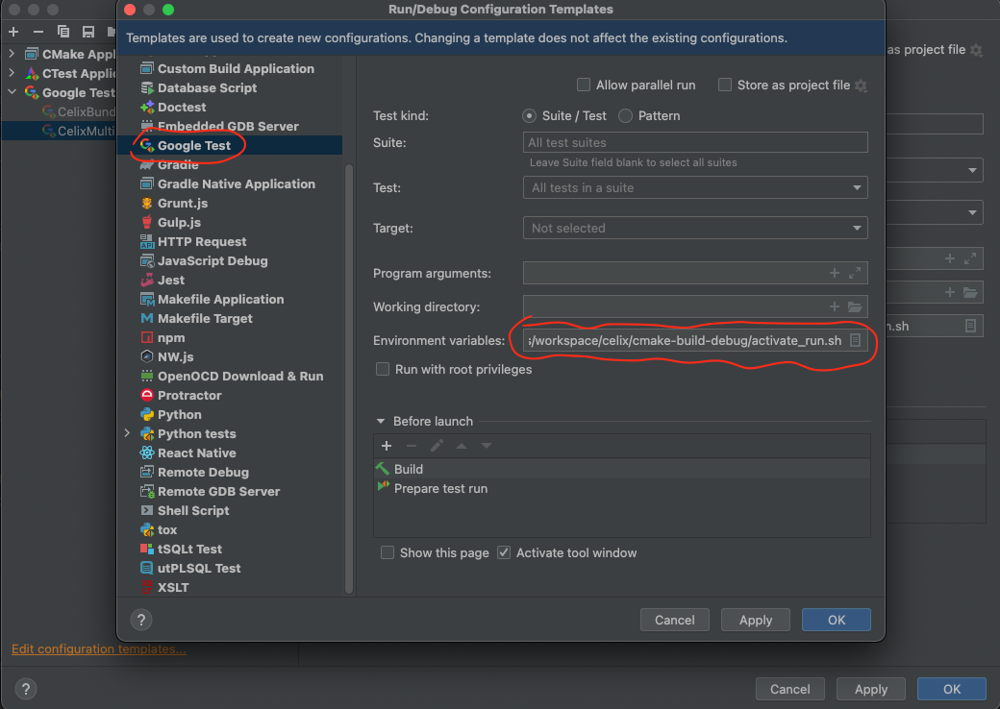

---

<a id="documents-c_patterns"></a>

<!-- source_url: https://celix.apache.org/docs/2.4.0/celix/documents/c_patterns.html -->

<!-- page_index: 3 -->

# Apache Celix C Patterns

[Edit on GitHub](https://github.com/apache/celix/edit/master/documents/c_patterns.md "Edit this page on GitHub")
[<< back to documentation](#docs-2.4.0-docs "back to documentation")
<a id="documents-c_patterns--apache-celix-c-patterns"></a>

# Apache Celix C Patterns

The core of Apache Celix is written in C, as C can serve as a common denominator for many languages. However, C lacks
the concept of classes and objects, scope-based resource management - for concepts like RAII -, and other modern C++
features. To somewhat overcome this, Apache Celix employs several patterns.

It’s important to note that ideally, all Apache Celix C code follows the patterns described in this section, but this
isn’t always the case. Particularly, older code may not always adhere to these patterns.

<a id="documents-c_patterns--apache-celix-c-objects"></a>

## Apache Celix C Objects

The first pattern is the Apache Celix C object pattern. This pattern is used to create, destroy, and manage objects in
a C manner. A C object is implemented using an opaque pointer to a struct, which contains object details invisible to
the object’s user. The C object should provide C functions to create, destroy, and manipulate the object.

The naming scheme used for the object struct is `<celix_object_name>`, typically with a typedef to
`<celix_object_name>_t`. For the object functions, the following naming scheme is
used: `<celix_objectName>_<functionName>`. Note the camelCase for the object name and function name.

An Apache Celix C object should always have a constructor and a destructor. If memory allocation is involved, a `celix_<objectName>_create` function is used to create and return a new object, and a `celix_<objectName>_destroy`
function is used to destroy the object and free the object’s memory. Otherwise, use a `celix_<objectName>_init` function
with `celix_status_t` return value to initialize the object’s provided memory and use a `celix_<objectName>_deinit`
function to deinitialize the object. The `celix_<objectName>_deinit` function should not free the object’s memory.

An Apache Celix C object can also have additional functions to access object information or to manipulate the object.
If an object contains properties, it should provide a getter and setter function for each property.

<a id="documents-c_patterns--apache-celix-c-container-types"></a>

## Apache Celix C Container Types

Apache Celix provides several container types: `celix_array_list`, `celix_properties`, `celix_string_hash_map`, and `celix_long_hash_map`. Although these containers are not type-safe, they offer additional functions to handle
different element types. Refer to the header files for more information.

<a id="documents-c_patterns--apache-celix-c-scope-based-resource-management"></a>

## Apache Celix C Scope-Based Resource Management

Apache Celix offers several macros to add support for scope-based resource management (SBRM) to existing types.
These macros are inspired by [Scoped-based Resource Management for the Kernel](https://lwn.net/Articles/934838/).

The main macros used for SBRM are:

- `celix_autofree`: Automatically frees memory with `free` when the variable goes out of scope.
- `celix_auto`: Automatically calls a value-based cleanup function when the variable goes out of scope.
- `celix_autoptr`: Automatically calls a pointer-based cleanup function when the variable goes out of scope.
- `celix_steal_ptr`: Used to “steal” a pointer from a variable to prevent automatic cleanup when the variable goes
  out of scope.

These macros can be found in the Apache Celix utils headers `celix_cleanup.h` and `celix_stdlib_cleanup.h`.

In Apache Celix, C objects must opt into SBRM. This is done by using a `CELIX_DEFINE_AUTO` macro, which determines the
expected C functions to clean up the object.

<a id="documents-c_patterns--support-for-resource-allocation-is-initialization-raii-like-structures"></a>

## Support for Resource Allocation Is Initialization (RAII)-like Structures

Based on the previously mentioned SBRM, Apache Celix also offers support for structures that resemble RAII.
These can be used to guard locks, manage service registration, etc. These guards should follow the naming convention
`celix_<obj_to_guard>_guard_t`. Support for RAII-like structures is facilitated by providing
additional cleanup functions that work with either the `celix_auto` or `celix_autoptr` macros.

Examples include:

- `celix_mutex_lock_guard_t`
- `celix_service_registration_guard_t`

Special effort is made to ensure that these constructs do not require additional allocation and should provide minimal
to no additional overhead.

<a id="documents-c_patterns--polymorphism-in-apache-celix"></a>

## Polymorphism in Apache Celix

It’s worth mentioning that the above-mentioned patterns and additions do not add support for polymorphism.
Although this could be a welcome addition, Apache Celix primarily handles polymorphism through the use of services, both for itself and its users. Refer to the “Apache Celix Services” section for more information.

---

<a id="documents-bundles"></a>

<!-- source_url: https://celix.apache.org/docs/2.4.0/celix/documents/bundles.html -->

<!-- page_index: 4 -->

# Apache Celix Bundles

[Edit on GitHub](https://github.com/apache/celix/edit/master/documents/bundles.md "Edit this page on GitHub")
[<< back to documentation](#docs-2.4.0-docs "back to documentation")
<a id="documents-bundles--apache-celix-bundles"></a>

# Apache Celix Bundles

An Apache Celix Bundle contains a collection of shared libraries, configuration files and optional
an activation entry combined in a zip file. Bundles can be dynamically installed and started in an Apache Celix framework.

<a id="documents-bundles--the-anatomy-of-a-celix-bundle"></a>

## The anatomy of a Celix Bundle

Technically an Apache Celix Bundle is a zip file with the following content:

- META-INF/MANIFEST.MF: The required bundle manifest, containing information about the bundle (name, activator library etc)
- Bundle shared libraries (so/dylib files): Optionally a bundle has 1 or more shared libraries.
  The bundle manifest configures which libraries will be loaded (private libs) and which - if any - library is used
  when activating the bundle.
- Bundle resource files: A bundle can also contain additional resource files.
  This could be configuration files, html files, etc.
  It is also possible to have bundles which no shared library, but only resource files.
  Note that bundles can access other bundles resources files.

If a `jar` command is available the Celix CMake commands will use that (instead of the `zip` command) to create bundle
zip files so that the MANIFEST.MF is always the first entry in the zip file.

```bash
#unpacking celix_shell_wui.zip bundle file from a cmake build `cmake-build-debug`.
#The celix_shell_wui.zip file is the Celix Shell Web UI bundle. Which provides a web ui interface to the Celix 
#interactive shell; It contains a manifest file, shared libraries, and additional web resources 
#which can be picked up by the `Celix::http_admin` bundle. 
% unzip cmake-build-debug/bundles/shell/shell_wui/celix_shell_wui.zip -d unpacked_bundle_dir
% find unpacked_bundle_dir unpacked_bundle_dir unpacked_bundle_dir/resources unpacked_bundle_dir/resources/index.html unpacked_bundle_dir/resources/ansi_up.js unpacked_bundle_dir/resources/script.js unpacked_bundle_dir/META-INF unpacked_bundle_dir/META-INF/MANIFEST.MF unpacked_bundle_dir/libcivetweb_shared.so #or dylib for OSX unpacked_bundle_dir/libshell_wui.1.so #or dylib for OSX
```

<a id="documents-bundles--bundle-lifecycle"></a>

## Bundle lifecycle

An Apache Celix Bundle has its own lifecycle with the following states:

- Installed - The bundle has been installed into the Celix framework, but it is not yet resolved. For Celix this
  currently means that not all bundle libraries can or have been loaded.
- Resolved - The bundle is installed and its requirements have been met. For Celix this currently means that the
  bundle libraries have been loaded.
- Starting - Starting is a temporary state while the bundle activator’s create and start callbacks are being executed.
- Active - The bundle is active.
- Stopping - Stopping is a temporary state while the bundle activator stop and destroy callbacks are being executed.
- Uninstalled - The bundle has been removed from the Celix framework.

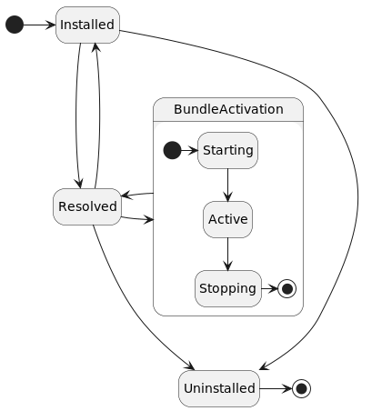

<a id="documents-bundles--bundle-activation"></a>

## Bundle activation

Bundles can be installed and started dynamically. When a bundle is started it will be activated by looking up the bundle
activator entry points (using `dlsym`). The entry points signatures are:

- `celix_status_t celix_bundleActivator_create(celix_bundle_context_t *ctx, void **userData)`:
  Called to create the bundle activator.
- `celix_status_t celix_bundleActivator_start(void *userData, celix_bundle_context_t *ctx)`:
  Called to start the bundle.
- `celix_status_t celix_bundleActivator_stop(void *userData, celix_bundle_context_t *ctx)`:
  Called to stop the bundle.
- `celix_status_t celix_bundleActivator_destroy(void *userData, celix_bundle_context_t* ctx)`:
  Called to destroy (free mem) the bundle activator.

The most convenient way to create a bundle activator in C is to use the macro `CELIX_GEN_BUNDLE_ACTIVATOR` defined in
`celix_bundle_activator.h`. This macro requires two functions (start,stop), these function can be `static` and
use a typed bundle activator struct instead of `void*`.

For C++, the macro `CELIX_GEN_CXX_BUNDLE_ACTIVATOR` defined in `celix/BundleActivator.h` must be used to create a
bundle activator. For C++ a RAII approach is used for bundle activation.
This means that a C++ bundle is started by creating a bundle activator object and stopped by
letting the bundle activator object go out of scope.

<a id="documents-bundles--bundle-and-bundle-context"></a>

## Bundle and Bundle Context

A bundle can interact with the Apache Celix framework using a bundle execution context or bundle context in short.
The bundle context provides functions/methods to:

- Register and un-register services.
- Install, start, stop or uninstall bundles.
- Track for service being added or removed.
- Track for bundles being installed, started, stopped or uninstalled.
- Track for service tracker being started or stopped
- Find service ids for a given filter.
- Use services directly (without manually creating a service tracker).
- Use bundles directly (without manually creating a bundle tracker).
- Wait for events in the Apache Celix event thread.
- Retrieve framework property values.
- Retrieve the bundle object associated with the bundle context.

<a id="documents-bundles--hello-world-bundle-example"></a>

## Hello World Bundle Example

The hello world bundle example is a simple example which print a “Hello world” and “Goodbye world” line when
starting / stopping the bundle.

Knowledge about C, C++ and CMake is expected to understand the examples.

The C and C++ examples exists of a single source file which contains the bundle activator and some Apache Celix
CMake commands to create a bundle and a container.

Both containers example uses 3 bundles: the Apache Celix Shell bundle, the Apache Celix Shell Textual UI bundle
and the Hello World bundle. The Apache Celix Shell bundle provides a set of interactive shell commands and the
Apache Celix Shell Textual UI bundle can be used to run these command from a console terminal.

When the C or C++ Hello World bundle example container is started, the following commands can be used to dynamically
stop and start the Hello World bundle.

```bash
stop 3 #Stopping the Hello World bundle. Note that the Hello World is the third bundle, so it will get a bundle id 3.
start 3 #Starting the Hello World bundle again.
uninstall 3 #Stoping and uninstalling the Hello World bundle.
stop 0 #stop the Apache Celix framework
```

The see what other Apache Celix shell commands are available run the `celix::help` command:

```bash
help #note can also be triggered with celix::help (the fully qualified command name). 
help celix::start 
help celix::lb
stop 0 #stop the Apache Celix framework
```

<a id="documents-bundles--c-example"></a>

### C Example

```C
//src/my_bundle_activator.c
#include <stdio.h>
#include <celix_bundle_activator.h>

typedef struct my_bundle_activator_data {
    /*the hello world bundle activator struct is empty*/
} my_bundle_activator_data_t;

void myBundle_helloWorld(celix_bundle_context_t* ctx) {
    printf("Hello world from bundle with id %li\n", celix_bundleContext_getBundleId(ctx));
}

void myBundle_goodbyeWorld(celix_bundle_context_t* ctx) {
    printf("Goodbye world from bundle with id %li\n", celix_bundleContext_getBundleId(ctx));
}

static celix_status_t myBundle_start(my_bundle_activator_data_t *data CELIX_UNUSED, celix_bundle_context_t *ctx CELIX_UNUSED) {
    myBundle_helloWorld(ctx);
    return CELIX_SUCCESS;
}

static celix_status_t myBundle_stop(my_bundle_activator_data_t *data CELIX_UNUSED, celix_bundle_context_t *ctx CELIX_UNUSED) {
    myBundle_goodbyeWorld(ctx);
    return CELIX_SUCCESS;
}

CELIX_GEN_BUNDLE_ACTIVATOR(my_bundle_activator_data_t, myBundle_start, myBundle_stop)
```

```CMake
#CMakeLists.txt
find_package(Celix REQUIRED)

#With `make all`, `make celix-bundles` this bundle will be created at:
#  ${CMAKE_CURRENT_BINARY_DIR}/my_bundle.zip.
add_celix_bundle(my_bundle
    VERSION 1.0.0 
    SOURCES src/my_bundle_activator.c
)

#With `make all`, `make celix-containers` or `make my_container` this Apache Celix container executable will be created at:
# ${CMAKE_BINARY_DIR}/deploy/my_container/my_container
add_celix_container(my_container
    C
    BUNDLES
        Celix::shell
        Celix::shell_tui
        my_bundle
)
```

<a id="documents-bundles--c-example-1"></a>
<a id="documents-bundles--c-example-2"></a>

### C++ Example

```C++
//src/MyBundleActivator.cc
#include <iostream>
#include "celix/BundleActivator.h"

class MyBundleActivator {
public:
    explicit MyBundleActivator(const std::shared_ptr<celix::BundleContext>& ctx) {
        std::cout << "Hello world from bundle with id " << ctx->getBundleId() << std::endl;
    }

    ~MyBundleActivator() noexcept {
        std::cout << "Goodbye world" << std::endl;
    }
};

CELIX_GEN_CXX_BUNDLE_ACTIVATOR(MyBundleActivator)
```

```CMake
#CMakeLists.txt
find_package(Celix REQUIRED)

#With `make all`, `make celix-bundles` this bundle will be created at:
#  ${CMAKE_CURRENT_BINARY_DIR}/MyBundle.zip.
add_celix_bundle(MyBundle
    SOURCES src/MyBundleActivator.cc
)

#With `make all`, `make celix-containers` or `make MyContainer` this Apache Celix container executable will be created at:
# ${CMAKE_BINARY_DIR}/deploy/my_container/MyContainer
add_celix_container(MyContainer
    CXX
    BUNDLES
        Celix::ShellCxx
        Celix::shell_tui
        MyBundle
)
```

<a id="documents-bundles--interaction-between-bundles"></a>

## Interaction between bundles

By design bundles cannot directly access the symbols of another bundle. Interaction between bundles must be done using
Apache Celix services. This means that unless functionality is provided by means of an Apache Celix service, bundle functionality is private to the bundle.
In Apache Celix symbols are kept private by loading bundle libraries locally (`dlopen` with `RTLD_LOCAL`).

<a id="documents-bundles--bundle-symbol-visibility"></a>

## Bundle symbol visibility

Since bundles are unable to directly access the symbols of another bundle, the default symbol visibility preset for the
bundle activator library is set to hidden. To modify this, supply the `DO_NOT_CONFIGURE_SYMBOL_VISIBILITY` option within the
`add_celix_bundle` CMake function call.

Hiding symbols for a bundle offers several advantages, including:

- Reduced bundle library size;
- Faster link-time and load-time;
- Lower memory usage;
- Enhanced optimization possibilities.

However, one drawback can be that debugging a bundle becomes more difficult, particularly when not using the -g
compiler flag.

It’s important to note that exporting service symbols isn’t necessary when utilizing and invoking C and C++ services
from another bundle. For C++, this only applies when the provided services are based on a C++ header-only interface, while for C, this is always the case since C service structs don’t produce any symbols.

The bundle activator symbols (create, start, stop, and destroy) must be exported as they are invoked by the
Apache Celix framework. For this reason, the bundle activator functions in `celix_bundle_activator.h` are marked for
export.

<a id="documents-bundles--example-of-disabling-hiding-of-symbols-for-a-bundle"></a>

### Example of disabling hiding of symbols for a bundle

```CMake
add_celix_bundle(my_bundle_do_not_hide_symbols
    VERSION 1.0.0
    SOURCES src/my_bundle_activator.c
    DO_NOT_CONFIGURE_SYMBOL_VISIBILITY
)
```

<a id="documents-bundles--installing-bundles"></a>

## Installing bundles

Apache Celix bundles can be installed on the system with the Apache Celix CMake command `install_celix_bundle`.
Bundles will be installed as zip files in the package (default the CMAKE\_PROJECT\_NAME) share directory
(e.g `/use/share/celix/bundles`).

It is also possible to use Apache Celix bundles as CMake imported targets, but this requires a more complex
CMake installation setup.

<a id="documents-bundles--installing-apache-celix-cmake-targets"></a>

## Installing Apache Celix CMake targets

The `install_celix_targets` can be used to generate a CMake file with the imported Apache Celix Bundle CMake targets
and this is ideally coupled with a CMake config file so that the bundles are made available when
CMake’s `find_package` is used.

Example:

```CMake
#Project setup
project(ExamplePackage C CXX)
find_package(Celix REQUIRED)

#Create bundles
add_celix_bundle(ExampleBundleA ...)
add_celix_bundle(ExampleBundleB ...)

#Install bundle zips
install_celix_bundle(ExampleBundleA EXPORT MyExport)
install_celix_bundle(ExampleBundleB EXPORT MyExport)
#install exported Apache Celix CMake targets
install_celix_targets(MyExport NAMESPACE ExamplePackage:: DESTINATION share/ExamplePackage/cmake FILE CelixTargets)

#Install Package CMake configuration
file(GENERATE OUTPUT ${CMAKE_BINARY_DIR}/ExamplePackageConfig.cmake CONTENT "
  # relative install dir from lib/CMake/ExamplePackage.
  get_filename_component(EXAMPLE_PACKAGE_REL_INSTALL_DIR "${CMAKE_CURRENT_LIST_FILE}" PATH)
  get_filename_component(EXAMPLE_PACKAGE_REL_INSTALL_DIR "${EXAMPLE_PACKAGE_REL_INSTALL_DIR}" PATH)
  get_filename_component(EXAMPLE_PACKAGE_REL_INSTALL_DIR "${EXAMPLE_PACKAGE_REL_INSTALL_DIR}" PATH)
  get_filename_component(EXAMPLE_PACKAGE_REL_INSTALL_DIR "${EXAMPLE_PACKAGE_REL_INSTALL_DIR}" PATH)
  include(${EXAMPLE_PACKAGE_REL_INSTALL_DIR}/share/celix/cmake/CelixTargets.cmake)
")

install(FILES
  ${CMAKE_BINARY_DIR}/ExamplePackageConfig.cmake
  DESTINATION ${CMAKE_INSTALL_LIBDIR}/cmake/ExamplePackage)
```

Downstream Usage Example:

```CMake
project(UsageExample C CXX)
find_package(Celix REQUIRED)
find_package(ExamplePackage REQUIRED)
add_celix_container(test_container BUNDLES
  Celix::shell
  Celix::shell_tui
  ExamplePackage::ExampleBundleA
  ExamplePackage::ExampleBundleB
)
```

See [Apache Celix CMake Commands](#documents-cmake_commands-readme) for more detailed information.

<a id="documents-bundles--the-celixlb-shell-command"></a>
<a id="documents-bundles--the-celix::lb-shell-command"></a>

# The `celix::lb` shell command

To interactively see the installed bundles the `celix::lb` shell command (list bundles) can be used.

Examples of supported `lb` command lines are:

- `celix::lb` - Show an overview of the installed bundles with their bundle id, bundle state, bundle name and
  bundle group.
- `lb` - Same as `celix::lb` (as long as there is no colliding other `lb` commands).
- `lb -s` - Same as `celix::lb` but instead of showing the bundle name the bundle symbolic name is printed.
- `lb -u` - Same as `celix::lb` but instead of showing the bundle name the bundle update location is printed.

---

<a id="documents-services"></a>

<!-- source_url: https://celix.apache.org/docs/2.4.0/celix/documents/services.html -->

<!-- page_index: 5 -->

# Apache Celix Services

[Edit on GitHub](https://github.com/apache/celix/edit/master/documents/services.md "Edit this page on GitHub")
[<< back to documentation](#docs-2.4.0-docs "back to documentation")
<a id="documents-services--apache-celix-services"></a>

# Apache Celix Services

An Apache Celix Service is a pointer registered to the Celix framework under a set of properties (metadata).
Services can be dynamically registered into and looked up from the Apache Celix framework.

By convention a C service in Apache Celix is a pointer to struct of function pointers and a C++ service is a pointer
(which can be provided as a `std::shared_ptr`) to an object implementing a (pure) abstract class.

A service is always registered under a service name and this service name is also used to lookup services.
For C the service name must be provided by the user and for C++ the service name can be provided by the user.
If for C++ no service name is provided the service name will be inferred based on the service template argument using
`celix::typeName<I>`.

Note that the service name is represented in the service properties under the property name `objectClass`, this is inherited for the Java OSGi specification.
Also note that for Celix - in contrast with Java OSGi - it is only possible to register a single interface
per service registration in the Apache Celix Framework. This restriction was added because C does not
(natively) supports multiple interfaces (struct with function pointers) on a single object/pointer.

<a id="documents-services--a-c-service-example"></a>

## A C service example

As mentioned an Apache Celix C service is a registered pointer to a struct with function pointers.
This struct ideally contains a handle pointer, a set of function pointers and should be well documented to
form a well-defined service contract.

A simple example of an Apache Celix C service is a shell command service.
For C, the shell command header looks like:

```C
//celix_shell_command.h
...
#define CELIX_SHELL_COMMAND_NAME                "command.name"
#define CELIX_SHELL_COMMAND_USAGE               "command.usage"
#define CELIX_SHELL_COMMAND_DESCRIPTION         "command.description"

#define  CELIX_SHELL_COMMAND_SERVICE_NAME       "celix_shell_command"
#define  CELIX_SHELL_COMMAND_SERVICE_VERSION    "1.0.0"

typedef struct celix_shell_command celix_shell_command_t;

/**
 * The shell command can be used to register additional shell commands.
 * This service should be registered with the following properties:
 *  - command.name: mandatory, name of the command e.g. 'lb'
 *  - command.usage: optional, string describing how tu use the command e.g. 'lb [-l | -s | -u]'
 *  - command.description: optional, string describing the command e.g. 'list bundles.'
 */
struct celix_shell_command {
    void *handle;

    /**
     * Calls the shell command.
     * @param handle        The shell command handle.
     * @param commandLine   The complete provided cmd line (e.g. for a 'stop' command -> 'stop 42')
     * @param outStream     The output stream, to use for printing normal flow info.
     * @param errorStream   The error stream, to use for printing error flow info.
     * @return              Whether a command is successfully executed.
     */
    bool (*executeCommand)(void *handle, const char *commandLine, FILE *outStream, FILE *errorStream);
};
```

The service struct is documented, explains which service properties needs to be provided, contains a handle pointer and
a `executeCommand` function pointer.

The `handle` field and the `handle` function argument should function as an opaque instance (`this` / `self`) handle
and generally is unique for every service instance. Users of the service should forward the handle field when calling
a service function, e.g.:

```C
celix_shell_command_t* command = ...;
command->executeCommand(command->handle, "test 123", stdout, stderr);
```

<a id="documents-services--a-c-service-example-1"></a>
<a id="documents-services--a-c-service-example-2"></a>

## A C++ service example

As mentioned an Apache Celix C++ service is a registered pointer to an object implementing an abstract class.
The service class ideally should be well documented to form a well-defined service contract.

A simple example of an Apache Celix C++ service is a C++ shell command.
For C++, the shell command header looks like:

```C++
//celix/IShellCommand.h
...
namespace celix {

    /**
     * The shell command interface can be used to register additional Celix shell commands.
     * This service should be registered with the following properties:
     *  - name: mandatory, name of the command e.g. 'celix::lb'
     *  - usage: optional, string describing how tu use the command e.g. 'celix::lb [-l | -s | -u]'
     *  - description: optional, string describing the command e.g. 'list bundles.'
     */
    class IShellCommand {
    public:
        /**
         * The required name of the shell command service (service property)
         */
        static constexpr const char * const COMMAND_NAME = "name";

        /**
         * The optional usage text of the shell command service (service property)
         */
        static constexpr const char * const COMMAND_USAGE = "usage";

        /**
         * The optional description text of the shell command service (service property)
         */
        static constexpr const char * const COMMAND_DESCRIPTION = "description";

        virtual ~IShellCommand() = default;

        /**
         * Calls the shell command.
         * @param commandLine   The complete provided command line (e.g. for a 'stop' command -> 'stop 42'). Only valid during the call.
         * @param commandArgs   A list of the arguments for the command (e.g. for a "stop 42 43" commandLine -> {"42", "43"}). Only valid during the call.
         * @param outStream     The C output stream, to use for printing normal flow info.
         * @param errorStream   The C error stream, to use for printing error flow info.
         * @return              Whether the command has been executed correctly.
         */
        virtual void executeCommand(const std::string& commandLine, const std::vector<std::string>& commandArgs, FILE* outStream, FILE* errorStream) = 0;
    };
}
```

As with the C shell command struct, the C++ service class is documented and explains which service properties needs to
be provided. The `handle` construct is not needed for C++ services and using a C++ service function is just the same
as calling a function member of any C++ object.

<a id="documents-services--impact-of-dynamic-services"></a>

## Impact of dynamic services

Services in Apache Celix are dynamic, meaning that they can come and go at any moment.
This makes it possible to create emerging functionality based on the coming and going of Celix services.
How to cope with this dynamic behaviour is critical for creating a stable solution.

For Java OSGi this is already a challenge to program correctly, but less critical because generally speaking the
garbage collector will arrange that objects still exists even if the providing bundle is un-installed.
Taking into account that C and C++ has no garbage collection, handling the dynamic behaviour correctly is
more critical; If a bundle providing a certain service is removed, the code segment / memory allocated for
that service will also be removed / deallocated.

Apache Celix has several mechanisms for dealing with this dynamic behaviour:

- A built-in abstraction to use services with callbacks function where the Celix framework ensures the services
  are not removed during callback execution.
- Service trackers which ensure that service can only complete their un-registration when all service
  remove callbacks have been processed.
- Components with declarative service dependency so that a component life cycle is coupled with the availability of
  service dependencies. See the components’ documentation section for more information about components.
- The Celix framework will handle all service registration/un-registration events and the starting/stopping of trackers
  on the Celix event thread to ensure that only 1 event can be processed per time and that callbacks for service
  registration and service tracker are always called from the same thread.
- Service registration, service un-registration, starting trackers and closing trackers can be done async.

<a id="documents-services--registering-and-un-registering-services"></a>

## Registering and un-registering services

Service registration and un-registration in Celix can be done synchronized or asynchronized and although
(un-)registering services synchronized is more inline with the OSGi spec, (un-)registering is preferred for Celix.

When registering a service synchronized, the service registration event and all events resulting from the service
registration are handled; in practice this means that when a synchronized service registration returns all bundles
are aware of the new service and if needed have updated their administration accordingly.

Synchronized service (un-)registration can lead to problems if for example another service registration event is
triggered on the handling of the current service registration events.
In that case normal mutexes are not always enough and reference counting or recursive mutexes are needed.
reference counting can be complex to handle (especially in C) and recursive mutexes are arguable a bad idea.

Interestingly for Java the use of `synchronized` is recursive and as result this seems te be smaller issue with Java.

When registering a service asynchronized, the service properties and specifically the `service.id` property will be
finalized when the service registration call returns. The actual service registration event will be done asynchronized
by the Celix event thread and this can be done before or after the service registration call returns.

To register a service asynchronized the following C functions / C++ methods can be used:

- `celix_bundleContext_registerServiceAsync`.
- `celix_bundleContext_registerServiceWithOptionsAsync`.
- `celix::BundleContext::registerService`.
- `celix::BundleContext::registerUnmanagedService`.

To register a service synchronized the following C functions / C++ methods can be used:

- `celix_bundleContext_registerService`.
- `celix_bundleContext_registerServiceWithOptions`.
- `celix::BundleContext::registerService`, use `celix::ServiceRegistrationBuilder::setRegisterAsync` to configure
  registration synchronized because the default is asynchronized.
- `celix::BundleContext::registerUnmanagedService`, use `celix::ServiceRegistrationBuilder::setRegisterAsync`
  to configure registration synchronized because the default is asynchronized.

To unregister a service asynchronized the following C function can be used:

- `celix_bundleContext_unregisterServiceAsync`.

And to unregister a service synchronized the following C function can be used:

- `celix_bundleContext_unregisterService`.

For C++ a service un-registration happens when its corresponding `celix::ServiceRegistration` object goes out of
scope. A C++ service can be configured for synchronized un-registration using ServiceRegistrationBuilder, specifically:

- `celix::ServiceRegistrationBuilder::setUnregisterAsync`. The default is asynchronized.

<a id="documents-services--example-register-a-service-in-c"></a>
<a id="documents-services--example:-register-a-service-in-c"></a>

### Example: Register a service in C

```C
//src/my_shell_command_provider_bundle_activator.c
#include <celix_bundle_activator.h>
#include <celix_shell_command.h>

typedef struct my_shell_command_provider_activator_data {
    celix_bundle_context_t* ctx;
    celix_shell_command_t shellCmdSvc;
    long shellCmdSvcId;
} my_shell_command_provider_activator_data_t;

static bool my_shell_command_executeCommand(void *handle, const char *commandLine, FILE *outStream, FILE *errorStream CELIX_UNUSED) {
    my_shell_command_provider_activator_data_t* data = handle;
    celix_bundle_t* bnd = celix_bundleContext_getBundle(data->ctx);
    fprintf(outStream, "Hello from bundle %s with command line '%s'\n", celix_bundle_getName(bnd), commandLine);
    return true;
}

static celix_status_t my_shell_command_provider_bundle_start(my_shell_command_provider_activator_data_t *data, celix_bundle_context_t *ctx) {
    data->ctx = ctx;
    data->shellCmdSvc.handle = data;
    data->shellCmdSvc.executeCommand = my_shell_command_executeCommand;
    
    celix_properties_t* props = celix_properties_create();
    celix_properties_set(props, CELIX_SHELL_COMMAND_NAME, "my_command");
    
    data->shellCmdSvcId = celix_bundleContext_registerServiceAsync(ctx, &data->shellCmdSvc, CELIX_SHELL_COMMAND_SERVICE_NAME, props);
    return CELIX_SUCCESS;
}

static celix_status_t my_shell_command_provider_bundle_stop(my_shell_command_provider_activator_data_t *data, celix_bundle_context_t *ctx) {
    celix_bundleContext_unregisterServiceAsync(ctx, data->shellCmdSvcId, NULL, NULL);
    return CELIX_SUCCESS;
}

CELIX_GEN_BUNDLE_ACTIVATOR(my_shell_command_provider_activator_data_t, my_shell_command_provider_bundle_start, my_shell_command_provider_bundle_stop)
```

<a id="documents-services--example-register-a-c-service-in-c"></a>
<a id="documents-services--example:-register-a-c-service-in-c"></a>

### Example: Register a C++ service in C++

```C++
//src/MyShellCommandBundleActivator.cc
#include <celix/BundleActivator.h>
#include <celix/IShellCommand.h>

class MyCommand : public celix::IShellCommand {
public:
    explicit MyCommand(std::string_view _name) : name{_name} {}

    ~MyCommand() noexcept override = default;

    void executeCommand(
            const std::string& commandLine,
            const std::vector<std::string>& /*commandArgs*/,
            FILE* outStream,
            FILE* /*errorStream*/) override {
        fprintf(outStream, "Hello from bundle %s with command line '%s'\n", name.c_str(), commandLine.c_str());
    }
private:
    const std::string name;
};

class MyShellCommandProviderBundleActivator {
public:
    explicit MyShellCommandProviderBundleActivator(const std::shared_ptr<celix::BundleContext>& ctx) {
        auto svcObject = std::make_shared<MyCommand>(ctx->getBundle().getName());
        cmdShellRegistration = ctx->registerService<celix::IShellCommand>(std::move(svcObject))
                .addProperty(celix::IShellCommand::COMMAND_NAME, "MyCommand")
                .build();
    }

    ~MyShellCommandProvider() noexcept = default;
private:
    //NOTE when celix::ServiceRegistration goes out of scope the underlining service will be un-registered
    std::shared_ptr<celix::ServiceRegistration> cmdShellRegistration{};
};

CELIX_GEN_CXX_BUNDLE_ACTIVATOR(MyShellCommandProviderBundleActivator)
```

<a id="documents-services--example-register-a-c-service-in-c-1"></a>
<a id="documents-services--example:-register-a-c-service-in-c-2"></a>

### Example: Register a C service in C++

```C++
//src/MyCShellCommandProviderBundleActivator.cc
#include <celix/BundleActivator.h>
#include <celix_shell_command.h>

struct MyCShellCommand : public celix_shell_command {
    explicit MyCShellCommand(std::shared_ptr<celix::BundleContext> _ctx) : celix_shell_command(), ctx{std::move(_ctx)} {
        handle = this;
        executeCommand = [] (void *handle, const char* commandLine, FILE* outStream, FILE* /*errorStream*/) -> bool {
            auto* cmdProvider = static_cast<MyCShellCommand*>(handle);
            fprintf(outStream, "Hello from bundle %s with command line '%s'\n", cmdProvider->ctx->getBundle().getName().c_str(), commandLine);
            return true;
        };
    }

    const std::shared_ptr<celix::BundleContext> ctx;
};

class MyCShellCommandProviderBundleActivator {
public:
    explicit MyCShellCommandProviderBundleActivator(const std::shared_ptr<celix::BundleContext>&  ctx) {
        auto shellCmd = std::make_shared<MyCShellCommand>(ctx);
        cmdShellRegistration = ctx->registerService<celix_shell_command>(std::move(shell.html), CELIX_SHELL_COMMAND_SERVICE_NAME)
                .addProperty(CELIX_SHELL_COMMAND_NAME, "MyCCommand")
                .setUnregisterAsync(false)
                .build();
    }
private:
    //NOTE when celix::ServiceRegistration goes out of scope the underlining service will be un-registered
    std::shared_ptr<celix::ServiceRegistration> cmdShellRegistration{};
};

CELIX_GEN_CXX_BUNDLE_ACTIVATOR(MyCShellCommandProviderBundleActivator)
```

<a id="documents-services--sequence-diagrams-for-service-registration"></a>

### Sequence diagrams for service registration

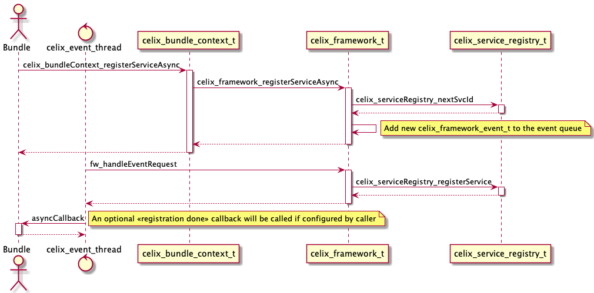
*An asynchronized service registration*

---

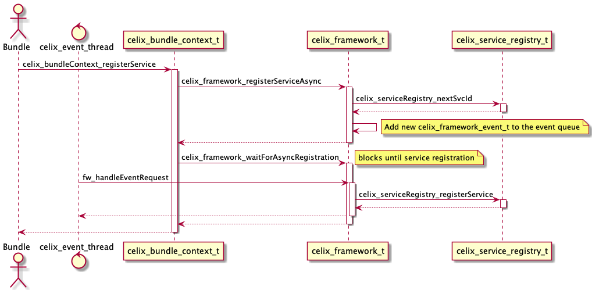
*A synchronized service registration*

---

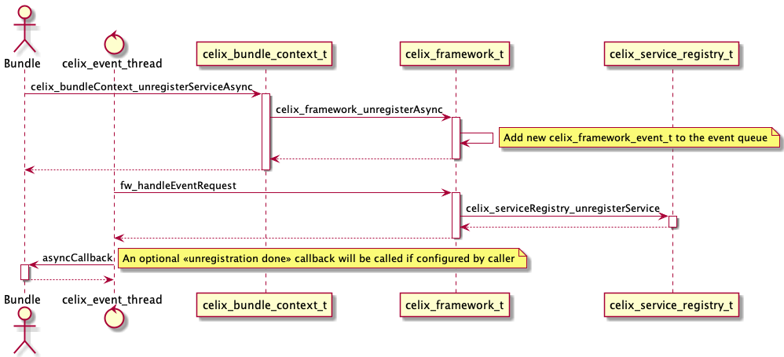
*An asynchronized service un-registration*

---

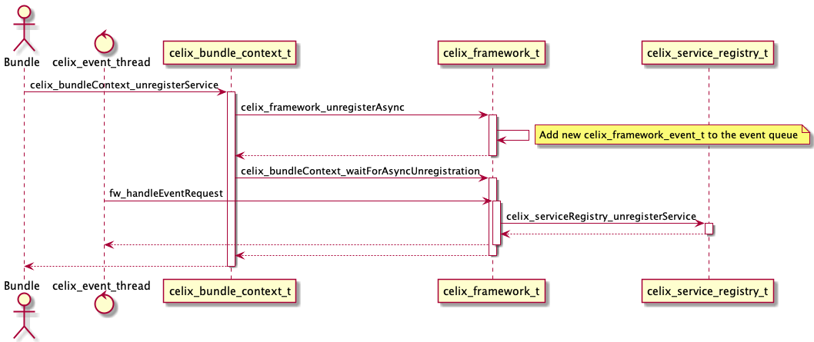
*A synchronized service un-registration*

<a id="documents-services--using-services"></a>

## Using services

Services can be used directly using the bundle context C functions or C++ methods:

- `celix_bundleContext_useServiceWithId`
- `celix_bundleContext_useService`
- `celix_bundleContext_useServices`
- `celix_bundleContext_useServiceWithOptions`
- `celix_bundleContext_useServicesWithOptions`
- `celix::BundleContext::useService`
- `celix::BundleContext::useServices`

These functions and methods work by providing a callback function which will be called by the Celix framework with the
matching service or services.
when a “use service” function/method returns the callback function can can be safely deallocated.
A “use service” function/method return value will indicate if a matching service is found or how many matching services
are found.

The Celix framework provides service usage through callbacks - instead of directly return a service pointer -
to ensure that services are prevented from removal while the services are still in use without forwarding
this responsibility to the user; i.e. by adding an api to “lock” and “unlock” services for usage.

<a id="documents-services--example-using-a-service-in-c"></a>
<a id="documents-services--example:-using-a-service-in-c"></a>

### Example: Using a service in C

```C
#include <stdio.h>
#include <celix_bundle_activator.h>
#include <celix_shell_command.h>

typedef struct use_command_service_example_data {
    //nop
} use_command_service_example_data_t;

static void useShellCommandCallback(void *handle CELIX_UNUSED, void *svc) {
    celix_shell_command_t* cmdSvc = (celix_shell_command_t*)svc;
    cmdSvc->executeCommand(cmdSvc->handle, "my_command test call from C", stdout, stderr);
}

static celix_status_t use_command_service_example_start(use_command_service_example_data_t *data CELIX_UNUSED, celix_bundle_context_t *ctx) {
    celix_service_use_options_t opts = CELIX_EMPTY_SERVICE_USE_OPTIONS;
    opts.callbackHandle = NULL;
    opts.use = useShellCommandCallback;
    opts.filter.serviceName = CELIX_SHELL_COMMAND_SERVICE_NAME;
    opts.filter.filter = "(command.name=my_command)";
    bool called = celix_bundleContext_useServicesWithOptions(ctx, &opts);
    if (!called) {
        fprintf(stderr, "%s: Command service not called!\n", __PRETTY_FUNCTION__);
    }
    return CELIX_SUCCESS;
}

static celix_status_t use_command_service_example_stop(use_command_service_example_data_t *data CELIX_UNUSED, celix_bundle_context_t *ctx CELIX_UNUSED) {
    return CELIX_SUCCESS;
}

CELIX_GEN_BUNDLE_ACTIVATOR(use_command_service_example_data_t, use_command_service_example_start, use_command_service_example_stop)
```

<a id="documents-services--example-using-a-service-in-c-1"></a>
<a id="documents-services--example:-using-a-service-in-c-2"></a>

### Example: Using a service in C++

```C++
//src/UsingCommandServicesExample.cc
#include <celix/IShellCommand.h>
#include <celix/BundleActivator.h>
#include <celix_shell_command.h>

static void useCxxShellCommand(const std::shared_ptr<celix::BundleContext>& ctx) {
    auto called = ctx->useService<celix::IShellCommand>()
            .setFilter("(name=MyCommand)")
            .addUseCallback([](celix::IShellCommand& cmdSvc) {
                cmdSvc.executeCommand("MyCommand test call from C++", {}, stdout, stderr);
            })
            .build();
    if (!called) {
        std::cerr << __PRETTY_FUNCTION__  << ": Command service not called!" << std::endl;
    }
}

static void useCShellCommand(const std::shared_ptr<celix::BundleContext>& ctx) {
    auto calledCount = ctx->useServices<celix_shell_command>(CELIX_SHELL_COMMAND_SERVICE_NAME)
            //Note the filter should match 2 shell commands
            .setFilter("(|(command.name=MyCCommand)(command.name=my_command))") 
            .addUseCallback([](celix_shell_command& cmdSvc) {
                cmdSvc.executeCommand(cmdSvc.handle, "MyCCommand test call from C++", stdout, stderr);
            })
            .build();
    if (calledCount == 0) {
        std::cerr << __PRETTY_FUNCTION__  << ": Command service not called!" << std::endl;
    }
}

class UsingCommandServicesExample {
public:
    explicit UsingCommandServicesExample(const std::shared_ptr<celix::BundleContext>& ctx) {
        useCxxShellCommand(ctx);
        useCShellCommand(ctx);
    }

    ~UsingCommandServicesExample() noexcept = default;
};

CELIX_GEN_CXX_BUNDLE_ACTIVATOR(UsingCommandServicesExample)
```

<a id="documents-services--tracking-services"></a>

## Tracking services

To monitor the coming and going of services, a service tracker can be used. Service trackers use - user provided -
callbacks to handle matching services being added or removed. A service name and an optional LDAP filter is used
to select which services to monitor. A service name `*` can be used to match services with any service name.
When a service unregisters, the un-registration can only finish after all matching service trackers
remove callbacks are processed.

For C a service tracker can be created using the following bundle context functions:

- `celix_bundleContext_trackServicesAsync`
- `celix_bundleContext_trackServices`
- `celix_bundleContext_trackServicesWithOptionsAsync`
- `celix_bundleContext_trackServicesWithOptions`

The “track services” C functions always return a service id (long) which can be used to close and destroy the
service tracker:

- `celix_bundleContext_stopTrackerAsync`
- `celix_bundleContext_stopTracker`

For C++ a service tracker can be created using the following bundle context methods:

- `celix::BundleContext::trackServices`
- `celix::BundleContext::trackAnyServices`

The C++ methods work with a builder API and will eventually return a `std::shared_ptr<celix::ServiceTracker<I>>` object.
if the underlining ServiceTracker object goes out of scope, the service tracker will be closed and destroyed.

C++ service trackers are created and opened asynchronized, but closed synchronized.
The closing is done synchronized so that users can be sure that after a `celix::ServiceTracker::close()` call the
added callbacks will not be invoked anymore.

<a id="documents-services--example-tracking-services-in-c"></a>
<a id="documents-services--example:-tracking-services-in-c"></a>

### Example: Tracking services in C

```C
//src/track_command_services_example.c
#include <stdio.h>
#include <celix_bundle_activator.h>
#include <celix_threads.h>
#include <celix_constants.h>
#include <celix_shell_command.h>

typedef struct track_command_services_example_data {
    long trackerId;
    celix_thread_mutex_t mutex; //protects below
    celix_array_list_t* commandServices;
} track_command_services_example_data_t;


static void addShellCommandService(void* data,void* svc, const celix_properties_t * properties) {
    track_command_services_example_data_t* activatorData = data;
    celix_shell_command_t* cmdSvc = svc;

    printf("Adding command service with svc id %li\n", celix_properties_getAsLong(properties, CELIX_FRAMEWORK_SERVICE_ID, -1));
    celixThreadMutex_lock(&activatorData->mutex);
    celix_arrayList_add(activatorData->commandServices, cmdSvc);
    printf("Nr of command service found: %i\n", celix_arrayList_size(activatorData->commandServices));
    celixThreadMutex_unlock(&activatorData->mutex);
}

static void removeShellCommandService(void* data,void* svc, const celix_properties_t * properties) {
    track_command_services_example_data_t* activatorData = data;
    celix_shell_command_t* cmdSvc = svc;

    printf("Removing command service with svc id %li\n", celix_properties_getAsLong(properties, CELIX_FRAMEWORK_SERVICE_ID, -1));
    celixThreadMutex_lock(&activatorData->mutex);
    celix_arrayList_remove(activatorData->commandServices, cmdSvc);
    printf("Nr of command service found: %i\n", celix_arrayList_size(activatorData->commandServices));
    celixThreadMutex_unlock(&activatorData->mutex);
}

static celix_status_t track_command_services_example_start(track_command_services_example_data_t *data, celix_bundle_context_t *ctx) {
    celixThreadMutex_create(&data->mutex, NULL);
    data->commandServices = celix_arrayList_create();

    celix_service_tracking_options_t opts = CELIX_EMPTY_SERVICE_TRACKING_OPTIONS;
    opts.filter.serviceName = CELIX_SHELL_COMMAND_SERVICE_NAME;
    opts.filter.filter = "(command.name=my_command)";
    opts.callbackHandle = data;
    opts.addWithProperties = addShellCommandService;
    opts.removeWithProperties = removeShellCommandService;
    data->trackerId = celix_bundleContext_trackServicesWithOptionsAsync(ctx, &opts);
    return CELIX_SUCCESS;
}

static celix_status_t track_command_services_example_stop(track_command_services_example_data_t *data, celix_bundle_context_t *ctx) {
    celix_bundleContext_stopTracker(ctx, data->trackerId);
    celixThreadMutex_lock(&data->mutex);
    celix_arrayList_destroy(data->commandServices);
    celixThreadMutex_unlock(&data->mutex);
    return CELIX_SUCCESS;
}

CELIX_GEN_BUNDLE_ACTIVATOR(track_command_services_example_data_t, track_command_services_example_start, track_command_services_example_stop)
```

<a id="documents-services--example-tracking-services-in-c-1"></a>
<a id="documents-services--example:-tracking-services-in-c-2"></a>

### Example: Tracking services in C++

```C++
//src/TrackingCommandServicesExample.cc
#include <unordered_map>
#include <celix/IShellCommand.h>
#include <celix/BundleActivator.h>
#include <celix_shell_command.h>

class TrackingCommandServicesExample {
public:
    explicit TrackingCommandServicesExample(const std::shared_ptr<celix::BundleContext>& ctx) {
        //Tracking C++ IShellCommand services and filtering for services that have a "name=MyCommand" property.
        cxxCommandServiceTracker = ctx->trackServices<celix::IShellCommand>()
                .setFilter("(name=MyCommand)")
                .addAddWithPropertiesCallback([this](const auto& svc, const auto& properties) {
                    long svcId = properties->getAsLong(celix::SERVICE_ID, -1);
                    std::cout << "Adding C++ command services with svc id" << svcId << std::endl;
                    std::lock_guard lock{mutex};
                    cxxCommandServices[svcId] = svc;
                    std::cout << "Nr of C++ command services found: " << cxxCommandServices.size() << std::endl;
                })
                .addRemWithPropertiesCallback([this](const auto& /*svc*/, const auto& properties) {
                    long svcId = properties->getAsLong(celix::SERVICE_ID, -1);
                    std::cout << "Removing C++ command services with svc id " << svcId << std::endl;
                    std::lock_guard lock{mutex};
                    auto it = cxxCommandServices.find(svcId);
                    if (it != cxxCommandServices.end()) {
                        cxxCommandServices.erase(it);
                    }
                    std::cout << "Nr of C++ command services found: " << cxxCommandServices.size() << std::endl;
                })
                .build();

        //Tracking C celix_shell_command services and filtering for services that have a "command.name=MyCCommand" or
        // "command.name=my_command" property.
        cCommandServiceTracker = ctx->trackServices<celix_shell_command>()
                .setFilter("(|(command.name=MyCCommand)(command.name=my_command))")
                .addAddWithPropertiesCallback([this](const auto& svc, const auto& properties) {
                    long svcId = properties->getAsLong(celix::SERVICE_ID, -1);
                    std::cout << "Adding C command services with svc id " << svcId << std::endl;
                    std::lock_guard lock{mutex};
                    cCommandServices[svcId] = svc;
                    std::cout << "Nr of C command services found: " << cxxCommandServices.size() << std::endl;
                })
                .addRemWithPropertiesCallback([this](const auto& /*svc*/, const auto& properties) {
                    long svcId = properties->getAsLong(celix::SERVICE_ID, -1);
                    std::cout << "Removing C command services with svc id " << svcId << std::endl;
                    std::lock_guard lock{mutex};
                    auto it = cCommandServices.find(svcId);
                    if (it != cCommandServices.end()) {
                        cCommandServices.erase(it);
                    }
                    std::cout << "Nr of C command services found: " << cxxCommandServices.size() << std::endl;
                })
                .build();
    }

    ~TrackingCommandServicesExample() noexcept {
        cxxCommandServiceTracker->close();
        cCommandServiceTracker->close();
    };
private:
    std::mutex mutex; //protects cxxCommandServices and cCommandServices
    std::unordered_map<long, std::shared_ptr<celix::IShellCommand>> cxxCommandServices{};
    std::unordered_map<long, std::shared_ptr<celix_shell_command>> cCommandServices{};

    std::shared_ptr<celix::ServiceTracker<celix::IShellCommand>> cxxCommandServiceTracker{};
    std::shared_ptr<celix::ServiceTracker<celix_shell_command>> cCommandServiceTracker{};
};

CELIX_GEN_CXX_BUNDLE_ACTIVATOR(TrackingCommandServicesExample)
```

<a id="documents-services--sequence-diagrams-for-service-tracker-and-service-registration"></a>

### Sequence diagrams for service tracker and service registration

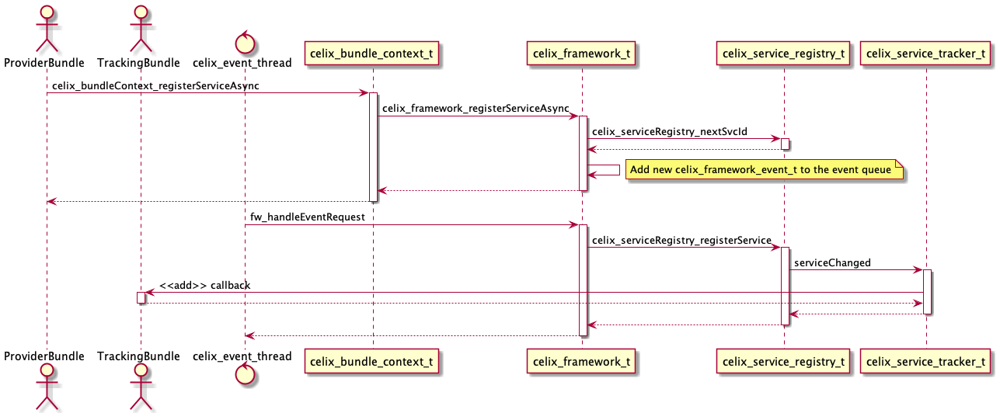
*Service tracker callback with an asynchronized service registration*

---

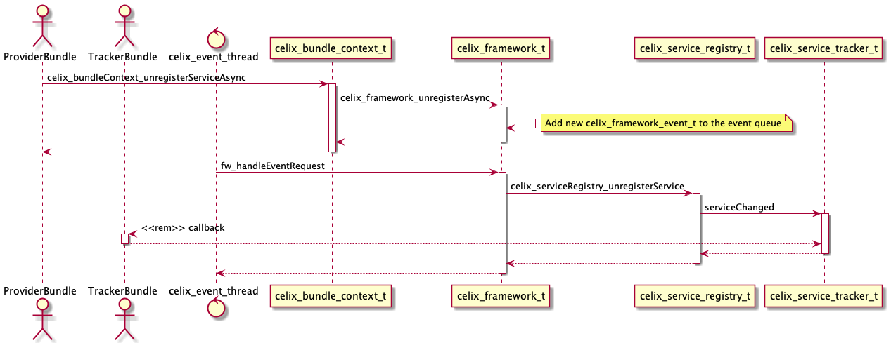
*Service tracker callback with an asynchronized service un-registration*

---

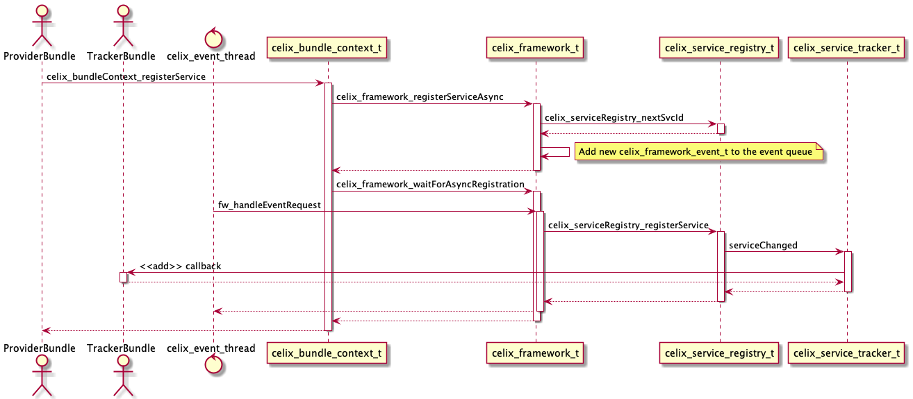
*Service tracker callback with a synchronized service registration*

---

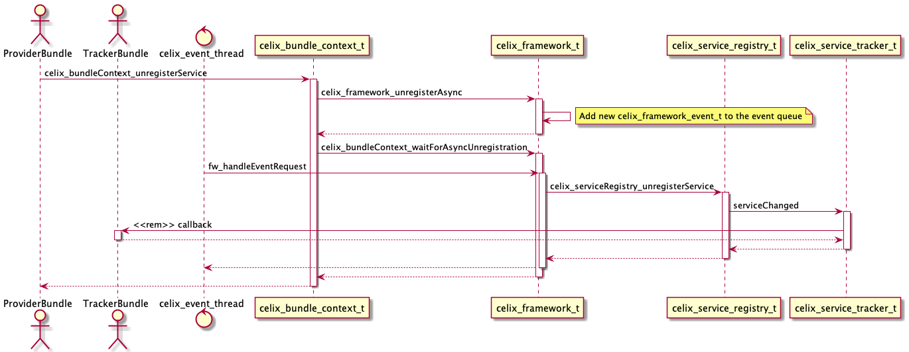
*Service tracker callback with a synchronized service un-registration*

<a id="documents-services--the-celixquery-shell-command"></a>
<a id="documents-services--the-celix::query-shell-command"></a>

# The `celix::query` shell command

To interactively see the which service and service trackers are available the `celix::query` shell command
can be used.

Examples of supported `query` command lines are:

- `celix::query` - Show an overview of registered services and active service trackers per bundle.
- `query` - Same as `celix::query` (as long as there is no colliding other `query` commands).
- `query -v` - Show a detailed overview of registered services and active service trackers per bundle.
  For registered services the services properties are also printed and for active service trackers the number
  of tracked services is also printed.
- `query foo` - Show an overview of registered services and active service tracker where “foo” is
  (case-insensitive) part of the provided/tracked service name.
- `query (service.id>=10)` - Shown an overview of registered services which match the provided LDAP filter.

---

<a id="documents-components"></a>

<!-- source_url: https://celix.apache.org/docs/2.4.0/celix/documents/components.html -->

<!-- page_index: 6 -->

# Apache Celix Components

[Edit on GitHub](https://github.com/apache/celix/edit/master/documents/components.md "Edit this page on GitHub")
[<< back to documentation](#docs-2.4.0-docs "back to documentation")
<a id="documents-components--apache-celix-components"></a>

# Apache Celix Components

In Apache Celix, components are plain old C/C++ objects (POCOs) managed by the Apache Celix Dependency Manager (DM).
Components can provide services and depend on services. Components are configured declarative using the DM api.

Service dependencies will influence the component’s lifecycle as a component will only be active when all required
dependencies are available.
The DM is responsible for managing the component’s service dependencies, the component’s lifecycle and when
to register/unregister the component’s provided services.

Note that the Apache Celix Dependency Manager is inspired by the
[Apache Felix Dependency Manager](http://felix.apache.org/documentation/subprojects/apache-felix-dependency-manager.html), adapted to Apache Celix and the C/C++ usage.

<a id="documents-components--component-lifecycle"></a>

# Component Lifecycle

Each component has its own lifecycle.
A component’s lifecycle state model is depicted in the state diagram below.

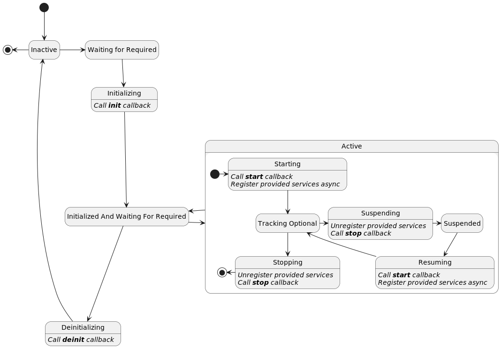

The DM can be used to configure a component’s lifecycle callbacks, the following component’s lifecycle callbacks can
be configured:

- `init`
- `start`
- `stop`
- `deinit`

These callbacks are used in the intermediate component’s lifecycle states `Initializing`, `Starting`, `Suspending`, `Resuming`, `Stopping` and `Deinitializing` and the lifecycle callbacks are always called from the Celix event thread.

A component has the following lifecycle states:

- `Inactive`: The component is inactive and the DM is not managing the component yet.
- `Waiting For Required`: The component is waiting for required service dependencies.
- `Initializing`: The component has found its required dependencies and is initializing by
  calling the `init` callback.
- `Initialized And Waiting For Required`: The component has been initialized, but is waiting for required
  dependencies.
  \_Note: that this can mean that:
  - During the `init` callback, 1 or more unavailable required service dependencies where added.
  - The component was active, but 1 or more required service dependency where removed and as result the
    component is not active anymore.
- `Starting`: The component has found its required dependencies and is starting by calling the `start` callback and
  registering the components provided services.
- `Tracking Optional`: The component has found its required dependencies and is started. It is still tracking for
  additional optional and required services.
- `Suspending`: The component has found its required dependencies, but is suspending to prepare for a service change by
  unregistering the components provided service and calling the `stop` callback.
- `Suspended`: The component has found its required dependencies and is suspended so that a service change can be
  processed.
- `Resuming`: The component has found its required dependencies, a service change has been processed, and it is
  resuming by calling the `start` callback and registering the components provided services.
- `Stopping`: The component has lost one or more of its required dependencies and is stopping by unregistering the
  components provided service and calling the `stop` callback.
- `Deinitializing`: The component is being removed and is deinitializing by calling the `deinit` callback.

<a id="documents-components--component-api"></a>

## Component API

The DM Component C api can be found in the `celix_dm_component.h` header and the C++ api can be found in the
`celix/dm/Component.h` header.

<a id="documents-components--example-create-and-configure-components-lifecycle-callbacks-in-c"></a>
<a id="documents-components--example:-create-and-configure-component-s-lifecycle-callbacks-in-c"></a>

## Example: Create and configure component’s lifecycle callbacks in C

The following example shows how a simple component can be created and managed with the DM in C.
Because the component’s lifecycle is managed by the DM, this also means that if configured correctly no additional
code is needed to remove and destroy the DM component and its implementation.

Remarks for the C example:

1. Although this is a C component. The simple component functions have been design for a component approach,
   using the component pointer as first argument.
2. The component implementation can be any POCO, as long as its lifecycle and destroy function signature follow a
   component approach: A single argument, with as type the component implementation pointer and an int return
   for the component lifecycle functions and a void return for the component destroy function.
3. Creates the DM component, but note that the DM component is not yet known to the DM. This makes it possible to
   first configure the DM component over multiple function calls, before adding it to the DM.
4. Configures the component implementation in the DM component, so that the implementation pointer can be used
   in the configured component callbacks.
5. Configures the component lifecycle callbacks to the DM Component. These callbacks should accept the component
   implementation as its only argument. The `CELIX_DM_COMPONENT_SET_CALLBACKS` marco is used instead of the
   `celix_dmComponent_setCallbacks` function so that the component implementation type can directly be used
   in the lifecycle callbacks (instead of `void*`).
6. Configures the component destroy implementation callback to the Dm Component. This callback will be called when
   the DM component is removed from the DM and has become inactive. The callback will be called from the Celix event
   thread. The advantages of configuring this callback is that the DM manages when the callback needs to be called;
   this removes some complexity for the users. The `CELIX_DM_COMPONENT_SET_IMPLEMENTATION_DESTROY_FUNCTION` marco
   is used instead of the `celix_dmComponent_setImplementationDestroyFunction` function so that the component
   implementation type can be directly used in the callback (instead of `void*`).
7. Adds the DM Component the DM and as result the DM will that point on manage the components’ lifecycle, service
   dependencies and provided services.
8. No additional code is needed to clean up components and as such no activator stop callback function needs to be
   configured. The generated bundle activator will ensure that all components are removed from the DM when the
   bundle is stopped and the DM will ensure that the components are deactivated and destroyed correctly.

```C
//src/simple_component_activator.c
#include <stdio.h>
#include <celix_bundle_activator.h>
#include <celix_dm_component.h>

//********************* COMPONENT *******************************/

typedef struct simple_component {
    int transitionCount; //not protected, only updated and read in the celix event thread.
} simple_component_t;

static simple_component_t* simpleComponent_create() {
    simple_component_t* cmp = calloc(1, sizeof(*cmp));
    cmp->transitionCount = 1;
    return cmp;
}

static void simpleComponent_destroy(simple_component_t* cmp) {
    free(cmp);
}

static int simpleComponent_init(simple_component_t* cmp) { // <------------------------------------------------------<1>
    printf("Initializing simple component. Transition nr %i\n", cmp->transitionCount++);
    return 0;
}

static int simpleComponent_start(simple_component_t* cmp) {
    printf("Starting simple component. Transition nr %i\n", cmp->transitionCount++);
    return 0;
}

static int simpleComponent_stop(simple_component_t* cmp) {
    printf("Stopping simple component. Transition nr %i\n", cmp->transitionCount++);
    return 0;
}

static int simpleComponent_deinit(simple_component_t* cmp) {
    printf("De-initializing simple component. Transition nr %i\n", cmp->transitionCount++);
    return 0;
}


//********************* ACTIVATOR *******************************/

typedef struct simple_component_activator {
    //nop
} simple_component_activator_t;

static celix_status_t simpleComponentActivator_start(simple_component_activator_t *act, celix_bundle_context_t *ctx) {
    //creating component
    simple_component_t* impl = simpleComponent_create(); // <--------------------------------------------------------<2>

    //create and configuring component and its lifecycle callbacks using the Apache Celix Dependency Manager
    celix_dm_component_t* dmCmp = celix_dmComponent_create(ctx, "simple_component_1"); // <--------------------------<3>
    celix_dmComponent_setImplementation(dmCmp, impl); // <-----------------------------------------------------------<4>
    CELIX_DM_COMPONENT_SET_CALLBACKS(
            dmCmp,
            simple_component_t,
            simpleComponent_init,
            simpleComponent_start,
            simpleComponent_stop,
            simpleComponent_deinit); // <----------------------------------------------------------------------------<5>
    CELIX_DM_COMPONENT_SET_IMPLEMENTATION_DESTROY_FUNCTION(
            dmCmp,
            simple_component_t,
            simpleComponent_destroy); // <---------------------------------------------------------------------------<6>

    //Add dm component to the dm.
    celix_dependency_manager_t* dm = celix_bundleContext_getDependencyManager(ctx);
    celix_dependencyManager_add(dm, dmCmp); // <---------------------------------------------------------------------<7>
    return CELIX_SUCCESS;
}

CELIX_GEN_BUNDLE_ACTIVATOR(simple_component_activator_t, simpleComponentActivator_start, NULL) // <------------------<8>
```

<a id="documents-components--example-create-and-configure-components-lifecycle-callbacks-in-c-1"></a>
<a id="documents-components--example:-create-and-configure-component-s-lifecycle-callbacks-in-c-2"></a>

## Example: Create and configure component’s lifecycle callbacks in C++

The following example shows how a simple component can be created and managed with the DM in C++.
For C++ the DM will manage the component and also ensures that component implementation is kept in scope for as
long as the component is managed by the DM.

Remarks for the C++ example:

1. For C++ the DM can directly work on classes and as result lifecycle callback can be class methods.
2. Creates a component implementation using a unique\_ptr.
3. Create a C++ DM Component and directly add it to the DM. For C++ DM Component needs to be “build” first, before the
   DM will manage them. This way C++ components can be build using a fluent api and marked complete with a `build()`
   method call.
   For a component implementation the DM accepts a unique\_ptr, a shared\_ptr, a value type or no implementation. If no
   implementation is provided the DM will create a component implementation using the template argument and
   assuming a default constructor (e.g. `ctx->getDependencyManager()->createComponent<CmpWithDefaultCTOR>()`).
4. Configures the component lifecycle callbacks as class methods. The DM will call these callbacks using the
   component implementation raw pointer as object instance (`this`).
5. “Builds” the component. C++ components will only be managed by the DM after they are build. This makes it possible
   to configure a component over multiple method calls before marking the component complete (build).
   The generated C++ bundle activator will also enable all components created during the bundle activation, this is
   done to ensure that the build behaviour is backwards compatible with previous released DM implementation.
   It is preferred that users explicitly build their components when they are completely configured.

```C++
//src/SimpleComponentActivator.cc
#include <celix/BundleActivator.h>

class SimpleComponent {
public:
    void init() { // <-----------------------------------------------------------------------------------------------<1>
        std::cout << "Initializing simple component. Transition nr " << transitionCount++ << std::endl;
    }

    void start() {
        std::cout << "starting simple component. Transition nr " << transitionCount++ << std::endl;
    }

    void stop() {
        std::cout << "Stopping simple component. Transition nr " << transitionCount++ << std::endl;
    }

    void deinit() {
        std::cout << "De-initializing simple component. Transition nr " << transitionCount++ << std::endl;
    }
private:
    int transitionCount = 1; //not protected, only updated and read in the celix event thread.
};

class SimpleComponentActivator {
public:
    explicit SimpleComponentActivator(const std::shared_ptr<celix::BundleContext>& ctx) {
        auto cmp = std::make_unique<SimpleComponent>(); // <---------------------------------------------------------<2>
        ctx->getDependencyManager()->createComponent(std::move(cmp), "SimpleComponent1") // <------------------------<3>
                .setCallbacks(
                        &SimpleComponent::init,
                        &SimpleComponent::start,
                        &SimpleComponent::stop,
                        &SimpleComponent::deinit) // <---------------------------------------------------------------<4>
                .build(); // <---------------------------------------------------------------------------------------<5>
    }
};

CELIX_GEN_CXX_BUNDLE_ACTIVATOR(SimpleComponentActivator)
```

<a id="documents-components--components-provided-services"></a>
<a id="documents-components--component-s-provided-services"></a>

# Component’s Provided Services

Components can be configured to provide services. These provided services will result in service registrations
when a component is `Starting` or `Resuming` (i.e. when a component goes to the `Tracking Optional` state).

If a component provide services, these services will have an additional automatically added service property - named “component.uuid” - next to its configured provided service properties. The “component.uuid” service property can be
used to identify if a service is provided by a component and which component.

<a id="documents-components--example-component-with-a-provided-service-in-c"></a>
<a id="documents-components--example:-component-with-a-provided-service-in-c"></a>

## Example: Component with a provided service in C

The following example shows how a component that provide a `celix_shell_command` service.

Remarks for the C example:

1. C services do not support inheritance. So even if a C component provides a certain service, it is not an
   instance of said service. This also means the C service struct provided by a component needs to be stored
   separately. In this example this is done storing the service struct in the bundle activator data. Note
   that the bundle activator data “outlives” the component, because all components are removed before a bundle
   is completely stopped.
2. Configures a provided service (interface) for the component. The service will not directly be registered, but
   instead will be registered in the component states `Starting` and `Resuming`.

```C
 //src/component_with_provided_service_activator.c
#include <stdlib.h>
#include <celix_bundle_activator.h>
#include <celix_shell_command.h>

//********************* COMPONENT *******************************/

typedef struct component_with_provided_service {
    int callCount; //atomic
} component_with_provided_service_t;

static component_with_provided_service_t* componentWithProvidedService_create() {
    component_with_provided_service_t* cmp = calloc(1, sizeof(*cmp));
    return cmp;
}

static void componentWithProvidedService_destroy(component_with_provided_service_t* cmp) {
    free(cmp);
}

static bool componentWithProvidedService_executeCommand(
        component_with_provided_service_t *cmp,
        const char *commandLine,
        FILE *outStream,
        FILE *errorStream CELIX_UNUSED) {
    int count = __atomic_add_fetch(&cmp->callCount, 1, __ATOMIC_SEQ_CST);
    fprintf(outStream, "Hello from cmp. command called %i times. commandLine: %s\n", count, commandLine);
    return true;
}

//********************* ACTIVATOR *******************************/

typedef struct component_with_provided_service_activator {
    celix_shell_command_t shellCmd; // <-----------------------------------------------------------------------------<1>
} component_with_provided_service_activator_t;

static celix_status_t componentWithProvidedServiceActivator_start(component_with_provided_service_activator_t *act, celix_bundle_context_t *ctx) {
    //creating component
    component_with_provided_service_t* impl = componentWithProvidedService_create();

    //create and configuring component and its lifecycle callbacks using the Apache Celix Dependency Manager
    celix_dm_component_t* dmCmp = celix_dmComponent_create(ctx, "component_with_provided_service_1");
    celix_dmComponent_setImplementation(dmCmp, impl);
    CELIX_DM_COMPONENT_SET_IMPLEMENTATION_DESTROY_FUNCTION(
            dmCmp,
            component_with_provided_service_t,
            componentWithProvidedService_destroy);

    //configure provided service
    act->shellCmd.handle = impl;
    act->shellCmd.executeCommand = (void*)componentWithProvidedService_executeCommand;
    celix_properties_t* props = celix_properties_create();
    celix_properties_set(props, CELIX_SHELL_COMMAND_NAME, "hello_component");
    celix_dmComponent_addInterface(
            dmCmp,
            CELIX_SHELL_COMMAND_SERVICE_NAME,
            CELIX_SHELL_COMMAND_SERVICE_VERSION,
            &act->shellCmd,
            props); // <---------------------------------------------------------------------------------------------<2>


    //Add dm component to the dm.
    celix_dependency_manager_t* dm = celix_bundleContext_getDependencyManager(ctx);
    celix_dependencyManager_add(dm, dmCmp);
    return CELIX_SUCCESS;
}

CELIX_GEN_BUNDLE_ACTIVATOR(
        component_with_provided_service_activator_t,
        componentWithProvidedServiceActivator_start,
        NULL)
```

<a id="documents-components--example-component-with-a-provided-service-in-c-1"></a>
<a id="documents-components--example:-component-with-a-provided-service-in-c-2"></a>

## Example: Component with a provided service in C++

The following example shows how a C++ component that provide a C++ `celix::IShellCommand` service
and a C `celix_shell_command` service. For a C++ component it’s possible to provide C and C++ services.

Remarks for the C++ example:

1. If a component provides a C++ services, it also expected that the component implementation inherits the service
   interface.
2. The overridden `executeCommand` method of `celix::IShellCommand`.
3. Methods of C service interfaces can be implemented as class methods, but the bundle activator should ensure that
   the underlining C service interface structs are assigned with compatible C function pointers.
4. Creating a component using only a template argument. The DM will construct - using a default constructor - a
   component implementation instance.
5. Configures the component to provide a C++ `celix::IShellCommand` service. Note that because the component
   implementation is an instance of `celix::IShellCommand` no additional storage is needed. The service will not
   directly be registered, but instead will be registered in the components states `Starting` and `Resuming`.
6. Set the C `executeCommand` function pointer of the `celix_shell_command_t` service interface struct to a
   capture-less lambda expression. The lambda expression is used to forward the call to the `executeCCommand`
   class method. Note the capture-less lambda expression can decay to C-style function pointers.
7. Configures the component to provide a C `celix_shell_command_t` service. Note that for a C service, the
   `createUnassociatedProvidedService` must be used, because the component does not inherit `celix_shell_command_t`.
   The service will not directly be registered, but instead will be registered in the component states `Starting` and
   `Resuming`.
8. “Build” the component so the DM will manage the component.

```C++
//src/ComponentWithProvidedServiceActivator.cc
#include <celix/BundleActivator.h>
#include <celix/IShellCommand.h>
#include <celix_shell_command.h>

class ComponentWithProvidedService : public celix::IShellCommand { // <----------------------------------------------<1>
public:
    ~ComponentWithProvidedService() noexcept override = default;

    void executeCommand(
            const std::string& commandLine,
            const std::vector<std::string>& /*commandArgs*/,
            FILE* outStream,
            FILE* /*errorStream*/) override {
        fprintf(outStream, "Hello from cmp. C++ command called %i times. commandLine is %s\n", 
                cxxCallCount++, commandLine.c_str());
    } // <-----------------------------------------------------------------------------------------------------------<2>

    void executeCCommand(const char* commandLine, FILE* outStream) {
        fprintf(outStream, "Hello from cmp. C command called %i times. commandLine is %s\n", cCallCount++, commandLine);
    } // <-----------------------------------------------------------------------------------------------------------<3>
private:
    std::atomic<int> cxxCallCount{1};
    std::atomic<int> cCallCount{1};
};

class ComponentWithProvidedServiceActivator {
public:
    explicit ComponentWithProvidedServiceActivator(const std::shared_ptr<celix::BundleContext>& ctx) {
        auto& cmp = ctx->getDependencyManager()->createComponent<ComponentWithProvidedService>(); // <---------------<4>

        cmp.createProvidedService<celix::IShellCommand>()
                .addProperty(celix::IShellCommand::COMMAND_NAME, "HelloComponent"); // <-----------------------------<5>

        auto shellCmd = std::make_shared<celix_shell_command_t>();
        shellCmd->handle = static_cast<void*>(&cmp.getInstance());
        shellCmd->executeCommand = [](void* handle, const char* commandLine, FILE* outStream, FILE*) -> bool {
            auto* impl = static_cast<ComponentWithProvidedService*>(handle);
            impl->executeCCommand(commandLine, outStream);
            return true;
        }; // <------------------------------------------------------------------------------------------------------<6>

        cmp.createUnassociatedProvidedService(std::move(shell.html), CELIX_SHELL_COMMAND_SERVICE_NAME)
                .addProperty(CELIX_SHELL_COMMAND_NAME, "hello_component"); // < -------------------------------------<7>

        cmp.build(); // <--------------------------------------------------------------------------------------------<8>
    }
private:
};

CELIX_GEN_CXX_BUNDLE_ACTIVATOR(ComponentWithProvidedServiceActivator)
```

<a id="documents-components--components-service-dependencies"></a>
<a id="documents-components--component-s-service-dependencies"></a>

# Component’s Service Dependencies

Components can be configured to have service dependencies. These service dependencies will influence the component’s
lifecycle. Components can have optional and required service dependencies. When service dependencies are required the
component can only be active if all required dependencies are available; where available means at least 1 matching
service dependency is found.

When configuring service dependencies, callbacks can be configured for handling services that are being added, removed or for when a new highest ranking service is available.

Service dependency callbacks can be configured with 3 different types of argument signatures:

- A single argument for the service pointer (raw pointer or shared\_ptr);
- A service pointer (raw pointer or shared\_ptr) as first argument and the service properties as second argument.
- A service pointer (raw pointer or shared\_ptr) as first argument, the service properties as second argument and
  the bundle providing the service as third argument.

Service dependency callbacks will always be called from the Celix event thread.

A service change (injection/removal) can be handled by the component using a Locking-strategy or a suspend-strategy.
This strategy can be configured per service dependency and expect the following behaviour from the component
implementation:

- Locking-strategy: The component implementation must ensure that the stored service pointers (and if applicable the
  service properties and its bundle) are protected using a locking mechanism (e.g. a mutex).
  This should ensure that services are no longer in use after they are removed (or replaced) from a component and
  thus can be safely deleted from memory.
- Suspend-strategy: The DM will ensure that before service dependency callbacks are called, all provided services
  are (temporary) unregistered and the component is suspended (using the components’ `stop` callback). This should mean
  that there are no active users - through the provided services or active threads - of the service dependencies
  anymore and that service changes can safely be handling without locking. The component implementation must ensure
  that after a `stop` callback there are no active threads, thread pools, timers, etc - that use service dependencies -
  are active anymore.

<a id="documents-components--example-component-with-a-service-dependencies-in-c"></a>
<a id="documents-components--example:-component-with-a-service-dependencies-in-c"></a>

## Example: Component with a service dependencies in C

The following example shows how a C component that has two service dependency on the `celix_shell_command_t` service.

One service dependency is a required dependency with a suspend-strategy and uses a `set`  callback which ensure
that a single service is injected and that is always the highest ranking service. Note that the highest ranking
service can be `NULL` if there are no other matching services.

The other dependency is an optional dependency with a locking-strategy and uses a `addWithProps` and
`removeWithProps` callback. These callbacks will be called for every `celix_shell_command_t` service being added/removed
and will be called with not only the service pointer, but also the service properties.

Remarks for the C example:

1. Creates a mutex to protect the `cmdShells` field which is configured with a locking-strategy service dependency.
2. Updates the `highestRankingCmdShell` field without locking. Note that because the service dependency is
   configured with a suspend-strategy the `componentWithServiceDependency_setHighestRankingShellCommand` function
   will only be called when the component is in the `Suspended` state or when it is not in the `Active` compound state.
3. Locks the mutex and adds the newly added service to the `cmdShells` list. Note that because the service dependency
   is configured with a locking-strategy the `componentWithServiceDependency_addShellCommand` and
   `componentWithServiceDependency_removeShellCommand` functions can be called from any component lifecycle state.
4. Creates a new DM service dependency object. Note that the DM service dependency is not yet known to the DM Component.
5. Configures for which service name the service dependency will track services for. Optionally it is also possible
   to fine tune the tracked service by providing a service version range and/or service filter.
6. Configures the update strategy for the service dependency to suspend-strategy.
7. Configures the service dependency as a required service dependency.
8. Creates an empty service dependency callback options struct. This struct can be used to configure different
   service dependency callbacks.
9. Configures the `set` service dependency callback to `componentWithServiceDependency_setHighestRankingShellCommand`
10. Configures the dependency manager to use the callbacks configures in opts.
11. Adds the DM service dependency object to the DM component object.
12. Configures the update strategy for the service dependency to locking-strategy.
13. Configures the service dependency as an optional service dependency.
14. Configures the `addWithProps` service dependency callback to `componentWithServiceDependency_addShellCommand`.

```C
//src/component_with_service_dependency_activator.c
#include <stdlib.h>
#include <celix_bundle_activator.h>
#include <celix_shell_command.h>

//********************* COMPONENT *******************************/

typedef struct component_with_service_dependency {
    celix_shell_command_t* highestRankingCmdShell; //only updated when component is not active or suspended
    celix_thread_mutex_t mutex; //protects cmdShells
    celix_array_list_t* cmdShells;
} component_with_service_dependency_t;

static component_with_service_dependency_t* componentWithServiceDependency_create() {
    component_with_service_dependency_t* cmp = calloc(1, sizeof(*cmp));
    celixThreadMutex_create(&cmp->mutex, NULL); // <-----------------------------------------------------------------<1>
    cmp->cmdShells = celix_arrayList_create();
    return cmp;
}

static void componentWithServiceDependency_destroy(component_with_service_dependency_t* cmp) {
    celix_arrayList_destroy(cmp->cmdShells);
    celixThreadMutex_destroy(&cmp->mutex);
    free(cmp);
}

static void componentWithServiceDependency_setHighestRankingShellCommand(
        component_with_service_dependency_t* cmp,
        celix_shell_command_t* shell.html) {
    printf("New highest ranking service (can be NULL): %p\n", shell.html);
    cmp->highestRankingCmdShell = shellCmd; // <---------------------------------------------------------------------<2>
}

static void componentWithServiceDependency_addShellCommand(
        component_with_service_dependency_t* cmp,
        celix_shell_command_t* shellCmd,
        const celix_properties_t* props) {
    long id = celix_properties_getAsLong(props, CELIX_FRAMEWORK_SERVICE_ID, -1);
    printf("Adding shell command service with service.id %li\n", id);
    celixThreadMutex_lock(&cmp->mutex); // <-------------------------------------------------------------------------<3>
    celix_arrayList_add(cmp->cmdShells, shell.html);
    celixThreadMutex_unlock(&cmp->mutex);
}

static void componentWithServiceDependency_removeShellCommand(
        component_with_service_dependency_t* cmp,
        celix_shell_command_t* shellCmd,
        const celix_properties_t* props) {
    long id = celix_properties_getAsLong(props, CELIX_FRAMEWORK_SERVICE_ID, -1);
    printf("Removing shell command service with service.id %li\n", id);
    celixThreadMutex_lock(&cmp->mutex);
    celix_arrayList_remove(cmp->cmdShells, shell.html);
    celixThreadMutex_unlock(&cmp->mutex);
}

//********************* ACTIVATOR *******************************/

typedef struct component_with_service_dependency_activator {
    //nop
} component_with_service_dependency_activator_t;

static celix_status_t componentWithServiceDependencyActivator_start(component_with_service_dependency_activator_t *act, celix_bundle_context_t *ctx) {
    //creating component
    component_with_service_dependency_t* impl = componentWithServiceDependency_create();

    //create and configuring component and its lifecycle callbacks using the Apache Celix Dependency Manager
    celix_dm_component_t* dmCmp = celix_dmComponent_create(ctx, "component_with_service_dependency_1");
    celix_dmComponent_setImplementation(dmCmp, impl);
    CELIX_DM_COMPONENT_SET_IMPLEMENTATION_DESTROY_FUNCTION(
            dmCmp,
            component_with_service_dependency_t,
            componentWithServiceDependency_destroy);

    //create mandatory service dependency with cardinality one and with a suspend-strategy
    celix_dm_service_dependency_t* dep1 = celix_dmServiceDependency_create(); // <-----------------------------------<4>
    celix_dmServiceDependency_setService(dep1, CELIX_SHELL_COMMAND_SERVICE_NAME, NULL, NULL); // <-------------------<5>
    celix_dmServiceDependency_setStrategy(dep1, DM_SERVICE_DEPENDENCY_STRATEGY_SUSPEND); // <------------------------<6>
    celix_dmServiceDependency_setRequired(dep1, true); // <----------------------------------------------------------<7>
    celix_dm_service_dependency_callback_options_t opts1 = CELIX_EMPTY_DM_SERVICE_DEPENDENCY_CALLBACK_OPTIONS; // <--<8>
    opts1.set = (void*)componentWithServiceDependency_setHighestRankingShellCommand; // <----------------------------<9>
    celix_dmServiceDependency_setCallbacksWithOptions(dep1, &opts1); // <-------------------------------------------<10>
    celix_dmComponent_addServiceDependency(dmCmp, dep1); // <-------------------------------------------------------<11>

    //create optional service dependency with cardinality many and with a locking-strategy
    celix_dm_service_dependency_t* dep2 = celix_dmServiceDependency_create();
    celix_dmServiceDependency_setService(dep2, CELIX_SHELL_COMMAND_SERVICE_NAME, NULL, NULL);
    celix_dmServiceDependency_setStrategy(dep2, DM_SERVICE_DEPENDENCY_STRATEGY_LOCKING);  // <----------------------<12>
    celix_dmServiceDependency_setRequired(dep2, false); // <--------------------------------------------------------<13>
    celix_dm_service_dependency_callback_options_t opts2 = CELIX_EMPTY_DM_SERVICE_DEPENDENCY_CALLBACK_OPTIONS;
    opts2.addWithProps = (void*)componentWithServiceDependency_addShellCommand;  // <-------------------------------<14>
    opts2.removeWithProps = (void*)componentWithServiceDependency_removeShellCommand;
    celix_dmServiceDependency_setCallbacksWithOptions(dep2, &opts2);
    celix_dmComponent_addServiceDependency(dmCmp, dep2);

    //Add dm component to the dm.
    celix_dependency_manager_t* dm = celix_bundleContext_getDependencyManager(ctx);
    celix_dependencyManager_add(dm, dmCmp);
    return CELIX_SUCCESS;
}

CELIX_GEN_BUNDLE_ACTIVATOR(
        component_with_service_dependency_activator_t,
        componentWithServiceDependencyActivator_start,
        NULL)
```

<a id="documents-components--example-component-with-a-service-dependencies-in-c-1"></a>
<a id="documents-components--example:-component-with-a-service-dependencies-in-c-2"></a>

## Example: Component with a service dependencies in C++

The following example shows how a C++ component that has two service dependency. One
service dependency for the C++ `celix::IShellCommand` service and one for the C `celix_shell_command_t` service.

The `celix::IShellCommand` service dependency is a required dependency with a suspend-strategy and uses a
`set` callback which ensure that a single service is injected and that is always the highest ranking service.
Note that the highest ranking service can be an empty shared\_ptr if there are no service.

The `celix_shell_command_t` service dependency is an optional dependency with a locking-strategy and uses a
`addWithProperties` and `removeWithProperties` callback.
These callbacks will be called for every `celix_shell_command_t` service being added/removed
and will be called with not only the service shared\_ptr, but also the service properties.

Note that for C++ component service dependencies, there is no real different between a C++ or a C service dependency;
In both cases the service pointers are injected using shared\_ptr and if applicable the service properties and
bundle argument are also provided as shared\_ptr using the C++ `celix::Properties` and `celix::Bundle`.

Remarks for the C++ example:

1. Creates a mutex to protect the `shellCommands` field which is configured with a locking-strategy service dependency.
2. Updates the `highestRankingShellCmd` field without locking. Note that because the service dependency is
   configured with a suspend-strategy the `ComponentWithServiceDependency::setHighestRankingShellCommand` method
   will only be called when the component is in the `Suspended` state or when it is not in the `Active` compound state.
3. Locks the mutex and adds the newly added service to the `shellCommands` list. Note that because the service
   dependency is configured with a locking-strategy the `ComponentWithServiceDependency::addCShellCmd` and
   `ComponentWithServiceDependency::removeCShellCmd` methods can be called from any component lifecycle state.
4. Creates a new DM service dependency object, the service dependency is considered incomplete until the
   service dependency, component or DM is build. Note that the `celix::dm::Component::createServiceDependency` method
   is called without provided a service name, the service name will be inferred using the `celix::typeName`.
5. Configures the service dependency set callback.
6. Configures the service dependency as a required service dependency.
7. Configures the update strategy for the service dependency to suspend-strategy.
8. Creates another new DM service dependency object and in this case also explicitly provides the service name
   to use (`CELIX_SHELL_COMMAND_SERVICE_NAME`).
9. Builds the component and as result also builds the components’ service dependencies (i.e. marking them as complete).

```C++
//src/ComponentWithServiceDependencyActivator.cc
#include <celix/BundleActivator.h>
#include <celix/IShellCommand.h>
#include <celix_shell_command.h>

class ComponentWithServiceDependency {
public:
    void setHighestRankingShellCommand(const std::shared_ptr<celix::IShellCommand>& cmdSvc) {
        std::cout << "New highest ranking service (can be NULL): " << (intptr_t)cmdSvc.get() << std::endl;
        highestRankingShellCmd = cmdSvc; // <------------------------------------------------------------------------<2>
    }

    void addCShellCmd(
            const std::shared_ptr<celix_shell_command_t>& cmdSvc,
            const std::shared_ptr<const celix::Properties>& props) {
        auto id = props->getAsLong(celix::SERVICE_ID, -1);
        std::cout << "Adding shell command service with service.id: " << id << std::endl;
        std::lock_guard lck{mutex}; // <-----------------------------------------------------------------------------<3>
        shellCommands.emplace(id, cmdSvc);
    }

    void removeCShellCmd(
            const std::shared_ptr<celix_shell_command_t>& /*cmdSvc*/,
            const std::shared_ptr<const celix::Properties>& props) {
        auto id = props->getAsLong(celix::SERVICE_ID, -1);
        std::cout << "Removing shell command service with service.id: " << id << std::endl;
        std::lock_guard lck{mutex};
        shellCommands.erase(id);
    }
private:
    std::shared_ptr<celix::IShellCommand> highestRankingShellCmd{};
    std::mutex mutex{}; //protect shellCommands // <-----------------------------------------------------------------<1>
    std::unordered_map<long, std::shared_ptr<celix_shell_command_t>> shellCommands{};
};

class ComponentWithServiceDependencyActivator {
public:
    explicit ComponentWithServiceDependencyActivator(const std::shared_ptr<celix::BundleContext>& ctx) {
        using Cmp = ComponentWithServiceDependency;
        auto& cmp = ctx->getDependencyManager()->createComponent<Cmp>(); 

        cmp.createServiceDependency<celix::IShellCommand>() // <-----------------------------------------------------<4>
                .setCallbacks(&Cmp::setHighestRankingShellCommand) // <----------------------------------------------<5>
                .setRequired(true) // <------------------------------------------------------------------------------<6>
                .setStrategy(DependencyUpdateStrategy::suspend); // <------------------------------------------------<7>

        cmp.createServiceDependency<celix_shell_command_t>(CELIX_SHELL_COMMAND_SERVICE_NAME) // <--------------------<8>
                .setCallbacks(&Cmp::addCShellCmd, &Cmp::removeCShell.html) 
                .setRequired(false)
                .setStrategy(DependencyUpdateStrategy::locking);

        cmp.build(); // <--------------------------------------------------------------------------------------------<9>
    }
};

CELIX_GEN_CXX_BUNDLE_ACTIVATOR(ComponentWithServiceDependencyActivator)
```

<a id="documents-components--when-will-a-component-be-suspended"></a>

# When will a component be suspended

Components will only suspend if:

- The component is in the state `Tracking Optional`;
- The component has at least 1 service dependency where the update strategy is configured as suspend-strategy;
- There is a service update event ongoing, where the update service event matches 1 of the components'
  suspend-strategy service dependencies;
- And least one of the component’s matching suspend-strategy service dependency has a configured service injection/
  removal callback configured.

<a id="documents-components--the-celixdm-shell-command"></a>
<a id="documents-components--the-celix::dm-shell-command"></a>

# The `celix::dm` shell command

To interactively see the available components, their current lifecycle state, provided service and service dependencies
the `celix::dm` shell command can be used.

Examples of supported `dm` command lines are:

- `celix::dm` - Show an overview of all components in the Celix framework. Only shows component lifecycle state.
- `dm` - Same as `celix::dm` (as long as there is no colliding other `dm` commands).
- `dm full` - Show a detailed overview of all components in the Celix framework. This also shows the provided
  services and service dependencies of each component.

---

<a id="documents-framework"></a>

<!-- source_url: https://celix.apache.org/docs/2.4.0/celix/documents/framework.html -->

<!-- page_index: 7 -->

# Apache Celix Framework

[Edit on GitHub](https://github.com/apache/celix/edit/master/documents/framework.md "Edit this page on GitHub")
[<< back to documentation](#docs-2.4.0-docs "back to documentation")
<a id="documents-framework--apache-celix-framework"></a>

# Apache Celix Framework

The Apache Celix framework is the core of Apache Celix applications and provides supports for deployments of
dynamic, extensible modules known as bundles.

An instance of an Apache Celix framework can be created with the celix framework factory or by configuring
[Apache Celix containers](#documents-containers) using the `add_celix_container` Apache Celix CMake command.

<a id="documents-framework--framework-factory"></a>

## Framework factory

A new instance of an Apache Celix framework can be created using the C/C++ function/method:

- `celix_frameworkFactory_createFramework`
- `celix::createFramework`

When an Apache Celix framework is destroyed it will automatically stop and uninstall all running bundles.
For C, an Apache Celix framework needs to be destroyed with the call `celix_frameworkFactory_destroyFramework` and
for C++ this happens when the framework goes out of scope.

<a id="documents-framework--example-creating-an-apache-celix-framework-in-c"></a>
<a id="documents-framework--example:-creating-an-apache-celix-framework-in-c"></a>

### Example: Creating an Apache Celix Framework in C

```C
//src/main.c
#include <celix_bundle_activator.h>
int main() {
    //create framework properties
    celix_properties_t* properties = properties_create();
    properties_set(properties, "CELIX_LOGGING_DEFAULT_ACTIVE_LOG_LEVEL", "debug");

    //create framework
    celix_framework_t* fw = celix_frameworkFactory_createFramework(properties);

    //get framework bundle context and log hello
    celix_bundle_context_t* fwContext = celix_framework_getFrameworkContext(fw);
    celix_bundleContext_log(fwContext, CELIX_LOG_LEVEL_INFO, "Hello from framework bundle context");

    //destroy framework
    celix_frameworkFactory_destroyFramework(fw);
}
```

```cmake
#CMakeLists.txt
find_package(Celix REQUIRED)
add_executable(create_framework_in_c src/main.c)
target_link_libraries(create_framework_in_c PRIVATE Celix::framework)
```

<a id="documents-framework--example-creating-an-apache-celix-framework-in-c-1"></a>
<a id="documents-framework--example:-creating-an-apache-celix-framework-in-c-2"></a>

### Example: Creating an Apache Celix Framework in C++

```C++
//src/main.cc
#include <celix/FrameworkFactory.h>
int main() {
    //create framework properties
    celix::Properties properties{};
    properties.set("CELIX_LOGGING_DEFAULT_ACTIVE_LOG_LEVEL", "debug");

    //create framework
    std::shared_ptr<celix::Framework> fw = celix::createFramework(properties);

    //get framework bundle context and log hello
    std::shared_ptr<celix::BundleContext> ctx = fw->getFrameworkBundleContext();
    ctx->logInfo("Hello from framework bundle context");
}
```

```cmake
#CMakeLists.txt
find_package(Celix REQUIRED)
add_executable(create_framework_in_cxx src/main.cc)
target_link_libraries(create_framework_in_cxx PRIVATE Celix::framework)
```

<a id="documents-framework--apache-celix-launcher"></a>

## Apache Celix launcher

If the Apache Celix framework is the main application, the Apache Celix launcher can be used to create the framework
and wait for a framework shutdown.

The Apache Celix launcher also does some additional work:

- Handles command arguments (mainly to print to embedded and runtime framework properties).
- Tries to read a “config.properties” file from the current workdir and combines this with the optional provided
  embedded properties to the Apache Celix Launcher.
- Configures a framework shutdown for the `SIGINT` and `SIGTERM` signal.
- Configures an “ignore” signal handler for the `SIGUSR1` and `SIGUSR2` signal.
- Calls the `curl_global_init` to initialize potential use of curl. Note that the `curl_global_init` is not thread safe
  or protected by something like pthread\_once.
- Destroys the Apache Celix Framework after shutdown.

<a id="documents-framework--example-creating-an-apache-celix-framework-with-the-apache-celix-launcher"></a>
<a id="documents-framework--example:-creating-an-apache-celix-framework-with-the-apache-celix-launcher"></a>

### Example: Creating an Apache Celix Framework with the Apache Celix Launcher

```C
//src/launcher.c
#include <celix_bundle_activator.h>
int main(int argc, char** argv) {
    return celixLauncher_launchAndWaitForShutdown(argc, argv, NULL);
}
```

```cmake
#CMakeLists.txt
find_package(Celix REQUIRED)
add_executable(create_framework_with_celix_launcher src/launcher.c)
target_link_libraries(create_framework_with_celix_launcher PRIVATE Celix::framework)
```

<a id="documents-framework--installing-and-starting-bundles-in-an-apache-celix-framework"></a>

## Installing and starting bundles in an Apache Celix framework

Bundles can be installed and started using the Apache Celix framework bundle context or - when using the Apache Celix
launcher - with a “config.properties” file.

Bundles are installed using a path to a zip file. If the path is a relative path, the framework will search for the
bundle in the directories configured in the framework property `CELIX_BUNDLES_PATH`.
The default value of `CELIX_BUNDLES_PATH` is “bundles”.

Another option is to use framework properties to configure which bundles to install and start.
This can be done by using the CELIX\_AUTO\_START\_0 till CELIX\_AUTO\_START\_6 framework properties.
(note that bundles configured in CELIX\_AUTO\_START\_0 are installed and started first).
For a more complete overview of possible framework properties see `celix_constants.h`

If the Apache Celix launcher is used, the framework properties can be provided with a “config.properties”
file using the Java Properties File Format.

Framework properties to install and start bundles:

- CELIX\_AUTO\_START\_0
- CELIX\_AUTO\_START\_1
- CELIX\_AUTO\_START\_2
- CELIX\_AUTO\_START\_3
- CELIX\_AUTO\_START\_4
- CELIX\_AUTO\_START\_5
- CELIX\_AUTO\_START\_6

<a id="documents-framework--example-installing-and-starting-bundles-in-c"></a>
<a id="documents-framework--example:-installing-and-starting-bundles-in-c"></a>

### Example: Installing and starting bundles in C

```C
//src/main.c
#include <celix_bundle_activator.h>
int main() {
    //create framework properties
    celix_properties_t* properties = properties_create();
    properties_set(properties, "CELIX_BUNDLES_PATH", "bundles;/opt/alternative/bundles");
    
    //create framework
    celix_framework_t* fw = celix_frameworkFactory_createFramework(NULL);

    //get framework bundle context and install a bundle
    celix_bundle_context_t* fwContext = celix_framework_getFrameworkContext(fw);
    celix_bundleContext_installBundle(fwContext, "FooBundle.zip", true);

    //destroy framework
    celix_frameworkFactory_destroyFramework(fw);
}
```

<a id="documents-framework--example-installing-and-starting-bundles-in-c-1"></a>
<a id="documents-framework--example:-installing-and-starting-bundles-in-c-2"></a>

### Example: Installing and starting bundles in C++

```C++
//src/main.cc
#include <celix/FrameworkFactory.h>
int main() {
    //create framework properties
    celix::Properties properties{};
    properties.set("CELIX_BUNDLES_PATH", "bundles;/opt/alternative/bundles");
    
    //create framework
    std::shared_ptr<celix::Framework> fw = celix::createFramework(properties);
    
    //get framework bundle context and install a bundle
    std::shared_ptr<celix::BundleContext> ctx = fw->getFrameworkBundleContext();
    ctx->installBundle("FooBundle.zip");
}
```

<a id="documents-framework--example-installing-and-starting-bundles-using-the-apache-celix-launcher"></a>
<a id="documents-framework--example:-installing-and-starting-bundles-using-the-apache-celix-launcher"></a>

### Example: Installing and starting bundles using the Apache Celix Launcher

```C
//src/launcher.c
#include <celix_bundle_activator.h>
int main(int argc, char** argv) {
    return celixLauncher_launchAndWaitForShutdown(argc, argv, NULL);
}
```

```cmake
#CMakeLists.txt
find_package(Celix REQUIRED)
file(GENERATE OUTPUT ${CMAKE_CURRENT_BINARY_DIR}/config.properties CONTENT "
CELIX_BUNDLES_PATH=bundles;/opt/alternative/bundles
CELIX_AUTO_START_3=FooBundle.zip
")
add_executable(create_framework_with_celix_launcher src/launcher.c)
target_link_libraries(create_framework_with_celix_launcher PRIVATE Celix::framework)
```

<a id="documents-framework--framework-celix_condition-services"></a>

## Framework `celix_condition` Services

In a dynamic framework such as Apache Celix, it can sometimes be challenging to ascertain when the framework or
certain parts of a dynamic service-based application are ready for use. To address this issue, Apache Celix provides
services known as `celix_condition` services.

A `celix_condition` service is a registered marker interface with a “condition.id” service property.
The service’s availability signifies that the condition identified by the “condition.id” has been met.

The `celix_condition` service is an adaptation of the
[OSGi 8 Condition Service Specification](https://docs.osgi.org/specification/osgi.core/8.0.0/service.condition.html).

The Apache Celix framework will provide the following `celix_condition` services for the respective states:

- Celix condition “true”, which is always available.
- Celix condition “framework.ready”. This service will be registered when the framework has successfully and fully
  started, which includes installing and starting all configured bundles and services, and ensuring the event queue is
  empty after all configured bundles have been started. Note that the “framework.ready” condition is not part of the
  OSGi condition specification.
- Celix condition “framework.error”. This service will be registered when the framework has not started successfully.
  This can occur if any of the configured bundles fail to start or install. Note that the “framework.error” condition
  is not part of the OSGi condition specification.

Contrary to the OSGi specification, the Apache Celix framework does not provide a public API for adding or removing
framework listeners. Instead, framework condition services can be used. This has the advantage of ensuring no
framework state changes can be missed, because the state indicating condition services will be available
until the framework is stopped.

<a id="documents-framework--framework-bundle-cache"></a>

## Framework bundle cache

The Apache Celix framework uses a bundle cache directory to store the installed bundles, their state and for a
persistent bundle storage. The bundle cache directory is created in the directory configured in the framework
property `CELIX_FRAMEWORK_CACHE_DIR` (default is “.cache”). A bundle cache consists of a bundle state property file, a resource bundle cache and a persistent storage bundle cache.

The resource bundle cache is used to store and access the bundle resources (e.g. the content of the bundle zip file)
and should be treated as read-only. The resource bundle cache can be accessed using `celix_bundle_getEntry`
or `celix::Bundle::getEntry`.

The persistent storage bundle cache can be used to store persistent data for a bundle and can be treated as
read-write. The persistent storage bundle cache can be accessed using `celix_bundle_getDataFile` or
`celix::Bundle::getDataFile`.

If a framework is started with only a `Celix::shell` and `Celix::shell_tui bundle`, the following directory structure
is created:

```bash
% find .cache.cache/.cache/bundle1.cache/bundle1/bundle_state.properties.cache/bundle1/storage.cache/bundle1/version1.0.cache/bundle1/version1.0/libshelld.so.2.cache/bundle1/version1.0/libshell.so.2.cache/bundle1/version1.0/META-INF.cache/bundle1/version1.0/META-INF/MANIFEST.MF.cache/bundle2.cache/bundle2/bundle_state.properties.cache/bundle2/storage.cache/bundle2/version1.0.cache/bundle2/version1.0/libshell_tuid.so.1.cache/bundle2/version1.0/META-INF.cache/bundle2/version1.0/META-INF/MANIFEST.MF
```

The entry `.cache/bundle1/version1.0` is the resource bundle cache and the entry `.cache/bundle1/storage` is the
persistent storage bundle cache for the `Celix::shell` bundle.

<a id="documents-framework--framework-configuration-options"></a>

## Framework configuration options

The Apache Celix framework can be configured using framework properties.

The framework properties can be provided in the following ways:

- Using the Apache Celix launcher with a “config.properties” file.
- Creating a framework using the framework factory and providing a celix\_properties\_t\*.
- Setting environment variables with the prefix “CELIX\_”.

Note that the config properties and environment variables are only read once when the framework is created.
So changing the environment variables after the framework is created will not have any effect.

The following framework properties are supported:

| Framework Property | Default Value | Description |
| --- | --- | --- |
| CELIX\_FRAMEWORK\_CACHE\_DIR | “.cache” | The directory where the Apache Celix framework will store its data. |
| CELIX\_FRAMEWORK\_CACHE\_USE\_TMP\_DIR | “false” | If true, the Apache Celix framework will use the system temp directory for the cache directory. |
| CELIX\_FRAMEWORK\_CLEAN\_CACHE\_DIR\_ON\_CREATE | “false” | If true, the Apache Celix framework will clean the cache directory on create. |
| CELIX\_FRAMEWORK\_FRAMEWORK\_UUID | "" | The UUID of the Apache Celix framework. If not set, a random UUID will be generated. |
| CELIX\_BUNDLES\_PATH | “bundles” | The directories where the Apache Celix framework will search for bundles. Multiple directories can be provided separated by a colon. |
| CELIX\_LOAD\_BUNDLES\_WITH\_NODELETE | “false” | If true, the Apache Celix framework will load bundle libraries with the RTLD\_NODELETE flags. Note for cmake build type Debug, the default is “true”, otherwise the default is “false” |
| CELIX\_FRAMEWORK\_STATIC\_EVENT\_QUEUE\_SIZE | “100” | The size of the static event queue. If more than 100 events in the queue are needed, dynamic memory allocation will be used. |
| CELIX\_FRAMEWORK\_AUTO\_START\_0 | "" | The bundles to install and start after the framework is started. Multiple bundles can be provided separated by a space. |
| CELIX\_FRAMEWORK\_AUTO\_START\_1 | "" | The bundles to install and start after the framework is started. Multiple bundles can be provided separated by a space. |
| CELIX\_FRAMEWORK\_AUTO\_START\_2 | "" | The bundles to install and start after the framework is started. Multiple bundles can be provided separated by a space. |
| CELIX\_FRAMEWORK\_AUTO\_START\_3 | "" | The bundles to install and start after the framework is started. Multiple bundles can be provided separated by a space. |
| CELIX\_FRAMEWORK\_AUTO\_START\_4 | "" | The bundles to install and start after the framework is started. Multiple bundles can be provided separated by a space. |
| CELIX\_FRAMEWORK\_AUTO\_START\_5 | "" | The bundles to install and start after the framework is started. Multiple bundles can be provided separated by a space. |
| CELIX\_AUTO\_INSTALL | "" | The bundles to install after the framework is started. Multiple bundles can be provided separated by a space. |
| CELIX\_LOGGING\_DEFAULT\_ACTIVE\_LOG\_LEVEL | “info” | The default active log level for created log services. Possible values are “trace”, “debug”, “info”, “warning”, “error” and “fatal”. |
| CELIX\_ALLOWED\_PROCESSING\_TIME\_FOR\_SCHEDULED\_EVENT\_IN\_SECONDS | “2” | The allowed processing time for scheduled events in seconds, if processing takes longer a warning message will be logged. |

---

<a id="documents-containers"></a>

<!-- source_url: https://celix.apache.org/docs/2.4.0/celix/documents/containers.html -->

<!-- page_index: 8 -->

# Apache Celix Containers

[Edit on GitHub](https://github.com/apache/celix/edit/master/documents/containers.md "Edit this page on GitHub")
[<< back to documentation](#docs-2.4.0-docs "back to documentation")
<a id="documents-containers--apache-celix-containers"></a>

# Apache Celix Containers

Apache Celix containers are executables which starts an Apache Celix framework, with an embedded set of properties
and an embedded set of bundles.
Although it is also possible to create and start an Apache Celix framework in code, the benefit of an Apache Celix
Container is that this can be done with a single `add_celix_container` Apache Celix CMake command.

The `add_celix_container` Apache Celix CMake command eventually uses the CMake `add_executable` with the same
target name. As result, it is possible to handle an Apache Celix Container as a normal CMake executable
(e.g. use `target_link_libraries`) and also ensures that the CLion IDE detects the containers as an executable.

For a complete list of options the `add_celix_container` Apache Celix CMake command supports, see the
[Apache Celix CMake Commands documentation](#documents-cmake_commands)

<a id="documents-containers--generated-main-source-files"></a>

## Generated main source files

The main purpose of the `add_celix_container` Apache Celix CMake command is to generate a main source file
which starts an Apache Celix framework with a set of preconfigured properties and set of preconfigured bundles.

For example the following (empty) Apache Celix Container:

```CMake
add_celix_container(my_empty_container)
```

will create the following main source file (note: reformatted for display purpose):

```C++
//${CMAKE_BINARY_DIR}/celix/gen/containers/my_empty_container/main.cc
#include <celix_launcher.h>
int main(int argc, char *argv[]) {
    const char * config = "\
CELIX_CONTAINER_NAME=my_empty_container\n\
CELIX_BUNDLES_PATH=bundles\n\
";
    celix_properties_t *embeddedProps = celix_properties_loadFromString(config);
    return celixLauncher_launchAndWaitForShutdown(argc, argv, embeddedProps);
}
```

Note that because the source file is a C++ source file (.cc extension) the executable will be compiled with a C++
compiler.

To create C Apache Celix Containers, use the `C` option in the `add_celix_container` Apache Celix CMake command;
This will generate a `main.c` instead of `main.cc` source file:

```CMake
add_celix_container(my_empty_container C)
```

When an Apache Celix Container is also configured with framework properties and/or auto start of bundles, the
generated main source file will add these properties as embedded framework properties.

For example the following `add_celix_container` Apache Celix CMake command:

```CMake
add_celix_container(my_web_shell_container
    BUNDLES
        Celix::http_admin
        Celix::shell
        Celix::shell_wui
    PROPERTIES
        CELIX_LOGGING_DEFAULT_ACTIVE_LOG_LEVEL=debug
        CELIX_HTTP_ADMIN_LISTENING_PORTS=8888
)
```

will create the following main source file (note: reformatted for display purpose):

```C++
#include <celix_launcher.h>
int main(int argc, char *argv[]) {
    const char * config = "\
CELIX_CONTAINER_NAME=my_web_shell_container\n\
CELIX_BUNDLES_PATH=bundles\n\
CELIX_AUTO_START_3=celix_http_admin-Debug.zip celix_shell-Debug.zip celix_shell_wui-Debug.zip\n\
CELIX_LOGGING_DEFAULT_ACTIVE_LOG_LEVEL=debug\n\
CELIX_HTTP_ADMIN_LISTENING_PORTS=8888";

    celix_properties_t *embeddedProps = celix_properties_loadFromString(config);
    return celixLauncher_launchAndWaitForShutdown(argc, argv, embeddedProps);
}
```

<a id="documents-containers--installing-celix-container"></a>

## Installing Celix container

Currently, installing Apache Celix containers (i.e. using `make install` on a Celix Container) is not supported.

The reason behind this is that an Apache Celix container depends on the location of bundles and there is currently no
reliable way to find bundles in a system. For this to work Apache Celix should support something like:

- A bundle search path concept like `LD_LIBRARY_PATH`
- Support for embedded bundles in an executable so that Apache Celix containers can be self containing
- Bundles as shared libraries (instead of zip) so that the normal shared libraries concepts
  (installation, `LD_LIBRARY_PATH`, etc ) can be reused.

There is an exception when an installation of an Apache Celix containers works: If all used bundles are based on already
installed bundles and are added to the Apache Celix container with an absolute path (default).

<a id="documents-containers--launching-apache-celix-containers"></a>

## Launching Apache Celix Containers

Apache Celix containers can be launched in the same way as normal executables and also supports some command line
options.

<a id="documents-containers--command-line-options"></a>

### Command line options

The following command line options are supported by Apache Celix containers:

- `--help` or `-h`: Print the help message, include the supported command line options.
- `--props` or `-p`: Show the embedded and runtime properties for the Celix container and exit.
- `--create-bundle-cache` or `-c`: Create the bundle cache for the Celix container and exit.
- `--embedded_bundles`: how the embedded bundles for the Celix container and exit.

---

<a id="documents-patterns"></a>

<!-- source_url: https://celix.apache.org/docs/2.4.0/celix/documents/patterns.html -->

<!-- page_index: 9 -->

# Apache Celix / OSGi patterns

[Edit on GitHub](https://github.com/apache/celix/edit/master/documents/patterns.md "Edit this page on GitHub")
[<< back to documentation](#docs-2.4.0-docs "back to documentation")
<a id="documents-patterns--apache-celix-osgi-patterns"></a>

# Apache Celix / OSGi patterns

There are several design patterns used in Apache Celix and OSGi.

<a id="documents-patterns--whiteboard-pattern"></a>

## Whiteboard Pattern

The whiteboard pattern is a pattern where the act of registering a service is enough to participate in or extend
an existing functionality.
A typical aspect of the whiteboard pattern is that an application should
still resolve and startup even if the bundle or bundles that pick up the whiteboard pattern services are absent.

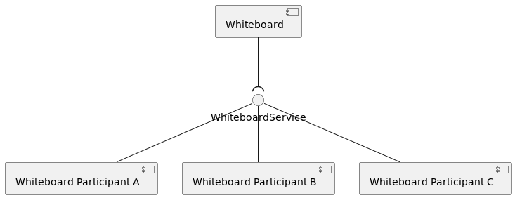

Many Apache Celix services are whiteboard services. For example:

- `celix_shell_command_t` and `celix::IShellCommand` services. These services can be
  picked up by the `Celix::shell` bundle, but applications should still work if there is no `Celix::shell` installed
  and started.
  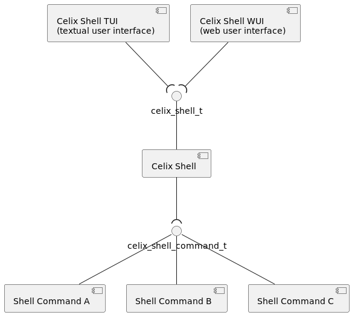
- `celix_http_service_t` and `celix_websocket_service_t` services. These services can be picked up by the
  `Celix::http_admin` bundle to provide http url endpoints or websocket url endpoints.
  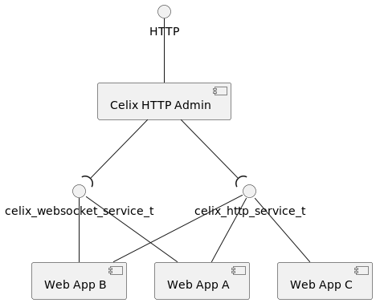
- `celix_log_sink_t` services. If there is no `Celix::log_admin` bundle installed and started, the log sinks
  services will never be called, but the application should still work. Note that the `Celix::log_admin` bundle
  also uses a service on demand pattern (see below).
  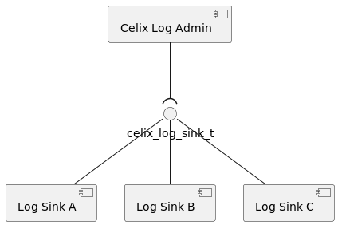
- Services marked as remote service (`service.exported.interface=*`). These services will work fine
  but only as local services - if there are no remote service bundles installed and started.

For modularity, the whiteboard pattern is a nice fit, because a whiteboard service admin does not need to know how
many - if any - whiteboard services are going to be provided and how the implementation details work (as long as
the implementation adheres to the service contract).

Whiteboard pattern services are always [consumer types](https://docs.osgi.org/javadoc/osgi.annotation/8.0.0/org/osgi/annotation/versioning/ConsumerType.html), although for Apache Celix interfaces cannot be annotated as
consumer or provider type.

One of the downsides of the whiteboard pattern is that it is not always clear why an application is not working as
expected or what is missing to get the application working as expected. This is because it is not an error
if there are unused services, and as result there is no error to help a user to identify what is missing.

For example: A `log_collector` bundle which provides a `celix_log_sink_t` service is installed and started, so that logging can be collected at in a central log database.
But no logging is added to the central log database. Initially it could seem that the `log_collector` bundle
does not work, especially because the application will not print any warnings or errors.
But if the `Celix::log_admin` bundle is not installed and started, the `log_collector` bundle provided
`celix_log_sink_t` service will never be called, so installing and starting the `Celix::log_admin` is the issue
in this example.

<a id="documents-patterns--extender-pattern"></a>

## Extender Pattern

The extender pattern is a design pattern which leverages the concept of resource containing bundles.
With the extender pattern, functionality of an extender bundle can be extended by installing so called extendee bundles.
The extendee bundles contain certain resources files and/or bundle manifest entries which are used by the extender
bundle.

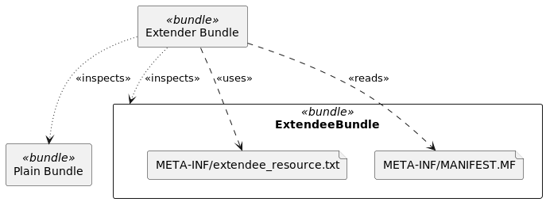

An example of the extender pattern is the `Celix::http_admin` bundle. The extender bundle `Celix::http_admin`
monitors installed bundles and reads bundle `MANIFEST.MF` entries for a `X-Web-Resource` entry.
If a `X-Web-Resource` entry is found, its value is used to set up new HTTP endpoint in the HTTP server of
the `Celix::http_admin` bundle using the static web resources of the extendee bundle.

<a id="documents-patterns--celixhttp_admin-extendee-bundle-example"></a>
<a id="documents-patterns--celix::http_admin-extendee-bundle-example"></a>

### `Celix::http_admin` Extendee Bundle Example

The following example shows how a very simple `Celix::http_admin` extendee bundle, which provided a minimal
hello world `index.html` page for the `Celix::http_admin` to pick up.

Remarks for the `Celix::http_admin` extendee bundle example:

1. Creates a bundle which will function as an extendee bundle for the `Celix::http_admin`.
2. Marks the bundle as a resource-only bundle, i.e. a bundle with no C or C++ activator.
3. Creates a very simple `index.html` file in CMake
4. Adds the `index.html` file to the `http_admin_extendee_bundle` bundle in the bundle directory resources.
5. Adds a `X-Web-Resource` bundle manifest entry, which marks the bundle as an extendee bundle for the
   `Celix::http_admin` bundle. See `Celix::http_admin` for more info. Note that `$<SEMICOLON>` is used,
   because a literal `;` has a special meaning in CMake.
6. Create a container which installs and starts the `Celix::http_admin` (extender) bundle and the
   `http_admin_extendee_bundle` (extendee) bundle.

```CMake
#CMakeLists.txt
add_celix_bundle(http_admin_extendee_bundle # <----------------------------------------------------------------------<1>
    VERSION 1.0.0
    NO_ACTIVATOR # <-------------------------------------------------------------------------------------------------<2>
)
file(WRITE "${CMAKE_CURRENT_BINARY_DIR}/index.html" "<html><body>Hello World</body></html>") # <---------------------<3>
celix_bundle_files(http_admin_extendee_bundle "${CMAKE_CURRENT_BINARY_DIR}/index.html" DESTINATION resources) # <----<4>
celix_bundle_headers(http_admin_extendee_bundle "X-Web-Resource: /hello$<SEMICOLON>/resources") # <------------------<5>

add_celix_container(extender_pattern_example_container # <-----------------------------------------------------------<6>
    BUNDLES
        Celix::http_admin
        http_admin_extendee_bundle
)
```

When the `extender_pattern_example_container` executable is running the web address `http://localhost:8080/hello`
should show the content of the `index.html`

<a id="documents-patterns--service-on-demand-sod-pattern"></a>

## Service on Demand (SOD) Pattern

A less known Apache Celix / OSGi pattern is the service on demand (SOD) pattern. With the SOD pattern, services are ad hoc registered at the moment they are requested.

Where the whiteboard pattern can be used to extend functionality in modular and service oriented fashion, the SOD
pattern can be used to use to provide more functional cohesive services to users in a service oriented fashion.

For the SOD pattern, the service filter to request services can be used to extract information about if and how
a service on demand needs to be created.

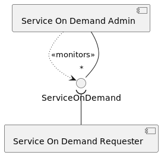

Some Apache Celix bundles use the SOD pattern. For example:

- The `Celix::log_admin` bundle creates and registers `celix_log_service_t` services already preconfigured for
  a requested logger name.
  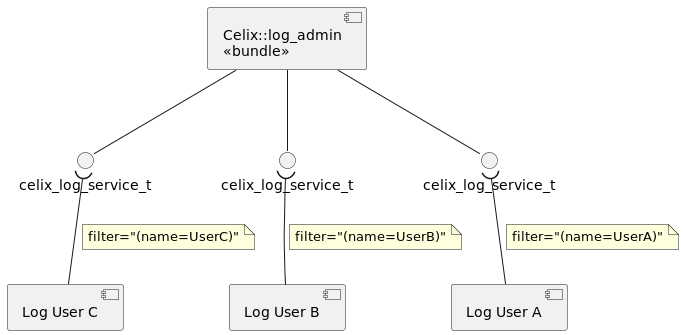
- The Celix PubSub bundles uses SOD to create and register `pubsub_publisher_t` services when these are requested
  with a valid “topic.name” and “topic.scope” filter attribute. For PubSub, the Celix PubSub Topology Manager monitors
  the `pubsub_publisher_t` requests and instructs the available Celix PubSub Admins to create
  `pubsub_publisher_t`.
  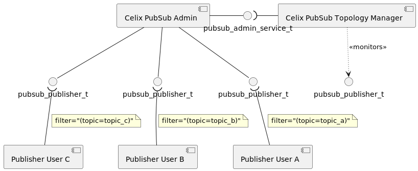
- The Apache Celix / OSGi remote services uses SOD, by ad hoc imported services only when they are discovered and
  requested.

SOD services are always [provider types](https://docs.osgi.org/javadoc/osgi.annotation/8.0.0/org/osgi/annotation/versioning/ProviderType.html), although for Apache Celix interfaces cannot be annotated as
consumer or provider type.

For OSGi the [FindHook](https://docs.osgi.org/javadoc/osgi.core/8.0.0/org/osgi/framework/hooks/service/FindHook.html)
service can be used to further fine tune which services are visible for bundle requesting a SOD service.
Apache Celix does not yet support the FindHook service.

---

<a id="documents-scheduled_events"></a>

<!-- source_url: https://celix.apache.org/docs/2.4.0/celix/documents/scheduled_events.html -->

<!-- page_index: 10 -->

# Apache Celix Scheduled Events

[Edit on GitHub](https://github.com/apache/celix-site/edit/master/source/docs/2.4.0/celix/documents/scheduled_events.md "Edit this page on GitHub")
<a id="documents-scheduled_events--apache-celix-scheduled-events"></a>

# Apache Celix Scheduled Events

Apache Celix provides supports to schedule events on the Apache Celix Event Thread. This allows users to
reuse the existing Apache Celix events thread to do tasks on the event thread.

Scheduled events will be called repeatedly using a provided interval or once if
only an initial delay is provided. For the interval time, a monotonic clock is used.

The event callback should be relatively fast, and the scheduled event interval should be relatively high; otherwise, the framework event queue will be blocked, and the framework will not function properly.
Network IO should not be done in the event callback, but instead, a separate thread should be used for this.

<a id="documents-scheduled_events--scheduling-an-event"></a>

## Scheduling an Event

To schedule an event in the Apache Celix framework, use the `celix_bundleContext_scheduleEvent` C function or
`celix::BundleContext::scheduleEvent` C++ method. For C, an options struct is used to configure the scheduled event, and for C++, a builder pattern is used to configure the scheduled event.

<a id="documents-scheduled_events--c-example"></a>

### C Example

```c
#include <stdio.h>
#include <celix_bundle_activator.h>

typedef struct schedule_events_bundle_activator_data {
    celix_bundle_context_t* ctx;
    long scheduledEventId;
} schedule_events_bundle_activator_data_t;

void scheduleEventsBundle_oneShot(void* data) {
    schedule_events_bundle_activator_data_t* act = data;
    celix_bundleContext_log(act->ctx, CELIX_LOG_LEVEL_INFO, "One shot scheduled event fired");
}

void scheduleEventsBundle_process(void* data) {
    schedule_events_bundle_activator_data_t* act = data;
    celix_bundleContext_log(act->ctx, CELIX_LOG_LEVEL_INFO, "Recurring scheduled event fired");
}

static celix_status_t scheduleEventsBundle_start(schedule_events_bundle_activator_data_t *data, celix_bundle_context_t *ctx) {
    data->ctx = ctx;

    //schedule recurring event
    {
        celix_scheduled_event_options_t opts = CELIX_EMPTY_SCHEDULED_EVENT_OPTIONS;
        opts.name = "recurring scheduled event example";
        opts.initialDelayInSeconds = 0.1;
        opts.intervalInSeconds = 1.0;
        opts.callbackData = data;
        opts.callback = scheduleEventsBundle_process;
        data->scheduledEventId = celix_bundleContext_scheduleEvent(ctx, &opts);
    }

    //schedule one time event
    {
        celix_scheduled_event_options_t opts = CELIX_EMPTY_SCHEDULED_EVENT_OPTIONS;
        opts.name = "one shot scheduled event example";
        opts.initialDelayInSeconds = 0.1;
        opts.callbackData = data;
        opts.callback = scheduleEventsBundle_oneShot;
        celix_bundleContext_scheduleEvent(ctx, &opts);
    }

    return CELIX_SUCCESS;
}

static celix_status_t scheduleEventsBundle_stop(schedule_events_bundle_activator_data_t *data, celix_bundle_context_t *ctx) {
    celix_bundleContext_removeScheduledEvent(ctx, data->scheduledEventId);
    return CELIX_SUCCESS;
}

CELIX_GEN_BUNDLE_ACTIVATOR(schedule_events_bundle_activator_data_t, scheduleEventsBundle_start, scheduleEventsBundle_stop)
```

<a id="documents-scheduled_events--c-example-1"></a>
<a id="documents-scheduled_events--c-example-2"></a>

### C++ Example

```cpp
#include <iostream>
#include "celix/BundleActivator.h"

class ScheduleEventsBundleActivator {
public:
    explicit ScheduleEventsBundleActivator(const std::shared_ptr<celix::BundleContext>& ctx) {
        //schedule recurring event
        event = ctx->scheduledEvent()
                .withInitialDelay(std::chrono::milliseconds{10})
                .withInterval(std::chrono::seconds{1})
                .withCallback([ctx] {
                    ctx->logInfo("Recurring scheduled event fired");
                })
                .build();

        //schedule one time event
        ctx->scheduledEvent()
                .withInitialDelay(std::chrono::milliseconds{10})
                .withCallback([ctx] {
                    ctx->logInfo("One shot scheduled event fired");
                })
                .build();
    }

    ~ScheduleEventsBundleActivator() noexcept {
        std::cout << "Goodbye world" << std::endl;
    }
private:
    celix::ScheduledEvent event{};
};

CELIX_GEN_CXX_BUNDLE_ACTIVATOR(ScheduleEventsBundleActivator)
```

<a id="documents-scheduled_events--waking-up-a-scheduled-event"></a>

## Waking up a Scheduled Event

To process a scheduled event directly, you can use the `celix_bundleContext_wakeupScheduledEvent` C function or
`celix::ScheduledEvent::wakup` C++ method. This will wake up the scheduled event and call its callback function.

---

<a id="documents-cmake_commands"></a>

<!-- source_url: https://celix.apache.org/docs/2.4.0/celix/documents/cmake_commands/ -->

<!-- page_index: 11 -->

<a id="documents-cmake_commands--index-of-docs-2.4.0-celix-documents-cmake_commands"></a>

# Index of /docs/2.4.0/celix/documents/cmake\_commands

<table>
<tr><th></th><th><a href="#documents-cmake_commands-index_4">Name</a></th><th><a href="#documents-cmake_commands-index_3">Last modified</a></th><th><a href="#documents-cmake_commands-index_5">Size</a></th><th><a href="#documents-cmake_commands-index_2">Description</a></th></tr>
<tr><th colspan="5"><hr/></th></tr>
<tr><td></td><td><a href="#documents">Parent Directory</a></td><td> </td><td align="right">  - </td><td> </td></tr>
<tr><th colspan="5"><hr/></th></tr>
</table>

CMake Commands / Apache Celix

[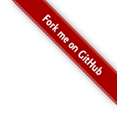](https://github.com/apache/celix)

[Edit on GitHub](https://github.com/apache/celix/edit/master/documents/cmake_commands/README.md "Edit this page on GitHub")
[<< back to documentation](#docs-2.4.0-docs "back to documentation")
<a id="documents-cmake_commands--apache-celix-cmake-commands"></a>

# Apache Celix - CMake Commands

For Apache Celix several cmake command are added to be able to work with Apache Celix bundles and deployments.

<a id="documents-cmake_commands--bundles"></a>

# Bundles

A bundle is a dynamically loadable collection of shared libraries, configuration files and optional an activation entry
that can be dynamically installed and started in a Celix framework.

<a id="documents-cmake_commands--add_celix_bundle"></a>

## add\_celix\_bundle

Add a Celix bundle to the project.

```CMake
add_celix_bundle(<bundle_target_name>
        SOURCES source1 source2 ...
        [NAME bundle_name]
        [SYMBOLIC_NAME bundle_symbolic_name]
        [DESCRIPTION bundle_description]
        [GROUP bundle_group]
        [VERSION bundle_version]
        [FILENAME bundle_filename]
        [PRIVATE_LIBRARIES private_lib1 private_lib2 ...]
        [HEADERS "header1: header1_value" "header2: header2_value" ...]
        [DO_NOT_CONFIGURE_SYMBOL_VISIBILITY]
)
```

```CMake
add_celix_bundle(<bundle_target_name>
        ACTIVATOR <activator_lib>
        [NAME bundle_name]
        [SYMBOLIC_NAME bundle_symbolic_name]
        [DESCRIPTION bundle_description]
        [GROUP bundle_group]
        [VERSION bundle_version]
        [FILENAME bundle_filename]
        [PRIVATE_LIBRARIES private_lib1 private_lib2 ...]
        [HEADERS "header1: header1_value" "header2: header2_value" ...]
        [DO_NOT_CONFIGURE_SYMBOL_VISIBILITY]
)
```

```CMake
add_celix_bundle(<bundle_target_name>
        NO_ACTIVATOR
        [NAME bundle_name]
        [SYMBOLIC_NAME bundle_symbolic_name]
        [DESCRIPTION bundle_description]
        [GROUP bundle_group]
        [VERSION bundle_version]
        [FILENAME bundle_filename]
        [PRIVATE_LIBRARIES private_lib1 private_lib2 ...]
        [HEADERS "header1: header1_value" "header2: header2_value" ...]
        [DO_NOT_CONFIGURE_SYMBOL_VISIBILITY]
)
```

Example:

```CMake
add_celix_bundle(my_bundle SOURCES src/my_activator.c)
```

There are three variants:

- With SOURCES the bundle will be created using a list of sources files as input for the bundle activator library.
- With ACTIVATOR the bundle will be created using the library target or absolute path to existing library as activator library.
- With the NO\_ACTIVATOR option will create a bundle without a activator (i.e. a pure resource bundle).

Optional arguments are:

- NAME: The (human readable) name of the bundle. This will be used as Bundle-Name manifest entry. Default is the <bundle\_target\_name>.
- SYMBOLIC\_NAME: The symbolic name of the bundle. This will be used as Bundle-SymbolicName manifest entry. Default is the <bundle\_target\_name>.
- DESCRIPTION: The description of the bundle. This will be used as Bundle-Description manifest entry. Default this is empty.
- GROUP: The group the bundle is part of. This will be used as Bundle-Group manifest entry. Default this is empty (no group).
- VERSION: The bundle version. This will be used for the Bundle-Version manifest entry. In combination with SOURCES the version will also be used to set the activator library target property VERSION and SOVERSION.
  For SOVERSION only the major part is used. Expected scheme is “..”. Default version is “0.0.0”
- FILENAME: The filename of the bundle file, without extension. Default is <bundle\_target\_name>. Together with the BUILD\_TYPE, this will result in a filename like “bundle\_target\_name\_Debug.zip
- PRIVATE\_LIBRARIES: private libraries to be included in the bundle. Specified libraries are added to the “Private-Library” manifest statement and added in the root of the bundle. libraries can be cmake library targets or absolute paths to existing libraries.
- HEADERS: Additional headers values that are appended to the bundle manifest.
- DO\_NOT\_CONFIGURE\_SYMBOL\_VISIBILITY: By default the bundle library will be build with symbol visibility configuration preset set to hidden. This can be disabled by providing this option.

<a id="documents-cmake_commands--celix_bundle_private_libs"></a>

## celix\_bundle\_private\_libs

Add libraries to a bundle.

```CMake
celix_bundle_private_libs(<bundle_target>
    lib1 lib2 ...
)
```

Example:

```
celix_bundle_private_libs(my_bundle my_lib1 my_lib2)
```

A library should be a cmake library target or an absolute path to existing library.
The libraries will be copied into the bundle zip and activator library will be linked (PRIVATE) against them.

Apache Celix uses dlopen with RTLD\_LOCAL to load the activator library in a bundle.
It is important to note that dlopen will always load the activator library, but not always load the libraries the bundle activator library is linked against.
If the activator library is linked against a library which is already loaded, the already loaded library will be used.
More specifically dlopen will decide this based on the NEEDED header in the activator library
and the SO\_NAME headers of the already loaded libraries.

For example installing in order:

- Bundle A with a private library libfoo (SONAME=libfoo.so) and
- Bundle B with a private library libfoo (SONAME=libfoo.so).
  Will result in Bundle B also using libfoo loaded from the cache dir in Bundle A.

This also applies if multiple Celix frameworks are created in the same process. For example installed in order:

- Bundle A with a private library libfoo (SONAME=libfoo.so) in Celix Framework A and
- The same Bundle A in Celix Framework B.
  Will result in Bundle A from Framework B to use the libfoo loaded from the cache dir of Bundle A in framework A.

<a id="documents-cmake_commands--celix_bundle_files"></a>

## celix\_bundle\_files

Add files to the target bundle.

```CMake
celix_bundle_files(<bundle_target>
    files... DESTINATION <dir>
    [FILE_PERMISSIONS permissions...]
    [DIRECTORY_PERMISSIONS permissions...]
    [NO_SOURCE_PERMISSIONS] [USE_SOURCE_PERMISSIONS]
    [FILES_MATCHING]
    [PATTERN <pattern> | REGEX <regex>]
    [EXCLUDE] [PERMISSIONS permissions...] [...]
)
```

Example:

```CMake
celix_bundle_files(my_bundle ${CMAKE_CURRENT_LIST_DIR}/resources/my_file.txt DESTINATION META-INF/subdir)
```

DESTINATION is relative to the bundle archive root.
The rest of the command is based on the file(COPY …) cmake command.
See cmake file(COPY …) command for more info.

Note with celix\_bundle\_files, files are copied cmake generation time. Updates are not copied !!

<a id="documents-cmake_commands--celix_bundle_add_dir"></a>

## celix\_bundle\_add\_dir

Copy to the content of a directory to a bundle.

```CMake
celix_bundle_add_dir(<bundle_target> <input_dir>
    [DESTINATION <relative_path_in_bundle>]
)
```

Example:

```CMake
celix_bundle_add_dir(my_bundle bundle_resources/ DESTINATION "resources")
```

Optional arguments:

- DESTINATION: Destination of the files, relative to the bundle archive root. Default is “.”.

Note celix\_bundle\_add\_dir copies the dir and can track changes.

<a id="documents-cmake_commands--celix_bundle_add_files"></a>

## celix\_bundle\_add\_files

Copy to the content of a directory to a bundle.

```CMake
celix_bundle_add_files(<bundle_target>
    [FILES <file1> <file2> ...]
    [DESTINATION <relative_path_in_bundle>]
)
```

Example:

```CMake
celix_bundle_add_files(my_bundle FILES my_file1.txt my_file2.txt DESTINATION "resources")
```

Optional arguments:

- FILES: Which files to copy to the the bundle.
- DESTINATION: Destination of the files, relative to the bundle archive root. Default is “.”.

Note celix\_bundle\_add\_files copies the files and can track changes.

<a id="documents-cmake_commands--celix_bundle_headers"></a>

## celix\_bundle\_headers

Append the provided headers to the target bundle manifest.

```CMake
celix_bundle_headers(<bundle_target>
    "header1: header1_value"
    "header2: header2_value"
    ...
)
```

<a id="documents-cmake_commands--celix_bundle_symbolic_name"></a>

## celix\_bundle\_symbolic\_name

Set bundle symbolic name

```CMake
celix_bundle_symbolic_name(<bundle_target> symbolic_name)
```

<a id="documents-cmake_commands--celix_get_bundle_symbolic_name"></a>

## celix\_get\_bundle\_symbolic\_name

Get bundle symbolic name from a (imported) bundle target.

```CMake
celix_get_bundle_symbolic_name(<bundle_target> VARIABLE_NAME)
```

Example: `celix_get_bundle_symbolic_name(Celix::shell SHELL_BUNDLE_SYMBOLIC_NAME)`

<a id="documents-cmake_commands--celix_bundle_name"></a>

## celix\_bundle\_name

Set bundle name

```CMake
celix_bundle_name(<bundle_target> name)
```

<a id="documents-cmake_commands--celix_bundle_version"></a>

## celix\_bundle\_version

Set bundle version

```CMake
celix_bundle_version(<bundle_target> version)
```

<a id="documents-cmake_commands--celix_bundle_description"></a>

## celix\_bundle\_description

Set bundle description

```CMake
celix_bundle_description(<bundle_target> description)
```

<a id="documents-cmake_commands--celix_bundle_group"></a>

## celix\_bundle\_group

Set bundle group.

```CMake
celix_bundle_group(<bundle_target> bundle group)
```

<a id="documents-cmake_commands--celix_get_bundle_filename"></a>

## celix\_get\_bundle\_filename

Get bundle filename from a (imported) bundle target taking into account the
used CMAKE\_BUILD\_TYPE and available bundle configurations.

```CMake
celix_get_bundle_filename(<bundle_target> VARIABLE_NAME)
```

Example:

```CMake
celix_get_bundle_filename(Celix::shell SHELL_BUNDLE_FILENAME)
```

<a id="documents-cmake_commands--celix_get_bundle_file"></a>

## celix\_get\_bundle\_file

Get bundle file (absolute path to a bundle) from a (imported) bundle
target taking into account the used CMAKE\_BUILD\_TYPE and available
bundle configurations.

```CMake
celix_get_bundle_file(<bundle_target> VARIABLE_NAME)
```

Example:

```CMake
celix_get_bundle_file(Celix::shell SHELL_BUNDLE_FILE)
```

<a id="documents-cmake_commands--install_celix_bundle"></a>

## install\_celix\_bundle

Install bundle when ‘make install’ is executed.

```CMake
install_celix_bundle(<bundle_target>
    [EXPORT] export_name
    [PROJECT_NAME] project_name
    [BUNDLE_NAME] bundle_name
    [HEADERS header_file1 header_file2 ...]
    [RESOURCES resource1 resource2 ...]
)
```

Bundles are installed at `<install-prefix>/share/<project_name>/bundles`.
Headers are installed at `<install-prefix>/include/<project_name>/<bundle_name>`
Resources are installed at `<install-prefix>/shared/<project_name>/<bundle_name>`

Optional arguments:

- EXPORT: Associates the installed bundle with a export\_name.
  The export name can be used to generate a CelixTargets.cmake file (see install\_celix\_bundle\_targets)
- PROJECT\_NAME: The project name for installing. Default is the cmake project name.
- BUNDLE\_NAME: The bundle name used when installing headers/resources. Default is the bundle target name.
- HEADERS: A list of headers to install for the bundle.
- RESOURCES: A list of resources to install for the bundle.

<a id="documents-cmake_commands--install_celix_targets"></a>

## install\_celix\_targets

Generate and install a Celix Targets cmake file which contains CMake commands to create imported targets for the bundles
install using the provided <export\_name>. These imported CMake targets can be used in CMake projects using the installed
bundles.

```CMake
install_celix_targets(<export_name>
    NAMESPACE <namespace>
    [FILE <celix_target_filename>]
    [PROJECT_NAME <project_name>]
    [DESTINATION <celix_targets_destination>]
)
```

Example:

```CMake
install_celix_targets(celix NAMESPACE Celix:: DESTINATION share/celix/cmake FILE CelixTargets)
```

Optional Arguments:

- FILE: The Celix Targets cmake filename to used, without the cmake extension. Default is <export\_name>BundleTargets
- PROJECT\_NAME: The project name to used for the share location. Default is the cmake project name.
- DESTINATION: The (relative) location to install the Celix Targets cmake file to. Default is share/<PROJECT\_NAME>/cmake.

<a id="documents-cmake_commands--celix-containers"></a>

# Celix Containers

Celix containers are executables preconfigured to start a Celix framework with a set of configuration properties
and a set of bundles to install or install and start.

<a id="documents-cmake_commands--add_celix_container"></a>

## add\_celix\_container

Add a Celix container, consisting out of a selection of bundles and a Celix launcher.
Celix containers can be used to start a Celix framework together with a selection of bundles.

A Celix container will be build in `<cmake_build_dir>/deploy[/<group_name>]/<celix_container_name>`.
Use the `<celix_container_name>` executable to run the containers.

There are three variants of ‘add\_celix\_container’:

- If no launcher is specified a custom Celix launcher will be generated. This launcher also contains the configured properties.
- If a LAUNCHER\_SRC is provided a Celix launcher will be build using the provided sources. Additional sources can be added with the
  CMake ’target\_sources’ command.
- If a LAUNCHER (absolute path to a executable of CMake `add_executable` target) is provided that will be used as Celix launcher.

Creating a Celix containers using ‘add\_celix\_container’ will lead to a CMake executable target (expect if a LAUNCHER is used).
These targets can be used to run/debug Celix containers from a IDE (if the IDE supports CMake).

Optional Arguments:

- COPY: With this option the bundles used in the container will be copied in and configured for a bundles directory
  next to the container executable. Only one of the COPY or NO\_COPY options can be provided.
  Default is COPY.
- NO\_COPY: With this option the bundles used in the container will be configured using absolute paths to the bundles
  zip files. Only one of the COPY or NO\_COPY options can be provided.
  Default is COPY.
- CXX: With this option the generated Celix launcher (if used) will be a C++ source.
  This ensures that the Celix launcher is linked against stdlibc++. Only one of the C or CXX options can be provided.
  Default is CXX
- C: With this option the generated Celix launcher (if used) will be a C source. Only one of the C or CXX options can
  be provided.
  Default is CXX
- FAT: With this option only embedded bundles are allowed to be added to the container. Ensuring a container executable
  this is not dependent on external bundle zip files.
  Note that this option does not change anything to the container, it just ensure that all added bundles are embedded
  bundles.
- USE\_CONFIG: With this option the config properties are generated in a ‘config.properties’ instead of embedded in
  the Celix launcher.
- GROUP: If configured the build location will be prefixed the GROUP. Default is empty.
- NAME: The name of the executable. Default is <celix\_container\_name>. Only useful for generated/LAUNCHER\_SRC
  Celix launchers.
- DIR: The base build directory of the Celix container. Default is `<cmake_build_dir>/deploy`.
- BUNDLES: A list of bundles for the Celix container to install and start.
  These bundle will be configured for run level 3. See ‘celix\_container\_bundles’ for more info.
- INSTALL\_BUNDLES: A list of bundles for the Celix container to install (but not start).
- EMBEDDED\_BUNDLES: A list of bundles to embed in the Celix container (inject as binary in the executable) and
  to install and start for the Celix container.
  See `celix_target_embedded_bundle` for more info about embedded bundles.
- INSTALL\_EMBEDDED\_BUNDLES: A list of bundles to embed in the Celix container (inject as binary in the executable) and
  to install (but not start) for the Celix container.
  See `celix_target_embedded_bundle` for more info about embedded bundles.
- PROPERTIES: A list of configuration properties, these can be used to configure the Celix framework and/or bundles.
  Normally this will be EMBEDED\_PROPERTIES, but if the USE\_CONFIG option is used this will be RUNTIME\_PROPERTIES.
  See the framework library or bundles documentation about the available configuration options.
- EMBEDDED\_PROPERTIES: A list of configuration properties which will be used in the generated Celix launcher.
- RUNTIME\_PROPERTIES: A list of configuration properties which will be used in the generated config.properties file.

```CMake
add_celix_container(<celix_container_name>
    [COPY]
    [NO_COPY]
    [CXX]
    [C]
    [FAT]
    [USE_CONFIG]
    [GROUP group_name]
    [NAME celix_container_name]
    [DIR dir]
    [BUNDLES <bundle1> <bundle2> ...]
    [INSTALL_BUNDLES <bundle1> <bundle2> ...]
    [EMBEDDED_BUNDLES <bundle1> <bundle2> ...]
    [INSTALL_EMBEDDED_BUNDLES <bundle1> <bundle2> ...]
    [PROPERTIES "prop1=val1" "prop2=val2" ...]
    [EMBEDDED_PROPERTIES "prop1=val1" "prop2=val2" ...]
    [RUNTIME_PROPERTIES "prop1=val1" "prop2=val2" ...]
)
```

```CMake
add_celix_container(<celix_container_name>
    LAUNCHER launcher
    [COPY]
    [NO_COPY]
    [CXX]
    [C]
    [FAT]
    [USE_CONFIG]
    [GROUP group_name]
    [NAME celix_container_name]
    [DIR dir]
    [BUNDLES <bundle1> <bundle2> ...]
    [INSTALL_BUNDLES <bundle1> <bundle2> ...]
    [EMBEDDED_BUNDLES <bundle1> <bundle2> ...]
    [INSTALL_EMBEDDED_BUNDLES <bundle1> <bundle2> ...]
    [PROPERTIES "prop1=val1" "prop2=val2" ...]
    [EMBEDDED_PROPERTIES "prop1=val1" "prop2=val2" ...]
    [RUNTIME_PROPERTIES "prop1=val1" "prop2=val2" ...]
)
```

```CMake
add_celix_container(<celix_container_name>
    LAUNCHER_SRC launcher_src
    [COPY]
    [NO_COPY]
    [CXX]
    [C]
    [FAT]
    [USE_CONFIG]
    [GROUP group_name]
    [NAME celix_container_name]
    [DIR dir]
    [BUNDLES <bundle1> <bundle2> ...]
    [INSTALL_BUNDLES <bundle1> <bundle2> ...]
    [EMBEDDED_BUNDLES <bundle1> <bundle2> ...]
    [INSTALL_EMBEDDED_BUNDLES <bundle1> <bundle2> ...]
    [PROPERTIES "prop1=val1" "prop2=val2" ...]
    [EMBEDDED_PROPERTIES "prop1=val1" "prop2=val2" ...]
    [RUNTIME_PROPERTIES "prop1=val1" "prop2=val2" ...]
)
```

Examples:

```CMake
#Creates a Celix container in ${CMAKE_BINARY_DIR}/deploy/simple_container which starts 3 bundles located at
#${CMAKE_BINARY_DIR}/deploy/simple_container/bundles.
add_celix_container(simple_container
    BUNDLES
        Celix::shell
        Celix::shell_tui
        Celix::log_admin
    PROPERTIES
        CELIX_LOGGING_DEFAULT_ACTIVE_LOG_LEVEL=debug
)
```

```CMake
#Creates a "fat" Celix container in ${CMAKE_BINARY_DIR}/deploy/simple_fat_container which starts 3 bundles embedded
#in the container executable.
add_celix_container(simple_fat_container
        FAT
        EMBEDDED_BUNDLES
        Celix::shell
        Celix::shell_tui
        Celix::log_admin
        PROPERTIES
        CELIX_LOGGING_DEFAULT_ACTIVE_LOG_LEVEL=debug
        )
```

<a id="documents-cmake_commands--celix_container_bundles"></a>

## celix\_container\_bundles

Add a selection of bundles to the Celix container.

```CMake
celix_container_bundles(<celix_container_target_name>
      [COPY]
      [NO_COPY]
      [LEVEL (0..6)]
      [INSTALL]
      bundle1
      bundle2
      ...
)
```

Example:

```CMake
celix_container_bundles(my_container Celix::shell Celix::shell_tui)
```

The selection of bundles are (if configured) copied to the container build dir and
are added to the configuration properties so that they are installed and started when the Celix container is executed.

The Celix framework supports 7 (0 - 6) run levels. Run levels can be used to control the start and stop order of bundles.
Bundles in run level 0 are started first and bundles in run level 6 are started last.
When stopping bundles in run level 6 are stopped first and bundles in run level 0 are stopped last.
Within a run level the order of configured decides the start order; bundles added earlier are started first.

Optional Arguments:

- LEVEL: The run level for the added bundles. Default is 3.
- INSTALL: If this option is present, the bundles will only be installed instead of the default install and start.
  The bundles will be installed after all bundle in LEVEL 0..6 are installed and started.
- COPY: If this option is present, the bundles will be copied to the container build dir. This option overrides the
  NO\_COPY option used in the add\_celix\_container call.
- NO\_COPY: If this option is present, the install/start bundles will be configured using a absolute path to the
  bundle. This option overrides optional COPY option used in the add\_celix\_container call.

<a id="documents-cmake_commands--celix_container_embedded_bundles"></a>

## celix\_container\_embedded\_bundles

Embed a selection of bundles to the Celix container.

```CMake
celix_container_embedded_bundles(<celix_container_target_name>
    [LEVEL (0..6)]
    [INSTALL]
    bundle1
    bundle2
    ...
)
```

Example:

```CMake
celix_container_embedded_bundles(my_container Celix::shell Celix::shell_tui)
```

The selection of bundles are embedded in the container executable using the
`celix_target_embedded_bundle` Celix CMake command and are added to the configuration properties so that they are
installed and started when the Celix container is executed.

See `celix_target_embedded_bundle` for how bundle is embedded in a executable.

The Celix framework supports 7 (0 - 6) run levels. Run levels can be used to control the start and stop order of bundles.
Bundles in run level 0 are started first and bundles in run level 6 are started last.
When stopping bundles in run level 6 are stopped first and bundles in run level 0 are stopped last.
Within a run level the order of configured decides the start order; bundles added earlier are started first.

Optional Arguments:

- LEVEL: The run level for the added bundles. Default is 3.
- INSTALL: If this option is present, the bundles will only be installed instead of the default install and start.
  The bundles will be installed after all bundle in LEVEL 0..6 are installed and started.

<a id="documents-cmake_commands--celix_container_properties"></a>

## celix\_container\_properties

Add the provided properties to the target Celix container config properties.
If the USE\_CONFIG option is used these configuration properties will be added to the ‘config.properties’ file else they
will be added to the generated Celix launcher.

```CMake
celix_container_properties(<celix_container_target_name>
    "prop1=val1"
    "prop2=val2"
    ...
)
```

<a id="documents-cmake_commands--celix_container_embedded_properties"></a>

## celix\_container\_embedded\_properties

Add the provided properties to the target Celix container config properties.
These properties will be embedded into the generated Celix launcher.

```CMake
celix_container_embedded_properties(<celix_container_target_name>
    "prop1=val1" 
    "prop2=val2" 
    ...
)
```

<a id="documents-cmake_commands--celix_container_runtime_properties"></a>

## celix\_container\_runtime\_properties

Add the provided properties to the target Celix container config properties.
These properties will be added to the config.properties in the container build dir.

```CMake
celix_container_runtime_properties(<celix_container_target_name>
    "prop1=val1" 
    "prop2=val2" 
    ...
)
```

<a id="documents-cmake_commands--celix-cmake-commands-for-generic-cmake-targets"></a>

# Celix CMake commands for generic CMake targets

Celix provides several CMake commands that operate on the generic CMake targets (executable, shared library, etc).

Celix CMake commands for generic CMake target will always use the keyword signature (`PRIVATE`, `PUBLIC`, `INTERFACE`)
version for linking, adding sources, etc. This means that these command will not work on targets created with
an “all-plain” CMake version command.

<a id="documents-cmake_commands--add_celix_bundle_dependencies"></a>

## add\_celix\_bundle\_dependencies

Add bundles as dependencies to a cmake target, so that the bundle zip files will be created before the cmake target.

```CMake
add_celix_bundle_dependencies(<cmake_target>
    bundles...
)
```

```CMake
add_celix_bundle_dependencies(my_exec my_bundle1 my_bundle2)
```

<a id="documents-cmake_commands--celix_target_embedded_bundle"></a>

## celix\_target\_embedded\_bundle

Embeds a Celix bundle into a CMake target.

```CMake
celix_target_embedded_bundle(<cmake_target>
        BUNDLE <bundle>
        [NAME <name>]
        )
```

Example:

```CMake
celix_target_embedded_bundle(my_executable
        BUNDLE Celix::shell
        NAME celix_shell
        )
# result in the symbols:
# - celix_embedded_bundle_celix_shell_start
# - celix_embedded_bundle_celix_shell_end
# - celix_embedded_bundles = "embedded://celix_shell"
# to be added to `my_executable`
```

The Celix bundle will be embedded into the CMake target between the symbols: `celix_embedded_bundle_${NAME}_start` and
`celix_embedded_bundle_${NAME}_end`.

Also a `const char * const` symbol with the name `celix_embedded_bundles` will be added or updated containing a `,`
seperated list of embedded Celix bundle urls. The url will be: `embedded://${NAME}`.

For Linux the linking flag `--export-dynamic` is added to ensure that the previous mentioned symbols can be retrieved
using `dlsym`.

Mandatory Arguments:

- BUNDLE: The bundle target or bundle file (absolute path) to embed in the CMake target.

Optional Arguments:

- NAME: The name to use when embedding the Celix bundle. This name is used in the \_start and \_end symbol, but also
  for the embedded bundle url.
  For a bundle CMake target the default is the bundle symbolic name and for a bundle file the default is the
  bundle filename without extension. The NAME must be a valid C identifier.

Bundles embedded in an executable can be installed/started using the bundle url: “embedded://${NAME}” in
combination with `celix_bundleContext_installBundle` (C) or `celix::BundleContext::installBundle` (C++).
All embedded bundle can be installed using the framework utils function
`celix_framework_utils_installEmbeddedBundles` (C) or `celix::installEmbeddedBundles` (C++).

<a id="documents-cmake_commands--celix_target_embedded_bundles"></a>

## celix\_target\_embedded\_bundles

Embed multiple Celix bundles into a CMake target.

```CMake
celix_target_embedded_bundles(<cmake_target> [<bundle1> <bundle2> ...])
```

Example:

```CMake
celix_target_embedded_bundles(my_executable Celix::shell Celix::shell_tui)
```

The bundles will be embedded using their symbolic name if the bundle is a CMake target or their filename (without
extension) if the bundle is a file (absolute path).

<a id="documents-cmake_commands--celix_target_bundle_set_definition"></a>

## celix\_target\_bundle\_set\_definition

Add a compile-definition with a set of comma seperated bundles paths to a target and also adds the bundles as
dependency to the target.

```CMake
celix_target_bundle_set_definition(<cmake_target>
        NAME <set_name>
        [<bundle1> <bundle2>..]
        )
```

Example:

```CMake
celix_target_bundle_set_definition(test_example NAME TEST_BUNDLES Celix::shell Celix::shell_tui)
```

The compile-definition will have the name `${NAME}` and will contain a `,` separated list of bundle paths.
The bundle set can be installed using the Celix framework util function `celix_framework_utils_installBundleSet` (C)
or `celix::installBundleSet` (C++).

Adding a compile-definition with a set of bundles can be useful for testing purpose.

<a id="documents-cmake_commands--celix_target_hide_symbols"></a>

## celix\_target\_hide\_symbols

Configure the symbol visibility preset of the provided target to hidden.

This is done by setting the target properties C\_VISIBILITY\_PRESET to hidden, the CXX\_VISIBILITY\_PRESET to hidden and
VISIBILITY\_INLINES\_HIDDEN to ON.

```CMake
celix_target_hide_symbols(<cmake_target> [RELEASE] [DEBUG] [RELWITHDEBINFO] [MINSIZEREL])
```

Optional arguments are:

- RELEASE: hide symbols for the release build type
- DEBUG: hide symbols for the debug build type
- RELWITHDEBINFO: hide symbols for the relwithdebinfo build type
- MINSIZEREL: hide symbols for the minsizerel build type

If no optional arguments are provided, the symbols are hidden for all build types.

Example:

```CMake
celix_target_hide_symbols(my_bundle RELEASE MINSIZEREL)
```

---

<a id="documents-subprojects"></a>

<!-- source_url: https://celix.apache.org/docs/2.4.0/celix/documents/subprojects.html -->

<!-- page_index: 12 -->

# Apache Celix - Libraries and Bundles

[Edit on GitHub](https://github.com/apache/celix/edit/master/documents/subprojects.md "Edit this page on GitHub")
[<< back to documentation](#docs-2.4.0-docs "back to documentation")
<a id="documents-subprojects--apache-celix-libraries-and-bundles"></a>

# Apache Celix - Libraries and Bundles

The Apache Celix project is organized into several libraries, bundles, group of bundles and examples.

<a id="documents-subprojects--core-libraries"></a>

## Core Libraries

The core of Apache Celix is realized in the following libraries:

- [Framework](#libs-framework) - The Apache Celix framework, an implementation of OSGi adapted to C and C++11.
- [Utils](https://celix.apache.org/docs/2.4.0/celix/libs/utils/README.html) - The Celix utils library, containing a wide range of general utils and
  OSGi supporting types (properties, version, filter, string utils, file utils, etc).

<a id="documents-subprojects--standalone-libraries"></a>

## Standalone Libraries

Apache Celix also provides several standalone libraries which can be used without the framework:

- [ETCD library](https://celix.apache.org/docs/2.4.0/celix/libs/etcdlib/README.html) - A C library that interfaces with ETCD.
- [Promises library](https://celix.apache.org/docs/2.4.0/celix/libs/promises/README.html) - A C++17 header only adaption and implementation of the OSGi Promise specification.
- [Push Streams Library](https://celix.apache.org/docs/2.4.0/celix/libs/pushstreams/README.html) - A C++17 header adaption and only implementation of the OSGi Push Stream specification.
- [Dynamic Function Interfacy Library](https://celix.apache.org/docs/2.4.0/celix/libs/dfi/README.html) - A C library, build on top of libffi, to dynamical create C function proxies based on descriptor files.

When using Conan as build system, these libraries can be build standalone using the following commands:

- ETCD library: `conan create . -b missing -o build_celix_etcdlib=True`
- Promises library: `conan create . -b missing -o build_promises=True`
- Push Streams Library: `conan create . -b missing -o build_pushstreams=True`
- Dynamic Function Interfacy Library: `conan create . -b missing -o build_celix_dfi=True`

<a id="documents-subprojects--bundles-or-groups-of-bundles"></a>

## Bundles or Groups of Bundles

Modularization is an important aspect of OSGi. Apache Celix provides several bundles or groups of bundles which extend
the Apache Celix functionality. Most of these bundles are based on the OSGi specification and are adapted to C or C++.

- [HTTP Admin](#bundles-http_admin-readme) - An implementation for the OSGi HTTP whiteboard adapted to C and based on civetweb.
- [Log Service](#bundles-logging-readme) - A Log Service logging abstraction for Apache Celix.
  - [Syslog Writer](https://celix.apache.org/docs/2.4.0/celix/bundles/logging/log_writers/syslog_writer) - A syslog writer for use in combination with the Log Service.
- [Shell](#bundles-shell-readme) - A OSGi C and C++11 shell implementation, which can be extended with shell command services.
- [Pubsub](#bundles-pubsub-readme) - An implementation for a publish-subscribe remote message communication system.
- [Remote Services](#bundles-remote_services) - A C adaption and implementation of the OSGi Remote Service Admin specification.
- [C++ Remote Services](https://celix.apache.org/docs/2.4.0/celix/bundles/cxx_remote_services/README.html) - A C++17 adaption and implementation of the OSGi Remote Service Admin specification. Requires manually or code-generated import/export factories to work.
- [Components Ready Check](#bundles-components_ready_check-readme) - A bundle which checks if all components are ready.

<a id="documents-subprojects--examples"></a>

## Examples

The Apache Celix provides several [examples](#examples-celix-examples) showing how the framework and bundles can be used. These
examples are configured in such a way that they can also be used together with an installed Apache Celix.

---

<a id="documents-development-readme"></a>

<!-- source_url: https://celix.apache.org/docs/2.4.0/celix/documents/development/README.html -->

<!-- page_index: 13 -->

# Apache Celix Coding Conventions

[Edit on GitHub](https://github.com/apache/celix/edit/master/documents/development/README.md "Edit this page on GitHub")
[<< back to documentation](#docs-2.4.0-docs "back to documentation")
<a id="documents-development-readme--apache-celix-coding-conventions"></a>

# Apache Celix Coding Conventions

Adhering to consistent and meaningful coding conventions is crucial for maintaining readable and maintainable code.
This document outlines the recommended coding conventions for Apache Celix development, including naming conventions, formatting, comments, control structures, functions and error handling.

Note that not all existing code adheres to these conventions.
New code should adhere to these conventions and when possible, existing code should be updated to adhere to these
conventions.

<a id="documents-development-readme--naming-conventions"></a>

## Naming Conventions

<a id="documents-development-readme--cc-variables"></a>
<a id="documents-development-readme--c-c-variables"></a>

### C/C++ Variables

- Use `camelCase` for variable names.
- Use descriptive names for variables.
- Use `celix_` prefix or `celix::` (sub)namespace for global variables.
- Asterisks `*` and ampersands `&` should be placed on the variable type name.

<a id="documents-development-readme--c-structures"></a>

### C Structures

- Use `snake_case` for structure names.
- Add a typedef for the structure.
- Use a `_t` postfix for structure typedef.
- Use `celix_` prefix for structure names.
- For C objects, use typedef of an opaque struct. E.g. `typedef struct celix_<obj> celix_<obj>_t;`
  - This way the implementation details can be hidden from the user.

<a id="documents-development-readme--c-functions"></a>

### C Functions

- Use descriptive names for functions.
- Use a `celix_` prefix.
- Use a `_<obj>_` camelCase infix for the object/module name.
- Use a postfix `camelCase` for the function name.
- Asterisks `*` should be placed on the variable type name.
- Use verb as function names when a function has a side effect.
- Use nouns or getter/setter as function names when a function does not have a side effect.
- Use getters/setters naming convention for functions which get/set a value:
  - `celix_<obj>_is<Value>` and `celix_<obj>_set<Value>` for boolean values
  - `celix_<obj>_get<Value>` and `celix_<obj>_set<Value>` for other values
- For C objects:
  - Use a (opaque) object pointer as the first argument of the function.
  - Ensure that object can be created using a `celix_<obj>_create` function and destroyed using
    a `celix_<obj>_destroy` function.
  - The `celix_<obj>_create` function should return a pointer to the object.
  - The `celix_<obj>_destroy` function should return a `void` and should be able to handle a NULL pointer.
    - By being able to handle a NULL pointer, the `celix_<obj>_destroy` function can be more easily used in
      error handling code.

Examples:

- `long celix_bundleContext_installBundle(celix_bundle_context_t* ctx, const char* bundleUrl, bool autoStart)`
- `bool celix_utils_stringEquals(const char* a, const char* b)`
- `celix_status_t celix_utils_createDirectory(const char* path, bool failIfPresent, const char** errorOut)`

<a id="documents-development-readme--c-constants"></a>

### C Constants

- Use `SNAKE_CASE` for constant names.
- Use a `CELIX_` prefix for constant names.
- Use `#define` for constants.

<a id="documents-development-readme--c-enums"></a>

### C Enums

- Use `snake_case` for enum type names.
- Use a `celix_` prefix for enum type names.
- Use `SNAKE_CASE` for enum value names.
- Use a `CELIX_` prefix for enum value names.
- Add a typedef - with a `_e` postfix - for the enum

Example:

```c
typedef enum celix_hash_map_key_type {
    CELIX_HASH_MAP_STRING_KEY,
    CELIX_HASH_MAP_LONG_KEY
} celix_hash_map_key_type_e;
```

<a id="documents-development-readme--macros"></a>

### Macros

- Use all caps `SNAKE_CASE` for macro names.
- Use a `CELIX_` prefix for macro names.

<a id="documents-development-readme--c-files-and-directories"></a>

### C files and directories

- Use `snake_case` for file names.
- Name header files with a `.h` extension and source files with a `.c` extension.
- Organize files in directories according to their purpose.
  - Public headers files in a `include`, `api` or `spi` directory.
  - Private header files in a `private` and `src` directory.
  - Source files in a `src` directory.
- Google test files should be placed in a `gtest` directory with its own `CMakeLists.txt` file and `src` directory.
- Use `celix_` prefix for header file names.
- Use a header guard.
- Use a C++ “extern C” block in headers file to ensure C headers are usable in C++.

<a id="documents-development-readme--c-libraries"></a>

### C Libraries

- Target names should be `snake_case`.
- There should be `celix::` prefixed aliases for the library.
- C Shared libraries should configure an output name with a `celix_` prefix.

<a id="documents-development-readme--c-services"></a>

### C Services

- Service headers should be made available through a CMake INTERFACE header-only api/spi library (i.e. `celix::shell_api`)
- C service should be C struct, where the first member is the service handle (`void* handle;`) and the rest of the members are
  function pointers.
- The first argument of the service functions should be the service handle.
- If memory allocation is needed or another error can occur in a service function, ensure that the return value can
  be used to check for errors. This can be done by:
  - Returning a `celix_status_t` and if needed using an out parameter.
  - Returning a NULL pointer if the function returns a pointer type.
  - Returning a boolean value, where `true` indicates success and `false` indicates failure.
- In the same header as the C service struct, there should be defines for the service name and version.
- The service name macro should be all caps `SNAKE_CASE`, prefixed with `CELIX_` and postfixed with `_NAME`.
- The service version macro should be all caps `SNAKE_CASE`, prefixed with `CELIX_` and postfixed with `_VERSION`.
- The value of the service name macro should be the service struct (so without a `_t` postfix
- The value of the service version macro should be the version of the service.

Example:

```c
//celix_foo.h
#include "celix_errno.h"

#define CELIX_FOO_NAME "celix_foo"
#define CELIX_FOO_VERSION 1.0.0

typedef struct celix_foo {
    void* handle;
    celix_status_t (*doFoo)(void* handle, char** outMsg);
} celix_foo_t;
```

<a id="documents-development-readme--c-bundles"></a>

### C Bundles

- Use `snake_case` for C bundle target names.
- Do *not* use a `celix_` prefix for C bundle target names.
- Use `celix::` prefixed aliases for C bundle targets.
- Use `snake_case` for C bundle symbolic names.
- Configure at least SYMBOLIC\_NAME, NAME, FILENAME, VERSION and GROUP for C bundle targets.
- Use `apache_celix_` prefix for C bundle symbolic names.
- Use `Apache Celix`  prefix for C bundle names.
- Use a `celix_` prefix for C bundle filenames.
- Use a group name starting with `celix/` for C bundle groups.

Examples:

```cmake
add_celix_bundle(my_bundle
    SOURCES src/my_bundle.c
    SYMBOLIC_NAME "apache_celix_my_bundle"
    NAME "Apache Celix My Bundle"
    FILENAME "celix_my_bundle"
    VERSION "1.0.0"
    GROUP "celix/my_bundle_group"
)
add_library(celix::my_bundle ALIAS my_bundle)
```

<a id="documents-development-readme--c-namespaces"></a>

### C++ Namespaces

- Use `snake_case` for namespace names.
- All namespaces should be part of the `celix` namespace.
- Aim for a max of 3 levels of namespaces.
- Use a namespace ending with `detail` for implementation details.

<a id="documents-development-readme--c-classes"></a>

### C++ Classes

- Use `CamelCase` (starting with a capital) for class names.
- Use descriptive names for classes.
- Classes should be part of a `celix::` namespace or sub `celix::` namespace.

<a id="documents-development-readme--c-functions-1"></a>
<a id="documents-development-readme--c-functions-2"></a>

### C++ Functions

- Use `camelCase` for function names.
- If a function is not part of a class/struct, it should be part of a `celix::` namespace or sub `celix::` namespace.
- Asterisks `*` and ampersands `&` should be placed on the variable type name.
- Use verb as function names when a function has a side effect.
- Use nouns or getter/setter as function names when a function does not have a side effect.
- Use getters/setters naming convention for functions which get/set a value.

<a id="documents-development-readme--c-constants-1"></a>
<a id="documents-development-readme--c-constants-2"></a>

### C++ Constants

- Use `SNAKE_CASE` for constants.
- Use constexpr for constants.
- Place constants in a `celix::` namespace or sub `celix::` namespace.

example:

```c++
namespace celix {
    constexpr long FRAMEWORK_BUNDLE_ID = 0;
    constexpr const char* const SERVICE_ID = "service.id";
}
```

<a id="documents-development-readme--c-enums-1"></a>
<a id="documents-development-readme--c-enums-2"></a>

### C++ Enums

- Use `CamelCase` (starting with a capital) for enum types names.
- Use `enum class` instead of `enum` and if possible use `std::int8_t` as base type.
- Use `SNAKE_CASE` for enum values without a celix/class prefix. Note that for enum values no prefix is required
  because enum class values are scoped.

Example:

```c++
namespace celix {
    enum class ServiceRegistrationState {
        REGISTERING,
        REGISTERED,
        UNREGISTERING,
        UNREGISTERED
    };
}
```

<a id="documents-development-readme--c-files-and-directories-1"></a>
<a id="documents-development-readme--c-files-and-directories-2"></a>

### C++ files and directories

- Use `CamelCase` (starting with a capital) for file names.
- Name header files with a `.h` extension and source files with a `.cc` extension.
- Place header files in a directory based on the namespace (e.g. `celix/Bundle.h`, `celix/dm/Component.h`).
- Organize files in directories according to their purpose.
  - Public headers files in a `include`, `api` or `spi` directory.
  - Private header files in a `private` and `src` directory.
  - Source files in a `src` directory.
- Use a `#pragma once` header guard.

<a id="documents-development-readme--c-libraries-1"></a>
<a id="documents-development-readme--c-libraries-2"></a>

### C++ Libraries

- Target name should be `CamelCase` (starting with a capital).
- There should be `celix::` prefixed aliases for the library.
- C++ Libraries should support C++14.
  - Exception are `celix::Promises` and `celix::PushStreams` which requires C++17.
- The Apache Celix framework library (`Celix::framework`) and the Apache Celix utils library (`Celix::utils`) can only
  use header-only C++ files. This ensure that the framework and utils library can be used in C only projects and do
  not introduce a C++ ABI.
- For other libraries, header-only C++ libraries are preferred but not required.
- Header-only C++ libraries do not need an export header and do not need to configure symbol visibility.
- C++ shared libraries (lib with C++ sources), should configure an output name with a `celix_` prefix.
- C++ shared libraries (lib with C++ sources), should use an export header and configure symbol visibility.
  - See the C Libraries section for more information.

<a id="documents-development-readme--c-services-1"></a>
<a id="documents-development-readme--c-services-2"></a>

### C++ Services

- Use `CamelCase` (starting with a capital) for service names.
- Add a ‘I’ prefix to the service interface name.
- Place service classes in a `celix::` namespace or sub `celix::` namespace.
- Add a `static constexpr const char* const NAME` to the service class, for the service name.
- Add a `static constexpr const char* const VERSION` to the service class, for the service version.

<a id="documents-development-readme--c-bundles-1"></a>
<a id="documents-development-readme--c-bundles-2"></a>

### C++ Bundles

- Use `CamelCase` for C++ bundle target names.
- Do *not* use a `Celix` prefix for C++ bundle target names.
- Use `celix::` prefixed aliases for C++ bundle targets.
- Use `CamelCase` for C++ bundle symbolic names.
- Configure at least SYMBOLIC\_NAME, NAME, FILENAME, VERSION and GROUP for C++ bundle targets.
- Use `Apache_Celix_` prefix for C++ bundle symbolic names.
- Use `Apache Celix`  prefix for C++ bundle names.
- Use a `celix_` prefix for C++ bundle filenames.
- Use a group name starting with `celix/` for C++ bundle groups.

Examples:

```cmake
add_celix_bundle(MyBundle
    SOURCES src/MyBundle.cc
    SYMBOLIC_NAME "Apache_Celix_MyBundle"
    NAME "Apache Celix My Bundle"
    FILENAME "celix_MyBundle"
    VERSION "1.0.0"
    GROUP "celix/MyBundleGroup"
)
add_library(celix::MyBundle ALIAS MyBundle)
```

<a id="documents-development-readme--unit-tests-naming"></a>

### Unit Tests Naming

- The test fixture should have a`TestSuite` postfix.
- The source file should be named after the test fixture name and use a `.cc` extension.
- Testcase names should use `CamelCase` (starting with a capital) and have a `Test` postfix.
- When using error injection (one of the `error_injector` libraries) a separate test suite should be used.
  - A `ErrorInjectionTestSuite` postfix should be used for the test fixture.
  - The error injection setup should be reset on the `TearDown` function or destructor of the test fixture.

<a id="documents-development-readme--comments-and-documentation"></a>

## Comments and Documentation

- Use Doxygen documentation, except for inline comments.
- Write comments that explain the purpose of the code, focusing on the “why” rather than the “how”.
- Apply doxygen documentation to all public API’s.
- Use the javadoc style for doxygen documentation.
- Use `@` instead of `\` for doxygen commands.
- Start with a `@brief` command and a short description.
- For `@param` commands also provide in, out, or in/out information.
- For `@return` commands also provide a description of the return value.
- If a function can return multiple error codes, use a errors section (`@section errors_section Errors`) to document the
  possible errors. Use `man 2 write` as an example for a good errors section.

<a id="documents-development-readme--formatting-and-indentation"></a>

## Formatting and Indentation

- Use spaces for indentation and use 4 spaces per indentation level.
- Keep line lengths under 120 characters, if possible, to enhance readability.
- Place opening braces on the same line as the control statement or function definition,
  and closing braces on a new line aligned with the control statement or function definition.
- Use a single space before and after operators and around assignment statements.
- Add a space after control keywords (`if`, `for`, `while`, etc.) that are followed by a parenthesis.
- Always use braces ({ }) for control structures, even for single-statement blocks, to prevent errors.
- Add a space after control keywords (`else`, `do`, etc) that are followed by a brace.
- Do not add a space after the function name and the opening parenthesis.
- For new files apply clang-format using the project .clang-format file.
  - Note that this can be done using a plugin for your IDE or by running `clang-format -i <file>`.

<a id="documents-development-readme--control-structures"></a>

## Control Structures

- Use `if`, `else if`, and `else` statements to handle multiple conditions.
- Use `switch` statements for multiple conditions with a default case.
- Use `while` statements for loops that may not execute.
- Use `do`/`while` statements for loops that must execute at least once.
- Use `for` statements for loops with a known number of iterations.
- The use of `goto` is not allowed, except for error handling in C (for C++ use RAII).
- For C, try to prevent deeply nested control structures and prefer early returns or error handling `goto` statements.
  - To prevent deeply nested control structures, the `CELIX_DO_IF`, `CELIX_GOTO_IF_NULL` and `CELIX_GOTO_IF_ERR`
    macros can also be used.

<a id="documents-development-readme--functions-and-methods"></a>

## Functions and Methods

- Limit functions to a single responsibility or purpose, following the Single Responsibility Principle (SRP).
- Keep functions short and focused, aiming for a length of fewer than 50 lines.
- Ensure const correctness.
- For C functions with a lot of different parameters, consider using an options struct.
  - An options struct combined with a EMPTY\_OPTIONS macro can be used to provide default values and a such
    options struct can be updated backwards compatible.
  - An options struct ensure that a lot of parameters can be configured, but also direct set on creation.
- For C++ functions with a lot of different parameters, consider using a builder pattern.
  - A builder pattern can be updated backwards compatible.
  - A builder pattern ensure that a lot of parameters can be configured, but also direct set on construction.

<a id="documents-development-readme--error-handling-and-logging"></a>

## Error Handling and Logging

- For C++, throw an exception when an error occurs and use RAII to ensure that resources are freed.
- For C, if memory allocation is needed or another error can occur, ensure that a function returns a value
  than can be used to check for errors. This can be done by:
  - Returning a `celix_status_t` and if needed using an out parameter.
  - Returning a NULL pointer if the function returns a pointer.
  - Returning a boolean value, where `true` indicates success and `false` indicates failure.
- Use consistent error handling techniques, such as returning error codes or using designated error handling functions.
- Log errors, warnings, and other important events using the Apache Celix log helper functions or - for libraries -
  the `celix_err` functionality.
- Always check for errors and log them.
- Error handling should free resources in the reverse order of their allocation/creation.
- Ensure error handling is correct, using test suite with error injection.

For log levels use the following guidelines:

- trace: Use this level for very detailed that you would only want to have while diagnosing problems.
- debug: This level should be used for information that might be helpful in diagnosing problems or understanding
  what’s going on, but is too verbose to be enabled by default.
- info: Use this level for general operational messages that aren’t tied to any specific problem or error condition.
  They provide insight into the normal behavior of the system. Examples include startup/shutdown messages,
  configuration assumptions, etc.
- warning: Use this level to report an issue from which the system can recover, but which might indicate a potential
  problem.
- error: This level should be used to report issues that need immediate attention and might prevent the system from
  functioning correctly. These are problems that are unexpected and affect functionality, but not so severe that the
  process needs to stop. Examples include runtime errors, inability to connect to a service, etc.
- fatal: Use this level to report severe errors that prevent the program from continuing to run.
  After logging a fatal error, the program will typically terminate.

Example of error handling and logging:

```c
celix_foo_t* celix_foo_create(celix_log_helper_t* logHelper) {
    celix_foo_t* foo = calloc(1, sizeof(*foo));
    if (!foo) {
        goto create_enomem_err;
    }
    
    CELIX_GOTO_IF_ERR(create_mutex_err, celixThreadMutex_create(&foo->mutex, NULL));
    
    foo->list = celix_arrayList_create();
    foo->map = celix_longHashMap_create();
    if (!foo->list ||  !foo->map) {
        goto create_enomem_err;
    }
    
  return foo;
create_mutex_err:
  celix_logHelper_log(logHelper, CELIX_LOG_LEVEL_ERROR, "Error creating mutex");
  free(foo); //mutex not created, do not use celix_foo_destroy to prevent mutex destroy
  return NULL;
create_enomem_err:
  celix_logHelper_log(logHelper, CELIX_LOG_LEVEL_ERROR, "Error creating foo, out of memory");
  celix_foo_destroy(foo); //note celix_foo_destroy can handle NULL
  return NULL;
}

void celix_foo_destroy(celix_foo_t* foo) {
    if (foo != NULL) {
        //note reverse order of creation
        celixThreadMutex_destroy(&foo->mutex);
        celix_arrayList_destroy(foo->list);
        celix_longHashMap_destroy(foo->map);
        free(foo);
    }
}
```

<a id="documents-development-readme--error-injection"></a>

## Error Injection

- Use the Apache Celix error\_injector libraries to inject errors in unit tests in a controlled way.
- Create a separate test suite for error injection tests and place them under a `EI_TESTS` cmake condition.
- Reset error injection setup on the `TearDown` function or destructor of the test fixture.
- If an - internal or external - function is missing error injection support, add it to the error\_injector library.
  - Try to create small error injector libraries for specific functionality.

<a id="documents-development-readme--unit-test-approach"></a>

## Unit Test Approach

- Use the Google Test framework for unit tests.
- Use the Google Mock framework for mocking.
- Use the Apache Celix error\_injector libraries to inject errors in unit tests in a controlled way.
- Test bundles by installing them in a programmatically created framework.
- Test bundles by using their provided services and used services.
- In most cases, libraries can be tested using a white box approach and bundles can be tested using a black box approach.
- For libraries that are tested with the Apache Celix error\_injector libraries or require access to private/hidden
  functions (white-box testing), a separate “code under test” static library should be created.
  This library should not hide its symbols and should have a `_cut` postfix.

```cmake
set(MY_LIB_SOURCES ...)
set(MY_LIB_PUBLIC_LIBS ...)
set(MY_LIB_PRIVATE_LIBS ...)
add_library(my_lib SHARED ${MY_LIB_SOURCES})
target_link_libraries(my_lib PUBLIC ${MY_LIB_PUBLIC_LIBS} PRIVATE ${MY_LIB_PRIVATE_LIBS})
celix_target_hide_symbols(my_lib)
...

if (ENABLE_TESTING)
    add_library(my_lib_cut STATIC ${MY_LIB_SOURCES})
    target_link_libraries(my_lib_cut PUBLIC ${MY_LIB_PUBLIC_LIBS} ${MY_LIB_PRIVATE_LIBS})
    target_include_directories(my_lib_cut PUBLIC
        ${CMAKE_CURRENT_LIST_DIR}/src
        ${CMAKE_CURRENT_LIST_DIR}/include
        ${CMAKE_BINARY_DIR}/celix/gen/includes/my_lib
    )
endif ()
```

<a id="documents-development-readme--supported-c-and-c-standards"></a>

## Supported C and C++ Standards

- C libraries should support C99.
- C++ libraries should support C++14.
  - Exception are `celix::Promises` and `celix::PushStreams` which requires C++17.
- C++ support for `celix::framework` and `celix::utils` must be header-only.
- Unit test code can be written in C++17.

<a id="documents-development-readme--library-target-properties"></a>

## Library target properties

For C and C++ shared libraries, the following target properties should be set:

- `VERSION` should be set to the library version.
- `SOVERSION` should be set to the library major version.
- `OUTPUT_NAME` should be set to the library name and should contain a `celix_` prefix.

```cmake
add_library(my_lib SHARED
    src/my_lib.c)
set_target_properties(my_lib 
    PROPERTIES
        VERSION 1.0.0
        SOVERSION 1
        OUTPUT_NAME celix_my_lib)
```

For C and C++ static libraries, the following target properties should be set:

- `POSITION_INDEPENDENT_CODE` should be set to `ON` for static libraries.
- `OUTPUT_NAME` should be set to the library name and should contain a `celix_` prefix.

```cmake
add_library(my_lib STATIC
    src/my_lib.c)
set_target_properties(my_lib
    PROPERTIES
        POSITION_INDEPENDENT_CODE ON
        OUTPUT_NAME celix_my_lib)
```

<a id="documents-development-readme--symbol-visibility"></a>

## Symbol Visibility

- Header-only (INTERFACE) libraries should not configure symbol visibility.
- Shared and static libraries should configure symbol visibility.
  - Static library meant to be linked as PRIVATE should hide symbols.
- Bundles should configure symbol visibility (this is done by default).

<a id="documents-development-readme--configuring-symbol-visibility-for-cc-libraries"></a>
<a id="documents-development-readme--configuring-symbol-visibility-for-c-c-libraries"></a>

### Configuring Symbol Visibility for C/C++ Libraries

For Apache Celix shared libraries, symbol visibility should be configured using the CMake target
properties `C_VISIBILITY_PRESET`, `CXX_VISIBILITY_PRESET` and `VISIBILITY_INLINES_HIDDEN` and a generated export
header.

The `C_VISIBILITY_PRESET` and `CXX_VISIBILITY_PRESET` target properties can be used to configure the default visibility
of symbols in C and C++ code. The `VISIBILITY_INLINES_HIDDEN` property can be used to configure the visibility of
inline functions. The `VISIBILITY_INLINES_HIDDEN` property is only supported for C++ code.

The default visibility should be configured to hidden and symbols should be explicitly exported using the export
marcos from a generated export header. The export header can be generated using the CMake function
`generate_export_header`. Every library should have its own export header.

For shared libraries, this can be done using the following CMake code:

```cmake
add_library(my_lib SHARED
        src/my_lib.c)
set_target_properties(my_lib PROPERTIES
        C_VISIBILITY_PRESET hidden
        #For C++ shared libraries also configure CXX_VISIBILITY_PRESET
        CXX_VISIBILITY_PRESET hidden
        VISIBILITY_INLINES_HIDDEN ON
        OUTPUT_NAME celix_my_lib)
target_include_directories(my_lib
      PUBLIC
        $<BUILD_INTERFACE:${CMAKE_BINARY_DIR}/celix/gen/includes/my_lib>
      PRIVATE
        src)

#generate export header
generate_export_header(my_lib
        BASE_NAME "CELIX_MY_LIB"
        EXPORT_FILE_NAME "${CMAKE_BINARY_DIR}/celix/gen/includes/my_lib/celix_my_lib_export.h")

#install
install(TARGETS my_lib EXPORT celix LIBRARY DESTINATION ${CMAKE_INSTALL_LIBDIR}
        INCLUDES DESTINATION ${CMAKE_INSTALL_INCLUDEDIR}/celix_my_lib)
install(DIRECTORY include/
        DESTINATION ${CMAKE_INSTALL_INCLUDEDIR}/celix_my_lib)
install(DIRECTORY ${CMAKE_BINARY_DIR}/celix/gen/includes/my_lib/
        DESTINATION ${CMAKE_INSTALL_INCLUDEDIR}/celix_my_lib)
```

<a id="documents-development-readme--configuring-symbol-visibility-for-cc-bundles"></a>
<a id="documents-development-readme--configuring-symbol-visibility-for-c-c-bundles"></a>

### Configuring Symbol Visibility for C/C++ Bundles

For bundle, symbol visibility will default be configured to hidden. This can be default by providing
the `DO_NOT_CONFIGURE_SYMBOL_VISIBILITY` option to the CMake `add_celix_bundle` function.

If symbol visibility is not configured in the `add_celix_bundle`, symbol visibility should be configured the same
way as a shared library.

```cmake
add_celix_bundle(my_bundle
    SOURCES src/my_bundle.c
    SYMBOLIC_NAME "apache_celix_my_bundle"
    NAME "Apache Celix My Bundle"
    FILENAME "celix_my_bundle"
    VERSION "1.0.0"
    GROUP "celix/my_bundle_group"
)
add_library(celix::my_bundle ALIAS my_bundle)
```

<a id="documents-development-readme--branch-naming"></a>

## Branch naming

- Prefix feature branches with `feature/`, hotfix branches with `hotfix/`, bugfix branches with `bugfix/`
  and release branches with `release/`.
- If you are working on an issue, prefix the branch name with the issue number. E.g., `feature/1234-add-feature`.
- Hotfix branches are for urgent fixes that need to be applied as soon as possible.
- Use short and descriptive branch names.

<a id="documents-development-readme--commit-messages"></a>

## Commit Messages

- Utilize the imperative mood when writing commit messages (e.g., “Add feature” instead of “Adds feature”
  or “Added feature”). This style aligns with git’s auto-generated messages for merge commits or revert actions.
- Ensure that commit messages are descriptive and provide meaningful context.
- Keep the first line of the commit message concise, ideally under 50 characters.
  This summary line serves as a quick overview of the change and should be easy to read in git logs.
- If more context is needed, separate the summary line from the body with a blank line.
  The body can provide additional details, explanations, or reasoning behind the changes.
  Aim to keep each line of the commit message body wrapped at around 72 characters for optimal readability.
- Use bullet points, numbered lists, or other formatting conventions when listing multiple changes or points in the
  commit message body to improve readability.
- When applicable, reference related issues, bug reports, or pull requests in the commit message body to
  provide additional context and establish connections between the commit and the larger project.
  - If your commit fixes, closes, or resolves an issue, use one of these keywords followed by the issue number
    (e.g., “fixes #42”, “closes #42”, or “resolves #42”).
  - If you want to reference an issue without closing it, simply mention the issue number
    (e.g., “related to #42” or “#42”).

<a id="documents-development-readme--benchmarking"></a>

## Benchmarking

- When needed, use benchmarking to measure performance.
- Use the Google Benchmark framework for benchmarking.

<a id="documents-development-readme--code-quality"></a>

## Code Quality

- New code should be reviewed through a pull request and no direct commits on the master branch are allowed.
  - At least 1 reviewer should review the code.
- Hotfix pull request can be merged first and reviewed later, the rest is reviewed first and merged later.
- Unit tests should be written for all new code.
- Code coverage should be measured and strive for a minimum of 95% code coverage.
- For existing code, maintain or increase the code coverage.
- Code should be checked for memory leaks using AddressSanitizer.
- Coverity scan are done on the master on a regular basis. Ideally new coverity issues should be fixed as soon as
  possible.

---

<a id="bundles-http_admin-readme"></a>

<!-- source_url: https://celix.apache.org/docs/2.4.0/celix/bundles/http_admin/README.html -->

<!-- page_index: 14 -->

# HTTP Admin / Apache Celix

[Edit on GitHub](https://github.com/apache/celix/edit/master/bundles/http_admin/README.md "Edit this page on GitHub")
[<< back to documentation](#docs-2.4.0-docs "back to documentation")
<a id="bundles-http_admin-readme--http-admin"></a>

## HTTP Admin

The HTTP admin provides a service tracker and starts a HTTP web server. The civetweb web server is used as an embedded
web server. Websockets are supported by the HTTP admin.

Services can register and implement HTTP requests or websocket support for a specified URI.
The supported HTTP requests are: GET, HEAD, POST, PUT, DELETE, TRACE, OPTIONS and PATCH.
The websocket service can support different callback handlers: connect, ready, data and close.

Aliasing is also supported for both HTTP services and websocket services. Multiple aliases can be added by using the comma as seperator.
Adding aliasing is done by adding the following function to the target CMakeFile (fill in  and ):

```CMake
celix_bundle_headers(<TARGET>
        "X-Web-Resource: /<Alias path>$<SEMICOLON>/<Path to destination>, /<Alias path 2>$<SEMICOLON>/<Path to destination>"
)
```

Bundle alias resources can be added by the with the following function in the bundle CMakefile:

```CMake
celix_bundle_add_dir(<TARGET> <Document root of bundle> DESTINATION ".")
```

<a id="bundles-http_admin-readme--celix-supported-configproperties"></a>
<a id="bundles-http_admin-readme--celix-supported-config.properties"></a>

### Celix supported config.properties

```
CELIX_HTTP_ADMIN_LISTENING_PORTS                 default = 8080, can be multiple ports divided by a comma
CELIX_HTTP_ADMIN_PORT_RANGE_MIN                  default = 8000
CELIX_HTTP_ADMIN_PORT_RANGE_MAX                  default = 9000
CELIX_HTTP_ADMIN_USE_WEBSOCKETS                  default = true
CELIX_HTTP_ADMIN_WEBSOCKET_TIMEOUT_MS            default = 3600000
CELIX_HTTP_ADMIN_NUM_THREADS                     default = 1
```

<a id="bundles-http_admin-readme--cmake-option"></a>

## CMake option

```
BUILD_HTTP_ADMIN=ON
```

---

<a id="bundles-logging-readme"></a>

<!-- source_url: https://celix.apache.org/docs/2.4.0/celix/bundles/logging/README.html -->

<!-- page_index: 15 -->

# Celix Logging Facilities

[Edit on GitHub](https://github.com/apache/celix/edit/master/bundles/logging/README.md "Edit this page on GitHub")
[<< back to documentation](#docs-2.4.0-docs "back to documentation")
<a id="bundles-logging-readme--celix-logging-facilities"></a>

# Celix Logging Facilities

The Celix Logging facility is service oriented and logging technology-agnostic logging solution.

Bundles can request (services on demand) and use `celix_log_service_t` services to log events.
Logging support the following log levels: `trace`, `debug`, `info`, `error`, `fatal`.

Bundles can provide `celix_log_sink_t` services to sink log message to different logging backends (e.g. syslog, log4c, etc)

The `Celix::log_admin` bundle facilitates the `celix_log_service_t` services and ‘connects’ these to the available
`celix_log_sink_t` services. If there is no `celix_log_sink_t` service available, log messages will be
printed on stdout/stderr.

The Celix shell command `celix::log_admin` can be used to view the existing log services and sinks, change the active log level per logger, switch loggers between detailed and brief mode, and enable/disable log sinks.

For example:

- `celix::log_admin` list the available log services and log sinks.
- `celix::log_admin log error` Set the active log level for all log services to `error`.
- `celix::log_admin log celix_ trace` Set the active log level for all log services starting with ‘celix\_’ to `trace`.
- `celix::log_admin detail false` Set all log services to brief mode.
- `celix::log_admin detail celix_ true` Set all log services starting with ‘celix\_’ to detailed mode.
- `celix::log_admin sink false` Disables all available log sinks.
- `celix::log_admin sink celix_syslog true` Enables all log sinks starting with ‘celix\_syslog’.

The `Celix::log_helper` static library can be used to more easily request a `celix_log_service_t`.
An additional benefit of the `Celix:log_helper` is that if the `Celix::log_admin` is not installed, log messages will be printed on stdout/stderr.

<a id="bundles-logging-readme--logging-properties"></a>

## Logging Properties

Properties shared among the logging bundles

```
CELIX_LOGGING_DEFAULT_ACTIVE_LOG_LEVEL The default active log level for created log services. Default is "info".
```

<a id="bundles-logging-readme--log-admin-properties"></a>

## Log Admin Properties

Properties specific for the Celix Log Admin (`Celix::log_admin` bundle)

```
CELIX_LOG_ADMIN_FALLBACK_TO_STDOUT If set to true, the log admin will log to stdout/stderr if no celix log writers are available. Default is true
CELIX_LOG_ADMIN_ALWAYS_USE_STDOUT If set to true, the log admin will always log to stdout/stderr after forwaring log statements to the available celix log writers. Default is false.
CELIX_LOG_ADMIN_LOG_SINKS_DEFAULT_ENABLED Whether discovered log sink are default enabled. Default is true.
```

<a id="bundles-logging-readme--cmake-option"></a>

## CMake option

```
BUILD_LOG_SERVICE=ON
```

<a id="bundles-logging-readme--using-info"></a>

## Using info

If the Celix Log Service is installed, ‘find\_package(Celix)’ will set:

- The `Celix::log_service_api` interface (i.e. header only) library target (v2 and v3 api)
- The `Celix::log_admin` bundle target. The log admin will create log services on demand and forward log message to the available log sinks.
- The `Celix::log_helper` static library target. Helper library with common logger functionality and helpers to setup logging
- The `Celix::log_writer_syslog` bundle target. A bundle which provides a `celix_log_sink_t` service for syslog.

Also the following deprecated bundle will be set:

- The `Celix::log_service` bundle target. The log service bundle. Deprecated, use Celix::log\_admin instead.
- The `Celix::syslog_writer` bundle target. Deprecated bundle. Logging to stdout is now an integral part of the log admin.

---

<a id="bundles-shell-readme"></a>

<!-- source_url: https://celix.apache.org/docs/2.4.0/celix/bundles/shell/README.html -->

<!-- page_index: 16 -->

# Apache Celix Shell

[Edit on GitHub](https://github.com/apache/celix/edit/master/bundles/shell/README.md "Edit this page on GitHub")
[<< back to documentation](#docs-2.4.0-docs "back to documentation")
<a id="bundles-shell-readme--apache-celix-shell"></a>

# Apache Celix Shell

<a id="bundles-shell-readme--intro"></a>

## Intro

The Celix Shell provides a service interface which can be used to interact with the Celix framework. It uses a modular
approach to enable multiple frontends, e.g. textual or graphical.

While the shell can be extended with additional commands by other bundles, it already offers some built in commands, for example:

- `lb`: list bundles
- `install`: install additional bundle
- `uninstall`: uninstall bundles
- `start`: start bundle
- `stop`: stop bundle
- `help`: displays available commands

Further information about a command can be retrieved by using `help` combined with the command.

<a id="bundles-shell-readme--service-interfaces"></a>

## Service interfaces

The Celix Shell functionality is achieved by 3 service interfaces. These interfaces are available through the
`Celix::shel_api` CMake INTERFACE library target.

- `celix_shell_t`: The shell service can be used to get an overview of the available shell commands and to execute
  shell commands.
- `celix_shell_command_t`: A C service interface to provide an additional shell command to the shell.
- `celix::IShellCommand`: A C++ service interface to provide an additional shell command to the shell.

<a id="bundles-shell-readme--bundles"></a>

## Bundles

The complete Celix shell functionality is provided by serveral bundles:

- `Celix::shell` : The core shell which offer a `celix_shell_t` service and uses `celix_shell_command_t` services.
- `Celix::CxxShell` : The core C++ shell which offers a `celix_shell_t` service and uses both `celix_shell_command_t`
  and `celix::IShellCommand` services. Offers the same functionality as `Celix::shell`, but also supports C++
  `celix::IShellCommand` services.
- `Celix::shell_tui` : Textual (terminal) user interface to the shell service.
- `Celix::shell_wui` : Web user interface to the shell service.
- `Celix::remote_shell` : Remote telnet interface to shell service
- `Celix::bonjour_shell`: Chat interface to the shell service using bonjour. Warning not mature and still unstable. When used it should be possible to chat to a Celix shell using Linux’s pidgin application or OSX’s
  Messages application.

<a id="bundles-shell-readme--logical-design-celix-shell"></a>

### Logical Design Celix Shell

|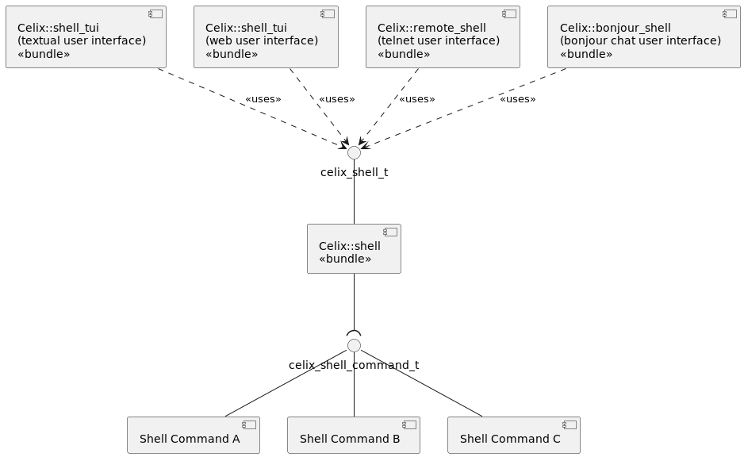

<a id="bundles-shell-readme--logical-design-celix-shell-for-c"></a>

### Logical Design Celix Shell for C++

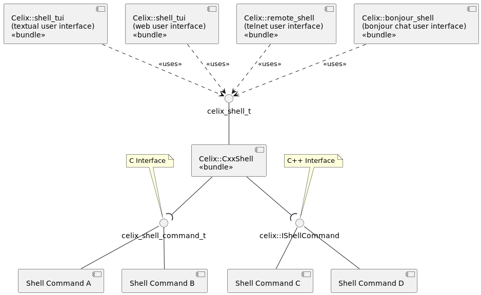

<a id="bundles-shell-readme--cmake-options"></a>

## CMake options

- BUILD\_SHELL=ON
- BUILD\_SHELL\_TUI=ON
- BUILD\_SHELL\_WUI=ON
- BUILD\_REMOTE\_SHELL=ON

<a id="bundles-shell-readme--shell-config-options"></a>

## Shell Config Options

- SHELL\_USE\_ANSI\_COLORS - Configures whether shell commands are allowed to use
  ANSI colors when printing info for `Celix::shell`. Default is true.
- SHELL\_TUI\_USE\_ANSI\_CONTROL\_SEQUENCES - Configures whether to use ANSI control
  sequences to support backspace, left, up, etc key commands in the
  `Celix::shell_tui`. Default is true if a TERM environment is set else false.
- “remote.shell.telnet.port”: Configures port used in `Celix::remote_shell`. Default is 6666.
- “remote.shell.telnet.maxconn”: Configures max nr of concurrent connections in `Celix::remote_shell`. Default is 2.

<a id="bundles-shell-readme--using-info"></a>

## Using info

If the Celix Shell is installed, `find_package(Celix)` will set:

- The `Celix::shell_api` interface (i.e. header only) library target
- The `Celix::shell` bundle target

If the Celix Shell TUI is installed, `find_package(Celix)` will set:

- The `Celix::shell_tui` bundle target if the shell\_tui is installed

If the Celix Shell WUI is installed, `find_package(Celix)` will set:

- The `Celix::shell_wui` bundle target if the shell\_wui is installed

---

<a id="bundles-pubsub-readme"></a>

<!-- source_url: https://celix.apache.org/docs/2.4.0/celix/bundles/pubsub/README.html -->

<!-- page_index: 17 -->

# Publisher / subscriber implementation

[Edit on GitHub](https://github.com/apache/celix/edit/master/bundles/pubsub/README.md "Edit this page on GitHub")
[<< back to documentation](#docs-2.4.0-docs "back to documentation")
<a id="bundles-pubsub-readme--publisher-subscriber-implementation"></a>

# Publisher / subscriber implementation

This subdirectory contains an implementation for a publish-subscribe remote services system, that use dfi library for message serialization.
For low-level communication, TCP, UDP and ZMQ is used.

<a id="bundles-pubsub-readme--description"></a>

# Description

This publisher / subscriber implementation is based on the concepts of the remote service admin (i.e. rsa / topology / discovery pattern).

Publishers are senders of data, subscribers can receive data. Publishers can publish/send data to certain channels (called ’topics’ further on), subscribers can subscribe to these topics. For every topic a publisher service is created by the pubsub admin. This publisher is announced through etcd. So etcd is used for discovery of the publishers. Subscribers are also registered as a service by the pubsub admin and will watch etcd for changes and when a new publisher is announced, the subscriber will check if the topic matches its interests. If the subscriber is interested in/subscribed to a certain topic, a connection between publisher and subscriber will be instantiated by the pubsub admin.

The dfi library is used for message serialization. The publisher / subscriber implementation will arrange that every message which will be send gets an unique id.

For communication between publishers and subscribers TCP, UDP and ZeroMQ can be used. When using ZeroMQ it’s also possible to setup a secure connection to encrypt the traffic being send between publishers and subscribers. This connection can be secured with ZeroMQ by using a curve25519 key pair per topic.

The publisher/subscriber implementation supports sending of a single message and sending of multipart messages.

<a id="bundles-pubsub-readme--getting-started"></a>

## Getting started

The publisher/subscriber implementation contains 3 different PubSubAdmins for managing connections:

- PubsubAdminUDP: This pubsub admin is using udp (multicast) linux sockets to setup a connection.
- PubsubAdminTCP: This pubsub admin is using tcp linux sockets to setup a connection.
- PubsubAdminZMQ (LGPL License): This pubsub admin is using ZeroMQ and is disabled as default. This is a because the pubsub admin is using ZeroMQ which is licensed as LGPL ([View ZeroMQ License](https://github.com/zeromq/libzmq#license)).

The ZeroMQ pubsub admin can be enabled by specifying the build flag `BUILD_PUBSUB_PSA_ZMQ=ON`. To get the ZeroMQ pubsub admin running, [ZeroMQ](https://github.com/zeromq/libzmq) and [CZMQ](https://github.com/zeromq/czmq) need to be installed. Also, to make use of encrypted traffic, [OpenSSL](https://github.com/openssl/openssl) is required.

<a id="bundles-pubsub-readme--running-instructions"></a>

## Running instructions

<a id="bundles-pubsub-readme--running-psa-udp-multicast"></a>

### Running PSA UDP-Multicast

1. Open a terminal
2. Run `etcd`
3. Open second terminal on project build location
4. Run `cd deploy/pubsub/pubsub_publisher_udp_mc`
5. Run `sh run.sh`
6. Open third terminal on project build location
7. Run `cd deploy/pubsub/pubsub_subscriber_udp_mc`
8. Run `sh run.sh`

Design information can be found at pubsub\_admin\_udp\_mc/README.md

<a id="bundles-pubsub-readme--running-psa-tcp"></a>

### Running PSA TCP

1. Open a terminal
2. Run `cd runtimes/pubsub/tcp`
3. Run `sh start.sh`

<a id="bundles-pubsub-readme--properties-psa-tcp"></a>

### Properties PSA TCP

Some properties can be set to configure the PSA-TCP. If not configured defaults will be used. These
properties can be set in the config.properties file (= format)

```
PSA_IP                              The url address to be used by the TCP admin to publish its data. Default the first IP not on localhost
                                    This can be hostname / IP address / IP address with postfix, e.g. 192.168.1.0/24
```

<a id="bundles-pubsub-readme--running-psa-zmq"></a>

### Running PSA ZMQ

For ZeroMQ without encryption, skip the steps 1-12 below

1. Run `touch ~/pubsub.keys`
2. Run `echo "aes_key:{AES_KEY here}" >> ~/pubsub.keys`. Note that AES\_KEY is just a sequence of random bytes. To generate such a key, you can use the command `cat /dev/urandom | hexdump -v -e '/1 "%02X"' | head -c 32` (this will take out of /dev/urandom 16 bytes, thus a 128bit key)
3. Run `echo "aes_iv:{AES_IV here}" >> ~/pubsub.keys`. Note that AES\_IV is just a sequence of random bytes. To generate such an initial vector , you can use the command `cat /dev/urandom | hexdump -v -e '/1 "%02X"' | head -c 16` (this will take out of /dev/urandom 8 bytes, thus a 64bit initial vector)
4. Run `touch ~/pubsub.conf`
5. Run `echo "keys.file.path=$HOME" >> ~/pubsub.conf`
6. Run `echo "keys.file.name=pubsub.keys" >> ~/pubsub.conf`
7. Generate ZMQ keypairs by running `pubsub/keygen/makecert pub_<topic_name>.pub pub_<topic_name>.key`
8. Encrypt the private key file using `pubsub/keygen/ed_file ~/pubsub.keys pub_<topic_name>.key pub_<topic>.key.enc`
9. Store the keys in the pubsub/examples/keys/ directory, as described in the pubsub/examples/keys/README.
10. Build project to include these keys (check the CMakeLists.txt files to be sure that the keys are included in the bundles)
11. Add to the config.properties the property SECURE\_TOPICS=<list\_of\_secure\_topics>

For ZeroMQ without encryption, start here

1. Run `etcd`
2. Open second terminal on pubsub root
3. Run `cd deploy/pubsub/pubsub_publisher_zmq`
4. Run `cat ~/pubsub.conf >> config.properties` (only for ZeroMQ with encryption)
5. Run `sh run.sh`
6. Open third terminal on pubsub root
7. Run `cd deploy/pubsub/pubsub_subscriber_zmq`
8. Run `cat ~/pubsub.conf >> config.properties` (only for ZeroMQ with encryption)
9. Run `sh run.sh`

<a id="bundles-pubsub-readme--properties-psa-zmq"></a>

### Properties PSA ZMQ

Some properties can be set to configure the PSA-ZMQ. If not configured defaults will be used. These
properties can be set in the config.properties file (= format)

```
PSA_IP                              The local IP address to be used by the ZMQ admin to publish its data. Default the first IP not on localhost
PSA_INTERFACE                       The local ethernet interface to be used by the ZMQ admin to publish its data (ie eth0). Default the first non localhost interface
PSA_ZMQ_RECEIVE_TIMEOUT_MICROSEC    Set the polling interval of the ZMQ receive thread. Default 1ms
```

---

<a id="bundles-remote_services"></a>

<!-- source_url: https://celix.apache.org/docs/2.4.0/celix/bundles/remote_services/ -->

<!-- page_index: 18 -->

<a id="bundles-remote_services--index-of-docs-2.4.0-celix-bundles-remote_services"></a>

# Index of /docs/2.4.0/celix/bundles/remote\_services

<table>
<tr><th></th><th><a href="#bundles-remote_services-index_4">Name</a></th><th><a href="#bundles-remote_services-index_3">Last modified</a></th><th><a href="#bundles-remote_services-index_5">Size</a></th><th><a href="#bundles-remote_services-index_2">Description</a></th></tr>
<tr><th colspan="5"><hr/></th></tr>
<tr><td></td><td><a href="#bundles">Parent Directory</a></td><td> </td><td align="right">  - </td><td> </td></tr>
<tr><td></td><td><a href="#bundles-remote_services-discovery_etcd">discovery_etcd/</a></td><td align="right">2025-01-28 20:35  </td><td align="right">  - </td><td> </td></tr>
<tr><td></td><td><a href="#bundles-remote_services-remote_service_admin_dfi">remote_service_admin_dfi/</a></td><td align="right">2025-01-28 20:35  </td><td align="right">  - </td><td> </td></tr>
<tr><td></td><td><a href="#bundles-remote_services-remote_service_admin_shm_v2">remote_service_admin_shm_v2/</a></td><td align="right">2023-10-07 11:38  </td><td align="right">  - </td><td> </td></tr>
<tr><td></td><td><a href="#bundles-remote_services-remote_services_api">remote_services_api/</a></td><td align="right">2025-01-28 20:35  </td><td align="right">  - </td><td> </td></tr>
<tr><td></td><td><a href="#bundles-remote_services-rsa_spi">rsa_spi/</a></td><td align="right">2025-01-28 20:35  </td><td align="right">  - </td><td> </td></tr>
<tr><td></td><td><a href="#bundles-remote_services-topology_manager">topology_manager/</a></td><td align="right">2025-01-28 20:35  </td><td align="right">  - </td><td> </td></tr>
<tr><th colspan="5"><hr/></th></tr>
</table>

Remote Service Admin Service / Apache Celix

[](https://github.com/apache/celix)

[Edit on GitHub](https://github.com/apache/celix/edit/master/bundles/remote_services/README.md "Edit this page on GitHub")
[<< back to documentation](#docs-2.4.0-docs "back to documentation")
<a id="bundles-remote_services--introduction"></a>

## Introduction

The Remote Service Admin Service subproject contains an adapted implementation of the OSGi Enterprise Remote Service Admin Service Specification. The subproject consists of three parts, each described in more detail in the following sections.

<a id="bundles-remote_services--topology-manager"></a>

### Topology Manager

The topology manager decides which services should be imported and exported according to a defined policy. Currently, only one policy is implemented in Celix, the *promiscuous* policy, which simply imports and exports all services.

| **Bundle** | `topology_manager.zip` |
| --- | --- |
| **Configuration** | *None* |

<a id="bundles-remote_services--remote-service-admin"></a>

### Remote Service Admin

The Remote Service Admin (RSA) provides the mechanisms to import and export services when instructed to do so by the Topology Manager.

<a id="bundles-remote_services--endpoints-and-proxies"></a>

#### Endpoints and proxies

To delegate a *received* method call to the actual service implementation, the RSA uses an “endpoint” bundle, which has all the knowledge about the marshalling and unmarshalling of data for the service. This endpoint bundle is specific to the used RSA implementation, and as such cannot be reused between various RSA implementations.

Invoking a *remote* method is done by using “proxy” bundles. Similar as to endpoints, proxy bundles encapsulate all knowledge to marshall and unmarshall data for a remote method call and as such can not be shared between RSA implementations.

Both proxy and endpoint bundles are loaded on demand when a service is imported or exported by the RSA. As such, these bundles **must** not be added to the list of “auto started” bundles, but placed in a separate location. By default, `endpoints` is used as location for locating proxy and/or endpoint bundles.

Note that since endpoints and proxies need to be created manually, one has full control about the handling of specifics of marshalling and unmarshalling data and dealing with exceptions.

<a id="bundles-remote_services--httpjson"></a>
<a id="bundles-remote_services--http-json"></a>

#### HTTP/JSON

Provides a RSA implementation that uses JSON to marshal requests and HTTP as transport mechanism for its remote method invocation. It is compatible with the *Remote Service Admin HTTP* implementation provided by [Amdatu Remote](https://amdatu.atlassian.net/wiki/display/AMDATUDEV/Amdatu+Remote).

| **Bundle** | `remote_service_admin_http.zip` |
| --- | --- |
| **Configuration** | `RSA_PORT`: defines the port on which the HTTP server should listen for incoming requests. Defaults to port `8888`; |
|  | `ENDPOINTS`: defines the location in which service endpoints and/or proxies can be found. Defaults to `endpoints` in the current working directory |

<a id="bundles-remote_services--shared-memory-shm"></a>

#### Shared memory (SHM)

Provides a RSA implementation that uses shared memory for its remote method invocation. Note that this only works when all remote services are located on the same machine.

| **Bundle** | `remote_service_admin_shm.zip` |
| --- | --- |
| **Configuration** | `ENDPOINTS`: defines the location in which service endpoints and/or proxies can be found. Defaults to `endpoints` in the current working directory |

<a id="bundles-remote_services--discovery"></a>

### Discovery

Actively discovers the presence of remote exported services and provides information about local exported services, as given by the Topology Manager, to others.

<a id="bundles-remote_services--shared-memory-shm-based-discovery"></a>

#### Shared memory (SHM) based discovery

Provides service discovery for the RSA SHM implementation.

| **Bundle** | `discovery_shm.zip` |
| --- | --- |
| **Configuration** | *None* |

<a id="bundles-remote_services--configured-discovery"></a>

#### Configured discovery

Provides a service discovery with preconfigured discovery endpoints, allowing a static mesh of nodes for remote service invocation to be created. The configured discovery bundle in Celix is compatible with the configured discovery implementation provided by [Amdatu Remote](https://amdatu.atlassian.net/wiki/display/AMDATUDEV/Amdatu+Remote).

| **Bundle** | `discovery_configured.zip` |
| --- | --- |
| **Configuration** | `DISCOVERY_CFG_POLL_ENDPOINTS`: defines a comma-separated list of discovery endpoints that should be used to query for remote services. Defaults to `http://localhost:9999/org.apache.celix.discovery.configured`; |
|  | `DISCOVERY_CFG_POLL_INTERVAL`: defines the interval (in seconds) in which the discovery endpoints should be polled. Defaults to `10` seconds. |
|  | `DISCOVERY_CFG_POLL_TIMEOUT`: defines the maximum time (in seconds) a request of the discovery endpoint poller may take. Defaults to `10` seconds. |
|  | `DISCOVERY_CFG_SERVER_PORT`: defines the port on which the HTTP server should listen for incoming requests from other configured discovery endpoints. Defaults to port `9999`; |
|  | `DISCOVERY_CFG_SERVER_PATH`: defines the path on which the HTTP server should accept requests from other configured discovery endpoints. Defaults to `/org.apache.celix.discovery.configured`. |

Note that for configured discovery, the “Endpoint Description Extender” XML format defined in the OSGi Remote Service Admin specification (section 122.8 of OSGi Enterprise 5.0.0) is used.

See [etcd discovery](#bundles-remote_services-discovery_etcd-readme)

<a id="bundles-remote_services--etcd-discovery"></a>

#### etcd discovery

| **Bundle** | `discovery_etcd.zip` |

Provides a service discovery using etcd distributed key/value store.

See [etcd discovery](#bundles-remote_services-discovery_etcd-readme)

<a id="bundles-remote_services--usage"></a>

## Usage

To develop for the Remote Service Admin implementation of Celix, one needs the following:

1. A service **interface**, describes the actual service and methods[1](#bundles-remote_services--fn:1) that can be called. The service interface is needed at development time to allow a consistent definition;
2. A service **implementation**, when exporting it as remote service. A service endpoint is needed to delegate remote requests to your service implementation;
3. A service **client** or user, which invokes methods on the local or remote service. The client is oblivious to the fact whether the service is running locally or remote.

The Celix source repository provides a simple calculator example that shows all of the described parts:

1. [The calculator service interface](https://github.com/apache/celix/blob/master/bundles/remote_services/examples/calculator_api/include/calculator_service.h), providing three methods: one for adding two numbers, one for subtracting two numbers, and lastly, a method that calculates the square root of a number;
2. [A calculator service implementation](https://github.com/apache/celix/blob/master/bundles/remote_services/examples/calculator_service/src/calculator_impl.c) that simply implements the three previously described functions. To mark this service as “remote service”, you need to add the `service.exported.interfaces` service property to its service registration. This way, the RSA implementation can expose it as remote service to others;
3. [A service client](https://github.com/apache/celix/blob/master/bundles/remote_services/examples/calculator_shell/src/add_command.c), that exposes the three calculator methods to as Celix shell commands. The implementation simply retrieves the calculator service as it would do with any other Celix service.

If you have access to the Celix source repository, you can run the calculator example using various discovery implementations by invoking the `deploy` target. You can find the example deployments in the `CELIX_BUILD/deploy` directory. For example, to run the calculator example using the configured discovery mechanism, you should open two terminals. In the first terminal, type:

```
remote-service-cfg$ export RSA_PORT=18888
remote-service-cfg$ sh run.sh
...
RSA: Export services (org.apache.celix.calc.api.Calculator)
...
-> _
```

In the second terminal, type:

```
remote-service-cfg-client$ export RSA_PORT=28888
remote-service-cfg-client$ sh run.sh
...
RSA: Import service org.apache.celix.calc.api.Calculator
...
-> _
```

Now, if all went well, the client (second terminal) has three new shell commands, `add`, `sub` and `sqrt`, which you can use to invoke the calculator service:

```
-> add 3 5
CALCULATOR_SHELL: Add: 3.000000 + 5.000000 = 8.000000
-> _
```

On the server side (first terminal), you can follow each invocation as well:

```
CALCULATOR_ENDPOINT: Handle request "add(DD)D" with data "{"m": "add(DD)D", "a": [3.0, 5.0]}"
CALCULATOR: Add: 3.000000 + 5.000000 = 8.000000
```

Note that the `RSA_PORT` property needs to be unique for at least the client in order to communicate correctly when running the examples on the same machine.

<a id="bundles-remote_services--building"></a>

## Building

To build the Remote Service Admin Service the CMake build option “`BUILD_REMOTE_SERVICE_ADMIN`” has to be enabled.

<a id="bundles-remote_services--dependencies"></a>

## Dependencies

The Remote Service Admin Service depends on the following subprojects:

- Framework
- Utils

Also the following libraries are required for building and/or using the Remote Service Admin Service subproject:

- Jansson (build and runtime)
- cURL (build and runtime)

<a id="bundles-remote_services--rsa-bundles"></a>

## RSA Bundles

<a id="bundles-remote_services--notes"></a>

## Notes

---

1. Although C does not use the term “method”, we use this term to align with the terminology used in the RSA specification. [↩︎](#bundles-remote_services--fnref:1)

---

<a id="bundles-components_ready_check-readme"></a>

<!-- source_url: https://celix.apache.org/docs/2.4.0/celix/bundles/components_ready_check/README.html -->

<!-- page_index: 19 -->

# Apache Celix Component Ready

[Edit on GitHub](https://github.com/apache/celix/edit/master/bundles/components_ready_check/README.md "Edit this page on GitHub")
[<< back to documentation](#docs-2.4.0-docs "back to documentation")
<a id="bundles-components_ready_check-readme--apache-celix-component-ready"></a>

# Apache Celix Component Ready

<a id="bundles-components_ready_check-readme--intro"></a>

## Intro

The Apache Celix Component Ready provides an api and bundle which can be used to check if all components are ready.

<a id="bundles-components_ready_check-readme--api-library"></a>

## API library

The Apache Celix Component Ready Check provides a single api library `Celix::component_ready_api` which contains
the condition id constant used to register the “components.ready” condition service.

<a id="bundles-components_ready_check-readme--bundle"></a>

## Bundle

The Apache Celix Component Ready Check provides the `Celix::components_ready_check` bundle which registers the
“components.ready” condition service.

The “components.ready” condition service will be registered when the “framework.ready” service is registered, all components have become active and the event queue is empty.

If the “components.ready” condition service is registered and some components become inactive or the event queue is
not empty, the “components.ready” condition is **not** removed. The “components.ready” condition is meant to indicate
that the components in the initial framework startup phase are ready.

<a id="bundles-components_ready_check-readme--cmake-options"></a>

## CMake options

- COMPONENTS\_READY\_CHECK=ON

<a id="bundles-components_ready_check-readme--using-info"></a>

## Using info

If the Apache Celix Component Ready is installed, `find_package(Celix)` will set:

- The `Celix::component_ready_api` interface (i.e. header only) library target
- The `Celix::components_ready_check` bundle target

---

<a id="bundles-components_ready_check"></a>

<!-- source_url: https://celix.apache.org/docs/2.4.0/celix/bundles/components_ready_check/ -->

<!-- page_index: 20 -->

<a id="bundles-components_ready_check--index-of-docs-2.4.0-celix-bundles-components_ready_check"></a>

# Index of /docs/2.4.0/celix/bundles/components\_ready\_check

<table>
<tr><th></th><th><a href="#bundles-components_ready_check-index_4">Name</a></th><th><a href="#bundles-components_ready_check-index_3">Last modified</a></th><th><a href="#bundles-components_ready_check-index_5">Size</a></th><th><a href="#bundles-components_ready_check-index_2">Description</a></th></tr>
<tr><th colspan="5"><hr/></th></tr>
<tr><td></td><td><a href="#bundles">Parent Directory</a></td><td> </td><td align="right">  - </td><td> </td></tr>
<tr><th colspan="5"><hr/></th></tr>
</table>

Shell / Apache Celix

[](https://github.com/apache/celix)

[Edit on GitHub](https://github.com/apache/celix/edit/master/bundles/components_ready_check/README.md "Edit this page on GitHub")
[<< back to documentation](#docs-2.4.0-docs "back to documentation")
<a id="bundles-components_ready_check--apache-celix-component-ready"></a>

# Apache Celix Component Ready

<a id="bundles-components_ready_check--intro"></a>

## Intro

The Apache Celix Component Ready provides an api and bundle which can be used to check if all components are ready.

<a id="bundles-components_ready_check--api-library"></a>

## API library

The Apache Celix Component Ready Check provides a single api library `Celix::component_ready_api` which contains
the condition id constant used to register the “components.ready” condition service.

<a id="bundles-components_ready_check--bundle"></a>

## Bundle

The Apache Celix Component Ready Check provides the `Celix::components_ready_check` bundle which registers the
“components.ready” condition service.

The “components.ready” condition service will be registered when the “framework.ready” service is registered, all components have become active and the event queue is empty.

If the “components.ready” condition service is registered and some components become inactive or the event queue is
not empty, the “components.ready” condition is **not** removed. The “components.ready” condition is meant to indicate
that the components in the initial framework startup phase are ready.

<a id="bundles-components_ready_check--cmake-options"></a>

## CMake options

- COMPONENTS\_READY\_CHECK=ON

<a id="bundles-components_ready_check--using-info"></a>

## Using info

If the Apache Celix Component Ready is installed, `find_package(Celix)` will set:

- The `Celix::component_ready_api` interface (i.e. header only) library target
- The `Celix::components_ready_check` bundle target

---

<a id="bundles-components_ready_check-index_2"></a>

<!-- source_url: https://celix.apache.org/docs/2.4.0/celix/bundles/components_ready_check/?C=D%3BO%3DA -->

<!-- page_index: 21 -->

<a id="bundles-components_ready_check-index_2--index-of-docs-2.4.0-celix-bundles-components_ready_check"></a>

# Index of /docs/2.4.0/celix/bundles/components\_ready\_check

<table>
<tr><th></th><th><a href="#bundles-components_ready_check-index_4">Name</a></th><th><a href="#bundles-components_ready_check-index_3">Last modified</a></th><th><a href="#bundles-components_ready_check-index_5">Size</a></th><th><a href="#bundles-components_ready_check-index_2">Description</a></th></tr>
<tr><th colspan="5"><hr/></th></tr>
<tr><td></td><td><a href="#bundles">Parent Directory</a></td><td> </td><td align="right">  - </td><td> </td></tr>
<tr><th colspan="5"><hr/></th></tr>
</table>

Shell / Apache Celix

[](https://github.com/apache/celix)

[Edit on GitHub](https://github.com/apache/celix/edit/master/bundles/components_ready_check/README.md "Edit this page on GitHub")
[<< back to documentation](#docs-2.4.0-docs "back to documentation")
<a id="bundles-components_ready_check-index_2--apache-celix-component-ready"></a>

# Apache Celix Component Ready

<a id="bundles-components_ready_check-index_2--intro"></a>

## Intro

The Apache Celix Component Ready provides an api and bundle which can be used to check if all components are ready.

<a id="bundles-components_ready_check-index_2--api-library"></a>

## API library

The Apache Celix Component Ready Check provides a single api library `Celix::component_ready_api` which contains
the condition id constant used to register the “components.ready” condition service.

<a id="bundles-components_ready_check-index_2--bundle"></a>

## Bundle

The Apache Celix Component Ready Check provides the `Celix::components_ready_check` bundle which registers the
“components.ready” condition service.

The “components.ready” condition service will be registered when the “framework.ready” service is registered, all components have become active and the event queue is empty.

If the “components.ready” condition service is registered and some components become inactive or the event queue is
not empty, the “components.ready” condition is **not** removed. The “components.ready” condition is meant to indicate
that the components in the initial framework startup phase are ready.

<a id="bundles-components_ready_check-index_2--cmake-options"></a>

## CMake options

- COMPONENTS\_READY\_CHECK=ON

<a id="bundles-components_ready_check-index_2--using-info"></a>

## Using info

If the Apache Celix Component Ready is installed, `find_package(Celix)` will set:

- The `Celix::component_ready_api` interface (i.e. header only) library target
- The `Celix::components_ready_check` bundle target

---

<a id="bundles-components_ready_check-index_3"></a>

<!-- source_url: https://celix.apache.org/docs/2.4.0/celix/bundles/components_ready_check/?C=M%3BO%3DA -->

<!-- page_index: 22 -->

<a id="bundles-components_ready_check-index_3--index-of-docs-2.4.0-celix-bundles-components_ready_check"></a>

# Index of /docs/2.4.0/celix/bundles/components\_ready\_check

<table>
<tr><th></th><th><a href="#bundles-components_ready_check-index_4">Name</a></th><th><a href="#bundles-components_ready_check-index_3">Last modified</a></th><th><a href="#bundles-components_ready_check-index_5">Size</a></th><th><a href="#bundles-components_ready_check-index_2">Description</a></th></tr>
<tr><th colspan="5"><hr/></th></tr>
<tr><td></td><td><a href="#bundles">Parent Directory</a></td><td> </td><td align="right">  - </td><td> </td></tr>
<tr><th colspan="5"><hr/></th></tr>
</table>

Shell / Apache Celix

[](https://github.com/apache/celix)

[Edit on GitHub](https://github.com/apache/celix/edit/master/bundles/components_ready_check/README.md "Edit this page on GitHub")
[<< back to documentation](#docs-2.4.0-docs "back to documentation")
<a id="bundles-components_ready_check-index_3--apache-celix-component-ready"></a>

# Apache Celix Component Ready

<a id="bundles-components_ready_check-index_3--intro"></a>

## Intro

The Apache Celix Component Ready provides an api and bundle which can be used to check if all components are ready.

<a id="bundles-components_ready_check-index_3--api-library"></a>

## API library

The Apache Celix Component Ready Check provides a single api library `Celix::component_ready_api` which contains
the condition id constant used to register the “components.ready” condition service.

<a id="bundles-components_ready_check-index_3--bundle"></a>

## Bundle

The Apache Celix Component Ready Check provides the `Celix::components_ready_check` bundle which registers the
“components.ready” condition service.

The “components.ready” condition service will be registered when the “framework.ready” service is registered, all components have become active and the event queue is empty.

If the “components.ready” condition service is registered and some components become inactive or the event queue is
not empty, the “components.ready” condition is **not** removed. The “components.ready” condition is meant to indicate
that the components in the initial framework startup phase are ready.

<a id="bundles-components_ready_check-index_3--cmake-options"></a>

## CMake options

- COMPONENTS\_READY\_CHECK=ON

<a id="bundles-components_ready_check-index_3--using-info"></a>

## Using info

If the Apache Celix Component Ready is installed, `find_package(Celix)` will set:

- The `Celix::component_ready_api` interface (i.e. header only) library target
- The `Celix::components_ready_check` bundle target

---

<a id="bundles-components_ready_check-index_4"></a>

<!-- source_url: https://celix.apache.org/docs/2.4.0/celix/bundles/components_ready_check/?C=N%3BO%3DD -->

<!-- page_index: 23 -->

<a id="bundles-components_ready_check-index_4--index-of-docs-2.4.0-celix-bundles-components_ready_check"></a>

# Index of /docs/2.4.0/celix/bundles/components\_ready\_check

<table>
<tr><th></th><th><a href="#bundles-components_ready_check-index_4">Name</a></th><th><a href="#bundles-components_ready_check-index_3">Last modified</a></th><th><a href="#bundles-components_ready_check-index_5">Size</a></th><th><a href="#bundles-components_ready_check-index_2">Description</a></th></tr>
<tr><th colspan="5"><hr/></th></tr>
<tr><td></td><td><a href="#bundles">Parent Directory</a></td><td> </td><td align="right">  - </td><td> </td></tr>
<tr><th colspan="5"><hr/></th></tr>
</table>

Shell / Apache Celix

[](https://github.com/apache/celix)

[Edit on GitHub](https://github.com/apache/celix/edit/master/bundles/components_ready_check/README.md "Edit this page on GitHub")
[<< back to documentation](#docs-2.4.0-docs "back to documentation")
<a id="bundles-components_ready_check-index_4--apache-celix-component-ready"></a>

# Apache Celix Component Ready

<a id="bundles-components_ready_check-index_4--intro"></a>

## Intro

The Apache Celix Component Ready provides an api and bundle which can be used to check if all components are ready.

<a id="bundles-components_ready_check-index_4--api-library"></a>

## API library

The Apache Celix Component Ready Check provides a single api library `Celix::component_ready_api` which contains
the condition id constant used to register the “components.ready” condition service.

<a id="bundles-components_ready_check-index_4--bundle"></a>

## Bundle

The Apache Celix Component Ready Check provides the `Celix::components_ready_check` bundle which registers the
“components.ready” condition service.

The “components.ready” condition service will be registered when the “framework.ready” service is registered, all components have become active and the event queue is empty.

If the “components.ready” condition service is registered and some components become inactive or the event queue is
not empty, the “components.ready” condition is **not** removed. The “components.ready” condition is meant to indicate
that the components in the initial framework startup phase are ready.

<a id="bundles-components_ready_check-index_4--cmake-options"></a>

## CMake options

- COMPONENTS\_READY\_CHECK=ON

<a id="bundles-components_ready_check-index_4--using-info"></a>

## Using info

If the Apache Celix Component Ready is installed, `find_package(Celix)` will set:

- The `Celix::component_ready_api` interface (i.e. header only) library target
- The `Celix::components_ready_check` bundle target

---

<a id="bundles-components_ready_check-index_5"></a>

<!-- source_url: https://celix.apache.org/docs/2.4.0/celix/bundles/components_ready_check/?C=S%3BO%3DA -->

<!-- page_index: 24 -->

<a id="bundles-components_ready_check-index_5--index-of-docs-2.4.0-celix-bundles-components_ready_check"></a>

# Index of /docs/2.4.0/celix/bundles/components\_ready\_check

<table>
<tr><th></th><th><a href="#bundles-components_ready_check-index_4">Name</a></th><th><a href="#bundles-components_ready_check-index_3">Last modified</a></th><th><a href="#bundles-components_ready_check-index_5">Size</a></th><th><a href="#bundles-components_ready_check-index_2">Description</a></th></tr>
<tr><th colspan="5"><hr/></th></tr>
<tr><td></td><td><a href="#bundles">Parent Directory</a></td><td> </td><td align="right">  - </td><td> </td></tr>
<tr><th colspan="5"><hr/></th></tr>
</table>

Shell / Apache Celix

[](https://github.com/apache/celix)

[Edit on GitHub](https://github.com/apache/celix/edit/master/bundles/components_ready_check/README.md "Edit this page on GitHub")
[<< back to documentation](#docs-2.4.0-docs "back to documentation")
<a id="bundles-components_ready_check-index_5--apache-celix-component-ready"></a>

# Apache Celix Component Ready

<a id="bundles-components_ready_check-index_5--intro"></a>

## Intro

The Apache Celix Component Ready provides an api and bundle which can be used to check if all components are ready.

<a id="bundles-components_ready_check-index_5--api-library"></a>

## API library

The Apache Celix Component Ready Check provides a single api library `Celix::component_ready_api` which contains
the condition id constant used to register the “components.ready” condition service.

<a id="bundles-components_ready_check-index_5--bundle"></a>

## Bundle

The Apache Celix Component Ready Check provides the `Celix::components_ready_check` bundle which registers the
“components.ready” condition service.

The “components.ready” condition service will be registered when the “framework.ready” service is registered, all components have become active and the event queue is empty.

If the “components.ready” condition service is registered and some components become inactive or the event queue is
not empty, the “components.ready” condition is **not** removed. The “components.ready” condition is meant to indicate
that the components in the initial framework startup phase are ready.

<a id="bundles-components_ready_check-index_5--cmake-options"></a>

## CMake options

- COMPONENTS\_READY\_CHECK=ON

<a id="bundles-components_ready_check-index_5--using-info"></a>

## Using info

If the Apache Celix Component Ready is installed, `find_package(Celix)` will set:

- The `Celix::component_ready_api` interface (i.e. header only) library target
- The `Celix::components_ready_check` bundle target

---

<a id="bundles-cxx_remote_services"></a>

<!-- source_url: https://celix.apache.org/docs/2.4.0/celix/bundles/cxx_remote_services/ -->

<!-- page_index: 25 -->

<a id="bundles-cxx_remote_services--index-of-docs-2.4.0-celix-bundles-cxx_remote_services"></a>

# Index of /docs/2.4.0/celix/bundles/cxx\_remote\_services

<table>
<tr><th></th><th><a href="#bundles-cxx_remote_services-index_4">Name</a></th><th><a href="#bundles-cxx_remote_services-index_3">Last modified</a></th><th><a href="#bundles-cxx_remote_services-index_5">Size</a></th><th><a href="#bundles-cxx_remote_services-index_2">Description</a></th></tr>
<tr><th colspan="5"><hr/></th></tr>
<tr><td></td><td><a href="#bundles">Parent Directory</a></td><td> </td><td align="right">  - </td><td> </td></tr>
<tr><th colspan="5"><hr/></th></tr>
</table>

Apache Celix C++ Remote Services / Apache Celix

[](https://github.com/apache/celix)

[Edit on GitHub](https://github.com/apache/celix-site/edit/master/source/docs/2.4.0/celix/bundles/cxx_remote_services/README.md "Edit this page on GitHub")
<a id="bundles-cxx_remote_services--apache-celix-c-remote-services"></a>

# Apache Celix C++ Remote Services

---

<a id="bundles-cxx_remote_services-index_2"></a>

<!-- source_url: https://celix.apache.org/docs/2.4.0/celix/bundles/cxx_remote_services/?C=D%3BO%3DA -->

<!-- page_index: 26 -->

<a id="bundles-cxx_remote_services-index_2--index-of-docs-2.4.0-celix-bundles-cxx_remote_services"></a>

# Index of /docs/2.4.0/celix/bundles/cxx\_remote\_services

<table>
<tr><th></th><th><a href="#bundles-cxx_remote_services-index_4">Name</a></th><th><a href="#bundles-cxx_remote_services-index_3">Last modified</a></th><th><a href="#bundles-cxx_remote_services-index_5">Size</a></th><th><a href="#bundles-cxx_remote_services-index_2">Description</a></th></tr>
<tr><th colspan="5"><hr/></th></tr>
<tr><td></td><td><a href="#bundles">Parent Directory</a></td><td> </td><td align="right">  - </td><td> </td></tr>
<tr><th colspan="5"><hr/></th></tr>
</table>

Apache Celix C++ Remote Services / Apache Celix

[](https://github.com/apache/celix)

[Edit on GitHub](https://github.com/apache/celix-site/edit/master/source/docs/2.4.0/celix/bundles/cxx_remote_services/README.md "Edit this page on GitHub")
<a id="bundles-cxx_remote_services-index_2--apache-celix-c-remote-services"></a>

# Apache Celix C++ Remote Services

---

<a id="bundles-cxx_remote_services-index_3"></a>

<!-- source_url: https://celix.apache.org/docs/2.4.0/celix/bundles/cxx_remote_services/?C=M%3BO%3DA -->

<!-- page_index: 27 -->

<a id="bundles-cxx_remote_services-index_3--index-of-docs-2.4.0-celix-bundles-cxx_remote_services"></a>

# Index of /docs/2.4.0/celix/bundles/cxx\_remote\_services

<table>
<tr><th></th><th><a href="#bundles-cxx_remote_services-index_4">Name</a></th><th><a href="#bundles-cxx_remote_services-index_3">Last modified</a></th><th><a href="#bundles-cxx_remote_services-index_5">Size</a></th><th><a href="#bundles-cxx_remote_services-index_2">Description</a></th></tr>
<tr><th colspan="5"><hr/></th></tr>
<tr><td></td><td><a href="#bundles">Parent Directory</a></td><td> </td><td align="right">  - </td><td> </td></tr>
<tr><th colspan="5"><hr/></th></tr>
</table>

Apache Celix C++ Remote Services / Apache Celix

[](https://github.com/apache/celix)

[Edit on GitHub](https://github.com/apache/celix-site/edit/master/source/docs/2.4.0/celix/bundles/cxx_remote_services/README.md "Edit this page on GitHub")
<a id="bundles-cxx_remote_services-index_3--apache-celix-c-remote-services"></a>

# Apache Celix C++ Remote Services

---

<a id="bundles-cxx_remote_services-index_4"></a>

<!-- source_url: https://celix.apache.org/docs/2.4.0/celix/bundles/cxx_remote_services/?C=N%3BO%3DD -->

<!-- page_index: 28 -->

<a id="bundles-cxx_remote_services-index_4--index-of-docs-2.4.0-celix-bundles-cxx_remote_services"></a>

# Index of /docs/2.4.0/celix/bundles/cxx\_remote\_services

<table>
<tr><th></th><th><a href="#bundles-cxx_remote_services-index_4">Name</a></th><th><a href="#bundles-cxx_remote_services-index_3">Last modified</a></th><th><a href="#bundles-cxx_remote_services-index_5">Size</a></th><th><a href="#bundles-cxx_remote_services-index_2">Description</a></th></tr>
<tr><th colspan="5"><hr/></th></tr>
<tr><td></td><td><a href="#bundles">Parent Directory</a></td><td> </td><td align="right">  - </td><td> </td></tr>
<tr><th colspan="5"><hr/></th></tr>
</table>

Apache Celix C++ Remote Services / Apache Celix

[](https://github.com/apache/celix)

[Edit on GitHub](https://github.com/apache/celix-site/edit/master/source/docs/2.4.0/celix/bundles/cxx_remote_services/README.md "Edit this page on GitHub")
<a id="bundles-cxx_remote_services-index_4--apache-celix-c-remote-services"></a>

# Apache Celix C++ Remote Services

---

<a id="bundles-cxx_remote_services-index_5"></a>

<!-- source_url: https://celix.apache.org/docs/2.4.0/celix/bundles/cxx_remote_services/?C=S%3BO%3DA -->

<!-- page_index: 29 -->

<a id="bundles-cxx_remote_services-index_5--index-of-docs-2.4.0-celix-bundles-cxx_remote_services"></a>

# Index of /docs/2.4.0/celix/bundles/cxx\_remote\_services

<table>
<tr><th></th><th><a href="#bundles-cxx_remote_services-index_4">Name</a></th><th><a href="#bundles-cxx_remote_services-index_3">Last modified</a></th><th><a href="#bundles-cxx_remote_services-index_5">Size</a></th><th><a href="#bundles-cxx_remote_services-index_2">Description</a></th></tr>
<tr><th colspan="5"><hr/></th></tr>
<tr><td></td><td><a href="#bundles">Parent Directory</a></td><td> </td><td align="right">  - </td><td> </td></tr>
<tr><th colspan="5"><hr/></th></tr>
</table>

Apache Celix C++ Remote Services / Apache Celix

[](https://github.com/apache/celix)

[Edit on GitHub](https://github.com/apache/celix-site/edit/master/source/docs/2.4.0/celix/bundles/cxx_remote_services/README.md "Edit this page on GitHub")
<a id="bundles-cxx_remote_services-index_5--apache-celix-c-remote-services"></a>

# Apache Celix C++ Remote Services

---

<a id="bundles-deployment_admin"></a>

<!-- source_url: https://celix.apache.org/docs/2.4.0/celix/bundles/deployment_admin/ -->

<!-- page_index: 30 -->

<a id="bundles-deployment_admin--index-of-docs-2.4.0-celix-bundles-deployment_admin"></a>

# Index of /docs/2.4.0/celix/bundles/deployment\_admin

<table>
<tr><th></th><th><a href="#bundles-deployment_admin-index_4">Name</a></th><th><a href="#bundles-deployment_admin-index_3">Last modified</a></th><th><a href="#bundles-deployment_admin-index_5">Size</a></th><th><a href="#bundles-deployment_admin-index_2">Description</a></th></tr>
<tr><th colspan="5"><hr/></th></tr>
<tr><td></td><td><a href="#bundles">Parent Directory</a></td><td> </td><td align="right">  - </td><td> </td></tr>
<tr><th colspan="5"><hr/></th></tr>
</table>

Deployment Admin / Apache Celix

[](https://github.com/apache/celix)

[Edit on GitHub](https://github.com/apache/celix/edit/master/bundles/deployment_admin/README.md "Edit this page on GitHub")
[<< back to documentation](#docs-2.4.0-docs "back to documentation")
<a id="bundles-deployment_admin--deployment-admin"></a>

## Deployment Admin

The Celix Deployment Admin implements the OSGi Deployment Admin specification, which provides functionality to manage deployment packages. Deployment package are bundles and other artifacts that can be installed, updated and uninstalled as single unit.

It can be used for example with Apache Ace, which allows you to centrally manage and distribute software components, configuration data and other artifacts.

<a id="bundles-deployment_admin--properties"></a>

###### Properties

```
              tags used by the deployment admin
```

<a id="bundles-deployment_admin--cmake-option"></a>

## CMake option

```
BUILD_DEPLOYMENT_ADMIN=ON
```

<a id="bundles-deployment_admin--deployment-admin-config-options"></a>

## Deployment Admin Config Options

- deployment\_admin\_identification id used by the deployment admin to identify itself
- deployment\_admin\_url url of the deployment server
- deployment\_cache\_dir possible cache dir for the deployment admin update
- deployment\_tags

<a id="bundles-deployment_admin--using-info"></a>

## Using info

If the Celix Deployment Admin is installed, ‘find\_package(Celix)’ will set:

- The `Celix::deployment_admin_api` interface (i.e. headers only) library target
- The `Celix::deployment_admin` bundle target

---

<a id="bundles-deployment_admin-index_2"></a>

<!-- source_url: https://celix.apache.org/docs/2.4.0/celix/bundles/deployment_admin/?C=D%3BO%3DA -->

<!-- page_index: 31 -->

<a id="bundles-deployment_admin-index_2--index-of-docs-2.4.0-celix-bundles-deployment_admin"></a>

# Index of /docs/2.4.0/celix/bundles/deployment\_admin

<table>
<tr><th></th><th><a href="#bundles-deployment_admin-index_4">Name</a></th><th><a href="#bundles-deployment_admin-index_3">Last modified</a></th><th><a href="#bundles-deployment_admin-index_5">Size</a></th><th><a href="#bundles-deployment_admin-index_2">Description</a></th></tr>
<tr><th colspan="5"><hr/></th></tr>
<tr><td></td><td><a href="#bundles">Parent Directory</a></td><td> </td><td align="right">  - </td><td> </td></tr>
<tr><th colspan="5"><hr/></th></tr>
</table>

Deployment Admin / Apache Celix

[](https://github.com/apache/celix)

[Edit on GitHub](https://github.com/apache/celix/edit/master/bundles/deployment_admin/README.md "Edit this page on GitHub")
[<< back to documentation](#docs-2.4.0-docs "back to documentation")
<a id="bundles-deployment_admin-index_2--deployment-admin"></a>

## Deployment Admin

The Celix Deployment Admin implements the OSGi Deployment Admin specification, which provides functionality to manage deployment packages. Deployment package are bundles and other artifacts that can be installed, updated and uninstalled as single unit.

It can be used for example with Apache Ace, which allows you to centrally manage and distribute software components, configuration data and other artifacts.

<a id="bundles-deployment_admin-index_2--properties"></a>

###### Properties

```
              tags used by the deployment admin
```

<a id="bundles-deployment_admin-index_2--cmake-option"></a>

## CMake option

```
BUILD_DEPLOYMENT_ADMIN=ON
```

<a id="bundles-deployment_admin-index_2--deployment-admin-config-options"></a>

## Deployment Admin Config Options

- deployment\_admin\_identification id used by the deployment admin to identify itself
- deployment\_admin\_url url of the deployment server
- deployment\_cache\_dir possible cache dir for the deployment admin update
- deployment\_tags

<a id="bundles-deployment_admin-index_2--using-info"></a>

## Using info

If the Celix Deployment Admin is installed, ‘find\_package(Celix)’ will set:

- The `Celix::deployment_admin_api` interface (i.e. headers only) library target
- The `Celix::deployment_admin` bundle target

---

<a id="bundles-deployment_admin-index_3"></a>

<!-- source_url: https://celix.apache.org/docs/2.4.0/celix/bundles/deployment_admin/?C=M%3BO%3DA -->

<!-- page_index: 32 -->

<a id="bundles-deployment_admin-index_3--index-of-docs-2.4.0-celix-bundles-deployment_admin"></a>

# Index of /docs/2.4.0/celix/bundles/deployment\_admin

<table>
<tr><th></th><th><a href="#bundles-deployment_admin-index_4">Name</a></th><th><a href="#bundles-deployment_admin-index_3">Last modified</a></th><th><a href="#bundles-deployment_admin-index_5">Size</a></th><th><a href="#bundles-deployment_admin-index_2">Description</a></th></tr>
<tr><th colspan="5"><hr/></th></tr>
<tr><td></td><td><a href="#bundles">Parent Directory</a></td><td> </td><td align="right">  - </td><td> </td></tr>
<tr><th colspan="5"><hr/></th></tr>
</table>

Deployment Admin / Apache Celix

[](https://github.com/apache/celix)

[Edit on GitHub](https://github.com/apache/celix/edit/master/bundles/deployment_admin/README.md "Edit this page on GitHub")
[<< back to documentation](#docs-2.4.0-docs "back to documentation")
<a id="bundles-deployment_admin-index_3--deployment-admin"></a>

## Deployment Admin

The Celix Deployment Admin implements the OSGi Deployment Admin specification, which provides functionality to manage deployment packages. Deployment package are bundles and other artifacts that can be installed, updated and uninstalled as single unit.

It can be used for example with Apache Ace, which allows you to centrally manage and distribute software components, configuration data and other artifacts.

<a id="bundles-deployment_admin-index_3--properties"></a>

###### Properties

```
              tags used by the deployment admin
```

<a id="bundles-deployment_admin-index_3--cmake-option"></a>

## CMake option

```
BUILD_DEPLOYMENT_ADMIN=ON
```

<a id="bundles-deployment_admin-index_3--deployment-admin-config-options"></a>

## Deployment Admin Config Options

- deployment\_admin\_identification id used by the deployment admin to identify itself
- deployment\_admin\_url url of the deployment server
- deployment\_cache\_dir possible cache dir for the deployment admin update
- deployment\_tags

<a id="bundles-deployment_admin-index_3--using-info"></a>

## Using info

If the Celix Deployment Admin is installed, ‘find\_package(Celix)’ will set:

- The `Celix::deployment_admin_api` interface (i.e. headers only) library target
- The `Celix::deployment_admin` bundle target

---

<a id="bundles-deployment_admin-index_4"></a>

<!-- source_url: https://celix.apache.org/docs/2.4.0/celix/bundles/deployment_admin/?C=N%3BO%3DD -->

<!-- page_index: 33 -->

<a id="bundles-deployment_admin-index_4--index-of-docs-2.4.0-celix-bundles-deployment_admin"></a>

# Index of /docs/2.4.0/celix/bundles/deployment\_admin

<table>
<tr><th></th><th><a href="#bundles-deployment_admin-index_4">Name</a></th><th><a href="#bundles-deployment_admin-index_3">Last modified</a></th><th><a href="#bundles-deployment_admin-index_5">Size</a></th><th><a href="#bundles-deployment_admin-index_2">Description</a></th></tr>
<tr><th colspan="5"><hr/></th></tr>
<tr><td></td><td><a href="#bundles">Parent Directory</a></td><td> </td><td align="right">  - </td><td> </td></tr>
<tr><th colspan="5"><hr/></th></tr>
</table>

Deployment Admin / Apache Celix

[](https://github.com/apache/celix)

[Edit on GitHub](https://github.com/apache/celix/edit/master/bundles/deployment_admin/README.md "Edit this page on GitHub")
[<< back to documentation](#docs-2.4.0-docs "back to documentation")
<a id="bundles-deployment_admin-index_4--deployment-admin"></a>

## Deployment Admin

The Celix Deployment Admin implements the OSGi Deployment Admin specification, which provides functionality to manage deployment packages. Deployment package are bundles and other artifacts that can be installed, updated and uninstalled as single unit.

It can be used for example with Apache Ace, which allows you to centrally manage and distribute software components, configuration data and other artifacts.

<a id="bundles-deployment_admin-index_4--properties"></a>

###### Properties

```
              tags used by the deployment admin
```

<a id="bundles-deployment_admin-index_4--cmake-option"></a>

## CMake option

```
BUILD_DEPLOYMENT_ADMIN=ON
```

<a id="bundles-deployment_admin-index_4--deployment-admin-config-options"></a>

## Deployment Admin Config Options

- deployment\_admin\_identification id used by the deployment admin to identify itself
- deployment\_admin\_url url of the deployment server
- deployment\_cache\_dir possible cache dir for the deployment admin update
- deployment\_tags

<a id="bundles-deployment_admin-index_4--using-info"></a>

## Using info

If the Celix Deployment Admin is installed, ‘find\_package(Celix)’ will set:

- The `Celix::deployment_admin_api` interface (i.e. headers only) library target
- The `Celix::deployment_admin` bundle target

---

<a id="bundles-deployment_admin-index_5"></a>

<!-- source_url: https://celix.apache.org/docs/2.4.0/celix/bundles/deployment_admin/?C=S%3BO%3DA -->

<!-- page_index: 34 -->

<a id="bundles-deployment_admin-index_5--index-of-docs-2.4.0-celix-bundles-deployment_admin"></a>

# Index of /docs/2.4.0/celix/bundles/deployment\_admin

<table>
<tr><th></th><th><a href="#bundles-deployment_admin-index_4">Name</a></th><th><a href="#bundles-deployment_admin-index_3">Last modified</a></th><th><a href="#bundles-deployment_admin-index_5">Size</a></th><th><a href="#bundles-deployment_admin-index_2">Description</a></th></tr>
<tr><th colspan="5"><hr/></th></tr>
<tr><td></td><td><a href="#bundles">Parent Directory</a></td><td> </td><td align="right">  - </td><td> </td></tr>
<tr><th colspan="5"><hr/></th></tr>
</table>

Deployment Admin / Apache Celix

[](https://github.com/apache/celix)

[Edit on GitHub](https://github.com/apache/celix/edit/master/bundles/deployment_admin/README.md "Edit this page on GitHub")
[<< back to documentation](#docs-2.4.0-docs "back to documentation")
<a id="bundles-deployment_admin-index_5--deployment-admin"></a>

## Deployment Admin

The Celix Deployment Admin implements the OSGi Deployment Admin specification, which provides functionality to manage deployment packages. Deployment package are bundles and other artifacts that can be installed, updated and uninstalled as single unit.

It can be used for example with Apache Ace, which allows you to centrally manage and distribute software components, configuration data and other artifacts.

<a id="bundles-deployment_admin-index_5--properties"></a>

###### Properties

```
              tags used by the deployment admin
```

<a id="bundles-deployment_admin-index_5--cmake-option"></a>

## CMake option

```
BUILD_DEPLOYMENT_ADMIN=ON
```

<a id="bundles-deployment_admin-index_5--deployment-admin-config-options"></a>

## Deployment Admin Config Options

- deployment\_admin\_identification id used by the deployment admin to identify itself
- deployment\_admin\_url url of the deployment server
- deployment\_cache\_dir possible cache dir for the deployment admin update
- deployment\_tags

<a id="bundles-deployment_admin-index_5--using-info"></a>

## Using info

If the Celix Deployment Admin is installed, ‘find\_package(Celix)’ will set:

- The `Celix::deployment_admin_api` interface (i.e. headers only) library target
- The `Celix::deployment_admin` bundle target

---

<a id="bundles-http_admin"></a>

<!-- source_url: https://celix.apache.org/docs/2.4.0/celix/bundles/http_admin/ -->

<!-- page_index: 35 -->

<a id="bundles-http_admin--index-of-docs-2.4.0-celix-bundles-http_admin"></a>

# Index of /docs/2.4.0/celix/bundles/http\_admin

<table>
<tr><th></th><th><a href="#bundles-http_admin-index_4">Name</a></th><th><a href="#bundles-http_admin-index_3">Last modified</a></th><th><a href="#bundles-http_admin-index_5">Size</a></th><th><a href="#bundles-http_admin-index_2">Description</a></th></tr>
<tr><th colspan="5"><hr/></th></tr>
<tr><td></td><td><a href="#bundles">Parent Directory</a></td><td> </td><td align="right">  - </td><td> </td></tr>
<tr><th colspan="5"><hr/></th></tr>
</table>

HTTP Admin / Apache Celix

[](https://github.com/apache/celix)

[Edit on GitHub](https://github.com/apache/celix/edit/master/bundles/http_admin/README.md "Edit this page on GitHub")
[<< back to documentation](#docs-2.4.0-docs "back to documentation")
<a id="bundles-http_admin--http-admin"></a>

## HTTP Admin

The HTTP admin provides a service tracker and starts a HTTP web server. The civetweb web server is used as an embedded
web server. Websockets are supported by the HTTP admin.

Services can register and implement HTTP requests or websocket support for a specified URI.
The supported HTTP requests are: GET, HEAD, POST, PUT, DELETE, TRACE, OPTIONS and PATCH.
The websocket service can support different callback handlers: connect, ready, data and close.

Aliasing is also supported for both HTTP services and websocket services. Multiple aliases can be added by using the comma as seperator.
Adding aliasing is done by adding the following function to the target CMakeFile (fill in  and ):

```CMake
celix_bundle_headers(<TARGET>
        "X-Web-Resource: /<Alias path>$<SEMICOLON>/<Path to destination>, /<Alias path 2>$<SEMICOLON>/<Path to destination>"
)
```

Bundle alias resources can be added by the with the following function in the bundle CMakefile:

```CMake
celix_bundle_add_dir(<TARGET> <Document root of bundle> DESTINATION ".")
```

<a id="bundles-http_admin--celix-supported-configproperties"></a>
<a id="bundles-http_admin--celix-supported-config.properties"></a>

### Celix supported config.properties

```
CELIX_HTTP_ADMIN_LISTENING_PORTS                 default = 8080, can be multiple ports divided by a comma
CELIX_HTTP_ADMIN_PORT_RANGE_MIN                  default = 8000
CELIX_HTTP_ADMIN_PORT_RANGE_MAX                  default = 9000
CELIX_HTTP_ADMIN_USE_WEBSOCKETS                  default = true
CELIX_HTTP_ADMIN_WEBSOCKET_TIMEOUT_MS            default = 3600000
CELIX_HTTP_ADMIN_NUM_THREADS                     default = 1
```

<a id="bundles-http_admin--cmake-option"></a>

## CMake option

```
BUILD_HTTP_ADMIN=ON
```

---

<a id="bundles-http_admin-index_2"></a>

<!-- source_url: https://celix.apache.org/docs/2.4.0/celix/bundles/http_admin/?C=D%3BO%3DA -->

<!-- page_index: 36 -->

<a id="bundles-http_admin-index_2--index-of-docs-2.4.0-celix-bundles-http_admin"></a>

# Index of /docs/2.4.0/celix/bundles/http\_admin

<table>
<tr><th></th><th><a href="#bundles-http_admin-index_4">Name</a></th><th><a href="#bundles-http_admin-index_3">Last modified</a></th><th><a href="#bundles-http_admin-index_5">Size</a></th><th><a href="#bundles-http_admin-index_2">Description</a></th></tr>
<tr><th colspan="5"><hr/></th></tr>
<tr><td></td><td><a href="#bundles">Parent Directory</a></td><td> </td><td align="right">  - </td><td> </td></tr>
<tr><th colspan="5"><hr/></th></tr>
</table>

HTTP Admin / Apache Celix

[](https://github.com/apache/celix)

[Edit on GitHub](https://github.com/apache/celix/edit/master/bundles/http_admin/README.md "Edit this page on GitHub")
[<< back to documentation](#docs-2.4.0-docs "back to documentation")
<a id="bundles-http_admin-index_2--http-admin"></a>

## HTTP Admin

The HTTP admin provides a service tracker and starts a HTTP web server. The civetweb web server is used as an embedded
web server. Websockets are supported by the HTTP admin.

Services can register and implement HTTP requests or websocket support for a specified URI.
The supported HTTP requests are: GET, HEAD, POST, PUT, DELETE, TRACE, OPTIONS and PATCH.
The websocket service can support different callback handlers: connect, ready, data and close.

Aliasing is also supported for both HTTP services and websocket services. Multiple aliases can be added by using the comma as seperator.
Adding aliasing is done by adding the following function to the target CMakeFile (fill in  and ):

```CMake
celix_bundle_headers(<TARGET>
        "X-Web-Resource: /<Alias path>$<SEMICOLON>/<Path to destination>, /<Alias path 2>$<SEMICOLON>/<Path to destination>"
)
```

Bundle alias resources can be added by the with the following function in the bundle CMakefile:

```CMake
celix_bundle_add_dir(<TARGET> <Document root of bundle> DESTINATION ".")
```

<a id="bundles-http_admin-index_2--celix-supported-configproperties"></a>
<a id="bundles-http_admin-index_2--celix-supported-config.properties"></a>

### Celix supported config.properties

```
CELIX_HTTP_ADMIN_LISTENING_PORTS                 default = 8080, can be multiple ports divided by a comma
CELIX_HTTP_ADMIN_PORT_RANGE_MIN                  default = 8000
CELIX_HTTP_ADMIN_PORT_RANGE_MAX                  default = 9000
CELIX_HTTP_ADMIN_USE_WEBSOCKETS                  default = true
CELIX_HTTP_ADMIN_WEBSOCKET_TIMEOUT_MS            default = 3600000
CELIX_HTTP_ADMIN_NUM_THREADS                     default = 1
```

<a id="bundles-http_admin-index_2--cmake-option"></a>

## CMake option

```
BUILD_HTTP_ADMIN=ON
```

---

<a id="bundles-http_admin-index_3"></a>

<!-- source_url: https://celix.apache.org/docs/2.4.0/celix/bundles/http_admin/?C=M%3BO%3DA -->

<!-- page_index: 37 -->

<a id="bundles-http_admin-index_3--index-of-docs-2.4.0-celix-bundles-http_admin"></a>

# Index of /docs/2.4.0/celix/bundles/http\_admin

<table>
<tr><th></th><th><a href="#bundles-http_admin-index_4">Name</a></th><th><a href="#bundles-http_admin-index_3">Last modified</a></th><th><a href="#bundles-http_admin-index_5">Size</a></th><th><a href="#bundles-http_admin-index_2">Description</a></th></tr>
<tr><th colspan="5"><hr/></th></tr>
<tr><td></td><td><a href="#bundles">Parent Directory</a></td><td> </td><td align="right">  - </td><td> </td></tr>
<tr><th colspan="5"><hr/></th></tr>
</table>

HTTP Admin / Apache Celix

[](https://github.com/apache/celix)

[Edit on GitHub](https://github.com/apache/celix/edit/master/bundles/http_admin/README.md "Edit this page on GitHub")
[<< back to documentation](#docs-2.4.0-docs "back to documentation")
<a id="bundles-http_admin-index_3--http-admin"></a>

## HTTP Admin

The HTTP admin provides a service tracker and starts a HTTP web server. The civetweb web server is used as an embedded
web server. Websockets are supported by the HTTP admin.

Services can register and implement HTTP requests or websocket support for a specified URI.
The supported HTTP requests are: GET, HEAD, POST, PUT, DELETE, TRACE, OPTIONS and PATCH.
The websocket service can support different callback handlers: connect, ready, data and close.

Aliasing is also supported for both HTTP services and websocket services. Multiple aliases can be added by using the comma as seperator.
Adding aliasing is done by adding the following function to the target CMakeFile (fill in  and ):

```CMake
celix_bundle_headers(<TARGET>
        "X-Web-Resource: /<Alias path>$<SEMICOLON>/<Path to destination>, /<Alias path 2>$<SEMICOLON>/<Path to destination>"
)
```

Bundle alias resources can be added by the with the following function in the bundle CMakefile:

```CMake
celix_bundle_add_dir(<TARGET> <Document root of bundle> DESTINATION ".")
```

<a id="bundles-http_admin-index_3--celix-supported-configproperties"></a>
<a id="bundles-http_admin-index_3--celix-supported-config.properties"></a>

### Celix supported config.properties

```
CELIX_HTTP_ADMIN_LISTENING_PORTS                 default = 8080, can be multiple ports divided by a comma
CELIX_HTTP_ADMIN_PORT_RANGE_MIN                  default = 8000
CELIX_HTTP_ADMIN_PORT_RANGE_MAX                  default = 9000
CELIX_HTTP_ADMIN_USE_WEBSOCKETS                  default = true
CELIX_HTTP_ADMIN_WEBSOCKET_TIMEOUT_MS            default = 3600000
CELIX_HTTP_ADMIN_NUM_THREADS                     default = 1
```

<a id="bundles-http_admin-index_3--cmake-option"></a>

## CMake option

```
BUILD_HTTP_ADMIN=ON
```

---

<a id="bundles-http_admin-index_4"></a>

<!-- source_url: https://celix.apache.org/docs/2.4.0/celix/bundles/http_admin/?C=N%3BO%3DD -->

<!-- page_index: 38 -->

<a id="bundles-http_admin-index_4--index-of-docs-2.4.0-celix-bundles-http_admin"></a>

# Index of /docs/2.4.0/celix/bundles/http\_admin

<table>
<tr><th></th><th><a href="#bundles-http_admin-index_4">Name</a></th><th><a href="#bundles-http_admin-index_3">Last modified</a></th><th><a href="#bundles-http_admin-index_5">Size</a></th><th><a href="#bundles-http_admin-index_2">Description</a></th></tr>
<tr><th colspan="5"><hr/></th></tr>
<tr><td></td><td><a href="#bundles">Parent Directory</a></td><td> </td><td align="right">  - </td><td> </td></tr>
<tr><th colspan="5"><hr/></th></tr>
</table>

HTTP Admin / Apache Celix

[](https://github.com/apache/celix)

[Edit on GitHub](https://github.com/apache/celix/edit/master/bundles/http_admin/README.md "Edit this page on GitHub")
[<< back to documentation](#docs-2.4.0-docs "back to documentation")
<a id="bundles-http_admin-index_4--http-admin"></a>

## HTTP Admin

The HTTP admin provides a service tracker and starts a HTTP web server. The civetweb web server is used as an embedded
web server. Websockets are supported by the HTTP admin.

Services can register and implement HTTP requests or websocket support for a specified URI.
The supported HTTP requests are: GET, HEAD, POST, PUT, DELETE, TRACE, OPTIONS and PATCH.
The websocket service can support different callback handlers: connect, ready, data and close.

Aliasing is also supported for both HTTP services and websocket services. Multiple aliases can be added by using the comma as seperator.
Adding aliasing is done by adding the following function to the target CMakeFile (fill in  and ):

```CMake
celix_bundle_headers(<TARGET>
        "X-Web-Resource: /<Alias path>$<SEMICOLON>/<Path to destination>, /<Alias path 2>$<SEMICOLON>/<Path to destination>"
)
```

Bundle alias resources can be added by the with the following function in the bundle CMakefile:

```CMake
celix_bundle_add_dir(<TARGET> <Document root of bundle> DESTINATION ".")
```

<a id="bundles-http_admin-index_4--celix-supported-configproperties"></a>
<a id="bundles-http_admin-index_4--celix-supported-config.properties"></a>

### Celix supported config.properties

```
CELIX_HTTP_ADMIN_LISTENING_PORTS                 default = 8080, can be multiple ports divided by a comma
CELIX_HTTP_ADMIN_PORT_RANGE_MIN                  default = 8000
CELIX_HTTP_ADMIN_PORT_RANGE_MAX                  default = 9000
CELIX_HTTP_ADMIN_USE_WEBSOCKETS                  default = true
CELIX_HTTP_ADMIN_WEBSOCKET_TIMEOUT_MS            default = 3600000
CELIX_HTTP_ADMIN_NUM_THREADS                     default = 1
```

<a id="bundles-http_admin-index_4--cmake-option"></a>

## CMake option

```
BUILD_HTTP_ADMIN=ON
```

---

<a id="bundles-http_admin-index_5"></a>

<!-- source_url: https://celix.apache.org/docs/2.4.0/celix/bundles/http_admin/?C=S%3BO%3DA -->

<!-- page_index: 39 -->

<a id="bundles-http_admin-index_5--index-of-docs-2.4.0-celix-bundles-http_admin"></a>

# Index of /docs/2.4.0/celix/bundles/http\_admin

<table>
<tr><th></th><th><a href="#bundles-http_admin-index_4">Name</a></th><th><a href="#bundles-http_admin-index_3">Last modified</a></th><th><a href="#bundles-http_admin-index_5">Size</a></th><th><a href="#bundles-http_admin-index_2">Description</a></th></tr>
<tr><th colspan="5"><hr/></th></tr>
<tr><td></td><td><a href="#bundles">Parent Directory</a></td><td> </td><td align="right">  - </td><td> </td></tr>
<tr><th colspan="5"><hr/></th></tr>
</table>

HTTP Admin / Apache Celix

[](https://github.com/apache/celix)

[Edit on GitHub](https://github.com/apache/celix/edit/master/bundles/http_admin/README.md "Edit this page on GitHub")
[<< back to documentation](#docs-2.4.0-docs "back to documentation")
<a id="bundles-http_admin-index_5--http-admin"></a>

## HTTP Admin

The HTTP admin provides a service tracker and starts a HTTP web server. The civetweb web server is used as an embedded
web server. Websockets are supported by the HTTP admin.

Services can register and implement HTTP requests or websocket support for a specified URI.
The supported HTTP requests are: GET, HEAD, POST, PUT, DELETE, TRACE, OPTIONS and PATCH.
The websocket service can support different callback handlers: connect, ready, data and close.

Aliasing is also supported for both HTTP services and websocket services. Multiple aliases can be added by using the comma as seperator.
Adding aliasing is done by adding the following function to the target CMakeFile (fill in  and ):

```CMake
celix_bundle_headers(<TARGET>
        "X-Web-Resource: /<Alias path>$<SEMICOLON>/<Path to destination>, /<Alias path 2>$<SEMICOLON>/<Path to destination>"
)
```

Bundle alias resources can be added by the with the following function in the bundle CMakefile:

```CMake
celix_bundle_add_dir(<TARGET> <Document root of bundle> DESTINATION ".")
```

<a id="bundles-http_admin-index_5--celix-supported-configproperties"></a>
<a id="bundles-http_admin-index_5--celix-supported-config.properties"></a>

### Celix supported config.properties

```
CELIX_HTTP_ADMIN_LISTENING_PORTS                 default = 8080, can be multiple ports divided by a comma
CELIX_HTTP_ADMIN_PORT_RANGE_MIN                  default = 8000
CELIX_HTTP_ADMIN_PORT_RANGE_MAX                  default = 9000
CELIX_HTTP_ADMIN_USE_WEBSOCKETS                  default = true
CELIX_HTTP_ADMIN_WEBSOCKET_TIMEOUT_MS            default = 3600000
CELIX_HTTP_ADMIN_NUM_THREADS                     default = 1
```

<a id="bundles-http_admin-index_5--cmake-option"></a>

## CMake option

```
BUILD_HTTP_ADMIN=ON
```

---

<a id="bundles"></a>

<!-- source_url: https://celix.apache.org/docs/2.4.0/celix/bundles/ -->

<!-- page_index: 40 -->

<a id="bundles--index-of-docs-2.4.0-celix-bundles"></a>

# Index of /docs/2.4.0/celix/bundles

<table>
<tr><th></th><th><a href="#bundles-index_4">Name</a></th><th><a href="#bundles-index_3">Last modified</a></th><th><a href="#bundles-index_5">Size</a></th><th><a href="#bundles-index_2">Description</a></th></tr>
<tr><th colspan="5"><hr/></th></tr>
<tr><td></td><td><a href="#index">Parent Directory</a></td><td> </td><td align="right">  - </td><td> </td></tr>
<tr><td></td><td><a href="#bundles-components_ready_check">components_ready_check/</a></td><td align="right">2025-01-28 20:35  </td><td align="right">  - </td><td> </td></tr>
<tr><td></td><td><a href="#bundles-cxx_remote_services">cxx_remote_services/</a></td><td align="right">2025-01-28 20:35  </td><td align="right">  - </td><td> </td></tr>
<tr><td></td><td><a href="#bundles-deployment_admin">deployment_admin/</a></td><td align="right">2025-01-28 20:35  </td><td align="right">  - </td><td> </td></tr>
<tr><td></td><td><a href="#bundles-http_admin">http_admin/</a></td><td align="right">2025-01-28 20:35  </td><td align="right">  - </td><td> </td></tr>
<tr><td></td><td><a href="#bundles-logging">logging/</a></td><td align="right">2025-01-28 20:35  </td><td align="right">  - </td><td> </td></tr>
<tr><td></td><td><a href="#bundles-pubsub">pubsub/</a></td><td align="right">2025-01-28 20:35  </td><td align="right">  - </td><td> </td></tr>
<tr><td></td><td><a href="#bundles-remote_services">remote_services/</a></td><td align="right">2025-01-28 20:35  </td><td align="right">  - </td><td> </td></tr>
<tr><td></td><td><a href="#bundles-shell">shell/</a></td><td align="right">2025-01-28 20:35  </td><td align="right">  - </td><td> </td></tr>
<tr><th colspan="5"><hr/></th></tr>
</table>

---

<a id="bundles-index_2"></a>

<!-- source_url: https://celix.apache.org/docs/2.4.0/celix/bundles/?C=D%3BO%3DA -->

<!-- page_index: 41 -->

<a id="bundles-index_2--index-of-docs-2.4.0-celix-bundles"></a>

# Index of /docs/2.4.0/celix/bundles

<table>
<tr><th></th><th><a href="#bundles-index_4">Name</a></th><th><a href="#bundles-index_3">Last modified</a></th><th><a href="#bundles-index_5">Size</a></th><th><a href="#bundles-index_2">Description</a></th></tr>
<tr><th colspan="5"><hr/></th></tr>
<tr><td></td><td><a href="#index">Parent Directory</a></td><td> </td><td align="right">  - </td><td> </td></tr>
<tr><td></td><td><a href="#bundles-components_ready_check">components_ready_check/</a></td><td align="right">2025-01-28 20:35  </td><td align="right">  - </td><td> </td></tr>
<tr><td></td><td><a href="#bundles-cxx_remote_services">cxx_remote_services/</a></td><td align="right">2025-01-28 20:35  </td><td align="right">  - </td><td> </td></tr>
<tr><td></td><td><a href="#bundles-deployment_admin">deployment_admin/</a></td><td align="right">2025-01-28 20:35  </td><td align="right">  - </td><td> </td></tr>
<tr><td></td><td><a href="#bundles-http_admin">http_admin/</a></td><td align="right">2025-01-28 20:35  </td><td align="right">  - </td><td> </td></tr>
<tr><td></td><td><a href="#bundles-logging">logging/</a></td><td align="right">2025-01-28 20:35  </td><td align="right">  - </td><td> </td></tr>
<tr><td></td><td><a href="#bundles-pubsub">pubsub/</a></td><td align="right">2025-01-28 20:35  </td><td align="right">  - </td><td> </td></tr>
<tr><td></td><td><a href="#bundles-remote_services">remote_services/</a></td><td align="right">2025-01-28 20:35  </td><td align="right">  - </td><td> </td></tr>
<tr><td></td><td><a href="#bundles-shell">shell/</a></td><td align="right">2025-01-28 20:35  </td><td align="right">  - </td><td> </td></tr>
<tr><th colspan="5"><hr/></th></tr>
</table>

---

<a id="bundles-index_3"></a>

<!-- source_url: https://celix.apache.org/docs/2.4.0/celix/bundles/?C=M%3BO%3DA -->

<!-- page_index: 42 -->

<a id="bundles-index_3--index-of-docs-2.4.0-celix-bundles"></a>

# Index of /docs/2.4.0/celix/bundles

<table>
<tr><th></th><th><a href="#bundles-index_4">Name</a></th><th><a href="#bundles-index_3">Last modified</a></th><th><a href="#bundles-index_5">Size</a></th><th><a href="#bundles-index_2">Description</a></th></tr>
<tr><th colspan="5"><hr/></th></tr>
<tr><td></td><td><a href="#index">Parent Directory</a></td><td> </td><td align="right">  - </td><td> </td></tr>
<tr><td></td><td><a href="#bundles-components_ready_check">components_ready_check/</a></td><td align="right">2025-01-28 20:35  </td><td align="right">  - </td><td> </td></tr>
<tr><td></td><td><a href="#bundles-cxx_remote_services">cxx_remote_services/</a></td><td align="right">2025-01-28 20:35  </td><td align="right">  - </td><td> </td></tr>
<tr><td></td><td><a href="#bundles-deployment_admin">deployment_admin/</a></td><td align="right">2025-01-28 20:35  </td><td align="right">  - </td><td> </td></tr>
<tr><td></td><td><a href="#bundles-http_admin">http_admin/</a></td><td align="right">2025-01-28 20:35  </td><td align="right">  - </td><td> </td></tr>
<tr><td></td><td><a href="#bundles-logging">logging/</a></td><td align="right">2025-01-28 20:35  </td><td align="right">  - </td><td> </td></tr>
<tr><td></td><td><a href="#bundles-pubsub">pubsub/</a></td><td align="right">2025-01-28 20:35  </td><td align="right">  - </td><td> </td></tr>
<tr><td></td><td><a href="#bundles-remote_services">remote_services/</a></td><td align="right">2025-01-28 20:35  </td><td align="right">  - </td><td> </td></tr>
<tr><td></td><td><a href="#bundles-shell">shell/</a></td><td align="right">2025-01-28 20:35  </td><td align="right">  - </td><td> </td></tr>
<tr><th colspan="5"><hr/></th></tr>
</table>

---

<a id="bundles-index_4"></a>

<!-- source_url: https://celix.apache.org/docs/2.4.0/celix/bundles/?C=N%3BO%3DD -->

<!-- page_index: 43 -->

<a id="bundles-index_4--index-of-docs-2.4.0-celix-bundles"></a>

# Index of /docs/2.4.0/celix/bundles

<table>
<tr><th></th><th><a href="#bundles-index_4">Name</a></th><th><a href="#bundles-index_3">Last modified</a></th><th><a href="#bundles-index_5">Size</a></th><th><a href="#bundles-index_2">Description</a></th></tr>
<tr><th colspan="5"><hr/></th></tr>
<tr><td></td><td><a href="#index">Parent Directory</a></td><td> </td><td align="right">  - </td><td> </td></tr>
<tr><td></td><td><a href="#bundles-components_ready_check">components_ready_check/</a></td><td align="right">2025-01-28 20:35  </td><td align="right">  - </td><td> </td></tr>
<tr><td></td><td><a href="#bundles-cxx_remote_services">cxx_remote_services/</a></td><td align="right">2025-01-28 20:35  </td><td align="right">  - </td><td> </td></tr>
<tr><td></td><td><a href="#bundles-deployment_admin">deployment_admin/</a></td><td align="right">2025-01-28 20:35  </td><td align="right">  - </td><td> </td></tr>
<tr><td></td><td><a href="#bundles-http_admin">http_admin/</a></td><td align="right">2025-01-28 20:35  </td><td align="right">  - </td><td> </td></tr>
<tr><td></td><td><a href="#bundles-logging">logging/</a></td><td align="right">2025-01-28 20:35  </td><td align="right">  - </td><td> </td></tr>
<tr><td></td><td><a href="#bundles-pubsub">pubsub/</a></td><td align="right">2025-01-28 20:35  </td><td align="right">  - </td><td> </td></tr>
<tr><td></td><td><a href="#bundles-remote_services">remote_services/</a></td><td align="right">2025-01-28 20:35  </td><td align="right">  - </td><td> </td></tr>
<tr><td></td><td><a href="#bundles-shell">shell/</a></td><td align="right">2025-01-28 20:35  </td><td align="right">  - </td><td> </td></tr>
<tr><th colspan="5"><hr/></th></tr>
</table>

---

<a id="bundles-index_5"></a>

<!-- source_url: https://celix.apache.org/docs/2.4.0/celix/bundles/?C=S%3BO%3DA -->

<!-- page_index: 44 -->

<a id="bundles-index_5--index-of-docs-2.4.0-celix-bundles"></a>

# Index of /docs/2.4.0/celix/bundles

<table>
<tr><th></th><th><a href="#bundles-index_4">Name</a></th><th><a href="#bundles-index_3">Last modified</a></th><th><a href="#bundles-index_5">Size</a></th><th><a href="#bundles-index_2">Description</a></th></tr>
<tr><th colspan="5"><hr/></th></tr>
<tr><td></td><td><a href="#index">Parent Directory</a></td><td> </td><td align="right">  - </td><td> </td></tr>
<tr><td></td><td><a href="#bundles-components_ready_check">components_ready_check/</a></td><td align="right">2025-01-28 20:35  </td><td align="right">  - </td><td> </td></tr>
<tr><td></td><td><a href="#bundles-cxx_remote_services">cxx_remote_services/</a></td><td align="right">2025-01-28 20:35  </td><td align="right">  - </td><td> </td></tr>
<tr><td></td><td><a href="#bundles-deployment_admin">deployment_admin/</a></td><td align="right">2025-01-28 20:35  </td><td align="right">  - </td><td> </td></tr>
<tr><td></td><td><a href="#bundles-http_admin">http_admin/</a></td><td align="right">2025-01-28 20:35  </td><td align="right">  - </td><td> </td></tr>
<tr><td></td><td><a href="#bundles-logging">logging/</a></td><td align="right">2025-01-28 20:35  </td><td align="right">  - </td><td> </td></tr>
<tr><td></td><td><a href="#bundles-pubsub">pubsub/</a></td><td align="right">2025-01-28 20:35  </td><td align="right">  - </td><td> </td></tr>
<tr><td></td><td><a href="#bundles-remote_services">remote_services/</a></td><td align="right">2025-01-28 20:35  </td><td align="right">  - </td><td> </td></tr>
<tr><td></td><td><a href="#bundles-shell">shell/</a></td><td align="right">2025-01-28 20:35  </td><td align="right">  - </td><td> </td></tr>
<tr><th colspan="5"><hr/></th></tr>
</table>

---

<a id="bundles-logging"></a>

<!-- source_url: https://celix.apache.org/docs/2.4.0/celix/bundles/logging/ -->

<!-- page_index: 45 -->

<a id="bundles-logging--index-of-docs-2.4.0-celix-bundles-logging"></a>

# Index of /docs/2.4.0/celix/bundles/logging

<table>
<tr><th></th><th><a href="#bundles-logging-index_4">Name</a></th><th><a href="#bundles-logging-index_3">Last modified</a></th><th><a href="#bundles-logging-index_5">Size</a></th><th><a href="#bundles-logging-index_2">Description</a></th></tr>
<tr><th colspan="5"><hr/></th></tr>
<tr><td></td><td><a href="#bundles">Parent Directory</a></td><td> </td><td align="right">  - </td><td> </td></tr>
<tr><td></td><td><a href="#bundles-logging-log_writers">log_writers/</a></td><td align="right">2025-01-28 20:35  </td><td align="right">  - </td><td> </td></tr>
<tr><th colspan="5"><hr/></th></tr>
</table>

Logging Facilities / Apache Celix

[](https://github.com/apache/celix)

[Edit on GitHub](https://github.com/apache/celix/edit/master/bundles/logging/README.md "Edit this page on GitHub")
[<< back to documentation](#docs-2.4.0-docs "back to documentation")
<a id="bundles-logging--celix-logging-facilities"></a>

# Celix Logging Facilities

The Celix Logging facility is service oriented and logging technology-agnostic logging solution.

Bundles can request (services on demand) and use `celix_log_service_t` services to log events.
Logging support the following log levels: `trace`, `debug`, `info`, `error`, `fatal`.

Bundles can provide `celix_log_sink_t` services to sink log message to different logging backends (e.g. syslog, log4c, etc)

The `Celix::log_admin` bundle facilitates the `celix_log_service_t` services and ‘connects’ these to the available
`celix_log_sink_t` services. If there is no `celix_log_sink_t` service available, log messages will be
printed on stdout/stderr.

The Celix shell command `celix::log_admin` can be used to view the existing log services and sinks, change the active log level per logger, switch loggers between detailed and brief mode, and enable/disable log sinks.

For example:

- `celix::log_admin` list the available log services and log sinks.
- `celix::log_admin log error` Set the active log level for all log services to `error`.
- `celix::log_admin log celix_ trace` Set the active log level for all log services starting with ‘celix\_’ to `trace`.
- `celix::log_admin detail false` Set all log services to brief mode.
- `celix::log_admin detail celix_ true` Set all log services starting with ‘celix\_’ to detailed mode.
- `celix::log_admin sink false` Disables all available log sinks.
- `celix::log_admin sink celix_syslog true` Enables all log sinks starting with ‘celix\_syslog’.

The `Celix::log_helper` static library can be used to more easily request a `celix_log_service_t`.
An additional benefit of the `Celix:log_helper` is that if the `Celix::log_admin` is not installed, log messages will be printed on stdout/stderr.

<a id="bundles-logging--logging-properties"></a>

## Logging Properties

Properties shared among the logging bundles

```
CELIX_LOGGING_DEFAULT_ACTIVE_LOG_LEVEL The default active log level for created log services. Default is "info".
```

<a id="bundles-logging--log-admin-properties"></a>

## Log Admin Properties

Properties specific for the Celix Log Admin (`Celix::log_admin` bundle)

```
CELIX_LOG_ADMIN_FALLBACK_TO_STDOUT If set to true, the log admin will log to stdout/stderr if no celix log writers are available. Default is true
CELIX_LOG_ADMIN_ALWAYS_USE_STDOUT If set to true, the log admin will always log to stdout/stderr after forwaring log statements to the available celix log writers. Default is false.
CELIX_LOG_ADMIN_LOG_SINKS_DEFAULT_ENABLED Whether discovered log sink are default enabled. Default is true.
```

<a id="bundles-logging--cmake-option"></a>

## CMake option

```
BUILD_LOG_SERVICE=ON
```

<a id="bundles-logging--using-info"></a>

## Using info

If the Celix Log Service is installed, ‘find\_package(Celix)’ will set:

- The `Celix::log_service_api` interface (i.e. header only) library target (v2 and v3 api)
- The `Celix::log_admin` bundle target. The log admin will create log services on demand and forward log message to the available log sinks.
- The `Celix::log_helper` static library target. Helper library with common logger functionality and helpers to setup logging
- The `Celix::log_writer_syslog` bundle target. A bundle which provides a `celix_log_sink_t` service for syslog.

Also the following deprecated bundle will be set:

- The `Celix::log_service` bundle target. The log service bundle. Deprecated, use Celix::log\_admin instead.
- The `Celix::syslog_writer` bundle target. Deprecated bundle. Logging to stdout is now an integral part of the log admin.

---

<a id="bundles-logging-index_2"></a>

<!-- source_url: https://celix.apache.org/docs/2.4.0/celix/bundles/logging/?C=D%3BO%3DA -->

<!-- page_index: 46 -->

<a id="bundles-logging-index_2--index-of-docs-2.4.0-celix-bundles-logging"></a>

# Index of /docs/2.4.0/celix/bundles/logging

<table>
<tr><th></th><th><a href="#bundles-logging-index_4">Name</a></th><th><a href="#bundles-logging-index_3">Last modified</a></th><th><a href="#bundles-logging-index_5">Size</a></th><th><a href="#bundles-logging-index_2">Description</a></th></tr>
<tr><th colspan="5"><hr/></th></tr>
<tr><td></td><td><a href="#bundles">Parent Directory</a></td><td> </td><td align="right">  - </td><td> </td></tr>
<tr><td></td><td><a href="#bundles-logging-log_writers">log_writers/</a></td><td align="right">2025-01-28 20:35  </td><td align="right">  - </td><td> </td></tr>
<tr><th colspan="5"><hr/></th></tr>
</table>

Logging Facilities / Apache Celix

[](https://github.com/apache/celix)

[Edit on GitHub](https://github.com/apache/celix/edit/master/bundles/logging/README.md "Edit this page on GitHub")
[<< back to documentation](#docs-2.4.0-docs "back to documentation")
<a id="bundles-logging-index_2--celix-logging-facilities"></a>

# Celix Logging Facilities

The Celix Logging facility is service oriented and logging technology-agnostic logging solution.

Bundles can request (services on demand) and use `celix_log_service_t` services to log events.
Logging support the following log levels: `trace`, `debug`, `info`, `error`, `fatal`.

Bundles can provide `celix_log_sink_t` services to sink log message to different logging backends (e.g. syslog, log4c, etc)

The `Celix::log_admin` bundle facilitates the `celix_log_service_t` services and ‘connects’ these to the available
`celix_log_sink_t` services. If there is no `celix_log_sink_t` service available, log messages will be
printed on stdout/stderr.

The Celix shell command `celix::log_admin` can be used to view the existing log services and sinks, change the active log level per logger, switch loggers between detailed and brief mode, and enable/disable log sinks.

For example:

- `celix::log_admin` list the available log services and log sinks.
- `celix::log_admin log error` Set the active log level for all log services to `error`.
- `celix::log_admin log celix_ trace` Set the active log level for all log services starting with ‘celix\_’ to `trace`.
- `celix::log_admin detail false` Set all log services to brief mode.
- `celix::log_admin detail celix_ true` Set all log services starting with ‘celix\_’ to detailed mode.
- `celix::log_admin sink false` Disables all available log sinks.
- `celix::log_admin sink celix_syslog true` Enables all log sinks starting with ‘celix\_syslog’.

The `Celix::log_helper` static library can be used to more easily request a `celix_log_service_t`.
An additional benefit of the `Celix:log_helper` is that if the `Celix::log_admin` is not installed, log messages will be printed on stdout/stderr.

<a id="bundles-logging-index_2--logging-properties"></a>

## Logging Properties

Properties shared among the logging bundles

```
CELIX_LOGGING_DEFAULT_ACTIVE_LOG_LEVEL The default active log level for created log services. Default is "info".
```

<a id="bundles-logging-index_2--log-admin-properties"></a>

## Log Admin Properties

Properties specific for the Celix Log Admin (`Celix::log_admin` bundle)

```
CELIX_LOG_ADMIN_FALLBACK_TO_STDOUT If set to true, the log admin will log to stdout/stderr if no celix log writers are available. Default is true
CELIX_LOG_ADMIN_ALWAYS_USE_STDOUT If set to true, the log admin will always log to stdout/stderr after forwaring log statements to the available celix log writers. Default is false.
CELIX_LOG_ADMIN_LOG_SINKS_DEFAULT_ENABLED Whether discovered log sink are default enabled. Default is true.
```

<a id="bundles-logging-index_2--cmake-option"></a>

## CMake option

```
BUILD_LOG_SERVICE=ON
```

<a id="bundles-logging-index_2--using-info"></a>

## Using info

If the Celix Log Service is installed, ‘find\_package(Celix)’ will set:

- The `Celix::log_service_api` interface (i.e. header only) library target (v2 and v3 api)
- The `Celix::log_admin` bundle target. The log admin will create log services on demand and forward log message to the available log sinks.
- The `Celix::log_helper` static library target. Helper library with common logger functionality and helpers to setup logging
- The `Celix::log_writer_syslog` bundle target. A bundle which provides a `celix_log_sink_t` service for syslog.

Also the following deprecated bundle will be set:

- The `Celix::log_service` bundle target. The log service bundle. Deprecated, use Celix::log\_admin instead.
- The `Celix::syslog_writer` bundle target. Deprecated bundle. Logging to stdout is now an integral part of the log admin.

---

<a id="bundles-logging-index_3"></a>

<!-- source_url: https://celix.apache.org/docs/2.4.0/celix/bundles/logging/?C=M%3BO%3DA -->

<!-- page_index: 47 -->

<a id="bundles-logging-index_3--index-of-docs-2.4.0-celix-bundles-logging"></a>

# Index of /docs/2.4.0/celix/bundles/logging

<table>
<tr><th></th><th><a href="#bundles-logging-index_4">Name</a></th><th><a href="#bundles-logging-index_3">Last modified</a></th><th><a href="#bundles-logging-index_5">Size</a></th><th><a href="#bundles-logging-index_2">Description</a></th></tr>
<tr><th colspan="5"><hr/></th></tr>
<tr><td></td><td><a href="#bundles">Parent Directory</a></td><td> </td><td align="right">  - </td><td> </td></tr>
<tr><td></td><td><a href="#bundles-logging-log_writers">log_writers/</a></td><td align="right">2025-01-28 20:35  </td><td align="right">  - </td><td> </td></tr>
<tr><th colspan="5"><hr/></th></tr>
</table>

Logging Facilities / Apache Celix

[](https://github.com/apache/celix)

[Edit on GitHub](https://github.com/apache/celix/edit/master/bundles/logging/README.md "Edit this page on GitHub")
[<< back to documentation](#docs-2.4.0-docs "back to documentation")
<a id="bundles-logging-index_3--celix-logging-facilities"></a>

# Celix Logging Facilities

The Celix Logging facility is service oriented and logging technology-agnostic logging solution.

Bundles can request (services on demand) and use `celix_log_service_t` services to log events.
Logging support the following log levels: `trace`, `debug`, `info`, `error`, `fatal`.

Bundles can provide `celix_log_sink_t` services to sink log message to different logging backends (e.g. syslog, log4c, etc)

The `Celix::log_admin` bundle facilitates the `celix_log_service_t` services and ‘connects’ these to the available
`celix_log_sink_t` services. If there is no `celix_log_sink_t` service available, log messages will be
printed on stdout/stderr.

The Celix shell command `celix::log_admin` can be used to view the existing log services and sinks, change the active log level per logger, switch loggers between detailed and brief mode, and enable/disable log sinks.

For example:

- `celix::log_admin` list the available log services and log sinks.
- `celix::log_admin log error` Set the active log level for all log services to `error`.
- `celix::log_admin log celix_ trace` Set the active log level for all log services starting with ‘celix\_’ to `trace`.
- `celix::log_admin detail false` Set all log services to brief mode.
- `celix::log_admin detail celix_ true` Set all log services starting with ‘celix\_’ to detailed mode.
- `celix::log_admin sink false` Disables all available log sinks.
- `celix::log_admin sink celix_syslog true` Enables all log sinks starting with ‘celix\_syslog’.

The `Celix::log_helper` static library can be used to more easily request a `celix_log_service_t`.
An additional benefit of the `Celix:log_helper` is that if the `Celix::log_admin` is not installed, log messages will be printed on stdout/stderr.

<a id="bundles-logging-index_3--logging-properties"></a>

## Logging Properties

Properties shared among the logging bundles

```
CELIX_LOGGING_DEFAULT_ACTIVE_LOG_LEVEL The default active log level for created log services. Default is "info".
```

<a id="bundles-logging-index_3--log-admin-properties"></a>

## Log Admin Properties

Properties specific for the Celix Log Admin (`Celix::log_admin` bundle)

```
CELIX_LOG_ADMIN_FALLBACK_TO_STDOUT If set to true, the log admin will log to stdout/stderr if no celix log writers are available. Default is true
CELIX_LOG_ADMIN_ALWAYS_USE_STDOUT If set to true, the log admin will always log to stdout/stderr after forwaring log statements to the available celix log writers. Default is false.
CELIX_LOG_ADMIN_LOG_SINKS_DEFAULT_ENABLED Whether discovered log sink are default enabled. Default is true.
```

<a id="bundles-logging-index_3--cmake-option"></a>

## CMake option

```
BUILD_LOG_SERVICE=ON
```

<a id="bundles-logging-index_3--using-info"></a>

## Using info

If the Celix Log Service is installed, ‘find\_package(Celix)’ will set:

- The `Celix::log_service_api` interface (i.e. header only) library target (v2 and v3 api)
- The `Celix::log_admin` bundle target. The log admin will create log services on demand and forward log message to the available log sinks.
- The `Celix::log_helper` static library target. Helper library with common logger functionality and helpers to setup logging
- The `Celix::log_writer_syslog` bundle target. A bundle which provides a `celix_log_sink_t` service for syslog.

Also the following deprecated bundle will be set:

- The `Celix::log_service` bundle target. The log service bundle. Deprecated, use Celix::log\_admin instead.
- The `Celix::syslog_writer` bundle target. Deprecated bundle. Logging to stdout is now an integral part of the log admin.

---

<a id="bundles-logging-index_4"></a>

<!-- source_url: https://celix.apache.org/docs/2.4.0/celix/bundles/logging/?C=N%3BO%3DD -->

<!-- page_index: 48 -->

<a id="bundles-logging-index_4--index-of-docs-2.4.0-celix-bundles-logging"></a>

# Index of /docs/2.4.0/celix/bundles/logging

<table>
<tr><th></th><th><a href="#bundles-logging-index_4">Name</a></th><th><a href="#bundles-logging-index_3">Last modified</a></th><th><a href="#bundles-logging-index_5">Size</a></th><th><a href="#bundles-logging-index_2">Description</a></th></tr>
<tr><th colspan="5"><hr/></th></tr>
<tr><td></td><td><a href="#bundles">Parent Directory</a></td><td> </td><td align="right">  - </td><td> </td></tr>
<tr><td></td><td><a href="#bundles-logging-log_writers">log_writers/</a></td><td align="right">2025-01-28 20:35  </td><td align="right">  - </td><td> </td></tr>
<tr><th colspan="5"><hr/></th></tr>
</table>

Logging Facilities / Apache Celix

[](https://github.com/apache/celix)

[Edit on GitHub](https://github.com/apache/celix/edit/master/bundles/logging/README.md "Edit this page on GitHub")
[<< back to documentation](#docs-2.4.0-docs "back to documentation")
<a id="bundles-logging-index_4--celix-logging-facilities"></a>

# Celix Logging Facilities

The Celix Logging facility is service oriented and logging technology-agnostic logging solution.

Bundles can request (services on demand) and use `celix_log_service_t` services to log events.
Logging support the following log levels: `trace`, `debug`, `info`, `error`, `fatal`.

Bundles can provide `celix_log_sink_t` services to sink log message to different logging backends (e.g. syslog, log4c, etc)

The `Celix::log_admin` bundle facilitates the `celix_log_service_t` services and ‘connects’ these to the available
`celix_log_sink_t` services. If there is no `celix_log_sink_t` service available, log messages will be
printed on stdout/stderr.

The Celix shell command `celix::log_admin` can be used to view the existing log services and sinks, change the active log level per logger, switch loggers between detailed and brief mode, and enable/disable log sinks.

For example:

- `celix::log_admin` list the available log services and log sinks.
- `celix::log_admin log error` Set the active log level for all log services to `error`.
- `celix::log_admin log celix_ trace` Set the active log level for all log services starting with ‘celix\_’ to `trace`.
- `celix::log_admin detail false` Set all log services to brief mode.
- `celix::log_admin detail celix_ true` Set all log services starting with ‘celix\_’ to detailed mode.
- `celix::log_admin sink false` Disables all available log sinks.
- `celix::log_admin sink celix_syslog true` Enables all log sinks starting with ‘celix\_syslog’.

The `Celix::log_helper` static library can be used to more easily request a `celix_log_service_t`.
An additional benefit of the `Celix:log_helper` is that if the `Celix::log_admin` is not installed, log messages will be printed on stdout/stderr.

<a id="bundles-logging-index_4--logging-properties"></a>

## Logging Properties

Properties shared among the logging bundles

```
CELIX_LOGGING_DEFAULT_ACTIVE_LOG_LEVEL The default active log level for created log services. Default is "info".
```

<a id="bundles-logging-index_4--log-admin-properties"></a>

## Log Admin Properties

Properties specific for the Celix Log Admin (`Celix::log_admin` bundle)

```
CELIX_LOG_ADMIN_FALLBACK_TO_STDOUT If set to true, the log admin will log to stdout/stderr if no celix log writers are available. Default is true
CELIX_LOG_ADMIN_ALWAYS_USE_STDOUT If set to true, the log admin will always log to stdout/stderr after forwaring log statements to the available celix log writers. Default is false.
CELIX_LOG_ADMIN_LOG_SINKS_DEFAULT_ENABLED Whether discovered log sink are default enabled. Default is true.
```

<a id="bundles-logging-index_4--cmake-option"></a>

## CMake option

```
BUILD_LOG_SERVICE=ON
```

<a id="bundles-logging-index_4--using-info"></a>

## Using info

If the Celix Log Service is installed, ‘find\_package(Celix)’ will set:

- The `Celix::log_service_api` interface (i.e. header only) library target (v2 and v3 api)
- The `Celix::log_admin` bundle target. The log admin will create log services on demand and forward log message to the available log sinks.
- The `Celix::log_helper` static library target. Helper library with common logger functionality and helpers to setup logging
- The `Celix::log_writer_syslog` bundle target. A bundle which provides a `celix_log_sink_t` service for syslog.

Also the following deprecated bundle will be set:

- The `Celix::log_service` bundle target. The log service bundle. Deprecated, use Celix::log\_admin instead.
- The `Celix::syslog_writer` bundle target. Deprecated bundle. Logging to stdout is now an integral part of the log admin.

---

<a id="bundles-logging-index_5"></a>

<!-- source_url: https://celix.apache.org/docs/2.4.0/celix/bundles/logging/?C=S%3BO%3DA -->

<!-- page_index: 49 -->

<a id="bundles-logging-index_5--index-of-docs-2.4.0-celix-bundles-logging"></a>

# Index of /docs/2.4.0/celix/bundles/logging

<table>
<tr><th></th><th><a href="#bundles-logging-index_4">Name</a></th><th><a href="#bundles-logging-index_3">Last modified</a></th><th><a href="#bundles-logging-index_5">Size</a></th><th><a href="#bundles-logging-index_2">Description</a></th></tr>
<tr><th colspan="5"><hr/></th></tr>
<tr><td></td><td><a href="#bundles">Parent Directory</a></td><td> </td><td align="right">  - </td><td> </td></tr>
<tr><td></td><td><a href="#bundles-logging-log_writers">log_writers/</a></td><td align="right">2025-01-28 20:35  </td><td align="right">  - </td><td> </td></tr>
<tr><th colspan="5"><hr/></th></tr>
</table>

Logging Facilities / Apache Celix

[](https://github.com/apache/celix)

[Edit on GitHub](https://github.com/apache/celix/edit/master/bundles/logging/README.md "Edit this page on GitHub")
[<< back to documentation](#docs-2.4.0-docs "back to documentation")
<a id="bundles-logging-index_5--celix-logging-facilities"></a>

# Celix Logging Facilities

The Celix Logging facility is service oriented and logging technology-agnostic logging solution.

Bundles can request (services on demand) and use `celix_log_service_t` services to log events.
Logging support the following log levels: `trace`, `debug`, `info`, `error`, `fatal`.

Bundles can provide `celix_log_sink_t` services to sink log message to different logging backends (e.g. syslog, log4c, etc)

The `Celix::log_admin` bundle facilitates the `celix_log_service_t` services and ‘connects’ these to the available
`celix_log_sink_t` services. If there is no `celix_log_sink_t` service available, log messages will be
printed on stdout/stderr.

The Celix shell command `celix::log_admin` can be used to view the existing log services and sinks, change the active log level per logger, switch loggers between detailed and brief mode, and enable/disable log sinks.

For example:

- `celix::log_admin` list the available log services and log sinks.
- `celix::log_admin log error` Set the active log level for all log services to `error`.
- `celix::log_admin log celix_ trace` Set the active log level for all log services starting with ‘celix\_’ to `trace`.
- `celix::log_admin detail false` Set all log services to brief mode.
- `celix::log_admin detail celix_ true` Set all log services starting with ‘celix\_’ to detailed mode.
- `celix::log_admin sink false` Disables all available log sinks.
- `celix::log_admin sink celix_syslog true` Enables all log sinks starting with ‘celix\_syslog’.

The `Celix::log_helper` static library can be used to more easily request a `celix_log_service_t`.
An additional benefit of the `Celix:log_helper` is that if the `Celix::log_admin` is not installed, log messages will be printed on stdout/stderr.

<a id="bundles-logging-index_5--logging-properties"></a>

## Logging Properties

Properties shared among the logging bundles

```
CELIX_LOGGING_DEFAULT_ACTIVE_LOG_LEVEL The default active log level for created log services. Default is "info".
```

<a id="bundles-logging-index_5--log-admin-properties"></a>

## Log Admin Properties

Properties specific for the Celix Log Admin (`Celix::log_admin` bundle)

```
CELIX_LOG_ADMIN_FALLBACK_TO_STDOUT If set to true, the log admin will log to stdout/stderr if no celix log writers are available. Default is true
CELIX_LOG_ADMIN_ALWAYS_USE_STDOUT If set to true, the log admin will always log to stdout/stderr after forwaring log statements to the available celix log writers. Default is false.
CELIX_LOG_ADMIN_LOG_SINKS_DEFAULT_ENABLED Whether discovered log sink are default enabled. Default is true.
```

<a id="bundles-logging-index_5--cmake-option"></a>

## CMake option

```
BUILD_LOG_SERVICE=ON
```

<a id="bundles-logging-index_5--using-info"></a>

## Using info

If the Celix Log Service is installed, ‘find\_package(Celix)’ will set:

- The `Celix::log_service_api` interface (i.e. header only) library target (v2 and v3 api)
- The `Celix::log_admin` bundle target. The log admin will create log services on demand and forward log message to the available log sinks.
- The `Celix::log_helper` static library target. Helper library with common logger functionality and helpers to setup logging
- The `Celix::log_writer_syslog` bundle target. A bundle which provides a `celix_log_sink_t` service for syslog.

Also the following deprecated bundle will be set:

- The `Celix::log_service` bundle target. The log service bundle. Deprecated, use Celix::log\_admin instead.
- The `Celix::syslog_writer` bundle target. Deprecated bundle. Logging to stdout is now an integral part of the log admin.

---

<a id="bundles-logging-log_writers"></a>

<!-- source_url: https://celix.apache.org/docs/2.4.0/celix/bundles/logging/log_writers/ -->

<!-- page_index: 50 -->

<a id="bundles-logging-log_writers--index-of-docs-2.4.0-celix-bundles-logging-log_writers"></a>

# Index of /docs/2.4.0/celix/bundles/logging/log\_writers

<table>
<tr><th></th><th><a href="#bundles-logging-log_writers-index_4">Name</a></th><th><a href="#bundles-logging-log_writers-index_3">Last modified</a></th><th><a href="#bundles-logging-log_writers-index_5">Size</a></th><th><a href="#bundles-logging-log_writers-index_2">Description</a></th></tr>
<tr><th colspan="5"><hr/></th></tr>
<tr><td></td><td><a href="#bundles-logging">Parent Directory</a></td><td> </td><td align="right">  - </td><td> </td></tr>
<tr><th colspan="5"><hr/></th></tr>
</table>

Log Writers / Apache Celix

[](https://github.com/apache/celix)

[Edit on GitHub](https://github.com/apache/celix/edit/master/bundles/logging/log_writers/README.md "Edit this page on GitHub")
[<< back to documentation](#docs-2.4.0-docs "back to documentation")
<a id="bundles-logging-log_writers--log-writer"></a>

# Log Writer

The Celix Log Writers are components that sinks log from the Celix log service to different backends.

<a id="bundles-logging-log_writers--cmake-options"></a>

## CMake options

```
BUILD_SYSLOG_WRITER=ON
```

<a id="bundles-logging-log_writers--using-info"></a>

## Using info

If the Celix Log Writers are installed `find_package(CELIX)` will set:

- The `Celix::syslog_writer` bundle target

---

<a id="bundles-logging-log_writers-index_2"></a>

<!-- source_url: https://celix.apache.org/docs/2.4.0/celix/bundles/logging/log_writers/?C=D%3BO%3DA -->

<!-- page_index: 51 -->

<a id="bundles-logging-log_writers-index_2--index-of-docs-2.4.0-celix-bundles-logging-log_writers"></a>

# Index of /docs/2.4.0/celix/bundles/logging/log\_writers

<table>
<tr><th></th><th><a href="#bundles-logging-log_writers-index_4">Name</a></th><th><a href="#bundles-logging-log_writers-index_3">Last modified</a></th><th><a href="#bundles-logging-log_writers-index_5">Size</a></th><th><a href="#bundles-logging-log_writers-index_2">Description</a></th></tr>
<tr><th colspan="5"><hr/></th></tr>
<tr><td></td><td><a href="#bundles-logging">Parent Directory</a></td><td> </td><td align="right">  - </td><td> </td></tr>
<tr><th colspan="5"><hr/></th></tr>
</table>

Log Writers / Apache Celix

[](https://github.com/apache/celix)

[Edit on GitHub](https://github.com/apache/celix/edit/master/bundles/logging/log_writers/README.md "Edit this page on GitHub")
[<< back to documentation](#docs-2.4.0-docs "back to documentation")
<a id="bundles-logging-log_writers-index_2--log-writer"></a>

# Log Writer

The Celix Log Writers are components that sinks log from the Celix log service to different backends.

<a id="bundles-logging-log_writers-index_2--cmake-options"></a>

## CMake options

```
BUILD_SYSLOG_WRITER=ON
```

<a id="bundles-logging-log_writers-index_2--using-info"></a>

## Using info

If the Celix Log Writers are installed `find_package(CELIX)` will set:

- The `Celix::syslog_writer` bundle target

---

<a id="bundles-logging-log_writers-index_3"></a>

<!-- source_url: https://celix.apache.org/docs/2.4.0/celix/bundles/logging/log_writers/?C=M%3BO%3DA -->

<!-- page_index: 52 -->

<a id="bundles-logging-log_writers-index_3--index-of-docs-2.4.0-celix-bundles-logging-log_writers"></a>

# Index of /docs/2.4.0/celix/bundles/logging/log\_writers

<table>
<tr><th></th><th><a href="#bundles-logging-log_writers-index_4">Name</a></th><th><a href="#bundles-logging-log_writers-index_3">Last modified</a></th><th><a href="#bundles-logging-log_writers-index_5">Size</a></th><th><a href="#bundles-logging-log_writers-index_2">Description</a></th></tr>
<tr><th colspan="5"><hr/></th></tr>
<tr><td></td><td><a href="#bundles-logging">Parent Directory</a></td><td> </td><td align="right">  - </td><td> </td></tr>
<tr><th colspan="5"><hr/></th></tr>
</table>

Log Writers / Apache Celix

[](https://github.com/apache/celix)

[Edit on GitHub](https://github.com/apache/celix/edit/master/bundles/logging/log_writers/README.md "Edit this page on GitHub")
[<< back to documentation](#docs-2.4.0-docs "back to documentation")
<a id="bundles-logging-log_writers-index_3--log-writer"></a>

# Log Writer

The Celix Log Writers are components that sinks log from the Celix log service to different backends.

<a id="bundles-logging-log_writers-index_3--cmake-options"></a>

## CMake options

```
BUILD_SYSLOG_WRITER=ON
```

<a id="bundles-logging-log_writers-index_3--using-info"></a>

## Using info

If the Celix Log Writers are installed `find_package(CELIX)` will set:

- The `Celix::syslog_writer` bundle target

---

<a id="bundles-logging-log_writers-index_4"></a>

<!-- source_url: https://celix.apache.org/docs/2.4.0/celix/bundles/logging/log_writers/?C=N%3BO%3DD -->

<!-- page_index: 53 -->

<a id="bundles-logging-log_writers-index_4--index-of-docs-2.4.0-celix-bundles-logging-log_writers"></a>

# Index of /docs/2.4.0/celix/bundles/logging/log\_writers

<table>
<tr><th></th><th><a href="#bundles-logging-log_writers-index_4">Name</a></th><th><a href="#bundles-logging-log_writers-index_3">Last modified</a></th><th><a href="#bundles-logging-log_writers-index_5">Size</a></th><th><a href="#bundles-logging-log_writers-index_2">Description</a></th></tr>
<tr><th colspan="5"><hr/></th></tr>
<tr><td></td><td><a href="#bundles-logging">Parent Directory</a></td><td> </td><td align="right">  - </td><td> </td></tr>
<tr><th colspan="5"><hr/></th></tr>
</table>

Log Writers / Apache Celix

[](https://github.com/apache/celix)

[Edit on GitHub](https://github.com/apache/celix/edit/master/bundles/logging/log_writers/README.md "Edit this page on GitHub")
[<< back to documentation](#docs-2.4.0-docs "back to documentation")
<a id="bundles-logging-log_writers-index_4--log-writer"></a>

# Log Writer

The Celix Log Writers are components that sinks log from the Celix log service to different backends.

<a id="bundles-logging-log_writers-index_4--cmake-options"></a>

## CMake options

```
BUILD_SYSLOG_WRITER=ON
```

<a id="bundles-logging-log_writers-index_4--using-info"></a>

## Using info

If the Celix Log Writers are installed `find_package(CELIX)` will set:

- The `Celix::syslog_writer` bundle target

---

<a id="bundles-logging-log_writers-index_5"></a>

<!-- source_url: https://celix.apache.org/docs/2.4.0/celix/bundles/logging/log_writers/?C=S%3BO%3DA -->

<!-- page_index: 54 -->

<a id="bundles-logging-log_writers-index_5--index-of-docs-2.4.0-celix-bundles-logging-log_writers"></a>

# Index of /docs/2.4.0/celix/bundles/logging/log\_writers

<table>
<tr><th></th><th><a href="#bundles-logging-log_writers-index_4">Name</a></th><th><a href="#bundles-logging-log_writers-index_3">Last modified</a></th><th><a href="#bundles-logging-log_writers-index_5">Size</a></th><th><a href="#bundles-logging-log_writers-index_2">Description</a></th></tr>
<tr><th colspan="5"><hr/></th></tr>
<tr><td></td><td><a href="#bundles-logging">Parent Directory</a></td><td> </td><td align="right">  - </td><td> </td></tr>
<tr><th colspan="5"><hr/></th></tr>
</table>

Log Writers / Apache Celix

[](https://github.com/apache/celix)

[Edit on GitHub](https://github.com/apache/celix/edit/master/bundles/logging/log_writers/README.md "Edit this page on GitHub")
[<< back to documentation](#docs-2.4.0-docs "back to documentation")
<a id="bundles-logging-log_writers-index_5--log-writer"></a>

# Log Writer

The Celix Log Writers are components that sinks log from the Celix log service to different backends.

<a id="bundles-logging-log_writers-index_5--cmake-options"></a>

## CMake options

```
BUILD_SYSLOG_WRITER=ON
```

<a id="bundles-logging-log_writers-index_5--using-info"></a>

## Using info

If the Celix Log Writers are installed `find_package(CELIX)` will set:

- The `Celix::syslog_writer` bundle target

---

<a id="bundles-pubsub-examples"></a>

<!-- source_url: https://celix.apache.org/docs/2.4.0/celix/bundles/pubsub/examples/ -->

<!-- page_index: 55 -->

<a id="bundles-pubsub-examples--index-of-docs-2.4.0-celix-bundles-pubsub-examples"></a>

# Index of /docs/2.4.0/celix/bundles/pubsub/examples

<table>
<tr><th></th><th><a href="#bundles-pubsub-examples-index_4">Name</a></th><th><a href="#bundles-pubsub-examples-index_3">Last modified</a></th><th><a href="#bundles-pubsub-examples-index_5">Size</a></th><th><a href="#bundles-pubsub-examples-index_2">Description</a></th></tr>
<tr><th colspan="5"><hr/></th></tr>
<tr><td></td><td><a href="#bundles-pubsub">Parent Directory</a></td><td> </td><td align="right">  - </td><td> </td></tr>
<tr><td></td><td><a href="#bundles-pubsub-examples-keys">keys/</a></td><td align="right">2025-01-28 20:35  </td><td align="right">  - </td><td> </td></tr>
<tr><th colspan="5"><hr/></th></tr>
</table>

---

<a id="bundles-pubsub-examples-index_2"></a>

<!-- source_url: https://celix.apache.org/docs/2.4.0/celix/bundles/pubsub/examples/?C=D%3BO%3DA -->

<!-- page_index: 56 -->

<a id="bundles-pubsub-examples-index_2--index-of-docs-2.4.0-celix-bundles-pubsub-examples"></a>

# Index of /docs/2.4.0/celix/bundles/pubsub/examples

<table>
<tr><th></th><th><a href="#bundles-pubsub-examples-index_4">Name</a></th><th><a href="#bundles-pubsub-examples-index_3">Last modified</a></th><th><a href="#bundles-pubsub-examples-index_5">Size</a></th><th><a href="#bundles-pubsub-examples-index_2">Description</a></th></tr>
<tr><th colspan="5"><hr/></th></tr>
<tr><td></td><td><a href="#bundles-pubsub">Parent Directory</a></td><td> </td><td align="right">  - </td><td> </td></tr>
<tr><td></td><td><a href="#bundles-pubsub-examples-keys">keys/</a></td><td align="right">2025-01-28 20:35  </td><td align="right">  - </td><td> </td></tr>
<tr><th colspan="5"><hr/></th></tr>
</table>

---

<a id="bundles-pubsub-examples-index_3"></a>

<!-- source_url: https://celix.apache.org/docs/2.4.0/celix/bundles/pubsub/examples/?C=M%3BO%3DA -->

<!-- page_index: 57 -->

<a id="bundles-pubsub-examples-index_3--index-of-docs-2.4.0-celix-bundles-pubsub-examples"></a>

# Index of /docs/2.4.0/celix/bundles/pubsub/examples

<table>
<tr><th></th><th><a href="#bundles-pubsub-examples-index_4">Name</a></th><th><a href="#bundles-pubsub-examples-index_3">Last modified</a></th><th><a href="#bundles-pubsub-examples-index_5">Size</a></th><th><a href="#bundles-pubsub-examples-index_2">Description</a></th></tr>
<tr><th colspan="5"><hr/></th></tr>
<tr><td></td><td><a href="#bundles-pubsub">Parent Directory</a></td><td> </td><td align="right">  - </td><td> </td></tr>
<tr><td></td><td><a href="#bundles-pubsub-examples-keys">keys/</a></td><td align="right">2025-01-28 20:35  </td><td align="right">  - </td><td> </td></tr>
<tr><th colspan="5"><hr/></th></tr>
</table>

---

<a id="bundles-pubsub-examples-index_4"></a>

<!-- source_url: https://celix.apache.org/docs/2.4.0/celix/bundles/pubsub/examples/?C=N%3BO%3DD -->

<!-- page_index: 58 -->

<a id="bundles-pubsub-examples-index_4--index-of-docs-2.4.0-celix-bundles-pubsub-examples"></a>

# Index of /docs/2.4.0/celix/bundles/pubsub/examples

<table>
<tr><th></th><th><a href="#bundles-pubsub-examples-index_4">Name</a></th><th><a href="#bundles-pubsub-examples-index_3">Last modified</a></th><th><a href="#bundles-pubsub-examples-index_5">Size</a></th><th><a href="#bundles-pubsub-examples-index_2">Description</a></th></tr>
<tr><th colspan="5"><hr/></th></tr>
<tr><td></td><td><a href="#bundles-pubsub">Parent Directory</a></td><td> </td><td align="right">  - </td><td> </td></tr>
<tr><td></td><td><a href="#bundles-pubsub-examples-keys">keys/</a></td><td align="right">2025-01-28 20:35  </td><td align="right">  - </td><td> </td></tr>
<tr><th colspan="5"><hr/></th></tr>
</table>

---

<a id="bundles-pubsub-examples-index_5"></a>

<!-- source_url: https://celix.apache.org/docs/2.4.0/celix/bundles/pubsub/examples/?C=S%3BO%3DA -->

<!-- page_index: 59 -->

<a id="bundles-pubsub-examples-index_5--index-of-docs-2.4.0-celix-bundles-pubsub-examples"></a>

# Index of /docs/2.4.0/celix/bundles/pubsub/examples

<table>
<tr><th></th><th><a href="#bundles-pubsub-examples-index_4">Name</a></th><th><a href="#bundles-pubsub-examples-index_3">Last modified</a></th><th><a href="#bundles-pubsub-examples-index_5">Size</a></th><th><a href="#bundles-pubsub-examples-index_2">Description</a></th></tr>
<tr><th colspan="5"><hr/></th></tr>
<tr><td></td><td><a href="#bundles-pubsub">Parent Directory</a></td><td> </td><td align="right">  - </td><td> </td></tr>
<tr><td></td><td><a href="#bundles-pubsub-examples-keys">keys/</a></td><td align="right">2025-01-28 20:35  </td><td align="right">  - </td><td> </td></tr>
<tr><th colspan="5"><hr/></th></tr>
</table>

---

<a id="bundles-pubsub-examples-keys"></a>

<!-- source_url: https://celix.apache.org/docs/2.4.0/celix/bundles/pubsub/examples/keys/ -->

<!-- page_index: 60 -->

<a id="bundles-pubsub-examples-keys--index-of-docs-2.4.0-celix-bundles-pubsub-examples-keys"></a>

# Index of /docs/2.4.0/celix/bundles/pubsub/examples/keys

<table>
<tr><th></th><th><a href="#bundles-pubsub-examples-keys-index_4">Name</a></th><th><a href="#bundles-pubsub-examples-keys-index_3">Last modified</a></th><th><a href="#bundles-pubsub-examples-keys-index_5">Size</a></th><th><a href="#bundles-pubsub-examples-keys-index_2">Description</a></th></tr>
<tr><th colspan="5"><hr/></th></tr>
<tr><td></td><td><a href="#bundles-pubsub-examples">Parent Directory</a></td><td> </td><td align="right">  - </td><td> </td></tr>
<tr><th colspan="5"><hr/></th></tr>
</table>

Pubsub Keys / Apache Celix

[](https://github.com/apache/celix)

[Edit on GitHub](https://github.com/apache/celix/edit/master/bundles/pubsub/examples/keys/README.md "Edit this page on GitHub")
[<< back to documentation](#docs-2.4.0-docs "back to documentation")

Store the AES key for encrypting and decrypting the encoded secret keys safe in a file!
Default file is `/etc/pubsub.keys` with the following format:

```
aes_key:{32 character AES key here}
aes_iv:{16 character AES iv here}
```

Use the $PROJECT\_BUILD/pubsub/keygen/makecert for generating keypairs
Use the $PROJECT\_BUILD/pubsub/keygen/ed\_file for encrypting and decrypting private keys

Public keys need to be stored in the ‘public’ folder having the following format:

- pub\_{topic}.pub
- sub\_{topic}.pub

Secret keys need to be stored in the ‘private’ folder having the following format:

- pub\_{topic}.key.enc
- sub\_{topic}.key.enc
  These files need to be encrypted using the ’ed\_file’ executable.

---

<a id="bundles-pubsub-examples-keys-index_2"></a>

<!-- source_url: https://celix.apache.org/docs/2.4.0/celix/bundles/pubsub/examples/keys/?C=D%3BO%3DA -->

<!-- page_index: 61 -->

<a id="bundles-pubsub-examples-keys-index_2--index-of-docs-2.4.0-celix-bundles-pubsub-examples-keys"></a>

# Index of /docs/2.4.0/celix/bundles/pubsub/examples/keys

<table>
<tr><th></th><th><a href="#bundles-pubsub-examples-keys-index_4">Name</a></th><th><a href="#bundles-pubsub-examples-keys-index_3">Last modified</a></th><th><a href="#bundles-pubsub-examples-keys-index_5">Size</a></th><th><a href="#bundles-pubsub-examples-keys-index_2">Description</a></th></tr>
<tr><th colspan="5"><hr/></th></tr>
<tr><td></td><td><a href="#bundles-pubsub-examples">Parent Directory</a></td><td> </td><td align="right">  - </td><td> </td></tr>
<tr><th colspan="5"><hr/></th></tr>
</table>

Pubsub Keys / Apache Celix

[](https://github.com/apache/celix)

[Edit on GitHub](https://github.com/apache/celix/edit/master/bundles/pubsub/examples/keys/README.md "Edit this page on GitHub")
[<< back to documentation](#docs-2.4.0-docs "back to documentation")

Store the AES key for encrypting and decrypting the encoded secret keys safe in a file!
Default file is `/etc/pubsub.keys` with the following format:

```
aes_key:{32 character AES key here}
aes_iv:{16 character AES iv here}
```

Use the $PROJECT\_BUILD/pubsub/keygen/makecert for generating keypairs
Use the $PROJECT\_BUILD/pubsub/keygen/ed\_file for encrypting and decrypting private keys

Public keys need to be stored in the ‘public’ folder having the following format:

- pub\_{topic}.pub
- sub\_{topic}.pub

Secret keys need to be stored in the ‘private’ folder having the following format:

- pub\_{topic}.key.enc
- sub\_{topic}.key.enc
  These files need to be encrypted using the ’ed\_file’ executable.

---

<a id="bundles-pubsub-examples-keys-index_3"></a>

<!-- source_url: https://celix.apache.org/docs/2.4.0/celix/bundles/pubsub/examples/keys/?C=M%3BO%3DA -->

<!-- page_index: 62 -->

<a id="bundles-pubsub-examples-keys-index_3--index-of-docs-2.4.0-celix-bundles-pubsub-examples-keys"></a>

# Index of /docs/2.4.0/celix/bundles/pubsub/examples/keys

<table>
<tr><th></th><th><a href="#bundles-pubsub-examples-keys-index_4">Name</a></th><th><a href="#bundles-pubsub-examples-keys-index_3">Last modified</a></th><th><a href="#bundles-pubsub-examples-keys-index_5">Size</a></th><th><a href="#bundles-pubsub-examples-keys-index_2">Description</a></th></tr>
<tr><th colspan="5"><hr/></th></tr>
<tr><td></td><td><a href="#bundles-pubsub-examples">Parent Directory</a></td><td> </td><td align="right">  - </td><td> </td></tr>
<tr><th colspan="5"><hr/></th></tr>
</table>

Pubsub Keys / Apache Celix

[](https://github.com/apache/celix)

[Edit on GitHub](https://github.com/apache/celix/edit/master/bundles/pubsub/examples/keys/README.md "Edit this page on GitHub")
[<< back to documentation](#docs-2.4.0-docs "back to documentation")

Store the AES key for encrypting and decrypting the encoded secret keys safe in a file!
Default file is `/etc/pubsub.keys` with the following format:

```
aes_key:{32 character AES key here}
aes_iv:{16 character AES iv here}
```

Use the $PROJECT\_BUILD/pubsub/keygen/makecert for generating keypairs
Use the $PROJECT\_BUILD/pubsub/keygen/ed\_file for encrypting and decrypting private keys

Public keys need to be stored in the ‘public’ folder having the following format:

- pub\_{topic}.pub
- sub\_{topic}.pub

Secret keys need to be stored in the ‘private’ folder having the following format:

- pub\_{topic}.key.enc
- sub\_{topic}.key.enc
  These files need to be encrypted using the ’ed\_file’ executable.

---

<a id="bundles-pubsub-examples-keys-index_4"></a>

<!-- source_url: https://celix.apache.org/docs/2.4.0/celix/bundles/pubsub/examples/keys/?C=N%3BO%3DD -->

<!-- page_index: 63 -->

<a id="bundles-pubsub-examples-keys-index_4--index-of-docs-2.4.0-celix-bundles-pubsub-examples-keys"></a>

# Index of /docs/2.4.0/celix/bundles/pubsub/examples/keys

<table>
<tr><th></th><th><a href="#bundles-pubsub-examples-keys-index_4">Name</a></th><th><a href="#bundles-pubsub-examples-keys-index_3">Last modified</a></th><th><a href="#bundles-pubsub-examples-keys-index_5">Size</a></th><th><a href="#bundles-pubsub-examples-keys-index_2">Description</a></th></tr>
<tr><th colspan="5"><hr/></th></tr>
<tr><td></td><td><a href="#bundles-pubsub-examples">Parent Directory</a></td><td> </td><td align="right">  - </td><td> </td></tr>
<tr><th colspan="5"><hr/></th></tr>
</table>

Pubsub Keys / Apache Celix

[](https://github.com/apache/celix)

[Edit on GitHub](https://github.com/apache/celix/edit/master/bundles/pubsub/examples/keys/README.md "Edit this page on GitHub")
[<< back to documentation](#docs-2.4.0-docs "back to documentation")

Store the AES key for encrypting and decrypting the encoded secret keys safe in a file!
Default file is `/etc/pubsub.keys` with the following format:

```
aes_key:{32 character AES key here}
aes_iv:{16 character AES iv here}
```

Use the $PROJECT\_BUILD/pubsub/keygen/makecert for generating keypairs
Use the $PROJECT\_BUILD/pubsub/keygen/ed\_file for encrypting and decrypting private keys

Public keys need to be stored in the ‘public’ folder having the following format:

- pub\_{topic}.pub
- sub\_{topic}.pub

Secret keys need to be stored in the ‘private’ folder having the following format:

- pub\_{topic}.key.enc
- sub\_{topic}.key.enc
  These files need to be encrypted using the ’ed\_file’ executable.

---

<a id="bundles-pubsub-examples-keys-index_5"></a>

<!-- source_url: https://celix.apache.org/docs/2.4.0/celix/bundles/pubsub/examples/keys/?C=S%3BO%3DA -->

<!-- page_index: 64 -->

<a id="bundles-pubsub-examples-keys-index_5--index-of-docs-2.4.0-celix-bundles-pubsub-examples-keys"></a>

# Index of /docs/2.4.0/celix/bundles/pubsub/examples/keys

<table>
<tr><th></th><th><a href="#bundles-pubsub-examples-keys-index_4">Name</a></th><th><a href="#bundles-pubsub-examples-keys-index_3">Last modified</a></th><th><a href="#bundles-pubsub-examples-keys-index_5">Size</a></th><th><a href="#bundles-pubsub-examples-keys-index_2">Description</a></th></tr>
<tr><th colspan="5"><hr/></th></tr>
<tr><td></td><td><a href="#bundles-pubsub-examples">Parent Directory</a></td><td> </td><td align="right">  - </td><td> </td></tr>
<tr><th colspan="5"><hr/></th></tr>
</table>

Pubsub Keys / Apache Celix

[](https://github.com/apache/celix)

[Edit on GitHub](https://github.com/apache/celix/edit/master/bundles/pubsub/examples/keys/README.md "Edit this page on GitHub")
[<< back to documentation](#docs-2.4.0-docs "back to documentation")

Store the AES key for encrypting and decrypting the encoded secret keys safe in a file!
Default file is `/etc/pubsub.keys` with the following format:

```
aes_key:{32 character AES key here}
aes_iv:{16 character AES iv here}
```

Use the $PROJECT\_BUILD/pubsub/keygen/makecert for generating keypairs
Use the $PROJECT\_BUILD/pubsub/keygen/ed\_file for encrypting and decrypting private keys

Public keys need to be stored in the ‘public’ folder having the following format:

- pub\_{topic}.pub
- sub\_{topic}.pub

Secret keys need to be stored in the ‘private’ folder having the following format:

- pub\_{topic}.key.enc
- sub\_{topic}.key.enc
  These files need to be encrypted using the ’ed\_file’ executable.

---

<a id="bundles-pubsub"></a>

<!-- source_url: https://celix.apache.org/docs/2.4.0/celix/bundles/pubsub/ -->

<!-- page_index: 65 -->

<a id="bundles-pubsub--index-of-docs-2.4.0-celix-bundles-pubsub"></a>

# Index of /docs/2.4.0/celix/bundles/pubsub

<table>
<tr><th></th><th><a href="#bundles-pubsub-index_4">Name</a></th><th><a href="#bundles-pubsub-index_3">Last modified</a></th><th><a href="#bundles-pubsub-index_5">Size</a></th><th><a href="#bundles-pubsub-index_2">Description</a></th></tr>
<tr><th colspan="5"><hr/></th></tr>
<tr><td></td><td><a href="#bundles">Parent Directory</a></td><td> </td><td align="right">  - </td><td> </td></tr>
<tr><td></td><td><a href="#bundles-pubsub-examples">examples/</a></td><td align="right">2023-10-07 11:38  </td><td align="right">  - </td><td> </td></tr>
<tr><td></td><td><a href="#bundles-pubsub-pubsub_admin_udp_mc">pubsub_admin_udp_mc/</a></td><td align="right">2025-01-28 20:35  </td><td align="right">  - </td><td> </td></tr>
<tr><th colspan="5"><hr/></th></tr>
</table>

Publisher / subscriber implementation / Apache Celix

[](https://github.com/apache/celix)

[Edit on GitHub](https://github.com/apache/celix/edit/master/bundles/pubsub/README.md "Edit this page on GitHub")
[<< back to documentation](#docs-2.4.0-docs "back to documentation")
<a id="bundles-pubsub--publisher-subscriber-implementation"></a>

# Publisher / subscriber implementation

This subdirectory contains an implementation for a publish-subscribe remote services system, that use dfi library for message serialization.
For low-level communication, TCP, UDP and ZMQ is used.

<a id="bundles-pubsub--description"></a>

# Description

This publisher / subscriber implementation is based on the concepts of the remote service admin (i.e. rsa / topology / discovery pattern).

Publishers are senders of data, subscribers can receive data. Publishers can publish/send data to certain channels (called ’topics’ further on), subscribers can subscribe to these topics. For every topic a publisher service is created by the pubsub admin. This publisher is announced through etcd. So etcd is used for discovery of the publishers. Subscribers are also registered as a service by the pubsub admin and will watch etcd for changes and when a new publisher is announced, the subscriber will check if the topic matches its interests. If the subscriber is interested in/subscribed to a certain topic, a connection between publisher and subscriber will be instantiated by the pubsub admin.

The dfi library is used for message serialization. The publisher / subscriber implementation will arrange that every message which will be send gets an unique id.

For communication between publishers and subscribers TCP, UDP and ZeroMQ can be used. When using ZeroMQ it’s also possible to setup a secure connection to encrypt the traffic being send between publishers and subscribers. This connection can be secured with ZeroMQ by using a curve25519 key pair per topic.

The publisher/subscriber implementation supports sending of a single message and sending of multipart messages.

<a id="bundles-pubsub--getting-started"></a>

## Getting started

The publisher/subscriber implementation contains 3 different PubSubAdmins for managing connections:

- PubsubAdminUDP: This pubsub admin is using udp (multicast) linux sockets to setup a connection.
- PubsubAdminTCP: This pubsub admin is using tcp linux sockets to setup a connection.
- PubsubAdminZMQ (LGPL License): This pubsub admin is using ZeroMQ and is disabled as default. This is a because the pubsub admin is using ZeroMQ which is licensed as LGPL ([View ZeroMQ License](https://github.com/zeromq/libzmq#license)).

The ZeroMQ pubsub admin can be enabled by specifying the build flag `BUILD_PUBSUB_PSA_ZMQ=ON`. To get the ZeroMQ pubsub admin running, [ZeroMQ](https://github.com/zeromq/libzmq) and [CZMQ](https://github.com/zeromq/czmq) need to be installed. Also, to make use of encrypted traffic, [OpenSSL](https://github.com/openssl/openssl) is required.

<a id="bundles-pubsub--running-instructions"></a>

## Running instructions

<a id="bundles-pubsub--running-psa-udp-multicast"></a>

### Running PSA UDP-Multicast

1. Open a terminal
2. Run `etcd`
3. Open second terminal on project build location
4. Run `cd deploy/pubsub/pubsub_publisher_udp_mc`
5. Run `sh run.sh`
6. Open third terminal on project build location
7. Run `cd deploy/pubsub/pubsub_subscriber_udp_mc`
8. Run `sh run.sh`

Design information can be found at pubsub\_admin\_udp\_mc/README.md

<a id="bundles-pubsub--running-psa-tcp"></a>

### Running PSA TCP

1. Open a terminal
2. Run `cd runtimes/pubsub/tcp`
3. Run `sh start.sh`

<a id="bundles-pubsub--properties-psa-tcp"></a>

### Properties PSA TCP

Some properties can be set to configure the PSA-TCP. If not configured defaults will be used. These
properties can be set in the config.properties file (= format)

```
PSA_IP                              The url address to be used by the TCP admin to publish its data. Default the first IP not on localhost
                                    This can be hostname / IP address / IP address with postfix, e.g. 192.168.1.0/24
```

<a id="bundles-pubsub--running-psa-zmq"></a>

### Running PSA ZMQ

For ZeroMQ without encryption, skip the steps 1-12 below

1. Run `touch ~/pubsub.keys`
2. Run `echo "aes_key:{AES_KEY here}" >> ~/pubsub.keys`. Note that AES\_KEY is just a sequence of random bytes. To generate such a key, you can use the command `cat /dev/urandom | hexdump -v -e '/1 "%02X"' | head -c 32` (this will take out of /dev/urandom 16 bytes, thus a 128bit key)
3. Run `echo "aes_iv:{AES_IV here}" >> ~/pubsub.keys`. Note that AES\_IV is just a sequence of random bytes. To generate such an initial vector , you can use the command `cat /dev/urandom | hexdump -v -e '/1 "%02X"' | head -c 16` (this will take out of /dev/urandom 8 bytes, thus a 64bit initial vector)
4. Run `touch ~/pubsub.conf`
5. Run `echo "keys.file.path=$HOME" >> ~/pubsub.conf`
6. Run `echo "keys.file.name=pubsub.keys" >> ~/pubsub.conf`
7. Generate ZMQ keypairs by running `pubsub/keygen/makecert pub_<topic_name>.pub pub_<topic_name>.key`
8. Encrypt the private key file using `pubsub/keygen/ed_file ~/pubsub.keys pub_<topic_name>.key pub_<topic>.key.enc`
9. Store the keys in the pubsub/examples/keys/ directory, as described in the pubsub/examples/keys/README.
10. Build project to include these keys (check the CMakeLists.txt files to be sure that the keys are included in the bundles)
11. Add to the config.properties the property SECURE\_TOPICS=<list\_of\_secure\_topics>

For ZeroMQ without encryption, start here

1. Run `etcd`
2. Open second terminal on pubsub root
3. Run `cd deploy/pubsub/pubsub_publisher_zmq`
4. Run `cat ~/pubsub.conf >> config.properties` (only for ZeroMQ with encryption)
5. Run `sh run.sh`
6. Open third terminal on pubsub root
7. Run `cd deploy/pubsub/pubsub_subscriber_zmq`
8. Run `cat ~/pubsub.conf >> config.properties` (only for ZeroMQ with encryption)
9. Run `sh run.sh`

<a id="bundles-pubsub--properties-psa-zmq"></a>

### Properties PSA ZMQ

Some properties can be set to configure the PSA-ZMQ. If not configured defaults will be used. These
properties can be set in the config.properties file (= format)

```
PSA_IP                              The local IP address to be used by the ZMQ admin to publish its data. Default the first IP not on localhost
PSA_INTERFACE                       The local ethernet interface to be used by the ZMQ admin to publish its data (ie eth0). Default the first non localhost interface
PSA_ZMQ_RECEIVE_TIMEOUT_MICROSEC    Set the polling interval of the ZMQ receive thread. Default 1ms
```

---

<a id="bundles-pubsub-index_2"></a>

<!-- source_url: https://celix.apache.org/docs/2.4.0/celix/bundles/pubsub/?C=D%3BO%3DA -->

<!-- page_index: 66 -->

<a id="bundles-pubsub-index_2--index-of-docs-2.4.0-celix-bundles-pubsub"></a>

# Index of /docs/2.4.0/celix/bundles/pubsub

<table>
<tr><th></th><th><a href="#bundles-pubsub-index_4">Name</a></th><th><a href="#bundles-pubsub-index_3">Last modified</a></th><th><a href="#bundles-pubsub-index_5">Size</a></th><th><a href="#bundles-pubsub-index_2">Description</a></th></tr>
<tr><th colspan="5"><hr/></th></tr>
<tr><td></td><td><a href="#bundles">Parent Directory</a></td><td> </td><td align="right">  - </td><td> </td></tr>
<tr><td></td><td><a href="#bundles-pubsub-examples">examples/</a></td><td align="right">2023-10-07 11:38  </td><td align="right">  - </td><td> </td></tr>
<tr><td></td><td><a href="#bundles-pubsub-pubsub_admin_udp_mc">pubsub_admin_udp_mc/</a></td><td align="right">2025-01-28 20:35  </td><td align="right">  - </td><td> </td></tr>
<tr><th colspan="5"><hr/></th></tr>
</table>

Publisher / subscriber implementation / Apache Celix

[](https://github.com/apache/celix)

[Edit on GitHub](https://github.com/apache/celix/edit/master/bundles/pubsub/README.md "Edit this page on GitHub")
[<< back to documentation](#docs-2.4.0-docs "back to documentation")
<a id="bundles-pubsub-index_2--publisher-subscriber-implementation"></a>

# Publisher / subscriber implementation

This subdirectory contains an implementation for a publish-subscribe remote services system, that use dfi library for message serialization.
For low-level communication, TCP, UDP and ZMQ is used.

<a id="bundles-pubsub-index_2--description"></a>

# Description

This publisher / subscriber implementation is based on the concepts of the remote service admin (i.e. rsa / topology / discovery pattern).

Publishers are senders of data, subscribers can receive data. Publishers can publish/send data to certain channels (called ’topics’ further on), subscribers can subscribe to these topics. For every topic a publisher service is created by the pubsub admin. This publisher is announced through etcd. So etcd is used for discovery of the publishers. Subscribers are also registered as a service by the pubsub admin and will watch etcd for changes and when a new publisher is announced, the subscriber will check if the topic matches its interests. If the subscriber is interested in/subscribed to a certain topic, a connection between publisher and subscriber will be instantiated by the pubsub admin.

The dfi library is used for message serialization. The publisher / subscriber implementation will arrange that every message which will be send gets an unique id.

For communication between publishers and subscribers TCP, UDP and ZeroMQ can be used. When using ZeroMQ it’s also possible to setup a secure connection to encrypt the traffic being send between publishers and subscribers. This connection can be secured with ZeroMQ by using a curve25519 key pair per topic.

The publisher/subscriber implementation supports sending of a single message and sending of multipart messages.

<a id="bundles-pubsub-index_2--getting-started"></a>

## Getting started

The publisher/subscriber implementation contains 3 different PubSubAdmins for managing connections:

- PubsubAdminUDP: This pubsub admin is using udp (multicast) linux sockets to setup a connection.
- PubsubAdminTCP: This pubsub admin is using tcp linux sockets to setup a connection.
- PubsubAdminZMQ (LGPL License): This pubsub admin is using ZeroMQ and is disabled as default. This is a because the pubsub admin is using ZeroMQ which is licensed as LGPL ([View ZeroMQ License](https://github.com/zeromq/libzmq#license)).

The ZeroMQ pubsub admin can be enabled by specifying the build flag `BUILD_PUBSUB_PSA_ZMQ=ON`. To get the ZeroMQ pubsub admin running, [ZeroMQ](https://github.com/zeromq/libzmq) and [CZMQ](https://github.com/zeromq/czmq) need to be installed. Also, to make use of encrypted traffic, [OpenSSL](https://github.com/openssl/openssl) is required.

<a id="bundles-pubsub-index_2--running-instructions"></a>

## Running instructions

<a id="bundles-pubsub-index_2--running-psa-udp-multicast"></a>

### Running PSA UDP-Multicast

1. Open a terminal
2. Run `etcd`
3. Open second terminal on project build location
4. Run `cd deploy/pubsub/pubsub_publisher_udp_mc`
5. Run `sh run.sh`
6. Open third terminal on project build location
7. Run `cd deploy/pubsub/pubsub_subscriber_udp_mc`
8. Run `sh run.sh`

Design information can be found at pubsub\_admin\_udp\_mc/README.md

<a id="bundles-pubsub-index_2--running-psa-tcp"></a>

### Running PSA TCP

1. Open a terminal
2. Run `cd runtimes/pubsub/tcp`
3. Run `sh start.sh`

<a id="bundles-pubsub-index_2--properties-psa-tcp"></a>

### Properties PSA TCP

Some properties can be set to configure the PSA-TCP. If not configured defaults will be used. These
properties can be set in the config.properties file (= format)

```
PSA_IP                              The url address to be used by the TCP admin to publish its data. Default the first IP not on localhost
                                    This can be hostname / IP address / IP address with postfix, e.g. 192.168.1.0/24
```

<a id="bundles-pubsub-index_2--running-psa-zmq"></a>

### Running PSA ZMQ

For ZeroMQ without encryption, skip the steps 1-12 below

1. Run `touch ~/pubsub.keys`
2. Run `echo "aes_key:{AES_KEY here}" >> ~/pubsub.keys`. Note that AES\_KEY is just a sequence of random bytes. To generate such a key, you can use the command `cat /dev/urandom | hexdump -v -e '/1 "%02X"' | head -c 32` (this will take out of /dev/urandom 16 bytes, thus a 128bit key)
3. Run `echo "aes_iv:{AES_IV here}" >> ~/pubsub.keys`. Note that AES\_IV is just a sequence of random bytes. To generate such an initial vector , you can use the command `cat /dev/urandom | hexdump -v -e '/1 "%02X"' | head -c 16` (this will take out of /dev/urandom 8 bytes, thus a 64bit initial vector)
4. Run `touch ~/pubsub.conf`
5. Run `echo "keys.file.path=$HOME" >> ~/pubsub.conf`
6. Run `echo "keys.file.name=pubsub.keys" >> ~/pubsub.conf`
7. Generate ZMQ keypairs by running `pubsub/keygen/makecert pub_<topic_name>.pub pub_<topic_name>.key`
8. Encrypt the private key file using `pubsub/keygen/ed_file ~/pubsub.keys pub_<topic_name>.key pub_<topic>.key.enc`
9. Store the keys in the pubsub/examples/keys/ directory, as described in the pubsub/examples/keys/README.
10. Build project to include these keys (check the CMakeLists.txt files to be sure that the keys are included in the bundles)
11. Add to the config.properties the property SECURE\_TOPICS=<list\_of\_secure\_topics>

For ZeroMQ without encryption, start here

1. Run `etcd`
2. Open second terminal on pubsub root
3. Run `cd deploy/pubsub/pubsub_publisher_zmq`
4. Run `cat ~/pubsub.conf >> config.properties` (only for ZeroMQ with encryption)
5. Run `sh run.sh`
6. Open third terminal on pubsub root
7. Run `cd deploy/pubsub/pubsub_subscriber_zmq`
8. Run `cat ~/pubsub.conf >> config.properties` (only for ZeroMQ with encryption)
9. Run `sh run.sh`

<a id="bundles-pubsub-index_2--properties-psa-zmq"></a>

### Properties PSA ZMQ

Some properties can be set to configure the PSA-ZMQ. If not configured defaults will be used. These
properties can be set in the config.properties file (= format)

```
PSA_IP                              The local IP address to be used by the ZMQ admin to publish its data. Default the first IP not on localhost
PSA_INTERFACE                       The local ethernet interface to be used by the ZMQ admin to publish its data (ie eth0). Default the first non localhost interface
PSA_ZMQ_RECEIVE_TIMEOUT_MICROSEC    Set the polling interval of the ZMQ receive thread. Default 1ms
```

---

<a id="bundles-pubsub-index_3"></a>

<!-- source_url: https://celix.apache.org/docs/2.4.0/celix/bundles/pubsub/?C=M%3BO%3DA -->

<!-- page_index: 67 -->

<a id="bundles-pubsub-index_3--index-of-docs-2.4.0-celix-bundles-pubsub"></a>

# Index of /docs/2.4.0/celix/bundles/pubsub

<table>
<tr><th></th><th><a href="#bundles-pubsub-index_4">Name</a></th><th><a href="#bundles-pubsub-index_3">Last modified</a></th><th><a href="#bundles-pubsub-index_5">Size</a></th><th><a href="#bundles-pubsub-index_2">Description</a></th></tr>
<tr><th colspan="5"><hr/></th></tr>
<tr><td></td><td><a href="#bundles">Parent Directory</a></td><td> </td><td align="right">  - </td><td> </td></tr>
<tr><td></td><td><a href="#bundles-pubsub-examples">examples/</a></td><td align="right">2023-10-07 11:38  </td><td align="right">  - </td><td> </td></tr>
<tr><td></td><td><a href="#bundles-pubsub-pubsub_admin_udp_mc">pubsub_admin_udp_mc/</a></td><td align="right">2025-01-28 20:35  </td><td align="right">  - </td><td> </td></tr>
<tr><th colspan="5"><hr/></th></tr>
</table>

Publisher / subscriber implementation / Apache Celix

[](https://github.com/apache/celix)

[Edit on GitHub](https://github.com/apache/celix/edit/master/bundles/pubsub/README.md "Edit this page on GitHub")
[<< back to documentation](#docs-2.4.0-docs "back to documentation")
<a id="bundles-pubsub-index_3--publisher-subscriber-implementation"></a>

# Publisher / subscriber implementation

This subdirectory contains an implementation for a publish-subscribe remote services system, that use dfi library for message serialization.
For low-level communication, TCP, UDP and ZMQ is used.

<a id="bundles-pubsub-index_3--description"></a>

# Description

This publisher / subscriber implementation is based on the concepts of the remote service admin (i.e. rsa / topology / discovery pattern).

Publishers are senders of data, subscribers can receive data. Publishers can publish/send data to certain channels (called ’topics’ further on), subscribers can subscribe to these topics. For every topic a publisher service is created by the pubsub admin. This publisher is announced through etcd. So etcd is used for discovery of the publishers. Subscribers are also registered as a service by the pubsub admin and will watch etcd for changes and when a new publisher is announced, the subscriber will check if the topic matches its interests. If the subscriber is interested in/subscribed to a certain topic, a connection between publisher and subscriber will be instantiated by the pubsub admin.

The dfi library is used for message serialization. The publisher / subscriber implementation will arrange that every message which will be send gets an unique id.

For communication between publishers and subscribers TCP, UDP and ZeroMQ can be used. When using ZeroMQ it’s also possible to setup a secure connection to encrypt the traffic being send between publishers and subscribers. This connection can be secured with ZeroMQ by using a curve25519 key pair per topic.

The publisher/subscriber implementation supports sending of a single message and sending of multipart messages.

<a id="bundles-pubsub-index_3--getting-started"></a>

## Getting started

The publisher/subscriber implementation contains 3 different PubSubAdmins for managing connections:

- PubsubAdminUDP: This pubsub admin is using udp (multicast) linux sockets to setup a connection.
- PubsubAdminTCP: This pubsub admin is using tcp linux sockets to setup a connection.
- PubsubAdminZMQ (LGPL License): This pubsub admin is using ZeroMQ and is disabled as default. This is a because the pubsub admin is using ZeroMQ which is licensed as LGPL ([View ZeroMQ License](https://github.com/zeromq/libzmq#license)).

The ZeroMQ pubsub admin can be enabled by specifying the build flag `BUILD_PUBSUB_PSA_ZMQ=ON`. To get the ZeroMQ pubsub admin running, [ZeroMQ](https://github.com/zeromq/libzmq) and [CZMQ](https://github.com/zeromq/czmq) need to be installed. Also, to make use of encrypted traffic, [OpenSSL](https://github.com/openssl/openssl) is required.

<a id="bundles-pubsub-index_3--running-instructions"></a>

## Running instructions

<a id="bundles-pubsub-index_3--running-psa-udp-multicast"></a>

### Running PSA UDP-Multicast

1. Open a terminal
2. Run `etcd`
3. Open second terminal on project build location
4. Run `cd deploy/pubsub/pubsub_publisher_udp_mc`
5. Run `sh run.sh`
6. Open third terminal on project build location
7. Run `cd deploy/pubsub/pubsub_subscriber_udp_mc`
8. Run `sh run.sh`

Design information can be found at pubsub\_admin\_udp\_mc/README.md

<a id="bundles-pubsub-index_3--running-psa-tcp"></a>

### Running PSA TCP

1. Open a terminal
2. Run `cd runtimes/pubsub/tcp`
3. Run `sh start.sh`

<a id="bundles-pubsub-index_3--properties-psa-tcp"></a>

### Properties PSA TCP

Some properties can be set to configure the PSA-TCP. If not configured defaults will be used. These
properties can be set in the config.properties file (= format)

```
PSA_IP                              The url address to be used by the TCP admin to publish its data. Default the first IP not on localhost
                                    This can be hostname / IP address / IP address with postfix, e.g. 192.168.1.0/24
```

<a id="bundles-pubsub-index_3--running-psa-zmq"></a>

### Running PSA ZMQ

For ZeroMQ without encryption, skip the steps 1-12 below

1. Run `touch ~/pubsub.keys`
2. Run `echo "aes_key:{AES_KEY here}" >> ~/pubsub.keys`. Note that AES\_KEY is just a sequence of random bytes. To generate such a key, you can use the command `cat /dev/urandom | hexdump -v -e '/1 "%02X"' | head -c 32` (this will take out of /dev/urandom 16 bytes, thus a 128bit key)
3. Run `echo "aes_iv:{AES_IV here}" >> ~/pubsub.keys`. Note that AES\_IV is just a sequence of random bytes. To generate such an initial vector , you can use the command `cat /dev/urandom | hexdump -v -e '/1 "%02X"' | head -c 16` (this will take out of /dev/urandom 8 bytes, thus a 64bit initial vector)
4. Run `touch ~/pubsub.conf`
5. Run `echo "keys.file.path=$HOME" >> ~/pubsub.conf`
6. Run `echo "keys.file.name=pubsub.keys" >> ~/pubsub.conf`
7. Generate ZMQ keypairs by running `pubsub/keygen/makecert pub_<topic_name>.pub pub_<topic_name>.key`
8. Encrypt the private key file using `pubsub/keygen/ed_file ~/pubsub.keys pub_<topic_name>.key pub_<topic>.key.enc`
9. Store the keys in the pubsub/examples/keys/ directory, as described in the pubsub/examples/keys/README.
10. Build project to include these keys (check the CMakeLists.txt files to be sure that the keys are included in the bundles)
11. Add to the config.properties the property SECURE\_TOPICS=<list\_of\_secure\_topics>

For ZeroMQ without encryption, start here

1. Run `etcd`
2. Open second terminal on pubsub root
3. Run `cd deploy/pubsub/pubsub_publisher_zmq`
4. Run `cat ~/pubsub.conf >> config.properties` (only for ZeroMQ with encryption)
5. Run `sh run.sh`
6. Open third terminal on pubsub root
7. Run `cd deploy/pubsub/pubsub_subscriber_zmq`
8. Run `cat ~/pubsub.conf >> config.properties` (only for ZeroMQ with encryption)
9. Run `sh run.sh`

<a id="bundles-pubsub-index_3--properties-psa-zmq"></a>

### Properties PSA ZMQ

Some properties can be set to configure the PSA-ZMQ. If not configured defaults will be used. These
properties can be set in the config.properties file (= format)

```
PSA_IP                              The local IP address to be used by the ZMQ admin to publish its data. Default the first IP not on localhost
PSA_INTERFACE                       The local ethernet interface to be used by the ZMQ admin to publish its data (ie eth0). Default the first non localhost interface
PSA_ZMQ_RECEIVE_TIMEOUT_MICROSEC    Set the polling interval of the ZMQ receive thread. Default 1ms
```

---

<a id="bundles-pubsub-index_4"></a>

<!-- source_url: https://celix.apache.org/docs/2.4.0/celix/bundles/pubsub/?C=N%3BO%3DD -->

<!-- page_index: 68 -->

<a id="bundles-pubsub-index_4--index-of-docs-2.4.0-celix-bundles-pubsub"></a>

# Index of /docs/2.4.0/celix/bundles/pubsub

<table>
<tr><th></th><th><a href="#bundles-pubsub-index_4">Name</a></th><th><a href="#bundles-pubsub-index_3">Last modified</a></th><th><a href="#bundles-pubsub-index_5">Size</a></th><th><a href="#bundles-pubsub-index_2">Description</a></th></tr>
<tr><th colspan="5"><hr/></th></tr>
<tr><td></td><td><a href="#bundles">Parent Directory</a></td><td> </td><td align="right">  - </td><td> </td></tr>
<tr><td></td><td><a href="#bundles-pubsub-examples">examples/</a></td><td align="right">2023-10-07 11:38  </td><td align="right">  - </td><td> </td></tr>
<tr><td></td><td><a href="#bundles-pubsub-pubsub_admin_udp_mc">pubsub_admin_udp_mc/</a></td><td align="right">2025-01-28 20:35  </td><td align="right">  - </td><td> </td></tr>
<tr><th colspan="5"><hr/></th></tr>
</table>

Publisher / subscriber implementation / Apache Celix

[](https://github.com/apache/celix)

[Edit on GitHub](https://github.com/apache/celix/edit/master/bundles/pubsub/README.md "Edit this page on GitHub")
[<< back to documentation](#docs-2.4.0-docs "back to documentation")
<a id="bundles-pubsub-index_4--publisher-subscriber-implementation"></a>

# Publisher / subscriber implementation

This subdirectory contains an implementation for a publish-subscribe remote services system, that use dfi library for message serialization.
For low-level communication, TCP, UDP and ZMQ is used.

<a id="bundles-pubsub-index_4--description"></a>

# Description

This publisher / subscriber implementation is based on the concepts of the remote service admin (i.e. rsa / topology / discovery pattern).

Publishers are senders of data, subscribers can receive data. Publishers can publish/send data to certain channels (called ’topics’ further on), subscribers can subscribe to these topics. For every topic a publisher service is created by the pubsub admin. This publisher is announced through etcd. So etcd is used for discovery of the publishers. Subscribers are also registered as a service by the pubsub admin and will watch etcd for changes and when a new publisher is announced, the subscriber will check if the topic matches its interests. If the subscriber is interested in/subscribed to a certain topic, a connection between publisher and subscriber will be instantiated by the pubsub admin.

The dfi library is used for message serialization. The publisher / subscriber implementation will arrange that every message which will be send gets an unique id.

For communication between publishers and subscribers TCP, UDP and ZeroMQ can be used. When using ZeroMQ it’s also possible to setup a secure connection to encrypt the traffic being send between publishers and subscribers. This connection can be secured with ZeroMQ by using a curve25519 key pair per topic.

The publisher/subscriber implementation supports sending of a single message and sending of multipart messages.

<a id="bundles-pubsub-index_4--getting-started"></a>

## Getting started

The publisher/subscriber implementation contains 3 different PubSubAdmins for managing connections:

- PubsubAdminUDP: This pubsub admin is using udp (multicast) linux sockets to setup a connection.
- PubsubAdminTCP: This pubsub admin is using tcp linux sockets to setup a connection.
- PubsubAdminZMQ (LGPL License): This pubsub admin is using ZeroMQ and is disabled as default. This is a because the pubsub admin is using ZeroMQ which is licensed as LGPL ([View ZeroMQ License](https://github.com/zeromq/libzmq#license)).

The ZeroMQ pubsub admin can be enabled by specifying the build flag `BUILD_PUBSUB_PSA_ZMQ=ON`. To get the ZeroMQ pubsub admin running, [ZeroMQ](https://github.com/zeromq/libzmq) and [CZMQ](https://github.com/zeromq/czmq) need to be installed. Also, to make use of encrypted traffic, [OpenSSL](https://github.com/openssl/openssl) is required.

<a id="bundles-pubsub-index_4--running-instructions"></a>

## Running instructions

<a id="bundles-pubsub-index_4--running-psa-udp-multicast"></a>

### Running PSA UDP-Multicast

1. Open a terminal
2. Run `etcd`
3. Open second terminal on project build location
4. Run `cd deploy/pubsub/pubsub_publisher_udp_mc`
5. Run `sh run.sh`
6. Open third terminal on project build location
7. Run `cd deploy/pubsub/pubsub_subscriber_udp_mc`
8. Run `sh run.sh`

Design information can be found at pubsub\_admin\_udp\_mc/README.md

<a id="bundles-pubsub-index_4--running-psa-tcp"></a>

### Running PSA TCP

1. Open a terminal
2. Run `cd runtimes/pubsub/tcp`
3. Run `sh start.sh`

<a id="bundles-pubsub-index_4--properties-psa-tcp"></a>

### Properties PSA TCP

Some properties can be set to configure the PSA-TCP. If not configured defaults will be used. These
properties can be set in the config.properties file (= format)

```
PSA_IP                              The url address to be used by the TCP admin to publish its data. Default the first IP not on localhost
                                    This can be hostname / IP address / IP address with postfix, e.g. 192.168.1.0/24
```

<a id="bundles-pubsub-index_4--running-psa-zmq"></a>

### Running PSA ZMQ

For ZeroMQ without encryption, skip the steps 1-12 below

1. Run `touch ~/pubsub.keys`
2. Run `echo "aes_key:{AES_KEY here}" >> ~/pubsub.keys`. Note that AES\_KEY is just a sequence of random bytes. To generate such a key, you can use the command `cat /dev/urandom | hexdump -v -e '/1 "%02X"' | head -c 32` (this will take out of /dev/urandom 16 bytes, thus a 128bit key)
3. Run `echo "aes_iv:{AES_IV here}" >> ~/pubsub.keys`. Note that AES\_IV is just a sequence of random bytes. To generate such an initial vector , you can use the command `cat /dev/urandom | hexdump -v -e '/1 "%02X"' | head -c 16` (this will take out of /dev/urandom 8 bytes, thus a 64bit initial vector)
4. Run `touch ~/pubsub.conf`
5. Run `echo "keys.file.path=$HOME" >> ~/pubsub.conf`
6. Run `echo "keys.file.name=pubsub.keys" >> ~/pubsub.conf`
7. Generate ZMQ keypairs by running `pubsub/keygen/makecert pub_<topic_name>.pub pub_<topic_name>.key`
8. Encrypt the private key file using `pubsub/keygen/ed_file ~/pubsub.keys pub_<topic_name>.key pub_<topic>.key.enc`
9. Store the keys in the pubsub/examples/keys/ directory, as described in the pubsub/examples/keys/README.
10. Build project to include these keys (check the CMakeLists.txt files to be sure that the keys are included in the bundles)
11. Add to the config.properties the property SECURE\_TOPICS=<list\_of\_secure\_topics>

For ZeroMQ without encryption, start here

1. Run `etcd`
2. Open second terminal on pubsub root
3. Run `cd deploy/pubsub/pubsub_publisher_zmq`
4. Run `cat ~/pubsub.conf >> config.properties` (only for ZeroMQ with encryption)
5. Run `sh run.sh`
6. Open third terminal on pubsub root
7. Run `cd deploy/pubsub/pubsub_subscriber_zmq`
8. Run `cat ~/pubsub.conf >> config.properties` (only for ZeroMQ with encryption)
9. Run `sh run.sh`

<a id="bundles-pubsub-index_4--properties-psa-zmq"></a>

### Properties PSA ZMQ

Some properties can be set to configure the PSA-ZMQ. If not configured defaults will be used. These
properties can be set in the config.properties file (= format)

```
PSA_IP                              The local IP address to be used by the ZMQ admin to publish its data. Default the first IP not on localhost
PSA_INTERFACE                       The local ethernet interface to be used by the ZMQ admin to publish its data (ie eth0). Default the first non localhost interface
PSA_ZMQ_RECEIVE_TIMEOUT_MICROSEC    Set the polling interval of the ZMQ receive thread. Default 1ms
```

---

<a id="bundles-pubsub-index_5"></a>

<!-- source_url: https://celix.apache.org/docs/2.4.0/celix/bundles/pubsub/?C=S%3BO%3DA -->

<!-- page_index: 69 -->

<a id="bundles-pubsub-index_5--index-of-docs-2.4.0-celix-bundles-pubsub"></a>

# Index of /docs/2.4.0/celix/bundles/pubsub

<table>
<tr><th></th><th><a href="#bundles-pubsub-index_4">Name</a></th><th><a href="#bundles-pubsub-index_3">Last modified</a></th><th><a href="#bundles-pubsub-index_5">Size</a></th><th><a href="#bundles-pubsub-index_2">Description</a></th></tr>
<tr><th colspan="5"><hr/></th></tr>
<tr><td></td><td><a href="#bundles">Parent Directory</a></td><td> </td><td align="right">  - </td><td> </td></tr>
<tr><td></td><td><a href="#bundles-pubsub-examples">examples/</a></td><td align="right">2023-10-07 11:38  </td><td align="right">  - </td><td> </td></tr>
<tr><td></td><td><a href="#bundles-pubsub-pubsub_admin_udp_mc">pubsub_admin_udp_mc/</a></td><td align="right">2025-01-28 20:35  </td><td align="right">  - </td><td> </td></tr>
<tr><th colspan="5"><hr/></th></tr>
</table>

Publisher / subscriber implementation / Apache Celix

[](https://github.com/apache/celix)

[Edit on GitHub](https://github.com/apache/celix/edit/master/bundles/pubsub/README.md "Edit this page on GitHub")
[<< back to documentation](#docs-2.4.0-docs "back to documentation")
<a id="bundles-pubsub-index_5--publisher-subscriber-implementation"></a>

# Publisher / subscriber implementation

This subdirectory contains an implementation for a publish-subscribe remote services system, that use dfi library for message serialization.
For low-level communication, TCP, UDP and ZMQ is used.

<a id="bundles-pubsub-index_5--description"></a>

# Description

This publisher / subscriber implementation is based on the concepts of the remote service admin (i.e. rsa / topology / discovery pattern).

Publishers are senders of data, subscribers can receive data. Publishers can publish/send data to certain channels (called ’topics’ further on), subscribers can subscribe to these topics. For every topic a publisher service is created by the pubsub admin. This publisher is announced through etcd. So etcd is used for discovery of the publishers. Subscribers are also registered as a service by the pubsub admin and will watch etcd for changes and when a new publisher is announced, the subscriber will check if the topic matches its interests. If the subscriber is interested in/subscribed to a certain topic, a connection between publisher and subscriber will be instantiated by the pubsub admin.

The dfi library is used for message serialization. The publisher / subscriber implementation will arrange that every message which will be send gets an unique id.

For communication between publishers and subscribers TCP, UDP and ZeroMQ can be used. When using ZeroMQ it’s also possible to setup a secure connection to encrypt the traffic being send between publishers and subscribers. This connection can be secured with ZeroMQ by using a curve25519 key pair per topic.

The publisher/subscriber implementation supports sending of a single message and sending of multipart messages.

<a id="bundles-pubsub-index_5--getting-started"></a>

## Getting started

The publisher/subscriber implementation contains 3 different PubSubAdmins for managing connections:

- PubsubAdminUDP: This pubsub admin is using udp (multicast) linux sockets to setup a connection.
- PubsubAdminTCP: This pubsub admin is using tcp linux sockets to setup a connection.
- PubsubAdminZMQ (LGPL License): This pubsub admin is using ZeroMQ and is disabled as default. This is a because the pubsub admin is using ZeroMQ which is licensed as LGPL ([View ZeroMQ License](https://github.com/zeromq/libzmq#license)).

The ZeroMQ pubsub admin can be enabled by specifying the build flag `BUILD_PUBSUB_PSA_ZMQ=ON`. To get the ZeroMQ pubsub admin running, [ZeroMQ](https://github.com/zeromq/libzmq) and [CZMQ](https://github.com/zeromq/czmq) need to be installed. Also, to make use of encrypted traffic, [OpenSSL](https://github.com/openssl/openssl) is required.

<a id="bundles-pubsub-index_5--running-instructions"></a>

## Running instructions

<a id="bundles-pubsub-index_5--running-psa-udp-multicast"></a>

### Running PSA UDP-Multicast

1. Open a terminal
2. Run `etcd`
3. Open second terminal on project build location
4. Run `cd deploy/pubsub/pubsub_publisher_udp_mc`
5. Run `sh run.sh`
6. Open third terminal on project build location
7. Run `cd deploy/pubsub/pubsub_subscriber_udp_mc`
8. Run `sh run.sh`

Design information can be found at pubsub\_admin\_udp\_mc/README.md

<a id="bundles-pubsub-index_5--running-psa-tcp"></a>

### Running PSA TCP

1. Open a terminal
2. Run `cd runtimes/pubsub/tcp`
3. Run `sh start.sh`

<a id="bundles-pubsub-index_5--properties-psa-tcp"></a>

### Properties PSA TCP

Some properties can be set to configure the PSA-TCP. If not configured defaults will be used. These
properties can be set in the config.properties file (= format)

```
PSA_IP                              The url address to be used by the TCP admin to publish its data. Default the first IP not on localhost
                                    This can be hostname / IP address / IP address with postfix, e.g. 192.168.1.0/24
```

<a id="bundles-pubsub-index_5--running-psa-zmq"></a>

### Running PSA ZMQ

For ZeroMQ without encryption, skip the steps 1-12 below

1. Run `touch ~/pubsub.keys`
2. Run `echo "aes_key:{AES_KEY here}" >> ~/pubsub.keys`. Note that AES\_KEY is just a sequence of random bytes. To generate such a key, you can use the command `cat /dev/urandom | hexdump -v -e '/1 "%02X"' | head -c 32` (this will take out of /dev/urandom 16 bytes, thus a 128bit key)
3. Run `echo "aes_iv:{AES_IV here}" >> ~/pubsub.keys`. Note that AES\_IV is just a sequence of random bytes. To generate such an initial vector , you can use the command `cat /dev/urandom | hexdump -v -e '/1 "%02X"' | head -c 16` (this will take out of /dev/urandom 8 bytes, thus a 64bit initial vector)
4. Run `touch ~/pubsub.conf`
5. Run `echo "keys.file.path=$HOME" >> ~/pubsub.conf`
6. Run `echo "keys.file.name=pubsub.keys" >> ~/pubsub.conf`
7. Generate ZMQ keypairs by running `pubsub/keygen/makecert pub_<topic_name>.pub pub_<topic_name>.key`
8. Encrypt the private key file using `pubsub/keygen/ed_file ~/pubsub.keys pub_<topic_name>.key pub_<topic>.key.enc`
9. Store the keys in the pubsub/examples/keys/ directory, as described in the pubsub/examples/keys/README.
10. Build project to include these keys (check the CMakeLists.txt files to be sure that the keys are included in the bundles)
11. Add to the config.properties the property SECURE\_TOPICS=<list\_of\_secure\_topics>

For ZeroMQ without encryption, start here

1. Run `etcd`
2. Open second terminal on pubsub root
3. Run `cd deploy/pubsub/pubsub_publisher_zmq`
4. Run `cat ~/pubsub.conf >> config.properties` (only for ZeroMQ with encryption)
5. Run `sh run.sh`
6. Open third terminal on pubsub root
7. Run `cd deploy/pubsub/pubsub_subscriber_zmq`
8. Run `cat ~/pubsub.conf >> config.properties` (only for ZeroMQ with encryption)
9. Run `sh run.sh`

<a id="bundles-pubsub-index_5--properties-psa-zmq"></a>

### Properties PSA ZMQ

Some properties can be set to configure the PSA-ZMQ. If not configured defaults will be used. These
properties can be set in the config.properties file (= format)

```
PSA_IP                              The local IP address to be used by the ZMQ admin to publish its data. Default the first IP not on localhost
PSA_INTERFACE                       The local ethernet interface to be used by the ZMQ admin to publish its data (ie eth0). Default the first non localhost interface
PSA_ZMQ_RECEIVE_TIMEOUT_MICROSEC    Set the polling interval of the ZMQ receive thread. Default 1ms
```

---

<a id="bundles-pubsub-pubsub_admin_udp_mc"></a>

<!-- source_url: https://celix.apache.org/docs/2.4.0/celix/bundles/pubsub/pubsub_admin_udp_mc/ -->

<!-- page_index: 70 -->

<a id="bundles-pubsub-pubsub_admin_udp_mc--index-of-docs-2.4.0-celix-bundles-pubsub-pubsub_admin_udp_mc"></a>

# Index of /docs/2.4.0/celix/bundles/pubsub/pubsub\_admin\_udp\_mc

<table>
<tr><th></th><th><a href="#bundles-pubsub-pubsub_admin_udp_mc-index_4">Name</a></th><th><a href="#bundles-pubsub-pubsub_admin_udp_mc-index_3">Last modified</a></th><th><a href="#bundles-pubsub-pubsub_admin_udp_mc-index_5">Size</a></th><th><a href="#bundles-pubsub-pubsub_admin_udp_mc-index_2">Description</a></th></tr>
<tr><th colspan="5"><hr/></th></tr>
<tr><td></td><td><a href="#bundles-pubsub">Parent Directory</a></td><td> </td><td align="right">  - </td><td> </td></tr>
<tr><th colspan="5"><hr/></th></tr>
</table>

PSA UDP Multicast / Apache Celix

[](https://github.com/apache/celix)

[Edit on GitHub](https://github.com/apache/celix/edit/master/bundles/pubsub/pubsub_admin_udp_mc/README.md "Edit this page on GitHub")
[<< back to documentation](#docs-2.4.0-docs "back to documentation")
<a id="bundles-pubsub-pubsub_admin_udp_mc--pubsub-admin-udp-multicast"></a>

# PUBSUB-Admin UDP Multicast

---

<a id="bundles-pubsub-pubsub_admin_udp_mc--description"></a>

## Description

This description is particular for the UDP-Multicast PUB-SUB.

The UDP multicast pubsub admin is used to transfer user data transparent via UDP multicast. UDP packets can contain approximately
64kB . To overcome this limit the admin has a protocol on top of UDP which fragments the data to be send and these
fragments are reassembled at the reception side.

<a id="bundles-pubsub-pubsub_admin_udp_mc--ip-addresses"></a>

### IP Addresses

To use UDP-multicast 2 IP addresses are needed:

1. IP address which is bound to an (ethernet) interface
2. The multicast address (in the range 224.X.X.X - 239.X.X.X)

When the PubSubAdmin starts it determines the bound IP address. This is done in the order:

1. The first IP number bound to the interface which is set by the “PSA\_INTERFACE” property
2. The interfaces are iterated and the first IP number found is used. (typically this is 127.0.0.1 (localhost)

The multicast IP address is determined in the order:

1. If the `PSA_IP` property is defined, this IP will be used as multicast.
2. If the `PSA_MC_PREFIX` property, is defined, this property is used as the first 2 numbers of the multicast address extended with the last 2 numbers of the bound IP.
3. If the `PSA_MC_PREFIX` property is not defined `224.100` is used.

<a id="bundles-pubsub-pubsub_admin_udp_mc--discovery"></a>

### Discovery

When a publisher request for a topic a TopicSender is created by a ServiceFactory. This TopicSender uses the multicast address as described above with a random chosen portnumber. The combination of the multicast-IP address with the portnumber and protocol(udp) is the endpoint.
This endpoint is published by the PubSubDiscovery within its topic in ETCD (i.e. udp://224.100.10.20:40123).

A subscriber, interested in the topic, is informed by the the TopologyManager that there is a new endpoint. The TopicReceiver at the subscriber side creates a listening socket based on this endpoint.

Now a data-connection is created and data send by the publisher will be received by the subscriber.

---

<a id="bundles-pubsub-pubsub_admin_udp_mc--properties"></a>

## Properties

| Property | Description |
| --- | --- |
| PSA\_INTERFACE | Interface which has to be used for multicast communication |
| PSA\_IP | Multicast IP address used by the bundle |
| PSA\_MC\_PREFIX | First 2 digits of the MC IP address |

---

<a id="bundles-pubsub-pubsub_admin_udp_mc--shortcomings"></a>

## Shortcomings

1. Per topic a random portnr is used for creating an endpoint. It is theoretical possible that for 2 topic the same endpoint is created.
2. For every message a 32 bit random message ID is generated to discriminate segments of different messages which could be sent at the same time. It is theoretically possible that there are 2 equal message ID’s at the same time. But since the message ID is valid only during the transmission of a message (maximum some milliseconds with large messages) this is not very plausible.
3. When sending large messages, these messages are segmented and sent after each other. This could cause UDP-buffer overflows in the kernel. A solution could be to add a delay between sending of the segments but this will introduce extra latency.
4. A Hash is created, using the message definition, to identify the message type. When 2 messages generate the same hash something will terribly go wrong. A check should be added to prevent this (or another way to identify the message type). This problem is also valid for the other admins.

---

<a id="bundles-pubsub-pubsub_admin_udp_mc-index_2"></a>

<!-- source_url: https://celix.apache.org/docs/2.4.0/celix/bundles/pubsub/pubsub_admin_udp_mc/?C=D%3BO%3DA -->

<!-- page_index: 71 -->

<a id="bundles-pubsub-pubsub_admin_udp_mc-index_2--index-of-docs-2.4.0-celix-bundles-pubsub-pubsub_admin_udp_mc"></a>

# Index of /docs/2.4.0/celix/bundles/pubsub/pubsub\_admin\_udp\_mc

<table>
<tr><th></th><th><a href="#bundles-pubsub-pubsub_admin_udp_mc-index_4">Name</a></th><th><a href="#bundles-pubsub-pubsub_admin_udp_mc-index_3">Last modified</a></th><th><a href="#bundles-pubsub-pubsub_admin_udp_mc-index_5">Size</a></th><th><a href="#bundles-pubsub-pubsub_admin_udp_mc-index_2">Description</a></th></tr>
<tr><th colspan="5"><hr/></th></tr>
<tr><td></td><td><a href="#bundles-pubsub">Parent Directory</a></td><td> </td><td align="right">  - </td><td> </td></tr>
<tr><th colspan="5"><hr/></th></tr>
</table>

PSA UDP Multicast / Apache Celix

[](https://github.com/apache/celix)

[Edit on GitHub](https://github.com/apache/celix/edit/master/bundles/pubsub/pubsub_admin_udp_mc/README.md "Edit this page on GitHub")
[<< back to documentation](#docs-2.4.0-docs "back to documentation")
<a id="bundles-pubsub-pubsub_admin_udp_mc-index_2--pubsub-admin-udp-multicast"></a>

# PUBSUB-Admin UDP Multicast

---

<a id="bundles-pubsub-pubsub_admin_udp_mc-index_2--description"></a>

## Description

This description is particular for the UDP-Multicast PUB-SUB.

The UDP multicast pubsub admin is used to transfer user data transparent via UDP multicast. UDP packets can contain approximately
64kB . To overcome this limit the admin has a protocol on top of UDP which fragments the data to be send and these
fragments are reassembled at the reception side.

<a id="bundles-pubsub-pubsub_admin_udp_mc-index_2--ip-addresses"></a>

### IP Addresses

To use UDP-multicast 2 IP addresses are needed:

1. IP address which is bound to an (ethernet) interface
2. The multicast address (in the range 224.X.X.X - 239.X.X.X)

When the PubSubAdmin starts it determines the bound IP address. This is done in the order:

1. The first IP number bound to the interface which is set by the “PSA\_INTERFACE” property
2. The interfaces are iterated and the first IP number found is used. (typically this is 127.0.0.1 (localhost)

The multicast IP address is determined in the order:

1. If the `PSA_IP` property is defined, this IP will be used as multicast.
2. If the `PSA_MC_PREFIX` property, is defined, this property is used as the first 2 numbers of the multicast address extended with the last 2 numbers of the bound IP.
3. If the `PSA_MC_PREFIX` property is not defined `224.100` is used.

<a id="bundles-pubsub-pubsub_admin_udp_mc-index_2--discovery"></a>

### Discovery

When a publisher request for a topic a TopicSender is created by a ServiceFactory. This TopicSender uses the multicast address as described above with a random chosen portnumber. The combination of the multicast-IP address with the portnumber and protocol(udp) is the endpoint.
This endpoint is published by the PubSubDiscovery within its topic in ETCD (i.e. udp://224.100.10.20:40123).

A subscriber, interested in the topic, is informed by the the TopologyManager that there is a new endpoint. The TopicReceiver at the subscriber side creates a listening socket based on this endpoint.

Now a data-connection is created and data send by the publisher will be received by the subscriber.

---

<a id="bundles-pubsub-pubsub_admin_udp_mc-index_2--properties"></a>

## Properties

| Property | Description |
| --- | --- |
| PSA\_INTERFACE | Interface which has to be used for multicast communication |
| PSA\_IP | Multicast IP address used by the bundle |
| PSA\_MC\_PREFIX | First 2 digits of the MC IP address |

---

<a id="bundles-pubsub-pubsub_admin_udp_mc-index_2--shortcomings"></a>

## Shortcomings

1. Per topic a random portnr is used for creating an endpoint. It is theoretical possible that for 2 topic the same endpoint is created.
2. For every message a 32 bit random message ID is generated to discriminate segments of different messages which could be sent at the same time. It is theoretically possible that there are 2 equal message ID’s at the same time. But since the message ID is valid only during the transmission of a message (maximum some milliseconds with large messages) this is not very plausible.
3. When sending large messages, these messages are segmented and sent after each other. This could cause UDP-buffer overflows in the kernel. A solution could be to add a delay between sending of the segments but this will introduce extra latency.
4. A Hash is created, using the message definition, to identify the message type. When 2 messages generate the same hash something will terribly go wrong. A check should be added to prevent this (or another way to identify the message type). This problem is also valid for the other admins.

---

<a id="bundles-pubsub-pubsub_admin_udp_mc-index_3"></a>

<!-- source_url: https://celix.apache.org/docs/2.4.0/celix/bundles/pubsub/pubsub_admin_udp_mc/?C=M%3BO%3DA -->

<!-- page_index: 72 -->

<a id="bundles-pubsub-pubsub_admin_udp_mc-index_3--index-of-docs-2.4.0-celix-bundles-pubsub-pubsub_admin_udp_mc"></a>

# Index of /docs/2.4.0/celix/bundles/pubsub/pubsub\_admin\_udp\_mc

<table>
<tr><th></th><th><a href="#bundles-pubsub-pubsub_admin_udp_mc-index_4">Name</a></th><th><a href="#bundles-pubsub-pubsub_admin_udp_mc-index_3">Last modified</a></th><th><a href="#bundles-pubsub-pubsub_admin_udp_mc-index_5">Size</a></th><th><a href="#bundles-pubsub-pubsub_admin_udp_mc-index_2">Description</a></th></tr>
<tr><th colspan="5"><hr/></th></tr>
<tr><td></td><td><a href="#bundles-pubsub">Parent Directory</a></td><td> </td><td align="right">  - </td><td> </td></tr>
<tr><th colspan="5"><hr/></th></tr>
</table>

PSA UDP Multicast / Apache Celix

[](https://github.com/apache/celix)

[Edit on GitHub](https://github.com/apache/celix/edit/master/bundles/pubsub/pubsub_admin_udp_mc/README.md "Edit this page on GitHub")
[<< back to documentation](#docs-2.4.0-docs "back to documentation")
<a id="bundles-pubsub-pubsub_admin_udp_mc-index_3--pubsub-admin-udp-multicast"></a>

# PUBSUB-Admin UDP Multicast

---

<a id="bundles-pubsub-pubsub_admin_udp_mc-index_3--description"></a>

## Description

This description is particular for the UDP-Multicast PUB-SUB.

The UDP multicast pubsub admin is used to transfer user data transparent via UDP multicast. UDP packets can contain approximately
64kB . To overcome this limit the admin has a protocol on top of UDP which fragments the data to be send and these
fragments are reassembled at the reception side.

<a id="bundles-pubsub-pubsub_admin_udp_mc-index_3--ip-addresses"></a>

### IP Addresses

To use UDP-multicast 2 IP addresses are needed:

1. IP address which is bound to an (ethernet) interface
2. The multicast address (in the range 224.X.X.X - 239.X.X.X)

When the PubSubAdmin starts it determines the bound IP address. This is done in the order:

1. The first IP number bound to the interface which is set by the “PSA\_INTERFACE” property
2. The interfaces are iterated and the first IP number found is used. (typically this is 127.0.0.1 (localhost)

The multicast IP address is determined in the order:

1. If the `PSA_IP` property is defined, this IP will be used as multicast.
2. If the `PSA_MC_PREFIX` property, is defined, this property is used as the first 2 numbers of the multicast address extended with the last 2 numbers of the bound IP.
3. If the `PSA_MC_PREFIX` property is not defined `224.100` is used.

<a id="bundles-pubsub-pubsub_admin_udp_mc-index_3--discovery"></a>

### Discovery

When a publisher request for a topic a TopicSender is created by a ServiceFactory. This TopicSender uses the multicast address as described above with a random chosen portnumber. The combination of the multicast-IP address with the portnumber and protocol(udp) is the endpoint.
This endpoint is published by the PubSubDiscovery within its topic in ETCD (i.e. udp://224.100.10.20:40123).

A subscriber, interested in the topic, is informed by the the TopologyManager that there is a new endpoint. The TopicReceiver at the subscriber side creates a listening socket based on this endpoint.

Now a data-connection is created and data send by the publisher will be received by the subscriber.

---

<a id="bundles-pubsub-pubsub_admin_udp_mc-index_3--properties"></a>

## Properties

| Property | Description |
| --- | --- |
| PSA\_INTERFACE | Interface which has to be used for multicast communication |
| PSA\_IP | Multicast IP address used by the bundle |
| PSA\_MC\_PREFIX | First 2 digits of the MC IP address |

---

<a id="bundles-pubsub-pubsub_admin_udp_mc-index_3--shortcomings"></a>

## Shortcomings

1. Per topic a random portnr is used for creating an endpoint. It is theoretical possible that for 2 topic the same endpoint is created.
2. For every message a 32 bit random message ID is generated to discriminate segments of different messages which could be sent at the same time. It is theoretically possible that there are 2 equal message ID’s at the same time. But since the message ID is valid only during the transmission of a message (maximum some milliseconds with large messages) this is not very plausible.
3. When sending large messages, these messages are segmented and sent after each other. This could cause UDP-buffer overflows in the kernel. A solution could be to add a delay between sending of the segments but this will introduce extra latency.
4. A Hash is created, using the message definition, to identify the message type. When 2 messages generate the same hash something will terribly go wrong. A check should be added to prevent this (or another way to identify the message type). This problem is also valid for the other admins.

---

<a id="bundles-pubsub-pubsub_admin_udp_mc-index_4"></a>

<!-- source_url: https://celix.apache.org/docs/2.4.0/celix/bundles/pubsub/pubsub_admin_udp_mc/?C=N%3BO%3DD -->

<!-- page_index: 73 -->

<a id="bundles-pubsub-pubsub_admin_udp_mc-index_4--index-of-docs-2.4.0-celix-bundles-pubsub-pubsub_admin_udp_mc"></a>

# Index of /docs/2.4.0/celix/bundles/pubsub/pubsub\_admin\_udp\_mc

<table>
<tr><th></th><th><a href="#bundles-pubsub-pubsub_admin_udp_mc-index_4">Name</a></th><th><a href="#bundles-pubsub-pubsub_admin_udp_mc-index_3">Last modified</a></th><th><a href="#bundles-pubsub-pubsub_admin_udp_mc-index_5">Size</a></th><th><a href="#bundles-pubsub-pubsub_admin_udp_mc-index_2">Description</a></th></tr>
<tr><th colspan="5"><hr/></th></tr>
<tr><td></td><td><a href="#bundles-pubsub">Parent Directory</a></td><td> </td><td align="right">  - </td><td> </td></tr>
<tr><th colspan="5"><hr/></th></tr>
</table>

PSA UDP Multicast / Apache Celix

[](https://github.com/apache/celix)

[Edit on GitHub](https://github.com/apache/celix/edit/master/bundles/pubsub/pubsub_admin_udp_mc/README.md "Edit this page on GitHub")
[<< back to documentation](#docs-2.4.0-docs "back to documentation")
<a id="bundles-pubsub-pubsub_admin_udp_mc-index_4--pubsub-admin-udp-multicast"></a>

# PUBSUB-Admin UDP Multicast

---

<a id="bundles-pubsub-pubsub_admin_udp_mc-index_4--description"></a>

## Description

This description is particular for the UDP-Multicast PUB-SUB.

The UDP multicast pubsub admin is used to transfer user data transparent via UDP multicast. UDP packets can contain approximately
64kB . To overcome this limit the admin has a protocol on top of UDP which fragments the data to be send and these
fragments are reassembled at the reception side.

<a id="bundles-pubsub-pubsub_admin_udp_mc-index_4--ip-addresses"></a>

### IP Addresses

To use UDP-multicast 2 IP addresses are needed:

1. IP address which is bound to an (ethernet) interface
2. The multicast address (in the range 224.X.X.X - 239.X.X.X)

When the PubSubAdmin starts it determines the bound IP address. This is done in the order:

1. The first IP number bound to the interface which is set by the “PSA\_INTERFACE” property
2. The interfaces are iterated and the first IP number found is used. (typically this is 127.0.0.1 (localhost)

The multicast IP address is determined in the order:

1. If the `PSA_IP` property is defined, this IP will be used as multicast.
2. If the `PSA_MC_PREFIX` property, is defined, this property is used as the first 2 numbers of the multicast address extended with the last 2 numbers of the bound IP.
3. If the `PSA_MC_PREFIX` property is not defined `224.100` is used.

<a id="bundles-pubsub-pubsub_admin_udp_mc-index_4--discovery"></a>

### Discovery

When a publisher request for a topic a TopicSender is created by a ServiceFactory. This TopicSender uses the multicast address as described above with a random chosen portnumber. The combination of the multicast-IP address with the portnumber and protocol(udp) is the endpoint.
This endpoint is published by the PubSubDiscovery within its topic in ETCD (i.e. udp://224.100.10.20:40123).

A subscriber, interested in the topic, is informed by the the TopologyManager that there is a new endpoint. The TopicReceiver at the subscriber side creates a listening socket based on this endpoint.

Now a data-connection is created and data send by the publisher will be received by the subscriber.

---

<a id="bundles-pubsub-pubsub_admin_udp_mc-index_4--properties"></a>

## Properties

| Property | Description |
| --- | --- |
| PSA\_INTERFACE | Interface which has to be used for multicast communication |
| PSA\_IP | Multicast IP address used by the bundle |
| PSA\_MC\_PREFIX | First 2 digits of the MC IP address |

---

<a id="bundles-pubsub-pubsub_admin_udp_mc-index_4--shortcomings"></a>

## Shortcomings

1. Per topic a random portnr is used for creating an endpoint. It is theoretical possible that for 2 topic the same endpoint is created.
2. For every message a 32 bit random message ID is generated to discriminate segments of different messages which could be sent at the same time. It is theoretically possible that there are 2 equal message ID’s at the same time. But since the message ID is valid only during the transmission of a message (maximum some milliseconds with large messages) this is not very plausible.
3. When sending large messages, these messages are segmented and sent after each other. This could cause UDP-buffer overflows in the kernel. A solution could be to add a delay between sending of the segments but this will introduce extra latency.
4. A Hash is created, using the message definition, to identify the message type. When 2 messages generate the same hash something will terribly go wrong. A check should be added to prevent this (or another way to identify the message type). This problem is also valid for the other admins.

---

<a id="bundles-pubsub-pubsub_admin_udp_mc-index_5"></a>

<!-- source_url: https://celix.apache.org/docs/2.4.0/celix/bundles/pubsub/pubsub_admin_udp_mc/?C=S%3BO%3DA -->

<!-- page_index: 74 -->

<a id="bundles-pubsub-pubsub_admin_udp_mc-index_5--index-of-docs-2.4.0-celix-bundles-pubsub-pubsub_admin_udp_mc"></a>

# Index of /docs/2.4.0/celix/bundles/pubsub/pubsub\_admin\_udp\_mc

<table>
<tr><th></th><th><a href="#bundles-pubsub-pubsub_admin_udp_mc-index_4">Name</a></th><th><a href="#bundles-pubsub-pubsub_admin_udp_mc-index_3">Last modified</a></th><th><a href="#bundles-pubsub-pubsub_admin_udp_mc-index_5">Size</a></th><th><a href="#bundles-pubsub-pubsub_admin_udp_mc-index_2">Description</a></th></tr>
<tr><th colspan="5"><hr/></th></tr>
<tr><td></td><td><a href="#bundles-pubsub">Parent Directory</a></td><td> </td><td align="right">  - </td><td> </td></tr>
<tr><th colspan="5"><hr/></th></tr>
</table>

PSA UDP Multicast / Apache Celix

[](https://github.com/apache/celix)

[Edit on GitHub](https://github.com/apache/celix/edit/master/bundles/pubsub/pubsub_admin_udp_mc/README.md "Edit this page on GitHub")
[<< back to documentation](#docs-2.4.0-docs "back to documentation")
<a id="bundles-pubsub-pubsub_admin_udp_mc-index_5--pubsub-admin-udp-multicast"></a>

# PUBSUB-Admin UDP Multicast

---

<a id="bundles-pubsub-pubsub_admin_udp_mc-index_5--description"></a>

## Description

This description is particular for the UDP-Multicast PUB-SUB.

The UDP multicast pubsub admin is used to transfer user data transparent via UDP multicast. UDP packets can contain approximately
64kB . To overcome this limit the admin has a protocol on top of UDP which fragments the data to be send and these
fragments are reassembled at the reception side.

<a id="bundles-pubsub-pubsub_admin_udp_mc-index_5--ip-addresses"></a>

### IP Addresses

To use UDP-multicast 2 IP addresses are needed:

1. IP address which is bound to an (ethernet) interface
2. The multicast address (in the range 224.X.X.X - 239.X.X.X)

When the PubSubAdmin starts it determines the bound IP address. This is done in the order:

1. The first IP number bound to the interface which is set by the “PSA\_INTERFACE” property
2. The interfaces are iterated and the first IP number found is used. (typically this is 127.0.0.1 (localhost)

The multicast IP address is determined in the order:

1. If the `PSA_IP` property is defined, this IP will be used as multicast.
2. If the `PSA_MC_PREFIX` property, is defined, this property is used as the first 2 numbers of the multicast address extended with the last 2 numbers of the bound IP.
3. If the `PSA_MC_PREFIX` property is not defined `224.100` is used.

<a id="bundles-pubsub-pubsub_admin_udp_mc-index_5--discovery"></a>

### Discovery

When a publisher request for a topic a TopicSender is created by a ServiceFactory. This TopicSender uses the multicast address as described above with a random chosen portnumber. The combination of the multicast-IP address with the portnumber and protocol(udp) is the endpoint.
This endpoint is published by the PubSubDiscovery within its topic in ETCD (i.e. udp://224.100.10.20:40123).

A subscriber, interested in the topic, is informed by the the TopologyManager that there is a new endpoint. The TopicReceiver at the subscriber side creates a listening socket based on this endpoint.

Now a data-connection is created and data send by the publisher will be received by the subscriber.

---

<a id="bundles-pubsub-pubsub_admin_udp_mc-index_5--properties"></a>

## Properties

| Property | Description |
| --- | --- |
| PSA\_INTERFACE | Interface which has to be used for multicast communication |
| PSA\_IP | Multicast IP address used by the bundle |
| PSA\_MC\_PREFIX | First 2 digits of the MC IP address |

---

<a id="bundles-pubsub-pubsub_admin_udp_mc-index_5--shortcomings"></a>

## Shortcomings

1. Per topic a random portnr is used for creating an endpoint. It is theoretical possible that for 2 topic the same endpoint is created.
2. For every message a 32 bit random message ID is generated to discriminate segments of different messages which could be sent at the same time. It is theoretically possible that there are 2 equal message ID’s at the same time. But since the message ID is valid only during the transmission of a message (maximum some milliseconds with large messages) this is not very plausible.
3. When sending large messages, these messages are segmented and sent after each other. This could cause UDP-buffer overflows in the kernel. A solution could be to add a delay between sending of the segments but this will introduce extra latency.
4. A Hash is created, using the message definition, to identify the message type. When 2 messages generate the same hash something will terribly go wrong. A check should be added to prevent this (or another way to identify the message type). This problem is also valid for the other admins.

---

<a id="bundles-remote_services-discovery_etcd-readme"></a>

<!-- source_url: https://celix.apache.org/docs/2.4.0/celix/bundles/remote_services/discovery_etcd/README.html -->

<!-- page_index: 75 -->

# Discovery ETCD / Apache Celix

[Edit on GitHub](https://github.com/apache/celix/edit/master/bundles/remote_services/discovery_etcd/README.md "Edit this page on GitHub")
[<< back to documentation](#docs-2.4.0-docs "back to documentation")
<a id="bundles-remote_services-discovery_etcd-readme--discovery-etcd"></a>

## Discovery ETCD

The Celix Discovery ETCD bundles realizes OSGi services discovery based on [etcd](https://github.com/coreos/etcd).

<a id="bundles-remote_services-discovery_etcd-readme--properties"></a>

###### Properties

```
DISCOVERY_ETCD_ROOT_PATH            Used path to announce and find discovery entpoints (default: discovery)
DISCOVERY_ETCD_SERVER_IP            ip address of the etcd server (default: 127.0.0.1)
DISCOVERY_ETCD_SERVER_PORT          port of the etcd server  (default: 2379)
DISCOVERY_ETCD_TTL                  time-to-live for etcd entries in seconds (default: 30)

DISCOVERY_CFG_SERVER_IP             The host to use/announce for this framewokr discovery endpoint. Default "127.0.0.1"
DISCOVERY_CFG_SERVER_PORT           The port to use/announce for this framework endpoint endpoint. Default 9999
DISCOVERY_CFG_SERVER_PATH           The path to use for this framework discovery endpoint.Default "/org.apache.celix.discovery.etcd"
```

<a id="bundles-remote_services-discovery_etcd-readme--cmake-option"></a>

###### CMake option

```
BUILD_RSA_DISCOVERY_ETCD=ON
```

---

<a id="bundles-remote_services-discovery_etcd"></a>

<!-- source_url: https://celix.apache.org/docs/2.4.0/celix/bundles/remote_services/discovery_etcd/ -->

<!-- page_index: 76 -->

<a id="bundles-remote_services-discovery_etcd--index-of-docs-2.4.0-celix-bundles-remote_services-discovery_etcd"></a>

# Index of /docs/2.4.0/celix/bundles/remote\_services/discovery\_etcd

<table>
<tr><th></th><th><a href="#bundles-remote_services-discovery_etcd-index_4">Name</a></th><th><a href="#bundles-remote_services-discovery_etcd-index_3">Last modified</a></th><th><a href="#bundles-remote_services-discovery_etcd-index_5">Size</a></th><th><a href="#bundles-remote_services-discovery_etcd-index_2">Description</a></th></tr>
<tr><th colspan="5"><hr/></th></tr>
<tr><td></td><td><a href="#bundles-remote_services">Parent Directory</a></td><td> </td><td align="right">  - </td><td> </td></tr>
<tr><th colspan="5"><hr/></th></tr>
</table>

Discovery ETCD / Apache Celix

[](https://github.com/apache/celix)

[Edit on GitHub](https://github.com/apache/celix/edit/master/bundles/remote_services/discovery_etcd/README.md "Edit this page on GitHub")
[<< back to documentation](#docs-2.4.0-docs "back to documentation")
<a id="bundles-remote_services-discovery_etcd--discovery-etcd"></a>

## Discovery ETCD

The Celix Discovery ETCD bundles realizes OSGi services discovery based on [etcd](https://github.com/coreos/etcd).

<a id="bundles-remote_services-discovery_etcd--properties"></a>

###### Properties

```
DISCOVERY_ETCD_ROOT_PATH            Used path to announce and find discovery entpoints (default: discovery)
DISCOVERY_ETCD_SERVER_IP            ip address of the etcd server (default: 127.0.0.1)
DISCOVERY_ETCD_SERVER_PORT          port of the etcd server  (default: 2379)
DISCOVERY_ETCD_TTL                  time-to-live for etcd entries in seconds (default: 30)

DISCOVERY_CFG_SERVER_IP             The host to use/announce for this framewokr discovery endpoint. Default "127.0.0.1"
DISCOVERY_CFG_SERVER_PORT           The port to use/announce for this framework endpoint endpoint. Default 9999
DISCOVERY_CFG_SERVER_PATH           The path to use for this framework discovery endpoint.Default "/org.apache.celix.discovery.etcd"
```

<a id="bundles-remote_services-discovery_etcd--cmake-option"></a>

###### CMake option

```
BUILD_RSA_DISCOVERY_ETCD=ON
```

---

<a id="bundles-remote_services-discovery_etcd-index_2"></a>

<!-- source_url: https://celix.apache.org/docs/2.4.0/celix/bundles/remote_services/discovery_etcd/?C=D%3BO%3DA -->

<!-- page_index: 77 -->

<a id="bundles-remote_services-discovery_etcd-index_2--index-of-docs-2.4.0-celix-bundles-remote_services-discovery_etcd"></a>

# Index of /docs/2.4.0/celix/bundles/remote\_services/discovery\_etcd

<table>
<tr><th></th><th><a href="#bundles-remote_services-discovery_etcd-index_4">Name</a></th><th><a href="#bundles-remote_services-discovery_etcd-index_3">Last modified</a></th><th><a href="#bundles-remote_services-discovery_etcd-index_5">Size</a></th><th><a href="#bundles-remote_services-discovery_etcd-index_2">Description</a></th></tr>
<tr><th colspan="5"><hr/></th></tr>
<tr><td></td><td><a href="#bundles-remote_services">Parent Directory</a></td><td> </td><td align="right">  - </td><td> </td></tr>
<tr><th colspan="5"><hr/></th></tr>
</table>

Discovery ETCD / Apache Celix

[](https://github.com/apache/celix)

[Edit on GitHub](https://github.com/apache/celix/edit/master/bundles/remote_services/discovery_etcd/README.md "Edit this page on GitHub")
[<< back to documentation](#docs-2.4.0-docs "back to documentation")
<a id="bundles-remote_services-discovery_etcd-index_2--discovery-etcd"></a>

## Discovery ETCD

The Celix Discovery ETCD bundles realizes OSGi services discovery based on [etcd](https://github.com/coreos/etcd).

<a id="bundles-remote_services-discovery_etcd-index_2--properties"></a>

###### Properties

```
DISCOVERY_ETCD_ROOT_PATH            Used path to announce and find discovery entpoints (default: discovery)
DISCOVERY_ETCD_SERVER_IP            ip address of the etcd server (default: 127.0.0.1)
DISCOVERY_ETCD_SERVER_PORT          port of the etcd server  (default: 2379)
DISCOVERY_ETCD_TTL                  time-to-live for etcd entries in seconds (default: 30)

DISCOVERY_CFG_SERVER_IP             The host to use/announce for this framewokr discovery endpoint. Default "127.0.0.1"
DISCOVERY_CFG_SERVER_PORT           The port to use/announce for this framework endpoint endpoint. Default 9999
DISCOVERY_CFG_SERVER_PATH           The path to use for this framework discovery endpoint.Default "/org.apache.celix.discovery.etcd"
```

<a id="bundles-remote_services-discovery_etcd-index_2--cmake-option"></a>

###### CMake option

```
BUILD_RSA_DISCOVERY_ETCD=ON
```

---

<a id="bundles-remote_services-discovery_etcd-index_3"></a>

<!-- source_url: https://celix.apache.org/docs/2.4.0/celix/bundles/remote_services/discovery_etcd/?C=M%3BO%3DA -->

<!-- page_index: 78 -->

<a id="bundles-remote_services-discovery_etcd-index_3--index-of-docs-2.4.0-celix-bundles-remote_services-discovery_etcd"></a>

# Index of /docs/2.4.0/celix/bundles/remote\_services/discovery\_etcd

<table>
<tr><th></th><th><a href="#bundles-remote_services-discovery_etcd-index_4">Name</a></th><th><a href="#bundles-remote_services-discovery_etcd-index_3">Last modified</a></th><th><a href="#bundles-remote_services-discovery_etcd-index_5">Size</a></th><th><a href="#bundles-remote_services-discovery_etcd-index_2">Description</a></th></tr>
<tr><th colspan="5"><hr/></th></tr>
<tr><td></td><td><a href="#bundles-remote_services">Parent Directory</a></td><td> </td><td align="right">  - </td><td> </td></tr>
<tr><th colspan="5"><hr/></th></tr>
</table>

Discovery ETCD / Apache Celix

[](https://github.com/apache/celix)

[Edit on GitHub](https://github.com/apache/celix/edit/master/bundles/remote_services/discovery_etcd/README.md "Edit this page on GitHub")
[<< back to documentation](#docs-2.4.0-docs "back to documentation")
<a id="bundles-remote_services-discovery_etcd-index_3--discovery-etcd"></a>

## Discovery ETCD

The Celix Discovery ETCD bundles realizes OSGi services discovery based on [etcd](https://github.com/coreos/etcd).

<a id="bundles-remote_services-discovery_etcd-index_3--properties"></a>

###### Properties

```
DISCOVERY_ETCD_ROOT_PATH            Used path to announce and find discovery entpoints (default: discovery)
DISCOVERY_ETCD_SERVER_IP            ip address of the etcd server (default: 127.0.0.1)
DISCOVERY_ETCD_SERVER_PORT          port of the etcd server  (default: 2379)
DISCOVERY_ETCD_TTL                  time-to-live for etcd entries in seconds (default: 30)

DISCOVERY_CFG_SERVER_IP             The host to use/announce for this framewokr discovery endpoint. Default "127.0.0.1"
DISCOVERY_CFG_SERVER_PORT           The port to use/announce for this framework endpoint endpoint. Default 9999
DISCOVERY_CFG_SERVER_PATH           The path to use for this framework discovery endpoint.Default "/org.apache.celix.discovery.etcd"
```

<a id="bundles-remote_services-discovery_etcd-index_3--cmake-option"></a>

###### CMake option

```
BUILD_RSA_DISCOVERY_ETCD=ON
```

---

<a id="bundles-remote_services-discovery_etcd-index_4"></a>

<!-- source_url: https://celix.apache.org/docs/2.4.0/celix/bundles/remote_services/discovery_etcd/?C=N%3BO%3DD -->

<!-- page_index: 79 -->

<a id="bundles-remote_services-discovery_etcd-index_4--index-of-docs-2.4.0-celix-bundles-remote_services-discovery_etcd"></a>

# Index of /docs/2.4.0/celix/bundles/remote\_services/discovery\_etcd

<table>
<tr><th></th><th><a href="#bundles-remote_services-discovery_etcd-index_4">Name</a></th><th><a href="#bundles-remote_services-discovery_etcd-index_3">Last modified</a></th><th><a href="#bundles-remote_services-discovery_etcd-index_5">Size</a></th><th><a href="#bundles-remote_services-discovery_etcd-index_2">Description</a></th></tr>
<tr><th colspan="5"><hr/></th></tr>
<tr><td></td><td><a href="#bundles-remote_services">Parent Directory</a></td><td> </td><td align="right">  - </td><td> </td></tr>
<tr><th colspan="5"><hr/></th></tr>
</table>

Discovery ETCD / Apache Celix

[](https://github.com/apache/celix)

[Edit on GitHub](https://github.com/apache/celix/edit/master/bundles/remote_services/discovery_etcd/README.md "Edit this page on GitHub")
[<< back to documentation](#docs-2.4.0-docs "back to documentation")
<a id="bundles-remote_services-discovery_etcd-index_4--discovery-etcd"></a>

## Discovery ETCD

The Celix Discovery ETCD bundles realizes OSGi services discovery based on [etcd](https://github.com/coreos/etcd).

<a id="bundles-remote_services-discovery_etcd-index_4--properties"></a>

###### Properties

```
DISCOVERY_ETCD_ROOT_PATH            Used path to announce and find discovery entpoints (default: discovery)
DISCOVERY_ETCD_SERVER_IP            ip address of the etcd server (default: 127.0.0.1)
DISCOVERY_ETCD_SERVER_PORT          port of the etcd server  (default: 2379)
DISCOVERY_ETCD_TTL                  time-to-live for etcd entries in seconds (default: 30)

DISCOVERY_CFG_SERVER_IP             The host to use/announce for this framewokr discovery endpoint. Default "127.0.0.1"
DISCOVERY_CFG_SERVER_PORT           The port to use/announce for this framework endpoint endpoint. Default 9999
DISCOVERY_CFG_SERVER_PATH           The path to use for this framework discovery endpoint.Default "/org.apache.celix.discovery.etcd"
```

<a id="bundles-remote_services-discovery_etcd-index_4--cmake-option"></a>

###### CMake option

```
BUILD_RSA_DISCOVERY_ETCD=ON
```

---

<a id="bundles-remote_services-discovery_etcd-index_5"></a>

<!-- source_url: https://celix.apache.org/docs/2.4.0/celix/bundles/remote_services/discovery_etcd/?C=S%3BO%3DA -->

<!-- page_index: 80 -->

<a id="bundles-remote_services-discovery_etcd-index_5--index-of-docs-2.4.0-celix-bundles-remote_services-discovery_etcd"></a>

# Index of /docs/2.4.0/celix/bundles/remote\_services/discovery\_etcd

<table>
<tr><th></th><th><a href="#bundles-remote_services-discovery_etcd-index_4">Name</a></th><th><a href="#bundles-remote_services-discovery_etcd-index_3">Last modified</a></th><th><a href="#bundles-remote_services-discovery_etcd-index_5">Size</a></th><th><a href="#bundles-remote_services-discovery_etcd-index_2">Description</a></th></tr>
<tr><th colspan="5"><hr/></th></tr>
<tr><td></td><td><a href="#bundles-remote_services">Parent Directory</a></td><td> </td><td align="right">  - </td><td> </td></tr>
<tr><th colspan="5"><hr/></th></tr>
</table>

Discovery ETCD / Apache Celix

[](https://github.com/apache/celix)

[Edit on GitHub](https://github.com/apache/celix/edit/master/bundles/remote_services/discovery_etcd/README.md "Edit this page on GitHub")
[<< back to documentation](#docs-2.4.0-docs "back to documentation")
<a id="bundles-remote_services-discovery_etcd-index_5--discovery-etcd"></a>

## Discovery ETCD

The Celix Discovery ETCD bundles realizes OSGi services discovery based on [etcd](https://github.com/coreos/etcd).

<a id="bundles-remote_services-discovery_etcd-index_5--properties"></a>

###### Properties

```
DISCOVERY_ETCD_ROOT_PATH            Used path to announce and find discovery entpoints (default: discovery)
DISCOVERY_ETCD_SERVER_IP            ip address of the etcd server (default: 127.0.0.1)
DISCOVERY_ETCD_SERVER_PORT          port of the etcd server  (default: 2379)
DISCOVERY_ETCD_TTL                  time-to-live for etcd entries in seconds (default: 30)

DISCOVERY_CFG_SERVER_IP             The host to use/announce for this framewokr discovery endpoint. Default "127.0.0.1"
DISCOVERY_CFG_SERVER_PORT           The port to use/announce for this framework endpoint endpoint. Default 9999
DISCOVERY_CFG_SERVER_PATH           The path to use for this framework discovery endpoint.Default "/org.apache.celix.discovery.etcd"
```

<a id="bundles-remote_services-discovery_etcd-index_5--cmake-option"></a>

###### CMake option

```
BUILD_RSA_DISCOVERY_ETCD=ON
```

---

<a id="bundles-remote_services-index_2"></a>

<!-- source_url: https://celix.apache.org/docs/2.4.0/celix/bundles/remote_services/?C=D%3BO%3DA -->

<!-- page_index: 81 -->

<a id="bundles-remote_services-index_2--index-of-docs-2.4.0-celix-bundles-remote_services"></a>

# Index of /docs/2.4.0/celix/bundles/remote\_services

<table>
<tr><th></th><th><a href="#bundles-remote_services-index_4">Name</a></th><th><a href="#bundles-remote_services-index_3">Last modified</a></th><th><a href="#bundles-remote_services-index_5">Size</a></th><th><a href="#bundles-remote_services-index_2">Description</a></th></tr>
<tr><th colspan="5"><hr/></th></tr>
<tr><td></td><td><a href="#bundles">Parent Directory</a></td><td> </td><td align="right">  - </td><td> </td></tr>
<tr><td></td><td><a href="#bundles-remote_services-discovery_etcd">discovery_etcd/</a></td><td align="right">2025-01-28 20:35  </td><td align="right">  - </td><td> </td></tr>
<tr><td></td><td><a href="#bundles-remote_services-remote_service_admin_dfi">remote_service_admin_dfi/</a></td><td align="right">2025-01-28 20:35  </td><td align="right">  - </td><td> </td></tr>
<tr><td></td><td><a href="#bundles-remote_services-remote_service_admin_shm_v2">remote_service_admin_shm_v2/</a></td><td align="right">2023-10-07 11:38  </td><td align="right">  - </td><td> </td></tr>
<tr><td></td><td><a href="#bundles-remote_services-remote_services_api">remote_services_api/</a></td><td align="right">2025-01-28 20:35  </td><td align="right">  - </td><td> </td></tr>
<tr><td></td><td><a href="#bundles-remote_services-rsa_spi">rsa_spi/</a></td><td align="right">2025-01-28 20:35  </td><td align="right">  - </td><td> </td></tr>
<tr><td></td><td><a href="#bundles-remote_services-topology_manager">topology_manager/</a></td><td align="right">2025-01-28 20:35  </td><td align="right">  - </td><td> </td></tr>
<tr><th colspan="5"><hr/></th></tr>
</table>

Remote Service Admin Service / Apache Celix

[](https://github.com/apache/celix)

[Edit on GitHub](https://github.com/apache/celix/edit/master/bundles/remote_services/README.md "Edit this page on GitHub")
[<< back to documentation](#docs-2.4.0-docs "back to documentation")
<a id="bundles-remote_services-index_2--introduction"></a>

## Introduction

The Remote Service Admin Service subproject contains an adapted implementation of the OSGi Enterprise Remote Service Admin Service Specification. The subproject consists of three parts, each described in more detail in the following sections.

<a id="bundles-remote_services-index_2--topology-manager"></a>

### Topology Manager

The topology manager decides which services should be imported and exported according to a defined policy. Currently, only one policy is implemented in Celix, the *promiscuous* policy, which simply imports and exports all services.

| **Bundle** | `topology_manager.zip` |
| --- | --- |
| **Configuration** | *None* |

<a id="bundles-remote_services-index_2--remote-service-admin"></a>

### Remote Service Admin

The Remote Service Admin (RSA) provides the mechanisms to import and export services when instructed to do so by the Topology Manager.

<a id="bundles-remote_services-index_2--endpoints-and-proxies"></a>

#### Endpoints and proxies

To delegate a *received* method call to the actual service implementation, the RSA uses an “endpoint” bundle, which has all the knowledge about the marshalling and unmarshalling of data for the service. This endpoint bundle is specific to the used RSA implementation, and as such cannot be reused between various RSA implementations.

Invoking a *remote* method is done by using “proxy” bundles. Similar as to endpoints, proxy bundles encapsulate all knowledge to marshall and unmarshall data for a remote method call and as such can not be shared between RSA implementations.

Both proxy and endpoint bundles are loaded on demand when a service is imported or exported by the RSA. As such, these bundles **must** not be added to the list of “auto started” bundles, but placed in a separate location. By default, `endpoints` is used as location for locating proxy and/or endpoint bundles.

Note that since endpoints and proxies need to be created manually, one has full control about the handling of specifics of marshalling and unmarshalling data and dealing with exceptions.

<a id="bundles-remote_services-index_2--httpjson"></a>
<a id="bundles-remote_services-index_2--http-json"></a>

#### HTTP/JSON

Provides a RSA implementation that uses JSON to marshal requests and HTTP as transport mechanism for its remote method invocation. It is compatible with the *Remote Service Admin HTTP* implementation provided by [Amdatu Remote](https://amdatu.atlassian.net/wiki/display/AMDATUDEV/Amdatu+Remote).

| **Bundle** | `remote_service_admin_http.zip` |
| --- | --- |
| **Configuration** | `RSA_PORT`: defines the port on which the HTTP server should listen for incoming requests. Defaults to port `8888`; |
|  | `ENDPOINTS`: defines the location in which service endpoints and/or proxies can be found. Defaults to `endpoints` in the current working directory |

<a id="bundles-remote_services-index_2--shared-memory-shm"></a>

#### Shared memory (SHM)

Provides a RSA implementation that uses shared memory for its remote method invocation. Note that this only works when all remote services are located on the same machine.

| **Bundle** | `remote_service_admin_shm.zip` |
| --- | --- |
| **Configuration** | `ENDPOINTS`: defines the location in which service endpoints and/or proxies can be found. Defaults to `endpoints` in the current working directory |

<a id="bundles-remote_services-index_2--discovery"></a>

### Discovery

Actively discovers the presence of remote exported services and provides information about local exported services, as given by the Topology Manager, to others.

<a id="bundles-remote_services-index_2--shared-memory-shm-based-discovery"></a>

#### Shared memory (SHM) based discovery

Provides service discovery for the RSA SHM implementation.

| **Bundle** | `discovery_shm.zip` |
| --- | --- |
| **Configuration** | *None* |

<a id="bundles-remote_services-index_2--configured-discovery"></a>

#### Configured discovery

Provides a service discovery with preconfigured discovery endpoints, allowing a static mesh of nodes for remote service invocation to be created. The configured discovery bundle in Celix is compatible with the configured discovery implementation provided by [Amdatu Remote](https://amdatu.atlassian.net/wiki/display/AMDATUDEV/Amdatu+Remote).

| **Bundle** | `discovery_configured.zip` |
| --- | --- |
| **Configuration** | `DISCOVERY_CFG_POLL_ENDPOINTS`: defines a comma-separated list of discovery endpoints that should be used to query for remote services. Defaults to `http://localhost:9999/org.apache.celix.discovery.configured`; |
|  | `DISCOVERY_CFG_POLL_INTERVAL`: defines the interval (in seconds) in which the discovery endpoints should be polled. Defaults to `10` seconds. |
|  | `DISCOVERY_CFG_POLL_TIMEOUT`: defines the maximum time (in seconds) a request of the discovery endpoint poller may take. Defaults to `10` seconds. |
|  | `DISCOVERY_CFG_SERVER_PORT`: defines the port on which the HTTP server should listen for incoming requests from other configured discovery endpoints. Defaults to port `9999`; |
|  | `DISCOVERY_CFG_SERVER_PATH`: defines the path on which the HTTP server should accept requests from other configured discovery endpoints. Defaults to `/org.apache.celix.discovery.configured`. |

Note that for configured discovery, the “Endpoint Description Extender” XML format defined in the OSGi Remote Service Admin specification (section 122.8 of OSGi Enterprise 5.0.0) is used.

See [etcd discovery](#bundles-remote_services-discovery_etcd-readme)

<a id="bundles-remote_services-index_2--etcd-discovery"></a>

#### etcd discovery

| **Bundle** | `discovery_etcd.zip` |

Provides a service discovery using etcd distributed key/value store.

See [etcd discovery](#bundles-remote_services-discovery_etcd-readme)

<a id="bundles-remote_services-index_2--usage"></a>

## Usage

To develop for the Remote Service Admin implementation of Celix, one needs the following:

1. A service **interface**, describes the actual service and methods[1](#bundles-remote_services-index_2--fn:1) that can be called. The service interface is needed at development time to allow a consistent definition;
2. A service **implementation**, when exporting it as remote service. A service endpoint is needed to delegate remote requests to your service implementation;
3. A service **client** or user, which invokes methods on the local or remote service. The client is oblivious to the fact whether the service is running locally or remote.

The Celix source repository provides a simple calculator example that shows all of the described parts:

1. [The calculator service interface](https://github.com/apache/celix/blob/master/bundles/remote_services/examples/calculator_api/include/calculator_service.h), providing three methods: one for adding two numbers, one for subtracting two numbers, and lastly, a method that calculates the square root of a number;
2. [A calculator service implementation](https://github.com/apache/celix/blob/master/bundles/remote_services/examples/calculator_service/src/calculator_impl.c) that simply implements the three previously described functions. To mark this service as “remote service”, you need to add the `service.exported.interfaces` service property to its service registration. This way, the RSA implementation can expose it as remote service to others;
3. [A service client](https://github.com/apache/celix/blob/master/bundles/remote_services/examples/calculator_shell/src/add_command.c), that exposes the three calculator methods to as Celix shell commands. The implementation simply retrieves the calculator service as it would do with any other Celix service.

If you have access to the Celix source repository, you can run the calculator example using various discovery implementations by invoking the `deploy` target. You can find the example deployments in the `CELIX_BUILD/deploy` directory. For example, to run the calculator example using the configured discovery mechanism, you should open two terminals. In the first terminal, type:

```
remote-service-cfg$ export RSA_PORT=18888
remote-service-cfg$ sh run.sh
...
RSA: Export services (org.apache.celix.calc.api.Calculator)
...
-> _
```

In the second terminal, type:

```
remote-service-cfg-client$ export RSA_PORT=28888
remote-service-cfg-client$ sh run.sh
...
RSA: Import service org.apache.celix.calc.api.Calculator
...
-> _
```

Now, if all went well, the client (second terminal) has three new shell commands, `add`, `sub` and `sqrt`, which you can use to invoke the calculator service:

```
-> add 3 5
CALCULATOR_SHELL: Add: 3.000000 + 5.000000 = 8.000000
-> _
```

On the server side (first terminal), you can follow each invocation as well:

```
CALCULATOR_ENDPOINT: Handle request "add(DD)D" with data "{"m": "add(DD)D", "a": [3.0, 5.0]}"
CALCULATOR: Add: 3.000000 + 5.000000 = 8.000000
```

Note that the `RSA_PORT` property needs to be unique for at least the client in order to communicate correctly when running the examples on the same machine.

<a id="bundles-remote_services-index_2--building"></a>

## Building

To build the Remote Service Admin Service the CMake build option “`BUILD_REMOTE_SERVICE_ADMIN`” has to be enabled.

<a id="bundles-remote_services-index_2--dependencies"></a>

## Dependencies

The Remote Service Admin Service depends on the following subprojects:

- Framework
- Utils

Also the following libraries are required for building and/or using the Remote Service Admin Service subproject:

- Jansson (build and runtime)
- cURL (build and runtime)

<a id="bundles-remote_services-index_2--rsa-bundles"></a>

## RSA Bundles

<a id="bundles-remote_services-index_2--notes"></a>

## Notes

---

1. Although C does not use the term “method”, we use this term to align with the terminology used in the RSA specification. [↩︎](#bundles-remote_services-index_2--fnref:1)

---

<a id="bundles-remote_services-index_3"></a>

<!-- source_url: https://celix.apache.org/docs/2.4.0/celix/bundles/remote_services/?C=M%3BO%3DA -->

<!-- page_index: 82 -->

<a id="bundles-remote_services-index_3--index-of-docs-2.4.0-celix-bundles-remote_services"></a>

# Index of /docs/2.4.0/celix/bundles/remote\_services

<table>
<tr><th></th><th><a href="#bundles-remote_services-index_4">Name</a></th><th><a href="#bundles-remote_services-index_3">Last modified</a></th><th><a href="#bundles-remote_services-index_5">Size</a></th><th><a href="#bundles-remote_services-index_2">Description</a></th></tr>
<tr><th colspan="5"><hr/></th></tr>
<tr><td></td><td><a href="#bundles">Parent Directory</a></td><td> </td><td align="right">  - </td><td> </td></tr>
<tr><td></td><td><a href="#bundles-remote_services-discovery_etcd">discovery_etcd/</a></td><td align="right">2025-01-28 20:35  </td><td align="right">  - </td><td> </td></tr>
<tr><td></td><td><a href="#bundles-remote_services-remote_service_admin_dfi">remote_service_admin_dfi/</a></td><td align="right">2025-01-28 20:35  </td><td align="right">  - </td><td> </td></tr>
<tr><td></td><td><a href="#bundles-remote_services-remote_service_admin_shm_v2">remote_service_admin_shm_v2/</a></td><td align="right">2023-10-07 11:38  </td><td align="right">  - </td><td> </td></tr>
<tr><td></td><td><a href="#bundles-remote_services-remote_services_api">remote_services_api/</a></td><td align="right">2025-01-28 20:35  </td><td align="right">  - </td><td> </td></tr>
<tr><td></td><td><a href="#bundles-remote_services-rsa_spi">rsa_spi/</a></td><td align="right">2025-01-28 20:35  </td><td align="right">  - </td><td> </td></tr>
<tr><td></td><td><a href="#bundles-remote_services-topology_manager">topology_manager/</a></td><td align="right">2025-01-28 20:35  </td><td align="right">  - </td><td> </td></tr>
<tr><th colspan="5"><hr/></th></tr>
</table>

Remote Service Admin Service / Apache Celix

[](https://github.com/apache/celix)

[Edit on GitHub](https://github.com/apache/celix/edit/master/bundles/remote_services/README.md "Edit this page on GitHub")
[<< back to documentation](#docs-2.4.0-docs "back to documentation")
<a id="bundles-remote_services-index_3--introduction"></a>

## Introduction

The Remote Service Admin Service subproject contains an adapted implementation of the OSGi Enterprise Remote Service Admin Service Specification. The subproject consists of three parts, each described in more detail in the following sections.

<a id="bundles-remote_services-index_3--topology-manager"></a>

### Topology Manager

The topology manager decides which services should be imported and exported according to a defined policy. Currently, only one policy is implemented in Celix, the *promiscuous* policy, which simply imports and exports all services.

| **Bundle** | `topology_manager.zip` |
| --- | --- |
| **Configuration** | *None* |

<a id="bundles-remote_services-index_3--remote-service-admin"></a>

### Remote Service Admin

The Remote Service Admin (RSA) provides the mechanisms to import and export services when instructed to do so by the Topology Manager.

<a id="bundles-remote_services-index_3--endpoints-and-proxies"></a>

#### Endpoints and proxies

To delegate a *received* method call to the actual service implementation, the RSA uses an “endpoint” bundle, which has all the knowledge about the marshalling and unmarshalling of data for the service. This endpoint bundle is specific to the used RSA implementation, and as such cannot be reused between various RSA implementations.

Invoking a *remote* method is done by using “proxy” bundles. Similar as to endpoints, proxy bundles encapsulate all knowledge to marshall and unmarshall data for a remote method call and as such can not be shared between RSA implementations.

Both proxy and endpoint bundles are loaded on demand when a service is imported or exported by the RSA. As such, these bundles **must** not be added to the list of “auto started” bundles, but placed in a separate location. By default, `endpoints` is used as location for locating proxy and/or endpoint bundles.

Note that since endpoints and proxies need to be created manually, one has full control about the handling of specifics of marshalling and unmarshalling data and dealing with exceptions.

<a id="bundles-remote_services-index_3--httpjson"></a>
<a id="bundles-remote_services-index_3--http-json"></a>

#### HTTP/JSON

Provides a RSA implementation that uses JSON to marshal requests and HTTP as transport mechanism for its remote method invocation. It is compatible with the *Remote Service Admin HTTP* implementation provided by [Amdatu Remote](https://amdatu.atlassian.net/wiki/display/AMDATUDEV/Amdatu+Remote).

| **Bundle** | `remote_service_admin_http.zip` |
| --- | --- |
| **Configuration** | `RSA_PORT`: defines the port on which the HTTP server should listen for incoming requests. Defaults to port `8888`; |
|  | `ENDPOINTS`: defines the location in which service endpoints and/or proxies can be found. Defaults to `endpoints` in the current working directory |

<a id="bundles-remote_services-index_3--shared-memory-shm"></a>

#### Shared memory (SHM)

Provides a RSA implementation that uses shared memory for its remote method invocation. Note that this only works when all remote services are located on the same machine.

| **Bundle** | `remote_service_admin_shm.zip` |
| --- | --- |
| **Configuration** | `ENDPOINTS`: defines the location in which service endpoints and/or proxies can be found. Defaults to `endpoints` in the current working directory |

<a id="bundles-remote_services-index_3--discovery"></a>

### Discovery

Actively discovers the presence of remote exported services and provides information about local exported services, as given by the Topology Manager, to others.

<a id="bundles-remote_services-index_3--shared-memory-shm-based-discovery"></a>

#### Shared memory (SHM) based discovery

Provides service discovery for the RSA SHM implementation.

| **Bundle** | `discovery_shm.zip` |
| --- | --- |
| **Configuration** | *None* |

<a id="bundles-remote_services-index_3--configured-discovery"></a>

#### Configured discovery

Provides a service discovery with preconfigured discovery endpoints, allowing a static mesh of nodes for remote service invocation to be created. The configured discovery bundle in Celix is compatible with the configured discovery implementation provided by [Amdatu Remote](https://amdatu.atlassian.net/wiki/display/AMDATUDEV/Amdatu+Remote).

| **Bundle** | `discovery_configured.zip` |
| --- | --- |
| **Configuration** | `DISCOVERY_CFG_POLL_ENDPOINTS`: defines a comma-separated list of discovery endpoints that should be used to query for remote services. Defaults to `http://localhost:9999/org.apache.celix.discovery.configured`; |
|  | `DISCOVERY_CFG_POLL_INTERVAL`: defines the interval (in seconds) in which the discovery endpoints should be polled. Defaults to `10` seconds. |
|  | `DISCOVERY_CFG_POLL_TIMEOUT`: defines the maximum time (in seconds) a request of the discovery endpoint poller may take. Defaults to `10` seconds. |
|  | `DISCOVERY_CFG_SERVER_PORT`: defines the port on which the HTTP server should listen for incoming requests from other configured discovery endpoints. Defaults to port `9999`; |
|  | `DISCOVERY_CFG_SERVER_PATH`: defines the path on which the HTTP server should accept requests from other configured discovery endpoints. Defaults to `/org.apache.celix.discovery.configured`. |

Note that for configured discovery, the “Endpoint Description Extender” XML format defined in the OSGi Remote Service Admin specification (section 122.8 of OSGi Enterprise 5.0.0) is used.

See [etcd discovery](#bundles-remote_services-discovery_etcd-readme)

<a id="bundles-remote_services-index_3--etcd-discovery"></a>

#### etcd discovery

| **Bundle** | `discovery_etcd.zip` |

Provides a service discovery using etcd distributed key/value store.

See [etcd discovery](#bundles-remote_services-discovery_etcd-readme)

<a id="bundles-remote_services-index_3--usage"></a>

## Usage

To develop for the Remote Service Admin implementation of Celix, one needs the following:

1. A service **interface**, describes the actual service and methods[1](#bundles-remote_services-index_3--fn:1) that can be called. The service interface is needed at development time to allow a consistent definition;
2. A service **implementation**, when exporting it as remote service. A service endpoint is needed to delegate remote requests to your service implementation;
3. A service **client** or user, which invokes methods on the local or remote service. The client is oblivious to the fact whether the service is running locally or remote.

The Celix source repository provides a simple calculator example that shows all of the described parts:

1. [The calculator service interface](https://github.com/apache/celix/blob/master/bundles/remote_services/examples/calculator_api/include/calculator_service.h), providing three methods: one for adding two numbers, one for subtracting two numbers, and lastly, a method that calculates the square root of a number;
2. [A calculator service implementation](https://github.com/apache/celix/blob/master/bundles/remote_services/examples/calculator_service/src/calculator_impl.c) that simply implements the three previously described functions. To mark this service as “remote service”, you need to add the `service.exported.interfaces` service property to its service registration. This way, the RSA implementation can expose it as remote service to others;
3. [A service client](https://github.com/apache/celix/blob/master/bundles/remote_services/examples/calculator_shell/src/add_command.c), that exposes the three calculator methods to as Celix shell commands. The implementation simply retrieves the calculator service as it would do with any other Celix service.

If you have access to the Celix source repository, you can run the calculator example using various discovery implementations by invoking the `deploy` target. You can find the example deployments in the `CELIX_BUILD/deploy` directory. For example, to run the calculator example using the configured discovery mechanism, you should open two terminals. In the first terminal, type:

```
remote-service-cfg$ export RSA_PORT=18888
remote-service-cfg$ sh run.sh
...
RSA: Export services (org.apache.celix.calc.api.Calculator)
...
-> _
```

In the second terminal, type:

```
remote-service-cfg-client$ export RSA_PORT=28888
remote-service-cfg-client$ sh run.sh
...
RSA: Import service org.apache.celix.calc.api.Calculator
...
-> _
```

Now, if all went well, the client (second terminal) has three new shell commands, `add`, `sub` and `sqrt`, which you can use to invoke the calculator service:

```
-> add 3 5
CALCULATOR_SHELL: Add: 3.000000 + 5.000000 = 8.000000
-> _
```

On the server side (first terminal), you can follow each invocation as well:

```
CALCULATOR_ENDPOINT: Handle request "add(DD)D" with data "{"m": "add(DD)D", "a": [3.0, 5.0]}"
CALCULATOR: Add: 3.000000 + 5.000000 = 8.000000
```

Note that the `RSA_PORT` property needs to be unique for at least the client in order to communicate correctly when running the examples on the same machine.

<a id="bundles-remote_services-index_3--building"></a>

## Building

To build the Remote Service Admin Service the CMake build option “`BUILD_REMOTE_SERVICE_ADMIN`” has to be enabled.

<a id="bundles-remote_services-index_3--dependencies"></a>

## Dependencies

The Remote Service Admin Service depends on the following subprojects:

- Framework
- Utils

Also the following libraries are required for building and/or using the Remote Service Admin Service subproject:

- Jansson (build and runtime)
- cURL (build and runtime)

<a id="bundles-remote_services-index_3--rsa-bundles"></a>

## RSA Bundles

<a id="bundles-remote_services-index_3--notes"></a>

## Notes

---

1. Although C does not use the term “method”, we use this term to align with the terminology used in the RSA specification. [↩︎](#bundles-remote_services-index_3--fnref:1)

---

<a id="bundles-remote_services-index_4"></a>

<!-- source_url: https://celix.apache.org/docs/2.4.0/celix/bundles/remote_services/?C=N%3BO%3DD -->

<!-- page_index: 83 -->

<a id="bundles-remote_services-index_4--index-of-docs-2.4.0-celix-bundles-remote_services"></a>

# Index of /docs/2.4.0/celix/bundles/remote\_services

<table>
<tr><th></th><th><a href="#bundles-remote_services-index_4">Name</a></th><th><a href="#bundles-remote_services-index_3">Last modified</a></th><th><a href="#bundles-remote_services-index_5">Size</a></th><th><a href="#bundles-remote_services-index_2">Description</a></th></tr>
<tr><th colspan="5"><hr/></th></tr>
<tr><td></td><td><a href="#bundles">Parent Directory</a></td><td> </td><td align="right">  - </td><td> </td></tr>
<tr><td></td><td><a href="#bundles-remote_services-discovery_etcd">discovery_etcd/</a></td><td align="right">2025-01-28 20:35  </td><td align="right">  - </td><td> </td></tr>
<tr><td></td><td><a href="#bundles-remote_services-remote_service_admin_dfi">remote_service_admin_dfi/</a></td><td align="right">2025-01-28 20:35  </td><td align="right">  - </td><td> </td></tr>
<tr><td></td><td><a href="#bundles-remote_services-remote_service_admin_shm_v2">remote_service_admin_shm_v2/</a></td><td align="right">2023-10-07 11:38  </td><td align="right">  - </td><td> </td></tr>
<tr><td></td><td><a href="#bundles-remote_services-remote_services_api">remote_services_api/</a></td><td align="right">2025-01-28 20:35  </td><td align="right">  - </td><td> </td></tr>
<tr><td></td><td><a href="#bundles-remote_services-rsa_spi">rsa_spi/</a></td><td align="right">2025-01-28 20:35  </td><td align="right">  - </td><td> </td></tr>
<tr><td></td><td><a href="#bundles-remote_services-topology_manager">topology_manager/</a></td><td align="right">2025-01-28 20:35  </td><td align="right">  - </td><td> </td></tr>
<tr><th colspan="5"><hr/></th></tr>
</table>

Remote Service Admin Service / Apache Celix

[](https://github.com/apache/celix)

[Edit on GitHub](https://github.com/apache/celix/edit/master/bundles/remote_services/README.md "Edit this page on GitHub")
[<< back to documentation](#docs-2.4.0-docs "back to documentation")
<a id="bundles-remote_services-index_4--introduction"></a>

## Introduction

The Remote Service Admin Service subproject contains an adapted implementation of the OSGi Enterprise Remote Service Admin Service Specification. The subproject consists of three parts, each described in more detail in the following sections.

<a id="bundles-remote_services-index_4--topology-manager"></a>

### Topology Manager

The topology manager decides which services should be imported and exported according to a defined policy. Currently, only one policy is implemented in Celix, the *promiscuous* policy, which simply imports and exports all services.

| **Bundle** | `topology_manager.zip` |
| --- | --- |
| **Configuration** | *None* |

<a id="bundles-remote_services-index_4--remote-service-admin"></a>

### Remote Service Admin

The Remote Service Admin (RSA) provides the mechanisms to import and export services when instructed to do so by the Topology Manager.

<a id="bundles-remote_services-index_4--endpoints-and-proxies"></a>

#### Endpoints and proxies

To delegate a *received* method call to the actual service implementation, the RSA uses an “endpoint” bundle, which has all the knowledge about the marshalling and unmarshalling of data for the service. This endpoint bundle is specific to the used RSA implementation, and as such cannot be reused between various RSA implementations.

Invoking a *remote* method is done by using “proxy” bundles. Similar as to endpoints, proxy bundles encapsulate all knowledge to marshall and unmarshall data for a remote method call and as such can not be shared between RSA implementations.

Both proxy and endpoint bundles are loaded on demand when a service is imported or exported by the RSA. As such, these bundles **must** not be added to the list of “auto started” bundles, but placed in a separate location. By default, `endpoints` is used as location for locating proxy and/or endpoint bundles.

Note that since endpoints and proxies need to be created manually, one has full control about the handling of specifics of marshalling and unmarshalling data and dealing with exceptions.

<a id="bundles-remote_services-index_4--httpjson"></a>
<a id="bundles-remote_services-index_4--http-json"></a>

#### HTTP/JSON

Provides a RSA implementation that uses JSON to marshal requests and HTTP as transport mechanism for its remote method invocation. It is compatible with the *Remote Service Admin HTTP* implementation provided by [Amdatu Remote](https://amdatu.atlassian.net/wiki/display/AMDATUDEV/Amdatu+Remote).

| **Bundle** | `remote_service_admin_http.zip` |
| --- | --- |
| **Configuration** | `RSA_PORT`: defines the port on which the HTTP server should listen for incoming requests. Defaults to port `8888`; |
|  | `ENDPOINTS`: defines the location in which service endpoints and/or proxies can be found. Defaults to `endpoints` in the current working directory |

<a id="bundles-remote_services-index_4--shared-memory-shm"></a>

#### Shared memory (SHM)

Provides a RSA implementation that uses shared memory for its remote method invocation. Note that this only works when all remote services are located on the same machine.

| **Bundle** | `remote_service_admin_shm.zip` |
| --- | --- |
| **Configuration** | `ENDPOINTS`: defines the location in which service endpoints and/or proxies can be found. Defaults to `endpoints` in the current working directory |

<a id="bundles-remote_services-index_4--discovery"></a>

### Discovery

Actively discovers the presence of remote exported services and provides information about local exported services, as given by the Topology Manager, to others.

<a id="bundles-remote_services-index_4--shared-memory-shm-based-discovery"></a>

#### Shared memory (SHM) based discovery

Provides service discovery for the RSA SHM implementation.

| **Bundle** | `discovery_shm.zip` |
| --- | --- |
| **Configuration** | *None* |

<a id="bundles-remote_services-index_4--configured-discovery"></a>

#### Configured discovery

Provides a service discovery with preconfigured discovery endpoints, allowing a static mesh of nodes for remote service invocation to be created. The configured discovery bundle in Celix is compatible with the configured discovery implementation provided by [Amdatu Remote](https://amdatu.atlassian.net/wiki/display/AMDATUDEV/Amdatu+Remote).

| **Bundle** | `discovery_configured.zip` |
| --- | --- |
| **Configuration** | `DISCOVERY_CFG_POLL_ENDPOINTS`: defines a comma-separated list of discovery endpoints that should be used to query for remote services. Defaults to `http://localhost:9999/org.apache.celix.discovery.configured`; |
|  | `DISCOVERY_CFG_POLL_INTERVAL`: defines the interval (in seconds) in which the discovery endpoints should be polled. Defaults to `10` seconds. |
|  | `DISCOVERY_CFG_POLL_TIMEOUT`: defines the maximum time (in seconds) a request of the discovery endpoint poller may take. Defaults to `10` seconds. |
|  | `DISCOVERY_CFG_SERVER_PORT`: defines the port on which the HTTP server should listen for incoming requests from other configured discovery endpoints. Defaults to port `9999`; |
|  | `DISCOVERY_CFG_SERVER_PATH`: defines the path on which the HTTP server should accept requests from other configured discovery endpoints. Defaults to `/org.apache.celix.discovery.configured`. |

Note that for configured discovery, the “Endpoint Description Extender” XML format defined in the OSGi Remote Service Admin specification (section 122.8 of OSGi Enterprise 5.0.0) is used.

See [etcd discovery](#bundles-remote_services-discovery_etcd-readme)

<a id="bundles-remote_services-index_4--etcd-discovery"></a>

#### etcd discovery

| **Bundle** | `discovery_etcd.zip` |

Provides a service discovery using etcd distributed key/value store.

See [etcd discovery](#bundles-remote_services-discovery_etcd-readme)

<a id="bundles-remote_services-index_4--usage"></a>

## Usage

To develop for the Remote Service Admin implementation of Celix, one needs the following:

1. A service **interface**, describes the actual service and methods[1](#bundles-remote_services-index_4--fn:1) that can be called. The service interface is needed at development time to allow a consistent definition;
2. A service **implementation**, when exporting it as remote service. A service endpoint is needed to delegate remote requests to your service implementation;
3. A service **client** or user, which invokes methods on the local or remote service. The client is oblivious to the fact whether the service is running locally or remote.

The Celix source repository provides a simple calculator example that shows all of the described parts:

1. [The calculator service interface](https://github.com/apache/celix/blob/master/bundles/remote_services/examples/calculator_api/include/calculator_service.h), providing three methods: one for adding two numbers, one for subtracting two numbers, and lastly, a method that calculates the square root of a number;
2. [A calculator service implementation](https://github.com/apache/celix/blob/master/bundles/remote_services/examples/calculator_service/src/calculator_impl.c) that simply implements the three previously described functions. To mark this service as “remote service”, you need to add the `service.exported.interfaces` service property to its service registration. This way, the RSA implementation can expose it as remote service to others;
3. [A service client](https://github.com/apache/celix/blob/master/bundles/remote_services/examples/calculator_shell/src/add_command.c), that exposes the three calculator methods to as Celix shell commands. The implementation simply retrieves the calculator service as it would do with any other Celix service.

If you have access to the Celix source repository, you can run the calculator example using various discovery implementations by invoking the `deploy` target. You can find the example deployments in the `CELIX_BUILD/deploy` directory. For example, to run the calculator example using the configured discovery mechanism, you should open two terminals. In the first terminal, type:

```
remote-service-cfg$ export RSA_PORT=18888
remote-service-cfg$ sh run.sh
...
RSA: Export services (org.apache.celix.calc.api.Calculator)
...
-> _
```

In the second terminal, type:

```
remote-service-cfg-client$ export RSA_PORT=28888
remote-service-cfg-client$ sh run.sh
...
RSA: Import service org.apache.celix.calc.api.Calculator
...
-> _
```

Now, if all went well, the client (second terminal) has three new shell commands, `add`, `sub` and `sqrt`, which you can use to invoke the calculator service:

```
-> add 3 5
CALCULATOR_SHELL: Add: 3.000000 + 5.000000 = 8.000000
-> _
```

On the server side (first terminal), you can follow each invocation as well:

```
CALCULATOR_ENDPOINT: Handle request "add(DD)D" with data "{"m": "add(DD)D", "a": [3.0, 5.0]}"
CALCULATOR: Add: 3.000000 + 5.000000 = 8.000000
```

Note that the `RSA_PORT` property needs to be unique for at least the client in order to communicate correctly when running the examples on the same machine.

<a id="bundles-remote_services-index_4--building"></a>

## Building

To build the Remote Service Admin Service the CMake build option “`BUILD_REMOTE_SERVICE_ADMIN`” has to be enabled.

<a id="bundles-remote_services-index_4--dependencies"></a>

## Dependencies

The Remote Service Admin Service depends on the following subprojects:

- Framework
- Utils

Also the following libraries are required for building and/or using the Remote Service Admin Service subproject:

- Jansson (build and runtime)
- cURL (build and runtime)

<a id="bundles-remote_services-index_4--rsa-bundles"></a>

## RSA Bundles

<a id="bundles-remote_services-index_4--notes"></a>

## Notes

---

1. Although C does not use the term “method”, we use this term to align with the terminology used in the RSA specification. [↩︎](#bundles-remote_services-index_4--fnref:1)

---

<a id="bundles-remote_services-index_5"></a>

<!-- source_url: https://celix.apache.org/docs/2.4.0/celix/bundles/remote_services/?C=S%3BO%3DA -->

<!-- page_index: 84 -->

<a id="bundles-remote_services-index_5--index-of-docs-2.4.0-celix-bundles-remote_services"></a>

# Index of /docs/2.4.0/celix/bundles/remote\_services

<table>
<tr><th></th><th><a href="#bundles-remote_services-index_4">Name</a></th><th><a href="#bundles-remote_services-index_3">Last modified</a></th><th><a href="#bundles-remote_services-index_5">Size</a></th><th><a href="#bundles-remote_services-index_2">Description</a></th></tr>
<tr><th colspan="5"><hr/></th></tr>
<tr><td></td><td><a href="#bundles">Parent Directory</a></td><td> </td><td align="right">  - </td><td> </td></tr>
<tr><td></td><td><a href="#bundles-remote_services-discovery_etcd">discovery_etcd/</a></td><td align="right">2025-01-28 20:35  </td><td align="right">  - </td><td> </td></tr>
<tr><td></td><td><a href="#bundles-remote_services-remote_service_admin_dfi">remote_service_admin_dfi/</a></td><td align="right">2025-01-28 20:35  </td><td align="right">  - </td><td> </td></tr>
<tr><td></td><td><a href="#bundles-remote_services-remote_service_admin_shm_v2">remote_service_admin_shm_v2/</a></td><td align="right">2023-10-07 11:38  </td><td align="right">  - </td><td> </td></tr>
<tr><td></td><td><a href="#bundles-remote_services-remote_services_api">remote_services_api/</a></td><td align="right">2025-01-28 20:35  </td><td align="right">  - </td><td> </td></tr>
<tr><td></td><td><a href="#bundles-remote_services-rsa_spi">rsa_spi/</a></td><td align="right">2025-01-28 20:35  </td><td align="right">  - </td><td> </td></tr>
<tr><td></td><td><a href="#bundles-remote_services-topology_manager">topology_manager/</a></td><td align="right">2025-01-28 20:35  </td><td align="right">  - </td><td> </td></tr>
<tr><th colspan="5"><hr/></th></tr>
</table>

Remote Service Admin Service / Apache Celix

[](https://github.com/apache/celix)

[Edit on GitHub](https://github.com/apache/celix/edit/master/bundles/remote_services/README.md "Edit this page on GitHub")
[<< back to documentation](#docs-2.4.0-docs "back to documentation")
<a id="bundles-remote_services-index_5--introduction"></a>

## Introduction

The Remote Service Admin Service subproject contains an adapted implementation of the OSGi Enterprise Remote Service Admin Service Specification. The subproject consists of three parts, each described in more detail in the following sections.

<a id="bundles-remote_services-index_5--topology-manager"></a>

### Topology Manager

The topology manager decides which services should be imported and exported according to a defined policy. Currently, only one policy is implemented in Celix, the *promiscuous* policy, which simply imports and exports all services.

| **Bundle** | `topology_manager.zip` |
| --- | --- |
| **Configuration** | *None* |

<a id="bundles-remote_services-index_5--remote-service-admin"></a>

### Remote Service Admin

The Remote Service Admin (RSA) provides the mechanisms to import and export services when instructed to do so by the Topology Manager.

<a id="bundles-remote_services-index_5--endpoints-and-proxies"></a>

#### Endpoints and proxies

To delegate a *received* method call to the actual service implementation, the RSA uses an “endpoint” bundle, which has all the knowledge about the marshalling and unmarshalling of data for the service. This endpoint bundle is specific to the used RSA implementation, and as such cannot be reused between various RSA implementations.

Invoking a *remote* method is done by using “proxy” bundles. Similar as to endpoints, proxy bundles encapsulate all knowledge to marshall and unmarshall data for a remote method call and as such can not be shared between RSA implementations.

Both proxy and endpoint bundles are loaded on demand when a service is imported or exported by the RSA. As such, these bundles **must** not be added to the list of “auto started” bundles, but placed in a separate location. By default, `endpoints` is used as location for locating proxy and/or endpoint bundles.

Note that since endpoints and proxies need to be created manually, one has full control about the handling of specifics of marshalling and unmarshalling data and dealing with exceptions.

<a id="bundles-remote_services-index_5--httpjson"></a>
<a id="bundles-remote_services-index_5--http-json"></a>

#### HTTP/JSON

Provides a RSA implementation that uses JSON to marshal requests and HTTP as transport mechanism for its remote method invocation. It is compatible with the *Remote Service Admin HTTP* implementation provided by [Amdatu Remote](https://amdatu.atlassian.net/wiki/display/AMDATUDEV/Amdatu+Remote).

| **Bundle** | `remote_service_admin_http.zip` |
| --- | --- |
| **Configuration** | `RSA_PORT`: defines the port on which the HTTP server should listen for incoming requests. Defaults to port `8888`; |
|  | `ENDPOINTS`: defines the location in which service endpoints and/or proxies can be found. Defaults to `endpoints` in the current working directory |

<a id="bundles-remote_services-index_5--shared-memory-shm"></a>

#### Shared memory (SHM)

Provides a RSA implementation that uses shared memory for its remote method invocation. Note that this only works when all remote services are located on the same machine.

| **Bundle** | `remote_service_admin_shm.zip` |
| --- | --- |
| **Configuration** | `ENDPOINTS`: defines the location in which service endpoints and/or proxies can be found. Defaults to `endpoints` in the current working directory |

<a id="bundles-remote_services-index_5--discovery"></a>

### Discovery

Actively discovers the presence of remote exported services and provides information about local exported services, as given by the Topology Manager, to others.

<a id="bundles-remote_services-index_5--shared-memory-shm-based-discovery"></a>

#### Shared memory (SHM) based discovery

Provides service discovery for the RSA SHM implementation.

| **Bundle** | `discovery_shm.zip` |
| --- | --- |
| **Configuration** | *None* |

<a id="bundles-remote_services-index_5--configured-discovery"></a>

#### Configured discovery

Provides a service discovery with preconfigured discovery endpoints, allowing a static mesh of nodes for remote service invocation to be created. The configured discovery bundle in Celix is compatible with the configured discovery implementation provided by [Amdatu Remote](https://amdatu.atlassian.net/wiki/display/AMDATUDEV/Amdatu+Remote).

| **Bundle** | `discovery_configured.zip` |
| --- | --- |
| **Configuration** | `DISCOVERY_CFG_POLL_ENDPOINTS`: defines a comma-separated list of discovery endpoints that should be used to query for remote services. Defaults to `http://localhost:9999/org.apache.celix.discovery.configured`; |
|  | `DISCOVERY_CFG_POLL_INTERVAL`: defines the interval (in seconds) in which the discovery endpoints should be polled. Defaults to `10` seconds. |
|  | `DISCOVERY_CFG_POLL_TIMEOUT`: defines the maximum time (in seconds) a request of the discovery endpoint poller may take. Defaults to `10` seconds. |
|  | `DISCOVERY_CFG_SERVER_PORT`: defines the port on which the HTTP server should listen for incoming requests from other configured discovery endpoints. Defaults to port `9999`; |
|  | `DISCOVERY_CFG_SERVER_PATH`: defines the path on which the HTTP server should accept requests from other configured discovery endpoints. Defaults to `/org.apache.celix.discovery.configured`. |

Note that for configured discovery, the “Endpoint Description Extender” XML format defined in the OSGi Remote Service Admin specification (section 122.8 of OSGi Enterprise 5.0.0) is used.

See [etcd discovery](#bundles-remote_services-discovery_etcd-readme)

<a id="bundles-remote_services-index_5--etcd-discovery"></a>

#### etcd discovery

| **Bundle** | `discovery_etcd.zip` |

Provides a service discovery using etcd distributed key/value store.

See [etcd discovery](#bundles-remote_services-discovery_etcd-readme)

<a id="bundles-remote_services-index_5--usage"></a>

## Usage

To develop for the Remote Service Admin implementation of Celix, one needs the following:

1. A service **interface**, describes the actual service and methods[1](#bundles-remote_services-index_5--fn:1) that can be called. The service interface is needed at development time to allow a consistent definition;
2. A service **implementation**, when exporting it as remote service. A service endpoint is needed to delegate remote requests to your service implementation;
3. A service **client** or user, which invokes methods on the local or remote service. The client is oblivious to the fact whether the service is running locally or remote.

The Celix source repository provides a simple calculator example that shows all of the described parts:

1. [The calculator service interface](https://github.com/apache/celix/blob/master/bundles/remote_services/examples/calculator_api/include/calculator_service.h), providing three methods: one for adding two numbers, one for subtracting two numbers, and lastly, a method that calculates the square root of a number;
2. [A calculator service implementation](https://github.com/apache/celix/blob/master/bundles/remote_services/examples/calculator_service/src/calculator_impl.c) that simply implements the three previously described functions. To mark this service as “remote service”, you need to add the `service.exported.interfaces` service property to its service registration. This way, the RSA implementation can expose it as remote service to others;
3. [A service client](https://github.com/apache/celix/blob/master/bundles/remote_services/examples/calculator_shell/src/add_command.c), that exposes the three calculator methods to as Celix shell commands. The implementation simply retrieves the calculator service as it would do with any other Celix service.

If you have access to the Celix source repository, you can run the calculator example using various discovery implementations by invoking the `deploy` target. You can find the example deployments in the `CELIX_BUILD/deploy` directory. For example, to run the calculator example using the configured discovery mechanism, you should open two terminals. In the first terminal, type:

```
remote-service-cfg$ export RSA_PORT=18888
remote-service-cfg$ sh run.sh
...
RSA: Export services (org.apache.celix.calc.api.Calculator)
...
-> _
```

In the second terminal, type:

```
remote-service-cfg-client$ export RSA_PORT=28888
remote-service-cfg-client$ sh run.sh
...
RSA: Import service org.apache.celix.calc.api.Calculator
...
-> _
```

Now, if all went well, the client (second terminal) has three new shell commands, `add`, `sub` and `sqrt`, which you can use to invoke the calculator service:

```
-> add 3 5
CALCULATOR_SHELL: Add: 3.000000 + 5.000000 = 8.000000
-> _
```

On the server side (first terminal), you can follow each invocation as well:

```
CALCULATOR_ENDPOINT: Handle request "add(DD)D" with data "{"m": "add(DD)D", "a": [3.0, 5.0]}"
CALCULATOR: Add: 3.000000 + 5.000000 = 8.000000
```

Note that the `RSA_PORT` property needs to be unique for at least the client in order to communicate correctly when running the examples on the same machine.

<a id="bundles-remote_services-index_5--building"></a>

## Building

To build the Remote Service Admin Service the CMake build option “`BUILD_REMOTE_SERVICE_ADMIN`” has to be enabled.

<a id="bundles-remote_services-index_5--dependencies"></a>

## Dependencies

The Remote Service Admin Service depends on the following subprojects:

- Framework
- Utils

Also the following libraries are required for building and/or using the Remote Service Admin Service subproject:

- Jansson (build and runtime)
- cURL (build and runtime)

<a id="bundles-remote_services-index_5--rsa-bundles"></a>

## RSA Bundles

<a id="bundles-remote_services-index_5--notes"></a>

## Notes

---

1. Although C does not use the term “method”, we use this term to align with the terminology used in the RSA specification. [↩︎](#bundles-remote_services-index_5--fnref:1)

---

<a id="bundles-remote_services-remote_service_admin_dfi"></a>

<!-- source_url: https://celix.apache.org/docs/2.4.0/celix/bundles/remote_services/remote_service_admin_dfi/ -->

<!-- page_index: 85 -->

<a id="bundles-remote_services-remote_service_admin_dfi--index-of-docs-2.4.0-celix-bundles-remote_services-remote_service_admin_dfi"></a>

# Index of /docs/2.4.0/celix/bundles/remote\_services/remote\_service\_admin\_dfi

<table>
<tr><th></th><th><a href="#bundles-remote_services-remote_service_admin_dfi-index_4">Name</a></th><th><a href="#bundles-remote_services-remote_service_admin_dfi-index_3">Last modified</a></th><th><a href="#bundles-remote_services-remote_service_admin_dfi-index_5">Size</a></th><th><a href="#bundles-remote_services-remote_service_admin_dfi-index_2">Description</a></th></tr>
<tr><th colspan="5"><hr/></th></tr>
<tr><td></td><td><a href="#bundles-remote_services">Parent Directory</a></td><td> </td><td align="right">  - </td><td> </td></tr>
<tr><th colspan="5"><hr/></th></tr>
</table>

Remote Service Admin DFI / Apache Celix

[](https://github.com/apache/celix)

[Edit on GitHub](https://github.com/apache/celix/edit/master/bundles/remote_services/remote_service_admin_dfi/README.md "Edit this page on GitHub")
[<< back to documentation](#docs-2.4.0-docs "back to documentation")
<a id="bundles-remote_services-remote_service_admin_dfi--remote-service-admin-dfi"></a>

## Remote Service Admin DFI

The Celix Remote Service Admin DFI bundle realizes OSGi remote service using HTTP and JSON.
The serialization is done using libdfi to json.
Libffi is configured using descriptor files in the bundles.

<a id="bundles-remote_services-remote_service_admin_dfi--properties"></a>

###### Properties

```
RSA_PORT                    The RSA HTTP port to use (default 8888)
RSA_IP                      The RSA ip address to use for discovery (default 127.0.0.1)
RSA_INTERFACE               If specified, the ip adress of interface (i.g. eth0) will be used.

RSA_LOG_CALLS              If set to true, the RSA will Log calls info (including serialized data) to the file in RSA_LOG_CALLS_FILE. Default is false.
RSA_LOG_CALLS_FILE         If RSA_LOG_CALLS is enabled to file to log to (starting rsa will truncate file). Default is stdout.   

RSA_DFI_USE_CURL_SHARE_HANDLE   If set to true the RSA will use curl's share handle. 
                                The curl share handle has a significant performance boost by sharing DNS, COOKIE en CONNECTIONS over multiple calls, 
                                but can also introduce some issues (based on experience).
                                Default is false
```

<a id="bundles-remote_services-remote_service_admin_dfi--cmake-option"></a>

###### CMake option

```
RSA_REMOTE_SERVICE_ADMIN_DFI=ON
```

---

<a id="bundles-remote_services-remote_service_admin_dfi-index_2"></a>

<!-- source_url: https://celix.apache.org/docs/2.4.0/celix/bundles/remote_services/remote_service_admin_dfi/?C=D%3BO%3DA -->

<!-- page_index: 86 -->

<a id="bundles-remote_services-remote_service_admin_dfi-index_2--index-of-docs-2.4.0-celix-bundles-remote_services-remote_service_admin_dfi"></a>

# Index of /docs/2.4.0/celix/bundles/remote\_services/remote\_service\_admin\_dfi

<table>
<tr><th></th><th><a href="#bundles-remote_services-remote_service_admin_dfi-index_4">Name</a></th><th><a href="#bundles-remote_services-remote_service_admin_dfi-index_3">Last modified</a></th><th><a href="#bundles-remote_services-remote_service_admin_dfi-index_5">Size</a></th><th><a href="#bundles-remote_services-remote_service_admin_dfi-index_2">Description</a></th></tr>
<tr><th colspan="5"><hr/></th></tr>
<tr><td></td><td><a href="#bundles-remote_services">Parent Directory</a></td><td> </td><td align="right">  - </td><td> </td></tr>
<tr><th colspan="5"><hr/></th></tr>
</table>

Remote Service Admin DFI / Apache Celix

[](https://github.com/apache/celix)

[Edit on GitHub](https://github.com/apache/celix/edit/master/bundles/remote_services/remote_service_admin_dfi/README.md "Edit this page on GitHub")
[<< back to documentation](#docs-2.4.0-docs "back to documentation")
<a id="bundles-remote_services-remote_service_admin_dfi-index_2--remote-service-admin-dfi"></a>

## Remote Service Admin DFI

The Celix Remote Service Admin DFI bundle realizes OSGi remote service using HTTP and JSON.
The serialization is done using libdfi to json.
Libffi is configured using descriptor files in the bundles.

<a id="bundles-remote_services-remote_service_admin_dfi-index_2--properties"></a>

###### Properties

```
RSA_PORT                    The RSA HTTP port to use (default 8888)
RSA_IP                      The RSA ip address to use for discovery (default 127.0.0.1)
RSA_INTERFACE               If specified, the ip adress of interface (i.g. eth0) will be used.

RSA_LOG_CALLS              If set to true, the RSA will Log calls info (including serialized data) to the file in RSA_LOG_CALLS_FILE. Default is false.
RSA_LOG_CALLS_FILE         If RSA_LOG_CALLS is enabled to file to log to (starting rsa will truncate file). Default is stdout.   

RSA_DFI_USE_CURL_SHARE_HANDLE   If set to true the RSA will use curl's share handle. 
                                The curl share handle has a significant performance boost by sharing DNS, COOKIE en CONNECTIONS over multiple calls, 
                                but can also introduce some issues (based on experience).
                                Default is false
```

<a id="bundles-remote_services-remote_service_admin_dfi-index_2--cmake-option"></a>

###### CMake option

```
RSA_REMOTE_SERVICE_ADMIN_DFI=ON
```

---

<a id="bundles-remote_services-remote_service_admin_dfi-index_3"></a>

<!-- source_url: https://celix.apache.org/docs/2.4.0/celix/bundles/remote_services/remote_service_admin_dfi/?C=M%3BO%3DA -->

<!-- page_index: 87 -->

<a id="bundles-remote_services-remote_service_admin_dfi-index_3--index-of-docs-2.4.0-celix-bundles-remote_services-remote_service_admin_dfi"></a>

# Index of /docs/2.4.0/celix/bundles/remote\_services/remote\_service\_admin\_dfi

<table>
<tr><th></th><th><a href="#bundles-remote_services-remote_service_admin_dfi-index_4">Name</a></th><th><a href="#bundles-remote_services-remote_service_admin_dfi-index_3">Last modified</a></th><th><a href="#bundles-remote_services-remote_service_admin_dfi-index_5">Size</a></th><th><a href="#bundles-remote_services-remote_service_admin_dfi-index_2">Description</a></th></tr>
<tr><th colspan="5"><hr/></th></tr>
<tr><td></td><td><a href="#bundles-remote_services">Parent Directory</a></td><td> </td><td align="right">  - </td><td> </td></tr>
<tr><th colspan="5"><hr/></th></tr>
</table>

Remote Service Admin DFI / Apache Celix

[](https://github.com/apache/celix)

[Edit on GitHub](https://github.com/apache/celix/edit/master/bundles/remote_services/remote_service_admin_dfi/README.md "Edit this page on GitHub")
[<< back to documentation](#docs-2.4.0-docs "back to documentation")
<a id="bundles-remote_services-remote_service_admin_dfi-index_3--remote-service-admin-dfi"></a>

## Remote Service Admin DFI

The Celix Remote Service Admin DFI bundle realizes OSGi remote service using HTTP and JSON.
The serialization is done using libdfi to json.
Libffi is configured using descriptor files in the bundles.

<a id="bundles-remote_services-remote_service_admin_dfi-index_3--properties"></a>

###### Properties

```
RSA_PORT                    The RSA HTTP port to use (default 8888)
RSA_IP                      The RSA ip address to use for discovery (default 127.0.0.1)
RSA_INTERFACE               If specified, the ip adress of interface (i.g. eth0) will be used.

RSA_LOG_CALLS              If set to true, the RSA will Log calls info (including serialized data) to the file in RSA_LOG_CALLS_FILE. Default is false.
RSA_LOG_CALLS_FILE         If RSA_LOG_CALLS is enabled to file to log to (starting rsa will truncate file). Default is stdout.   

RSA_DFI_USE_CURL_SHARE_HANDLE   If set to true the RSA will use curl's share handle. 
                                The curl share handle has a significant performance boost by sharing DNS, COOKIE en CONNECTIONS over multiple calls, 
                                but can also introduce some issues (based on experience).
                                Default is false
```

<a id="bundles-remote_services-remote_service_admin_dfi-index_3--cmake-option"></a>

###### CMake option

```
RSA_REMOTE_SERVICE_ADMIN_DFI=ON
```

---

<a id="bundles-remote_services-remote_service_admin_dfi-index_4"></a>

<!-- source_url: https://celix.apache.org/docs/2.4.0/celix/bundles/remote_services/remote_service_admin_dfi/?C=N%3BO%3DD -->

<!-- page_index: 88 -->

<a id="bundles-remote_services-remote_service_admin_dfi-index_4--index-of-docs-2.4.0-celix-bundles-remote_services-remote_service_admin_dfi"></a>

# Index of /docs/2.4.0/celix/bundles/remote\_services/remote\_service\_admin\_dfi

<table>
<tr><th></th><th><a href="#bundles-remote_services-remote_service_admin_dfi-index_4">Name</a></th><th><a href="#bundles-remote_services-remote_service_admin_dfi-index_3">Last modified</a></th><th><a href="#bundles-remote_services-remote_service_admin_dfi-index_5">Size</a></th><th><a href="#bundles-remote_services-remote_service_admin_dfi-index_2">Description</a></th></tr>
<tr><th colspan="5"><hr/></th></tr>
<tr><td></td><td><a href="#bundles-remote_services">Parent Directory</a></td><td> </td><td align="right">  - </td><td> </td></tr>
<tr><th colspan="5"><hr/></th></tr>
</table>

Remote Service Admin DFI / Apache Celix

[](https://github.com/apache/celix)

[Edit on GitHub](https://github.com/apache/celix/edit/master/bundles/remote_services/remote_service_admin_dfi/README.md "Edit this page on GitHub")
[<< back to documentation](#docs-2.4.0-docs "back to documentation")
<a id="bundles-remote_services-remote_service_admin_dfi-index_4--remote-service-admin-dfi"></a>

## Remote Service Admin DFI

The Celix Remote Service Admin DFI bundle realizes OSGi remote service using HTTP and JSON.
The serialization is done using libdfi to json.
Libffi is configured using descriptor files in the bundles.

<a id="bundles-remote_services-remote_service_admin_dfi-index_4--properties"></a>

###### Properties

```
RSA_PORT                    The RSA HTTP port to use (default 8888)
RSA_IP                      The RSA ip address to use for discovery (default 127.0.0.1)
RSA_INTERFACE               If specified, the ip adress of interface (i.g. eth0) will be used.

RSA_LOG_CALLS              If set to true, the RSA will Log calls info (including serialized data) to the file in RSA_LOG_CALLS_FILE. Default is false.
RSA_LOG_CALLS_FILE         If RSA_LOG_CALLS is enabled to file to log to (starting rsa will truncate file). Default is stdout.   

RSA_DFI_USE_CURL_SHARE_HANDLE   If set to true the RSA will use curl's share handle. 
                                The curl share handle has a significant performance boost by sharing DNS, COOKIE en CONNECTIONS over multiple calls, 
                                but can also introduce some issues (based on experience).
                                Default is false
```

<a id="bundles-remote_services-remote_service_admin_dfi-index_4--cmake-option"></a>

###### CMake option

```
RSA_REMOTE_SERVICE_ADMIN_DFI=ON
```

---

<a id="bundles-remote_services-remote_service_admin_dfi-index_5"></a>

<!-- source_url: https://celix.apache.org/docs/2.4.0/celix/bundles/remote_services/remote_service_admin_dfi/?C=S%3BO%3DA -->

<!-- page_index: 89 -->

<a id="bundles-remote_services-remote_service_admin_dfi-index_5--index-of-docs-2.4.0-celix-bundles-remote_services-remote_service_admin_dfi"></a>

# Index of /docs/2.4.0/celix/bundles/remote\_services/remote\_service\_admin\_dfi

<table>
<tr><th></th><th><a href="#bundles-remote_services-remote_service_admin_dfi-index_4">Name</a></th><th><a href="#bundles-remote_services-remote_service_admin_dfi-index_3">Last modified</a></th><th><a href="#bundles-remote_services-remote_service_admin_dfi-index_5">Size</a></th><th><a href="#bundles-remote_services-remote_service_admin_dfi-index_2">Description</a></th></tr>
<tr><th colspan="5"><hr/></th></tr>
<tr><td></td><td><a href="#bundles-remote_services">Parent Directory</a></td><td> </td><td align="right">  - </td><td> </td></tr>
<tr><th colspan="5"><hr/></th></tr>
</table>

Remote Service Admin DFI / Apache Celix

[](https://github.com/apache/celix)

[Edit on GitHub](https://github.com/apache/celix/edit/master/bundles/remote_services/remote_service_admin_dfi/README.md "Edit this page on GitHub")
[<< back to documentation](#docs-2.4.0-docs "back to documentation")
<a id="bundles-remote_services-remote_service_admin_dfi-index_5--remote-service-admin-dfi"></a>

## Remote Service Admin DFI

The Celix Remote Service Admin DFI bundle realizes OSGi remote service using HTTP and JSON.
The serialization is done using libdfi to json.
Libffi is configured using descriptor files in the bundles.

<a id="bundles-remote_services-remote_service_admin_dfi-index_5--properties"></a>

###### Properties

```
RSA_PORT                    The RSA HTTP port to use (default 8888)
RSA_IP                      The RSA ip address to use for discovery (default 127.0.0.1)
RSA_INTERFACE               If specified, the ip adress of interface (i.g. eth0) will be used.

RSA_LOG_CALLS              If set to true, the RSA will Log calls info (including serialized data) to the file in RSA_LOG_CALLS_FILE. Default is false.
RSA_LOG_CALLS_FILE         If RSA_LOG_CALLS is enabled to file to log to (starting rsa will truncate file). Default is stdout.   

RSA_DFI_USE_CURL_SHARE_HANDLE   If set to true the RSA will use curl's share handle. 
                                The curl share handle has a significant performance boost by sharing DNS, COOKIE en CONNECTIONS over multiple calls, 
                                but can also introduce some issues (based on experience).
                                Default is false
```

<a id="bundles-remote_services-remote_service_admin_dfi-index_5--cmake-option"></a>

###### CMake option

```
RSA_REMOTE_SERVICE_ADMIN_DFI=ON
```

---

<a id="bundles-remote_services-remote_service_admin_shm_v2"></a>

<!-- source_url: https://celix.apache.org/docs/2.4.0/celix/bundles/remote_services/remote_service_admin_shm_v2/ -->

<!-- page_index: 90 -->

<a id="bundles-remote_services-remote_service_admin_shm_v2--index-of-docs-2.4.0-celix-bundles-remote_services-remote_service_admin_shm_v2"></a>

# Index of /docs/2.4.0/celix/bundles/remote\_services/remote\_service\_admin\_shm\_v2

<table>
<tr><th></th><th><a href="#bundles-remote_services-remote_service_admin_shm_v2-index_4">Name</a></th><th><a href="#bundles-remote_services-remote_service_admin_shm_v2-index_3">Last modified</a></th><th><a href="#bundles-remote_services-remote_service_admin_shm_v2-index_5">Size</a></th><th><a href="#bundles-remote_services-remote_service_admin_shm_v2-index_2">Description</a></th></tr>
<tr><th colspan="5"><hr/></th></tr>
<tr><td></td><td><a href="#bundles-remote_services">Parent Directory</a></td><td> </td><td align="right">  - </td><td> </td></tr>
<tr><td></td><td><a href="#bundles-remote_services-remote_service_admin_shm_v2-shm_pool">shm_pool/</a></td><td align="right">2023-10-07 11:38  </td><td align="right">  - </td><td> </td></tr>
<tr><td></td><td><a href="#bundles-remote_services-remote_service_admin_shm_v2-thpool">thpool/</a></td><td align="right">2025-01-28 20:35  </td><td align="right">  - </td><td> </td></tr>
<tr><th colspan="5"><hr/></th></tr>
</table>

---

<a id="bundles-remote_services-remote_service_admin_shm_v2-index_2"></a>

<!-- source_url: https://celix.apache.org/docs/2.4.0/celix/bundles/remote_services/remote_service_admin_shm_v2/?C=D%3BO%3DA -->

<!-- page_index: 91 -->

<a id="bundles-remote_services-remote_service_admin_shm_v2-index_2--index-of-docs-2.4.0-celix-bundles-remote_services-remote_service_admin_shm_v2"></a>

# Index of /docs/2.4.0/celix/bundles/remote\_services/remote\_service\_admin\_shm\_v2

<table>
<tr><th></th><th><a href="#bundles-remote_services-remote_service_admin_shm_v2-index_4">Name</a></th><th><a href="#bundles-remote_services-remote_service_admin_shm_v2-index_3">Last modified</a></th><th><a href="#bundles-remote_services-remote_service_admin_shm_v2-index_5">Size</a></th><th><a href="#bundles-remote_services-remote_service_admin_shm_v2-index_2">Description</a></th></tr>
<tr><th colspan="5"><hr/></th></tr>
<tr><td></td><td><a href="#bundles-remote_services">Parent Directory</a></td><td> </td><td align="right">  - </td><td> </td></tr>
<tr><td></td><td><a href="#bundles-remote_services-remote_service_admin_shm_v2-shm_pool">shm_pool/</a></td><td align="right">2023-10-07 11:38  </td><td align="right">  - </td><td> </td></tr>
<tr><td></td><td><a href="#bundles-remote_services-remote_service_admin_shm_v2-thpool">thpool/</a></td><td align="right">2025-01-28 20:35  </td><td align="right">  - </td><td> </td></tr>
<tr><th colspan="5"><hr/></th></tr>
</table>

---

<a id="bundles-remote_services-remote_service_admin_shm_v2-index_3"></a>

<!-- source_url: https://celix.apache.org/docs/2.4.0/celix/bundles/remote_services/remote_service_admin_shm_v2/?C=M%3BO%3DA -->

<!-- page_index: 92 -->

<a id="bundles-remote_services-remote_service_admin_shm_v2-index_3--index-of-docs-2.4.0-celix-bundles-remote_services-remote_service_admin_shm_v2"></a>

# Index of /docs/2.4.0/celix/bundles/remote\_services/remote\_service\_admin\_shm\_v2

<table>
<tr><th></th><th><a href="#bundles-remote_services-remote_service_admin_shm_v2-index_4">Name</a></th><th><a href="#bundles-remote_services-remote_service_admin_shm_v2-index_3">Last modified</a></th><th><a href="#bundles-remote_services-remote_service_admin_shm_v2-index_5">Size</a></th><th><a href="#bundles-remote_services-remote_service_admin_shm_v2-index_2">Description</a></th></tr>
<tr><th colspan="5"><hr/></th></tr>
<tr><td></td><td><a href="#bundles-remote_services">Parent Directory</a></td><td> </td><td align="right">  - </td><td> </td></tr>
<tr><td></td><td><a href="#bundles-remote_services-remote_service_admin_shm_v2-shm_pool">shm_pool/</a></td><td align="right">2023-10-07 11:38  </td><td align="right">  - </td><td> </td></tr>
<tr><td></td><td><a href="#bundles-remote_services-remote_service_admin_shm_v2-thpool">thpool/</a></td><td align="right">2025-01-28 20:35  </td><td align="right">  - </td><td> </td></tr>
<tr><th colspan="5"><hr/></th></tr>
</table>

---

<a id="bundles-remote_services-remote_service_admin_shm_v2-index_4"></a>

<!-- source_url: https://celix.apache.org/docs/2.4.0/celix/bundles/remote_services/remote_service_admin_shm_v2/?C=N%3BO%3DD -->

<!-- page_index: 93 -->

<a id="bundles-remote_services-remote_service_admin_shm_v2-index_4--index-of-docs-2.4.0-celix-bundles-remote_services-remote_service_admin_shm_v2"></a>

# Index of /docs/2.4.0/celix/bundles/remote\_services/remote\_service\_admin\_shm\_v2

<table>
<tr><th></th><th><a href="#bundles-remote_services-remote_service_admin_shm_v2-index_4">Name</a></th><th><a href="#bundles-remote_services-remote_service_admin_shm_v2-index_3">Last modified</a></th><th><a href="#bundles-remote_services-remote_service_admin_shm_v2-index_5">Size</a></th><th><a href="#bundles-remote_services-remote_service_admin_shm_v2-index_2">Description</a></th></tr>
<tr><th colspan="5"><hr/></th></tr>
<tr><td></td><td><a href="#bundles-remote_services">Parent Directory</a></td><td> </td><td align="right">  - </td><td> </td></tr>
<tr><td></td><td><a href="#bundles-remote_services-remote_service_admin_shm_v2-shm_pool">shm_pool/</a></td><td align="right">2023-10-07 11:38  </td><td align="right">  - </td><td> </td></tr>
<tr><td></td><td><a href="#bundles-remote_services-remote_service_admin_shm_v2-thpool">thpool/</a></td><td align="right">2025-01-28 20:35  </td><td align="right">  - </td><td> </td></tr>
<tr><th colspan="5"><hr/></th></tr>
</table>

---

<a id="bundles-remote_services-remote_service_admin_shm_v2-index_5"></a>

<!-- source_url: https://celix.apache.org/docs/2.4.0/celix/bundles/remote_services/remote_service_admin_shm_v2/?C=S%3BO%3DA -->

<!-- page_index: 94 -->

<a id="bundles-remote_services-remote_service_admin_shm_v2-index_5--index-of-docs-2.4.0-celix-bundles-remote_services-remote_service_admin_shm_v2"></a>

# Index of /docs/2.4.0/celix/bundles/remote\_services/remote\_service\_admin\_shm\_v2

<table>
<tr><th></th><th><a href="#bundles-remote_services-remote_service_admin_shm_v2-index_4">Name</a></th><th><a href="#bundles-remote_services-remote_service_admin_shm_v2-index_3">Last modified</a></th><th><a href="#bundles-remote_services-remote_service_admin_shm_v2-index_5">Size</a></th><th><a href="#bundles-remote_services-remote_service_admin_shm_v2-index_2">Description</a></th></tr>
<tr><th colspan="5"><hr/></th></tr>
<tr><td></td><td><a href="#bundles-remote_services">Parent Directory</a></td><td> </td><td align="right">  - </td><td> </td></tr>
<tr><td></td><td><a href="#bundles-remote_services-remote_service_admin_shm_v2-shm_pool">shm_pool/</a></td><td align="right">2023-10-07 11:38  </td><td align="right">  - </td><td> </td></tr>
<tr><td></td><td><a href="#bundles-remote_services-remote_service_admin_shm_v2-thpool">thpool/</a></td><td align="right">2025-01-28 20:35  </td><td align="right">  - </td><td> </td></tr>
<tr><th colspan="5"><hr/></th></tr>
</table>

---

<a id="bundles-remote_services-remote_service_admin_shm_v2-shm_pool"></a>

<!-- source_url: https://celix.apache.org/docs/2.4.0/celix/bundles/remote_services/remote_service_admin_shm_v2/shm_pool/ -->

<!-- page_index: 95 -->

<a id="bundles-remote_services-remote_service_admin_shm_v2-shm_pool--index-of-docs-2.4.0-celix-bundles-remote_services-remote_service_admin_shm_v2-shm_pool"></a>

# Index of /docs/2.4.0/celix/bundles/remote\_services/remote\_service\_admin\_shm\_v2/shm\_pool

<table>
<tr><th></th><th><a href="#bundles-remote_services-remote_service_admin_shm_v2-shm_pool-index_4">Name</a></th><th><a href="#bundles-remote_services-remote_service_admin_shm_v2-shm_pool-index_3">Last modified</a></th><th><a href="#bundles-remote_services-remote_service_admin_shm_v2-shm_pool-index_5">Size</a></th><th><a href="#bundles-remote_services-remote_service_admin_shm_v2-shm_pool-index_2">Description</a></th></tr>
<tr><th colspan="5"><hr/></th></tr>
<tr><td></td><td><a href="#bundles-remote_services-remote_service_admin_shm_v2">Parent Directory</a></td><td> </td><td align="right">  - </td><td> </td></tr>
<tr><td></td><td><a href="#bundles-remote_services-remote_service_admin_shm_v2-shm_pool-src">src/</a></td><td align="right">2023-10-07 11:38  </td><td align="right">  - </td><td> </td></tr>
<tr><th colspan="5"><hr/></th></tr>
</table>

---

<a id="bundles-remote_services-remote_service_admin_shm_v2-shm_pool-index_2"></a>

<!-- source_url: https://celix.apache.org/docs/2.4.0/celix/bundles/remote_services/remote_service_admin_shm_v2/shm_pool/?C=D%3BO%3DA -->

<!-- page_index: 96 -->

<a id="bundles-remote_services-remote_service_admin_shm_v2-shm_pool-index_2--index-of-docs-2.4.0-celix-bundles-remote_services-remote_service_admin_shm_v2-shm_pool"></a>

# Index of /docs/2.4.0/celix/bundles/remote\_services/remote\_service\_admin\_shm\_v2/shm\_pool

<table>
<tr><th></th><th><a href="#bundles-remote_services-remote_service_admin_shm_v2-shm_pool-index_4">Name</a></th><th><a href="#bundles-remote_services-remote_service_admin_shm_v2-shm_pool-index_3">Last modified</a></th><th><a href="#bundles-remote_services-remote_service_admin_shm_v2-shm_pool-index_5">Size</a></th><th><a href="#bundles-remote_services-remote_service_admin_shm_v2-shm_pool-index_2">Description</a></th></tr>
<tr><th colspan="5"><hr/></th></tr>
<tr><td></td><td><a href="#bundles-remote_services-remote_service_admin_shm_v2">Parent Directory</a></td><td> </td><td align="right">  - </td><td> </td></tr>
<tr><td></td><td><a href="#bundles-remote_services-remote_service_admin_shm_v2-shm_pool-src">src/</a></td><td align="right">2023-10-07 11:38  </td><td align="right">  - </td><td> </td></tr>
<tr><th colspan="5"><hr/></th></tr>
</table>

---

<a id="bundles-remote_services-remote_service_admin_shm_v2-shm_pool-index_3"></a>

<!-- source_url: https://celix.apache.org/docs/2.4.0/celix/bundles/remote_services/remote_service_admin_shm_v2/shm_pool/?C=M%3BO%3DA -->

<!-- page_index: 97 -->

<a id="bundles-remote_services-remote_service_admin_shm_v2-shm_pool-index_3--index-of-docs-2.4.0-celix-bundles-remote_services-remote_service_admin_shm_v2-shm_pool"></a>

# Index of /docs/2.4.0/celix/bundles/remote\_services/remote\_service\_admin\_shm\_v2/shm\_pool

<table>
<tr><th></th><th><a href="#bundles-remote_services-remote_service_admin_shm_v2-shm_pool-index_4">Name</a></th><th><a href="#bundles-remote_services-remote_service_admin_shm_v2-shm_pool-index_3">Last modified</a></th><th><a href="#bundles-remote_services-remote_service_admin_shm_v2-shm_pool-index_5">Size</a></th><th><a href="#bundles-remote_services-remote_service_admin_shm_v2-shm_pool-index_2">Description</a></th></tr>
<tr><th colspan="5"><hr/></th></tr>
<tr><td></td><td><a href="#bundles-remote_services-remote_service_admin_shm_v2">Parent Directory</a></td><td> </td><td align="right">  - </td><td> </td></tr>
<tr><td></td><td><a href="#bundles-remote_services-remote_service_admin_shm_v2-shm_pool-src">src/</a></td><td align="right">2023-10-07 11:38  </td><td align="right">  - </td><td> </td></tr>
<tr><th colspan="5"><hr/></th></tr>
</table>

---

<a id="bundles-remote_services-remote_service_admin_shm_v2-shm_pool-index_4"></a>

<!-- source_url: https://celix.apache.org/docs/2.4.0/celix/bundles/remote_services/remote_service_admin_shm_v2/shm_pool/?C=N%3BO%3DD -->

<!-- page_index: 98 -->

<a id="bundles-remote_services-remote_service_admin_shm_v2-shm_pool-index_4--index-of-docs-2.4.0-celix-bundles-remote_services-remote_service_admin_shm_v2-shm_pool"></a>

# Index of /docs/2.4.0/celix/bundles/remote\_services/remote\_service\_admin\_shm\_v2/shm\_pool

<table>
<tr><th></th><th><a href="#bundles-remote_services-remote_service_admin_shm_v2-shm_pool-index_4">Name</a></th><th><a href="#bundles-remote_services-remote_service_admin_shm_v2-shm_pool-index_3">Last modified</a></th><th><a href="#bundles-remote_services-remote_service_admin_shm_v2-shm_pool-index_5">Size</a></th><th><a href="#bundles-remote_services-remote_service_admin_shm_v2-shm_pool-index_2">Description</a></th></tr>
<tr><th colspan="5"><hr/></th></tr>
<tr><td></td><td><a href="#bundles-remote_services-remote_service_admin_shm_v2">Parent Directory</a></td><td> </td><td align="right">  - </td><td> </td></tr>
<tr><td></td><td><a href="#bundles-remote_services-remote_service_admin_shm_v2-shm_pool-src">src/</a></td><td align="right">2023-10-07 11:38  </td><td align="right">  - </td><td> </td></tr>
<tr><th colspan="5"><hr/></th></tr>
</table>

---

<a id="bundles-remote_services-remote_service_admin_shm_v2-shm_pool-index_5"></a>

<!-- source_url: https://celix.apache.org/docs/2.4.0/celix/bundles/remote_services/remote_service_admin_shm_v2/shm_pool/?C=S%3BO%3DA -->

<!-- page_index: 99 -->

<a id="bundles-remote_services-remote_service_admin_shm_v2-shm_pool-index_5--index-of-docs-2.4.0-celix-bundles-remote_services-remote_service_admin_shm_v2-shm_pool"></a>

# Index of /docs/2.4.0/celix/bundles/remote\_services/remote\_service\_admin\_shm\_v2/shm\_pool

<table>
<tr><th></th><th><a href="#bundles-remote_services-remote_service_admin_shm_v2-shm_pool-index_4">Name</a></th><th><a href="#bundles-remote_services-remote_service_admin_shm_v2-shm_pool-index_3">Last modified</a></th><th><a href="#bundles-remote_services-remote_service_admin_shm_v2-shm_pool-index_5">Size</a></th><th><a href="#bundles-remote_services-remote_service_admin_shm_v2-shm_pool-index_2">Description</a></th></tr>
<tr><th colspan="5"><hr/></th></tr>
<tr><td></td><td><a href="#bundles-remote_services-remote_service_admin_shm_v2">Parent Directory</a></td><td> </td><td align="right">  - </td><td> </td></tr>
<tr><td></td><td><a href="#bundles-remote_services-remote_service_admin_shm_v2-shm_pool-src">src/</a></td><td align="right">2023-10-07 11:38  </td><td align="right">  - </td><td> </td></tr>
<tr><th colspan="5"><hr/></th></tr>
</table>

---

<a id="bundles-remote_services-remote_service_admin_shm_v2-shm_pool-src"></a>

<!-- source_url: https://celix.apache.org/docs/2.4.0/celix/bundles/remote_services/remote_service_admin_shm_v2/shm_pool/src/ -->

<!-- page_index: 100 -->

<a id="bundles-remote_services-remote_service_admin_shm_v2-shm_pool-src--index-of-docs-2.4.0-celix-bundles-remote_services-remote_service_admin_shm_v2-shm_pool-src"></a>

# Index of /docs/2.4.0/celix/bundles/remote\_services/remote\_service\_admin\_shm\_v2/shm\_pool/src

<table>
<tr><th></th><th><a href="#bundles-remote_services-remote_service_admin_shm_v2-shm_pool-src-index_4">Name</a></th><th><a href="#bundles-remote_services-remote_service_admin_shm_v2-shm_pool-src-index_3">Last modified</a></th><th><a href="#bundles-remote_services-remote_service_admin_shm_v2-shm_pool-src-index_5">Size</a></th><th><a href="#bundles-remote_services-remote_service_admin_shm_v2-shm_pool-src-index_2">Description</a></th></tr>
<tr><th colspan="5"><hr/></th></tr>
<tr><td></td><td><a href="#bundles-remote_services-remote_service_admin_shm_v2-shm_pool">Parent Directory</a></td><td> </td><td align="right">  - </td><td> </td></tr>
<tr><td></td><td><a href="#bundles-remote_services-remote_service_admin_shm_v2-shm_pool-src-tlsf">tlsf/</a></td><td align="right">2025-01-28 20:35  </td><td align="right">  - </td><td> </td></tr>
<tr><th colspan="5"><hr/></th></tr>
</table>

---

<a id="bundles-remote_services-remote_service_admin_shm_v2-shm_pool-src-index_2"></a>

<!-- source_url: https://celix.apache.org/docs/2.4.0/celix/bundles/remote_services/remote_service_admin_shm_v2/shm_pool/src/?C=D%3BO%3DA -->

<!-- page_index: 101 -->

<a id="bundles-remote_services-remote_service_admin_shm_v2-shm_pool-src-index_2--index-of-docs-2.4.0-celix-bundles-remote_services-remote_service_admin_shm_v2-shm_pool-src"></a>

# Index of /docs/2.4.0/celix/bundles/remote\_services/remote\_service\_admin\_shm\_v2/shm\_pool/src

<table>
<tr><th></th><th><a href="#bundles-remote_services-remote_service_admin_shm_v2-shm_pool-src-index_4">Name</a></th><th><a href="#bundles-remote_services-remote_service_admin_shm_v2-shm_pool-src-index_3">Last modified</a></th><th><a href="#bundles-remote_services-remote_service_admin_shm_v2-shm_pool-src-index_5">Size</a></th><th><a href="#bundles-remote_services-remote_service_admin_shm_v2-shm_pool-src-index_2">Description</a></th></tr>
<tr><th colspan="5"><hr/></th></tr>
<tr><td></td><td><a href="#bundles-remote_services-remote_service_admin_shm_v2-shm_pool">Parent Directory</a></td><td> </td><td align="right">  - </td><td> </td></tr>
<tr><td></td><td><a href="#bundles-remote_services-remote_service_admin_shm_v2-shm_pool-src-tlsf">tlsf/</a></td><td align="right">2025-01-28 20:35  </td><td align="right">  - </td><td> </td></tr>
<tr><th colspan="5"><hr/></th></tr>
</table>

---

<a id="bundles-remote_services-remote_service_admin_shm_v2-shm_pool-src-index_3"></a>

<!-- source_url: https://celix.apache.org/docs/2.4.0/celix/bundles/remote_services/remote_service_admin_shm_v2/shm_pool/src/?C=M%3BO%3DA -->

<!-- page_index: 102 -->

<a id="bundles-remote_services-remote_service_admin_shm_v2-shm_pool-src-index_3--index-of-docs-2.4.0-celix-bundles-remote_services-remote_service_admin_shm_v2-shm_pool-src"></a>

# Index of /docs/2.4.0/celix/bundles/remote\_services/remote\_service\_admin\_shm\_v2/shm\_pool/src

<table>
<tr><th></th><th><a href="#bundles-remote_services-remote_service_admin_shm_v2-shm_pool-src-index_4">Name</a></th><th><a href="#bundles-remote_services-remote_service_admin_shm_v2-shm_pool-src-index_3">Last modified</a></th><th><a href="#bundles-remote_services-remote_service_admin_shm_v2-shm_pool-src-index_5">Size</a></th><th><a href="#bundles-remote_services-remote_service_admin_shm_v2-shm_pool-src-index_2">Description</a></th></tr>
<tr><th colspan="5"><hr/></th></tr>
<tr><td></td><td><a href="#bundles-remote_services-remote_service_admin_shm_v2-shm_pool">Parent Directory</a></td><td> </td><td align="right">  - </td><td> </td></tr>
<tr><td></td><td><a href="#bundles-remote_services-remote_service_admin_shm_v2-shm_pool-src-tlsf">tlsf/</a></td><td align="right">2025-01-28 20:35  </td><td align="right">  - </td><td> </td></tr>
<tr><th colspan="5"><hr/></th></tr>
</table>

---

<a id="bundles-remote_services-remote_service_admin_shm_v2-shm_pool-src-index_4"></a>

<!-- source_url: https://celix.apache.org/docs/2.4.0/celix/bundles/remote_services/remote_service_admin_shm_v2/shm_pool/src/?C=N%3BO%3DD -->

<!-- page_index: 103 -->

<a id="bundles-remote_services-remote_service_admin_shm_v2-shm_pool-src-index_4--index-of-docs-2.4.0-celix-bundles-remote_services-remote_service_admin_shm_v2-shm_pool-src"></a>

# Index of /docs/2.4.0/celix/bundles/remote\_services/remote\_service\_admin\_shm\_v2/shm\_pool/src

<table>
<tr><th></th><th><a href="#bundles-remote_services-remote_service_admin_shm_v2-shm_pool-src-index_4">Name</a></th><th><a href="#bundles-remote_services-remote_service_admin_shm_v2-shm_pool-src-index_3">Last modified</a></th><th><a href="#bundles-remote_services-remote_service_admin_shm_v2-shm_pool-src-index_5">Size</a></th><th><a href="#bundles-remote_services-remote_service_admin_shm_v2-shm_pool-src-index_2">Description</a></th></tr>
<tr><th colspan="5"><hr/></th></tr>
<tr><td></td><td><a href="#bundles-remote_services-remote_service_admin_shm_v2-shm_pool">Parent Directory</a></td><td> </td><td align="right">  - </td><td> </td></tr>
<tr><td></td><td><a href="#bundles-remote_services-remote_service_admin_shm_v2-shm_pool-src-tlsf">tlsf/</a></td><td align="right">2025-01-28 20:35  </td><td align="right">  - </td><td> </td></tr>
<tr><th colspan="5"><hr/></th></tr>
</table>

---

<a id="bundles-remote_services-remote_service_admin_shm_v2-shm_pool-src-index_5"></a>

<!-- source_url: https://celix.apache.org/docs/2.4.0/celix/bundles/remote_services/remote_service_admin_shm_v2/shm_pool/src/?C=S%3BO%3DA -->

<!-- page_index: 104 -->

<a id="bundles-remote_services-remote_service_admin_shm_v2-shm_pool-src-index_5--index-of-docs-2.4.0-celix-bundles-remote_services-remote_service_admin_shm_v2-shm_pool-src"></a>

# Index of /docs/2.4.0/celix/bundles/remote\_services/remote\_service\_admin\_shm\_v2/shm\_pool/src

<table>
<tr><th></th><th><a href="#bundles-remote_services-remote_service_admin_shm_v2-shm_pool-src-index_4">Name</a></th><th><a href="#bundles-remote_services-remote_service_admin_shm_v2-shm_pool-src-index_3">Last modified</a></th><th><a href="#bundles-remote_services-remote_service_admin_shm_v2-shm_pool-src-index_5">Size</a></th><th><a href="#bundles-remote_services-remote_service_admin_shm_v2-shm_pool-src-index_2">Description</a></th></tr>
<tr><th colspan="5"><hr/></th></tr>
<tr><td></td><td><a href="#bundles-remote_services-remote_service_admin_shm_v2-shm_pool">Parent Directory</a></td><td> </td><td align="right">  - </td><td> </td></tr>
<tr><td></td><td><a href="#bundles-remote_services-remote_service_admin_shm_v2-shm_pool-src-tlsf">tlsf/</a></td><td align="right">2025-01-28 20:35  </td><td align="right">  - </td><td> </td></tr>
<tr><th colspan="5"><hr/></th></tr>
</table>

---

<a id="bundles-remote_services-remote_service_admin_shm_v2-shm_pool-src-tlsf"></a>

<!-- source_url: https://celix.apache.org/docs/2.4.0/celix/bundles/remote_services/remote_service_admin_shm_v2/shm_pool/src/tlsf/ -->

<!-- page_index: 105 -->

<a id="bundles-remote_services-remote_service_admin_shm_v2-shm_pool-src-tlsf--index-of-docs-2.4.0-celix-bundles-remote_services-remote_service_admin_shm_v2-shm_pool-src-tlsf"></a>

# Index of /docs/2.4.0/celix/bundles/remote\_services/remote\_service\_admin\_shm\_v2/shm\_pool/src/tlsf

<table>
<tr><th></th><th><a href="#bundles-remote_services-remote_service_admin_shm_v2-shm_pool-src-tlsf-index_4">Name</a></th><th><a href="#bundles-remote_services-remote_service_admin_shm_v2-shm_pool-src-tlsf-index_3">Last modified</a></th><th><a href="#bundles-remote_services-remote_service_admin_shm_v2-shm_pool-src-tlsf-index_5">Size</a></th><th><a href="#bundles-remote_services-remote_service_admin_shm_v2-shm_pool-src-tlsf-index_2">Description</a></th></tr>
<tr><th colspan="5"><hr/></th></tr>
<tr><td></td><td><a href="#bundles-remote_services-remote_service_admin_shm_v2-shm_pool-src">Parent Directory</a></td><td> </td><td align="right">  - </td><td> </td></tr>
<tr><th colspan="5"><hr/></th></tr>
</table>

README.md / Apache Celix

[](https://github.com/apache/celix)

[Edit on GitHub](https://github.com/apache/celix/edit/master/bundles/remote_services/remote_service_admin_shm_v2/shm_pool/src/tlsf/README.md "Edit this page on GitHub")
[<< back to documentation](#docs-2.4.0-docs "back to documentation")
<a id="bundles-remote_services-remote_service_admin_shm_v2-shm_pool-src-tlsf--tlsf"></a>

# tlsf

Two-Level Segregated Fit memory allocator implementation.
Written by Matthew Conte ([matt@baisoku.org](mailto:matt@baisoku.org)).
Released under the BSD license.

<a id="bundles-remote_services-remote_service_admin_shm_v2-shm_pool-src-tlsf--features"></a>

## Features

- O(1) cost for malloc, free, realloc, memalign
- Extremely low overhead per allocation (4 bytes)
- Low overhead per TLSF management of pools (~3kB)
- Low fragmentation
- Compiles to only a few kB of code and data
- Support for adding and removing memory pool regions on the fly

<a id="bundles-remote_services-remote_service_admin_shm_v2-shm_pool-src-tlsf--caveats"></a>

## Caveats

- Currently, assumes architecture can make 4-byte aligned accesses
- Not designed to be thread safe; the user must provide this

<a id="bundles-remote_services-remote_service_admin_shm_v2-shm_pool-src-tlsf--notes"></a>

## Notes

This code was based on the TLSF 1.4 spec and documentation found at:

```
http://www.gii.upv.es/tlsf/main/docs
```

It also leverages the TLSF 2.0 improvement to shrink the per-block overhead from 8 to 4 bytes.

<a id="bundles-remote_services-remote_service_admin_shm_v2-shm_pool-src-tlsf--history"></a>

## History

2016/04/10 - v3.1

- Code moved to github
- tlsfbits.h rolled into tlsf.c
- License changed to BSD

2014/02/08 - v3.0

- This version is based on improvements from 3DInteractive GmbH
- Interface changed to allow more than one memory pool
- Separated pool handling from control structure (adding, removing, debugging)
- Control structure and pools can still be constructed in the same memory block
- Memory blocks for control structure and pools are checked for alignment
- Added functions to retrieve control structure size, alignment size, min and max block size, overhead of pool structure, and overhead of a single allocation
- Minimal Pool size is tlsf\_block\_size\_min() + tlsf\_pool\_overhead()
- Pool must be empty when it is removed, in order to allow O(1) removal

2011/10/20 - v2.0

- 64-bit support
- More compiler intrinsics for ffs/fls
- ffs/fls verification during TLSF creation in debug builds

2008/04/04 - v1.9

- Add tlsf\_heap\_check, a heap integrity check
- Support a predefined tlsf\_assert macro
- Fix realloc case where block should shrink; if adjacent block is in use, execution would go down the slow path

2007/02/08 - v1.8

- Fix for unnecessary reallocation in tlsf\_realloc

2007/02/03 - v1.7

- tlsf\_heap\_walk takes a callback
- tlsf\_realloc now returns NULL on failure
- tlsf\_memalign optimization for 4-byte alignment
- Usage of size\_t where appropriate

2006/11/21 - v1.6

- ffs/fls broken out into tlsfbits.h
- tlsf\_overhead queries per-pool overhead

2006/11/07 - v1.5

- Smart realloc implementation
- Smart memalign implementation

2006/10/11 - v1.4

- Add some ffs/fls implementations
- Minor code footprint reduction

2006/09/14 - v1.3

- Profiling indicates heavy use of blocks of size 1-128, so implement small block handling
- Reduce pool overhead by about 1kb
- Reduce minimum block size from 32 to 12 bytes
- Realloc bug fix

2006/09/09 - v1.2

- Add tlsf\_block\_size
- Static assertion mechanism for invariants
- Minor bugfixes

2006/09/01 - v1.1

- Add tlsf\_realloc
- Add tlsf\_walk\_heap

2006/08/25 - v1.0

- First release

---

<a id="bundles-remote_services-remote_service_admin_shm_v2-shm_pool-src-tlsf-index_2"></a>

<!-- source_url: https://celix.apache.org/docs/2.4.0/celix/bundles/remote_services/remote_service_admin_shm_v2/shm_pool/src/tlsf/?C=D%3BO%3DA -->

<!-- page_index: 106 -->

<a id="bundles-remote_services-remote_service_admin_shm_v2-shm_pool-src-tlsf-index_2--index-of-docs-2.4.0-celix-bundles-remote_services-remote_service_admin_shm_v2-shm_pool-src-tlsf"></a>

# Index of /docs/2.4.0/celix/bundles/remote\_services/remote\_service\_admin\_shm\_v2/shm\_pool/src/tlsf

<table>
<tr><th></th><th><a href="#bundles-remote_services-remote_service_admin_shm_v2-shm_pool-src-tlsf-index_4">Name</a></th><th><a href="#bundles-remote_services-remote_service_admin_shm_v2-shm_pool-src-tlsf-index_3">Last modified</a></th><th><a href="#bundles-remote_services-remote_service_admin_shm_v2-shm_pool-src-tlsf-index_5">Size</a></th><th><a href="#bundles-remote_services-remote_service_admin_shm_v2-shm_pool-src-tlsf-index_2">Description</a></th></tr>
<tr><th colspan="5"><hr/></th></tr>
<tr><td></td><td><a href="#bundles-remote_services-remote_service_admin_shm_v2-shm_pool-src">Parent Directory</a></td><td> </td><td align="right">  - </td><td> </td></tr>
<tr><th colspan="5"><hr/></th></tr>
</table>

README.md / Apache Celix

[](https://github.com/apache/celix)

[Edit on GitHub](https://github.com/apache/celix/edit/master/bundles/remote_services/remote_service_admin_shm_v2/shm_pool/src/tlsf/README.md "Edit this page on GitHub")
[<< back to documentation](#docs-2.4.0-docs "back to documentation")
<a id="bundles-remote_services-remote_service_admin_shm_v2-shm_pool-src-tlsf-index_2--tlsf"></a>

# tlsf

Two-Level Segregated Fit memory allocator implementation.
Written by Matthew Conte ([matt@baisoku.org](mailto:matt@baisoku.org)).
Released under the BSD license.

<a id="bundles-remote_services-remote_service_admin_shm_v2-shm_pool-src-tlsf-index_2--features"></a>

## Features

- O(1) cost for malloc, free, realloc, memalign
- Extremely low overhead per allocation (4 bytes)
- Low overhead per TLSF management of pools (~3kB)
- Low fragmentation
- Compiles to only a few kB of code and data
- Support for adding and removing memory pool regions on the fly

<a id="bundles-remote_services-remote_service_admin_shm_v2-shm_pool-src-tlsf-index_2--caveats"></a>

## Caveats

- Currently, assumes architecture can make 4-byte aligned accesses
- Not designed to be thread safe; the user must provide this

<a id="bundles-remote_services-remote_service_admin_shm_v2-shm_pool-src-tlsf-index_2--notes"></a>

## Notes

This code was based on the TLSF 1.4 spec and documentation found at:

```
http://www.gii.upv.es/tlsf/main/docs
```

It also leverages the TLSF 2.0 improvement to shrink the per-block overhead from 8 to 4 bytes.

<a id="bundles-remote_services-remote_service_admin_shm_v2-shm_pool-src-tlsf-index_2--history"></a>

## History

2016/04/10 - v3.1

- Code moved to github
- tlsfbits.h rolled into tlsf.c
- License changed to BSD

2014/02/08 - v3.0

- This version is based on improvements from 3DInteractive GmbH
- Interface changed to allow more than one memory pool
- Separated pool handling from control structure (adding, removing, debugging)
- Control structure and pools can still be constructed in the same memory block
- Memory blocks for control structure and pools are checked for alignment
- Added functions to retrieve control structure size, alignment size, min and max block size, overhead of pool structure, and overhead of a single allocation
- Minimal Pool size is tlsf\_block\_size\_min() + tlsf\_pool\_overhead()
- Pool must be empty when it is removed, in order to allow O(1) removal

2011/10/20 - v2.0

- 64-bit support
- More compiler intrinsics for ffs/fls
- ffs/fls verification during TLSF creation in debug builds

2008/04/04 - v1.9

- Add tlsf\_heap\_check, a heap integrity check
- Support a predefined tlsf\_assert macro
- Fix realloc case where block should shrink; if adjacent block is in use, execution would go down the slow path

2007/02/08 - v1.8

- Fix for unnecessary reallocation in tlsf\_realloc

2007/02/03 - v1.7

- tlsf\_heap\_walk takes a callback
- tlsf\_realloc now returns NULL on failure
- tlsf\_memalign optimization for 4-byte alignment
- Usage of size\_t where appropriate

2006/11/21 - v1.6

- ffs/fls broken out into tlsfbits.h
- tlsf\_overhead queries per-pool overhead

2006/11/07 - v1.5

- Smart realloc implementation
- Smart memalign implementation

2006/10/11 - v1.4

- Add some ffs/fls implementations
- Minor code footprint reduction

2006/09/14 - v1.3

- Profiling indicates heavy use of blocks of size 1-128, so implement small block handling
- Reduce pool overhead by about 1kb
- Reduce minimum block size from 32 to 12 bytes
- Realloc bug fix

2006/09/09 - v1.2

- Add tlsf\_block\_size
- Static assertion mechanism for invariants
- Minor bugfixes

2006/09/01 - v1.1

- Add tlsf\_realloc
- Add tlsf\_walk\_heap

2006/08/25 - v1.0

- First release

---

<a id="bundles-remote_services-remote_service_admin_shm_v2-shm_pool-src-tlsf-index_3"></a>

<!-- source_url: https://celix.apache.org/docs/2.4.0/celix/bundles/remote_services/remote_service_admin_shm_v2/shm_pool/src/tlsf/?C=M%3BO%3DA -->

<!-- page_index: 107 -->

<a id="bundles-remote_services-remote_service_admin_shm_v2-shm_pool-src-tlsf-index_3--index-of-docs-2.4.0-celix-bundles-remote_services-remote_service_admin_shm_v2-shm_pool-src-tlsf"></a>

# Index of /docs/2.4.0/celix/bundles/remote\_services/remote\_service\_admin\_shm\_v2/shm\_pool/src/tlsf

<table>
<tr><th></th><th><a href="#bundles-remote_services-remote_service_admin_shm_v2-shm_pool-src-tlsf-index_4">Name</a></th><th><a href="#bundles-remote_services-remote_service_admin_shm_v2-shm_pool-src-tlsf-index_3">Last modified</a></th><th><a href="#bundles-remote_services-remote_service_admin_shm_v2-shm_pool-src-tlsf-index_5">Size</a></th><th><a href="#bundles-remote_services-remote_service_admin_shm_v2-shm_pool-src-tlsf-index_2">Description</a></th></tr>
<tr><th colspan="5"><hr/></th></tr>
<tr><td></td><td><a href="#bundles-remote_services-remote_service_admin_shm_v2-shm_pool-src">Parent Directory</a></td><td> </td><td align="right">  - </td><td> </td></tr>
<tr><th colspan="5"><hr/></th></tr>
</table>

README.md / Apache Celix

[](https://github.com/apache/celix)

[Edit on GitHub](https://github.com/apache/celix/edit/master/bundles/remote_services/remote_service_admin_shm_v2/shm_pool/src/tlsf/README.md "Edit this page on GitHub")
[<< back to documentation](#docs-2.4.0-docs "back to documentation")
<a id="bundles-remote_services-remote_service_admin_shm_v2-shm_pool-src-tlsf-index_3--tlsf"></a>

# tlsf

Two-Level Segregated Fit memory allocator implementation.
Written by Matthew Conte ([matt@baisoku.org](mailto:matt@baisoku.org)).
Released under the BSD license.

<a id="bundles-remote_services-remote_service_admin_shm_v2-shm_pool-src-tlsf-index_3--features"></a>

## Features

- O(1) cost for malloc, free, realloc, memalign
- Extremely low overhead per allocation (4 bytes)
- Low overhead per TLSF management of pools (~3kB)
- Low fragmentation
- Compiles to only a few kB of code and data
- Support for adding and removing memory pool regions on the fly

<a id="bundles-remote_services-remote_service_admin_shm_v2-shm_pool-src-tlsf-index_3--caveats"></a>

## Caveats

- Currently, assumes architecture can make 4-byte aligned accesses
- Not designed to be thread safe; the user must provide this

<a id="bundles-remote_services-remote_service_admin_shm_v2-shm_pool-src-tlsf-index_3--notes"></a>

## Notes

This code was based on the TLSF 1.4 spec and documentation found at:

```
http://www.gii.upv.es/tlsf/main/docs
```

It also leverages the TLSF 2.0 improvement to shrink the per-block overhead from 8 to 4 bytes.

<a id="bundles-remote_services-remote_service_admin_shm_v2-shm_pool-src-tlsf-index_3--history"></a>

## History

2016/04/10 - v3.1

- Code moved to github
- tlsfbits.h rolled into tlsf.c
- License changed to BSD

2014/02/08 - v3.0

- This version is based on improvements from 3DInteractive GmbH
- Interface changed to allow more than one memory pool
- Separated pool handling from control structure (adding, removing, debugging)
- Control structure and pools can still be constructed in the same memory block
- Memory blocks for control structure and pools are checked for alignment
- Added functions to retrieve control structure size, alignment size, min and max block size, overhead of pool structure, and overhead of a single allocation
- Minimal Pool size is tlsf\_block\_size\_min() + tlsf\_pool\_overhead()
- Pool must be empty when it is removed, in order to allow O(1) removal

2011/10/20 - v2.0

- 64-bit support
- More compiler intrinsics for ffs/fls
- ffs/fls verification during TLSF creation in debug builds

2008/04/04 - v1.9

- Add tlsf\_heap\_check, a heap integrity check
- Support a predefined tlsf\_assert macro
- Fix realloc case where block should shrink; if adjacent block is in use, execution would go down the slow path

2007/02/08 - v1.8

- Fix for unnecessary reallocation in tlsf\_realloc

2007/02/03 - v1.7

- tlsf\_heap\_walk takes a callback
- tlsf\_realloc now returns NULL on failure
- tlsf\_memalign optimization for 4-byte alignment
- Usage of size\_t where appropriate

2006/11/21 - v1.6

- ffs/fls broken out into tlsfbits.h
- tlsf\_overhead queries per-pool overhead

2006/11/07 - v1.5

- Smart realloc implementation
- Smart memalign implementation

2006/10/11 - v1.4

- Add some ffs/fls implementations
- Minor code footprint reduction

2006/09/14 - v1.3

- Profiling indicates heavy use of blocks of size 1-128, so implement small block handling
- Reduce pool overhead by about 1kb
- Reduce minimum block size from 32 to 12 bytes
- Realloc bug fix

2006/09/09 - v1.2

- Add tlsf\_block\_size
- Static assertion mechanism for invariants
- Minor bugfixes

2006/09/01 - v1.1

- Add tlsf\_realloc
- Add tlsf\_walk\_heap

2006/08/25 - v1.0

- First release

---

<a id="bundles-remote_services-remote_service_admin_shm_v2-shm_pool-src-tlsf-index_4"></a>

<!-- source_url: https://celix.apache.org/docs/2.4.0/celix/bundles/remote_services/remote_service_admin_shm_v2/shm_pool/src/tlsf/?C=N%3BO%3DD -->

<!-- page_index: 108 -->

<a id="bundles-remote_services-remote_service_admin_shm_v2-shm_pool-src-tlsf-index_4--index-of-docs-2.4.0-celix-bundles-remote_services-remote_service_admin_shm_v2-shm_pool-src-tlsf"></a>

# Index of /docs/2.4.0/celix/bundles/remote\_services/remote\_service\_admin\_shm\_v2/shm\_pool/src/tlsf

<table>
<tr><th></th><th><a href="#bundles-remote_services-remote_service_admin_shm_v2-shm_pool-src-tlsf-index_4">Name</a></th><th><a href="#bundles-remote_services-remote_service_admin_shm_v2-shm_pool-src-tlsf-index_3">Last modified</a></th><th><a href="#bundles-remote_services-remote_service_admin_shm_v2-shm_pool-src-tlsf-index_5">Size</a></th><th><a href="#bundles-remote_services-remote_service_admin_shm_v2-shm_pool-src-tlsf-index_2">Description</a></th></tr>
<tr><th colspan="5"><hr/></th></tr>
<tr><td></td><td><a href="#bundles-remote_services-remote_service_admin_shm_v2-shm_pool-src">Parent Directory</a></td><td> </td><td align="right">  - </td><td> </td></tr>
<tr><th colspan="5"><hr/></th></tr>
</table>

README.md / Apache Celix

[](https://github.com/apache/celix)

[Edit on GitHub](https://github.com/apache/celix/edit/master/bundles/remote_services/remote_service_admin_shm_v2/shm_pool/src/tlsf/README.md "Edit this page on GitHub")
[<< back to documentation](#docs-2.4.0-docs "back to documentation")
<a id="bundles-remote_services-remote_service_admin_shm_v2-shm_pool-src-tlsf-index_4--tlsf"></a>

# tlsf

Two-Level Segregated Fit memory allocator implementation.
Written by Matthew Conte ([matt@baisoku.org](mailto:matt@baisoku.org)).
Released under the BSD license.

<a id="bundles-remote_services-remote_service_admin_shm_v2-shm_pool-src-tlsf-index_4--features"></a>

## Features

- O(1) cost for malloc, free, realloc, memalign
- Extremely low overhead per allocation (4 bytes)
- Low overhead per TLSF management of pools (~3kB)
- Low fragmentation
- Compiles to only a few kB of code and data
- Support for adding and removing memory pool regions on the fly

<a id="bundles-remote_services-remote_service_admin_shm_v2-shm_pool-src-tlsf-index_4--caveats"></a>

## Caveats

- Currently, assumes architecture can make 4-byte aligned accesses
- Not designed to be thread safe; the user must provide this

<a id="bundles-remote_services-remote_service_admin_shm_v2-shm_pool-src-tlsf-index_4--notes"></a>

## Notes

This code was based on the TLSF 1.4 spec and documentation found at:

```
http://www.gii.upv.es/tlsf/main/docs
```

It also leverages the TLSF 2.0 improvement to shrink the per-block overhead from 8 to 4 bytes.

<a id="bundles-remote_services-remote_service_admin_shm_v2-shm_pool-src-tlsf-index_4--history"></a>

## History

2016/04/10 - v3.1

- Code moved to github
- tlsfbits.h rolled into tlsf.c
- License changed to BSD

2014/02/08 - v3.0

- This version is based on improvements from 3DInteractive GmbH
- Interface changed to allow more than one memory pool
- Separated pool handling from control structure (adding, removing, debugging)
- Control structure and pools can still be constructed in the same memory block
- Memory blocks for control structure and pools are checked for alignment
- Added functions to retrieve control structure size, alignment size, min and max block size, overhead of pool structure, and overhead of a single allocation
- Minimal Pool size is tlsf\_block\_size\_min() + tlsf\_pool\_overhead()
- Pool must be empty when it is removed, in order to allow O(1) removal

2011/10/20 - v2.0

- 64-bit support
- More compiler intrinsics for ffs/fls
- ffs/fls verification during TLSF creation in debug builds

2008/04/04 - v1.9

- Add tlsf\_heap\_check, a heap integrity check
- Support a predefined tlsf\_assert macro
- Fix realloc case where block should shrink; if adjacent block is in use, execution would go down the slow path

2007/02/08 - v1.8

- Fix for unnecessary reallocation in tlsf\_realloc

2007/02/03 - v1.7

- tlsf\_heap\_walk takes a callback
- tlsf\_realloc now returns NULL on failure
- tlsf\_memalign optimization for 4-byte alignment
- Usage of size\_t where appropriate

2006/11/21 - v1.6

- ffs/fls broken out into tlsfbits.h
- tlsf\_overhead queries per-pool overhead

2006/11/07 - v1.5

- Smart realloc implementation
- Smart memalign implementation

2006/10/11 - v1.4

- Add some ffs/fls implementations
- Minor code footprint reduction

2006/09/14 - v1.3

- Profiling indicates heavy use of blocks of size 1-128, so implement small block handling
- Reduce pool overhead by about 1kb
- Reduce minimum block size from 32 to 12 bytes
- Realloc bug fix

2006/09/09 - v1.2

- Add tlsf\_block\_size
- Static assertion mechanism for invariants
- Minor bugfixes

2006/09/01 - v1.1

- Add tlsf\_realloc
- Add tlsf\_walk\_heap

2006/08/25 - v1.0

- First release

---

<a id="bundles-remote_services-remote_service_admin_shm_v2-shm_pool-src-tlsf-index_5"></a>

<!-- source_url: https://celix.apache.org/docs/2.4.0/celix/bundles/remote_services/remote_service_admin_shm_v2/shm_pool/src/tlsf/?C=S%3BO%3DA -->

<!-- page_index: 109 -->

<a id="bundles-remote_services-remote_service_admin_shm_v2-shm_pool-src-tlsf-index_5--index-of-docs-2.4.0-celix-bundles-remote_services-remote_service_admin_shm_v2-shm_pool-src-tlsf"></a>

# Index of /docs/2.4.0/celix/bundles/remote\_services/remote\_service\_admin\_shm\_v2/shm\_pool/src/tlsf

<table>
<tr><th></th><th><a href="#bundles-remote_services-remote_service_admin_shm_v2-shm_pool-src-tlsf-index_4">Name</a></th><th><a href="#bundles-remote_services-remote_service_admin_shm_v2-shm_pool-src-tlsf-index_3">Last modified</a></th><th><a href="#bundles-remote_services-remote_service_admin_shm_v2-shm_pool-src-tlsf-index_5">Size</a></th><th><a href="#bundles-remote_services-remote_service_admin_shm_v2-shm_pool-src-tlsf-index_2">Description</a></th></tr>
<tr><th colspan="5"><hr/></th></tr>
<tr><td></td><td><a href="#bundles-remote_services-remote_service_admin_shm_v2-shm_pool-src">Parent Directory</a></td><td> </td><td align="right">  - </td><td> </td></tr>
<tr><th colspan="5"><hr/></th></tr>
</table>

README.md / Apache Celix

[](https://github.com/apache/celix)

[Edit on GitHub](https://github.com/apache/celix/edit/master/bundles/remote_services/remote_service_admin_shm_v2/shm_pool/src/tlsf/README.md "Edit this page on GitHub")
[<< back to documentation](#docs-2.4.0-docs "back to documentation")
<a id="bundles-remote_services-remote_service_admin_shm_v2-shm_pool-src-tlsf-index_5--tlsf"></a>

# tlsf

Two-Level Segregated Fit memory allocator implementation.
Written by Matthew Conte ([matt@baisoku.org](mailto:matt@baisoku.org)).
Released under the BSD license.

<a id="bundles-remote_services-remote_service_admin_shm_v2-shm_pool-src-tlsf-index_5--features"></a>

## Features

- O(1) cost for malloc, free, realloc, memalign
- Extremely low overhead per allocation (4 bytes)
- Low overhead per TLSF management of pools (~3kB)
- Low fragmentation
- Compiles to only a few kB of code and data
- Support for adding and removing memory pool regions on the fly

<a id="bundles-remote_services-remote_service_admin_shm_v2-shm_pool-src-tlsf-index_5--caveats"></a>

## Caveats

- Currently, assumes architecture can make 4-byte aligned accesses
- Not designed to be thread safe; the user must provide this

<a id="bundles-remote_services-remote_service_admin_shm_v2-shm_pool-src-tlsf-index_5--notes"></a>

## Notes

This code was based on the TLSF 1.4 spec and documentation found at:

```
http://www.gii.upv.es/tlsf/main/docs
```

It also leverages the TLSF 2.0 improvement to shrink the per-block overhead from 8 to 4 bytes.

<a id="bundles-remote_services-remote_service_admin_shm_v2-shm_pool-src-tlsf-index_5--history"></a>

## History

2016/04/10 - v3.1

- Code moved to github
- tlsfbits.h rolled into tlsf.c
- License changed to BSD

2014/02/08 - v3.0

- This version is based on improvements from 3DInteractive GmbH
- Interface changed to allow more than one memory pool
- Separated pool handling from control structure (adding, removing, debugging)
- Control structure and pools can still be constructed in the same memory block
- Memory blocks for control structure and pools are checked for alignment
- Added functions to retrieve control structure size, alignment size, min and max block size, overhead of pool structure, and overhead of a single allocation
- Minimal Pool size is tlsf\_block\_size\_min() + tlsf\_pool\_overhead()
- Pool must be empty when it is removed, in order to allow O(1) removal

2011/10/20 - v2.0

- 64-bit support
- More compiler intrinsics for ffs/fls
- ffs/fls verification during TLSF creation in debug builds

2008/04/04 - v1.9

- Add tlsf\_heap\_check, a heap integrity check
- Support a predefined tlsf\_assert macro
- Fix realloc case where block should shrink; if adjacent block is in use, execution would go down the slow path

2007/02/08 - v1.8

- Fix for unnecessary reallocation in tlsf\_realloc

2007/02/03 - v1.7

- tlsf\_heap\_walk takes a callback
- tlsf\_realloc now returns NULL on failure
- tlsf\_memalign optimization for 4-byte alignment
- Usage of size\_t where appropriate

2006/11/21 - v1.6

- ffs/fls broken out into tlsfbits.h
- tlsf\_overhead queries per-pool overhead

2006/11/07 - v1.5

- Smart realloc implementation
- Smart memalign implementation

2006/10/11 - v1.4

- Add some ffs/fls implementations
- Minor code footprint reduction

2006/09/14 - v1.3

- Profiling indicates heavy use of blocks of size 1-128, so implement small block handling
- Reduce pool overhead by about 1kb
- Reduce minimum block size from 32 to 12 bytes
- Realloc bug fix

2006/09/09 - v1.2

- Add tlsf\_block\_size
- Static assertion mechanism for invariants
- Minor bugfixes

2006/09/01 - v1.1

- Add tlsf\_realloc
- Add tlsf\_walk\_heap

2006/08/25 - v1.0

- First release

---

<a id="bundles-remote_services-remote_service_admin_shm_v2-thpool"></a>

<!-- source_url: https://celix.apache.org/docs/2.4.0/celix/bundles/remote_services/remote_service_admin_shm_v2/thpool/ -->

<!-- page_index: 110 -->

<a id="bundles-remote_services-remote_service_admin_shm_v2-thpool--index-of-docs-2.4.0-celix-bundles-remote_services-remote_service_admin_shm_v2-thpool"></a>

# Index of /docs/2.4.0/celix/bundles/remote\_services/remote\_service\_admin\_shm\_v2/thpool

<table>
<tr><th></th><th><a href="#bundles-remote_services-remote_service_admin_shm_v2-thpool-index_4">Name</a></th><th><a href="#bundles-remote_services-remote_service_admin_shm_v2-thpool-index_3">Last modified</a></th><th><a href="#bundles-remote_services-remote_service_admin_shm_v2-thpool-index_5">Size</a></th><th><a href="#bundles-remote_services-remote_service_admin_shm_v2-thpool-index_2">Description</a></th></tr>
<tr><th colspan="5"><hr/></th></tr>
<tr><td></td><td><a href="#bundles-remote_services-remote_service_admin_shm_v2">Parent Directory</a></td><td> </td><td align="right">  - </td><td> </td></tr>
<tr><th colspan="5"><hr/></th></tr>
</table>

README.md / Apache Celix

[](https://github.com/apache/celix)

[Edit on GitHub](https://github.com/apache/celix/edit/master/bundles/remote_services/remote_service_admin_shm_v2/thpool/README.md "Edit this page on GitHub")
[<< back to documentation](#docs-2.4.0-docs "back to documentation")

[](https://circleci.com/gh/Pithikos/C-Thread-Pool)

<a id="bundles-remote_services-remote_service_admin_shm_v2-thpool--c-thread-pool"></a>

# C Thread Pool

This is a minimal but advanced threadpool implementation.

- ANCI C and POSIX compliant
- Pause/resume/wait as you like
- Simple easy-to-digest API
- Well tested

The threadpool is under MIT license. Notice that this project took a considerable amount of work and sacrifice of my free time and the reason I give it for free (even for commercial use) is so when you become rich and wealthy you don’t forget about us open-source creatures of the night. Cheers!

If this project reduced your development time feel free to buy me a coffee.

[](https://www.paypal.me/seferidis)

<a id="bundles-remote_services-remote_service_admin_shm_v2-thpool--run-an-example"></a>

## Run an example

The library is not precompiled so you have to compile it with your project. The thread pool
uses POSIX threads so if you compile with gcc on Linux you have to use the flag `-pthread` like this:

```
gcc example.c thpool.c -D THPOOL_DEBUG -pthread -o example
```

Then run the executable like this:

```
./example
```

<a id="bundles-remote_services-remote_service_admin_shm_v2-thpool--basic-usage"></a>

## Basic usage

1. Include the header in your source file: `#include "thpool.h"`
2. Create a thread pool with number of threads you want: `threadpool thpool = thpool_init(4);`
3. Add work to the pool: `thpool_add_work(thpool, (void*)function_p, (void*)arg_p);`

The workers(threads) will start their work automatically as fast as there is new work
in the pool. If you want to wait for all added work to be finished before continuing
you can use `thpool_wait(thpool);`. If you want to destroy the pool you can use
`thpool_destroy(thpool);`.

<a id="bundles-remote_services-remote_service_admin_shm_v2-thpool--api"></a>

## API

For a deeper look into the documentation check in the [thpool.h](https://github.com/Pithikos/C-Thread-Pool/blob/master/thpool.h) file. Below is a fast practical overview.

| Function example | Description |
| --- | --- |
| ***thpool\_init(4)*** | Will return a new threadpool with `4` threads. |
| ***thpool\_add\_work(thpool, (void\*)function\_p, (void\*)arg\_p)*** | Will add new work to the pool. Work is simply a function. You can pass a single argument to the function if you wish. If not, `NULL` should be passed. |
| ***thpool\_wait(thpool)*** | Will wait for all jobs (both in queue and currently running) to finish. |
| ***thpool\_destroy(thpool)*** | This will destroy the threadpool. If jobs are currently being executed, then it will wait for them to finish. |
| ***thpool\_pause(thpool)*** | All threads in the threadpool will pause no matter if they are idle or executing work. |
| ***thpool\_resume(thpool)*** | If the threadpool is paused, then all threads will resume from where they were. |
| ***thpool\_num\_threads\_working(thpool)*** | Will return the number of currently working threads. |

<a id="bundles-remote_services-remote_service_admin_shm_v2-thpool--contribution"></a>

## Contribution

You are very welcome to contribute. If you have a new feature in mind, you can always open an issue on github describing it so you don’t end up doing a lot of work that might not be eventually merged. Generally we are very open to contributions as long as they follow the below keypoints.

- Try to keep the API as minimal as possible. That means if a feature or fix can be implemented without affecting the existing API but requires more development time, then we will opt to sacrifice development time.
- Solutions need to be POSIX compliant. The thread-pool is advertised as such so it makes sense that it actually is.
- For coding style simply try to stick to the conventions you find in the existing codebase.
- Tests: A new fix or feature should be covered by tests. If the existing tests are not sufficient, we expect an according test to follow with the pull request.
- Documentation: for a new feature please add documentation. For an API change the documentation has to be thorough and super easy to understand.

If you wish to **get access as a collaborator** feel free to mention it in the issue <https://github.com/Pithikos/C-Thread-Pool/issues/78>

---

<a id="bundles-remote_services-remote_service_admin_shm_v2-thpool-index_2"></a>

<!-- source_url: https://celix.apache.org/docs/2.4.0/celix/bundles/remote_services/remote_service_admin_shm_v2/thpool/?C=D%3BO%3DA -->

<!-- page_index: 111 -->

<a id="bundles-remote_services-remote_service_admin_shm_v2-thpool-index_2--index-of-docs-2.4.0-celix-bundles-remote_services-remote_service_admin_shm_v2-thpool"></a>

# Index of /docs/2.4.0/celix/bundles/remote\_services/remote\_service\_admin\_shm\_v2/thpool

<table>
<tr><th></th><th><a href="#bundles-remote_services-remote_service_admin_shm_v2-thpool-index_4">Name</a></th><th><a href="#bundles-remote_services-remote_service_admin_shm_v2-thpool-index_3">Last modified</a></th><th><a href="#bundles-remote_services-remote_service_admin_shm_v2-thpool-index_5">Size</a></th><th><a href="#bundles-remote_services-remote_service_admin_shm_v2-thpool-index_2">Description</a></th></tr>
<tr><th colspan="5"><hr/></th></tr>
<tr><td></td><td><a href="#bundles-remote_services-remote_service_admin_shm_v2">Parent Directory</a></td><td> </td><td align="right">  - </td><td> </td></tr>
<tr><th colspan="5"><hr/></th></tr>
</table>

README.md / Apache Celix

[](https://github.com/apache/celix)

[Edit on GitHub](https://github.com/apache/celix/edit/master/bundles/remote_services/remote_service_admin_shm_v2/thpool/README.md "Edit this page on GitHub")
[<< back to documentation](#docs-2.4.0-docs "back to documentation")

[](https://circleci.com/gh/Pithikos/C-Thread-Pool)

<a id="bundles-remote_services-remote_service_admin_shm_v2-thpool-index_2--c-thread-pool"></a>

# C Thread Pool

This is a minimal but advanced threadpool implementation.

- ANCI C and POSIX compliant
- Pause/resume/wait as you like
- Simple easy-to-digest API
- Well tested

The threadpool is under MIT license. Notice that this project took a considerable amount of work and sacrifice of my free time and the reason I give it for free (even for commercial use) is so when you become rich and wealthy you don’t forget about us open-source creatures of the night. Cheers!

If this project reduced your development time feel free to buy me a coffee.

[](https://www.paypal.me/seferidis)

<a id="bundles-remote_services-remote_service_admin_shm_v2-thpool-index_2--run-an-example"></a>

## Run an example

The library is not precompiled so you have to compile it with your project. The thread pool
uses POSIX threads so if you compile with gcc on Linux you have to use the flag `-pthread` like this:

```
gcc example.c thpool.c -D THPOOL_DEBUG -pthread -o example
```

Then run the executable like this:

```
./example
```

<a id="bundles-remote_services-remote_service_admin_shm_v2-thpool-index_2--basic-usage"></a>

## Basic usage

1. Include the header in your source file: `#include "thpool.h"`
2. Create a thread pool with number of threads you want: `threadpool thpool = thpool_init(4);`
3. Add work to the pool: `thpool_add_work(thpool, (void*)function_p, (void*)arg_p);`

The workers(threads) will start their work automatically as fast as there is new work
in the pool. If you want to wait for all added work to be finished before continuing
you can use `thpool_wait(thpool);`. If you want to destroy the pool you can use
`thpool_destroy(thpool);`.

<a id="bundles-remote_services-remote_service_admin_shm_v2-thpool-index_2--api"></a>

## API

For a deeper look into the documentation check in the [thpool.h](https://github.com/Pithikos/C-Thread-Pool/blob/master/thpool.h) file. Below is a fast practical overview.

| Function example | Description |
| --- | --- |
| ***thpool\_init(4)*** | Will return a new threadpool with `4` threads. |
| ***thpool\_add\_work(thpool, (void\*)function\_p, (void\*)arg\_p)*** | Will add new work to the pool. Work is simply a function. You can pass a single argument to the function if you wish. If not, `NULL` should be passed. |
| ***thpool\_wait(thpool)*** | Will wait for all jobs (both in queue and currently running) to finish. |
| ***thpool\_destroy(thpool)*** | This will destroy the threadpool. If jobs are currently being executed, then it will wait for them to finish. |
| ***thpool\_pause(thpool)*** | All threads in the threadpool will pause no matter if they are idle or executing work. |
| ***thpool\_resume(thpool)*** | If the threadpool is paused, then all threads will resume from where they were. |
| ***thpool\_num\_threads\_working(thpool)*** | Will return the number of currently working threads. |

<a id="bundles-remote_services-remote_service_admin_shm_v2-thpool-index_2--contribution"></a>

## Contribution

You are very welcome to contribute. If you have a new feature in mind, you can always open an issue on github describing it so you don’t end up doing a lot of work that might not be eventually merged. Generally we are very open to contributions as long as they follow the below keypoints.

- Try to keep the API as minimal as possible. That means if a feature or fix can be implemented without affecting the existing API but requires more development time, then we will opt to sacrifice development time.
- Solutions need to be POSIX compliant. The thread-pool is advertised as such so it makes sense that it actually is.
- For coding style simply try to stick to the conventions you find in the existing codebase.
- Tests: A new fix or feature should be covered by tests. If the existing tests are not sufficient, we expect an according test to follow with the pull request.
- Documentation: for a new feature please add documentation. For an API change the documentation has to be thorough and super easy to understand.

If you wish to **get access as a collaborator** feel free to mention it in the issue <https://github.com/Pithikos/C-Thread-Pool/issues/78>

---

<a id="bundles-remote_services-remote_service_admin_shm_v2-thpool-index_3"></a>

<!-- source_url: https://celix.apache.org/docs/2.4.0/celix/bundles/remote_services/remote_service_admin_shm_v2/thpool/?C=M%3BO%3DA -->

<!-- page_index: 112 -->

<a id="bundles-remote_services-remote_service_admin_shm_v2-thpool-index_3--index-of-docs-2.4.0-celix-bundles-remote_services-remote_service_admin_shm_v2-thpool"></a>

# Index of /docs/2.4.0/celix/bundles/remote\_services/remote\_service\_admin\_shm\_v2/thpool

<table>
<tr><th></th><th><a href="#bundles-remote_services-remote_service_admin_shm_v2-thpool-index_4">Name</a></th><th><a href="#bundles-remote_services-remote_service_admin_shm_v2-thpool-index_3">Last modified</a></th><th><a href="#bundles-remote_services-remote_service_admin_shm_v2-thpool-index_5">Size</a></th><th><a href="#bundles-remote_services-remote_service_admin_shm_v2-thpool-index_2">Description</a></th></tr>
<tr><th colspan="5"><hr/></th></tr>
<tr><td></td><td><a href="#bundles-remote_services-remote_service_admin_shm_v2">Parent Directory</a></td><td> </td><td align="right">  - </td><td> </td></tr>
<tr><th colspan="5"><hr/></th></tr>
</table>

README.md / Apache Celix

[](https://github.com/apache/celix)

[Edit on GitHub](https://github.com/apache/celix/edit/master/bundles/remote_services/remote_service_admin_shm_v2/thpool/README.md "Edit this page on GitHub")
[<< back to documentation](#docs-2.4.0-docs "back to documentation")

[](https://circleci.com/gh/Pithikos/C-Thread-Pool)

<a id="bundles-remote_services-remote_service_admin_shm_v2-thpool-index_3--c-thread-pool"></a>

# C Thread Pool

This is a minimal but advanced threadpool implementation.

- ANCI C and POSIX compliant
- Pause/resume/wait as you like
- Simple easy-to-digest API
- Well tested

The threadpool is under MIT license. Notice that this project took a considerable amount of work and sacrifice of my free time and the reason I give it for free (even for commercial use) is so when you become rich and wealthy you don’t forget about us open-source creatures of the night. Cheers!

If this project reduced your development time feel free to buy me a coffee.

[](https://www.paypal.me/seferidis)

<a id="bundles-remote_services-remote_service_admin_shm_v2-thpool-index_3--run-an-example"></a>

## Run an example

The library is not precompiled so you have to compile it with your project. The thread pool
uses POSIX threads so if you compile with gcc on Linux you have to use the flag `-pthread` like this:

```
gcc example.c thpool.c -D THPOOL_DEBUG -pthread -o example
```

Then run the executable like this:

```
./example
```

<a id="bundles-remote_services-remote_service_admin_shm_v2-thpool-index_3--basic-usage"></a>

## Basic usage

1. Include the header in your source file: `#include "thpool.h"`
2. Create a thread pool with number of threads you want: `threadpool thpool = thpool_init(4);`
3. Add work to the pool: `thpool_add_work(thpool, (void*)function_p, (void*)arg_p);`

The workers(threads) will start their work automatically as fast as there is new work
in the pool. If you want to wait for all added work to be finished before continuing
you can use `thpool_wait(thpool);`. If you want to destroy the pool you can use
`thpool_destroy(thpool);`.

<a id="bundles-remote_services-remote_service_admin_shm_v2-thpool-index_3--api"></a>

## API

For a deeper look into the documentation check in the [thpool.h](https://github.com/Pithikos/C-Thread-Pool/blob/master/thpool.h) file. Below is a fast practical overview.

| Function example | Description |
| --- | --- |
| ***thpool\_init(4)*** | Will return a new threadpool with `4` threads. |
| ***thpool\_add\_work(thpool, (void\*)function\_p, (void\*)arg\_p)*** | Will add new work to the pool. Work is simply a function. You can pass a single argument to the function if you wish. If not, `NULL` should be passed. |
| ***thpool\_wait(thpool)*** | Will wait for all jobs (both in queue and currently running) to finish. |
| ***thpool\_destroy(thpool)*** | This will destroy the threadpool. If jobs are currently being executed, then it will wait for them to finish. |
| ***thpool\_pause(thpool)*** | All threads in the threadpool will pause no matter if they are idle or executing work. |
| ***thpool\_resume(thpool)*** | If the threadpool is paused, then all threads will resume from where they were. |
| ***thpool\_num\_threads\_working(thpool)*** | Will return the number of currently working threads. |

<a id="bundles-remote_services-remote_service_admin_shm_v2-thpool-index_3--contribution"></a>

## Contribution

You are very welcome to contribute. If you have a new feature in mind, you can always open an issue on github describing it so you don’t end up doing a lot of work that might not be eventually merged. Generally we are very open to contributions as long as they follow the below keypoints.

- Try to keep the API as minimal as possible. That means if a feature or fix can be implemented without affecting the existing API but requires more development time, then we will opt to sacrifice development time.
- Solutions need to be POSIX compliant. The thread-pool is advertised as such so it makes sense that it actually is.
- For coding style simply try to stick to the conventions you find in the existing codebase.
- Tests: A new fix or feature should be covered by tests. If the existing tests are not sufficient, we expect an according test to follow with the pull request.
- Documentation: for a new feature please add documentation. For an API change the documentation has to be thorough and super easy to understand.

If you wish to **get access as a collaborator** feel free to mention it in the issue <https://github.com/Pithikos/C-Thread-Pool/issues/78>

---

<a id="bundles-remote_services-remote_service_admin_shm_v2-thpool-index_4"></a>

<!-- source_url: https://celix.apache.org/docs/2.4.0/celix/bundles/remote_services/remote_service_admin_shm_v2/thpool/?C=N%3BO%3DD -->

<!-- page_index: 113 -->

<a id="bundles-remote_services-remote_service_admin_shm_v2-thpool-index_4--index-of-docs-2.4.0-celix-bundles-remote_services-remote_service_admin_shm_v2-thpool"></a>

# Index of /docs/2.4.0/celix/bundles/remote\_services/remote\_service\_admin\_shm\_v2/thpool

<table>
<tr><th></th><th><a href="#bundles-remote_services-remote_service_admin_shm_v2-thpool-index_4">Name</a></th><th><a href="#bundles-remote_services-remote_service_admin_shm_v2-thpool-index_3">Last modified</a></th><th><a href="#bundles-remote_services-remote_service_admin_shm_v2-thpool-index_5">Size</a></th><th><a href="#bundles-remote_services-remote_service_admin_shm_v2-thpool-index_2">Description</a></th></tr>
<tr><th colspan="5"><hr/></th></tr>
<tr><td></td><td><a href="#bundles-remote_services-remote_service_admin_shm_v2">Parent Directory</a></td><td> </td><td align="right">  - </td><td> </td></tr>
<tr><th colspan="5"><hr/></th></tr>
</table>

README.md / Apache Celix

[](https://github.com/apache/celix)

[Edit on GitHub](https://github.com/apache/celix/edit/master/bundles/remote_services/remote_service_admin_shm_v2/thpool/README.md "Edit this page on GitHub")
[<< back to documentation](#docs-2.4.0-docs "back to documentation")

[](https://circleci.com/gh/Pithikos/C-Thread-Pool)

<a id="bundles-remote_services-remote_service_admin_shm_v2-thpool-index_4--c-thread-pool"></a>

# C Thread Pool

This is a minimal but advanced threadpool implementation.

- ANCI C and POSIX compliant
- Pause/resume/wait as you like
- Simple easy-to-digest API
- Well tested

The threadpool is under MIT license. Notice that this project took a considerable amount of work and sacrifice of my free time and the reason I give it for free (even for commercial use) is so when you become rich and wealthy you don’t forget about us open-source creatures of the night. Cheers!

If this project reduced your development time feel free to buy me a coffee.

[](https://www.paypal.me/seferidis)

<a id="bundles-remote_services-remote_service_admin_shm_v2-thpool-index_4--run-an-example"></a>

## Run an example

The library is not precompiled so you have to compile it with your project. The thread pool
uses POSIX threads so if you compile with gcc on Linux you have to use the flag `-pthread` like this:

```
gcc example.c thpool.c -D THPOOL_DEBUG -pthread -o example
```

Then run the executable like this:

```
./example
```

<a id="bundles-remote_services-remote_service_admin_shm_v2-thpool-index_4--basic-usage"></a>

## Basic usage

1. Include the header in your source file: `#include "thpool.h"`
2. Create a thread pool with number of threads you want: `threadpool thpool = thpool_init(4);`
3. Add work to the pool: `thpool_add_work(thpool, (void*)function_p, (void*)arg_p);`

The workers(threads) will start their work automatically as fast as there is new work
in the pool. If you want to wait for all added work to be finished before continuing
you can use `thpool_wait(thpool);`. If you want to destroy the pool you can use
`thpool_destroy(thpool);`.

<a id="bundles-remote_services-remote_service_admin_shm_v2-thpool-index_4--api"></a>

## API

For a deeper look into the documentation check in the [thpool.h](https://github.com/Pithikos/C-Thread-Pool/blob/master/thpool.h) file. Below is a fast practical overview.

| Function example | Description |
| --- | --- |
| ***thpool\_init(4)*** | Will return a new threadpool with `4` threads. |
| ***thpool\_add\_work(thpool, (void\*)function\_p, (void\*)arg\_p)*** | Will add new work to the pool. Work is simply a function. You can pass a single argument to the function if you wish. If not, `NULL` should be passed. |
| ***thpool\_wait(thpool)*** | Will wait for all jobs (both in queue and currently running) to finish. |
| ***thpool\_destroy(thpool)*** | This will destroy the threadpool. If jobs are currently being executed, then it will wait for them to finish. |
| ***thpool\_pause(thpool)*** | All threads in the threadpool will pause no matter if they are idle or executing work. |
| ***thpool\_resume(thpool)*** | If the threadpool is paused, then all threads will resume from where they were. |
| ***thpool\_num\_threads\_working(thpool)*** | Will return the number of currently working threads. |

<a id="bundles-remote_services-remote_service_admin_shm_v2-thpool-index_4--contribution"></a>

## Contribution

You are very welcome to contribute. If you have a new feature in mind, you can always open an issue on github describing it so you don’t end up doing a lot of work that might not be eventually merged. Generally we are very open to contributions as long as they follow the below keypoints.

- Try to keep the API as minimal as possible. That means if a feature or fix can be implemented without affecting the existing API but requires more development time, then we will opt to sacrifice development time.
- Solutions need to be POSIX compliant. The thread-pool is advertised as such so it makes sense that it actually is.
- For coding style simply try to stick to the conventions you find in the existing codebase.
- Tests: A new fix or feature should be covered by tests. If the existing tests are not sufficient, we expect an according test to follow with the pull request.
- Documentation: for a new feature please add documentation. For an API change the documentation has to be thorough and super easy to understand.

If you wish to **get access as a collaborator** feel free to mention it in the issue <https://github.com/Pithikos/C-Thread-Pool/issues/78>

---

<a id="bundles-remote_services-remote_service_admin_shm_v2-thpool-index_5"></a>

<!-- source_url: https://celix.apache.org/docs/2.4.0/celix/bundles/remote_services/remote_service_admin_shm_v2/thpool/?C=S%3BO%3DA -->

<!-- page_index: 114 -->

<a id="bundles-remote_services-remote_service_admin_shm_v2-thpool-index_5--index-of-docs-2.4.0-celix-bundles-remote_services-remote_service_admin_shm_v2-thpool"></a>

# Index of /docs/2.4.0/celix/bundles/remote\_services/remote\_service\_admin\_shm\_v2/thpool

<table>
<tr><th></th><th><a href="#bundles-remote_services-remote_service_admin_shm_v2-thpool-index_4">Name</a></th><th><a href="#bundles-remote_services-remote_service_admin_shm_v2-thpool-index_3">Last modified</a></th><th><a href="#bundles-remote_services-remote_service_admin_shm_v2-thpool-index_5">Size</a></th><th><a href="#bundles-remote_services-remote_service_admin_shm_v2-thpool-index_2">Description</a></th></tr>
<tr><th colspan="5"><hr/></th></tr>
<tr><td></td><td><a href="#bundles-remote_services-remote_service_admin_shm_v2">Parent Directory</a></td><td> </td><td align="right">  - </td><td> </td></tr>
<tr><th colspan="5"><hr/></th></tr>
</table>

README.md / Apache Celix

[](https://github.com/apache/celix)

[Edit on GitHub](https://github.com/apache/celix/edit/master/bundles/remote_services/remote_service_admin_shm_v2/thpool/README.md "Edit this page on GitHub")
[<< back to documentation](#docs-2.4.0-docs "back to documentation")

[](https://circleci.com/gh/Pithikos/C-Thread-Pool)

<a id="bundles-remote_services-remote_service_admin_shm_v2-thpool-index_5--c-thread-pool"></a>

# C Thread Pool

This is a minimal but advanced threadpool implementation.

- ANCI C and POSIX compliant
- Pause/resume/wait as you like
- Simple easy-to-digest API
- Well tested

The threadpool is under MIT license. Notice that this project took a considerable amount of work and sacrifice of my free time and the reason I give it for free (even for commercial use) is so when you become rich and wealthy you don’t forget about us open-source creatures of the night. Cheers!

If this project reduced your development time feel free to buy me a coffee.

[](https://www.paypal.me/seferidis)

<a id="bundles-remote_services-remote_service_admin_shm_v2-thpool-index_5--run-an-example"></a>

## Run an example

The library is not precompiled so you have to compile it with your project. The thread pool
uses POSIX threads so if you compile with gcc on Linux you have to use the flag `-pthread` like this:

```
gcc example.c thpool.c -D THPOOL_DEBUG -pthread -o example
```

Then run the executable like this:

```
./example
```

<a id="bundles-remote_services-remote_service_admin_shm_v2-thpool-index_5--basic-usage"></a>

## Basic usage

1. Include the header in your source file: `#include "thpool.h"`
2. Create a thread pool with number of threads you want: `threadpool thpool = thpool_init(4);`
3. Add work to the pool: `thpool_add_work(thpool, (void*)function_p, (void*)arg_p);`

The workers(threads) will start their work automatically as fast as there is new work
in the pool. If you want to wait for all added work to be finished before continuing
you can use `thpool_wait(thpool);`. If you want to destroy the pool you can use
`thpool_destroy(thpool);`.

<a id="bundles-remote_services-remote_service_admin_shm_v2-thpool-index_5--api"></a>

## API

For a deeper look into the documentation check in the [thpool.h](https://github.com/Pithikos/C-Thread-Pool/blob/master/thpool.h) file. Below is a fast practical overview.

| Function example | Description |
| --- | --- |
| ***thpool\_init(4)*** | Will return a new threadpool with `4` threads. |
| ***thpool\_add\_work(thpool, (void\*)function\_p, (void\*)arg\_p)*** | Will add new work to the pool. Work is simply a function. You can pass a single argument to the function if you wish. If not, `NULL` should be passed. |
| ***thpool\_wait(thpool)*** | Will wait for all jobs (both in queue and currently running) to finish. |
| ***thpool\_destroy(thpool)*** | This will destroy the threadpool. If jobs are currently being executed, then it will wait for them to finish. |
| ***thpool\_pause(thpool)*** | All threads in the threadpool will pause no matter if they are idle or executing work. |
| ***thpool\_resume(thpool)*** | If the threadpool is paused, then all threads will resume from where they were. |
| ***thpool\_num\_threads\_working(thpool)*** | Will return the number of currently working threads. |

<a id="bundles-remote_services-remote_service_admin_shm_v2-thpool-index_5--contribution"></a>

## Contribution

You are very welcome to contribute. If you have a new feature in mind, you can always open an issue on github describing it so you don’t end up doing a lot of work that might not be eventually merged. Generally we are very open to contributions as long as they follow the below keypoints.

- Try to keep the API as minimal as possible. That means if a feature or fix can be implemented without affecting the existing API but requires more development time, then we will opt to sacrifice development time.
- Solutions need to be POSIX compliant. The thread-pool is advertised as such so it makes sense that it actually is.
- For coding style simply try to stick to the conventions you find in the existing codebase.
- Tests: A new fix or feature should be covered by tests. If the existing tests are not sufficient, we expect an according test to follow with the pull request.
- Documentation: for a new feature please add documentation. For an API change the documentation has to be thorough and super easy to understand.

If you wish to **get access as a collaborator** feel free to mention it in the issue <https://github.com/Pithikos/C-Thread-Pool/issues/78>

---

<a id="bundles-remote_services-remote_services_api"></a>

<!-- source_url: https://celix.apache.org/docs/2.4.0/celix/bundles/remote_services/remote_services_api/ -->

<!-- page_index: 115 -->

<a id="bundles-remote_services-remote_services_api--index-of-docs-2.4.0-celix-bundles-remote_services-remote_services_api"></a>

# Index of /docs/2.4.0/celix/bundles/remote\_services/remote\_services\_api

<table>
<tr><th></th><th><a href="#bundles-remote_services-remote_services_api-index_4">Name</a></th><th><a href="#bundles-remote_services-remote_services_api-index_3">Last modified</a></th><th><a href="#bundles-remote_services-remote_services_api-index_5">Size</a></th><th><a href="#bundles-remote_services-remote_services_api-index_2">Description</a></th></tr>
<tr><th colspan="5"><hr/></th></tr>
<tr><td></td><td><a href="#bundles-remote_services">Parent Directory</a></td><td> </td><td align="right">  - </td><td> </td></tr>
<tr><th colspan="5"><hr/></th></tr>
</table>

Remote Services API / Apache Celix

[](https://github.com/apache/celix)

[Edit on GitHub](https://github.com/apache/celix/edit/master/bundles/remote_services/remote_services_api/README.md "Edit this page on GitHub")
[<< back to documentation](#docs-2.4.0-docs "back to documentation")
<a id="bundles-remote_services-remote_services_api--remote-service-admin"></a>

# Remote Service Admin

The Remote Service Admin (RSA) provides the mechanisms to import and export services when instructed to do so by the Topology Manager.

To delegate method calls to the actual service implementation, the RSA\_SHM and the RSA\_HTTP are using “endpoint/proxy” bundles, which has all the knowledge about the marshalling and unmarshalling of data for the service. The RSA\_DFI implementation combines a [foreign function interface](https://en.wikipedia.org/wiki/Foreign_function_interface) technique together with manually created descriptors.

Note that this folder contains code commonly used by the RSA implementations and therefore does not include any CMAKE configuration.

<a id="bundles-remote_services-remote_services_api--properties"></a>

## Properties

```
ENDPOINTS				 defines the relative directory where endpoints and proxys can be found (default: endpoints)
CELIX_FRAMEWORK_EXTENDER_PATH  Used in RSA_DFI only. Can be used to define a path to use as an extender path point for the framework bundle. For normal bundles the bundle cache is used. 
```

---

<a id="bundles-remote_services-remote_services_api-index_2"></a>

<!-- source_url: https://celix.apache.org/docs/2.4.0/celix/bundles/remote_services/remote_services_api/?C=D%3BO%3DA -->

<!-- page_index: 116 -->

<a id="bundles-remote_services-remote_services_api-index_2--index-of-docs-2.4.0-celix-bundles-remote_services-remote_services_api"></a>

# Index of /docs/2.4.0/celix/bundles/remote\_services/remote\_services\_api

<table>
<tr><th></th><th><a href="#bundles-remote_services-remote_services_api-index_4">Name</a></th><th><a href="#bundles-remote_services-remote_services_api-index_3">Last modified</a></th><th><a href="#bundles-remote_services-remote_services_api-index_5">Size</a></th><th><a href="#bundles-remote_services-remote_services_api-index_2">Description</a></th></tr>
<tr><th colspan="5"><hr/></th></tr>
<tr><td></td><td><a href="#bundles-remote_services">Parent Directory</a></td><td> </td><td align="right">  - </td><td> </td></tr>
<tr><th colspan="5"><hr/></th></tr>
</table>

Remote Services API / Apache Celix

[](https://github.com/apache/celix)

[Edit on GitHub](https://github.com/apache/celix/edit/master/bundles/remote_services/remote_services_api/README.md "Edit this page on GitHub")
[<< back to documentation](#docs-2.4.0-docs "back to documentation")
<a id="bundles-remote_services-remote_services_api-index_2--remote-service-admin"></a>

# Remote Service Admin

The Remote Service Admin (RSA) provides the mechanisms to import and export services when instructed to do so by the Topology Manager.

To delegate method calls to the actual service implementation, the RSA\_SHM and the RSA\_HTTP are using “endpoint/proxy” bundles, which has all the knowledge about the marshalling and unmarshalling of data for the service. The RSA\_DFI implementation combines a [foreign function interface](https://en.wikipedia.org/wiki/Foreign_function_interface) technique together with manually created descriptors.

Note that this folder contains code commonly used by the RSA implementations and therefore does not include any CMAKE configuration.

<a id="bundles-remote_services-remote_services_api-index_2--properties"></a>

## Properties

```
ENDPOINTS				 defines the relative directory where endpoints and proxys can be found (default: endpoints)
CELIX_FRAMEWORK_EXTENDER_PATH  Used in RSA_DFI only. Can be used to define a path to use as an extender path point for the framework bundle. For normal bundles the bundle cache is used. 
```

---

<a id="bundles-remote_services-remote_services_api-index_3"></a>

<!-- source_url: https://celix.apache.org/docs/2.4.0/celix/bundles/remote_services/remote_services_api/?C=M%3BO%3DA -->

<!-- page_index: 117 -->

<a id="bundles-remote_services-remote_services_api-index_3--index-of-docs-2.4.0-celix-bundles-remote_services-remote_services_api"></a>

# Index of /docs/2.4.0/celix/bundles/remote\_services/remote\_services\_api

<table>
<tr><th></th><th><a href="#bundles-remote_services-remote_services_api-index_4">Name</a></th><th><a href="#bundles-remote_services-remote_services_api-index_3">Last modified</a></th><th><a href="#bundles-remote_services-remote_services_api-index_5">Size</a></th><th><a href="#bundles-remote_services-remote_services_api-index_2">Description</a></th></tr>
<tr><th colspan="5"><hr/></th></tr>
<tr><td></td><td><a href="#bundles-remote_services">Parent Directory</a></td><td> </td><td align="right">  - </td><td> </td></tr>
<tr><th colspan="5"><hr/></th></tr>
</table>

Remote Services API / Apache Celix

[](https://github.com/apache/celix)

[Edit on GitHub](https://github.com/apache/celix/edit/master/bundles/remote_services/remote_services_api/README.md "Edit this page on GitHub")
[<< back to documentation](#docs-2.4.0-docs "back to documentation")
<a id="bundles-remote_services-remote_services_api-index_3--remote-service-admin"></a>

# Remote Service Admin

The Remote Service Admin (RSA) provides the mechanisms to import and export services when instructed to do so by the Topology Manager.

To delegate method calls to the actual service implementation, the RSA\_SHM and the RSA\_HTTP are using “endpoint/proxy” bundles, which has all the knowledge about the marshalling and unmarshalling of data for the service. The RSA\_DFI implementation combines a [foreign function interface](https://en.wikipedia.org/wiki/Foreign_function_interface) technique together with manually created descriptors.

Note that this folder contains code commonly used by the RSA implementations and therefore does not include any CMAKE configuration.

<a id="bundles-remote_services-remote_services_api-index_3--properties"></a>

## Properties

```
ENDPOINTS				 defines the relative directory where endpoints and proxys can be found (default: endpoints)
CELIX_FRAMEWORK_EXTENDER_PATH  Used in RSA_DFI only. Can be used to define a path to use as an extender path point for the framework bundle. For normal bundles the bundle cache is used. 
```

---

<a id="bundles-remote_services-remote_services_api-index_4"></a>

<!-- source_url: https://celix.apache.org/docs/2.4.0/celix/bundles/remote_services/remote_services_api/?C=N%3BO%3DD -->

<!-- page_index: 118 -->

<a id="bundles-remote_services-remote_services_api-index_4--index-of-docs-2.4.0-celix-bundles-remote_services-remote_services_api"></a>

# Index of /docs/2.4.0/celix/bundles/remote\_services/remote\_services\_api

<table>
<tr><th></th><th><a href="#bundles-remote_services-remote_services_api-index_4">Name</a></th><th><a href="#bundles-remote_services-remote_services_api-index_3">Last modified</a></th><th><a href="#bundles-remote_services-remote_services_api-index_5">Size</a></th><th><a href="#bundles-remote_services-remote_services_api-index_2">Description</a></th></tr>
<tr><th colspan="5"><hr/></th></tr>
<tr><td></td><td><a href="#bundles-remote_services">Parent Directory</a></td><td> </td><td align="right">  - </td><td> </td></tr>
<tr><th colspan="5"><hr/></th></tr>
</table>

Remote Services API / Apache Celix

[](https://github.com/apache/celix)

[Edit on GitHub](https://github.com/apache/celix/edit/master/bundles/remote_services/remote_services_api/README.md "Edit this page on GitHub")
[<< back to documentation](#docs-2.4.0-docs "back to documentation")
<a id="bundles-remote_services-remote_services_api-index_4--remote-service-admin"></a>

# Remote Service Admin

The Remote Service Admin (RSA) provides the mechanisms to import and export services when instructed to do so by the Topology Manager.

To delegate method calls to the actual service implementation, the RSA\_SHM and the RSA\_HTTP are using “endpoint/proxy” bundles, which has all the knowledge about the marshalling and unmarshalling of data for the service. The RSA\_DFI implementation combines a [foreign function interface](https://en.wikipedia.org/wiki/Foreign_function_interface) technique together with manually created descriptors.

Note that this folder contains code commonly used by the RSA implementations and therefore does not include any CMAKE configuration.

<a id="bundles-remote_services-remote_services_api-index_4--properties"></a>

## Properties

```
ENDPOINTS				 defines the relative directory where endpoints and proxys can be found (default: endpoints)
CELIX_FRAMEWORK_EXTENDER_PATH  Used in RSA_DFI only. Can be used to define a path to use as an extender path point for the framework bundle. For normal bundles the bundle cache is used. 
```

---

<a id="bundles-remote_services-remote_services_api-index_5"></a>

<!-- source_url: https://celix.apache.org/docs/2.4.0/celix/bundles/remote_services/remote_services_api/?C=S%3BO%3DA -->

<!-- page_index: 119 -->

<a id="bundles-remote_services-remote_services_api-index_5--index-of-docs-2.4.0-celix-bundles-remote_services-remote_services_api"></a>

# Index of /docs/2.4.0/celix/bundles/remote\_services/remote\_services\_api

<table>
<tr><th></th><th><a href="#bundles-remote_services-remote_services_api-index_4">Name</a></th><th><a href="#bundles-remote_services-remote_services_api-index_3">Last modified</a></th><th><a href="#bundles-remote_services-remote_services_api-index_5">Size</a></th><th><a href="#bundles-remote_services-remote_services_api-index_2">Description</a></th></tr>
<tr><th colspan="5"><hr/></th></tr>
<tr><td></td><td><a href="#bundles-remote_services">Parent Directory</a></td><td> </td><td align="right">  - </td><td> </td></tr>
<tr><th colspan="5"><hr/></th></tr>
</table>

Remote Services API / Apache Celix

[](https://github.com/apache/celix)

[Edit on GitHub](https://github.com/apache/celix/edit/master/bundles/remote_services/remote_services_api/README.md "Edit this page on GitHub")
[<< back to documentation](#docs-2.4.0-docs "back to documentation")
<a id="bundles-remote_services-remote_services_api-index_5--remote-service-admin"></a>

# Remote Service Admin

The Remote Service Admin (RSA) provides the mechanisms to import and export services when instructed to do so by the Topology Manager.

To delegate method calls to the actual service implementation, the RSA\_SHM and the RSA\_HTTP are using “endpoint/proxy” bundles, which has all the knowledge about the marshalling and unmarshalling of data for the service. The RSA\_DFI implementation combines a [foreign function interface](https://en.wikipedia.org/wiki/Foreign_function_interface) technique together with manually created descriptors.

Note that this folder contains code commonly used by the RSA implementations and therefore does not include any CMAKE configuration.

<a id="bundles-remote_services-remote_services_api-index_5--properties"></a>

## Properties

```
ENDPOINTS				 defines the relative directory where endpoints and proxys can be found (default: endpoints)
CELIX_FRAMEWORK_EXTENDER_PATH  Used in RSA_DFI only. Can be used to define a path to use as an extender path point for the framework bundle. For normal bundles the bundle cache is used. 
```

---

<a id="bundles-remote_services-rsa_spi"></a>

<!-- source_url: https://celix.apache.org/docs/2.4.0/celix/bundles/remote_services/rsa_spi/ -->

<!-- page_index: 120 -->

<a id="bundles-remote_services-rsa_spi--index-of-docs-2.4.0-celix-bundles-remote_services-rsa_spi"></a>

# Index of /docs/2.4.0/celix/bundles/remote\_services/rsa\_spi

<table>
<tr><th></th><th><a href="#bundles-remote_services-rsa_spi-index_4">Name</a></th><th><a href="#bundles-remote_services-rsa_spi-index_3">Last modified</a></th><th><a href="#bundles-remote_services-rsa_spi-index_5">Size</a></th><th><a href="#bundles-remote_services-rsa_spi-index_2">Description</a></th></tr>
<tr><th colspan="5"><hr/></th></tr>
<tr><td></td><td><a href="#bundles-remote_services">Parent Directory</a></td><td> </td><td align="right">  - </td><td> </td></tr>
<tr><th colspan="5"><hr/></th></tr>
</table>

Remote Services SPI / Apache Celix

[](https://github.com/apache/celix)

[Edit on GitHub](https://github.com/apache/celix/edit/master/bundles/remote_services/rsa_spi/README.md "Edit this page on GitHub")
[<< back to documentation](#docs-2.4.0-docs "back to documentation")
<a id="bundles-remote_services-rsa_spi--remote-service-admin"></a>

# Remote Service Admin

The Remote Service Admin (RSA) provides the mechanisms to import and export services when instructed to do so by the Topology Manager.

To delegate method calls to the actual service implementation, the RSA\_SHM and the RSA\_HTTP are using “endpoint/proxy” bundles, which has all the knowledge about the marshalling and unmarshalling of data for the service. The RSA\_DFI implementation combines a [foreign function interface](https://en.wikipedia.org/wiki/Foreign_function_interface) technique together with manually created descriptors.

Note that this folder contains code commonly used by the RSA implementations and therefore does not include any CMAKE configuration.

<a id="bundles-remote_services-rsa_spi--properties"></a>

## Properties

```
ENDPOINTS				 defines the relative directory where endpoints and proxys can be found (default: endpoints)
CELIX_FRAMEWORK_EXTENDER_PATH  Used in RSA_DFI only. Can be used to define a path to use as an extender path point for the framework bundle. For normal bundles the bundle cache is used. 
```

---

<a id="bundles-remote_services-rsa_spi-index_2"></a>

<!-- source_url: https://celix.apache.org/docs/2.4.0/celix/bundles/remote_services/rsa_spi/?C=D%3BO%3DA -->

<!-- page_index: 121 -->

<a id="bundles-remote_services-rsa_spi-index_2--index-of-docs-2.4.0-celix-bundles-remote_services-rsa_spi"></a>

# Index of /docs/2.4.0/celix/bundles/remote\_services/rsa\_spi

<table>
<tr><th></th><th><a href="#bundles-remote_services-rsa_spi-index_4">Name</a></th><th><a href="#bundles-remote_services-rsa_spi-index_3">Last modified</a></th><th><a href="#bundles-remote_services-rsa_spi-index_5">Size</a></th><th><a href="#bundles-remote_services-rsa_spi-index_2">Description</a></th></tr>
<tr><th colspan="5"><hr/></th></tr>
<tr><td></td><td><a href="#bundles-remote_services">Parent Directory</a></td><td> </td><td align="right">  - </td><td> </td></tr>
<tr><th colspan="5"><hr/></th></tr>
</table>

Remote Services SPI / Apache Celix

[](https://github.com/apache/celix)

[Edit on GitHub](https://github.com/apache/celix/edit/master/bundles/remote_services/rsa_spi/README.md "Edit this page on GitHub")
[<< back to documentation](#docs-2.4.0-docs "back to documentation")
<a id="bundles-remote_services-rsa_spi-index_2--remote-service-admin"></a>

# Remote Service Admin

The Remote Service Admin (RSA) provides the mechanisms to import and export services when instructed to do so by the Topology Manager.

To delegate method calls to the actual service implementation, the RSA\_SHM and the RSA\_HTTP are using “endpoint/proxy” bundles, which has all the knowledge about the marshalling and unmarshalling of data for the service. The RSA\_DFI implementation combines a [foreign function interface](https://en.wikipedia.org/wiki/Foreign_function_interface) technique together with manually created descriptors.

Note that this folder contains code commonly used by the RSA implementations and therefore does not include any CMAKE configuration.

<a id="bundles-remote_services-rsa_spi-index_2--properties"></a>

## Properties

```
ENDPOINTS				 defines the relative directory where endpoints and proxys can be found (default: endpoints)
CELIX_FRAMEWORK_EXTENDER_PATH  Used in RSA_DFI only. Can be used to define a path to use as an extender path point for the framework bundle. For normal bundles the bundle cache is used. 
```

---

<a id="bundles-remote_services-rsa_spi-index_3"></a>

<!-- source_url: https://celix.apache.org/docs/2.4.0/celix/bundles/remote_services/rsa_spi/?C=M%3BO%3DA -->

<!-- page_index: 122 -->

<a id="bundles-remote_services-rsa_spi-index_3--index-of-docs-2.4.0-celix-bundles-remote_services-rsa_spi"></a>

# Index of /docs/2.4.0/celix/bundles/remote\_services/rsa\_spi

<table>
<tr><th></th><th><a href="#bundles-remote_services-rsa_spi-index_4">Name</a></th><th><a href="#bundles-remote_services-rsa_spi-index_3">Last modified</a></th><th><a href="#bundles-remote_services-rsa_spi-index_5">Size</a></th><th><a href="#bundles-remote_services-rsa_spi-index_2">Description</a></th></tr>
<tr><th colspan="5"><hr/></th></tr>
<tr><td></td><td><a href="#bundles-remote_services">Parent Directory</a></td><td> </td><td align="right">  - </td><td> </td></tr>
<tr><th colspan="5"><hr/></th></tr>
</table>

Remote Services SPI / Apache Celix

[](https://github.com/apache/celix)

[Edit on GitHub](https://github.com/apache/celix/edit/master/bundles/remote_services/rsa_spi/README.md "Edit this page on GitHub")
[<< back to documentation](#docs-2.4.0-docs "back to documentation")
<a id="bundles-remote_services-rsa_spi-index_3--remote-service-admin"></a>

# Remote Service Admin

The Remote Service Admin (RSA) provides the mechanisms to import and export services when instructed to do so by the Topology Manager.

To delegate method calls to the actual service implementation, the RSA\_SHM and the RSA\_HTTP are using “endpoint/proxy” bundles, which has all the knowledge about the marshalling and unmarshalling of data for the service. The RSA\_DFI implementation combines a [foreign function interface](https://en.wikipedia.org/wiki/Foreign_function_interface) technique together with manually created descriptors.

Note that this folder contains code commonly used by the RSA implementations and therefore does not include any CMAKE configuration.

<a id="bundles-remote_services-rsa_spi-index_3--properties"></a>

## Properties

```
ENDPOINTS				 defines the relative directory where endpoints and proxys can be found (default: endpoints)
CELIX_FRAMEWORK_EXTENDER_PATH  Used in RSA_DFI only. Can be used to define a path to use as an extender path point for the framework bundle. For normal bundles the bundle cache is used. 
```

---

<a id="bundles-remote_services-rsa_spi-index_4"></a>

<!-- source_url: https://celix.apache.org/docs/2.4.0/celix/bundles/remote_services/rsa_spi/?C=N%3BO%3DD -->

<!-- page_index: 123 -->

<a id="bundles-remote_services-rsa_spi-index_4--index-of-docs-2.4.0-celix-bundles-remote_services-rsa_spi"></a>

# Index of /docs/2.4.0/celix/bundles/remote\_services/rsa\_spi

<table>
<tr><th></th><th><a href="#bundles-remote_services-rsa_spi-index_4">Name</a></th><th><a href="#bundles-remote_services-rsa_spi-index_3">Last modified</a></th><th><a href="#bundles-remote_services-rsa_spi-index_5">Size</a></th><th><a href="#bundles-remote_services-rsa_spi-index_2">Description</a></th></tr>
<tr><th colspan="5"><hr/></th></tr>
<tr><td></td><td><a href="#bundles-remote_services">Parent Directory</a></td><td> </td><td align="right">  - </td><td> </td></tr>
<tr><th colspan="5"><hr/></th></tr>
</table>

Remote Services SPI / Apache Celix

[](https://github.com/apache/celix)

[Edit on GitHub](https://github.com/apache/celix/edit/master/bundles/remote_services/rsa_spi/README.md "Edit this page on GitHub")
[<< back to documentation](#docs-2.4.0-docs "back to documentation")
<a id="bundles-remote_services-rsa_spi-index_4--remote-service-admin"></a>

# Remote Service Admin

The Remote Service Admin (RSA) provides the mechanisms to import and export services when instructed to do so by the Topology Manager.

To delegate method calls to the actual service implementation, the RSA\_SHM and the RSA\_HTTP are using “endpoint/proxy” bundles, which has all the knowledge about the marshalling and unmarshalling of data for the service. The RSA\_DFI implementation combines a [foreign function interface](https://en.wikipedia.org/wiki/Foreign_function_interface) technique together with manually created descriptors.

Note that this folder contains code commonly used by the RSA implementations and therefore does not include any CMAKE configuration.

<a id="bundles-remote_services-rsa_spi-index_4--properties"></a>

## Properties

```
ENDPOINTS				 defines the relative directory where endpoints and proxys can be found (default: endpoints)
CELIX_FRAMEWORK_EXTENDER_PATH  Used in RSA_DFI only. Can be used to define a path to use as an extender path point for the framework bundle. For normal bundles the bundle cache is used. 
```

---

<a id="bundles-remote_services-rsa_spi-index_5"></a>

<!-- source_url: https://celix.apache.org/docs/2.4.0/celix/bundles/remote_services/rsa_spi/?C=S%3BO%3DA -->

<!-- page_index: 124 -->

<a id="bundles-remote_services-rsa_spi-index_5--index-of-docs-2.4.0-celix-bundles-remote_services-rsa_spi"></a>

# Index of /docs/2.4.0/celix/bundles/remote\_services/rsa\_spi

<table>
<tr><th></th><th><a href="#bundles-remote_services-rsa_spi-index_4">Name</a></th><th><a href="#bundles-remote_services-rsa_spi-index_3">Last modified</a></th><th><a href="#bundles-remote_services-rsa_spi-index_5">Size</a></th><th><a href="#bundles-remote_services-rsa_spi-index_2">Description</a></th></tr>
<tr><th colspan="5"><hr/></th></tr>
<tr><td></td><td><a href="#bundles-remote_services">Parent Directory</a></td><td> </td><td align="right">  - </td><td> </td></tr>
<tr><th colspan="5"><hr/></th></tr>
</table>

Remote Services SPI / Apache Celix

[](https://github.com/apache/celix)

[Edit on GitHub](https://github.com/apache/celix/edit/master/bundles/remote_services/rsa_spi/README.md "Edit this page on GitHub")
[<< back to documentation](#docs-2.4.0-docs "back to documentation")
<a id="bundles-remote_services-rsa_spi-index_5--remote-service-admin"></a>

# Remote Service Admin

The Remote Service Admin (RSA) provides the mechanisms to import and export services when instructed to do so by the Topology Manager.

To delegate method calls to the actual service implementation, the RSA\_SHM and the RSA\_HTTP are using “endpoint/proxy” bundles, which has all the knowledge about the marshalling and unmarshalling of data for the service. The RSA\_DFI implementation combines a [foreign function interface](https://en.wikipedia.org/wiki/Foreign_function_interface) technique together with manually created descriptors.

Note that this folder contains code commonly used by the RSA implementations and therefore does not include any CMAKE configuration.

<a id="bundles-remote_services-rsa_spi-index_5--properties"></a>

## Properties

```
ENDPOINTS				 defines the relative directory where endpoints and proxys can be found (default: endpoints)
CELIX_FRAMEWORK_EXTENDER_PATH  Used in RSA_DFI only. Can be used to define a path to use as an extender path point for the framework bundle. For normal bundles the bundle cache is used. 
```

---

<a id="bundles-remote_services-topology_manager"></a>

<!-- source_url: https://celix.apache.org/docs/2.4.0/celix/bundles/remote_services/topology_manager/ -->

<!-- page_index: 125 -->

<a id="bundles-remote_services-topology_manager--index-of-docs-2.4.0-celix-bundles-remote_services-topology_manager"></a>

# Index of /docs/2.4.0/celix/bundles/remote\_services/topology\_manager

<table>
<tr><th></th><th><a href="#bundles-remote_services-topology_manager-index_4">Name</a></th><th><a href="#bundles-remote_services-topology_manager-index_3">Last modified</a></th><th><a href="#bundles-remote_services-topology_manager-index_5">Size</a></th><th><a href="#bundles-remote_services-topology_manager-index_2">Description</a></th></tr>
<tr><th colspan="5"><hr/></th></tr>
<tr><td></td><td><a href="#bundles-remote_services">Parent Directory</a></td><td> </td><td align="right">  - </td><td> </td></tr>
<tr><th colspan="5"><hr/></th></tr>
</table>

RSA Topology Manager / Apache Celix

[](https://github.com/apache/celix)

[Edit on GitHub](https://github.com/apache/celix/edit/master/bundles/remote_services/topology_manager/README.md "Edit this page on GitHub")
[<< back to documentation](#docs-2.4.0-docs "back to documentation")
<a id="bundles-remote_services-topology_manager--topology-manager"></a>

## Topology Manager

The Topology Manager decides which services should be imported and exported according to a defined policy. Currently, only one policy is implemented in Celix, the *promiscuous* policy, which simply imports and exports all services. Note that the Topology Manager is essential to use remote services.

<a id="bundles-remote_services-topology_manager--cmake-option"></a>

###### CMake option

```
BUILD_RSA_TOPOLOGY_MANAGER=ON
```

---

<a id="bundles-remote_services-topology_manager-index_2"></a>

<!-- source_url: https://celix.apache.org/docs/2.4.0/celix/bundles/remote_services/topology_manager/?C=D%3BO%3DA -->

<!-- page_index: 126 -->

<a id="bundles-remote_services-topology_manager-index_2--index-of-docs-2.4.0-celix-bundles-remote_services-topology_manager"></a>

# Index of /docs/2.4.0/celix/bundles/remote\_services/topology\_manager

<table>
<tr><th></th><th><a href="#bundles-remote_services-topology_manager-index_4">Name</a></th><th><a href="#bundles-remote_services-topology_manager-index_3">Last modified</a></th><th><a href="#bundles-remote_services-topology_manager-index_5">Size</a></th><th><a href="#bundles-remote_services-topology_manager-index_2">Description</a></th></tr>
<tr><th colspan="5"><hr/></th></tr>
<tr><td></td><td><a href="#bundles-remote_services">Parent Directory</a></td><td> </td><td align="right">  - </td><td> </td></tr>
<tr><th colspan="5"><hr/></th></tr>
</table>

RSA Topology Manager / Apache Celix

[](https://github.com/apache/celix)

[Edit on GitHub](https://github.com/apache/celix/edit/master/bundles/remote_services/topology_manager/README.md "Edit this page on GitHub")
[<< back to documentation](#docs-2.4.0-docs "back to documentation")
<a id="bundles-remote_services-topology_manager-index_2--topology-manager"></a>

## Topology Manager

The Topology Manager decides which services should be imported and exported according to a defined policy. Currently, only one policy is implemented in Celix, the *promiscuous* policy, which simply imports and exports all services. Note that the Topology Manager is essential to use remote services.

<a id="bundles-remote_services-topology_manager-index_2--cmake-option"></a>

###### CMake option

```
BUILD_RSA_TOPOLOGY_MANAGER=ON
```

---

<a id="bundles-remote_services-topology_manager-index_3"></a>

<!-- source_url: https://celix.apache.org/docs/2.4.0/celix/bundles/remote_services/topology_manager/?C=M%3BO%3DA -->

<!-- page_index: 127 -->

<a id="bundles-remote_services-topology_manager-index_3--index-of-docs-2.4.0-celix-bundles-remote_services-topology_manager"></a>

# Index of /docs/2.4.0/celix/bundles/remote\_services/topology\_manager

<table>
<tr><th></th><th><a href="#bundles-remote_services-topology_manager-index_4">Name</a></th><th><a href="#bundles-remote_services-topology_manager-index_3">Last modified</a></th><th><a href="#bundles-remote_services-topology_manager-index_5">Size</a></th><th><a href="#bundles-remote_services-topology_manager-index_2">Description</a></th></tr>
<tr><th colspan="5"><hr/></th></tr>
<tr><td></td><td><a href="#bundles-remote_services">Parent Directory</a></td><td> </td><td align="right">  - </td><td> </td></tr>
<tr><th colspan="5"><hr/></th></tr>
</table>

RSA Topology Manager / Apache Celix

[](https://github.com/apache/celix)

[Edit on GitHub](https://github.com/apache/celix/edit/master/bundles/remote_services/topology_manager/README.md "Edit this page on GitHub")
[<< back to documentation](#docs-2.4.0-docs "back to documentation")
<a id="bundles-remote_services-topology_manager-index_3--topology-manager"></a>

## Topology Manager

The Topology Manager decides which services should be imported and exported according to a defined policy. Currently, only one policy is implemented in Celix, the *promiscuous* policy, which simply imports and exports all services. Note that the Topology Manager is essential to use remote services.

<a id="bundles-remote_services-topology_manager-index_3--cmake-option"></a>

###### CMake option

```
BUILD_RSA_TOPOLOGY_MANAGER=ON
```

---

<a id="bundles-remote_services-topology_manager-index_4"></a>

<!-- source_url: https://celix.apache.org/docs/2.4.0/celix/bundles/remote_services/topology_manager/?C=N%3BO%3DD -->

<!-- page_index: 128 -->

<a id="bundles-remote_services-topology_manager-index_4--index-of-docs-2.4.0-celix-bundles-remote_services-topology_manager"></a>

# Index of /docs/2.4.0/celix/bundles/remote\_services/topology\_manager

<table>
<tr><th></th><th><a href="#bundles-remote_services-topology_manager-index_4">Name</a></th><th><a href="#bundles-remote_services-topology_manager-index_3">Last modified</a></th><th><a href="#bundles-remote_services-topology_manager-index_5">Size</a></th><th><a href="#bundles-remote_services-topology_manager-index_2">Description</a></th></tr>
<tr><th colspan="5"><hr/></th></tr>
<tr><td></td><td><a href="#bundles-remote_services">Parent Directory</a></td><td> </td><td align="right">  - </td><td> </td></tr>
<tr><th colspan="5"><hr/></th></tr>
</table>

RSA Topology Manager / Apache Celix

[](https://github.com/apache/celix)

[Edit on GitHub](https://github.com/apache/celix/edit/master/bundles/remote_services/topology_manager/README.md "Edit this page on GitHub")
[<< back to documentation](#docs-2.4.0-docs "back to documentation")
<a id="bundles-remote_services-topology_manager-index_4--topology-manager"></a>

## Topology Manager

The Topology Manager decides which services should be imported and exported according to a defined policy. Currently, only one policy is implemented in Celix, the *promiscuous* policy, which simply imports and exports all services. Note that the Topology Manager is essential to use remote services.

<a id="bundles-remote_services-topology_manager-index_4--cmake-option"></a>

###### CMake option

```
BUILD_RSA_TOPOLOGY_MANAGER=ON
```

---

<a id="bundles-remote_services-topology_manager-index_5"></a>

<!-- source_url: https://celix.apache.org/docs/2.4.0/celix/bundles/remote_services/topology_manager/?C=S%3BO%3DA -->

<!-- page_index: 129 -->

<a id="bundles-remote_services-topology_manager-index_5--index-of-docs-2.4.0-celix-bundles-remote_services-topology_manager"></a>

# Index of /docs/2.4.0/celix/bundles/remote\_services/topology\_manager

<table>
<tr><th></th><th><a href="#bundles-remote_services-topology_manager-index_4">Name</a></th><th><a href="#bundles-remote_services-topology_manager-index_3">Last modified</a></th><th><a href="#bundles-remote_services-topology_manager-index_5">Size</a></th><th><a href="#bundles-remote_services-topology_manager-index_2">Description</a></th></tr>
<tr><th colspan="5"><hr/></th></tr>
<tr><td></td><td><a href="#bundles-remote_services">Parent Directory</a></td><td> </td><td align="right">  - </td><td> </td></tr>
<tr><th colspan="5"><hr/></th></tr>
</table>

RSA Topology Manager / Apache Celix

[](https://github.com/apache/celix)

[Edit on GitHub](https://github.com/apache/celix/edit/master/bundles/remote_services/topology_manager/README.md "Edit this page on GitHub")
[<< back to documentation](#docs-2.4.0-docs "back to documentation")
<a id="bundles-remote_services-topology_manager-index_5--topology-manager"></a>

## Topology Manager

The Topology Manager decides which services should be imported and exported according to a defined policy. Currently, only one policy is implemented in Celix, the *promiscuous* policy, which simply imports and exports all services. Note that the Topology Manager is essential to use remote services.

<a id="bundles-remote_services-topology_manager-index_5--cmake-option"></a>

###### CMake option

```
BUILD_RSA_TOPOLOGY_MANAGER=ON
```

---

<a id="bundles-shell-diagrams"></a>

<!-- source_url: https://celix.apache.org/docs/2.4.0/celix/bundles/shell/diagrams/ -->

<!-- page_index: 130 -->

<a id="bundles-shell-diagrams--index-of-docs-2.4.0-celix-bundles-shell-diagrams"></a>

# Index of /docs/2.4.0/celix/bundles/shell/diagrams

<table>
<tr><th></th><th><a href="#bundles-shell-diagrams-index_4">Name</a></th><th><a href="#bundles-shell-diagrams-index_3">Last modified</a></th><th><a href="#bundles-shell-diagrams-index_5">Size</a></th><th><a href="#bundles-shell-diagrams-index_2">Description</a></th></tr>
<tr><th colspan="5"><hr/></th></tr>
<tr><td></td><td><a href="#bundles-shell">Parent Directory</a></td><td> </td><td align="right">  - </td><td> </td></tr>
<tr><td></td><td><a href="assets/images/celix-cxx-shell_86b100ce8cf850fb.png">celix_cxx_shell.png</a></td><td align="right">2023-10-07 11:38  </td><td align="right"> 35K</td><td> </td></tr>
<tr><td></td><td><a href="assets/images/celix-shell_ac7eff018694a7c5.png">celix_shell.png</a></td><td align="right">2023-10-07 11:38  </td><td align="right"> 26K</td><td> </td></tr>
<tr><th colspan="5"><hr/></th></tr>
</table>

---

<a id="bundles-shell-diagrams-index_2"></a>

<!-- source_url: https://celix.apache.org/docs/2.4.0/celix/bundles/shell/diagrams/?C=D%3BO%3DA -->

<!-- page_index: 131 -->

<a id="bundles-shell-diagrams-index_2--index-of-docs-2.4.0-celix-bundles-shell-diagrams"></a>

# Index of /docs/2.4.0/celix/bundles/shell/diagrams

<table>
<tr><th></th><th><a href="#bundles-shell-diagrams-index_4">Name</a></th><th><a href="#bundles-shell-diagrams-index_3">Last modified</a></th><th><a href="#bundles-shell-diagrams-index_5">Size</a></th><th><a href="#bundles-shell-diagrams-index_2">Description</a></th></tr>
<tr><th colspan="5"><hr/></th></tr>
<tr><td></td><td><a href="#bundles-shell">Parent Directory</a></td><td> </td><td align="right">  - </td><td> </td></tr>
<tr><td></td><td><a href="assets/images/celix-cxx-shell_86b100ce8cf850fb.png">celix_cxx_shell.png</a></td><td align="right">2023-10-07 11:38  </td><td align="right"> 35K</td><td> </td></tr>
<tr><td></td><td><a href="assets/images/celix-shell_ac7eff018694a7c5.png">celix_shell.png</a></td><td align="right">2023-10-07 11:38  </td><td align="right"> 26K</td><td> </td></tr>
<tr><th colspan="5"><hr/></th></tr>
</table>

---

<a id="bundles-shell-diagrams-index_3"></a>

<!-- source_url: https://celix.apache.org/docs/2.4.0/celix/bundles/shell/diagrams/?C=M%3BO%3DA -->

<!-- page_index: 132 -->

<a id="bundles-shell-diagrams-index_3--index-of-docs-2.4.0-celix-bundles-shell-diagrams"></a>

# Index of /docs/2.4.0/celix/bundles/shell/diagrams

<table>
<tr><th></th><th><a href="#bundles-shell-diagrams-index_4">Name</a></th><th><a href="#bundles-shell-diagrams-index_3">Last modified</a></th><th><a href="#bundles-shell-diagrams-index_5">Size</a></th><th><a href="#bundles-shell-diagrams-index_2">Description</a></th></tr>
<tr><th colspan="5"><hr/></th></tr>
<tr><td></td><td><a href="#bundles-shell">Parent Directory</a></td><td> </td><td align="right">  - </td><td> </td></tr>
<tr><td></td><td><a href="assets/images/celix-cxx-shell_86b100ce8cf850fb.png">celix_cxx_shell.png</a></td><td align="right">2023-10-07 11:38  </td><td align="right"> 35K</td><td> </td></tr>
<tr><td></td><td><a href="assets/images/celix-shell_ac7eff018694a7c5.png">celix_shell.png</a></td><td align="right">2023-10-07 11:38  </td><td align="right"> 26K</td><td> </td></tr>
<tr><th colspan="5"><hr/></th></tr>
</table>

---

<a id="bundles-shell-diagrams-index_4"></a>

<!-- source_url: https://celix.apache.org/docs/2.4.0/celix/bundles/shell/diagrams/?C=N%3BO%3DD -->

<!-- page_index: 133 -->

<a id="bundles-shell-diagrams-index_4--index-of-docs-2.4.0-celix-bundles-shell-diagrams"></a>

# Index of /docs/2.4.0/celix/bundles/shell/diagrams

<table>
<tr><th></th><th><a href="#bundles-shell-diagrams-index_4">Name</a></th><th><a href="#bundles-shell-diagrams-index_3">Last modified</a></th><th><a href="#bundles-shell-diagrams-index_5">Size</a></th><th><a href="#bundles-shell-diagrams-index_2">Description</a></th></tr>
<tr><th colspan="5"><hr/></th></tr>
<tr><td></td><td><a href="#bundles-shell">Parent Directory</a></td><td> </td><td align="right">  - </td><td> </td></tr>
<tr><td></td><td><a href="assets/images/celix-cxx-shell_86b100ce8cf850fb.png">celix_cxx_shell.png</a></td><td align="right">2023-10-07 11:38  </td><td align="right"> 35K</td><td> </td></tr>
<tr><td></td><td><a href="assets/images/celix-shell_ac7eff018694a7c5.png">celix_shell.png</a></td><td align="right">2023-10-07 11:38  </td><td align="right"> 26K</td><td> </td></tr>
<tr><th colspan="5"><hr/></th></tr>
</table>

---

<a id="bundles-shell-diagrams-index_5"></a>

<!-- source_url: https://celix.apache.org/docs/2.4.0/celix/bundles/shell/diagrams/?C=S%3BO%3DA -->

<!-- page_index: 134 -->

<a id="bundles-shell-diagrams-index_5--index-of-docs-2.4.0-celix-bundles-shell-diagrams"></a>

# Index of /docs/2.4.0/celix/bundles/shell/diagrams

<table>
<tr><th></th><th><a href="#bundles-shell-diagrams-index_4">Name</a></th><th><a href="#bundles-shell-diagrams-index_3">Last modified</a></th><th><a href="#bundles-shell-diagrams-index_5">Size</a></th><th><a href="#bundles-shell-diagrams-index_2">Description</a></th></tr>
<tr><th colspan="5"><hr/></th></tr>
<tr><td></td><td><a href="#bundles-shell">Parent Directory</a></td><td> </td><td align="right">  - </td><td> </td></tr>
<tr><td></td><td><a href="assets/images/celix-cxx-shell_86b100ce8cf850fb.png">celix_cxx_shell.png</a></td><td align="right">2023-10-07 11:38  </td><td align="right"> 35K</td><td> </td></tr>
<tr><td></td><td><a href="assets/images/celix-shell_ac7eff018694a7c5.png">celix_shell.png</a></td><td align="right">2023-10-07 11:38  </td><td align="right"> 26K</td><td> </td></tr>
<tr><th colspan="5"><hr/></th></tr>
</table>

---

<a id="bundles-shell"></a>

<!-- source_url: https://celix.apache.org/docs/2.4.0/celix/bundles/shell/ -->

<!-- page_index: 135 -->

<a id="bundles-shell--index-of-docs-2.4.0-celix-bundles-shell"></a>

# Index of /docs/2.4.0/celix/bundles/shell

<table>
<tr><th></th><th><a href="#bundles-shell-index_4">Name</a></th><th><a href="#bundles-shell-index_3">Last modified</a></th><th><a href="#bundles-shell-index_5">Size</a></th><th><a href="#bundles-shell-index_2">Description</a></th></tr>
<tr><th colspan="5"><hr/></th></tr>
<tr><td></td><td><a href="#bundles">Parent Directory</a></td><td> </td><td align="right">  - </td><td> </td></tr>
<tr><td></td><td><a href="#bundles-shell-diagrams">diagrams/</a></td><td align="right">2023-10-07 11:38  </td><td align="right">  - </td><td> </td></tr>
<tr><th colspan="5"><hr/></th></tr>
</table>

Shell / Apache Celix

[](https://github.com/apache/celix)

[Edit on GitHub](https://github.com/apache/celix/edit/master/bundles/shell/README.md "Edit this page on GitHub")
[<< back to documentation](#docs-2.4.0-docs "back to documentation")
<a id="bundles-shell--apache-celix-shell"></a>

# Apache Celix Shell

<a id="bundles-shell--intro"></a>

## Intro

The Celix Shell provides a service interface which can be used to interact with the Celix framework. It uses a modular
approach to enable multiple frontends, e.g. textual or graphical.

While the shell can be extended with additional commands by other bundles, it already offers some built in commands, for example:

- `lb`: list bundles
- `install`: install additional bundle
- `uninstall`: uninstall bundles
- `start`: start bundle
- `stop`: stop bundle
- `help`: displays available commands

Further information about a command can be retrieved by using `help` combined with the command.

<a id="bundles-shell--service-interfaces"></a>

## Service interfaces

The Celix Shell functionality is achieved by 3 service interfaces. These interfaces are available through the
`Celix::shel_api` CMake INTERFACE library target.

- `celix_shell_t`: The shell service can be used to get an overview of the available shell commands and to execute
  shell commands.
- `celix_shell_command_t`: A C service interface to provide an additional shell command to the shell.
- `celix::IShellCommand`: A C++ service interface to provide an additional shell command to the shell.

<a id="bundles-shell--bundles"></a>

## Bundles

The complete Celix shell functionality is provided by serveral bundles:

- `Celix::shell` : The core shell which offer a `celix_shell_t` service and uses `celix_shell_command_t` services.
- `Celix::CxxShell` : The core C++ shell which offers a `celix_shell_t` service and uses both `celix_shell_command_t`
  and `celix::IShellCommand` services. Offers the same functionality as `Celix::shell`, but also supports C++
  `celix::IShellCommand` services.
- `Celix::shell_tui` : Textual (terminal) user interface to the shell service.
- `Celix::shell_wui` : Web user interface to the shell service.
- `Celix::remote_shell` : Remote telnet interface to shell service
- `Celix::bonjour_shell`: Chat interface to the shell service using bonjour. Warning not mature and still unstable. When used it should be possible to chat to a Celix shell using Linux’s pidgin application or OSX’s
  Messages application.

<a id="bundles-shell--logical-design-celix-shell"></a>

### Logical Design Celix Shell

|

<a id="bundles-shell--logical-design-celix-shell-for-c"></a>

### Logical Design Celix Shell for C++


<a id="bundles-shell--cmake-options"></a>

## CMake options

- BUILD\_SHELL=ON
- BUILD\_SHELL\_TUI=ON
- BUILD\_SHELL\_WUI=ON
- BUILD\_REMOTE\_SHELL=ON

<a id="bundles-shell--shell-config-options"></a>

## Shell Config Options

- SHELL\_USE\_ANSI\_COLORS - Configures whether shell commands are allowed to use
  ANSI colors when printing info for `Celix::shell`. Default is true.
- SHELL\_TUI\_USE\_ANSI\_CONTROL\_SEQUENCES - Configures whether to use ANSI control
  sequences to support backspace, left, up, etc key commands in the
  `Celix::shell_tui`. Default is true if a TERM environment is set else false.
- “remote.shell.telnet.port”: Configures port used in `Celix::remote_shell`. Default is 6666.
- “remote.shell.telnet.maxconn”: Configures max nr of concurrent connections in `Celix::remote_shell`. Default is 2.

<a id="bundles-shell--using-info"></a>

## Using info

If the Celix Shell is installed, `find_package(Celix)` will set:

- The `Celix::shell_api` interface (i.e. header only) library target
- The `Celix::shell` bundle target

If the Celix Shell TUI is installed, `find_package(Celix)` will set:

- The `Celix::shell_tui` bundle target if the shell\_tui is installed

If the Celix Shell WUI is installed, `find_package(Celix)` will set:

- The `Celix::shell_wui` bundle target if the shell\_wui is installed

---

<a id="bundles-shell-index_2"></a>

<!-- source_url: https://celix.apache.org/docs/2.4.0/celix/bundles/shell/?C=D%3BO%3DA -->

<!-- page_index: 136 -->

<a id="bundles-shell-index_2--index-of-docs-2.4.0-celix-bundles-shell"></a>

# Index of /docs/2.4.0/celix/bundles/shell

<table>
<tr><th></th><th><a href="#bundles-shell-index_4">Name</a></th><th><a href="#bundles-shell-index_3">Last modified</a></th><th><a href="#bundles-shell-index_5">Size</a></th><th><a href="#bundles-shell-index_2">Description</a></th></tr>
<tr><th colspan="5"><hr/></th></tr>
<tr><td></td><td><a href="#bundles">Parent Directory</a></td><td> </td><td align="right">  - </td><td> </td></tr>
<tr><td></td><td><a href="#bundles-shell-diagrams">diagrams/</a></td><td align="right">2023-10-07 11:38  </td><td align="right">  - </td><td> </td></tr>
<tr><th colspan="5"><hr/></th></tr>
</table>

Shell / Apache Celix

[](https://github.com/apache/celix)

[Edit on GitHub](https://github.com/apache/celix/edit/master/bundles/shell/README.md "Edit this page on GitHub")
[<< back to documentation](#docs-2.4.0-docs "back to documentation")
<a id="bundles-shell-index_2--apache-celix-shell"></a>

# Apache Celix Shell

<a id="bundles-shell-index_2--intro"></a>

## Intro

The Celix Shell provides a service interface which can be used to interact with the Celix framework. It uses a modular
approach to enable multiple frontends, e.g. textual or graphical.

While the shell can be extended with additional commands by other bundles, it already offers some built in commands, for example:

- `lb`: list bundles
- `install`: install additional bundle
- `uninstall`: uninstall bundles
- `start`: start bundle
- `stop`: stop bundle
- `help`: displays available commands

Further information about a command can be retrieved by using `help` combined with the command.

<a id="bundles-shell-index_2--service-interfaces"></a>

## Service interfaces

The Celix Shell functionality is achieved by 3 service interfaces. These interfaces are available through the
`Celix::shel_api` CMake INTERFACE library target.

- `celix_shell_t`: The shell service can be used to get an overview of the available shell commands and to execute
  shell commands.
- `celix_shell_command_t`: A C service interface to provide an additional shell command to the shell.
- `celix::IShellCommand`: A C++ service interface to provide an additional shell command to the shell.

<a id="bundles-shell-index_2--bundles"></a>

## Bundles

The complete Celix shell functionality is provided by serveral bundles:

- `Celix::shell` : The core shell which offer a `celix_shell_t` service and uses `celix_shell_command_t` services.
- `Celix::CxxShell` : The core C++ shell which offers a `celix_shell_t` service and uses both `celix_shell_command_t`
  and `celix::IShellCommand` services. Offers the same functionality as `Celix::shell`, but also supports C++
  `celix::IShellCommand` services.
- `Celix::shell_tui` : Textual (terminal) user interface to the shell service.
- `Celix::shell_wui` : Web user interface to the shell service.
- `Celix::remote_shell` : Remote telnet interface to shell service
- `Celix::bonjour_shell`: Chat interface to the shell service using bonjour. Warning not mature and still unstable. When used it should be possible to chat to a Celix shell using Linux’s pidgin application or OSX’s
  Messages application.

<a id="bundles-shell-index_2--logical-design-celix-shell"></a>

### Logical Design Celix Shell

|

<a id="bundles-shell-index_2--logical-design-celix-shell-for-c"></a>

### Logical Design Celix Shell for C++


<a id="bundles-shell-index_2--cmake-options"></a>

## CMake options

- BUILD\_SHELL=ON
- BUILD\_SHELL\_TUI=ON
- BUILD\_SHELL\_WUI=ON
- BUILD\_REMOTE\_SHELL=ON

<a id="bundles-shell-index_2--shell-config-options"></a>

## Shell Config Options

- SHELL\_USE\_ANSI\_COLORS - Configures whether shell commands are allowed to use
  ANSI colors when printing info for `Celix::shell`. Default is true.
- SHELL\_TUI\_USE\_ANSI\_CONTROL\_SEQUENCES - Configures whether to use ANSI control
  sequences to support backspace, left, up, etc key commands in the
  `Celix::shell_tui`. Default is true if a TERM environment is set else false.
- “remote.shell.telnet.port”: Configures port used in `Celix::remote_shell`. Default is 6666.
- “remote.shell.telnet.maxconn”: Configures max nr of concurrent connections in `Celix::remote_shell`. Default is 2.

<a id="bundles-shell-index_2--using-info"></a>

## Using info

If the Celix Shell is installed, `find_package(Celix)` will set:

- The `Celix::shell_api` interface (i.e. header only) library target
- The `Celix::shell` bundle target

If the Celix Shell TUI is installed, `find_package(Celix)` will set:

- The `Celix::shell_tui` bundle target if the shell\_tui is installed

If the Celix Shell WUI is installed, `find_package(Celix)` will set:

- The `Celix::shell_wui` bundle target if the shell\_wui is installed

---

<a id="bundles-shell-index_3"></a>

<!-- source_url: https://celix.apache.org/docs/2.4.0/celix/bundles/shell/?C=M%3BO%3DA -->

<!-- page_index: 137 -->

<a id="bundles-shell-index_3--index-of-docs-2.4.0-celix-bundles-shell"></a>

# Index of /docs/2.4.0/celix/bundles/shell

<table>
<tr><th></th><th><a href="#bundles-shell-index_4">Name</a></th><th><a href="#bundles-shell-index_3">Last modified</a></th><th><a href="#bundles-shell-index_5">Size</a></th><th><a href="#bundles-shell-index_2">Description</a></th></tr>
<tr><th colspan="5"><hr/></th></tr>
<tr><td></td><td><a href="#bundles">Parent Directory</a></td><td> </td><td align="right">  - </td><td> </td></tr>
<tr><td></td><td><a href="#bundles-shell-diagrams">diagrams/</a></td><td align="right">2023-10-07 11:38  </td><td align="right">  - </td><td> </td></tr>
<tr><th colspan="5"><hr/></th></tr>
</table>

Shell / Apache Celix

[](https://github.com/apache/celix)

[Edit on GitHub](https://github.com/apache/celix/edit/master/bundles/shell/README.md "Edit this page on GitHub")
[<< back to documentation](#docs-2.4.0-docs "back to documentation")
<a id="bundles-shell-index_3--apache-celix-shell"></a>

# Apache Celix Shell

<a id="bundles-shell-index_3--intro"></a>

## Intro

The Celix Shell provides a service interface which can be used to interact with the Celix framework. It uses a modular
approach to enable multiple frontends, e.g. textual or graphical.

While the shell can be extended with additional commands by other bundles, it already offers some built in commands, for example:

- `lb`: list bundles
- `install`: install additional bundle
- `uninstall`: uninstall bundles
- `start`: start bundle
- `stop`: stop bundle
- `help`: displays available commands

Further information about a command can be retrieved by using `help` combined with the command.

<a id="bundles-shell-index_3--service-interfaces"></a>

## Service interfaces

The Celix Shell functionality is achieved by 3 service interfaces. These interfaces are available through the
`Celix::shel_api` CMake INTERFACE library target.

- `celix_shell_t`: The shell service can be used to get an overview of the available shell commands and to execute
  shell commands.
- `celix_shell_command_t`: A C service interface to provide an additional shell command to the shell.
- `celix::IShellCommand`: A C++ service interface to provide an additional shell command to the shell.

<a id="bundles-shell-index_3--bundles"></a>

## Bundles

The complete Celix shell functionality is provided by serveral bundles:

- `Celix::shell` : The core shell which offer a `celix_shell_t` service and uses `celix_shell_command_t` services.
- `Celix::CxxShell` : The core C++ shell which offers a `celix_shell_t` service and uses both `celix_shell_command_t`
  and `celix::IShellCommand` services. Offers the same functionality as `Celix::shell`, but also supports C++
  `celix::IShellCommand` services.
- `Celix::shell_tui` : Textual (terminal) user interface to the shell service.
- `Celix::shell_wui` : Web user interface to the shell service.
- `Celix::remote_shell` : Remote telnet interface to shell service
- `Celix::bonjour_shell`: Chat interface to the shell service using bonjour. Warning not mature and still unstable. When used it should be possible to chat to a Celix shell using Linux’s pidgin application or OSX’s
  Messages application.

<a id="bundles-shell-index_3--logical-design-celix-shell"></a>

### Logical Design Celix Shell

|

<a id="bundles-shell-index_3--logical-design-celix-shell-for-c"></a>

### Logical Design Celix Shell for C++


<a id="bundles-shell-index_3--cmake-options"></a>

## CMake options

- BUILD\_SHELL=ON
- BUILD\_SHELL\_TUI=ON
- BUILD\_SHELL\_WUI=ON
- BUILD\_REMOTE\_SHELL=ON

<a id="bundles-shell-index_3--shell-config-options"></a>

## Shell Config Options

- SHELL\_USE\_ANSI\_COLORS - Configures whether shell commands are allowed to use
  ANSI colors when printing info for `Celix::shell`. Default is true.
- SHELL\_TUI\_USE\_ANSI\_CONTROL\_SEQUENCES - Configures whether to use ANSI control
  sequences to support backspace, left, up, etc key commands in the
  `Celix::shell_tui`. Default is true if a TERM environment is set else false.
- “remote.shell.telnet.port”: Configures port used in `Celix::remote_shell`. Default is 6666.
- “remote.shell.telnet.maxconn”: Configures max nr of concurrent connections in `Celix::remote_shell`. Default is 2.

<a id="bundles-shell-index_3--using-info"></a>

## Using info

If the Celix Shell is installed, `find_package(Celix)` will set:

- The `Celix::shell_api` interface (i.e. header only) library target
- The `Celix::shell` bundle target

If the Celix Shell TUI is installed, `find_package(Celix)` will set:

- The `Celix::shell_tui` bundle target if the shell\_tui is installed

If the Celix Shell WUI is installed, `find_package(Celix)` will set:

- The `Celix::shell_wui` bundle target if the shell\_wui is installed

---

<a id="bundles-shell-index_4"></a>

<!-- source_url: https://celix.apache.org/docs/2.4.0/celix/bundles/shell/?C=N%3BO%3DD -->

<!-- page_index: 138 -->

<a id="bundles-shell-index_4--index-of-docs-2.4.0-celix-bundles-shell"></a>

# Index of /docs/2.4.0/celix/bundles/shell

<table>
<tr><th></th><th><a href="#bundles-shell-index_4">Name</a></th><th><a href="#bundles-shell-index_3">Last modified</a></th><th><a href="#bundles-shell-index_5">Size</a></th><th><a href="#bundles-shell-index_2">Description</a></th></tr>
<tr><th colspan="5"><hr/></th></tr>
<tr><td></td><td><a href="#bundles">Parent Directory</a></td><td> </td><td align="right">  - </td><td> </td></tr>
<tr><td></td><td><a href="#bundles-shell-diagrams">diagrams/</a></td><td align="right">2023-10-07 11:38  </td><td align="right">  - </td><td> </td></tr>
<tr><th colspan="5"><hr/></th></tr>
</table>

Shell / Apache Celix

[](https://github.com/apache/celix)

[Edit on GitHub](https://github.com/apache/celix/edit/master/bundles/shell/README.md "Edit this page on GitHub")
[<< back to documentation](#docs-2.4.0-docs "back to documentation")
<a id="bundles-shell-index_4--apache-celix-shell"></a>

# Apache Celix Shell

<a id="bundles-shell-index_4--intro"></a>

## Intro

The Celix Shell provides a service interface which can be used to interact with the Celix framework. It uses a modular
approach to enable multiple frontends, e.g. textual or graphical.

While the shell can be extended with additional commands by other bundles, it already offers some built in commands, for example:

- `lb`: list bundles
- `install`: install additional bundle
- `uninstall`: uninstall bundles
- `start`: start bundle
- `stop`: stop bundle
- `help`: displays available commands

Further information about a command can be retrieved by using `help` combined with the command.

<a id="bundles-shell-index_4--service-interfaces"></a>

## Service interfaces

The Celix Shell functionality is achieved by 3 service interfaces. These interfaces are available through the
`Celix::shel_api` CMake INTERFACE library target.

- `celix_shell_t`: The shell service can be used to get an overview of the available shell commands and to execute
  shell commands.
- `celix_shell_command_t`: A C service interface to provide an additional shell command to the shell.
- `celix::IShellCommand`: A C++ service interface to provide an additional shell command to the shell.

<a id="bundles-shell-index_4--bundles"></a>

## Bundles

The complete Celix shell functionality is provided by serveral bundles:

- `Celix::shell` : The core shell which offer a `celix_shell_t` service and uses `celix_shell_command_t` services.
- `Celix::CxxShell` : The core C++ shell which offers a `celix_shell_t` service and uses both `celix_shell_command_t`
  and `celix::IShellCommand` services. Offers the same functionality as `Celix::shell`, but also supports C++
  `celix::IShellCommand` services.
- `Celix::shell_tui` : Textual (terminal) user interface to the shell service.
- `Celix::shell_wui` : Web user interface to the shell service.
- `Celix::remote_shell` : Remote telnet interface to shell service
- `Celix::bonjour_shell`: Chat interface to the shell service using bonjour. Warning not mature and still unstable. When used it should be possible to chat to a Celix shell using Linux’s pidgin application or OSX’s
  Messages application.

<a id="bundles-shell-index_4--logical-design-celix-shell"></a>

### Logical Design Celix Shell

|

<a id="bundles-shell-index_4--logical-design-celix-shell-for-c"></a>

### Logical Design Celix Shell for C++


<a id="bundles-shell-index_4--cmake-options"></a>

## CMake options

- BUILD\_SHELL=ON
- BUILD\_SHELL\_TUI=ON
- BUILD\_SHELL\_WUI=ON
- BUILD\_REMOTE\_SHELL=ON

<a id="bundles-shell-index_4--shell-config-options"></a>

## Shell Config Options

- SHELL\_USE\_ANSI\_COLORS - Configures whether shell commands are allowed to use
  ANSI colors when printing info for `Celix::shell`. Default is true.
- SHELL\_TUI\_USE\_ANSI\_CONTROL\_SEQUENCES - Configures whether to use ANSI control
  sequences to support backspace, left, up, etc key commands in the
  `Celix::shell_tui`. Default is true if a TERM environment is set else false.
- “remote.shell.telnet.port”: Configures port used in `Celix::remote_shell`. Default is 6666.
- “remote.shell.telnet.maxconn”: Configures max nr of concurrent connections in `Celix::remote_shell`. Default is 2.

<a id="bundles-shell-index_4--using-info"></a>

## Using info

If the Celix Shell is installed, `find_package(Celix)` will set:

- The `Celix::shell_api` interface (i.e. header only) library target
- The `Celix::shell` bundle target

If the Celix Shell TUI is installed, `find_package(Celix)` will set:

- The `Celix::shell_tui` bundle target if the shell\_tui is installed

If the Celix Shell WUI is installed, `find_package(Celix)` will set:

- The `Celix::shell_wui` bundle target if the shell\_wui is installed

---

<a id="bundles-shell-index_5"></a>

<!-- source_url: https://celix.apache.org/docs/2.4.0/celix/bundles/shell/?C=S%3BO%3DA -->

<!-- page_index: 139 -->

<a id="bundles-shell-index_5--index-of-docs-2.4.0-celix-bundles-shell"></a>

# Index of /docs/2.4.0/celix/bundles/shell

<table>
<tr><th></th><th><a href="#bundles-shell-index_4">Name</a></th><th><a href="#bundles-shell-index_3">Last modified</a></th><th><a href="#bundles-shell-index_5">Size</a></th><th><a href="#bundles-shell-index_2">Description</a></th></tr>
<tr><th colspan="5"><hr/></th></tr>
<tr><td></td><td><a href="#bundles">Parent Directory</a></td><td> </td><td align="right">  - </td><td> </td></tr>
<tr><td></td><td><a href="#bundles-shell-diagrams">diagrams/</a></td><td align="right">2023-10-07 11:38  </td><td align="right">  - </td><td> </td></tr>
<tr><th colspan="5"><hr/></th></tr>
</table>

Shell / Apache Celix

[](https://github.com/apache/celix)

[Edit on GitHub](https://github.com/apache/celix/edit/master/bundles/shell/README.md "Edit this page on GitHub")
[<< back to documentation](#docs-2.4.0-docs "back to documentation")
<a id="bundles-shell-index_5--apache-celix-shell"></a>

# Apache Celix Shell

<a id="bundles-shell-index_5--intro"></a>

## Intro

The Celix Shell provides a service interface which can be used to interact with the Celix framework. It uses a modular
approach to enable multiple frontends, e.g. textual or graphical.

While the shell can be extended with additional commands by other bundles, it already offers some built in commands, for example:

- `lb`: list bundles
- `install`: install additional bundle
- `uninstall`: uninstall bundles
- `start`: start bundle
- `stop`: stop bundle
- `help`: displays available commands

Further information about a command can be retrieved by using `help` combined with the command.

<a id="bundles-shell-index_5--service-interfaces"></a>

## Service interfaces

The Celix Shell functionality is achieved by 3 service interfaces. These interfaces are available through the
`Celix::shel_api` CMake INTERFACE library target.

- `celix_shell_t`: The shell service can be used to get an overview of the available shell commands and to execute
  shell commands.
- `celix_shell_command_t`: A C service interface to provide an additional shell command to the shell.
- `celix::IShellCommand`: A C++ service interface to provide an additional shell command to the shell.

<a id="bundles-shell-index_5--bundles"></a>

## Bundles

The complete Celix shell functionality is provided by serveral bundles:

- `Celix::shell` : The core shell which offer a `celix_shell_t` service and uses `celix_shell_command_t` services.
- `Celix::CxxShell` : The core C++ shell which offers a `celix_shell_t` service and uses both `celix_shell_command_t`
  and `celix::IShellCommand` services. Offers the same functionality as `Celix::shell`, but also supports C++
  `celix::IShellCommand` services.
- `Celix::shell_tui` : Textual (terminal) user interface to the shell service.
- `Celix::shell_wui` : Web user interface to the shell service.
- `Celix::remote_shell` : Remote telnet interface to shell service
- `Celix::bonjour_shell`: Chat interface to the shell service using bonjour. Warning not mature and still unstable. When used it should be possible to chat to a Celix shell using Linux’s pidgin application or OSX’s
  Messages application.

<a id="bundles-shell-index_5--logical-design-celix-shell"></a>

### Logical Design Celix Shell

|

<a id="bundles-shell-index_5--logical-design-celix-shell-for-c"></a>

### Logical Design Celix Shell for C++


<a id="bundles-shell-index_5--cmake-options"></a>

## CMake options

- BUILD\_SHELL=ON
- BUILD\_SHELL\_TUI=ON
- BUILD\_SHELL\_WUI=ON
- BUILD\_REMOTE\_SHELL=ON

<a id="bundles-shell-index_5--shell-config-options"></a>

## Shell Config Options

- SHELL\_USE\_ANSI\_COLORS - Configures whether shell commands are allowed to use
  ANSI colors when printing info for `Celix::shell`. Default is true.
- SHELL\_TUI\_USE\_ANSI\_CONTROL\_SEQUENCES - Configures whether to use ANSI control
  sequences to support backspace, left, up, etc key commands in the
  `Celix::shell_tui`. Default is true if a TERM environment is set else false.
- “remote.shell.telnet.port”: Configures port used in `Celix::remote_shell`. Default is 6666.
- “remote.shell.telnet.maxconn”: Configures max nr of concurrent connections in `Celix::remote_shell`. Default is 2.

<a id="bundles-shell-index_5--using-info"></a>

## Using info

If the Celix Shell is installed, `find_package(Celix)` will set:

- The `Celix::shell_api` interface (i.e. header only) library target
- The `Celix::shell` bundle target

If the Celix Shell TUI is installed, `find_package(Celix)` will set:

- The `Celix::shell_tui` bundle target if the shell\_tui is installed

If the Celix Shell WUI is installed, `find_package(Celix)` will set:

- The `Celix::shell_wui` bundle target if the shell\_wui is installed

---

<a id="docs-2.4.0-docs"></a>

<!-- source_url: https://celix.apache.org/docs/2.4.0/docs.html -->

<!-- page_index: 140 -->

# Documentation for Celix v2.4.0

[Edit on GitHub](https://github.com/apache/celix-site/edit/master/source/docs/2.4.0/docs.md "Edit this page on GitHub")
<a id="docs-2.4.0-docs--documentation-for-celix-v240"></a>
<a id="docs-2.4.0-docs--documentation-for-celix-v2.4.0"></a>

# Documentation for Celix v2.4.0

Get started with Celix by going through the appropriate content.

Please follow the links below to find the appropriate content:

- [Introduction](#documents-readme)
- [Building](#documents-building-readme)
- [Subprojects](#documents-subprojects)

Doxygen documentation for release 2.4.0 is available [here](https://nightlies.apache.org/celix/2.4.0/).

View the 2.4.0 changelog [here](https://celix.apache.org/docs/2.4.0/celix/CHANGES.html).

> The [Celix mailing list](https://celix.apache.org/support/mailing-list.html) is an excellent place to reach out for help. If you don’t find
> an answer to your problem in the mailing list archives, post a new question on the mailing list.

---

<a id="documents-readme"></a>

<!-- source_url: https://celix.apache.org/docs/2.4.0/celix/documents/README.html -->

<!-- page_index: 141 -->

# Apache Celix Introduction

[Edit on GitHub](https://github.com/apache/celix/edit/master/documents/README.md "Edit this page on GitHub")
[<< back to documentation](#docs-2.4.0-docs "back to documentation")
<a id="documents-readme--apache-celix-introduction"></a>

# Apache Celix Introduction

<a id="documents-readme--what-is-apache-celix"></a>

## What is Apache Celix

Apache Celix is an implementation of a dynamic service framework inspired by the
[OSGi specification](https://www.osgi.org/developer/specifications) and adapted to C and C++ (C++17).
It is a framework to develop dynamic modular software applications using component and in-process service-oriented programming.

Apache Celix core is written in C and has a C++17 header-only API on top of the C API.

Building applications with Apache Celix can be done by creating `bundles` which provide and use `services`;
These `services` can be used directly or in a declarative way using `components`.
To run a selection of bundles, an Apache Celix `container` executable can be created. An Apache Celix `containter` will
start an Apache Celix framework and install and start the provided bundles.

<a id="documents-readme--c-patterns"></a>

## C Patterns

Apache Celix is written in C and uses some C patterns to improve the development experience.

<a id="documents-readme--bundles"></a>

## Bundles

An Apache Celix Bundle is a zip file which contains a collection of shared libraries, configuration files and optional an activation entry.
Bundles can be dynamically installed and started in an Apache Celix framework.

<a id="documents-readme--services"></a>

## Services

An Apache Celix Service is a pointer registered to the Apache Celix framework under a set of properties (metadata).
Services can be dynamically registered into and looked up from the Apache Celix framework.

By convention a C service in Apache Celix is a pointer to struct of function pointers and a C++ service is a pointer
(which can be provided as a `std::shared_ptr`) to an object implementing a (pure) abstract class.

<a id="documents-readme--components"></a>

## Components

Apache Celix also offers a way to create components which interact with dynamic services in declarative way.

This removes some complexity of dynamic services by declaring service dependency and configuring the dependency
as required or optional.

Apache Celix components can be created using the built-in C and C++ dependency manager.

Note that the dependency manager is not part of the OSGi standard, and it is inspired by the
Apache Felix Dependency Manager.

<a id="documents-readme--containers"></a>

## Containers

Apache Celix Containers are executables which starts an Apache Celix framework, with a set of preconfigured properties
and a set of preconfigured bundles.
Although it is also possible to create and start a Celix framework in code, the benefit of a Celix container
is that this can be done with a single `add_celix_container` Apache Celix CMake command.

<a id="documents-readme--c-support"></a>

## C++ Support

One of the reasons why C was chosen as implementation language is that C can act as a common denominator for
(service oriented) interoperability between a range of languages.

C++ (C++17) support is build on top of the C API and is realized using a header only implementation.
This means that all the binary artifact for the Apache Celix framework and util library are pure C and do not depend on
libstdc++.

Apache Celix also offers some C++ only libraries and bundles. The C++ libraries are also header only, but the C++
bundles contains binaries depending on the stdlibc++ library.

<a id="documents-readme--more-information"></a>

## More information

- Building
  - [Building and Installing Apache Celix](#documents-building-readme)
  - [Building and Developing Apache Celix with CLion](#documents-building-dev_celix_with_clion)
- C Patterns
  - [Apache Celix C Patterns](#documents-c_patterns)
- Framework
  - [Apache Celix Bundles](#documents-bundles)
  - [Apache Celix Services](#documents-services)
  - [Apache Celix Components](#documents-components)
  - [Apache Celix Framework](#documents-framework)
  - [Apache Celix Containers](#documents-containers)
  - [Apache Celix Patterns](#documents-patterns)
  - [Apache Celix Scheduled Events](#documents-scheduled_events)
- [Apache Celix CMake Commands](#documents-cmake_commands)
- [Apache Celix Sub Projects](#documents-subprojects)
- [Apache Celix Coding Conventions Guide](#documents-development-readme)

---

<a id="documents-cmake_commands-readme"></a>

<!-- source_url: https://celix.apache.org/docs/2.4.0/celix/documents/cmake_commands/README.html -->

<!-- page_index: 142 -->

# Apache Celix - CMake Commands

[Edit on GitHub](https://github.com/apache/celix/edit/master/documents/cmake_commands/README.md "Edit this page on GitHub")
[<< back to documentation](#docs-2.4.0-docs "back to documentation")
<a id="documents-cmake_commands-readme--apache-celix-cmake-commands"></a>

# Apache Celix - CMake Commands

For Apache Celix several cmake command are added to be able to work with Apache Celix bundles and deployments.

<a id="documents-cmake_commands-readme--bundles"></a>

# Bundles

A bundle is a dynamically loadable collection of shared libraries, configuration files and optional an activation entry
that can be dynamically installed and started in a Celix framework.

<a id="documents-cmake_commands-readme--add_celix_bundle"></a>

## add\_celix\_bundle

Add a Celix bundle to the project.

```CMake
add_celix_bundle(<bundle_target_name>
        SOURCES source1 source2 ...
        [NAME bundle_name]
        [SYMBOLIC_NAME bundle_symbolic_name]
        [DESCRIPTION bundle_description]
        [GROUP bundle_group]
        [VERSION bundle_version]
        [FILENAME bundle_filename]
        [PRIVATE_LIBRARIES private_lib1 private_lib2 ...]
        [HEADERS "header1: header1_value" "header2: header2_value" ...]
        [DO_NOT_CONFIGURE_SYMBOL_VISIBILITY]
)
```

```CMake
add_celix_bundle(<bundle_target_name>
        ACTIVATOR <activator_lib>
        [NAME bundle_name]
        [SYMBOLIC_NAME bundle_symbolic_name]
        [DESCRIPTION bundle_description]
        [GROUP bundle_group]
        [VERSION bundle_version]
        [FILENAME bundle_filename]
        [PRIVATE_LIBRARIES private_lib1 private_lib2 ...]
        [HEADERS "header1: header1_value" "header2: header2_value" ...]
        [DO_NOT_CONFIGURE_SYMBOL_VISIBILITY]
)
```

```CMake
add_celix_bundle(<bundle_target_name>
        NO_ACTIVATOR
        [NAME bundle_name]
        [SYMBOLIC_NAME bundle_symbolic_name]
        [DESCRIPTION bundle_description]
        [GROUP bundle_group]
        [VERSION bundle_version]
        [FILENAME bundle_filename]
        [PRIVATE_LIBRARIES private_lib1 private_lib2 ...]
        [HEADERS "header1: header1_value" "header2: header2_value" ...]
        [DO_NOT_CONFIGURE_SYMBOL_VISIBILITY]
)
```

Example:

```CMake
add_celix_bundle(my_bundle SOURCES src/my_activator.c)
```

There are three variants:

- With SOURCES the bundle will be created using a list of sources files as input for the bundle activator library.
- With ACTIVATOR the bundle will be created using the library target or absolute path to existing library as activator library.
- With the NO\_ACTIVATOR option will create a bundle without a activator (i.e. a pure resource bundle).

Optional arguments are:

- NAME: The (human readable) name of the bundle. This will be used as Bundle-Name manifest entry. Default is the <bundle\_target\_name>.
- SYMBOLIC\_NAME: The symbolic name of the bundle. This will be used as Bundle-SymbolicName manifest entry. Default is the <bundle\_target\_name>.
- DESCRIPTION: The description of the bundle. This will be used as Bundle-Description manifest entry. Default this is empty.
- GROUP: The group the bundle is part of. This will be used as Bundle-Group manifest entry. Default this is empty (no group).
- VERSION: The bundle version. This will be used for the Bundle-Version manifest entry. In combination with SOURCES the version will also be used to set the activator library target property VERSION and SOVERSION.
  For SOVERSION only the major part is used. Expected scheme is “..”. Default version is “0.0.0”
- FILENAME: The filename of the bundle file, without extension. Default is <bundle\_target\_name>. Together with the BUILD\_TYPE, this will result in a filename like “bundle\_target\_name\_Debug.zip
- PRIVATE\_LIBRARIES: private libraries to be included in the bundle. Specified libraries are added to the “Private-Library” manifest statement and added in the root of the bundle. libraries can be cmake library targets or absolute paths to existing libraries.
- HEADERS: Additional headers values that are appended to the bundle manifest.
- DO\_NOT\_CONFIGURE\_SYMBOL\_VISIBILITY: By default the bundle library will be build with symbol visibility configuration preset set to hidden. This can be disabled by providing this option.

<a id="documents-cmake_commands-readme--celix_bundle_private_libs"></a>

## celix\_bundle\_private\_libs

Add libraries to a bundle.

```CMake
celix_bundle_private_libs(<bundle_target>
    lib1 lib2 ...
)
```

Example:

```
celix_bundle_private_libs(my_bundle my_lib1 my_lib2)
```

A library should be a cmake library target or an absolute path to existing library.
The libraries will be copied into the bundle zip and activator library will be linked (PRIVATE) against them.

Apache Celix uses dlopen with RTLD\_LOCAL to load the activator library in a bundle.
It is important to note that dlopen will always load the activator library, but not always load the libraries the bundle activator library is linked against.
If the activator library is linked against a library which is already loaded, the already loaded library will be used.
More specifically dlopen will decide this based on the NEEDED header in the activator library
and the SO\_NAME headers of the already loaded libraries.

For example installing in order:

- Bundle A with a private library libfoo (SONAME=libfoo.so) and
- Bundle B with a private library libfoo (SONAME=libfoo.so).
  Will result in Bundle B also using libfoo loaded from the cache dir in Bundle A.

This also applies if multiple Celix frameworks are created in the same process. For example installed in order:

- Bundle A with a private library libfoo (SONAME=libfoo.so) in Celix Framework A and
- The same Bundle A in Celix Framework B.
  Will result in Bundle A from Framework B to use the libfoo loaded from the cache dir of Bundle A in framework A.

<a id="documents-cmake_commands-readme--celix_bundle_files"></a>

## celix\_bundle\_files

Add files to the target bundle.

```CMake
celix_bundle_files(<bundle_target>
    files... DESTINATION <dir>
    [FILE_PERMISSIONS permissions...]
    [DIRECTORY_PERMISSIONS permissions...]
    [NO_SOURCE_PERMISSIONS] [USE_SOURCE_PERMISSIONS]
    [FILES_MATCHING]
    [PATTERN <pattern> | REGEX <regex>]
    [EXCLUDE] [PERMISSIONS permissions...] [...]
)
```

Example:

```CMake
celix_bundle_files(my_bundle ${CMAKE_CURRENT_LIST_DIR}/resources/my_file.txt DESTINATION META-INF/subdir)
```

DESTINATION is relative to the bundle archive root.
The rest of the command is based on the file(COPY …) cmake command.
See cmake file(COPY …) command for more info.

Note with celix\_bundle\_files, files are copied cmake generation time. Updates are not copied !!

<a id="documents-cmake_commands-readme--celix_bundle_add_dir"></a>

## celix\_bundle\_add\_dir

Copy to the content of a directory to a bundle.

```CMake
celix_bundle_add_dir(<bundle_target> <input_dir>
    [DESTINATION <relative_path_in_bundle>]
)
```

Example:

```CMake
celix_bundle_add_dir(my_bundle bundle_resources/ DESTINATION "resources")
```

Optional arguments:

- DESTINATION: Destination of the files, relative to the bundle archive root. Default is “.”.

Note celix\_bundle\_add\_dir copies the dir and can track changes.

<a id="documents-cmake_commands-readme--celix_bundle_add_files"></a>

## celix\_bundle\_add\_files

Copy to the content of a directory to a bundle.

```CMake
celix_bundle_add_files(<bundle_target>
    [FILES <file1> <file2> ...]
    [DESTINATION <relative_path_in_bundle>]
)
```

Example:

```CMake
celix_bundle_add_files(my_bundle FILES my_file1.txt my_file2.txt DESTINATION "resources")
```

Optional arguments:

- FILES: Which files to copy to the the bundle.
- DESTINATION: Destination of the files, relative to the bundle archive root. Default is “.”.

Note celix\_bundle\_add\_files copies the files and can track changes.

<a id="documents-cmake_commands-readme--celix_bundle_headers"></a>

## celix\_bundle\_headers

Append the provided headers to the target bundle manifest.

```CMake
celix_bundle_headers(<bundle_target>
    "header1: header1_value"
    "header2: header2_value"
    ...
)
```

<a id="documents-cmake_commands-readme--celix_bundle_symbolic_name"></a>

## celix\_bundle\_symbolic\_name

Set bundle symbolic name

```CMake
celix_bundle_symbolic_name(<bundle_target> symbolic_name)
```

<a id="documents-cmake_commands-readme--celix_get_bundle_symbolic_name"></a>

## celix\_get\_bundle\_symbolic\_name

Get bundle symbolic name from a (imported) bundle target.

```CMake
celix_get_bundle_symbolic_name(<bundle_target> VARIABLE_NAME)
```

Example: `celix_get_bundle_symbolic_name(Celix::shell SHELL_BUNDLE_SYMBOLIC_NAME)`

<a id="documents-cmake_commands-readme--celix_bundle_name"></a>

## celix\_bundle\_name

Set bundle name

```CMake
celix_bundle_name(<bundle_target> name)
```

<a id="documents-cmake_commands-readme--celix_bundle_version"></a>

## celix\_bundle\_version

Set bundle version

```CMake
celix_bundle_version(<bundle_target> version)
```

<a id="documents-cmake_commands-readme--celix_bundle_description"></a>

## celix\_bundle\_description

Set bundle description

```CMake
celix_bundle_description(<bundle_target> description)
```

<a id="documents-cmake_commands-readme--celix_bundle_group"></a>

## celix\_bundle\_group

Set bundle group.

```CMake
celix_bundle_group(<bundle_target> bundle group)
```

<a id="documents-cmake_commands-readme--celix_get_bundle_filename"></a>

## celix\_get\_bundle\_filename

Get bundle filename from a (imported) bundle target taking into account the
used CMAKE\_BUILD\_TYPE and available bundle configurations.

```CMake
celix_get_bundle_filename(<bundle_target> VARIABLE_NAME)
```

Example:

```CMake
celix_get_bundle_filename(Celix::shell SHELL_BUNDLE_FILENAME)
```

<a id="documents-cmake_commands-readme--celix_get_bundle_file"></a>

## celix\_get\_bundle\_file

Get bundle file (absolute path to a bundle) from a (imported) bundle
target taking into account the used CMAKE\_BUILD\_TYPE and available
bundle configurations.

```CMake
celix_get_bundle_file(<bundle_target> VARIABLE_NAME)
```

Example:

```CMake
celix_get_bundle_file(Celix::shell SHELL_BUNDLE_FILE)
```

<a id="documents-cmake_commands-readme--install_celix_bundle"></a>

## install\_celix\_bundle

Install bundle when ‘make install’ is executed.

```CMake
install_celix_bundle(<bundle_target>
    [EXPORT] export_name
    [PROJECT_NAME] project_name
    [BUNDLE_NAME] bundle_name
    [HEADERS header_file1 header_file2 ...]
    [RESOURCES resource1 resource2 ...]
)
```

Bundles are installed at `<install-prefix>/share/<project_name>/bundles`.
Headers are installed at `<install-prefix>/include/<project_name>/<bundle_name>`
Resources are installed at `<install-prefix>/shared/<project_name>/<bundle_name>`

Optional arguments:

- EXPORT: Associates the installed bundle with a export\_name.
  The export name can be used to generate a CelixTargets.cmake file (see install\_celix\_bundle\_targets)
- PROJECT\_NAME: The project name for installing. Default is the cmake project name.
- BUNDLE\_NAME: The bundle name used when installing headers/resources. Default is the bundle target name.
- HEADERS: A list of headers to install for the bundle.
- RESOURCES: A list of resources to install for the bundle.

<a id="documents-cmake_commands-readme--install_celix_targets"></a>

## install\_celix\_targets

Generate and install a Celix Targets cmake file which contains CMake commands to create imported targets for the bundles
install using the provided <export\_name>. These imported CMake targets can be used in CMake projects using the installed
bundles.

```CMake
install_celix_targets(<export_name>
    NAMESPACE <namespace>
    [FILE <celix_target_filename>]
    [PROJECT_NAME <project_name>]
    [DESTINATION <celix_targets_destination>]
)
```

Example:

```CMake
install_celix_targets(celix NAMESPACE Celix:: DESTINATION share/celix/cmake FILE CelixTargets)
```

Optional Arguments:

- FILE: The Celix Targets cmake filename to used, without the cmake extension. Default is <export\_name>BundleTargets
- PROJECT\_NAME: The project name to used for the share location. Default is the cmake project name.
- DESTINATION: The (relative) location to install the Celix Targets cmake file to. Default is share/<PROJECT\_NAME>/cmake.

<a id="documents-cmake_commands-readme--celix-containers"></a>

# Celix Containers

Celix containers are executables preconfigured to start a Celix framework with a set of configuration properties
and a set of bundles to install or install and start.

<a id="documents-cmake_commands-readme--add_celix_container"></a>

## add\_celix\_container

Add a Celix container, consisting out of a selection of bundles and a Celix launcher.
Celix containers can be used to start a Celix framework together with a selection of bundles.

A Celix container will be build in `<cmake_build_dir>/deploy[/<group_name>]/<celix_container_name>`.
Use the `<celix_container_name>` executable to run the containers.

There are three variants of ‘add\_celix\_container’:

- If no launcher is specified a custom Celix launcher will be generated. This launcher also contains the configured properties.
- If a LAUNCHER\_SRC is provided a Celix launcher will be build using the provided sources. Additional sources can be added with the
  CMake ’target\_sources’ command.
- If a LAUNCHER (absolute path to a executable of CMake `add_executable` target) is provided that will be used as Celix launcher.

Creating a Celix containers using ‘add\_celix\_container’ will lead to a CMake executable target (expect if a LAUNCHER is used).
These targets can be used to run/debug Celix containers from a IDE (if the IDE supports CMake).

Optional Arguments:

- COPY: With this option the bundles used in the container will be copied in and configured for a bundles directory
  next to the container executable. Only one of the COPY or NO\_COPY options can be provided.
  Default is COPY.
- NO\_COPY: With this option the bundles used in the container will be configured using absolute paths to the bundles
  zip files. Only one of the COPY or NO\_COPY options can be provided.
  Default is COPY.
- CXX: With this option the generated Celix launcher (if used) will be a C++ source.
  This ensures that the Celix launcher is linked against stdlibc++. Only one of the C or CXX options can be provided.
  Default is CXX
- C: With this option the generated Celix launcher (if used) will be a C source. Only one of the C or CXX options can
  be provided.
  Default is CXX
- FAT: With this option only embedded bundles are allowed to be added to the container. Ensuring a container executable
  this is not dependent on external bundle zip files.
  Note that this option does not change anything to the container, it just ensure that all added bundles are embedded
  bundles.
- USE\_CONFIG: With this option the config properties are generated in a ‘config.properties’ instead of embedded in
  the Celix launcher.
- GROUP: If configured the build location will be prefixed the GROUP. Default is empty.
- NAME: The name of the executable. Default is <celix\_container\_name>. Only useful for generated/LAUNCHER\_SRC
  Celix launchers.
- DIR: The base build directory of the Celix container. Default is `<cmake_build_dir>/deploy`.
- BUNDLES: A list of bundles for the Celix container to install and start.
  These bundle will be configured for run level 3. See ‘celix\_container\_bundles’ for more info.
- INSTALL\_BUNDLES: A list of bundles for the Celix container to install (but not start).
- EMBEDDED\_BUNDLES: A list of bundles to embed in the Celix container (inject as binary in the executable) and
  to install and start for the Celix container.
  See `celix_target_embedded_bundle` for more info about embedded bundles.
- INSTALL\_EMBEDDED\_BUNDLES: A list of bundles to embed in the Celix container (inject as binary in the executable) and
  to install (but not start) for the Celix container.
  See `celix_target_embedded_bundle` for more info about embedded bundles.
- PROPERTIES: A list of configuration properties, these can be used to configure the Celix framework and/or bundles.
  Normally this will be EMBEDED\_PROPERTIES, but if the USE\_CONFIG option is used this will be RUNTIME\_PROPERTIES.
  See the framework library or bundles documentation about the available configuration options.
- EMBEDDED\_PROPERTIES: A list of configuration properties which will be used in the generated Celix launcher.
- RUNTIME\_PROPERTIES: A list of configuration properties which will be used in the generated config.properties file.

```CMake
add_celix_container(<celix_container_name>
    [COPY]
    [NO_COPY]
    [CXX]
    [C]
    [FAT]
    [USE_CONFIG]
    [GROUP group_name]
    [NAME celix_container_name]
    [DIR dir]
    [BUNDLES <bundle1> <bundle2> ...]
    [INSTALL_BUNDLES <bundle1> <bundle2> ...]
    [EMBEDDED_BUNDLES <bundle1> <bundle2> ...]
    [INSTALL_EMBEDDED_BUNDLES <bundle1> <bundle2> ...]
    [PROPERTIES "prop1=val1" "prop2=val2" ...]
    [EMBEDDED_PROPERTIES "prop1=val1" "prop2=val2" ...]
    [RUNTIME_PROPERTIES "prop1=val1" "prop2=val2" ...]
)
```

```CMake
add_celix_container(<celix_container_name>
    LAUNCHER launcher
    [COPY]
    [NO_COPY]
    [CXX]
    [C]
    [FAT]
    [USE_CONFIG]
    [GROUP group_name]
    [NAME celix_container_name]
    [DIR dir]
    [BUNDLES <bundle1> <bundle2> ...]
    [INSTALL_BUNDLES <bundle1> <bundle2> ...]
    [EMBEDDED_BUNDLES <bundle1> <bundle2> ...]
    [INSTALL_EMBEDDED_BUNDLES <bundle1> <bundle2> ...]
    [PROPERTIES "prop1=val1" "prop2=val2" ...]
    [EMBEDDED_PROPERTIES "prop1=val1" "prop2=val2" ...]
    [RUNTIME_PROPERTIES "prop1=val1" "prop2=val2" ...]
)
```

```CMake
add_celix_container(<celix_container_name>
    LAUNCHER_SRC launcher_src
    [COPY]
    [NO_COPY]
    [CXX]
    [C]
    [FAT]
    [USE_CONFIG]
    [GROUP group_name]
    [NAME celix_container_name]
    [DIR dir]
    [BUNDLES <bundle1> <bundle2> ...]
    [INSTALL_BUNDLES <bundle1> <bundle2> ...]
    [EMBEDDED_BUNDLES <bundle1> <bundle2> ...]
    [INSTALL_EMBEDDED_BUNDLES <bundle1> <bundle2> ...]
    [PROPERTIES "prop1=val1" "prop2=val2" ...]
    [EMBEDDED_PROPERTIES "prop1=val1" "prop2=val2" ...]
    [RUNTIME_PROPERTIES "prop1=val1" "prop2=val2" ...]
)
```

Examples:

```CMake
#Creates a Celix container in ${CMAKE_BINARY_DIR}/deploy/simple_container which starts 3 bundles located at
#${CMAKE_BINARY_DIR}/deploy/simple_container/bundles.
add_celix_container(simple_container
    BUNDLES
        Celix::shell
        Celix::shell_tui
        Celix::log_admin
    PROPERTIES
        CELIX_LOGGING_DEFAULT_ACTIVE_LOG_LEVEL=debug
)
```

```CMake
#Creates a "fat" Celix container in ${CMAKE_BINARY_DIR}/deploy/simple_fat_container which starts 3 bundles embedded
#in the container executable.
add_celix_container(simple_fat_container
        FAT
        EMBEDDED_BUNDLES
        Celix::shell
        Celix::shell_tui
        Celix::log_admin
        PROPERTIES
        CELIX_LOGGING_DEFAULT_ACTIVE_LOG_LEVEL=debug
        )
```

<a id="documents-cmake_commands-readme--celix_container_bundles"></a>

## celix\_container\_bundles

Add a selection of bundles to the Celix container.

```CMake
celix_container_bundles(<celix_container_target_name>
      [COPY]
      [NO_COPY]
      [LEVEL (0..6)]
      [INSTALL]
      bundle1
      bundle2
      ...
)
```

Example:

```CMake
celix_container_bundles(my_container Celix::shell Celix::shell_tui)
```

The selection of bundles are (if configured) copied to the container build dir and
are added to the configuration properties so that they are installed and started when the Celix container is executed.

The Celix framework supports 7 (0 - 6) run levels. Run levels can be used to control the start and stop order of bundles.
Bundles in run level 0 are started first and bundles in run level 6 are started last.
When stopping bundles in run level 6 are stopped first and bundles in run level 0 are stopped last.
Within a run level the order of configured decides the start order; bundles added earlier are started first.

Optional Arguments:

- LEVEL: The run level for the added bundles. Default is 3.
- INSTALL: If this option is present, the bundles will only be installed instead of the default install and start.
  The bundles will be installed after all bundle in LEVEL 0..6 are installed and started.
- COPY: If this option is present, the bundles will be copied to the container build dir. This option overrides the
  NO\_COPY option used in the add\_celix\_container call.
- NO\_COPY: If this option is present, the install/start bundles will be configured using a absolute path to the
  bundle. This option overrides optional COPY option used in the add\_celix\_container call.

<a id="documents-cmake_commands-readme--celix_container_embedded_bundles"></a>

## celix\_container\_embedded\_bundles

Embed a selection of bundles to the Celix container.

```CMake
celix_container_embedded_bundles(<celix_container_target_name>
    [LEVEL (0..6)]
    [INSTALL]
    bundle1
    bundle2
    ...
)
```

Example:

```CMake
celix_container_embedded_bundles(my_container Celix::shell Celix::shell_tui)
```

The selection of bundles are embedded in the container executable using the
`celix_target_embedded_bundle` Celix CMake command and are added to the configuration properties so that they are
installed and started when the Celix container is executed.

See `celix_target_embedded_bundle` for how bundle is embedded in a executable.

The Celix framework supports 7 (0 - 6) run levels. Run levels can be used to control the start and stop order of bundles.
Bundles in run level 0 are started first and bundles in run level 6 are started last.
When stopping bundles in run level 6 are stopped first and bundles in run level 0 are stopped last.
Within a run level the order of configured decides the start order; bundles added earlier are started first.

Optional Arguments:

- LEVEL: The run level for the added bundles. Default is 3.
- INSTALL: If this option is present, the bundles will only be installed instead of the default install and start.
  The bundles will be installed after all bundle in LEVEL 0..6 are installed and started.

<a id="documents-cmake_commands-readme--celix_container_properties"></a>

## celix\_container\_properties

Add the provided properties to the target Celix container config properties.
If the USE\_CONFIG option is used these configuration properties will be added to the ‘config.properties’ file else they
will be added to the generated Celix launcher.

```CMake
celix_container_properties(<celix_container_target_name>
    "prop1=val1"
    "prop2=val2"
    ...
)
```

<a id="documents-cmake_commands-readme--celix_container_embedded_properties"></a>

## celix\_container\_embedded\_properties

Add the provided properties to the target Celix container config properties.
These properties will be embedded into the generated Celix launcher.

```CMake
celix_container_embedded_properties(<celix_container_target_name>
    "prop1=val1" 
    "prop2=val2" 
    ...
)
```

<a id="documents-cmake_commands-readme--celix_container_runtime_properties"></a>

## celix\_container\_runtime\_properties

Add the provided properties to the target Celix container config properties.
These properties will be added to the config.properties in the container build dir.

```CMake
celix_container_runtime_properties(<celix_container_target_name>
    "prop1=val1" 
    "prop2=val2" 
    ...
)
```

<a id="documents-cmake_commands-readme--celix-cmake-commands-for-generic-cmake-targets"></a>

# Celix CMake commands for generic CMake targets

Celix provides several CMake commands that operate on the generic CMake targets (executable, shared library, etc).

Celix CMake commands for generic CMake target will always use the keyword signature (`PRIVATE`, `PUBLIC`, `INTERFACE`)
version for linking, adding sources, etc. This means that these command will not work on targets created with
an “all-plain” CMake version command.

<a id="documents-cmake_commands-readme--add_celix_bundle_dependencies"></a>

## add\_celix\_bundle\_dependencies

Add bundles as dependencies to a cmake target, so that the bundle zip files will be created before the cmake target.

```CMake
add_celix_bundle_dependencies(<cmake_target>
    bundles...
)
```

```CMake
add_celix_bundle_dependencies(my_exec my_bundle1 my_bundle2)
```

<a id="documents-cmake_commands-readme--celix_target_embedded_bundle"></a>

## celix\_target\_embedded\_bundle

Embeds a Celix bundle into a CMake target.

```CMake
celix_target_embedded_bundle(<cmake_target>
        BUNDLE <bundle>
        [NAME <name>]
        )
```

Example:

```CMake
celix_target_embedded_bundle(my_executable
        BUNDLE Celix::shell
        NAME celix_shell
        )
# result in the symbols:
# - celix_embedded_bundle_celix_shell_start
# - celix_embedded_bundle_celix_shell_end
# - celix_embedded_bundles = "embedded://celix_shell"
# to be added to `my_executable`
```

The Celix bundle will be embedded into the CMake target between the symbols: `celix_embedded_bundle_${NAME}_start` and
`celix_embedded_bundle_${NAME}_end`.

Also a `const char * const` symbol with the name `celix_embedded_bundles` will be added or updated containing a `,`
seperated list of embedded Celix bundle urls. The url will be: `embedded://${NAME}`.

For Linux the linking flag `--export-dynamic` is added to ensure that the previous mentioned symbols can be retrieved
using `dlsym`.

Mandatory Arguments:

- BUNDLE: The bundle target or bundle file (absolute path) to embed in the CMake target.

Optional Arguments:

- NAME: The name to use when embedding the Celix bundle. This name is used in the \_start and \_end symbol, but also
  for the embedded bundle url.
  For a bundle CMake target the default is the bundle symbolic name and for a bundle file the default is the
  bundle filename without extension. The NAME must be a valid C identifier.

Bundles embedded in an executable can be installed/started using the bundle url: “embedded://${NAME}” in
combination with `celix_bundleContext_installBundle` (C) or `celix::BundleContext::installBundle` (C++).
All embedded bundle can be installed using the framework utils function
`celix_framework_utils_installEmbeddedBundles` (C) or `celix::installEmbeddedBundles` (C++).

<a id="documents-cmake_commands-readme--celix_target_embedded_bundles"></a>

## celix\_target\_embedded\_bundles

Embed multiple Celix bundles into a CMake target.

```CMake
celix_target_embedded_bundles(<cmake_target> [<bundle1> <bundle2> ...])
```

Example:

```CMake
celix_target_embedded_bundles(my_executable Celix::shell Celix::shell_tui)
```

The bundles will be embedded using their symbolic name if the bundle is a CMake target or their filename (without
extension) if the bundle is a file (absolute path).

<a id="documents-cmake_commands-readme--celix_target_bundle_set_definition"></a>

## celix\_target\_bundle\_set\_definition

Add a compile-definition with a set of comma seperated bundles paths to a target and also adds the bundles as
dependency to the target.

```CMake
celix_target_bundle_set_definition(<cmake_target>
        NAME <set_name>
        [<bundle1> <bundle2>..]
        )
```

Example:

```CMake
celix_target_bundle_set_definition(test_example NAME TEST_BUNDLES Celix::shell Celix::shell_tui)
```

The compile-definition will have the name `${NAME}` and will contain a `,` separated list of bundle paths.
The bundle set can be installed using the Celix framework util function `celix_framework_utils_installBundleSet` (C)
or `celix::installBundleSet` (C++).

Adding a compile-definition with a set of bundles can be useful for testing purpose.

<a id="documents-cmake_commands-readme--celix_target_hide_symbols"></a>

## celix\_target\_hide\_symbols

Configure the symbol visibility preset of the provided target to hidden.

This is done by setting the target properties C\_VISIBILITY\_PRESET to hidden, the CXX\_VISIBILITY\_PRESET to hidden and
VISIBILITY\_INLINES\_HIDDEN to ON.

```CMake
celix_target_hide_symbols(<cmake_target> [RELEASE] [DEBUG] [RELWITHDEBINFO] [MINSIZEREL])
```

Optional arguments are:

- RELEASE: hide symbols for the release build type
- DEBUG: hide symbols for the debug build type
- RELWITHDEBINFO: hide symbols for the relwithdebinfo build type
- MINSIZEREL: hide symbols for the minsizerel build type

If no optional arguments are provided, the symbols are hidden for all build types.

Example:

```CMake
celix_target_hide_symbols(my_bundle RELEASE MINSIZEREL)
```

---

<a id="documents-cmake_commands-index_2"></a>

<!-- source_url: https://celix.apache.org/docs/2.4.0/celix/documents/cmake_commands/?C=D%3BO%3DA -->

<!-- page_index: 143 -->

<a id="documents-cmake_commands-index_2--index-of-docs-2.4.0-celix-documents-cmake_commands"></a>

# Index of /docs/2.4.0/celix/documents/cmake\_commands

<table>
<tr><th></th><th><a href="#documents-cmake_commands-index_4">Name</a></th><th><a href="#documents-cmake_commands-index_3">Last modified</a></th><th><a href="#documents-cmake_commands-index_5">Size</a></th><th><a href="#documents-cmake_commands-index_2">Description</a></th></tr>
<tr><th colspan="5"><hr/></th></tr>
<tr><td></td><td><a href="#documents">Parent Directory</a></td><td> </td><td align="right">  - </td><td> </td></tr>
<tr><th colspan="5"><hr/></th></tr>
</table>

CMake Commands / Apache Celix

[](https://github.com/apache/celix)

[Edit on GitHub](https://github.com/apache/celix/edit/master/documents/cmake_commands/README.md "Edit this page on GitHub")
[<< back to documentation](#docs-2.4.0-docs "back to documentation")
<a id="documents-cmake_commands-index_2--apache-celix-cmake-commands"></a>

# Apache Celix - CMake Commands

For Apache Celix several cmake command are added to be able to work with Apache Celix bundles and deployments.

<a id="documents-cmake_commands-index_2--bundles"></a>

# Bundles

A bundle is a dynamically loadable collection of shared libraries, configuration files and optional an activation entry
that can be dynamically installed and started in a Celix framework.

<a id="documents-cmake_commands-index_2--add_celix_bundle"></a>

## add\_celix\_bundle

Add a Celix bundle to the project.

```CMake
add_celix_bundle(<bundle_target_name>
        SOURCES source1 source2 ...
        [NAME bundle_name]
        [SYMBOLIC_NAME bundle_symbolic_name]
        [DESCRIPTION bundle_description]
        [GROUP bundle_group]
        [VERSION bundle_version]
        [FILENAME bundle_filename]
        [PRIVATE_LIBRARIES private_lib1 private_lib2 ...]
        [HEADERS "header1: header1_value" "header2: header2_value" ...]
        [DO_NOT_CONFIGURE_SYMBOL_VISIBILITY]
)
```

```CMake
add_celix_bundle(<bundle_target_name>
        ACTIVATOR <activator_lib>
        [NAME bundle_name]
        [SYMBOLIC_NAME bundle_symbolic_name]
        [DESCRIPTION bundle_description]
        [GROUP bundle_group]
        [VERSION bundle_version]
        [FILENAME bundle_filename]
        [PRIVATE_LIBRARIES private_lib1 private_lib2 ...]
        [HEADERS "header1: header1_value" "header2: header2_value" ...]
        [DO_NOT_CONFIGURE_SYMBOL_VISIBILITY]
)
```

```CMake
add_celix_bundle(<bundle_target_name>
        NO_ACTIVATOR
        [NAME bundle_name]
        [SYMBOLIC_NAME bundle_symbolic_name]
        [DESCRIPTION bundle_description]
        [GROUP bundle_group]
        [VERSION bundle_version]
        [FILENAME bundle_filename]
        [PRIVATE_LIBRARIES private_lib1 private_lib2 ...]
        [HEADERS "header1: header1_value" "header2: header2_value" ...]
        [DO_NOT_CONFIGURE_SYMBOL_VISIBILITY]
)
```

Example:

```CMake
add_celix_bundle(my_bundle SOURCES src/my_activator.c)
```

There are three variants:

- With SOURCES the bundle will be created using a list of sources files as input for the bundle activator library.
- With ACTIVATOR the bundle will be created using the library target or absolute path to existing library as activator library.
- With the NO\_ACTIVATOR option will create a bundle without a activator (i.e. a pure resource bundle).

Optional arguments are:

- NAME: The (human readable) name of the bundle. This will be used as Bundle-Name manifest entry. Default is the <bundle\_target\_name>.
- SYMBOLIC\_NAME: The symbolic name of the bundle. This will be used as Bundle-SymbolicName manifest entry. Default is the <bundle\_target\_name>.
- DESCRIPTION: The description of the bundle. This will be used as Bundle-Description manifest entry. Default this is empty.
- GROUP: The group the bundle is part of. This will be used as Bundle-Group manifest entry. Default this is empty (no group).
- VERSION: The bundle version. This will be used for the Bundle-Version manifest entry. In combination with SOURCES the version will also be used to set the activator library target property VERSION and SOVERSION.
  For SOVERSION only the major part is used. Expected scheme is “..”. Default version is “0.0.0”
- FILENAME: The filename of the bundle file, without extension. Default is <bundle\_target\_name>. Together with the BUILD\_TYPE, this will result in a filename like “bundle\_target\_name\_Debug.zip
- PRIVATE\_LIBRARIES: private libraries to be included in the bundle. Specified libraries are added to the “Private-Library” manifest statement and added in the root of the bundle. libraries can be cmake library targets or absolute paths to existing libraries.
- HEADERS: Additional headers values that are appended to the bundle manifest.
- DO\_NOT\_CONFIGURE\_SYMBOL\_VISIBILITY: By default the bundle library will be build with symbol visibility configuration preset set to hidden. This can be disabled by providing this option.

<a id="documents-cmake_commands-index_2--celix_bundle_private_libs"></a>

## celix\_bundle\_private\_libs

Add libraries to a bundle.

```CMake
celix_bundle_private_libs(<bundle_target>
    lib1 lib2 ...
)
```

Example:

```
celix_bundle_private_libs(my_bundle my_lib1 my_lib2)
```

A library should be a cmake library target or an absolute path to existing library.
The libraries will be copied into the bundle zip and activator library will be linked (PRIVATE) against them.

Apache Celix uses dlopen with RTLD\_LOCAL to load the activator library in a bundle.
It is important to note that dlopen will always load the activator library, but not always load the libraries the bundle activator library is linked against.
If the activator library is linked against a library which is already loaded, the already loaded library will be used.
More specifically dlopen will decide this based on the NEEDED header in the activator library
and the SO\_NAME headers of the already loaded libraries.

For example installing in order:

- Bundle A with a private library libfoo (SONAME=libfoo.so) and
- Bundle B with a private library libfoo (SONAME=libfoo.so).
  Will result in Bundle B also using libfoo loaded from the cache dir in Bundle A.

This also applies if multiple Celix frameworks are created in the same process. For example installed in order:

- Bundle A with a private library libfoo (SONAME=libfoo.so) in Celix Framework A and
- The same Bundle A in Celix Framework B.
  Will result in Bundle A from Framework B to use the libfoo loaded from the cache dir of Bundle A in framework A.

<a id="documents-cmake_commands-index_2--celix_bundle_files"></a>

## celix\_bundle\_files

Add files to the target bundle.

```CMake
celix_bundle_files(<bundle_target>
    files... DESTINATION <dir>
    [FILE_PERMISSIONS permissions...]
    [DIRECTORY_PERMISSIONS permissions...]
    [NO_SOURCE_PERMISSIONS] [USE_SOURCE_PERMISSIONS]
    [FILES_MATCHING]
    [PATTERN <pattern> | REGEX <regex>]
    [EXCLUDE] [PERMISSIONS permissions...] [...]
)
```

Example:

```CMake
celix_bundle_files(my_bundle ${CMAKE_CURRENT_LIST_DIR}/resources/my_file.txt DESTINATION META-INF/subdir)
```

DESTINATION is relative to the bundle archive root.
The rest of the command is based on the file(COPY …) cmake command.
See cmake file(COPY …) command for more info.

Note with celix\_bundle\_files, files are copied cmake generation time. Updates are not copied !!

<a id="documents-cmake_commands-index_2--celix_bundle_add_dir"></a>

## celix\_bundle\_add\_dir

Copy to the content of a directory to a bundle.

```CMake
celix_bundle_add_dir(<bundle_target> <input_dir>
    [DESTINATION <relative_path_in_bundle>]
)
```

Example:

```CMake
celix_bundle_add_dir(my_bundle bundle_resources/ DESTINATION "resources")
```

Optional arguments:

- DESTINATION: Destination of the files, relative to the bundle archive root. Default is “.”.

Note celix\_bundle\_add\_dir copies the dir and can track changes.

<a id="documents-cmake_commands-index_2--celix_bundle_add_files"></a>

## celix\_bundle\_add\_files

Copy to the content of a directory to a bundle.

```CMake
celix_bundle_add_files(<bundle_target>
    [FILES <file1> <file2> ...]
    [DESTINATION <relative_path_in_bundle>]
)
```

Example:

```CMake
celix_bundle_add_files(my_bundle FILES my_file1.txt my_file2.txt DESTINATION "resources")
```

Optional arguments:

- FILES: Which files to copy to the the bundle.
- DESTINATION: Destination of the files, relative to the bundle archive root. Default is “.”.

Note celix\_bundle\_add\_files copies the files and can track changes.

<a id="documents-cmake_commands-index_2--celix_bundle_headers"></a>

## celix\_bundle\_headers

Append the provided headers to the target bundle manifest.

```CMake
celix_bundle_headers(<bundle_target>
    "header1: header1_value"
    "header2: header2_value"
    ...
)
```

<a id="documents-cmake_commands-index_2--celix_bundle_symbolic_name"></a>

## celix\_bundle\_symbolic\_name

Set bundle symbolic name

```CMake
celix_bundle_symbolic_name(<bundle_target> symbolic_name)
```

<a id="documents-cmake_commands-index_2--celix_get_bundle_symbolic_name"></a>

## celix\_get\_bundle\_symbolic\_name

Get bundle symbolic name from a (imported) bundle target.

```CMake
celix_get_bundle_symbolic_name(<bundle_target> VARIABLE_NAME)
```

Example: `celix_get_bundle_symbolic_name(Celix::shell SHELL_BUNDLE_SYMBOLIC_NAME)`

<a id="documents-cmake_commands-index_2--celix_bundle_name"></a>

## celix\_bundle\_name

Set bundle name

```CMake
celix_bundle_name(<bundle_target> name)
```

<a id="documents-cmake_commands-index_2--celix_bundle_version"></a>

## celix\_bundle\_version

Set bundle version

```CMake
celix_bundle_version(<bundle_target> version)
```

<a id="documents-cmake_commands-index_2--celix_bundle_description"></a>

## celix\_bundle\_description

Set bundle description

```CMake
celix_bundle_description(<bundle_target> description)
```

<a id="documents-cmake_commands-index_2--celix_bundle_group"></a>

## celix\_bundle\_group

Set bundle group.

```CMake
celix_bundle_group(<bundle_target> bundle group)
```

<a id="documents-cmake_commands-index_2--celix_get_bundle_filename"></a>

## celix\_get\_bundle\_filename

Get bundle filename from a (imported) bundle target taking into account the
used CMAKE\_BUILD\_TYPE and available bundle configurations.

```CMake
celix_get_bundle_filename(<bundle_target> VARIABLE_NAME)
```

Example:

```CMake
celix_get_bundle_filename(Celix::shell SHELL_BUNDLE_FILENAME)
```

<a id="documents-cmake_commands-index_2--celix_get_bundle_file"></a>

## celix\_get\_bundle\_file

Get bundle file (absolute path to a bundle) from a (imported) bundle
target taking into account the used CMAKE\_BUILD\_TYPE and available
bundle configurations.

```CMake
celix_get_bundle_file(<bundle_target> VARIABLE_NAME)
```

Example:

```CMake
celix_get_bundle_file(Celix::shell SHELL_BUNDLE_FILE)
```

<a id="documents-cmake_commands-index_2--install_celix_bundle"></a>

## install\_celix\_bundle

Install bundle when ‘make install’ is executed.

```CMake
install_celix_bundle(<bundle_target>
    [EXPORT] export_name
    [PROJECT_NAME] project_name
    [BUNDLE_NAME] bundle_name
    [HEADERS header_file1 header_file2 ...]
    [RESOURCES resource1 resource2 ...]
)
```

Bundles are installed at `<install-prefix>/share/<project_name>/bundles`.
Headers are installed at `<install-prefix>/include/<project_name>/<bundle_name>`
Resources are installed at `<install-prefix>/shared/<project_name>/<bundle_name>`

Optional arguments:

- EXPORT: Associates the installed bundle with a export\_name.
  The export name can be used to generate a CelixTargets.cmake file (see install\_celix\_bundle\_targets)
- PROJECT\_NAME: The project name for installing. Default is the cmake project name.
- BUNDLE\_NAME: The bundle name used when installing headers/resources. Default is the bundle target name.
- HEADERS: A list of headers to install for the bundle.
- RESOURCES: A list of resources to install for the bundle.

<a id="documents-cmake_commands-index_2--install_celix_targets"></a>

## install\_celix\_targets

Generate and install a Celix Targets cmake file which contains CMake commands to create imported targets for the bundles
install using the provided <export\_name>. These imported CMake targets can be used in CMake projects using the installed
bundles.

```CMake
install_celix_targets(<export_name>
    NAMESPACE <namespace>
    [FILE <celix_target_filename>]
    [PROJECT_NAME <project_name>]
    [DESTINATION <celix_targets_destination>]
)
```

Example:

```CMake
install_celix_targets(celix NAMESPACE Celix:: DESTINATION share/celix/cmake FILE CelixTargets)
```

Optional Arguments:

- FILE: The Celix Targets cmake filename to used, without the cmake extension. Default is <export\_name>BundleTargets
- PROJECT\_NAME: The project name to used for the share location. Default is the cmake project name.
- DESTINATION: The (relative) location to install the Celix Targets cmake file to. Default is share/<PROJECT\_NAME>/cmake.

<a id="documents-cmake_commands-index_2--celix-containers"></a>

# Celix Containers

Celix containers are executables preconfigured to start a Celix framework with a set of configuration properties
and a set of bundles to install or install and start.

<a id="documents-cmake_commands-index_2--add_celix_container"></a>

## add\_celix\_container

Add a Celix container, consisting out of a selection of bundles and a Celix launcher.
Celix containers can be used to start a Celix framework together with a selection of bundles.

A Celix container will be build in `<cmake_build_dir>/deploy[/<group_name>]/<celix_container_name>`.
Use the `<celix_container_name>` executable to run the containers.

There are three variants of ‘add\_celix\_container’:

- If no launcher is specified a custom Celix launcher will be generated. This launcher also contains the configured properties.
- If a LAUNCHER\_SRC is provided a Celix launcher will be build using the provided sources. Additional sources can be added with the
  CMake ’target\_sources’ command.
- If a LAUNCHER (absolute path to a executable of CMake `add_executable` target) is provided that will be used as Celix launcher.

Creating a Celix containers using ‘add\_celix\_container’ will lead to a CMake executable target (expect if a LAUNCHER is used).
These targets can be used to run/debug Celix containers from a IDE (if the IDE supports CMake).

Optional Arguments:

- COPY: With this option the bundles used in the container will be copied in and configured for a bundles directory
  next to the container executable. Only one of the COPY or NO\_COPY options can be provided.
  Default is COPY.
- NO\_COPY: With this option the bundles used in the container will be configured using absolute paths to the bundles
  zip files. Only one of the COPY or NO\_COPY options can be provided.
  Default is COPY.
- CXX: With this option the generated Celix launcher (if used) will be a C++ source.
  This ensures that the Celix launcher is linked against stdlibc++. Only one of the C or CXX options can be provided.
  Default is CXX
- C: With this option the generated Celix launcher (if used) will be a C source. Only one of the C or CXX options can
  be provided.
  Default is CXX
- FAT: With this option only embedded bundles are allowed to be added to the container. Ensuring a container executable
  this is not dependent on external bundle zip files.
  Note that this option does not change anything to the container, it just ensure that all added bundles are embedded
  bundles.
- USE\_CONFIG: With this option the config properties are generated in a ‘config.properties’ instead of embedded in
  the Celix launcher.
- GROUP: If configured the build location will be prefixed the GROUP. Default is empty.
- NAME: The name of the executable. Default is <celix\_container\_name>. Only useful for generated/LAUNCHER\_SRC
  Celix launchers.
- DIR: The base build directory of the Celix container. Default is `<cmake_build_dir>/deploy`.
- BUNDLES: A list of bundles for the Celix container to install and start.
  These bundle will be configured for run level 3. See ‘celix\_container\_bundles’ for more info.
- INSTALL\_BUNDLES: A list of bundles for the Celix container to install (but not start).
- EMBEDDED\_BUNDLES: A list of bundles to embed in the Celix container (inject as binary in the executable) and
  to install and start for the Celix container.
  See `celix_target_embedded_bundle` for more info about embedded bundles.
- INSTALL\_EMBEDDED\_BUNDLES: A list of bundles to embed in the Celix container (inject as binary in the executable) and
  to install (but not start) for the Celix container.
  See `celix_target_embedded_bundle` for more info about embedded bundles.
- PROPERTIES: A list of configuration properties, these can be used to configure the Celix framework and/or bundles.
  Normally this will be EMBEDED\_PROPERTIES, but if the USE\_CONFIG option is used this will be RUNTIME\_PROPERTIES.
  See the framework library or bundles documentation about the available configuration options.
- EMBEDDED\_PROPERTIES: A list of configuration properties which will be used in the generated Celix launcher.
- RUNTIME\_PROPERTIES: A list of configuration properties which will be used in the generated config.properties file.

```CMake
add_celix_container(<celix_container_name>
    [COPY]
    [NO_COPY]
    [CXX]
    [C]
    [FAT]
    [USE_CONFIG]
    [GROUP group_name]
    [NAME celix_container_name]
    [DIR dir]
    [BUNDLES <bundle1> <bundle2> ...]
    [INSTALL_BUNDLES <bundle1> <bundle2> ...]
    [EMBEDDED_BUNDLES <bundle1> <bundle2> ...]
    [INSTALL_EMBEDDED_BUNDLES <bundle1> <bundle2> ...]
    [PROPERTIES "prop1=val1" "prop2=val2" ...]
    [EMBEDDED_PROPERTIES "prop1=val1" "prop2=val2" ...]
    [RUNTIME_PROPERTIES "prop1=val1" "prop2=val2" ...]
)
```

```CMake
add_celix_container(<celix_container_name>
    LAUNCHER launcher
    [COPY]
    [NO_COPY]
    [CXX]
    [C]
    [FAT]
    [USE_CONFIG]
    [GROUP group_name]
    [NAME celix_container_name]
    [DIR dir]
    [BUNDLES <bundle1> <bundle2> ...]
    [INSTALL_BUNDLES <bundle1> <bundle2> ...]
    [EMBEDDED_BUNDLES <bundle1> <bundle2> ...]
    [INSTALL_EMBEDDED_BUNDLES <bundle1> <bundle2> ...]
    [PROPERTIES "prop1=val1" "prop2=val2" ...]
    [EMBEDDED_PROPERTIES "prop1=val1" "prop2=val2" ...]
    [RUNTIME_PROPERTIES "prop1=val1" "prop2=val2" ...]
)
```

```CMake
add_celix_container(<celix_container_name>
    LAUNCHER_SRC launcher_src
    [COPY]
    [NO_COPY]
    [CXX]
    [C]
    [FAT]
    [USE_CONFIG]
    [GROUP group_name]
    [NAME celix_container_name]
    [DIR dir]
    [BUNDLES <bundle1> <bundle2> ...]
    [INSTALL_BUNDLES <bundle1> <bundle2> ...]
    [EMBEDDED_BUNDLES <bundle1> <bundle2> ...]
    [INSTALL_EMBEDDED_BUNDLES <bundle1> <bundle2> ...]
    [PROPERTIES "prop1=val1" "prop2=val2" ...]
    [EMBEDDED_PROPERTIES "prop1=val1" "prop2=val2" ...]
    [RUNTIME_PROPERTIES "prop1=val1" "prop2=val2" ...]
)
```

Examples:

```CMake
#Creates a Celix container in ${CMAKE_BINARY_DIR}/deploy/simple_container which starts 3 bundles located at
#${CMAKE_BINARY_DIR}/deploy/simple_container/bundles.
add_celix_container(simple_container
    BUNDLES
        Celix::shell
        Celix::shell_tui
        Celix::log_admin
    PROPERTIES
        CELIX_LOGGING_DEFAULT_ACTIVE_LOG_LEVEL=debug
)
```

```CMake
#Creates a "fat" Celix container in ${CMAKE_BINARY_DIR}/deploy/simple_fat_container which starts 3 bundles embedded
#in the container executable.
add_celix_container(simple_fat_container
        FAT
        EMBEDDED_BUNDLES
        Celix::shell
        Celix::shell_tui
        Celix::log_admin
        PROPERTIES
        CELIX_LOGGING_DEFAULT_ACTIVE_LOG_LEVEL=debug
        )
```

<a id="documents-cmake_commands-index_2--celix_container_bundles"></a>

## celix\_container\_bundles

Add a selection of bundles to the Celix container.

```CMake
celix_container_bundles(<celix_container_target_name>
      [COPY]
      [NO_COPY]
      [LEVEL (0..6)]
      [INSTALL]
      bundle1
      bundle2
      ...
)
```

Example:

```CMake
celix_container_bundles(my_container Celix::shell Celix::shell_tui)
```

The selection of bundles are (if configured) copied to the container build dir and
are added to the configuration properties so that they are installed and started when the Celix container is executed.

The Celix framework supports 7 (0 - 6) run levels. Run levels can be used to control the start and stop order of bundles.
Bundles in run level 0 are started first and bundles in run level 6 are started last.
When stopping bundles in run level 6 are stopped first and bundles in run level 0 are stopped last.
Within a run level the order of configured decides the start order; bundles added earlier are started first.

Optional Arguments:

- LEVEL: The run level for the added bundles. Default is 3.
- INSTALL: If this option is present, the bundles will only be installed instead of the default install and start.
  The bundles will be installed after all bundle in LEVEL 0..6 are installed and started.
- COPY: If this option is present, the bundles will be copied to the container build dir. This option overrides the
  NO\_COPY option used in the add\_celix\_container call.
- NO\_COPY: If this option is present, the install/start bundles will be configured using a absolute path to the
  bundle. This option overrides optional COPY option used in the add\_celix\_container call.

<a id="documents-cmake_commands-index_2--celix_container_embedded_bundles"></a>

## celix\_container\_embedded\_bundles

Embed a selection of bundles to the Celix container.

```CMake
celix_container_embedded_bundles(<celix_container_target_name>
    [LEVEL (0..6)]
    [INSTALL]
    bundle1
    bundle2
    ...
)
```

Example:

```CMake
celix_container_embedded_bundles(my_container Celix::shell Celix::shell_tui)
```

The selection of bundles are embedded in the container executable using the
`celix_target_embedded_bundle` Celix CMake command and are added to the configuration properties so that they are
installed and started when the Celix container is executed.

See `celix_target_embedded_bundle` for how bundle is embedded in a executable.

The Celix framework supports 7 (0 - 6) run levels. Run levels can be used to control the start and stop order of bundles.
Bundles in run level 0 are started first and bundles in run level 6 are started last.
When stopping bundles in run level 6 are stopped first and bundles in run level 0 are stopped last.
Within a run level the order of configured decides the start order; bundles added earlier are started first.

Optional Arguments:

- LEVEL: The run level for the added bundles. Default is 3.
- INSTALL: If this option is present, the bundles will only be installed instead of the default install and start.
  The bundles will be installed after all bundle in LEVEL 0..6 are installed and started.

<a id="documents-cmake_commands-index_2--celix_container_properties"></a>

## celix\_container\_properties

Add the provided properties to the target Celix container config properties.
If the USE\_CONFIG option is used these configuration properties will be added to the ‘config.properties’ file else they
will be added to the generated Celix launcher.

```CMake
celix_container_properties(<celix_container_target_name>
    "prop1=val1"
    "prop2=val2"
    ...
)
```

<a id="documents-cmake_commands-index_2--celix_container_embedded_properties"></a>

## celix\_container\_embedded\_properties

Add the provided properties to the target Celix container config properties.
These properties will be embedded into the generated Celix launcher.

```CMake
celix_container_embedded_properties(<celix_container_target_name>
    "prop1=val1" 
    "prop2=val2" 
    ...
)
```

<a id="documents-cmake_commands-index_2--celix_container_runtime_properties"></a>

## celix\_container\_runtime\_properties

Add the provided properties to the target Celix container config properties.
These properties will be added to the config.properties in the container build dir.

```CMake
celix_container_runtime_properties(<celix_container_target_name>
    "prop1=val1" 
    "prop2=val2" 
    ...
)
```

<a id="documents-cmake_commands-index_2--celix-cmake-commands-for-generic-cmake-targets"></a>

# Celix CMake commands for generic CMake targets

Celix provides several CMake commands that operate on the generic CMake targets (executable, shared library, etc).

Celix CMake commands for generic CMake target will always use the keyword signature (`PRIVATE`, `PUBLIC`, `INTERFACE`)
version for linking, adding sources, etc. This means that these command will not work on targets created with
an “all-plain” CMake version command.

<a id="documents-cmake_commands-index_2--add_celix_bundle_dependencies"></a>

## add\_celix\_bundle\_dependencies

Add bundles as dependencies to a cmake target, so that the bundle zip files will be created before the cmake target.

```CMake
add_celix_bundle_dependencies(<cmake_target>
    bundles...
)
```

```CMake
add_celix_bundle_dependencies(my_exec my_bundle1 my_bundle2)
```

<a id="documents-cmake_commands-index_2--celix_target_embedded_bundle"></a>

## celix\_target\_embedded\_bundle

Embeds a Celix bundle into a CMake target.

```CMake
celix_target_embedded_bundle(<cmake_target>
        BUNDLE <bundle>
        [NAME <name>]
        )
```

Example:

```CMake
celix_target_embedded_bundle(my_executable
        BUNDLE Celix::shell
        NAME celix_shell
        )
# result in the symbols:
# - celix_embedded_bundle_celix_shell_start
# - celix_embedded_bundle_celix_shell_end
# - celix_embedded_bundles = "embedded://celix_shell"
# to be added to `my_executable`
```

The Celix bundle will be embedded into the CMake target between the symbols: `celix_embedded_bundle_${NAME}_start` and
`celix_embedded_bundle_${NAME}_end`.

Also a `const char * const` symbol with the name `celix_embedded_bundles` will be added or updated containing a `,`
seperated list of embedded Celix bundle urls. The url will be: `embedded://${NAME}`.

For Linux the linking flag `--export-dynamic` is added to ensure that the previous mentioned symbols can be retrieved
using `dlsym`.

Mandatory Arguments:

- BUNDLE: The bundle target or bundle file (absolute path) to embed in the CMake target.

Optional Arguments:

- NAME: The name to use when embedding the Celix bundle. This name is used in the \_start and \_end symbol, but also
  for the embedded bundle url.
  For a bundle CMake target the default is the bundle symbolic name and for a bundle file the default is the
  bundle filename without extension. The NAME must be a valid C identifier.

Bundles embedded in an executable can be installed/started using the bundle url: “embedded://${NAME}” in
combination with `celix_bundleContext_installBundle` (C) or `celix::BundleContext::installBundle` (C++).
All embedded bundle can be installed using the framework utils function
`celix_framework_utils_installEmbeddedBundles` (C) or `celix::installEmbeddedBundles` (C++).

<a id="documents-cmake_commands-index_2--celix_target_embedded_bundles"></a>

## celix\_target\_embedded\_bundles

Embed multiple Celix bundles into a CMake target.

```CMake
celix_target_embedded_bundles(<cmake_target> [<bundle1> <bundle2> ...])
```

Example:

```CMake
celix_target_embedded_bundles(my_executable Celix::shell Celix::shell_tui)
```

The bundles will be embedded using their symbolic name if the bundle is a CMake target or their filename (without
extension) if the bundle is a file (absolute path).

<a id="documents-cmake_commands-index_2--celix_target_bundle_set_definition"></a>

## celix\_target\_bundle\_set\_definition

Add a compile-definition with a set of comma seperated bundles paths to a target and also adds the bundles as
dependency to the target.

```CMake
celix_target_bundle_set_definition(<cmake_target>
        NAME <set_name>
        [<bundle1> <bundle2>..]
        )
```

Example:

```CMake
celix_target_bundle_set_definition(test_example NAME TEST_BUNDLES Celix::shell Celix::shell_tui)
```

The compile-definition will have the name `${NAME}` and will contain a `,` separated list of bundle paths.
The bundle set can be installed using the Celix framework util function `celix_framework_utils_installBundleSet` (C)
or `celix::installBundleSet` (C++).

Adding a compile-definition with a set of bundles can be useful for testing purpose.

<a id="documents-cmake_commands-index_2--celix_target_hide_symbols"></a>

## celix\_target\_hide\_symbols

Configure the symbol visibility preset of the provided target to hidden.

This is done by setting the target properties C\_VISIBILITY\_PRESET to hidden, the CXX\_VISIBILITY\_PRESET to hidden and
VISIBILITY\_INLINES\_HIDDEN to ON.

```CMake
celix_target_hide_symbols(<cmake_target> [RELEASE] [DEBUG] [RELWITHDEBINFO] [MINSIZEREL])
```

Optional arguments are:

- RELEASE: hide symbols for the release build type
- DEBUG: hide symbols for the debug build type
- RELWITHDEBINFO: hide symbols for the relwithdebinfo build type
- MINSIZEREL: hide symbols for the minsizerel build type

If no optional arguments are provided, the symbols are hidden for all build types.

Example:

```CMake
celix_target_hide_symbols(my_bundle RELEASE MINSIZEREL)
```

---

<a id="documents-cmake_commands-index_3"></a>

<!-- source_url: https://celix.apache.org/docs/2.4.0/celix/documents/cmake_commands/?C=M%3BO%3DA -->

<!-- page_index: 144 -->

<a id="documents-cmake_commands-index_3--index-of-docs-2.4.0-celix-documents-cmake_commands"></a>

# Index of /docs/2.4.0/celix/documents/cmake\_commands

<table>
<tr><th></th><th><a href="#documents-cmake_commands-index_4">Name</a></th><th><a href="#documents-cmake_commands-index_3">Last modified</a></th><th><a href="#documents-cmake_commands-index_5">Size</a></th><th><a href="#documents-cmake_commands-index_2">Description</a></th></tr>
<tr><th colspan="5"><hr/></th></tr>
<tr><td></td><td><a href="#documents">Parent Directory</a></td><td> </td><td align="right">  - </td><td> </td></tr>
<tr><th colspan="5"><hr/></th></tr>
</table>

CMake Commands / Apache Celix

[](https://github.com/apache/celix)

[Edit on GitHub](https://github.com/apache/celix/edit/master/documents/cmake_commands/README.md "Edit this page on GitHub")
[<< back to documentation](#docs-2.4.0-docs "back to documentation")
<a id="documents-cmake_commands-index_3--apache-celix-cmake-commands"></a>

# Apache Celix - CMake Commands

For Apache Celix several cmake command are added to be able to work with Apache Celix bundles and deployments.

<a id="documents-cmake_commands-index_3--bundles"></a>

# Bundles

A bundle is a dynamically loadable collection of shared libraries, configuration files and optional an activation entry
that can be dynamically installed and started in a Celix framework.

<a id="documents-cmake_commands-index_3--add_celix_bundle"></a>

## add\_celix\_bundle

Add a Celix bundle to the project.

```CMake
add_celix_bundle(<bundle_target_name>
        SOURCES source1 source2 ...
        [NAME bundle_name]
        [SYMBOLIC_NAME bundle_symbolic_name]
        [DESCRIPTION bundle_description]
        [GROUP bundle_group]
        [VERSION bundle_version]
        [FILENAME bundle_filename]
        [PRIVATE_LIBRARIES private_lib1 private_lib2 ...]
        [HEADERS "header1: header1_value" "header2: header2_value" ...]
        [DO_NOT_CONFIGURE_SYMBOL_VISIBILITY]
)
```

```CMake
add_celix_bundle(<bundle_target_name>
        ACTIVATOR <activator_lib>
        [NAME bundle_name]
        [SYMBOLIC_NAME bundle_symbolic_name]
        [DESCRIPTION bundle_description]
        [GROUP bundle_group]
        [VERSION bundle_version]
        [FILENAME bundle_filename]
        [PRIVATE_LIBRARIES private_lib1 private_lib2 ...]
        [HEADERS "header1: header1_value" "header2: header2_value" ...]
        [DO_NOT_CONFIGURE_SYMBOL_VISIBILITY]
)
```

```CMake
add_celix_bundle(<bundle_target_name>
        NO_ACTIVATOR
        [NAME bundle_name]
        [SYMBOLIC_NAME bundle_symbolic_name]
        [DESCRIPTION bundle_description]
        [GROUP bundle_group]
        [VERSION bundle_version]
        [FILENAME bundle_filename]
        [PRIVATE_LIBRARIES private_lib1 private_lib2 ...]
        [HEADERS "header1: header1_value" "header2: header2_value" ...]
        [DO_NOT_CONFIGURE_SYMBOL_VISIBILITY]
)
```

Example:

```CMake
add_celix_bundle(my_bundle SOURCES src/my_activator.c)
```

There are three variants:

- With SOURCES the bundle will be created using a list of sources files as input for the bundle activator library.
- With ACTIVATOR the bundle will be created using the library target or absolute path to existing library as activator library.
- With the NO\_ACTIVATOR option will create a bundle without a activator (i.e. a pure resource bundle).

Optional arguments are:

- NAME: The (human readable) name of the bundle. This will be used as Bundle-Name manifest entry. Default is the <bundle\_target\_name>.
- SYMBOLIC\_NAME: The symbolic name of the bundle. This will be used as Bundle-SymbolicName manifest entry. Default is the <bundle\_target\_name>.
- DESCRIPTION: The description of the bundle. This will be used as Bundle-Description manifest entry. Default this is empty.
- GROUP: The group the bundle is part of. This will be used as Bundle-Group manifest entry. Default this is empty (no group).
- VERSION: The bundle version. This will be used for the Bundle-Version manifest entry. In combination with SOURCES the version will also be used to set the activator library target property VERSION and SOVERSION.
  For SOVERSION only the major part is used. Expected scheme is “..”. Default version is “0.0.0”
- FILENAME: The filename of the bundle file, without extension. Default is <bundle\_target\_name>. Together with the BUILD\_TYPE, this will result in a filename like “bundle\_target\_name\_Debug.zip
- PRIVATE\_LIBRARIES: private libraries to be included in the bundle. Specified libraries are added to the “Private-Library” manifest statement and added in the root of the bundle. libraries can be cmake library targets or absolute paths to existing libraries.
- HEADERS: Additional headers values that are appended to the bundle manifest.
- DO\_NOT\_CONFIGURE\_SYMBOL\_VISIBILITY: By default the bundle library will be build with symbol visibility configuration preset set to hidden. This can be disabled by providing this option.

<a id="documents-cmake_commands-index_3--celix_bundle_private_libs"></a>

## celix\_bundle\_private\_libs

Add libraries to a bundle.

```CMake
celix_bundle_private_libs(<bundle_target>
    lib1 lib2 ...
)
```

Example:

```
celix_bundle_private_libs(my_bundle my_lib1 my_lib2)
```

A library should be a cmake library target or an absolute path to existing library.
The libraries will be copied into the bundle zip and activator library will be linked (PRIVATE) against them.

Apache Celix uses dlopen with RTLD\_LOCAL to load the activator library in a bundle.
It is important to note that dlopen will always load the activator library, but not always load the libraries the bundle activator library is linked against.
If the activator library is linked against a library which is already loaded, the already loaded library will be used.
More specifically dlopen will decide this based on the NEEDED header in the activator library
and the SO\_NAME headers of the already loaded libraries.

For example installing in order:

- Bundle A with a private library libfoo (SONAME=libfoo.so) and
- Bundle B with a private library libfoo (SONAME=libfoo.so).
  Will result in Bundle B also using libfoo loaded from the cache dir in Bundle A.

This also applies if multiple Celix frameworks are created in the same process. For example installed in order:

- Bundle A with a private library libfoo (SONAME=libfoo.so) in Celix Framework A and
- The same Bundle A in Celix Framework B.
  Will result in Bundle A from Framework B to use the libfoo loaded from the cache dir of Bundle A in framework A.

<a id="documents-cmake_commands-index_3--celix_bundle_files"></a>

## celix\_bundle\_files

Add files to the target bundle.

```CMake
celix_bundle_files(<bundle_target>
    files... DESTINATION <dir>
    [FILE_PERMISSIONS permissions...]
    [DIRECTORY_PERMISSIONS permissions...]
    [NO_SOURCE_PERMISSIONS] [USE_SOURCE_PERMISSIONS]
    [FILES_MATCHING]
    [PATTERN <pattern> | REGEX <regex>]
    [EXCLUDE] [PERMISSIONS permissions...] [...]
)
```

Example:

```CMake
celix_bundle_files(my_bundle ${CMAKE_CURRENT_LIST_DIR}/resources/my_file.txt DESTINATION META-INF/subdir)
```

DESTINATION is relative to the bundle archive root.
The rest of the command is based on the file(COPY …) cmake command.
See cmake file(COPY …) command for more info.

Note with celix\_bundle\_files, files are copied cmake generation time. Updates are not copied !!

<a id="documents-cmake_commands-index_3--celix_bundle_add_dir"></a>

## celix\_bundle\_add\_dir

Copy to the content of a directory to a bundle.

```CMake
celix_bundle_add_dir(<bundle_target> <input_dir>
    [DESTINATION <relative_path_in_bundle>]
)
```

Example:

```CMake
celix_bundle_add_dir(my_bundle bundle_resources/ DESTINATION "resources")
```

Optional arguments:

- DESTINATION: Destination of the files, relative to the bundle archive root. Default is “.”.

Note celix\_bundle\_add\_dir copies the dir and can track changes.

<a id="documents-cmake_commands-index_3--celix_bundle_add_files"></a>

## celix\_bundle\_add\_files

Copy to the content of a directory to a bundle.

```CMake
celix_bundle_add_files(<bundle_target>
    [FILES <file1> <file2> ...]
    [DESTINATION <relative_path_in_bundle>]
)
```

Example:

```CMake
celix_bundle_add_files(my_bundle FILES my_file1.txt my_file2.txt DESTINATION "resources")
```

Optional arguments:

- FILES: Which files to copy to the the bundle.
- DESTINATION: Destination of the files, relative to the bundle archive root. Default is “.”.

Note celix\_bundle\_add\_files copies the files and can track changes.

<a id="documents-cmake_commands-index_3--celix_bundle_headers"></a>

## celix\_bundle\_headers

Append the provided headers to the target bundle manifest.

```CMake
celix_bundle_headers(<bundle_target>
    "header1: header1_value"
    "header2: header2_value"
    ...
)
```

<a id="documents-cmake_commands-index_3--celix_bundle_symbolic_name"></a>

## celix\_bundle\_symbolic\_name

Set bundle symbolic name

```CMake
celix_bundle_symbolic_name(<bundle_target> symbolic_name)
```

<a id="documents-cmake_commands-index_3--celix_get_bundle_symbolic_name"></a>

## celix\_get\_bundle\_symbolic\_name

Get bundle symbolic name from a (imported) bundle target.

```CMake
celix_get_bundle_symbolic_name(<bundle_target> VARIABLE_NAME)
```

Example: `celix_get_bundle_symbolic_name(Celix::shell SHELL_BUNDLE_SYMBOLIC_NAME)`

<a id="documents-cmake_commands-index_3--celix_bundle_name"></a>

## celix\_bundle\_name

Set bundle name

```CMake
celix_bundle_name(<bundle_target> name)
```

<a id="documents-cmake_commands-index_3--celix_bundle_version"></a>

## celix\_bundle\_version

Set bundle version

```CMake
celix_bundle_version(<bundle_target> version)
```

<a id="documents-cmake_commands-index_3--celix_bundle_description"></a>

## celix\_bundle\_description

Set bundle description

```CMake
celix_bundle_description(<bundle_target> description)
```

<a id="documents-cmake_commands-index_3--celix_bundle_group"></a>

## celix\_bundle\_group

Set bundle group.

```CMake
celix_bundle_group(<bundle_target> bundle group)
```

<a id="documents-cmake_commands-index_3--celix_get_bundle_filename"></a>

## celix\_get\_bundle\_filename

Get bundle filename from a (imported) bundle target taking into account the
used CMAKE\_BUILD\_TYPE and available bundle configurations.

```CMake
celix_get_bundle_filename(<bundle_target> VARIABLE_NAME)
```

Example:

```CMake
celix_get_bundle_filename(Celix::shell SHELL_BUNDLE_FILENAME)
```

<a id="documents-cmake_commands-index_3--celix_get_bundle_file"></a>

## celix\_get\_bundle\_file

Get bundle file (absolute path to a bundle) from a (imported) bundle
target taking into account the used CMAKE\_BUILD\_TYPE and available
bundle configurations.

```CMake
celix_get_bundle_file(<bundle_target> VARIABLE_NAME)
```

Example:

```CMake
celix_get_bundle_file(Celix::shell SHELL_BUNDLE_FILE)
```

<a id="documents-cmake_commands-index_3--install_celix_bundle"></a>

## install\_celix\_bundle

Install bundle when ‘make install’ is executed.

```CMake
install_celix_bundle(<bundle_target>
    [EXPORT] export_name
    [PROJECT_NAME] project_name
    [BUNDLE_NAME] bundle_name
    [HEADERS header_file1 header_file2 ...]
    [RESOURCES resource1 resource2 ...]
)
```

Bundles are installed at `<install-prefix>/share/<project_name>/bundles`.
Headers are installed at `<install-prefix>/include/<project_name>/<bundle_name>`
Resources are installed at `<install-prefix>/shared/<project_name>/<bundle_name>`

Optional arguments:

- EXPORT: Associates the installed bundle with a export\_name.
  The export name can be used to generate a CelixTargets.cmake file (see install\_celix\_bundle\_targets)
- PROJECT\_NAME: The project name for installing. Default is the cmake project name.
- BUNDLE\_NAME: The bundle name used when installing headers/resources. Default is the bundle target name.
- HEADERS: A list of headers to install for the bundle.
- RESOURCES: A list of resources to install for the bundle.

<a id="documents-cmake_commands-index_3--install_celix_targets"></a>

## install\_celix\_targets

Generate and install a Celix Targets cmake file which contains CMake commands to create imported targets for the bundles
install using the provided <export\_name>. These imported CMake targets can be used in CMake projects using the installed
bundles.

```CMake
install_celix_targets(<export_name>
    NAMESPACE <namespace>
    [FILE <celix_target_filename>]
    [PROJECT_NAME <project_name>]
    [DESTINATION <celix_targets_destination>]
)
```

Example:

```CMake
install_celix_targets(celix NAMESPACE Celix:: DESTINATION share/celix/cmake FILE CelixTargets)
```

Optional Arguments:

- FILE: The Celix Targets cmake filename to used, without the cmake extension. Default is <export\_name>BundleTargets
- PROJECT\_NAME: The project name to used for the share location. Default is the cmake project name.
- DESTINATION: The (relative) location to install the Celix Targets cmake file to. Default is share/<PROJECT\_NAME>/cmake.

<a id="documents-cmake_commands-index_3--celix-containers"></a>

# Celix Containers

Celix containers are executables preconfigured to start a Celix framework with a set of configuration properties
and a set of bundles to install or install and start.

<a id="documents-cmake_commands-index_3--add_celix_container"></a>

## add\_celix\_container

Add a Celix container, consisting out of a selection of bundles and a Celix launcher.
Celix containers can be used to start a Celix framework together with a selection of bundles.

A Celix container will be build in `<cmake_build_dir>/deploy[/<group_name>]/<celix_container_name>`.
Use the `<celix_container_name>` executable to run the containers.

There are three variants of ‘add\_celix\_container’:

- If no launcher is specified a custom Celix launcher will be generated. This launcher also contains the configured properties.
- If a LAUNCHER\_SRC is provided a Celix launcher will be build using the provided sources. Additional sources can be added with the
  CMake ’target\_sources’ command.
- If a LAUNCHER (absolute path to a executable of CMake `add_executable` target) is provided that will be used as Celix launcher.

Creating a Celix containers using ‘add\_celix\_container’ will lead to a CMake executable target (expect if a LAUNCHER is used).
These targets can be used to run/debug Celix containers from a IDE (if the IDE supports CMake).

Optional Arguments:

- COPY: With this option the bundles used in the container will be copied in and configured for a bundles directory
  next to the container executable. Only one of the COPY or NO\_COPY options can be provided.
  Default is COPY.
- NO\_COPY: With this option the bundles used in the container will be configured using absolute paths to the bundles
  zip files. Only one of the COPY or NO\_COPY options can be provided.
  Default is COPY.
- CXX: With this option the generated Celix launcher (if used) will be a C++ source.
  This ensures that the Celix launcher is linked against stdlibc++. Only one of the C or CXX options can be provided.
  Default is CXX
- C: With this option the generated Celix launcher (if used) will be a C source. Only one of the C or CXX options can
  be provided.
  Default is CXX
- FAT: With this option only embedded bundles are allowed to be added to the container. Ensuring a container executable
  this is not dependent on external bundle zip files.
  Note that this option does not change anything to the container, it just ensure that all added bundles are embedded
  bundles.
- USE\_CONFIG: With this option the config properties are generated in a ‘config.properties’ instead of embedded in
  the Celix launcher.
- GROUP: If configured the build location will be prefixed the GROUP. Default is empty.
- NAME: The name of the executable. Default is <celix\_container\_name>. Only useful for generated/LAUNCHER\_SRC
  Celix launchers.
- DIR: The base build directory of the Celix container. Default is `<cmake_build_dir>/deploy`.
- BUNDLES: A list of bundles for the Celix container to install and start.
  These bundle will be configured for run level 3. See ‘celix\_container\_bundles’ for more info.
- INSTALL\_BUNDLES: A list of bundles for the Celix container to install (but not start).
- EMBEDDED\_BUNDLES: A list of bundles to embed in the Celix container (inject as binary in the executable) and
  to install and start for the Celix container.
  See `celix_target_embedded_bundle` for more info about embedded bundles.
- INSTALL\_EMBEDDED\_BUNDLES: A list of bundles to embed in the Celix container (inject as binary in the executable) and
  to install (but not start) for the Celix container.
  See `celix_target_embedded_bundle` for more info about embedded bundles.
- PROPERTIES: A list of configuration properties, these can be used to configure the Celix framework and/or bundles.
  Normally this will be EMBEDED\_PROPERTIES, but if the USE\_CONFIG option is used this will be RUNTIME\_PROPERTIES.
  See the framework library or bundles documentation about the available configuration options.
- EMBEDDED\_PROPERTIES: A list of configuration properties which will be used in the generated Celix launcher.
- RUNTIME\_PROPERTIES: A list of configuration properties which will be used in the generated config.properties file.

```CMake
add_celix_container(<celix_container_name>
    [COPY]
    [NO_COPY]
    [CXX]
    [C]
    [FAT]
    [USE_CONFIG]
    [GROUP group_name]
    [NAME celix_container_name]
    [DIR dir]
    [BUNDLES <bundle1> <bundle2> ...]
    [INSTALL_BUNDLES <bundle1> <bundle2> ...]
    [EMBEDDED_BUNDLES <bundle1> <bundle2> ...]
    [INSTALL_EMBEDDED_BUNDLES <bundle1> <bundle2> ...]
    [PROPERTIES "prop1=val1" "prop2=val2" ...]
    [EMBEDDED_PROPERTIES "prop1=val1" "prop2=val2" ...]
    [RUNTIME_PROPERTIES "prop1=val1" "prop2=val2" ...]
)
```

```CMake
add_celix_container(<celix_container_name>
    LAUNCHER launcher
    [COPY]
    [NO_COPY]
    [CXX]
    [C]
    [FAT]
    [USE_CONFIG]
    [GROUP group_name]
    [NAME celix_container_name]
    [DIR dir]
    [BUNDLES <bundle1> <bundle2> ...]
    [INSTALL_BUNDLES <bundle1> <bundle2> ...]
    [EMBEDDED_BUNDLES <bundle1> <bundle2> ...]
    [INSTALL_EMBEDDED_BUNDLES <bundle1> <bundle2> ...]
    [PROPERTIES "prop1=val1" "prop2=val2" ...]
    [EMBEDDED_PROPERTIES "prop1=val1" "prop2=val2" ...]
    [RUNTIME_PROPERTIES "prop1=val1" "prop2=val2" ...]
)
```

```CMake
add_celix_container(<celix_container_name>
    LAUNCHER_SRC launcher_src
    [COPY]
    [NO_COPY]
    [CXX]
    [C]
    [FAT]
    [USE_CONFIG]
    [GROUP group_name]
    [NAME celix_container_name]
    [DIR dir]
    [BUNDLES <bundle1> <bundle2> ...]
    [INSTALL_BUNDLES <bundle1> <bundle2> ...]
    [EMBEDDED_BUNDLES <bundle1> <bundle2> ...]
    [INSTALL_EMBEDDED_BUNDLES <bundle1> <bundle2> ...]
    [PROPERTIES "prop1=val1" "prop2=val2" ...]
    [EMBEDDED_PROPERTIES "prop1=val1" "prop2=val2" ...]
    [RUNTIME_PROPERTIES "prop1=val1" "prop2=val2" ...]
)
```

Examples:

```CMake
#Creates a Celix container in ${CMAKE_BINARY_DIR}/deploy/simple_container which starts 3 bundles located at
#${CMAKE_BINARY_DIR}/deploy/simple_container/bundles.
add_celix_container(simple_container
    BUNDLES
        Celix::shell
        Celix::shell_tui
        Celix::log_admin
    PROPERTIES
        CELIX_LOGGING_DEFAULT_ACTIVE_LOG_LEVEL=debug
)
```

```CMake
#Creates a "fat" Celix container in ${CMAKE_BINARY_DIR}/deploy/simple_fat_container which starts 3 bundles embedded
#in the container executable.
add_celix_container(simple_fat_container
        FAT
        EMBEDDED_BUNDLES
        Celix::shell
        Celix::shell_tui
        Celix::log_admin
        PROPERTIES
        CELIX_LOGGING_DEFAULT_ACTIVE_LOG_LEVEL=debug
        )
```

<a id="documents-cmake_commands-index_3--celix_container_bundles"></a>

## celix\_container\_bundles

Add a selection of bundles to the Celix container.

```CMake
celix_container_bundles(<celix_container_target_name>
      [COPY]
      [NO_COPY]
      [LEVEL (0..6)]
      [INSTALL]
      bundle1
      bundle2
      ...
)
```

Example:

```CMake
celix_container_bundles(my_container Celix::shell Celix::shell_tui)
```

The selection of bundles are (if configured) copied to the container build dir and
are added to the configuration properties so that they are installed and started when the Celix container is executed.

The Celix framework supports 7 (0 - 6) run levels. Run levels can be used to control the start and stop order of bundles.
Bundles in run level 0 are started first and bundles in run level 6 are started last.
When stopping bundles in run level 6 are stopped first and bundles in run level 0 are stopped last.
Within a run level the order of configured decides the start order; bundles added earlier are started first.

Optional Arguments:

- LEVEL: The run level for the added bundles. Default is 3.
- INSTALL: If this option is present, the bundles will only be installed instead of the default install and start.
  The bundles will be installed after all bundle in LEVEL 0..6 are installed and started.
- COPY: If this option is present, the bundles will be copied to the container build dir. This option overrides the
  NO\_COPY option used in the add\_celix\_container call.
- NO\_COPY: If this option is present, the install/start bundles will be configured using a absolute path to the
  bundle. This option overrides optional COPY option used in the add\_celix\_container call.

<a id="documents-cmake_commands-index_3--celix_container_embedded_bundles"></a>

## celix\_container\_embedded\_bundles

Embed a selection of bundles to the Celix container.

```CMake
celix_container_embedded_bundles(<celix_container_target_name>
    [LEVEL (0..6)]
    [INSTALL]
    bundle1
    bundle2
    ...
)
```

Example:

```CMake
celix_container_embedded_bundles(my_container Celix::shell Celix::shell_tui)
```

The selection of bundles are embedded in the container executable using the
`celix_target_embedded_bundle` Celix CMake command and are added to the configuration properties so that they are
installed and started when the Celix container is executed.

See `celix_target_embedded_bundle` for how bundle is embedded in a executable.

The Celix framework supports 7 (0 - 6) run levels. Run levels can be used to control the start and stop order of bundles.
Bundles in run level 0 are started first and bundles in run level 6 are started last.
When stopping bundles in run level 6 are stopped first and bundles in run level 0 are stopped last.
Within a run level the order of configured decides the start order; bundles added earlier are started first.

Optional Arguments:

- LEVEL: The run level for the added bundles. Default is 3.
- INSTALL: If this option is present, the bundles will only be installed instead of the default install and start.
  The bundles will be installed after all bundle in LEVEL 0..6 are installed and started.

<a id="documents-cmake_commands-index_3--celix_container_properties"></a>

## celix\_container\_properties

Add the provided properties to the target Celix container config properties.
If the USE\_CONFIG option is used these configuration properties will be added to the ‘config.properties’ file else they
will be added to the generated Celix launcher.

```CMake
celix_container_properties(<celix_container_target_name>
    "prop1=val1"
    "prop2=val2"
    ...
)
```

<a id="documents-cmake_commands-index_3--celix_container_embedded_properties"></a>

## celix\_container\_embedded\_properties

Add the provided properties to the target Celix container config properties.
These properties will be embedded into the generated Celix launcher.

```CMake
celix_container_embedded_properties(<celix_container_target_name>
    "prop1=val1" 
    "prop2=val2" 
    ...
)
```

<a id="documents-cmake_commands-index_3--celix_container_runtime_properties"></a>

## celix\_container\_runtime\_properties

Add the provided properties to the target Celix container config properties.
These properties will be added to the config.properties in the container build dir.

```CMake
celix_container_runtime_properties(<celix_container_target_name>
    "prop1=val1" 
    "prop2=val2" 
    ...
)
```

<a id="documents-cmake_commands-index_3--celix-cmake-commands-for-generic-cmake-targets"></a>

# Celix CMake commands for generic CMake targets

Celix provides several CMake commands that operate on the generic CMake targets (executable, shared library, etc).

Celix CMake commands for generic CMake target will always use the keyword signature (`PRIVATE`, `PUBLIC`, `INTERFACE`)
version for linking, adding sources, etc. This means that these command will not work on targets created with
an “all-plain” CMake version command.

<a id="documents-cmake_commands-index_3--add_celix_bundle_dependencies"></a>

## add\_celix\_bundle\_dependencies

Add bundles as dependencies to a cmake target, so that the bundle zip files will be created before the cmake target.

```CMake
add_celix_bundle_dependencies(<cmake_target>
    bundles...
)
```

```CMake
add_celix_bundle_dependencies(my_exec my_bundle1 my_bundle2)
```

<a id="documents-cmake_commands-index_3--celix_target_embedded_bundle"></a>

## celix\_target\_embedded\_bundle

Embeds a Celix bundle into a CMake target.

```CMake
celix_target_embedded_bundle(<cmake_target>
        BUNDLE <bundle>
        [NAME <name>]
        )
```

Example:

```CMake
celix_target_embedded_bundle(my_executable
        BUNDLE Celix::shell
        NAME celix_shell
        )
# result in the symbols:
# - celix_embedded_bundle_celix_shell_start
# - celix_embedded_bundle_celix_shell_end
# - celix_embedded_bundles = "embedded://celix_shell"
# to be added to `my_executable`
```

The Celix bundle will be embedded into the CMake target between the symbols: `celix_embedded_bundle_${NAME}_start` and
`celix_embedded_bundle_${NAME}_end`.

Also a `const char * const` symbol with the name `celix_embedded_bundles` will be added or updated containing a `,`
seperated list of embedded Celix bundle urls. The url will be: `embedded://${NAME}`.

For Linux the linking flag `--export-dynamic` is added to ensure that the previous mentioned symbols can be retrieved
using `dlsym`.

Mandatory Arguments:

- BUNDLE: The bundle target or bundle file (absolute path) to embed in the CMake target.

Optional Arguments:

- NAME: The name to use when embedding the Celix bundle. This name is used in the \_start and \_end symbol, but also
  for the embedded bundle url.
  For a bundle CMake target the default is the bundle symbolic name and for a bundle file the default is the
  bundle filename without extension. The NAME must be a valid C identifier.

Bundles embedded in an executable can be installed/started using the bundle url: “embedded://${NAME}” in
combination with `celix_bundleContext_installBundle` (C) or `celix::BundleContext::installBundle` (C++).
All embedded bundle can be installed using the framework utils function
`celix_framework_utils_installEmbeddedBundles` (C) or `celix::installEmbeddedBundles` (C++).

<a id="documents-cmake_commands-index_3--celix_target_embedded_bundles"></a>

## celix\_target\_embedded\_bundles

Embed multiple Celix bundles into a CMake target.

```CMake
celix_target_embedded_bundles(<cmake_target> [<bundle1> <bundle2> ...])
```

Example:

```CMake
celix_target_embedded_bundles(my_executable Celix::shell Celix::shell_tui)
```

The bundles will be embedded using their symbolic name if the bundle is a CMake target or their filename (without
extension) if the bundle is a file (absolute path).

<a id="documents-cmake_commands-index_3--celix_target_bundle_set_definition"></a>

## celix\_target\_bundle\_set\_definition

Add a compile-definition with a set of comma seperated bundles paths to a target and also adds the bundles as
dependency to the target.

```CMake
celix_target_bundle_set_definition(<cmake_target>
        NAME <set_name>
        [<bundle1> <bundle2>..]
        )
```

Example:

```CMake
celix_target_bundle_set_definition(test_example NAME TEST_BUNDLES Celix::shell Celix::shell_tui)
```

The compile-definition will have the name `${NAME}` and will contain a `,` separated list of bundle paths.
The bundle set can be installed using the Celix framework util function `celix_framework_utils_installBundleSet` (C)
or `celix::installBundleSet` (C++).

Adding a compile-definition with a set of bundles can be useful for testing purpose.

<a id="documents-cmake_commands-index_3--celix_target_hide_symbols"></a>

## celix\_target\_hide\_symbols

Configure the symbol visibility preset of the provided target to hidden.

This is done by setting the target properties C\_VISIBILITY\_PRESET to hidden, the CXX\_VISIBILITY\_PRESET to hidden and
VISIBILITY\_INLINES\_HIDDEN to ON.

```CMake
celix_target_hide_symbols(<cmake_target> [RELEASE] [DEBUG] [RELWITHDEBINFO] [MINSIZEREL])
```

Optional arguments are:

- RELEASE: hide symbols for the release build type
- DEBUG: hide symbols for the debug build type
- RELWITHDEBINFO: hide symbols for the relwithdebinfo build type
- MINSIZEREL: hide symbols for the minsizerel build type

If no optional arguments are provided, the symbols are hidden for all build types.

Example:

```CMake
celix_target_hide_symbols(my_bundle RELEASE MINSIZEREL)
```

---

<a id="documents-cmake_commands-index_4"></a>

<!-- source_url: https://celix.apache.org/docs/2.4.0/celix/documents/cmake_commands/?C=N%3BO%3DD -->

<!-- page_index: 145 -->

<a id="documents-cmake_commands-index_4--index-of-docs-2.4.0-celix-documents-cmake_commands"></a>

# Index of /docs/2.4.0/celix/documents/cmake\_commands

<table>
<tr><th></th><th><a href="#documents-cmake_commands-index_4">Name</a></th><th><a href="#documents-cmake_commands-index_3">Last modified</a></th><th><a href="#documents-cmake_commands-index_5">Size</a></th><th><a href="#documents-cmake_commands-index_2">Description</a></th></tr>
<tr><th colspan="5"><hr/></th></tr>
<tr><td></td><td><a href="#documents">Parent Directory</a></td><td> </td><td align="right">  - </td><td> </td></tr>
<tr><th colspan="5"><hr/></th></tr>
</table>

CMake Commands / Apache Celix

[](https://github.com/apache/celix)

[Edit on GitHub](https://github.com/apache/celix/edit/master/documents/cmake_commands/README.md "Edit this page on GitHub")
[<< back to documentation](#docs-2.4.0-docs "back to documentation")
<a id="documents-cmake_commands-index_4--apache-celix-cmake-commands"></a>

# Apache Celix - CMake Commands

For Apache Celix several cmake command are added to be able to work with Apache Celix bundles and deployments.

<a id="documents-cmake_commands-index_4--bundles"></a>

# Bundles

A bundle is a dynamically loadable collection of shared libraries, configuration files and optional an activation entry
that can be dynamically installed and started in a Celix framework.

<a id="documents-cmake_commands-index_4--add_celix_bundle"></a>

## add\_celix\_bundle

Add a Celix bundle to the project.

```CMake
add_celix_bundle(<bundle_target_name>
        SOURCES source1 source2 ...
        [NAME bundle_name]
        [SYMBOLIC_NAME bundle_symbolic_name]
        [DESCRIPTION bundle_description]
        [GROUP bundle_group]
        [VERSION bundle_version]
        [FILENAME bundle_filename]
        [PRIVATE_LIBRARIES private_lib1 private_lib2 ...]
        [HEADERS "header1: header1_value" "header2: header2_value" ...]
        [DO_NOT_CONFIGURE_SYMBOL_VISIBILITY]
)
```

```CMake
add_celix_bundle(<bundle_target_name>
        ACTIVATOR <activator_lib>
        [NAME bundle_name]
        [SYMBOLIC_NAME bundle_symbolic_name]
        [DESCRIPTION bundle_description]
        [GROUP bundle_group]
        [VERSION bundle_version]
        [FILENAME bundle_filename]
        [PRIVATE_LIBRARIES private_lib1 private_lib2 ...]
        [HEADERS "header1: header1_value" "header2: header2_value" ...]
        [DO_NOT_CONFIGURE_SYMBOL_VISIBILITY]
)
```

```CMake
add_celix_bundle(<bundle_target_name>
        NO_ACTIVATOR
        [NAME bundle_name]
        [SYMBOLIC_NAME bundle_symbolic_name]
        [DESCRIPTION bundle_description]
        [GROUP bundle_group]
        [VERSION bundle_version]
        [FILENAME bundle_filename]
        [PRIVATE_LIBRARIES private_lib1 private_lib2 ...]
        [HEADERS "header1: header1_value" "header2: header2_value" ...]
        [DO_NOT_CONFIGURE_SYMBOL_VISIBILITY]
)
```

Example:

```CMake
add_celix_bundle(my_bundle SOURCES src/my_activator.c)
```

There are three variants:

- With SOURCES the bundle will be created using a list of sources files as input for the bundle activator library.
- With ACTIVATOR the bundle will be created using the library target or absolute path to existing library as activator library.
- With the NO\_ACTIVATOR option will create a bundle without a activator (i.e. a pure resource bundle).

Optional arguments are:

- NAME: The (human readable) name of the bundle. This will be used as Bundle-Name manifest entry. Default is the <bundle\_target\_name>.
- SYMBOLIC\_NAME: The symbolic name of the bundle. This will be used as Bundle-SymbolicName manifest entry. Default is the <bundle\_target\_name>.
- DESCRIPTION: The description of the bundle. This will be used as Bundle-Description manifest entry. Default this is empty.
- GROUP: The group the bundle is part of. This will be used as Bundle-Group manifest entry. Default this is empty (no group).
- VERSION: The bundle version. This will be used for the Bundle-Version manifest entry. In combination with SOURCES the version will also be used to set the activator library target property VERSION and SOVERSION.
  For SOVERSION only the major part is used. Expected scheme is “..”. Default version is “0.0.0”
- FILENAME: The filename of the bundle file, without extension. Default is <bundle\_target\_name>. Together with the BUILD\_TYPE, this will result in a filename like “bundle\_target\_name\_Debug.zip
- PRIVATE\_LIBRARIES: private libraries to be included in the bundle. Specified libraries are added to the “Private-Library” manifest statement and added in the root of the bundle. libraries can be cmake library targets or absolute paths to existing libraries.
- HEADERS: Additional headers values that are appended to the bundle manifest.
- DO\_NOT\_CONFIGURE\_SYMBOL\_VISIBILITY: By default the bundle library will be build with symbol visibility configuration preset set to hidden. This can be disabled by providing this option.

<a id="documents-cmake_commands-index_4--celix_bundle_private_libs"></a>

## celix\_bundle\_private\_libs

Add libraries to a bundle.

```CMake
celix_bundle_private_libs(<bundle_target>
    lib1 lib2 ...
)
```

Example:

```
celix_bundle_private_libs(my_bundle my_lib1 my_lib2)
```

A library should be a cmake library target or an absolute path to existing library.
The libraries will be copied into the bundle zip and activator library will be linked (PRIVATE) against them.

Apache Celix uses dlopen with RTLD\_LOCAL to load the activator library in a bundle.
It is important to note that dlopen will always load the activator library, but not always load the libraries the bundle activator library is linked against.
If the activator library is linked against a library which is already loaded, the already loaded library will be used.
More specifically dlopen will decide this based on the NEEDED header in the activator library
and the SO\_NAME headers of the already loaded libraries.

For example installing in order:

- Bundle A with a private library libfoo (SONAME=libfoo.so) and
- Bundle B with a private library libfoo (SONAME=libfoo.so).
  Will result in Bundle B also using libfoo loaded from the cache dir in Bundle A.

This also applies if multiple Celix frameworks are created in the same process. For example installed in order:

- Bundle A with a private library libfoo (SONAME=libfoo.so) in Celix Framework A and
- The same Bundle A in Celix Framework B.
  Will result in Bundle A from Framework B to use the libfoo loaded from the cache dir of Bundle A in framework A.

<a id="documents-cmake_commands-index_4--celix_bundle_files"></a>

## celix\_bundle\_files

Add files to the target bundle.

```CMake
celix_bundle_files(<bundle_target>
    files... DESTINATION <dir>
    [FILE_PERMISSIONS permissions...]
    [DIRECTORY_PERMISSIONS permissions...]
    [NO_SOURCE_PERMISSIONS] [USE_SOURCE_PERMISSIONS]
    [FILES_MATCHING]
    [PATTERN <pattern> | REGEX <regex>]
    [EXCLUDE] [PERMISSIONS permissions...] [...]
)
```

Example:

```CMake
celix_bundle_files(my_bundle ${CMAKE_CURRENT_LIST_DIR}/resources/my_file.txt DESTINATION META-INF/subdir)
```

DESTINATION is relative to the bundle archive root.
The rest of the command is based on the file(COPY …) cmake command.
See cmake file(COPY …) command for more info.

Note with celix\_bundle\_files, files are copied cmake generation time. Updates are not copied !!

<a id="documents-cmake_commands-index_4--celix_bundle_add_dir"></a>

## celix\_bundle\_add\_dir

Copy to the content of a directory to a bundle.

```CMake
celix_bundle_add_dir(<bundle_target> <input_dir>
    [DESTINATION <relative_path_in_bundle>]
)
```

Example:

```CMake
celix_bundle_add_dir(my_bundle bundle_resources/ DESTINATION "resources")
```

Optional arguments:

- DESTINATION: Destination of the files, relative to the bundle archive root. Default is “.”.

Note celix\_bundle\_add\_dir copies the dir and can track changes.

<a id="documents-cmake_commands-index_4--celix_bundle_add_files"></a>

## celix\_bundle\_add\_files

Copy to the content of a directory to a bundle.

```CMake
celix_bundle_add_files(<bundle_target>
    [FILES <file1> <file2> ...]
    [DESTINATION <relative_path_in_bundle>]
)
```

Example:

```CMake
celix_bundle_add_files(my_bundle FILES my_file1.txt my_file2.txt DESTINATION "resources")
```

Optional arguments:

- FILES: Which files to copy to the the bundle.
- DESTINATION: Destination of the files, relative to the bundle archive root. Default is “.”.

Note celix\_bundle\_add\_files copies the files and can track changes.

<a id="documents-cmake_commands-index_4--celix_bundle_headers"></a>

## celix\_bundle\_headers

Append the provided headers to the target bundle manifest.

```CMake
celix_bundle_headers(<bundle_target>
    "header1: header1_value"
    "header2: header2_value"
    ...
)
```

<a id="documents-cmake_commands-index_4--celix_bundle_symbolic_name"></a>

## celix\_bundle\_symbolic\_name

Set bundle symbolic name

```CMake
celix_bundle_symbolic_name(<bundle_target> symbolic_name)
```

<a id="documents-cmake_commands-index_4--celix_get_bundle_symbolic_name"></a>

## celix\_get\_bundle\_symbolic\_name

Get bundle symbolic name from a (imported) bundle target.

```CMake
celix_get_bundle_symbolic_name(<bundle_target> VARIABLE_NAME)
```

Example: `celix_get_bundle_symbolic_name(Celix::shell SHELL_BUNDLE_SYMBOLIC_NAME)`

<a id="documents-cmake_commands-index_4--celix_bundle_name"></a>

## celix\_bundle\_name

Set bundle name

```CMake
celix_bundle_name(<bundle_target> name)
```

<a id="documents-cmake_commands-index_4--celix_bundle_version"></a>

## celix\_bundle\_version

Set bundle version

```CMake
celix_bundle_version(<bundle_target> version)
```

<a id="documents-cmake_commands-index_4--celix_bundle_description"></a>

## celix\_bundle\_description

Set bundle description

```CMake
celix_bundle_description(<bundle_target> description)
```

<a id="documents-cmake_commands-index_4--celix_bundle_group"></a>

## celix\_bundle\_group

Set bundle group.

```CMake
celix_bundle_group(<bundle_target> bundle group)
```

<a id="documents-cmake_commands-index_4--celix_get_bundle_filename"></a>

## celix\_get\_bundle\_filename

Get bundle filename from a (imported) bundle target taking into account the
used CMAKE\_BUILD\_TYPE and available bundle configurations.

```CMake
celix_get_bundle_filename(<bundle_target> VARIABLE_NAME)
```

Example:

```CMake
celix_get_bundle_filename(Celix::shell SHELL_BUNDLE_FILENAME)
```

<a id="documents-cmake_commands-index_4--celix_get_bundle_file"></a>

## celix\_get\_bundle\_file

Get bundle file (absolute path to a bundle) from a (imported) bundle
target taking into account the used CMAKE\_BUILD\_TYPE and available
bundle configurations.

```CMake
celix_get_bundle_file(<bundle_target> VARIABLE_NAME)
```

Example:

```CMake
celix_get_bundle_file(Celix::shell SHELL_BUNDLE_FILE)
```

<a id="documents-cmake_commands-index_4--install_celix_bundle"></a>

## install\_celix\_bundle

Install bundle when ‘make install’ is executed.

```CMake
install_celix_bundle(<bundle_target>
    [EXPORT] export_name
    [PROJECT_NAME] project_name
    [BUNDLE_NAME] bundle_name
    [HEADERS header_file1 header_file2 ...]
    [RESOURCES resource1 resource2 ...]
)
```

Bundles are installed at `<install-prefix>/share/<project_name>/bundles`.
Headers are installed at `<install-prefix>/include/<project_name>/<bundle_name>`
Resources are installed at `<install-prefix>/shared/<project_name>/<bundle_name>`

Optional arguments:

- EXPORT: Associates the installed bundle with a export\_name.
  The export name can be used to generate a CelixTargets.cmake file (see install\_celix\_bundle\_targets)
- PROJECT\_NAME: The project name for installing. Default is the cmake project name.
- BUNDLE\_NAME: The bundle name used when installing headers/resources. Default is the bundle target name.
- HEADERS: A list of headers to install for the bundle.
- RESOURCES: A list of resources to install for the bundle.

<a id="documents-cmake_commands-index_4--install_celix_targets"></a>

## install\_celix\_targets

Generate and install a Celix Targets cmake file which contains CMake commands to create imported targets for the bundles
install using the provided <export\_name>. These imported CMake targets can be used in CMake projects using the installed
bundles.

```CMake
install_celix_targets(<export_name>
    NAMESPACE <namespace>
    [FILE <celix_target_filename>]
    [PROJECT_NAME <project_name>]
    [DESTINATION <celix_targets_destination>]
)
```

Example:

```CMake
install_celix_targets(celix NAMESPACE Celix:: DESTINATION share/celix/cmake FILE CelixTargets)
```

Optional Arguments:

- FILE: The Celix Targets cmake filename to used, without the cmake extension. Default is <export\_name>BundleTargets
- PROJECT\_NAME: The project name to used for the share location. Default is the cmake project name.
- DESTINATION: The (relative) location to install the Celix Targets cmake file to. Default is share/<PROJECT\_NAME>/cmake.

<a id="documents-cmake_commands-index_4--celix-containers"></a>

# Celix Containers

Celix containers are executables preconfigured to start a Celix framework with a set of configuration properties
and a set of bundles to install or install and start.

<a id="documents-cmake_commands-index_4--add_celix_container"></a>

## add\_celix\_container

Add a Celix container, consisting out of a selection of bundles and a Celix launcher.
Celix containers can be used to start a Celix framework together with a selection of bundles.

A Celix container will be build in `<cmake_build_dir>/deploy[/<group_name>]/<celix_container_name>`.
Use the `<celix_container_name>` executable to run the containers.

There are three variants of ‘add\_celix\_container’:

- If no launcher is specified a custom Celix launcher will be generated. This launcher also contains the configured properties.
- If a LAUNCHER\_SRC is provided a Celix launcher will be build using the provided sources. Additional sources can be added with the
  CMake ’target\_sources’ command.
- If a LAUNCHER (absolute path to a executable of CMake `add_executable` target) is provided that will be used as Celix launcher.

Creating a Celix containers using ‘add\_celix\_container’ will lead to a CMake executable target (expect if a LAUNCHER is used).
These targets can be used to run/debug Celix containers from a IDE (if the IDE supports CMake).

Optional Arguments:

- COPY: With this option the bundles used in the container will be copied in and configured for a bundles directory
  next to the container executable. Only one of the COPY or NO\_COPY options can be provided.
  Default is COPY.
- NO\_COPY: With this option the bundles used in the container will be configured using absolute paths to the bundles
  zip files. Only one of the COPY or NO\_COPY options can be provided.
  Default is COPY.
- CXX: With this option the generated Celix launcher (if used) will be a C++ source.
  This ensures that the Celix launcher is linked against stdlibc++. Only one of the C or CXX options can be provided.
  Default is CXX
- C: With this option the generated Celix launcher (if used) will be a C source. Only one of the C or CXX options can
  be provided.
  Default is CXX
- FAT: With this option only embedded bundles are allowed to be added to the container. Ensuring a container executable
  this is not dependent on external bundle zip files.
  Note that this option does not change anything to the container, it just ensure that all added bundles are embedded
  bundles.
- USE\_CONFIG: With this option the config properties are generated in a ‘config.properties’ instead of embedded in
  the Celix launcher.
- GROUP: If configured the build location will be prefixed the GROUP. Default is empty.
- NAME: The name of the executable. Default is <celix\_container\_name>. Only useful for generated/LAUNCHER\_SRC
  Celix launchers.
- DIR: The base build directory of the Celix container. Default is `<cmake_build_dir>/deploy`.
- BUNDLES: A list of bundles for the Celix container to install and start.
  These bundle will be configured for run level 3. See ‘celix\_container\_bundles’ for more info.
- INSTALL\_BUNDLES: A list of bundles for the Celix container to install (but not start).
- EMBEDDED\_BUNDLES: A list of bundles to embed in the Celix container (inject as binary in the executable) and
  to install and start for the Celix container.
  See `celix_target_embedded_bundle` for more info about embedded bundles.
- INSTALL\_EMBEDDED\_BUNDLES: A list of bundles to embed in the Celix container (inject as binary in the executable) and
  to install (but not start) for the Celix container.
  See `celix_target_embedded_bundle` for more info about embedded bundles.
- PROPERTIES: A list of configuration properties, these can be used to configure the Celix framework and/or bundles.
  Normally this will be EMBEDED\_PROPERTIES, but if the USE\_CONFIG option is used this will be RUNTIME\_PROPERTIES.
  See the framework library or bundles documentation about the available configuration options.
- EMBEDDED\_PROPERTIES: A list of configuration properties which will be used in the generated Celix launcher.
- RUNTIME\_PROPERTIES: A list of configuration properties which will be used in the generated config.properties file.

```CMake
add_celix_container(<celix_container_name>
    [COPY]
    [NO_COPY]
    [CXX]
    [C]
    [FAT]
    [USE_CONFIG]
    [GROUP group_name]
    [NAME celix_container_name]
    [DIR dir]
    [BUNDLES <bundle1> <bundle2> ...]
    [INSTALL_BUNDLES <bundle1> <bundle2> ...]
    [EMBEDDED_BUNDLES <bundle1> <bundle2> ...]
    [INSTALL_EMBEDDED_BUNDLES <bundle1> <bundle2> ...]
    [PROPERTIES "prop1=val1" "prop2=val2" ...]
    [EMBEDDED_PROPERTIES "prop1=val1" "prop2=val2" ...]
    [RUNTIME_PROPERTIES "prop1=val1" "prop2=val2" ...]
)
```

```CMake
add_celix_container(<celix_container_name>
    LAUNCHER launcher
    [COPY]
    [NO_COPY]
    [CXX]
    [C]
    [FAT]
    [USE_CONFIG]
    [GROUP group_name]
    [NAME celix_container_name]
    [DIR dir]
    [BUNDLES <bundle1> <bundle2> ...]
    [INSTALL_BUNDLES <bundle1> <bundle2> ...]
    [EMBEDDED_BUNDLES <bundle1> <bundle2> ...]
    [INSTALL_EMBEDDED_BUNDLES <bundle1> <bundle2> ...]
    [PROPERTIES "prop1=val1" "prop2=val2" ...]
    [EMBEDDED_PROPERTIES "prop1=val1" "prop2=val2" ...]
    [RUNTIME_PROPERTIES "prop1=val1" "prop2=val2" ...]
)
```

```CMake
add_celix_container(<celix_container_name>
    LAUNCHER_SRC launcher_src
    [COPY]
    [NO_COPY]
    [CXX]
    [C]
    [FAT]
    [USE_CONFIG]
    [GROUP group_name]
    [NAME celix_container_name]
    [DIR dir]
    [BUNDLES <bundle1> <bundle2> ...]
    [INSTALL_BUNDLES <bundle1> <bundle2> ...]
    [EMBEDDED_BUNDLES <bundle1> <bundle2> ...]
    [INSTALL_EMBEDDED_BUNDLES <bundle1> <bundle2> ...]
    [PROPERTIES "prop1=val1" "prop2=val2" ...]
    [EMBEDDED_PROPERTIES "prop1=val1" "prop2=val2" ...]
    [RUNTIME_PROPERTIES "prop1=val1" "prop2=val2" ...]
)
```

Examples:

```CMake
#Creates a Celix container in ${CMAKE_BINARY_DIR}/deploy/simple_container which starts 3 bundles located at
#${CMAKE_BINARY_DIR}/deploy/simple_container/bundles.
add_celix_container(simple_container
    BUNDLES
        Celix::shell
        Celix::shell_tui
        Celix::log_admin
    PROPERTIES
        CELIX_LOGGING_DEFAULT_ACTIVE_LOG_LEVEL=debug
)
```

```CMake
#Creates a "fat" Celix container in ${CMAKE_BINARY_DIR}/deploy/simple_fat_container which starts 3 bundles embedded
#in the container executable.
add_celix_container(simple_fat_container
        FAT
        EMBEDDED_BUNDLES
        Celix::shell
        Celix::shell_tui
        Celix::log_admin
        PROPERTIES
        CELIX_LOGGING_DEFAULT_ACTIVE_LOG_LEVEL=debug
        )
```

<a id="documents-cmake_commands-index_4--celix_container_bundles"></a>

## celix\_container\_bundles

Add a selection of bundles to the Celix container.

```CMake
celix_container_bundles(<celix_container_target_name>
      [COPY]
      [NO_COPY]
      [LEVEL (0..6)]
      [INSTALL]
      bundle1
      bundle2
      ...
)
```

Example:

```CMake
celix_container_bundles(my_container Celix::shell Celix::shell_tui)
```

The selection of bundles are (if configured) copied to the container build dir and
are added to the configuration properties so that they are installed and started when the Celix container is executed.

The Celix framework supports 7 (0 - 6) run levels. Run levels can be used to control the start and stop order of bundles.
Bundles in run level 0 are started first and bundles in run level 6 are started last.
When stopping bundles in run level 6 are stopped first and bundles in run level 0 are stopped last.
Within a run level the order of configured decides the start order; bundles added earlier are started first.

Optional Arguments:

- LEVEL: The run level for the added bundles. Default is 3.
- INSTALL: If this option is present, the bundles will only be installed instead of the default install and start.
  The bundles will be installed after all bundle in LEVEL 0..6 are installed and started.
- COPY: If this option is present, the bundles will be copied to the container build dir. This option overrides the
  NO\_COPY option used in the add\_celix\_container call.
- NO\_COPY: If this option is present, the install/start bundles will be configured using a absolute path to the
  bundle. This option overrides optional COPY option used in the add\_celix\_container call.

<a id="documents-cmake_commands-index_4--celix_container_embedded_bundles"></a>

## celix\_container\_embedded\_bundles

Embed a selection of bundles to the Celix container.

```CMake
celix_container_embedded_bundles(<celix_container_target_name>
    [LEVEL (0..6)]
    [INSTALL]
    bundle1
    bundle2
    ...
)
```

Example:

```CMake
celix_container_embedded_bundles(my_container Celix::shell Celix::shell_tui)
```

The selection of bundles are embedded in the container executable using the
`celix_target_embedded_bundle` Celix CMake command and are added to the configuration properties so that they are
installed and started when the Celix container is executed.

See `celix_target_embedded_bundle` for how bundle is embedded in a executable.

The Celix framework supports 7 (0 - 6) run levels. Run levels can be used to control the start and stop order of bundles.
Bundles in run level 0 are started first and bundles in run level 6 are started last.
When stopping bundles in run level 6 are stopped first and bundles in run level 0 are stopped last.
Within a run level the order of configured decides the start order; bundles added earlier are started first.

Optional Arguments:

- LEVEL: The run level for the added bundles. Default is 3.
- INSTALL: If this option is present, the bundles will only be installed instead of the default install and start.
  The bundles will be installed after all bundle in LEVEL 0..6 are installed and started.

<a id="documents-cmake_commands-index_4--celix_container_properties"></a>

## celix\_container\_properties

Add the provided properties to the target Celix container config properties.
If the USE\_CONFIG option is used these configuration properties will be added to the ‘config.properties’ file else they
will be added to the generated Celix launcher.

```CMake
celix_container_properties(<celix_container_target_name>
    "prop1=val1"
    "prop2=val2"
    ...
)
```

<a id="documents-cmake_commands-index_4--celix_container_embedded_properties"></a>

## celix\_container\_embedded\_properties

Add the provided properties to the target Celix container config properties.
These properties will be embedded into the generated Celix launcher.

```CMake
celix_container_embedded_properties(<celix_container_target_name>
    "prop1=val1" 
    "prop2=val2" 
    ...
)
```

<a id="documents-cmake_commands-index_4--celix_container_runtime_properties"></a>

## celix\_container\_runtime\_properties

Add the provided properties to the target Celix container config properties.
These properties will be added to the config.properties in the container build dir.

```CMake
celix_container_runtime_properties(<celix_container_target_name>
    "prop1=val1" 
    "prop2=val2" 
    ...
)
```

<a id="documents-cmake_commands-index_4--celix-cmake-commands-for-generic-cmake-targets"></a>

# Celix CMake commands for generic CMake targets

Celix provides several CMake commands that operate on the generic CMake targets (executable, shared library, etc).

Celix CMake commands for generic CMake target will always use the keyword signature (`PRIVATE`, `PUBLIC`, `INTERFACE`)
version for linking, adding sources, etc. This means that these command will not work on targets created with
an “all-plain” CMake version command.

<a id="documents-cmake_commands-index_4--add_celix_bundle_dependencies"></a>

## add\_celix\_bundle\_dependencies

Add bundles as dependencies to a cmake target, so that the bundle zip files will be created before the cmake target.

```CMake
add_celix_bundle_dependencies(<cmake_target>
    bundles...
)
```

```CMake
add_celix_bundle_dependencies(my_exec my_bundle1 my_bundle2)
```

<a id="documents-cmake_commands-index_4--celix_target_embedded_bundle"></a>

## celix\_target\_embedded\_bundle

Embeds a Celix bundle into a CMake target.

```CMake
celix_target_embedded_bundle(<cmake_target>
        BUNDLE <bundle>
        [NAME <name>]
        )
```

Example:

```CMake
celix_target_embedded_bundle(my_executable
        BUNDLE Celix::shell
        NAME celix_shell
        )
# result in the symbols:
# - celix_embedded_bundle_celix_shell_start
# - celix_embedded_bundle_celix_shell_end
# - celix_embedded_bundles = "embedded://celix_shell"
# to be added to `my_executable`
```

The Celix bundle will be embedded into the CMake target between the symbols: `celix_embedded_bundle_${NAME}_start` and
`celix_embedded_bundle_${NAME}_end`.

Also a `const char * const` symbol with the name `celix_embedded_bundles` will be added or updated containing a `,`
seperated list of embedded Celix bundle urls. The url will be: `embedded://${NAME}`.

For Linux the linking flag `--export-dynamic` is added to ensure that the previous mentioned symbols can be retrieved
using `dlsym`.

Mandatory Arguments:

- BUNDLE: The bundle target or bundle file (absolute path) to embed in the CMake target.

Optional Arguments:

- NAME: The name to use when embedding the Celix bundle. This name is used in the \_start and \_end symbol, but also
  for the embedded bundle url.
  For a bundle CMake target the default is the bundle symbolic name and for a bundle file the default is the
  bundle filename without extension. The NAME must be a valid C identifier.

Bundles embedded in an executable can be installed/started using the bundle url: “embedded://${NAME}” in
combination with `celix_bundleContext_installBundle` (C) or `celix::BundleContext::installBundle` (C++).
All embedded bundle can be installed using the framework utils function
`celix_framework_utils_installEmbeddedBundles` (C) or `celix::installEmbeddedBundles` (C++).

<a id="documents-cmake_commands-index_4--celix_target_embedded_bundles"></a>

## celix\_target\_embedded\_bundles

Embed multiple Celix bundles into a CMake target.

```CMake
celix_target_embedded_bundles(<cmake_target> [<bundle1> <bundle2> ...])
```

Example:

```CMake
celix_target_embedded_bundles(my_executable Celix::shell Celix::shell_tui)
```

The bundles will be embedded using their symbolic name if the bundle is a CMake target or their filename (without
extension) if the bundle is a file (absolute path).

<a id="documents-cmake_commands-index_4--celix_target_bundle_set_definition"></a>

## celix\_target\_bundle\_set\_definition

Add a compile-definition with a set of comma seperated bundles paths to a target and also adds the bundles as
dependency to the target.

```CMake
celix_target_bundle_set_definition(<cmake_target>
        NAME <set_name>
        [<bundle1> <bundle2>..]
        )
```

Example:

```CMake
celix_target_bundle_set_definition(test_example NAME TEST_BUNDLES Celix::shell Celix::shell_tui)
```

The compile-definition will have the name `${NAME}` and will contain a `,` separated list of bundle paths.
The bundle set can be installed using the Celix framework util function `celix_framework_utils_installBundleSet` (C)
or `celix::installBundleSet` (C++).

Adding a compile-definition with a set of bundles can be useful for testing purpose.

<a id="documents-cmake_commands-index_4--celix_target_hide_symbols"></a>

## celix\_target\_hide\_symbols

Configure the symbol visibility preset of the provided target to hidden.

This is done by setting the target properties C\_VISIBILITY\_PRESET to hidden, the CXX\_VISIBILITY\_PRESET to hidden and
VISIBILITY\_INLINES\_HIDDEN to ON.

```CMake
celix_target_hide_symbols(<cmake_target> [RELEASE] [DEBUG] [RELWITHDEBINFO] [MINSIZEREL])
```

Optional arguments are:

- RELEASE: hide symbols for the release build type
- DEBUG: hide symbols for the debug build type
- RELWITHDEBINFO: hide symbols for the relwithdebinfo build type
- MINSIZEREL: hide symbols for the minsizerel build type

If no optional arguments are provided, the symbols are hidden for all build types.

Example:

```CMake
celix_target_hide_symbols(my_bundle RELEASE MINSIZEREL)
```

---

<a id="documents-cmake_commands-index_5"></a>

<!-- source_url: https://celix.apache.org/docs/2.4.0/celix/documents/cmake_commands/?C=S%3BO%3DA -->

<!-- page_index: 146 -->

<a id="documents-cmake_commands-index_5--index-of-docs-2.4.0-celix-documents-cmake_commands"></a>

# Index of /docs/2.4.0/celix/documents/cmake\_commands

<table>
<tr><th></th><th><a href="#documents-cmake_commands-index_4">Name</a></th><th><a href="#documents-cmake_commands-index_3">Last modified</a></th><th><a href="#documents-cmake_commands-index_5">Size</a></th><th><a href="#documents-cmake_commands-index_2">Description</a></th></tr>
<tr><th colspan="5"><hr/></th></tr>
<tr><td></td><td><a href="#documents">Parent Directory</a></td><td> </td><td align="right">  - </td><td> </td></tr>
<tr><th colspan="5"><hr/></th></tr>
</table>

CMake Commands / Apache Celix

[](https://github.com/apache/celix)

[Edit on GitHub](https://github.com/apache/celix/edit/master/documents/cmake_commands/README.md "Edit this page on GitHub")
[<< back to documentation](#docs-2.4.0-docs "back to documentation")
<a id="documents-cmake_commands-index_5--apache-celix-cmake-commands"></a>

# Apache Celix - CMake Commands

For Apache Celix several cmake command are added to be able to work with Apache Celix bundles and deployments.

<a id="documents-cmake_commands-index_5--bundles"></a>

# Bundles

A bundle is a dynamically loadable collection of shared libraries, configuration files and optional an activation entry
that can be dynamically installed and started in a Celix framework.

<a id="documents-cmake_commands-index_5--add_celix_bundle"></a>

## add\_celix\_bundle

Add a Celix bundle to the project.

```CMake
add_celix_bundle(<bundle_target_name>
        SOURCES source1 source2 ...
        [NAME bundle_name]
        [SYMBOLIC_NAME bundle_symbolic_name]
        [DESCRIPTION bundle_description]
        [GROUP bundle_group]
        [VERSION bundle_version]
        [FILENAME bundle_filename]
        [PRIVATE_LIBRARIES private_lib1 private_lib2 ...]
        [HEADERS "header1: header1_value" "header2: header2_value" ...]
        [DO_NOT_CONFIGURE_SYMBOL_VISIBILITY]
)
```

```CMake
add_celix_bundle(<bundle_target_name>
        ACTIVATOR <activator_lib>
        [NAME bundle_name]
        [SYMBOLIC_NAME bundle_symbolic_name]
        [DESCRIPTION bundle_description]
        [GROUP bundle_group]
        [VERSION bundle_version]
        [FILENAME bundle_filename]
        [PRIVATE_LIBRARIES private_lib1 private_lib2 ...]
        [HEADERS "header1: header1_value" "header2: header2_value" ...]
        [DO_NOT_CONFIGURE_SYMBOL_VISIBILITY]
)
```

```CMake
add_celix_bundle(<bundle_target_name>
        NO_ACTIVATOR
        [NAME bundle_name]
        [SYMBOLIC_NAME bundle_symbolic_name]
        [DESCRIPTION bundle_description]
        [GROUP bundle_group]
        [VERSION bundle_version]
        [FILENAME bundle_filename]
        [PRIVATE_LIBRARIES private_lib1 private_lib2 ...]
        [HEADERS "header1: header1_value" "header2: header2_value" ...]
        [DO_NOT_CONFIGURE_SYMBOL_VISIBILITY]
)
```

Example:

```CMake
add_celix_bundle(my_bundle SOURCES src/my_activator.c)
```

There are three variants:

- With SOURCES the bundle will be created using a list of sources files as input for the bundle activator library.
- With ACTIVATOR the bundle will be created using the library target or absolute path to existing library as activator library.
- With the NO\_ACTIVATOR option will create a bundle without a activator (i.e. a pure resource bundle).

Optional arguments are:

- NAME: The (human readable) name of the bundle. This will be used as Bundle-Name manifest entry. Default is the <bundle\_target\_name>.
- SYMBOLIC\_NAME: The symbolic name of the bundle. This will be used as Bundle-SymbolicName manifest entry. Default is the <bundle\_target\_name>.
- DESCRIPTION: The description of the bundle. This will be used as Bundle-Description manifest entry. Default this is empty.
- GROUP: The group the bundle is part of. This will be used as Bundle-Group manifest entry. Default this is empty (no group).
- VERSION: The bundle version. This will be used for the Bundle-Version manifest entry. In combination with SOURCES the version will also be used to set the activator library target property VERSION and SOVERSION.
  For SOVERSION only the major part is used. Expected scheme is “..”. Default version is “0.0.0”
- FILENAME: The filename of the bundle file, without extension. Default is <bundle\_target\_name>. Together with the BUILD\_TYPE, this will result in a filename like “bundle\_target\_name\_Debug.zip
- PRIVATE\_LIBRARIES: private libraries to be included in the bundle. Specified libraries are added to the “Private-Library” manifest statement and added in the root of the bundle. libraries can be cmake library targets or absolute paths to existing libraries.
- HEADERS: Additional headers values that are appended to the bundle manifest.
- DO\_NOT\_CONFIGURE\_SYMBOL\_VISIBILITY: By default the bundle library will be build with symbol visibility configuration preset set to hidden. This can be disabled by providing this option.

<a id="documents-cmake_commands-index_5--celix_bundle_private_libs"></a>

## celix\_bundle\_private\_libs

Add libraries to a bundle.

```CMake
celix_bundle_private_libs(<bundle_target>
    lib1 lib2 ...
)
```

Example:

```
celix_bundle_private_libs(my_bundle my_lib1 my_lib2)
```

A library should be a cmake library target or an absolute path to existing library.
The libraries will be copied into the bundle zip and activator library will be linked (PRIVATE) against them.

Apache Celix uses dlopen with RTLD\_LOCAL to load the activator library in a bundle.
It is important to note that dlopen will always load the activator library, but not always load the libraries the bundle activator library is linked against.
If the activator library is linked against a library which is already loaded, the already loaded library will be used.
More specifically dlopen will decide this based on the NEEDED header in the activator library
and the SO\_NAME headers of the already loaded libraries.

For example installing in order:

- Bundle A with a private library libfoo (SONAME=libfoo.so) and
- Bundle B with a private library libfoo (SONAME=libfoo.so).
  Will result in Bundle B also using libfoo loaded from the cache dir in Bundle A.

This also applies if multiple Celix frameworks are created in the same process. For example installed in order:

- Bundle A with a private library libfoo (SONAME=libfoo.so) in Celix Framework A and
- The same Bundle A in Celix Framework B.
  Will result in Bundle A from Framework B to use the libfoo loaded from the cache dir of Bundle A in framework A.

<a id="documents-cmake_commands-index_5--celix_bundle_files"></a>

## celix\_bundle\_files

Add files to the target bundle.

```CMake
celix_bundle_files(<bundle_target>
    files... DESTINATION <dir>
    [FILE_PERMISSIONS permissions...]
    [DIRECTORY_PERMISSIONS permissions...]
    [NO_SOURCE_PERMISSIONS] [USE_SOURCE_PERMISSIONS]
    [FILES_MATCHING]
    [PATTERN <pattern> | REGEX <regex>]
    [EXCLUDE] [PERMISSIONS permissions...] [...]
)
```

Example:

```CMake
celix_bundle_files(my_bundle ${CMAKE_CURRENT_LIST_DIR}/resources/my_file.txt DESTINATION META-INF/subdir)
```

DESTINATION is relative to the bundle archive root.
The rest of the command is based on the file(COPY …) cmake command.
See cmake file(COPY …) command for more info.

Note with celix\_bundle\_files, files are copied cmake generation time. Updates are not copied !!

<a id="documents-cmake_commands-index_5--celix_bundle_add_dir"></a>

## celix\_bundle\_add\_dir

Copy to the content of a directory to a bundle.

```CMake
celix_bundle_add_dir(<bundle_target> <input_dir>
    [DESTINATION <relative_path_in_bundle>]
)
```

Example:

```CMake
celix_bundle_add_dir(my_bundle bundle_resources/ DESTINATION "resources")
```

Optional arguments:

- DESTINATION: Destination of the files, relative to the bundle archive root. Default is “.”.

Note celix\_bundle\_add\_dir copies the dir and can track changes.

<a id="documents-cmake_commands-index_5--celix_bundle_add_files"></a>

## celix\_bundle\_add\_files

Copy to the content of a directory to a bundle.

```CMake
celix_bundle_add_files(<bundle_target>
    [FILES <file1> <file2> ...]
    [DESTINATION <relative_path_in_bundle>]
)
```

Example:

```CMake
celix_bundle_add_files(my_bundle FILES my_file1.txt my_file2.txt DESTINATION "resources")
```

Optional arguments:

- FILES: Which files to copy to the the bundle.
- DESTINATION: Destination of the files, relative to the bundle archive root. Default is “.”.

Note celix\_bundle\_add\_files copies the files and can track changes.

<a id="documents-cmake_commands-index_5--celix_bundle_headers"></a>

## celix\_bundle\_headers

Append the provided headers to the target bundle manifest.

```CMake
celix_bundle_headers(<bundle_target>
    "header1: header1_value"
    "header2: header2_value"
    ...
)
```

<a id="documents-cmake_commands-index_5--celix_bundle_symbolic_name"></a>

## celix\_bundle\_symbolic\_name

Set bundle symbolic name

```CMake
celix_bundle_symbolic_name(<bundle_target> symbolic_name)
```

<a id="documents-cmake_commands-index_5--celix_get_bundle_symbolic_name"></a>

## celix\_get\_bundle\_symbolic\_name

Get bundle symbolic name from a (imported) bundle target.

```CMake
celix_get_bundle_symbolic_name(<bundle_target> VARIABLE_NAME)
```

Example: `celix_get_bundle_symbolic_name(Celix::shell SHELL_BUNDLE_SYMBOLIC_NAME)`

<a id="documents-cmake_commands-index_5--celix_bundle_name"></a>

## celix\_bundle\_name

Set bundle name

```CMake
celix_bundle_name(<bundle_target> name)
```

<a id="documents-cmake_commands-index_5--celix_bundle_version"></a>

## celix\_bundle\_version

Set bundle version

```CMake
celix_bundle_version(<bundle_target> version)
```

<a id="documents-cmake_commands-index_5--celix_bundle_description"></a>

## celix\_bundle\_description

Set bundle description

```CMake
celix_bundle_description(<bundle_target> description)
```

<a id="documents-cmake_commands-index_5--celix_bundle_group"></a>

## celix\_bundle\_group

Set bundle group.

```CMake
celix_bundle_group(<bundle_target> bundle group)
```

<a id="documents-cmake_commands-index_5--celix_get_bundle_filename"></a>

## celix\_get\_bundle\_filename

Get bundle filename from a (imported) bundle target taking into account the
used CMAKE\_BUILD\_TYPE and available bundle configurations.

```CMake
celix_get_bundle_filename(<bundle_target> VARIABLE_NAME)
```

Example:

```CMake
celix_get_bundle_filename(Celix::shell SHELL_BUNDLE_FILENAME)
```

<a id="documents-cmake_commands-index_5--celix_get_bundle_file"></a>

## celix\_get\_bundle\_file

Get bundle file (absolute path to a bundle) from a (imported) bundle
target taking into account the used CMAKE\_BUILD\_TYPE and available
bundle configurations.

```CMake
celix_get_bundle_file(<bundle_target> VARIABLE_NAME)
```

Example:

```CMake
celix_get_bundle_file(Celix::shell SHELL_BUNDLE_FILE)
```

<a id="documents-cmake_commands-index_5--install_celix_bundle"></a>

## install\_celix\_bundle

Install bundle when ‘make install’ is executed.

```CMake
install_celix_bundle(<bundle_target>
    [EXPORT] export_name
    [PROJECT_NAME] project_name
    [BUNDLE_NAME] bundle_name
    [HEADERS header_file1 header_file2 ...]
    [RESOURCES resource1 resource2 ...]
)
```

Bundles are installed at `<install-prefix>/share/<project_name>/bundles`.
Headers are installed at `<install-prefix>/include/<project_name>/<bundle_name>`
Resources are installed at `<install-prefix>/shared/<project_name>/<bundle_name>`

Optional arguments:

- EXPORT: Associates the installed bundle with a export\_name.
  The export name can be used to generate a CelixTargets.cmake file (see install\_celix\_bundle\_targets)
- PROJECT\_NAME: The project name for installing. Default is the cmake project name.
- BUNDLE\_NAME: The bundle name used when installing headers/resources. Default is the bundle target name.
- HEADERS: A list of headers to install for the bundle.
- RESOURCES: A list of resources to install for the bundle.

<a id="documents-cmake_commands-index_5--install_celix_targets"></a>

## install\_celix\_targets

Generate and install a Celix Targets cmake file which contains CMake commands to create imported targets for the bundles
install using the provided <export\_name>. These imported CMake targets can be used in CMake projects using the installed
bundles.

```CMake
install_celix_targets(<export_name>
    NAMESPACE <namespace>
    [FILE <celix_target_filename>]
    [PROJECT_NAME <project_name>]
    [DESTINATION <celix_targets_destination>]
)
```

Example:

```CMake
install_celix_targets(celix NAMESPACE Celix:: DESTINATION share/celix/cmake FILE CelixTargets)
```

Optional Arguments:

- FILE: The Celix Targets cmake filename to used, without the cmake extension. Default is <export\_name>BundleTargets
- PROJECT\_NAME: The project name to used for the share location. Default is the cmake project name.
- DESTINATION: The (relative) location to install the Celix Targets cmake file to. Default is share/<PROJECT\_NAME>/cmake.

<a id="documents-cmake_commands-index_5--celix-containers"></a>

# Celix Containers

Celix containers are executables preconfigured to start a Celix framework with a set of configuration properties
and a set of bundles to install or install and start.

<a id="documents-cmake_commands-index_5--add_celix_container"></a>

## add\_celix\_container

Add a Celix container, consisting out of a selection of bundles and a Celix launcher.
Celix containers can be used to start a Celix framework together with a selection of bundles.

A Celix container will be build in `<cmake_build_dir>/deploy[/<group_name>]/<celix_container_name>`.
Use the `<celix_container_name>` executable to run the containers.

There are three variants of ‘add\_celix\_container’:

- If no launcher is specified a custom Celix launcher will be generated. This launcher also contains the configured properties.
- If a LAUNCHER\_SRC is provided a Celix launcher will be build using the provided sources. Additional sources can be added with the
  CMake ’target\_sources’ command.
- If a LAUNCHER (absolute path to a executable of CMake `add_executable` target) is provided that will be used as Celix launcher.

Creating a Celix containers using ‘add\_celix\_container’ will lead to a CMake executable target (expect if a LAUNCHER is used).
These targets can be used to run/debug Celix containers from a IDE (if the IDE supports CMake).

Optional Arguments:

- COPY: With this option the bundles used in the container will be copied in and configured for a bundles directory
  next to the container executable. Only one of the COPY or NO\_COPY options can be provided.
  Default is COPY.
- NO\_COPY: With this option the bundles used in the container will be configured using absolute paths to the bundles
  zip files. Only one of the COPY or NO\_COPY options can be provided.
  Default is COPY.
- CXX: With this option the generated Celix launcher (if used) will be a C++ source.
  This ensures that the Celix launcher is linked against stdlibc++. Only one of the C or CXX options can be provided.
  Default is CXX
- C: With this option the generated Celix launcher (if used) will be a C source. Only one of the C or CXX options can
  be provided.
  Default is CXX
- FAT: With this option only embedded bundles are allowed to be added to the container. Ensuring a container executable
  this is not dependent on external bundle zip files.
  Note that this option does not change anything to the container, it just ensure that all added bundles are embedded
  bundles.
- USE\_CONFIG: With this option the config properties are generated in a ‘config.properties’ instead of embedded in
  the Celix launcher.
- GROUP: If configured the build location will be prefixed the GROUP. Default is empty.
- NAME: The name of the executable. Default is <celix\_container\_name>. Only useful for generated/LAUNCHER\_SRC
  Celix launchers.
- DIR: The base build directory of the Celix container. Default is `<cmake_build_dir>/deploy`.
- BUNDLES: A list of bundles for the Celix container to install and start.
  These bundle will be configured for run level 3. See ‘celix\_container\_bundles’ for more info.
- INSTALL\_BUNDLES: A list of bundles for the Celix container to install (but not start).
- EMBEDDED\_BUNDLES: A list of bundles to embed in the Celix container (inject as binary in the executable) and
  to install and start for the Celix container.
  See `celix_target_embedded_bundle` for more info about embedded bundles.
- INSTALL\_EMBEDDED\_BUNDLES: A list of bundles to embed in the Celix container (inject as binary in the executable) and
  to install (but not start) for the Celix container.
  See `celix_target_embedded_bundle` for more info about embedded bundles.
- PROPERTIES: A list of configuration properties, these can be used to configure the Celix framework and/or bundles.
  Normally this will be EMBEDED\_PROPERTIES, but if the USE\_CONFIG option is used this will be RUNTIME\_PROPERTIES.
  See the framework library or bundles documentation about the available configuration options.
- EMBEDDED\_PROPERTIES: A list of configuration properties which will be used in the generated Celix launcher.
- RUNTIME\_PROPERTIES: A list of configuration properties which will be used in the generated config.properties file.

```CMake
add_celix_container(<celix_container_name>
    [COPY]
    [NO_COPY]
    [CXX]
    [C]
    [FAT]
    [USE_CONFIG]
    [GROUP group_name]
    [NAME celix_container_name]
    [DIR dir]
    [BUNDLES <bundle1> <bundle2> ...]
    [INSTALL_BUNDLES <bundle1> <bundle2> ...]
    [EMBEDDED_BUNDLES <bundle1> <bundle2> ...]
    [INSTALL_EMBEDDED_BUNDLES <bundle1> <bundle2> ...]
    [PROPERTIES "prop1=val1" "prop2=val2" ...]
    [EMBEDDED_PROPERTIES "prop1=val1" "prop2=val2" ...]
    [RUNTIME_PROPERTIES "prop1=val1" "prop2=val2" ...]
)
```

```CMake
add_celix_container(<celix_container_name>
    LAUNCHER launcher
    [COPY]
    [NO_COPY]
    [CXX]
    [C]
    [FAT]
    [USE_CONFIG]
    [GROUP group_name]
    [NAME celix_container_name]
    [DIR dir]
    [BUNDLES <bundle1> <bundle2> ...]
    [INSTALL_BUNDLES <bundle1> <bundle2> ...]
    [EMBEDDED_BUNDLES <bundle1> <bundle2> ...]
    [INSTALL_EMBEDDED_BUNDLES <bundle1> <bundle2> ...]
    [PROPERTIES "prop1=val1" "prop2=val2" ...]
    [EMBEDDED_PROPERTIES "prop1=val1" "prop2=val2" ...]
    [RUNTIME_PROPERTIES "prop1=val1" "prop2=val2" ...]
)
```

```CMake
add_celix_container(<celix_container_name>
    LAUNCHER_SRC launcher_src
    [COPY]
    [NO_COPY]
    [CXX]
    [C]
    [FAT]
    [USE_CONFIG]
    [GROUP group_name]
    [NAME celix_container_name]
    [DIR dir]
    [BUNDLES <bundle1> <bundle2> ...]
    [INSTALL_BUNDLES <bundle1> <bundle2> ...]
    [EMBEDDED_BUNDLES <bundle1> <bundle2> ...]
    [INSTALL_EMBEDDED_BUNDLES <bundle1> <bundle2> ...]
    [PROPERTIES "prop1=val1" "prop2=val2" ...]
    [EMBEDDED_PROPERTIES "prop1=val1" "prop2=val2" ...]
    [RUNTIME_PROPERTIES "prop1=val1" "prop2=val2" ...]
)
```

Examples:

```CMake
#Creates a Celix container in ${CMAKE_BINARY_DIR}/deploy/simple_container which starts 3 bundles located at
#${CMAKE_BINARY_DIR}/deploy/simple_container/bundles.
add_celix_container(simple_container
    BUNDLES
        Celix::shell
        Celix::shell_tui
        Celix::log_admin
    PROPERTIES
        CELIX_LOGGING_DEFAULT_ACTIVE_LOG_LEVEL=debug
)
```

```CMake
#Creates a "fat" Celix container in ${CMAKE_BINARY_DIR}/deploy/simple_fat_container which starts 3 bundles embedded
#in the container executable.
add_celix_container(simple_fat_container
        FAT
        EMBEDDED_BUNDLES
        Celix::shell
        Celix::shell_tui
        Celix::log_admin
        PROPERTIES
        CELIX_LOGGING_DEFAULT_ACTIVE_LOG_LEVEL=debug
        )
```

<a id="documents-cmake_commands-index_5--celix_container_bundles"></a>

## celix\_container\_bundles

Add a selection of bundles to the Celix container.

```CMake
celix_container_bundles(<celix_container_target_name>
      [COPY]
      [NO_COPY]
      [LEVEL (0..6)]
      [INSTALL]
      bundle1
      bundle2
      ...
)
```

Example:

```CMake
celix_container_bundles(my_container Celix::shell Celix::shell_tui)
```

The selection of bundles are (if configured) copied to the container build dir and
are added to the configuration properties so that they are installed and started when the Celix container is executed.

The Celix framework supports 7 (0 - 6) run levels. Run levels can be used to control the start and stop order of bundles.
Bundles in run level 0 are started first and bundles in run level 6 are started last.
When stopping bundles in run level 6 are stopped first and bundles in run level 0 are stopped last.
Within a run level the order of configured decides the start order; bundles added earlier are started first.

Optional Arguments:

- LEVEL: The run level for the added bundles. Default is 3.
- INSTALL: If this option is present, the bundles will only be installed instead of the default install and start.
  The bundles will be installed after all bundle in LEVEL 0..6 are installed and started.
- COPY: If this option is present, the bundles will be copied to the container build dir. This option overrides the
  NO\_COPY option used in the add\_celix\_container call.
- NO\_COPY: If this option is present, the install/start bundles will be configured using a absolute path to the
  bundle. This option overrides optional COPY option used in the add\_celix\_container call.

<a id="documents-cmake_commands-index_5--celix_container_embedded_bundles"></a>

## celix\_container\_embedded\_bundles

Embed a selection of bundles to the Celix container.

```CMake
celix_container_embedded_bundles(<celix_container_target_name>
    [LEVEL (0..6)]
    [INSTALL]
    bundle1
    bundle2
    ...
)
```

Example:

```CMake
celix_container_embedded_bundles(my_container Celix::shell Celix::shell_tui)
```

The selection of bundles are embedded in the container executable using the
`celix_target_embedded_bundle` Celix CMake command and are added to the configuration properties so that they are
installed and started when the Celix container is executed.

See `celix_target_embedded_bundle` for how bundle is embedded in a executable.

The Celix framework supports 7 (0 - 6) run levels. Run levels can be used to control the start and stop order of bundles.
Bundles in run level 0 are started first and bundles in run level 6 are started last.
When stopping bundles in run level 6 are stopped first and bundles in run level 0 are stopped last.
Within a run level the order of configured decides the start order; bundles added earlier are started first.

Optional Arguments:

- LEVEL: The run level for the added bundles. Default is 3.
- INSTALL: If this option is present, the bundles will only be installed instead of the default install and start.
  The bundles will be installed after all bundle in LEVEL 0..6 are installed and started.

<a id="documents-cmake_commands-index_5--celix_container_properties"></a>

## celix\_container\_properties

Add the provided properties to the target Celix container config properties.
If the USE\_CONFIG option is used these configuration properties will be added to the ‘config.properties’ file else they
will be added to the generated Celix launcher.

```CMake
celix_container_properties(<celix_container_target_name>
    "prop1=val1"
    "prop2=val2"
    ...
)
```

<a id="documents-cmake_commands-index_5--celix_container_embedded_properties"></a>

## celix\_container\_embedded\_properties

Add the provided properties to the target Celix container config properties.
These properties will be embedded into the generated Celix launcher.

```CMake
celix_container_embedded_properties(<celix_container_target_name>
    "prop1=val1" 
    "prop2=val2" 
    ...
)
```

<a id="documents-cmake_commands-index_5--celix_container_runtime_properties"></a>

## celix\_container\_runtime\_properties

Add the provided properties to the target Celix container config properties.
These properties will be added to the config.properties in the container build dir.

```CMake
celix_container_runtime_properties(<celix_container_target_name>
    "prop1=val1" 
    "prop2=val2" 
    ...
)
```

<a id="documents-cmake_commands-index_5--celix-cmake-commands-for-generic-cmake-targets"></a>

# Celix CMake commands for generic CMake targets

Celix provides several CMake commands that operate on the generic CMake targets (executable, shared library, etc).

Celix CMake commands for generic CMake target will always use the keyword signature (`PRIVATE`, `PUBLIC`, `INTERFACE`)
version for linking, adding sources, etc. This means that these command will not work on targets created with
an “all-plain” CMake version command.

<a id="documents-cmake_commands-index_5--add_celix_bundle_dependencies"></a>

## add\_celix\_bundle\_dependencies

Add bundles as dependencies to a cmake target, so that the bundle zip files will be created before the cmake target.

```CMake
add_celix_bundle_dependencies(<cmake_target>
    bundles...
)
```

```CMake
add_celix_bundle_dependencies(my_exec my_bundle1 my_bundle2)
```

<a id="documents-cmake_commands-index_5--celix_target_embedded_bundle"></a>

## celix\_target\_embedded\_bundle

Embeds a Celix bundle into a CMake target.

```CMake
celix_target_embedded_bundle(<cmake_target>
        BUNDLE <bundle>
        [NAME <name>]
        )
```

Example:

```CMake
celix_target_embedded_bundle(my_executable
        BUNDLE Celix::shell
        NAME celix_shell
        )
# result in the symbols:
# - celix_embedded_bundle_celix_shell_start
# - celix_embedded_bundle_celix_shell_end
# - celix_embedded_bundles = "embedded://celix_shell"
# to be added to `my_executable`
```

The Celix bundle will be embedded into the CMake target between the symbols: `celix_embedded_bundle_${NAME}_start` and
`celix_embedded_bundle_${NAME}_end`.

Also a `const char * const` symbol with the name `celix_embedded_bundles` will be added or updated containing a `,`
seperated list of embedded Celix bundle urls. The url will be: `embedded://${NAME}`.

For Linux the linking flag `--export-dynamic` is added to ensure that the previous mentioned symbols can be retrieved
using `dlsym`.

Mandatory Arguments:

- BUNDLE: The bundle target or bundle file (absolute path) to embed in the CMake target.

Optional Arguments:

- NAME: The name to use when embedding the Celix bundle. This name is used in the \_start and \_end symbol, but also
  for the embedded bundle url.
  For a bundle CMake target the default is the bundle symbolic name and for a bundle file the default is the
  bundle filename without extension. The NAME must be a valid C identifier.

Bundles embedded in an executable can be installed/started using the bundle url: “embedded://${NAME}” in
combination with `celix_bundleContext_installBundle` (C) or `celix::BundleContext::installBundle` (C++).
All embedded bundle can be installed using the framework utils function
`celix_framework_utils_installEmbeddedBundles` (C) or `celix::installEmbeddedBundles` (C++).

<a id="documents-cmake_commands-index_5--celix_target_embedded_bundles"></a>

## celix\_target\_embedded\_bundles

Embed multiple Celix bundles into a CMake target.

```CMake
celix_target_embedded_bundles(<cmake_target> [<bundle1> <bundle2> ...])
```

Example:

```CMake
celix_target_embedded_bundles(my_executable Celix::shell Celix::shell_tui)
```

The bundles will be embedded using their symbolic name if the bundle is a CMake target or their filename (without
extension) if the bundle is a file (absolute path).

<a id="documents-cmake_commands-index_5--celix_target_bundle_set_definition"></a>

## celix\_target\_bundle\_set\_definition

Add a compile-definition with a set of comma seperated bundles paths to a target and also adds the bundles as
dependency to the target.

```CMake
celix_target_bundle_set_definition(<cmake_target>
        NAME <set_name>
        [<bundle1> <bundle2>..]
        )
```

Example:

```CMake
celix_target_bundle_set_definition(test_example NAME TEST_BUNDLES Celix::shell Celix::shell_tui)
```

The compile-definition will have the name `${NAME}` and will contain a `,` separated list of bundle paths.
The bundle set can be installed using the Celix framework util function `celix_framework_utils_installBundleSet` (C)
or `celix::installBundleSet` (C++).

Adding a compile-definition with a set of bundles can be useful for testing purpose.

<a id="documents-cmake_commands-index_5--celix_target_hide_symbols"></a>

## celix\_target\_hide\_symbols

Configure the symbol visibility preset of the provided target to hidden.

This is done by setting the target properties C\_VISIBILITY\_PRESET to hidden, the CXX\_VISIBILITY\_PRESET to hidden and
VISIBILITY\_INLINES\_HIDDEN to ON.

```CMake
celix_target_hide_symbols(<cmake_target> [RELEASE] [DEBUG] [RELWITHDEBINFO] [MINSIZEREL])
```

Optional arguments are:

- RELEASE: hide symbols for the release build type
- DEBUG: hide symbols for the debug build type
- RELWITHDEBINFO: hide symbols for the relwithdebinfo build type
- MINSIZEREL: hide symbols for the minsizerel build type

If no optional arguments are provided, the symbols are hidden for all build types.

Example:

```CMake
celix_target_hide_symbols(my_bundle RELEASE MINSIZEREL)
```

---

<a id="documents"></a>

<!-- source_url: https://celix.apache.org/docs/2.4.0/celix/documents/ -->

<!-- page_index: 147 -->

<a id="documents--index-of-docs-2.4.0-celix-documents"></a>

# Index of /docs/2.4.0/celix/documents

<table>
<tr><th></th><th><a href="https://celix.apache.org/docs/2.4.0/celix/documents/?C=N%3BO%3DD">Name</a></th><th><a href="https://celix.apache.org/docs/2.4.0/celix/documents/?C=M%3BO%3DA">Last modified</a></th><th><a href="https://celix.apache.org/docs/2.4.0/celix/documents/?C=S%3BO%3DA">Size</a></th><th><a href="https://celix.apache.org/docs/2.4.0/celix/documents/?C=D%3BO%3DA">Description</a></th></tr>
<tr><th colspan="5"><hr/></th></tr>
<tr><td></td><td><a href="#index">Parent Directory</a></td><td> </td><td align="right">  - </td><td> </td></tr>
<tr><td></td><td><a href="https://celix.apache.org/docs/2.4.0/celix/documents/building/">building/</a></td><td align="right">2025-01-28 20:35  </td><td align="right">  - </td><td> </td></tr>
<tr><td></td><td><a href="#documents-bundles">bundles.html</a></td><td align="right">2025-01-28 20:35  </td><td align="right"> 42K</td><td> </td></tr>
<tr><td></td><td><a href="#documents-c_patterns">c_patterns.html</a></td><td align="right">2025-01-28 20:35  </td><td align="right"> 13K</td><td> </td></tr>
<tr><td></td><td><a href="#documents-cmake_commands">cmake_commands/</a></td><td align="right">2025-01-28 20:35  </td><td align="right">  - </td><td> </td></tr>
<tr><td></td><td><a href="#documents-components">components.html</a></td><td align="right">2025-01-28 20:35  </td><td align="right">104K</td><td> </td></tr>
<tr><td></td><td><a href="#documents-containers">containers.html</a></td><td align="right">2025-01-28 20:35  </td><td align="right"> 18K</td><td> </td></tr>
<tr><td></td><td><a href="https://celix.apache.org/docs/2.4.0/celix/documents/development/">development/</a></td><td align="right">2025-01-28 20:35  </td><td align="right">  - </td><td> </td></tr>
<tr><td></td><td><a href="https://celix.apache.org/docs/2.4.0/celix/documents/diagrams/">diagrams/</a></td><td align="right">2023-10-07 11:38  </td><td align="right">  - </td><td> </td></tr>
<tr><td></td><td><a href="#documents-framework">framework.html</a></td><td align="right">2025-01-28 20:35  </td><td align="right"> 40K</td><td> </td></tr>
<tr><td></td><td><a href="#documents-patterns">patterns.html</a></td><td align="right">2025-01-28 20:35  </td><td align="right"> 19K</td><td> </td></tr>
<tr><td></td><td><a href="#documents-scheduled_events">scheduled_events.html</a></td><td align="right">2025-01-28 20:35  </td><td align="right"> 21K</td><td> </td></tr>
<tr><td></td><td><a href="#documents-services">services.html</a></td><td align="right">2025-01-28 20:35  </td><td align="right"> 92K</td><td> </td></tr>
<tr><td></td><td><a href="#documents-subprojects">subprojects.html</a></td><td align="right">2025-01-28 20:35  </td><td align="right"> 12K</td><td> </td></tr>
<tr><th colspan="5"><hr/></th></tr>
</table>

Introduction / Apache Celix

[](https://github.com/apache/celix)

[Edit on GitHub](https://github.com/apache/celix/edit/master/documents/README.md "Edit this page on GitHub")
[<< back to documentation](#docs-2.4.0-docs "back to documentation")
<a id="documents--apache-celix-introduction"></a>

# Apache Celix Introduction

<a id="documents--what-is-apache-celix"></a>

## What is Apache Celix

Apache Celix is an implementation of a dynamic service framework inspired by the
[OSGi specification](https://www.osgi.org/developer/specifications) and adapted to C and C++ (C++17).
It is a framework to develop dynamic modular software applications using component and in-process service-oriented programming.

Apache Celix core is written in C and has a C++17 header-only API on top of the C API.

Building applications with Apache Celix can be done by creating `bundles` which provide and use `services`;
These `services` can be used directly or in a declarative way using `components`.
To run a selection of bundles, an Apache Celix `container` executable can be created. An Apache Celix `containter` will
start an Apache Celix framework and install and start the provided bundles.

<a id="documents--c-patterns"></a>

## C Patterns

Apache Celix is written in C and uses some C patterns to improve the development experience.

<a id="documents--bundles"></a>

## Bundles

An Apache Celix Bundle is a zip file which contains a collection of shared libraries, configuration files and optional an activation entry.
Bundles can be dynamically installed and started in an Apache Celix framework.

<a id="documents--services"></a>

## Services

An Apache Celix Service is a pointer registered to the Apache Celix framework under a set of properties (metadata).
Services can be dynamically registered into and looked up from the Apache Celix framework.

By convention a C service in Apache Celix is a pointer to struct of function pointers and a C++ service is a pointer
(which can be provided as a `std::shared_ptr`) to an object implementing a (pure) abstract class.

<a id="documents--components"></a>

## Components

Apache Celix also offers a way to create components which interact with dynamic services in declarative way.

This removes some complexity of dynamic services by declaring service dependency and configuring the dependency
as required or optional.

Apache Celix components can be created using the built-in C and C++ dependency manager.

Note that the dependency manager is not part of the OSGi standard, and it is inspired by the
Apache Felix Dependency Manager.

<a id="documents--containers"></a>

## Containers

Apache Celix Containers are executables which starts an Apache Celix framework, with a set of preconfigured properties
and a set of preconfigured bundles.
Although it is also possible to create and start a Celix framework in code, the benefit of a Celix container
is that this can be done with a single `add_celix_container` Apache Celix CMake command.

<a id="documents--c-support"></a>

## C++ Support

One of the reasons why C was chosen as implementation language is that C can act as a common denominator for
(service oriented) interoperability between a range of languages.

C++ (C++17) support is build on top of the C API and is realized using a header only implementation.
This means that all the binary artifact for the Apache Celix framework and util library are pure C and do not depend on
libstdc++.

Apache Celix also offers some C++ only libraries and bundles. The C++ libraries are also header only, but the C++
bundles contains binaries depending on the stdlibc++ library.

<a id="documents--more-information"></a>

## More information

---

<a id="examples-celix-examples-http_example"></a>

<!-- source_url: https://celix.apache.org/docs/2.4.0/celix/examples/celix-examples/http_example/ -->

<!-- page_index: 148 -->

<a id="examples-celix-examples-http_example--index-of-docs-2.4.0-celix-examples-celix-examples-http_example"></a>

# Index of /docs/2.4.0/celix/examples/celix-examples/http\_example

<table>
<tr><th></th><th><a href="#examples-celix-examples-http_example-index_4">Name</a></th><th><a href="#examples-celix-examples-http_example-index_3">Last modified</a></th><th><a href="#examples-celix-examples-http_example-index_5">Size</a></th><th><a href="#examples-celix-examples-http_example-index_2">Description</a></th></tr>
<tr><th colspan="5"><hr/></th></tr>
<tr><td></td><td><a href="#examples-celix-examples">Parent Directory</a></td><td> </td><td align="right">  - </td><td> </td></tr>
<tr><th colspan="5"><hr/></th></tr>
</table>

HTTP Example / Apache Celix

[](https://github.com/apache/celix)

[Edit on GitHub](https://github.com/apache/celix/edit/master/examples/celix-examples/http_example/README.md "Edit this page on GitHub")
[<< back to documentation](#docs-2.4.0-docs "back to documentation")
<a id="examples-celix-examples-http_example--http-example"></a>

# HTTP Example

This examples shows how the Celix HTTP Admin can be used.

This examples contains a `http_example` example bundle and uses the `Celix::http_admin` `Celix::shell` and `Celix::shell_wui`
bundles to create a `http_example_cnt` Celix container.

The `http_example_cnt` Celix container shows how you can create a use existing http/websocket services.
After running the container browse to localhost:8080.
Under the /shell uri you find the `Celix::shell_wui` functionality and under /hello uri you find the `http_example` functionality

---

<a id="examples-celix-examples-http_example-index_2"></a>

<!-- source_url: https://celix.apache.org/docs/2.4.0/celix/examples/celix-examples/http_example/?C=D%3BO%3DA -->

<!-- page_index: 149 -->

<a id="examples-celix-examples-http_example-index_2--index-of-docs-2.4.0-celix-examples-celix-examples-http_example"></a>

# Index of /docs/2.4.0/celix/examples/celix-examples/http\_example

<table>
<tr><th></th><th><a href="#examples-celix-examples-http_example-index_4">Name</a></th><th><a href="#examples-celix-examples-http_example-index_3">Last modified</a></th><th><a href="#examples-celix-examples-http_example-index_5">Size</a></th><th><a href="#examples-celix-examples-http_example-index_2">Description</a></th></tr>
<tr><th colspan="5"><hr/></th></tr>
<tr><td></td><td><a href="#examples-celix-examples">Parent Directory</a></td><td> </td><td align="right">  - </td><td> </td></tr>
<tr><th colspan="5"><hr/></th></tr>
</table>

HTTP Example / Apache Celix

[](https://github.com/apache/celix)

[Edit on GitHub](https://github.com/apache/celix/edit/master/examples/celix-examples/http_example/README.md "Edit this page on GitHub")
[<< back to documentation](#docs-2.4.0-docs "back to documentation")
<a id="examples-celix-examples-http_example-index_2--http-example"></a>

# HTTP Example

This examples shows how the Celix HTTP Admin can be used.

This examples contains a `http_example` example bundle and uses the `Celix::http_admin` `Celix::shell` and `Celix::shell_wui`
bundles to create a `http_example_cnt` Celix container.

The `http_example_cnt` Celix container shows how you can create a use existing http/websocket services.
After running the container browse to localhost:8080.
Under the /shell uri you find the `Celix::shell_wui` functionality and under /hello uri you find the `http_example` functionality

---

<a id="examples-celix-examples-http_example-index_3"></a>

<!-- source_url: https://celix.apache.org/docs/2.4.0/celix/examples/celix-examples/http_example/?C=M%3BO%3DA -->

<!-- page_index: 150 -->

<a id="examples-celix-examples-http_example-index_3--index-of-docs-2.4.0-celix-examples-celix-examples-http_example"></a>

# Index of /docs/2.4.0/celix/examples/celix-examples/http\_example

<table>
<tr><th></th><th><a href="#examples-celix-examples-http_example-index_4">Name</a></th><th><a href="#examples-celix-examples-http_example-index_3">Last modified</a></th><th><a href="#examples-celix-examples-http_example-index_5">Size</a></th><th><a href="#examples-celix-examples-http_example-index_2">Description</a></th></tr>
<tr><th colspan="5"><hr/></th></tr>
<tr><td></td><td><a href="#examples-celix-examples">Parent Directory</a></td><td> </td><td align="right">  - </td><td> </td></tr>
<tr><th colspan="5"><hr/></th></tr>
</table>

HTTP Example / Apache Celix

[](https://github.com/apache/celix)

[Edit on GitHub](https://github.com/apache/celix/edit/master/examples/celix-examples/http_example/README.md "Edit this page on GitHub")
[<< back to documentation](#docs-2.4.0-docs "back to documentation")
<a id="examples-celix-examples-http_example-index_3--http-example"></a>

# HTTP Example

This examples shows how the Celix HTTP Admin can be used.

This examples contains a `http_example` example bundle and uses the `Celix::http_admin` `Celix::shell` and `Celix::shell_wui`
bundles to create a `http_example_cnt` Celix container.

The `http_example_cnt` Celix container shows how you can create a use existing http/websocket services.
After running the container browse to localhost:8080.
Under the /shell uri you find the `Celix::shell_wui` functionality and under /hello uri you find the `http_example` functionality

---

<a id="examples-celix-examples-http_example-index_4"></a>

<!-- source_url: https://celix.apache.org/docs/2.4.0/celix/examples/celix-examples/http_example/?C=N%3BO%3DD -->

<!-- page_index: 151 -->

<a id="examples-celix-examples-http_example-index_4--index-of-docs-2.4.0-celix-examples-celix-examples-http_example"></a>

# Index of /docs/2.4.0/celix/examples/celix-examples/http\_example

<table>
<tr><th></th><th><a href="#examples-celix-examples-http_example-index_4">Name</a></th><th><a href="#examples-celix-examples-http_example-index_3">Last modified</a></th><th><a href="#examples-celix-examples-http_example-index_5">Size</a></th><th><a href="#examples-celix-examples-http_example-index_2">Description</a></th></tr>
<tr><th colspan="5"><hr/></th></tr>
<tr><td></td><td><a href="#examples-celix-examples">Parent Directory</a></td><td> </td><td align="right">  - </td><td> </td></tr>
<tr><th colspan="5"><hr/></th></tr>
</table>

HTTP Example / Apache Celix

[](https://github.com/apache/celix)

[Edit on GitHub](https://github.com/apache/celix/edit/master/examples/celix-examples/http_example/README.md "Edit this page on GitHub")
[<< back to documentation](#docs-2.4.0-docs "back to documentation")
<a id="examples-celix-examples-http_example-index_4--http-example"></a>

# HTTP Example

This examples shows how the Celix HTTP Admin can be used.

This examples contains a `http_example` example bundle and uses the `Celix::http_admin` `Celix::shell` and `Celix::shell_wui`
bundles to create a `http_example_cnt` Celix container.

The `http_example_cnt` Celix container shows how you can create a use existing http/websocket services.
After running the container browse to localhost:8080.
Under the /shell uri you find the `Celix::shell_wui` functionality and under /hello uri you find the `http_example` functionality

---

<a id="examples-celix-examples-http_example-index_5"></a>

<!-- source_url: https://celix.apache.org/docs/2.4.0/celix/examples/celix-examples/http_example/?C=S%3BO%3DA -->

<!-- page_index: 152 -->

<a id="examples-celix-examples-http_example-index_5--index-of-docs-2.4.0-celix-examples-celix-examples-http_example"></a>

# Index of /docs/2.4.0/celix/examples/celix-examples/http\_example

<table>
<tr><th></th><th><a href="#examples-celix-examples-http_example-index_4">Name</a></th><th><a href="#examples-celix-examples-http_example-index_3">Last modified</a></th><th><a href="#examples-celix-examples-http_example-index_5">Size</a></th><th><a href="#examples-celix-examples-http_example-index_2">Description</a></th></tr>
<tr><th colspan="5"><hr/></th></tr>
<tr><td></td><td><a href="#examples-celix-examples">Parent Directory</a></td><td> </td><td align="right">  - </td><td> </td></tr>
<tr><th colspan="5"><hr/></th></tr>
</table>

HTTP Example / Apache Celix

[](https://github.com/apache/celix)

[Edit on GitHub](https://github.com/apache/celix/edit/master/examples/celix-examples/http_example/README.md "Edit this page on GitHub")
[<< back to documentation](#docs-2.4.0-docs "back to documentation")
<a id="examples-celix-examples-http_example-index_5--http-example"></a>

# HTTP Example

This examples shows how the Celix HTTP Admin can be used.

This examples contains a `http_example` example bundle and uses the `Celix::http_admin` `Celix::shell` and `Celix::shell_wui`
bundles to create a `http_example_cnt` Celix container.

The `http_example_cnt` Celix container shows how you can create a use existing http/websocket services.
After running the container browse to localhost:8080.
Under the /shell uri you find the `Celix::shell_wui` functionality and under /hello uri you find the `http_example` functionality

---

<a id="examples-celix-examples"></a>

<!-- source_url: https://celix.apache.org/docs/2.4.0/celix/examples/celix-examples/ -->

<!-- page_index: 153 -->

<a id="examples-celix-examples--index-of-docs-2.4.0-celix-examples-celix-examples"></a>

# Index of /docs/2.4.0/celix/examples/celix-examples

<table>
<tr><th></th><th><a href="#examples-celix-examples-index_4">Name</a></th><th><a href="#examples-celix-examples-index_3">Last modified</a></th><th><a href="#examples-celix-examples-index_5">Size</a></th><th><a href="#examples-celix-examples-index_2">Description</a></th></tr>
<tr><th colspan="5"><hr/></th></tr>
<tr><td></td><td><a href="#examples">Parent Directory</a></td><td> </td><td align="right">  - </td><td> </td></tr>
<tr><td></td><td><a href="#examples-celix-examples-http_example">http_example/</a></td><td align="right">2025-01-28 20:35  </td><td align="right">  - </td><td> </td></tr>
<tr><td></td><td><a href="#examples-celix-examples-services_example_c">services_example_c/</a></td><td align="right">2025-01-28 20:35  </td><td align="right">  - </td><td> </td></tr>
<tr><td></td><td><a href="#examples-celix-examples-services_example_cxx">services_example_cxx/</a></td><td align="right">2025-01-28 20:35  </td><td align="right">  - </td><td> </td></tr>
<tr><th colspan="5"><hr/></th></tr>
</table>

---

<a id="examples-celix-examples-index_2"></a>

<!-- source_url: https://celix.apache.org/docs/2.4.0/celix/examples/celix-examples/?C=D%3BO%3DA -->

<!-- page_index: 154 -->

<a id="examples-celix-examples-index_2--index-of-docs-2.4.0-celix-examples-celix-examples"></a>

# Index of /docs/2.4.0/celix/examples/celix-examples

<table>
<tr><th></th><th><a href="#examples-celix-examples-index_4">Name</a></th><th><a href="#examples-celix-examples-index_3">Last modified</a></th><th><a href="#examples-celix-examples-index_5">Size</a></th><th><a href="#examples-celix-examples-index_2">Description</a></th></tr>
<tr><th colspan="5"><hr/></th></tr>
<tr><td></td><td><a href="#examples">Parent Directory</a></td><td> </td><td align="right">  - </td><td> </td></tr>
<tr><td></td><td><a href="#examples-celix-examples-http_example">http_example/</a></td><td align="right">2025-01-28 20:35  </td><td align="right">  - </td><td> </td></tr>
<tr><td></td><td><a href="#examples-celix-examples-services_example_c">services_example_c/</a></td><td align="right">2025-01-28 20:35  </td><td align="right">  - </td><td> </td></tr>
<tr><td></td><td><a href="#examples-celix-examples-services_example_cxx">services_example_cxx/</a></td><td align="right">2025-01-28 20:35  </td><td align="right">  - </td><td> </td></tr>
<tr><th colspan="5"><hr/></th></tr>
</table>

---

<a id="examples-celix-examples-index_3"></a>

<!-- source_url: https://celix.apache.org/docs/2.4.0/celix/examples/celix-examples/?C=M%3BO%3DA -->

<!-- page_index: 155 -->

<a id="examples-celix-examples-index_3--index-of-docs-2.4.0-celix-examples-celix-examples"></a>

# Index of /docs/2.4.0/celix/examples/celix-examples

<table>
<tr><th></th><th><a href="#examples-celix-examples-index_4">Name</a></th><th><a href="#examples-celix-examples-index_3">Last modified</a></th><th><a href="#examples-celix-examples-index_5">Size</a></th><th><a href="#examples-celix-examples-index_2">Description</a></th></tr>
<tr><th colspan="5"><hr/></th></tr>
<tr><td></td><td><a href="#examples">Parent Directory</a></td><td> </td><td align="right">  - </td><td> </td></tr>
<tr><td></td><td><a href="#examples-celix-examples-http_example">http_example/</a></td><td align="right">2025-01-28 20:35  </td><td align="right">  - </td><td> </td></tr>
<tr><td></td><td><a href="#examples-celix-examples-services_example_c">services_example_c/</a></td><td align="right">2025-01-28 20:35  </td><td align="right">  - </td><td> </td></tr>
<tr><td></td><td><a href="#examples-celix-examples-services_example_cxx">services_example_cxx/</a></td><td align="right">2025-01-28 20:35  </td><td align="right">  - </td><td> </td></tr>
<tr><th colspan="5"><hr/></th></tr>
</table>

---

<a id="examples-celix-examples-index_4"></a>

<!-- source_url: https://celix.apache.org/docs/2.4.0/celix/examples/celix-examples/?C=N%3BO%3DD -->

<!-- page_index: 156 -->

<a id="examples-celix-examples-index_4--index-of-docs-2.4.0-celix-examples-celix-examples"></a>

# Index of /docs/2.4.0/celix/examples/celix-examples

<table>
<tr><th></th><th><a href="#examples-celix-examples-index_4">Name</a></th><th><a href="#examples-celix-examples-index_3">Last modified</a></th><th><a href="#examples-celix-examples-index_5">Size</a></th><th><a href="#examples-celix-examples-index_2">Description</a></th></tr>
<tr><th colspan="5"><hr/></th></tr>
<tr><td></td><td><a href="#examples">Parent Directory</a></td><td> </td><td align="right">  - </td><td> </td></tr>
<tr><td></td><td><a href="#examples-celix-examples-http_example">http_example/</a></td><td align="right">2025-01-28 20:35  </td><td align="right">  - </td><td> </td></tr>
<tr><td></td><td><a href="#examples-celix-examples-services_example_c">services_example_c/</a></td><td align="right">2025-01-28 20:35  </td><td align="right">  - </td><td> </td></tr>
<tr><td></td><td><a href="#examples-celix-examples-services_example_cxx">services_example_cxx/</a></td><td align="right">2025-01-28 20:35  </td><td align="right">  - </td><td> </td></tr>
<tr><th colspan="5"><hr/></th></tr>
</table>

---

<a id="examples-celix-examples-index_5"></a>

<!-- source_url: https://celix.apache.org/docs/2.4.0/celix/examples/celix-examples/?C=S%3BO%3DA -->

<!-- page_index: 157 -->

<a id="examples-celix-examples-index_5--index-of-docs-2.4.0-celix-examples-celix-examples"></a>

# Index of /docs/2.4.0/celix/examples/celix-examples

<table>
<tr><th></th><th><a href="#examples-celix-examples-index_4">Name</a></th><th><a href="#examples-celix-examples-index_3">Last modified</a></th><th><a href="#examples-celix-examples-index_5">Size</a></th><th><a href="#examples-celix-examples-index_2">Description</a></th></tr>
<tr><th colspan="5"><hr/></th></tr>
<tr><td></td><td><a href="#examples">Parent Directory</a></td><td> </td><td align="right">  - </td><td> </td></tr>
<tr><td></td><td><a href="#examples-celix-examples-http_example">http_example/</a></td><td align="right">2025-01-28 20:35  </td><td align="right">  - </td><td> </td></tr>
<tr><td></td><td><a href="#examples-celix-examples-services_example_c">services_example_c/</a></td><td align="right">2025-01-28 20:35  </td><td align="right">  - </td><td> </td></tr>
<tr><td></td><td><a href="#examples-celix-examples-services_example_cxx">services_example_cxx/</a></td><td align="right">2025-01-28 20:35  </td><td align="right">  - </td><td> </td></tr>
<tr><th colspan="5"><hr/></th></tr>
</table>

---

<a id="examples-celix-examples-services_example_c"></a>

<!-- source_url: https://celix.apache.org/docs/2.4.0/celix/examples/celix-examples/services_example_c/ -->

<!-- page_index: 158 -->

<a id="examples-celix-examples-services_example_c--index-of-docs-2.4.0-celix-examples-celix-examples-services_example_c"></a>

# Index of /docs/2.4.0/celix/examples/celix-examples/services\_example\_c

<table>
<tr><th></th><th><a href="#examples-celix-examples-services_example_c-index_4">Name</a></th><th><a href="#examples-celix-examples-services_example_c-index_3">Last modified</a></th><th><a href="#examples-celix-examples-services_example_c-index_5">Size</a></th><th><a href="#examples-celix-examples-services_example_c-index_2">Description</a></th></tr>
<tr><th colspan="5"><hr/></th></tr>
<tr><td></td><td><a href="#examples-celix-examples">Parent Directory</a></td><td> </td><td align="right">  - </td><td> </td></tr>
<tr><th colspan="5"><hr/></th></tr>
</table>

Services example C / Apache Celix

[](https://github.com/apache/celix)

[Edit on GitHub](https://github.com/apache/celix/edit/master/examples/celix-examples/services_example_c/README.md "Edit this page on GitHub")
[<< back to documentation](#docs-2.4.0-docs "back to documentation")
<a id="examples-celix-examples-services_example_c--intro"></a>

# Intro

These examples shows howto create and interact with services by example.

In both examples there is a provider and consumer bundle.
The provider bundle creates services and registers them to the Celix framework so that these services are available for use.
And the consumer bundle request the services from the Celix framework and uses them.

The examples use the `celix_bundleContext_registerService` to provide
services and uses a combination of `celix_bundleContext_useService`, `celix_bundleContext_useServices` and `celix_bundleContext_trackServices`
to consume services.

The bundle context is the proxy to the Celix framework for a bundle
and can be used to:

- Register services
- Register service factories
- Use services
- Track services
- Track bundles
- Track service trackers

See the `bundle_context.h` for documentation about these - and other -functions

<a id="examples-celix-examples-services_example_c--simple-service-provider-consumer-example"></a>

# Simple Service Provider & Consumer Example

The simple provider/consumer example can be executed by launching the
`services_example_c` executable target
(build in the directory `${CMAKE_BUILD_DIR}/deploy/c_examples/services_example_c`)

In this example the provider bundle only registers 1 calc service. And
the consumer bundle tries to use this during startup and registered
a service tracker for the calc service.

```ditaa
+----------------------+                  +------------------------+
|                      |                  |                        |
|                      |                  |                        |
|   provider_example   |   example_calc   |    consumer_example    |
|                      +--------O)--------+                        |
|       <bundle>       |                  |       <bundle>         |
|                      |                  |                        |
|                      |                  |                        |
+----------------------+                  +------------------------+
```

Try stopping/starting the provider/consumer bundles (respectively bundle id 3 & 4) using the interactive shell
to see how this works at runtime.
I.e. type `stop 3`, `stop 4`, `start 3`, `start 4` in different combinations.

<a id="examples-celix-examples-services_example_c--dynamic-service-provider-consumer-example"></a>

# Dynamic Service Provider & Consumer Example

The dynamic provider/consumer example can be executed by launching the
`dynamic_services_example_c` executable target
(build in `${CMAKE_BUILD_DIR}/deploy/c_examples/dynamic_services_example_c`)

The dynamic service provide / consumer example show how the framework copes
with the dynamic behaviour of services.

This this example the provided dynamically register more and less calc services in a thread.
The consumer bundle uses these services in a every 5 seconds and print some info.

This example should give an idea how services can be safely used and tracked in a dynamic environment.

---

<a id="examples-celix-examples-services_example_c-index_2"></a>

<!-- source_url: https://celix.apache.org/docs/2.4.0/celix/examples/celix-examples/services_example_c/?C=D%3BO%3DA -->

<!-- page_index: 159 -->

<a id="examples-celix-examples-services_example_c-index_2--index-of-docs-2.4.0-celix-examples-celix-examples-services_example_c"></a>

# Index of /docs/2.4.0/celix/examples/celix-examples/services\_example\_c

<table>
<tr><th></th><th><a href="#examples-celix-examples-services_example_c-index_4">Name</a></th><th><a href="#examples-celix-examples-services_example_c-index_3">Last modified</a></th><th><a href="#examples-celix-examples-services_example_c-index_5">Size</a></th><th><a href="#examples-celix-examples-services_example_c-index_2">Description</a></th></tr>
<tr><th colspan="5"><hr/></th></tr>
<tr><td></td><td><a href="#examples-celix-examples">Parent Directory</a></td><td> </td><td align="right">  - </td><td> </td></tr>
<tr><th colspan="5"><hr/></th></tr>
</table>

Services example C / Apache Celix

[](https://github.com/apache/celix)

[Edit on GitHub](https://github.com/apache/celix/edit/master/examples/celix-examples/services_example_c/README.md "Edit this page on GitHub")
[<< back to documentation](#docs-2.4.0-docs "back to documentation")
<a id="examples-celix-examples-services_example_c-index_2--intro"></a>

# Intro

These examples shows howto create and interact with services by example.

In both examples there is a provider and consumer bundle.
The provider bundle creates services and registers them to the Celix framework so that these services are available for use.
And the consumer bundle request the services from the Celix framework and uses them.

The examples use the `celix_bundleContext_registerService` to provide
services and uses a combination of `celix_bundleContext_useService`, `celix_bundleContext_useServices` and `celix_bundleContext_trackServices`
to consume services.

The bundle context is the proxy to the Celix framework for a bundle
and can be used to:

- Register services
- Register service factories
- Use services
- Track services
- Track bundles
- Track service trackers

See the `bundle_context.h` for documentation about these - and other -functions

<a id="examples-celix-examples-services_example_c-index_2--simple-service-provider-consumer-example"></a>

# Simple Service Provider & Consumer Example

The simple provider/consumer example can be executed by launching the
`services_example_c` executable target
(build in the directory `${CMAKE_BUILD_DIR}/deploy/c_examples/services_example_c`)

In this example the provider bundle only registers 1 calc service. And
the consumer bundle tries to use this during startup and registered
a service tracker for the calc service.

```ditaa
+----------------------+                  +------------------------+
|                      |                  |                        |
|                      |                  |                        |
|   provider_example   |   example_calc   |    consumer_example    |
|                      +--------O)--------+                        |
|       <bundle>       |                  |       <bundle>         |
|                      |                  |                        |
|                      |                  |                        |
+----------------------+                  +------------------------+
```

Try stopping/starting the provider/consumer bundles (respectively bundle id 3 & 4) using the interactive shell
to see how this works at runtime.
I.e. type `stop 3`, `stop 4`, `start 3`, `start 4` in different combinations.

<a id="examples-celix-examples-services_example_c-index_2--dynamic-service-provider-consumer-example"></a>

# Dynamic Service Provider & Consumer Example

The dynamic provider/consumer example can be executed by launching the
`dynamic_services_example_c` executable target
(build in `${CMAKE_BUILD_DIR}/deploy/c_examples/dynamic_services_example_c`)

The dynamic service provide / consumer example show how the framework copes
with the dynamic behaviour of services.

This this example the provided dynamically register more and less calc services in a thread.
The consumer bundle uses these services in a every 5 seconds and print some info.

This example should give an idea how services can be safely used and tracked in a dynamic environment.

---

<a id="examples-celix-examples-services_example_c-index_3"></a>

<!-- source_url: https://celix.apache.org/docs/2.4.0/celix/examples/celix-examples/services_example_c/?C=M%3BO%3DA -->

<!-- page_index: 160 -->

<a id="examples-celix-examples-services_example_c-index_3--index-of-docs-2.4.0-celix-examples-celix-examples-services_example_c"></a>

# Index of /docs/2.4.0/celix/examples/celix-examples/services\_example\_c

<table>
<tr><th></th><th><a href="#examples-celix-examples-services_example_c-index_4">Name</a></th><th><a href="#examples-celix-examples-services_example_c-index_3">Last modified</a></th><th><a href="#examples-celix-examples-services_example_c-index_5">Size</a></th><th><a href="#examples-celix-examples-services_example_c-index_2">Description</a></th></tr>
<tr><th colspan="5"><hr/></th></tr>
<tr><td></td><td><a href="#examples-celix-examples">Parent Directory</a></td><td> </td><td align="right">  - </td><td> </td></tr>
<tr><th colspan="5"><hr/></th></tr>
</table>

Services example C / Apache Celix

[](https://github.com/apache/celix)

[Edit on GitHub](https://github.com/apache/celix/edit/master/examples/celix-examples/services_example_c/README.md "Edit this page on GitHub")
[<< back to documentation](#docs-2.4.0-docs "back to documentation")
<a id="examples-celix-examples-services_example_c-index_3--intro"></a>

# Intro

These examples shows howto create and interact with services by example.

In both examples there is a provider and consumer bundle.
The provider bundle creates services and registers them to the Celix framework so that these services are available for use.
And the consumer bundle request the services from the Celix framework and uses them.

The examples use the `celix_bundleContext_registerService` to provide
services and uses a combination of `celix_bundleContext_useService`, `celix_bundleContext_useServices` and `celix_bundleContext_trackServices`
to consume services.

The bundle context is the proxy to the Celix framework for a bundle
and can be used to:

- Register services
- Register service factories
- Use services
- Track services
- Track bundles
- Track service trackers

See the `bundle_context.h` for documentation about these - and other -functions

<a id="examples-celix-examples-services_example_c-index_3--simple-service-provider-consumer-example"></a>

# Simple Service Provider & Consumer Example

The simple provider/consumer example can be executed by launching the
`services_example_c` executable target
(build in the directory `${CMAKE_BUILD_DIR}/deploy/c_examples/services_example_c`)

In this example the provider bundle only registers 1 calc service. And
the consumer bundle tries to use this during startup and registered
a service tracker for the calc service.

```ditaa
+----------------------+                  +------------------------+
|                      |                  |                        |
|                      |                  |                        |
|   provider_example   |   example_calc   |    consumer_example    |
|                      +--------O)--------+                        |
|       <bundle>       |                  |       <bundle>         |
|                      |                  |                        |
|                      |                  |                        |
+----------------------+                  +------------------------+
```

Try stopping/starting the provider/consumer bundles (respectively bundle id 3 & 4) using the interactive shell
to see how this works at runtime.
I.e. type `stop 3`, `stop 4`, `start 3`, `start 4` in different combinations.

<a id="examples-celix-examples-services_example_c-index_3--dynamic-service-provider-consumer-example"></a>

# Dynamic Service Provider & Consumer Example

The dynamic provider/consumer example can be executed by launching the
`dynamic_services_example_c` executable target
(build in `${CMAKE_BUILD_DIR}/deploy/c_examples/dynamic_services_example_c`)

The dynamic service provide / consumer example show how the framework copes
with the dynamic behaviour of services.

This this example the provided dynamically register more and less calc services in a thread.
The consumer bundle uses these services in a every 5 seconds and print some info.

This example should give an idea how services can be safely used and tracked in a dynamic environment.

---

<a id="examples-celix-examples-services_example_c-index_4"></a>

<!-- source_url: https://celix.apache.org/docs/2.4.0/celix/examples/celix-examples/services_example_c/?C=N%3BO%3DD -->

<!-- page_index: 161 -->

<a id="examples-celix-examples-services_example_c-index_4--index-of-docs-2.4.0-celix-examples-celix-examples-services_example_c"></a>

# Index of /docs/2.4.0/celix/examples/celix-examples/services\_example\_c

<table>
<tr><th></th><th><a href="#examples-celix-examples-services_example_c-index_4">Name</a></th><th><a href="#examples-celix-examples-services_example_c-index_3">Last modified</a></th><th><a href="#examples-celix-examples-services_example_c-index_5">Size</a></th><th><a href="#examples-celix-examples-services_example_c-index_2">Description</a></th></tr>
<tr><th colspan="5"><hr/></th></tr>
<tr><td></td><td><a href="#examples-celix-examples">Parent Directory</a></td><td> </td><td align="right">  - </td><td> </td></tr>
<tr><th colspan="5"><hr/></th></tr>
</table>

Services example C / Apache Celix

[](https://github.com/apache/celix)

[Edit on GitHub](https://github.com/apache/celix/edit/master/examples/celix-examples/services_example_c/README.md "Edit this page on GitHub")
[<< back to documentation](#docs-2.4.0-docs "back to documentation")
<a id="examples-celix-examples-services_example_c-index_4--intro"></a>

# Intro

These examples shows howto create and interact with services by example.

In both examples there is a provider and consumer bundle.
The provider bundle creates services and registers them to the Celix framework so that these services are available for use.
And the consumer bundle request the services from the Celix framework and uses them.

The examples use the `celix_bundleContext_registerService` to provide
services and uses a combination of `celix_bundleContext_useService`, `celix_bundleContext_useServices` and `celix_bundleContext_trackServices`
to consume services.

The bundle context is the proxy to the Celix framework for a bundle
and can be used to:

- Register services
- Register service factories
- Use services
- Track services
- Track bundles
- Track service trackers

See the `bundle_context.h` for documentation about these - and other -functions

<a id="examples-celix-examples-services_example_c-index_4--simple-service-provider-consumer-example"></a>

# Simple Service Provider & Consumer Example

The simple provider/consumer example can be executed by launching the
`services_example_c` executable target
(build in the directory `${CMAKE_BUILD_DIR}/deploy/c_examples/services_example_c`)

In this example the provider bundle only registers 1 calc service. And
the consumer bundle tries to use this during startup and registered
a service tracker for the calc service.

```ditaa
+----------------------+                  +------------------------+
|                      |                  |                        |
|                      |                  |                        |
|   provider_example   |   example_calc   |    consumer_example    |
|                      +--------O)--------+                        |
|       <bundle>       |                  |       <bundle>         |
|                      |                  |                        |
|                      |                  |                        |
+----------------------+                  +------------------------+
```

Try stopping/starting the provider/consumer bundles (respectively bundle id 3 & 4) using the interactive shell
to see how this works at runtime.
I.e. type `stop 3`, `stop 4`, `start 3`, `start 4` in different combinations.

<a id="examples-celix-examples-services_example_c-index_4--dynamic-service-provider-consumer-example"></a>

# Dynamic Service Provider & Consumer Example

The dynamic provider/consumer example can be executed by launching the
`dynamic_services_example_c` executable target
(build in `${CMAKE_BUILD_DIR}/deploy/c_examples/dynamic_services_example_c`)

The dynamic service provide / consumer example show how the framework copes
with the dynamic behaviour of services.

This this example the provided dynamically register more and less calc services in a thread.
The consumer bundle uses these services in a every 5 seconds and print some info.

This example should give an idea how services can be safely used and tracked in a dynamic environment.

---

<a id="examples-celix-examples-services_example_c-index_5"></a>

<!-- source_url: https://celix.apache.org/docs/2.4.0/celix/examples/celix-examples/services_example_c/?C=S%3BO%3DA -->

<!-- page_index: 162 -->

<a id="examples-celix-examples-services_example_c-index_5--index-of-docs-2.4.0-celix-examples-celix-examples-services_example_c"></a>

# Index of /docs/2.4.0/celix/examples/celix-examples/services\_example\_c

<table>
<tr><th></th><th><a href="#examples-celix-examples-services_example_c-index_4">Name</a></th><th><a href="#examples-celix-examples-services_example_c-index_3">Last modified</a></th><th><a href="#examples-celix-examples-services_example_c-index_5">Size</a></th><th><a href="#examples-celix-examples-services_example_c-index_2">Description</a></th></tr>
<tr><th colspan="5"><hr/></th></tr>
<tr><td></td><td><a href="#examples-celix-examples">Parent Directory</a></td><td> </td><td align="right">  - </td><td> </td></tr>
<tr><th colspan="5"><hr/></th></tr>
</table>

Services example C / Apache Celix

[](https://github.com/apache/celix)

[Edit on GitHub](https://github.com/apache/celix/edit/master/examples/celix-examples/services_example_c/README.md "Edit this page on GitHub")
[<< back to documentation](#docs-2.4.0-docs "back to documentation")
<a id="examples-celix-examples-services_example_c-index_5--intro"></a>

# Intro

These examples shows howto create and interact with services by example.

In both examples there is a provider and consumer bundle.
The provider bundle creates services and registers them to the Celix framework so that these services are available for use.
And the consumer bundle request the services from the Celix framework and uses them.

The examples use the `celix_bundleContext_registerService` to provide
services and uses a combination of `celix_bundleContext_useService`, `celix_bundleContext_useServices` and `celix_bundleContext_trackServices`
to consume services.

The bundle context is the proxy to the Celix framework for a bundle
and can be used to:

- Register services
- Register service factories
- Use services
- Track services
- Track bundles
- Track service trackers

See the `bundle_context.h` for documentation about these - and other -functions

<a id="examples-celix-examples-services_example_c-index_5--simple-service-provider-consumer-example"></a>

# Simple Service Provider & Consumer Example

The simple provider/consumer example can be executed by launching the
`services_example_c` executable target
(build in the directory `${CMAKE_BUILD_DIR}/deploy/c_examples/services_example_c`)

In this example the provider bundle only registers 1 calc service. And
the consumer bundle tries to use this during startup and registered
a service tracker for the calc service.

```ditaa
+----------------------+                  +------------------------+
|                      |                  |                        |
|                      |                  |                        |
|   provider_example   |   example_calc   |    consumer_example    |
|                      +--------O)--------+                        |
|       <bundle>       |                  |       <bundle>         |
|                      |                  |                        |
|                      |                  |                        |
+----------------------+                  +------------------------+
```

Try stopping/starting the provider/consumer bundles (respectively bundle id 3 & 4) using the interactive shell
to see how this works at runtime.
I.e. type `stop 3`, `stop 4`, `start 3`, `start 4` in different combinations.

<a id="examples-celix-examples-services_example_c-index_5--dynamic-service-provider-consumer-example"></a>

# Dynamic Service Provider & Consumer Example

The dynamic provider/consumer example can be executed by launching the
`dynamic_services_example_c` executable target
(build in `${CMAKE_BUILD_DIR}/deploy/c_examples/dynamic_services_example_c`)

The dynamic service provide / consumer example show how the framework copes
with the dynamic behaviour of services.

This this example the provided dynamically register more and less calc services in a thread.
The consumer bundle uses these services in a every 5 seconds and print some info.

This example should give an idea how services can be safely used and tracked in a dynamic environment.

---

<a id="examples-celix-examples-services_example_cxx"></a>

<!-- source_url: https://celix.apache.org/docs/2.4.0/celix/examples/celix-examples/services_example_cxx/ -->

<!-- page_index: 163 -->

<a id="examples-celix-examples-services_example_cxx--index-of-docs-2.4.0-celix-examples-celix-examples-services_example_cxx"></a>

# Index of /docs/2.4.0/celix/examples/celix-examples/services\_example\_cxx

<table>
<tr><th></th><th><a href="#examples-celix-examples-services_example_cxx-index_4">Name</a></th><th><a href="#examples-celix-examples-services_example_cxx-index_3">Last modified</a></th><th><a href="#examples-celix-examples-services_example_cxx-index_5">Size</a></th><th><a href="#examples-celix-examples-services_example_cxx-index_2">Description</a></th></tr>
<tr><th colspan="5"><hr/></th></tr>
<tr><td></td><td><a href="#examples-celix-examples">Parent Directory</a></td><td> </td><td align="right">  - </td><td> </td></tr>
<tr><th colspan="5"><hr/></th></tr>
</table>

Services Example C++ / Apache Celix

[](https://github.com/apache/celix)

[<< back to documentation](https://celix.apache.org/docs/2.4.0++/docs.html "back to documentation")
<a id="examples-celix-examples-services_example_cxx--intro"></a>

# Intro

These examples show howto create and interact with services by example.

In both examples there is a provider and consumer bundle.
The provider bundle creates services and registers them to the Celix framework so that these services are available for use.
And the consumer bundle request the services from the Celix framework and uses them.

The examples use the `celix::BundleContext::registerService` to provide
services and uses a `celix::BundleContext::trackServices` to consume services.

The bundle context is the proxy to the Celix framework for a bundle
and can be used to:

- Register services
- Use services
- Track services
- Track bundles
- Track service trackers

See the `celix/BundleContext.h` for documentation about these - and other -functions

<a id="examples-celix-examples-services_example_cxx--simple-service-provider-consumer-example"></a>

# Simple Service Provider & Consumer Example

The simple provider/consumer example can be executed by launching the
`SimpleServicesExample` executable target
(build in `${CMAKE_BUILD_DIR}/deploy/cxx_examples/SimpleServicesExample`)

In this example the provider bundle only register one calc service. And
the consumer bundle uses this service with use of a service tracker.

```ditaa
+----------------------+                  +------------------------+
|                      |                  |                        |
|                      |                  |                        |
|   SimpleProvider     | examples::ICalc  |    SimpleConsumer      |
|                      +--------O)--------+                        |
|       <bundle>       |                  |       <bundle>         |
|                      |                  |                        |
|                      |                  |                        |
+----------------------+                  +------------------------+
```

The effect of this can be examed by stopping and starting the provider/consumer bundles (respectively bundle id 3 & 4) using the interactive shell
to see how this works at runtime.
I.e. type `stop 3`, `stop 4`, `start 3`, `start 4` in different combinations.

<a id="examples-celix-examples-services_example_cxx--dynamic-service-provider-consumer-example"></a>

# Dynamic Service Provider & Consumer Example

The dynamic provider/consumer example can be executed by launching the
`DynamicServicesExample` executable target
(build in `${CMAKE_BUILD_DIR}/deploy/cxx_examples/DynamicServicesExample`)

The dynamic service provide / consumer example show howto handle the dynamic behavior
of services.

In this example the provider dynamically register more and less ICalc services in a thread.
The consumer create and destroy consumer for the ICalc services.

This example should give an idea how services can be safely used and tracked in a dynamic environment.

---

<a id="examples-celix-examples-services_example_cxx-index_2"></a>

<!-- source_url: https://celix.apache.org/docs/2.4.0/celix/examples/celix-examples/services_example_cxx/?C=D%3BO%3DA -->

<!-- page_index: 164 -->

<a id="examples-celix-examples-services_example_cxx-index_2--index-of-docs-2.4.0-celix-examples-celix-examples-services_example_cxx"></a>

# Index of /docs/2.4.0/celix/examples/celix-examples/services\_example\_cxx

<table>
<tr><th></th><th><a href="#examples-celix-examples-services_example_cxx-index_4">Name</a></th><th><a href="#examples-celix-examples-services_example_cxx-index_3">Last modified</a></th><th><a href="#examples-celix-examples-services_example_cxx-index_5">Size</a></th><th><a href="#examples-celix-examples-services_example_cxx-index_2">Description</a></th></tr>
<tr><th colspan="5"><hr/></th></tr>
<tr><td></td><td><a href="#examples-celix-examples">Parent Directory</a></td><td> </td><td align="right">  - </td><td> </td></tr>
<tr><th colspan="5"><hr/></th></tr>
</table>

Services Example C++ / Apache Celix

[](https://github.com/apache/celix)

[<< back to documentation](https://celix.apache.org/docs/2.4.0++/docs.html "back to documentation")
<a id="examples-celix-examples-services_example_cxx-index_2--intro"></a>

# Intro

These examples show howto create and interact with services by example.

In both examples there is a provider and consumer bundle.
The provider bundle creates services and registers them to the Celix framework so that these services are available for use.
And the consumer bundle request the services from the Celix framework and uses them.

The examples use the `celix::BundleContext::registerService` to provide
services and uses a `celix::BundleContext::trackServices` to consume services.

The bundle context is the proxy to the Celix framework for a bundle
and can be used to:

- Register services
- Use services
- Track services
- Track bundles
- Track service trackers

See the `celix/BundleContext.h` for documentation about these - and other -functions

<a id="examples-celix-examples-services_example_cxx-index_2--simple-service-provider-consumer-example"></a>

# Simple Service Provider & Consumer Example

The simple provider/consumer example can be executed by launching the
`SimpleServicesExample` executable target
(build in `${CMAKE_BUILD_DIR}/deploy/cxx_examples/SimpleServicesExample`)

In this example the provider bundle only register one calc service. And
the consumer bundle uses this service with use of a service tracker.

```ditaa
+----------------------+                  +------------------------+
|                      |                  |                        |
|                      |                  |                        |
|   SimpleProvider     | examples::ICalc  |    SimpleConsumer      |
|                      +--------O)--------+                        |
|       <bundle>       |                  |       <bundle>         |
|                      |                  |                        |
|                      |                  |                        |
+----------------------+                  +------------------------+
```

The effect of this can be examed by stopping and starting the provider/consumer bundles (respectively bundle id 3 & 4) using the interactive shell
to see how this works at runtime.
I.e. type `stop 3`, `stop 4`, `start 3`, `start 4` in different combinations.

<a id="examples-celix-examples-services_example_cxx-index_2--dynamic-service-provider-consumer-example"></a>

# Dynamic Service Provider & Consumer Example

The dynamic provider/consumer example can be executed by launching the
`DynamicServicesExample` executable target
(build in `${CMAKE_BUILD_DIR}/deploy/cxx_examples/DynamicServicesExample`)

The dynamic service provide / consumer example show howto handle the dynamic behavior
of services.

In this example the provider dynamically register more and less ICalc services in a thread.
The consumer create and destroy consumer for the ICalc services.

This example should give an idea how services can be safely used and tracked in a dynamic environment.

---

<a id="examples-celix-examples-services_example_cxx-index_3"></a>

<!-- source_url: https://celix.apache.org/docs/2.4.0/celix/examples/celix-examples/services_example_cxx/?C=M%3BO%3DA -->

<!-- page_index: 165 -->

<a id="examples-celix-examples-services_example_cxx-index_3--index-of-docs-2.4.0-celix-examples-celix-examples-services_example_cxx"></a>

# Index of /docs/2.4.0/celix/examples/celix-examples/services\_example\_cxx

<table>
<tr><th></th><th><a href="#examples-celix-examples-services_example_cxx-index_4">Name</a></th><th><a href="#examples-celix-examples-services_example_cxx-index_3">Last modified</a></th><th><a href="#examples-celix-examples-services_example_cxx-index_5">Size</a></th><th><a href="#examples-celix-examples-services_example_cxx-index_2">Description</a></th></tr>
<tr><th colspan="5"><hr/></th></tr>
<tr><td></td><td><a href="#examples-celix-examples">Parent Directory</a></td><td> </td><td align="right">  - </td><td> </td></tr>
<tr><th colspan="5"><hr/></th></tr>
</table>

Services Example C++ / Apache Celix

[](https://github.com/apache/celix)

[<< back to documentation](https://celix.apache.org/docs/2.4.0++/docs.html "back to documentation")
<a id="examples-celix-examples-services_example_cxx-index_3--intro"></a>

# Intro

These examples show howto create and interact with services by example.

In both examples there is a provider and consumer bundle.
The provider bundle creates services and registers them to the Celix framework so that these services are available for use.
And the consumer bundle request the services from the Celix framework and uses them.

The examples use the `celix::BundleContext::registerService` to provide
services and uses a `celix::BundleContext::trackServices` to consume services.

The bundle context is the proxy to the Celix framework for a bundle
and can be used to:

- Register services
- Use services
- Track services
- Track bundles
- Track service trackers

See the `celix/BundleContext.h` for documentation about these - and other -functions

<a id="examples-celix-examples-services_example_cxx-index_3--simple-service-provider-consumer-example"></a>

# Simple Service Provider & Consumer Example

The simple provider/consumer example can be executed by launching the
`SimpleServicesExample` executable target
(build in `${CMAKE_BUILD_DIR}/deploy/cxx_examples/SimpleServicesExample`)

In this example the provider bundle only register one calc service. And
the consumer bundle uses this service with use of a service tracker.

```ditaa
+----------------------+                  +------------------------+
|                      |                  |                        |
|                      |                  |                        |
|   SimpleProvider     | examples::ICalc  |    SimpleConsumer      |
|                      +--------O)--------+                        |
|       <bundle>       |                  |       <bundle>         |
|                      |                  |                        |
|                      |                  |                        |
+----------------------+                  +------------------------+
```

The effect of this can be examed by stopping and starting the provider/consumer bundles (respectively bundle id 3 & 4) using the interactive shell
to see how this works at runtime.
I.e. type `stop 3`, `stop 4`, `start 3`, `start 4` in different combinations.

<a id="examples-celix-examples-services_example_cxx-index_3--dynamic-service-provider-consumer-example"></a>

# Dynamic Service Provider & Consumer Example

The dynamic provider/consumer example can be executed by launching the
`DynamicServicesExample` executable target
(build in `${CMAKE_BUILD_DIR}/deploy/cxx_examples/DynamicServicesExample`)

The dynamic service provide / consumer example show howto handle the dynamic behavior
of services.

In this example the provider dynamically register more and less ICalc services in a thread.
The consumer create and destroy consumer for the ICalc services.

This example should give an idea how services can be safely used and tracked in a dynamic environment.

---

<a id="examples-celix-examples-services_example_cxx-index_4"></a>

<!-- source_url: https://celix.apache.org/docs/2.4.0/celix/examples/celix-examples/services_example_cxx/?C=N%3BO%3DD -->

<!-- page_index: 166 -->

<a id="examples-celix-examples-services_example_cxx-index_4--index-of-docs-2.4.0-celix-examples-celix-examples-services_example_cxx"></a>

# Index of /docs/2.4.0/celix/examples/celix-examples/services\_example\_cxx

<table>
<tr><th></th><th><a href="#examples-celix-examples-services_example_cxx-index_4">Name</a></th><th><a href="#examples-celix-examples-services_example_cxx-index_3">Last modified</a></th><th><a href="#examples-celix-examples-services_example_cxx-index_5">Size</a></th><th><a href="#examples-celix-examples-services_example_cxx-index_2">Description</a></th></tr>
<tr><th colspan="5"><hr/></th></tr>
<tr><td></td><td><a href="#examples-celix-examples">Parent Directory</a></td><td> </td><td align="right">  - </td><td> </td></tr>
<tr><th colspan="5"><hr/></th></tr>
</table>

Services Example C++ / Apache Celix

[](https://github.com/apache/celix)

[<< back to documentation](https://celix.apache.org/docs/2.4.0++/docs.html "back to documentation")
<a id="examples-celix-examples-services_example_cxx-index_4--intro"></a>

# Intro

These examples show howto create and interact with services by example.

In both examples there is a provider and consumer bundle.
The provider bundle creates services and registers them to the Celix framework so that these services are available for use.
And the consumer bundle request the services from the Celix framework and uses them.

The examples use the `celix::BundleContext::registerService` to provide
services and uses a `celix::BundleContext::trackServices` to consume services.

The bundle context is the proxy to the Celix framework for a bundle
and can be used to:

- Register services
- Use services
- Track services
- Track bundles
- Track service trackers

See the `celix/BundleContext.h` for documentation about these - and other -functions

<a id="examples-celix-examples-services_example_cxx-index_4--simple-service-provider-consumer-example"></a>

# Simple Service Provider & Consumer Example

The simple provider/consumer example can be executed by launching the
`SimpleServicesExample` executable target
(build in `${CMAKE_BUILD_DIR}/deploy/cxx_examples/SimpleServicesExample`)

In this example the provider bundle only register one calc service. And
the consumer bundle uses this service with use of a service tracker.

```ditaa
+----------------------+                  +------------------------+
|                      |                  |                        |
|                      |                  |                        |
|   SimpleProvider     | examples::ICalc  |    SimpleConsumer      |
|                      +--------O)--------+                        |
|       <bundle>       |                  |       <bundle>         |
|                      |                  |                        |
|                      |                  |                        |
+----------------------+                  +------------------------+
```

The effect of this can be examed by stopping and starting the provider/consumer bundles (respectively bundle id 3 & 4) using the interactive shell
to see how this works at runtime.
I.e. type `stop 3`, `stop 4`, `start 3`, `start 4` in different combinations.

<a id="examples-celix-examples-services_example_cxx-index_4--dynamic-service-provider-consumer-example"></a>

# Dynamic Service Provider & Consumer Example

The dynamic provider/consumer example can be executed by launching the
`DynamicServicesExample` executable target
(build in `${CMAKE_BUILD_DIR}/deploy/cxx_examples/DynamicServicesExample`)

The dynamic service provide / consumer example show howto handle the dynamic behavior
of services.

In this example the provider dynamically register more and less ICalc services in a thread.
The consumer create and destroy consumer for the ICalc services.

This example should give an idea how services can be safely used and tracked in a dynamic environment.

---

<a id="examples-celix-examples-services_example_cxx-index_5"></a>

<!-- source_url: https://celix.apache.org/docs/2.4.0/celix/examples/celix-examples/services_example_cxx/?C=S%3BO%3DA -->

<!-- page_index: 167 -->

<a id="examples-celix-examples-services_example_cxx-index_5--index-of-docs-2.4.0-celix-examples-celix-examples-services_example_cxx"></a>

# Index of /docs/2.4.0/celix/examples/celix-examples/services\_example\_cxx

<table>
<tr><th></th><th><a href="#examples-celix-examples-services_example_cxx-index_4">Name</a></th><th><a href="#examples-celix-examples-services_example_cxx-index_3">Last modified</a></th><th><a href="#examples-celix-examples-services_example_cxx-index_5">Size</a></th><th><a href="#examples-celix-examples-services_example_cxx-index_2">Description</a></th></tr>
<tr><th colspan="5"><hr/></th></tr>
<tr><td></td><td><a href="#examples-celix-examples">Parent Directory</a></td><td> </td><td align="right">  - </td><td> </td></tr>
<tr><th colspan="5"><hr/></th></tr>
</table>

Services Example C++ / Apache Celix

[](https://github.com/apache/celix)

[<< back to documentation](https://celix.apache.org/docs/2.4.0++/docs.html "back to documentation")
<a id="examples-celix-examples-services_example_cxx-index_5--intro"></a>

# Intro

These examples show howto create and interact with services by example.

In both examples there is a provider and consumer bundle.
The provider bundle creates services and registers them to the Celix framework so that these services are available for use.
And the consumer bundle request the services from the Celix framework and uses them.

The examples use the `celix::BundleContext::registerService` to provide
services and uses a `celix::BundleContext::trackServices` to consume services.

The bundle context is the proxy to the Celix framework for a bundle
and can be used to:

- Register services
- Use services
- Track services
- Track bundles
- Track service trackers

See the `celix/BundleContext.h` for documentation about these - and other -functions

<a id="examples-celix-examples-services_example_cxx-index_5--simple-service-provider-consumer-example"></a>

# Simple Service Provider & Consumer Example

The simple provider/consumer example can be executed by launching the
`SimpleServicesExample` executable target
(build in `${CMAKE_BUILD_DIR}/deploy/cxx_examples/SimpleServicesExample`)

In this example the provider bundle only register one calc service. And
the consumer bundle uses this service with use of a service tracker.

```ditaa
+----------------------+                  +------------------------+
|                      |                  |                        |
|                      |                  |                        |
|   SimpleProvider     | examples::ICalc  |    SimpleConsumer      |
|                      +--------O)--------+                        |
|       <bundle>       |                  |       <bundle>         |
|                      |                  |                        |
|                      |                  |                        |
+----------------------+                  +------------------------+
```

The effect of this can be examed by stopping and starting the provider/consumer bundles (respectively bundle id 3 & 4) using the interactive shell
to see how this works at runtime.
I.e. type `stop 3`, `stop 4`, `start 3`, `start 4` in different combinations.

<a id="examples-celix-examples-services_example_cxx-index_5--dynamic-service-provider-consumer-example"></a>

# Dynamic Service Provider & Consumer Example

The dynamic provider/consumer example can be executed by launching the
`DynamicServicesExample` executable target
(build in `${CMAKE_BUILD_DIR}/deploy/cxx_examples/DynamicServicesExample`)

The dynamic service provide / consumer example show howto handle the dynamic behavior
of services.

In this example the provider dynamically register more and less ICalc services in a thread.
The consumer create and destroy consumer for the ICalc services.

This example should give an idea how services can be safely used and tracked in a dynamic environment.

---

<a id="examples-conan_test_package"></a>

<!-- source_url: https://celix.apache.org/docs/2.4.0/celix/examples/conan_test_package/ -->

<!-- page_index: 168 -->

<a id="examples-conan_test_package--index-of-docs-2.4.0-celix-examples-conan_test_package"></a>

# Index of /docs/2.4.0/celix/examples/conan\_test\_package

<table>
<tr><th></th><th><a href="#examples-conan_test_package-index_4">Name</a></th><th><a href="#examples-conan_test_package-index_3">Last modified</a></th><th><a href="#examples-conan_test_package-index_5">Size</a></th><th><a href="#examples-conan_test_package-index_2">Description</a></th></tr>
<tr><th colspan="5"><hr/></th></tr>
<tr><td></td><td><a href="#examples">Parent Directory</a></td><td> </td><td align="right">  - </td><td> </td></tr>
<tr><th colspan="5"><hr/></th></tr>
</table>

Conan Test Package / Apache Celix

[](https://github.com/apache/celix)

[Edit on GitHub](https://github.com/apache/celix/edit/master/examples/conan_test_package/README.md "Edit this page on GitHub")
[<< back to documentation](#docs-2.4.0-docs "back to documentation")
<a id="examples-conan_test_package--conan-test-package"></a>

# Conan Test Package

> To learn API usage, we refer our users to `celix-examples` and various tests. The C/C++ source codes in this folder are NOT worth reading.

This example is actually a classical Conan `test_package`, which is quite different from traditional tests. Its main purpose is to verify that
a Celix package is properly installed in the local Conan cache. To this end, it needs to make sure that:

- Celix CMake commands are usable.
- Public headers can be included.
- Libraries are linkable.
- Bundles are accessible to commands such as `add_celix_container`.

To create a Celix package in the local cache with C++ support and verify that it’s properly installed, run the following command in the Celix root directory:

```BASH
conan create . celix/2.2.3@zhengpeng/testing -tf examples/conan_test_package/ -o celix:celix_cxx17=True
```

To verify a Celix package with C++ support is properly installed in the local cache, run the following command in the Celix root directory:

```BASH
conan test examples/conan_test_package/ celix/2.2.3@zhengpeng/testing  -o celix:celix_cxx17=True
```

Though it might not be wise to spend time reading C/C++ codes in this folder, it’s instructive to have a look at `conanfile.py` and `CMakeLists.txt`, which illustrates a non-intrusive way of using Conan with CMake build system. Pay attention to our use of `cmake_paths` `cmake_find_package` generators
and the following line:

```python
    cmake.definitions["CMAKE_PROJECT_test_package_INCLUDE"] = os.path.join(self.build_folder, "conan_paths.cmake")
```

---

<a id="examples-conan_test_package-index_2"></a>

<!-- source_url: https://celix.apache.org/docs/2.4.0/celix/examples/conan_test_package/?C=D%3BO%3DA -->

<!-- page_index: 169 -->

<a id="examples-conan_test_package-index_2--index-of-docs-2.4.0-celix-examples-conan_test_package"></a>

# Index of /docs/2.4.0/celix/examples/conan\_test\_package

<table>
<tr><th></th><th><a href="#examples-conan_test_package-index_4">Name</a></th><th><a href="#examples-conan_test_package-index_3">Last modified</a></th><th><a href="#examples-conan_test_package-index_5">Size</a></th><th><a href="#examples-conan_test_package-index_2">Description</a></th></tr>
<tr><th colspan="5"><hr/></th></tr>
<tr><td></td><td><a href="#examples">Parent Directory</a></td><td> </td><td align="right">  - </td><td> </td></tr>
<tr><th colspan="5"><hr/></th></tr>
</table>

Conan Test Package / Apache Celix

[](https://github.com/apache/celix)

[Edit on GitHub](https://github.com/apache/celix/edit/master/examples/conan_test_package/README.md "Edit this page on GitHub")
[<< back to documentation](#docs-2.4.0-docs "back to documentation")
<a id="examples-conan_test_package-index_2--conan-test-package"></a>

# Conan Test Package

> To learn API usage, we refer our users to `celix-examples` and various tests. The C/C++ source codes in this folder are NOT worth reading.

This example is actually a classical Conan `test_package`, which is quite different from traditional tests. Its main purpose is to verify that
a Celix package is properly installed in the local Conan cache. To this end, it needs to make sure that:

- Celix CMake commands are usable.
- Public headers can be included.
- Libraries are linkable.
- Bundles are accessible to commands such as `add_celix_container`.

To create a Celix package in the local cache with C++ support and verify that it’s properly installed, run the following command in the Celix root directory:

```BASH
conan create . celix/2.2.3@zhengpeng/testing -tf examples/conan_test_package/ -o celix:celix_cxx17=True
```

To verify a Celix package with C++ support is properly installed in the local cache, run the following command in the Celix root directory:

```BASH
conan test examples/conan_test_package/ celix/2.2.3@zhengpeng/testing  -o celix:celix_cxx17=True
```

Though it might not be wise to spend time reading C/C++ codes in this folder, it’s instructive to have a look at `conanfile.py` and `CMakeLists.txt`, which illustrates a non-intrusive way of using Conan with CMake build system. Pay attention to our use of `cmake_paths` `cmake_find_package` generators
and the following line:

```python
    cmake.definitions["CMAKE_PROJECT_test_package_INCLUDE"] = os.path.join(self.build_folder, "conan_paths.cmake")
```

---

<a id="examples-conan_test_package-index_3"></a>

<!-- source_url: https://celix.apache.org/docs/2.4.0/celix/examples/conan_test_package/?C=M%3BO%3DA -->

<!-- page_index: 170 -->

<a id="examples-conan_test_package-index_3--index-of-docs-2.4.0-celix-examples-conan_test_package"></a>

# Index of /docs/2.4.0/celix/examples/conan\_test\_package

<table>
<tr><th></th><th><a href="#examples-conan_test_package-index_4">Name</a></th><th><a href="#examples-conan_test_package-index_3">Last modified</a></th><th><a href="#examples-conan_test_package-index_5">Size</a></th><th><a href="#examples-conan_test_package-index_2">Description</a></th></tr>
<tr><th colspan="5"><hr/></th></tr>
<tr><td></td><td><a href="#examples">Parent Directory</a></td><td> </td><td align="right">  - </td><td> </td></tr>
<tr><th colspan="5"><hr/></th></tr>
</table>

Conan Test Package / Apache Celix

[](https://github.com/apache/celix)

[Edit on GitHub](https://github.com/apache/celix/edit/master/examples/conan_test_package/README.md "Edit this page on GitHub")
[<< back to documentation](#docs-2.4.0-docs "back to documentation")
<a id="examples-conan_test_package-index_3--conan-test-package"></a>

# Conan Test Package

> To learn API usage, we refer our users to `celix-examples` and various tests. The C/C++ source codes in this folder are NOT worth reading.

This example is actually a classical Conan `test_package`, which is quite different from traditional tests. Its main purpose is to verify that
a Celix package is properly installed in the local Conan cache. To this end, it needs to make sure that:

- Celix CMake commands are usable.
- Public headers can be included.
- Libraries are linkable.
- Bundles are accessible to commands such as `add_celix_container`.

To create a Celix package in the local cache with C++ support and verify that it’s properly installed, run the following command in the Celix root directory:

```BASH
conan create . celix/2.2.3@zhengpeng/testing -tf examples/conan_test_package/ -o celix:celix_cxx17=True
```

To verify a Celix package with C++ support is properly installed in the local cache, run the following command in the Celix root directory:

```BASH
conan test examples/conan_test_package/ celix/2.2.3@zhengpeng/testing  -o celix:celix_cxx17=True
```

Though it might not be wise to spend time reading C/C++ codes in this folder, it’s instructive to have a look at `conanfile.py` and `CMakeLists.txt`, which illustrates a non-intrusive way of using Conan with CMake build system. Pay attention to our use of `cmake_paths` `cmake_find_package` generators
and the following line:

```python
    cmake.definitions["CMAKE_PROJECT_test_package_INCLUDE"] = os.path.join(self.build_folder, "conan_paths.cmake")
```

---

<a id="examples-conan_test_package-index_4"></a>

<!-- source_url: https://celix.apache.org/docs/2.4.0/celix/examples/conan_test_package/?C=N%3BO%3DD -->

<!-- page_index: 171 -->

<a id="examples-conan_test_package-index_4--index-of-docs-2.4.0-celix-examples-conan_test_package"></a>

# Index of /docs/2.4.0/celix/examples/conan\_test\_package

<table>
<tr><th></th><th><a href="#examples-conan_test_package-index_4">Name</a></th><th><a href="#examples-conan_test_package-index_3">Last modified</a></th><th><a href="#examples-conan_test_package-index_5">Size</a></th><th><a href="#examples-conan_test_package-index_2">Description</a></th></tr>
<tr><th colspan="5"><hr/></th></tr>
<tr><td></td><td><a href="#examples">Parent Directory</a></td><td> </td><td align="right">  - </td><td> </td></tr>
<tr><th colspan="5"><hr/></th></tr>
</table>

Conan Test Package / Apache Celix

[](https://github.com/apache/celix)

[Edit on GitHub](https://github.com/apache/celix/edit/master/examples/conan_test_package/README.md "Edit this page on GitHub")
[<< back to documentation](#docs-2.4.0-docs "back to documentation")
<a id="examples-conan_test_package-index_4--conan-test-package"></a>

# Conan Test Package

> To learn API usage, we refer our users to `celix-examples` and various tests. The C/C++ source codes in this folder are NOT worth reading.

This example is actually a classical Conan `test_package`, which is quite different from traditional tests. Its main purpose is to verify that
a Celix package is properly installed in the local Conan cache. To this end, it needs to make sure that:

- Celix CMake commands are usable.
- Public headers can be included.
- Libraries are linkable.
- Bundles are accessible to commands such as `add_celix_container`.

To create a Celix package in the local cache with C++ support and verify that it’s properly installed, run the following command in the Celix root directory:

```BASH
conan create . celix/2.2.3@zhengpeng/testing -tf examples/conan_test_package/ -o celix:celix_cxx17=True
```

To verify a Celix package with C++ support is properly installed in the local cache, run the following command in the Celix root directory:

```BASH
conan test examples/conan_test_package/ celix/2.2.3@zhengpeng/testing  -o celix:celix_cxx17=True
```

Though it might not be wise to spend time reading C/C++ codes in this folder, it’s instructive to have a look at `conanfile.py` and `CMakeLists.txt`, which illustrates a non-intrusive way of using Conan with CMake build system. Pay attention to our use of `cmake_paths` `cmake_find_package` generators
and the following line:

```python
    cmake.definitions["CMAKE_PROJECT_test_package_INCLUDE"] = os.path.join(self.build_folder, "conan_paths.cmake")
```

---

<a id="examples-conan_test_package-index_5"></a>

<!-- source_url: https://celix.apache.org/docs/2.4.0/celix/examples/conan_test_package/?C=S%3BO%3DA -->

<!-- page_index: 172 -->

<a id="examples-conan_test_package-index_5--index-of-docs-2.4.0-celix-examples-conan_test_package"></a>

# Index of /docs/2.4.0/celix/examples/conan\_test\_package

<table>
<tr><th></th><th><a href="#examples-conan_test_package-index_4">Name</a></th><th><a href="#examples-conan_test_package-index_3">Last modified</a></th><th><a href="#examples-conan_test_package-index_5">Size</a></th><th><a href="#examples-conan_test_package-index_2">Description</a></th></tr>
<tr><th colspan="5"><hr/></th></tr>
<tr><td></td><td><a href="#examples">Parent Directory</a></td><td> </td><td align="right">  - </td><td> </td></tr>
<tr><th colspan="5"><hr/></th></tr>
</table>

Conan Test Package / Apache Celix

[](https://github.com/apache/celix)

[Edit on GitHub](https://github.com/apache/celix/edit/master/examples/conan_test_package/README.md "Edit this page on GitHub")
[<< back to documentation](#docs-2.4.0-docs "back to documentation")
<a id="examples-conan_test_package-index_5--conan-test-package"></a>

# Conan Test Package

> To learn API usage, we refer our users to `celix-examples` and various tests. The C/C++ source codes in this folder are NOT worth reading.

This example is actually a classical Conan `test_package`, which is quite different from traditional tests. Its main purpose is to verify that
a Celix package is properly installed in the local Conan cache. To this end, it needs to make sure that:

- Celix CMake commands are usable.
- Public headers can be included.
- Libraries are linkable.
- Bundles are accessible to commands such as `add_celix_container`.

To create a Celix package in the local cache with C++ support and verify that it’s properly installed, run the following command in the Celix root directory:

```BASH
conan create . celix/2.2.3@zhengpeng/testing -tf examples/conan_test_package/ -o celix:celix_cxx17=True
```

To verify a Celix package with C++ support is properly installed in the local cache, run the following command in the Celix root directory:

```BASH
conan test examples/conan_test_package/ celix/2.2.3@zhengpeng/testing  -o celix:celix_cxx17=True
```

Though it might not be wise to spend time reading C/C++ codes in this folder, it’s instructive to have a look at `conanfile.py` and `CMakeLists.txt`, which illustrates a non-intrusive way of using Conan with CMake build system. Pay attention to our use of `cmake_paths` `cmake_find_package` generators
and the following line:

```python
    cmake.definitions["CMAKE_PROJECT_test_package_INCLUDE"] = os.path.join(self.build_folder, "conan_paths.cmake")
```

---

<a id="examples"></a>

<!-- source_url: https://celix.apache.org/docs/2.4.0/celix/examples/ -->

<!-- page_index: 173 -->

<a id="examples--index-of-docs-2.4.0-celix-examples"></a>

# Index of /docs/2.4.0/celix/examples

<table>
<tr><th></th><th><a href="#examples-index_4">Name</a></th><th><a href="#examples-index_3">Last modified</a></th><th><a href="#examples-index_5">Size</a></th><th><a href="#examples-index_2">Description</a></th></tr>
<tr><th colspan="5"><hr/></th></tr>
<tr><td></td><td><a href="#index">Parent Directory</a></td><td> </td><td align="right">  - </td><td> </td></tr>
<tr><td></td><td><a href="#examples-celix-examples">celix-examples/</a></td><td align="right">2023-10-07 11:38  </td><td align="right">  - </td><td> </td></tr>
<tr><td></td><td><a href="#examples-conan_test_package">conan_test_package/</a></td><td align="right">2025-01-28 20:35  </td><td align="right">  - </td><td> </td></tr>
<tr><th colspan="5"><hr/></th></tr>
</table>

---

<a id="examples-index_2"></a>

<!-- source_url: https://celix.apache.org/docs/2.4.0/celix/examples/?C=D%3BO%3DA -->

<!-- page_index: 174 -->

<a id="examples-index_2--index-of-docs-2.4.0-celix-examples"></a>

# Index of /docs/2.4.0/celix/examples

<table>
<tr><th></th><th><a href="#examples-index_4">Name</a></th><th><a href="#examples-index_3">Last modified</a></th><th><a href="#examples-index_5">Size</a></th><th><a href="#examples-index_2">Description</a></th></tr>
<tr><th colspan="5"><hr/></th></tr>
<tr><td></td><td><a href="#index">Parent Directory</a></td><td> </td><td align="right">  - </td><td> </td></tr>
<tr><td></td><td><a href="#examples-celix-examples">celix-examples/</a></td><td align="right">2023-10-07 11:38  </td><td align="right">  - </td><td> </td></tr>
<tr><td></td><td><a href="#examples-conan_test_package">conan_test_package/</a></td><td align="right">2025-01-28 20:35  </td><td align="right">  - </td><td> </td></tr>
<tr><th colspan="5"><hr/></th></tr>
</table>

---

<a id="examples-index_3"></a>

<!-- source_url: https://celix.apache.org/docs/2.4.0/celix/examples/?C=M%3BO%3DA -->

<!-- page_index: 175 -->

<a id="examples-index_3--index-of-docs-2.4.0-celix-examples"></a>

# Index of /docs/2.4.0/celix/examples

<table>
<tr><th></th><th><a href="#examples-index_4">Name</a></th><th><a href="#examples-index_3">Last modified</a></th><th><a href="#examples-index_5">Size</a></th><th><a href="#examples-index_2">Description</a></th></tr>
<tr><th colspan="5"><hr/></th></tr>
<tr><td></td><td><a href="#index">Parent Directory</a></td><td> </td><td align="right">  - </td><td> </td></tr>
<tr><td></td><td><a href="#examples-celix-examples">celix-examples/</a></td><td align="right">2023-10-07 11:38  </td><td align="right">  - </td><td> </td></tr>
<tr><td></td><td><a href="#examples-conan_test_package">conan_test_package/</a></td><td align="right">2025-01-28 20:35  </td><td align="right">  - </td><td> </td></tr>
<tr><th colspan="5"><hr/></th></tr>
</table>

---

<a id="examples-index_4"></a>

<!-- source_url: https://celix.apache.org/docs/2.4.0/celix/examples/?C=N%3BO%3DD -->

<!-- page_index: 176 -->

<a id="examples-index_4--index-of-docs-2.4.0-celix-examples"></a>

# Index of /docs/2.4.0/celix/examples

<table>
<tr><th></th><th><a href="#examples-index_4">Name</a></th><th><a href="#examples-index_3">Last modified</a></th><th><a href="#examples-index_5">Size</a></th><th><a href="#examples-index_2">Description</a></th></tr>
<tr><th colspan="5"><hr/></th></tr>
<tr><td></td><td><a href="#index">Parent Directory</a></td><td> </td><td align="right">  - </td><td> </td></tr>
<tr><td></td><td><a href="#examples-celix-examples">celix-examples/</a></td><td align="right">2023-10-07 11:38  </td><td align="right">  - </td><td> </td></tr>
<tr><td></td><td><a href="#examples-conan_test_package">conan_test_package/</a></td><td align="right">2025-01-28 20:35  </td><td align="right">  - </td><td> </td></tr>
<tr><th colspan="5"><hr/></th></tr>
</table>

---

<a id="examples-index_5"></a>

<!-- source_url: https://celix.apache.org/docs/2.4.0/celix/examples/?C=S%3BO%3DA -->

<!-- page_index: 177 -->

<a id="examples-index_5--index-of-docs-2.4.0-celix-examples"></a>

# Index of /docs/2.4.0/celix/examples

<table>
<tr><th></th><th><a href="#examples-index_4">Name</a></th><th><a href="#examples-index_3">Last modified</a></th><th><a href="#examples-index_5">Size</a></th><th><a href="#examples-index_2">Description</a></th></tr>
<tr><th colspan="5"><hr/></th></tr>
<tr><td></td><td><a href="#index">Parent Directory</a></td><td> </td><td align="right">  - </td><td> </td></tr>
<tr><td></td><td><a href="#examples-celix-examples">celix-examples/</a></td><td align="right">2023-10-07 11:38  </td><td align="right">  - </td><td> </td></tr>
<tr><td></td><td><a href="#examples-conan_test_package">conan_test_package/</a></td><td align="right">2025-01-28 20:35  </td><td align="right">  - </td><td> </td></tr>
<tr><th colspan="5"><hr/></th></tr>
</table>

---

<a id="index"></a>

<!-- source_url: https://celix.apache.org/docs/2.4.0/celix/ -->

<!-- page_index: 178 -->

<a id="index--index-of-docs-2.4.0-celix"></a>

# Index of /docs/2.4.0/celix

<table>
<tr><th></th><th><a href="#index_4">Name</a></th><th><a href="#index_3">Last modified</a></th><th><a href="#index_5">Size</a></th><th><a href="#index_2">Description</a></th></tr>
<tr><th colspan="5"><hr/></th></tr>
<tr><td></td><td><a href="https://celix.apache.org/docs/2.4.0/">Parent Directory</a></td><td> </td><td align="right">  - </td><td> </td></tr>
<tr><td></td><td><a href="https://celix.apache.org/docs/2.4.0/celix/CHANGES.html">CHANGES.html</a></td><td align="right">2025-01-28 20:35  </td><td align="right"> 28K</td><td> </td></tr>
<tr><td></td><td><a href="#bundles">bundles/</a></td><td align="right">2023-10-07 11:38  </td><td align="right">  - </td><td> </td></tr>
<tr><td></td><td><a href="#documents">documents/</a></td><td align="right">2025-01-28 20:35  </td><td align="right">  - </td><td> </td></tr>
<tr><td></td><td><a href="#examples">examples/</a></td><td align="right">2023-10-07 11:38  </td><td align="right">  - </td><td> </td></tr>
<tr><td></td><td><a href="#libs">libs/</a></td><td align="right">2023-10-07 11:38  </td><td align="right">  - </td><td> </td></tr>
<tr><td></td><td><a href="#misc">misc/</a></td><td align="right">2023-10-07 11:38  </td><td align="right">  - </td><td> </td></tr>
<tr><th colspan="5"><hr/></th></tr>
</table>

README.md / Apache Celix

[](https://github.com/apache/celix)

[Edit on GitHub](https://github.com/apache/celix/edit/master/README.md "Edit this page on GitHub")
[<< back to documentation](#docs-2.4.0-docs "back to documentation")
<a id="index--apache-celix"></a>

# Apache Celix

[](https://opensource.org/licenses/Apache-2.0)


[](https://codecov.io/gh/apache/celix)
[](https://scan.coverity.com/projects/6685)

Apache Celix is a framework for C, C++14 and C++17 to develop dynamic modular software applications using component
and in-process service-oriented programming.
Apache Celix is inspired by the [OSGi specification](https://www.osgi.org/) adapted for C and C++.

<a id="index--documentation"></a>

## Documentation

<a id="index--c-usage"></a>

## C++ Usage

<a id="index--hello-world-bundle"></a>

### Hello World Bundle

Modularity in Celix is achieved by runtime installable bundles and dynamic - in process - services.
A Celix bundle is set of resources packed in a zip containing at least a manifest and almost always
some shared library containing the bundle functionality.
A Celix bundle can be created using the Celix CMake function `add_celix_bundle`.
A Celix bundle is activated by executing the bundle entry points. For C++ bundles these bundle entry points are generated using the `CELIX_GEN_CXX_BUNDLE_ACTIVATOR` macro.

Celix applications (Celix containers) can be created with the Celix CMake function `add_celix_container`.
This function generates a C++ main function and is also used to configure default installed bundles.
This can be bundles provided by Celix, an other project or build by the project self.

```C++
//src/MyBundleActivator.cc
#include <iostream>
#include "celix/BundleActivator.h"

class MyBundleActivator {
public:
    explicit MyBundleActivator(const std::shared_ptr<celix::BundleContext>& ctx) {
        std::cout << "Hello world from bundle with id " << ctx->getBundleId() << std::endl;
    }

    ~MyBundleActivator() noexcept {
        std::cout << "Goodbye world" << std::endl;
    }
};

CELIX_GEN_CXX_BUNDLE_ACTIVATOR(MyBundleActivator)
```

```CMake
#CMakeLists.txt
find_package(Celix REQUIRED)

add_celix_bundle(MyBundle
    SOURCES src/MyBundleActivator.cc
)

add_celix_container(MyContainer
    BUNDLES
        Celix::ShellCxx
        Celix::shell_tui
        MyBundle
)
```

```sh
#bash
#goto project dir
cd cmake-build-debug #assuming clion cmake-build-debug dir
cd deploy/MyContainer
./MyContainer
#Celix shell
-> lb -a
#list of all installed bundles
-> help
#list of all available Celix shell commands
-> help celix::lb
#Help info about the shell command `celix::lb`
-> stop 3
#stops MyBundle
-> start 3
#starts MyBundle
-> stop 0 
#stops the Celix framework
```

<a id="index--register-a-service"></a>

### Register a service

In the Celix framework, a service is a C++ object or C struct registered in the Celix framework service registry under one interface together with properties (meta information). Services can be discovered and used by bundles.

```C++
//include/ICalc.h
#pragma once
class ICalc {
public:
    virtual ~ICalc() noexcept = default;
    virtual int add(int a, int b) = 0;
};
```

```C++
//src/CalcProviderBundleActivator.cc
#include "ICalc.h"
#include "celix/BundleActivator.h"

class CalcProvider : public ICalc {
public:
    ~CalcProvider() noexcept override = default;
    int add(int a, int b) override { return a + b; }
};

class CalcProviderBundleActivator {
public:
    explicit CalcProviderBundleActivator(const std::shared_ptr<celix::BundleContext>& ctx) {
        reg = ctx->registerService<ICalc>(std::make_shared<CalcProvider>())
                .build();
    }
private:
    std::shared_ptr<celix::ServiceRegistration> reg{};
};

CELIX_GEN_CXX_BUNDLE_ACTIVATOR(CalcProviderBundleActivator)
```

```CMake
#CMakeLists.txt
find_package(Celix REQUIRED)

add_celix_bundle(CalcProviderBundle
    SOURCES src/CalcProviderBundleActivator.cc
)
target_include_directories(CalcProviderBundle PRIVATE include)

add_celix_container(CalcProviderContainer
    BUNDLES
        Celix::ShellCxx
        Celix::shell_tui
        CalcProviderBundle
)
```

```bash
#bash
#goto project dir
cd cmake-build-debug #assuming clion cmake-build-debug dir
cd deploy/CalcProviderBundle
./CalcProviderBundle
```

<a id="index--use-a-service-ad-hoc"></a>

### Use a service (ad hoc)

```C++
//include/ICalc.h
#pragma once
class ICalc {
public:
    virtual ~ICalc() noexcept = default;
    virtual int add(int a, int b) = 0;
};
```

```C++
//src/CalcUserBundleActivator.cc
#include <iostream>
#include "ICalc.h"
#include "celix/BundleActivator.h"

class CalcUserBundleActivator {
public:
    explicit CalcUserBundleActivator(const std::shared_ptr<celix::BundleContext>& ctx) {
        ctx->useService<ICalc>()
            .addUseCallback([](ICalc& calc) {
                std::cout << "result is " << calc.add(2, 3) << std::endl;
            })
            .setTimeout(std::chrono::seconds{1}) //wait for 1 second if a service is not directly found
            .build();
    }
};

CELIX_GEN_CXX_BUNDLE_ACTIVATOR(CalcUserBundleActivator)
```

```CMake
#CMakeLists.txt
find_package(Celix REQUIRED)

add_celix_bundle(CalcUserBundle
    SOURCES src/CalcUserBundleActivator.cc
)
target_include_directories(CalcUserBundle PRIVATE include)

add_celix_container(CalcUserContainer
    BUNDLES
        Celix::ShellCxx
        Celix::shell_tui
        CalcProviderBundle
        CalcUserBundle
)
```

```bash
#bash
#goto project dir
cd cmake-build-debug #assuming clion cmake-build-debug dir
cd deploy/CalcUserContainer
./CalcUserContainer
```

<a id="index--track-services"></a>

### Track services

```C++
//include/ICalc.h
#pragma once
class ICalc {
public:
    virtual ~ICalc() noexcept = default;
    virtual int add(int a, int b) = 0;
};
```

```C++
//src/CalcTrackerBundleActivator.cc
#include <mutex>
#include "ICalc.h"
#include "celix/BundleActivator.h"

class CalcTrackerBundleActivator {
public:
    explicit CalcTrackerBundleActivator(const std::shared_ptr<celix::BundleContext>& ctx) {
        tracker = ctx->trackServices<ICalc>()
            .build();
        for (auto& calc : tracker->getServices()) {
            std::cout << "result is " << std::to_string(calc->add(2, 3)) << std::endl;
        }
    }
    
private:
    std::shared_ptr<celix::ServiceTracker<ICalc>> tracker{};
};

CELIX_GEN_CXX_BUNDLE_ACTIVATOR(CalcTrackerBundleActivator)
```

```CMake
find_package(Celix REQUIRED)

add_celix_bundle(CalcTrackerBundle
    SOURCES src/CalcTrackerBundleActivator.cc
)
target_include_directories(CalcTrackerBundle PRIVATE include)

add_celix_container(CalcTrackerContainer
    BUNDLES
        Celix::ShellCxx
        Celix::shell_tui
        CalcProviderBundle
        CalcTrackerBundle
)
```

```bash
#bash
#goto project dir
cd cmake-build-debug #assuming clion cmake-build-debug dir
cd deploy/CalcTrackerContainer
./CalcTrackerContainer
```

<a id="index--service-properties-and-filters"></a>

### Service properties and filters

```C++
//src/FilterExampleBundleActivator.cc
#include <iostream>
#include "celix/BundleActivator.h"
#include "celix/IShellCommand.h"

class HelloWorldShellCommand : public celix::IShellCommand {
public:
    void executeCommand(const std::string& /*commandLine*/, const std::vector<std::string>& /*commandArgs*/, FILE* outStream, FILE* /*errorStream*/) {
        fprintf(outStream, "Hello World\n");
    }
};

class FilterExampleBundleActivator {
public:
    explicit FilterExampleBundleActivator(const std::shared_ptr<celix::BundleContext>& ctx) {
        auto reg1 = ctx->registerService<celix::IShellCommand>(std::make_shared<HelloWorldShellCommand>())
                .addProperty(celix::IShellCommand::COMMAND_NAME, "command1")
                .build();
        auto reg2 = ctx->registerService<celix::IShellCommand>(std::make_shared<HelloWorldShellCommand>())
                .addProperty(celix::IShellCommand::COMMAND_NAME, "command2")
                .build();
        regs.push_back(reg1);
        regs.push_back(reg2);
        
        auto serviceIdsNoFilter  = ctx->findServices<celix::IShellCommand>();
        auto serviceIdsWithFilter = ctx->findServices<celix::IShellCommand>(std::string{"("} + celix::IShellCommand::COMMAND_NAME + "=" + "command1)");
        std::cout << "Found " << std::to_string(serviceIdsNoFilter.size()) << " IShelLCommand services and found ";
        std::cout << std::to_string(serviceIdsWithFilter.size()) << " IShellCommand service with name command1" << std::endl;
    }
private:
    std::vector<std::shared_ptr<celix::ServiceRegistration>> regs{};
};

CELIX_GEN_CXX_BUNDLE_ACTIVATOR(FilterExampleBundleActivator)
```

```CMake
#CMakeLists.txt
find_package(Celix REQUIRED)

add_celix_bundle(FilterExampleBundle
    SOURCES src/FilterExampleBundleActivator.cc
)
target_link_libraries(FilterExampleBundle PRIVATE Celix::shell_api) #adds celix/IShellCommand.h to the include path

add_celix_container(FilterExampleContainer
    BUNDLES
        Celix::ShellCxx
        Celix::shell_tui
        FilterExampleBundle
)
```

```bash
#bash
#goto project dir
cd cmake-build-debug #assuming clion cmake-build-debug dir
cd deploy/FilterExampleContainer
./FilterExampleContainer
#Celix shell
-> command1
-> command2
-> help
```

---

<a id="index_2"></a>

<!-- source_url: https://celix.apache.org/docs/2.4.0/celix/?C=D%3BO%3DA -->

<!-- page_index: 179 -->

<a id="index_2--index-of-docs-2.4.0-celix"></a>

# Index of /docs/2.4.0/celix

<table>
<tr><th></th><th><a href="#index_4">Name</a></th><th><a href="#index_3">Last modified</a></th><th><a href="#index_5">Size</a></th><th><a href="#index_2">Description</a></th></tr>
<tr><th colspan="5"><hr/></th></tr>
<tr><td></td><td><a href="https://celix.apache.org/docs/2.4.0/">Parent Directory</a></td><td> </td><td align="right">  - </td><td> </td></tr>
<tr><td></td><td><a href="https://celix.apache.org/docs/2.4.0/celix/CHANGES.html">CHANGES.html</a></td><td align="right">2025-01-28 20:35  </td><td align="right"> 28K</td><td> </td></tr>
<tr><td></td><td><a href="#bundles">bundles/</a></td><td align="right">2023-10-07 11:38  </td><td align="right">  - </td><td> </td></tr>
<tr><td></td><td><a href="#documents">documents/</a></td><td align="right">2025-01-28 20:35  </td><td align="right">  - </td><td> </td></tr>
<tr><td></td><td><a href="#examples">examples/</a></td><td align="right">2023-10-07 11:38  </td><td align="right">  - </td><td> </td></tr>
<tr><td></td><td><a href="#libs">libs/</a></td><td align="right">2023-10-07 11:38  </td><td align="right">  - </td><td> </td></tr>
<tr><td></td><td><a href="#misc">misc/</a></td><td align="right">2023-10-07 11:38  </td><td align="right">  - </td><td> </td></tr>
<tr><th colspan="5"><hr/></th></tr>
</table>

README.md / Apache Celix

[](https://github.com/apache/celix)

[Edit on GitHub](https://github.com/apache/celix/edit/master/README.md "Edit this page on GitHub")
[<< back to documentation](#docs-2.4.0-docs "back to documentation")
<a id="index_2--apache-celix"></a>

# Apache Celix

[](https://opensource.org/licenses/Apache-2.0)


[](https://codecov.io/gh/apache/celix)
[](https://scan.coverity.com/projects/6685)

Apache Celix is a framework for C, C++14 and C++17 to develop dynamic modular software applications using component
and in-process service-oriented programming.
Apache Celix is inspired by the [OSGi specification](https://www.osgi.org/) adapted for C and C++.

<a id="index_2--documentation"></a>

## Documentation

<a id="index_2--c-usage"></a>

## C++ Usage

<a id="index_2--hello-world-bundle"></a>

### Hello World Bundle

Modularity in Celix is achieved by runtime installable bundles and dynamic - in process - services.
A Celix bundle is set of resources packed in a zip containing at least a manifest and almost always
some shared library containing the bundle functionality.
A Celix bundle can be created using the Celix CMake function `add_celix_bundle`.
A Celix bundle is activated by executing the bundle entry points. For C++ bundles these bundle entry points are generated using the `CELIX_GEN_CXX_BUNDLE_ACTIVATOR` macro.

Celix applications (Celix containers) can be created with the Celix CMake function `add_celix_container`.
This function generates a C++ main function and is also used to configure default installed bundles.
This can be bundles provided by Celix, an other project or build by the project self.

```C++
//src/MyBundleActivator.cc
#include <iostream>
#include "celix/BundleActivator.h"

class MyBundleActivator {
public:
    explicit MyBundleActivator(const std::shared_ptr<celix::BundleContext>& ctx) {
        std::cout << "Hello world from bundle with id " << ctx->getBundleId() << std::endl;
    }

    ~MyBundleActivator() noexcept {
        std::cout << "Goodbye world" << std::endl;
    }
};

CELIX_GEN_CXX_BUNDLE_ACTIVATOR(MyBundleActivator)
```

```CMake
#CMakeLists.txt
find_package(Celix REQUIRED)

add_celix_bundle(MyBundle
    SOURCES src/MyBundleActivator.cc
)

add_celix_container(MyContainer
    BUNDLES
        Celix::ShellCxx
        Celix::shell_tui
        MyBundle
)
```

```sh
#bash
#goto project dir
cd cmake-build-debug #assuming clion cmake-build-debug dir
cd deploy/MyContainer
./MyContainer
#Celix shell
-> lb -a
#list of all installed bundles
-> help
#list of all available Celix shell commands
-> help celix::lb
#Help info about the shell command `celix::lb`
-> stop 3
#stops MyBundle
-> start 3
#starts MyBundle
-> stop 0 
#stops the Celix framework
```

<a id="index_2--register-a-service"></a>

### Register a service

In the Celix framework, a service is a C++ object or C struct registered in the Celix framework service registry under one interface together with properties (meta information). Services can be discovered and used by bundles.

```C++
//include/ICalc.h
#pragma once
class ICalc {
public:
    virtual ~ICalc() noexcept = default;
    virtual int add(int a, int b) = 0;
};
```

```C++
//src/CalcProviderBundleActivator.cc
#include "ICalc.h"
#include "celix/BundleActivator.h"

class CalcProvider : public ICalc {
public:
    ~CalcProvider() noexcept override = default;
    int add(int a, int b) override { return a + b; }
};

class CalcProviderBundleActivator {
public:
    explicit CalcProviderBundleActivator(const std::shared_ptr<celix::BundleContext>& ctx) {
        reg = ctx->registerService<ICalc>(std::make_shared<CalcProvider>())
                .build();
    }
private:
    std::shared_ptr<celix::ServiceRegistration> reg{};
};

CELIX_GEN_CXX_BUNDLE_ACTIVATOR(CalcProviderBundleActivator)
```

```CMake
#CMakeLists.txt
find_package(Celix REQUIRED)

add_celix_bundle(CalcProviderBundle
    SOURCES src/CalcProviderBundleActivator.cc
)
target_include_directories(CalcProviderBundle PRIVATE include)

add_celix_container(CalcProviderContainer
    BUNDLES
        Celix::ShellCxx
        Celix::shell_tui
        CalcProviderBundle
)
```

```bash
#bash
#goto project dir
cd cmake-build-debug #assuming clion cmake-build-debug dir
cd deploy/CalcProviderBundle
./CalcProviderBundle
```

<a id="index_2--use-a-service-ad-hoc"></a>

### Use a service (ad hoc)

```C++
//include/ICalc.h
#pragma once
class ICalc {
public:
    virtual ~ICalc() noexcept = default;
    virtual int add(int a, int b) = 0;
};
```

```C++
//src/CalcUserBundleActivator.cc
#include <iostream>
#include "ICalc.h"
#include "celix/BundleActivator.h"

class CalcUserBundleActivator {
public:
    explicit CalcUserBundleActivator(const std::shared_ptr<celix::BundleContext>& ctx) {
        ctx->useService<ICalc>()
            .addUseCallback([](ICalc& calc) {
                std::cout << "result is " << calc.add(2, 3) << std::endl;
            })
            .setTimeout(std::chrono::seconds{1}) //wait for 1 second if a service is not directly found
            .build();
    }
};

CELIX_GEN_CXX_BUNDLE_ACTIVATOR(CalcUserBundleActivator)
```

```CMake
#CMakeLists.txt
find_package(Celix REQUIRED)

add_celix_bundle(CalcUserBundle
    SOURCES src/CalcUserBundleActivator.cc
)
target_include_directories(CalcUserBundle PRIVATE include)

add_celix_container(CalcUserContainer
    BUNDLES
        Celix::ShellCxx
        Celix::shell_tui
        CalcProviderBundle
        CalcUserBundle
)
```

```bash
#bash
#goto project dir
cd cmake-build-debug #assuming clion cmake-build-debug dir
cd deploy/CalcUserContainer
./CalcUserContainer
```

<a id="index_2--track-services"></a>

### Track services

```C++
//include/ICalc.h
#pragma once
class ICalc {
public:
    virtual ~ICalc() noexcept = default;
    virtual int add(int a, int b) = 0;
};
```

```C++
//src/CalcTrackerBundleActivator.cc
#include <mutex>
#include "ICalc.h"
#include "celix/BundleActivator.h"

class CalcTrackerBundleActivator {
public:
    explicit CalcTrackerBundleActivator(const std::shared_ptr<celix::BundleContext>& ctx) {
        tracker = ctx->trackServices<ICalc>()
            .build();
        for (auto& calc : tracker->getServices()) {
            std::cout << "result is " << std::to_string(calc->add(2, 3)) << std::endl;
        }
    }
    
private:
    std::shared_ptr<celix::ServiceTracker<ICalc>> tracker{};
};

CELIX_GEN_CXX_BUNDLE_ACTIVATOR(CalcTrackerBundleActivator)
```

```CMake
find_package(Celix REQUIRED)

add_celix_bundle(CalcTrackerBundle
    SOURCES src/CalcTrackerBundleActivator.cc
)
target_include_directories(CalcTrackerBundle PRIVATE include)

add_celix_container(CalcTrackerContainer
    BUNDLES
        Celix::ShellCxx
        Celix::shell_tui
        CalcProviderBundle
        CalcTrackerBundle
)
```

```bash
#bash
#goto project dir
cd cmake-build-debug #assuming clion cmake-build-debug dir
cd deploy/CalcTrackerContainer
./CalcTrackerContainer
```

<a id="index_2--service-properties-and-filters"></a>

### Service properties and filters

```C++
//src/FilterExampleBundleActivator.cc
#include <iostream>
#include "celix/BundleActivator.h"
#include "celix/IShellCommand.h"

class HelloWorldShellCommand : public celix::IShellCommand {
public:
    void executeCommand(const std::string& /*commandLine*/, const std::vector<std::string>& /*commandArgs*/, FILE* outStream, FILE* /*errorStream*/) {
        fprintf(outStream, "Hello World\n");
    }
};

class FilterExampleBundleActivator {
public:
    explicit FilterExampleBundleActivator(const std::shared_ptr<celix::BundleContext>& ctx) {
        auto reg1 = ctx->registerService<celix::IShellCommand>(std::make_shared<HelloWorldShellCommand>())
                .addProperty(celix::IShellCommand::COMMAND_NAME, "command1")
                .build();
        auto reg2 = ctx->registerService<celix::IShellCommand>(std::make_shared<HelloWorldShellCommand>())
                .addProperty(celix::IShellCommand::COMMAND_NAME, "command2")
                .build();
        regs.push_back(reg1);
        regs.push_back(reg2);
        
        auto serviceIdsNoFilter  = ctx->findServices<celix::IShellCommand>();
        auto serviceIdsWithFilter = ctx->findServices<celix::IShellCommand>(std::string{"("} + celix::IShellCommand::COMMAND_NAME + "=" + "command1)");
        std::cout << "Found " << std::to_string(serviceIdsNoFilter.size()) << " IShelLCommand services and found ";
        std::cout << std::to_string(serviceIdsWithFilter.size()) << " IShellCommand service with name command1" << std::endl;
    }
private:
    std::vector<std::shared_ptr<celix::ServiceRegistration>> regs{};
};

CELIX_GEN_CXX_BUNDLE_ACTIVATOR(FilterExampleBundleActivator)
```

```CMake
#CMakeLists.txt
find_package(Celix REQUIRED)

add_celix_bundle(FilterExampleBundle
    SOURCES src/FilterExampleBundleActivator.cc
)
target_link_libraries(FilterExampleBundle PRIVATE Celix::shell_api) #adds celix/IShellCommand.h to the include path

add_celix_container(FilterExampleContainer
    BUNDLES
        Celix::ShellCxx
        Celix::shell_tui
        FilterExampleBundle
)
```

```bash
#bash
#goto project dir
cd cmake-build-debug #assuming clion cmake-build-debug dir
cd deploy/FilterExampleContainer
./FilterExampleContainer
#Celix shell
-> command1
-> command2
-> help
```

---

<a id="index_3"></a>

<!-- source_url: https://celix.apache.org/docs/2.4.0/celix/?C=M%3BO%3DA -->

<!-- page_index: 180 -->

<a id="index_3--index-of-docs-2.4.0-celix"></a>

# Index of /docs/2.4.0/celix

<table>
<tr><th></th><th><a href="#index_4">Name</a></th><th><a href="#index_3">Last modified</a></th><th><a href="#index_5">Size</a></th><th><a href="#index_2">Description</a></th></tr>
<tr><th colspan="5"><hr/></th></tr>
<tr><td></td><td><a href="https://celix.apache.org/docs/2.4.0/">Parent Directory</a></td><td> </td><td align="right">  - </td><td> </td></tr>
<tr><td></td><td><a href="https://celix.apache.org/docs/2.4.0/celix/CHANGES.html">CHANGES.html</a></td><td align="right">2025-01-28 20:35  </td><td align="right"> 28K</td><td> </td></tr>
<tr><td></td><td><a href="#bundles">bundles/</a></td><td align="right">2023-10-07 11:38  </td><td align="right">  - </td><td> </td></tr>
<tr><td></td><td><a href="#documents">documents/</a></td><td align="right">2025-01-28 20:35  </td><td align="right">  - </td><td> </td></tr>
<tr><td></td><td><a href="#examples">examples/</a></td><td align="right">2023-10-07 11:38  </td><td align="right">  - </td><td> </td></tr>
<tr><td></td><td><a href="#libs">libs/</a></td><td align="right">2023-10-07 11:38  </td><td align="right">  - </td><td> </td></tr>
<tr><td></td><td><a href="#misc">misc/</a></td><td align="right">2023-10-07 11:38  </td><td align="right">  - </td><td> </td></tr>
<tr><th colspan="5"><hr/></th></tr>
</table>

README.md / Apache Celix

[](https://github.com/apache/celix)

[Edit on GitHub](https://github.com/apache/celix/edit/master/README.md "Edit this page on GitHub")
[<< back to documentation](#docs-2.4.0-docs "back to documentation")
<a id="index_3--apache-celix"></a>

# Apache Celix

[](https://opensource.org/licenses/Apache-2.0)


[](https://codecov.io/gh/apache/celix)
[](https://scan.coverity.com/projects/6685)

Apache Celix is a framework for C, C++14 and C++17 to develop dynamic modular software applications using component
and in-process service-oriented programming.
Apache Celix is inspired by the [OSGi specification](https://www.osgi.org/) adapted for C and C++.

<a id="index_3--documentation"></a>

## Documentation

<a id="index_3--c-usage"></a>

## C++ Usage

<a id="index_3--hello-world-bundle"></a>

### Hello World Bundle

Modularity in Celix is achieved by runtime installable bundles and dynamic - in process - services.
A Celix bundle is set of resources packed in a zip containing at least a manifest and almost always
some shared library containing the bundle functionality.
A Celix bundle can be created using the Celix CMake function `add_celix_bundle`.
A Celix bundle is activated by executing the bundle entry points. For C++ bundles these bundle entry points are generated using the `CELIX_GEN_CXX_BUNDLE_ACTIVATOR` macro.

Celix applications (Celix containers) can be created with the Celix CMake function `add_celix_container`.
This function generates a C++ main function and is also used to configure default installed bundles.
This can be bundles provided by Celix, an other project or build by the project self.

```C++
//src/MyBundleActivator.cc
#include <iostream>
#include "celix/BundleActivator.h"

class MyBundleActivator {
public:
    explicit MyBundleActivator(const std::shared_ptr<celix::BundleContext>& ctx) {
        std::cout << "Hello world from bundle with id " << ctx->getBundleId() << std::endl;
    }

    ~MyBundleActivator() noexcept {
        std::cout << "Goodbye world" << std::endl;
    }
};

CELIX_GEN_CXX_BUNDLE_ACTIVATOR(MyBundleActivator)
```

```CMake
#CMakeLists.txt
find_package(Celix REQUIRED)

add_celix_bundle(MyBundle
    SOURCES src/MyBundleActivator.cc
)

add_celix_container(MyContainer
    BUNDLES
        Celix::ShellCxx
        Celix::shell_tui
        MyBundle
)
```

```sh
#bash
#goto project dir
cd cmake-build-debug #assuming clion cmake-build-debug dir
cd deploy/MyContainer
./MyContainer
#Celix shell
-> lb -a
#list of all installed bundles
-> help
#list of all available Celix shell commands
-> help celix::lb
#Help info about the shell command `celix::lb`
-> stop 3
#stops MyBundle
-> start 3
#starts MyBundle
-> stop 0 
#stops the Celix framework
```

<a id="index_3--register-a-service"></a>

### Register a service

In the Celix framework, a service is a C++ object or C struct registered in the Celix framework service registry under one interface together with properties (meta information). Services can be discovered and used by bundles.

```C++
//include/ICalc.h
#pragma once
class ICalc {
public:
    virtual ~ICalc() noexcept = default;
    virtual int add(int a, int b) = 0;
};
```

```C++
//src/CalcProviderBundleActivator.cc
#include "ICalc.h"
#include "celix/BundleActivator.h"

class CalcProvider : public ICalc {
public:
    ~CalcProvider() noexcept override = default;
    int add(int a, int b) override { return a + b; }
};

class CalcProviderBundleActivator {
public:
    explicit CalcProviderBundleActivator(const std::shared_ptr<celix::BundleContext>& ctx) {
        reg = ctx->registerService<ICalc>(std::make_shared<CalcProvider>())
                .build();
    }
private:
    std::shared_ptr<celix::ServiceRegistration> reg{};
};

CELIX_GEN_CXX_BUNDLE_ACTIVATOR(CalcProviderBundleActivator)
```

```CMake
#CMakeLists.txt
find_package(Celix REQUIRED)

add_celix_bundle(CalcProviderBundle
    SOURCES src/CalcProviderBundleActivator.cc
)
target_include_directories(CalcProviderBundle PRIVATE include)

add_celix_container(CalcProviderContainer
    BUNDLES
        Celix::ShellCxx
        Celix::shell_tui
        CalcProviderBundle
)
```

```bash
#bash
#goto project dir
cd cmake-build-debug #assuming clion cmake-build-debug dir
cd deploy/CalcProviderBundle
./CalcProviderBundle
```

<a id="index_3--use-a-service-ad-hoc"></a>

### Use a service (ad hoc)

```C++
//include/ICalc.h
#pragma once
class ICalc {
public:
    virtual ~ICalc() noexcept = default;
    virtual int add(int a, int b) = 0;
};
```

```C++
//src/CalcUserBundleActivator.cc
#include <iostream>
#include "ICalc.h"
#include "celix/BundleActivator.h"

class CalcUserBundleActivator {
public:
    explicit CalcUserBundleActivator(const std::shared_ptr<celix::BundleContext>& ctx) {
        ctx->useService<ICalc>()
            .addUseCallback([](ICalc& calc) {
                std::cout << "result is " << calc.add(2, 3) << std::endl;
            })
            .setTimeout(std::chrono::seconds{1}) //wait for 1 second if a service is not directly found
            .build();
    }
};

CELIX_GEN_CXX_BUNDLE_ACTIVATOR(CalcUserBundleActivator)
```

```CMake
#CMakeLists.txt
find_package(Celix REQUIRED)

add_celix_bundle(CalcUserBundle
    SOURCES src/CalcUserBundleActivator.cc
)
target_include_directories(CalcUserBundle PRIVATE include)

add_celix_container(CalcUserContainer
    BUNDLES
        Celix::ShellCxx
        Celix::shell_tui
        CalcProviderBundle
        CalcUserBundle
)
```

```bash
#bash
#goto project dir
cd cmake-build-debug #assuming clion cmake-build-debug dir
cd deploy/CalcUserContainer
./CalcUserContainer
```

<a id="index_3--track-services"></a>

### Track services

```C++
//include/ICalc.h
#pragma once
class ICalc {
public:
    virtual ~ICalc() noexcept = default;
    virtual int add(int a, int b) = 0;
};
```

```C++
//src/CalcTrackerBundleActivator.cc
#include <mutex>
#include "ICalc.h"
#include "celix/BundleActivator.h"

class CalcTrackerBundleActivator {
public:
    explicit CalcTrackerBundleActivator(const std::shared_ptr<celix::BundleContext>& ctx) {
        tracker = ctx->trackServices<ICalc>()
            .build();
        for (auto& calc : tracker->getServices()) {
            std::cout << "result is " << std::to_string(calc->add(2, 3)) << std::endl;
        }
    }
    
private:
    std::shared_ptr<celix::ServiceTracker<ICalc>> tracker{};
};

CELIX_GEN_CXX_BUNDLE_ACTIVATOR(CalcTrackerBundleActivator)
```

```CMake
find_package(Celix REQUIRED)

add_celix_bundle(CalcTrackerBundle
    SOURCES src/CalcTrackerBundleActivator.cc
)
target_include_directories(CalcTrackerBundle PRIVATE include)

add_celix_container(CalcTrackerContainer
    BUNDLES
        Celix::ShellCxx
        Celix::shell_tui
        CalcProviderBundle
        CalcTrackerBundle
)
```

```bash
#bash
#goto project dir
cd cmake-build-debug #assuming clion cmake-build-debug dir
cd deploy/CalcTrackerContainer
./CalcTrackerContainer
```

<a id="index_3--service-properties-and-filters"></a>

### Service properties and filters

```C++
//src/FilterExampleBundleActivator.cc
#include <iostream>
#include "celix/BundleActivator.h"
#include "celix/IShellCommand.h"

class HelloWorldShellCommand : public celix::IShellCommand {
public:
    void executeCommand(const std::string& /*commandLine*/, const std::vector<std::string>& /*commandArgs*/, FILE* outStream, FILE* /*errorStream*/) {
        fprintf(outStream, "Hello World\n");
    }
};

class FilterExampleBundleActivator {
public:
    explicit FilterExampleBundleActivator(const std::shared_ptr<celix::BundleContext>& ctx) {
        auto reg1 = ctx->registerService<celix::IShellCommand>(std::make_shared<HelloWorldShellCommand>())
                .addProperty(celix::IShellCommand::COMMAND_NAME, "command1")
                .build();
        auto reg2 = ctx->registerService<celix::IShellCommand>(std::make_shared<HelloWorldShellCommand>())
                .addProperty(celix::IShellCommand::COMMAND_NAME, "command2")
                .build();
        regs.push_back(reg1);
        regs.push_back(reg2);
        
        auto serviceIdsNoFilter  = ctx->findServices<celix::IShellCommand>();
        auto serviceIdsWithFilter = ctx->findServices<celix::IShellCommand>(std::string{"("} + celix::IShellCommand::COMMAND_NAME + "=" + "command1)");
        std::cout << "Found " << std::to_string(serviceIdsNoFilter.size()) << " IShelLCommand services and found ";
        std::cout << std::to_string(serviceIdsWithFilter.size()) << " IShellCommand service with name command1" << std::endl;
    }
private:
    std::vector<std::shared_ptr<celix::ServiceRegistration>> regs{};
};

CELIX_GEN_CXX_BUNDLE_ACTIVATOR(FilterExampleBundleActivator)
```

```CMake
#CMakeLists.txt
find_package(Celix REQUIRED)

add_celix_bundle(FilterExampleBundle
    SOURCES src/FilterExampleBundleActivator.cc
)
target_link_libraries(FilterExampleBundle PRIVATE Celix::shell_api) #adds celix/IShellCommand.h to the include path

add_celix_container(FilterExampleContainer
    BUNDLES
        Celix::ShellCxx
        Celix::shell_tui
        FilterExampleBundle
)
```

```bash
#bash
#goto project dir
cd cmake-build-debug #assuming clion cmake-build-debug dir
cd deploy/FilterExampleContainer
./FilterExampleContainer
#Celix shell
-> command1
-> command2
-> help
```

---

<a id="index_4"></a>

<!-- source_url: https://celix.apache.org/docs/2.4.0/celix/?C=N%3BO%3DD -->

<!-- page_index: 181 -->

<a id="index_4--index-of-docs-2.4.0-celix"></a>

# Index of /docs/2.4.0/celix

<table>
<tr><th></th><th><a href="#index_4">Name</a></th><th><a href="#index_3">Last modified</a></th><th><a href="#index_5">Size</a></th><th><a href="#index_2">Description</a></th></tr>
<tr><th colspan="5"><hr/></th></tr>
<tr><td></td><td><a href="https://celix.apache.org/docs/2.4.0/">Parent Directory</a></td><td> </td><td align="right">  - </td><td> </td></tr>
<tr><td></td><td><a href="https://celix.apache.org/docs/2.4.0/celix/CHANGES.html">CHANGES.html</a></td><td align="right">2025-01-28 20:35  </td><td align="right"> 28K</td><td> </td></tr>
<tr><td></td><td><a href="#bundles">bundles/</a></td><td align="right">2023-10-07 11:38  </td><td align="right">  - </td><td> </td></tr>
<tr><td></td><td><a href="#documents">documents/</a></td><td align="right">2025-01-28 20:35  </td><td align="right">  - </td><td> </td></tr>
<tr><td></td><td><a href="#examples">examples/</a></td><td align="right">2023-10-07 11:38  </td><td align="right">  - </td><td> </td></tr>
<tr><td></td><td><a href="#libs">libs/</a></td><td align="right">2023-10-07 11:38  </td><td align="right">  - </td><td> </td></tr>
<tr><td></td><td><a href="#misc">misc/</a></td><td align="right">2023-10-07 11:38  </td><td align="right">  - </td><td> </td></tr>
<tr><th colspan="5"><hr/></th></tr>
</table>

README.md / Apache Celix

[](https://github.com/apache/celix)

[Edit on GitHub](https://github.com/apache/celix/edit/master/README.md "Edit this page on GitHub")
[<< back to documentation](#docs-2.4.0-docs "back to documentation")
<a id="index_4--apache-celix"></a>

# Apache Celix

[](https://opensource.org/licenses/Apache-2.0)


[](https://codecov.io/gh/apache/celix)
[](https://scan.coverity.com/projects/6685)

Apache Celix is a framework for C, C++14 and C++17 to develop dynamic modular software applications using component
and in-process service-oriented programming.
Apache Celix is inspired by the [OSGi specification](https://www.osgi.org/) adapted for C and C++.

<a id="index_4--documentation"></a>

## Documentation

<a id="index_4--c-usage"></a>

## C++ Usage

<a id="index_4--hello-world-bundle"></a>

### Hello World Bundle

Modularity in Celix is achieved by runtime installable bundles and dynamic - in process - services.
A Celix bundle is set of resources packed in a zip containing at least a manifest and almost always
some shared library containing the bundle functionality.
A Celix bundle can be created using the Celix CMake function `add_celix_bundle`.
A Celix bundle is activated by executing the bundle entry points. For C++ bundles these bundle entry points are generated using the `CELIX_GEN_CXX_BUNDLE_ACTIVATOR` macro.

Celix applications (Celix containers) can be created with the Celix CMake function `add_celix_container`.
This function generates a C++ main function and is also used to configure default installed bundles.
This can be bundles provided by Celix, an other project or build by the project self.

```C++
//src/MyBundleActivator.cc
#include <iostream>
#include "celix/BundleActivator.h"

class MyBundleActivator {
public:
    explicit MyBundleActivator(const std::shared_ptr<celix::BundleContext>& ctx) {
        std::cout << "Hello world from bundle with id " << ctx->getBundleId() << std::endl;
    }

    ~MyBundleActivator() noexcept {
        std::cout << "Goodbye world" << std::endl;
    }
};

CELIX_GEN_CXX_BUNDLE_ACTIVATOR(MyBundleActivator)
```

```CMake
#CMakeLists.txt
find_package(Celix REQUIRED)

add_celix_bundle(MyBundle
    SOURCES src/MyBundleActivator.cc
)

add_celix_container(MyContainer
    BUNDLES
        Celix::ShellCxx
        Celix::shell_tui
        MyBundle
)
```

```sh
#bash
#goto project dir
cd cmake-build-debug #assuming clion cmake-build-debug dir
cd deploy/MyContainer
./MyContainer
#Celix shell
-> lb -a
#list of all installed bundles
-> help
#list of all available Celix shell commands
-> help celix::lb
#Help info about the shell command `celix::lb`
-> stop 3
#stops MyBundle
-> start 3
#starts MyBundle
-> stop 0 
#stops the Celix framework
```

<a id="index_4--register-a-service"></a>

### Register a service

In the Celix framework, a service is a C++ object or C struct registered in the Celix framework service registry under one interface together with properties (meta information). Services can be discovered and used by bundles.

```C++
//include/ICalc.h
#pragma once
class ICalc {
public:
    virtual ~ICalc() noexcept = default;
    virtual int add(int a, int b) = 0;
};
```

```C++
//src/CalcProviderBundleActivator.cc
#include "ICalc.h"
#include "celix/BundleActivator.h"

class CalcProvider : public ICalc {
public:
    ~CalcProvider() noexcept override = default;
    int add(int a, int b) override { return a + b; }
};

class CalcProviderBundleActivator {
public:
    explicit CalcProviderBundleActivator(const std::shared_ptr<celix::BundleContext>& ctx) {
        reg = ctx->registerService<ICalc>(std::make_shared<CalcProvider>())
                .build();
    }
private:
    std::shared_ptr<celix::ServiceRegistration> reg{};
};

CELIX_GEN_CXX_BUNDLE_ACTIVATOR(CalcProviderBundleActivator)
```

```CMake
#CMakeLists.txt
find_package(Celix REQUIRED)

add_celix_bundle(CalcProviderBundle
    SOURCES src/CalcProviderBundleActivator.cc
)
target_include_directories(CalcProviderBundle PRIVATE include)

add_celix_container(CalcProviderContainer
    BUNDLES
        Celix::ShellCxx
        Celix::shell_tui
        CalcProviderBundle
)
```

```bash
#bash
#goto project dir
cd cmake-build-debug #assuming clion cmake-build-debug dir
cd deploy/CalcProviderBundle
./CalcProviderBundle
```

<a id="index_4--use-a-service-ad-hoc"></a>

### Use a service (ad hoc)

```C++
//include/ICalc.h
#pragma once
class ICalc {
public:
    virtual ~ICalc() noexcept = default;
    virtual int add(int a, int b) = 0;
};
```

```C++
//src/CalcUserBundleActivator.cc
#include <iostream>
#include "ICalc.h"
#include "celix/BundleActivator.h"

class CalcUserBundleActivator {
public:
    explicit CalcUserBundleActivator(const std::shared_ptr<celix::BundleContext>& ctx) {
        ctx->useService<ICalc>()
            .addUseCallback([](ICalc& calc) {
                std::cout << "result is " << calc.add(2, 3) << std::endl;
            })
            .setTimeout(std::chrono::seconds{1}) //wait for 1 second if a service is not directly found
            .build();
    }
};

CELIX_GEN_CXX_BUNDLE_ACTIVATOR(CalcUserBundleActivator)
```

```CMake
#CMakeLists.txt
find_package(Celix REQUIRED)

add_celix_bundle(CalcUserBundle
    SOURCES src/CalcUserBundleActivator.cc
)
target_include_directories(CalcUserBundle PRIVATE include)

add_celix_container(CalcUserContainer
    BUNDLES
        Celix::ShellCxx
        Celix::shell_tui
        CalcProviderBundle
        CalcUserBundle
)
```

```bash
#bash
#goto project dir
cd cmake-build-debug #assuming clion cmake-build-debug dir
cd deploy/CalcUserContainer
./CalcUserContainer
```

<a id="index_4--track-services"></a>

### Track services

```C++
//include/ICalc.h
#pragma once
class ICalc {
public:
    virtual ~ICalc() noexcept = default;
    virtual int add(int a, int b) = 0;
};
```

```C++
//src/CalcTrackerBundleActivator.cc
#include <mutex>
#include "ICalc.h"
#include "celix/BundleActivator.h"

class CalcTrackerBundleActivator {
public:
    explicit CalcTrackerBundleActivator(const std::shared_ptr<celix::BundleContext>& ctx) {
        tracker = ctx->trackServices<ICalc>()
            .build();
        for (auto& calc : tracker->getServices()) {
            std::cout << "result is " << std::to_string(calc->add(2, 3)) << std::endl;
        }
    }
    
private:
    std::shared_ptr<celix::ServiceTracker<ICalc>> tracker{};
};

CELIX_GEN_CXX_BUNDLE_ACTIVATOR(CalcTrackerBundleActivator)
```

```CMake
find_package(Celix REQUIRED)

add_celix_bundle(CalcTrackerBundle
    SOURCES src/CalcTrackerBundleActivator.cc
)
target_include_directories(CalcTrackerBundle PRIVATE include)

add_celix_container(CalcTrackerContainer
    BUNDLES
        Celix::ShellCxx
        Celix::shell_tui
        CalcProviderBundle
        CalcTrackerBundle
)
```

```bash
#bash
#goto project dir
cd cmake-build-debug #assuming clion cmake-build-debug dir
cd deploy/CalcTrackerContainer
./CalcTrackerContainer
```

<a id="index_4--service-properties-and-filters"></a>

### Service properties and filters

```C++
//src/FilterExampleBundleActivator.cc
#include <iostream>
#include "celix/BundleActivator.h"
#include "celix/IShellCommand.h"

class HelloWorldShellCommand : public celix::IShellCommand {
public:
    void executeCommand(const std::string& /*commandLine*/, const std::vector<std::string>& /*commandArgs*/, FILE* outStream, FILE* /*errorStream*/) {
        fprintf(outStream, "Hello World\n");
    }
};

class FilterExampleBundleActivator {
public:
    explicit FilterExampleBundleActivator(const std::shared_ptr<celix::BundleContext>& ctx) {
        auto reg1 = ctx->registerService<celix::IShellCommand>(std::make_shared<HelloWorldShellCommand>())
                .addProperty(celix::IShellCommand::COMMAND_NAME, "command1")
                .build();
        auto reg2 = ctx->registerService<celix::IShellCommand>(std::make_shared<HelloWorldShellCommand>())
                .addProperty(celix::IShellCommand::COMMAND_NAME, "command2")
                .build();
        regs.push_back(reg1);
        regs.push_back(reg2);
        
        auto serviceIdsNoFilter  = ctx->findServices<celix::IShellCommand>();
        auto serviceIdsWithFilter = ctx->findServices<celix::IShellCommand>(std::string{"("} + celix::IShellCommand::COMMAND_NAME + "=" + "command1)");
        std::cout << "Found " << std::to_string(serviceIdsNoFilter.size()) << " IShelLCommand services and found ";
        std::cout << std::to_string(serviceIdsWithFilter.size()) << " IShellCommand service with name command1" << std::endl;
    }
private:
    std::vector<std::shared_ptr<celix::ServiceRegistration>> regs{};
};

CELIX_GEN_CXX_BUNDLE_ACTIVATOR(FilterExampleBundleActivator)
```

```CMake
#CMakeLists.txt
find_package(Celix REQUIRED)

add_celix_bundle(FilterExampleBundle
    SOURCES src/FilterExampleBundleActivator.cc
)
target_link_libraries(FilterExampleBundle PRIVATE Celix::shell_api) #adds celix/IShellCommand.h to the include path

add_celix_container(FilterExampleContainer
    BUNDLES
        Celix::ShellCxx
        Celix::shell_tui
        FilterExampleBundle
)
```

```bash
#bash
#goto project dir
cd cmake-build-debug #assuming clion cmake-build-debug dir
cd deploy/FilterExampleContainer
./FilterExampleContainer
#Celix shell
-> command1
-> command2
-> help
```

---

<a id="index_5"></a>

<!-- source_url: https://celix.apache.org/docs/2.4.0/celix/?C=S%3BO%3DA -->

<!-- page_index: 182 -->

<a id="index_5--index-of-docs-2.4.0-celix"></a>

# Index of /docs/2.4.0/celix

<table>
<tr><th></th><th><a href="#index_4">Name</a></th><th><a href="#index_3">Last modified</a></th><th><a href="#index_5">Size</a></th><th><a href="#index_2">Description</a></th></tr>
<tr><th colspan="5"><hr/></th></tr>
<tr><td></td><td><a href="https://celix.apache.org/docs/2.4.0/">Parent Directory</a></td><td> </td><td align="right">  - </td><td> </td></tr>
<tr><td></td><td><a href="https://celix.apache.org/docs/2.4.0/celix/CHANGES.html">CHANGES.html</a></td><td align="right">2025-01-28 20:35  </td><td align="right"> 28K</td><td> </td></tr>
<tr><td></td><td><a href="#bundles">bundles/</a></td><td align="right">2023-10-07 11:38  </td><td align="right">  - </td><td> </td></tr>
<tr><td></td><td><a href="#documents">documents/</a></td><td align="right">2025-01-28 20:35  </td><td align="right">  - </td><td> </td></tr>
<tr><td></td><td><a href="#examples">examples/</a></td><td align="right">2023-10-07 11:38  </td><td align="right">  - </td><td> </td></tr>
<tr><td></td><td><a href="#libs">libs/</a></td><td align="right">2023-10-07 11:38  </td><td align="right">  - </td><td> </td></tr>
<tr><td></td><td><a href="#misc">misc/</a></td><td align="right">2023-10-07 11:38  </td><td align="right">  - </td><td> </td></tr>
<tr><th colspan="5"><hr/></th></tr>
</table>

README.md / Apache Celix

[](https://github.com/apache/celix)

[Edit on GitHub](https://github.com/apache/celix/edit/master/README.md "Edit this page on GitHub")
[<< back to documentation](#docs-2.4.0-docs "back to documentation")
<a id="index_5--apache-celix"></a>

# Apache Celix

[](https://opensource.org/licenses/Apache-2.0)


[](https://codecov.io/gh/apache/celix)
[](https://scan.coverity.com/projects/6685)

Apache Celix is a framework for C, C++14 and C++17 to develop dynamic modular software applications using component
and in-process service-oriented programming.
Apache Celix is inspired by the [OSGi specification](https://www.osgi.org/) adapted for C and C++.

<a id="index_5--documentation"></a>

## Documentation

<a id="index_5--c-usage"></a>

## C++ Usage

<a id="index_5--hello-world-bundle"></a>

### Hello World Bundle

Modularity in Celix is achieved by runtime installable bundles and dynamic - in process - services.
A Celix bundle is set of resources packed in a zip containing at least a manifest and almost always
some shared library containing the bundle functionality.
A Celix bundle can be created using the Celix CMake function `add_celix_bundle`.
A Celix bundle is activated by executing the bundle entry points. For C++ bundles these bundle entry points are generated using the `CELIX_GEN_CXX_BUNDLE_ACTIVATOR` macro.

Celix applications (Celix containers) can be created with the Celix CMake function `add_celix_container`.
This function generates a C++ main function and is also used to configure default installed bundles.
This can be bundles provided by Celix, an other project or build by the project self.

```C++
//src/MyBundleActivator.cc
#include <iostream>
#include "celix/BundleActivator.h"

class MyBundleActivator {
public:
    explicit MyBundleActivator(const std::shared_ptr<celix::BundleContext>& ctx) {
        std::cout << "Hello world from bundle with id " << ctx->getBundleId() << std::endl;
    }

    ~MyBundleActivator() noexcept {
        std::cout << "Goodbye world" << std::endl;
    }
};

CELIX_GEN_CXX_BUNDLE_ACTIVATOR(MyBundleActivator)
```

```CMake
#CMakeLists.txt
find_package(Celix REQUIRED)

add_celix_bundle(MyBundle
    SOURCES src/MyBundleActivator.cc
)

add_celix_container(MyContainer
    BUNDLES
        Celix::ShellCxx
        Celix::shell_tui
        MyBundle
)
```

```sh
#bash
#goto project dir
cd cmake-build-debug #assuming clion cmake-build-debug dir
cd deploy/MyContainer
./MyContainer
#Celix shell
-> lb -a
#list of all installed bundles
-> help
#list of all available Celix shell commands
-> help celix::lb
#Help info about the shell command `celix::lb`
-> stop 3
#stops MyBundle
-> start 3
#starts MyBundle
-> stop 0 
#stops the Celix framework
```

<a id="index_5--register-a-service"></a>

### Register a service

In the Celix framework, a service is a C++ object or C struct registered in the Celix framework service registry under one interface together with properties (meta information). Services can be discovered and used by bundles.

```C++
//include/ICalc.h
#pragma once
class ICalc {
public:
    virtual ~ICalc() noexcept = default;
    virtual int add(int a, int b) = 0;
};
```

```C++
//src/CalcProviderBundleActivator.cc
#include "ICalc.h"
#include "celix/BundleActivator.h"

class CalcProvider : public ICalc {
public:
    ~CalcProvider() noexcept override = default;
    int add(int a, int b) override { return a + b; }
};

class CalcProviderBundleActivator {
public:
    explicit CalcProviderBundleActivator(const std::shared_ptr<celix::BundleContext>& ctx) {
        reg = ctx->registerService<ICalc>(std::make_shared<CalcProvider>())
                .build();
    }
private:
    std::shared_ptr<celix::ServiceRegistration> reg{};
};

CELIX_GEN_CXX_BUNDLE_ACTIVATOR(CalcProviderBundleActivator)
```

```CMake
#CMakeLists.txt
find_package(Celix REQUIRED)

add_celix_bundle(CalcProviderBundle
    SOURCES src/CalcProviderBundleActivator.cc
)
target_include_directories(CalcProviderBundle PRIVATE include)

add_celix_container(CalcProviderContainer
    BUNDLES
        Celix::ShellCxx
        Celix::shell_tui
        CalcProviderBundle
)
```

```bash
#bash
#goto project dir
cd cmake-build-debug #assuming clion cmake-build-debug dir
cd deploy/CalcProviderBundle
./CalcProviderBundle
```

<a id="index_5--use-a-service-ad-hoc"></a>

### Use a service (ad hoc)

```C++
//include/ICalc.h
#pragma once
class ICalc {
public:
    virtual ~ICalc() noexcept = default;
    virtual int add(int a, int b) = 0;
};
```

```C++
//src/CalcUserBundleActivator.cc
#include <iostream>
#include "ICalc.h"
#include "celix/BundleActivator.h"

class CalcUserBundleActivator {
public:
    explicit CalcUserBundleActivator(const std::shared_ptr<celix::BundleContext>& ctx) {
        ctx->useService<ICalc>()
            .addUseCallback([](ICalc& calc) {
                std::cout << "result is " << calc.add(2, 3) << std::endl;
            })
            .setTimeout(std::chrono::seconds{1}) //wait for 1 second if a service is not directly found
            .build();
    }
};

CELIX_GEN_CXX_BUNDLE_ACTIVATOR(CalcUserBundleActivator)
```

```CMake
#CMakeLists.txt
find_package(Celix REQUIRED)

add_celix_bundle(CalcUserBundle
    SOURCES src/CalcUserBundleActivator.cc
)
target_include_directories(CalcUserBundle PRIVATE include)

add_celix_container(CalcUserContainer
    BUNDLES
        Celix::ShellCxx
        Celix::shell_tui
        CalcProviderBundle
        CalcUserBundle
)
```

```bash
#bash
#goto project dir
cd cmake-build-debug #assuming clion cmake-build-debug dir
cd deploy/CalcUserContainer
./CalcUserContainer
```

<a id="index_5--track-services"></a>

### Track services

```C++
//include/ICalc.h
#pragma once
class ICalc {
public:
    virtual ~ICalc() noexcept = default;
    virtual int add(int a, int b) = 0;
};
```

```C++
//src/CalcTrackerBundleActivator.cc
#include <mutex>
#include "ICalc.h"
#include "celix/BundleActivator.h"

class CalcTrackerBundleActivator {
public:
    explicit CalcTrackerBundleActivator(const std::shared_ptr<celix::BundleContext>& ctx) {
        tracker = ctx->trackServices<ICalc>()
            .build();
        for (auto& calc : tracker->getServices()) {
            std::cout << "result is " << std::to_string(calc->add(2, 3)) << std::endl;
        }
    }
    
private:
    std::shared_ptr<celix::ServiceTracker<ICalc>> tracker{};
};

CELIX_GEN_CXX_BUNDLE_ACTIVATOR(CalcTrackerBundleActivator)
```

```CMake
find_package(Celix REQUIRED)

add_celix_bundle(CalcTrackerBundle
    SOURCES src/CalcTrackerBundleActivator.cc
)
target_include_directories(CalcTrackerBundle PRIVATE include)

add_celix_container(CalcTrackerContainer
    BUNDLES
        Celix::ShellCxx
        Celix::shell_tui
        CalcProviderBundle
        CalcTrackerBundle
)
```

```bash
#bash
#goto project dir
cd cmake-build-debug #assuming clion cmake-build-debug dir
cd deploy/CalcTrackerContainer
./CalcTrackerContainer
```

<a id="index_5--service-properties-and-filters"></a>

### Service properties and filters

```C++
//src/FilterExampleBundleActivator.cc
#include <iostream>
#include "celix/BundleActivator.h"
#include "celix/IShellCommand.h"

class HelloWorldShellCommand : public celix::IShellCommand {
public:
    void executeCommand(const std::string& /*commandLine*/, const std::vector<std::string>& /*commandArgs*/, FILE* outStream, FILE* /*errorStream*/) {
        fprintf(outStream, "Hello World\n");
    }
};

class FilterExampleBundleActivator {
public:
    explicit FilterExampleBundleActivator(const std::shared_ptr<celix::BundleContext>& ctx) {
        auto reg1 = ctx->registerService<celix::IShellCommand>(std::make_shared<HelloWorldShellCommand>())
                .addProperty(celix::IShellCommand::COMMAND_NAME, "command1")
                .build();
        auto reg2 = ctx->registerService<celix::IShellCommand>(std::make_shared<HelloWorldShellCommand>())
                .addProperty(celix::IShellCommand::COMMAND_NAME, "command2")
                .build();
        regs.push_back(reg1);
        regs.push_back(reg2);
        
        auto serviceIdsNoFilter  = ctx->findServices<celix::IShellCommand>();
        auto serviceIdsWithFilter = ctx->findServices<celix::IShellCommand>(std::string{"("} + celix::IShellCommand::COMMAND_NAME + "=" + "command1)");
        std::cout << "Found " << std::to_string(serviceIdsNoFilter.size()) << " IShelLCommand services and found ";
        std::cout << std::to_string(serviceIdsWithFilter.size()) << " IShellCommand service with name command1" << std::endl;
    }
private:
    std::vector<std::shared_ptr<celix::ServiceRegistration>> regs{};
};

CELIX_GEN_CXX_BUNDLE_ACTIVATOR(FilterExampleBundleActivator)
```

```CMake
#CMakeLists.txt
find_package(Celix REQUIRED)

add_celix_bundle(FilterExampleBundle
    SOURCES src/FilterExampleBundleActivator.cc
)
target_link_libraries(FilterExampleBundle PRIVATE Celix::shell_api) #adds celix/IShellCommand.h to the include path

add_celix_container(FilterExampleContainer
    BUNDLES
        Celix::ShellCxx
        Celix::shell_tui
        FilterExampleBundle
)
```

```bash
#bash
#goto project dir
cd cmake-build-debug #assuming clion cmake-build-debug dir
cd deploy/FilterExampleContainer
./FilterExampleContainer
#Celix shell
-> command1
-> command2
-> help
```

---

<a id="libs-error_injector"></a>

<!-- source_url: https://celix.apache.org/docs/2.4.0/celix/libs/error_injector/ -->

<!-- page_index: 183 -->

<a id="libs-error_injector--index-of-docs-2.4.0-celix-libs-error_injector"></a>

# Index of /docs/2.4.0/celix/libs/error\_injector

<table>
<tr><th></th><th><a href="#libs-error_injector-index_4">Name</a></th><th><a href="#libs-error_injector-index_3">Last modified</a></th><th><a href="#libs-error_injector-index_5">Size</a></th><th><a href="#libs-error_injector-index_2">Description</a></th></tr>
<tr><th colspan="5"><hr/></th></tr>
<tr><td></td><td><a href="#libs">Parent Directory</a></td><td> </td><td align="right">  - </td><td> </td></tr>
<tr><th colspan="5"><hr/></th></tr>
</table>

Error Injector / Apache Celix

[](https://github.com/apache/celix)

[Edit on GitHub](https://github.com/apache/celix/edit/master/libs/error_injector/README.md "Edit this page on GitHub")
[<< back to documentation](#docs-2.4.0-docs "back to documentation")
<a id="libs-error_injector--celix-error-injector"></a>

# Celix Error Injector

Error handling path is infamously difficult to test.
To achieve high testing coverage, some extra mechanism is generally needed to emulate various error conditions in the testing environment.
Such mechanism, as [SQLite’s test VFS](https://www.sqlite.org/src/doc/trunk/src/test_vfs.c), tends to be heavy-weight and requires a lot of efforts to implement.

Celix Error Injector provides a lightweight alternative way.
As its name suggests, Celix Error Injector enables you to inject arbitrary errors into target function call very easily.
You only have to:

1. Implement a simple stub module for your target API under this folder.
2. Link it into your test executable.
3. Link the code under test into your test executable **statically**. Check `test_framework_with_ei` for a way of doing this with minimal CMake duplication.
4. Specify the target function call you want to injector specific error into with a single function call before the code under test runs.
5. Disable error injector during the TearDown phase of the test. Forgetting this step may interrupt other tests.

We have implemented several injectors.

- `malloc`/`realloc`/`calloc`
- `celix_properties_create`

Have a look at them before implementing your own.

> Celix Error injector only works properly in debug build.

<a id="libs-error_injector--example-usage"></a>

## Example Usage

```c++
#include <gtest/gtest.h>
#include <iostream>
#include <cstring>
#include "malloc_ei.h"

#include "pubsub_wire_protocol_common.h"

class WireProtocolCommonEiTest : public ::testing::Test {
public:
    WireProtocolCommonEiTest() = default;
    ~WireProtocolCommonEiTest() override {
        celix_ei_expect_calloc(nullptr, 0, nullptr);
    };
};

TEST_F(WireProtocolCommonEiTest, WireProtocolCommonTest_NotEnoughMemoryForMultipleEntries) {
    pubsub_protocol_message_t message;
    message.header.convertEndianess = 1;
    message.metadata.metadata = nullptr;

    char* data = strdup("ABCD4:key1,6:value1,4:key2,6:value2,6:key111,8:value111,"); //note 3 entries
    auto len = strlen(data);
    pubsubProtocol_writeInt((unsigned char*)data, 0, message.header.convertEndianess, 3);
    for (int i = 0; i < 6; ++i) {
        celix_ei_expect_calloc((void *)pubsubProtocol_decodeMetadata/* caller */, 0, nullptr, i+1/* ordinal */);
        auto status = pubsubProtocol_decodeMetadata((void*)data, len, &message);

        EXPECT_EQ(status, CELIX_ENOMEM);
        EXPECT_EQ(nullptr, message.metadata.metadata);
    }
    free(data);
}
```

In the above test, `pubsubProtocol_decodeMetadata` makes six calls to `calloc`.
Failure in any of the six calls should return `CELIX_ENOMEM`.
`celix_ei_expect_calloc((void *)pubsubProtocol_decodeMetadata, 0, nullptr, i+1)` specifies only the (i+1)-th call made by `pubsubProtocol_decodeMetadata` should fail.

Note that `caller` does not always work, especially if the caller is a static function (not visible outside the translation unit).
In this case, you should specify `CELIX_EI_UNKNOWN_CALLER` for `caller`, and rely solely on the `ordinal` parameter to specify which call to injector error into.
Note also that `celix_ei_expect_calloc(nullptr, 0, nullptr)` is called to disable error injector for `calloc` in the destructor.

---

<a id="libs-error_injector-index_2"></a>

<!-- source_url: https://celix.apache.org/docs/2.4.0/celix/libs/error_injector/?C=D%3BO%3DA -->

<!-- page_index: 184 -->

<a id="libs-error_injector-index_2--index-of-docs-2.4.0-celix-libs-error_injector"></a>

# Index of /docs/2.4.0/celix/libs/error\_injector

<table>
<tr><th></th><th><a href="#libs-error_injector-index_4">Name</a></th><th><a href="#libs-error_injector-index_3">Last modified</a></th><th><a href="#libs-error_injector-index_5">Size</a></th><th><a href="#libs-error_injector-index_2">Description</a></th></tr>
<tr><th colspan="5"><hr/></th></tr>
<tr><td></td><td><a href="#libs">Parent Directory</a></td><td> </td><td align="right">  - </td><td> </td></tr>
<tr><th colspan="5"><hr/></th></tr>
</table>

Error Injector / Apache Celix

[](https://github.com/apache/celix)

[Edit on GitHub](https://github.com/apache/celix/edit/master/libs/error_injector/README.md "Edit this page on GitHub")
[<< back to documentation](#docs-2.4.0-docs "back to documentation")
<a id="libs-error_injector-index_2--celix-error-injector"></a>

# Celix Error Injector

Error handling path is infamously difficult to test.
To achieve high testing coverage, some extra mechanism is generally needed to emulate various error conditions in the testing environment.
Such mechanism, as [SQLite’s test VFS](https://www.sqlite.org/src/doc/trunk/src/test_vfs.c), tends to be heavy-weight and requires a lot of efforts to implement.

Celix Error Injector provides a lightweight alternative way.
As its name suggests, Celix Error Injector enables you to inject arbitrary errors into target function call very easily.
You only have to:

1. Implement a simple stub module for your target API under this folder.
2. Link it into your test executable.
3. Link the code under test into your test executable **statically**. Check `test_framework_with_ei` for a way of doing this with minimal CMake duplication.
4. Specify the target function call you want to injector specific error into with a single function call before the code under test runs.
5. Disable error injector during the TearDown phase of the test. Forgetting this step may interrupt other tests.

We have implemented several injectors.

- `malloc`/`realloc`/`calloc`
- `celix_properties_create`

Have a look at them before implementing your own.

> Celix Error injector only works properly in debug build.

<a id="libs-error_injector-index_2--example-usage"></a>

## Example Usage

```c++
#include <gtest/gtest.h>
#include <iostream>
#include <cstring>
#include "malloc_ei.h"

#include "pubsub_wire_protocol_common.h"

class WireProtocolCommonEiTest : public ::testing::Test {
public:
    WireProtocolCommonEiTest() = default;
    ~WireProtocolCommonEiTest() override {
        celix_ei_expect_calloc(nullptr, 0, nullptr);
    };
};

TEST_F(WireProtocolCommonEiTest, WireProtocolCommonTest_NotEnoughMemoryForMultipleEntries) {
    pubsub_protocol_message_t message;
    message.header.convertEndianess = 1;
    message.metadata.metadata = nullptr;

    char* data = strdup("ABCD4:key1,6:value1,4:key2,6:value2,6:key111,8:value111,"); //note 3 entries
    auto len = strlen(data);
    pubsubProtocol_writeInt((unsigned char*)data, 0, message.header.convertEndianess, 3);
    for (int i = 0; i < 6; ++i) {
        celix_ei_expect_calloc((void *)pubsubProtocol_decodeMetadata/* caller */, 0, nullptr, i+1/* ordinal */);
        auto status = pubsubProtocol_decodeMetadata((void*)data, len, &message);

        EXPECT_EQ(status, CELIX_ENOMEM);
        EXPECT_EQ(nullptr, message.metadata.metadata);
    }
    free(data);
}
```

In the above test, `pubsubProtocol_decodeMetadata` makes six calls to `calloc`.
Failure in any of the six calls should return `CELIX_ENOMEM`.
`celix_ei_expect_calloc((void *)pubsubProtocol_decodeMetadata, 0, nullptr, i+1)` specifies only the (i+1)-th call made by `pubsubProtocol_decodeMetadata` should fail.

Note that `caller` does not always work, especially if the caller is a static function (not visible outside the translation unit).
In this case, you should specify `CELIX_EI_UNKNOWN_CALLER` for `caller`, and rely solely on the `ordinal` parameter to specify which call to injector error into.
Note also that `celix_ei_expect_calloc(nullptr, 0, nullptr)` is called to disable error injector for `calloc` in the destructor.

---

<a id="libs-error_injector-index_3"></a>

<!-- source_url: https://celix.apache.org/docs/2.4.0/celix/libs/error_injector/?C=M%3BO%3DA -->

<!-- page_index: 185 -->

<a id="libs-error_injector-index_3--index-of-docs-2.4.0-celix-libs-error_injector"></a>

# Index of /docs/2.4.0/celix/libs/error\_injector

<table>
<tr><th></th><th><a href="#libs-error_injector-index_4">Name</a></th><th><a href="#libs-error_injector-index_3">Last modified</a></th><th><a href="#libs-error_injector-index_5">Size</a></th><th><a href="#libs-error_injector-index_2">Description</a></th></tr>
<tr><th colspan="5"><hr/></th></tr>
<tr><td></td><td><a href="#libs">Parent Directory</a></td><td> </td><td align="right">  - </td><td> </td></tr>
<tr><th colspan="5"><hr/></th></tr>
</table>

Error Injector / Apache Celix

[](https://github.com/apache/celix)

[Edit on GitHub](https://github.com/apache/celix/edit/master/libs/error_injector/README.md "Edit this page on GitHub")
[<< back to documentation](#docs-2.4.0-docs "back to documentation")
<a id="libs-error_injector-index_3--celix-error-injector"></a>

# Celix Error Injector

Error handling path is infamously difficult to test.
To achieve high testing coverage, some extra mechanism is generally needed to emulate various error conditions in the testing environment.
Such mechanism, as [SQLite’s test VFS](https://www.sqlite.org/src/doc/trunk/src/test_vfs.c), tends to be heavy-weight and requires a lot of efforts to implement.

Celix Error Injector provides a lightweight alternative way.
As its name suggests, Celix Error Injector enables you to inject arbitrary errors into target function call very easily.
You only have to:

1. Implement a simple stub module for your target API under this folder.
2. Link it into your test executable.
3. Link the code under test into your test executable **statically**. Check `test_framework_with_ei` for a way of doing this with minimal CMake duplication.
4. Specify the target function call you want to injector specific error into with a single function call before the code under test runs.
5. Disable error injector during the TearDown phase of the test. Forgetting this step may interrupt other tests.

We have implemented several injectors.

- `malloc`/`realloc`/`calloc`
- `celix_properties_create`

Have a look at them before implementing your own.

> Celix Error injector only works properly in debug build.

<a id="libs-error_injector-index_3--example-usage"></a>

## Example Usage

```c++
#include <gtest/gtest.h>
#include <iostream>
#include <cstring>
#include "malloc_ei.h"

#include "pubsub_wire_protocol_common.h"

class WireProtocolCommonEiTest : public ::testing::Test {
public:
    WireProtocolCommonEiTest() = default;
    ~WireProtocolCommonEiTest() override {
        celix_ei_expect_calloc(nullptr, 0, nullptr);
    };
};

TEST_F(WireProtocolCommonEiTest, WireProtocolCommonTest_NotEnoughMemoryForMultipleEntries) {
    pubsub_protocol_message_t message;
    message.header.convertEndianess = 1;
    message.metadata.metadata = nullptr;

    char* data = strdup("ABCD4:key1,6:value1,4:key2,6:value2,6:key111,8:value111,"); //note 3 entries
    auto len = strlen(data);
    pubsubProtocol_writeInt((unsigned char*)data, 0, message.header.convertEndianess, 3);
    for (int i = 0; i < 6; ++i) {
        celix_ei_expect_calloc((void *)pubsubProtocol_decodeMetadata/* caller */, 0, nullptr, i+1/* ordinal */);
        auto status = pubsubProtocol_decodeMetadata((void*)data, len, &message);

        EXPECT_EQ(status, CELIX_ENOMEM);
        EXPECT_EQ(nullptr, message.metadata.metadata);
    }
    free(data);
}
```

In the above test, `pubsubProtocol_decodeMetadata` makes six calls to `calloc`.
Failure in any of the six calls should return `CELIX_ENOMEM`.
`celix_ei_expect_calloc((void *)pubsubProtocol_decodeMetadata, 0, nullptr, i+1)` specifies only the (i+1)-th call made by `pubsubProtocol_decodeMetadata` should fail.

Note that `caller` does not always work, especially if the caller is a static function (not visible outside the translation unit).
In this case, you should specify `CELIX_EI_UNKNOWN_CALLER` for `caller`, and rely solely on the `ordinal` parameter to specify which call to injector error into.
Note also that `celix_ei_expect_calloc(nullptr, 0, nullptr)` is called to disable error injector for `calloc` in the destructor.

---

<a id="libs-error_injector-index_4"></a>

<!-- source_url: https://celix.apache.org/docs/2.4.0/celix/libs/error_injector/?C=N%3BO%3DD -->

<!-- page_index: 186 -->

<a id="libs-error_injector-index_4--index-of-docs-2.4.0-celix-libs-error_injector"></a>

# Index of /docs/2.4.0/celix/libs/error\_injector

<table>
<tr><th></th><th><a href="#libs-error_injector-index_4">Name</a></th><th><a href="#libs-error_injector-index_3">Last modified</a></th><th><a href="#libs-error_injector-index_5">Size</a></th><th><a href="#libs-error_injector-index_2">Description</a></th></tr>
<tr><th colspan="5"><hr/></th></tr>
<tr><td></td><td><a href="#libs">Parent Directory</a></td><td> </td><td align="right">  - </td><td> </td></tr>
<tr><th colspan="5"><hr/></th></tr>
</table>

Error Injector / Apache Celix

[](https://github.com/apache/celix)

[Edit on GitHub](https://github.com/apache/celix/edit/master/libs/error_injector/README.md "Edit this page on GitHub")
[<< back to documentation](#docs-2.4.0-docs "back to documentation")
<a id="libs-error_injector-index_4--celix-error-injector"></a>

# Celix Error Injector

Error handling path is infamously difficult to test.
To achieve high testing coverage, some extra mechanism is generally needed to emulate various error conditions in the testing environment.
Such mechanism, as [SQLite’s test VFS](https://www.sqlite.org/src/doc/trunk/src/test_vfs.c), tends to be heavy-weight and requires a lot of efforts to implement.

Celix Error Injector provides a lightweight alternative way.
As its name suggests, Celix Error Injector enables you to inject arbitrary errors into target function call very easily.
You only have to:

1. Implement a simple stub module for your target API under this folder.
2. Link it into your test executable.
3. Link the code under test into your test executable **statically**. Check `test_framework_with_ei` for a way of doing this with minimal CMake duplication.
4. Specify the target function call you want to injector specific error into with a single function call before the code under test runs.
5. Disable error injector during the TearDown phase of the test. Forgetting this step may interrupt other tests.

We have implemented several injectors.

- `malloc`/`realloc`/`calloc`
- `celix_properties_create`

Have a look at them before implementing your own.

> Celix Error injector only works properly in debug build.

<a id="libs-error_injector-index_4--example-usage"></a>

## Example Usage

```c++
#include <gtest/gtest.h>
#include <iostream>
#include <cstring>
#include "malloc_ei.h"

#include "pubsub_wire_protocol_common.h"

class WireProtocolCommonEiTest : public ::testing::Test {
public:
    WireProtocolCommonEiTest() = default;
    ~WireProtocolCommonEiTest() override {
        celix_ei_expect_calloc(nullptr, 0, nullptr);
    };
};

TEST_F(WireProtocolCommonEiTest, WireProtocolCommonTest_NotEnoughMemoryForMultipleEntries) {
    pubsub_protocol_message_t message;
    message.header.convertEndianess = 1;
    message.metadata.metadata = nullptr;

    char* data = strdup("ABCD4:key1,6:value1,4:key2,6:value2,6:key111,8:value111,"); //note 3 entries
    auto len = strlen(data);
    pubsubProtocol_writeInt((unsigned char*)data, 0, message.header.convertEndianess, 3);
    for (int i = 0; i < 6; ++i) {
        celix_ei_expect_calloc((void *)pubsubProtocol_decodeMetadata/* caller */, 0, nullptr, i+1/* ordinal */);
        auto status = pubsubProtocol_decodeMetadata((void*)data, len, &message);

        EXPECT_EQ(status, CELIX_ENOMEM);
        EXPECT_EQ(nullptr, message.metadata.metadata);
    }
    free(data);
}
```

In the above test, `pubsubProtocol_decodeMetadata` makes six calls to `calloc`.
Failure in any of the six calls should return `CELIX_ENOMEM`.
`celix_ei_expect_calloc((void *)pubsubProtocol_decodeMetadata, 0, nullptr, i+1)` specifies only the (i+1)-th call made by `pubsubProtocol_decodeMetadata` should fail.

Note that `caller` does not always work, especially if the caller is a static function (not visible outside the translation unit).
In this case, you should specify `CELIX_EI_UNKNOWN_CALLER` for `caller`, and rely solely on the `ordinal` parameter to specify which call to injector error into.
Note also that `celix_ei_expect_calloc(nullptr, 0, nullptr)` is called to disable error injector for `calloc` in the destructor.

---

<a id="libs-error_injector-index_5"></a>

<!-- source_url: https://celix.apache.org/docs/2.4.0/celix/libs/error_injector/?C=S%3BO%3DA -->

<!-- page_index: 187 -->

<a id="libs-error_injector-index_5--index-of-docs-2.4.0-celix-libs-error_injector"></a>

# Index of /docs/2.4.0/celix/libs/error\_injector

<table>
<tr><th></th><th><a href="#libs-error_injector-index_4">Name</a></th><th><a href="#libs-error_injector-index_3">Last modified</a></th><th><a href="#libs-error_injector-index_5">Size</a></th><th><a href="#libs-error_injector-index_2">Description</a></th></tr>
<tr><th colspan="5"><hr/></th></tr>
<tr><td></td><td><a href="#libs">Parent Directory</a></td><td> </td><td align="right">  - </td><td> </td></tr>
<tr><th colspan="5"><hr/></th></tr>
</table>

Error Injector / Apache Celix

[](https://github.com/apache/celix)

[Edit on GitHub](https://github.com/apache/celix/edit/master/libs/error_injector/README.md "Edit this page on GitHub")
[<< back to documentation](#docs-2.4.0-docs "back to documentation")
<a id="libs-error_injector-index_5--celix-error-injector"></a>

# Celix Error Injector

Error handling path is infamously difficult to test.
To achieve high testing coverage, some extra mechanism is generally needed to emulate various error conditions in the testing environment.
Such mechanism, as [SQLite’s test VFS](https://www.sqlite.org/src/doc/trunk/src/test_vfs.c), tends to be heavy-weight and requires a lot of efforts to implement.

Celix Error Injector provides a lightweight alternative way.
As its name suggests, Celix Error Injector enables you to inject arbitrary errors into target function call very easily.
You only have to:

1. Implement a simple stub module for your target API under this folder.
2. Link it into your test executable.
3. Link the code under test into your test executable **statically**. Check `test_framework_with_ei` for a way of doing this with minimal CMake duplication.
4. Specify the target function call you want to injector specific error into with a single function call before the code under test runs.
5. Disable error injector during the TearDown phase of the test. Forgetting this step may interrupt other tests.

We have implemented several injectors.

- `malloc`/`realloc`/`calloc`
- `celix_properties_create`

Have a look at them before implementing your own.

> Celix Error injector only works properly in debug build.

<a id="libs-error_injector-index_5--example-usage"></a>

## Example Usage

```c++
#include <gtest/gtest.h>
#include <iostream>
#include <cstring>
#include "malloc_ei.h"

#include "pubsub_wire_protocol_common.h"

class WireProtocolCommonEiTest : public ::testing::Test {
public:
    WireProtocolCommonEiTest() = default;
    ~WireProtocolCommonEiTest() override {
        celix_ei_expect_calloc(nullptr, 0, nullptr);
    };
};

TEST_F(WireProtocolCommonEiTest, WireProtocolCommonTest_NotEnoughMemoryForMultipleEntries) {
    pubsub_protocol_message_t message;
    message.header.convertEndianess = 1;
    message.metadata.metadata = nullptr;

    char* data = strdup("ABCD4:key1,6:value1,4:key2,6:value2,6:key111,8:value111,"); //note 3 entries
    auto len = strlen(data);
    pubsubProtocol_writeInt((unsigned char*)data, 0, message.header.convertEndianess, 3);
    for (int i = 0; i < 6; ++i) {
        celix_ei_expect_calloc((void *)pubsubProtocol_decodeMetadata/* caller */, 0, nullptr, i+1/* ordinal */);
        auto status = pubsubProtocol_decodeMetadata((void*)data, len, &message);

        EXPECT_EQ(status, CELIX_ENOMEM);
        EXPECT_EQ(nullptr, message.metadata.metadata);
    }
    free(data);
}
```

In the above test, `pubsubProtocol_decodeMetadata` makes six calls to `calloc`.
Failure in any of the six calls should return `CELIX_ENOMEM`.
`celix_ei_expect_calloc((void *)pubsubProtocol_decodeMetadata, 0, nullptr, i+1)` specifies only the (i+1)-th call made by `pubsubProtocol_decodeMetadata` should fail.

Note that `caller` does not always work, especially if the caller is a static function (not visible outside the translation unit).
In this case, you should specify `CELIX_EI_UNKNOWN_CALLER` for `caller`, and rely solely on the `ordinal` parameter to specify which call to injector error into.
Note also that `celix_ei_expect_calloc(nullptr, 0, nullptr)` is called to disable error injector for `calloc` in the destructor.

---

<a id="libs-etcdlib"></a>

<!-- source_url: https://celix.apache.org/docs/2.4.0/celix/libs/etcdlib/ -->

<!-- page_index: 188 -->

<a id="libs-etcdlib--index-of-docs-2.4.0-celix-libs-etcdlib"></a>

# Index of /docs/2.4.0/celix/libs/etcdlib

<table>
<tr><th></th><th><a href="#libs-etcdlib-index_4">Name</a></th><th><a href="#libs-etcdlib-index_3">Last modified</a></th><th><a href="#libs-etcdlib-index_5">Size</a></th><th><a href="#libs-etcdlib-index_2">Description</a></th></tr>
<tr><th colspan="5"><hr/></th></tr>
<tr><td></td><td><a href="#libs">Parent Directory</a></td><td> </td><td align="right">  - </td><td> </td></tr>
<tr><th colspan="5"><hr/></th></tr>
</table>

Etcdlib / Apache Celix

[](https://github.com/apache/celix)

[Edit on GitHub](https://github.com/apache/celix/edit/master/libs/etcdlib/README.md "Edit this page on GitHub")
[<< back to documentation](#docs-2.4.0-docs "back to documentation")
<a id="libs-etcdlib--etcdlib"></a>

# Etcdlib

etcd is a distributed, consistent key-value store for shared configuration and service discovery, part of the CoreOS project.

This repository provides a library for etcd for C applications.
It uses the v2 (REST) api of etcd.

Etcdlib can be used as part of Celix but is also usable stand-alone.

<a id="libs-etcdlib--preparing"></a>

## Preparing

The following packages (libraries + headers) should be installed on your system:

- Development Environment

  - build-essentials (gcc/g++ or clang/clang++)
  - cmake (3.2 or higher)
- Etcdlib Dependencies

  - curl
  - jansson

<a id="libs-etcdlib--download-the-apache-celix-sources"></a>

## Download the Apache Celix sources

To get started you first have to download the Apache Celix sources. This can be done by cloning the Apache Celix git repository:

```bash
# Create a new workspace to work in, e.g:mkdir -p ${HOME}/workspace export WS=${HOME}/workspace cd ${WS}

# clone the repro git clone --single-branch --branch master https://github.com/apache/celix.git
```

<a id="libs-etcdlib--building"></a>

## Building

Etcdlib uses [CMake](https://cmake.org) as build system. CMake can generate (among others) makefiles or ninja build files. Using ninja build files will result in a faster build.

<a id="libs-etcdlib--building-using-cmake-and-makefiles"></a>
<a id="libs-etcdlib--building-using-cmake-and-makefiles:"></a>

### Building using CMake and makefiles:

```bash
cd ${WS}/celix/etcdlib
mkdir build
cd build
cmake .. 
make 
```

<a id="libs-etcdlib--building-using-cmake-and-ninja"></a>

### Building using CMake and Ninja

```bash
cd ${WS}/celix/etcdlib
mkdir build
cd build
cmake -G Ninja ..
ninja
```

<a id="libs-etcdlib--editing-build-options"></a>

## Editing Build options

With use of CMake, Etcdlib makes it possible to edit build options. This enabled users, among other options, to configure a install location.
To edit the options use ccmake or cmake-gui. For cmake-gui an additional package install can be necessary (Fedora: `dnf install cmake-gui`).

```bash
cd ${WS}/celix/etcdlib/build
ccmake .
# Edit the CMAKE_INSTALL_PREFIX config to set the install location
```

For this guide we assume the CMAKE\_INSTALL\_PREFIX is `/usr/local`.

<a id="libs-etcdlib--installing-etcdlib"></a>

## Installing Etcdlib

```bash
cd ${WS}/celix/etcdlib/build
make
sudo make install
```

---

<a id="libs-etcdlib-index_2"></a>

<!-- source_url: https://celix.apache.org/docs/2.4.0/celix/libs/etcdlib/?C=D%3BO%3DA -->

<!-- page_index: 189 -->

<a id="libs-etcdlib-index_2--index-of-docs-2.4.0-celix-libs-etcdlib"></a>

# Index of /docs/2.4.0/celix/libs/etcdlib

<table>
<tr><th></th><th><a href="#libs-etcdlib-index_4">Name</a></th><th><a href="#libs-etcdlib-index_3">Last modified</a></th><th><a href="#libs-etcdlib-index_5">Size</a></th><th><a href="#libs-etcdlib-index_2">Description</a></th></tr>
<tr><th colspan="5"><hr/></th></tr>
<tr><td></td><td><a href="#libs">Parent Directory</a></td><td> </td><td align="right">  - </td><td> </td></tr>
<tr><th colspan="5"><hr/></th></tr>
</table>

Etcdlib / Apache Celix

[](https://github.com/apache/celix)

[Edit on GitHub](https://github.com/apache/celix/edit/master/libs/etcdlib/README.md "Edit this page on GitHub")
[<< back to documentation](#docs-2.4.0-docs "back to documentation")
<a id="libs-etcdlib-index_2--etcdlib"></a>

# Etcdlib

etcd is a distributed, consistent key-value store for shared configuration and service discovery, part of the CoreOS project.

This repository provides a library for etcd for C applications.
It uses the v2 (REST) api of etcd.

Etcdlib can be used as part of Celix but is also usable stand-alone.

<a id="libs-etcdlib-index_2--preparing"></a>

## Preparing

The following packages (libraries + headers) should be installed on your system:

- Development Environment

  - build-essentials (gcc/g++ or clang/clang++)
  - cmake (3.2 or higher)
- Etcdlib Dependencies

  - curl
  - jansson

<a id="libs-etcdlib-index_2--download-the-apache-celix-sources"></a>

## Download the Apache Celix sources

To get started you first have to download the Apache Celix sources. This can be done by cloning the Apache Celix git repository:

```bash
# Create a new workspace to work in, e.g:mkdir -p ${HOME}/workspace export WS=${HOME}/workspace cd ${WS}

# clone the repro git clone --single-branch --branch master https://github.com/apache/celix.git
```

<a id="libs-etcdlib-index_2--building"></a>

## Building

Etcdlib uses [CMake](https://cmake.org) as build system. CMake can generate (among others) makefiles or ninja build files. Using ninja build files will result in a faster build.

<a id="libs-etcdlib-index_2--building-using-cmake-and-makefiles"></a>
<a id="libs-etcdlib-index_2--building-using-cmake-and-makefiles:"></a>

### Building using CMake and makefiles:

```bash
cd ${WS}/celix/etcdlib
mkdir build
cd build
cmake .. 
make 
```

<a id="libs-etcdlib-index_2--building-using-cmake-and-ninja"></a>

### Building using CMake and Ninja

```bash
cd ${WS}/celix/etcdlib
mkdir build
cd build
cmake -G Ninja ..
ninja
```

<a id="libs-etcdlib-index_2--editing-build-options"></a>

## Editing Build options

With use of CMake, Etcdlib makes it possible to edit build options. This enabled users, among other options, to configure a install location.
To edit the options use ccmake or cmake-gui. For cmake-gui an additional package install can be necessary (Fedora: `dnf install cmake-gui`).

```bash
cd ${WS}/celix/etcdlib/build
ccmake .
# Edit the CMAKE_INSTALL_PREFIX config to set the install location
```

For this guide we assume the CMAKE\_INSTALL\_PREFIX is `/usr/local`.

<a id="libs-etcdlib-index_2--installing-etcdlib"></a>

## Installing Etcdlib

```bash
cd ${WS}/celix/etcdlib/build
make
sudo make install
```

---

<a id="libs-etcdlib-index_3"></a>

<!-- source_url: https://celix.apache.org/docs/2.4.0/celix/libs/etcdlib/?C=M%3BO%3DA -->

<!-- page_index: 190 -->

<a id="libs-etcdlib-index_3--index-of-docs-2.4.0-celix-libs-etcdlib"></a>

# Index of /docs/2.4.0/celix/libs/etcdlib

<table>
<tr><th></th><th><a href="#libs-etcdlib-index_4">Name</a></th><th><a href="#libs-etcdlib-index_3">Last modified</a></th><th><a href="#libs-etcdlib-index_5">Size</a></th><th><a href="#libs-etcdlib-index_2">Description</a></th></tr>
<tr><th colspan="5"><hr/></th></tr>
<tr><td></td><td><a href="#libs">Parent Directory</a></td><td> </td><td align="right">  - </td><td> </td></tr>
<tr><th colspan="5"><hr/></th></tr>
</table>

Etcdlib / Apache Celix

[](https://github.com/apache/celix)

[Edit on GitHub](https://github.com/apache/celix/edit/master/libs/etcdlib/README.md "Edit this page on GitHub")
[<< back to documentation](#docs-2.4.0-docs "back to documentation")
<a id="libs-etcdlib-index_3--etcdlib"></a>

# Etcdlib

etcd is a distributed, consistent key-value store for shared configuration and service discovery, part of the CoreOS project.

This repository provides a library for etcd for C applications.
It uses the v2 (REST) api of etcd.

Etcdlib can be used as part of Celix but is also usable stand-alone.

<a id="libs-etcdlib-index_3--preparing"></a>

## Preparing

The following packages (libraries + headers) should be installed on your system:

- Development Environment

  - build-essentials (gcc/g++ or clang/clang++)
  - cmake (3.2 or higher)
- Etcdlib Dependencies

  - curl
  - jansson

<a id="libs-etcdlib-index_3--download-the-apache-celix-sources"></a>

## Download the Apache Celix sources

To get started you first have to download the Apache Celix sources. This can be done by cloning the Apache Celix git repository:

```bash
# Create a new workspace to work in, e.g:mkdir -p ${HOME}/workspace export WS=${HOME}/workspace cd ${WS}

# clone the repro git clone --single-branch --branch master https://github.com/apache/celix.git
```

<a id="libs-etcdlib-index_3--building"></a>

## Building

Etcdlib uses [CMake](https://cmake.org) as build system. CMake can generate (among others) makefiles or ninja build files. Using ninja build files will result in a faster build.

<a id="libs-etcdlib-index_3--building-using-cmake-and-makefiles"></a>
<a id="libs-etcdlib-index_3--building-using-cmake-and-makefiles:"></a>

### Building using CMake and makefiles:

```bash
cd ${WS}/celix/etcdlib
mkdir build
cd build
cmake .. 
make 
```

<a id="libs-etcdlib-index_3--building-using-cmake-and-ninja"></a>

### Building using CMake and Ninja

```bash
cd ${WS}/celix/etcdlib
mkdir build
cd build
cmake -G Ninja ..
ninja
```

<a id="libs-etcdlib-index_3--editing-build-options"></a>

## Editing Build options

With use of CMake, Etcdlib makes it possible to edit build options. This enabled users, among other options, to configure a install location.
To edit the options use ccmake or cmake-gui. For cmake-gui an additional package install can be necessary (Fedora: `dnf install cmake-gui`).

```bash
cd ${WS}/celix/etcdlib/build
ccmake .
# Edit the CMAKE_INSTALL_PREFIX config to set the install location
```

For this guide we assume the CMAKE\_INSTALL\_PREFIX is `/usr/local`.

<a id="libs-etcdlib-index_3--installing-etcdlib"></a>

## Installing Etcdlib

```bash
cd ${WS}/celix/etcdlib/build
make
sudo make install
```

---

<a id="libs-etcdlib-index_4"></a>

<!-- source_url: https://celix.apache.org/docs/2.4.0/celix/libs/etcdlib/?C=N%3BO%3DD -->

<!-- page_index: 191 -->

<a id="libs-etcdlib-index_4--index-of-docs-2.4.0-celix-libs-etcdlib"></a>

# Index of /docs/2.4.0/celix/libs/etcdlib

<table>
<tr><th></th><th><a href="#libs-etcdlib-index_4">Name</a></th><th><a href="#libs-etcdlib-index_3">Last modified</a></th><th><a href="#libs-etcdlib-index_5">Size</a></th><th><a href="#libs-etcdlib-index_2">Description</a></th></tr>
<tr><th colspan="5"><hr/></th></tr>
<tr><td></td><td><a href="#libs">Parent Directory</a></td><td> </td><td align="right">  - </td><td> </td></tr>
<tr><th colspan="5"><hr/></th></tr>
</table>

Etcdlib / Apache Celix

[](https://github.com/apache/celix)

[Edit on GitHub](https://github.com/apache/celix/edit/master/libs/etcdlib/README.md "Edit this page on GitHub")
[<< back to documentation](#docs-2.4.0-docs "back to documentation")
<a id="libs-etcdlib-index_4--etcdlib"></a>

# Etcdlib

etcd is a distributed, consistent key-value store for shared configuration and service discovery, part of the CoreOS project.

This repository provides a library for etcd for C applications.
It uses the v2 (REST) api of etcd.

Etcdlib can be used as part of Celix but is also usable stand-alone.

<a id="libs-etcdlib-index_4--preparing"></a>

## Preparing

The following packages (libraries + headers) should be installed on your system:

- Development Environment

  - build-essentials (gcc/g++ or clang/clang++)
  - cmake (3.2 or higher)
- Etcdlib Dependencies

  - curl
  - jansson

<a id="libs-etcdlib-index_4--download-the-apache-celix-sources"></a>

## Download the Apache Celix sources

To get started you first have to download the Apache Celix sources. This can be done by cloning the Apache Celix git repository:

```bash
# Create a new workspace to work in, e.g:mkdir -p ${HOME}/workspace export WS=${HOME}/workspace cd ${WS}

# clone the repro git clone --single-branch --branch master https://github.com/apache/celix.git
```

<a id="libs-etcdlib-index_4--building"></a>

## Building

Etcdlib uses [CMake](https://cmake.org) as build system. CMake can generate (among others) makefiles or ninja build files. Using ninja build files will result in a faster build.

<a id="libs-etcdlib-index_4--building-using-cmake-and-makefiles"></a>
<a id="libs-etcdlib-index_4--building-using-cmake-and-makefiles:"></a>

### Building using CMake and makefiles:

```bash
cd ${WS}/celix/etcdlib
mkdir build
cd build
cmake .. 
make 
```

<a id="libs-etcdlib-index_4--building-using-cmake-and-ninja"></a>

### Building using CMake and Ninja

```bash
cd ${WS}/celix/etcdlib
mkdir build
cd build
cmake -G Ninja ..
ninja
```

<a id="libs-etcdlib-index_4--editing-build-options"></a>

## Editing Build options

With use of CMake, Etcdlib makes it possible to edit build options. This enabled users, among other options, to configure a install location.
To edit the options use ccmake or cmake-gui. For cmake-gui an additional package install can be necessary (Fedora: `dnf install cmake-gui`).

```bash
cd ${WS}/celix/etcdlib/build
ccmake .
# Edit the CMAKE_INSTALL_PREFIX config to set the install location
```

For this guide we assume the CMAKE\_INSTALL\_PREFIX is `/usr/local`.

<a id="libs-etcdlib-index_4--installing-etcdlib"></a>

## Installing Etcdlib

```bash
cd ${WS}/celix/etcdlib/build
make
sudo make install
```

---

<a id="libs-etcdlib-index_5"></a>

<!-- source_url: https://celix.apache.org/docs/2.4.0/celix/libs/etcdlib/?C=S%3BO%3DA -->

<!-- page_index: 192 -->

<a id="libs-etcdlib-index_5--index-of-docs-2.4.0-celix-libs-etcdlib"></a>

# Index of /docs/2.4.0/celix/libs/etcdlib

<table>
<tr><th></th><th><a href="#libs-etcdlib-index_4">Name</a></th><th><a href="#libs-etcdlib-index_3">Last modified</a></th><th><a href="#libs-etcdlib-index_5">Size</a></th><th><a href="#libs-etcdlib-index_2">Description</a></th></tr>
<tr><th colspan="5"><hr/></th></tr>
<tr><td></td><td><a href="#libs">Parent Directory</a></td><td> </td><td align="right">  - </td><td> </td></tr>
<tr><th colspan="5"><hr/></th></tr>
</table>

Etcdlib / Apache Celix

[](https://github.com/apache/celix)

[Edit on GitHub](https://github.com/apache/celix/edit/master/libs/etcdlib/README.md "Edit this page on GitHub")
[<< back to documentation](#docs-2.4.0-docs "back to documentation")
<a id="libs-etcdlib-index_5--etcdlib"></a>

# Etcdlib

etcd is a distributed, consistent key-value store for shared configuration and service discovery, part of the CoreOS project.

This repository provides a library for etcd for C applications.
It uses the v2 (REST) api of etcd.

Etcdlib can be used as part of Celix but is also usable stand-alone.

<a id="libs-etcdlib-index_5--preparing"></a>

## Preparing

The following packages (libraries + headers) should be installed on your system:

- Development Environment

  - build-essentials (gcc/g++ or clang/clang++)
  - cmake (3.2 or higher)
- Etcdlib Dependencies

  - curl
  - jansson

<a id="libs-etcdlib-index_5--download-the-apache-celix-sources"></a>

## Download the Apache Celix sources

To get started you first have to download the Apache Celix sources. This can be done by cloning the Apache Celix git repository:

```bash
# Create a new workspace to work in, e.g:mkdir -p ${HOME}/workspace export WS=${HOME}/workspace cd ${WS}

# clone the repro git clone --single-branch --branch master https://github.com/apache/celix.git
```

<a id="libs-etcdlib-index_5--building"></a>

## Building

Etcdlib uses [CMake](https://cmake.org) as build system. CMake can generate (among others) makefiles or ninja build files. Using ninja build files will result in a faster build.

<a id="libs-etcdlib-index_5--building-using-cmake-and-makefiles"></a>
<a id="libs-etcdlib-index_5--building-using-cmake-and-makefiles:"></a>

### Building using CMake and makefiles:

```bash
cd ${WS}/celix/etcdlib
mkdir build
cd build
cmake .. 
make 
```

<a id="libs-etcdlib-index_5--building-using-cmake-and-ninja"></a>

### Building using CMake and Ninja

```bash
cd ${WS}/celix/etcdlib
mkdir build
cd build
cmake -G Ninja ..
ninja
```

<a id="libs-etcdlib-index_5--editing-build-options"></a>

## Editing Build options

With use of CMake, Etcdlib makes it possible to edit build options. This enabled users, among other options, to configure a install location.
To edit the options use ccmake or cmake-gui. For cmake-gui an additional package install can be necessary (Fedora: `dnf install cmake-gui`).

```bash
cd ${WS}/celix/etcdlib/build
ccmake .
# Edit the CMAKE_INSTALL_PREFIX config to set the install location
```

For this guide we assume the CMAKE\_INSTALL\_PREFIX is `/usr/local`.

<a id="libs-etcdlib-index_5--installing-etcdlib"></a>

## Installing Etcdlib

```bash
cd ${WS}/celix/etcdlib/build
make
sudo make install
```

---

<a id="libs-framework-doxygen"></a>

<!-- source_url: https://celix.apache.org/docs/2.4.0/celix/libs/framework/doxygen.html -->

<!-- page_index: 193 -->

# Intro

[Edit on GitHub](https://github.com/apache/celix/edit/master/libs/framework/doxygen.md "Edit this page on GitHub")
[<< back to documentation](#docs-2.4.0-docs "back to documentation")
<a id="libs-framework-doxygen--intro"></a>

# Intro

Apache Celix is a framework for C, C++14 and C++17 to develop dynamic modular software applications using component
and in-process service-oriented programming.
Apache Celix is inspired by the [OSGi specification](https://www.osgi.org/) and adapted to C and C++.

<a id="libs-framework-doxygen--bundles"></a>

# Bundles

The main way to use Celix is by creating dynamic modules named bundles.

An Apache Celix Bundle contains a collection of shared libraries, configuration files and optional
an activation entry combined in a zip file.
Bundles can be dynamically installed and started in an Apache Celix framework.

When a bundle is started a C or C++ bundle context will be injected in the bundle activator.

<a id="libs-framework-doxygen--c-bundle-activator"></a>

## C Bundle Activator

```
#include <celix_api.h>

typedef struct activator_data {
    /*intentional empty*/
} activator_data_t;

static celix_status_t activator_start(activator_data_t *data, celix_bundle_context_t *ctx) {
    //use the bundle context ctx to activate the bundle
    return CELIX_SUCCESS;
}

static celix_status_t activator_stop(activator_data_t *data, celix_bundle_context_t *ctx) {
    //use the bundle context ctx to cleanup
    return CELIX_SUCCESS;
}

CELIX_GEN_BUNDLE_ACTIVATOR(activator_data_t, activator_start, activator_stop)
```

<a id="libs-framework-doxygen--c-bundle-activator-1"></a>
<a id="libs-framework-doxygen--c-bundle-activator-2"></a>

## C++ Bundle Activator

```
#include <celix/BundleActivator.h>

class MyBundleActivator {
public:
    explicit MyBundleActivator(const std::shared_ptr<celix::BundleContext>& ctx) {
        //use the bundle context ctx to activate the bundle
    }
};

CELIX_GEN_CXX_BUNDLE_ACTIVATOR(MyBundleActivator)
```

<a id="libs-framework-doxygen--c-api"></a>

# C API

See include/celix\_bundle\_context.h as a starting point for the C API.

<a id="libs-framework-doxygen--c-api-1"></a>
<a id="libs-framework-doxygen--c-api-2"></a>

# C++ API

See celix::BundleContext as a starting point for the C++ API.

---

<a id="libs-framework"></a>

<!-- source_url: https://celix.apache.org/docs/2.4.0/celix/libs/framework/ -->

<!-- page_index: 194 -->

<a id="libs-framework--index-of-docs-2.4.0-celix-libs-framework"></a>

# Index of /docs/2.4.0/celix/libs/framework

<table>
<tr><th></th><th><a href="#libs-framework-index_4">Name</a></th><th><a href="#libs-framework-index_3">Last modified</a></th><th><a href="#libs-framework-index_5">Size</a></th><th><a href="#libs-framework-index_2">Description</a></th></tr>
<tr><th colspan="5"><hr/></th></tr>
<tr><td></td><td><a href="#libs">Parent Directory</a></td><td> </td><td align="right">  - </td><td> </td></tr>
<tr><td></td><td><a href="#libs-framework-doxygen">doxygen.html</a></td><td align="right">2025-01-28 20:35  </td><td align="right"> 10K</td><td> </td></tr>
<tr><th colspan="5"><hr/></th></tr>
</table>

---

<a id="libs-framework-index_2"></a>

<!-- source_url: https://celix.apache.org/docs/2.4.0/celix/libs/framework/?C=D%3BO%3DA -->

<!-- page_index: 195 -->

<a id="libs-framework-index_2--index-of-docs-2.4.0-celix-libs-framework"></a>

# Index of /docs/2.4.0/celix/libs/framework

<table>
<tr><th></th><th><a href="#libs-framework-index_4">Name</a></th><th><a href="#libs-framework-index_3">Last modified</a></th><th><a href="#libs-framework-index_5">Size</a></th><th><a href="#libs-framework-index_2">Description</a></th></tr>
<tr><th colspan="5"><hr/></th></tr>
<tr><td></td><td><a href="#libs">Parent Directory</a></td><td> </td><td align="right">  - </td><td> </td></tr>
<tr><td></td><td><a href="#libs-framework-doxygen">doxygen.html</a></td><td align="right">2025-01-28 20:35  </td><td align="right"> 10K</td><td> </td></tr>
<tr><th colspan="5"><hr/></th></tr>
</table>

---

<a id="libs-framework-index_3"></a>

<!-- source_url: https://celix.apache.org/docs/2.4.0/celix/libs/framework/?C=M%3BO%3DA -->

<!-- page_index: 196 -->

<a id="libs-framework-index_3--index-of-docs-2.4.0-celix-libs-framework"></a>

# Index of /docs/2.4.0/celix/libs/framework

<table>
<tr><th></th><th><a href="#libs-framework-index_4">Name</a></th><th><a href="#libs-framework-index_3">Last modified</a></th><th><a href="#libs-framework-index_5">Size</a></th><th><a href="#libs-framework-index_2">Description</a></th></tr>
<tr><th colspan="5"><hr/></th></tr>
<tr><td></td><td><a href="#libs">Parent Directory</a></td><td> </td><td align="right">  - </td><td> </td></tr>
<tr><td></td><td><a href="#libs-framework-doxygen">doxygen.html</a></td><td align="right">2025-01-28 20:35  </td><td align="right"> 10K</td><td> </td></tr>
<tr><th colspan="5"><hr/></th></tr>
</table>

---

<a id="libs-framework-index_4"></a>

<!-- source_url: https://celix.apache.org/docs/2.4.0/celix/libs/framework/?C=N%3BO%3DD -->

<!-- page_index: 197 -->

<a id="libs-framework-index_4--index-of-docs-2.4.0-celix-libs-framework"></a>

# Index of /docs/2.4.0/celix/libs/framework

<table>
<tr><th></th><th><a href="#libs-framework-index_4">Name</a></th><th><a href="#libs-framework-index_3">Last modified</a></th><th><a href="#libs-framework-index_5">Size</a></th><th><a href="#libs-framework-index_2">Description</a></th></tr>
<tr><th colspan="5"><hr/></th></tr>
<tr><td></td><td><a href="#libs">Parent Directory</a></td><td> </td><td align="right">  - </td><td> </td></tr>
<tr><td></td><td><a href="#libs-framework-doxygen">doxygen.html</a></td><td align="right">2025-01-28 20:35  </td><td align="right"> 10K</td><td> </td></tr>
<tr><th colspan="5"><hr/></th></tr>
</table>

---

<a id="libs-framework-index_5"></a>

<!-- source_url: https://celix.apache.org/docs/2.4.0/celix/libs/framework/?C=S%3BO%3DA -->

<!-- page_index: 198 -->

<a id="libs-framework-index_5--index-of-docs-2.4.0-celix-libs-framework"></a>

# Index of /docs/2.4.0/celix/libs/framework

<table>
<tr><th></th><th><a href="#libs-framework-index_4">Name</a></th><th><a href="#libs-framework-index_3">Last modified</a></th><th><a href="#libs-framework-index_5">Size</a></th><th><a href="#libs-framework-index_2">Description</a></th></tr>
<tr><th colspan="5"><hr/></th></tr>
<tr><td></td><td><a href="#libs">Parent Directory</a></td><td> </td><td align="right">  - </td><td> </td></tr>
<tr><td></td><td><a href="#libs-framework-doxygen">doxygen.html</a></td><td align="right">2025-01-28 20:35  </td><td align="right"> 10K</td><td> </td></tr>
<tr><th colspan="5"><hr/></th></tr>
</table>

---

<a id="libs"></a>

<!-- source_url: https://celix.apache.org/docs/2.4.0/celix/libs/ -->

<!-- page_index: 199 -->

<a id="libs--index-of-docs-2.4.0-celix-libs"></a>

# Index of /docs/2.4.0/celix/libs

<table>
<tr><th></th><th><a href="#libs-index_4">Name</a></th><th><a href="#libs-index_3">Last modified</a></th><th><a href="#libs-index_5">Size</a></th><th><a href="#libs-index_2">Description</a></th></tr>
<tr><th colspan="5"><hr/></th></tr>
<tr><td></td><td><a href="#index">Parent Directory</a></td><td> </td><td align="right">  - </td><td> </td></tr>
<tr><td></td><td><a href="https://celix.apache.org/docs/2.4.0/celix/libs/dfi/">dfi/</a></td><td align="right">2025-01-28 20:35  </td><td align="right">  - </td><td> </td></tr>
<tr><td></td><td><a href="#libs-error_injector">error_injector/</a></td><td align="right">2025-01-28 20:35  </td><td align="right">  - </td><td> </td></tr>
<tr><td></td><td><a href="#libs-etcdlib">etcdlib/</a></td><td align="right">2025-01-28 20:35  </td><td align="right">  - </td><td> </td></tr>
<tr><td></td><td><a href="#libs-framework">framework/</a></td><td align="right">2025-01-28 20:35  </td><td align="right">  - </td><td> </td></tr>
<tr><td></td><td><a href="#libs-launcher">launcher/</a></td><td align="right">2025-01-28 20:35  </td><td align="right">  - </td><td> </td></tr>
<tr><td></td><td><a href="#libs-promises">promises/</a></td><td align="right">2025-01-28 20:35  </td><td align="right">  - </td><td> </td></tr>
<tr><td></td><td><a href="#libs-pushstreams">pushstreams/</a></td><td align="right">2025-01-28 20:35  </td><td align="right">  - </td><td> </td></tr>
<tr><td></td><td><a href="#libs-rcm">rcm/</a></td><td align="right">2025-01-28 20:35  </td><td align="right">  - </td><td> </td></tr>
<tr><td></td><td><a href="#libs-utils">utils/</a></td><td align="right">2025-01-28 20:35  </td><td align="right">  - </td><td> </td></tr>
<tr><th colspan="5"><hr/></th></tr>
</table>

---

<a id="libs-index_2"></a>

<!-- source_url: https://celix.apache.org/docs/2.4.0/celix/libs/?C=D%3BO%3DA -->

<!-- page_index: 200 -->

<a id="libs-index_2--index-of-docs-2.4.0-celix-libs"></a>

# Index of /docs/2.4.0/celix/libs

<table>
<tr><th></th><th><a href="#libs-index_4">Name</a></th><th><a href="#libs-index_3">Last modified</a></th><th><a href="#libs-index_5">Size</a></th><th><a href="#libs-index_2">Description</a></th></tr>
<tr><th colspan="5"><hr/></th></tr>
<tr><td></td><td><a href="#index">Parent Directory</a></td><td> </td><td align="right">  - </td><td> </td></tr>
<tr><td></td><td><a href="https://celix.apache.org/docs/2.4.0/celix/libs/dfi/">dfi/</a></td><td align="right">2025-01-28 20:35  </td><td align="right">  - </td><td> </td></tr>
<tr><td></td><td><a href="#libs-error_injector">error_injector/</a></td><td align="right">2025-01-28 20:35  </td><td align="right">  - </td><td> </td></tr>
<tr><td></td><td><a href="#libs-etcdlib">etcdlib/</a></td><td align="right">2025-01-28 20:35  </td><td align="right">  - </td><td> </td></tr>
<tr><td></td><td><a href="#libs-framework">framework/</a></td><td align="right">2025-01-28 20:35  </td><td align="right">  - </td><td> </td></tr>
<tr><td></td><td><a href="#libs-launcher">launcher/</a></td><td align="right">2025-01-28 20:35  </td><td align="right">  - </td><td> </td></tr>
<tr><td></td><td><a href="#libs-promises">promises/</a></td><td align="right">2025-01-28 20:35  </td><td align="right">  - </td><td> </td></tr>
<tr><td></td><td><a href="#libs-pushstreams">pushstreams/</a></td><td align="right">2025-01-28 20:35  </td><td align="right">  - </td><td> </td></tr>
<tr><td></td><td><a href="#libs-rcm">rcm/</a></td><td align="right">2025-01-28 20:35  </td><td align="right">  - </td><td> </td></tr>
<tr><td></td><td><a href="#libs-utils">utils/</a></td><td align="right">2025-01-28 20:35  </td><td align="right">  - </td><td> </td></tr>
<tr><th colspan="5"><hr/></th></tr>
</table>

---

<a id="libs-index_3"></a>

<!-- source_url: https://celix.apache.org/docs/2.4.0/celix/libs/?C=M%3BO%3DA -->

<!-- page_index: 201 -->

<a id="libs-index_3--index-of-docs-2.4.0-celix-libs"></a>

# Index of /docs/2.4.0/celix/libs

<table>
<tr><th></th><th><a href="#libs-index_4">Name</a></th><th><a href="#libs-index_3">Last modified</a></th><th><a href="#libs-index_5">Size</a></th><th><a href="#libs-index_2">Description</a></th></tr>
<tr><th colspan="5"><hr/></th></tr>
<tr><td></td><td><a href="#index">Parent Directory</a></td><td> </td><td align="right">  - </td><td> </td></tr>
<tr><td></td><td><a href="https://celix.apache.org/docs/2.4.0/celix/libs/dfi/">dfi/</a></td><td align="right">2025-01-28 20:35  </td><td align="right">  - </td><td> </td></tr>
<tr><td></td><td><a href="#libs-error_injector">error_injector/</a></td><td align="right">2025-01-28 20:35  </td><td align="right">  - </td><td> </td></tr>
<tr><td></td><td><a href="#libs-etcdlib">etcdlib/</a></td><td align="right">2025-01-28 20:35  </td><td align="right">  - </td><td> </td></tr>
<tr><td></td><td><a href="#libs-framework">framework/</a></td><td align="right">2025-01-28 20:35  </td><td align="right">  - </td><td> </td></tr>
<tr><td></td><td><a href="#libs-launcher">launcher/</a></td><td align="right">2025-01-28 20:35  </td><td align="right">  - </td><td> </td></tr>
<tr><td></td><td><a href="#libs-promises">promises/</a></td><td align="right">2025-01-28 20:35  </td><td align="right">  - </td><td> </td></tr>
<tr><td></td><td><a href="#libs-pushstreams">pushstreams/</a></td><td align="right">2025-01-28 20:35  </td><td align="right">  - </td><td> </td></tr>
<tr><td></td><td><a href="#libs-rcm">rcm/</a></td><td align="right">2025-01-28 20:35  </td><td align="right">  - </td><td> </td></tr>
<tr><td></td><td><a href="#libs-utils">utils/</a></td><td align="right">2025-01-28 20:35  </td><td align="right">  - </td><td> </td></tr>
<tr><th colspan="5"><hr/></th></tr>
</table>

---

<a id="libs-index_4"></a>

<!-- source_url: https://celix.apache.org/docs/2.4.0/celix/libs/?C=N%3BO%3DD -->

<!-- page_index: 202 -->

<a id="libs-index_4--index-of-docs-2.4.0-celix-libs"></a>

# Index of /docs/2.4.0/celix/libs

<table>
<tr><th></th><th><a href="#libs-index_4">Name</a></th><th><a href="#libs-index_3">Last modified</a></th><th><a href="#libs-index_5">Size</a></th><th><a href="#libs-index_2">Description</a></th></tr>
<tr><th colspan="5"><hr/></th></tr>
<tr><td></td><td><a href="#index">Parent Directory</a></td><td> </td><td align="right">  - </td><td> </td></tr>
<tr><td></td><td><a href="https://celix.apache.org/docs/2.4.0/celix/libs/dfi/">dfi/</a></td><td align="right">2025-01-28 20:35  </td><td align="right">  - </td><td> </td></tr>
<tr><td></td><td><a href="#libs-error_injector">error_injector/</a></td><td align="right">2025-01-28 20:35  </td><td align="right">  - </td><td> </td></tr>
<tr><td></td><td><a href="#libs-etcdlib">etcdlib/</a></td><td align="right">2025-01-28 20:35  </td><td align="right">  - </td><td> </td></tr>
<tr><td></td><td><a href="#libs-framework">framework/</a></td><td align="right">2025-01-28 20:35  </td><td align="right">  - </td><td> </td></tr>
<tr><td></td><td><a href="#libs-launcher">launcher/</a></td><td align="right">2025-01-28 20:35  </td><td align="right">  - </td><td> </td></tr>
<tr><td></td><td><a href="#libs-promises">promises/</a></td><td align="right">2025-01-28 20:35  </td><td align="right">  - </td><td> </td></tr>
<tr><td></td><td><a href="#libs-pushstreams">pushstreams/</a></td><td align="right">2025-01-28 20:35  </td><td align="right">  - </td><td> </td></tr>
<tr><td></td><td><a href="#libs-rcm">rcm/</a></td><td align="right">2025-01-28 20:35  </td><td align="right">  - </td><td> </td></tr>
<tr><td></td><td><a href="#libs-utils">utils/</a></td><td align="right">2025-01-28 20:35  </td><td align="right">  - </td><td> </td></tr>
<tr><th colspan="5"><hr/></th></tr>
</table>

---

<a id="libs-index_5"></a>

<!-- source_url: https://celix.apache.org/docs/2.4.0/celix/libs/?C=S%3BO%3DA -->

<!-- page_index: 203 -->

<a id="libs-index_5--index-of-docs-2.4.0-celix-libs"></a>

# Index of /docs/2.4.0/celix/libs

<table>
<tr><th></th><th><a href="#libs-index_4">Name</a></th><th><a href="#libs-index_3">Last modified</a></th><th><a href="#libs-index_5">Size</a></th><th><a href="#libs-index_2">Description</a></th></tr>
<tr><th colspan="5"><hr/></th></tr>
<tr><td></td><td><a href="#index">Parent Directory</a></td><td> </td><td align="right">  - </td><td> </td></tr>
<tr><td></td><td><a href="https://celix.apache.org/docs/2.4.0/celix/libs/dfi/">dfi/</a></td><td align="right">2025-01-28 20:35  </td><td align="right">  - </td><td> </td></tr>
<tr><td></td><td><a href="#libs-error_injector">error_injector/</a></td><td align="right">2025-01-28 20:35  </td><td align="right">  - </td><td> </td></tr>
<tr><td></td><td><a href="#libs-etcdlib">etcdlib/</a></td><td align="right">2025-01-28 20:35  </td><td align="right">  - </td><td> </td></tr>
<tr><td></td><td><a href="#libs-framework">framework/</a></td><td align="right">2025-01-28 20:35  </td><td align="right">  - </td><td> </td></tr>
<tr><td></td><td><a href="#libs-launcher">launcher/</a></td><td align="right">2025-01-28 20:35  </td><td align="right">  - </td><td> </td></tr>
<tr><td></td><td><a href="#libs-promises">promises/</a></td><td align="right">2025-01-28 20:35  </td><td align="right">  - </td><td> </td></tr>
<tr><td></td><td><a href="#libs-pushstreams">pushstreams/</a></td><td align="right">2025-01-28 20:35  </td><td align="right">  - </td><td> </td></tr>
<tr><td></td><td><a href="#libs-rcm">rcm/</a></td><td align="right">2025-01-28 20:35  </td><td align="right">  - </td><td> </td></tr>
<tr><td></td><td><a href="#libs-utils">utils/</a></td><td align="right">2025-01-28 20:35  </td><td align="right">  - </td><td> </td></tr>
<tr><th colspan="5"><hr/></th></tr>
</table>

---

<a id="libs-launcher"></a>

<!-- source_url: https://celix.apache.org/docs/2.4.0/celix/libs/launcher/ -->

<!-- page_index: 204 -->

<a id="libs-launcher--index-of-docs-2.4.0-celix-libs-launcher"></a>

# Index of /docs/2.4.0/celix/libs/launcher

<table>
<tr><th></th><th><a href="#libs-launcher-index_4">Name</a></th><th><a href="#libs-launcher-index_3">Last modified</a></th><th><a href="#libs-launcher-index_5">Size</a></th><th><a href="#libs-launcher-index_2">Description</a></th></tr>
<tr><th colspan="5"><hr/></th></tr>
<tr><td></td><td><a href="#libs">Parent Directory</a></td><td> </td><td align="right">  - </td><td> </td></tr>
<tr><th colspan="5"><hr/></th></tr>
</table>

Launcher / Apache Celix

[](https://github.com/apache/celix)

[Edit on GitHub](https://github.com/apache/celix/edit/master/libs/launcher/README.md "Edit this page on GitHub")
[<< back to documentation](#docs-2.4.0-docs "back to documentation")
<a id="libs-launcher--launcher"></a>

## Launcher

The Celix Launcher is a generic executable for launching the Framework. It reads a config properties based configuration file.
The Launcher also passes the entire configuration to the Framework, this makes them available to the celix\_bundleContext\_getProperty function.

The launcher also supports some command line options, for more information about this read the Celix containers
documentation.

<a id="libs-launcher--cmake-option"></a>

### CMake option

```
BUILD_LAUNCHER=ON
```

---

<a id="libs-launcher-index_2"></a>

<!-- source_url: https://celix.apache.org/docs/2.4.0/celix/libs/launcher/?C=D%3BO%3DA -->

<!-- page_index: 205 -->

<a id="libs-launcher-index_2--index-of-docs-2.4.0-celix-libs-launcher"></a>

# Index of /docs/2.4.0/celix/libs/launcher

<table>
<tr><th></th><th><a href="#libs-launcher-index_4">Name</a></th><th><a href="#libs-launcher-index_3">Last modified</a></th><th><a href="#libs-launcher-index_5">Size</a></th><th><a href="#libs-launcher-index_2">Description</a></th></tr>
<tr><th colspan="5"><hr/></th></tr>
<tr><td></td><td><a href="#libs">Parent Directory</a></td><td> </td><td align="right">  - </td><td> </td></tr>
<tr><th colspan="5"><hr/></th></tr>
</table>

Launcher / Apache Celix

[](https://github.com/apache/celix)

[Edit on GitHub](https://github.com/apache/celix/edit/master/libs/launcher/README.md "Edit this page on GitHub")
[<< back to documentation](#docs-2.4.0-docs "back to documentation")
<a id="libs-launcher-index_2--launcher"></a>

## Launcher

The Celix Launcher is a generic executable for launching the Framework. It reads a config properties based configuration file.
The Launcher also passes the entire configuration to the Framework, this makes them available to the celix\_bundleContext\_getProperty function.

The launcher also supports some command line options, for more information about this read the Celix containers
documentation.

<a id="libs-launcher-index_2--cmake-option"></a>

### CMake option

```
BUILD_LAUNCHER=ON
```

---

<a id="libs-launcher-index_3"></a>

<!-- source_url: https://celix.apache.org/docs/2.4.0/celix/libs/launcher/?C=M%3BO%3DA -->

<!-- page_index: 206 -->

<a id="libs-launcher-index_3--index-of-docs-2.4.0-celix-libs-launcher"></a>

# Index of /docs/2.4.0/celix/libs/launcher

<table>
<tr><th></th><th><a href="#libs-launcher-index_4">Name</a></th><th><a href="#libs-launcher-index_3">Last modified</a></th><th><a href="#libs-launcher-index_5">Size</a></th><th><a href="#libs-launcher-index_2">Description</a></th></tr>
<tr><th colspan="5"><hr/></th></tr>
<tr><td></td><td><a href="#libs">Parent Directory</a></td><td> </td><td align="right">  - </td><td> </td></tr>
<tr><th colspan="5"><hr/></th></tr>
</table>

Launcher / Apache Celix

[](https://github.com/apache/celix)

[Edit on GitHub](https://github.com/apache/celix/edit/master/libs/launcher/README.md "Edit this page on GitHub")
[<< back to documentation](#docs-2.4.0-docs "back to documentation")
<a id="libs-launcher-index_3--launcher"></a>

## Launcher

The Celix Launcher is a generic executable for launching the Framework. It reads a config properties based configuration file.
The Launcher also passes the entire configuration to the Framework, this makes them available to the celix\_bundleContext\_getProperty function.

The launcher also supports some command line options, for more information about this read the Celix containers
documentation.

<a id="libs-launcher-index_3--cmake-option"></a>

### CMake option

```
BUILD_LAUNCHER=ON
```

---

<a id="libs-launcher-index_4"></a>

<!-- source_url: https://celix.apache.org/docs/2.4.0/celix/libs/launcher/?C=N%3BO%3DD -->

<!-- page_index: 207 -->

<a id="libs-launcher-index_4--index-of-docs-2.4.0-celix-libs-launcher"></a>

# Index of /docs/2.4.0/celix/libs/launcher

<table>
<tr><th></th><th><a href="#libs-launcher-index_4">Name</a></th><th><a href="#libs-launcher-index_3">Last modified</a></th><th><a href="#libs-launcher-index_5">Size</a></th><th><a href="#libs-launcher-index_2">Description</a></th></tr>
<tr><th colspan="5"><hr/></th></tr>
<tr><td></td><td><a href="#libs">Parent Directory</a></td><td> </td><td align="right">  - </td><td> </td></tr>
<tr><th colspan="5"><hr/></th></tr>
</table>

Launcher / Apache Celix

[](https://github.com/apache/celix)

[Edit on GitHub](https://github.com/apache/celix/edit/master/libs/launcher/README.md "Edit this page on GitHub")
[<< back to documentation](#docs-2.4.0-docs "back to documentation")
<a id="libs-launcher-index_4--launcher"></a>

## Launcher

The Celix Launcher is a generic executable for launching the Framework. It reads a config properties based configuration file.
The Launcher also passes the entire configuration to the Framework, this makes them available to the celix\_bundleContext\_getProperty function.

The launcher also supports some command line options, for more information about this read the Celix containers
documentation.

<a id="libs-launcher-index_4--cmake-option"></a>

### CMake option

```
BUILD_LAUNCHER=ON
```

---

<a id="libs-launcher-index_5"></a>

<!-- source_url: https://celix.apache.org/docs/2.4.0/celix/libs/launcher/?C=S%3BO%3DA -->

<!-- page_index: 208 -->

<a id="libs-launcher-index_5--index-of-docs-2.4.0-celix-libs-launcher"></a>

# Index of /docs/2.4.0/celix/libs/launcher

<table>
<tr><th></th><th><a href="#libs-launcher-index_4">Name</a></th><th><a href="#libs-launcher-index_3">Last modified</a></th><th><a href="#libs-launcher-index_5">Size</a></th><th><a href="#libs-launcher-index_2">Description</a></th></tr>
<tr><th colspan="5"><hr/></th></tr>
<tr><td></td><td><a href="#libs">Parent Directory</a></td><td> </td><td align="right">  - </td><td> </td></tr>
<tr><th colspan="5"><hr/></th></tr>
</table>

Launcher / Apache Celix

[](https://github.com/apache/celix)

[Edit on GitHub](https://github.com/apache/celix/edit/master/libs/launcher/README.md "Edit this page on GitHub")
[<< back to documentation](#docs-2.4.0-docs "back to documentation")
<a id="libs-launcher-index_5--launcher"></a>

## Launcher

The Celix Launcher is a generic executable for launching the Framework. It reads a config properties based configuration file.
The Launcher also passes the entire configuration to the Framework, this makes them available to the celix\_bundleContext\_getProperty function.

The launcher also supports some command line options, for more information about this read the Celix containers
documentation.

<a id="libs-launcher-index_5--cmake-option"></a>

### CMake option

```
BUILD_LAUNCHER=ON
```

---

<a id="libs-promises"></a>

<!-- source_url: https://celix.apache.org/docs/2.4.0/celix/libs/promises/ -->

<!-- page_index: 209 -->

<a id="libs-promises--index-of-docs-2.4.0-celix-libs-promises"></a>

# Index of /docs/2.4.0/celix/libs/promises

<table>
<tr><th></th><th><a href="#libs-promises-index_4">Name</a></th><th><a href="#libs-promises-index_3">Last modified</a></th><th><a href="#libs-promises-index_5">Size</a></th><th><a href="#libs-promises-index_2">Description</a></th></tr>
<tr><th colspan="5"><hr/></th></tr>
<tr><td></td><td><a href="#libs">Parent Directory</a></td><td> </td><td align="right">  - </td><td> </td></tr>
<tr><th colspan="5"><hr/></th></tr>
</table>

Promises / Apache Celix

[](https://github.com/apache/celix)

[Edit on GitHub](https://github.com/apache/celix/edit/master/libs/promises/README.md "Edit this page on GitHub")
[<< back to documentation](#docs-2.4.0-docs "back to documentation")
<a id="libs-promises--celix-promises"></a>

# Celix Promises

Celix Promises are based on the OSGi Promises Specification (OSGi Compendium Release 7 Specification, Chapter 705).
It follows the specification as close as possible, but some adjustments are mode for C++17.

NOTE: this implementation is still experiment and the api and behaviour will probably still change.

<a id="libs-promises--osgi-information"></a>

## OSGi Information

[OSGi Compendium Release 7 Promises Specification (HTML)](https://osgi.org/specification/osgi.cmpn/7.0.0/util.promise.html)

[OSGi Compendium Release 7 Specification (PDF)](https://docs.osgi.org/download/r7/osgi.cmpn-7.0.0.pdf)

<a id="libs-promises--usage"></a>

## Usage

```C++
//src/PromiseExample.cc
#include <iostream>
#include "celix/PromiseFactory.h"

static long calc_fib(long n) {
    long m = 1;
    long k = 0;
    for (long i = 0; i <= n; ++i) {
        int tmp = m + k;
        m = k;
        k = tmp;
    }
    return m;
}

celix::Promise<long> fib(celix::PromiseFactory& factory, long n) {
    return factory.deferredTask<long>([n](auto deferred) {
        deferred.resolve(calc_fib(n));
    });
}

int main() {
    celix::PromiseFactory factory{};
    
    fib(factory, 1000000000)
        .setTimeout(std::chrono::milliseconds {100})
        .onSuccess([](long val) {
            std::cout << "Success promise 1 : " << std::to_string(val) << std::endl;
        })
        .onFailure([](const std::exception& e) {
            std::cerr << "Failure promise 1 : " << e.what() << std::endl;
        });
    
    fib(factory, 39)
        .setTimeout(std::chrono::milliseconds{100})
        .onSuccess([](long val) {
            std::cout << "Success promise 2 : " << std::to_string(val) << std::endl;
        })
        .onFailure([](const std::exception& e) {
            std::cerr << "Failure promise 2 : " << e.what() << std::endl;
        });
    
    //NOTE the program can only exit if the executor in the PromiseFactory is done executing all tasks.
}
```

```cmake
#CMakeLists.txt
find_package(Celix REQUIRED)
add_executable(PromiseExamples src/PromiseExamples.cc)
target_link_libraries(PromiseExamples PRIVATE Celix::Promises)
```

<a id="libs-promises--differences-with-osgi-promises-java"></a>

## Differences with OSGi Promises & Java

1. Promises must always be resolved, otherwise the Celix::Promises library will leak memory. To support this more easily the `Promise::setTimeout` method can be used to set a timeout on the current promise.
2. There is no singleton default executor. A PromiseFactory can be constructed argument-less to create a default executor, but this executor is then bound to the lifecycle of the PromiseFactory. If celix::IExecutor is injected in the PromiseFactory, it is up to user to control the complete lifecycle of the executor (e.g. by providing this in a ThreadExecutionModel bundle and ensuring this is started early (and as result stopped late).
3. The default constructor for celix::Deferred has been removed. A celix:Deferred can only be created through a PromiseFactory. This is done because the promise concept is heavily bound with the execution abstraction and thus a execution model. Creating a Deferred without a explicit executor is not desirable.
4. The PromiseFactory also has a deferredTask method. This is a convenient method create a Deferred, execute a task async to resolve the Deferred and return a Promise of the created Deferred in one call.
5. The celix::IExecutor abstraction has a priority argument (and as result also the calls in PromiseFactory, etc).
6. The IExecutor has a added wait() method. This can be used to ensure an executor is done executing the tasks backlog.
7. The methods celix::Deferred::fail and celix::Deferred::resolve are robust for resolving a promise if it is already resolved.
   This is different from the OSGi spec and this is done because it always a race condition to check if a promise is already resolved (isDone()) and then resolve the promise.
   The methods `celix::Deferred<T>::tryFail` and `celix::Deferred<T>::tryResolve` can be used to resolve a promise and check if it was already resolved atomically.

<a id="libs-promises--open-issues-todos"></a>

## Open Issues & TODOs

- Documentation not complete.
- PromiseFactory is not complete.
- The static helper class Promises is not implemented (e.g. all/any).
- Promise::flatMap not implemented.

---

<a id="libs-promises-index_2"></a>

<!-- source_url: https://celix.apache.org/docs/2.4.0/celix/libs/promises/?C=D%3BO%3DA -->

<!-- page_index: 210 -->

<a id="libs-promises-index_2--index-of-docs-2.4.0-celix-libs-promises"></a>

# Index of /docs/2.4.0/celix/libs/promises

<table>
<tr><th></th><th><a href="#libs-promises-index_4">Name</a></th><th><a href="#libs-promises-index_3">Last modified</a></th><th><a href="#libs-promises-index_5">Size</a></th><th><a href="#libs-promises-index_2">Description</a></th></tr>
<tr><th colspan="5"><hr/></th></tr>
<tr><td></td><td><a href="#libs">Parent Directory</a></td><td> </td><td align="right">  - </td><td> </td></tr>
<tr><th colspan="5"><hr/></th></tr>
</table>

Promises / Apache Celix

[](https://github.com/apache/celix)

[Edit on GitHub](https://github.com/apache/celix/edit/master/libs/promises/README.md "Edit this page on GitHub")
[<< back to documentation](#docs-2.4.0-docs "back to documentation")
<a id="libs-promises-index_2--celix-promises"></a>

# Celix Promises

Celix Promises are based on the OSGi Promises Specification (OSGi Compendium Release 7 Specification, Chapter 705).
It follows the specification as close as possible, but some adjustments are mode for C++17.

NOTE: this implementation is still experiment and the api and behaviour will probably still change.

<a id="libs-promises-index_2--osgi-information"></a>

## OSGi Information

[OSGi Compendium Release 7 Promises Specification (HTML)](https://osgi.org/specification/osgi.cmpn/7.0.0/util.promise.html)

[OSGi Compendium Release 7 Specification (PDF)](https://docs.osgi.org/download/r7/osgi.cmpn-7.0.0.pdf)

<a id="libs-promises-index_2--usage"></a>

## Usage

```C++
//src/PromiseExample.cc
#include <iostream>
#include "celix/PromiseFactory.h"

static long calc_fib(long n) {
    long m = 1;
    long k = 0;
    for (long i = 0; i <= n; ++i) {
        int tmp = m + k;
        m = k;
        k = tmp;
    }
    return m;
}

celix::Promise<long> fib(celix::PromiseFactory& factory, long n) {
    return factory.deferredTask<long>([n](auto deferred) {
        deferred.resolve(calc_fib(n));
    });
}

int main() {
    celix::PromiseFactory factory{};
    
    fib(factory, 1000000000)
        .setTimeout(std::chrono::milliseconds {100})
        .onSuccess([](long val) {
            std::cout << "Success promise 1 : " << std::to_string(val) << std::endl;
        })
        .onFailure([](const std::exception& e) {
            std::cerr << "Failure promise 1 : " << e.what() << std::endl;
        });
    
    fib(factory, 39)
        .setTimeout(std::chrono::milliseconds{100})
        .onSuccess([](long val) {
            std::cout << "Success promise 2 : " << std::to_string(val) << std::endl;
        })
        .onFailure([](const std::exception& e) {
            std::cerr << "Failure promise 2 : " << e.what() << std::endl;
        });
    
    //NOTE the program can only exit if the executor in the PromiseFactory is done executing all tasks.
}
```

```cmake
#CMakeLists.txt
find_package(Celix REQUIRED)
add_executable(PromiseExamples src/PromiseExamples.cc)
target_link_libraries(PromiseExamples PRIVATE Celix::Promises)
```

<a id="libs-promises-index_2--differences-with-osgi-promises-java"></a>

## Differences with OSGi Promises & Java

1. Promises must always be resolved, otherwise the Celix::Promises library will leak memory. To support this more easily the `Promise::setTimeout` method can be used to set a timeout on the current promise.
2. There is no singleton default executor. A PromiseFactory can be constructed argument-less to create a default executor, but this executor is then bound to the lifecycle of the PromiseFactory. If celix::IExecutor is injected in the PromiseFactory, it is up to user to control the complete lifecycle of the executor (e.g. by providing this in a ThreadExecutionModel bundle and ensuring this is started early (and as result stopped late).
3. The default constructor for celix::Deferred has been removed. A celix:Deferred can only be created through a PromiseFactory. This is done because the promise concept is heavily bound with the execution abstraction and thus a execution model. Creating a Deferred without a explicit executor is not desirable.
4. The PromiseFactory also has a deferredTask method. This is a convenient method create a Deferred, execute a task async to resolve the Deferred and return a Promise of the created Deferred in one call.
5. The celix::IExecutor abstraction has a priority argument (and as result also the calls in PromiseFactory, etc).
6. The IExecutor has a added wait() method. This can be used to ensure an executor is done executing the tasks backlog.
7. The methods celix::Deferred::fail and celix::Deferred::resolve are robust for resolving a promise if it is already resolved.
   This is different from the OSGi spec and this is done because it always a race condition to check if a promise is already resolved (isDone()) and then resolve the promise.
   The methods `celix::Deferred<T>::tryFail` and `celix::Deferred<T>::tryResolve` can be used to resolve a promise and check if it was already resolved atomically.

<a id="libs-promises-index_2--open-issues-todos"></a>

## Open Issues & TODOs

- Documentation not complete.
- PromiseFactory is not complete.
- The static helper class Promises is not implemented (e.g. all/any).
- Promise::flatMap not implemented.

---

<a id="libs-promises-index_3"></a>

<!-- source_url: https://celix.apache.org/docs/2.4.0/celix/libs/promises/?C=M%3BO%3DA -->

<!-- page_index: 211 -->

<a id="libs-promises-index_3--index-of-docs-2.4.0-celix-libs-promises"></a>

# Index of /docs/2.4.0/celix/libs/promises

<table>
<tr><th></th><th><a href="#libs-promises-index_4">Name</a></th><th><a href="#libs-promises-index_3">Last modified</a></th><th><a href="#libs-promises-index_5">Size</a></th><th><a href="#libs-promises-index_2">Description</a></th></tr>
<tr><th colspan="5"><hr/></th></tr>
<tr><td></td><td><a href="#libs">Parent Directory</a></td><td> </td><td align="right">  - </td><td> </td></tr>
<tr><th colspan="5"><hr/></th></tr>
</table>

Promises / Apache Celix

[](https://github.com/apache/celix)

[Edit on GitHub](https://github.com/apache/celix/edit/master/libs/promises/README.md "Edit this page on GitHub")
[<< back to documentation](#docs-2.4.0-docs "back to documentation")
<a id="libs-promises-index_3--celix-promises"></a>

# Celix Promises

Celix Promises are based on the OSGi Promises Specification (OSGi Compendium Release 7 Specification, Chapter 705).
It follows the specification as close as possible, but some adjustments are mode for C++17.

NOTE: this implementation is still experiment and the api and behaviour will probably still change.

<a id="libs-promises-index_3--osgi-information"></a>

## OSGi Information

[OSGi Compendium Release 7 Promises Specification (HTML)](https://osgi.org/specification/osgi.cmpn/7.0.0/util.promise.html)

[OSGi Compendium Release 7 Specification (PDF)](https://docs.osgi.org/download/r7/osgi.cmpn-7.0.0.pdf)

<a id="libs-promises-index_3--usage"></a>

## Usage

```C++
//src/PromiseExample.cc
#include <iostream>
#include "celix/PromiseFactory.h"

static long calc_fib(long n) {
    long m = 1;
    long k = 0;
    for (long i = 0; i <= n; ++i) {
        int tmp = m + k;
        m = k;
        k = tmp;
    }
    return m;
}

celix::Promise<long> fib(celix::PromiseFactory& factory, long n) {
    return factory.deferredTask<long>([n](auto deferred) {
        deferred.resolve(calc_fib(n));
    });
}

int main() {
    celix::PromiseFactory factory{};
    
    fib(factory, 1000000000)
        .setTimeout(std::chrono::milliseconds {100})
        .onSuccess([](long val) {
            std::cout << "Success promise 1 : " << std::to_string(val) << std::endl;
        })
        .onFailure([](const std::exception& e) {
            std::cerr << "Failure promise 1 : " << e.what() << std::endl;
        });
    
    fib(factory, 39)
        .setTimeout(std::chrono::milliseconds{100})
        .onSuccess([](long val) {
            std::cout << "Success promise 2 : " << std::to_string(val) << std::endl;
        })
        .onFailure([](const std::exception& e) {
            std::cerr << "Failure promise 2 : " << e.what() << std::endl;
        });
    
    //NOTE the program can only exit if the executor in the PromiseFactory is done executing all tasks.
}
```

```cmake
#CMakeLists.txt
find_package(Celix REQUIRED)
add_executable(PromiseExamples src/PromiseExamples.cc)
target_link_libraries(PromiseExamples PRIVATE Celix::Promises)
```

<a id="libs-promises-index_3--differences-with-osgi-promises-java"></a>

## Differences with OSGi Promises & Java

1. Promises must always be resolved, otherwise the Celix::Promises library will leak memory. To support this more easily the `Promise::setTimeout` method can be used to set a timeout on the current promise.
2. There is no singleton default executor. A PromiseFactory can be constructed argument-less to create a default executor, but this executor is then bound to the lifecycle of the PromiseFactory. If celix::IExecutor is injected in the PromiseFactory, it is up to user to control the complete lifecycle of the executor (e.g. by providing this in a ThreadExecutionModel bundle and ensuring this is started early (and as result stopped late).
3. The default constructor for celix::Deferred has been removed. A celix:Deferred can only be created through a PromiseFactory. This is done because the promise concept is heavily bound with the execution abstraction and thus a execution model. Creating a Deferred without a explicit executor is not desirable.
4. The PromiseFactory also has a deferredTask method. This is a convenient method create a Deferred, execute a task async to resolve the Deferred and return a Promise of the created Deferred in one call.
5. The celix::IExecutor abstraction has a priority argument (and as result also the calls in PromiseFactory, etc).
6. The IExecutor has a added wait() method. This can be used to ensure an executor is done executing the tasks backlog.
7. The methods celix::Deferred::fail and celix::Deferred::resolve are robust for resolving a promise if it is already resolved.
   This is different from the OSGi spec and this is done because it always a race condition to check if a promise is already resolved (isDone()) and then resolve the promise.
   The methods `celix::Deferred<T>::tryFail` and `celix::Deferred<T>::tryResolve` can be used to resolve a promise and check if it was already resolved atomically.

<a id="libs-promises-index_3--open-issues-todos"></a>

## Open Issues & TODOs

- Documentation not complete.
- PromiseFactory is not complete.
- The static helper class Promises is not implemented (e.g. all/any).
- Promise::flatMap not implemented.

---

<a id="libs-promises-index_4"></a>

<!-- source_url: https://celix.apache.org/docs/2.4.0/celix/libs/promises/?C=N%3BO%3DD -->

<!-- page_index: 212 -->

<a id="libs-promises-index_4--index-of-docs-2.4.0-celix-libs-promises"></a>

# Index of /docs/2.4.0/celix/libs/promises

<table>
<tr><th></th><th><a href="#libs-promises-index_4">Name</a></th><th><a href="#libs-promises-index_3">Last modified</a></th><th><a href="#libs-promises-index_5">Size</a></th><th><a href="#libs-promises-index_2">Description</a></th></tr>
<tr><th colspan="5"><hr/></th></tr>
<tr><td></td><td><a href="#libs">Parent Directory</a></td><td> </td><td align="right">  - </td><td> </td></tr>
<tr><th colspan="5"><hr/></th></tr>
</table>

Promises / Apache Celix

[](https://github.com/apache/celix)

[Edit on GitHub](https://github.com/apache/celix/edit/master/libs/promises/README.md "Edit this page on GitHub")
[<< back to documentation](#docs-2.4.0-docs "back to documentation")
<a id="libs-promises-index_4--celix-promises"></a>

# Celix Promises

Celix Promises are based on the OSGi Promises Specification (OSGi Compendium Release 7 Specification, Chapter 705).
It follows the specification as close as possible, but some adjustments are mode for C++17.

NOTE: this implementation is still experiment and the api and behaviour will probably still change.

<a id="libs-promises-index_4--osgi-information"></a>

## OSGi Information

[OSGi Compendium Release 7 Promises Specification (HTML)](https://osgi.org/specification/osgi.cmpn/7.0.0/util.promise.html)

[OSGi Compendium Release 7 Specification (PDF)](https://docs.osgi.org/download/r7/osgi.cmpn-7.0.0.pdf)

<a id="libs-promises-index_4--usage"></a>

## Usage

```C++
//src/PromiseExample.cc
#include <iostream>
#include "celix/PromiseFactory.h"

static long calc_fib(long n) {
    long m = 1;
    long k = 0;
    for (long i = 0; i <= n; ++i) {
        int tmp = m + k;
        m = k;
        k = tmp;
    }
    return m;
}

celix::Promise<long> fib(celix::PromiseFactory& factory, long n) {
    return factory.deferredTask<long>([n](auto deferred) {
        deferred.resolve(calc_fib(n));
    });
}

int main() {
    celix::PromiseFactory factory{};
    
    fib(factory, 1000000000)
        .setTimeout(std::chrono::milliseconds {100})
        .onSuccess([](long val) {
            std::cout << "Success promise 1 : " << std::to_string(val) << std::endl;
        })
        .onFailure([](const std::exception& e) {
            std::cerr << "Failure promise 1 : " << e.what() << std::endl;
        });
    
    fib(factory, 39)
        .setTimeout(std::chrono::milliseconds{100})
        .onSuccess([](long val) {
            std::cout << "Success promise 2 : " << std::to_string(val) << std::endl;
        })
        .onFailure([](const std::exception& e) {
            std::cerr << "Failure promise 2 : " << e.what() << std::endl;
        });
    
    //NOTE the program can only exit if the executor in the PromiseFactory is done executing all tasks.
}
```

```cmake
#CMakeLists.txt
find_package(Celix REQUIRED)
add_executable(PromiseExamples src/PromiseExamples.cc)
target_link_libraries(PromiseExamples PRIVATE Celix::Promises)
```

<a id="libs-promises-index_4--differences-with-osgi-promises-java"></a>

## Differences with OSGi Promises & Java

1. Promises must always be resolved, otherwise the Celix::Promises library will leak memory. To support this more easily the `Promise::setTimeout` method can be used to set a timeout on the current promise.
2. There is no singleton default executor. A PromiseFactory can be constructed argument-less to create a default executor, but this executor is then bound to the lifecycle of the PromiseFactory. If celix::IExecutor is injected in the PromiseFactory, it is up to user to control the complete lifecycle of the executor (e.g. by providing this in a ThreadExecutionModel bundle and ensuring this is started early (and as result stopped late).
3. The default constructor for celix::Deferred has been removed. A celix:Deferred can only be created through a PromiseFactory. This is done because the promise concept is heavily bound with the execution abstraction and thus a execution model. Creating a Deferred without a explicit executor is not desirable.
4. The PromiseFactory also has a deferredTask method. This is a convenient method create a Deferred, execute a task async to resolve the Deferred and return a Promise of the created Deferred in one call.
5. The celix::IExecutor abstraction has a priority argument (and as result also the calls in PromiseFactory, etc).
6. The IExecutor has a added wait() method. This can be used to ensure an executor is done executing the tasks backlog.
7. The methods celix::Deferred::fail and celix::Deferred::resolve are robust for resolving a promise if it is already resolved.
   This is different from the OSGi spec and this is done because it always a race condition to check if a promise is already resolved (isDone()) and then resolve the promise.
   The methods `celix::Deferred<T>::tryFail` and `celix::Deferred<T>::tryResolve` can be used to resolve a promise and check if it was already resolved atomically.

<a id="libs-promises-index_4--open-issues-todos"></a>

## Open Issues & TODOs

- Documentation not complete.
- PromiseFactory is not complete.
- The static helper class Promises is not implemented (e.g. all/any).
- Promise::flatMap not implemented.

---

<a id="libs-promises-index_5"></a>

<!-- source_url: https://celix.apache.org/docs/2.4.0/celix/libs/promises/?C=S%3BO%3DA -->

<!-- page_index: 213 -->

<a id="libs-promises-index_5--index-of-docs-2.4.0-celix-libs-promises"></a>

# Index of /docs/2.4.0/celix/libs/promises

<table>
<tr><th></th><th><a href="#libs-promises-index_4">Name</a></th><th><a href="#libs-promises-index_3">Last modified</a></th><th><a href="#libs-promises-index_5">Size</a></th><th><a href="#libs-promises-index_2">Description</a></th></tr>
<tr><th colspan="5"><hr/></th></tr>
<tr><td></td><td><a href="#libs">Parent Directory</a></td><td> </td><td align="right">  - </td><td> </td></tr>
<tr><th colspan="5"><hr/></th></tr>
</table>

Promises / Apache Celix

[](https://github.com/apache/celix)

[Edit on GitHub](https://github.com/apache/celix/edit/master/libs/promises/README.md "Edit this page on GitHub")
[<< back to documentation](#docs-2.4.0-docs "back to documentation")
<a id="libs-promises-index_5--celix-promises"></a>

# Celix Promises

Celix Promises are based on the OSGi Promises Specification (OSGi Compendium Release 7 Specification, Chapter 705).
It follows the specification as close as possible, but some adjustments are mode for C++17.

NOTE: this implementation is still experiment and the api and behaviour will probably still change.

<a id="libs-promises-index_5--osgi-information"></a>

## OSGi Information

[OSGi Compendium Release 7 Promises Specification (HTML)](https://osgi.org/specification/osgi.cmpn/7.0.0/util.promise.html)

[OSGi Compendium Release 7 Specification (PDF)](https://docs.osgi.org/download/r7/osgi.cmpn-7.0.0.pdf)

<a id="libs-promises-index_5--usage"></a>

## Usage

```C++
//src/PromiseExample.cc
#include <iostream>
#include "celix/PromiseFactory.h"

static long calc_fib(long n) {
    long m = 1;
    long k = 0;
    for (long i = 0; i <= n; ++i) {
        int tmp = m + k;
        m = k;
        k = tmp;
    }
    return m;
}

celix::Promise<long> fib(celix::PromiseFactory& factory, long n) {
    return factory.deferredTask<long>([n](auto deferred) {
        deferred.resolve(calc_fib(n));
    });
}

int main() {
    celix::PromiseFactory factory{};
    
    fib(factory, 1000000000)
        .setTimeout(std::chrono::milliseconds {100})
        .onSuccess([](long val) {
            std::cout << "Success promise 1 : " << std::to_string(val) << std::endl;
        })
        .onFailure([](const std::exception& e) {
            std::cerr << "Failure promise 1 : " << e.what() << std::endl;
        });
    
    fib(factory, 39)
        .setTimeout(std::chrono::milliseconds{100})
        .onSuccess([](long val) {
            std::cout << "Success promise 2 : " << std::to_string(val) << std::endl;
        })
        .onFailure([](const std::exception& e) {
            std::cerr << "Failure promise 2 : " << e.what() << std::endl;
        });
    
    //NOTE the program can only exit if the executor in the PromiseFactory is done executing all tasks.
}
```

```cmake
#CMakeLists.txt
find_package(Celix REQUIRED)
add_executable(PromiseExamples src/PromiseExamples.cc)
target_link_libraries(PromiseExamples PRIVATE Celix::Promises)
```

<a id="libs-promises-index_5--differences-with-osgi-promises-java"></a>

## Differences with OSGi Promises & Java

1. Promises must always be resolved, otherwise the Celix::Promises library will leak memory. To support this more easily the `Promise::setTimeout` method can be used to set a timeout on the current promise.
2. There is no singleton default executor. A PromiseFactory can be constructed argument-less to create a default executor, but this executor is then bound to the lifecycle of the PromiseFactory. If celix::IExecutor is injected in the PromiseFactory, it is up to user to control the complete lifecycle of the executor (e.g. by providing this in a ThreadExecutionModel bundle and ensuring this is started early (and as result stopped late).
3. The default constructor for celix::Deferred has been removed. A celix:Deferred can only be created through a PromiseFactory. This is done because the promise concept is heavily bound with the execution abstraction and thus a execution model. Creating a Deferred without a explicit executor is not desirable.
4. The PromiseFactory also has a deferredTask method. This is a convenient method create a Deferred, execute a task async to resolve the Deferred and return a Promise of the created Deferred in one call.
5. The celix::IExecutor abstraction has a priority argument (and as result also the calls in PromiseFactory, etc).
6. The IExecutor has a added wait() method. This can be used to ensure an executor is done executing the tasks backlog.
7. The methods celix::Deferred::fail and celix::Deferred::resolve are robust for resolving a promise if it is already resolved.
   This is different from the OSGi spec and this is done because it always a race condition to check if a promise is already resolved (isDone()) and then resolve the promise.
   The methods `celix::Deferred<T>::tryFail` and `celix::Deferred<T>::tryResolve` can be used to resolve a promise and check if it was already resolved atomically.

<a id="libs-promises-index_5--open-issues-todos"></a>

## Open Issues & TODOs

- Documentation not complete.
- PromiseFactory is not complete.
- The static helper class Promises is not implemented (e.g. all/any).
- Promise::flatMap not implemented.

---

<a id="libs-pushstreams"></a>

<!-- source_url: https://celix.apache.org/docs/2.4.0/celix/libs/pushstreams/ -->

<!-- page_index: 214 -->

<a id="libs-pushstreams--index-of-docs-2.4.0-celix-libs-pushstreams"></a>

# Index of /docs/2.4.0/celix/libs/pushstreams

<table>
<tr><th></th><th><a href="#libs-pushstreams-index_4">Name</a></th><th><a href="#libs-pushstreams-index_3">Last modified</a></th><th><a href="#libs-pushstreams-index_5">Size</a></th><th><a href="#libs-pushstreams-index_2">Description</a></th></tr>
<tr><th colspan="5"><hr/></th></tr>
<tr><td></td><td><a href="#libs">Parent Directory</a></td><td> </td><td align="right">  - </td><td> </td></tr>
<tr><th colspan="5"><hr/></th></tr>
</table>

PushStream / Apache Celix

[](https://github.com/apache/celix)

[Edit on GitHub](https://github.com/apache/celix/edit/master/libs/pushstreams/README.md "Edit this page on GitHub")
[<< back to documentation](#docs-2.4.0-docs "back to documentation")
<a id="libs-pushstreams--celix-pushstream"></a>

# Celix PushStream

Celix PushSteams are based on the OSGI Push Stream Specification (OSGi Compendium Release 7 Specification, Chapter 706).
It follows the specification as close as possible, but some adjustments are mode for C++17.

NOTE: this implementation is still experiment and the api and behaviour will probably still change.

<a id="libs-pushstreams--osgi-information"></a>

## OSGi Information

[OSGi Compendium Release 7 Push Stream Specification (HTML)](https://osgi.org/specification/osgi.cmpn/7.0.0/util.pushstream.html)

[OSGi Compendium Release 7 Specification (PDF)](https://docs.osgi.org/download/r7/osgi.cmpn-7.0.0.pdf)

---

<a id="libs-pushstreams-index_2"></a>

<!-- source_url: https://celix.apache.org/docs/2.4.0/celix/libs/pushstreams/?C=D%3BO%3DA -->

<!-- page_index: 215 -->

<a id="libs-pushstreams-index_2--index-of-docs-2.4.0-celix-libs-pushstreams"></a>

# Index of /docs/2.4.0/celix/libs/pushstreams

<table>
<tr><th></th><th><a href="#libs-pushstreams-index_4">Name</a></th><th><a href="#libs-pushstreams-index_3">Last modified</a></th><th><a href="#libs-pushstreams-index_5">Size</a></th><th><a href="#libs-pushstreams-index_2">Description</a></th></tr>
<tr><th colspan="5"><hr/></th></tr>
<tr><td></td><td><a href="#libs">Parent Directory</a></td><td> </td><td align="right">  - </td><td> </td></tr>
<tr><th colspan="5"><hr/></th></tr>
</table>

PushStream / Apache Celix

[](https://github.com/apache/celix)

[Edit on GitHub](https://github.com/apache/celix/edit/master/libs/pushstreams/README.md "Edit this page on GitHub")
[<< back to documentation](#docs-2.4.0-docs "back to documentation")
<a id="libs-pushstreams-index_2--celix-pushstream"></a>

# Celix PushStream

Celix PushSteams are based on the OSGI Push Stream Specification (OSGi Compendium Release 7 Specification, Chapter 706).
It follows the specification as close as possible, but some adjustments are mode for C++17.

NOTE: this implementation is still experiment and the api and behaviour will probably still change.

<a id="libs-pushstreams-index_2--osgi-information"></a>

## OSGi Information

[OSGi Compendium Release 7 Push Stream Specification (HTML)](https://osgi.org/specification/osgi.cmpn/7.0.0/util.pushstream.html)

[OSGi Compendium Release 7 Specification (PDF)](https://docs.osgi.org/download/r7/osgi.cmpn-7.0.0.pdf)

---

<a id="libs-pushstreams-index_3"></a>

<!-- source_url: https://celix.apache.org/docs/2.4.0/celix/libs/pushstreams/?C=M%3BO%3DA -->

<!-- page_index: 216 -->

<a id="libs-pushstreams-index_3--index-of-docs-2.4.0-celix-libs-pushstreams"></a>

# Index of /docs/2.4.0/celix/libs/pushstreams

<table>
<tr><th></th><th><a href="#libs-pushstreams-index_4">Name</a></th><th><a href="#libs-pushstreams-index_3">Last modified</a></th><th><a href="#libs-pushstreams-index_5">Size</a></th><th><a href="#libs-pushstreams-index_2">Description</a></th></tr>
<tr><th colspan="5"><hr/></th></tr>
<tr><td></td><td><a href="#libs">Parent Directory</a></td><td> </td><td align="right">  - </td><td> </td></tr>
<tr><th colspan="5"><hr/></th></tr>
</table>

PushStream / Apache Celix

[](https://github.com/apache/celix)

[Edit on GitHub](https://github.com/apache/celix/edit/master/libs/pushstreams/README.md "Edit this page on GitHub")
[<< back to documentation](#docs-2.4.0-docs "back to documentation")
<a id="libs-pushstreams-index_3--celix-pushstream"></a>

# Celix PushStream

Celix PushSteams are based on the OSGI Push Stream Specification (OSGi Compendium Release 7 Specification, Chapter 706).
It follows the specification as close as possible, but some adjustments are mode for C++17.

NOTE: this implementation is still experiment and the api and behaviour will probably still change.

<a id="libs-pushstreams-index_3--osgi-information"></a>

## OSGi Information

[OSGi Compendium Release 7 Push Stream Specification (HTML)](https://osgi.org/specification/osgi.cmpn/7.0.0/util.pushstream.html)

[OSGi Compendium Release 7 Specification (PDF)](https://docs.osgi.org/download/r7/osgi.cmpn-7.0.0.pdf)

---

<a id="libs-pushstreams-index_4"></a>

<!-- source_url: https://celix.apache.org/docs/2.4.0/celix/libs/pushstreams/?C=N%3BO%3DD -->

<!-- page_index: 217 -->

<a id="libs-pushstreams-index_4--index-of-docs-2.4.0-celix-libs-pushstreams"></a>

# Index of /docs/2.4.0/celix/libs/pushstreams

<table>
<tr><th></th><th><a href="#libs-pushstreams-index_4">Name</a></th><th><a href="#libs-pushstreams-index_3">Last modified</a></th><th><a href="#libs-pushstreams-index_5">Size</a></th><th><a href="#libs-pushstreams-index_2">Description</a></th></tr>
<tr><th colspan="5"><hr/></th></tr>
<tr><td></td><td><a href="#libs">Parent Directory</a></td><td> </td><td align="right">  - </td><td> </td></tr>
<tr><th colspan="5"><hr/></th></tr>
</table>

PushStream / Apache Celix

[](https://github.com/apache/celix)

[Edit on GitHub](https://github.com/apache/celix/edit/master/libs/pushstreams/README.md "Edit this page on GitHub")
[<< back to documentation](#docs-2.4.0-docs "back to documentation")
<a id="libs-pushstreams-index_4--celix-pushstream"></a>

# Celix PushStream

Celix PushSteams are based on the OSGI Push Stream Specification (OSGi Compendium Release 7 Specification, Chapter 706).
It follows the specification as close as possible, but some adjustments are mode for C++17.

NOTE: this implementation is still experiment and the api and behaviour will probably still change.

<a id="libs-pushstreams-index_4--osgi-information"></a>

## OSGi Information

[OSGi Compendium Release 7 Push Stream Specification (HTML)](https://osgi.org/specification/osgi.cmpn/7.0.0/util.pushstream.html)

[OSGi Compendium Release 7 Specification (PDF)](https://docs.osgi.org/download/r7/osgi.cmpn-7.0.0.pdf)

---

<a id="libs-pushstreams-index_5"></a>

<!-- source_url: https://celix.apache.org/docs/2.4.0/celix/libs/pushstreams/?C=S%3BO%3DA -->

<!-- page_index: 218 -->

<a id="libs-pushstreams-index_5--index-of-docs-2.4.0-celix-libs-pushstreams"></a>

# Index of /docs/2.4.0/celix/libs/pushstreams

<table>
<tr><th></th><th><a href="#libs-pushstreams-index_4">Name</a></th><th><a href="#libs-pushstreams-index_3">Last modified</a></th><th><a href="#libs-pushstreams-index_5">Size</a></th><th><a href="#libs-pushstreams-index_2">Description</a></th></tr>
<tr><th colspan="5"><hr/></th></tr>
<tr><td></td><td><a href="#libs">Parent Directory</a></td><td> </td><td align="right">  - </td><td> </td></tr>
<tr><th colspan="5"><hr/></th></tr>
</table>

PushStream / Apache Celix

[](https://github.com/apache/celix)

[Edit on GitHub](https://github.com/apache/celix/edit/master/libs/pushstreams/README.md "Edit this page on GitHub")
[<< back to documentation](#docs-2.4.0-docs "back to documentation")
<a id="libs-pushstreams-index_5--celix-pushstream"></a>

# Celix PushStream

Celix PushSteams are based on the OSGI Push Stream Specification (OSGi Compendium Release 7 Specification, Chapter 706).
It follows the specification as close as possible, but some adjustments are mode for C++17.

NOTE: this implementation is still experiment and the api and behaviour will probably still change.

<a id="libs-pushstreams-index_5--osgi-information"></a>

## OSGi Information

[OSGi Compendium Release 7 Push Stream Specification (HTML)](https://osgi.org/specification/osgi.cmpn/7.0.0/util.pushstream.html)

[OSGi Compendium Release 7 Specification (PDF)](https://docs.osgi.org/download/r7/osgi.cmpn-7.0.0.pdf)

---

<a id="libs-rcm-diagrams"></a>

<!-- source_url: https://celix.apache.org/docs/2.4.0/celix/libs/rcm/diagrams/ -->

<!-- page_index: 219 -->

<a id="libs-rcm-diagrams--index-of-docs-2.4.0-celix-libs-rcm-diagrams"></a>

# Index of /docs/2.4.0/celix/libs/rcm/diagrams

<table>
<tr><th></th><th><a href="#libs-rcm-diagrams-index_4">Name</a></th><th><a href="#libs-rcm-diagrams-index_3">Last modified</a></th><th><a href="#libs-rcm-diagrams-index_5">Size</a></th><th><a href="#libs-rcm-diagrams-index_2">Description</a></th></tr>
<tr><th colspan="5"><hr/></th></tr>
<tr><td></td><td><a href="#libs-rcm">Parent Directory</a></td><td> </td><td align="right">  - </td><td> </td></tr>
<tr><td></td><td><a href="assets/images/logical-req-cap-model_54d806964ddf975c.png">logical-req-cap-model.png</a></td><td align="right">2023-10-07 11:38  </td><td align="right">4.8K</td><td> </td></tr>
<tr><th colspan="5"><hr/></th></tr>
</table>

---

<a id="libs-rcm-diagrams-index_2"></a>

<!-- source_url: https://celix.apache.org/docs/2.4.0/celix/libs/rcm/diagrams/?C=D%3BO%3DA -->

<!-- page_index: 220 -->

<a id="libs-rcm-diagrams-index_2--index-of-docs-2.4.0-celix-libs-rcm-diagrams"></a>

# Index of /docs/2.4.0/celix/libs/rcm/diagrams

<table>
<tr><th></th><th><a href="#libs-rcm-diagrams-index_4">Name</a></th><th><a href="#libs-rcm-diagrams-index_3">Last modified</a></th><th><a href="#libs-rcm-diagrams-index_5">Size</a></th><th><a href="#libs-rcm-diagrams-index_2">Description</a></th></tr>
<tr><th colspan="5"><hr/></th></tr>
<tr><td></td><td><a href="#libs-rcm">Parent Directory</a></td><td> </td><td align="right">  - </td><td> </td></tr>
<tr><td></td><td><a href="assets/images/logical-req-cap-model_54d806964ddf975c.png">logical-req-cap-model.png</a></td><td align="right">2023-10-07 11:38  </td><td align="right">4.8K</td><td> </td></tr>
<tr><th colspan="5"><hr/></th></tr>
</table>

---

<a id="libs-rcm-diagrams-index_3"></a>

<!-- source_url: https://celix.apache.org/docs/2.4.0/celix/libs/rcm/diagrams/?C=M%3BO%3DA -->

<!-- page_index: 221 -->

<a id="libs-rcm-diagrams-index_3--index-of-docs-2.4.0-celix-libs-rcm-diagrams"></a>

# Index of /docs/2.4.0/celix/libs/rcm/diagrams

<table>
<tr><th></th><th><a href="#libs-rcm-diagrams-index_4">Name</a></th><th><a href="#libs-rcm-diagrams-index_3">Last modified</a></th><th><a href="#libs-rcm-diagrams-index_5">Size</a></th><th><a href="#libs-rcm-diagrams-index_2">Description</a></th></tr>
<tr><th colspan="5"><hr/></th></tr>
<tr><td></td><td><a href="#libs-rcm">Parent Directory</a></td><td> </td><td align="right">  - </td><td> </td></tr>
<tr><td></td><td><a href="assets/images/logical-req-cap-model_54d806964ddf975c.png">logical-req-cap-model.png</a></td><td align="right">2023-10-07 11:38  </td><td align="right">4.8K</td><td> </td></tr>
<tr><th colspan="5"><hr/></th></tr>
</table>

---

<a id="libs-rcm-diagrams-index_4"></a>

<!-- source_url: https://celix.apache.org/docs/2.4.0/celix/libs/rcm/diagrams/?C=N%3BO%3DD -->

<!-- page_index: 222 -->

<a id="libs-rcm-diagrams-index_4--index-of-docs-2.4.0-celix-libs-rcm-diagrams"></a>

# Index of /docs/2.4.0/celix/libs/rcm/diagrams

<table>
<tr><th></th><th><a href="#libs-rcm-diagrams-index_4">Name</a></th><th><a href="#libs-rcm-diagrams-index_3">Last modified</a></th><th><a href="#libs-rcm-diagrams-index_5">Size</a></th><th><a href="#libs-rcm-diagrams-index_2">Description</a></th></tr>
<tr><th colspan="5"><hr/></th></tr>
<tr><td></td><td><a href="#libs-rcm">Parent Directory</a></td><td> </td><td align="right">  - </td><td> </td></tr>
<tr><td></td><td><a href="assets/images/logical-req-cap-model_54d806964ddf975c.png">logical-req-cap-model.png</a></td><td align="right">2023-10-07 11:38  </td><td align="right">4.8K</td><td> </td></tr>
<tr><th colspan="5"><hr/></th></tr>
</table>

---

<a id="libs-rcm-diagrams-index_5"></a>

<!-- source_url: https://celix.apache.org/docs/2.4.0/celix/libs/rcm/diagrams/?C=S%3BO%3DA -->

<!-- page_index: 223 -->

<a id="libs-rcm-diagrams-index_5--index-of-docs-2.4.0-celix-libs-rcm-diagrams"></a>

# Index of /docs/2.4.0/celix/libs/rcm/diagrams

<table>
<tr><th></th><th><a href="#libs-rcm-diagrams-index_4">Name</a></th><th><a href="#libs-rcm-diagrams-index_3">Last modified</a></th><th><a href="#libs-rcm-diagrams-index_5">Size</a></th><th><a href="#libs-rcm-diagrams-index_2">Description</a></th></tr>
<tr><th colspan="5"><hr/></th></tr>
<tr><td></td><td><a href="#libs-rcm">Parent Directory</a></td><td> </td><td align="right">  - </td><td> </td></tr>
<tr><td></td><td><a href="assets/images/logical-req-cap-model_54d806964ddf975c.png">logical-req-cap-model.png</a></td><td align="right">2023-10-07 11:38  </td><td align="right">4.8K</td><td> </td></tr>
<tr><th colspan="5"><hr/></th></tr>
</table>

---

<a id="libs-rcm"></a>

<!-- source_url: https://celix.apache.org/docs/2.4.0/celix/libs/rcm/ -->

<!-- page_index: 224 -->

<a id="libs-rcm--index-of-docs-2.4.0-celix-libs-rcm"></a>

# Index of /docs/2.4.0/celix/libs/rcm

<table>
<tr><th></th><th><a href="#libs-rcm-index_4">Name</a></th><th><a href="#libs-rcm-index_3">Last modified</a></th><th><a href="#libs-rcm-index_5">Size</a></th><th><a href="#libs-rcm-index_2">Description</a></th></tr>
<tr><th colspan="5"><hr/></th></tr>
<tr><td></td><td><a href="#libs">Parent Directory</a></td><td> </td><td align="right">  - </td><td> </td></tr>
<tr><td></td><td><a href="#libs-rcm-diagrams">diagrams/</a></td><td align="right">2023-10-07 11:38  </td><td align="right">  - </td><td> </td></tr>
<tr><th colspan="5"><hr/></th></tr>
</table>

RCM library / Apache Celix

[](https://github.com/apache/celix)

[Edit on GitHub](https://github.com/apache/celix/edit/master/libs/rcm/README.md "Edit this page on GitHub")
[<< back to documentation](#docs-2.4.0-docs "back to documentation")
<a id="libs-rcm--requirement-capability-model-rcm-library"></a>

## Requirement-Capability-Model (RCM) library

C library based on the OSGi Requirement-Capability-Model, part of
[Chapter 3.3](https://docs.osgi.org/specification/osgi.core/8.0.0/framework.module.html#framework.module.dependencies)
, [Chapter 6](https://docs.osgi.org/specification/osgi.core/8.0.0/framework.resource.html)
and [Chapter 7](https://docs.osgi.org/specification/osgi.core/8.0.0/framework.wiring.html)
in the OSGi Core Specification 8.

Warning: This library is still under development and not yet ready for production use.

<a id="libs-rcm--todos"></a>

## TODOs

- Wiring
- Resolver

<a id="libs-rcm--base-requirement-capability-model"></a>

## Base Requirement-Capability-Model

The Requirement-Capability-Model (RCM) is a model for describing the capabilities and requirements for a resource.
This model can be used in bundle wiring to resolve the dependencies between bundles.

The following diagram shows the RCM model:

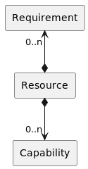

<a id="libs-rcm--requirement-capability-model-and-bundle-wiring"></a>

## Requirement-Capability-Model and (Bundle) Wiring

TODO

<a id="libs-rcm--requirement-capability-model-resolver"></a>

## Requirement-Capability-Model Resolver

TODO

---

<a id="libs-rcm-index_2"></a>

<!-- source_url: https://celix.apache.org/docs/2.4.0/celix/libs/rcm/?C=D%3BO%3DA -->

<!-- page_index: 225 -->

<a id="libs-rcm-index_2--index-of-docs-2.4.0-celix-libs-rcm"></a>

# Index of /docs/2.4.0/celix/libs/rcm

<table>
<tr><th></th><th><a href="#libs-rcm-index_4">Name</a></th><th><a href="#libs-rcm-index_3">Last modified</a></th><th><a href="#libs-rcm-index_5">Size</a></th><th><a href="#libs-rcm-index_2">Description</a></th></tr>
<tr><th colspan="5"><hr/></th></tr>
<tr><td></td><td><a href="#libs">Parent Directory</a></td><td> </td><td align="right">  - </td><td> </td></tr>
<tr><td></td><td><a href="#libs-rcm-diagrams">diagrams/</a></td><td align="right">2023-10-07 11:38  </td><td align="right">  - </td><td> </td></tr>
<tr><th colspan="5"><hr/></th></tr>
</table>

RCM library / Apache Celix

[](https://github.com/apache/celix)

[Edit on GitHub](https://github.com/apache/celix/edit/master/libs/rcm/README.md "Edit this page on GitHub")
[<< back to documentation](#docs-2.4.0-docs "back to documentation")
<a id="libs-rcm-index_2--requirement-capability-model-rcm-library"></a>

## Requirement-Capability-Model (RCM) library

C library based on the OSGi Requirement-Capability-Model, part of
[Chapter 3.3](https://docs.osgi.org/specification/osgi.core/8.0.0/framework.module.html#framework.module.dependencies)
, [Chapter 6](https://docs.osgi.org/specification/osgi.core/8.0.0/framework.resource.html)
and [Chapter 7](https://docs.osgi.org/specification/osgi.core/8.0.0/framework.wiring.html)
in the OSGi Core Specification 8.

Warning: This library is still under development and not yet ready for production use.

<a id="libs-rcm-index_2--todos"></a>

## TODOs

- Wiring
- Resolver

<a id="libs-rcm-index_2--base-requirement-capability-model"></a>

## Base Requirement-Capability-Model

The Requirement-Capability-Model (RCM) is a model for describing the capabilities and requirements for a resource.
This model can be used in bundle wiring to resolve the dependencies between bundles.

The following diagram shows the RCM model:


<a id="libs-rcm-index_2--requirement-capability-model-and-bundle-wiring"></a>

## Requirement-Capability-Model and (Bundle) Wiring

TODO

<a id="libs-rcm-index_2--requirement-capability-model-resolver"></a>

## Requirement-Capability-Model Resolver

TODO

---

<a id="libs-rcm-index_3"></a>

<!-- source_url: https://celix.apache.org/docs/2.4.0/celix/libs/rcm/?C=M%3BO%3DA -->

<!-- page_index: 226 -->

<a id="libs-rcm-index_3--index-of-docs-2.4.0-celix-libs-rcm"></a>

# Index of /docs/2.4.0/celix/libs/rcm

<table>
<tr><th></th><th><a href="#libs-rcm-index_4">Name</a></th><th><a href="#libs-rcm-index_3">Last modified</a></th><th><a href="#libs-rcm-index_5">Size</a></th><th><a href="#libs-rcm-index_2">Description</a></th></tr>
<tr><th colspan="5"><hr/></th></tr>
<tr><td></td><td><a href="#libs">Parent Directory</a></td><td> </td><td align="right">  - </td><td> </td></tr>
<tr><td></td><td><a href="#libs-rcm-diagrams">diagrams/</a></td><td align="right">2023-10-07 11:38  </td><td align="right">  - </td><td> </td></tr>
<tr><th colspan="5"><hr/></th></tr>
</table>

RCM library / Apache Celix

[](https://github.com/apache/celix)

[Edit on GitHub](https://github.com/apache/celix/edit/master/libs/rcm/README.md "Edit this page on GitHub")
[<< back to documentation](#docs-2.4.0-docs "back to documentation")
<a id="libs-rcm-index_3--requirement-capability-model-rcm-library"></a>

## Requirement-Capability-Model (RCM) library

C library based on the OSGi Requirement-Capability-Model, part of
[Chapter 3.3](https://docs.osgi.org/specification/osgi.core/8.0.0/framework.module.html#framework.module.dependencies)
, [Chapter 6](https://docs.osgi.org/specification/osgi.core/8.0.0/framework.resource.html)
and [Chapter 7](https://docs.osgi.org/specification/osgi.core/8.0.0/framework.wiring.html)
in the OSGi Core Specification 8.

Warning: This library is still under development and not yet ready for production use.

<a id="libs-rcm-index_3--todos"></a>

## TODOs

- Wiring
- Resolver

<a id="libs-rcm-index_3--base-requirement-capability-model"></a>

## Base Requirement-Capability-Model

The Requirement-Capability-Model (RCM) is a model for describing the capabilities and requirements for a resource.
This model can be used in bundle wiring to resolve the dependencies between bundles.

The following diagram shows the RCM model:


<a id="libs-rcm-index_3--requirement-capability-model-and-bundle-wiring"></a>

## Requirement-Capability-Model and (Bundle) Wiring

TODO

<a id="libs-rcm-index_3--requirement-capability-model-resolver"></a>

## Requirement-Capability-Model Resolver

TODO

---

<a id="libs-rcm-index_4"></a>

<!-- source_url: https://celix.apache.org/docs/2.4.0/celix/libs/rcm/?C=N%3BO%3DD -->

<!-- page_index: 227 -->

<a id="libs-rcm-index_4--index-of-docs-2.4.0-celix-libs-rcm"></a>

# Index of /docs/2.4.0/celix/libs/rcm

<table>
<tr><th></th><th><a href="#libs-rcm-index_4">Name</a></th><th><a href="#libs-rcm-index_3">Last modified</a></th><th><a href="#libs-rcm-index_5">Size</a></th><th><a href="#libs-rcm-index_2">Description</a></th></tr>
<tr><th colspan="5"><hr/></th></tr>
<tr><td></td><td><a href="#libs">Parent Directory</a></td><td> </td><td align="right">  - </td><td> </td></tr>
<tr><td></td><td><a href="#libs-rcm-diagrams">diagrams/</a></td><td align="right">2023-10-07 11:38  </td><td align="right">  - </td><td> </td></tr>
<tr><th colspan="5"><hr/></th></tr>
</table>

RCM library / Apache Celix

[](https://github.com/apache/celix)

[Edit on GitHub](https://github.com/apache/celix/edit/master/libs/rcm/README.md "Edit this page on GitHub")
[<< back to documentation](#docs-2.4.0-docs "back to documentation")
<a id="libs-rcm-index_4--requirement-capability-model-rcm-library"></a>

## Requirement-Capability-Model (RCM) library

C library based on the OSGi Requirement-Capability-Model, part of
[Chapter 3.3](https://docs.osgi.org/specification/osgi.core/8.0.0/framework.module.html#framework.module.dependencies)
, [Chapter 6](https://docs.osgi.org/specification/osgi.core/8.0.0/framework.resource.html)
and [Chapter 7](https://docs.osgi.org/specification/osgi.core/8.0.0/framework.wiring.html)
in the OSGi Core Specification 8.

Warning: This library is still under development and not yet ready for production use.

<a id="libs-rcm-index_4--todos"></a>

## TODOs

- Wiring
- Resolver

<a id="libs-rcm-index_4--base-requirement-capability-model"></a>

## Base Requirement-Capability-Model

The Requirement-Capability-Model (RCM) is a model for describing the capabilities and requirements for a resource.
This model can be used in bundle wiring to resolve the dependencies between bundles.

The following diagram shows the RCM model:


<a id="libs-rcm-index_4--requirement-capability-model-and-bundle-wiring"></a>

## Requirement-Capability-Model and (Bundle) Wiring

TODO

<a id="libs-rcm-index_4--requirement-capability-model-resolver"></a>

## Requirement-Capability-Model Resolver

TODO

---

<a id="libs-rcm-index_5"></a>

<!-- source_url: https://celix.apache.org/docs/2.4.0/celix/libs/rcm/?C=S%3BO%3DA -->

<!-- page_index: 228 -->

<a id="libs-rcm-index_5--index-of-docs-2.4.0-celix-libs-rcm"></a>

# Index of /docs/2.4.0/celix/libs/rcm

<table>
<tr><th></th><th><a href="#libs-rcm-index_4">Name</a></th><th><a href="#libs-rcm-index_3">Last modified</a></th><th><a href="#libs-rcm-index_5">Size</a></th><th><a href="#libs-rcm-index_2">Description</a></th></tr>
<tr><th colspan="5"><hr/></th></tr>
<tr><td></td><td><a href="#libs">Parent Directory</a></td><td> </td><td align="right">  - </td><td> </td></tr>
<tr><td></td><td><a href="#libs-rcm-diagrams">diagrams/</a></td><td align="right">2023-10-07 11:38  </td><td align="right">  - </td><td> </td></tr>
<tr><th colspan="5"><hr/></th></tr>
</table>

RCM library / Apache Celix

[](https://github.com/apache/celix)

[Edit on GitHub](https://github.com/apache/celix/edit/master/libs/rcm/README.md "Edit this page on GitHub")
[<< back to documentation](#docs-2.4.0-docs "back to documentation")
<a id="libs-rcm-index_5--requirement-capability-model-rcm-library"></a>

## Requirement-Capability-Model (RCM) library

C library based on the OSGi Requirement-Capability-Model, part of
[Chapter 3.3](https://docs.osgi.org/specification/osgi.core/8.0.0/framework.module.html#framework.module.dependencies)
, [Chapter 6](https://docs.osgi.org/specification/osgi.core/8.0.0/framework.resource.html)
and [Chapter 7](https://docs.osgi.org/specification/osgi.core/8.0.0/framework.wiring.html)
in the OSGi Core Specification 8.

Warning: This library is still under development and not yet ready for production use.

<a id="libs-rcm-index_5--todos"></a>

## TODOs

- Wiring
- Resolver

<a id="libs-rcm-index_5--base-requirement-capability-model"></a>

## Base Requirement-Capability-Model

The Requirement-Capability-Model (RCM) is a model for describing the capabilities and requirements for a resource.
This model can be used in bundle wiring to resolve the dependencies between bundles.

The following diagram shows the RCM model:


<a id="libs-rcm-index_5--requirement-capability-model-and-bundle-wiring"></a>

## Requirement-Capability-Model and (Bundle) Wiring

TODO

<a id="libs-rcm-index_5--requirement-capability-model-resolver"></a>

## Requirement-Capability-Model Resolver

TODO

---

<a id="libs-utils-docs"></a>

<!-- source_url: https://celix.apache.org/docs/2.4.0/celix/libs/utils/docs/ -->

<!-- page_index: 229 -->

<a id="libs-utils-docs--index-of-docs-2.4.0-celix-libs-utils-docs"></a>

# Index of /docs/2.4.0/celix/libs/utils/docs

<table>
<tr><th></th><th><a href="#libs-utils-docs-index_4">Name</a></th><th><a href="#libs-utils-docs-index_3">Last modified</a></th><th><a href="#libs-utils-docs-index_5">Size</a></th><th><a href="#libs-utils-docs-index_2">Description</a></th></tr>
<tr><th colspan="5"><hr/></th></tr>
<tr><td></td><td><a href="#libs-utils">Parent Directory</a></td><td> </td><td align="right">  - </td><td> </td></tr>
<tr><td></td><td><a href="#libs-utils-docs-thpool">thpool/</a></td><td align="right">2025-01-28 20:35  </td><td align="right">  - </td><td> </td></tr>
<tr><th colspan="5"><hr/></th></tr>
</table>

---

<a id="libs-utils-docs-index_2"></a>

<!-- source_url: https://celix.apache.org/docs/2.4.0/celix/libs/utils/docs/?C=D%3BO%3DA -->

<!-- page_index: 230 -->

<a id="libs-utils-docs-index_2--index-of-docs-2.4.0-celix-libs-utils-docs"></a>

# Index of /docs/2.4.0/celix/libs/utils/docs

<table>
<tr><th></th><th><a href="#libs-utils-docs-index_4">Name</a></th><th><a href="#libs-utils-docs-index_3">Last modified</a></th><th><a href="#libs-utils-docs-index_5">Size</a></th><th><a href="#libs-utils-docs-index_2">Description</a></th></tr>
<tr><th colspan="5"><hr/></th></tr>
<tr><td></td><td><a href="#libs-utils">Parent Directory</a></td><td> </td><td align="right">  - </td><td> </td></tr>
<tr><td></td><td><a href="#libs-utils-docs-thpool">thpool/</a></td><td align="right">2025-01-28 20:35  </td><td align="right">  - </td><td> </td></tr>
<tr><th colspan="5"><hr/></th></tr>
</table>

---

<a id="libs-utils-docs-index_3"></a>

<!-- source_url: https://celix.apache.org/docs/2.4.0/celix/libs/utils/docs/?C=M%3BO%3DA -->

<!-- page_index: 231 -->

<a id="libs-utils-docs-index_3--index-of-docs-2.4.0-celix-libs-utils-docs"></a>

# Index of /docs/2.4.0/celix/libs/utils/docs

<table>
<tr><th></th><th><a href="#libs-utils-docs-index_4">Name</a></th><th><a href="#libs-utils-docs-index_3">Last modified</a></th><th><a href="#libs-utils-docs-index_5">Size</a></th><th><a href="#libs-utils-docs-index_2">Description</a></th></tr>
<tr><th colspan="5"><hr/></th></tr>
<tr><td></td><td><a href="#libs-utils">Parent Directory</a></td><td> </td><td align="right">  - </td><td> </td></tr>
<tr><td></td><td><a href="#libs-utils-docs-thpool">thpool/</a></td><td align="right">2025-01-28 20:35  </td><td align="right">  - </td><td> </td></tr>
<tr><th colspan="5"><hr/></th></tr>
</table>

---

<a id="libs-utils-docs-index_4"></a>

<!-- source_url: https://celix.apache.org/docs/2.4.0/celix/libs/utils/docs/?C=N%3BO%3DD -->

<!-- page_index: 232 -->

<a id="libs-utils-docs-index_4--index-of-docs-2.4.0-celix-libs-utils-docs"></a>

# Index of /docs/2.4.0/celix/libs/utils/docs

<table>
<tr><th></th><th><a href="#libs-utils-docs-index_4">Name</a></th><th><a href="#libs-utils-docs-index_3">Last modified</a></th><th><a href="#libs-utils-docs-index_5">Size</a></th><th><a href="#libs-utils-docs-index_2">Description</a></th></tr>
<tr><th colspan="5"><hr/></th></tr>
<tr><td></td><td><a href="#libs-utils">Parent Directory</a></td><td> </td><td align="right">  - </td><td> </td></tr>
<tr><td></td><td><a href="#libs-utils-docs-thpool">thpool/</a></td><td align="right">2025-01-28 20:35  </td><td align="right">  - </td><td> </td></tr>
<tr><th colspan="5"><hr/></th></tr>
</table>

---

<a id="libs-utils-docs-index_5"></a>

<!-- source_url: https://celix.apache.org/docs/2.4.0/celix/libs/utils/docs/?C=S%3BO%3DA -->

<!-- page_index: 233 -->

<a id="libs-utils-docs-index_5--index-of-docs-2.4.0-celix-libs-utils-docs"></a>

# Index of /docs/2.4.0/celix/libs/utils/docs

<table>
<tr><th></th><th><a href="#libs-utils-docs-index_4">Name</a></th><th><a href="#libs-utils-docs-index_3">Last modified</a></th><th><a href="#libs-utils-docs-index_5">Size</a></th><th><a href="#libs-utils-docs-index_2">Description</a></th></tr>
<tr><th colspan="5"><hr/></th></tr>
<tr><td></td><td><a href="#libs-utils">Parent Directory</a></td><td> </td><td align="right">  - </td><td> </td></tr>
<tr><td></td><td><a href="#libs-utils-docs-thpool">thpool/</a></td><td align="right">2025-01-28 20:35  </td><td align="right">  - </td><td> </td></tr>
<tr><th colspan="5"><hr/></th></tr>
</table>

---

<a id="libs-utils-docs-thpool-design"></a>

<!-- source_url: https://celix.apache.org/docs/2.4.0/celix/libs/utils/docs/thpool/Design.html -->

<!-- page_index: 234 -->

# Design.md / Apache Celix

[Edit on GitHub](https://github.com/apache/celix/edit/master/libs/utils/docs/thpool/Design.md "Edit this page on GitHub")
[<< back to documentation](#docs-2.4.0-docs "back to documentation")
<a id="libs-utils-docs-thpool-design--high-level"></a>

## High level

```
Description: Library providing a threading pool where you can add work on the fly. The number
             of threads in the pool is adjustable when creating the pool. In most cases
             this should equal the number of threads supported by your cpu.
         
             For an example on how to use the threadpool, check the main.c file or just read
             the documentation found in the README.md file.

             In this header file a detailed overview of the functions and the threadpool's logical
             scheme is presented in case you wish to tweak or alter something. 


              _______________________________________________________        
            /                                                       \
            |   JOB QUEUE        | job1 | job2 | job3 | job4 | ..   |
            |                                                       |
            |   threadpool      | thread1 | thread2 | ..            |
            \_______________________________________________________/


   Description:       Jobs are added to the job queue. Once a thread in the pool
                      is idle, it is assigned with the first job from the queue(and
                      erased from the queue). It's each thread's job to read from 
                      the queue serially(using lock) and executing each job
                      until the queue is empty.


   Scheme:

   thpool______                jobqueue____                      ______ 
   |           |               |           |       .----------->|_job0_| Newly added job
   |           |               |  rear  ----------'             |_job1_|
   | jobqueue----------------->|           |                    |_job2_|
   |           |               |  front ----------.             |__..__| 
   |___________|               |___________|       '----------->|_jobn_| Job for thread to take


   job0________ 
   |           |
   | function---->
   |           |
   |   arg------->
   |           |         job1________ 
   |  next-------------->|           |
   |___________|         |           |..
```

<a id="libs-utils-docs-thpool-design--synchronisation"></a>

## Synchronisation

*Mutexes* and *binary semaphores* are the main tools to achieve synchronisation between threads.

---

<a id="libs-utils-docs-thpool-faq"></a>

<!-- source_url: https://celix.apache.org/docs/2.4.0/celix/libs/utils/docs/thpool/FAQ.html -->

<!-- page_index: 235 -->

# FAQ.md / Apache Celix

[Edit on GitHub](https://github.com/apache/celix/edit/master/libs/utils/docs/thpool/FAQ.md "Edit this page on GitHub")
[<< back to documentation](#docs-2.4.0-docs "back to documentation")
<a id="libs-utils-docs-thpool-faq--why-isnt-pthread_exit-used-to-exit-a-thread"></a>
<a id="libs-utils-docs-thpool-faq--why-isn-t-pthread_exit-used-to-exit-a-thread"></a>

### Why isn’t pthread\_exit() used to exit a thread?

`thread_do` used to use pthread\_exit(). However that resulted in
hard times of testing for memory leaks. The reason is that on pthread\_exit()
not all memory is freed bt pthread (probably for future threads or false
belief that the application is terminating). For these reasons a simple return
is used.

Interestingly using `pthread_exit()` results in much more memory being allocated.

<a id="libs-utils-docs-thpool-faq--why-do-you-use-sleep-after-calling-thpool_destroy"></a>

### Why do you use sleep() after calling thpool\_destroy()?

This is needed only in the tests. The reason is that if you call thpool\_destroy
and then exit immediately, maybe the program will exit before all the threads
had the time to deallocate. In that way it is impossible to check for memory
leaks.

In production you don’t have to worry about this since if you call exit, immediately after you destroyed the pool, the threads will be freed
anyway by the OS. If you either way destroy the pool in the middle of your
program it doesn’t matter again since the program will not exit immediately
and thus threads will have more than enough time to terminate.

<a id="libs-utils-docs-thpool-faq--why-does-wait-use-all-my-cpu"></a>

### Why does wait() use all my CPU?

Normally `wait()` will spike CPU usage to full when called. This is normal as long as it doesn’t last for more than 1 second. The reason this happens is that `wait()` goes through various phases of polling (what is called smart polling).

- Initially there is no interval between polling and hence the 100% use of your CPU.
- After that the polling interval grows exponentially.
- Finally after x seconds, if there is still work, polling falls back to a very big interval.

The reason `wait()` works in this way, is that the function is mostly used when someone wants to wait for some calculation to finish. So if the calculation is assumed to take a long time then we don’t want to poll too often. Still we want to poll fast in case the calculation is a simple one. To solve these two problems, this seemingly awkward behaviour is present.

---

<a id="libs-utils-docs-thpool"></a>

<!-- source_url: https://celix.apache.org/docs/2.4.0/celix/libs/utils/docs/thpool/ -->

<!-- page_index: 236 -->

<a id="libs-utils-docs-thpool--index-of-docs-2.4.0-celix-libs-utils-docs-thpool"></a>

# Index of /docs/2.4.0/celix/libs/utils/docs/thpool

<table>
<tr><th></th><th><a href="#libs-utils-docs-thpool-index_4">Name</a></th><th><a href="#libs-utils-docs-thpool-index_3">Last modified</a></th><th><a href="#libs-utils-docs-thpool-index_5">Size</a></th><th><a href="#libs-utils-docs-thpool-index_2">Description</a></th></tr>
<tr><th colspan="5"><hr/></th></tr>
<tr><td></td><td><a href="#libs-utils-docs">Parent Directory</a></td><td> </td><td align="right">  - </td><td> </td></tr>
<tr><td></td><td><a href="#libs-utils-docs-thpool-design">Design.html</a></td><td align="right">2025-01-28 20:35  </td><td align="right">9.7K</td><td> </td></tr>
<tr><td></td><td><a href="#libs-utils-docs-thpool-faq">FAQ.html</a></td><td align="right">2025-01-28 20:35  </td><td align="right">9.6K</td><td> </td></tr>
<tr><th colspan="5"><hr/></th></tr>
</table>

README.md / Apache Celix

[](https://github.com/apache/celix)

[Edit on GitHub](https://github.com/apache/celix/edit/master/libs/utils/docs/thpool/README.md "Edit this page on GitHub")
[<< back to documentation](#docs-2.4.0-docs "back to documentation")


<a id="libs-utils-docs-thpool--c-thread-pool"></a>

# C Thread Pool

This is a minimal but fully functional threadpool implementation.

- ANCI C and POSIX compliant
- Number of threads can be chosen on initialization
- Minimal but powerful interface
- Full documentation

The threadpool is under MIT license. Notice that this project took a considerable amount of work and sacrifice of my free time and the reason I give it for free (even for commercial use) is so when you become rich and wealthy you don’t forget about us open-source creatures of the night. Cheers!

<a id="libs-utils-docs-thpool--v2-changes"></a>

## v2 Changes

This is an updated and heavily refactored version of my original threadpool. The main things taken into consideration in this new version are:

- Synchronisation control from the user (pause/resume/wait)
- Thorough testing for memory leaks and race conditions
- Cleaner and more opaque API
- Smart polling - polling interval changes on-the-fly

<a id="libs-utils-docs-thpool--run-an-example"></a>

## Run an example

The library is not precompiled so you have to compile it with your project. The thread pool
uses POSIX threads so if you compile with gcc on Linux you have to use the flag `-pthread` like this:

```
gcc example.c thpool.c -D THPOOL_DEBUG -pthread -o example
```

Then run the executable like this:

```
./example
```

<a id="libs-utils-docs-thpool--basic-usage"></a>

## Basic usage

1. Include the header in your source file: `#include "thpool.h"`
2. Create a thread pool with number of threads you want: `threadpool thpool = thpool_init(4);`
3. Add work to the pool: `thpool_add_work(thpool, (void*)function_p, (void*)arg_p);`

The workers(threads) will start their work automatically as fast as there is new work
in the pool. If you want to wait for all added work to be finished before continuing
you can use `thpool_wait(thpool);`. If you want to destroy the pool you can use
`thpool_destroy(thpool);`.

<a id="libs-utils-docs-thpool--api"></a>

## API

For a deeper look into the documentation check in the [thpool.h](https://github.com/Pithikos/C-Thread-Pool/blob/master/thpool.h) file. Below is a fast practical overview.

| Function example | Description |
| --- | --- |
| ***thpool\_init(4)*** | Will return a new threadpool with `4` threads. |
| ***thpool\_add\_work(thpool, (void\*)function\_p, (void\*)arg\_p)*** | Will add new work to the pool. Work is simply a function. You can pass a single argument to the function if you wish. If not, `NULL` should be passed. |
| ***thpool\_wait(thpool)*** | Will wait for all jobs (both in queue and currently running) to finish. |
| ***thpool\_destroy(thpool)*** | This will destroy the threadpool. If jobs are currently being executed, then it will wait for them to finish. |
| ***thpool\_pause(thpool)*** | All threads in the threadpool will pause no matter if they are idle or executing work. |
| ***thpool\_resume(thpool)*** | If the threadpool is paused, then all threads will resume from where they were. |

---

<a id="libs-utils-docs-thpool-index_2"></a>

<!-- source_url: https://celix.apache.org/docs/2.4.0/celix/libs/utils/docs/thpool/?C=D%3BO%3DA -->

<!-- page_index: 237 -->

<a id="libs-utils-docs-thpool-index_2--index-of-docs-2.4.0-celix-libs-utils-docs-thpool"></a>

# Index of /docs/2.4.0/celix/libs/utils/docs/thpool

<table>
<tr><th></th><th><a href="#libs-utils-docs-thpool-index_4">Name</a></th><th><a href="#libs-utils-docs-thpool-index_3">Last modified</a></th><th><a href="#libs-utils-docs-thpool-index_5">Size</a></th><th><a href="#libs-utils-docs-thpool-index_2">Description</a></th></tr>
<tr><th colspan="5"><hr/></th></tr>
<tr><td></td><td><a href="#libs-utils-docs">Parent Directory</a></td><td> </td><td align="right">  - </td><td> </td></tr>
<tr><td></td><td><a href="#libs-utils-docs-thpool-design">Design.html</a></td><td align="right">2025-01-28 20:35  </td><td align="right">9.7K</td><td> </td></tr>
<tr><td></td><td><a href="#libs-utils-docs-thpool-faq">FAQ.html</a></td><td align="right">2025-01-28 20:35  </td><td align="right">9.6K</td><td> </td></tr>
<tr><th colspan="5"><hr/></th></tr>
</table>

README.md / Apache Celix

[](https://github.com/apache/celix)

[Edit on GitHub](https://github.com/apache/celix/edit/master/libs/utils/docs/thpool/README.md "Edit this page on GitHub")
[<< back to documentation](#docs-2.4.0-docs "back to documentation")


<a id="libs-utils-docs-thpool-index_2--c-thread-pool"></a>

# C Thread Pool

This is a minimal but fully functional threadpool implementation.

- ANCI C and POSIX compliant
- Number of threads can be chosen on initialization
- Minimal but powerful interface
- Full documentation

The threadpool is under MIT license. Notice that this project took a considerable amount of work and sacrifice of my free time and the reason I give it for free (even for commercial use) is so when you become rich and wealthy you don’t forget about us open-source creatures of the night. Cheers!

<a id="libs-utils-docs-thpool-index_2--v2-changes"></a>

## v2 Changes

This is an updated and heavily refactored version of my original threadpool. The main things taken into consideration in this new version are:

- Synchronisation control from the user (pause/resume/wait)
- Thorough testing for memory leaks and race conditions
- Cleaner and more opaque API
- Smart polling - polling interval changes on-the-fly

<a id="libs-utils-docs-thpool-index_2--run-an-example"></a>

## Run an example

The library is not precompiled so you have to compile it with your project. The thread pool
uses POSIX threads so if you compile with gcc on Linux you have to use the flag `-pthread` like this:

```
gcc example.c thpool.c -D THPOOL_DEBUG -pthread -o example
```

Then run the executable like this:

```
./example
```

<a id="libs-utils-docs-thpool-index_2--basic-usage"></a>

## Basic usage

1. Include the header in your source file: `#include "thpool.h"`
2. Create a thread pool with number of threads you want: `threadpool thpool = thpool_init(4);`
3. Add work to the pool: `thpool_add_work(thpool, (void*)function_p, (void*)arg_p);`

The workers(threads) will start their work automatically as fast as there is new work
in the pool. If you want to wait for all added work to be finished before continuing
you can use `thpool_wait(thpool);`. If you want to destroy the pool you can use
`thpool_destroy(thpool);`.

<a id="libs-utils-docs-thpool-index_2--api"></a>

## API

For a deeper look into the documentation check in the [thpool.h](https://github.com/Pithikos/C-Thread-Pool/blob/master/thpool.h) file. Below is a fast practical overview.

| Function example | Description |
| --- | --- |
| ***thpool\_init(4)*** | Will return a new threadpool with `4` threads. |
| ***thpool\_add\_work(thpool, (void\*)function\_p, (void\*)arg\_p)*** | Will add new work to the pool. Work is simply a function. You can pass a single argument to the function if you wish. If not, `NULL` should be passed. |
| ***thpool\_wait(thpool)*** | Will wait for all jobs (both in queue and currently running) to finish. |
| ***thpool\_destroy(thpool)*** | This will destroy the threadpool. If jobs are currently being executed, then it will wait for them to finish. |
| ***thpool\_pause(thpool)*** | All threads in the threadpool will pause no matter if they are idle or executing work. |
| ***thpool\_resume(thpool)*** | If the threadpool is paused, then all threads will resume from where they were. |

---

<a id="libs-utils-docs-thpool-index_3"></a>

<!-- source_url: https://celix.apache.org/docs/2.4.0/celix/libs/utils/docs/thpool/?C=M%3BO%3DA -->

<!-- page_index: 238 -->

<a id="libs-utils-docs-thpool-index_3--index-of-docs-2.4.0-celix-libs-utils-docs-thpool"></a>

# Index of /docs/2.4.0/celix/libs/utils/docs/thpool

<table>
<tr><th></th><th><a href="#libs-utils-docs-thpool-index_4">Name</a></th><th><a href="#libs-utils-docs-thpool-index_3">Last modified</a></th><th><a href="#libs-utils-docs-thpool-index_5">Size</a></th><th><a href="#libs-utils-docs-thpool-index_2">Description</a></th></tr>
<tr><th colspan="5"><hr/></th></tr>
<tr><td></td><td><a href="#libs-utils-docs">Parent Directory</a></td><td> </td><td align="right">  - </td><td> </td></tr>
<tr><td></td><td><a href="#libs-utils-docs-thpool-design">Design.html</a></td><td align="right">2025-01-28 20:35  </td><td align="right">9.7K</td><td> </td></tr>
<tr><td></td><td><a href="#libs-utils-docs-thpool-faq">FAQ.html</a></td><td align="right">2025-01-28 20:35  </td><td align="right">9.6K</td><td> </td></tr>
<tr><th colspan="5"><hr/></th></tr>
</table>

README.md / Apache Celix

[](https://github.com/apache/celix)

[Edit on GitHub](https://github.com/apache/celix/edit/master/libs/utils/docs/thpool/README.md "Edit this page on GitHub")
[<< back to documentation](#docs-2.4.0-docs "back to documentation")


<a id="libs-utils-docs-thpool-index_3--c-thread-pool"></a>

# C Thread Pool

This is a minimal but fully functional threadpool implementation.

- ANCI C and POSIX compliant
- Number of threads can be chosen on initialization
- Minimal but powerful interface
- Full documentation

The threadpool is under MIT license. Notice that this project took a considerable amount of work and sacrifice of my free time and the reason I give it for free (even for commercial use) is so when you become rich and wealthy you don’t forget about us open-source creatures of the night. Cheers!

<a id="libs-utils-docs-thpool-index_3--v2-changes"></a>

## v2 Changes

This is an updated and heavily refactored version of my original threadpool. The main things taken into consideration in this new version are:

- Synchronisation control from the user (pause/resume/wait)
- Thorough testing for memory leaks and race conditions
- Cleaner and more opaque API
- Smart polling - polling interval changes on-the-fly

<a id="libs-utils-docs-thpool-index_3--run-an-example"></a>

## Run an example

The library is not precompiled so you have to compile it with your project. The thread pool
uses POSIX threads so if you compile with gcc on Linux you have to use the flag `-pthread` like this:

```
gcc example.c thpool.c -D THPOOL_DEBUG -pthread -o example
```

Then run the executable like this:

```
./example
```

<a id="libs-utils-docs-thpool-index_3--basic-usage"></a>

## Basic usage

1. Include the header in your source file: `#include "thpool.h"`
2. Create a thread pool with number of threads you want: `threadpool thpool = thpool_init(4);`
3. Add work to the pool: `thpool_add_work(thpool, (void*)function_p, (void*)arg_p);`

The workers(threads) will start their work automatically as fast as there is new work
in the pool. If you want to wait for all added work to be finished before continuing
you can use `thpool_wait(thpool);`. If you want to destroy the pool you can use
`thpool_destroy(thpool);`.

<a id="libs-utils-docs-thpool-index_3--api"></a>

## API

For a deeper look into the documentation check in the [thpool.h](https://github.com/Pithikos/C-Thread-Pool/blob/master/thpool.h) file. Below is a fast practical overview.

| Function example | Description |
| --- | --- |
| ***thpool\_init(4)*** | Will return a new threadpool with `4` threads. |
| ***thpool\_add\_work(thpool, (void\*)function\_p, (void\*)arg\_p)*** | Will add new work to the pool. Work is simply a function. You can pass a single argument to the function if you wish. If not, `NULL` should be passed. |
| ***thpool\_wait(thpool)*** | Will wait for all jobs (both in queue and currently running) to finish. |
| ***thpool\_destroy(thpool)*** | This will destroy the threadpool. If jobs are currently being executed, then it will wait for them to finish. |
| ***thpool\_pause(thpool)*** | All threads in the threadpool will pause no matter if they are idle or executing work. |
| ***thpool\_resume(thpool)*** | If the threadpool is paused, then all threads will resume from where they were. |

---

<a id="libs-utils-docs-thpool-index_4"></a>

<!-- source_url: https://celix.apache.org/docs/2.4.0/celix/libs/utils/docs/thpool/?C=N%3BO%3DD -->

<!-- page_index: 239 -->

<a id="libs-utils-docs-thpool-index_4--index-of-docs-2.4.0-celix-libs-utils-docs-thpool"></a>

# Index of /docs/2.4.0/celix/libs/utils/docs/thpool

<table>
<tr><th></th><th><a href="#libs-utils-docs-thpool-index_4">Name</a></th><th><a href="#libs-utils-docs-thpool-index_3">Last modified</a></th><th><a href="#libs-utils-docs-thpool-index_5">Size</a></th><th><a href="#libs-utils-docs-thpool-index_2">Description</a></th></tr>
<tr><th colspan="5"><hr/></th></tr>
<tr><td></td><td><a href="#libs-utils-docs">Parent Directory</a></td><td> </td><td align="right">  - </td><td> </td></tr>
<tr><td></td><td><a href="#libs-utils-docs-thpool-design">Design.html</a></td><td align="right">2025-01-28 20:35  </td><td align="right">9.7K</td><td> </td></tr>
<tr><td></td><td><a href="#libs-utils-docs-thpool-faq">FAQ.html</a></td><td align="right">2025-01-28 20:35  </td><td align="right">9.6K</td><td> </td></tr>
<tr><th colspan="5"><hr/></th></tr>
</table>

README.md / Apache Celix

[](https://github.com/apache/celix)

[Edit on GitHub](https://github.com/apache/celix/edit/master/libs/utils/docs/thpool/README.md "Edit this page on GitHub")
[<< back to documentation](#docs-2.4.0-docs "back to documentation")


<a id="libs-utils-docs-thpool-index_4--c-thread-pool"></a>

# C Thread Pool

This is a minimal but fully functional threadpool implementation.

- ANCI C and POSIX compliant
- Number of threads can be chosen on initialization
- Minimal but powerful interface
- Full documentation

The threadpool is under MIT license. Notice that this project took a considerable amount of work and sacrifice of my free time and the reason I give it for free (even for commercial use) is so when you become rich and wealthy you don’t forget about us open-source creatures of the night. Cheers!

<a id="libs-utils-docs-thpool-index_4--v2-changes"></a>

## v2 Changes

This is an updated and heavily refactored version of my original threadpool. The main things taken into consideration in this new version are:

- Synchronisation control from the user (pause/resume/wait)
- Thorough testing for memory leaks and race conditions
- Cleaner and more opaque API
- Smart polling - polling interval changes on-the-fly

<a id="libs-utils-docs-thpool-index_4--run-an-example"></a>

## Run an example

The library is not precompiled so you have to compile it with your project. The thread pool
uses POSIX threads so if you compile with gcc on Linux you have to use the flag `-pthread` like this:

```
gcc example.c thpool.c -D THPOOL_DEBUG -pthread -o example
```

Then run the executable like this:

```
./example
```

<a id="libs-utils-docs-thpool-index_4--basic-usage"></a>

## Basic usage

1. Include the header in your source file: `#include "thpool.h"`
2. Create a thread pool with number of threads you want: `threadpool thpool = thpool_init(4);`
3. Add work to the pool: `thpool_add_work(thpool, (void*)function_p, (void*)arg_p);`

The workers(threads) will start their work automatically as fast as there is new work
in the pool. If you want to wait for all added work to be finished before continuing
you can use `thpool_wait(thpool);`. If you want to destroy the pool you can use
`thpool_destroy(thpool);`.

<a id="libs-utils-docs-thpool-index_4--api"></a>

## API

For a deeper look into the documentation check in the [thpool.h](https://github.com/Pithikos/C-Thread-Pool/blob/master/thpool.h) file. Below is a fast practical overview.

| Function example | Description |
| --- | --- |
| ***thpool\_init(4)*** | Will return a new threadpool with `4` threads. |
| ***thpool\_add\_work(thpool, (void\*)function\_p, (void\*)arg\_p)*** | Will add new work to the pool. Work is simply a function. You can pass a single argument to the function if you wish. If not, `NULL` should be passed. |
| ***thpool\_wait(thpool)*** | Will wait for all jobs (both in queue and currently running) to finish. |
| ***thpool\_destroy(thpool)*** | This will destroy the threadpool. If jobs are currently being executed, then it will wait for them to finish. |
| ***thpool\_pause(thpool)*** | All threads in the threadpool will pause no matter if they are idle or executing work. |
| ***thpool\_resume(thpool)*** | If the threadpool is paused, then all threads will resume from where they were. |

---

<a id="libs-utils-docs-thpool-index_5"></a>

<!-- source_url: https://celix.apache.org/docs/2.4.0/celix/libs/utils/docs/thpool/?C=S%3BO%3DA -->

<!-- page_index: 240 -->

<a id="libs-utils-docs-thpool-index_5--index-of-docs-2.4.0-celix-libs-utils-docs-thpool"></a>

# Index of /docs/2.4.0/celix/libs/utils/docs/thpool

<table>
<tr><th></th><th><a href="#libs-utils-docs-thpool-index_4">Name</a></th><th><a href="#libs-utils-docs-thpool-index_3">Last modified</a></th><th><a href="#libs-utils-docs-thpool-index_5">Size</a></th><th><a href="#libs-utils-docs-thpool-index_2">Description</a></th></tr>
<tr><th colspan="5"><hr/></th></tr>
<tr><td></td><td><a href="#libs-utils-docs">Parent Directory</a></td><td> </td><td align="right">  - </td><td> </td></tr>
<tr><td></td><td><a href="#libs-utils-docs-thpool-design">Design.html</a></td><td align="right">2025-01-28 20:35  </td><td align="right">9.7K</td><td> </td></tr>
<tr><td></td><td><a href="#libs-utils-docs-thpool-faq">FAQ.html</a></td><td align="right">2025-01-28 20:35  </td><td align="right">9.6K</td><td> </td></tr>
<tr><th colspan="5"><hr/></th></tr>
</table>

README.md / Apache Celix

[](https://github.com/apache/celix)

[Edit on GitHub](https://github.com/apache/celix/edit/master/libs/utils/docs/thpool/README.md "Edit this page on GitHub")
[<< back to documentation](#docs-2.4.0-docs "back to documentation")


<a id="libs-utils-docs-thpool-index_5--c-thread-pool"></a>

# C Thread Pool

This is a minimal but fully functional threadpool implementation.

- ANCI C and POSIX compliant
- Number of threads can be chosen on initialization
- Minimal but powerful interface
- Full documentation

The threadpool is under MIT license. Notice that this project took a considerable amount of work and sacrifice of my free time and the reason I give it for free (even for commercial use) is so when you become rich and wealthy you don’t forget about us open-source creatures of the night. Cheers!

<a id="libs-utils-docs-thpool-index_5--v2-changes"></a>

## v2 Changes

This is an updated and heavily refactored version of my original threadpool. The main things taken into consideration in this new version are:

- Synchronisation control from the user (pause/resume/wait)
- Thorough testing for memory leaks and race conditions
- Cleaner and more opaque API
- Smart polling - polling interval changes on-the-fly

<a id="libs-utils-docs-thpool-index_5--run-an-example"></a>

## Run an example

The library is not precompiled so you have to compile it with your project. The thread pool
uses POSIX threads so if you compile with gcc on Linux you have to use the flag `-pthread` like this:

```
gcc example.c thpool.c -D THPOOL_DEBUG -pthread -o example
```

Then run the executable like this:

```
./example
```

<a id="libs-utils-docs-thpool-index_5--basic-usage"></a>

## Basic usage

1. Include the header in your source file: `#include "thpool.h"`
2. Create a thread pool with number of threads you want: `threadpool thpool = thpool_init(4);`
3. Add work to the pool: `thpool_add_work(thpool, (void*)function_p, (void*)arg_p);`

The workers(threads) will start their work automatically as fast as there is new work
in the pool. If you want to wait for all added work to be finished before continuing
you can use `thpool_wait(thpool);`. If you want to destroy the pool you can use
`thpool_destroy(thpool);`.

<a id="libs-utils-docs-thpool-index_5--api"></a>

## API

For a deeper look into the documentation check in the [thpool.h](https://github.com/Pithikos/C-Thread-Pool/blob/master/thpool.h) file. Below is a fast practical overview.

| Function example | Description |
| --- | --- |
| ***thpool\_init(4)*** | Will return a new threadpool with `4` threads. |
| ***thpool\_add\_work(thpool, (void\*)function\_p, (void\*)arg\_p)*** | Will add new work to the pool. Work is simply a function. You can pass a single argument to the function if you wish. If not, `NULL` should be passed. |
| ***thpool\_wait(thpool)*** | Will wait for all jobs (both in queue and currently running) to finish. |
| ***thpool\_destroy(thpool)*** | This will destroy the threadpool. If jobs are currently being executed, then it will wait for them to finish. |
| ***thpool\_pause(thpool)*** | All threads in the threadpool will pause no matter if they are idle or executing work. |
| ***thpool\_resume(thpool)*** | If the threadpool is paused, then all threads will resume from where they were. |

---

<a id="libs-utils-include"></a>

<!-- source_url: https://celix.apache.org/docs/2.4.0/celix/libs/utils/include/ -->

<!-- page_index: 241 -->

<a id="libs-utils-include--index-of-docs-2.4.0-celix-libs-utils-include"></a>

# Index of /docs/2.4.0/celix/libs/utils/include

<table>
<tr><th></th><th><a href="#libs-utils-include-index_4">Name</a></th><th><a href="#libs-utils-include-index_3">Last modified</a></th><th><a href="#libs-utils-include-index_5">Size</a></th><th><a href="#libs-utils-include-index_2">Description</a></th></tr>
<tr><th colspan="5"><hr/></th></tr>
<tr><td></td><td><a href="#libs-utils">Parent Directory</a></td><td> </td><td align="right">  - </td><td> </td></tr>
<tr><td></td><td><a href="#libs-utils-include-memstream">memstream/</a></td><td align="right">2025-01-28 20:35  </td><td align="right">  - </td><td> </td></tr>
<tr><th colspan="5"><hr/></th></tr>
</table>

---

<a id="libs-utils-include-index_2"></a>

<!-- source_url: https://celix.apache.org/docs/2.4.0/celix/libs/utils/include/?C=D%3BO%3DA -->

<!-- page_index: 242 -->

<a id="libs-utils-include-index_2--index-of-docs-2.4.0-celix-libs-utils-include"></a>

# Index of /docs/2.4.0/celix/libs/utils/include

<table>
<tr><th></th><th><a href="#libs-utils-include-index_4">Name</a></th><th><a href="#libs-utils-include-index_3">Last modified</a></th><th><a href="#libs-utils-include-index_5">Size</a></th><th><a href="#libs-utils-include-index_2">Description</a></th></tr>
<tr><th colspan="5"><hr/></th></tr>
<tr><td></td><td><a href="#libs-utils">Parent Directory</a></td><td> </td><td align="right">  - </td><td> </td></tr>
<tr><td></td><td><a href="#libs-utils-include-memstream">memstream/</a></td><td align="right">2025-01-28 20:35  </td><td align="right">  - </td><td> </td></tr>
<tr><th colspan="5"><hr/></th></tr>
</table>

---

<a id="libs-utils-include-index_3"></a>

<!-- source_url: https://celix.apache.org/docs/2.4.0/celix/libs/utils/include/?C=M%3BO%3DA -->

<!-- page_index: 243 -->

<a id="libs-utils-include-index_3--index-of-docs-2.4.0-celix-libs-utils-include"></a>

# Index of /docs/2.4.0/celix/libs/utils/include

<table>
<tr><th></th><th><a href="#libs-utils-include-index_4">Name</a></th><th><a href="#libs-utils-include-index_3">Last modified</a></th><th><a href="#libs-utils-include-index_5">Size</a></th><th><a href="#libs-utils-include-index_2">Description</a></th></tr>
<tr><th colspan="5"><hr/></th></tr>
<tr><td></td><td><a href="#libs-utils">Parent Directory</a></td><td> </td><td align="right">  - </td><td> </td></tr>
<tr><td></td><td><a href="#libs-utils-include-memstream">memstream/</a></td><td align="right">2025-01-28 20:35  </td><td align="right">  - </td><td> </td></tr>
<tr><th colspan="5"><hr/></th></tr>
</table>

---

<a id="libs-utils-include-index_4"></a>

<!-- source_url: https://celix.apache.org/docs/2.4.0/celix/libs/utils/include/?C=N%3BO%3DD -->

<!-- page_index: 244 -->

<a id="libs-utils-include-index_4--index-of-docs-2.4.0-celix-libs-utils-include"></a>

# Index of /docs/2.4.0/celix/libs/utils/include

<table>
<tr><th></th><th><a href="#libs-utils-include-index_4">Name</a></th><th><a href="#libs-utils-include-index_3">Last modified</a></th><th><a href="#libs-utils-include-index_5">Size</a></th><th><a href="#libs-utils-include-index_2">Description</a></th></tr>
<tr><th colspan="5"><hr/></th></tr>
<tr><td></td><td><a href="#libs-utils">Parent Directory</a></td><td> </td><td align="right">  - </td><td> </td></tr>
<tr><td></td><td><a href="#libs-utils-include-memstream">memstream/</a></td><td align="right">2025-01-28 20:35  </td><td align="right">  - </td><td> </td></tr>
<tr><th colspan="5"><hr/></th></tr>
</table>

---

<a id="libs-utils-include-index_5"></a>

<!-- source_url: https://celix.apache.org/docs/2.4.0/celix/libs/utils/include/?C=S%3BO%3DA -->

<!-- page_index: 245 -->

<a id="libs-utils-include-index_5--index-of-docs-2.4.0-celix-libs-utils-include"></a>

# Index of /docs/2.4.0/celix/libs/utils/include

<table>
<tr><th></th><th><a href="#libs-utils-include-index_4">Name</a></th><th><a href="#libs-utils-include-index_3">Last modified</a></th><th><a href="#libs-utils-include-index_5">Size</a></th><th><a href="#libs-utils-include-index_2">Description</a></th></tr>
<tr><th colspan="5"><hr/></th></tr>
<tr><td></td><td><a href="#libs-utils">Parent Directory</a></td><td> </td><td align="right">  - </td><td> </td></tr>
<tr><td></td><td><a href="#libs-utils-include-memstream">memstream/</a></td><td align="right">2025-01-28 20:35  </td><td align="right">  - </td><td> </td></tr>
<tr><th colspan="5"><hr/></th></tr>
</table>

---

<a id="libs-utils-include-memstream"></a>

<!-- source_url: https://celix.apache.org/docs/2.4.0/celix/libs/utils/include/memstream/ -->

<!-- page_index: 246 -->

<a id="libs-utils-include-memstream--index-of-docs-2.4.0-celix-libs-utils-include-memstream"></a>

# Index of /docs/2.4.0/celix/libs/utils/include/memstream

<table>
<tr><th></th><th><a href="#libs-utils-include-memstream-index_4">Name</a></th><th><a href="#libs-utils-include-memstream-index_3">Last modified</a></th><th><a href="#libs-utils-include-memstream-index_5">Size</a></th><th><a href="#libs-utils-include-memstream-index_2">Description</a></th></tr>
<tr><th colspan="5"><hr/></th></tr>
<tr><td></td><td><a href="#libs-utils-include">Parent Directory</a></td><td> </td><td align="right">  - </td><td> </td></tr>
<tr><th colspan="5"><hr/></th></tr>
</table>

README.md / Apache Celix

[](https://github.com/apache/celix)

[Edit on GitHub](https://github.com/apache/celix/edit/master/libs/utils/include/memstream/README.md "Edit this page on GitHub")
[<< back to documentation](#docs-2.4.0-docs "back to documentation")
<a id="libs-utils-include-memstream--fmemopen-for-mac-os-and-ios"></a>

# fmemopen for Mac OS and iOS

Originally ported from [ingenuitas python-tesseract](https://github.com/ingenuitas/python-tesseract/blob/master/fmemopen.c). Ported by Jeff Verkoeyen under the Apache 2.0 License.

From the fmemopen man page:

> FILE \*fmemopen(void \*buf, size\_t size, const char \*mode);
>
> The fmemopen() function opens a stream that permits the access specified by mode. The stream
> allows I/O to be performed on the string or memory buffer pointed to by buf. This buffer must be
> at least size bytes long.

Alas, this method does not exist on BSD operating systems (specifically Mac OS X and iOS). It is
possible to recreate this functionality using a BSD-specific method called `funopen`.

From the funopen man page:

> FILE \* funopen(const void \*cookie, int (\*readfn)(void \*, char \*, int),
> int (\*writefn)(void \*, const char \*, int), fpos\_t (\*seekfn)(void \*, fpos\_t, int),
> int (\*closefn)(void \*));
>
> The funopen() function associates a stream with up to four ``I/O functions’’. Either readfn or
> writefn must be specified; the others can be given as an appropriately-typed NULL pointer. These
> I/O functions will be used to read, write, seek and close the new stream.

fmemopen.c provides a simple implementation of fmemopen using funopen so that you can create FILE
pointers to blocks of memory.

<a id="libs-utils-include-memstream--adding-it-to-your-project"></a>

# Adding it to your Project

Drag fmemopen.h and fmemopen.c to your project and add them to your target. `#include "fmemopen.h"`
wherever you need to use `fmemopen`.

<a id="libs-utils-include-memstream--examples"></a>

# Examples

```obj-c
#import "fmemopen.h"

NSString* string = @"fmemopen in Objective-C";
const char* cstr = [string UTF8String];
FILE* file = fmemopen((void *)cstr, sizeof(char) * (string.length + 1), "r");

// fread on file will now read the contents of the NSString

fclose(file);
```

---

<a id="libs-utils-include-memstream-index_2"></a>

<!-- source_url: https://celix.apache.org/docs/2.4.0/celix/libs/utils/include/memstream/?C=D%3BO%3DA -->

<!-- page_index: 247 -->

<a id="libs-utils-include-memstream-index_2--index-of-docs-2.4.0-celix-libs-utils-include-memstream"></a>

# Index of /docs/2.4.0/celix/libs/utils/include/memstream

<table>
<tr><th></th><th><a href="#libs-utils-include-memstream-index_4">Name</a></th><th><a href="#libs-utils-include-memstream-index_3">Last modified</a></th><th><a href="#libs-utils-include-memstream-index_5">Size</a></th><th><a href="#libs-utils-include-memstream-index_2">Description</a></th></tr>
<tr><th colspan="5"><hr/></th></tr>
<tr><td></td><td><a href="#libs-utils-include">Parent Directory</a></td><td> </td><td align="right">  - </td><td> </td></tr>
<tr><th colspan="5"><hr/></th></tr>
</table>

README.md / Apache Celix

[](https://github.com/apache/celix)

[Edit on GitHub](https://github.com/apache/celix/edit/master/libs/utils/include/memstream/README.md "Edit this page on GitHub")
[<< back to documentation](#docs-2.4.0-docs "back to documentation")
<a id="libs-utils-include-memstream-index_2--fmemopen-for-mac-os-and-ios"></a>

# fmemopen for Mac OS and iOS

Originally ported from [ingenuitas python-tesseract](https://github.com/ingenuitas/python-tesseract/blob/master/fmemopen.c). Ported by Jeff Verkoeyen under the Apache 2.0 License.

From the fmemopen man page:

> FILE \*fmemopen(void \*buf, size\_t size, const char \*mode);
>
> The fmemopen() function opens a stream that permits the access specified by mode. The stream
> allows I/O to be performed on the string or memory buffer pointed to by buf. This buffer must be
> at least size bytes long.

Alas, this method does not exist on BSD operating systems (specifically Mac OS X and iOS). It is
possible to recreate this functionality using a BSD-specific method called `funopen`.

From the funopen man page:

> FILE \* funopen(const void \*cookie, int (\*readfn)(void \*, char \*, int),
> int (\*writefn)(void \*, const char \*, int), fpos\_t (\*seekfn)(void \*, fpos\_t, int),
> int (\*closefn)(void \*));
>
> The funopen() function associates a stream with up to four ``I/O functions’’. Either readfn or
> writefn must be specified; the others can be given as an appropriately-typed NULL pointer. These
> I/O functions will be used to read, write, seek and close the new stream.

fmemopen.c provides a simple implementation of fmemopen using funopen so that you can create FILE
pointers to blocks of memory.

<a id="libs-utils-include-memstream-index_2--adding-it-to-your-project"></a>

# Adding it to your Project

Drag fmemopen.h and fmemopen.c to your project and add them to your target. `#include "fmemopen.h"`
wherever you need to use `fmemopen`.

<a id="libs-utils-include-memstream-index_2--examples"></a>

# Examples

```obj-c
#import "fmemopen.h"

NSString* string = @"fmemopen in Objective-C";
const char* cstr = [string UTF8String];
FILE* file = fmemopen((void *)cstr, sizeof(char) * (string.length + 1), "r");

// fread on file will now read the contents of the NSString

fclose(file);
```

---

<a id="libs-utils-include-memstream-index_3"></a>

<!-- source_url: https://celix.apache.org/docs/2.4.0/celix/libs/utils/include/memstream/?C=M%3BO%3DA -->

<!-- page_index: 248 -->

<a id="libs-utils-include-memstream-index_3--index-of-docs-2.4.0-celix-libs-utils-include-memstream"></a>

# Index of /docs/2.4.0/celix/libs/utils/include/memstream

<table>
<tr><th></th><th><a href="#libs-utils-include-memstream-index_4">Name</a></th><th><a href="#libs-utils-include-memstream-index_3">Last modified</a></th><th><a href="#libs-utils-include-memstream-index_5">Size</a></th><th><a href="#libs-utils-include-memstream-index_2">Description</a></th></tr>
<tr><th colspan="5"><hr/></th></tr>
<tr><td></td><td><a href="#libs-utils-include">Parent Directory</a></td><td> </td><td align="right">  - </td><td> </td></tr>
<tr><th colspan="5"><hr/></th></tr>
</table>

README.md / Apache Celix

[](https://github.com/apache/celix)

[Edit on GitHub](https://github.com/apache/celix/edit/master/libs/utils/include/memstream/README.md "Edit this page on GitHub")
[<< back to documentation](#docs-2.4.0-docs "back to documentation")
<a id="libs-utils-include-memstream-index_3--fmemopen-for-mac-os-and-ios"></a>

# fmemopen for Mac OS and iOS

Originally ported from [ingenuitas python-tesseract](https://github.com/ingenuitas/python-tesseract/blob/master/fmemopen.c). Ported by Jeff Verkoeyen under the Apache 2.0 License.

From the fmemopen man page:

> FILE \*fmemopen(void \*buf, size\_t size, const char \*mode);
>
> The fmemopen() function opens a stream that permits the access specified by mode. The stream
> allows I/O to be performed on the string or memory buffer pointed to by buf. This buffer must be
> at least size bytes long.

Alas, this method does not exist on BSD operating systems (specifically Mac OS X and iOS). It is
possible to recreate this functionality using a BSD-specific method called `funopen`.

From the funopen man page:

> FILE \* funopen(const void \*cookie, int (\*readfn)(void \*, char \*, int),
> int (\*writefn)(void \*, const char \*, int), fpos\_t (\*seekfn)(void \*, fpos\_t, int),
> int (\*closefn)(void \*));
>
> The funopen() function associates a stream with up to four ``I/O functions’’. Either readfn or
> writefn must be specified; the others can be given as an appropriately-typed NULL pointer. These
> I/O functions will be used to read, write, seek and close the new stream.

fmemopen.c provides a simple implementation of fmemopen using funopen so that you can create FILE
pointers to blocks of memory.

<a id="libs-utils-include-memstream-index_3--adding-it-to-your-project"></a>

# Adding it to your Project

Drag fmemopen.h and fmemopen.c to your project and add them to your target. `#include "fmemopen.h"`
wherever you need to use `fmemopen`.

<a id="libs-utils-include-memstream-index_3--examples"></a>

# Examples

```obj-c
#import "fmemopen.h"

NSString* string = @"fmemopen in Objective-C";
const char* cstr = [string UTF8String];
FILE* file = fmemopen((void *)cstr, sizeof(char) * (string.length + 1), "r");

// fread on file will now read the contents of the NSString

fclose(file);
```

---

<a id="libs-utils-include-memstream-index_4"></a>

<!-- source_url: https://celix.apache.org/docs/2.4.0/celix/libs/utils/include/memstream/?C=N%3BO%3DD -->

<!-- page_index: 249 -->

<a id="libs-utils-include-memstream-index_4--index-of-docs-2.4.0-celix-libs-utils-include-memstream"></a>

# Index of /docs/2.4.0/celix/libs/utils/include/memstream

<table>
<tr><th></th><th><a href="#libs-utils-include-memstream-index_4">Name</a></th><th><a href="#libs-utils-include-memstream-index_3">Last modified</a></th><th><a href="#libs-utils-include-memstream-index_5">Size</a></th><th><a href="#libs-utils-include-memstream-index_2">Description</a></th></tr>
<tr><th colspan="5"><hr/></th></tr>
<tr><td></td><td><a href="#libs-utils-include">Parent Directory</a></td><td> </td><td align="right">  - </td><td> </td></tr>
<tr><th colspan="5"><hr/></th></tr>
</table>

README.md / Apache Celix

[](https://github.com/apache/celix)

[Edit on GitHub](https://github.com/apache/celix/edit/master/libs/utils/include/memstream/README.md "Edit this page on GitHub")
[<< back to documentation](#docs-2.4.0-docs "back to documentation")
<a id="libs-utils-include-memstream-index_4--fmemopen-for-mac-os-and-ios"></a>

# fmemopen for Mac OS and iOS

Originally ported from [ingenuitas python-tesseract](https://github.com/ingenuitas/python-tesseract/blob/master/fmemopen.c). Ported by Jeff Verkoeyen under the Apache 2.0 License.

From the fmemopen man page:

> FILE \*fmemopen(void \*buf, size\_t size, const char \*mode);
>
> The fmemopen() function opens a stream that permits the access specified by mode. The stream
> allows I/O to be performed on the string or memory buffer pointed to by buf. This buffer must be
> at least size bytes long.

Alas, this method does not exist on BSD operating systems (specifically Mac OS X and iOS). It is
possible to recreate this functionality using a BSD-specific method called `funopen`.

From the funopen man page:

> FILE \* funopen(const void \*cookie, int (\*readfn)(void \*, char \*, int),
> int (\*writefn)(void \*, const char \*, int), fpos\_t (\*seekfn)(void \*, fpos\_t, int),
> int (\*closefn)(void \*));
>
> The funopen() function associates a stream with up to four ``I/O functions’’. Either readfn or
> writefn must be specified; the others can be given as an appropriately-typed NULL pointer. These
> I/O functions will be used to read, write, seek and close the new stream.

fmemopen.c provides a simple implementation of fmemopen using funopen so that you can create FILE
pointers to blocks of memory.

<a id="libs-utils-include-memstream-index_4--adding-it-to-your-project"></a>

# Adding it to your Project

Drag fmemopen.h and fmemopen.c to your project and add them to your target. `#include "fmemopen.h"`
wherever you need to use `fmemopen`.

<a id="libs-utils-include-memstream-index_4--examples"></a>

# Examples

```obj-c
#import "fmemopen.h"

NSString* string = @"fmemopen in Objective-C";
const char* cstr = [string UTF8String];
FILE* file = fmemopen((void *)cstr, sizeof(char) * (string.length + 1), "r");

// fread on file will now read the contents of the NSString

fclose(file);
```

---

<a id="libs-utils-include-memstream-index_5"></a>

<!-- source_url: https://celix.apache.org/docs/2.4.0/celix/libs/utils/include/memstream/?C=S%3BO%3DA -->

<!-- page_index: 250 -->

<a id="libs-utils-include-memstream-index_5--index-of-docs-2.4.0-celix-libs-utils-include-memstream"></a>

# Index of /docs/2.4.0/celix/libs/utils/include/memstream

<table>
<tr><th></th><th><a href="#libs-utils-include-memstream-index_4">Name</a></th><th><a href="#libs-utils-include-memstream-index_3">Last modified</a></th><th><a href="#libs-utils-include-memstream-index_5">Size</a></th><th><a href="#libs-utils-include-memstream-index_2">Description</a></th></tr>
<tr><th colspan="5"><hr/></th></tr>
<tr><td></td><td><a href="#libs-utils-include">Parent Directory</a></td><td> </td><td align="right">  - </td><td> </td></tr>
<tr><th colspan="5"><hr/></th></tr>
</table>

README.md / Apache Celix

[](https://github.com/apache/celix)

[Edit on GitHub](https://github.com/apache/celix/edit/master/libs/utils/include/memstream/README.md "Edit this page on GitHub")
[<< back to documentation](#docs-2.4.0-docs "back to documentation")
<a id="libs-utils-include-memstream-index_5--fmemopen-for-mac-os-and-ios"></a>

# fmemopen for Mac OS and iOS

Originally ported from [ingenuitas python-tesseract](https://github.com/ingenuitas/python-tesseract/blob/master/fmemopen.c). Ported by Jeff Verkoeyen under the Apache 2.0 License.

From the fmemopen man page:

> FILE \*fmemopen(void \*buf, size\_t size, const char \*mode);
>
> The fmemopen() function opens a stream that permits the access specified by mode. The stream
> allows I/O to be performed on the string or memory buffer pointed to by buf. This buffer must be
> at least size bytes long.

Alas, this method does not exist on BSD operating systems (specifically Mac OS X and iOS). It is
possible to recreate this functionality using a BSD-specific method called `funopen`.

From the funopen man page:

> FILE \* funopen(const void \*cookie, int (\*readfn)(void \*, char \*, int),
> int (\*writefn)(void \*, const char \*, int), fpos\_t (\*seekfn)(void \*, fpos\_t, int),
> int (\*closefn)(void \*));
>
> The funopen() function associates a stream with up to four ``I/O functions’’. Either readfn or
> writefn must be specified; the others can be given as an appropriately-typed NULL pointer. These
> I/O functions will be used to read, write, seek and close the new stream.

fmemopen.c provides a simple implementation of fmemopen using funopen so that you can create FILE
pointers to blocks of memory.

<a id="libs-utils-include-memstream-index_5--adding-it-to-your-project"></a>

# Adding it to your Project

Drag fmemopen.h and fmemopen.c to your project and add them to your target. `#include "fmemopen.h"`
wherever you need to use `fmemopen`.

<a id="libs-utils-include-memstream-index_5--examples"></a>

# Examples

```obj-c
#import "fmemopen.h"

NSString* string = @"fmemopen in Objective-C";
const char* cstr = [string UTF8String];
FILE* file = fmemopen((void *)cstr, sizeof(char) * (string.length + 1), "r");

// fread on file will now read the contents of the NSString

fclose(file);
```

---

<a id="libs-utils"></a>

<!-- source_url: https://celix.apache.org/docs/2.4.0/celix/libs/utils/ -->

<!-- page_index: 251 -->

<a id="libs-utils--index-of-docs-2.4.0-celix-libs-utils"></a>

# Index of /docs/2.4.0/celix/libs/utils

<table>
<tr><th></th><th><a href="#libs-utils-index_4">Name</a></th><th><a href="#libs-utils-index_3">Last modified</a></th><th><a href="#libs-utils-index_5">Size</a></th><th><a href="#libs-utils-index_2">Description</a></th></tr>
<tr><th colspan="5"><hr/></th></tr>
<tr><td></td><td><a href="#libs">Parent Directory</a></td><td> </td><td align="right">  - </td><td> </td></tr>
<tr><td></td><td><a href="#libs-utils-docs">docs/</a></td><td align="right">2023-10-07 11:38  </td><td align="right">  - </td><td> </td></tr>
<tr><td></td><td><a href="#libs-utils-include">include/</a></td><td align="right">2023-10-07 11:38  </td><td align="right">  - </td><td> </td></tr>
<tr><th colspan="5"><hr/></th></tr>
</table>

Utils / Apache Celix

[](https://github.com/apache/celix)

[Edit on GitHub](https://github.com/apache/celix/edit/master/libs/utils/README.md "Edit this page on GitHub")
[<< back to documentation](#docs-2.4.0-docs "back to documentation")
<a id="libs-utils--utils"></a>

## Utils

Celix Utils contains several useful containers/lists implementation used with the Celix project. The following types are available:

```
Array List
Celix Thread Container
Hash Map
Linked List
Thread Pool
```

---

<a id="libs-utils-index_2"></a>

<!-- source_url: https://celix.apache.org/docs/2.4.0/celix/libs/utils/?C=D%3BO%3DA -->

<!-- page_index: 252 -->

<a id="libs-utils-index_2--index-of-docs-2.4.0-celix-libs-utils"></a>

# Index of /docs/2.4.0/celix/libs/utils

<table>
<tr><th></th><th><a href="#libs-utils-index_4">Name</a></th><th><a href="#libs-utils-index_3">Last modified</a></th><th><a href="#libs-utils-index_5">Size</a></th><th><a href="#libs-utils-index_2">Description</a></th></tr>
<tr><th colspan="5"><hr/></th></tr>
<tr><td></td><td><a href="#libs">Parent Directory</a></td><td> </td><td align="right">  - </td><td> </td></tr>
<tr><td></td><td><a href="#libs-utils-docs">docs/</a></td><td align="right">2023-10-07 11:38  </td><td align="right">  - </td><td> </td></tr>
<tr><td></td><td><a href="#libs-utils-include">include/</a></td><td align="right">2023-10-07 11:38  </td><td align="right">  - </td><td> </td></tr>
<tr><th colspan="5"><hr/></th></tr>
</table>

Utils / Apache Celix

[](https://github.com/apache/celix)

[Edit on GitHub](https://github.com/apache/celix/edit/master/libs/utils/README.md "Edit this page on GitHub")
[<< back to documentation](#docs-2.4.0-docs "back to documentation")
<a id="libs-utils-index_2--utils"></a>

## Utils

Celix Utils contains several useful containers/lists implementation used with the Celix project. The following types are available:

```
Array List
Celix Thread Container
Hash Map
Linked List
Thread Pool
```

---

<a id="libs-utils-index_3"></a>

<!-- source_url: https://celix.apache.org/docs/2.4.0/celix/libs/utils/?C=M%3BO%3DA -->

<!-- page_index: 253 -->

<a id="libs-utils-index_3--index-of-docs-2.4.0-celix-libs-utils"></a>

# Index of /docs/2.4.0/celix/libs/utils

<table>
<tr><th></th><th><a href="#libs-utils-index_4">Name</a></th><th><a href="#libs-utils-index_3">Last modified</a></th><th><a href="#libs-utils-index_5">Size</a></th><th><a href="#libs-utils-index_2">Description</a></th></tr>
<tr><th colspan="5"><hr/></th></tr>
<tr><td></td><td><a href="#libs">Parent Directory</a></td><td> </td><td align="right">  - </td><td> </td></tr>
<tr><td></td><td><a href="#libs-utils-docs">docs/</a></td><td align="right">2023-10-07 11:38  </td><td align="right">  - </td><td> </td></tr>
<tr><td></td><td><a href="#libs-utils-include">include/</a></td><td align="right">2023-10-07 11:38  </td><td align="right">  - </td><td> </td></tr>
<tr><th colspan="5"><hr/></th></tr>
</table>

Utils / Apache Celix

[](https://github.com/apache/celix)

[Edit on GitHub](https://github.com/apache/celix/edit/master/libs/utils/README.md "Edit this page on GitHub")
[<< back to documentation](#docs-2.4.0-docs "back to documentation")
<a id="libs-utils-index_3--utils"></a>

## Utils

Celix Utils contains several useful containers/lists implementation used with the Celix project. The following types are available:

```
Array List
Celix Thread Container
Hash Map
Linked List
Thread Pool
```

---

<a id="libs-utils-index_4"></a>

<!-- source_url: https://celix.apache.org/docs/2.4.0/celix/libs/utils/?C=N%3BO%3DD -->

<!-- page_index: 254 -->

<a id="libs-utils-index_4--index-of-docs-2.4.0-celix-libs-utils"></a>

# Index of /docs/2.4.0/celix/libs/utils

<table>
<tr><th></th><th><a href="#libs-utils-index_4">Name</a></th><th><a href="#libs-utils-index_3">Last modified</a></th><th><a href="#libs-utils-index_5">Size</a></th><th><a href="#libs-utils-index_2">Description</a></th></tr>
<tr><th colspan="5"><hr/></th></tr>
<tr><td></td><td><a href="#libs">Parent Directory</a></td><td> </td><td align="right">  - </td><td> </td></tr>
<tr><td></td><td><a href="#libs-utils-docs">docs/</a></td><td align="right">2023-10-07 11:38  </td><td align="right">  - </td><td> </td></tr>
<tr><td></td><td><a href="#libs-utils-include">include/</a></td><td align="right">2023-10-07 11:38  </td><td align="right">  - </td><td> </td></tr>
<tr><th colspan="5"><hr/></th></tr>
</table>

Utils / Apache Celix

[](https://github.com/apache/celix)

[Edit on GitHub](https://github.com/apache/celix/edit/master/libs/utils/README.md "Edit this page on GitHub")
[<< back to documentation](#docs-2.4.0-docs "back to documentation")
<a id="libs-utils-index_4--utils"></a>

## Utils

Celix Utils contains several useful containers/lists implementation used with the Celix project. The following types are available:

```
Array List
Celix Thread Container
Hash Map
Linked List
Thread Pool
```

---

<a id="libs-utils-index_5"></a>

<!-- source_url: https://celix.apache.org/docs/2.4.0/celix/libs/utils/?C=S%3BO%3DA -->

<!-- page_index: 255 -->

<a id="libs-utils-index_5--index-of-docs-2.4.0-celix-libs-utils"></a>

# Index of /docs/2.4.0/celix/libs/utils

<table>
<tr><th></th><th><a href="#libs-utils-index_4">Name</a></th><th><a href="#libs-utils-index_3">Last modified</a></th><th><a href="#libs-utils-index_5">Size</a></th><th><a href="#libs-utils-index_2">Description</a></th></tr>
<tr><th colspan="5"><hr/></th></tr>
<tr><td></td><td><a href="#libs">Parent Directory</a></td><td> </td><td align="right">  - </td><td> </td></tr>
<tr><td></td><td><a href="#libs-utils-docs">docs/</a></td><td align="right">2023-10-07 11:38  </td><td align="right">  - </td><td> </td></tr>
<tr><td></td><td><a href="#libs-utils-include">include/</a></td><td align="right">2023-10-07 11:38  </td><td align="right">  - </td><td> </td></tr>
<tr><th colspan="5"><hr/></th></tr>
</table>

Utils / Apache Celix

[](https://github.com/apache/celix)

[Edit on GitHub](https://github.com/apache/celix/edit/master/libs/utils/README.md "Edit this page on GitHub")
[<< back to documentation](#docs-2.4.0-docs "back to documentation")
<a id="libs-utils-index_5--utils"></a>

## Utils

Celix Utils contains several useful containers/lists implementation used with the Celix project. The following types are available:

```
Array List
Celix Thread Container
Hash Map
Linked List
Thread Pool
```

---

<a id="misc-experimental"></a>

<!-- source_url: https://celix.apache.org/docs/2.4.0/celix/misc/experimental/ -->

<!-- page_index: 256 -->

# Intro

[Edit on GitHub](https://github.com/apache/celix/edit/master/misc/experimental/README.md "Edit this page on GitHub")
[<< back to documentation](#docs-2.4.0-docs "back to documentation")
<a id="misc-experimental--intro"></a>

# Intro

This directory contains experimental bundles and libraries.
These bundles/libraries are not considered stable and/or their API can still drastically change.

---

<a id="misc"></a>

<!-- source_url: https://celix.apache.org/docs/2.4.0/celix/misc/ -->

<!-- page_index: 257 -->

<a id="misc--index-of-docs-2.4.0-celix-misc"></a>

# Index of /docs/2.4.0/celix/misc

<table>
<tr><th></th><th><a href="#misc-index_4">Name</a></th><th><a href="#misc-index_3">Last modified</a></th><th><a href="#misc-index_5">Size</a></th><th><a href="#misc-index_2">Description</a></th></tr>
<tr><th colspan="5"><hr/></th></tr>
<tr><td></td><td><a href="#index">Parent Directory</a></td><td> </td><td align="right">  - </td><td> </td></tr>
<tr><td></td><td><a href="#misc-experimental">experimental/</a></td><td align="right">2025-01-28 20:35  </td><td align="right">  - </td><td> </td></tr>
<tr><th colspan="5"><hr/></th></tr>
</table>

---

<a id="misc-index_2"></a>

<!-- source_url: https://celix.apache.org/docs/2.4.0/celix/misc/?C=D%3BO%3DA -->

<!-- page_index: 258 -->

<a id="misc-index_2--index-of-docs-2.4.0-celix-misc"></a>

# Index of /docs/2.4.0/celix/misc

<table>
<tr><th></th><th><a href="#misc-index_4">Name</a></th><th><a href="#misc-index_3">Last modified</a></th><th><a href="#misc-index_5">Size</a></th><th><a href="#misc-index_2">Description</a></th></tr>
<tr><th colspan="5"><hr/></th></tr>
<tr><td></td><td><a href="#index">Parent Directory</a></td><td> </td><td align="right">  - </td><td> </td></tr>
<tr><td></td><td><a href="#misc-experimental">experimental/</a></td><td align="right">2025-01-28 20:35  </td><td align="right">  - </td><td> </td></tr>
<tr><th colspan="5"><hr/></th></tr>
</table>

---

<a id="misc-index_3"></a>

<!-- source_url: https://celix.apache.org/docs/2.4.0/celix/misc/?C=M%3BO%3DA -->

<!-- page_index: 259 -->

<a id="misc-index_3--index-of-docs-2.4.0-celix-misc"></a>

# Index of /docs/2.4.0/celix/misc

<table>
<tr><th></th><th><a href="#misc-index_4">Name</a></th><th><a href="#misc-index_3">Last modified</a></th><th><a href="#misc-index_5">Size</a></th><th><a href="#misc-index_2">Description</a></th></tr>
<tr><th colspan="5"><hr/></th></tr>
<tr><td></td><td><a href="#index">Parent Directory</a></td><td> </td><td align="right">  - </td><td> </td></tr>
<tr><td></td><td><a href="#misc-experimental">experimental/</a></td><td align="right">2025-01-28 20:35  </td><td align="right">  - </td><td> </td></tr>
<tr><th colspan="5"><hr/></th></tr>
</table>

---

<a id="misc-index_4"></a>

<!-- source_url: https://celix.apache.org/docs/2.4.0/celix/misc/?C=N%3BO%3DD -->

<!-- page_index: 260 -->

<a id="misc-index_4--index-of-docs-2.4.0-celix-misc"></a>

# Index of /docs/2.4.0/celix/misc

<table>
<tr><th></th><th><a href="#misc-index_4">Name</a></th><th><a href="#misc-index_3">Last modified</a></th><th><a href="#misc-index_5">Size</a></th><th><a href="#misc-index_2">Description</a></th></tr>
<tr><th colspan="5"><hr/></th></tr>
<tr><td></td><td><a href="#index">Parent Directory</a></td><td> </td><td align="right">  - </td><td> </td></tr>
<tr><td></td><td><a href="#misc-experimental">experimental/</a></td><td align="right">2025-01-28 20:35  </td><td align="right">  - </td><td> </td></tr>
<tr><th colspan="5"><hr/></th></tr>
</table>

---

<a id="misc-index_5"></a>

<!-- source_url: https://celix.apache.org/docs/2.4.0/celix/misc/?C=S%3BO%3DA -->

<!-- page_index: 261 -->

<a id="misc-index_5--index-of-docs-2.4.0-celix-misc"></a>

# Index of /docs/2.4.0/celix/misc

<table>
<tr><th></th><th><a href="#misc-index_4">Name</a></th><th><a href="#misc-index_3">Last modified</a></th><th><a href="#misc-index_5">Size</a></th><th><a href="#misc-index_2">Description</a></th></tr>
<tr><th colspan="5"><hr/></th></tr>
<tr><td></td><td><a href="#index">Parent Directory</a></td><td> </td><td align="right">  - </td><td> </td></tr>
<tr><td></td><td><a href="#misc-experimental">experimental/</a></td><td align="right">2025-01-28 20:35  </td><td align="right">  - </td><td> </td></tr>
<tr><th colspan="5"><hr/></th></tr>
</table>

---
