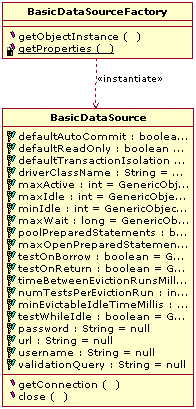
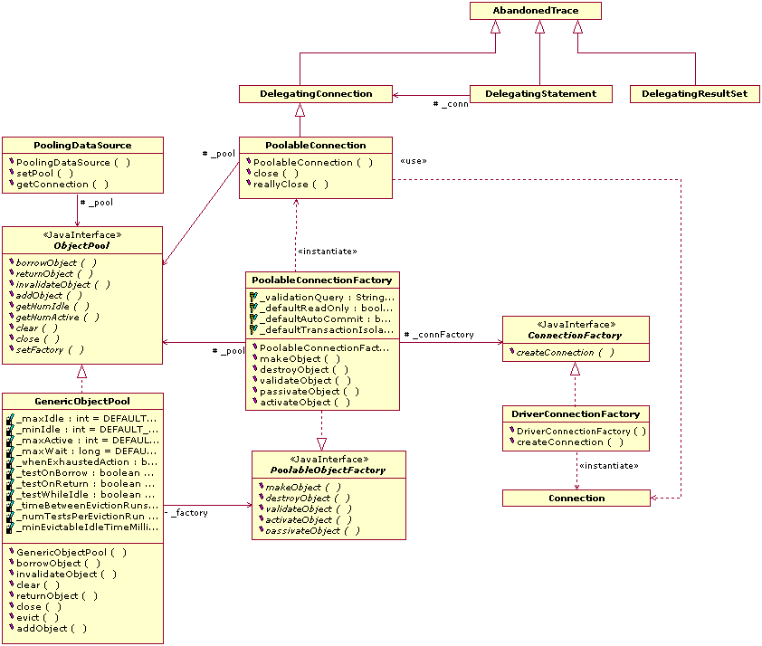
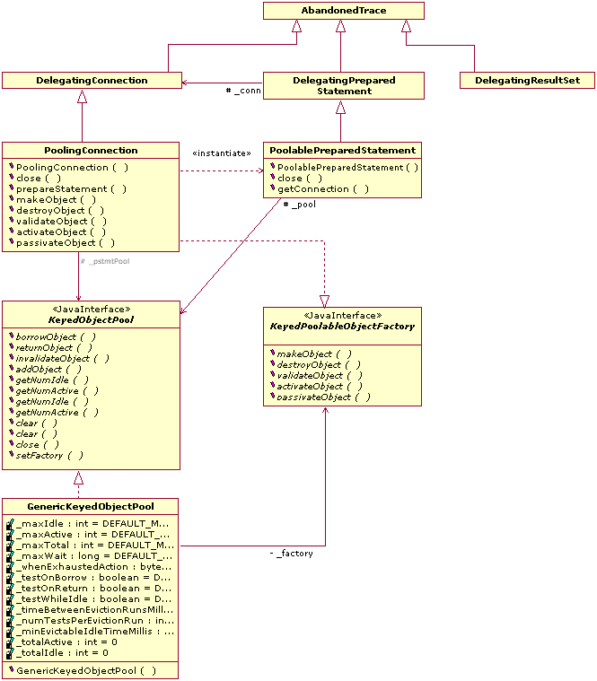

# Project Information

## Navigation

- Commons DBCP
  - [About](#index)
  - [Release History](#changes)
  - [Sources](#scm)
  - [Security](#security)
  - [Javadoc](#index)
  - [Configuration](#configuration)
  - [Developers Guide](#guide)
    - [JNDI Howto](#guide-jndi-howto)
    - [Class Diagrams](#guide-classdiagrams)
    - [Sequence Diagrams](#guide-sequencediagrams)
    - [Building](#building)
- Project Documentation
  - [Project Information](#project-info)
    - [About](#index)
    - [Team](#team)
    - [Source Code Management](#scm)
    - [CI Management](#ci-management)
  - [Project Reports](#project-reports)
    - [Changes](#changes)
    - [JIRA Report](#jira-changes)
    - [Surefire](#surefire)
    - [RAT Report](#rat-report)
    - [japicmp](#japicmp)
    - [SpotBugs](#spotbugs)
    - [Checkstyle](#checkstyle)
    - [PMD](#pmd)
    - [CPD](#cpd)

## Content

<a id="index"></a>

<!-- source_url: https://commons.apache.org/proper/commons-dbcp/index.html -->

<!-- page_index: 1 -->

<a id="index--the-dbcp-component"></a>

# The DBCP Component

Many Apache projects support interaction with a relational database.
Creating a new connection for each user can be time consuming (often
requiring multiple seconds of clock time), in order to perform a database
transaction that might take milliseconds. Opening a connection per user
can be unfeasible in a publicly-hosted Internet application where the
number of simultaneous users can be very large. Accordingly, developers
often wish to share a "pool" of open connections between all of the
application's current users. The number of users actually performing
a request at any given time is usually a very small percentage of the
total number of active users, and during request processing is the only
time that a database connection is required. The application itself logs
into the DBMS, and handles any user account issues internally.

There are several Database Connection Pools already available, both
within Apache products and elsewhere. This Commons package provides an
opportunity to coordinate the efforts required to create and maintain an
efficient, feature-rich package under the ASF license.

The `commons-dbcp2` artifact relies on code in the
`commons-pool2` artifact to provide the underlying object pool
mechanisms.

DBCP now comes in four different versions to support different versions of
JDBC. Here is how it works:

Developing

- DBCP 2.5.0 and up compiles and runs under Java 8
  ([JDBC 4.2](https://docs.oracle.com/javase/8/docs/technotes/guides/jdbc/jdbc_42.html)) and up.
- DBCP 2.4.0 compiles and runs under Java 7
  ([JDBC 4.1](https://docs.oracle.com/javase/7/docs/technotes/guides/jdbc/jdbc_41.html)) and above.

Running

- DBCP 2.5.0 and up binaries should be used by applications running on Java 8 and up.
- DBCP 2.4.0 binaries should be used by applications running under Java 7.

DBCP 2 is based on
[Apache Commons Pool](https://commons.apache.org/proper/commons-pool/)
and provides increased performance, JMX
support as well as numerous other new features compared to DBCP 1.x. Users
upgrading to 2.x should be aware that the Java package name has changed, as well
as the Maven co-ordinates, since DBCP 2.x is not binary compatible with DBCP
1.x. Users should also be aware that some configuration options (e.g. maxActive
to maxTotal) have been renamed to align them with the new names used by Commons
Pool.

<a id="index--releases"></a>

# Releases

See the [downloads](https://commons.apache.org/proper/commons-dbcp/download_dbcp.cgi) page for information on
obtaining releases.

<a id="index--documentation"></a>

# Documentation

The
[Javadoc API documents](https://commons.apache.org/proper/commons-dbcp/apidocs/index.html)
are available online. In particular, you should
read the package overview of the
`org.apache.commons.dbcp2`
package for an overview of how to use DBCP.

There are
[several examples](https://gitbox.apache.org/repos/asf?p=commons-dbcp.git;a=tree;f=doc;hb=refs/heads/master)
of using DBCP available.

---

<a id="changes"></a>

<!-- source_url: https://commons.apache.org/proper/commons-dbcp/changes.html -->

<!-- page_index: 2 -->

<a id="changes--apache-commons-dbcp-release-notes"></a>

# Apache Commons DBCP Release Notes

<a id="changes--release-history"></a>

## Release History

| Version | Date | Description |
| --- | --- | --- |
| [2.14.0](#changes--a2.14.0) | 2025-12-11 | This is a minor release, including bug fixes and enhancements. |
| [2.13.0](#changes--a2.13.0) | 2024-11-23 | This is a minor release, including bug fixes and enhancements. |
| [2.12.0](#changes--a2.12.0) | 2024-02-29 | This is a minor release, including bug fixes and enhancements. |
| [2.11.0](#changes--a2.11.0) | 2023-10-23 | This is a minor release, including bug fixes and enhancements. |
| [2.10.0](#changes--a2.10.0) | 2023-08-28 | This is a minor release, including bug fixes and enhancements. |
| [2.9.0](#changes--a2.9.0) | 2021-07-30 | This is a minor release, including bug fixes and enhancements. |
| [2.8.0](#changes--a2.8.0) | 2020-09-21 | This is a minor release, including bug fixes and enhancements. |
| [2.7.0](#changes--a2.7.0) | 2019-07-31 | This is a minor release, including bug fixes and enhancements. |
| [2.6.0](#changes--a2.6.0) | 2019-02-14 | This is a minor release, including bug fixes and enhancements. |
| [2.5.0](#changes--a2.5.0) | 2018-07-15 | This is a minor release, including bug fixes and enhancements. |
| [2.4.0](#changes--a2.4.0) | 2018-06-12 | This is a minor release, including bug fixes and enhancements. |
| [2.3.0](#changes--a2.3.0) | 2018-05-12 | This is a minor release, including bug fixes and enhancements. |
| [2.2.0](#changes--a2.2.0) | 2017-12-27 | This is a minor release, including bug fixes and enhancements. |
| [2.1.1](#changes--a2.1.1) | 6 Aug 2015 | This is a patch release, including bug fixes only. |
| [2.1](#changes--a2.1) | 23 Feb 2015 | This is minor release, including bug fixes and enhancements. Note that one of the enhancements (DBCP-423) is to implement AutoCloseable in BasicDataSource, PoolingDataSource and the InstanceKeyDataSource implementations. |
| [2.0.1](#changes--a2.0.1) | 24 May 2014 | This is a bug fix release. |
| [2.0](#changes--a2.0) | 3 March 2014 | This release includes new features as well as bug fixes and enhancements. Version 2.0.x supports JDBC 4.1, so requires Java 7. The Java package name has been changed from 'org.apache.commons.dbcp' to 'org.apache.commons.dbcp2'. Also the Maven groupId is now 'org.apache.commons' and the artifactId is 'commons-dbcp2' These changes are necessary because the API is not strictly binary compatible with the 1.x releases. To convert from the earlier releases, update the package name in imports, update the dependencies and recompile. There may be a few other changes to be made. Applications running under Java 7 should use DBCP 2.0.x. Java 6 users should use DBCP 1.4.x which supports JDBC 4. Java 1.4 and Java 5 users should use DBCP 1.3.x which supports JDBC 3. |
| [1.5.1](#changes--a1.5.1) | not yet released | TBD |
| [1.4.1](#changes--a1.4.1) | not yet released | TBD |
| [1.4](#changes--a1.4) | 2010-02-14 | This release includes new features as well as bug fixes and enhancements. Some bug fixes change semantics (e.g. connection close is now idempotent). The 1.3 and 1.4 releases of DBCP are built from the same sources. Version 1.4 supports JDBC 4, so requires JDK 1.6. Applications running under JDK 1.4-1.5 must use DBCP 1.3. Applications running under JDK 1.6 should use DBCP 1.4. Other than support for the added methods in JDBC 4, there is nothing new or different in DBCP 1.4 vs. DBCP 1.3. The list of changes below since 1.2.2 applies to both the 1.3 and 1.4 release. Other than the one issue related to adding JDBC 4 support (DBCP-191), all bug fixes or new features are included in both DBCP 1.3 and 1.4 |
| [1.3](#changes--a1.3) | 2010-02-14 | Compatability release for JDBC 3. See version 1.4 description and change log. |
| [1.2.2](#changes--a1.2.2) | 2007-04-04 | This is a maintenance release containing bug fixes and enhancements. All API changes are binary compatible with version 1.2.1. |
| [1.2.1](#changes--a1.2.1) | 2004-06-12 | Maintenance Release to restore JDK 1.3 compatibility |
| [1.2](#changes--a1.2) | 2004-06-07 |  |
| [1.1](#changes--a1.1) | 2003-10-20 |  |
| [1.0](#changes--a1.0) | 2002-08-12 | Initial Release |

<a id="changes--release-2.14.0-2025-12-11"></a>

## Release 2.14.0 – 2025-12-11

| Type | Changes | By |
| --- | --- | --- |
| Fix | Validation query not timing out on connections managed by SharedPoolDataSource. Fixes [DBCP-597](https://issues.apache.org/jira/browse/DBCP-597). Thanks to Xiaotian Bai, Raju Gupta, Gary Gregory. | [ggregory](#team--ggregory) |
| Fix | Validation query not timing out on connections managed by PerUserPoolDataSource. Fixes [DBCP-597](https://issues.apache.org/jira/browse/DBCP-597). Thanks to Gary Gregory. | [ggregory](#team--ggregory) |
| Fix | KeyedCPDSConnectionFactory.validateObject(UserPassKey, PooledObject) ignores timeouts less than 1 second when there is no validation query. Fixes [DBCP-597](https://issues.apache.org/jira/browse/DBCP-597). Thanks to Gary Gregory. | [ggregory](#team--ggregory) |
| Fix | Modernize tests to use JUnit 5 features. Thanks to Gary Gregory. | [ggregory](#team--ggregory) |
| Fix | Javadoc is missing its Overview page. Thanks to Gary Gregory. | [ggregory](#team--ggregory) |
| Fix | Deprecate org.apache.commons.dbcp2.Jdbc41Bridge.Jdbc41Bridge(), constructor will be private in the next major release. Thanks to Gary Gregory. | [ggregory](#team--ggregory) |
| Fix | Deprecate org.apache.commons.dbcp2.Constants.Constants(), constructor will be private in the next major release. Thanks to Gary Gregory. | [ggregory](#team--ggregory) |
| Fix | Fix Javadoc warnings on Java 17. Thanks to Gary Gregory. | [ggregory](#team--ggregory) |
| Fix | Fix Javadoc warnings on Java 21. Thanks to Gary Gregory. | [ggregory](#team--ggregory) |
| Fix | Remove -nouses directive from maven-bundle-plugin. OSGi package imports now state 'uses' definitions for package imports, this doesn't affect JPMS (from org.apache.commons:commons-parent:80). Thanks to Gary Gregory. | [ggregory](#team--ggregory) |
| Fix | XAException thrown by LocalXAResource now all include a message. Thanks to Gary Gregory. | [ggregory](#team--ggregory) |
| Fix | Fix SpotBugs [ERROR] Medium: Shared primitive variable "isSharedConnection" in one thread may not yield the value of the most recent write from another thread [org.apache.commons.dbcp2.managed.ManagedConnection] AT\_STALE\_THREAD\_WRITE\_OF\_PRIMITIVE. Thanks to Gary Gregory. | [ggregory](#team--ggregory) |
| Fix | Fix SpotBugs [ERROR] Medium: Shared primitive variable "closed" in one thread may not yield the value of the most recent write from another thread [org.apache.commons.dbcp2.cpdsadapter.PooledConnectionImpl] AT\_STALE\_THREAD\_WRITE\_OF\_PRIMITIVE. Thanks to Gary Gregory. | [ggregory](#team--ggregory) |
| Fix | Fix SpotBugs [ERROR] Medium: Shared primitive variable "closed" in one thread may not yield the value of the most recent write from another thread [org.apache.commons.dbcp2.DelegatingStatement] AT\_STALE\_THREAD\_WRITE\_OF\_PRIMITIVE. Thanks to Gary Gregory. | [ggregory](#team--ggregory) |
| Fix | Fix SpotBugs [ERROR] Medium: Shared primitive variable "cacheState" in one thread may not yield the value of the most recent write from another thread [org.apache.commons.dbcp2.DelegatingConnection] AT\_STALE\_THREAD\_WRITE\_OF\_PRIMITIVE. Thanks to Gary Gregory. | [ggregory](#team--ggregory) |
| Fix | Fix SpotBugs [ERROR] Medium: Operation on the "fatalSqlExceptionThrown" shared variable in "PoolableConnection" class is not atomic [org.apache.commons.dbcp2.PoolableConnection] AT\_NONATOMIC\_OPERATIONS\_ON\_SHARED\_VARIABLE. Thanks to Gary Gregory. | [ggregory](#team--ggregory) |
| Fix | Fix SpotBugs [ERROR] Medium: Shared primitive variable "clearStatementPoolOnReturn" in one thread may not yield the value of the most recent write from another thread [org.apache.commons.dbcp2.PoolingConnection] AT\_STALE\_THREAD\_WRITE\_OF\_PRIMITIVE. Thanks to Gary Gregory. | [ggregory](#team--ggregory) |
| Fix | Fix SpotBugs [ERROR] Medium: Shared primitive variable "maxTotal" in one thread may not yield the value of the most recent write from another thread [org.apache.commons.dbcp2.datasources.SharedPoolDataSource] AT\_STALE\_THREAD\_WRITE\_OF\_PRIMITIVE. Thanks to Gary Gregory. | [ggregory](#team--ggregory) |
| Fix | Fix SpotBugs [ERROR] Medium: Shared primitive variable "defaultBlockWhenExhausted" in one thread may not yield the value of the most recent write from another thread [org.apache.commons.dbcp2.datasources.InstanceKeyDataSource] AT\_STALE\_THREAD\_WRITE\_OF\_PRIMITIVE. Thanks to Gary Gregory. | [ggregory](#team--ggregory) |
| Fix | Fix SpotBugs [ERROR] Medium: Shared primitive variable "defaultLifo" in one thread may not yield the value of the most recent write from another thread [org.apache.commons.dbcp2.datasources.InstanceKeyDataSource] AT\_STALE\_THREAD\_WRITE\_OF\_PRIMITIVE. Thanks to Gary Gregory. | [ggregory](#team--ggregory) |
| Fix | Fix SpotBugs [ERROR] Medium: Shared primitive variable "defaultMaxIdle" in one thread may not yield the value of the most recent write from another thread [org.apache.commons.dbcp2.datasources.InstanceKeyDataSource] AT\_STALE\_THREAD\_WRITE\_OF\_PRIMITIVE. Thanks to Gary Gregory. | [ggregory](#team--ggregory) |
| Fix | Fix SpotBugs [ERROR] Medium: Shared primitive variable "defaultMaxTotal" in one thread may not yield the value of the most recent write from another thread [org.apache.commons.dbcp2.datasources.InstanceKeyDataSource] AT\_STALE\_THREAD\_WRITE\_OF\_PRIMITIVE. Thanks to Gary Gregory. | [ggregory](#team--ggregory) |
| Fix | Fix SpotBugs [ERROR] Medium: Shared primitive variable "defaultMinIdle" in one thread may not yield the value of the most recent write from another thread [org.apache.commons.dbcp2.datasources.InstanceKeyDataSource] AT\_STALE\_THREAD\_WRITE\_OF\_PRIMITIVE. Thanks to Gary Gregory. | [ggregory](#team--ggregory) |
| Fix | Fix SpotBugs [ERROR] Medium: Shared primitive variable "defaultNumTestsPerEvictionRun" in one thread may not yield the value of the most recent write from another thread [org.apache.commons.dbcp2.datasources.InstanceKeyDataSource] AT\_STALE\_THREAD\_WRITE\_OF\_PRIMITIVE. Thanks to Gary Gregory. | [ggregory](#team--ggregory) |
| Fix | Fix SpotBugs [ERROR] Medium: Shared primitive variable "defaultTestOnBorrow" in one thread may not yield the value of the most recent write from another thread [org.apache.commons.dbcp2.datasources.InstanceKeyDataSource] AT\_STALE\_THREAD\_WRITE\_OF\_PRIMITIVE. Thanks to Gary Gregory. | [ggregory](#team--ggregory) |
| Fix | Fix SpotBugs [ERROR] Medium: Shared primitive variable "defaultTestOnCreate" in one thread may not yield the value of the most recent write from another thread [org.apache.commons.dbcp2.datasources.InstanceKeyDataSource] AT\_STALE\_THREAD\_WRITE\_OF\_PRIMITIVE. Thanks to Gary Gregory. | [ggregory](#team--ggregory) |
| Fix | Fix SpotBugs [ERROR] Medium: Shared primitive variable "defaultTestOnReturn" in one thread may not yield the value of the most recent write from another thread [org.apache.commons.dbcp2.datasources.InstanceKeyDataSource] AT\_STALE\_THREAD\_WRITE\_OF\_PRIMITIVE. Thanks to Gary Gregory. | [ggregory](#team--ggregory) |
| Fix | Fix SpotBugs [ERROR] Medium: Shared primitive variable "defaultTestWhileIdle" in one thread may not yield the value of the most recent write from another thread [org.apache.commons.dbcp2.datasources.InstanceKeyDataSource] AT\_STALE\_THREAD\_WRITE\_OF\_PRIMITIVE. Thanks to Gary Gregory. | [ggregory](#team--ggregory) |
| Fix | Fix SpotBugs [ERROR] Medium: Shared primitive variable "defaultTransactionIsolation" in one thread may not yield the value of the most recent write from another thread [org.apache.commons.dbcp2.datasources.InstanceKeyDataSource] AT\_STALE\_THREAD\_WRITE\_OF\_PRIMITIVE. Thanks to Gary Gregory. | [ggregory](#team--ggregory) |
| Fix | Fix SpotBugs [ERROR] Medium: Shared primitive variable "rollbackAfterValidation" in one thread may not yield the value of the most recent write from another thread [org.apache.commons.dbcp2.datasources.InstanceKeyDataSource] AT\_STALE\_THREAD\_WRITE\_OF\_PRIMITIVE. Thanks to Gary Gregory. | [ggregory](#team--ggregory) |
| Fix | Fix SpotBugs [ERROR] Medium: Shared primitive variable "loginTimeout" in one thread may not yield the value of the most recent write from another thread [org.apache.commons.dbcp2.cpdsadapter.DriverAdapterCPDS] At DriverAdapterCPDS.java:[line 644] AT\_STALE\_THREAD\_WRITE\_OF\_PRIMITIVE. Thanks to Gary Gregory. | [ggregory](#team--ggregory) |
| Fix | Fix SpotBugs [ERROR] Medium: Shared primitive variable "maxIdle" in one thread may not yield the value of the most recent write from another thread [org.apache.commons.dbcp2.cpdsadapter.DriverAdapterCPDS] At DriverAdapterCPDS.java:[line 664] AT\_STALE\_THREAD\_WRITE\_OF\_PRIMITIVE. Thanks to Gary Gregory. | [ggregory](#team--ggregory) |
| Fix | Fix SpotBugs [ERROR] Medium: Shared primitive variable "maxPreparedStatements" in one thread may not yield the value of the most recent write from another thread [org.apache.commons.dbcp2.cpdsadapter.DriverAdapterCPDS] At DriverAdapterCPDS.java:[line 673] AT\_STALE\_THREAD\_WRITE\_OF\_PRIMITIVE. Thanks to Gary Gregory. | [ggregory](#team--ggregory) |
| Fix | Fix SpotBugs [ERROR] Medium: Shared primitive variable "numTestsPerEvictionRun" in one thread may not yield the value of the most recent write from another thread [org.apache.commons.dbcp2.cpdsadapter.DriverAdapterCPDS] At DriverAdapterCPDS.java:[line 722] AT\_STALE\_THREAD\_WRITE\_OF\_PRIMITIVE. Thanks to Gary Gregory. | [ggregory](#team--ggregory) |
| Fix | Fix SpotBugs [ERROR] Medium: Shared primitive variable "poolPreparedStatements" in one thread may not yield the value of the most recent write from another thread [org.apache.commons.dbcp2.cpdsadapter.DriverAdapterCPDS] At DriverAdapterCPDS.java:[line 757] AT\_STALE\_THREAD\_WRITE\_OF\_PRIMITIVE. Thanks to Gary Gregory. | [ggregory](#team--ggregory) |
| Fix | Fix SpotBugs [ERROR] Medium: Shared primitive variable "autoCommitOnReturn" in one thread may not yield the value of the most recent write from another thread [org.apache.commons.dbcp2.PoolableConnectionFactory-] AT\_STALE\_THREAD\_WRITE\_OF\_PRIMITIVE. Thanks to Gary Gregory. | [ggregory](#team--ggregory) |
| Fix | Fix SpotBugs [ERROR] Medium: Shared primitive variable "cacheState" in one thread may not yield the value of the most recent write from another thread [org.apache.commons.dbcp2.PoolableConnectionFactory] AT\_STALE\_THREAD\_WRITE\_OF\_PRIMITIVE. Thanks to Gary Gregory. | [ggregory](#team--ggregory) |
| Fix | Fix SpotBugs [ERROR] Medium: Shared primitive variable "clearStatementPoolOnReturn" in one thread may not yield the value of the most recent write from another thread [org.apache.commons.dbcp2.PoolableConnectionFactory] AT\_STALE\_THREAD\_WRITE\_OF\_PRIMITIVE. Thanks to Gary Gregory. | [ggregory](#team--ggregory) |
| Fix | Fix SpotBugs [ERROR] Medium: Shared primitive variable "defaultTransactionIsolation" in one thread may not yield the value of the most recent write from another thread [org.apache.commons.dbcp2.PoolableConnectionFactory] AT\_STALE\_THREAD\_WRITE\_OF\_PRIMITIVE. Thanks to Gary Gregory. | [ggregory](#team--ggregory) |
| Fix | Fix SpotBugs [ERROR] Medium: Shared primitive variable "autoCommitOnReturn" in one thread may not yield the value of the most recent write from another thread [org.apache.commons.dbcp2.PoolableConnectionFactory] AT\_STALE\_THREAD\_WRITE\_OF\_PRIMITIVE. Thanks to Gary Gregory. | [ggregory](#team--ggregory) |
| Fix | Fix SpotBugs [ERROR] Medium: Shared primitive variable "fastFailValidation" in one thread may not yield the value of the most recent write from another thread [org.apache.commons.dbcp2.PoolableConnectionFactory] AT\_STALE\_THREAD\_WRITE\_OF\_PRIMITIVE. Thanks to Gary Gregory. | [ggregory](#team--ggregory) |
| Fix | Fix SpotBugs [ERROR] Medium: Shared primitive variable "maxOpenPreparedStatements" in one thread may not yield the value of the most recent write from another thread [org.apache.commons.dbcp2.PoolableConnectionFactory] AT\_STALE\_THREAD\_WRITE\_OF\_PRIMITIVE. Thanks to Gary Gregory. | [ggregory](#team--ggregory) |
| Fix | Fix SpotBugs [ERROR] Medium: Shared primitive variable "poolStatements" in one thread may not yield the value of the most recent write from another thread [org.apache.commons.dbcp2.PoolableConnectionFactory] AT\_STALE\_THREAD\_WRITE\_OF\_PRIMITIVE. Thanks to Gary Gregory. | [ggregory](#team--ggregory) |
| Fix | Fix SpotBugs [ERROR] Medium: Shared primitive variable "rollbackOnReturn" in one thread may not yield the value of the most recent write from another thread [org.apache.commons.dbcp2.PoolableConnectionFactory] AT\_STALE\_THREAD\_WRITE\_OF\_PRIMITIVE. Thanks to Gary Gregory. | [ggregory](#team--ggregory) |
| Fix | Fix SpotBugs [ERROR] Medium: Shared primitive variable "autoCommitOnReturn" in one thread may not yield the value of the most recent write from another thread [org.apache.commons.dbc-p2.BasicDataSource] AT\_STALE\_THREAD\_WRITE\_OF\_PRIMITIVE. Thanks to Gary Gregory. | [ggregory](#team--ggregory) |
| Fix | Fix SpotBugs [ERROR] Medium: Shared primitive variable "cacheState" in one thread may not yield the value of the most recent write from another thread [org.apache.commons.dbcp2.BasicDataSource] AT\_STALE\_THREAD\_WRITE\_OF\_PRIMITIVE. Thanks to Gary Gregory. | [ggregory](#team--ggregory) |
| Fix | Fix SpotBugs [ERROR] Medium: Shared primitive variable "clearStatementPoolOnReturn" in one thread may not yield the value of the most recent write from another thread [org.apache.commons.dbcp2.BasicDataSource] AT\_STALE\_THREAD\_WRITE\_OF\_PRIMITIVE. Thanks to Gary Gregory. | [ggregory](#team--ggregory) |
| Fix | Fix SpotBugs [ERROR] Medium: Shared primitive variable "autoCommitOnReturn" in one thread may not yield the value of the most recent write from another thread [org.apache.commons.dbcp2.BasicDataSource] AT\_STALE\_THREAD\_WRITE\_OF\_PRIMITIVE. Thanks to Gary Gregory. | [ggregory](#team--ggregory) |
| Fix | Fix SpotBugs [ERROR] Medium: Shared primitive variable "fastFailValidation" in one thread may not yield the value of the most recent write from another thread [org.apache.commons.dbcp2.BasicDataSource] AT\_STALE\_THREAD\_WRITE\_OF\_PRIMITIVE. Thanks to Gary Gregory. | [ggregory](#team--ggregory) |
| Fix | Fix SpotBugs [ERROR] Medium: Shared primitive variable "logExpiredConnections" in one thread may not yield the value of the most recent write from another thread [org.apache.commons.dbcp2.BasicDataSource] AT\_STALE\_THREAD\_WRITE\_OF\_PRIMITIVE. Thanks to Gary Gregory. | [ggregory](#team--ggregory) |
| Fix | Fix SpotBugs [ERROR] Medium: Shared primitive variable "registerConnectionMBean" in one thread may not yield the value of the most recent write from another thread [org.apache.commons.dbcp2.BasicDataSource] AT\_STALE\_THREAD\_WRITE\_OF\_PRIMITIVE. Thanks to Gary Gregory. | [ggregory](#team--ggregory) |
| Fix | Fix SpotBugs [ERROR] Medium: Shared primitive variable "rollbackOnReturn" in one thread may not yield the value of the most recent write from another thread [org.apache.commons.dbcp2.BasicDataSource] AT\_STALE\_THREAD\_WRITE\_OF\_PRIMITIVE. Thanks to Gary Gregory. | [ggregory](#team--ggregory) |
| Fix | Fix a potential resource leak if an SQLException occurs during an attempt to obtain an XAConnection. Thanks to Coverity Scan. | [markt](#team--markt) |
| Fix | Minor optimisations to the processing of the "connectionProperties" string. Thanks to Coverity Scan. | [markt](#team--markt) |
| Add | Add org.apache.commons.dbcp2.datasources.PooledConnectionManager.setPassword(char[]). Thanks to Gary Gregory. | [ggregory](#team--ggregory) |
| Update | Update tests and CPDSConnectionFactory#invalidate to accomodate changed behavior in the fix for POOL-424. | [psteitz](#team--psteitz) |
| Update | Bump org.apache.commons:commons-parent from 78 to 93 #521, #537, #538. Thanks to Gary Gregory. | [ggregory](#team--ggregory) |
| Update | Bump org.apache.commons:commons-pool2 from 2.12.0 to 2.13.0 #474. Thanks to Gary Gregory. | [ggregory](#team--ggregory) |
| Update | Port site from Doxia 1 to 2. Thanks to Gary Gregory. | [ggregory](#team--ggregory) |
| Update | Bump commons-logging:commons-logging from 1.3.4 to 1.3.5. Thanks to Gary Gregory. | [ggregory](#team--ggregory) |
| Update | Bump org.slf4j:slf4j-simple from 2.0.16 to 2.0.17 #481. Thanks to Gary Gregory. | [ggregory](#team--ggregory) |
| Update | Bump org.apache.commons:commons-lang3 from 3.17.0 to 3.20.0 #506. Thanks to Gary Gregory, Dependabot. | [ggregory](#team--ggregory) |
| Remove | Removed internal constructors and methods from the package-private class CPDSConnectionFactory; this is binary compatible. Thanks to Gary Gregory. | [ggregory](#team--ggregory) |
| Remove | Removed an internal constructor and methods from the package-private class KeyedCPDSConnectionFactory; this is binary compatible. Thanks to Gary Gregory. | [ggregory](#team--ggregory) |

<a id="changes--release-2.13.0-2024-11-23"></a>

## Release 2.13.0 – 2024-11-23

| Type | Changes | By |
| --- | --- | --- |
| Fix | Avoid object creation when invoking isDisconnectionSqlException #422. Thanks to Johno Crawford. | [ggregory](#team--ggregory) |
| Fix | PoolableConnectionFactory.destroyObject() method behaves incorrectly on ABANDONED connection, issue with unhandled AbstractMethodError. DelegatingConnection.abort(Executor) should delegate to Jdbc41Bridge. Fixes [DBCP-599](https://issues.apache.org/jira/browse/DBCP-599). Thanks to denixx baykin, Phil Steitz, Gary Gregory. | [ggregory](#team--ggregory) |
| Fix | DelegatingConnection.setSchema(String) should delegate to Jdbc41Bridge. Thanks to Gary Gregory. | [ggregory](#team--ggregory) |
| Fix | Fix possible NullPointerException in PoolingConnection.close(). Thanks to Gary Gregory. | [ggregory](#team--ggregory) |
| Fix | PerUserPoolDataSource.registerPool() incorrectly replacing a CPDSConnectionFactory into managers map before throwing an IllegalStateException. Thanks to Gary Gregory. | [ggregory](#team--ggregory) |
| Fix | Fix PMD UnnecessaryFullyQualifiedName in AbandonedTrace. Thanks to Gary Gregory. | [ggregory](#team--ggregory) |
| Fix | Fix PMD UnnecessaryFullyQualifiedName in PoolableCallableStatement. Thanks to Gary Gregory. | [ggregory](#team--ggregory) |
| Fix | Fix PMD UnnecessaryFullyQualifiedName in PoolablePreparedStatement. Thanks to Gary Gregory. | [ggregory](#team--ggregory) |
| Fix | Fix PMD UnnecessaryFullyQualifiedName in Utils. Thanks to Gary Gregory. | [ggregory](#team--ggregory) |
| Fix | Fix PMD UnnecessaryFullyQualifiedName in LocalXAConnectionFactory. Thanks to Gary Gregory. | [ggregory](#team--ggregory) |
| Fix | Fix SpotBugs MC\_OVERRIDABLE\_METHOD\_CALL\_IN\_READ\_OBJECT in PerUserPoolDataSource. Thanks to Gary Gregory. | [ggregory](#team--ggregory) |
| Fix | Fix SpotBugs MC\_OVERRIDABLE\_METHOD\_CALL\_IN\_READ\_OBJECT in SharedPoolDataSource. Thanks to Gary Gregory. | [ggregory](#team--ggregory) |
| Add | Add support for ignoring non-fatal SQL state codes #421. Thanks to Johno Crawford, Gary Gregory. | [ggregory](#team--ggregory) |
| Add | Add @FunctionalInterface to SwallowedExceptionListener. Thanks to Johno Crawford, Gary Gregory. | [ggregory](#team--ggregory) |
| Add | Add missing Javadoc comments and descriptions. Thanks to Gary Gregory. | [ggregory](#team--ggregory) |
| Add | Add tests, raise the bar for JaCoCo checks. Thanks to Gary Gregory. | [ggregory](#team--ggregory) |
| Update | Bump org.apache.commons:commons-parent from 66 to 78 #360, #371, #395, #420, #426, #436, #441, #449. Thanks to Gary Gregory. | [ggregory](#team--ggregory) |
| Update | Bump commons-logging:commons-logging from 1.3.0 to 1.3.4 #368, #399, #423. Thanks to Gary Gregory, Dependabot. | [ggregory](#team--ggregory) |
| Update | Bump org.apache.commons:commons-lang3 from 3.14.0 to 3.17.0 #404, #412, #427. Thanks to Gary Gregory, Dependabot. | [ggregory](#team--ggregory) |
| Update | Bump org.hamcrest:hamcrest from 2.2 to 3.0 #410. Thanks to Gary Gregory, Dependabot. | [ggregory](#team--ggregory) |
| Update | Bump org.slf4j:slf4j-simple from 2.0.13 to 2.0.16 #413, #418. Thanks to Gary Gregory, Dependabot. | [ggregory](#team--ggregory) |

<a id="changes--release-2.12.0-2024-02-29"></a>

## Release 2.12.0 – 2024-02-29

| Type | Changes | By |
| --- | --- | --- |
| Fix | BasicDataSource#setAbandonedUsageTracking has no effect. Fixes [DBCP-590](https://issues.apache.org/jira/browse/DBCP-590). Thanks to Réda Housni Alaoui. | [psteitz](#team--psteitz) |
| Fix | PoolingConnection.toString() causes StackOverflowError. Fixes [DBCP-596](https://issues.apache.org/jira/browse/DBCP-596). Thanks to Aapo Haapanen, Gary Gregory. | [ggregory](#team--ggregory) |
| Fix | PooledConnectionImpl.destroyObject(PStmtKey, PooledObject) can throw NullPointerException #312. Thanks to Gary Gregory, Rémy Maucherat. | [ggregory](#team--ggregory) |
| Fix | PoolingConnection.destroyObject(PStmtKey, PooledObject) can throw NullPointerException #312. Thanks to Gary Gregory, Rémy Maucherat. | [ggregory](#team--ggregory) |
| Fix | Fix examples in src/main/java/org/apache/commons/dbcp2/package-info.java. Fixes [DBCP-477](https://issues.apache.org/jira/browse/DBCP-477). Thanks to Mubasher Usman, Gary Gregory. | [ggregory](#team--ggregory) |
| Add | Add property project.build.outputTimestamp for build reproducibility. Thanks to Gary Gregory. | [ggregory](#team--ggregory) |
| Add | Add null guards in DelegatingDatabaseMetaData constructor #352. Thanks to Heewon Lee. | [ggregory](#team--ggregory) |
| Add | Data source bean creation failed due to mismatched return type of setter and getter for connectionInitSqls in BasicDataSource: Add BasicDataSource.setConnectionInitSqls(List). Fixes [DBCP-473](https://issues.apache.org/jira/browse/DBCP-473). Thanks to Steve Cohen, Gary Gregory. | [ggregory](#team--ggregory) |
| Update | Use ReentrantLock in PoolableConnection.close, #591 Thanks to cortlepp-intershop. | [psteitz](#team--psteitz) |
| Update | Bump commons-lang3 from 3.13.0 to 3.14.0. Thanks to Gary Gregory. | [ggregory](#team--ggregory) |
| Update | Bump commons-parent from 64 to 66. Thanks to Gary Gregory. | [ggregory](#team--ggregory) |
| Update | Bump org.slf4j:slf4j-simple from 2.0.9 to 2.0.12 #349. Thanks to Dependabot. | [ggregory](#team--ggregory) |

<a id="changes--release-2.11.0-2023-10-23"></a>

## Release 2.11.0 – 2023-10-23

| Type | Changes | By |
| --- | --- | --- |
| Update | Update call sites of deprecated APIs from Apache Commons Pool. Thanks to Gary Gregory. | [ggregory](#team--ggregory) |
| Update | Add DataSourceMXBean.getUserName() and deprecate getUsername(). Thanks to Gary Gregory, Dependabot. | [ggregory](#team--ggregory) |
| Update | Bump h2 from 2.2.220 to 2.2.224, #308. Thanks to Gary Gregory, Dependabot. | [ggregory](#team--ggregory) |
| Update | Bump commons-parent from 60 to 64. Thanks to Gary Gregory. | [ggregory](#team--ggregory) |
| Update | Bump org.slf4j:slf4j-simple from 2.0.7 to 2.0.9 #301. Thanks to Dependabot. | [ggregory](#team--ggregory) |
| Update | Bump org.apache.commons:commons-pool2 from 2.11.1 to 2.12.0. Thanks to Gary Gregory. | [ggregory](#team--ggregory) |
| Update | Bump jakarta.transaction:jakarta.transaction-api from 1.3.1 to 1.3.3. Thanks to Gary Gregory. | [ggregory](#team--ggregory) |
| Update | Bump commons-logging:commons-logging from 1.2 to 1.3.0. Thanks to Piotr P. Karwasz. | [pkarwasz](#team--pkarwasz) |

<a id="changes--release-2.10.0-2023-08-28"></a>

## Release 2.10.0 – 2023-08-28

| Type | Changes | By |
| --- | --- | --- |
| Fix | Fix StackOverflowError in PoolableConnection.isDisconnectionSqlException #123. Thanks to newnewcoder, Gary Gregory. | [ggregory](#team--ggregory) |
| Fix | PerUserPoolDataSourceFactory.getNewInstance(Reference) parsed defaultMaxWaitMillis as an int instead of a long. Thanks to Gary Gregory. | [ggregory](#team--ggregory) |
| Fix | Reimplement time tracking in AbandonedTrace with an Instant instead of a long. Thanks to Gary Gregory. | [ggregory](#team--ggregory) |
| Fix | Migrate away from deprecated APIs in Apache Commons Pool. Thanks to Gary Gregory. | [ggregory](#team--ggregory) |
| Fix | Fix possible NullPointerException in BasicDataSourceFactory.validatePropertyNames(). Thanks to Gary Gregory. | [ggregory](#team--ggregory) |
| Fix | Fix possible NullPointerException in BasicDataSourceFactory.getObjectInstance(). Thanks to Gary Gregory. | [ggregory](#team--ggregory) |
| Fix | Connection level JMX queries result in concurrent access to connection objects, causing errors #179. Fixes [DBCP-585](https://issues.apache.org/jira/browse/DBCP-585). Thanks to Kurtcebe Eroglu, Gary Gregory, Phil Steitz. | [ggregory](#team--ggregory) |
| Fix | UserPassKey should be Serializable. Thanks to Gary Gregory. | [ggregory](#team--ggregory) |
| Fix | LifetimeExceededException should extend SQLException. Thanks to Gary Gregory. | [ggregory](#team--ggregory) |
| Fix | Replace Exception with SQLException in some method signatures (preserves binary compatibility, not source). Thanks to Gary Gregory. | [ggregory](#team--ggregory) |
| Fix | Don't leak Connections when PoolableConnectionFactory.makeObject() fails to create a JMX ObjectName. Thanks to Gary Gregory. | [ggregory](#team--ggregory) |
| Fix | Performance: No need for map lookups if we traverse map entries instead of keys. Thanks to SpotBugs, Gary Gregory. | [ggregory](#team--ggregory) |
| Fix | Performance: Refactor to use a static inner class in DataSourceXAConnectionFactory. Thanks to SpotBugs, Gary Gregory. | [ggregory](#team--ggregory) |
| Fix | Reuse pattern of throwing XAException instead of NullPointerException in LocalXAConnectionFactory.LocalXAResource. Thanks to SpotBugs, Gary Gregory. | [ggregory](#team--ggregory) |
| Fix | SpotBugs: An overridable method is called from constructors in PoolableCallableStatement. Thanks to SpotBugs, Gary Gregory. | [ggregory](#team--ggregory) |
| Fix | SpotBugs: An overridable method is called from constructors in PoolablePreparedStatement. Thanks to SpotBugs, Gary Gregory. | [ggregory](#team--ggregory) |
| Fix | Wrong property name logged in ConnectionFactoryFactory.createConnectionFactory(BasicDataSource, Driver). Thanks to Gary Gregory. | [ggregory](#team--ggregory) |
| Fix | Throw SQLException instead of NullPointerException when the connection is already closed. Thanks to Gary Gregory. | [ggregory](#team--ggregory) |
| Fix | CPDSConnectionFactory.makeObject() does not need to wrap and rethrow SQLException. Thanks to Gary Gregory. | [ggregory](#team--ggregory) |
| Fix | PoolingDataSource.close() now always throws SQLException. Thanks to Gary Gregory. | [ggregory](#team--ggregory) |
| Fix | [StepSecurity] ci: Harden GitHub Actions #282. Thanks to step-security-bot, Gary Gregory. | [ggregory](#team--ggregory) |
| Fix | Fixes typos, missing or misplaced characters, and grammar issues #299. Thanks to Martin Wiesner. | [ggregory](#team--ggregory) |
| Add | Add and use AbandonedTrace#setLastUsed(Instant). Thanks to Gary Gregory. | [ggregory](#team--ggregory) |
| Add | Add and use Duration versions of now deprecated APIs that use ints and longs. Internally track durations with Duration objects instead of ints and longs. See the JApiCmp report for the complete list. Thanks to Gary Gregory. | [ggregory](#team--ggregory) |
| Add | Add PMD check to default Maven goal. Thanks to Gary Gregory. | [ggregory](#team--ggregory) |
| Add | Add Utils.getDisconnectionSqlCodes() and Utils.DISCONNECTION\_SQL\_CODES. Thanks to Gary Gregory. | [ggregory](#team--ggregory) |
| Add | Make BasicDataSource.getConnectionPool() public. Thanks to Gary Gregory. | [ggregory](#team--ggregory) |
| Add | Add github/codeql-action. Thanks to Gary Gregory. | [ggregory](#team--ggregory) |
| Update | Bump actions/cache from 2.1.6 to 3.0.8 #147, #176. Thanks to Dependabot, Gary Gregory. | [ggregory](#team--ggregory) |
| Update | Bump actions/checkout from 2.3.4 to 3.0.2 #139, #143, #173. Thanks to Dependabot, Gary Gregory. | [ggregory](#team--ggregory) |
| Update | Bump actions/setup-java from 2 to 3.6.0 #229. Thanks to Gary Gregory, Dependabot. | [ggregory](#team--ggregory) |
| Update | Bump actions/upload-artifact from 3.1.0 to 3.1.1 #231. Thanks to Dependabot. | [ggregory](#team--ggregory) |
| Update | Bump checkstyle from 8.44 to 9.3 #121, #130, #149, #158, #190. Thanks to Dependabot. | [ggregory](#team--ggregory) |
| Update | Bump maven-checkstyle-plugin from 3.1.2 to 3.2.0 #210. Thanks to Dependabot. | [ggregory](#team--ggregory) |
| Update | Bump commons-pool2 2.10.0 to 2.11.1. Thanks to Gary Gregory, Dependabot. | [ggregory](#team--ggregory) |
| Update | Bump junit-jupiter from 5.8.0-M1 to 5.9.1 #125, #136, #157, #203, #218. Thanks to Dependabot. | [ggregory](#team--ggregory) |
| Update | Bump spotbugs-maven-plugin from 4.3.0 to 4.7.3.0 #140, #154, #161, #178, #192, #200, #204, #213, #234. Thanks to Dependabot. | [ggregory](#team--ggregory) |
| Update | Bump spotbugs from 4.3.0 to 4.7.3 #124, #133, #151, #164, #177, #189, #214, #230. Thanks to Dependabot, Gary Gregory. | [ggregory](#team--ggregory) |
| Update | Bump org.mockito:mockito-core from 3.11.2 to 4.11.0, #128, #138, #152, #175, #188. #193, #208, #215, #232, #235, #246, #252. Thanks to Gary Gregory, Dependabot. | [ggregory](#team--ggregory) |
| Update | Bump maven-javadoc-plugin from 3.3.0 to 3.4.1 #131, #184. Thanks to Dependabot. | [ggregory](#team--ggregory) |
| Update | Bump maven-pmd-plugin from 3.14.0 to 3.19.0 #132, #172, #195. Thanks to Dependabot, Gary Gregory. | [ggregory](#team--ggregory) |
| Update | Bump pmd from 6.44.0 to 6.52.0. Thanks to Dependabot, Gary Gregory. | [ggregory](#team--ggregory) |
| Update | Bump narayana-jta from 5.12.0.Final to 5.12.7.Final #134, #156, #163, #185, #197. Thanks to Dependabot. | [ggregory](#team--ggregory) |
| Update | Bump japicmp-maven-plugin from 0.15.3 to 0.17.1 #137, #166, #174, #211, #238. Thanks to Dependabot. | [ggregory](#team--ggregory) |
| Update | Bump h2 from 1.4.200 to 2.2.220 #153, #183, #196, #287. Update SQL for migration from H2 1.4.200 to 2.0.204 where "KEY" and "VALUE" are now reserved keywords. Thanks to Gary Gregory, Dependabot. | [ggregory](#team--ggregory) |
| Update | Bump jboss-logging from 3.4.2.Final to 3.4.3.Final #162. Thanks to Dependabot. | [ggregory](#team--ggregory) |
| Update | Bump slf4j-simple from 1.7.30 to 1.7.36 #169. Thanks to Dependabot. | [ggregory](#team--ggregory) |
| Update | Bump commons-parent from 52 to 60 #180, #219, #254, #278. Thanks to Dependabot, Gary Gregory. | [ggregory](#team--ggregory) |
| Update | Bump JaCoCo from 0.8.7 to 0.8.8. Thanks to Gary Gregory. | [ggregory](#team--ggregory) |
| Update | Bump maven-surefire-plugin 2.22.2 to 3.0.0-M7. Thanks to Gary Gregory. | [ggregory](#team--ggregory) |
| Update | Bump apache-rat-plugin 0.13 to 0.14. Thanks to Gary Gregory. | [ggregory](#team--ggregory) |
| Update | Bump commons-lang3 from 3.12 to 3.13.0. Thanks to Gary Gregory. | [ggregory](#team--ggregory) |

<a id="changes--release-2.9.0-2021-07-30"></a>

## Release 2.9.0 – 2021-07-30

| Type | Changes | By |
| --- | --- | --- |
| Add | Add and reuse Constants.KEY\_USER and Constants.KEY\_PASSWORD. Thanks to Gary Gregory. | [ggregory](#team--ggregory) |
| Add | Add and reuse DataSourceMXBean. Thanks to Frank Gasdorf, Gary Gregory. | [ggregory](#team--ggregory) |
| Add | Add and reuse DriverAdapterCPDS.{get|set}DurationBetweenEvictionRuns(), deprecate {get|set}TimeBetweenEvictionRunsMillis(long). Thanks to Gary Gregory. | [ggregory](#team--ggregory) |
| Add | Add and reuse DriverAdapterCPDS.{get|set}MinEvictableIdleDuration(), deprecate {get|set}MinEvictableIdleTimeMillis(int). Thanks to Gary Gregory. | [ggregory](#team--ggregory) |
| Add | Add and reuse CPDSConnectionFactory.setMaxConnLifetime(Duration), deprecate setMaxConnLifetimeMillis(long). Thanks to Gary Gregory. | [ggregory](#team--ggregory) |
| Add | Add and reuse KeyedCPDSConnectionFactory.setMaxConnLifetime(Duration), deprecate setMaxConnLifetimeMillis(long). Thanks to Gary Gregory. | [ggregory](#team--ggregory) |
| Add | Add and reuse KeyedCPDSConnectionFactory.setMaxConnLifetime(Duration), deprecate setMaxConnLifetimeMillis(long). Thanks to Gary Gregory. | [ggregory](#team--ggregory) |
| Add | Add and reuse InstanceKeyDataSource.{get|set}DefaultMaxWait(Duration), deprecate {get|set}DefaultMaxWaitMillis(long). Thanks to Gary Gregory. | [ggregory](#team--ggregory) |
| Fix | Fix test random failure on TestSynchronizationOrder.testInterposedSynchronization, #84. Fixes [DBCP-569](https://issues.apache.org/jira/browse/DBCP-569). Thanks to Florent Guillaume. | [ggregory](#team--ggregory) |
| Fix | ManagedConnection must clear its cached state after transaction completes, #75. Fixes [DBCP-568](https://issues.apache.org/jira/browse/DBCP-568). Thanks to Florent Guillaume. | [ggregory](#team--ggregory) |
| Fix | Minor Improvements #78. Thanks to Arturo Bernal. | [ggregory](#team--ggregory) |
| Fix | Use abort rather than close to clean up abandoned connections. Fixes [DBCP-567](https://issues.apache.org/jira/browse/DBCP-567). Thanks to Phil Steitz, Gary Gregory, Phil Steitz, Romain Manni-Bucau. | [ggregory](#team--ggregory) |
| Fix | Performance Enhancement: Call toArray with Zero Array Size #20. Thanks to Gary Gregory, DaGeRe. | [ggregory](#team--ggregory) |
| Fix | Avoid exposing password via JMX #38. Fixes [DBCP-562](https://issues.apache.org/jira/browse/DBCP-562). Thanks to Frank Gasdorf, Gary Gregory. | [ggregory](#team--ggregory) |
| Fix | Remove redundant initializers #98. Fixes [DBCP-575](https://issues.apache.org/jira/browse/DBCP-575). Thanks to Arturo Bernal. | [ggregory](#team--ggregory) |
| Fix | Simplify test assertions #100, #113. Fixes [DBCP-577](https://issues.apache.org/jira/browse/DBCP-577). Thanks to Arturo Bernal. | [ggregory](#team--ggregory) |
| Fix | DataSource implementations do not implement Wrapper interface correctly #93. Fixes [DBCP-573](https://issues.apache.org/jira/browse/DBCP-573). Thanks to Réda Housni Alaoui, Gary Gregory. | [ggregory](#team--ggregory) |
| Fix | Replace FindBugs with SpotBugs. | [ggregory](#team--ggregory) |
| Fix | DataSourceConnectionFactory.getUserPassword() may expose internal representation by returning DataSourceConnectionFactory.userPassword. | [ggregory](#team--ggregory) |
| Fix | DataSourceXAConnectionFactory.getUserPassword() may expose internal representation by returning DataSourceXAConnectionFactory.userPassword. | [ggregory](#team--ggregory) |
| Fix | DriverAdapterCPDS.getPasswordCharArray() may expose internal representation by returning DriverAdapterCPDS.userPassword. | [ggregory](#team--ggregory) |
| Fix | new org.apache.commons.dbcp2.managed.DataSourceXAConnectionFactory(TransactionManager, XADataSource, String, char[], TransactionSynchronizationRegistry) may expose internal representation by storing an externally mutable object into DataSourceXAConnectionFactory.userPassword. | [ggregory](#team--ggregory) |
| Fix | org.apache.commons.dbcp2.managed.DataSourceXAConnectionFactory.setPassword(char[]) may expose internal representation by storing an externally mutable object into DataSourceXAConnectionFactory.userPassword. | [ggregory](#team--ggregory) |
| Fix | org.apache.commons.dbcp2.PStmtKey.getColumnIndexes() may expose internal representation by returning PStmtKey.columnIndexes. | [ggregory](#team--ggregory) |
| Fix | org.apache.commons.dbcp2.PStmtKey.getColumnNames() may expose internal representation by returning PStmtKey.columnNames. | [ggregory](#team--ggregory) |
| Fix | Use Collections.synchronizedList() Instead Of Vector #101. Fixes [DBCP-578](https://issues.apache.org/jira/browse/DBCP-578). Thanks to Arturo Bernal. | [ggregory](#team--ggregory) |
| Fix | Simplify and inline variables #99. Fixes [DBCP-576](https://issues.apache.org/jira/browse/DBCP-576). Thanks to Arturo Bernal. | [ggregory](#team--ggregory) |
| Fix | Update PoolKey#toString() to avoid revealing a user name is here. Thanks to Gary Gregory. | [ggregory](#team--ggregory) |
| Fix | Internal package private UserPassKey class stores its user name as a char[] as it already does the password. Thanks to Gary Gregory. | [ggregory](#team--ggregory) |
| Fix | Performance of DelegatingConnection.prepareStatement(String) regressed enormously in 2.8.0 compared to 1.4. DelegatingConnection should also cache connection schema string to avoid calling the Connection#getSchema() for each key creation. DelegatingConnection should also cache connection catalog string to avoid calling the Connection#getCatalog() for each key creation. Fixes [DBCP-579](https://issues.apache.org/jira/browse/DBCP-579). Thanks to Shaktisinh Jhala, Gary Gregory. | [ggregory](#team--ggregory) |
| Fix | BasicDataSource should test for the presence of a security manager dynamically, not once on initialization. Thanks to Gary Gregory. | [ggregory](#team--ggregory) |
| Update | Bump mockito-core from 3.5.11 to 3.11.2 #66, #72, #77, #85, #91, #105, #110, #116. Thanks to Dependabot. | [ggregory](#team--ggregory) |
| Update | Bump actions/checkout from v2.3.2 to v2.3.4 #65, #74. Thanks to Dependabot. | [ggregory](#team--ggregory) |
| Update | Bump actions/cache from v2 to v2.1.6 #90, #108. Thanks to Dependabot. | [ggregory](#team--ggregory) |
| Update | Bump commons-pool2 from 2.8.1 to 2.9.0. Thanks to Gary Gregory. | [ggregory](#team--ggregory) |
| Update | Bump actions/setup-java from v1.4.2 to v2 #69. Thanks to Dependabot, Gary Gregory. | [ggregory](#team--ggregory) |
| Update | Bump japicmp-maven-plugin from 0.14.3 to 0.15.2 #71, #82. Thanks to Dependabot, Gary Gregory. | [ggregory](#team--ggregory) |
| Update | Bump maven-pmd-plugin from 3.13.0 to 3.14.0 #76. Thanks to Dependabot. | [ggregory](#team--ggregory) |
| Update | Bump japicmp-maven-plugin from 0.14.4 to 0.15.3, #83. Thanks to Dependabot, Gary Gregory. | [ggregory](#team--ggregory) |
| Update | Bump Hamcrest 1.3 -> 2.2 #70. Thanks to John Patrick. | [ggregory](#team--ggregory) |
| Update | Bump maven-checkstyle-plugin from 3.1.1 to 3.1.2 #88. Thanks to Gary Gregory. | [ggregory](#team--ggregory) |
| Update | Bump junit-jupiter from 5.7.0 to 5.8.0-M1, #89, #106. Thanks to Gary Gregory. | [ggregory](#team--ggregory) |
| Update | Bump narayana-jta from 5.10.6.Final to 5.12.0.Final #103, #111. Thanks to Dependabot. | [ggregory](#team--ggregory) |
| Update | Bump maven-javadoc-plugin from 3.2.0 to 3.3.0 #107. Thanks to Dependabot. | [ggregory](#team--ggregory) |
| Update | Bump commons.jacoco.version 0.8.6 -> 0.8.7. Thanks to Gary Gregory. | [ggregory](#team--ggregory) |
| Update | Bump jboss-logging from 3.4.1.Final to 3.4.2.Final #109. Thanks to Dependabot. | [ggregory](#team--ggregory) |
| Update | Bump org.jboss:jboss-transaction-spi from 7.6.0.Final to 7.6.1.Final. Thanks to Gary Gregory. | [ggregory](#team--ggregory) |
| Update | Bump commons-pool2 from 2.9.0 to 2.10.0. Thanks to Gary Gregory. | [ggregory](#team--ggregory) |
| Update | Bump checkstyle to 8.44. Thanks to Gary Gregory. | [ggregory](#team--ggregory) |
| Update | Bump spotbugs from 4.2.3 to 4.3.0 #117. Thanks to Dependabot. | [ggregory](#team--ggregory) |
| Update | Bump spotbugs-maven-plugin from 4.2.3 to 4.3.0 #118. Thanks to Dependabot. | [ggregory](#team--ggregory) |

<a id="changes--release-2.8.0-2020-09-21"></a>

## Release 2.8.0 – 2020-09-21

| Type | Changes | By |
| --- | --- | --- |
| Add | Fix BasicManagedDataSource leak of connections opened after transaction is rollback-only #39. Fixes [DBCP-564](https://issues.apache.org/jira/browse/DBCP-564). Thanks to Florent Guillaume. | [ggregory](#team--ggregory) |
| Add | Add clearStatementPoolOnReturn #42. Fixes [DBCP-566](https://issues.apache.org/jira/browse/DBCP-566). Thanks to Robert Paschek, Gary Gregory, Phil Steitz. | [ggregory](#team--ggregory) |
| Add | Add start, restart methods to BasicDataSource. #50. Fixes [DBCP-559](https://issues.apache.org/jira/browse/DBCP-559). Thanks to Phil Steitz. | [ggregory](#team--ggregory) |
| Fix | NPE when creating a SQLExceptionList with a null list. Fixes [DBCP-555](https://issues.apache.org/jira/browse/DBCP-555). Thanks to Gary Gregory. | [ggregory](#team--ggregory) |
| Fix | Fix DelegatingConnection readOnly and autoCommit caching mechanism #35. Fixes [DBCP-558](https://issues.apache.org/jira/browse/DBCP-558). Thanks to louislatreille. | [ggregory](#team--ggregory) |
| Fix | Fix regression introduced by unreleased code clean-up #63. Thanks to Sebastian Haas. | [markt](#team--markt) |
| Update | Update to PR#36 - PrepareStatement and prepareCall methods are extracted #37. Thanks to DoiMasayuki, Alexander Norz, Gary Gregory. | [ggregory](#team--ggregory) |
| Update | Do not display credentials in DriverAdapterCPDS.toString(). Thanks to Gary Gregory. | [ggregory](#team--ggregory) |
| Update | Do not display credentials in DelegatingConnection.toString(). Thanks to Gary Gregory. | [ggregory](#team--ggregory) |
| Update | Do not display credentials in DriverConnectionFactory.toString(). Thanks to Gary Gregory. | [ggregory](#team--ggregory) |
| Update | Do not display credentials in PoolKey.toString(). Thanks to Gary Gregory. | [ggregory](#team--ggregory) |
| Update | Do not display credentials in UserPassKey.toString(). Thanks to Gary Gregory. | [ggregory](#team--ggregory) |
| Update | Update Apache Commons Pool from 2.7.0 to 2.8.1, #48. Fixes [DBCP-650](https://issues.apache.org/jira/browse/DBCP-650). Thanks to Gary Gregory, Dependabot. | [ggregory](#team--ggregory) |
| Update | Update tests from H2 1.4.199 to 1.4.200. Thanks to Gary Gregory. | [ggregory](#team--ggregory) |
| Update | Update tests from Mockito 3.0.0 to 3.5.11 #47, #60, #64. Thanks to Gary Gregory, Dependabot. | [ggregory](#team--ggregory) |
| Update | Update tests from jboss-logging 3.4.0.Final to 3.4.1.Final. Thanks to Gary Gregory. | [ggregory](#team--ggregory) |
| Update | Update tests from narayana-jta 5.9.5.Final to 5.10.6.Final, #61. Thanks to Gary Gregory. | [ggregory](#team--ggregory) |
| Update | Update tests from junit-jupiter 5.5.1 to 5.7.0 #62. Thanks to Gary Gregory. | [ggregory](#team--ggregory) |
| Update | Update tests from org.slf4j:slf4j-simple 1.7.26 to 1.7.30. Thanks to Gary Gregory. | [ggregory](#team--ggregory) |
| Update | Update build from com.github.siom79.japicmp:japicmp-maven-plugin 0.13.1 to 0.14.3. Thanks to Gary Gregory. | [ggregory](#team--ggregory) |
| Update | Update build from maven-javadoc-plugin 3.1.1 to 3.2.0. Thanks to Gary Gregory. | [ggregory](#team--ggregory) |
| Update | Update build from maven-pmd-plugin 3.12.0 to 3.13.0. Thanks to Gary Gregory. | [ggregory](#team--ggregory) |
| Update | Update org.apache.commons:commons-parent from 48 to 51. Thanks to Gary Gregory. | [ggregory](#team--ggregory) |
| Update | Update jacoco-maven-plugin from 0.8.4 to 0.8.6. Thanks to Gary Gregory. | [ggregory](#team--ggregory) |
| Update | Update maven-checkstyle-plugin from 3.0.0 to 3.1.1. Thanks to Gary Gregory. | [ggregory](#team--ggregory) |
| Update | Update actions/checkout from v1 to v2.3.2, #44, #51. Thanks to Dependabot. | [ggregory](#team--ggregory) |
| Update | Update actions/setup-java from v1.4.0 to v1.4.2 #58. Thanks to Dependabot. | [ggregory](#team--ggregory) |

<a id="changes--release-2.7.0-2019-07-31"></a>

## Release 2.7.0 – 2019-07-31

| Type | Changes | By |
| --- | --- | --- |
| Add | ManagedDataSource#close() should declare used exceptions. Fixes [DBCP-539](https://issues.apache.org/jira/browse/DBCP-539). Thanks to Jacques Le Roux. | [jleroux](#team--jleroux) |
| Add | Add a ConnectionFactory class name setting for BasicDataSource.createConnectionFactory() #33. Fixes [DBCP-547](https://issues.apache.org/jira/browse/DBCP-547). Thanks to leechoongyon, Gary Gregory. | [ggregory](#team--ggregory) |
| Add | Add missing Javadocs. Thanks to Gary Gregory. | [ggregory](#team--ggregory) |
| Fix | Wrong JMX base name derived in BasicDataSource#updateJmxName. Fixes [DBCP-538](https://issues.apache.org/jira/browse/DBCP-538). Thanks to Ragnar Haugan, Gary Gregory. | [ggregory](#team--ggregory) |
| Fix | Avoid NPE when calling DriverAdapterCPDS.toString(). Fixes [DBCP-546](https://issues.apache.org/jira/browse/DBCP-546). Thanks to Sergey Chupov. | [ggregory](#team--ggregory) |
| Fix | java.util.IllegalFormatException while building a message for a SQLFeatureNotSupportedException in Jdbc41Bridge.getObject(ResultSet,String,Class). Fixes [DBCP-550](https://issues.apache.org/jira/browse/DBCP-550). Thanks to Gary Gregory. | [ggregory](#team--ggregory) |
| Fix | Fix Javadoc link in README.md #21. Thanks to LichKing-lee. | [ggregory](#team--ggregory) |
| Update | Close ObjectOutputStream before calling toByteArray() on underlying ByteArrayOutputStream #28. Fixes [DBCP-540](https://issues.apache.org/jira/browse/DBCP-540). Thanks to emopers. | [ggregory](#team--ggregory) |
| Update | Upgrade to JUnit Jupiter #19. Fixes [DBCP-541](https://issues.apache.org/jira/browse/DBCP-541). Thanks to Allon Murienik. | [ggregory](#team--ggregory) |
| Update | Fix tests on Java 11. Fixes [DBCP-542](https://issues.apache.org/jira/browse/DBCP-542). Thanks to Zheng Feng, Gary Gregory. | [ggregory](#team--ggregory) |
| Update | Update Apache Commons Pool from 2.6.1 to 2.6.2. Fixes [DBCP-543](https://issues.apache.org/jira/browse/DBCP-543). Thanks to Gary Gregory. | [ggregory](#team--ggregory) |
| Update | Add 'jmxName' property to web configuration parameters listing. Fixes [DBCP-529](https://issues.apache.org/jira/browse/DBCP-529). Thanks to Yuri. | [ggregory](#team--ggregory) |
| Update | Update Apache Commons Pool from 2.6.2 to 2.7.0. Fixes [DBCP-548](https://issues.apache.org/jira/browse/DBCP-548). Thanks to Gary Gregory. | [ggregory](#team--ggregory) |
| Update | Make org.apache.commons.dbcp2.AbandonedTrace.removeTrace(AbandonedTrace) null-safe. Fixes [DBCP-549](https://issues.apache.org/jira/browse/DBCP-549). Thanks to Gary Gregory. | [ggregory](#team--ggregory) |
| Update | org.apache.commons.dbcp2.DelegatingStatement.close() should try to close ALL of its result sets even when an exception occurs. Fixes [DBCP-551](https://issues.apache.org/jira/browse/DBCP-551). Thanks to Gary Gregory. | [ggregory](#team--ggregory) |
| Update | org.apache.commons.dbcp2.DelegatingConnection.passivate() should close ALL of its resources even when an exception occurs. Fixes [DBCP-552](https://issues.apache.org/jira/browse/DBCP-552). Thanks to Gary Gregory. | [ggregory](#team--ggregory) |
| Update | org.apache.commons.dbcp2.PoolablePreparedStatement.passivate() should close ALL of its resources even when an exception occurs. Fixes [DBCP-553](https://issues.apache.org/jira/browse/DBCP-553). Thanks to Gary Gregory. | [ggregory](#team--ggregory) |
| Update | org.apache.commons.dbcp2.PoolableCallableStatement.passivate() should close ALL of its resources even when an exception occurs. Fixes [DBCP-554](https://issues.apache.org/jira/browse/DBCP-554). Thanks to Gary Gregory. | [ggregory](#team--ggregory) |
| Update | Update tests from org.mockito:mockito-core 2.28.2 to 3.0.0. Thanks to Gary Gregory. | [ggregory](#team--ggregory) |
| Update | Update tests from H2 1.4.198 to 1.4.199. Thanks to Gary Gregory. | [ggregory](#team--ggregory) |
| Update | Update tests from com.h2database:h2 1.4.197 to 1.4.199. Thanks to Gary Gregory. | [ggregory](#team--ggregory) |
| Update | Update tests from org.jboss.narayana.jta:narayana-jta 5.9.2.Final to 5.9.5.Final. Thanks to Gary Gregory. | [ggregory](#team--ggregory) |
| Update | Update tests from org.jboss.logging:jboss-logging 3.3.2.Final to 3.4.0.Final. Thanks to Gary Gregory. | [ggregory](#team--ggregory) |
| Update | Update tests from org.mockito:mockito-core 2.24.0 to 2.28.2. Thanks to Gary Gregory. | [ggregory](#team--ggregory) |
| Update | Update tests from org.mockito:mockito-core 2.28.2 to 3.0.0. Thanks to Gary Gregory. | [ggregory](#team--ggregory) |

<a id="changes--release-2.6.0-2019-02-14"></a>

## Release 2.6.0 – 2019-02-14

| Type | Changes | By |
| --- | --- | --- |
| Add | Allow for manual connection eviction. Fixes [DBCP-534](https://issues.apache.org/jira/browse/DBCP-534). Thanks to Peter Wicks. | [chtompki](#team--chtompki) |
| Add | Allow DBCP to register with a TransactionSynchronizationRegistry for XA cases. Fixes [DBCP-514](https://issues.apache.org/jira/browse/DBCP-514). Thanks to Tom Jenkinson, Gary Gregory. | [ggregory](#team--ggregory) |
| Update | Make defensive copies of char[] passwords. Fixes [DBCP-517](https://issues.apache.org/jira/browse/DBCP-517). Thanks to Gary Gregory. | [ggregory](#team--ggregory) |
| Update | Do not try to register synchronization when the transaction is no longer active. Fixes [DBCP-515](https://issues.apache.org/jira/browse/DBCP-515). Thanks to Tom Jenkinson, Gary Gregory. | [ggregory](#team--ggregory) |
| Update | Do not double returnObject back to the pool if there is a transaction context with a shared connection. Fixes [DBCP-516](https://issues.apache.org/jira/browse/DBCP-516). Thanks to Tom Jenkinson, Gary Gregory. | [ggregory](#team--ggregory) |
| Fix | Allow DBCP to work with old Java 6/JDBC drivers without throwing AbstractMethodError. Fixes [DBCP-518](https://issues.apache.org/jira/browse/DBCP-518). Thanks to Gary Gregory. | [ggregory](#team--ggregory) |
| Add | Add some toString() methods for debugging (never printing passwords.). Fixes [DBCP-519](https://issues.apache.org/jira/browse/DBCP-519). Thanks to Gary Gregory. | [ggregory](#team--ggregory) |
| Update | BasicManagedDataSource needs to pass the TSR with creating DataSourceXAConnectionFactory. Fixes [DBCP-520](https://issues.apache.org/jira/browse/DBCP-520). Thanks to Zheng Feng. | [ggregory](#team--ggregory) |
| Add | Add getters to some classes. Fixes [DBCP-527](https://issues.apache.org/jira/browse/DBCP-527). Thanks to Gary Gregory. | [ggregory](#team--ggregory) |
| Add | org.apache.commons.dbcp2.DriverManagerConnectionFactory should use a char[] instead of a String to store passwords. Fixes [DBCP-528](https://issues.apache.org/jira/browse/DBCP-528). Thanks to Gary Gregory. | [ggregory](#team--ggregory) |
| Update | Update Apache Commons Pool from 2.6.0 to 2.6.1. Fixes [DBCP-537](https://issues.apache.org/jira/browse/DBCP-537). Thanks to Gary Gregory. | [ggregory](#team--ggregory) |

<a id="changes--release-2.5.0-2018-07-15"></a>

## Release 2.5.0 – 2018-07-15

| Type | Changes | By |
| --- | --- | --- |
| Update | Update Java requirement from version 7 to 8. Fixes [DBCP-505](https://issues.apache.org/jira/browse/DBCP-505). Thanks to Gary Gregory. | [ggregory](#team--ggregory) |
| Add | Support JDBC 4.2. Fixes [DBCP-506](https://issues.apache.org/jira/browse/DBCP-506). Thanks to Gary Gregory. | [ggregory](#team--ggregory) |
| Add | Support default schema in configuration. Fixes [DBCP-479](https://issues.apache.org/jira/browse/DBCP-479). Thanks to Guillaume Husta, Gary Gregory. | [ggregory](#team--ggregory) |
| Update | Examines 'SQLException's thrown by underlying connections or statements for fatal (disconnection) errors. Fixes [DBCP-427](https://issues.apache.org/jira/browse/DBCP-427). Thanks to Vladimir Konkov, Phil Steitz, Gary Gregory. | [ggregory](#team--ggregory) |
| Update | Change default for fail-fast connections from false to true. Fixes [DBCP-507](https://issues.apache.org/jira/browse/DBCP-507). Thanks to Vladimir Konkov, Phil Steitz, Gary Gregory. | [ggregory](#team--ggregory) |
| Fix | Prepared statement keys should take a Connection's schema into account. Fixes [DBCP-508](https://issues.apache.org/jira/browse/DBCP-508). Thanks to Gary Gregory. | [ggregory](#team--ggregory) |
| Update | Increase test coverage. Fixes [DBCP-504](https://issues.apache.org/jira/browse/DBCP-504). Thanks to Bruno P. Kinoshita. | [ggregory](#team--ggregory) |
| Update | Update Apache Commons Pool from 2.5.0 to 2.6.0. Fixes [DBCP-510](https://issues.apache.org/jira/browse/DBCP-510). Thanks to Gary Gregory. | [ggregory](#team--ggregory) |
| Fix | Avoid exceptions when closing a connection in mutli-threaded use case. Fixes [DBCP-512](https://issues.apache.org/jira/browse/DBCP-512). Thanks to Gary Gregory. | [ggregory](#team--ggregory) |

<a id="changes--release-2.4.0-2018-06-12"></a>

## Release 2.4.0 – 2018-06-12

| Type | Changes | By |
| --- | --- | --- |
| Fix | Connection leak during XATransaction in high load. Fixes [DBCP-484](https://issues.apache.org/jira/browse/DBCP-484). Thanks to Emanuel Freitas. | [ggregory](#team--ggregory) |
| Update | Drop Ant build. Fixes [DBCP-492](https://issues.apache.org/jira/browse/DBCP-492). Thanks to Gary Gregory. | [ggregory](#team--ggregory) |
| Update | Ensure DBCP ConnectionListener can deal with transaction managers which invoke rollback in a separate thread. Fixes [DBCP-491](https://issues.apache.org/jira/browse/DBCP-491). Thanks to Zheng Feng, Gary Gregory. | [ggregory](#team--ggregory) |
| Update | org.apache.commons.dbcp2.PStmtKey should make copies of given arrays in constructors. Fixes [DBCP-494](https://issues.apache.org/jira/browse/DBCP-494). Thanks to Gary Gregory. | [ggregory](#team--ggregory) |
| Update | Remove duplicate code in org.apache.commons.dbcp2.cpdsadapter.PStmtKeyCPDS. Fixes [DBCP-495](https://issues.apache.org/jira/browse/DBCP-495). Thanks to Gary Gregory. | [ggregory](#team--ggregory) |
| Fix | Add support for pooling CallableStatements to the org.apache.commons.dbcp2.cpdsadapter package. Fixes [DBCP-496](https://issues.apache.org/jira/browse/DBCP-496). Thanks to Gary Gregory. | [ggregory](#team--ggregory) |
| Update | Deprecate use of PStmtKeyCPDS in favor of PStmtKey. Fixes [DBCP-497](https://issues.apache.org/jira/browse/DBCP-497). Thanks to Gary Gregory. | [ggregory](#team--ggregory) |
| Update | org.apache.commons.dbcp2.DataSourceConnectionFactory should use a char[] instead of a String to store passwords. Fixes [DBCP-498](https://issues.apache.org/jira/browse/DBCP-498). Thanks to Gary Gregory. | [ggregory](#team--ggregory) |
| Update | org.apache.commons.dbcp2.managed.DataSourceXAConnectionFactory should use a char[] instead of a String to store passwords. Fixes [DBCP-499](https://issues.apache.org/jira/browse/DBCP-499). Thanks to Gary Gregory. | [ggregory](#team--ggregory) |
| Update | org.apache.commons.dbcp2.cpdsadapter.DriverAdapterCPDS should use a char[] instead of a String to store passwords. Fixes [DBCP-500](https://issues.apache.org/jira/browse/DBCP-500). Thanks to Gary Gregory. | [ggregory](#team--ggregory) |
| Update | org.apache.commons.dbcp2.datasources.CPDSConnectionFactory should use a char[] instead of a String to store passwords. Fixes [DBCP-501](https://issues.apache.org/jira/browse/DBCP-501). Thanks to Gary Gregory. | [ggregory](#team--ggregory) |
| Update | org.apache.commons.dbcp2.datasources internals should use a char[] instead of a String to store passwords. Fixes [DBCP-502](https://issues.apache.org/jira/browse/DBCP-502). Thanks to Gary Gregory. | [ggregory](#team--ggregory) |
| Update | org.apache.commons.dbcp2.datasources.InstanceKeyDataSourceFactory.closeAll() does not close all. Fixes [DBCP-503](https://issues.apache.org/jira/browse/DBCP-503). Thanks to Gary Gregory. | [ggregory](#team--ggregory) |

<a id="changes--release-2.3.0-2018-05-12"></a>

## Release 2.3.0 – 2018-05-12

| Type | Changes | By |
| --- | --- | --- |
| Fix | AbandonedTrace.getTrace() contains race condition. Fixes [DBCP-476](https://issues.apache.org/jira/browse/DBCP-476). Thanks to Gary Evesson, Richard Cordova. | [pschumacher](#team--pschumacher) |
| Fix | Avoid javax.management.InstanceNotFoundException on shutdown when a bean is not registered. Closes #9. Fixes [DBCP-482](https://issues.apache.org/jira/browse/DBCP-482). Thanks to Dennis Lloyd, Gary Gregory. | [ggregory](#team--ggregory) |
| Update | Make constant public: org.apache.commons.dbcp2.PoolingDriver.URL\_PREFIX. Fixes [DBCP-483](https://issues.apache.org/jira/browse/DBCP-483). Thanks to Gary Gregory. | [ggregory](#team--ggregory) |
| Update | DriverAdapterCPDS.setUser(), setPassword(), and getPooledConnection() with null arguments throw NullPointerExceptions when connection properties are set. Fixes [DBCP-486](https://issues.apache.org/jira/browse/DBCP-486). Thanks to Gary Gregory. | [ggregory](#team--ggregory) |
| Update | Add API org.apache.commons.dbcp2.datasources.PerUserPoolDataSource.clear(). Fixes [DBCP-487](https://issues.apache.org/jira/browse/DBCP-487). Thanks to Gary Gregory. | [ggregory](#team--ggregory) |
| Update | NPE for org.apache.commons.dbcp2.cpdsadapter.DriverAdapterCPDS.setConnectionProperties(null). Fixes [DBCP-488](https://issues.apache.org/jira/browse/DBCP-488). Thanks to Gary Gregory. | [ggregory](#team--ggregory) |
| Update | The method org.apache.commons.dbcp2.PoolingDriver.getConnectionPool(String) does not tell you which pool name is not registered when it throws an exception. Fixes [DBCP-490](https://issues.apache.org/jira/browse/DBCP-490). Thanks to Gary Gregory. | [ggregory](#team--ggregory) |

<a id="changes--release-2.2.0-2017-12-27"></a>

## Release 2.2.0 – 2017-12-27

| Type | Changes | By |
| --- | --- | --- |
| Fix | Update Apache Commons Pool from 2.4.2 to 2.5.0. Fixes [DBCP-481](https://issues.apache.org/jira/browse/DBCP-481). Thanks to Gary Gregory. | [ggregory](#team--ggregory) |
| Fix | OSGi declarations contain multiple import headers for javax.transaction. Fixes [DBCP-454](https://issues.apache.org/jira/browse/DBCP-454). Thanks to Philipp Marx, Matt Sicker. | [mattsicker](#team--mattsicker) |
| Fix | Wrong parameter name in site documentation for BasicDataSource Configuration Parameters. Fixes [DBCP-478](https://issues.apache.org/jira/browse/DBCP-478). Thanks to nicola mele. | [ggregory](#team--ggregory) |
| Fix | Add jmxName to properties set by BasicDataSourceFactory. This enables container-managed pools created from JNDI Resource definitions to enable JMX by supplying a valid root JMX name. Fixes [DBCP-452](https://issues.apache.org/jira/browse/DBCP-452). | [psteitz](#team--psteitz) |
| Fix | NullPointerException thrown when calling ManagedConnection.isClosed(). Fixes [DBCP-446](https://issues.apache.org/jira/browse/DBCP-446). Thanks to Gary Gregory, feng yang, Euclides M, Phil Steitz. | [ggregory](#team--ggregory) |
| Fix | InvalidateConnection can result in closed connection returned by getConnection. Fixes [DBCP-444](https://issues.apache.org/jira/browse/DBCP-444). | [psteitz](#team--psteitz) |
| Fix | Complete the fix for DBCP-418, enabling PoolableConnection class to load in environments (such as GAE) where the JMX ManagementFactory is not available. Fixes [DBCP-449](https://issues.apache.org/jira/browse/DBCP-449). Thanks to Grzegorz D.. | [ggregory](#team--ggregory) |
| Add | Add constructor DriverManagerConnectionFactory(String). Fixes [DBCP-451](https://issues.apache.org/jira/browse/DBCP-451). | [ggregory](#team--ggregory) |
| Fix | Ensure that the cacheState setting is used when statement pooling is disabled. Fixes [DBCP-455](https://issues.apache.org/jira/browse/DBCP-455). Thanks to Kyohei Nakamura. | [markt](#team--markt) |
| Fix | Ensure that setSoftMinEvictableIdleTimeMillis is used when working with BasicDataSource. Fixes [DBCP-453](https://issues.apache.org/jira/browse/DBCP-453). Thanks to Philipp Marx. | [markt](#team--markt) |
| Fix | Correct the name of the configuration attribute softMinEvictableIdleTimeMillis. Fixes [DBCP-456](https://issues.apache.org/jira/browse/DBCP-456). Thanks to Kyohei Nakamura. | [markt](#team--markt) |
| Fix | Avoid potential infinite loops when checking if an SQLException is fatal for a connection or not. Fixes [DBCP-472](https://issues.apache.org/jira/browse/DBCP-472). | [markt](#team--markt) |
| Fix | Expand the fail-fast for fatal connection errors feature to include managed connections. Fixes [DBCP-468](https://issues.apache.org/jira/browse/DBCP-468). | [markt](#team--markt) |
| Fix | Correct a typo in the method name PoolableConnectionFactory#setMaxOpenPreparedStatements. The old method remains but is deprecated so not to break clients currently using the incorrect name. Fixes [DBCP-463](https://issues.apache.org/jira/browse/DBCP-463). | [markt](#team--markt) |
| Add | Refactoring to prepare for a future patch to enable pooling of all prepared and callable statements in PoolingConnection. Fixes [DBCP-462](https://issues.apache.org/jira/browse/DBCP-462). Thanks to Keiichi Fujino. | [markt](#team--markt) |
| Fix | Ensure that a thread's interrupt status is visible to the caller if the thread is interrupted during a call to PoolingDataSource.getConnection(). Fixes [DBCP-459](https://issues.apache.org/jira/browse/DBCP-459). | [markt](#team--markt) |
| Add | Make it simpler to extend BasicDataSource to allow sub-classes to provide custom GenericObjectPool implementations. Fixes [DBCP-458](https://issues.apache.org/jira/browse/DBCP-458). Thanks to Adrian Tarau. | [markt](#team--markt) |
| Fix | When using a BasicDataSource, pass changes related to the handling of abandoned connections to the underlying pool so that the pool configuration may be updated dynamically. Fixes [DBCP-457](https://issues.apache.org/jira/browse/DBCP-457). | [markt](#team--markt) |
| Add | Enable pooling of all prepared and callable statements inPoolingConnection. Fixes [DBCP-474](https://issues.apache.org/jira/browse/DBCP-474). Thanks to Keiichi Fujino. | [markt](#team--markt) |

<a id="changes--release-2.1.1-6-aug-2015"></a>

## Release 2.1.1 – 6 Aug 2015

| Type | Changes | By |
| --- | --- | --- |
| Update | Updated pool version to 2.4.2. The fix for POOL-300 may cause DBCP users to see more reports of abandoned connections (if removal and logging are configured). Prior to the fix for POOL-300, the PrintWriter used to log abandoned connection stack traces was not being flushed on each log event. | [psteitz](#team--psteitz) |
| Fix | Added BasicDataSource abandonedUsageTracking property missing from BasicDataSourceFactory. Fixes [DBCP-441](https://issues.apache.org/jira/browse/DBCP-441). | [psteitz](#team--psteitz) |
| Fix | SharedPoolDataSource getConnection fails when testOnBorrow is set with a null validation query. Fixes [DBCP-442](https://issues.apache.org/jira/browse/DBCP-442). | [psteitz](#team--psteitz) |
| Fix | Nested connections in a transaction (local) throws null pointer. Fixes [DBCP-438](https://issues.apache.org/jira/browse/DBCP-438). Thanks to Raihan Kibria. | [psteitz](#team--psteitz) |
| Fix | BasicDataSource does not set disconnectionSql properties on its PoolableConnectionFactory. Fixes [DBCP-437](https://issues.apache.org/jira/browse/DBCP-437). | [psteitz](#team--psteitz) |

<a id="changes--release-2.1-23-feb-2015"></a>

## Release 2.1 – 23 Feb 2015

| Type | Changes | By |
| --- | --- | --- |
| Fix | InstanceKeyDataSource discards native SQLException when given password does not match password used to create the connection. Fixes [DBCP-420](https://issues.apache.org/jira/browse/DBCP-420). | [sebb](#team--sebb) |
| Update | Update Apache Commons Logging to 1.2 from 1.1.3. Fixes [DBCP-422](https://issues.apache.org/jira/browse/DBCP-422). | [ggregory](#team--ggregory) |
| Fix | Correct some Javadoc references to Apache Commons Pool 2 classes that have changed names since Pool 1.x. | [markt](#team--markt) |
| Fix | Do not ignore the configured custom eviction policy when creating a BasicDataSource. | [markt](#team--markt) |
| Add | Added invalidateConnection method to BasicDataSource. Fixes [DBCP-426](https://issues.apache.org/jira/browse/DBCP-426). Thanks to Kasper Sørensen. | [psteitz](#team--psteitz) |
| Fix | Unsuccessful Connection enlistment in XA Transaction ignored by TransactionContext. Fixes [DBCP-428](https://issues.apache.org/jira/browse/DBCP-428). Thanks to Vladimir Konkov. | [psteitz](#team--psteitz) |
| Update | Made expired connection logging configurable in BasicDataSource. Setting logExpiredConnections to false suppresses expired connection log messages. Fixes [DBCP-424](https://issues.apache.org/jira/browse/DBCP-424). | [psteitz](#team--psteitz) |
| Update | Made Datasources implement AutoCloseable. Fixes [DBCP-423](https://issues.apache.org/jira/browse/DBCP-423). | [psteitz](#team--psteitz) |
| Add | Added fastFailValidation property to PoolableConnection, configurable in BasicDataSource. When set to true, connections that have previously thrown fatal disconnection errors will fail validation immediately (no driver calls). Fixes [DBCP-427](https://issues.apache.org/jira/browse/DBCP-427). Thanks to Vladimir Konkov. | [psteitz](#team--psteitz) |
| Fix | Changed BasicDataSource createDataSource method to ensure that initialization completes before clients get reference to newly created instances. Fixes [DBCP-432](https://issues.apache.org/jira/browse/DBCP-432). | [psteitz](#team--psteitz) |
| Fix | Fixed connection leak when SQLException is thrown while enlisting an XA transaction. Fixes [DBCP-433](https://issues.apache.org/jira/browse/DBCP-433). Thanks to Vladimir Konkov. | [psteitz](#team--psteitz) |
| Fix | Setting jmxName to null should suppress JMX registration of connection and statement pools. Fixes [DBCP-434](https://issues.apache.org/jira/browse/DBCP-434). | [psteitz](#team--psteitz) |
| Update | Eliminated synchronization in BasicDataSource getNumActive, getNumIdle methods. | [psteitz](#team--psteitz) |
| Update | Added property name verification to BasicDataSourceFactory. References including obsolete or unrecognized properties now generate log messages. Fixes [DBCP-435](https://issues.apache.org/jira/browse/DBCP-435). Thanks to Denixx Baykin. | - |

<a id="changes--release-2.0.1-24-may-2014"></a>

## Release 2.0.1 – 24 May 2014

| Type | Changes | By |
| --- | --- | --- |
| Fix | Small performance improvements when returning connections to the pool. | [markt](#team--markt) |
| Fix | Fixed DelegatingStatement close to ensure closed statements do not retain references to pooled prepared statements. Due to finalization code added in 2.0, this was causing pooled prepared statements to be closed by GC while in use by clients. Fixes [DBCP-414](https://issues.apache.org/jira/browse/DBCP-414). Thanks to Pasi Eronen. | [markt](#team--markt) |
| Update | Added check in PoolingDataSource constructor to ensure that the connection factory and pool are properly linked. Fixes [DBCP-412](https://issues.apache.org/jira/browse/DBCP-412). | [psteitz](#team--psteitz) |
| Fix | Fixed connection leak when managed connections are closed during transactions. Fixes [DBCP-417](https://issues.apache.org/jira/browse/DBCP-417). | [psteitz](#team--psteitz) |
| Fix | Enable PoolableConnection class to load without JMX. Fixes [DBCP-418](https://issues.apache.org/jira/browse/DBCP-418). | [psteitz](#team--psteitz) |

<a id="changes--release-2.0-3-march-2014"></a>

## Release 2.0 – 3 March 2014

| Type | Changes | By |
| --- | --- | --- |
| Fix | BasicManagedDataSource - unregister from JMX on close(). Fixes [DBCP-411](https://issues.apache.org/jira/browse/DBCP-411). | [sebb](#team--sebb) |
| Fix | Log validation failures of poolable connections. Fixes [DBCP-154](https://issues.apache.org/jira/browse/DBCP-154). | [markt](#team--markt) |
| Fix | DelegatingStatement.close() fails with NPE if statement is null. Fixes [DBCP-403](https://issues.apache.org/jira/browse/DBCP-403). | [sebb](#team--sebb) |
| Fix | CPDSConnectionFactory.validateObject(Object) ignores Throwable. Fixes [DBCP-322](https://issues.apache.org/jira/browse/DBCP-322). | [sebb](#team--sebb) |
| Add | Provide a new option (cacheState) to cache current values of autoCommit and readOnly so database queries are not required for every call to the associated getters. This option is enabled by default. | [markt](#team--markt) |
| Fix | Removed unnecessary synchronisation in BasicDataSource#createDataSource. Fixes [DBCP-300](https://issues.apache.org/jira/browse/DBCP-300). | [markt](#team--markt) |
| Update | The Java package name has been changed from org.apache.commons.dbcp to org.apache.commons.dbcp2. | [markt](#team--markt) |
| Update | Update to Commons Pool 2 (based on java.util.concurrent) to provide pooling functionality. | [markt](#team--markt) |
| Update | Updated source code for Java 1.6 (added @Override & @Deprecated annotations). | [markt](#team--markt) |
| Update | Removed JOCL support. | [markt](#team--markt) |
| Update | Remove deprecated SQLNestedException. Fixes [DBCP-143](https://issues.apache.org/jira/browse/DBCP-143). | [markt](#team--markt) |
| Fix | Fix threading issues with accessToUnderlyingConnectionAllowed attribute of PoolingDriver which is used to support unit testing. Fixes [DBCP-384](https://issues.apache.org/jira/browse/DBCP-384). | [markt](#team--markt) |
| Add | BasicDataSource instances are now exposed via JMX. All the configuration properties are available as is the connection pool and the statement pools (if statement pooling is enabled). Fixes [DBCP-292](https://issues.apache.org/jira/browse/DBCP-292). | [markt](#team--markt) |
| Fix | Fix thread safety issues in the SharedPoolDataSource and the PerUserPoolDataSource. Fixes [DBCP-376](https://issues.apache.org/jira/browse/DBCP-376). Thanks to Dave Oxley. | [markt](#team--markt) |
| Fix | Allow accessToUnderlyingConnectionAllowed to be configured when configuration takes place via JNDI in a JavaEE container. Fixes [DBCP-382](https://issues.apache.org/jira/browse/DBCP-382). Thanks to Stefan Rempfer. | [markt](#team--markt) |
| Fix | Fix threading issue when using multiple instances of the SharedPoolDataSource concurrently. Fixes [DBCP-369](https://issues.apache.org/jira/browse/DBCP-369). Thanks to Michael Pradel. | [markt](#team--markt) |
| Fix | Ensure that the close state of a pooled connection and the underlying connection is consistent when the underlying connection is closed as a result of an error condition. Fixes [DBCP-391](https://issues.apache.org/jira/browse/DBCP-391). | [markt](#team--markt) |
| Fix | Make all mutable fields private. Fixes [DBCP-404](https://issues.apache.org/jira/browse/DBCP-404). | [markt](#team--markt) |
| Fix | Return BasicDataSource rather than DataSource from BasicDataSourceFactory so a cast is not required to use BasicDataSource specific methods. Fixes [DBCP-364](https://issues.apache.org/jira/browse/DBCP-364). | [markt](#team--markt) |
| Fix | The equals() implementations of the DelegatingXxx classes are now symmetric. There are some important API changes underlying this fix. Firstly, two DelegatingXxx instances are no longer considered equal if they have the same innermost delegate. Secondly, a DelegatingXxx instance is not considered equal to its innermost delegate. The getInnermostDelegateInternal() method has been made public (but remains part of the internal API) to allow classes extending this implementation to access the innermost delegate when required. Fixes [DBCP-358](https://issues.apache.org/jira/browse/DBCP-358). | [markt](#team--markt) |
| Add | Expose the new Pool 2 property evictionPolicyClassName to enable more sophisticated eviction strategies to be used. Fixes [DBCP-368](https://issues.apache.org/jira/browse/DBCP-368). | [markt](#team--markt) |
| Add | Add support for pooling PreparedStatements that use auto-generated keys. Fixes [DBCP-406](https://issues.apache.org/jira/browse/DBCP-406). Thanks to Steeve Beroard. | [markt](#team--markt) |
| Fix | Enable JDBC resources that are no longer referenced by client code to be eligible for garbage collection. Fixes [DBCP-180](https://issues.apache.org/jira/browse/DBCP-180). | [markt](#team--markt) |
| Add | Enable DBCP to work with a SecurityManager such that only DBCP needs to be granted the necessary permissions to communicate with the database. Fixes [DBCP-177](https://issues.apache.org/jira/browse/DBCP-177). | [markt](#team--markt) |
| Fix | Correct path to Javadoc overview in build.xml. Fixes [DBCP-410](https://issues.apache.org/jira/browse/DBCP-410). Thanks to Andreas Sturmlechner. | [markt](#team--markt) |
| Fix | The default values for readOnly, autoCommit and transactionIsolation are now taken from the JDBC driver. No calls to setReadOnly(), setAutoCommit() or setTransactionIsolation() will be made for a newly borrowed connection unless a default is explicitly configured and the connection is currently using a different setting. Fixes [DBCP-234](https://issues.apache.org/jira/browse/DBCP-234). | [markt](#team--markt) |
| Add | Register pooled connections with JMX so that they may be forcibly closed via JMX if required. Fixes [DBCP-219](https://issues.apache.org/jira/browse/DBCP-219). | [markt](#team--markt) |
| Add | Modify SharedPoolDataSource and PerUserPoolDataSource to expose all of the configuration properties of the underlying connection pool(s). This represents a significant refactoring of these classes and a number of property names have changed as a result. Fixes [DBCP-373](https://issues.apache.org/jira/browse/DBCP-373). | [markt](#team--markt) |
| Add | Provide an option to control if autoCommit is always set to true when a connection is returned to the connection pool. Fixes [DBCP-351](https://issues.apache.org/jira/browse/DBCP-351). | [markt](#team--markt) |
| Add | Provide an option to control if rollback is called when a connection is returned to the poll with autoCommit disabled. Fixes [DBCP-399](https://issues.apache.org/jira/browse/DBCP-399). | [markt](#team--markt) |
| Add | Provide an option to set the default query timeout. Fixes [DBCP-340](https://issues.apache.org/jira/browse/DBCP-340). | [markt](#team--markt) |
| Fix | Connection.isValid() should not throw an SQLException if the connection is closed. | [markt](#team--markt) |
| Fix | Use Connection.isValid() to validate connections unless a validation query is explicitly configured. Note that this means it is no longer necessary for a validation query to be specified in order for validation to take place. When testing with Oracle, this resulted in database validation being approximately 7 times faster. Fixes [DBCP-357](https://issues.apache.org/jira/browse/DBCP-357). | [markt](#team--markt) |
| Add | Add support for validation testing database connections on creation. Fixes [DBCP-249](https://issues.apache.org/jira/browse/DBCP-249). | [markt](#team--markt) |

<a id="changes--release-1.5.1-not-yet-released"></a>

## Release 1.5.1 – not yet released

| Type | Changes | By |
| --- | --- | --- |
| Fix | Correct the documentation for the maxOpenPreparedStatements parameter and review the use of the phrase non-positive throughout the documentation and javadoc, replacing it with negative where that is the correct definition to use. Fixes [DBCP-400](https://issues.apache.org/jira/browse/DBCP-400). | [markt](#team--markt) |
| Fix | Avoid multiple calls to Connection.getAutoCommit() in PoolableConnectionFactory.passivateObject() as it could be an expensive call. Fixes [DBCP-405](https://issues.apache.org/jira/browse/DBCP-405). | [markt](#team--markt) |
| Fix | Use one line per statement for methods with multiple statements rather than using a single line. Fixes [DBCP-392](https://issues.apache.org/jira/browse/DBCP-392). | [markt](#team--markt) |
| Fix | Expose all of the AbandonedConfig properties through a BasicDataSource. Fixes [DBCP-396](https://issues.apache.org/jira/browse/DBCP-396). | [markt](#team--markt) |
| Fix | Correct implementation of DelegatingConnection.isWrapperFor() so it works correctly with older JDBC drivers. Fixes [DBCP-380](https://issues.apache.org/jira/browse/DBCP-380). Thanks to Balazs Zsoldos. | [markt](#team--markt) |
| Fix | Correct implementation of DelegatingStatement.isWrapperFor(). Also fix DelegatingDatabaseMetaData.isWrapperFor() and DelegatingResultSet.isWrapperFor() that had the same problem. Fixes [DBCP-347](https://issues.apache.org/jira/browse/DBCP-347). Thanks to Robert Poskrobek. | [markt](#team--markt) |
| Fix | LocalXAConnectionFactory does not properly check if Xid is equal to currentXid when resuming which may result in an XAException. Fixes [DBCP-341](https://issues.apache.org/jira/browse/DBCP-341). Thanks to Ioannis Canellos. | [markt](#team--markt) |
| Fix | Ensure that the XAConnection is closed when the associated Connection is closed. Fixes [DBCP-355](https://issues.apache.org/jira/browse/DBCP-355). Thanks to Florent Guillaume. | [markt](#team--markt) |
| Fix | Clarify Jaavdoc for isClosed() method of PoolableConnection. Fixes [DBCP-398](https://issues.apache.org/jira/browse/DBCP-398). | [markt](#team--markt) |
| Fix | Avoid NullPointerException and throw an XAException if an attempt is made to commit the current transaction for a connection when no transaction has been started. Fixes [DBCP-383](https://issues.apache.org/jira/browse/DBCP-383). | [markt](#team--markt) |
| Fix | Using batchUpdate() should not invalidate the PreparedStatement when it is returned to the pool. Fixes [DBCP-372](https://issues.apache.org/jira/browse/DBCP-372). | [markt](#team--markt) |
| Fix | Improve documentation for JNDI example using BasicDataSource. Fixes [DBCP-309](https://issues.apache.org/jira/browse/DBCP-309). | [markt](#team--markt) |

<a id="changes--release-1.4.1-not-yet-released"></a>

## Release 1.4.1 – not yet released

| Type | Changes | By |
| --- | --- | --- |
| Update | Exposed GenericObjectPool's softMinEvictableIdleTimeMillis property for configuration and use by BasicDataSource. Fixes [DBCP-334](https://issues.apache.org/jira/browse/DBCP-334). Thanks to Alberto Mozzone. | [psteitz](#team--psteitz) |
| Fix | Made equals reflexive in DelegatingStatement (and subclasses), DelegatingMetaData, DelegatingResultSet and PoolingDriver#PoolGuardConnectionWrapper. Fixes [DBCP-337](https://issues.apache.org/jira/browse/DBCP-337). Thanks to Rob Gansevles. | [psteitz](#team--psteitz) |
| Fix | Modified createDataSource method in BasicDataSource to ensure that GenericObjectPool Evictor tasks are not started and orphaned when BasicDataSource encounters errors on initialization. Prior to this fix, when minIdle and timeBetweenEvictionRunsMillis are both positive, Evictors orphaned by failed initialization can continue to generate database connection requests. This issue is duplicated by DBCP-339 and DBCP-93. Fixes [DBCP-342](https://issues.apache.org/jira/browse/DBCP-342). Thanks to Byungchol Kim. | [psteitz](#team--psteitz) |
| Fix | Changed DelegatingDatabaseMetaData to no longer add itself to the AbandonedTrace of its parent connection. This was causing excessive memory consumption and was not necessary, as resultsets created by DelegatingDatabaseMetaData instances are attached to the parent connection's trace on creation. Also fixes DBCP-352. Fixes [DBCP-330](https://issues.apache.org/jira/browse/DBCP-330). | [psteitz](#team--psteitz) |
| Fix | Modified execute methods of Statement objects to ensure that whenever a statement is used, the lastUsed property of its parent connection is updated. Fixes [DBCP-343](https://issues.apache.org/jira/browse/DBCP-343). | [psteitz](#team--psteitz) |
| Fix | Correctly implemented the option to configure the class loader used to load the JDBC driver. Fixes [DBCP-333](https://issues.apache.org/jira/browse/DBCP-333). | [markt](#team--markt) |
| Update | LIFO configuration option has been added to BasicDataSource. When set to true (the default), the pool acts as a LIFO queue; setting to false causes connections to enter and exit to pool in FIFO order. Fixes [DBCP-346](https://issues.apache.org/jira/browse/DBCP-346). Thanks to Ken Tatsushita. | [psteitz](#team--psteitz) |
| Fix | Test transitive dependencies brought in by geronimo-transaction created version conflicts (commons logging and junit). These have been explicitly excluded in the POM. Fixes [DBCP-344](https://issues.apache.org/jira/browse/DBCP-344). Thanks to Jeremy Whiting. | [psteitz](#team--psteitz) |
| Fix | BasicDataSourceFactory incorrectly used "initConnectSqls" in versions 1.3 and 1.4 of DBCP as the property name for connectionInitSqls. Online docs for 1.3/1/4 have been updated to reflect this inconsistency. The BasicDataSourceFactory property name has been changed to "connectInitSqls" to match the online docs and the BasicDataSource property name. Fixes [DBCP-348](https://issues.apache.org/jira/browse/DBCP-348). Thanks to Eiji Takahashi. | [psteitz](#team--psteitz) |

<a id="changes--release-1.4-2010-02-14"></a>

## Release 1.4 – 2010-02-14

| Type | Changes | By |
| --- | --- | --- |
| Fix | Eliminated poolKeys cache from PerUserPoolDataSource. Fixes [DBCP-320](https://issues.apache.org/jira/browse/DBCP-320). | [psteitz](#team--psteitz) |
| Fix | Eliminated userKeys LRUMap cache from SharedPoolDataSource. Fixes [DBCP-321](https://issues.apache.org/jira/browse/DBCP-321). | [sebb](#team--sebb) |
| Fix | Made private fields final where possible. Fixes [DBCP-319](https://issues.apache.org/jira/browse/DBCP-319). Thanks to Sebastian Bazley. | [psteitz](#team--psteitz) |
| Fix | PerUserPoolDataSource.getPooledConnectionAndInfo multi-threading bug. Fixes [DBCP-318](https://issues.apache.org/jira/browse/DBCP-318). Thanks to Sebastian Bazley. | [sebb](#team--sebb) |
| Fix | Remove throws clause from method that does not throw an exception. Fixes [DBCP-315](https://issues.apache.org/jira/browse/DBCP-315). Thanks to Sebastian Bazley. | [sebb](#team--sebb) |
| Fix | Remove code that catches and ignores Exceptions when calling PooledConnection.removeConnectionEventListener(ConnectionEventListener) as the method does not throw any Exceptions. Fixes [DBCP-313](https://issues.apache.org/jira/browse/DBCP-313). Thanks to Sebastian Bazley. | [sebb](#team--sebb) |
| Fix | Remove impossible null check. Fixes [DBCP-316](https://issues.apache.org/jira/browse/DBCP-316). Thanks to Sebastian Bazley. | [sebb](#team--sebb) |
| Update | Renamed variables with duplicate names in different scopes. Fixes [DBCP-314](https://issues.apache.org/jira/browse/DBCP-314). Thanks to Sebastian Bazley. | [sebb](#team--sebb) |
| Update | Clarified javadoc for BasicDataSource close() method. Fixes [DBCP-312](https://issues.apache.org/jira/browse/DBCP-312). Thanks to Glen Mazza. | [psteitz](#team--psteitz) |
| Add | Made PoolingConnection pool CallableStatements. When BasicDataSource's poolPreparedStatements property is true, CallableStatements are now pooled along with PreparedStatements. The maxOpenPreparedStatements property limits the combined number of Callable and Prepared statements that can be in use at a given time. Fixes [DBCP-204](https://issues.apache.org/jira/browse/DBCP-204). Thanks to Wei Chen. | [psteitz](#team--psteitz) |
| Update | Use an API specific exception for logging abandoned objects to make scanning the logs for these exceptions simpler and to provide a better message that includes the creation time of the abandoned object. Fixes [DBCP-305](https://issues.apache.org/jira/browse/DBCP-305). Thanks to Christopher Schultz. | [markt](#team--markt) |
| Fix | Ensure Statement.getGeneratedKeys() works correctly with the CPDS adapter. Fixes [DBCP-303](https://issues.apache.org/jira/browse/DBCP-303). Thanks to Dave Oxley. | [markt](#team--markt) |
| Fix | Removed incorrectly advertised ClassNotFoundException from JOCLContentHandler.ConstructorDetails.createObject(). Fixes [DBCP-302](https://issues.apache.org/jira/browse/DBCP-302). Thanks to Sebastian Bazley. | [psteitz](#team--psteitz) |
| Update | Make the class loader used to load the JDBC driver configurable for the BasicDatasource. Fixes [DBCP-203](https://issues.apache.org/jira/browse/DBCP-203). Thanks to Mark Grand. | [markt](#team--markt) |
| Fix | Handle user password changes for InstanceKeyDataSources. Fixes [DBCP-8](https://issues.apache.org/jira/browse/DBCP-8). | [markt](#team--markt) |
| Update | Made XADataSource configurable in BasicManagedDataSource. Fixes [DBCP-289](https://issues.apache.org/jira/browse/DBCP-289). Thanks to Marc Kannegießer. | [psteitz](#team--psteitz) |
| Fix | Added PoolableManagedConnection and PoolableManagedConnectionFactory so that pooled managed connections can unregister themselves from transaction registries, avoiding resource leaks. Fixes [DBCP-294](https://issues.apache.org/jira/browse/DBCP-294). Thanks to Philippe Mouawad. | [psteitz](#team--psteitz) |
| Update | Added connectionProperties property to DriverAdapterCPDS. Fixes [DBCP-276](https://issues.apache.org/jira/browse/DBCP-276). | [psteitz](#team--psteitz) |
| Add | Added a validationQueryTimeout configuration parameter to BasicDataSource allowing the user to specify a timeout value (in seconds) for connection validation queries. Fixes [DBCP-226](https://issues.apache.org/jira/browse/DBCP-226). | [psteitz](#team--psteitz) |
| Add | Added a connectionInitSqls configuration parameter to BasicDataSource allowing the user to specify a collection of SQL statements to execute one time when a physical database connection is first opened. Fixes [DBCP-175](https://issues.apache.org/jira/browse/DBCP-175). Thanks to Jiri Melichna and Jerome Lacoste. | [psteitz](#team--psteitz) |
| Fix | PoolableConnectionFactory.makeObject() is no longer synchronized. This provides improved response times when load spikes at the cost of a faster rise in database server load. This change was made as a partial fix for DBCP-212. The synchronization changes in Commons Pool 1.5 complete the fix for this issue. Fixes [DBCP-212](https://issues.apache.org/jira/browse/DBCP-212). | [markt](#team--markt) |
| Fix | Reverted DelegatingConnection close to 1.2.2 version to ensure open statements are closed before the underlying connection is closed. Fixes [DBCP-242](https://issues.apache.org/jira/browse/DBCP-242). | [psteitz](#team--psteitz) |
| Fix | Refactor DelegatingConnection and ManagedConnection enable overridden equals() and hashcode() to work correctly. Fixes [DBCP-235](https://issues.apache.org/jira/browse/DBCP-235). | [markt](#team--markt) |
| Update | Add a DelegatingDatabaseMetaData to track ResultSets returned from DatabaseMetaData objects. Fixes [DBCP-265](https://issues.apache.org/jira/browse/DBCP-265). | [markt](#team--markt) |
| Fix | Modified BasicDataSourceFactory to complete initialization of the pool by creating initialSize connections rather than leaving this to lazy initialization when the pool is used. Fixes [DBCP-215](https://issues.apache.org/jira/browse/DBCP-215). | [markt](#team--markt) |
| Fix | Eliminated masked \_stmt field in descendents of DelegatingStatement. Fixes [DBCP-253](https://issues.apache.org/jira/browse/DBCP-253). | [markt](#team--markt) |
| Fix | Modified DBCP sources to support compilation under JDK 1.4-1.6 using Ant flags to do conditional compilation. Fixes [DBCP-191](https://issues.apache.org/jira/browse/DBCP-191). Thanks to Michael Heuer and J. David Beutel. | [markt](#team--markt) |
| Fix | Added a static initializer to BasicDatasource that calls DriverManager.getDrivers() to force initialization before we ever do anything that might use Class.forName() to load (and register) a JDBC driver. Fixes [DBCP-272](https://issues.apache.org/jira/browse/DBCP-272). | [markt](#team--markt) |
| Fix | Eliminated direct System.out calls in AbandonedTrace. Fixes [DBCP-4](https://issues.apache.org/jira/browse/DBCP-4). | [markt](#team--markt) |
| Fix | Modified DelegatingStatement close to clear open batches. Fixes [DBCP-264](https://issues.apache.org/jira/browse/DBCP-264). | [niallp](#team--niallp) |
| Fix | Eliminated unused private "parent" field in AbandonedTrace. Fixes [DBCP-255](https://issues.apache.org/jira/browse/DBCP-255). | [psteitz](#team--psteitz) |
| Fix | Fixed errors handling boolean-valued Reference properties in InstanceKeyObjectFactory, DriverAdapterCPDS that were causing testOnBorrow and poolPreparedStatements properties to be incorrectly set when creating objects from javax.naming.Reference instances. Fixes [DBCP-273](https://issues.apache.org/jira/browse/DBCP-273). Thanks to Mark Lin. | [psteitz](#team--psteitz) |
| Fix | Made private instance fields of AbandonedTrace volatile (parent, createdBy, lastUsed, createdTime) or final (trace). Fixes [DBCP-271](https://issues.apache.org/jira/browse/DBCP-271). Thanks to Sebastian Bazley. | [psteitz](#team--psteitz) |
| Fix | Narrowed synchronization in AbandonedTrace to resolve an Evictor deadlock. Fixes [DBCP-270](https://issues.apache.org/jira/browse/DBCP-270). Thanks to Filip Hanik. | [psteitz](#team--psteitz) |
| Fix | Corrected Javadoc to state that getLoginTimeout and setLoginTimeout are NOT supported by BasicDataSource. Fixes [DBCP-218](https://issues.apache.org/jira/browse/DBCP-218). | [bayard](#team--bayard) |
| Update | Added Maven 2 pom.xml. Removed a block of code from TestJOCLed that set the Xerces parser manually. This was to support early JDKs. The 1.3 version of DBCP requires JDK 1.4+. Fixes [DBCP-211](https://issues.apache.org/jira/browse/DBCP-211). | [bayard](#team--bayard) |
| Add | Added support for pooling managed connections. Fixes [DBCP-228](https://issues.apache.org/jira/browse/DBCP-228). Thanks to Dain Sundstrom. | [psteitz](#team--psteitz) |
| Add | Added BasicManagedDataSource, extending BasicDataSource. Also improved extensibility of BasicDataSource by encapsulating methods to create object pool, connection factory and datasource instance previously embedded in createDataSource. Fixes [DBCP-230](https://issues.apache.org/jira/browse/DBCP-230). Thanks to Dain Sundstrom. | [psteitz](#team--psteitz) |
| Update | Changed behavior to allow Connection, Statement, PreparedStatement, CallableStatement and ResultSet to be closed multiple times. The first time close is called the resource is closed and any subsequent calls have no effect. This behavior is required as per the Javadocs for these classes. Also added tests for closing all types multiple times and updated any tests that incorrectly assert that a resource can not be closed more then once. Fixes DBCP-3, DBCP-5, DBCP-23 and DBCP-134. Fixes [DBCP-233](https://issues.apache.org/jira/browse/DBCP-233). Thanks to Dain Sundstrom. | [psteitz](#team--psteitz) |
| Update | Modified PoolingDataSource, PoolingDriver and DelegatingStatement to assure that all returned Statements, PreparedStatements, CallableStatements and ResultSets are wrapped with a delegating object, which already properly handle the back pointers for Connection and Statement. Also added tests to assure that the \*same\* object used to create the statement or result set is returned from either getConnection() or getStatement(). Fixes [DBCP-11](https://issues.apache.org/jira/browse/DBCP-11). Thanks to Dain Sundstrom. | [psteitz](#team--psteitz) |
| Update | SQLNestedException has been deprecated and will be replaced in DBCP 2.0 with SQLException and standard Java exception chaining. Fixes [DBCP-143](https://issues.apache.org/jira/browse/DBCP-143). | [dain](#team--dain) |
| Fix | BasicDataSource.close() now permanently marks the data source as closed, and no new connections can be obtained from the data source. At close all idle connections are destroyed and the method returns. As the remaining active connections are closed, they are destroyed. Fixes [DBCP-221](https://issues.apache.org/jira/browse/DBCP-221). | [dain](#team--dain) |
| Fix | Eliminated potential sources of NullPointerExceptions in PoolingConnection. Fixes [DBCP-241](https://issues.apache.org/jira/browse/DBCP-241). | [psteitz](#team--psteitz) |
| Fix | Improved error recovery and listener cleanup in KeyedCPDSConnectionFactory. Substituted calls to destroyObject with \_pool.invalidateObject on error to ensure pool active count is decremented on error events. Ensured that events from closed or invalid connections are ignored and listeners are cleaned up. Fixes [DBCP-216](https://issues.apache.org/jira/browse/DBCP-216). Thanks to Marcos Sanz. | [psteitz](#team--psteitz) |
| Fix | Fixed error in SharedPoolDataSource causing incorrect passwords to be stored under certain conditions. Fixes [DBCP-245](https://issues.apache.org/jira/browse/DBCP-245). Thanks to Michael Drechsel. | [psteitz](#team--psteitz) |
| Fix | Added exception handler to ensure that PooledConnections are not orphaned when an exception occurs in setUpDefaults or clearWarnings in InstanceKeyDataSource.getConnection. Fixes [DBCP-237](https://issues.apache.org/jira/browse/DBCP-237). Thanks to Oliver Matz. | [psteitz](#team--psteitz) |
| Fix | Made getPool synchronized in PoolableConnectionFactory. Fixes inconsistent synchronization accessing \_pool. Fixes [DBCP-252](https://issues.apache.org/jira/browse/DBCP-252). Thanks to FindBugs. | [psteitz](#team--psteitz) |
| Fix | Fixed inconsistent synchronization on \_rollbackAfterValidation, \_validationQuery and \_pool in CPDSConnectionFactory and KeyedCPDSConnectionFactory by making the first two volatile and making both getter and setter for \_pool synchronized. Fixes [DBCP-252](https://issues.apache.org/jira/browse/DBCP-252). Thanks to FindBugs. | [psteitz](#team--psteitz) |

<a id="changes--release-1.3-2010-02-14"></a>

## Release 1.3 – 2010-02-14

| Type | Changes | By |
| --- | --- | --- |
| Update | See <a href="changes.html#a1.4">DBCP 1.4 Changes </a> for details. Version 1.3 is identical to 1.4, other than JDBC 4 methods being filtered out of the DBCP 1.3 sources. Changes Since 1.2.2 are the same for 1.3 and 1.4. | - |

<a id="changes--release-1.2.2-2007-04-04"></a>

## Release 1.2.2 – 2007-04-04

| Type | Changes | By |
| --- | --- | --- |
| Add | Add a <i>JNDI How To</i> to the User Guide. | [dirkv](#team--dirkv) |
| Fix | DriverManagerConnectionFactory: blank user name and password handling. Fixes [DBCP-108](https://issues.apache.org/jira/browse/DBCP-108). Thanks to Maxwell Grender-Jones. | [dirkv](#team--dirkv) |
| Fix | Broken behaviour for BasicDataSource.setMaxActive(0). Fixes [DBCP-113](https://issues.apache.org/jira/browse/DBCP-113). Thanks to Rohan Lenard. | [dirkv](#team--dirkv) |
| Fix | BasicDataSource does not work with getConnection(String, String). Fixes [DBCP-36](https://issues.apache.org/jira/browse/DBCP-36). Thanks to Jonathan Whitall. | [dirkv](#team--dirkv) |
| Update | Enhancements to prepared statement in DriverAdapterCPDS. Fixes [DBCP-164](https://issues.apache.org/jira/browse/DBCP-164). Thanks to Todd Carmichael. | [dirkv](#team--dirkv) |
| Update | Better messages and docs for LoginTimeout UnsupportedOperationException. Fixes [DBCP-186](https://issues.apache.org/jira/browse/DBCP-186). Thanks to Ralf Hauser. | [yoavs](#team--yoavs) |
| Fix | Error in JOCL snippet in org.apache.commons.dbcp package javadoc. Fixes [DBCP-50](https://issues.apache.org/jira/browse/DBCP-50). Thanks to Nicky Nicolson. | [yoavs](#team--yoavs) |
| Update | Added toString() methods to DelegatingPreparedStatement and DelegatingStatement. Fixes [DBCP-165](https://issues.apache.org/jira/browse/DBCP-165). Thanks to QM. | [yoavs](#team--yoavs) |
| Fix | Changes to make DBCP compile on JDK 1.5 by adding source="1.4" to compiler arguments (there are compiler errors in JDK 5.0 without this source switch that cannot be fixed without JDK 5.0-specific syntax). | [yoavs](#team--yoavs) |
| Fix | Per-user pooling with Oracle driver and default isolation settings. Fixes [DBCP-20](https://issues.apache.org/jira/browse/DBCP-20). Thanks to Chris Nappin. | [dirkv](#team--dirkv) |
| Fix | Error in JOCL document in javadoc. Fixes [DBCP-9](https://issues.apache.org/jira/browse/DBCP-9). Thanks to Adrian Baker. | [dirkv](#team--dirkv) |
| Update | Added toString() method to DelegatingConnection. | [sullis](#team--sullis) |
| Update | Add DriverManager.invalidateConnection(). Fixes [DBCP-181](https://issues.apache.org/jira/browse/DBCP-181). Thanks to Meikel Bisping. | [dirkv](#team--dirkv) |
| Fix | Improved Exception nesting in ConnectionPool. Fixes [DBCP-184](https://issues.apache.org/jira/browse/DBCP-184). Thanks to Meikel Bisping. | [dirkv](#team--dirkv) |
| Fix | Fix broken website links for examples. Fixes [DBCP-144](https://issues.apache.org/jira/browse/DBCP-144). Thanks to Sebb. | [dennisl](#team--dennisl) |
| Fix | Modified PoolableConnection close method to invalidate instance when invoked on an already closed connection. Fixes [DBCP-28](https://issues.apache.org/jira/browse/DBCP-28). Thanks to Huw Lewis, James Ring. | [psteitz](#team--psteitz) |
| Fix | Inserted null checks to avoid NPE in close operations. Fixes [DBCP-81](https://issues.apache.org/jira/browse/DBCP-81). | [joehni](#team--joehni) |
| Fix | Changed getReference method in InstanceKeyDataSource to return a concrete factory and added implementations of getReference in concrete subclasses. Fixes [DBCP-105](https://issues.apache.org/jira/browse/DBCP-105). Thanks to Sandy McArthur, Thomas Fischer. | [psteitz](#team--psteitz) |
| Fix | Inserted null check in close method of SharedPoolDataSource to avoid NPE when invoked on non-initialized pool. Fixes [DBCP-39](https://issues.apache.org/jira/browse/DBCP-39). Thanks to Jindrich Vimr. | [psteitz](#team--psteitz) |
| Fix | Document fact that true values for testOnBorrow, testOnReturn, testWhileIdle only have effect when validationQuery is set to a non-null string. Fixes [DBCP-71](https://issues.apache.org/jira/browse/DBCP-71). Thanks to Douglas Squirrel. | [psteitz](#team--psteitz) |
| Fix | Modified activateObject in PoolableConnection to test connection properties before resetting to defaults. Fixes [DBCP-102](https://issues.apache.org/jira/browse/DBCP-102). | [psteitz](#team--psteitz) |
| Fix | Corrected maxActive documentation in configuration.html. Fixes [DBCP-188](https://issues.apache.org/jira/browse/DBCP-188). | [sandymac](#team--sandymac) |
| Update | Upgraded dependency to Pool 1.3. | [psteitz](#team--psteitz) |
| Update | Added connection info to SQLException messages when closed connections (resp stmts) are accessed in DelegatingConnection, DelegatingStatement. Fixes [DBCP-187](https://issues.apache.org/jira/browse/DBCP-187). Thanks to Ralf Hauser. | [psteitz](#team--psteitz) |
| Fix | Fixed errors in pool parameter documentation and made 0 value for \_maxPreparedStatements in DriverAdapterCPDS behave like a negative value, to be consistent with documentation and pool behavior. Fixes [DBCP-41](https://issues.apache.org/jira/browse/DBCP-41). Thanks to Anton Tagunov. | [psteitz](#team--psteitz) |
| Fix | Made userKeys an instance variable (i.e., not static) in SharedPoolDataSource. Fixes [DBCP-100](https://issues.apache.org/jira/browse/DBCP-100). | [psteitz](#team--psteitz) |
| Fix | Changed implementation of equals in PoolingDataSource.PoolGuardConnectionWrapper to ensure it is reflexive, even when wrapped connections are not DelegatingConnections. Fixes [DBCP-198](https://issues.apache.org/jira/browse/DBCP-198). | [psteitz](#team--psteitz) |
| Update | Added rollbackAfterValidation property and code to issue a rollback on a connection after validation when this property is set to true to eliminate Oracle driver exceptions. Default property value is false. Fixes [DBCP-116](https://issues.apache.org/jira/browse/DBCP-116). Thanks to Thomas Fischer. | [psteitz](#team--psteitz) |
| Update | Removed dependency on Commons Collections by adding collections 2.1 sources for LRUMap and SequencedHashMap with package scope to datasources package. Fixes [DBCP-68](https://issues.apache.org/jira/browse/DBCP-68). | [psteitz](#team--psteitz) |
| Fix | Removed synchronization from prepareStatement methods in PoolingConnection. Synchronization in these methods was causing deadlocks. No resources other than the prepared statement pool are accessed by these methods, and the pool methods are synchronized. Also fixes DBCP-202. Fixes [DBCP-65](https://issues.apache.org/jira/browse/DBCP-65). | [psteitz](#team--psteitz) |

<a id="changes--release-1.2.1-2004-06-12"></a>

## Release 1.2.1 – 2004-06-12

| Type | Changes | By |
| --- | --- | --- |
| Fix | See <a href="release-notes-1.2.1.html">DBCP 1.2.1 Release Notes</a> for details. | - |

<a id="changes--release-1.2-2004-06-07"></a>

## Release 1.2 – 2004-06-07

| Type | Changes | By |
| --- | --- | --- |
| Update | See <a href="release-notes-1.2.html">DBCP 1.2 Release Notes</a> for details. | - |

<a id="changes--release-1.1-2003-10-20"></a>

## Release 1.1 – 2003-10-20

| Type | Changes | By |
| --- | --- | --- |
| Update | See <a href="release-notes-1.1.html">DBCP 1.1 Release Notes</a> for details. | - |

<a id="changes--release-1.0-2002-08-12"></a>

## Release 1.0 – 2002-08-12

| Type | Changes | By |
| --- | --- | --- |
| Add | Initial Release | - |

---

<a id="scm"></a>

<!-- source_url: https://commons.apache.org/proper/commons-dbcp/scm.html -->

<!-- page_index: 3 -->

<a id="scm--overview"></a>

# Overview

This project uses [Git](https://git-scm.com/) to manage its source code. Instructions on Git use can be found at <https://git-scm.com/doc>.

<a id="scm--web-browser-access"></a>

# Web Browser Access

The following is a link to a browsable version of the source repository:

```
https://gitbox.apache.org/repos/asf?p=commons-dbcp.git
```

<a id="scm--anonymous-access"></a>

# Anonymous Access

The source can be checked out anonymously from Git with this command (See <https://git-scm.com/docs/git-clone>):

```
$ git clone --branch rel/commons-dbcp-2.14.0 https://gitbox.apache.org/repos/asf/commons-dbcp.git
```

<a id="scm--developer-access"></a>

# Developer Access

Only project developers can access the Git tree via this method (See <https://git-scm.com/docs/git-clone>).

```
$ git clone --branch rel/commons-dbcp-2.14.0 https://gitbox.apache.org/repos/asf/commons-dbcp.git
```

<a id="scm--access-from-behind-a-firewall"></a>

# Access from Behind a Firewall

Refer to the documentation of the SCM used for more information about access behind a firewall.

---

<a id="security"></a>

<!-- source_url: https://commons.apache.org/proper/commons-dbcp/security.html -->

<!-- page_index: 4 -->

<a id="security--about-security"></a>

# About Security

For information about reporting or asking questions about security, please see
[Apache Commons Security](https://commons.apache.org/security.html).

This page lists all security vulnerabilities fixed in released versions of this component.

Please note that binary patches are never provided. If you need to apply a source code patch, use the building instructions for the component version
that you are using.

If you need help on building this component or other help on following the instructions to mitigate the known vulnerabilities listed here, please send
your questions to the public
[user mailing list](https://commons.apache.org/proper/commons-dbcp/mail-lists.html).

If you have encountered an unlisted security vulnerability or other unexpected behavior that has security impact, or if the descriptions here are
incomplete, please report them privately to the Apache Security Team. Thank you.

<a id="security--security-vulnerabilities"></a>

# Security Vulnerabilities

None.

---

<a id="configuration"></a>

<!-- source_url: https://commons.apache.org/proper/commons-dbcp/configuration.html -->

<!-- page_index: 5 -->

<a id="configuration--basicdatasource-configuration-parameters"></a>

# BasicDataSource Configuration Parameters

| Parameter | Description |
| --- | --- |
| username | The connection user name to be passed to our JDBC driver to establish a connection. |
| password | The connection password to be passed to our JDBC driver to establish a connection. |
| url | The connection URL to be passed to our JDBC driver to establish a connection. |
| driverClassName | The fully qualified Java class name of the JDBC driver to be used. |
| connectionProperties | The connection properties that will be sent to our JDBC driver when establishing new connections. Format of the string must be [propertyName=property;]\* **NOTE** - The "user" and "password" properties will be passed explicitly, so they do not need to be included here. |

<table class="bodyTable">
<tr>
<th>Parameter</th>
<th>Default</th>
<th>Description</th></tr>
<tr>
<td>defaultAutoCommit</td>
<td>driver default</td>
<td>The default auto-commit state of connections created by this pool.
       If not set then the setAutoCommit method will not be called.
   </td>
</tr>
<tr>
<td>defaultReadOnly</td>
<td>driver default</td>
<td>The default read-only state of connections created by this pool.
       If not set then the setReadOnly method will not be called.
       (Some drivers don't support read only mode, ex: Informix)
   </td>
</tr>
<tr>
<td>defaultTransactionIsolation</td>
<td>driver default</td>
<td>The default TransactionIsolation state of connections created by this pool.
       One of the following: (see
       <a href="https://java.sun.com/j2se/1.4.2/docs/api/java/sql/Connection.html#field_summary">javadoc</a>)

<ul>
<li>NONE</li>
<li>READ_COMMITTED</li>
<li>READ_UNCOMMITTED</li>
<li>REPEATABLE_READ</li>
<li>SERIALIZABLE</li>
</ul>
</td>
</tr>
<tr>
<td>defaultCatalog</td>
<td></td>
<td>The default catalog of connections created by this pool.</td>
</tr>
<tr>
<td>cacheState</td>
<td>true</td>
<td>If true, the pooled connection will cache the current readOnly and
      autoCommit settings when first read or written and on all subsequent
      writes. This removes the need for additional database queries for any
      further calls to the getter. If the underlying connection is accessed
      directly and the readOnly and/or autoCommit settings changed the cached
      values will not reflect the current state. In this case, caching should be
      disabled by setting this attribute to false.</td>
</tr>
<tr>
<td>defaultQueryTimeout</td>
<td>null</td>
<td>If non-null, the value of this <code>Integer</code> property determines
      the query timeout that will be used for Statements created from
      connections managed by the pool. <code>null</code> means that the driver
      default will be used.</td>
</tr>
<tr>
<td>enableAutoCommitOnReturn</td>
<td>true</td>
<td>If true, connections being returned to the pool will be checked and configured with
      <code>Connection.setAutoCommit(true)</code> if the auto commit setting is
      <code>false</code> when the connection is returned.</td>
</tr>
<tr>
<td>rollbackOnReturn</td>
<td>true</td>
<td>True means a connection will be rolled back when returned to the pool if
      auto commit is not enabled and the connection is not read-only.</td>
</tr>
</table>

| Parameter | Default | Description |
| --- | --- | --- |
| initialSize | 0 | The initial number of connections that are created when the pool is started. Since: 1.2 |
| maxTotal | 8 | The maximum number of active connections that can be allocated from this pool at the same time, or negative for no limit. |
| maxIdle | 8 | The maximum number of connections that can remain idle in the pool, without extra ones being released, or negative for no limit. |
| minIdle | 0 | The minimum number of connections that can remain idle in the pool, without extra ones being created, or zero to create none. |
| maxWaitMillis | indefinitely | The maximum number of milliseconds that the pool will wait (when there are no available connections) for a connection to be returned before throwing an exception, or -1 to wait indefinitely. |

> [!NOTE]
> 
> : If maxIdle is set too low on heavily loaded systems it is
> possible you will see connections being closed and almost immediately new
> connections being opened. This is a result of the active threads momentarily
> closing connections faster than they are opening them, causing the number of
> idle connections to rise above maxIdle. The best value for maxIdle for heavily
> loaded system will vary but the default is a good starting point.

| Parameter | Default | Description |
| --- | --- | --- |
| validationQuery |  | The SQL query that will be used to validate connections from this pool before returning them to the caller. If specified, this query **MUST** be an SQL SELECT statement that returns at least one row. If not specified, connections will be validation by calling the isValid() method. |
| validationQueryTimeout | no timeout | The timeout in seconds before connection validation queries fail. If set to a positive value, this value is passed to the driver via the `setQueryTimeout` method of the `Statement` used to execute the validation query. |
| testOnCreate | false | The indication of whether objects will be validated after creation. If the object fails to validate, the borrow attempt that triggered the object creation will fail. |
| testOnBorrow | true | The indication of whether objects will be validated before being borrowed from the pool. If the object fails to validate, it will be dropped from the pool, and we will attempt to borrow another. |
| testOnReturn | false | The indication of whether objects will be validated before being returned to the pool. |
| testWhileIdle | false | The indication of whether objects will be validated by the idle object evictor (if any). If an object fails to validate, it will be dropped from the pool. |
| timeBetweenEvictionRunsMillis | -1 | The number of milliseconds to sleep between runs of the idle object evictor thread. When non-positive, no idle object evictor thread will be run. |
| numTestsPerEvictionRun | 3 | The number of objects to examine during each run of the idle object evictor thread (if any). |
| minEvictableIdleTimeMillis | 1000 \* 60 \* 30 | The minimum amount of time an object may sit idle in the pool before it is eligible for eviction by the idle object evictor (if any). |
| softMinEvictableIdleTimeMillis | -1 | The minimum amount of time a connection may sit idle in the pool before it is eligible for eviction by the idle connection evictor, with the extra condition that at least "minIdle" connections remain in the pool. When minEvictableIdleTimeMillis is set to a positive value, minEvictableIdleTimeMillis is examined first by the idle connection evictor - i.e. when idle connections are visited by the evictor, idle time is first compared against minEvictableIdleTimeMillis (without considering the number of idle connections in the pool) and then against softMinEvictableIdleTimeMillis, including the minIdle constraint. |
| maxConnLifetimeMillis | -1 | The maximum lifetime in milliseconds of a connection. After this time is exceeded the connection will fail the next activation, passivation or validation test. A value of zero or less means the connection has an infinite lifetime. |
| logExpiredConnections | true | Flag to log a message indicating that a connection is being closed by the pool due to maxConnLifetimeMillis exceeded. Set this property to false to suppress expired connection logging that is turned on by default. |
| connectionInitSqls | null | A Collection of SQL statements that will be used to initialize physical connections when they are first created. These statements are executed only once - when the configured connection factory creates the connection. |
| lifo | true | True means that borrowObject returns the most recently used ("last in") connection in the pool (if there are idle connections available). False means that the pool behaves as a FIFO queue - connections are taken from the idle instance pool in the order that they are returned to the pool. |

| Parameter | Default | Description |
| --- | --- | --- |
| poolPreparedStatements | false | Enable prepared statement pooling for this pool. |
| maxOpenPreparedStatements | unlimited | The maximum number of open statements that can be allocated from the statement pool at the same time, or negative for no limit. |


This component has also the ability to pool PreparedStatements.
When enabled a statement pool will be created for each Connection
and PreparedStatements created by one of the following methods will be pooled:

- public PreparedStatement prepareStatement(String sql)
- public PreparedStatement prepareStatement(String sql, int resultSetType, int resultSetConcurrency)

> [!NOTE]
> 
> - Make sure your connection has some resources left for the other statements.
> Pooling PreparedStatements may keep their cursors open in the database, causing a connection to run out of cursors, especially if maxOpenPreparedStatements is left at the default (unlimited) and an application opens a large number
> of different PreparedStatements per connection. To avoid this problem, maxOpenPreparedStatements should be set to a
> value less than the maximum number of cursors that can be open on a Connection.

| Parameter | Default | Description |
| --- | --- | --- |
| accessToUnderlyingConnectionAllowed | false | Controls if the PoolGuard allows access to the underlying connection. |

When allowed you can access the underlying connection using the following construct:

```

    Connection conn = ds.getConnection();
    Connection dconn = ((DelegatingConnection) conn).getInnermostDelegate();
    ...
    conn.close()
```


Default is false, it is a potential dangerous operation and misbehaving programs can do harmful things. (closing the underlying or continue using it when the guarded connection is already closed)
Be careful and only use when you need direct access to driver specific extensions.


**NOTE:** Do not close the underlying connection, only the original one.

<table class="bodyTable">
<tr>
<th>Parameter</th>
<th>Default</th>
<th>Description</th></tr>
<tr>
<td>removeAbandonedOnMaintenance
       removeAbandonedOnBorrow
   </td>
<td>false</td>
<td>
      Flags to remove abandoned connections if they exceed the
      removeAbandonedTimout.

      A connection is considered abandoned and eligible
      for removal if it has not been used for longer than removeAbandonedTimeout.

      Creating a Statement, PreparedStatement or CallableStatement or using
      one of these to execute a query (using one of the execute methods)
      resets the lastUsed property of the parent connection.

      Setting one or both of these to true can recover db connections from poorly written
      applications which fail to close connections.

      Setting removeAbandonedOnMaintenance to true removes abandoned connections on the
      maintenance cycle (when eviction ends). This property has no effect unless maintenance
      is enabled by setting timeBetweenEvictionRunsMillis to a positive value.

      If removeAbandonedOnBorrow is true, abandoned connections are removed each time
      a connection is borrowed from the pool, with the additional requirements that

<ul>
<li>getNumActive() &gt; getMaxTotal() - 3; and</li>
<li>getNumIdle() &lt; 2 </li></ul>
</td>
</tr>
<tr>
<td>removeAbandonedTimeout</td>
<td>300</td>
<td>Timeout in <b>seconds</b> before an abandoned connection can be removed.</td>
</tr>
<tr>
<td>logAbandoned</td>
<td>false</td>
<td>
      Flag to log stack traces for application code which abandoned
      a Statement or Connection.
      Logging of abandoned Statements and Connections adds overhead
      for every Connection open or new Statement because a stack
      trace has to be generated.
   </td>
</tr>
<tr>
<td>abandonedUsageTracking</td>
<td>false</td>
<td>
      If true, the connection pool records a stack trace every time a method is called on a
      pooled connection and retains the most recent stack trace to aid debugging
      of abandoned connections. There is significant overhead added by setting this
      to true.
   </td>
</tr>
</table>


If you have enabled removeAbandonedOnMaintenance or removeAbandonedOnBorrow then it is possible that
a connection is reclaimed by the pool because it is considered to be abandoned. This mechanism is triggered
when (getNumIdle() < 2) and (getNumActive() > getMaxTotal() - 3) and removeAbandonedOnBorrow is true;
or after eviction finishes and removeAbandonedOnMaintenance is true. For example, maxTotal=20 and 18 active
connections and 1 idle connection would trigger removeAbandonedOnBorrow, but only the active connections
that aren't used for more then "removeAbandonedTimeout" seconds are removed (default 300 sec). Traversing
a resultset doesn't count as being used. Creating a Statement, PreparedStatement or CallableStatement or
using one of these to execute a query (using one of the execute methods) resets the lastUsed property of
the parent connection.

<table class="bodyTable">
<tr>
<th>Parameter</th>
<th>Default</th>
<th>Description</th></tr>
<tr>
<td>fastFailValidation</td>
<td>false</td>
<td>
      When this property is true, validation fails fast for connections that have
      thrown "fatal" SQLExceptions. Requests to validate disconnected connections
      fail immediately, with no call to the driver's isValid method or attempt to
      execute a validation query.

      The SQL_STATE codes considered to signal fatal errors are by default the following:

<ul>
<li>57P01 (ADMIN SHUTDOWN)</li>
<li>57P02 (CRASH SHUTDOWN)</li>
<li>57P03 (CANNOT CONNECT NOW)</li>
<li>01002 (SQL92 disconnect error)</li>
<li>JZ0C0 (Sybase disconnect error)</li>
<li>JZ0C1 (Sybase disconnect error)</li>
<li>Any SQL_STATE code that starts with "08"</li>
</ul>
      To override this default set of disconnection codes, set the
      <code>disconnectionSqlCodes</code> property.
   </td>
</tr>
<tr>
<td>disconnectionSqlCodes</td>
<td>null</td>
<td>Comma-delimited list of SQL_STATE codes considered to signal fatal disconnection
       errors. Setting this property has no effect unless
      <code>fastFailValidation</code> is set to <code>true.</code>
</td>
</tr>
<tr>
<td>disconnectionIgnoreSqlCodes</td>
<td>null</td>
<td>Comma-delimited list of SQL State codes that should be ignored when determining fatal disconnection errors.
       These codes will not trigger a fatal disconnection status, even if they match the usual criteria.
       Setting this property has no effect unless <code>fastFailValidation</code> is set to <code>true.</code>
</td>
</tr>
<tr>
<td>jmxName</td>
<td></td>
<td>
       Registers the DataSource as JMX MBean under specified name. The name has to conform to the JMX Object Name Syntax (see
       <a href="https://docs.oracle.com/javase/1.5.0/docs/api/javax/management/ObjectName.html">javadoc</a>).
    </td>
</tr>
<tr>
<td>registerConnectionMBean</td>
<td>true</td>
<td>
        Registers Connection JMX MBeans. See <a href="https://issues.apache.org/jira/browse/DBCP-585">DBCP-585</a>).
    </td>
</tr>
</table>

---

<a id="guide"></a>

<!-- source_url: https://commons.apache.org/proper/commons-dbcp/guide/index.html -->

<!-- page_index: 6 -->

<a id="guide--basicdatasource"></a>

# BasicDataSource



<a id="guide--connectionfactory"></a>

# ConnectionFactory


---

<a id="guide-jndi-howto"></a>

<!-- source_url: https://commons.apache.org/proper/commons-dbcp/guide/jndi-howto.html -->

<!-- page_index: 7 -->

<a id="guide-jndi-howto--jndi-howto"></a>

# JNDI Howto

The [Java Naming and Directory Interface](https://java.sun.com/products/jndi/)
(JNDI) is part of the Java platform, providing applications based on Java technology with a unified interface to
multiple naming and directory services. You can build powerful and portable
directory-enabled applications using this industry standard.

When you deploy your application inside an application server, the container will setup
the JNDI tree for you. But if you are writing a framework or just a standalone application, then the following examples will show you how to construct and bind references to DBCP
datasources.

The following examples are using the sun filesystem JNDI service provider.
You can download it from the
[JNDI software download](https://java.sun.com/products/jndi/downloads/index.html) page.

<a id="guide-jndi-howto--basicdatasource"></a>

# BasicDataSource

```

  System.setProperty(Context.INITIAL_CONTEXT_FACTORY,
    "com.sun.jndi.fscontext.RefFSContextFactory");
  System.setProperty(Context.PROVIDER_URL, "file:///tmp");
  InitialContext ic = new InitialContext();

  // Construct BasicDataSource
  BasicDataSource bds = new BasicDataSource();
  bds.setDriverClassName("org.apache.commons.dbcp2.TesterDriver");
  bds.setUrl("jdbc:apache:commons:testdriver");
  bds.setUsername("userName");
  bds.setPassword("password");

  ic.rebind("jdbc/basic", bds);
   
  // Use
  InitialContext ic2 = new InitialContext();
  DataSource ds = (DataSource) ic2.lookup("jdbc/basic");
  assertNotNull(ds);
  Connection conn = ds.getConnection();
  assertNotNull(conn);
  conn.close();
```

<a id="guide-jndi-howto--peruserpooldatasource"></a>

# PerUserPoolDataSource

```

  System.setProperty(Context.INITIAL_CONTEXT_FACTORY,
    "com.sun.jndi.fscontext.RefFSContextFactory");
  System.setProperty(Context.PROVIDER_URL, "file:///tmp");
  InitialContext ic = new InitialContext();

  // Construct DriverAdapterCPDS reference
  Reference cpdsRef = new Reference("org.apache.commons.dbcp2.cpdsadapter.DriverAdapterCPDS",
    "org.apache.commons.dbcp2.cpdsadapter.DriverAdapterCPDS", null);
  cpdsRef.add(new StringRefAddr("driver", "org.apache.commons.dbcp2.TesterDriver"));
  cpdsRef.add(new StringRefAddr("url", "jdbc:apache:commons:testdriver"));
  cpdsRef.add(new StringRefAddr("user", "foo"));
  cpdsRef.add(new StringRefAddr("password", "bar"));
  ic.rebind("jdbc/cpds", cpdsRef);
     
  // Construct PerUserPoolDataSource reference
  Reference ref = new Reference("org.apache.commons.dbcp2.datasources.PerUserPoolDataSource",
    "org.apache.commons.dbcp2.datasources.PerUserPoolDataSourceFactory", null);
  ref.add(new StringRefAddr("dataSourceName", "jdbc/cpds"));
  ref.add(new StringRefAddr("defaultMaxTotal", "100"));
  ref.add(new StringRefAddr("defaultMaxIdle", "30"));
  ref.add(new StringRefAddr("defaultMaxWaitMillis", "10000"));
  ic.rebind("jdbc/peruser", ref);
     
  // Use
  InitialContext ic2 = new InitialContext();
  DataSource ds = (DataSource) ic2.lookup("jdbc/peruser");
  assertNotNull(ds);
  Connection conn = ds.getConnection("foo","bar");
  assertNotNull(conn);
  conn.close();
```

---

<a id="guide-classdiagrams"></a>

<!-- source_url: https://commons.apache.org/proper/commons-dbcp/guide/classdiagrams.html -->

<!-- page_index: 8 -->

<a id="guide-classdiagrams--poolingdatasource"></a>

# PoolingDataSource



<a id="guide-classdiagrams--poolingconnection"></a>

# PoolingConnection



<a id="guide-classdiagrams--delegating"></a>

# Delegating


<a id="guide-classdiagrams--abandonedobjectpool"></a>

# AbandonedObjectPool


---

<a id="guide-sequencediagrams"></a>

<!-- source_url: https://commons.apache.org/proper/commons-dbcp/guide/sequencediagrams.html -->

<!-- page_index: 9 -->

<a id="guide-sequencediagrams--createdatasource"></a>

# createDataSource


<a id="guide-sequencediagrams--getconnection"></a>

# getConnection


<a id="guide-sequencediagrams--preparestatement"></a>

# prepareStatement


---

<a id="building"></a>

<!-- source_url: https://commons.apache.org/proper/commons-dbcp/building.html -->

<!-- page_index: 10 -->

<a id="building--overview"></a>

# Overview

Commons DBCP uses
[Maven](https://maven.apache.org)
or
[Ant](https://ant.apache.org)
as a build system.
The maven build requires maven 3 and JDK 8.

<a id="building--maven-goals"></a>

# Maven Goals

To build a jar file, change into DBCP's root directory and run
**`mvn clean package`**
.
The result will be in the "target" subdirectory.

To build the Javadocs, run
**`mvn clean javadoc:javadoc`**
.
The result will be in "target/site/apidocs/".

To build the full website, run
**`mvn clean verify site`**
.
The result will be in "target/site".

---

<a id="project-info"></a>

<!-- source_url: https://commons.apache.org/proper/commons-dbcp/project-info.html -->

<!-- page_index: 11 -->

<a id="project-info--project-information"></a>

# Project Information

This document provides an overview of the various documents and links that are part of this project's general information. All of this content is automatically generated by [Maven](https://maven.apache.org) on behalf of the project.

<a id="project-info--overview"></a>

## Overview

| Document | Description |
| --- | --- |
| [About](#index) | Apache Commons DBCP software implements Database Connection Pooling |
| [Summary](https://commons.apache.org/proper/commons-dbcp/summary.html) | This document lists other related information of this project |
| [Team](#team) | This document provides information on the members of this project. These are the individuals who have contributed to the project in one form or another. |
| [Source Code Management](#scm) | This document lists ways to access the online source repository. |
| [Issue Management](https://commons.apache.org/proper/commons-dbcp/issue-management.html) | This document provides information on the issue management system used in this project. |
| [Mailing Lists](https://commons.apache.org/proper/commons-dbcp/mailing-lists.html) | This document provides subscription and archive information for this project's mailing lists. |
| [Maven Coordinates](https://commons.apache.org/proper/commons-dbcp/dependency-info.html) | This document describes how to include this project as a dependency using various dependency management tools. |
| [Dependency Management](https://commons.apache.org/proper/commons-dbcp/dependency-management.html) | This document lists the dependencies that are defined through dependencyManagement. |
| [Dependencies](https://commons.apache.org/proper/commons-dbcp/dependencies.html) | This document lists the project's dependencies and provides information on each dependency. |
| [Dependency Convergence](https://commons.apache.org/proper/commons-dbcp/dependency-convergence.html) | This document presents the convergence of dependency versions across the entire project, and its sub modules. |
| [CI Management](#ci-management) | This document lists the continuous integration management system of this project for building and testing code on a frequent, regular basis. |
| [Distribution Management](https://commons.apache.org/proper/commons-dbcp/distribution-management.html) | This document provides informations on the distribution management of this project. |

---

<a id="team"></a>

<!-- source_url: https://commons.apache.org/proper/commons-dbcp/team.html -->

<!-- page_index: 12 -->

<a id="team--project-team"></a>

# Project Team

A successful project requires many people to play many roles. Some members write code or documentation, while others are valuable as testers, submitting patches and suggestions.

The project team is comprised of Members and Contributors. Members have direct access to the source of a project and actively evolve the code-base. Contributors improve the project through submission of patches and suggestions to the Members. The number of Contributors to the project is unbounded. Get involved today. All contributions to the project are greatly appreciated.

<a id="team--members"></a>

## Members

The following is a list of developers with commit privileges that have directly contributed to the project in one way or another.

| Image | Id | Name | Email | URL | Organization | Organization URL | Roles | Time Zone |
| --- | --- | --- | --- | --- | --- | --- | --- | --- |
|  | morgand | Morgan Delagrange | [-](mailto:) | - | - | - | - | - |
|  | geirm | Geir Magnusson | [-](mailto:) | - | - | - | - | - |
|  | craigmcc | Craig McClanahan | [-](mailto:) | - | - | - | - | - |
|  | jmcnally | John McNally | [-](mailto:) | - | - | - | - | - |
|  | mpoeschl | Martin Poeschl | [mpoeschl@marmot.at](mailto:mpoeschl@marmot.at) | - | tucana.at | - | - | - |
|  | rwaldhoff | Rodney Waldhoff | [-](mailto:) | - | - | - | - | - |
|  | dweinr1 | David Weinrich | [-](mailto:) | - | - | - | - | - |
|  | dirkv | Dirk Verbeeck | [-](mailto:) | - | - | - | - | - |
|  | yoavs | Yoav Shapira | [yoavs@apache.org](mailto:yoavs@apache.org) | - | The Apache Software Foundation | - | - | - |
|  | joehni | Jörg Schaible | [joerg.schaible@gmx.de](mailto:joerg.schaible@gmx.de) | - | - | - | - | +1 |
|  | markt | Mark Thomas | [markt@apache.org](mailto:markt@apache.org) | - | The Apache Software Foundation | - | - | - |
|  | ggregory | Gary Gregory | [ggregory at apache.org](mailto:ggregory at apache.org) | <https://www.garygregory.com> | The Apache Software Foundation | <https://www.apache.org/> | PMC Member | America/New\_York |
|  | nacho | Ignacio J. Ortega | - | - | - | - | - | - |
|  | sullis | Sean C. Sullivan | - | - | - | - | - | - |

<a id="team--contributors"></a>

## Contributors

The following additional people have contributed to this project through the way of suggestions, patches or documentation.

| Image | Name | Email |
| --- | --- | --- |
|  | Todd Carmichael | [toddc@concur.com](mailto:toddc@concur.com) |
|  | Wayne Woodfield | - |
|  | Dain Sundstrom | [dain@apache.org](mailto:dain@apache.org) |
|  | Philippe Mouawad | - |
|  | Glenn L. Nielsen | - |
|  | James House | - |
|  | James Ring | - |
|  | Peter Wicks | [pwicks@apache.org](mailto:pwicks@apache.org) |

---

<a id="ci-management"></a>

<!-- source_url: https://commons.apache.org/proper/commons-dbcp/ci-management.html -->

<!-- page_index: 13 -->

<a id="ci-management--overview"></a>

# Overview

This project uses [GitHub Actions](https://github.com/features/actions/).

<a id="ci-management--access"></a>

# Access

The following is a link to the continuous integration system used by the project:

```
https://github.com/apache/commons-dbcp/actions
```

<a id="ci-management--notifiers"></a>

# Notifiers

No notifiers are defined. Please check back at a later date.

---

<a id="project-reports"></a>

<!-- source_url: https://commons.apache.org/proper/commons-dbcp/project-reports.html -->

<!-- page_index: 14 -->

<a id="project-reports--generated-reports"></a>

# Generated Reports

This document provides an overview of the various reports that are automatically generated by [Maven](https://maven.apache.org) . Each report is briefly described below.

<a id="project-reports--overview"></a>

## Overview

| Document | Description |
| --- | --- |
| [Changes](#changes) | Changes report on releases of this project. |
| [JIRA Report](#jira-changes) | Report on Issues from the JIRA Issue Tracking System. |
| [Javadoc](https://commons.apache.org/proper/commons-dbcp/apidocs/index.html) | Javadoc API documentation. |
| [Source Xref](https://commons.apache.org/proper/commons-dbcp/xref/index.html) | HTML based, cross-reference version of Java source code. |
| [Test Source Xref](https://commons.apache.org/proper/commons-dbcp/xref-test/index.html) | HTML based, cross-reference version of Java test source code. |
| [Surefire](#surefire) | Report on the test results of the project. |
| [RAT Report](#rat-report) | Report on compliance to license related source code policies |
| [japicmp](#japicmp) | Comparing source compatibility of commons-dbcp2-2.14.0.jar against commons-dbcp2-2.13.0.jar |
| [SpotBugs](#spotbugs) | Generates a source code report with the SpotBugs Library. |
| [Checkstyle](#checkstyle) | Report on coding style conventions. |
| [PMD](#pmd) | Verification of coding rules. |
| [CPD](#cpd) | Duplicate code detection. |

---

<a id="jira-changes"></a>

<!-- source_url: https://commons.apache.org/proper/commons-dbcp/jira-changes.html -->

<!-- page_index: 15 -->

# JIRA Report

<table class="layout-table">
<tr>
<td>
</td>
<td>
<section><a id="JIRA_Report"></a>
DOC2MDPLACEHOLDERTOKEN0END<h1>JIRA Report</h1>
<table>
<tr>
<th>Fix Version</th>
<th>Key</th>
<th>Component</th>
<th>Summary</th>
<th>Type</th>
<th>Resolution</th>
<th>Status</th></tr>
<tr>
<td>2.1</td>
<td><a href="https://issues.apache.org/jira/browse/DBCP-434">DBCP-434</a></td>
<td>-</td>
<td>Disable JMX for Statement Pool</td>
<td>Bug</td>
<td>Fixed</td>
<td>Closed</td></tr>
<tr>
<td>2.1</td>
<td><a href="https://issues.apache.org/jira/browse/DBCP-433">DBCP-433</a></td>
<td>-</td>
<td>Connection leak when SQLException is thrown while enlisting in XA transaction</td>
<td>Bug</td>
<td>Fixed</td>
<td>Closed</td></tr>
<tr>
<td>2.1</td>
<td><a href="https://issues.apache.org/jira/browse/DBCP-432">DBCP-432</a></td>
<td>-</td>
<td>BasicDataSource createDataSource can return partially initialized DataSource</td>
<td>Bug</td>
<td>Fixed</td>
<td>Closed</td></tr>
<tr>
<td>2.1</td>
<td><a href="https://issues.apache.org/jira/browse/DBCP-428">DBCP-428</a></td>
<td>-</td>
<td>Unsuccessful Connection enlistment in XA Transaction ignored by TransactionContext</td>
<td>Bug</td>
<td>Fixed</td>
<td>Closed</td></tr>
<tr>
<td>2.1</td>
<td><a href="https://issues.apache.org/jira/browse/DBCP-426">DBCP-426</a></td>
<td>-</td>
<td>DBCP should allow clients to mark connections as invalid</td>
<td>Bug</td>
<td>Fixed</td>
<td>Closed</td></tr>
<tr>
<td>2.1</td>
<td><a href="https://issues.apache.org/jira/browse/DBCP-420">DBCP-420</a></td>
<td>-</td>
<td>InstanceKeyDataSource discards native SQLException when given password does not match password used to create the connection</td>
<td>Bug</td>
<td>Fixed</td>
<td>Closed</td></tr>
<tr>
<td>2.1</td>
<td><a href="https://issues.apache.org/jira/browse/DBCP-412">DBCP-412</a></td>
<td>-</td>
<td>dbcp2.PoolableConnection.close raises NullPointerException</td>
<td>Bug</td>
<td>Fixed</td>
<td>Closed</td></tr>
<tr>
<td>2.1</td>
<td><a href="https://issues.apache.org/jira/browse/DBCP-435">DBCP-435</a></td>
<td>-</td>
<td>[PATCH] Friendly BasicDataSourceFactory</td>
<td>Improvement</td>
<td>Fixed</td>
<td>Closed</td></tr>
<tr>
<td>2.1</td>
<td><a href="https://issues.apache.org/jira/browse/DBCP-424">DBCP-424</a></td>
<td>-</td>
<td>validateLifetime causes needless warnings about swallowed exceptions to be logged</td>
<td>Improvement</td>
<td>Fixed</td>
<td>Closed</td></tr>
<tr>
<td>2.1</td>
<td><a href="https://issues.apache.org/jira/browse/DBCP-423">DBCP-423</a></td>
<td>-</td>
<td>PoolingDataSource should implement Closeable</td>
<td>Improvement</td>
<td>Fixed</td>
<td>Closed</td></tr>
<tr>
<td>2.1</td>
<td><a href="https://issues.apache.org/jira/browse/DBCP-422">DBCP-422</a></td>
<td>-</td>
<td>Update Apache Commons Logging to 1.2 from 1.1.3</td>
<td>Improvement</td>
<td>Fixed</td>
<td>Closed</td></tr>
<tr>
<td>2.0.1</td>
<td><a href="https://issues.apache.org/jira/browse/DBCP-418">DBCP-418</a></td>
<td>-</td>
<td>Cannot Disable JMX</td>
<td>Bug</td>
<td>Fixed</td>
<td>Closed</td></tr>
<tr>
<td>2.0.1</td>
<td><a href="https://issues.apache.org/jira/browse/DBCP-417">DBCP-417</a></td>
<td>-</td>
<td>BasicManagedDataSource does not free connection after transaction is commited</td>
<td>Bug</td>
<td>Fixed</td>
<td>Closed</td></tr>
<tr>
<td>2.0.1</td>
<td><a href="https://issues.apache.org/jira/browse/DBCP-414">DBCP-414</a></td>
<td>-</td>
<td>PoolablePreparedStatement can get closed while it's being used</td>
<td>Bug</td>
<td>Fixed</td>
<td>Closed</td></tr>
<tr>
<td>2.0</td>
<td><a href="https://issues.apache.org/jira/browse/DBCP-425">DBCP-425</a></td>
<td>-</td>
<td>Example code for pooling driver should be fixed.</td>
<td>Bug</td>
<td>Fixed</td>
<td>Closed</td></tr>
<tr>
<td>2.0</td>
<td><a href="https://issues.apache.org/jira/browse/DBCP-411">DBCP-411</a></td>
<td>-</td>
<td>BasicManagedDataSource - unregister from JMX on close()</td>
<td>Bug</td>
<td>Fixed</td>
<td>Closed</td></tr>
<tr>
<td>2.0</td>
<td><a href="https://issues.apache.org/jira/browse/DBCP-410">DBCP-410</a></td>
<td>-</td>
<td>build.xml: wrong path for javadoc.overview</td>
<td>Bug</td>
<td>Fixed</td>
<td>Closed</td></tr>
<tr>
<td>2.0</td>
<td><a href="https://issues.apache.org/jira/browse/DBCP-404">DBCP-404</a></td>
<td>-</td>
<td>Mutable fields should be private</td>
<td>Bug</td>
<td>Fixed</td>
<td>Closed</td></tr>
<tr>
<td>2.0</td>
<td><a href="https://issues.apache.org/jira/browse/DBCP-403">DBCP-403</a></td>
<td>-</td>
<td>DelegatingStatement.close() fails with NPE if statement is null</td>
<td>Bug</td>
<td>Fixed</td>
<td>Closed</td></tr>
<tr>
<td>2.0</td>
<td><a href="https://issues.apache.org/jira/browse/DBCP-385">DBCP-385</a></td>
<td>-</td>
<td>Please update to support Java 7 and JDBC 4.1</td>
<td>Bug</td>
<td>Fixed</td>
<td>Closed</td></tr>
<tr>
<td>2.0</td>
<td><a href="https://issues.apache.org/jira/browse/DBCP-384">DBCP-384</a></td>
<td>-</td>
<td>PoolingDriver.accessToUnderlyingConnectionAllowed is thread-hostile</td>
<td>Bug</td>
<td>Fixed</td>
<td>Closed</td></tr>
<tr>
<td>2.0</td>
<td><a href="https://issues.apache.org/jira/browse/DBCP-358">DBCP-358</a></td>
<td>-</td>
<td>Equals implementations in DelegatingXxx classes are not symmetric</td>
<td>Bug</td>
<td>Fixed</td>
<td>Closed</td></tr>
<tr>
<td>2.0</td>
<td><a href="https://issues.apache.org/jira/browse/DBCP-351">DBCP-351</a></td>
<td>-</td>
<td>setAutoCommit called too many times</td>
<td>Bug</td>
<td>Fixed</td>
<td>Closed</td></tr>
<tr>
<td>2.0</td>
<td><a href="https://issues.apache.org/jira/browse/DBCP-322">DBCP-322</a></td>
<td>-</td>
<td>CPDSConnectionFactory.validateObject(Object) ignores Throwable</td>
<td>Bug</td>
<td>Fixed</td>
<td>Closed</td></tr>
<tr>
<td>2.0</td>
<td><a href="https://issues.apache.org/jira/browse/DBCP-317">DBCP-317</a></td>
<td>-</td>
<td>Findbugs: Class doesn't override equals in superclass</td>
<td>Bug</td>
<td>Fixed</td>
<td>Closed</td></tr>
<tr>
<td>2.0</td>
<td><a href="https://issues.apache.org/jira/browse/DBCP-143">DBCP-143</a></td>
<td>-</td>
<td>[dbcp] SQLNestedException thrown by server causes client ClassNotFoundException.</td>
<td>Bug</td>
<td>Fixed</td>
<td>Closed</td></tr>
<tr>
<td>2.0</td>
<td><a href="https://issues.apache.org/jira/browse/DBCP-406">DBCP-406</a></td>
<td>-</td>
<td>Support for caching statements with autogenerated keys</td>
<td>Improvement</td>
<td>Fixed</td>
<td>Closed</td></tr>
<tr>
<td>2.0</td>
<td><a href="https://issues.apache.org/jira/browse/DBCP-402">DBCP-402</a></td>
<td>-</td>
<td>Add a way to set an instance of java.sql.Driver directly on org.apache.commons.dbcp2.BasicDataSource</td>
<td>Improvement</td>
<td>Fixed</td>
<td>Closed</td></tr>
<tr>
<td>2.0</td>
<td><a href="https://issues.apache.org/jira/browse/DBCP-373">DBCP-373</a></td>
<td>-</td>
<td>Ability to configure upper bound on total number of connections managed by pooled data sources across all keys (user/password).</td>
<td>Improvement</td>
<td>Fixed</td>
<td>Closed</td></tr>
<tr>
<td>2.0</td>
<td><a href="https://issues.apache.org/jira/browse/DBCP-364">DBCP-364</a></td>
<td>-</td>
<td>BasicDataSourceFactory#createDataSource return signature should be BasicDataSourceFactory so that caller can invoke methods not declared in DataSource (e.g., close())</td>
<td>Improvement</td>
<td>Fixed</td>
<td>Closed</td></tr>
<tr>
<td>2.0</td>
<td><a href="https://issues.apache.org/jira/browse/DBCP-357">DBCP-357</a></td>
<td>-</td>
<td>Connection validationQuery mechanism should be replaced by new method connection#isValid()</td>
<td>Improvement</td>
<td>Fixed</td>
<td>Closed</td></tr>
<tr>
<td>2.0</td>
<td><a href="https://issues.apache.org/jira/browse/DBCP-340">DBCP-340</a></td>
<td>-</td>
<td>setQueryTimeout(int)  should be set through property.</td>
<td>Improvement</td>
<td>Fixed</td>
<td>Closed</td></tr>
<tr>
<td>2.0</td>
<td><a href="https://issues.apache.org/jira/browse/DBCP-319">DBCP-319</a></td>
<td>-</td>
<td>Make private fields final where possible</td>
<td>Improvement</td>
<td>Fixed</td>
<td>Closed</td></tr>
<tr>
<td>2.0</td>
<td><a href="https://issues.apache.org/jira/browse/DBCP-300">DBCP-300</a></td>
<td>-</td>
<td>remove synchronize access of createDataSource</td>
<td>Improvement</td>
<td>Fixed</td>
<td>Closed</td></tr>
<tr>
<td>2.0</td>
<td><a href="https://issues.apache.org/jira/browse/DBCP-260">DBCP-260</a></td>
<td>-</td>
<td>borrowObject from the AbandonedObjectPool hangs on a wait() method when the WHEN_EXHAUSTED_BLOCK is set</td>
<td>Improvement</td>
<td>Fixed</td>
<td>Closed</td></tr>
<tr>
<td>2.0</td>
<td><a href="https://issues.apache.org/jira/browse/DBCP-246">DBCP-246</a></td>
<td>-</td>
<td>Logging For DBCP</td>
<td>Improvement</td>
<td>Fixed</td>
<td>Closed</td></tr>
<tr>
<td>2.0</td>
<td><a href="https://issues.apache.org/jira/browse/DBCP-234">DBCP-234</a></td>
<td>-</td>
<td>Only set *configured* default values for Connection</td>
<td>Improvement</td>
<td>Fixed</td>
<td>Closed</td></tr>
<tr>
<td>2.0</td>
<td><a href="https://issues.apache.org/jira/browse/DBCP-210">DBCP-210</a></td>
<td>-</td>
<td>Have dbcp close pooled prepared statements after some settable time limit</td>
<td>Improvement</td>
<td>Fixed</td>
<td>Closed</td></tr>
<tr>
<td>2.0</td>
<td><a href="https://issues.apache.org/jira/browse/DBCP-180">DBCP-180</a></td>
<td>-</td>
<td>[dbcp] Dbcp doesn't meet JDBC specification</td>
<td>Improvement</td>
<td>Fixed</td>
<td>Closed</td></tr>
<tr>
<td>2.0</td>
<td><a href="https://issues.apache.org/jira/browse/DBCP-177">DBCP-177</a></td>
<td>-</td>
<td>[dbcp] redesign to use dbcp with security manager</td>
<td>Improvement</td>
<td>Fixed</td>
<td>Closed</td></tr>
<tr>
<td>2.0</td>
<td><a href="https://issues.apache.org/jira/browse/DBCP-156">DBCP-156</a></td>
<td>-</td>
<td>[dbcp] Specifying the maximum lifetime of a connection</td>
<td>Improvement</td>
<td>Fixed</td>
<td>Closed</td></tr>
<tr>
<td>2.0</td>
<td><a href="https://issues.apache.org/jira/browse/DBCP-154">DBCP-154</a></td>
<td>-</td>
<td>[dbcp] PoolableConnectionFactory.validateConnection() should log exception message</td>
<td>Improvement</td>
<td>Fixed</td>
<td>Closed</td></tr>
<tr>
<td>2.0</td>
<td><a href="https://issues.apache.org/jira/browse/DBCP-368">DBCP-368</a></td>
<td>-</td>
<td>determine which connections to hold in pool by relative value</td>
<td>New Feature</td>
<td>Fixed</td>
<td>Closed</td></tr>
<tr>
<td>2.0</td>
<td><a href="https://issues.apache.org/jira/browse/DBCP-292">DBCP-292</a></td>
<td>-</td>
<td>Adds an mbean for exposing metrics around a BasicDataSource via JMX</td>
<td>New Feature</td>
<td>Fixed</td>
<td>Closed</td></tr>
<tr>
<td>2.0</td>
<td><a href="https://issues.apache.org/jira/browse/DBCP-249">DBCP-249</a></td>
<td>-</td>
<td>Validate connection only on create.</td>
<td>New Feature</td>
<td>Fixed</td>
<td>Closed</td></tr>
<tr>
<td>2.0</td>
<td><a href="https://issues.apache.org/jira/browse/DBCP-229">DBCP-229</a></td>
<td>-</td>
<td>Track callers of active connections for debugging</td>
<td>New Feature</td>
<td>Fixed</td>
<td>Closed</td></tr>
<tr>
<td>2.0</td>
<td><a href="https://issues.apache.org/jira/browse/DBCP-223">DBCP-223</a></td>
<td>-</td>
<td>Auto-alert of connection pool critical events?</td>
<td>New Feature</td>
<td>Fixed</td>
<td>Closed</td></tr>
<tr>
<td>2.0</td>
<td><a href="https://issues.apache.org/jira/browse/DBCP-219">DBCP-219</a></td>
<td>-</td>
<td>how to kill a connection from the connection pool without shutting down the connection pool</td>
<td>New Feature</td>
<td>Fixed</td>
<td>Closed</td></tr>
<tr>
<td>1.5.1, 2.0</td>
<td><a href="https://issues.apache.org/jira/browse/DBCP-400">DBCP-400</a></td>
<td>-</td>
<td>The documentation of maxOpenPreparedStatements parameter seems to be wrong</td>
<td>Bug</td>
<td>Fixed</td>
<td>Closed</td></tr>
<tr>
<td>1.5.1, 2.0</td>
<td><a href="https://issues.apache.org/jira/browse/DBCP-391">DBCP-391</a></td>
<td>-</td>
<td>Close on invalid connections throws unexpected exception</td>
<td>Bug</td>
<td>Fixed</td>
<td>Closed</td></tr>
<tr>
<td>1.5.1, 2.0</td>
<td><a href="https://issues.apache.org/jira/browse/DBCP-382">DBCP-382</a></td>
<td>-</td>
<td>Could not set flag "accessToUnderlyingConnectionAllowed" in "context.xml" for DriverAdapterCPDS/PerUserPoolDataSource</td>
<td>Bug</td>
<td>Fixed</td>
<td>Closed</td></tr>
<tr>
<td>1.5.1, 2.0</td>
<td><a href="https://issues.apache.org/jira/browse/DBCP-376">DBCP-376</a></td>
<td>-</td>
<td>Thread safety issue</td>
<td>Bug</td>
<td>Fixed</td>
<td>Resolved</td></tr>
<tr>
<td>1.5.1, 2.0</td>
<td><a href="https://issues.apache.org/jira/browse/DBCP-372">DBCP-372</a></td>
<td>-</td>
<td>Statement Leak occurs when batch update is used.</td>
<td>Bug</td>
<td>Fixed</td>
<td>Closed</td></tr>
<tr>
<td>1.5.1, 2.0</td>
<td><a href="https://issues.apache.org/jira/browse/DBCP-369">DBCP-369</a></td>
<td>-</td>
<td>Exception when using SharedPoolDataSource concurrently</td>
<td>Bug</td>
<td>Fixed</td>
<td>Closed</td></tr>
<tr>
<td>1.5.1, 2.0</td>
<td><a href="https://issues.apache.org/jira/browse/DBCP-355">DBCP-355</a></td>
<td>-</td>
<td>DataSourceXAConnectionFactory does not store the XAConnection</td>
<td>Bug</td>
<td>Fixed</td>
<td>Closed</td></tr>
<tr>
<td>1.5.1, 2.0</td>
<td><a href="https://issues.apache.org/jira/browse/DBCP-341">DBCP-341</a></td>
<td>-</td>
<td>LocalXAConnectionFactory does not properly check if Xid is equal to currentXid when resuming</td>
<td>Bug</td>
<td>Fixed</td>
<td>Closed</td></tr>
<tr>
<td>1.5.1, 2.0</td>
<td><a href="https://issues.apache.org/jira/browse/DBCP-309">DBCP-309</a></td>
<td>-</td>
<td>First example for FSContext is invalid</td>
<td>Bug</td>
<td>Fixed</td>
<td>Closed</td></tr>
<tr>
<td>1.3.1, 1.4.1, 1.5.1, 2.0</td>
<td><a href="https://issues.apache.org/jira/browse/DBCP-380">DBCP-380</a></td>
<td>-</td>
<td>DelegatingConnection isWrapperFor dies on older JDBC drivers</td>
<td>Bug</td>
<td>Fixed</td>
<td>Closed</td></tr>
<tr>
<td>1.3.1, 1.4.1, 1.5.1, 2.0</td>
<td><a href="https://issues.apache.org/jira/browse/DBCP-347">DBCP-347</a></td>
<td>-</td>
<td>DelegatingStatement class has incomplete isWrapperFor method</td>
<td>Bug</td>
<td>Fixed</td>
<td>Closed</td></tr>
<tr>
<td>1.3.1, 1.4.1, 1.5.1, 2.0</td>
<td><a href="https://issues.apache.org/jira/browse/DBCP-405">DBCP-405</a></td>
<td>-</td>
<td>getAutoCommit in PoolableConnectionFactory</td>
<td>Improvement</td>
<td>Fixed</td>
<td>Closed</td></tr>
<tr>
<td>1.3.1, 1.4.1, 1.5.1, 2.0</td>
<td><a href="https://issues.apache.org/jira/browse/DBCP-396">DBCP-396</a></td>
<td>-</td>
<td>AbandonedConfig.setLogWriter() never used</td>
<td>Improvement</td>
<td>Fixed</td>
<td>Closed</td></tr>
<tr>
<td>1.3.1, 1.4.1, 1.5.1, 2.0</td>
<td><a href="https://issues.apache.org/jira/browse/DBCP-392">DBCP-392</a></td>
<td>-</td>
<td>Remove Occurrences of Multiple Statements on One Line</td>
<td>Improvement</td>
<td>Fixed</td>
<td>Closed</td></tr></table></section>
</td>
</tr>
</table>

Copyright © 2001-2025
[The Apache Software Foundation](https://www.apache.org/).
All Rights Reserved.

Apache Commons, Apache Commons DBCP, Apache, the Apache logo, and the Apache Commons project logos are trademarks of The Apache Software Foundation.
All other marks mentioned may be trademarks or registered trademarks of their respective owners.

---

<a id="surefire"></a>

<!-- source_url: https://commons.apache.org/proper/commons-dbcp/surefire.html -->

<!-- page_index: 16 -->

<a id="surefire--surefire-report"></a>

# Surefire Report

<a id="surefire--summary"></a>

## Summary

[[Summary](#surefire--summary)] [[Package List](#surefire--package_list)] [[Test Cases](#surefire--test_cases)]

| Tests | Errors | Failures | Skipped | Success Rate | Time |
| --- | --- | --- | --- | --- | --- |
| 1605 | 0 | 0 | 9 | 99.4% | 90.68 s |

Note: failures are anticipated and checked for with assertions while errors are unanticipated.

<a id="surefire--package-list"></a>

## Package List

[[Summary](#surefire--summary)] [[Package List](#surefire--package_list)] [[Test Cases](#surefire--test_cases)]

| Package | Tests | Errors | Failures | Skipped | Success Rate | Time |
| --- | --- | --- | --- | --- | --- | --- |
| [org.apache.commons.dbcp2.datasources](#surefire--org.apache.commons.dbcp2.datasources) | 268 | 0 | 0 | 0 | 100% | 10.73 s |
| [org.apache.commons.dbcp2](#surefire--org.apache.commons.dbcp2) | 1039 | 0 | 0 | 7 | 99.3% | 49.17 s |
| [org.apache.commons.dbcp2.managed](#surefire--org.apache.commons.dbcp2.managed) | 275 | 0 | 0 | 2 | 99.3% | 29.90 s |
| [org.apache.commons.dbcp2.cpdsadapter](#surefire--org.apache.commons.dbcp2.cpdsadapter) | 23 | 0 | 0 | 0 | 100% | 0.877 s |

Note: package statistics are not computed recursively, they only sum up all of its testsuites numbers.

<a id="surefire--org.apache.commons.dbcp2.datasources"></a>

### org.apache.commons.dbcp2.datasources

| - | Class | Tests | Errors | Failures | Skipped | Success Rate | Time |
| --- | --- | --- | --- | --- | --- | --- | --- |
|  | [TestSharedPoolDataSource](#surefire--org.apache.commons.dbcp2.datasources.testsharedpooldatasource) | 37 | 0 | 0 | 0 | 100% | 5.963 s |
|  | [TestPerUserPoolDataSource](#surefire--org.apache.commons.dbcp2.datasources.testperuserpooldatasource) | 146 | 0 | 0 | 0 | 100% | 4.618 s |
|  | [CharArrayTest](#surefire--org.apache.commons.dbcp2.datasources.chararraytest) | 6 | 0 | 0 | 0 | 100% | 0.020 s |
|  | [TestUserPassKey](#surefire--org.apache.commons.dbcp2.datasources.testuserpasskey) | 5 | 0 | 0 | 0 | 100% | 0.003 s |
|  | [TestKeyedCPDSConnectionFactory](#surefire--org.apache.commons.dbcp2.datasources.testkeyedcpdsconnectionfactory) | 3 | 0 | 0 | 0 | 100% | 0.004 s |
|  | [UserPassKeyTest](#surefire--org.apache.commons.dbcp2.datasources.userpasskeytest) | 1 | 0 | 0 | 0 | 100% | 0.001 s |
|  | [TestCPDSConnectionFactory](#surefire--org.apache.commons.dbcp2.datasources.testcpdsconnectionfactory) | 5 | 0 | 0 | 0 | 100% | 0.003 s |
|  | [TestInstanceKeyDataSource](#surefire--org.apache.commons.dbcp2.datasources.testinstancekeydatasource) | 34 | 0 | 0 | 0 | 100% | 0.064 s |
|  | [PooledConnectionManagerTest](#surefire--org.apache.commons.dbcp2.datasources.pooledconnectionmanagertest) | 2 | 0 | 0 | 0 | 100% | 0.002 s |
|  | [TestFactory](#surefire--org.apache.commons.dbcp2.datasources.testfactory) | 26 | 0 | 0 | 0 | 100% | 0.051 s |
|  | [TestPoolKey](#surefire--org.apache.commons.dbcp2.datasources.testpoolkey) | 3 | 0 | 0 | 0 | 100% | 0.001 s |

<a id="surefire--org.apache.commons.dbcp2"></a>

### org.apache.commons.dbcp2

| - | Class | Tests | Errors | Failures | Skipped | Success Rate | Time |
| --- | --- | --- | --- | --- | --- | --- | --- |
|  | [TestLifetimeExceededException](#surefire--org.apache.commons.dbcp2.testlifetimeexceededexception) | 2 | 0 | 0 | 0 | 100% | 0.001 s |
|  | [TestDriverManagerConnectionFactory](#surefire--org.apache.commons.dbcp2.testdrivermanagerconnectionfactory) | 7 | 0 | 0 | 0 | 100% | 0.217 s |
|  | [TestParallelCreationWithNoIdle](#surefire--org.apache.commons.dbcp2.testparallelcreationwithnoidle) | 1 | 0 | 0 | 0 | 100% | 2.175 s |
|  | [TestUtils](#surefire--org.apache.commons.dbcp2.testutils) | 9 | 0 | 0 | 0 | 100% | 0.002 s |
|  | [TestDataSourceConnectionFactory](#surefire--org.apache.commons.dbcp2.testdatasourceconnectionfactory) | 4 | 0 | 0 | 0 | 100% | 0.001 s |
|  | [TestSQLExceptionList](#surefire--org.apache.commons.dbcp2.testsqlexceptionlist) | 2 | 0 | 0 | 0 | 100% | 0.004 s |
|  | [TestDriverConnectionFactory](#surefire--org.apache.commons.dbcp2.testdriverconnectionfactory) | 2 | 0 | 0 | 0 | 100% | 0 s |
|  | [TestPoolableConnection](#surefire--org.apache.commons.dbcp2.testpoolableconnection) | 8 | 0 | 0 | 0 | 100% | 0.241 s |
|  | [TestDelegatingStatement](#surefire--org.apache.commons.dbcp2.testdelegatingstatement) | 57 | 0 | 0 | 0 | 100% | 0.044 s |
|  | [TestConstants](#surefire--org.apache.commons.dbcp2.testconstants) | 1 | 0 | 0 | 0 | 100% | 0.001 s |
|  | [TestPoolingDriver](#surefire--org.apache.commons.dbcp2.testpoolingdriver) | 29 | 0 | 0 | 0 | 100% | 3.164 s |
|  | [TestPoolingDataSource](#surefire--org.apache.commons.dbcp2.testpoolingdatasource) | 32 | 0 | 0 | 0 | 100% | 3.107 s |
|  | [Jdbc41BridgeTest](#surefire--org.apache.commons.dbcp2.jdbc41bridgetest) | 11 | 0 | 0 | 0 | 100% | 0.051 s |
|  | [TestBasicDataSourceFactory](#surefire--org.apache.commons.dbcp2.testbasicdatasourcefactory) | 4 | 0 | 0 | 0 | 100% | 0.003 s |
|  | [TestAbandonedBasicDataSource](#surefire--org.apache.commons.dbcp2.testabandonedbasicdatasource) | 84 | 0 | 0 | 1 | 98.8% | 16.87 s |
|  | [TestDelegatingCallableStatement](#surefire--org.apache.commons.dbcp2.testdelegatingcallablestatement) | 124 | 0 | 0 | 0 | 100% | 0.257 s |
|  | [TestJndi](#surefire--org.apache.commons.dbcp2.testjndi) | 3 | 0 | 0 | 0 | 100% | 0.013 s |
|  | [TestPStmtKey](#surefire--org.apache.commons.dbcp2.testpstmtkey) | 10 | 0 | 0 | 0 | 100% | 0.001 s |
|  | [TestBasicDataSource](#surefire--org.apache.commons.dbcp2.testbasicdatasource) | 73 | 0 | 0 | 1 | 98.6% | 6.266 s |
|  | [TestDelegatingDatabaseMetaData](#surefire--org.apache.commons.dbcp2.testdelegatingdatabasemetadata) | 181 | 0 | 0 | 0 | 100% | 0.094 s |
|  | [TestBasicDataSourceMXBean](#surefire--org.apache.commons.dbcp2.testbasicdatasourcemxbean) | 2 | 0 | 0 | 0 | 100% | 0.002 s |
|  | [TestDelegatingResultSet](#surefire--org.apache.commons.dbcp2.testdelegatingresultset) | 196 | 0 | 0 | 4 | 98.0% | 0.043 s |
|  | [TestPoolingConnection](#surefire--org.apache.commons.dbcp2.testpoolingconnection) | 10 | 0 | 0 | 0 | 100% | 0.001 s |
|  | [TestAbandonedTrace](#surefire--org.apache.commons.dbcp2.testabandonedtrace) | 1 | 0 | 0 | 0 | 100% | 0 s |
|  | [TestDelegatingConnection](#surefire--org.apache.commons.dbcp2.testdelegatingconnection) | 38 | 0 | 0 | 0 | 100% | 0.028 s |
|  | [TestPStmtPooling](#surefire--org.apache.commons.dbcp2.testpstmtpooling) | 5 | 0 | 0 | 0 | 100% | 0.002 s |
|  | [TestListException](#surefire--org.apache.commons.dbcp2.testlistexception) | 2 | 0 | 0 | 0 | 100% | 0.001 s |
|  | [TestDelegatingPreparedStatement](#surefire--org.apache.commons.dbcp2.testdelegatingpreparedstatement) | 61 | 0 | 0 | 0 | 100% | 0.037 s |
|  | [TestPStmtPoolingBasicDataSource](#surefire--org.apache.commons.dbcp2.testpstmtpoolingbasicdatasource) | 80 | 0 | 0 | 1 | 98.8% | 16.54 s |

<a id="surefire--org.apache.commons.dbcp2.managed"></a>

### org.apache.commons.dbcp2.managed

| - | Class | Tests | Errors | Failures | Skipped | Success Rate | Time |
| --- | --- | --- | --- | --- | --- | --- | --- |
|  | [TestManagedConnectionCachedState](#surefire--org.apache.commons.dbcp2.managed.testmanagedconnectioncachedstate) | 1 | 0 | 0 | 0 | 100% | 0.006 s |
|  | [TestDataSourceXAConnectionFactory](#surefire--org.apache.commons.dbcp2.managed.testdatasourcexaconnectionfactory) | 74 | 0 | 0 | 1 | 98.6% | 6.102 s |
|  | [TestTransactionContext](#surefire--org.apache.commons.dbcp2.managed.testtransactioncontext) | 1 | 0 | 0 | 0 | 100% | 0.001 s |
|  | [TestManagedDataSource](#surefire--org.apache.commons.dbcp2.managed.testmanageddatasource) | 37 | 0 | 0 | 0 | 100% | 2.945 s |
|  | [TestPoolableManagedConnection](#surefire--org.apache.commons.dbcp2.managed.testpoolablemanagedconnection) | 3 | 0 | 0 | 0 | 100% | 0.001 s |
|  | [TestLocalXaResource](#surefire--org.apache.commons.dbcp2.managed.testlocalxaresource) | 25 | 0 | 0 | 0 | 100% | 0.004 s |
|  | [TestBasicManagedDataSource](#surefire--org.apache.commons.dbcp2.managed.testbasicmanageddatasource) | 85 | 0 | 0 | 1 | 98.8% | 6.186 s |
|  | [TestManagedConnection](#surefire--org.apache.commons.dbcp2.managed.testmanagedconnection) | 1 | 0 | 0 | 0 | 100% | 0.005 s |
|  | [TestManagedDataSourceInTx](#surefire--org.apache.commons.dbcp2.managed.testmanageddatasourceintx) | 43 | 0 | 0 | 0 | 100% | 3.195 s |
|  | [TestConnectionWithNarayana](#surefire--org.apache.commons.dbcp2.managed.testconnectionwithnarayana) | 3 | 0 | 0 | 0 | 100% | 11.45 s |
|  | [TestSynchronizationOrder](#surefire--org.apache.commons.dbcp2.managed.testsynchronizationorder) | 2 | 0 | 0 | 0 | 100% | 0.006 s |

<a id="surefire--org.apache.commons.dbcp2.cpdsadapter"></a>

### org.apache.commons.dbcp2.cpdsadapter

| - | Class | Tests | Errors | Failures | Skipped | Success Rate | Time |
| --- | --- | --- | --- | --- | --- | --- | --- |
|  | [TestDriverAdapterCPDS](#surefire--org.apache.commons.dbcp2.cpdsadapter.testdriveradaptercpds) | 23 | 0 | 0 | 0 | 100% | 0.877 s |

<a id="surefire--test-cases"></a>

## Test Cases

[[Summary](#surefire--summary)] [[Package List](#surefire--package_list)] [[Test Cases](#surefire--test_cases)]

<a id="surefire--testmanagedconnectioncachedstate"></a>

### TestManagedConnectionCachedState

|  |  |  |
| --- | --- | --- |
|  | testConnectionCachedState | 0.005 s |

<a id="surefire--testlifetimeexceededexception"></a>

### TestLifetimeExceededException

|  |  |  |
| --- | --- | --- |
|  | testLifetimeExceededException | 0.001 s |
|  | testLifetimeExceededExceptionNoMessage | 0 s |

<a id="surefire--testdriveradaptercpds"></a>

### TestDriverAdapterCPDS

|  |  |  |
| --- | --- | --- |
|  | testSetConnectionProperties | 0 s |
|  | testGetParentLogger | 0 s |
|  | testGettersAndSetters | 0 s |
|  | testSetConnectionPropertiesNull | 0 s |
|  | testSetPasswordNullWithConnectionProperties | 0 s |
|  | testSetPasswordNull | 0 s |
|  | testSetPasswordThenModCharArray | 0 s |
|  | testClose | 0.002 s |
|  | testNullValidationQuery | 0 s |
|  | testCloseWithUserName | 0.002 s |
|  | testGetReference | 0 s |
|  | testDeprecatedAccessors | 0 s |
|  | testSetConnectionPropertiesConnectionCalled | 0 s |
|  | testToStringWithoutConnectionProperties | 0 s |
|  | testSetUserNull | 0 s |
|  | testDbcp367 | 0.871 s |
|  | testSimpleWithUsername | 0.001 s |
|  | testGetObjectInstanceChangeDescription | 0 s |
|  | testGetObjectInstanceNull | 0 s |
|  | testGetObjectInstance | 0 s |
|  | testSimple | 0 s |
|  | testSetUserNullWithConnectionProperties | 0.001 s |
|  | testIncorrectPassword | 0 s |

<a id="surefire--testsharedpooldatasource"></a>

### TestSharedPoolDataSource

|  |  |  |
| --- | --- | --- |
|  | testThreaded | 2.998 s |
|  | testCanCloseStatementTwice | 0.003 s |
|  | testNoRsetClose | 0.002 s |
|  | testPooling | 0.001 s |
|  | testCanCloseConnectionTwice | 0.001 s |
|  | testIsClosed | 0.001 s |
|  | testCanCloseCallableStatementTwice | 0.003 s |
|  | testAutoCommitBehavior | 0.001 s |
|  | testHashing | 0.001 s |
|  | testCanClosePreparedStatementTwice | 0.001 s |
|  | testPrepareStatementOptions | 0.001 s |
|  | testBackPointers | 0.001 s |
|  | testHashCode | 0 s |
|  | testConnectionsAreDistinct | 0.002 s |
|  | testRepeatedBorrowAndReturn | 0.001 s |
|  | testCanCloseResultSetTwice | 0.001 s |
|  | testClearWarnings | 0.001 s |
|  | testPoolPreparedStatements | 0.009 s |
|  | testOpening | 0.001 s |
|  | testClosingWithUserName | 0 s |
|  | testChangePassword | 0.001 s |
|  | testPoolPrepareCall | 0.001 s |
|  | testPoolPrepareStatement | 0.001 s |
|  | testMaxWaitMillis | 1.009 s |
|  | testClosePool | 0.002 s |
|  | testClosing | 0.002 s |
|  | testTransactionIsolationBehavior | 0.001 s |
|  | testDbcp369 | 0.474 s |
|  | testDbcp597 | 0.002 s |
|  | testMaxTotal | 0.105 s |
|  | testSimpleWithUsername | 0.001 s |
|  | testPoolPreparedCalls | 0.002 s |
|  | testSimple2 | 0 s |
|  | testSimple | 0.001 s |
|  | testMultipleThreads1 | 0.304 s |
|  | testMultipleThreads2 | 1.007 s |
|  | testIncorrectPassword | 0.007 s |

<a id="surefire--testdrivermanagerconnectionfactory"></a>

### TestDriverManagerConnectionFactory

|  |  |  |
| --- | --- | --- |
|  | testDriverManagerInitWithCredentials | 0.105 s |
|  | testDriverManagerWithoutPassword | 0 s |
|  | testDriverManagerWithoutCredentials | 0 s |
|  | testDriverManagerInitWithEmptyProperties | 0 s |
|  | testDriverManagerInitWithProperties | 0.106 s |
|  | testDriverManagerWithoutUser | 0.001 s |
|  | testDriverManagerCredentialsInUrl | 0 s |

<a id="surefire--testdatasourcexaconnectionfactory"></a>

### TestDataSourceXAConnectionFactory

|  |  |  |
| --- | --- | --- |
|  | testThreaded | 3.015 s |
|  | testCanCloseStatementTwice | 0.001 s |
|  | testNoRsetClose | 0 s |
|  | testOpening | 0.001 s |
|  | testCanCloseConnectionTwice | 0 s |
|  | testIsClosed | 0.001 s |
|  | testCanCloseCallableStatementTwice | 0 s |
|  | testAutoCommitBehavior | 0 s |
|  | testHashing | 0.001 s |
|  | testCanClosePreparedStatementTwice | 0 s |
|  | testClosing | 0 s |
|  | testPrepareStatementOptions | 0 s |
|  | testBackPointers | 0 s |
|  | testHashCode | 0 s |
|  | testConnectionsAreDistinct | 0.001 s |
|  | testMaxTotal | 0.105 s |
|  | testRepeatedBorrowAndReturn | 0 s |
|  | testCanCloseResultSetTwice | 0.001 s |
|  | testClearWarnings | 0 s |
|  | testSimple2 | 0 s |
|  | testSimple | 0 s |
|  | testEmptyValidationQuery | 0.001 s |
|  | testCreateConnectionFactoryWithConnectionFactoryClassName | 0 s |
|  | testValidationQueryTimoutFail | 0 s |
|  | testIsWrapperFor | 0 s |
|  | testConcurrentInvalidateBorrow | 0.023 s |
|  | testSetValidationTestProperties | 0 s |
|  | testCreateConnectionFactoryWithoutConnectionFactoryClassName | 0.001 s |
|  | testRollbackReadOnly | 0 s |
|  | testClose | 0 s |
|  | [testEvict](#surefire--org.apache.commons.dbcp2.managed.testdatasourcexaconnectionfactory.testevict) [+  - [ Detail ]](javascript:toggleDisplay('org.apache.commons.dbcp2.managed.TestDataSourceXAConnectionFactory.testEvict');) | 0 s |
| - | void org.apache.commons.dbcp2.TestBasicDataSource.testEvict() throws java.lang.Exception is @Disabled | - |
|  | testStart | 0 s |
|  | testPropertyTestOnReturn | 0 s |
|  | testValidationQueryTimeoutSucceed | 0 s |
|  | testStartInitializes | 0.001 s |
|  | testMaxTotalZero | 0.105 s |
|  | testPooling | 0.001 s |
|  | testConnectionMBeansDisabled | 0.001 s |
|  | testMaxConnLifetimeExceeded | 0.503 s |
|  | testValidationQueryTimeoutNegative | 0.001 s |
|  | testOverlapBetweenDisconnectionAndIgnoreSqlCodes | 0.001 s |
|  | testPoolCloseRTE | 0.001 s |
|  | testInstanceNotFoundExceptionLogSuppressed | 0.001 s |
|  | testSetAutoCommitTrueOnClose | 0.001 s |
|  | testNoOverlapBetweenDisconnectionAndIgnoreSqlCodes | 0 s |
|  | testConcurrentInitBorrow | 0.489 s |
|  | testDeprecatedAccessors | 0 s |
|  | testManualConnectionEvict | 0.106 s |
|  | testValidationQueryTimeoutZero | 0 s |
|  | testMaxConnLifetimeExceededMutedLog | 0.505 s |
|  | testEmptyInitConnectionSql | 0.001 s |
|  | testDriverClassLoader | 0 s |
|  | testJmxDisabled | 0.001 s |
|  | testInitialSize | 0 s |
|  | testInvalidValidationQuery | 0.001 s |
|  | testRestart | 0.206 s |
|  | testNoAccessToUnderlyingConnectionAllowed | 0 s |
|  | testPoolCloseCheckedException | 0.001 s |
|  | testCreateDataSourceCleanupEvictor | 1.005 s |
|  | testTransactionIsolationBehavior | 0.001 s |
|  | testCreateDataSourceCleanupThreads | 0 s |
|  | testDefaultCatalog | 0.001 s |
|  | testAccessToUnderlyingConnectionAllowed | 0.001 s |
|  | testInvalidateConnection | 0 s |
|  | testSetProperties | 0 s |
|  | testMutateAbandonedConfig | 0.001 s |
|  | testDisconnectionIgnoreSqlCodes | 0 s |
|  | testUnwrap | 0 s |
|  | testJmxDoesNotExposePassword | 0 s |
|  | testInvalidConnectionInitSqlCollection | 0 s |
|  | testDisconnectSqlCodes | 0 s |
|  | testInvalidConnectionInitSqlList | 0.001 s |
|  | testIsClosedFailure | 0 s |
|  | testPhysicalClose | 0.006 s |

<a id="surefire--testparallelcreationwithnoidle"></a>

### TestParallelCreationWithNoIdle

|  |  |  |
| --- | --- | --- |
|  | testMassiveConcurrentInitBorrow | 2.175 s |

<a id="surefire--testutils"></a>

### TestUtils

|  |  |  |
| --- | --- | --- |
|  | testCheckForConflictsNoOverlap | 0.001 s |
|  | testClassLoads | 0 s |
|  | testCheckForConflictsWith2Overlap | 0 s |
|  | testCheckForConflictsBothCollectionsNull | 0 s |
|  | testCheckForConflictsEmptyCollections | 0 s |
|  | testCheckForConflictsFirstCollectionNull | 0 s |
|  | testIsDisconnectionSqlCode | 0 s |
|  | testCheckForConflictsSecondCollectionNull | 0.001 s |
|  | testCheckForConflictsWith1Overlap | 0 s |

<a id="surefire--testperuserpooldatasource"></a>

### TestPerUserPoolDataSource

|  |  |  |
| --- | --- | --- |
|  | testThreaded | 3.113 s |
|  | testCanCloseStatementTwice | 0.002 s |
|  | testNoRsetClose | 0 s |
|  | testPooling | 0.001 s |
|  | testCanCloseConnectionTwice | 0 s |
|  | testIsClosed | 0.001 s |
|  | testCanCloseCallableStatementTwice | 0 s |
|  | testAutoCommitBehavior | 0.001 s |
|  | testHashing | 0 s |
|  | testCanClosePreparedStatementTwice | 0.001 s |
|  | testPrepareStatementOptions | 0 s |
|  | testBackPointers | 0.001 s |
|  | testHashCode | 0 s |
|  | testConnectionsAreDistinct | 0.001 s |
|  | testRepeatedBorrowAndReturn | 0.001 s |
|  | testCanCloseResultSetTwice | 0 s |
|  | testClearWarnings | 0.001 s |
|  | testPerUserTestOnCreateMapNotInitialized | 0 s |
|  | testPerUserDefaultTransactionIsolationWithUserMapInitialized | 0 s |
|  | testPerUserTestOnCreateWithUserMapNotInitialized | 0 s |
|  | testPerUserDefaultReadOnlyWithUserMapNotInitializedMissingKey | 0 s |
|  | testPerUserTestOnBorrowWithUserMapNotInitialized | 0 s |
|  | testPerUserTestOnReturnMapInitialized | 0 s |
|  | testPerUserSoftMinEvictableIdleDurationMapInitialized | 0 s |
|  | testPerUserMinIdleWithUserMapNotInitializedMissingKey | 0 s |
|  | testPerUserTestOnCreateWithUserMapNotInitializedMissingKey | 0 s |
|  | testPerUserMaxIdleWithUserMapNotInitializedMissingKey | 0 s |
|  | testPerUserDefaultAutoCommitWithUserMapNotInitializedMissingKey | 0.001 s |
|  | testPerUserNumTestsPerEvictionRunWithUserMapNotInitialized | 0 s |
|  | testPerUserTestOnReturnWithUserMapNotInitialized | 0 s |
|  | testPerUserDurationBetweenEvictionRunsMapNotInitializedMissingKey | 0.001 s |
|  | testPerUserMaxIdleWithUserMapInitialized | 0 s |
|  | testPerUserMethods | 0.001 s |
|  | testPerUserEvictionPolicyClassNameWithUserMapInitialized | 0 s |
|  | testOpening | 0 s |
|  | testPerUserLifoWithUserMapNotInitializedMissingKey | 0 s |
|  | testPerUserTestOnReturnWithUserMapInitialized | 0 s |
|  | testPerUserMinEvictableIdleTimeMillisWithUserMapInitialized | 0 s |
|  | testPerUserLifoWithUserMapNotInitialized | 0.001 s |
|  | testPerUserEvictionPolicyClassNameMapNotInitializedMissingKey | 0 s |
|  | testPerUserNumTestsPerEvictionRunWithUserMapNotInitializedMissingKey | 0 s |
|  | testPerUserMaxWaitMillisWithUserMapNotInitializedDeprecated | 0.001 s |
|  | testPerUserMinIdleMapInitialized | 0 s |
|  | testPerUserNumTestsPerEvictionRunMapInitialized | 0 s |
|  | testSerialization | 0.017 s |
|  | testPerUserMinEvictableIdleDurationMapInitialized | 0 s |
|  | testPerUserTestOnReturnWithUserMapNotInitializedMissingKey | 0 s |
|  | testPerUserTestWhileIdleWithUserMapInitialized | 0 s |
|  | testPerUserMinEvictableIdleDurationMapNotInitializedMissingKey | 0 s |
|  | testPerUserMinEvictableIdleTimeMillisWithUserMapNotInitializedMissingKey | 0 s |
|  | testPerUserTestWhileIdleMapNotInitialized | 0 s |
|  | testPerUserEvictionPolicyClassNameMapNotInitialized | 0 s |
|  | testPerUserMaxTotalWithUserMapNotInitializedMissingKey | 0.001 s |
|  | testPerUserDefaultReadOnlyMapNotInitialized | 0 s |
|  | testPerUserDefaultAutoCommitMapNotInitializedMissingKey | 0 s |
|  | testPerUserMinIdleMapNotInitializedMissingKey | 0.001 s |
|  | testPerUserNumTestsPerEvictionRunMapNotInitializedMissingKey | 0 s |
|  | testPerUserMaxWaitDurationMapInitialized | 0.001 s |
|  | testPerUserTimeBetweenEvictionRunsMillisWithUserMapNotInitializedMissingKey | 0 s |
|  | testPerUserDurationBetweenEvictionRunsMapNotInitialized | 0 s |
|  | testPerUserDefaultTransactionIsolationMapNotInitializedMissingKey | 0.001 s |
|  | testClosingWithUserName | 0 s |
|  | testPerUserTimeBetweenEvictionRunsMillisWithUserMapNotInitialized | 0 s |
|  | testPerUserSoftMinEvictableIdleDurationMapNotInitialized | 0 s |
|  | testPerUserDefaultTransactionIsolationMapNotInitialized | 0 s |
|  | testPerUserMinIdleWithUserMapNotInitialized | 0 s |
|  | testPerUserDefaultReadOnlyWithUserMapInitialized | 0.001 s |
|  | testPerUserMinIdleWithUserMapInitialized | 0 s |
|  | testPerUserMaxWaitDurationMapNotInitializedMissingKey | 0 s |
|  | testPerUserLifoMapNotInitializedMissingKey | 0 s |
|  | testPerUserTestOnBorrowWithUserMapInitialized | 0.001 s |
|  | testPerUserTestWhileIdleMapNotInitializedMissingKey | 0 s |
|  | testPerUserBlockWhenExhaustedWithUserMapNotInitialized | 0 s |
|  | testPerUserMaxWaitMillisWithUserMapNotInitializedMissingKeyDeprecated | 0 s |
|  | testChangePassword | 0 s |
|  | testPerUserLifoWithUserMapInitialized | 0 s |
|  | testPerUserDefaultAutoCommitWithUserMapNotInitialized | 0 s |
|  | testPerUserNumTestsPerEvictionRunWithUserMapInitialized | 0.001 s |
|  | testPerUserMinEvictableIdleTimeMillisWithUserMapNotInitialized | 0 s |
|  | testPerUserMinEvictableIdleDurationMapNotInitialized | 0 s |
|  | testPerUserLifoMapInitialized | 0 s |
|  | testPerUserDefaultAutoCommitWithUserMapInitialized | 0 s |
|  | testPerUserDefaultAutoCommitMapInitialized | 0 s |
|  | testPerUserDefaultAutoCommitMapNotInitialized | 0 s |
|  | testPerUserMaxTotalMapNotInitialized | 0.001 s |
|  | testPerUserBlockWhenExhaustedWithUserMapInitialized | 0 s |
|  | testPerUserMaxTotalMapNotInitializedMissingKey | 0 s |
|  | testDefaultUser1 | 0.001 s |
|  | testDefaultUser2 | 0.001 s |
|  | testClosing | 0.001 s |
|  | testPerUserBlockWhenExhaustedMapInitialized | 0 s |
|  | testPerUserDefaultTransactionIsolationWithUserMapNotInitializedMissingKey | 0 s |
|  | testDepreactedAccessors | 0 s |
|  | testPerUserTestOnBorrowMapInitialized | 0.001 s |
|  | testPerUserMaxTotalWithUserMapNotInitialized | 0 s |
|  | testPerUserMaxIdleMapNotInitializedMissingKey | 0 s |
|  | testPerUserBlockWhenExhaustedMapNotInitializedMissingKey | 0 s |
|  | testPerUserMaxTotalMapInitialized | 0 s |
|  | testPerUserEvictionPolicyClassNameMapInitialized | 0 s |
|  | testPerUserTestOnReturnMapNotInitialized | 0 s |
|  | testPerUserTestOnReturnMapNotInitializedMissingKey | 0.001 s |
|  | testPerUserSoftMinEvictableIdleDurationMapNotInitializedMissingKey | 0 s |
|  | testPerUserDurationBetweenEvictionRunsMapInitialized | 0 s |
|  | testPerUserTestOnCreateMapInitialized | 0 s |
|  | testPerUserDefaultReadOnlyWithUserMapNotInitialized | 0.001 s |
|  | testDefaultReadOnly | 0 s |
|  | testTransactionIsolationBehavior | 0 s |
|  | testPerUserMaxIdleWithUserMapNotInitialized | 0.001 s |
|  | testPerUserTestWhileIdleWithUserMapNotInitialized | 0 s |
|  | testDbcp597 | 0 s |
|  | testMaxTotal | 0.106 s |
|  | testPerUserMaxIdleMapNotInitialized | 0.001 s |
|  | testPerUserDefaultReadOnlyMapNotInitializedMissingKey | 0 s |
|  | testPerUserSoftMinEvictableIdleTimeMillisWithUserMapNotInitializedMissingKey | 0.001 s |
|  | testPerUserMaxWaitDurationMapNotInitialized | 0 s |
|  | testSimpleWithUsername | 0 s |
|  | testPerUserTestOnCreateMapNotInitializedMissingKey | 0 s |
|  | testPerUserLifoMapNotInitialized | 0 s |
|  | testPerUserEvictionPolicyClassNameWithUserMapNotInitialized | 0 s |
|  | testMaxWaitMillisZero | 0.001 s |
|  | testPerUserMinIdleMapNotInitialized | 0 s |
|  | testPerUserNumTestsPerEvictionRunMapNotInitialized | 0.001 s |
|  | testPerUserMaxWaitMillisWithUserMapInitializedDeprecated | 0 s |
|  | testPerUserTestOnCreateWithUserMapInitialized | 0 s |
|  | testPerUserBlockWhenExhaustedWithUserMapNotInitializedMissingKey | 0 s |
|  | testPerUserTimeBetweenEvictionRunsMillisWithUserMapInitialized | 0.001 s |
|  | testPerUserDefaultReadOnlyMapInitialized | 0 s |
|  | testPerUserTestWhileIdleMapInitialized | 0 s |
|  | testPerUserDefaultTransactionIsolationWithUserMapNotInitialized | 0 s |
|  | testSimple2 | 0 s |
|  | testPerUserBlockWhenExhaustedMapNotInitialized | 0.001 s |
|  | testSimple | 0 s |
|  | testPerUserEvictionPolicyClassNameWithUserMapNotInitializedMissingKey | 0 s |
|  | testPerUserMaxIdleMapInitialized | 0.001 s |
|  | testMultipleThreads1 | 0.308 s |
|  | testMultipleThreads2 | 1.008 s |
|  | testPerUserTestOnBorrowWithUserMapNotInitializedMissingKey | 0.005 s |
|  | testPerUserMaxTotalWithUserMapInitialized | 0.002 s |
|  | testPerUserDefaultTransactionIsolationMapInitialized | 0.001 s |
|  | testPerUserTestOnBorrowMapNotInitializedMissingKey | 0.001 s |
|  | testUnregisteredUser | 0.001 s |
|  | testPerUserTestOnBorrowMapNotInitialized | 0.001 s |
|  | testPerUserSoftMinEvictableIdleTimeMillisWithUserMapNotInitialized | 0.001 s |
|  | testPerUserSoftMinEvictableIdleTimeMillisWithUserMapInitialized | 0 s |
|  | testPerUserTestWhileIdleWithUserMapNotInitializedMissingKey | 0.001 s |
|  | testIncorrectPassword | 0.001 s |

<a id="surefire--testdatasourceconnectionfactory"></a>

### TestDataSourceConnectionFactory

|  |  |  |
| --- | --- | --- |
|  | testDefaultValues | 0.001 s |
|  | testEmptyUser | 0 s |
|  | testCredentials | 0 s |
|  | testEmptyPassword | 0 s |

<a id="surefire--testsqlexceptionlist"></a>

### TestSQLExceptionList

|  |  |  |
| --- | --- | --- |
|  | testCause | 0.004 s |
|  | testNullCause | 0 s |

<a id="surefire--chararraytest"></a>

### CharArrayTest

|  |  |  |
| --- | --- | --- |
|  | testGet | 0.010 s |
|  | testClear | 0.001 s |
|  | testToString | 0.001 s |
|  | testAsString | 0.001 s |
|  | testHashCode | 0.001 s |
|  | testEquals | 0 s |

<a id="surefire--testuserpasskey"></a>

### TestUserPassKey

|  |  |  |
| --- | --- | --- |
|  | testGettersAndSetters | 0 s |
|  | testSerialization | 0.002 s |
|  | testToString | 0 s |
|  | testHashcode | 0 s |
|  | testEquals | 0 s |

<a id="surefire--testtransactioncontext"></a>

### TestTransactionContext

|  |  |  |
| --- | --- | --- |
|  | testSetSharedConnectionEnlistFailure | 0 s |

<a id="surefire--testkeyedcpdsconnectionfactory"></a>

### TestKeyedCPDSConnectionFactory

|  |  |  |
| --- | --- | --- |
|  | testNullValidationQuery | 0.002 s |
|  | testConnectionErrorCleanup | 0.001 s |
|  | testSharedPoolDSDestroyOnReturn | 0.001 s |

<a id="surefire--testdriverconnectionfactory"></a>

### TestDriverConnectionFactory

|  |  |  |
| --- | --- | --- |
|  | testDriverConnectionFactoryToString | 0 s |
|  | testCreateConnection | 0 s |

<a id="surefire--testpoolableconnection"></a>

### TestPoolableConnection

|  |  |  |
| --- | --- | --- |
|  | testPoolableConnectionLeak | 0 s |
|  | testIsDisconnectionSqlExceptionStackOverflow | 0.238 s |
|  | testFastFailValidationCustomCodes | 0.001 s |
|  | testConnectionPool | 0 s |
|  | testClosingWrappedInDelegate | 0 s |
|  | testFastFailValidation | 0 s |
|  | testMXBeanCompliance | 0.001 s |
|  | testDisconnectionIgnoreSqlCodes | 0.001 s |

<a id="surefire--userpasskeytest"></a>

### UserPassKeyTest

|  |  |  |
| --- | --- | --- |
|  | testClear | 0.001 s |

<a id="surefire--testmanageddatasource"></a>

### TestManagedDataSource

|  |  |  |
| --- | --- | --- |
|  | testThreaded | 2.788 s |
|  | testCanCloseStatementTwice | 0.002 s |
|  | testNoRsetClose | 0.002 s |
|  | testOpening | 0.001 s |
|  | testPooling | 0.001 s |
|  | testCanCloseConnectionTwice | 0 s |
|  | testIsClosed | 0 s |
|  | testCanCloseCallableStatementTwice | 0 s |
|  | testAutoCommitBehavior | 0.001 s |
|  | testHashing | 0.001 s |
|  | testCanClosePreparedStatementTwice | 0.002 s |
|  | testClosing | 0.001 s |
|  | testPrepareStatementOptions | 0.001 s |
|  | testBackPointers | 0.002 s |
|  | testHashCode | 0.001 s |
|  | testConnectionsAreDistinct | 0.001 s |
|  | testMaxTotal | 0.105 s |
|  | testRepeatedBorrowAndReturn | 0.003 s |
|  | testCanCloseResultSetTwice | 0.002 s |
|  | testClearWarnings | 0.002 s |
|  | testSimple2 | 0.002 s |
|  | testSimple | 0.005 s |
|  | testSetNullTransactionRegistry | 0.001 s |
|  | testManagedConnectionEqualsSameDelegateNoUnderlyingAccess | 0.002 s |
|  | testNestedConnections | 0.001 s |
|  | testTransactionRegistryNotInitialized | 0.001 s |
|  | testSharedConnection | 0.001 s |
|  | testManagedConnectionEqualsSameDelegate | 0.001 s |
|  | testConnectionReturnOnCommit | 0.001 s |
|  | testSetTransactionRegistry | 0.001 s |
|  | testManagedConnectionEqualsFail | 0.001 s |
|  | testManagedConnectionEqualsNull | 0.001 s |
|  | testManagedConnectionEqualsType | 0.002 s |
|  | testManagedConnectionEqualInnermost | 0.001 s |
|  | testManagedConnectionEqualsReflexive | 0.001 s |
|  | testAccessToUnderlyingConnectionAllowed | 0 s |
|  | testSetTransactionRegistryAlreadySet | 0 s |

<a id="surefire--testdelegatingstatement"></a>

### TestDelegatingStatement

|  |  |  |
| --- | --- | --- |
|  | testGetDelegate | 0.016 s |
|  | testGetMoreResults | 0.001 s |
|  | testSetLargeMaxRowsLong | 0 s |
|  | testGetResultSetConcurrency | 0 s |
|  | testExecuteLargeUpdateStringInteger | 0 s |
|  | testSetQueryTimeoutInteger | 0.001 s |
|  | testExecuteLargeUpdateStringIntegerArray | 0 s |
|  | testIsWrapperFor | 0.001 s |
|  | testExecuteStringIntegerArray | 0 s |
|  | testExecuteString | 0.001 s |
|  | testClearBatch | 0 s |
|  | testExecuteUpdateStringInteger | 0 s |
|  | testClose | 0.018 s |
|  | testWrap | 0 s |
|  | testSetMaxFieldSizeInteger | 0 s |
|  | testGetResultSetType | 0 s |
|  | testIsCloseOnCompletion | 0 s |
|  | testCloseWithStatementCloseException | 0 s |
|  | testExecuteStringInteger | 0 s |
|  | testCloseWithResultSetCloseException | 0 s |
|  | testIsPoolable | 0.001 s |
|  | testSetEscapeProcessingBoolean | 0 s |
|  | testGetResultSet | 0 s |
|  | testAddBatchString | 0 s |
|  | testSetCursorNameString | 0 s |
|  | testSetFetchSizeInteger | 0 s |
|  | testGetGeneratedKeys | 0.001 s |
|  | testExecuteBatch | 0 s |
|  | testExecuteLargeUpdateString | 0 s |
|  | testGetFetchSize | 0 s |
|  | testExecuteLargeBatch | 0 s |
|  | testIsClosed | 0 s |
|  | testGetLargeMaxRows | 0 s |
|  | testExecuteLargeUpdateStringStringArray | 0 s |
|  | testCloseOnCompletion | 0.001 s |
|  | testGetFetchDirection | 0 s |
|  | testSetFetchDirectionInteger | 0 s |
|  | testExecuteQueryString | 0 s |
|  | testGetConnection | 0 s |
|  | testExecuteQueryReturnsNull | 0 s |
|  | testCheckOpen | 0 s |
|  | testGetMaxRows | 0.001 s |
|  | testExecuteUpdateString | 0 s |
|  | testCancel | 0 s |
|  | testGetLargeUpdateCount | 0 s |
|  | testGetMaxFieldSize | 0 s |
|  | testExecuteStringStringArray | 0 s |
|  | testGetQueryTimeout | 0 s |
|  | testSetMaxRowsInteger | 0 s |
|  | testGetMoreResultsInteger | 0 s |
|  | testClearWarnings | 0 s |
|  | testGetUpdateCount | 0 s |
|  | testExecuteUpdateStringStringArray | 0 s |
|  | testGetWarnings | 0 s |
|  | testGetResultSetHoldability | 0 s |
|  | testExecuteUpdateStringIntegerArray | 0 s |
|  | testSetPoolableBoolean | 0 s |

<a id="surefire--testconstants"></a>

### TestConstants

|  |  |  |
| --- | --- | --- |
|  | testConstants | 0.001 s |

<a id="surefire--testpoolingdriver"></a>

### TestPoolingDriver

|  |  |  |
| --- | --- | --- |
|  | testThreaded | 3.013 s |
|  | testCanCloseStatementTwice | 0.003 s |
|  | testNoRsetClose | 0.002 s |
|  | testOpening | 0.003 s |
|  | testPooling | 0.004 s |
|  | testCanCloseConnectionTwice | 0.001 s |
|  | testIsClosed | 0.001 s |
|  | testCanCloseCallableStatementTwice | 0.002 s |
|  | testAutoCommitBehavior | 0.001 s |
|  | testHashing | 0.001 s |
|  | testCanClosePreparedStatementTwice | 0.002 s |
|  | testClosing | 0.003 s |
|  | testPrepareStatementOptions | 0.002 s |
|  | testBackPointers | 0.003 s |
|  | testHashCode | 0.001 s |
|  | testConnectionsAreDistinct | 0.001 s |
|  | testMaxTotal | 0.107 s |
|  | testRepeatedBorrowAndReturn | 0.001 s |
|  | testCanCloseResultSetTwice | 0 s |
|  | testClearWarnings | 0.001 s |
|  | testSimple2 | 0.001 s |
|  | testSimple | 0 s |
|  | testLogWriter | 0.003 s |
|  | testReportedBug12400 | 0 s |
|  | testReportedBug28912 | 0.001 s |
|  | test1 | 0 s |
|  | test2 | 0 s |
|  | testClosePool | 0.001 s |
|  | testInvalidateConnection | 0 s |

<a id="surefire--testcpdsconnectionfactory"></a>

### TestCPDSConnectionFactory

|  |  |  |
| --- | --- | --- |
|  | testNullValidationQuery | 0 s |
|  | testConnectionErrorCleanup | 0 s |
|  | testSetPasswordString | 0 s |
|  | testSetPasswordCharArray | 0 s |
|  | testSharedPoolDSDestroyOnReturn | 0.001 s |

<a id="surefire--testpoolingdatasource"></a>

### TestPoolingDataSource

|  |  |  |
| --- | --- | --- |
|  | testThreaded | 2.974 s |
|  | testCanCloseStatementTwice | 0.002 s |
|  | testNoRsetClose | 0.001 s |
|  | testOpening | 0.001 s |
|  | testPooling | 0.001 s |
|  | testCanCloseConnectionTwice | 0 s |
|  | testIsClosed | 0 s |
|  | testCanCloseCallableStatementTwice | 0.001 s |
|  | testAutoCommitBehavior | 0 s |
|  | testHashing | 0.001 s |
|  | testCanClosePreparedStatementTwice | 0 s |
|  | testClosing | 0 s |
|  | testPrepareStatementOptions | 0 s |
|  | testBackPointers | 0.001 s |
|  | testHashCode | 0 s |
|  | testConnectionsAreDistinct | 0 s |
|  | testMaxTotal | 0.104 s |
|  | testRepeatedBorrowAndReturn | 0.001 s |
|  | testCanCloseResultSetTwice | 0.001 s |
|  | testClearWarnings | 0.001 s |
|  | testSimple2 | 0.001 s |
|  | testSimple | 0.001 s |
|  | testIsWrapperFor | 0.001 s |
|  | testClose | 0.001 s |
|  | testFixFactoryConfig | 0.001 s |
|  | testPoolGuardConnectionWrapperEqualsSameDelegate | 0.001 s |
|  | testPoolGuardConnectionWrapperEqualInnermost | 0.001 s |
|  | testPoolGuardConnectionWrapperEqualsReflexive | 0 s |
|  | testUnwrap | 0.001 s |
|  | testPoolGuardConnectionWrapperEqualsFail | 0 s |
|  | testPoolGuardConnectionWrapperEqualsNull | 0.001 s |
|  | testPoolGuardConnectionWrapperEqualsType | 0 s |

<a id="surefire--jdbc41bridgetest"></a>

### Jdbc41BridgeTest

|  |  |  |
| --- | --- | --- |
|  | testGetParentLogger | 0 s |
|  | testGeneratedKeyAlwaysReturned | 0.002 s |
|  | testGetObjectName | 0.001 s |
|  | testGetNetworkTimeout | 0 s |
|  | testAbort | 0.031 s |
|  | testIsCloseOnCompletion | 0 s |
|  | testCloseOnCompletion | 0.014 s |
|  | testGetObjectIndex | 0.001 s |
|  | testSetSchema | 0 s |
|  | testGetSchema | 0 s |
|  | testSetNetworkTimeout | 0.001 s |

<a id="surefire--testinstancekeydatasource"></a>

### TestInstanceKeyDataSource

|  |  |  |
| --- | --- | --- |
|  | testExceptionOnSetupDefaults | 0.003 s |
|  | testDataSourceNameAlreadySet | 0.001 s |
|  | testDefaultTransactionIsolationInvalid | 0 s |
|  | testIsWrapperFor | 0 s |
|  | testLogWriter | 0 s |
|  | testConnection | 0.046 s |
|  | testJndiPropertiesNotInitialized | 0 s |
|  | testDefaultEvictionPolicyClassName | 0 s |
|  | testDefaultTransactionIsolation | 0 s |
|  | testDefaultLifo | 0.001 s |
|  | testJndiNullProperties | 0 s |
|  | testValidationQueryTimeout | 0.001 s |
|  | testRollbackAfterValidation | 0 s |
|  | testConnectionPoolDataSourceAlreadySetUsingJndi | 0.001 s |
|  | testLogWriterAutoInitialized | 0 s |
|  | testLoginTimeout | 0.001 s |
|  | testJndiEnvironment | 0 s |
|  | testValidationQuery | 0 s |
|  | testDefaultTestOnCreate | 0 s |
|  | testJndiPropertiesCleared | 0.001 s |
|  | testValidationQueryWithConnectionCalled | 0 s |
|  | testValidationQueryTimeoutDuration | 0 s |
|  | testConnectionPoolDataSource | 0 s |
|  | testDefaultReadOnly | 0.001 s |
|  | testDefaultSoftMinEvictableIdleTimeMillis | 0 s |
|  | testMaxConnLifetimeMillis | 0 s |
|  | testUnwrap | 0.001 s |
|  | testRollbackAfterValidationWithConnectionCalled | 0 s |
|  | testDataSourceName | 0 s |
|  | testDefaultMinIdle | 0 s |
|  | testDefaultBlockWhenExhausted | 0.001 s |
|  | testDescription | 0 s |
|  | testDataSourceNameAlreadySetUsingJndi | 0.001 s |
|  | testConnectionPoolDataSourceAlreadySet | 0 s |

<a id="surefire--testbasicdatasourcefactory"></a>

### TestBasicDataSourceFactory

|  |  |  |
| --- | --- | --- |
|  | testProperties | 0.002 s |
|  | testValidateProperties | 0 s |
|  | testAllProperties | 0.001 s |
|  | testNoProperties | 0 s |

<a id="surefire--testpoolablemanagedconnection"></a>

### TestPoolableManagedConnection

|  |  |  |
| --- | --- | --- |
|  | testReallyClose | 0.001 s |
|  | testManagedConnection | 0 s |
|  | testPoolableConnection | 0 s |

<a id="surefire--testlocalxaresource"></a>

### TestLocalXaResource

|  |  |  |
| --- | --- | --- |
|  | testStartReadOnlyConnectionPrepare | 0 s |
|  | testRollbackMissingXid | 0 s |
|  | testCommitMissingXid | 0 s |
|  | testCommitConnectionClosed | 0 s |
|  | testStartReadOnlyConnectionExceptionOnGetAutoCommit | 0 s |
|  | testCommitNoTransaction | 0.001 s |
|  | testStartExceptionOnGetAutoCommit | 0 s |
|  | testStartNoFlagResumeEnd | 0 s |
|  | testStartFailsWhenCannotSetAutoCommit | 0.001 s |
|  | testForgetMissingXid | 0 s |
|  | testStartNoFlagResume | 0 s |
|  | testRollback | 0 s |
|  | testCommitConnectionNotReadOnly | 0 s |
|  | testStartInvalidFlag | 0 s |
|  | testRollbackInvalidXid | 0 s |
|  | testStartNoFlagResumeEndDifferentXid | 0 s |
|  | testCommit | 0 s |
|  | testStartNoFlagResumeButDifferentXid | 0 s |
|  | testForget | 0 s |
|  | testCommitInvalidXid | 0 s |
|  | testIsSame | 0 s |
|  | testStartNoFlagResumeEndMissingXid | 0 s |
|  | testForgetDifferentXid | 0 s |
|  | testStartNoFlagButAlreadyEnlisted | 0 s |
|  | testConstructor | 0 s |

<a id="surefire--testbasicmanageddatasource"></a>

### TestBasicManagedDataSource

|  |  |  |
| --- | --- | --- |
|  | testThreaded | 3.034 s |
|  | testCanCloseStatementTwice | 0 s |
|  | testNoRsetClose | 0.001 s |
|  | testOpening | 0 s |
|  | testCanCloseConnectionTwice | 0 s |
|  | testIsClosed | 0 s |
|  | testCanCloseCallableStatementTwice | 0.001 s |
|  | testAutoCommitBehavior | 0 s |
|  | testHashing | 0 s |
|  | testCanClosePreparedStatementTwice | 0 s |
|  | testClosing | 0 s |
|  | testPrepareStatementOptions | 0 s |
|  | testBackPointers | 0 s |
|  | testHashCode | 0.001 s |
|  | testConnectionsAreDistinct | 0 s |
|  | testMaxTotal | 0.105 s |
|  | testRepeatedBorrowAndReturn | 0.001 s |
|  | testCanCloseResultSetTwice | 0 s |
|  | testClearWarnings | 0 s |
|  | testSimple2 | 0.001 s |
|  | testSimple | 0 s |
|  | testEmptyValidationQuery | 0 s |
|  | testCreateConnectionFactoryWithConnectionFactoryClassName | 0 s |
|  | testValidationQueryTimoutFail | 0 s |
|  | testIsWrapperFor | 0 s |
|  | testConcurrentInvalidateBorrow | 0.004 s |
|  | testSetValidationTestProperties | 0 s |
|  | testCreateConnectionFactoryWithoutConnectionFactoryClassName | 0 s |
|  | testRollbackReadOnly | 0 s |
|  | testClose | 0 s |
|  | [testEvict](#surefire--org.apache.commons.dbcp2.managed.testbasicmanageddatasource.testevict) [+  - [ Detail ]](javascript:toggleDisplay('org.apache.commons.dbcp2.managed.TestBasicManagedDataSource.testEvict');) | 0 s |
| - | void org.apache.commons.dbcp2.TestBasicDataSource.testEvict() throws java.lang.Exception is @Disabled | - |
|  | testStart | 0.001 s |
|  | testPropertyTestOnReturn | 0 s |
|  | testValidationQueryTimeoutSucceed | 0 s |
|  | testStartInitializes | 0 s |
|  | testMaxTotalZero | 0.105 s |
|  | testPooling | 0.001 s |
|  | testConnectionMBeansDisabled | 0 s |
|  | testMaxConnLifetimeExceeded | 0.506 s |
|  | testValidationQueryTimeoutNegative | 0 s |
|  | testOverlapBetweenDisconnectionAndIgnoreSqlCodes | 0.001 s |
|  | testPoolCloseRTE | 0.001 s |
|  | testInstanceNotFoundExceptionLogSuppressed | 0 s |
|  | testSetAutoCommitTrueOnClose | 0 s |
|  | testNoOverlapBetweenDisconnectionAndIgnoreSqlCodes | 0.002 s |
|  | testConcurrentInitBorrow | 0.492 s |
|  | testDeprecatedAccessors | 0 s |
|  | testManualConnectionEvict | 0.102 s |
|  | testValidationQueryTimeoutZero | 0 s |
|  | testMaxConnLifetimeExceededMutedLog | 0.504 s |
|  | testEmptyInitConnectionSql | 0 s |
|  | testDriverClassLoader | 0.001 s |
|  | testJmxDisabled | 0.001 s |
|  | testInitialSize | 0 s |
|  | testInvalidValidationQuery | 0 s |
|  | testRestart | 0.202 s |
|  | testNoAccessToUnderlyingConnectionAllowed | 0 s |
|  | testPoolCloseCheckedException | 0 s |
|  | testCreateDataSourceCleanupEvictor | 1.006 s |
|  | testTransactionIsolationBehavior | 0.001 s |
|  | testCreateDataSourceCleanupThreads | 0 s |
|  | testDefaultCatalog | 0.001 s |
|  | testAccessToUnderlyingConnectionAllowed | 0 s |
|  | testInvalidateConnection | 0.001 s |
|  | testSetProperties | 0 s |
|  | testMutateAbandonedConfig | 0 s |
|  | testDisconnectionIgnoreSqlCodes | 0.001 s |
|  | testUnwrap | 0 s |
|  | testJmxDoesNotExposePassword | 0 s |
|  | testInvalidConnectionInitSqlCollection | 0.001 s |
|  | testDisconnectSqlCodes | 0 s |
|  | testInvalidConnectionInitSqlList | 0 s |
|  | testIsClosedFailure | 0 s |
|  | testSetNullXaDataSourceInstance | 0 s |
|  | testTransactionManagerNotSet | 0 s |
|  | testReallyClose | 0 s |
|  | testSetDriverName | 0.001 s |
|  | testSetRollbackOnlyBeforeGetConnectionDoesNotLeak | 0 s |
|  | testXaDataSourceInstance | 0.006 s |
|  | testCreateXaDataSourceNoInstanceSetAndNoDataSource | 0.001 s |
|  | testCreateXaDataSourceNewInstance | 0 s |
|  | testSetXaDataSourceInstance | 0 s |
|  | testTransactionSynchronizationRegistry | 0.093 s |
|  | testRuntimeExceptionsAreRethrown | 0 s |
|  | testXADataSource | 0.001 s |

<a id="surefire--testabandonedbasicdatasource"></a>

### TestAbandonedBasicDataSource

|  |  |  |
| --- | --- | --- |
|  | testThreaded | 3.108 s |
|  | testCanCloseStatementTwice | 0.001 s |
|  | testNoRsetClose | 0 s |
|  | testOpening | 0.002 s |
|  | testCanCloseConnectionTwice | 0 s |
|  | testIsClosed | 0 s |
|  | testCanCloseCallableStatementTwice | 0.001 s |
|  | testAutoCommitBehavior | 0 s |
|  | testHashing | 0.001 s |
|  | testCanClosePreparedStatementTwice | 0.001 s |
|  | testClosing | 0.001 s |
|  | testPrepareStatementOptions | 0 s |
|  | testBackPointers | 0.001 s |
|  | testHashCode | 0 s |
|  | testConnectionsAreDistinct | 0.001 s |
|  | testMaxTotal | 0.107 s |
|  | testRepeatedBorrowAndReturn | 0.001 s |
|  | testCanCloseResultSetTwice | 0 s |
|  | testClearWarnings | 0.001 s |
|  | testSimple2 | 0 s |
|  | testSimple | 0.001 s |
|  | testEmptyValidationQuery | 0 s |
|  | testCreateConnectionFactoryWithConnectionFactoryClassName | 0.003 s |
|  | testValidationQueryTimoutFail | 0.001 s |
|  | testIsWrapperFor | 0 s |
|  | testConcurrentInvalidateBorrow | 0.035 s |
|  | testSetValidationTestProperties | 0 s |
|  | testCreateConnectionFactoryWithoutConnectionFactoryClassName | 0 s |
|  | testRollbackReadOnly | 0.001 s |
|  | testClose | 0 s |
|  | [testEvict](#surefire--org.apache.commons.dbcp2.testabandonedbasicdatasource.testevict) [+  - [ Detail ]](javascript:toggleDisplay('org.apache.commons.dbcp2.TestAbandonedBasicDataSource.testEvict');) | 0 s |
| - | void org.apache.commons.dbcp2.TestBasicDataSource.testEvict() throws java.lang.Exception is @Disabled | - |
|  | testStart | 0 s |
|  | testPropertyTestOnReturn | 0.001 s |
|  | testValidationQueryTimeoutSucceed | 0 s |
|  | testStartInitializes | 0 s |
|  | testMaxTotalZero | 0.106 s |
|  | testPooling | 0.001 s |
|  | testConnectionMBeansDisabled | 0.001 s |
|  | testMaxConnLifetimeExceeded | 0.506 s |
|  | testValidationQueryTimeoutNegative | 0.001 s |
|  | testOverlapBetweenDisconnectionAndIgnoreSqlCodes | 0.001 s |
|  | testPoolCloseRTE | 0 s |
|  | testInstanceNotFoundExceptionLogSuppressed | 0.001 s |
|  | testSetAutoCommitTrueOnClose | 0 s |
|  | testNoOverlapBetweenDisconnectionAndIgnoreSqlCodes | 0.001 s |
|  | testConcurrentInitBorrow | 0.494 s |
|  | testDeprecatedAccessors | 0.001 s |
|  | testManualConnectionEvict | 0.106 s |
|  | testValidationQueryTimeoutZero | 0.001 s |
|  | testMaxConnLifetimeExceededMutedLog | 0.506 s |
|  | testEmptyInitConnectionSql | 0 s |
|  | testDriverClassLoader | 0.001 s |
|  | testJmxDisabled | 0.001 s |
|  | testInitialSize | 0 s |
|  | testInvalidValidationQuery | 0.001 s |
|  | testRestart | 0.207 s |
|  | testNoAccessToUnderlyingConnectionAllowed | 0 s |
|  | testPoolCloseCheckedException | 0.001 s |
|  | testCreateDataSourceCleanupEvictor | 1.005 s |
|  | testTransactionIsolationBehavior | 0.001 s |
|  | testCreateDataSourceCleanupThreads | 0 s |
|  | testDefaultCatalog | 0.001 s |
|  | testAccessToUnderlyingConnectionAllowed | 0 s |
|  | testInvalidateConnection | 0.001 s |
|  | testSetProperties | 0 s |
|  | testMutateAbandonedConfig | 0 s |
|  | testDisconnectionIgnoreSqlCodes | 0 s |
|  | testUnwrap | 0.001 s |
|  | testJmxDoesNotExposePassword | 0 s |
|  | testInvalidConnectionInitSqlCollection | 0.001 s |
|  | testDisconnectSqlCodes | 0 s |
|  | testInvalidConnectionInitSqlList | 0 s |
|  | testIsClosedFailure | 0 s |
|  | testAbandonedStackTraces | 0.001 s |
|  | testAbandonedCloseWithExceptions | 0.001 s |
|  | testLastUsedPrepareCall | 2.619 s |
|  | testLastUsed | 2.613 s |
|  | testAbandoned | 0.002 s |
|  | testLastUsedLargePreparedStatementUse | 2.617 s |
|  | testGarbageCollectorCleanUp01 | 0.041 s |
|  | testGarbageCollectorCleanUp02 | 0.134 s |
|  | testLastUsedUpdate | 0.002 s |
|  | testAbandonedClose | 0.001 s |
|  | testLastUsedPreparedStatementUse | 2.618 s |

<a id="surefire--testmanagedconnection"></a>

### TestManagedConnection

|  |  |  |
| --- | --- | --- |
|  | testConnectionReturnOnErrorWhenEnlistingXAResource | 0.004 s |

<a id="surefire--testdelegatingcallablestatement"></a>

### TestDelegatingCallableStatement

|  |  |  |
| --- | --- | --- |
|  | testSetFloatStringFloat | 0.230 s |
|  | testGetBlobInteger | 0 s |
|  | testGetDateStringCalendar | 0.001 s |
|  | testGetDelegate | 0 s |
|  | testGetBigDecimalInteger | 0 s |
|  | testGetSQLXMLInteger | 0.001 s |
|  | testGetBytesString | 0 s |
|  | testSetClobStringReaderLong | 0 s |
|  | testGetObjectIntegerMap | 0.001 s |
|  | testRegisterOutParameterIntegerIntegerString | 0 s |
|  | testSetDateStringSqlDateCalendar | 0 s |
|  | testGetTimeString | 0 s |
|  | testGetURLString | 0 s |
|  | testSetBinaryStreamStringInputStreamInteger | 0.001 s |
|  | testSetObjectStringObjectSQLTypeInteger | 0 s |
|  | testGetNCharacterStreamInteger | 0 s |
|  | testGetNClobInteger | 0 s |
|  | testGetRowIdString | 0 s |
|  | testGetTimeIntegerCalendar | 0.001 s |
|  | testSetObjectStringObjectIntegerInteger | 0 s |
|  | testGetRowIdInteger | 0 s |
|  | testSetBooleanStringBoolean | 0 s |
|  | testGetDoubleString | 0 s |
|  | testSetClobStringClob | 0 s |
|  | testExecuteQueryReturnsNotNull | 0 s |
|  | testRegisterOutParameterStringIntegerString | 0 s |
|  | testGetLongInteger | 0 s |
|  | testGetTimestampStringCalendar | 0 s |
|  | testSetCharacterStreamStringReaderLong | 0 s |
|  | testSetNClobStringReaderLong | 0.001 s |
|  | testSetNStringStringString | 0 s |
|  | testSetBlobStringBlob | 0 s |
|  | testSetBlobStringInputStream | 0 s |
|  | testSetURLStringUrl | 0 s |
|  | testRegisterOutParameterIntegerSQLTypeString | 0.001 s |
|  | testSetByteStringByte | 0 s |
|  | testSetAsciiStreamStringInputStreamInteger | 0 s |
|  | testSetBinaryStreamStringInputStream | 0 s |
|  | testSetNClobStringReader | 0.001 s |
|  | testGetArrayString | 0 s |
|  | testSetNCharacterStreamStringReaderLong | 0 s |
|  | testSetObjectStringObjectSQLType | 0 s |
|  | testGetDateIntegerCalendar | 0 s |
|  | testGetShortString | 0 s |
|  | testRegisterOutParameterStringSQLTypeString | 0.001 s |
|  | testRegisterOutParameterIntegerSQLTypeInteger | 0 s |
|  | testRegisterOutParameterIntegerIntegerInteger | 0 s |
|  | testSetCharacterStreamStringReader | 0 s |
|  | testGetRefInteger | 0 s |
|  | testGetBigDecimalString | 0 s |
|  | testGetNClobString | 0 s |
|  | testGetRefString | 0 s |
|  | testSetObjectStringObjectInteger | 0 s |
|  | testGetBooleanString | 0 s |
|  | testGetSQLXMLString | 0 s |
|  | testSetStringStringString | 0.001 s |
|  | testGetDoubleInteger | 0 s |
|  | testSetTimeStringTimeCalendar | 0 s |
|  | testGetStringInteger | 0 s |
|  | testGetCharacterStreamString | 0 s |
|  | testSetNClobStringNClob | 0 s |
|  | testGetByteInteger | 0.001 s |
|  | testSetIntStringInteger | 0 s |
|  | testGetNStringString | 0 s |
|  | testGetObjectString | 0 s |
|  | testSetTimestampStringTimestampCalendar | 0 s |
|  | testGetBigDecimalIntegerInteger | 0.001 s |
|  | testSetBinaryStreamStringInputStreamLong | 0 s |
|  | testRegisterOutParameterIntegerSQLType | 0 s |
|  | testGetClobInteger | 0 s |
|  | testSetObjectStringObject | 0 s |
|  | testGetNStringInteger | 0 s |
|  | testGetTimestampIntegerCalendar | 0.001 s |
|  | testGetFloatString | 0 s |
|  | testGetObjectInteger | 0 s |
|  | testGetShortInteger | 0 s |
|  | testGetTimestampString | 0 s |
|  | testGetTimeStringCalendar | 0 s |
|  | testWasNull | 0 s |
|  | testSetSQLXMLStringSQLXML | 0 s |
|  | testGetTimeInteger | 0 s |
|  | testGetIntInteger | 0 s |
|  | testGetURLInteger | 0 s |
|  | testSetLongStringLong | 0 s |
|  | testExecuteQueryReturnsNull | 0 s |
|  | testGetLongString | 0.001 s |
|  | testRegisterOutParameterIntegerInteger | 0 s |
|  | testGetFloatInteger | 0 s |
|  | testGetIntString | 0 s |
|  | testSetCharacterStreamStringReaderInteger | 0 s |
|  | testGetClobString | 0 s |
|  | testRegisterOutParameterStringSQLType | 0 s |
|  | testGetObjectIntegerClass | 0 s |
|  | testSetDoubleStringDouble | 0 s |
|  | testGetDateInteger | 0 s |
|  | testGetBlobString | 0.001 s |
|  | testSetClobStringReader | 0 s |
|  | testSetNCharacterStreamStringReader | 0 s |
|  | testSetTimestampStringTimestamp | 0 s |
|  | testSetRowIdStringRowId | 0 s |
|  | testSetBytesStringByteArray | 0.001 s |
|  | testGetBytesInteger | 0 s |
|  | testGetStringString | 0 s |
|  | testGetCharacterStreamInteger | 0 s |
|  | testGetObjectStringClass | 0 s |
|  | testSetAsciiStreamStringInputStreamLong | 0.001 s |
|  | testSetDateStringSqlDate | 0 s |
|  | testSetShortStringShort | 0 s |
|  | testGetObjectStringMap | 0 s |
|  | testGetNCharacterStreamString | 0 s |
|  | testRegisterOutParameterStringInteger | 0 s |
|  | testSetNullStringIntegerString | 0 s |
|  | testSetBlobStringInputStreamLong | 0 s |
|  | testSetNullStringInteger | 0 s |
|  | testSetAsciiStreamStringInputStream | 0 s |
|  | testSetBigDecimalStringBigDecimal | 0 s |
|  | testGetArrayInteger | 0 s |
|  | testGetBooleanInteger | 0 s |
|  | testSetTimeStringTime | 0 s |
|  | testRegisterOutParameterStringSQLTypeInteger | 0 s |
|  | testGetByteString | 0 s |
|  | testGetDateString | 0 s |
|  | testRegisterOutParameterStringIntegerInteger | 0 s |
|  | testGetTimestampInteger | 0 s |

<a id="surefire--testjndi"></a>

### TestJndi

|  |  |  |
| --- | --- | --- |
|  | testBasicDataSourceBind | 0.011 s |
|  | testPerUserPoolDataSourceBind | 0.001 s |
|  | testSharedPoolDataSourceBind | 0 s |

<a id="surefire--testpstmtkey"></a>

### TestPStmtKey

|  |  |  |
| --- | --- | --- |
|  | testGettersSetters | 0 s |
|  | testCtorEquals | 0 s |
|  | testToString | 0 s |
|  | testCtorStringStringArrayOfStrings | 0 s |
|  | testCtorStringStringArrayOfInts | 0 s |
|  | testCtorStringStringArrayOfNullInts | 0 s |
|  | testEquals | 0 s |
|  | testCtorDifferentCatalog | 0 s |
|  | testCtorDifferentSchema | 0.001 s |
|  | testCtorStringStringArrayOfNullStrings | 0 s |

<a id="surefire--testbasicdatasource"></a>

### TestBasicDataSource

|  |  |  |
| --- | --- | --- |
|  | testThreaded | 3.144 s |
|  | testCanCloseStatementTwice | 0.003 s |
|  | testNoRsetClose | 0.001 s |
|  | testOpening | 0.001 s |
|  | testCanCloseConnectionTwice | 0.001 s |
|  | testIsClosed | 0.001 s |
|  | testCanCloseCallableStatementTwice | 0.001 s |
|  | testAutoCommitBehavior | 0.001 s |
|  | testHashing | 0.001 s |
|  | testCanClosePreparedStatementTwice | 0.001 s |
|  | testClosing | 0.001 s |
|  | testPrepareStatementOptions | 0.001 s |
|  | testBackPointers | 0.002 s |
|  | testHashCode | 0.001 s |
|  | testConnectionsAreDistinct | 0.002 s |
|  | testMaxTotal | 0.104 s |
|  | testRepeatedBorrowAndReturn | 0.002 s |
|  | testCanCloseResultSetTwice | 0.001 s |
|  | testClearWarnings | 0.009 s |
|  | testSimple2 | 0.001 s |
|  | testSimple | 0.001 s |
|  | testEmptyValidationQuery | 0 s |
|  | testCreateConnectionFactoryWithConnectionFactoryClassName | 0 s |
|  | testValidationQueryTimoutFail | 0.001 s |
|  | testIsWrapperFor | 0 s |
|  | testConcurrentInvalidateBorrow | 0.019 s |
|  | testSetValidationTestProperties | 0 s |
|  | testCreateConnectionFactoryWithoutConnectionFactoryClassName | 0 s |
|  | testRollbackReadOnly | 0.001 s |
|  | testClose | 0 s |
|  | [testEvict](#surefire--org.apache.commons.dbcp2.testbasicdatasource.testevict) [+  - [ Detail ]](javascript:toggleDisplay('org.apache.commons.dbcp2.TestBasicDataSource.testEvict');) | 0 s |
| - | void org.apache.commons.dbcp2.TestBasicDataSource.testEvict() throws java.lang.Exception is @Disabled | - |
|  | testStart | 0.001 s |
|  | testPropertyTestOnReturn | 0 s |
|  | testValidationQueryTimeoutSucceed | 0 s |
|  | testStartInitializes | 0 s |
|  | testMaxTotalZero | 0.106 s |
|  | testPooling | 0.001 s |
|  | testConnectionMBeansDisabled | 0 s |
|  | testMaxConnLifetimeExceeded | 0.506 s |
|  | testValidationQueryTimeoutNegative | 0.001 s |
|  | testOverlapBetweenDisconnectionAndIgnoreSqlCodes | 0 s |
|  | testPoolCloseRTE | 0 s |
|  | testInstanceNotFoundExceptionLogSuppressed | 0 s |
|  | testSetAutoCommitTrueOnClose | 0 s |
|  | testNoOverlapBetweenDisconnectionAndIgnoreSqlCodes | 0 s |
|  | testConcurrentInitBorrow | 0.496 s |
|  | testDeprecatedAccessors | 0 s |
|  | testManualConnectionEvict | 0.106 s |
|  | testValidationQueryTimeoutZero | 0.001 s |
|  | testMaxConnLifetimeExceededMutedLog | 0.502 s |
|  | testEmptyInitConnectionSql | 0.001 s |
|  | testDriverClassLoader | 0.002 s |
|  | testJmxDisabled | 0.001 s |
|  | testInitialSize | 0.001 s |
|  | testInvalidValidationQuery | 0 s |
|  | testRestart | 0.205 s |
|  | testNoAccessToUnderlyingConnectionAllowed | 0.002 s |
|  | testPoolCloseCheckedException | 0.001 s |
|  | testCreateDataSourceCleanupEvictor | 1.002 s |
|  | testTransactionIsolationBehavior | 0.002 s |
|  | testCreateDataSourceCleanupThreads | 0.001 s |
|  | testDefaultCatalog | 0.002 s |
|  | testAccessToUnderlyingConnectionAllowed | 0.002 s |
|  | testInvalidateConnection | 0.001 s |
|  | testSetProperties | 0 s |
|  | testMutateAbandonedConfig | 0 s |
|  | testDisconnectionIgnoreSqlCodes | 0.001 s |
|  | testUnwrap | 0.001 s |
|  | testJmxDoesNotExposePassword | 0 s |
|  | testInvalidConnectionInitSqlCollection | 0 s |
|  | testDisconnectSqlCodes | 0.001 s |
|  | testInvalidConnectionInitSqlList | 0 s |
|  | testIsClosedFailure | 0.001 s |

<a id="surefire--testdelegatingdatabasemetadata"></a>

### TestDelegatingDatabaseMetaData

|  |  |  |
| --- | --- | --- |
|  | testSupportsSchemasInPrivilegeDefinitions | 0.064 s |
|  | testGetVersionColumnsStringStringString | 0 s |
|  | testGetMaxColumnsInOrderBy | 0 s |
|  | testGetDriverName | 0 s |
|  | testGetIndexInfoStringStringStringBooleanBoolean | 0.001 s |
|  | testSupportsStoredProcedures | 0.001 s |
|  | testGetDelegate | 0 s |
|  | testGetSchemas | 0 s |
|  | testSupportsStoredFunctionsUsingCallSyntax | 0 s |
|  | testSupportsNamedParameters | 0 s |
|  | testGetAttributesStringStringStringString | 0.001 s |
|  | testSupportsANSI92FullSQL | 0 s |
|  | testGetJDBCMinorVersion | 0 s |
|  | testDataDefinitionIgnoredInTransactions | 0.001 s |
|  | testGetSchemasStringString | 0.001 s |
|  | testGetExportedKeysStringStringString | 0 s |
|  | testSupportsDataManipulationTransactionsOnly | 0 s |
|  | testGetDatabaseMajorVersion | 0 s |
|  | testGetMaxColumnsInSelect | 0 s |
|  | testNullsAreSortedAtStart | 0 s |
|  | testOwnDeletesAreVisibleInteger | 0.001 s |
|  | testNullsAreSortedHigh | 0 s |
|  | testGeneratedKeyAlwaysReturned | 0 s |
|  | testSupportsOpenCursorsAcrossCommit | 0 s |
|  | testSupportsCatalogsInIndexDefinitions | 0.001 s |
|  | testSupportsGroupByUnrelated | 0 s |
|  | testGetMaxUserNameLength | 0 s |
|  | testGetPseudoColumnsStringStringStringString | 0 s |
|  | testSupportsMultipleOpenResults | 0 s |
|  | testGetExtraNameCharacters | 0.001 s |
|  | testSupportsCatalogsInProcedureCalls | 0 s |
|  | testSupportsOpenStatementsAcrossRollback | 0 s |
|  | testNullsAreSortedLow | 0 s |
|  | testSupportsMinimumSQLGrammar | 0 s |
|  | testSupportsMultipleTransactions | 0 s |
|  | testSupportsIntegrityEnhancementFacility | 0 s |
|  | testGetMaxTableNameLength | 0 s |
|  | testSupportsCorrelatedSubqueries | 0 s |
|  | testSupportsResultSetConcurrencyIntegerInteger | 0.001 s |
|  | testSupportsGetGeneratedKeys | 0 s |
|  | testSupportsCatalogsInPrivilegeDefinitions | 0 s |
|  | testStoresLowerCaseQuotedIdentifiers | 0 s |
|  | testWrap | 0 s |
|  | testNullPlusNonNullIsNull | 0 s |
|  | testAllTablesAreSelectable | 0.001 s |
|  | testSupportsMixedCaseQuotedIdentifiers | 0 s |
|  | testInsertsAreDetectedInteger | 0 s |
|  | testUsesLocalFiles | 0 s |
|  | testSupportsOpenStatementsAcrossCommit | 0 s |
|  | testSupportsSchemasInProcedureCalls | 0 s |
|  | testSupportsTransactions | 0 s |
|  | testGetPrimaryKeysStringStringString | 0.001 s |
|  | testGetMaxCharLiteralLength | 0 s |
|  | testSupportsSchemasInIndexDefinitions | 0 s |
|  | testGetImportedKeysStringStringString | 0 s |
|  | testNullsAreSortedAtEnd | 0 s |
|  | testDeletesAreDetectedInteger | 0 s |
|  | testSupportsPositionedDelete | 0 s |
|  | testGetDatabaseProductVersion | 0.001 s |
|  | testGetMaxStatementLength | 0 s |
|  | testUsesLocalFilePerTable | 0 s |
|  | testGetProcedureColumnsStringStringStringString | 0 s |
|  | testGetMaxColumnsInGroupBy | 0 s |
|  | testGetIdentifierQuoteString | 0 s |
|  | testOthersInsertsAreVisibleInteger | 0 s |
|  | testStoresLowerCaseIdentifiers | 0 s |
|  | testGetClientInfoProperties | 0 s |
|  | testGetInnermostDelegate | 0 s |
|  | testGetMaxSchemaNameLength | 0 s |
|  | testGetSQLKeywords | 0.001 s |
|  | testSupportsMixedCaseIdentifiers | 0 s |
|  | testSupportsDifferentTableCorrelationNames | 0 s |
|  | testGetMaxCursorNameLength | 0 s |
|  | testSupportsGroupBy | 0 s |
|  | testGetDefaultTransactionIsolation | 0.001 s |
|  | testGetNumericFunctions | 0 s |
|  | testSupportsANSI92EntryLevelSQL | 0 s |
|  | testSupportsAlterTableWithDropColumn | 0 s |
|  | testGetSearchStringEscape | 0 s |
|  | testSupportsFullOuterJoins | 0 s |
|  | testSupportsCatalogsInTableDefinitions | 0 s |
|  | testSupportsOpenCursorsAcrossRollback | 0 s |
|  | testSupportsPositionedUpdate | 0.001 s |
|  | testOthersUpdatesAreVisibleInteger | 0 s |
|  | testGetMaxProcedureNameLength | 0 s |
|  | testSupportsMultipleResultSets | 0 s |
|  | testGetUDTsStringStringStringIntegerArray | 0 s |
|  | testGetColumnPrivilegesStringStringStringString | 0 s |
|  | testGetMaxColumnsInIndex | 0 s |
|  | testGetMaxColumnsInTable | 0 s |
|  | testGetTimeDateFunctions | 0.001 s |
|  | testGetMaxRowSize | 0 s |
|  | testGetDriverMajorVersion | 0 s |
|  | testSupportsTransactionIsolationLevelInteger | 0 s |
|  | testAllProceduresAreCallable | 0 s |
|  | testGetDriverVersion | 0 s |
|  | testGetMaxColumnNameLength | 0 s |
|  | testUpdatesAreDetectedInteger | 0 s |
|  | testGetTableTypes | 0.001 s |
|  | testSupportsSubqueriesInExists | 0 s |
|  | testSupportsSubqueriesInIns | 0 s |
|  | testSupportsResultSetTypeInteger | 0 s |
|  | testSupportsGroupByBeyondSelect | 0 s |
|  | testSupportsExtendedSQLGrammar | 0 s |
|  | testGetDatabaseMinorVersion | 0 s |
|  | testOwnInsertsAreVisibleInteger | 0 s |
|  | testGetMaxTablesInSelect | 0.001 s |
|  | testSupportsConvert | 0 s |
|  | testSupportsRefCursors | 0 s |
|  | testGetRowIdLifetime | 0 s |
|  | testGetSuperTypesStringStringString | 0 s |
|  | testGetJDBCMajorVersion | 0 s |
|  | testSupportsConvertIntegerInteger | 0 s |
|  | testGetTablePrivilegesStringStringString | 0 s |
|  | testSupportsNonNullableColumns | 0.001 s |
|  | testSupportsOrderByUnrelated | 0 s |
|  | testSupportsSchemasInTableDefinitions | 0 s |
|  | testOwnUpdatesAreVisibleInteger | 0 s |
|  | testGetBestRowIdentifierStringStringStringIntegerBoolean | 0 s |
|  | testSupportsOuterJoins | 0 s |
|  | testGetColumnsStringStringStringString | 0 s |
|  | testSupportsSelectForUpdate | 0 s |
|  | testSupportsStatementPooling | 0.001 s |
|  | testAutoCommitFailureClosesAllResultSets | 0 s |
|  | testGetTypeInfo | 0 s |
|  | testGetMaxStatements | 0 s |
|  | testDataDefinitionCausesTransactionCommit | 0 s |
|  | testSupportsSavepoints | 0.001 s |
|  | testGetConnection | 0 s |
|  | testSupportsColumnAliasing | 0 s |
|  | testSupportsUnionAll | 0 s |
|  | testGetMaxIndexLength | 0 s |
|  | testGetFunctionsStringStringString | 0 s |
|  | testGetCatalogSeparator | 0.001 s |
|  | testGetSuperTablesStringStringString | 0 s |
|  | testSupportsCatalogsInDataManipulation | 0 s |
|  | testSupportsAlterTableWithAddColumn | 0 s |
|  | testCheckOpen | 0 s |
|  | testLocatorsUpdateCopy | 0 s |
|  | testSupportsBatchUpdates | 0 s |
|  | testSupportsDataDefinitionAndDataManipulationTransactions | 0 s |
|  | testGetTablesStringStringStringStringArray | 0 s |
|  | testGetFunctionColumnsStringStringStringString | 0 s |
|  | testGetUserName | 0 s |
|  | testGetSchemaTerm | 0 s |
|  | testStoresMixedCaseQuotedIdentifiers | 0 s |
|  | testGetStringFunctions | 0 s |
|  | testSupportsLimitedOuterJoins | 0 s |
|  | testSupportsExpressionsInOrderBy | 0 s |
|  | testNullArguments | 0 s |
|  | testGetURL | 0 s |
|  | testGetCatalogTerm | 0 s |
|  | testGetProcedureTerm | 0 s |
|  | testSupportsCoreSQLGrammar | 0 s |
|  | testGetCatalogs | 0 s |
|  | testGetMaxConnections | 0.001 s |
|  | testSupportsSubqueriesInQuantifieds | 0 s |
|  | testGetMaxCatalogNameLength | 0 s |
|  | testSupportsSubqueriesInComparisons | 0 s |
|  | testGetProceduresStringStringString | 0 s |
|  | testStoresMixedCaseIdentifiers | 0 s |
|  | testGetDatabaseProductName | 0 s |
|  | testIsCatalogAtStart | 0.001 s |
|  | testGetSQLStateType | 0 s |
|  | testOthersDeletesAreVisibleInteger | 0 s |
|  | testSupportsUnion | 0 s |
|  | testStoresUpperCaseQuotedIdentifiers | 0 s |
|  | testGetMaxBinaryLiteralLength | 0 s |
|  | testSupportsSchemasInDataManipulation | 0 s |
|  | testSupportsResultSetHoldabilityInteger | 0 s |
|  | testGetSystemFunctions | 0.001 s |
|  | testStoresUpperCaseIdentifiers | 0 s |
|  | testGetDriverMinorVersion | 0 s |
|  | testSupportsTableCorrelationNames | 0 s |
|  | testIsReadOnly | 0 s |
|  | testSupportsANSI92IntermediateSQL | 0 s |
|  | testGetCrossReferenceStringStringStringStringStringString | 0 s |
|  | testGetResultSetHoldability | 0.001 s |
|  | testGetMaxLogicalLobSize | 0 s |
|  | testDoesMaxRowSizeIncludeBlobs | 0 s |
|  | testSupportsLikeEscapeClause | 0 s |

<a id="surefire--testbasicdatasourcemxbean"></a>

### TestBasicDataSourceMXBean

|  |  |  |
| --- | --- | --- |
|  | testDefaultSchema | 0 s |
|  | testMXBeanCompliance | 0.001 s |

<a id="surefire--testdelegatingresultset"></a>

### TestDelegatingResultSet

|  |  |  |
| --- | --- | --- |
|  | testGetUnicodeStreamInteger | 0.020 s |
|  | testGetBlobInteger | 0 s |
|  | testGetDateStringCalendar | 0 s |
|  | testGetBigDecimalInteger | 0 s |
|  | testRowUpdated | 0.001 s |
|  | testUpdateClobStringReader | 0 s |
|  | testGetSQLXMLInteger | 0 s |
|  | testGetBytesString | 0 s |
|  | testUpdateNClobIntegerReader | 0 s |
|  | testUpdateObjectStringObjectSQLType | 0 s |
|  | testGetObjectIntegerMap | 0 s |
|  | testUpdateBlobIntegerInputStream | 0 s |
|  | testUpdateDateIntegerSqlDate | 0.001 s |
|  | testUpdateRowIdStringRowId | 0 s |
|  | testUpdateTimeStringTime | 0 s |
|  | testGetTimeString | 0 s |
|  | testGetURLString | 0 s |
|  | testUpdateObjectIntegerObjectSQLTypeInteger | 0 s |
|  | testGetNCharacterStreamInteger | 0 s |
|  | testUpdateBinaryStreamIntegerInputStreamLong | 0 s |
|  | testGetNClobInteger | 0 s |
|  | testGetRowIdString | 0.001 s |
|  | testGetTimeIntegerCalendar | 0 s |
|  | testGetRowIdInteger | 0 s |
|  | testGetDoubleString | 0 s |
|  | testBeforeFirst | 0 s |
|  | testUpdateAsciiStreamStringInputStreamLong | 0 s |
|  | testUpdateShortStringShort | 0 s |
|  | testUpdateAsciiStreamIntegerInputStreamInteger | 0.001 s |
|  | testUpdateObjectIntegerObject | 0 s |
|  | testAbsolutes | 0 s |
|  | testFindColumnString | 0 s |
|  | testGetLongInteger | 0 s |
|  | testUpdateBinaryStreamStringInputStream | 0 s |
|  | testGetTimestampStringCalendar | 0 s |
|  | testUpdateDateStringSqlDate | 0 s |
|  | testUpdateClobStringClob | 0 s |
|  | testUpdateStringStringString | 0 s |
|  | [testUpdateObjectStringObjectInteger](#surefire--org.apache.commons.dbcp2.testdelegatingresultset.testupdateobjectstringobjectinteger) [+  - [ Detail ]](javascript:toggleDisplay('org.apache.commons.dbcp2.TestDelegatingResultSet.testUpdateObjectStringObjectInteger');) | 0 s |
| - | void org.apache.commons.dbcp2.TestDelegatingResultSet.testUpdateObjectStringObjectInteger() throws java.lang.Exception is @Disabled | - |
|  | testUpdateTimestampIntegerTimestamp | 0 s |
|  | testUpdateCharacterStreamIntegerReader | 0 s |
|  | testUpdateRow | 0 s |
|  | testUpdateFloatStringFloat | 0 s |
|  | testClose | 0 s |
|  | testFirst | 0 s |
|  | testGetArrayString | 0 s |
|  | testLast | 0 s |
|  | testNext | 0 s |
|  | testWrap | 0.001 s |
|  | testUpdateBinaryStreamIntegerInputStreamInteger | 0 s |
|  | testGetStatement | 0 s |
|  | testToString | 0 s |
|  | testUpdateNClobIntegerNClob | 0.001 s |
|  | testRefreshRow | 0 s |
|  | testUpdateBinaryStreamIntegerInputStream | 0 s |
|  | testUpdateCharacterStreamStringReaderLong | 0 s |
|  | testUpdateBytesIntegerByteArray | 0 s |
|  | testGetDateIntegerCalendar | 0 s |
|  | testUpdateTimeIntegerTime | 0 s |
|  | testGetShortString | 0 s |
|  | testUpdateBlobStringBlob | 0 s |
|  | testUpdateObjectStringObjectSQLTypeInteger | 0 s |
|  | testGetAsciiStreamString | 0 s |
|  | testUpdateTimestampStringTimestamp | 0 s |
|  | testUpdateByteStringByte | 0 s |
|  | [testGetBigDecimalStringInteger](#surefire--org.apache.commons.dbcp2.testdelegatingresultset.testgetbigdecimalstringinteger) [+  - [ Detail ]](javascript:toggleDisplay('org.apache.commons.dbcp2.TestDelegatingResultSet.testGetBigDecimalStringInteger');) | 0 s |
| - | void org.apache.commons.dbcp2.TestDelegatingResultSet.testGetBigDecimalStringInteger() throws java.lang.Exception is @Disabled | - |
|  | testUpdateAsciiStreamIntegerInputStream | 0 s |
|  | testGetHoldability | 0 s |
|  | testUpdateClobIntegerReader | 0 s |
|  | testUpdateNStringStringString | 0 s |
|  | testUpdateFloatIntegerFloat | 0.001 s |
|  | testUpdateIntIntegerInteger | 0 s |
|  | testIsBeforeFirst | 0 s |
|  | testUpdateObjectStringObject | 0 s |
|  | testPrevious | 0 s |
|  | testUpdateNStringIntegerString | 0 s |
|  | testUpdateSQLXMLIntegerSQLXML | 0 s |
|  | testUpdateBlobIntegerBlob | 0.001 s |
|  | testGetRefInteger | 0 s |
|  | testSetFetchSizeInteger | 0 s |
|  | testGetType | 0 s |
|  | testGetBigDecimalString | 0 s |
|  | testGetNClobString | 0 s |
|  | testUpdateNCharacterStreamIntegerReader | 0.001 s |
|  | testGetRefString | 0 s |
|  | testGetConcurrency | 0 s |
|  | testUpdateNullString | 0 s |
|  | testUpdateSQLXMLStringSQLXML | 0 s |
|  | testGetBooleanString | 0 s |
|  | testGetSQLXMLString | 0 s |
|  | testUpdateBytesStringByteArray | 0 s |
|  | testUpdateBinaryStreamStringInputStreamLong | 0 s |
|  | testRowDeleted | 0 s |
|  | testGetDoubleInteger | 0 s |
|  | testGetFetchSize | 0 s |
|  | testUpdateAsciiStreamStringInputStreamInteger | 0 s |
|  | testGetStringInteger | 0 s |
|  | testGetCharacterStreamString | 0.001 s |
|  | testUpdateRowIdIntegerRowId | 0 s |
|  | testUpdateNCharacterStreamStringReaderLong | 0 s |
|  | testUpdateNClobStringReader | 0 s |
|  | testIsClosed | 0 s |
|  | testGetByteInteger | 0 s |
|  | testGetNStringString | 0 s |
|  | testUpdateClobIntegerReaderLong | 0 s |
|  | testUpdateDoubleStringDouble | 0 s |
|  | testGetObjectString | 0 s |
|  | testGetFetchDirection | 0.001 s |
|  | testUpdateNullInteger | 0 s |
|  | testSetFetchDirectionInteger | 0 s |
|  | testInsertRow | 0 s |
|  | testDeleteRow | 0 s |
|  | testUpdateObjectIntegerObjectSQLType | 0 s |
|  | testUpdateBlobIntegerInputStreamLong | 0 s |
|  | [testGetBigDecimalIntegerInteger](#surefire--org.apache.commons.dbcp2.testdelegatingresultset.testgetbigdecimalintegerinteger) [+  - [ Detail ]](javascript:toggleDisplay('org.apache.commons.dbcp2.TestDelegatingResultSet.testGetBigDecimalIntegerInteger');) | 0 s |
| - | void org.apache.commons.dbcp2.TestDelegatingResultSet.testGetBigDecimalIntegerInteger() throws java.lang.Exception is @Disabled | - |
|  | testGetClobInteger | 0 s |
|  | testUpdateCharacterStreamIntegerReaderInteger | 0 s |
|  | testUpdateByteIntegerByte | 0.001 s |
|  | testUpdateClobStringReaderLong | 0 s |
|  | testGetUnicodeStreamString | 0 s |
|  | testUpdateNCharacterStreamIntegerReaderLong | 0 s |
|  | testGetNStringInteger | 0 s |
|  | testUpdateStringIntegerString | 0 s |
|  | testRowInserted | 0 s |
|  | testGetTimestampIntegerCalendar | 0 s |
|  | testGetFloatString | 0 s |
|  | testGetObjectInteger | 0 s |
|  | testGetShortInteger | 0 s |
|  | testGetTimestampString | 0 s |
|  | testUpdateBooleanStringBoolean | 0 s |
|  | testGetTimeStringCalendar | 0 s |
|  | testUpdateBinaryStreamStringInputStreamInteger | 0 s |
|  | testWasNull | 0 s |
|  | testUpdateAsciiStreamIntegerInputStreamLong | 0 s |
|  | testGetTimeInteger | 0 s |
|  | testUpdateBigDecimalIntegerBigDecimal | 0.001 s |
|  | testUpdateRefIntegerRef | 0 s |
|  | testGetIntInteger | 0 s |
|  | testGetURLInteger | 0 s |
|  | testUpdateArrayStringArray | 0 s |
|  | testUpdateBlobStringInputStreamLong | 0 s |
|  | [testUpdateObjectIntegerObjectInteger](#surefire--org.apache.commons.dbcp2.testdelegatingresultset.testupdateobjectintegerobjectinteger) [+  - [ Detail ]](javascript:toggleDisplay('org.apache.commons.dbcp2.TestDelegatingResultSet.testUpdateObjectIntegerObjectInteger');) | 0 s |
| - | void org.apache.commons.dbcp2.TestDelegatingResultSet.testUpdateObjectIntegerObjectInteger() throws java.lang.Exception is @Disabled | - |
|  | testGetLongString | 0 s |
|  | testUpdateNClobStringNClob | 0 s |
|  | testGetMetaData | 0 s |
|  | testGetFloatInteger | 0 s |
|  | testUpdateClobIntegerClob | 0.001 s |
|  | testGetIntString | 0 s |
|  | testUpdateIntStringInteger | 0 s |
|  | testUpdateNClobIntegerReaderLong | 0 s |
|  | testUpdateCharacterStreamIntegerReaderLong | 0 s |
|  | testUpdateArrayIntegerArray | 0 s |
|  | testUpdateLongIntegerLong | 0 s |
|  | testGetClobString | 0 s |
|  | testMoveToCurrentRow | 0 s |
|  | testUpdateLongStringLong | 0 s |
|  | testMoveToInsertRow | 0.001 s |
|  | testGetObjectIntegerClass | 0 s |
|  | testGetDateInteger | 0 s |
|  | testUpdateRefStringRef | 0 s |
|  | testGetAsciiStreamInteger | 0 s |
|  | testGetBlobString | 0 s |
|  | testGetRow | 0 s |
|  | testUpdateCharacterStreamStringReaderInteger | 0 s |
|  | testUpdateBooleanIntegerBoolean | 0 s |
|  | testCancelRowUpdates | 0 s |
|  | testIsLast | 0.001 s |
|  | testUpdateNClobStringReaderLong | 0 s |
|  | testGetBinaryStreamInteger | 0 s |
|  | testGetBytesInteger | 0 s |
|  | testGetStringString | 0 s |
|  | testIsAfterLast | 0 s |
|  | testGetCharacterStreamInteger | 0 s |
|  | testUpdateNCharacterStreamStringReader | 0 s |
|  | testGetObjectStringClass | 0 s |
|  | testUpdateBigDecimalStringBigDecimal | 0 s |
|  | testUpdateBlobStringInputStream | 0 s |
|  | testClearWarnings | 0.001 s |
|  | testIsFirst | 0 s |
|  | testAfterLast | 0 s |
|  | testGetCursorName | 0 s |
|  | testUpdateShortIntegerShort | 0 s |
|  | testGetObjectStringMap | 0 s |
|  | testGetNCharacterStreamString | 0 s |
|  | testAbsoluteInteger | 0 s |
|  | testUpdateCharacterStreamStringReader | 0 s |
|  | testGetBinaryStreamString | 0 s |
|  | testUpdateDoubleIntegerDouble | 0.001 s |
|  | testGetWarnings | 0 s |
|  | testRelativeInteger | 0 s |
|  | testGetArrayInteger | 0 s |
|  | testGetBooleanInteger | 0 s |
|  | testGetByteString | 0 s |
|  | testUpdateAsciiStreamStringInputStream | 0 s |
|  | testGetDateString | 0 s |
|  | testGetTimestampInteger | 0 s |

<a id="surefire--testpoolingconnection"></a>

### TestPoolingConnection

|  |  |  |
| --- | --- | --- |
|  | testPrepareCall | 0 s |
|  | testToStringStackOverflow | 0 s |
|  | testPrepareStatementWithColumnIndexes | 0.001 s |
|  | testPrepareStatementWithAutoGeneratedKeys | 0 s |
|  | testPrepareStatementWithColumnNames | 0 s |
|  | testPrepareCallWithResultSetHoldability | 0 s |
|  | testPrepareStatementWithResultSetHoldability | 0 s |
|  | testPrepareCallWithResultSetConcurrency | 0 s |
|  | testPrepareStatementWithResultSetConcurrency | 0 s |
|  | testPrepareStatement | 0 s |

<a id="surefire--testmanageddatasourceintx"></a>

### TestManagedDataSourceInTx

|  |  |  |
| --- | --- | --- |
|  | testThreaded | 3.044 s |
|  | testCanCloseStatementTwice | 0.005 s |
|  | testNoRsetClose | 0.002 s |
|  | testOpening | 0.001 s |
|  | testPooling | 0.001 s |
|  | testCanCloseConnectionTwice | 0 s |
|  | testIsClosed | 0.001 s |
|  | testCanCloseCallableStatementTwice | 0 s |
|  | testHashing | 0 s |
|  | testCanClosePreparedStatementTwice | 0.001 s |
|  | testClosing | 0.001 s |
|  | testPrepareStatementOptions | 0.001 s |
|  | testBackPointers | 0.001 s |
|  | testRepeatedBorrowAndReturn | 0.001 s |
|  | testCanCloseResultSetTwice | 0.001 s |
|  | testSimple2 | 0.001 s |
|  | testSimple | 0.001 s |
|  | testSetNullTransactionRegistry | 0.001 s |
|  | testManagedConnectionEqualsSameDelegateNoUnderlyingAccess | 0.001 s |
|  | testTransactionRegistryNotInitialized | 0 s |
|  | testManagedConnectionEqualsSameDelegate | 0 s |
|  | testSetTransactionRegistry | 0.001 s |
|  | testManagedConnectionEqualsNull | 0 s |
|  | testManagedConnectionEqualsType | 0 s |
|  | testManagedConnectionEqualInnermost | 0 s |
|  | testManagedConnectionEqualsReflexive | 0.001 s |
|  | testAccessToUnderlyingConnectionAllowed | 0 s |
|  | testSetTransactionRegistryAlreadySet | 0 s |
|  | testGetConnectionInAfterCompletion | 0.001 s |
|  | testNestedConnections | 0 s |
|  | testSharedConnection | 0.001 s |
|  | testReadOnly | 0 s |
|  | testConnectionReturnOnCommit | 0.001 s |
|  | testAutoCommitBehavior | 0 s |
|  | testCloseInTransaction | 0 s |
|  | testManagedConnectionEqualsFail | 0 s |
|  | testHashCode | 0 s |
|  | testConnectionsAreDistinct | 0 s |
|  | testMaxTotal | 0.107 s |
|  | testCommit | 0.002 s |
|  | testClearWarnings | 0.003 s |
|  | testSharedTransactionConversion | 0.002 s |
|  | testDoubleReturn | 0.003 s |

<a id="surefire--testabandonedtrace"></a>

### TestAbandonedTrace

|  |  |  |
| --- | --- | --- |
|  | testDeprecated | 0 s |

<a id="surefire--pooledconnectionmanagertest"></a>

### PooledConnectionManagerTest

|  |  |  |
| --- | --- | --- |
|  | testSetPasswordString | 0 s |
|  | testSetPasswordCharArray | 0.001 s |

<a id="surefire--testfactory"></a>

### TestFactory

|  |  |  |
| --- | --- | --- |
|  | testJNDI2Pools(String, String)[1] | 0.010 s |
|  | testJNDI2Pools(String, String)[2] | 0.001 s |
|  | testJNDI2Pools(String, String)[3] | 0.001 s |
|  | testJNDI2Pools(String, String)[4] | 0.001 s |
|  | testJNDI2Pools(String, String)[5] | 0.001 s |
|  | testJNDI2Pools(String, String)[6] | 0 s |
|  | testJNDI2Pools(String, String)[7] | 0.001 s |
|  | testJNDI2Pools(String, String)[8] | 0 s |
|  | testJNDI2Pools(String, String)[9] | 0 s |
|  | testJNDI2Pools(String, String)[10] | 0 s |
|  | testJNDI2Pools(String, String)[11] | 0.001 s |
|  | testJNDI2Pools(String, String)[12] | 0 s |
|  | testJNDI2Pools(String, String)[13] | 0 s |
|  | testJNDI2Pools(String, String)[14] | 0 s |
|  | testJNDI2Pools(String, String)[15] | 0.001 s |
|  | testJNDI2Pools(String, String)[16] | 0 s |
|  | testJNDI2Pools(String, String)[17] | 0 s |
|  | testJNDI2Pools(String, String)[18] | 0 s |
|  | testJNDI2Pools(String, String)[19] | 0 s |
|  | testJNDI2Pools(String, String)[20] | 0 s |
|  | testJNDI2Pools(String, String)[21] | 0.001 s |
|  | testJNDI2Pools(String, String)[22] | 0 s |
|  | testJNDI2Pools(String, String)[23] | 0.001 s |
|  | testJNDI2Pools(String, String)[24] | 0 s |
|  | testJNDI2Pools(String, String)[25] | 0 s |
|  | testJNDI2Pools(String, String)[26] | 0.001 s |

<a id="surefire--testpoolkey"></a>

### TestPoolKey

|  |  |  |
| --- | --- | --- |
|  | testToString | 0.001 s |
|  | testHashcode | 0 s |
|  | testEquals | 0 s |

<a id="surefire--testdelegatingconnection"></a>

### TestDelegatingConnection

|  |  |  |
| --- | --- | --- |
|  | testGetDelegate | 0.001 s |
|  | testReadOnlyCaching | 0.001 s |
|  | testCreateSQLXML | 0.006 s |
|  | testCreateStruct | 0.006 s |
|  | testIsWrapperFor | 0.001 s |
|  | testPassivateWithResultSetCloseExceptionAndStatementCloseException | 0 s |
|  | testGetClientInfo | 0.001 s |
|  | testSetSavepoint | 0 s |
|  | testSetDefaultQueryTimeout | 0.001 s |
|  | testGetNetworkTimeout | 0 s |
|  | testAbort | 0 s |
|  | testCreateNClob | 0.001 s |
|  | testReleaseSavepoint | 0 s |
|  | testCreateArrayOf | 0.003 s |
|  | testSetClientInfo | 0 s |
|  | testRollbackSavepoint | 0 s |
|  | testGetHoldability | 0 s |
|  | testPassivateWithStatementCloseException | 0 s |
|  | testGetTypeMap | 0 s |
|  | testCheckOpenNull | 0.002 s |
|  | testPassivateWithResultSetCloseException | 0 s |
|  | testNativeSQL | 0 s |
|  | testIsClosed | 0 s |
|  | testRollback | 0.001 s |
|  | testGetDefaultQueryTimeoutDuration | 0 s |
|  | testCreateBlob | 0 s |
|  | testCreateClob | 0 s |
|  | testIsClosedNullDelegate | 0.001 s |
|  | testGetClientInfoString | 0 s |
|  | testCheckOpen | 0 s |
|  | testConnectionToString | 0 s |
|  | testCommit | 0 s |
|  | testAutoCommitCaching | 0 s |
|  | testGetDefaultQueryTimeout | 0.001 s |
|  | testGetCacheState | 0 s |
|  | testSetHoldability | 0 s |
|  | testUnwrap | 0 s |
|  | testSetNetworkTimeout | 0 s |

<a id="surefire--testconnectionwithnarayana"></a>

### TestConnectionWithNarayana

|  |  |  |
| --- | --- | --- |
|  | testConnectionInTimeout | 5.419 s |
|  | testConnectionCommitAfterTimeout | 3.009 s |
|  | testRepeatedGetConnectionInTimeout | 3.018 s |

<a id="surefire--testpstmtpooling"></a>

### TestPStmtPooling

|  |  |  |
| --- | --- | --- |
|  | testStmtPool | 0.001 s |
|  | testBatchUpdate | 0 s |
|  | testClosePool | 0.001 s |
|  | testCallableStatementPooling | 0 s |
|  | testMultipleClose | 0 s |

<a id="surefire--testlistexception"></a>

### TestListException

|  |  |  |
| --- | --- | --- |
|  | testExceptionList | 0 s |
|  | testNulls | 0.001 s |

<a id="surefire--testdelegatingpreparedstatement"></a>

### TestDelegatingPreparedStatement

|  |  |  |
| --- | --- | --- |
|  | testGetDelegate | 0.025 s |
|  | testSetClobIntegerReader | 0 s |
|  | testSetByteIntegerByte | 0 s |
|  | testSetFloatIntegerFloat | 0.001 s |
|  | testSetIntIntegerInteger | 0 s |
|  | testExecuteQueryReturnsNotNull | 0 s |
|  | testExecute | 0 s |
|  | testSetBigDecimalIntegerBigDecimal | 0.001 s |
|  | testSetBooleanIntegerBoolean | 0 s |
|  | testExecuteUpdate | 0 s |
|  | testSetRefIntegerRef | 0 s |
|  | testSetCharacterStreamIntegerReader | 0 s |
|  | testSetClobIntegerClob | 0.001 s |
|  | testGetParameterMetaData | 0 s |
|  | testSetLongIntegerLong | 0 s |
|  | testSetRowIdIntegerRowId | 0 s |
|  | testSetObjectIntegerObjectSQLTypeInteger | 0 s |
|  | testSetObjectIntegerObjectIntegerInteger | 0.001 s |
|  | testSetSQLXMLIntegerSQLXML | 0 s |
|  | testSetURLIntegerUrl | 0 s |
|  | testSetNClobIntegerReader | 0 s |
|  | testSetDateIntegerSqlDate | 0 s |
|  | testSetCharacterStreamIntegerReaderInteger | 0 s |
|  | testAddBatch | 0 s |
|  | testSetAsciiStreamIntegerInputStream | 0 s |
|  | testClearParameters | 0 s |
|  | testSetBinaryStreamIntegerInputStream | 0 s |
|  | testSetTimestampIntegerTimestamp | 0 s |
|  | testExecuteQuery | 0.001 s |
|  | testSetNCharacterStreamIntegerReader | 0 s |
|  | testSetArrayIntegerArray | 0 s |
|  | testSetStringIntegerString | 0 s |
|  | testSetAsciiStreamIntegerInputStreamInteger | 0 s |
|  | testSetCharacterStreamIntegerReaderLong | 0 s |
|  | testSetBytesIntegerByteArray | 0.001 s |
|  | testExecuteLargeUpdate | 0 s |
|  | testSetNullIntegerInteger | 0 s |
|  | testSetShortIntegerShort | 0 s |
|  | testSetObjectIntegerObjectSQLType | 0 s |
|  | testSetNClobIntegerReaderLong | 0 s |
|  | testSetBlobIntegerInputStreamLong | 0.001 s |
|  | testSetTimeIntegerTimeCalendar | 0 s |
|  | testSetDateIntegerSqlDateCalendar | 0 s |
|  | testExecuteQueryReturnsNull | 0 s |
|  | testSetUnicodeStreamIntegerInputStreamInteger | 0 s |
|  | testGetMetaData | 0 s |
|  | testSetTimeIntegerTime | 0 s |
|  | testSetBinaryStreamIntegerInputStreamInteger | 0 s |
|  | testSetNCharacterStreamIntegerReaderLong | 0 s |
|  | testSetObjectIntegerObjectInteger | 0 s |
|  | testSetDoubleIntegerDouble | 0 s |
|  | testSetNStringIntegerString | 0 s |
|  | testSetBlobIntegerBlob | 0 s |
|  | testSetAsciiStreamIntegerInputStreamLong | 0 s |
|  | testSetClobIntegerReaderLong | 0 s |
|  | testSetNullIntegerIntegerString | 0 s |
|  | testSetObjectIntegerObject | 0 s |
|  | testSetBlobIntegerInputStream | 0 s |
|  | testSetNClobIntegerNClob | 0.001 s |
|  | testSetBinaryStreamIntegerInputStreamLong | 0 s |
|  | testSetTimestampIntegerTimestampCalendar | 0 s |

<a id="surefire--testsynchronizationorder"></a>

### TestSynchronizationOrder

|  |  |  |
| --- | --- | --- |
|  | testInterposedSynchronization | 0.005 s |
|  | testSessionSynchronization | 0.001 s |

<a id="surefire--testpstmtpoolingbasicdatasource"></a>

### TestPStmtPoolingBasicDataSource

|  |  |  |
| --- | --- | --- |
|  | testThreaded | 2.903 s |
|  | testCanCloseStatementTwice | 0.003 s |
|  | testNoRsetClose | 0.002 s |
|  | testOpening | 0.003 s |
|  | testCanCloseConnectionTwice | 0.001 s |
|  | testIsClosed | 0.001 s |
|  | testCanCloseCallableStatementTwice | 0.001 s |
|  | testAutoCommitBehavior | 0.001 s |
|  | testHashing | 0.001 s |
|  | testCanClosePreparedStatementTwice | 0.001 s |
|  | testClosing | 0.002 s |
|  | testPrepareStatementOptions | 0 s |
|  | testBackPointers | 0.002 s |
|  | testHashCode | 0.001 s |
|  | testConnectionsAreDistinct | 0.001 s |
|  | testMaxTotal | 0.102 s |
|  | testRepeatedBorrowAndReturn | 0.001 s |
|  | testCanCloseResultSetTwice | 0 s |
|  | testClearWarnings | 0.001 s |
|  | testSimple2 | 0 s |
|  | testSimple | 0 s |
|  | testEmptyValidationQuery | 0 s |
|  | testCreateConnectionFactoryWithConnectionFactoryClassName | 0 s |
|  | testValidationQueryTimoutFail | 0.001 s |
|  | testIsWrapperFor | 0 s |
|  | testConcurrentInvalidateBorrow | 0.046 s |
|  | testSetValidationTestProperties | 0.001 s |
|  | testCreateConnectionFactoryWithoutConnectionFactoryClassName | 0 s |
|  | testRollbackReadOnly | 0 s |
|  | testClose | 0 s |
|  | [testEvict](#surefire--org.apache.commons.dbcp2.testpstmtpoolingbasicdatasource.testevict) [+  - [ Detail ]](javascript:toggleDisplay('org.apache.commons.dbcp2.TestPStmtPoolingBasicDataSource.testEvict');) | 0 s |
| - | void org.apache.commons.dbcp2.TestBasicDataSource.testEvict() throws java.lang.Exception is @Disabled | - |
|  | testStart | 0.001 s |
|  | testPropertyTestOnReturn | 0 s |
|  | testValidationQueryTimeoutSucceed | 0 s |
|  | testStartInitializes | 0 s |
|  | testMaxTotalZero | 0.105 s |
|  | testPooling | 0.001 s |
|  | testConnectionMBeansDisabled | 0.001 s |
|  | testMaxConnLifetimeExceeded | 0.506 s |
|  | testValidationQueryTimeoutNegative | 0.001 s |
|  | testOverlapBetweenDisconnectionAndIgnoreSqlCodes | 0 s |
|  | testPoolCloseRTE | 0.002 s |
|  | testInstanceNotFoundExceptionLogSuppressed | 0.002 s |
|  | testSetAutoCommitTrueOnClose | 0.001 s |
|  | testNoOverlapBetweenDisconnectionAndIgnoreSqlCodes | 0 s |
|  | testConcurrentInitBorrow | 0.483 s |
|  | testDeprecatedAccessors | 0 s |
|  | testManualConnectionEvict | 0.106 s |
|  | testValidationQueryTimeoutZero | 0.002 s |
|  | testMaxConnLifetimeExceededMutedLog | 0.508 s |
|  | testEmptyInitConnectionSql | 0 s |
|  | testDriverClassLoader | 0.001 s |
|  | testJmxDisabled | 0.001 s |
|  | testInitialSize | 0.004 s |
|  | testInvalidValidationQuery | 0.001 s |
|  | testRestart | 0.208 s |
|  | testNoAccessToUnderlyingConnectionAllowed | 0.002 s |
|  | testPoolCloseCheckedException | 0.001 s |
|  | testCreateDataSourceCleanupEvictor | 1.005 s |
|  | testTransactionIsolationBehavior | 0.003 s |
|  | testCreateDataSourceCleanupThreads | 0.001 s |
|  | testDefaultCatalog | 0.005 s |
|  | testAccessToUnderlyingConnectionAllowed | 0.001 s |
|  | testInvalidateConnection | 0.001 s |
|  | testSetProperties | 0.001 s |
|  | testMutateAbandonedConfig | 0 s |
|  | testDisconnectionIgnoreSqlCodes | 0.001 s |
|  | testUnwrap | 0 s |
|  | testJmxDoesNotExposePassword | 0.001 s |
|  | testInvalidConnectionInitSqlCollection | 0.001 s |
|  | testDisconnectSqlCodes | 0.001 s |
|  | testInvalidConnectionInitSqlList | 0 s |
|  | testIsClosedFailure | 0.001 s |
|  | testLRUBehavior | 0.213 s |
|  | testPreparedStatementPooling | 0.003 s |
|  | testPStmtPoolingAcrossClose | 0.002 s |
|  | testPStmtPoolingWithNoClose | 0.002 s |
|  | testPStmtPoolingAcrossCloseWithClearOnReturn | 0.001 s |
|  | testPStmtCatalog | 0.001 s |
|  | testMultipleThreads1 | 10.27 s |

<a id="surefire--failure-details"></a>

## Failure Details

[[Summary](#surefire--summary)] [[Package List](#surefire--package_list)] [[Test Cases](#surefire--test_cases)]

|  |  |
| --- | --- |
|  | testEvict |
| - | skipped: void org.apache.commons.dbcp2.TestBasicDataSource.testEvict() throws java.lang.Exception is @Disabled |
|  | testEvict |
| - | skipped: void org.apache.commons.dbcp2.TestBasicDataSource.testEvict() throws java.lang.Exception is @Disabled |
|  | testEvict |
| - | skipped: void org.apache.commons.dbcp2.TestBasicDataSource.testEvict() throws java.lang.Exception is @Disabled |
|  | testEvict |
| - | skipped: void org.apache.commons.dbcp2.TestBasicDataSource.testEvict() throws java.lang.Exception is @Disabled |
|  | testUpdateObjectStringObjectInteger |
| - | skipped: void org.apache.commons.dbcp2.TestDelegatingResultSet.testUpdateObjectStringObjectInteger() throws java.lang.Exception is @Disabled |
|  | testGetBigDecimalStringInteger |
| - | skipped: void org.apache.commons.dbcp2.TestDelegatingResultSet.testGetBigDecimalStringInteger() throws java.lang.Exception is @Disabled |
|  | testGetBigDecimalIntegerInteger |
| - | skipped: void org.apache.commons.dbcp2.TestDelegatingResultSet.testGetBigDecimalIntegerInteger() throws java.lang.Exception is @Disabled |
|  | testUpdateObjectIntegerObjectInteger |
| - | skipped: void org.apache.commons.dbcp2.TestDelegatingResultSet.testUpdateObjectIntegerObjectInteger() throws java.lang.Exception is @Disabled |
|  | testEvict |
| - | skipped: void org.apache.commons.dbcp2.TestBasicDataSource.testEvict() throws java.lang.Exception is @Disabled |

---

<a id="rat-report"></a>

<!-- source_url: https://commons.apache.org/proper/commons-dbcp/rat-report.html -->

<!-- page_index: 17 -->

<a id="rat-report--rat-release-audit-tool-results"></a>

# RAT (Release Audit Tool) results

The following document contains the results of [RAT (Release Audit Tool)](https://creadur.apache.org/rat/apache-rat-plugin/) Apache Creadur RAT::Plugin4Maven 0.17 (Apache Software Foundation).

```
*****************************************************
Summary
*****************************************************
Generated at: 2025-12-16T11:58:54Z
    by Apache Creadur RAT::Core 0.17 (Apache Software Foundation)

-----------------------------------------------------
Counters
-----------------------------------------------------
    (Entries starting with '!' exceed the minimum or maximum values)
  Approved:           180    A count of approved licenses.
  Archives:           0    A count of archive files.
  Binaries:           17    A count of binary files.
  Document types:     4    A count of distinct document types.
  Ignored:            11    A count of ignored files.
  License categories: 1    A count of distinct license categories.
  License names:      1    A count of distinct license names.
  Notices:            4    A count of notice files.
  Standards:          180    A count of standard files.
  Unapproved:         0    A count of unapproved licenses.
  Unknown:            0    A count of unknown file types.


-----------------------------------------------------
Licenses detected
-----------------------------------------------------

Apache License 2.0: 180 

-----------------------------------------------------
License Categories detected
-----------------------------------------------------

AL   : 180 

-----------------------------------------------------
Document Types detected
-----------------------------------------------------

BINARY: 17 
IGNORED: 11 
NOTICE: 4 
STANDARD: 180 

*****************************************************
Detail
*****************************************************

  Documents with unapproved licenses will start with a '!'
  The first character on the next line identifies the document type.
   
   char         type
    A       Archive file
    B       Binary file
    I       Ignored file
    N       Notice file
    S       Standard file
    U       Unknown file.
  
  /.DS_Store
  I         application/octet-stream    

  /.asf.yaml
  I         text/x-yaml    

  /.classpath
  I         text/plain    

  /.git
  I         application/octet-stream     (directory)

  /.gitattributes
  I         application/octet-stream    

  /.github
  I         application/octet-stream     (directory)

  /.gitignore
  I         application/octet-stream    

  /.project
  I         text/plain    

  /.settings
  I         application/octet-stream     (directory)

  /CODE_OF_CONDUCT.md
  S         text/x-web-markdown    ISO-8859-1
    AL       AL2.0         Apache License 2.0

  /CONTRIBUTING.md
  S         text/x-web-markdown    ISO-8859-1
    AL       AL2.0         Apache License 2.0

  /LICENSE.txt
  N         text/plain    ISO-8859-1

  /NOTICE.txt
  N         text/plain    ISO-8859-1

  /README.md
  S         text/x-web-markdown    ISO-8859-1
    AL       AL2.0         Apache License 2.0

  /RELEASE-NOTES.txt
  N         text/plain    ISO-8859-1

  /SECURITY.md
  S         text/x-web-markdown    ISO-8859-1
    AL       AL2.0         Apache License 2.0

  /dbcp-RC.sh
  B         application/x-sh    

  /dbcp-pre-RC.sh
  B         application/x-sh    

  /dbcp-release.sh
  B         application/x-sh    

  /doc/BasicDataSourceExample.java
  S         text/x-java-source    ISO-8859-1
    AL       AL2.0         Apache License 2.0

  /doc/PoolingDataSourceExample.java
  S         text/x-java-source    ISO-8859-1
    AL       AL2.0         Apache License 2.0

  /doc/PoolingDriverExample.java
  S         text/x-java-source    ISO-8859-1
    AL       AL2.0         Apache License 2.0

  /doc/README.txt
  N         text/plain    ISO-8859-1

  /doc/abandon.jsp
  S         text/html    ISO-8859-1
    AL       AL2.0         Apache License 2.0

  /doc/static_structure_dia.gif
  B         image/gif    

  /pom.xml
  S         application/xml    ISO-8859-1
    AL       AL2.0         Apache License 2.0

  /src/changes/changes.xml
  S         application/xml    ISO-8859-1
    AL       AL2.0         Apache License 2.0

  /src/changes/release-notes.vm
  S         text/plain    ISO-8859-1
    AL       AL2.0         Apache License 2.0

  /src/conf/checkstyle.xml
  S         application/xml    ISO-8859-1
    AL       AL2.0         Apache License 2.0

  /src/conf/eclipse/formatter.xml
  S         application/xml    ISO-8859-1
    AL       AL2.0         Apache License 2.0

  /src/conf/spotbugs-exclude-filter.xml
  S         application/xml    ISO-8859-1
    AL       AL2.0         Apache License 2.0

  /src/main/assembly/bin.xml
  S         application/xml    ISO-8859-1
    AL       AL2.0         Apache License 2.0

  /src/main/assembly/src-tar-gz.xml
  S         application/xml    ISO-8859-1
    AL       AL2.0         Apache License 2.0

  /src/main/assembly/src-zip.xml
  S         application/xml    ISO-8859-1
    AL       AL2.0         Apache License 2.0

  /src/main/java/org/apache/commons/dbcp2/AbandonedTrace.java
  S         text/x-java-source    ISO-8859-1
    AL       AL2.0         Apache License 2.0

  /src/main/java/org/apache/commons/dbcp2/BasicDataSource.java
  S         text/x-java-source    ISO-8859-1
    AL       AL2.0         Apache License 2.0

  /src/main/java/org/apache/commons/dbcp2/BasicDataSourceFactory.java
  S         text/x-java-source    ISO-8859-1
    AL       AL2.0         Apache License 2.0

  /src/main/java/org/apache/commons/dbcp2/BasicDataSourceMXBean.java
  S         text/x-java-source    ISO-8859-1
    AL       AL2.0         Apache License 2.0

  /src/main/java/org/apache/commons/dbcp2/ConnectionFactory.java
  S         text/x-java-source    ISO-8859-1
    AL       AL2.0         Apache License 2.0

  /src/main/java/org/apache/commons/dbcp2/ConnectionFactoryFactory.java
  S         text/x-java-source    ISO-8859-1
    AL       AL2.0         Apache License 2.0

  /src/main/java/org/apache/commons/dbcp2/Constants.java
  S         text/x-java-source    ISO-8859-1
    AL       AL2.0         Apache License 2.0

  /src/main/java/org/apache/commons/dbcp2/DataSourceConnectionFactory.java
  S         text/x-java-source    ISO-8859-1
    AL       AL2.0         Apache License 2.0

  /src/main/java/org/apache/commons/dbcp2/DataSourceMXBean.java
  S         text/x-java-source    ISO-8859-1
    AL       AL2.0         Apache License 2.0

  /src/main/java/org/apache/commons/dbcp2/DelegatingCallableStatement.java
  S         text/x-java-source    ISO-8859-1
    AL       AL2.0         Apache License 2.0

  /src/main/java/org/apache/commons/dbcp2/DelegatingConnection.java
  S         text/x-java-source    ISO-8859-1
    AL       AL2.0         Apache License 2.0

  /src/main/java/org/apache/commons/dbcp2/DelegatingDatabaseMetaData.java
  S         text/x-java-source    ISO-8859-1
    AL       AL2.0         Apache License 2.0

  /src/main/java/org/apache/commons/dbcp2/DelegatingPreparedStatement.java
  S         text/x-java-source    ISO-8859-1
    AL       AL2.0         Apache License 2.0

  /src/main/java/org/apache/commons/dbcp2/DelegatingResultSet.java
  S         text/x-java-source    ISO-8859-1
    AL       AL2.0         Apache License 2.0

  /src/main/java/org/apache/commons/dbcp2/DelegatingStatement.java
  S         text/x-java-source    ISO-8859-1
    AL       AL2.0         Apache License 2.0

  /src/main/java/org/apache/commons/dbcp2/DriverConnectionFactory.java
  S         text/x-java-source    ISO-8859-1
    AL       AL2.0         Apache License 2.0

  /src/main/java/org/apache/commons/dbcp2/DriverFactory.java
  S         text/x-java-source    ISO-8859-1
    AL       AL2.0         Apache License 2.0

  /src/main/java/org/apache/commons/dbcp2/DriverManagerConnectionFactory.java
  S         text/x-java-source    ISO-8859-1
    AL       AL2.0         Apache License 2.0

  /src/main/java/org/apache/commons/dbcp2/Jdbc41Bridge.java
  S         text/x-java-source    ISO-8859-1
    AL       AL2.0         Apache License 2.0

  /src/main/java/org/apache/commons/dbcp2/LifetimeExceededException.java
  S         text/x-java-source    ISO-8859-1
    AL       AL2.0         Apache License 2.0

  /src/main/java/org/apache/commons/dbcp2/ListException.java
  S         text/x-java-source    ISO-8859-1
    AL       AL2.0         Apache License 2.0

  /src/main/java/org/apache/commons/dbcp2/ObjectNameWrapper.java
  S         text/x-java-source    ISO-8859-1
    AL       AL2.0         Apache License 2.0

  /src/main/java/org/apache/commons/dbcp2/PStmtKey.java
  S         text/x-java-source    ISO-8859-1
    AL       AL2.0         Apache License 2.0

  /src/main/java/org/apache/commons/dbcp2/PoolableCallableStatement.java
  S         text/x-java-source    ISO-8859-1
    AL       AL2.0         Apache License 2.0

  /src/main/java/org/apache/commons/dbcp2/PoolableConnection.java
  S         text/x-java-source    ISO-8859-1
    AL       AL2.0         Apache License 2.0

  /src/main/java/org/apache/commons/dbcp2/PoolableConnectionFactory.java
  S         text/x-java-source    ISO-8859-1
    AL       AL2.0         Apache License 2.0

  /src/main/java/org/apache/commons/dbcp2/PoolableConnectionMXBean.java
  S         text/x-java-source    ISO-8859-1
    AL       AL2.0         Apache License 2.0

  /src/main/java/org/apache/commons/dbcp2/PoolablePreparedStatement.java
  S         text/x-java-source    ISO-8859-1
    AL       AL2.0         Apache License 2.0

  /src/main/java/org/apache/commons/dbcp2/PoolingConnection.java
  S         text/x-java-source    ISO-8859-1
    AL       AL2.0         Apache License 2.0

  /src/main/java/org/apache/commons/dbcp2/PoolingDataSource.java
  S         text/x-java-source    ISO-8859-1
    AL       AL2.0         Apache License 2.0

  /src/main/java/org/apache/commons/dbcp2/PoolingDriver.java
  S         text/x-java-source    ISO-8859-1
    AL       AL2.0         Apache License 2.0

  /src/main/java/org/apache/commons/dbcp2/SQLExceptionList.java
  S         text/x-java-source    ISO-8859-1
    AL       AL2.0         Apache License 2.0

  /src/main/java/org/apache/commons/dbcp2/SwallowedExceptionLogger.java
  S         text/x-java-source    ISO-8859-1
    AL       AL2.0         Apache License 2.0

  /src/main/java/org/apache/commons/dbcp2/Utils.java
  S         text/x-java-source    ISO-8859-1
    AL       AL2.0         Apache License 2.0

  /src/main/java/org/apache/commons/dbcp2/cpdsadapter/ConnectionImpl.java
  S         text/x-java-source    ISO-8859-1
    AL       AL2.0         Apache License 2.0

  /src/main/java/org/apache/commons/dbcp2/cpdsadapter/DriverAdapterCPDS.java
  S         text/x-java-source    ISO-8859-1
    AL       AL2.0         Apache License 2.0

  /src/main/java/org/apache/commons/dbcp2/cpdsadapter/PStmtKeyCPDS.java
  S         text/x-java-source    ISO-8859-1
    AL       AL2.0         Apache License 2.0

  /src/main/java/org/apache/commons/dbcp2/cpdsadapter/PooledConnectionImpl.java
  S         text/x-java-source    ISO-8859-1
    AL       AL2.0         Apache License 2.0

  /src/main/java/org/apache/commons/dbcp2/cpdsadapter/package-info.java
  S         text/x-java-source    ISO-8859-1
    AL       AL2.0         Apache License 2.0

  /src/main/java/org/apache/commons/dbcp2/datasources/AbstractConnectionFactory.java
  S         text/x-java-source    ISO-8859-1
    AL       AL2.0         Apache License 2.0

  /src/main/java/org/apache/commons/dbcp2/datasources/CPDSConnectionFactory.java
  S         text/x-java-source    ISO-8859-1
    AL       AL2.0         Apache License 2.0

  /src/main/java/org/apache/commons/dbcp2/datasources/CharArray.java
  S         text/x-java-source    ISO-8859-1
    AL       AL2.0         Apache License 2.0

  /src/main/java/org/apache/commons/dbcp2/datasources/InstanceKeyDataSource.java
  S         text/x-java-source    ISO-8859-1
    AL       AL2.0         Apache License 2.0

  /src/main/java/org/apache/commons/dbcp2/datasources/InstanceKeyDataSourceFactory.java
  S         text/x-java-source    ISO-8859-1
    AL       AL2.0         Apache License 2.0

  /src/main/java/org/apache/commons/dbcp2/datasources/KeyedCPDSConnectionFactory.java
  S         text/x-java-source    ISO-8859-1
    AL       AL2.0         Apache License 2.0

  /src/main/java/org/apache/commons/dbcp2/datasources/PerUserPoolDataSource.java
  S         text/x-java-source    ISO-8859-1
    AL       AL2.0         Apache License 2.0

  /src/main/java/org/apache/commons/dbcp2/datasources/PerUserPoolDataSourceFactory.java
  S         text/x-java-source    ISO-8859-1
    AL       AL2.0         Apache License 2.0

  /src/main/java/org/apache/commons/dbcp2/datasources/PoolKey.java
  S         text/x-java-source    ISO-8859-1
    AL       AL2.0         Apache License 2.0

  /src/main/java/org/apache/commons/dbcp2/datasources/PooledConnectionAndInfo.java
  S         text/x-java-source    ISO-8859-1
    AL       AL2.0         Apache License 2.0

  /src/main/java/org/apache/commons/dbcp2/datasources/PooledConnectionManager.java
  S         text/x-java-source    ISO-8859-1
    AL       AL2.0         Apache License 2.0

  /src/main/java/org/apache/commons/dbcp2/datasources/SharedPoolDataSource.java
  S         text/x-java-source    ISO-8859-1
    AL       AL2.0         Apache License 2.0

  /src/main/java/org/apache/commons/dbcp2/datasources/SharedPoolDataSourceFactory.java
  S         text/x-java-source    ISO-8859-1
    AL       AL2.0         Apache License 2.0

  /src/main/java/org/apache/commons/dbcp2/datasources/UserPassKey.java
  S         text/x-java-source    ISO-8859-1
    AL       AL2.0         Apache License 2.0

  /src/main/java/org/apache/commons/dbcp2/datasources/package-info.java
  S         text/x-java-source    ISO-8859-1
    AL       AL2.0         Apache License 2.0

  /src/main/java/org/apache/commons/dbcp2/managed/BasicManagedDataSource.java
  S         text/x-java-source    ISO-8859-1
    AL       AL2.0         Apache License 2.0

  /src/main/java/org/apache/commons/dbcp2/managed/DataSourceXAConnectionFactory.java
  S         text/x-java-source    ISO-8859-1
    AL       AL2.0         Apache License 2.0

  /src/main/java/org/apache/commons/dbcp2/managed/LocalXAConnectionFactory.java
  S         text/x-java-source    ISO-8859-1
    AL       AL2.0         Apache License 2.0

  /src/main/java/org/apache/commons/dbcp2/managed/ManagedConnection.java
  S         text/x-java-source    ISO-8859-1
    AL       AL2.0         Apache License 2.0

  /src/main/java/org/apache/commons/dbcp2/managed/ManagedDataSource.java
  S         text/x-java-source    ISO-8859-1
    AL       AL2.0         Apache License 2.0

  /src/main/java/org/apache/commons/dbcp2/managed/PoolableManagedConnection.java
  S         text/x-java-source    ISO-8859-1
    AL       AL2.0         Apache License 2.0

  /src/main/java/org/apache/commons/dbcp2/managed/PoolableManagedConnectionFactory.java
  S         text/x-java-source    ISO-8859-1
    AL       AL2.0         Apache License 2.0

  /src/main/java/org/apache/commons/dbcp2/managed/SynchronizationAdapter.java
  S         text/x-java-source    ISO-8859-1
    AL       AL2.0         Apache License 2.0

  /src/main/java/org/apache/commons/dbcp2/managed/TransactionContext.java
  S         text/x-java-source    ISO-8859-1
    AL       AL2.0         Apache License 2.0

  /src/main/java/org/apache/commons/dbcp2/managed/TransactionContextListener.java
  S         text/x-java-source    ISO-8859-1
    AL       AL2.0         Apache License 2.0

  /src/main/java/org/apache/commons/dbcp2/managed/TransactionRegistry.java
  S         text/x-java-source    ISO-8859-1
    AL       AL2.0         Apache License 2.0

  /src/main/java/org/apache/commons/dbcp2/managed/XAConnectionFactory.java
  S         text/x-java-source    ISO-8859-1
    AL       AL2.0         Apache License 2.0

  /src/main/java/org/apache/commons/dbcp2/managed/package-info.java
  S         text/x-java-source    ISO-8859-1
    AL       AL2.0         Apache License 2.0

  /src/main/java/org/apache/commons/dbcp2/package-info.java
  S         text/x-java-source    ISO-8859-1
    AL       AL2.0         Apache License 2.0

  /src/main/javadoc/overview.html
  S         text/html    ISO-8859-1
    AL       AL2.0         Apache License 2.0

  /src/main/resources/org/apache/commons/dbcp2/LocalStrings.properties
  S         text/x-java-properties    ISO-8859-1
    AL       AL2.0         Apache License 2.0

  /src/media/commons-logo-component-100.xcf
  B         image/x-xcf    

  /src/media/commons-logo-component.xcf
  B         image/x-xcf    

  /src/media/logo.png
  B         image/png    

  /src/site/resources/download_dbcp.cgi
  I         text/x-cgi    

  /src/site/resources/images/logo.png
  B         image/png    

  /src/site/resources/images/uml/AbandonedObjectPool.gif
  B         image/gif    

  /src/site/resources/images/uml/BasicDataSource.gif
  B         image/gif    

  /src/site/resources/images/uml/ConnectionFactory.gif
  B         image/gif    

  /src/site/resources/images/uml/Delegating.gif
  B         image/gif    

  /src/site/resources/images/uml/PoolingConnection.gif
  B         image/gif    

  /src/site/resources/images/uml/PoolingDataSource.gif
  B         image/gif    

  /src/site/resources/images/uml/createDataSource.gif
  B         image/gif    

  /src/site/resources/images/uml/getConnection.gif
  B         image/gif    

  /src/site/resources/images/uml/prepareStatement.gif
  B         image/gif    

  /src/site/resources/profile.jacoco
  S         text/plain    ISO-8859-1
    AL       AL2.0         Apache License 2.0

  /src/site/site.xml
  S         application/xml    ISO-8859-1
    AL       AL2.0         Apache License 2.0

  /src/site/xdoc/building.xml
  S         application/xml    ISO-8859-1
    AL       AL2.0         Apache License 2.0

  /src/site/xdoc/configuration.xml
  S         application/xml    ISO-8859-1
    AL       AL2.0         Apache License 2.0

  /src/site/xdoc/download_dbcp.xml
  S         application/xml    ISO-8859-1
    AL       AL2.0         Apache License 2.0

  /src/site/xdoc/guide/classdiagrams.xml
  S         application/xml    ISO-8859-1
    AL       AL2.0         Apache License 2.0

  /src/site/xdoc/guide/index.xml
  S         application/xml    ISO-8859-1
    AL       AL2.0         Apache License 2.0

  /src/site/xdoc/guide/jndi-howto.xml
  S         application/xml    ISO-8859-1
    AL       AL2.0         Apache License 2.0

  /src/site/xdoc/guide/sequencediagrams.xml
  S         application/xml    ISO-8859-1
    AL       AL2.0         Apache License 2.0

  /src/site/xdoc/index.xml
  S         application/xml    ISO-8859-1
    AL       AL2.0         Apache License 2.0

  /src/site/xdoc/issue-tracking.xml
  S         application/xml    ISO-8859-1
    AL       AL2.0         Apache License 2.0

  /src/site/xdoc/mail-lists.xml
  S         application/xml    ISO-8859-1
    AL       AL2.0         Apache License 2.0

  /src/site/xdoc/release-notes-1.1.xml
  S         application/xml    ISO-8859-1
    AL       AL2.0         Apache License 2.0

  /src/site/xdoc/release-notes-1.2.1.xml
  S         application/xml    ISO-8859-1
    AL       AL2.0         Apache License 2.0

  /src/site/xdoc/release-notes-1.2.xml
  S         application/xml    ISO-8859-1
    AL       AL2.0         Apache License 2.0

  /src/site/xdoc/security.xml
  S         application/xml    ISO-8859-1
    AL       AL2.0         Apache License 2.0

  /src/test/java/org/apache/commons/dbcp2/AbstractDriverTest.java
  S         text/x-java-source    ISO-8859-1
    AL       AL2.0         Apache License 2.0

  /src/test/java/org/apache/commons/dbcp2/Jdbc41BridgeTest.java
  S         text/x-java-source    ISO-8859-1
    AL       AL2.0         Apache License 2.0

  /src/test/java/org/apache/commons/dbcp2/StackMessageLog.java
  S         text/x-java-source    ISO-8859-1
    AL       AL2.0         Apache License 2.0

  /src/test/java/org/apache/commons/dbcp2/TestAbandonedBasicDataSource.java
  S         text/x-java-source    ISO-8859-1
    AL       AL2.0         Apache License 2.0

  /src/test/java/org/apache/commons/dbcp2/TestAbandonedTrace.java
  S         text/x-java-source    ISO-8859-1
    AL       AL2.0         Apache License 2.0

  /src/test/java/org/apache/commons/dbcp2/TestBasicDataSource.java
  S         text/x-java-source    ISO-8859-1
    AL       AL2.0         Apache License 2.0

  /src/test/java/org/apache/commons/dbcp2/TestBasicDataSourceFactory.java
  S         text/x-java-source    ISO-8859-1
    AL       AL2.0         Apache License 2.0

  /src/test/java/org/apache/commons/dbcp2/TestBasicDataSourceMXBean.java
  S         text/x-java-source    ISO-8859-1
    AL       AL2.0         Apache License 2.0

  /src/test/java/org/apache/commons/dbcp2/TestConnectionPool.java
  S         text/x-java-source    ISO-8859-1
    AL       AL2.0         Apache License 2.0

  /src/test/java/org/apache/commons/dbcp2/TestConstants.java
  S         text/x-java-source    ISO-8859-1
    AL       AL2.0         Apache License 2.0

  /src/test/java/org/apache/commons/dbcp2/TestDataSourceConnectionFactory.java
  S         text/x-java-source    ISO-8859-1
    AL       AL2.0         Apache License 2.0

  /src/test/java/org/apache/commons/dbcp2/TestDelegatingCallableStatement.java
  S         text/x-java-source    ISO-8859-1
    AL       AL2.0         Apache License 2.0

  /src/test/java/org/apache/commons/dbcp2/TestDelegatingConnection.java
  S         text/x-java-source    ISO-8859-1
    AL       AL2.0         Apache License 2.0

  /src/test/java/org/apache/commons/dbcp2/TestDelegatingDatabaseMetaData.java
  S         text/x-java-source    ISO-8859-1
    AL       AL2.0         Apache License 2.0

  /src/test/java/org/apache/commons/dbcp2/TestDelegatingPreparedStatement.java
  S         text/x-java-source    ISO-8859-1
    AL       AL2.0         Apache License 2.0

  /src/test/java/org/apache/commons/dbcp2/TestDelegatingResultSet.java
  S         text/x-java-source    ISO-8859-1
    AL       AL2.0         Apache License 2.0

  /src/test/java/org/apache/commons/dbcp2/TestDelegatingStatement.java
  S         text/x-java-source    ISO-8859-1
    AL       AL2.0         Apache License 2.0

  /src/test/java/org/apache/commons/dbcp2/TestDriverConnectionFactory.java
  S         text/x-java-source    ISO-8859-1
    AL       AL2.0         Apache License 2.0

  /src/test/java/org/apache/commons/dbcp2/TestDriverManagerConnectionFactory.java
  S         text/x-java-source    ISO-8859-1
    AL       AL2.0         Apache License 2.0

  /src/test/java/org/apache/commons/dbcp2/TestJndi.java
  S         text/x-java-source    ISO-8859-1
    AL       AL2.0         Apache License 2.0

  /src/test/java/org/apache/commons/dbcp2/TestLifetimeExceededException.java
  S         text/x-java-source    ISO-8859-1
    AL       AL2.0         Apache License 2.0

  /src/test/java/org/apache/commons/dbcp2/TestListException.java
  S         text/x-java-source    ISO-8859-1
    AL       AL2.0         Apache License 2.0

  /src/test/java/org/apache/commons/dbcp2/TestPStmtKey.java
  S         text/x-java-source    ISO-8859-1
    AL       AL2.0         Apache License 2.0

  /src/test/java/org/apache/commons/dbcp2/TestPStmtPooling.java
  S         text/x-java-source    ISO-8859-1
    AL       AL2.0         Apache License 2.0

  /src/test/java/org/apache/commons/dbcp2/TestPStmtPoolingBasicDataSource.java
  S         text/x-java-source    ISO-8859-1
    AL       AL2.0         Apache License 2.0

  /src/test/java/org/apache/commons/dbcp2/TestParallelCreationWithNoIdle.java
  S         text/x-java-source    ISO-8859-1
    AL       AL2.0         Apache License 2.0

  /src/test/java/org/apache/commons/dbcp2/TestPoolableConnection.java
  S         text/x-java-source    ISO-8859-1
    AL       AL2.0         Apache License 2.0

  /src/test/java/org/apache/commons/dbcp2/TestPoolingConnection.java
  S         text/x-java-source    ISO-8859-1
    AL       AL2.0         Apache License 2.0

  /src/test/java/org/apache/commons/dbcp2/TestPoolingDataSource.java
  S         text/x-java-source    ISO-8859-1
    AL       AL2.0         Apache License 2.0

  /src/test/java/org/apache/commons/dbcp2/TestPoolingDriver.java
  S         text/x-java-source    ISO-8859-1
    AL       AL2.0         Apache License 2.0

  /src/test/java/org/apache/commons/dbcp2/TestSQLExceptionList.java
  S         text/x-java-source    ISO-8859-1
    AL       AL2.0         Apache License 2.0

  /src/test/java/org/apache/commons/dbcp2/TestUtils.java
  S         text/x-java-source    ISO-8859-1
    AL       AL2.0         Apache License 2.0

  /src/test/java/org/apache/commons/dbcp2/TesterCallableStatement.java
  S         text/x-java-source    ISO-8859-1
    AL       AL2.0         Apache License 2.0

  /src/test/java/org/apache/commons/dbcp2/TesterClassLoader.java
  S         text/x-java-source    ISO-8859-1
    AL       AL2.0         Apache License 2.0

  /src/test/java/org/apache/commons/dbcp2/TesterConnection.java
  S         text/x-java-source    ISO-8859-1
    AL       AL2.0         Apache License 2.0

  /src/test/java/org/apache/commons/dbcp2/TesterConnectionFactory.java
  S         text/x-java-source    ISO-8859-1
    AL       AL2.0         Apache License 2.0

  /src/test/java/org/apache/commons/dbcp2/TesterDatabaseMetaData.java
  S         text/x-java-source    ISO-8859-1
    AL       AL2.0         Apache License 2.0

  /src/test/java/org/apache/commons/dbcp2/TesterDriver.java
  S         text/x-java-source    ISO-8859-1
    AL       AL2.0         Apache License 2.0

  /src/test/java/org/apache/commons/dbcp2/TesterPreparedStatement.java
  S         text/x-java-source    ISO-8859-1
    AL       AL2.0         Apache License 2.0

  /src/test/java/org/apache/commons/dbcp2/TesterResultSet.java
  S         text/x-java-source    ISO-8859-1
    AL       AL2.0         Apache License 2.0

  /src/test/java/org/apache/commons/dbcp2/TesterStatement.java
  S         text/x-java-source    ISO-8859-1
    AL       AL2.0         Apache License 2.0

  /src/test/java/org/apache/commons/dbcp2/TesterUtils.java
  S         text/x-java-source    ISO-8859-1
    AL       AL2.0         Apache License 2.0

  /src/test/java/org/apache/commons/dbcp2/cpdsadapter/TestDriverAdapterCPDS.java
  S         text/x-java-source    ISO-8859-1
    AL       AL2.0         Apache License 2.0

  /src/test/java/org/apache/commons/dbcp2/cpdsadapter/package-info.java
  S         text/x-java-source    ISO-8859-1
    AL       AL2.0         Apache License 2.0

  /src/test/java/org/apache/commons/dbcp2/datasources/CharArrayTest.java
  S         text/x-java-source    ISO-8859-1
    AL       AL2.0         Apache License 2.0

  /src/test/java/org/apache/commons/dbcp2/datasources/ConnectionPoolDataSourceProxy.java
  S         text/x-java-source    ISO-8859-1
    AL       AL2.0         Apache License 2.0

  /src/test/java/org/apache/commons/dbcp2/datasources/PooledConnectionManagerTest.java
  S         text/x-java-source    ISO-8859-1
    AL       AL2.0         Apache License 2.0

  /src/test/java/org/apache/commons/dbcp2/datasources/PooledConnectionProxy.java
  S         text/x-java-source    ISO-8859-1
    AL       AL2.0         Apache License 2.0

  /src/test/java/org/apache/commons/dbcp2/datasources/TestCPDSConnectionFactory.java
  S         text/x-java-source    ISO-8859-1
    AL       AL2.0         Apache License 2.0

  /src/test/java/org/apache/commons/dbcp2/datasources/TestFactory.java
  S         text/x-java-source    ISO-8859-1
    AL       AL2.0         Apache License 2.0

  /src/test/java/org/apache/commons/dbcp2/datasources/TestInstanceKeyDataSource.java
  S         text/x-java-source    ISO-8859-1
    AL       AL2.0         Apache License 2.0

  /src/test/java/org/apache/commons/dbcp2/datasources/TestKeyedCPDSConnectionFactory.java
  S         text/x-java-source    ISO-8859-1
    AL       AL2.0         Apache License 2.0

  /src/test/java/org/apache/commons/dbcp2/datasources/TestPerUserPoolDataSource.java
  S         text/x-java-source    ISO-8859-1
    AL       AL2.0         Apache License 2.0

  /src/test/java/org/apache/commons/dbcp2/datasources/TestPoolKey.java
  S         text/x-java-source    ISO-8859-1
    AL       AL2.0         Apache License 2.0

  /src/test/java/org/apache/commons/dbcp2/datasources/TestSharedPoolDataSource.java
  S         text/x-java-source    ISO-8859-1
    AL       AL2.0         Apache License 2.0

  /src/test/java/org/apache/commons/dbcp2/datasources/TestUserPassKey.java
  S         text/x-java-source    ISO-8859-1
    AL       AL2.0         Apache License 2.0

  /src/test/java/org/apache/commons/dbcp2/datasources/UserPassKeyTest.java
  S         text/x-java-source    ISO-8859-1
    AL       AL2.0         Apache License 2.0

  /src/test/java/org/apache/commons/dbcp2/datasources/package-info.java
  S         text/x-java-source    ISO-8859-1
    AL       AL2.0         Apache License 2.0

  /src/test/java/org/apache/commons/dbcp2/managed/TestBasicManagedDataSource.java
  S         text/x-java-source    ISO-8859-1
    AL       AL2.0         Apache License 2.0

  /src/test/java/org/apache/commons/dbcp2/managed/TestConnectionWithNarayana.java
  S         text/x-java-source    ISO-8859-1
    AL       AL2.0         Apache License 2.0

  /src/test/java/org/apache/commons/dbcp2/managed/TestDataSourceXAConnectionFactory.java
  S         text/x-java-source    ISO-8859-1
    AL       AL2.0         Apache License 2.0

  /src/test/java/org/apache/commons/dbcp2/managed/TestLocalXaResource.java
  S         text/x-java-source    ISO-8859-1
    AL       AL2.0         Apache License 2.0

  /src/test/java/org/apache/commons/dbcp2/managed/TestManagedConnection.java
  S         text/x-java-source    ISO-8859-1
    AL       AL2.0         Apache License 2.0

  /src/test/java/org/apache/commons/dbcp2/managed/TestManagedConnectionCachedState.java
  S         text/x-java-source    ISO-8859-1
    AL       AL2.0         Apache License 2.0

  /src/test/java/org/apache/commons/dbcp2/managed/TestManagedDataSource.java
  S         text/x-java-source    ISO-8859-1
    AL       AL2.0         Apache License 2.0

  /src/test/java/org/apache/commons/dbcp2/managed/TestManagedDataSourceInTx.java
  S         text/x-java-source    ISO-8859-1
    AL       AL2.0         Apache License 2.0

  /src/test/java/org/apache/commons/dbcp2/managed/TestPoolableManagedConnection.java
  S         text/x-java-source    ISO-8859-1
    AL       AL2.0         Apache License 2.0

  /src/test/java/org/apache/commons/dbcp2/managed/TestSynchronizationOrder.java
  S         text/x-java-source    ISO-8859-1
    AL       AL2.0         Apache License 2.0

  /src/test/java/org/apache/commons/dbcp2/managed/TestTransactionContext.java
  S         text/x-java-source    ISO-8859-1
    AL       AL2.0         Apache License 2.0

  /src/test/java/org/apache/commons/dbcp2/managed/TesterBasicXAConnection.java
  S         text/x-java-source    ISO-8859-1
    AL       AL2.0         Apache License 2.0

  /src/test/java/org/apache/commons/dbcp2/managed/package-info.java
  S         text/x-java-source    ISO-8859-1
    AL       AL2.0         Apache License 2.0

  /src/test/java/org/apache/commons/dbcp2/package-info.java
  S         text/x-java-source    ISO-8859-1
    AL       AL2.0         Apache License 2.0

  /src/test/java/org/apache/commons/dbcp2/transaction/TransactionAdapter.java
  S         text/x-java-source    ISO-8859-1
    AL       AL2.0         Apache License 2.0

  /src/test/java/org/apache/commons/dbcp2/transaction/TransactionManagerAdapter.java
  S         text/x-java-source    ISO-8859-1
    AL       AL2.0         Apache License 2.0

  /src/test/java/org/apache/commons/dbcp2/transaction/TransactionSynchronizationRegistryAdapter.java
  S         text/x-java-source    ISO-8859-1
    AL       AL2.0         Apache License 2.0

  /src/test/java/org/apache/commons/dbcp2/transaction/package-info.java
  S         text/x-java-source    ISO-8859-1
    AL       AL2.0         Apache License 2.0

  /src/test/resources/commons-logging.properties
  S         text/x-java-properties    ISO-8859-1
    AL       AL2.0         Apache License 2.0

  /target
  I         application/octet-stream     (directory)
```

---

<a id="japicmp"></a>

<!-- source_url: https://commons.apache.org/proper/commons-dbcp/japicmp.html -->

<!-- page_index: 18 -->

# Apache Commons DBCP

Comparing source compatibility of commons-dbcp2-2.14.0.jar against commons-dbcp2-2.13.0.jar

|  |  |
| --- | --- |
| Old: | commons-dbcp2-2.13.0.jar |
| New: | commons-dbcp2-2.14.0.jar |
| Created: | 2025-12-16T11:58:55.144+0000 |
| Access modifier filter: | PROTECTED |
| Only modifications: | true |
| Only binary incompatible modifications: | false |
| Ignore missing classes: | true |
| Includes: | all |
| Excludes: | n.a. |
| Semantic Versioning: | 0.1.0 |

WARNING: You are using the option '--ignore-missing-classes', i.e. superclasses and
interfaces that could not be found on the classpath are ignored. Hence changes
caused by these superclasses and interfaces are not reflected in the output.

- [Classes](#japicmp--toc)

Classes:

| Status | Fully Qualified Name |
| --- | --- |
| MODIFIED | [org.apache.commons.dbcp2.BasicDataSource](#japicmp--org.apache.commons.dbcp2.basicdatasource) |
| UNCHANGED | [org.apache.commons.dbcp2.Constants](#japicmp--org.apache.commons.dbcp2.constants) |
| MODIFIED | [org.apache.commons.dbcp2.cpdsadapter.DriverAdapterCPDS](#japicmp--org.apache.commons.dbcp2.cpdsadapter.driveradaptercpds) |
| MODIFIED | [org.apache.commons.dbcp2.datasources.InstanceKeyDataSource](#japicmp--org.apache.commons.dbcp2.datasources.instancekeydatasource) |
| MODIFIED | [org.apache.commons.dbcp2.datasources.SharedPoolDataSource](#japicmp--org.apache.commons.dbcp2.datasources.sharedpooldatasource) |
| MODIFIED | [org.apache.commons.dbcp2.DelegatingConnection](#japicmp--org.apache.commons.dbcp2.delegatingconnection) |
| MODIFIED | [org.apache.commons.dbcp2.DelegatingStatement](#japicmp--org.apache.commons.dbcp2.delegatingstatement) |
| UNCHANGED | [org.apache.commons.dbcp2.Jdbc41Bridge](#japicmp--org.apache.commons.dbcp2.jdbc41bridge) |
| MODIFIED | [org.apache.commons.dbcp2.managed.LocalXAConnectionFactory$LocalXAResource](#japicmp--org.apache.commons.dbcp2.managed.localxaconnectionfactory-localxaresource) |
| MODIFIED | [org.apache.commons.dbcp2.managed.ManagedConnection$CompletionListener](#japicmp--org.apache.commons.dbcp2.managed.managedconnection-completionlistener) |
| MODIFIED | [org.apache.commons.dbcp2.PoolableConnection](#japicmp--org.apache.commons.dbcp2.poolableconnection) |
| MODIFIED | [org.apache.commons.dbcp2.PoolableConnectionFactory](#japicmp--org.apache.commons.dbcp2.poolableconnectionfactory) |
| MODIFIED | [org.apache.commons.dbcp2.PoolingConnection](#japicmp--org.apache.commons.dbcp2.poolingconnection) |

Binary incompatible changes are marked with (!) while source incompatible changes are marked with (\*).

MODIFIED
public
class
org.apache.commons.dbcp2.BasicDataSource
[top](#japicmp--toc)

UNCHANGED
public
class
org.apache.commons.dbcp2.Constants
[top](#japicmp--toc)

Constructors:

<table>
<thead>
<tr>
<td>Status</td>
<td>Modifier</td>
<td>Generic Templates</td>
<td>Constructor</td>
<td>Exceptions</td>
<td>Compatibility Changes:</td>
<td>Line Number</td>
</tr>
</thead>
<tbody>
<tr>
<td><span>UNCHANGED</span></td>
<td><span>public</span>
</td>
<td>n.a.</td>
<td>Constants()<div>
<span>Annotations:</span>
<table>
<thead>
<tr>
<td>Status:</td>
<td>Fully Qualified Name:</td>
<td>Elements:</td>
</tr>
</thead>
<tbody>
<tr>
<td><span>NEW</span></td>
<td>java.lang.Deprecated</td>
<td>n.a.</td>
</tr>
</tbody>
</table>
</div>
</td>
<td></td>
<td><div>
<span>Compatibility Changes:</span>
<table>
<thead>
<tr>
<td>Change</td>
</tr>
</thead>
<tbody>
<tr><td>ANNOTATION_DEPRECATED_ADDED</td></tr>
</tbody>
</table>
</div>
</td>
<td><table>
<thead>
<tr>
<td>Old file</td>
<td>New file</td>
</tr>
</thead>
<tbody>
<tr>
<td>
			24
		</td>
<td>
			71
		</td>
</tr>
</tbody>
</table>
</td>
</tr>
</tbody>
</table>

MODIFIED
 (Serializable compatible)
public
class
org.apache.commons.dbcp2.cpdsadapter.DriverAdapterCPDS
[top](#japicmp--toc)

|  | Serializable | default serialVersionUID | serialVersionUID in class |
| --- | --- | --- | --- |
| Old | true | 3462286550346526200 | -4820523787212147844 |
| New | true | -6491507213728593230 | -4820523787212147844 |

MODIFIED
 (Serializable compatible)
public
abstract
class
org.apache.commons.dbcp2.datasources.InstanceKeyDataSource
[top](#japicmp--toc)

|  | Serializable | default serialVersionUID | serialVersionUID in class |
| --- | --- | --- | --- |
| Old | true | -8936616570915298427 | -6819270431752240878 |
| New | true | -1868436432841728928 | -6819270431752240878 |

MODIFIED
 (Serializable compatible)
public
class
org.apache.commons.dbcp2.datasources.SharedPoolDataSource
[top](#japicmp--toc)

Superclass:

| Status | Superclass | Compatibility Changes |
| --- | --- | --- |
| UNCHANGED | org.apache.commons.dbcp2.datasources.InstanceKeyDataSource | n.a. |

|  | Serializable | default serialVersionUID | serialVersionUID in class |
| --- | --- | --- | --- |
| Old | true | -5422492039978237089 | -1458539734480586454 |
| New | true | -6252325996008993822 | -1458539734480586454 |

MODIFIED
public
class
org.apache.commons.dbcp2.DelegatingConnection
[top](#japicmp--toc)

Generic Templates:

| Change Status | Name | Old Type | New Type | Generics |
| --- | --- | --- | --- | --- |
| UNCHANGED | C | java.sql.Connection | java.sql.Connection |  |

Superclass:

| Status | Superclass | Compatibility Changes |
| --- | --- | --- |
| UNCHANGED | org.apache.commons.dbcp2.AbandonedTrace | n.a. |

MODIFIED
public
class
org.apache.commons.dbcp2.DelegatingStatement
[top](#japicmp--toc)

Superclass:

| Status | Superclass | Compatibility Changes |
| --- | --- | --- |
| UNCHANGED | org.apache.commons.dbcp2.AbandonedTrace | n.a. |

UNCHANGED
public
class
org.apache.commons.dbcp2.Jdbc41Bridge
[top](#japicmp--toc)

Constructors:

<table>
<thead>
<tr>
<td>Status</td>
<td>Modifier</td>
<td>Generic Templates</td>
<td>Constructor</td>
<td>Exceptions</td>
<td>Compatibility Changes:</td>
<td>Line Number</td>
</tr>
</thead>
<tbody>
<tr>
<td><span>UNCHANGED</span></td>
<td><span>public</span>
</td>
<td>n.a.</td>
<td>Jdbc41Bridge()<div>
<span>Annotations:</span>
<table>
<thead>
<tr>
<td>Status:</td>
<td>Fully Qualified Name:</td>
<td>Elements:</td>
</tr>
</thead>
<tbody>
<tr>
<td><span>NEW</span></td>
<td>java.lang.Deprecated</td>
<td>n.a.</td>
</tr>
</tbody>
</table>
</div>
</td>
<td></td>
<td><div>
<span>Compatibility Changes:</span>
<table>
<thead>
<tr>
<td>Change</td>
</tr>
</thead>
<tbody>
<tr><td>ANNOTATION_DEPRECATED_ADDED</td></tr>
</tbody>
</table>
</div>
</td>
<td><table>
<thead>
<tr>
<td>Old file</td>
<td>New file</td>
</tr>
</thead>
<tbody>
<tr>
<td>
			55
		</td>
<td>
			494
		</td>
</tr>
</tbody>
</table>
</td>
</tr>
</tbody>
</table>

MODIFIED
static
protected
class
org.apache.commons.dbcp2.managed.LocalXAConnectionFactory$LocalXAResource
[top](#japicmp--toc)

MODIFIED
protected
class
org.apache.commons.dbcp2.managed.ManagedConnection$CompletionListener
[top](#japicmp--toc)

Constructors:

<table>
<thead>
<tr>
<td>Status</td>
<td>Modifier</td>
<td>Generic Templates</td>
<td>Constructor</td>
<td>Exceptions</td>
<td>Compatibility Changes:</td>
<td>Line Number</td>
</tr>
</thead>
<tbody>
<tr>
<td><span>MODIFIED</span></td>
<td><span>PUBLIC (&lt;- PROTECTED) </span>
</td>
<td>n.a.</td>
<td>ManagedConnection$CompletionListener(<span>org.apache.commons.dbcp2.managed.ManagedConnection</span>)</td>
<td></td>
<td>n.a.</td>
<td><table>
<thead>
<tr>
<td>Old file</td>
<td>New file</td>
</tr>
</thead>
<tbody>
<tr>
<td>
			53
		</td>
<td>
			58
		</td>
</tr>
</tbody>
</table>
</td>
</tr>
</tbody>
</table>

MODIFIED
public
class
org.apache.commons.dbcp2.PoolableConnection
[top](#japicmp--toc)

Superclass:

| Status | Superclass | Compatibility Changes |
| --- | --- | --- |
| UNCHANGED | org.apache.commons.dbcp2.DelegatingConnection | n.a. |

MODIFIED
public
class
org.apache.commons.dbcp2.PoolableConnectionFactory
[top](#japicmp--toc)

MODIFIED
public
class
org.apache.commons.dbcp2.PoolingConnection
[top](#japicmp--toc)

Superclass:

| Status | Superclass | Compatibility Changes |
| --- | --- | --- |
| UNCHANGED | org.apache.commons.dbcp2.DelegatingConnection | n.a. |

---

<a id="spotbugs"></a>

<!-- source_url: https://commons.apache.org/proper/commons-dbcp/spotbugs.html -->

<!-- page_index: 19 -->

<a id="spotbugs--spotbugs-bug-detector-report"></a>

# SpotBugs Bug Detector Report

The following document contains the results of [SpotBugs](https://spotbugs.github.io/)

SpotBugs Version is *4.9.8*

Threshold is *medium*

Effort is *default*

<a id="spotbugs--summary"></a>

# Summary

| Classes | Bugs | Errors | Missing Classes |
| --- | --- | --- | --- |
| 78 | 0 | 0 | 0 |

<a id="spotbugs--files"></a>

# Files

| Class | Bugs |
| --- | --- |

---

<a id="checkstyle"></a>

<!-- source_url: https://commons.apache.org/proper/commons-dbcp/checkstyle.html -->

<!-- page_index: 20 -->

<a id="checkstyle--checkstyle-results"></a>

# Checkstyle Results

The following document contains the results of [Checkstyle](https://checkstyle.org/) 12.1.2 with /Users/garygregory/git/commons/commons-dbcp/src/conf/checkstyle.xml ruleset.

<a id="checkstyle--summary"></a>

## Summary

| Files | Info | Warnings | Errors |
| --- | --- | --- | --- |
| 147 | 0 | 0 | 0 |

<a id="checkstyle--files"></a>

## Files

| File | I | W | E |
| --- | --- | --- | --- |

<a id="checkstyle--details"></a>

## Details

---

<a id="pmd"></a>

<!-- source_url: https://commons.apache.org/proper/commons-dbcp/pmd.html -->

<!-- page_index: 21 -->

<a id="pmd--pmd-results"></a>

# PMD Results

The following document contains the results of [PMD](https://pmd.github.io) 7.18.0.

PMD found no problems in your source code.

<a id="pmd--suppressed-violations"></a>

## Suppressed Violations

| Filename | Rule message | Suppression type | Reason |
| --- | --- | --- | --- |
| org/apache/commons/dbcp2/BasicDataSource.java | Do not call pure method getDrivers if the result is not used. | //nopmd |  |
| org/apache/commons/dbcp2/DriverManagerConnectionFactory.java | Do not call pure method getDrivers if the result is not used. | //nopmd |  |
| org/apache/commons/dbcp2/cpdsadapter/DriverAdapterCPDS.java | Do not call pure method getDrivers if the result is not used. | //nopmd |  |

---

<a id="cpd"></a>

<!-- source_url: https://commons.apache.org/proper/commons-dbcp/cpd.html -->

<!-- page_index: 22 -->

<a id="cpd--cpd-results"></a>

# CPD Results

The following document contains the results of PMD's [CPD](https://pmd.github.io/latest/pmd_userdocs_cpd.html) 7.18.0.

CPD found no problems in your source code.

---
