# Getting Started

## Navigation

- [Getting Started](#index)
  - [Overview](#guide-overview)
  - [Installation](#guide-cli-installation)
  - [Creating an App](#guide-cli)
- Cordova Projects
  - [Project Structure](#guide-overview-project-structure)
  - [CLI Commands](#reference-cordova-cli)
  - [Platform Support](#guide-support)
  - [Platform Pinning](#platform_pinning)
  - [Version Management](#platform_plugin_versioning_ref)
  - [Hooks](#guide-appdev-hooks)
- App Development
  - Platforms
    - [Android](#guide-platforms-android)
    - [iOS](#guide-platforms-ios)
    - [Electron](#guide-platforms-electron)
  - Customization
    - [Icons](#config_ref-images)
    - [Splash Screen](#core-features-splashscreen)
  - Security & Privacy
    - [Security](#guide-appdev-security)
    - [Privacy](#guide-appdev-privacy)
    - [Allow List](#guide-appdev-allowlist)
  - [Data Storage](#cordova-storage-storage)
- Plugin Development
  - [Create a Plugin](#guide-hybrid-plugins)
  - Support a Platform
    - [Android](#guide-platforms-android-plugin)
    - [iOS](#guide-platforms-ios-plugin)
  - [Use Plugman](#plugin_ref-plugman)
- References
  - [Config.xml API](#config_ref)
  - [Plugin.xml API](#plugin_ref-spec)
  - [Cordova JavaScript API](#cordova-events-events)
- Resources
  - [Third-party Tools](#third-party)
  - [App Templates](#guide-cli-template)
  - [Next Steps](#guide-next)
- Plugins
  - [Battery Status](#reference-cordova-plugin-battery-status)
  - [Camera](#reference-cordova-plugin-camera)
  - [Device](#reference-cordova-plugin-device)
  - [Dialogs](#reference-cordova-plugin-dialogs)
  - [File](#reference-cordova-plugin-file)
  - [Geolocation](#reference-cordova-plugin-geolocation)
  - [Inappbrowser](#reference-cordova-plugin-inappbrowser)
  - [Media](#reference-cordova-plugin-media)
  - [Media Capture](#reference-cordova-plugin-media-capture)
  - [Network Information](#reference-cordova-plugin-network-information)
  - [Screen Orientation](#reference-cordova-plugin-screen-orientation)
  - [Browser Splashscreen](#reference-cordova-plugin-splashscreen)
  - [Statusbar](#reference-cordova-plugin-statusbar)
  - [Vibration](#reference-cordova-plugin-vibration)
- Advanced Topics
  - [Embed Cordova in native apps](#guide-hybrid-webviews)

## Content

<a id="index"></a>

<!-- source_url: https://cordova.apache.org/docs/en/latest/ -->

<!-- page_index: 1 -->

# Getting Started

Table of Contents

- [Overview](#guide-overview)
- [Installation](#guide-cli-installation)
- [Creating an App](#guide-cli)
- [Project Structure](#guide-overview-project-structure)
- [CLI Commands](#reference-cordova-cli)
- [Platform Support](#guide-support)
- [Platform Pinning](#platform_pinning)
- [Version Management](#platform_plugin_versioning_ref)
- [Hooks](#guide-appdev-hooks)
- [Android](#guide-platforms-android)
- [iOS](#guide-platforms-ios)
- [Electron](#guide-platforms-electron)
- [Icons](#config_ref-images)
- [Splash Screen](#core-features-splashscreen)
- [Security](#guide-appdev-security)
- [Privacy](#guide-appdev-privacy)
- [Allow List](#guide-appdev-allowlist)
- [Data Storage](#cordova-storage-storage)
- [Create a Plugin](#guide-hybrid-plugins)
- [Android](#guide-platforms-android-plugin)
- [iOS](#guide-platforms-ios-plugin)
- [Use Plugman](#plugin_ref-plugman)
- [Config.xml API](#config_ref)
- [Plugin.xml API](#plugin_ref-spec)
- [Cordova JavaScript API](#cordova-events-events)
- [Third-party Tools](#third-party)
- [App Templates](#guide-cli-template)
- [Next Steps](#guide-next)
- [Battery Status](#reference-cordova-plugin-battery-status)
- [Camera](#reference-cordova-plugin-camera)
- [Device](#reference-cordova-plugin-device)
- [Dialogs](#reference-cordova-plugin-dialogs)
- [File](#reference-cordova-plugin-file)
- [Geolocation](#reference-cordova-plugin-geolocation)
- [Inappbrowser](#reference-cordova-plugin-inappbrowser)
- [Media](#reference-cordova-plugin-media)
- [Media Capture](#reference-cordova-plugin-media-capture)
- [Network Information](#reference-cordova-plugin-network-information)
- [Screen Orientation](#reference-cordova-plugin-screen-orientation)
- [Browser Splashscreen](#reference-cordova-plugin-splashscreen)
- [Statusbar](#reference-cordova-plugin-statusbar)
- [Vibration](#reference-cordova-plugin-vibration)
- [Embed Cordova in native apps](#guide-hybrid-webviews)

<a id="index--getting-started"></a>

# Getting Started

- <a id="index--overview"></a>

  ## [Overview](#guide-overview)

  Start here if you are new to Cordova. Includes installation and next steps.
- <a id="index--installation"></a>

  ## [Installation](#guide-cli-installation)

  Installing Cordova CLI
- <a id="index--creating-an-app"></a>

  ## [Creating an App](#guide-cli)

  Learn how to create your first Cordova hybrid app using Cordova CLI.

<a id="index--cordova-projects"></a>

# Cordova Projects

- <a id="index--project-structure"></a>

  ## [Project Structure](#guide-overview-project-structure)
- <a id="index--cli-commands"></a>

  ## [CLI Commands](#reference-cordova-cli)

  Learn how to use Cordova CLI commands and their options.
- <a id="index--platform-support"></a>

  ## [Platform Support](#guide-support)

  Compatibility table for all major plugins and features.
- <a id="index--platform-pinning"></a>

  ## [Platform Pinning](#platform_pinning)

  Cordova CLI pinned platform versions.
- <a id="index--version-management"></a>

  ## [Version Management](#platform_plugin_versioning_ref)

  How to manage platforms & plugins versions.
- <a id="index--hooks"></a>

  ## [Hooks](#guide-appdev-hooks)

  List of hooks supported by the Cordova CLI.

<a id="index--app-development"></a>

# App Development

- <a id="index--data-storage"></a>

  ## [Data Storage](#cordova-storage-storage)

  Storing data on the device.

<a id="index--platforms"></a>

## Platforms

- <a id="index--android"></a>

  ## [Android](#guide-platforms-android)
- <a id="index--ios"></a>

  ## [iOS](#guide-platforms-ios)
- <a id="index--electron"></a>

  ## [Electron](#guide-platforms-electron)

<a id="index--customization"></a>

## Customization

- <a id="index--icons"></a>

  ## [Icons](#config_ref-images)

  Learn how to customize icons for your Cordova application.
- <a id="index--splash-screen"></a>

  ## [Splash Screen](#core-features-splashscreen)

<a id="index--security-privacy"></a>

## Security & Privacy

- <a id="index--security"></a>

  ## [Security](#guide-appdev-security)

  Information and tips for building a secure application.
- <a id="index--privacy"></a>

  ## [Privacy](#guide-appdev-privacy)

  Learn about important mobile privacy issues.
- <a id="index--allow-list"></a>

  ## [Allow List](#guide-appdev-allowlist)

  Securely grant an application access to external resources.

<a id="index--plugin-development"></a>

# Plugin Development

- <a id="index--create-a-plugin"></a>

  ## [Create a Plugin](#guide-hybrid-plugins)

  Develop your own Cordova plugin.
- <a id="index--use-plugman"></a>

  ## [Use Plugman](#plugin_ref-plugman)

  Manage plugins without the CLI when using the platform-centered workflow.

<a id="index--support-a-platform"></a>

## Support a Platform

- <a id="index--android-2"></a>

  ## [Android](#guide-platforms-android-plugin)
- <a id="index--ios-2"></a>

  ## [iOS](#guide-platforms-ios-plugin)

<a id="index--references"></a>

# References

- <a id="index--config.xml-api"></a>

  ## [Config.xml API](#config_ref)

  List of supported tags in the config.xml file.
- <a id="index--plugin.xml-api"></a>

  ## [Plugin.xml API](#plugin_ref-spec)

  List of supported tags in the plugin.xml file.
- <a id="index--cordova-javascript-api"></a>

  ## [Cordova JavaScript API](#cordova-events-events)

  List of Cordova JavaScript run-time events.

<a id="index--resources"></a>

# Resources

- <a id="index--third-party-tools"></a>

  ## [Third-party Tools](#third-party)

  Additional tools that help developing Cordova apps created by the community
- <a id="index--app-templates"></a>

  ## [App Templates](#guide-cli-template)

  Learn how to find, use, and create templates in Cordova.
- <a id="index--next-steps"></a>

  ## [Next Steps](#guide-next)

  A look at topics that new Cordova developers will encounter.

<a id="index--plugins"></a>

# Plugins

- <a id="index--battery-status"></a>

  ## [Battery Status](#reference-cordova-plugin-battery-status)

  Get events for device battery level.
- <a id="index--camera"></a>

  ## [Camera](#reference-cordova-plugin-camera)

  Take pictures with the device camera.
- <a id="index--device"></a>

  ## [Device](#reference-cordova-plugin-device)

  Get device information.
- <a id="index--dialogs"></a>

  ## [Dialogs](#reference-cordova-plugin-dialogs)

  Use native dialog UI elements
- <a id="index--file"></a>

  ## [File](#reference-cordova-plugin-file)

  Read/write files on the device.
- <a id="index--geolocation"></a>

  ## [Geolocation](#reference-cordova-plugin-geolocation)

  Access GPS data.
- <a id="index--inappbrowser"></a>

  ## [Inappbrowser](#reference-cordova-plugin-inappbrowser)

  Open an in-app browser window.
- <a id="index--media"></a>

  ## [Media](#reference-cordova-plugin-media)

  Record and play audio on the device.
- <a id="index--media-capture"></a>

  ## [Media Capture](#reference-cordova-plugin-media-capture)

  Capture audio, video, and images.
- <a id="index--network-information"></a>

  ## [Network Information](#reference-cordova-plugin-network-information)

  Get information about wireless connectivity.
- <a id="index--screen-orientation"></a>

  ## [Screen Orientation](#reference-cordova-plugin-screen-orientation)

  Set the screen orientation
- <a id="index--browser-splashscreen"></a>

  ## [Browser Splashscreen](#reference-cordova-plugin-splashscreen)

  Control the browser platform splash screen for your app.
- <a id="index--statusbar"></a>

  ## [Statusbar](#reference-cordova-plugin-statusbar)

  Control the device status bar.
- <a id="index--vibration"></a>

  ## [Vibration](#reference-cordova-plugin-vibration)

  Vibrate the device.

<a id="index--advanced-topics"></a>

# Advanced Topics

- <a id="index--embed-cordova-in-native-apps"></a>

  ## [Embed Cordova in native apps](#guide-hybrid-webviews)

  Include the Cordova WebView in your native project.

---

<a id="guide-overview"></a>

<!-- source_url: https://cordova.apache.org/docs/en/latest/guide/overview/index.html -->

<!-- page_index: 2 -->

# Overview

Table of Contents

- [Overview](#guide-overview)
- [Installation](#guide-cli-installation)
- [Creating an App](#guide-cli)
- [Project Structure](#guide-overview-project-structure)
- [CLI Commands](#reference-cordova-cli)
- [Platform Support](#guide-support)
- [Platform Pinning](#platform_pinning)
- [Version Management](#platform_plugin_versioning_ref)
- [Hooks](#guide-appdev-hooks)
- [Android](#guide-platforms-android)
- [iOS](#guide-platforms-ios)
- [Electron](#guide-platforms-electron)
- [Icons](#config_ref-images)
- [Splash Screen](#core-features-splashscreen)
- [Security](#guide-appdev-security)
- [Privacy](#guide-appdev-privacy)
- [Allow List](#guide-appdev-allowlist)
- [Data Storage](#cordova-storage-storage)
- [Create a Plugin](#guide-hybrid-plugins)
- [Android](#guide-platforms-android-plugin)
- [iOS](#guide-platforms-ios-plugin)
- [Use Plugman](#plugin_ref-plugman)
- [Config.xml API](#config_ref)
- [Plugin.xml API](#plugin_ref-spec)
- [Cordova JavaScript API](#cordova-events-events)
- [Third-party Tools](#third-party)
- [App Templates](#guide-cli-template)
- [Next Steps](#guide-next)
- [Battery Status](#reference-cordova-plugin-battery-status)
- [Camera](#reference-cordova-plugin-camera)
- [Device](#reference-cordova-plugin-device)
- [Dialogs](#reference-cordova-plugin-dialogs)
- [File](#reference-cordova-plugin-file)
- [Geolocation](#reference-cordova-plugin-geolocation)
- [Inappbrowser](#reference-cordova-plugin-inappbrowser)
- [Media](#reference-cordova-plugin-media)
- [Media Capture](#reference-cordova-plugin-media-capture)
- [Network Information](#reference-cordova-plugin-network-information)
- [Screen Orientation](#reference-cordova-plugin-screen-orientation)
- [Browser Splashscreen](#reference-cordova-plugin-splashscreen)
- [Statusbar](#reference-cordova-plugin-statusbar)
- [Vibration](#reference-cordova-plugin-vibration)
- [Embed Cordova in native apps](#guide-hybrid-webviews)

<a id="guide-overview--overview"></a>

# Overview

Apache Cordova is an open-source mobile development framework. It allows you
to use standard web technologies - HTML5, CSS3, and JavaScript
for cross-platform development. Applications execute within wrappers targeted
to each platform, and rely on standards-compliant API bindings to
access each device's capabilities such as sensors, data, network status, etc.

Use Apache Cordova if you are:

- a mobile developer and want to extend an application across more
  than one platform, without having to re-implement it with each
  platform's language and tool set.
- a web developer and want to deploy a web app that's packaged for
  distribution in various app store portals.
- a mobile developer interested in mixing native application
  components with a *WebView* (special browser window) that can access
  device-level APIs, or if you want to develop a plugin interface
  between native and WebView components.

<a id="guide-overview--architecture"></a>

# Architecture

There are several components to a Cordova application. The following
diagram shows a high-level view of the Cordova application architecture.


<a id="guide-overview--webview"></a>

## WebView

The Cordova-enabled WebView may provide the application with its
entire user interface. On some platforms, it can also be a component
within a larger, hybrid application that mixes the WebView with native
application components.
(See [Embedding WebViews](#guide-hybrid-webviews) for details.)

<a id="guide-overview--web-app"></a>

## Web App

This is the part where your application code resides. The application itself is
implemented as a web page, by default a local file named *index.html*, that
references CSS, JavaScript, images, media files, or other resources
are necessary for it to run. The app executes in a *WebView* within the native
application wrapper, which you distribute to app stores.

This container has a very crucial file - [config.xml](#config_ref)
file that provides information about the app and specifies parameters affecting how it
works, such as whether it responds to orientation shifts.

<a id="guide-overview--plugins"></a>

## Plugins

Plugins are an integral part of the Cordova ecosystem. They provide
an interface for Cordova and native components to communicate with each
other and bindings to standard device APIs. This enables you to invoke native
code from JavaScript.

Apache Cordova project maintains a set of plugins called the
[Core Plugins](#guide-support--core-plugin-apis). These core
plugins provide your application to access device capabilities such as
battery, camera, contacts, etc.

In addition to the core plugins, there are several third-party plugins which
provide additional bindings to features not necessarily available on all
platforms. You can search for Cordova plugins using [plugin search](https://cordova.apache.org/plugins/) or [npm](https://www.npmjs.com/search?q=ecosystem%3Acordova). You can also
develop your own plugins, as described in the
[Plugin Development Guide](#guide-hybrid-plugins). Plugins may be
necessary, for example, to communicate between Cordova and custom native
components.

> [!NOTE]
> : When you create a Cordova project it does not have
> any plugins present. This is the new default behavior. Any plugins you
> desire, even the core plugins, must be explicitly added.

Cordova does not provide any UI widgets or MV\* frameworks. Cordova provides
only the runtime in which those can execute. If you wish to use UI widgets
and/or an MV\* framework, you will need to select those and include them in
your application.

<a id="guide-overview--development-paths"></a>

## Development Paths

Cordova provides you two basic workflows to create a mobile
app. While you can often use either workflow to accomplish the same
task, they each offer advantages:

- **Cross-platform (CLI) workflow**: Use this workflow if you want your app
  to run on as many different mobile operating systems as possible,
  with little need for platform-specific development. This workflow
  centers around the `cordova` CLI. The CLI is a high-level tool that allows you to build projects
  for many platforms at once, abstracting away much of the functionality of
  lower-level shell scripts. The CLI copies a common set of web assets into
  subdirectories for each mobile platform, makes any necessary
  configuration changes for each, runs build scripts to generate
  application binaries. The CLI also provides a common interface to
  apply plugins to your app. To get started follow the steps in the
  [Create your first app](#guide-cli) guide. Unless you have a need for the platform-centered workflow, the cross-platform workflow is recommended.
- **Platform-centered workflow**: Use this workflow if you want to
  focus on building an app for a single platform and need to be able
  to modify it at a lower level. You need to use this approach, for
  example, if you want your app to mix custom native components with
  web-based Cordova components, as discussed in
  [Embedding WebViews](#guide-hybrid-webviews). As a rule of thumb, use
  this workflow if you need to modify the project within the SDK. This
  workflow relies on a set of lower-level shell scripts that are tailored for
  each supported platform, and a separate Plugman utility that allows you to
  apply plugins. While you can use this workflow to build cross-platform
  apps, it is generally more difficult because the lack of a
  higher-level tool means separate build cycles and plugin
  modifications for each platform.

When first starting out, it may be easiest to use the cross-platform
workflow to create an app, as described in [Create your first app](#guide-cli) guide.
You then have the option to switch to a platform-centered workflow if
you need the greater control the SDK provides.

>
> [!NOTE]
> : Once you switch from the CLI-based workflow to one centered
> around the platform-specific SDKs and shell tools, you can't go back.
> The CLI maintains a common set of cross-platform source code, which on
> each build it uses to write over platform-specific source code. To
> preserve any modifications you make to the platform-specific assets, you need to switch to the platform-centered shell tools, which ignore
> the cross-platform source code, and instead relies on the
> platform-specific source code.

<a id="guide-overview--installing-cordova"></a>

## Installing Cordova

The installation of Cordova will differ depending on the workflow above
you choose:

- Cross-platform workflow: See [Create your first app](#guide-cli) guide.
- Platform-centered workflow.

After installing Cordova, it is recommended that you review the
`Develop for Platforms` section for the mobile platforms that you
will be developing for. It is also recommended that you also review the
[Privacy Guide](#guide-appdev-privacy) and
[Security Guide](#guide-appdev-security).

---

<a id="guide-cli-installation"></a>

<!-- source_url: https://cordova.apache.org/docs/en/latest/guide/cli/installation.html -->

<!-- page_index: 3 -->

# Installation

Table of Contents

- [Overview](#guide-overview)
- [Installation](#guide-cli-installation)
- [Creating an App](#guide-cli)
- [Project Structure](#guide-overview-project-structure)
- [CLI Commands](#reference-cordova-cli)
- [Platform Support](#guide-support)
- [Platform Pinning](#platform_pinning)
- [Version Management](#platform_plugin_versioning_ref)
- [Hooks](#guide-appdev-hooks)
- [Android](#guide-platforms-android)
- [iOS](#guide-platforms-ios)
- [Electron](#guide-platforms-electron)
- [Icons](#config_ref-images)
- [Splash Screen](#core-features-splashscreen)
- [Security](#guide-appdev-security)
- [Privacy](#guide-appdev-privacy)
- [Allow List](#guide-appdev-allowlist)
- [Data Storage](#cordova-storage-storage)
- [Create a Plugin](#guide-hybrid-plugins)
- [Android](#guide-platforms-android-plugin)
- [iOS](#guide-platforms-ios-plugin)
- [Use Plugman](#plugin_ref-plugman)
- [Config.xml API](#config_ref)
- [Plugin.xml API](#plugin_ref-spec)
- [Cordova JavaScript API](#cordova-events-events)
- [Third-party Tools](#third-party)
- [App Templates](#guide-cli-template)
- [Next Steps](#guide-next)
- [Battery Status](#reference-cordova-plugin-battery-status)
- [Camera](#reference-cordova-plugin-camera)
- [Device](#reference-cordova-plugin-device)
- [Dialogs](#reference-cordova-plugin-dialogs)
- [File](#reference-cordova-plugin-file)
- [Geolocation](#reference-cordova-plugin-geolocation)
- [Inappbrowser](#reference-cordova-plugin-inappbrowser)
- [Media](#reference-cordova-plugin-media)
- [Media Capture](#reference-cordova-plugin-media-capture)
- [Network Information](#reference-cordova-plugin-network-information)
- [Screen Orientation](#reference-cordova-plugin-screen-orientation)
- [Browser Splashscreen](#reference-cordova-plugin-splashscreen)
- [Statusbar](#reference-cordova-plugin-statusbar)
- [Vibration](#reference-cordova-plugin-vibration)
- [Embed Cordova in native apps](#guide-hybrid-webviews)

<a id="guide-cli-installation--installation"></a>

# Installation

The Cordova command-line tool (CLI) is distributed as an npm package.

To install the `cordova` CLI tool, follow these steps:

1. Download and install [Node.js](https://nodejs.org/en/download/). On installation you should be able to invoke `node` and `npm` on your line.
2. (Optional) Download and install a [git client](http://git-scm.com/downloads), if you don't already have one. Following installation, you should be able to invoke the `git` command in your command promt (terminal). The Cordova cli and npm invokes the git command when download assets that were referenced with a git repo url.
3. Install the `cordova` module using `npm` utility of Node.js. The `cordova` module will automatically be downloaded by the `npm` utility.

   - on macOS and Linux:


```
 npm install -g cordova
```

     For macOS and Linux users, you might need to use the `sudo` prefix when running the `npm` command to install this utility in restricted directories like `/usr/local/share`. However, if you are using the optional nvm/nave tool or have write access to the installation directory, you may be able to omit the `sudo` prefix.

     It is also worth noting that it is generally recommended to avoid using `sudo` with `npm` to prevent potential issues with permissions and package installations.

     Instead, it's recommended to use a version manager like nvm (Node Version Manager) or nave to manage Node.js and npm installations, which typically avoids the need for `sudo` when installing packages.
   - on Windows:


```
 C:\>npm install -g cordova
```

   The `-g` flag above tells `npm` to install `cordova` globally. Otherwise it will be installed in the `node_modules` subdirectory of the current working directory.

   Following installation, you should be able to run `cordova` on the command line with no arguments and it should print help text.

<a id="guide-cli-installation--requirements-and-support"></a>

## Requirements and Support

| Cordova CLI Version | Node.js Supported Version |
| --- | --- |
| 13.x | >=20.17.0 |
| 12.x | >=16.13.0 |
| 11.x | >=12.0.0 |
| 10.x | >=10.0.0 |
| 9.x | >=6.0.0 |

---

<a id="guide-cli"></a>

<!-- source_url: https://cordova.apache.org/docs/en/latest/guide/cli/index.html -->

<!-- page_index: 4 -->

# Creating an App

- Getting Started
  - [Overview](#guide-overview)
  - [Installation](#guide-cli-installation)
  - [Creating an App](#guide-cli)
- Cordova Projects
  - [Project Structure](#guide-overview-project-structure)
  - [CLI Commands](#reference-cordova-cli)
  - [Platform Support](#guide-support)
  - [Platform Pinning](#platform_pinning)
  - [Version Management](#platform_plugin_versioning_ref)
  - [Hooks](#guide-appdev-hooks)
- App Development
  - Platforms
    - [Android](#guide-platforms-android)
    - [iOS](#guide-platforms-ios)
    - [Electron](#guide-platforms-electron)
  - Customization
    - [Icons](#config_ref-images)
    - [Splash Screen](#core-features-splashscreen)
  - Security & Privacy
    - [Security](#guide-appdev-security)
    - [Privacy](#guide-appdev-privacy)
    - [Allow List](#guide-appdev-allowlist)
  - [Data Storage](#cordova-storage-storage)
- Plugin Development
  - [Create a Plugin](#guide-hybrid-plugins)
  - Support a Platform
    - [Android](#guide-platforms-android-plugin)
    - [iOS](#guide-platforms-ios-plugin)
  - [Use Plugman](#plugin_ref-plugman)
- References
  - [Config.xml API](#config_ref)
  - [Plugin.xml API](#plugin_ref-spec)
  - [Cordova JavaScript API](#cordova-events-events)
- Resources
  - [Third-party Tools](#third-party)
  - [App Templates](#guide-cli-template)
  - [Next Steps](#guide-next)
- Plugins
  - [Battery Status](#reference-cordova-plugin-battery-status)
  - [Camera](#reference-cordova-plugin-camera)
  - [Device](#reference-cordova-plugin-device)
  - [Dialogs](#reference-cordova-plugin-dialogs)
  - [File](#reference-cordova-plugin-file)
  - [Geolocation](#reference-cordova-plugin-geolocation)
  - [Inappbrowser](#reference-cordova-plugin-inappbrowser)
  - [Media](#reference-cordova-plugin-media)
  - [Media Capture](#reference-cordova-plugin-media-capture)
  - [Network Information](#reference-cordova-plugin-network-information)
  - [Screen Orientation](#reference-cordova-plugin-screen-orientation)
  - [Browser Splashscreen](#reference-cordova-plugin-splashscreen)
  - [Statusbar](#reference-cordova-plugin-statusbar)
  - [Vibration](#reference-cordova-plugin-vibration)
- Advanced Topics
  - [Embed Cordova in native apps](#guide-hybrid-webviews)

Table of Contents

- [Overview](#guide-overview)
- [Installation](#guide-cli-installation)
- [Creating an App](#guide-cli)
- [Project Structure](#guide-overview-project-structure)
- [CLI Commands](#reference-cordova-cli)
- [Platform Support](#guide-support)
- [Platform Pinning](#platform_pinning)
- [Version Management](#platform_plugin_versioning_ref)
- [Hooks](#guide-appdev-hooks)
- [Android](#guide-platforms-android)
- [iOS](#guide-platforms-ios)
- [Electron](#guide-platforms-electron)
- [Icons](#config_ref-images)
- [Splash Screen](#core-features-splashscreen)
- [Security](#guide-appdev-security)
- [Privacy](#guide-appdev-privacy)
- [Allow List](#guide-appdev-allowlist)
- [Data Storage](#cordova-storage-storage)
- [Create a Plugin](#guide-hybrid-plugins)
- [Android](#guide-platforms-android-plugin)
- [iOS](#guide-platforms-ios-plugin)
- [Use Plugman](#plugin_ref-plugman)
- [Config.xml API](#config_ref)
- [Plugin.xml API](#plugin_ref-spec)
- [Cordova JavaScript API](#cordova-events-events)
- [Third-party Tools](#third-party)
- [App Templates](#guide-cli-template)
- [Next Steps](#guide-next)
- [Battery Status](#reference-cordova-plugin-battery-status)
- [Camera](#reference-cordova-plugin-camera)
- [Device](#reference-cordova-plugin-device)
- [Dialogs](#reference-cordova-plugin-dialogs)
- [File](#reference-cordova-plugin-file)
- [Geolocation](#reference-cordova-plugin-geolocation)
- [Inappbrowser](#reference-cordova-plugin-inappbrowser)
- [Media](#reference-cordova-plugin-media)
- [Media Capture](#reference-cordova-plugin-media-capture)
- [Network Information](#reference-cordova-plugin-network-information)
- [Screen Orientation](#reference-cordova-plugin-screen-orientation)
- [Browser Splashscreen](#reference-cordova-plugin-splashscreen)
- [Statusbar](#reference-cordova-plugin-statusbar)
- [Vibration](#reference-cordova-plugin-vibration)
- [Embed Cordova in native apps](#guide-hybrid-webviews)

<a id="guide-cli--creating-an-app"></a>

# Creating an App

This guide shows you how to create a JS/HTML Cordova application and deploy them to various native mobile platforms using the `cordova` command-line interface (CLI). For detailed reference on Cordova command-line, review the [CLI reference](#reference-cordova-cli)

<a id="guide-cli--creating-the-cordova-project-space"></a>

## Creating the Cordova Project Space

In terminal, go to the directory where you would like to create your Cordova's project.

Note that the next command will create a new project directory where your source code, resource files, configuration, and build artifacts will reside.

```
cordova create hello com.example.hello HelloWorld
```

The above command will create a project directory named "hello" with the required directory structure for your Cordova app.

By default, the `cordova create` script generates a skeletal web-based application where the apps landing page is the project's `www/index.html` file.

<a id="guide-cli--see-also"></a>

### See Also

- [Cordova create command reference documentation](#reference-cordova-cli--cordova-create-command)
- [Cordova project directory structure](#reference-cordova-cli--directory-structure)
- [Cordova project templates](#guide-cli-template)

<a id="guide-cli--add-platforms"></a>

## Add Platforms

All subsequent commands need to be run within the project's directory, or any subdirectories:

```
cd hello
```

Add the platforms that you want to target your app. We will add the 'ios' and 'android' platform and ensure they get saved to `config.xml` and `package.json`:

```
cordova platform add ios
cordova platform add android
```

To check your current set of platforms:

```
cordova platform ls
```

Running commands to add or remove platforms affects the contents of the project's *platforms* directory, where each specified platform appears as a subdirectory.

> Note: When using the CLI to build your application, you should *not* edit any files in the `/platforms/` directory. The files in this directory are routinely overwritten when preparing applications for building, or when plugins are re-installed.

**See Also:**

- [Cordova platform command reference documentation](#reference-cordova-cli--cordova-platform-command)

<a id="guide-cli--install-pre-requisites-for-building"></a>

## Install pre-requisites for building

To build and run apps, you need to install SDKs for each platform you wish to target. Alternatively, if you are using browser for development you can use `browser` platform which does not require any platform SDKs.

To check if you satisfy requirements for building the platform:

```
$ cordova requirements Requirements check results for android:Java JDK: installed . Android SDK: installed Android target: installed android-19,android-21,android-22,android-23,Google Inc.:Google APIs:19,Google Inc.:Google APIs (x86 System Image):19,Google Inc.:Google APIs:23 Gradle: installed

Requirements check results for ios:
Apple macOS: not installed
Cordova tooling for iOS requires Apple macOS
Error: Some of requirements check failed
```

**See Also:**

- [Android platform requirements](#guide-platforms-android--requirements-and-support)
- [iOS platform requirements](#guide-platforms-ios--requirements-and-support)

<a id="guide-cli--build-the-app"></a>

## Build the App

By default, `cordova create` script generates a skeletal web-based application whose start page is the project's `www/index.html` file. Any initialization should be specified as part of the [deviceready](#cordova-events-events--deviceready) event handler defined in `www/js/index.js`.

Run the following command to build the project for *all* platforms:

```
cordova build
```

You can optionally limit the scope of each build to specific platforms - 'ios' in this case:

```
cordova build ios
```

**See Also:**

- [Cordova build command reference documentation](#reference-cordova-cli--cordova-build-command)

<a id="guide-cli--test-the-app"></a>

## Test the App

SDKs for mobile platforms often come bundled with emulators that execute a device image, so that you can launch the app from the home screen and see how it interacts with many platform features. Run a command such as the following to rebuild the app and view it within a specific platform's emulator:

```
cordova emulate android
```

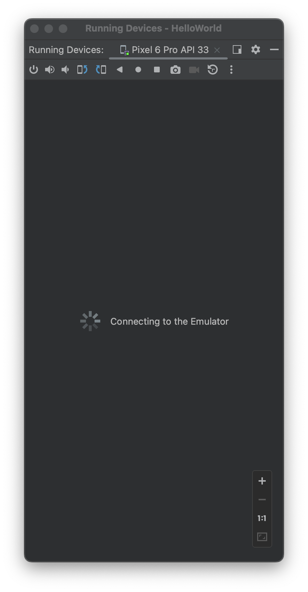 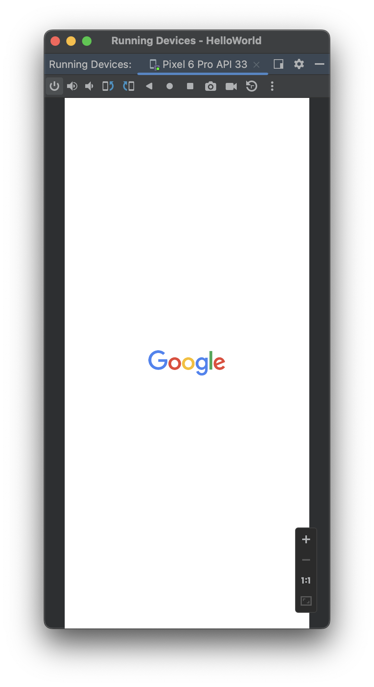 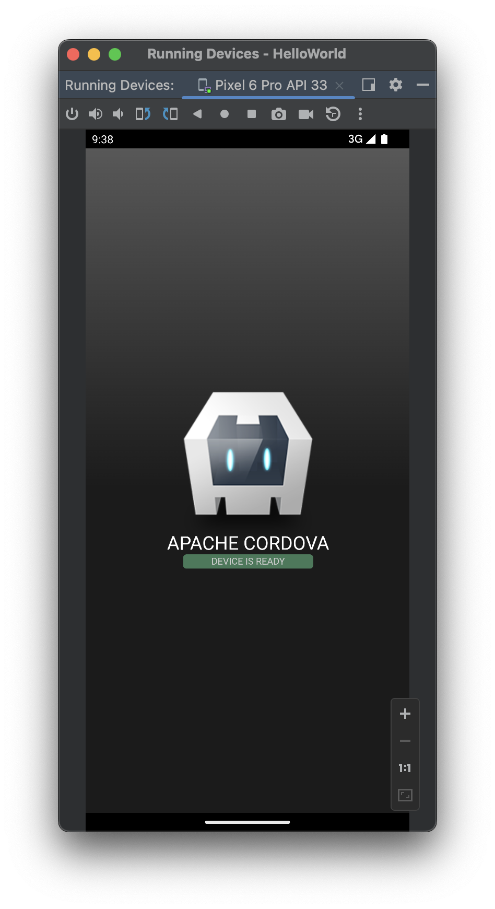

Running `cordova emulate` will also prepare, rebuild, and redeploy the latest app to the emulator.

Alternately, you can plug the handset into your computer and test the app directly:

```
cordova run android
```

Before running this command, you need to set up the device for testing, following procedures that vary for each platform.

**See Also:**

- [Setting up Android emulator](#guide-platforms-android--setting-up-an-emulator)
- [Cordova run command reference documentation](#reference-cordova-cli--cordova-run-command)
- [Cordova emulate command reference documentation](#reference-cordova-cli--cordova-emulate-command)

<a id="guide-cli--add-plugins"></a>

## Add Plugins

You can modify the default generated app to take advantage of standard web technologies, but for the app to access device-level features, you need to add plugins.

A *plugin* exposes a Javascript API for native SDK functionality. Plugins are typically hosted on npm and you can search for them on the [plugin search page](https://cordova.apache.org/plugins/). Some key APIs are provided by the Apache Cordova open source project and these are referred to as [Core Plugin APIs](#guide-support--core-plugin-apis).

To add and save the camera plugin to `package.json`, we will specify the npm package name for the camera plugin:

```
$ cordova plugin add cordova-plugin-camera Fetching plugin "cordova-plugin-camera@~2.1.0" via npm Installing "cordova-plugin-camera" for android Installing "cordova-plugin-camera" for ios
```

Plugins can also be added using a directory or a git repo.

>
> [!NOTE]
> : The CLI adds plugin code as appropriate for each platform. If you want to develop with lower-level shell tools or platform SDKs as discussed in the [Overview](#guide-overview), you need to run the Plugman utility to add plugins separately for each platform. (For more information, see [Using Plugman to Manage Plugins](#plugin_ref-plugman).)

Use `plugin ls` (or `plugin list`, or `plugin` by itself) to view currently installed plugins. Each displays by its identifier:

```
$ cordova plugin ls cordova-plugin-camera 2.1.0 "Camera"
```

**See Also:**

- [Cordova plugin command reference documentation](#reference-cordova-cli--cordova-plugin-command)
- [Cordova plugin search page](https://cordova.apache.org/plugins/)
- [Core Plugin APIs](#guide-support--core-plugin-apis)

<a id="guide-cli--using-merges-to-customize-each-platform"></a>

## Using *merges* to Customize Each Platform

While Cordova allows you to easily deploy an app for many different platforms, sometimes you need to add customizations. In that case, you don't want to modify the source files in various `www` directories within the top-level `platforms` directory, because they're regularly replaced with the top-level `www` directory's cross-platform source.

Instead, the top-level `merges` directory offers a place to specify assets to deploy on specific platforms. Each platform-specific subdirectory within `merges` mirrors the directory structure of the `www` source tree, allowing you to override or add files as needed. For example, here is how you might use `merges` to boost the default font size for Android devices:

- Edit the `www/index.html` file, adding a link to an additional CSS file, `overrides.css` in this case:


```
  <link rel="stylesheet" type="text/css" href="css/overrides.css" />
```

- Optionally create an empty `www/css/overrides.css` file, which would apply for all non-Android builds, preventing a missing-file error.
- Create a `css` subdirectory within `merges/android`, then add a corresponding `overrides.css` file. Specify CSS that overrides the 12-point default font size specified within `www/css/index.css`, for example:


```
  body { font-size:14px; }
```

When you rebuild the project, the Android version features the custom font size, while others remain unchanged.

You can also use `merges` to add files not present in the original `www` directory. For example, an app can incorporate a *back button* graphic into the iOS interface, stored in `merges/ios/img/back_button.png`, while the Android version can instead capture [backbutton](#cordova-events-events--backbutton) events from the corresponding hardware button.

<a id="guide-cli--updating-cordova-and-your-project"></a>

## Updating Cordova and Your Project

After installing the `cordova` utility, you can always update it to the latest version by running the following command:

```
npm update -g cordova
```

Use this syntax to install a specific version:

```
npm install -g cordova@3.1.0-0.2.0
```

Run `cordova -v` to see which version is currently running. To find the latest released cordova version, you can run:

```
npm info cordova version
```

To update platform that you're targeting:

```
cordova platform update android --save
cordova platform update ios --save
```

---

<a id="guide-overview-project-structure"></a>

<!-- source_url: https://cordova.apache.org/docs/en/latest/guide/overview/project-structure.html -->

<!-- page_index: 5 -->

# Project Structure

Table of Contents

- [Overview](#guide-overview)
- [Installation](#guide-cli-installation)
- [Creating an App](#guide-cli)
- [Project Structure](#guide-overview-project-structure)
- [CLI Commands](#reference-cordova-cli)
- [Platform Support](#guide-support)
- [Platform Pinning](#platform_pinning)
- [Version Management](#platform_plugin_versioning_ref)
- [Hooks](#guide-appdev-hooks)
- [Android](#guide-platforms-android)
- [iOS](#guide-platforms-ios)
- [Electron](#guide-platforms-electron)
- [Icons](#config_ref-images)
- [Splash Screen](#core-features-splashscreen)
- [Security](#guide-appdev-security)
- [Privacy](#guide-appdev-privacy)
- [Allow List](#guide-appdev-allowlist)
- [Data Storage](#cordova-storage-storage)
- [Create a Plugin](#guide-hybrid-plugins)
- [Android](#guide-platforms-android-plugin)
- [iOS](#guide-platforms-ios-plugin)
- [Use Plugman](#plugin_ref-plugman)
- [Config.xml API](#config_ref)
- [Plugin.xml API](#plugin_ref-spec)
- [Cordova JavaScript API](#cordova-events-events)
- [Third-party Tools](#third-party)
- [App Templates](#guide-cli-template)
- [Next Steps](#guide-next)
- [Battery Status](#reference-cordova-plugin-battery-status)
- [Camera](#reference-cordova-plugin-camera)
- [Device](#reference-cordova-plugin-device)
- [Dialogs](#reference-cordova-plugin-dialogs)
- [File](#reference-cordova-plugin-file)
- [Geolocation](#reference-cordova-plugin-geolocation)
- [Inappbrowser](#reference-cordova-plugin-inappbrowser)
- [Media](#reference-cordova-plugin-media)
- [Media Capture](#reference-cordova-plugin-media-capture)
- [Network Information](#reference-cordova-plugin-network-information)
- [Screen Orientation](#reference-cordova-plugin-screen-orientation)
- [Browser Splashscreen](#reference-cordova-plugin-splashscreen)
- [Statusbar](#reference-cordova-plugin-statusbar)
- [Vibration](#reference-cordova-plugin-vibration)
- [Embed Cordova in native apps](#guide-hybrid-webviews)

<a id="guide-overview-project-structure--project-structure"></a>

# Project Structure

<a id="guide-overview-project-structure--cli-s-default-directory-structure"></a>

## CLI's Default Directory Structure

A project created with Cordova CLI comes with the follow directory structure by default:

```
myapp/
├── config.xml
├── node_modules/
├── package.json
├── platforms/
├── plugins/
└── www
```

<a id="guide-overview-project-structure--package.json"></a>

### `package.json`

A manifest declaring what JavaScript package dependencies are used by your project, including Cordova, the added platforms, and any added plugins. This is also where plugin variable values are stored.

Your project might already have a `package.json` file with its own dependencies, or one generated from a framework. Cordova will simply add what it needs to the `package.json` file without interfering with other tools or dependencies.

<a id="guide-overview-project-structure--config.xml"></a>

### `config.xml`

Contains the preferences and configuration options for your Cordova application and allows you to customize the behavior of your project.

See also [`config.xml` reference documentation](#config_ref).

<a id="guide-overview-project-structure--www"></a>

### `www/`

Contains the project's web artifacts, such as HTML, CSS, JavaScript, and other resource asset files.

As a Cordova application developer, most of your code and assets will go here. They will be copied on a `cordova prepare` to each platform's `www` directory. The `www` source directory is reproduced within each platform's subdirectory, appearing for example in `platforms/ios/www` or `platforms/android/assets/www`. Because the CLI constantly copies over files from the source `www` folder, you should only edit these files and not the ones located under the platforms subdirectories.

If you use a JavaScript build tool, you should set it to output your production distribution files to the `www` folder.
If you are developing code in the `www` folder directly, you should add this folder to your version control system.

<a id="guide-overview-project-structure--node_modules"></a>

### `node_modules/`

This directory contains all of the JavaScript dependency packages from the npm JavaScript registry for Cordova and its tools, along with any dependencies of your project (as specified in `package.json`).

When adding a Cordova platform or plugin with the `cordova platform add` and `cordova plugin add` command, these platforms and plugins are fetched from the npmjs registry and downloaded into the `node_modules/` directory.

Cordova will then copy the necessary Cordova platform and plugin source code from the `node_modules` directory and place them into the appropriate location for Cordova to function.

It also contain scripts that is used during the `cordova prepare` and `cordova build` for each platform.

The `node_modules` directory is the original unedited source of truth and nothing should be edited in this directory. Additionally, this directory should not be checked into any version control system.

For more details, see [npmjs folders documentation](https://docs.npmjs.com/cli/v10/configuring-npm/folders#node-modules).

<a id="guide-overview-project-structure--platforms"></a>

### `platforms/`

Contains all the source code and build scripts for the platforms that you add to your project.

> **WARNING:** When using the CLI to build your application, you should not edit any files in the /platforms/ directory unless you know what you are doing, or if documentation specifies otherwise. The files in this directory are routinely overwritten when preparing applications for building, or when plugins are re-installed.

<a id="guide-overview-project-structure--plugins"></a>

### `plugins/`

The `plugins` directory is used as a staging area where installed plugins are copied before being applied to the `platforms` directory.

This directory should not be committed to version control.

If you've created custom, in-house or modified plugins and want to store them within the project, it's recommended **not** to store them in the `plugins` directory.

<a id="guide-overview-project-structure--version-control"></a>

### Version control

It is recommended not to check in `platforms/` and `plugins/` directories into version control as they are considered a build artifact. Your platforms and plugins will be saved in `package.json` automatically. These platforms/plugins will be downloaded when `cordova prepare` is invoked.

<a id="guide-overview-project-structure--optional-directories"></a>

## Optional Directories

<a id="guide-overview-project-structure--merges"></a>

### `merges/`

The `merges/` directory is not included by default when creating a Cordova project through the CLI. The use of this directory is generally discouraged but still supported.

Platform-specific web assets (HTML, CSS and JavaScript files) are contained within appropriate subfolders in this directory. These are deployed during a `prepare` to the appropriate native directory. Files placed under `merges/` will override matching files in the `www/` folder for the relevant platform. A quick example, assuming a project structure of:

```
myapp/
├── merges
│   ├── android/
│   │   └── android.js
│   └── ios/
│       └── app.js
└── www/
    └── app.js
```

After building the Android and iOS projects, the Android application will contain both `app.js` and `android.js`. However, the iOS application will only contain an `app.js`, and it will be the one from `merges/ios/app.js`, overriding the "common" `app.js` located inside `www/`.

---

<a id="reference-cordova-cli"></a>

<!-- source_url: https://cordova.apache.org/docs/en/latest/reference/cordova-cli/index.html -->

<!-- page_index: 6 -->

# Cordova Command-line-interface (CLI) Commands

- Getting Started
  - [Overview](#guide-overview)
  - [Installation](#guide-cli-installation)
  - [Creating an App](#guide-cli)
- Cordova Projects
  - [Project Structure](#guide-overview-project-structure)
  - [CLI Commands](#reference-cordova-cli)
  - [Platform Support](#guide-support)
  - [Platform Pinning](#platform_pinning)
  - [Version Management](#platform_plugin_versioning_ref)
  - [Hooks](#guide-appdev-hooks)
- App Development
  - Platforms
    - [Android](#guide-platforms-android)
    - [iOS](#guide-platforms-ios)
    - [Electron](#guide-platforms-electron)
  - Customization
    - [Icons](#config_ref-images)
    - [Splash Screen](#core-features-splashscreen)
  - Security & Privacy
    - [Security](#guide-appdev-security)
    - [Privacy](#guide-appdev-privacy)
    - [Allow List](#guide-appdev-allowlist)
  - [Data Storage](#cordova-storage-storage)
- Plugin Development
  - [Create a Plugin](#guide-hybrid-plugins)
  - Support a Platform
    - [Android](#guide-platforms-android-plugin)
    - [iOS](#guide-platforms-ios-plugin)
  - [Use Plugman](#plugin_ref-plugman)
- References
  - [Config.xml API](#config_ref)
  - [Plugin.xml API](#plugin_ref-spec)
  - [Cordova JavaScript API](#cordova-events-events)
- Resources
  - [Third-party Tools](#third-party)
  - [App Templates](#guide-cli-template)
  - [Next Steps](#guide-next)
- Plugins
  - [Battery Status](#reference-cordova-plugin-battery-status)
  - [Camera](#reference-cordova-plugin-camera)
  - [Device](#reference-cordova-plugin-device)
  - [Dialogs](#reference-cordova-plugin-dialogs)
  - [File](#reference-cordova-plugin-file)
  - [Geolocation](#reference-cordova-plugin-geolocation)
  - [Inappbrowser](#reference-cordova-plugin-inappbrowser)
  - [Media](#reference-cordova-plugin-media)
  - [Media Capture](#reference-cordova-plugin-media-capture)
  - [Network Information](#reference-cordova-plugin-network-information)
  - [Screen Orientation](#reference-cordova-plugin-screen-orientation)
  - [Browser Splashscreen](#reference-cordova-plugin-splashscreen)
  - [Statusbar](#reference-cordova-plugin-statusbar)
  - [Vibration](#reference-cordova-plugin-vibration)
- Advanced Topics
  - [Embed Cordova in native apps](#guide-hybrid-webviews)

Table of Contents

- [Overview](#guide-overview)
- [Installation](#guide-cli-installation)
- [Creating an App](#guide-cli)
- [Project Structure](#guide-overview-project-structure)
- [CLI Commands](#reference-cordova-cli)
- [Platform Support](#guide-support)
- [Platform Pinning](#platform_pinning)
- [Version Management](#platform_plugin_versioning_ref)
- [Hooks](#guide-appdev-hooks)
- [Android](#guide-platforms-android)
- [iOS](#guide-platforms-ios)
- [Electron](#guide-platforms-electron)
- [Icons](#config_ref-images)
- [Splash Screen](#core-features-splashscreen)
- [Security](#guide-appdev-security)
- [Privacy](#guide-appdev-privacy)
- [Allow List](#guide-appdev-allowlist)
- [Data Storage](#cordova-storage-storage)
- [Create a Plugin](#guide-hybrid-plugins)
- [Android](#guide-platforms-android-plugin)
- [iOS](#guide-platforms-ios-plugin)
- [Use Plugman](#plugin_ref-plugman)
- [Config.xml API](#config_ref)
- [Plugin.xml API](#plugin_ref-spec)
- [Cordova JavaScript API](#cordova-events-events)
- [Third-party Tools](#third-party)
- [App Templates](#guide-cli-template)
- [Next Steps](#guide-next)
- [Battery Status](#reference-cordova-plugin-battery-status)
- [Camera](#reference-cordova-plugin-camera)
- [Device](#reference-cordova-plugin-device)
- [Dialogs](#reference-cordova-plugin-dialogs)
- [File](#reference-cordova-plugin-file)
- [Geolocation](#reference-cordova-plugin-geolocation)
- [Inappbrowser](#reference-cordova-plugin-inappbrowser)
- [Media](#reference-cordova-plugin-media)
- [Media Capture](#reference-cordova-plugin-media-capture)
- [Network Information](#reference-cordova-plugin-network-information)
- [Screen Orientation](#reference-cordova-plugin-screen-orientation)
- [Browser Splashscreen](#reference-cordova-plugin-splashscreen)
- [Statusbar](#reference-cordova-plugin-statusbar)
- [Vibration](#reference-cordova-plugin-vibration)
- [Embed Cordova in native apps](#guide-hybrid-webviews)

<a id="reference-cordova-cli--cordova-command-line-interface-cli-commands"></a>

# Cordova Command-line-interface (CLI) Commands

<a id="reference-cordova-cli--cli-syntax"></a>

## CLI Syntax

```
cordova <command> [options] -- [platformOpts]
```

<a id="reference-cordova-cli--global-command-list"></a>

## Global Command List

These commands are available at all times.

| Command | Description |
| --- | --- |
| `create` | Create a project |
| `help <command>` | Get help for a command |
| `config` | Set, get, delete, edit, and list global cordova options |

<a id="reference-cordova-cli--project-command-list"></a>

## Project Command List

These commands are supported when the current working directory is a valid Cordova project.

| Command | Description |
| --- | --- |
| `info` | Generate project information |
| `requirements` | Checks and print out all the installation requirements for platforms specified |
| `platform` | Manage project platforms |
| `plugin` | Manage project plugins |
| `prepare` | Copy files into platform(s) for building |
| `compile` | Compile project for platform(s) |
| `build` | Build project for platform(s) (`prepare` + `compile`) |
| `clean` | Cleanup project from build artifacts |
| `run` | Run project (including prepare && compile) |
| `serve` | Run project with a local webserver (including prepare) |

<a id="reference-cordova-cli--common-options"></a>

## Common options

These options apply to all cordova-cli commands.

| Option | Description |
| --- | --- |
| -d or --verbose | Pipe out more verbose output to your shell. You can also subscribe to `log` and `warn` events if you are consuming `cordova-cli` as a node module by calling `cordova.on('log', function() {})` or `cordova.on('warn', function() {})`. |
| -v or --version | Print out the version of your `cordova-cli` install. |
| --nohooks | Suppress executing hooks (taking RegExp hook patterns as parameters) |

<a id="reference-cordova-cli--platform-specific-options"></a>

## Platform-specific options

Certain commands have options (`platformOpts`) that are specific to a particular platform. They can be provided to the cordova-cli with a '--' separator that stops the command parsing within the cordova-lib module and passes through rest of the options for platforms to parse.

<a id="reference-cordova-cli--cli-usage-example"></a>

## CLI Usage Example

The following example illustrates how to utilize Cordova CLI to perform various tasks such as:

- Creating a project
- Adding the `camera` plugin
- Adding, building, and running the project on the `android` platform

Additionally, it includes an example showcasing the usage of specific options provided by the Cordova-Android platform, such as `--keystore`, which is utilized for release signing.

1. Create a cordova project


```
 cordova create myApp com.myCompany.myApp myApp
 cd myApp
```

2. Add Camera Plugin to the Project


```
 cordova plugin add cordova-plugin-camera
```

3. Add Android Platform to the Project


```
 cordova platform add android
```

4. Confirm System is Configured with Android Platform Requirements


```
 cordova requirements android
```

5. Build Project for Android with Verbose Logging Enabled


```
 cordova build android --verbose
```

6. Run Project on Android Platform


```
 cordova run android
```

7. Build Project for Android in Release Mode with Signing Parameters


```
 cordova build android --release -- --keystore="..\android.keystore" --storePassword=android --alias=mykey
```

<a id="reference-cordova-cli--cordova-create-command"></a>

## `cordova create` command

Creates the directory structure for the Cordova project in the specified path.

**Command Syntax:**

```
cordova create path [id [name]] [options]
```

**Arguments:**

| Value | Description |
| --- | --- |
| path | Directory which should not already exist. Cordova will create this directory. For more details on the directory structure, see below. |
| id | *Default*: `org.apache.cordova.hellocordova` Reverse domain-style identifier that maps to `id` attribute of `widget` element in `config.xml`. This can be changed but there may be code generated using this value, such as Java package names. It is recommended that you select an appropriate value. |
| name | *Default*: `Hello Cordova` Application's display title that maps `name` element in `config.xml` file. This can be changed but there may be code generated using this value, such as Java class names. The default value is `Hello Cordova`, but it is recommended that you select an appropriate value. |

**Options:**

| Option | Description |
| --- | --- |
| --template | Use a custom template located locally, in NPM, or GitHub. |

<a id="reference-cordova-cli--examples"></a>

### Examples

- Create a Cordova project in `myapp` directory using the specified ID and display name:

```
cordova create myapp com.mycompany.myteam.myapp MyApp
```

<a id="reference-cordova-cli--cordova-platform-command"></a>

## `cordova platform` command

Manage cordova platforms - allowing you to add, remove, update and list platforms. Running commands to add or remove platforms affects the contents of the project's platforms directory.

**Command Syntax:**

```
cordova {platform | platforms} [
    add <platform-spec> [...] {--save | link=<path> } |
    {remove | rm}  platform [...] {--save}|
    {list | ls}  |
    update ]
```

| Sub-command | Option | Description |
| --- | --- | --- |
| add `<platform-spec>` […] |  | Add specified platforms |
|  | --nosave | Do not save `<platform-spec>` into `config.xml` & `package.json` after installing them using `<engine>` tag |
|  | --link=`<path>` | When `<platform-spec>` is a local path, links the platform library directly instead of making a copy of it (support varies by platform; useful for platform development) |
| remove `<platform>` […] |  | Remove specified platforms |
|  | --nosave | Do not delete specified platforms from `config.xml` & `package.json` after removing them |
| update `<platform>` […] |  | Update specified platforms |
|  | --save | Updates the version specified in `config.xml` |
| list |  | List all installed and available platforms |

<a id="reference-cordova-cli--platform-spec"></a>

### Platform-spec

There are a number of ways to specify a platform:

```
<platform-spec> : platform[@version] | path | url[#commit-ish]
```

| Value | Description |
| --- | --- |
| platform | Platform name e.g. android, ios, electron etc. to be added to the project. Every release of cordova CLI pins a version for each platform. When no version is specified this version is used to add the platform. |
| version | Major.minor.patch version specifier using semver |
| path | Path to a directory or tarball containing a platform |
| url | URL to a git repository or tarball containing a platform |
| commit-ish | Commit/tag/branch reference. If none is specified, 'master' is used |

<a id="reference-cordova-cli--supported-platforms"></a>

### Supported Platforms

- `android`
- `browser`
- `electron`
- `ios`

<a id="reference-cordova-cli--examples-2"></a>

### Examples

- Add pinned version of the `android` and `ios` platform and save the downloaded version to `config.xml` & `package.json`:

```
cordova platform add android ios
```

- Add `android` platform with [semver](http://semver.org/) version ^5.0.0 and save it to `config.xml` & `package.json`:

```
cordova platform add android@^5.0.0
```

- Add platform by cloning the specified git repo and checkout to the `4.0.0` tag:

```
cordova platform add https://github.com/myfork/cordova-android.git#4.0.0
```

- Add platform using a local directory named `android`:

```
cordova platform add ../android
```

- Add platform using the specified tarball:

```
cordova platform add ../cordova-android.tgz
```

- Remove `android` platform from the project and remove from `config.xml` & `package.json`:

```
cordova platform rm android
```

- Remove `android` platform from the project and do NOT remove from `config.xml` & `package.json`:

```
cordova platform rm android --nosave
```

- List available and installed platforms with version numbers. This is useful to find version numbers when reporting issues:

```
cordova platform ls
```

<a id="reference-cordova-cli--cordova-plugin-command"></a>

## `cordova plugin` command

Manage project plugins

**Command Syntax:**

```
cordova {plugin | plugins} [
    add <plugin-spec> [..] {--searchpath=<directory> | --noregistry | --link | --save | --force} |
    {remove | rm} {<pluginid> | <name>} --save |
    {list | ls}
]
```

| Sub-command | Option | Description |
| --- | --- | --- |
| add `<plugin-spec>` […] |  | Add specified plugins |
|  | --searchpath `<directory>` | When looking up plugins by ID, look in this directory and each of its subdirectories before hitting the registry. Multiple search paths can be specified. Use ':' as a separator in `*nix` based systems and ';' for Windows. |
|  | --noregistry | Don't search the registry for plugins. |
|  | --link | When installing from a local path, creates a symbolic link instead of copying files. The extent to which files are linked varies by platform. Useful for plugin development. |
|  | --nosave | Do NOT save the `<plugin-spec>` as part of the `plugin` element into `config.xml` or `package.json`. |
|  | --force | *Introduced in version 6.1.* Forces copying source files from the plugin even if the same file already exists in the target directory. |
| remove `<pluginid>\|<name>` […] |  | Remove plugins with the given IDs/name. |
|  | --nosave | Do NOT remove the specified plugin from config.xml or package.json |
| list |  | List currently installed plugins |

<a id="reference-cordova-cli--plugin-spec"></a>

### Plugin-spec

There are a number of ways to specify a plugin:

```
<plugin-spec> : [@scope/]pluginID[@version]|directory|url[#commit-ish][:subdir]
```

| Value | Description |
| --- | --- |
| scope | Scope of plugin published as a [scoped npm package](https://docs.npmjs.com/misc/scope) |
| plugin | Plugin id (id of plugin in npm registry or in --searchPath) |
| version | Major.minor.patch version specifier using semver |
| directory | Directory containing plugin.xml |
| url | Url to a git repository containing a plugin.xml |
| commit-ish | Commit/tag/branch reference. If none is specified, 'master' is used |

<a id="reference-cordova-cli--algorithm-for-resolving-plugins"></a>

### Algorithm for resolving plugins

When adding a plugin to a project, the CLI will resolve the plugin
based on the following criteria (listed in order of precedence):

1. The `plugin-spec` given in the command (e.g. `cordova plugin add pluginID@version`)
2. The `plugin-spec` saved in `config.xml` & `package.json` (i.e. if the plugin was previously added without `--nosave`)
3. As of Cordova version 6.1, the latest plugin version published to npm that the current project can support (only applies to plugins that list their [Cordova dependencies](http://cordova.apache.org/docs/en/latest/guide/hybrid/plugins/index.html#specifying-project-requirements) in their `package.json`)
4. The latest plugin version published to npm

<a id="reference-cordova-cli--examples-3"></a>

### Examples

- Add `cordova-plugin-camera` and `cordova-plugin-file` to the project and save it to `config.xml` & `package.json`. Use `../plugins` directory to search for the plugins.


```
  cordova plugin add cordova-plugin-camera cordova-plugin-file --searchpath ../plugins
```

- Add `cordova-plugin-camera` with [semver](http://semver.org/) version ^2.0.0 and save it to `config.xml` & `package.json`:


```
  cordova plugin add cordova-plugin-camera@^2.0.0
```

- Add the plugin from the specified local directory:


```
  cordova plugin add ../cordova-plugin-camera
```

- Add the plugin from the specified tarball file:


```
  cordova plugin add ../cordova-plugin-camera.tgz
```

- Remove the plugin from the project and the `config.xml` & `package.json`:


```
  cordova plugin rm camera
```

- Remove the plugin from the project, but not the `config.xml` or `package.json`:


```
  cordova plugin rm camera --nosave
```

- List all plugins installed in the project:


```
  cordova plugin ls
```

<a id="reference-cordova-cli--conflicting-plugins"></a>

### Conflicting plugins

Conflicting plugins may occur when adding plugins that use `edit-config` tags in their plugin.xml file. `edit-config` allows plugins to add or replace attributes of XML elements.

This feature can cause issues with the application if more than one plugin tries to modify the same XML element. Conflict detection has been implemented to prevent plugins from being added so one plugin doesn't try to overwrite another plugin's `edit-config` changes. An error will be thrown when a conflict in `edit-config` has been found and the plugin won't be added. The error message will mention that all conflicts must be resolved before the plugin can be added. One option to resolving the `edit-config` conflict is to make changes to the affected plugins' plugin.xml so that they do not modify the same XML element. The other option is to use the `--force` flag to force add the plugin. This option should be used with caution as it ignores the conflict detection and will overwrite all conflicts it has with other plugins, thus may leave the other plugins in a bad state.

Refer to the [plugin.xml guide](#plugin_ref-spec--edit-config) for managing `edit-config`, resolving conflicts, and examples.

<a id="reference-cordova-cli--cordova-prepare-command"></a>

## `cordova prepare` command

Transforms config.xml metadata to platform-specific manifest files, copies icons & splashscreens, copies plugin files for specified platforms so that the project is ready to build with each native SDK.

**Command Syntax:**

```
cordova prepare [<platform> [..]]
```

<a id="reference-cordova-cli--options"></a>

### Options

| Option | Description |
| --- | --- |
| `<platform> [..]` | Platform name(s) to prepare. If not specified, all platforms are prepared. |

<a id="reference-cordova-cli--cordova-compile-command"></a>

## `cordova compile` command

`cordova compile` is a subset of the [cordova build command](#reference-cordova-cli--cordova-build-command).
It only performs the compilation step without doing prepare. It's common to invoke `cordova build` instead of this command - however, this stage is useful to allow extending using [hooks](http://cordova.apache.org/docs/en/latest/guide_appdev_hooks_index.md.html).

**Command Syntax:**

```
cordova compile [<platform> [...]]
    [--debug | --release]
    [--device | --emulator | --target=<targetName>]
    [--buildConfig=<configfile>]
    [-- <platformOpts>]
```

For detailed documentation see [cordova build command](#reference-cordova-cli--cordova-build-command) docs below.

<a id="reference-cordova-cli--cordova-build-command"></a>

## `cordova build` command

Shortcut for `cordova prepare` + `cordova compile` for all/the specified platforms. Allows you to build the app for the specified platform.

**Command Syntax:**

```
cordova build [<platform> [...]]
    [--debug | --release]
    [--device | --emulator]
    [--buildConfig=<configfile>]
    [-- <platformOpts>]
```

| Option | Description |
| --- | --- |
| `<platform> [..]` | Platform name(s) to build. If not specified, all platforms are built. |
| --debug | Perform a debug build. This typically translates to debug mode for the underlying platform being built. |
| --release | Perform a release build. This typically translates to release mode for the underlying platform being built. |
| --device | Build it for a device |
| --emulator | Build it for an emulator. In particular, the platform architecture might be different for a device vs. emulator. |
| --buildConfig=`<configFile>` | Default: build.json in cordova root directory. Use the specified build configuration file. `build.json` file is used to specify paramaters to customize the app build process especially related to signing the package. |
| `<platformOpts>` | To provide platform specific options, you must include them after `--` separator. Review platform guide docs for more details. |

<a id="reference-cordova-cli--examples-4"></a>

### Examples

- Build for `android` and `ios` platform in `debug` mode for deployment to device:

```
cordova build android ios --debug --device
```

- Build for `android` platform in `release` mode and use the specified build configuration:

```
cordova build android --release --buildConfig=..\myBuildConfig.json
```

- Build for `android` platform in release mode and pass custom platform options to android build process:

```
cordova build android --release -- --keystore="..\android.keystore" --storePassword=android --alias=mykey
```

<a id="reference-cordova-cli--cordova-run-command"></a>

## `cordova run` command

Prepares, builds, and deploys app on specified platform devices/emulators. If a device is connected it will be used, unless an eligible emulator is already running.

**Command Syntax:**

```
cordova run [<platform> [...]]
    [--list | --debug | --release]
    [--noprepare]
    [--nobuild]
    [--device | --emulator | --target=<targetName>]
    [--buildConfig=<configfile>]
    [-- <platformOpts>]
```

| Option | Description |
| --- | --- |
| `<platform> [..]` | Platform name(s) to run. If not specified, all platforms are run. |
| --list | Lists available targets. Displays both device and emulator deployment targets unless specified |
| --debug | Deploy a debug build. This is the default behavior unless `--release` is specified. |
| --release | Deploy a release build |
| --noprepare | Skip preparing (available in Cordova v6.2 or later) |
| --nobuild | Skip building |
| --device | Deploy to a device |
| --emulator | Deploy to an emulator |
| --target | Deploy to a specific target emulator/device. Use `--list` to display target options |
| --buildConfig=`<configFile>` | Default: build.json in cordova root directory. Use the specified build configuration file. `build.json` file is used to specify paramaters to customize the app build process especially related to signing the package. |
| `<platformOpts>` | To provide platform specific options, you must include them after `--` separator. Review platform guide docs for more details. |

<a id="reference-cordova-cli--examples-5"></a>

### Examples

- Run a release build of current cordova project on `android` platform emulator named `Nexus_5_API_23_x86`. Use the spcified build configuration when running:

```
cordova run android --release --buildConfig=..\myBuildConfig.json --target=Nexus_5_API_23_x86
```

- Run a debug build of current cordova project on `android` platform using a device or emulator (if no device is connected). Skip doing the build:

```
cordova run android --nobuild
```

- Run a debug build of current cordova project on an `ios` device:

```
cordova run ios --device
```

- Enumerate names of all the connected devices and available emulators that can be used to run this app:

```
cordova run ios --list
```

<a id="reference-cordova-cli--cordova-emulate-command"></a>

## `cordova emulate` command

Alias for `cordova run --emulator`. Launches the emulator instead of device. See [cordova run command docs](#reference-cordova-cli--cordova-run-command) for more details.

<a id="reference-cordova-cli--cordova-clean-command"></a>

## `cordova clean` command

Cleans the build artifacts for all the platforms, or the specified platform by running platform-specific build cleanup.

**Command Syntax:**

```
cordova clean [<platform> [...]]
```

**Example Usage:**

- Clean `android` platform build artifacts:

```
cordova clean android
```

<a id="reference-cordova-cli--cordova-requirements-command"></a>

## `cordova requirements` command

Checks and print out all the requirements for platforms specified (or all platforms added
to project if none specified). If all requirements for each platform are met, exits with code 0
otherwise exits with non-zero code.

This can be useful when setting up a machine for building a particular platform.

**Command Syntax:**

```
cordova requirements [platform?]
```

<a id="reference-cordova-cli--cordova-info-command"></a>

## `cordova info` command

Print out useful information helpful for submitting bug
reports and getting help.

**Command Syntax:**

```
cordova info
```

<a id="reference-cordova-cli--cordova-serve-command"></a>

## `cordova serve` command

Run a local web server for www/ assets using specified `port` or default of 8000. Access projects at: `http://HOST_IP:PORT/PLATFORM/www`

**Command Syntax:**

```
cordova serve [port]
```

<a id="reference-cordova-cli--cordova-help-command"></a>

## `cordova help` command

Show syntax summary, or the help for a specific command.

**Command Syntax:**

```
cordova help [command]
cordova [command] -h
cordova -h [command]
```

<a id="reference-cordova-cli--cordova-config-command"></a>

## `cordova config` command

Set, get, delete, edit, and list global cordova options.

**Command Syntax:**

```
cordova config [ls|edit|set|get|delete] <key?> <value?>
```

**Usage Examples:**

```
cordova config ls
cordova config edit
cordova config set save-exact true
cordova config get save-exact
cordova config delete save-exact
```

---

<a id="guide-support"></a>

<!-- source_url: https://cordova.apache.org/docs/en/latest/guide/support/index.html -->

<!-- page_index: 7 -->

# Platform Support

Table of Contents

- [Overview](#guide-overview)
- [Installation](#guide-cli-installation)
- [Creating an App](#guide-cli)
- [Project Structure](#guide-overview-project-structure)
- [CLI Commands](#reference-cordova-cli)
- [Platform Support](#guide-support)
- [Platform Pinning](#platform_pinning)
- [Version Management](#platform_plugin_versioning_ref)
- [Hooks](#guide-appdev-hooks)
- [Android](#guide-platforms-android)
- [iOS](#guide-platforms-ios)
- [Electron](#guide-platforms-electron)
- [Icons](#config_ref-images)
- [Splash Screen](#core-features-splashscreen)
- [Security](#guide-appdev-security)
- [Privacy](#guide-appdev-privacy)
- [Allow List](#guide-appdev-allowlist)
- [Data Storage](#cordova-storage-storage)
- [Create a Plugin](#guide-hybrid-plugins)
- [Android](#guide-platforms-android-plugin)
- [iOS](#guide-platforms-ios-plugin)
- [Use Plugman](#plugin_ref-plugman)
- [Config.xml API](#config_ref)
- [Plugin.xml API](#plugin_ref-spec)
- [Cordova JavaScript API](#cordova-events-events)
- [Third-party Tools](#third-party)
- [App Templates](#guide-cli-template)
- [Next Steps](#guide-next)
- [Battery Status](#reference-cordova-plugin-battery-status)
- [Camera](#reference-cordova-plugin-camera)
- [Device](#reference-cordova-plugin-device)
- [Dialogs](#reference-cordova-plugin-dialogs)
- [File](#reference-cordova-plugin-file)
- [Geolocation](#reference-cordova-plugin-geolocation)
- [Inappbrowser](#reference-cordova-plugin-inappbrowser)
- [Media](#reference-cordova-plugin-media)
- [Media Capture](#reference-cordova-plugin-media-capture)
- [Network Information](#reference-cordova-plugin-network-information)
- [Screen Orientation](#reference-cordova-plugin-screen-orientation)
- [Browser Splashscreen](#reference-cordova-plugin-splashscreen)
- [Statusbar](#reference-cordova-plugin-statusbar)
- [Vibration](#reference-cordova-plugin-vibration)
- [Embed Cordova in native apps](#guide-hybrid-webviews)

<a id="guide-support--platform-support"></a>

# Platform Support

The table below provides a comprehensive overview of the supported development platforms, core plugins, and features for each platform.

For additional functionality, you can explore a wide range of third-party plugins available on the [npm registry](https://www.npmjs.com/search?q=keywords:ecosystem:cordova).

<table class="compat" width="100%">
<thead>
<tr>
<th></th>
<th colspan="3">Platforms</th>
</tr>
<tr>
<th></th>
<th><a href="#guide-platforms-android">Android</a></th>
<th><a href="#guide-platforms-ios">iOS</a></th>
<th><a href="#guide-platforms-electron">Electron</a></th>
</tr>
</thead>
<tbody>
<tr>
<th colspan="4">DOC2MDPLACEHOLDERTOKEN1END<h2><a href="#guide-cli">Cordova CLI</a> Development Platform</h2></th>
</tr>
<tr>
<th>Mac</th>
<td></td>
<td></td>
<td></td>
</tr>
<tr>
<th>Windows</th>
<td></td>
<td></td>
<td></td>
</tr>
<tr>
<th>Linux</th>
<td></td>
<td></td>
<td></td>
</tr>
<tr>
<th colspan="4">DOC2MDPLACEHOLDERTOKEN2END<h2>Core Plugin APIs</h2></th>
</tr>
<tr>
<th><a href="#reference-cordova-plugin-battery-status">BatteryStatus</a></th>
<td></td>
<td></td>
<td>Tests Pending</td>
</tr>
<tr>
<th><a href="#reference-cordova-plugin-camera">Camera</a></th>
<td></td>
<td></td>
<td></td>
</tr>
<tr>
<th><a href="#reference-cordova-plugin-media-capture">Capture</a></th>
<td></td>
<td></td>
<td>Tests Pending</td>
</tr>
<tr>
<th><a href="#reference-cordova-plugin-network-information">Connection</a></th>
<td></td>
<td></td>
<td>Tests Pending</td>
</tr>
<tr>
<th><a href="#reference-cordova-plugin-device">Device</a></th>
<td></td>
<td></td>
<td>Tests Pending</td>
</tr>
<tr>
<th><a href="#cordova-events-events">Events</a></th>
<td></td>
<td></td>
<td>Tests Pending</td>
</tr>
<tr>
<th><a href="#reference-cordova-plugin-file">File</a></th>
<td></td>
<td></td>
<td>Tests Pending</td>
</tr>
<tr>
<th><a href="#reference-cordova-plugin-geolocation">Geolocation</a></th>
<td></td>
<td></td>
<td>Tests Pending</td>
</tr>
<tr>
<th><a href="#reference-cordova-plugin-inappbrowser">InAppBrowser</a></th>
<td></td>
<td></td>
<td>Tests Pending</td>
</tr>
<tr>
<th><a href="#reference-cordova-plugin-media">Media</a></th>
<td></td>
<td></td>
<td>Tests Pending</td>
</tr>
<tr>
<th><a href="#reference-cordova-plugin-dialogs">Notification</a></th>
<td></td>
<td></td>
<td>Tests Pending</td>
</tr>
<tr>
<th><a href="#core-features-splashscreen">Splashscreen</a></th>
<td></td>
<td></td>
<td>Tests Pending</td>
</tr>
<tr>
<th><a href="#reference-cordova-plugin-statusbar">Status Bar</a></th>
<td></td>
<td></td>
<td>Tests Pending</td>
</tr>
<tr>
<th><a href="#cordova-storage-storage">Storage</a></th>
<td></td>
<td></td>
<td>Tests Pending</td>
</tr>
<tr>
<th><a href="#reference-cordova-plugin-vibration">Vibration</a></th>
<td></td>
<td></td>
<td></td>
</tr>
<tr>
<th colspan="4">DOC2MDPLACEHOLDERTOKEN3END<h2>Platform Features</h2></th>
</tr>
<tr>
<th><a href="#guide-hybrid-plugins">Plugin Interface</a></th>
<td><a href="#guide-platforms-android-plugin">(see details)</a></td>
<td><a href="#guide-platforms-ios-plugin">(see details)</a></td>
<td> - </td>
</tr>
<tr>
<th><a href="#guide-hybrid-webviews">Embedded WebView</a></th>
<td><a href="https://cordova.apache.org/docs/en/latest/guide/platforms/android/webview.html">(see details)</a></td>
<td><a href="https://cordova.apache.org/docs/en/latest/guide/platforms/ios/webview.html">(see details)</a></td>
<td> - </td>
</tr>
</tbody>
</table>

---

<a id="platform_pinning"></a>

<!-- source_url: https://cordova.apache.org/docs/en/latest/platform_pinning/index.html -->

<!-- page_index: 8 -->

# More Resources

Table of Contents

- [Overview](#guide-overview)
- [Installation](#guide-cli-installation)
- [Creating an App](#guide-cli)
- [Project Structure](#guide-overview-project-structure)
- [CLI Commands](#reference-cordova-cli)
- [Platform Support](#guide-support)
- [Platform Pinning](#platform_pinning)
- [Version Management](#platform_plugin_versioning_ref)
- [Hooks](#guide-appdev-hooks)
- [Android](#guide-platforms-android)
- [iOS](#guide-platforms-ios)
- [Electron](#guide-platforms-electron)
- [Icons](#config_ref-images)
- [Splash Screen](#core-features-splashscreen)
- [Security](#guide-appdev-security)
- [Privacy](#guide-appdev-privacy)
- [Allow List](#guide-appdev-allowlist)
- [Data Storage](#cordova-storage-storage)
- [Create a Plugin](#guide-hybrid-plugins)
- [Android](#guide-platforms-android-plugin)
- [iOS](#guide-platforms-ios-plugin)
- [Use Plugman](#plugin_ref-plugman)
- [Config.xml API](#config_ref)
- [Plugin.xml API](#plugin_ref-spec)
- [Cordova JavaScript API](#cordova-events-events)
- [Third-party Tools](#third-party)
- [App Templates](#guide-cli-template)
- [Next Steps](#guide-next)
- [Battery Status](#reference-cordova-plugin-battery-status)
- [Camera](#reference-cordova-plugin-camera)
- [Device](#reference-cordova-plugin-device)
- [Dialogs](#reference-cordova-plugin-dialogs)
- [File](#reference-cordova-plugin-file)
- [Geolocation](#reference-cordova-plugin-geolocation)
- [Inappbrowser](#reference-cordova-plugin-inappbrowser)
- [Media](#reference-cordova-plugin-media)
- [Media Capture](#reference-cordova-plugin-media-capture)
- [Network Information](#reference-cordova-plugin-network-information)
- [Screen Orientation](#reference-cordova-plugin-screen-orientation)
- [Browser Splashscreen](#reference-cordova-plugin-splashscreen)
- [Statusbar](#reference-cordova-plugin-statusbar)
- [Vibration](#reference-cordova-plugin-vibration)
- [Embed Cordova in native apps](#guide-hybrid-webviews)

<a id="platform_pinning--platform-pinning"></a>

## Platform Pinning

<a id="platform_pinning--cordova-cli-12.x-higher"></a>

### Cordova CLI 12.x & Higher

Starting from Cordova CLI 12.0.0, the CLI no longer maintains a list of pinned Apache Cordova platforms.

When you run the `cordova platform add <PLATFORM>` command, it will always fetch the latest available platform from the npm registry. This ensures immediate access to newly released platforms.

If you want to consistently fetch a specific version, you need to modify the command and include the version pinning. For example, use `cordova platform add <PLATFORM>@<VERSION>`.

The `cordova platform list` command displays the list of platforms without their versions. However, it will continue to show the versions of the installed platforms.

**Example Output:**

```
$ cordova platform list Installed platforms:android 12.0.0 Available platforms:browser electron ios
```

<a id="platform_pinning--cordova-cli-11.x-lower"></a>

### Cordova CLI 11.x & Lower

Cordova CLI 11.x and lower versions still use platform pinning but won't receive further updates since Cordova CLI 12.0.0 has been released. Platforms are pinned with a `^` symbol, allowing the CLI to fetch new minor and patch releases for the pinned platforms.

To view the pinned platforms for your CLI version, run the command `cordova platform list` in a new project directory.

**Example Output:**

```
$ cordova platform list Installed platforms:

Available platforms:
  android ^10.1.1
  browser ^6.0.0
  electron ^3.0.0
  ios ^6.2.0
  osx ^6.0.0 (deprecated)
```

Based on the above information, executing `cordova platform add android` will fetch the latest minor/patch release version starting from 10.1.1 or higher. If you specify a version, it will fetch the specified version. For example, `cordova platform add ios@5.0.1` will fetch Cordova iOS 5.0.1.

*Note: After installing a platform, the "**Installed platforms:**" section will display the actual installed platform version. The installed platform will no longer appear in the "**Available platforms:**" section until it is removed from the project.*

---

<a id="platform_plugin_versioning_ref"></a>

<!-- source_url: https://cordova.apache.org/docs/en/latest/platform_plugin_versioning_ref/index.html -->

<!-- page_index: 9 -->

# Version Management

- Getting Started
  - [Overview](#guide-overview)
  - [Installation](#guide-cli-installation)
  - [Creating an App](#guide-cli)
- Cordova Projects
  - [Project Structure](#guide-overview-project-structure)
  - [CLI Commands](#reference-cordova-cli)
  - [Platform Support](#guide-support)
  - [Platform Pinning](#platform_pinning)
  - [Version Management](#platform_plugin_versioning_ref)
  - [Hooks](#guide-appdev-hooks)
- App Development
  - Platforms
    - [Android](#guide-platforms-android)
    - [iOS](#guide-platforms-ios)
    - [Electron](#guide-platforms-electron)
  - Customization
    - [Icons](#config_ref-images)
    - [Splash Screen](#core-features-splashscreen)
  - Security & Privacy
    - [Security](#guide-appdev-security)
    - [Privacy](#guide-appdev-privacy)
    - [Allow List](#guide-appdev-allowlist)
  - [Data Storage](#cordova-storage-storage)
- Plugin Development
  - [Create a Plugin](#guide-hybrid-plugins)
  - Support a Platform
    - [Android](#guide-platforms-android-plugin)
    - [iOS](#guide-platforms-ios-plugin)
  - [Use Plugman](#plugin_ref-plugman)
- References
  - [Config.xml API](#config_ref)
  - [Plugin.xml API](#plugin_ref-spec)
  - [Cordova JavaScript API](#cordova-events-events)
- Resources
  - [Third-party Tools](#third-party)
  - [App Templates](#guide-cli-template)
  - [Next Steps](#guide-next)
- Plugins
  - [Battery Status](#reference-cordova-plugin-battery-status)
  - [Camera](#reference-cordova-plugin-camera)
  - [Device](#reference-cordova-plugin-device)
  - [Dialogs](#reference-cordova-plugin-dialogs)
  - [File](#reference-cordova-plugin-file)
  - [Geolocation](#reference-cordova-plugin-geolocation)
  - [Inappbrowser](#reference-cordova-plugin-inappbrowser)
  - [Media](#reference-cordova-plugin-media)
  - [Media Capture](#reference-cordova-plugin-media-capture)
  - [Network Information](#reference-cordova-plugin-network-information)
  - [Screen Orientation](#reference-cordova-plugin-screen-orientation)
  - [Browser Splashscreen](#reference-cordova-plugin-splashscreen)
  - [Statusbar](#reference-cordova-plugin-statusbar)
  - [Vibration](#reference-cordova-plugin-vibration)
- Advanced Topics
  - [Embed Cordova in native apps](#guide-hybrid-webviews)

Table of Contents

- [Overview](#guide-overview)
- [Installation](#guide-cli-installation)
- [Creating an App](#guide-cli)
- [Project Structure](#guide-overview-project-structure)
- [CLI Commands](#reference-cordova-cli)
- [Platform Support](#guide-support)
- [Platform Pinning](#platform_pinning)
- [Version Management](#platform_plugin_versioning_ref)
- [Hooks](#guide-appdev-hooks)
- [Android](#guide-platforms-android)
- [iOS](#guide-platforms-ios)
- [Electron](#guide-platforms-electron)
- [Icons](#config_ref-images)
- [Splash Screen](#core-features-splashscreen)
- [Security](#guide-appdev-security)
- [Privacy](#guide-appdev-privacy)
- [Allow List](#guide-appdev-allowlist)
- [Data Storage](#cordova-storage-storage)
- [Create a Plugin](#guide-hybrid-plugins)
- [Android](#guide-platforms-android-plugin)
- [iOS](#guide-platforms-ios-plugin)
- [Use Plugman](#plugin_ref-plugman)
- [Config.xml API](#config_ref)
- [Plugin.xml API](#plugin_ref-spec)
- [Cordova JavaScript API](#cordova-events-events)
- [Third-party Tools](#third-party)
- [App Templates](#guide-cli-template)
- [Next Steps](#guide-next)
- [Battery Status](#reference-cordova-plugin-battery-status)
- [Camera](#reference-cordova-plugin-camera)
- [Device](#reference-cordova-plugin-device)
- [Dialogs](#reference-cordova-plugin-dialogs)
- [File](#reference-cordova-plugin-file)
- [Geolocation](#reference-cordova-plugin-geolocation)
- [Inappbrowser](#reference-cordova-plugin-inappbrowser)
- [Media](#reference-cordova-plugin-media)
- [Media Capture](#reference-cordova-plugin-media-capture)
- [Network Information](#reference-cordova-plugin-network-information)
- [Screen Orientation](#reference-cordova-plugin-screen-orientation)
- [Browser Splashscreen](#reference-cordova-plugin-splashscreen)
- [Statusbar](#reference-cordova-plugin-statusbar)
- [Vibration](#reference-cordova-plugin-vibration)
- [Embed Cordova in native apps](#guide-hybrid-webviews)

<a id="platform_plugin_versioning_ref--version-management"></a>

# Version Management

Cordova allows developers to **save** and **restore** platforms and plugins, eliminating the need to check in platform and plugin source code.

When a platform or plugin is added, its version details are automatically saved to the `package.json` file.

The recommended way to add or remove platforms and plugins is by using the Cordova CLI commands:

- `cordova platform add|remove ...`
- `cordova plugin add|remove ...`

Using these commands helps prevent out-of-sync issues.

While it is technically possible to add a platform or plugin by editing `package.json` directly, this is **strongly discouraged**.

The restore process runs automatically when executing `cordova prepare`, using the information stored in `package.json` and `config.xml`. This applies to both platforms and plugins. If a platform or plugin is defined in both files, `package.json` takes priority.

One scenario where save/restore capabilities come in handy is in large teams that work on an app, with each team member focusing on a platform or plugin. This feature makes it easier to share the project and reduce the amount of redundant code that is checked in the repository.

The adding and removing mechanisim that Cordova CLI uses for platforms and plugins is controlled by npm CLI. Below we will take a look at the command syntax and examples.

<a id="platform_plugin_versioning_ref--adding-platforms-and-plugins"></a>

## Adding Platforms and Plugins

**Command Syntax:**

```
cordova <platform | plugin> add [<package-spec> ...]
```

The `package-spec` argument supports most formats accepted by the npm CLI.

Examples include:

- Scoped and non-scoped npm packages
- Local directory paths
- Git remote URLs
- Tarball archives
- [Cordova Resolved Names](#platform_plugin_versioning_ref--cordova-resolved-names) for official Cordova platforms

Additionally, the `--nosave` flag could be appended to the command to prevent adding of specified platform and plugins from the `package.json` file.

---

**Quick Overview:**

When you add a platform or plugin, `package.json` is updated with its dependencies and Cordova-specific metadata.

For example, running the following commands in a Cordova project:

```
cordova platform add android@13.0.0
cordova plugin add cordova-plugin-device@3.0.0
```

Would result in `package.json` containing the following entries:

```
"devDependencies": {
  "cordova-android": "^13.0.0",
  "cordova-plugin-device": "^3.0.0"
},
"cordova": {
  "platforms": [
    "android"
  ],
  "plugins": {
    "cordova-plugin-device": {}
  }
}
```

When restoring a Cordova project, this metadata determines which platforms and plugins will be installed.

---

<a id="platform_plugin_versioning_ref--various-add-examples"></a>

### Various `add` Examples

- **Cordova Resolved Names for Platforms:**


```
  cordova platform add android
```

  If no tag or version is specified, the Cordova CLI will fetch the latest release.


```
  cordova platform add electron@latest
```

  NPM tags are supported and can be appended to the end of the package specification.


```
  cordova platform add ios@7.1.1
```

  Exact release versions published to the npm registry are also supported and can be appended to the end of the package specification.
- **npm Package:**


```
  cordova platform add cordova-android
  cordova platform add cordova-android@latest
  cordova platform add cordova-android@13.0.0

  cordova platform add @cordova/some-platform
  cordova platform add @cordova/some-platform@latest
  cordova platform add @cordova/some-platform@1.0.0

  cordova plugin some-cordova-plugin
  cordova plugin some-cordova-plugin@latest

  cordova plugin add @cordova/some-plugin
  cordova plugin add @cordova/some-plugin@latest
  cordova plugin add @cordova/some-plugin@1.0.0
```

  Scoped and non-scope npm packages are supported for both platforms and plugins. Optionally, npm package tags or released versions can be targeted by appending to the end of the package name. (e.g. `package-name@latest`).

  Please note that the scoped packages shown above are only examples and do not exist.
- **Git remote URL:**


```
  cordova platform add git://github.com/apache/cordova-android.git
  cordova platform add git://github.com/apache/cordova-android.git#feature-branch
  cordova platform add git://github.com/apache/cordova-android.git#rel/13.0.0

  cordova platform add https://github.com/apache/cordova-android.git
  cordova platform add https://github.com/apache/cordova-android.git#feature-branch
  cordova platform add https://github.com/apache/cordova-android.git#rel/13.0.0

  cordova platform add https://github.com/apache/cordova-android
  cordova platform add https://github.com/apache/cordova-android#feature-branch
  cordova platform add https://github.com/apache/cordova-android#rel/13.0.0
```

  Various Git URL formats are supported for installing platforms and plugins. Optionally, a treeish (branch name, tag, or commit ID) can be specified by appending `#<treeish>` to the URL.

  When targeting a treeish, ensure it is production-ready before using it in a production environment. This functionality is useful for testing and reviewing pull requests, future releases, or release votes.
- **Git service short hand:**


```
  cordova platform add github:apache/cordova-android
  cordova platform add github:apache/cordova-android#feature-branch
  cordova platform add github:apache/cordova-android#rel/13.0.0
```

  Platforms and plugins can also be checked out from Git repositories using a shorthand format.

  If your repository is hosted on another Git service, such as Bitbucket or GitLab, you can modify the command to target these services.

  Branches and tags can also be targeted using the shorthand format. However, ensure that the specified branch or version is production-ready before using it in production.
- **Tarball Archive:**


```
  cordova platform add ~/path/to/a/tarbal.tgz
```

  Currently, **only platforms** support installation from a tarball package. The supported archive formats are `.tar.gz`, `.tgz,` and `.tar`.
- **Local Directory Path:**


```
  cordova platform add ~/path/to/a/cordova-platform
  cordova plugin add ~/path/to/a/cordova-plugin

  cordova platform add C:/Path/to/a/cordova-platform
  cordova plugin add C:/Path/to/a/cordova-plugin
```

  Platforms and plugins can be installed from a local directory path.

<a id="platform_plugin_versioning_ref--removing-platforms-and-plugins"></a>

## Removing Platforms and Plugins

**Command Syntax:**

```
cordova <platform | plugin> remove <package-name>
```

The `remove` command also has an alias of `rm`.

The `package-name` argument must be the name of the platform or plugin you want to remove.

For Apache Cordova's platforms, you **MUST** use the [Cordova Resolved Names](#platform_plugin_versioning_ref--cordova-resolved-names) when removing them.

The `--nosave` flag could be appended to the command to prevent removal of specified platform and plugins from the `package.json` file.

---

<a id="platform_plugin_versioning_ref--various-remove-examples"></a>

### Various `remove` Examples

- **Removing platforms:**


```
  cordova platform remove android
```

  The above command will remove the `cordova-android` platform from the project and `package.json` file.

  *Note: If the platform definition existed in `config.xml` from older version's of Cordova CLI, it will also be removed from `config.xml`.*
- **Removing plugins:**


```
  cordova plugin remove cordova-plugin-device
```

  The above command will remove the `cordova-plugin-device` plugin from the project and `package.json` file.

  *Note: If the plugin definition existed in `config.xml` from older version's of Cordova CLI, it will also be removed from `config.xml`.*

<a id="platform_plugin_versioning_ref--important-notes-on-platform-restoration"></a>

## Important Notes on Platform Restoration

1. What version is installed when using `cordova platform add android` and the platform is defined in `config.xml`?

   If the `config.xml` file contains the following entry:


```
 <?xml version='1.0' encoding='utf-8'?>
     ...
     <engine name="android" spec="13.0.0" />
     ...
 </xml>
```

   When running the **`cordova platform add android`** command with no version provided, it will use the `spec` version defined in `config.xml`. In this example it would be `13.0.0`.
2. What version is restored if a platform is defined in both `config.xml` and `package.json`?

   Suppose your project has the following configurations:

   **`config.xml`**:


```
 <engine name="android" spec=“12.0.0” />
```

   **`package.json`**:


```
 "cordova": {
     "platforms": [
     "android"
     ]
 },
 "dependencies": {
     "cordova-android": "^13.0.0"
 }
```

   When `cordova prepare` is executed, the version from `package.json` has higher priority over `config.xml`. It will install version `^13.0.0`.

<a id="platform_plugin_versioning_ref--cordova-resolved-names"></a>

## Cordova Resolved Names

| Cordova Resolved Name | NPM Package Name |
| --- | --- |
| `android` | `cordova-android` |
| `electron` | `cordova-electron` |
| `ios` | `cordova-ios` |
| `browser` | `cordova-browser` |

---

<a id="guide-appdev-hooks"></a>

<!-- source_url: https://cordova.apache.org/docs/en/latest/guide/appdev/hooks/index.html -->

<!-- page_index: 10 -->

# Hooks

- Getting Started
  - [Overview](#guide-overview)
  - [Installation](#guide-cli-installation)
  - [Creating an App](#guide-cli)
- Cordova Projects
  - [Project Structure](#guide-overview-project-structure)
  - [CLI Commands](#reference-cordova-cli)
  - [Platform Support](#guide-support)
  - [Platform Pinning](#platform_pinning)
  - [Version Management](#platform_plugin_versioning_ref)
  - [Hooks](#guide-appdev-hooks)
- App Development
  - Platforms
    - [Android](#guide-platforms-android)
    - [iOS](#guide-platforms-ios)
    - [Electron](#guide-platforms-electron)
  - Customization
    - [Icons](#config_ref-images)
    - [Splash Screen](#core-features-splashscreen)
  - Security & Privacy
    - [Security](#guide-appdev-security)
    - [Privacy](#guide-appdev-privacy)
    - [Allow List](#guide-appdev-allowlist)
  - [Data Storage](#cordova-storage-storage)
- Plugin Development
  - [Create a Plugin](#guide-hybrid-plugins)
  - Support a Platform
    - [Android](#guide-platforms-android-plugin)
    - [iOS](#guide-platforms-ios-plugin)
  - [Use Plugman](#plugin_ref-plugman)
- References
  - [Config.xml API](#config_ref)
  - [Plugin.xml API](#plugin_ref-spec)
  - [Cordova JavaScript API](#cordova-events-events)
- Resources
  - [Third-party Tools](#third-party)
  - [App Templates](#guide-cli-template)
  - [Next Steps](#guide-next)
- Plugins
  - [Battery Status](#reference-cordova-plugin-battery-status)
  - [Camera](#reference-cordova-plugin-camera)
  - [Device](#reference-cordova-plugin-device)
  - [Dialogs](#reference-cordova-plugin-dialogs)
  - [File](#reference-cordova-plugin-file)
  - [Geolocation](#reference-cordova-plugin-geolocation)
  - [Inappbrowser](#reference-cordova-plugin-inappbrowser)
  - [Media](#reference-cordova-plugin-media)
  - [Media Capture](#reference-cordova-plugin-media-capture)
  - [Network Information](#reference-cordova-plugin-network-information)
  - [Screen Orientation](#reference-cordova-plugin-screen-orientation)
  - [Browser Splashscreen](#reference-cordova-plugin-splashscreen)
  - [Statusbar](#reference-cordova-plugin-statusbar)
  - [Vibration](#reference-cordova-plugin-vibration)
- Advanced Topics
  - [Embed Cordova in native apps](#guide-hybrid-webviews)

Table of Contents

- [Overview](#guide-overview)
- [Installation](#guide-cli-installation)
- [Creating an App](#guide-cli)
- [Project Structure](#guide-overview-project-structure)
- [CLI Commands](#reference-cordova-cli)
- [Platform Support](#guide-support)
- [Platform Pinning](#platform_pinning)
- [Version Management](#platform_plugin_versioning_ref)
- [Hooks](#guide-appdev-hooks)
- [Android](#guide-platforms-android)
- [iOS](#guide-platforms-ios)
- [Electron](#guide-platforms-electron)
- [Icons](#config_ref-images)
- [Splash Screen](#core-features-splashscreen)
- [Security](#guide-appdev-security)
- [Privacy](#guide-appdev-privacy)
- [Allow List](#guide-appdev-allowlist)
- [Data Storage](#cordova-storage-storage)
- [Create a Plugin](#guide-hybrid-plugins)
- [Android](#guide-platforms-android-plugin)
- [iOS](#guide-platforms-ios-plugin)
- [Use Plugman](#plugin_ref-plugman)
- [Config.xml API](#config_ref)
- [Plugin.xml API](#plugin_ref-spec)
- [Cordova JavaScript API](#cordova-events-events)
- [Third-party Tools](#third-party)
- [App Templates](#guide-cli-template)
- [Next Steps](#guide-next)
- [Battery Status](#reference-cordova-plugin-battery-status)
- [Camera](#reference-cordova-plugin-camera)
- [Device](#reference-cordova-plugin-device)
- [Dialogs](#reference-cordova-plugin-dialogs)
- [File](#reference-cordova-plugin-file)
- [Geolocation](#reference-cordova-plugin-geolocation)
- [Inappbrowser](#reference-cordova-plugin-inappbrowser)
- [Media](#reference-cordova-plugin-media)
- [Media Capture](#reference-cordova-plugin-media-capture)
- [Network Information](#reference-cordova-plugin-network-information)
- [Screen Orientation](#reference-cordova-plugin-screen-orientation)
- [Browser Splashscreen](#reference-cordova-plugin-splashscreen)
- [Statusbar](#reference-cordova-plugin-statusbar)
- [Vibration](#reference-cordova-plugin-vibration)
- [Embed Cordova in native apps](#guide-hybrid-webviews)

<a id="guide-appdev-hooks--hooks"></a>

# Hooks

<a id="guide-appdev-hooks--introduction"></a>

## Introduction

Cordova Hooks represent special scripts which could be added by application and
plugin developers or even by your own build system to customize cordova commands.

Cordova hooks allow you to perform special activities around cordova commands. For example, you may have a custom tool that checks for code formatting in your javascript file. And, you
would like to run this tool before every build. In such a case, you could use a
'before\_build' hook and instruct the cordova run time to run the custom tool to be invoked
before every build.

Hooks might be related to your application activities such as `before_build`, `after_build`, etc. Or, they might be related to the plugins of your application. For example, hooks such as `before_plugin_add`, `after_plugin_add`, etc applies to plugin related
activities. These hooks can be associated with all plugins within your application or
be specific to only one plugin.

Cordova supports the following hook types:

<table class="hooks" width="100%">
<col width="20%"/>
<col width="30%"/>
<col width="50%"/>
<thead>
<tr>
<th>Hook Type</th>
<th>Associated Cordova Commands</th>
<th>Description</th>
</tr>
</thead>
<tbody>
<tr>
<th>before_platform_add</th>
<td rowspan="2"><code>cordova platform add</code></td>
<td rowspan="2">To be executed before and after adding a platform.</td>
</tr>
<tr>
<th>after_platform_add</th>
</tr>
<tr>
<th>before_platform_rm</th>
<td rowspan="2"><code>cordova platform rm</code></td>
<td rowspan="2">To be executed before and after removing a platform.</td>
</tr>
<tr>
<th>after_platform_rm</th>
</tr>
<tr>
<th>before_platform_ls</th>
<td rowspan="2"><code>cordova platform ls</code></td>
<td rowspan="2">To be executed before and after listing the installed and available platforms.</td>
</tr>
<tr>
<th>after_platform_ls</th>
</tr>
<tr>
<th>before_prepare</th>
<td rowspan="2"><code>cordova prepare</code>
<code>cordova platform add</code>
<code>cordova build</code>
<code>cordova run</code></td>
<td rowspan="2">To be executed before and after preparing your application.</td>
</tr>
<tr>
<th>after_prepare</th>
</tr>
<tr>
<th>before_compile</th>
<td rowspan="2"><code>cordova compile</code>
<code>cordova build</code></td>
<td rowspan="2">To be executed before and after compiling your application.</td>
</tr>
<tr>
<th>after_compile</th>
</tr>
<tr>
<th>before_deploy</th>
<td><code>cordova emulate</code>
<code>cordova run</code></td>
<td>To be executed before deploying your application.</td>
</tr>
<tr>
<th>before_build</th>
<td rowspan="2"><code>cordova build</code></td>
<td rowspan="2">To be executed before and after building your application.</td>
</tr>
<tr>
<th>after_build</th>
</tr>
<tr>
<th>before_emulate</th>
<td rowspan="2"><code>cordova emulate</code></td>
<td rowspan="2">To be executed before and after emulating your application.</td>
</tr>
<tr>
<th>after_emulate</th>
</tr>
<tr>
<th>before_run</th>
<td rowspan="2"><code>cordova run</code></td>
<td rowspan="2">To be executed before and after running your application.</td>
</tr>
<tr>
<th>after_run</th>
</tr>
<tr>
<th>before_serve</th>
<td rowspan="2"><code>cordova serve</code></td>
<td rowspan="2">To be executed before and after serving your application.</td>
</tr>
<tr>
<th>after_serve</th>
</tr>
<tr>
<th>before_clean</th>
<td rowspan="2"><code>cordova clean</code></td>
<td rowspan="2">To be executed before and after cleaning your application.</td>
</tr>
<tr>
<th>after_clean</th>
</tr>
<tr>
<th>before_plugin_add</th>
<td rowspan="2"><code>cordova plugin add</code></td>
<td rowspan="2">To be executed before and after adding a plugin.</td>
</tr>
<tr>
<th>after_plugin_add</th>
</tr>
<tr>
<th>before_plugin_rm</th>
<td rowspan="2"><code>cordova plugin rm</code></td>
<td rowspan="2">To be executed before and after removing a plugin.</td>
</tr>
<tr>
<th>after_plugin_rm</th>
</tr>
<tr>
<th>before_plugin_ls</th>
<td rowspan="2"><code>cordova plugin ls</code></td>
<td rowspan="2">To be executed before and after listing the plugins in your application.</td>
</tr>
<tr>
<th>after_plugin_ls</th>
</tr>
<tr>
<th>before_plugin_install</th>
<td rowspan="2"><code>cordova plugin add</code></td>
<td rowspan="2">To be executed before and after installing a plugin (to the platforms). Plugin hooks in plugin.xml are executed for a plugin being installed only</td>
</tr>
<tr>
<th>after_plugin_install</th>
</tr>
<tr>
<th>before_plugin_uninstall</th>
<td rowspan="2"><code>cordova plugin rm</code></td>
<td>To be executed before uninstalling a plugin (from the platforms).Plugin hooks in plugin.xml are executed for a plugin being installed only</td>
</tr>
</tbody>
</table>

<a id="guide-appdev-hooks--ways-to-define-hooks"></a>

## Ways to define hooks

<a id="guide-appdev-hooks--config.xml"></a>

### Config.xml

Hooks could be defined in project's `config.xml` using `<hook>` elements, for example:

```
<hook type="before_build" src="scripts/appBeforeBuild.bat" />
<hook type="before_build" src="scripts/appBeforeBuild.js" />
<hook type="before_plugin_install" src="scripts/appBeforePluginInstall.js" />

<platform name="android">
    <hook type="before_build" src="scripts/android/appAndroidBeforeBuild.bat" />
    <hook type="before_build" src="scripts/android/appAndroidBeforeBuild.js" />
    <hook type="before_plugin_install" src="scripts/android/appAndroidBeforePluginInstall.js" />
    ...
</platform>
```

<a id="guide-appdev-hooks--plugin-hooks-plugin.xml"></a>

### Plugin hooks (plugin.xml)

As a plugin developer you can define hook scripts using `<hook>` elements in a `plugin.xml` like that:

```
<hook type="before_plugin_install" src="scripts/beforeInstall.js" />
<hook type="after_build" src="scripts/afterBuild.js" />

<platform name="android">
    <hook type="before_plugin_install" src="scripts/androidBeforeInstall.js" />
    <hook type="before_build" src="scripts/androidBeforeBuild.js" />
    ...
</platform>
```

`before_plugin_install`, `after_plugin_install`, `before_plugin_uninstall` plugin hooks will be fired
exclusively for the plugin being installed/uninstalled.

<a id="guide-appdev-hooks--order-of-hooks-execution"></a>

### Order of Hooks execution

<a id="guide-appdev-hooks--based-on-hooks-definition"></a>

#### Based on Hooks Definition

Hook scripts for one given hook run serially in the order of appearance in their file with application hooks from `config.xml` running before plugin hooks from `plugins/.../plugin.xml`.

<a id="guide-appdev-hooks--based-on-the-internal-order-of-execution"></a>

#### Based on the Internal order of execution

The internal order of execution of hooks is fixed.

<a id="guide-appdev-hooks--example-1-cordova-platform-add"></a>

##### Example 1 (cordova platform add)

If there are hooks associated with `before_platform_add`, `after_platform_add`, `before_prepare`, `after_prepare`, `before_plugin_install` and `after_plugin_install` (and assuming you have one plugin installed on your project), adding a new platform will execute the hooks in the following order:

```
before_platform_add
    before_prepare
    after_prepare
    before_plugin_install
    after_plugin_install
after_platform_add
```

<a id="guide-appdev-hooks--example-2-cordova-build"></a>

##### Example 2 (cordova build)

If there are hooks associated with `before_prepare`, `after_prepare`, `before_compile`, `after_compile`, `before_build`
and `after_build` - running a build command will execute the hooks in the following order:

```
before_build
    before_prepare
    after_prepare
    before_compile
    after_compile
after_build
```

<a id="guide-appdev-hooks--script-interface"></a>

## Script Interface

<a id="guide-appdev-hooks--javascript"></a>

### Javascript

If you are writing hooks using Node.js you should use the following module definition:

```
module.exports = function(context) {
    ...
}
```

Here is an example that showcases the contents of the `context` object:

```
{
  // The type of hook being run
  hook: 'before_plugin_install',

  // Absolute path to the hook script that is currently executing
  scriptLocation: '/foo/scripts/appBeforePluginInstall.js',

  // The CLI command that lead to this hook being executed
  cmdLine: 'cordova plugin add plugin-withhooks',

  // The options associated with the current operation.
  // WARNING: The contents of this object vary among the different
  // operations and are currently not documented anywhere.
  opts: {
    projectRoot: '/foo',

    cordova: {
      platforms: ['android'],
      plugins: ['plugin-withhooks'],
      version: '0.21.7-dev'
    },

    // Information about the plugin currently operated on.
    // This object will only be passed to plugin hooks scripts.
    plugin: {
      id: 'plugin-withhooks',
      pluginInfo: { /* ... */ },
      platform: 'android',
      dir: '/foo/plugins/plugin-withhooks'
    }
  },

  // A reference to Cordova's API
  cordova: { /* ... */ }
}
```

You can also require additional Cordova modules in your script using `context.requireCordovaModule` in the following way:

```
const cordovaCommon = context.requireCordovaModule('cordova-common');
```

You can make your scripts asynchronous using Promises.
Here is an example that just waits for a second and then prints the amount of milliseconds spent waiting:

```
module.exports = context => {
    return new Promise(resolve => {
        const start = Date.now();
        setTimeout(() => resolve(Date.now() - start), 1000);
    }).then(msWaited => {
        console.log(`${context.scriptLocation} waited ${msWaited} ms`);
    });
};
```

<a id="guide-appdev-hooks--non-javascript"></a>

### Non-javascript

Non-javascript scripts are run via Node child\_process spawn from the project's root directory and have the root directory passed as the first argument. All other options are passed to the script using environment variables:

| Environment Variable Name | Description |
| --- | --- |
| CORDOVA\_VERSION | The version of the Cordova-CLI. |
| CORDOVA\_PLATFORMS | Comma separated list of platforms that the command applies to (e.g: android, ios). |
| CORDOVA\_PLUGINS | Comma separated list of plugin IDs that the command applies to (e.g: cordova-plugin-file-transfer, cordova-plugin-file). |
| CORDOVA\_HOOK | Path to the hook that is being executed. |
| CORDOVA\_CMDLINE | The exact command-line arguments passed to cordova (e.g: cordova run ios --emulate). |

If a script returns a non-zero exit code, then the parent cordova command will be aborted.

>
> [!NOTE]
> : we highly recommend writing your hooks using Node.js so that they are cross-platform, see [Javascript](#guide-appdev-hooks--link-javascript) section above.

<a id="guide-appdev-hooks--windows-quirks"></a>

#### Windows Quirks

If you are working on Windows, and your hook scripts aren't `*.bat` files, Cordova CLI will expect a shebang line as the first line of the script. This way it knows the interpreter it needs to use to launch the script. A shebang line for a Python script could look like this:

```
#!/usr/bin/env python
```

<a id="guide-appdev-hooks--sample-usage"></a>

## Sample Usage

This sample demonstrates Cordova hooks usage to trace to the console output the
size of generated .apk file for Android platform.

Create blank Cordova app and add the following definition to `config.xml` to
tell Cordova to run `afterBuild.js` script after each platform build.

```
<hook type="after_build" src="scripts/afterBuild.js" />
```

Create `scripts/afterBuild.js` file and add the following implementation.
We use async version of `fs.stat` method to demonstrate how async functions
can be used in hooks.

```
const fs = require('fs');
const util = require('util');
const stat = util.promisify(fs.stat);

module.exports = function(ctx) {
    // Make sure android platform is part of build
    if (!ctx.opts.platforms.includes('android')) return;

    const platformRoot = path.join(ctx.opts.projectRoot, 'platforms/android');
    const apkFileLocation = path.join(platformRoot, 'build/outputs/apk/android-debug.apk');

    return stat(apkFileLocation).then(stats => {
      console.log(`Size of ${apkFileLocation} is ${stats.size} bytes`);
    });
};
```

Parameter `ctx` in example above is passed by Cordova and represents execution
context such as script full path, target platform, command-line arguments, etc and
also exposes additional helper functionality. See `Script Interface` section above
for more details.

You can now add android platform and execute build.

```
cordova platform add android
..
cordova build
..
Size of path\to\app\platforms\android\build\outputs\apk\android-debug.apk is 1821193 bytes
```

---

<a id="guide-platforms-android"></a>

<!-- source_url: https://cordova.apache.org/docs/en/latest/guide/platforms/android/index.html -->

<!-- page_index: 11 -->

# Android Platform Guide

- Getting Started
  - [Overview](#guide-overview)
  - [Installation](#guide-cli-installation)
  - [Creating an App](#guide-cli)
- Cordova Projects
  - [Project Structure](#guide-overview-project-structure)
  - [CLI Commands](#reference-cordova-cli)
  - [Platform Support](#guide-support)
  - [Platform Pinning](#platform_pinning)
  - [Version Management](#platform_plugin_versioning_ref)
  - [Hooks](#guide-appdev-hooks)
- App Development
  - Platforms
    - [Android](#guide-platforms-android)
    - [iOS](#guide-platforms-ios)
    - [Electron](#guide-platforms-electron)
  - Customization
    - [Icons](#config_ref-images)
    - [Splash Screen](#core-features-splashscreen)
  - Security & Privacy
    - [Security](#guide-appdev-security)
    - [Privacy](#guide-appdev-privacy)
    - [Allow List](#guide-appdev-allowlist)
  - [Data Storage](#cordova-storage-storage)
- Plugin Development
  - [Create a Plugin](#guide-hybrid-plugins)
  - Support a Platform
    - [Android](#guide-platforms-android-plugin)
    - [iOS](#guide-platforms-ios-plugin)
  - [Use Plugman](#plugin_ref-plugman)
- References
  - [Config.xml API](#config_ref)
  - [Plugin.xml API](#plugin_ref-spec)
  - [Cordova JavaScript API](#cordova-events-events)
- Resources
  - [Third-party Tools](#third-party)
  - [App Templates](#guide-cli-template)
  - [Next Steps](#guide-next)
- Plugins
  - [Battery Status](#reference-cordova-plugin-battery-status)
  - [Camera](#reference-cordova-plugin-camera)
  - [Device](#reference-cordova-plugin-device)
  - [Dialogs](#reference-cordova-plugin-dialogs)
  - [File](#reference-cordova-plugin-file)
  - [Geolocation](#reference-cordova-plugin-geolocation)
  - [Inappbrowser](#reference-cordova-plugin-inappbrowser)
  - [Media](#reference-cordova-plugin-media)
  - [Media Capture](#reference-cordova-plugin-media-capture)
  - [Network Information](#reference-cordova-plugin-network-information)
  - [Screen Orientation](#reference-cordova-plugin-screen-orientation)
  - [Browser Splashscreen](#reference-cordova-plugin-splashscreen)
  - [Statusbar](#reference-cordova-plugin-statusbar)
  - [Vibration](#reference-cordova-plugin-vibration)
- Advanced Topics
  - [Embed Cordova in native apps](#guide-hybrid-webviews)

Table of Contents

- [Overview](#guide-overview)
- [Installation](#guide-cli-installation)
- [Creating an App](#guide-cli)
- [Project Structure](#guide-overview-project-structure)
- [CLI Commands](#reference-cordova-cli)
- [Platform Support](#guide-support)
- [Platform Pinning](#platform_pinning)
- [Version Management](#platform_plugin_versioning_ref)
- [Hooks](#guide-appdev-hooks)
- [Android](#guide-platforms-android)
- [iOS](#guide-platforms-ios)
- [Electron](#guide-platforms-electron)
- [Icons](#config_ref-images)
- [Splash Screen](#core-features-splashscreen)
- [Security](#guide-appdev-security)
- [Privacy](#guide-appdev-privacy)
- [Allow List](#guide-appdev-allowlist)
- [Data Storage](#cordova-storage-storage)
- [Create a Plugin](#guide-hybrid-plugins)
- [Android](#guide-platforms-android-plugin)
- [iOS](#guide-platforms-ios-plugin)
- [Use Plugman](#plugin_ref-plugman)
- [Config.xml API](#config_ref)
- [Plugin.xml API](#plugin_ref-spec)
- [Cordova JavaScript API](#cordova-events-events)
- [Third-party Tools](#third-party)
- [App Templates](#guide-cli-template)
- [Next Steps](#guide-next)
- [Battery Status](#reference-cordova-plugin-battery-status)
- [Camera](#reference-cordova-plugin-camera)
- [Device](#reference-cordova-plugin-device)
- [Dialogs](#reference-cordova-plugin-dialogs)
- [File](#reference-cordova-plugin-file)
- [Geolocation](#reference-cordova-plugin-geolocation)
- [Inappbrowser](#reference-cordova-plugin-inappbrowser)
- [Media](#reference-cordova-plugin-media)
- [Media Capture](#reference-cordova-plugin-media-capture)
- [Network Information](#reference-cordova-plugin-network-information)
- [Screen Orientation](#reference-cordova-plugin-screen-orientation)
- [Browser Splashscreen](#reference-cordova-plugin-splashscreen)
- [Statusbar](#reference-cordova-plugin-statusbar)
- [Vibration](#reference-cordova-plugin-vibration)
- [Embed Cordova in native apps](#guide-hybrid-webviews)

<a id="guide-platforms-android--android-platform-guide"></a>

# Android Platform Guide

This guide will assist you in setting up your development environment for building Cordova apps on Android devices. Additionally, it provides the option to incorporate Android-specific command-line tools into your development workflow.

Regardless of whether you intend to utilize Android-specific command-line tools or Cordova CLI commands, you will need to install and configure the necessary requirements.

<a id="guide-platforms-android--android-api-level-support"></a>

## Android API Level Support

The supported [Android API Levels](https://developer.android.com/guide/topics/manifest/uses-sdk-element#ApiLevels) (versions of Android) corresponding with the Cordova-Android released versions are listed in the table below:

<table>
<thead>
<tr>
<th>cordova-android Version</th>
<th>Android API-Levels (Android Version)</th>
<th>Library &amp; Tooling Version</th>
</tr>
</thead>
<tbody>
<tr>
<td>15.0.x</td>
<td>24 (7.0) - 36 (16.0)</td>
<td>
<ul>
<li>Build Tools: ^36.0.0</li>
<li>Kotlin: 2.1.21</li>
<li>Gradle: 8.14.2</li>
<li>Android Gradle Plugin: 8.10.1</li>
<li>AndroidX Compat Library: 1.7.1</li>
<li>AndroidX WebKit Library: 1.14.0</li>
<li>AndroidX Core SplashScreen: 1.0.1</li>
<li>Google Services Gradle Plugin: 4.4.2</li>
<li>Java Development Kit (JDK): 17</li>
<li>Node.js: &gt;=20.17.0 || &gt;=22.9.0</li>
</ul>
</td>
</tr>
<tr>
<td>14.0.x</td>
<td>24 (7.0) - 35 (15.0)</td>
<td>
<ul>
<li>Build Tools: ^35.0.0</li>
<li>Kotlin: 1.9.24</li>
<li>Gradle: 8.13</li>
<li>Android Gradle Plugin: 8.7.3</li>
<li>AndroidX Compat Library: 1.7.0</li>
<li>AndroidX WebKit Library: 1.12.1</li>
<li>AndroidX Core SplashScreen: 1.0.1</li>
<li>Google Services Gradle Plugin: 4.4.2</li>
<li>Java Development Kit (JDK): 17</li>
<li>Node.js: &gt;=20.5.0</li>
</ul>
</td>
</tr>
<tr>
<td>13.0.x</td>
<td>24 (7.0) - 34 (14.0)</td>
<td>
<ul>
<li>Build Tools: ^34.0.0</li>
<li>Kotlin: 1.9.24</li>
<li>Gradle: 8.7</li>
<li>Android Gradle Plugin: 8.3.0</li>
<li>AndroidX Compat Library: 1.6.1</li>
<li>AndroidX WebKit Library: 1.6.0</li>
<li>AndroidX Core SplashScreen: 1.0.0</li>
<li>Google Services Gradle Plugin: 4.3.15</li>
<li>Java Development Kit (JDK): 17</li>
<li>Node.js: &gt;=16.13.0</li>
</ul>
</td>
</tr>
<tr>
<td>12.0.x</td>
<td>24 (7.0) - 33 (13.0)</td>
<td>
<ul>
<li>Build Tools: ^33.0.2</li>
<li>Kotlin: 1.7.21</li>
<li>Gradle: 7.6</li>
<li>Android Gradle Plugin: 7.4.2</li>
<li>AndroidX Compat Library: 1.6.1</li>
<li>AndroidX WebKit Library: 1.6.0</li>
<li>AndroidX Core SplashScreen: 1.0.0</li>
<li>Google Services Gradle Plugin: 4.3.15</li>
<li>Java Development Kit (JDK): 11</li>
<li>Node.js: &gt;=16.13.0</li>
</ul>
</td>
</tr>
<tr>
<td>11.0.x</td>
<td>22 (5.1) - 32 (12L)</td>
<td>
<ul>
<li>Build Tools: ^32.0.0</li>
<li>Kotlin: 1.7.21</li>
<li>Gradle: 7.4.2</li>
<li>Android Gradle Plugin: 7.2.1</li>
<li>AndroidX Compat Library: 1.4.2</li>
<li>AndroidX WebKit Library: 1.4.0</li>
<li>AndroidX Core SplashScreen: 1.0.0-rc01</li>
<li>Google Services Gradle Plugin: 4.3.10</li>
<li>Java Development Kit (JDK): 11</li>
<li>Node.js: &gt;=14.0.0</li>
</ul>
</td>
</tr>
<tr>
<td>10.1.x</td>
<td>22 (5.1) - 30 (11.0)</td>
<td>
<ul>
<li>Build Tools: ^30.0.3</li>
<li>Kotlin: 1.5.21</li>
<li>Gradle: 7.1.1</li>
<li>Android Gradle Plugin: 4.2.2</li>
<li>AndroidX Compat Library: 1.3.1</li>
<li>AndroidX WebKit Library: 1.4.0</li>
<li>Google Services Gradle Plugin: 4.3.8</li>
<li>Java Development Kit (JDK): 11</li>
<li>Node.js: &gt;=12.0.0</li>
</ul>
</td>
</tr>
<tr>
<td>10.0.x</td>
<td>22 (5.1) - 30 (11.0)</td>
<td>
<ul>
<li>Build Tools: ^30.0.3</li>
<li>Kotlin: 1.5.20</li>
<li>Gradle: 7.1.1</li>
<li>Android Gradle Plugin: 4.2.2</li>
<li>AndroidX Compat Library: 1.3.0</li>
<li>AndroidX WebKit Library: 1.4.0</li>
<li>Google Services Gradle Plugin: 4.3.5</li>
<li>Java Development Kit (JDK): 11</li>
<li>Node.js: &gt;=12.0.0</li>
</ul>
</td>
</tr>
<tr>
<td>9.X.X</td>
<td>22 (5.1) - 29 (10.0)</td>
<td>-</td>
</tr>
<tr>
<td>8.X.X</td>
<td>19 (4.4) - 28 (9.0)</td>
<td>-</td>
</tr>
<tr>
<td>7.X.X</td>
<td>19 (4.4) - 27 (8.1)</td>
<td>-</td>
</tr>
<tr>
<td>6.X.X</td>
<td>16 (4.1) - 26 (8.0)</td>
<td>-</td>
</tr>
<tr>
<td>5.X.X</td>
<td>14 (4.0) - 23 (6.0)</td>
<td>-</td>
</tr>
<tr>
<td>4.1.X</td>
<td>14 (4.0) - 22 (5.1)</td>
<td>-</td>
</tr>
<tr>
<td>4.0.X</td>
<td>10 (2.3.3) - 22 (5.1)</td>
<td>-</td>
</tr>
<tr>
<td>3.7.X</td>
<td>10 (2.3.3) - 21 (5.0)</td>
<td>-</td>
</tr>
</tbody>
</table>

***Note:** The [cordova-android](https://github.com/apache/cordova-android) versions listed above are not the Cordova CLI versions.*

To find out the version of the Cordova-Android package installed in your Cordova project, navigate to the root directory of your project and execute the command `cordova platform ls`.

Cordova generally ceases support for Android versions that fall below 5% on Google's distribution dashboard. You can refer to Google's [Distribution dashboard](https://developer.android.com/about/dashboards/index.html) for more information.

<a id="guide-platforms-android--system-requirements"></a>

## System Requirements

Cordova-Android relies on the Android SDK, which can be installed on macOS, Linux, or Windows operating systems.

To ensure your system meets the necessary requirements, please refer to the "[Install Android Studio](https://developer.android.com/studio/install)" guide provided by Google.

<a id="guide-platforms-android--the-required-software-tools"></a>

## The Required Software & Tools

<a id="guide-platforms-android--java-development-kit-jdk"></a>

### Java Development Kit (JDK)

If using `cordova-android` 13 or later, install the [Java Development Kit (JDK) 17](https://www.oracle.com/java/technologies/downloads/#java17).

If using `cordova-android` 10 through 12, install the [Java Development Kit (JDK) 11](https://www.oracle.com/java/technologies/downloads/#java11)

If using `cordova-android` 9 or earlier, install the [Java Development Kit (JDK) 8](https://www.oracle.com/java/technologies/javase/javase-jdk8-downloads.html).

The `JAVA_HOME` environment variable must be set according to your JDK installation path. See the [Setting Environment Variables](#guide-platforms-android--setting-environment-variables) section on how to set up environment variables. Alternatively as of `cordova-android` 10.0.0 or greater, `CORDOVA_JAVA_HOME` can be set in place of `JAVA_HOME`, allowing a JDK install to be used specifically for Cordova development.

<a id="guide-platforms-android--gradle"></a>

### Gradle

As of Cordova-Android 6.4.0, [Gradle](https://gradle.org/install/) is required to be installed.

When installing on Windows, you need to add the path to the Gradle's binary directory to your `path` environment variable. See [Setting Environment Variables](#guide-platforms-android--setting-environment-variables)) on how to configure system environment variables.

***Note:** This is the system's Gradle version. The system's Gradle binary will create the Gradle Wrapper file that declares and obtains the appropriate version of Gradle needed for building the Android application. The system-level and project-level version of Gradle may not and does not need to match. The project-level's version of Gradle is defined in the Cordova-Android's package and set based on what Android supports.*

<a id="guide-platforms-android--android-studio"></a>

### Android Studio

Download and install [Android Studio](https://developer.android.com/studio/index.html). Follow the instructions at the linked Android Developer site to get started.

Opening Android Studio for the first time will guide you through the process of installing the Android SDK packages.

<a id="guide-platforms-android--sdk-packages"></a>

#### SDK Packages

It is recommended to install the latest version of the SDK Platform & SDK Tools based on the project's installed version of Cordova-Android. Refer to the [Android API Level Support](#guide-platforms-android--android-api-level-support) section to find which version is supported based on the Cordova-Android version.

<a id="guide-platforms-android--installing-sdk-platform"></a>

##### Installing SDK Platform

1. Open Android Studio's
2. Open **SDK Manager** (`Tools > SDK Manager`)
3. Click on the **SDK Platforms** tab
4. Select the Android version which matches the highest supported SDK based from the [Android API Level Support](#guide-platforms-android--android-api-level-support)
5. Click Apply

For example: If the project has installed `cordova-android@12.0.0`, the highest supported SDK is 33. In step 3, of the above, "Android 13.0 (Tiramisu)", should have been selected.

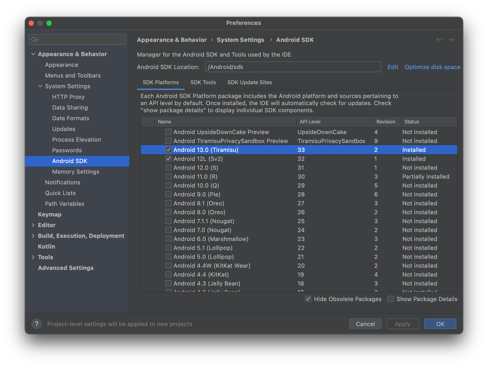

<a id="guide-platforms-android--installing-android-sdk-build-tools"></a>

##### Installing Android SDK Build-Tools

1. Open Android Studio's
2. Open **SDK Manager** (`Tools > SDK Manager`)
3. Click on the **SDK Tools** tab
4. Check **Show Package Details**
5. Expand **Android SDK Build-Tool**
6. Check the highest supported Build-Tools based on the [Android API Level Support](#guide-platforms-android--android-api-level-support).
7. Click Apply

For example: If the project has installed `cordova-android@12.0.0`, the highest supported SDK is 33. We want to select the highest available version of 33.x. At the time of this writing, "33.0.2" should have been selected in step 6.

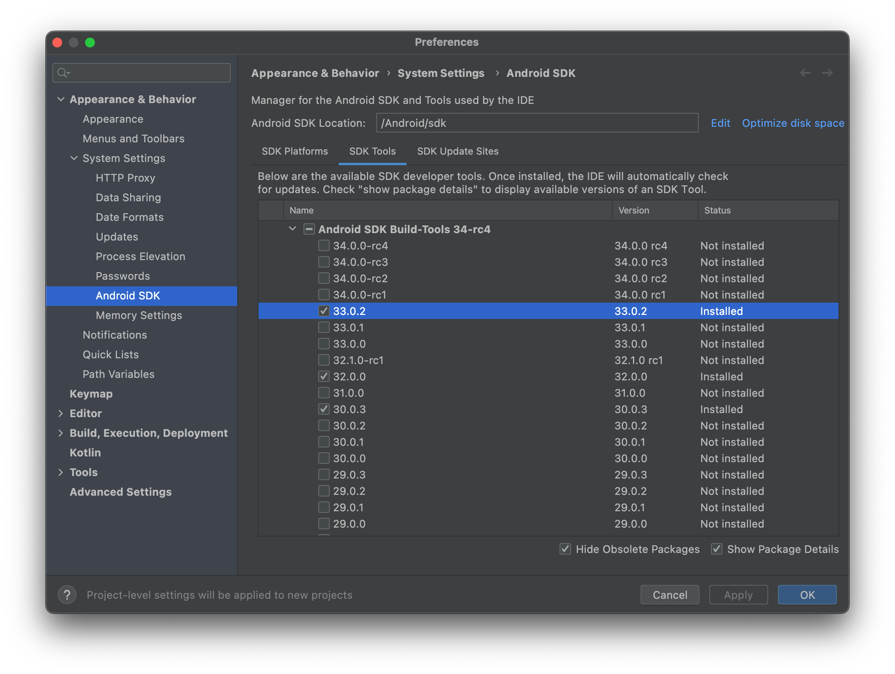

<a id="guide-platforms-android--installing-sdk-command-line-tools-latest"></a>

##### Installing SDK Command-line Tools (latest)

1. Open Android Studio's
2. Open **SDK Manager** (`Tools > SDK Manager`)
3. Click on the **SDK Tools** tab
4. Check **Show Package Details**
5. Expand **Android SDK Command-line Tools (latest)**
6. Check **Android SDK Command-line Tools (latest)**
7. Click Apply

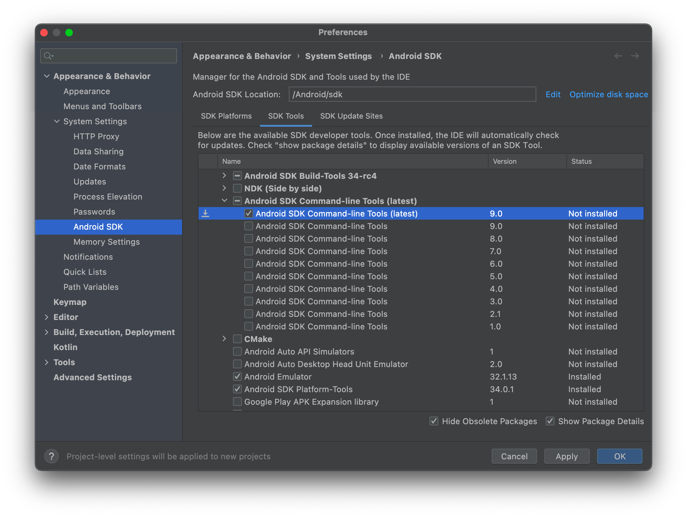

<a id="guide-platforms-android--installing-android-sdk-platform-tools"></a>

##### Installing Android SDK Platform-Tools

1. Open Android Studio's
2. Open **SDK Manager** (`Tools > SDK Manager`)
3. Click on the **SDK Tools** tab
4. Check **Show Package Details**
5. Check **Android SDK Platform-Tool**
6. Click Apply

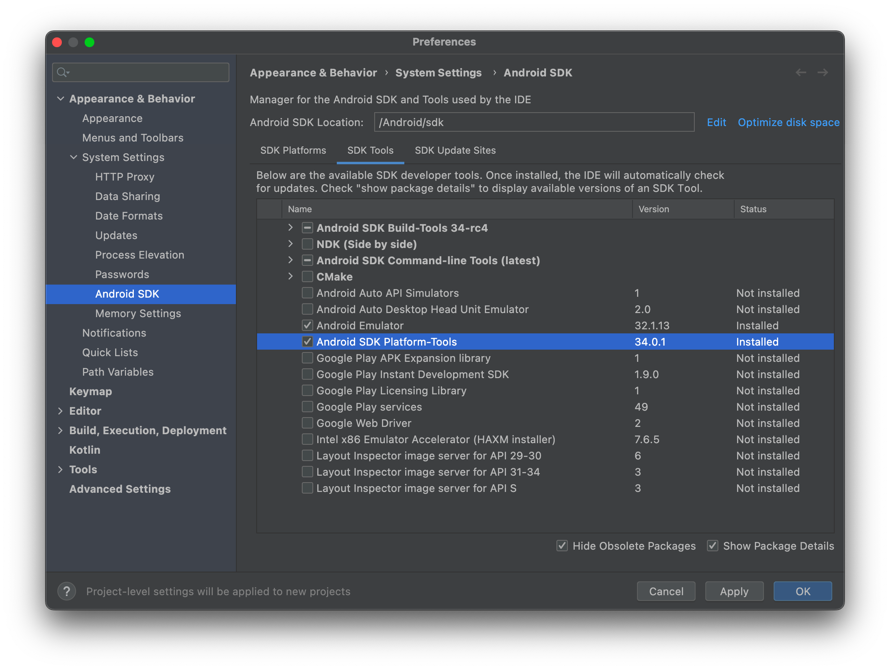

<a id="guide-platforms-android--installing-android-emulator"></a>

##### Installing Android Emulator

1. Open Android Studio's
2. Open **SDK Manager** (`Tools > SDK Manager`)
3. Click on the **SDK Tools** tab
4. Check **Show Package Details**
5. Check **Android Emulator**
6. Click Apply

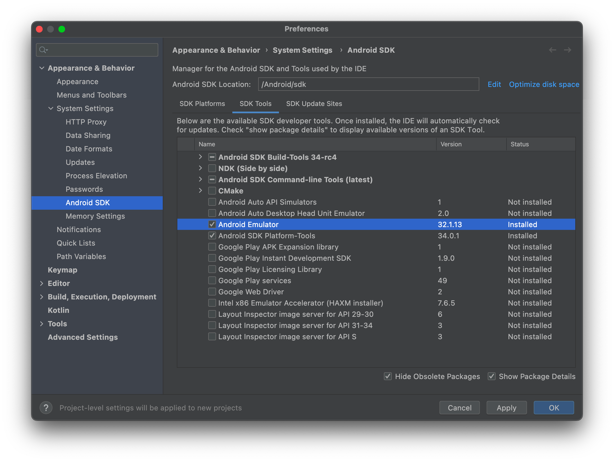

<a id="guide-platforms-android--setting-environment-variables"></a>

### Setting environment variables

Cordova's CLI requires specific environment variables so it can function correctly. If the environment variables are missing, the CLI will attempt to resolve the variable temporarily. If the missing variables fail to resolve, they must be set manually.

The following variables must be set:

- `JAVA_HOME` - The environment variable to the location of your JDK installation
- `ANDROID_HOME` - The environment variable to the location of your Android SDK installation

It is also recommended to update the `PATH` environment variable to include the following directories.

- `cmdline-tools/latest/bin`
- `platform-tools`
- `build-tools`
- `emulator`
  - This is required for the `apksigner` and `zipalign` tools.

***Note:** The directories above are generally located in the Android SDK ROOT.*

<a id="guide-platforms-android--linux-and-macos"></a>

#### Linux and macOS

On Linux or macOS versions prior to Catalina, use any text editor to create or modify the `~/.bash_profile` file.
On macOS Catalina and newer, create or modify the `~/.zprofile` file, as the default shell has changed.

<a id="guide-platforms-android--android_home"></a>

##### ANDROID\_HOME

Add the following line to your shell's profile to set up the `ANDROID_HOME` environment variable.

**Linux:**

```
export ANDROID_HOME=~/Android/Sdk
```

**macOS:**

```
export ANDROID_HOME=~/Library/Android/sdk
```

The above examples point to the standard paths where the Android SDK is typically stored. Depending on your environment configuration, the path may differ. Be sure to confirm that the path exist or adjust them to match your local installation.

After setting the `ANDROID_HOME` environment variable, update the `PATH` variable to include directories containing various Android-related binaries.

```
export PATH=$PATH:$ANDROID_HOME/platform-tools/
export PATH=$PATH:$ANDROID_HOME/cmdline-tools/latest/bin/
export PATH=$PATH:$ANDROID_HOME/build-tools/
export PATH=$PATH:$ANDROID_HOME/emulator/
```

<a id="guide-platforms-android--java_home"></a>

#### JAVA\_HOME

**macOS:**

When you installed the Java Development Kit, as described in this guide, you can get the java home path by executing:

`echo $(/usr/libexec/java_home)`

Set `JAVA_HOME` like you already did it for `ANDROID_HOME`.

<a id="guide-platforms-android--reload-terminal"></a>

### Reload Terminal

Reload your terminal to see this change reflected or run the following command:

**Linux and macOS older then Catalina:**

```
source ~/.bash_profile
```

**macOS Catalina and newer:**

```
source ~/.zprofile
```

<a id="guide-platforms-android--windows"></a>

#### Windows

These steps may vary depending on your installed version of Windows. Close and reopen any command prompt windows after making changes to see them reflected.

1. Click on the **Start** menu or Press on the **Windows** Key (**Win**)
2. Type in the search bar `Environment Variables`
3. Select **Edit the system environment variables** options
4. Click on the **Environment Variables…** button in the window that appears.

<a id="guide-platforms-android--to-create-a-new-environment-variable"></a>

##### To create a new environment variable

1. Click on the **New…** button
2. Type in the **Variable name**
3. Type in the **Variable value**
4. Click on the **OK** button

<a id="guide-platforms-android--to-set-your-path"></a>

##### To set your PATH

1. Select **PATH** from the liste of already defined variable
2. Click on the **Edit…** button
3. Click on the **New** button
4. Type in the relevant location.

Repeat step 3 and 4 until all paths are added.

Example paths (substitute the paths with your local Android SDK installation's location):

```txt
C:\Users\[your user]\AppData\Local\Android\Sdk\platform-tools
C:\Users\[your user]\AppData\Local\Android\Sdk\cmdline-tools\latest\bin
C:\Users\[your user]\AppData\Local\Android\Sdk\build-tools
C:\Users\[your user]\AppData\Local\Android\Sdk\emulator
```

Once all paths are added, click the **OK** button until all opened windows for setting & editing environment variables are closed.

<a id="guide-platforms-android--project-configuration"></a>

## Project Configuration

<a id="guide-platforms-android--setting-up-an-emulator"></a>

### Setting up an Emulator

If you wish to run your Cordova app on an Android emulator, you will first need to create an Android Virtual Device (AVD).

See the following Android documentation for more details on:

- [Create and manage virtual devices](https://developer.android.com/studio/run/managing-avds.html)
- [Run apps on the Android Emulator](https://developer.android.com/studio/run/emulator.html#about)
- [Configure hardware acceleration for the Android Emulator](https://developer.android.com/studio/run/emulator-acceleration.html).

Once your AVD is configured correctly, you should be able to deploy your Cordova application to the emulator by running the following command:

```
cordova run --emulator
```

<a id="guide-platforms-android--configuring-gradle"></a>

### Configuring Gradle

Cordova-Android projects are built by using [Gradle](https://gradle.org/).

<a id="guide-platforms-android--setting-gradle-properties"></a>

#### Setting Gradle Properties

It is possible to configure the Gradle build by setting the values of certain [Gradle properties](https://docs.gradle.org/current/userguide/build_environment.html) that Cordova exposes.

The following properties are available:

| Property | Description |
| --- | --- |
| `cdvAndroidXAppCompatVersion` | Sets the version of the `androidx.appcompat:appcompat` library. |
| `cdvAndroidXWebKitVersion` | Sets the version of the `androidx.webkit:webkit` library. |
| `cdvBuildArch` | Overrides the build architecture of which the app is built for. The default value is automatically detected by Cordova's build script. |
| `cdvBuildMultipleApks` | If this is set, then multiple APK files will be generated: One per native platform supported by library projects (x86, ARM, etc). This can be important if your project uses large native libraries, which can drastically increase the size of the generated APK. If not set, then a single APK will be generated which can be used on all devices |
| `cdvBuildToolsVersion` | Overrides the automatically detected `android.buildToolsVersion` value |
| `cdvCompileSdkVersion` | Sets the SDK version of the framework which the app is been compiled for. Setting will override the automatic detection of the `android.compileSdkVersion` value. |
| `cdvDebugSigningPropertiesFile` | *Default: `debug-signing.properties`* Path to a .properties file that contains signing information for debug builds (see [Signing an App](#guide-platforms-android--signing-an-app)). Useful when you need to share a signing key with other developers |
| `cdvMaxSdkVersion` | set the maximum API Level which the application can run on |
| `cdvMinSdkVersion` | Overrides the value of `minSdkVersion` set in `AndroidManifest.xml`. Useful when creating multiple APKs based on SDK version |
| `cdvReleaseSigningPropertiesFile` | *Default: `release-signing.properties`* Path to a .properties file that contains signing information for release builds (see [Signing an App](#guide-platforms-android--signing-an-app)) |
| `cdvSdkVersion` | Overrides the `targetSdkVersion` value. |
| `cdvVersionCode` | Overrides the versionCode set in `AndroidManifest.xml` |
| `cdvVersionCodeForceAbiDigit` | Whether to append a 0 "abi digit" to versionCode when only a single APK is build. |

You can set these properties in one of four ways:

- Using an Environment Variables:

  **Example:**


```
  export ORG_GRADLE_PROJECT_cdvMinSdkVersion=20
  cordova build android
```

- Using the `--gradleArg` flag with the Cordova `build` or `run` command:

  **Example:**


```
  cordova run android -- --gradleArg=-PcdvMinSdkVersion=20
```

- Creating a `gradle.properties` in the project's Android platform directory

  Create a file named `gradle.properties` in the directory `<project-root>/platforms/android` with the contents such as:

  **Example File Contents:**


```
  cdvMinSdkVersion=20
```

- [Extending `build.gradle`](#guide-platforms-android--extending-buildgradle) with the `build-extras.gradle` file

  Create a file named `build-extras.gradle` in the directory `<project-root>/platforms/android/app` with the contents such as:


```
  ext.cdvMinSdkVersion = 20
```

The latter two options both involve including an extra file in your Android platform folder. In general, it is discouraged to edit the contents of this folder because it is easy for those changes to be lost or overwritten. Instead, these files should be copied into the folder as part of the build command by using the `before_build` [hook script](#guide-appdev-hooks).

<a id="guide-platforms-android--extending-build.gradle"></a>

#### Extending `build.gradle`

To customize the `app/build.gradle` file without modifying it directly, create a sibling file named `build-extras.gradle`.

If this file exists in the `<your-project>/platforms/android/app` directory during the build process, it will be automatically applied by the app's `build.gradle` script.

To automate placing `build-extras.gradle` in the correct location, use the `<resource-file>` element in `config.xml`.

In the example below, the source `build-extras.gradle` is saved in a `res/` directory in the project root. It is then declared in `config.xml` to copy it to the appropriate target location:

```
<resource-file src="res/build-extras.gradle" target="app/build-extras.gradle"/>
```

**Note:** The `res/` directory name is just an example. You can use any directory and file name you prefer. However, it's recommended not to place the file inside the `platforms`, `plugins`, or `www` directories. Also, make sure the `target` path matches exactly as shown in the example.

**Note:** Plugin developers can also include a `build-extras.gradle` file, but should use the `<framework>` element in `plugin.xml` instead of `<resource-file>`:

```
<framework src="build-extras.gradle" custom="true" type="gradleReference" />
```

**Example `build-extras.gradle`:**

```
// This file is included at the beginning of `build.gradle`

// special properties (see `build.gradle`) can be set and overwrite the defaults
ext.cdvDebugSigningPropertiesFile = '../../android-debug-keys.properties'

// normal `build.gradle` configuration can happen
android {
  defaultConfig {
    testInstrumentationRunner 'android.support.test.runner.AndroidJUnitRunner'
  }
}
dependencies {
  androidTestImplementation 'com.android.support.test.espresso:espresso-core:2.2.2', {
    exclude group: 'com.android.support', module: 'support-annotations'
  }
}

// When set, this function `ext.postBuildExtras` allows code to run at the end of `build.gradle`
ext.postBuildExtras = {
    android.buildTypes.debug.applicationIdSuffix = '.debug'
}
```

<a id="guide-platforms-android--configuring-gradle-jvm-args"></a>

#### Configuring Gradle JVM Args

To change the Gradle JVM args, the `--jvmargs` flag can be used with both Cordova's `build` and `run` commands. This is mostly useful for controlling how much memory gradle is allowed to use during the build process. It is recommended to allow at least 2048 MB.

By default, JVM args has a value of `-Xmx2048m`. To increase the maximum allowed memory, use the `-Xmx` JVM arg. Example given below:

```
cordova build android -- --jvmargs='-Xmx4g'
```

The following units are supported:

| unit | value | example |
| --- | --- | --- |
| kilobyte | k | `-Xmx2097152k` |
| megabyte | m | `-Xmx2048m` |
| gigabyte | g | `-Xmx2g` |

<a id="guide-platforms-android--setting-the-version-code"></a>

### Setting the Version Code

To change the [version code](https://developer.android.com/studio/publish/versioning) for your app's generated apk, set the `android-versionCode` attribute in the `widget` element of your application's [config.xml](#config_ref) file.

If the `android-versionCode` is not set, the version code will be determined using the `version` attribute. For example, if the version is `MAJOR.MINOR.PATCH`:

```
versionCode = MAJOR * 10000 + MINOR * 100 + PATCH
```

If your application has enabled the `cdvBuildMultipleApks` Gradle property (see [Setting Gradle Properties](#guide-platforms-android--setting-gradle-properties)), the version code of your app will also be multiplied by 10 so that the last digit of the code can be used to indicate the architecture the apk was built for. This multiplication
will happen regardless of whether the version code is taken from the `android-versionCode` attribute or generated using the `version`.

***Note:** Be aware that some plugins added to your project may set this Gradle property automatically.*

***Note:** When updating the `android-versionCode` property, it is not recommended to increment the version code taken from built apks. It is recommended to increment the code based off the value in your `config.xml` file's `android-versionCode` attribute. This is because the `cdvBuildMultipleApks` property causes the version code to be multiplied by 10 in the built apks and thus using that value will cause your next version code to be 100 times the original, etc.*

<a id="guide-platforms-android--signing-an-app"></a>

## Signing an App

It is recommended to read Android's documentation for [Sign your app](https://developer.android.com/studio/publish/app-signing) first, as it contains the necessary steps in creating required files for signing.

<a id="guide-platforms-android--using-flags"></a>

### Using Flags

To sign an app, you need the following parameters:

| Parameter | Flag | Description |
| --- | --- | --- |
| Keystore | `--keystore` | Path to a binary file which can hold a set of keys |
| Keystore Password | `--storePassword` | Password to the keystore |
| Alias | `--alias` | The id specifying the private key used for signing |
| Password | `--password` | Password for the private key specified |
| Type of the Keystore | `--keystoreType` | *Default: auto-detect based on file extension* Either pkcs12 or jks |
| Package Type | `--packageType` | *Default: apk for debug, bundle for release* Specify whether to build an APK or an [AAB](https://developer.android.com/guide/app-bundle) (Android App Bundle) file. Acceptable Values: `apk` or `bundle` |

The parameters above can be specified as an argument when using the [Cordova CLI](#reference-cordova-cli) `build` or `run` commands.

> [!NOTE]
> *: You should use double `--` to indicate that these are platform-specific arguments.*

Example:

`cordova run android --release -- --keystore=../my-release-key.keystore --storePassword=password --alias=alias_name --password=password --packageType=bundle`.

<a id="guide-platforms-android--using-build.json"></a>

### Using `build.json`

Alternatively, you could specify the signing parameters in a build configuration file (`build.json`).

By default, if the `build.json` file exists in the project's root directory, it will automatically be detected and used. If the file is not located in the project's root directory or has multiple configuration files, the command line argument `--buildConfig` must be supplied with the path to the file.

**Example `build.json` configuration file:**

```
{
    "android": {
        "debug": {
            "keystore": "../android.keystore",
            "storePassword": "android",
            "alias": "mykey1",
            "password" : "password",
            "keystoreType": "",
            "packageType": "apk"
        },
        "release": {
            "keystore": "../android.keystore",
            "storePassword": "",
            "alias": "mykey2",
            "password" : "password",
            "keystoreType": "",
            "packageType": "bundle"
        }
    }
}
```

There is also support to mix and match command line arguments and parameters in `build.json`. Values from the command line arguments takes precedence. This can be useful for specifying passwords on the command line.

<a id="guide-platforms-android--using-gradle"></a>

### Using Gradle

You can also specify signing properties by including a `.properties` file and pointing to it with the `cdvReleaseSigningPropertiesFile` and `cdvDebugSigningPropertiesFile` Gradle properties (see [Setting Gradle Properties](#guide-platforms-android--setting-gradle-properties)).

**Example file content:**

```
storeFile=relative/path/to/keystore.p12
storePassword=SECRET1
storeType=pkcs12
keyAlias=DebugSigningKey
keyPassword=SECRET2
```

The `storePassword` and `keyPassword` properties are required for automated signing.

<a id="guide-platforms-android--debugging"></a>

## Debugging

For details on the debugging tools that come packaged with the Android SDK, see
[Android's developer documentation for debugging](https://developer.android.com/studio/debug/index.html).
Additionally, Android's developer documentation for [debugging web apps](https://developer.android.com/guide/webapps/debugging.html)
provides an introduction for debugging the portion of your app running in the
Webview.

<a id="guide-platforms-android--opening-a-project-in-android-studio"></a>

### Opening a Project in Android Studio

Cordova-Android projects can be opened in [Android Studio](https://developer.android.com/studio/index.html). This can be useful if you wish to use Android Studio's built in Android debugging and profiling tools or if you are developing Android plugins.

***Note:** When opening your project in Android Studio, it is recommended to NOT edit the code within the IDE. Editing in Android Studio will edit code residing in the `platforms` directory of your project. It is not updating the code in the projects root `www`)directory. The changes are liable to be overwritten. Instead, edit the `www` folder and copy over your changes by running `cordova prepare`.*

Plugin developers wishing to edit their native code in Android Studio should use the `--link` flag when adding their plugin to the project with the `cordova plugin add`. This will create a symbolic link of the plugin files from the plugin source directory to the project's `platforms` directory.

To open a Cordova-Android project in Android Studio:

1. Launch **Android Studio**
2. Click the **Open** button
   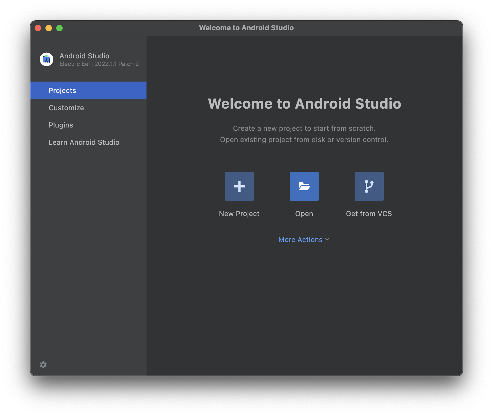
3. Navigate to the project's Android platform directory: (`<project-root>/platforms/android`)
4. Click **Open**

Once it finishes importing, you should be able to build and run the app directly from **Android Studio**.

For more resources, please see:

- [Meet Android Studio](https://developer.android.com/studio/intro)
- [Build and run your app](https://developer.android.com/studio/run/index.html)

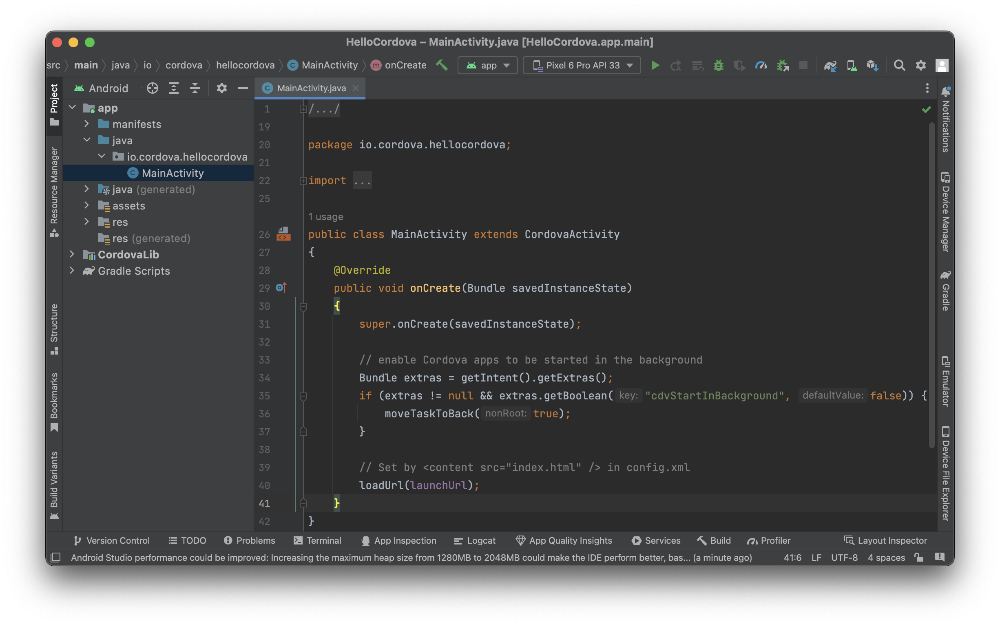

<a id="guide-platforms-android--upgrading"></a>

## Upgrading

Refer to [this](https://cordova.apache.org/docs/en/latest/guide/platforms/android/upgrade.html) article for instructions to upgrade your `cordova-android` version.

<a id="guide-platforms-android--lifecycle-guide"></a>

## Lifecycle Guide

<a id="guide-platforms-android--cordova-and-android"></a>

### Cordova and Android

Native Android apps typically consist of a series of [activities](https://developer.android.com/reference/android/app/Activity) that the user interacts with. Activities can be thought of as the individual screens that make
up an application; different tasks in an app will often have their own activity. Each activity has its own lifecycle that is maintained as the activity enters and leaves the foreground of a user's device.

In contrast, Cordova applications on the Android platform are executed within a Webview that is embedded in a *single* Android activity. The lifecycle of this activity is exposed to your application through the document events that are fired. The events are not guaranteed to line up with Android's lifecycle, but they can provide guidelines for saving and restoring your state. These events roughly map to Android callbacks as follows:

| Cordova Event | Rough Android Equivalent | Meaning |
| --- | --- | --- |
| `deviceready` | `onCreate()` | Application is starting (not from background) |
| `pause` | `onPause()` | Application is moving to the background |
| `resume` | `onResume()` | Application is returning to the foreground |

Most other Cordova platforms have a similar concept of lifecycles and should fire these same events when similar actions happen on a user's device. However, Android presents some unique challenges that can sometimes show up thanks to the native Activity lifecycle.

<a id="guide-platforms-android--what-makes-android-different"></a>

### What makes Android different?

In Android, the OS can choose to kill activities in the background in order to free up resources if the device is low on memory. Unfortunately, when the activity holding your application is killed, the Webview in which your application lives will be destroyed as well. Any state that your application is maintaining will be lost in this case. When the user navigates back to your application, the Activity and Webview will be recreated by the OS, but state will not be automatically restored for your Cordova app. For this reason, it is imperative that your application be aware of the lifecycle events that are fired and maintain whatever state is appropriate to make sure a user's context in your app is not lost when they leave the application.

<a id="guide-platforms-android--when-can-this-happen"></a>

### When can this happen?

Your application is susceptible to being destroyed by the OS whenever it leaves the sight of the user. There are two main situations in which this can occur. The first and most obvious case is when the user presses the home button or switches to another application.

However, there is a second (and much more subtle) case that certain plugins can introduce. As noted above, Cordova applications are usually confined to the single activity that contains the Webview. However, there are instances in which other activities may be launched by plugins and temporarily push the Cordova activity to the background. These other Activities are typically launched in order to perform a specific task using a native application installed on the device. For example, the [Cordova camera plugin](#reference-cordova-plugin-camera) launches whatever camera activity is natively installed on the device in order to take a photo. Reusing the installed camera application in this way makes your application feel much more like a native app when the user tries to take a photo. Unfortunately, when the native Activity pushes your app to the background there is a chance the OS will kill it.

For a clearer understanding of this second case, let's walk through an example using the camera plugin. Imagine you have an application that requires the user to take a profile photo. The flow of events in the application when everything goes as planned will look something like this:

1. The user is interacting with your app and needs to take a picture
2. The camera plugin launches the native camera activity
   - *The Cordova activity is pushed to the background (pause event is fired)*
3. The user takes a photo
4. The camera activity finishes
   - *The Cordova activity is moved to the foreground (resume event is fired)*
5. The user is returned to your application where they left off

However, this flow of events can be disrupted if a device is low on memory. If the Activity is killed by the OS, the above sequence of events instead plays out as follows:

1. The user is interacting with your app and needs to take a picture
2. The camera plugin launches the native camera activity
   - *The OS destroys the Cordova activity (pause event is fired)*
3. The user takes a photo
4. The camera activity finishes
   - *The OS recreates the Cordova activity (deviceready and resume events are fired)*
5. The user is confused as to why they are suddenly back at your app's login screen

In this instance, the OS killed the application in the background and the application did not maintain its state as part of the lifecycle. When the user returned to the app, the Webview was recreated and the app appeared to have restarted from scratch (hence the user's confusion). This sequence of events is equivalent to what happens when the home button is pressed or the user switches applications. The key to preventing the above experience is subscribing to events and properly maintaining state as part of the activity lifecycle.

<a id="guide-platforms-android--respecting-the-lifecycle"></a>

### Respecting the Lifecycle

In the examples above, the javascript events that are fired are noted in italics. These events are your opportunity to save and restore your
application's state. You should register callbacks in your application's `bindEvents` function that respond to the lifecycle events by saving state. What information you save and how you save it is left to your discretion, but you should be sure to save enough information so that you can restore the user to exactly where they left off when they return to your application.

There is one additional factor in the example above that only applies in the second-discussed situation (i.e. when a plugin launches an external activity). Not only was the state of the application lost when the user finished taking a photo, but so was the photo that the user took. Normally, that photo would be delivered to your application through the callback that was registered with the camera plugin. However, when the Webview was destroyed that callback was lost forever. Luckily, cordova-android 5.1.0 and above provide a means for getting the result of that plugin call when your application resumes.

<a id="guide-platforms-android--retrieving-plugin-callback-results-cordova-android-5.1.0"></a>

### Retrieving plugin callback results (cordova-android 5.1.0+)

When the OS destroys the Cordova activity that was pushed into the background by a plugin, any pending callbacks are lost as well. This means that if you passed a callback to the plugin that launched the new activity (e.g. the camera plugin), that callback will NOT be fired when the application is recreated. However, starting in cordova-android **5.1.0**, the `resume` event's payload will contain any pending plugin results from the plugin request that launched the external activity made prior to the activity being destroyed.

The payload for the `resume` event adheres to the following format:

```
{
    action: "resume",
    pendingResult: {
        pluginServiceName: string,
        pluginStatus: string,
        result: any
    }
}
```

The fields of that payload are defined as follows:

- `pluginServiceName`: The name of the plugin returning the result (e.g. "Camera"). This can be found in the `<name>` tag of a plugin's plugin.xml file
- `pluginStatus`: The status of the plugin call (see below)
- `result`: Whatever the result of the plugin call is

The possible values for `pluginStatus` in the `pendingResult` field include the following:

- `"OK"` - The plugin call was successful
- `"No Result"` - The plugin call ended with no result
- `"Error"` - The plugin call resulted in some general error
- Other miscellaneous errors
  - `"Class not found"`
  - `"Illegal access"`
  - `"Instantiation error"`
  - `"Malformed url"`
  - `"IO error"`
  - `"Invalid action"`
  - `"JSON error"`

***Note:** It is up to the plugin to decide what is contained in the `result` field and the meaning of the `pluginStatus` that is returned. Refer to the plugin's API documentationf or the expect results and how to use the values.*

<a id="guide-platforms-android--example"></a>

#### Example

Below is a brief example application that uses the `resume` and `pause` events to manage state. It uses the Apache camera plugin as an example of how to retrieve the results of a plugin call from the `resume` event payload. The portion of the code dealing with the `resume`'s `event.pendingResult` object requires cordova-android **5.1.0+**

```
// This state represents the state of our application and will be saved and
// restored by onResume() and onPause()
var appState = {
    takingPicture: true,
    imageUri: ""
};

var APP_STORAGE_KEY = "exampleAppState";

var app = {
    initialize: function() {
        this.bindEvents();
    },
    bindEvents: function() {
        // Here we register our callbacks for the lifecycle events we care about
        document.addEventListener('deviceready', this.onDeviceReady, false);
        document.addEventListener('pause', this.onPause, false);
        document.addEventListener('resume', this.onResume, false);
    },
    onDeviceReady: function() {
        document.getElementById("take-picture-button").addEventListener("click", function() {
            // Because the camera plugin method launches an external Activity,
            // there is a chance that our application will be killed before the
            // success or failure callbacks are called. See onPause() and
            // onResume() where we save and restore our state to handle this case
            appState.takingPicture = true;

            navigator.camera.getPicture(cameraSuccessCallback, cameraFailureCallback,
                {
                    sourceType: Camera.PictureSourceType.CAMERA,
                    destinationType: Camera.DestinationType.FILE_URI,
                    targetWidth: 250,
                    targetHeight: 250
                }
            );
        });
    },
    onPause: function() {
        // Here, we check to see if we are in the middle of taking a picture. If
        // so, we want to save our state so that we can properly retrieve the
        // plugin result in onResume(). We also save if we have already fetched
        // an image URI
        if(appState.takingPicture || appState.imageUri) {
            window.localStorage.setItem(APP_STORAGE_KEY, JSON.stringify(appState));
        }
    },
    onResume: function(event) {
        // Here we check for stored state and restore it if necessary. In your
        // application, it's up to you to keep track of where any pending plugin
        // results are coming from (i.e. what part of your code made the call)
        // and what arguments you provided to the plugin if relevant
        var storedState = window.localStorage.getItem(APP_STORAGE_KEY);

        if(storedState) {
            appState = JSON.parse(storedState);
        }

        // Check to see if we need to restore an image we took
        if(!appState.takingPicture && appState.imageUri) {
            document.getElementById("get-picture-result").src = appState.imageUri;
        }
        // Now we can check if there is a plugin result in the event object.
        // This requires cordova-android 5.1.0+
        else if(appState.takingPicture && event.pendingResult) {
            // Figure out whether or not the plugin call was successful and call
            // the relevant callback. For the camera plugin, "OK" means a
            // successful result and all other statuses mean error
            if(event.pendingResult.pluginStatus === "OK") {
                // The camera plugin places the same result in the resume object
                // as it passes to the success callback passed to getPicture(),
                // thus we can pass it to the same callback. Other plugins may
                // return something else. Consult the documentation for
                // whatever plugin you are using to learn how to interpret the
                // result field
                cameraSuccessCallback(event.pendingResult.result);
            } else {
                cameraFailureCallback(event.pendingResult.result);
            }
        }
    }
}

// Here are the callbacks we pass to getPicture()
function cameraSuccessCallback(imageUri) {
    appState.takingPicture = false;
    appState.imageUri = imageUri;
    document.getElementById("get-picture-result").src = imageUri;
}

function cameraFailureCallback(error) {
    appState.takingPicture = false;
    console.log(error);
}

app.initialize();
```

The corresponding html:

```
<!DOCTYPE html>

<html>
    <head>
        <meta http-equiv="Content-Security-Policy" content="default-src 'self' data: gap: https://ssl.gstatic.com 'unsafe-eval'; style-src 'self' 'unsafe-inline'; media-src *">
        <meta name="format-detection" content="telephone=no">
        <meta name="msapplication-tap-highlight" content="no">
        <meta name="viewport" content="user-scalable=no, initial-scale=1, maximum-scale=1, minimum-scale=1, width=device-width">
        <link rel="stylesheet" type="text/css" href="css/index.css">
        <title>Cordova Android Lifecycle Example</title>
    </head>
    <body>
        <div class="app">
            <div>
                
            </div>
            <Button id="take-picture-button">Take Picture</button>
        </div>
        <script type="text/javascript" src="cordova.js"></script>
        <script type="text/javascript" src="js/index.js"></script>
    </body>
</html>
```

<a id="guide-platforms-android--android-quirks"></a>

### Android Quirks

The default API level in the Cordova-Android platform has been upgraded. On an Android 9 device, clear text communication is now disabled by default.

By default HTTP and FTP etc. will refuse the apps requests to use cleartext traffic. The key reason for avoiding cleartext traffic is the lack of confidentiality, authenticity, and protections against tampering; a network attacker can eavesdrop on transmitted data and also modify it without being detected. You can learn more about the `android:usesCleartextTraffic` or any other android application elements setting in the [documentation for Android developers](https://developer.android.com/guide/topics/manifest/application-element).

To allow clear text communication again, set the `android:usesCleartextTraffic` on your application tag to true in `config.xml` file:

```
<platform name="android">
  <edit-config file="app/src/main/AndroidManifest.xml" mode="merge" target="/manifest/application">
      <application android:usesCleartextTraffic="true" />
  </edit-config>
</platform>
```

And also you need to add Android XML namespace `xmlns:android="http://schemas.android.com/apk/res/android"` to your widget tag in the same `config.xml`.

**Example:**

```
<widget id="io.cordova.hellocordova" version="0.0.1" android-versionCode="13" xmlns="http://www.w3.org/ns/widgets" xmlns:cdv="http://cordova.apache.org/ns/1.0" xmlns:android="http://schemas.android.com/apk/res/android">
</widget>
```

<a id="guide-platforms-android--android-manifest-information"></a>

### Android Manifest Information

You can learn more about the Android manifest information in the [documentation for Android developers](https://developer.android.com/guide/topics/manifest/manifest-intro).

<a id="guide-platforms-android--testing-the-activity-lifecycle"></a>

### Testing the Activity Lifecycle

Android provides a developer setting for testing Activity destruction on low memory. Enable the "Don't keep activities" setting in the Developer Options menu on your device or emulator to simulate low memory scenarios. You should always do some amount of testing with this setting enabled to make sure that your application is properly maintaining state.

---

<a id="guide-platforms-ios"></a>

<!-- source_url: https://cordova.apache.org/docs/en/latest/guide/platforms/ios/index.html -->

<!-- page_index: 12 -->

# iOS Platform Guide

- Getting Started
  - [Overview](#guide-overview)
  - [Installation](#guide-cli-installation)
  - [Creating an App](#guide-cli)
- Cordova Projects
  - [Project Structure](#guide-overview-project-structure)
  - [CLI Commands](#reference-cordova-cli)
  - [Platform Support](#guide-support)
  - [Platform Pinning](#platform_pinning)
  - [Version Management](#platform_plugin_versioning_ref)
  - [Hooks](#guide-appdev-hooks)
- App Development
  - Platforms
    - [Android](#guide-platforms-android)
    - [iOS](#guide-platforms-ios)
    - [Electron](#guide-platforms-electron)
  - Customization
    - [Icons](#config_ref-images)
    - [Splash Screen](#core-features-splashscreen)
  - Security & Privacy
    - [Security](#guide-appdev-security)
    - [Privacy](#guide-appdev-privacy)
    - [Allow List](#guide-appdev-allowlist)
  - [Data Storage](#cordova-storage-storage)
- Plugin Development
  - [Create a Plugin](#guide-hybrid-plugins)
  - Support a Platform
    - [Android](#guide-platforms-android-plugin)
    - [iOS](#guide-platforms-ios-plugin)
  - [Use Plugman](#plugin_ref-plugman)
- References
  - [Config.xml API](#config_ref)
  - [Plugin.xml API](#plugin_ref-spec)
  - [Cordova JavaScript API](#cordova-events-events)
- Resources
  - [Third-party Tools](#third-party)
  - [App Templates](#guide-cli-template)
  - [Next Steps](#guide-next)
- Plugins
  - [Battery Status](#reference-cordova-plugin-battery-status)
  - [Camera](#reference-cordova-plugin-camera)
  - [Device](#reference-cordova-plugin-device)
  - [Dialogs](#reference-cordova-plugin-dialogs)
  - [File](#reference-cordova-plugin-file)
  - [Geolocation](#reference-cordova-plugin-geolocation)
  - [Inappbrowser](#reference-cordova-plugin-inappbrowser)
  - [Media](#reference-cordova-plugin-media)
  - [Media Capture](#reference-cordova-plugin-media-capture)
  - [Network Information](#reference-cordova-plugin-network-information)
  - [Screen Orientation](#reference-cordova-plugin-screen-orientation)
  - [Browser Splashscreen](#reference-cordova-plugin-splashscreen)
  - [Statusbar](#reference-cordova-plugin-statusbar)
  - [Vibration](#reference-cordova-plugin-vibration)
- Advanced Topics
  - [Embed Cordova in native apps](#guide-hybrid-webviews)

Table of Contents

- [Overview](#guide-overview)
- [Installation](#guide-cli-installation)
- [Creating an App](#guide-cli)
- [Project Structure](#guide-overview-project-structure)
- [CLI Commands](#reference-cordova-cli)
- [Platform Support](#guide-support)
- [Platform Pinning](#platform_pinning)
- [Version Management](#platform_plugin_versioning_ref)
- [Hooks](#guide-appdev-hooks)
- [Android](#guide-platforms-android)
- [iOS](#guide-platforms-ios)
- [Electron](#guide-platforms-electron)
- [Icons](#config_ref-images)
- [Splash Screen](#core-features-splashscreen)
- [Security](#guide-appdev-security)
- [Privacy](#guide-appdev-privacy)
- [Allow List](#guide-appdev-allowlist)
- [Data Storage](#cordova-storage-storage)
- [Create a Plugin](#guide-hybrid-plugins)
- [Android](#guide-platforms-android-plugin)
- [iOS](#guide-platforms-ios-plugin)
- [Use Plugman](#plugin_ref-plugman)
- [Config.xml API](#config_ref)
- [Plugin.xml API](#plugin_ref-spec)
- [Cordova JavaScript API](#cordova-events-events)
- [Third-party Tools](#third-party)
- [App Templates](#guide-cli-template)
- [Next Steps](#guide-next)
- [Battery Status](#reference-cordova-plugin-battery-status)
- [Camera](#reference-cordova-plugin-camera)
- [Device](#reference-cordova-plugin-device)
- [Dialogs](#reference-cordova-plugin-dialogs)
- [File](#reference-cordova-plugin-file)
- [Geolocation](#reference-cordova-plugin-geolocation)
- [Inappbrowser](#reference-cordova-plugin-inappbrowser)
- [Media](#reference-cordova-plugin-media)
- [Media Capture](#reference-cordova-plugin-media-capture)
- [Network Information](#reference-cordova-plugin-network-information)
- [Screen Orientation](#reference-cordova-plugin-screen-orientation)
- [Browser Splashscreen](#reference-cordova-plugin-splashscreen)
- [Statusbar](#reference-cordova-plugin-statusbar)
- [Vibration](#reference-cordova-plugin-vibration)
- [Embed Cordova in native apps](#guide-hybrid-webviews)

<a id="guide-platforms-ios--ios-platform-guide"></a>

# iOS Platform Guide

This guide shows how to set up your SDK development environment to
deploy Cordova apps for iOS devices such as iPhone and iPad, and how to optionally use iOS-centered command-line tools in your
development workflow. You need to install the SDK tools regardless of
whether you want to use these platform-centered shell tools
or cross-platform Cordova CLI for development. For a comparison of the two
development paths, see the [Overview](#guide-overview--development-paths).
For details on the CLI, see [Cordova CLI Reference](#reference-cordova-cli).

<a id="guide-platforms-ios--requirements-and-support"></a>

## Requirements and Support

Apple® tools used for building iOS applications can only operate within the macOS environment. Xcode®, the primary tool for iOS application development, incorporates the iOS SDK (Software Development Kit). For submission to the Apple App Store℠, apps must be built using the most recent versions of these Apple tools.

You can evaluate many Cordova features by utilizing the iOS simulator integrated with the iOS SDK and Xcode. However, testing all of an app's device-specific functionalities requires an actual device before final submission to the App Store.

The table below outlines Cordova-iOS's prerequisites by version. Additionally, Xcode has its own set of system requirements and it is advisable to refer to the [Minimum requirements and supported SDKs](https://developer.apple.com/support/xcode/#:~:text=Minimum%20requirements%20and%20supported%C2%A0SDKs) documentation for verification.

<table>
<thead>
<tr>
<th>Cordova-iOS Version</th>
<th>iOS Minimum-Support</th>
<th>Tooling Version</th>
</tr>
</thead>
<tbody>
<tr>
<td>8.x</td>
<td>13.0</td>
<td>
<ul>
<li>Cocoapods: &gt;=1.16.0</li>
<li>ios-deploy: &gt;=1.12.2</li>
<li>Node: &gt;=20.17.0</li>
<li>Xcode (xcodebuild): &gt;=15.0.0</li>
</ul>
</td>
</tr>
<tr>
<td>7.x</td>
<td>11.0</td>
<td>
<ul>
<li>Cocoapods: &gt;=1.8.0</li>
<li>ios-deploy: &gt;=1.9.2</li>
<li>Node: &gt;=16.13.0</li>
<li>Xcode (xcodebuild): &gt;=11.0.0</li>
</ul>
</td>
</tr>
<tr>
<td>6.x</td>
<td>11.0</td>
<td>
<ul>
<li>Cocoapods: &gt;=1.8.0</li>
<li>ios-deploy: &gt;=1.9.2</li>
<li>Node: &gt;=10.0.0</li>
<li>Xcode (xcodebuild): &gt;=11.0.0</li>
</ul>
</td>
</tr>
<tr>
<td>5.x</td>
<td>10.0</td>
<td>
<ul>
<li>Cocoapods: &gt;=1.0.1</li>
<li>ios-deploy: &gt;=1.9.2</li>
<li>Node: &gt;=6.0.0</li>
<li>Xcode (xcodebuild): &gt;=10.0.0</li>
</ul>
</td>
</tr>
</tbody>
</table>

<a id="guide-platforms-ios--installing-the-requirements"></a>

## Installing the Requirements

<a id="guide-platforms-ios--xcode"></a>

### Xcode

There are two ways to download Xcode:

- from the [App Store](https://itunes.apple.com/us/app/xcode/id497799835?mt=12),
  available by searching for "Xcode" in the **App Store** application.
- from [Apple Developer Downloads](https://developer.apple.com/downloads/index.action),
  which requires registration as an Apple Developer.

Once Xcode is installed, several command-line tools need to be enabled
for Cordova to run. From the command line, run:

```
$ xcode-select --install
```

<a id="guide-platforms-ios--deployment-tools"></a>

### Deployment Tools

The [ios-deploy](https://www.npmjs.org/package/ios-deploy) tools allow you
to launch iOS apps on an iOS Device from the command-line.

Install ios-deploy via [Homebrew](https://brew.sh/) by running:

```
$ brew install ios-deploy
```

<a id="guide-platforms-ios--cocoapods"></a>

### CocoaPods

The [CocoaPods](https://cocoapods.org/#install) tools are needed to build iOS apps. A minimum version of 1.8.0 is required but the latest release is always recommended.

To install CocoaPods, run the following from command-line terminal:

```
$ brew install cocoapods
```

<a id="guide-platforms-ios--project-configuration"></a>

## Project Configuration

Installing Xcode will mostly set everything needed to get started with the native side of things.
You should now be able to create and build a cordova project.
For more details on installing and using the CLI, refer to [Create your first app](#guide-cli) guide.

<a id="guide-platforms-ios--deploying-to-simulator"></a>

### Deploying to Simulator

To preview the app in the iOS simulator:

1. Open the workspace file (`platforms/ios/App.xcworkspace`) from Xcode, *or* from the command line:


```
 $ open ./platforms/ios/App.xcworkspace/
```

2. Make sure the `HelloWorld` project is selected in the left panel (1).

   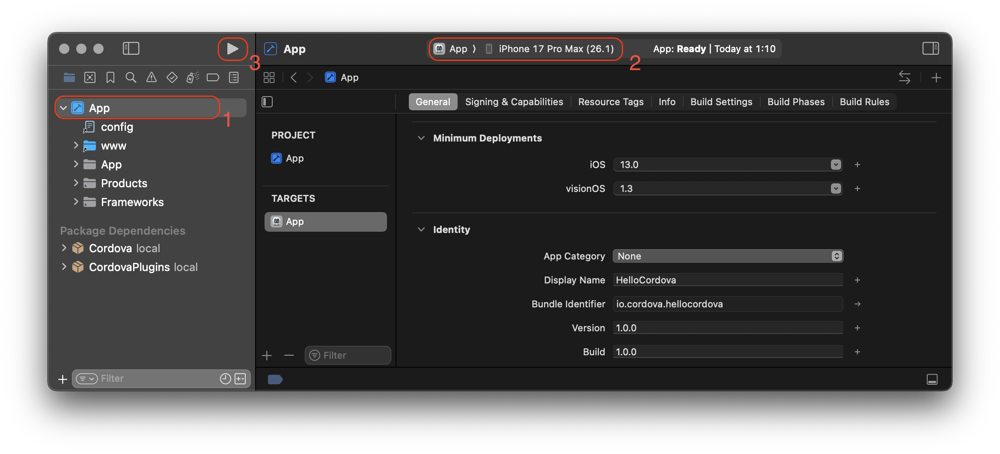
3. Select the intended device from the toolbar's **Scheme** menu, such
   as the iPhone XR Simulator as highlighted in (2)
4. Press the **Run** button (3) in the same toolbar to the
   left of the **Scheme**. That builds, deploys, and runs the
   application in the simulator. A separate simulator application opens
   to display the app:

   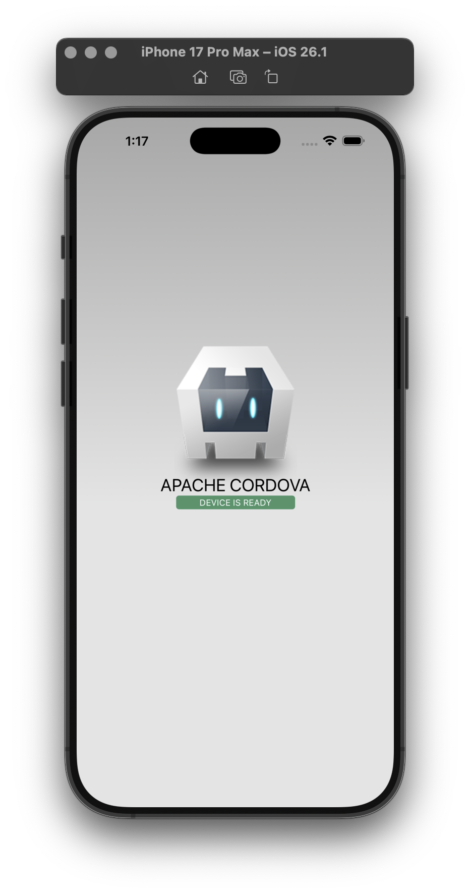

   Only one simulator may run at a time, so if you want to test the app
   in a different simulator, you need to quit the simulator application
   and run a different target within Xcode.

Xcode comes bundled with simulators for the latest versions of iPhone
and iPad. Older versions may be available from the **Xcode →
Preferences… → Components** panel.

<a id="guide-platforms-ios--deploying-to-device"></a>

### Deploying to Device

For details about various requirements to deploy to a device, refer
to the *Launch Your App On Devices* section of
Apple's
[About App Distribution Workflows](https://developer.apple.com/library/prerelease/ios/documentation/IDEs/Conceptual/AppDistributionGuide/Introduction/Introduction.html).
Briefly, you need to do the following before deploying:

1. Create a *Provisioning Profile* within the
   [iOS Provisioning Portal](https://developer.apple.com/ios/manage/overview/index.action).
   You can use its *Development Provisioning Assistant* to create and
   install the profile and certificate Xcode requires.
2. Verify that the *Code Signing Identity* setting within the *Code Signing* section
   within the build settings is set to your provisioning profile
   name.

To deploy to the device:

1. Use the USB cable to plug the device into your Mac.
2. Select the name of the project in the Xcode window's **Scheme**
   drop-down list.
3. Select your device from the **Device** drop-down list. If it is
   plugged in via USB but still does not appear, press the
   **Organizer** button to resolve any errors.
4. Press the **Run** button to build, deploy and run the application
   on your device.

<a id="guide-platforms-ios--signing-an-app"></a>

## Signing an App

First, you should read through the [Code Signing Support Page](https://developer.apple.com/support/code-signing/)
and the [App Distribution Workflows](https://developer.apple.com/library/prerelease/ios/documentation/IDEs/Conceptual/AppDistributionGuide/Introduction/Introduction.html).

<a id="guide-platforms-ios--using-flags"></a>

### Using Flags

To sign an app, you need the following parameters:

| Parameter | Flag | Description |
| --- | --- | --- |
| Code Sign Identity | `--codeSignIdentity` | Code signing identity to use for signing. It can be created with Xcode and added to your keychain. Starting with Xcode 8 you should use `--codeSignIdentity="iPhone Developer"` both for `debug` and `release`. |
| Development Team | `--developmentTeam` | The development team ([Team ID](https://developer.apple.com/account/#/membership/)) to use for code signing. You would use this setting and a simplified Code Sign Identity (i.e. just 'iPhone Developer') to sign your apps, you do not need to provide a Provisioning Profile. |
| Packaging Type | `--packageType` | This will determine what type of build is generated by Xcode. Valid options are `development` (the default), `enterprise`, `ad-hoc`, and `app-store`. |
| Provisioning Profile | `--provisioningProfile` | (Optional) GUID of the provisioning profile to be used for manual signing. It is copied here on your Mac: `~/Library/MobileDevice/Provisioning\ Profiles/`. Opening it in a text editor, you can find the GUID which needs to be specified here if using manual signing. |
| Automatic Provisioning | `--automaticProvisioning` | (Optional) Enable to allow Xcode to automatically manage provisioning profiles. Valid options are `false` (the default) and `true`. |
| Authentication Key Path | `--authenticationKeyPath` | (Optional) The absolute path to an [App Store Connect API](https://developer.apple.com/documentation/appstoreconnectapi/creating_api_keys_for_app_store_connect_api) p8 key file, for automatic distribution signing. A relative path will not work. |
| Authentication Key ID | `--authenticationKeyID` | (Optional) The key ID for the App Store Connect API key file, for automatic distribution signing. |
| Authentication Key Issuer ID | `--authenticationKeyIssuerID` | (Optional) The issuer ID value for the App Store Connect API credentials,for automatic distribution signing. |

These parameters can be specified using the command line arguments above to the Cordova CLI `build` or `run` commands.

> [!NOTE]
> : You should use double `--` to indicate that these are platform-specific arguments, for example:

`cordova run ios --release -- --codeSignIdentity="iPhone Developer" --developmentTeam=FG35JLLMXX4A --packageType=development`.

<a id="guide-platforms-ios--using-build.json"></a>

### Using build.json

Alternatively, you could specify these flags in a build configuration file (default: `build.json` or add the `--buildConfig` flag to the same commands, so you can also use other file names e.g. `cordova build ios --buildConfig=../customBuild.json`). Here's a sample of a build configuration file:

For automatic signing, where provisioning profiles are managed automatically by Xcode (recommended):

```
{
    "ios": {
        "debug": {
            "codeSignIdentity": "iPhone Developer",
            "developmentTeam": "FG35JLLMXX4A",
            "packageType": "development",
            "automaticProvisioning": true
        },
        "release": {
            "codeSignIdentity": "iPhone Developer",
            "developmentTeam": "FG35JLLMXX4A",
            "packageType": "app-store",
            "automaticProvisioning": true,
            "authenticationKeyPath": "/absolute/path/to/AuthKey_D383SF739.p8",
            "authenticationKeyID": "D383SF739",
            "authenticationKeyIssuerID": "6053b7fe-68a8-4acb-89be-165aa6465141"
        }
    }
}
```

For manual signing, specifying the provisioning profiles by UUID:

```
{
    "ios": {
        "debug": {
            "codeSignIdentity": "iPhone Development",
            "provisioningProfile": "926c2bd6-8de9-4c2f-8407-1016d2d12954",
            "developmentTeam": "FG35JLLMXX4A",
            "packageType": "development"
        },
        "release": {
            "codeSignIdentity": "iPhone Distribution",
            "provisioningProfile": "70f699ad-faf1-4adE-8fea-9d84738fb306",
            "developmentTeam": "FG35JLLMXX4A",
            "packageType": "app-store"
        }
    }
}
```

There is also support to mix and match command line arguments and parameters in `build.json`. Values from the command line arguments will get precedence.

<a id="guide-platforms-ios--xcode-build-flags"></a>

## Xcode Build Flags

If you have a custom situation where you need to pass additional build flags to Xcode you would use one or more `--buildFlag` options to pass these flags to `xcodebuild`. If you use an `xcodebuild` built-in flag, it will show a warning.

```
cordova build --device --buildFlag="MYSETTING=myvalue" --buildFlag="MY_OTHER_SETTING=othervalue"
cordova run --device --buildFlag="DEVELOPMENT_TEAM=FG35JLLMXX4A" --buildFlag="-scheme TestSchemeFlag"
```

You can also specify a `buildFlag` option in [`build.json` above](#guide-platforms-ios--using-buildjson) (the value for the `buildFlag` key is a string or an array of strings).

<a id="guide-platforms-ios--debugging"></a>

## Debugging

For details on the debugging tools that come with Xcode, see this [article](https://developer.apple.com/support/debugging)
and this [video](https://developer.apple.com/videos/play/wwdc2014-413/).

<a id="guide-platforms-ios--open-a-project-within-xcode"></a>

### Open a Project within Xcode

Cordova for iOS projects can be opened in Xcode. This can be useful if
you wish to use Xcode built in debugging/profiling tools or if you are
developing iOS plugins. Please note that when opening your project in Xcode, it is recommended that you do NOT edit your code in the IDE. This will edit the code
in the `platforms` folder of your project (not `www`), and changes are liable to be overwritten.
Instead, edit the `www` folder and copy over your changes by running `cordova build`.

Plugin developers wishing to edit their native code in the IDE should use the `--link` flag when adding their
plugin to the project via cordova plugin add. This will link the files so that changes to the plugin files in the
platforms folder are reflected in your plugin's source folder (and vice versa).

Once the ios platform is added to your project and built using `cordova build`, you can open it from
within Xcode. Double-click to open the `${PROJECT_NAME}/platforms/ios/App.xcworkspace`
file or open Xcode from your terminal:

```
$ open -a Xcode platforms/ios/App.xcworkspace
```

The screen should look like this:

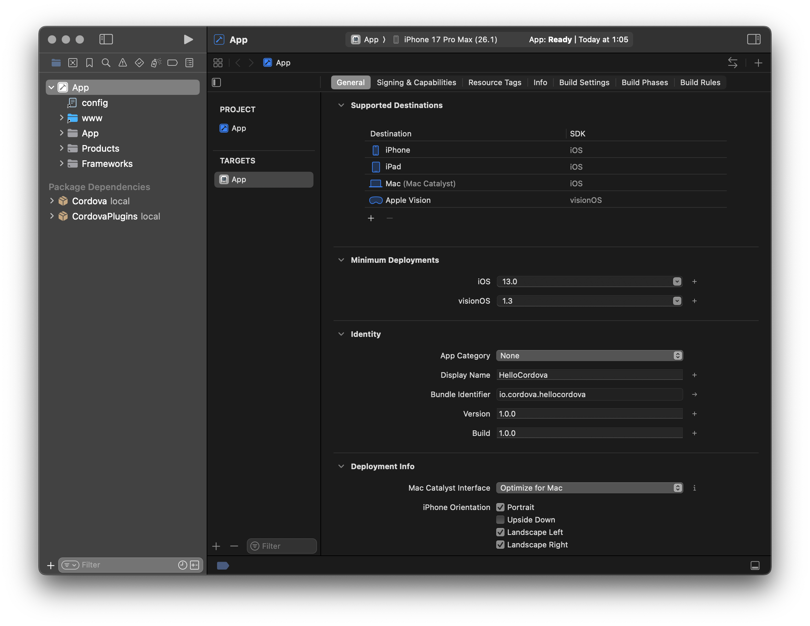

<a id="guide-platforms-ios--upgrading"></a>

## Upgrading

Refer to [this](https://cordova.apache.org/docs/en/latest/guide/platforms/ios/upgrade.html) article for instructions to upgrade your `cordova-ios` version.

(macOS®, Mac®, OS X®, Apple®, Xcode®, App Store℠, iPad®, iPhone®, iPod® and Finder® are Trademarks of Apple Inc.)

---

<a id="guide-platforms-electron"></a>

<!-- source_url: https://cordova.apache.org/docs/en/latest/guide/platforms/electron/index.html -->

<!-- page_index: 13 -->

# Electron Platform Guide

- Getting Started
  - [Overview](#guide-overview)
  - [Installation](#guide-cli-installation)
  - [Creating an App](#guide-cli)
- Cordova Projects
  - [Project Structure](#guide-overview-project-structure)
  - [CLI Commands](#reference-cordova-cli)
  - [Platform Support](#guide-support)
  - [Platform Pinning](#platform_pinning)
  - [Version Management](#platform_plugin_versioning_ref)
  - [Hooks](#guide-appdev-hooks)
- App Development
  - Platforms
    - [Android](#guide-platforms-android)
    - [iOS](#guide-platforms-ios)
    - [Electron](#guide-platforms-electron)
  - Customization
    - [Icons](#config_ref-images)
    - [Splash Screen](#core-features-splashscreen)
  - Security & Privacy
    - [Security](#guide-appdev-security)
    - [Privacy](#guide-appdev-privacy)
    - [Allow List](#guide-appdev-allowlist)
  - [Data Storage](#cordova-storage-storage)
- Plugin Development
  - [Create a Plugin](#guide-hybrid-plugins)
  - Support a Platform
    - [Android](#guide-platforms-android-plugin)
    - [iOS](#guide-platforms-ios-plugin)
  - [Use Plugman](#plugin_ref-plugman)
- References
  - [Config.xml API](#config_ref)
  - [Plugin.xml API](#plugin_ref-spec)
  - [Cordova JavaScript API](#cordova-events-events)
- Resources
  - [Third-party Tools](#third-party)
  - [App Templates](#guide-cli-template)
  - [Next Steps](#guide-next)
- Plugins
  - [Battery Status](#reference-cordova-plugin-battery-status)
  - [Camera](#reference-cordova-plugin-camera)
  - [Device](#reference-cordova-plugin-device)
  - [Dialogs](#reference-cordova-plugin-dialogs)
  - [File](#reference-cordova-plugin-file)
  - [Geolocation](#reference-cordova-plugin-geolocation)
  - [Inappbrowser](#reference-cordova-plugin-inappbrowser)
  - [Media](#reference-cordova-plugin-media)
  - [Media Capture](#reference-cordova-plugin-media-capture)
  - [Network Information](#reference-cordova-plugin-network-information)
  - [Screen Orientation](#reference-cordova-plugin-screen-orientation)
  - [Browser Splashscreen](#reference-cordova-plugin-splashscreen)
  - [Statusbar](#reference-cordova-plugin-statusbar)
  - [Vibration](#reference-cordova-plugin-vibration)
- Advanced Topics
  - [Embed Cordova in native apps](#guide-hybrid-webviews)

Table of Contents

- [Overview](#guide-overview)
- [Installation](#guide-cli-installation)
- [Creating an App](#guide-cli)
- [Project Structure](#guide-overview-project-structure)
- [CLI Commands](#reference-cordova-cli)
- [Platform Support](#guide-support)
- [Platform Pinning](#platform_pinning)
- [Version Management](#platform_plugin_versioning_ref)
- [Hooks](#guide-appdev-hooks)
- [Android](#guide-platforms-android)
- [iOS](#guide-platforms-ios)
- [Electron](#guide-platforms-electron)
- [Icons](#config_ref-images)
- [Splash Screen](#core-features-splashscreen)
- [Security](#guide-appdev-security)
- [Privacy](#guide-appdev-privacy)
- [Allow List](#guide-appdev-allowlist)
- [Data Storage](#cordova-storage-storage)
- [Create a Plugin](#guide-hybrid-plugins)
- [Android](#guide-platforms-android-plugin)
- [iOS](#guide-platforms-ios-plugin)
- [Use Plugman](#plugin_ref-plugman)
- [Config.xml API](#config_ref)
- [Plugin.xml API](#plugin_ref-spec)
- [Cordova JavaScript API](#cordova-events-events)
- [Third-party Tools](#third-party)
- [App Templates](#guide-cli-template)
- [Next Steps](#guide-next)
- [Battery Status](#reference-cordova-plugin-battery-status)
- [Camera](#reference-cordova-plugin-camera)
- [Device](#reference-cordova-plugin-device)
- [Dialogs](#reference-cordova-plugin-dialogs)
- [File](#reference-cordova-plugin-file)
- [Geolocation](#reference-cordova-plugin-geolocation)
- [Inappbrowser](#reference-cordova-plugin-inappbrowser)
- [Media](#reference-cordova-plugin-media)
- [Media Capture](#reference-cordova-plugin-media-capture)
- [Network Information](#reference-cordova-plugin-network-information)
- [Screen Orientation](#reference-cordova-plugin-screen-orientation)
- [Browser Splashscreen](#reference-cordova-plugin-splashscreen)
- [Statusbar](#reference-cordova-plugin-statusbar)
- [Vibration](#reference-cordova-plugin-vibration)
- [Embed Cordova in native apps](#guide-hybrid-webviews)

<a id="guide-platforms-electron--electron-platform-guide"></a>

# Electron Platform Guide

Electron is a framework that uses web technologies (HTML, CSS, and JS) to build cross-platform desktop applications.

<a id="guide-platforms-electron--system-requirements"></a>

## System Requirements

<a id="guide-platforms-electron--linux"></a>

### Linux

- **Python** version 2.7.x. It is recommended to check your Python version since some distributions like CentOS 6.x still use Python 2.6.x.

<a id="guide-platforms-electron--mac"></a>

### Mac

- **Python** version 2.7.x with support for TLS 1.2.
- **Xcode**, the IDE for macOS, comes bundled with necessary software development tools to code signing and compiling native code for macOS. Version 8.2.1 or higher.
- **RedHat Build Support**
  - **Homebrew**, one of the available macOS package managers, is used for installing additional tools and dependencies. Homebrew is needed to install RPM packaging dependencies. [**Brew Install Step**](https://brew.sh/)
  - **RPM**, a standard package manager for multiple Linux distributions, is the tool used for creating the Linux RPM package. To install this tool, use the following [**Homebrew**](https://brew.sh/) command:


```
brew install rpm
```

<a id="guide-platforms-electron--windows"></a>

### Windows

- **Python** version 2.7.10 or higher.
- **PowerShell**, for Windows 7 users, must be at version 3.0 or greater for [app signing](https://www.electron.build/code-signing#windows).
- **[Debugging Tools for Windows](https://docs.microsoft.com/en-us/windows-hardware/drivers/debugger/)** is a toolkit for enhancing debug capabilities. It is recommended to install with the **Windows SDK 10.0.15063.468**.

<a id="guide-platforms-electron--quick-start"></a>

## Quick Start

<a id="guide-platforms-electron--create-a-project"></a>

### Create a Project

```
npm i -g cordova
cordova create sampleApp
cd sampleApp
cordova platform add electron
```

*Notice: If using Cordova CLI prior to version 9.x, you will need to use the `cordova-electron` argument instead of `electron` for any command that requires the platform's name. For example:*

```
cordova platform add cordova-electron
cordova run cordova-electron
```

<a id="guide-platforms-electron--preview-a-project"></a>

### Preview a Project

It is not necessary to build the Electron application for previewing. Since the building process can be slow, it is recommended to pass in the `--nobuild` flag to disable the build process when previewing.

```
cordova run electron --nobuild
```

<a id="guide-platforms-electron--build-a-project"></a>

### Build a Project

**Debug Builds**

```
cordova build electron
cordova build electron --debug
```

**Release Builds**

```
cordova build electron --release
```

<a id="guide-platforms-electron--customizing-the-application-s-window-options"></a>

## Customizing the Application's Window Options

Electron provides many options to manipulate the [`BrowserWindow`](https://electronjs.org/docs/api/browser-window). This section will cover how to configure a few basic options. For a full list of options, please see the [Electron's Docs - BrowserWindow Options](https://electronjs.org/docs/api/browser-window#new-browserwindowoptions).

Working with a Cordova project, it is recommended to create an Electron settings file within the project's root directory, and set its the relative path in the preference option `ElectronSettingsFilePath`, in the `config.xml` file.

**Example `config.xml`:**

```
<platform name="electron">
    <preference name="ElectronSettingsFilePath" value="res/electron/settings.json" />
</platform>
```

To override or set any BrowserWindow options, in this file the options are added to the `browserWindow` property.

**Example `res/electron/settings.json`:**

```
{
    "browserWindow": { ... }
}
```

<a id="guide-platforms-electron--how-to-set-the-window-s-default-size"></a>

### How to Set the Window's Default Size

By default, the `width` is set to **800** and the `height` set to **600**. This can be overridden by setting the `width` and `height` property.

**Example:**

```
{
    "browserWindow": {
        "width": 1024,
        "height": 768
    }
}
```

<a id="guide-platforms-electron--how-to-disable-the-window-from-being-resizable"></a>

### How to Disable the Window From Being Resizable

Setting the `resizable` flag property, you can disable the user's ability to resize your application's window.

**Example:**

```
{
    "browserWindow": {
        "resizable": false
    }
}
```

<a id="guide-platforms-electron--how-to-make-the-window-fullscreen"></a>

### How to Make the Window Fullscreen

Using the `fullscreen` flag property, you can force the application to launch in fullscreen.

**Example:**

```
{
    "browserWindow": {
        "fullscreen": true
    }
}
```

<a id="guide-platforms-electron--how-to-support-node.js-and-electron-apis"></a>

### How to Support Node.js and Electron APIs

Set the `nodeIntegration` flag property to `true`. By default, this property flag is set to `false` to support popular libraries that insert symbols with the same names that Node.js and Electron already uses.

> You can read more about this at Electron docs: [I can not use jQuery/RequireJS/Meteor/AngularJS in Electron](https://electronjs.org/docs/faq#i-can-not-use-jqueryrequirejsmeteorangularjs-in-electron).

**Example:**

```
{
    "browserWindow": {
        "webPreferences": {
            "nodeIntegration": false
        }
    }
}
```

<a id="guide-platforms-electron--customizing-the-electron-s-main-process"></a>

## Customizing the Electron's Main Process

If it is necessary to customize the Electron's main process beyond the scope of the Electron's configuration settings, changes can be added directly to the `cdv-electron-main.js` file located in `{PROJECT_ROOT_DIR}/platform/electron/platform_www/`. This is the application's main process.

> ❗ However, it is not recommended to modify this file as the upgrade process for `cordova-electron` is to remove the old platform before adding the new version.

<a id="guide-platforms-electron--devtools"></a>

## DevTools

The `--release` and `--debug` flags control the visibility of the DevTools. DevTools are shown by default on **Debug Builds** (`without a flag` or with `--debug`). If you want to hide the DevTools pass in the `--release` flag when building or running the application.

> Note: DevTools can be closed or opened manually with the debug build.

<a id="guide-platforms-electron--build-configurations"></a>

## Build Configurations

<a id="guide-platforms-electron--default-build-configurations"></a>

### Default Build Configurations

By default, with no additional configuration, `cordova build electron` will build default packages for the host operating system (OS) that triggers the command. Below, are the list of default packages for each OS.

**Linux**

| Package | Arch |
| --- | --- |
| tar.gz | x64 |

**Mac**

| Package | Arch |
| --- | --- |
| dmg | x64 |
| zip | x64 |

**Windows**

| Package | Arch |
| --- | --- |
| nsis | x64 |

<a id="guide-platforms-electron--customizing-build-configurations"></a>

### Customizing Build Configurations

If for any reason you would like to customize the build configurations, modifications are placed within the `build.json` file located in the project's root directory. E.g. `{PROJECT_ROOT_DIR}/build.json`. This file contains all build configurations for all platforms (Android, Electron, iOS, Windows).

**Example Config Structure**

```
{
    "electron": {}
}
```

Since the Electron framework is for creating cross-platform applications, multiple configurations are required for each OS build. The `electron` node, in the `build.json` file, contains three properties that separate the build configurations for each OS.

**Example Config Structure with Each Platform**

```
{
    "electron": {
        "linux": {},
        "mac": {},
        "windows": {}
    }
}
```

Each OS node contains properties that are used to identify what package to generate and how to sign.

**OS Properties:**

- `package` is an array of package formats that will be generated.
- `arch` is an array of architectures that each package is built for.
- `signing` is an object that contains signing information. See [Signing Configurations](#guide-platforms-electron--signing-configurations) for more information.

Any properties that are undefined will fallback to default values.

<a id="guide-platforms-electron--adding-a-package"></a>

#### Adding a `package`

The `package` property is an array list of packages to be outputted. If the property is defined, the default packages are not used unless added. The order of the packages has no importance.

The configuration example below will generate `tar.gz`, `dmg` and `zip` packages for macOS.

```
{
    "electron": {
        "mac": {
            "package": [
                "dmg",
                "tar.gz",
                "zip"
            ]
        }
    }
}
```

**Available Packages by Operating System**

| Package Type | Linux | macOS | Windows |
| --- | --- | --- | --- |
| default | - | `dmg` `zip` | - |
| dmg | - | ✅ | - |
| mas | - | ✅ | - |
| mas-dev | - | ✅ | - |
| pkg | - | ✅ | - |
| 7z | ✅ | ✅ | ✅ |
| zip | ✅ | ✅ | ✅ |
| tar.xz | ✅ | ✅ | ✅ |
| tar.lz | ✅ | ✅ | ✅ |
| tar.gz | ✅ | ✅ | ✅ |
| tar.bz2 | ✅ | ✅ | ✅ |
| dir | ✅ | ✅ | ✅ |
| nsis | - | - | ✅ |
| nsis-web | - | - | ✅ |
| portable | - | - | ✅ |
| appx | - | - | ✅ **[1]** |
| msi | - | - | ✅ |
| AppImage | ✅ | - | - |
| snap | ✅ | - | - |
| deb | ✅ | - | - |
| rpm | ✅ | - | - |
| freebsd | ✅ | - | - |
| pacman | ✅ | - | - |
| p5p | ✅ | - | - |
| apk | ✅ | - | - |

- **[1]** Only Window 10 can build AppX packages.

<a id="guide-platforms-electron--setting-the-package-arch"></a>

#### Setting the Package `arch`

The `arch` property is an array list of architectures that each package is built for. When the property is defined, the default arch is not used unless added.

> ❗ Not all architectures are available for every operating system. Please review the [Electron Releases](https://github.com/electron/electron/releases/) to identify valid combinations. For example, macOS (Darwin) only supports x64.

**Available Arch**

- ia32
- x64
- armv7l
- arm64

The example above will generate an `x64` `dmg` package.

```
{
    "electron": {
        "mac": {
            "package": [ "dmg" ],
            "arch": [ "x64" ]
        }
    }
}
```

<a id="guide-platforms-electron--multi-platform-build-support"></a>

### Multi-Platform Build Support

> ❗ Not all platforms support this feature and may have limitations.

Building for multiple platforms on a single operating system may possible but has limitations. It is recommended that the builder's operating system (host OS) matches with the platform that is being built.

The matrix below shows each host OS and for which platforms they are capable of building applications.

| Host **[1]** | Linux | Mac | Windows |
| --- | --- | --- | --- |
| Linux | ✅ |  | ❗ **[2]** |
| Mac **[3]** | ✅ | ✅ | ❗ **[2]** |
| Windows |  |  | ✅ |

**Limitations:**

- **[1]** If the app contains native dependency, it can only be compiled on the targeted platform.
- **[2]** Linux and macOS are unable to build Windows Appx packages for Windows Store.
- **[3]** [All required system dependencies, except rpm, will be downloaded automatically on demand. RPM can be installed with brew. (macOS Sierra 10.12+)](https://www.electron.build/multi-platform-build#macos)

The example below enables multi-platform build for all OS and uses the default build configurations.

```
{
    "electron": {
        "linux": {},
        "mac": {},
        "windows": {}
    }
}
```

<a id="guide-platforms-electron--signing-configurations"></a>

## Signing Configurations

<a id="guide-platforms-electron--macos-signing"></a>

### macOS Signing

There are three types of signing targets. (`debug`, `release`, and `store`). Each section has the following properties:

| key | description |
| --- | --- |
| entitlements | String path value to entitlements file. |
| entitlementsInherit | String path value to the entitlements file which inherits the security settings. |
| identity | String value of the name of the certificate. |
| [requirements](https://developer.apple.com/library/archive/documentation/Security/Conceptual/CodeSigningGuide/RequirementLang/RequirementLang.html) | String path value of requirements file. ❗ This is not available for the `mas` (store) signing configurations. |
| provisioningProfile | String path value of the provisioning profile. |

**Example Config:**

```
{
    "electron": {
        "mac": {
            "package": [
                "dmg",
                "mas",
                "mas-dev"
            ],
            "signing": {
                "release": {
                    "identity": "APACHE CORDOVA (TEAMID)",
                    "provisioningProfile": "release.mobileprovision"
                }
            }
        }
    }
}
```

For macOS signing, there are a few exceptions to how the signing information is used.
By default, all packages with the exception of `mas` and `mas-dev`, use the `debug` and `release` signing configurations.

Using the example config above, let's go over some use cases to better understand the exceptions.

**Use Case 1:**

```
cordova build electron --debug
```

The command above will:

- Generate a `dmg` build and `mas-dev` build using the `debug` signing configurations.
- Ignore the `mas` target package.

*Use Case 2:*

```
cordova build electron --release
```

The command above will:

- Generate a `dmg` build using the `release` config.
- Generate a `mas` build using the `store` config.
- Ignore the `mas-dev` target package.

<a id="guide-platforms-electron--windows-signing"></a>

### Windows Signing

The signing information is comprised of two types. (`debug`, `release`). Each section has the following properties:

| key | description |
| --- | --- |
| certificateFile | String path to the certificate file. |
| certificatePassword | String value of the certificate file's password. **Alternative**: The password can be set on the environment variable `CSC_KEY_PASSWORD`. |
| certificateSubjectName | String value of the signing certificate's subject. ❗ Required for EV Code Signing and requires Windows |
| certificateSha1 | String value of the SHA1 hash of the signing certificate. ❗ Requires Windows |
| signingHashAlgorithms | Collection of singing algorithms to be used. (`sha1`, `sha256`) ❗ AppX builds only support `sha256` |
| additionalCertificateFile | String path to the additional certificate files. |

**Example Config:**

```
{
    "electron": {
        "windows": {
            "package": [ "nsis" ],
            "signing": {
                "release": {
                    "certificateFile": "path_to_files",
                    "certificatePassword": "password"
                }
            }
        }
    }
}
```

<a id="guide-platforms-electron--linux-signing"></a>

### Linux Signing

There are not signing requirements for Linux builds.

<a id="guide-platforms-electron--plugins"></a>

## Plugins

All browser-based plugins are usable with the Electron platform.

When adding a plugin, if the plugin supports both the `electron` and `browser` platform, the `electron` portion will be used. If the plugin misses `electron` but contains the `browser` implementation, it will fall back on the `browser` implementation.

Internally, Electron is using Chromium (Chrome) as its web view. Some plugins may have conditions written specifically for each different browser. In this case, it may affect the behavior of what is intended. Since Electron may support feature that the browser does not, these plugins would possibly need to be updated for the `electron` platform.

---

<a id="config_ref-images"></a>

<!-- source_url: https://cordova.apache.org/docs/en/latest/config_ref/images.html -->

<!-- page_index: 14 -->

# Icons

- Getting Started
  - [Overview](#guide-overview)
  - [Installation](#guide-cli-installation)
  - [Creating an App](#guide-cli)
- Cordova Projects
  - [Project Structure](#guide-overview-project-structure)
  - [CLI Commands](#reference-cordova-cli)
  - [Platform Support](#guide-support)
  - [Platform Pinning](#platform_pinning)
  - [Version Management](#platform_plugin_versioning_ref)
  - [Hooks](#guide-appdev-hooks)
- App Development
  - Platforms
    - [Android](#guide-platforms-android)
    - [iOS](#guide-platforms-ios)
    - [Electron](#guide-platforms-electron)
  - Customization
    - [Icons](#config_ref-images)
    - [Splash Screen](#core-features-splashscreen)
  - Security & Privacy
    - [Security](#guide-appdev-security)
    - [Privacy](#guide-appdev-privacy)
    - [Allow List](#guide-appdev-allowlist)
  - [Data Storage](#cordova-storage-storage)
- Plugin Development
  - [Create a Plugin](#guide-hybrid-plugins)
  - Support a Platform
    - [Android](#guide-platforms-android-plugin)
    - [iOS](#guide-platforms-ios-plugin)
  - [Use Plugman](#plugin_ref-plugman)
- References
  - [Config.xml API](#config_ref)
  - [Plugin.xml API](#plugin_ref-spec)
  - [Cordova JavaScript API](#cordova-events-events)
- Resources
  - [Third-party Tools](#third-party)
  - [App Templates](#guide-cli-template)
  - [Next Steps](#guide-next)
- Plugins
  - [Battery Status](#reference-cordova-plugin-battery-status)
  - [Camera](#reference-cordova-plugin-camera)
  - [Device](#reference-cordova-plugin-device)
  - [Dialogs](#reference-cordova-plugin-dialogs)
  - [File](#reference-cordova-plugin-file)
  - [Geolocation](#reference-cordova-plugin-geolocation)
  - [Inappbrowser](#reference-cordova-plugin-inappbrowser)
  - [Media](#reference-cordova-plugin-media)
  - [Media Capture](#reference-cordova-plugin-media-capture)
  - [Network Information](#reference-cordova-plugin-network-information)
  - [Screen Orientation](#reference-cordova-plugin-screen-orientation)
  - [Browser Splashscreen](#reference-cordova-plugin-splashscreen)
  - [Statusbar](#reference-cordova-plugin-statusbar)
  - [Vibration](#reference-cordova-plugin-vibration)
- Advanced Topics
  - [Embed Cordova in native apps](#guide-hybrid-webviews)

Table of Contents

- [Overview](#guide-overview)
- [Installation](#guide-cli-installation)
- [Creating an App](#guide-cli)
- [Project Structure](#guide-overview-project-structure)
- [CLI Commands](#reference-cordova-cli)
- [Platform Support](#guide-support)
- [Platform Pinning](#platform_pinning)
- [Version Management](#platform_plugin_versioning_ref)
- [Hooks](#guide-appdev-hooks)
- [Android](#guide-platforms-android)
- [iOS](#guide-platforms-ios)
- [Electron](#guide-platforms-electron)
- [Icons](#config_ref-images)
- [Splash Screen](#core-features-splashscreen)
- [Security](#guide-appdev-security)
- [Privacy](#guide-appdev-privacy)
- [Allow List](#guide-appdev-allowlist)
- [Data Storage](#cordova-storage-storage)
- [Create a Plugin](#guide-hybrid-plugins)
- [Android](#guide-platforms-android-plugin)
- [iOS](#guide-platforms-ios-plugin)
- [Use Plugman](#plugin_ref-plugman)
- [Config.xml API](#config_ref)
- [Plugin.xml API](#plugin_ref-spec)
- [Cordova JavaScript API](#cordova-events-events)
- [Third-party Tools](#third-party)
- [App Templates](#guide-cli-template)
- [Next Steps](#guide-next)
- [Battery Status](#reference-cordova-plugin-battery-status)
- [Camera](#reference-cordova-plugin-camera)
- [Device](#reference-cordova-plugin-device)
- [Dialogs](#reference-cordova-plugin-dialogs)
- [File](#reference-cordova-plugin-file)
- [Geolocation](#reference-cordova-plugin-geolocation)
- [Inappbrowser](#reference-cordova-plugin-inappbrowser)
- [Media](#reference-cordova-plugin-media)
- [Media Capture](#reference-cordova-plugin-media-capture)
- [Network Information](#reference-cordova-plugin-network-information)
- [Screen Orientation](#reference-cordova-plugin-screen-orientation)
- [Browser Splashscreen](#reference-cordova-plugin-splashscreen)
- [Statusbar](#reference-cordova-plugin-statusbar)
- [Vibration](#reference-cordova-plugin-vibration)
- [Embed Cordova in native apps](#guide-hybrid-webviews)

<svg hidden="" style="display: none !important" xmlns="http://www.w3.org/2000/svg"><symbol id="cdv-platform-browser"><path></path></symbol><symbol id="cdv-platform-android"><path></path></symbol><symbol id="cdv-platform-ios"><path></path></symbol><symbol id="cdv-platform-electron"><path></path><path></path><path></path><path></path></symbol></svg>

<a id="config_ref-images--icons"></a>

# Icons

This section shows how to configure an application's icon for various platforms. Documentation about splash screen images can be found in the Cordova-Plugin-Splashscreen documentation [Splashscreen plugin docs](#reference-cordova-plugin-splashscreen).

<a id="config_ref-images--configuring-icons-in-the-cli"></a>

## Configuring Icons in the CLI

When working in the CLI you can define application icon(s) via the `<icon>` element (`config.xml`).
If you do not specify an icon, the Apache Cordova logo is used.

```
    <icon src="res/ios/icon.png" platform="ios" width="57" height="57" />
```

| Attributes | Description |
| --- | --- |
| src | *Required* Location of the image file, relative to your project directory. |
| platform | *Optional* Target platform |
| width | *Optional* Icon width in pixels |
| height | *Optional* Icon height in pixels |
| target | *Optional* Set target to supply unique icons for `app` and `installer` |

<a id="config_ref-images--android"></a>

## Android

Android's **Adaptive Icons** feature enables you to create separate foreground and background layers for your App Icons. To use Adaptive Icons in Cordova, you need at least **Cordova CLI** 9.0.0 and **Cordova-Android** 8.0.0.

With Android 13, Google introduced **Themed Icons**, which are monochrome variations of **Adaptive Icons** that integrate seamlessly with the system's color scheme. To use **Themed Icons** in Cordova, you'll need at least **Cordova CLI** 12.0.0 and **Cordova-Android** 12.0.0.

| Attributes | Description |
| --- | --- |
| background | *Required for Adaptive* Location of the image (png or vector) relative to your project directory, or color reference |
| foreground | *Required for Adaptive* Location of the image (png or vector) relative to your project directory, or color reference |
| monochrome | *Optional for Adaptive but required for themed icons* Location of the image (png or vector) relative to your project directory |
| density | *Required* Specified icon density |

<a id="config_ref-images--adaptive-icons"></a>

### Adaptive Icons

To use the adaptive icons the `background`, `foreground` and optionally `monochrome` attributes must be defined in place of the `src` attribute. The `src` attribute is not used for adaptive icons.

<a id="config_ref-images--adaptive-icon-with-images:"></a>

#### Adaptive Icon with Images:

```
<platform name="android">
  <icon monochrome="res/icon/android/ldpi-monochrome.png" background="res/icon/android/ldpi-background.png" density="ldpi" foreground="res/icon/android/ldpi-foreground.png" />
  <icon monochrome="res/icon/android/mdpi-monochrome.png" background="res/icon/android/mdpi-background.png" density="mdpi" foreground="res/icon/android/mdpi-foreground.png" />
  <icon monochrome="res/icon/android/hdpi-monochrome.png" background="res/icon/android/hdpi-background.png" density="hdpi" foreground="res/icon/android/hdpi-foreground.png" />
  <icon monochrome="res/icon/android/xhdpi-monochrome.png" background="res/icon/android/xhdpi-background.png" density="xhdpi" foreground="res/icon/android/xhdpi-foreground.png" />
  <icon monochrome="res/icon/android/xxhdpi-monochrome.png" background="res/icon/android/xxhdpi-background.png" density="xxhdpi" foreground="res/icon/android/xxhdpi-foreground.png" />
  <icon monochrome="res/icon/android/xxxhdpi-monochrome.png" background="res/icon/android/xxxhdpi-background.png" density="xxxhdpi" foreground="res/icon/android/xxxhdpi-foreground.png" />
</platform>
```

**Note:** In this example, the foreground image will also be used as the fallback icon for Android devices that do not support the adaptive icons. The fallback icon can be overridden by setting the src attribute.

<a id="config_ref-images--adaptive-icon-with-vectors:"></a>

#### Adaptive Icon with Vectors:

```
<platform name="android">
  <icon monochrome="res/icon/android/ldpi-monochrome.png" background="res/icon/android/ldpi-background.xml" density="ldpi" foreground="res/icon/android/ldpi-foreground.xml" src="res/android/ldpi.png" />
  <icon monochrome="res/icon/android/mdpi-monochrome.png" background="res/icon/android/mdpi-background.xml" density="mdpi" foreground="res/icon/android/mdpi-foreground.xml" src="res/android/mdpi.png" />
  <icon monochrome="res/icon/android/hdpi-monochrome.png" background="res/icon/android/hdpi-background.xml" density="hdpi" foreground="res/icon/android/hdpi-foreground.xml" src="res/android/hdpi.png" />
  <icon monochrome="res/icon/android/xhdpi-monochrome.png" background="res/icon/android/xhdpi-background.xml" density="xhdpi" foreground="res/icon/android/xhdpi-foreground.xml" src="res/android/xhdpi.png" />
  <icon monochrome="res/icon/android/xxhdpi-monochrome.png" background="res/icon/android/xxhdpi-background.xml" density="xxhdpi" foreground="res/icon/android/xxhdpi-foreground.xml" src="res/android/xxhdpi.png" />
  <icon monochrome="res/icon/android/xxxhdpi-monochrome.png" background="res/icon/android/xxxhdpi-background.xml" density="xxxhdpi" foreground="res/icon/android/xxxhdpi-foreground.xml" src="res/android/xxxhdpi.png" />
</platform>
```

**Note:** In this example, the src attribute must be defined when then foreground attribute is defined with a vector or color.

<a id="config_ref-images--adaptive-icon-with-colors:"></a>

#### Adaptive Icon with Colors:

Create a `res/values/colors.xml` resource file in your project directory to store the app's color definitions.

```
<?xml version="1.0" encoding="utf-8"?>
<resources>
    <color name="background">#FF0000</color>
</resources>
```

In the `config.xml`, we will add `resource-file` to copy the `colors.xml` into the approprate location so that the colors are available during build time.

```
<platform name="android">
  <resource-file src="res/values/colors.xml" target="/app/src/main/res/values/colors.xml" />

  <icon monochrome="res/icon/android/ldpi-monochrome.png" background="@color/background" density="ldpi" foreground="res/icon/android/ldpi-foreground.png" />
  <icon monochrome="res/icon/android/mdpi-monochrome.png" background="@color/background" density="mdpi" foreground="res/icon/android/mdpi-foreground.png" />
  <icon monochrome="res/icon/android/hdpi-monochrome.png" background="@color/background" density="hdpi" foreground="res/icon/android/hdpi-foreground.png" />
  <icon monochrome="res/icon/android/xhdpi-monochrome.png" background="@color/background" density="xhdpi" foreground="res/icon/android/xhdpi-foreground.png" />
  <icon monochrome="res/icon/android/xxhdpi-monochrome.png" background="@color/background" density="xxhdpi" foreground="res/icon/android/xxhdpi-foreground.png" />
  <icon monochrome="res/icon/android/xxxhdpi-monochrome.png" background="@color/background" density="xxxhdpi" foreground="res/icon/android/xxxhdpi-foreground.png" />
</platform>
```

<a id="config_ref-images--standard-icons"></a>

### Standard Icons

```
    <platform name="android">
        <!--
            ldpi    : 36x36 px
            mdpi    : 48x48 px
            hdpi    : 72x72 px
            xhdpi   : 96x96 px
            xxhdpi  : 144x144 px
            xxxhdpi : 192x192 px
        -->
        <icon src="res/android/ldpi.png" density="ldpi" />
        <icon src="res/android/mdpi.png" density="mdpi" />
        <icon src="res/android/hdpi.png" density="hdpi" />
        <icon src="res/android/xhdpi.png" density="xhdpi" />
        <icon src="res/android/xxhdpi.png" density="xxhdpi" />
        <icon src="res/android/xxxhdpi.png" density="xxxhdpi" />
    </platform>
```

**See Also:**

- [Android icon guide](https://developer.android.com/guide/practices/ui_guidelines/icon_design_adaptive)
- [Android Adaptive icons - User theming](https://developer.android.com/develop/ui/views/launch/icon_design_adaptive#user-theming)
- [Android - Supporting multiple screens](https://developer.android.com/guide/practices/screens_support.html)

<a id="config_ref-images--browser"></a>

## Browser

Icons are not applicable to the Browser platform.

<a id="config_ref-images--ios"></a>

## iOS

```
    <platform name="ios">
        <!-- Notifications on iPhone, iPad Pro, iPad, iPad mini -->
        <icon src="res/ios/icon-38@2x.png" width="76" height="76" />
        <icon src="res/ios/icon-38@3x.png" width="114" height="114" />

        <!-- Settings on iPhone, iPad Pro, iPad, iPad mini -->
        <icon src="res/ios/icon-29@1x.png" width="29" height="29" />
        <icon src="res/ios/icon-29@2x.png" width="58" height="58" />
        <icon src="res/ios/icon-29@3x.png" width="87" height="87" />

        <!-- Spotlight on iPhone, iPad Pro, iPad, iPad mini -->
        <icon src="res/ios/icon-40@1x.png" width="40" height="40" />
        <icon src="res/ios/icon-40@2x.png" width="80" height="80" />

        <!-- Home Screen on iPad, iPad mini -->
        <icon src="res/ios/icon-76@2x.png" width="152" height="152" />

        <!-- Home Screen on iPad Pro -->
        <icon src="res/ios/icon-83.5@2x.png" width="167" height="167" />

        <!-- Home Screen on iPhone -->
        <icon src="res/ios/icon-60@1x.png" width="60" height="60" />
        <icon src="res/ios/icon-60@2x.png" width="120" height="120" />
        <icon src="res/ios/icon-60@3x.png" width="180" height="180" />

        <!-- macOS app icons -->
        <icon src="res/ios/icon-16.png" width="16" height="16" />
        <icon src="res/ios/icon-32.png" width="32" height="32" />
        <icon src="res/ios/icon-64.png" width="64" height="64" />
        <icon src="res/ios/icon-128.png" width="128" height="128" />
        <icon src="res/ios/icon-256.png" width="256" height="256" />
        <icon src="res/ios/icon-512.png" width="512" height="512" />

        <!-- App Store Icon and another macOS app icons -->
        <icon src="res/ios/icon-1024.png" width="1024" height="1024" />
    </platform>
```

**Notes:**

- Alpha channel is not supported for any iOS icons.

**References:**

- [Apple Developer - Configuring your app icon](https://developer.apple.com/documentation/xcode/configuring-your-app-icon/)
- [Apple Developer - Human Interface Guidelines > App icons](https://developer.apple.com/design/human-interface-guidelines/app-icons)

<a id="config_ref-images--electron"></a>

## Electron

<a id="config_ref-images--customizing-the-application-s-icon"></a>

### Customizing the Application's Icon

Customized icon(s) can be declared with the `<icon>` element(s) in the `config.xml` file. There are two types of icons that can be defined, the application icon and the package installer icon. These icons should be defined in the Electron's platform node `<platform name="electron">`.

One icon can be used for the application and installer, but this icon should be at least **512x512** pixels to work across all operating systems.

*Notice: If a customized icon is not provided, the Apache Cordova default icons are used.*

*Notice: macOS does not display custom icons when using `cordova run`. It defaults to the Electron's icon.*

```
<platform name="electron">
    <icon src="res/electron/icon.png" />
</platform>
```

You can supply unique icons for the application and installer by setting the `target` attribute. As mentioned above, the installer image should be **512x512** pixels to work across all platforms.

```
<platform name="electron">
    <icon src="res/electron/app.png" target="app" />
    <icon src="res/electron/installer.png" target="installer" />
</platform>
```

For devices that support high-DPI resolutions, such as Apple's Retina display, you can create a set of images with the same base filename but suffix with its multiplier.

For example, if the base image's filename `icon.png` and is the standard resolution, then `icon@2x.png` will be treated as a high-resolution image that with a DPI doubled from the base.

- icon.png (256px x 256px)
- icon@2x.png (512px x 512px)

If you want to support displays with different DPI densities at the same time, you can put images with different sizes in the same folder and use the filename without DPI suffixes. For example:

```
<platform name="electron">
    <icon src="res/electron/icon.png" />
    <icon src="res/electron/icon@1.5x.png" />
    <icon src="res/electron/icon@2x.png" />
    <icon src="res/electron/icon@4x.png" target="installer" />
</platform>
```

---

<a id="core-features-splashscreen"></a>

<!-- source_url: https://cordova.apache.org/docs/en/latest/core/features/splashscreen/index.html -->

<!-- page_index: 15 -->

# Splash Screen

- Getting Started
  - [Overview](#guide-overview)
  - [Installation](#guide-cli-installation)
  - [Creating an App](#guide-cli)
- Cordova Projects
  - [Project Structure](#guide-overview-project-structure)
  - [CLI Commands](#reference-cordova-cli)
  - [Platform Support](#guide-support)
  - [Platform Pinning](#platform_pinning)
  - [Version Management](#platform_plugin_versioning_ref)
  - [Hooks](#guide-appdev-hooks)
- App Development
  - Platforms
    - [Android](#guide-platforms-android)
    - [iOS](#guide-platforms-ios)
    - [Electron](#guide-platforms-electron)
  - Customization
    - [Icons](#config_ref-images)
    - [Splash Screen](#core-features-splashscreen)
  - Security & Privacy
    - [Security](#guide-appdev-security)
    - [Privacy](#guide-appdev-privacy)
    - [Allow List](#guide-appdev-allowlist)
  - [Data Storage](#cordova-storage-storage)
- Plugin Development
  - [Create a Plugin](#guide-hybrid-plugins)
  - Support a Platform
    - [Android](#guide-platforms-android-plugin)
    - [iOS](#guide-platforms-ios-plugin)
  - [Use Plugman](#plugin_ref-plugman)
- References
  - [Config.xml API](#config_ref)
  - [Plugin.xml API](#plugin_ref-spec)
  - [Cordova JavaScript API](#cordova-events-events)
- Resources
  - [Third-party Tools](#third-party)
  - [App Templates](#guide-cli-template)
  - [Next Steps](#guide-next)
- Plugins
  - [Battery Status](#reference-cordova-plugin-battery-status)
  - [Camera](#reference-cordova-plugin-camera)
  - [Device](#reference-cordova-plugin-device)
  - [Dialogs](#reference-cordova-plugin-dialogs)
  - [File](#reference-cordova-plugin-file)
  - [Geolocation](#reference-cordova-plugin-geolocation)
  - [Inappbrowser](#reference-cordova-plugin-inappbrowser)
  - [Media](#reference-cordova-plugin-media)
  - [Media Capture](#reference-cordova-plugin-media-capture)
  - [Network Information](#reference-cordova-plugin-network-information)
  - [Screen Orientation](#reference-cordova-plugin-screen-orientation)
  - [Browser Splashscreen](#reference-cordova-plugin-splashscreen)
  - [Statusbar](#reference-cordova-plugin-statusbar)
  - [Vibration](#reference-cordova-plugin-vibration)
- Advanced Topics
  - [Embed Cordova in native apps](#guide-hybrid-webviews)

Table of Contents

- [Overview](#guide-overview)
- [Installation](#guide-cli-installation)
- [Creating an App](#guide-cli)
- [Project Structure](#guide-overview-project-structure)
- [CLI Commands](#reference-cordova-cli)
- [Platform Support](#guide-support)
- [Platform Pinning](#platform_pinning)
- [Version Management](#platform_plugin_versioning_ref)
- [Hooks](#guide-appdev-hooks)
- [Android](#guide-platforms-android)
- [iOS](#guide-platforms-ios)
- [Electron](#guide-platforms-electron)
- [Icons](#config_ref-images)
- [Splash Screen](#core-features-splashscreen)
- [Security](#guide-appdev-security)
- [Privacy](#guide-appdev-privacy)
- [Allow List](#guide-appdev-allowlist)
- [Data Storage](#cordova-storage-storage)
- [Create a Plugin](#guide-hybrid-plugins)
- [Android](#guide-platforms-android-plugin)
- [iOS](#guide-platforms-ios-plugin)
- [Use Plugman](#plugin_ref-plugman)
- [Config.xml API](#config_ref)
- [Plugin.xml API](#plugin_ref-spec)
- [Cordova JavaScript API](#cordova-events-events)
- [Third-party Tools](#third-party)
- [App Templates](#guide-cli-template)
- [Next Steps](#guide-next)
- [Battery Status](#reference-cordova-plugin-battery-status)
- [Camera](#reference-cordova-plugin-camera)
- [Device](#reference-cordova-plugin-device)
- [Dialogs](#reference-cordova-plugin-dialogs)
- [File](#reference-cordova-plugin-file)
- [Geolocation](#reference-cordova-plugin-geolocation)
- [Inappbrowser](#reference-cordova-plugin-inappbrowser)
- [Media](#reference-cordova-plugin-media)
- [Media Capture](#reference-cordova-plugin-media-capture)
- [Network Information](#reference-cordova-plugin-network-information)
- [Screen Orientation](#reference-cordova-plugin-screen-orientation)
- [Browser Splashscreen](#reference-cordova-plugin-splashscreen)
- [Statusbar](#reference-cordova-plugin-statusbar)
- [Vibration](#reference-cordova-plugin-vibration)
- [Embed Cordova in native apps](#guide-hybrid-webviews)

<a id="core-features-splashscreen--splash-screen"></a>

# Splash Screen

This core feature gives the ability to configure and control the platform's splash screen while your web application is launching.

- [Splash Screen](#core-features-splashscreen--splash-screen)
  - [Supported Platforms](#core-features-splashscreen--supported-platforms)
  - [Platform Splash Screen Image Configuration](#core-features-splashscreen--platform-splash-screen-image-configuration)
    - [Example Configuration](#core-features-splashscreen--example-configuration)
    - [Android-specific Information](#core-features-splashscreen--android-specific-information)
      - [Example Android Configuration](#core-features-splashscreen--example-android-configuration)
    - [iOS-specific Information](#core-features-splashscreen--ios-specific-information)
      - [Launch Storyboard Images](#core-features-splashscreen--launch-storyboard-images)
        - [Designing Launch Storyboard Images](#core-features-splashscreen--designing-launch-storyboard-images)
        - [Scale](#core-features-splashscreen--scale)
        - [Idioms](#core-features-splashscreen--idioms)
        - [Size classes](#core-features-splashscreen--size-classes)
        - [Single-image launch screen](#core-features-splashscreen--single-image-launch-screen)
        - [Multi-image launch screen](#core-features-splashscreen--multi-image-launch-screen)
        - [Dark Mode](#core-features-splashscreen--dark-mode)
  - [config.xml Preferences](#core-features-splashscreen--configxml-preferences)
    - [`AutoHideSplashScreen`](#core-features-splashscreen--autohidesplashscreen)
    - [`FadeSplashScreen`](#core-features-splashscreen--fadesplashscreen)
    - [`FadeSplashScreenDuration`](#core-features-splashscreen--fadesplashscreenduration)
    - [`SplashScreenDelay`](#core-features-splashscreen--splashscreendelay)
    - [`SplashScreenBackgroundColor`](#core-features-splashscreen--splashscreenbackgroundcolor)
    - [`AndroidPostSplashScreenTheme`](#core-features-splashscreen--androidpostsplashscreentheme)
    - [`AndroidWindowSplashScreenAnimatedIcon`](#core-features-splashscreen--androidwindowsplashscreenanimatedicon)
    - [`AndroidWindowSplashScreenAnimationDuration`](#core-features-splashscreen--androidwindowsplashscreenanimationduration)
    - [`AndroidWindowSplashScreenBackground`](#core-features-splashscreen--androidwindowsplashscreenbackground)
    - [`AndroidWindowSplashScreenBrandingImage`](#core-features-splashscreen--androidwindowsplashscreenbrandingimage)
    - [`AndroidWindowSplashScreenIconBackgroundColor`](#core-features-splashscreen--androidwindowsplashscreeniconbackgroundcolor)
  - [JavaScript Public APIs](#core-features-splashscreen--javascript-public-apis)
    - [`navigator.splashscreen.hide`](#core-features-splashscreen--navigatorsplashscreenhide)
    - [`navigator.splashscreen.show`](#core-features-splashscreen--navigatorsplashscreenshow)
  - [Quirks & Known Issues](#core-features-splashscreen--quirks-known-issues)
    - [iOS](#core-features-splashscreen--ios)
    - [Android](#core-features-splashscreen--android)

<a id="core-features-splashscreen--supported-platforms"></a>

## Supported Platforms

- Android
- iOS

For other platforms, check the `cordova-plugin-splashscreen` for support.

<a id="core-features-splashscreen--platform-splash-screen-image-configuration"></a>

## Platform Splash Screen Image Configuration

<a id="core-features-splashscreen--example-configuration"></a>

### Example Configuration

In the top-level `config.xml` file (not the one in `platforms`), add configuration elements like those specified here.

The value of the "src" attribute is relative to the project root directory and NOT to the `www` directory (see `Directory structure` below). You can name the source image file whatever you like. The internal name in the application is automatically determined by Cordova.

**Directory structure:**

```
projectRoot
    platforms
    plugins
    www
    res
        screen
            android
            ios
```

**Config.xml:**

```
<platform name="android">
    <preference name="AndroidWindowSplashScreenAnimatedIcon" value="res/screen/android/splashscreen.xml" />
</platform>

<!--
  Storyboard (supports all devices):
  Note: images are determined by scale, idiom, and size traits. The following
  are suggested based on current device form factors
-->
<platform name="ios">
    <splash src="res/screen/ios/Default@2x~universal~anyany.png" />
    <splash src="res/screen/ios/Default@2x~universal~comany.png" />
    <splash src="res/screen/ios/Default@2x~universal~comcom.png" />
    <splash src="res/screen/ios/Default@3x~universal~anyany.png" />
    <splash src="res/screen/ios/Default@3x~universal~anycom.png" />
    <splash src="res/screen/ios/Default@3x~universal~comany.png" />
</platform>
```

<a id="core-features-splashscreen--android-specific-information"></a>

### Android-specific Information

Starting in Android 12, Google has implemented a new SplashScreen API to control the app launch animation which runs on a device with Android 12 and higher. For backwards compatibility, Cordova has included the `core-splashscreen` compatibility library which extends this features back to Android API 21 and higher.

To effectively create your own Android SplashScreen assets, it is important to understand the requirements of an Adaptive Icon.

**Resource:**

- [Splash Screen dimensions](https://developer.android.com/guide/topics/ui/splash-screen#splash_screen_dimensions)
- [Adaptive icons](https://developer.android.com/guide/practices/ui_guidelines/icon_design_adaptive)

<a id="core-features-splashscreen--example-android-configuration"></a>

#### Example Android Configuration

```
<platform name="android">
    <!-- Default -->
    <preference name="AndroidWindowSplashScreenAnimatedIcon" value="res/screen/android/splashscreen.xml" />
</platform>
```

<a id="core-features-splashscreen--ios-specific-information"></a>

### iOS-specific Information

Launch storyboard images are sized based on scale, idiom, and size classes. It supports all devices, and can be used with split-screen/slide-over multitasking.

There is no official support for providing a native-resolution launch image for the iPad Pro 12.9 or for providing launch images that work with split-screen multitasking or slide-over.

**Note:** Since iOS 11, for iPhone X devices and greater (with notch screen), make sure to add `viewport-fit=cover` to the viewport meta tag in your `index.html` file to display the app correctly like so: `<meta name="viewport" content="user-scalable=no, initial-scale=1, width=device-width, viewport-fit=cover">` and make some modification to your app style by adding: `padding: env(safe-area-inset-top)` to your `index.css` file to avoid the unsafe areas behind notches in the screen.

<a id="core-features-splashscreen--launch-storyboard-images"></a>

#### Launch Storyboard Images

To support newer form factors and split-screen/slide-over multitasking, launch storyboard images are used.

- images are not specific to a given device.
- images are scaled to fill the available viewport (while maintaining the aspect ratio).
- the outer edges of the images will be cropped, and the amount will vary based on device an viewport.
- there is no need to provide an image for each possible device, viewport, and orientation; iOS will choose the best image for the situation automatically.

<a id="core-features-splashscreen--designing-launch-storyboard-images"></a>

##### Designing Launch Storyboard Images

The key to designing a launch storyboard image is understanding that the edges of the image will almost certainly be cropped. Therefore, one should not place any important information near the edges of any images provided to the launch storyboard. Only the center is a safe area, and this all but guarantees that following Apple's advice of presenting an unpopulated user interface will not work well.

Instead, the following tips should enable you to create a launch image that works across a multitude of form factors, viewports, and orientations:

- Important graphics (logos, icons, titles) should be centered. The safe bounding region will vary, so you will need to test to ensure that the important graphics are never cropped. Better yet, don't supply any important graphics in the first place.

  - You *can* fine-tune the placement and size of these graphics.
- Use a simple color wash. If you use two colors, you'll want one color to fill the top half of the image, and the second to fill the bottom half. If you use a gradient, you'll probably want to ensure that the middle of the gradient lines up with the center of the image.
- Don't worry about pixel perfection -- because the images are scaled, there's almost no chance the images will be perfectly fit to the pixel grid. Since all supported iOS devices use retina screens, users will be hard pressed to notice it anyway.

It is important to understand the concept of scale, idiom, and size class traits in order to use launch storyboard images effectively. Of the images supplied to the launch storyboard, iOS will choose the image that best matches the device and viewport and render that image. It is possible to supply only one launch image if so desired, but it is also possible to fine-tune the displayed launch image based on traits. When fine-tuning, one can ignore traits that aren't targeted or supported by the app.

<a id="core-features-splashscreen--scale"></a>

##### Scale

| scale | devices |
| --- | --- |
| 1x | All non-retina devices |
| 2x | Most retina devices |
| 3x | iPhone 6+/6s+,7s+ |

In general, you'll want to supply 2x and 3x images. Cordova only supports retina devices now, so there's no point in supplying 1x images.

<a id="core-features-splashscreen--idioms"></a>

##### Idioms

| idiom | devices |
| --- | --- |
| ipad | All iPads |
| iphone | All iPhones and iPod Touches |
| universal | All devices |

You only need to provide universal images unless you need to fine-tune for a specific device idiom.

<a id="core-features-splashscreen--size-classes"></a>

##### Size classes

There are two size classes applies to both screen axes. Narrow viewports are considered to be the "compact" size class, and remaining viewports are considered "regular". When supplying images to Xcode, however, one must choose between "any & compact" and "any & regular". To stay consistent with the native terminology, this feature will match based on "any" and "compact". `any` will match regular-sized viewports.

Note: this feature uses `com` as an abbreviation for "compact" classes.

The following classes are supported by this feature:

| width | height | orientation |
| --- | --- | --- |
| any | any | any |
| com | any | portrait |
| any | com | landscape (wide) |
| com | com | landscape (narrow) |

<a id="core-features-splashscreen--single-image-launch-screen"></a>

##### Single-image launch screen

If your launch image is simple, you may be able to avoid creating a lot of different launch images and supply only one. The launch image needs to meet the following requirements:

- the image should be square
- the image should be large enough to fit on an iPad Pro 12.9": 2732x2732
- anything important should fit within the center

Keep in mind that the image will be cropped, possibly quite severely, depending upon the viewport.

Once the image is created, you can include it in your project by adding the following to `config.xml`:

```
    <splash src="res/screen/ios/Default@2x~universal~anyany.png" />
```

Because only one image is provided, iOS will utilize it in every context.

<a id="core-features-splashscreen--multi-image-launch-screen"></a>

##### Multi-image launch screen

If a single launch image won't meet your needs, you will probably need to supply at least six images, if not more. Furthermore, keep in mind that it will not be possible to fine tune the image to a specific device, but only to a device class, display factor, and viewport size.

If you don't need to target images to a specific idiom, you should create six images, as follows:

| scale | idiom | width | height | size | filename |
| --- | --- | --- | --- | --- | --- |
| 2x\* | universal | any | any | 2732x2732 | `Default@2x~universal~anyany.png` |
| 2x | universal | com | any | 1278x2732 | `Default@2x~universal~comany.png` |
| 2x | universal | com | com | 1334x750 | `Default@2x~universal~comcom.png` |
| 3x\* | universal | any | any | 2208x2208 | `Default@3x~universal~anyany.png` |
| 3x | universal | any | com | 2208x1242 | `Default@3x~universal~anycom.png` |
| 3x | universal | com | any | 1242x2208 | `Default@3x~universal~comany.png` |

\* this image is required in order for iOS utilize the other images within this scale and idiom.

> Note: If the 3x sizes look small too you, that's because there's only one device class that currently has a 3x density: the iPhone 6+/6s+/7+.

The above looks like the following snippet when present in `config.xml`:

```
    <splash src="res/screen/ios/Default@2x~universal~anyany.png" />
    <splash src="res/screen/ios/Default@2x~universal~comany.png" />
    <splash src="res/screen/ios/Default@2x~universal~comcom.png" />
    <splash src="res/screen/ios/Default@3x~universal~anyany.png" />
    <splash src="res/screen/ios/Default@3x~universal~anycom.png" />
    <splash src="res/screen/ios/Default@3x~universal~comany.png" />
```

Should one need to further fine tune based upon device idiom, one can do so. This might look like so:

| scale | idiom | width | height | size | filename |
| --- | --- | --- | --- | --- | --- |
| 2x\* | iphone | any | any | 1334x1334 | `Default@2x~iphone~anyany.png` |
| 2x | iphone | com | any | 750x1334 | `Default@2x~iphone~comany.png` |
| 2x | iphone | com | com | 1334x750 | `Default@2x~iphone~comcom.png` |
| 3x\* | iphone | any | any | 2208x2208 | `Default@3x~iphone~anyany.png` |
| 3x | iphone | any | com | 2208x1242 | `Default@3x~iphone~anycom.png` |
| 3x | iphone | com | any | 1242x2208 | `Default@3x~iphone~comany.png` |
| 2x\* | ipad | any | any | 2732x2732 | `Default@2x~ipad~anyany.png` |
| 2x | ipad | com | any | 1278x2732 | `Default@2x~ipad~comany.png` |

\* this image is required in order for iOS utilize the other images within this scale and idiom.

The above looks like the following in `config.xml`:

```
    <splash src="res/screen/ios/Default@2x~iphone~anyany.png" />
    <splash src="res/screen/ios/Default@2x~iphone~comany.png" />
    <splash src="res/screen/ios/Default@2x~iphone~comcom.png" />
    <splash src="res/screen/ios/Default@3x~iphone~anyany.png" />
    <splash src="res/screen/ios/Default@3x~iphone~anycom.png" />
    <splash src="res/screen/ios/Default@3x~iphone~comany.png" />
    <splash src="res/screen/ios/Default@2x~ipad~anyany.png" />
    <splash src="res/screen/ios/Default@2x~ipad~comany.png" />
```

<a id="core-features-splashscreen--dark-mode"></a>

##### Dark Mode

Since [Cordova-iOS@6.1.0](https://github.com/apache/cordova-ios), it is now possible to optionally specify different SplashScreen images to use when the app is running in dark mode. The luminosity of SplashScreen images can be defined in `config.xml` using the `~dark` and `~light` suffixes.

```
<!-- Default image to be used for all modes -->
<splash src="res/screen/ios/Default@2x~universal~anyany.png" />

<!-- Image to use specifically for dark mode devices -->
<splash src="res/screen/ios/Default@2x~universal~anyany~dark.png" />

<!-- Image to use specifically for light mode devices -->
<splash src="res/screen/ios/Default@2x~universal~anyany~light.png" />
```

**Note:** This works since iOS 13. iOS 12 and below will use the default SplashScreen without a luminosity suffix specified.

<a id="core-features-splashscreen--config.xml-preferences"></a>

## config.xml Preferences

<a id="core-features-splashscreen--autohidesplashscreen"></a>

### `AutoHideSplashScreen`

Indicates whether to hide splash screen automatically or not. The splash screen is hidden after the amount of time specified in the `SplashScreenDelay` preference.

**Supported Platforms:**

- Android
- iOS

**Data Type:** `Boolean`

**Default Value:** `true`

**Usage Example:**

```
<preference name="AutoHideSplashScreen" value="true" />
```

<a id="core-features-splashscreen--fadesplashscreen"></a>

### `FadeSplashScreen`

Controlls the ability of the fade in and out of the splash screen.

For Android, it controlls only the fade out.

**Supported Platforms:**

- Android
- iOS

**Data Type:** `Boolean`

**Default Value:** `true`

**Usage Example:**

```
<preference name="FadeSplashScreen" value="false"/>
```

<a id="core-features-splashscreen--fadesplashscreenduration"></a>

### `FadeSplashScreenDuration`

Controlls the length of the the splash screen fade effect.

**Supported Platforms:**

- Android
- iOS

**Data Type:** `Float`, in milliseconds

**Default Value:** `500` (Android), `250` (iOS)

**Usage Example:**

```
<preference name="FadeSplashScreenDuration" value="750"/>
```

*iOS Note*: `FadeSplashScreenDuration` is included into `SplashScreenDelay`, for example if you have `<preference name="SplashScreenDelay" value="3000" />` and `<preference name="FadeSplashScreenDuration" value="1000"/>` defined in `config.xml`:

- 00:00 - splashscreen is shown
- 00:02 - fading has started
- 00:03 - splashscreen is hidden

Turning the fading off via `<preference name="FadeSplashScreen" value="false"/>` technically means fading duration to be `0` so that in this example the overall splash screen delay will still be 3 seconds.

*Note*: This only applies to the application startup - you need to take the fading timeout into account when manually showing/hiding the splash screen in your application's code:

```
navigator.splashscreen.show();
window.setTimeout(function () {
    navigator.splashscreen.hide();
}, splashDuration - fadeDuration);
```

<a id="core-features-splashscreen--splashscreendelay"></a>

### `SplashScreenDelay`

Amount of time in milliseconds to wait before automatically hide splash screen.

**Supported Platforms:**

- Android
- iOS

**Data Type:** `Number`, in milliseconds

**Default Value:** `0`

By default, the splash screen will automatically hide when the web content has finished loading. If you set a delay here, the splash screen will remain visible for that duration after the page load.

**Usage Example:**

```
<preference name="SplashScreenDelay" value="3000" />
```

<a id="core-features-splashscreen--splashscreenbackgroundcolor"></a>

### `SplashScreenBackgroundColor`

The splash screen background color.

**Supported Platforms:**

- Android
- iOS

**Data Type:** `String`, color hex code value.

**Default Value:** `#ffffff`

**Usage Example:**

```
<preference name="SplashScreenBackgroundColor" value="#ffffff" />
```

<a id="core-features-splashscreen--androidpostsplashscreentheme"></a>

### `AndroidPostSplashScreenTheme`

Sets the post-theme of the activity after splash screen hides.

*Note:* This setting is available but use at your own risk.

**Supported Platforms:**

- Android

**Data Type:** `String`

**Default Value:** `@style/Theme.AppCompat.NoActionBar`

**Usage Example:**

```
<preference name="AndroidPostSplashScreenTheme" value="@style/Theme.AppCompat.NoActionBar"/>
```

<a id="core-features-splashscreen--androidwindowsplashscreenanimatedicon"></a>

### `AndroidWindowSplashScreenAnimatedIcon`

The splash screen image. This preference is used for both animated and non-animated icons. The current acceptable asset files can either be a XML Vector Drawable or PNG.

:warning: Using [Adaptive Icons](https://medium.com/androiddevelopers/implementing-adaptive-icons-1e4d1795470e) requires Minimum SDK 26 to be set.

:warning: Some XML Vector [features](https://developer.android.com/develop/ui/views/graphics/vector-drawable-resources) requires Minimum SDK 24 to be set.

**Supported Platforms:**

- Android

**Data Type:** `String`, file path to the asset file

**Default Value:** If not supplied, the Cordova's default asset is used.

**Usage Example:**

```
<preference name="AndroidWindowSplashScreenAnimatedIcon" value="res/screen/android/splashscreen.xml" />
```

<a id="core-features-splashscreen--androidwindowsplashscreenanimationduration"></a>

### `AndroidWindowSplashScreenAnimationDuration`

Defines the duration of the icon's animation if an Animated Vector Drawable is supplied as the splash screen image.

**Supported Platforms:**

- Android

**Data Type:** `Number`, in milliseconds

**Default Value:** `undefined`

**Usage Example:**

```
<preference name="AndroidWindowSplashScreenAnimationDuration" value="3000"/>
```

<a id="core-features-splashscreen--androidwindowsplashscreenbackground"></a>

### `AndroidWindowSplashScreenBackground`

Deprecated, use `SplashScreenBackgroundColor` instead.

**Supported Platforms:**

- Android

**Data Type:** `String`, color hex code value.

**Default Value:** `#ffffff`

**Usage Example:**

```
<preference name="AndroidWindowSplashScreenBackground" value="#ffffff" />
```

<a id="core-features-splashscreen--androidwindowsplashscreenbrandingimage"></a>

### `AndroidWindowSplashScreenBrandingImage`

> :warning: this setting is currently unsupported. The core-splashscreen compatibility library, that Cordova Android relies on for providing backwards support, has not implemented this functionality. [See Google Android Issue Tracker](https://issuetracker.google.com/issues/194301890)

<a id="core-features-splashscreen--androidwindowsplashscreeniconbackgroundcolor"></a>

### `AndroidWindowSplashScreenIconBackgroundColor`

The splash screen's icons background color. Useful to seperate increase the contrast seperation between the background and icon.

**Supported Platforms:**

- Android

**Data Type:** `String`, color hex code value.

**Default Value:** `undefined`

**Usage Example:**

```
<preference name="AndroidWindowSplashScreenIconBackgroundColor" value="#c0c0c0" />
```

<a id="core-features-splashscreen--javascript-public-apis"></a>

## JavaScript Public APIs

<a id="core-features-splashscreen--navigator.splashscreen.hide"></a>

### `navigator.splashscreen.hide`

Dismiss the splash screen.

**Supported Platforms:**

- Android
- iOS

**Usage Example:**

```
navigator.splashscreen.hide();
```

<a id="core-features-splashscreen--navigator.splashscreen.show"></a>

### `navigator.splashscreen.show`

Displays the splash screen.

**Supported Platforms:**

- iOS

**Usage Example:**

```
navigator.splashscreen.show();
```

Your application cannot call `navigator.splashscreen.show()` until the application has
started and the `deviceready` event has fired. But since typically the splash
screen is meant to be visible before your application has started, that would seem to
defeat the purpose of the splash screen. Providing any parameters in
`config.xml` will automatically `show` the splash screen immediately after your
application is launched and before it has fully started and received the `deviceready`
event. For this reason, it is unlikely you will need to call `navigator.splashscreen.show()` to make the splash
screen visible for application startup.

<a id="core-features-splashscreen--quirks-known-issues"></a>

## Quirks & Known Issues

<a id="core-features-splashscreen--ios"></a>

### iOS

1. In iOS, the splash screen images are called launch images. These images are mandatory on iOS.
2. **App on target may not reflect changes to images**
   Once you run the app on a target, iOS caches the launch image. Unfortunately, when you change the image, iOS does *not* invalidate the cache, which means you'll still see the old launch image. You should either: delete the app, or reset content & settings (simulator).
3. **Simulator may not show expected images when launched from CLI**
   When Xcode deploys to a specific simulator, it only copies the assets that match the simulator's characteristics. For example, if you try to run an app on the iPhone 6s Plus simulator, only @3x launch images are copied. When compiling from the CLI, however, the default is to assume an iPhone 5s, which means only @2x launch images are copied. Unless your launch images are markedly different, chances are good the difference would go unnoticed, but this does mean that the only accurate method of testing is to test on a physical device.
4. **`anyany` must be provided for other variations to be used**
   If you don't provide an `anyany` version of the launch image for a specific scale and idiom, the other variations (like `anycom`, `comany`, and `comcom`) will ignored.

<a id="core-features-splashscreen--android"></a>

### Android

1. **Android 12 does not show the splash screen when launching the application from Android Studio or Cordova CLI.**
   This is a known Android 12 issue. After uploading the app to the device or simulator, exiting and opening the app will show the Splash Screen. If changes are not shown, try also performing a clean build.
   It has been fixed on Android 13.

---

<a id="guide-appdev-security"></a>

<!-- source_url: https://cordova.apache.org/docs/en/latest/guide/appdev/security/index.html -->

<!-- page_index: 16 -->

# Security

- Getting Started
  - [Overview](#guide-overview)
  - [Installation](#guide-cli-installation)
  - [Creating an App](#guide-cli)
- Cordova Projects
  - [Project Structure](#guide-overview-project-structure)
  - [CLI Commands](#reference-cordova-cli)
  - [Platform Support](#guide-support)
  - [Platform Pinning](#platform_pinning)
  - [Version Management](#platform_plugin_versioning_ref)
  - [Hooks](#guide-appdev-hooks)
- App Development
  - Platforms
    - [Android](#guide-platforms-android)
    - [iOS](#guide-platforms-ios)
    - [Electron](#guide-platforms-electron)
  - Customization
    - [Icons](#config_ref-images)
    - [Splash Screen](#core-features-splashscreen)
  - Security & Privacy
    - [Security](#guide-appdev-security)
    - [Privacy](#guide-appdev-privacy)
    - [Allow List](#guide-appdev-allowlist)
  - [Data Storage](#cordova-storage-storage)
- Plugin Development
  - [Create a Plugin](#guide-hybrid-plugins)
  - Support a Platform
    - [Android](#guide-platforms-android-plugin)
    - [iOS](#guide-platforms-ios-plugin)
  - [Use Plugman](#plugin_ref-plugman)
- References
  - [Config.xml API](#config_ref)
  - [Plugin.xml API](#plugin_ref-spec)
  - [Cordova JavaScript API](#cordova-events-events)
- Resources
  - [Third-party Tools](#third-party)
  - [App Templates](#guide-cli-template)
  - [Next Steps](#guide-next)
- Plugins
  - [Battery Status](#reference-cordova-plugin-battery-status)
  - [Camera](#reference-cordova-plugin-camera)
  - [Device](#reference-cordova-plugin-device)
  - [Dialogs](#reference-cordova-plugin-dialogs)
  - [File](#reference-cordova-plugin-file)
  - [Geolocation](#reference-cordova-plugin-geolocation)
  - [Inappbrowser](#reference-cordova-plugin-inappbrowser)
  - [Media](#reference-cordova-plugin-media)
  - [Media Capture](#reference-cordova-plugin-media-capture)
  - [Network Information](#reference-cordova-plugin-network-information)
  - [Screen Orientation](#reference-cordova-plugin-screen-orientation)
  - [Browser Splashscreen](#reference-cordova-plugin-splashscreen)
  - [Statusbar](#reference-cordova-plugin-statusbar)
  - [Vibration](#reference-cordova-plugin-vibration)
- Advanced Topics
  - [Embed Cordova in native apps](#guide-hybrid-webviews)

Table of Contents

- [Overview](#guide-overview)
- [Installation](#guide-cli-installation)
- [Creating an App](#guide-cli)
- [Project Structure](#guide-overview-project-structure)
- [CLI Commands](#reference-cordova-cli)
- [Platform Support](#guide-support)
- [Platform Pinning](#platform_pinning)
- [Version Management](#platform_plugin_versioning_ref)
- [Hooks](#guide-appdev-hooks)
- [Android](#guide-platforms-android)
- [iOS](#guide-platforms-ios)
- [Electron](#guide-platforms-electron)
- [Icons](#config_ref-images)
- [Splash Screen](#core-features-splashscreen)
- [Security](#guide-appdev-security)
- [Privacy](#guide-appdev-privacy)
- [Allow List](#guide-appdev-allowlist)
- [Data Storage](#cordova-storage-storage)
- [Create a Plugin](#guide-hybrid-plugins)
- [Android](#guide-platforms-android-plugin)
- [iOS](#guide-platforms-ios-plugin)
- [Use Plugman](#plugin_ref-plugman)
- [Config.xml API](#config_ref)
- [Plugin.xml API](#plugin_ref-spec)
- [Cordova JavaScript API](#cordova-events-events)
- [Third-party Tools](#third-party)
- [App Templates](#guide-cli-template)
- [Next Steps](#guide-next)
- [Battery Status](#reference-cordova-plugin-battery-status)
- [Camera](#reference-cordova-plugin-camera)
- [Device](#reference-cordova-plugin-device)
- [Dialogs](#reference-cordova-plugin-dialogs)
- [File](#reference-cordova-plugin-file)
- [Geolocation](#reference-cordova-plugin-geolocation)
- [Inappbrowser](#reference-cordova-plugin-inappbrowser)
- [Media](#reference-cordova-plugin-media)
- [Media Capture](#reference-cordova-plugin-media-capture)
- [Network Information](#reference-cordova-plugin-network-information)
- [Screen Orientation](#reference-cordova-plugin-screen-orientation)
- [Browser Splashscreen](#reference-cordova-plugin-splashscreen)
- [Statusbar](#reference-cordova-plugin-statusbar)
- [Vibration](#reference-cordova-plugin-vibration)
- [Embed Cordova in native apps](#guide-hybrid-webviews)

<a id="guide-appdev-security--security"></a>

# Security

The following guide includes some security best practices that you should consider when developing a Cordova application. Please be aware that security is a very complicated topic and therefore this guide is not exhaustive. If you believe you can contribute to this guide, please feel free to create a pull request in Cordova's [cordova-docs](https://github.com/apache/cordova-docs/issues) repository. This guide is designed to be applicable to general Cordova development (all platforms) but special platform-specific considerations will be noted.

<a id="guide-appdev-security--this-guide-discusses-the-following-topics:"></a>

## This guide discusses the following topics:

- General Tips
- Plugins and Security
- Allow List
- Content Security Policy
- Certificate Pinning
- Using TLS/SSL
- Avoid Self-signed Certificates
- Wrapping external sites and hot code push
- Encrypted storage
- Recommended Articles and Other Resources

<a id="guide-appdev-security--general-tips"></a>

## General Tips

<a id="guide-appdev-security--use-inappbrowser-for-outside-links"></a>

### Use InAppBrowser for outside links

Use the [InAppBrowser](https://www.npmjs.com/package/cordova-plugin-inappbrowser) when opening links to any outside website. This is much safer than allow listing a domain name and including the content directly in your application because the InAppBrowser will use the native browser's security features and will not give the website access to your Cordova environment. Even if you trust the third party website and include it directly in your application, that third party website could link to malicious web content.

<a id="guide-appdev-security--validate-all-user-input"></a>

### Validate all user input

Always validate any and all input that your application accepts. This includes usernames, passwords, dates, uploaded media, etc. Because an attacker could manipulate your HTML and JS assets (either by decompiling your application or using debugging tools like `chrome://inspect`), this validation should also be performed on your server, especially before handing the data off to any backend service.

>
> [!TIP]
> : Other sources where data should be validated: user documents, contacts, push notifications

<a id="guide-appdev-security--do-not-store-sensitive-data"></a>

### Do not store sensitive data

If usernames, password, geolocation information, and other sensitive data is stored, then it could potentially be retrieved later by an unauthorized user or application.

<a id="guide-appdev-security--don-t-use-eval"></a>

### Don't use `eval()`

The JavaScript function `eval()` has a long history of being abused. Using it incorrectly can open your code up for injection attacks, debugging difficulties, and slower code execution.

<a id="guide-appdev-security--do-not-assume-that-your-source-code-is-secure"></a>

### Do not assume that your source code is secure

Since a Cordova application is built from HTML and JavaScript assets that get packaged in a native container, you should not consider your code to be secure. It is possible for an iOS or Android application to be unpacked and unzipped to reveal its web assets such as HTML and JS.

A sampling of what you should not include in your code:

- Authentication information (usernames, passwords, keys, etc.)
- Encryption keys
- Trade secrets

<a id="guide-appdev-security--do-not-assume-storage-containers-are-secure"></a>

### Do not assume storage containers are secure

Even if a device itself is encrypted, if someone has access to the device and can unlock it, you should not assume that data stored in various formats and containers is safe. Even SQLite databases are easily human readable once access is gained.

As long as you're storing non-sensitive information, this isn't a big deal. But if you were storing passwords, keys, and other sensitive information, the data could be easily extracted, and depending on what was stored, could be used against your app and remote servers.

For example, on iOS, if you store data in `localStorage`, the data itself is easily readable to anyone who has access to the device. This is because `localStorage` is backed by an unencrypted SQLite database. The underlying storage of the device may in fact be encrypted (and so it would be inaccessible while the device is locked), but once the device decrypts the file, the contents themselves are mostly in the clear. As such, the contents of `localStorage` can be easily read and even changed.

<a id="guide-appdev-security--plugins-and-security"></a>

## Plugins and Security

Due to the way the native portion of Cordova communicates with your web code, it is possible for any code executing within the main webview context to communicate with any installed plugins. This means that you should *never* permit untrusted content within the primary webview. This can include third-party advertisements, sites within an `iframe`, and even content injected via `innerHTML`.

If you must inject content into the primary webview, be certain that it has been properly sanitized so that no JavaScript can be executed. *Do not try to sanitize content on your own; use a vetted third-party library instead!*

>
> [!TIP]
> : If you need to include advertising, use any of the many third-party plugins for Cordova. These are safer than executing arbitrary JavaScript from advertisers.

<a id="guide-appdev-security--allow-list"></a>

## Allow List

By default the app's navigation is unrestricted. It's recommended to restrict the navigation only to trusted domains. Learn more by reading the [Allow List Guide](#guide-appdev-allowlist)

<a id="guide-appdev-security--content-security-policy-csp"></a>

## Content Security Policy (CSP)

Cordova’s default template includes a basic Content Security Policy (CSP). It’s recommended to review and customize this CSP to fit your app's specific needs. For more information, refer to the [Allow List Guide - Content Security Policy (CSP)](#guide-appdev-allowlist--content-security-policy-csp).

<a id="guide-appdev-security--certificate-pinning"></a>

## Certificate Pinning

It is important to ensure that you trust any hosts with which there are communications. Typically, one would do this using certificate pinning. The app would double check any certificates and only communicate over channels where the certificate check passed. This helps mitigate man-in-the-middle attacks.

Unfortunately, Cordova does not support true certificate pinning. The main barrier to this is a lack of native APIs in Android for intercepting SSL connections to perform the check of the server's certificate. (Although it is possible to do certificate pinning on Android in Java using JSSE, the webview on Android is written in C++, and server connections are handled for you by the webview, so it is not possible to use Java and JSSE there.) Since Apache Cordova is meant to offer consistent APIs across multiple platforms, not having a capability in a major platform breaks that consistency.

There are ways to approximate certificate pinning, such as checking that the server's public key (fingerprint) is the expected value when your application starts or at other various times during your application's lifetime. There are third-party plugins available for Cordova that can do that. However, this is not the same as true certificate pinning which automatically verifies the expected value on every connection to the server.

There are also plugins that can do true certificate pinning for some platforms, assuming your app is able to do all of its network requests using the plugin (i.e.: no traditional XHR/AJAX requests, etc).

<a id="guide-appdev-security--using-tls-ssl"></a>

## Using TLS/SSL

If your app communicates to an external server, it should be communicating using modern encryption standards. Use `https` protocol whenever possible.

[Let's Encrypt](https://letsencrypt.org/) is a free, automated, and open certificate authority provided by the nonprofit [Internet Security Research Group](https://www.abetterinternet.org/). Let's Encrypt will offer free standard certificates, which will be sufficient for most developers. Enterprise organizations may still want to use a traditional certificate authority that offers more advanced features such as [Organization validation](https://en.wikipedia.org/wiki/Public_key_certificate#Organization_validation) certificates.

It is also important to keep up to date with security standards as they change over time. What might be acceptable SSL/TLS configuration today may not be acceptable years in the future. Using tools to test your certificate and SSL/TLS configuration should be done regularly. [SSL Labs](https://www.ssllabs.com/ssltest/) is a free online service provided by Qualys, Inc to test your server's SSL/TLS configuration and encryption strength, in addition to supported platforms.

<a id="guide-appdev-security--avoid-self-signed-certificates"></a>

## Avoid Self-signed Certificates

Using self-signed certificates on your server is not recommended. If you desire SSL, then it is highly recommended that your server have a certificate that has been properly signed by a well-known CA (certificate authority). The inability to do true certificate pinning makes this even more important.

The reason is that accepting self-signed certificates bypasses the certificate chain validation, which allows any server certificate to be considered valid by the device. This opens up the communication to man-in-the-middle attacks. It becomes very easy for a hacker to not only intercept and read all communication between the device and the server, but also to modify the communication. The device will never know this is happening because it doesn't verify that the server's certificate is signed by a trusted CA. The device has no proof that the server is who it expects.

Because of the ease of doing a man-in-the-middle attack, accepting self-signed certificates is only marginally better than just running `http` instead of `https` on an untrusted network. While the traffic would be encrypted, it could be encrypted with the key from a man-in-the-middle, so the man-in-the-middle would have access everything, making the encryption useless except to passive observers. Users trust SSL to be secure, and this would be deliberately making it insecure, so the SSL use becomes misleading.

If the app will be used on a trusted network (i.e., you are entirely inside a controlled enterprise), then self-signed certs are still not recommended. The two recommendations in a trusted network are to just use http because the network itself is trusted, or to get a certificate signed by a trusted CA (not self-signed). Either the network is trusted or it is not.

>
> [!NOTE]
> : The principles described here are not specific to Apache Cordova, they apply to all client-server communication.

> **Android Tip**: When running Cordova on Android, using `android:debuggable="true"` in the application manifest will permit SSL errors such as certificate chain validation errors on self-signed certs. So you can use self-signed certs in this configuration, but this is not a configuration that should be used when your application is in production. It is meant to be used only during application development.

<a id="guide-appdev-security--wrapping-external-sites-and-hot-code-push"></a>

## Wrapping external sites and hot code push

Cordova's implementation allows you to redirect to an external site instead of using local content. This is **not** suggested for most apps, even though it might avoid a rewrite of the app or can make code updates faster. You should avoid this for any apps destined to any app store, but in general, it's risky regardless, for many reasons:

- No local code to detect no route to host. Apple *requires* apps to detect no network connection (and other connectivity issues) and display a user-friendly error message. If there's no local code to detect this, the app will generally remain blank, and Apple will reject it.
- No local code to verify the downloaded content. The content could be incomplete or corrupted, especially if being downloaded over a poor network connection. Incomplete or corrupt content is not going to render particularly well, leaving your user frustrated.
- No local code to detect and remove malicious intent. Local code has a chance to sanitize content and verify that there are no spurious or unexpected `script` tags or event handlers. Without local code, the app is at the server's mercy.
- No local code to check certificates. See **Certificate Pinning** above.

Hot code push solutions improve matters a bit, since they will download code and store it locally on the device. This means that in the event of a network failure, the code still has a chance to run and display any appropriate messages, and that same code can verify any future downloads. You should, however, verify that any hot code push service you use does the following:

- Validate checksums to ensure complete and accurate downloads
- Certificate checking to ensure that the download is from a trusted server
- Falls back to last downloaded code in the event something goes wrong

<a id="guide-appdev-security--encrypted-storage"></a>

## Encrypted Storage

Both **Android** and **iOS** offer various secure storage options. While **Apache Cordova** does not provide these mechanisms natively at the platform core or plugin level, third-party plugins may be available or can be created to implement such features.

**Android:**

- [**Encrypted Shared Preferences**](https://developer.android.com/reference/androidx/security/crypto/EncryptedSharedPreferences)

  **Encrypted SharedPreferences** is an encrypted version of SharedPreferences, where both the keys and values are encrypted. This is ideal for storing small amounts of data, such as user settings, preferences, or other sensitive information.
- [**Encrypted File Storage**](https://developer.android.com/reference/androidx/security/crypto/EncryptedFile)

  **Encrypted File Storage** is suitable for securely storing files, perfect for large data. By using the `EncryptedFile` class, you can create and read encrypted files, ensuring that the file contents remain protected.

**iOS:**

- **File Protection**

  Using [`NSFileManager`](https://developer.apple.com/documentation/foundation/nsfilemanager), which provides an interface for managing the file system, you can define a file's protection level with the [`NSFileProtectionType`](https://developer.apple.com/documentation/foundation/nsfileprotectiontype) attribute. This allows you to store files on disk with protection based on the device's lock state. Files are encrypted and accessible only when the device is unlocked.
- [**Keychain Services**](https://developer.apple.com/documentation/security/keychain-services?language=objc)

  **Keychain Services** is a secure method for storing small pieces of sensitive data, such as passwords or tokens. Data in the keychain is encrypted and protected by the device's security mechanisms.

<a id="guide-appdev-security--recommended-articles-and-other-resources"></a>

## Recommended Articles and Other Resources

- [OWASP Cheat Sheet Series - HTML5 Security Cheat Sheet](https://cheatsheetseries.owasp.org/cheatsheets/HTML5_Security_Cheat_Sheet.html)
- [Research Paper - Attacks on WebView in the Android System](https://www.cs.ucr.edu/~heng/pubs/webview_acsac2011.pdf)

---

<a id="guide-appdev-privacy"></a>

<!-- source_url: https://cordova.apache.org/docs/en/latest/guide/appdev/privacy/index.html -->

<!-- page_index: 17 -->

# Privacy

Table of Contents

- [Overview](#guide-overview)
- [Installation](#guide-cli-installation)
- [Creating an App](#guide-cli)
- [Project Structure](#guide-overview-project-structure)
- [CLI Commands](#reference-cordova-cli)
- [Platform Support](#guide-support)
- [Platform Pinning](#platform_pinning)
- [Version Management](#platform_plugin_versioning_ref)
- [Hooks](#guide-appdev-hooks)
- [Android](#guide-platforms-android)
- [iOS](#guide-platforms-ios)
- [Electron](#guide-platforms-electron)
- [Icons](#config_ref-images)
- [Splash Screen](#core-features-splashscreen)
- [Security](#guide-appdev-security)
- [Privacy](#guide-appdev-privacy)
- [Allow List](#guide-appdev-allowlist)
- [Data Storage](#cordova-storage-storage)
- [Create a Plugin](#guide-hybrid-plugins)
- [Android](#guide-platforms-android-plugin)
- [iOS](#guide-platforms-ios-plugin)
- [Use Plugman](#plugin_ref-plugman)
- [Config.xml API](#config_ref)
- [Plugin.xml API](#plugin_ref-spec)
- [Cordova JavaScript API](#cordova-events-events)
- [Third-party Tools](#third-party)
- [App Templates](#guide-cli-template)
- [Next Steps](#guide-next)
- [Battery Status](#reference-cordova-plugin-battery-status)
- [Camera](#reference-cordova-plugin-camera)
- [Device](#reference-cordova-plugin-device)
- [Dialogs](#reference-cordova-plugin-dialogs)
- [File](#reference-cordova-plugin-file)
- [Geolocation](#reference-cordova-plugin-geolocation)
- [Inappbrowser](#reference-cordova-plugin-inappbrowser)
- [Media](#reference-cordova-plugin-media)
- [Media Capture](#reference-cordova-plugin-media-capture)
- [Network Information](#reference-cordova-plugin-network-information)
- [Screen Orientation](#reference-cordova-plugin-screen-orientation)
- [Browser Splashscreen](#reference-cordova-plugin-splashscreen)
- [Statusbar](#reference-cordova-plugin-statusbar)
- [Vibration](#reference-cordova-plugin-vibration)
- [Embed Cordova in native apps](#guide-hybrid-webviews)

<a id="guide-appdev-privacy--privacy"></a>

# Privacy

Mobile privacy is a critical issue that every app developer must
address. Your users expect that their private information will be
collected and treated appropriately by your app. Also, there are an
increasing number of jurisdictions that now have legal requirements
regarding mobile privacy practices.

This guide on mobile app privacy should be considered a *primer*
addressing some the most significant issues. It outlines some broadly
accepted best practices and provides references to other more detailed
guides and references.

- **Privacy Policy**: Your app should include a privacy policy that
  addresses topics such as what kind of information the app collects
  from or about your users, how that information is used, with whom it
  is shared, and how users can make privacy-related choices within the
  app. To aid understanding, you should use plain language and avoid
  technical jargon. You should make your privacy policy available for
  users to review prior to download, such as in the app description in
  the app marketplace. In addition, you should make your privacy
  policy available within the app itself. The limited size of mobile
  device displays creates challenges for displaying privacy policies
  to users. Consider developing a *short form* of the policy that
  includes the most important information, and then provide a link to
  the "long form" policy for those interested in more details. Several
  groups are attempting to develop icon-based standards for
  communicating privacy practices, which you may want to consider once
  these standards mature.
- **Collection of sensitive information**: An app's collection of
  sensitive personal information raises important privacy concerns.
  Examples of sensitive personal information include financial
  information, health information, and information from or about
  children. It also includes information gathered from certain sensors
  and databases typically found on mobile devices and tablets, such as
  geolocation information, contacts/phonebook, microphone/camera, and
  stored pictures/videos. See the following documentation pages for
  more information: [camera](https://cordova.apache.org/docs/en/latest/guide/appdev/privacy/cordova_camera_camera.md.html),
  [capture](https://cordova.apache.org/docs/en/latest/guide/appdev/privacy/cordova_media_capture_capture.md.html),
  [contacts](https://cordova.apache.org/docs/en/latest/guide/appdev/privacy/cordova_contacts_contacts.md.html), and
  [geolocation](https://cordova.apache.org/docs/en/latest/guide/appdev/privacy/cordova_geolocation_geolocation.md.html). Generally,
  you should obtain a user's express permission before collecting
  sensitive information and, if possible, provide a control mechanism
  that allows a user to easily change permissions. App operating
  systems can help in some instances by presenting just-in-time dialog
  boxes that ask for the user's permission before collection. In these
  cases, be sure to take advantage of any opportunity to customize the
  dialog box text to clarify how the app uses and, if applicable,
  shares such information.
- **Avoiding user surprise**: If the app collects or uses information
  in a way that may be surprising to users in light of the primary
  purpose of your app (for example, a music player that accesses
  stored pictures), you should take similar steps as with the
  collection of sensitive personal information. That is, you should
  strongly consider the use of just-in-time dialog boxes to inform the
  user about the collection or use of that information and, if
  appropriate, provide a corresponding privacy control.
- **Third party data collection or sharing**: If you app collects
  information that is provided to another company--such as a social
  networking platform or an ad network (for example, if your app
  displays advertising)--you should inform your users of that
  collection and sharing. At a minimum, your privacy policy should
  describe the information collection and sharing and, if appropriate,
  offer your users the ability to control or opt-out of such
  collection or sharing.
- **Collection limitation and security**: Your users entrust your app
  with their information and they expect that you will take
  appropriate security precautions to protect it. One of the best ways
  to avoid security compromises of personal information is not to
  collect the information in the first place unless your app has a
  specific and legitimate business reason for the collection. For
  information that does need to be collected, ensure that you provide
  appropriate security controls to protect that information, whether
  it is stored on the device or on your backend servers. You should
  also develop an appropriate data retention policy that is
  implemented within the app and on your backend servers.

Following are some additional helpful mobile privacy guides for developers:

- Federal Trade Commission, [Mobile Privacy Disclosures: Building Trust Through Transparency](https://www.ftc.gov/os/2013/02/130201mobileprivacyreport.pdf)
- Future of Privacy Forum, [Application Privacy](https://www.applicationprivacy.org/learn-resources/leading-data-privacy-practices/) Website

---

<a id="guide-appdev-allowlist"></a>

<!-- source_url: https://cordova.apache.org/docs/en/latest/guide/appdev/allowlist/index.html -->

<!-- page_index: 18 -->

# Allow List

- Getting Started
  - [Overview](#guide-overview)
  - [Installation](#guide-cli-installation)
  - [Creating an App](#guide-cli)
- Cordova Projects
  - [Project Structure](#guide-overview-project-structure)
  - [CLI Commands](#reference-cordova-cli)
  - [Platform Support](#guide-support)
  - [Platform Pinning](#platform_pinning)
  - [Version Management](#platform_plugin_versioning_ref)
  - [Hooks](#guide-appdev-hooks)
- App Development
  - Platforms
    - [Android](#guide-platforms-android)
    - [iOS](#guide-platforms-ios)
    - [Electron](#guide-platforms-electron)
  - Customization
    - [Icons](#config_ref-images)
    - [Splash Screen](#core-features-splashscreen)
  - Security & Privacy
    - [Security](#guide-appdev-security)
    - [Privacy](#guide-appdev-privacy)
    - [Allow List](#guide-appdev-allowlist)
  - [Data Storage](#cordova-storage-storage)
- Plugin Development
  - [Create a Plugin](#guide-hybrid-plugins)
  - Support a Platform
    - [Android](#guide-platforms-android-plugin)
    - [iOS](#guide-platforms-ios-plugin)
  - [Use Plugman](#plugin_ref-plugman)
- References
  - [Config.xml API](#config_ref)
  - [Plugin.xml API](#plugin_ref-spec)
  - [Cordova JavaScript API](#cordova-events-events)
- Resources
  - [Third-party Tools](#third-party)
  - [App Templates](#guide-cli-template)
  - [Next Steps](#guide-next)
- Plugins
  - [Battery Status](#reference-cordova-plugin-battery-status)
  - [Camera](#reference-cordova-plugin-camera)
  - [Device](#reference-cordova-plugin-device)
  - [Dialogs](#reference-cordova-plugin-dialogs)
  - [File](#reference-cordova-plugin-file)
  - [Geolocation](#reference-cordova-plugin-geolocation)
  - [Inappbrowser](#reference-cordova-plugin-inappbrowser)
  - [Media](#reference-cordova-plugin-media)
  - [Media Capture](#reference-cordova-plugin-media-capture)
  - [Network Information](#reference-cordova-plugin-network-information)
  - [Screen Orientation](#reference-cordova-plugin-screen-orientation)
  - [Browser Splashscreen](#reference-cordova-plugin-splashscreen)
  - [Statusbar](#reference-cordova-plugin-statusbar)
  - [Vibration](#reference-cordova-plugin-vibration)
- Advanced Topics
  - [Embed Cordova in native apps](#guide-hybrid-webviews)

Table of Contents

- [Overview](#guide-overview)
- [Installation](#guide-cli-installation)
- [Creating an App](#guide-cli)
- [Project Structure](#guide-overview-project-structure)
- [CLI Commands](#reference-cordova-cli)
- [Platform Support](#guide-support)
- [Platform Pinning](#platform_pinning)
- [Version Management](#platform_plugin_versioning_ref)
- [Hooks](#guide-appdev-hooks)
- [Android](#guide-platforms-android)
- [iOS](#guide-platforms-ios)
- [Electron](#guide-platforms-electron)
- [Icons](#config_ref-images)
- [Splash Screen](#core-features-splashscreen)
- [Security](#guide-appdev-security)
- [Privacy](#guide-appdev-privacy)
- [Allow List](#guide-appdev-allowlist)
- [Data Storage](#cordova-storage-storage)
- [Create a Plugin](#guide-hybrid-plugins)
- [Android](#guide-platforms-android-plugin)
- [iOS](#guide-platforms-ios-plugin)
- [Use Plugman](#plugin_ref-plugman)
- [Config.xml API](#config_ref)
- [Plugin.xml API](#plugin_ref-spec)
- [Cordova JavaScript API](#cordova-events-events)
- [Third-party Tools](#third-party)
- [App Templates](#guide-cli-template)
- [Next Steps](#guide-next)
- [Battery Status](#reference-cordova-plugin-battery-status)
- [Camera](#reference-cordova-plugin-camera)
- [Device](#reference-cordova-plugin-device)
- [Dialogs](#reference-cordova-plugin-dialogs)
- [File](#reference-cordova-plugin-file)
- [Geolocation](#reference-cordova-plugin-geolocation)
- [Inappbrowser](#reference-cordova-plugin-inappbrowser)
- [Media](#reference-cordova-plugin-media)
- [Media Capture](#reference-cordova-plugin-media-capture)
- [Network Information](#reference-cordova-plugin-network-information)
- [Screen Orientation](#reference-cordova-plugin-screen-orientation)
- [Browser Splashscreen](#reference-cordova-plugin-splashscreen)
- [Statusbar](#reference-cordova-plugin-statusbar)
- [Vibration](#reference-cordova-plugin-vibration)
- [Embed Cordova in native apps](#guide-hybrid-webviews)

<a id="guide-appdev-allowlist--allow-list"></a>

# Allow List

Domain allow listing is a security model that controls access to external domains over which your application has no control. Cordova provides a configurable security policy to define which external sites may be accessed.

By default, new apps are configured to allow access to any site. Before moving your application to production, you should formulate an allow list to provide access to specific network domains and subdomains.

While it is possible to implement your own allow list plugin, it is not recommended unless your app needs a very specific security policy.

<a id="guide-appdev-allowlist--network-request-allow-list"></a>

## Network Request Allow List

Cordova adheres to the [W3C Widget Access](https://www.w3.org/TR/widgets-access/) specification, which relies on the `<access>` element within the app's `config.xml` file, which is located in the project's top-level directory.

This controls which network requests (images, XHRs, etc) are allowed to be made to specific domains (via cordova native hooks).

Note: It is suggested to use a [Content Security Policy (CSP)](#guide-appdev-allowlist--content-security-policy-csp) (see below), which is more secure. This network request allow list is mostly historical for webviews which do not support CSP.

In `config.xml`, add `<access>` tags, like this:

```
<!-- Allow images, xhrs, etc. to google.com -->
<access origin="http://google.com" />
<access origin="https://google.com" />

<!-- Access to the subdomain maps.google.com -->
<access origin="http://maps.google.com" />

<!-- Access to all the subdomains on google.com -->
<access origin="http://*.google.com" />

<!-- Enable requests to content: URLs -->
<access origin="content:///*" />

<!-- Don't block any requests -->
<access origin="*" />
```

Without any `<access>` tags, only requests to the location where the app content is served are allowed.

Note: Allow List cannot block network redirects from a allow listed remote website (i.e. `http` or `https`) to a non-allowlisted website. Use CSP rules to mitigate redirects to non-allowlisted websites for webviews that support CSP.

Be aware that some websites may automatically redirect from their home page to a different url. Example scenarios could be, but not limited to:

- Redirecting `http` protocol requests to the secure `https` SSL/TSL protocol.
- Redirecting to country-specific domain. E.g. `https://www.google.com` to redirect to `https://www.google.co.uk` based on device geography.

Such scenarios may require modified or adding to the allow list additional entries beyond your initial requirement. Please consider this when building the app's allow list.

Quirk: Android also allows requests to https://ssl.gstatic.com/accessibility/javascript/android/ by default, since this is required for TalkBack to function properly.

<a id="guide-appdev-allowlist--navigation-allow-list"></a>

## Navigation Allow List

This controls which URLs the WebView itself can be navigated to. It applies only to top-level navigations.

By default navigations are only allowed to `file://` URLs. To allow others URLs, you must add `<allow-navigation>` tags to your `config.xml`:

```
<!-- Allow links to example.com -->
<allow-navigation href="http://example.com/*" />

<!-- Wildcards are allowed for the protocol, as a prefix
     to the host, or as a suffix to the path -->
<allow-navigation href="*://*.example.com/*" />

<!--
    A wildcard can be used to allow the entire network, over HTTP and HTTPS.
    This is *NOT RECOMMENDED*
-->
<allow-navigation href="*" />

<!-- The above is equivalent to these three declarations -->
<allow-navigation href="http://*/*" />
<allow-navigation href="https://*/*" />
<allow-navigation href="data:*" />
```

Quirks: on Android it also applies to iframes for non-http(s) schemes.

<a id="guide-appdev-allowlist--intent-allow-list"></a>

## Intent Allow List

This controls which URLs the app is allowed to ask the system to open.

In `config.xml`, add `<allow-intent>` tags, like this:

```
<!-- Allow links to web pages to open in a browser -->
<allow-intent href="http://*/*" />
<allow-intent href="https://*/*" />

<!-- Allow links to example.com to open in a browser -->
<allow-intent href="http://example.com/*" />

<!-- Wildcards are allowed for the protocol, as a prefix
     to the host, or as a suffix to the path -->
<allow-intent href="*://*.example.com/*" />

<!-- Allow SMS links to open messaging app -->
<allow-intent href="sms:*" />

<!-- Allow tel: links to open the dialer -->
<allow-intent href="tel:*" />

<!-- Allow geo: links to open maps -->
<allow-intent href="geo:*" />

<!-- Allow all unrecognized URLs to open installed apps
     *NOT RECOMMENDED* -->
<allow-intent href="*" />
```

Without any `<allow-intent>` tags, no requests to external URLs are allowed. However, the default Cordova application includes a quite liberal set of `allow-intent` entries by default. It is advised to narrow this down based on each app's needs.

On Android, this equates to sending an intent of type **BROWSEABLE**.

This allow list applies only to the main Cordova webview, and does not apply to any plugins, for example the InAppBrowser webview, or opening links in the system web browser. It is only aplied to **hyperlinks** and calls to `window.open()`.

Note: `allow-navigation` takes precedence over `allow-intent`. Allowing navigation to all URLs with `<allow-navigation href="*" />` for example has the side effect of "capturing" all intents, so the webview navigates to them instead of triggering e.g. external apps.

<a id="guide-appdev-allowlist--content-security-policy-csp"></a>

## Content Security Policy (CSP)

The [**Content Security Policy (CSP)**](https://developer.mozilla.org/en-US/docs/Web/HTTP/CSP) `<meta>` tag is a very powerful mechanism that allows you to control trusted sources of content. You can restrict various content types and domains from which content can be loaded from. Unsafe and risky HTML and JavaScript can also be disabled to further increase the security of your app.

The CSP `<meta>` tag should be placed in your app's index.html file.

On Android and iOS, the network request allow list (see above) is not able to filter all types of requests (e.g. `<video>` & WebSockets are not blocked). So, in addition to the allow list, you should use a [Content Security Policy](http://content-security-policy.com/) `<meta>` tag on all of your pages.

>
> [!NOTE]
> : If your app has multiple HTML files and navigates between them using the browser's navigation features, you should include the CSP in each file. If your app is a single-page application, you only need to include the CSP on `index.html`.

<a id="guide-appdev-allowlist--cordova-s-default-template-content-security-policy"></a>

### Cordova's Default Template Content Security Policy

The CSP that Cordova's default template uses looks like this (indented for clarity):

```
<meta http-equiv="Content-Security-Policy"
    content="default-src 'self' data: https://ssl.gstatic.com 'unsafe-eval';
             style-src 'self' 'unsafe-inline';
             media-src *;
             img-src 'self' data: content:;">
```

The above snippet enforces the following:

**Default Source (`default-src`):**

As a fallback, all other network requests are restricted to:

- The same origin as the app itself (`'self'`).
- Resources loaded via `data:` URIs.
- Resources from the specified external domain `https://ssl.gstatic.com`.
- JavaScript methods such as `eval()` (and similar) are permitted with `'unsafe-eval'`.

**Style Source (`style-src`):**

- Styles can only be loaded from the same origin (`'self'`).
- Inline styles (`'unsafe-inline'`) are also allowed, meaning styles can be directly applied using the `style` attribute on elements or within `<style>` tags.

**Media Source (`media-src`):**

- Media can be loaded from any source.

**Image Source (`img-src`):**

- Images can only be loaded from the same origin (`'self'`).
- Allows loading images from `data:` URIs.
- Allows loading images from `content:` URIs, typically used within the Android ecosystem.

<a id="guide-appdev-allowlist--example-content-security-policy-declarations"></a>

### Example Content Security Policy Declarations

Here are some example CSP declarations for your `.html` pages:

```
<!-- Good default declaration:
    * https://ssl.gstatic.com is required only on Android and is needed for TalkBack to function properly
    * Disables use of eval() and inline scripts in order to mitigate risk of XSS vulnerabilities. To change this:
        * Enable inline JS: add 'unsafe-inline' to default-src
        * Enable eval(): add 'unsafe-eval' to default-src
-->
<meta http-equiv="Content-Security-Policy" content="default-src 'self' data: https://ssl.gstatic.com; style-src 'self' 'unsafe-inline'; media-src *">

<!-- Allow everything but only from the same origin and foo.com -->
<meta http-equiv="Content-Security-Policy" content="default-src 'self' foo.com">

<!-- This policy allows everything (eg CSS, AJAX, object, frame, media, etc) except that
    * CSS only from the same origin and inline styles,
    * scripts only from the same origin and inline styles, and eval()
-->
<meta http-equiv="Content-Security-Policy" content="default-src *; style-src 'self' 'unsafe-inline'; script-src 'self' 'unsafe-inline' 'unsafe-eval'">

<!-- Allows XHRs only over HTTPS on the same domain. -->
<meta http-equiv="Content-Security-Policy" content="default-src 'self' https:">

<!-- Allow iframe to https://cordova.apache.org/ -->
<meta http-equiv="Content-Security-Policy" content="default-src 'self'; frame-src 'self' https://cordova.apache.org">
```

You should fully understand the CSP tag and the various directives that can be specified. More documentation is available at [Content Security Policy](https://web.dev/articles/csp) (via Google Developers) and Mozilla's [Content Security Policy (CSP)](https://developer.mozilla.org/en-US/docs/Web/HTTP/CSP) article.

>
> [!TIP]
> : If you're using web sockets, include `ws:` (`wss:` if using SSL) in the `connect-src` directive.

<a id="guide-appdev-allowlist--debugging-content-security-policy"></a>

### Debugging Content Security Policy

When adding a CSP to your app, it's likely you'll encounter some issues. Fortunately, both Google Chrome's Developer Tools and Safari's Web Inspector make it very clear when a CSP violation occurs. Watch the console for any violation messages, which are typically quite detailed, specifying exactly which resource was blocked and why. Address each violation as they appear to ensure your CSP is properly configured.

<a id="guide-appdev-allowlist--other-notes"></a>

## Other Notes

[Application Transport Security (ATS)](https://developer.apple.com/library/prerelease/ios/documentation/General/Reference/InfoPlistKeyReference/Articles/CocoaKeys.html#//apple_ref/doc/uid/TP40009251-SW33) is new in iOS 9 (Xcode 7). This new feature acts as an allow list for your app. Cordova CLI will automatically convert the `<access>` and `<allow-navigation>` tags to the appropriate ATS directives.

The `<access>` and `<allow-navigation>` tags support these three attributes below, which have their equivalents in ATS:

1. `minimum-tls-version` (String, defaults to 'TLSv1.2')
2. `requires-forward-secrecy` (Boolean, defaults to 'true')
3. `requires-certificate-transparency` (Boolean, defaults to 'false', new in iOS 10)

**Example:**

```
<access origin='https://cordova.apache.org' minimum-tls-version='TLSv1.1' requires-forward-secrecy='false' requires-certificate-transparency='true' />
```

In iOS 10 and above, the `<access>` tag also supports these three attributes, described below, when paired with the origin wildcard `*`. These attributes also have their equivalents in ATS:

1. `allows-arbitrary-loads-for-media` (Boolean, defaults to 'false', new in iOS 10. New in cordova-ios@4.5.0, fixed to use the proper attribute name). The old attribute `allows-arbitrary-loads-in-media` is now deprecated.
2. `allows-arbitrary-loads-in-web-content` (Boolean, defaults to 'false', new in iOS 10)
3. `allows-local-networking` (Boolean, defaults to 'false', new in iOS 10)

**Example:**

```
<access origin='*' allows-arbitrary-loads-for-media='true' allows-arbitrary-loads-in-web-content='true' allows-local-networking='true' />
```

See the [ATS Technote](https://developer.apple.com/library/prerelease/ios/documentation/General/Reference/InfoPlistKeyReference/Articles/CocoaKeys.html#//apple_ref/doc/uid/TP40009251-SW33) for more details.

---

<a id="cordova-storage-storage"></a>

<!-- source_url: https://cordova.apache.org/docs/en/latest/cordova/storage/storage.html -->

<!-- page_index: 19 -->

# Data Storage

- Getting Started
  - [Overview](#guide-overview)
  - [Installation](#guide-cli-installation)
  - [Creating an App](#guide-cli)
- Cordova Projects
  - [Project Structure](#guide-overview-project-structure)
  - [CLI Commands](#reference-cordova-cli)
  - [Platform Support](#guide-support)
  - [Platform Pinning](#platform_pinning)
  - [Version Management](#platform_plugin_versioning_ref)
  - [Hooks](#guide-appdev-hooks)
- App Development
  - Platforms
    - [Android](#guide-platforms-android)
    - [iOS](#guide-platforms-ios)
    - [Electron](#guide-platforms-electron)
  - Customization
    - [Icons](#config_ref-images)
    - [Splash Screen](#core-features-splashscreen)
  - Security & Privacy
    - [Security](#guide-appdev-security)
    - [Privacy](#guide-appdev-privacy)
    - [Allow List](#guide-appdev-allowlist)
  - [Data Storage](#cordova-storage-storage)
- Plugin Development
  - [Create a Plugin](#guide-hybrid-plugins)
  - Support a Platform
    - [Android](#guide-platforms-android-plugin)
    - [iOS](#guide-platforms-ios-plugin)
  - [Use Plugman](#plugin_ref-plugman)
- References
  - [Config.xml API](#config_ref)
  - [Plugin.xml API](#plugin_ref-spec)
  - [Cordova JavaScript API](#cordova-events-events)
- Resources
  - [Third-party Tools](#third-party)
  - [App Templates](#guide-cli-template)
  - [Next Steps](#guide-next)
- Plugins
  - [Battery Status](#reference-cordova-plugin-battery-status)
  - [Camera](#reference-cordova-plugin-camera)
  - [Device](#reference-cordova-plugin-device)
  - [Dialogs](#reference-cordova-plugin-dialogs)
  - [File](#reference-cordova-plugin-file)
  - [Geolocation](#reference-cordova-plugin-geolocation)
  - [Inappbrowser](#reference-cordova-plugin-inappbrowser)
  - [Media](#reference-cordova-plugin-media)
  - [Media Capture](#reference-cordova-plugin-media-capture)
  - [Network Information](#reference-cordova-plugin-network-information)
  - [Screen Orientation](#reference-cordova-plugin-screen-orientation)
  - [Browser Splashscreen](#reference-cordova-plugin-splashscreen)
  - [Statusbar](#reference-cordova-plugin-statusbar)
  - [Vibration](#reference-cordova-plugin-vibration)
- Advanced Topics
  - [Embed Cordova in native apps](#guide-hybrid-webviews)

Table of Contents

- [Overview](#guide-overview)
- [Installation](#guide-cli-installation)
- [Creating an App](#guide-cli)
- [Project Structure](#guide-overview-project-structure)
- [CLI Commands](#reference-cordova-cli)
- [Platform Support](#guide-support)
- [Platform Pinning](#platform_pinning)
- [Version Management](#platform_plugin_versioning_ref)
- [Hooks](#guide-appdev-hooks)
- [Android](#guide-platforms-android)
- [iOS](#guide-platforms-ios)
- [Electron](#guide-platforms-electron)
- [Icons](#config_ref-images)
- [Splash Screen](#core-features-splashscreen)
- [Security](#guide-appdev-security)
- [Privacy](#guide-appdev-privacy)
- [Allow List](#guide-appdev-allowlist)
- [Data Storage](#cordova-storage-storage)
- [Create a Plugin](#guide-hybrid-plugins)
- [Android](#guide-platforms-android-plugin)
- [iOS](#guide-platforms-ios-plugin)
- [Use Plugman](#plugin_ref-plugman)
- [Config.xml API](#config_ref)
- [Plugin.xml API](#plugin_ref-spec)
- [Cordova JavaScript API](#cordova-events-events)
- [Third-party Tools](#third-party)
- [App Templates](#guide-cli-template)
- [Next Steps](#guide-next)
- [Battery Status](#reference-cordova-plugin-battery-status)
- [Camera](#reference-cordova-plugin-camera)
- [Device](#reference-cordova-plugin-device)
- [Dialogs](#reference-cordova-plugin-dialogs)
- [File](#reference-cordova-plugin-file)
- [Geolocation](#reference-cordova-plugin-geolocation)
- [Inappbrowser](#reference-cordova-plugin-inappbrowser)
- [Media](#reference-cordova-plugin-media)
- [Media Capture](#reference-cordova-plugin-media-capture)
- [Network Information](#reference-cordova-plugin-network-information)
- [Screen Orientation](#reference-cordova-plugin-screen-orientation)
- [Browser Splashscreen](#reference-cordova-plugin-splashscreen)
- [Statusbar](#reference-cordova-plugin-statusbar)
- [Vibration](#reference-cordova-plugin-vibration)
- [Embed Cordova in native apps](#guide-hybrid-webviews)

<a id="cordova-storage-storage--data-storage"></a>

# Data Storage

Several storage APIs are available for Cordova applications.
See html5rocks [storage overview](http://www.html5rocks.com/en/features/storage) and
[tutorial](http://www.html5rocks.com/en/tutorials/offline/storage/), for a more complete overview and
examples.

Each API offers advantages and disadvantages, which are summarized here. You
should choose whichever best suits your needs. You can also use several
different approaches within a single application for different purposes.

<a id="cordova-storage-storage--localstorage"></a>

## LocalStorage

Local storage provides simple, synchronous key/value pair storage, and is
supported by the underlying WebView implementations on all Cordova
platforms.

<a id="cordova-storage-storage--usage-summary"></a>

### Usage Summary

Local storage can be accessed via `window.localStorage`. The following code
snippet shows the most important methods exposed by the returned `Storage` object:

```
var storage = window.localStorage;
var value = storage.getItem(key); // Pass a key name to get its value.
storage.setItem(key, value) // Pass a key name and its value to add or update that key.
storage.removeItem(key) // Pass a key name to remove that key from storage.
```

For more information, see:

- [W3C: Spec](https://html.spec.whatwg.org/multipage/webstorage.html)
- [MDN: Storage API](https://developer.mozilla.org/en-US/docs/Web/API/Storage)
- [MDN: Storage Guide](https://developer.mozilla.org/en-US/docs/Web/API/Web_Storage_API/Using_the_Web_Storage_API)

<a id="cordova-storage-storage--advantages"></a>

### Advantages

- Supported by all Cordova platforms.
- Its simple, synchronous API means it is easy to use.

<a id="cordova-storage-storage--disadvantages"></a>

### Disadvantages

- Only stores strings, so complex data structures have to be serialized, and only data that can be serialized can be stored.
- Performs poorly with large amounts of data. In particular:
  - The lack of indexing means searches require manually iterating all data.
  - Storing large or complex items is slow due to the need to serialize/de-serialize.
  - Synchronous API means calls will lock up the user interface.
- Limited total amount of storage (typically around 5MB).
- On iOS systems, WebKit may delete web-related data storage when the device is under storage pressure or exceeds defined storage quotas. This eviction is triggered by WebKit itself, based on its internal quota management policies. For more information, see [WebKit – Updates to Storage Policy](https://webkit.org/blog/14403/updates-to-storage-policy/).

<a id="cordova-storage-storage--indexeddb"></a>

## IndexedDB

The goal of the IndexedDB API is to combine the strengths of the LocalStorage
and WebSQL APIs, while avoiding their weaknesses. IndexedDB lets you store
arbitrary JavaScript objects (provided they are supported by the [structured clone algorithm](https://w3c.github.io/html/infrastructure.html#safe-passing-of-structured-data)), indexed with a key. It provides some of the benefits of SQL tables, without
constraining the structure or needing to define it up front.

IndexedDB provides a simple and easy to understand data model, much like LocalStorage.
But unlike LocalStorage, you can create multiple databases, with multiple stores per
database, and its asynchronous API and search indexes provide performance benefits.

IndexedDB is supported by the underlying WebView on all platforms, with known limitations on the `browser` platform.

<a id="cordova-storage-storage--web-browser-limitations"></a>

### Web browser limitations

The actual behavior may depend on which browser is used.
There could be differences between the behavior on the Safari and Firefox browsers, for example.

<a id="cordova-storage-storage--usage-summary-2"></a>

### Usage Summary

- IndexedDB works asynchronously - you request a particular database
  operation, then get notified of the result via a DOM event.
- When you make a request, you get a request object, which provides `onerror`
  and `onsuccess` events, as well as properties such as `result`, `error`
  and `readyState`.

The following code snippet demonstrates some simple usage of IndexedDB:

```
var db;
var databaseName = 'myDB';
var databaseVersion = 1;
var openRequest = window.indexedDB.open(databaseName, databaseVersion);
openRequest.onerror = function (event) {
    console.log(openRequest.errorCode);
};
openRequest.onsuccess = function (event) {
    // Database is open and initialized - we're good to proceed.
    db = openRequest.result;
    displayData();
};
openRequest.onupgradeneeded = function (event) {
    // This is either a newly created database, or a new version number
    // has been submitted to the open() call.
    var db = event.target.result;
    db.onerror = function () {
        console.log(db.errorCode);
    };

    // Create an object store and indexes. A key is a data value used to organize
    // and retrieve values in the object store. The keyPath option identifies where
    // the key is stored. If a key path is specified, the store can only contain
    // JavaScript objects, and each object stored must have a property with the
    // same name as the key path (unless the autoIncrement option is true).
    var store = db.createObjectStore('customers', { keyPath: 'customerId' });

    // Define the indexes we want to use. Objects we add to the store don't need
    // to contain these properties, but they will only appear in the specified
    // index of they do.
    //
    // syntax: store.createIndex(indexName, keyPath[, parameters]);
    //
    // All these values could have duplicates, so set unique to false
    store.createIndex('firstName', 'firstName', { unique: false });
    store.createIndex('lastName', 'lastName', { unique: false });
    store.createIndex('street', 'street', { unique: false });
    store.createIndex('city', 'city', { unique: false });
    store.createIndex('zipCode', 'zipCode', { unique: false });
    store.createIndex('country', 'country', { unique: false });

    // Once the store is created, populate it
    store.transaction.oncomplete = function (event) {
        // The transaction method takes an array of the names of object stores
        // and indexes that will be in the scope of the transaction (or a single
        // string to access a single object store). The transaction will be
        // read-only unless the optional 'readwrite' parameter is specified.
        // It returns a transaction object, which provides an objectStore method
        // to access one of the object stores that are in the scope of this
        //transaction.
        var customerStore = db.transaction('customers', 'readwrite').objectStore('customers');
        customers.forEach(function (customer) {
            customerStore.add(customer);
        });
    };
};

function displayData() {
}
```

For more information, see:

- [W3C: Spec](https://www.w3.org/TR/IndexedDB/)
- [MDN: IndexedDB API Reference](https://developer.mozilla.org/en-US/docs/Web/API/IndexedDB_API)
- [MDN: IndexedDB Basic Concepts](https://developer.mozilla.org/en-US/docs/Web/API/IndexedDB_API/Basic_Concepts_Behind_IndexedDB)
- [MDN: Using IndexedDB Guide](https://developer.mozilla.org/en-US/docs/Web/API/IndexedDB_API/Using_IndexedDB)

<a id="cordova-storage-storage--advantages-2"></a>

### Advantages

- Good performance - asynchronous API won't block the UI, and indexing provides
  good search performance.
- Simple data model easier to learn than SQL.
- More flexible structure than WebSQL.
- Multiple databases and object stores provides more structure than LocalStorage.
- Robustness from using a transactional database model.
- Support for versioning.

<a id="cordova-storage-storage--disadvantages-2"></a>

### Disadvantages

- Complex API with nested callbacks.
- Limited total amount of storage and possible eviction [as described on MDN](https://developer.mozilla.org/en-US/docs/Web/API/IndexedDB_API/Browser_storage_limits_and_eviction_criteria).
- On iOS systems, WebKit may delete web-related data storage when the device is under storage pressure or exceeds defined storage quotas. This eviction is triggered by WebKit itself, based on its internal quota management policies. For more information, see [WebKit – Updates to Storage Policy](https://webkit.org/blog/14403/updates-to-storage-policy/).

<a id="cordova-storage-storage--plugin-based-options"></a>

## Plugin-Based Options

<a id="cordova-storage-storage--filesystem-api"></a>

### FileSystem API

The FileSystem API was a W3C spec that was implemented by Chrome, but not other
browsers. It provides APIs to store and retrieve data on the local file system, and is described in some detail in an excellent [html5rocks article](http://www.html5rocks.com/en/tutorials/file/filesystem/).
While the API is not supported natively by any Cordova platform, the [File plugin](https://github.com/apache/cordova-plugin-file/blob/master/README.md)
provides an extensive implementation that is available across all Cordova platforms.

<a id="cordova-storage-storage--sqlite-plugin"></a>

### SQLite Plugin

The SQLite plugin provides an API virtually identical to WebSQL described above.
The main differences are:

- It is available with support for the Windows platform.
- It effectively has no size limitations.

It is available in the following variations:

- **[cordova-sqlite-storage](https://github.com/litehelpers/Cordova-sqlite-storage#readme)** - core version that includes its own sqlite3 implementation. It supports iOS, Android & Windows platforms.
- **[cordova-sqlite-ext](https://github.com/litehelpers/cordova-sqlite-ext#readme)** - extended version with additional
  features including REGEXP support on Android and iOS.
- **[cordova-sqlite-evfree](https://github.com/litehelpers/Cordova-sqlite-enterprise-free#readme)** - similar to *cordova-sqlite-ext*
  but with improved memory handling. Available under GPL v3 or commercial license.

<a id="cordova-storage-storage--other-plugins"></a>

### Other Plugins

Search [Cordova plugins](https://cordova.apache.org/plugins) for other plugins that provide
alternative storage options.

---

<a id="guide-hybrid-plugins"></a>

<!-- source_url: https://cordova.apache.org/docs/en/latest/guide/hybrid/plugins/index.html -->

<!-- page_index: 20 -->

# Create a Plugin

- Getting Started
  - [Overview](#guide-overview)
  - [Installation](#guide-cli-installation)
  - [Creating an App](#guide-cli)
- Cordova Projects
  - [Project Structure](#guide-overview-project-structure)
  - [CLI Commands](#reference-cordova-cli)
  - [Platform Support](#guide-support)
  - [Platform Pinning](#platform_pinning)
  - [Version Management](#platform_plugin_versioning_ref)
  - [Hooks](#guide-appdev-hooks)
- App Development
  - Platforms
    - [Android](#guide-platforms-android)
    - [iOS](#guide-platforms-ios)
    - [Electron](#guide-platforms-electron)
  - Customization
    - [Icons](#config_ref-images)
    - [Splash Screen](#core-features-splashscreen)
  - Security & Privacy
    - [Security](#guide-appdev-security)
    - [Privacy](#guide-appdev-privacy)
    - [Allow List](#guide-appdev-allowlist)
  - [Data Storage](#cordova-storage-storage)
- Plugin Development
  - [Create a Plugin](#guide-hybrid-plugins)
  - Support a Platform
    - [Android](#guide-platforms-android-plugin)
    - [iOS](#guide-platforms-ios-plugin)
  - [Use Plugman](#plugin_ref-plugman)
- References
  - [Config.xml API](#config_ref)
  - [Plugin.xml API](#plugin_ref-spec)
  - [Cordova JavaScript API](#cordova-events-events)
- Resources
  - [Third-party Tools](#third-party)
  - [App Templates](#guide-cli-template)
  - [Next Steps](#guide-next)
- Plugins
  - [Battery Status](#reference-cordova-plugin-battery-status)
  - [Camera](#reference-cordova-plugin-camera)
  - [Device](#reference-cordova-plugin-device)
  - [Dialogs](#reference-cordova-plugin-dialogs)
  - [File](#reference-cordova-plugin-file)
  - [Geolocation](#reference-cordova-plugin-geolocation)
  - [Inappbrowser](#reference-cordova-plugin-inappbrowser)
  - [Media](#reference-cordova-plugin-media)
  - [Media Capture](#reference-cordova-plugin-media-capture)
  - [Network Information](#reference-cordova-plugin-network-information)
  - [Screen Orientation](#reference-cordova-plugin-screen-orientation)
  - [Browser Splashscreen](#reference-cordova-plugin-splashscreen)
  - [Statusbar](#reference-cordova-plugin-statusbar)
  - [Vibration](#reference-cordova-plugin-vibration)
- Advanced Topics
  - [Embed Cordova in native apps](#guide-hybrid-webviews)

Table of Contents

- [Overview](#guide-overview)
- [Installation](#guide-cli-installation)
- [Creating an App](#guide-cli)
- [Project Structure](#guide-overview-project-structure)
- [CLI Commands](#reference-cordova-cli)
- [Platform Support](#guide-support)
- [Platform Pinning](#platform_pinning)
- [Version Management](#platform_plugin_versioning_ref)
- [Hooks](#guide-appdev-hooks)
- [Android](#guide-platforms-android)
- [iOS](#guide-platforms-ios)
- [Electron](#guide-platforms-electron)
- [Icons](#config_ref-images)
- [Splash Screen](#core-features-splashscreen)
- [Security](#guide-appdev-security)
- [Privacy](#guide-appdev-privacy)
- [Allow List](#guide-appdev-allowlist)
- [Data Storage](#cordova-storage-storage)
- [Create a Plugin](#guide-hybrid-plugins)
- [Android](#guide-platforms-android-plugin)
- [iOS](#guide-platforms-ios-plugin)
- [Use Plugman](#plugin_ref-plugman)
- [Config.xml API](#config_ref)
- [Plugin.xml API](#plugin_ref-spec)
- [Cordova JavaScript API](#cordova-events-events)
- [Third-party Tools](#third-party)
- [App Templates](#guide-cli-template)
- [Next Steps](#guide-next)
- [Battery Status](#reference-cordova-plugin-battery-status)
- [Camera](#reference-cordova-plugin-camera)
- [Device](#reference-cordova-plugin-device)
- [Dialogs](#reference-cordova-plugin-dialogs)
- [File](#reference-cordova-plugin-file)
- [Geolocation](#reference-cordova-plugin-geolocation)
- [Inappbrowser](#reference-cordova-plugin-inappbrowser)
- [Media](#reference-cordova-plugin-media)
- [Media Capture](#reference-cordova-plugin-media-capture)
- [Network Information](#reference-cordova-plugin-network-information)
- [Screen Orientation](#reference-cordova-plugin-screen-orientation)
- [Browser Splashscreen](#reference-cordova-plugin-splashscreen)
- [Statusbar](#reference-cordova-plugin-statusbar)
- [Vibration](#reference-cordova-plugin-vibration)
- [Embed Cordova in native apps](#guide-hybrid-webviews)

<a id="guide-hybrid-plugins--create-a-plugin"></a>

# Create a Plugin

- [Create a Plugin](#guide-hybrid-plugins--create-a-plugin)
  - [Creating an npm Package](#guide-hybrid-plugins--creating-an-npm-package)
    - [Updating the npm Package for Cordova](#guide-hybrid-plugins--updating-the-npm-package-for-cordova)
      - [Adding the plugin's `id`](#guide-hybrid-plugins--adding-the-plugins-id)
      - [Specifying supported platforms](#guide-hybrid-plugins--specifying-supported-platforms)
      - [Adding keywords for discoverability](#guide-hybrid-plugins--adding-keywords-for-discoverability)
      - [Adding engine requirements](#guide-hybrid-plugins--adding-engine-requirements)
        - [Upper Bounds](#guide-hybrid-plugins--upper-bounds)
  - [Creating the `plugin.xml` file](#guide-hybrid-plugins--creating-the-pluginxml-file)
  - [Adding a Front-End JavaScript API](#guide-hybrid-plugins--adding-a-front-end-javascript-api)
    - [`cordova.exec` Command Syntax](#guide-hybrid-plugins--cordovaexec-command-syntax)
    - [Creating the `www/api.js` File](#guide-hybrid-plugins--creating-the-wwwapijs-file)
    - [Injecting the JavaScript API to the `window` Object](#guide-hybrid-plugins--injecting-the-javascript-api-to-the-window-object)
  - [Implementing Native Interfaces](#guide-hybrid-plugins--implementing-native-interfaces)
  - [Testing a Plugin during development](#guide-hybrid-plugins--testing-a-plugin-during-development)
  - [Publishing Plugins](#guide-hybrid-plugins--publishing-plugins)

A Cordova *plugin* is a package that enables the Cordova apps to access native device features and functionality that is ordinarily unavailable to web-based apps. All of the core Cordova API features are implemented as plugins. Many third-party plugins are also available to provide additional capabilities such as barcode scanning, near-field communication (NFC), push notification, or even customizing interfaces.

Check out these locations for Cordova plugins:

- Official Apache Cordova plugins on the [Cordova Plugin page](https://cordova.apache.org/plugins/).
- Third-party plugins on the [npmjs registry](https://www.npmjs.com/search?q=keywords:ecosystem:cordova).

Plugins usually consist of a JavaScript interface paired with corresponding platform-native code. In essence, this hides the platform-specific native implementations behind a common JavaScript interface.

This page will walk through the steps to create a basic *echo* plugin that passes a string from the front-end JavaScript to the native platform and back. The purpose of this guide is to provide a model for how to build and publish a Cordova plugin. It focuses on the fundamentals of plugin structure and the outward-facing JavaScript interface.

For the corresponding native implementations, see the list at the end of this section.

In addition to following these instructions, it is recommended to review [existing plugins](https://cordova.apache.org/contribute) for further guidance.

<a id="guide-hybrid-plugins--creating-an-npm-package"></a>

## Creating an npm Package

In essence, a Cordova plugin is an extension of an npm package. By leveraging the npm ecosystem, plugin developers can easily publish their plugins to the npm registry, allowing app developers to install them into their Cordova apps using the Cordova CLI.

Even if you don't plan to publish your plugin publicly, you still need to structure it as an npm package for installation purposes. The [`cordova plugin add`](#reference-cordova-cli--cordova-plugin-command) command relies on npm under the hood to fetch and install plugins.

First, we'll create the directory for our `echo` plugin and change to this newly created directory:

```
mkdir cordova-plugin-echo
cd cordova-plugin-echo
```

Next, we'll initialize it as an npm package using the `npm init` command. In this example, we'll accept all default values for the initialization process by appending the `-y` flag. If you want to customize the values, you can omit the flag or change the values later by editing the `package.json` file.

```
npm init -y
```

**One important note:** the directory name `cordova-plugin-echo` will be used as the default package name and will be published as such to the npm registry. If the name is already taken, you'll need to choose a different name or use [scoped packages](https://docs.npmjs.com/cli/v10/using-npm/scope).

<a id="guide-hybrid-plugins--updating-the-npm-package-for-cordova"></a>

### Updating the npm Package for Cordova

In addition to the standard properties that the `package.json` file includes for npm, Cordova-specific properties will also be added. These are necessary to define the plugin's ID, supported platforms, relevant keywords for discoverability, and engine requirements.

<a id="guide-hybrid-plugins--adding-the-plugin-s-id"></a>

#### Adding the plugin's `id`

This uniquely identifies your plugin within the Cordova ecosystem. It's generally recommended to match the plugin ID with the npm package name so that when a Cordova project is restored using the `cordova prepare` command, the package can be easily located in the npm registry.

```
npm pkg set cordova.id=cordova-plugin-echo
```

<a id="guide-hybrid-plugins--specifying-supported-platforms"></a>

#### Specifying supported platforms

The following example shows how to add support for both Android and iOS. You can modify this to include only the platforms your plugin supports.

```
npm pkg set "cordova.platforms[]=android"
npm pkg set "cordova.platforms[]=ios"
```

<a id="guide-hybrid-plugins--adding-keywords-for-discoverability"></a>

#### Adding keywords for discoverability

Keywords help others find your plugin via search.

```
npm pkg set "keywords[]=cordova"
npm pkg set "keywords[]=ecosystem:cordova"
npm pkg set "keywords[]=cordova-android"
npm pkg set "keywords[]=cordova-ios"
```

<a id="guide-hybrid-plugins--adding-engine-requirements"></a>

#### Adding engine requirements

**Cordova 6.1.0** added support for specifying the Cordova-related dependencies of a plugin as part of the plugin's `package.json` file. Plugins may list the dependencies for multiple releases to provide guidance to the Cordova CLI when it is selecting the version of a plugin to fetch from npm. The CLI will choose the latest release of a plugin that is compatible with the local project's installed platforms and plugins as well as the the local Cordova CLI version. If no releases of the plugin are compatible, the CLI will warn the user about the failed requirements and fall back to the old behavior of fetching the latest release.

This feature is intended to eventually replace the [engines element](#plugin_ref-spec--engines-and-engine) in `plugin.xml`.

Listing dependencies is a good way to ensure that your plugin will not appear broken or cause build errors when fetched from npm. If the latest release of the plugin is not compatible with a project, the CLI will give the app developer a list of unmet project requirements so that they are aware of incompatibilites and can update their project to support your plugin. This allows your plugin to respond to breaking changes without fear of confusing devlopers who are building against old platforms and plugins.

To specify Cordova-related dependencies for a plugin, alter the `engines` element in `package.json` to include a `cordovaDependencies` object with the following structure:

```
"engines": {
    "cordovaDependencies": {
        PLUGIN_VERSION: {
            DEPENDENCY: SEMVER_RANGE,
            DEPENDENCY: SEMVER_RANGE,
            ...
        },
        ...
    }
}
```

- `PLUGIN_VERSION` specifies the version of your plugin. It should adhere to the syntax for a single version as defined by [npm's semver package](https://www.npmjs.com/package/semver) or an upper bound (see [below](#guide-hybrid-plugins--upper-bounds))
- `DEPENDENCY` may be one of the following:
  - The Cordova CLI: `"cordova"`
  - A Cordova platform: `"cordova-android"`, `"cordova-ios"`, etc.
  - Another Cordova plugin: `"cordova-plugin-camera"`, etc.
- `SEMVER_RANGE` should adhere to the syntax for a range as defined by [npm's semver package](https://www.npmjs.com/package/semver)

**NOTE:** A Cordova platform `DEPENDENCY` refers to the Cordova platform and not the OS, i.e. `cordova-android` rather than the Android OS.

Your `cordovaDependencies` may list any number of `PLUGIN_VERSION` requirements and any number of `DEPENDENCY` constraints. Versions of your plugin that do not have their dependencies listed will be assumed to have the same dependency information as the highest `PLUGIN_VERSION` listed below them. For example, consider the following entry:

```
"engines": {
    "cordovaDependencies": {
        "1.0.0": { "cordova-android": "<3.0.0"},
        "2.1.0": { "cordova-android": ">4.0.0"}
    }
}
```

All plugin versions below the lowest entry (1.0.0 in this example) are assumed to have no dependencies. Any version of the plugin between 1.0.0 and 2.1.0 is assumed to have the same dependencies as version 1.0.0 (a cordova-android version less than 3.0.0). This lets you only update your `cordovaDependencies`
information when there are breaking changes.

<a id="guide-hybrid-plugins--upper-bounds"></a>

##### Upper Bounds

In addition to a single version, a `PLUGIN_VERSION` in `cordovaDependencies` may also specify an upper bound to amend entries for older releases of your plugin. This is useful when a breaking change occurs in a `DEPENDENCY` and a new constraint must be added for all older versions of a plugin that do not support it. These bounds should be written as a `<` followed by a single [semver](https://www.npmjs.com/package/semver) version (**Not an arbitrary range!**). This will apply whatever `DEPENDENCY` values are given to all versions of the plugin below the specified version. For example, consider the following entry:

```
"engines": {
    "cordovaDependencies": {
        "0.0.1":  { "cordova-ios": ">1.0.0" },
        "<1.0.0": { "cordova-ios": "<2.0.0" },
        "<2.0.0": { "cordova-ios": "<5.0.0" }
    }
}
```

Here we specify one plugin version (0.0.1) and two upper bounds (<1.0.0 and <2.0.0) that constrain cordova-ios. The two upper bounds do not override the constraint of 0.0.1, they are combined via AND at evaluation time. When the CLI checks the cordova-ios version of the project, the constraint that will be evaluated for plugin version 0.0.1 will be the combination of these three:

> cordova-ios >1.0.0 AND cordova-ios <2.0.0 AND cordova-ios <5.0.0

Please note that the only `PLUGIN_VERSION` values allowed are single versions or upper bounds; no other semver ranges are supported.

<a id="guide-hybrid-plugins--creating-the-plugin.xml-file"></a>

## Creating the `plugin.xml` file

Plugins must also be paired with a top-level `plugin.xml` manifest file. This file is used for configuring the plugin. See the [Plugin.xml Specification](#plugin_ref-spec) for more information of the elements that can be defined.

Below is a simple example of the `plugin.xml` file that will be used for the `Echo` plugin and a model to follow for creating your own plugins.

```
<?xml version="1.0" encoding="utf-8"?>
<plugin xmlns="http://apache.org/cordova/ns/plugins/1.0"
    id="cordova-plugin-echo"
    version="1.0.0">
    <name>Echo</name>
    <description>Cordova Echo Plugin</description>
    <license>Apache 2.0</license>
    <keywords>cordova,plugin,echo</keywords>
</plugin>
```

> Note: The top-level `plugin` tag's `id` attribute usually follows the `cordova-plugin-{plugin name}` schema and matches the plugin's npm package name.

<a id="guide-hybrid-plugins--adding-a-front-end-javascript-api"></a>

## Adding a Front-End JavaScript API

Plugin developers typically include a front-end JavaScript API. The primary purpose is to abstract away Cordova's internal APIs, eliminate the need for app developers to understand the specific naming of your plugin's service or methods, and simplify the overall usage of the plugin.

<a id="guide-hybrid-plugins--cordova.exec-command-syntax"></a>

### `cordova.exec` Command Syntax

```
exec(<successFunction>, <failFunction>, <service>, <action>, [<args>]);
```

The `cordova.exec` method is what triggeres the request from the front-end WebView to the native side of the platform, invoking an action method on the specified service class with the provided arguments. Depending on the outcome, either the success or failure callback will be triggered.

- **`successCallback`**: The first argument is the success callback. If the native operation completes successfully, this function is invoked with any returned data.
- **`failCallback`**: The second argument is the error callback. If the operation fails, this function is called with an error object or message.
- **`service`**: A string representing the service name on the native side. This typically matches a native class defined in your plugin.
- **`action`**: A string representing the method name to invoke on the native service.
- **`[arguments]`**: An array of arguments to be passed to the native method.

<a id="guide-hybrid-plugins--creating-the-www-api.js-file"></a>

### Creating the `www/api.js` File

In this example, we'll create a folder named `www` in the plugin's root directory and add a file named `api.js`.

> Note: The directory and file names are customizable and do not need to follow this exact structure. However, if you choose to rename the directory or file, be sure to update the corresponding `js-module` path in the `plugin.xml` file accordingly.

The `www/api.js` file will contain the front-end JavaScript API. For this example, the contents of the Echo plugin will be as follows:

```
const exec = require('cordova/exec');
const serviceName = 'Echo';

const Echo = function () { };

Echo.prototype.echo = function (message) {
    return new Promise((resolve, reject) => {
        const _successCb = function (result) {
            resolve(result);
        };

        const _errorCb = function (err) {
            reject(new Error(err));
        };

        exec(_successCb, _errorCb, serviceName, 'echo', [message]);
    });
};

module.exports = new Echo();
```

This example demonstrates how to build a front-end plugin API that returns a Promise, offering a modern and user-friendly interface for app developers.

<a id="guide-hybrid-plugins--injecting-the-javascript-api-to-the-window-object"></a>

### Injecting the JavaScript API to the `window` Object

To make the Echo JavaScript API available on the WebView's `window` object, we need to update the `plugin.xml` to add the injection our API using the `<js-module>` element.

```
<js-module src="www/api.js" name="Echo">
    <clobbers target="Echo" />
</js-module>
```

The above wil take the `www/api.js` and clobber it onto the `window` object as `window.Echo`.

Usually, when supporting multiple platforms, all platforms has the same JavaScript API. In this case, the above XML does not need to be posted inside the `<platform>` element. If there was a case where each platform has their own own JavaScript file, then the `<js-module>` should be added to the `<platform>` element.

<a id="guide-hybrid-plugins--implementing-native-interfaces"></a>

## Implementing Native Interfaces

Once you created the core structure of the plugin with the above section, we can how complement it with at least one native implementation.

Details for each platform are listed below, and each section is a continuation of the simple Echo Plugin:

- [Android Plugin Development Guide](#guide-platforms-android-plugin)
- [iOS Plugin Development Guide](#guide-platforms-ios-plugin)

<a id="guide-hybrid-plugins--testing-a-plugin-during-development"></a>

## Testing a Plugin during development

Usually, the simplest way to manually test a plugin during development is to create a Cordova app and add the plugin with the `--link` option:

```
cordova plugin add ../path/to/my/plugin/relative/to/project --link
```

This will creates a symbolic link instead of copying the plugin files, which enables you to work on your plugin and then simply rebuild the app to use your changes. The plugin should be added after the platform, or the link will not work. The link will also be lost if you re-add the platform or [restore the project](https://cordova.apache.org/docs/en/latest/platform_plugin_versioning_ref/index.md) with `cordova prepare`. In that case, you'll need to re-add the plugin to restore the link.

<a id="guide-hybrid-plugins--publishing-plugins"></a>

## Publishing Plugins

You can publish your plugin to any `npmjs`-based registry, but the recommended one is the [npm registry](https://www.npmjs.com). This allows other developers to easily install your plugin using the Cordova CLI.

To publish,

```
$ npm adduser # that is if you don't have an account yet
$ npm publish /path/to/your/plugin
```

If you do not plan to publish your plugin publicly, it is recommended to set the `private` flag in the `package.json` to `true` to prevent accidental publication.

```
npm pkg set private=true --json
```

For more details on npm usage, refer to [Contributing packages to the registry](https://docs.npmjs.com/packages-and-modules/contributing-packages-to-the-registry) on the npm documentation site.

---

<a id="guide-platforms-android-plugin"></a>

<!-- source_url: https://cordova.apache.org/docs/en/latest/guide/platforms/android/plugin.html -->

<!-- page_index: 21 -->

# Android Plugin Development Guide

- Getting Started
  - [Overview](#guide-overview)
  - [Installation](#guide-cli-installation)
  - [Creating an App](#guide-cli)
- Cordova Projects
  - [Project Structure](#guide-overview-project-structure)
  - [CLI Commands](#reference-cordova-cli)
  - [Platform Support](#guide-support)
  - [Platform Pinning](#platform_pinning)
  - [Version Management](#platform_plugin_versioning_ref)
  - [Hooks](#guide-appdev-hooks)
- App Development
  - Platforms
    - [Android](#guide-platforms-android)
    - [iOS](#guide-platforms-ios)
    - [Electron](#guide-platforms-electron)
  - Customization
    - [Icons](#config_ref-images)
    - [Splash Screen](#core-features-splashscreen)
  - Security & Privacy
    - [Security](#guide-appdev-security)
    - [Privacy](#guide-appdev-privacy)
    - [Allow List](#guide-appdev-allowlist)
  - [Data Storage](#cordova-storage-storage)
- Plugin Development
  - [Create a Plugin](#guide-hybrid-plugins)
  - Support a Platform
    - [Android](#guide-platforms-android-plugin)
    - [iOS](#guide-platforms-ios-plugin)
  - [Use Plugman](#plugin_ref-plugman)
- References
  - [Config.xml API](#config_ref)
  - [Plugin.xml API](#plugin_ref-spec)
  - [Cordova JavaScript API](#cordova-events-events)
- Resources
  - [Third-party Tools](#third-party)
  - [App Templates](#guide-cli-template)
  - [Next Steps](#guide-next)
- Plugins
  - [Battery Status](#reference-cordova-plugin-battery-status)
  - [Camera](#reference-cordova-plugin-camera)
  - [Device](#reference-cordova-plugin-device)
  - [Dialogs](#reference-cordova-plugin-dialogs)
  - [File](#reference-cordova-plugin-file)
  - [Geolocation](#reference-cordova-plugin-geolocation)
  - [Inappbrowser](#reference-cordova-plugin-inappbrowser)
  - [Media](#reference-cordova-plugin-media)
  - [Media Capture](#reference-cordova-plugin-media-capture)
  - [Network Information](#reference-cordova-plugin-network-information)
  - [Screen Orientation](#reference-cordova-plugin-screen-orientation)
  - [Browser Splashscreen](#reference-cordova-plugin-splashscreen)
  - [Statusbar](#reference-cordova-plugin-statusbar)
  - [Vibration](#reference-cordova-plugin-vibration)
- Advanced Topics
  - [Embed Cordova in native apps](#guide-hybrid-webviews)

Table of Contents

- [Overview](#guide-overview)
- [Installation](#guide-cli-installation)
- [Creating an App](#guide-cli)
- [Project Structure](#guide-overview-project-structure)
- [CLI Commands](#reference-cordova-cli)
- [Platform Support](#guide-support)
- [Platform Pinning](#platform_pinning)
- [Version Management](#platform_plugin_versioning_ref)
- [Hooks](#guide-appdev-hooks)
- [Android](#guide-platforms-android)
- [iOS](#guide-platforms-ios)
- [Electron](#guide-platforms-electron)
- [Icons](#config_ref-images)
- [Splash Screen](#core-features-splashscreen)
- [Security](#guide-appdev-security)
- [Privacy](#guide-appdev-privacy)
- [Allow List](#guide-appdev-allowlist)
- [Data Storage](#cordova-storage-storage)
- [Create a Plugin](#guide-hybrid-plugins)
- [Android](#guide-platforms-android-plugin)
- [iOS](#guide-platforms-ios-plugin)
- [Use Plugman](#plugin_ref-plugman)
- [Config.xml API](#config_ref)
- [Plugin.xml API](#plugin_ref-spec)
- [Cordova JavaScript API](#cordova-events-events)
- [Third-party Tools](#third-party)
- [App Templates](#guide-cli-template)
- [Next Steps](#guide-next)
- [Battery Status](#reference-cordova-plugin-battery-status)
- [Camera](#reference-cordova-plugin-camera)
- [Device](#reference-cordova-plugin-device)
- [Dialogs](#reference-cordova-plugin-dialogs)
- [File](#reference-cordova-plugin-file)
- [Geolocation](#reference-cordova-plugin-geolocation)
- [Inappbrowser](#reference-cordova-plugin-inappbrowser)
- [Media](#reference-cordova-plugin-media)
- [Media Capture](#reference-cordova-plugin-media-capture)
- [Network Information](#reference-cordova-plugin-network-information)
- [Screen Orientation](#reference-cordova-plugin-screen-orientation)
- [Browser Splashscreen](#reference-cordova-plugin-splashscreen)
- [Statusbar](#reference-cordova-plugin-statusbar)
- [Vibration](#reference-cordova-plugin-vibration)
- [Embed Cordova in native apps](#guide-hybrid-webviews)

<a id="guide-platforms-android-plugin--android-plugin-development-guide"></a>

# Android Plugin Development Guide

This section provides details for how to implement native plugin code
on the Android platform.

Before reading this, see the [Plugin Development Guide](#guide-hybrid-plugins)
for an overview of the plugin's structure and its common JavaScript
interface. This section continues to demonstrate the sample *echo*
plugin that communicates from the Cordova webview to the native
platform and back. For another sample, see also the comments in
[CordovaPlugin.java](https://github.com/apache/cordova-android/blob/master/framework/src/org/apache/cordova/CordovaPlugin.java).

Android plugins are based on Cordova-Android, which is built from an Android WebView with a native bridge.
The native portion of an Android plugin
consists of at least one Java class that extends the `CordovaPlugin` class and
overrides one of its `execute` methods.

<a id="guide-platforms-android-plugin--plugin-class-mapping"></a>

## Plugin Class Mapping

The plugin's JavaScript interface uses the `cordova.exec` method as
follows:

```
exec(<successFunction>, <failFunction>, <service>, <action>, [<args>]);
```

This marshals a request from the WebView to the Android native side, effectively calling the `action` method on the `service` class, with
additional arguments passed in the `args` array.

Whether you distribute a plugin as Java file or as a *jar* file of its
own, the plugin must be specified in your Cordova-Android
application's `res/xml/config.xml` file. See Application Plugins for
more information on how to use the `plugin.xml` file to inject this
`feature` element:

```
<feature name="<service_name>">
    <param name="android-package" value="<full_name_including_namespace>" />
</feature>
```

The service name matches the one used in the JavaScript `exec` call.
The value is the Java class's fully qualified namespace identifier.
Otherwise, the plugin may compile but still be unavailable to Cordova.

<a id="guide-platforms-android-plugin--plugin-initialization-and-lifetime"></a>

## Plugin Initialization and Lifetime

One instance of a plugin object is created for the life of each
`WebView`. Plugins are not instantiated until they are first
referenced by a call from JavaScript, unless `<param>` with an `onload`
`name` attribute is set to `"true"` in `config.xml`. For example,

```
<feature name="Echo">
    <param name="android-package" value="<full_name_including_namespace>" />
    <param name="onload" value="true" />
</feature>
```

Plugins should use `pluginInitialize` for their start-up logic.

```
/**
 * Called after plugin construction and fields have been initialized.
 */
@Override
protected void pluginInitialize() {
    // Your code here ...
}
```

Do not use [CordovaPlugin#initialize(CordovaInterface cordova, CordovaWebView webView)](https://github.com/apache/cordova-android/blob/dff2fc633121f995b6827a9d1a211c3c54d60c7d/framework/src/org/apache/cordova/CordovaPlugin.java#L68) anylonger, as this will be deprecated in the future. `CordovaPlugin` has the public members `cordova` and `webView` which you can access in your plugin.

Plugins also have access to Android lifecycle events and can handle them
by extending one of the provided methods (`onResume`, `onDestroy`, etc).
Plugins with long-running requests, background activity such as media playback, listeners, or internal state should implement the `onReset()` method. It
executes when the `WebView` navigates to a new page or refreshes, which reloads
the JavaScript.

<a id="guide-platforms-android-plugin--writing-an-android-java-plugin"></a>

## Writing an Android Java Plugin

A JavaScript call fires off a plugin request to the native side, and
the corresponding Java plugin is mapped properly in the `config.xml`
file, but what does the final Android Java Plugin class look like?
Whatever is dispatched to the plugin with JavaScript's `exec` function
is passed into the plugin class's `execute` method. Most `execute`
implementations look like this:

```
@Override
public boolean execute(String action, JSONArray args, CallbackContext callbackContext) throws JSONException {
    if ("beep".equals(action)) {
        this.beep(args.getLong(0));
        callbackContext.success();
        return true;
    }
    return false;  // Returning false results in a "MethodNotFound" error.
}
```

The JavaScript `exec` function's `action` parameter corresponds to a
private class method to dispatch with optional parameters.

When catching exceptions and returning errors, it's important for the
sake of clarity that errors returned to JavaScript match Java's
exception names as much as possible.

<a id="guide-platforms-android-plugin--threading"></a>

## Threading

The plugin's JavaScript does *not* run in the main thread of the
`WebView` interface; instead, it runs on the `WebCore` thread, as
does the `execute` method. If you need to interact with the user
interface, you should use the [Activity's `runOnUiThread`](https://developer.android.com/reference/android/app/Activity.html#runOnUiThread(java.lang.Runnable))
method like so:

```
@Override
public boolean execute(String action, JSONArray args, final CallbackContext callbackContext) throws JSONException {
    if ("beep".equals(action)) {
        final long duration = args.getLong(0);
        cordova.getActivity().runOnUiThread(new Runnable() {
            public void run() {
                ...
                callbackContext.success(); // Thread-safe.
            }
        });
        return true;
    }
    return false;
}
```

If you do not need to run on the UI thread, but do not wish to block the
`WebCore` thread either, you should execute your code using the Cordova
[`ExecutorService`](https://developer.android.com/reference/java/util/concurrent/ExecutorService.html) obtained with `cordova.getThreadPool()` like
so:

```
@Override
public boolean execute(String action, JSONArray args, final CallbackContext callbackContext) throws JSONException {
    if ("beep".equals(action)) {
        final long duration = args.getLong(0);
        cordova.getThreadPool().execute(new Runnable() {
            public void run() {
                ...
                callbackContext.success(); // Thread-safe.
            }
        });
        return true;
    }
    return false;
}
```

<a id="guide-platforms-android-plugin--adding-dependency-libraries"></a>

## Adding Dependency Libraries

If your Android plugin has extra dependencies, they must be listed in the
`plugin.xml` in one of two ways.

The preferred way is to use the `<framework />` tag (see the
[Plugin Specification](#plugin_ref-spec--framework) for more details).
Specifying libraries in this manner allows them to be resolved via Gradle's
[Dependency Management logic](https://docs.gradle.org/current/userguide/dependency_management.html). This allows commonly used
libraries such as *gson*, *android-support-v4*, and *google-play-services* to be
used by multiple plugins without conflict.

The second option is to use the `<lib-file />` tag to specify the location of
a jar file (see the [Plugin Specification](#plugin_ref-spec--lib-file) for
more details). This approach should only be used if you are sure that no other
plugin will be depending on the library you are referencing (e.g. if the library
is specific to your plugin). Otherwise, you risk causing build errors for users
of your plugin if another plugin adds the same library. It is worth noting that
Cordova app developers are not necessarily native developers, so native platform
build errors can be especially frustrating.

<a id="guide-platforms-android-plugin--echo-android-plugin-example"></a>

## Echo Android Plugin Example

To match the JavaScript interface's *echo* feature described in
Application Plugins, use the `plugin.xml` to inject a `feature`
specification to the local platform's `config.xml` file:

```
<platform name="android">
    <config-file target="config.xml" parent="/*">
        <feature name="Echo">
            <param name="android-package" value="org.apache.cordova.plugin.Echo"/>
        </feature>
    </config-file>

    <source-file src="src/android/Echo.java" target-dir="src/org/apache/cordova/plugin" />
</platform>
```

Then add the following to the `src/android/Echo.java` file:

```
package org.apache.cordova.plugin;

import org.apache.cordova.CordovaPlugin;
import org.apache.cordova.CallbackContext;

import org.json.JSONArray;
import org.json.JSONException;
import org.json.JSONObject;

/**
* This class echoes a string called from JavaScript.
*/
public class Echo extends CordovaPlugin {

    @Override
    public boolean execute(String action, JSONArray args, CallbackContext callbackContext) throws JSONException {
        if (action.equals("echo")) {
            String message = args.getString(0);
            this.echo(message, callbackContext);
            return true;
        }
        return false;
    }

    private void echo(String message, CallbackContext callbackContext) {
        if (message != null && message.length() > 0) {
            callbackContext.success(message);
        } else {
            callbackContext.error("Expected one non-empty string argument.");
        }
    }
}
```

The necessary imports at the top of the file extends the class from
`CordovaPlugin`, whose `execute()` method it overrides to receive
messages from `exec()`. The `execute()` method first tests the value
of `action`, for which in this case there is only one valid `echo`
value. Any other action returns `false` and results in an
`INVALID_ACTION` error, which translates to an error callback invoked
on the JavaScript side.

Next, the method retrieves the echo string using the `args` object's
`getString` method, specifying the first parameter passed to the
method. After the value is passed to a private `echo` method, it is
parameter-checked to make sure it is not `null` or an empty string, in
which case `callbackContext.error()` invokes JavaScript's error
callback. If the various checks pass, the `callbackContext.success()`
passes the original `message` string back to JavaScript's success
callback as a parameter.

<a id="guide-platforms-android-plugin--android-integration"></a>

## Android Integration

Android features an [Intent](https://developer.android.com/reference/android/content/Intent.html) system that allows processes to
communicate with each other. Plugins have access to a
`CordovaInterface` object, which can access the Android [Activity](https://developer.android.com/reference/android/app/Activity.html)
that runs the application. This is the [Context](https://developer.android.com/reference/android/content/Context.html) required to launch a
new Android [Intent](https://developer.android.com/reference/android/content/Intent.html). The `CordovaInterface` allows plugins to start
an [Activity](https://developer.android.com/reference/android/app/Activity.html) for a result, and to set the callback plugin for when
the [Intent](https://developer.android.com/reference/android/content/Intent.html) returns to the application.

As of Cordova 2.0, Plugins can no longer directly access the
[Context](https://developer.android.com/reference/android/content/Context.html), and the legacy `ctx` member is deprecated. All `ctx`
methods exist on the [Context](https://developer.android.com/reference/android/content/Context.html), so both `getContext()` and
`getActivity()` can return the required object.

<a id="guide-platforms-android-plugin--android-permissions"></a>

## Android Permissions

Android permissions until recently have been handled at install-time instead
of runtime. These permissions are required to be declared on an application that uses
the permissions, and these permissions need to be added to the Android Manifest. This can be
accomplished by using the `config.xml` to inject these permissions in the `AndroidManifest.xml` file.
The example below uses the Contacts permission.

```
<config-file target="AndroidManifest.xml" parent="/*">
    <uses-permission android:name="android.permission.READ_CONTACTS" />
</config-file>
```

<a id="guide-platforms-android-plugin--runtime-permissions-cordova-android-5.0.0"></a>

### Runtime Permissions (Cordova-Android 5.0.0+)

Android 6.0 "Marshmallow" introduced a new permissions model where
the user can turn on and off permissions as necessary. This means that
applications must handle these permission changes to be future-proof, which
was the focus of the Cordova-Android 5.0.0 release.

The permissions that need to be handled at runtime can be found in the Android Developer
documentation [here](https://developer.android.com/guide/topics/security/permissions.html#perm-groups).

As far as a plugin is concerned, the permission can be requested by calling the permission method; the signature of which is as follows:

```
cordova.requestPermission(CordovaPlugin plugin, int requestCode, String permission);
```

To cut down on verbosity, it's standard practice to assign this to a local static variable:

```
public static final String READ = Manifest.permission.READ_CONTACTS;
```

It is also standard practice to define the requestCode as follows:

```
public static final int SEARCH_REQ_CODE = 0;
```

Then, in the exec method, the permission should be checked:

```
if(cordova.hasPermission(READ))
{
    search(executeArgs);
}
else
{
    getReadPermission(SEARCH_REQ_CODE);
}
```

In this case, we just call requestPermission:

```
protected void getReadPermission(int requestCode)
{
    cordova.requestPermission(this, requestCode, READ);
}
```

This will call the activity and cause a prompt to appear, asking for the permission. Once the user has the permission, the result must be handled with the `onRequestPermissionResult` method, a forwarded [Android method](https://developer.android.com/reference/android/app/Activity#onRequestPermissionsResult(int,%20java.lang.String[],%20int[])), which every plugin should override. An example of this can be found below:

```
@Override
public void onRequestPermissionResult(int requestCode, String[] permissions, int[] grantResults) throws JSONException
{
    // It is possible that the permissions request interaction with the user is interrupted.
    // In this case you will receive an empty permissions and grantResults array, which should be
    // treated as a cancellation.
    boolean granted = grantResults.length != 0;

    // Check if a permission is denied by user
    for(int grantResult : grantResults)
    {
        if(grantResult == PackageManager.PERMISSION_DENIED)
        {
            granted = false;
            break;
        }
    }

    // User denied a permission
    if(!granted)
    {
        this.callbackContext.sendPluginResult(new PluginResult(PluginResult.Status.ERROR, PERMISSION_DENIED_ERROR));
        return;
    }
    
    // Handle the request with the granted permission
    switch(requestCode)
    {
        case SEARCH_REQ_CODE:
            search(executeArgs);
            break;
        case SAVE_REQ_CODE:
            save(executeArgs);
            break;
        case REMOVE_REQ_CODE:
            remove(executeArgs);
            break;
    }
}
```

The switch statement above would return from the prompt and, depending on the `requestCode` that was passed in, would call the respective method. It should be noted that permission prompts may stack if the execution is not handled correctly, and that this should be avoided.

In addition to asking for permission for a single permission, it is also possible to request permissions for an entire group by defining the `permissions` array, as what is done with the Geolocation plugin:

```
String [] permissions = { Manifest.permission.ACCESS_COARSE_LOCATION, Manifest.permission.ACCESS_FINE_LOCATION };
```

Then when requesting the permission, all that needs to be done is the following:

```
cordova.requestPermissions(this, 0, permissions);
```

This requests the permissions specified in the array. It's a good idea to provide a publicly accessible `permissions` array since this can be used by plugins that use your plugin as a
dependency, although this is not required.

<a id="guide-platforms-android-plugin--debugging-android-plugins"></a>

## Debugging Android Plugins

Android debugging can be done with either Eclipse or Android Studio, although Android
Studio is recommended. Since Cordova-Android is currently used as a library project, and plugins are supported as source code, it is possible to debug the Java code inside
a Cordova application just like a native Android application.

<a id="guide-platforms-android-plugin--launching-other-activities"></a>

## Launching Other Activities

There are special considerations to be made if your plugin launches an Activity
that pushes the Cordova [Activity](https://developer.android.com/reference/android/app/Activity.html) to the background. The Android OS will destroy
Activities in the background if the device is running low on memory. In that
case, the `CordovaPlugin` instance will be destroyed as well. If your plugin is
waiting on a result from the [Activity](https://developer.android.com/reference/android/app/Activity.html) it launched, a new instance of your plugin
will be created when the Cordova [Activity](https://developer.android.com/reference/android/app/Activity.html) is brought back to the foreground and
the result is obtained. However, state for the plugin will not be automatically
saved or restored and the `CallbackContext` for the plugin will be lost. There are
two methods that your `CordovaPlugin` may implement to handle this situation:

```
/**
 * Called when the Activity is being destroyed (e.g. if a plugin calls out to an
 * external Activity and the OS kills the CordovaActivity in the background).
 * The plugin should save its state in this method only if it is awaiting the
 * result of an external Activity and needs to preserve some information so as
 * to handle that result; onRestoreStateForActivityResult() will only be called
 * if the plugin is the recipient of an Activity result
 *
 * @return  Bundle containing the state of the plugin or null if state does not
 *          need to be saved
 */
public Bundle onSaveInstanceState() {}

/**
 * Called when a plugin is the recipient of an Activity result after the
 * CordovaActivity has been destroyed. The Bundle will be the same as the one
 * the plugin returned in onSaveInstanceState()
 *
 * @param state             Bundle containing the state of the plugin
 * @param callbackContext   Replacement Context to return the plugin result to
 */
public void onRestoreStateForActivityResult(Bundle state, CallbackContext callbackContext) {}
```

It is important to note that the above methods should only be used if your
plugin launches an [Activity](https://developer.android.com/reference/android/app/Activity.html) for a result and should only restore the state
necessary to handle that Activity result. The state of the plugin will *NOT* be
restored except in the case where an Activity result is obtained that your
plugin requested using the `CordovaInterface`'s `startActivityForResult()` method
and the Cordova Activity was destroyed by the OS while in the background.

As part of `onRestoreStateForActivityResult()`, your plugin will be passed a
replacement CallbackContext. It is important to realize that this
CallbackContext *IS NOT* the same one that was destroyed with the Activity. The
original callback is lost, and will not be fired in the javascript application.
Instead, this replacement `CallbackContext` will return the result as part of the
[`resume`](#cordova-events-events--resume) event that is fired when the application resumes. The
payload of the [`resume`](#cordova-events-events--resume) event follows this structure:

```
{
    action: "resume",
    pendingResult: {
        pluginServiceName: string,
        pluginStatus: string,
        result: any
    }
}
```

- `pluginServiceName` will match the [name element](#plugin_ref-spec--name) from your plugin.xml.
- `pluginStatus` will be a String describing the status of the PluginResult
  passed to the CallbackContext. See PluginResult.java for the String values
  that correspond to plugin statuses
- `result` will be whatever result the plugin passes to the CallbackContext
  (e.g. a String, a number, a JSON object, etc.)

This [`resume`](#cordova-events-events--resume) payload will be passed to any callbacks that the javascript
application has registered for the [`resume`](#cordova-events-events--resume) event. This means that the result is
going *directly* to the Cordova application; your plugin will not have a chance
to process the result with javascript before the application receives it.
Consequently, you should strive to make the result returned by the native code
as complete as possible and not rely on any javascript callbacks when launching
activities.

Be sure to communicate how the Cordova application should interpret the result
they receive in the [`resume`](#cordova-events-events--resume) event. It is up to the Cordova application to
maintain their own state and remember what requests they made and what arguments
they provided if necessary. However, you should still clearly communicate the
meaning of `pluginStatus` values and what sort of data is being returned in the
[`resume`](#cordova-events-events--resume) field as part of your plugin's API.

The complete sequence of events for launching an Activity is as follows

1. The Cordova application makes a call to your plugin
2. Your plugin launches an Activity for a result
3. The Android OS destroys the Cordova Activity and your plugin instance
   - *`onSaveInstanceState()` is called*
4. The user interacts with your Activity and the Activity finishes
5. The Cordova Activity is recreated and the Activity result is received
   - *`onRestoreStateForActivityResult()` is called*
6. `onActivityResult()` is called and your plugin passes a result to the new
   CallbackContext
7. The [`resume`](#cordova-events-events--resume) event is fired and received by the Cordova application

Android provides a developer setting for debugging Activity destruction on low
memory. Enable the "Don't keep activities" setting in the Developer Options menu
on your device or emulator to simulate low memory scenarios. If your plugin
launches external activities, you should always do some testing with this
setting enabled to ensure that you are properly handling low memory scenarios.

---

<a id="guide-platforms-ios-plugin"></a>

<!-- source_url: https://cordova.apache.org/docs/en/latest/guide/platforms/ios/plugin.html -->

<!-- page_index: 22 -->

# iOS Plugin Development Guide

- Getting Started
  - [Overview](#guide-overview)
  - [Installation](#guide-cli-installation)
  - [Creating an App](#guide-cli)
- Cordova Projects
  - [Project Structure](#guide-overview-project-structure)
  - [CLI Commands](#reference-cordova-cli)
  - [Platform Support](#guide-support)
  - [Platform Pinning](#platform_pinning)
  - [Version Management](#platform_plugin_versioning_ref)
  - [Hooks](#guide-appdev-hooks)
- App Development
  - Platforms
    - [Android](#guide-platforms-android)
    - [iOS](#guide-platforms-ios)
    - [Electron](#guide-platforms-electron)
  - Customization
    - [Icons](#config_ref-images)
    - [Splash Screen](#core-features-splashscreen)
  - Security & Privacy
    - [Security](#guide-appdev-security)
    - [Privacy](#guide-appdev-privacy)
    - [Allow List](#guide-appdev-allowlist)
  - [Data Storage](#cordova-storage-storage)
- Plugin Development
  - [Create a Plugin](#guide-hybrid-plugins)
  - Support a Platform
    - [Android](#guide-platforms-android-plugin)
    - [iOS](#guide-platforms-ios-plugin)
  - [Use Plugman](#plugin_ref-plugman)
- References
  - [Config.xml API](#config_ref)
  - [Plugin.xml API](#plugin_ref-spec)
  - [Cordova JavaScript API](#cordova-events-events)
- Resources
  - [Third-party Tools](#third-party)
  - [App Templates](#guide-cli-template)
  - [Next Steps](#guide-next)
- Plugins
  - [Battery Status](#reference-cordova-plugin-battery-status)
  - [Camera](#reference-cordova-plugin-camera)
  - [Device](#reference-cordova-plugin-device)
  - [Dialogs](#reference-cordova-plugin-dialogs)
  - [File](#reference-cordova-plugin-file)
  - [Geolocation](#reference-cordova-plugin-geolocation)
  - [Inappbrowser](#reference-cordova-plugin-inappbrowser)
  - [Media](#reference-cordova-plugin-media)
  - [Media Capture](#reference-cordova-plugin-media-capture)
  - [Network Information](#reference-cordova-plugin-network-information)
  - [Screen Orientation](#reference-cordova-plugin-screen-orientation)
  - [Browser Splashscreen](#reference-cordova-plugin-splashscreen)
  - [Statusbar](#reference-cordova-plugin-statusbar)
  - [Vibration](#reference-cordova-plugin-vibration)
- Advanced Topics
  - [Embed Cordova in native apps](#guide-hybrid-webviews)

Table of Contents

- [Overview](#guide-overview)
- [Installation](#guide-cli-installation)
- [Creating an App](#guide-cli)
- [Project Structure](#guide-overview-project-structure)
- [CLI Commands](#reference-cordova-cli)
- [Platform Support](#guide-support)
- [Platform Pinning](#platform_pinning)
- [Version Management](#platform_plugin_versioning_ref)
- [Hooks](#guide-appdev-hooks)
- [Android](#guide-platforms-android)
- [iOS](#guide-platforms-ios)
- [Electron](#guide-platforms-electron)
- [Icons](#config_ref-images)
- [Splash Screen](#core-features-splashscreen)
- [Security](#guide-appdev-security)
- [Privacy](#guide-appdev-privacy)
- [Allow List](#guide-appdev-allowlist)
- [Data Storage](#cordova-storage-storage)
- [Create a Plugin](#guide-hybrid-plugins)
- [Android](#guide-platforms-android-plugin)
- [iOS](#guide-platforms-ios-plugin)
- [Use Plugman](#plugin_ref-plugman)
- [Config.xml API](#config_ref)
- [Plugin.xml API](#plugin_ref-spec)
- [Cordova JavaScript API](#cordova-events-events)
- [Third-party Tools](#third-party)
- [App Templates](#guide-cli-template)
- [Next Steps](#guide-next)
- [Battery Status](#reference-cordova-plugin-battery-status)
- [Camera](#reference-cordova-plugin-camera)
- [Device](#reference-cordova-plugin-device)
- [Dialogs](#reference-cordova-plugin-dialogs)
- [File](#reference-cordova-plugin-file)
- [Geolocation](#reference-cordova-plugin-geolocation)
- [Inappbrowser](#reference-cordova-plugin-inappbrowser)
- [Media](#reference-cordova-plugin-media)
- [Media Capture](#reference-cordova-plugin-media-capture)
- [Network Information](#reference-cordova-plugin-network-information)
- [Screen Orientation](#reference-cordova-plugin-screen-orientation)
- [Browser Splashscreen](#reference-cordova-plugin-splashscreen)
- [Statusbar](#reference-cordova-plugin-statusbar)
- [Vibration](#reference-cordova-plugin-vibration)
- [Embed Cordova in native apps](#guide-hybrid-webviews)

<a id="guide-platforms-ios-plugin--ios-plugin-development-guide"></a>

# iOS Plugin Development Guide

- [iOS Plugin Development Guide](#guide-platforms-ios-plugin--ios-plugin-development-guide)
  - [Creating an Cordova Plugin for iOS](#guide-platforms-ios-plugin--creating-an-cordova-plugin-for-ios)
    - [Adding Native Source Code](#guide-platforms-ios-plugin--adding-native-source-code)
    - [Configuring the `plugin.xml`](#guide-platforms-ios-plugin--configuring-the-pluginxml)
      - [Adding Plugin Code to iOS Project](#guide-platforms-ios-plugin--adding-plugin-code-to-ios-project)
      - [Setting Class Mapping for WebView-to-Native Communication](#guide-platforms-ios-plugin--setting-class-mapping-for-webview-to-native-communication)
      - [Configuring Plugin Initialization Timing](#guide-platforms-ios-plugin--configuring-plugin-initialization-timing)
    - [Supporting Swift Package Manager (SPM)](#guide-platforms-ios-plugin--supporting-swift-package-manager-spm)
      - [Creating SPM's `Package.swift` File](#guide-platforms-ios-plugin--creating-spms-packageswift-file)
      - [Add Generated Files To `.gitignore`](#guide-platforms-ios-plugin--add-generated-files-to-gitignore)
    - [Additional Native Side Implementation](#guide-platforms-ios-plugin--additional-native-side-implementation)
      - [Executing Plugin Initialization Logic](#guide-platforms-ios-plugin--executing-plugin-initialization-logic)
      - [Handeling Long-running \& Background Activities](#guide-platforms-ios-plugin--handeling-long-running-background-activities)
      - [Hooking into WKURLSchemeTask](#guide-platforms-ios-plugin--hooking-into-wkurlschemetask)
      - [Using Background Threads](#guide-platforms-ios-plugin--using-background-threads)
      - [Adding a Privacy Manifest File](#guide-platforms-ios-plugin--adding-a-privacy-manifest-file)
  - [CDVPluginResult Message Types](#guide-platforms-ios-plugin--cdvpluginresult-message-types)
  - [Other Supported `CDVPlugin` Features](#guide-platforms-ios-plugin--other-supported-cdvplugin-features)
  - [Debugging Plugins for iOS](#guide-platforms-ios-plugin--debugging-plugins-for-ios)
  - [Common Pitfalls](#guide-platforms-ios-plugin--common-pitfalls)

This guide provides details on implementing native plugin code for the iOS platform. The plugin's platform-native code can be written in either Objective-C or Swift.

Before proceeding, refer to the [Plugin Development Guide](#guide-hybrid-plugins) for an overview of plugin structure, plugin core files, and its common JavaScript interface. This guide will continue to use the *echo* plugin, as an exmaple, which enables communication between the Cordova WebView and the native platform.

<a id="guide-platforms-ios-plugin--creating-an-cordova-plugin-for-ios"></a>

## Creating an Cordova Plugin for iOS

In this section we will cover:

1. Adding Native Source Code
2. Configuring `plugin.xml`
   - Adding Plugin Code to iOS Project
   - Setting Class Mapping for WebView-to-Native Communication
3. Adding Swift Package Manager Support
4. Additional Native Side Implementation

<a id="guide-platforms-ios-plugin--adding-native-source-code"></a>

### Adding Native Source Code

In the following example, we will place all files in the `src/ios/` directory. This directory will be located inside the Cordova plugin's project root directory. The name and path of the directory are not strict and can be customized as you prefer. However, this is the typical pattern used by official Apache Cordova plugins to separate platform-specific source code and resources.

- **Swift**

  In Swift, the implementation source code is written inside a `.swift` file. This is where the business logic is performed.

  To expose methods written in Swift to Objective-C, the `@objc` annotation needs to be added. When the `@objc` annotation is used, those methods are automatically included in the `-Swift.h` header file. This is required so that Cordova can locate and invoke them.

  **Echo.swift (Source File):**

  In this example, when the `echo` method is invoked, an `.ok` response with the provided message is returned if the message exists; otherwise, an `.error` is returned.


```
  #if canImport(Cordova)
  import Cordova
  #endif

  @objc(Echo)
  class Echo : CDVPlugin {
      @objc func sample(_ command : CDVInvokedUrlCommand) {
          let myarg = command.arguments[0];
          let pluginResult;

          if (myarg != nil) {
              pluginResult = CDVPluginResult(status: .ok, messageAs: myarg)
          } else {
              pluginResult = CDVPluginResult(status: .error)
          }

          self.commandDelegate.send(pluginResult, callbackId: command.callbackId)
      }
  }
```

- **Objective-C**

  **Echo.h (Header File):**

  The header file defines the methods and properties that are exposed to other native classes. We also expose the methods that the front-end WebView requests so that Cordova can locate and invoke them.

  In this example, we are exposing the `echo` method:


```
  #import <Cordova/Cordova.h>

  @interface Echo : CDVPlugin

  - (void)echo:(CDVInvokedUrlCommand*)command;

  @end
```

  **Echo.m (Source File):**

  The implementation source code (.m files) is where the business logic is performed.

  In this example, when the `echo` method is invoked, it examines the contents of the first argument to determine if there is something to echo back to the front-end WebView. If there is content, a `OK` result is returned with the message; otherwise, an `ERROR` is returned.


```
  #import "Echo.h"
  #import <Cordova/Cordova.h>

  @implementation Echo

  - (void)echo:(CDVInvokedUrlCommand*)command
  {
      CDVPluginResult* pluginResult = nil;
      NSString* echo = [command.arguments objectAtIndex:0];

      if (echo != nil && [echo length] > 0) {
          pluginResult = [CDVPluginResult resultWithStatus:CDVCommandStatus_OK messageAsString:echo];
      } else {
          pluginResult = [CDVPluginResult resultWithStatus:CDVCommandStatus_ERROR];
      }

      [self.commandDelegate sendPluginResult:pluginResult callbackId:command.callbackId];
  }

  @end
```

**Additional Notes:**

- Plugin entry classes must extend `CDVPlugin`.
- Supporting classes does not extend `CDVPlugin`.
- The following `import` statements are required to be added to the top of the plugin entry classes.

  Swift based project will added the following to the source file:


```
  #if canImport(Cordova)
  import Cordova
  #endif
```

  Objective-C based projects will added the following to the header & source files:


```
  #import <Cordova/Cordova.h>
```

**Additional References:**

For more details, see the following class headers:

- [CDVInvokedUrlCommand](https://apache.github.io/cordova-ios/documentation/cordova/cdvinvokedurlcommand)
- [CDVPluginResult](https://apache.github.io/cordova-ios/documentation/cordova/cdvpluginresult)
- [CDVCommandDelegate](https://apache.github.io/cordova-ios/documentation/cordova/cdvcommanddelegate)

<a id="guide-platforms-ios-plugin--configuring-the-plugin.xml"></a>

### Configuring the `plugin.xml`

<a id="guide-platforms-ios-plugin--adding-plugin-code-to-ios-project"></a>

#### Adding Plugin Code to iOS Project

Now that we have our native source code written in our plugin project, we need to add these resource files to the application's directory. This ensures that the source code is available and used by the app. This can be achieved by defining the `<source-file>` and `<header-file>` elements in the `plugin.xml`.

Below is an example of what this should look like inside the `plugin.xml`:

```
<platform name="ios">
    <!-- If your plugin uses Swift -->
    <source-file src="src/ios/Echo.swift" />

    <!-- If your plugin uses Objective-C -->
    <!-- <header-file src="src/ios/Echo.h" /> -->
    <!-- <source-file src="src/ios/Echo.m" /> -->
</platform>
```

*Note:* If you are following along with **Objective-C**, be sure to update the above accordingly. In the example above, we are using **Swift**.

What the above configuration does is for the iOS platform, it places the header file and source file in the appropriate location within the application. It also creates the necessary references in the Xcode project so that the application will recognize and use these files.

<a id="guide-platforms-ios-plugin--setting-class-mapping-for-webview-to-native-communication"></a>

#### Setting Class Mapping for WebView-to-Native Communication

To be able to trigger native functionality in JavaScript, the native classes needs to be mapped within `plugin.xml` by using the `<feature>` element.

Below is an example of what this should look like once the feature is added to the `plugin.xml` from the previous steps, combined:

```
<platform name="ios">
    <config-file target="config.xml" parent="/*">
        <feature name="Echo">
            <param name="ios-package" value="Echo" />
        </feature>
    </config-file>

    <!-- If your plugin uses Swift -->
    <source-file src="src/ios/Echo.swift" />

    <!-- If your plugin uses Objective-C -->
    <!-- <header-file src="src/ios/Echo.h" /> -->
    <!-- <source-file src="src/ios/Echo.m" /> -->
</platform>
```

Specify the plugin's `<feature>` tag ensures that the necessary configuration is automatically injected into the Cordova-iOS project, as described in the [Plugin Development Guide](#guide-hybrid-plugins).

Lets break down what each element and attribute means.

- `<feature>`
  - The `name` attribute should match with the `service` parameter' value that is used in the JavaScript `cordova.exec` method call.
- `<param>`
  - The `value` attribute should match the name of the plugin'sObjective-C or Swift class name.
  - The `name` attribute should always have the value of `ios-package` for iOS plugins.

If the follow guidelines are not met, the plugin may compile but Cordova will not be able to access it.

**IMPORTANT NOTE:** During the platform preparation for building the app, an auto-generated merged `config.xml` file is created. This file contains all platform-specific application configurations and plugin data gathered from the application's `config.xml` and the plugin's `plugin.xml`. The `config-file` block, as shown in the example above, ensures that the plugin's feature is injected into the merged `config.xml`, allowing the plugin to function properly. This `config.xml` is separate from the application's root `config.xml`.

<a id="guide-platforms-ios-plugin--configuring-plugin-initialization-timing"></a>

#### Configuring Plugin Initialization Timing

A single instance of a plugin object is typically created for the lifecycle of each `WKWebView`, though the instantiation timing depends on the plugin's implementation.

By default, plugins are instantiated when they are first referenced by a call from JavaScript. However, plugins can be configured to instantiate when the app loads by defining the `onload` attribute within a `<param>` element in the plugin's `plugin.xml` configuration file. This `<param>` should be added to the plugin's `<feature>` element.

For example:

```
<feature name="Echo">
    <param name="ios-package" value="Echo" />
    <param name="onload" value="true" /> <!-- Initialize plugin on app load -->
</feature>
```

<a id="guide-platforms-ios-plugin--supporting-swift-package-manager-spm"></a>

### Supporting Swift Package Manager (SPM)

Starting from cordova-ios 8, support for the Swift Package Manager (SPM) has been implemented. To start using SPM with your plugin, a `Package.swift` file will need to be created in the plugin's root directory and add the `package="swift"` attribute to the iOS `<platform>` element in your `plugin.xml` file. To keep support with older cordova-ios versions, where only CocoaPods can be used, the appropriate `<pod>` tag can be extended with the attribute `nospm="true"`, which will exclude it, when Swift Package Manager is available, but install it, when it's not available.

<a id="guide-platforms-ios-plugin--creating-spm-s-package.swift-file"></a>

#### Creating SPM's `Package.swift` File

In the plugin's root directory, create a new file called `Package.swift` with the following content:

```
// swift-tools-version:5.9

import PackageDescription

let package = Package(
    name: "cordova-plugin-echo",
    platforms: [.iOS(.v13)],
    products: [
        .library(name: "cordova-plugin-echo", targets: ["cordova-plugin-echo"])
    ],
    dependencies: [
        // This must be included as a dependency, with this format for it to work.
        .package(url: "https://github.com/apache/cordova-ios.git", branch: "master")
    ],
    targets: [
        .target(
            name: "cordova-plugin-echo",
            dependencies: [
                .product(name: "Cordova", package: "cordova-ios")
            ],
            path: "src/ios",
            resources: [],
            publicHeadersPath: "."
        )
    ]
)
```

If the plugin is required to provide a privacy manifest file, the following line should be added to the `resources` element of the `cordova-plugin-echo` target: `.copy("Resources/PrivacyInfo.xcprivacy")`.
On top of the SPM declaration, be sure to also refer to the section titled [Adding a Privacy Manifest File](#guide-platforms-ios-plugin--adding-a-privacy-manifest-file) to ensure that the actual resource file is properly declared in the `plugin.xml` so it is correctly injected into the app.

If the plugin requires for any third-party dependencies, it should be added to the `dependencies` element, and the `target`'s `dependencies`.

For example:

```
dependencies: [
    ...
    .package(name: "SomePackageName", url: "...", from: "1.0.0"),
],
targets: [
    .target(
        ...
        dependencies: [
            .product(name: "Cordova", package: "cordova-ios"),
            .product(name: "SomePackageLibraryName", package: "SomePackageName")
        ],
    )
]
```

<a id="guide-platforms-ios-plugin--add-generated-files-to-.gitignore"></a>

#### Add Generated Files To `.gitignore`

Swift will generate some files and directories which can be ignored. Add the following to `.gitignore`:

```
# Ignore Swift generated files.build.swiftpm Package.resolved
```

<a id="guide-platforms-ios-plugin--additional-native-side-implementation"></a>

### Additional Native Side Implementation

<a id="guide-platforms-ios-plugin--executing-plugin-initialization-logic"></a>

#### Executing Plugin Initialization Logic

If the plugin has any logic that should execute on the during the plugin's initialization process, the `pluginInitialize` method should be defined in the plugin's class.

For example, if the plugin has defined `onload` as `true`, when the app loads, the `pluginInitialize` method will be executed. Because this is triggered during app load, there is no `callbackID` so the `pluginInitialize` method cannot return any results to the WebView. If results matter, they would need to be stored in some manner and later fetched with a JavaScript API call.

<a id="guide-platforms-ios-plugin--handeling-long-running-background-activities"></a>

#### Handeling Long-running & Background Activities

Plugins with long-running requests or background activities, such as media playback, listeners, or those that maintain internal state, should implement the `onReset` method to cancel these requests or clean up after those activities.

The `onReset` method is called when the `WKWebView` navigates to a new page or refreshes, triggering a reload of the JavaScript.

<a id="guide-platforms-ios-plugin--hooking-into-wkurlschemetask"></a>

#### Hooking into WKURLSchemeTask

The [WKURLSchemeTask](https://developer.apple.com/documentation/webkit/wkurlschemetask) is an interface Cordova's main WKWebView uses to load files from your app's bundle. You can create your own custom schemes or custom loading code for the WebView by implementing the `- (BOOL) overrideSchemeTask: (id <WKURLSchemeTask>)urlSchemeTask` method in a plugin.

<a id="guide-platforms-ios-plugin--using-background-threads"></a>

#### Using Background Threads

Plugin methods ordinarily execute in the same thread as the main interface. If your plugin requires a great deal of processing or requires a blocking call, you should use a background thread. It is important to note that any operations involving the UI, such as displaying alerts, changing colors, or performing other visual updates, must be executed on the main thread.

For example:

```
- (void)myPluginMethod:(CDVInvokedUrlCommand*)command
{
    // Check command.arguments here.
    [self.commandDelegate runInBackground:^{
        NSString* payload = nil;
        // Some blocking logic...
        CDVPluginResult* pluginResult = [CDVPluginResult resultWithStatus:CDVCommandStatus_OK messageAsString:payload];
        // The sendPluginResult method is thread-safe.
        [self.commandDelegate sendPluginResult:pluginResult callbackId:command.callbackId];
    }];
}
```

<a id="guide-platforms-ios-plugin--adding-a-privacy-manifest-file"></a>

#### Adding a Privacy Manifest File

As of May 1, 2024, Apple requires a privacy manifest file to be created for apps and third-party SDKs. The purpose of the privacy manifest file is to explain the data being collected and the reasons for the required APIs it uses.

Plugins can include a pre-bundled `PrivacyInfo.xcprivacy` file that lists any privacy-sensitive APIs they use, along with the reasons for their usage.

It is recommended to review the following Apple Developer document, "[Describing data use in privacy manifests](https://developer.apple.com/documentation/bundleresources/privacy_manifest_files/describing_data_use_in_privacy_manifests)", to understand the list of known `NSPrivacyCollectedDataTypes` and `NSPrivacyCollectedDataTypePurposes`.

Ensure all four keys—`NSPrivacyTracking`, `NSPrivacyTrackingDomains`, `NSPrivacyAccessedAPITypes`, and `NSPrivacyCollectedDataTypes`—are defined, even if you are not making an addition to the other items. Apple requires all to be defined.

Once you've identified what the contents of the `PrivacyInfo.xcprivacy` will look like, lets start creating the bundle and loading it as a resource.

1. Create a directory named `CDVEcho.bundle` inside the `src/ios` directory. Make sure the bundle name is unique enough to avoid conflicts with other plugins.
2. Inside the new `CDVEcho.bundle` directory, create a privacy manifest file named `PrivacyInfo.xcprivacy`.
3. Add the contents you've identified for this file. Here's an example:


```
<!-- Example PrivacyInfo.xcprivacy Contents -->
<?xml version="1.0" encoding="UTF-8"?>
<!DOCTYPE plist PUBLIC "-//Apple//DTD PLIST 1.0//EN" "http://www.apple.com/DTDs/PropertyList-1.0.dtd">
<plist version="1.0">
<dict>
    <key>NSPrivacyTracking</key>
    <false/>
    <key>NSPrivacyTrackingDomains</key>
    <array/>
    <key>NSPrivacyAccessedAPITypes</key>
    <array/>
    <key>NSPrivacyCollectedDataTypes</key>
    <array/>
</dict>
</plist>
```

4. Update your `plugin.xml` to load the `CDVEcho.bundle` into the app's resources.

   Inside the iOS `<platform>` element, add a `<resource-file>` element pointing to the `CDVEcho.bundle` directory:


```
<platform name="ios">
    <resource-file src="src/ios/CDVEcho.bundle" target="CDVEcho.bundle" />
</platform>
```

5. **Optional:** If your plugin supports Swift Package Manager, refer to the section [Creating SPM's `Package.swift` File](#guide-platforms-ios-plugin--creating-spms-packageswift-file) to ensure the privacy manifest is also included as a resource file.

<a id="guide-platforms-ios-plugin--cdvpluginresult-message-types"></a>

## CDVPluginResult Message Types

You can use [`CDVPluginResult`](https://apache.github.io/cordova-ios/documentation/cordova/cdvpluginresult) to return a variety of result types back to the JavaScript callbacks, using class methods that follow this pattern:

```
+ (CDVPluginResult*)resultWithStatus:(CDVCommandStatus)statusOrdinal messageAs...
```

The following types can be used:

- `String`
- `Int`
- `Double`
- `Bool`
- `Array`
- `Dictionary`
- `ArrayBuffer`
- `Multipart`

You can also leave out any arguments to send a status, or return an error, or even choose not to send any plugin result, in which case neither callback fires.

Note the following for complex return values:

- `messageAsArrayBuffer` expects `NSData*` and will convert it to an `ArrayBuffer` in the JavaScript callback. Likewise, any `ArrayBuffer` the JavaScript sends to a native side will be converted to `NSData*`.
- `messageAsMultipart` expects an `NSArray*` containing any of the other supported types, and sends the entire array as the `arguments` to your JavaScript callback. This way, all of the arguments are serialized or deserialized as necessary, so it is safe to return `NSData*` as multipart, but not as `Array`/`Dictionary`.

<a id="guide-platforms-ios-plugin--other-supported-cdvplugin-features"></a>

## Other Supported `CDVPlugin` Features

The `CDVPlugin` class features other methods that a plugin can override.

For example, the plugin can capture:

- [`pause`](#cordova-events-events--pause) Event
- [`resume`](#cordova-events-events--resume) Event
- App Terminate Event
- `handleOpenURL` events

For additional reference, see the following class documentation:

- [CDVPlugin](https://apache.github.io/cordova-ios/documentation/cordova/cdvplugin)

<a id="guide-platforms-ios-plugin--debugging-plugins-for-ios"></a>

## Debugging Plugins for iOS

To debug the native side, you will need to use Xcode's built-in debugger.

For JavaScript, you can launch the Safari Web Inspector and attach it to the running application process. The app can be running on either an iOS Simulator or device.

Generally, its recommended to use a debug build for testing as it should already allow the WebView to be inspectable. If for any reason you need to test on a release build, you can enable WebView Inspector by setting the `InspectableWebview` config preference to `true` in the application's `config.xml`.

E.g.

```
<preference name="InspectableWebview" value="true" />
```

For security purpose, its highly unrecommended to enable the `InspectableWebview` for release builds. If you do set it, remove the setting before deploy the app to the app store.

<a id="guide-platforms-ios-plugin--common-pitfalls"></a>

## Common Pitfalls

- Don't forget to add your plugin's mapping to `plugin.xml`. If you forget, an error is logged in the Xcode console.
- Don't forget to add any hosts you connect to in the allow list, as described in Domain [Allow List Guide](#guide-appdev-allowlist). If you forget, an error is logged in the Xcode console.

---

<a id="plugin_ref-plugman"></a>

<!-- source_url: https://cordova.apache.org/docs/en/latest/plugin_ref/plugman.html -->

<!-- page_index: 23 -->

# Using Plugman to Manage Plugins

- Getting Started
  - [Overview](#guide-overview)
  - [Installation](#guide-cli-installation)
  - [Creating an App](#guide-cli)
- Cordova Projects
  - [Project Structure](#guide-overview-project-structure)
  - [CLI Commands](#reference-cordova-cli)
  - [Platform Support](#guide-support)
  - [Platform Pinning](#platform_pinning)
  - [Version Management](#platform_plugin_versioning_ref)
  - [Hooks](#guide-appdev-hooks)
- App Development
  - Platforms
    - [Android](#guide-platforms-android)
    - [iOS](#guide-platforms-ios)
    - [Electron](#guide-platforms-electron)
  - Customization
    - [Icons](#config_ref-images)
    - [Splash Screen](#core-features-splashscreen)
  - Security & Privacy
    - [Security](#guide-appdev-security)
    - [Privacy](#guide-appdev-privacy)
    - [Allow List](#guide-appdev-allowlist)
  - [Data Storage](#cordova-storage-storage)
- Plugin Development
  - [Create a Plugin](#guide-hybrid-plugins)
  - Support a Platform
    - [Android](#guide-platforms-android-plugin)
    - [iOS](#guide-platforms-ios-plugin)
  - [Use Plugman](#plugin_ref-plugman)
- References
  - [Config.xml API](#config_ref)
  - [Plugin.xml API](#plugin_ref-spec)
  - [Cordova JavaScript API](#cordova-events-events)
- Resources
  - [Third-party Tools](#third-party)
  - [App Templates](#guide-cli-template)
  - [Next Steps](#guide-next)
- Plugins
  - [Battery Status](#reference-cordova-plugin-battery-status)
  - [Camera](#reference-cordova-plugin-camera)
  - [Device](#reference-cordova-plugin-device)
  - [Dialogs](#reference-cordova-plugin-dialogs)
  - [File](#reference-cordova-plugin-file)
  - [Geolocation](#reference-cordova-plugin-geolocation)
  - [Inappbrowser](#reference-cordova-plugin-inappbrowser)
  - [Media](#reference-cordova-plugin-media)
  - [Media Capture](#reference-cordova-plugin-media-capture)
  - [Network Information](#reference-cordova-plugin-network-information)
  - [Screen Orientation](#reference-cordova-plugin-screen-orientation)
  - [Browser Splashscreen](#reference-cordova-plugin-splashscreen)
  - [Statusbar](#reference-cordova-plugin-statusbar)
  - [Vibration](#reference-cordova-plugin-vibration)
- Advanced Topics
  - [Embed Cordova in native apps](#guide-hybrid-webviews)

Table of Contents

- [Overview](#guide-overview)
- [Installation](#guide-cli-installation)
- [Creating an App](#guide-cli)
- [Project Structure](#guide-overview-project-structure)
- [CLI Commands](#reference-cordova-cli)
- [Platform Support](#guide-support)
- [Platform Pinning](#platform_pinning)
- [Version Management](#platform_plugin_versioning_ref)
- [Hooks](#guide-appdev-hooks)
- [Android](#guide-platforms-android)
- [iOS](#guide-platforms-ios)
- [Electron](#guide-platforms-electron)
- [Icons](#config_ref-images)
- [Splash Screen](#core-features-splashscreen)
- [Security](#guide-appdev-security)
- [Privacy](#guide-appdev-privacy)
- [Allow List](#guide-appdev-allowlist)
- [Data Storage](#cordova-storage-storage)
- [Create a Plugin](#guide-hybrid-plugins)
- [Android](#guide-platforms-android-plugin)
- [iOS](#guide-platforms-ios-plugin)
- [Use Plugman](#plugin_ref-plugman)
- [Config.xml API](#config_ref)
- [Plugin.xml API](#plugin_ref-spec)
- [Cordova JavaScript API](#cordova-events-events)
- [Third-party Tools](#third-party)
- [App Templates](#guide-cli-template)
- [Next Steps](#guide-next)
- [Battery Status](#reference-cordova-plugin-battery-status)
- [Camera](#reference-cordova-plugin-camera)
- [Device](#reference-cordova-plugin-device)
- [Dialogs](#reference-cordova-plugin-dialogs)
- [File](#reference-cordova-plugin-file)
- [Geolocation](#reference-cordova-plugin-geolocation)
- [Inappbrowser](#reference-cordova-plugin-inappbrowser)
- [Media](#reference-cordova-plugin-media)
- [Media Capture](#reference-cordova-plugin-media-capture)
- [Network Information](#reference-cordova-plugin-network-information)
- [Screen Orientation](#reference-cordova-plugin-screen-orientation)
- [Browser Splashscreen](#reference-cordova-plugin-splashscreen)
- [Statusbar](#reference-cordova-plugin-statusbar)
- [Vibration](#reference-cordova-plugin-vibration)
- [Embed Cordova in native apps](#guide-hybrid-webviews)

<a id="plugin_ref-plugman--using-plugman-to-manage-plugins"></a>

# Using Plugman to Manage Plugins

From version 3.0 onward, Cordova implements all device APIs as
plugins, and leaves them disabled by default. It also supports two
different ways to add and remove plugins, depending on your choice of
workflow discussed in the [Overview](#guide-overview):

- If you use a cross-platform workflow, you use the `cordova` CLI
  utility to add plugins, as described in [The Command-Line Interface](#guide-cli).
  The CLI modifies plugins for all specified platforms at once.
- If you use a platform-centered workflow, you use a lower-level
  [Plugman](https://github.com/apache/cordova-plugman/) command-line
  interface, separately for each targeted platform.

This section details the Plugman utility. For more information on
consuming Plugman as a node module or modifying the source code, see
[the README file in its repository](https://github.com/apache/cordova-plugman/blob/master/README.md).

<a id="plugin_ref-plugman--installing-plugman"></a>

## Installing Plugman

To install plugman, you must have [node](https://nodejs.org/) installed
on your machine. Then you can run the following command from anywhere
in your environment to install plugman globally, so that it is
available from any directory:

```
$ npm install -g plugman
```

You must have also have `git` on your `PATH` to be able to install plugins directly from remote git URLs.

> [!TIP]
> : If you find that after installing plugman with `npm` you are
> still unable to run any `plugman` commands, make sure that you have
> added the `/npm/` directory into your `PATH`.

> [!NOTE]
> : You can skip this step if you don't want to pollute your
> global `npm` namespace by installing Plugman globally. If this is the
> case, then when you create a Cordova project with the shell tools, there will be a `node_modules` directory inside your project which
> contains Plugman. Since you did not install globally, you need to
> invoke `node` for each Plugman command, for example `node
> ./node_modules/plugman/main.js -version`. The rest of this guide
> assumes you have installed Plugman globally, meaning you can invoke it
> with just `plugman`.

<a id="plugin_ref-plugman--create-a-cordova-project"></a>

## Create a Cordova Project

Before you can use Plugman, you must create a Cordova project. You can do this with either the Command-line Interface or with
the lower level shell scripts. Instructions for using the shell scripts to create your project are located in the various "Command-line Tools" guides
listed on the Platform guides page.

<a id="plugin_ref-plugman--adding-a-plugin"></a>

## Adding a Plugin

Once you have installed Plugman and have created a Cordova project, you can start adding plugins to the platform with:

```
$ plugman install --platform <ios|android> --project <directory> --plugin <name|url|path> [--plugins_dir <directory>] [--www <directory>] [--variable <name>=<value> [--variable <name>=<value> ...]]
```

Using minimum parameters, this command installs a plugin into a cordova project. You must specify a platform and cordova project location for that platform. You also must specify a plugin, with the different `--plugin` parameter forms being:

- `name`: The directory name where the plugin contents exist. This must be an existing directory under the `--plugins_dir` path (see below for more info) or a plugin in the Cordova registry.
- `url`: A URL starting with https:// or git://, pointing to a valid git repository that is clonable and contains a `plugin.xml` file. The contents of this repository would be copied into the `--plugins_dir`.
- `path`: A path to a directory containing a valid plugin which includes a `plugin.xml` file. This path's contents will be copied into the `--plugins_dir`.

Other parameters:

- `--plugins_dir` defaults to `<project>/cordova/plugins`, but can be any directory containing a subdirectory for each fetched plugin.
- `--www` defaults to the project's `www` folder location, but can be any directory that is to be used as cordova project application web assets.
- `--variable` allows to specify certain variables at install time, necessary for certain plugins requiring API keys or other custom, user-defined parameters. Please see the [plugin specification](#plugin_ref-spec--plugin-specification) for more information.

<a id="plugin_ref-plugman--remove-a-plugin"></a>

## Remove a Plugin

To uninstall a plugin, you simply pass the `uninstall` command and provide the plugin ID.

```
$ plugman uninstall --platform <ios|android> --project <directory> --plugin <id> [--www <directory>] [--plugins_dir <directory>]
```

<a id="plugin_ref-plugman--help-commands"></a>

## Help Commands

Plugman features a global help command which may help you if you get stuck or are experiencing problems. It will display
a list of all available Plugman commands and their syntax:

```
plugman -help
plugman  # same as above
```

> [!NOTE]
> : `plugman -help` may show some additional registry-related commands. These commands are for plugin developers and may not be implemented on third-party plugin registries.

You can also append the `--debug|-d` flag to any Plugman command to run that command in verbose mode, which will display
any internal debugging messages as they are emitted and may help you track down problems like missing files.

```
# Adding Android battery-status plugin to "myProject":plugman -d install --platform android --project myProject --plugin cordova-plugin-battery-status
```

Finally, you can use the `--version|-v` flag to see which version of Plugman you are using.

```
plugman -v
```

<a id="plugin_ref-plugman--registry-actions"></a>

## Registry Actions

There are a number of plugman commands that can be used for interacting with the [Plugin registry](https://plugins.cordova.io).
Please note that these registry commands are specific to the *plugins.cordova.io* plugin registry and may not be implemented by
third-party plugin registries.

<a id="plugin_ref-plugman--searching-for-a-plugin"></a>

### Searching for a Plugin

You can use Plugman to search the [Plugin registry](https://plugins.cordova.io) for plugin id's that match the given space separated list of keywords.

```
plugman search <plugin keywords>
```

<a id="plugin_ref-plugman--changing-the-plugin-registry"></a>

### Changing the Plugin Registry

You can get or set the URL of the current plugin registry that plugman is using. Generally you should leave this set at http://registry.cordova.io unless you want to use a third party plugin registry.

```
plugman config set registry <url-to-registry>
plugman config get registry
```

<a id="plugin_ref-plugman--get-plugin-information"></a>

### Get Plugin Information

You can get information about any specific plugin stored in the plugin repository with:

```
plugman info <id>
```

This will contact the plugin registry and fetch information such as the plugin's version number.

<a id="plugin_ref-plugman--installing-core-plugins"></a>

## Installing Core Plugins

The examples below show how to add plugins as needed so that any
Cordova APIs you use in your project still work after you upgrade to
version 3.0. For each command, you need to select the target
platform, and reference the platform's project directory.

- cordova-plugin-battery-status


```
  plugman install --platform <ios|android> --project <directory> --plugin cordova-plugin-battery-status
```

- cordova-plugin-camera


```
  plugman install --platform <ios|android> --project <directory> --plugin cordova-plugin-camera
```

- cordova-plugin-console


```
  plugman install --platform <ios|android> --project <directory> --plugin cordova-plugin-console
```

- cordova-plugin-contacts


```
  plugman install --platform <ios|android> --project <directory> --plugin cordova-plugin-contacts
```

- cordova-plugin-device


```
  plugman install --platform <ios|android> --project <directory> --plugin cordova-plugin-device
```

- cordova-plugin-device-motion (accelerometer)


```
  plugman install --platform <ios|android> --project <directory> --plugin cordova-plugin-device-motion
```

- cordova-plugin-device-orientation (compass)


```
  plugman install --platform <ios|android> --project <directory> --plugin cordova-plugin-device-orientation
```

- cordova-plugin-dialogs


```
  plugman install --platform <ios|android> --project <directory> --plugin cordova-plugin-dialogs
```

- cordova-plugin-file


```
  plugman install --platform <ios|android> --project <directory> --plugin cordova-plugin-file
```

- cordova-plugin-file-transfer


```
  plugman install --platform <ios|android> --project <directory> --plugin cordova-plugin-file-transfer
```

- cordova-plugin-geolocation


```
  plugman install --platform <ios|android> --project <directory> --plugin cordova-plugin-geolocation
```

- cordova-plugin-globalization


```
  plugman install --platform <ios|android> --project <directory> --plugin cordova-plugin-globalization
```

- cordova-plugin-inappbrowser


```
  plugman install --platform <ios|android> --project <directory> --plugin cordova-plugin-inappbrowser
```

- cordova-plugin-media


```
  plugman install --platform <ios|android> --project <directory> --plugin cordova-plugin-media
```

- cordova-plugin-media-capture


```
  plugman install --platform <ios|android> --project <directory> --plugin cordova-plugin-media-capture
```

- cordova-plugin-network-information


```
  plugman install --platform <ios|android> --project <directory> --plugin cordova-plugin-network-information
```

- cordova-plugin-splashscreen


```
  plugman install --platform <ios|android> --project <directory> --plugin cordova-plugin-splashscreen
```

- cordova-plugin-vibration


```
  plugman install --platform <ios|android> --project <directory> --plugin cordova-plugin-vibration
```

---

<a id="config_ref"></a>

<!-- source_url: https://cordova.apache.org/docs/en/latest/config_ref/index.html -->

<!-- page_index: 24 -->

# Config.xml API

- Getting Started
  - [Overview](#guide-overview)
  - [Installation](#guide-cli-installation)
  - [Creating an App](#guide-cli)
- Cordova Projects
  - [Project Structure](#guide-overview-project-structure)
  - [CLI Commands](#reference-cordova-cli)
  - [Platform Support](#guide-support)
  - [Platform Pinning](#platform_pinning)
  - [Version Management](#platform_plugin_versioning_ref)
  - [Hooks](#guide-appdev-hooks)
- App Development
  - Platforms
    - [Android](#guide-platforms-android)
    - [iOS](#guide-platforms-ios)
    - [Electron](#guide-platforms-electron)
  - Customization
    - [Icons](#config_ref-images)
    - [Splash Screen](#core-features-splashscreen)
  - Security & Privacy
    - [Security](#guide-appdev-security)
    - [Privacy](#guide-appdev-privacy)
    - [Allow List](#guide-appdev-allowlist)
  - [Data Storage](#cordova-storage-storage)
- Plugin Development
  - [Create a Plugin](#guide-hybrid-plugins)
  - Support a Platform
    - [Android](#guide-platforms-android-plugin)
    - [iOS](#guide-platforms-ios-plugin)
  - [Use Plugman](#plugin_ref-plugman)
- References
  - [Config.xml API](#config_ref)
  - [Plugin.xml API](#plugin_ref-spec)
  - [Cordova JavaScript API](#cordova-events-events)
- Resources
  - [Third-party Tools](#third-party)
  - [App Templates](#guide-cli-template)
  - [Next Steps](#guide-next)
- Plugins
  - [Battery Status](#reference-cordova-plugin-battery-status)
  - [Camera](#reference-cordova-plugin-camera)
  - [Device](#reference-cordova-plugin-device)
  - [Dialogs](#reference-cordova-plugin-dialogs)
  - [File](#reference-cordova-plugin-file)
  - [Geolocation](#reference-cordova-plugin-geolocation)
  - [Inappbrowser](#reference-cordova-plugin-inappbrowser)
  - [Media](#reference-cordova-plugin-media)
  - [Media Capture](#reference-cordova-plugin-media-capture)
  - [Network Information](#reference-cordova-plugin-network-information)
  - [Screen Orientation](#reference-cordova-plugin-screen-orientation)
  - [Browser Splashscreen](#reference-cordova-plugin-splashscreen)
  - [Statusbar](#reference-cordova-plugin-statusbar)
  - [Vibration](#reference-cordova-plugin-vibration)
- Advanced Topics
  - [Embed Cordova in native apps](#guide-hybrid-webviews)

Table of Contents

- [Overview](#guide-overview)
- [Installation](#guide-cli-installation)
- [Creating an App](#guide-cli)
- [Project Structure](#guide-overview-project-structure)
- [CLI Commands](#reference-cordova-cli)
- [Platform Support](#guide-support)
- [Platform Pinning](#platform_pinning)
- [Version Management](#platform_plugin_versioning_ref)
- [Hooks](#guide-appdev-hooks)
- [Android](#guide-platforms-android)
- [iOS](#guide-platforms-ios)
- [Electron](#guide-platforms-electron)
- [Icons](#config_ref-images)
- [Splash Screen](#core-features-splashscreen)
- [Security](#guide-appdev-security)
- [Privacy](#guide-appdev-privacy)
- [Allow List](#guide-appdev-allowlist)
- [Data Storage](#cordova-storage-storage)
- [Create a Plugin](#guide-hybrid-plugins)
- [Android](#guide-platforms-android-plugin)
- [iOS](#guide-platforms-ios-plugin)
- [Use Plugman](#plugin_ref-plugman)
- [Config.xml API](#config_ref)
- [Plugin.xml API](#plugin_ref-spec)
- [Cordova JavaScript API](#cordova-events-events)
- [Third-party Tools](#third-party)
- [App Templates](#guide-cli-template)
- [Next Steps](#guide-next)
- [Battery Status](#reference-cordova-plugin-battery-status)
- [Camera](#reference-cordova-plugin-camera)
- [Device](#reference-cordova-plugin-device)
- [Dialogs](#reference-cordova-plugin-dialogs)
- [File](#reference-cordova-plugin-file)
- [Geolocation](#reference-cordova-plugin-geolocation)
- [Inappbrowser](#reference-cordova-plugin-inappbrowser)
- [Media](#reference-cordova-plugin-media)
- [Media Capture](#reference-cordova-plugin-media-capture)
- [Network Information](#reference-cordova-plugin-network-information)
- [Screen Orientation](#reference-cordova-plugin-screen-orientation)
- [Browser Splashscreen](#reference-cordova-plugin-splashscreen)
- [Statusbar](#reference-cordova-plugin-statusbar)
- [Vibration](#reference-cordova-plugin-vibration)
- [Embed Cordova in native apps](#guide-hybrid-webviews)

<svg hidden="" style="display: none !important" xmlns="http://www.w3.org/2000/svg"><symbol id="cdv-platform-browser"><path></path></symbol><symbol id="cdv-platform-android"><path></path></symbol><symbol id="cdv-platform-ios"><path></path></symbol><symbol id="cdv-platform-electron"><path></path><path></path><path></path><path></path></symbol></svg>

<a id="config_ref--config.xml-api"></a>

# Config.xml API

The `config.xml` file is a global configuration file that manages various aspects of a Cordova application's behavior. It is written in XML format and follows the structure outlined in the W3C's [Packaged Web Apps (Widgets)](https://www.w3.org/TR/widgets/) specification. Additionally, it is extended to include core Cordova API features, plugins, and platform-specific settings.

If you are using the Cordova CLI to create your project (as explained in [The Command-Line Interface](#guide-cli)), you can locate the `config.xml` file in the top-level directory of your project.

```
./hellocordova
└── config.xml
```

When using the CLI to build a project, versions of this file are passively copied into various `platforms/` subdirectories. For example:

```
./hellocordova
└── platforms
    ├── android
    │   └── app
    │       └── src
    │           └── main
    │               └── res
    │                   └── xml
    │                       └── config.xml
    └── ios
        └── HelloCordova
            └── config.xml
```

Some platforms offer integrated development environments (IDEs) like Xcode for iOS and Android Studio for Android, which allow you to build and test your application. If you choose to use these IDEs for building and testing your project, it is recommended to run the `cordova prepare` CLI command whenever you make changes to the Cordova application's `config.xml`. This ensures that the updated configurations are copied into the respective `platforms/` subdirectories.

In addition to the configuration options described below, you have the ability to customize the core set of images for your application on each target platform. For more information, please refer to the topic on [Customizing Icons](#config_ref-images).

**Sample `config.xml`:**

```
<?xml version="1.0" encoding="UTF-8"?>
<widget xmlns="http://www.w3.org/ns/widgets"
    xmlns:cdv="http://cordova.apache.org/ns/1.0"
    id="io.cordova.hellocordova"
    version="1.0.0">
    <name>HelloCordova</name>
    <description>Sample Apache Cordova App</description>
    <author email="dev@cordova.apache.org" href="https://cordova.apache.org">
        Apache Cordova Team
    </author>

    <content src="index.html" />

    <!-- Security Related Settings -->
    <access origin="https://cordova.apache.org" />
    <allow-intent href="http://*/*" />
    <allow-intent href="https://*/*" />

    <!-- Platform Configs & Platform Overriding Configs -->
    <platform name="android"></platform>
    <platform name="ios"></platform>
</widget>
```

<a id="config_ref--widget"></a>

## widget

Root element of the config.xml document.

| Attributes | Description |
| --- | --- |
| id String | *Required* Specifies the app's identifier. The `id` should be in a [reverse-DNS format](https://en.wikipedia.org/wiki/Reverse_domain_name_notation#Examples) however, only alphanumeric and dot characters are allowed. e.g: `com.example.myapp` |
| version String | *Required* Full version number expressed in major/minor/patch notation. |
| android-versionCode String | Alternative version for Android. Sets the [version code](https://developer.android.com/tools/publishing/versioning.html) for the application. See [the Android guide](#guide-platforms-android--setting-the-version-code) for information on how this attribute may be modified. |
| ios-CFBundleVersion String | Alternative version for iOS. For further details, see [Apple Developer - CFBundleVersion](https://developer.apple.com/documentation/bundleresources/information_property_list/cfbundleversion). |
| android-packageName String | This preference overrides the id attribute with an alternative package name specifically for Android. |
| ios-CFBundleIdentifier String | This preference overrides the id attribute with an alternative bundle ID specifically for iOS. |
| defaultlocale String | Specify the default language of the app using an IANA language code. This preference key explicitly sets the value for [CFBundleDevelopmentRegion](https://developer.apple.com/documentation/bundleresources/information_property_list/cfbundledevelopmentregion). For example, you can use values like `en` or `en_US`. |
| android-activityName String | Set the activity name for your app in AndroidManifest.xml. Note that this is only set once after the Android platform is first added. |
| xmlns String | *Required* Namespace for the config.xml document. |
| xmlns:cdv String | *Required* Namespace prefix. |

Examples:

```
<!-- Android -->
<widget id="io.cordova.hellocordova" version="0.0.1" android-versionCode="13" xmlns="http://www.w3.org/ns/widgets" xmlns:cdv="http://cordova.apache.org/ns/1.0">
</widget>

<!-- iOS -->
<widget id="io.cordova.hellocordova" version="0.0.1" ios-CFBundleVersion="0.1.3" xmlns="http://www.w3.org/ns/widgets" xmlns:cdv="http://cordova.apache.org/ns/1.0">
</widget>
```

<a id="config_ref--name"></a>

## name

Specifies the app's formal name, as it appears on the device's home screen and within app-store interfaces.

Examples:

```
<widget ...>
   <name>HelloCordova</name>
</widget>
```

<a id="config_ref--short-name"></a>

### short name

Specifies an optional display name for the app. Sometimes the app name should be displayed differently on device's home screen than on informational and app-store interfaces due to limited space.

Examples:

```
<widget ...>
   <name short="HiCdv">HelloCordova</name>
</widget>
```

<a id="config_ref--description"></a>

## description

Specifies metadata that may appear within app-store listings.

Examples:

```
<widget ...>
   <description>A sample Apache Cordova application</description>
</widget>
```

<a id="config_ref--author"></a>

## author

Specifies contact information that may appear within app-store listings.

| Attributes | Description |
| --- | --- |
| email String | *Required* Email of the author. |
| href String | *Required* Website of the author. |

Examples:

```
<widget ...>
   <author email="dev@cordova.apache.org" href="https://cordova.io"></author>
</widget>
```

<a id="config_ref--content"></a>

## content

Defines the app's starting page in the top-level web assets directory. The default value is index.html, which customarily appears in a project's top-level `www` directory.

| Attributes | Description |
| --- | --- |
| src String | *Required* Defines the app's starting page in the top-level web assets directory. The default value is index.html, which customarily appears in a project's top-level `www` directory. |

Examples:

```
<widget ...>
   <content src="startPage.html"></content>
</widget>
```

<a id="config_ref--access"></a>

## access

Defines the external domains that the app is allowed to communicate with. When the access origin is set to "\*", the app can access any server, but this can potentially create a security risk. It is recommended to explicitly specify the permitted URLs to ensure a secure configuration. For detailed instructions, please refer to the [Allow List Guide](#guide-appdev-allowlist).

| Attributes | Description |
| --- | --- |
| origin String | *Required* Defines the external domain URL or URL pattern that the app is allowed to communicate with. |

Examples:

```
<widget ...>
   <access origin="*"></access>
</widget>

<widget ...>
   <access origin="http://google.com"></access>
</widget>
```

<a id="config_ref--allow-navigation"></a>

## allow-navigation

Controls which URLs the WebView can be navigated to. Applies to top-level navigations only. See the [Allow List Guide](#guide-appdev-allowlist--navigation-allow-list) for details.

| Attributes | Description |
| --- | --- |
| href String | *Required* Defines the external domain or domain pattern that the WebView is allowed to navigate to. |

Examples:

```
<!-- Allow links to example.com -->
<allow-navigation href="http://example.com/*" />

<!-- Wildcards are allowed for the protocol, as a prefix to the host, or as a suffix to the path -->
<allow-navigation href="*://*.example.com/*" />
```

<a id="config_ref--allow-intent"></a>

## allow-intent

Controls which URLs the app is allowed to ask the system to open. By default, no external URLs are allowed. See the [Allow List Guide](#guide-appdev-allowlist--intent-allow-list) for details.

| Attributes | Description |
| --- | --- |
| href String | *Required* Defines the URL or URL pattern that the app is allowed to ask the system to open. |

Examples:

```
<allow-intent href="http://*/*" />
<allow-intent href="https://*/*" />
<allow-intent href="tel:*" />
<allow-intent href="sms:*" />
```

<a id="config_ref--edit-config"></a>

## edit-config

See [<config-file> docs](#plugin_ref-spec--edit-config) for plugin.xml.

<a id="config_ref--config-file"></a>

## config-file

See [<config-file> docs](#plugin_ref-spec--config-file) for plugin.xml.

<a id="config_ref--engine"></a>

## engine

Specifies details about what platform to restore during a prepare.

| Attributes | Description |
| --- | --- |
| name String | *Required* Name of the platform to be restored |
| spec String | *Required* Details about the platform to be restored. This could be a `major.minor.patch` version number, a directory containing the platform or a url pointing to a git repository. This information will be used to retrieve the platform code to restore from NPM, a local directory or a git repository. See [Platform Spec](#reference-cordova-cli--platform-spec) for further details. |

Examples:

```
<engine name="android" spec="https://github.com/apache/cordova-android.git#5.1.1" />
<engine name="ios" spec="^4.0.0" />
```

<a id="config_ref--plugin"></a>

## plugin

Specifies details about what plugin to restore during a prepare. This element
is automatically added to a project's `config.xml` when a plugin is added using
the `--save` flag. See the [CLI reference](#reference-cordova-cli--cordova-plugin-command) for more information on
adding plugins.

*Note: As of Cordova 9.x, this tag is obsolete. [Learn More](https://github.com/apache/cordova-lib/pull/750)*

| Attributes | Description |
| --- | --- |
| name String | *Required* Name of the plugin to be restored |
| spec String | *Required* Details about the plugin to be restored. This could be a `major.minor.patch` version number, a directory containing the plugin or a url pointing to a git repository. This information will be used to retrieve the plugin code to restore from NPM, a local directory or a git repository. See [Plugin Spec](#reference-cordova-cli--plugin-spec) for further details. |

Examples:

```
<plugin name="cordova-plugin-device" spec="^1.1.0" />
<plugin name="cordova-plugin-device" spec="https://github.com/apache/cordova-plugin-device.git#1.0.0" />
```

<a id="config_ref--variable"></a>

### variable

Persists the value of a CLI variable to be used when restoring a plugin during a
prepare. This element is added to `config.xml` when a plugin that uses CLI variables
is added using the `--save` flag. See the [CLI reference](#reference-cordova-cli--cordova-plugin-command) for more
information on adding plugins.

Note that this value is only used when the plugin is restored to the project during a
prepare, changing it will *not* change the value used by the plugin in the current
project. In order for changes to this value to take effect, remove the plugin from the
project and restore it by running `cordova prepare`. See the
[preference element](#plugin_ref-spec--preference) of `plugin.xml` for more details on CLI variables.

| Attributes | Description |
| --- | --- |
| name String | *Required* Name of the CLI variable. Can only contain capital letters, digits, and underscores. |
| value String | *Required* Value of the CLI variable to be used when restoring the parent plugin during a prepare. |

Examples:

```
<plugin name="cordova-plugin-device" spec="^1.1.0">
    <variable name="MY_VARIABLE" value="my_variable_value" />
</plugin>
```

<a id="config_ref--preference"></a>

## preference

Sets various options as pairs of name/value attributes. Each preference's name is case-insensitive. Many preferences are unique to specific platforms, and will be indicated as such.

| Attributes | Description |
| --- | --- |
| AllowInlineMediaPlayback Boolean | *Default: false* Set to true to allow HTML5 media playback to appear inline within the screen layout, using browser-supplied controls rather than native controls. For this to work, add the `playsinline` attribute to any `<video>` elements. *NOTE*: Prior to iOS 10, `<video>` elements need to use the `webkit-playsinline` attribute name instead. |
| AllowNewWindows Boolean | *Default: false* Set to true to allow JavaScript `window.open` and HTML `target="_blank"` links to open a new view overlaying the web view. |
| AndroidLaunchMode String | *Default: singleTop* Allowed values: standard, singleTop, singleTask, singleInstance Sets the Activity android:launchMode attribute. This changes what happens when the app is launched from app icon or intent and is already running. |
| AndroidInsecureFileModeEnabled Boolean | *Default: false* If set to `true` loading `file:///` URLs is allowed. **Note**: Enabling this setting allows malicious scripts loaded in a `file:///` context to launch cross-site scripting attacks, either accessing arbitrary local files including WebView cookies, app private data or even credentials used on arbitrary web sites. |
| android-maxSdkVersion Number | *Default: Not Specified* Sets the `maxSdkVersion` attribute of the `<uses-sdk>` tag in the project's `AndroidManifest.xml` (see [here](https://developer.android.com/guide/topics/manifest/uses-sdk-element.html)). |
| android-minSdkVersion Number | *Default: [Dependent on cordova-android Version](#guide-platforms-android--android-api-level-support)* Sets the `minSdkVersion` attribute of the `<uses-sdk>` tag in the project's `AndroidManifest.xml` (see [here](https://developer.android.com/guide/topics/manifest/uses-sdk-element.html)). |
| android-targetSdkVersion Number | *Default: [Dependent on cordova-android Version](#guide-platforms-android--android-api-level-support)* Sets the `targetSdkVersion` attribute of the `<uses-sdk>` tag in the project's `AndroidManifest.xml` (see [here](https://developer.android.com/guide/topics/manifest/uses-sdk-element.html)). |
| android-compileSdkVersion Number | *Default: [Dependent on cordova-android Version](#guide-platforms-android--android-api-level-support)* Sets the `compileSdkVersion` attribute. |
| android-buildToolsVersion Semver | *Default: [Dependent on cordova-android Version](#guide-platforms-android--android-api-level-support)* Expects a full version string eg. "32.0.0". Changing this may also requires changing the PATH environment variable to find the proper build tools. This preference is primarily for cordova development, for testing upcoming versions of the Android SDK. Changing this has a high risk of breaking builds as newer build tools frequently introduce breaking changes. |
| GradleVersion String | *Default: [Dependent on cordova-android Version](#guide-platforms-android--android-api-level-support)* Sets the gradle wrapper version to use. This preference is primarily for cordova development, for testing upcoming versions of the Android SDK. Changing this has a high risk of breaking builds as newer build tools frequently introduce breaking changes. |
| AndroidGradlePluginVersion Semver | *Default: [Dependent on cordova-android Version](#guide-platforms-android--android-api-level-support)* Sets the Android Gradle Plugin version to use. This preference is primarily for cordova development, for testing upcoming versions of the Android SDK. Changing this has a high risk of breaking builds as newer build tools frequently introduce breaking changes. |
| AndroidShowDeprecations Boolean | *Default: false* Prints deprecation warnings for the android platform in the build output. This preference is primarily intended for cordova core and plugin development. |
| AndroidXAppCompatVersion Semver | *Default: [Dependent on cordova-android Version](#guide-platforms-android--android-api-level-support)* Overrides Android App Compat library version. |
| AndroidXWebKitVersion Semver | *Default: [Dependent on cordova-android Version](#guide-platforms-android--android-api-level-support)* Overrides Android WebKit library version. |
| AppendUserAgent String | If set, the value will append to the end of old UserAgent of webview. When using with OverrideUserAgent, this value will be ignored. |
| AutoHideSplashScreen Boolean | *Default: true* Indicates whether to hide splash screen automatically or not. The splash screen is hidden after the amount of time specified in the `SplashScreenDelay` preference. |
| BackgroundColor String | Sets the app's background color. Supports a four-byte hex value, with the first byte representing the alpha channel, and standard RGB values for the following three bytes. |
| CordovaWebViewEngine String | *Default: CDVWebViewEngine* This sets the WebView engine plugin to be used to render the host app. The plugin must conform to the CDVWebViewEngineProtocol protocol. The 'value' here should match the 'feature' name of the WebView engine plugin that is installed. This preference usually would be set by the WebView engine plugin that is installed, automatically. |
| CrashRecoveryBehavior String | *Default: refresh* Allowed values: refresh, reload Specifies the crash recovery behavior for the iOS web view. The `reload` option will cause the web view to reload the starting URL for the app, whereas `refresh` will attempt to restore the current URL state. |
| DefaultVolumeStream String | *Default: default* Added in cordova-android 3.7.0, This preference sets which volume the hardware volume buttons link to. By default this is "call" for phones and "media" for tablets. Set this to "media" to have your app's volume buttons always change the media volume. Note that when using Cordova's media plugin, the volume buttons will dynamically change to controlling the media volume when any Media objects are active. |
| DisallowOverscroll Boolean | *Default: false* Set to **true** if you don't want the interface to display any feedback when users scroll past the beginning or end of content. On iOS, overscroll gestures cause content to bounce back to its original position. on Android, they produce a more subtle glowing effect along the top or bottom edge of the content. |
| EnableViewportScale Boolean | *Default: false* Set to true to allow a viewport meta tag to either disable or restrict the range of user scaling, which is enabled by default. Place a viewport such as the following in the HTML to disable scaling and fit content flexibly within the rendering WebView: `<meta name='viewport' content='width=device-width, initial-scale=1, user-scalable=no' />` |
| ErrorUrl Url | *Default: null* When this preference is set, the application will display the specified local page upon encountering an error. Additionally, if this preference is set, the Android system will suppress the default dialog titled "Application Error". |
| FadeSplashScreen Boolean | *Default: true* Controls the ability of the fade in and out of the splash screen. For Android, it controls only the fade out. |
| FadeSplashScreenDuration Float | *Default: 500* (Android), *250* (iOS) Time in milliseconds to fade out the splashscreen. |
| FullScreen Boolean | *Default: false* Allows you to hide the status bar at the top of the screen. **Note**: Recommended platform-agnostic way to achieve this is to use the [StatusBar plugin](#reference-cordova-plugin-statusbar). |
| GapBetweenPages Float | *Default: 0* The size of the gap, in points, between pages. |
| GradlePluginGoogleServicesEnabled Boolean | *Default: false* Set to true to enable the Google Services Gradle plugin. |
| GradlePluginGoogleServicesVersion Semver | *Default: [Dependent on cordova-android Version](#guide-platforms-android--android-api-level-support)* Overrides the Google Services library version. |
| GradlePluginKotlinEnabled Boolean | *Default: false* Set to true to allow Kotlin files to be built. |
| GradlePluginKotlinCodeStyle String | *Default: official* Allowed values: official, obsolete Sets how the Kotlin code is formatting for readability. |
| GradlePluginKotlinVersion Semver | *Default: [Dependent on cordova-android Version](#guide-platforms-android--android-api-level-support)* Set the version of the Kotlin Gradle plugin to be used. |
| InAppBrowserStorageEnabled Boolean | *Default: true* Controls whether pages opened within an InAppBrowser can access the same localStorage and WebSQL storage as pages opened with the default browser. |
| InspectableWebview Boolean | *Default: depends on Debug/Release build* On iOS 16.4 or later, enables or disables the webview inspector. Defaults to `true` on debug builds and `false` on release builds. This preference is ignored on iOS 16.3 and earlier; the inspector is always enabled on debug builds and always disabled on release builds. |
| KeepRunning Boolean | *Default: true* Determines whether the application stays running in the background even after a [pause](#cordova-events-events--pause) event fires. Setting this to false does not kill the app after a [pause](#cordova-events-events--pause) event, but simply halts execution of code within the cordova webview while the app is in the background. |
| KeyboardDisplayRequiresUserAction Boolean | *Default: true* Set to false to allow the keyboard to appear when calling focus() on form inputs. |
| LoadUrlTimeoutValue Number | *Default: 20000, 20 seconds* When loading a page, the amount of time in miliseconds to wait before throwing a timeout error. |
| LoadingDialog String | *Default: null* If set, displays a dialog with the specified title and message, and a spinner, when loading the first page of an application. The title and message are separated by a comma in this value string, and that comma is removed before the dialog is displayed. |
| LogLevel String | *Default: DEBUG* Allowed values: ERROR, WARN, INFO, DEBUG, VERBOSE Sets the minimum log level through which log messages from your application will be filtered. |
| MediaPlaybackAllowsAirPlay Boolean | *Default: true* Set to false to prevent Air Play from being used in this view. Available in default UIWebView and WKWebView. |
| MediaPlaybackRequiresUserAction Boolean | *Default: false* Set to true to prevent HTML5 videos or audios from playing automatically with the autoplay attribute or via JavaScript. |
| Orientation String | *Default: default* Allowed values: default, landscape, portrait Allows you to lock orientation and prevent the interface from rotating in response to changes in orientation. **NOTE:** The default value means Cordova will strip the orientation preference entry from the platform's manifest/configuration file allowing the platform to fallback to its default behavior. For iOS, to specify both portrait & landscape mode you would use the platform specific value 'all'. |
| OverrideUserAgent String | If set, the value will replace the old UserAgent of webview. It is helpful to identify the request from app/browser when requesting remote pages. Use with caution, this may cause compatibility issues with web servers. For most cases, use AppendUserAgent instead. |
| PageLength Float | *Default: 0* The size of each page, in points, in the direction that the pages flow. When PaginationMode is right to left or left to right, this property represents the width of each page. When PaginationMode is topToBottom or bottomToTop, this property represents the height of each page. The default value is 0, which means the layout uses the size of the viewport to determine the dimensions of the page. |
| PaginationBreakingMode String | *Default: page* Allowed values: page, column Valid values are page and column.The manner in which column- or page-breaking occurs. This property determines whether certain CSS properties regarding column- and page-breaking are honored or ignored. When this property is set to column, the content respects the CSS properties related to column-breaking in place of page-breaking. |
| PaginationMode String | *Default: unpaginated* Allowed values: unpaginated, leftToRight, topToBottom, bottomToTop, rightToLeft This property determines whether content in the web view is broken up into pages that fill the view one screen at a time,or shown as one long scrolling view. If set to a paginated form, this property toggles a paginated layout on the content, causing the web view to use the values of PageLength and GapBetweenPages to relayout its content. |
| PreferredContentMode String | *Default: auto* Sets the content mode (user agent) for the WebView and InAppBrowsers WebView on iPads. Valid values are: `mobile` and `desktop`. |
| InAppBrowserStatusBarStyle String | *Default: default* Set text color style of the StatusBar for InAppBrowser for iOS. Valid values are: `lightcontent` and `default`. |
| SetFullscreen Boolean | *Default: false* Same as the Fullscreen parameter in the global configuration of this xml file. This Android-specific element is deprecated in favor of the global Fullscreen element, and will be removed in a future version. |
| ShowTitle Boolean | *Default: false* Show the title at the top of the screen. |
| SplashScreenBackgroundColor String | Sets the app's splashscreen background color. Supports a four-byte hex value, with the first byte representing the alpha channel, and standard RGB values for the following three bytes. |
| SplashScreenDelay Float | *Default: 0* Amount of time in milliseconds to wait before automatically hide splash screen. |
| Suppresses3DTouchGesture Boolean | *Default: false* Set to true to avoid 3D Touch capable iOS devices rendering a magnifying glass widget when the user applies force while longpressing the webview. Test your app thoroughly since this disables onclick handlers, but plays nice with ontouchend. If this setting is true, SuppressesLongPressGesture will effectively be true as well. |
| SuppressesIncrementalRendering Boolean | *Default: false* Set to true to wait until all content has been received before it renders to the screen. |
| SuppressesLongPressGesture Boolean | *Default: false* Set to true to avoid iOS9+ rendering a magnifying glass widget when the user longpresses the webview. Test your app thoroughly since this may interfere with text selection capabilities. |
| SwiftVersion String | *Default: (empty)* Set to specify the Swift Version. |
| TopActivityIndicator String | *Default: gray* Allowed values: whiteLarge, white, gray. Controls the appearance of the small spinning icon in the status bar that indicates significant processor activity. |
| UIWebViewDecelerationSpeed String | *Default: normal* Allowed values: normal, fast This property controls the deceleration speed of momentum scrolling. normal is the default speed for most native apps, and fast is the default for Mobile Safari. |
| deployment-target String | This sets the IPHONEOS\_DEPLOYMENT\_TARGET in the build, which ultimately translates to the MinimumOSVersion in the ipa. For more details please refer to Apple's documentation on Deployment Target Settings |
| target-device String | *Default: universal* Allowed values: handset, tablet, universal This property maps directly to TARGETED\_DEVICE\_FAMILY in the xcode project. Note that if you target universal (which is the default) you will need to supply screen shots for both iPhone and iPad or your app may be rejected. |
| scheme String | *Default:* - Android: `https` - iOS: *not defined*, but falls back to `app` if the value is invalid. *Allowed values:* - Android: `http` or `https` - iOS: Any non-reserved schemes. ([Example Reserved Schemes](https://github.com/WebKit/WebKit/blob/ba2a851809a33013068ec8511883055cabd239be/Tools/TestWebKitAPI/Tests/WebKitCocoa/WKURLSchemeHandler-1.mm#L222-L244)) This property contains the scheme which your app content is served from. |
| hostname String | *Default:* `localhost` This property contains the hostname which the app content is served from. If the preference `scheme` is not defined for iOS, the `hostname` value will be ignored. |

Examples:

```
<preference name="DisallowOverscroll" value="true"/>
<preference name="Fullscreen" value="true" />
<preference name="BackgroundColor" value="0xff0000ff"/>
<preference name="HideKeyboardFormAccessoryBar" value="true"/>
<preference name="Orientation" value="landscape" />

<!-- iOS only preferences -->
<preference name="EnableViewportScale" value="true"/>
<preference name="MediaPlaybackAllowsAirPlay" value="false"/>
<preference name="MediaPlaybackRequiresUserAction" value="true"/>
<preference name="AllowInlineMediaPlayback" value="true"/>
<preference name="TopActivityIndicator" value="white"/>
<preference name="SuppressesIncrementalRendering" value="true"/>
<preference name="GapBetweenPages" value="0"/>
<preference name="PageLength" value="0"/>
<preference name="PaginationBreakingMode" value="page"/>
<preference name="PaginationMode" value="unpaginated"/>
<preference name="UIWebViewDecelerationSpeed" value="fast" />
<preference name="ErrorUrl" value="myErrorPage.html"/>
<preference name="OverrideUserAgent" value="Mozilla/5.0 My Browser" />
<preference name="AppendUserAgent" value="My Browser" />
<preference name="target-device" value="universal" />
<preference name="deployment-target" value="7.0" />
<preference name="CordovaWebViewEngine" value="CDVWebViewEngine" />
<preference name="CordovaDefaultWebViewEngine" value="CDVWebViewEngine" />
<preference name="SuppressesLongPressGesture" value="true" />
<preference name="Suppresses3DTouchGesture" value="true" />

<!-- Android only preferences -->
<preference name="KeepRunning" value="false"/>
<preference name="LoadUrlTimeoutValue" value="10000"/>
<preference name="InAppBrowserStorageEnabled" value="true"/>
<preference name="LoadingDialog" value="My Title,My Message"/>
<preference name="ErrorUrl" value="myErrorPage.html"/>
<preference name="ShowTitle" value="true"/>
<preference name="LogLevel" value="VERBOSE"/>
<preference name="AndroidLaunchMode" value="singleTop"/>
<preference name="AndroidInsecureFileModeEnabled" value="true" />
<preference name="DefaultVolumeStream" value="call" />
<preference name="OverrideUserAgent" value="Mozilla/5.0 My Browser" />
<preference name="AppendUserAgent" value="My Browser" />
<preference name="GradlePluginGoogleServicesEnabled" value="true" />
<preference name="GradlePluginGoogleServicesVersion" value="4.2.0" />
<preference name="GradlePluginKotlinEnabled" value="true" />
<preference name="GradlePluginKotlinCodeStyle" value="official" />
<preference name="GradlePluginKotlinVersion" value="1.3.50" />
```

<a id="config_ref--feature"></a>

## feature

If you use the CLI to build applications, you use the plugin command to enable device APIs. This does not modify the top-level config.xml file, so the  element does not apply to your workflow. If you work directly in an SDK and using the platform-specific config.xml file as source, you use the  tag to enable device-level APIs and external plugins. They often appear with custom values in platform-specific config.xml files. See the API Reference for details on how to specify each feature. See
the [Plugin Development Guide](../guide/hybrid/plugins/index.html) for more information on plugins.
NOTE: Most of the time, you do NOT want to set this directly.

| Attributes | Description |
| --- | --- |
| name String | *Required* The name of the plugin to enable. |

<a id="config_ref--param"></a>

### param

Used to specify certain plugin parameters such as: what package to retrieve the plugin code from, and whether the plugin code is to be initialized during the Webview's initialization.

| Attributes | Description |
| --- | --- |
| name String | *Required* Allowed values: android-package, ios-package, onload. 'ios-package' and 'android-package' are used to specify the name of the package (as specified by the 'value' attribute) to be used to initialize the plugin code, while 'onload' is used to specify whether the corresponding plugin (as specified in the 'value' attribute) is to be instantiated when the controller is initialized. |
| value String/boolean | *Required* Specifies the name of the package to be used to initialize the plugin code (when the 'name' attribute is android-package or ios-package), specifies the name of the plugin to be loaded during controller initialization (when 'name' attribute is set to 'onload'). |

Examples:

```
<!-- Here is how to specify the Device API for Android projects -->
<feature name="Device">
   <param name="android-package" value="org.apache.cordova.device.Device" />
</feature>

<!-- Here's how the element appears for iOS projects -->
<feature name="Device">
   <param name="ios-package" value="CDVDevice" />
   <param name="onload" value="true" />
</feature>
```

<a id="config_ref--platform"></a>

## platform

When using the CLI to build applications, it is sometimes necessary to specify preferences or other elements specific to a particular platform. Use the  element to specify configuration that should only appear in a single platform-specific config.xml file.

| Attributes | Description |
| --- | --- |
| name String | *Required* The platform whose preferences are being defined. |

Examples:

```
<platform name="android">
   <preference name="Fullscreen" value="true" />
</platform>
```

<a id="config_ref--hook"></a>

## hook

Represents your custom script which will be called by Cordova when
certain action occurs (for example, after plugin is added or platform
prepare logic is invoked). This is useful when you need to extend
default Cordova functionality. See [Hooks Guide](#guide-appdev-hooks) for more information.

| Attributes | Description |
| --- | --- |
| type String | *Required* Specifies the action during which the custom script is to be called. |
| src String | *Required* Specifies the location of the script to be called when a specific action occurs. |

Examples:

```
<hook type="after_plugin_install" src="scripts/afterPluginInstall.js" />
```

<a id="config_ref--resource-file"></a>

## resource-file

This tag installs resource files into your platform, and is similar to the same tag in plugin.xml. This tag is currently only supported on `cordova-ios@4.4.0` or greater and `cordova-android@6.2.1` or greater.

| Attributes | Description |
| --- | --- |
| src String | *Required* Location of the file relative to `config.xml`. |
| target String | Path to where the file will be copied in your directory. |

Examples:

For Android:

```
<resource-file src="FooPluginStrings.xml" target="res/values/FooPluginStrings.xml" />
```

---

<a id="plugin_ref-spec"></a>

<!-- source_url: https://cordova.apache.org/docs/en/latest/plugin_ref/spec.html -->

<!-- page_index: 25 -->

# Plugin.xml API

- Getting Started
  - [Overview](#guide-overview)
  - [Installation](#guide-cli-installation)
  - [Creating an App](#guide-cli)
- Cordova Projects
  - [Project Structure](#guide-overview-project-structure)
  - [CLI Commands](#reference-cordova-cli)
  - [Platform Support](#guide-support)
  - [Platform Pinning](#platform_pinning)
  - [Version Management](#platform_plugin_versioning_ref)
  - [Hooks](#guide-appdev-hooks)
- App Development
  - Platforms
    - [Android](#guide-platforms-android)
    - [iOS](#guide-platforms-ios)
    - [Electron](#guide-platforms-electron)
  - Customization
    - [Icons](#config_ref-images)
    - [Splash Screen](#core-features-splashscreen)
  - Security & Privacy
    - [Security](#guide-appdev-security)
    - [Privacy](#guide-appdev-privacy)
    - [Allow List](#guide-appdev-allowlist)
  - [Data Storage](#cordova-storage-storage)
- Plugin Development
  - [Create a Plugin](#guide-hybrid-plugins)
  - Support a Platform
    - [Android](#guide-platforms-android-plugin)
    - [iOS](#guide-platforms-ios-plugin)
  - [Use Plugman](#plugin_ref-plugman)
- References
  - [Config.xml API](#config_ref)
  - [Plugin.xml API](#plugin_ref-spec)
  - [Cordova JavaScript API](#cordova-events-events)
- Resources
  - [Third-party Tools](#third-party)
  - [App Templates](#guide-cli-template)
  - [Next Steps](#guide-next)
- Plugins
  - [Battery Status](#reference-cordova-plugin-battery-status)
  - [Camera](#reference-cordova-plugin-camera)
  - [Device](#reference-cordova-plugin-device)
  - [Dialogs](#reference-cordova-plugin-dialogs)
  - [File](#reference-cordova-plugin-file)
  - [Geolocation](#reference-cordova-plugin-geolocation)
  - [Inappbrowser](#reference-cordova-plugin-inappbrowser)
  - [Media](#reference-cordova-plugin-media)
  - [Media Capture](#reference-cordova-plugin-media-capture)
  - [Network Information](#reference-cordova-plugin-network-information)
  - [Screen Orientation](#reference-cordova-plugin-screen-orientation)
  - [Browser Splashscreen](#reference-cordova-plugin-splashscreen)
  - [Statusbar](#reference-cordova-plugin-statusbar)
  - [Vibration](#reference-cordova-plugin-vibration)
- Advanced Topics
  - [Embed Cordova in native apps](#guide-hybrid-webviews)

Table of Contents

- [Overview](#guide-overview)
- [Installation](#guide-cli-installation)
- [Creating an App](#guide-cli)
- [Project Structure](#guide-overview-project-structure)
- [CLI Commands](#reference-cordova-cli)
- [Platform Support](#guide-support)
- [Platform Pinning](#platform_pinning)
- [Version Management](#platform_plugin_versioning_ref)
- [Hooks](#guide-appdev-hooks)
- [Android](#guide-platforms-android)
- [iOS](#guide-platforms-ios)
- [Electron](#guide-platforms-electron)
- [Icons](#config_ref-images)
- [Splash Screen](#core-features-splashscreen)
- [Security](#guide-appdev-security)
- [Privacy](#guide-appdev-privacy)
- [Allow List](#guide-appdev-allowlist)
- [Data Storage](#cordova-storage-storage)
- [Create a Plugin](#guide-hybrid-plugins)
- [Android](#guide-platforms-android-plugin)
- [iOS](#guide-platforms-ios-plugin)
- [Use Plugman](#plugin_ref-plugman)
- [Config.xml API](#config_ref)
- [Plugin.xml API](#plugin_ref-spec)
- [Cordova JavaScript API](#cordova-events-events)
- [Third-party Tools](#third-party)
- [App Templates](#guide-cli-template)
- [Next Steps](#guide-next)
- [Battery Status](#reference-cordova-plugin-battery-status)
- [Camera](#reference-cordova-plugin-camera)
- [Device](#reference-cordova-plugin-device)
- [Dialogs](#reference-cordova-plugin-dialogs)
- [File](#reference-cordova-plugin-file)
- [Geolocation](#reference-cordova-plugin-geolocation)
- [Inappbrowser](#reference-cordova-plugin-inappbrowser)
- [Media](#reference-cordova-plugin-media)
- [Media Capture](#reference-cordova-plugin-media-capture)
- [Network Information](#reference-cordova-plugin-network-information)
- [Screen Orientation](#reference-cordova-plugin-screen-orientation)
- [Browser Splashscreen](#reference-cordova-plugin-splashscreen)
- [Statusbar](#reference-cordova-plugin-statusbar)
- [Vibration](#reference-cordova-plugin-vibration)
- [Embed Cordova in native apps](#guide-hybrid-webviews)

<svg hidden="" style="display: none !important" xmlns="http://www.w3.org/2000/svg"><symbol id="cdv-platform-browser"><path></path></symbol><symbol id="cdv-platform-android"><path></path></symbol><symbol id="cdv-platform-ios"><path></path></symbol><symbol id="cdv-platform-electron"><path></path><path></path><path></path><path></path></symbol></svg>

<a id="plugin_ref-spec--plugin.xml-api"></a>

# Plugin.xml API

Plugin.xml file defines the structure and settings required for your plugin. It has several elements to provide details about your plugin.

<a id="plugin_ref-spec--plugin"></a>

# plugin

The `plugin` element is the plugin manifest's top-level element.

| Attributes | Description |
| --- | --- |
| xmlns String | *Required* The plugin namespace, `http://apache.org/cordova/ns/plugins/1.0`. If the document contains XML from other namespaces, such as tags to be added to the `AndroidManifest.xml` file in the case of Android, those namespaces should also be included in the  element. |
| id String | *Required* A npm-style identifier for the plugin. |
| version String | *Required* A version number for the plugin. [Semver](https://semver.org/) syntax is supported. |

Example:

```
<?xml version="1.0" encoding="UTF-8"?>
<plugin xmlns="http://apache.org/cordova/ns/plugins/1.0"
    xmlns:android="http://schemas.android.com/apk/res/android"
    id="my-plugin-id"
    version="1.0.2">
```

<a id="plugin_ref-spec--engines-and-engine"></a>

## engines and engine

The child elements of the `<engines>` element specify versions of Apache Cordova-based frameworks that this plugin supports. The CLI aborts with a non-zero code for any plugin whose target project does not meet the engine's constraints. If no  tags are specified, the CLI attempts to install into the specified cordova project directory blindly.

> NOTE: Starting in **Cordova 6.1.0**, it is recommended to include the platform and CLI engine requirements in the plugin's `package.json`, in addition to the `<engines>` declaration in `plugin.xml`. See [Specifying Cordova Dependencies](#guide-hybrid-plugins--specifying-cordova-dependencies) for more information.

| Attributes | Description |
| --- | --- |
| name String | *Required* Name of the engine. Here are the default engines that are supported: `cordova`, `cordova-plugman`, `cordova-android`, `cordova-browser`, `cordova-ios`, `windows-os`, `android-sdk` (returns the highest Android api level installed) , `apple-xcode` (returns the xcode version), `apple-ios` (returns the highest iOS version installed), `apple-osx` (returns the macOS version). You can also specify a custom framework apart from the default ones. |
| version String | *Required* The version that your framework must have in order to install. Semver syntax is supported. |
| scriptSrc String | **For custom frameworks only** *Required* The script file that tells plugman the version of the custom framework. Ideally, this file should be within the top level directory of your plugin directory. |
| platform String | **For custom frameworks only** *Required* The platforms your framework supports. You may use the wildcard `*` to say supported for all platforms, specify multiple with a pipe character like `android|ios` or just a single platform like `android`. |

Examples:

```
<engines>
  <engine name="cordova-android" version="=1.8.0" />
</engines>
```

Engine elements may also specify fuzzy matches using '>', '>=' etc. to avoid repetition, and to reduce maintenance when the underlying platform is updated.

```
<engines>
  <engine name="cordova-android" version=">=1.8.0" />
</engines>
```

The `<engine>` tags also has default support for all of the main platforms Cordova exists on. Specifying the cordova engine tag means that all versions of Cordova on any platform must satisfy the engine version attribute. You may also list specific platforms and their versions in order to override the catch-all cordova engine:

```
<engines>
  <engine name="cordova" version=">=1.7.0" />
  <engine name="cordova-android" version=">=1.8.0" />
  <engine name="cordova-ios" version=">=1.7.1" />
</engines>
```

Custom frameworks example:

```
<engines>
  <engine name="my_custom_framework" version="1.0.0" platform="android" scriptSrc="path_to_my_custom_framework_version"/>
  <engine name="another_framework" version=">0.2.0" platform="ios|android" scriptSrc="path_to_another_framework_version"/>
  <engine name="even_more_framework" version=">=2.2.0" platform="*" scriptSrc="path_to_even_more_framework_version"/>
</engines>
```

<a id="plugin_ref-spec--name"></a>

## name

The `name` element is used to specify the name of the plugin. This element does not (yet) handle localization.

Example:

```
<name>Foo</name>
```

<a id="plugin_ref-spec--description"></a>

## description

The `description` element is used to specify the description of the plugin. This element does not (yet) handle localization.

Example:

```
<description>Foo plugin description</description>
```

<a id="plugin_ref-spec--author"></a>

## author

The content of the `author` element contains the name of the plugin author.

Example:

```
<author>Foo plugin author</author>
```

<a id="plugin_ref-spec--keywords"></a>

## keywords

The content of the `keywords` element contains comma separated keywords to describe the plugin.

Example:

```
<keywords>foo,bar</keywords>
```

<a id="plugin_ref-spec--license"></a>

## license

This element is used to specify the license of the plugin.

Example:

```
<license>Apache 2.0 License</license>
```

<a id="plugin_ref-spec--asset"></a>

## asset

This element is used to list the files or directories to be copied into a Cordova app's `www` directory. Any `<asset>` elements that are nested within `<platform>` elements specify platform-specific web assets.

| Attributes | Description |
| --- | --- |
| src String | *Required* Where the file or directory is located in the plugin package, relative to the `plugin.xml` document. If a file does not exist at the specified src location, the CLI stops and reverses the installation process, issues a notification about the conflict, and exits with a non-zero code. |
| target String | *Required* Where the file or directory should be located in the Cordova app, relative to the `www` directory. If a file already exists at the target location, the CLI stops and reverses the installation process, issues a notification about the conflict, and exits with a non-zero code. |

Examples:

```
<!-- a single file, to be copied in the root directory -->
<asset src="www/foo.js" target="foo.js" />
<!-- a directory, also to be copied in the root directory -->
<asset src="www/foo" target="foo" />
```

Assets can be targeted to subdirectories as well. This will create the `js/experimental` directory within the `www` directory, unless already present, and copy the `new-foo.js` file and renames it to `foo.js`.

```
<asset src="www/new-foo.js" target="js/experimental/foo.js" />
```

<a id="plugin_ref-spec--js-module"></a>

## js-module

Most plugins include one or more JavaScript files. Each `<js-module>` tag corresponds to a JavaScript file, and prevents the plugin's users from having to add a `<script>` tag for each file. Do not wrap the file with cordova.define, as it is added automatically. The module is wrapped in a closure, with module, exports, and require in scope, as is normal for AMD modules. Nesting `<js-module>` elements within `<platform>` declares platform-specific JavaScript module bindings.

| Attributes | Description |
| --- | --- |
| src String | References a file in the plugin directory relative to the `plugin.xml` file. If src does not resolve to an existing file, the CLI stops and reverses the installation, issues a notification of the problem, and exits with a non-zero code. |
| name String | Provides the last part of the module name. It can generally be whatever you like, and it only matters if you want to use cordova.require to import other parts of your plugins in your JavaScript code. The module name for a `<js-module>` is your plugin's id followed by the value of name. |

Example:

When installing a plugin with the example below, socket.js is copied to `www/plugins/my-plugin-id/socket.js`, and added as an entry to `www/cordova_plugins.js`. At load time, code in `cordova.js` uses XHR to read each file and inject a `<script>` tag into HTML.

```
<js-module src="socket.js" name="Socket">
</js-module>
```

Also for this example, with a plugin id of `chrome-socket`, the module name will be `chrome-socket.Socket`.

<a id="plugin_ref-spec--clobbers"></a>

### clobbers

Allowed within `<js-module>` element. Used to specify the namespace under `window` object where module.exports gets inserted. You can have as many `<clobbers>` as you
like. Any object not available on `window` is created.

| Attributes | Description |
| --- | --- |
| target String | The namespace where module.exports gets inserted to. |

Example:

```
<js-module src="socket.js" name="Socket">
  <clobbers target="chrome.socket" />
</js-module>
```

Here module.exports gets inserted into the `window` object as `window.chrome.socket`.

<a id="plugin_ref-spec--merges"></a>

### merges

Allowed within `<js-module>` element. Used to specify the namespace under `window` object where module.exports gets merged with any existing value. If any key already exists, the module's version overrides the original. You can have as many `<merges>` as you like. Any object not available on `window` is created.

| Attributes | Description |
| --- | --- |
| target String | The namespace which module.exports gets merged to. |

Example:

```
<js-module src="socket.js" name="Socket">
  <merges target="chrome.socket" />
</js-module>
```

Here module.exports gets merged with any existing value at `window.chrome.socket`.

<a id="plugin_ref-spec--runs"></a>

### runs

Allowed within `<js-module>` element. It implies that your code should be specified with `cordova.require`, but not installed on the `window` object. This is useful when initializing the module, attaching event handlers or otherwise. You can only have up to one `<runs/>` tag. Note that including a `<runs/>` with `<clobbers/>` or `<merges/>` is redundant, since they also `cordova.require` your module.

Example:

```
<js-module src="socket.js" name="Socket">
  <runs/>
</js-module>
```

<a id="plugin_ref-spec--dependency"></a>

## dependency

The `<dependency>` tag allows you to specify other plugins on which the current plugin depends. The plugins are referenced by their unique npm ids or by github url.

| Attributes | Description |
| --- | --- |
| id String | Provides the ID of the plugin. |
| url String | A URL for the plugin. This should reference a git repository, which the CLI attempts to clone. |
| commit String | This is any git reference understood by `git checkout`: a branch or tag name (e.g., `master`, `0.3.1`), or a commit hash (e.g., `975ddb228af811dd8bb37ed1dfd092a3d05295f9`). |
| subdir String | Specifies that the targeted plugin dependency exists as a subdirectory of the git repository. This is helpful because it allows the repository to contain several related plugins, each specified individually. If you set the `url` of a `<dependency>` tag to `"."` and provide a `subdir`, the dependent plugin is installed from the same local or remote git repository as the parent plugin that specifies the `<dependency>` tag. Note that the `subdir` always specifies a path relative to the *root* of the git repository, not the parent plugin. This is true even if you installed the plugin with a local path directly to it.The CLI finds the root of the git repository and then finds the other plugin from there. |
| version String | The version of the plugin depended on. Semver syntax is supported. |

Examples:

```
<dependency id="cordova-plugin-someplugin" url="https://github.com/myuser/someplugin" commit="428931ada3891801" subdir="some/path/here" />
<dependency id="cordova-plugin-someplugin" version="1.0.1" />
```

<a id="plugin_ref-spec--platform"></a>

## platform

Identifies platforms that have associated native code or require modifications to their configuration files. Tools using this specification can identify supported platforms and install the code into Cordova projects. Plugins without `<platform>` tags are assumed to be JavaScript-only, and therefore installable on any and all platforms.

| Attributes | Description |
| --- | --- |
| name String | *Required* Allowed values: ios, android, browser, electron Identifies a platform as supported, associating the element's children with that platform. |
| package String | Allowed value: swift Starting from cordova-ios 8, support for the Swift Package Manager (SPM) has been implemented. To start using SPM with your plugin, a `Package.swift` file will need to be created in the plugin's root directory and add the `package="swift"` attribute to the iOS `platform` element. See for more information: [Supporting Swift Package Manager (SPM)](#guide-platforms-ios-plugin--supporting-swift-package-manager-spm). |

Example:

```
<platform name="android">
  <!-- android-specific elements -->
</platform>
```

<a id="plugin_ref-spec--source-file"></a>

## source-file

Identifies executable source code that should be installed into a project.

| Attributes | Description |
| --- | --- |
| src String | *Required* Location of the file relative to `plugin.xml`. If the src file can't be found, the CLI stops and reverses the installation, issues a notification about the problem, and exits with a non-zero code. |
| target-dir String | A directory into which the files should be copied, relative to the root of the Cordova project. In practice, this is most important for Java-based platforms, where a file in the `com.alunny.foo` package must be located within the `com/alunny/foo` directory. For platforms where the source directory is not important, this attribute should be omitted. |
| framework Boolean | *Default: false* If set to true, also adds the specified file as a framework to the project. |
| compiler-flags String | If set, assigns the specified compiler flags for the particular source file. |

Examples:

```
<!-- android -->
<source-file src="src/android/Foo.java" target-dir="src/com/alunny/foo" />
<!-- ios -->
<source-file src="src/ios/CDVFoo.m" />
<source-file src="src/ios/CDVFoo.m" compiler-flags="-fno-objc-arc" />
<source-file src="src/ios/someLib.a" framework="true" />
```

<a id="plugin_ref-spec--header-file"></a>

## header-file

This is like `<source-file>` element but specifically for platforms such as iOS and Android that distinguish between source files, headers, and resources.

| Attributes | Description |
| --- | --- |
| src String | *Required* Location of the file relative to `plugin.xml`. If the src file can't be found, the CLI stops and reverses the installation, issues a notification about the problem, and exits with a non-zero code. |
| target-dir String | A directory into which the files should be copied, relative to the root of the Cordova project. |
| type String | If this value is `BridgingHeader`, the file is imported in the `Bridging-Header.h` and can be called from swift program. |

Example:

For iOS:

```
<header-file src="CDVFoo.h" />
<header-file src="CDVSomeHeader.h" type="BridgingHeader" />
```

<a id="plugin_ref-spec--resource-file"></a>

## resource-file

This is like `<source-file>` element, but specifically for platforms such as iOS and Android that distinguish between source files, headers, and resources.

| Attributes | Description |
| --- | --- |
| src String | *Required* Location of the file relative to `plugin.xml`. If the src file can't be found, the CLI stops and reverses the installation, issues a notification about the problem, and exits with a non-zero code. |
| target String | Path to where the file will be copied in your directory. |

Android Examples:

```
<resource-file src="FooPluginStrings.xml" target="res/values/FooPluginStrings.xml" />
```

<a id="plugin_ref-spec--config-file"></a>

## config-file

Identifies an XML-based configuration file to be modified, where in that document the modification should take place, and what should be modified.
Two file types that have been tested for modification with this element are `xml` and `plist` files.
The `config-file` element only allows you to append new children to an XML document tree. The children are XML literals to be inserted in the target document.

| Attributes | Description |
| --- | --- |
| target String | The file to be modified, and the path relative to the root of the Cordova project. If the specified file does not exist, the tool ignores the configuration change and continues installation. The target can include wildcard (`*`) elements. In this case, the CLI recursively searches through the project directory structure and uses the first match. On iOS, the location of configuration files relative to the project directory root is not known, so specifying a target of `config.xml` resolves to `cordova-ios-project/MyAppName/config.xml`. |
| parent String | An XPath selector referencing the parent of the elements to be added to the config file. If you use absolute selectors, you can use a wildcard (`*`) to specify the root element, e.g., `/*/plugins`. If the selector does not resolve to a child of the specified document, the tool stops and reverses the installation process, issues a warning, and exits with a non-zero code. For `plist` files, the `parent` determines under what parent key the specified XML should be inserted. |
| after String | A prioritized list of accepted siblings after which to add the XML snippet. Useful for specifying changes in files which require strict ordering of XML elements. |

Examples:

For XML:

```
<config-file target="AndroidManifest.xml" parent="/manifest/application">
    <activity android:name="com.foo.Foo" android:label="@string/app_name">
        <intent-filter>
        </intent-filter>
    </activity>
</config-file>
```

For `plist`:

```
<config-file target="*-Info.plist" parent="CFBundleURLTypes">
    <array>
        <dict>
            <key>PackageName</key>
            <string>$PACKAGE_NAME</string>
        </dict>
    </array>
</config-file>
```

<a id="plugin_ref-spec--edit-config"></a>

## edit-config

Similar to `config-file`, `edit-config` identifies an XML-based configuration file to be modified, where in that document the modification should take place, and what should be modified. Instead of appending new children to an XML document tree, `edit-config` makes modifications to attributes of XML elements. There are two modes which will determine what type of attribute modification will be made, `merge` or `overwrite`. `edit-config` has one child and that child will contain the attributes to be added.

| Attributes | Description |
| --- | --- |
| file String | The file to be modified, and the path relative to the root of the Cordova project. If the specified file does not exist, the tool ignores the configuration change and continues installation. The target can include wildcard (`*`) elements. In this case, the CLI recursively searches through the project directory structure and uses the first match. On iOS, the location of configuration files relative to the project directory root is not known, so specifying a target of `config.xml` resolves to `cordova-ios-project/MyAppName/config.xml`. |
| target String | An XPath selector referencing the target element to make attribute modifications to. If you use absolute selectors, you can use a wildcard (`*`) to specify the root element, e.g., `/*/plugins`. If the selector does not resolve to a child of the specified document, the tool stops and reverses the installation process, issues a warning, and exits with a non-zero code. |
| mode String | The mode that determines what type of attribute modifications will be made. `merge` - Adds the specified attributes to the target element. Will replace the attribute values if the specified attributes already exist in the target element. `overwrite` - Replaces all attributes in the target element with the attributes specified. |

Example:

```
<!-- plugin-1 -->
<edit-config file="AndroidManifest.xml" target="/manifest/uses-sdk" mode="merge">
    <uses-sdk android:minSdkVersion="16" android:maxSdkVersion="23" />
</edit-config>
<edit-config file="AndroidManifest.xml" target="/manifest/application/activity[@android:name='MainActivity']" mode="overwrite">
    <activity android:name="MainActivity" android:label="NewLabel" android:configChanges="orientation|keyboardHidden" />
</edit-config>
```

AndroidManifest.xml before adding plugin-1:

```
<manifest android:hardwareAccelerated="true" android:versionCode="1" android:versionName="0.0.1" package="io.cordova.hellocordova" xmlns:android="http://schemas.android.com/apk/res/android">
    ...
        <activity android:configChanges="orientation|keyboardHidden|keyboard|screenSize|locale" android:label="@string/activity_name" android:launchMode="singleTop" android:name="MainActivity" android:theme="@android:style/Theme.DeviceDefault.NoActionBar" android:windowSoftInputMode="adjustResize">
            ...
        </activity>
    ...
    <uses-sdk android:minSdkVersion="14" android:targetSdkVersion="23" />
</manifest>
```

AndroidManifest.xml after adding plugin-1:

```
<manifest android:hardwareAccelerated="true" android:versionCode="1" android:versionName="0.0.1" package="io.cordova.hellocordova" xmlns:android="http://schemas.android.com/apk/res/android">
    ...
        <activity android:configChanges="orientation|keyboardHidden" android:label="NewLabel" android:name="MainActivity">
            ...
        </activity>
    ...
    <uses-sdk android:maxSdkVersion="23" android:minSdkVersion="16" android:targetSdkVersion="23" />
</manifest>
```

<a id="plugin_ref-spec--managing-edit-config-conflicts"></a>

#### Managing edit-config conflicts

Multiple plugins can not modify the same attributes because it may cause problems with the application. An error will be thrown and plugin install will fail. The conflicting `edit-config` tags must be resolved before the plugin can be added. Make modifications to conflicting tags to resolve the conflict, then remove and re-add the updated plugins.

There is an option for those who are certain that the plugin should be installed despite the conflicts. The `--force` flag can be used with `cordova plugin add`. Force adding the plugin will revert conflicting changes of other plugins so that it can be added without issues. `--force` should be used with caution as reverting changes of other plugins may cause the application to not work as expected.

If the plugins ever get in a weird state, remove all plugins and re-add them.

Example:

Assume plugin-1 from above is already installed. Trying to install plugin-2 below will cause an error because plugin-1 has modified `uses-sdk` element in AndroidManifest.xml already.

```
<!-- plugin-2 -->
<edit-config file="AndroidManifest.xml" target="/manifest/uses-sdk" mode="merge">
    <uses-sdk android:minSdkVersion="15" />
</edit-config>
```

There are a couple ways plugin-2 can be added:

One possible resolution of the conflict is to remove the `edit-config` tag from plugin-2 and merge it into plugin-1's `edit-config` tag (assuming plugin-1 has no issue with this change). Remove both plugins and re-add them with these changes. plugin-2 should be added cleanly this time.

Removing `edit-config` from plugin-2 and merging it into plugin-1:

```
<!-- plugin-1 -->
<edit-config file="AndroidManifest.xml" target="/manifest/uses-sdk" mode="merge">
    <uses-sdk android:minSdkVersion="15" android:maxSdkVersion="23" />
</edit-config>
<edit-config file="AndroidManifest.xml" target="/manifest/application/activity[@android:name='MainActivity']" mode="overwrite">
    <activity android:name="MainActivity" android:label="NewLabel" android:configChanges="orientation|keyboardHidden" />
</edit-config>
```

The resulting AndroidManifest.xml after removing and re-adding both plugins:

```
<manifest android:hardwareAccelerated="true" android:versionCode="1" android:versionName="0.0.1" package="io.cordova.hellocordova" xmlns:android="http://schemas.android.com/apk/res/android">
    ...
        <activity android:configChanges="orientation|keyboardHidden" android:label="NewLabel" android:name="MainActivity">
            ...
        </activity>
    ...
    <uses-sdk android:maxSdkVersion="23" android:minSdkVersion="15" android:targetSdkVersion="23" />
</manifest>
```

The second way to add plugin-2 involves adding the plugin with `--force`. The conflicting `edit-config` change from plugin-1 will be reverted and plugin-2's change will be applied. The resulting AndroidManifest.xml will have the `uses-sdk` change from plugin-2 and the `activity` change from plugin-1. Notice only the `uses-sdk` change from plugin-1 is gone since it was the only conflicting change.

The resulting AndroidManifest.xml after force adding plugin-2:

```
<manifest android:hardwareAccelerated="true" android:versionCode="1" android:versionName="0.0.1" package="io.cordova.hellocordova" xmlns:android="http://schemas.android.com/apk/res/android">
    ...
        <activity android:configChanges="orientation|keyboardHidden" android:label="NewLabel" android:name="MainActivity">
            ...
        </activity>
    ...
    <uses-sdk android:minSdkVersion="15" android:targetSdkVersion="23" />
</manifest>
```

Note: Reverted changes from `--force` are gone for good. They will not reappear after removing the plugin that was force added. If the reverted changes are needed, all associated plugins should be removed and re-added.

<a id="plugin_ref-spec--plugins-plist"></a>

## plugins-plist

Specifies a key and value to append to the correct `AppInfo.plist` file in an iOS Cordova project. This is *outdated* as it only applies to cordova-ios 2.2.0 and below. Use the `<config-file>` tag for newer versions of Cordova.

Example:

```
<plugins-plist key="Foo" string="CDVFoo" />
```

<a id="plugin_ref-spec--lib-file"></a>

## lib-file

The `<lib-file>` element can be used for installing **.jar** files in the project's **libs directory**.

| Attributes | Description |
| --- | --- |
| src String | *Required* The location of the `.jar` file relative to `plugin.xml`. If `src` file can't be found, the CLI stops and reverses the installation, issues a warning about the problem, and exits with a non-zero code. |

Examples:

```
<lib-file src="src/android/libs/foobar.jar"/>
```

<a id="plugin_ref-spec--framework"></a>

## framework

Identifies a framework (usually part of the OS/platform) on which the plugin depends.

| Attributes | Description |
| --- | --- |
| src String | *Required* The name of the system framework or the relative path to one which is included as part of your plugin files. |
| custom Boolean | Indicates whether the framework is included as part of your plugin files. |
| weak Boolean | *Default: false* Indicates whether the framework should be weakly linked. |
| type String | Indicates the type of framework to add. |
| parent String | *Default: .* Sets the relative path to the directory containing the sub-project to which to add the reference. The default, `.`, implies the application project. |
| spec String | Paired with `type="podspec"`, this is the spec string for the CocoaPod you want to install (static library only). CocoaPod support only exists in `cordova-ios 4.3.0` and `cordova-cli 6.4.0`. For your plugin, make sure you add the appropriate `<engine>` tags and `package.json` [dependencies](#guide-hybrid-plugins--specifying-cordova-dependencies) to ensure backwards-compatible support. |
| embed Boolean | *Default: false* Paired with `custom="true"`, this is set to true if you want to embed your custom framework into your app bundle, so it can be dynamically loaded at runtime (dynamic framework). This puts your custom framework in the 'Embedded Binaries' section of your Xcode Project Settings. Only supported with the combination of `cordova-ios@4.4.0` and `cordova-cli@7.0.0` |
| link Boolean | *Default: !embed* Set this to true if you want to link the framework. This puts the framework in the 'Link Binaries with Libraries' section of your Xcode Project Settings. |

Examples:

For iOS:

```
<framework src="libsqlite3.dylib" />
<framework src="social.framework" weak="true" />
<framework src="relative/path/to/my.framework" custom="true" />
<framework src="GoogleCloudMessaging" type="podspec" spec="~> 1.2.0" />
```

On Android (as of cordova-android@4.0.0), framework tags are used to include Maven dependencies, or to include bundled library projects.

```
<!-- Depend on latest version of GCM from play services -->
<framework src="com.google.android.gms:play-services-gcm:+" />
<!-- Depend on v21 of appcompat-v7 support library -->
<framework src="com.android.support:appcompat-v7:21+" />
<!-- Depend on library project included in plugin -->
<framework src="relative/path/FeedbackLib" custom="true" />
```

Framework can also be used to have custom `.gradle` files sub-included into the main project's `build.gradle` file:

```
<framework src="relative/path/rules.gradle" custom="true" type="gradleReference" />
```

<a id="plugin_ref-spec--podspec"></a>

## podspec

Identifies the CocoaPods `Podfile` that provides the dependencies in which the plugin depends on.

This element contains a `<config>` and a `<pods>` tag.

> NOTE: CocoaPods is deprecated and will be a [read-only respository after December 2nd, 2026](https://blog.cocoapods.org/CocoaPods-Specs-Repo/). As an alternative, Swift Package Manager (SPM) can be used since cordova-ios 8. For adding support to your plugin, see [Supporting Swift Package Manager (SPM)](#guide-platforms-ios-plugin--supporting-swift-package-manager-spm).

<a id="plugin_ref-spec--config"></a>

### config

The `<config>` element identifies the source urls in which the CocoaPods specs are retrieved from.

This element contains one or more `<source>` tags.

<a id="plugin_ref-spec--source"></a>

#### source

| Attributes | Description |
| --- | --- |
| url String | *Required* The source url of pods spec. |

<a id="plugin_ref-spec--pods"></a>

### pods

The `<pods>` element identifies CocoaPods libraries.

This element contains a `<pod>` tag for each CocoaPods libraries.

| Attributes | Description |
| --- | --- |
| use-frameworks Boolean | Default: false If `true`, the `use_frameworks!` attribute is declared in the Podfile. |
| inhibit-all-warnings Boolean | Default: false If `true`, the `inhibit_all_warnings!` attribute is declared in the Podfile. |

<a id="plugin_ref-spec--pod"></a>

#### pod

| Attributes(type) | Description |
| --- | --- |
| name String | *Required* Pod name |
| spec String | Pod spec |
| nospm Boolean | Provides a mechanism for plugins to transition their pod dependencies to Swift Package Manager dependencies while retaining backwards compatibility with cordova-ios versions older than 8. `true`: The pod should not be installed when the project supports Swift packages, but should be installed in older projects `false` (or no attribute at all) means it should always be installed. Introduced in cordova-ios 8. |
| swift-version String | Specify swift version of the CocoaPods library |
| git String | Pod `git` option. |
| branch String | Pod `branch` option. |
| tag String | Pod `tag` option. |
| commit String | Pod `commit` option. |
| configurations String | Pod `configurations` option. For multiple values, separate them with a comma. |
| path String | Pod `path` option. Pod located on the local file system. |
| options String | Pod options declared in raw format. If declared, the other Pod options are overwritten. Example: `options=":git => 'https://github.com/Alamofire/Alamofire.git', :tag => '3.1.1'"` |

Examples:

```
    <podspec>
      <config>
        <source url="https://github.com/brightcove/BrightcoveSpecs.git" />
        <source url="https://github.com/CocoaPods/Specs.git"/>
      </config>
      <pods use-frameworks="true">
        <pod name="AFNetworking" spec="~> 3.2" />
        <pod name="SDWebImage" spec="~> 4.0" />
        <pod name="Eureka" swift-version="3.3" />
        <pod name="AcknowList" />
        <pod name="Brightcove-Player-Core" spec="~> 6.3.4" />
        <pod name="Foobar1" git="git@github.com:hoge/foobar1.git" configurations="Debug"/>
        <pod name="Foobar2" git="git@github.com:hoge/foobar2.git" branch="next" configurations="Debug,Release"/>
        <pod name="FoobarSwift" swift-version="4.1" />
      </pods>
    </podspec>
```

This example leads `Podfile`

```
# DO NOT MODIFY -- auto-generated by Apache Cordova source 'https://github.com/brightcove/BrightcoveSpecs.git' source 'https://github.com/CocoaPods/Specs.git' platform :ios, '9.0' use_frameworks! target 'HelloCordova' do project 'HelloCordova.xcodeproj' pod 'AFNetworking', '~> 3.2' pod 'SDWebImage', '~> 4.0' pod 'Eureka' pod 'AcknowList' pod 'Brightcove-Player-Core', '~> 6.3.4' pod 'Foobar1', :git => 'git@github.com:hoge/foobar1.git', :configurations => ['Debug'] pod 'Foobar2', :branch => 'next', :git => 'git@github.com:hoge/foobar2.git', :configurations => ['Debug','Release'] pod 'FoobarSwift' end
```

<a id="plugin_ref-spec--info"></a>

## info

Additional information provided to users. This is useful when you require extra steps that can't be easily automated or are beyond the CLI's scope. The contents of this tag gets printed out when the CLI installs the plugin.

Example:

```
<info>
You need to install __Google Play Services__ from the `Android Extras` section using the Android SDK manager (run `android`).

You need to add the following line to the `local.properties`:

android.library.reference.1=PATH_TO_ANDROID_SDK/sdk/extras/google/google_play_services/libproject/google-play-services_lib
</info>
```

<a id="plugin_ref-spec--hook"></a>

## hook

Represents your custom script which will be called by Cordova when certain action occurs (for example, after plugin is added or platform prepare logic is invoked). This is useful when you need to extend default Cordova functionality. See [Hooks Guide](#guide-appdev-hooks) for more information.

Example:

```
<hook type="after_plugin_install" src="scripts/afterPluginInstall.js" />
```

<a id="plugin_ref-spec--uses-permission"></a>

## uses-permission

In certain cases, a plugin may need to make configuration changes dependent on the target application. For example, to register for C2DM on Android, an app whose package id is `my-app-id` would require a permission such as:

```
<uses-permission android:name="my-app-id.permission.C2D_MESSAGE"/>
```

In such cases where the content inserted from the `plugin.xml` file is not known ahead of time, variables can be indicated by a dollar-sign followed by a series of capital letters, digits, or underscores. For the above example, the `plugin.xml` file would include this tag:

```
<uses-permission android:name="$PACKAGE_NAME.permission.C2D_MESSAGE"/>
```

The CLI replaces variable references with the specified value, or the empty string if not found. The value of the variable reference may be detected (in this case, from the `AndroidManifest.xml` file) or specified by the user of the tool; the exact process is dependent on the particular tool.

Plugman can request users to specify a plugin's required variables. For example, API keys for C2M and Google Maps can be specified as a command-line argument:

```
plugman --platform android --project /path/to/project --plugin name|git-url|path --variable API_KEY=!@CFATGWE%^WGSFDGSDFW$%^#$%YTHGsdfhsfhyer56734
```

Certain variable names should be reserved, like `$PACKAGE_NAME`. This is the reverse-domain style unique identifier for the package, corresponding to the `CFBundleIdentifier` on iOS or the `package` attribute of the top-level `manifest` element in an `AndroidManifest.xml` file.

<a id="plugin_ref-spec--preference"></a>

## preference

As seen in the previous section, sometimes plugin might require user to specify values for their variables. To make those variable mandatory, the `<platform>` tag needs to contain
a `<preference>` tag.
The CLI checks that these required preferences are passed in. If not, it should warn the user how to pass the variable in and exit with a non-zero code.
Preferences can be referenced elsewhere in `plugin.xml` using the syntax `$PREFERENCE_NAME`.

| Attributes | Description |
| --- | --- |
| name String | *Required* Name of the variable. Can only contain capital letters, digits, and underscores. |
| default String | Default value of the variable. If present, its value will be used and no error will be emitted in case user does not enter any value. |

Example:

```
<preference name="MY_CUSTOM_STRING" default="default-value" />

<!--
    The preference may be referenced elsewhere in plugin.xml like so:
-->
<config-file target="./res/values/strings.xml" parent="/resources">
    <string name="custom">$MY_CUSTOM_STRING</string>
</config-file>
```

---

<a id="cordova-events-events"></a>

<!-- source_url: https://cordova.apache.org/docs/en/latest/cordova/events/events.html -->

<!-- page_index: 26 -->

# Events

- Getting Started
  - [Overview](#guide-overview)
  - [Installation](#guide-cli-installation)
  - [Creating an App](#guide-cli)
- Cordova Projects
  - [Project Structure](#guide-overview-project-structure)
  - [CLI Commands](#reference-cordova-cli)
  - [Platform Support](#guide-support)
  - [Platform Pinning](#platform_pinning)
  - [Version Management](#platform_plugin_versioning_ref)
  - [Hooks](#guide-appdev-hooks)
- App Development
  - Platforms
    - [Android](#guide-platforms-android)
    - [iOS](#guide-platforms-ios)
    - [Electron](#guide-platforms-electron)
  - Customization
    - [Icons](#config_ref-images)
    - [Splash Screen](#core-features-splashscreen)
  - Security & Privacy
    - [Security](#guide-appdev-security)
    - [Privacy](#guide-appdev-privacy)
    - [Allow List](#guide-appdev-allowlist)
  - [Data Storage](#cordova-storage-storage)
- Plugin Development
  - [Create a Plugin](#guide-hybrid-plugins)
  - Support a Platform
    - [Android](#guide-platforms-android-plugin)
    - [iOS](#guide-platforms-ios-plugin)
  - [Use Plugman](#plugin_ref-plugman)
- References
  - [Config.xml API](#config_ref)
  - [Plugin.xml API](#plugin_ref-spec)
  - [Cordova JavaScript API](#cordova-events-events)
- Resources
  - [Third-party Tools](#third-party)
  - [App Templates](#guide-cli-template)
  - [Next Steps](#guide-next)
- Plugins
  - [Battery Status](#reference-cordova-plugin-battery-status)
  - [Camera](#reference-cordova-plugin-camera)
  - [Device](#reference-cordova-plugin-device)
  - [Dialogs](#reference-cordova-plugin-dialogs)
  - [File](#reference-cordova-plugin-file)
  - [Geolocation](#reference-cordova-plugin-geolocation)
  - [Inappbrowser](#reference-cordova-plugin-inappbrowser)
  - [Media](#reference-cordova-plugin-media)
  - [Media Capture](#reference-cordova-plugin-media-capture)
  - [Network Information](#reference-cordova-plugin-network-information)
  - [Screen Orientation](#reference-cordova-plugin-screen-orientation)
  - [Browser Splashscreen](#reference-cordova-plugin-splashscreen)
  - [Statusbar](#reference-cordova-plugin-statusbar)
  - [Vibration](#reference-cordova-plugin-vibration)
- Advanced Topics
  - [Embed Cordova in native apps](#guide-hybrid-webviews)

Table of Contents

- [Overview](#guide-overview)
- [Installation](#guide-cli-installation)
- [Creating an App](#guide-cli)
- [Project Structure](#guide-overview-project-structure)
- [CLI Commands](#reference-cordova-cli)
- [Platform Support](#guide-support)
- [Platform Pinning](#platform_pinning)
- [Version Management](#platform_plugin_versioning_ref)
- [Hooks](#guide-appdev-hooks)
- [Android](#guide-platforms-android)
- [iOS](#guide-platforms-ios)
- [Electron](#guide-platforms-electron)
- [Icons](#config_ref-images)
- [Splash Screen](#core-features-splashscreen)
- [Security](#guide-appdev-security)
- [Privacy](#guide-appdev-privacy)
- [Allow List](#guide-appdev-allowlist)
- [Data Storage](#cordova-storage-storage)
- [Create a Plugin](#guide-hybrid-plugins)
- [Android](#guide-platforms-android-plugin)
- [iOS](#guide-platforms-ios-plugin)
- [Use Plugman](#plugin_ref-plugman)
- [Config.xml API](#config_ref)
- [Plugin.xml API](#plugin_ref-spec)
- [Cordova JavaScript API](#cordova-events-events)
- [Third-party Tools](#third-party)
- [App Templates](#guide-cli-template)
- [Next Steps](#guide-next)
- [Battery Status](#reference-cordova-plugin-battery-status)
- [Camera](#reference-cordova-plugin-camera)
- [Device](#reference-cordova-plugin-device)
- [Dialogs](#reference-cordova-plugin-dialogs)
- [File](#reference-cordova-plugin-file)
- [Geolocation](#reference-cordova-plugin-geolocation)
- [Inappbrowser](#reference-cordova-plugin-inappbrowser)
- [Media](#reference-cordova-plugin-media)
- [Media Capture](#reference-cordova-plugin-media-capture)
- [Network Information](#reference-cordova-plugin-network-information)
- [Screen Orientation](#reference-cordova-plugin-screen-orientation)
- [Browser Splashscreen](#reference-cordova-plugin-splashscreen)
- [Statusbar](#reference-cordova-plugin-statusbar)
- [Vibration](#reference-cordova-plugin-vibration)
- [Embed Cordova in native apps](#guide-hybrid-webviews)

<a id="cordova-events-events--events"></a>

# Events

There are various events provided by cordova to be used by the application.
The application code could add listeners for these events. For example:

**HTML File**

```
<!DOCTYPE html>
<html>
    <head>
    <title>Device Ready Example</title>

    <script type="text/javascript" charset="utf-8" src="cordova.js"></script>
    <script type="text/javascript" charset="utf-8" src="example.js"></script>
    </head>
    <body onload="onLoad()">
    </body>
</html>
```

**JS File**

```
// example.js file
// Wait for device API libraries to load
//
function onLoad() {
    document.addEventListener("deviceready", onDeviceReady, false);
}

// device APIs are available
//
function onDeviceReady() {
    document.addEventListener("pause", onPause, false);
    document.addEventListener("resume", onResume, false);
    document.addEventListener("menubutton", onMenuKeyDown, false);
    // Add similar listeners for other events
}

function onPause() {
    // Handle the pause event
}

function onResume() {
    // Handle the resume event
}

function onMenuKeyDown() {
    // Handle the menubutton event
}

// listen for uncaught cordova callback errors
window.addEventListener("cordovacallbackerror", function (event) {
    // event.error contains the original error object
});
```

> [!NOTE]
> : Applications typically should use `document.addEventListener` to attach an event listener once the [deviceready](#cordova-events-events--deviceready)

The following table lists the cordova events and the supported platforms:

| Supported Platforms/ Events | android | ios |
| --- | --- | --- |
| [deviceready](#cordova-events-events--deviceready) |  |  |
| [pause](#cordova-events-events--pause) |  |  |
| [resume](#cordova-events-events--resume) |  |  |
| [backbutton](#cordova-events-events--backbutton) |  |  |
| [menubutton](#cordova-events-events--menubutton) |  |  |
| [searchbutton](#cordova-events-events--searchbutton) |  |  |
| [startcallbutton](#cordova-events-events--startcallbutton) |  |  |
| [endcallbutton](#cordova-events-events--endcallbutton) |  |  |
| [volumedownbutton](#cordova-events-events--volumedownbutton) |  |  |
| [volumeupbutton](#cordova-events-events--volumeupbutton) |  |  |
| [activated](#cordova-events-events--activated) |  |  |
| [cordovacallbackerror](#cordova-events-events--cordovacallbackerror) |  |  |

<a id="cordova-events-events--deviceready"></a>

## deviceready

The deviceready event fires when Cordova is fully loaded. This event is
essential to any application. It signals that Cordova's device APIs have
loaded and are ready to access.

Cordova consists of two code bases: native and JavaScript. While the
native code loads, a custom loading image displays. However, JavaScript only loads once the DOM loads. This means the web app may
potentially call a Cordova JavaScript function before the
corresponding native code becomes available.

The `deviceready` event fires once Cordova has fully loaded. Once the
event fires, you can safely make calls to Cordova APIs. Applications
typically attach an event listener with `document.addEventListener`
once the HTML document's DOM has loaded.

The `deviceready` event behaves somewhat differently from others. Any
event handler registered after the `deviceready` event fires has its
callback function called immediately.

<a id="cordova-events-events--quick-example"></a>

### Quick Example

```
document.addEventListener("deviceready", onDeviceReady, false);

function onDeviceReady() {
    // Now safe to use device APIs
}
```

<a id="cordova-events-events--pause"></a>

## pause

The pause event fires when the native platform puts the application into the background, typically when the user switches to a different application.

<a id="cordova-events-events--quick-example-2"></a>

### Quick Example

```
document.addEventListener("pause", onPause, false);

function onPause() {
    // Handle the pause event
}
```

<a id="cordova-events-events--ios-quirks"></a>

### iOS Quirks

In the `pause` handler, any calls to the Cordova API or to native
plugins that go through Objective-C do not work, along with any
interactive calls, such as alerts or `console.log()`. They are only
processed when the app resumes, on the next run loop.

The iOS-specific `resign` event is available as an alternative to
`pause`, and detects when users enable the **Lock** button to lock the
device with the app running in the foreground. If the app (and
device) is enabled for multi-tasking, this is paired with a subsequent
`pause` event, but only under iOS 5. In effect, all locked apps in iOS
5 that have multi-tasking enabled are pushed to the background. For
apps to remain running when locked under iOS 5, disable the app's
multi-tasking by setting [UIApplicationExitsOnSuspend][UIApplicationExitsOnSuspend]
to `YES`. To run when locked on iOS 4, this setting does not matter.

<a id="cordova-events-events--resume"></a>

## resume

The `resume` event fires when the native platform pulls the application out from the background.

<a id="cordova-events-events--quick-example-3"></a>

### Quick Example

```
document.addEventListener("resume", onResume, false);

function onResume() {
    // Handle the resume event
}
```

<a id="cordova-events-events--ios-quirks-2"></a>

### iOS Quirks

Any interactive functions called from a [pause](#cordova-events-events--pause) event handler execute
later when the app resumes, as signaled by the `resume` event. These
include alerts, `console.log()`, and any calls from plugins or the
Cordova API, which go through Objective-C.

- **active** event

  The iOS-specific `active` event is available as an alternative to
  `resume`, and detects when users disable the **Lock** button to unlock
  the device with the app running in the foreground. If the app (and
  device) is enabled for multi-tasking, this is paired with a subsequent
  `resume` event, but only under iOS 5. In effect, all locked apps in
  iOS 5 that have multi-tasking enabled are pushed to the background.
  For apps to remain running when locked under iOS 5, disable the app's
  multi-tasking by setting [UIApplicationExitsOnSuspend][UIApplicationExitsOnSuspend]
  to `YES`. To run when locked on iOS 4, this setting does not matter.
- **resume** event

  When called from a `resume` event handler, interactive functions such
  as `alert()` need to be wrapped in a `setTimeout()` call with a
  timeout value of zero, or else the app hangs. For example:


```
  document.addEventListener("resume", onResume, false);
  function onResume() {
      setTimeout(function() {
              // TODO: do your thing!
          }, 0);
  }
```

<a id="cordova-events-events--android-quirks"></a>

### Android Quirks

Refer [Android Life Cycle Guide][AndroidLifeCycleGuide] for details on android quirks with
the `resume` event.

<a id="cordova-events-events--backbutton"></a>

## backbutton

The event fires when the user presses the back button. To override the default
back-button behavior, register an event listener for the `backbutton` event.
It is no longer necessary to call any other method to override the
back-button behavior.

<a id="cordova-events-events--quick-example-4"></a>

### Quick Example

```
document.addEventListener("backbutton", onBackKeyDown, false);

function onBackKeyDown() {
    // Handle the back button
}
```

<a id="cordova-events-events--menubutton"></a>

## menubutton

The event fires when the user presses the menu button. Applying an event handler
overrides the default menu button behavior.

<a id="cordova-events-events--quick-example-5"></a>

### Quick Example

```
document.addEventListener("menubutton", onMenuKeyDown, false);

function onMenuKeyDown() {
    // Handle the menu button
}
```

<a id="cordova-events-events--searchbutton"></a>

## searchbutton

The event fires when the user presses the search button on Android. If you need to
override the default search button behavior on Android you can register an event
listener for the 'searchbutton' event.

<a id="cordova-events-events--quick-example-6"></a>

### Quick Example

```
document.addEventListener("searchbutton", onSearchKeyDown, false);

function onSearchKeyDown() {
    // Handle the search button
}
```

<a id="cordova-events-events--startcallbutton"></a>

## startcallbutton

The event fires when the user presses the start call button. If you need to override
the default start call behavior you can register an event listener for the `startcallbutton` event.

<a id="cordova-events-events--quick-example-7"></a>

### Quick Example

```
document.addEventListener("startcallbutton", onStartCallKeyDown, false);

function onStartCallKeyDown() {
    // Handle the start call button
}
```

<a id="cordova-events-events--endcallbutton"></a>

## endcallbutton

This event fires when the user presses the end call button. The event overrides the
default end call behavior.

<a id="cordova-events-events--quick-example-8"></a>

### Quick Example

```
document.addEventListener("endcallbutton", onEndCallKeyDown, false);

function onEndCallKeyDown() {
    // Handle the end call button
}
```

<a id="cordova-events-events--volumedownbutton"></a>

## volumedownbutton

The event fires when the user presses the volume down button. If you need to override
the default volume down behavior you can register an event listener for the `volumedownbutton` event.

<a id="cordova-events-events--quick-example-9"></a>

### Quick Example

```
document.addEventListener("volumedownbutton", onVolumeDownKeyDown, false);

function onVolumeDownKeyDown() {
    // Handle the volume down button
}
```

<a id="cordova-events-events--volumeupbutton"></a>

## volumeupbutton

The event fires when the user presses the volume up button. If you need to override
the default volume up behavior you can register an event listener for the `volumeupbutton` event.

<a id="cordova-events-events--quick-example-10"></a>

### Quick Example

```
document.addEventListener("volumeupbutton", onVolumeUpKeyDown, false);

function onVolumeUpKeyDown() {
    // Handle the volume up button
}
```

<a id="cordova-events-events--activated"></a>

## activated

This event is not fired for Cordova.

<a id="cordova-events-events--cordovacallbackerror"></a>

## cordovacallbackerror

This event fires when a native callback (success or error) throws an uncaught error.

This does not stop propagation of the error. (eg. window.onerror event will also fire.)

It is slightly different from the other events. You must listen on the `window` object, not the `document` object.

The `event` object has the following properties:

- `error`: The original `Error` thrown in the callback.

<a id="cordova-events-events--quick-example-11"></a>

### Quick Example

```
window.addEventListener("cordovacallbackerror", function (event) {
    // event.error contains the original error object
});
```

---

<a id="third-party"></a>

<!-- source_url: https://cordova.apache.org/docs/en/latest/third-party/index.html -->

<!-- page_index: 27 -->

# Third-party Tools

Table of Contents

- [Overview](#guide-overview)
- [Installation](#guide-cli-installation)
- [Creating an App](#guide-cli)
- [Project Structure](#guide-overview-project-structure)
- [CLI Commands](#reference-cordova-cli)
- [Platform Support](#guide-support)
- [Platform Pinning](#platform_pinning)
- [Version Management](#platform_plugin_versioning_ref)
- [Hooks](#guide-appdev-hooks)
- [Android](#guide-platforms-android)
- [iOS](#guide-platforms-ios)
- [Electron](#guide-platforms-electron)
- [Icons](#config_ref-images)
- [Splash Screen](#core-features-splashscreen)
- [Security](#guide-appdev-security)
- [Privacy](#guide-appdev-privacy)
- [Allow List](#guide-appdev-allowlist)
- [Data Storage](#cordova-storage-storage)
- [Create a Plugin](#guide-hybrid-plugins)
- [Android](#guide-platforms-android-plugin)
- [iOS](#guide-platforms-ios-plugin)
- [Use Plugman](#plugin_ref-plugman)
- [Config.xml API](#config_ref)
- [Plugin.xml API](#plugin_ref-spec)
- [Cordova JavaScript API](#cordova-events-events)
- [Third-party Tools](#third-party)
- [App Templates](#guide-cli-template)
- [Next Steps](#guide-next)
- [Battery Status](#reference-cordova-plugin-battery-status)
- [Camera](#reference-cordova-plugin-camera)
- [Device](#reference-cordova-plugin-device)
- [Dialogs](#reference-cordova-plugin-dialogs)
- [File](#reference-cordova-plugin-file)
- [Geolocation](#reference-cordova-plugin-geolocation)
- [Inappbrowser](#reference-cordova-plugin-inappbrowser)
- [Media](#reference-cordova-plugin-media)
- [Media Capture](#reference-cordova-plugin-media-capture)
- [Network Information](#reference-cordova-plugin-network-information)
- [Screen Orientation](#reference-cordova-plugin-screen-orientation)
- [Browser Splashscreen](#reference-cordova-plugin-splashscreen)
- [Statusbar](#reference-cordova-plugin-statusbar)
- [Vibration](#reference-cordova-plugin-vibration)
- [Embed Cordova in native apps](#guide-hybrid-webviews)

<a id="third-party--third-party-tools"></a>

# Third-party Tools

Listed here are externally developed compatible libraries, tooling, frameworks, and cloud services for Cordova. This list and the associated packages are maintained by the community and not guaranteed to be up to date. If you'd like to update this list, please make a [PR](https://github.com/apache/cordova-docs/blob/master/www/_data/tools.yml)!


[Ionic Framework](https://ionicframework.com/)

Ionic is a front-end SDK for building cross-platform mobile apps. Built on top of Angular, Ionic also provides a platform for integrating services like push notifications and analytics.


[Monaca](https://monaca.io/)

Comprehensive cloud-powered and framework-agnostic set of tools Monaca supports both online and offline development, debugging with live-reload feature and cloud build experience.


[Onsen UI](https://onsen.io/)

Custom Elements-based HTML5 framework offers a large selection of components and responsive layout support. Onsen UI lets you create professionally designed multiplatform apps without acquiring additional skillset.


[App Builder](https://www.getappbuilder.com/)

App Builder is a complete IDE for Microsoft Windows which allows to create HTML5 and native apps without programming knowledge. Offers dozens of controls and actions ready to be used in your apps and lot of app samples to learn it.


[Framework7](https://www.idangero.us/framework7/)

Framework7 is a free and open source mobile HTML framework for developing hybrid mobile apps or web apps with iOS & Android native look and feel.


[NSB/AppStudio](https://www.nsbasic.com/)

NSB/AppStudio is an IDE for webapps/native apps. One step install includes complete PhoneGap integration, plus Bootstrap, jQuery Mobile and jqWidgets. Drag and Drop Designer. Easy programming in JavaScript or BASIC. Windows and MacOS.


[Mobiscroll](https://mobiscroll.com)

Mobiscroll is a collection of cross platform UI controls for delivering polished iOS, Android & Windows Phone apps. Framework agnostic, use it with plain Javascript, jQuery, Angular, React or Knockout.


[Quasar](https://quasar.dev)

Write code once and simultaneously deploy it as a website, Mobile / Electron App or Browser Extension. Yes, one codebase for all of them, helping you develop an app in record time by using a state-of-the-art CLI and backed by best-practice, blazing f...


[VoltBuilder](https://volt.build)

Modern replacement for PhoneGap Build. Upload project and certificates, then download builds (or upload to store). Uses latest Apache Cordova and SDKs. There's nothing to install: just sign up and submit.


[VoltSigner](https://voltsigner.com)

Free service to create Android and iOS signing certificates. Run completely in your local browser - nothing gets uploaded. Compatible with all build tools. Notably, it can produce iOS certificates on Windows.

---

<a id="guide-cli-template"></a>

<!-- source_url: https://cordova.apache.org/docs/en/latest/guide/cli/template.html -->

<!-- page_index: 28 -->

# App Templates

Table of Contents

- [Overview](#guide-overview)
- [Installation](#guide-cli-installation)
- [Creating an App](#guide-cli)
- [Project Structure](#guide-overview-project-structure)
- [CLI Commands](#reference-cordova-cli)
- [Platform Support](#guide-support)
- [Platform Pinning](#platform_pinning)
- [Version Management](#platform_plugin_versioning_ref)
- [Hooks](#guide-appdev-hooks)
- [Android](#guide-platforms-android)
- [iOS](#guide-platforms-ios)
- [Electron](#guide-platforms-electron)
- [Icons](#config_ref-images)
- [Splash Screen](#core-features-splashscreen)
- [Security](#guide-appdev-security)
- [Privacy](#guide-appdev-privacy)
- [Allow List](#guide-appdev-allowlist)
- [Data Storage](#cordova-storage-storage)
- [Create a Plugin](#guide-hybrid-plugins)
- [Android](#guide-platforms-android-plugin)
- [iOS](#guide-platforms-ios-plugin)
- [Use Plugman](#plugin_ref-plugman)
- [Config.xml API](#config_ref)
- [Plugin.xml API](#plugin_ref-spec)
- [Cordova JavaScript API](#cordova-events-events)
- [Third-party Tools](#third-party)
- [App Templates](#guide-cli-template)
- [Next Steps](#guide-next)
- [Battery Status](#reference-cordova-plugin-battery-status)
- [Camera](#reference-cordova-plugin-camera)
- [Device](#reference-cordova-plugin-device)
- [Dialogs](#reference-cordova-plugin-dialogs)
- [File](#reference-cordova-plugin-file)
- [Geolocation](#reference-cordova-plugin-geolocation)
- [Inappbrowser](#reference-cordova-plugin-inappbrowser)
- [Media](#reference-cordova-plugin-media)
- [Media Capture](#reference-cordova-plugin-media-capture)
- [Network Information](#reference-cordova-plugin-network-information)
- [Screen Orientation](#reference-cordova-plugin-screen-orientation)
- [Browser Splashscreen](#reference-cordova-plugin-splashscreen)
- [Statusbar](#reference-cordova-plugin-statusbar)
- [Vibration](#reference-cordova-plugin-vibration)
- [Embed Cordova in native apps](#guide-hybrid-webviews)

<a id="guide-cli-template--app-templates"></a>

# App Templates

<a id="guide-cli-template--use-a-template"></a>

## Use a Template

Templates allow you to use preexisting code to jumpstart your project.

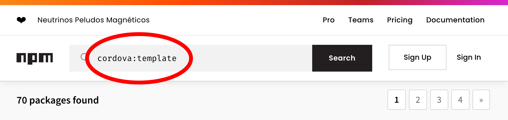

Find a template to create your app from by seaching for the keyword `cordova:template` on [npm](https://www.npmjs.com/search?q=cordova%3Atemplate). You can also use local templates on your computer, or a Git repository.

After locating a template you wish to use. Create your project using that template, by specifying the `--template` flag during the `create` command, followed by your template source.

Creating a cordova project from an NPM package, Git repository, or local path:

```
cordova create hello com.example.hello HelloWorld --template <npm-package-name|git-repo|local-dir-path>
```

After succesfully using a template to create your project, you'll want to indicate the platforms that you intend to target with your app. Go into your project folder and [add platforms](#guide-cli--add-platforms).

<a id="guide-cli-template--create-a-template"></a>

## Create a Template

Begin by creating a cordova app that will become the basis for your template. Then you'll take the contents of your app and put them into the following structure. When your template is used, all of the contents within `template_src` will be used to create the new project, so be sure to include any necessary files in that folder. Reference [this example](https://github.com/apache/cordova-app-hello-world) for details.

```
template_package
├── package.json  (for your template package to be published on npm)
├── index.js      (required)
└── template_src  (required - contains template files)
    ├── package.json
    ├── config.xml
    └── (files and folders that make up the template)
```

>
> [!NOTE]
> : `index.js` should export a reference to `template_src` and `package.json` should reference `index.js`. See [the example](https://github.com/apache/cordova-app-hello-world) for details on how that is done.

To finish off your template, edit `package.json` to contain the keyword `"cordova:template"`.

```
{
  ...
  "keywords": [
    "ecosystem:cordova",
    "cordova:template"
  ]
  ...
}
```

Congrats! You've made a template for creating a Cordova project. Share your template on npm so that everyone can benefit from your hard work.

---

<a id="guide-next"></a>

<!-- source_url: https://cordova.apache.org/docs/en/latest/guide/next/index.html -->

<!-- page_index: 29 -->

# Next Steps

- Getting Started
  - [Overview](#guide-overview)
  - [Installation](#guide-cli-installation)
  - [Creating an App](#guide-cli)
- Cordova Projects
  - [Project Structure](#guide-overview-project-structure)
  - [CLI Commands](#reference-cordova-cli)
  - [Platform Support](#guide-support)
  - [Platform Pinning](#platform_pinning)
  - [Version Management](#platform_plugin_versioning_ref)
  - [Hooks](#guide-appdev-hooks)
- App Development
  - Platforms
    - [Android](#guide-platforms-android)
    - [iOS](#guide-platforms-ios)
    - [Electron](#guide-platforms-electron)
  - Customization
    - [Icons](#config_ref-images)
    - [Splash Screen](#core-features-splashscreen)
  - Security & Privacy
    - [Security](#guide-appdev-security)
    - [Privacy](#guide-appdev-privacy)
    - [Allow List](#guide-appdev-allowlist)
  - [Data Storage](#cordova-storage-storage)
- Plugin Development
  - [Create a Plugin](#guide-hybrid-plugins)
  - Support a Platform
    - [Android](#guide-platforms-android-plugin)
    - [iOS](#guide-platforms-ios-plugin)
  - [Use Plugman](#plugin_ref-plugman)
- References
  - [Config.xml API](#config_ref)
  - [Plugin.xml API](#plugin_ref-spec)
  - [Cordova JavaScript API](#cordova-events-events)
- Resources
  - [Third-party Tools](#third-party)
  - [App Templates](#guide-cli-template)
  - [Next Steps](#guide-next)
- Plugins
  - [Battery Status](#reference-cordova-plugin-battery-status)
  - [Camera](#reference-cordova-plugin-camera)
  - [Device](#reference-cordova-plugin-device)
  - [Dialogs](#reference-cordova-plugin-dialogs)
  - [File](#reference-cordova-plugin-file)
  - [Geolocation](#reference-cordova-plugin-geolocation)
  - [Inappbrowser](#reference-cordova-plugin-inappbrowser)
  - [Media](#reference-cordova-plugin-media)
  - [Media Capture](#reference-cordova-plugin-media-capture)
  - [Network Information](#reference-cordova-plugin-network-information)
  - [Screen Orientation](#reference-cordova-plugin-screen-orientation)
  - [Browser Splashscreen](#reference-cordova-plugin-splashscreen)
  - [Statusbar](#reference-cordova-plugin-statusbar)
  - [Vibration](#reference-cordova-plugin-vibration)
- Advanced Topics
  - [Embed Cordova in native apps](#guide-hybrid-webviews)

Table of Contents

- [Overview](#guide-overview)
- [Installation](#guide-cli-installation)
- [Creating an App](#guide-cli)
- [Project Structure](#guide-overview-project-structure)
- [CLI Commands](#reference-cordova-cli)
- [Platform Support](#guide-support)
- [Platform Pinning](#platform_pinning)
- [Version Management](#platform_plugin_versioning_ref)
- [Hooks](#guide-appdev-hooks)
- [Android](#guide-platforms-android)
- [iOS](#guide-platforms-ios)
- [Electron](#guide-platforms-electron)
- [Icons](#config_ref-images)
- [Splash Screen](#core-features-splashscreen)
- [Security](#guide-appdev-security)
- [Privacy](#guide-appdev-privacy)
- [Allow List](#guide-appdev-allowlist)
- [Data Storage](#cordova-storage-storage)
- [Create a Plugin](#guide-hybrid-plugins)
- [Android](#guide-platforms-android-plugin)
- [iOS](#guide-platforms-ios-plugin)
- [Use Plugman](#plugin_ref-plugman)
- [Config.xml API](#config_ref)
- [Plugin.xml API](#plugin_ref-spec)
- [Cordova JavaScript API](#cordova-events-events)
- [Third-party Tools](#third-party)
- [App Templates](#guide-cli-template)
- [Next Steps](#guide-next)
- [Battery Status](#reference-cordova-plugin-battery-status)
- [Camera](#reference-cordova-plugin-camera)
- [Device](#reference-cordova-plugin-device)
- [Dialogs](#reference-cordova-plugin-dialogs)
- [File](#reference-cordova-plugin-file)
- [Geolocation](#reference-cordova-plugin-geolocation)
- [Inappbrowser](#reference-cordova-plugin-inappbrowser)
- [Media](#reference-cordova-plugin-media)
- [Media Capture](#reference-cordova-plugin-media-capture)
- [Network Information](#reference-cordova-plugin-network-information)
- [Screen Orientation](#reference-cordova-plugin-screen-orientation)
- [Browser Splashscreen](#reference-cordova-plugin-splashscreen)
- [Statusbar](#reference-cordova-plugin-statusbar)
- [Vibration](#reference-cordova-plugin-vibration)
- [Embed Cordova in native apps](#guide-hybrid-webviews)

<a id="guide-next--next-steps"></a>

# Next Steps

For developers who have an understanding of how to use the Cordova CLI and make use of plugins, there are a few things you may want to consider researching next to build better, more performant Cordova applications. The following document offers advice on various topics relating to best practices, testing, upgrades, and other topics, but is not meant to be prescriptive. Consider this your launching point for your growth as a Cordova developer. Also, if you see something that can be improved, please [contribute](https://cordova.apache.org/contribute/)!

<a id="guide-next--best-practices-for-cordova-apps"></a>

## Best Practices for Cordova Apps

<a id="guide-next--1-spa-is-your-friend"></a>

### 1) SPA Is Your Friend

First and foremost - your Cordova applications should adopt the SPA (Single Page Application) design. Loosely defined, a SPA is a client-side application that is run from one request of a web page. The user loads an initial set of resources (HTML, CSS, and JavaScript) and further updates (showing a new view, loading data) is done via XHR requests. SPAs are commonly used for more complex client-side applications. Gmail is a great example of this. After you load Gmail, mail views, editing, and organization are all done by updating the DOM instead of actually leaving the current page to load a completely new one.

Using a SPA can help you organize your application in a more efficient manner, but it also has specific benefits for Cordova applications. A Cordova application must wait for the [deviceready event](#cordova-events-events--deviceready) to fire before any plugins may be used. If you do not use a SPA, and your user clicks to go from one page to another, you will have to wait for [deviceready](#cordova-events-events--deviceready) to fire again before you make use of a plugin. This is easy to forget as your application gets larger.

Even if you choose not to use Cordova, creating a mobile application without using a single page architecture will have serious performance implications. This is because navigating between pages will require scripts, assets, etc., to be reloaded. Even if these assets are cached, there will still be performance issues.

Examples of SPA libraries you can use in your Cordova applications are:

- [React](https://react.dev/)
- [Vue.js](https://vuejs.org/)
- [Angular](https://angular.io/)
- [Ember.js](https://emberjs.com/)
- [Backbone.js](https://backbonejs.org/)
- [Kendo UI](https://www.telerik.com/kendo-ui)
- [Onsen UI](https://onsen.io)

And many, many, more.

<a id="guide-next--2-performance-considerations"></a>

### 2) Performance Considerations

Consider the following issues to improve the performance in your mobile applications:

- **Click vs. Touch**

  Many devices impose a 300ms delay on click events in order to distinguish between a tap and tap-to-zoom gesture. This can have the effect of making your app feel slow and unresponsive. Avoiding this delay is one of the most important ways of improving your app's perceived performance.

  For more information on the tap delay, see [300ms tap delay, gone away](https://developer.chrome.com/blog/300ms-tap-delay-gone-away/) on the Google Developer site.

  As of 2015, most Android and iOS devices no longer imposes the delay. For both Android and iOS, ensure that your viewport meta tag has set the `width=device-width` value or you will still have the tap delay.
- **CSS Transitions vs. DOM Manipulation**

  Using hardware accelerated CSS transitions will be dramatically better than using JavaScript to create animations. See the list of resources at the end of this section for examples.
- **Network**

  Latency of mobile networks, even good mobile networks, is far worse than you probably think. A desktop app that slurps down 500 rows of JSON data, every 30 seconds, will be both slower on a mobile device as well as a battery hog. Keep in mind that Cordova apps have multiple ways to persist data in the app (LocalStorage and the file system for example). Cache that data locally and be aware of the amount of data you are sending back and forth. This is an especially important consideration when your application is connected over a cellular network.

<a id="guide-next--3-recognize-and-handle-offline-status"></a>

### 3) Recognize and Handle Offline Status

See the previous tip about networks. Not only can you be on a slow network, it is entirely possible for your application to be completely offline. Your application should handle this in an intelligent manner. If your application does not, people will think your application is broken. Given how easy it is to handle (Cordova supports listening for both an offline and online event), there is absolutely no reason for your application to not respond well when run offline. Be sure to test (see the Testing section below) your application and be sure to test how your application handles when you start in one state and then switch to another.

Note that the online and offline events, as well as the Network Connection API, is not perfect. You may need to rely on using an XHR request to see if the device is truly offline or online. At the end of the day, be sure add some form of support for network issues - in fact, the Apple store (and probably other stores) will reject apps that don't properly handle offline/online states. For more discussion on this topic, see
["Is This Thing On?"](https://www.telerik.com/blogs/is-this-thing-on-%28part-1%29)

<a id="guide-next--handling-upgrades"></a>

## Handling Upgrades

<a id="guide-next--upgrading-cordova-projects"></a>

### Upgrading Cordova Projects

There is no upgrade command for Cordova projects. Instead, remove the platform from your project, and re-add it to get the latest version:

```
cordova platform rm android
cordova platform add android
```

It is absolutely critical that you read up on what was changed in the updated version, as the update may break your code. The best place to find this information will be in the release notes published both in the repositories and on the Cordova blog. You will want to test your app thoroughly in order to verify that it is working correctly after you perform the update.

Note: some plugins may not be compatible with the new version of Cordova. If a plugin is not compatible, you may be able to find a replacement plugin that does what you need, or you may need to delay upgrading your project. Alternatively, alter the plugin so that it does work under the new version and contribute back to the community.

<a id="guide-next--plugin-upgrades"></a>

### Plugin Upgrades

Upgrading plugins involves the same process as platforms - remove it, then re-add it.

```
cordova plugin rm some-plugin
cordova plugin add some-plugin
```

Refer to [Manage versions and platforms](#platform_plugin_versioning_ref) for more details.

Be sure to check the updated plugin's documentation, as you may need to adjust your code to work with the new version. Also, double check that the new version of the plugin works with your project's version of Cordova.

Always test your apps to ensure that installing the new plugin has not broken something that you did not anticipate.

If your project has a lot of plugins that you need updated, it might save time to create a shell or batch script that removes and adds the plugins with one command.

<a id="guide-next--testing-cordova-apps"></a>

## Testing Cordova apps

Testing your applications is super important. The Cordova team uses [Jasmine](https://jasmine.github.io/), but any web-friendly unit testing solution will do.

<a id="guide-next--testing-on-a-simulator-vs.-on-a-real-device"></a>

### Testing on a simulator vs. on a real device

It's not uncommon to use desktop browsers and device simulators/emulators when developing a Cordova application. However, it is incredibly important that you test your app on as many physical devices as you possibly can:

- Simulators are just that: simulators. For example, your app may work in the iOS simulator without a problem, but it may fail on a real device (especially in certain circumstances, such as a low memory state). Or, your app may actually fail on the simulator while it works just fine on a real device.
- Emulators are just that: emulators. They do not represent how well your app will run on a physical device. For example, some emulators may render your app with a garbled display, while a real device has no problem. (If you do encounter this problem, disable the host GPU in the emulator.)
- Simulators are generally faster than your physical device. Emulators, on the other hand, are generally slower. Do not judge the performance of your app by how it performs in a simulator or an emulator. Do judge the performance of your app by how it runs on a spectrum of real devices.
- It's impossible to get a good feel for how your app responds to your touch by using a simulator or an emulator. Instead, running the app on a real device can point out problems with the sizes of user interface elements, responsiveness, etc.
- Although it would be nice to be able to test only on one device per platform, it is best to test on many devices sporting many different OS versions. For example, what works on your particular Android smartphone may fail on another Android device. What works on the latest iOS device may fail on an older one.

It is, of course, impossible to test on every possible device on the market. For this reason, it's wise to recruit many testers who have different devices. Although they won't catch every problem, chances are good that they will discover quirks and issues that you would never find alone.

<a id="guide-next--debugging-cordova-apps"></a>

## Debugging Cordova apps

In most cases, debugging Cordova apps is quite straightforward.

<a id="guide-next--ios-debugging"></a>

### iOS Debugging

<a id="guide-next--xcode"></a>

#### Xcode

With Xcode you can debug the iOS native side of your Cordova application. Make sure the Debug Area is showing (View -> Debug Area). Once your app is running on the device (or simulator), you can view log output in the debug area. This is where any errors or warnings will print. You can also set breakpoints within the source files. This will allow you to step through the code one line at a time and view the state of the variables at that time. The state of the variables is shown in the debug area when a breakpoint is hit. Once your app is up and running on the device, you can bring up Safari's web inspector (as described below) to debug the webview and JS side of your application. For more details refer to the [Apple Debugging Support](https://developer.apple.com/support/debugging/) docs.

<a id="guide-next--safari-remote-debugging-with-web-inspector"></a>

#### Safari Remote Debugging with Web Inspector

With Safari's web inspector you can debug the webview and js code in your Cordova application. This works only on macOS. It uses Safari to connect to your device (or the simulator) and will connect the browser's dev tools to the Cordova application. You get what you expect from dev tools - DOM inspection/manipulation, a JavaScript debugger, network inspection, the console, and more. Like Xcode, with Safari's web inspector you can set breakpoints in the JavaScript code and view the state of the variables at that time. You can view any errors, warnings or messages that are printed to the console. You can also run JavaScript commands directly from the console as your app is running.

To start inspecting, first enable it on device at `Settings > Safari > Advanced > Web Inspector`. On your desktop, enable the developer tools from `Safari > Preferences > Advanced > Show Develop menu in menu bar`. In the `Develop` menu, you will now be able to select the connected device, and the app you want to inspect.

<a id="guide-next--chrome-remote-debugging"></a>

#### Chrome Remote Debugging

Virtually the same as the Safari version, this works with Android only but can be used from any desktop operating system. Once connected, you get the same Chrome Dev Tools experience for your mobile applications as you do with your desktop applications. Even better, the Chrome Dev Tools have a mirror option that shows your app running on the mobile device. This is more than just a view - you can scroll and click from dev tools and it updates on the mobile device.

To inspect, simply open up the URL `chrome://inspect` in Chrome on your desktop. Here you will see a list of connected devices and inspectable apps. Your device must be set up for USB debugging for this to work. Full instructions on getting set up can be found at <https://developers.google.com/chrome/mobile/docs/debugging>.

If you can see your device in the inspect devices section, but you can't see the Cordova webview you may need to add `android:debuggable="true"` in the `<application>` node of your `AndroidManifest.xml`.

It is also possible to use Chrome Dev Tools to inspect iOS apps, through a WebKit proxy: <https://github.com/google/ios-webkit-debug-proxy/>

<a id="guide-next--user-interface"></a>

## User Interface

Building a Cordova application that looks nice on mobile can be a challenge, especially for developers. Many people chose to use a UI framework to make this easier. Here is a short list of options you may want to consider.

- [Ionic](https://ionicframework.com/) - This powerful UI framework actually has its own CLI to handle project creation.
- [Ratchet](http://goratchet.com/) - Brought to you by the people who created Bootstrap.
- [Kendo UI](https://www.telerik.com/kendo-ui) - Open source UI and application framework from Telerik.
- [Onsen UI](https://onsen.io) - Open source UI framework for both websites and Cordova apps
- [Topcoat](http://topcoat.io)
- [ReactJS](https://reactjs.org/)

When building your user interface, it is important to think about all platforms that you are targeting and the differences between the user's expectations. For example, an Android application that has an iOS-style UI will probably not go over well with users. This sometimes is even enforced by the various application stores. Because of this, it is important that you respect the conventions of each platform and therefore are familiar with the various Human Interface Guidelines:

- [iOS](https://developer.apple.com/design/human-interface-guidelines/ios/overview/themes/)
- [Android](https://developer.android.com/design/)

<a id="guide-next--special-considerations"></a>

## Special Considerations

Although Cordova makes cross-platform development easier, it's just not possible to provide 100% isolation from the underlying native platform, so do be aware of restrictions.

<a id="guide-next--platform-quirks"></a>

### Platform Quirks

While reading the documentation, look for sections which outline different behaviors or requirements on multiple platforms. If present, these would be in a section titled "Android Quirks", "iOS Quirks", etc. Read through these quirks and be aware of them as you work with Cordova.

<a id="guide-next--loading-remote-content"></a>

### Loading Remote Content

Invoking Cordova JavaScript functions from a remotely-loaded HTML page (an HTML page not stored locally on the device) is an unsupported configuration. This is because Cordova was not designed for this, and the Apache Cordova community does no testing of this configuration. While it can work in some circumstances, it is not recommended nor supported. There are challenges with the same origin policy, keeping the JavaScript and native portions of Cordova synchronized at the same version (since they are coupled via private APIs which may change), the trustworthiness of remote content calling native local functions, and potential app store rejection.

The display of remotely-loaded HTML content in a webview should be done using Cordova's InAppBrowser. The InAppBrowser is designed so that JavaScript running there does not have access to the Cordova JavaScript APIs for the reasons listed above. Please refer to the [Security Guide](#guide-appdev-security).

<a id="guide-next--keeping-up"></a>

## Keeping Up

Here are a few ways to keep up to date with Cordova.

- Subscribe to the [Cordova blog](https://cordova.apache.org/blog/).
- Subscribe to the [developer list](https://cordova.apache.org/contact/). Note - this is not a support group, but a place where development of Cordova is discussed.

<a id="guide-next--getting-help"></a>

## Getting Help

The following links are the best places to get help for Cordova:

- [GitHub Discussions - Apache Cordova](https://github.com/apache/cordova/discussions)

  The official Apache Cordova GitHub Discussions channel is a recent addition to our support resources, aimed at centralizing community discussions and questions within our GitHub repositories.

  This channel is highly recommended as it brings together all things Cordova and provides the advantage of retaining a complete history of discussions. By utilizing GitHub Discussions, we can ensure better continuity and accessibility for future reference.
- [Slack - Apache Cordova](https://s.apache.org/cordova-slack)

  The official Apache Cordova Slack workspace is an excellent resource for seeking help from the community and obtaining quick answers to your questions.

  However, it's important to note that our Slack workspace does not retain message history. This limits the accessibility of information in the long term. To ensure better retention of your question, it is advisable to create a thread in GitHub Discussions and share the link and a summary of your question in the Slack.

  This way, you can benefit from the immediate responsiveness of Slack while also preserving the discussion and making it more accessible for future reference.
- [Stack Overflow - Apache Cordova](https://cordova.apache.org/docs/en/latest/guide/next/StackOverflowCommunity)

  On Stack Overflow, the "cordova" tag can be used to browse all Cordova questions.

  *Note: StackOverflow automatically converts the "phonegap" tag to "cordova" to maintain historical questions.*

  Stack Overflow has a vast and diverse community, making it an excellent choice for obtaining results depending on the nature of your question. For instance, even if you are developing a Cordova App, if your question pertains more to web or native app development, utilizing this platform could be more suitable. By doing so, you expose your question to a broader community that specializes in those specific fields.
- [Google Group - PhoneGap](https://groups.google.com/forum/#!forum/phonegap)

  This Google Group was previously the support forum for Cordova when it was known as PhoneGap. Although this group is currently inactive, it remains accessible for historical reference.

  It is advisable to utilize alternative platforms such as [GitHub Discussions](https://github.com/apache/cordova/discussions), [Stack Overflow](https://stackoverflow.com/questions/tagged/cordova), or [Slack](https://s.apache.org/cordova-slack) for obtaining support and engaging with the Cordova community. These platforms provide more active for assistance and discussions.

---

<a id="reference-cordova-plugin-battery-status"></a>

<!-- source_url: https://cordova.apache.org/docs/en/latest/reference/cordova-plugin-battery-status/index.html -->

<!-- page_index: 30 -->

# cordova-plugin-battery-status

Table of Contents

- [Overview](#guide-overview)
- [Installation](#guide-cli-installation)
- [Creating an App](#guide-cli)
- [Project Structure](#guide-overview-project-structure)
- [CLI Commands](#reference-cordova-cli)
- [Platform Support](#guide-support)
- [Platform Pinning](#platform_pinning)
- [Version Management](#platform_plugin_versioning_ref)
- [Hooks](#guide-appdev-hooks)
- [Android](#guide-platforms-android)
- [iOS](#guide-platforms-ios)
- [Electron](#guide-platforms-electron)
- [Icons](#config_ref-images)
- [Splash Screen](#core-features-splashscreen)
- [Security](#guide-appdev-security)
- [Privacy](#guide-appdev-privacy)
- [Allow List](#guide-appdev-allowlist)
- [Data Storage](#cordova-storage-storage)
- [Create a Plugin](#guide-hybrid-plugins)
- [Android](#guide-platforms-android-plugin)
- [iOS](#guide-platforms-ios-plugin)
- [Use Plugman](#plugin_ref-plugman)
- [Config.xml API](#config_ref)
- [Plugin.xml API](#plugin_ref-spec)
- [Cordova JavaScript API](#cordova-events-events)
- [Third-party Tools](#third-party)
- [App Templates](#guide-cli-template)
- [Next Steps](#guide-next)
- [Battery Status](#reference-cordova-plugin-battery-status)
- [Camera](#reference-cordova-plugin-camera)
- [Device](#reference-cordova-plugin-device)
- [Dialogs](#reference-cordova-plugin-dialogs)
- [File](#reference-cordova-plugin-file)
- [Geolocation](#reference-cordova-plugin-geolocation)
- [Inappbrowser](#reference-cordova-plugin-inappbrowser)
- [Media](#reference-cordova-plugin-media)
- [Media Capture](#reference-cordova-plugin-media-capture)
- [Network Information](#reference-cordova-plugin-network-information)
- [Screen Orientation](#reference-cordova-plugin-screen-orientation)
- [Browser Splashscreen](#reference-cordova-plugin-splashscreen)
- [Statusbar](#reference-cordova-plugin-statusbar)
- [Vibration](#reference-cordova-plugin-vibration)
- [Embed Cordova in native apps](#guide-hybrid-webviews)

> [!NOTE]
> ×
> master.

<a id="reference-cordova-plugin-battery-status--cordova-plugin-battery-status"></a>

# cordova-plugin-battery-status

[](https://github.com/apache/cordova-plugin-battery-status/actions/workflows/android.yml) [](https://github.com/apache/cordova-plugin-battery-status/actions/workflows/chrome.yml) [](https://github.com/apache/cordova-plugin-battery-status/actions/workflows/ios.yml) [](https://github.com/apache/cordova-plugin-battery-status/actions/workflows/lint.yml)

This plugin provides an implementation of an old version of the [Battery Status Events API](https://www.w3.org/TR/battery-status/). It adds the following three events to the `window` object:

- batterystatus
- batterycritical
- batterylow

Applications may use `window.addEventListener` to attach an event listener for any of the above events after the `deviceready` event fires.

<a id="reference-cordova-plugin-battery-status--installation"></a>

## Installation

```
cordova plugin add cordova-plugin-battery-status
```

<a id="reference-cordova-plugin-battery-status--status-object"></a>

## Status object

All events in this plugin return an object with the following properties:

- **level**: The battery charge percentage (0-100). *(Number)*
- **isPlugged**: A boolean that indicates whether the device is plugged in. *(Boolean)*

<a id="reference-cordova-plugin-battery-status--batterystatus-event"></a>

## batterystatus event

Fires when the battery charge percentage changes by at least 1 percent, or when the device is plugged in or unplugged. Returns an [object](#reference-cordova-plugin-battery-status--status-object) containing battery status.

<a id="reference-cordova-plugin-battery-status--example"></a>

### Example

```
window.addEventListener("batterystatus", onBatteryStatus, false);

function onBatteryStatus(status) {
    console.log("Level: " + status.level + " isPlugged: " + status.isPlugged);
}
```

<a id="reference-cordova-plugin-battery-status--supported-platforms"></a>

### Supported Platforms

- iOS
- Android
- Browser (Chrome, Firefox, Opera)

<a id="reference-cordova-plugin-battery-status--quirks:-android"></a>

### Quirks: Android

> [!WARNING]
> : the Android implementation is greedy and prolonged use will drain the device's battery.

<a id="reference-cordova-plugin-battery-status--batterylow-event"></a>

## batterylow event

Fires when the battery charge percentage reaches the low charge threshold. This threshold value is device-specific. Returns an [object](#reference-cordova-plugin-battery-status--status-object) containing battery status.

<a id="reference-cordova-plugin-battery-status--example-2"></a>

### Example

```
window.addEventListener("batterylow", onBatteryLow, false);

function onBatteryLow(status) {
    alert("Battery Level Low " + status.level + "%");
}
```

<a id="reference-cordova-plugin-battery-status--supported-platforms-2"></a>

### Supported Platforms

- iOS
- Android
- Browser (Chrome, Firefox, Opera)

<a id="reference-cordova-plugin-battery-status--batterycritical-event"></a>

## batterycritical event

Fires when the battery charge percentage reaches the critical charge threshold. This threshold value is device-specific. Returns an [object](#reference-cordova-plugin-battery-status--status-object) containing battery status.

<a id="reference-cordova-plugin-battery-status--example-3"></a>

### Example

```
window.addEventListener("batterycritical", onBatteryCritical, false);

function onBatteryCritical(status) {
    alert("Battery Level Critical " + status.level + "%\nRecharge Soon!");
}
```

<a id="reference-cordova-plugin-battery-status--supported-platforms-3"></a>

### Supported Platforms

- iOS
- Android
- Browser (Chrome, Firefox, Opera)

---

<a id="reference-cordova-plugin-camera"></a>

<!-- source_url: https://cordova.apache.org/docs/en/latest/reference/cordova-plugin-camera/index.html -->

<!-- page_index: 31 -->

# cordova-plugin-camera

- Getting Started
  - [Overview](#guide-overview)
  - [Installation](#guide-cli-installation)
  - [Creating an App](#guide-cli)
- Cordova Projects
  - [Project Structure](#guide-overview-project-structure)
  - [CLI Commands](#reference-cordova-cli)
  - [Platform Support](#guide-support)
  - [Platform Pinning](#platform_pinning)
  - [Version Management](#platform_plugin_versioning_ref)
  - [Hooks](#guide-appdev-hooks)
- App Development
  - Platforms
    - [Android](#guide-platforms-android)
    - [iOS](#guide-platforms-ios)
    - [Electron](#guide-platforms-electron)
  - Customization
    - [Icons](#config_ref-images)
    - [Splash Screen](#core-features-splashscreen)
  - Security & Privacy
    - [Security](#guide-appdev-security)
    - [Privacy](#guide-appdev-privacy)
    - [Allow List](#guide-appdev-allowlist)
  - [Data Storage](#cordova-storage-storage)
- Plugin Development
  - [Create a Plugin](#guide-hybrid-plugins)
  - Support a Platform
    - [Android](#guide-platforms-android-plugin)
    - [iOS](#guide-platforms-ios-plugin)
  - [Use Plugman](#plugin_ref-plugman)
- References
  - [Config.xml API](#config_ref)
  - [Plugin.xml API](#plugin_ref-spec)
  - [Cordova JavaScript API](#cordova-events-events)
- Resources
  - [Third-party Tools](#third-party)
  - [App Templates](#guide-cli-template)
  - [Next Steps](#guide-next)
- Plugins
  - [Battery Status](#reference-cordova-plugin-battery-status)
  - [Camera](#reference-cordova-plugin-camera)
  - [Device](#reference-cordova-plugin-device)
  - [Dialogs](#reference-cordova-plugin-dialogs)
  - [File](#reference-cordova-plugin-file)
  - [Geolocation](#reference-cordova-plugin-geolocation)
  - [Inappbrowser](#reference-cordova-plugin-inappbrowser)
  - [Media](#reference-cordova-plugin-media)
  - [Media Capture](#reference-cordova-plugin-media-capture)
  - [Network Information](#reference-cordova-plugin-network-information)
  - [Screen Orientation](#reference-cordova-plugin-screen-orientation)
  - [Browser Splashscreen](#reference-cordova-plugin-splashscreen)
  - [Statusbar](#reference-cordova-plugin-statusbar)
  - [Vibration](#reference-cordova-plugin-vibration)
- Advanced Topics
  - [Embed Cordova in native apps](#guide-hybrid-webviews)

Table of Contents

- [Overview](#guide-overview)
- [Installation](#guide-cli-installation)
- [Creating an App](#guide-cli)
- [Project Structure](#guide-overview-project-structure)
- [CLI Commands](#reference-cordova-cli)
- [Platform Support](#guide-support)
- [Platform Pinning](#platform_pinning)
- [Version Management](#platform_plugin_versioning_ref)
- [Hooks](#guide-appdev-hooks)
- [Android](#guide-platforms-android)
- [iOS](#guide-platforms-ios)
- [Electron](#guide-platforms-electron)
- [Icons](#config_ref-images)
- [Splash Screen](#core-features-splashscreen)
- [Security](#guide-appdev-security)
- [Privacy](#guide-appdev-privacy)
- [Allow List](#guide-appdev-allowlist)
- [Data Storage](#cordova-storage-storage)
- [Create a Plugin](#guide-hybrid-plugins)
- [Android](#guide-platforms-android-plugin)
- [iOS](#guide-platforms-ios-plugin)
- [Use Plugman](#plugin_ref-plugman)
- [Config.xml API](#config_ref)
- [Plugin.xml API](#plugin_ref-spec)
- [Cordova JavaScript API](#cordova-events-events)
- [Third-party Tools](#third-party)
- [App Templates](#guide-cli-template)
- [Next Steps](#guide-next)
- [Battery Status](#reference-cordova-plugin-battery-status)
- [Camera](#reference-cordova-plugin-camera)
- [Device](#reference-cordova-plugin-device)
- [Dialogs](#reference-cordova-plugin-dialogs)
- [File](#reference-cordova-plugin-file)
- [Geolocation](#reference-cordova-plugin-geolocation)
- [Inappbrowser](#reference-cordova-plugin-inappbrowser)
- [Media](#reference-cordova-plugin-media)
- [Media Capture](#reference-cordova-plugin-media-capture)
- [Network Information](#reference-cordova-plugin-network-information)
- [Screen Orientation](#reference-cordova-plugin-screen-orientation)
- [Browser Splashscreen](#reference-cordova-plugin-splashscreen)
- [Statusbar](#reference-cordova-plugin-statusbar)
- [Vibration](#reference-cordova-plugin-vibration)
- [Embed Cordova in native apps](#guide-hybrid-webviews)

> [!NOTE]
> ×
> master.

<a id="reference-cordova-plugin-camera--cordova-plugin-camera"></a>

# cordova-plugin-camera

[](https://github.com/apache/cordova-plugin-camera/actions/workflows/android.yml) [](https://github.com/apache/cordova-plugin-camera/actions/workflows/chrome.yml) [](https://github.com/apache/cordova-plugin-camera/actions/workflows/ios.yml) [](https://github.com/apache/cordova-plugin-camera/actions/workflows/lint.yml)

This plugin defines a global `navigator.camera` object, which provides an API for taking pictures and for choosing images from
the system's image library.

Although the object is attached to the global scoped `navigator`, it is not available until after the `deviceready` event.

```
document.addEventListener("deviceready", onDeviceReady, false);

function onDeviceReady() {
    console.log(navigator.camera);
}
```

<a id="reference-cordova-plugin-camera--installation"></a>

## Installation

```
cordova plugin add cordova-plugin-camera
```

It is also possible to install via repo url directly ( unstable )

```
cordova plugin add https://github.com/apache/cordova-plugin-camera.git
```

<a id="reference-cordova-plugin-camera--plugin-variables"></a>

## Plugin variables

The plugin uses the `ANDROIDX_CORE_VERSION` variable to configure `androidx.core:core` dependency. This allows to avoid conflicts with other plugins that have the dependency hardcoded.
If no value is passed, it will use `1.6.+` as the default value.

The variable is configured on install time

```
cordova plugin add cordova-plugin-camera --variable ANDROIDX_CORE_VERSION=1.8.0
```

<a id="reference-cordova-plugin-camera--how-to-contribute"></a>

## How to Contribute

Contributors are welcome! And we need your contributions to keep the project moving forward. You can[report bugs, improve the documentation, or [contribute code](https://github.com/apache/cordova-plugin-camera/pulls).

There is a specific [contributor workflow](http://wiki.apache.org/cordova/ContributorWorkflow) we recommend. Start reading there. More information is available on [our wiki](http://wiki.apache.org/cordova).

**Have a solution?** Send a [Pull Request](https://github.com/apache/cordova-plugin-camera/pulls).

In order for your changes to be accepted, you need to sign and submit an Apache [ICLA](http://www.apache.org/licenses/#clas) (Individual Contributor License Agreement). Then your name will appear on the list of CLAs signed by [non-committers](https://people.apache.org/committer-index.html#unlistedclas) or [Cordova committers](http://people.apache.org/committers-by-project.html#cordova).

**And don't forget to test and document your code.**

<a id="reference-cordova-plugin-camera--ios-specifics"></a>

### iOS Specifics

Since iOS 10 it's mandatory to provide a usage description in the `info.plist` when accessing privacy-sensitive data. The required keys depend on how you use the plugin and which iOS versions you support:

| Key | Description |
| --- | --- |
| NSCameraUsageDescription | Required whenever the camera is used (e.g. `Camera.PictureSourceType.CAMERA`). |
| NSPhotoLibraryUsageDescription | Required only when your app runs on iOS 13 or older and using as `sourceType` `Camera.PictureSourceType.PHOTOLIBRARY`. On iOS 14+ the plugin uses PHPicker for read-only access, which does not need this key. |
| NSPhotoLibraryAddUsageDescription | Required when the plugin writes to the user's library (e.g. `saveToPhotoAlbum=true`). |
| NSLocationWhenInUseUsageDescription | Required if `CameraUsesGeolocation` is set to `true`. |

When the system prompts the user to allow access, this usage description string will be displayed as part of the permission dialog box. If you don't provide the required usage description, the app will crash before showing the dialog. Also, Apple will reject apps that access private data but don't provide a usage description.

To add these entries into the `info.plist`, you can use the `edit-config` tag in the `config.xml` like this:

```
<edit-config target="NSCameraUsageDescription" file="*-Info.plist" mode="merge">
    <string>need camera access to take pictures</string>
</edit-config>

<edit-config target="NSPhotoLibraryUsageDescription" file="*-Info.plist" mode="merge">
    <string>need photo library access to get pictures from there</string>
</edit-config>

<edit-config target="NSPhotoLibraryAddUsageDescription" file="*-Info.plist" mode="merge">
    <string>need photo library access to save pictures there</string>
</edit-config>

<edit-config target="NSLocationWhenInUseUsageDescription" file="*-Info.plist" mode="merge">
    <string>need location access to find things nearby</string>
</edit-config>
```

---

<a id="reference-cordova-plugin-camera--api-reference"></a>

# API Reference

- [camera](#reference-cordova-plugin-camera--module_camera)
  - [.getPicture(successCallback, errorCallback, options)](#reference-cordova-plugin-camera--module_camera.getpicture)
  - [.cleanup()](#reference-cordova-plugin-camera--module_camera.cleanup)
  - [.onError](#reference-cordova-plugin-camera--module_camera.onerror) : `function`
  - [.onSuccess](#reference-cordova-plugin-camera--module_camera.onsuccess) : `function`
  - [.CameraOptions](#reference-cordova-plugin-camera--module_camera.cameraoptions) : `Object`
- [Camera](#reference-cordova-plugin-camera--module_camera)
  - [.DestinationType](#reference-cordova-plugin-camera--module_camera.destinationtype) : `enum`
  - [.EncodingType](#reference-cordova-plugin-camera--module_camera.encodingtype) : `enum`
  - [.MediaType](#reference-cordova-plugin-camera--module_camera.mediatype) : `enum`
  - [.PictureSourceType](#reference-cordova-plugin-camera--module_camera.picturesourcetype) : `enum`
  - [.Direction](#reference-cordova-plugin-camera--module_camera.direction) : `enum`

---

<a id="reference-cordova-plugin-camera--camera"></a>

## camera

<a id="reference-cordova-plugin-camera--camera.getpicture-successcallback-errorcallback-options"></a>

### camera.getPicture(successCallback, errorCallback, options)

Takes a photo using the camera, or retrieves a photo from the device's
image gallery. The result is provided in the first parameter of the `successCallback` as a string.

As of v8.0.0, the result is formatted as URIs. The scheme will vary depending on settings and platform.

| Platform | Destination Type | Format |
| --- | --- | --- |
| Android | FILE\_URI | An URI scheme such as `file://...` or `content://...` |
|  | DATA\_URL | Base 64 encoded with the proper data URI header |
| iOS | FILE\_URI | `file://` schemed paths |
|  | DATA\_URL | Base 64 encoded with the proper data URI header |
| Browser | FILE\_URI | Not supported |
|  | DATA\_URL | Base 64 encoded with the proper data URI header |

v7 and earlier versions, the return format is as follows:

| Platform | Destination Type | Format |
| --- | --- | --- |
| Android | FILE\_URI | Raw file path (unprefixed) |
|  | DATA\_URL | Base 64 encoded, without the `data:` prefix |
| iOS | FILE\_URI | `file://` schemed paths |
|  | DATA\_URL | Base 64 encoded, without the `data:` prefix |
| Browser | FILE\_URI | Not supported |
|  | DATA\_URL | Base 64 encoded, without the `data:` prefix |

For this reason, upgrading to v8 is strongly recommended as it greatly streamlines the return data.

The `camera.getPicture` function opens the device's default camera
application that allows users to snap pictures by default - this behavior occurs, when `Camera.sourceType` equals [`Camera.PictureSourceType.CAMERA`](#reference-cordova-plugin-camera--module_camera.picturesourcetype).
Once the user snaps the photo, the camera application closes and the application is restored.

If `Camera.sourceType` is `Camera.PictureSourceType.PHOTOLIBRARY` or
`Camera.PictureSourceType.SAVEDPHOTOALBUM`, then a dialog displays
that allows users to select an existing image.

The return value is sent to the [`cameraSuccess`](#reference-cordova-plugin-camera--module_camera.onsuccess) callback function, in
one of the following formats, depending on the specified
`cameraOptions`. You can do whatever you want with content:

- Render the content in an `` or `<video>` tag
- Copy the data to a persistent location
- Post the data to a remote server

> [!NOTE]
> : Photo resolution on newer devices is quite good. Photos
> selected from the device's gallery are not downscaled to a lower
> quality, even if a `quality` parameter is specified. To avoid common
> memory problems, set `Camera.destinationType` to `FILE_URI` rather
> than `DATA_URL`.

> [!NOTE]
> : To use `saveToPhotoAlbum` option on Android 9 (API 28) and lower, the `WRITE_EXTERNAL_STORAGE` permission must be declared.

To do this, add the following in your `config.xml`:

```
<config-file target="AndroidManifest.xml" parent="/*" xmlns:android="http://schemas.android.com/apk/res/android">
    <uses-permission android:name="android.permission.WRITE_EXTERNAL_STORAGE" android:maxSdkVersion="28" />
</config-file>
```

Android 10 (API 29) and later devices does not require `WRITE_EXTERNAL_STORAGE` permission. If your application only supports Android 10 or later, then this step is not necessary.

<a id="reference-cordova-plugin-camera--file_uri-usage"></a>

#### FILE\_URI Usage

When `FILE_URI` is used, the returned path is not directly usable. The file path needs to be resolved into
a DOM-usable URL using the [Cordova File Plugin](https://github.com/apache/cordova-plugin-file).

Additionally, the file URIs returned is a temporary read access grant. The OS reserves the right to revoke permission to access the resource, which typically occurs after the app has been closed. For images captured using the camera, the image is stored in a temporary location which can be cleared at any time, usually after the app exits. It's the application's decision to decide how the content should be used depending on their use cases.

For persistent access to the content, the resource should be copied to your app's storage container. An example use case is an app allowing an user to select a profile picture from their gallery or camera. The application will need
consistent access to that resource, so it's not suitable to retain the temporary access path. So the appplication should copy the resource to a persistent location.

For use cases that involve temporary use, it is valid and safe to use the temporary file path to display the content. An example of this could be an image editing application, rendering the data into a canvas.

> [!NOTE]
> : The returned schemes is an implementation detail. Do not assume that it will always be a `file://` URI.

**Supported Platforms**

- Android
- Browser
- iOS

More examples [here](#reference-cordova-plugin-camera--camera-getpicture-examples). Quirks [here](#reference-cordova-plugin-camera--camera-getpicture-quirks).

**Kind**: static method of `[camera](#module_camera)`

| Param | Type | Description |
| --- | --- | --- |
| successCallback | `[onSuccess](#module_camera.onSuccess)` |  |
| errorCallback | `[onError](#module_camera.onError)` |  |
| options | `[CameraOptions](#module_camera.CameraOptions)` | CameraOptions |

**Example**

```
navigator.camera.getPicture(cameraSuccess, cameraError, cameraOptions);
```

<a id="reference-cordova-plugin-camera--camera.cleanup"></a>

### camera.cleanup()

Removes intermediate image files that are kept in temporary storage
after calling [`camera.getPicture`](#reference-cordova-plugin-camera--module_camera.getpicture). Applies only when the value of
`Camera.sourceType` equals `Camera.PictureSourceType.CAMERA` and the
`Camera.destinationType` equals `Camera.DestinationType.FILE_URI`.

**Supported Platforms**

- iOS

**Kind**: static method of `[camera](#module_camera)`
**Example**

```
navigator.camera.cleanup(onSuccess, onFail);

function onSuccess() {
    console.log("Camera cleanup success.")
}

function onFail(message) {
    alert('Failed because: ' + message);
}
```

<a id="reference-cordova-plugin-camera--camera.onerror-:-function"></a>

### camera.onError : `function`

Callback function that provides an error message.

**Kind**: static typedef of `[camera](#module_camera)`

| Param | Type | Description |
| --- | --- | --- |
| message | `string` | The message is provided by the device's native code. |
<a id="reference-cordova-plugin-camera--camera.onsuccess-:-function"></a>

### camera.onSuccess : `function`

Callback function that provides the image data.

**Kind**: static typedef of `[camera](#module_camera)`

| Param | Type | Description |
| --- | --- | --- |
| imageData | `string` | Data URI, *or* the image file URI, depending on [`cameraOptions`](#reference-cordova-plugin-camera--module_camera.cameraoptions) in effect. |

**Example**

```
// Show image captured with FILE_URI
function cameraCallback(imageData) {
    window.resolveLocalFileSystemURL(uri, (entry) => {
        let image = document.getElementById('myImage');
        image.src = entry.toURL();
    }, onError);
}

// Show image captured with DATA_URL
function cameraCallback(imageData) {
   var image = document.getElementById('myImage');
   image.src = imageData;
}
```

<a id="reference-cordova-plugin-camera--camera.cameraoptions-:-object"></a>

### camera.CameraOptions : `Object`

Optional parameters to customize the camera settings.

- [Quirks](#reference-cordova-plugin-camera--cameraoptions-quirks)

**Kind**: static typedef of `[camera](#module_camera)`
**Properties**

| Name | Type | Default | Description |
| --- | --- | --- | --- |
| quality | `number` | `50` | Quality of the saved image, expressed as a range of 0-100, where 100 is typically full resolution with no loss from file compression. (Note that information about the camera's resolution is unavailable.) |
| destinationType | `[DestinationType](#module_Camera.DestinationType)` | `FILE_URI` | Choose the format of the return value. |
| sourceType | `[PictureSourceType](#module_Camera.PictureSourceType)` | `CAMERA` | Set the source of the picture. |
| ~~allowEdit~~ | `Boolean` | `false` | **Deprecated**. Allow simple editing of image before selection. |
| encodingType | `[EncodingType](#module_Camera.EncodingType)` | `JPEG` | Choose the returned image file's encoding. |
| targetWidth | `number` |  | Width in pixels to scale image. Must be used with `targetHeight`. Aspect ratio remains constant. |
| targetHeight | `number` |  | Height in pixels to scale image. Must be used with `targetWidth`. Aspect ratio remains constant. |
| mediaType | `[MediaType](#module_Camera.MediaType)` | `PICTURE` | Set the type of media to select from. Only works when `PictureSourceType` is `PHOTOLIBRARY` or `SAVEDPHOTOALBUM`. |
| correctOrientation | `Boolean` |  | Rotate the image to correct for the orientation of the device during capture. |
| saveToPhotoAlbum | `Boolean` |  | Save the image to the photo album on the device after capture. See [Android Quirks](#reference-cordova-plugin-camera--cameragetpicturesuccesscallback-errorcallback-options). |
| cameraDirection | `[Direction](#module_Camera.Direction)` | `BACK` | Choose the camera to use (front- or back-facing). |

---

<a id="reference-cordova-plugin-camera--camera-2"></a>

## Camera

<a id="reference-cordova-plugin-camera--camera.destinationtype-:-enum"></a>

### Camera.DestinationType : `enum`

Defines the output format of `Camera.getPicture` call.

**Kind**: static enum property of `[Camera](#module_Camera)`
**Properties**

| Name | Type | Default | Description |
| --- | --- | --- | --- |
| DATA\_URL | `number` | `0` | Return data uri. DATA\_URL can be very memory intensive and cause app crashes or out of memory errors. Use FILE\_URI if possible |
| FILE\_URI | `number` | `1` | Return file uri (content://media/external/images/media/2 for Android) |
<a id="reference-cordova-plugin-camera--camera.encodingtype-:-enum"></a>

### Camera.EncodingType : `enum`

**Kind**: static enum property of `[Camera](#module_Camera)`
**Properties**

| Name | Type | Default | Description |
| --- | --- | --- | --- |
| JPEG | `number` | `0` | Return JPEG encoded image |
| PNG | `number` | `1` | Return PNG encoded image |
<a id="reference-cordova-plugin-camera--camera.mediatype-:-enum"></a>

### Camera.MediaType : `enum`

**Kind**: static enum property of `[Camera](#module_Camera)`
**Properties**

| Name | Type | Default | Description |
| --- | --- | --- | --- |
| PICTURE | `number` | `0` | Allow selection of still pictures only. DEFAULT. Will return format specified via DestinationType |
| VIDEO | `number` | `1` | Allow selection of video only, ONLY RETURNS URL |
| ALLMEDIA | `number` | `2` | Allow selection from all media types |
<a id="reference-cordova-plugin-camera--camera.picturesourcetype-:-enum"></a>

### Camera.PictureSourceType : `enum`

Defines the output format of `Camera.getPicture` call.

**Kind**: static enum property of `[Camera](#module_Camera)`
**Properties**

| Name | Type | Default | Description |
| --- | --- | --- | --- |
| PHOTOLIBRARY | `number` | `0` | Choose image from the device's photo library. |
| CAMERA | `number` | `1` | Take picture from camera |
| SAVEDPHOTOALBUM | `number` | `2` | Same as `PHOTOLIBRARY`, when running on Android or iOS 14+. On iOS older than 14, an image can only be chosen from the device's Camera Roll album with this setting. |
<a id="reference-cordova-plugin-camera--camera.direction-:-enum"></a>

### Camera.Direction : `enum`

**Kind**: static enum property of `[Camera](#module_Camera)`
**Properties**

| Name | Type | Default | Description |
| --- | --- | --- | --- |
| BACK | `number` | `0` | Use the back-facing camera |
| FRONT | `number` | `1` | Use the front-facing camera |

---

<a id="reference-cordova-plugin-camera--camera.getpicture-errata"></a>

## `camera.getPicture` Errata

<a id="reference-cordova-plugin-camera--example"></a>

#### Example

Take a photo and retrieve the image's file location:

```
// Don't forget to install cordova-plugin-file for resolveLocalFileSystemURL!

navigator.camera.getPicture(onSuccess, onFail, { quality: 50,
    destinationType: Camera.DestinationType.FILE_URI });

function onSuccess(imageURI) {
    window.resolveLocalFileSystemURL(uri, (entry) => {
        let img = document.getElementById('image');
        img.src = entry.toURL();
    }, onFail);
}

function onFail(message) {
    alert('Failed because: ' + message);
}
```

Take a photo and retrieve it as a Base64-encoded image:

```
/**
 * Warning: Using DATA_URL is not recommended! The DATA_URL destination
 * type is very memory intensive, even with a low quality setting. Using it
 * can result in out of memory errors and application crashes. Use FILE_URI
 * instead.
 */
navigator.camera.getPicture(onSuccess, onFail, { quality: 25,
    destinationType: Camera.DestinationType.DATA_URL
});

function onSuccess(imageData) {
    var image = document.getElementById('myImage');
    image.src = imageData;
}

function onFail(message) {
    alert('Failed because: ' + message);
}
```

<a id="reference-cordova-plugin-camera--preferences-ios"></a>

#### Preferences (iOS)

- **CameraUsesGeolocation** (boolean, defaults to false). For capturing JPEGs, set to true to get geolocation data in the EXIF header. This will trigger a request for geolocation permissions if set to true.


```
 <preference name="CameraUsesGeolocation" value="false" />
```

<a id="reference-cordova-plugin-camera--android-quirks"></a>

#### Android Quirks

Android uses intents to launch the camera activity on the device to capture
images, and on phones with low memory, the Cordova activity may be killed. In this
scenario, the result from the plugin call will be delivered via the resume event.
See [the Android Lifecycle guide](http://cordova.apache.org/docs/en/dev/guide/platforms/android/lifecycle.html)
for more information. The `pendingResult.result` value will contain the value that
would be passed to the callbacks (either the URI/URL or an error message). Check
the `pendingResult.pluginStatus` to determine whether or not the call was
successful.

<a id="reference-cordova-plugin-camera--browser-quirks"></a>

#### Browser Quirks

Can only return photos as data URI image.

<a id="reference-cordova-plugin-camera--ios-quirks"></a>

#### iOS Quirks

Including a JavaScript `alert()` in either of the callback functions
can cause problems. Wrap the alert within a `setTimeout()` to allow
the iOS image picker to fully close before the alert
displays:

```
setTimeout(function() {
    // do your thing here!
}, 0);
```

<a id="reference-cordova-plugin-camera--cameraoptions-errata"></a>

## `CameraOptions` Errata

<a id="reference-cordova-plugin-camera--android-quirks-2"></a>

#### Android Quirks

- Any `cameraDirection` value results in a back-facing photo. (= You can only use the back camera)
- **`allowEdit` is unpredictable on Android and it should not be used!** The Android implementation of this plugin tries to find and use an application on the user's device to do image cropping. The plugin has no control over what application the user selects to perform the image cropping and it is very possible that the user could choose an incompatible option and cause the plugin to fail. This sometimes works because most devices come with an application that handles cropping in a way that is compatible with this plugin (Google Photos), but it is unwise to rely on that being the case. If image editing is essential to your application, consider seeking a third party library or plugin that provides its own image editing utility for a more robust solution.
- `Camera.PictureSourceType.PHOTOLIBRARY` and `Camera.PictureSourceType.SAVEDPHOTOALBUM` both display the same photo album.
- Ignores the `encodingType` parameter if the image is unedited (i.e. `quality` is 100, `correctOrientation` is false, and no `targetHeight` or `targetWidth` are specified). The `CAMERA` source will always return the JPEG file given by the native camera and the `PHOTOLIBRARY` and `SAVEDPHOTOALBUM` sources will return the selected file in its existing encoding.

<a id="reference-cordova-plugin-camera--sample:-take-pictures-select-pictures-from-the-picture-library-and-get-thumbnails"></a>

## Sample: Take Pictures, Select Pictures from the Picture Library, and Get Thumbnails

The Camera plugin allows you to do things like open the device's Camera app and take a picture, or open the file picker and select one. The code snippets in this section demonstrate different tasks including:

- Open the Camera app and [take a Picture](#reference-cordova-plugin-camera--takepicture)
- Take a picture and [return thumbnails](#reference-cordova-plugin-camera--getthumbnails) (resized picture)
- Take a picture and [generate a FileEntry object](#reference-cordova-plugin-camera--convert)
- [Select a file](#reference-cordova-plugin-camera--selectfile) from the picture library
- Select a JPEG image and [return thumbnails](#reference-cordova-plugin-camera--getfilethumbnails) (resized image)
- Select an image and [generate a FileEntry object](#reference-cordova-plugin-camera--convert)

<a id="reference-cordova-plugin-camera--take-a-picture"></a>

## Take a Picture

Before you can take a picture, you need to set some Camera plugin options to pass into the Camera plugin's `getPicture` function. Here is a common set of recommendations. In this example, you create the object that you will use for the Camera options, and set the `sourceType` dynamically to support both the Camera app and the file picker.

```
function setOptions(srcType) {
    var options = {
        // Some common settings are 20, 50, and 100
        quality: 50,
        destinationType: Camera.DestinationType.FILE_URI,
        // In this app, dynamically set the picture source, Camera or photo gallery
        sourceType: srcType,
        encodingType: Camera.EncodingType.JPEG,
        mediaType: Camera.MediaType.PICTURE,
        allowEdit: true,
        correctOrientation: true
    }
    return options;
}
```

Typically, you want to use a FILE\_URI instead of a DATA\_URL to avoid most memory issues. JPEG is the recommended encoding type for Android.

You take a picture by passing in the options object to `getPicture`, which takes a CameraOptions object as the third argument. When you call `setOptions`, pass `Camera.PictureSourceType.CAMERA` as the picture source.

```
function openCamera(selection) {

    var srcType = Camera.PictureSourceType.CAMERA;
    var options = setOptions(srcType);
    var func = createNewFileEntry;

    navigator.camera.getPicture(function cameraSuccess(imageUri) {

        displayImage(imageUri);
        // You may choose to copy the picture, save it somewhere, or upload.
        func(imageUri);

    }, function cameraError(error) {
        console.debug("Unable to obtain picture: " + error, "app");

    }, options);
}
```

Once you take the picture, you can display it or do something else. In this example, call the app's `displayImage` function from the preceding code.

```
function displayImage(imgUri) {

    var elem = document.getElementById('imageFile');
    elem.src = imgUri;
}
```

<a id="reference-cordova-plugin-camera--take-a-picture-and-return-thumbnails-resize-the-picture"></a>

## Take a Picture and Return Thumbnails (Resize the Picture)

To get smaller images, you can return a resized image by passing both `targetHeight` and `targetWidth` values with your CameraOptions object. In this example, you resize the returned image to fit in a 100px by 100px box (the aspect ratio is maintained, so 100px is either the height or width, whichever is greater in the source).

```
function openCamera(selection) {

    var srcType = Camera.PictureSourceType.CAMERA;
    var options = setOptions(srcType);
    var func = createNewFileEntry;

    if (selection == "camera-thmb") {
        options.targetHeight = 100;
        options.targetWidth = 100;
    }

    navigator.camera.getPicture(function cameraSuccess(imageUri) {

        // Do something

    }, function cameraError(error) {
        console.debug("Unable to obtain picture: " + error, "app");

    }, options);
}
```

<a id="reference-cordova-plugin-camera--select-a-file-from-the-picture-library"></a>

## Select a File from the Picture Library

When selecting a file using the file picker, you also need to set the CameraOptions object. In this example, set the `sourceType` to `Camera.PictureSourceType.PHOTOLIBRARY`. To open the file picker, call `getPicture` just as you did in the previous example, passing in the success and error callbacks along with CameraOptions object.

```
function openFilePicker(selection) {

    var srcType = Camera.PictureSourceType.PHOTOLIBRARY;
    var options = setOptions(srcType);
    var func = createNewFileEntry;

    navigator.camera.getPicture(
        // success callback
        (imageUri) => {
            // Do something
        },
        // error callback
        (error) => {
            console.debug("Unable to obtain picture: " + error, "app");
        },
        options);
}
```

<a id="reference-cordova-plugin-camera--select-an-image-and-return-thumbnails-resized-images"></a>

## Select an Image and Return Thumbnails (resized images)

Resizing a file selected with the file picker works just like resizing using the Camera app; set the `targetHeight` and `targetWidth` options.

```
function openFilePicker(selection) {

    var srcType = Camera.PictureSourceType.PHOTOLIBRARY;
    var options = setOptions(srcType);
    var func = createNewFileEntry;

    if (selection == "picker-thmb") {
        // To downscale a selected image,
        // Camera.EncodingType (e.g., JPEG) must match the selected image type.
        options.targetHeight = 100;
        options.targetWidth = 100;
    }

    navigator.camera.getPicture(
        // success callback
        (imageUri) {
            // Do something with image
        },
        // error callback
        (error) => {
            console.debug("Unable to obtain picture: " + error, "app");
        },
        options);
}
```

<a id="reference-cordova-plugin-camera--take-a-picture-and-get-a-fileentry-object"></a>

## Take a picture and get a FileEntry Object

If you want to do something like copy the image to another location, or upload it somewhere, an `FileEntry` is needed for the returned picture. To do this, call `window.resolveLocalFileSystemURL` on the file URI returned by the Camera app. If you need to use a FileEntry object, set the `destinationType` to `Camera.DestinationType.FILE_URI` in your CameraOptions object (this is also the default value).

**NOTE:** You need the [File plugin](https://www.npmjs.com/package/cordova-plugin-file) to call `window.resolveLocalFileSystemURL`.

Here is the call to `window.resolveLocalFileSystemURL`. The image URI is passed to this function from the success callback of `getPicture`. The success handler of `resolveLocalFileSystemURL` receives the FileEntry object.

```
function getFileEntry(imgUri) {
    window.resolveLocalFileSystemURL(imgUri, function success(fileEntry) {

        // Example 1: Copy to app data directory
        window.resolveLocalFileSystemURL(cordova.file.dataDirectory, function (dataDirectoryEntry) {
            fileEntry.copyTo(dataDirectoryEntry, "profilePic", onSuccess, onError);
        }, onError);

        // Example 2: Upload it!
        fileEntry.file(function (file) {
            var reader = new FileReader();

            reader.onloadend = function() {
                var xhr = new XMLHttpRequest();
                xhr.open('POST', 'https://myserver.com/upload');
                xhr.onload = function () {
                    // All done!
                };
                xhr.send(this.result);
            };

            reader.readAsArrayBuffer(file);
        }, onError);
    }, onError);
}
```

---

<a id="reference-cordova-plugin-device"></a>

<!-- source_url: https://cordova.apache.org/docs/en/latest/reference/cordova-plugin-device/index.html -->

<!-- page_index: 32 -->

# cordova-plugin-device

- Getting Started
  - [Overview](#guide-overview)
  - [Installation](#guide-cli-installation)
  - [Creating an App](#guide-cli)
- Cordova Projects
  - [Project Structure](#guide-overview-project-structure)
  - [CLI Commands](#reference-cordova-cli)
  - [Platform Support](#guide-support)
  - [Platform Pinning](#platform_pinning)
  - [Version Management](#platform_plugin_versioning_ref)
  - [Hooks](#guide-appdev-hooks)
- App Development
  - Platforms
    - [Android](#guide-platforms-android)
    - [iOS](#guide-platforms-ios)
    - [Electron](#guide-platforms-electron)
  - Customization
    - [Icons](#config_ref-images)
    - [Splash Screen](#core-features-splashscreen)
  - Security & Privacy
    - [Security](#guide-appdev-security)
    - [Privacy](#guide-appdev-privacy)
    - [Allow List](#guide-appdev-allowlist)
  - [Data Storage](#cordova-storage-storage)
- Plugin Development
  - [Create a Plugin](#guide-hybrid-plugins)
  - Support a Platform
    - [Android](#guide-platforms-android-plugin)
    - [iOS](#guide-platforms-ios-plugin)
  - [Use Plugman](#plugin_ref-plugman)
- References
  - [Config.xml API](#config_ref)
  - [Plugin.xml API](#plugin_ref-spec)
  - [Cordova JavaScript API](#cordova-events-events)
- Resources
  - [Third-party Tools](#third-party)
  - [App Templates](#guide-cli-template)
  - [Next Steps](#guide-next)
- Plugins
  - [Battery Status](#reference-cordova-plugin-battery-status)
  - [Camera](#reference-cordova-plugin-camera)
  - [Device](#reference-cordova-plugin-device)
  - [Dialogs](#reference-cordova-plugin-dialogs)
  - [File](#reference-cordova-plugin-file)
  - [Geolocation](#reference-cordova-plugin-geolocation)
  - [Inappbrowser](#reference-cordova-plugin-inappbrowser)
  - [Media](#reference-cordova-plugin-media)
  - [Media Capture](#reference-cordova-plugin-media-capture)
  - [Network Information](#reference-cordova-plugin-network-information)
  - [Screen Orientation](#reference-cordova-plugin-screen-orientation)
  - [Browser Splashscreen](#reference-cordova-plugin-splashscreen)
  - [Statusbar](#reference-cordova-plugin-statusbar)
  - [Vibration](#reference-cordova-plugin-vibration)
- Advanced Topics
  - [Embed Cordova in native apps](#guide-hybrid-webviews)

Table of Contents

- [Overview](#guide-overview)
- [Installation](#guide-cli-installation)
- [Creating an App](#guide-cli)
- [Project Structure](#guide-overview-project-structure)
- [CLI Commands](#reference-cordova-cli)
- [Platform Support](#guide-support)
- [Platform Pinning](#platform_pinning)
- [Version Management](#platform_plugin_versioning_ref)
- [Hooks](#guide-appdev-hooks)
- [Android](#guide-platforms-android)
- [iOS](#guide-platforms-ios)
- [Electron](#guide-platforms-electron)
- [Icons](#config_ref-images)
- [Splash Screen](#core-features-splashscreen)
- [Security](#guide-appdev-security)
- [Privacy](#guide-appdev-privacy)
- [Allow List](#guide-appdev-allowlist)
- [Data Storage](#cordova-storage-storage)
- [Create a Plugin](#guide-hybrid-plugins)
- [Android](#guide-platforms-android-plugin)
- [iOS](#guide-platforms-ios-plugin)
- [Use Plugman](#plugin_ref-plugman)
- [Config.xml API](#config_ref)
- [Plugin.xml API](#plugin_ref-spec)
- [Cordova JavaScript API](#cordova-events-events)
- [Third-party Tools](#third-party)
- [App Templates](#guide-cli-template)
- [Next Steps](#guide-next)
- [Battery Status](#reference-cordova-plugin-battery-status)
- [Camera](#reference-cordova-plugin-camera)
- [Device](#reference-cordova-plugin-device)
- [Dialogs](#reference-cordova-plugin-dialogs)
- [File](#reference-cordova-plugin-file)
- [Geolocation](#reference-cordova-plugin-geolocation)
- [Inappbrowser](#reference-cordova-plugin-inappbrowser)
- [Media](#reference-cordova-plugin-media)
- [Media Capture](#reference-cordova-plugin-media-capture)
- [Network Information](#reference-cordova-plugin-network-information)
- [Screen Orientation](#reference-cordova-plugin-screen-orientation)
- [Browser Splashscreen](#reference-cordova-plugin-splashscreen)
- [Statusbar](#reference-cordova-plugin-statusbar)
- [Vibration](#reference-cordova-plugin-vibration)
- [Embed Cordova in native apps](#guide-hybrid-webviews)

> [!NOTE]
> ×
> master.

<a id="reference-cordova-plugin-device--cordova-plugin-device"></a>

# cordova-plugin-device

[](https://github.com/apache/cordova-plugin-device/actions/workflows/android.yml) [](https://github.com/apache/cordova-plugin-device/actions/workflows/chrome.yml) [](https://github.com/apache/cordova-plugin-device/actions/workflows/ios.yml) [](https://github.com/apache/cordova-plugin-device/actions/workflows/lint.yml)

This plugin defines a global `device` object, which describes the device's hardware and software.
Although the object is in the global scope, it is not available until after the `deviceready` event.

```
document.addEventListener("deviceready", onDeviceReady, false);
function onDeviceReady() {
    console.log(device.cordova);
}
```

<a id="reference-cordova-plugin-device--installation"></a>

## Installation

```
cordova plugin add cordova-plugin-device
```

<a id="reference-cordova-plugin-device--properties"></a>

## Properties

- device.cordova
- device.model
- device.platform
- device.uuid
- device.version
- device.manufacturer
- device.isVirtual
- device.serial
- device.sdkVersion (Android only)

<a id="reference-cordova-plugin-device--device.cordova"></a>

## device.cordova

Returns the Cordova platform's version that is bundled in the application.

The version information comes from the `cordova.js` file.

This property does not display other installed platforms' version information. Only the respective running platform's version is displayed.

Example:

If Cordova Android 10.1.1 is installed on the Cordova project, the `cordova.js` file, in the Android application, will contain `10.1.1`.

The `device.cordova` property will display `10.1.1`.

<a id="reference-cordova-plugin-device--supported-platforms"></a>

### Supported Platforms

- Android
- Browser
- iOS

<a id="reference-cordova-plugin-device--device.model"></a>

## device.model

The `device.model` returns the name of the device's model or
product. The value is set by the device manufacturer and may be
different across versions of the same product.

<a id="reference-cordova-plugin-device--supported-platforms-2"></a>

### Supported Platforms

- Android
- Browser
- iOS

<a id="reference-cordova-plugin-device--quick-example"></a>

### Quick Example

```
// Android: Pixel 4             returns "Pixel 4"
//          Motorola Moto G3    returns "MotoG3"
// Browser: Google Chrome       returns "Chrome"
//          Safari              returns "Safari"
// iOS:     iPad Mini           returns "iPad2,5"
//          iPhone 5            returns "iPhone5,1"
// See https://www.theiphonewiki.com/wiki/Models
// OS X:                        returns "x86_64"
//
var model = device.model;
```

<a id="reference-cordova-plugin-device--android-quirks"></a>

### Android Quirks

- Gets the [model name](https://developer.android.com/reference/android/os/Build.html#MODEL).

<a id="reference-cordova-plugin-device--ios-quirks"></a>

### iOS Quirks

The model value is based on the identifier that Apple supplies.

If you need the exact device name, e.g. iPhone 13 Pro Max, a mapper needs to be created to convert the known identifiers to the associated device name.

Example: The identifier `iPhone14,3` is associated to the device `iPhone 13 Pro Max`.

For the full list of all identifiers to device names, see [here](https://www.theiphonewiki.com/wiki/Models)

<a id="reference-cordova-plugin-device--device.platform"></a>

## device.platform

Get the device's operating system name.

```
var string = device.platform;
```

<a id="reference-cordova-plugin-device--supported-platforms-3"></a>

### Supported Platforms

- Android
- Browser
- iOS

<a id="reference-cordova-plugin-device--quick-example-2"></a>

### Quick Example

```
// Depending on the device, a few examples are:
//   - "Android"
//   - "browser"
//   - "iOS"
//
var devicePlatform = device.platform;
```

<a id="reference-cordova-plugin-device--device.uuid"></a>

## device.uuid

Get the device's Universally Unique Identifier ([UUID](https://en.wikipedia.org/wiki/Universally_unique_identifier)).

```
var string = device.uuid;
```

<a id="reference-cordova-plugin-device--description"></a>

### Description

The details of how a UUID is generated are determined by the device manufacturer and are specific to the device's platform or model.

<a id="reference-cordova-plugin-device--supported-platforms-4"></a>

### Supported Platforms

- Android
- iOS

<a id="reference-cordova-plugin-device--quick-example-3"></a>

### Quick Example

```
// Android: Returns a random 64-bit integer (as a string, again!)
//
// iOS: (Paraphrased from the UIDevice Class documentation)
//         Returns the [UIDevice identifierForVendor] UUID which is unique and the same for all apps installed by the same vendor. However the UUID can be different if the user deletes all apps from the vendor and then reinstalls it.
//
var deviceID = device.uuid;
```

<a id="reference-cordova-plugin-device--android-quirk"></a>

### Android Quirk

The `uuid` on Android is a 64-bit integer (expressed as a hexadecimal string). The behaviour of this `uuid` is different on two different OS versions-

**For < Android 8.0 (API level 26)**

In versions of the platform lower than Android 8.0, the `uuid` is randomly generated when the user first sets up the device and should remain constant for the lifetime of the user's device.

**For Android 8.0 or higher**

The above behaviour was changed in Android 8.0. Read it in detail [here](https://developer.android.com/about/versions/oreo/android-8.0-changes#privacy-all).

On Android 8.0 and higher versions, the `uuid` will be unique to each combination of app-signing key, user, and device. The value is scoped by signing key and user. The value may change if a factory reset is performed on the device or if an APK signing key changes.

Read more here https://developer.android.com/reference/android/provider/Settings.Secure#ANDROID\_ID.

<a id="reference-cordova-plugin-device--ios-quirk"></a>

### iOS Quirk

The `uuid` on iOS uses the identifierForVendor property. It is unique to the device across the same vendor, but will be different for different vendors and will change if all apps from the vendor are deleted and then reinstalled.
Refer [here](https://developer.apple.com/documentation/uikit/uidevice/1620059-identifierforvendor) for details.
The UUID will be the same if app is restored from a backup or iCloud as it is saved in preferences. Users using older versions of this plugin will still receive the same previous UUID generated by another means as it will be retrieved from preferences.

<a id="reference-cordova-plugin-device--os-x-quirk"></a>

### OS X Quirk

The `uuid` on OS X is generated automatically if it does not exist yet and is stored in the `standardUserDefaults` in the `CDVUUID` property.

<a id="reference-cordova-plugin-device--device.version"></a>

## device.version

Get the operating system version.

```
var string = device.version;
```

<a id="reference-cordova-plugin-device--supported-platforms-5"></a>

### Supported Platforms

- Android
- Browser
- iOS

<a id="reference-cordova-plugin-device--quick-example-4"></a>

### Quick Example

```
// Android:    Froyo OS would return "2.2"
//             Eclair OS would return "2.1", "2.0.1", or "2.0"
//             Version can also return update level "2.1-update1"
//
// Browser:    Returns version number for the browser
//
// iOS:     iOS 3.2 returns "3.2"
//
var deviceVersion = device.version;
```

<a id="reference-cordova-plugin-device--device.manufacturer"></a>

## device.manufacturer

Get the device's manufacturer.

```
var string = device.manufacturer;
```

<a id="reference-cordova-plugin-device--supported-platforms-6"></a>

### Supported Platforms

- Android
- iOS

<a id="reference-cordova-plugin-device--quick-example-5"></a>

### Quick Example

```
// Android:    Motorola XT1032 would return "motorola"
// iOS:     returns "Apple"
//
var deviceManufacturer = device.manufacturer;
```

<a id="reference-cordova-plugin-device--device.isvirtual"></a>

## device.isVirtual

whether the device is running on a simulator.

```
var isSim = device.isVirtual;
```

<a id="reference-cordova-plugin-device--device.sdkversion-android-only"></a>

## device.sdkVersion (Android only)

Get the Android device's SDK version ([SDK\_INT](https://developer.android.com/reference/android/os/Build.VERSION#SDK_INT)).

<a id="reference-cordova-plugin-device--supported-platforms-7"></a>

### Supported Platforms

- Android

<a id="reference-cordova-plugin-device--os-x-and-browser-quirk"></a>

### OS X and Browser Quirk

The `isVirtual` property on OS X and Browser always returns false.

<a id="reference-cordova-plugin-device--device.serial"></a>

## device.serial

Get the device hardware serial number ([SERIAL](https://developer.android.com/reference/android/os/Build.html#SERIAL)).

```
var string = device.serial;
```

<a id="reference-cordova-plugin-device--supported-platforms-8"></a>

### Supported Platforms

- Android
- OS X

<a id="reference-cordova-plugin-device--android-quirk-2"></a>

### Android Quirk

As of Android 9, the underlying native API that powered the `uuid` property is deprecated and will always return `UNKNOWN` without proper permissions. Cordova have never implemented handling the required permissions. As of Android 10, **all** non-resettable device identifiers are no longer readable by normal applications and will always return `UNKNOWN`. More information can be [read here](https://developer.android.com/about/versions/10/privacy/changes#non-resettable-device-ids).

<a id="reference-cordova-plugin-device--device.isiosapponmac"></a>

## device.isiOSAppOnMac

The iOS app is running on the Mac desktop (Apple Silicon ARM64 processor, M1 or newer).
This parameter is only returned for iOS V14.0 or later, and is not returned for Android devices.

```
var boolean = device.isiOSAppOnMac;
```

<a id="reference-cordova-plugin-device--supported-platforms-9"></a>

### Supported Platforms

- iOS

---

<a id="reference-cordova-plugin-device--ios-privacy-manifest"></a>

## iOS Privacy Manifest

As of May 1, 2024, Apple requires a privacy manifest file to be created for apps and third-party SDKs. The purpose of the privacy manifest file is to explain the data being collected and the reasons for the required APIs it uses. Starting with `cordova-ios@7.1.0`, APIs are available for configuring the privacy manifest file from `config.xml`.

This plugin comes pre-bundled with a `PrivacyInfo.xcprivacy` file that contains the list of APIs it uses and the reasons for using them.

However, as an app developer, it will be your responsibility to identify additional information explaining what your app does with that data.

In this case, you will need to review the "[Describing data use in privacy manifests](https://developer.apple.com/documentation/bundleresources/privacy_manifest_files/describing_data_use_in_privacy_manifests)" to understand the list of known `NSPrivacyCollectedDataTypes` and `NSPrivacyCollectedDataTypePurposes`.

For example, if you collected the device ID for app functionality and analytics, you would write the following in `config.xml`:

```
<platform name="ios">
    <privacy-manifest>
        <key>NSPrivacyTracking</key>
        <false/>
        <key>NSPrivacyTrackingDomains</key>
        <array/>
        <key>NSPrivacyAccessedAPITypes</key>
        <array/>
        <key>NSPrivacyCollectedDataTypes</key>
        <array>
            <dict>
                <key>NSPrivacyCollectedDataType</key>
                <string>NSPrivacyCollectedDataTypeDeviceID</string>
                <key>NSPrivacyCollectedDataTypeLinked</key>
                <false/>
                <key>NSPrivacyCollectedDataTypeTracking</key>
                <false/>
                <key>NSPrivacyCollectedDataTypePurposes</key>
                <array>
                    <string>NSPrivacyCollectedDataTypePurposeAnalytics</string>
                    <string>NSPrivacyCollectedDataTypePurposeAppFunctionality</string>
                </array>
            </dict>
        </array>
    </privacy-manifest>
</platform>
```

Also, ensure all four keys—`NSPrivacyTracking`, `NSPrivacyTrackingDomains`, `NSPrivacyAccessedAPITypes`, and `NSPrivacyCollectedDataTypes`—are defined, even if you are not making an addition to the other items. Apple requires all to be defined.

---

<a id="reference-cordova-plugin-dialogs"></a>

<!-- source_url: https://cordova.apache.org/docs/en/latest/reference/cordova-plugin-dialogs/index.html -->

<!-- page_index: 33 -->

<a id="reference-cordova-plugin-dialogs--cordova-plugin-dialogs"></a>

# cordova-plugin-dialogs

[](https://github.com/apache/cordova-plugin-dialogs/actions/workflows/android.yml) [](https://github.com/apache/cordova-plugin-dialogs/actions/workflows/chrome.yml) [](https://github.com/apache/cordova-plugin-dialogs/actions/workflows/ios.yml) [](https://github.com/apache/cordova-plugin-dialogs/actions/workflows/lint.yml)

This plugin provides access to some native dialog UI elements
via a global `navigator.notification` object.

Although the object is attached to the global scoped `navigator`, it is not available until after the `deviceready` event.

```
document.addEventListener("deviceready", onDeviceReady, false);
function onDeviceReady() {
    console.log(navigator.notification);
}
```

<a id="reference-cordova-plugin-dialogs--installation"></a>

## Installation

```
cordova plugin add cordova-plugin-dialogs
```

<a id="reference-cordova-plugin-dialogs--methods"></a>

## Methods

- `navigator.notification.alert`
- `navigator.notification.confirm`
- `navigator.notification.prompt`
- `navigator.notification.beep`
- `navigator.notification.dismissPrevious`
- `navigator.notification.dismissAll`

<a id="reference-cordova-plugin-dialogs--navigator.notification.alert"></a>

## navigator.notification.alert

Shows a custom alert or dialog box. Most Cordova implementations use a native
dialog box for this feature, but some platforms use the browser's `alert`
function, which is typically less customizable.

```
navigator.notification.alert(message, alertCallback, [title], [buttonName])
```

- **message**: Dialog message. *(String)*
- **alertCallback**: Callback to invoke when alert dialog is dismissed. *(Function)*
- **title**: Dialog title. *(String)* (Optional, defaults to `Alert`)
- **buttonName**: Button name. *(String)* (Optional, defaults to `OK`)

<a id="reference-cordova-plugin-dialogs--example"></a>

### Example

```
function alertDismissed() {
    // do something
}

navigator.notification.alert(
    'You are the winner!',  // message
    alertDismissed,         // callback
    'Game Over',            // title
    'Done'                  // buttonName
);
```

<a id="reference-cordova-plugin-dialogs--supported-platforms"></a>

### Supported Platforms

- Android
- Browser
- iOS

<a id="reference-cordova-plugin-dialogs--navigator.notification.confirm"></a>

## navigator.notification.confirm

Displays a customizable confirmation dialog box.

```
navigator.notification.confirm(message, confirmCallback, [title], [buttonLabels])
```

- **message**: Dialog message. *(String)*
- **confirmCallback**: Callback to invoke with index of button pressed (1, 2, or 3) or when the dialog is dismissed without a button press (0). *(Function)*
- **title**: Dialog title. *(String)* (Optional, defaults to `Confirm`)
- **buttonLabels**: Array of strings specifying button labels. *(Array)* (Optional, defaults to [`OK,Cancel`])

<a id="reference-cordova-plugin-dialogs--confirmcallback"></a>

### confirmCallback

The `confirmCallback` executes when the user presses one of the
buttons in the confirmation dialog box.

The callback takes the argument `buttonIndex` *(Number)*, which is the
index of the pressed button. Note that the index uses one-based
indexing, so the value is `1`, `2`, `3`, etc.

<a id="reference-cordova-plugin-dialogs--example-2"></a>

### Example

```
function onConfirm(buttonIndex) {
    alert('You selected button ' + buttonIndex);
}

navigator.notification.confirm(
    'You are the winner!', // message
     onConfirm,            // callback to invoke with index of button pressed
    'Game Over',           // title
    ['Restart','Exit']     // buttonLabels
);
```

<a id="reference-cordova-plugin-dialogs--supported-platforms-2"></a>

### Supported Platforms

- Android
- Browser
- iOS

<a id="reference-cordova-plugin-dialogs--android-quirks"></a>

### Android Quirks

- Android supports a maximum of three buttons, and ignores any more than that.
- Android dialog title cannot exceed 2 lines of content, it will ignore any more than this.

<a id="reference-cordova-plugin-dialogs--navigator.notification.prompt"></a>

## navigator.notification.prompt

Displays a native dialog box that is more customizable than the browser's `prompt` function.

```
navigator.notification.prompt(message, promptCallback, [title], [buttonLabels], [defaultText])
```

- **message**: Dialog message. *(String)*
- **promptCallback**: Callback to invoke with index of button pressed (1, 2, or 3) or when the dialog is dismissed without a button press (0). *(Function)*
- **title**: Dialog title *(String)* (Optional, defaults to `Prompt`)
- **buttonLabels**: Array of strings specifying button labels *(Array)* (Optional, defaults to `["OK","Cancel"]`)
- **defaultText**: Default textbox input value (`String`) (Optional, Default: empty string)

<a id="reference-cordova-plugin-dialogs--promptcallback"></a>

### promptCallback

The `promptCallback` executes when the user presses one of the buttons
in the prompt dialog box. The `results` object passed to the callback
contains the following properties:

- **buttonIndex**: The index of the pressed button. *(Number)* Note that the index uses one-based indexing, so the value is `1`, `2`, `3`, etc.
- **input1**: The text entered in the prompt dialog box. *(String)*

<a id="reference-cordova-plugin-dialogs--example-3"></a>

### Example

```
function onPrompt(results) {
    alert("You selected button number " + results.buttonIndex + " and entered " + results.input1);
}

navigator.notification.prompt(
    'Please enter your name',  // message
    onPrompt,                  // callback to invoke
    'Registration',            // title
    ['Ok','Exit'],             // buttonLabels
    'Jane Doe'                 // defaultText
);
```

<a id="reference-cordova-plugin-dialogs--supported-platforms-3"></a>

### Supported Platforms

- Android
- Browser
- iOS

<a id="reference-cordova-plugin-dialogs--android-quirks-2"></a>

### Android Quirks

- Android supports a maximum of three buttons, and ignores any more than that.
- On Android 3.0 and later, buttons are displayed in reverse order for devices that use the Holo theme.

<a id="reference-cordova-plugin-dialogs--navigator.notification.beep"></a>

## navigator.notification.beep

The device plays a beep sound.

```
navigator.notification.beep(times);
```

- **times**: The number of times to repeat the beep. *(Number)*

<a id="reference-cordova-plugin-dialogs--example-4"></a>

### Example

```
// Beep twice!
navigator.notification.beep(2);
```

<a id="reference-cordova-plugin-dialogs--supported-platforms-4"></a>

### Supported Platforms

- Android
- Browser
- iOS

<a id="reference-cordova-plugin-dialogs--android-quirks-3"></a>

### Android Quirks

- Android plays the default **Notification ringtone** specified under the **Settings/Sound & Display** panel.

<a id="reference-cordova-plugin-dialogs--navigator.notification.dismissprevious"></a>

## navigator.notification.dismissPrevious

Dismisses the previously opened dialog box.
If no dialog box is currently open, the `errorCallback` will be called.

```
navigator.notification.dismissPrevious([successCallback], [errorCallback])
```

- **successCallback**: Callback to invoke when previously opened dialog has been dismissed. *(Function)* (Optional)
- **errorCallback**: Callback to invoke on failure to dismiss previously opened dialog. Will be passed the error message. *(Function)* (Optional)

<a id="reference-cordova-plugin-dialogs--example-5"></a>

### Example

```
function successCallback() {
    console.log("Successfully dismissed previously opened dialog.");
}

function errorCallback(error) {
    console.log("Failed to dismiss previously opened dialog: " + error);
}

navigator.notification.dismissPrevious(
    successCallback,
    errorCallback
);
```

<a id="reference-cordova-plugin-dialogs--supported-platforms-5"></a>

### Supported Platforms

- Android
- iOS

<a id="reference-cordova-plugin-dialogs--navigator.notification.dismissall"></a>

## navigator.notification.dismissAll

Dismisses all previously opened dialog boxes.
If no dialog box is currently open, the `errorCallback` will be called.

```
navigator.notification.dismissAll([successCallback], [errorCallback])
```

- **successCallback**: Callback to invoke when all previously opened dialogs have been dismissed. *(Function)* (Optional)
- **errorCallback**: Callback to invoke on failure to dismiss all previously opened dialogs. Will be passed the error message. *(Function)* (Optional)

<a id="reference-cordova-plugin-dialogs--example-6"></a>

### Example

```
function successCallback() {
    console.log("Successfully dismissed all previously opened dialogs.");
}

function errorCallback(error) {
    console.log("Failed to dismiss all previously opened dialogs: " + error);
}

navigator.notification.dismissAll(
    successCallback,
    errorCallback
);
```

<a id="reference-cordova-plugin-dialogs--supported-platforms-6"></a>

### Supported Platforms

- Android
- iOS

---

<a id="reference-cordova-plugin-file"></a>

<!-- source_url: https://cordova.apache.org/docs/en/latest/reference/cordova-plugin-file/index.html -->

<!-- page_index: 34 -->

# cordova-plugin-file

- Getting Started
  - [Overview](#guide-overview)
  - [Installation](#guide-cli-installation)
  - [Creating an App](#guide-cli)
- Cordova Projects
  - [Project Structure](#guide-overview-project-structure)
  - [CLI Commands](#reference-cordova-cli)
  - [Platform Support](#guide-support)
  - [Platform Pinning](#platform_pinning)
  - [Version Management](#platform_plugin_versioning_ref)
  - [Hooks](#guide-appdev-hooks)
- App Development
  - Platforms
    - [Android](#guide-platforms-android)
    - [iOS](#guide-platforms-ios)
    - [Electron](#guide-platforms-electron)
  - Customization
    - [Icons](#config_ref-images)
    - [Splash Screen](#core-features-splashscreen)
  - Security & Privacy
    - [Security](#guide-appdev-security)
    - [Privacy](#guide-appdev-privacy)
    - [Allow List](#guide-appdev-allowlist)
  - [Data Storage](#cordova-storage-storage)
- Plugin Development
  - [Create a Plugin](#guide-hybrid-plugins)
  - Support a Platform
    - [Android](#guide-platforms-android-plugin)
    - [iOS](#guide-platforms-ios-plugin)
  - [Use Plugman](#plugin_ref-plugman)
- References
  - [Config.xml API](#config_ref)
  - [Plugin.xml API](#plugin_ref-spec)
  - [Cordova JavaScript API](#cordova-events-events)
- Resources
  - [Third-party Tools](#third-party)
  - [App Templates](#guide-cli-template)
  - [Next Steps](#guide-next)
- Plugins
  - [Battery Status](#reference-cordova-plugin-battery-status)
  - [Camera](#reference-cordova-plugin-camera)
  - [Device](#reference-cordova-plugin-device)
  - [Dialogs](#reference-cordova-plugin-dialogs)
  - [File](#reference-cordova-plugin-file)
  - [Geolocation](#reference-cordova-plugin-geolocation)
  - [Inappbrowser](#reference-cordova-plugin-inappbrowser)
  - [Media](#reference-cordova-plugin-media)
  - [Media Capture](#reference-cordova-plugin-media-capture)
  - [Network Information](#reference-cordova-plugin-network-information)
  - [Screen Orientation](#reference-cordova-plugin-screen-orientation)
  - [Browser Splashscreen](#reference-cordova-plugin-splashscreen)
  - [Statusbar](#reference-cordova-plugin-statusbar)
  - [Vibration](#reference-cordova-plugin-vibration)
- Advanced Topics
  - [Embed Cordova in native apps](#guide-hybrid-webviews)

Table of Contents

- [Overview](#guide-overview)
- [Installation](#guide-cli-installation)
- [Creating an App](#guide-cli)
- [Project Structure](#guide-overview-project-structure)
- [CLI Commands](#reference-cordova-cli)
- [Platform Support](#guide-support)
- [Platform Pinning](#platform_pinning)
- [Version Management](#platform_plugin_versioning_ref)
- [Hooks](#guide-appdev-hooks)
- [Android](#guide-platforms-android)
- [iOS](#guide-platforms-ios)
- [Electron](#guide-platforms-electron)
- [Icons](#config_ref-images)
- [Splash Screen](#core-features-splashscreen)
- [Security](#guide-appdev-security)
- [Privacy](#guide-appdev-privacy)
- [Allow List](#guide-appdev-allowlist)
- [Data Storage](#cordova-storage-storage)
- [Create a Plugin](#guide-hybrid-plugins)
- [Android](#guide-platforms-android-plugin)
- [iOS](#guide-platforms-ios-plugin)
- [Use Plugman](#plugin_ref-plugman)
- [Config.xml API](#config_ref)
- [Plugin.xml API](#plugin_ref-spec)
- [Cordova JavaScript API](#cordova-events-events)
- [Third-party Tools](#third-party)
- [App Templates](#guide-cli-template)
- [Next Steps](#guide-next)
- [Battery Status](#reference-cordova-plugin-battery-status)
- [Camera](#reference-cordova-plugin-camera)
- [Device](#reference-cordova-plugin-device)
- [Dialogs](#reference-cordova-plugin-dialogs)
- [File](#reference-cordova-plugin-file)
- [Geolocation](#reference-cordova-plugin-geolocation)
- [Inappbrowser](#reference-cordova-plugin-inappbrowser)
- [Media](#reference-cordova-plugin-media)
- [Media Capture](#reference-cordova-plugin-media-capture)
- [Network Information](#reference-cordova-plugin-network-information)
- [Screen Orientation](#reference-cordova-plugin-screen-orientation)
- [Browser Splashscreen](#reference-cordova-plugin-splashscreen)
- [Statusbar](#reference-cordova-plugin-statusbar)
- [Vibration](#reference-cordova-plugin-vibration)
- [Embed Cordova in native apps](#guide-hybrid-webviews)

> [!NOTE]
> ×
> master.

<a id="reference-cordova-plugin-file--cordova-plugin-file"></a>

# cordova-plugin-file

[](https://github.com/apache/cordova-plugin-file/actions/workflows/android.yml) [](https://github.com/apache/cordova-plugin-file/actions/workflows/chrome.yml) [](https://github.com/apache/cordova-plugin-file/actions/workflows/ios.yml) [](https://github.com/apache/cordova-plugin-file/actions/workflows/lint.yml)

This plugin implements a File API allowing read/write access to files residing on the device, based on the following W3C specifications:

- [HTML5 File API](http://www.w3.org/TR/FileAPI)
- [File API: Directories and System](http://www.w3.org/TR/2012/WD-file-system-api-20120417)1
- [File API: Writer](https://www.w3.org/TR/2012/WD-file-writer-api-20120417/)1

1 These specifications are discontinued and the file plugin may not have the entire specification implemented.

> *Note* While the W3C FileSystem spec is deprecated for web browsers, the FileSystem APIs are supported in Cordova applications with this plugin for the platforms listed in the *Supported Platforms* list, with the exception of the Browser platform.

To get a few ideas how to use the plugin, check out the [sample](#reference-cordova-plugin-file--sample) at the bottom of this page. For additional examples (browser focused), see the HTML5 Rocks' [FileSystem article.](http://www.html5rocks.com/en/tutorials/file/filesystem/)

For an overview of other storage options, refer to Cordova's
[storage guide](http://cordova.apache.org/docs/en/latest/cordova/storage/storage.html).

This plugin defines a global `cordova.file` object.

Although the object is in the global scope, it is not available to applications until after the `deviceready` event fires.

```
document.addEventListener("deviceready", onDeviceReady, false);
function onDeviceReady() {
    console.log(cordova.file);
}
```

<a id="reference-cordova-plugin-file--installation"></a>

## Installation

```
cordova plugin add cordova-plugin-file
```

<a id="reference-cordova-plugin-file--supported-platforms"></a>

## Supported Platforms

- Android
- iOS
- OS X
- Windows\*
- Browser

\* *These platforms do not support `FileReader.readAsArrayBuffer` nor `FileWriter.write(blob)`.*

<a id="reference-cordova-plugin-file--where-to-store-files"></a>

## Where to Store Files

As of v1.2.0, URLs to important file-system directories are provided.
Each URL is in the form *file:///path/to/spot/*, and can be converted to a
`DirectoryEntry` using `window.resolveLocalFileSystemURL()`.

- `cordova.file.applicationDirectory` - Read-only directory where the application
  is installed. (*iOS*, *Android*, *BlackBerry 10*, *OSX*, *windows*)
- `cordova.file.applicationStorageDirectory` - Root directory of the application's
  sandbox; on iOS & windows this location is read-only (but specific subdirectories [like
  `/Documents` on iOS or `/localState` on windows] are read-write). All data contained within
  is private to the app. (*iOS*, *Android*, *BlackBerry 10*, *OSX*)
- `cordova.file.dataDirectory` - Persistent and private data storage within the
  application's sandbox using internal memory (on Android, if you need to use
  external memory, use `.externalDataDirectory`). On iOS, this directory is not
  synced with iCloud (use `.syncedDataDirectory`). (*iOS*, *Android*, *BlackBerry 10*, *windows*)
- `cordova.file.cacheDirectory` - Directory for cached data files or any files
  that your app can re-create easily. The OS may delete these files when the device
  runs low on storage, nevertheless, apps should not rely on the OS to delete files
  in here. (*iOS*, *Android*, *BlackBerry 10*, *OSX*, *windows*)
- `cordova.file.externalApplicationStorageDirectory` - Application space on
  external storage. (*Android*). See [Quirks](#reference-cordova-plugin-file--androids-external-storage-quirks).
- `cordova.file.externalDataDirectory` - Where to put app-specific data files on
  external storage. (*Android*). See [Quirks](#reference-cordova-plugin-file--androids-external-storage-quirks).
- `cordova.file.externalCacheDirectory` - Application cache on external storage.
  (*Android*). See [Quirks](#reference-cordova-plugin-file--androids-external-storage-quirks).
- `cordova.file.externalRootDirectory` - External storage (SD card) root. (*Android*, *BlackBerry 10*). See [Quirks](#reference-cordova-plugin-file--androids-external-storage-quirks).
- `cordova.file.tempDirectory` - Temp directory that the OS can clear at will. Do not
  rely on the OS to clear this directory; your app should always remove files as
  applicable. (*iOS*, *OSX*, *windows*)
- `cordova.file.syncedDataDirectory` - Holds app-specific files that should be synced
  (e.g. to iCloud). (*iOS*, *windows*)
- `cordova.file.documentsDirectory` - Files private to the app, but that are meaningful
  to other application (e.g. Office files). Note that for *OSX* this is the user's `~/Documents` directory. (*iOS*, *OSX*)
- `cordova.file.sharedDirectory` - Files globally available to all applications (*BlackBerry 10*)

<a id="reference-cordova-plugin-file--file-system-layouts"></a>

## File System Layouts

Although technically an implementation detail, it can be very useful to know how
the `cordova.file.*` properties map to physical paths on a real device.

<a id="reference-cordova-plugin-file--ios-file-system-layout"></a>

### iOS File System Layout

| Device Path | `cordova.file.*` | `iosExtraFileSystems` | r/w? | persistent? | OS clears | sync | private |
| --- | --- | --- | --- | --- | --- | --- | --- |
| `/var/mobile/Applications/<UUID>/` | applicationStorageDirectory | - | r | N/A | N/A | N/A | Yes |
| `appname.app/` | applicationDirectory | bundle | r | N/A | N/A | N/A | Yes |
| `www/` | - | - | r | N/A | N/A | N/A | Yes |
| `Documents/` | documentsDirectory | documents | r/w | Yes | No | Yes | Yes |
| `NoCloud/` | - | documents-nosync | r/w | Yes | No | No | Yes |
| `Library` | - | library | r/w | Yes | No | Yes? | Yes |
| `NoCloud/` | dataDirectory | library-nosync | r/w | Yes | No | No | Yes |
| `Cloud/` | syncedDataDirectory | - | r/w | Yes | No | Yes | Yes |
| `Caches/` | cacheDirectory | cache | r/w | Yes\* | Yes\*\*\* | No | Yes |
| `tmp/` | tempDirectory | - | r/w | No\*\* | Yes\*\*\* | No | Yes |

\* Files persist across app restarts and upgrades, but this directory can
be cleared whenever the OS desires. Your app should be able to recreate any
content that might be deleted.

\*\* Files may persist across app restarts, but do not rely on this behavior. Files
are not guaranteed to persist across updates. Your app should remove files from
this directory when it is applicable, as the OS does not guarantee when (or even
if) these files are removed.

\*\*\* The OS may clear the contents of this directory whenever it feels it is
necessary, but do not rely on this. You should clear this directory as
appropriate for your application.

<a id="reference-cordova-plugin-file--android-file-system-layout"></a>

### Android File System Layout

| Device Path | `cordova.file.*` | `AndroidExtraFileSystems` | r/w? | persistent? | OS clears | private |
| --- | --- | --- | --- | --- | --- | --- |
| `file:///android_asset/` | applicationDirectory | assets | r | N/A | N/A | Yes |
| `/data/data/<app-id>/` | applicationStorageDirectory | - | r/w | N/A | N/A | Yes |
| `cache` | cacheDirectory | cache | r/w | Yes | Yes\* | Yes |
| `files` | dataDirectory | files | r/w | Yes | No | Yes |
| `Documents` |  | documents | r/w | Yes | No | Yes |
| `<sdcard>/` | externalRootDirectory | sdcard | r/w\*\*\* | Yes | No | No |
| `Android/data/<app-id>/` | externalApplicationStorageDirectory | - | r/w | Yes | No | No |
| `cache` | externalCacheDirectory | cache-external | r/w | Yes | No\*\* | No |
| `files` | externalDataDirectory | files-external | r/w | Yes | No | No |

\* The OS may periodically clear this directory, but do not rely on this behavior. Clear
the contents of this directory as appropriate for your application. Should a user
purge the cache manually, the contents of this directory are removed.

\*\* The OS does not clear this directory automatically; you are responsible for managing
the contents yourself. Should the user purge the cache manually, the contents of the
directory are removed.

\*\*\* As of API 30, these directories are no longer writable.

> [!NOTE]
> : If external storage can't be mounted, the `cordova.file.external*`
> properties are `null`.

<a id="reference-cordova-plugin-file--android-s-external-storage-quirks"></a>

#### Android's External Storage Quirks

With the introduction of [Scoped Storage](https://source.android.com/docs/core/storage/scoped) access to External Storage is unreliable or limited via File APIs.
Scoped Storage was introduced in API 29. While existing apps may have the ability to opt out, this option is not available for new apps. On Android API 30 and later, Scoped Storage is fully enforced.

Additionally, Direct File Access **is not** supported on API 29. This means this plugin **cannot** access external storage mediums on API 29 devices.

API 30 introduced [FUSE](https://source.android.com/docs/core/storage/scoped) which allowed limited access to external storage using File APIs, allowing this plugin to
partially work again.

Limited access includes but isn't limited to:

- Read only access with appropriate `READ_EXTERNAL` or [READ\_MEDIA\_\*](https://developer.android.com/training/data-storage/shared/media#access-other-apps-files) permissions.
- Read only access is limited to media files, but not documents.
- Writes are limited to only files owned by your app. Modifying files owned by a third-party app (including an image file created via the camera plugin for example) is not possible via the File API.
- Not all paths in external storage is writable.

These limitations only applies to external filesystems (e.g. `cordova.file.external*` paths). Internal filesystems such as `cordova.file.dataDirectory` path are not imposed by these limitations.

If interfacing with the external file system is a requirement for your application, consider using a [MediaStore](https://www.npmjs.com/search?q=ecosystem%3Acordova%20storage%20access%20framework) plugin instead.

<a id="reference-cordova-plugin-file--os-x-file-system-layout"></a>

### OS X File System Layout

| Device Path | `cordova.file.*` | `iosExtraFileSystems` | r/w? | OS clears | private |
| --- | --- | --- | --- | --- | --- |
| `/Applications/<appname>.app/` | - | bundle | r | N/A | Yes |
| `Content/Resources/` | applicationDirectory | - | r | N/A | Yes |
| `~/Library/Application Support/<bundle-id>/` | applicationStorageDirectory | - | r/w | No | Yes |
| `files/` | dataDirectory | - | r/w | No | Yes |
| `~/Documents/` | documentsDirectory | documents | r/w | No | No |
| `~/Library/Caches/<bundle-id>/` | cacheDirectory | cache | r/w | No | Yes |
| `/tmp/` | tempDirectory | - | r/w | Yes\* | Yes |
| `/` | rootDirectory | root | r/w | No\*\* | No |

> [!NOTE]
> : This is the layout for non sandboxed applications. I you enable sandboxing, the `applicationStorageDirectory` will be below ` ~/Library/Containers//Data/Library/Application Support`.

\* Files persist across app restarts and upgrades, but this directory can
be cleared whenever the OS desires. Your app should be able to recreate any
content that might be deleted. You should clear this directory as
appropriate for your application.

\*\* Allows access to the entire file system. This is only available for non sandboxed apps.

<a id="reference-cordova-plugin-file--windows-file-system-layout"></a>

### Windows File System Layout

| Device Path | `cordova.file.*` | r/w? | persistent? | OS clears | private |
| --- | --- | --- | --- | --- | --- |
| `ms-appdata:///` | applicationDirectory | r | N/A | N/A | Yes |
| `local/` | dataDirectory | r/w | Yes | No | Yes |
| `temp/` | cacheDirectory | r/w | No | Yes\* | Yes |
| `temp/` | tempDirectory | r/w | No | Yes\* | Yes |
| `roaming/` | syncedDataDirectory | r/w | Yes | No | Yes |

\* The OS may periodically clear this directory

<a id="reference-cordova-plugin-file--android-quirks"></a>

## Android Quirks

<a id="reference-cordova-plugin-file--android-persistent-storage-location"></a>

### Android Persistent storage location

There are multiple valid locations to store persistent files on an Android
device. See [this page](http://developer.android.com/guide/topics/data/data-storage.html)
for an extensive discussion of the various possibilities.

Previous versions of the plugin would choose the location of the temporary and
persistent files on startup, based on whether the device claimed that the SD
Card (or equivalent storage partition) was mounted. If the SD Card was mounted, or if a large internal storage partition was available (such as on Nexus
devices,) then the persistent files would be stored in the root of that space.
This meant that all Cordova apps could see all of the files available on the
card.

If the SD card was not available, then previous versions would store data under
`/data/data/<packageId>`, which isolates apps from each other, but may still
cause data to be shared between users.

It is now possible to choose whether to store files in the internal file
storage location, or using the previous logic, with a preference in your
application's `config.xml` file. To do this, add one of these two lines to
`config.xml`:

```
<preference name="AndroidPersistentFileLocation" value="Internal" />

<preference name="AndroidPersistentFileLocation" value="Compatibility" />
```

Without this line, the File plugin will use `Internal` as the default. If
a preference tag is present, and is not one of these values, the application
will not start.

If your application has previously been shipped to users, using an older (pre-
3.0.0) version of this plugin, and has stored files in the persistent filesystem, then you should set the preference to `Compatibility` if your config.xml does not specify a location for the persistent filesystem. Switching the location to
"Internal" would mean that existing users who upgrade their application may be
unable to access their previously-stored files, depending on their device.

If your application is new, or has never previously stored files in the
persistent filesystem, then the `Internal` setting is generally recommended.

<a id="reference-cordova-plugin-file--slow-recursive-operations-for-android_asset"></a>

### Slow recursive operations for /android\_asset

Listing asset directories is really slow on Android. You can speed it up though, by
adding `src/android/build-extras.gradle` to the root of your android project (also
requires cordova-android@4.0.0 or greater).

<a id="reference-cordova-plugin-file--permisson-to-write-to-external-storage-when-it-s-not-mounted-on-marshmallow"></a>

### Permisson to write to external storage when it's not mounted on Marshmallow

Marshmallow requires the apps to ask for permissions when reading/writing to external locations. By
[default](http://developer.android.com/guide/topics/data/data-storage.html#filesExternal), your app has permission to write to
`cordova.file.applicationStorageDirectory` and `cordova.file.externalApplicationStorageDirectory`, and the plugin doesn't request permission
for these two directories unless external storage is not mounted. However due to a limitation, when external storage is not mounted, it would ask for
permission to write to `cordova.file.externalApplicationStorageDirectory`.

<a id="reference-cordova-plugin-file--sdk-target-less-than-29"></a>

### SDK Target Less Than 29

From the official [Storage updates in Android 11](https://developer.android.com/about/versions/11/privacy/storage) documentation, the [`WRITE_EXTERNAL_STORAGE`](https://developer.android.com/reference/android/Manifest.permission#WRITE_EXTERNAL_STORAGE) permission is no longer operational and does not provide access.

> If this permission is not allowlisted for an app that targets an API level before [`Build.VERSION_CODES.Q`](https://developer.android.com/reference/android/os/Build.VERSION_CODES#Q) (SDK 29) this permission cannot be granted to apps.

If you need to add this permission, please add the following to your `config.xml`.

```
<config-file target="AndroidManifest.xml" parent="/*" xmlns:android="http://schemas.android.com/apk/res/android">
    <uses-permission android:name="android.permission.WRITE_EXTERNAL_STORAGE" android:maxSdkVersion="28" />
</config-file>
```

<a id="reference-cordova-plugin-file--ios-quirks"></a>

## iOS Quirks

- `cordova.file.applicationStorageDirectory` is read-only; attempting to store
  files within the root directory will fail. Use one of the other `cordova.file.*`
  properties defined for iOS (only `applicationDirectory` and `applicationStorageDirectory` are
  read-only).
- `FileReader.readAsText(blob, encoding)`
  - The `encoding` parameter is not supported, and UTF-8 encoding is always in effect.

<a id="reference-cordova-plugin-file--ios-persistent-storage-location"></a>

### iOS Persistent storage location

There are two valid locations to store persistent files on an iOS device: the
Documents directory and the Library directory. Previous versions of the plugin
only ever stored persistent files in the Documents directory. This had the
side-effect of making all of an application's files visible in iTunes, which
was often unintended, especially for applications which handle lots of small
files, rather than producing complete documents for export, which is the
intended purpose of the directory.

It is now possible to choose whether to store files in the documents or library
directory, with a preference in your application's `config.xml` file. To do this, add one of these two lines to `config.xml`:

```
<preference name="iosPersistentFileLocation" value="Library" />

<preference name="iosPersistentFileLocation" value="Compatibility" />
```

Without this line, the File plugin will use `Compatibility` as the default. If
a preference tag is present, and is not one of these values, the application
will not start.

If your application has previously been shipped to users, using an older (pre-
1.0) version of this plugin, and has stored files in the persistent filesystem, then you should set the preference to `Compatibility`. Switching the location to
`Library` would mean that existing users who upgrade their application would be
unable to access their previously-stored files.

If your application is new, or has never previously stored files in the
persistent filesystem, then the `Library` setting is generally recommended.

<a id="reference-cordova-plugin-file--browser-quirks"></a>

## Browser Quirks

<a id="reference-cordova-plugin-file--common-quirks-and-remarks"></a>

### Common quirks and remarks

- Each browser uses its own sandboxed filesystem. IE and Firefox use IndexedDB as a base.
  All browsers use forward slash as directory separator in a path.
- Directory entries have to be created successively.
  For example, the call `fs.root.getDirectory('dir1/dir2', {create:true}, successCallback, errorCallback)`
  will fail if dir1 did not exist.
- The plugin requests user permission to use persistent storage at the application first start.
- Plugin supports `cdvfile://localhost` (local resources) only. I.e. external resources are not supported via `cdvfile`.
- The plugin does not follow ["File System API 8.3 Naming restrictions"](http://www.w3.org/TR/2011/WD-file-system-api-20110419/#naming-restrictions).
- Blob and File' `close` function is not supported.
- `FileSaver` and `BlobBuilder` are not supported by this plugin and don't have stubs.
- The plugin does not support `requestAllFileSystems`. This function is also missing in the specifications.
- Entries in directory will not be removed if you use `create: true` flag for existing directory.
- Files created via constructor are not supported. You should use entry.file method instead.
- Each browser uses its own form for blob URL references.
- `readAsDataURL` function is supported, but the mediatype in Chrome depends on entry name extension,
  mediatype in IE is always empty (which is the same as `text-plain` according the specification),
  the mediatype in Firefox is always `application/octet-stream`.
  For example, if the content is `abcdefg` then Firefox returns `data:application/octet-stream;base64,YWJjZGVmZw==`,
  IE returns `data:;base64,YWJjZGVmZw==`, Chrome returns `data:<mediatype depending on extension of entry name>;base64,YWJjZGVmZw==`.
- `toInternalURL` returns the path in the form `file:///persistent/path/to/entry` (Firefox, IE).
  Chrome returns the path in the form `cdvfile://localhost/persistent/file`.

<a id="reference-cordova-plugin-file--chrome-quirks"></a>

### Chrome quirks

- Chrome filesystem is not immediately ready after device ready event. As a workaround you can subscribe to `filePluginIsReady` event.
  Example:


```
window.addEventListener('filePluginIsReady', function(){ console.log('File plugin is ready');}, false);
```

  You can use `window.isFilePluginReadyRaised` function to check whether event was already raised.
- window.requestFileSystem TEMPORARY and PERSISTENT filesystem quotas are not limited in Chrome.
- To increase persistent storage in Chrome you need to call `window.initPersistentFileSystem` method. Persistent storage quota is 5 MB by default.
- Chrome requires `--allow-file-access-from-files` run argument to support API via `file:///` protocol.
- `File` object will be not changed if you use flag `{create:true}` when getting an existing `Entry`.
- events `cancelable` property is set to true in Chrome. This is contrary to the [specification](http://dev.w3.org/2009/dap/file-system/file-writer.html).
- `toURL` function in Chrome returns `filesystem:`-prefixed path depending on application host.
  For example, `filesystem:file:///persistent/somefile.txt`, `filesystem:http://localhost:8080/persistent/somefile.txt`.
- `toURL` function result does not contain trailing slash in case of directory entry.
  Chrome resolves directories with slash-trailed urls correctly though.
- `resolveLocalFileSystemURL` method requires the inbound `url` to have `filesystem` prefix. For example, `url` parameter for `resolveLocalFileSystemURL`
  should be in the form `filesystem:file:///persistent/somefile.txt` as opposed to the form `file:///persistent/somefile.txt` in Android.
- Deprecated `toNativeURL` function is not supported and does not have a stub.
- `setMetadata` function is not stated in the specifications and not supported.
- INVALID\_MODIFICATION\_ERR (code: 9) is thrown instead of SYNTAX\_ERR(code: 8) on requesting of a non-existant filesystem.
- INVALID\_MODIFICATION\_ERR (code: 9) is thrown instead of PATH\_EXISTS\_ERR(code: 12) on trying to exclusively create a file or directory, which already exists.
- INVALID\_MODIFICATION\_ERR (code: 9) is thrown instead of NO\_MODIFICATION\_ALLOWED\_ERR(code: 6) on trying to call removeRecursively on the root file system.
- INVALID\_MODIFICATION\_ERR (code: 9) is thrown instead of NOT\_FOUND\_ERR(code: 1) on trying to moveTo directory that does not exist.

<a id="reference-cordova-plugin-file--indexeddb-based-impl-quirks-firefox-and-ie"></a>

### IndexedDB-based impl quirks (Firefox and IE)

- `.` and `..` are not supported.
- IE does not support `file:///`-mode; only hosted mode is supported (http://localhost:xxxx).
- Firefox filesystem size is not limited but each 50MB extension will request a user permission.
  IE10 allows up to 10mb of combined AppCache and IndexedDB used in implementation of filesystem without prompting,
  once you hit that level you will be asked if you want to allow it to be increased up to a max of 250mb per site.
  So `size` parameter for `requestFileSystem` function does not affect filesystem in Firefox and IE.
- `readAsBinaryString` function is not stated in the Specs and not supported in IE and does not have a stub.
- `file.type` is always null.
- You should not create entry using DirectoryEntry instance callback result which was deleted.
  Otherwise, you will get a 'hanging entry'.
- Before you can read a file, which was just written you need to get a new instance of this file.
- `setMetadata` function, which is not stated in the Specs supports `modificationTime` field change only.
- `copyTo` and `moveTo` functions do not support directories.
- Directories metadata is not supported.
- Both Entry.remove and directoryEntry.removeRecursively don't fail when removing
  non-empty directories - directories being removed are cleaned along with contents instead.
- `abort` and `truncate` functions are not supported.
- progress events are not fired. For example, this handler will be not executed:


```
writer.onprogress = function() { /*commands*/ };
```

<a id="reference-cordova-plugin-file--upgrading-notes"></a>

## Upgrading Notes

<a id="reference-cordova-plugin-file--v1.0.0"></a>

### v1.0.0

In v1.0.0 of this plugin, the `FileEntry` and `DirectoryEntry` structures have changed, to be more in line with the published specification.

Previous versions of the plugin stored the device-absolute-file-location
in the `fullPath` property of `Entry` objects. These paths would typically look like

```
/var/mobile/Applications/<application UUID>/Documents/path/to/file  (iOS)
/storage/emulated/0/path/to/file                                    (Android)
```

These paths were also returned by the `toURL()` method of the `Entry` objects.

Starting with v1.0.0, the `fullPath` attribute is the path to the file, *relative to the root of the HTML filesystem*. So, the above paths would now both be represented by a `FileEntry` object with a `fullPath` of

```
/path/to/file
```

If your application works with device-absolute-paths, and you previously retrieved those
paths through the `fullPath` property of `Entry` objects, then you should update your code
to use `entry.toURL()` instead.

For backwards compatibility, the `resolveLocalFileSystemURL()` method will accept a
device-absolute-path, and will return an `Entry` object corresponding to it, as long as that file exists within either the `TEMPORARY` or `PERSISTENT` filesystems.

This has particularly been an issue with the File-Transfer plugin, which previously used
device-absolute-paths (and can still accept them). It has been updated to work correctly
with FileSystem URLs, so replacing `entry.fullPath` with `entry.toURL()` should resolve any issues getting that plugin to work with files on the device.

<a id="reference-cordova-plugin-file--v1.1.0"></a>

### v1.1.0

Starting with v1.1.0, the return value of `toURL()` was changed (see [CB-6394](https://issues.apache.org/jira/browse/CB-6394))
to return an absolute 'file://' URL. wherever possible. To ensure a 'cdvfile:'-URL you can use `toInternalURL()` now. This method will now return filesystem URLs of the form

```
cdvfile://localhost/persistent/path/to/file
```

which can be used to identify the file uniquely.

<a id="reference-cordova-plugin-file--v7.0.0"></a>

### v7.0.0

Starting in v7.0.0 the return value of `toURL()` for Android was updated to return the absolute `file://` URL when app content is served from the `file://` scheme.

If app content is served from the `http(s)://` scheme, a `cdvfile` formatted URL will be returned instead. The `cdvfile` formatted URL is created from the internal method `toInternalURL()`.

An example `toInternalURL()` return filesystem URL:

```
https://localhost/persistent/path/to/file
```

[](//sketchviz.com/@erisu/7b05499842275be93a0581e8e3576798)

It is recommended to always use the `toURL()` to ensure that the correct URL is returned.

<a id="reference-cordova-plugin-file--v8.0.0"></a>

### v8.0.0

Starting in v8.0.0 the return value of `.toURL()` was changed for iOS to bring
the behaviour more closely to Android. If the webview is hosted on `file://` scheme, then `.toURL` return will not change and will continue to return a `file://` URI.
Otherwise it will return the app's scheme path.

<a id="reference-cordova-plugin-file--cdvfile-protocol"></a>

## cdvfile protocol

- Not Supported on Android

**Purpose**

`cdvfile://localhost/persistent|temporary|another-fs-root*/path/to/file` can be used for platform-independent file paths.
cdvfile paths are supported by core plugins - for example you can download an mp3 file to cdvfile-path via `cordova-plugin-file-transfer` and play it via `cordova-plugin-media`.

**\*Note**: See [Where to Store Files](#reference-cordova-plugin-file--where-to-store-files), [File System Layouts](#reference-cordova-plugin-file--file-system-layouts) and [Configuring the Plugin](#reference-cordova-plugin-file--configuring-the-plugin-optional) for more details about available fs roots.

To use `cdvfile` as a tag' `src` you can convert it to native path via `toURL()` method of the resolved fileEntry, which you can get via `resolveLocalFileSystemURL` - see examples below.

You can also use `cdvfile://` paths directly in the DOM, for example:

```HTML

```

> [!NOTE]
> : This method requires following Content Security rules updates:

- Add `cdvfile:` scheme to `Content-Security-Policy` meta tag of the index page, e.g.:
  - `<meta http-equiv="Content-Security-Policy" content="default-src 'self' data: gap:` **cdvfile:** `https://ssl.gstatic.com 'unsafe-eval'; style-src 'self' 'unsafe-inline'; media-src *">`
- Add `<access origin="cdvfile://*" />` to `config.xml`.

**Converting cdvfile:// to native path**

```
resolveLocalFileSystemURL('cdvfile://localhost/temporary/path/to/file.mp4', function(entry) {
    var nativePath = entry.toURL();
    console.log('Native URI: ' + nativePath);
    document.getElementById('video').src = nativePath;
```

**Converting native path to cdvfile://**

```
resolveLocalFileSystemURL(nativePath, function(entry) {
    console.log('cdvfile URI: ' + entry.toInternalURL());
```

**Using cdvfile in core plugins**

```
fileTransfer.download(uri, 'cdvfile://localhost/temporary/path/to/file.mp3', function (entry) { ...
```

```
var my_media = new Media('cdvfile://localhost/temporary/path/to/file.mp3', ...);
my_media.play();
```

<a id="reference-cordova-plugin-file--cdvfile-quirks"></a>

#### cdvfile quirks

- Using `cdvfile://` paths in the DOM is not supported on Windows platform (a path can be converted to native instead).

<a id="reference-cordova-plugin-file--list-of-error-codes-and-meanings"></a>

## List of Error Codes and Meanings

When an error is thrown, one of the following codes will be used.

| Code | Constant |
| --- | --- |
| 1 | `NOT_FOUND_ERR` |
| 2 | `SECURITY_ERR` |
| 3 | `ABORT_ERR` |
| 4 | `NOT_READABLE_ERR` |
| 5 | `ENCODING_ERR` |
| 6 | `NO_MODIFICATION_ALLOWED_ERR` |
| 7 | `INVALID_STATE_ERR` |
| 8 | `SYNTAX_ERR` |
| 9 | `INVALID_MODIFICATION_ERR` |
| 10 | `QUOTA_EXCEEDED_ERR` |
| 11 | `TYPE_MISMATCH_ERR` |
| 12 | `PATH_EXISTS_ERR` |

<a id="reference-cordova-plugin-file--configuring-the-plugin-optional"></a>

## Configuring the Plugin (Optional)

The set of available filesystems can be configured per-platform. Both iOS and
Android recognize a  tag in `config.xml` which names the
filesystems to be installed. By default, all file-system roots are enabled.

```
<preference name="iosExtraFilesystems" value="library,library-nosync,documents,documents-nosync,cache,bundle,root" />
<preference name="AndroidExtraFilesystems" value="files,files-external,documents,sdcard,cache,cache-external,assets,root" />
```

<a id="reference-cordova-plugin-file--android"></a>

### Android

- `files`: The application's internal file storage directory
- `files-external`: The application's external file storage directory
- `sdcard`: The global external file storage directory (this is the root of the SD card, if one is installed). You must have the `android.permission.WRITE_EXTERNAL_STORAGE` permission to use this.
- `cache`: The application's internal cache directory
- `cache-external`: The application's external cache directory
- `assets`: The application's bundle (read-only)
- `root`: The entire device filesystem
- `applicationDirectory`: ReadOnly with restricted access. Copying files in this directory is possible, but reading it directly results in 'file not found'.
  Android also supports a special filesystem named "documents", which represents a "/Documents/" subdirectory within the "files" filesystem.

<a id="reference-cordova-plugin-file--ios"></a>

### iOS

- `library`: The application's Library directory
- `documents`: The application's Documents directory
- `cache`: The application's Cache directory
- `bundle`: The application's bundle; the location of the app itself on disk (read-only)
- `root`: The entire device filesystem

By default, the library and documents directories can be synced to iCloud. You can also request two additional filesystems, `library-nosync` and `documents-nosync`, which represent a special non-synced directory within the `/Library` or `/Documents` filesystem.

<a id="reference-cordova-plugin-file--sample:-create-files-and-directories-write-read-and-append-files"></a>

## Sample: Create Files and Directories, Write, Read, and Append files

The File plugin allows you to do things like store files in a temporary or persistent storage location for your app (sandboxed storage) and to store files in other platform-dependent locations. The code snippets in this section demonstrate different tasks including:

- [Accessing the file system](#reference-cordova-plugin-file--persistent)
- Using cross-platform Cordova file URLs to [store your files](#reference-cordova-plugin-file--appendfile) (see *Where to Store Files* for more info)
- Creating [files](#reference-cordova-plugin-file--persistent) and [directories](#reference-cordova-plugin-file--createdir)
- [Writing to files](#reference-cordova-plugin-file--writefile)
- [Reading files](#reference-cordova-plugin-file--readfile)
- [Appending files](#reference-cordova-plugin-file--appendfile)
- [Display an image file](#reference-cordova-plugin-file--displayimage)

<a id="reference-cordova-plugin-file--create-a-persistent-file"></a>

## Create a persistent file

Before you use the File plugin APIs, you can get access to the file system using `requestFileSystem`. When you do this, you can request either persistent or temporary storage. Persistent storage will not be removed unless permission is granted by the user.

When you get file system access using `requestFileSystem`, access is granted for the sandboxed file system only (the sandbox limits access to the app itself), not for general access to any file system location on the device. (To access file system locations outside the sandboxed storage, use other methods such as window.resolveLocalFileSystemURL, which support platform-specific locations. For one example of this, see *Append a File*.)

Here is a request for persistent storage.

> *Note* When targeting WebView clients (instead of a browser) or native apps (Windows), you dont need to use `requestQuota` before using persistent storage.

```
window.requestFileSystem(LocalFileSystem.PERSISTENT, 0, function (fs) {

    console.log('file system open: ' + fs.name);
    fs.root.getFile("newPersistentFile.txt", { create: true, exclusive: false }, function (fileEntry) {

        console.log("fileEntry is file?" + fileEntry.isFile.toString());
        // fileEntry.name == 'someFile.txt'
        // fileEntry.fullPath == '/someFile.txt'
        writeFile(fileEntry, null);

    }, onErrorCreateFile);

}, onErrorLoadFs);
```

The success callback receives FileSystem object (fs). Use `fs.root` to return a DirectoryEntry object, which you can use to create or get a file (by calling `getFile`). In this example, `fs.root` is a DirectoryEntry object that represents the persistent storage in the sandboxed file system.

The success callback for `getFile` receives a FileEntry object. You can use this to perform file write and file read operations.

<a id="reference-cordova-plugin-file--create-a-temporary-file"></a>

## Create a temporary file

Here is an example of a request for temporary storage. Temporary storage may be deleted by the operating system if the device runs low on memory.

```
window.requestFileSystem(window.TEMPORARY, 5 * 1024 * 1024, function (fs) {

    console.log('file system open: ' + fs.name);
    createFile(fs.root, "newTempFile.txt", false);

}, onErrorLoadFs);
```

When you are using temporary storage, you can create or get the file by calling `getFile`. As in the persistent storage example, this will give you a FileEntry object that you can use for read or write operations.

```
function createFile(dirEntry, fileName, isAppend) {
    // Creates a new file or returns the file if it already exists.
    dirEntry.getFile(fileName, {create: true, exclusive: false}, function(fileEntry) {

        writeFile(fileEntry, null, isAppend);

    }, onErrorCreateFile);

}
```

<a id="reference-cordova-plugin-file--write-to-a-file"></a>

## Write to a file

Once you have a FileEntry object, you can write to the file by calling `createWriter`, which returns a FileWriter object in the success callback. Call the `write` method of FileWriter to write to the file.

```
function writeFile(fileEntry, dataObj) {
    // Create a FileWriter object for our FileEntry (log.txt).
    fileEntry.createWriter(function (fileWriter) {

        fileWriter.onwrite = function() {
            console.log("Successful file write...");
            readFile(fileEntry);
        };

        fileWriter.onerror = function (e) {
            console.log("Failed file write: " + e.toString());
        };

        // If data object is not passed in,
        // create a new Blob instead.
        if (!dataObj) {
            dataObj = new Blob(['some file data'], { type: 'text/plain' });
        }

        fileWriter.write(dataObj);
    });
}
```

<a id="reference-cordova-plugin-file--read-a-file"></a>

## Read a file

You also need a FileEntry object to read an existing file. Use the file property of FileEntry to get the file reference, and then create a new FileReader object. You can use methods like `readAsText` to start the read operation. When the read operation is complete, `this.result` stores the result of the read operation.

```
function readFile(fileEntry) {

    fileEntry.file(function (file) {
        var reader = new FileReader();

        reader.onloadend = function() {
            console.log("Successful file read: " + this.result);
            displayFileData(fileEntry.fullPath + ": " + this.result);
        };

        reader.readAsText(file);

    }, onErrorReadFile);
}
```

<a id="reference-cordova-plugin-file--append-a-file-using-alternative-methods"></a>

## Append a file using alternative methods

Of course, you will often want to append existing files instead of creating new ones. Here is an example of that. This example shows another way that you can access the file system using window.resolveLocalFileSystemURL. In this example, pass the cross-platform Cordova file URL, cordova.file.dataDirectory, to the function. The success callback receives a DirectoryEntry object, which you can use to do things like create a file.

```
window.resolveLocalFileSystemURL(cordova.file.dataDirectory, function (dirEntry) {
    console.log('file system open: ' + dirEntry.name);
    var isAppend = true;
    createFile(dirEntry, "fileToAppend.txt", isAppend);
}, onErrorLoadFs);
```

In addition to this usage, you can use `resolveLocalFileSystemURL` to get access to some file system locations that are not part of the sandboxed storage system. See *Where to store Files* for more information; many of these storage locations are platform-specific. You can also pass cross-platform file system locations to `resolveLocalFileSystemURL` using the *cdvfile protocol*.

For the append operation, there is nothing new in the `createFile` function that is called in the preceding code (see the preceding examples for the actual code). `createFile` calls `writeFile`. In `writeFile`, you check whether an append operation is requested.

Once you have a FileWriter object, call the `seek` method, and pass in the index value for the position where you want to write. In this example, you also test whether the file exists. After calling seek, then call the write method of FileWriter.

```
function writeFile(fileEntry, dataObj, isAppend) {
    // Create a FileWriter object for our FileEntry (log.txt).
    fileEntry.createWriter(function (fileWriter) {

        fileWriter.onwrite = function() {
            console.log("Successful file write...");
            readFile(fileEntry);
        };

        fileWriter.onerror = function (e) {
            console.log("Failed file write: " + e.toString());
        };

        // If we are appending data to file, go to the end of the file.
        if (isAppend) {
            try {
                fileWriter.seek(fileWriter.length);
            }
            catch (e) {
                console.log("file doesn't exist!");
            }
        }
        fileWriter.write(dataObj);
    });
}
```

<a id="reference-cordova-plugin-file--store-an-existing-binary-file"></a>

## Store an existing binary file

We already showed how to write to a file that you just created in the sandboxed file system. What if you need to get access to an existing file and convert that to something you can store on your device? In this example, you obtain a file using an xhr request, and then save it to the cache in the sandboxed file system.

Before you get the file, get a FileSystem reference using `requestFileSystem`. By passing window.TEMPORARY in the method call (same as before), the returned FileSystem object (fs) represents the cache in the sandboxed file system. Use `fs.root` to get the DirectoryEntry object that you need.

```
window.requestFileSystem(window.TEMPORARY, 5 * 1024 * 1024, function (fs) {

    console.log('file system open: ' + fs.name);
    getSampleFile(fs.root);

}, onErrorLoadFs);
```

For completeness, here is the xhr request to get a Blob image. There is nothing Cordova-specific in this code, except that you forward the DirectoryEntry reference that you already obtained as an argument to the saveFile function. You will save the blob image and display it later after reading the file (to validate the operation).

```
function getSampleFile(dirEntry) {

    var xhr = new XMLHttpRequest();
    xhr.open('GET', 'http://cordova.apache.org/static/img/cordova_bot.png', true);
    xhr.responseType = 'blob';

    xhr.onload = function() {
        if (this.status == 200) {

            var blob = new Blob([this.response], { type: 'image/png' });
            saveFile(dirEntry, blob, "downloadedImage.png");
        }
    };
    xhr.send();
}
```

> *Note* For Cordova 5 security, the preceding code requires that you add the domain name, http://cordova.apache.org, to the Content-Security-Policy  element in index.html.

After getting the file, copy the contents to a new file. The current DirectoryEntry object is already associated with the app cache.

```
function saveFile(dirEntry, fileData, fileName) {

    dirEntry.getFile(fileName, { create: true, exclusive: false }, function (fileEntry) {

        writeFile(fileEntry, fileData);

    }, onErrorCreateFile);
}
```

In writeFile, you pass in the Blob object as the dataObj and you will save that in the new file.

```
function writeFile(fileEntry, dataObj, isAppend) {

    // Create a FileWriter object for our FileEntry (log.txt).
    fileEntry.createWriter(function (fileWriter) {

        fileWriter.onwrite = function() {
            console.log("Successful file write...");
            if (dataObj.type == "image/png") {
                readBinaryFile(fileEntry);
            }
            else {
                readFile(fileEntry);
            }
        };

        fileWriter.onerror = function(e) {
            console.log("Failed file write: " + e.toString());
        };

        fileWriter.write(dataObj);
    });
}
```

After writing to the file, read it and display it. You saved the image as binary data, so you can read it using FileReader.readAsArrayBuffer.

```
function readBinaryFile(fileEntry) {

    fileEntry.file(function (file) {
        var reader = new FileReader();

        reader.onloadend = function() {

            console.log("Successful file write: " + this.result);
            displayFileData(fileEntry.fullPath + ": " + this.result);

            var blob = new Blob([new Uint8Array(this.result)], { type: "image/png" });
            displayImage(blob);
        };

        reader.readAsArrayBuffer(file);

    }, onErrorReadFile);
}
```

After reading the data, you can display the image using code like this. Use window.URL.createObjectURL to get a DOM string for the Blob image.

```
function displayImage(blob) {

    // Displays image if result is a valid DOM string for an image.
    var elem = document.getElementById('imageFile');
    // Note: Use window.URL.revokeObjectURL when finished with image.
    elem.src = window.URL.createObjectURL(blob);
}
```

<a id="reference-cordova-plugin-file--display-an-image-file"></a>

## Display an image file

To display an image using a FileEntry, you can call the `toURL` method.

```
function displayImageByFileURL(fileEntry) {
    var elem = document.getElementById('imageFile');
    elem.src = fileEntry.toURL();
}
```

If you are using some platform-specific URIs instead of a FileEntry and you want to display an image, you may need to include the main part of the URI in the Content-Security-Policy  element in index.html. For example, on Windows 10, you can include `ms-appdata:` in your  element. Here is an example.

```
<meta http-equiv="Content-Security-Policy" content="default-src 'self' data: gap: ms-appdata: https://ssl.gstatic.com 'unsafe-eval'; style-src 'self' 'unsafe-inline'; media-src *">
```

<a id="reference-cordova-plugin-file--create-directories"></a>

## Create Directories

In the code here, you create directories in the root of the app storage location. You could use this code with any writable storage location (that is, any DirectoryEntry). Here, you write to the application cache (assuming that you used window.TEMPORARY to get your FileSystem object) by passing fs.root into this function.

This code creates the /NewDirInRoot/images folder in the application cache. For platform-specific values, look at *File System Layouts*.

```
function createDirectory(rootDirEntry) {
    rootDirEntry.getDirectory('NewDirInRoot', { create: true }, function (dirEntry) {
        dirEntry.getDirectory('images', { create: true }, function (subDirEntry) {

            createFile(subDirEntry, "fileInNewSubDir.txt");

        }, onErrorGetDir);
    }, onErrorGetDir);
}
```

When creating subfolders, you need to create each folder separately as shown in the preceding code.

---

<a id="reference-cordova-plugin-file--ios-privacy-manifest"></a>

## iOS Privacy Manifest

As of May 1, 2024, Apple requires a privacy manifest file to be created for apps and third-party SDKs. The purpose of the privacy manifest file is to explain the data being collected and the reasons for the required APIs it uses. Starting with `cordova-ios@7.1.0`, APIs are available for configuring the privacy manifest file from `config.xml`.

This plugin comes pre-bundled with a `PrivacyInfo.xcprivacy` file that contains the list of APIs it uses and the reasons for using them.

However, as an app developer, it will be your responsibility to identify additional information explaining what your app does with that data.

In this case, you will need to review the "[Describing data use in privacy manifests](https://developer.apple.com/documentation/bundleresources/privacy_manifest_files/describing_data_use_in_privacy_manifests)" to understand the list of known `NSPrivacyCollectedDataTypes` and `NSPrivacyCollectedDataTypePurposes`.

Also, ensure all four keys—`NSPrivacyTracking`, `NSPrivacyTrackingDomains`, `NSPrivacyAccessedAPITypes`, and `NSPrivacyCollectedDataTypes`—are defined, even if you are not making an addition to the other items. Apple requires all to be defined.

---

<a id="reference-cordova-plugin-geolocation"></a>

<!-- source_url: https://cordova.apache.org/docs/en/latest/reference/cordova-plugin-geolocation/index.html -->

<!-- page_index: 35 -->

# cordova-plugin-geolocation

- Getting Started
  - [Overview](#guide-overview)
  - [Installation](#guide-cli-installation)
  - [Creating an App](#guide-cli)
- Cordova Projects
  - [Project Structure](#guide-overview-project-structure)
  - [CLI Commands](#reference-cordova-cli)
  - [Platform Support](#guide-support)
  - [Platform Pinning](#platform_pinning)
  - [Version Management](#platform_plugin_versioning_ref)
  - [Hooks](#guide-appdev-hooks)
- App Development
  - Platforms
    - [Android](#guide-platforms-android)
    - [iOS](#guide-platforms-ios)
    - [Electron](#guide-platforms-electron)
  - Customization
    - [Icons](#config_ref-images)
    - [Splash Screen](#core-features-splashscreen)
  - Security & Privacy
    - [Security](#guide-appdev-security)
    - [Privacy](#guide-appdev-privacy)
    - [Allow List](#guide-appdev-allowlist)
  - [Data Storage](#cordova-storage-storage)
- Plugin Development
  - [Create a Plugin](#guide-hybrid-plugins)
  - Support a Platform
    - [Android](#guide-platforms-android-plugin)
    - [iOS](#guide-platforms-ios-plugin)
  - [Use Plugman](#plugin_ref-plugman)
- References
  - [Config.xml API](#config_ref)
  - [Plugin.xml API](#plugin_ref-spec)
  - [Cordova JavaScript API](#cordova-events-events)
- Resources
  - [Third-party Tools](#third-party)
  - [App Templates](#guide-cli-template)
  - [Next Steps](#guide-next)
- Plugins
  - [Battery Status](#reference-cordova-plugin-battery-status)
  - [Camera](#reference-cordova-plugin-camera)
  - [Device](#reference-cordova-plugin-device)
  - [Dialogs](#reference-cordova-plugin-dialogs)
  - [File](#reference-cordova-plugin-file)
  - [Geolocation](#reference-cordova-plugin-geolocation)
  - [Inappbrowser](#reference-cordova-plugin-inappbrowser)
  - [Media](#reference-cordova-plugin-media)
  - [Media Capture](#reference-cordova-plugin-media-capture)
  - [Network Information](#reference-cordova-plugin-network-information)
  - [Screen Orientation](#reference-cordova-plugin-screen-orientation)
  - [Browser Splashscreen](#reference-cordova-plugin-splashscreen)
  - [Statusbar](#reference-cordova-plugin-statusbar)
  - [Vibration](#reference-cordova-plugin-vibration)
- Advanced Topics
  - [Embed Cordova in native apps](#guide-hybrid-webviews)

Table of Contents

- [Overview](#guide-overview)
- [Installation](#guide-cli-installation)
- [Creating an App](#guide-cli)
- [Project Structure](#guide-overview-project-structure)
- [CLI Commands](#reference-cordova-cli)
- [Platform Support](#guide-support)
- [Platform Pinning](#platform_pinning)
- [Version Management](#platform_plugin_versioning_ref)
- [Hooks](#guide-appdev-hooks)
- [Android](#guide-platforms-android)
- [iOS](#guide-platforms-ios)
- [Electron](#guide-platforms-electron)
- [Icons](#config_ref-images)
- [Splash Screen](#core-features-splashscreen)
- [Security](#guide-appdev-security)
- [Privacy](#guide-appdev-privacy)
- [Allow List](#guide-appdev-allowlist)
- [Data Storage](#cordova-storage-storage)
- [Create a Plugin](#guide-hybrid-plugins)
- [Android](#guide-platforms-android-plugin)
- [iOS](#guide-platforms-ios-plugin)
- [Use Plugman](#plugin_ref-plugman)
- [Config.xml API](#config_ref)
- [Plugin.xml API](#plugin_ref-spec)
- [Cordova JavaScript API](#cordova-events-events)
- [Third-party Tools](#third-party)
- [App Templates](#guide-cli-template)
- [Next Steps](#guide-next)
- [Battery Status](#reference-cordova-plugin-battery-status)
- [Camera](#reference-cordova-plugin-camera)
- [Device](#reference-cordova-plugin-device)
- [Dialogs](#reference-cordova-plugin-dialogs)
- [File](#reference-cordova-plugin-file)
- [Geolocation](#reference-cordova-plugin-geolocation)
- [Inappbrowser](#reference-cordova-plugin-inappbrowser)
- [Media](#reference-cordova-plugin-media)
- [Media Capture](#reference-cordova-plugin-media-capture)
- [Network Information](#reference-cordova-plugin-network-information)
- [Screen Orientation](#reference-cordova-plugin-screen-orientation)
- [Browser Splashscreen](#reference-cordova-plugin-splashscreen)
- [Statusbar](#reference-cordova-plugin-statusbar)
- [Vibration](#reference-cordova-plugin-vibration)
- [Embed Cordova in native apps](#guide-hybrid-webviews)

> [!NOTE]
> ×
> master.

<a id="reference-cordova-plugin-geolocation--cordova-plugin-geolocation"></a>

# cordova-plugin-geolocation

[](https://github.com/apache/cordova-plugin-geolocation/actions/workflows/android.yml) [](https://github.com/apache/cordova-plugin-geolocation/actions/workflows/chrome.yml) [](https://github.com/apache/cordova-plugin-geolocation/actions/workflows/ios.yml) [](https://github.com/apache/cordova-plugin-geolocation/actions/workflows/lint.yml)

This plugin provides information about the device's location, such as
latitude and longitude.

Common sources of location information include
Global Positioning System (GPS) and location inferred from network
signals such as IP address, RFID, WiFi and Bluetooth MAC addresses, and GSM/CDMA cell IDs. There is no guarantee that the API returns the
device's actual location.

> To get a few ideas, check out the [sample](#reference-cordova-plugin-geolocation--sample) at the bottom of this page or go straight to the [reference](#reference-cordova-plugin-geolocation--reference) content.

This API is based on the
[W3C Geolocation API Specification](http://dev.w3.org/geo/api/spec-source.html).

> [!WARNING]
> : Collection and use of geolocation data
> raises important privacy issues. Your app's privacy policy should
> discuss how the app uses geolocation data, whether it is shared with
> any other parties, and the level of precision of the data (for
> example, coarse, fine, ZIP code level, etc.). Geolocation data is
> generally considered sensitive because it can reveal user's
> whereabouts and, if stored, the history of their travels.
> Therefore, in addition to the app's privacy policy, you should
> strongly consider providing a just-in-time notice before the app
> accesses geolocation data (if the device operating system doesn't do
> so already). That notice should provide the same information noted
> above, as well as obtaining the user's permission (e.g., by presenting
> choices for **OK** and **No Thanks**). For more information, please
> see the [Privacy Guide](http://cordova.apache.org/docs/en/latest/guide/appdev/privacy/index.html).

This plugin defines a global `navigator.geolocation` object (for platforms
where it is otherwise missing).

Although the object is in the global scope, features provided by this plugin
are not available until after the `deviceready` event.

```

    document.addEventListener("deviceready", onDeviceReady, false);
    function onDeviceReady() {
        console.log("navigator.geolocation works well");
    }
```

<a id="reference-cordova-plugin-geolocation--installation"></a>

## Installation

This requires cordova 5.0+ ( current stable 1.0.0 )

```
cordova plugin add cordova-plugin-geolocation
```

Older versions of cordova can still install via the deprecated id ( stale 0.3.12 )

```
cordova plugin add org.apache.cordova.geolocation
```

It is also possible to install via repo url directly ( unstable )

```
cordova plugin add https://github.com/apache/cordova-plugin-geolocation.git
```

<a id="reference-cordova-plugin-geolocation--supported-platforms"></a>

## Supported Platforms

- Android (10.0.0 or later)
- iOS (6.0.0 or later)

<a id="reference-cordova-plugin-geolocation--methods"></a>

## Methods

- navigator.geolocation.getCurrentPosition
- navigator.geolocation.watchPosition
- navigator.geolocation.clearWatch

<a id="reference-cordova-plugin-geolocation--objects-read-only"></a>

## Objects (Read-Only)

- Position
- PositionError
- Coordinates

<a id="reference-cordova-plugin-geolocation--navigator.geolocation.getcurrentposition"></a>

## navigator.geolocation.getCurrentPosition

Returns the device's current position to the `geolocationSuccess`
callback with a `Position` object as the parameter. If there is an
error, the `geolocationError` callback is passed a
`PositionError` object.

```
navigator.geolocation.getCurrentPosition(geolocationSuccess,
                                         [geolocationError],
                                         [geolocationOptions]);
```

<a id="reference-cordova-plugin-geolocation--parameters"></a>

### Parameters

- **geolocationSuccess**: The callback that is passed the current position.
- **geolocationError**: *(Optional)* The callback that executes if an error occurs.
- **geolocationOptions**: *(Optional)* The geolocation options.

<a id="reference-cordova-plugin-geolocation--example"></a>

### Example

```

    // onSuccess Callback
    // This method accepts a Position object, which contains the
    // current GPS coordinates
    //
    var onSuccess = function(position) {
        alert('Latitude: '          + position.coords.latitude          + '\n' +
              'Longitude: '         + position.coords.longitude         + '\n' +
              'Altitude: '          + position.coords.altitude          + '\n' +
              'Accuracy: '          + position.coords.accuracy          + '\n' +
              'Altitude Accuracy: ' + position.coords.altitudeAccuracy  + '\n' +
              'Heading: '           + position.coords.heading           + '\n' +
              'Speed: '             + position.coords.speed             + '\n' +
              'Timestamp: '         + position.timestamp                + '\n');
    };

    // onError Callback receives a PositionError object
    //
    function onError(error) {
        alert('code: '    + error.code    + '\n' +
              'message: ' + error.message + '\n');
    }

    navigator.geolocation.getCurrentPosition(onSuccess, onError);
```

<a id="reference-cordova-plugin-geolocation--ios-quirks"></a>

### iOS Quirks

Since iOS 10 it's mandatory to provide an usage description in the `info.plist` if trying to access privacy-sensitive data. When the system prompts the user to allow access, this usage description string will displayed as part of the permission dialog box, but if you didn't provide the usage description, the app will crash before showing the dialog. Also, Apple will reject apps that access private data but don't provide an usage description.

This plugins requires the following usage description:

- `NSLocationWhenInUseUsageDescription` describes the reason that the app accesses the user's location, this is used while the app is running in the foreground.
- `NSLocationAlwaysAndWhenInUseUsageDescription` describes the reason that the app is requesting access to the user’s location information at all times. Use this key if your iOS app accesses location information while running in the background and foreground.
- `NSLocationAlwaysUsageDescription` describes the reason that the app is requesting access to the user's location at all times. Use this key if your app accesses location information in the background and you deploy to a target earlier than iOS 11. For iOS 11 and later, add both `NSLocationAlwaysUsageDescription` and `NSLocationAlwaysAndWhenInUseUsageDescription` to your app’s `Info.plist` file with the same message.

To add these entries into the `info.plist`, you can use the `edit-config` tag in the `config.xml` like this:

```
<edit-config target="NSLocationWhenInUseUsageDescription" file="*-Info.plist" mode="merge">
    <string>need location access to find things nearby</string>
</edit-config>
```

```
<edit-config target="NSLocationAlwaysAndWhenInUseUsageDescription" file="*-Info.plist" mode="merge">
    <string>need location access to find things nearby</string>
</edit-config>
```

```
<edit-config target="NSLocationAlwaysUsageDescription" file="*-Info.plist" mode="merge">
    <string>need location access to find things nearby</string>
</edit-config>
```

<a id="reference-cordova-plugin-geolocation--android-quirks"></a>

### Android Quirks

For historic reasons, this plugin requires GPS Hardware on Android devices, so your app will not be able to run on devices without.
If you want to use this plugin in your app, but you do not require actual GPS Hardware on the device, install the plugin using the variable *GPS\_REQUIRED* set to false:

```
cordova plugin add cordova-plugin-geolocation --variable GPS_REQUIRED="false"
```

If Geolocation service is turned off the `onError` callback is invoked after `timeout` interval (if specified).
If `timeout` parameter is not specified then no callback is called.

<a id="reference-cordova-plugin-geolocation--navigator.geolocation.watchposition"></a>

## navigator.geolocation.watchPosition

Returns the device's current position when a change in position is detected.
When the device retrieves a new location, the `geolocationSuccess`
callback executes with a `Position` object as the parameter. If
there is an error, the `geolocationError` callback executes with a
`PositionError` object as the parameter.

```
var watchId = navigator.geolocation.watchPosition(geolocationSuccess,
                                                  [geolocationError],
                                                  [geolocationOptions]);
```

<a id="reference-cordova-plugin-geolocation--parameters-2"></a>

### Parameters

- **geolocationSuccess**: The callback that is passed the current position.
- **geolocationError**: (Optional) The callback that executes if an error occurs.
- **geolocationOptions**: (Optional) The geolocation options.

<a id="reference-cordova-plugin-geolocation--returns"></a>

### Returns

- **String**: returns a watch id that references the watch position interval. The watch id should be used with `navigator.geolocation.clearWatch` to stop watching for changes in position.

<a id="reference-cordova-plugin-geolocation--example-2"></a>

### Example

```

    // onSuccess Callback
    //   This method accepts a `Position` object, which contains
    //   the current GPS coordinates
    //
    function onSuccess(position) {
        var element = document.getElementById('geolocation');
        element.innerHTML = 'Latitude: '  + position.coords.latitude      + '<br />' +
                            'Longitude: ' + position.coords.longitude     + '<br />' +
                            '<hr />'      + element.innerHTML;
    }

    // onError Callback receives a PositionError object
    //
    function onError(error) {
        alert('code: '    + error.code    + '\n' +
              'message: ' + error.message + '\n');
    }

    // Options: throw an error if no update is received every 30 seconds.
    //
    var watchID = navigator.geolocation.watchPosition(onSuccess, onError, { timeout: 30000 });
```

<a id="reference-cordova-plugin-geolocation--geolocationoptions"></a>

## geolocationOptions

Optional parameters to customize the retrieval of the geolocation
`Position`.

```
{ maximumAge: 3000, timeout: 5000, enableHighAccuracy: true };
```

<a id="reference-cordova-plugin-geolocation--options"></a>

### Options

- **enableHighAccuracy**: Provides a hint that the application needs the best possible results. By default, the device attempts to retrieve a `Position` using network-based methods. Setting this property to `true` tells the framework to use more accurate methods, such as satellite positioning. *(Boolean)*
- **timeout**: The maximum length of time (milliseconds) that is allowed to pass from the call to `navigator.geolocation.getCurrentPosition` or `geolocation.watchPosition` until the corresponding `geolocationSuccess` callback executes. If the `geolocationSuccess` callback is not invoked within this time, the `geolocationError` callback is passed a `PositionError.TIMEOUT` error code. (Note that when used in conjunction with `geolocation.watchPosition`, the `geolocationError` callback could be called on an interval every `timeout` milliseconds!) *(Number)*
- **maximumAge**: Accept a cached position whose age is no greater than the specified time in milliseconds. *(Number)*

<a id="reference-cordova-plugin-geolocation--android-quirks-2"></a>

### Android Quirks

If Geolocation service is turned off the `onError` callback is invoked after `timeout` interval (if specified).
If `timeout` parameter is not specified then no callback is called.

<a id="reference-cordova-plugin-geolocation--navigator.geolocation.clearwatch"></a>

## navigator.geolocation.clearWatch

Stop watching for changes to the device's location referenced by the
`watchID` parameter.

```
navigator.geolocation.clearWatch(watchID);
```

<a id="reference-cordova-plugin-geolocation--parameters-3"></a>

### Parameters

- **watchID**: The id of the `watchPosition` interval to clear. (String)

<a id="reference-cordova-plugin-geolocation--example-3"></a>

### Example

```

    // Options: watch for changes in position, and use the most
    // accurate position acquisition method available.
    //
    var watchID = navigator.geolocation.watchPosition(onSuccess, onError, { enableHighAccuracy: true });

    // ...later on...

    navigator.geolocation.clearWatch(watchID);
```

<a id="reference-cordova-plugin-geolocation--position"></a>

## Position

Contains `Position` coordinates and timestamp, created by the geolocation API.

<a id="reference-cordova-plugin-geolocation--properties"></a>

### Properties

- **coords**: A set of geographic coordinates. *(Coordinates)*
- **timestamp**: Creation timestamp for `coords`. *(DOMTimeStamp)*

<a id="reference-cordova-plugin-geolocation--coordinates"></a>

## Coordinates

A `Coordinates` object is attached to a `Position` object that is
available to callback functions in requests for the current position.
It contains a set of properties that describe the geographic coordinates of a position.

<a id="reference-cordova-plugin-geolocation--properties-2"></a>

### Properties

- **latitude**: Latitude in decimal degrees. *(Number)*
- **longitude**: Longitude in decimal degrees. *(Number)*
- **altitude**: Height of the position in meters above the ellipsoid. *(Number)*
- **accuracy**: Accuracy level of the latitude and longitude coordinates in meters. *(Number)*
- **altitudeAccuracy**: Accuracy level of the altitude coordinate in meters. *(Number)*
- **heading**: Direction of travel, specified in degrees counting clockwise relative to the true north. *(Number)*
- **speed**: Current ground speed of the device, specified in meters per second. *(Number)*

<a id="reference-cordova-plugin-geolocation--android-quirks-3"></a>

### Android Quirks

**altitudeAccuracy**: Not supported by Android devices, returning `null`.

<a id="reference-cordova-plugin-geolocation--positionerror"></a>

## PositionError

The `PositionError` object is passed to the `geolocationError`
callback function when an error occurs with navigator.geolocation.

<a id="reference-cordova-plugin-geolocation--properties-3"></a>

### Properties

- **code**: One of the predefined error codes listed below.
- **message**: Error message describing the details of the error encountered.

<a id="reference-cordova-plugin-geolocation--constants"></a>

### Constants

- `PositionError.PERMISSION_DENIED`
  - Returned when users do not allow the app to retrieve position information. This is dependent on the platform.
- `PositionError.POSITION_UNAVAILABLE`
  - Returned when the device is unable to retrieve a position. In general, this means the device is not connected to a network or can't get a satellite fix.
- `PositionError.TIMEOUT`
  - Returned when the device is unable to retrieve a position within the time specified by the `timeout` included in `geolocationOptions`. When used with `navigator.geolocation.watchPosition`, this error could be repeatedly passed to the `geolocationError` callback every `timeout` milliseconds.

<a id="reference-cordova-plugin-geolocation--sample:-get-the-weather-find-stores-and-see-photos-of-things-nearby-with-geolocation"></a>

## Sample: Get the weather, find stores, and see photos of things nearby with Geolocation

Use this plugin to help users find things near them such as Groupon deals, houses for sale, movies playing, sports and entertainment events and more.

Here's a "cookbook" of ideas to get you started. In the snippets below, we'll show you some basic ways to add these features to your app.

- [Get your coordinates](#reference-cordova-plugin-geolocation--coords).
- [Get the weather forecast](#reference-cordova-plugin-geolocation--weather).
- [Receive updated weather forecasts as you drive around](#reference-cordova-plugin-geolocation--receive).
- [See where you are on a map](#reference-cordova-plugin-geolocation--see).
- [Find stores near you](#reference-cordova-plugin-geolocation--find).
- [See pictures of things around you](#reference-cordova-plugin-geolocation--see).

<a id="reference-cordova-plugin-geolocation--get-your-geolocation-coordinates"></a>

## Get your geolocation coordinates

```

function getWeatherLocation() {

    navigator.geolocation.getCurrentPosition
    (onWeatherSuccess, onWeatherError, { enableHighAccuracy: true });
}
```

<a id="reference-cordova-plugin-geolocation--get-the-weather-forecast"></a>

## Get the weather forecast

```

// Success callback for get geo coordinates

var onWeatherSuccess = function (position) {

    Latitude = position.coords.latitude;
    Longitude = position.coords.longitude;

    getWeather(Latitude, Longitude);
}

// Get weather by using coordinates

function getWeather(latitude, longitude) {

    // Get a free key at http://openweathermap.org/. Replace the "Your_Key_Here" string with that key.
    var OpenWeatherAppKey = "Your_Key_Here";

    var queryString =
      'http://api.openweathermap.org/data/2.5/weather?lat='
      + latitude + '&lon=' + longitude + '&appid=' + OpenWeatherAppKey + '&units=imperial';

    $.getJSON(queryString, function (results) {

        if (results.weather.length) {

            $.getJSON(queryString, function (results) {

                if (results.weather.length) {

                    $('#description').text(results.name);
                    $('#temp').text(results.main.temp);
                    $('#wind').text(results.wind.speed);
                    $('#humidity').text(results.main.humidity);
                    $('#visibility').text(results.weather[0].main);

                    var sunriseDate = new Date(results.sys.sunrise);
                    $('#sunrise').text(sunriseDate.toLocaleTimeString());

                    var sunsetDate = new Date(results.sys.sunrise);
                    $('#sunset').text(sunsetDate.toLocaleTimeString());
                }

            });
        }
    }).fail(function () {
        console.log("error getting location");
    });
}

// Error callback

function onWeatherError(error) {
    console.log('code: ' + error.code + '\n' +
        'message: ' + error.message + '\n');
}
```

<a id="reference-cordova-plugin-geolocation--receive-updated-weather-forecasts-as-you-drive-around"></a>

## Receive updated weather forecasts as you drive around

```

// Watch your changing position

function watchWeatherPosition() {

    return navigator.geolocation.watchPosition
    (onWeatherWatchSuccess, onWeatherError, { enableHighAccuracy: true });
}

// Success callback for watching your changing position

var onWeatherWatchSuccess = function (position) {

    var updatedLatitude = position.coords.latitude;
    var updatedLongitude = position.coords.longitude;

    if (updatedLatitude != Latitude && updatedLongitude != Longitude) {

        Latitude = updatedLatitude;
        Longitude = updatedLongitude;

        // Calls function we defined earlier.
        getWeather(updatedLatitude, updatedLongitude);
    }
}
```

<a id="reference-cordova-plugin-geolocation--see-where-you-are-on-a-map"></a>

## See where you are on a map

Both Bing and Google have map services. We'll use Google's. You'll need a key but it's free if you're just trying things out.

Add a reference to the **maps** service.

```HTML

 <script src="https://maps.googleapis.com/maps/api/js?key=Your_API_Key"></script>
```

Then, add code to use it.

```

var Latitude = undefined;
var Longitude = undefined;

// Get geo coordinates

function getMapLocation() {

    navigator.geolocation.getCurrentPosition
    (onMapSuccess, onMapError, { enableHighAccuracy: true });
}

// Success callback for get geo coordinates

var onMapSuccess = function (position) {

    Latitude = position.coords.latitude;
    Longitude = position.coords.longitude;

    getMap(Latitude, Longitude);

}

// Get map by using coordinates

function getMap(latitude, longitude) {

    var mapOptions = {
        center: new google.maps.LatLng(0, 0),
        zoom: 1,
        mapTypeId: google.maps.MapTypeId.ROADMAP
    };

    map = new google.maps.Map
    (document.getElementById("map"), mapOptions);


    var latLong = new google.maps.LatLng(latitude, longitude);

    var marker = new google.maps.Marker({
        position: latLong
    });

    marker.setMap(map);
    map.setZoom(15);
    map.setCenter(marker.getPosition());
}

// Success callback for watching your changing position

var onMapWatchSuccess = function (position) {

    var updatedLatitude = position.coords.latitude;
    var updatedLongitude = position.coords.longitude;

    if (updatedLatitude != Latitude && updatedLongitude != Longitude) {

        Latitude = updatedLatitude;
        Longitude = updatedLongitude;

        getMap(updatedLatitude, updatedLongitude);
    }
}

// Error callback

function onMapError(error) {
    console.log('code: ' + error.code + '\n' +
        'message: ' + error.message + '\n');
}

// Watch your changing position

function watchMapPosition() {

    return navigator.geolocation.watchPosition
    (onMapWatchSuccess, onMapError, { enableHighAccuracy: true });
}
```

<a id="reference-cordova-plugin-geolocation--find-stores-near-you"></a>

## Find stores near you

You can use the same Google key for this.

Add a reference to the **places** service.

```HTML

<script src=
"https://maps.googleapis.com/maps/api/js?key=Your_API_Key&libraries=places">
</script>
```

Then, add code to use it.

```

var Map;
var Infowindow;
var Latitude = undefined;
var Longitude = undefined;

// Get geo coordinates

function getPlacesLocation() {
    navigator.geolocation.getCurrentPosition
    (onPlacesSuccess, onPlacesError, { enableHighAccuracy: true });
}

// Success callback for get geo coordinates

var onPlacesSuccess = function (position) {

    Latitude = position.coords.latitude;
    Longitude = position.coords.longitude;

    getPlaces(Latitude, Longitude);

}

// Get places by using coordinates

function getPlaces(latitude, longitude) {

    var latLong = new google.maps.LatLng(latitude, longitude);

    var mapOptions = {

        center: new google.maps.LatLng(latitude, longitude),
        zoom: 15,
        mapTypeId: google.maps.MapTypeId.ROADMAP

    };

    Map = new google.maps.Map(document.getElementById("places"), mapOptions);

    Infowindow = new google.maps.InfoWindow();

    var service = new google.maps.places.PlacesService(Map);
    service.nearbySearch({

        location: latLong,
        radius: 500,
        type: ['store']
    }, foundStoresCallback);

}

// Success callback for watching your changing position

var onPlacesWatchSuccess = function (position) {

    var updatedLatitude = position.coords.latitude;
    var updatedLongitude = position.coords.longitude;

    if (updatedLatitude != Latitude && updatedLongitude != Longitude) {

        Latitude = updatedLatitude;
        Longitude = updatedLongitude;

        getPlaces(updatedLatitude, updatedLongitude);
    }
}

// Success callback for locating stores in the area

function foundStoresCallback(results, status) {

    if (status === google.maps.places.PlacesServiceStatus.OK) {

        for (var i = 0; i < results.length; i++) {

            createMarker(results[i]);

        }
    }
}

// Place a pin for each store on the map

function createMarker(place) {

    var placeLoc = place.geometry.location;

    var marker = new google.maps.Marker({
        map: Map,
        position: place.geometry.location
    });

    google.maps.event.addListener(marker, 'click', function () {

        Infowindow.setContent(place.name);
        Infowindow.open(Map, this);

    });
}

// Error callback

function onPlacesError(error) {
    console.log('code: ' + error.code + '\n' +
        'message: ' + error.message + '\n');
}

// Watch your changing position

function watchPlacesPosition() {

    return navigator.geolocation.watchPosition
    (onPlacesWatchSuccess, onPlacesError, { enableHighAccuracy: true });
}
```

<a id="reference-cordova-plugin-geolocation--see-pictures-of-things-around-you"></a>

## See pictures of things around you

Digital photos can contain geo coordinates that identify where the picture was taken.

Use Flickr API's to find pictures that folks have taken near you. Like Google services, you'll need a key, but it's free if you just want to try things out.

```

var Latitude = undefined;
var Longitude = undefined;

// Get geo coordinates

function getPicturesLocation() {

    navigator.geolocation.getCurrentPosition
    (onPicturesSuccess, onPicturesError, { enableHighAccuracy: true });

}

// Success callback for get geo coordinates

var onPicturesSuccess = function (position) {

    Latitude = position.coords.latitude;
    Longitude = position.coords.longitude;

    getPictures(Latitude, Longitude);
}

// Get pictures by using coordinates

function getPictures(latitude, longitude) {

    $('#pictures').empty();

    var queryString =
    "https://api.flickr.com/services/rest/?method=flickr.photos.search&api_key=Your_API_Key&lat="
    + latitude + "&lon=" + longitude + "&format=json&jsoncallback=?";

    $.getJSON(queryString, function (results) {
        $.each(results.photos.photo, function (index, item) {

            var photoURL = "http://farm" + item.farm + ".static.flickr.com/" +
                item.server + "/" + item.id + "_" + item.secret + "_m.jpg";

            $('#pictures').append($("").attr("src", photoURL));

           });
        }
    );
}

// Success callback for watching your changing position

var onPicturesWatchSuccess = function (position) {

    var updatedLatitude = position.coords.latitude;
    var updatedLongitude = position.coords.longitude;

    if (updatedLatitude != Latitude && updatedLongitude != Longitude) {

        Latitude = updatedLatitude;
        Longitude = updatedLongitude;

        getPictures(updatedLatitude, updatedLongitude);
    }
}

// Error callback

function onPicturesError(error) {

    console.log('code: ' + error.code + '\n' +
        'message: ' + error.message + '\n');
}

// Watch your changing position

function watchPicturePosition() {

    return navigator.geolocation.watchPosition
    (onPicturesWatchSuccess, onPicturesError, { enableHighAccuracy: true });
}
```

---

<a id="reference-cordova-plugin-geolocation--ios-privacy-manifest"></a>

## iOS Privacy Manifest

As of May 1, 2024, Apple requires a privacy manifest file to be created for apps and third-party SDKs. The purpose of the privacy manifest file is to explain the data being collected and the reasons for the required APIs it uses. Starting with `cordova-ios@7.1.0`, APIs are available for configuring the privacy manifest file from `config.xml`.

As an app developer, it will be your responsibility to identify additional information explaining what your app does with that data.
In this case, you will need to review the "[Describing data use in privacy manifests](https://developer.apple.com/documentation/bundleresources/privacy_manifest_files/describing_data_use_in_privacy_manifests)" to understand the list of known `NSPrivacyCollectedDataTypes` and `NSPrivacyCollectedDataTypePurposes`.

Also, ensure all four keys—`NSPrivacyTracking`, `NSPrivacyTrackingDomains`, `NSPrivacyAccessedAPITypes`, and `NSPrivacyCollectedDataTypes`—are defined, even if you are not making an addition to the other items. Apple requires all to be defined.

Additional Resources:

- [App Privacy Details](https://developer.apple.com/app-store/app-privacy-details/)
- [Privacy Manifest Files](https://developer.apple.com/documentation/bundleresources/privacy_manifest_files?language=objc)

---

<a id="reference-cordova-plugin-inappbrowser"></a>

<!-- source_url: https://cordova.apache.org/docs/en/latest/reference/cordova-plugin-inappbrowser/index.html -->

<!-- page_index: 36 -->

# cordova-plugin-inappbrowser

- Getting Started
  - [Overview](#guide-overview)
  - [Installation](#guide-cli-installation)
  - [Creating an App](#guide-cli)
- Cordova Projects
  - [Project Structure](#guide-overview-project-structure)
  - [CLI Commands](#reference-cordova-cli)
  - [Platform Support](#guide-support)
  - [Platform Pinning](#platform_pinning)
  - [Version Management](#platform_plugin_versioning_ref)
  - [Hooks](#guide-appdev-hooks)
- App Development
  - Platforms
    - [Android](#guide-platforms-android)
    - [iOS](#guide-platforms-ios)
    - [Electron](#guide-platforms-electron)
  - Customization
    - [Icons](#config_ref-images)
    - [Splash Screen](#core-features-splashscreen)
  - Security & Privacy
    - [Security](#guide-appdev-security)
    - [Privacy](#guide-appdev-privacy)
    - [Allow List](#guide-appdev-allowlist)
  - [Data Storage](#cordova-storage-storage)
- Plugin Development
  - [Create a Plugin](#guide-hybrid-plugins)
  - Support a Platform
    - [Android](#guide-platforms-android-plugin)
    - [iOS](#guide-platforms-ios-plugin)
  - [Use Plugman](#plugin_ref-plugman)
- References
  - [Config.xml API](#config_ref)
  - [Plugin.xml API](#plugin_ref-spec)
  - [Cordova JavaScript API](#cordova-events-events)
- Resources
  - [Third-party Tools](#third-party)
  - [App Templates](#guide-cli-template)
  - [Next Steps](#guide-next)
- Plugins
  - [Battery Status](#reference-cordova-plugin-battery-status)
  - [Camera](#reference-cordova-plugin-camera)
  - [Device](#reference-cordova-plugin-device)
  - [Dialogs](#reference-cordova-plugin-dialogs)
  - [File](#reference-cordova-plugin-file)
  - [Geolocation](#reference-cordova-plugin-geolocation)
  - [Inappbrowser](#reference-cordova-plugin-inappbrowser)
  - [Media](#reference-cordova-plugin-media)
  - [Media Capture](#reference-cordova-plugin-media-capture)
  - [Network Information](#reference-cordova-plugin-network-information)
  - [Screen Orientation](#reference-cordova-plugin-screen-orientation)
  - [Browser Splashscreen](#reference-cordova-plugin-splashscreen)
  - [Statusbar](#reference-cordova-plugin-statusbar)
  - [Vibration](#reference-cordova-plugin-vibration)
- Advanced Topics
  - [Embed Cordova in native apps](#guide-hybrid-webviews)

Table of Contents

- [Overview](#guide-overview)
- [Installation](#guide-cli-installation)
- [Creating an App](#guide-cli)
- [Project Structure](#guide-overview-project-structure)
- [CLI Commands](#reference-cordova-cli)
- [Platform Support](#guide-support)
- [Platform Pinning](#platform_pinning)
- [Version Management](#platform_plugin_versioning_ref)
- [Hooks](#guide-appdev-hooks)
- [Android](#guide-platforms-android)
- [iOS](#guide-platforms-ios)
- [Electron](#guide-platforms-electron)
- [Icons](#config_ref-images)
- [Splash Screen](#core-features-splashscreen)
- [Security](#guide-appdev-security)
- [Privacy](#guide-appdev-privacy)
- [Allow List](#guide-appdev-allowlist)
- [Data Storage](#cordova-storage-storage)
- [Create a Plugin](#guide-hybrid-plugins)
- [Android](#guide-platforms-android-plugin)
- [iOS](#guide-platforms-ios-plugin)
- [Use Plugman](#plugin_ref-plugman)
- [Config.xml API](#config_ref)
- [Plugin.xml API](#plugin_ref-spec)
- [Cordova JavaScript API](#cordova-events-events)
- [Third-party Tools](#third-party)
- [App Templates](#guide-cli-template)
- [Next Steps](#guide-next)
- [Battery Status](#reference-cordova-plugin-battery-status)
- [Camera](#reference-cordova-plugin-camera)
- [Device](#reference-cordova-plugin-device)
- [Dialogs](#reference-cordova-plugin-dialogs)
- [File](#reference-cordova-plugin-file)
- [Geolocation](#reference-cordova-plugin-geolocation)
- [Inappbrowser](#reference-cordova-plugin-inappbrowser)
- [Media](#reference-cordova-plugin-media)
- [Media Capture](#reference-cordova-plugin-media-capture)
- [Network Information](#reference-cordova-plugin-network-information)
- [Screen Orientation](#reference-cordova-plugin-screen-orientation)
- [Browser Splashscreen](#reference-cordova-plugin-splashscreen)
- [Statusbar](#reference-cordova-plugin-statusbar)
- [Vibration](#reference-cordova-plugin-vibration)
- [Embed Cordova in native apps](#guide-hybrid-webviews)

> [!NOTE]
> ×
> master.

<a id="reference-cordova-plugin-inappbrowser--cordova-plugin-inappbrowser"></a>

# cordova-plugin-inappbrowser

[](https://github.com/apache/cordova-plugin-inappbrowser/actions/workflows/android.yml) [](https://github.com/apache/cordova-plugin-inappbrowser/actions/workflows/chrome.yml) [](https://github.com/apache/cordova-plugin-inappbrowser/actions/workflows/ios.yml) [](https://github.com/apache/cordova-plugin-inappbrowser/actions/workflows/lint.yml)

You can show helpful articles, videos, and web resources inside of your app. Users can view web pages without leaving your app.

> To get a few ideas, check out the [sample](#reference-cordova-plugin-inappbrowser--sample) at the bottom of this page or go straight to the [reference](#reference-cordova-plugin-inappbrowser--reference) content.

This plugin provides a web browser view that displays when calling `cordova.InAppBrowser.open()`.

```
var ref = cordova.InAppBrowser.open('https://apache.org', '_blank', 'location=yes');
```

<a id="reference-cordova-plugin-inappbrowser--window.open"></a>

### `window.open`

The `cordova.InAppBrowser.open()` function is defined to be a drop-in replacement
for the `window.open()` function. Existing `window.open()` calls can use the
InAppBrowser window, by replacing window.open:

```
window.open = cordova.InAppBrowser.open;
```

If you change the browsers `window.open` function this way, it can have unintended side
effects (especially if this plugin is included only as a dependency of another
plugin).

The InAppBrowser window behaves like a standard web browser, and can't access Cordova APIs. For this reason, the InAppBrowser is recommended
if you need to load third-party (untrusted) content, instead of loading that
into the main Cordova webview. The InAppBrowser is not subject to the
whitelist, nor is opening links in the system browser.

The InAppBrowser provides by default its own GUI controls for the user (back, forward, done).

<a id="reference-cordova-plugin-inappbrowser--installation"></a>

## Installation

```
cordova plugin add cordova-plugin-inappbrowser
```

If you want all page loads in your app to go through the InAppBrowser, you can
simply hook `window.open` during initialization. For example:

```
document.addEventListener("deviceready", onDeviceReady, false);
function onDeviceReady() {
    window.open = cordova.InAppBrowser.open;
}
```

<a id="reference-cordova-plugin-inappbrowser--preferences"></a>

### Preferences

<a id="reference-cordova-plugin-inappbrowser--config.xml"></a>

#### **config.xml**

- **InAppBrowserStatusBarStyle [iOS only]**: (string, options 'lightcontent', 'darkcontent' or 'default'. Defaults to 'default') set text color style for iOS. 'lightcontent' is intended for use on dark backgrounds. 'darkcontent' is only available since iOS 13 and intended for use on light backgrounds.
  ```xml

````

## cordova.InAppBrowser.open

Opens a URL in a new `InAppBrowser` instance, the current browser
instance, or the system browser.

    var ref = cordova.InAppBrowser.open(url, target, options);

- __ref__: Reference to the `InAppBrowser` window when the target is set to `'_blank'`. _(InAppBrowser)_

- __url__: The URL to load _(String)_. Call `encodeURI()` on this if the URL contains Unicode characters.

- __target__: The target in which to load the URL, an optional parameter that defaults to `_self`. _(String)_

    - `_self`: Opens in the Cordova WebView if the URL is in the white list, otherwise it opens in the `InAppBrowser`.
    - `_blank`: Opens in the `InAppBrowser`.
    - `_system`: Opens in the system's web browser.

- __options__: Options for the `InAppBrowser`. Optional, defaulting to: `location=yes`. _(String)_

    The `options` string must not contain any blank space, and each feature's name/value pairs must be separated by a comma. Feature names are case insensitive.

    All platforms support:

    - __location__: Set to `yes` or `no` to turn the `InAppBrowser`'s location bar on or off.

    Android supports these additional options:

    - __hidden__: set to `yes` to create the browser and load the page, but not show it. The loadstop event fires when loading is complete. Omit or set to `no` (default) to have the browser open and load normally.
    - __beforeload__: set to enable the `beforeload` event to modify which pages are actually loaded in the browser. Accepted values are `get` to intercept only GET requests, `post` to intercept on POST requests or `yes` to intercept both GET & POST requests. Note that POST requests are not currently supported and will be ignored (if you set `beforeload=post` it will raise an error).
    - __clearcache__: set to `yes` to have the browser's cookie cache cleared before the new window is opened
    - __clearsessioncache__: set to `yes` to have the session cookie cache cleared before the new window is opened
    - __closebuttoncaption__: set to a string to use as the close button's caption instead of a X. Note that you need to localize this value yourself.
    - __closebuttoncolor__: set to a valid hex color string, for example: `#00ff00`, and it will change the
    close button color from default, regardless of being a text or default X. Only has effect if user has location set to `yes`.
    - __footer__: set to `yes` to show a close button in the footer similar to the iOS __Done__ button. 
    The close button will appear the same as for the header hence use __closebuttoncaption__ and __closebuttoncolor__ to set its properties.
    - __footercolor__: set to a valid hex color string, for example `#00ff00` or `#CC00ff00` (`#aarrggbb`) , and it will change the footer color from default.
    Only has effect if user has __footer__ set to `yes`.
    - __hardwareback__: set to `yes` to use the hardware back button to navigate backwards through the `InAppBrowser`'s history. If there is no previous page, the `InAppBrowser` will close.  The default value is `yes`, so you must set it to `no` if you want the back button to simply close the InAppBrowser.
    - __hidenavigationbuttons__: set to `yes` to hide the navigation buttons on the location toolbar, only has effect if user has location set to `yes`. The default value is `no`.
    - __hideurlbar__: set to `yes` to hide the url bar on the location toolbar, only has effect if user has location set to `yes`. The default value is `no`.
    - __navigationbuttoncolor__: set to a valid hex color string, for example: `#00ff00`, and it will change the color of both navigation buttons from default. Only has effect if user has location set to `yes` and not hidenavigationbuttons set to `yes`.
    - __toolbarcolor__: set to a valid hex color string, for example: `#00ff00`, and it will change the color the toolbar from default. Only has effect if user has location set to `yes`.
    - __lefttoright__: Set to `yes` to swap positions of the navigation buttons and the close button. Specifically, navigation buttons go to the right and close button to the left. Default value is `no`.
    - __zoom__: set to `yes` to show Android browser's zoom controls, set to `no` to hide them.  Default value is `yes`.
    - __mediaPlaybackRequiresUserAction__: Set to `yes` to prevent HTML5 audio or video from autoplaying (defaults to `no`).
    - __shouldPauseOnSuspend__: Set to `yes` to make InAppBrowser WebView to pause/resume with the app to stop background audio (this may be required to avoid Google Play issues like described in [CB-11013](https://issues.apache.org/jira/browse/CB-11013)).
    - __useWideViewPort__: Sets whether the WebView should enable support for the "viewport" HTML meta tag or should use a wide viewport. When the value of the setting is `no`, the layout width is always set to the width of the WebView control in device-independent (CSS) pixels. When the value is `yes` and the page contains the viewport meta tag, the value of the width specified in the tag is used. If the page does not contain the tag or does not provide a width, then a wide viewport will be used. (defaults to `yes`).
    - __fullscreen__: Sets whether the InappBrowser WebView is displayed fullscreen or not. In fullscreen mode, the status bar is hidden. Default value is `yes`.

    iOS supports these additional options:

    - __hidden__: set to `yes` to create the browser and load the page, but not show it. The loadstop event fires when loading is complete. Omit or set to `no` (default) to have the browser open and load normally.
    - __beforeload__: set to enable the `beforeload` event to modify which pages are actually loaded in the browser. Accepted values are `get` to intercept only GET requests, `post` to intercept on POST requests or `yes` to intercept both GET & POST requests. Note that POST requests are not currently supported and will be ignored (if you set `beforeload=post` it will raise an error).
    - __clearcache__: set to `yes` to have the browser's cookie cache cleared before the new window is opened
    - __clearsessioncache__: set to `yes` to have the session cookie cache cleared before the new window is opened. For WKWebView, requires iOS 11+ on target device.
    - __cleardata__: set to `yes` to have the browser's entire local storage cleared (cookies, HTML5 local storage, IndexedDB, etc.) before the new window is opened
    - __closebuttoncolor__: set as a valid hex color string, for example: `#00ff00`, to change from the default __Done__ button's color. Only applicable if toolbar is not disabled.
    - __closebuttoncaption__: set to a string to use as the __Done__ button's caption. Note that you need to localize this value yourself.
    - __disallowoverscroll__: Set to `yes` or `no` (default is `no`). Turns on/off the the bounce of the WKWebView's UIScrollView.
    - __hidenavigationbuttons__:  set to `yes` or `no` to turn the toolbar navigation buttons on or off (defaults to `no`). Only applicable if toolbar is not disabled.
    - __navigationbuttoncolor__:  set as a valid hex color string, for example: `#00ff00`, to change from the default color. Only applicable if navigation buttons are visible.
    - __toolbar__:  set to `yes` or `no` to turn the toolbar on or off for the InAppBrowser (defaults to `yes`)
    - __toolbarcolor__: set as a valid hex color string, for example: `#00ff00`, to change from the default color of the toolbar. Only applicable if toolbar is not disabled.
    - __toolbartranslucent__:  set to `yes` or `no` to make the toolbar translucent(semi-transparent)  (defaults to `yes`). Only applicable if toolbar is not disabled.
    - __lefttoright__: Set to `yes` to swap positions of the navigation buttons and the close button. Specifically, close button goes to the right and navigation buttons to the left.
    - __enableViewportScale__:  Set to `yes` or `no` to prevent viewport scaling through a meta tag (defaults to `no`).
    - __mediaPlaybackRequiresUserAction__: Set to `yes` to prevent HTML5 audio or video from autoplaying (defaults to `no`).
    - __allowInlineMediaPlayback__: Set to `yes` or `no` to allow in-line HTML5 media playback, displaying within the browser window rather than a device-specific playback interface. The HTML's `video` element must also include the `webkit-playsinline` attribute (defaults to `no`).
    - __presentationstyle__:  Set to `pagesheet`, `formsheet` or `fullscreen` to set the [presentation style](https://developer.apple.com/documentation/uikit/uimodalpresentationstyle) (defaults to `fullscreen`).
    - __transitionstyle__: Set to `fliphorizontal`, `crossdissolve` or `coververtical` to set the [transition style](https://developer.apple.com/documentation/uikit/uimodaltransitionstyle) (defaults to `coververtical`).
    - __toolbarposition__: Set to `top` or `bottom` (default is `bottom`). Causes the toolbar to be at the top or bottom of the window.
    - __hidespinner__: Set to `yes` or `no` to change the visibility of the loading indicator (defaults to `no`).


### Supported Platforms

- Android
- Browser
- iOS

### Example

    var ref = cordova.InAppBrowser.open('https://apache.org', '_blank', 'location=yes');
    var ref2 = cordova.InAppBrowser.open(encodeURI('http://ja.m.wikipedia.org/wiki/ハングル'), '_blank', 'location=yes');

### iOS Quirks

Since the introduction of iPadOS 13, iPads try to adapt their content mode / user agent for the optimal browsing experience. This may result in iPads having their user agent set to Macintosh, making it hard to detect them as mobile devices using user agent string sniffing. You can change this with the `PreferredContentMode` preference in `config.xml`.

```xml
<preference name="PreferredContentMode" value="mobile" />
````

The example above forces the user agent to contain `iPad`. The other option is to use the value `desktop` to turn the user agent to `Macintosh`.

<a id="reference-cordova-plugin-inappbrowser--browser-quirks"></a>

### Browser Quirks

- Plugin is implemented via iframe,
- Navigation history (`back` and `forward` buttons in LocationBar) is not implemented.

<a id="reference-cordova-plugin-inappbrowser--inappbrowser"></a>

## InAppBrowser

The object returned from a call to `cordova.InAppBrowser.open` when the target is set to `'_blank'`.

<a id="reference-cordova-plugin-inappbrowser--methods"></a>

### Methods

- addEventListener
- removeEventListener
- close
- show
- hide
- executeScript
- insertCSS

<a id="reference-cordova-plugin-inappbrowser--inappbrowser.addeventlistener"></a>

## InAppBrowser.addEventListener

> Adds a listener for an event from the `InAppBrowser`. (Only available when the target is set to `'_blank'`)

```
ref.addEventListener(eventname, callback);
```

- **ref**: reference to the `InAppBrowser` window *(InAppBrowser)*
- **eventname**: the event to listen for *(String)*

  - **loadstart**: event fires when the `InAppBrowser` starts to load a URL.
  - **loadstop**: event fires when the `InAppBrowser` finishes loading a URL.
  - **loaderror**: event fires when the `InAppBrowser` encounters an error when loading a URL.
  - **exit**: event fires when the `InAppBrowser` window is closed.
  - **beforeload**: event fires when the `InAppBrowser` decides whether to load an URL or not (only with option `beforeload` set).
  - **message**: event fires when the `InAppBrowser` receives a message posted from the page loaded inside the `InAppBrowser` Webview.
  - **customscheme**: event fires when a link is followed that matches `AllowedSchemes`.
  - **download**: *(Android Only)* event fires when the `InAppBrowser` loads a URL that leads in downloading of a file.
- **callback**: the function that executes when the event fires. The function is passed an `InAppBrowserEvent` object as a parameter.

<a id="reference-cordova-plugin-inappbrowser--example"></a>

## Example

```

var inAppBrowserRef;

function showHelp(url) {

    var target = "_blank";

    var options = "location=yes,hidden=yes,beforeload=yes";

    inAppBrowserRef = cordova.InAppBrowser.open(url, target, options);

    inAppBrowserRef.addEventListener('loadstart', loadStartCallBack);

    inAppBrowserRef.addEventListener('loadstop', loadStopCallBack);

    inAppBrowserRef.addEventListener('loaderror', loadErrorCallBack);

    inAppBrowserRef.addEventListener('beforeload', beforeloadCallBack);

    inAppBrowserRef.addEventListener('message', messageCallBack);
}

function loadStartCallBack() {

    $('#status-message').text("loading please wait ...");

}

function loadStopCallBack() {

    if (inAppBrowserRef != undefined) {

        inAppBrowserRef.insertCSS({ code: "body{font-size: 25px;}" });

        inAppBrowserRef.executeScript({ code: "\
            var message = 'this is the message';\
            var messageObj = {my_message: message};\
            var stringifiedMessageObj = JSON.stringify(messageObj);\
            webkit.messageHandlers.cordova_iab.postMessage(stringifiedMessageObj);"
        });

        $('#status-message').text("");

        inAppBrowserRef.show();
    }

}

function loadErrorCallBack(params) {

    $('#status-message').text("");

    var scriptErrorMesssage =
       "alert('Sorry we cannot open that page. Message from the server is : "
       + params.message + "');"

    inAppBrowserRef.executeScript({ code: scriptErrorMesssage }, executeScriptCallBack);

    inAppBrowserRef.close();

    inAppBrowserRef = undefined;

}

function executeScriptCallBack(params) {

    if (params[0] == null) {

        $('#status-message').text(
           "Sorry we couldn't open that page. Message from the server is : '"
           + params.message + "'");
    }

}

function beforeloadCallBack(params, callback) {

    if (params.url.startsWith("http://www.example.com/")) {

        // Load this URL in the inAppBrowser.
        callback(params.url);
    } else {

        // The callback is not invoked, so the page will not be loaded.
        $('#status-message').text("This browser only opens pages on http://www.example.com/");
    }

}

function messageCallBack(params){
    $('#status-message').text("message received: "+params.data.my_message);
}
```

<a id="reference-cordova-plugin-inappbrowser--customscheme-event-example"></a>

### Customscheme event Example

Sometimes you may want to respond to an event happening on the page loaded in the browser, for example a button to open the barcode scanner, or closing the browser when a login flow
was finished. This can done by navigating to a URL with a custom scheme listed in the
`AllowedSchemes` preference in `config.xml`, triggering a `customscheme` event on the
browser. Multiple values are separated by comma's.

- **type** *it contains the String value "customscheme" always*
- **url** *The url with custom scheme that triggered the event*

In `config.xml`, include the following:

```
<preference name="AllowedSchemes" value="app" />
```

```
function onCustomScheme(e) {
  if (e.url === 'app://hide') {
    inAppBrowserRef.hide();
  }
}

inAppBrowserRef = cordova.InAppBrowser.open('https://example.com', '_blank');
inAppBrowserRef.addEventListener('customscheme', onCustomScheme);
```

When the opened page navigates to the link `app://hide`, the browser is hidden.

<a id="reference-cordova-plugin-inappbrowser--download-event-example"></a>

#### Download event Example

Whenever the InAppBrowser receives or locates to a url which leads in downloading a file, the callback assigned to the "download" event is called. The parameter passed to this callback is an object with the the following properties

- **type** *it contains the String value "download" always*
- **url** *The url that leaded to the downloading of file. Basically, the download link of file*
- **userAgent** *User Agent of the webview*
- **contentDisposition** *If the url contains "content-disposition" header, then this property holds the value of that field else this field is empty*
- **contentLength** *If the link of the file allows to obtain file size then this property holds the file size else it contains int value 0*
- **mimetype** *The MIME type of the file*

```

function downloadListener(params){
    var url = params.url;
    var mimetype = params.mimetype;

    var xhr = new XMLHttpRequest();
    xhr.open("GET", params.url);
    xhr.onload = function() {
        var content = xhr.responseText;
    };
    xhr.send();

}
```

<a id="reference-cordova-plugin-inappbrowser--inappbrowserevent-properties"></a>

### InAppBrowserEvent Properties

- **type**: the eventname, either `loadstart`, `loadstop`, `loaderror`, `exit`, `message` or `customscheme`. *(String)*
- **url**: the URL that was loaded. *(String)*
- **code**: the error code, only in the case of `loaderror`. *(Number)*
- **message**: the error message, only in the case of `loaderror`. *(String)*
- **data**: the message contents, only in the case of `message`. A stringified JSON object. *(String)*

<a id="reference-cordova-plugin-inappbrowser--supported-platforms"></a>

### Supported Platforms

- Android
- Browser
- iOS

<a id="reference-cordova-plugin-inappbrowser--browser-quirks-2"></a>

### Browser Quirks

`loadstart`, `loaderror`, `message`, `customscheme` events are not fired.

<a id="reference-cordova-plugin-inappbrowser--quick-example"></a>

### Quick Example

```
var ref = cordova.InAppBrowser.open('https://apache.org', '_blank', 'location=yes');
ref.addEventListener('loadstart', function(event) { alert(event.url); });
```

<a id="reference-cordova-plugin-inappbrowser--inappbrowser.removeeventlistener"></a>

## InAppBrowser.removeEventListener

> Removes a listener for an event from the `InAppBrowser`. (Only available when the target is set to `'_blank'`)

```
ref.removeEventListener(eventname, callback);
```

- **ref**: reference to the `InAppBrowser` window. *(InAppBrowser)*
- **eventname**: the event to stop listening for. *(String)*

  - **loadstart**: event fires when the `InAppBrowser` starts to load a URL.
  - **loadstop**: event fires when the `InAppBrowser` finishes loading a URL.
  - **loaderror**: event fires when the `InAppBrowser` encounters an error loading a URL.
  - **exit**: event fires when the `InAppBrowser` window is closed.
  - **message**: event fires when the `InAppBrowser` receives a message posted from the page loaded inside the `InAppBrowser` Webview.
  - **customscheme**: event fires when a link is followed that matches `AllowedSchemes`.
  - **download**: *(Android only)* event fires when the `InAppBrowser` loads a URL that leads in downloading of a file.
- **callback**: the function to execute when the event fires.
  The function is passed an `InAppBrowserEvent` object.

<a id="reference-cordova-plugin-inappbrowser--supported-platforms-2"></a>

### Supported Platforms

- Android
- Browser
- iOS

<a id="reference-cordova-plugin-inappbrowser--quick-example-2"></a>

### Quick Example

```
var ref = cordova.InAppBrowser.open('https://apache.org', '_blank', 'location=yes');
var myCallback = function(event) { alert(event.url); }
ref.addEventListener('loadstart', myCallback);
ref.removeEventListener('loadstart', myCallback);
```

<a id="reference-cordova-plugin-inappbrowser--inappbrowser.close"></a>

## InAppBrowser.close

> Closes the `InAppBrowser` window.

```
ref.close();
```

- **ref**: reference to the `InAppBrowser` window *(InAppBrowser)*

<a id="reference-cordova-plugin-inappbrowser--supported-platforms-3"></a>

### Supported Platforms

- Android
- Browser
- iOS

<a id="reference-cordova-plugin-inappbrowser--quick-example-3"></a>

### Quick Example

```
var ref = cordova.InAppBrowser.open('https://apache.org', '_blank', 'location=yes');
ref.close();
```

<a id="reference-cordova-plugin-inappbrowser--inappbrowser.show"></a>

## InAppBrowser.show

> Displays an InAppBrowser window that was opened hidden. Calling this has no effect if the InAppBrowser was already visible.

```
ref.show();
```

- **ref**: reference to the InAppBrowser window (`InAppBrowser`)

<a id="reference-cordova-plugin-inappbrowser--supported-platforms-4"></a>

### Supported Platforms

- Android
- Browser
- iOS

<a id="reference-cordova-plugin-inappbrowser--quick-example-4"></a>

### Quick Example

```
var ref = cordova.InAppBrowser.open('https://apache.org', '_blank', 'hidden=yes');
// some time later...
ref.show();
```

<a id="reference-cordova-plugin-inappbrowser--inappbrowser.hide"></a>

## InAppBrowser.hide

> Hides the InAppBrowser window. Calling this has no effect if the InAppBrowser was already hidden.

```
ref.hide();
```

- **ref**: reference to the InAppBrowser window (`InAppBrowser`)

<a id="reference-cordova-plugin-inappbrowser--supported-platforms-5"></a>

### Supported Platforms

- Android
- iOS

<a id="reference-cordova-plugin-inappbrowser--quick-example-5"></a>

### Quick Example

```
var ref = cordova.InAppBrowser.open('https://apache.org', '_blank');
// some time later...
ref.hide();
```

<a id="reference-cordova-plugin-inappbrowser--inappbrowser.executescript"></a>

## InAppBrowser.executeScript

> Injects JavaScript code into the `InAppBrowser` window. (Only available when the target is set to `'_blank'`)

```
ref.executeScript(details, callback);
```

- **ref**: reference to the `InAppBrowser` window. *(InAppBrowser)*
- **injectDetails**: details of the script to run, specifying either a `file` or `code` key. *(Object)*
  - **file**: URL of the script to inject.
  - **code**: Text of the script to inject.
- **callback**: the function that executes after the JavaScript code is injected.
  - If the injected script is of type `code`, the callback executes
    with a single parameter, which is the return value of the
    script, wrapped in an `Array`. For multi-line scripts, this is
    the return value of the last statement, or the last expression
    evaluated.

<a id="reference-cordova-plugin-inappbrowser--supported-platforms-6"></a>

### Supported Platforms

- Android
- Browser
- iOS

<a id="reference-cordova-plugin-inappbrowser--quick-example-6"></a>

### Quick Example

```
var ref = cordova.InAppBrowser.open('https://apache.org', '_blank', 'location=yes');
ref.addEventListener('loadstop', function() {
    ref.executeScript({file: "myscript.js"});
});
```

<a id="reference-cordova-plugin-inappbrowser--browser-quirks-3"></a>

### Browser Quirks

- only **code** key is supported.

<a id="reference-cordova-plugin-inappbrowser--inappbrowser.insertcss"></a>

## InAppBrowser.insertCSS

> Injects CSS into the `InAppBrowser` window. (Only available when the target is set to `'_blank'`)

```
ref.insertCSS(details, callback);
```

- **ref**: reference to the `InAppBrowser` window *(InAppBrowser)*
- **injectDetails**: details of the script to run, specifying either a `file` or `code` key. *(Object)*
  - **file**: URL of the stylesheet to inject.
  - **code**: Text of the stylesheet to inject.
- **callback**: the function that executes after the CSS is injected.

<a id="reference-cordova-plugin-inappbrowser--supported-platforms-7"></a>

### Supported Platforms

- Android
- iOS

<a id="reference-cordova-plugin-inappbrowser--quick-example-7"></a>

### Quick Example

```
var ref = cordova.InAppBrowser.open('https://apache.org', '_blank', 'location=yes');
ref.addEventListener('loadstop', function() {
    ref.insertCSS({file: "mystyles.css"});
}); __
```

<a id="reference-cordova-plugin-inappbrowser--sample:-show-help-pages-with-an-inappbrowser"></a>

## Sample: Show help pages with an InAppBrowser

You can use this plugin to show helpful documentation pages within your app. Users can view online help documents and then close them without leaving the app.

Here's a few snippets that show how you do this.

- [Give users a way to ask for help](#reference-cordova-plugin-inappbrowser--give).
- [Load a help page](#reference-cordova-plugin-inappbrowser--load).
- [Let users know that you're getting their page ready](#reference-cordova-plugin-inappbrowser--let).
- [Show the help page](#reference-cordova-plugin-inappbrowser--show).
- [Handle page errors](#reference-cordova-plugin-inappbrowser--handle).

<a id="reference-cordova-plugin-inappbrowser--give-users-a-way-to-ask-for-help"></a>

### Give users a way to ask for help

There's lots of ways to do this in your app. A drop down list is a simple way to do that.

```

<select id="help-select">
    <option value="default">Need help?</option>
    <option value="article">Show me a helpful article</option>
    <option value="video">Show me a helpful video</option>
    <option value="search">Search for other topics</option>
</select>
```

Gather the users choice in the `onDeviceReady` function of the page and then send an appropriate URL to a helper function in some shared library file. Our helper function is named `showHelp()` and we'll write that function next.

```

$('#help-select').on('change', function (e) {

    var url;

    switch (this.value) {

        case "article":
            url = "https://cordova.apache.org/docs/en/latest/"
                        + "reference/cordova-plugin-inappbrowser/index.html";
            break;

        case "video":
            url = "https://youtu.be/F-GlVrTaeH0";
            break;

        case "search":
            url = "https://www.google.com/#q=inAppBrowser+plugin";
            break;
    }

    showHelp(url);

});
```

<a id="reference-cordova-plugin-inappbrowser--load-a-help-page"></a>

### Load a help page

We'll use the `open` function to load the help page. We're setting the `hidden` property to `yes` so that we can show the browser only after the page content has loaded. That way, users don't see a blank browser while they wait for content to appear. When the `loadstop` event is raised, we'll know when the content has loaded. We'll handle that event shortly.

```

function showHelp(url) {

    var target = "_blank";

    var options = "location=yes,hidden=yes";

    inAppBrowserRef = cordova.InAppBrowser.open(url, target, options);

    inAppBrowserRef.addEventListener('loadstart', loadStartCallBack);

    inAppBrowserRef.addEventListener('loadstop', loadStopCallBack);

    inAppBrowserRef.addEventListener('loaderror', loadErrorCallBack);

}
```

<a id="reference-cordova-plugin-inappbrowser--let-users-know-that-you-re-getting-their-page-ready"></a>

### Let users know that you're getting their page ready

Because the browser doesn't immediately appear, we can use the `loadstart` event to show a status message, progress bar, or other indicator. This assures users that content is on the way.

```

function loadStartCallBack() {

    $('#status-message').text("loading please wait ...");

}
```

<a id="reference-cordova-plugin-inappbrowser--show-the-help-page"></a>

### Show the help page

When the `loadstopcallback` event is raised, we know that the content has loaded and we can make the browser visible. This sort of trick can create the impression of better performance. The truth is that whether you show the browser before content loads or not, the load times are exactly the same.

```

function loadStopCallBack() {

    if (inAppBrowserRef != undefined) {

        inAppBrowserRef.insertCSS({ code: "body{font-size: 25px;}" });

        $('#status-message').text("");

        inAppBrowserRef.show();
    }

}
```

You might have noticed the call to the `insertCSS` function. This serves no particular purpose in our scenario. But it gives you an idea of why you might use it. In this case, we're just making sure that the font size of your pages have a certain size. You can use this function to insert any CSS style elements. You can even point to a CSS file in your project.

<a id="reference-cordova-plugin-inappbrowser--handle-page-errors"></a>

### Handle page errors

Sometimes a page no longer exists, a script error occurs, or a user lacks permission to view the resource. How or if you handle that situation is completely up to you and your design. You can let the browser show that message or you can present it in another way.

We'll try to show that error in a message box. We can do that by injecting a script that calls the `alert` function. That said, this won't work in browsers on Windows devices so we'll have to look at the parameter of the `executeScript` callback function to see if our attempt worked. If it didn't work out for us, we'll just show the error message in a `<div>` on the page.

```

function loadErrorCallBack(params) {

    $('#status-message').text("");

    var scriptErrorMesssage =
       "alert('Sorry we cannot open that page. Message from the server is : "
       + params.message + "');"

    inAppBrowserRef.executeScript({ code: scriptErrorMesssage }, executeScriptCallBack);

    inAppBrowserRef.close();

    inAppBrowserRef = undefined;

}

function executeScriptCallBack(params) {

    if (params[0] == null) {

        $('#status-message').text(
           "Sorry we couldn't open that page. Message from the server is : '"
           + params.message + "'");
    }

}
```

<a id="reference-cordova-plugin-inappbrowser--more-usage-info"></a>

## More Usage Info

<a id="reference-cordova-plugin-inappbrowser--local-urls-source-is-in-the-app-package"></a>

### Local Urls ( source is in the app package )

```
var iab = cordova.InAppBrowser;

iab.open('local-url.html');                  // loads in the Cordova WebView
iab.open('local-url.html', '_self');         // loads in the Cordova WebView
iab.open('local-url.html', '_system');       // Security error: system browser, but url will not load (iOS)
iab.open('local-url.html', '_blank');        // loads in the InAppBrowser
iab.open('local-url.html', 'random_string'); // loads in the InAppBrowser
iab.open('local-url.html', 'random_string', 'location=no'); // loads in the InAppBrowser, no location bar
```

<a id="reference-cordova-plugin-inappbrowser--whitelisted-content"></a>

### Whitelisted Content

```
var iab = cordova.InAppBrowser;

iab.open('https://whitelisted-url.com');                  // loads in the Cordova WebView
iab.open('https://whitelisted-url.com', '_self');         // loads in the Cordova WebView
iab.open('https://whitelisted-url.com', '_system');       // loads in the system browser
iab.open('https://whitelisted-url.com', '_blank');        // loads in the InAppBrowser
iab.open('https://whitelisted-url.com', 'random_string'); // loads in the InAppBrowser

iab.open('https://whitelisted-url.com', 'random_string', 'location=no'); // loads in the InAppBrowser, no location bar
```

<a id="reference-cordova-plugin-inappbrowser--urls-that-are-not-white-listed"></a>

### Urls that are not white-listed

```
var iab = cordova.InAppBrowser;

iab.open('https://url-that-fails-whitelist.com');                  // loads in the InAppBrowser
iab.open('https://url-that-fails-whitelist.com', '_self');         // loads in the InAppBrowser
iab.open('https://url-that-fails-whitelist.com', '_system');       // loads in the system browser
iab.open('https://url-that-fails-whitelist.com', '_blank');        // loads in the InAppBrowser
iab.open('https://url-that-fails-whitelist.com', 'random_string'); // loads in the InAppBrowser
iab.open('https://url-that-fails-whitelist.com', 'random_string', 'location=no'); // loads in the InAppBrowser, no location bar
```

---

<a id="reference-cordova-plugin-media"></a>

<!-- source_url: https://cordova.apache.org/docs/en/latest/reference/cordova-plugin-media/index.html -->

<!-- page_index: 37 -->

# cordova-plugin-media

- Getting Started
  - [Overview](#guide-overview)
  - [Installation](#guide-cli-installation)
  - [Creating an App](#guide-cli)
- Cordova Projects
  - [Project Structure](#guide-overview-project-structure)
  - [CLI Commands](#reference-cordova-cli)
  - [Platform Support](#guide-support)
  - [Platform Pinning](#platform_pinning)
  - [Version Management](#platform_plugin_versioning_ref)
  - [Hooks](#guide-appdev-hooks)
- App Development
  - Platforms
    - [Android](#guide-platforms-android)
    - [iOS](#guide-platforms-ios)
    - [Electron](#guide-platforms-electron)
  - Customization
    - [Icons](#config_ref-images)
    - [Splash Screen](#core-features-splashscreen)
  - Security & Privacy
    - [Security](#guide-appdev-security)
    - [Privacy](#guide-appdev-privacy)
    - [Allow List](#guide-appdev-allowlist)
  - [Data Storage](#cordova-storage-storage)
- Plugin Development
  - [Create a Plugin](#guide-hybrid-plugins)
  - Support a Platform
    - [Android](#guide-platforms-android-plugin)
    - [iOS](#guide-platforms-ios-plugin)
  - [Use Plugman](#plugin_ref-plugman)
- References
  - [Config.xml API](#config_ref)
  - [Plugin.xml API](#plugin_ref-spec)
  - [Cordova JavaScript API](#cordova-events-events)
- Resources
  - [Third-party Tools](#third-party)
  - [App Templates](#guide-cli-template)
  - [Next Steps](#guide-next)
- Plugins
  - [Battery Status](#reference-cordova-plugin-battery-status)
  - [Camera](#reference-cordova-plugin-camera)
  - [Device](#reference-cordova-plugin-device)
  - [Dialogs](#reference-cordova-plugin-dialogs)
  - [File](#reference-cordova-plugin-file)
  - [Geolocation](#reference-cordova-plugin-geolocation)
  - [Inappbrowser](#reference-cordova-plugin-inappbrowser)
  - [Media](#reference-cordova-plugin-media)
  - [Media Capture](#reference-cordova-plugin-media-capture)
  - [Network Information](#reference-cordova-plugin-network-information)
  - [Screen Orientation](#reference-cordova-plugin-screen-orientation)
  - [Browser Splashscreen](#reference-cordova-plugin-splashscreen)
  - [Statusbar](#reference-cordova-plugin-statusbar)
  - [Vibration](#reference-cordova-plugin-vibration)
- Advanced Topics
  - [Embed Cordova in native apps](#guide-hybrid-webviews)

Table of Contents

- [Overview](#guide-overview)
- [Installation](#guide-cli-installation)
- [Creating an App](#guide-cli)
- [Project Structure](#guide-overview-project-structure)
- [CLI Commands](#reference-cordova-cli)
- [Platform Support](#guide-support)
- [Platform Pinning](#platform_pinning)
- [Version Management](#platform_plugin_versioning_ref)
- [Hooks](#guide-appdev-hooks)
- [Android](#guide-platforms-android)
- [iOS](#guide-platforms-ios)
- [Electron](#guide-platforms-electron)
- [Icons](#config_ref-images)
- [Splash Screen](#core-features-splashscreen)
- [Security](#guide-appdev-security)
- [Privacy](#guide-appdev-privacy)
- [Allow List](#guide-appdev-allowlist)
- [Data Storage](#cordova-storage-storage)
- [Create a Plugin](#guide-hybrid-plugins)
- [Android](#guide-platforms-android-plugin)
- [iOS](#guide-platforms-ios-plugin)
- [Use Plugman](#plugin_ref-plugman)
- [Config.xml API](#config_ref)
- [Plugin.xml API](#plugin_ref-spec)
- [Cordova JavaScript API](#cordova-events-events)
- [Third-party Tools](#third-party)
- [App Templates](#guide-cli-template)
- [Next Steps](#guide-next)
- [Battery Status](#reference-cordova-plugin-battery-status)
- [Camera](#reference-cordova-plugin-camera)
- [Device](#reference-cordova-plugin-device)
- [Dialogs](#reference-cordova-plugin-dialogs)
- [File](#reference-cordova-plugin-file)
- [Geolocation](#reference-cordova-plugin-geolocation)
- [Inappbrowser](#reference-cordova-plugin-inappbrowser)
- [Media](#reference-cordova-plugin-media)
- [Media Capture](#reference-cordova-plugin-media-capture)
- [Network Information](#reference-cordova-plugin-network-information)
- [Screen Orientation](#reference-cordova-plugin-screen-orientation)
- [Browser Splashscreen](#reference-cordova-plugin-splashscreen)
- [Statusbar](#reference-cordova-plugin-statusbar)
- [Vibration](#reference-cordova-plugin-vibration)
- [Embed Cordova in native apps](#guide-hybrid-webviews)

> [!NOTE]
> ×
> master.

<a id="reference-cordova-plugin-media--cordova-plugin-media"></a>

# cordova-plugin-media

[](https://github.com/apache/cordova-plugin-media/actions/workflows/android.yml) [](https://github.com/apache/cordova-plugin-media/actions/workflows/chrome.yml) [](https://github.com/apache/cordova-plugin-media/actions/workflows/ios.yml) [](https://github.com/apache/cordova-plugin-media/actions/workflows/lint.yml)

This plugin provides the ability to record and play back audio files on a device.

> [!NOTE]
> : The current implementation does not adhere to a W3C
> specification for media capture, and is provided for convenience only.
> A future implementation will adhere to the latest W3C specification
> and may deprecate the current APIs.

This plugin defines a global `Media` Constructor.

Although in the global scope, it is not available until after the `deviceready` event.

```
document.addEventListener("deviceready", onDeviceReady, false);
function onDeviceReady() {
    console.log(Media);
}
```

<a id="reference-cordova-plugin-media--installation"></a>

## Installation

```
cordova plugin add cordova-plugin-media
```

<a id="reference-cordova-plugin-media--supported-platforms"></a>

## Supported Platforms

- Android
- iOS
- Browser

<a id="reference-cordova-plugin-media--android-quirks"></a>

### Android Quirks

<a id="reference-cordova-plugin-media--sdk-target-less-than-29"></a>

#### SDK Target Less Than 29

From the official [Storage updates in Android 11](https://developer.android.com/about/versions/11/privacy/storage) documentation, the [`WRITE_EXTERNAL_STORAGE`](https://developer.android.com/reference/android/Manifest.permission#WRITE_EXTERNAL_STORAGE) permission is no longer operational and does not provide access.

> If this permission is not allowlisted for an app that targets an API level before [`Build.VERSION_CODES.Q`](https://developer.android.com/reference/android/os/Build.VERSION_CODES#Q) (SDK 29) this permission cannot be granted to apps.

If you need to add this permission, please add the following to your `config.xml`.

```
<config-file target="AndroidManifest.xml" parent="/*" xmlns:android="http://schemas.android.com/apk/res/android">
    <uses-permission android:name="android.permission.WRITE_EXTERNAL_STORAGE" android:maxSdkVersion="28" />
</config-file>
```

<a id="reference-cordova-plugin-media--media"></a>

## Media

```
var media = new Media(src, mediaSuccess, [mediaError], [mediaStatus]);
```

<a id="reference-cordova-plugin-media--parameters"></a>

### Parameters

- **src**: A URI containing the audio content. *(DOMString)*
- **mediaSuccess**: (Optional) The callback that executes after a `Media` object has completed the current play, record, or stop action. *(Function)*
- **mediaError**: (Optional) The callback that executes if an error occurs. It takes an integer error code. *(Function)*
- **mediaStatus**: (Optional) The callback that executes to indicate status changes. It takes a integer status code. *(Function)*
- **mediaDurationUpdate**: (Optional) the callback that executes when the file's duration updates and is available. *(Function)*

> [!NOTE]
> : `cdvfile` path is supported as `src` parameter:

```
var my_media = new Media('cdvfile://localhost/temporary/recording.mp3', ...);
```

<a id="reference-cordova-plugin-media--constants"></a>

### Constants

The following constants are reported as the only parameter to the
`mediaStatus` callback:

- `Media.MEDIA_NONE` = 0;
- `Media.MEDIA_STARTING` = 1;
- `Media.MEDIA_RUNNING` = 2;
- `Media.MEDIA_PAUSED` = 3;
- `Media.MEDIA_STOPPED` = 4;

<a id="reference-cordova-plugin-media--methods"></a>

### Methods

- `media.getCurrentAmplitude`: Returns the current amplitude within an audio file.
- `media.getCurrentPosition`: Returns the current position within an audio file.
- `media.getDuration`: Returns the duration of an audio file.
- `media.play`: Start or resume playing an audio file.
- `media.pause`: Pause playback of an audio file.
- `media.pauseRecord`: Pause recording of an audio file.
- `media.release`: Releases the underlying operating system's audio resources.
- `media.resumeRecord`: Resume recording of an audio file.
- `media.seekTo`: Moves the position within the audio file.
- `media.setVolume`: Set the volume for audio playback.
- `media.startRecord`: Start recording an audio file.
- `media.stopRecord`: Stop recording an audio file.
- `media.stop`: Stop playing an audio file.
- `media.setRate`: Set the playback rate for the audio file.

<a id="reference-cordova-plugin-media--additional-readonly-parameters"></a>

### Additional ReadOnly Parameters

- **position**: The position within the audio playback, in seconds.
  - Not automatically updated during play; call `getCurrentPosition` to update.
- **duration**: The duration of the media, in seconds.

<a id="reference-cordova-plugin-media--media.getcurrentamplitude"></a>

## media.getCurrentAmplitude

Returns the current amplitude within an audio file.

```
media.getCurrentAmplitude(mediaSuccess, [mediaError]);
```

<a id="reference-cordova-plugin-media--supported-platforms-2"></a>

### Supported Platforms

- Android
- iOS

<a id="reference-cordova-plugin-media--parameters-2"></a>

### Parameters

- **mediaSuccess**: The callback that is passed the current amplitude (0.0 - 1.0).
- **mediaError**: (Optional) The callback to execute if an error occurs.

<a id="reference-cordova-plugin-media--quick-example"></a>

### Quick Example

```
// Audio player
//
var my_media = new Media(src, onSuccess, onError);

// Record audio
my_media.startRecord();

mediaTimer = setInterval(function () {
    // get media amplitude
    my_media.getCurrentAmplitude(
        // success callback
        function (amp) {
            console.log(amp + "%");
        },
        // error callback
        function (e) {
            console.log("Error getting amp=" + e);
        }
    );
}, 1000);
```

<a id="reference-cordova-plugin-media--media.getcurrentposition"></a>

## media.getCurrentPosition

Returns the current position within an audio file. Also updates the `Media` object's `position` parameter.

```
media.getCurrentPosition(mediaSuccess, [mediaError]);
```

<a id="reference-cordova-plugin-media--parameters-3"></a>

### Parameters

- **mediaSuccess**: The callback that is passed the current position in seconds.
- **mediaError**: (Optional) The callback to execute if an error occurs.

<a id="reference-cordova-plugin-media--quick-example-2"></a>

### Quick Example

```
// Audio player
//
var my_media = new Media(src, onSuccess, onError);

// Update media position every second
var mediaTimer = setInterval(function () {
    // get media position
    my_media.getCurrentPosition(
        // success callback
        function (position) {
            if (position > -1) {
                console.log((position) + " sec");
            }
        },
        // error callback
        function (e) {
            console.log("Error getting pos=" + e);
        }
    );
}, 1000);
```

<a id="reference-cordova-plugin-media--media.getduration"></a>

## media.getDuration

Returns the duration of an audio file in seconds. If the duration is unknown, it returns a value of -1.

```
media.getDuration();
```

<a id="reference-cordova-plugin-media--quick-example-3"></a>

### Quick Example

```
// Audio player
//
var my_media = new Media(src, onSuccess, onError);

// Get duration
var counter = 0;
var timerDur = setInterval(function() {
    counter = counter + 100;
    if (counter > 2000) {
        clearInterval(timerDur);
    }
    var dur = my_media.getDuration();
    if (dur > 0) {
        clearInterval(timerDur);
        document.getElementById('audio_duration').innerHTML = (dur) + " sec";
    }
}, 100);
```

<a id="reference-cordova-plugin-media--android-quirk"></a>

#### Android Quirk

Newer versions of Android have aggressive routines that limit background processing. If you are trying to get the duration while your app is in the background longer than roughly 5 minutes, you will get more consistent results by using the [`mediaDurationUpdate` callback of the constructor](#reference-cordova-plugin-media--parameters).

<a id="reference-cordova-plugin-media--media.pause"></a>

## media.pause

Pauses playing an audio file.

```
media.pause();
```

<a id="reference-cordova-plugin-media--quick-example-4"></a>

### Quick Example

```
// Play audio
//
function playAudio(url) {
    // Play the audio file at url
    var my_media = new Media(url,
        // success callback
        function () { console.log("playAudio():Audio Success"); },
        // error callback
        function (err) { console.log("playAudio():Audio Error: " + err); }
    );

    // Play audio
    my_media.play();

    // Pause after 10 seconds
    setTimeout(function () {
        my_media.pause();
    }, 10000);
}
```

<a id="reference-cordova-plugin-media--media.pauserecord"></a>

## media.pauseRecord

Pauses recording an audio file.

```
media.pauseRecord();
```

<a id="reference-cordova-plugin-media--supported-platforms-3"></a>

### Supported Platforms

- iOS

<a id="reference-cordova-plugin-media--quick-example-5"></a>

### Quick Example

```
// Record audio
//
function recordAudio() {
    var src = "myrecording.mp3";
    var mediaRec = new Media(src,
        // success callback
        function() {
            console.log("recordAudio():Audio Success");
        },

        // error callback
        function(err) {
            console.log("recordAudio():Audio Error: "+ err.code);
        });

    // Record audio
    mediaRec.startRecord();

    // Pause Recording after 5 seconds
    setTimeout(function() {
        mediaRec.pauseRecord();
    }, 5000);
}
```

<a id="reference-cordova-plugin-media--media.play"></a>

## media.play

Starts or resumes playing an audio file.

```
media.play();
```

<a id="reference-cordova-plugin-media--quick-example-6"></a>

### Quick Example

```
// Play audio
//
function playAudio(url) {
    // Play the audio file at url
    var my_media = new Media(url,
        // success callback
        function () {
            console.log("playAudio():Audio Success");
        },
        // error callback
        function (err) {
            console.log("playAudio():Audio Error: " + err);
        }
    );
    // Play audio
    my_media.play();
}
```

<a id="reference-cordova-plugin-media--ios-quirks"></a>

### iOS Quirks

- **numberOfLoops**: Pass this option to the `play` method to specify
  the number of times you want the media file to play, e.g.:


```
  var myMedia = new Media("http://audio.ibeat.org/content/p1rj1s/p1rj1s_-_rockGuitar.mp3")
  myMedia.play({ numberOfLoops: 2 })
```

- **playAudioWhenScreenIsLocked**: Pass in this option to the `play`
  method to specify whether you want to allow playback when the screen
  is locked. If set to `true` (the default value), the state of the
  hardware mute button is ignored, e.g.:


```
  var myMedia = new Media("http://audio.ibeat.org/content/p1rj1s/p1rj1s_-_rockGuitar.mp3");
  myMedia.play({ playAudioWhenScreenIsLocked : true });
  myMedia.setVolume('1.0');
```

> Note: To allow playback with the screen locked or background audio you have to add `audio` to `UIBackgroundModes` in the `info.plist` file. See [Apple documentation](https://developer.apple.com/library/content/documentation/iPhone/Conceptual/iPhoneOSProgrammingGuide/BackgroundExecution/BackgroundExecution.html#//apple_ref/doc/uid/TP40007072-CH4-SW23). Also note that the audio has to be started before going to background.

- **order of file search**: When only a file name or simple path is
  provided, iOS searches in the `www` directory for the file, then in
  the application's `documents/tmp` directory:


```
  var myMedia = new Media("audio/beer.mp3")
  myMedia.play()  // first looks for file in www/audio/beer.mp3 then in <application>/documents/tmp/audio/beer.mp3
```

<a id="reference-cordova-plugin-media--media.release"></a>

## media.release

Releases the underlying operating system's audio resources.
This is particularly important for Android, since there are a finite amount of
OpenCore instances for media playback. Applications should call the `release`
function for any `Media` resource that is no longer needed.

```
media.release();
```

<a id="reference-cordova-plugin-media--quick-example-7"></a>

### Quick Example

```
// Audio player
//
var my_media = new Media(src, onSuccess, onError);

my_media.play();
my_media.stop();
my_media.release();
```

<a id="reference-cordova-plugin-media--media.resumerecord"></a>

## media.resumeRecord

Resume recording an audio file.

```
media.resumeRecord();
```

<a id="reference-cordova-plugin-media--supported-platforms-4"></a>

### Supported Platforms

- iOS

<a id="reference-cordova-plugin-media--quick-example-8"></a>

### Quick Example

```
// Record audio
//
function recordAudio() {
    var src = "myrecording.mp3";
    var mediaRec = new Media(src,
        // success callback
        function() {
            console.log("recordAudio():Audio Success");
        },

        // error callback
        function(err) {
            console.log("recordAudio():Audio Error: "+ err.code);
        });

    // Record audio
    mediaRec.startRecord();

    // Pause Recording after 5 seconds
    setTimeout(function() {
        mediaRec.pauseRecord();
    }, 5000);

    // Resume Recording after 10 seconds
    setTimeout(function() {
        mediaRec.resumeRecord();
    }, 10000);
}
```

<a id="reference-cordova-plugin-media--media.seekto"></a>

## media.seekTo

Sets the current position within an audio file.

```
media.seekTo(milliseconds);
```

<a id="reference-cordova-plugin-media--parameters-4"></a>

### Parameters

- **milliseconds**: The position to set the playback position within the audio, in milliseconds.

<a id="reference-cordova-plugin-media--quick-example-9"></a>

### Quick Example

```
// Audio player
//
var my_media = new Media(src, onSuccess, onError);
    my_media.play();
// SeekTo to 10 seconds after 5 seconds
setTimeout(function() {
    my_media.seekTo(10000);
}, 5000);
```

<a id="reference-cordova-plugin-media--media.setvolume"></a>

## media.setVolume

Set the volume for an audio file.

```
media.setVolume(volume);
```

<a id="reference-cordova-plugin-media--parameters-5"></a>

### Parameters

- **volume**: The volume to set for playback. The value must be within the range of 0.0 to 1.0.

<a id="reference-cordova-plugin-media--supported-platforms-5"></a>

### Supported Platforms

- Android
- iOS

<a id="reference-cordova-plugin-media--quick-example-10"></a>

### Quick Example

```
// Play audio
//
function playAudio(url) {
    // Play the audio file at url
    var my_media = new Media(url,
        // success callback
        function() {
            console.log("playAudio():Audio Success");
        },
        // error callback
        function(err) {
            console.log("playAudio():Audio Error: "+err);
    });

    // Play audio
    my_media.play();

    // Mute volume after 2 seconds
    setTimeout(function() {
        my_media.setVolume('0.0');
    }, 2000);

    // Set volume to 1.0 after 5 seconds
    setTimeout(function() {
        my_media.setVolume('1.0');
    }, 5000);
}
```

<a id="reference-cordova-plugin-media--media.startrecord"></a>

## media.startRecord

Starts recording an audio file.

```
media.startRecord();
```

<a id="reference-cordova-plugin-media--supported-platforms-6"></a>

### Supported Platforms

- Android
- iOS

<a id="reference-cordova-plugin-media--quick-example-11"></a>

### Quick Example

```
// Record audio
//
function recordAudio() {
    var src = "myrecording.mp3";
    var mediaRec = new Media(src,
        // success callback
        function() {
            console.log("recordAudio():Audio Success");
        },

        // error callback
        function(err) {
            console.log("recordAudio():Audio Error: "+ err.code);
        });

    // Record audio
    mediaRec.startRecord();
}
```

<a id="reference-cordova-plugin-media--android-quirks-2"></a>

### Android Quirks

- Android devices record audio in AAC ADTS file format. The specified file should end with a *.aac* extension.
- The hardware volume controls are wired up to the media volume while any Media objects are alive. Once the last created Media object has `release()` called on it, the volume controls revert to their default behaviour. The controls are also reset on page navigation, as this releases all Media objects.

<a id="reference-cordova-plugin-media--ios-quirks-2"></a>

### iOS Quirks

- iOS only records to files of type *.wav* and *.m4a* and returns an error if the file name extension is not correct.
- If a full path is not provided, the recording is placed in the application's `documents/tmp` directory. This can be accessed via the `File` API using `LocalFileSystem.TEMPORARY`. Any subdirectory specified at record time must already exist.
- Files can be recorded and played back using the documents URI:


```
  var myMedia = new Media("documents://beer.mp3")
```

- Since iOS 10 it's mandatory to provide an usage description in the `info.plist` if trying to access privacy-sensitive data. When the system prompts the user to allow access, this usage description string will displayed as part of the permission dialog box, but if you didn't provide the usage description, the app will crash before showing the dialog. Also, Apple will reject apps that access private data but don't provide an usage description.

This plugins requires the following usage description:

- `NSMicrophoneUsageDescription` describes the reason that the app accesses the user's microphone.

To add this entry into the `info.plist`, you can use the `edit-config` tag in the `config.xml` like this:

```
<edit-config target="NSMicrophoneUsageDescription" file="*-Info.plist" mode="merge">
    <string>need microphone access to record sounds</string>
</edit-config>
```

<a id="reference-cordova-plugin-media--media.stop"></a>

## media.stop

Stops playing an audio file.

```
media.stop();
```

<a id="reference-cordova-plugin-media--quick-example-12"></a>

### Quick Example

```
// Play audio
//
function playAudio(url) {
    // Play the audio file at url
    var my_media = new Media(url,
        // success callback
        function() {
            console.log("playAudio():Audio Success");
        },
        // error callback
        function(err) {
            console.log("playAudio():Audio Error: "+err);
        }
    );

    // Play audio
    my_media.play();

    // Pause after 10 seconds
    setTimeout(function() {
        my_media.stop();
    }, 10000);
}
```

<a id="reference-cordova-plugin-media--media.stoprecord"></a>

## media.stopRecord

Stops recording an audio file.

```
media.stopRecord();
```

<a id="reference-cordova-plugin-media--supported-platforms-7"></a>

### Supported Platforms

- Android
- iOS

<a id="reference-cordova-plugin-media--quick-example-13"></a>

### Quick Example

```
// Record audio
//
function recordAudio() {
    var src = "myrecording.mp3";
    var mediaRec = new Media(src,
        // success callback
        function() {
            console.log("recordAudio():Audio Success");
        },

        // error callback
        function(err) {
            console.log("recordAudio():Audio Error: "+ err.code);
        }
    );

    // Record audio
    mediaRec.startRecord();

    // Stop recording after 10 seconds
    setTimeout(function() {
        mediaRec.stopRecord();
    }, 10000);
}
```

<a id="reference-cordova-plugin-media--media.setrate"></a>

## media.setRate

Stops recording an audio file.

```
media.setRate(rate);
```

<a id="reference-cordova-plugin-media--supported-platforms-8"></a>

### Supported Platforms

- iOS
- Android (API 23+)

<a id="reference-cordova-plugin-media--parameters-6"></a>

### Parameters

- **rate**: The rate to set for playback.

<a id="reference-cordova-plugin-media--quick-example-14"></a>

### Quick Example

```
// Audio player
//
var my_media = new Media(src, onSuccess, onError);
    my_media.play();

// Set playback rate to 2.0x after 10 seconds
setTimeout(function() {
    my_media.setRate(2.0);
}, 5000);
```

<a id="reference-cordova-plugin-media--mediaerror"></a>

## MediaError

A `MediaError` object is returned to the `mediaError` callback
function when an error occurs.

<a id="reference-cordova-plugin-media--properties"></a>

### Properties

- **code**: One of the predefined error codes listed below.
- **message**: An error message describing the details of the error.

<a id="reference-cordova-plugin-media--constants-2"></a>

### Constants

- `MediaError.MEDIA_ERR_ABORTED` = 1
- `MediaError.MEDIA_ERR_NETWORK` = 2
- `MediaError.MEDIA_ERR_DECODE` = 3
- `MediaError.MEDIA_ERR_NONE_SUPPORTED` = 4

---

<a id="reference-cordova-plugin-media-capture"></a>

<!-- source_url: https://cordova.apache.org/docs/en/latest/reference/cordova-plugin-media-capture/index.html -->

<!-- page_index: 38 -->

# cordova-plugin-media-capture

- Getting Started
  - [Overview](#guide-overview)
  - [Installation](#guide-cli-installation)
  - [Creating an App](#guide-cli)
- Cordova Projects
  - [Project Structure](#guide-overview-project-structure)
  - [CLI Commands](#reference-cordova-cli)
  - [Platform Support](#guide-support)
  - [Platform Pinning](#platform_pinning)
  - [Version Management](#platform_plugin_versioning_ref)
  - [Hooks](#guide-appdev-hooks)
- App Development
  - Platforms
    - [Android](#guide-platforms-android)
    - [iOS](#guide-platforms-ios)
    - [Electron](#guide-platforms-electron)
  - Customization
    - [Icons](#config_ref-images)
    - [Splash Screen](#core-features-splashscreen)
  - Security & Privacy
    - [Security](#guide-appdev-security)
    - [Privacy](#guide-appdev-privacy)
    - [Allow List](#guide-appdev-allowlist)
  - [Data Storage](#cordova-storage-storage)
- Plugin Development
  - [Create a Plugin](#guide-hybrid-plugins)
  - Support a Platform
    - [Android](#guide-platforms-android-plugin)
    - [iOS](#guide-platforms-ios-plugin)
  - [Use Plugman](#plugin_ref-plugman)
- References
  - [Config.xml API](#config_ref)
  - [Plugin.xml API](#plugin_ref-spec)
  - [Cordova JavaScript API](#cordova-events-events)
- Resources
  - [Third-party Tools](#third-party)
  - [App Templates](#guide-cli-template)
  - [Next Steps](#guide-next)
- Plugins
  - [Battery Status](#reference-cordova-plugin-battery-status)
  - [Camera](#reference-cordova-plugin-camera)
  - [Device](#reference-cordova-plugin-device)
  - [Dialogs](#reference-cordova-plugin-dialogs)
  - [File](#reference-cordova-plugin-file)
  - [Geolocation](#reference-cordova-plugin-geolocation)
  - [Inappbrowser](#reference-cordova-plugin-inappbrowser)
  - [Media](#reference-cordova-plugin-media)
  - [Media Capture](#reference-cordova-plugin-media-capture)
  - [Network Information](#reference-cordova-plugin-network-information)
  - [Screen Orientation](#reference-cordova-plugin-screen-orientation)
  - [Browser Splashscreen](#reference-cordova-plugin-splashscreen)
  - [Statusbar](#reference-cordova-plugin-statusbar)
  - [Vibration](#reference-cordova-plugin-vibration)
- Advanced Topics
  - [Embed Cordova in native apps](#guide-hybrid-webviews)

Table of Contents

- [Overview](#guide-overview)
- [Installation](#guide-cli-installation)
- [Creating an App](#guide-cli)
- [Project Structure](#guide-overview-project-structure)
- [CLI Commands](#reference-cordova-cli)
- [Platform Support](#guide-support)
- [Platform Pinning](#platform_pinning)
- [Version Management](#platform_plugin_versioning_ref)
- [Hooks](#guide-appdev-hooks)
- [Android](#guide-platforms-android)
- [iOS](#guide-platforms-ios)
- [Electron](#guide-platforms-electron)
- [Icons](#config_ref-images)
- [Splash Screen](#core-features-splashscreen)
- [Security](#guide-appdev-security)
- [Privacy](#guide-appdev-privacy)
- [Allow List](#guide-appdev-allowlist)
- [Data Storage](#cordova-storage-storage)
- [Create a Plugin](#guide-hybrid-plugins)
- [Android](#guide-platforms-android-plugin)
- [iOS](#guide-platforms-ios-plugin)
- [Use Plugman](#plugin_ref-plugman)
- [Config.xml API](#config_ref)
- [Plugin.xml API](#plugin_ref-spec)
- [Cordova JavaScript API](#cordova-events-events)
- [Third-party Tools](#third-party)
- [App Templates](#guide-cli-template)
- [Next Steps](#guide-next)
- [Battery Status](#reference-cordova-plugin-battery-status)
- [Camera](#reference-cordova-plugin-camera)
- [Device](#reference-cordova-plugin-device)
- [Dialogs](#reference-cordova-plugin-dialogs)
- [File](#reference-cordova-plugin-file)
- [Geolocation](#reference-cordova-plugin-geolocation)
- [Inappbrowser](#reference-cordova-plugin-inappbrowser)
- [Media](#reference-cordova-plugin-media)
- [Media Capture](#reference-cordova-plugin-media-capture)
- [Network Information](#reference-cordova-plugin-network-information)
- [Screen Orientation](#reference-cordova-plugin-screen-orientation)
- [Browser Splashscreen](#reference-cordova-plugin-splashscreen)
- [Statusbar](#reference-cordova-plugin-statusbar)
- [Vibration](#reference-cordova-plugin-vibration)
- [Embed Cordova in native apps](#guide-hybrid-webviews)

> [!NOTE]
> ×
> master.

<a id="reference-cordova-plugin-media-capture--cordova-plugin-media-capture"></a>

# cordova-plugin-media-capture

[](https://github.com/apache/cordova-plugin-media-capture/actions/workflows/android.yml) [](https://github.com/apache/cordova-plugin-media-capture/actions/workflows/chrome.yml) [](https://github.com/apache/cordova-plugin-media-capture/actions/workflows/ios.yml) [](https://github.com/apache/cordova-plugin-media-capture/actions/workflows/lint.yml)

This plugin provides access to the device's audio, image, and video capture capabilities.

> [!WARNING]
> : Collection and use of images, video, or
> audio from the device's camera or microphone raises important privacy
> issues. Your app's privacy policy should discuss how the app uses
> such sensors and whether the data recorded is shared with any other
> parties. In addition, if the app's use of the camera or microphone is
> not apparent in the user interface, you should provide a just-in-time
> notice before the app accesses the camera or microphone (if the
> device operating system doesn't do so already). That notice should
> provide the same information noted above, as well as obtaining the
> user's permission (e.g., by presenting choices for **OK** and **No
> Thanks**). Note that some app marketplaces may require your app to
> provide just-in-time notice and obtain permission from the user prior
> to accessing the camera or microphone. For more information, please
> see the Privacy Guide.

This plugin defines global `navigator.device.capture` object.

Although in the global scope, it is not available until after the `deviceready` event.

```
document.addEventListener("deviceready", onDeviceReady, false);
function onDeviceReady() {
    console.log(navigator.device.capture);
}
```

<a id="reference-cordova-plugin-media-capture--installation"></a>

## Installation

```
cordova plugin add cordova-plugin-media-capture
```

<a id="reference-cordova-plugin-media-capture--supported-platforms"></a>

## Supported Platforms

- Android
- Browser
- iOS
- Windows

<a id="reference-cordova-plugin-media-capture--objects"></a>

## Objects

- Capture
- CaptureAudioOptions
- CaptureImageOptions
- CaptureVideoOptions
- CaptureCallback
- CaptureErrorCB
- ConfigurationData
- MediaFile
- MediaFileData

<a id="reference-cordova-plugin-media-capture--methods"></a>

## Methods

- capture.captureAudio
- capture.captureImage
- capture.captureVideo
- MediaFile.getFormatData

<a id="reference-cordova-plugin-media-capture--properties"></a>

## Properties

- **supportedAudioModes**: The audio recording formats supported by the device. (ConfigurationData[])
- **supportedImageModes**: The recording image sizes and formats supported by the device. (ConfigurationData[])
- **supportedVideoModes**: The recording video resolutions and formats supported by the device. (ConfigurationData[])

<a id="reference-cordova-plugin-media-capture--capture.captureaudio"></a>

## capture.captureAudio

> Start the audio recorder application and return information about captured audio clip files.

```
navigator.device.capture.captureAudio(
    CaptureCB captureSuccess, CaptureErrorCB captureError,  [CaptureAudioOptions options]
);
```

<a id="reference-cordova-plugin-media-capture--description"></a>

### Description

Starts an asynchronous operation to capture audio recordings using the
device's default audio recording application. The operation allows
the device user to capture multiple recordings in a single session.

The capture operation ends when either the user exits the audio
recording application, or the maximum number of recordings specified
by `CaptureAudioOptions.limit` is reached. If no `limit` parameter
value is specified, it defaults to one (1), and the capture operation
terminates after the user records a single audio clip.

When the capture operation finishes, the `CaptureCallback` executes
with an array of `MediaFile` objects describing each captured audio
clip file. If the user terminates the operation before an audio clip
is captured, the `CaptureErrorCallback` executes with a `CaptureError`
object, featuring the `CaptureError.CAPTURE_NO_MEDIA_FILES` error
code.

<a id="reference-cordova-plugin-media-capture--supported-platforms-2"></a>

### Supported Platforms

- Android
- iOS
- Windows

<a id="reference-cordova-plugin-media-capture--example"></a>

### Example

```
// capture callback
var captureSuccess = function(mediaFiles) {
    var i, path, len;
    for (i = 0, len = mediaFiles.length; i < len; i += 1) {
        path = mediaFiles[i].fullPath;
        // do something interesting with the file
    }
};

// capture error callback
var captureError = function(error) {
    navigator.notification.alert('Error code: ' + error.code, null, 'Capture Error');
};

// start audio capture
navigator.device.capture.captureAudio(captureSuccess, captureError, {limit:2});
```

<a id="reference-cordova-plugin-media-capture--ios-quirks"></a>

### iOS Quirks

- iOS does not have a default audio recording application, so a simple user interface is provided.

<a id="reference-cordova-plugin-media-capture--windows-phone-7-and-8-quirks"></a>

### Windows Phone 7 and 8 Quirks

- Windows Phone 7 does not have a default audio recording application, so a simple user interface is provided.

<a id="reference-cordova-plugin-media-capture--capture.captureimage"></a>

## capture.captureImage

> Start the camera application and return information about captured image files.

```
navigator.device.capture.captureImage(
    CaptureCB captureSuccess, CaptureErrorCB captureError, [CaptureImageOptions options]
);
```

<a id="reference-cordova-plugin-media-capture--description-2"></a>

### Description

Starts an asynchronous operation to capture images using the device's
camera application. The operation allows users to capture more than
one image in a single session.

The capture operation ends either when the user closes the camera
application, or the maximum number of recordings specified by
`CaptureImageOptions.limit` is reached. If no `limit` value is
specified, it defaults to one (1), and the capture operation
terminates after the user captures a single image.

When the capture operation finishes, it invokes the `CaptureCB`
callback with an array of `MediaFile` objects describing each captured
image file. If the user terminates the operation before capturing an
image, the `CaptureErrorCB` callback executes with a `CaptureError`
object featuring a `CaptureError.CAPTURE_NO_MEDIA_FILES` error code.

<a id="reference-cordova-plugin-media-capture--supported-platforms-3"></a>

### Supported Platforms

- Android
- Browser
- iOS
- Windows

<a id="reference-cordova-plugin-media-capture--ios-quirks-2"></a>

### iOS Quirks

Since iOS 10 it's mandatory to provide an usage description in the `info.plist` if trying to access privacy-sensitive data. When the system prompts the user to allow access, this usage description string will displayed as part of the permission dialog box, but if you didn't provide the usage description, the app will crash before showing the dialog. Also, Apple will reject apps that access private data but don't provide an usage description.

This plugins requires the following usage descriptions:

- `NSCameraUsageDescription` describes the reason the app accesses the user's camera.
- `NSMicrophoneUsageDescription` describes the reason the app accesses the user's microphone.
- `NSPhotoLibraryUsageDescriptionentry` describes the reason the app accesses the user's photo library.

To add these entries into the `info.plist`, you can use the `edit-config` tag in the `config.xml` like this:

```
<edit-config target="NSCameraUsageDescription" file="*-Info.plist" mode="merge">
    <string>need camera access to take pictures</string>
</edit-config>
```

```
<edit-config target="NSMicrophoneUsageDescription" file="*-Info.plist" mode="merge">
    <string>need microphone access to record sounds</string>
</edit-config>
```

```
<edit-config target="NSPhotoLibraryUsageDescription" file="*-Info.plist" mode="merge">
    <string>need to photo library access to get pictures from there</string>
</edit-config>
```

<a id="reference-cordova-plugin-media-capture--browser-quirks"></a>

### Browser Quirks

Works in Chrome, Firefox and Opera only (since IE and Safari doesn't supports
navigator.getUserMedia API)

Displaying images using captured file's URL available in Chrome/Opera only.
Firefox stores captured images in IndexedDB storage (see File plugin documentation), and due to this the only way to show captured image is to read it and show using its DataURL.

<a id="reference-cordova-plugin-media-capture--example-2"></a>

### Example

```
// capture callback
var captureSuccess = function(mediaFiles) {
    var i, path, len;
    for (i = 0, len = mediaFiles.length; i < len; i += 1) {
        path = mediaFiles[i].fullPath;
        // do something interesting with the file
    }
};

// capture error callback
var captureError = function(error) {
    navigator.notification.alert('Error code: ' + error.code, null, 'Capture Error');
};

// start image capture
navigator.device.capture.captureImage(captureSuccess, captureError, {limit:2});
```

<a id="reference-cordova-plugin-media-capture--capture.capturevideo"></a>

## capture.captureVideo

> Start the video recorder application and return information about captured video clip files.

```
navigator.device.capture.captureVideo(
    CaptureCB captureSuccess, CaptureErrorCB captureError, [CaptureVideoOptions options]
);
```

<a id="reference-cordova-plugin-media-capture--description-3"></a>

### Description

Starts an asynchronous operation to capture video recordings using the
device's video recording application. The operation allows the user
to capture more than one recordings in a single session.

The capture operation ends when either the user exits the video
recording application, or the maximum number of recordings specified
by `CaptureVideoOptions.limit` is reached. If no `limit` parameter
value is specified, it defaults to one (1), and the capture operation
terminates after the user records a single video clip.

When the capture operation finishes, it the `CaptureCB` callback
executes with an array of `MediaFile` objects describing each captured
video clip file. If the user terminates the operation before
capturing a video clip, the `CaptureErrorCB` callback executes with a
`CaptureError` object featuring a
`CaptureError.CAPTURE_NO_MEDIA_FILES` error code.

<a id="reference-cordova-plugin-media-capture--supported-platforms-4"></a>

### Supported Platforms

- Android
- iOS
- Windows

<a id="reference-cordova-plugin-media-capture--example-3"></a>

### Example

```
// capture callback
var captureSuccess = function(mediaFiles) {
    var i, path, len;
    for (i = 0, len = mediaFiles.length; i < len; i += 1) {
        path = mediaFiles[i].fullPath;
        // do something interesting with the file
    }
};

// capture error callback
var captureError = function(error) {
    navigator.notification.alert('Error code: ' + error.code, null, 'Capture Error');
};

// start video capture
navigator.device.capture.captureVideo(captureSuccess, captureError, {limit:2});
```

<a id="reference-cordova-plugin-media-capture--captureaudiooptions"></a>

## CaptureAudioOptions

> Encapsulates audio capture configuration options.

<a id="reference-cordova-plugin-media-capture--properties-2"></a>

### Properties

- **limit**: The maximum number of audio clips the device user can record in a single capture operation. The value must be greater than or equal to 1 (defaults to 1).
- **duration**: The maximum duration of an audio sound clip, in seconds.

<a id="reference-cordova-plugin-media-capture--example-4"></a>

### Example

```
// limit capture operation to 3 media files, no longer than 10 seconds each
var options = { limit: 3, duration: 10 };

navigator.device.capture.captureAudio(captureSuccess, captureError, options);
```

<a id="reference-cordova-plugin-media-capture--android-quirks"></a>

### Android Quirks

- The `duration` parameter is not supported. Recording lengths can't be limited programmatically.

<a id="reference-cordova-plugin-media-capture--ios-quirks-3"></a>

### iOS Quirks

- The `limit` parameter is not supported, so only one recording can be created for each invocation.

<a id="reference-cordova-plugin-media-capture--captureimageoptions"></a>

## CaptureImageOptions

> Encapsulates image capture configuration options.

<a id="reference-cordova-plugin-media-capture--properties-3"></a>

### Properties

- **limit**: The maximum number of images the user can capture in a single capture operation. The value must be greater than or equal to 1 (defaults to 1).

<a id="reference-cordova-plugin-media-capture--example-5"></a>

### Example

```
// limit capture operation to 3 images
var options = { limit: 3 };

navigator.device.capture.captureImage(captureSuccess, captureError, options);
```

<a id="reference-cordova-plugin-media-capture--ios-quirks-4"></a>

### iOS Quirks

- The **limit** parameter is not supported, and only one image is taken per invocation.

<a id="reference-cordova-plugin-media-capture--capturevideooptions"></a>

## CaptureVideoOptions

> Encapsulates video capture configuration options.

<a id="reference-cordova-plugin-media-capture--properties-4"></a>

### Properties

- **limit**: The maximum number of video clips the device's user can capture in a single capture operation. The value must be greater than or equal to 1 (defaults to 1).
- **duration**: The maximum duration of a video clip, in seconds.
- **quality**: To allow capturing video at different qualities. A value of `1` ( the default ) means high quality and value of `0` means low quality, suitable for MMS messages.

<a id="reference-cordova-plugin-media-capture--example-6"></a>

### Example

```
// limit capture operation to 3 video clips
var options = { limit: 3 };

navigator.device.capture.captureVideo(captureSuccess, captureError, options);
```

<a id="reference-cordova-plugin-media-capture--ios-quirks-5"></a>

### iOS Quirks

- The **limit** property is ignored. Only one video is recorded per invocation.
- The **quality** property can have a value of `0.5` for medium quality.
- See [here](https://developer.apple.com/documentation/uikit/uiimagepickercontroller/1619154-videoquality?language=objc) for more details about the **quality** property on iOS.

<a id="reference-cordova-plugin-media-capture--android-quirks-2"></a>

### Android Quirks

- See [here](http://developer.android.com/reference/android/provider/MediaStore.html#EXTRA_VIDEO_QUALITY) for more details about the **quality** property on Android.

<a id="reference-cordova-plugin-media-capture--example-w-quality"></a>

### Example ( w/ quality )

```
// limit capture operation to 1 video clip of low quality
var options = { limit: 1, quality: 0 };
navigator.device.capture.captureVideo(captureSuccess, captureError, options);
```

<a id="reference-cordova-plugin-media-capture--capturecb"></a>

## CaptureCB

> Invoked upon a successful media capture operation.

```
function captureSuccess( MediaFile[] mediaFiles ) { ... };
```

<a id="reference-cordova-plugin-media-capture--description-4"></a>

### Description

This function executes after a successful capture operation completes.
At this point a media file has been captured, and either the user has
exited the media capture application, or the capture limit has been
reached.

Each `MediaFile` object describes a captured media file.

<a id="reference-cordova-plugin-media-capture--example-7"></a>

### Example

```
// capture callback
function captureSuccess(mediaFiles) {
    var i, path, len;
    for (i = 0, len = mediaFiles.length; i < len; i += 1) {
        path = mediaFiles[i].fullPath;
        // do something interesting with the file
    }
};
```

<a id="reference-cordova-plugin-media-capture--captureerror"></a>

## CaptureError

> Encapsulates the error code resulting from a failed media capture operation.

<a id="reference-cordova-plugin-media-capture--properties-5"></a>

### Properties

- **code**: One of the pre-defined error codes listed below.

<a id="reference-cordova-plugin-media-capture--constants"></a>

### Constants

- `CaptureError.CAPTURE_INTERNAL_ERR`: The camera or microphone failed to capture image or sound.
- `CaptureError.CAPTURE_APPLICATION_BUSY`: The camera or audio capture application is currently serving another capture request.
- `CaptureError.CAPTURE_INVALID_ARGUMENT`: Invalid use of the API (e.g., the value of `limit` is less than one).
- `CaptureError.CAPTURE_NO_MEDIA_FILES`: The user exits the camera or audio capture application before capturing anything.
- `CaptureError.CAPTURE_PERMISSION_DENIED`: The user denied a permission required to perform the given capture request.
- `CaptureError.CAPTURE_NOT_SUPPORTED`: The requested capture operation is not supported.

<a id="reference-cordova-plugin-media-capture--captureerrorcb"></a>

## CaptureErrorCB

> Invoked if an error occurs during a media capture operation.

```
function captureError( CaptureError error ) { ... };
```

<a id="reference-cordova-plugin-media-capture--description-5"></a>

### Description

This function executes if an error occurs when trying to launch a
media capture operation. Failure scenarios include when the capture
application is busy, a capture operation is already taking place, or
the user cancels the operation before any media files are captured.

This function executes with a `CaptureError` object containing an
appropriate error `code`.

<a id="reference-cordova-plugin-media-capture--example-8"></a>

### Example

```
// capture error callback
var captureError = function(error) {
    navigator.notification.alert('Error code: ' + error.code, null, 'Capture Error');
};
```

<a id="reference-cordova-plugin-media-capture--configurationdata"></a>

## ConfigurationData

> Encapsulates a set of media capture parameters that a device supports.

<a id="reference-cordova-plugin-media-capture--description-6"></a>

### Description

Describes media capture modes supported by the device. The
configuration data includes the MIME type, and capture dimensions for
video or image capture.

The MIME types should adhere to [RFC2046](http://www.ietf.org/rfc/rfc2046.txt). Examples:

- `video/3gpp`
- `video/quicktime`
- `image/jpeg`
- `audio/amr`
- `audio/wav`

<a id="reference-cordova-plugin-media-capture--properties-6"></a>

### Properties

- **type**: The ASCII-encoded lowercase string representing the media type. (DOMString)
- **height**: The height of the image or video in pixels. The value is zero for sound clips. (Number)
- **width**: The width of the image or video in pixels. The value is zero for sound clips. (Number)

<a id="reference-cordova-plugin-media-capture--example-9"></a>

### Example

```
// retrieve supported image modes
var imageModes = navigator.device.capture.supportedImageModes;

// Select mode that has the highest horizontal resolution
var width = 0;
var selectedmode;
for each (var mode in imageModes) {
    if (mode.width > width) {
        width = mode.width;
        selectedmode = mode;
    }
}
```

Not supported by any platform. All configuration data arrays are empty.

<a id="reference-cordova-plugin-media-capture--mediafile.getformatdata"></a>

## MediaFile.getFormatData

> Retrieves format information about the media capture file.

```
mediaFile.getFormatData(
    MediaFileDataSuccessCB successCallback,
    [MediaFileDataErrorCB errorCallback]
);
```

<a id="reference-cordova-plugin-media-capture--description-7"></a>

### Description

This function asynchronously attempts to retrieve the format
information for the media file. If successful, it invokes the
`MediaFileDataSuccessCB` callback with a `MediaFileData` object. If
the attempt fails, this function invokes the `MediaFileDataErrorCB`
callback.

<a id="reference-cordova-plugin-media-capture--supported-platforms-5"></a>

### Supported Platforms

- Android
- iOS
- Windows

<a id="reference-cordova-plugin-media-capture--android-quirks-3"></a>

### Android Quirks

The API to access media file format information is limited, so not all
`MediaFileData` properties are supported.

<a id="reference-cordova-plugin-media-capture--ios-quirks-6"></a>

### iOS Quirks

The API to access media file format information is limited, so not all
`MediaFileData` properties are supported.

<a id="reference-cordova-plugin-media-capture--mediafile"></a>

## MediaFile

> Encapsulates properties of a media capture file.

<a id="reference-cordova-plugin-media-capture--properties-7"></a>

### Properties

- **name**: The name of the file, without path information. (DOMString)
- **fullPath**: The full path of the file, including the name. (DOMString)
- **type**: The file's mime type (DOMString)
- **lastModifiedDate**: The date and time when the file was last modified. (Date)
- **size**: The size of the file, in bytes. (Number)

<a id="reference-cordova-plugin-media-capture--methods-2"></a>

### Methods

- **MediaFile.getFormatData**: Retrieves the format information of the media file.

<a id="reference-cordova-plugin-media-capture--mediafiledata"></a>

## MediaFileData

> Encapsulates format information about a media file.

<a id="reference-cordova-plugin-media-capture--properties-8"></a>

### Properties

- **codecs**: The actual format of the audio and video content. (DOMString)
- **bitrate**: The average bitrate of the content. The value is zero for images. (Number)
- **height**: The height of the image or video in pixels. The value is zero for audio clips. (Number)
- **width**: The width of the image or video in pixels. The value is zero for audio clips. (Number)
- **duration**: The length of the video or sound clip in seconds. The value is zero for images. (Number)

<a id="reference-cordova-plugin-media-capture--android-quirks-4"></a>

### Android Quirks

Supports the following `MediaFileData` properties:

- **codecs**: Not supported, and returns `null`.
- **bitrate**: Not supported, and returns zero.
- **height**: Supported: image and video files only.
- **width**: Supported: image and video files only.
- **duration**: Supported: audio and video files only.

<a id="reference-cordova-plugin-media-capture--ios-quirks-7"></a>

### iOS Quirks

Supports the following `MediaFileData` properties:

- **codecs**: Not supported, and returns `null`.
- **bitrate**: Supported on iOS4 devices for audio only. Returns zero for images and videos.
- **height**: Supported: image and video files only.
- **width**: Supported: image and video files only.
- **duration**: Supported: audio and video files only.

<a id="reference-cordova-plugin-media-capture--android-lifecycle-quirks"></a>

## Android Lifecycle Quirks

When capturing audio, video, or images on the Android platform, there is a chance that the
application will get destroyed after the Cordova Webview is pushed to the background by
the native capture application. See the [Android Lifecycle Guide](http://cordova.apache.org/docs/en/latest/guide/platforms/android/index.html#lifecycle-guide) for
a full description of the issue. In this case, the success and failure callbacks passed
to the capture method will not be fired and instead the results of the call will be
delivered via a document event that fires after the Cordova [resume event](http://cordova.apache.org/docs/en/latest/cordova/events/events.html#resume).

In your app, you should subscribe to the two possible events like so:

```
function onDeviceReady() {
    // pendingcaptureresult is fired if the capture call is successful
    document.addEventListener('pendingcaptureresult', function(mediaFiles) {
        // Do something with result
    });

    // pendingcaptureerror is fired if the capture call is unsuccessful
    document.addEventListener('pendingcaptureerror', function(error) {
        // Handle error case
    });
}

// Only subscribe to events after deviceready fires
document.addEventListener('deviceready', onDeviceReady);
```

It is up you to track what part of your code these results are coming from. Be sure to
save and restore your app's state as part of the [pause](http://cordova.apache.org/docs/en/latest/cordova/events/events.html#pause) and
[resume](http://cordova.apache.org/docs/en/latest/cordova/events/events.html#resume) events as appropriate. Please note that these events will only
fire on the Android platform and only when the Webview was destroyed during a capture
operation.

---

<a id="reference-cordova-plugin-network-information"></a>

<!-- source_url: https://cordova.apache.org/docs/en/latest/reference/cordova-plugin-network-information/index.html -->

<!-- page_index: 39 -->

# cordova-plugin-network-information

- Getting Started
  - [Overview](#guide-overview)
  - [Installation](#guide-cli-installation)
  - [Creating an App](#guide-cli)
- Cordova Projects
  - [Project Structure](#guide-overview-project-structure)
  - [CLI Commands](#reference-cordova-cli)
  - [Platform Support](#guide-support)
  - [Platform Pinning](#platform_pinning)
  - [Version Management](#platform_plugin_versioning_ref)
  - [Hooks](#guide-appdev-hooks)
- App Development
  - Platforms
    - [Android](#guide-platforms-android)
    - [iOS](#guide-platforms-ios)
    - [Electron](#guide-platforms-electron)
  - Customization
    - [Icons](#config_ref-images)
    - [Splash Screen](#core-features-splashscreen)
  - Security & Privacy
    - [Security](#guide-appdev-security)
    - [Privacy](#guide-appdev-privacy)
    - [Allow List](#guide-appdev-allowlist)
  - [Data Storage](#cordova-storage-storage)
- Plugin Development
  - [Create a Plugin](#guide-hybrid-plugins)
  - Support a Platform
    - [Android](#guide-platforms-android-plugin)
    - [iOS](#guide-platforms-ios-plugin)
  - [Use Plugman](#plugin_ref-plugman)
- References
  - [Config.xml API](#config_ref)
  - [Plugin.xml API](#plugin_ref-spec)
  - [Cordova JavaScript API](#cordova-events-events)
- Resources
  - [Third-party Tools](#third-party)
  - [App Templates](#guide-cli-template)
  - [Next Steps](#guide-next)
- Plugins
  - [Battery Status](#reference-cordova-plugin-battery-status)
  - [Camera](#reference-cordova-plugin-camera)
  - [Device](#reference-cordova-plugin-device)
  - [Dialogs](#reference-cordova-plugin-dialogs)
  - [File](#reference-cordova-plugin-file)
  - [Geolocation](#reference-cordova-plugin-geolocation)
  - [Inappbrowser](#reference-cordova-plugin-inappbrowser)
  - [Media](#reference-cordova-plugin-media)
  - [Media Capture](#reference-cordova-plugin-media-capture)
  - [Network Information](#reference-cordova-plugin-network-information)
  - [Screen Orientation](#reference-cordova-plugin-screen-orientation)
  - [Browser Splashscreen](#reference-cordova-plugin-splashscreen)
  - [Statusbar](#reference-cordova-plugin-statusbar)
  - [Vibration](#reference-cordova-plugin-vibration)
- Advanced Topics
  - [Embed Cordova in native apps](#guide-hybrid-webviews)

Table of Contents

- [Overview](#guide-overview)
- [Installation](#guide-cli-installation)
- [Creating an App](#guide-cli)
- [Project Structure](#guide-overview-project-structure)
- [CLI Commands](#reference-cordova-cli)
- [Platform Support](#guide-support)
- [Platform Pinning](#platform_pinning)
- [Version Management](#platform_plugin_versioning_ref)
- [Hooks](#guide-appdev-hooks)
- [Android](#guide-platforms-android)
- [iOS](#guide-platforms-ios)
- [Electron](#guide-platforms-electron)
- [Icons](#config_ref-images)
- [Splash Screen](#core-features-splashscreen)
- [Security](#guide-appdev-security)
- [Privacy](#guide-appdev-privacy)
- [Allow List](#guide-appdev-allowlist)
- [Data Storage](#cordova-storage-storage)
- [Create a Plugin](#guide-hybrid-plugins)
- [Android](#guide-platforms-android-plugin)
- [iOS](#guide-platforms-ios-plugin)
- [Use Plugman](#plugin_ref-plugman)
- [Config.xml API](#config_ref)
- [Plugin.xml API](#plugin_ref-spec)
- [Cordova JavaScript API](#cordova-events-events)
- [Third-party Tools](#third-party)
- [App Templates](#guide-cli-template)
- [Next Steps](#guide-next)
- [Battery Status](#reference-cordova-plugin-battery-status)
- [Camera](#reference-cordova-plugin-camera)
- [Device](#reference-cordova-plugin-device)
- [Dialogs](#reference-cordova-plugin-dialogs)
- [File](#reference-cordova-plugin-file)
- [Geolocation](#reference-cordova-plugin-geolocation)
- [Inappbrowser](#reference-cordova-plugin-inappbrowser)
- [Media](#reference-cordova-plugin-media)
- [Media Capture](#reference-cordova-plugin-media-capture)
- [Network Information](#reference-cordova-plugin-network-information)
- [Screen Orientation](#reference-cordova-plugin-screen-orientation)
- [Browser Splashscreen](#reference-cordova-plugin-splashscreen)
- [Statusbar](#reference-cordova-plugin-statusbar)
- [Vibration](#reference-cordova-plugin-vibration)
- [Embed Cordova in native apps](#guide-hybrid-webviews)

> [!NOTE]
> ×
> master.

<a id="reference-cordova-plugin-network-information--cordova-plugin-network-information"></a>

# cordova-plugin-network-information

[](https://github.com/apache/cordova-plugin-network-information/actions/workflows/android.yml) [](https://github.com/apache/cordova-plugin-network-information/actions/workflows/chrome.yml) [](https://github.com/apache/cordova-plugin-network-information/actions/workflows/ios.yml) [](https://github.com/apache/cordova-plugin-network-information/actions/workflows/lint.yml)

This plugin provides an implementation of an old version of the
[Network Information API](http://www.w3.org/TR/2011/WD-netinfo-api-20110607/).
It provides information about the device's cellular and
wifi connection, and whether the device has an internet connection.

> To get a few ideas how to use the plugin, check out the [sample](#reference-cordova-plugin-network-information--sample) at the bottom of this page or go straight to the [reference](#reference-cordova-plugin-network-information--reference) content.

<a id="reference-cordova-plugin-network-information--installation"></a>

## Installation

```
cordova plugin add cordova-plugin-network-information
```

<a id="reference-cordova-plugin-network-information--supported-platforms"></a>

## Supported Platforms

- Android
- Browser
- iOS
- Windows

<a id="reference-cordova-plugin-network-information--connection"></a>

# Connection

> The `connection` object, exposed via `navigator.connection`, provides information about the device's cellular and wifi connection.

<a id="reference-cordova-plugin-network-information--properties"></a>

## Properties

- connection.type

<a id="reference-cordova-plugin-network-information--constants"></a>

## Constants

- Connection.UNKNOWN
- Connection.ETHERNET
- Connection.WIFI
- Connection.CELL\_2G
- Connection.CELL\_3G
- Connection.CELL\_4G
- Connection.CELL
- Connection.NONE

<a id="reference-cordova-plugin-network-information--connection.type"></a>

## connection.type

This property offers a fast way to determine the device's network
connection state, and type of connection.

<a id="reference-cordova-plugin-network-information--quick-example"></a>

### Quick Example

```
function checkConnection() {
    var networkState = navigator.connection.type;

    var states = {};
    states[Connection.UNKNOWN]  = 'Unknown connection';
    states[Connection.ETHERNET] = 'Ethernet connection';
    states[Connection.WIFI]     = 'WiFi connection';
    states[Connection.CELL_2G]  = 'Cell 2G connection';
    states[Connection.CELL_3G]  = 'Cell 3G connection';
    states[Connection.CELL_4G]  = 'Cell 4G connection';
    states[Connection.CELL]     = 'Cell generic connection';
    states[Connection.NONE]     = 'No network connection';

    alert('Connection type: ' + states[networkState]);
}

checkConnection();
```

<a id="reference-cordova-plugin-network-information--ios-quirks"></a>

### iOS Quirks

- <iOS7 can't detect the type of cellular network connection.
  - `navigator.connection.type` is set to `Connection.CELL` for all cellular data.

<a id="reference-cordova-plugin-network-information--windows-quirks"></a>

### Windows Quirks

- When running in the Phone 8.1 emulator, always detects `navigator.connection.type` as `Connection.ETHERNET`.

<a id="reference-cordova-plugin-network-information--browser-quirks"></a>

### Browser Quirks

- Browser can't detect the type of network connection.
  `navigator.connection.type` is always set to `Connection.UNKNOWN` when online.

<a id="reference-cordova-plugin-network-information--network-related-events"></a>

# Network-related Events

<a id="reference-cordova-plugin-network-information--offline"></a>

## offline

The event fires when an application goes offline, and the device is
not connected to the Internet.

```
document.addEventListener("offline", yourCallbackFunction, false);
```

<a id="reference-cordova-plugin-network-information--details"></a>

### Details

The `offline` event fires when a previously connected device loses a
network connection so that an application can no longer access the
Internet. It relies on the same information as the Connection API, and fires when the value of `connection.type` becomes `NONE`.

Applications typically should use `document.addEventListener` to
attach an event listener once the `deviceready` event fires.

<a id="reference-cordova-plugin-network-information--quick-example-2"></a>

### Quick Example

```
document.addEventListener("offline", onOffline, false);

function onOffline() {
    // Handle the offline event
}
```

<a id="reference-cordova-plugin-network-information--quirks"></a>

### Quirks

This plugin is unable to broadcast events while in the background. Use `navigator.connection.type` to check connection status on the [resume](#cordova-events-events--resume) event instead.

<a id="reference-cordova-plugin-network-information--ios-quirks-2"></a>

### iOS Quirks

During initial startup, the first offline event (if applicable) takes at least a second to fire.

<a id="reference-cordova-plugin-network-information--online"></a>

## online

This event fires when an application goes online, and the device
becomes connected to the Internet.

```
document.addEventListener("online", yourCallbackFunction, false);
```

<a id="reference-cordova-plugin-network-information--details-2"></a>

### Details

The `online` event fires when a previously unconnected device receives
a network connection to allow an application access to the Internet.
It relies on the same information as the Connection API, and fires when the `connection.type` changes from `NONE` to any other
value.

Applications typically should use `document.addEventListener` to
attach an event listener once the `deviceready` event fires.

<a id="reference-cordova-plugin-network-information--quick-example-3"></a>

### Quick Example

```
document.addEventListener("online", onOnline, false);

function onOnline() {
    // Handle the online event
}
```

<a id="reference-cordova-plugin-network-information--quirks-2"></a>

### Quirks

This plugin is unable to broadcast events while in the background. Use `navigator.connection.type` to check connection status on the [resume](#cordova-events-events--resume) event instead.

<a id="reference-cordova-plugin-network-information--ios-quirks-3"></a>

### iOS Quirks

During initial startup, the first `online` event (if applicable) takes
at least a second to fire, prior to which `connection.type` is
`UNKNOWN`.

<a id="reference-cordova-plugin-network-information--sample:-upload-a-file-depending-on-your-network-state"></a>

## Sample: Upload a File Depending on your Network State

The code examples in this section show examples of changing app behavior using the online and offline events and your network connection status.

To start with, create a new FileEntry object (data.txt) to use for sample data. Call this function from the `deviceready` handler.

> *Note* This code example requires the File plugin.

```
var dataFileEntry;

function createSomeData() {

    window.requestFileSystem(window.TEMPORARY, 5 * 1024 * 1024, function (fs) {

        console.log('file system open: ' + fs.name);
        // Creates a new file or returns an existing file.
        fs.root.getFile("data.txt", { create: true, exclusive: false }, function (fileEntry) {

          dataFileEntry = fileEntry;

        }, onErrorCreateFile);

    }, onErrorLoadFs);
}
```

Next, add listeners for the online and offline events in the `deviceready` handler.

```
document.addEventListener("offline", onOffline, false);
document.addEventListener("online", onOnline, false);
```

The app's `onOnline` function handles the online event. In the event handler, check the current network state. In this app, treat any connection type as good except Connection.NONE. If you have a connection, you try to upload a file.

```
function onOnline() {
    // Handle the online event
    var networkState = navigator.connection.type;

    if (networkState !== Connection.NONE) {
        if (dataFileEntry) {
            tryToUploadFile();
        }
    }
    display('Connection type: ' + networkState);
}
```

When the online event fires in the preceding code, call the app's `tryToUploadFile` function.

If the upload fails, then call the app's `offlineWrite` function to save the current data somewhere.

> *Note* For simplicity, file reading & writing was omitted. Refer to the [cordova-plugin-file](https://github.com/apache/cordova-plugin-file#cordova-plugin-file) documentation for more information on file handling.

```
function tryToUploadFile() {
    // !! Assumes variable fileURL contains a valid URL to a text file on the device,
    var fileURL = getDataFileEntry().toURL();
    
    getFileBlobSomehow(fileURL, function(fileBlob) {
        var success = function (r) {
            console.log("Response = " + r.response);
            display("Uploaded. Response: " + r.response);
        };

        var fail = function (error) {
            console.log("An error has occurred: Code = " + error.code || error.status);
            offlineWrite("Failed to upload: some offline data");
        }

        var xhr = new XMLHttpRequest();

        xhr.onerror = fail;
        xhr.ontimeout = fail;
        xhr.onload = function() {
            // If the response code was successful...
            if (xhr.status >= 200 && xhr.status < 400) {
                success(xhr);
            }
            else {
                fail(xhr)
            }
        }

        // Make sure you add the domain of your server URL to the
        // Content-Security-Policy <meta> element in index.html.
        xhr.open("POST", encodeURI(SERVER));

        xhr.setRequestHeader("Content-Type", "text/plain");

        // The server request handler could read this header to
        // set the filename.
        xhr.setRequestHeader("X-Filename", fileURL.substr(fileURL.lastIndexOf("/") + 1));

        xhr.send(fileBlob);
    });
};
```

Here is the code for the `offlineWrite` function.

> *Note* This code examples requires the File plugin.

```
function offlineWrite(offlineData) {
    // Create a FileWriter object for our FileEntry.
    dataFileEntry.createWriter(function (fileWriter) {

        fileWriter.onwriteend = function () {
            console.log("Successful file write...");
            display(offlineData);
        };

        fileWriter.onerror = function (e) {
            console.log("Failed file write: " + e.toString());
        };

        fileWriter.write(offlineData);
    });
}
```

If the offline event occurs, just do something like notify the user (for this example, just log it).

```
function onOffline() {
    // Handle the offline event
    console.log("lost connection");
}
```

---

<a id="reference-cordova-plugin-screen-orientation"></a>

<!-- source_url: https://cordova.apache.org/docs/en/latest/reference/cordova-plugin-screen-orientation/index.html -->

<!-- page_index: 40 -->

# Cordova Screen Orientation Plugin

Table of Contents

- [Overview](#guide-overview)
- [Installation](#guide-cli-installation)
- [Creating an App](#guide-cli)
- [Project Structure](#guide-overview-project-structure)
- [CLI Commands](#reference-cordova-cli)
- [Platform Support](#guide-support)
- [Platform Pinning](#platform_pinning)
- [Version Management](#platform_plugin_versioning_ref)
- [Hooks](#guide-appdev-hooks)
- [Android](#guide-platforms-android)
- [iOS](#guide-platforms-ios)
- [Electron](#guide-platforms-electron)
- [Icons](#config_ref-images)
- [Splash Screen](#core-features-splashscreen)
- [Security](#guide-appdev-security)
- [Privacy](#guide-appdev-privacy)
- [Allow List](#guide-appdev-allowlist)
- [Data Storage](#cordova-storage-storage)
- [Create a Plugin](#guide-hybrid-plugins)
- [Android](#guide-platforms-android-plugin)
- [iOS](#guide-platforms-ios-plugin)
- [Use Plugman](#plugin_ref-plugman)
- [Config.xml API](#config_ref)
- [Plugin.xml API](#plugin_ref-spec)
- [Cordova JavaScript API](#cordova-events-events)
- [Third-party Tools](#third-party)
- [App Templates](#guide-cli-template)
- [Next Steps](#guide-next)
- [Battery Status](#reference-cordova-plugin-battery-status)
- [Camera](#reference-cordova-plugin-camera)
- [Device](#reference-cordova-plugin-device)
- [Dialogs](#reference-cordova-plugin-dialogs)
- [File](#reference-cordova-plugin-file)
- [Geolocation](#reference-cordova-plugin-geolocation)
- [Inappbrowser](#reference-cordova-plugin-inappbrowser)
- [Media](#reference-cordova-plugin-media)
- [Media Capture](#reference-cordova-plugin-media-capture)
- [Network Information](#reference-cordova-plugin-network-information)
- [Screen Orientation](#reference-cordova-plugin-screen-orientation)
- [Browser Splashscreen](#reference-cordova-plugin-splashscreen)
- [Statusbar](#reference-cordova-plugin-statusbar)
- [Vibration](#reference-cordova-plugin-vibration)
- [Embed Cordova in native apps](#guide-hybrid-webviews)

> [!NOTE]
> ×
> master.

<a id="reference-cordova-plugin-screen-orientation--cordova-screen-orientation-plugin"></a>

# Cordova Screen Orientation Plugin

[](https://github.com/apache/cordova-plugin-screen-orientation/actions/workflows/android.yml) [](https://github.com/apache/cordova-plugin-screen-orientation/actions/workflows/chrome.yml) [](https://github.com/apache/cordova-plugin-screen-orientation/actions/workflows/ios.yml) [](https://github.com/apache/cordova-plugin-screen-orientation/actions/workflows/lint.yml)

Cordova plugin to set/lock the screen orientation in a common way for iOS, Android, and windows-uwp. This plugin is based on [Screen Orientation API](http://www.w3.org/TR/screen-orientation/) so the api matches the current spec.

The plugin adds the following to the screen object (`window.screen`):

```
// lock the device orientation
.orientation.lock('portrait')

// unlock the orientation
.orientation.unlock()

// current orientation
.orientation
```

<a id="reference-cordova-plugin-screen-orientation--install"></a>

## Install

```
cordova plugin add cordova-plugin-screen-orientation
```

<a id="reference-cordova-plugin-screen-orientation--supported-orientations"></a>

## Supported Orientations

<a id="reference-cordova-plugin-screen-orientation--portrait-primary"></a>

#### portrait-primary

> The orientation is in the primary portrait mode.

<a id="reference-cordova-plugin-screen-orientation--portrait-secondary"></a>

#### portrait-secondary

> The orientation is in the secondary portrait mode.

<a id="reference-cordova-plugin-screen-orientation--landscape-primary"></a>

#### landscape-primary

> The orientation is in the primary landscape mode.

<a id="reference-cordova-plugin-screen-orientation--landscape-secondary"></a>

#### landscape-secondary

> The orientation is in the secondary landscape mode.

<a id="reference-cordova-plugin-screen-orientation--portrait"></a>

#### portrait

> The orientation is either portrait-primary or portrait-secondary (sensor).

<a id="reference-cordova-plugin-screen-orientation--landscape"></a>

#### landscape

> The orientation is either landscape-primary or landscape-secondary (sensor).

<a id="reference-cordova-plugin-screen-orientation--any"></a>

#### any

> orientation is unlocked - all orientations are supported.

<a id="reference-cordova-plugin-screen-orientation--usage"></a>

## Usage

```
// set to either landscape
screen.orientation.lock('landscape');

// allow user rotate
screen.orientation.unlock();

// access current orientation
console.log('Orientation is ' + screen.orientation.type);
```

<a id="reference-cordova-plugin-screen-orientation--events"></a>

## Events

Both android and iOS will fire the orientationchange event on the window object.
For this version of the plugin use the window object if you require notification.

<a id="reference-cordova-plugin-screen-orientation--example-usage"></a>

### Example usage

```
window.addEventListener("orientationchange", function(){
    console.log(screen.orientation.type); // e.g. portrait
});
```

The 'change' event listener has also been added to the screen.orientation object.

<a id="reference-cordova-plugin-screen-orientation--example-usage-2"></a>

### Example usage

```
screen.orientation.addEventListener('change', function(){
    console.log(screen.orientation.type); // e.g. portrait
});
    // OR

screen.orientation.onchange = function(){console.log(screen.orientation.type);
};
```

<a id="reference-cordova-plugin-screen-orientation--android-notes"></a>

## Android Notes

The **screen.orientation** property will not update when the phone is [rotated 180 degrees](http://www.quirksmode.org/dom/events/orientationchange.html).

<a id="reference-cordova-plugin-screen-orientation--windows-uwp-notes"></a>

## Windows UWP Notes

Windows store apps (windows-uwp) will only display orientation changes if the device has some sort of accelerometer. The internal state of the "orientation" will still be kept, but the actual screen won't rotate unless the device supports it.

---

<a id="reference-cordova-plugin-splashscreen"></a>

<!-- source_url: https://cordova.apache.org/docs/en/latest/reference/cordova-plugin-splashscreen/index.html -->

<!-- page_index: 41 -->

# cordova-plugin-splashscreen

Table of Contents

- [Overview](#guide-overview)
- [Installation](#guide-cli-installation)
- [Creating an App](#guide-cli)
- [Project Structure](#guide-overview-project-structure)
- [CLI Commands](#reference-cordova-cli)
- [Platform Support](#guide-support)
- [Platform Pinning](#platform_pinning)
- [Version Management](#platform_plugin_versioning_ref)
- [Hooks](#guide-appdev-hooks)
- [Android](#guide-platforms-android)
- [iOS](#guide-platforms-ios)
- [Electron](#guide-platforms-electron)
- [Icons](#config_ref-images)
- [Splash Screen](#core-features-splashscreen)
- [Security](#guide-appdev-security)
- [Privacy](#guide-appdev-privacy)
- [Allow List](#guide-appdev-allowlist)
- [Data Storage](#cordova-storage-storage)
- [Create a Plugin](#guide-hybrid-plugins)
- [Android](#guide-platforms-android-plugin)
- [iOS](#guide-platforms-ios-plugin)
- [Use Plugman](#plugin_ref-plugman)
- [Config.xml API](#config_ref)
- [Plugin.xml API](#plugin_ref-spec)
- [Cordova JavaScript API](#cordova-events-events)
- [Third-party Tools](#third-party)
- [App Templates](#guide-cli-template)
- [Next Steps](#guide-next)
- [Battery Status](#reference-cordova-plugin-battery-status)
- [Camera](#reference-cordova-plugin-camera)
- [Device](#reference-cordova-plugin-device)
- [Dialogs](#reference-cordova-plugin-dialogs)
- [File](#reference-cordova-plugin-file)
- [Geolocation](#reference-cordova-plugin-geolocation)
- [Inappbrowser](#reference-cordova-plugin-inappbrowser)
- [Media](#reference-cordova-plugin-media)
- [Media Capture](#reference-cordova-plugin-media-capture)
- [Network Information](#reference-cordova-plugin-network-information)
- [Screen Orientation](#reference-cordova-plugin-screen-orientation)
- [Browser Splashscreen](#reference-cordova-plugin-splashscreen)
- [Statusbar](#reference-cordova-plugin-statusbar)
- [Vibration](#reference-cordova-plugin-vibration)
- [Embed Cordova in native apps](#guide-hybrid-webviews)

> [!NOTE]
> ×
> master.

<a id="reference-cordova-plugin-splashscreen--cordova-plugin-splashscreen"></a>

# cordova-plugin-splashscreen

[](https://github.com/apache/cordova-plugin-splashscreen/actions/workflows/chrome.yml) [](https://github.com/apache/cordova-plugin-splashscreen/actions/workflows/lint.yml)

This plugin displays and hides a splash screen while your web application is launching. Using its methods you can also show and hide the splash screen manually.

- [cordova-plugin-splashscreen](#reference-cordova-plugin-splashscreen--cordova-plugin-splashscreen)
  - [Installation](#reference-cordova-plugin-splashscreen--installation)
  - [Supported Platforms](#reference-cordova-plugin-splashscreen--supported-platforms)
  - [Platform Splash Screen Image Configuration](#reference-cordova-plugin-splashscreen--platform-splash-screen-image-configuration)
    - [Example Configuration](#reference-cordova-plugin-splashscreen--example-configuration)
  - [Preferences](#reference-cordova-plugin-splashscreen--preferences)
    - [config.xml](#reference-cordova-plugin-splashscreen--configxml)
    - [Quirks](#reference-cordova-plugin-splashscreen--quirks)
  - [Methods](#reference-cordova-plugin-splashscreen--methods)
    - [splashscreen.hide](#reference-cordova-plugin-splashscreen--splashscreenhide)
    - [splashscreen.show](#reference-cordova-plugin-splashscreen--splashscreenshow)

<a id="reference-cordova-plugin-splashscreen--installation"></a>

## Installation

```
// npm hosted (new) id
cordova plugin add cordova-plugin-splashscreen

// you may also install directly from this repo
cordova plugin add https://github.com/apache/cordova-plugin-splashscreen.git
```

<a id="reference-cordova-plugin-splashscreen--supported-platforms"></a>

## Supported Platforms

- Browser

<a id="reference-cordova-plugin-splashscreen--platform-splash-screen-image-configuration"></a>

## Platform Splash Screen Image Configuration

<a id="reference-cordova-plugin-splashscreen--example-configuration"></a>

### Example Configuration

In the top-level `config.xml` file (not the one in `platforms`), add configuration elements like those specified here.

The value of the "src" attribute is relative to the project root directory and NOT to the `www` directory (see `Directory structure` below). You can name the source image file whatever you like. The internal name in the application is automatically determined by Cordova.

Directory structure:

```
projectRoot
    hooks
    platforms
    plugins
    www
        css
        img
        js
    res
        screen
```

```
<preference name="SplashScreenDelay" value="10000" />
```

<a id="reference-cordova-plugin-splashscreen--preferences"></a>

## Preferences

<a id="reference-cordova-plugin-splashscreen--config.xml"></a>

### config.xml

- `AutoHideSplashScreen` (boolean, default to `true`). Indicates whether to hide splash screen automatically or not. The splash screen is hidden after the amount of time specified in the `SplashScreenDelay` preference.


```
  <preference name="AutoHideSplashScreen" value="true" />
```

- `SplashScreenDelay` (number, default to 3000). Amount of time in milliseconds to wait before automatically hide splash screen.


```
  <preference name="SplashScreenDelay" value="3000" />
```

  This value used to be in seconds (but is now milliseconds) so values less than 30 will continue to be treated as seconds. (Consider this a deprecated patch that will disapear in some future version.)

  To disable the splashscreen add the following preference to `config.xml`:


```
  <preference name="SplashScreenDelay" value="0"/>
```

- `FadeSplashScreen` (boolean, defaults to `true`): Set to `false` to
  prevent the splash screen from fading in and out when its display
  state changes.


```
  <preference name="FadeSplashScreen" value="false"/>
```

- `FadeSplashScreenDuration` (float, defaults to `500`): Specifies the
  number of milliseconds for the splash screen fade effect to execute.


```
  <preference name="FadeSplashScreenDuration" value="750"/>
```

  *Note*: `FadeSplashScreenDuration` is included into `SplashScreenDelay`, for example if you have `<preference name="SplashScreenDelay" value="3000" />` and `<preference name="FadeSplashScreenDuration" value="1000"/>` defined in `config.xml`:

  - 00:00 - splashscreen is shown
  - 00:02 - fading has started
  - 00:03 - splashscreen is hidden

  Turning the fading off via `<preference name="FadeSplashScreen" value="false"/>` technically means fading duration to be `0` so that in this example the overall splash screen delay will still be 3 seconds.

  *Note*: This only applies to the application startup - you need to take the fading timeout into account when manually showing/hiding the splash screen in your application's code:


```
  navigator.splashscreen.show();
  window.setTimeout(function () {
      navigator.splashscreen.hide();
  }, splashDuration - fadeDuration);
```

<a id="reference-cordova-plugin-splashscreen--quirks"></a>

### Quirks

You can use the following preferences in your `config.xml`:

```
<platform name="browser">
    <preference name="SplashScreen" value="/images/browser/splashscreen.jpg" /> <!-- defaults to "/img/logo.png" -->
    <preference name="AutoHideSplashScreen" value="true" /> <!-- defaults to "true" -->
    <preference name="SplashScreenDelay" value="3000" /> <!-- defaults to "3000" -->
    <preference name="SplashScreenBackgroundColor" value="green" /> <!-- defaults to "#464646" -->
    <preference name="ShowSplashScreen" value="false" /> <!-- defaults to "true" -->
    <preference name="SplashScreenWidth" value="600" /> <!-- defaults to "170" -->
    <preference name="SplashScreenHeight" value="300" /> <!-- defaults to "200" -->
</platform>
```

> [!NOTE]
> : `SplashScreen` value should be absolute in order to work in a sub-page.

<a id="reference-cordova-plugin-splashscreen--methods"></a>

## Methods

- splashscreen.show
- splashscreen.hide

<a id="reference-cordova-plugin-splashscreen--splashscreen.hide"></a>

### splashscreen.hide

Dismiss the splash screen.

```
navigator.splashscreen.hide();
```

<a id="reference-cordova-plugin-splashscreen--splashscreen.show"></a>

### splashscreen.show

Displays the splash screen.

```
navigator.splashscreen.show();
```

Your application cannot call `navigator.splashscreen.show()` until the application has
started and the `deviceready` event has fired. But since typically the splash
screen is meant to be visible before your application has started, that would seem to
defeat the purpose of the splash screen. Providing any parameters in
`config.xml` will automatically `show` the splash screen immediately after your
application is launched and before it has fully started and received the `deviceready`
event. For this reason, it is unlikely you will need to call `navigator.splashscreen.show()` to make the splash
screen visible for application startup.

---

<a id="reference-cordova-plugin-statusbar"></a>

<!-- source_url: https://cordova.apache.org/docs/en/latest/reference/cordova-plugin-statusbar/index.html -->

<!-- page_index: 42 -->

<a id="reference-cordova-plugin-statusbar--cordova-plugin-statusbar"></a>

# cordova-plugin-statusbar

[](https://github.com/apache/cordova-plugin-statusbar/actions/workflows/android.yml) [](https://github.com/apache/cordova-plugin-statusbar/actions/workflows/chrome.yml) [](https://github.com/apache/cordova-plugin-statusbar/actions/workflows/ios.yml) [](https://github.com/apache/cordova-plugin-statusbar/actions/workflows/lint.yml)

> The `StatusBar` object provides some functions to customize the iOS and Android StatusBar.

<a id="reference-cordova-plugin-statusbar--installation"></a>

## Installation

This installation method requires cordova 5.0+

```
cordova plugin add cordova-plugin-statusbar
```

It is also possible to install via repo url directly ( unstable )

```
cordova plugin add https://github.com/apache/cordova-plugin-statusbar.git
```

<a id="reference-cordova-plugin-statusbar--preferences"></a>

## Preferences

<a id="reference-cordova-plugin-statusbar--config.xml"></a>

#### config.xml

- **StatusBarOverlaysWebView** (boolean, defaults to true). Make the statusbar overlay or not overlay the WebView at startup.


```
 <preference name="StatusBarOverlaysWebView" value="true" />
```

  ##### Android Quirks

  Only supported on Android 5 or later. Earlier versions will ignore this preference.
- **StatusBarBackgroundColor** (color hex string, no default value). Set the background color of the statusbar by a hex string (#RRGGBB) at startup. If this value is not set, the background color will be transparent. If `StatusBarOverlaysWebView` is set to true, then a 8 digit hex (#AARRGGBB) string can optionally be used to define the transparency.


```
  <preference name="StatusBarBackgroundColor" value="#000000" />
```

- **StatusBarStyle** (status bar style, defaults to lightcontent). Set the status bar style (e.g. text color). Available options: `default`, `lightcontent`.


```
  <preference name="StatusBarStyle" value="lightcontent" />
```

- **StatusBarDefaultScrollToTop** (boolean, defaults to false). On iOS, allows the Cordova WebView to use default scroll-to-top behavior. Defaults to false so you can listen to the "statusTap" event (described below) and customize the behavior instead.


```
  <preference name="StatusBarDefaultScrollToTop" value="false" />
```

<a id="reference-cordova-plugin-statusbar--android-quirks"></a>

### Android Quirks

The Android 5+ guidelines specify using a different color for the statusbar than your main app color (unlike the uniform statusbar color of many iOS apps), so you may want to set the statusbar color at runtime instead via `StatusBar.backgroundColorByHexString` or `StatusBar.backgroundColorByName`. One way to do that would be:

```
if (cordova.platformId == 'android') {
    StatusBar.backgroundColorByHexString("#333");
}
```

It is also possible to make the status bar semi-transparent. Android uses hexadecimal ARGB values, which are formatted as #AARRGGBB. That first pair of letters, the AA, represent the alpha channel. You must convert your decimal opacity values to a hexadecimal value. You can read more about it [here](https://stackoverflow.com/questions/5445085/understanding-colors-on-android-six-characters/11019879#11019879).

For example, a black status bar with 20% opacity:

```
if (cordova.platformId == 'android') {
    StatusBar.overlaysWebView(true);
    StatusBar.backgroundColorByHexString('#33000000');
}
```

<a id="reference-cordova-plugin-statusbar--ios-quirks"></a>

### iOS Quirks

Starting with iOS 11 you must include `viewport-fit=cover` in your viewport meta tag if you want the status bar to overlay the webview:

```
<meta name="viewport" content="initial-scale=1, width=device-width, viewport-fit=cover">
```

<a id="reference-cordova-plugin-statusbar--hiding-at-startup"></a>

## Hiding at startup

During runtime you can use the StatusBar.hide function below, but if you want the StatusBar to be hidden at app startup on iOS, you must modify your app's Info.plist file.

Add/edit these two attributes if not present. Set **"Status bar is initially hidden"** to **"YES"** and set **"View controller-based status bar appearance"** to **"NO"**. If you edit it manually without Xcode, the keys and values are:

```
<key>UIStatusBarHidden</key>
<true/>
<key>UIViewControllerBasedStatusBarAppearance</key>
<false/>
```

<a id="reference-cordova-plugin-statusbar--methods"></a>

## Methods

This plugin defines global `StatusBar` object.

Although in the global scope, it is not available until after the `deviceready` event.

```
document.addEventListener("deviceready", onDeviceReady, false);
function onDeviceReady() {
    console.log(StatusBar);
}
```

- StatusBar.overlaysWebView
- StatusBar.styleDefault
- StatusBar.styleLightContent
- StatusBar.backgroundColorByName
- StatusBar.backgroundColorByHexString
- StatusBar.hide
- StatusBar.show

<a id="reference-cordova-plugin-statusbar--properties"></a>

## Properties

- StatusBar.isVisible

<a id="reference-cordova-plugin-statusbar--events"></a>

## Events

- statusTap

<a id="reference-cordova-plugin-statusbar--statusbar.overlayswebview"></a>

# StatusBar.overlaysWebView

Make the statusbar overlay or not overlay the WebView.

```
StatusBar.overlaysWebView(true);
```

<a id="reference-cordova-plugin-statusbar--description"></a>

## Description

Set to true to make the statusbar overlay on top of your app. Ensure that you adjust your styling accordingly so that your app's title bar or content is not covered. Set to false to make the statusbar solid and not overlay your app. You can then set the style and background color to suit using the other functions.

<a id="reference-cordova-plugin-statusbar--supported-platforms"></a>

## Supported Platforms

- iOS
- Android 5+

<a id="reference-cordova-plugin-statusbar--quick-example"></a>

## Quick Example

```
StatusBar.overlaysWebView(true);
StatusBar.overlaysWebView(false);
```

<a id="reference-cordova-plugin-statusbar--statusbar.styledefault"></a>

# StatusBar.styleDefault

Use the default statusbar (dark text, for light backgrounds).

```
StatusBar.styleDefault();
```

<a id="reference-cordova-plugin-statusbar--supported-platforms-2"></a>

## Supported Platforms

- iOS
- Android 6+

<a id="reference-cordova-plugin-statusbar--statusbar.stylelightcontent"></a>

# StatusBar.styleLightContent

Use the lightContent statusbar (light text, for dark backgrounds).

```
StatusBar.styleLightContent();
```

<a id="reference-cordova-plugin-statusbar--supported-platforms-3"></a>

## Supported Platforms

- iOS
- Android 6+

<a id="reference-cordova-plugin-statusbar--statusbar.backgroundcolorbyname"></a>

# StatusBar.backgroundColorByName

On iOS, when you set StatusBar.overlaysWebView to false, you can set the background color of the statusbar by color name.

```
StatusBar.backgroundColorByName("red");
```

Supported color names are:

```
black, darkGray, lightGray, white, gray, red, green, blue, cyan, yellow, magenta, orange, purple, brown
```

<a id="reference-cordova-plugin-statusbar--supported-platforms-4"></a>

## Supported Platforms

- iOS
- Android

<a id="reference-cordova-plugin-statusbar--statusbar.backgroundcolorbyhexstring"></a>

# StatusBar.backgroundColorByHexString

Sets the background color of the statusbar by a hex string.

```
StatusBar.backgroundColorByHexString("#C0C0C0");
```

CSS shorthand properties are also supported.

```
StatusBar.backgroundColorByHexString("#333"); // => #333333
StatusBar.backgroundColorByHexString("#FAB"); // => #FFAABB
```

On iOS, when you set StatusBar.overlaysWebView to false, you can set the background color of the statusbar by a hex string (#RRGGBB).

On Android, when StatusBar.overlaysWebView is true, and on WP7&8, you can also specify values as #AARRGGBB, where AA is an alpha value.

<a id="reference-cordova-plugin-statusbar--supported-platforms-5"></a>

## Supported Platforms

- iOS
- Android

<a id="reference-cordova-plugin-statusbar--statusbar.hide"></a>

# StatusBar.hide

Hide the statusbar.

```
StatusBar.hide();
```

<a id="reference-cordova-plugin-statusbar--supported-platforms-6"></a>

## Supported Platforms

- iOS
- Android

<a id="reference-cordova-plugin-statusbar--statusbar.show"></a>

# StatusBar.show

Shows the statusbar.

```
StatusBar.show();
```

<a id="reference-cordova-plugin-statusbar--supported-platforms-7"></a>

## Supported Platforms

- iOS
- Android

<a id="reference-cordova-plugin-statusbar--statusbar.isvisible"></a>

# StatusBar.isVisible

Read this property to see if the statusbar is visible or not.

```
if (StatusBar.isVisible) {
	// do something
}
```

<a id="reference-cordova-plugin-statusbar--supported-platforms-8"></a>

## Supported Platforms

- iOS
- Android

<a id="reference-cordova-plugin-statusbar--statustap"></a>

# statusTap

Listen for this event to know if the statusbar was tapped.

```
window.addEventListener('statusTap', function() {
    // scroll-up with document.body.scrollTop = 0; or do whatever you want
});
```

<a id="reference-cordova-plugin-statusbar--supported-platforms-9"></a>

## Supported Platforms

- iOS

---

<a id="reference-cordova-plugin-vibration"></a>

<!-- source_url: https://cordova.apache.org/docs/en/latest/reference/cordova-plugin-vibration/index.html -->

<!-- page_index: 43 -->

# cordova-plugin-vibration

Table of Contents

- [Overview](#guide-overview)
- [Installation](#guide-cli-installation)
- [Creating an App](#guide-cli)
- [Project Structure](#guide-overview-project-structure)
- [CLI Commands](#reference-cordova-cli)
- [Platform Support](#guide-support)
- [Platform Pinning](#platform_pinning)
- [Version Management](#platform_plugin_versioning_ref)
- [Hooks](#guide-appdev-hooks)
- [Android](#guide-platforms-android)
- [iOS](#guide-platforms-ios)
- [Electron](#guide-platforms-electron)
- [Icons](#config_ref-images)
- [Splash Screen](#core-features-splashscreen)
- [Security](#guide-appdev-security)
- [Privacy](#guide-appdev-privacy)
- [Allow List](#guide-appdev-allowlist)
- [Data Storage](#cordova-storage-storage)
- [Create a Plugin](#guide-hybrid-plugins)
- [Android](#guide-platforms-android-plugin)
- [iOS](#guide-platforms-ios-plugin)
- [Use Plugman](#plugin_ref-plugman)
- [Config.xml API](#config_ref)
- [Plugin.xml API](#plugin_ref-spec)
- [Cordova JavaScript API](#cordova-events-events)
- [Third-party Tools](#third-party)
- [App Templates](#guide-cli-template)
- [Next Steps](#guide-next)
- [Battery Status](#reference-cordova-plugin-battery-status)
- [Camera](#reference-cordova-plugin-camera)
- [Device](#reference-cordova-plugin-device)
- [Dialogs](#reference-cordova-plugin-dialogs)
- [File](#reference-cordova-plugin-file)
- [Geolocation](#reference-cordova-plugin-geolocation)
- [Inappbrowser](#reference-cordova-plugin-inappbrowser)
- [Media](#reference-cordova-plugin-media)
- [Media Capture](#reference-cordova-plugin-media-capture)
- [Network Information](#reference-cordova-plugin-network-information)
- [Screen Orientation](#reference-cordova-plugin-screen-orientation)
- [Browser Splashscreen](#reference-cordova-plugin-splashscreen)
- [Statusbar](#reference-cordova-plugin-statusbar)
- [Vibration](#reference-cordova-plugin-vibration)
- [Embed Cordova in native apps](#guide-hybrid-webviews)

> [!NOTE]
> ×
> master.

<a id="reference-cordova-plugin-vibration--cordova-plugin-vibration"></a>

# cordova-plugin-vibration

[](https://github.com/apache/cordova-plugin-vibration/actions/workflows/android.yml) [](https://github.com/apache/cordova-plugin-vibration/actions/workflows/chrome.yml) [](https://github.com/apache/cordova-plugin-vibration/actions/workflows/ios.yml) [](https://github.com/apache/cordova-plugin-vibration/actions/workflows/lint.yml)

This plugin provides a way to vibrate the device. Its API aligns with the W3C vibration specification at http://www.w3.org/TR/vibration/

The plugin defines a global object/method `navigator.vibrate`. Although in the global scope, it is not available until after the `deviceready` event.

```
document.addEventListener("deviceready", onDeviceReady, false);
function onDeviceReady() {
    console.log(navigator.vibrate);
}
```

<a id="reference-cordova-plugin-vibration--installation"></a>

## Installation

```
cordova plugin add cordova-plugin-vibration
```

<a id="reference-cordova-plugin-vibration--supported-platforms"></a>

## Supported Platforms

- iOS
- Android
  The Android webview (API level 19 and up) supports the [W3C Vibration API](https://www.w3.org/TR/vibration/) natively, so no Android specific implementation in this plugin is necessary.

<a id="reference-cordova-plugin-vibration--navigator.vibrate"></a>

## navigator.vibrate

This function has three different functionalities based on parameters passed to it:

<a id="reference-cordova-plugin-vibration--standard-vibrate"></a>

### Standard vibrate

Vibrates the device for a given amount of time.

```
navigator.vibrate(time)
```

or

```
navigator.vibrate([time])
```

- **time**: Milliseconds to vibrate the device. *(Number)*

<a id="reference-cordova-plugin-vibration--example"></a>

#### Example

```
// Vibrate for 3 seconds
navigator.vibrate(3000);

// Vibrate for 3 seconds
navigator.vibrate([3000]);
```

<a id="reference-cordova-plugin-vibration--quirks"></a>

#### Quirks

<a id="reference-cordova-plugin-vibration--ios-quirks"></a>

##### iOS Quirks

- **time**: Ignores the specified time and vibrates for a pre-set amount of time.


```
  navigator.vibrate(3000); // 3000 is ignored
```

<a id="reference-cordova-plugin-vibration--android-quirks"></a>

##### Android Quirks

> Calls to `navigator.vibrate` will immediately return `false` if user hasn't tapped on the frame or any embedded frame yet.

See https://www.chromestatus.com/feature/5644273861001216

<a id="reference-cordova-plugin-vibration--vibrate-with-a-pattern"></a>

### Vibrate with a pattern

Vibrates the device with a given pattern

```
navigator.vibrate(pattern);
```

- **pattern**: Sequence of durations (in milliseconds) for which to turn on or off the vibrator. *(Array of Numbers)*

<a id="reference-cordova-plugin-vibration--example-2"></a>

#### Example

```
// Vibrate for 1 second
// Wait for 1 second
// Vibrate for 3 seconds
// Wait for 1 second
// Vibrate for 5 seconds
navigator.vibrate([1000, 1000, 3000, 1000, 5000]);
```

<a id="reference-cordova-plugin-vibration--quirks-2"></a>

#### Quirks

- Not supported on iOS

<a id="reference-cordova-plugin-vibration--cancel-vibration"></a>

### Cancel vibration

Immediately cancels any currently running vibration.

```
navigator.vibrate(0)
```

or

```
navigator.vibrate([])
```

or

```
navigator.vibrate([0])
```

Passing in a parameter of 0, an empty array, or an array with one element of value 0 will cancel any vibrations.

<a id="reference-cordova-plugin-vibration--quirks-3"></a>

#### Quirks

- Not supported on iOS

---

<a id="guide-hybrid-webviews"></a>

<!-- source_url: https://cordova.apache.org/docs/en/latest/guide/hybrid/webviews/index.html -->

<!-- page_index: 44 -->

# Embedding WebViews

Table of Contents

- [Overview](#guide-overview)
- [Installation](#guide-cli-installation)
- [Creating an App](#guide-cli)
- [Project Structure](#guide-overview-project-structure)
- [CLI Commands](#reference-cordova-cli)
- [Platform Support](#guide-support)
- [Platform Pinning](#platform_pinning)
- [Version Management](#platform_plugin_versioning_ref)
- [Hooks](#guide-appdev-hooks)
- [Android](#guide-platforms-android)
- [iOS](#guide-platforms-ios)
- [Electron](#guide-platforms-electron)
- [Icons](#config_ref-images)
- [Splash Screen](#core-features-splashscreen)
- [Security](#guide-appdev-security)
- [Privacy](#guide-appdev-privacy)
- [Allow List](#guide-appdev-allowlist)
- [Data Storage](#cordova-storage-storage)
- [Create a Plugin](#guide-hybrid-plugins)
- [Android](#guide-platforms-android-plugin)
- [iOS](#guide-platforms-ios-plugin)
- [Use Plugman](#plugin_ref-plugman)
- [Config.xml API](#config_ref)
- [Plugin.xml API](#plugin_ref-spec)
- [Cordova JavaScript API](#cordova-events-events)
- [Third-party Tools](#third-party)
- [App Templates](#guide-cli-template)
- [Next Steps](#guide-next)
- [Battery Status](#reference-cordova-plugin-battery-status)
- [Camera](#reference-cordova-plugin-camera)
- [Device](#reference-cordova-plugin-device)
- [Dialogs](#reference-cordova-plugin-dialogs)
- [File](#reference-cordova-plugin-file)
- [Geolocation](#reference-cordova-plugin-geolocation)
- [Inappbrowser](#reference-cordova-plugin-inappbrowser)
- [Media](#reference-cordova-plugin-media)
- [Media Capture](#reference-cordova-plugin-media-capture)
- [Network Information](#reference-cordova-plugin-network-information)
- [Screen Orientation](#reference-cordova-plugin-screen-orientation)
- [Browser Splashscreen](#reference-cordova-plugin-splashscreen)
- [Statusbar](#reference-cordova-plugin-statusbar)
- [Vibration](#reference-cordova-plugin-vibration)
- [Embed Cordova in native apps](#guide-hybrid-webviews)

<a id="guide-hybrid-webviews--embedding-webviews"></a>

# Embedding WebViews

Cordova applications are ordinarily implemented as a browser-based
*WebView* within the native mobile platform. This section shows how, for supporting platforms, to create your own WebView components that
make full use of Cordova APIs. You can then deploy these Cordova
application components along with native components in a hybrid
application.

To deploy a WebView, you need to be familiar with each native
programming environment. The following provides instructions for
supported platforms:

- [Android WebViews](https://cordova.apache.org/docs/en/latest/guide/platforms/android/webview.html)
- [iOS WebViews](https://cordova.apache.org/docs/en/latest/guide/platforms/ios/webview.html)

---
