# Introduction to Apache Druid

## Navigation

- [Introduction to Apache Druid](#design)
- [Getting started](#tutorials)
  - [Single server deployment](#operations-single-server)
  - [Run with Docker](#tutorials-docker)
  - [Clustered deployment](#tutorials-cluster)
  - [Ingestion tutorials](#tutorials-tutorial-msq-extern)
    - [Load files using SQL](#tutorials-tutorial-msq-extern)
    - [Load from Apache Kafka](#tutorials-tutorial-kafka)
    - [Aggregate data with rollup](#tutorials-tutorial-rollup)
    - [Write an ingestion spec](#tutorials-tutorial-ingestion-spec)
    - [Transform input data](#tutorials-tutorial-transform)
    - [Convert ingestion spec to SQL](#tutorials-tutorial-msq-convert-spec)
  - [Data management tutorials](#tutorials-tutorial-retention)
    - [Configure data retention](#tutorials-tutorial-retention)
    - [Append data](#tutorials-tutorial-append-data)
    - [Update data](#tutorials-tutorial-update-data)
    - [Compact segments](#tutorials-tutorial-compaction)
    - [Deleting data](#tutorials-tutorial-delete-data)
    - [Query for latest data](#tutorials-tutorial-latest-by)
  - [Querying tutorials](#tutorials-tutorial-query)
    - [Query data](#tutorials-tutorial-query)
    - [Get to know Query view](#tutorials-tutorial-sql-query-view)
    - [Unnesting arrays](#tutorials-tutorial-unnest-arrays)
    - [Query from deep storage](#tutorials-tutorial-query-deep-storage)
    - [Query for latest data](#tutorials-tutorial-latest-by)
    - [Export results](#tutorials-tutorial-extern)
  - [Theta sketches tutorial](#tutorials-tutorial-sketches-theta)
  - [JDBC connector tutorial](#tutorials-tutorial-jdbc)
  - [Hadoop tutorials](#tutorials-tutorial-batch-hadoop)
    - [Load from Apache Hadoop](#tutorials-tutorial-batch-hadoop)
    - [Kerberized HDFS deep storage](#tutorials-tutorial-kerberos-hadoop)
- [Design](#design-architecture)
  - [Architecture](#design-architecture)
  - [Services](#design-coordinator)
    - [Coordinator](#design-coordinator)
    - [Overlord](#design-overlord)
    - [Broker](#design-broker)
    - [Router](#design-router)
    - [Historical](#design-historical)
    - [Middle Manager](#design-middlemanager)
    - [Peon](#design-peons)
    - [Indexer](#design-indexer)
  - [Storage](#design-storage)
  - [Segments](#design-segments)
  - [Deep storage](#design-deep-storage)
  - [Metadata storage](#design-metadata-storage)
  - [ZooKeeper](#design-zookeeper)
- [Ingestion](#ingestion)
  - [Ingestion concepts](#ingestion-data-formats)
    - [Source input formats](#ingestion-data-formats)
    - [Input sources](#ingestion-input-sources)
    - [Schema model](#ingestion-schema-model)
    - [Rollup](#ingestion-rollup)
    - [Partitioning](#ingestion-partitioning)
    - [Task reference](#ingestion-tasks)
  - [SQL-based batch](#multi-stage-query)
    - [SQL-based ingestion](#multi-stage-query)
    - [Key concepts](#multi-stage-query-concepts)
    - [Security](#multi-stage-query-security)
    - [Examples](#multi-stage-query-examples)
    - [Reference](#multi-stage-query-reference)
    - [Known issues](#multi-stage-query-known-issues)
  - [Streaming](#ingestion-streaming)
    - [Streaming ingestion](#ingestion-streaming)
    - [Supervisor](#ingestion-supervisor)
    - [Apache Kafka ingestion](#ingestion-kafka-ingestion)
    - [Amazon Kinesis ingestion](#ingestion-kinesis-ingestion)
  - [Classic batch](#ingestion-native-batch)
    - [JSON-based batch](#ingestion-native-batch)
    - [Hadoop-based](#ingestion-hadoop)
  - [Ingestion spec reference](#ingestion-ingestion-spec)
  - [Schema design tips](#ingestion-schema-design)
  - [Concurrent append and replace](#ingestion-concurrent-append-replace)
  - [Troubleshooting FAQ](#ingestion-faq)
- [Data management](#data-management)
  - [Data updates](#data-management-update)
  - [Data deletion](#data-management-delete)
  - [Schema changes](#data-management-schema-changes)
  - [Compaction](#data-management-compaction)
    - [Automatic compaction](#data-management-automatic-compaction)
    - [Manual compaction](#data-management-manual-compaction)
- [Querying](#querying-sql)
  - [Druid SQL](#querying-sql)
    - [Overview and syntax](#querying-sql)
    - [All functions](#querying-sql-functions)
    - [Tips for writing good queries](#querying-tips-good-queries)
    - [Query from deep storage](#querying-query-deep-storage)
    - [SQL data types](#querying-sql-data-types)
    - [Operators](#querying-sql-operators)
    - [Scalar functions](#querying-sql-scalar)
    - [Aggregation functions](#querying-sql-aggregations)
    - [Window functions](#querying-sql-window-functions)
    - [Array functions](#querying-sql-array-functions)
    - [Multi-value string functions](#querying-sql-multivalue-string-functions)
    - [JSON functions](#querying-sql-json-functions)
    - [SQL query context](#querying-sql-query-context)
    - [SQL metadata tables](#querying-sql-metadata-tables)
    - [SQL query translation](#querying-sql-translation)
  - [Native queries](#querying)
  - [Query processing](#querying-query-processing)
  - [Projections](#querying-projections)
  - [Query execution](#querying-query-execution)
  - [Dart engine](#querying-dart)
  - [Troubleshooting](#querying-troubleshooting)
  - [Concepts](#querying-datasource)
    - [Datasources](#querying-datasource)
    - [Joins](#querying-joins)
    - [Lookups](#querying-lookups)
      - [Globally Cached Lookups](#querying-lookups-cached-global)
      - [Apache Kafka Lookups](#querying-kafka-extraction-namespace)
    - [Multi-value dimensions](#querying-multi-value-dimensions)
    - [Arrays](#querying-arrays)
    - [Nested columns](#querying-nested-columns)
    - [Multitenancy](#querying-multitenancy)
    - [Query caching](#querying-caching)
    - [Using query caching](#querying-using-caching)
    - [Set query context](#querying-query-context)
    - [Query context reference](#querying-query-context-reference)
  - [Native query types](#querying-timeseriesquery)
    - [Timeseries](#querying-timeseriesquery)
    - [TopN](#querying-topnquery)
    - [GroupBy](#querying-groupbyquery)
    - [Scan](#querying-scan-query)
    - [Search](#querying-searchquery)
    - [TimeBoundary](#querying-timeboundaryquery)
    - [SegmentMetadata](#querying-segmentmetadataquery)
    - [DatasourceMetadata](#querying-datasourcemetadataquery)
  - [Native query components](#querying-filters)
    - [Filters](#querying-filters)
    - [Granularities](#querying-granularities)
    - [Dimensions](#querying-dimensionspecs)
    - [Aggregations](#querying-aggregations)
    - [Post-aggregations](#querying-post-aggregations)
    - [Expressions](#querying-math-expr)
    - [Having filters (groupBy)](#querying-having)
    - [Sorting and limiting (groupBy)](#querying-limitspec)
    - [Sorting (topN)](#querying-topnmetricspec)
    - [String comparators](#querying-sorting-orders)
    - [Virtual columns](#querying-virtual-columns)
    - [Spatial filters](#querying-geo)
- [API reference](#api-reference)
  - [HTTP APIs](#api-reference-sql-api)
    - [Druid SQL](#api-reference-sql-api)
    - [SQL-based ingestion](#api-reference-sql-ingestion-api)
    - [JSON querying](#api-reference-json-querying-api)
    - [Tasks](#api-reference-tasks-api)
    - [Supervisors](#api-reference-supervisor-api)
    - [Retention rules](#api-reference-retention-rules-api)
    - [Data management](#api-reference-data-management-api)
    - [Automatic compaction](#api-reference-automatic-compaction-api)
    - [Lookups](#api-reference-lookups-api)
    - [Service status](#api-reference-service-status-api)
    - [Dynamic configuration](#api-reference-dynamic-configuration-api)
    - [Legacy metadata](#api-reference-legacy-metadata-api)
  - [Java APIs](#api-reference-sql-jdbc)
    - [SQL JDBC driver](#api-reference-sql-jdbc)
- [Configuration](#configuration)
  - [Extensions](#configuration-extensions)
  - [Logging](#configuration-logging)
- [Operations](#api-reference-automatic-compaction-api)
  - [Automatic compaction](#api-reference-automatic-compaction-api)
  - [Web console](#operations-web-console)
  - [Java runtime](#operations-java)
  - [Durable storage](#operations-durable-storage)
  - [Security](#operations-security-overview)
    - [Security overview](#operations-security-overview)
    - [User authentication and authorization](#operations-security-user-auth)
    - [LDAP auth](#operations-auth-ldap)
    - [Password providers](#operations-password-provider)
    - [Dynamic Config Providers](#operations-dynamic-config-provider)
    - [TLS support](#operations-tls-support)
  - [Performance tuning](#operations-basic-cluster-tuning)
    - [Basic cluster tuning](#operations-basic-cluster-tuning)
    - [Segment size optimization](#operations-segment-optimization)
    - [Mixed workloads](#operations-mixed-workloads)
    - [HTTP compression](#operations-http-compression)
    - [Automated metadata cleanup](#operations-clean-metadata-store)
  - [Monitoring](#operations-request-logging)
    - [Request logging](#operations-request-logging)
    - [Metrics](#operations-metrics)
    - [Alerts](#operations-alerts)
  - [High availability](#operations-high-availability)
  - [Rolling updates](#operations-rolling-updates)
  - [Using rules to drop and retain data](#operations-rule-configuration)
  - [Migrate from firehose](#operations-migrate-from-firehose)
  - [Working with different versions of Apache Hadoop](#operations-other-hadoop)
  - [Misc](#operations-dump-segment)
    - [dump-segment tool](#operations-dump-segment)
    - [reset-cluster tool](#operations-reset-cluster)
    - [insert-segment-to-db tool](#operations-insert-segment-to-db)
    - [pull-deps tool](#operations-pull-deps)
    - [Deep storage migration](#operations-deep-storage-migration)
    - [Export Metadata Tool](#operations-export-metadata)
    - [Metadata Migration](#operations-metadata-migration)
    - [Content for build.sbt](#operations-use_sbt_to_build_fat_jar)
- [Development](#development-overview)
  - [Creating extensions](#development-modules)
  - [JavaScript functionality](#development-javascript)
  - [Build from source](#development-build)
  - [Versioning](#development-versioning)
  - [Contribute to Druid docs](#development-contribute-to-docs)
  - [Experimental features](#development-experimental)
- Release info
  - [Upgrade notes](#release-info-upgrade-notes)
  - [Migration guides](#release-info-migration-guide)
    - [MVDs to arrays](#release-info-migr-mvd-array)
    - [Front-coded dictionaries](#release-info-migr-front-coded-dict)
    - [Subquery limit](#release-info-migr-subquery-limit)
    - [SQL compliant mode](#release-info-migr-ansi-sql-null)
- [Papers](#misc-papers-and-talks)

## Content

<a id="design"></a>

<!-- source_url: https://druid.apache.org/docs/latest/design/ -->

<!-- page_index: 1 -->

# Introduction to Apache Druid

Apache Druid is a real-time analytics database designed for fast slice-and-dice analytics ("[OLAP](http://en.wikipedia.org/wiki/Online_analytical_processing)" queries) on large data sets. Most often, Druid powers use cases where real-time ingestion, fast query performance, and high uptime are important.

Druid is commonly used as the database backend for GUIs of analytical applications, or for highly-concurrent APIs that need fast aggregations. Druid works best with event-oriented data.

Common application areas for Druid include:

| Use Case | Description |
| --- | --- |
| Clickstream analytics | Analyze user behavior on websites and mobile applications to understand navigation patterns, popular content, and user engagement |
| Network telemetry analytics | Monitor and analyze network traffic and performance metrics to optimize network efficiency, identify bottlenecks, and ensure quality of service |
| Server metrics storage | Collect and store performance metrics such as CPU usage, memory usage, disk I/O, and network activity to monitor server health and optimize resource allocation |
| Supply chain analytics | Use data from various stages of the supply chain to optimize inventory management, streamline logistics, forecast demand, and improve overall operational efficiency |
| Application performance metrics | Monitor and analyze the performance of software applications to identify areas for improvement, troubleshoot issues, and ensure optimal user experience |
| Digital marketing/advertising analytics | Track and analyze the effectiveness of digital marketing campaigns and advertising efforts across various channels, such as social media, search engines, and display ads |
| Business intelligence (BI)/OLAP (Online Analytical Processing) | Use data analysis tools and techniques to gather insights from large datasets, generate reports, and make data-driven decisions to improve business operations and strategy |
| Customer analytics | Analyze customer data to understand preferences, behavior, and purchasing patterns, enabling personalized marketing strategies, improved customer service, and customer retention efforts |
| IoT (Internet of Things) analytics | Process and analyze data generated by IoT devices to gain insights into device performance, user behavior, and environmental conditions, facilitating automation, optimization, and predictive maintenance |
| Financial analytics | Evaluate finance data to gauge financial performance, manage risk, detect fraud, and make informed investment decisions |
| Healthcare analytics | Analyze healthcare data to improve patient outcomes, optimize healthcare delivery, reduce costs, and identify trends and patterns in diseases and treatments |
| Social media analytics | Monitor and analyze social media activity, such as likes, shares, comments, and mentions, to understand audience sentiment, track brand perception, and identify influencers |

If you are experimenting with a new use case for Druid or have questions about Druid's capabilities and features, join the [Apache Druid Slack](http://apachedruidworkspace.slack.com/) channel. There, you can connect with Druid experts, ask questions, and get help in real time.

Druid's core architecture combines ideas from data warehouses, timeseries databases, and logsearch systems. Some of
Druid's key features are:

1. **Columnar storage format.** Druid uses column-oriented storage. This means it only loads the exact columns
   needed for a particular query. This greatly improves speed for queries that retrieve only a few columns. Additionally, to support fast scans and aggregations, Druid optimizes column storage for each column according to its data type.
2. **Scalable distributed system.** Typical Druid deployments span clusters ranging from tens to hundreds of servers. Druid can ingest data at the rate of millions of records per second while retaining trillions of records and maintaining query latencies ranging from the sub-second to a few seconds.
3. **Massively parallel processing.** Druid can process each query in parallel across the entire cluster.
4. **Realtime or batch ingestion.** Druid can ingest data either real-time or in batches. Ingested data is immediately available for
   querying.
5. **Self-healing, self-balancing, easy to operate.** As an operator, you add servers to scale out or
   remove servers to scale down. The Druid cluster re-balances itself automatically in the background without any downtime. If a
   Druid server fails, the system automatically routes data around the damage until the server can be replaced. Druid
   is designed to run continuously without planned downtime for any reason. This is true for configuration changes and software
   updates.
6. **Cloud-native, fault-tolerant architecture that won't lose data.** After ingestion, Druid safely stores a copy of your data in [deep storage](#design-architecture--deep-storage). Deep storage is typically cloud storage, HDFS, or a shared filesystem. You can recover your data from deep storage even in the unlikely case that all Druid servers fail. For a limited failure that affects only a few Druid servers, replication ensures that queries are still possible during system recoveries.
7. **Indexes for quick filtering.** Druid uses [Roaring](https://roaringbitmap.org/) or
   [CONCISE](https://arxiv.org/pdf/1004.0403) compressed bitmap indexes to create indexes to enable fast filtering and searching across multiple columns.
8. **Time-based partitioning.** Druid first partitions data by time. You can optionally implement additional partitioning based upon other fields.
   Time-based queries only access the partitions that match the time range of the query which leads to significant performance improvements.
9. **Approximate algorithms.** Druid includes algorithms for approximate count-distinct, approximate ranking, and
   computation of approximate histograms and quantiles. These algorithms offer bounded memory usage and are often
   substantially faster than exact computations. For situations where accuracy is more important than speed, Druid also
   offers exact count-distinct and exact ranking.
10. **Automatic summarization at ingest time.** Druid optionally supports data summarization at ingestion time. This
    summarization partially pre-aggregates your data, potentially leading to significant cost savings and performance boosts.

Druid is used by many companies of various sizes for many different use cases. For more information see
[Powered by Apache Druid](https://druid.apache.org/druid-powered).

Druid is likely a good choice if your use case matches a few of the following:

- Insert rates are very high, but updates are less common.
- Most of your queries are aggregation and reporting queries. For example "group by" queries. You may also have searching and
  scanning queries.
- You are targeting query latencies of 100ms to a few seconds.
- Your data has a time component. Druid includes optimizations and design choices specifically related to time.
- You may have more than one table, but each query hits just one big distributed table. Queries may potentially hit more
  than one smaller "lookup" table.
- You have high cardinality data columns, e.g. URLs, user IDs, and need fast counting and ranking over them.
- You want to load data from Kafka, HDFS, flat files, or object storage like Amazon S3.

Situations where you would likely *not* want to use Druid include:

- You need low-latency updates of *existing* records using a primary key. Druid supports streaming inserts, but not streaming updates. You can perform updates using
  background batch jobs.
- You are building an offline reporting system where query latency is not very important.
- You want to do "big" joins, meaning joining one big fact table to another big fact table, and you are okay with these queries
  taking a long time to complete.

- Try the Druid [Quickstart](#tutorials).
- Learn more about Druid components in [Design](#design-architecture).
- Read about new features and improvements in [Druid Releases](https://github.com/apache/druid/releases).

---

<a id="tutorials"></a>

<!-- source_url: https://druid.apache.org/docs/latest/tutorials/ -->

<!-- page_index: 2 -->

# Local quickstart

This quickstart helps you install Apache Druid and introduces you to Druid ingestion and query features. For this tutorial, you need a machine with at least 6 GiB of RAM.

In this quickstart, you'll:

- install Druid
- start up Druid services
- use SQL to ingest and query data

Druid supports a variety of ingestion options. Once you're done with this tutorial, refer to the
[Ingestion](#ingestion) page to determine which ingestion method is right for you.

You can follow these steps on a relatively modest machine, such as a workstation or virtual server with 6 GiB of RAM.

The software requirements for the installation machine are:

- Linux, Mac OS X, or other Unix-like OS. (Windows is not supported)
- [Java 17](#operations-java)
- Python 3
- Perl 5

Java must be available. Either it is on your path, or set one of the `JAVA_HOME` or `DRUID_JAVA_HOME` environment variables.
You can run `apache-druid-36.0.0/bin/verify-java` to verify Java requirements for your environment.

Before installing a production Druid instance, be sure to review the [security
overview](#operations-security-overview). In general, avoid running Druid as root user. Consider creating a
dedicated user account for running Druid.

Download the [36.0.0 release](https://druid.apache.org/downloads/) from Apache Druid.

In your terminal, extract the file and change directories to the distribution directory:

```bash
tar -xzf apache-druid-36.0.0-bin.tar.gz 
cd apache-druid-36.0.0 
```

The distribution directory contains `LICENSE` and `NOTICE` files and subdirectories for executable files, configuration files, sample data and more.

Start up Druid services using the automatic single-machine configuration.
This configuration includes default settings that are appropriate for this tutorial, such as loading the `druid-multi-stage-query` extension by default so that you can use the MSQ task engine.

You can view the default settings in the configuration files located in `conf/druid/auto`.

From the `apache-druid-36.0.0` package root, run the following command:

```bash
./bin/start-druid 
```

This launches instances of ZooKeeper and the Druid services.
For example:

```bash
$ ./bin/start-druid [Tue Nov 29 16:31:06 2022] Starting Apache Druid. [Tue Nov 29 16:31:06 2022] Open http://localhost:8888/ in your browser to access the web console. [Tue Nov 29 16:31:06 2022] Or, if you have enabled TLS, use https on port 9088. [Tue Nov 29 16:31:06 2022] Starting services with log directory [/apache-druid-36.0.0/log]. [Tue Nov 29 16:31:06 2022] Running command[zk]: bin/run-zk conf [Tue Nov 29 16:31:06 2022] Running command[broker]: bin/run-druid broker /apache-druid-36.0.0/conf/druid/single-server/quickstart '-Xms1187m -Xmx1187m -XX:MaxDirectMemorySize=791m' [Tue Nov 29 16:31:06 2022] Running command[router]: bin/run-druid router /apache-druid-36.0.0/conf/druid/single-server/quickstart '-Xms128m -Xmx128m' [Tue Nov 29 16:31:06 2022] Running command[coordinator-overlord]: bin/run-druid coordinator-overlord /apache-druid-36.0.0/conf/druid/single-server/quickstart '-Xms1290m -Xmx1290m' [Tue Nov 29 16:31:06 2022] Running command[historical]: bin/run-druid historical /apache-druid-36.0.0/conf/druid/single-server/quickstart '-Xms1376m -Xmx1376m -XX:MaxDirectMemorySize=2064m' [Tue Nov 29 16:31:06 2022] Running command[middleManager]: bin/run-druid middleManager /apache-druid-36.0.0/conf/druid/single-server/quickstart '-Xms64m -Xmx64m' '-Ddruid.worker.capacity=2 -Ddruid.indexer.runner.javaOptsArray=["-server","-Duser.timezone=UTC","-Dfile.encoding=UTF-8","-XX:+ExitOnOutOfMemoryError","-Djava.util.logging.manager=org.apache.logging.log4j.jul.LogManager","-Xms256m","-Xmx256m","-XX:MaxDirectMemorySize=256m"]'
```

Druid may use up to 80% of the total available system memory.
To explicitly set the total memory available to Druid, pass a value for the memory parameter. For example, `./bin/start-druid -m 16g`.

Druid stores all persistent state data, such as the cluster metadata store and data segments, in `apache-druid-36.0.0/var`.
Each service writes to a log file under `apache-druid-36.0.0/log`.

At any time, you can revert Druid to its original, post-installation state by deleting the entire `var` directory. You may want to do this, for example, between Druid tutorials or after experimentation, to start with a fresh instance.

To stop Druid at any time, use CTRL+C in the terminal. This exits the `bin/start-druid` script and terminates all Druid processes.

After starting the Druid services, open the [web console](#operations-web-console) at <http://localhost:8888>.

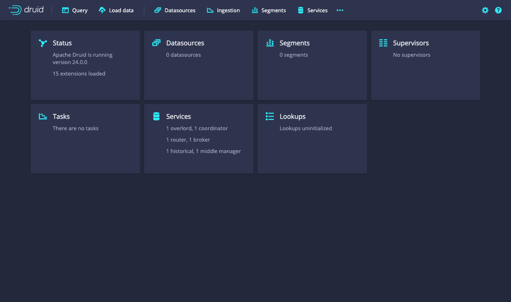

It may take a few seconds for all Druid services to finish starting, including the [Druid router](#design-router), which serves the console. If you attempt to open the web console before startup is complete, you may see errors in the browser. Wait a few moments and try again.

In this quickstart, you use the the web console to perform ingestion. The MSQ task engine specifically uses the **Query** view to edit and run SQL queries.
For a complete walkthrough of the **Query** view as it relates to the multi-stage query architecture and the MSQ task engine, see [UI walkthrough](#operations-web-console).

The Druid distribution bundles the `wikiticker-2015-09-12-sampled.json.gz` sample dataset that you can use for testing. The sample dataset is located in the `quickstart/tutorial/` folder, accessible from the Druid root directory, and represents Wikipedia page edits for a given day.

Follow these steps to load the sample Wikipedia dataset:

1. In the **Query** view, click **Connect external data**.
2. Select the **Local disk** tile and enter the following values:

   - **Base directory**: `quickstart/tutorial/`
   - **File filter**: `wikiticker-2015-09-12-sampled.json.gz`

   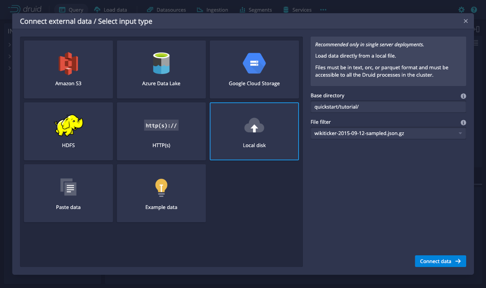

   Entering the base directory and [wildcard file filter](https://commons.apache.org/proper/commons-io/apidocs/org/apache/commons/io/filefilter/WildcardFileFilter.html) separately, as afforded by the UI, allows you to specify multiple files for ingestion at once.
3. Click **Connect data**.
4. On the **Parse** page, you can examine the raw data and perform the following optional actions before loading data into Druid:

   - Expand a row to see the corresponding source data.
   - Customize how the data is handled by selecting from the **Input format** options.
   - Adjust the primary timestamp column for the data.
     Druid requires data to have a primary timestamp column (internally stored in a column called `__time`).
     If your dataset doesn't have a timestamp, Druid uses the default value of `1970-01-01 00:00:00`.

   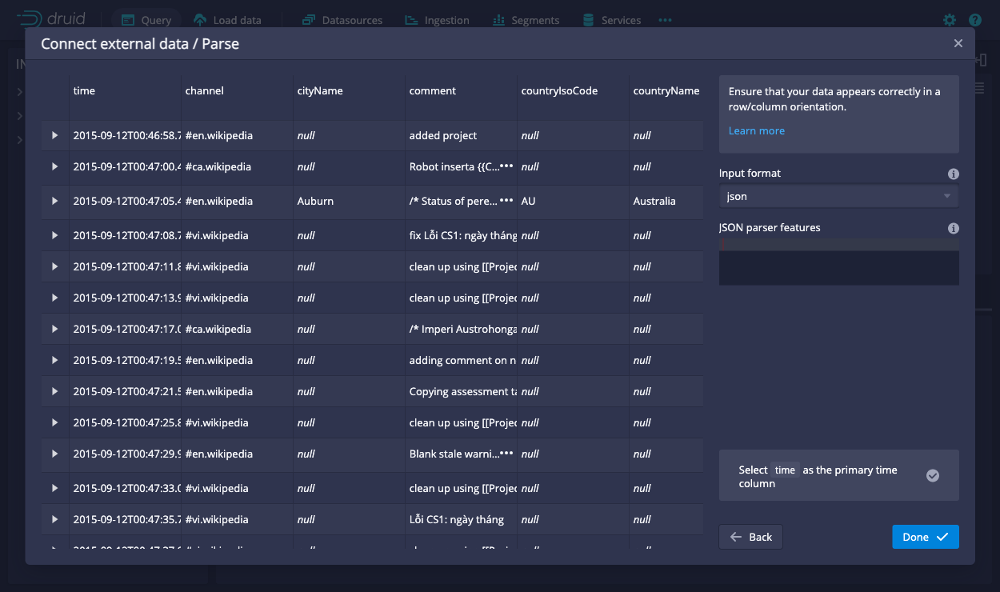
5. Click **Done**. You're returned to the **Query** view that displays the newly generated query.
   The query inserts the sample data into the table named `wikiticker-2015-09-12-sampled`.


> [!NOTE]
> **Show the query**
> ```sql
> REPLACE INTO "wikiticker-2015-09-12-sampled" OVERWRITE ALL
> WITH input_data AS (SELECT *
> FROM TABLE(
>   EXTERN(
>     '{"type":"local","baseDir":"quickstart/tutorial/","filter":"wikiticker-2015-09-12-sampled.json.gz"}',
>     '{"type":"json"}',
>     '[{"name":"time","type":"string"},{"name":"channel","type":"string"},{"name":"cityName","type":"string"},{"name":"comment","type":"string"},{"name":"countryIsoCode","type":"string"},{"name":"countryName","type":"string"},{"name":"isAnonymous","type":"string"},{"name":"isMinor","type":"string"},{"name":"isNew","type":"string"},{"name":"isRobot","type":"string"},{"name":"isUnpatrolled","type":"string"},{"name":"metroCode","type":"long"},{"name":"namespace","type":"string"},{"name":"page","type":"string"},{"name":"regionIsoCode","type":"string"},{"name":"regionName","type":"string"},{"name":"user","type":"string"},{"name":"delta","type":"long"},{"name":"added","type":"long"},{"name":"deleted","type":"long"}]'
>      )
>    ))
> SELECT
>   TIME_PARSE("time") AS __time,
>   channel,
>   cityName,
>   comment,
>   countryIsoCode,
>   countryName,
>   isAnonymous,
>   isMinor,
>   isNew,
>   isRobot,
>   isUnpatrolled,
>   metroCode,
>   namespace,
>   page,
>   regionIsoCode,
>   regionName,
>   user,
>   delta,
>   added,
>   deleted
> FROM input_data
> PARTITIONED BY DAY
> ```

6. Optionally, click **Preview** to see the general shape of the data before you ingest it.
7. Edit the first line of the query and change the default destination datasource name from `wikiticker-2015-09-12-sampled` to `wikipedia`.
8. Click **Run** to execute the query. The task may take a minute or two to complete. When done, the task displays its duration and the number of rows inserted into the table. The view is set to automatically refresh, so you don't need to refresh the browser to see the status change.

   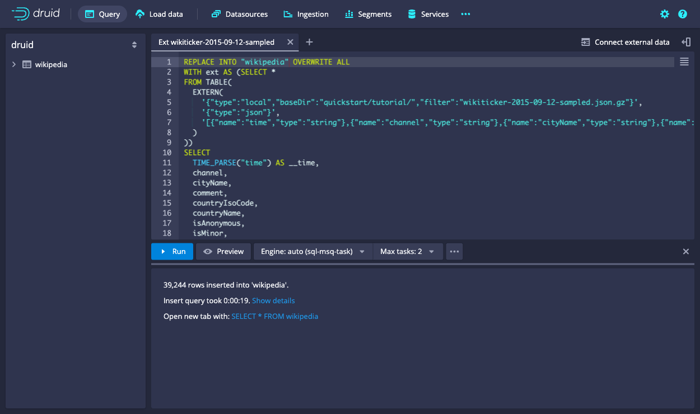

   A successful task means that Druid data servers have picked up one or more segments.

Once the ingestion job is complete, you can query the data.

In the **Query** view, run the following query to produce a list of top channels:

```sql
SELECT 
  channel, 
  COUNT(*) 
FROM "wikipedia" 
GROUP BY channel 
ORDER BY COUNT(*) DESC 
```

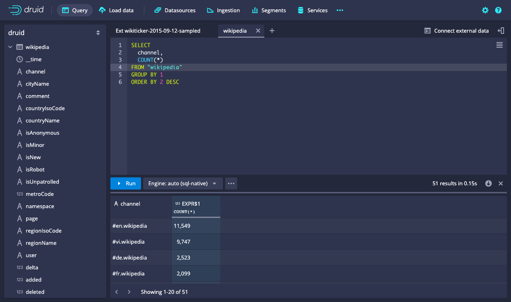

Congratulations! You've gone from downloading Druid to querying data with the MSQ task engine in just one quickstart.

See the following topics for more information:

- [Druid SQL overview](#querying-sql) or the [Query tutorial](#tutorials-tutorial-query) to learn about how to query the data you just ingested.
- [Ingestion overview](#ingestion) to explore options for ingesting more data.
- [Tutorial: Load files using SQL](#tutorials-tutorial-msq-extern) to learn how to generate a SQL query that loads external data into a Druid datasource.
- [Tutorial: Load data with native batch ingestion](https://druid.apache.org/docs/latest/tutorials/tutorial-batch-native) to load and query data with Druid's native batch ingestion feature.
- [Tutorial: Load stream data from Apache Kafka](#tutorials-tutorial-kafka) to load streaming data from a Kafka topic.
- [Extensions](#configuration-extensions) for details on Druid extensions.

Remember that after stopping Druid services, you can start clean next time by deleting the `var` directory from the Druid root directory and running the `bin/start-druid` script again. You may want to do this before using other data ingestion tutorials, since they use the same Wikipedia datasource.

---

<a id="operations-single-server"></a>

<!-- source_url: https://druid.apache.org/docs/latest/operations/single-server/ -->

<!-- page_index: 3 -->

# Single server deployment

Druid includes a launch script, `bin/start-druid` that automatically sets various memory-related parameters based on available processors and memory.
It accepts optional arguments such as list of services, total memory, and a config directory to override default JVM arguments and service-specific runtime properties.

By default, the services started by `bin/start-druid`:

- use all processors
- can use up to 80% memory on the system
- apply the configuration files in `conf/druid/auto` for all other settings.

For details about possible arguments, run `bin/start-druid --help`.

Druid includes a set of reference configurations and launch scripts for single-machine deployments.
These start scripts are deprecated in favor of the `bin/start-druid` script documented above.
These configuration bundles are located in `conf/druid/single-server/`.

| Configuration | Sizing | Launch command | Configuration directory |
| --- | --- | --- | --- |
| `nano-quickstart` | 1 CPU, 4GiB RAM | `bin/start-nano-quickstart` | `conf/druid/single-server/nano-quickstart` |
| `micro-quickstart` | 4 CPU, 16GiB RAM | `bin/start-micro-quickstart` | `conf/druid/single-server/micro-quickstart` |
| `small` | 8 CPU, 64GiB RAM (~i3.2xlarge) | `bin/start-small` | `conf/druid/single-server/small` |
| `medium` | 16 CPU, 128GiB RAM (~i3.4xlarge) | `bin/start-medium` | `conf/druid/single-server/medium` |
| `large` | 32 CPU, 256GiB RAM (~i3.8xlarge) | `bin/start-large` | `conf/druid/single-server/large` |
| `xlarge` | 64 CPU, 512GiB RAM (~i3.16xlarge) | `bin/start-xlarge` | `conf/druid/single-server/xlarge` |

The `micro-quickstart` is sized for small machines like laptops and is intended for quick evaluation use-cases.

The `nano-quickstart` is an even smaller configuration, targeting a machine with 1 CPU and 4GiB memory. It is meant for limited evaluations in resource constrained environments, such as small Docker containers.

The other configurations are intended for general use single-machine deployments. They are sized for hardware roughly based on Amazon's i3 series of EC2 instances.

The startup scripts for these example configurations run a single ZK instance along with the Druid services. You can choose to deploy ZK separately as well.

---

<a id="tutorials-docker"></a>

<!-- source_url: https://druid.apache.org/docs/latest/tutorials/docker/ -->

<!-- page_index: 4 -->

# Run with Docker

This quickstart guides you through the steps to download the Apache Druid image from [Docker Hub](https://hub.docker.com/r/apache/druid) and deploy it on a single machine using [Docker](https://www.docker.com/get-started) and [Docker Compose](https://docs.docker.com/compose/).
After you finish the initial setup, the cluster will be ready to load data.

Before beginning the quickstart, it is helpful to read the [general Druid overview](#design) and the [ingestion overview](#ingestion), because the tutorials refer to concepts discussed on those pages. It also helps to be familiar with [Docker](https://www.docker.com/get-started).

This tutorial assumes you will download the required files from GitHub. The files are also available in a Druid installation and in the Druid sources.

- [Docker](https://www.docker.com/get-started)

The default `docker-compose.yml` launches eight containers: Zookeeper, PostgreSQL, and six Druid containers based upon the [micro quickstart configuration](#operations-single-server--single-server-reference-configurations-deprecated).
Each Druid service is configured to use up to 7 GiB of memory (6 GiB direct memory and 1 GiB heap). However, the quickstart will not use all the available memory.

For this setup, Docker needs at least 6 GiB of memory available for the Druid cluster. For Docker Desktop on Mac OS, adjust the memory settings in the [Docker Desktop preferences](https://docs.docker.com/desktop/mac/). If you experience a crash with a 137 error code you likely don't have enough memory allocated to Docker.

You can modify the value of `DRUID_SINGLE_NODE_CONF` in the Docker [`environment`](#tutorials-docker--environment-file) to use different single-server mode. For example to use the nano quickstart: `DRUID_SINGLE_NODE_CONF=nano-quickstart`.

Create a directory to hold the Druid Docker files.

The Druid source code contains [an example `docker-compose.yml`](https://github.com/apache/druid/blob/36.0.0/distribution/docker/docker-compose.yml) which pulls an image from Docker Hub and is suited to be used as an example environment and to experiment with Docker based Druid configuration and deployments. [Download](https://raw.githubusercontent.com/apache/druid/36.0.0/distribution/docker/docker-compose.yml) this file to the directory created above.

The example `docker-compose.yml` will create a container for each Druid service, as well as ZooKeeper and a PostgreSQL container as the metadata store.

It will also create a named volume `druid_shared` as deep storage to keep and share segments and task logs among Druid services. The volume is mounted as `opt/shared` in the container.

The Druid `docker-compose.yml` example uses an [environment file](https://docs.docker.com/compose/environment-variables/#the-env_file-configuration-option) to specify the complete Druid configuration, including the environment variables described in [Configuration](#tutorials-docker--configuration). This file is named `environment` by default, and must be in the same directory as the `docker-compose.yml` file. [Download](https://raw.githubusercontent.com/apache/druid/36.0.0/distribution/docker/environment) the example `environment` file to the directory created above. The options in this file work well for trying Druid and for using the tutorial.

The single-file approach is inadequate for a production system. Instead we suggest using either `DRUID_COMMON_CONFIG` and `DRUID_CONFIG_${service}` or specially tailored, service-specific environment files.

Configuration of the Druid Docker container is done via environment variables set within the container. Docker Compose passes the values from the `environment file` into the container. The variables may additionally specify paths to [the standard Druid configuration files](#configuration) which must be available within the container.

The default values are fine for the Quickstart. Production systems will want to modify the defaults.

Basic configuration:

- `DRUID_MAXDIRECTMEMORYSIZE` -- set Java max direct memory size. Default is 6 GiB.
- `DRUID_XMX` -- set Java `Xmx`, the maximum heap size. Default is 1 GB.

Production configuration:

- `DRUID_CONFIG_COMMON` -- full path to a file for Druid common properties
- `DRUID_CONFIG_${service}` -- full path to a file for Druid service properties
- `JAVA_OPTS` -- set Java options

Logging configuration:

- `DRUID_LOG4J` -- set the entire [`log4j.xml` configuration file](https://logging.apache.org/log4j/2.x/manual/configuration.html#XML) verbatim. ([Example](https://github.com/apache/druid/blob/36.0.0/distribution/docker/environment#L52))
- `DRUID_LOG_LEVEL` -- override the default [Log4j log level](https://en.wikipedia.org/wiki/Log4j#Log4j_log_levels)
- `DRUID_SERVICE_LOG4J` -- set the entire [`log4j.xml` configuration file](https://logging.apache.org/log4j/2.x/manual/configuration.html#XML) verbatim specific to a service.
- `DRUID_SERVICE_LOG_LEVEL` -- override the default [Log4j log level](https://en.wikipedia.org/wiki/Log4j#Log4j_log_levels) in the service specific log4j.

Advanced memory configuration:

- `DRUID_XMS` -- set Java [`Xms`](https://docs.oracle.com/cd/E19900-01/819-4742/abeik/index.html), the initial heap size. Default is 1 GB.
- `DRUID_MAXNEWSIZE` -- set [Java max new size](https://docs.oracle.com/cd/E19900-01/819-4742/abeik/index.html)
- `DRUID_NEWSIZE` -- set [Java new size](https://docs.oracle.com/cd/E19900-01/819-4742/abeik/index.html)

In addition to the special environment variables, the script which launches Druid in the container will use any environment variable starting with the `druid_` prefix as command-line configuration. For example, an environment variable

`druid_metadata_storage_type=postgresql`

is translated into the following option in the Java launch command for the Druid process in the container:

`-Ddruid.metadata.storage.type=postgresql`

Note that Druid uses port 8888 for the console. This port is also used by Jupyter and other tools. To avoid conflicts, you can change the port in the [`ports`](https://github.com/apache/druid/blob/0.21.1/distribution/docker/docker-compose.yml#L125) section of the `docker-compose.yml` file. For example, to expose the console on port 9999 of the host:

```yaml
    container_name: router 
    ... 
    ports: 
      - "9999:8888" 
```

`cd` into the directory that contains the configuration files. This is the directory you created above, or the `distribution/docker/` in your Druid installation directory if you installed Druid locally.

Run `docker compose up` to launch the cluster with a shell attached, or `docker compose up -d` to run the cluster in the background.

Once the cluster has started, you can navigate to the [web console](#operations-web-console) at <http://localhost:8888>. The [Druid router process](#design-router) serves the UI.


It takes a few seconds for all the Druid processes to fully start up. If you open the console immediately after starting the services, you may see some errors that you can safely ignore.

From here you can follow along with the [Quickstart](#tutorials--load-data). For production use, refine your `docker-compose.yml` file to add any additional external service dependencies as necessary.

You can explore the Druid containers using Docker to start a shell:

```sh
docker exec -ti <id> sh 
```

Where `<id>` is the container id found with `docker ps`. Druid is installed in `/opt/druid`. The [script](https://github.com/apache/druid/blob/36.0.0/distribution/docker/druid.sh) which consumes the environment variables mentioned above, and which launches Druid, is located at `/druid.sh`.

Run `docker compose down` to shut down the cluster. Your data is persisted as a set of [Docker volumes](https://docs.docker.com/storage/volumes/) and will be available when you restart your Druid cluster.

---

<a id="tutorials-cluster"></a>

<!-- source_url: https://druid.apache.org/docs/latest/tutorials/cluster/ -->

<!-- page_index: 5 -->

# Clustered deployment

> [!NOTE]
> **info**
> If needed, you can specify where to find Java using the environment variables
> `DRUID_JAVA_HOME` or `JAVA_HOME`. For more details run the `bin/verify-java` script.

---

<a id="tutorials-tutorial-msq-extern"></a>

<!-- source_url: https://druid.apache.org/docs/latest/tutorials/tutorial-msq-extern/ -->

<!-- page_index: 6 -->

# Load files with SQL-based ingestion

> [!NOTE]
> **info**
> This page describes SQL-based batch ingestion using the [`druid-multi-stage-query`](#multi-stage-query)
> extension, new in Druid 24.0. Refer to the [ingestion methods](#ingestion--batch) table to determine which
> ingestion method is right for you.

---

<a id="tutorials-tutorial-kafka"></a>

<!-- source_url: https://druid.apache.org/docs/latest/tutorials/tutorial-kafka/ -->

<!-- page_index: 7 -->

# Load streaming data from Apache Kafka

> [!NOTE]
> **info**
> Druid and Kafka both rely on [Apache ZooKeeper](https://zookeeper.apache.org/) to coordinate and manage services. Because Druid is already running, Kafka attaches to the Druid ZooKeeper instance when it starts up.
>
> In a production environment where you're running Druid and Kafka on different machines, [start the Kafka ZooKeeper](https://kafka.apache.org/quickstart) before you start the Kafka broker.

---

<a id="tutorials-tutorial-rollup"></a>

<!-- source_url: https://druid.apache.org/docs/latest/tutorials/tutorial-rollup/ -->

<!-- page_index: 8 -->

# Aggregate data with rollup

Apache Druid® can summarize raw data at ingestion time using a process known as "rollup." [Rollup](#multi-stage-query-concepts--rollup) is a first-level aggregation operation over a selected set of columns that reduces the size of stored data.

This tutorial demonstrates how to apply rollup during ingestion and highlights its effects during query execution. The examples in the tutorial use the [multi-stage query (MSQ)](#multi-stage-query) task engine to execute SQL statements.

Before proceeding, download Druid as described in [Quickstart (local)](#tutorials) and have it running on your local machine. You don't need to load any data into the Druid cluster.

You should be familiar with data querying in Druid. If you haven't already, go through the [Query data](#tutorials-tutorial-query) tutorial first.

For this tutorial, you use a small sample of network flow event data representing IP traffic.
The data contains packet and byte counts from a source IP address to a destination IP address.

```json
{"timestamp":"2018-01-01T01:01:35Z","srcIP":"1.1.1.1", "dstIP":"2.2.2.2","packets":20,"bytes":9024} 
{"timestamp":"2018-01-01T01:01:51Z","srcIP":"1.1.1.1", "dstIP":"2.2.2.2","packets":255,"bytes":21133} 
{"timestamp":"2018-01-01T01:01:59Z","srcIP":"1.1.1.1", "dstIP":"2.2.2.2","packets":11,"bytes":5780} 
{"timestamp":"2018-01-01T01:02:14Z","srcIP":"1.1.1.1", "dstIP":"2.2.2.2","packets":38,"bytes":6289} 
{"timestamp":"2018-01-01T01:02:29Z","srcIP":"1.1.1.1", "dstIP":"2.2.2.2","packets":377,"bytes":359971} 
{"timestamp":"2018-01-01T01:03:29Z","srcIP":"1.1.1.1", "dstIP":"2.2.2.2","packets":49,"bytes":10204} 
{"timestamp":"2018-01-02T21:33:14Z","srcIP":"7.7.7.7", "dstIP":"8.8.8.8","packets":38,"bytes":6289} 
{"timestamp":"2018-01-02T21:33:45Z","srcIP":"7.7.7.7", "dstIP":"8.8.8.8","packets":123,"bytes":93999} 
{"timestamp":"2018-01-02T21:35:45Z","srcIP":"7.7.7.7", "dstIP":"8.8.8.8","packets":12,"bytes":2818} 
```

Load the sample dataset using the [`INSERT INTO`](#multi-stage-query-reference--insert) statement and the [`EXTERN`](#multi-stage-query-reference--extern-function) function to ingest the data inline. In the [Druid web console](#operations-web-console), go to the **Query** view and run the following query:

```sql
INSERT INTO "rollup_tutorial" 
WITH "inline_data" AS ( 
  SELECT * 
  FROM TABLE(EXTERN('{ 
    "type":"inline", 
    "data":"{\"timestamp\":\"2018-01-01T01:01:35Z\",\"srcIP\":\"1.1.1.1\",\"dstIP\":\"2.2.2.2\",\"packets\":20,\"bytes\":9024}\n{\"timestamp\":\"2018-01-01T01:02:14Z\",\"srcIP\":\"1.1.1.1\",\"dstIP\":\"2.2.2.2\",\"packets\":38,\"bytes\":6289}\n{\"timestamp\":\"2018-01-01T01:01:59Z\",\"srcIP\":\"1.1.1.1\",\"dstIP\":\"2.2.2.2\",\"packets\":11,\"bytes\":5780}\n{\"timestamp\":\"2018-01-01T01:01:51Z\",\"srcIP\":\"1.1.1.1\",\"dstIP\":\"2.2.2.2\",\"packets\":255,\"bytes\":21133}\n{\"timestamp\":\"2018-01-01T01:02:29Z\",\"srcIP\":\"1.1.1.1\",\"dstIP\":\"2.2.2.2\",\"packets\":377,\"bytes\":359971}\n{\"timestamp\":\"2018-01-01T01:03:29Z\",\"srcIP\":\"1.1.1.1\",\"dstIP\":\"2.2.2.2\",\"packets\":49,\"bytes\":10204}\n{\"timestamp\":\"2018-01-02T21:33:14Z\",\"srcIP\":\"7.7.7.7\",\"dstIP\":\"8.8.8.8\",\"packets\":38,\"bytes\":6289}\n{\"timestamp\":\"2018-01-02T21:33:45Z\",\"srcIP\":\"7.7.7.7\",\"dstIP\":\"8.8.8.8\",\"packets\":123,\"bytes\":93999}\n{\"timestamp\":\"2018-01-02T21:35:45Z\",\"srcIP\":\"7.7.7.7\",\"dstIP\":\"8.8.8.8\",\"packets\":12,\"bytes\":2818}"}',  
    '{"type":"json"}'))  
    EXTEND ("timestamp" VARCHAR, "srcIP" VARCHAR, "dstIP" VARCHAR, "packets" BIGINT, "bytes" BIGINT) 
) 
SELECT 
  FLOOR(TIME_PARSE("timestamp") TO MINUTE) AS __time, 
  "srcIP", 
  "dstIP", 
  SUM("bytes") AS "bytes", 
  SUM("packets") AS "packets", 
  COUNT(*) AS "count" 
FROM "inline_data" 
GROUP BY 1, 2, 3 
PARTITIONED BY DAY 
```

Note the following aspects of the ingestion statement:

- You transform the timestamp field using the `FLOOR` function to round timestamps down to the minute.
- You group by the dimensions `timestamp`, `srcIP`, and `dstIP`.
- You create the `bytes` and `packets` metrics, which are summed from their respective input fields.
- You also create the `count` metric that records the number of rows that get rolled-up per each row in the datasource.

With rollup, Druid combines rows with identical timestamp and dimension values after the timestamp truncation. Druid computes and stores the metric values using the specified aggregation function over each set of rolled-up rows.

After the ingestion completes, you can query the data.

In the web console, open a new tab in the **Query** view. Run the following query to view the ingested data:

```sql
SELECT * FROM "rollup_tutorial" 
```

Returns the following:

| `__time` | `srcIP` | `dstIP` | `bytes` | `count` | `packets` |
| --- | --- | --- | --- | --- | --- |
| `2018-01-01T01:01:00.000Z` | `1.1.1.1` | `2.2.2.2` | `35,937` | `3` | `286` |
| `2018-01-01T01:02:00.000Z` | `1.1.1.1` | `2.2.2.2` | `366,260` | `2` | `415` |
| `2018-01-01T01:03:00.000Z` | `1.1.1.1` | `2.2.2.2` | `10,204` | `1` | `49` |
| `2018-01-02T21:33:00.000Z` | `7.7.7.7` | `8.8.8.8` | `100,288` | `2` | `161` |
| `2018-01-02T21:35:00.000Z` | `7.7.7.7` | `8.8.8.8` | `2,818` | `1` | `12` |

Notice there are only five rows as opposed to the nine rows in the example data. In the next section, you explore the components of the rolled-up rows.

Consider the three events in the original input data that occur over the course of minute `2018-01-01T01:01`:

```json
{"timestamp":"2018-01-01T01:01:35Z","srcIP":"1.1.1.1", "dstIP":"2.2.2.2","packets":20,"bytes":9024} 
{"timestamp":"2018-01-01T01:01:51Z","srcIP":"1.1.1.1", "dstIP":"2.2.2.2","packets":255,"bytes":21133} 
{"timestamp":"2018-01-01T01:01:59Z","srcIP":"1.1.1.1", "dstIP":"2.2.2.2","packets":11,"bytes":5780} 
```

Druid combines the three rows into one during rollup:

| `__time` | `srcIP` | `dstIP` | `bytes` | `count` | `packets` |
| --- | --- | --- | --- | --- | --- |
| `2018-01-01T01:01:00.000Z` | `1.1.1.1` | `2.2.2.2` | `35,937` | `3` | `286` |

Before the grouping occurs, the `FLOOR(TIME_PARSE("timestamp") TO MINUTE)` expression buckets (floors) the timestamp column of the original input by minute.

The input rows are grouped because they have the same values for their dimension columns `{timestamp, srcIP, dstIP}`. The metric columns calculate the sum aggregation of the grouped rows for `packets` and `bytes`. The `count` metric shows how many rows from the original input data contributed to the final rolled-up row.

Now, consider the two events in the original input data that occur over the course of minute `2018-01-01T01:02`:

```json
{"timestamp":"2018-01-01T01:02:14Z","srcIP":"1.1.1.1", "dstIP":"2.2.2.2","packets":38,"bytes":6289} 
{"timestamp":"2018-01-01T01:02:29Z","srcIP":"1.1.1.1", "dstIP":"2.2.2.2","packets":377,"bytes":359971} 
```

The rows are grouped into the following during rollup:

| `__time` | `srcIP` | `dstIP` | `bytes` | `count` | `packets` |
| --- | --- | --- | --- | --- | --- |
| `2018-01-01T01:02:00.000Z` | `1.1.1.1` | `2.2.2.2` | `366,260` | `2` | `415` |

In the original input data, only one event occurs over the course of minute `2018-01-01T01:03`:

```json
{"timestamp":"2018-01-01T01:03:29Z","srcIP":"1.1.1.1", "dstIP":"2.2.2.2","packets":49,"bytes":10204} 
```

Therefore, no rollup takes place:

| `__time` | `srcIP` | `dstIP` | `bytes` | `count` | `packets` |
| --- | --- | --- | --- | --- | --- |
| `2018-01-01T01:03:00.000Z` | `1.1.1.1` | `2.2.2.2` | `10,204` | `1` | `49` |

See the following topics for more information:

- [Data rollup](#ingestion-rollup) for suggestions and best practices when performing rollup.
- [SQL-based ingestion concepts](#multi-stage-query-concepts--rollup) for information on rollup using SQL-based ingestion.
- [SQL-based ingestion query examples](#multi-stage-query-examples--insert-with-rollup) for another example of data rollup.
- [Druid schema model](#ingestion-schema-model) to learn about the primary timestamp, dimensions, and metrics.

---

<a id="tutorials-tutorial-ingestion-spec"></a>

<!-- source_url: https://druid.apache.org/docs/latest/tutorials/tutorial-ingestion-spec/ -->

<!-- page_index: 9 -->

# Write an ingestion spec

This tutorial will guide the reader through the process of defining an ingestion spec, pointing out key considerations and guidelines.

For this tutorial, we'll assume you've already downloaded Apache Druid as described in
the [single-machine quickstart](#tutorials) and have it running on your local machine.

It will also be helpful to have finished [Tutorial: Loading a file](https://druid.apache.org/docs/latest/tutorials/tutorial-batch), [Tutorial: Querying data](#tutorials-tutorial-query), and [Tutorial: Rollup](#tutorials-tutorial-rollup).

Suppose we have the following network flow data:

- `srcIP`: IP address of sender
- `srcPort`: Port of sender
- `dstIP`: IP address of receiver
- `dstPort`: Port of receiver
- `protocol`: IP protocol number
- `packets`: number of packets transmitted
- `bytes`: number of bytes transmitted
- `cost`: the cost of sending the traffic

```json
{"ts":"2018-01-01T01:01:35Z","srcIP":"1.1.1.1", "dstIP":"2.2.2.2", "srcPort":2000, "dstPort":3000, "protocol": 6, "packets":10, "bytes":1000, "cost": 1.4} 
{"ts":"2018-01-01T01:01:51Z","srcIP":"1.1.1.1", "dstIP":"2.2.2.2", "srcPort":2000, "dstPort":3000, "protocol": 6, "packets":20, "bytes":2000, "cost": 3.1} 
{"ts":"2018-01-01T01:01:59Z","srcIP":"1.1.1.1", "dstIP":"2.2.2.2", "srcPort":2000, "dstPort":3000, "protocol": 6, "packets":30, "bytes":3000, "cost": 0.4} 
{"ts":"2018-01-01T01:02:14Z","srcIP":"1.1.1.1", "dstIP":"2.2.2.2", "srcPort":5000, "dstPort":7000, "protocol": 6, "packets":40, "bytes":4000, "cost": 7.9} 
{"ts":"2018-01-01T01:02:29Z","srcIP":"1.1.1.1", "dstIP":"2.2.2.2", "srcPort":5000, "dstPort":7000, "protocol": 6, "packets":50, "bytes":5000, "cost": 10.2} 
{"ts":"2018-01-01T01:03:29Z","srcIP":"1.1.1.1", "dstIP":"2.2.2.2", "srcPort":5000, "dstPort":7000, "protocol": 6, "packets":60, "bytes":6000, "cost": 4.3} 
{"ts":"2018-01-01T02:33:14Z","srcIP":"7.7.7.7", "dstIP":"8.8.8.8", "srcPort":4000, "dstPort":5000, "protocol": 17, "packets":100, "bytes":10000, "cost": 22.4} 
{"ts":"2018-01-01T02:33:45Z","srcIP":"7.7.7.7", "dstIP":"8.8.8.8", "srcPort":4000, "dstPort":5000, "protocol": 17, "packets":200, "bytes":20000, "cost": 34.5} 
{"ts":"2018-01-01T02:35:45Z","srcIP":"7.7.7.7", "dstIP":"8.8.8.8", "srcPort":4000, "dstPort":5000, "protocol": 17, "packets":300, "bytes":30000, "cost": 46.3} 
```

Save the JSON contents above into a file called `ingestion-tutorial-data.json` in `quickstart/`.

Let's walk through the process of defining an ingestion spec that can load this data.

For this tutorial, we will be using the native batch indexing task. When using other task types, some aspects of the ingestion spec will differ, and this tutorial will point out such areas.

The core element of a Druid ingestion spec is the `dataSchema`. The `dataSchema` defines how to parse input data into a set of columns that will be stored in Druid.

Let's start with an empty `dataSchema` and add fields to it as we progress through the tutorial.

Create a new file called `ingestion-tutorial-index.json` in `quickstart/` with the following contents:

```json
"dataSchema" : {} 
```

We will be making successive edits to this ingestion spec as we progress through the tutorial.

The datasource name is specified by the `dataSource` parameter in the `dataSchema`.

```json
"dataSchema" : { 
  "dataSource" : "ingestion-tutorial", 
} 
```

Let's call the tutorial datasource `ingestion-tutorial`.

The `dataSchema` needs to know how to extract the main timestamp field from the input data.

The timestamp column in our input data is named "ts", containing ISO 8601 timestamps, so let's add a `timestampSpec` with that information to the `dataSchema`:

```json
"dataSchema" : { 
  "dataSource" : "ingestion-tutorial", 
  "timestampSpec" : { 
    "format" : "iso", 
    "column" : "ts" 
  } 
} 
```

Now that we've defined the time column, let's look at definitions for other columns.

Druid supports the following column types: String, Long, Float, Double. We will see how these are used in the following sections.

Before we move on to how we define our other non-time columns, let's discuss `rollup` first.

When ingesting data, we must consider whether we wish to use rollup or not.

- If rollup is enabled, we will need to separate the input columns into two categories, "dimensions" and "metrics". "Dimensions" are the grouping columns for rollup, while "metrics" are the columns that will be aggregated.
- If rollup is disabled, then all columns are treated as "dimensions" and no pre-aggregation occurs.

For this tutorial, let's enable rollup. This is specified with a `granularitySpec` on the `dataSchema`.

```json
"dataSchema" : { 
  "dataSource" : "ingestion-tutorial", 
  "timestampSpec" : { 
    "format" : "iso", 
    "column" : "ts" 
  }, 
  "granularitySpec" : { 
    "rollup" : true 
  } 
} 
```

For this example dataset, the following is a sensible split for "dimensions" and "metrics":

- Dimensions: srcIP, srcPort, dstIP, dstPort, protocol
- Metrics: packets, bytes, cost

The dimensions here are a group of properties that identify a unidirectional flow of IP traffic, while the metrics represent facts about the IP traffic flow specified by a dimension grouping.

Let's look at how to define these dimensions and metrics within the ingestion spec.

Dimensions are specified with a `dimensionsSpec` inside the `dataSchema`.

```json
"dataSchema" : { 
  "dataSource" : "ingestion-tutorial", 
  "timestampSpec" : { 
    "format" : "iso", 
    "column" : "ts" 
  }, 
  "dimensionsSpec" : { 
    "dimensions": [ 
      "srcIP", 
      { "name" : "srcPort", "type" : "long" }, 
      { "name" : "dstIP", "type" : "string" }, 
      { "name" : "dstPort", "type" : "long" }, 
      { "name" : "protocol", "type" : "string" } 
    ] 
  }, 
  "granularitySpec" : { 
    "rollup" : true 
  } 
} 
```

Each dimension has a `name` and a `type`, where `type` can be "long", "float", "double", or "string".

Note that `srcIP` is a "string" dimension; for string dimensions, it is enough to specify just a dimension name, since "string" is the default dimension type.

Also note that `protocol` is a numeric value in the input data, but we are ingesting it as a "string" column; Druid will coerce the input longs to strings during ingestion.

Should a numeric input be ingested as a numeric dimension or as a string dimension?

Numeric dimensions have the following pros/cons relative to String dimensions:

- Pros: Numeric representation can result in smaller column sizes on disk and lower processing overhead when reading values from the column
- Cons: Numeric dimensions do not have indices, so filtering on them will often be slower than filtering on an equivalent String dimension (which has bitmap indices)

Metrics are specified with a `metricsSpec` inside the `dataSchema`:

```json
"dataSchema" : { 
  "dataSource" : "ingestion-tutorial", 
  "timestampSpec" : { 
    "format" : "iso", 
    "column" : "ts" 
  }, 
  "dimensionsSpec" : { 
    "dimensions": [ 
      "srcIP", 
      { "name" : "srcPort", "type" : "long" }, 
      { "name" : "dstIP", "type" : "string" }, 
      { "name" : "dstPort", "type" : "long" }, 
      { "name" : "protocol", "type" : "string" } 
    ] 
  }, 
  "metricsSpec" : [ 
    { "type" : "count", "name" : "count" }, 
    { "type" : "longSum", "name" : "packets", "fieldName" : "packets" }, 
    { "type" : "longSum", "name" : "bytes", "fieldName" : "bytes" }, 
    { "type" : "doubleSum", "name" : "cost", "fieldName" : "cost" } 
  ], 
  "granularitySpec" : { 
    "rollup" : true 
  } 
} 
```

When defining a metric, it is necessary to specify what type of aggregation should be performed on that column during rollup.

Here we have defined long sum aggregations on the two long metric columns, `packets` and `bytes`, and a double sum aggregation for the `cost` column.

Note that the `metricsSpec` is on a different nesting level than `dimensionSpec` or `parseSpec`; it belongs on the same nesting level as `parser` within the `dataSchema`.

Note that we have also defined a `count` aggregator. The count aggregator will track how many rows in the original input data contributed to a "rolled up" row in the final ingested data.

If we were not using rollup, all columns would be specified in the `dimensionsSpec`, e.g.:

```json
      "dimensionsSpec" : { 
        "dimensions": [ 
          "srcIP", 
          { "name" : "srcPort", "type" : "long" }, 
          { "name" : "dstIP", "type" : "string" }, 
          { "name" : "dstPort", "type" : "long" }, 
          { "name" : "protocol", "type" : "string" }, 
          { "name" : "packets", "type" : "long" }, 
          { "name" : "bytes", "type" : "long" }, 
          { "name" : "srcPort", "type" : "double" } 
        ] 
      }, 
```

At this point, we are done defining the `parser` and `metricsSpec` within the `dataSchema` and we are almost done writing the ingestion spec.

There are some additional properties we need to set in the `granularitySpec`:

- Type of granularitySpec: the `uniform` granularity spec defines segments with uniform interval sizes. For example, all segments cover an hour's worth of data.
- The segment granularity: what size of time interval should a single segment contain data for? e.g., `DAY`, `WEEK`
- The bucketing granularity of the timestamps in the time column (referred to as `queryGranularity`)

Segment granularity is configured by the `segmentGranularity` property in the `granularitySpec`. For this tutorial, we'll create hourly segments:

```json
"dataSchema" : { 
  "dataSource" : "ingestion-tutorial", 
  "timestampSpec" : { 
    "format" : "iso", 
    "column" : "ts" 
  }, 
  "dimensionsSpec" : { 
    "dimensions": [ 
      "srcIP", 
      { "name" : "srcPort", "type" : "long" }, 
      { "name" : "dstIP", "type" : "string" }, 
      { "name" : "dstPort", "type" : "long" }, 
      { "name" : "protocol", "type" : "string" } 
    ] 
  }, 
  "metricsSpec" : [ 
    { "type" : "count", "name" : "count" }, 
    { "type" : "longSum", "name" : "packets", "fieldName" : "packets" }, 
    { "type" : "longSum", "name" : "bytes", "fieldName" : "bytes" }, 
    { "type" : "doubleSum", "name" : "cost", "fieldName" : "cost" } 
  ], 
  "granularitySpec" : { 
    "type" : "uniform", 
    "segmentGranularity" : "HOUR", 
    "rollup" : true 
  } 
} 
```

Our input data has events from two separate hours, so this task will generate two segments.

The query granularity is configured by the `queryGranularity` property in the `granularitySpec`. For this tutorial, let's use minute granularity:

```json
"dataSchema" : { 
  "dataSource" : "ingestion-tutorial", 
  "timestampSpec" : { 
    "format" : "iso", 
    "column" : "ts" 
  }, 
  "dimensionsSpec" : { 
    "dimensions": [ 
      "srcIP", 
      { "name" : "srcPort", "type" : "long" }, 
      { "name" : "dstIP", "type" : "string" }, 
      { "name" : "dstPort", "type" : "long" }, 
      { "name" : "protocol", "type" : "string" } 
    ] 
  }, 
  "metricsSpec" : [ 
    { "type" : "count", "name" : "count" }, 
    { "type" : "longSum", "name" : "packets", "fieldName" : "packets" }, 
    { "type" : "longSum", "name" : "bytes", "fieldName" : "bytes" }, 
    { "type" : "doubleSum", "name" : "cost", "fieldName" : "cost" } 
  ], 
  "granularitySpec" : { 
    "type" : "uniform", 
    "segmentGranularity" : "HOUR", 
    "queryGranularity" : "MINUTE", 
    "rollup" : true 
  } 
} 
```

To see the effect of the query granularity, let's look at this row from the raw input data:

```json
{"ts":"2018-01-01T01:03:29Z","srcIP":"1.1.1.1", "dstIP":"2.2.2.2", "srcPort":5000, "dstPort":7000, "protocol": 6, "packets":60, "bytes":6000, "cost": 4.3} 
```

When this row is ingested with minute queryGranularity, Druid will floor the row's timestamp to minute buckets:

```json
{"ts":"2018-01-01T01:03:00Z","srcIP":"1.1.1.1", "dstIP":"2.2.2.2", "srcPort":5000, "dstPort":7000, "protocol": 6, "packets":60, "bytes":6000, "cost": 4.3} 
```

For batch tasks, it is necessary to define a time interval. Input rows with timestamps outside of the time interval will not be ingested.

The interval is also specified in the `granularitySpec`:

```json
"dataSchema" : { 
  "dataSource" : "ingestion-tutorial", 
  "timestampSpec" : { 
    "format" : "iso", 
    "column" : "ts" 
  }, 
  "dimensionsSpec" : { 
    "dimensions": [ 
      "srcIP", 
      { "name" : "srcPort", "type" : "long" }, 
      { "name" : "dstIP", "type" : "string" }, 
      { "name" : "dstPort", "type" : "long" }, 
      { "name" : "protocol", "type" : "string" } 
    ] 
  }, 
  "metricsSpec" : [ 
    { "type" : "count", "name" : "count" }, 
    { "type" : "longSum", "name" : "packets", "fieldName" : "packets" }, 
    { "type" : "longSum", "name" : "bytes", "fieldName" : "bytes" }, 
    { "type" : "doubleSum", "name" : "cost", "fieldName" : "cost" } 
  ], 
  "granularitySpec" : { 
    "type" : "uniform", 
    "segmentGranularity" : "HOUR", 
    "queryGranularity" : "MINUTE", 
    "intervals" : ["2018-01-01/2018-01-02"], 
    "rollup" : true 
  } 
} 
```

We've now finished defining our `dataSchema`. The remaining steps are to place the `dataSchema` we created into an ingestion task spec, and specify the input source.

The `dataSchema` is shared across all task types, but each task type has its own specification format. For this tutorial, we will use the native batch ingestion task:

```json
{ 
  "type" : "index_parallel", 
  "spec" : { 
    "dataSchema" : { 
      "dataSource" : "ingestion-tutorial", 
      "timestampSpec" : { 
        "format" : "iso", 
        "column" : "ts" 
      }, 
      "dimensionsSpec" : { 
        "dimensions": [ 
          "srcIP", 
          { "name" : "srcPort", "type" : "long" }, 
          { "name" : "dstIP", "type" : "string" }, 
          { "name" : "dstPort", "type" : "long" }, 
          { "name" : "protocol", "type" : "string" } 
        ] 
      }, 
      "metricsSpec" : [ 
        { "type" : "count", "name" : "count" }, 
        { "type" : "longSum", "name" : "packets", "fieldName" : "packets" }, 
        { "type" : "longSum", "name" : "bytes", "fieldName" : "bytes" }, 
        { "type" : "doubleSum", "name" : "cost", "fieldName" : "cost" } 
      ], 
      "granularitySpec" : { 
        "type" : "uniform", 
        "segmentGranularity" : "HOUR", 
        "queryGranularity" : "MINUTE", 
        "intervals" : ["2018-01-01/2018-01-02"], 
        "rollup" : true 
      } 
    } 
  } 
} 
```

Now let's define our input source, which is specified in an `ioConfig` object. Each task type has its own type of `ioConfig`. To read input data, we need to specify an `inputSource`. The example netflow data we saved earlier needs to be read from a local file, which is configured below:

```json
    "ioConfig" : { 
      "type" : "index_parallel", 
      "inputSource" : { 
        "type" : "local", 
        "baseDir" : "quickstart/", 
        "filter" : "ingestion-tutorial-data.json" 
      } 
    } 
```

Since our input data is represented as JSON strings, we'll use a `inputFormat` to `json` format:

```json
    "ioConfig" : { 
      "type" : "index_parallel", 
      "inputSource" : { 
        "type" : "local", 
        "baseDir" : "quickstart/", 
        "filter" : "ingestion-tutorial-data.json" 
      }, 
      "inputFormat" : { 
        "type" : "json" 
      } 
    } 
```

```json
{ 
  "type" : "index_parallel", 
  "spec" : { 
    "dataSchema" : { 
      "dataSource" : "ingestion-tutorial", 
      "timestampSpec" : { 
        "format" : "iso", 
        "column" : "ts" 
      }, 
      "dimensionsSpec" : { 
        "dimensions": [ 
          "srcIP", 
          { "name" : "srcPort", "type" : "long" }, 
          { "name" : "dstIP", "type" : "string" }, 
          { "name" : "dstPort", "type" : "long" }, 
          { "name" : "protocol", "type" : "string" } 
        ] 
      }, 
      "metricsSpec" : [ 
        { "type" : "count", "name" : "count" }, 
        { "type" : "longSum", "name" : "packets", "fieldName" : "packets" }, 
        { "type" : "longSum", "name" : "bytes", "fieldName" : "bytes" }, 
        { "type" : "doubleSum", "name" : "cost", "fieldName" : "cost" } 
      ], 
      "granularitySpec" : { 
        "type" : "uniform", 
        "segmentGranularity" : "HOUR", 
        "queryGranularity" : "MINUTE", 
        "intervals" : ["2018-01-01/2018-01-02"], 
        "rollup" : true 
      } 
    }, 
    "ioConfig" : { 
      "type" : "index_parallel", 
      "inputSource" : { 
        "type" : "local", 
        "baseDir" : "quickstart/", 
        "filter" : "ingestion-tutorial-data.json" 
      }, 
      "inputFormat" : { 
        "type" : "json" 
      } 
    } 
  } 
} 
```

Each ingestion task has a `tuningConfig` section that allows users to tune various ingestion parameters.

As an example, let's add a `tuningConfig` that sets a target segment size for the native batch ingestion task:

```json
    "tuningConfig" : { 
      "type" : "index_parallel", 
      "partitionsSpec": { 
        "type": "dynamic", 
         "maxRowsPerSegment" : 5000000 
      } 
    } 
          
```

Note that each ingestion task has its own type of `tuningConfig`.

We've finished defining the ingestion spec, it should now look like the following:

```json
{ 
  "type" : "index_parallel", 
  "spec" : { 
    "dataSchema" : { 
      "dataSource" : "ingestion-tutorial", 
      "timestampSpec" : { 
        "format" : "iso", 
        "column" : "ts" 
      }, 
      "dimensionsSpec" : { 
        "dimensions": [ 
          "srcIP", 
          { "name" : "srcPort", "type" : "long" }, 
          { "name" : "dstIP", "type" : "string" }, 
          { "name" : "dstPort", "type" : "long" }, 
          { "name" : "protocol", "type" : "string" } 
        ] 
      }, 
      "metricsSpec" : [ 
        { "type" : "count", "name" : "count" }, 
        { "type" : "longSum", "name" : "packets", "fieldName" : "packets" }, 
        { "type" : "longSum", "name" : "bytes", "fieldName" : "bytes" }, 
        { "type" : "doubleSum", "name" : "cost", "fieldName" : "cost" } 
      ], 
      "granularitySpec" : { 
        "type" : "uniform", 
        "segmentGranularity" : "HOUR", 
        "queryGranularity" : "MINUTE", 
        "intervals" : ["2018-01-01/2018-01-02"], 
        "rollup" : true 
      } 
    }, 
    "ioConfig" : { 
      "type" : "index_parallel", 
      "inputSource" : { 
        "type" : "local", 
        "baseDir" : "quickstart/", 
        "filter" : "ingestion-tutorial-data.json" 
      }, 
      "inputFormat" : { 
        "type" : "json" 
      } 
    }, 
    "tuningConfig" : { 
      "type" : "index_parallel", 
      "partitionsSpec": { 
        "type": "dynamic", 
         "maxRowsPerSegment" : 5000000 
      } 
    } 
  } 
} 
```

From the `apache-druid-36.0.0` package root, run the following command:

```bash
bin/post-index-task --file quickstart/ingestion-tutorial-index.json --url http://localhost:8081 
```

After the script completes, we will query the data.

In the web console, open a new tab in the **Query** view. Run the following query to view the ingested data:

```sql
select * from "ingestion-tutorial" 
```

Returns the following:

| `__time` | `bytes` | `cost` | `count` | `dstIP` | `dstPort` | `packets` | `protocol` | `srcIP` | `srcPort` |
| --- | --- | --- | --- | --- | --- | --- | --- | --- | --- |
| `2018-01-01T01:01:00.000Z` | `6000` | `4.9` | `3` | `2.2.2.2` | `3000` | `60` | `6` | `1.1.1.1` | `2000` |
| `2018-01-01T01:02:00.000Z` | `9000` | `18.1` | `2` | `2.2.2.2` | `7000` | `90` | `6` | `1.1.1.1` | `5000` |
| `2018-01-01T01:03:00.000Z` | `6000` | `4.3` | `1` | `2.2.2.2` | `7000` | `60` | `6` | `1.1.1.1` | `5000` |
| `2018-01-01T02:33:00.000Z` | `30000` | `56.9` | `2` | `8.8.8.8` | `5000` | `300` | `17` | `7.7.7.7` | `4000` |
| `2018-01-01T02:35:00.000Z` | `30000` | `46.3` | `1` | `8.8.8.8` | `5000` | `300` | `17` | `7.7.7.7` | `4000` |

---

<a id="tutorials-tutorial-transform"></a>

<!-- source_url: https://druid.apache.org/docs/latest/tutorials/tutorial-transform/ -->

<!-- page_index: 10 -->

# Transform input data

This tutorial demonstrates how to transform input data during ingestion.

Before proceeding, download Apache Druid® as described in [Quickstart (local)](#tutorials) and have it running on your local machine. You don't need to load any data into the Druid cluster.

You should be familiar with data querying in Druid. If you haven't already, go through the [Query data](#tutorials-tutorial-query) tutorial first.

For this tutorial, you use the following sample data:

```json
{"timestamp":"2018-01-01T07:01:35Z", "animal":"octopus", "location":1, "number":100} 
{"timestamp":"2018-01-01T05:01:35Z", "animal":"mongoose", "location":2,"number":200} 
{"timestamp":"2018-01-01T06:01:35Z", "animal":"snake", "location":3, "number":300} 
{"timestamp":"2018-01-01T01:01:35Z", "animal":"lion", "location":4, "number":300} 
```

Load the sample dataset using the [`INSERT INTO`](#multi-stage-query-reference--insert) statement and the [`EXTERN`](#multi-stage-query-reference--extern-function) function to ingest the data inline. In the [Druid web console](#operations-web-console), go to the **Query** view and run the following query:

```sql
INSERT INTO "transform_tutorial" 
WITH "ext" AS ( 
  SELECT * 
  FROM TABLE(EXTERN('{"type":"inline","data":"{\"timestamp\":\"2018-01-01T07:01:35Z\",\"animal\":\"octopus\",  \"location\":1, \"number\":100}\n{\"timestamp\":\"2018-01-01T05:01:35Z\",\"animal\":\"mongoose\", \"location\":2,\"number\":200}\n{\"timestamp\":\"2018-01-01T06:01:35Z\",\"animal\":\"snake\", \"location\":3, \"number\":300}\n{\"timestamp\":\"2018-01-01T01:01:35Z\",\"animal\":\"lion\", \"location\":4, \"number\":300}"}', '{"type":"json"}')) EXTEND ("timestamp" VARCHAR, "animal" VARCHAR, "location" BIGINT, "number" BIGINT) 
) 
SELECT 
  TIME_PARSE("timestamp") AS "__time", 
  TEXTCAT('super-', "animal") AS "animal", 
  "location", 
  "number", 
  "number" * 3 AS "triple-number" 
FROM "ext" 
WHERE (TEXTCAT('super-', "animal") = 'super-mongoose' OR "location" = 3 OR "number" = 100) 
PARTITIONED BY DAY 
```

In the `SELECT` clause, you specify the following transformations:

- `animal`: prepends "super-" to the values in the `animal` column using the [`TEXTCAT`](#querying-sql-functions--textcat) function. Note that it only ingests the transformed data.
- `triple-number`: multiplies the `number` column by three and stores the results in a column named `triple-number`. Note that the query ingests both the original and the transformed data.

Additionally, the `WHERE` clause applies the following three OR operators so that the query only ingests the rows where at least one of the following conditions is `true`:

- `TEXTCAT('super-', "animal")` matches "super-mongoose"
- `location` matches 3
- `number` matches 100

Once a row passes the filter, the ingestion job applies the transformations. In this example, the filter selects the first three rows because each row meets at least one of the required OR conditions. For the selected rows, the ingestion job ingests the transformed `animal` column, the `location` column, and both the original `number` and the transformed `triple-number` column. The "lion" row doesn't meet any of the conditions, so it is not ingested or transformed.

In the web console, open a new tab in the **Query** view. Run the following query to view the ingested data:

```sql
SELECT * FROM "transform_tutorial" 
```

Returns the following:

| `__time` | `animal` | `location` | `number` | `triple-number` |
| --- | --- | --- | --- | --- |
| `2018-01-01T05:01:35.000Z` | `super-mongoose` | `2` | `200` | `600` |
| `2018-01-01T06:01:35.000Z` | `super-snake` | `3` | `300` | `900` |
| `2018-01-01T07:01:35.000Z` | `super-octopus` | `1` | `100` | `300` |

Notice how the "lion" row is missing, and how the other three rows that were ingested have transformations applied to them.

See the following topics for more information:

- [All functions](#querying-sql-functions) for a list of functions that can be used to transform data.
- [Transform spec reference](#ingestion-ingestion-spec--transformspec) to learn more about transforms in JSON-based batch ingestion.
- [WHERE clause](#querying-sql--where) to learn how to specify filters in Druid SQL.

---

<a id="tutorials-tutorial-msq-convert-spec"></a>

<!-- source_url: https://druid.apache.org/docs/latest/tutorials/tutorial-msq-convert-spec/ -->

<!-- page_index: 11 -->

# Convert an ingestion spec for SQL-based ingestion

> [!NOTE]
> **info**
> This page describes SQL-based batch ingestion using the [`druid-multi-stage-query`](#multi-stage-query)
> extension, new in Druid 24.0. Refer to the [ingestion methods](#ingestion--batch) table to determine which
> ingestion method is right for you.

---

<a id="tutorials-tutorial-retention"></a>

<!-- source_url: https://druid.apache.org/docs/latest/tutorials/tutorial-retention/ -->

<!-- page_index: 12 -->

# Configure data retention

This tutorial demonstrates how to configure retention rules on a datasource to set the time intervals of data that will be retained or dropped.

For this tutorial, we'll assume you've already downloaded Apache Druid as described in
the [single-machine quickstart](#tutorials) and have it running on your local machine.

It will also be helpful to have finished [Load a file](https://druid.apache.org/docs/latest/tutorials/tutorial-batch) and [Query data](#tutorials-tutorial-query) tutorials.

For this tutorial, we'll be using the Wikipedia edits sample data, with an ingestion task spec that will create a separate segment for each hour in the input data.

The ingestion spec can be found at `quickstart/tutorial/retention-index.json`. Let's submit that spec, which will create a datasource called `retention-tutorial`:

```bash
bin/post-index-task --file quickstart/tutorial/retention-index.json --url http://localhost:8081 
```

After the ingestion completes, go to <http://localhost:8888/unified-console.html#datasources> in a browser to access the web console's datasource view.

This view shows the available datasources and a summary of the retention rules for each datasource:

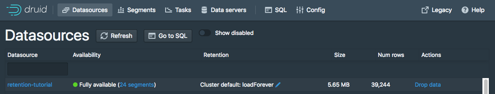

Currently there are no rules set for the `retention-tutorial` datasource. Note that there are default rules for the cluster: load forever with 2 replicas in `_default_tier`.

This means that all data will be loaded regardless of timestamp, and each segment will be replicated to two Historical processes in the default tier.

In this tutorial, we will ignore the tiering and redundancy concepts for now.

Let's view the segments for the `retention-tutorial` datasource by clicking the "24 Segments" link next to "Fully Available".

The segments view (<http://localhost:8888/unified-console.html#segments>) provides information about what segments a datasource contains. The page shows that there are 24 segments, each one containing data for a specific hour of 2015-09-12:

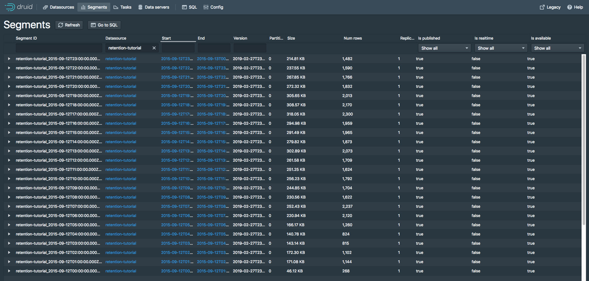

Suppose we want to drop data for the first 12 hours of 2015-09-12 and keep data for the later 12 hours of 2015-09-12.

Go to the [datasources view](http://localhost:8888/unified-console.html#datasources) and click the blue pencil icon next to `Cluster default: loadForever` for the `retention-tutorial` datasource.

A rule configuration window will appear:

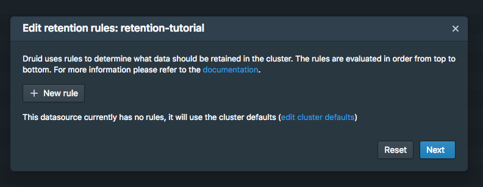

Now click the `+ New rule` button twice.

In the upper rule box, select `Load` and `by interval`, and then enter `2015-09-12T12:00:00.000Z/2015-09-13T00:00:00.000Z` in field next to `by interval`. Replicas can remain at 2 in the `_default_tier`.

In the lower rule box, select `Drop` and `forever`.

The rules should look like this:

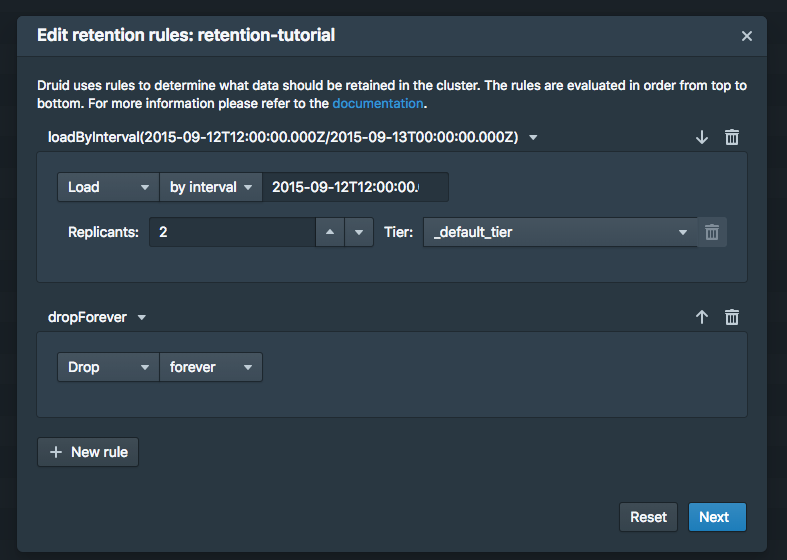

Now click `Next`. The rule configuration process will ask for a user name and comment, for change logging purposes. You can enter `tutorial` for both.

Now click `Save`. You can see the new rules in the datasources view:

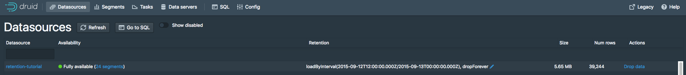

Give the cluster a few minutes to apply the rule change, and go to the [segments view](http://localhost:8888/unified-console.html#segments) in the web console.
The segments for the first 12 hours of 2015-09-12 are now gone:

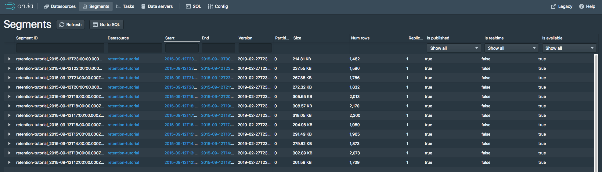

The resulting retention rule chain is the following:

1. loadByInterval 2015-09-12T12/2015-09-13 (12 hours)
2. dropForever
3. loadForever (default rule)

The rule chain is evaluated from top to bottom, with the default rule chain always added at the bottom.

The tutorial rule chain we just created loads data if it is within the specified 12 hour interval.

If data is not within the 12 hour interval, the rule chain evaluates `dropForever` next, which will drop any data.

The `dropForever` terminates the rule chain, effectively overriding the default `loadForever` rule, which will never be reached in this rule chain.

Note that in this tutorial we defined a load rule on a specific interval.

If instead you want to retain data based on how old it is (e.g., retain data that ranges from 3 months in the past to the present time), you would define a Period load rule instead.

- [Load rules](#operations-rule-configuration)

---

<a id="tutorials-tutorial-append-data"></a>

<!-- source_url: https://druid.apache.org/docs/latest/tutorials/tutorial-append-data/ -->

<!-- page_index: 13 -->

# Append data

This tutorial shows you how to use the Apache Druid SQL [INSERT](#multi-stage-query-reference--insert) function to append data to a [datasource](#design-storage) without changing the existing data.
The examples in the tutorial use the [multi-stage query (MSQ)](#multi-stage-query) task engine to executes SQL statements.

Before you follow the steps in this tutorial, download Druid as described in [Quickstart (local)](#tutorials) and have it running on your local machine. You don't need to load any data into the Druid cluster.

You should be familiar with data querying in Druid. If you haven't already, go through the [Query data](#tutorials-tutorial-query) tutorial first.

Load a sample dataset using [INSERT](#multi-stage-query-reference--insert) and [EXTERN](#multi-stage-query-reference--extern-function) functions. The EXTERN function lets you read external data or write to an external location.

In the Druid [web console](#operations-web-console), go to the **Query** view and run the following query:

```sql
INSERT INTO "append_tutorial" 
SELECT 
  TIME_PARSE("timestamp") AS "__time", 
  "animal", 
  "number" 
FROM TABLE( 
  EXTERN( 
    '{"type":"inline","data":"{\"timestamp\":\"2024-01-01T07:01:35Z\",\"animal\":\"octopus\", \"number\":115}\n{\"timestamp\":\"2024-01-01T05:01:35Z\",\"animal\":\"mongoose\", \"number\":737}\n{\"timestamp\":\"2024-01-01T06:01:35Z\",\"animal\":\"snake\", \"number\":1234}\n{\"timestamp\":\"2024-01-01T01:01:35Z\",\"animal\":\"lion\", \"number\":300}\n{\"timestamp\":\"2024-01-02T07:01:35Z\",\"animal\":\"seahorse\", \"number\":115}\n{\"timestamp\":\"2024-01-02T05:01:35Z\",\"animal\":\"skunk\", \"number\":737}\n{\"timestamp\":\"2024-01-02T06:01:35Z\",\"animal\":\"iguana\", \"number\":1234}\n{\"timestamp\":\"2024-01-02T01:01:35Z\",\"animal\":\"opossum\", \"number\":300}"}', 
      '{"type":"json"}' 
    ) 
  ) EXTEND ("timestamp" VARCHAR, "animal" VARCHAR, "number" BIGINT) 
PARTITIONED BY DAY 
```

The resulting `append_tutorial` datasource contains records for eight animals over two days.
To view the results, open a new tab and run the following query:

```sql
SELECT * FROM "append_tutorial" 
```

> [!NOTE]
> **View the results**
> | `__time` | `animal` | `number` |
> | --- | --- | --- |
> | `2024-01-01T01:01:35.000Z` | `lion` | 300 |
> | `2024-01-01T05:01:35.000Z` | `mongoose` | 737 |
> | `2024-01-01T06:01:35.000Z` | `snake` | 1234 |
> | `2024-01-01T07:01:35.000Z` | `octopus` | 115 |
> | `2024-01-02T01:01:35.000Z` | `opossum` | 300 |
> | `2024-01-02T05:01:35.000Z` | `skunk` | 737 |
> | `2024-01-02T06:01:35.000Z` | `iguana` | 1234 |
> | `2024-01-02T07:01:35.000Z` | `seahorse` | 115 |

You can use the INSERT function to append data to the datasource without changing the existing data.
In a new tab, run the following query to ingest and append data to the `append_tutorial` datasource:

```sql
INSERT INTO "append_tutorial" 
SELECT 
  TIME_PARSE("timestamp") AS "__time", 
  "animal", 
  "number" 
FROM TABLE( 
  EXTERN( 
    '{"type":"inline","data":"{\"timestamp\":\"2024-01-03T01:09:35Z\",\"animal\":\"zebra\", \"number\":233}\n{\"timestamp\":\"2024-01-04T07:01:35Z\",\"animal\":\"bear\", \"number\":577}\n{\"timestamp\":\"2024-01-04T05:01:35Z\",\"animal\":\"falcon\", \"number\":848}\n{\"timestamp\":\"2024-01-04T06:01:35Z\",\"animal\":\"giraffe\", \"number\":113}\n{\"timestamp\":\"2024-01-04T01:01:35Z\",\"animal\":\"rhino\", \"number\":473}"}', 
    '{"type":"json"}' 
    ) 
  ) EXTEND ("timestamp" VARCHAR, "animal" VARCHAR, "number" BIGINT) 
PARTITIONED BY DAY 
```

Druid adds rows for the subsequent days after `seahorse`.
When the task completes, open a new tab and run the following query to view the results:

```sql
SELECT * FROM "append_tutorial" 
```

> [!NOTE]
> **View the results**
> | `__time` | `animal` | `number` |
> | --- | --- | --- |
> | `2024-01-01T01:01:35.000Z` | `lion` | 300 |
> | `2024-01-01T05:01:35.000Z` | `mongoose` | 737 |
> | `2024-01-01T06:01:35.000Z` | `snake` | 1234 |
> | `2024-01-01T07:01:35.000Z` | `octopus` | 115 |
> | `2024-01-02T01:01:35.000Z` | `opossum` | 300 |
> | `2024-01-02T05:01:35.000Z` | `skunk` | 737 |
> | `2024-01-02T06:01:35.000Z` | `iguana` | 1234 |
> | `2024-01-02T07:01:35.000Z` | `seahorse` | 115 |
> | `2024-01-03T01:09:35.000Z` | `zebra` | 233 |
> | `2024-01-04T01:01:35.000Z` | `rhino` | 473 |
> | `2024-01-04T05:01:35.000Z` | `falcon` | 848 |
> | `2024-01-04T06:01:35.000Z` | `giraffe` | 113 |
> | `2024-01-04T07:01:35.000Z` | `bear` | 577 |

See the following topics for more information:

- [SQL-based ingestion reference](#multi-stage-query-reference) for a reference on MSQ architecture.
- [SQL-based ingestion query examples](#multi-stage-query-examples) for example queries using the MSQ task engine.

---

<a id="tutorials-tutorial-update-data"></a>

<!-- source_url: https://druid.apache.org/docs/latest/tutorials/tutorial-update-data/ -->

<!-- page_index: 14 -->

# Update data

Apache Druid stores data and indexes in [segment files](#design-segments) partitioned by time.
After Druid creates a segment, its contents can't be modified.
You can either replace data for the whole segment, or, in some cases, overshadow a portion of the segment data.

In Druid, use time ranges to specify the data you want to update, as opposed to a primary key or dimensions often used in transactional databases. Data outside the specified replacement time range remains unaffected.
You can use this Druid functionality to perform data updates, inserts, and deletes, similar to UPSERT functionality for transactional databases.

This tutorial shows you how to use the Druid SQL [REPLACE](#multi-stage-query-reference--replace) function with the OVERWRITE clause to update existing data.

The tutorial walks you through the following use cases:

- [Overwrite all data](#tutorials-tutorial-update-data--overwrite-all-data)
- [Overwrite records for a specific time range](#tutorials-tutorial-update-data--overwrite-records-for-a-specific-time-range)
- [Update a row using partial segment overshadowing](#tutorials-tutorial-update-data--update-a-row-using-partial-segment-overshadowing)

All examples use the [multi-stage query (MSQ)](#multi-stage-query) task engine to executes SQL statements.

Before you follow the steps in this tutorial, download Druid as described in [Quickstart (local)](#tutorials) and have it running on your local machine. You don't need to load any data into the Druid cluster.

You should be familiar with data querying in Druid. If you haven't already, go through the [Query data](#tutorials-tutorial-query) tutorial first.

Load a sample dataset using [REPLACE](#multi-stage-query-reference--replace) and [EXTERN](#multi-stage-query-reference--extern-function) functions.
In Druid SQL, the REPLACE function can create a new [datasource](#design-storage) or update an existing datasource.

In the Druid [web console](#operations-web-console), go to the **Query** view and run the following query:

```sql
REPLACE INTO "update_tutorial" OVERWRITE ALL 
WITH "ext" AS ( 
  SELECT * 
  FROM TABLE( 
    EXTERN( 
     '{"type":"inline","data":"{\"timestamp\":\"2024-01-01T07:01:35Z\",\"animal\":\"octopus\", \"number\":115}\n{\"timestamp\":\"2024-01-01T05:01:35Z\",\"animal\":\"mongoose\", \"number\":737}\n{\"timestamp\":\"2024-01-01T06:01:35Z\",\"animal\":\"snake\", \"number\":1234}\n{\"timestamp\":\"2024-01-01T01:01:35Z\",\"animal\":\"lion\", \"number\":300}\n{\"timestamp\":\"2024-01-02T07:01:35Z\",\"animal\":\"seahorse\", \"number\":115}\n{\"timestamp\":\"2024-01-02T05:01:35Z\",\"animal\":\"skunk\", \"number\":737}\n{\"timestamp\":\"2024-01-02T06:01:35Z\",\"animal\":\"iguana\", \"number\":1234}\n{\"timestamp\":\"2024-01-02T01:01:35Z\",\"animal\":\"opossum\", \"number\":300}"}', 
     '{"type":"json"}' 
    ) 
  ) EXTEND ("timestamp" VARCHAR, "animal" VARCHAR, "number" BIGINT) 
) 
SELECT 
  TIME_PARSE("timestamp") AS "__time", 
  "animal", 
  "number" 
FROM "ext" 
PARTITIONED BY DAY 
 
```

In the resulting `update_tutorial` datasource, individual rows are uniquely identified by `__time`, `animal`, and `number`.
To view the results, open a new tab and run the following query:

```sql
SELECT * FROM "update_tutorial" 
```

> [!NOTE]
> **View the results**
> | `__time` | `animal` | `number` |
> | --- | --- | --- |
> | `2024-01-01T01:01:35.000Z` | `lion` | 300 |
> | `2024-01-01T05:01:35.000Z` | `mongoose` | 737 |
> | `2024-01-01T06:01:35.000Z` | `snake` | 1234 |
> | `2024-01-01T07:01:35.000Z` | `octopus` | 115 |
> | `2024-01-02T01:01:35.000Z` | `opossum` | 300 |
> | `2024-01-02T05:01:35.000Z` | `skunk` | 737 |
> | `2024-01-02T06:01:35.000Z` | `iguana` | 1234 |
> | `2024-01-02T07:01:35.000Z` | `seahorse` | 115 |

The results contain records for eight animals over two days.

You can use the REPLACE function with OVERWRITE ALL to replace the entire datasource with new data while dropping the old data.

In the web console, open a new tab and run the following query to overwrite timestamp data for the entire `update_tutorial` datasource:

```sql
REPLACE INTO "update_tutorial" OVERWRITE ALL 
WITH "ext" AS (SELECT * 
FROM TABLE( 
  EXTERN( 
    '{"type":"inline","data":"{\"timestamp\":\"2024-01-02T07:01:35Z\",\"animal\":\"octopus\", \"number\":115}\n{\"timestamp\":\"2024-01-02T05:01:35Z\",\"animal\":\"mongoose\", \"number\":737}\n{\"timestamp\":\"2024-01-02T06:01:35Z\",\"animal\":\"snake\", \"number\":1234}\n{\"timestamp\":\"2024-01-02T01:01:35Z\",\"animal\":\"lion\", \"number\":300}\n{\"timestamp\":\"2024-01-03T07:01:35Z\",\"animal\":\"seahorse\", \"number\":115}\n{\"timestamp\":\"2024-01-03T05:01:35Z\",\"animal\":\"skunk\", \"number\":737}\n{\"timestamp\":\"2024-01-03T06:01:35Z\",\"animal\":\"iguana\", \"number\":1234}\n{\"timestamp\":\"2024-01-03T01:01:35Z\",\"animal\":\"opossum\", \"number\":300}"}', 
    '{"type":"json"}' 
  ) 
) EXTEND ("timestamp" VARCHAR, "animal" VARCHAR, "number" BIGINT)) 
SELECT 
  TIME_PARSE("timestamp") AS "__time", 
  "animal", 
  "number" 
FROM "ext" 
PARTITIONED BY DAY 
```

> [!NOTE]
> **View the results**
> | `__time` | `animal` | `number` |
> | --- | --- | --- |
> | `2024-01-02T01:01:35.000Z` | `lion` | 300 |
> | `2024-01-02T05:01:35.000Z` | `mongoose` | 737 |
> | `2024-01-02T06:01:35.000Z` | `snake` | 1234 |
> | `2024-01-02T07:01:35.000Z` | `octopus` | 115 |
> | `2024-01-03T01:01:35.000Z` | `opossum` | 300 |
> | `2024-01-03T05:01:35.000Z` | `skunk` | 737 |
> | `2024-01-03T06:01:35.000Z` | `iguana` | 1234 |
> | `2024-01-03T07:01:35.000Z` | `seahorse` | 115 |

Note that the values in the `__time` column have changed to one day later.

You can use the REPLACE function to overwrite a specific time range of a datasource. When you overwrite a specific time range, that time range must align with the granularity specified in the PARTITIONED BY clause.

In the web console, open a new tab and run the following query to insert a new row and update specific rows. Note that the OVERWRITE WHERE clause tells the query to only update records for the date 2024-01-03.

```sql
REPLACE INTO "update_tutorial"  
  OVERWRITE WHERE "__time" >= TIMESTAMP'2024-01-03 00:00:00' AND "__time" < TIMESTAMP'2024-01-04 00:00:00' 
WITH "ext" AS (SELECT * 
FROM TABLE( 
  EXTERN( 
    '{"type":"inline","data":"{\"timestamp\":\"2024-01-03T01:01:35Z\",\"animal\":\"tiger\", \"number\":300}\n{\"timestamp\":\"2024-01-03T07:01:35Z\",\"animal\":\"seahorse\", \"number\":500}\n{\"timestamp\":\"2024-01-03T05:01:35Z\",\"animal\":\"polecat\", \"number\":626}\n{\"timestamp\":\"2024-01-03T06:01:35Z\",\"animal\":\"iguana\", \"number\":300}\n{\"timestamp\":\"2024-01-03T01:01:35Z\",\"animal\":\"flamingo\", \"number\":999}"}', 
    '{"type":"json"}' 
  ) 
) EXTEND ("timestamp" VARCHAR, "animal" VARCHAR, "number" BIGINT)) 
SELECT 
  TIME_PARSE("timestamp") AS "__time", 
  "animal", 
  "number" 
FROM "ext" 
PARTITIONED BY DAY 
```

> [!NOTE]
> **View the results**
> | `__time` | `animal` | `number` |
> | --- | --- | --- |
> | `2024-01-02T01:01:35.000Z` | `lion` | 300 |
> | `2024-01-02T05:01:35.000Z` | `mongoose` | 737 |
> | `2024-01-02T06:01:35.000Z` | `snake` | 1234 |
> | `2024-01-02T07:01:35.000Z` | `octopus` | 115 |
> | `2024-01-03T01:01:35.000Z` | `flamingo` | 999 |
> | `2024-01-03T01:01:35.000Z` | `tiger` | 300 |
> | `2024-01-03T05:01:35.000Z` | `polecat` | 626 |
> | `2024-01-03T06:01:35.000Z` | `iguana` | 300 |
> | `2024-01-03T07:01:35.000Z` | `seahorse` | 500 |

Note the changes in the resulting datasource:

- There is now a new row called `flamingo`.
- The `opossum` row has the value `tiger`.
- The `skunk` row has the value `polecat`.
- The `iguana` and `seahorse` rows have different numbers.

In Druid, you can overlay older data with newer data for the entire segment or portions of the segment within a particular partition.
This capability is called [overshadowing](#ingestion-tasks--overshadowing-between-segments).

You can use partial overshadowing to update a single row by adding a smaller time granularity segment on top of the existing data.
It's a less common variation on a more common approach where you replace the entire time chunk.

The following example demonstrates how update data using partial overshadowing with mixed segment granularity.
Note the following important points about the example:

- The query updates a single record for a specific `number` row.
- The original datasource uses DAY segment granularity.
- The new data segment is at HOUR granularity and represents a time range that's smaller than the existing data.
- The OVERWRITE WHERE and WHERE TIME\_IN\_INTERVAL clauses specify the destination where the update occurs and the source of the update, respectively.
- The query replaces everything within the specified interval. To update only a subset of data in that interval, you have to carry forward all records, changing only what you want to change. You can accomplish that by using the [CASE](#querying-sql-functions--case) function in the SELECT list.

```sql
REPLACE INTO "update_tutorial" 
   OVERWRITE 
       WHERE "__time" >= TIMESTAMP'2024-01-03 05:00:00' AND "__time" < TIMESTAMP'2024-01-03 06:00:00' 
SELECT  
   "__time",  
   "animal",  
   CAST(486 AS BIGINT) AS "number" 
FROM "update_tutorial"  
WHERE TIME_IN_INTERVAL("__time", '2024-01-03T05:01:35Z/PT1S') 
PARTITIONED BY FLOOR(__time TO HOUR) 
```

> [!NOTE]
> **View the results**
> | `__time` | `animal` | `number` |
> | --- | --- | --- |
> | `2024-01-02T01:01:35.000Z` | `lion` | 300 |
> | `2024-01-02T05:01:35.000Z` | `mongoose` | 737 |
> | `2024-01-02T06:01:35.000Z` | `snake` | 1234 |
> | `2024-01-02T07:01:35.000Z` | `octopus` | 115 |
> | `2024-01-03T01:01:35.000Z` | `flamingo` | 999 |
> | `2024-01-03T01:01:35.000Z` | `tiger` | 300 |
> | `2024-01-03T05:01:35.000Z` | `polecat` | 486 |
> | `2024-01-03T06:01:35.000Z` | `iguana` | 300 |
> | `2024-01-03T07:01:35.000Z` | `seahorse` | 500 |

Note that the `number` for `polecat` has changed from 626 to 486.

When you perform partial segment overshadowing multiple times, you can create segment fragmentation that could affect query performance. Use [compaction](#data-management-compaction) to correct any fragmentation.

See the following topics for more information:

- [Data updates](#data-management-update) for an overview of updating data in Druid.
- [Load files with SQL-based ingestion](#tutorials-tutorial-msq-extern) for generating a query that references externally hosted data.
- [Overwrite data with REPLACE](#multi-stage-query-concepts--overwrite-data-with-replace) for details on how the MSQ task engine executes SQL REPLACE queries.

---

<a id="tutorials-tutorial-compaction"></a>

<!-- source_url: https://druid.apache.org/docs/latest/tutorials/tutorial-compaction/ -->

<!-- page_index: 15 -->

# Compact segments

> [!NOTE]
> **info**
> `maxRowsPerSegment` in the tutorial ingestion spec is set to 1000 to generate multiple segments per hour for demonstration purposes. Do not use this spec in production.

---

<a id="tutorials-tutorial-delete-data"></a>

<!-- source_url: https://druid.apache.org/docs/latest/tutorials/tutorial-delete-data/ -->

<!-- page_index: 16 -->

# Tutorial: Deleting data

This tutorial demonstrates how to delete existing data.

This tutorial requires the following:

- A running Apache Druid instance. If you don't have Druid, see the [single-machine quickstart](#tutorials) to get started.
- The command-line JSON processor, [jq](https://stedolan.github.io/jq/download/).

In this tutorial, we will use the Wikipedia edits data, with an indexing spec that creates hourly segments. This spec is located at `quickstart/tutorial/deletion-index.json`, and it creates a datasource called `deletion-tutorial`.

Let's load this initial data:

```bash
bin/post-index-task --file quickstart/tutorial/deletion-index.json --url http://localhost:8081 
```

When the load finishes, open [http://localhost:8888/unified-console.md#datasources](http://localhost:8888/unified-console.html#datasources) in a browser.

Permanent deletion of a Druid segment has two steps:

1. The segment must first be marked as "unused". This occurs when a user manually disables a segment through the Coordinator API.
2. After segments have been marked as "unused", a Kill Task will delete any "unused" segments from Druid's metadata store as well as deep storage.

Let's drop some segments now, by using the coordinator API to drop data by interval and segmentIds.

Let's disable segments in a specified interval. This will mark all segments in the interval as "unused", but not remove them from deep storage.
Let's disable segments in interval `2015-09-12T18:00:00.000Z/2015-09-12T20:00:00.000Z` i.e. between hour 18 and 20.

```bash
curl -X 'POST' -H 'Content-Type:application/json' -d '{ "interval" : "2015-09-12T18:00:00.000Z/2015-09-12T20:00:00.000Z" }' http://localhost:8081/druid/coordinator/v1/datasources/deletion-tutorial/markUnused 
```

When the request completes, the Segments view of the web console no longer displays the segments for hours 18 and 19.
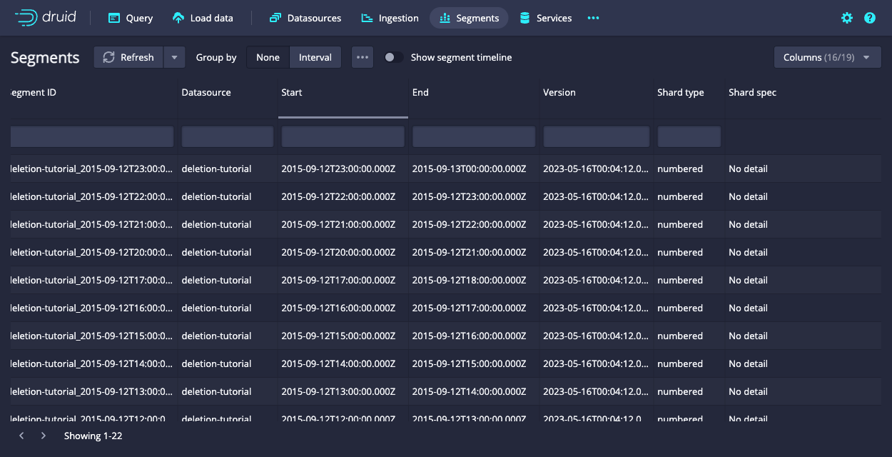

Note that the hour 18 and 19 segments are still present in deep storage:

```bash
$ ls -l1 var/druid/segments/deletion-tutorial/2015-09-12T00:00:00.000Z_2015-09-12T01:00:00.000Z 2015-09-12T01:00:00.000Z_2015-09-12T02:00:00.000Z 2015-09-12T02:00:00.000Z_2015-09-12T03:00:00.000Z 2015-09-12T03:00:00.000Z_2015-09-12T04:00:00.000Z 2015-09-12T04:00:00.000Z_2015-09-12T05:00:00.000Z 2015-09-12T05:00:00.000Z_2015-09-12T06:00:00.000Z 2015-09-12T06:00:00.000Z_2015-09-12T07:00:00.000Z 2015-09-12T07:00:00.000Z_2015-09-12T08:00:00.000Z 2015-09-12T08:00:00.000Z_2015-09-12T09:00:00.000Z 2015-09-12T09:00:00.000Z_2015-09-12T10:00:00.000Z 2015-09-12T10:00:00.000Z_2015-09-12T11:00:00.000Z 2015-09-12T11:00:00.000Z_2015-09-12T12:00:00.000Z 2015-09-12T12:00:00.000Z_2015-09-12T13:00:00.000Z 2015-09-12T13:00:00.000Z_2015-09-12T14:00:00.000Z 2015-09-12T14:00:00.000Z_2015-09-12T15:00:00.000Z 2015-09-12T15:00:00.000Z_2015-09-12T16:00:00.000Z 2015-09-12T16:00:00.000Z_2015-09-12T17:00:00.000Z 2015-09-12T17:00:00.000Z_2015-09-12T18:00:00.000Z 2015-09-12T18:00:00.000Z_2015-09-12T19:00:00.000Z 2015-09-12T19:00:00.000Z_2015-09-12T20:00:00.000Z 2015-09-12T20:00:00.000Z_2015-09-12T21:00:00.000Z 2015-09-12T21:00:00.000Z_2015-09-12T22:00:00.000Z 2015-09-12T22:00:00.000Z_2015-09-12T23:00:00.000Z 2015-09-12T23:00:00.000Z_2015-09-13T00:00:00.000Z
```

Let's disable some segments by their segmentID. This will again mark the segments as "unused", but not remove them from deep storage. You can see the full segmentID for a segment using the web console.

In the [segments view](http://localhost:8888/unified-console.html#segments), click one of the segment rows to open the segment metadata dialog:

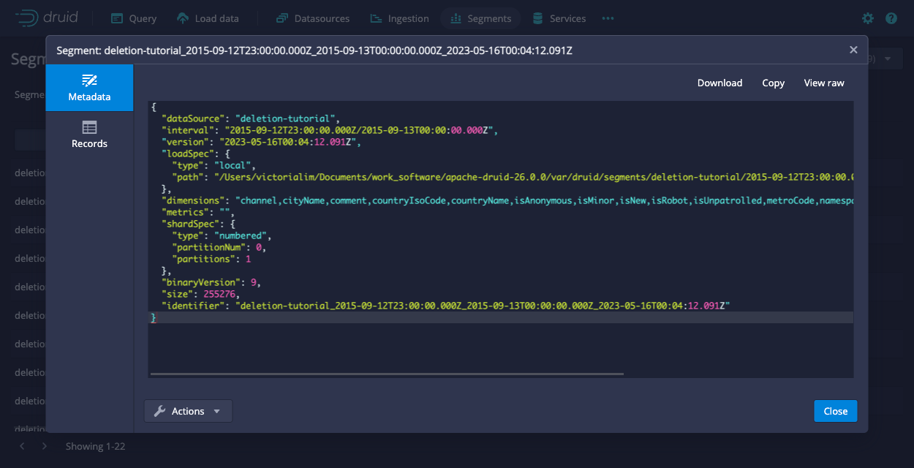

The `identifier` field in the metadata dialog shows the full segment ID. For example, the hour 23 segment has segment ID `deletion-tutorial_2015-09-12T23:00:00.000Z_2015-09-13T00:00:00.000Z_2023-05-16T00:04:12.091Z`.

Disable the last two segments, hour 22 and 23 segments, by sending a POST request to the Coordinator with the corresponding segment IDs.
The following command queries the Coordinator for segment IDs and uses `jq` to parse and extract the IDs of the last two segments.
The segment IDs are stored in an environment variable named `unusedSegmentIds`.

```bash
unusedSegmentIds=$(curl -X 'GET' -H 'Content-Type:application/json' http://localhost:8081/druid/coordinator/v1/datasources/deletion-tutorial/segments | jq '.[-2:]') 
```

The following request marks the segments unused:

```bash
curl -X 'POST' -H 'Content-Type:application/json' -d "{\"segmentIds\": $unusedSegmentIds}" http://localhost:8081/druid/coordinator/v1/datasources/deletion-tutorial/markUnused 
```

When the request completes, the Segments view of the web console no longer displays the segments for hours 22 and 23.

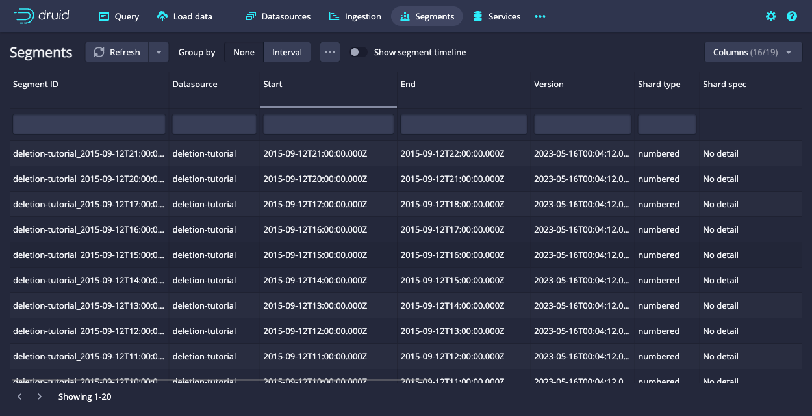

Note that the hour 22 and 23 segments are still in deep storage:

```bash
$ ls -l1 var/druid/segments/deletion-tutorial/2015-09-12T00:00:00.000Z_2015-09-12T01:00:00.000Z 2015-09-12T01:00:00.000Z_2015-09-12T02:00:00.000Z 2015-09-12T02:00:00.000Z_2015-09-12T03:00:00.000Z 2015-09-12T03:00:00.000Z_2015-09-12T04:00:00.000Z 2015-09-12T04:00:00.000Z_2015-09-12T05:00:00.000Z 2015-09-12T05:00:00.000Z_2015-09-12T06:00:00.000Z 2015-09-12T06:00:00.000Z_2015-09-12T07:00:00.000Z 2015-09-12T07:00:00.000Z_2015-09-12T08:00:00.000Z 2015-09-12T08:00:00.000Z_2015-09-12T09:00:00.000Z 2015-09-12T09:00:00.000Z_2015-09-12T10:00:00.000Z 2015-09-12T10:00:00.000Z_2015-09-12T11:00:00.000Z 2015-09-12T11:00:00.000Z_2015-09-12T12:00:00.000Z 2015-09-12T12:00:00.000Z_2015-09-12T13:00:00.000Z 2015-09-12T13:00:00.000Z_2015-09-12T14:00:00.000Z 2015-09-12T14:00:00.000Z_2015-09-12T15:00:00.000Z 2015-09-12T15:00:00.000Z_2015-09-12T16:00:00.000Z 2015-09-12T16:00:00.000Z_2015-09-12T17:00:00.000Z 2015-09-12T17:00:00.000Z_2015-09-12T18:00:00.000Z 2015-09-12T18:00:00.000Z_2015-09-12T19:00:00.000Z 2015-09-12T19:00:00.000Z_2015-09-12T20:00:00.000Z 2015-09-12T20:00:00.000Z_2015-09-12T21:00:00.000Z 2015-09-12T21:00:00.000Z_2015-09-12T22:00:00.000Z 2015-09-12T22:00:00.000Z_2015-09-12T23:00:00.000Z 2015-09-12T23:00:00.000Z_2015-09-13T00:00:00.000Z
```

Now that we have disabled some segments, we can submit a Kill Task, which will delete the disabled segments from metadata and deep storage.

A Kill Task spec has been provided at `quickstart/tutorial/deletion-kill.json`. Submit this task to the Overlord with the following command:

```bash
curl -X 'POST' -H 'Content-Type:application/json' -d @quickstart/tutorial/deletion-kill.json http://localhost:8081/druid/indexer/v1/task 
```

When the task finishes, note that Druid deleted the disabled segments from deep storage.

```bash
$ ls -l1 var/druid/segments/deletion-tutorial/2015-09-12T00:00:00.000Z_2015-09-12T01:00:00.000Z 2015-09-12T01:00:00.000Z_2015-09-12T02:00:00.000Z 2015-09-12T02:00:00.000Z_2015-09-12T03:00:00.000Z 2015-09-12T03:00:00.000Z_2015-09-12T04:00:00.000Z 2015-09-12T04:00:00.000Z_2015-09-12T05:00:00.000Z 2015-09-12T05:00:00.000Z_2015-09-12T06:00:00.000Z 2015-09-12T06:00:00.000Z_2015-09-12T07:00:00.000Z 2015-09-12T07:00:00.000Z_2015-09-12T08:00:00.000Z 2015-09-12T08:00:00.000Z_2015-09-12T09:00:00.000Z 2015-09-12T09:00:00.000Z_2015-09-12T10:00:00.000Z 2015-09-12T10:00:00.000Z_2015-09-12T11:00:00.000Z 2015-09-12T11:00:00.000Z_2015-09-12T12:00:00.000Z 2015-09-12T12:00:00.000Z_2015-09-12T13:00:00.000Z 2015-09-12T13:00:00.000Z_2015-09-12T14:00:00.000Z 2015-09-12T14:00:00.000Z_2015-09-12T15:00:00.000Z 2015-09-12T15:00:00.000Z_2015-09-12T16:00:00.000Z 2015-09-12T16:00:00.000Z_2015-09-12T17:00:00.000Z 2015-09-12T17:00:00.000Z_2015-09-12T18:00:00.000Z 2015-09-12T20:00:00.000Z_2015-09-12T21:00:00.000Z 2015-09-12T21:00:00.000Z_2015-09-12T22:00:00.000Z
```

---

<a id="tutorials-tutorial-latest-by"></a>

<!-- source_url: https://druid.apache.org/docs/latest/tutorials/tutorial-latest-by/ -->

<!-- page_index: 17 -->

# Query for latest values

This tutorial describes strategies in Apache Druid for use cases that might be handled by UPSERT in other databases. You can use the LATEST\_BY aggregation at query time or "deltas" for numeric dimensions at insert time.

The [Update data](#tutorials-tutorial-update-data) tutorial demonstrates how to use batch operations to update data according to the timestamp, including UPSERT cases. However, with streaming data, you can potentially use LATEST\_BY or deltas to satisfy requirements otherwise handled with updates.

Before you follow the steps in this tutorial, download Druid as described in the [Local quickstart](#tutorials) and have it running on your local machine. You don't need to load any data into the Druid cluster.

You should be familiar with data querying in Druid. If you haven't already, go through the [Query data](#tutorials-tutorial-query) tutorial first.

Sometimes, you want to read the latest value of one dimension or measure in relation to another dimension. In a transactional database, you might maintain dimensions or measures using UPSERT, but in Druid you can append all updates or changes during ingestion. The LATEST\_BY function lets you get the most recent value for the dimension with the following type of query:

```sql
SELECT dimension, 
       LATEST_BY(changed_dimension, updated_timestamp) 
FROM my_table 
GROUP BY 1 
```

In this example `update_timestamp` represents the reference timestamp to use to evaluate the "latest" value. This could be `__time` or another timestamp.

For example, consider the following table of events that log the total number of points for a user:

| `__time` | `user_id` | `points` |
| --- | --- | --- |
| `2024-01-01T01:00:00.000Z` | `funny_bunny1` | 10 |
| `2024-01-01T01:05:00.000Z` | `funny_bunny1` | 30 |
| `2024-01-01T02:00:00.000Z` | `funny_bunny1` | 35 |
| `2024-01-01T02:00:00.000Z` | `silly_monkey2` | 30 |
| `2024-01-01T02:05:00.000Z` | `silly_monkey2` | 55 |
| `2024-01-01T03:00:00.000Z` | `funny_bunny1` | 40 |

> [!NOTE]
> **Insert sample data**
> In the Druid web console, navigate to the **Query** view and run the following query to insert sample data:
>
> ```sql
> REPLACE INTO "latest_by_tutorial1" OVERWRITE ALL
> WITH "ext" AS (
>   SELECT *
>   FROM TABLE(
>     EXTERN(
>      '{"type":"inline","data":"{\"timestamp\":\"2024-01-01T01:00:00Z\",\"user_id\":\"funny_bunny1\", \"points\":10}\n{\"timestamp\":\"2024-01-01T01:05:00Z\",\"user_id\":\"funny_bunny1\", \"points\":30}\n{\"timestamp\": \"2024-01-01T02:00:00Z\",\"user_id\":\"funny_bunny1\", \"points\":35}\n{\"timestamp\":\"2024-01-01T02:00:00Z\",\"user_id\":\"silly_monkey2\", \"points\":30}\n{\"timestamp\":\"2024-01-01T02:05:00Z\",\"user_id\":\"silly_monkey2\", \"points\":55}\n{\"timestamp\":\"2024-01-01T03:00:00Z\",\"user_id\":\"funny_bunny1\", \"points\":40}"}',
>      '{"type":"json"}'
>     )
>   ) EXTEND ("timestamp" VARCHAR, "user_id" VARCHAR, "points" BIGINT)
> )
> SELECT
>   TIME_PARSE("timestamp") AS "__time",
>   "user_id",
>   "points"
> FROM "ext"
> PARTITIONED BY DAY
> ```

Run the following query to retrieve the most recent `points` value for each `user_id`:

```sql
SELECT user_id, 
     LATEST_BY("points", "__time") AS latest_points 
FROM latest_by_tutorial1 
GROUP BY 1 
```

The results are as follows:

| `user_id` | `total_points` |
| --- | --- |
| `silly_monkey2` | 55 |
| `funny_bunny1` | 40 |

In the example, the values increase each time, but this method works even if the values fluctuate.

You can use this query shape as a subquery for additional processing. However, if there are many values for `user_id`, the query can be expensive.

If you want to track the latest value at different times within a larger granularity time frame, you need an additional timestamp to record update times. This allows Druid to track the latest version. Consider the following data that represents points for various users updated within an hour time frame. `__time` is hour granularity, but `updated_timestamp` is minute granularity:

| `__time` | `updated_timestamp` | `user_id` | `points` |
| --- | --- | --- | --- |
| `2024-01-01T01:00:00.000Z` | `2024-01-01T01:00:00.000Z` | `funny_bunny1` | 10 |
| `2024-01-01T01:00:00.000Z` | `2024-01-01T01:05:00.000Z` | `funny_bunny1` | 30 |
| `2024-01-01T02:00:00.000Z` | `2024-01-01T02:00:00.000Z` | `funny_bunny1` | 35 |
| `2024-01-01T02:00:00.000Z` | `2024-01-01T02:00:00.000Z` | `silly_monkey2` | 30 |
| `2024-01-01T02:00:00.000Z` | `2024-01-01T02:05:00.000Z` | `silly_monkey2` | 55 |
| `2024-01-01T03:00:00.000Z` | `2024-01-01T03:00:00.000Z` | `funny_bunny1` | 40 |

> [!NOTE]
> **Insert sample data**
> Open a new tab in the **Query** view and run the following query to insert sample data:
>
> ```sql
> REPLACE INTO "latest_by_tutorial2" OVERWRITE ALL
> WITH "ext" AS (
>   SELECT *
>   FROM TABLE(
>     EXTERN(
>      '{"type":"inline","data":"{\"timestamp\":\"2024-01-01T01:00:00Z\",\"updated_timestamp\":\"2024-01-01T01:00:00Z\",\"user_id\":\"funny_bunny1\", \"points\":10}\n{\"timestamp\":\"2024-01-01T01:05:00Z\",\"updated_timestamp\":\"2024-01-01T01:05:00Z\",\"user_id\":\"funny_bunny1\", \"points\":30}\n{\"timestamp\": \"2024-01-01T02:00:00Z\",\"updated_timestamp\":\"2024-01-01T02:00:00Z\",\"user_id\":\"funny_bunny1\", \"points\":35}\n{\"timestamp\":\"2024-01-01T02:00:00Z\",\"updated_timestamp\":\"2024-01-01T02:00:00Z\",\"user_id\":\"silly_monkey2\", \"points\":30}\n{\"timestamp\":\"2024-01-01T02:00:00Z\",\"updated_timestamp\":\"2024-01-01T02:05:00Z\",\"user_id\":\"silly_monkey2\", \"points\":55}\n{\"timestamp\":\"2024-01-01T03:00:00Z\",\"updated_timestamp\":\"2024-01-01T03:00:00Z\",\"user_id\":\"funny_bunny1\", \"points\":40}"}',
>      '{"type":"json"}'
>     )
>   ) EXTEND ("timestamp" VARCHAR, "updated_timestamp" VARCHAR, "user_id" VARCHAR, "points" BIGINT)
> )
> SELECT
>   TIME_PARSE("timestamp") AS "__time",
>   "updated_timestamp",
>   "user_id",
>   "points"
> FROM "ext"
> PARTITIONED BY DAY
> ```

Run the following query to retrieve the latest points value by user for each hour:

```sql
SELECT FLOOR("__time" TO HOUR) AS "hour_time", 
      "user_id", 
       LATEST_BY("points", TIME_PARSE(updated_timestamp)) AS "latest_points_hour" 
FROM latest_by_tutorial2 
GROUP BY 1,2 
```

The results are as follows:

| `hour_time` | `user_id` | `latest_points_hour` |
| --- | --- | --- |
| `2024-01-01T01:00:00.000Z` | `funny_bunny1` | 20 |
| `2024-01-01T02:00:00.000Z` | `funny_bunny1` | 5 |
| `2024-01-01T02:00:00.000Z` | `silly_monkey2` | 25 |
| `2024-01-01T03:00:00.000Z` | `funny_bunny1` | 10 |

LATEST\_BY is an aggregation function. While it's very efficient when there are not many update rows matching a dimension, such as `user_id`, it scans all matching rows with the same dimension. For dimensions with numerous updates, such as when a user plays a game a million times, and the updates don't arrive in a timely order, Druid processes all rows matching the `user_id` to find the row with the max timestamp to provide the latest data.

For instance, if updates constitute 1-5 percent of your data, you'll get good query performance. If updates constitute 50 percent or more of your data, your queries will be slow.

To mitigate this, you can set up a periodic batch ingestion job that re-indexes modified data into a new datasource for direct querying without grouping to reduce the cost of these queries by pre-computing and storing the latest values. Note that your view of the latest data will not be up to date until the next refresh happens.

Alternatively, you can perform ingestion-time aggregation using LATEST\_BY and append updates with streaming ingestion into a rolled up datasource. Appending into a time chunk adds new segments and does not perfectly roll up data, so rows may be partial rather than complete rollups, and you may have multiple partially rolled up rows. In this case, you still need to use the GROUP BY query for correct querying of the rolled up data source. You can tune automatic compaction to significantly reduce the number of stale rows and improve your performance.

Instead of appending the latest total value in your events, you can log the change in value with each event and use the aggregator you usually use. This method may allow you to avoid a level of aggregation and grouping in your queries.

For most applications, you can send the event data directly to Druid without pre-processing. For example, when sending impression counts to Druid, don't send the total impression count since yesterday, send just the recent impression count. You can then aggregate the total in Druid during query. Druid is optimized for adding up a lot of rows, so this might be counterintuitive to people who are familiar with batching or pre-aggregating data.

For example, consider a datasource with a measure column `y` that you aggregate with SUM, grouped by another dimension `x`. If you want to update the value of `y` from 3 to 2, then insert -1 for `y`. This way the aggregation `SUM(y)` is correct for any queries grouped by `x`. This may offer a significant performance advantage but the trade off is that the aggregation has to always be a SUM.

In other cases, the updates to the data may already be deltas to the original, and so the data engineering required to append the updates would be simple. The same performance impact mitigation applies as in the previous example: use rollup at ingestion time combined with ongoing automatic compaction.

For example, consider the following table of events that logs the number of points gained or lost for a user during a period of time:

| `__time` | `user_id` | `delta` |
| --- | --- | --- |
| `2024-01-01T01:00:00.000Z` | `funny_bunny1` | 10 |
| `2024-01-01T01:05:00.000Z` | `funny_bunny1` | 10 |
| `2024-01-01T02:00:00.000Z` | `funny_bunny1` | 5 |
| `2024-01-01T02:00:00.000Z` | `silly_monkey2` | 30 |
| `2024-01-01T02:05:00.000Z` | `silly_monkey2` | -5 |
| `2024-01-01T03:00:00.000Z` | `funny_bunny1` | 10 |

> [!NOTE]
> **Insert sample data**
> Open a new tab in the **Query** view and run the following query to insert sample data:
>
> ```sql
> REPLACE INTO "delta_tutorial" OVERWRITE ALL
> WITH "ext" AS (
>   SELECT *
>   FROM TABLE(
>     EXTERN(
>      '{"type":"inline","data":"{\"timestamp\":\"2024-01-01T01:00:00Z\",\"user_id\":\"funny_bunny1\", \"points\":10}\n{\"timestamp\":\"2024-01-01T01:05:00Z\",\"user_id\":\"funny_bunny1\", \"points\":10}\n{\"timestamp\": \"2024-01-01T02:00:00Z\",\"user_id\":\"funny_bunny1\", \"points\":5}\n{\"timestamp\":\"2024-01-01T02:00:00Z\",\"user_id\":\"silly_monkey2\", \"points\":30}\n{\"timestamp\":\"2024-01-01T02:05:00Z\",\"user_id\":\"silly_monkey2\", \"points\":-5}\n{\"timestamp\":\"2024-01-01T03:00:00Z\",\"user_id\":\"funny_bunny1\", \"points\":10}"}',
>      '{"type":"json"}'
>     )
>   ) EXTEND ("timestamp" VARCHAR, "user_id" VARCHAR, "points" BIGINT)
> )
> SELECT
>   TIME_PARSE("timestamp") AS "__time",
>   "user_id",
>   "points" AS "delta"
> FROM "ext"
> PARTITIONED BY DAY
> ```

The following query returns the same points per hour as the second LATEST\_BY example:

```sql
SELECT FLOOR("__time" TO HOUR) as "hour_time", 
       "user_id", 
       SUM("delta") AS "latest_points_hour" 
FROM "delta_tutorial" 
GROUP BY 1,2 
```

See the following topics for more information:

- [Update data](#tutorials-tutorial-update-data) for a tutorial on updating data in Druid.
- [Data updates](#data-management-update) for an overview of updating data in Druid.

---

<a id="tutorials-tutorial-query"></a>

<!-- source_url: https://druid.apache.org/docs/latest/tutorials/tutorial-query/ -->

<!-- page_index: 18 -->

# Query data

> [!NOTE]
> **info**
> Another way to view the explain plan is by adding EXPLAIN PLAN FOR to the front of your query, as follows:
>
> ```sql
> EXPLAIN PLAN FOR
> SELECT
>   "page",
>   "countryName",
>   COUNT(*) AS "Edits"
> FROM "wikipedia"
> WHERE "countryName" IS NOT NULL
> GROUP BY 1, 2
> ORDER BY "Edits" DESC
> ```
>
> This is particularly useful when running queries
> from the command line or over HTTP.

---

<a id="tutorials-tutorial-sql-query-view"></a>

<!-- source_url: https://druid.apache.org/docs/latest/tutorials/tutorial-sql-query-view/ -->

<!-- page_index: 19 -->

# Get to know Query view

This tutorial demonstrates some useful features built into Query view in Apache Druid.

Query view lets you run [Druid SQL queries](#querying-sql) and [native (JSON-based) queries](#querying) against ingested data.

You can use Query view to test and tune queries before you use them in API requests—for example, to perform [SQL-based ingestion](#api-reference-sql-ingestion-api). You can also ingest data directly in Query view.

The tutorial guides you through the steps to ingest sample data and query the ingested data using some Query view features.

Before you follow the steps in this tutorial, download Druid as described in the [quickstart](#tutorials) and have it running on your local machine. You don't need to have loaded any data.

Druid includes demo queries that each demonstrate a different Druid feature—for example transforming data during ingestion and sorting ingested data. Each query has detailed comments to help you learn more.

In this section you load the demo queries and run a SQL task to ingest sample data into a [table datasource](#querying-datasource--table).

1. Navigate to the Druid console at <http://localhost:8888> and click **Query**.
2. Click the ellipsis at the bottom of the query window and select **Load demo queries**. Note that loading the demo queries replaces all of your current query tabs. The demo queries load in several tabs:

   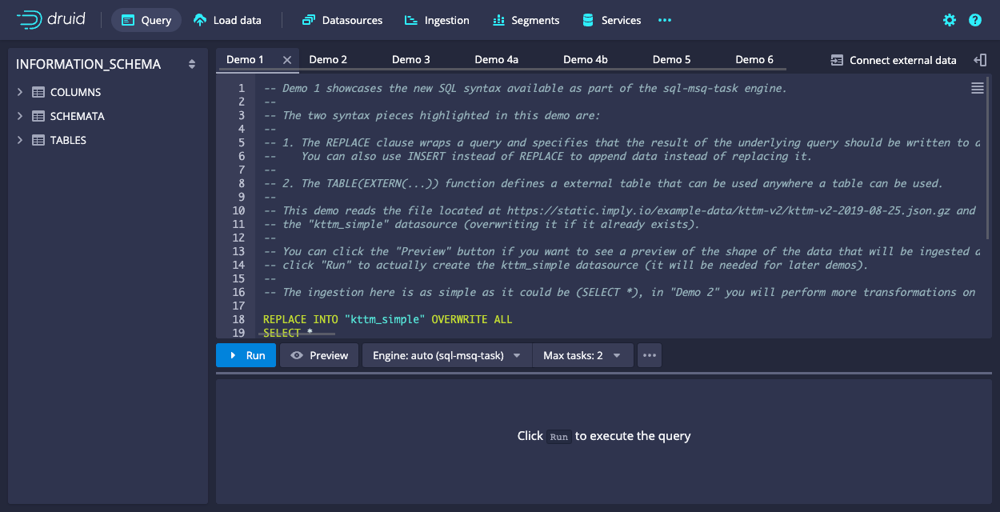
3. Click the **Demo 1** tab. This query ingests sample data into a datasource called **kttm\_simple**. Click the **Demo 1** tab heading again and note the options—you can rename, copy, and duplicate tabs.
4. Click **Run** to ingest the data.
5. When ingestion is complete, Druid displays the time it took to complete the insert query, and the new datasource **kttm\_simple** displays in the left pane.

In this section you run some queries against the new datasource and perform some operations on the query results.

1. Click **+** to the right of the existing tabs to open a new query tab.
2. Click the name of the datasource **kttm\_simple** in the left pane to display some automatically generated queries:

   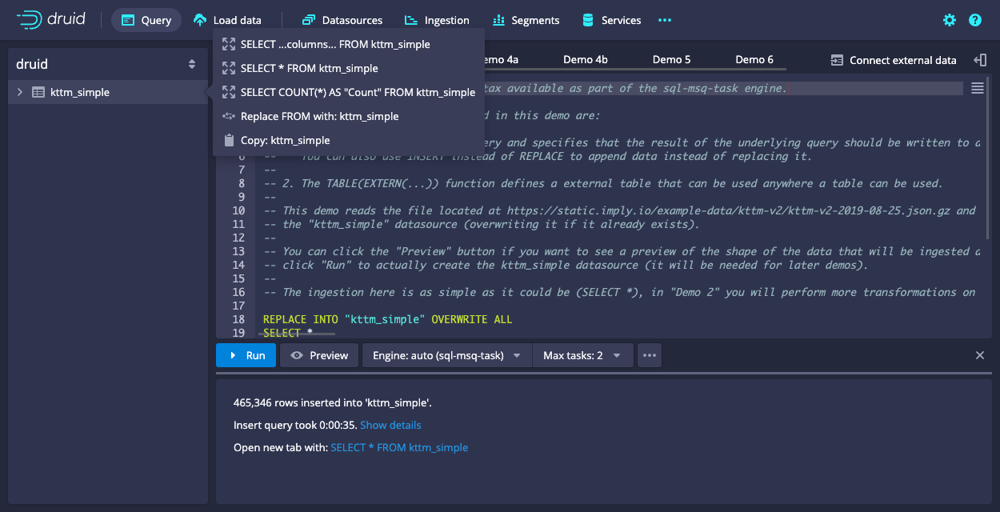
3. Click **SELECT \* FROM kttm\_simple** and run the query.
4. In the query results pane, click **Chrome** anywhere it appears in the **browser** column then click **Filter on: browser = 'Chrome'** to filter the results.

[Aggregate functions](#querying-sql-aggregations) allow you to perform a calculation on a set of values and return a single value.

In this section you run some queries using aggregate functions and perform some operations on the results, using shortcut features designed to help you build your query.

1. Open a new query tab.
2. Click **kttm\_simple** in the left pane to display the generated queries.
3. Click **SELECT COUNT(\*) AS "Count" FROM kttm\_simple** and run the query.
4. After you run a query that contains an aggregate function, additional Query view options become available.

   Click the arrow to the left of the **kttm\_simple** datasource to display the columns, then click the **country** column. Several options appear to apply country-based filters and aggregate functions to the query:

   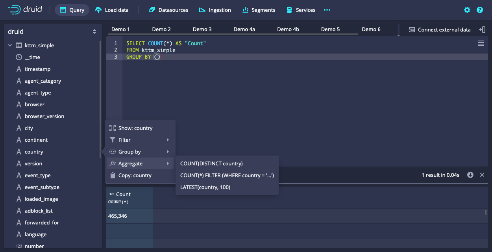
5. Click **Aggregate > COUNT(DISTINCT "country")** to add this clause to the query. The query now appears as follows:


```sql
SELECT COUNT(*) AS "Count", 
   COUNT(DISTINCT "country") AS "dist_country" 
FROM "kttm_simple" 
GROUP BY () 
```

   Note that you can use column names such as `dist_country` in this example as shortcuts when building your query.
6. Run the updated query:

   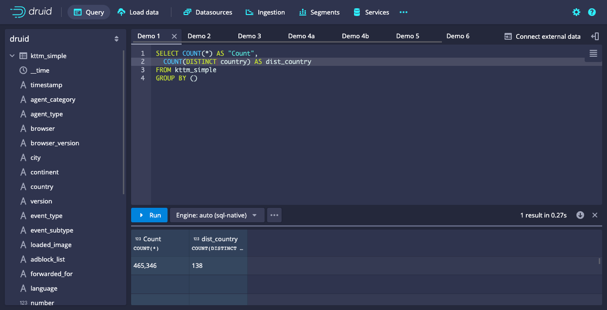
7. Click **Engine: Auto (SQL native)** to display the engine options—**Native** for native (JSON-based) queries, **SQL native** for Druid SQL queries, and **SQL MSQ-task** for SQL-based ingestion.

   Select **Auto** to let Druid select the most efficient engine based on your query input.
8. From the engine menu you can also edit the query context and turn off some query defaults.

   Deselect **Use approximate COUNT(DISTINCT)** and rerun the query. The country count in the results decreases because the computation has become more exact. See [SQL aggregation functions](#querying-sql-aggregations) for more information.
9. Query view can provide information about a function, in case you aren't sure exactly what it does.

   Delete the contents of the query line `COUNT(DISTINCT country) AS dist_country` and type `COUNT(DISTINCT)` to replace it. A help dialog for the function displays:

   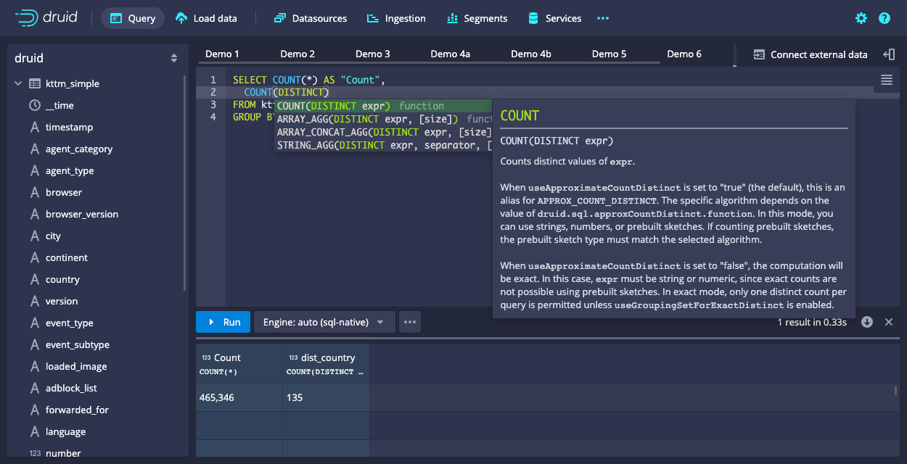

   Click outside the help window to close it.
10. You can perform actions on calculated columns in the results pane.

    Click the results column heading **dist\_country COUNT(DISTINCT "country")** to see the available options:

    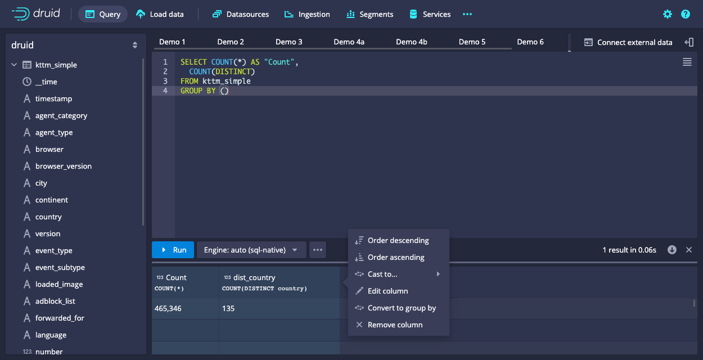
11. Select **Edit column** and change the **Output name** to **Distinct countries**.

In this section you generate an explain plan for a query. An explain plan shows the full query details and all of the operations Druid performs to execute it.

Druid optimizes queries of certain [types](#querying-sql-translation--query-types)—see [SQL query translation](#querying-sql-translation) for information on how to interpret an explain plan and use the details to improve query performance.

1. Open a new query tab.
2. Click **kttm\_simple** in the left pane to display the generated queries.
3. Click **SELECT \* FROM kttm\_simple** and run the query.
4. Click the ellipsis at the bottom of the query window and select **Explain SQL query**. The query plan opens in a new window:

   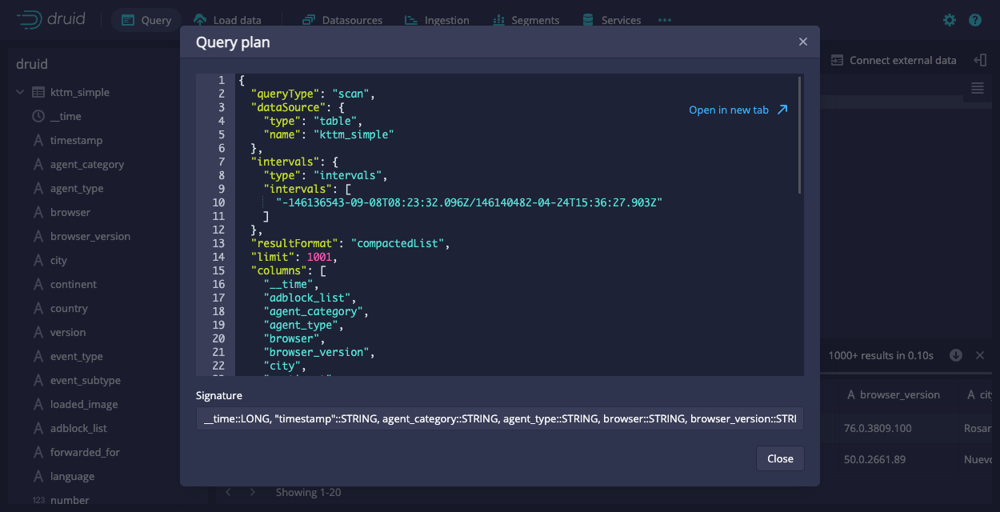
5. Click **Open in new tab**. You can review the query details and modify it as required.
6. Change the limit from 1001 to 2001:


```sql
"Limit": 2001, 
```

   and run the query to confirm that the updated query returns 2,001 results.

In this section you try out a few more useful Query view features.

Queries without a FROM clause run in calculator mode—this can be useful to help you understand how functions work. See the [Druid SQL functions](#querying-sql-functions) reference for more information.

1. Open a new query tab and enter the following:


```sql
SELECT SQRT(49) 
```

2. Run the query to produce the result `7`.

You can download query results in CSV, TSV, or newline-delimited JSON format.

1. Open a new query tab and run a query, for example:


```sql
SELECT DISTINCT platform 
FROM kttm_simple 
```

2. Above the results pane, click the down arrow and select **Download results as… CSV**.

In any query tab, click the ellipsis at the bottom of the query window and select **Query history**.

You can click the links on the left to view queries run at a particular date and time, and open a previously run query in a new query tab.

For more information on ingestion and querying data, see the following topics:

- [Quickstart](#tutorials) for information on getting started with Druid.
- [Tutorial: Querying data](#tutorials-tutorial-query) for example queries to run on Druid data.
- [Ingestion](#ingestion) for an overview of ingestion and the ingestion methods available in Druid.
- [SQL-based ingestion](#multi-stage-query) for an overview of SQL-based ingestion.
- [SQL-based ingestion query examples](#multi-stage-query-examples) for examples of SQL-based ingestion for various use cases.
- [Introduction to Druid SQL](https://github.com/implydata/learn-druid/tree/main/notebooks) to learn more about Druid SQL.

---

<a id="tutorials-tutorial-unnest-arrays"></a>

<!-- source_url: https://druid.apache.org/docs/latest/tutorials/tutorial-unnest-arrays/ -->

<!-- page_index: 20 -->

# Unnest arrays within a column

> [!NOTE]
> **info**
> If you're looking for information about how to unnest `COMPLEX<json>` columns, see [Nested columns](#querying-nested-columns).

---

<a id="tutorials-tutorial-query-deep-storage"></a>

<!-- source_url: https://druid.apache.org/docs/latest/tutorials/tutorial-query-deep-storage/ -->

<!-- page_index: 21 -->

# Tutorial: Query from deep storage

Query from deep storage allows you to query segments that are stored only in deep storage, which provides lower costs than if you were to load everything onto Historical processes. The tradeoff is that queries from deep storage may take longer to complete.

This tutorial walks you through loading example data, configuring load rules so that not all the segments get loaded onto Historical services, and querying data from deep storage. If you have [centralized datasource schema enabled](#configuration--centralized-datasource-schema-experimental), you can query datasources that are only in deep storage without having any segment available on Historical.

To run the queries in this tutorial, replace `ROUTER:PORT` with the location of the Router process and its port number. For example, use `localhost:8888` for the quickstart deployment.

For more general information, see [Query from deep storage](#querying-query-deep-storage).

If you are trying this feature on an existing cluster, make sure query from deep storage [prerequisites](#querying-query-deep-storage--prerequisites) are met.

Use the **Load data** wizard or the following SQL query to ingest the `wikipedia` sample datasource bundled with Druid. If you use the wizard, make sure you change the partitioning to be by hour.

Partitioning by hour provides more segment granularity, so you can selectively load segments onto Historicals or keep them in deep storage.

> [!NOTE]
> **Show the query**
> ```sql
> REPLACE INTO "wikipedia" OVERWRITE ALL
> WITH "ext" AS (SELECT *
> FROM TABLE(
>   EXTERN(
>     '{"type":"http","uris":["https://druid.apache.org/data/wikipedia.json.gz"]}',
>     '{"type":"json"}'
>   )
> ) EXTEND ("isRobot" VARCHAR, "channel" VARCHAR, "timestamp" VARCHAR, "flags" VARCHAR, "isUnpatrolled" VARCHAR, "page" VARCHAR, "diffUrl" VARCHAR, "added" BIGINT, "comment" VARCHAR, "commentLength" BIGINT, "isNew" VARCHAR, "isMinor" VARCHAR, "delta" BIGINT, "isAnonymous" VARCHAR, "user" VARCHAR, "deltaBucket" BIGINT, "deleted" BIGINT, "namespace" VARCHAR, "cityName" VARCHAR, "countryName" VARCHAR, "regionIsoCode" VARCHAR, "metroCode" BIGINT, "countryIsoCode" VARCHAR, "regionName" VARCHAR))
> SELECT
>   TIME_PARSE("timestamp") AS "__time",
>   "isRobot",
>   "channel",
>   "flags",
>   "isUnpatrolled",
>   "page",
>   "diffUrl",
>   "added",
>   "comment",
>   "commentLength",
>   "isNew",
>   "isMinor",
>   "delta",
>   "isAnonymous",
>   "user",
>   "deltaBucket",
>   "deleted",
>   "namespace",
>   "cityName",
>   "countryName",
>   "regionIsoCode",
>   "metroCode",
>   "countryIsoCode",
>   "regionName"
> FROM "ext"
> PARTITIONED BY HOUR
> ```

The load rule configures Druid to keep any segments that fall within the following interval only in deep storage:

```text
2016-06-27T00:00:00.000Z/2016-06-27T02:59:00.000Z 
```

The JSON form of the rule is as follows:

```json
[ 
  { 
    "interval": "2016-06-27T00:00:00.000Z/2016-06-27T02:59:00.000Z", 
    "tieredReplicants": {}, 
    "useDefaultTierForNull": false, 
    "type": "loadByInterval" 
  } 
] 
```

The rest of the segments use the default load rules for the cluster. For the quickstart, that means all the other segments get loaded onto Historical processes.

You can configure the load rules through the API or the Druid console. To configure the load rules through the Druid console, go to **Datasources > ... in the Actions column > Edit retention rules**. Then, paste the provided JSON into the JSON tab:

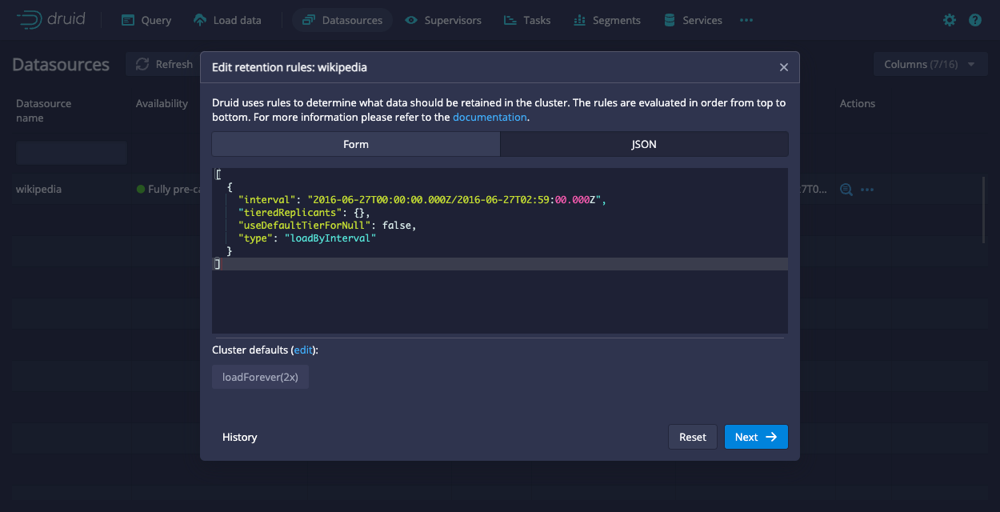

Segments that are only available from deep storage have a `replication_factor` of 0 in the Druid system table. You can verify that your load rule worked as intended using the following query:

```sql
SELECT "segment_id", "replication_factor", "num_replicas"  FROM sys."segments" WHERE datasource = 'wikipedia' 
```

You can also verify it through the Druid console by checking the **Replication factor** column in the **Segments** view.

Note that the number of replicas and replication factor may differ temporarily as Druid processes your retention rules.

Now that there are segments that are only available from deep storage, run the following query:

```sql
SELECT page FROM wikipedia WHERE __time <  TIMESTAMP'2016-06-27 00:10:00' LIMIT 10 
```

To run this query asynchronously, specify the `ASYNC` execution mode using the query context.
Apply the query context parameter before the query using a SET statement.

For example, run the following curl command:

```text
curl --location 'http://localhost:8888/druid/v2/sql/statements' \ 
--header 'Content-Type: application/json' \ 
--data '{ 
  "query": "SET executionMode = '\''ASYNC'\''; SELECT page FROM wikipedia WHERE __time < TIMESTAMP '\''2016-06-27 00:10:00'\'' LIMIT 10" 
}' 
```

This query looks for records with timestamps that precede `00:10:00`. Based on the load rule you configured earlier, this data is only available from deep storage.

When you submit the query from deep storage through the API, you get the following response:

> [!NOTE]
> **Show the response**
> ```json
> {
>     "queryId": "query-6888b6f6-e597-456c-9004-222b05b97051",
>     "state": "ACCEPTED",
>     "createdAt": "2023-07-28T21:59:02.334Z",
>     "schema": [
>         {
>             "name": "page",
>             "type": "VARCHAR",
>             "nativeType": "STRING"
>         }
>     ],
>     "durationMs": -1
> }
> ```
>
> Make sure you note the `queryID`. You'll need it to interact with the query.

Compare this to if you were to submit the query to Druid SQL's regular endpoint, `POST /sql`:

```text
curl --location 'http://localhost:8888/druid/v2/sql/' \ 
--header 'Content-Type: application/json' \ 
--data '{ 
  "query": "SET executionMode = '\''ASYNC'\''; SELECT page FROM wikipedia WHERE __time < TIMESTAMP '\''2016-06-27 00:10:00'\'' LIMIT 10" 
}' 
```

The response you get back is an empty response cause there are no records on the Historicals that match the query.

Replace `:queryId` with the ID for your query and run the following curl command to get your query status:

```text
curl --location --request GET 'http://localhost:8888/druid/v2/sql/statements/:queryId' \ 
--header 'Content-Type: application/json' \ 
```

The response for a running query is the same as the response from when you submitted the query except the `state` is `RUNNING` instead of `ACCEPTED`.

A successful query also returns a `pages` object that includes the page numbers (`id`), rows per page (`numRows`), and the size of the page (`sizeInBytes`). You can pass the page number as a parameter when you get results to refine the results you get.

Note that `sampleRecords` has been truncated for brevity.

> [!NOTE]
> **Show the response**
> ```json
> {
>     "queryId": "query-6888b6f6-e597-456c-9004-222b05b97051",
>     "state": "SUCCESS",
>     "createdAt": "2023-07-28T21:59:02.334Z",
>     "schema": [
>         {
>             "name": "page",
>             "type": "VARCHAR",
>             "nativeType": "STRING"
>         }
>     ],
>     "durationMs": 87351,
>     "result": {
>         "numTotalRows": 152,
>         "totalSizeInBytes": 9036,
>         "dataSource": "__query_select",
>         "sampleRecords": [
>             [
>                 "Salo Toraut"
>             ],
>             [
>                 "利用者:ワーナー成増/放送ウーマン賞"
>             ],
>             [
>                 "Bailando 2015"
>             ],
>             ...
>             ...
>             ...
>         ],
>         "pages": [
>             {
>                 "id": 0,
>                 "numRows": 152,
>                 "sizeInBytes": 9036
>             }
>         ]
>     }
> }
> ```

Replace `:queryId` with the ID for your query and run the following curl command to get your query results:

```text
curl --location 'http://ROUTER:PORT/druid/v2/sql/statements/:queryId' 
```

Note that the response has been truncated for brevity.

> [!NOTE]
> **Show the response**
> ```json
> [
>     {
>         "page": "Salo Toraut"
>     },
>     {
>         "page": "利用者:ワーナー成増/放送ウーマン賞"
>     },
>     {
>         "page": "Bailando 2015"
>     },
>     ...
>     ...
>     ...
> ]
> ```

- [Query from deep storage](#querying-query-deep-storage)
- [Query from deep storage API reference](#api-reference-sql-api--query-from-deep-storage)

---

<a id="tutorials-tutorial-extern"></a>

<!-- source_url: https://druid.apache.org/docs/latest/tutorials/tutorial-extern/ -->

<!-- page_index: 22 -->

# Export query results

This tutorial demonstrates how to use the Apache Druid® SQL [EXTERN](#multi-stage-query-reference--extern-function) function to export data.

Before you follow the steps in this tutorial, download Druid as described in the [Local quickstart](#tutorials).
Don't start Druid, you'll do that as part of the tutorial.

You should be familiar with ingesting and querying data in Druid.
If you haven't already, go through the [Query data](#tutorials-tutorial-query) tutorial first.

This example demonstrates how to configure Druid to export data to the local file system.
While you can use this approach to learn about EXTERN syntax for exporting data, it's not suitable for production scenarios.

The following commands set the base path for the Druid exports to `/tmp/druid/`.
If the account running Druid doesn't have access to `/tmp/druid/`, change the path.
For example: `/Users/Example/druid`.
If you change the path in this step, use the updated path in all subsequent steps.

From the root of the Druid distribution, run the following:

```bash
export export_path="/tmp/druid" 
sed -i -e $'$a\\\n\\\n\\\n#\\\n###Local export\\\n#\\\ndruid.export.storage.baseDir='$export_path' conf/druid/auto/_common/common.runtime.properties 
```

This adds the following section to the Druid `common.runtime.properties` configuration file located in `conf/druid/auto/_common`:

```text
# 
###Local export 
# 
druid.export.storage.baseDir=/tmp/druid/ 
```

1. From the root of the Druid distribution, launch Druid as follows:


```bash
./bin/start-druid 
```

2. After Druid starts, open <http://localhost:8888/> in your browser to access the Web Console.
3. From the [Query view](http://localhost:8888/unified-console.html#workbench), run the following command to load the Wikipedia example data set:


```sql
REPLACE INTO "wikipedia" OVERWRITE ALL 
WITH "ext" AS ( 
  SELECT * 
  FROM TABLE( 
    EXTERN( 
      '{"type":"http","uris":["https://druid.apache.org/data/wikipedia.json.gz"]}', 
      '{"type":"json"}' 
    ) 
  ) EXTEND ("isRobot" VARCHAR, "channel" VARCHAR, "timestamp" VARCHAR, "flags" VARCHAR, "isUnpatrolled" VARCHAR, "page" VARCHAR, "diffUrl" VARCHAR, "added" BIGINT, "comment" VARCHAR, "commentLength" BIGINT, "isNew" VARCHAR, "isMinor" VARCHAR, "delta" BIGINT, "isAnonymous" VARCHAR, "user" VARCHAR, "deltaBucket" BIGINT, "deleted" BIGINT, "namespace" VARCHAR, "cityName" VARCHAR, "countryName" VARCHAR, "regionIsoCode" VARCHAR, "metroCode" BIGINT, "countryIsoCode" VARCHAR, "regionName" VARCHAR) 
) 
SELECT 
  TIME_PARSE("timestamp") AS "__time", 
  "isRobot", 
  "channel", 
  "flags", 
  "isUnpatrolled", 
  "page", 
  "diffUrl", 
  "added", 
  "comment", 
  "commentLength", 
  "isNew", 
  "isMinor", 
  "delta", 
  "isAnonymous", 
  "user", 
  "deltaBucket", 
  "deleted", 
  "namespace", 
  "cityName", 
  "countryName", 
  "regionIsoCode", 
  "metroCode", 
  "countryIsoCode", 
  "regionName" 
FROM "ext" 
PARTITIONED BY DAY 
```

Open a new tab and run the following query to export query results to the path:
`/tmp/druid/wiki_example`.
The path must be a subdirectory of the `druid.export.storage.baseDir`.

```sql
INSERT INTO 
  EXTERN( 
    local(exportPath => '/tmp/druid/wiki_example') 
        ) 
AS CSV 
SELECT "channel", 
  SUM("delta") AS "changes" 
FROM "wikipedia" 
GROUP BY 1 
LIMIT 10 
```

Druid exports the results of the query to the `/tmp/druid/wiki_example` directory.
Run the following command to list the contents of

```bash
ls /tmp/druid/wiki_example 
```

The results are a CSV file export of the data and a directory.

The steps to export to cloud storage are similar to exporting to the local file system.
Druid supports Amazon S3 or Google Cloud Storage (GCS) as cloud storage destinations.

1. Enable the extension for your cloud storage destination. See [Loading core extensions](#configuration-extensions--loading-core-extensions).

   - **Amazon S3**: `druid-s3-extensions`
   - **GCS**: `google-extensions`
     See [Loading core extensions](#configuration-extensions--loading-core-extensions) for more information.
2. Configure the additional properties for your cloud storage destination. Replace `{CLOUD}` with `s3` or `google` accordingly:

   - `druid.export.storage.{CLOUD}.tempLocalDir`: Local temporary directory where the query engine stages files to export.
   - `druid.export.storage.{CLOUD}.allowedExportPaths`: S3 or GS prefixes allowed as Druid export locations. For example `[\"s3://bucket1/export/\",\"s3://bucket2/export/\"]` or `[\"gs://bucket1/export/\", \"gs://bucket2/export/\"]`.
   - `druid.export.storage.{CLOUD}.maxRetry`: Maximum number of times to attempt cloud API calls to avoid failures from transient errors.
   - `druid.export.storage.s3.chunkSize`: Maximum size of individual data chunks to store in the temporary directory.
3. Verify the instance role has the correct permissions to the bucket and folders: read, write, create, and delete. See [Permissions for durable storage](#multi-stage-query-security--permissions-for-durable-storage).
4. Use the query syntax for your cloud storage type. For example:


<div class="tabs-container tabList__CuJ"><ul><li>S3</li><li>GCS</li></ul><div><div><div><div><pre><code><span><span>INSERT</span><span> </span><span>INTO</span><span></span> </span><span><span>EXTERN</span><span>(</span><span></span> </span><span><span>  s3</span><span>(</span><span>bucket </span><span>=</span><span>&gt;</span><span> </span><span>'your_bucket'</span><span>,</span><span> prefix </span><span>=</span><span>&gt;</span><span> </span><span>'prefix/to/files'</span><span>)</span><span>)</span><span></span> </span><span><span></span><span>AS</span><span> CSV</span> </span><span><span></span><span>SELECT</span><span> </span><span>"channel"</span><span>,</span><span></span> </span><span><span></span><span>SUM</span><span>(</span><span>"delta"</span><span>)</span><span> </span><span>AS</span><span> </span><span>"changes"</span><span></span> </span><span><span></span><span>FROM</span><span> </span><span>"wikipedia"</span><span></span> </span><span><span></span><span>GROUP</span><span> </span><span>BY</span><span> </span><span>1</span><span></span> </span><span><span></span><span>LIMIT</span><span> </span><span>10</span> </span></code></pre><div></div></div></div></div><div><div><div><pre><code><span><span>INSERT</span><span> </span><span>INTO</span><span></span> </span><span><span>EXTERN</span> </span><span><span> google</span><span>(</span><span>bucket </span><span>=</span><span>&gt;</span><span> </span><span>'your_bucket'</span><span>,</span><span> prefix </span><span>=</span><span>&gt;</span><span> </span><span>'prefix/to/files'</span><span>)</span><span></span> </span><span><span></span><span>AS</span><span> CSV</span> </span><span><span></span><span>SELECT</span><span> </span><span>"channel"</span><span>,</span><span></span> </span><span><span></span><span>SUM</span><span>(</span><span>"delta"</span><span>)</span><span> </span><span>AS</span><span> </span><span>"changes"</span><span></span> </span><span><span></span><span>FROM</span><span> </span><span>"wikipedia"</span><span></span> </span><span><span></span><span>GROUP</span><span> </span><span>BY</span><span> </span><span>1</span><span></span> </span><span><span></span><span>LIMIT</span><span> </span><span>10</span> </span></code></pre><div></div></div></div></div></div></div>

5. When querying, use the `rowsPerPage` query context parameter to restrict the output file size. While it's possible to add a very large LIMIT at the end of your query to force Druid to create a single file, we don't recommend this technique.

See the following topics for more information:

- [Export to a destination](#multi-stage-query-reference--extern-to-export-to-a-destination) for a reference of the EXTERN.
- [SQL-based ingestion security](#multi-stage-query-security--permissions-for-durable-storage) for cloud permission requirements for MSQ.

---

<a id="tutorials-tutorial-sketches-theta"></a>

<!-- source_url: https://druid.apache.org/docs/latest/tutorials/tutorial-sketches-theta/ -->

<!-- page_index: 23 -->

# Approximations with Theta sketches

> [!NOTE]
> **info**
> In the case of Theta sketches, the filter clause has to be inserted between the aggregator and the estimator.

---

<a id="tutorials-tutorial-jdbc"></a>

<!-- source_url: https://druid.apache.org/docs/latest/tutorials/tutorial-jdbc/ -->

<!-- page_index: 24 -->

# Use the JDBC driver to query Druid

Redirecting you to the JDBC driver API...

---

<a id="tutorials-tutorial-batch-hadoop"></a>

<!-- source_url: https://druid.apache.org/docs/latest/tutorials/tutorial-batch-hadoop/ -->

<!-- page_index: 25 -->

# Load batch data using Apache Hadoop

> [!WARNING]
> **Deprecated**
> Hadoop-based ingestion is deprecated. For more information, see the [upgrade notes](#release-info-upgrade-notes--hadoop-based-ingestion).

This tutorial shows you how to load data files into Apache Druid using a remote Hadoop cluster.

For this tutorial, we'll assume that you've already completed the previous
[batch ingestion tutorial](https://druid.apache.org/docs/latest/tutorials/tutorial-batch) using Druid's native batch ingestion system and are using the
automatic single-machine configuration as described in the [quickstart](#operations-single-server).

This tutorial requires [Docker](https://docs.docker.com/install/) to be installed on the tutorial machine.

Once the Docker install is complete, please proceed to the next steps in the tutorial.

For this tutorial, we've provided a Dockerfile for a Hadoop 3.3.6 cluster, which we'll use to run the batch indexing task.

This Dockerfile and related files are located at `quickstart/tutorial/hadoop/docker`.

From the `apache-druid-36.0.0` package root, run the following commands to build a Docker image named "druid-hadoop-demo" with version tag "3.3.6":

```bash
cd quickstart/tutorial/hadoop/docker 
docker build -t druid-hadoop-demo:3.3.6 . 
```

This will start building the Hadoop image. Once the image build is done, you should see the message `Successfully tagged druid-hadoop-demo:3.3.6` printed to the console.

We'll need a shared folder between the host and the Hadoop container for transferring some files.

Let's create some folders under `/tmp`, we will use these later when starting the Hadoop container:

```bash
mkdir -p /tmp/shared 
```

On the host machine, add the following entry to `/etc/hosts`:

```text
127.0.0.1 druid-hadoop-demo 
```

Once the `/tmp/shared` folder has been created and the `etc/hosts` entry has been added, run the following command to start the Hadoop container.

```bash
docker run -it  -h druid-hadoop-demo --name druid-hadoop-demo -p 2049:2049 -p 2122:2122 -p 8020-8042:8020-8042 -p 8088:8088 -p 8443:8443 -p 9000:9000 -p 9820:9820 -p 9860-9880:9860-9880 -p 10020:10020 -p 19888:19888 -p 34455:34455 -p 49707:49707 -p 50010:50010 -p 50020:50020 -p 50030:50030 -p 50060:50060 -p 50070:50070 -p 50075:50075 -p 50090:50090 -p 51111:51111 -v /tmp/shared:/shared druid-hadoop-demo:3.3.6 /etc/bootstrap.sh -bash 
```

Once the container is started, your terminal will attach to a bash shell running inside the container:

```bash
Starting namenodes on [druid-hadoop-demo] 
Starting datanodes 
Starting secondary namenodes [druid-hadoop-demo] 
WARNING: YARN_CONF_DIR has been replaced by HADOOP_CONF_DIR. Using value of YARN_CONF_DIR. 
WARNING: YARN_OPTS has been replaced by HADOOP_OPTS. Using value of YARN_OPTS. 
Starting resourcemanager 
WARNING: YARN_OPTS has been replaced by HADOOP_OPTS. Using value of YARN_OPTS. 
Starting nodemanagers 
WARNING: YARN_OPTS has been replaced by HADOOP_OPTS. Using value of YARN_OPTS. 
localhost: WARNING: YARN_OPTS has been replaced by HADOOP_OPTS. Using value of YARN_OPTS. 
WARNING: YARN_CONF_DIR has been replaced by HADOOP_CONF_DIR. Using value of YARN_CONF_DIR. 
WARNING: YARN_OPTS has been replaced by HADOOP_OPTS. Using value of YARN_OPTS. 
WARNING: Use of this script to start the MR JobHistory daemon is deprecated. 
WARNING: Attempting to execute replacement "mapred --daemon start" instead. 
 * initialize hdfs for first run 
bash-4.1# 
```

The `Unable to load native-hadoop library for your platform... using builtin-java classes where applicable` warning messages can be safely ignored.

To open another shell to the Hadoop container, run the following command:

```text
docker exec -it druid-hadoop-demo bash 
```

The startup script `bootstrap.sh`:

- creates the necessary directories
- loads an input file to HDFS
- places the hadoop configuration into the shared volume as `hadoop-conf.tgz`

Some additional steps are needed to configure the Druid cluster for Hadoop batch indexing.

From the Hadoop container's shell, run the following command to copy the Hadoop .xml configuration files to the shared folder:

```bash
cp /usr/local/hadoop/etc/hadoop/*.xml /shared/hadoop_xml 
```

From the host machine, run the following, where `PATH_TO_DRUID` is replaced by the path to the Druid package.

```bash
cd $PATH_TO_DRUID 
mkdir -p conf/druid/single-server/micro-quickstart/_common/hadoop-xml 
tar xzf /tmp/shared/hadoop-conf.tgz -C conf/druid/single-server/micro-quickstart/_common/hadoop-xml 
```

In your favorite text editor, open `conf/druid/single-server/micro-quickstart/_common/common.runtime.properties`, and make the following edits:

```text
# 
# Deep storage 
# 
 
# For local disk (only viable in a cluster if this is a network mount): 
#druid.storage.type=local 
#druid.storage.storageDirectory=var/druid/segments 
 
# For HDFS: 
druid.storage.type=hdfs 
druid.storage.storageDirectory=/druid/segments 
```

```text
# 
# Indexing service logs 
# 
 
# For local disk (only viable in a cluster if this is a network mount): 
#druid.indexer.logs.type=file 
#druid.indexer.logs.directory=var/druid/indexing-logs 
 
# For HDFS: 
druid.indexer.logs.type=hdfs 
druid.indexer.logs.directory=/druid/indexing-logs 
 
```

Once the Hadoop .xml files have been copied to the Druid cluster and the segment/log storage configuration has been updated to use HDFS, the Druid cluster needs to be restarted for the new configurations to take effect.

If the cluster is still running, CTRL-C to terminate it if running - and start it with:

```text
bin/start-druid -c conf/druid/single-server/micro-quickstart 
```

We've included a sample of Wikipedia edits from September 12, 2015 to get you started.

To load this data into Druid, you can submit an *ingestion task* pointing to the file. We've included
a task that loads the `wikiticker-2015-09-12-sampled.json.gz` file included in the archive.

Let's submit the `wikipedia-index-hadoop3.json` task:

```bash
bin/post-index-task --file quickstart/tutorial/wikipedia-index-hadoop3.json --url http://localhost:8081 
```

After the data load is complete, please follow the [query tutorial](#tutorials-tutorial-query) to run some example queries on the newly loaded data.

This tutorial is only meant to be used together with the [query tutorial](#tutorials-tutorial-query).

If you wish to go through any of the other tutorials, you will need to:

- Shut down the cluster and reset the cluster state by removing the contents of the `var` directory under the druid package.
- Revert the deep storage and task storage config back to local types in `conf/druid/single-server/micro-quickstart/_common/common.runtime.properties`
- Restart the cluster

This is necessary because the other ingestion tutorials will write to the same "wikipedia" datasource, and later tutorials expect the cluster to use local deep storage.

Example reverted config:

```text
# 
# Deep storage 
# 
 
# For local disk (only viable in a cluster if this is a network mount): 
druid.storage.type=local 
druid.storage.storageDirectory=var/druid/segments 
 
# For HDFS: 
#druid.storage.type=hdfs 
#druid.storage.storageDirectory=/druid/segments 
 
# 
# Indexing service logs 
# 
 
# For local disk (only viable in a cluster if this is a network mount): 
druid.indexer.logs.type=file 
druid.indexer.logs.directory=var/druid/indexing-logs 
 
# For HDFS: 
#druid.indexer.logs.type=hdfs 
#druid.indexer.logs.directory=/druid/indexing-logs 
 
```

For more information on loading batch data with Hadoop, please see [the Hadoop batch ingestion documentation](#ingestion-hadoop).

---

<a id="tutorials-tutorial-kerberos-hadoop"></a>

<!-- source_url: https://druid.apache.org/docs/latest/tutorials/tutorial-kerberos-hadoop/ -->

<!-- page_index: 26 -->

# Configure Apache Druid to use Kerberized Apache Hadoop as deep storage

> [!WARNING]
> **Deprecated**
> Hadoop-based ingestion is deprecated. For more information, see the [upgrade notes](#release-info-upgrade-notes--hadoop-based-ingestion).

Following are the configurations files required to be copied over to Druid conf folders:

1. For HDFS as a deep storage, hdfs-site.xml, core-site.xml
2. For ingestion, mapred-site.xml, yarn-site.xml

1. Choose any folder name for the druid deep storage, for example 'druid'
2. Create the folder in hdfs under the required parent folder. For example,
   `hdfs dfs -mkdir /druid`
   OR
   `hdfs dfs -mkdir /apps/druid`
3. Give druid processes appropriate permissions for the druid processes to access this folder. This would ensure that druid is able to create necessary folders like data and indexing\_log in HDFS.
   For example, if druid processes run as user 'root', then

   `hdfs dfs -chown root:root /apps/druid`

   OR

   `hdfs dfs -chmod 777 /apps/druid`

Druid creates necessary sub-folders to store data and index under this newly created folder.

Edit common.runtime.properties at conf/druid/\_common/common.runtime.properties to include the HDFS properties. Folders used for the location are same as the ones used for example above.

```properties
# Deep storage 
# 
# For HDFS: 
druid.storage.type=hdfs 
druid.storage.storageDirectory=/druid/segments 
# OR 
# druid.storage.storageDirectory=/apps/druid/segments 
 
# 
# Indexing service logs 
# 
 
# For HDFS: 
druid.indexer.logs.type=hdfs 
druid.indexer.logs.directory=/druid/indexing-logs 
# OR 
# druid.storage.storageDirectory=/apps/druid/indexing-logs 
```

Note: Comment out Local storage and S3 Storage parameters in the file

Also include hdfs-storage core extension to `conf/druid/_common/common.runtime.properties`

```properties
# 
# Extensions 
# 
 
druid.extensions.directory=dist/druid/extensions 
druid.extensions.hadoopDependenciesDir=dist/druid/hadoop-dependencies 
druid.extensions.loadList=["mysql-metadata-storage", "druid-hdfs-storage", "druid-kerberos"] 
```

Ensure that Druid has necessary jars to support the Hadoop version.

Find the hadoop version using command, `hadoop version`

In case there is other software used with hadoop, like `WanDisco`, ensure that

1. the necessary libraries are available
2. add the requisite extensions to `druid.extensions.loadlist` in `conf/druid/_common/common.runtime.properties`

Create a headless keytab which would have access to the druid data and index.

Edit conf/druid/\_common/common.runtime.properties and add the following properties:

```properties
druid.hadoop.security.kerberos.principal 
druid.hadoop.security.kerberos.keytab 
```

For example

```properties
druid.hadoop.security.kerberos.principal=hdfs-test@EXAMPLE.IO 
druid.hadoop.security.kerberos.keytab=/etc/security/keytabs/hdfs.headless.keytab 
```

With the above changes, restart Druid. This would ensure that Druid works with Kerberized Hadoop

---

<a id="design-architecture"></a>

<!-- source_url: https://druid.apache.org/docs/latest/design/architecture/ -->

<!-- page_index: 27 -->

# Architecture

Druid has a distributed architecture that is designed to be cloud-friendly and easy to operate. You can configure and scale services independently for maximum flexibility over cluster operations. This design includes enhanced fault tolerance: an outage of one component does not immediately affect other components.

The following diagram shows the services that make up the Druid architecture, their typical arrangement across servers, and how queries and data flow through this architecture.

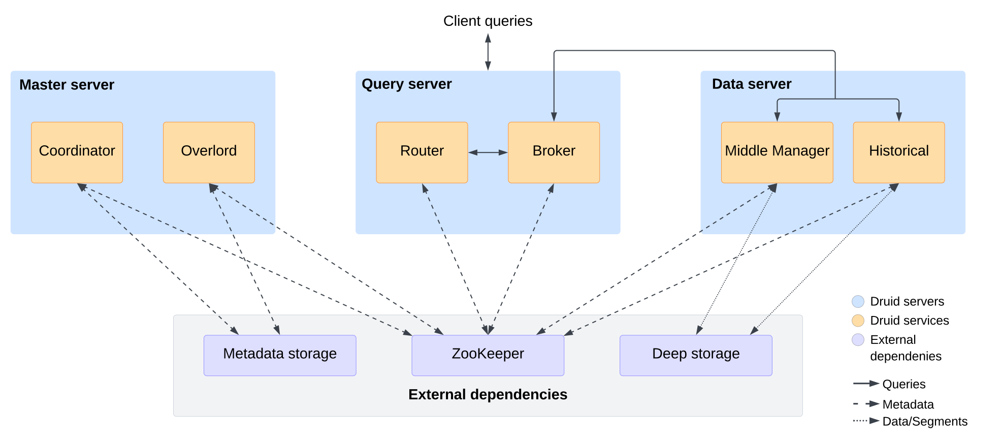

The following sections describe the components of this architecture.

Druid has several types of services:

- [Coordinator](#design-coordinator) manages data availability on the cluster.
- [Overlord](#design-overlord) controls the assignment of data ingestion workloads.
- [Broker](#design-broker) handles queries from external clients.
- [Router](#design-router) routes requests to Brokers, Coordinators, and Overlords.
- [Historical](#design-historical) stores queryable data.
- [Middle Manager](#design-middlemanager) and [Peon](#design-peons) ingest data.
- [Indexer](#design-indexer) serves as an alternative to the Middle Manager + Peon task execution system.

You can view services in the **Services** tab in the web console:

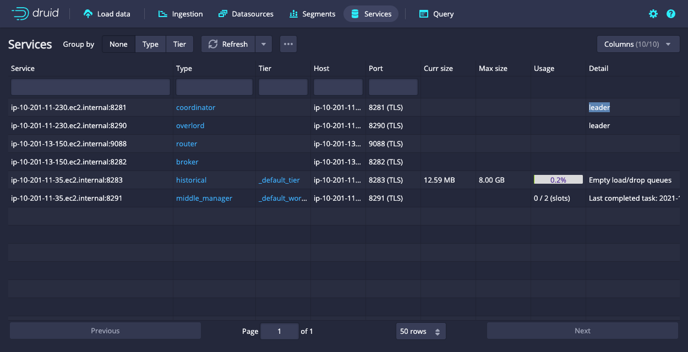

You can deploy Druid services according to your preferences. For ease of deployment, we recommend organizing them into three server types: [Master](#design-architecture--master-server), [Query](#design-architecture--query-server), and [Data](#design-architecture--data-server).

A Master server manages data ingestion and availability. It is responsible for starting new ingestion jobs and coordinating availability of data on the [Data server](#design-architecture--data-server).

Master servers divide operations between Coordinator and Overlord services.

[Coordinator](#design-coordinator) services watch over the Historical services on the Data servers. They are responsible for assigning segments to specific servers, and for ensuring segments are well-balanced across Historicals.

[Overlord](#design-overlord) services watch over the Middle Manager services on the Data servers and are the controllers of data ingestion into Druid. They are responsible for assigning ingestion tasks to Middle Managers and for coordinating segment publishing.

A Query server provides the endpoints that users and client applications interact with, routing queries to Data servers or other Query servers (and optionally proxied Master server requests).

Query servers divide operations between Broker and Router services.

[Broker](#design-broker) services receive queries from external clients and forward those queries to Data servers. When Brokers receive results from those subqueries, they merge those results and return them to the caller. Typically, you query Brokers rather than querying Historical or Middle Manager services on Data servers directly.

[**Router**](#design-router) services provide a unified API gateway in front of Brokers, Overlords, and Coordinators.

The Router service also runs the [web console](#operations-web-console), a UI for loading data, managing datasources and tasks, and viewing server status and segment information.

A Data server executes ingestion jobs and stores queryable data.

Data servers divide operations between Historical and Middle Manager services.

[**Historical**](#design-historical) services handle storage and querying on historical data, including any streaming data that has been in the system long enough to be committed. Historical services download segments from deep storage and respond to queries about these segments. They don't accept writes.

[**Middle Manager**](#design-middlemanager) services handle ingestion of new data into the cluster. They are responsible
for reading from external data sources and publishing new Druid segments.

[**Peon**](#design-peons) services are task execution engines spawned by Middle Managers. Each Peon runs a separate JVM and is responsible for executing a single task. Peons always run on the same host as the Middle Manager that spawned them.

[**Indexer**](#design-indexer) services are an alternative to Middle Managers and Peons. Instead of
forking separate JVM processes per-task, the Indexer runs tasks as individual threads within a single JVM process.

The Indexer is designed to be easier to configure and deploy compared to the MiddleManager + Peon system and to better enable resource sharing across tasks, which can help streaming ingestion. The Indexer is currently designated [experimental](#development-experimental).

Typically, you would deploy one of the following: MiddleManagers, [MiddleManager-less ingestion using Kubernetes](https://druid.apache.org/docs/latest/development/extensions-core/k8s-jobs), or Indexers. You wouldn't deploy more than one of these options.

Colocating Druid services by server type generally results in better utilization of hardware resources for most clusters.
For very large scale clusters, it can be desirable to split the Druid services such that they run on individual servers to avoid resource contention.

This section describes guidelines and configuration parameters related to service colocation.

The workload on the Coordinator service tends to increase with the number of segments in the cluster. The Overlord's workload also increases based on the number of segments in the cluster, but to a lesser degree than the Coordinator.

In clusters with very high segment counts, it can make sense to separate the Coordinator and Overlord services to provide more resources for the Coordinator's segment balancing workload.

You can run the Coordinator and Overlord services as a single combined service by setting the `druid.coordinator.asOverlord.enabled` property.
For more information, see [Coordinator Operation](#configuration--coordinator-operation).

With higher levels of ingestion or query load, it can make sense to deploy the Historical and Middle Manager services on separate hosts to to avoid CPU and memory contention.

The Historical service also benefits from having free memory for memory mapped segments, which can be another reason to deploy the Historical and Middle Manager services separately.

In addition to its built-in service types, Druid also has three external dependencies. These are intended to be able to
leverage existing infrastructure, where present.

Druid uses deep storage to store any data that has been ingested into the system. Deep storage is shared file
storage accessible by every Druid server. In a clustered deployment, this is typically a distributed object store like S3 or
HDFS, or a network mounted filesystem. In a single-server deployment, this is typically local disk.

Druid uses deep storage for the following purposes:

- To store all the data you ingest. Segments that get loaded onto Historical services for low latency queries are also kept in deep storage for backup purposes. Additionally, segments that are only in deep storage can be used for [queries from deep storage](#querying-query-deep-storage).
- As a way to transfer data in the background between Druid services. Druid stores data in files called *segments*.

Historical services cache data segments on local disk and serve queries from that cache as well as from an in-memory cache.
Segments on disk for Historical services provide the low latency querying performance Druid is known for.

You can also query directly from deep storage. When you query segments that exist only in deep storage, you trade some performance for the ability to query more of your data without necessarily having to scale your Historical services.

When determining sizing for your storage, keep the following in mind:

- Deep storage needs to be able to hold all the data that you ingest into Druid.
- On disk storage for Historical services need to be able to accommodate the data you want to load onto them to run queries. The data on Historical services should be data you access frequently and need to run low latency queries for.

Deep storage is an important part of Druid's elastic, fault-tolerant design. Druid bootstraps from deep storage even
if every single data server is lost and re-provisioned.

For more details, please see the [Deep storage](#design-deep-storage) page.

The metadata storage holds various shared system metadata such as segment usage information and task information. In a
clustered deployment, this is typically a traditional RDBMS like PostgreSQL or MySQL. In a single-server
deployment, it is typically a locally-stored Apache Derby database.

For more details, please see the [Metadata storage](#design-metadata-storage) page.

Used for internal service discovery, coordination, and leader election.

For more details, please see the [ZooKeeper](#design-zookeeper) page.

See the following topics for more information:

- [Storage components](#design-storage) to learn about data storage in Druid.
- [Segments](#design-segments) to learn about segment files.
- [Query processing](#querying-query-processing) for a high-level overview of how Druid processes queries.

---

<a id="design-coordinator"></a>

<!-- source_url: https://druid.apache.org/docs/latest/design/coordinator/ -->

<!-- page_index: 28 -->

# Coordinator service

> [!NOTE]
> **info**
> This policy currently cannot handle the situation when there are a lot of small segments which have the same interval, and their total size exceeds [`inputSegmentSizeBytes`](#configuration--automatic-compaction-dynamic-configuration).
> If it finds such segments, it simply skips them.

---

<a id="design-overlord"></a>

<!-- source_url: https://druid.apache.org/docs/latest/design/overlord/ -->

<!-- page_index: 29 -->

# Overlord service

The Overlord service is responsible for accepting tasks, coordinating task distribution, creating locks around tasks, and returning statuses to callers. The Overlord can be configured to run in one of two modes - local or remote (local being default).
In local mode, the Overlord is also responsible for creating Peons for executing tasks. When running the Overlord in local mode, all Middle Manager and Peon configurations must be provided as well.
Local mode is typically used for simple workflows. In remote mode, the Overlord and Middle Manager are run in separate services and you can run each on a different server.
This mode is recommended if you intend to use the indexing service as the single endpoint for all Druid indexing.

For Apache Druid Overlord service configuration, see [Overlord Configuration](#configuration--overlord).

For basic tuning guidance for the Overlord service, see [Basic cluster tuning](#operations-basic-cluster-tuning--overlord).

For a list of API endpoints supported by the Overlord, please see the [Service status API reference](#api-reference-service-status-api--overlord).

If a Middle Manager has task failures above a threshold, the Overlord will blacklist these Middle Managers. No more than 20% of the Middle Managers can be blacklisted. Blacklisted Middle Managers will be periodically whitelisted.

The following variables can be used to set the threshold and blacklist timeouts.

```text
druid.indexer.runner.maxRetriesBeforeBlacklist 
druid.indexer.runner.workerBlackListBackoffTime 
druid.indexer.runner.workerBlackListCleanupPeriod 
druid.indexer.runner.maxPercentageBlacklistWorkers 
```

The autoscaling mechanisms currently in place are tightly coupled with our deployment infrastructure but the framework should be in place for other implementations. We are highly open to new implementations or extensions of the existing mechanisms. In our own deployments, Middle Manager services are Amazon AWS EC2 nodes and they are provisioned to register themselves in a [galaxy](https://github.com/ning/galaxy) environment.

If autoscaling is enabled, new Middle Managers may be added when a task has been in pending state for too long. Middle Managers may be terminated if they have not run any tasks for a period of time.

---

<a id="design-broker"></a>

<!-- source_url: https://druid.apache.org/docs/latest/design/broker/ -->

<!-- page_index: 30 -->

# Broker service

The Broker service routes queries in a distributed cluster setup. It interprets the metadata published to ZooKeeper about segment distribution across services and routes queries accordingly. Additionally, the Broker service consolidates result sets from individual services.

For Apache Druid Broker service configuration, see [Broker Configuration](#configuration--broker).

For basic tuning guidance for the Broker service, see [Basic cluster tuning](#operations-basic-cluster-tuning--broker).

For a list of API endpoints supported by the Broker, see [Broker API](#api-reference-legacy-metadata-api--broker).

```text
org.apache.druid.cli.Main server broker 
```

Most Druid queries contain an interval object that indicates a span of time for which data is requested. Similarly, Druid partitions [segments](#design-segments) to contain data for some interval of time and distributes the segments across a cluster. Consider a simple datasource with seven segments where each segment contains data for a given day of the week. Any query issued to the datasource for more than one day of data will hit more than one segment. These segments will likely be distributed across multiple services, and hence, the query will likely hit multiple services.

To determine which services to forward queries to, the Broker service first builds a view of the world from information in ZooKeeper. ZooKeeper maintains information about [Historical](#design-historical) and streaming ingestion [Peon](#design-peons) services and the segments they are serving. For every datasource in ZooKeeper, the Broker service builds a timeline of segments and the services that serve them. When queries are received for a specific datasource and interval, the Broker service performs a lookup into the timeline associated with the query datasource for the query interval and retrieves the services that contain data for the query. The Broker service then forwards down the query to the selected services.

Broker services employ a cache with an LRU cache invalidation strategy. The Broker cache stores per-segment results. The cache can be local to each Broker service or shared across multiple services using an external distributed cache such as [memcached](http://memcached.org/). Each time a Broker service receives a query, it first maps the query to a set of segments. A subset of these segment results may already exist in the cache and the results can be directly pulled from the cache. For any segment results that do not exist in the cache, the Broker service will forward the query to the
Historical services. Once the Historical services return their results, the Broker will store those results in the cache. Real-time segments are never cached and hence requests for real-time data will always be forwarded to real-time services. Real-time data is perpetually changing and caching the results would be unreliable.

---

<a id="design-router"></a>

<!-- source_url: https://druid.apache.org/docs/latest/design/router/ -->

<!-- page_index: 31 -->

# Router service

> [!NOTE]
> **info**
> JavaScript-based functionality is disabled by default. Please refer to the Druid [JavaScript programming guide](#development-javascript) for guidelines about using Druid's JavaScript functionality, including instructions on how to enable it.

---

<a id="design-historical"></a>

<!-- source_url: https://druid.apache.org/docs/latest/design/historical/ -->

<!-- page_index: 32 -->

# Historical service

The Historical service is responsible for storing and querying historical data.
Historical services cache data segments on local disk and serve queries from that cache as well as from an in-memory cache.

For Apache Druid Historical service configuration, see [Historical configuration](#configuration--historical).

For basic tuning guidance for the Historical service, see [Basic cluster tuning](#operations-basic-cluster-tuning--historical).

For a list of API endpoints supported by the Historical, please see the [Service status API reference](#api-reference-service-status-api--historical).

```text
org.apache.druid.cli.Main server historical 
```

Each Historical service copies or pulls segment files from deep storage to local disk in an area called the segment cache. To configure the size and location of the segment cache on each Historical service, set the `druid.segmentCache.locations`.
For more information, see [Segment cache size](#operations-basic-cluster-tuning--segment-cache-size).

The [Coordinator](#design-coordinator) controls the assignment of segments to Historicals and the balance of segments between Historicals. Historical services do not communicate directly with each other, nor do they communicate directly with the Coordinator. Instead, the Coordinator creates ephemeral entries in ZooKeeper in a [load queue path](#configuration--path-configuration). Each Historical service maintains a connection to ZooKeeper, watching those paths for segment information.

When a Historical service detects a new entry in the ZooKeeper load queue, it checks its own segment cache. If no information about the segment exists there, the Historical service first retrieves metadata from ZooKeeper about the segment, including where the segment is located in deep storage and how it needs to decompress and process it.

For more information about segment metadata and Druid segments in general, see [Segments](#design-segments).

After a Historical service pulls down and processes a segment from deep storage, Druid advertises the segment as being available for queries from the Broker. This announcement by the Historical is made via ZooKeeper, in a [served segments path](#configuration--path-configuration).

For more information about how the Broker determines what data is available for queries, see [Broker](#design-broker).

To make data from the segment cache available for querying as soon as possible, Historical services search the local segment cache upon startup and advertise the segments found there.

The segment cache uses [memory mapping](https://en.wikipedia.org/wiki/Mmap). The cache consumes memory from the underlying operating system so Historicals can hold parts of segment files in memory to increase query performance at the data level. The in-memory segment cache is affected by the size of the Historical JVM, heap / direct memory buffers, and other services on the operating system itself.

At query time, if the required part of a segment file is available in the memory mapped cache or "page cache", the Historical re-uses it and reads it directly from memory. If it is not in the memory-mapped cache, the Historical reads that part of the segment from disk. In this case, there is potential for new data to flush other segment data from memory. This means that if free operating system memory is close to `druid.server.maxSize`, the more likely that segment data will be available in memory and reduce query times. Conversely, the lower the free operating system memory, the more likely a Historical is to read segments from disk.

Note that this memory-mapped segment cache is in addition to other [query-level caches](#querying-caching).

You can configure a Historical service to log and report metrics for every query it services.
For information on querying Historical services, see [Querying](#querying).

---

<a id="design-middlemanager"></a>

<!-- source_url: https://druid.apache.org/docs/latest/design/middlemanager/ -->

<!-- page_index: 33 -->

# Middle Manager service

The Middle Manager service is a worker service that executes submitted tasks. Middle Managers forward tasks to [Peons](#design-peons) that run in separate JVMs.
Druid uses separate JVMs for tasks to isolate resources and logs. Each Peon is capable of running only one task at a time, whereas a Middle Manager may have multiple Peons.

For Apache Druid Middle Manager service configuration, see [Middle Manager and Peons](#configuration--middle-manager-and-peon).

For basic tuning guidance for the Middle Manager service, see [Basic cluster tuning](#operations-basic-cluster-tuning--middle-manager).

For a list of API endpoints supported by the Middle Manager, see the [Service status API reference](#api-reference-service-status-api--middle-manager).

```text
org.apache.druid.cli.Main server middleManager 
```

---

<a id="design-peons"></a>

<!-- source_url: https://druid.apache.org/docs/latest/design/peons/ -->

<!-- page_index: 34 -->

# Peon service

The Peon service is a task execution engine spawned by the Middle Manager. Each Peon runs a separate JVM and is responsible for executing a single task. Peons always run on the same host as the Middle Manager that spawned them.

For Apache Druid Peon configuration, see [Peon Query Configuration](#configuration--peon-query-configuration) and [Additional Peon Configuration](#configuration--additional-peon-configuration).

For basic tuning guidance for Middle Manager tasks, see [Basic cluster tuning](#operations-basic-cluster-tuning--task-configurations).

Peons run a single task in a single JVM. The Middle Manager is responsible for creating Peons for running tasks.
Peons should rarely run on their own.

The Peon should seldom run separately from the Middle Manager, except for development purposes.

```text
org.apache.druid.cli.Main internal peon <task_file> <status_file> 
```

The task file contains the task JSON object.
The status file indicates where the task status will be output.

---

<a id="design-indexer"></a>

<!-- source_url: https://druid.apache.org/docs/latest/design/indexer/ -->

<!-- page_index: 35 -->

# Indexer service

> [!NOTE]
> **info**
> The Indexer is an optional and experimental feature. If you're primarily performing batch ingestion, we recommend you use either the MiddleManager and Peon task execution system or [MiddleManager-less ingestion using Kubernetes](https://druid.apache.org/docs/latest/development/extensions-core/k8s-jobs). If you're primarily doing streaming ingestion, you may want to try either [MiddleManager-less ingestion using Kubernetes](https://druid.apache.org/docs/latest/development/extensions-core/k8s-jobs) or the Indexer service.

---

<a id="design-storage"></a>

<!-- source_url: https://druid.apache.org/docs/latest/design/storage/ -->

<!-- page_index: 36 -->

# Storage overview

Druid stores data in datasources, which are similar to tables in a traditional RDBMS. Each datasource is partitioned by time and, optionally, further partitioned by other attributes. Each time range is called a chunk (for example, a single day, if your datasource is partitioned by day). Within a chunk, data is partitioned into one or more [segments](#design-segments). Each segment is a single file, typically comprising up to a few million rows of data. Since segments are organized into time chunks, it's sometimes helpful to think of segments as living on a timeline like the following:

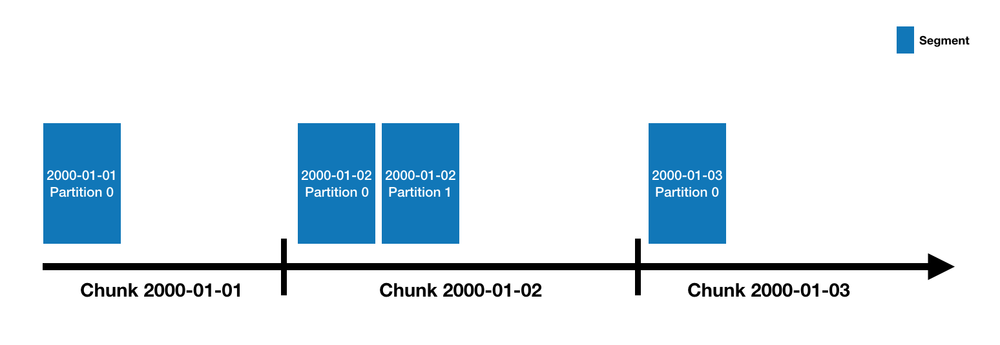

A datasource may have anywhere from just a few segments, up to hundreds of thousands and even millions of segments. Each segment is created by a Middle Manager as mutable and uncommitted. Data is queryable as soon as it is added to an uncommitted segment. The segment building process accelerates later queries by producing a data file that is compact and indexed:

- Conversion to columnar format
- Indexing with bitmap indexes
- Compression
  - Dictionary encoding with id storage minimization for String columns
  - Bitmap compression for bitmap indexes
  - Type-aware compression for all columns

Periodically, segments are committed and published to [deep storage](#design-deep-storage), become immutable, and move from Middle Managers to the Historical services. An entry about the segment is also written to the [metadata store](#design-metadata-storage). This entry is a self-describing bit of metadata about the segment, including things like the schema of the segment, its size, and its location on deep storage. These entries tell the Coordinator what data is available on the cluster.

For details on the segment file format, see [segment files](#design-segments).

For details on modeling your data in Druid, see [schema design](#ingestion-schema-design).

Indexing is the mechanism by which new segments are created, and handoff is the mechanism by which they are published and served by Historical services.

On the indexing side:

1. An indexing task starts running and building a new segment. It must determine the identifier of the segment before it starts building it. For a task that is appending (like a Kafka task, or an index task in append mode) this is done by calling an "allocate" API on the Overlord to potentially add a new partition to an existing set of segments. For
   a task that is overwriting (like a Hadoop task, or an index task not in append mode) this is done by locking an interval and creating a new version number and new set of segments.
2. If the indexing task is a realtime task (like a Kafka task) then the segment is immediately queryable at this point. It's available, but unpublished.
3. When the indexing task has finished reading data for the segment, it pushes it to deep storage and then publishes it by writing a record into the metadata store.
4. If the indexing task is a realtime task, then to ensure data is continuously available for queries, it waits for a Historical service to load the segment. If the indexing task is not a realtime task, it exits immediately.

On the Coordinator / Historical side:

1. The Coordinator polls the metadata store periodically (by default, every 1 minute) for newly published segments.
2. When the Coordinator finds a segment that is published and used, but unavailable, it chooses a Historical service to load that segment and instructs that Historical to do so.
3. The Historical loads the segment and begins serving it.
4. At this point, if the indexing task was waiting for handoff, it will exit.

Segments all have a four-part identifier with the following components:

- Datasource name.
- Time interval for the time chunk containing the segment; this corresponds to the `segmentGranularity` specified at ingestion time. Uses the same format as [query granularity](#querying-granularities).
- Version number (generally an ISO8601 timestamp corresponding to when the segment set was first started).
- Partition number (an integer, unique within a datasource+interval+version; may not necessarily be contiguous).

For example, this is the identifier for a segment in datasource `clarity-cloud0`, time chunk
`2018-05-21T16:00:00.000Z/2018-05-21T17:00:00.000Z`, version `2018-05-21T15:56:09.909Z`, and partition number 1:

```text
clarity-cloud0_2018-05-21T16:00:00.000Z_2018-05-21T17:00:00.000Z_2018-05-21T15:56:09.909Z_1 
```

Segments with partition number 0 (the first partition in a chunk) omit the partition number, like the following example, which is a segment in the same time chunk as the previous one, but with partition number 0 instead of 1:

```text
clarity-cloud0_2018-05-21T16:00:00.000Z_2018-05-21T17:00:00.000Z_2018-05-21T15:56:09.909Z 
```

The version number provides a form of [multi-version concurrency control](https://en.wikipedia.org/wiki/Multiversion_concurrency_control) (MVCC) to support batch-mode overwriting. If all you ever do is append data, then there will be just a single version for each time chunk. But when you overwrite data, Druid will seamlessly switch from querying the old version to instead query the new, updated versions. Specifically, a new set of segments is created with the same datasource, same time interval, but a higher version number. This is a signal to the rest of the Druid system that the older version should be removed from the cluster, and the new version should replace it.

The switch appears to happen instantaneously to a user, because Druid handles this by first loading the new data (but not allowing it to be queried), and then, as soon as the new data is all loaded, switching all new queries to use those new segments. Then it drops the old segments a few minutes later.

Each segment has a lifecycle that involves the following three major areas:

1. **Metadata store:** Segment metadata (a small JSON payload generally no more than a few KB) is stored in the [metadata store](#design-metadata-storage) once a segment is done being constructed. The act of inserting a record for a segment into the metadata store is called publishing. These metadata records have a boolean flag named `used`, which controls whether the segment is intended to be queryable or not. Segments created by realtime tasks will be
   available before they are published, since they are only published when the segment is complete and will not accept any additional rows of data.
2. **Deep storage:** Segment data files are pushed to deep storage once a segment is done being constructed. This happens immediately before publishing metadata to the metadata store.
3. **Availability for querying:** Segments are available for querying on some Druid data server, like a realtime task, directly from deep storage, or a Historical service.

You can inspect the state of currently active segments using the Druid SQL
[`sys.segments` table](#querying-sql-metadata-tables--segments-table). It includes the following flags:

- `is_published`: True if segment metadata has been published to the metadata store and `used` is true.
- `is_available`: True if the segment is currently available for querying, either on a realtime task or Historical service.
- `is_realtime`: True if the segment is only available on realtime tasks. For datasources that use realtime ingestion, this will generally start off `true` and then become `false` as the segment is published and handed off.
- `is_overshadowed`: True if the segment is published (with `used` set to true) and is fully overshadowed by some other published segments. Generally this is a transient state, and segments in this state will soon have their `used` flag automatically set to false.

Druid has an architectural separation between ingestion and querying, as described above in
[Indexing and handoff](#design-storage--indexing-and-handoff). This means that when understanding Druid's availability and consistency properties, we must look at each function separately.

On the ingestion side, Druid's primary [ingestion methods](#ingestion--ingestion-methods) are all pull-based and offer transactional guarantees. This means that you are guaranteed that ingestion using these methods will publish in an all-or-nothing manner:

- Supervised "seekable-stream" ingestion methods like [Kafka](#ingestion-kafka-ingestion) and [Kinesis](#ingestion-kinesis-ingestion). With these methods, Druid commits stream offsets to its [metadata store](#design-metadata-storage) alongside segment metadata, in the same transaction. Note that ingestion of data that has not yet been published can be rolled back if ingestion tasks fail. In this case, partially-ingested data is
  discarded, and Druid will resume ingestion from the last committed set of stream offsets. This ensures exactly-once publishing behavior.
- [Hadoop-based batch ingestion](#ingestion-hadoop). Each task publishes all segment metadata in a single transaction.
- [Native batch ingestion](#ingestion-native-batch). In parallel mode, the supervisor task publishes all segment metadata in a single transaction after the subtasks are finished. In simple (single-task) mode, the single task publishes all segment metadata in a single transaction after it is complete.

Additionally, some ingestion methods offer an *idempotency* guarantee. This means that repeated executions of the same ingestion will not cause duplicate data to be ingested:

- Supervised "seekable-stream" ingestion methods like [Kafka](#ingestion-kafka-ingestion) and [Kinesis](#ingestion-kinesis-ingestion) are idempotent due to the fact that stream offsets and segment metadata are stored together and updated in lock-step.
- [Hadoop-based batch ingestion](#ingestion-hadoop) is idempotent unless one of your input sources is the same Druid datasource that you are ingesting into. In this case, running the same task twice is non-idempotent, because you are adding to existing data instead of overwriting it.
- [Native batch ingestion](#ingestion-native-batch) is idempotent unless
  [`appendToExisting`](#ingestion-native-batch) is true, or one of your input sources is the same Druid datasource that you are ingesting into. In either of these two cases, running the same task twice is non-idempotent, because you are adding to existing data instead of overwriting it.

On the query side, the Druid Broker is responsible for ensuring that a consistent set of segments is involved in a given query. It selects the appropriate set of segment versions to use when the query starts based on what is currently available. This is supported by atomic replacement, a feature that ensures that from a user's perspective, queries flip instantaneously from an older version of data to a newer set of data, with no consistency or performance impact.
This is used for Hadoop-based batch ingestion, native batch ingestion when `appendToExisting` is false, and compaction.

Note that atomic replacement happens for each time chunk individually. If a batch ingestion task or compaction involves multiple time chunks, then each time chunk will undergo atomic replacement soon after the task finishes, but the replacements will not all happen simultaneously.

Typically, atomic replacement in Druid is based on a core set concept that works in conjunction with segment versions.
When a time chunk is overwritten, a new core set of segments is created with a higher version number. The core set must all be available before the Broker will use them instead of the older set. There can also only be one core set per version per time chunk. Druid will also only use a single version at a time per time chunk. Together, these properties provide Druid's atomic replacement guarantees.

Druid also supports an experimental segment locking mode that is activated by setting
[`forceTimeChunkLock`](#ingestion-tasks--context-parameters) to false in the context of an ingestion task. In this case, Druid creates an atomic update group using the existing version for the time chunk, instead of creating a new core set with a new version number. There can be multiple atomic update groups with the same version number per time chunk. Each one replaces a specific set of earlier segments in the same time chunk and with the same version number. Druid will query the latest one that is fully available. This is a more powerful version of the core set concept, because it enables atomically replacing a subset of data for a time chunk, as well as doing atomic replacement and appending simultaneously.

If segments become unavailable due to multiple Historicals going offline simultaneously (beyond your replication factor), then Druid queries will include only the segments that are still available. In the background, Druid will reload these unavailable segments on other Historicals as quickly as possible, at which point they will be included in queries again.

---

<a id="design-segments"></a>

<!-- source_url: https://druid.apache.org/docs/latest/design/segments/ -->

<!-- page_index: 37 -->

# Segments

Apache Druid stores its data and indexes in *segment files* partitioned by time. Druid creates a segment for each segment interval that contains data. If an interval is empty—that is, containing no rows—no segment exists for that time interval. Druid may create multiple segments for the same interval if you ingest data for that period via different ingestion jobs. [Compaction](#data-management-compaction) is the Druid process that attempts to combine these segments into a single segment per interval for optimal performance.

The time interval is configurable in the `segmentGranularity` parameter of the [`granularitySpec`](#ingestion-ingestion-spec--granularityspec).

For Druid to operate well under heavy query load, it is important for the segment
file size to be within the recommended range of 300-700 MB. If your
segment files are larger than this range, then consider either
changing the granularity of the segment time interval or partitioning your
data and/or adjusting the `targetRowsPerSegment` in your `partitionsSpec`.
A good starting point for this parameter is 5 million rows.
See the Sharding section below and the "Partitioning specification" section of
the [Batch ingestion](#ingestion-hadoop--partitionsspec) documentation
for more guidance.

Segment files are *columnar*: the data for each column is laid out in
separate data structures. By storing each column separately, Druid decreases query latency by scanning only those columns actually needed for a query. There are three basic column types: timestamp, dimensions, and metrics:

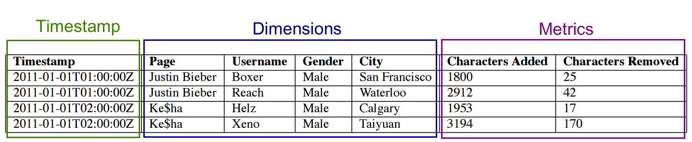

Timestamp and metrics type columns are arrays of integer or floating point values compressed with
[LZ4](https://github.com/lz4/lz4-java). Once a query identifies which rows to select, it decompresses them, pulls out the relevant rows, and applies the
desired aggregation operator. If a query doesn’t require a column, Druid skips over that column's data.

Dimension columns are different because they support filter and
group-by operations, so each dimension requires the following
three data structures:

- **Dictionary**: Maps values (which are always treated as strings) to integer IDs, allowing compact representation of the list and bitmap values.
- **List**: The column’s values, encoded using the dictionary. Required for GroupBy and TopN queries. These operators allow queries that solely aggregate metrics based on filters to run without accessing the list of values.
- **Bitmap**: One bitmap for each distinct value in the column, to indicate which rows contain that value. Bitmaps allow for quick filtering operations because they are convenient for quickly applying AND and OR operators. Also known as inverted indexes.

To get a better sense of these data structures, consider the "Page" column from the example data above, represented by the following data structures:

```text
1: Dictionary 
   { 
    "Justin Bieber": 0, 
    "Ke$ha":         1 
   } 
 
2: List of column data 
   [0, 
   0, 
   1, 
   1] 
 
3: Bitmaps 
   value="Justin Bieber": [1,1,0,0] 
   value="Ke$ha":         [0,0,1,1] 
```

Note that the bitmap is different from the dictionary and list data structures: the dictionary and list grow linearly with the size of the data, but the size of the bitmap section is the product of data size and column cardinality. That is, there is one bitmap per separate column value. Columns with the same value share the same bitmap.

For each row in the list of column data, there is only a single bitmap that has a non-zero entry. This means that high cardinality columns have extremely sparse, and therefore highly compressible, bitmaps. Druid exploits this using compression algorithms that are specially suited for bitmaps, such as [Roaring bitmap compression](https://github.com/RoaringBitmap/RoaringBitmap).

String columns always store the null value if present in any row as id 0, the first position in the value dictionary and an associated entry in the bitmap value indexes used to filter null values. Numeric columns also store a null value bitmap index to indicate the null valued rows, which is used to null check aggregations and for filter matching null values.

Druid segments for the same datasource may have different schemas. If a string column (dimension) exists in one segment but not another, queries that involve both segments still work. In default mode, queries for the segment without the dimension behave as if the dimension contains only blank values. In SQL-compatible mode, queries for the segment without the dimension behave as if the dimension contains only null values. Similarly, if one segment has a numeric column (metric) but another does not, queries on the segment without the metric generally operate as expected. Aggregations over the missing metric operate as if the metric doesn't exist.

Each column is stored as two parts:

- A Jackson-serialized `ColumnDescriptor`.
- The binary data for the column.

A `ColumnDescriptor` is Jackson-serialized instance of the internal Druid `ColumnDescriptor` class . It allows the use of Jackson's polymorphic deserialization to add new and interesting methods of serialization with minimal impact to the code. It consists of some metadata about the column (for example: type, whether it's multi-value) and a list of serialization/deserialization logic that can deserialize the rest of the binary.

A multi-value column allows a single row to contain multiple strings for a column. You can think of it as an array of strings. If a datasource uses multi-value columns, then the data structures within the segment files look a bit different. Let's imagine that in the example above, the second row is tagged with both the `Ke$ha` *and* `Justin Bieber` topics, as follows:

```text
1: Dictionary 
   { 
    "Justin Bieber": 0, 
    "Ke$ha":         1 
   } 
 
2: List of column data 
   [0, 
   [0,1],  <--Row value in a multi-value column can contain an array of values 
   1, 
   1] 
 
3: Bitmaps 
   value="Justin Bieber": [1,1,0,0] 
   value="Ke$ha":         [0,1,1,1] 
                            ^ 
                            | 
                            | 
   Multi-value column contains multiple non-zero entries 
```

Note the changes to the second row in the list of column data and the `Ke$ha`
bitmap. If a row has more than one value for a column, its entry in
the list is an array of values. Additionally, a row with *n* values in the list has *n* non-zero valued entries in bitmaps.

Druid uses LZ4 by default to compress blocks of values for string, long, float, and double columns. Druid uses Roaring to compress bitmaps for string columns and numeric null values. We recommend that you use these defaults unless you've experimented with your data and query patterns suggest that non-default options will perform better in your specific case.

Druid also supports Concise bitmap compression. For string column bitmaps, the differences between using Roaring and Concise are most pronounced for high cardinality columns. In this case, Roaring is substantially faster on filters that match many values, but in some cases Concise can have a lower footprint due to the overhead of the Roaring format (but is still slower when many values are matched). You configure compression at the segment level, not for individual columns. See [IndexSpec](#ingestion-ingestion-spec--indexspec) for more details.

Segment identifiers typically contain the segment datasource, interval start time (in ISO 8601 format), interval end time (in ISO 8601 format), and version information. If data is additionally sharded beyond a time range, the segment identifier also contains a partition number:

`datasource_intervalStart_intervalEnd_version_partitionNum`

The increasing partition numbers in the following segments indicate that multiple segments exist for the same interval:

```text
foo_2015-01-01/2015-01-02_v1_0 
foo_2015-01-01/2015-01-02_v1_1 
foo_2015-01-01/2015-01-02_v1_2 
```

If you reindex the data with a new schema, Druid allocates a new version ID to the newly created segments:

```text
foo_2015-01-01/2015-01-02_v2_0 
foo_2015-01-01/2015-01-02_v2_1 
foo_2015-01-01/2015-01-02_v2_2 
```

Multiple segments can exist for a single time interval and datasource. These segments form a `block` for an interval. Depending on the type of `shardSpec` used to shard the data, Druid queries may only complete if a `block` is complete. For example, if a block consists of the following three segments:

```text
sampleData_2011-01-01T02:00:00:00Z_2011-01-01T03:00:00:00Z_v1_0 
sampleData_2011-01-01T02:00:00:00Z_2011-01-01T03:00:00:00Z_v1_1 
sampleData_2011-01-01T02:00:00:00Z_2011-01-01T03:00:00:00Z_v1_2 
```

All three segments must load before a query for the interval `2011-01-01T02:00:00:00Z_2011-01-01T03:00:00:00Z` can complete.

Linear shard specs are an exception to this rule. Linear shard specs do not enforce "completeness" so queries can complete even if shards are not completely loaded.

For example, if a real-time ingestion creates three segments that were sharded with linear shard spec, and only two of the segments are loaded, queries return results for those two segments.

A segment contains several files:

- `version.bin`

  4 bytes representing the current segment version as an integer. For example, for v9 segments the version is 0x0, 0x0, 0x0, 0x9.
- `meta.smoosh`

  A file containing metadata (filenames and offsets) about the contents of the other `smoosh` files.
- `XXXXX.smoosh`

  Smoosh (`.smoosh`) files contain concatenated binary data. This file consolidation reduces the number of file descriptors that must be open when accessing data. The files are 2 GB or less in size to remain within the limit of a memory-mapped `ByteBuffer` in Java.
  Smoosh files contain the following:

  - Individual files for each column in the data, including one for the `__time` column that refers to the timestamp of the segment.
  - An `index.drd` file that contains additional segment metadata.

In the codebase, segments have an internal format version. The current segment format version is `v9`.

Druid uses versioning to manage updates to create a form of multi-version concurrency control (MVCC). These MVCC versions are distinct from the segment format version discussed above.

Note that updates that span multiple segment intervals are only atomic within each interval. They are not atomic across the entire update. For example, if you have the following segments:

```text
foo_2015-01-01/2015-01-02_v1_0 
foo_2015-01-02/2015-01-03_v1_1 
foo_2015-01-03/2015-01-04_v1_2 
```

`v2` segments are loaded into the cluster as soon as they are built and replace `v1` segments for the period of time the segments overlap. Before `v2` segments are completely loaded, the cluster may contain a mixture of `v1` and `v2` segments.

```text
foo_2015-01-01/2015-01-02_v1_0 
foo_2015-01-02/2015-01-03_v2_1 
foo_2015-01-03/2015-01-04_v1_2 
```

In this case, queries may hit a mixture of `v1` and `v2` segments.

---

<a id="design-deep-storage"></a>

<!-- source_url: https://druid.apache.org/docs/latest/design/deep-storage/ -->

<!-- page_index: 38 -->

# Deep storage

Deep storage is where segments are stored. It is a storage mechanism that Apache Druid does not provide. This deep storage infrastructure defines the level of durability of your data. As long as Druid processes can see this storage infrastructure and get at the segments stored on it, you will not lose data no matter how many Druid nodes you lose. If segments disappear from this storage layer, then you will lose whatever data those segments represented.

In addition to being the backing store for segments, you can use [query from deep storage](#design-deep-storage--querying-from-deep-storage) and run queries against segments stored primarily in deep storage. The [load rules](#operations-rule-configuration--load-rules) you configure determine whether segments exist primarily in deep storage or in a combination of deep storage and Historical processes.

Druid supports multiple options for deep storage, including blob storage from major cloud providers. Select the one that fits your environment.

Local storage is intended for use in the following situations:

- You have just one server.
- Or, you have multiple servers, and they all have access to a shared filesystem (for example: NFS).

In multi-server production clusters, rather than local storage with a shared filesystem, it is instead recommended to
use cloud-based deep storage ([Amazon S3](#design-deep-storage--amazon-s3-or-s3-compatible), [Google Cloud Storage](#design-deep-storage--google-cloud-storage), or [Azure Blob Storage](#design-deep-storage--azure-blob-storage)), S3-compatible storage (like Minio), or [HDFS](#design-deep-storage--hdfs). These options are
generally more convenient, more scalable, and more robust than setting up a shared filesystem.

The following configurations in `common.runtime.properties` apply to local storage:

| Property | Possible Values | Description | Default |
| --- | --- | --- | --- |
| `druid.storage.type` | `local` |  | Must be set. |
| `druid.storage.storageDirectory` | any local directory | Directory for storing segments. Must be different from `druid.segmentCache.locations` and `druid.segmentCache.infoDir`. | `/tmp/druid/localStorage` |
| `druid.storage.zip` | `true`, `false` | Whether segments in `druid.storage.storageDirectory` are written as directories (`false`) or zip files (`true`). | `false` |

For example:

```text
druid.storage.type=local 
druid.storage.storageDirectory=/tmp/druid/localStorage 
```

The `druid.storage.storageDirectory` must be set to a different path than `druid.segmentCache.locations` or
`druid.segmentCache.infoDir`.

See [`druid-s3-extensions`](https://druid.apache.org/docs/latest/development/extensions-core/s3).

See [`druid-google-extensions`](https://druid.apache.org/docs/latest/development/extensions-core/google).

See [`druid-azure-extensions`](https://druid.apache.org/docs/latest/development/extensions-core/azure).

See [druid-hdfs-storage extension documentation](https://druid.apache.org/docs/latest/development/extensions-core/hdfs).

For additional deep storage options, please see our [extensions list](#configuration-extensions).

Although not as performant as querying segments stored on disk for Historical processes, you can query from deep storage to access segments that you may not need frequently or with the extreme low latency Druid queries traditionally provide. You trade some performance for a total lower storage cost because you can access more of your data without the need to increase the number or capacity of your Historical processes.

For information about how to run queries, see [Query from deep storage](#querying-query-deep-storage).

---

<a id="design-metadata-storage"></a>

<!-- source_url: https://druid.apache.org/docs/latest/design/metadata-storage/ -->

<!-- page_index: 39 -->

# Metadata storage

> [!NOTE]
> **info**
> We also recommend you set up a high availability environment because there is no way to restore lost metadata.

---

<a id="design-zookeeper"></a>

<!-- source_url: https://druid.apache.org/docs/latest/design/zookeeper/ -->

<!-- page_index: 40 -->

# ZooKeeper

> [!NOTE]
> **info**
> Note: Starting with Apache Druid 0.22.0, support for ZooKeeper 3.4.x has been removed
> Starting with Apache Druid 31.0.0, support for Zookeeper-based segment loading has been removed.

---

<a id="ingestion"></a>

<!-- source_url: https://druid.apache.org/docs/latest/ingestion/ -->

<!-- page_index: 41 -->

# Ingestion overview

Loading data in Druid is called *ingestion* or *indexing*. When you ingest data into Druid, Druid reads the data from
your source system and stores it in data files called [*segments*](#design-segments).
In general, segment files contain a few million rows each.

For most ingestion methods, the Druid [Middle Manager](#design-middlemanager) processes or the
[Indexer](#design-indexer) processes load your source data.

During ingestion, Druid creates segments and stores them in [deep storage](#design-deep-storage). Historical nodes load the segments into memory to respond to queries. For streaming ingestion, the Middle Managers and indexers can respond to queries in real-time with arriving data. For more information, see [Storage overview](#design-storage).

This topic introduces streaming and batch ingestion methods. The following topics describe ingestion concepts and information that apply to all [ingestion methods](#ingestion--ingestion-methods):

- [Druid schema model](#ingestion-schema-model) introduces concepts of datasources, primary timestamp, dimensions, and metrics.
- [Data rollup](#ingestion-rollup) describes rollup as a concept and provides suggestions to maximize the benefits of rollup.
- [Partitioning](#ingestion-partitioning) describes time chunk and secondary partitioning in Druid.
- [Ingestion spec reference](#ingestion-ingestion-spec) provides a reference for the configuration options in the ingestion spec.

For additional information about concepts and configurations that are unique to each ingestion method, see the topic for the ingestion method.

The tables below list Druid's most common data ingestion methods, along with comparisons to help you choose
the best one for your situation. Each ingestion method supports its own set of source systems to pull from. For details
about how each method works, as well as configuration properties specific to that method, check out its documentation
page.

There are two available options for streaming ingestion. Streaming ingestion is controlled by a continuously-running
supervisor.

| **Method** | [Kafka](#ingestion-kafka-ingestion) | [Kinesis](#ingestion-kinesis-ingestion) |
| --- | --- | --- |
| **Supervisor type** | `kafka` | `kinesis` |
| **How it works** | Druid reads directly from Apache Kafka. | Druid reads directly from Amazon Kinesis. |
| **Can ingest late data?** | Yes. | Yes. |
| **Exactly-once guarantees?** | Yes. | Yes. |

There are three available options for batch ingestion. Batch ingestion jobs are associated with a controller task that
runs for the duration of the job.

| **Method** | [Native batch](#ingestion-native-batch) | [SQL](#multi-stage-query) | [Hadoop-based (deprecated)](#ingestion-hadoop) |
| --- | --- | --- | --- |
| **Controller task type** | `index_parallel` | `query_controller` | `index_hadoop` |
| **How you submit it** | Send an `index_parallel` spec to the [Tasks API](#api-reference-tasks-api). | Send an [INSERT](#multi-stage-query-concepts--load-data-with-insert) or [REPLACE](#multi-stage-query-concepts--overwrite-data-with-replace) statement to the [SQL task API](#api-reference-sql-ingestion-api--submit-a-query). | Send an `index_hadoop` spec to the [Tasks API](#api-reference-tasks-api). |
| **Parallelism** | Using subtasks, if [`maxNumConcurrentSubTasks`](#ingestion-native-batch--tuningconfig) is greater than 1. | Using `query_worker` subtasks. | Using YARN. |
| **Fault tolerance** | Workers automatically relaunched upon failure. Controller task failure leads to job failure. | Controller or worker task failure leads to job failure. | YARN containers automatically relaunched upon failure. Controller task failure leads to job failure. |
| **Can append?** | Yes. | Yes (INSERT). | No. |
| **Can overwrite?** | Yes. | Yes (REPLACE). | Yes. |
| **External dependencies** | None. | None. | Hadoop cluster. |
| **Input sources** | Any [`inputSource`](#ingestion-input-sources). | Any [`inputSource`](#ingestion-input-sources) (using [EXTERN](#multi-stage-query-concepts--write-to-an-external-destination-with-extern)) or Druid datasource (using FROM). | Any Hadoop FileSystem or Druid datasource. |
| **Input formats** | Any [`inputFormat`](#ingestion-data-formats--input-format). | Any [`inputFormat`](#ingestion-data-formats--input-format). | Any Hadoop InputFormat. |
| **Secondary partitioning options** | Dynamic, hash-based, and range-based partitioning methods are available. See [partitionsSpec](#ingestion-native-batch--partitionsspec) for details. | Range partitioning ([CLUSTERED BY](#multi-stage-query-concepts--clustering)). | Hash-based or range-based partitioning via [`partitionsSpec`](#ingestion-hadoop--partitionsspec). |
| **[Rollup modes](#ingestion-rollup--perfect-rollup-vs-best-effort-rollup)** | Perfect if `forceGuaranteedRollup` = true in the [`tuningConfig`](#ingestion-native-batch--tuningconfig). | Always perfect. | Always perfect. |

---

<a id="ingestion-data-formats"></a>

<!-- source_url: https://druid.apache.org/docs/latest/ingestion/data-formats/ -->

<!-- page_index: 42 -->

# Source input formats

> [!NOTE]
> **info**
> `inputFormat` doesn't support all data formats or ingestion methods supported by Druid.

---

<a id="ingestion-input-sources"></a>

<!-- source_url: https://druid.apache.org/docs/latest/ingestion/input-sources/ -->

<!-- page_index: 43 -->

# Input sources

The input source defines where your index task reads data for Apache Druid native batch ingestion. Only the native parallel task and simple task support the input source.

For general information on native batch indexing and parallel task indexing, see [Native batch ingestion](#ingestion-native-batch).

> [!NOTE]
> **Required extension**
> To use the S3 input source, load the extension [`druid-s3-extensions`](https://druid.apache.org/docs/latest/development/extensions-core/s3) in your `common.runtime.properties` file.

The S3 input source reads objects directly from S3. You can specify either:

- a list of S3 URI strings
- a list of S3 location prefixes that attempts to list the contents and ingest
  all objects contained within the locations.

The S3 input source is splittable. Therefore, you can use it with the [parallel task](#ingestion-native-batch). Each worker task of `index_parallel` reads one or multiple objects.

Sample specs:

```json
... 
    "ioConfig": { 
      "type": "index_parallel", 
      "inputSource": { 
        "type": "s3", 
        "objectGlob": "**.json", 
        "uris": ["s3://foo/bar/file.json", "s3://bar/foo/file2.json"] 
      }, 
      "inputFormat": { 
        "type": "json" 
      }, 
      ... 
    }, 
... 
```

```json
... 
    "ioConfig": { 
      "type": "index_parallel", 
      "inputSource": { 
        "type": "s3", 
        "objectGlob": "**.parquet", 
        "prefixes": ["s3://foo/bar/", "s3://bar/foo/"] 
      }, 
      "inputFormat": { 
        "type": "json" 
      }, 
      ... 
    }, 
... 
```

```json
... 
    "ioConfig": { 
      "type": "index_parallel", 
      "inputSource": { 
        "type": "s3", 
        "objectGlob": "**.json", 
        "objects": [ 
          { "bucket": "foo", "path": "bar/file1.json"}, 
          { "bucket": "bar", "path": "foo/file2.json"} 
        ] 
      }, 
      "inputFormat": { 
        "type": "json" 
      }, 
      ... 
    }, 
... 
```

```json
... 
    "ioConfig": { 
      "type": "index_parallel", 
      "inputSource": { 
        "type": "s3", 
        "objectGlob": "**.json", 
        "uris": ["s3://foo/bar/file.json", "s3://bar/foo/file2.json"], 
        "properties": { 
          "accessKeyId": "KLJ78979SDFdS2", 
          "secretAccessKey": "KLS89s98sKJHKJKJH8721lljkd" 
        } 
      }, 
      "inputFormat": { 
        "type": "json" 
      }, 
      ... 
    }, 
... 
```

```json
... 
    "ioConfig": { 
      "type": "index_parallel", 
      "inputSource": { 
        "type": "s3", 
        "objectGlob": "**.json", 
        "uris": ["s3://foo/bar/file.json", "s3://bar/foo/file2.json"], 
        "properties": { 
          "accessKeyId": "KLJ78979SDFdS2", 
          "secretAccessKey": "KLS89s98sKJHKJKJH8721lljkd", 
          "assumeRoleArn": "arn:aws:iam::2981002874992:role/role-s3" 
        } 
      }, 
      "inputFormat": { 
        "type": "json" 
      }, 
      ... 
    }, 
... 
```

```json
... 
    "ioConfig": { 
      "type": "index_parallel", 
      "inputSource": { 
        "type": "s3", 
        "uris": ["s3://foo/bar/file.json", "s3://bar/foo/file2.json"], 
        "endpointConfig": { 
             "url" : "s3-store.aws.com", 
             "signingRegion" : "us-west-2" 
         }, 
         "clientConfig": { 
             "protocol" : "http", 
             "disableChunkedEncoding" : true, 
             "enablePathStyleAccess" : true, 
             "forceGlobalBucketAccessEnabled" : false 
         }, 
         "proxyConfig": { 
             "host" : "proxy-s3.aws.com", 
             "port" : 8888, 
             "username" : "admin", 
             "password" : "admin" 
         }, 
 
        "properties": { 
          "accessKeyId": "KLJ78979SDFdS2", 
          "secretAccessKey": "KLS89s98sKJHKJKJH8721lljkd", 
          "assumeRoleArn": "arn:aws:iam::2981002874992:role/role-s3" 
        } 
      }, 
      "inputFormat": { 
        "type": "json" 
      }, 
      ... 
    }, 
... 
```

| Property | Description | Default | Required |
| --- | --- | --- | --- |
| type | Set the value to `s3`. | None | yes |
| uris | JSON array of URIs where S3 objects to be ingested are located. | None | `uris` or `prefixes` or `objects` must be set |
| prefixes | JSON array of URI prefixes for the locations of S3 objects to be ingested. Empty objects starting with one of the given prefixes will be skipped. | None | `uris` or `prefixes` or `objects` must be set |
| objects | JSON array of S3 Objects to be ingested. | None | `uris` or `prefixes` or `objects` must be set |
| objectGlob | A glob for the object part of the S3 URI. In the URI `s3://foo/bar/file.json`, the glob is applied to `bar/file.json`. The glob must match the entire object part, not just the filename. For example, the glob `*.json` does not match `s3://foo/bar/file.json`, because the object part is `bar/file.json`, and the`*` does not match the slash. To match all objects ending in `.json`, use `**.json` instead. For more information, refer to the documentation for [`FileSystem#getPathMatcher`](https://docs.oracle.com/en/java/javase/17/docs/api/java.base/java/nio/file/FileSystem.html#getPathMatcher(java.lang.String)). | None | no |
| systemFields | JSON array of system fields to return as part of input rows. Possible values: `__file_uri` (S3 URI starting with `s3://`), `__file_bucket` (S3 bucket), and `__file_path` (S3 object key). | None | no |
| endpointConfig | Config for overriding the default S3 endpoint and signing region. This would allow ingesting data from a different S3 store. Please see [s3 config](https://druid.apache.org/docs/latest/development/extensions-core/s3#connecting-to-s3-configuration) for more information. | None | No (defaults will be used if not given) |
| clientConfig | S3 client properties for the overridden s3 endpoint. This is used in conjunction with `endPointConfig`. Please see [s3 config](https://druid.apache.org/docs/latest/development/extensions-core/s3#connecting-to-s3-configuration) for more information. | None | No (defaults will be used if not given) |
| proxyConfig | Properties for specifying proxy information for the overridden s3 endpoint. This is used in conjunction with `clientConfig`. Please see [s3 config](https://druid.apache.org/docs/latest/development/extensions-core/s3#connecting-to-s3-configuration) for more information. | None | No (defaults will be used if not given) |
| properties | Properties Object for overriding the default S3 configuration. See below for more information. | None | No (defaults will be used if not given) |

Note that the S3 input source will skip all empty objects only when `prefixes` is specified.

S3 Object:

| Property | Description | Default | Required |
| --- | --- | --- | --- |
| bucket | Name of the S3 bucket | None | yes |
| path | The path where data is located. | None | yes |

Properties Object:

| Property | Description | Default | Required |
| --- | --- | --- | --- |
| accessKeyId | The [Password Provider](#operations-password-provider) or plain text string of this S3 input source access key | None | Yes, if `secretAccessKey` or `sessionToken` is given. |
| secretAccessKey | The [Password Provider](#operations-password-provider) or plain text string of this S3 input source secret key | None | Yes, if `accessKeyId` or `sessionToken` is given. |
| sessionToken | The [Password Provider](#operations-password-provider) or plain text string of this S3 input source session token | None | no |
| assumeRoleArn | AWS ARN of the role to assume [see](https://docs.aws.amazon.com/IAM/latest/UserGuide/id_credentials_temp_request.html). **assumeRoleArn** can be used either with the ingestion spec AWS credentials or with the default S3 credentials | None | no |
| assumeRoleExternalId | A unique identifier that might be required when you assume a role in another account [see](https://docs.aws.amazon.com/IAM/latest/UserGuide/id_credentials_temp_request.html) | None | no |

> [!NOTE]
> **info**
> If `accessKeyId` and `secretAccessKey` are not given, the default [S3 credentials provider chain](https://druid.apache.org/docs/latest/development/extensions-core/s3#s3-authentication-methods) is used.

> [!NOTE]
> **Required extension**
> To use the Google Cloud Storage input source, load the extension [`druid-google-extensions`](https://druid.apache.org/docs/latest/development/extensions-core/google) in your `common.runtime.properties` file.

The Google Cloud Storage input source is to support reading objects directly
from Google Cloud Storage. Objects can be specified as list of Google
Cloud Storage URI strings. The Google Cloud Storage input source is splittable
and can be used by the [parallel task](#ingestion-native-batch), where each worker task of `index_parallel` will read
one or multiple objects.

Sample specs:

```json
... 
    "ioConfig": { 
      "type": "index_parallel", 
      "inputSource": { 
        "type": "google", 
        "objectGlob": "**.json", 
        "uris": ["gs://foo/bar/file.json", "gs://bar/foo/file2.json"] 
      }, 
      "inputFormat": { 
        "type": "json" 
      }, 
      ... 
    }, 
... 
```

```json
... 
    "ioConfig": { 
      "type": "index_parallel", 
      "inputSource": { 
        "type": "google", 
        "objectGlob": "**.parquet", 
        "prefixes": ["gs://foo/bar/", "gs://bar/foo/"] 
      }, 
      "inputFormat": { 
        "type": "json" 
      }, 
      ... 
    }, 
... 
```

```json
... 
    "ioConfig": { 
      "type": "index_parallel", 
      "inputSource": { 
        "type": "google", 
        "objectGlob": "**.json", 
        "objects": [ 
          { "bucket": "foo", "path": "bar/file1.json"}, 
          { "bucket": "bar", "path": "foo/file2.json"} 
        ] 
      }, 
      "inputFormat": { 
        "type": "json" 
      }, 
      ... 
    }, 
... 
```

| Property | Description | Default | Required |
| --- | --- | --- | --- |
| type | Set the value to `google`. | None | yes |
| uris | JSON array of URIs where Google Cloud Storage objects to be ingested are located. | None | `uris` or `prefixes` or `objects` must be set |
| prefixes | JSON array of URI prefixes for the locations of Google Cloud Storage objects to be ingested. Empty objects starting with one of the given prefixes will be skipped. | None | `uris` or `prefixes` or `objects` must be set |
| objects | JSON array of Google Cloud Storage objects to be ingested. | None | `uris` or `prefixes` or `objects` must be set |
| objectGlob | A glob for the object part of the S3 URI. In the URI `s3://foo/bar/file.json`, the glob is applied to `bar/file.json`. The glob must match the entire object part, not just the filename. For example, the glob `*.json` does not match `s3://foo/bar/file.json`, because the object part is `bar/file.json`, and the`*` does not match the slash. To match all objects ending in `.json`, use `**.json` instead. For more information, refer to the documentation for [`FileSystem#getPathMatcher`](https://docs.oracle.com/en/java/javase/17/docs/api/java.base/java/nio/file/FileSystem.html#getPathMatcher(java.lang.String)). | None | no |

Note that the Google Cloud Storage input source will skip all empty objects only when `prefixes` is specified.

Google Cloud Storage object:

| Property | Description | Default | Required |
| --- | --- | --- | --- |
| bucket | Name of the Google Cloud Storage bucket | None | yes |
| path | The path where data is located. | None | yes |
| systemFields | JSON array of system fields to return as part of input rows. Possible values: `__file_uri` (Google Cloud Storage URI starting with `gs://`), `__file_bucket` (GCS bucket), and `__file_path` (GCS key). | None | no |

> [!NOTE]
> **Required extension**
> To use the Azure input source, load the extension [`druid-azure-extensions`](https://druid.apache.org/docs/latest/development/extensions-core/azure) in your `common.runtime.properties` file.

The Azure input source (that uses the type `azureStorage`) reads objects directly from Azure Blob store or Azure Data Lake sources. You can
specify objects as a list of file URI strings or prefixes. You can split the Azure input source for use with [parallel task](#ingestion-native-batch) indexing and each worker task reads one chunk of the split data.

The `azureStorage` input source is a new schema for Azure input sources that allows you to specify which storage account files should be ingested from. We recommend that you update any specs that use the old `azure` schema to use the new `azureStorage` schema. The new schema provides more functionality than the older `azure` schema.

Sample specs:

```json
... 
    "ioConfig": { 
      "type": "index_parallel", 
      "inputSource": { 
        "type": "azureStorage", 
        "objectGlob": "**.json", 
        "uris": ["azureStorage://storageAccount/container/prefix1/file.json", "azureStorage://storageAccount/container/prefix2/file2.json"] 
      }, 
      "inputFormat": { 
        "type": "json" 
      }, 
      ... 
    }, 
... 
```

```json
... 
    "ioConfig": { 
      "type": "index_parallel", 
      "inputSource": { 
        "type": "azureStorage", 
        "objectGlob": "**.parquet", 
        "prefixes": ["azureStorage://storageAccount/container/prefix1/", "azureStorage://storageAccount/container/prefix2/"] 
      }, 
      "inputFormat": { 
        "type": "json" 
      }, 
      ... 
    }, 
... 
```

```json
... 
    "ioConfig": { 
      "type": "index_parallel", 
      "inputSource": { 
        "type": "azureStorage", 
        "objectGlob": "**.json", 
        "objects": [ 
          { "bucket": "storageAccount", "path": "container/prefix1/file1.json"}, 
          { "bucket": "storageAccount", "path": "container/prefix2/file2.json"} 
        ], 
        "properties": { 
          "sharedAccessStorageToken": "?sv=...<storage token secret>...", 
        } 
      }, 
      "inputFormat": { 
        "type": "json" 
      }, 
      ... 
    }, 
... 
```

| Property | Description | Default | Required |
| --- | --- | --- | --- |
| type | Set the value to `azureStorage`. | None | yes |
| uris | JSON array of URIs where the Azure objects to be ingested are located. Use this format: `azureStorage://STORAGE_ACCOUNT/CONTAINER/PATH_TO_FILE` | None | One of the following must be set:`uris`, `prefixes`, or `objects`. |
| prefixes | JSON array of URI prefixes for the locations of Azure objects to ingest. Use this format`azureStorage://STORAGE_ACCOUNT/CONTAINER/PREFIX`. Empty objects starting with any of the given prefixes are skipped. | None | One of the following must be set:`uris`, `prefixes`, or `objects`. |
| objects | JSON array of Azure objects to ingest. | None | One of the following must be set:`uris`, `prefixes`, or `objects`. |
| objectGlob | A glob for the object part of the Azure URI. In the URI `azureStorage://foo/bar/file.json`, the glob is applied to `bar/file.json`. The glob must match the entire object part, not just the filename. For example, the glob `*.json` does not match `azureStorage://foo/bar/file.json` because the object part is `bar/file.json`, and the`*` does not match the slash. To match all objects ending in `.json`, use `**.json` instead. For more information, refer to the documentation for [`FileSystem#getPathMatcher`](https://docs.oracle.com/en/java/javase/17/docs/api/java.base/java/nio/file/FileSystem.html#getPathMatcher(java.lang.String)). | None | no |
| systemFields | JSON array of system fields to return as part of input rows. Possible values: `__file_uri` (Azure blob URI starting with `azureStorage://`), `__file_bucket` (Azure bucket), and `__file_path` (Azure object path). | None | no |
| properties | Properties object for overriding the default Azure configuration. See below for more information. | None | No (defaults will be used if not given) |

Note that the Azure input source skips all empty objects only when `prefixes` is specified.

The `objects` property can one of the following:

| Property | Description | Default | Required |
| --- | --- | --- | --- |
| bucket | Name of the Azure Blob Storage or Azure Data Lake storage account | None | yes |
| path | The container and path where data is located. | None | yes |

The `properties` property can be one of the following:

- `sharedAccessStorageToken`
- `key`
- `appRegistrationClientId`, `appRegistrationClientSecret`, and `tenantId`
- empty

| Property | Description | Default | Required |
| --- | --- | --- | --- |
| sharedAccessStorageToken | The plain text string of this Azure Blob Storage Shared Access Token | None | No |
| key | The root key of Azure Blob Storage Account | None | no |
| appRegistrationClientId | The client ID of the Azure App registration to authenticate as | None | No |
| appRegistrationClientSecret | The client secret of the Azure App registration to authenticate as | None | Yes if `appRegistrationClientId` is provided |
| tenantId | The tenant ID of the Azure App registration to authenticate as | None | Yes if `appRegistrationClientId` is provided |

The Azure input source that uses the type `azure` is an older version of the Azure input type and is not recommended. It doesn't support specifying which storage account to ingest from. We recommend using the [`azureStorage` input source schema](#ingestion-input-sources--azure-input-source) instead since it provides more functionality.

Sample specs:

```json
... 
    "ioConfig": { 
      "type": "index_parallel", 
      "inputSource": { 
        "type": "azure", 
        "objectGlob": "**.json", 
        "uris": ["azure://container/prefix1/file.json", "azure://container/prefix2/file2.json"] 
      }, 
      "inputFormat": { 
        "type": "json" 
      }, 
      ... 
    }, 
... 
```

```json
... 
    "ioConfig": { 
      "type": "index_parallel", 
      "inputSource": { 
        "type": "azure", 
        "objectGlob": "**.parquet", 
        "prefixes": ["azure://container/prefix1/", "azure://container/prefix2/"] 
      }, 
      "inputFormat": { 
        "type": "json" 
      }, 
      ... 
    }, 
... 
```

```json
... 
    "ioConfig": { 
      "type": "index_parallel", 
      "inputSource": { 
        "type": "azure", 
        "objectGlob": "**.json", 
        "objects": [ 
          { "bucket": "container", "path": "prefix1/file1.json"}, 
          { "bucket": "container", "path": "prefix2/file2.json"} 
        ] 
      }, 
      "inputFormat": { 
        "type": "json" 
      }, 
      ... 
    }, 
... 
```

| Property | Description | Default | Required |
| --- | --- | --- | --- |
| type | Set the value to `azure`. | None | yes |
| uris | JSON array of URIs where the Azure objects to be ingested are located, in the form `azure://<container>/<path-to-file>` | None | `uris` or `prefixes` or `objects` must be set |
| prefixes | JSON array of URI prefixes for the locations of Azure objects to ingest, in the form `azure://<container>/<prefix>`. Empty objects starting with one of the given prefixes are skipped. | None | `uris` or `prefixes` or `objects` must be set |
| objects | JSON array of Azure objects to ingest. | None | `uris` or `prefixes` or `objects` must be set |
| objectGlob | A glob for the object part of the Azure URI. In the URI `azure://foo/bar/file.json`, the glob is applied to `bar/file.json`. The glob must match the entire object part, not just the filename. For example, the glob `*.json` does not match `azure://foo/bar/file.json`, because the object part is `bar/file.json`, and the`*` does not match the slash. To match all objects ending in `.json`, use `**.json` instead. For more information, refer to the documentation for [`FileSystem#getPathMatcher`](https://docs.oracle.com/en/java/javase/17/docs/api/java.base/java/nio/file/FileSystem.html#getPathMatcher(java.lang.String)). | None | no |
| systemFields | JSON array of system fields to return as part of input rows. Possible values: `__file_uri` (Azure blob URI starting with `azure://`), `__file_bucket` (Azure bucket), and `__file_path` (Azure object path). | None | no |

Note that the Azure input source skips all empty objects only when `prefixes` is specified.

The `objects` property is:

| Property | Description | Default | Required |
| --- | --- | --- | --- |
| bucket | Name of the Azure Blob Storage or Azure Data Lake container | None | yes |
| path | The path where data is located. | None | yes |

> [!NOTE]
> **Required extension**
> To use the HDFS input source, load the extension [`druid-hdfs-storage`](https://druid.apache.org/docs/latest/development/extensions-core/hdfs) in your `common.runtime.properties` file.

The HDFS input source is to support reading files directly
from HDFS storage. File paths can be specified as an HDFS URI string or a list
of HDFS URI strings. The HDFS input source is splittable and can be used by the [parallel task](#ingestion-native-batch), where each worker task of `index_parallel` will read one or multiple files.

Sample specs:

```json
... 
    "ioConfig": { 
      "type": "index_parallel", 
      "inputSource": { 
        "type": "hdfs", 
        "paths": "hdfs://namenode_host/foo/bar/", "hdfs://namenode_host/bar/foo" 
      }, 
      "inputFormat": { 
        "type": "json" 
      }, 
      ... 
    }, 
... 
```

```json
... 
    "ioConfig": { 
      "type": "index_parallel", 
      "inputSource": { 
        "type": "hdfs", 
        "paths": "hdfs://namenode_host/foo/bar/", "hdfs://namenode_host/bar/foo" 
      }, 
      "inputFormat": { 
        "type": "json" 
      }, 
      ... 
    }, 
... 
```

```json
... 
    "ioConfig": { 
      "type": "index_parallel", 
      "inputSource": { 
        "type": "hdfs", 
        "paths": "hdfs://namenode_host/foo/bar/file.json", "hdfs://namenode_host/bar/foo/file2.json" 
      }, 
      "inputFormat": { 
        "type": "json" 
      }, 
      ... 
    }, 
... 
```

```json
... 
    "ioConfig": { 
      "type": "index_parallel", 
      "inputSource": { 
        "type": "hdfs", 
        "paths": ["hdfs://namenode_host/foo/bar/file.json", "hdfs://namenode_host/bar/foo/file2.json"] 
      }, 
      "inputFormat": { 
        "type": "json" 
      }, 
      ... 
    }, 
... 
```

| Property | Description | Default | Required |
| --- | --- | --- | --- |
| type | Set the value to `hdfs`. | None | yes |
| paths | HDFS paths. Can be either a JSON array or comma-separated string of paths. Wildcards like `*` are supported in these paths. Empty files located under one of the given paths will be skipped. | None | yes |
| systemFields | JSON array of system fields to return as part of input rows. Possible values: `__file_uri` (URI) and `__file_path` (path component of URI). | None | no |

You can also ingest from other storage using the HDFS input source if the HDFS client supports that storage.
However, if you want to ingest from cloud storage, consider using the service-specific input source for your data storage.
If you want to use a non-hdfs protocol with the HDFS input source, include the protocol
in `druid.ingestion.hdfs.allowedProtocols`. See [HDFS input source security configuration](#configuration--hdfs-input-source) for more details.

The HTTP input source is to support reading files directly from remote sites via HTTP.

> [!NOTE]
> **Security notes**
> Ingestion tasks run under the operating system account that runs the Druid processes, for example the Indexer, Middle Manager, and Peon. This means any user who can submit an ingestion task can specify an input source referring to any location that the Druid process can access. For example, using `http` input source, users may have access to internal network servers.
>
> The `http` input source is not limited to the HTTP or HTTPS protocols. It uses the Java URI class that supports HTTP, HTTPS, FTP, file, and jar protocols by default.

For more information about security best practices, see [Security overview](#operations-security-overview--best-practices).

The HTTP input source is *splittable* and can be used by the [parallel task](#ingestion-native-batch), where each worker task of `index_parallel` will read only one file. This input source does not support Split Hint Spec.

Sample specs:

```json
... 
    "ioConfig": { 
      "type": "index_parallel", 
      "inputSource": { 
        "type": "http", 
        "uris": ["http://example.com/uri1", "http://example2.com/uri2"] 
      }, 
      "inputFormat": { 
        "type": "json" 
      }, 
      ... 
    }, 
... 
```

Example with authentication fields using the DefaultPassword provider (this requires the password to be in the ingestion spec):

```json
... 
    "ioConfig": { 
      "type": "index_parallel", 
      "inputSource": { 
        "type": "http", 
        "uris": ["http://example.com/uri1", "http://example2.com/uri2"], 
        "httpAuthenticationUsername": "username", 
        "httpAuthenticationPassword": "password123" 
      }, 
      "inputFormat": { 
        "type": "json" 
      }, 
      ... 
    }, 
... 
```

You can also use the other existing Druid PasswordProviders. Here is an example using the EnvironmentVariablePasswordProvider:

```json
... 
    "ioConfig": { 
      "type": "index_parallel", 
      "inputSource": { 
        "type": "http", 
        "uris": ["http://example.com/uri1", "http://example2.com/uri2"], 
        "httpAuthenticationUsername": "username", 
        "httpAuthenticationPassword": { 
          "type": "environment", 
          "variable": "HTTP_INPUT_SOURCE_PW" 
        } 
      }, 
      "inputFormat": { 
        "type": "json" 
      }, 
      ... 
    }, 
... 
} 
```

| Property | Description | Default | Required |
| --- | --- | --- | --- |
| type | Set the value to `http`. | None | yes |
| uris | URIs of the input files. See below for the protocols allowed for URIs. | None | yes |
| httpAuthenticationUsername | Username to use for authentication with specified URIs. Can be optionally used if the URIs specified in the spec require a Basic Authentication Header. | None | no |
| httpAuthenticationPassword | PasswordProvider to use with specified URIs. Can be optionally used if the URIs specified in the spec require a Basic Authentication Header. | None | no |
| systemFields | JSON array of system fields to return as part of input rows. Possible values: `__file_uri` (URI including scheme) and `__file_path` (path component of URI). | None | no |

You can only use protocols listed in the `druid.ingestion.http.allowedProtocols` property as HTTP input sources.
The `http` and `https` protocols are allowed by default. See [HTTP input source security configuration](#configuration--http-input-source) for more details.

The Inline input source can be used to read the data inlined in its own spec.
It can be used for demos or for quickly testing out parsing and schema.

Sample spec:

```json
... 
    "ioConfig": { 
      "type": "index_parallel", 
      "inputSource": { 
        "type": "inline", 
        "data": "0,values,formatted\n1,as,CSV" 
      }, 
      "inputFormat": { 
        "type": "csv" 
      }, 
      ... 
    }, 
... 
```

| Property | Description | Required |
| --- | --- | --- |
| type | Set the value to `inline`. | yes |
| data | Inlined data to ingest. | yes |

The Local input source is to support reading files directly from local storage, and is mainly intended for proof-of-concept testing.
The Local input source is *splittable* and can be used by the [parallel task](#ingestion-native-batch), where each worker task of `index_parallel` will read one or multiple files.

Sample spec:

```json
... 
    "ioConfig": { 
      "type": "index_parallel", 
      "inputSource": { 
        "type": "local", 
        "filter" : "*.csv", 
        "baseDir": "/data/directory", 
        "files": ["/bar/foo", "/foo/bar"] 
      }, 
      "inputFormat": { 
        "type": "csv" 
      }, 
      ... 
    }, 
... 
```

| Property | Description | Required |
| --- | --- | --- |
| type | Set the value to `local`. | yes |
| filter | A wildcard filter for files. See [here](http://commons.apache.org/proper/commons-io/apidocs/org/apache/commons/io/filefilter/WildcardFileFilter) for more information. Files matching the filter criteria are considered for ingestion. Files not matching the filter criteria are ignored. | yes if `baseDir` is specified |
| baseDir | Directory to search recursively for files to be ingested. Empty files under the `baseDir` will be skipped. | At least one of `baseDir` or `files` should be specified |
| files | File paths to ingest. Some files can be ignored to avoid ingesting duplicate files if they are located under the specified `baseDir`. Empty files will be skipped. | At least one of `baseDir` or `files` should be specified |
| systemFields | JSON array of system fields to return as part of input rows. Possible values: `__file_uri` (File URI starting with `file:`) and `__file_path` (file path). | no |

The Druid input source is to support reading data directly from existing Druid segments, potentially using a new schema and changing the name, dimensions, metrics, rollup, etc. of the segment.
The Druid input source is *splittable* and can be used by the [parallel task](#ingestion-native-batch).
This input source has a fixed input format for reading from Druid segments;
no `inputFormat` field needs to be specified in the ingestion spec when using this input source.

| Property | Description | Required |
| --- | --- | --- |
| type | Set the value to `druid`. | yes |
| dataSource | A String defining the Druid datasource to fetch rows from | yes |
| interval | A String representing an ISO-8601 interval, which defines the time range to fetch the data over. | yes |
| filter | See [Filters](#querying-filters). Only rows that match the filter, if specified, will be returned. | no |

The Druid input source can be used for a variety of purposes, including:

- Creating new datasources that are rolled-up copies of existing datasources.
- Changing the [partitioning or sorting](#ingestion-partitioning) of a datasource to improve performance.
- Updating or removing rows using a [`transformSpec`](#ingestion-ingestion-spec--transformspec).

When using the Druid input source, the timestamp column shows up as a numeric field named `__time` set to the number
of milliseconds since the epoch (January 1, 1970 00:00:00 UTC). It is common to use this in the timestampSpec, if you
want the output timestamp to be equivalent to the input timestamp. In this case, set the timestamp column to `__time`
and the format to `auto` or `millis`.

It is OK for the input and output datasources to be the same. In this case, newly generated data will overwrite the
previous data for the intervals specified in the `granularitySpec`. Generally, if you are going to do this, it is a good
idea to test out your reindexing by writing to a separate datasource before overwriting your main one. Alternatively, if
your goals can be satisfied by [compaction](#data-management-compaction), consider that instead as a simpler
approach.

An example task spec is shown below. It reads from a hypothetical raw datasource `wikipedia_raw` and creates a new
rolled-up datasource `wikipedia_rollup` by grouping on hour, "countryName", and "page".

```json
{ 
  "type": "index_parallel", 
  "spec": { 
    "dataSchema": { 
      "dataSource": "wikipedia_rollup", 
      "timestampSpec": { 
        "column": "__time", 
        "format": "millis" 
      }, 
      "dimensionsSpec": { 
        "dimensions": [ 
          "countryName", 
          "page" 
        ] 
      }, 
      "metricsSpec": [ 
        { 
          "type": "count", 
          "name": "cnt" 
        } 
      ], 
      "granularitySpec": { 
        "type": "uniform", 
        "queryGranularity": "HOUR", 
        "segmentGranularity": "DAY", 
        "intervals": ["2016-06-27/P1D"], 
        "rollup": true 
      } 
    }, 
    "ioConfig": { 
      "type": "index_parallel", 
      "inputSource": { 
        "type": "druid", 
        "dataSource": "wikipedia_raw", 
        "interval": "2016-06-27/P1D" 
      } 
    }, 
    "tuningConfig": { 
      "type": "index_parallel", 
      "partitionsSpec": { 
        "type": "hashed" 
      }, 
      "forceGuaranteedRollup": true, 
      "maxNumConcurrentSubTasks": 1 
    } 
  } 
} 
```

> [!NOTE]
> **info**
> Older versions (0.19 and earlier) did not respect the timestampSpec when using the Druid input source. If you have ingestion specs that rely on this and cannot rewrite them, set [`druid.indexer.task.ignoreTimestampSpecForDruidInputSource`](#configuration--indexer-general-configuration) to `true` to enable a compatibility mode where the timestampSpec is ignored.

The [secondary partitioning method](#ingestion-native-batch--partitionsspec) determines the requisite number of concurrent worker tasks that run in parallel to complete ingestion with the Combining input source.
Set this value in `maxNumConcurrentSubTasks` in `tuningConfig` based on the secondary partitioning method:

- `range` or `single_dim` partitioning: greater than or equal to 1
- `hashed` or `dynamic` partitioning: greater than or equal to 2

For more information on the `maxNumConcurrentSubTasks` field, see [Implementation considerations](#ingestion-native-batch--implementation-considerations).

> [!NOTE]
> **Required extension**
> To use the SQL input source, you must load the appropriate extension in your `common.runtime.properties` file.
>
> - To connect to MySQL, load the extension [`mysql-metadata-storage`](https://druid.apache.org/docs/latest/development/extensions-core/mysql).
> - To connect to PostgreSQL, load the extension [`postgresql-metadata-storage`](https://druid.apache.org/docs/latest/development/extensions-core/postgresql).
>
> The MySQL extension requires a JDBC driver.
> For more information, see the [Installing the MySQL connector library](https://druid.apache.org/docs/latest/development/extensions-core/mysql).

The SQL input source is used to read data directly from RDBMS.
You can *split* the ingestion tasks for a SQL input source. When you use the [parallel task](#ingestion-native-batch) type, each worker task reads from one SQL query from the list of queries.
This input source does not support Split Hint Spec.

The SQL input source has a fixed input format for reading events.
Don't specify `inputFormat` when using this input source.

Refer to the [recommended practices](#ingestion-input-sources--recommended-practices) before using this input source.

| Property | Description | Required |
| --- | --- | --- |
| type | Set the value to `sql`. | Yes |
| database | Specifies the database connection details. The database type corresponds to the extension that supplies the `connectorConfig` support. You can selectively allow JDBC properties in `connectURI`. See [JDBC connections security config](#configuration--jdbc-connections-to-external-databases) for more details. | Yes |
| foldCase | Boolean to toggle case folding of database column names. For example, to ingest a database column named `Entry_Date` as `entry_date`, set `foldCase` to true and include `entry_date` in the [`dimensionsSpec`](#ingestion-ingestion-spec--dimensionsspec). | No |
| sqls | List of SQL queries where each SQL query would retrieve the data to be indexed. | Yes |

The following is an example of an SQL input source spec:

```json
... 
    "ioConfig": { 
      "type": "index_parallel", 
      "inputSource": { 
        "type": "sql", 
        "database": { 
            "type": "mysql", 
            "connectorConfig": { 
                "connectURI": "jdbc:mysql://host:port/schema", 
                "user": "user", 
                "password": "password" 
            } 
        }, 
        "sqls": ["SELECT * FROM table1 WHERE timestamp BETWEEN '2013-01-01 00:00:00' AND '2013-01-01 11:59:59'", "SELECT * FROM table2 WHERE timestamp BETWEEN '2013-01-01 00:00:00' AND '2013-01-01 11:59:59'"] 
      } 
    }, 
... 
```

The spec above will read all events from two separate SQLs for the interval `2013-01-01/2013-01-02`.
Each of the SQL queries will be run in its own sub-task and thus for the above example, there would be two sub-tasks.

Compared to the other native batch input sources, SQL input source behaves differently in terms of reading the input data. Therefore, consider the following points before using this input source in a production environment:

- During indexing, each sub-task would execute one of the SQL queries and the results are stored locally on disk. The sub-tasks then proceed to read the data from these local input files and generate segments. Presently, there isn’t any restriction on the size of the generated files and this would require the Middle Managers or Indexers to have sufficient disk capacity based on the volume of data being indexed.
- Filtering the SQL queries based on the intervals specified in the `granularitySpec` can avoid unwanted data being retrieved and stored locally by the indexing sub-tasks. For example, if the `intervals` specified in the `granularitySpec` is `["2013-01-01/2013-01-02"]` and the SQL query is `SELECT * FROM table1`, `SqlInputSource` will read all the data for `table1` based on the query, even though only data between the intervals specified will be indexed into Druid.
- Pagination may be used on the SQL queries to ensure that each query pulls a similar amount of data, thereby improving the efficiency of the sub-tasks.
- Similar to file-based input formats, any updates to existing data will replace the data in segments specific to the intervals specified in the `granularitySpec`.

The Combining input source lets you read data from multiple input sources.
It identifies the splits from delegate input sources and uses a worker task to process each split.
Each delegate input source must be splittable and compatible with the [parallel task type](#ingestion-native-batch).

Similar to other input sources, the Combining input source supports a single `inputFormat`.
Delegate input sources that require an `inputFormat` must have the same format for input data.
If you include the [Druid input source](#ingestion-input-sources--druid-input-source), the timestamp column is stored in the `__time` field.
To correctly combine the data from the Druid input source with another source, ensure that other delegate input sources also store the timestamp column in `__time`.

| Property | Description | Required |
| --- | --- | --- |
| type | Set the value to `combining`. | Yes |
| delegates | List of splittable input sources to read data from. | Yes |

The following is an example of a Combining input source spec:

```json
... 
    "ioConfig": { 
      "type": "index_parallel", 
      "inputSource": { 
        "type": "combining", 
        "delegates" : [ 
         { 
          "type": "local", 
          "filter" : "*.csv", 
          "baseDir": "/data/directory", 
          "files": ["/bar/foo", "/foo/bar"] 
         }, 
         { 
          "type": "druid", 
          "dataSource": "wikipedia", 
          "interval": "2013-01-01/2013-01-02" 
         } 
        ] 
      }, 
      "inputFormat": { 
        "type": "csv" 
      }, 
      ... 
    }, 
... 
```

> [!NOTE]
> **Required extension**
> To use the Iceberg input source, load the extension [`druid-iceberg-extensions`](https://druid.apache.org/docs/latest/development/extensions-contrib/iceberg) in your `common.runtime.properties` file.

You use the Iceberg input source to read data stored in the Iceberg table format. For a given table, the input source scans up to the latest Iceberg snapshot from the configured Hive catalog. Druid ingests the underlying live data files using the existing input source formats.

The Iceberg input source cannot be independent as it relies on the existing input sources to read from the data files.
For example, if the warehouse associated with an Iceberg catalog is on S3, you must also load the [`druid-s3-extensions`](https://druid.apache.org/docs/latest/development/extensions-core/s3) extension.

The following is a sample spec for a HDFS warehouse source:

```json
... 
    "ioConfig": { 
      "type": "index_parallel", 
      "inputSource": { 
        "type": "iceberg", 
        "tableName": "iceberg_table", 
        "namespace": "iceberg_namespace", 
        "icebergCatalog": { 
            "type": "hive", 
            "warehousePath": "hdfs://warehouse/path", 
            "catalogUri": "thrift://hive-metastore.x.com:8970", 
            "catalogProperties": { 
                "hive.metastore.connect.retries": "1", 
                "hive.metastore.execute.setugi": "false", 
                "hive.metastore.kerberos.principal": "KRB_PRINCIPAL", 
                "hive.metastore.sasl.enabled": "true", 
                "metastore.catalog.default": "catalog_test", 
                "hadoop.security.authentication": "kerberos", 
                "hadoop.security.authorization": "true" 
            } 
        }, 
        "icebergFilter": { 
            "type": "interval", 
            "filterColumn": "event_time", 
            "intervals": [ 
              "2023-05-10T19:00:00.000Z/2023-05-10T20:00:00.000Z" 
            ] 
        }, 
        "warehouseSource": { 
            "type": "hdfs" 
        }, 
        "snapshotTime": "2023-06-01T00:00:00.000Z", 
      }, 
      "inputFormat": { 
        "type": "parquet" 
      } 
  }, 
      ... 
}, 
... 
```

The following is a sample spec for a S3 warehouse source:

```json
... 
        "ioConfig": { 
          "type": "index_parallel", 
          "inputSource": { 
            "type": "iceberg", 
            "tableName": "iceberg_table", 
            "namespace": "iceberg_namespace", 
            "icebergCatalog": { 
              "type": "hive", 
              "warehousePath": "s3://warehouse/path", 
              "catalogUri": "thrift://hive-metastore.x.com:8970", 
              "catalogProperties": { 
                "hive.metastore.connect.retries": "1", 
                "hive.metastore.execute.setugi": "false", 
                "hive.metastore.kerberos.principal": "KRB_PRINCIPAL", 
                "hive.metastore.sasl.enabled": "true", 
                "metastore.catalog.default": "default_catalog", 
                "fs.s3a.access.key" : "S3_ACCESS_KEY", 
                "fs.s3a.secret.key" : "S3_SECRET_KEY", 
                "fs.s3a.endpoint" : "S3_API_ENDPOINT" 
              } 
            }, 
            "icebergFilter": { 
              "type": "interval", 
              "filterColumn": "event_time", 
              "intervals": [ 
                "2023-05-10T19:00:00.000Z/2023-05-10T20:00:00.000Z" 
              ] 
            }, 
            "warehouseSource": { 
              "type": "s3", 
              "endpointConfig": { 
                "url": "teststore.aws.com", 
                "signingRegion": "us-west-2a" 
              }, 
              "clientConfig": { 
                "protocol": "http", 
                "disableChunkedEncoding": true, 
                "enablePathStyleAccess": true, 
                "forceGlobalBucketAccessEnabled": false 
              }, 
              "properties": { 
                "accessKeyId": { 
                  "type": "default", 
                  "password": "foo" 
                }, 
                "secretAccessKey": { 
                  "type": "default", 
                  "password": "bar" 
                } 
              }, 
            } 
          }, 
          "inputFormat": { 
            "type": "parquet" 
          } 
        }, 
... 
}, 
```

| Property | Description | Required |
| --- | --- | --- |
| type | Set the value to `iceberg`. | yes |
| tableName | The Iceberg table name configured in the catalog. | yes |
| namespace | The Iceberg namespace associated with the table. | yes |
| icebergFilter | The JSON Object that filters data files within a snapshot. | no |
| icebergCatalog | The JSON Object used to define the catalog that manages the configured Iceberg table. | yes |
| warehouseSource | The JSON Object that defines the native input source for reading the data files from the warehouse. | yes |
| snapshotTime | Timestamp in ISO8601 DateTime format that will be used to fetch the most recent snapshot as of this time. | no |

The catalog object supports `rest`, `hive`, `glue` and `local` catalog types.

The following table lists the properties of a `local` catalog:

| Property | Description | Default | Required |
| --- | --- | --- | --- |
| type | Set this value to `local`. | None | yes |
| warehousePath | The location of the warehouse associated with the catalog. | None | yes |
| catalogProperties | Map of any additional properties that needs to be attached to the catalog. | None | no |
| caseSensitive | Toggle case sensitivity for column names during Iceberg table reads. | true | no |

The following table lists the properties of a `hive` catalog:

| Property | Description | Default | Required |
| --- | --- | --- | --- |
| type | Set this value to `hive`. | None | yes |
| warehousePath | The location of the warehouse associated with the catalog. | None | yes |
| catalogUri | The URI associated with the hive catalog. | None | yes |
| catalogProperties | Map of any additional properties that needs to be attached to the catalog. | None | no |
| caseSensitive | Toggle case sensitivity for column names during Iceberg table reads. | true | no |

The following table lists the properties of a `rest` catalog:

| Property | Description | Default | Required |
| --- | --- | --- | --- |
| type | Set this value to `rest`. | None | yes |
| catalogUri | The URI associated with the catalog's HTTP endpoint. | None | yes |
| catalogProperties | Map of any additional properties that needs to be attached to the catalog. | None | no |

The following table lists the properties of a `glue` catalog:

| Property | Description | Default | Required |
| --- | --- | --- | --- |
| type | Set this value to `glue`. | None | yes |
| catalogProperties | Map of any additional properties that needs to be attached to the catalog. This expects all the config as per [Iceberg Catalog configuration docs](https://iceberg.apache.org/docs/latest/configuration/#catalog-properties) | None | Yes |

Sample:

```angular2html
... 
"icebergCatalog": 
{  
    "type": "glue", 
    "catalogProperties": 
    { 
        "warehouse": "s3a://bucket/warehouse", 
        "io-impl": "org.apache.iceberg.aws.s3.S3FileIO" 
    } 
} 
.. 
```

This input source provides the following filters: `and`, `equals`, `interval`, `timeWindow`, `range` and `or`. You can use these filters to filter out data files from a snapshot, reducing the number of files Druid has to ingest.
It is strongly recommended to apply filtering only on Iceberg partition columns. When filtering on non-partition columns, Iceberg filters may return rows that do not fully match the expression. To address this, it may help to define an additional filter in the [`transformSpec`](#ingestion-ingestion-spec--transformspec) to remove residual rows.

`equals` Filter:

| Property | Description | Required |
| --- | --- | --- |
| type | Set this value to `equals`. | yes |
| filterColumn | The name of the column from the Iceberg table schema to use for filtering. | yes |
| filterValue | The value to filter on. | yes |

`interval` Filter:

| Property | Description | Required |
| --- | --- | --- |
| type | Set this value to `interval`. | yes |
| filterColumn | The column name from the iceberg table schema based on which filtering needs to happen | yes |
| intervals | A JSON array containing ISO 8601 interval strings. This defines the time ranges to filter on. The start interval is inclusive and the end interval is exclusive. | yes |

`and` Filter:

| Property | Description | Required |
| --- | --- | --- |
| type | Set this value to `and`. | yes |
| filters | List of iceberg filters that needs to be AND-ed | yes |

`or` Filter:

| Property | Description | Required |
| --- | --- | --- |
| type | Set this value to `or`. | yes |
| filters | List of iceberg filters that needs to be OR-ed | yes |

`not` Filter:

| Property | Description | Required |
| --- | --- | --- |
| type | Set this value to `not`. | yes |
| filter | The iceberg filter on which logical NOT is applied | yes |

`range` Filter:

| Property | Description | Default | Required |
| --- | --- | --- | --- |
| type | Set this value to `range`. | None | yes |
| filterColumn | The column name from the iceberg table schema based on which range filtering needs to happen. | None | yes |
| lower | Lower bound value to match. | None | no. At least one of `lower` or `upper` must not be null. |
| upper | Upper bound value to match. | None | no. At least one of `lower` or `upper` must not be null. |
| lowerOpen | Boolean indicating if lower bound is open in the interval of values defined by the range (`>` instead of `>=`). | false | no |
| upperOpen | Boolean indicating if upper bound is open on the interval of values defined by range (`<` instead of `<=`). | false | no |

`timeWindow` Filter:

| Property | Description | Default | Required |
| --- | --- | --- | --- |
| type | Set this value to `timeWindow`. | None | yes |
| filterColumn | The column name from the iceberg table schema based on which filtering needs to happen. The filter column must be defined as TimestampType in Iceberg. | None | yes |
| baseTime | Determines the reference timestamp from which the lookback and lookahead durations are applied to define the time window. | Current UTC timestamp | no |
| lookbackDuration | Defines the duration that determines how far backward should the filter include data relative to `baseTime`. | P1D | no |
| lookaheadDuration | Defines the duration that determines how far ahead should the filter include data relative to `baseTime`. | Zero | no |

> [!NOTE]
> **Required extension**
> To use the Delta Lake input source, load the extension [`druid-deltalake-extensions`](https://druid.apache.org/docs/latest/development/extensions-contrib/delta-lake) in your `common.runtime.properties` file.

You can use the Delta input source to read data stored in a Delta Lake table. For a given table, the input source scans
the latest snapshot from the configured table. Druid ingests the underlying delta files from the table.

| Property | Description | Default | Required |
| --- | --- | --- | --- |
| type | Set this value to `delta`. | None | yes |
| tablePath | The location of the Delta table. | None | yes |
| filter | The JSON Object that filters data files within a snapshot. | None | no |
| snapshotVersion | The snapshot version to read from the Delta table. An integer value must be specified. | Latest | no |

You can use these filters to filter out data files from a snapshot, reducing the number of files Druid has to ingest from
a Delta table. This input source provides the following filters: `and`, `or`, `not`, `=`, `>`, `>=`, `<`, `<=`.

When a filter is applied on non-partitioned columns, the filtering is best-effort as the Delta Kernel solely relies
on statistics collected when the non-partitioned table is created. In this scenario, this Druid connector may ingest
data that doesn't match the filter. To guarantee that the Delta Kernel prunes out unnecessary column values, only use
filters on partitioned columns.

`and` filter:

| Property | Description | Required |
| --- | --- | --- |
| type | Set this value to `and`. | yes |
| filters | List of Delta filter predicates that get evaluated using logical AND where both conditions need to be true. `and` filter requires two filter predicates. | yes |

`or` filter:

| Property | Description | Required |
| --- | --- | --- |
| type | Set this value to `or`. | yes |
| filters | List of Delta filter predicates that get evaluated using logical OR where only one condition needs to be true. `or` filter requires two filter predicates. | yes |

`not` filter:

| Property | Description | Required |
| --- | --- | --- |
| type | Set this value to `not`. | yes |
| filter | The Delta filter predicate that gets evaluated using logical NOT. `not` filter requires one filter predicate. | yes |

`=` filter:

| Property | Description | Required |
| --- | --- | --- |
| type | Set this value to `=`. | yes |
| column | The table column to apply the filter on. | yes |
| value | The value to use in the filter. | yes |

`>` filter:

| Property | Description | Required |
| --- | --- | --- |
| type | Set this value to `>`. | yes |
| column | The table column to apply the filter on. | yes |
| value | The value to use in the filter. | yes |

`>=` filter:

| Property | Description | Required |
| --- | --- | --- |
| type | Set this value to `>=`. | yes |
| column | The table column to apply the filter on. | yes |
| value | The value to use in the filter. | yes |

`<` filter:

| Property | Description | Required |
| --- | --- | --- |
| type | Set this value to `<`. | Yes |
| column | The table column to apply the filter on. | Yes |
| value | The value to use in the filter. | Yes |

`<=` filter:

| Property | Description | Required |
| --- | --- | --- |
| type | Set this value to `<=`. | yes |
| column | The table column to apply the filter on. | yes |
| value | The value to use in the filter. | yes |

The following is a sample spec to read all records from the latest snapshot from Delta table `/delta-table/foo`:

```json
... 
    "ioConfig": { 
      "type": "index_parallel", 
      "inputSource": { 
        "type": "delta", 
        "tablePath": "/delta-table/foo" 
      }, 
    } 
```

The following is a sample spec to read records from the Delta table `/delta-table/foo` snapshot version `3` to select records where
`name = 'Employee4' and age >= 30`:

```json
... 
    "ioConfig": { 
      "type": "index_parallel", 
      "inputSource": { 
        "type": "delta", 
        "tablePath": "/delta-table/foo", 
        "filter": { 
          "type": "and", 
          "filters": [ 
            { 
             "type": "=", 
             "column": "name", 
             "value": "Employee4" 
            }, 
            { 
              "type": ">=", 
              "column": "age", 
              "value": "30" 
            } 
          ] 
        }, 
       "snapshotVersion":  3 
      }, 
    } 
```

---

<a id="ingestion-schema-model"></a>

<!-- source_url: https://druid.apache.org/docs/latest/ingestion/schema-model/ -->

<!-- page_index: 44 -->

# Druid schema model

Druid stores data in datasources, which are similar to tables in a traditional relational database management system (RDBMS). Druid's data model shares similarities with both relational and timeseries data models.

Druid schemas must always include a primary timestamp. Druid uses the primary timestamp to [partition and sort](#ingestion-partitioning) your data. Druid uses the primary timestamp to rapidly identify and retrieve data within the time range of queries. Druid also uses the primary timestamp column
for time-based [data management operations](#data-management) such as dropping time chunks, overwriting time chunks, and time-based retention rules.

Druid parses the primary timestamp based on the [`timestampSpec`](#ingestion-ingestion-spec--timestampspec) configuration at ingestion time. Regardless of the source field for the primary timestamp, Druid always stores the timestamp in the `__time` column in your Druid datasource.

You can control other important operations that are based on the primary timestamp in the
[`granularitySpec`](#ingestion-ingestion-spec--granularityspec). If you have more than one timestamp column, you can store the others as
[secondary timestamps](#ingestion-schema-design--secondary-timestamps).

Dimensions are columns that Druid stores "as-is". You can use dimensions for any purpose. For example, you can group, filter, or apply aggregators to dimensions at query time when necessary.

If you disable [rollup](#ingestion-rollup), then Druid treats the set of
dimensions like a set of columns to ingest. The dimensions behave exactly as you would expect from any database that does not support a rollup feature.

At ingestion time, you configure dimensions in the [`dimensionsSpec`](#ingestion-ingestion-spec--dimensionsspec).

Metrics are columns that Druid stores in an aggregated form. Metrics are most useful when you enable [rollup](#ingestion-rollup). If you specify a metric, you can apply an aggregation function to each row during ingestion. This
has the following benefits:

Rollup is a form of aggregation that collapses dimensions while aggregating the values in the metrics, that is, it collapses rows but retains its summary information."

- [Rollup](#ingestion-rollup) is a form of aggregation that combines multiple rows with the same timestamp value and dimension values. For example, the [rollup tutorial](#tutorials-tutorial-rollup) demonstrates using rollup to collapse netflow data to a single row per `(minute, srcIP, dstIP)` tuple, while retaining aggregate information about total packet and byte counts.
- Druid can compute some aggregators, especially approximate ones, more quickly at query time if they are partially computed at ingestion time, including data that has not been rolled up.

At ingestion time, you configure Metrics in the [`metricsSpec`](#ingestion-ingestion-spec--metricsspec).

---

<a id="ingestion-rollup"></a>

<!-- source_url: https://druid.apache.org/docs/latest/ingestion/rollup/ -->

<!-- page_index: 45 -->

# Data rollup

Druid can roll up data at ingestion time to reduce the amount of raw data to store on disk. Rollup is a form of summarization or pre-aggregation. Rolling up data can dramatically reduce the size of data to be stored and reduce row counts by potentially orders of magnitude. As a trade-off for the efficiency of rollup, you lose the ability to query individual events.

At ingestion time, you control rollup with the `rollup` setting in the [`granularitySpec`](#ingestion-ingestion-spec--granularityspec). Rollup is enabled by default. This means Druid combines into a single row any rows that have identical [dimension](#ingestion-schema-model--dimensions) values and [timestamp](#ingestion-schema-model--primary-timestamp) values after [`queryGranularity`-based truncation](#ingestion-ingestion-spec--granularityspec).

When you disable rollup, Druid loads each row as-is without doing any form of pre-aggregation. This mode is similar to databases that do not support a rollup feature. Set `rollup` to `false` if you want Druid to store each record as-is, without any rollup summarization.

Use roll-up when creating a table datasource if both:

- You want optimal performance or you have strict space constraints.
- You don't need raw values from [high-cardinality dimensions](#ingestion-schema-design--sketches-for-high-cardinality-columns).

Conversely, disable roll-up if either:

- You need results for individual rows.
- You need to execute `GROUP BY` or `WHERE` queries on *any* column.

If you have conflicting needs for different use cases, you can create multiple tables with different roll-up configurations on each table.

To measure the rollup ratio of a datasource, compare the number of rows in Druid (`COUNT`) with the number of ingested events. For example, run a [Druid SQL](#querying-sql) query where "num\_rows" refers to a `count`-type metric generated at ingestion time as follows:

```sql
SELECT SUM("num_rows") / (COUNT(*) * 1.0) FROM datasource 
```

The higher the result, the greater the benefit you gain from rollup. See [Counting the number of ingested events](#ingestion-schema-design--counting-the-number-of-ingested-events) for more details about how counting works with rollup is enabled.

Tips for maximizing rollup:

- Design your schema with fewer dimensions and lower cardinality dimensions to yield better rollup ratios.
- Use [sketches](#ingestion-schema-design--sketches-for-high-cardinality-columns) to avoid storing high cardinality dimensions, which decrease rollup ratios.
- Adjust your `queryGranularity` at ingestion time to increase the chances that multiple rows in Druid having matching timestamps. For example, use five minute query granularity (`PT5M`) instead of one minute (`PT1M`).
- You can optionally load the same data into more than one Druid datasource. For example:
  - Create a "full" datasource that has rollup disabled, or enabled, but with a minimal rollup ratio.
  - Create a second "abbreviated" datasource with fewer dimensions and a higher rollup ratio.
    When queries only involve dimensions in the "abbreviated" set, use the second datasource to reduce query times. Often, this method only requires a small increase in storage footprint because abbreviated datasources tend to be substantially smaller.
- If you use a [best-effort rollup](#ingestion-rollup--perfect-rollup-vs-best-effort-rollup) ingestion configuration that does not guarantee perfect rollup, try one of the following:
  - Switch to a guaranteed perfect rollup option.
  - [Reindex](#data-management-update--reindex) or [compact](#data-management-compaction) your data in the background after initial ingestion.

Depending on the ingestion method, Druid has the following rollup options:

- Guaranteed *perfect rollup*: Druid perfectly aggregates input data at ingestion time.
- *Best-effort rollup*: Druid may not perfectly aggregate input data. Therefore, multiple segments might contain rows with the same timestamp and dimension values.

In general, ingestion methods that offer best-effort rollup do this for one of the following reasons:

- The ingestion method parallelizes ingestion without a shuffling step required for perfect rollup.
- The ingestion method uses *incremental publishing* which means it finalizes and publishes segments before all data for a time chunk has been received.
  In both of these cases, records that could theoretically be rolled up may end up in different segments. All types of streaming ingestion run in this mode.

Ingestion methods that guarantee perfect rollup use an additional preprocessing step to determine intervals and partitioning before data ingestion. This preprocessing step scans the entire input dataset. While this step increases the time required for ingestion, it provides information necessary for perfect rollup.

The following table shows how each method handles rollup:

| Method | How it works |
| --- | --- |
| [Native batch](#ingestion-native-batch) | `index_parallel` and `index` type may be either perfect or best-effort, based on configuration. |
| [SQL-based batch](#multi-stage-query) | Always perfect. |
| [Hadoop](#ingestion-hadoop) | Always perfect. |
| [Kafka indexing service](#ingestion-kafka-ingestion) | Always best-effort. |
| [Kinesis indexing service](#ingestion-kinesis-ingestion) | Always best-effort. |

See the following topic for more information:

- [Rollup tutorial](#tutorials-tutorial-rollup) for an example of how to configure rollup, and of how the feature modifies your data.

---

<a id="ingestion-partitioning"></a>

<!-- source_url: https://druid.apache.org/docs/latest/ingestion/partitioning/ -->

<!-- page_index: 46 -->

# Partitioning

> [!NOTE]
> **info**
> Druid implicitly sorts rows within a segment by `__time` first before any `dimensions` or `CLUSTERED BY` fields, unless
> you set `forceSegmentSortByTime` to `false` in your
> [query context](#multi-stage-query-reference--context-parameters) (for SQL) or in your
> [`dimensionsSpec`](#ingestion-ingestion-spec--dimensionsspec) (for other ingestion forms).
>
> Setting `forceSegmentSortByTime` to `false` is an experimental feature. Segments created with sort orders that
> do not start with `__time` can only be read by Druid 31 or later. Additionally, at this time, certain queries are not
> supported on such segments, including:
>
> - Native queries with `granularity` other than `all`.
> - Native `scan` query with ascending or descending time order.
> - SQL queries that plan into an unsupported native query.

---

<a id="ingestion-tasks"></a>

<!-- source_url: https://druid.apache.org/docs/latest/ingestion/tasks/ -->

<!-- page_index: 47 -->

# Task reference

> [!NOTE]
> **info**
> The segment locking is still experimental. It could have unknown bugs which potentially lead to incorrect query results.

---

<a id="multi-stage-query"></a>

<!-- source_url: https://druid.apache.org/docs/latest/multi-stage-query/ -->

<!-- page_index: 48 -->

# SQL-based ingestion

This page describes SQL-based batch ingestion using the [multi-stage query (MSQ) task engine](#multi-stage-query). Refer to the [ingestion methods](#ingestion--batch) table to determine which ingestion method is right for you.

Apache® Druid supports SQL-based ingestion using MSQ task engine that allows running SQL
[INSERT](#multi-stage-query-concepts--load-data-with-insert) and [REPLACE](#multi-stage-query-concepts--overwrite-data-with-replace) statements as batch tasks. As an experimental feature, the task engine also supports running `SELECT` queries as batch tasks.

Nearly all `SELECT` capabilities are available in the multi-stage query (MSQ) task engine, with certain exceptions listed on the [Known
issues](#multi-stage-query-known-issues--select-statement) page. This allows great flexibility to apply transformations, filters, JOINs, aggregations, and so on as part of `INSERT ... SELECT` and `REPLACE ... SELECT` statements. This also allows in-database
transformation: creating new tables based on queries of other tables.

- **Controller**: An indexing service task of type `query_controller` that manages
  the execution of a query. There is one controller task per query.
- **Worker**: Indexing service tasks of type `query_worker` that execute a
  query. There can be multiple worker tasks per query. Internally,
  the tasks process items in parallel using their processing pools (up to `druid.processing.numThreads` of execution parallelism
  within a worker task).
- **Stage**: A stage of query execution that is parallelized across
  worker tasks. Workers exchange data with each other between stages.
- **Partition**: A slice of data output by worker tasks. In INSERT or REPLACE
  queries, the partitions of the final stage become Druid segments.
- **Shuffle**: Workers exchange data between themselves on a per-partition basis in a process called
  shuffling. During a shuffle, each output partition is sorted by a clustering key.

The MSQ task engine supports reading and writing data from external sources through the EXTERN function.

To use [EXTERN](#multi-stage-query-reference--extern-function), you need READ permission on the resource named "EXTERNAL" of the resource type
"EXTERNAL". If you encounter a 403 error when trying to use `EXTERN`, verify that you have the correct permissions.
The same is true of any of the input-source specific table function such as `S3` or `LOCALFILES`.

- [Read about key concepts](#multi-stage-query-concepts) to learn more about how SQL-based ingestion and multi-stage queries work.
- [Check out the examples](#multi-stage-query-examples) to see SQL-based ingestion in action.
- [Explore the Query view](#operations-web-console) to get started in the web console.

---

<a id="multi-stage-query-concepts"></a>

<!-- source_url: https://druid.apache.org/docs/latest/multi-stage-query/concepts/ -->

<!-- page_index: 49 -->

# SQL-based ingestion concepts

This page describes SQL-based batch ingestion using the [multi-stage query (MSQ) task engine](#multi-stage-query). Refer to the [ingestion methods](#ingestion--batch) table to determine which ingestion method is right for you.

The MSQ task engine executes SQL statements as batch tasks in the indexing service, which execute on [Middle Managers](#design-architecture--druid-services).
[INSERT](#multi-stage-query-reference--insert) and [REPLACE](#multi-stage-query-reference--replace) tasks publish [segments](#design-storage) just like [all other forms of batch ingestion](#ingestion--batch). Each query occupies at least two task slots while running: one controller task, and at least one worker task. As an experimental feature, the MSQ task engine also supports running SELECT queries as batch tasks. The behavior and result format of plain SELECT (without INSERT or REPLACE) is subject to change.

You can execute SQL statements using the MSQ task engine through the **Query** view in the [web
console](#operations-web-console) or through the [`/druid/v2/sql/task` API](#api-reference-sql-ingestion-api).

For more details on how SQL queries are executed using the MSQ task engine, see [multi-stage query
tasks](#multi-stage-query-concepts--multi-stage-query-tasks).

To support ingestion, additional SQL functionality is available through the MSQ task engine.

Query tasks can access external data through the `EXTERN` function, using any native batch [input
source](#ingestion-input-sources) and [input format](#ingestion-data-formats--input-format).

`EXTERN` can read multiple files in parallel across different worker tasks. However, `EXTERN` does not split individual
files across multiple worker tasks. If you have a small number of very large input files, you can increase query
parallelism by splitting up your input files.

For more information about the syntax, see [`EXTERN`](#multi-stage-query-reference--extern-function).

See also the set of SQL-friendly input-source-specific table functions which may be more convenient
than `EXTERN`.

`INSERT` statements can create a new datasource or append to an existing datasource. In Druid SQL, unlike standard SQL, there is no syntactical difference between creating a table and appending data to a table. Druid does not include a
`CREATE TABLE` statement.

Nearly all `SELECT` capabilities are available for `INSERT ... SELECT` queries. Certain exceptions are listed on the [Known
issues](#multi-stage-query-known-issues--select-statement) page.

`INSERT` statements acquire a shared lock to the target datasource. Multiple `INSERT` statements can run at the same time, for the same datasource, if your cluster has enough task slots.

Like all other forms of [batch ingestion](#ingestion--batch), each `INSERT` statement generates new segments and
publishes them at the end of its run. For this reason, it is best suited to loading data in larger batches. Do not use
`INSERT` statements to load data in a sequence of microbatches; for that, use [streaming
ingestion](#ingestion--streaming) instead.

When deciding whether to use `REPLACE` or `INSERT`, keep in mind that segments generated with `REPLACE` can be pruned
with dimension-based pruning but those generated with `INSERT` cannot. For more information about the requirements
for dimension-based pruning, see [Clustering](#multi-stage-query-concepts--clustering).

For more information about the syntax, see [INSERT](#multi-stage-query-reference--insert).

`REPLACE` statements can create a new datasource or overwrite data in an existing datasource. In Druid SQL, unlike
standard SQL, there is no syntactical difference between creating a table and overwriting data in a table. Druid does
not include a `CREATE TABLE` statement.

`REPLACE` uses an [OVERWRITE clause](#multi-stage-query-reference--replace-specific-time-ranges) to determine which data to overwrite. You
can overwrite an entire table, or a specific time range of a table. When you overwrite a specific time range, that time
range must align with the granularity specified in the `PARTITIONED BY` clause.

`REPLACE` statements acquire an exclusive write lock to the target time range of the target datasource. No other ingestion
or compaction operations may proceed for that time range while the task is running. However, ingestion and compaction
operations may proceed for other time ranges.

Nearly all `SELECT` capabilities are available for `REPLACE ... SELECT` queries. Certain exceptions are listed on the [Known
issues](#multi-stage-query-known-issues--select-statement) page.

For more information about the syntax, see [REPLACE](#multi-stage-query-reference--replace).

When deciding whether to use `REPLACE` or `INSERT`, keep in mind that segments generated with `REPLACE` can be pruned
with dimension-based pruning but those generated with `INSERT` cannot. For more information about the requirements
for dimension-based pruning, see [Clustering](#multi-stage-query-concepts--clustering).

Query tasks can write data to an external destination through the `EXTERN` function, when it is used with the `INTO`
clause, such as `INSERT INTO EXTERN(...)`. The EXTERN function takes arguments that specify where to write the files.
The format can be specified using an `AS` clause.

For more information about the syntax, see [`EXTERN`](#multi-stage-query-reference--extern-function).

Druid tables always include a primary timestamp named `__time`.

It is common to set a primary timestamp by using [date and time
functions](#querying-sql-scalar--date-and-time-functions); for example: `TIME_FORMAT("timestamp", 'yyyy-MM-dd HH:mm:ss') AS __time`.

The `__time` column is used for [partitioning by time](#multi-stage-query-concepts--partitioning-by-time). If you use `PARTITIONED BY ALL` or
`PARTITIONED BY ALL TIME`, partitioning by time is disabled. In these cases, you do not need to include a `__time`
column in your `INSERT` statement. However, Druid still creates a `__time` column in your Druid table and sets all
timestamps to 1970-01-01 00:00:00.

For more information, see [Primary timestamp](#ingestion-schema-model--primary-timestamp).

`INSERT` and `REPLACE` statements require the `PARTITIONED BY` clause, which determines how time-based partitioning is done.
In Druid, data is split into one or more segments per time chunk, defined by the PARTITIONED BY granularity.

Partitioning by time is important for three reasons:

1. Queries that filter by `__time` (SQL) or `intervals` (native) are able to use time partitioning to prune the set of
   segments to consider.
2. Certain data management operations, such as overwriting and compacting existing data, acquire exclusive write locks
   on time partitions. Finer-grained partitioning allows finer-grained exclusive write locks.
3. Each segment file is wholly contained within a time partition. Too-fine-grained partitioning may cause a large number
   of small segments, which leads to poor performance.

`PARTITIONED BY HOUR` and `PARTITIONED BY DAY` are the most common choices to balance these considerations. `PARTITIONED BY ALL` is suitable if your dataset does not have a [primary timestamp](#multi-stage-query-concepts--primary-timestamp).

For more information about the syntax, see [PARTITIONED BY](#multi-stage-query-reference--partitioned-by).

Within each time chunk defined by [time partitioning](#multi-stage-query-concepts--partitioning-by-time), data can be further split by the optional
[CLUSTERED BY](#multi-stage-query-reference--clustered-by) clause.

For example, suppose you ingest 100 million rows per hour using `PARTITIONED BY HOUR` and `CLUSTERED BY hostName`. The
ingestion task will generate segments of roughly 3 million rows — the default value of
[`rowsPerSegment`](#multi-stage-query-reference--context-parameters) — with lexicographic ranges of `hostName`s grouped into segments.

Clustering is important for two reasons:

1. Lower storage footprint due to improved locality, and therefore improved compressibility.
2. Better query performance due to dimension-based segment pruning, which removes segments from consideration when they
   cannot possibly contain data matching a query's filter. This speeds up filters like `x = 'foo'` and
   `x IN ('foo', 'bar')`.

To activate dimension-based pruning, these requirements must be met:

- Segments were generated by a `REPLACE` statement, not an `INSERT` statement.
- `CLUSTERED BY` begins with single-valued string columns. These single-valued string columns are used for pruning.

If these requirements are *not* met, Druid still clusters data during ingestion but will not be able to perform
dimension-based segment pruning at query time. You can tell if dimension-based segment pruning is possible by using the
`sys.segments` table to inspect the `shard_spec` for the segments generated by an ingestion query. If they are of type
`range` or `single`, then dimension-based segment pruning is possible. Otherwise, it is not. The shard spec type is also
available in the **Segments** view under the **Partitioning** column.

For more information about syntax, see [`CLUSTERED BY`](#multi-stage-query-reference--clustered-by).

For more information about the mechanics of clustering, refer to
[Secondary partitioning](#ingestion-partitioning--secondary-partitioning) and
[Sorting](#ingestion-partitioning--sorting).

[Rollup](#ingestion-rollup) is a technique that pre-aggregates data during ingestion to reduce the amount of data
stored. Intermediate aggregations are stored in the generated segments, and further aggregation is done at query time.
This reduces storage footprint and improves performance, often dramatically.

To perform ingestion with rollup:

1. Use `GROUP BY`. The columns in the `GROUP BY` clause become dimensions, and aggregation functions become metrics.
2. Set [`finalizeAggregations: false`](#multi-stage-query-reference--context-parameters) in your context. This causes aggregation
   functions to write their internal state to the generated segments, instead of the finalized end result, and enables
   further aggregation at query time.
3. See [ARRAY types](#querying-arrays--sql-based-ingestion) for information about ingesting `ARRAY` columns
4. See [multi-value dimensions](#querying-multi-value-dimensions--sql-based-ingestion) for information to ingest multi-value VARCHAR columns

When you do all of these things, Druid understands that you intend to do an ingestion with rollup, and it writes
rollup-related metadata into the generated segments. Other applications can then use [`segmentMetadata`
queries](#querying-segmentmetadataquery) to retrieve rollup-related information.

The following [aggregation functions](#querying-sql-aggregations) are supported for rollup at ingestion time:
`COUNT` (but switch to `SUM` at query time), `SUM`, `MIN`, `MAX`, `EARLIEST` and `EARLIEST_BY`, `LATEST` and `LATEST_BY`, `APPROX_COUNT_DISTINCT`, `APPROX_COUNT_DISTINCT_BUILTIN`, `APPROX_COUNT_DISTINCT_DS_HLL`, `APPROX_COUNT_DISTINCT_DS_THETA`, and `DS_QUANTILES_SKETCH` (but switch to
`APPROX_QUANTILE_DS` at query time). Do not use `AVG`; instead, use `SUM` and `COUNT` at ingest time and compute the
quotient at query time.

For an example, see [INSERT with rollup example](#multi-stage-query-examples--insert-with-rollup).

When you execute a SQL statement using the task endpoint [`/druid/v2/sql/task`](#api-reference-sql-ingestion-api--submit-a-query), the following
happens:

1. The Broker plans your SQL query into a native query, as usual.
2. The Broker wraps the native query into a task of type `query_controller`
   and submits it to the indexing service.
3. The Broker returns the task ID to you and exits.
4. The controller task launches some number of worker tasks determined by
   the `maxNumTasks` and `taskAssignment` [context parameters](#multi-stage-query-reference--context-parameters). You can set these settings individually for each query.
5. Worker tasks of type `query_worker` execute the query.
6. If the query is a `SELECT` query, the worker tasks send the results
   back to the controller task, which writes them into its task report.
   If the query is an INSERT or REPLACE query, the worker tasks generate and
   publish new Druid segments to the provided datasource.

The [`maxNumTasks`](#multi-stage-query-reference--context-parameters) query parameter determines the maximum number of tasks your
query will use, including the one `query_controller` task. Generally, queries perform better with more workers. The
lowest possible value of `maxNumTasks` is two (one worker and one controller). Do not set this higher than the number of
free slots available in your cluster; doing so will result in a [TaskStartTimeout](#multi-stage-query-reference--error-codes)
error.

When [reading external data](#multi-stage-query-concepts--read-external-data-with-extern), EXTERN can read multiple files in parallel across
different worker tasks. However, EXTERN does not split individual files across multiple worker tasks. If you have a
small number of very large input files, you can increase query parallelism by splitting up your input files.

The `druid.worker.capacity` server property on each [Middle Manager](#design-architecture--druid-services)
determines the maximum number of worker tasks that can run on each server at once. Worker tasks run single-threaded, which also determines the maximum number of processors on the server that can contribute towards multi-stage queries.

Increasing the amount of available memory can improve performance in certain cases:

- Segment generation becomes more efficient when data doesn't spill to disk as often.
- Sorting stage output data becomes more efficient since available memory affects the
  number of required sorting passes.

Worker tasks use both JVM heap memory and off-heap ("direct") memory.

On Peons launched by Middle Managers, the bulk of the JVM heap (75%, less any space used by
[lookups](#querying-lookups)) is split up into two bundles of equal size: one processor bundle and one worker
bundle. Each one comprises 37.5% of the available JVM heap, less any space used by [lookups](#querying-lookups).

Depending on the type of query, controller and worker tasks may use sketches for determining partition boundaries.
The heap footprint of these sketches is capped at 10% of available memory, or 300 MB, whichever is lower.

The processor memory bundle is used for query processing and segment generation. Each processor bundle must also
provides space to buffer I/O between stages. Specifically, each downstream stage requires 1 MB of buffer space for each
upstream worker. For example, if you have 100 workers running in stage 0, and stage 1 reads from stage 0, then each
worker in stage 1 requires 1M \* 100 = 100 MB of memory for frame buffers.

The worker memory bundle is used for sorting stage output data prior to shuffle. Workers can sort more data than fits in
memory; in this case, they will switch to using disk.

Worker tasks also use off-heap ("direct") memory. Set the amount of direct memory available (`-XX:MaxDirectMemorySize`)
to at least `(druid.processing.numThreads + 1) * druid.processing.buffer.sizeBytes`. Increasing the amount of direct
memory available beyond the minimum does not speed up processing.

Worker tasks use local disk for four purposes:

- Temporary copies of input data. Each temporary file is deleted before the next one is read. You only need
  enough temporary disk space to store one input file at a time per task.
- Temporary data related to segment generation. You only need enough temporary disk space to store one segments' worth
  of data at a time per task. This is generally less than 2 GB per task.
- External sort of data prior to shuffle. Requires enough space to store a compressed copy of the entire output dataset
  for a task.
- Storing stage output data during a shuffle. Requires enough space to store a compressed copy of the entire output
  dataset for a task.

Workers use the task working directory, given by
[`druid.indexer.task.baseDir`](#configuration--additional-peon-configuration), for these items. It is
important that this directory has enough space available for these purposes.

---

<a id="multi-stage-query-security"></a>

<!-- source_url: https://druid.apache.org/docs/latest/multi-stage-query/security/ -->

<!-- page_index: 50 -->

# SQL-based ingestion security

> [!NOTE]
> **info**
> Keep in mind that any user with access to Overlord APIs can submit `query_controller` tasks with only the WRITE DATASOURCE permission.

---

<a id="multi-stage-query-examples"></a>

<!-- source_url: https://druid.apache.org/docs/latest/multi-stage-query/examples/ -->

<!-- page_index: 51 -->

# SQL-based ingestion query examples

> [!TIP]
> When you insert or replace data with SQL-based ingestion, set the context parameter `finalizeAggregations` to `false`. This context parameter is automatically set for you if you use the Druid console. If you use the API, you must explicitly set it. For an example, see [SQL-based ingestion API](#api-reference-sql-ingestion-api--sample-request). For details on aggregations, see [Rollup](#multi-stage-query-concepts--rollup).

---

<a id="multi-stage-query-reference"></a>

<!-- source_url: https://druid.apache.org/docs/latest/multi-stage-query/reference/ -->

<!-- page_index: 52 -->

# SQL-based ingestion reference

This topic is a reference guide for the multi-stage query architecture in Apache Druid. For examples of real-world
usage, refer to the [Examples](#multi-stage-query-examples) page.

`INSERT` and `REPLACE` load data into a Druid datasource from either an external input source, or from another
datasource. When loading from an external datasource, you typically must provide the kind of input source, the data format, and the schema (signature) of the input file. Druid provides *table functions* to allow you to
specify the external file. There are two kinds. `EXTERN` works with the JSON-serialized specs for the three
items, using the same JSON you would use in native ingest. A set of other, input-source-specific functions
use SQL syntax to specify the format and the input schema. There is one function for each input source. The
input-source-specific functions allow you to use SQL query parameters to specify the set of files (or URIs), making it easy to reuse the same SQL statement for each ingest: just specify the set of files to use each time.

Use the `EXTERN` function to read external data or write to an external location.

The function has two variations.
Function variation 1, with the input schema expressed as JSON:

```sql
SELECT 
 <column> 
FROM TABLE( 
  EXTERN( 
    '<Druid input source>', 
    '<Druid input format>', 
    '<row signature>' 
  ) 
) 
```

`EXTERN` consists of the following parts:

1. Any [Druid input source](#ingestion-input-sources) as a JSON-encoded string.
2. Any [Druid input format](#ingestion-data-formats) as a JSON-encoded string.
3. A row signature, as a JSON-encoded array of column descriptors. Each column descriptor must have a
   `name` and a `type`. The type can be `string`, `long`, `double`, or `float`. This row signature is
   used to map the external data into the SQL layer.

Variation 2, with the input schema expressed in SQL using an `EXTEND` clause. See the next
section for more detail on `EXTEND`. This format also uses named arguments to make the SQL easier to read:

```sql
SELECT 
 <column> 
FROM TABLE( 
  EXTERN( 
    inputSource => '<Druid input source>', 
    inputFormat => '<Druid input format>' 
  )) (<columns>) 
 
```

The input source and format are as above. The columns are expressed as in a SQL `CREATE TABLE`.
Example: `(timestamp VARCHAR, metricType VARCHAR, value BIGINT)`. The optional `EXTEND` keyword
can precede the column list: `EXTEND (timestamp VARCHAR...)`.

For more information, see [Read external data with EXTERN](#multi-stage-query-concepts--read-external-data-with-extern).

You can use `EXTERN` to specify a destination to export data.
This variation of `EXTERN` accepts the details of the destination as the only argument and requires an `AS` clause to specify the format of the exported rows.

When you export data, Druid creates metadata files in a subdirectory named `_symlink_format_manifest`.
Within the `_symlink_format_manifest/manifest` directory, the `manifest` file lists absolute paths to exported files using the symlink manifest format. For example:

```text
s3://export-bucket/export/query-6564a32f-2194-423a-912e-eead470a37c4-worker2-partition2.csv 
s3://export-bucket/export/query-6564a32f-2194-423a-912e-eead470a37c4-worker1-partition1.csv 
s3://export-bucket/export/query-6564a32f-2194-423a-912e-eead470a37c4-worker0-partition0.csv 
... 
s3://export-bucket/export/query-6564a32f-2194-423a-912e-eead470a37c4-worker0-partition24.csv 
```

Keep the following in mind when using EXTERN to export rows:

- Only INSERT statements are supported.
- Only `CSV` format is supported as an export format.
- Partitioning (PARTITIONED BY) and clustering (CLUSTERED BY) aren't supported with EXTERN statements.
- You can export to Amazon S3, Google GCS, or local storage.
- The destination provided should contain no other files or directories.

When you export data, use the `rowsPerPage` context parameter to restrict the size of exported files.
When the number of rows in the result set exceeds the value of the parameter, Druid splits the output into multiple files.
The following statement shows the format of a SQL query using EXTERN to export rows:

```sql
SET rowsPerPage=<number_of_rows>; 
INSERT INTO 
  EXTERN(<destination function>) 
AS CSV 
SELECT 
  <column> 
FROM <table> 
```

For details on applying context parameters using SET, see [SET](#querying-sql--set).

To export results to S3, pass the `s3()` function as an argument to the `EXTERN` function.
Export to S3 requires the `druid-s3-extensions` extension.
For a list of S3 permissions the MSQ task engine requires to perform export, see [Permissions for durable storage](#multi-stage-query-security--s3).

The `s3()` function configures the connection to AWS.
Pass all arguments for `s3()` as named parameters with their values enclosed in single quotes. For example:

```sql
INSERT INTO 
  EXTERN( 
    s3(bucket => 'your_bucket', prefix => 'prefix/to/files') 
  ) 
AS CSV 
SELECT 
  <column> 
FROM <table> 
```

Supported arguments for the function:

| Parameter | Required | Description | Default |
| --- | --- | --- | --- |
| `bucket` | Yes | S3 bucket destination for exported files. You must add the bucket and prefix combination to the `druid.export.storage.s3.allowedExportPaths` allow list. | n/a |
| `prefix` | Yes | Destination path in the bucket to create exported files. The export query expects the destination path to be empty. If the location includes other files, the query will fail. You must add the bucket and prefix combination to the `druid.export.storage.s3.allowedExportPaths` allow list. | n/a |

Configure the following runtime parameters to export to an S3 destination:

| Runtime parameter | Required | Description | Default |
| --- | --- | --- | --- |
| `druid.export.storage.s3.allowedExportPaths` | Yes | Array of S3 prefixes allowed as export destinations. Export queries fail if the export destination does not match any of the configured prefixes. For example: `[\"s3://bucket1/export/\", \"s3://bucket2/export/\"]` | n/a |
| `druid.export.storage.s3.tempLocalDir` | No | Directory for local storage where the worker stores temporary files before uploading the data to S3. | n/a |
| `druid.export.storage.s3.maxRetry` | No | Maximum number of attempts for S3 API calls to avoid failures due to transient errors. | 10 |
| `druid.export.storage.s3.chunkSize` | No | Individual chunk size to store temporarily in `tempDir`. Large chunk sizes reduce the number of API calls to S3, but require more disk space to store temporary chunks. | 100MiB |

To export query results to Google Cloud Storage (GCS), pass the `google()` function as an argument to the `EXTERN` function.
Export to GCS requires the `druid-google-extensions` extension.

The `google()` function configures the connection to GCS. Pass the arguments for `google()` as named parameters with their values enclosed in single quotes. For example:

```sql
INSERT INTO 
  EXTERN( 
    google(bucket => 'your_bucket', prefix => 'prefix/to/files') 
  ) 
AS CSV 
SELECT 
  <column> 
FROM <table> 
```

Supported arguments for the function:

| Parameter | Required | Description | Default |
| --- | --- | --- | --- |
| `bucket` | Yes | GCS bucket destination for exported files. You must add the bucket and prefix combination to the `druid.export.storage.google.allowedExportPaths` allow list. | n/a |
| `prefix` | Yes | Destination path in the bucket to create exported files. The export query expects the destination path to be empty. If the location includes other files, the query will fail. You must add the bucket and prefix combination to the `druid.export.storage.google.allowedExportPaths` allow list. | n/a |

Configure the following runtime parameters to export query results to a GCS destination:

| Runtime parameter | Required | Description | Default |
| --- | --- | --- | --- |
| `druid.export.storage.google.allowedExportPaths` | Yes | Array of GCS prefixes allowed as export destinations. Export queries fail if the export destination does not match any of the configured prefixes. For example: `[\"gs://bucket1/export/\", \"gs://bucket2/export/\"]` | n/a |
| `druid.export.storage.google.tempLocalDir` | No | Directory for local storage where the worker stores temporary files before uploading the data to GCS. | n/a |
| `druid.export.storage.google.maxRetry` | No | Maximum number of attempts for GCS API calls to avoid failures due to transient errors. | 10 |
| `druid.export.storage.google.chunkSize` | No | Individual chunk size to store temporarily in `tempDir`. Large chunk sizes reduce the number of API calls to GS, but require more disk space to store temporary chunks. | 4 MiB |

You can export queries to local storage. This process writes the results to the filesystem on the MSQ worker.
This is useful in a single node setup or for testing but is not suitable for production use cases.

To export results to local storage, pass the `LOCAL()` function as an argument to the EXTERN function.
You must configure the runtime property `druid.export.storage.baseDir` as an absolute path on the Indexer or Middle Manager to use local storage as an export destination.
You can export data to paths that match this value as a prefix.
Pass all arguments to `LOCAL()` as named parameters with values enclosed in single quotes. For example:

```sql
INSERT INTO 
  EXTERN( 
    local(exportPath => 'exportLocation/query1') 
  ) 
AS CSV 
SELECT 
  <column> 
FROM <table> 
```

Supported arguments for the function:

| Parameter | Required | Description | Default |
| --- | --- | --- | --- |
| `exportPath` | Yes | Absolute path to a subdirectory of `druid.export.storage.baseDir` where Druid exports the query results. The destination must be empty. If the location includes other files or directories, the query will fail. | n/a |

For more information, see [Export external data with EXTERN](#multi-stage-query-concepts--write-to-an-external-destination-with-extern).

Use the `INSERT` statement to insert data.

Unlike standard SQL, `INSERT` loads data into the target table according to column name, not positionally. If necessary, use `AS` in your `SELECT` column list to assign the correct names. Do not rely on their positions within the SELECT
clause.

Statement format:

```sql
INSERT INTO <table name> 
< SELECT query > 
PARTITIONED BY <time frame> 
[ CLUSTERED BY <column list> ] 
```

INSERT consists of the following parts:

1. Optional [context parameters](#multi-stage-query-reference--context-parameters).
2. An `INSERT INTO <dataSource>` clause at the start of your query, such as `INSERT INTO your-table`.
3. A clause for the data you want to insert, such as `SELECT ... FROM ...`. You can use [`EXTERN`](#multi-stage-query-reference--extern-function)
   to reference external tables using `FROM TABLE(EXTERN(...))`.
4. A [PARTITIONED BY](#multi-stage-query-reference--partitioned-by) clause, such as `PARTITIONED BY DAY`.
5. An optional [CLUSTERED BY](#multi-stage-query-reference--clustered-by) clause.

For more information, see [Load data with INSERT](#multi-stage-query-concepts--load-data-with-insert).

You can use the `REPLACE` function to replace all or some of the data.

Unlike standard SQL, `REPLACE` loads data into the target table according to column name, not positionally. If necessary, use `AS` in your `SELECT` column list to assign the correct names. Do not rely on their positions within the SELECT
clause.

Function format to replace all data:

```sql
REPLACE INTO <target table> 
OVERWRITE ALL 
< SELECT query > 
PARTITIONED BY <time granularity> 
[ CLUSTERED BY <column list> ] 
```

Function format to replace specific time ranges:

```sql
REPLACE INTO <target table> 
OVERWRITE WHERE __time >= TIMESTAMP '<lower bound>' AND __time < TIMESTAMP '<upper bound>' 
< SELECT query > 
PARTITIONED BY <time granularity> 
[ CLUSTERED BY <column list> ] 
```

`REPLACE` consists of the following parts:

1. Optional [context parameters](#multi-stage-query-reference--context-parameters).
2. A `REPLACE INTO <dataSource>` clause at the start of your query, such as `REPLACE INTO "your-table".`
3. An OVERWRITE clause after the datasource, either OVERWRITE ALL or OVERWRITE WHERE:
   - OVERWRITE ALL replaces the entire existing datasource with the results of the query.
   - OVERWRITE WHERE drops the time segments that match the condition you set. Conditions are based on the `__time`
     column and use the format `__time [< > = <= >=] TIMESTAMP`. Use them with AND, OR, and NOT between them, inclusive
     of the timestamps specified. No other expressions or functions are valid in OVERWRITE.
4. A clause for the actual data you want to use for the replacement.
5. A [PARTITIONED BY](#multi-stage-query-reference--partitioned-by) clause, such as `PARTITIONED BY DAY`.
6. An optional [CLUSTERED BY](#multi-stage-query-reference--clustered-by) clause.

For more information, see [Overwrite data with REPLACE](#multi-stage-query-concepts--overwrite-data-with-replace).

The `PARTITIONED BY <time granularity>` clause is required for [INSERT](#multi-stage-query-reference--insert) and [REPLACE](#multi-stage-query-reference--replace). See
[Partitioning](#multi-stage-query-concepts--partitioning-by-time) for details.

The following granularity arguments are accepted:

- Time unit keywords: `HOUR`, `DAY`, `MONTH`, or `YEAR`. Equivalent to `FLOOR(__time TO TimeUnit)`.
- Time units as ISO 8601 period strings: `'PT1H'`, `'P1D'`, etc. (Druid 26.0 and later.)
- `TIME_FLOOR(__time, 'granularity_string')`, where granularity\_string is one of the ISO 8601 periods listed below. The
  first argument must be `__time`.
- `FLOOR(__time TO TimeUnit)`, where `TimeUnit` is any unit supported by the [FLOOR function](#querying-sql-scalar--date-and-time-functions). The first argument must be `__time`.
- `ALL` or `ALL TIME`, which effectively disables time partitioning by placing all data in a single time chunk. To use
  LIMIT or OFFSET at the outer level of your `INSERT` or `REPLACE` query, you must set `PARTITIONED BY` to `ALL` or `ALL TIME`.

Earlier versions required the `TIME_FLOOR` notation to specify a granularity other than the keywords.
In the current version, the string constant provides a simpler equivalent solution.

The following ISO 8601 periods are supported for `TIME_FLOOR` and the string constant:

- PT1S
- PT1M
- PT5M
- PT10M
- PT15M
- PT30M
- PT1H
- PT6H
- P1D
- P1W\*
- P1M
- P3M
- P1Y

The string constant can also include any of the keywords mentioned above:

- `HOUR` - Same as `'PT1H'`
- `DAY` - Same as `'P1D'`
- `MONTH` - Same as `'P1M'`
- `YEAR` - Same as `'P1Y'`
- `ALL TIME`
- `ALL` - Alias for `ALL TIME`

Examples:

```sql
-- Keyword 
PARTITIONED BY HOUR 
 
-- String literal 
PARTITIONED BY 'HOUR' 
 
-- ISO 8601 period 
PARTITIONED BY 'PT1H' 
 
-- TIME_FLOOR function 
PARTITIONED BY TIME_FLOOR(__time, 'PT1H') 
```

For more information about partitioning, see [Partitioning](#multi-stage-query-concepts--partitioning-by-time).
\*Avoid partitioning by week, `P1W`, because weeks don't align neatly with months and years, making it difficult to partition by coarser granularities later.

The `CLUSTERED BY <column list>` clause is optional for [INSERT](#multi-stage-query-reference--insert) and [REPLACE](#multi-stage-query-reference--replace). It accepts a list of
column names or expressions.

This column list is used for [secondary partitioning](#ingestion-partitioning--secondary-partitioning) of segments
within a time chunk, and [sorting](#ingestion-partitioning--sorting) of rows within a segment. For sorting purposes, Druid implicitly prepends `__time` to the `CLUSTERED BY` column list, unless
[`forceSegmentSortByTime`](#multi-stage-query-reference--context-parameters) is set to `false`
(an experimental feature; see [Sorting](#ingestion-partitioning--sorting) for details).

For more information about clustering, see [Clustering](#multi-stage-query-concepts--clustering).

The multi-stage query task engine supports the [SQL context parameters](#querying-sql-query-context), as well as its own context parameters described in this section. Use these parameters to tailor how Druid executes your query.

You can specify the context parameters in SELECT, INSERT, or REPLACE statements.

For detailed instructions on configuring query context parameters, refer to [Set query context](#querying-query-context).

The following table lists the context parameters for the MSQ task engine:

<table><thead><tr><th>Parameter</th><th>Description</th><th>Default value</th></tr></thead><tbody><tr><td><code>maxNumTasks</code></td><td>SELECT, INSERT, REPLACE

The maximum total number of tasks to launch, including the controller task. The lowest possible value for this setting is 2: one controller and one worker. All tasks must be able to launch simultaneously. If they cannot, the query returns a <code>TaskStartTimeout</code> error code after approximately 10 minutes.

May also be provided as <code>numTasks</code>. If both are present, <code>maxNumTasks</code> takes priority.</td><td>2</td></tr><tr><td><code>taskAssignment</code></td><td>SELECT, INSERT, REPLACE

Determines how many tasks to use. Possible values include: <ul><li><code>max</code>: Uses as many tasks as possible, up to <code>maxNumTasks</code>.</li><li><code>auto</code>: When file sizes can be determined through directory listing (for example: local files, S3, GCS, HDFS) uses as few tasks as possible without exceeding 512 MiB or 10,000 files per task, unless exceeding these limits is necessary to stay within <code>maxNumTasks</code>. When calculating the size of files, the weighted size is used, which considers the file format and compression format used if any. When file sizes cannot be determined through directory listing (for example: http), behaves the same as <code>max</code>.</li></ul></td><td><code>max</code></td></tr><tr><td><code>finalizeAggregations</code></td><td>SELECT, INSERT, REPLACE  Determines the type of aggregation to return. If true, Druid finalizes the results of complex aggregations that directly appear in query results. If false, Druid returns the aggregation's intermediate type rather than finalized type. This parameter is useful during ingestion, where it enables storing sketches directly in Druid tables. For more information about aggregations, see <a href="#querying-sql-aggregations">SQL aggregation functions</a>.</td><td><code>true</code></td></tr><tr><td><code>arrayIngestMode</code></td><td>INSERT, REPLACE

 Controls how ARRAY type values are stored in Druid segments. When set to <code>array</code> (recommended for SQL compliance), Druid will store all ARRAY typed values in <a href="#querying-arrays">ARRAY typed columns</a>, and supports storing both VARCHAR and numeric typed arrays. When set to <code>mvd</code> (the default, for backwards compatibility), Druid only supports VARCHAR typed arrays, and will store them as <a href="#querying-multi-value-dimensions">multi-value string columns</a>. See [<code>arrayIngestMode</code>] in the <a href="#querying-arrays">Arrays</a> page for more details.</td><td><code>mvd</code> (for backwards compatibility, recommended to use <code>array</code> for SQL compliance)</td></tr><tr><td><code>sqlJoinAlgorithm</code></td><td>SELECT, INSERT, REPLACE

Algorithm to use for JOIN. Use <code>broadcast</code> (the default) for broadcast hash join or <code>sortMerge</code> for sort-merge join. Affects all JOIN operations in the query. This is a hint to the MSQ engine and the actual joins in the query may proceed in a different way than specified. See <a href="#multi-stage-query-reference--joins">Joins</a> for more details.</td><td><code>broadcast</code></td></tr><tr><td><code>maxRowsInMemory</code></td><td>INSERT or REPLACE  Maximum number of rows to store in memory at once before flushing to disk during the segment generation process. Ignored for non-INSERT queries. In most cases, use the default value. You may need to override the default if you run into one of the <a href="#multi-stage-query-known-issues">known issues</a> around memory usage.</td><td>100,000</td></tr><tr><td><code>rowsInMemory</code></td><td>INSERT or REPLACE

Alternate spelling of <code>maxRowsInMemory</code>. Ignored if <code>maxRowsInMemory</code> is set.</td><td>100,000</td></tr><tr><td><code>segmentSortOrder</code></td><td>INSERT or REPLACE

Normally, Druid sorts rows in individual segments using <code>__time</code> first, followed by the <a href="#multi-stage-query-reference--clustered-by">CLUSTERED BY</a> clause. When you set <code>segmentSortOrder</code>, Druid uses the order from this context parameter instead. Provide the column list as comma-separated values or as a JSON array in string form.
&lt; br/&gt;For example, consider an INSERT query that uses <code>CLUSTERED BY country</code> and has <code>segmentSortOrder</code> set to <code>__time,city,country</code>. Within each time chunk, Druid assigns rows to segments based on <code>country</code>, and then within each of those segments, Druid sorts those rows by <code>__time</code> first, then <code>city</code>, then <code>country</code>.</td><td>empty list</td></tr><tr><td><code>forceSegmentSortByTime</code></td><td>INSERT or REPLACE

When set to <code>true</code> (the default), Druid prepends <code>__time</code> to <a href="#multi-stage-query-reference--clustered-by">CLUSTERED BY</a> when determining the sort order for individual segments. Druid also requires that <code>segmentSortOrder</code>, if provided, starts with <code>__time</code>.

When set to <code>false</code>, Druid uses the <a href="#multi-stage-query-reference--clustered-by">CLUSTERED BY</a> alone to determine the sort order for individual segments, and does not require that <code>segmentSortOrder</code> begin with <code>__time</code>. Setting this parameter to <code>false</code> is an experimental feature; see <a href="#ingestion-partitioning--sorting">Sorting</a> for details.</td><td><code>true</code></td></tr><tr><td><code>maxParseExceptions</code></td><td>SELECT, INSERT, REPLACE

Maximum number of parse exceptions that are ignored while executing the query before it stops with <code>TooManyWarningsFault</code>. To ignore all the parse exceptions, set the value to -1.</td><td>0</td></tr><tr><td><code>rowsPerSegment</code></td><td>INSERT or REPLACE  The number of rows per segment to target. The actual number of rows per segment may be somewhat higher or lower than this number. In most cases, use the default. For general information about sizing rows per segment, see <a href="#operations-segment-optimization">Segment Size Optimization</a>.</td><td>3,000,000</td></tr><tr><td><code>indexSpec</code></td><td>INSERT or REPLACE

An <a href="#ingestion-ingestion-spec--indexspec"><code>indexSpec</code></a> to use when generating segments. May be a JSON string or object. See <a href="#ingestion-ingestion-spec--front-coding">Front coding</a> for details on configuring an <code>indexSpec</code> with front coding.</td><td>See <a href="#ingestion-ingestion-spec--indexspec"><code>indexSpec</code></a>.</td></tr><tr><td><code>durableShuffleStorage</code></td><td>SELECT, INSERT, REPLACE

Whether to use durable storage for shuffle mesh. To use this feature, configure the durable storage at the server level using <code>druid.msq.intermediate.storage.enable=true</code>). If these properties are not configured, any query with the context variable <code>durableShuffleStorage=true</code> fails with a configuration error.

</td><td><code>false</code></td></tr><tr><td><code>faultTolerance</code></td><td>SELECT, INSERT, REPLACE

 Whether to turn on fault tolerance mode or not. Failed workers are retried based on <a href="#multi-stage-query-reference--limits">Limits</a>. Cannot be used when <code>durableShuffleStorage</code> is explicitly set to false.</td><td><code>false</code></td></tr><tr><td><code>selectDestination</code></td><td>SELECT

 Controls where the final result of the select query is written.
Use <code>taskReport</code>(the default) to write select results to the task report. <b> This is not scalable since task reports size explodes for large results </b>
Use <code>durableStorage</code> to write results to durable storage location. <b>For large results sets, its recommended to use <code>durableStorage</code> </b>. To configure durable storage see <a href="#multi-stage-query-reference--durable-storage"><code>this</code></a> section.</td><td><code>taskReport</code></td></tr><tr><td><code>waitUntilSegmentsLoad</code></td><td>INSERT, REPLACE   If set, the ingest query waits for the generated segments to be loaded before exiting, else the ingest query exits without waiting. The task and live reports contain the information about the status of loading segments if this flag is set. This will ensure that any future queries made after the ingestion exits will include results from the ingestion. The drawback is that the controller task will stall till the segments are loaded.</td><td><code>false</code></td></tr><tr><td><code>includeSegmentSource</code></td><td>SELECT, INSERT, REPLACE

 Controls the sources, which will be queried for results in addition to the segments present on deep storage. Can be <code>NONE</code> or <code>REALTIME</code>. If this value is <code>NONE</code>, only non-realtime (published and used) segments will be downloaded from deep storage. If this value is <code>REALTIME</code>, results will also be included from realtime tasks. <code>REALTIME</code> cannot be used while writing data into the same datasource it is read from.</td><td><code>NONE</code></td></tr><tr><td><code>rowsPerPage</code></td><td>SELECT

The number of rows per page to target. The actual number of rows per page may be somewhat higher or lower than this number. In most cases, use the default.
 This property comes into effect only when <code>selectDestination</code> is set to <code>durableStorage</code></td><td>100000</td></tr><tr><td><code>skipTypeVerification</code></td><td>INSERT or REPLACE  During query validation, Druid validates that <a href="#querying-arrays">string arrays</a> and <a href="#querying-multi-value-dimensions">multi-value dimensions</a> are not mixed in the same column. If you are intentionally migrating from one to the other, use this context parameter to disable type validation.  Provide the column list as comma-separated values or as a JSON array in string form.</td><td>empty list</td></tr><tr><td><code>failOnEmptyInsert</code></td><td>INSERT or REPLACE

 When set to false (the default), an INSERT query generating no output rows will be no-op, and a REPLACE query generating no output rows will delete all data that matches the OVERWRITE clause.  When set to true, an ingest query generating no output rows will throw an <code>InsertCannotBeEmpty</code> fault.</td><td><code>false</code></td></tr><tr><td><code>storeCompactionState</code></td><td>REPLACE

 When set to true, a REPLACE query stores as part of each segment's metadata a <code>lastCompactionState</code> field that captures the various specs used to create the segment. Future compaction jobs skip segments whose <code>lastCompactionState</code> matches the desired compaction state. Works the same as <a href="#ingestion-tasks--context-parameters"><code>storeCompactionState</code></a> task context flag.</td><td><code>false</code></td></tr><tr><td><code>removeNullBytes</code></td><td>SELECT, INSERT or REPLACE

 The MSQ engine cannot process null bytes in strings and throws <code>InvalidNullByteFault</code> if it encounters them in the source data. If the parameter is set to true, The MSQ engine will remove the null bytes in string fields when reading the data.</td><td><code>false</code></td></tr><tr><td><code>includeAllCounters</code></td><td>SELECT, INSERT or REPLACE

Whether to include counters that were added in Druid 31 or later. This is a backwards compatibility option that must be set to <code>false</code> during a rolling update from versions prior to Druid 31.</td><td><code>true</code></td></tr><tr><td><code>maxFrameSize</code></td><td>SELECT, INSERT or REPLACE  Size of frames used for data transfer within the MSQ engine. You generally do not need to change this unless you have very large rows.</td><td><code>1000000</code> (1 MB)</td></tr><tr><td><code>maxInputFilesPerWorker</code></td><td>SELECT, INSERT, REPLACE

Maximum number of input files or segments per worker. If a single worker would need to read more than this number of files, the query fails with a <code>TooManyInputFiles</code> error. In this case, you should either increase this limit if your tasks have enough memory to handle more files, add more workers by increasing <code>maxNumTasks</code>, or split your query into smaller queries that process fewer files.</td><td>10,000</td></tr><tr><td><code>maxPartitions</code></td><td>SELECT, INSERT, REPLACE

Maximum number of output partitions for any single stage. For INSERT or REPLACE queries, this controls the maximum number of segments that can be generated. If the query would exceed this limit, it fails with a <code>TooManyPartitions</code> error. You can increase this limit if needed, break your query into smaller queries, or use a larger target segment size (via <code>rowsPerSegment</code>).</td><td>25,000</td></tr><tr><td><code>maxThreads</code></td><td>SELECT, INSERT or REPLACE  Maximum number of threads to use for processing. This only has an effect if it is greater than zero and less than the default thread count based on system configuration. Otherwise, it is ignored, and workers use the default thread count.</td><td>Not set (use default thread count)</td></tr></tbody></table>

Joins in multi-stage queries use one of two algorithms based on what you set the [context parameter](#multi-stage-query-reference--context-parameters) `sqlJoinAlgorithm` to:

- [`broadcast`](#multi-stage-query-reference--broadcast) (default)
- [`sortMerge`](#multi-stage-query-reference--sort-merge).

If you omit this context parameter, the MSQ task engine uses broadcast since it's the default join algorithm. The context parameter applies to the entire SQL statement, so you can't mix different
join algorithms in the same query.

`sqlJoinAlgorithm` is a hint to the planner to execute the join in the specified manner. The planner can decide to ignore
the hint if it deduces that the specified algorithm can be detrimental to the performance of the join beforehand. This intelligence
is very limited as of now, and the `sqlJoinAlgorithm` set would be respected in most cases, therefore the user should set it
appropriately. See the advantages and the drawbacks for the [broadcast](#multi-stage-query-reference--broadcast) and the [sort-merge](#multi-stage-query-reference--sort-merge) join to
determine which join to use beforehand.

The default join algorithm for multi-stage queries is a broadcast hash join, which is similar to how
[joins are executed with native queries](#querying-query-execution--join).

To use broadcast joins, either omit the `sqlJoinAlgorithm` or set it to `broadcast`.

For a broadcast join, any adjacent joins are flattened
into a structure with a "base" input (the bottom-leftmost one) and other leaf inputs (the rest). Next, any subqueries
that are inputs the join (either base or other leafs) are planned into independent stages. Then, the non-base leaf
inputs are all connected as broadcast inputs to the "base" stage.

Together, all of these non-base leaf inputs must not exceed the [limit on broadcast table footprint](#multi-stage-query-reference--limits). There
is no limit on the size of the base (leftmost) input.

Only LEFT JOIN, INNER JOIN, and CROSS JOIN are supported with `broadcast`.

Join conditions, if present, must be equalities. It is not necessary to include a join condition; for example, `CROSS JOIN` and comma join do not require join conditions.

The following example has a single join chain where `orders` is the base input while `products` and
`customers` are non-base leaf inputs. The broadcast inputs (`products` and `customers`) must fall under the limit on broadcast table footprint, but the base `orders` input
can be unlimited in size.

The query reads `products` and `customers` and then broadcasts both to
the stage that reads `orders`. That stage loads the broadcast inputs (`products` and `customers`) in memory and walks
through `orders` row by row. The results are aggregated and written to the table `orders_enriched`.

```sql
REPLACE INTO orders_enriched 
OVERWRITE ALL 
SELECT 
  orders.__time, 
  products.name AS product_name, 
  customers.name AS customer_name, 
  SUM(orders.amount) AS amount 
FROM orders 
LEFT JOIN products ON orders.product_id = products.id 
LEFT JOIN customers ON orders.customer_id = customers.id 
GROUP BY 1, 2 
PARTITIONED BY HOUR 
CLUSTERED BY product_name 
```

You can use the sort-merge join algorithm to make queries more scalable at the cost of performance. If your goal is performance, consider [broadcast joins](#multi-stage-query-reference--broadcast). There are various scenarios where broadcast join would return a [`BroadcastTablesTooLarge`](#multi-stage-query-reference--error-codes) error, but a sort-merge join would succeed.

To use the sort-merge join algorithm, set the context parameter `sqlJoinAlgorithm` to `sortMerge`.

In a sort-merge join, each pairwise join is planned into its own stage with two inputs. The two inputs are partitioned and sorted using a hash partitioning on the same key.

When using the sort-merge algorithm, keep the following in mind:

- There is no limit on the overall size of either input, so sort-merge is a good choice for performing a join of two large inputs or for performing a self-join of a large input with itself.
- There is a limit on the amount of data associated with each individual key. If *both* sides of the join exceed this limit, the query returns a [`TooManyRowsWithSameKey`](#multi-stage-query-reference--error-codes) error. If only one side exceeds the limit, the query does not return this error.
- Join conditions are optional but must be equalities if they are present. For example, `CROSS JOIN` and comma join do not require join conditions.
- All join types are supported with `sortMerge`: LEFT, RIGHT, INNER, FULL, and CROSS.

The following query runs a single sort-merge join stage that takes the following inputs:

- `eventstream` partitioned on `user_id`
- `users` partitioned on `id`

There is no limit on the size of either input.
The SET command assigns the `sqlJoinAlgorithm` context parameter so that Druid uses the sort-merge join algorithm for the query.

```sql
SET sqlJoinAlgorithm='sortMerge'; 
REPLACE INTO eventstream_enriched 
OVERWRITE ALL 
SELECT 
  eventstream.__time, 
  eventstream.user_id, 
  eventstream.event_type, 
  eventstream.event_details, 
  users.signup_date AS user_signup_date 
FROM eventstream 
LEFT JOIN users ON eventstream.user_id = users.id 
PARTITIONED BY HOUR 
CLUSTERED BY user 
```

SQL-based ingestion supports using durable storage to store intermediate files temporarily. Enabling it can improve reliability. For more information, see [Durable storage](#operations-durable-storage).

Durable storage is supported on Amazon S3 storage, Microsoft's Azure Blob Storage and Google Cloud Storage.
There are common configurations that control the behavior regardless of which storage service you use. Apart from these common configurations, there are a few properties specific to S3 and to Azure.

Common properties to configure the behavior of durable storage

| Parameter | Required | Description | Default |
| --- | --- | --- | --- |
| `druid.msq.intermediate.storage.enable` | Yes | Whether to enable durable storage for the cluster. Set it to true to enable durable storage. For more information about enabling durable storage, see [Durable storage](#operations-durable-storage). | false |
| `druid.msq.intermediate.storage.type` | Yes | The type of storage to use. Set it to `s3` for S3, `azure` for Azure and `google` for Google | n/a |
| `druid.msq.intermediate.storage.tempDir` | Yes | Directory path on the local disk to store temporary files required while uploading and downloading the data. If the property is not configured on the indexer or middle manager, it defaults to using the task temporary directory. | n/a |
| `druid.msq.intermediate.storage.maxRetry` | No | Defines the max number times to attempt S3 API calls to avoid failures due to transient errors. | 10 |
| `druid.msq.intermediate.storage.chunkSize` | No | Defines the size of each chunk to temporarily store in `druid.msq.intermediate.storage.tempDir`. The chunk size must be between 5 MiB and 5 GiB. A large chunk size reduces the API calls made to the durable storage, however it requires more disk space to store the temporary chunks. Druid uses a default of 100MiB if the value is not provided. | 100MiB |

To use S3 or Google for durable storage, you also need to configure the following properties:

| Parameter | Required | Description | Default |
| --- | --- | --- | --- |
| `druid.msq.intermediate.storage.bucket` | Yes | The S3 or Google bucket where the files are uploaded to and download from | n/a |
| `druid.msq.intermediate.storage.prefix` | Yes | Path prepended to all the paths uploaded to the bucket to namespace the connector's files. Provide a unique value for the prefix and do not share the same prefix between different clusters. If the location includes other files or directories, then they might get cleaned up as well. | n/a |

To use Azure for durable storage, you also need to configure the following properties:

| Parameter | Required | Description | Default |
| --- | --- | --- | --- |
| `druid.msq.intermediate.storage.container` | Yes | The Azure container where the files are uploaded to and downloaded from. | n/a |
| `druid.msq.intermediate.storage.prefix` | Yes | Path prepended to all the paths uploaded to the container to namespace the connector's files. Provide a unique value for the prefix and do not share the same prefix between different clusters. If the location includes other files or directories, then they might get cleaned up as well. | n/a |

Durable storage creates files on the remote storage, and these files get cleaned up once a job no longer requires those files. However, due to failures causing abrupt exits of tasks, these files might not get cleaned up.
You can configure the Overlord to periodically clean up these intermediate files after a task completes and the files are no longer need. The files that get cleaned up are determined by the storage prefix you configure. Any files that match the path for the storage prefix may get cleaned up, not just intermediate files that are no longer needed.

Use the following configurations to control the cleaner:

| Parameter | Required | Description | Default |
| --- | --- | --- | --- |
| `druid.msq.intermediate.storage.cleaner.enabled` | No | Whether durable storage cleaner should be enabled for the cluster. | false |
| `druid.msq.intermediate.storage.cleaner.delaySeconds` | No | The delay (in seconds) after the latest run post which the durable storage cleaner cleans the up files. | 86400 |

Knowing the limits for the MSQ task engine can help you troubleshoot any [errors](#multi-stage-query-reference--error-codes) that you encounter. Many of the errors occur as a result of reaching a limit.

The following table lists query limits:

| Limit | Value | Error if exceeded |
| --- | --- | --- |
| Size of an individual row written to a frame. Row size when written to a frame may differ from the original row size. Configurable with [`maxFrameSize`](#multi-stage-query-reference--context). | 1 MB | `RowTooLarge` |
| Number of segment-granular time chunks encountered during ingestion. | 5,000 | `TooManyBuckets` |
| Number of input files/segments per worker. Configurable with [`maxInputFilesPerWorker`](#multi-stage-query-reference--context). | 10,000 | `TooManyInputFiles` |
| Number of output partitions for any one stage. Number of segments generated during ingestion. Configurable with [`maxPartitions`](#multi-stage-query-reference--context). | 25,000 | `TooManyPartitions` |
| Number of output columns for any one stage. | 2,000 | `TooManyColumns` |
| Number of cluster by columns that can appear in a stage | 1,500 | `TooManyClusteredByColumns` |
| Number of workers for any one stage. | Hard limit is 1,000. Memory-dependent soft limit may be lower. | `TooManyWorkers` |
| Maximum memory occupied by broadcasted tables. | 30% of each [processor memory bundle](#multi-stage-query-concepts--memory-usage). | `BroadcastTablesTooLarge` |
| Maximum memory occupied by buffered data during sort-merge join. Only relevant when `sqlJoinAlgorithm` is `sortMerge`. | 10 MB | `TooManyRowsWithSameKey` |
| Maximum relaunch attempts per worker. Initial run is not a relaunch. The worker will be spawned 1 + `workerRelaunchLimit` times before the job fails. | 2 | `TooManyAttemptsForWorker` |
| Maximum relaunch attempts for a job across all workers. | 100 | `TooManyAttemptsForJob` |

The following table describes error codes you may encounter in the `multiStageQuery.payload.status.errorReport.error.errorCode` field:

<table><thead><tr><th>Code</th><th>Meaning</th><th>Additional fields</th></tr></thead><tbody><tr><td><code>BroadcastTablesTooLarge</code></td><td>The size of the broadcast tables used in the right hand side of the join exceeded the memory reserved for them in a worker task.  Try increasing the peon memory or reducing the size of the broadcast tables.</td><td><code>maxBroadcastTablesSize</code>: Memory reserved for the broadcast tables, measured in bytes.</td></tr><tr><td><code>Canceled</code></td><td>The query was canceled. Common reasons for cancellation:

<ul><li>User-initiated shutdown of the controller task via the <code>/druid/indexer/v1/task/{taskId}/shutdown</code> API.</li><li>Restart or failure of the server process that was running the controller task.</li></ul></td><td></td></tr><tr><td><code>CannotParseExternalData</code></td><td>A worker task could not parse data from an external datasource.</td><td><code>errorMessage</code>: More details on why parsing failed.</td></tr><tr><td><code>ColumnNameRestricted</code></td><td>The query uses a restricted column name.</td><td><code>columnName</code>: The restricted column name.</td></tr><tr><td><code>ColumnTypeNotSupported</code></td><td>The column type is not supported. This can be because:

<ul><li>Support for writing or reading from a particular column type is not supported.</li><li>The query attempted to use a column type that is not supported by the frame format. This occurs with ARRAY types, which are not yet implemented for frames.</li></ul></td><td><code>columnName</code>: The column name with an unsupported type.

<code>columnType</code>: The unknown column type.</td></tr><tr><td><code>InsertCannotAllocateSegment</code></td><td>The controller task could not allocate a new segment ID due to conflict with existing segments or pending segments. Common reasons for such conflicts:

<ul><li>Attempting to mix different granularities in the same intervals of the same datasource.</li><li>Prior ingestions that used non-extendable shard specs.</li></ul>

 Use REPLACE to overwrite the existing data or if the error contains the <code>allocatedInterval</code> then alternatively rerun the INSERT job with the mentioned granularity to append to existing data. Note that it might not always be possible to append to the existing data using INSERT and can only be done if <code>allocatedInterval</code> is present.</td><td><code>dataSource</code>
<code>interval</code>: The interval for the attempted new segment allocation.

 <code>allocatedInterval</code>: The incorrect interval allocated by the overlord. It can be null</td></tr><tr><td><code>InsertCannotBeEmpty</code></td><td>An INSERT or REPLACE query did not generate any output rows when <code>failOnEmptyInsert</code> query context is set to true. <code>failOnEmptyInsert</code> defaults to false, so an INSERT query generating no output rows will be no-op, and a REPLACE query generating no output rows will delete all data that matches the OVERWRITE clause.</td><td><code>dataSource</code></td></tr><tr><td><code>InsertLockPreempted</code></td><td>An INSERT or REPLACE query was canceled by a higher-priority ingestion job, such as a real-time ingestion task.</td><td></td></tr><tr><td><code>InsertTimeNull</code></td><td>An INSERT or REPLACE query encountered a null timestamp in the <code>__time</code> field.

This can happen due to using an expression like <code>TIME_PARSE(timestamp) AS __time</code> with a timestamp that cannot be parsed. (<a href="#querying-sql-scalar--date-and-time-functions"><code>TIME_PARSE</code></a> returns null when it cannot parse a timestamp.) In this case, try parsing your timestamps using a different function or pattern. Or, if your timestamps may genuinely be null, consider using <a href="#querying-sql-scalar--other-scalar-functions"><code>COALESCE</code></a> to provide a default value. One option is <a href="#querying-sql-scalar--date-and-time-functions"><code>CURRENT_TIMESTAMP</code></a>, which represents the start time of the job.</td><td></td></tr><tr><td><code>InsertTimeOutOfBounds</code></td><td>A REPLACE query generated a timestamp outside the bounds of the TIMESTAMP parameter for your OVERWRITE WHERE clause.   To avoid this error, verify that the you specified is valid.</td><td><code>interval</code>: time chunk interval corresponding to the out-of-bounds timestamp</td></tr><tr><td><code>InvalidField</code></td><td>An error was encountered while writing a field.</td><td><code>error</code>: Encountered error.

 <code>source</code>: Source for the error.

 <code>rowNumber</code>: Row number (1-indexed) for the error.

 <code>column</code>: Column for the error.</td></tr><tr><td><code>InvalidNullByte</code></td><td>A string column included a null byte. Null bytes in strings are not permitted.</td><td><code>source</code>: The source that included the null byte

 <code>rowNumber</code>: The row number (1-indexed) that included the null byte

 <code>column</code>: The column that included the null byte

 <code>value</code>: Actual string containing the null byte

 <code>position</code>: Position (1-indexed) of occurrence of null byte</td></tr><tr><td><code>QueryNotSupported</code></td><td>QueryKit could not translate the provided native query to a multi-stage query.   This can happen if the query uses features that aren't supported, like GROUPING SETS.</td><td></td></tr><tr><td><code>QueryRuntimeError</code></td><td>MSQ uses the native query engine to run the leaf stages. This error tells MSQ that error is in native query runtime.

 Since this is a generic error, the user needs to look at logs for the error message and stack trace to figure out the next course of action. If the user is stuck, consider raising a <code>github</code> issue for assistance.</td><td><code>baseErrorMessage</code> error message from the native query runtime.</td></tr><tr><td><code>RowTooLarge</code></td><td>The query tried to process a row that was too large to write to a single frame. See the <a href="#multi-stage-query-reference--limits">Limits</a> table for specific limits on frame size. Note that the effective maximum row size is smaller than the maximum frame size due to alignment considerations during frame writing.</td><td><code>maxFrameSize</code>: The limit on the frame size.</td></tr><tr><td><code>TaskStartTimeout</code></td><td>Unable to launch <code>pendingTasks</code> worker out of total <code>totalTasks</code> workers tasks within <code>timeout</code> seconds of the last successful worker launch.

There may be insufficient available slots to start all the worker tasks simultaneously. Try splitting up your query into smaller chunks using a smaller value of <a href="#multi-stage-query-reference--context-parameters"><code>maxNumTasks</code></a>. Another option is to increase capacity.</td><td><code>pendingTasks</code>: Number of tasks not yet started.

<code>totalTasks</code>: The number of tasks attempted to launch.

<code>timeout</code>: Timeout, in milliseconds, that was exceeded.</td></tr><tr><td><code>TooManyAttemptsForJob</code></td><td>Total relaunch attempt count across all workers exceeded max relaunch attempt limit. See the <a href="#multi-stage-query-reference--limits">Limits</a> table for the specific limit.</td><td><code>maxRelaunchCount</code>: Max number of relaunches across all the workers defined in the <a href="#multi-stage-query-reference--limits">Limits</a> section.

 <code>currentRelaunchCount</code>: current relaunch counter for the job across all workers.

 <code>taskId</code>: Latest task id which failed

 <code>rootErrorMessage</code>: Error message of the latest failed task.</td></tr><tr><td><code>TooManyAttemptsForWorker</code></td><td>Worker exceeded maximum relaunch attempt count as defined in the <a href="#multi-stage-query-reference--limits">Limits</a> section.</td><td><code>maxPerWorkerRelaunchCount</code>: Max number of relaunches allowed per worker as defined in the <a href="#multi-stage-query-reference--limits">Limits</a> section.

 <code>workerNumber</code>: the worker number for which the task failed

 <code>taskId</code>: Latest task id which failed

 <code>rootErrorMessage</code>: Error message of the latest failed task.</td></tr><tr><td><code>TooManyBuckets</code></td><td>Exceeded the maximum number of partition buckets for a stage (5,000 partition buckets).
&lt; br /&gt;Partition buckets are created for each <a href="#multi-stage-query-reference--partitioned-by"><code>PARTITIONED BY</code></a> time chunk for INSERT and REPLACE queries. The most common reason for this error is that your <code>PARTITIONED BY</code> is too narrow relative to your data.</td><td><code>maxBuckets</code>: The limit on partition buckets.</td></tr><tr><td><code>TooManyInputFiles</code></td><td>Exceeded the maximum number of input files or segments per worker (10,000 files or segments).  If you encounter this limit, consider adding more workers, or breaking up your query into smaller queries that process fewer files or segments per query.</td><td><code>numInputFiles</code>: The total number of input files/segments for the stage.

<code>maxInputFiles</code>: The maximum number of input files/segments per worker per stage.

<code>minNumWorker</code>: The minimum number of workers required for a successful run.</td></tr><tr><td><code>TooManyPartitions</code></td><td>Exceeded the maximum number of partitions for a stage (25,000 partitions).  This can occur with INSERT or REPLACE statements that generate large numbers of segments, since each segment is associated with a partition. If you encounter this limit, consider breaking up your INSERT or REPLACE statement into smaller statements that process less data per statement.</td><td><code>maxPartitions</code>: The limit on partitions which was exceeded</td></tr><tr><td><code>TooManyClusteredByColumns</code></td><td>Exceeded the maximum number of clustering columns for a stage (1,500 columns).

This can occur with <code>CLUSTERED BY</code>, <code>ORDER BY</code>, or <code>GROUP BY</code> with a large number of columns.</td><td><code>numColumns</code>: The number of columns requested.

<code>maxColumns</code>: The limit on columns which was exceeded.<code>stage</code>: The stage number exceeding the limit

</td></tr><tr><td><code>TooManyRowsWithSameKey</code></td><td>The number of rows for a given key exceeded the maximum number of buffered bytes on both sides of a join. See the <a href="#multi-stage-query-reference--limits">Limits</a> table for the specific limit. Only occurs when join is executed via the sort-merge join algorithm.</td><td><code>key</code>: The key that had a large number of rows.

<code>numBytes</code>: Number of bytes buffered, which may include other keys.

<code>maxBytes</code>: Maximum number of bytes buffered.</td></tr><tr><td><code>TooManyColumns</code></td><td>Exceeded the maximum number of columns for a stage (2,000 columns).</td><td><code>numColumns</code>: The number of columns requested.

<code>maxColumns</code>: The limit on columns which was exceeded.</td></tr><tr><td><code>TooManyWarnings</code></td><td>Exceeded the maximum allowed number of warnings of a particular type.</td><td><code>rootErrorCode</code>: The error code corresponding to the exception that exceeded the required limit.

<code>maxWarnings</code>: Maximum number of warnings that are allowed for the corresponding <code>rootErrorCode</code>.</td></tr><tr><td><code>TooManyWorkers</code></td><td>Exceeded the maximum number of simultaneously-running workers. See the <a href="#multi-stage-query-reference--limits">Limits</a> table for more details.</td><td><code>workers</code>: The number of simultaneously running workers that exceeded a hard or soft limit. This may be larger than the number of workers in any one stage if multiple stages are running simultaneously.

<code>maxWorkers</code>: The hard or soft limit on workers that was exceeded. If this is lower than the hard limit (1,000 workers), then you can increase the limit by adding more memory to each task.</td></tr><tr><td><code>NotEnoughMemory</code></td><td>Insufficient memory to launch a stage.</td><td><code>suggestedServerMemory</code>: Suggested number of bytes of memory to allocate to a given process.

<code>serverMemory</code>: The number of bytes of memory available to a single process.

<code>usableMemory</code>: The number of usable bytes of memory for a single process.

<code>serverWorkers</code>: The number of workers running in a single process.

<code>serverThreads</code>: The number of threads in a single process.</td></tr><tr><td><code>NotEnoughTemporaryStorage</code></td><td>Insufficient temporary storage configured to launch a stage. This limit is set by the property <code>druid.indexer.task.tmpStorageBytesPerTask</code>. This property should be increased to the minimum suggested limit to resolve this.</td><td><code>suggestedMinimumStorage</code>: Suggested number of bytes of temporary storage space to allocate to a given process.

<code>configuredTemporaryStorage</code>: The number of bytes of storage currently configured.</td></tr><tr><td><code>WorkerFailed</code></td><td>A worker task failed unexpectedly.</td><td><code>errorMsg</code>
<code>workerTaskId</code>: The ID of the worker task.</td></tr><tr><td><code>WorkerRpcFailed</code></td><td>A remote procedure call to a worker task failed and could not recover.</td><td><code>workerTaskId</code>: the id of the worker task</td></tr><tr><td><code>UnknownError</code></td><td>All other errors.</td><td><code>message</code></td></tr></tbody></table>

---

<a id="multi-stage-query-known-issues"></a>

<!-- source_url: https://druid.apache.org/docs/latest/multi-stage-query/known-issues/ -->

<!-- page_index: 53 -->

# SQL-based ingestion known issues

- Fault tolerance is partially implemented. Workers get relaunched when they are killed unexpectedly. The controller does not get relaunched if it is killed unexpectedly.
- Worker task stage outputs are stored in the working directory given by `druid.indexer.task.baseDir`. Stages that
  generate a large amount of output data may exhaust all available disk space. In this case, the query fails with
  an [UnknownError](#multi-stage-query-reference--error-codes) with a message including "No space left on device".

- `GROUPING SETS` are not implemented. Queries using these features return a
  [QueryNotSupported](#multi-stage-query-reference--error-codes) error.

- The `INSERT` and `REPLACE` statements with column lists, like `INSERT INTO tbl (a, b, c) SELECT ...`, is not implemented.
- `INSERT ... SELECT` and `REPLACE ... SELECT` insert columns from the `SELECT` statement based on column name. This
  differs from SQL standard behavior, where columns are inserted based on position.
- `INSERT` and `REPLACE` do not support all options available in [ingestion specs](#ingestion-ingestion-spec),
  including the `createBitmapIndex` and `multiValueHandling` [dimension](#ingestion-ingestion-spec--dimension-objects)
  properties, and the `indexSpec` [`tuningConfig`](#ingestion-ingestion-spec--tuningconfig) property.

- The [schemaless dimensions](#ingestion-ingestion-spec--inclusions-and-exclusions)
  feature is not available. All columns and their types must be specified explicitly using the `signature` parameter
  of the [`EXTERN` function](#multi-stage-query-reference--extern-function).
- `EXTERN` with input sources that match large numbers of files may exhaust available memory on the controller task.
- `EXTERN` refers to external files. Use `FROM` to access `druid` input sources.

- The maximum number of elements in a window cannot exceed a value of 100,000.
- To avoid `leafOperators` in MSQ engine, window functions have an extra scan stage after the window stage for cases
  where native engine has a non-empty `leafOperator`.

The following known issues and limitations affect automatic compaction with the MSQ task engine:

- The `metricSpec` field is only supported for certain aggregators. For more information, see [Supported aggregators](#data-management-automatic-compaction--supported-aggregators).
- Only dynamic and range-based partitioning are supported.
- Set `rollup` to `true` if and only if `metricSpec` is not empty or null.
- You can only partition on string dimensions. However, multi-valued string dimensions are not supported.
- The `maxTotalRows` config is not supported in `DynamicPartitionsSpec`. Use `maxRowsPerSegment` instead.
- Segments can only be sorted on `__time` as the first column.

---

<a id="ingestion-streaming"></a>

<!-- source_url: https://druid.apache.org/docs/latest/ingestion/streaming/ -->

<!-- page_index: 54 -->

# Streaming ingestion

Apache Druid can consume data streams from the following external streaming sources:

- Apache Kafka through the bundled [Kafka indexing service](#ingestion-kafka-ingestion) extension.
- Amazon Kinesis through the bundled [Kinesis indexing service](#ingestion-kinesis-ingestion) extension.

Each indexing service provides real-time data ingestion with exactly-once stream processing guarantee.
To use either of the streaming ingestion methods, you must first load the associated extension on both the Overlord and the Middle Manager. See [Loading extensions](#configuration-extensions--loading-extensions) for more information.

Streaming ingestion is controlled by a continuously running [supervisor](#ingestion-supervisor).
The supervisor oversees the state of indexing tasks to coordinate handoffs, manage failures, and ensure that scalability and replication requirements are maintained.
You start a supervisor by submitting a JSON specification, often referred to as the supervisor spec, either though the Druid web console or using the [Supervisor API](#api-reference-supervisor-api).

---

<a id="ingestion-supervisor"></a>

<!-- source_url: https://druid.apache.org/docs/latest/ingestion/supervisor/ -->

<!-- page_index: 55 -->

# Supervisor

> [!NOTE]
> **info**
> Unlike the Kafka indexing service, Kinesis reports lag metrics as the time difference in milliseconds between the current sequence number and the latest sequence number, rather than message count.

---

<a id="ingestion-kafka-ingestion"></a>

<!-- source_url: https://druid.apache.org/docs/latest/ingestion/kafka-ingestion/ -->

<!-- page_index: 56 -->

# Apache Kafka ingestion

> [!NOTE]
> **info**
> To use the Kafka indexing service, you must be on Apache Kafka version 0.11.x or higher.
> If you are using an older version, refer to the [Apache Kafka upgrade guide](https://kafka.apache.org/documentation/#upgrade).

---

<a id="ingestion-kinesis-ingestion"></a>

<!-- source_url: https://druid.apache.org/docs/latest/ingestion/kinesis-ingestion/ -->

<!-- page_index: 57 -->

# Amazon Kinesis ingestion

> [!NOTE]
> **info**
> AWS does not recommend providing long-term security credentials in configuration files since it might pose a security risk.
> If you use this approach, it takes precedence over all other methods of providing credentials.

---

<a id="ingestion-native-batch"></a>

<!-- source_url: https://druid.apache.org/docs/latest/ingestion/native-batch/ -->

<!-- page_index: 58 -->

# JSON-based batch

> [!NOTE]
> **info**
> This page describes JSON-based batch ingestion using [ingestion specs](#ingestion-ingestion-spec). For SQL-based batch ingestion using the [`druid-multi-stage-query`](#multi-stage-query) extension, see [SQL-based ingestion](#multi-stage-query). Refer to the [ingestion methods](#ingestion--batch) table to determine which ingestion method is right for you.

---

<a id="ingestion-hadoop"></a>

<!-- source_url: https://druid.apache.org/docs/latest/ingestion/hadoop/ -->

<!-- page_index: 59 -->

# Hadoop-based ingestion

> [!WARNING]
> **Deprecated**
> Hadoop-based ingestion is deprecated and scheduled to be removed with Druid 37.0.0.
>
> We recommend one of Druid's other supported ingestion methods, such as [SQL-based ingestion](#multi-stage-query) or [MiddleManager-less ingestion using Kubernetes](https://druid.apache.org/docs/latest/development/extensions-core/k8s-jobs)
>
> You must now explicitly opt-in to using the deprecated `index_hadoop` task type. To opt-in, set `druid.indexer.task.allowHadoopTaskExecution` to `true` in your `common.runtime.properties` file. For more information, see [#18239](https://github.com/apache/druid/pull/18239).

Apache Hadoop-based batch ingestion in Apache Druid is supported via a Hadoop-ingestion task. These tasks can be posted to a running
instance of a Druid [Overlord](#design-overlord). Please refer to our [Hadoop-based vs. native batch comparison table](#ingestion--batch) for
comparisons between Hadoop-based, native batch (simple), and native batch (parallel) ingestion.

To run a Hadoop-based ingestion task, write an ingestion spec as specified below. Then POST it to the
[`/druid/indexer/v1/task`](#api-reference-tasks-api) endpoint on the Overlord, or use the
`bin/post-index-task` script included with Druid.

This page contains reference documentation for Hadoop-based ingestion.
For a walk-through instead, check out the [Loading from Apache Hadoop](#tutorials-tutorial-batch-hadoop) tutorial.

A sample task is shown below:

```json
{ 
  "type" : "index_hadoop", 
  "spec" : { 
    "dataSchema" : { 
      "dataSource" : "wikipedia", 
      "parser" : { 
        "type" : "hadoopyString", 
        "parseSpec" : { 
          "format" : "json", 
          "timestampSpec" : { 
            "column" : "timestamp", 
            "format" : "auto" 
          }, 
          "dimensionsSpec" : { 
            "dimensions": ["page","language","user","unpatrolled","newPage","robot","anonymous","namespace","continent","country","region","city"], 
            "dimensionExclusions" : [], 
            "spatialDimensions" : [] 
          } 
        } 
      }, 
      "metricsSpec" : [ 
        { 
          "type" : "count", 
          "name" : "count" 
        }, 
        { 
          "type" : "doubleSum", 
          "name" : "added", 
          "fieldName" : "added" 
        }, 
        { 
          "type" : "doubleSum", 
          "name" : "deleted", 
          "fieldName" : "deleted" 
        }, 
        { 
          "type" : "doubleSum", 
          "name" : "delta", 
          "fieldName" : "delta" 
        } 
      ], 
      "granularitySpec" : { 
        "type" : "uniform", 
        "segmentGranularity" : "DAY", 
        "queryGranularity" : "NONE", 
        "intervals" : [ "2013-08-31/2013-09-01" ] 
      } 
    }, 
    "ioConfig" : { 
      "type" : "hadoop", 
      "inputSpec" : { 
        "type" : "static", 
        "paths" : "/MyDirectory/example/wikipedia_data.json" 
      } 
    }, 
    "tuningConfig" : { 
      "type": "hadoop" 
    } 
  }, 
  "hadoopDependencyCoordinates": <my_hadoop_version> 
} 
```

| property | description | required? |
| --- | --- | --- |
| type | The task type, this should always be "index\_hadoop". | yes |
| spec | A Hadoop Index Spec. See [Ingestion](#ingestion) | yes |
| hadoopDependencyCoordinates | A JSON array of Hadoop dependency coordinates that Druid will use, this property will override the default Hadoop coordinates. Once specified, Druid will look for those Hadoop dependencies from the location specified by `druid.extensions.hadoopDependenciesDir` | no |
| classpathPrefix | Classpath that will be prepended for the Peon process. | no |

Also note that Druid automatically computes the classpath for Hadoop job containers that run in the Hadoop cluster. But in case of conflicts between Hadoop and Druid's dependencies, you can manually specify the classpath by setting `druid.extensions.hadoopContainerDruidClasspath` property. See the extensions config in [base druid configuration](#configuration--extensions).

This field is required. See the [`dataSchema`](#ingestion-ingestion-spec--legacy-dataschema-spec) section of the main ingestion page for details on
what it should contain.

This field is required.

| Field | Type | Description | Required |
| --- | --- | --- | --- |
| type | String | This should always be 'hadoop'. | yes |
| inputSpec | Object | A specification of where to pull the data in from. See below. | yes |
| segmentOutputPath | String | The path to dump segments into. | Only used by the [Command-line Hadoop indexer](#ingestion-hadoop--cli). This field must be null otherwise. |
| metadataUpdateSpec | Object | A specification of how to update the metadata for the druid cluster these segments belong to. | Only used by the [Command-line Hadoop indexer](#ingestion-hadoop--cli). This field must be null otherwise. |

There are multiple types of inputSpecs:

A type of inputSpec where a static path to the data files is provided.

| Field | Type | Description | Required |
| --- | --- | --- | --- |
| inputFormat | String | Specifies the Hadoop InputFormat class to use. e.g. `org.apache.hadoop.mapreduce.lib.input.SequenceFileInputFormat` | no |
| paths | String | Comma-separated input paths to the raw data. Druid ingests data only from the configured paths. It does not search recursively for data in subdirectories. | yes |

For example, using the static input paths:

```text
"paths" : "hdfs://path/to/data/is/here/data.gz,hdfs://path/to/data/is/here/moredata.gz,hdfs://path/to/data/is/here/evenmoredata.gz" 
```

You can also read from cloud storage such as Amazon S3 or Google Cloud Storage.
To do so, you need to install the necessary library under Druid's classpath in *all Middle Manager or Indexer processes*.
For S3, you can run the below command to install the [Hadoop AWS module](https://hadoop.apache.org/docs/stable/hadoop-aws/tools/hadoop-aws/).

```bash
java -classpath "${DRUID_HOME}lib/*" org.apache.druid.cli.Main tools pull-deps -h "org.apache.hadoop:hadoop-aws:${HADOOP_VERSION}"; 
cp ${DRUID_HOME}/hadoop-dependencies/hadoop-aws/${HADOOP_VERSION}/hadoop-aws-${HADOOP_VERSION}.jar ${DRUID_HOME}/extensions/druid-hdfs-storage/ 
```

Once you install the Hadoop AWS module in all Middle Manager and Indexer processes, you can put
your S3 paths in the inputSpec with the below job properties.
For more configurations, see the [Hadoop AWS module](https://hadoop.apache.org/docs/stable/hadoop-aws/tools/hadoop-aws/).

```text
"paths" : "s3a://billy-bucket/the/data/is/here/data.gz,s3a://billy-bucket/the/data/is/here/moredata.gz,s3a://billy-bucket/the/data/is/here/evenmoredata.gz" 
```

```json
"jobProperties" : { 
  "fs.s3a.impl" : "org.apache.hadoop.fs.s3a.S3AFileSystem", 
  "fs.AbstractFileSystem.s3a.impl" : "org.apache.hadoop.fs.s3a.S3A", 
  "fs.s3a.access.key" : "YOUR_ACCESS_KEY", 
  "fs.s3a.secret.key" : "YOUR_SECRET_KEY" 
} 
```

For Google Cloud Storage, you need to install [GCS connector jar](https://github.com/GoogleCloudPlatform/bigdata-interop/blob/master/gcs/INSTALL.md)
under `${DRUID_HOME}/hadoop-dependencies` in *all Middle Manager or Indexer processes*.
Once you install the GCS Connector jar in all Middle Manager and Indexer processes, you can put
your Google Cloud Storage paths in the inputSpec with the below job properties.
For more configurations, see the [instructions to configure Hadoop](https://github.com/GoogleCloudPlatform/bigdata-interop/blob/master/gcs/INSTALL.md#configure-hadoop), [GCS core default](https://github.com/GoogleCloudDataproc/hadoop-connectors/blob/v2.0.0/gcs/conf/gcs-core-default.xml)
and [GCS core template](https://github.com/GoogleCloudDataproc/hadoop-connectors/blob/master/gcs/src/test/resources/core-site.xml).

```text
"paths" : "gs://billy-bucket/the/data/is/here/data.gz,gs://billy-bucket/the/data/is/here/moredata.gz,gs://billy-bucket/the/data/is/here/evenmoredata.gz" 
```

```json
"jobProperties" : { 
  "fs.gs.impl" : "com.google.cloud.hadoop.fs.gcs.GoogleHadoopFileSystem", 
  "fs.AbstractFileSystem.gs.impl" : "com.google.cloud.hadoop.fs.gcs.GoogleHadoopFS" 
} 
```

A type of inputSpec that expects data to be organized in directories according to datetime using the path format: `y=XXXX/m=XX/d=XX/H=XX/M=XX/S=XX` (where date is represented by lowercase and time is represented by uppercase).

| Field | Type | Description | Required |
| --- | --- | --- | --- |
| dataGranularity | String | Specifies the granularity to expect the data at, e.g. hour means to expect directories `y=XXXX/m=XX/d=XX/H=XX`. | yes |
| inputFormat | String | Specifies the Hadoop InputFormat class to use. e.g. `org.apache.hadoop.mapreduce.lib.input.SequenceFileInputFormat` | no |
| inputPath | String | Base path to append the datetime path to. | yes |
| filePattern | String | Pattern that files should match to be included. | yes |
| pathFormat | String | Joda datetime format for each directory. Default value is `"'y'=yyyy/'m'=MM/'d'=dd/'H'=HH"`, or see [Joda documentation](http://www.joda.org/joda-time/apidocs/org/joda/time/format/DateTimeFormat.html) | no |

For example, if the sample config were run with the interval 2012-06-01/2012-06-02, it would expect data at the paths:

```text
s3n://billy-bucket/the/data/is/here/y=2012/m=06/d=01/H=00 
s3n://billy-bucket/the/data/is/here/y=2012/m=06/d=01/H=01 
... 
s3n://billy-bucket/the/data/is/here/y=2012/m=06/d=01/H=23 
```

This is a type of `inputSpec` that reads data already stored inside Druid. This is used to allow "re-indexing" data and for "delta-ingestion" described later in `multi` type inputSpec.

| Field | Type | Description | Required |
| --- | --- | --- | --- |
| type | String. | This should always be 'dataSource'. | yes |
| ingestionSpec | JSON object. | Specification of Druid segments to be loaded. See below. | yes |
| maxSplitSize | Number | Enables combining multiple segments into single Hadoop InputSplit according to size of segments. With -1, druid calculates max split size based on user specified number of map task(mapred.map.tasks or mapreduce.job.maps). By default, one split is made for one segment. maxSplitSize is specified in bytes. | no |
| useNewAggs | Boolean | If "false", then list of aggregators in "metricsSpec" of hadoop indexing task must be same as that used in original indexing task while ingesting raw data. Default value is "false". This field can be set to "true" when "inputSpec" type is "dataSource" and not "multi" to enable arbitrary aggregators while reindexing. See below for "multi" type support for delta-ingestion. | no |

Here is what goes inside `ingestionSpec`:

| Field | Type | Description | Required |
| --- | --- | --- | --- |
| dataSource | String | Druid dataSource name from which you are loading the data. | yes |
| intervals | List | A list of strings representing ISO-8601 Intervals. | yes |
| segments | List | List of segments from which to read data from, by default it is obtained automatically. You can obtain list of segments to put here by making a POST query to Coordinator at url /druid/coordinator/v1/metadata/datasources/segments?full with list of intervals specified in the request payload, e.g. ["2012-01-01T00:00:00.000/2012-01-03T00:00:00.000", "2012-01-05T00:00:00.000/2012-01-07T00:00:00.000"]. You may want to provide this list manually in order to ensure that segments read are exactly same as they were at the time of task submission, task would fail if the list provided by the user does not match with state of database when the task actually runs. | no |
| filter | JSON | See [Filters](#querying-filters) | no |
| dimensions | Array of String | Name of dimension columns to load. By default, the list will be constructed from parseSpec. If parseSpec does not have an explicit list of dimensions then all the dimension columns present in stored data will be read. | no |
| metrics | Array of String | Name of metric columns to load. By default, the list will be constructed from the "name" of all the configured aggregators. | no |
| ignoreWhenNoSegments | boolean | Whether to ignore this ingestionSpec if no segments were found. Default behavior is to throw error when no segments were found. | no |

For example

```json
"ioConfig" : { 
  "type" : "hadoop", 
  "inputSpec" : { 
    "type" : "dataSource", 
    "ingestionSpec" : { 
      "dataSource": "wikipedia", 
      "intervals": ["2014-10-20T00:00:00Z/P2W"] 
    } 
  }, 
  ... 
} 
```

This is a composing inputSpec to combine other inputSpecs. This inputSpec is used for delta ingestion. You can also use a `multi` inputSpec to combine data from multiple dataSources. However, each particular dataSource can only be specified one time.
Note that, "useNewAggs" must be set to default value false to support delta-ingestion.

| Field | Type | Description | Required |
| --- | --- | --- | --- |
| children | Array of JSON objects | List of JSON objects containing other inputSpecs. | yes |

For example:

```json
"ioConfig" : { 
  "type" : "hadoop", 
  "inputSpec" : { 
    "type" : "multi", 
    "children": [ 
      { 
        "type" : "dataSource", 
        "ingestionSpec" : { 
          "dataSource": "wikipedia", 
          "intervals": ["2012-01-01T00:00:00.000/2012-01-03T00:00:00.000", "2012-01-05T00:00:00.000/2012-01-07T00:00:00.000"], 
          "segments": [ 
            { 
              "dataSource": "test1", 
              "interval": "2012-01-01T00:00:00.000/2012-01-03T00:00:00.000", 
              "version": "v2", 
              "loadSpec": { 
                "type": "local", 
                "path": "/tmp/index1.zip" 
              }, 
              "dimensions": "host", 
              "metrics": "visited_sum,unique_hosts", 
              "shardSpec": { 
                "type": "none" 
              }, 
              "binaryVersion": 9, 
              "size": 2, 
              "identifier": "test1_2000-01-01T00:00:00.000Z_3000-01-01T00:00:00.000Z_v2" 
            } 
          ] 
        } 
      }, 
      { 
        "type" : "static", 
        "paths": "/path/to/more/wikipedia/data/" 
      } 
    ] 
  }, 
  ... 
} 
```

It is STRONGLY RECOMMENDED to provide list of segments in `dataSource` inputSpec explicitly so that your delta ingestion task is idempotent. You can obtain that list of segments by making following call to the Coordinator.
POST `/druid/coordinator/v1/metadata/datasources/{dataSourceName}/segments?full`
Request Body: [interval1, interval2,...] for example ["2012-01-01T00:00:00.000/2012-01-03T00:00:00.000", "2012-01-05T00:00:00.000/2012-01-07T00:00:00.000"]

The tuningConfig is optional and default parameters will be used if no tuningConfig is specified.

| Field | Type | Description | Required |
| --- | --- | --- | --- |
| workingPath | String | The working path to use for intermediate results (results between Hadoop jobs). | Only used by the [Command-line Hadoop indexer](#ingestion-hadoop--cli). The default is '/tmp/druid-indexing'. This field must be null otherwise. |
| version | String | The version of created segments. Ignored for HadoopIndexTask unless useExplicitVersion is set to true | no (default == datetime that indexing starts at) |
| partitionsSpec | Object | A specification of how to partition each time bucket into segments. Absence of this property means no partitioning will occur. See [`partitionsSpec`](#ingestion-hadoop--partitionsspec) below. | no (default == 'hashed') |
| maxRowsInMemory | Integer | The number of rows to aggregate before persisting. Note that this is the number of post-aggregation rows which may not be equal to the number of input events due to roll-up. This is used to manage the required JVM heap size. Normally user does not need to set this, but depending on the nature of data, if rows are short in terms of bytes, user may not want to store a million rows in memory and this value should be set. | no (default == 1000000) |
| maxBytesInMemory | Long | The number of bytes to aggregate in heap memory before persisting. Normally this is computed internally and user does not need to set it. This is based on a rough estimate of memory usage and not actual usage. The maximum heap memory usage for indexing is maxBytesInMemory \* (2 + maxPendingPersists). Note that `maxBytesInMemory` also includes heap usage of artifacts created from intermediary persists. This means that after every persist, the amount of `maxBytesInMemory` until next persist will decreases, and task will fail when the sum of bytes of all intermediary persisted artifacts exceeds `maxBytesInMemory`. | no (default == One-sixth of max JVM memory) |
| leaveIntermediate | Boolean | Leave behind intermediate files (for debugging) in the workingPath when a job completes, whether it passes or fails. | no (default == false) |
| cleanupOnFailure | Boolean | Clean up intermediate files when a job fails (unless leaveIntermediate is on). | no (default == true) |
| overwriteFiles | Boolean | Override existing files found during indexing. | no (default == false) |
| ignoreInvalidRows | Boolean | DEPRECATED. Ignore rows found to have problems. If false, any exception encountered during parsing will be thrown and will halt ingestion; if true, unparseable rows and fields will be skipped. If `maxParseExceptions` is defined, this property is ignored. | no (default == false) |
| combineText | Boolean | Use CombineTextInputFormat to combine multiple files into a file split. This can speed up Hadoop jobs when processing a large number of small files. | no (default == false) |
| useCombiner | Boolean | Use Hadoop combiner to merge rows at mapper if possible. | no (default == false) |
| jobProperties | Object | A map of properties to add to the Hadoop job configuration, see below for details. | no (default == null) |
| indexSpec | Object | Tune how data is indexed. See [`indexSpec`](#ingestion-ingestion-spec--indexspec) on the main ingestion page for more information. | no |
| indexSpecForIntermediatePersists | Object | defines segment storage format options to be used at indexing time for intermediate persisted temporary segments. this can be used to disable dimension/metric compression on intermediate segments to reduce memory required for final merging. however, disabling compression on intermediate segments might increase page cache use while they are used before getting merged into final segment published, see [`indexSpec`](#ingestion-ingestion-spec--indexspec) for possible values. | no (default = same as indexSpec) |
| numBackgroundPersistThreads | Integer | The number of new background threads to use for incremental persists. Using this feature causes a notable increase in memory pressure and CPU usage but will make the job finish more quickly. If changing from the default of 0 (use current thread for persists), we recommend setting it to 1. | no (default == 0) |
| forceExtendableShardSpecs | Boolean | Forces use of extendable shardSpecs. Hash-based partitioning always uses an extendable shardSpec. For single-dimension partitioning, this option should be set to true to use an extendable shardSpec. For partitioning, please check [Partitioning specification](#ingestion-hadoop--partitionsspec). This option can be useful when you need to append more data to existing dataSource. | no (default = false) |
| useExplicitVersion | Boolean | Forces HadoopIndexTask to use version. | no (default = false) |
| logParseExceptions | Boolean | If true, log an error message when a parsing exception occurs, containing information about the row where the error occurred. | no(default = false) |
| maxParseExceptions | Integer | The maximum number of parse exceptions that can occur before the task halts ingestion and fails. Overrides `ignoreInvalidRows` if `maxParseExceptions` is defined. | no(default = unlimited) |
| useYarnRMJobStatusFallback | Boolean | If the Hadoop jobs created by the indexing task are unable to retrieve their completion status from the JobHistory server, and this parameter is true, the indexing task will try to fetch the application status from `http://<yarn-rm-address>/ws/v1/cluster/apps/<application-id>`, where `<yarn-rm-address>` is the value of `yarn.resourcemanager.webapp.address` in your Hadoop configuration. This flag is intended as a fallback for cases where an indexing task's jobs succeed, but the JobHistory server is unavailable, causing the indexing task to fail because it cannot determine the job statuses. | no (default = true) |
| awaitSegmentAvailabilityTimeoutMillis | Long | Milliseconds to wait for the newly indexed segments to become available for query after ingestion completes. If `<= 0`, no wait will occur. If `> 0`, the task will wait for the Coordinator to indicate that the new segments are available for querying. If the timeout expires, the task will exit as successful, but the segments were not confirmed to have become available for query. | no (default = 0) |

```json
   "tuningConfig" : { 
     "type": "hadoop", 
     "jobProperties": { 
       "<hadoop-property-a>": "<value-a>", 
       "<hadoop-property-b>": "<value-b>" 
     } 
   } 
```

Hadoop's [MapReduce documentation](https://hadoop.apache.org/docs/stable/hadoop-mapreduce-client/hadoop-mapreduce-client-core/mapred-default.xml) lists the possible configuration parameters.

With some Hadoop distributions, it may be necessary to set `mapreduce.job.classpath` or `mapreduce.job.user.classpath.first`
to avoid class loading issues. See the [working with different Hadoop versions documentation](#operations-other-hadoop)
for more details.

Segments are always partitioned based on timestamp (according to the granularitySpec) and may be further partitioned in
some other way depending on partition type. Druid supports two types of partitioning strategies: `hashed` (based on the
hash of all dimensions in each row), and `single_dim` (based on ranges of a single dimension).

Hashed partitioning is recommended in most cases, as it will improve indexing performance and create more uniformly
sized data segments relative to single-dimension partitioning.

```json
  "partitionsSpec": { 
     "type": "hashed", 
     "targetRowsPerSegment": 5000000 
   } 
```

Hashed partitioning works by first selecting a number of segments, and then partitioning rows across those segments
according to the hash of all dimensions in each row. The number of segments is determined automatically based on the
cardinality of the input set and a target partition size.

The configuration options are:

| Field | Description | Required |
| --- | --- | --- |
| type | Type of partitionSpec to be used. | "hashed" |
| targetRowsPerSegment | Target number of rows to include in a partition, should be a number that targets segments of 500MB~1GB. Defaults to 5000000 if `numShards` is not set. | either this or `numShards` |
| targetPartitionSize | Deprecated. Renamed to `targetRowsPerSegment`. Target number of rows to include in a partition, should be a number that targets segments of 500MB~1GB. | either this or `numShards` |
| maxRowsPerSegment | Deprecated. Renamed to `targetRowsPerSegment`. Target number of rows to include in a partition, should be a number that targets segments of 500MB~1GB. | either this or `numShards` |
| numShards | Specify the number of partitions directly, instead of a target partition size. Ingestion will run faster, since it can skip the step necessary to select a number of partitions automatically. | either this or `targetRowsPerSegment` |
| partitionDimensions | The dimensions to partition on. Leave blank to select all dimensions. Only used with `numShards`, will be ignored when `targetRowsPerSegment` is set. | no |
| partitionFunction | A function to compute hash of partition dimensions. See [Hash partition function](#ingestion-hadoop--hash-partition-function) | `murmur3_32_abs` |

In hash partitioning, the partition function is used to compute hash of partition dimensions. The partition dimension
values are first serialized into a byte array as a whole, and then the partition function is applied to compute hash of
the byte array.
Druid currently supports only one partition function.

| name | description |
| --- | --- |
| `murmur3_32_abs` | Applies an absolute value function to the result of [`murmur3_32`](https://guava.dev/releases/16.0/api/docs/com/google/common/hash/Hashing.html#murmur3_32()). |

```json
  "partitionsSpec": { 
     "type": "single_dim", 
     "targetRowsPerSegment": 5000000 
   } 
```

Single-dimension range partitioning works by first selecting a dimension to partition on, and then separating that dimension
into contiguous ranges. Each segment will contain all rows with values of that dimension in that range. For example, your segments may be partitioned on the dimension "host" using the ranges "a.example.com" to "f.example.com" and
"f.example.com" to "z.example.com". By default, the dimension to use is determined automatically, although you can
override it with a specific dimension.

The configuration options are:

| Field | Description | Required |
| --- | --- | --- |
| type | Type of partitionSpec to be used. | "single\_dim" |
| targetRowsPerSegment | Target number of rows to include in a partition, should be a number that targets segments of 500MB~1GB. | yes |
| targetPartitionSize | Deprecated. Renamed to `targetRowsPerSegment`. Target number of rows to include in a partition, should be a number that targets segments of 500MB~1GB. | no |
| maxRowsPerSegment | Maximum number of rows to include in a partition. Defaults to 50% larger than the `targetRowsPerSegment`. | no |
| maxPartitionSize | Deprecated. Use `maxRowsPerSegment` instead. Maximum number of rows to include in a partition. Defaults to 50% larger than the `targetPartitionSize`. | no |
| partitionDimension | The dimension to partition on. Leave blank to select a dimension automatically. | no |
| assumeGrouped | Assume that input data has already been grouped on time and dimensions. Ingestion will run faster, but may choose sub-optimal partitions if this assumption is violated. | no |

If you have a remote Hadoop cluster, make sure to include the folder holding your configuration `*.xml` files in your Druid `_common` configuration folder.

If you are having dependency problems with your version of Hadoop and the version compiled with Druid, please see [these docs](#operations-other-hadoop).

If your cluster is running on Amazon Web Services, you can use Elastic MapReduce (EMR) to index data
from S3. To do this:

- Create a persistent, [long-running cluster](http://docs.aws.amazon.com/ElasticMapReduce/latest/ManagementGuide/emr-plan-longrunning-transient).
- When creating your cluster, enter the following configuration. If you're using the wizard, this
  should be in advanced mode under "Edit software settings":

```text
classification=yarn-site,properties=[mapreduce.reduce.memory.mb=6144,mapreduce.reduce.java.opts=-server -Xms2g -Xmx2g -Duser.timezone=UTC -Dfile.encoding=UTF-8 -XX:+PrintGCDetails -XX:+PrintGCTimeStamps,mapreduce.map.java.opts=758,mapreduce.map.java.opts=-server -Xms512m -Xmx512m -Duser.timezone=UTC -Dfile.encoding=UTF-8 -XX:+PrintGCDetails -XX:+PrintGCTimeStamps,mapreduce.task.timeout=1800000] 
```

- Follow the instructions under
  [Configure for connecting to Hadoop](#tutorials-cluster--configure-for-connecting-to-hadoop-optional) using the XML files from `/etc/hadoop/conf`
  on your EMR master.

By default druid can use the existing TGT kerberos ticket available in local kerberos key cache.
Although TGT ticket has a limited life cycle, therefore you need to call `kinit` command periodically to ensure validity of TGT ticket.
To avoid this extra external cron job script calling `kinit` periodically, you can provide the principal name and keytab location and druid will do the authentication transparently at startup and job launching time.

| Property | Possible Values | Description | Default |
| --- | --- | --- | --- |
| `druid.hadoop.security.kerberos.principal` | `druid@EXAMPLE.COM` | Principal user name | empty |
| `druid.hadoop.security.kerberos.keytab` | `/etc/security/keytabs/druid.headlessUser.keytab` | Path to keytab file | empty |

- In the `jobProperties` field in the `tuningConfig` section of your Hadoop indexing task, add:

```text
"jobProperties" : { 
   "fs.s3.awsAccessKeyId" : "YOUR_ACCESS_KEY", 
   "fs.s3.awsSecretAccessKey" : "YOUR_SECRET_KEY", 
   "fs.s3.impl" : "org.apache.hadoop.fs.s3native.NativeS3FileSystem", 
   "fs.s3n.awsAccessKeyId" : "YOUR_ACCESS_KEY", 
   "fs.s3n.awsSecretAccessKey" : "YOUR_SECRET_KEY", 
   "fs.s3n.impl" : "org.apache.hadoop.fs.s3native.NativeS3FileSystem", 
   "io.compression.codecs" : "org.apache.hadoop.io.compress.GzipCodec,org.apache.hadoop.io.compress.DefaultCodec,org.apache.hadoop.io.compress.BZip2Codec,org.apache.hadoop.io.compress.SnappyCodec" 
} 
```

Note that this method uses Hadoop's built-in S3 filesystem rather than Amazon's EMRFS, and is not compatible
with Amazon-specific features such as S3 encryption and consistent views. If you need to use these
features, you will need to make the Amazon EMR Hadoop JARs available to Druid through one of the
mechanisms described in the [Using other Hadoop distributions](#ingestion-hadoop--using-other-hadoop-distributions) section.

Druid works out of the box with many Hadoop distributions.

If you are having dependency conflicts between Druid and your version of Hadoop, you can try
searching for a solution in the [Druid user groups](https://groups.google.com/forum/#!forum/druid-user), or reading the
Druid [Different Hadoop Versions](#operations-other-hadoop) documentation.

To run:

```text
java -Xmx256m -Duser.timezone=UTC -Dfile.encoding=UTF-8 -classpath lib/*:<hadoop_config_dir> org.apache.druid.cli.Main index hadoop <spec_file> 
```

- "--coordinate" - provide a version of Apache Hadoop to use. This property will override the default Hadoop coordinates. Once specified, Apache Druid will look for those Hadoop dependencies from the location specified by `druid.extensions.hadoopDependenciesDir`.
- "--no-default-hadoop" - don't pull down the default hadoop version

The spec file needs to contain a JSON object where the contents are the same as the "spec" field in the Hadoop index task. See [Hadoop Batch Ingestion](#ingestion-hadoop) for details on the spec format.

In addition, a `metadataUpdateSpec` and `segmentOutputPath` field needs to be added to the ioConfig:

```text
      "ioConfig" : { 
        ... 
        "metadataUpdateSpec" : { 
          "type":"mysql", 
          "connectURI" : "jdbc:mysql://localhost:3306/druid", 
          "password" : "diurd", 
          "segmentTable" : "druid_segments", 
          "user" : "druid" 
        }, 
        "segmentOutputPath" : "/MyDirectory/data/index/output" 
      }, 
```

and a `workingPath` field needs to be added to the tuningConfig:

```text
  "tuningConfig" : { 
   ... 
    "workingPath": "/tmp", 
    ... 
  } 
```

This is a specification of the properties that tell the job how to update metadata such that the Druid cluster will see the output segments and load them.

| Field | Type | Description | Required |
| --- | --- | --- | --- |
| type | String | "metadata" is the only value available. | yes |
| connectURI | String | A valid JDBC url to metadata storage. | yes |
| user | String | Username for db. | yes |
| password | String | password for db. | yes |
| segmentTable | String | Table to use in DB. | yes |

These properties should parrot what you have configured for your [Coordinator](#design-coordinator).

| Field | Type | Description | Required |
| --- | --- | --- | --- |
| segmentOutputPath | String | the path to dump segments into. | yes |

| Field | Type | Description | Required |
| --- | --- | --- | --- |
| workingPath | String | the working path to use for intermediate results (results between Hadoop jobs). | no (default == '/tmp/druid-indexing') |

Please note that the command line Hadoop indexer doesn't have the locking capabilities of the indexing service, so if you choose to use it, you have to take caution to not override segments created by real-time processing (if you that a real-time pipeline set up).

---

<a id="ingestion-ingestion-spec"></a>

<!-- source_url: https://druid.apache.org/docs/latest/ingestion/ingestion-spec/ -->

<!-- page_index: 60 -->

# Ingestion spec reference

> [!NOTE]
> **info**
> The `dataSchema` spec has been changed in 0.17.0. The new spec is supported by all ingestion methods
> except for *Hadoop* ingestion. See the [Legacy `dataSchema` spec](#ingestion-ingestion-spec--legacy-dataschema-spec) for the old spec.

---

<a id="ingestion-schema-design"></a>

<!-- source_url: https://druid.apache.org/docs/latest/ingestion/schema-design/ -->

<!-- page_index: 61 -->

# Schema design tips

> [!NOTE]
> **info**
> Note that using type-aware schema discovery can impact downstream BI tools depending on how they handle ARRAY typed columns.

---

<a id="ingestion-concurrent-append-replace"></a>

<!-- source_url: https://druid.apache.org/docs/latest/ingestion/concurrent-append-replace/ -->

<!-- page_index: 62 -->

# Concurrent append and replace

Concurrent append and replace safely replaces the existing data in an interval of a datasource while new data is being appended to that interval. One of the most common applications of this feature is appending new data (such as with streaming ingestion) to an interval while compaction of that interval is already in progress. Druid partitions the data ingested during this time using `dynamic` partitioning. The subsequent compaction run would partition the data into the granularity you specified in the compaction config.

To set up concurrent append and replace, use the context flag `useConcurrentLocks`. Druid will then determine the correct lock type for you, either append or replace. Although you can set the type of lock manually, we don't recommend it.

If you want to append data to a datasource while compaction is running, you need to enable concurrent append and replace for the datasource by updating the compaction settings.

In the **Compaction config** for a datasource, enable **Use concurrent locks**.

For details on accessing the compaction config in the UI, see [Enable automatic compaction with the web console](#data-management-automatic-compaction--manage-auto-compaction-using-the-web-console).

Add the `taskContext` like you would any other automatic compaction setting through the API:

```shell
curl --location --request POST 'http://localhost:8081/druid/coordinator/v1/config/compaction' \ 
--header 'Content-Type: application/json' \ 
--data-raw '{ 
    "dataSource": "YOUR_DATASOURCE", 
    "taskContext": { 
        "useConcurrentLocks": true 
    } 
}' 
```

You also need to configure the ingestion job to allow concurrent locks.

You can provide the context parameter like any other parameter for ingestion jobs through the API or the UI.

As part of the **Load data** wizard for classic batch (JSON-based) ingestion and streaming ingestion, enable the following config on the **Publish** step: **Use concurrent locks**.

Add the following JSON snippet to your supervisor or ingestion spec if you're using the API:

```json
"context": { 
   "useConcurrentLocks": true 
} 
```

Updating the compaction config and ingestion job for each data source can be cumbersome if you have several data sources in your cluster. You can instead set the following config in the `runtime.properties` of the Overlord service to use concurrent locks across all ingestion and compaction jobs.

```bash
druid.indexer.task.default.context={"useConcurrentLocks":true} 
```

We recommend that you use the `useConcurrentLocks` context parameter so that Druid automatically determines the task lock types for you. If, for some reason, you need to manually set the task lock types explicitly, you can read more about them in this section.

> [!NOTE]
> **Click here to read more about the lock types.**
> Druid uses task locks to make sure that multiple conflicting operations don't happen at once.
> There are two task lock types: `APPEND` and `REPLACE`. The type of lock you use is determined by what you're trying to accomplish.
>
> When setting task lock types manually, be aware of the following:
>
> - The segment granularity of the append task must be equal to or finer than the segment granularity of the replace task.
> - Concurrent append and replace fails if the task with `APPEND` lock uses a coarser segment granularity than the task with the `REPLACE` lock. For example, if the `APPEND` task uses a segment granularity of YEAR and the `REPLACE` task uses a segment granularity of MONTH, you should not use concurrent append and replace.
> - Only a single task can hold a `REPLACE` lock on a given interval of a datasource.
> - Multiple tasks can hold `APPEND` locks on a given interval of a datasource and append data to that interval simultaneously.
>
> You configure the task lock type for your ingestion job as follows:
>
> - For streaming jobs, the `taskLockType` context parameter goes in your supervisor spec, and the lock type is always `APPEND`.
> - For classic JSON-based batch ingestion, the `taskLockType` context parameter goes in your ingestion spec, and the lock type can be either `APPEND` or `REPLACE`.
>
> You can provide the context parameter through the API like any other parameter for ingestion job or through the UI.
>
> As part of the **Load data** wizard for classic batch (JSON-based ingestion) and streaming ingestion, you can configure the task lock type for the ingestion during the **Publish** step:
>
> - If you set **Append to existing** to **True**, you can then set **Allow concurrent append tasks (experimental)** to **True**.
> - If you set **Append to existing** to **False**, you can then set **Allow concurrent replace tasks (experimental)** to **True**.
>
> Add the following JSON snippet to your supervisor or ingestion spec if you're using the API:
>
> ```json
> "context": {
>    "taskLockType": LOCK_TYPE
> }
> ```
>
> The `LOCK_TYPE` depends on what you're trying to accomplish.
>
> Set `taskLockType` to `APPEND` if either of the following are true:
>
> - Dynamic partitioning with append to existing is set to `true`
> - The ingestion job is a streaming ingestion job
>
> If you have multiple ingestion jobs that append all targeting the same datasource and want them to run simultaneously, you need to also include the following context parameter:
>
> ```json
> "useSharedLock": "true"
> ```
>
> Keep in mind that `taskLockType` takes precedence over `useSharedLock`. Do not use `useSharedLock` with `REPLACE` task locks.
>
> Set `taskLockType` to `REPLACE` if you're replacing data. For example, if you use any of the following partitioning types, use `REPLACE`:
>
> - hash partitioning
> - range partitioning
> - dynamic partitioning with append to existing set to `false`

Do not use concurrent append and replace on a datasource if any one of the following is true:

- The datasource has mixed granularity of data in any interval. For example, if an interval has both DAY and WEEK granularity data, using concurrent append and replace may result in data loss or duplication.
- The datasource has a compaction config which compacts data into more granular chunks. For example, a datasource that has MONTH data ingested into it and is configured to compact it into DAY granularity might suffer data losses or duplication.

---

<a id="ingestion-faq"></a>

<!-- source_url: https://druid.apache.org/docs/latest/ingestion/faq/ -->

<!-- page_index: 63 -->

# Ingestion troubleshooting FAQ

If you are trying to batch load historical data but no events are being loaded, make sure the interval of your ingestion spec actually encapsulates the interval of your data. Events outside this interval are dropped.

If the number of ingested events seem correct, make sure your query is correctly formed. If you included a `count` aggregator in your ingestion spec, you will need to query for the results of this aggregate with a `longSum` aggregator. Issuing a query with a count aggregator will count the number of Druid rows, which includes [roll-up](#design).

Depending on what `druid.storage.type` is set to, Druid will upload segments to some [Deep Storage](#design-deep-storage). Local disk is used as the default deep storage.

First, make sure there are no exceptions in the logs of the ingestion process. Also make sure that `druid.storage.type` is set to a deep storage that isn't `local` if you are running a distributed cluster.

Other common reasons that hand-off fails are as follows:

1. Druid is unable to write to the metadata storage. Make sure your configurations are correct.
2. Historical processes are out of capacity and cannot download any more segments. You'll see exceptions in the Coordinator logs if this occurs and the web console will show the Historicals are near capacity.
3. Segments are corrupt and cannot be downloaded. You'll see exceptions in your Historical processes if this occurs.
4. Deep storage is improperly configured. Make sure that your segment actually exists in deep storage and that the Coordinator logs have no errors.

You can verify if segments created by a recent ingestion task are loaded onto historicals and available for querying using the following workflow.

1. Submit your ingestion task.
2. Repeatedly poll the [Overlord's tasks API](#api-reference-tasks-api) ( `/druid/indexer/v1/task/{taskId}/status`) until your task is shown to be successfully completed.
3. Poll the [Segment Loading by Datasource API](#api-reference-legacy-metadata-api--segment-loading-by-datasource) (`/druid/coordinator/v1/datasources/{dataSourceName}/loadstatus`) with
   `forceMetadataRefresh=true` and `interval=<INTERVAL_OF_INGESTED_DATA>` once.
   (Note: `forceMetadataRefresh=true` refreshes Coordinator's metadata cache of all datasources. This can be a heavy operation in terms of the load on the metadata store but is necessary to make sure that we verify all the latest segments' load status)
   If there are segments not yet loaded, continue to step 4, otherwise you can now query the data.
4. Repeatedly poll the [Segment Loading by Datasource API](#api-reference-legacy-metadata-api--segment-loading-by-datasource) (`/druid/coordinator/v1/datasources/{dataSourceName}/loadstatus`) with
   `forceMetadataRefresh=false` and `interval=<INTERVAL_OF_INGESTED_DATA>`.
   Continue polling until all segments are loaded. Once all segments are loaded you can now query the data.
   Note that this workflow only guarantees that the segments are available at the time of the [Segment Loading by Datasource API](#api-reference-legacy-metadata-api--segment-loading-by-datasource) call. Segments can still become missing because of historical process failures or any other reasons afterward.

You can check the [web console](#operations-web-console) to make sure that your segments have actually loaded on [Historical processes](#design-historical). If your segments are not present, check the Coordinator logs for messages about capacity of replication errors. One reason that segments are not downloaded is because Historical processes have maxSizes that are too small, making them incapable of downloading more data. You can change that with (for example):

```text
-Ddruid.segmentCache.locations=[{"path":"/tmp/druid/storageLocation","maxSize":"500000000000"}] 
```

You can use a [segment metadata query](#querying-segmentmetadataquery) for the dimensions and metrics that have been created for your datasource. Make sure that the name of the aggregators you use in your query match one of these metrics. Also make sure that the query interval you specify match a valid time range where data exists.

There are a few ways this can occur. Druid will throttle ingestion to prevent out of memory problems if the intermediate persists are taking too long or if hand-off is taking too long. If your process logs indicate certain columns are taking a very long time to build (for example, if your segment granularity is hourly, but creating a single column takes 30 minutes), you should re-evaluate your configuration or scale up your real-time ingestion.

---

<a id="data-management"></a>

<!-- source_url: https://druid.apache.org/docs/latest/data-management/ -->

<!-- page_index: 64 -->

# Data management

Apache Druid stores data [partitioned by time chunk](#design-storage) in immutable
files called [segments](#design-segments). Data management operations involving replacing, or deleting, these segments include:

- [Updates](#data-management-update) to existing data.
- [Deletion](#data-management-delete) of existing data.
- [Schema changes](#data-management-schema-changes) for new and existing data.
- [Compaction](#data-management-compaction) and [automatic compaction](#data-management-automatic-compaction), which reindex existing data to
  optimize storage footprint and performance.

---

<a id="data-management-update"></a>

<!-- source_url: https://druid.apache.org/docs/latest/data-management/update/ -->

<!-- page_index: 65 -->

# Data updates

> [!NOTE]
> **info**
> Druid does not support single-record updates by primary key.

---

<a id="data-management-delete"></a>

<!-- source_url: https://druid.apache.org/docs/latest/data-management/delete/ -->

<!-- page_index: 66 -->

# Data deletion

> [!NOTE]
> **info**
> This is an experimental feature that:
>
> - Can be used only if [segment metadata caching](#configuration--segment-metadata-cache-experimental) is enabled on the Overlord.
> - MUST NOT be used if auto-kill of unused segments is already enabled on the Coordinator.

---

<a id="data-management-schema-changes"></a>

<!-- source_url: https://druid.apache.org/docs/latest/data-management/schema-changes/ -->

<!-- page_index: 67 -->

# Schema changes

Apache Druid allows you to provide a new schema for new data without the need to update the schema of any existing data.
It is sufficient to update your supervisor spec, if using [streaming ingestion](#ingestion--streaming), or to
provide the new schema the next time you do a [batch ingestion](#ingestion--batch). This is made possible by
the fact that each [segment](#design-segments), at the time it is created, stores a
copy of its own schema. Druid reconciles all of these individual segment schemas automatically at query time.

Schema changes are sometimes necessary for existing data. For example, you may want to change the type of a column in
previously-ingested data, or drop a column entirely. Druid handles this using [reindexing](#data-management-update), the same method
it uses to handle updates of existing data. Reindexing involves rewriting all affected segments and can be a
time-consuming operation.

---

<a id="data-management-compaction"></a>

<!-- source_url: https://druid.apache.org/docs/latest/data-management/compaction/ -->

<!-- page_index: 68 -->

# Compaction

> [!NOTE]
> **info**
> WARNING: `dropExisting` in `ioConfig` is a beta feature.

---

<a id="data-management-automatic-compaction"></a>

<!-- source_url: https://druid.apache.org/docs/latest/data-management/automatic-compaction/ -->

<!-- page_index: 69 -->

# Automatic compaction

> [!NOTE]
> **info**
> Auto-compaction skips datasources that have a segment granularity of `ALL`.

---

<a id="data-management-manual-compaction"></a>

<!-- source_url: https://druid.apache.org/docs/latest/data-management/manual-compaction/ -->

<!-- page_index: 70 -->

# Manual compaction

> [!NOTE]
> **info**
> Note: Use `granularitySpec` over `segmentGranularity` and only set one of these values. If you specify different values for these in the same compaction spec, the task fails.

---

<a id="querying-sql"></a>

<!-- source_url: https://druid.apache.org/docs/latest/querying/sql/ -->

<!-- page_index: 71 -->

# Druid SQL overview

> [!NOTE]
> **info**
> Apache Druid supports two query languages: Druid SQL and [native queries](#querying).
> This document describes the SQL language.

---

<a id="querying-sql-functions"></a>

<!-- source_url: https://druid.apache.org/docs/latest/querying/sql-functions/ -->

<!-- page_index: 72 -->

# All Druid SQL functions

> [!NOTE]
> **info**
> Apache Druid supports two query languages: Druid SQL and [native queries](#querying).
> This document describes the SQL language.

---

<a id="querying-tips-good-queries"></a>

<!-- source_url: https://druid.apache.org/docs/latest/querying/tips-good-queries/ -->

<!-- page_index: 73 -->

# Tips for writing good queries in Druid

This topic includes tips and examples that can help you investigate and improve query performance and accuracy using [Apache Druid SQL](#querying-sql).

For an interactive tutorial on Druid SQL, see [Learn the basics of Druid SQL](https://github.com/implydata/learn-druid/tree/main/notebooks) within the [Learn Druid repo](https://github.com/implydata/learn-druid).

Your ability to effectively query your data depends in large part on the way you've ingested and stored the data in Apache Druid. This document assumes that you've followed the best practices described in [Schema design tips and best practices](#ingestion-schema-design--general-tips-and-best-practices) when modeling your data.

If your queries run slower than anticipated, you can use the following tools to investigate query performance issues.

You can configure Druid processes to emit metrics that are essential for monitoring query execution. See [Query metrics](#operations-metrics--query-metrics) for more information.

An explain plan shows the full query details and all of the operations Druid performs to execute it. You can use the information in the plan to identify possible areas of query improvement.

See [Explain plan](#querying-sql--explain-plan) and [Interpreting explain plan output](#querying-sql-translation--interpreting-explain-plan-output) for more information.

You can follow the [Get to know Query view tutorial](#tutorials-tutorial-sql-query-view) to create an example explain plan in the Druid console.

In most cases, you can improve query performance by adjusting Druid settings and by manually tuning your queries.

This section outlines Druid settings that can help to improve query performance.

You can enable caching in Druid to improve query times for frequently accessed data. Caching enables increased concurrency on the same system, leading to noticeable performance improvements for queries handling throughput for concurrent, mixed workloads.

The largest performance gains from caching tend to apply to TopN and timeseries queries. For GroupBy queries, if the bottleneck is in the merging phase on the Broker, enabling caching results in little noticeable query improvement. See [Performance considerations for caching](#querying-caching--performance-considerations-for-caching) for more information.

When possible, design your SQL queries in such a way that they match the rules for TopN approximation, so that Druid enables TopN by default. For Druid to automatically optimize for TopN, your SQL query must include the following:

- GROUP BY on one dimension, and
- ORDER BY on one aggregate.

See [TopN queries](#querying-topnquery) for more information.

Note that TopN queries are approximate in that each data process ranks its top K results and only returns those top K results to the Broker.

You can follow the tutorial [Using TopN approximation in Druid queries](https://github.com/implydata/learn-druid/tree/main/notebooks) within the [Learn Druid repo](https://github.com/implydata/learn-druid) to work through some examples with approximation turned on and off.
The tutorial [Get to know Query view](#tutorials-tutorial-sql-query-view) demonstrates running aggregate queries in the Druid console.

This section outlines techniques you can use to improve your query accuracy and performance.

Query a single table at a time to minimize the load on the Druid processor.

Only select the columns needed for the query instead of retrieving all columns from the table. This reduces the amount of data retrieved from the database, which improves query performance.

Use filters, for example the WHERE clause, and filter on time. Try to minimize the use of inequality filters, because they're very resource-intensive.

The following example query filters on `__time` and `product`:

```text
SELECT 
  FLOOR(__time to day), 
  product, 
  sum(quantity * price) as revenue 
FROM "orders" 
WHERE 
  __time > '2023-08-20' and product = 'product 1' 
GROUP BY 1, 2 
```

The following example uses a wildcard filter on the `diffUrl` column:

```text
SELECT * from Wikipedia 
WHERE diffUrl LIKE 'https://en.wikipedia%' 
AND TIME_IN_INTERVAL(__time, '2016-06-27T01:00:00/2016-06-27T02:00:00') 
```

Make your queries shorter where possible—Druid processes shorter queries faster. You might also be able to divide a single query into multiple queries.

For example, the following query aggregates over multiple datasources using UNION ALL:

```text
SELECT id, SUM(revenue) FROM 
   (SELECT id, revenue from datasource_1 
UNION ALL 
  SELECT id, revenue FROM datasource_2) 
... 
UNION ALL 
   SELECT id, revenue FROM datasource_n) 
GROUP BY id 
```

To simplify this query, you could split it into several queries, for example:

```text
SELECT id, SUM(revenue) FROM datasource_1 
 
SELECT id, SUM(revenue) FROM datasource_2 
... 
SELECT id, SUM(revenue) FROM datasource_n 
```

You could then manually aggregate the results of the individual queries.

Consider whether you can pre-compute a subquery task and store it as a join or make it a part of the datasource. See [Datasources: join](#querying-datasource--join) and [SQL query translation: Joins](#querying-sql-translation--joins) for more information and examples.

Consider using Timeseries and TopN as alternatives to GroupBy. See [GroupBy queries: alternatives](#querying-groupbyquery--alternatives) for more information.

Avoid grouping on high cardinality columns, for example user ID. Investigate whether you can apply a filter first, to reduce the number of results for grouping.

Consider whether you can query a smaller time interval to return a smaller results set.

For example, the following query doesn't limit on time and could be resource-intensive:

```text
SELECT cust_id, sum(revenue) FROM myDatasource 
GROUP BY cust_id 
```

This query could be split into multiple queries over smaller time spans, with the results combined client-side. For example:

```text
SELECT cust_id, sum(revenue) FROM myDatasource 
GROUP BY cust_id 
WHERE __time BETWEEN '2023-07-01' AND '2023-07-31' 
 
SELECT cust_id, sum(revenue) FROM myDatasource 
GROUP BY cust_id 
WHERE __time BETWEEN '2023-08-01' AND '2023-08-31' 
```

Examine your query to see if it uses a lot of transformations, functions, and expressions. Consider whether you could rewrite the query to reduce the level of computation.

The following example query demonstrates many of the tips outlined in this topic.
The query:

- selects specific dimensions and metrics
- uses approximation
- selects from a single table
- groups by low cardinality columns
- filters on both dimensions and time
- orders by a dimension and a measure
- includes a limit

```text
SELECT 
   FLOOR() AS month, 
   country, 
   SUM(price), 
   APPROX_COUNT_DISTINCT_DS_HLL(userid) 
FROM sales 
GROUP BY month, country 
WHERE artist = 'Madonna' AND TIME_IN_INTERVAL(__time, '2023-08-01/P1M') 
ORDER BY country, SUM(price) DESC 
LIMIT 100 
```

---

<a id="querying-query-deep-storage"></a>

<!-- source_url: https://druid.apache.org/docs/latest/querying/query-deep-storage/ -->

<!-- page_index: 74 -->

# Query from deep storage

Druid can query segments that are only stored in deep storage. Running a query from deep storage is slower than running queries from segments that are loaded on Historical processes, but it's a great tool for data that you either access infrequently or where the low latency results that typical Druid queries provide is not necessary. Queries from deep storage can increase the surface area of data available to query without requiring you to scale your Historical processes to accommodate more segments.

To be queryable, your datasource must meet one of the following conditions:

- At least one segment from the datasource is loaded onto a Historical service for Druid to plan the query. This segment can be any segment from the datasource. You can verify that a datasource has at least one segment on a Historical service if it's visible in the Druid console.
- You have the centralized datasource schema feature enabled. For more information, see [Centralized datasource schema](#configuration--centralized-datasource-schema-experimental).

If you use centralized data source schema, there's an additional step for any datasource created prior to enabling it to make the datasource queryable from deep storage. You need to load the segments from deep storage onto a Historical so that the schema can be backfilled in the metadata database. You can load some or all of the segments that are only in deep storage. If you don't load all the segments, any dimensions that are only in the segments you didn't load will not be in the queryable datasource schema and won't be queryable from deep storage. That is, only the dimensions that are present in the segment schema in metadata database are queryable. Once that process is complete, you can unload all the segments from the Historical and only keep the data in deep storage.

Any data you ingest into Druid is already stored in deep storage, so you don't need to perform any additional configuration from that perspective. However, to take advantage of the cost savings that querying from deep storage provides, make sure not all your segments get loaded onto Historical processes. If you use centralized datasource schema, a datasource can be kept only in deep storage but remain queryable.

To manage which segments are kept only in deep storage and which get loaded onto Historical processes, configure [load rules](#operations-rule-configuration--load-rules)

The easiest way to keep segments only in deep storage is to explicitly configure the segments that don't get loaded onto Historical processes. Set `tieredReplicants` to an empty array and `useDefaultTierForNull` to `false`. For example, if you configure the following rule for a datasource:

```json
[ 
  { 
    "interval": "2016-06-27T00:00:00.000Z/2016-06-27T02:59:00.000Z", 
    "tieredReplicants": {}, 
    "useDefaultTierForNull": false, 
    "type": "loadByInterval" 
  } 
] 
```

Any segment that falls within the specified interval exists only in deep storage. For segments that aren't in this interval, they'll use the default cluster load rules or any other load rules you configure.

To configure the load rules through the Druid console, go to **Datasources > ... in the Actions column > Edit retention rules**. Then, paste the provided JSON into the JSON tab:


You can verify that a segment is not loaded on any Historical tiers by querying the Druid metadata table:

```sql
SELECT "segment_id", "replication_factor" FROM sys."segments" WHERE "replication_factor" = 0 AND "datasource" = YOUR_DATASOURCE 
```

Segments with a `replication_factor` of `0` are not assigned to any Historical tiers. Queries against these segments are run directly against the segment in deep storage.

You can also confirm this through the Druid console. On the **Segments** page, see the **Replication factor** column.

Note that the actual number of replicas may differ from the replication factor temporarily as Druid processes your load rules.

You can query data from deep storage by submitting a query to the API using `POST /sql/statements` or the Druid console. Druid uses the multi-stage query (MSQ) task engine to perform the query.

To run a query from deep storage, send your query to the Router using the POST method:

```text
POST https://ROUTER:8888/druid/v2/sql/statements 
```

Submitting a query from deep storage uses the same syntax as any other Druid SQL query where the query is contained in the "query" field in the JSON object within the request payload. For example:

```json
{"query" : "SELECT COUNT(*) FROM data_source WHERE foo = 'bar'"} 
```

Generally, the request body fields are the same between the `sql` and `sql/statements` endpoints.

Apart from the context parameters mentioned [here](#multi-stage-query-reference--context-parameters) there are additional context parameters for `sql/statements`:

- `executionMode` (required) determines how query results are fetched. Set this to `ASYNC`.
- `selectDestination` (optional) set to `durableStorage` instructs Druid to write the results of SELECT queries to durable storage. For result sets with more than 3000 rows, it is highly recommended to use `durableStorage`. Note that this requires you to have [durable storage for MSQ enabled](#operations-durable-storage).

The following sample query includes the two additional context parameters that querying from deep storage supports:

```text
curl --location 'http://localhost:8888/druid/v2/sql/statements' \ 
--header 'Content-Type: application/json' \ 
--data '{ 
    "query":"SELECT * FROM \"YOUR_DATASOURCE\" where \"__time\" >TIMESTAMP'\''2017-09-01'\'' and \"__time\" <= TIMESTAMP'\''2017-09-02'\''", 
    "context":{ 
        "executionMode":"ASYNC", 
        "selectDestination": "durableStorage" 
 
    }   
}' 
```

Note that you can also submit context parameters using [SET](#querying-sql--set). For example:

```text
  "query": "SET executionMode = '\''ASYNC'\''; SET selectDestination = '\''durableStorage'\''; SELECT * FROM \"YOUR_DATASOURCE\" WHERE \"__time\" > TIMESTAMP '\''2017-09-01'\'' AND \"__time\" <= TIMESTAMP '\''2017-09-02'\''" 
```

The response for submitting a query includes the query ID along with basic information, such as when you submitted the query and the schema of the results:

```json
{ 
  "queryId": "query-ALPHANUMBERIC-STRING", 
  "state": "ACCEPTED", 
  "createdAt": CREATION_TIMESTAMP, 
"schema": [ 
  { 
    "name": COLUMN_NAME, 
    "type": COLUMN_TYPE, 
    "nativeType": COLUMN_TYPE 
  }, 
  ... 
], 
"durationMs": DURATION_IN_MS, 
} 
```

You can check the status of a query with the following API call:

```text
GET https://ROUTER:8888/druid/v2/sql/statements/QUERYID 
```

The query returns the status of the query, such as `ACCEPTED` or `RUNNING`. Before you attempt to get results, make sure the state is `SUCCESS`.

When you check the status on a successful query, it includes useful information about your query results including a sample record and information about how the results are organized by `pages`. The information for each page includes the following:

- `numRows`: the number of rows in that page of results
- `sizeInBytes`: the size of the page
- `id`: the indexed page number that you can use to reference a specific page when you get query results

You can use `page` as a parameter to refine the results you retrieve.

The following snippet shows the structure of the `result` object:

```json
{ 
  ... 
  "result": { 
    "numTotalRows": INTEGER, 
    "totalSizeInBytes": INTEGER, 
    "dataSource": "__query_select", 
    "sampleRecords": [ 
      [ 
        RECORD_1, 
        RECORD_2, 
        ... 
      ] 
    ], 
    "pages": [ 
      { 
        "numRows": INTEGER, 
        "sizeInBytes": INTEGER, 
        "id": INTEGER_PAGE_NUMBER 
      } 
      ... 
    ] 
} 
} 
```

Only the user who submitted a query can retrieve the results for the query.

Use the following endpoint to retrieve results:

```text
GET https://ROUTER:8888/druid/v2/sql/statements/QUERYID/results?page=PAGENUMBER&resultFormat=FORMAT 
```

Results are returned in JSON format.

You can use the optional `page` parameter to refine your results, and `resultFormat` parameter to define the format in which the results will be presented.

- You can retrieve the `page` information for your results by fetching the status of the completed query.
- For `resultFormat` the following options are supported `arrayLines`,`objectLines`,`array`,`object`, and `csv`. Default value is `object`. More documentation present [here](#api-reference-sql-api--request-body).

When you try to get results for a query from deep storage, you may receive an error that states the query is still running. Wait until the query completes before you try again.

- [Query from deep storage tutorial](#tutorials-tutorial-query-deep-storage)
- [Query from deep storage API reference](#api-reference-sql-api--query-from-deep-storage)

---

<a id="querying-sql-data-types"></a>

<!-- source_url: https://druid.apache.org/docs/latest/querying/sql-data-types/ -->

<!-- page_index: 75 -->

# SQL data types

> [!NOTE]
> **info**
> Apache Druid supports two query languages: Druid SQL and [native queries](#querying).
> This document describes the SQL language.

---

<a id="querying-sql-operators"></a>

<!-- source_url: https://druid.apache.org/docs/latest/querying/sql-operators/ -->

<!-- page_index: 76 -->

# Druid SQL Operators

> [!NOTE]
> **info**
> Apache Druid supports two query languages: Druid SQL and [native queries](#querying).
> This document describes the SQL language.

---

<a id="querying-sql-scalar"></a>

<!-- source_url: https://druid.apache.org/docs/latest/querying/sql-scalar/ -->

<!-- page_index: 77 -->

# SQL scalar functions

> [!NOTE]
> **info**
> Apache Druid supports two query languages: Druid SQL and [native queries](#querying).
> This document describes the SQL language.

---

<a id="querying-sql-aggregations"></a>

<!-- source_url: https://druid.apache.org/docs/latest/querying/sql-aggregations/ -->

<!-- page_index: 78 -->

# SQL aggregation functions

> [!NOTE]
> **info**
> Apache Druid supports two query languages: Druid SQL and [native queries](#querying).
> This document describes the SQL language.

---

<a id="querying-sql-window-functions"></a>

<!-- source_url: https://druid.apache.org/docs/latest/querying/sql-window-functions/ -->

<!-- page_index: 79 -->

# Window functions

> [!NOTE]
> **info**
> Apache Druid supports two query languages: [Druid SQL](#querying-sql) and [native queries](#querying).
> This document describes the SQL language.

---

<a id="querying-sql-array-functions"></a>

<!-- source_url: https://druid.apache.org/docs/latest/querying/sql-array-functions/ -->

<!-- page_index: 80 -->

# SQL ARRAY functions

> [!NOTE]
> **info**
> Apache Druid supports two query languages: Druid SQL and [native queries](#querying).
> This document describes the SQL language.

---

<a id="querying-sql-multivalue-string-functions"></a>

<!-- source_url: https://druid.apache.org/docs/latest/querying/sql-multivalue-string-functions/ -->

<!-- page_index: 81 -->

# SQL multi-value string functions

> [!NOTE]
> **info**
> Apache Druid supports two query languages: Druid SQL and [native queries](#querying).
> This document describes the SQL language.

---

<a id="querying-sql-json-functions"></a>

<!-- source_url: https://druid.apache.org/docs/latest/querying/sql-json-functions/ -->

<!-- page_index: 82 -->

# SQL JSON functions

Druid supports nested columns, which provide optimized storage and indexes for nested data structures. See [Nested columns](#querying-nested-columns) for more information.

You can use the following JSON functions to extract, transform, and create `COMPLEX<json>` objects.

| Function | Notes |
| --- | --- |
| `JSON_KEYS(expr, path)` | Returns an array of field names from `expr` at the specified `path`. |
| `JSON_MERGE(expr1, expr2[, expr3 ...])` | Merges two or more JSON `STRING` or `COMPLEX<json>` values into one, preserving the rightmost value when there are key overlaps. Returns `NULL` if any argument is `NULL`. Always returns a `COMPLEX<json>` object. |
| `JSON_OBJECT(KEY expr1 VALUE expr2[, KEY expr3 VALUE expr4, ...])` | Constructs a new `COMPLEX<json>` object from one or more expressions. The `KEY` expressions must evaluate to string types. The `VALUE` expressions can be composed of any input type, including other `COMPLEX<json>` objects. The function can accept colon-separated key-value pairs. The following syntax is equivalent: `JSON_OBJECT(expr1:expr2[, expr3:expr4, ...])`. |
| `JSON_PATHS(expr)` | Returns an array of all paths which refer to primitive values in `expr` in JSONPath format. |
| `JSON_QUERY(expr, path)` | Extracts a `COMPLEX<json>` value from `expr`, at the specified `path`. |
| `JSON_QUERY_ARRAY(expr, path)` | Extracts an `ARRAY<COMPLEX<json>>` value from `expr` at the specified `path`. If the value isn't an `ARRAY`, the function translates it into a single element `ARRAY` containing the value at `path`. Mainly used to extract arrays of objects to use as inputs to other [array functions](#querying-sql-array-functions). |
| `JSON_VALUE(expr, path [RETURNING sqlType])` | Extracts a primitive value from `expr` at the specified `path`. If you include `RETURNING` and specify a SQL type (such as `VARCHAR`, `BIGINT`, `DOUBLE`) the function plans the query using the suggested type. If `RETURNING` isn't included, the function attempts to infer the type based on the context. If the function can't infer the type, it defaults to `VARCHAR`. Primitive arrays can also be returned, but only if `RETURNING` is specified as an `ARRAY` type, e.g. `RETURNING VARCHAR ARRAY`. |
| `PARSE_JSON(expr)` | Parses `expr` into a `COMPLEX<json>` object. This function deserializes JSON values when processing them, translating stringified JSON into a nested structure. If the input is invalid JSON or not a `VARCHAR`, it returns an error. |
| `TRY_PARSE_JSON(expr)` | Parses `expr` into a `COMPLEX<json>` object. This operator deserializes JSON values when processing them, translating stringified JSON into a nested structure. If the input is invalid JSON or not a `VARCHAR`, it returns a `NULL` value. |
| `TO_JSON_STRING(expr)` | Serializes `expr` into a JSON string. |

Druid supports a subset of the [JSONPath syntax](https://github.com/json-path/JsonPath/blob/master/README.md) operators, primarily limited to extracting individual values from nested data structures.

| Operator | Description |
| --- | --- |
| `$` | Root element. All JSONPath expressions start with this operator. |
| `.<name>` | Child element in dot notation. |
| `['<name>']` | Child element in bracket notation. |
| `[<number>]` | Array index. |

Consider the following example input JSON:

```json
{"x":1, "y":[1, 2, 3]} 
```

- To return the entire JSON object:
  `$` -> `{"x":1, "y":[1, 2, 3]}`
- To return the value of the key "x":
  `$.x` -> `1`
- For a key that contains an array, to return the entire array:
  `$['y']` -> `[1, 2, 3]`
- For a key that contains an array, to return an item in the array:
  `$.y[1]` -> `2`

---

<a id="querying-sql-query-context"></a>

<!-- source_url: https://druid.apache.org/docs/latest/querying/sql-query-context/ -->

<!-- page_index: 83 -->

# SQL query context

> [!NOTE]
> **info**
> Apache Druid supports two query languages: Druid SQL and [native queries](#querying).
> This document describes the SQL language.

---

<a id="querying-sql-metadata-tables"></a>

<!-- source_url: https://druid.apache.org/docs/latest/querying/sql-metadata-tables/ -->

<!-- page_index: 84 -->

# SQL metadata tables

> [!NOTE]
> **info**
> Apache Druid supports two query languages: Druid SQL and [native queries](#querying).
> This document describes the SQL language.

---

<a id="querying-sql-translation"></a>

<!-- source_url: https://druid.apache.org/docs/latest/querying/sql-translation/ -->

<!-- page_index: 85 -->

# SQL query translation

> [!NOTE]
> **info**
> Apache Druid supports two query languages: Druid SQL and [native queries](#querying).
> This document describes the Druid SQL language.

---

<a id="querying"></a>

<!-- source_url: https://druid.apache.org/docs/latest/querying/ -->

<!-- page_index: 86 -->

# Native queries

> [!NOTE]
> **info**
> Apache Druid supports two query languages: [Druid SQL](#querying-sql) and [native queries](#querying).
> This document describes the
> native query language. For information about how Druid SQL chooses which native query types to use when
> it runs a SQL query, refer to the [SQL documentation](#querying-sql-translation--query-types).

---

<a id="querying-query-processing"></a>

<!-- source_url: https://druid.apache.org/docs/latest/querying/query-processing/ -->

<!-- page_index: 87 -->

# Query processing

This topic provides a high-level overview of how Apache Druid distributes and processes queries.

The general flow is as follows:

1. A query enters the [Broker](#design-broker) service, which identifies the segments with data that may pertain to that query. The list of segments is always pruned by time, and may also be pruned by other attributes depending on how the datasource is partitioned.
2. The Broker identifies which [Historical](#design-historical) and [Middle Manager](#design-middlemanager) services are serving those segments and distributes a rewritten subquery to each of the services.
3. The Historical and Middle Manager services execute each subquery and return results to the Broker.
4. The Broker merges the partial results to get the final answer, which it returns to the original caller.

Druid uses time and attribute pruning to minimize the data it must scan for each query.

For filters that are more precise than what the Broker uses for pruning, the [indexing structures](#design-storage--indexing-and-handoff) inside each segment allow Historical services to identify matching rows before accessing the data. Once the Historical service knows which rows match a particular query, it only accesses the requires rows and columns.

To maximize query performance, Druid uses the following techniques:

- Pruning the set of segments accessed for a query.
- Within each segment, using indexes to identify which rows must be accessed.
- Within each segment, only reading the specific rows and columns that are relevant to a particular query.

See the following topic for more information:

- [Query execution](#querying-query-execution) to learn how Druid services process query statements.

---

<a id="querying-projections"></a>

<!-- source_url: https://druid.apache.org/docs/latest/querying/projections/ -->

<!-- page_index: 88 -->

# Query projections

> [!NOTE]
> **Experimental**
> Projections are experimental. We don't recommend them for production use.

Projections are a type of aggregation that is computed and stored as part of your datasource in a segment. When using rollups to pre-aggregate rows are based on a specific granularity, the source rows are no longer available. Projections, on the other hand, don't affect the source dimensions. They remain part of your datasource and are queryable.

The pre-aggregated data can speed up queries by reducing the number of rows that need to be processed for any shape that matches a projection. Thus, we recommend you build projections for commonly used queries. For example, you define the following projection in your datasource:

> [!NOTE]
> **Show the projection**
> ```json
>
>      "projections": [
>         {
>           "type": "aggregate",
>           "name": "channel_page_hourly_distinct_user_added_deleted",
>           "groupingColumns": [
>             {
>               "type": "long",
>               "name": "__gran"
>             },
>             {
>               "type": "string",
>               "name": "channel"
>             },
>             {
>               "type": "string",
>               "name": "page"
>             }
>           ],
>           "virtualColumns": [
>             {
>               "type": "expression",
>               "expression": "timestamp_floor(__time, 'PT1H')",
>               "name": "__gran",
>               "outputType": "LONG"
>             }
>           ],
>           "aggregators": [
>             {
>               "type": "HLLSketchBuild",
>               "name": "distinct_users",
>               "fieldName": "user"
>             },
>             {
>               "type": "longSum",
>               "name": "sum_added",
>               "fieldName": "added"
>             },
>             {
>               "type": "longSum",
>               "name": "sum_deleted",
>               "fieldName": "deleted"
>             }
>           ]
>         }
>      ]
> ```

A query targeting the aggregated dimensions grouped in the same way uses the projection, for example:

> [!NOTE]
> **Show the query**
> ```sql
> SELECT
>   TIME_FLOOR(__time, 'PT1H') AS __gran,
>   channel,
>   page,
>   APPROX_COUNT_DISTINCT_DS(user) AS distinct_users,
>   SUM(added) AS sum_added,
>   SUM(deleted) AS sum_deleted
> FROM your_datasource
> GROUP BY
>   TIME_FLOOR(__time, 'PT1H'),
>   channel,
>   page
> ```

You can either create a projection as part of your ingestion or manually add them to an existing datasource.

You can create a projection:

- in the ingestion spec or query for your datasource
- in the catalog for an existing datasource
- in the compaction spec for an existing datasource

In addition to the columns in your datasource, a projection has three components:

- Virtual columns (`spec.projections.virtualColumns`) composed of multiple existing columns from your datasource. A projection can reference an existing column in your datasource or the virtual columns defined in this block.
- Grouping columns (`spec.projections.groupingColumns`) to sort the projection. They must either already exist in your datasource or be defined in `virtualColumns` of your ingestion spec. The order in which you define your grouping columns dictates the sort order for in the projection. Sort order is always ascending.
- Aggregators (`spec.projections.aggregators`) that define the columns you want to create projections for and the aggregator to use for that column. The columns must either already exist in your datasource or be defined in `virtualColumns`.

Note that any projection dimension you create becomes part of your datasource. You need to reingest the data to remove a projection from your datasource. Alternatively, you can use a query context parameter to avoid using projections for a specific query.

When creating a projection, keep the following limitations in mind:

- If your projection includes source columns that are type `float`, you need to use double aggregations, like `doubleSum`, in the projection.
- The aggregator in your projection must match the aggregator in the query for a projection to get used. For example, the output type of the `cardinality` aggregator is different at ingestion time (string) and at query time (long)
- Since the source columns for a projection are unaffected by a projection, storage requirements can increase.

To create a projection at ingestion time, use the [`projectionsSpec` block in your ingestion spec](#ingestion-ingestion-spec--projections).

> [!NOTE]
> **Show the ingestion spec**
> ```json
>
> ```

To create projections for SQL-based ingestion, you need to also have the [`druid-catalog`](https://druid.apache.org/docs/latest/development/extensions-core/catalog) extension loaded.

You can define a projection for an existing datasource. We recommend using the [`druid-catalog`](https://druid.apache.org/docs/latest/development/extensions-core/catalog) extension, but you can also define the projection in a compaction spec.

The following API call includes a payload with the `properties.projections` block that defines your projections:

> [!NOTE]
> **View the payload**
> ```json
> {
>   "type": "datasource",
>   "columns": [],
>   "properties": {
>     "segmentGranularity": "PT1H",
>     "projections": [
>       {
>         "spec": {
>           "name": "channel_page_hourly_distinct_user_added_deleted",
>           "type": "aggregate",
>           "virtualColumns": [
>             {
>               "type": "expression",
>               "name": "__gran",
>               "expression": "timestamp_floor(__time, 'PT1H')",
>               "outputType": "LONG"
>             }
>           ],
>           "groupingColumns": [
>             {
>               "type": "long",
>               "name": "__gran",
>               "multiValueHandling": "SORTED_ARRAY",
>               "createBitmapIndex": false
>             },
>             {
>               "type": "string",
>               "name": "channel",
>               "multiValueHandling": "SORTED_ARRAY",
>               "createBitmapIndex": true
>             },
>             {
>               "type": "string",
>               "name": "page",
>               "multiValueHandling": "SORTED_ARRAY",
>               "createBitmapIndex": true
>             }
>           ],
>           "aggregators": [
>             {
>               "type": "HLLSketchBuild",
>               "name": "distinct_users",
>               "fieldName": "user",
>               "lgK": 12,
>               "tgtHllType": "HLL_4"
>             },
>             {
>               "type": "longSum",
>               "name": "sum_added",
>               "fieldName": "added"
>             },
>             {
>               "type": "longSum",
>               "name": "sum_deleted",
>               "fieldName": "deleted"
>             }
>           ]
>         }
>       }
>     ]
>   }
> }
> ```

In this example, Druid aggregates data into `distinct_user`, `sum_added`, and `sum_deleted` dimensions based on the aggregator that's specified and a source dimension. These aggregations are grouped by the columns you define in `groupingColumns`.

Druid automatically uses a projection if your query matches a projection you've defined. You can use the following query context parameters to override the default behavior for projections:

- `useProjection`: The name of a projection you defined. The query engine must use this specific projection. If the projection does not match the query, the query fails.
- `forceProjections`: Set to `true` or `false`. Requires the query engine to use a projection. If no projection matches the query, the query fails. Defaults to `false`, which means that Druid uses a projection if there is one that matches your query. If there isn't, Druid processes the query as usual.
- `noProjections`: Set to `true` or `false`. The query engine won't use any projections.

To use compaction on a datasource that includes projections, you need to set the spec type to catalog: `spec.type: catalog`:

<div class="tabs-container tabList__CuJ"><ul><li>Coordinator duties</li><li>Supervisors</li></ul><div><div><div><div><pre><code><span><span>{</span><span></span> </span><span><span>    </span><span>"type"</span><span>:</span><span> </span><span>"catalog"</span><span>,</span><span></span> </span><span><span>    </span><span>"dataSource"</span><span>:</span><span> YOUR_DATASOURCE</span><span>,</span><span></span> </span><span><span>    </span><span>"engine"</span><span>:</span><span> </span><span>"native"</span><span>,</span><span></span> </span><span><span>    </span><span>"skipOffsetFromLatest"</span><span>:</span><span> </span><span>"PT0H"</span><span>,</span><span></span> </span><span><span>    </span><span>"taskPriority"</span><span>:</span><span> </span><span>25</span><span>,</span><span></span> </span><span><span>    </span><span>"inputSegmentSizeBytes"</span><span>:</span><span> </span><span>100000000000000</span><span>,</span><span></span> </span><span><span>    </span><span>"taskContext"</span><span>:</span><span> </span><span>null</span><span></span> </span><span><span>  </span><span>}</span> </span></code></pre><div></div></div></div></div><div><div><div><pre><code><span><span>{</span><span></span> </span><span><span></span><span>"type"</span><span>:</span><span> </span><span>"autocompact"</span><span>,</span><span></span> </span><span><span></span><span>"spec"</span><span>:</span><span> </span><span>{</span><span></span> </span><span><span>  </span><span>"type"</span><span>:</span><span> </span><span>"catalog"</span><span>,</span><span></span> </span><span><span>  </span><span>"dataSource"</span><span>:</span><span> YOUR_DATASOURCE</span><span>,</span><span></span> </span><span><span>  </span><span>"engine"</span><span>:</span><span> </span><span>"native"</span><span>,</span><span></span> </span><span><span>  </span><span>"skipOffsetFromLatest"</span><span>:</span><span> </span><span>"PT0H"</span><span>,</span><span></span> </span><span><span>  </span><span>"taskPriority"</span><span>:</span><span> </span><span>25</span><span>,</span><span></span> </span><span><span>  </span><span>"inputSegmentSizeBytes"</span><span>:</span><span> </span><span>100000000000000</span><span>,</span><span></span> </span><span><span>  </span><span>"taskContext"</span><span>:</span><span> </span><span>null</span><span></span> </span><span><span></span><span>}</span><span>,</span><span></span> </span><span><span></span><span>"suspended"</span><span>:</span><span> </span><span>true</span><span></span> </span><span><span></span><span>}</span> </span></code></pre><div></div></div></div></div></div></div>

---

<a id="querying-query-execution"></a>

<!-- source_url: https://druid.apache.org/docs/latest/querying/query-execution/ -->

<!-- page_index: 89 -->

# Query execution

> [!NOTE]
> **info**
> This document describes how Druid executes [native queries](#querying), but since [Druid SQL](#querying-sql) queries
> are translated to native queries, this document applies to the SQL runtime as well. Refer to the SQL
> [Query translation](#querying-sql-translation) page for information about how SQL queries are translated to native
> queries.

---

<a id="querying-dart"></a>

<!-- source_url: https://druid.apache.org/docs/latest/querying/dart/ -->

<!-- page_index: 90 -->

# SQL queries using the Dart engine

> [!NOTE]
> **Experimental**
> Dart is experimental. Use it in situations where it fits your use case better than the native query engine. But be aware that Dart has not received as much testing as the other query engines.

Dart is a query engine that runs SELECT queries on Brokers and Historicals instead of on tasks.
It is a profile of MSQ in which Brokers act as controllers and the Historicals act as workers.

Use Dart as an alternative to the native query engine since it offers better parallelism, excelling at queries that involve:

- Large joins, which Dart performs using parallel sort-merges.
- High-cardinality exact groupBy operations.
- High-cardinality exact count distinct.

When processing these kinds of queries, Dart can parallelize through the entire query, leading to better performance.

By default, Dart queries include results from published segments and realtime tasks.

To enable Dart, add the following line to your `_common/common.runtime.properties` files:

```text
druid.msq.dart.enabled = true 
```

You can configure the Broker and the Historical to tune Dart's resource consumption. Since Brokers only act as controllers, they don't require substantial resources. Historicals, on the other hand, are processing the queries. More resources for Historicals can result in faster query processing.

For Brokers, you can set the following configs:

| Property name | Description | Default |
| --- | --- | --- |
| `druid.msq.dart.controller.concurrentQueries` | Maximum number of query controllers that can run concurrently on that Broker. Druid queues additional controllers. Queries can get stuck waiting for each other if the total value on Brokers exceeds the setting on a single Historical (`druid.msq.dart.worker.concurrentQueries` ). | 1 |
| `druid.msq.dart.query.context.targetPartitionsPerWorker` | To parallelize queries as much as possible on each Historical, set this to the same value as `druid.processing.numThreads` on the Historicals. | 1 (Multithreading is turned off on Historicals) |

For Historicals, you can set the following configs:

| Property name | Description | Default Value |
| --- | --- | --- |
| `druid.msq.dart.worker.concurrentQueries` | Maximum number of query workers that can run concurrently on a Historical. We recommend leaving this config at the default value. If need to change this value, set it to a value equal to or larger than `druid.msq.dart.controller.concurrentQueries` on your Brokers. If you don't, queries can get stuck waiting for each other. Don't set it to a value higher than the number of merge buffers. | Equal to the number of merge buffers |
| `druid.msq.dart.worker.heapFraction` | Maximum amount of heap available for use across all Dart queries as a decimal. | 0.35 (35% of heap) |

Once enabled, you can use Dart in the Druid console or the SQL query API to issue queries.

In the **Query** view, select **Engine: SQL (Dart)** from the engine selector menu.

Dart uses the SQL endpoint `/druid/v2/sql`. To use Dart, include the query context parameter `engine` and set it to `msq-dart`:

<div class="tabs-container tabList__CuJ"><ul><li>SET</li><li>Context block</li></ul><div><div><p>As part of your query using <code>SET engine = 'msq-dart'</code>:</p><div><div><pre><code><span><span>{</span><span></span> </span><span><span></span><span>"query"</span><span>:</span><span>"SET \"engine\"='msq-dart';\nSELECT\n  user,\n  commentLength,\n  COUNT(*) AS \"COUNT\"\nFROM \"wikipedia\"\nGROUP BY 1, 2\nORDER BY 2 DESC"</span><span></span> </span><span><span></span><span>}</span> </span></code></pre><div></div></div></div></div><div><p>As part of a <code>context</code> block:</p><div><div><pre><code><span><span>{</span><span></span> </span><span><span>  </span><span>"query"</span><span>:</span><span> </span><span>"SELECT\n  user,\n  commentLength,\n  COUNT(*) AS \"COUNT\"\nFROM \"wikipedia\"\nGROUP BY 1, 2\nORDER BY 2 DESC"</span><span>,</span><span></span> </span><span><span>  </span><span>"context"</span><span>:</span><span> </span><span>{</span><span></span> </span><span><span>    </span><span>"engine"</span><span>:</span><span> </span><span>"msq-dart"</span><span></span> </span><span><span>  </span><span>}</span><span></span> </span><span><span></span><span>}</span> </span></code></pre><div></div></div></div></div></div></div>

You can use any SQL query context parameters to control Dart's behavior unless otherwise stated. Additionally, the following table lists the supported MSQ engine query context parameters that Dart supports:

| Parameter | Description | Default value |
| --- | --- | --- |
| `finalizeAggregations` | Determines the type of aggregation to return. If true, Druid finalizes the results of complex aggregations that directly appear in query results. If false, Druid returns the aggregation's intermediate type rather than finalized type. This parameter is useful during ingestion, where it enables storing sketches directly in Druid tables. For more information about aggregations, see [SQL aggregation functions](#querying-sql-aggregations). | `true` |
| `includeSegmentSource` | Controls the sources Druid queries for results in addition to the segments present on deep storage. Can be `NONE` or `REALTIME`. If set to `NONE`, only non-realtime (published and used) segments are downloaded from deep storage. If set to `REALTIME`, results are also included from realtime tasks. | `REALTIME` |
| `removeNullBytes` | The MSQ engine can't process null bytes in strings and throws `InvalidNullByteFault` if it encounters them in the source data. If the parameter is set to true, the MSQ engine removes the null bytes in string fields when reading the data. | `false` |
| `maxConcurrentStages` | Number of stages that can run concurrently for a query. A higher number can potentially improve pipelining but results in less memory available for each stage. | 2 |
| `maxNonLeafWorkers` | Number of workers to use for stages beyond the leaf stage. | 1 (Scatter-gather style) |
| `sqlJoinAlgorithm` | Algorithm to use for JOIN. Use `broadcast` (the default) for broadcast hash join or `sortMerge` for sort-merge join. Affects all JOIN operations in the query. This is a hint to the MSQ engine and the actual joins in the query may proceed in a different way than specified. See [Joins](#multi-stage-query-reference--joins) for more details. | `broadcast` |
| `targetPartitionsPerWorker` | Number of partitions Druid generates for each worker. This number controls how much parallelism can be maintained throughout a query. | 1 |

- Dart doesn't do the following:
  - Verify that `druid.msq.dart.controller.concurrentQueries` is set properly. If set too high, queries can get stuck on each other.
  - Use the query cache.
  - Perform query prioritization or laning.
- TopN queries are always exact. Approximate TopN queries (`useApproximateTopN`) aren't supported.
- Dart doesn't support JDBC connections. Druid ignores the `engine` context parameter when its passed through a JDBC connection.
- Realtime scans from the MSQ engine can't reliably read complex types. This can happen in situations such as if your data includes HLL Sketches for realtime data. Dart returns a `NullPointerException`. For more information, see [#18340](https://github.com/apache/druid/issues/18340).
- The `NilStageOutputReader` can sometimes lead to a `NoClassDefFoundError`. For more information, see [#18336](https://github.com/apache/druid/pull/18336).
- Broadcast joins with realtime data aren't supported. If the left table of a join has realtime data and you're doing a broadcast join, you must set `sqlJoinAlgorithm` to `sortMerge`.

---

<a id="querying-troubleshooting"></a>

<!-- source_url: https://druid.apache.org/docs/latest/querying/troubleshooting/ -->

<!-- page_index: 91 -->

# Troubleshooting query execution in Druid

This topic describes issues that may affect query execution in Druid, how to identify those issues, and strategies to resolve them.

In Druid's query processing, when the Broker sends a query to the data servers, the data servers process the query and push their intermediate results back to the Broker.
Because calls from the Broker to the data servers are synchronous, the Jetty server can time out in data servers in certain cases:

1. The data servers don't push any results to the Broker before the maximum idle time.
2. The data servers started to push data but paused for longer than the maximum idle time such as due to [Broker backpressure](#operations-basic-cluster-tuning--broker-backpressure).

When such timeout occurs, the server interrupts the connection between the Broker and data servers which causes the query to fail with a channel disconnection error. For example,

```json
{ 
   "error": { 
      "error": "Unknown exception", 
      "errorMessage": "Query[6eee73a6-a95f-4bdc-821d-981e99e39242] url[https://localhost:8283/druid/v2/] failed with exception msg [Channel disconnected] (through reference chain: org.apache.druid.query.scan.ScanResultValue[\"segmentId\"])", 
      "errorClass": "com.fasterxml.jackson.databind.JsonMappingException", 
      "host": "localhost:8283" 
   } 
} 
```

Channel disconnection occurs for various reasons.
To verify that the error is due to web server timeout, search for the query ID in the Historical logs.
The query ID in the example above is `6eee73a6-a95f-4bdc-821d-981e99e39242`.
The `"host"` field in the error message above indicates the IP address of the Historical in question.
In the Historical logs, you will see a raised exception indicating `Idle timeout expired`:

```text
2021-09-14T19:52:27,685 ERROR [qtp475526834-85[scan_[test_large_table]_6eee73a6-a95f-4bdc-821d-981e99e39242]] org.apache.druid.server.QueryResource - Unable to send query response. (java.io.IOException: java.util.concurrent.TimeoutException: Idle timeout expired: 300000/300000 ms) 
2021-09-14T19:52:27,685 ERROR [qtp475526834-85] org.apache.druid.server.QueryLifecycle - Exception while processing queryId [6eee73a6-a95f-4bdc-821d-981e99e39242] (java.io.IOException: java.util.concurrent.TimeoutException: Idle timeout expired: 300000/300000 ms) 
2021-09-14T19:52:27,686 WARN [qtp475526834-85] org.eclipse.jetty.server.HttpChannel - handleException /druid/v2/ java.io.IOException: java.util.concurrent.TimeoutException: Idle timeout expired: 300000/300000 ms 
```

To mitigate query failure due to web server timeout:

- Increase the max idle time for the web server.
  Set the max idle time in the `druid.server.http.maxIdleTime` property in the `historical/runtime.properties` file.
  You must restart the Druid cluster for this change to take effect.
  See [Configuration reference](#configuration) for more information on configuring the server.
- If the timeout occurs because the data servers have not pushed any results to the Broker, consider optimizing data server performance. Significant slowdown in the data servers may be a result of spilling too much data to disk in [groupBy queries](#querying-groupbyquery--performance-tuning-for-groupby), large [`IN` filters](#querying-filters--in-filter) in the query, or an under scaled cluster. Analyze your [Druid query metrics](#operations-metrics--query-metrics) to determine the bottleneck.
- If the timeout is caused by Broker backpressure, consider optimizing Broker performance. Check whether the connection is fast enough between the Broker and deep storage.

---

<a id="querying-datasource"></a>

<!-- source_url: https://druid.apache.org/docs/latest/querying/datasource/ -->

<!-- page_index: 92 -->

# Datasources

> [!NOTE]
> **info**
> Performance tip: Lookups can be joined with a base table either using an explicit [join](#querying-datasource--join), or by using the
> SQL [`LOOKUP` function](#querying-sql-scalar--string-functions).
> However, the join operator must evaluate the condition on each row, whereas the
> `LOOKUP` function can defer evaluation until after an aggregation phase. This means that the `LOOKUP` function is
> usually faster than joining to a lookup datasource.

---

<a id="querying-joins"></a>

<!-- source_url: https://druid.apache.org/docs/latest/querying/joins/ -->

<!-- page_index: 93 -->

# Joins

Apache Druid has two features related to joining of data:

1. [Join](#querying-datasource--join) operators. These are available using a [join datasource](#querying-datasource--join) in native
   queries, or using the [JOIN operator](#querying-sql) in Druid SQL. Refer to the
   [join datasource](#querying-datasource--join) documentation for information about how joins work in Druid native queries,
   or the [multi-stage query join documentation](#multi-stage-query-reference--joins) for information about how joins
   work in multi-stage query tasks.
2. [Query-time lookups](#querying-lookups), simple key-to-value mappings. These are preloaded on all servers that are involved
   in queries and can be accessed with or without an explicit join operator. Refer to the [lookups](#querying-lookups)
   documentation for more details.

Whenever possible, for best performance it is good to avoid joins at query time. Often this can be accomplished by
joining data before it is loaded into Druid. However, there are situations where joins or lookups are the best solution
available despite the performance overhead, including:

- The fact-to-dimension (star and snowflake schema) case: you need to change dimension values after initial ingestion,
  and aren't able to reingest to do this. In this case, you can use lookups for your dimension tables.
- Your workload requires joins or filters on subqueries.

---

<a id="querying-lookups"></a>

<!-- source_url: https://druid.apache.org/docs/latest/querying/lookups/ -->

<!-- page_index: 94 -->

# Lookups

> [!NOTE]
> **info**
> [Multi-value dimensions](#querying-multi-value-dimensions) (MVDs) are not supported as keys in lookups. For example, to map the MVD `["A", "B", "C"]` to the value `x` in your lookup, flatten the MVD and map each element of the MVD to the value. Your lookup will have separate key-value pairs for each element of the MVD: `"A": "x"`, `"B": "x"`, and `"C": "x"`.

---

<a id="querying-lookups-cached-global"></a>

<!-- source_url: https://druid.apache.org/docs/latest/querying/lookups-cached-global/ -->

<!-- page_index: 95 -->

# Globally Cached Lookups

> [!NOTE]
> **info**
> Static configuration is no longer supported. Lookups can be configured through
> [dynamic configuration](#querying-lookups--configuration).

---

<a id="querying-kafka-extraction-namespace"></a>

<!-- source_url: https://druid.apache.org/docs/latest/querying/kafka-extraction-namespace/ -->

<!-- page_index: 96 -->

# Apache Kafka Lookups

To use this Apache Druid extension, [include](#configuration-extensions--loading-extensions) `druid-lookups-cached-global` and `druid-kafka-extraction-namespace` in the extensions load list.

If you need updates to populate as promptly as possible, it is possible to plug into a Kafka topic whose key is the old value and message is the desired new value (both in UTF-8) as a LookupExtractorFactory.

```json
{ 
  "type":"kafka", 
  "kafkaTopic":"testTopic", 
  "kafkaProperties":{ 
    "bootstrap.servers":"kafka.service:9092" 
  } 
} 
```

| Parameter | Description | Required | Default |
| --- | --- | --- | --- |
| `kafkaTopic` | The Kafka topic to read the data from | Yes |  |
| `kafkaProperties` | Kafka consumer properties (`bootstrap.servers` must be specified) | Yes |  |
| `connectTimeout` | How long to wait for an initial connection | No | `0` (do not wait) |
| `isOneToOne` | The map is a one-to-one (see [Lookup DimensionSpecs](#querying-dimensionspecs)) | No | `false` |

The extension `kafka-extraction-namespace` enables reading from an [Apache Kafka](https://kafka.apache.org/) topic which has name/key pairs to allow renaming of dimension values. An example use case would be to rename an ID to a human-readable format.

The extractor works by consuming the configured Kafka topic from the beginning, and appending every record to an internal map. The key of the Kafka record is used as they key of the map, and the payload of the record is used as the value. At query time, a lookup can be used to transform the key into the associated value. See [lookups](#querying-lookups) for how to configure and use lookups in a query. Keys and values are both stored as strings by the lookup extractor.

The extractor remains subscribed to the topic, so new records are added to the lookup map as they appear. This allows for lookup values to be updated in near-realtime. If two records are added to the topic with the same key, the record with the larger offset will replace the previous record in the lookup map. A record with a `null` payload will be treated as a tombstone record, and the associated key will be removed from the lookup map.

The extractor treats the input topic much like a [KTable](https://kafka.apache.org/23/javadoc/org/apache/kafka/streams/kstream/KTable.html). As such, it is best to create your Kafka topic using a [log compaction](https://kafka.apache.org/documentation/#compaction) strategy, so that the most-recent version of a key is always preserved in Kafka. Without properly configuring retention and log compaction, older keys that are automatically removed from Kafka will not be available and will be lost when Druid services are restarted.

Consider a `country_codes` topic is being consumed, and the following records are added to the topic in the following order:

| Offset | Key | Payload |
| --- | --- | --- |
| 1 | NZ | Nu Zeelund |
| 2 | AU | Australia |
| 3 | NZ | New Zealand |
| 4 | AU | `null` |
| 5 | NZ | Aotearoa |
| 6 | CZ | Czechia |

This input topic would be consumed from the beginning, and result in a lookup namespace containing the following mappings (notice that the entry for *Australia* was added and then deleted):

| Key | Value |
| --- | --- |
| NZ | Aotearoa |
| CZ | Czechia |

Now when a query uses this extraction namespace, the country codes can be mapped to the full country name at query time.

The Kafka lookup extractor treats `null` Kafka messages as tombstones. This means that a record on the input topic with a `null` message payload on Kafka will remove the associated key from the lookup map, effectively deleting it.

The consumer properties `group.id`, `auto.offset.reset` and `enable.auto.commit` cannot be set in `kafkaProperties` as they are set by the extension as `UUID.randomUUID().toString()`, `earliest` and `false` respectively. This is because the entire topic must be consumed by the Druid service from the very beginning so that a complete map of lookup values can be built. Setting any of these consumer properties will cause the extractor to not start.

Currently, the Kafka lookup extractor feeds the entire Kafka topic into a local cache. If you are using on-heap caching, this can easily clobber your java heap if the Kafka stream spews a lot of unique keys. Off-heap caching should alleviate these concerns, but there is still a limit to the quantity of data that can be stored. There is currently no eviction policy.

To test this setup, you can send key/value pairs to a Kafka stream via the following producer console:

```text
./bin/kafka-console-producer.sh --property parse.key=true --property key.separator="->" --broker-list localhost:9092 --topic testTopic 
```

Renames can then be published as `OLD_VAL->NEW_VAL` followed by newline (enter or return)

---

<a id="querying-multi-value-dimensions"></a>

<!-- source_url: https://druid.apache.org/docs/latest/querying/multi-value-dimensions/ -->

<!-- page_index: 97 -->

# Multi-value dimensions

Apache Druid supports "multi-value" string dimensions. Multi-value string dimensions result from input fields that contain an
array of values instead of a single value, such as the `tags` values in the following JSON array example:

```text
{"timestamp": "2011-01-12T00:00:00.000Z", "tags": ["t1","t2","t3"]}  
```

It is important to be aware that multi-value dimensions are distinct from [array types](#querying-arrays). While array types behave like standard SQL arrays, multi-value dimensions do not. This document describes the behavior of multi-value dimensions, and some additional details can be found in the [SQL data type documentation](#querying-sql-data-types--multi-value-strings-behavior).

This document describes inserting, filtering, and grouping behavior for multi-value dimensions. For information about the internal representation of multi-value dimensions, see
[segments documentation](#design-segments--multi-value-columns). Examples in this document
are in the form of both [SQL](#querying-sql) and [native Druid queries](#querying). Refer to the [Druid SQL documentation](#querying-sql-multivalue-string-functions) for details
about the functions available for using multi-value string dimensions in SQL.

The following sections describe inserting, filtering, and grouping behavior based on the following example data, which includes a multi-value dimension, `tags`.

```json
{"timestamp": "2011-01-12T00:00:00.000Z", "label": "row1", "tags": ["t1","t2","t3"]} 
{"timestamp": "2011-01-13T00:00:00.000Z", "label": "row2", "tags": ["t3","t4","t5"]} 
{"timestamp": "2011-01-14T00:00:00.000Z", "label": "row3", "tags": ["t5","t6","t7"]} 
{"timestamp": "2011-01-14T00:00:00.000Z", "label": "row4", "tags": []} 
```

When using native [batch](#ingestion-native-batch) or streaming ingestion such as with [Apache Kafka](#ingestion-kafka-ingestion), the Druid web console data loader can detect multi-value dimensions and configure the `dimensionsSpec` accordingly.

For TSV or CSV data, you can specify the multi-value delimiters using the `listDelimiter` field in the `inputFormat`. JSON data must be formatted as a JSON array to be ingested as a multi-value dimension. JSON data does not require `inputFormat` configuration.

The following shows an example `dimensionsSpec` for native ingestion of the data used in this document:

```text
"dimensions": [ 
  { 
    "type": "string", 
    "name": "label" 
  }, 
  { 
    "type": "string", 
    "name": "tags", 
    "multiValueHandling": "SORTED_ARRAY", 
    "createBitmapIndex": true 
  } 
], 
```

By default, Druid sorts values in multi-value dimensions. This behavior is controlled by the `SORTED_ARRAY` value of the `multiValueHandling` field. Alternatively, you can specify multi-value handling as:

- `SORTED_SET`: results in the removal of duplicate values
- `ARRAY`: retains the original order of the values

See [Dimension Objects](#ingestion-ingestion-spec--dimension-objects) for information on configuring multi-value handling.

Multi-value dimensions can also be inserted with [SQL-based ingestion](#multi-stage-query). The functions `MV_TO_ARRAY` and `ARRAY_TO_MV` can assist in converting `VARCHAR` to `VARCHAR ARRAY` and `VARCHAR ARRAY` into `VARCHAR` respectively. `multiValueHandling` is not available when using the multi-stage query engine to insert data.

For example, to insert the data used in this document:

```sql
REPLACE INTO "mvd_example" OVERWRITE ALL 
WITH "ext" AS ( 
  SELECT * 
  FROM TABLE( 
    EXTERN( 
      '{"type":"inline","data":"{\"timestamp\": \"2011-01-12T00:00:00.000Z\", \"label\": \"row1\", \"tags\": [\"t1\",\"t2\",\"t3\"]}\n{\"timestamp\": \"2011-01-13T00:00:00.000Z\", \"label\": \"row2\", \"tags\": [\"t3\",\"t4\",\"t5\"]}\n{\"timestamp\": \"2011-01-14T00:00:00.000Z\", \"label\": \"row3\", \"tags\": [\"t5\",\"t6\",\"t7\"]}\n{\"timestamp\": \"2011-01-14T00:00:00.000Z\", \"label\": \"row4\", \"tags\": []}"}', 
      '{"type":"json"}', 
      '[{"name":"timestamp", "type":"STRING"},{"name":"label", "type":"STRING"},{"name":"tags", "type":"ARRAY<STRING>"}]' 
    ) 
  ) 
) 
SELECT 
  TIME_PARSE("timestamp") AS "__time", 
  "label", 
  ARRAY_TO_MV("tags") AS "tags" 
FROM "ext" 
PARTITIONED BY DAY 
```

These input arrays can also be grouped prior to converting into a multi-value dimension:

```sql
REPLACE INTO "mvd_example_rollup" OVERWRITE ALL 
WITH "ext" AS ( 
  SELECT * 
  FROM TABLE( 
    EXTERN( 
      '{"type":"inline","data":"{\"timestamp\": \"2011-01-12T00:00:00.000Z\", \"label\": \"row1\", \"tags\": [\"t1\",\"t2\",\"t3\"]}\n{\"timestamp\": \"2011-01-13T00:00:00.000Z\", \"label\": \"row2\", \"tags\": [\"t3\",\"t4\",\"t5\"]}\n{\"timestamp\": \"2011-01-14T00:00:00.000Z\", \"label\": \"row3\", \"tags\": [\"t5\",\"t6\",\"t7\"]}\n{\"timestamp\": \"2011-01-14T00:00:00.000Z\", \"label\": \"row4\", \"tags\": []}"}', 
      '{"type":"json"}', 
      '[{"name":"timestamp", "type":"STRING"},{"name":"label", "type":"STRING"},{"name":"tags", "type":"ARRAY<STRING>"}]' 
    ) 
  ) 
) 
SELECT 
  TIME_PARSE("timestamp") AS "__time", 
  "label", 
  ARRAY_TO_MV("tags") AS "tags", 
  COUNT(*) AS "count" 
FROM "ext" 
GROUP BY 1, 2, "tags" 
PARTITIONED BY DAY 
```

Notice that `ARRAY_TO_MV` is not present in the `GROUP BY` clause since we only wish to coerce the type *after* grouping.

The `EXTERN` is also able to refer to the `tags` input type as `VARCHAR`, which is also how a query on a Druid table containing a multi-value dimension would specify the type of the `tags` column. If this is the case you must use `MV_TO_ARRAY` since the multi-stage query engine only supports grouping on multi-value dimensions as arrays. So, they must be coerced first. These arrays must then be coerced back into `VARCHAR` in the `SELECT` part of the statement with `ARRAY_TO_MV`.

```sql
REPLACE INTO "mvd_example_rollup" OVERWRITE ALL 
WITH "ext" AS ( 
  SELECT * 
  FROM TABLE( 
    EXTERN( 
      '{"type":"inline","data":"{\"timestamp\": \"2011-01-12T00:00:00.000Z\", \"label\": \"row1\", \"tags\": [\"t1\",\"t2\",\"t3\"]}\n{\"timestamp\": \"2011-01-13T00:00:00.000Z\", \"label\": \"row2\", \"tags\": [\"t3\",\"t4\",\"t5\"]}\n{\"timestamp\": \"2011-01-14T00:00:00.000Z\", \"label\": \"row3\", \"tags\": [\"t5\",\"t6\",\"t7\"]}\n{\"timestamp\": \"2011-01-14T00:00:00.000Z\", \"label\": \"row4\", \"tags\": []}"}', 
      '{"type":"json"}' 
    ) 
  ) EXTEND ("timestamp" VARCHAR, "label" VARCHAR, "tags" VARCHAR) 
) 
SELECT 
  TIME_PARSE("timestamp") AS "__time", 
  "label", 
  ARRAY_TO_MV(MV_TO_ARRAY("tags")) AS "tags", 
  COUNT(*) AS "count" 
FROM "ext" 
GROUP BY 1, 2, MV_TO_ARRAY("tags") 
PARTITIONED BY DAY 
```

All query types, as well as [filtered aggregators](#querying-aggregations--filtered-aggregator), can filter on multi-value
dimensions. Filters follow these rules on multi-value dimensions:

- Value filters (like "selector", "bound", and "in") match a row if any of the values of a multi-value dimension match
  the filter.
- The Column Comparison filter will match a row if the dimensions have any overlap.
- Value filters that match `null` or `""` (empty string) will match empty cells in a multi-value dimension.
- Logical expression filters behave the same way they do on single-value dimensions: "and" matches a row if all
  underlying filters match that row; "or" matches a row if any underlying filters match that row; "not" matches a row
  if the underlying filter does not match the row.

The following example illustrates these rules. This query applies an "or" filter to match row1 and row2 of the dataset above, but not row3:

```sql
SELECT * 
FROM "mvd_example_rollup" 
WHERE tags = 't1' OR tags = 't3' 
```

returns

```json
{"__time":"2011-01-12T00:00:00.000Z","label":"row1","tags":"[\"t1\",\"t2\",\"t3\"]","count":1} 
{"__time":"2011-01-13T00:00:00.000Z","label":"row2","tags":"[\"t3\",\"t4\",\"t5\"]","count":1} 
```

Native queries can also perform filtering that would be considered a "contradiction" in SQL, such as this "and" filter which would match only row1 of the dataset above:

```text
{ 
  "type": "and", 
  "fields": [ 
    { 
      "type": "selector", 
      "dimension": "tags", 
      "value": "t1" 
    }, 
    { 
      "type": "selector", 
      "dimension": "tags", 
      "value": "t3" 
    } 
  ] 
} 
```

which returns

```json
{"__time":"2011-01-12T00:00:00.000Z","label":"row1","tags":"[\"t1\",\"t2\",\"t3\"]","count":1} 
```

Multi-value dimensions also consider an empty row as `null`, consider:

```sql
SELECT * 
FROM "mvd_example_rollup" 
WHERE tags is null 
```

which results in:

```json
{"__time":"2011-01-14T00:00:00.000Z","label":"row4","tags":null,"count":1} 
```

When grouping on a multi-value dimension with SQL or a native [topN](#querying-topnquery) or [groupBy](#querying-groupbyquery) queries, *all* values
from matching rows will be used to generate one group per value. This behaves similarly to an implicit SQL `UNNEST`
operation. This means it's possible for a query to return more groups than there are rows. For example, a topN on the
dimension `tags` with filter `"t1" AND "t3"` would match only row1, and generate a result with three groups:
`t1`, `t2`, and `t3`.

If you only need to include values that match your filter, you can use the SQL functions [`MV_FILTER_ONLY`/`MV_FILTER_NONE`](#querying-sql-multivalue-string-functions), [filtered virtual column](#querying-virtual-columns--list-filtered-virtual-column), or [filtered dimensionSpec](#querying-dimensionspecs--filtered-dimensionspecs). This can also improve performance.

```sql
SELECT label, tags 
FROM "mvd_example_rollup" 
GROUP BY 1,2 
```

results in:

```json
{"label":"row1","tags":"t1"} 
{"label":"row1","tags":"t2"} 
{"label":"row1","tags":"t3"} 
{"label":"row2","tags":"t3"} 
{"label":"row2","tags":"t4"} 
{"label":"row2","tags":"t5"} 
{"label":"row3","tags":"t5"} 
{"label":"row3","tags":"t6"} 
{"label":"row3","tags":"t7"} 
{"label":"row4","tags":null} 
```

```sql
SELECT label, tags 
FROM "mvd_example_rollup" 
WHERE label in ('row1','row2') 
GROUP BY 1,2 
```

results:

```json
{"label":"row1","tags":"t1"} 
{"label":"row1","tags":"t2"} 
{"label":"row1","tags":"t3"} 
{"label":"row2","tags":"t3"} 
{"label":"row2","tags":"t4"} 
{"label":"row2","tags":"t5"} 
```

See [GroupBy querying](#querying-groupbyquery) for details.

```json
{ 
  "queryType": "groupBy", 
  "dataSource": "test", 
  "intervals": [ 
    "1970-01-01T00:00:00.000Z/3000-01-01T00:00:00.000Z" 
  ], 
  "granularity": { 
    "type": "all" 
  }, 
  "dimensions": [ 
    { 
      "type": "default", 
      "dimension": "tags", 
      "outputName": "tags" 
    } 
  ], 
  "aggregations": [ 
    { 
      "type": "count", 
      "name": "count" 
    } 
  ] 
} 
```

This query returns the following result:

```json
[ 
  { 
    "timestamp": "1970-01-01T00:00:00.000Z", 
    "event": { 
      "count": 1, 
      "tags": "t1" 
    } 
  }, 
  { 
    "timestamp": "1970-01-01T00:00:00.000Z", 
    "event": { 
      "count": 1, 
      "tags": "t2" 
    } 
  }, 
  { 
    "timestamp": "1970-01-01T00:00:00.000Z", 
    "event": { 
      "count": 2, 
      "tags": "t3" 
    } 
  }, 
  { 
    "timestamp": "1970-01-01T00:00:00.000Z", 
    "event": { 
      "count": 1, 
      "tags": "t4" 
    } 
  }, 
  { 
    "timestamp": "1970-01-01T00:00:00.000Z", 
    "event": { 
      "count": 2, 
      "tags": "t5" 
    } 
  }, 
  { 
    "timestamp": "1970-01-01T00:00:00.000Z", 
    "event": { 
      "count": 1, 
      "tags": "t6" 
    } 
  }, 
  { 
    "timestamp": "1970-01-01T00:00:00.000Z", 
    "event": { 
      "count": 1, 
      "tags": "t7" 
    } 
  } 
] 
```

Notice that original rows are "exploded" into multiple rows and merged.

See [query filters](#querying-filters) for details of selector query filter.

```json
{ 
  "queryType": "groupBy", 
  "dataSource": "test", 
  "intervals": [ 
    "1970-01-01T00:00:00.000Z/3000-01-01T00:00:00.000Z" 
  ], 
  "filter": { 
    "type": "selector", 
    "dimension": "tags", 
    "value": "t3" 
  }, 
  "granularity": { 
    "type": "all" 
  }, 
  "dimensions": [ 
    { 
      "type": "default", 
      "dimension": "tags", 
      "outputName": "tags" 
    } 
  ], 
  "aggregations": [ 
    { 
      "type": "count", 
      "name": "count" 
    } 
  ] 
} 
```

This query returns the following result:

```json
[ 
  { 
    "timestamp": "1970-01-01T00:00:00.000Z", 
    "event": { 
      "count": 1, 
      "tags": "t1" 
    } 
  }, 
  { 
    "timestamp": "1970-01-01T00:00:00.000Z", 
    "event": { 
      "count": 1, 
      "tags": "t2" 
    } 
  }, 
  { 
    "timestamp": "1970-01-01T00:00:00.000Z", 
    "event": { 
      "count": 2, 
      "tags": "t3" 
    } 
  }, 
  { 
    "timestamp": "1970-01-01T00:00:00.000Z", 
    "event": { 
      "count": 1, 
      "tags": "t4" 
    } 
  }, 
  { 
    "timestamp": "1970-01-01T00:00:00.000Z", 
    "event": { 
      "count": 1, 
      "tags": "t5" 
    } 
  } 
] 
```

You might be surprised to see "t1", "t2", "t4" and "t5" included in the results. This is because the query filter is
applied on the row before explosion. For multi-value dimensions, a filter for value "t3" would match row1 and row2, after which exploding is done. For multi-value dimensions, a query filter matches a row if any individual value inside
the multiple values matches the query filter.

To solve the problem above and to get only rows for "t3", use a "filtered dimension spec", as in the query below.

See filtered `dimensionSpecs` in [dimensionSpecs](#querying-dimensionspecs--filtered-dimensionspecs) for details.

```json
{ 
  "queryType": "groupBy", 
  "dataSource": "test", 
  "intervals": [ 
    "1970-01-01T00:00:00.000Z/3000-01-01T00:00:00.000Z" 
  ], 
  "filter": { 
    "type": "selector", 
    "dimension": "tags", 
    "value": "t3" 
  }, 
  "granularity": { 
    "type": "all" 
  }, 
  "dimensions": [ 
    { 
      "type": "listFiltered", 
      "delegate": { 
        "type": "default", 
        "dimension": "tags", 
        "outputName": "tags" 
      }, 
      "values": ["t3"] 
    } 
  ], 
  "aggregations": [ 
    { 
      "type": "count", 
      "name": "count" 
    } 
  ] 
} 
```

This query returns the following result:

```json
[ 
  { 
    "timestamp": "1970-01-01T00:00:00.000Z", 
    "event": { 
      "count": 2, 
      "tags": "t3" 
    } 
  } 
] 
```

Note that, for groupBy queries, you could get similar result with a [having spec](#querying-having) but using a filtered
`dimensionSpec` is much more efficient because that gets applied at the lowest level in the query processing pipeline.
Having specs are applied at the outermost level of groupBy query processing.

You can disable the implicit unnesting behavior for groupBy by setting `groupByEnableMultiValueUnnesting: false` in your
[query context](#querying-query-context-reference). In this mode, the groupBy engine will return an error instead of completing the query. This is a safety
feature for situations where you believe that all dimensions are singly-valued and want the engine to reject any
multi-valued dimensions that were inadvertently included.

Avoid confusing string arrays with [multi-value dimensions](#querying-multi-value-dimensions). Arrays and multi-value dimensions are stored in different column types, and query behavior is different. You can use the functions `MV_TO_ARRAY` and `ARRAY_TO_MV` to convert between the two if needed. In general, we recommend using arrays whenever possible, since they are a newer and more powerful feature and have SQL compliant behavior.

Use care during ingestion to ensure you get the type you want.

To get arrays when performing an ingestion using JSON ingestion specs, such as [native batch](#ingestion-native-batch) or streaming ingestion such as with [Apache Kafka](#ingestion-kafka-ingestion), use dimension type `auto` or enable `useSchemaDiscovery`. When performing a [SQL-based ingestion](#multi-stage-query), write a query that generates arrays. Arrays may contain strings or numbers.

To get multi-value dimensions when performing an ingestion using JSON ingestion specs, use dimension type `string` and do not enable `useSchemaDiscovery`. When performing a [SQL-based ingestion](#multi-stage-query), wrap arrays in [`ARRAY_TO_MV`](#querying-multi-value-dimensions--sql-based-ingestion). Multi-value dimensions can only contain strings.

You can tell which type you have by checking the `INFORMATION_SCHEMA.COLUMNS` table, using a query like:

```sql
SELECT COLUMN_NAME, DATA_TYPE 
FROM INFORMATION_SCHEMA.COLUMNS 
WHERE TABLE_NAME = 'mytable' 
```

Arrays are type `ARRAY`, multi-value strings are type `VARCHAR`.

---

<a id="querying-arrays"></a>

<!-- source_url: https://druid.apache.org/docs/latest/querying/arrays/ -->

<!-- page_index: 98 -->

# Arrays

Apache Druid supports SQL standard `ARRAY` typed columns for `VARCHAR`, `BIGINT`, and `DOUBLE` types (native types `ARRAY<STRING>`, `ARRAY<LONG>`, and `ARRAY<DOUBLE>`). Other more complicated ARRAY types must be stored in [nested columns](#querying-nested-columns). Druid ARRAY types are distinct from [multi-value dimension](#querying-multi-value-dimensions), which have significantly different behavior than standard arrays.

This document describes inserting, filtering, and grouping behavior for `ARRAY` typed columns.
Refer to the [Druid SQL data type documentation](#querying-sql-data-types--arrays) and [SQL array function reference](#querying-sql-array-functions) for additional details
about the functions available to use with ARRAY columns and types in SQL.

The following sections describe inserting, filtering, and grouping behavior based on the following example data, which includes 3 array typed columns:

```json
{"timestamp": "2023-01-01T00:00:00", "label": "row1", "arrayString": ["a", "b"],  "arrayLong":[1, null,3], "arrayDouble":[1.1, 2.2, null]} 
{"timestamp": "2023-01-01T00:00:00", "label": "row2", "arrayString": [null, "b"], "arrayLong":null,        "arrayDouble":[999, null, 5.5]} 
{"timestamp": "2023-01-01T00:00:00", "label": "row3", "arrayString": [],          "arrayLong":[1, 2, 3],   "arrayDouble":[null, 2.2, 1.1]}  
{"timestamp": "2023-01-01T00:00:00", "label": "row4", "arrayString": ["a", "b"],  "arrayLong":[1, 2, 3],   "arrayDouble":[]} 
{"timestamp": "2023-01-01T00:00:00", "label": "row5", "arrayString": null,        "arrayLong":[],          "arrayDouble":null} 
```

When using native [batch](#ingestion-native-batch) or streaming ingestion such as with [Apache Kafka](#ingestion-kafka-ingestion), arrays can be ingested using the [`"auto"`](#ingestion-ingestion-spec--dimension-objects) type dimension schema which is shared with [type-aware schema discovery](#ingestion-schema-design--type-aware-schema-discovery).

When ingesting from TSV or CSV data, you can specify the array delimiters using the `listDelimiter` field in the `inputFormat`. JSON data must be formatted as a JSON array to be ingested as an array type. JSON data does not require `inputFormat` configuration.

The following shows an example `dimensionsSpec` for native ingestion of the data used in this document:

```text
"dimensions": [ 
  { 
    "type": "auto", 
    "name": "label" 
  }, 
  { 
    "type": "auto", 
    "name": "arrayString" 
  }, 
  { 
    "type": "auto", 
    "name": "arrayLong" 
  }, 
  { 
    "type": "auto", 
    "name": "arrayDouble" 
  } 
], 
```

Arrays can be inserted with [SQL-based ingestion](#multi-stage-query).

```sql
REPLACE INTO "array_example" OVERWRITE ALL 
WITH "ext" AS ( 
  SELECT * 
  FROM TABLE( 
    EXTERN( 
      '{"type":"inline","data":"{\"timestamp\": \"2023-01-01T00:00:00\", \"label\": \"row1\", \"arrayString\": [\"a\", \"b\"],  \"arrayLong\":[1, null,3], \"arrayDouble\":[1.1, 2.2, null]}\n{\"timestamp\": \"2023-01-01T00:00:00\", \"label\": \"row2\", \"arrayString\": [null, \"b\"], \"arrayLong\":null,        \"arrayDouble\":[999, null, 5.5]}\n{\"timestamp\": \"2023-01-01T00:00:00\", \"label\": \"row3\", \"arrayString\": [],          \"arrayLong\":[1, 2, 3],   \"arrayDouble\":[null, 2.2, 1.1]} \n{\"timestamp\": \"2023-01-01T00:00:00\", \"label\": \"row4\", \"arrayString\": [\"a\", \"b\"],  \"arrayLong\":[1, 2, 3],   \"arrayDouble\":[]}\n{\"timestamp\": \"2023-01-01T00:00:00\", \"label\": \"row5\", \"arrayString\": null,        \"arrayLong\":[],          \"arrayDouble\":null}"}', 
      '{"type":"json"}' 
    ) 
  ) EXTEND ( 
    "timestamp" VARCHAR, 
    "label" VARCHAR, 
    "arrayString" VARCHAR ARRAY, 
    "arrayLong" BIGINT ARRAY, 
    "arrayDouble" DOUBLE ARRAY 
  ) 
) 
SELECT 
  TIME_PARSE("timestamp") AS "__time", 
  "label", 
  "arrayString", 
  "arrayLong", 
  "arrayDouble" 
FROM "ext" 
PARTITIONED BY DAY 
```

Arrays can also be used as `GROUP BY` keys for rollup:

```sql
REPLACE INTO "array_example_rollup" OVERWRITE ALL 
WITH "ext" AS ( 
  SELECT * 
  FROM TABLE( 
    EXTERN( 
      '{"type":"inline","data":"{\"timestamp\": \"2023-01-01T00:00:00\", \"label\": \"row1\", \"arrayString\": [\"a\", \"b\"],  \"arrayLong\":[1, null,3], \"arrayDouble\":[1.1, 2.2, null]}\n{\"timestamp\": \"2023-01-01T00:00:00\", \"label\": \"row2\", \"arrayString\": [null, \"b\"], \"arrayLong\":null,        \"arrayDouble\":[999, null, 5.5]}\n{\"timestamp\": \"2023-01-01T00:00:00\", \"label\": \"row3\", \"arrayString\": [],          \"arrayLong\":[1, 2, 3],   \"arrayDouble\":[null, 2.2, 1.1]} \n{\"timestamp\": \"2023-01-01T00:00:00\", \"label\": \"row4\", \"arrayString\": [\"a\", \"b\"],  \"arrayLong\":[1, 2, 3],   \"arrayDouble\":[]}\n{\"timestamp\": \"2023-01-01T00:00:00\", \"label\": \"row5\", \"arrayString\": null,        \"arrayLong\":[],          \"arrayDouble\":null}"}', 
      '{"type":"json"}' 
    ) 
  ) EXTEND ( 
    "timestamp" VARCHAR, 
    "label" VARCHAR, 
    "arrayString" VARCHAR ARRAY, 
    "arrayLong" BIGINT ARRAY, 
    "arrayDouble" DOUBLE ARRAY 
  ) 
) 
SELECT 
  TIME_PARSE("timestamp") AS "__time", 
  "label", 
  "arrayString", 
  "arrayLong", 
  "arrayDouble", 
  COUNT(*) as "count" 
FROM "ext" 
GROUP BY 1,2,3,4,5 
PARTITIONED BY DAY 
```

For seamless backwards compatible behavior with Druid versions older than 31, there is an `arrayIngestMode` query context flag.

When `arrayIngestMode` is `array`, SQL ARRAY types are stored using Druid array columns. This is recommended for new
tables and the default configuration for Druid 31 and newer.

When `arrayIngestMode` is `mvd` (legacy), SQL `VARCHAR ARRAY` are implicitly wrapped in [`ARRAY_TO_MV`](#querying-sql-functions--array_to_mv).
This causes them to be stored as [multi-value strings](#querying-multi-value-dimensions), using the same `STRING` column type
as regular scalar strings. SQL `BIGINT ARRAY` and `DOUBLE ARRAY` cannot be loaded under `arrayIngestMode: mvd`. This
mode is not recommended and will be removed in a future release, but provided for backwards compatibility.

The following table summarizes the differences in SQL ARRAY handling between `arrayIngestMode: array` and
`arrayIngestMode: mvd`.

| SQL type | Stored type when `arrayIngestMode: array` (default) | Stored type when `arrayIngestMode: mvd` |
| --- | --- | --- |
| `VARCHAR ARRAY` | `ARRAY<STRING>` | [multi-value `STRING`](#querying-multi-value-dimensions) |
| `BIGINT ARRAY` | `ARRAY<LONG>` | not possible (validation error) |
| `DOUBLE ARRAY` | `ARRAY<DOUBLE>` | not possible (validation error) |

In either mode, you can explicitly wrap string arrays in `ARRAY_TO_MV` to cause them to be stored as
[multi-value strings](#querying-multi-value-dimensions).

When validating a SQL INSERT or REPLACE statement that contains arrays, Druid checks whether the statement would lead
to mixing string arrays and multi-value strings in the same column. If this condition is detected, the statement fails
validation unless the column is named under the `skipTypeVerification` context parameter. This parameter can be either
a comma-separated list of column names, or a JSON array in string form. This validation is done to prevent accidentally
mixing arrays and multi-value strings in the same column.

All query types, as well as [filtered aggregators](#querying-aggregations--filtered-aggregator), can filter on array typed columns. Filters follow these rules for array types:

- All filters match against the entire array value for the row
- Native value filters like [equality](#querying-filters--equality-filter) and [range](#querying-filters--range-filter) match on entire array values, as do SQL constructs that plan into these native filters
- The [`IS NULL`](#querying-filters--null-filter) filter will match rows where the entire array value is null
- [Array specific functions](#querying-sql-array-functions) like `ARRAY_CONTAINS` and `ARRAY_OVERLAP` follow the behavior specified by those functions
- All other filters do not directly support ARRAY types and will result in a query error

```sql
SELECT * 
FROM "array_example" 
WHERE arrayLong = ARRAY[1,2,3] 
```

```json
{"__time":"2023-01-01T00:00:00.000Z","label":"row3","arrayString":"[]","arrayLong":"[1,2,3]","arrayDouble":"[null,2.2,1.1]"} 
{"__time":"2023-01-01T00:00:00.000Z","label":"row4","arrayString":"[\"a\",\"b\"]","arrayLong":"[1,2,3]","arrayDouble":"[]"} 
```

```sql
SELECT * 
FROM "array_example" 
WHERE arrayLong IS NULL 
```

```json
{"__time":"2023-01-01T00:00:00.000Z","label":"row2","arrayString":"[null,\"b\"]","arrayLong":null,"arrayDouble":"[999.0,null,5.5]"} 
```

```sql
SELECT * 
FROM "array_example" 
WHERE arrayString >= ARRAY['a','b'] 
```

```json
{"__time":"2023-01-01T00:00:00.000Z","label":"row1","arrayString":"[\"a\",\"b\"]","arrayLong":"[1,null,3]","arrayDouble":"[1.1,2.2,null]"} 
{"__time":"2023-01-01T00:00:00.000Z","label":"row4","arrayString":"[\"a\",\"b\"]","arrayLong":"[1,2,3]","arrayDouble":"[]"} 
```

```sql
SELECT * 
FROM "array_example" 
WHERE ARRAY_CONTAINS(arrayString, 'a') 
```

```json
{"__time":"2023-01-01T00:00:00.000Z","label":"row1","arrayString":"[\"a\",\"b\"]","arrayLong":"[1,null,3]","arrayDouble":"[1.1,2.2,null]"} 
{"__time":"2023-01-01T00:00:00.000Z","label":"row4","arrayString":"[\"a\",\"b\"]","arrayLong":"[1,2,3]","arrayDouble":"[]"} 
```

When grouping on an array with SQL or a native [groupBy query](#querying-groupbyquery), grouping follows standard SQL behavior and groups on the entire array as a single value. The [`UNNEST`](#querying-sql--unnest) function allows grouping on the individual array elements.

```sql
SELECT label, arrayString 
FROM "array_example" 
GROUP BY 1,2 
```

results in:

```json
{"label":"row1","arrayString":"[\"a\",\"b\"]"} 
{"label":"row2","arrayString":"[null,\"b\"]"} 
{"label":"row3","arrayString":"[]"} 
{"label":"row4","arrayString":"[\"a\",\"b\"]"} 
{"label":"row5","arrayString":null} 
```

```sql
SELECT label, arrayString 
FROM "array_example" 
WHERE arrayLong = ARRAY[1,2,3] 
GROUP BY 1,2 
```

results:

```json
{"label":"row3","arrayString":"[]"} 
{"label":"row4","arrayString":"[\"a\",\"b\"]"} 
```

```sql
SELECT label, strings 
FROM "array_example" CROSS JOIN UNNEST(arrayString) as u(strings) 
GROUP BY 1,2 
```

results:

```json
{"label":"row1","strings":"a"} 
{"label":"row1","strings":"b"} 
{"label":"row2","strings":null} 
{"label":"row2","strings":"b"} 
{"label":"row4","strings":"a"} 
{"label":"row4","strings":"b"} 
```

Avoid confusing string arrays with [multi-value dimensions](#querying-multi-value-dimensions). Arrays and multi-value dimensions are stored in different column types, and query behavior is different. You can use the functions `MV_TO_ARRAY` and `ARRAY_TO_MV` to convert between the two if needed. In general, we recommend using arrays whenever possible, since they are a newer and more powerful feature and have SQL compliant behavior.

Use care during ingestion to ensure you get the type you want.

To get arrays when performing an ingestion using JSON ingestion specs, such as [native batch](#ingestion-native-batch) or streaming ingestion such as with [Apache Kafka](#ingestion-kafka-ingestion), use dimension type `auto` or enable `useSchemaDiscovery`. When performing a [SQL-based ingestion](#multi-stage-query), write a query that generates arrays. Arrays may contain strings or numbers.

To get multi-value dimensions when performing an ingestion using JSON ingestion specs, use dimension type `string` and do not enable `useSchemaDiscovery`. When performing a [SQL-based ingestion](#multi-stage-query), wrap arrays in [`ARRAY_TO_MV`](#querying-multi-value-dimensions--sql-based-ingestion), which ensures you get multi-value dimensions. Multi-value dimensions can only contain strings.

You can tell which type you have by checking the `INFORMATION_SCHEMA.COLUMNS` table, using a query like:

```sql
SELECT COLUMN_NAME, DATA_TYPE 
FROM INFORMATION_SCHEMA.COLUMNS 
WHERE TABLE_NAME = 'mytable' 
```

Arrays are type `ARRAY`, multi-value strings are type `VARCHAR`.

---

<a id="querying-nested-columns"></a>

<!-- source_url: https://druid.apache.org/docs/latest/querying/nested-columns/ -->

<!-- page_index: 99 -->

# Nested columns

> [!NOTE]
> **info**
> To achieve the best possible performance, use the `JSON_VALUE` function whenever you query JSON objects.

---

<a id="querying-multitenancy"></a>

<!-- source_url: https://druid.apache.org/docs/latest/querying/multitenancy/ -->

<!-- page_index: 100 -->

# Multitenancy considerations

Apache Druid is often used to power user-facing data applications, where multitenancy is an important requirement. This
document outlines Druid's multitenant storage and querying features.

A datasource is the Druid equivalent of a database table. Multitenant workloads can either use a separate datasource
for each tenant, or can share one or more datasources between tenants using a "tenant\_id" dimension. When deciding
which path to go down, consider that each path has pros and cons.

Pros of datasources per tenant:

- Each datasource can have its own schema, its own backfills, its own partitioning rules, and its own data loading
  and expiration rules.
- Queries can be faster since there will be fewer segments to examine for a typical tenant's query.
- You get the most flexibility.

Pros of shared datasources:

- Each datasource requires its own JVMs for realtime indexing.
- Each datasource requires its own YARN resources for Hadoop batch jobs.
- Each datasource requires its own segment files on disk.
- For these reasons it can be wasteful to have a very large number of small datasources.

One compromise is to use more than one datasource, but a smaller number than tenants. For example, you could have some
tenants with partitioning rules A and some with partitioning rules B; you could use two datasources and split your
tenants between them.

If your multitenant cluster uses shared datasources, most of your queries will likely filter on a "tenant\_id"
dimension. These sorts of queries perform best when data is well-partitioned by tenant. There are a few ways to
accomplish this.

With batch indexing, you can use [single-dimension partitioning](#ingestion-hadoop--single-dimension-range-partitioning)
to partition your data by tenant\_id. Druid always partitions by time first, but the secondary partition within each
time bucket will be on tenant\_id.

With realtime indexing, you'd do this by tweaking the stream you send to Druid. For example, if you're using Kafka then
you can have your Kafka producer partition your topic by a hash of tenant\_id.

Druid additionally supports multitenancy by providing configurable means of distributing data. Druid's Historical processes
can be configured into [tiers](#operations-rule-configuration), and [rules](#operations-rule-configuration)
can be set that determines which segments go into which tiers. One use case of this is that recent data tends to be accessed
more frequently than older data. Tiering enables more recent segments to be hosted on more powerful hardware for better performance.
A second copy of recent segments can be replicated on cheaper hardware (a different tier), and older segments can also be
stored on this tier.

Druid uses a [segment](#design-segments) as its fundamental unit of computation. Processes scan segments in parallel and a given process can scan `druid.processing.numThreads` concurrently. You can add more cores to a cluster to process more data in parallel and increase performance. Size your Druid segments such that any computation over any given segment should complete in at most 500ms. Use the [`query/segment/time`](#operations-metrics--historical) metric to monitor computation times.

Druid internally stores requests to scan segments in a priority queue. If a given query requires scanning
more segments than the total number of available processors in a cluster, and many similarly expensive queries are concurrently
running, we don't want any query to be starved out. Druid's internal processing logic will scan a set of segments from one query and release resources as soon as the scans complete.
This allows for a second set of segments from another query to be scanned. By keeping segment computation time very small, we ensure
that resources are constantly being yielded, and segments pertaining to different queries are all being processed.

Druid queries can optionally set a `priority` flag in the [query context reference](#querying-query-context-reference). Queries known to be
slow (download or reporting style queries) can be de-prioritized and more interactive queries can have higher priority.

Broker processes can also be dedicated to a given tier. For example, one set of Broker processes can be dedicated to fast interactive queries, and a second set of Broker processes can be dedicated to slower reporting queries. Druid also provides a [Router](#design-router)
process that can route queries to different Brokers based on various query parameters (datasource, interval, etc.).

---

<a id="querying-caching"></a>

<!-- source_url: https://druid.apache.org/docs/latest/querying/caching/ -->

<!-- page_index: 101 -->

# Query caching

> [!NOTE]
> **info**
> **Druid can store cache data on the local JVM heap or in an external distributed key/value store (e.g. memcached)**
>
> The default is a local cache based upon [Caffeine](https://github.com/ben-manes/caffeine). The default maximum cache storage size is the minimum of 1 GiB / ten percent of maximum runtime memory for the JVM, with no cache expiration. See [Cache configuration](#configuration--cache-configuration) for information on how to configure cache storage. When using caffeine, the cache is inside the JVM heap and is directly measurable. Heap usage will grow up to the maximum configured size, and then the least recently used segment results will be evicted and replaced with newer results.

---

<a id="querying-using-caching"></a>

<!-- source_url: https://druid.apache.org/docs/latest/querying/using-caching/ -->

<!-- page_index: 102 -->

# Using query caching

This topic covers how to configure services to populate and use the Druid query caches. For a conceptual overview and use cases, see [Query caching](#querying-caching). For information on how to configure the caching mechanism, see [Cache configuration](#configuration--cache-configuration).

All query caches have a pair of parameters that control the way individual queries interact with the cache:

- `useCache` to instruct queries to use the cache for results.
- `populateCache` to instruct a query to cache its results.

The separation of concerns, usage and population, lets you include cached results for queries on uncommon data without polluting the cache with results that are unlikely to be reused by other queries, for example, large reports or queries on very old data.

To use caching, it must be enabled in the settings for the service to perform caching in the service's runtime properties. By default, per-segment cache is enabled on Historicals. For individual queries, you can control cache usage and population within the query context.

Historicals only support **segment-level** caching, which is enabled by default. To control caching on the Historical, set the `useCache` and `populateCache` runtime properties. For example, to set the Historical to both use and populate the segment cache for queries:

```text
druid.historical.cache.useCache=true 
druid.historical.cache.populateCache=true 
```

See [Historical caching](#configuration--historical-caching) for a description of all available Historical cache configurations.

Task executor services, the Peon or the Indexer, only support **segment-level** caching. To control caching on a task executor service, set the `useCache` and `populateCache` runtime properties. For example, to set the Peon to both use and populate the segment cache for queries:

```text
druid.realtime.cache.useCache=true 
druid.realtime.cache.populateCache=true 
```

See [Peon caching](#configuration--peon-caching) and [Indexer caching](#configuration--indexer-caching) for a description of all available task executor service caching options.

Brokers support both segment-level and whole-query result level caching.

To control **segment caching** on the Broker, set the `useCache` and `populateCache`runtime properties. For example, to set the Broker to use and populate the segment cache for queries:

```text
druid.broker.cache.useCache=true 
druid.broker.cache.populateCache=true 
```

To control **whole-query caching** on the Broker, set the `useResultLevelCache` and `populateResultLevelCache` runtime properties. For example, to set the Broker to use and populate the whole-query cache for queries:

```text
druid.broker.cache.useResultLevelCache=true 
druid.broker.cache.populateResultLevelCache=true 
```

See [Broker caching](#configuration--broker-caching) for a description of all available Broker cache configurations.

As long as the service is set to populate the cache, you can set cache options for individual queries in the [query context](#querying-query-context-reference). For example, you can send a POST request to the Druid SQL API and include the context as a JSON object:

```text
{ 
  "query" : "SELECT COUNT(*) FROM data_source WHERE foo = 'bar' AND __time > TIMESTAMP '2020-01-01 00:00:00'", 
  "context" : { 
    "useCache" : "true", 
    "populateCache" : "false" 
  } 
} 
```

In this example the user has set `populateCache` to `false` to avoid filling the result cache with results for segments that are over a year old. For more information, see [Druid SQL client APIs](#api-reference-sql-api).

You can also use the SET command to specify cache options directly within your SQL query string. For more information, see [SET](#querying-sql--set).

See the following topics for more information:

- [Query caching](#querying-caching) for an overview of caching.
- [Query context reference](#querying-query-context-reference) for more details about query context parameters.
- [Cache configuration](#configuration--cache-configuration) for information about different cache types and additional configuration options.

---

<a id="querying-query-context"></a>

<!-- source_url: https://druid.apache.org/docs/latest/querying/query-context/ -->

<!-- page_index: 103 -->

# Set query context

> [!NOTE]
> **info**
> You cannot use SET statements in JDBC connections.

---

<a id="querying-query-context-reference"></a>

<!-- source_url: https://druid.apache.org/docs/latest/querying/query-context-reference/ -->

<!-- page_index: 104 -->

# Query context reference

The query context provides runtime configuration for individual queries in Apache Druid. Each parameter in the query context controls a specific aspect of query behavior—from execution timeouts and resource limits to caching policies and processing strategies.

This reference contains context parameters organized by their scope:

- **General parameters**: Applies to all query types.
- **Parameters by query type**: Applies to a specific type of query, such as TopN.
- **Vectorization parameters**: Controls vectorized query execution for supported queries.

To learn how to set the query context, see [Set query context](#querying-query-context).

For reference on query context parameters specific to Druid SQL, visit [SQL query context](#querying-sql-query-context).
For context parameters related to SQL-based ingestion, see the [SQL-based ingestion reference](#multi-stage-query-reference--context-parameters).

Unless otherwise noted, the following parameters apply to all query types, and to both native and SQL queries.

<table><thead><tr><th>Parameter</th><th>Default</th><th>Description</th></tr></thead><tbody><tr><td><code>timeout</code></td><td><code>druid.server.http.defaultQueryTimeout</code></td><td>Query timeout in millis, beyond which unfinished queries will be cancelled. 0 timeout means <code>no timeout</code> (up to the server-side maximum query timeout, <code>druid.server.http.maxQueryTimeout</code>). To set the default timeout and maximum timeout, see <a href="#configuration--broker">Broker configuration</a></td></tr><tr><td><code>perSegmentTimeout</code></td><td><code>null</code></td><td>Per-segment processing timeout in millis, beyond which unfinished queries will be cancelled. Should be ≤ <code>timeout</code>. 0 <code>perSegmentTimeout</code> means <code>no per-segment timeout</code>. Generally, a standard default should be O(X seconds). A cluster-wide default value for this query context can be specified via <code>druid.query.default.context.perSegmentTimeout</code>.</td></tr><tr><td><code>priority</code></td><td>The default priority is one of the following: <ul><li>Value of <code>priority</code> in the query context, if set</li><li>The value of the runtime property <code>druid.query.default.context.priority</code>, if set and not null</li><li><code>0</code> if the priority is not set in the query context or runtime properties</li></ul></td><td>Query priority. Queries with higher priority get precedence for computational resources.</td></tr><tr><td><code>lane</code></td><td><code>null</code></td><td>Query lane, used to control usage limits on classes of queries. See <a href="#configuration--broker">Broker configuration</a> for more details.</td></tr><tr><td><code>queryId</code></td><td>auto-generated</td><td>Unique identifier given to this query. If a query ID is set or known, this can be used to cancel the query</td></tr><tr><td><code>brokerService</code></td><td><code>null</code></td><td>Broker service to which this query should be routed. This parameter is honored only by a broker selector strategy of type <em>manual</em>. See <a href="#design-router--router-strategies">Router strategies</a> for more details.</td></tr><tr><td><code>useCache</code></td><td><code>true</code></td><td>Flag indicating whether to leverage the query cache for this query. When set to false, it disables reading from the query cache for this query. When set to true, Apache Druid uses <code>druid.broker.cache.useCache</code> or <code>druid.historical.cache.useCache</code> to determine whether or not to read from the query cache</td></tr><tr><td><code>populateCache</code></td><td><code>true</code></td><td>Flag indicating whether to save the results of the query to the query cache. Primarily used for debugging. When set to false, it disables saving the results of this query to the query cache. When set to true, Druid uses <code>druid.broker.cache.populateCache</code> or <code>druid.historical.cache.populateCache</code> to determine whether or not to save the results of this query to the query cache</td></tr><tr><td><code>useResultLevelCache</code></td><td><code>true</code></td><td>Flag indicating whether to leverage the result level cache for this query. When set to false, it disables reading from the query cache for this query. When set to true, Druid uses <code>druid.broker.cache.useResultLevelCache</code> to determine whether or not to read from the result-level query cache</td></tr><tr><td><code>populateResultLevelCache</code></td><td><code>true</code></td><td>Flag indicating whether to save the results of the query to the result level cache. Primarily used for debugging. When set to false, it disables saving the results of this query to the query cache. When set to true, Druid uses <code>druid.broker.cache.populateResultLevelCache</code> to determine whether or not to save the results of this query to the result-level query cache</td></tr><tr><td><code>bySegment</code></td><td><code>false</code></td><td>Native queries only. Return "by segment" results. Primarily used for debugging, setting it to <code>true</code> returns results associated with the data segment they came from</td></tr><tr><td><code>finalize</code></td><td><code>N/A</code></td><td>Flag indicating whether to "finalize" aggregation results. Primarily used for debugging. For instance, the <code>hyperUnique</code> aggregator returns the full HyperLogLog sketch instead of the estimated cardinality when this flag is set to <code>false</code></td></tr><tr><td><code>maxScatterGatherBytes</code></td><td><code>druid.server.http.maxScatterGatherBytes</code></td><td>Maximum number of bytes gathered from data processes such as Historicals and realtime processes to execute a query. This parameter can be used to further reduce <code>maxScatterGatherBytes</code> limit at query time. See <a href="#configuration--broker">Broker configuration</a> for more details.</td></tr><tr><td><code>maxQueuedBytes</code></td><td><code>druid.broker.http.maxQueuedBytes</code></td><td>Maximum number of bytes queued per query before exerting backpressure on the channel to the data server. Similar to <code>maxScatterGatherBytes</code>, except unlike that configuration, this one will trigger backpressure rather than query failure. Zero means disabled.</td></tr><tr><td><code>maxSubqueryRows</code></td><td><code>druid.server.http.maxSubqueryRows</code></td><td>Upper limit on the number of rows a subquery can generate. See <a href="#configuration--broker">Broker configuration</a> and [subquery guardrails](../configuration/index.md#Guardrails for materialization of subqueries) for more details.</td></tr><tr><td><code>maxSubqueryBytes</code></td><td><code>druid.server.http.maxSubqueryBytes</code></td><td>Upper limit on the number of bytes a subquery can generate. See <a href="#configuration--broker">Broker configuration</a> and [subquery guardrails](../configuration/index.md#Guardrails for materialization of subqueries) for more details.</td></tr><tr><td><code>serializeDateTimeAsLong</code></td><td><code>false</code></td><td>If true, DateTime is serialized as long in the result returned by Broker and the data transportation between Broker and compute process</td></tr><tr><td><code>serializeDateTimeAsLongInner</code></td><td><code>false</code></td><td>If true, DateTime is serialized as long in the data transportation between Broker and compute process</td></tr><tr><td><code>enableParallelMerge</code></td><td><code>true</code></td><td>Enable parallel result merging on the Broker. Note that <code>druid.processing.merge.useParallelMergePool</code> must be enabled for this setting to be set to <code>true</code>. See <a href="#configuration--broker">Broker configuration</a> for more details.</td></tr><tr><td><code>parallelMergeParallelism</code></td><td><code>druid.processing.merge.parallelism</code></td><td>Maximum number of parallel threads to use for parallel result merging on the Broker. See <a href="#configuration--broker">Broker configuration</a> for more details.</td></tr><tr><td><code>parallelMergeInitialYieldRows</code></td><td><code>druid.processing.merge.initialYieldNumRows</code></td><td>Number of rows to yield per ForkJoinPool merge task for parallel result merging on the Broker, before forking off a new task to continue merging sequences. See <a href="#configuration--broker">Broker configuration</a> for more details.</td></tr><tr><td><code>parallelMergeSmallBatchRows</code></td><td><code>druid.processing.merge.smallBatchNumRows</code></td><td>Size of result batches to operate on in ForkJoinPool merge tasks for parallel result merging on the Broker. See <a href="#configuration--broker">Broker configuration</a> for more details.</td></tr><tr><td><code>useFilterCNF</code></td><td><code>false</code></td><td>If true, Druid will attempt to convert the query filter to Conjunctive Normal Form (CNF). During query processing, columns can be pre-filtered by intersecting the bitmap indexes of all values that match the eligible filters, often greatly reducing the raw number of rows which need to be scanned. But this effect only happens for the top level filter, or individual clauses of a top level 'and' filter. As such, filters in CNF potentially have a higher chance to utilize a large amount of bitmap indexes on string columns during pre-filtering. However, this setting should be used with great caution, as it can sometimes have a negative effect on performance, and in some cases, the act of computing CNF of a filter can be expensive. We recommend hand tuning your filters to produce an optimal form if possible, or at least verifying through experimentation that using this parameter actually improves your query performance with no ill-effects.</td></tr><tr><td><code>secondaryPartitionPruning</code></td><td><code>true</code></td><td>Enable secondary partition pruning on the Broker. The Broker will always prune unnecessary segments from the input scan based on a filter on time intervals, but if the data is further partitioned with hash or range partitioning, this option will enable additional pruning based on a filter on secondary partition dimensions.</td></tr><tr><td><code>debug</code></td><td><code>false</code></td><td>Flag indicating whether to enable debugging outputs for the query. When set to false, no additional logs will be produced (logs produced will be entirely dependent on your logging level). When set to true, the following addition logs will be produced: - Log the stack trace of the exception (if any) produced by the query</td></tr><tr><td><code>setProcessingThreadNames</code></td><td><code>true</code></td><td>Whether processing thread names will be set to <code>queryType_dataSource_intervals</code> while processing a query. This aids in interpreting thread dumps, and is on by default. Query overhead can be reduced slightly by setting this to <code>false</code>. This has a tiny effect in most scenarios, but can be meaningful in high-QPS, low-per-segment-processing-time scenarios.</td></tr><tr><td><code>sqlPlannerBloat</code></td><td><code>1000</code></td><td>Calcite parameter which controls whether to merge two Project operators when inlining expressions causes complexity to increase. Implemented as a workaround to exception <code>There are not enough rules to produce a node with desired properties: convention=DRUID, sort=[]</code> thrown after rejecting the merge of two projects.</td></tr><tr><td><code>cloneQueryMode</code></td><td><code>excludeClones</code></td><td>Indicates whether clone Historicals should be queried by brokers. Clone servers are created by the <code>cloneServers</code> Coordinator dynamic configuration. Possible values are <code>excludeClones</code>, <code>includeClones</code> and <code>preferClones</code>. <code>excludeClones</code> means that clone Historicals are not queried by the broker. <code>preferClones</code> indicates that when given a choice between the clone Historical and the original Historical which is being cloned, the broker chooses the clones. Historicals which are not involved in the cloning process will still be queried. <code>includeClones</code> means that broker queries any Historical without regarding clone status. This parameter only affects native queries. MSQ does not query Historicals directly.</td></tr><tr><td><code>realtimeSegmentsOnly</code></td><td><code>false</code></td><td>When set to true, only query realtime segments. Historical segments are excluded.</td></tr></tbody></table>

Some query types offer context parameters specific to that query type.

| Parameter | Default | Description |
| --- | --- | --- |
| `minTopNThreshold` | `1000` | The top minTopNThreshold local results from each segment are returned for merging to determine the global topN. |

| Parameter | Default | Description |
| --- | --- | --- |
| `skipEmptyBuckets` | `false` | Disable timeseries zero-filling behavior, so only buckets with results will be returned. |

| Parameter | Default | Description |
| --- | --- | --- |
| `enableJoinFilterPushDown` | `true` | Controls whether a join query will attempt filter push down, which reduces the number of rows that have to be compared in a join operation. |
| `enableJoinFilterRewrite` | `true` | Controls whether filter clauses that reference non-base table columns will be rewritten into filters on base table columns. |
| `enableJoinFilterRewriteValueColumnFilters` | `false` | Controls whether Druid rewrites non-base table filters on non-key columns in the non-base table. Requires a scan of the non-base table. |
| `enableRewriteJoinToFilter` | `true` | Controls whether a join can be pushed partial or fully to the base table as a filter at runtime. |
| `joinFilterRewriteMaxSize` | `10000` | The maximum size of the correlated value set used for filter rewrites. Set this limit to prevent excessive memory use. |

See the list of [GroupBy query context](#querying-groupbyquery--advanced-configurations) parameters available on the groupBy
query page.

The GroupBy and Timeseries query types can run in *vectorized* mode, which speeds up query execution by processing
batches of rows at a time. Not all queries can be vectorized. In particular, vectorization currently has the following
requirements:

- All query-level filters must either be able to run on bitmap indexes or must offer vectorized row-matchers. These
  include `selector`, `bound`, `in`, `like`, `regex`, `search`, `and`, `or`, and `not`.
- All filters in filtered aggregators must offer vectorized row-matchers.
- All aggregators must offer vectorized implementations. These include `count`, `doubleSum`, `floatSum`, `longSum`. `longMin`,
  `longMax`, `doubleMin`, `doubleMax`, `floatMin`, `floatMax`, `longAny`, `doubleAny`, `floatAny`, `stringAny`,
  `hyperUnique`, `filtered`, `approxHistogram`, `approxHistogramFold`, and `fixedBucketsHistogram` (with numerical input).
- All virtual columns must offer vectorized implementations. Currently for expression virtual columns, support for vectorization is decided on a per expression basis, depending on the type of input and the functions used by the expression. See the currently supported list in the [expression documentation](#querying-math-expr--vectorization-support).
- For GroupBy: All dimension specs must be "default" (no extraction functions or filtered dimension specs).
- For GroupBy: No multi-value dimensions.
- For Timeseries: No "descending" order.
- Only immutable segments (not real-time).
- Only [table datasources](#querying-datasource--table) (not joins, subqueries, lookups, or inline datasources).

Other query types (like TopN, Scan, Select, and Search) ignore the `vectorize` parameter, and will execute without
vectorization. These query types will ignore the `vectorize` parameter even if it is set to `"force"`.

| Parameter | Default | Description |
| --- | --- | --- |
| `vectorize` | `true` | Enables or disables vectorized query execution. Possible values are `false` (disabled), `true` (enabled if possible, disabled otherwise, on a per-segment basis), and `force` (enabled, and groupBy or timeseries queries that cannot be vectorized will fail). The `"force"` setting is meant to aid in testing, and is not generally useful in production (since real-time segments can never be processed with vectorized execution, any queries on real-time data will fail). This will override `druid.query.default.context.vectorize` if it's set. |
| `vectorSize` | `512` | Sets the row batching size for a particular query. This will override `druid.query.default.context.vectorSize` if it's set. |
| `vectorizeVirtualColumns` | `true` | Enables or disables vectorized query processing of queries with virtual columns, layered on top of `vectorize` (`vectorize` must also be set to true for a query to utilize vectorization). Possible values are `false` (disabled), `true` (enabled if possible, disabled otherwise, on a per-segment basis), and `force` (enabled, and groupBy or timeseries queries with virtual columns that cannot be vectorized will fail). The `"force"` setting is meant to aid in testing, and is not generally useful in production. This will override `druid.query.default.context.vectorizeVirtualColumns` if it's set. |

For more information, see the following topics:

- [Set query context](#querying-query-context) to learn how to configure query context parameters.
- [SQL query context](#querying-sql-query-context) for query context parameters specific to Druid SQL.
- [SQL-based ingestion reference](#multi-stage-query-reference--context-parameters) for context parameters used in SQL-based ingestion (MSQ).

---

<a id="querying-timeseriesquery"></a>

<!-- source_url: https://druid.apache.org/docs/latest/querying/timeseriesquery/ -->

<!-- page_index: 105 -->

# Timeseries queries

> [!NOTE]
> **info**
> Apache Druid supports two query languages: [Druid SQL](#querying-sql) and [native queries](#querying).
> This document describes a query
> type in the native language. For information about when Druid SQL will use this query type, refer to the
> [SQL documentation](#querying-sql-translation--query-types).

---

<a id="querying-topnquery"></a>

<!-- source_url: https://druid.apache.org/docs/latest/querying/topnquery/ -->

<!-- page_index: 106 -->

# TopN queries

> [!NOTE]
> **info**
> Apache Druid supports two query languages: [Druid SQL](#querying-sql) and [native queries](#querying).
> This document describes a query
> type in the native language. For information about when Druid SQL will use this query type, refer to the
> [SQL documentation](#querying-sql-translation--query-types).

---

<a id="querying-groupbyquery"></a>

<!-- source_url: https://druid.apache.org/docs/latest/querying/groupbyquery/ -->

<!-- page_index: 107 -->

# GroupBy queries

> [!NOTE]
> **info**
> Apache Druid supports two query languages: [Druid SQL](#querying-sql) and [native queries](#querying).
> This document describes a query
> type in the native language. For information about when Druid SQL will use this query type, refer to the
> [SQL documentation](#querying-sql-translation--query-types).

---

<a id="querying-scan-query"></a>

<!-- source_url: https://druid.apache.org/docs/latest/querying/scan-query/ -->

<!-- page_index: 108 -->

# Scan queries

> [!NOTE]
> **info**
> Apache Druid supports two query languages: [Druid SQL](#querying-sql) and [native queries](#querying).
> This document describes a query
> type in the native language. For information about when Druid SQL will use this query type, refer to the
> [SQL documentation](#querying-sql-translation--query-types).

---

<a id="querying-searchquery"></a>

<!-- source_url: https://druid.apache.org/docs/latest/querying/searchquery/ -->

<!-- page_index: 109 -->

# Search queries

> [!NOTE]
> **info**
> Apache Druid supports two query languages: [Druid SQL](#querying-sql) and [native queries](#querying).
> This document describes a query
> type that is only available in the native language.

---

<a id="querying-timeboundaryquery"></a>

<!-- source_url: https://druid.apache.org/docs/latest/querying/timeboundaryquery/ -->

<!-- page_index: 110 -->

# TimeBoundary queries

> [!NOTE]
> **info**
> Apache Druid supports two query languages: [Druid SQL](#querying-sql) and [native queries](#querying).
> This document describes a query
> type that is only available in the native language.

---

<a id="querying-segmentmetadataquery"></a>

<!-- source_url: https://druid.apache.org/docs/latest/querying/segmentmetadataquery/ -->

<!-- page_index: 111 -->

# SegmentMetadata queries

> [!NOTE]
> **info**
> Apache Druid supports two query languages: [Druid SQL](#querying-sql) and [native queries](#querying).
> This document describes a query
> type that is only available in the native language. However, Druid SQL contains similar functionality in
> its [metadata tables](#querying-sql-metadata-tables).

---

<a id="querying-datasourcemetadataquery"></a>

<!-- source_url: https://druid.apache.org/docs/latest/querying/datasourcemetadataquery/ -->

<!-- page_index: 112 -->

# DatasourceMetadata queries

> [!NOTE]
> **info**
> Apache Druid supports two query languages: [Druid SQL](#querying-sql) and [native queries](#querying).
> This document describes a query
> type that is only available in the native language.

---

<a id="querying-filters"></a>

<!-- source_url: https://druid.apache.org/docs/latest/querying/filters/ -->

<!-- page_index: 113 -->

# Query filters

> [!NOTE]
> **info**
> Apache Druid supports two query languages: [Druid SQL](#querying-sql) and [native queries](#querying).
> This document describes the native
> language. For information about aggregators available in SQL, refer to the
> [SQL documentation](#querying-sql-scalar).

---

<a id="querying-granularities"></a>

<!-- source_url: https://druid.apache.org/docs/latest/querying/granularities/ -->

<!-- page_index: 114 -->

# Query granularities

> [!NOTE]
> **info**
> Apache Druid supports two query languages: [Druid SQL](#querying-sql) and [native queries](#querying).
> This document describes the native
> language. For information about time functions available in SQL, refer to the
> [SQL documentation](#querying-sql-scalar--date-and-time-functions).

---

<a id="querying-dimensionspecs"></a>

<!-- source_url: https://druid.apache.org/docs/latest/querying/dimensionspecs/ -->

<!-- page_index: 115 -->

# Query dimensions

> [!NOTE]
> **info**
> Apache Druid supports two query languages: [Druid SQL](#querying-sql) and [native queries](#querying).
> This document describes the native
> language. For information about functions available in SQL, refer to the
> [SQL documentation](#querying-sql-scalar).

---

<a id="querying-aggregations"></a>

<!-- source_url: https://druid.apache.org/docs/latest/querying/aggregations/ -->

<!-- page_index: 116 -->

# Aggregations

> [!NOTE]
> **info**
> Apache Druid supports two query languages: [Druid SQL](#querying-sql) and [native queries](#querying).
> This document describes the native
> language. For information about aggregators available in SQL, refer to the
> [SQL documentation](#querying-sql-aggregations).

---

<a id="querying-post-aggregations"></a>

<!-- source_url: https://druid.apache.org/docs/latest/querying/post-aggregations/ -->

<!-- page_index: 117 -->

# Post-aggregations

> [!NOTE]
> **info**
> Apache Druid supports two query languages: [Druid SQL](#querying-sql) and [native queries](#querying).
> This document describes the native
> language. For information about functions available in SQL, refer to the
> [SQL documentation](#querying-sql-aggregations).

---

<a id="querying-math-expr"></a>

<!-- source_url: https://druid.apache.org/docs/latest/querying/math-expr/ -->

<!-- page_index: 118 -->

# Expressions

> [!NOTE]
> **info**
> Apache Druid supports two query languages: [native queries](#querying) and [Druid SQL](#querying-sql).
> This document describes the native language. For information about functions available in SQL, refer to the
> [SQL documentation](#querying-sql-scalar).

---

<a id="querying-having"></a>

<!-- source_url: https://druid.apache.org/docs/latest/querying/having/ -->

<!-- page_index: 119 -->

# Having filters (groupBy)

> [!NOTE]
> **info**
> Apache Druid supports two query languages: [Druid SQL](#querying-sql) and [native queries](#querying).
> This document describes the native
> language. For information about functions available in SQL, refer to the
> [SQL documentation](#querying-sql-scalar).

---

<a id="querying-limitspec"></a>

<!-- source_url: https://druid.apache.org/docs/latest/querying/limitspec/ -->

<!-- page_index: 120 -->

# Sorting and limiting (groupBy)

> [!NOTE]
> **info**
> Apache Druid supports two query languages: [Druid SQL](#querying-sql) and [native queries](#querying).
> This document describes the native
> language. For information about sorting in SQL, refer to the [SQL documentation](#querying-sql--order-by).

---

<a id="querying-topnmetricspec"></a>

<!-- source_url: https://druid.apache.org/docs/latest/querying/topnmetricspec/ -->

<!-- page_index: 121 -->

# Sorting (topN)

> [!NOTE]
> **info**
> Apache Druid supports two query languages: [Druid SQL](#querying-sql) and [native queries](#querying).
> This document describes the native
> language. For information about sorting in SQL, refer to the [SQL documentation](#querying-sql--order-by).

---

<a id="querying-sorting-orders"></a>

<!-- source_url: https://druid.apache.org/docs/latest/querying/sorting-orders/ -->

<!-- page_index: 122 -->

# String comparators

> [!NOTE]
> **info**
> Apache Druid supports two query languages: [Druid SQL](#querying-sql) and [native queries](#querying).
> This document describes the native
> language. For information about functions available in SQL, refer to the
> [SQL documentation](#querying-sql-scalar).

---

<a id="querying-virtual-columns"></a>

<!-- source_url: https://druid.apache.org/docs/latest/querying/virtual-columns/ -->

<!-- page_index: 123 -->

# Virtual columns

> [!NOTE]
> **info**
> Apache Druid supports two query languages: [Druid SQL](#querying-sql) and [native queries](#querying).
> This document describes the native
> language. For information about functions available in SQL, refer to the
> [SQL documentation](#querying-sql-scalar).

---

<a id="querying-geo"></a>

<!-- source_url: https://druid.apache.org/docs/latest/querying/geo/ -->

<!-- page_index: 124 -->

# Spatial filters

> [!NOTE]
> **info**
> Apache Druid supports two query languages: [Druid SQL](#querying-sql) and [native queries](#querying).
> This document describes a feature that is only available in the native language.

---

<a id="api-reference"></a>

<!-- source_url: https://druid.apache.org/docs/latest/api-reference/ -->

<!-- page_index: 125 -->

# API reference

This topic is an index to the Apache Druid API documentation.

- [Druid SQL queries](#api-reference-sql-api) to submit SQL queries using the Druid SQL API.
- [SQL-based ingestion](#api-reference-sql-ingestion-api) to submit SQL-based batch ingestion requests.
- [JSON querying](#api-reference-json-querying-api) to submit JSON-based native queries.
- [Tasks](#api-reference-tasks-api) to manage data ingestion operations.
- [Supervisors](#api-reference-supervisor-api) to manage supervisors for data ingestion lifecycle and data processing.
- [Retention rules](#api-reference-retention-rules-api) to define and manage data retention rules across datasources.
- [Data management](#api-reference-data-management-api) to manage data segments.
- [Automatic compaction](#api-reference-automatic-compaction-api) to optimize segment sizes after ingestion.
- [Lookups](#api-reference-lookups-api) to manage and modify key-value datasources.
- [Service status](#api-reference-service-status-api) to monitor components within the Druid cluster.
- [Dynamic configuration](#api-reference-dynamic-configuration-api) to configure the behavior of the Coordinator and Overlord processes.
- [Legacy metadata](#api-reference-legacy-metadata-api) to retrieve datasource metadata.

- [SQL JDBC driver](#api-reference-sql-jdbc) to connect to Druid and make Druid SQL queries using the Avatica JDBC driver.

---

<a id="api-reference-sql-api"></a>

<!-- source_url: https://druid.apache.org/docs/latest/api-reference/sql-api/ -->

<!-- page_index: 126 -->

# Druid SQL API

> [!NOTE]
> **info**
> Apache Druid supports two query languages: Druid SQL and [native queries](#querying).
> This document describes the SQL language.

---

<a id="api-reference-sql-ingestion-api"></a>

<!-- source_url: https://druid.apache.org/docs/latest/api-reference/sql-ingestion-api/ -->

<!-- page_index: 127 -->

# SQL-based ingestion API

> [!NOTE]
> **info**
> This page describes SQL-based batch ingestion using the [`druid-multi-stage-query`](#multi-stage-query)
> extension, new in Druid 24.0. Refer to the [ingestion methods](#ingestion--batch) table to determine which
> ingestion method is right for you.

---

<a id="api-reference-json-querying-api"></a>

<!-- source_url: https://druid.apache.org/docs/latest/api-reference/json-querying-api/ -->

<!-- page_index: 128 -->

# JSON querying API

This topic describes the API endpoints to submit JSON-based [native queries](#querying) to Apache Druid.

In this topic, `http://SERVICE_IP:SERVICE_PORT` is a placeholder for the server address of deployment and the service port. For example, on the quickstart configuration, replace `http://ROUTER_IP:ROUTER_PORT` with `http://localhost:8888`.

Submits a JSON-based native query. The body of the request is the native query itself.

Druid supports different types of queries for different use cases. All queries require the following properties:

- `queryType`: A string representing the type of query. Druid supports the following native query types: `timeseries`, `topN`, `groupBy`, `timeBoundaries`, `segmentMetadata`, `datasourceMetadata`, `scan`, and `search`.
- `dataSource`: A string or object defining the source of data to query. The most common value is the name of the datasource to query. For more information, see [Datasources](#querying-datasource).

For additional properties based on your query type or use case, see [available native queries](#querying--available-queries).

`POST` `/druid/v2`

- `pretty` (optional)
  - Druid returns the response in a pretty-printed format using indentation and line breaks.

<div class="tabs-container tabList__CuJ"><ul><li>200 SUCCESS</li><li>400 BAD REQUEST</li></ul><div><div><p><em>Successfully submitted query</em></p></div><div><p><em>Error thrown due to bad query. Returns a JSON object detailing the error with the following format:</em></p><div><div><pre><code><span><span>{</span><span></span> </span><span><span>    </span><span>"error"</span><span>:</span><span> </span><span>"A well-defined error code."</span><span>,</span><span></span> </span><span><span>    </span><span>"errorMessage"</span><span>:</span><span> </span><span>"A message with additional details about the error."</span><span>,</span><span></span> </span><span><span>    </span><span>"errorClass"</span><span>:</span><span> </span><span>"Class of exception that caused this error."</span><span>,</span><span></span> </span><span><span>    </span><span>"host"</span><span>:</span><span> </span><span>"The host on which the error occurred."</span><span></span> </span><span><span></span><span>}</span> </span></code></pre><div></div></div></div><p>For more information on possible error messages, see <a href="#querying--query-execution-failures">query execution failures</a>.</p></div></div></div>

---

The following example shows a `topN` query. The query analyzes the `social_media` datasource to return the top five users from the `username` dimension with the highest number of views from the `views` metric.

<div class="tabs-container tabList__CuJ"><ul><li>cURL</li><li>HTTP</li></ul><div><div><div><div><pre><code><span><span>curl "http://ROUTER_IP:ROUTER_PORT/druid/v2?pretty=null" \</span> </span><span><span>--header 'Content-Type: application/json' \</span> </span><span><span>--data '{</span> </span><span><span>  "queryType": "topN",</span> </span><span><span>  "dataSource": "social_media",</span> </span><span><span>  "dimension": "username",</span> </span><span><span>  "threshold": 5,</span> </span><span><span>  "metric": "views",</span> </span><span><span>  "granularity": "all",</span> </span><span><span>  "aggregations": [</span> </span><span><span>    {</span> </span><span><span>      "type": "longSum",</span> </span><span><span>      "name": "views",</span> </span><span><span>      "fieldName": "views"</span> </span><span><span>    }</span> </span><span><span>  ],</span> </span><span><span>  "intervals": [</span> </span><span><span>    "2022-01-01T00:00:00.000/2024-01-01T00:00:00.000"</span> </span><span><span>  ]</span> </span><span><span>}'</span> </span></code></pre><div></div></div></div></div><div><div><div><pre><code><span><span>POST /druid/v2?pretty=null HTTP/1.1</span> </span><span><span>Host: http://ROUTER_IP:ROUTER_PORT</span> </span><span><span>Content-Type: application/json</span> </span><span><span>Content-Length: 336</span> </span><span><span></span> </span><span><span>{</span> </span><span><span>  "queryType": "topN",</span> </span><span><span>  "dataSource": "social_media",</span> </span><span><span>  "dimension": "username",</span> </span><span><span>  "threshold": 5,</span> </span><span><span>  "metric": "views",</span> </span><span><span>  "granularity": "all",</span> </span><span><span>  "aggregations": [</span> </span><span><span>    {</span> </span><span><span>      "type": "longSum",</span> </span><span><span>      "name": "views",</span> </span><span><span>      "fieldName": "views"</span> </span><span><span>    }</span> </span><span><span>  ],</span> </span><span><span>  "intervals": [</span> </span><span><span>    "2022-01-01T00:00:00.000/2024-01-01T00:00:00.000"</span> </span><span><span>  ]</span> </span><span><span>}</span> </span></code></pre><div></div></div></div></div></div></div>

> [!NOTE]
> **View the response**
> ```json
> [
>   {
>       "timestamp": "2023-07-03T18:49:54.848Z",
>       "result": [
>           {
>               "views": 11591218026,
>               "username": "gus"
>           },
>           {
>               "views": 11578638578,
>               "username": "miette"
>           },
>           {
>               "views": 11561618880,
>               "username": "leon"
>           },
>           {
>               "views": 11552609824,
>               "username": "mia"
>           },
>           {
>               "views": 11551537517,
>               "username": "milton"
>           }
>       ]
>   }
> ]
> ```

The following example submits a JSON query of the `groupBy` type to retrieve the `username` with the highest votes to posts ratio from the `social_media` datasource.

In this query:

- The `upvoteSum` aggregation calculates the sum of the `upvotes` for each user.
- The `postCount` aggregation calculates the sum of posts for each user.
- The `upvoteToPostRatio` is a post-aggregation of the `upvoteSum` and the `postCount`, divided to calculate the ratio.
- The result is sorted based on the `upvoteToPostRatio` in descending order.

<div class="tabs-container tabList__CuJ"><ul><li>cURL</li><li>HTTP</li></ul><div><div><div><div><pre><code><span><span>curl "http://ROUTER_IP:ROUTER_PORT/druid/v2" \</span> </span><span><span>--header 'Content-Type: application/json' \</span> </span><span><span>--data '{</span> </span><span><span>  "queryType": "groupBy",</span> </span><span><span>  "dataSource": "social_media",</span> </span><span><span>  "dimensions": ["username"],</span> </span><span><span>  "granularity": "all",</span> </span><span><span>  "aggregations": [</span> </span><span><span>    { "type": "doubleSum", "name": "upvoteSum", "fieldName": "upvotes" },</span> </span><span><span>    { "type": "count", "name": "postCount", "fieldName": "post_title" }</span> </span><span><span>  ],</span> </span><span><span>  "postAggregations": [</span> </span><span><span>    {</span> </span><span><span>      "type": "arithmetic",</span> </span><span><span>      "name": "upvoteToPostRatio",</span> </span><span><span>      "fn": "/",</span> </span><span><span>      "fields": [</span> </span><span><span>        { "type": "fieldAccess", "name": "upvoteSum", "fieldName": "upvoteSum" },</span> </span><span><span>        { "type": "fieldAccess", "name": "postCount", "fieldName": "postCount" }</span> </span><span><span>      ]</span> </span><span><span>    }</span> </span><span><span>  ],</span> </span><span><span>  "intervals": ["2022-01-01T00:00:00.000/2024-01-01T00:00:00.000"],</span> </span><span><span>  "limitSpec": {</span> </span><span><span>    "type": "default",</span> </span><span><span>    "limit": 1,</span> </span><span><span>    "columns": [</span> </span><span><span>      { "dimension": "upvoteToPostRatio", "direction": "descending" }</span> </span><span><span>    ]</span> </span><span><span>  }</span> </span><span><span>}'</span> </span></code></pre><div></div></div></div></div><div><div><div><pre><code><span><span>POST /druid/v2?pretty=null HTTP/1.1</span> </span><span><span>Host: http://ROUTER_IP:ROUTER_PORT</span> </span><span><span>Content-Type: application/json</span> </span><span><span>Content-Length: 817</span> </span><span><span></span> </span><span><span>{</span> </span><span><span>  "queryType": "groupBy",</span> </span><span><span>  "dataSource": "social_media",</span> </span><span><span>  "dimensions": ["username"],</span> </span><span><span>  "granularity": "all",</span> </span><span><span>  "aggregations": [</span> </span><span><span>    { "type": "doubleSum", "name": "upvoteSum", "fieldName": "upvotes" },</span> </span><span><span>    { "type": "count", "name": "postCount", "fieldName": "post_title" }</span> </span><span><span>  ],</span> </span><span><span>  "postAggregations": [</span> </span><span><span>    {</span> </span><span><span>      "type": "arithmetic",</span> </span><span><span>      "name": "upvoteToPostRatio",</span> </span><span><span>      "fn": "/",</span> </span><span><span>      "fields": [</span> </span><span><span>        { "type": "fieldAccess", "name": "upvoteSum", "fieldName": "upvoteSum" },</span> </span><span><span>        { "type": "fieldAccess", "name": "postCount", "fieldName": "postCount" }</span> </span><span><span>      ]</span> </span><span><span>    }</span> </span><span><span>  ],</span> </span><span><span>  "intervals": ["2022-01-01T00:00:00.000/2024-01-01T00:00:00.000"],</span> </span><span><span>  "limitSpec": {</span> </span><span><span>    "type": "default",</span> </span><span><span>    "limit": 1,</span> </span><span><span>    "columns": [</span> </span><span><span>      { "dimension": "upvoteToPostRatio", "direction": "descending" }</span> </span><span><span>    ]</span> </span><span><span>  }</span> </span><span><span>}</span> </span></code></pre><div></div></div></div></div></div></div>

> [!NOTE]
> **View the response**
> ```json
> [
>     {
>         "version": "v1",
>         "timestamp": "2022-01-01T00:00:00.000Z",
>         "event": {
>             "upvoteSum": 8.0419541E7,
>             "upvoteToPostRatio": 69.53014661762697,
>             "postCount": 1156614,
>             "username": "miette"
>         }
>     }
> ]
> ```

Retrieves an array that contains objects with segment information, including the server locations associated with the query provided in the request body.

`POST` `/druid/v2/candidates`

- `pretty` (optional)
  - Druid returns the response in a pretty-printed format using indentation and line breaks.

<div class="tabs-container tabList__CuJ"><ul><li>200 SUCCESS</li><li>400 BAD REQUEST</li></ul><div><div><p><em>Successfully retrieved segment information</em></p></div><div><p><em>Error thrown due to bad query. Returns a JSON object detailing the error with the following format:</em></p><div><div><pre><code><span><span>{</span><span></span> </span><span><span>    </span><span>"error"</span><span>:</span><span> </span><span>"A well-defined error code."</span><span>,</span><span></span> </span><span><span>    </span><span>"errorMessage"</span><span>:</span><span> </span><span>"A message with additional details about the error."</span><span>,</span><span></span> </span><span><span>    </span><span>"errorClass"</span><span>:</span><span> </span><span>"Class of exception that caused this error."</span><span>,</span><span></span> </span><span><span>    </span><span>"host"</span><span>:</span><span> </span><span>"The host on which the error occurred."</span><span></span> </span><span><span></span><span>}</span> </span></code></pre><div></div></div></div><p>For more information on possible error messages, see <a href="#querying--query-execution-failures">query execution failures</a>.</p></div></div></div>

---

<div class="tabs-container tabList__CuJ"><ul><li>cURL</li><li>HTTP</li></ul><div><div><div><div><pre><code><span><span>curl "http://ROUTER_IP:ROUTER_PORT/druid/v2/candidates" \</span> </span><span><span>--header 'Content-Type: application/json' \</span> </span><span><span>--data '{</span> </span><span><span>  "queryType": "topN",</span> </span><span><span>  "dataSource": "social_media",</span> </span><span><span>  "dimension": "username",</span> </span><span><span>  "threshold": 5,</span> </span><span><span>  "metric": "views",</span> </span><span><span>  "granularity": "all",</span> </span><span><span>  "aggregations": [</span> </span><span><span>    {</span> </span><span><span>      "type": "longSum",</span> </span><span><span>      "name": "views",</span> </span><span><span>      "fieldName": "views"</span> </span><span><span>    }</span> </span><span><span>  ],</span> </span><span><span>  "intervals": [</span> </span><span><span>    "2022-01-01T00:00:00.000/2024-01-01T00:00:00.000"</span> </span><span><span>  ]</span> </span><span><span>}'</span> </span></code></pre><div></div></div></div></div><div><div><div><pre><code><span><span>POST /druid/v2/candidates HTTP/1.1</span> </span><span><span>Host: http://ROUTER_IP:ROUTER_PORT</span> </span><span><span>Content-Type: application/json</span> </span><span><span>Content-Length: 336</span> </span><span><span></span> </span><span><span>{</span> </span><span><span>  "queryType": "topN",</span> </span><span><span>  "dataSource": "social_media",</span> </span><span><span>  "dimension": "username",</span> </span><span><span>  "threshold": 5,</span> </span><span><span>  "metric": "views",</span> </span><span><span>  "granularity": "all",</span> </span><span><span></span> </span><span><span>  "aggregations": [</span> </span><span><span>    {</span> </span><span><span>      "type": "longSum",</span> </span><span><span>      "name": "views",</span> </span><span><span>      "fieldName": "views"</span> </span><span><span>    }</span> </span><span><span>  ],</span> </span><span><span>  "intervals": [</span> </span><span><span>    "2020-01-01T00:00:00.000/2024-01-01T00:00:00.000"</span> </span><span><span>  ]</span> </span><span><span>}</span> </span></code></pre><div></div></div></div></div></div></div>

> [!NOTE]
> **View the response**
> ```json
> [
>   {
>       "interval": "2023-07-03T18:00:00.000Z/2023-07-03T19:00:00.000Z",
>       "version": "2023-07-03T18:51:18.905Z",
>       "partitionNumber": 0,
>       "size": 21563693,
>       "locations": [
>           {
>               "name": "localhost:8083",
>               "host": "localhost:8083",
>               "hostAndTlsPort": null,
>               "maxSize": 300000000000,
>               "type": "historical",
>               "tier": "_default_tier",
>               "priority": 0
>           }
>       ]
>   },
>   {
>       "interval": "2023-07-03T19:00:00.000Z/2023-07-03T20:00:00.000Z",
>       "version": "2023-07-03T19:00:00.657Z",
>       "partitionNumber": 0,
>       "size": 6057236,
>       "locations": [
>           {
>               "name": "localhost:8083",
>               "host": "localhost:8083",
>               "hostAndTlsPort": null,
>               "maxSize": 300000000000,
>               "type": "historical",
>               "tier": "_default_tier",
>               "priority": 0
>           }
>       ]
>   },
>   {
>       "interval": "2023-07-05T21:00:00.000Z/2023-07-05T22:00:00.000Z",
>       "version": "2023-07-05T21:09:58.102Z",
>       "partitionNumber": 0,
>       "size": 223926186,
>       "locations": [
>           {
>               "name": "localhost:8083",
>               "host": "localhost:8083",
>               "hostAndTlsPort": null,
>               "maxSize": 300000000000,
>               "type": "historical",
>               "tier": "_default_tier",
>               "priority": 0
>           }
>       ]
>   },
>   {
>       "interval": "2023-07-05T21:00:00.000Z/2023-07-05T22:00:00.000Z",
>       "version": "2023-07-05T21:09:58.102Z",
>       "partitionNumber": 1,
>       "size": 20244827,
>       "locations": [
>           {
>               "name": "localhost:8083",
>               "host": "localhost:8083",
>               "hostAndTlsPort": null,
>               "maxSize": 300000000000,
>               "type": "historical",
>               "tier": "_default_tier",
>               "priority": 0
>           }
>       ]
>   },
>   {
>       "interval": "2023-07-05T22:00:00.000Z/2023-07-05T23:00:00.000Z",
>       "version": "2023-07-05T22:00:00.524Z",
>       "partitionNumber": 0,
>       "size": 104628051,
>       "locations": [
>           {
>               "name": "localhost:8083",
>               "host": "localhost:8083",
>               "hostAndTlsPort": null,
>               "maxSize": 300000000000,
>               "type": "historical",
>               "tier": "_default_tier",
>               "priority": 0
>           }
>       ]
>   },
>   {
>       "interval": "2023-07-05T22:00:00.000Z/2023-07-05T23:00:00.000Z",
>       "version": "2023-07-05T22:00:00.524Z",
>       "partitionNumber": 1,
>       "size": 1603995,
>       "locations": [
>           {
>               "name": "localhost:8083",
>               "host": "localhost:8083",
>               "hostAndTlsPort": null,
>               "maxSize": 300000000000,
>               "type": "historical",
>               "tier": "_default_tier",
>               "priority": 0
>           }
>       ]
>   },
>   {
>       "interval": "2023-07-05T23:00:00.000Z/2023-07-06T00:00:00.000Z",
>       "version": "2023-07-05T23:21:55.242Z",
>       "partitionNumber": 0,
>       "size": 181506843,
>       "locations": [
>           {
>               "name": "localhost:8083",
>               "host": "localhost:8083",
>               "hostAndTlsPort": null,
>               "maxSize": 300000000000,
>               "type": "historical",
>               "tier": "_default_tier",
>               "priority": 0
>           }
>       ]
>   },
>   {
>       "interval": "2023-07-06T00:00:00.000Z/2023-07-06T01:00:00.000Z",
>       "version": "2023-07-06T00:02:08.498Z",
>       "partitionNumber": 0,
>       "size": 9170974,
>       "locations": [
>           {
>               "name": "localhost:8083",
>               "host": "localhost:8083",
>               "hostAndTlsPort": null,
>               "maxSize": 300000000000,
>               "type": "historical",
>               "tier": "_default_tier",
>               "priority": 0
>           }
>       ]
>   },
>   {
>       "interval": "2023-07-06T00:00:00.000Z/2023-07-06T01:00:00.000Z",
>       "version": "2023-07-06T00:02:08.498Z",
>       "partitionNumber": 1,
>       "size": 23969632,
>       "locations": [
>           {
>               "name": "localhost:8083",
>               "host": "localhost:8083",
>               "hostAndTlsPort": null,
>               "maxSize": 300000000000,
>               "type": "historical",
>               "tier": "_default_tier",
>               "priority": 0
>           }
>       ]
>   },
>   {
>       "interval": "2023-07-06T01:00:00.000Z/2023-07-06T02:00:00.000Z",
>       "version": "2023-07-06T01:13:53.982Z",
>       "partitionNumber": 0,
>       "size": 599895,
>       "locations": [
>           {
>               "name": "localhost:8083",
>               "host": "localhost:8083",
>               "hostAndTlsPort": null,
>               "maxSize": 300000000000,
>               "type": "historical",
>               "tier": "_default_tier",
>               "priority": 0
>           }
>       ]
>   },
>   {
>       "interval": "2023-07-06T01:00:00.000Z/2023-07-06T02:00:00.000Z",
>       "version": "2023-07-06T01:13:53.982Z",
>       "partitionNumber": 1,
>       "size": 1627041,
>       "locations": [
>           {
>               "name": "localhost:8083",
>               "host": "localhost:8083",
>               "hostAndTlsPort": null,
>               "maxSize": 300000000000,
>               "type": "historical",
>               "tier": "_default_tier",
>               "priority": 0
>           }
>       ]
>   },
>   {
>       "interval": "2023-07-06T02:00:00.000Z/2023-07-06T03:00:00.000Z",
>       "version": "2023-07-06T02:55:50.701Z",
>       "partitionNumber": 0,
>       "size": 629753,
>       "locations": [
>           {
>               "name": "localhost:8083",
>               "host": "localhost:8083",
>               "hostAndTlsPort": null,
>               "maxSize": 300000000000,
>               "type": "historical",
>               "tier": "_default_tier",
>               "priority": 0
>           }
>       ]
>   },
>   {
>       "interval": "2023-07-06T02:00:00.000Z/2023-07-06T03:00:00.000Z",
>       "version": "2023-07-06T02:55:50.701Z",
>       "partitionNumber": 1,
>       "size": 1342360,
>       "locations": [
>           {
>               "name": "localhost:8083",
>               "host": "localhost:8083",
>               "hostAndTlsPort": null,
>               "maxSize": 300000000000,
>               "type": "historical",
>               "tier": "_default_tier",
>               "priority": 0
>           }
>       ]
>   },
>   {
>       "interval": "2023-07-06T04:00:00.000Z/2023-07-06T05:00:00.000Z",
>       "version": "2023-07-06T04:02:36.562Z",
>       "partitionNumber": 0,
>       "size": 2131434,
>       "locations": [
>           {
>               "name": "localhost:8083",
>               "host": "localhost:8083",
>               "hostAndTlsPort": null,
>               "maxSize": 300000000000,
>               "type": "historical",
>               "tier": "_default_tier",
>               "priority": 0
>           }
>       ]
>   },
>   {
>       "interval": "2023-07-06T05:00:00.000Z/2023-07-06T06:00:00.000Z",
>       "version": "2023-07-06T05:23:27.856Z",
>       "partitionNumber": 0,
>       "size": 797161,
>       "locations": [
>           {
>               "name": "localhost:8083",
>               "host": "localhost:8083",
>               "hostAndTlsPort": null,
>               "maxSize": 300000000000,
>               "type": "historical",
>               "tier": "_default_tier",
>               "priority": 0
>           }
>       ]
>   },
>   {
>       "interval": "2023-07-06T05:00:00.000Z/2023-07-06T06:00:00.000Z",
>       "version": "2023-07-06T05:23:27.856Z",
>       "partitionNumber": 1,
>       "size": 1176858,
>       "locations": [
>           {
>               "name": "localhost:8083",
>               "host": "localhost:8083",
>               "hostAndTlsPort": null,
>               "maxSize": 300000000000,
>               "type": "historical",
>               "tier": "_default_tier",
>               "priority": 0
>           }
>       ]
>   },
>   {
>       "interval": "2023-07-06T06:00:00.000Z/2023-07-06T07:00:00.000Z",
>       "version": "2023-07-06T06:46:34.638Z",
>       "partitionNumber": 0,
>       "size": 2148760,
>       "locations": [
>           {
>               "name": "localhost:8083",
>               "host": "localhost:8083",
>               "hostAndTlsPort": null,
>               "maxSize": 300000000000,
>               "type": "historical",
>               "tier": "_default_tier",
>               "priority": 0
>           }
>       ]
>   },
>   {
>       "interval": "2023-07-06T07:00:00.000Z/2023-07-06T08:00:00.000Z",
>       "version": "2023-07-06T07:38:28.050Z",
>       "partitionNumber": 0,
>       "size": 2040748,
>       "locations": [
>           {
>               "name": "localhost:8083",
>               "host": "localhost:8083",
>               "hostAndTlsPort": null,
>               "maxSize": 300000000000,
>               "type": "historical",
>               "tier": "_default_tier",
>               "priority": 0
>           }
>       ]
>   },
>   {
>       "interval": "2023-07-06T08:00:00.000Z/2023-07-06T09:00:00.000Z",
>       "version": "2023-07-06T08:27:31.407Z",
>       "partitionNumber": 0,
>       "size": 678723,
>       "locations": [
>           {
>               "name": "localhost:8083",
>               "host": "localhost:8083",
>               "hostAndTlsPort": null,
>               "maxSize": 300000000000,
>               "type": "historical",
>               "tier": "_default_tier",
>               "priority": 0
>           }
>       ]
>   },
>   {
>       "interval": "2023-07-06T08:00:00.000Z/2023-07-06T09:00:00.000Z",
>       "version": "2023-07-06T08:27:31.407Z",
>       "partitionNumber": 1,
>       "size": 1437866,
>       "locations": [
>           {
>               "name": "localhost:8083",
>               "host": "localhost:8083",
>               "hostAndTlsPort": null,
>               "maxSize": 300000000000,
>               "type": "historical",
>               "tier": "_default_tier",
>               "priority": 0
>           }
>       ]
>   },
>   {
>       "interval": "2023-07-06T10:00:00.000Z/2023-07-06T11:00:00.000Z",
>       "version": "2023-07-06T10:02:42.079Z",
>       "partitionNumber": 0,
>       "size": 1671296,
>       "locations": [
>           {
>               "name": "localhost:8083",
>               "host": "localhost:8083",
>               "hostAndTlsPort": null,
>               "maxSize": 300000000000,
>               "type": "historical",
>               "tier": "_default_tier",
>               "priority": 0
>           }
>       ]
>   },
>   {
>       "interval": "2023-07-06T11:00:00.000Z/2023-07-06T12:00:00.000Z",
>       "version": "2023-07-06T11:27:23.902Z",
>       "partitionNumber": 0,
>       "size": 574893,
>       "locations": [
>           {
>               "name": "localhost:8083",
>               "host": "localhost:8083",
>               "hostAndTlsPort": null,
>               "maxSize": 300000000000,
>               "type": "historical",
>               "tier": "_default_tier",
>               "priority": 0
>           }
>       ]
>   },
>   {
>       "interval": "2023-07-06T11:00:00.000Z/2023-07-06T12:00:00.000Z",
>       "version": "2023-07-06T11:27:23.902Z",
>       "partitionNumber": 1,
>       "size": 1427384,
>       "locations": [
>           {
>               "name": "localhost:8083",
>               "host": "localhost:8083",
>               "hostAndTlsPort": null,
>               "maxSize": 300000000000,
>               "type": "historical",
>               "tier": "_default_tier",
>               "priority": 0
>           }
>       ]
>   },
>   {
>       "interval": "2023-07-06T12:00:00.000Z/2023-07-06T13:00:00.000Z",
>       "version": "2023-07-06T12:52:00.846Z",
>       "partitionNumber": 0,
>       "size": 2115172,
>       "locations": [
>           {
>               "name": "localhost:8083",
>               "host": "localhost:8083",
>               "hostAndTlsPort": null,
>               "maxSize": 300000000000,
>               "type": "historical",
>               "tier": "_default_tier",
>               "priority": 0
>           }
>       ]
>   },
>   {
>       "interval": "2023-07-06T14:00:00.000Z/2023-07-06T15:00:00.000Z",
>       "version": "2023-07-06T14:32:33.926Z",
>       "partitionNumber": 0,
>       "size": 589108,
>       "locations": [
>           {
>               "name": "localhost:8083",
>               "host": "localhost:8083",
>               "hostAndTlsPort": null,
>               "maxSize": 300000000000,
>               "type": "historical",
>               "tier": "_default_tier",
>               "priority": 0
>           }
>       ]
>   },
>   {
>       "interval": "2023-07-06T14:00:00.000Z/2023-07-06T15:00:00.000Z",
>       "version": "2023-07-06T14:32:33.926Z",
>       "partitionNumber": 1,
>       "size": 1392649,
>       "locations": [
>           {
>               "name": "localhost:8083",
>               "host": "localhost:8083",
>               "hostAndTlsPort": null,
>               "maxSize": 300000000000,
>               "type": "historical",
>               "tier": "_default_tier",
>               "priority": 0
>           }
>       ]
>   },
>   {
>       "interval": "2023-07-06T15:00:00.000Z/2023-07-06T16:00:00.000Z",
>       "version": "2023-07-06T15:53:25.467Z",
>       "partitionNumber": 0,
>       "size": 2037851,
>       "locations": [
>           {
>               "name": "localhost:8083",
>               "host": "localhost:8083",
>               "hostAndTlsPort": null,
>               "maxSize": 300000000000,
>               "type": "historical",
>               "tier": "_default_tier",
>               "priority": 0
>           }
>       ]
>   },
>   {
>       "interval": "2023-07-06T16:00:00.000Z/2023-07-06T17:00:00.000Z",
>       "version": "2023-07-06T16:02:26.568Z",
>       "partitionNumber": 0,
>       "size": 230400650,
>       "locations": [
>           {
>               "name": "localhost:8083",
>               "host": "localhost:8083",
>               "hostAndTlsPort": null,
>               "maxSize": 300000000000,
>               "type": "historical",
>               "tier": "_default_tier",
>               "priority": 0
>           }
>       ]
>   },
>   {
>       "interval": "2023-07-06T16:00:00.000Z/2023-07-06T17:00:00.000Z",
>       "version": "2023-07-06T16:02:26.568Z",
>       "partitionNumber": 1,
>       "size": 38209056,
>       "locations": [
>           {
>               "name": "localhost:8083",
>               "host": "localhost:8083",
>               "hostAndTlsPort": null,
>               "maxSize": 300000000000,
>               "type": "historical",
>               "tier": "_default_tier",
>               "priority": 0
>           }
>       ]
>   },
>   {
>       "interval": "2023-07-06T17:00:00.000Z/2023-07-06T18:00:00.000Z",
>       "version": "2023-07-06T17:00:02.391Z",
>       "partitionNumber": 0,
>       "size": 211099463,
>       "locations": [
>           {
>               "name": "localhost:8083",
>               "host": "localhost:8083",
>               "hostAndTlsPort": null,
>               "maxSize": 300000000000,
>               "type": "historical",
>               "tier": "_default_tier",
>               "priority": 0
>           }
>       ]
>   }
> ]
> ```

---

<a id="api-reference-tasks-api"></a>

<!-- source_url: https://druid.apache.org/docs/latest/api-reference/tasks-api/ -->

<!-- page_index: 129 -->

# Tasks API

> [!NOTE]
> **info**
> This API is not supported anymore and always returns a 404 response.
> Use the metric `segment/added/bytes` instead to identify the segment IDs committed by a task.

---

<a id="api-reference-supervisor-api"></a>

<!-- source_url: https://druid.apache.org/docs/latest/api-reference/supervisor-api/ -->

<!-- page_index: 130 -->

# Supervisor API

This topic describes the API endpoints to manage and monitor supervisors for Apache Druid.
The topic uses the Apache Kafka term offset to refer to the identifier for records in a partition. If you are using Amazon Kinesis, the equivalent is sequence number.

In this topic, `http://ROUTER_IP:ROUTER_PORT` is a placeholder for your Router service address and port. Replace it with the information for your deployment. For example, use `http://localhost:8888` for quickstart deployments.

The following table lists the properties of a supervisor object:

| Property | Type | Description |
| --- | --- | --- |
| `id` | String | Unique identifier. |
| `state` | String | Generic state of the supervisor. Available states:`UNHEALTHY_SUPERVISOR`, `UNHEALTHY_TASKS`, `PENDING`, `RUNNING`, `SUSPENDED`, `STOPPING`. See [Supervisor reference](#ingestion-supervisor--status-report) for more information. |
| `detailedState` | String | Detailed state of the supervisor. This property contains a more descriptive, implementation-specific state that may provide more insight into the supervisor's activities than the `state` property. See [Apache Kafka ingestion](#ingestion-kafka-ingestion) and [Amazon Kinesis ingestion](#ingestion-kinesis-ingestion) for supervisor-specific states. |
| `healthy` | Boolean | Supervisor health indicator. |
| `spec` | Object | Container object for the supervisor configuration. |
| `suspended` | Boolean | Indicates whether the supervisor is in a suspended state. |

Returns an array of strings representing the names of active supervisors. If there are no active supervisors, it returns an empty array.

`GET` `/druid/indexer/v1/supervisor`

<div class="tabs-container tabList__CuJ"><ul><li>200 SUCCESS</li></ul><div><div><p><em>Successfully retrieved array of active supervisor IDs</em></p></div></div></div>

---

<div class="tabs-container tabList__CuJ"><ul><li>cURL</li><li>HTTP</li></ul><div><div><div><div><pre><code><span><span>curl "http://ROUTER_IP:ROUTER_PORT/druid/indexer/v1/supervisor"</span> </span></code></pre><div></div></div></div></div><div><div><div><pre><code><span><span>GET /druid/indexer/v1/supervisor HTTP/1.1</span> </span><span><span>Host: http://ROUTER_IP:ROUTER_PORT</span> </span></code></pre><div></div></div></div></div></div></div>

> [!NOTE]
> **View the response**
> ```json
> [
>   "wikipedia_stream",
>   "social_media"
> ]
> ```

Retrieves an array of active supervisor objects. If there are no active supervisors, it returns an empty array. For reference on the supervisor object properties, see the preceding [table](#api-reference-supervisor-api--supervisor-information).

`GET` `/druid/indexer/v1/supervisor?full`

<div class="tabs-container tabList__CuJ"><ul><li>200 SUCCESS</li></ul><div><div><p><em>Successfully retrieved supervisor objects</em></p></div></div></div>

---

<div class="tabs-container tabList__CuJ"><ul><li>cURL</li><li>HTTP</li></ul><div><div><div><div><pre><code><span><span>curl "http://ROUTER_IP:ROUTER_PORT/druid/indexer/v1/supervisor?full=null"</span> </span></code></pre><div></div></div></div></div><div><div><div><pre><code><span><span>GET /druid/indexer/v1/supervisor?full=null HTTP/1.1</span> </span><span><span>Host: http://ROUTER_IP:ROUTER_PORT</span> </span></code></pre><div></div></div></div></div></div></div>

> [!NOTE]
> **View the response**
> ```json
> [
>   {
>       "id": "wikipedia_stream",
>       "state": "RUNNING",
>       "detailedState": "CONNECTING_TO_STREAM",
>       "healthy": true,
>       "spec": {
>           "type": "kafka",
>           "spec": {
>               "dataSchema": {
>                   "dataSource": "wikipedia_stream",
>                   "timestampSpec": {
>                       "column": "__time",
>                       "format": "iso",
>                       "missingValue": null
>                   },
>                   "dimensionsSpec": {
>                       "dimensions": [
>                           {
>                               "type": "string",
>                               "name": "username",
>                               "multiValueHandling": "SORTED_ARRAY",
>                               "createBitmapIndex": true
>                           },
>                           {
>                               "type": "string",
>                               "name": "post_title",
>                               "multiValueHandling": "SORTED_ARRAY",
>                               "createBitmapIndex": true
>                           },
>                           {
>                               "type": "long",
>                               "name": "views",
>                               "multiValueHandling": "SORTED_ARRAY",
>                               "createBitmapIndex": false
>                           },
>                           {
>                               "type": "long",
>                               "name": "upvotes",
>                               "multiValueHandling": "SORTED_ARRAY",
>                               "createBitmapIndex": false
>                           },
>                           {
>                               "type": "long",
>                               "name": "comments",
>                               "multiValueHandling": "SORTED_ARRAY",
>                               "createBitmapIndex": false
>                           },
>                           {
>                               "type": "string",
>                               "name": "edited",
>                               "multiValueHandling": "SORTED_ARRAY",
>                               "createBitmapIndex": true
>                           }
>                       ],
>                       "dimensionExclusions": [
>                           "__time"
>                       ],
>                       "includeAllDimensions": false,
>                       "useSchemaDiscovery": false
>                   },
>                   "metricsSpec": [],
>                   "granularitySpec": {
>                       "type": "uniform",
>                       "segmentGranularity": "HOUR",
>                       "queryGranularity": {
>                           "type": "none"
>                       },
>                       "rollup": false,
>                       "intervals": []
>                   },
>                   "transformSpec": {
>                       "filter": null,
>                       "transforms": []
>                   }
>               },
>               "ioConfig": {
>                   "topic": "social_media",
>                   "inputFormat": {
>                       "type": "json"
>                   },
>                   "replicas": 1,
>                   "taskCount": 1,
>                   "taskDuration": "PT3600S",
>                   "consumerProperties": {
>                       "bootstrap.servers": "localhost:9042"
>                   },
>                   "autoScalerConfig": null,
>                   "pollTimeout": 100,
>                   "startDelay": "PT5S",
>                   "period": "PT30S",
>                   "useEarliestOffset": true,
>                   "completionTimeout": "PT1800S",
>                   "lateMessageRejectionPeriod": null,
>                   "earlyMessageRejectionPeriod": null,
>                   "lateMessageRejectionStartDateTime": null,
>                   "configOverrides": null,
>                   "idleConfig": null,
>                   "stream": "social_media",
>                   "useEarliestSequenceNumber": true
>               },
>               "tuningConfig": {
>                   "type": "kafka",
>                   "appendableIndexSpec": {
>                       "type": "onheap",
>                       "preserveExistingMetrics": false
>                   },
>                   "maxRowsInMemory": 150000,
>                   "maxBytesInMemory": 0,
>                   "skipBytesInMemoryOverheadCheck": false,
>                   "maxRowsPerSegment": 5000000,
>                   "maxTotalRows": null,
>                   "intermediatePersistPeriod": "PT10M",
>                   "maxPendingPersists": 0,
>                   "indexSpec": {
>                       "bitmap": {
>                           "type": "roaring"
>                       },
>                       "dimensionCompression": "lz4",
>                       "stringDictionaryEncoding": {
>                           "type": "utf8"
>                       },
>                       "metricCompression": "lz4",
>                       "longEncoding": "longs"
>                   },
>                   "indexSpecForIntermediatePersists": {
>                       "bitmap": {
>                           "type": "roaring"
>                       },
>                       "dimensionCompression": "lz4",
>                       "stringDictionaryEncoding": {
>                           "type": "utf8"
>                       },
>                       "metricCompression": "lz4",
>                       "longEncoding": "longs"
>                   },
>                   "reportParseExceptions": false,
>                   "handoffConditionTimeout": 0,
>                   "resetOffsetAutomatically": false,
>                   "segmentWriteOutMediumFactory": null,
>                   "workerThreads": null,
>                   "chatRetries": 8,
>                   "httpTimeout": "PT10S",
>                   "shutdownTimeout": "PT80S",
>                   "offsetFetchPeriod": "PT30S",
>                   "intermediateHandoffPeriod": "P2147483647D",
>                   "logParseExceptions": false,
>                   "maxParseExceptions": 2147483647,
>                   "maxSavedParseExceptions": 0,
>                   "skipSequenceNumberAvailabilityCheck": false,
>                   "repartitionTransitionDuration": "PT120S"
>               }
>           },
>           "dataSchema": {
>               "dataSource": "wikipedia_stream",
>               "timestampSpec": {
>                   "column": "__time",
>                   "format": "iso",
>                   "missingValue": null
>               },
>               "dimensionsSpec": {
>                   "dimensions": [
>                       {
>                           "type": "string",
>                           "name": "username",
>                           "multiValueHandling": "SORTED_ARRAY",
>                           "createBitmapIndex": true
>                       },
>                       {
>                           "type": "string",
>                           "name": "post_title",
>                           "multiValueHandling": "SORTED_ARRAY",
>                           "createBitmapIndex": true
>                       },
>                       {
>                           "type": "long",
>                           "name": "views",
>                           "multiValueHandling": "SORTED_ARRAY",
>                           "createBitmapIndex": false
>                       },
>                       {
>                           "type": "long",
>                           "name": "upvotes",
>                           "multiValueHandling": "SORTED_ARRAY",
>                           "createBitmapIndex": false
>                       },
>                       {
>                           "type": "long",
>                           "name": "comments",
>                           "multiValueHandling": "SORTED_ARRAY",
>                           "createBitmapIndex": false
>                       },
>                       {
>                           "type": "string",
>                           "name": "edited",
>                           "multiValueHandling": "SORTED_ARRAY",
>                           "createBitmapIndex": true
>                       }
>                   ],
>                   "dimensionExclusions": [
>                       "__time"
>                   ],
>                   "includeAllDimensions": false,
>                   "useSchemaDiscovery": false
>               },
>               "metricsSpec": [],
>               "granularitySpec": {
>                   "type": "uniform",
>                   "segmentGranularity": "HOUR",
>                   "queryGranularity": {
>                       "type": "none"
>                   },
>                   "rollup": false,
>                   "intervals": []
>               },
>               "transformSpec": {
>                   "filter": null,
>                   "transforms": []
>               }
>           },
>           "tuningConfig": {
>               "type": "kafka",
>               "appendableIndexSpec": {
>                   "type": "onheap",
>                   "preserveExistingMetrics": false
>               },
>               "maxRowsInMemory": 150000,
>               "maxBytesInMemory": 0,
>               "skipBytesInMemoryOverheadCheck": false,
>               "maxRowsPerSegment": 5000000,
>               "maxTotalRows": null,
>               "intermediatePersistPeriod": "PT10M",
>               "maxPendingPersists": 0,
>               "indexSpec": {
>                   "bitmap": {
>                       "type": "roaring"
>                   },
>                   "dimensionCompression": "lz4",
>                   "stringDictionaryEncoding": {
>                       "type": "utf8"
>                   },
>                   "metricCompression": "lz4",
>                   "longEncoding": "longs"
>               },
>               "indexSpecForIntermediatePersists": {
>                   "bitmap": {
>                       "type": "roaring"
>                   },
>                   "dimensionCompression": "lz4",
>                   "stringDictionaryEncoding": {
>                       "type": "utf8"
>                   },
>                   "metricCompression": "lz4",
>                   "longEncoding": "longs"
>               },
>               "reportParseExceptions": false,
>               "handoffConditionTimeout": 0,
>               "resetOffsetAutomatically": false,
>               "segmentWriteOutMediumFactory": null,
>               "workerThreads": null,
>               "chatRetries": 8,
>               "httpTimeout": "PT10S",
>               "shutdownTimeout": "PT80S",
>               "offsetFetchPeriod": "PT30S",
>               "intermediateHandoffPeriod": "P2147483647D",
>               "logParseExceptions": false,
>               "maxParseExceptions": 2147483647,
>               "maxSavedParseExceptions": 0,
>               "skipSequenceNumberAvailabilityCheck": false,
>               "repartitionTransitionDuration": "PT120S"
>           },
>           "ioConfig": {
>               "topic": "social_media",
>               "inputFormat": {
>                   "type": "json"
>               },
>               "replicas": 1,
>               "taskCount": 1,
>               "taskDuration": "PT3600S",
>               "consumerProperties": {
>                   "bootstrap.servers": "localhost:9042"
>               },
>               "autoScalerConfig": null,
>               "pollTimeout": 100,
>               "startDelay": "PT5S",
>               "period": "PT30S",
>               "useEarliestOffset": true,
>               "completionTimeout": "PT1800S",
>               "lateMessageRejectionPeriod": null,
>               "earlyMessageRejectionPeriod": null,
>               "lateMessageRejectionStartDateTime": null,
>               "configOverrides": null,
>               "idleConfig": null,
>               "stream": "social_media",
>               "useEarliestSequenceNumber": true
>           },
>           "context": null,
>           "suspended": false
>       },
>       "suspended": false
>   },
>   {
>       "id": "social_media",
>       "state": "RUNNING",
>       "detailedState": "RUNNING",
>       "healthy": true,
>       "spec": {
>           "type": "kafka",
>           "spec": {
>               "dataSchema": {
>                   "dataSource": "social_media",
>                   "timestampSpec": {
>                       "column": "__time",
>                       "format": "iso",
>                       "missingValue": null
>                   },
>                   "dimensionsSpec": {
>                       "dimensions": [
>                           {
>                               "type": "string",
>                               "name": "username",
>                               "multiValueHandling": "SORTED_ARRAY",
>                               "createBitmapIndex": true
>                           },
>                           {
>                               "type": "string",
>                               "name": "post_title",
>                               "multiValueHandling": "SORTED_ARRAY",
>                               "createBitmapIndex": true
>                           },
>                           {
>                               "type": "long",
>                               "name": "views",
>                               "multiValueHandling": "SORTED_ARRAY",
>                               "createBitmapIndex": false
>                           },
>                           {
>                               "type": "long",
>                               "name": "upvotes",
>                               "multiValueHandling": "SORTED_ARRAY",
>                               "createBitmapIndex": false
>                           },
>                           {
>                               "type": "long",
>                               "name": "comments",
>                               "multiValueHandling": "SORTED_ARRAY",
>                               "createBitmapIndex": false
>                           },
>                           {
>                               "type": "string",
>                               "name": "edited",
>                               "multiValueHandling": "SORTED_ARRAY",
>                               "createBitmapIndex": true
>                           }
>                       ],
>                       "dimensionExclusions": [
>                           "__time"
>                       ],
>                       "includeAllDimensions": false,
>                       "useSchemaDiscovery": false
>                   },
>                   "metricsSpec": [],
>                   "granularitySpec": {
>                       "type": "uniform",
>                       "segmentGranularity": "HOUR",
>                       "queryGranularity": {
>                           "type": "none"
>                       },
>                       "rollup": false,
>                       "intervals": []
>                   },
>                   "transformSpec": {
>                       "filter": null,
>                       "transforms": []
>                   }
>               },
>               "ioConfig": {
>                   "topic": "social_media",
>                   "inputFormat": {
>                       "type": "json"
>                   },
>                   "replicas": 1,
>                   "taskCount": 1,
>                   "taskDuration": "PT3600S",
>                   "consumerProperties": {
>                       "bootstrap.servers": "localhost:9094"
>                   },
>                   "autoScalerConfig": null,
>                   "pollTimeout": 100,
>                   "startDelay": "PT5S",
>                   "period": "PT30S",
>                   "useEarliestOffset": true,
>                   "completionTimeout": "PT1800S",
>                   "lateMessageRejectionPeriod": null,
>                   "earlyMessageRejectionPeriod": null,
>                   "lateMessageRejectionStartDateTime": null,
>                   "configOverrides": null,
>                   "idleConfig": null,
>                   "stream": "social_media",
>                   "useEarliestSequenceNumber": true
>               },
>               "tuningConfig": {
>                   "type": "kafka",
>                   "appendableIndexSpec": {
>                       "type": "onheap",
>                       "preserveExistingMetrics": false
>                   },
>                   "maxRowsInMemory": 150000,
>                   "maxBytesInMemory": 0,
>                   "skipBytesInMemoryOverheadCheck": false,
>                   "maxRowsPerSegment": 5000000,
>                   "maxTotalRows": null,
>                   "intermediatePersistPeriod": "PT10M",
>                   "maxPendingPersists": 0,
>                   "indexSpec": {
>                       "bitmap": {
>                           "type": "roaring"
>                       },
>                       "dimensionCompression": "lz4",
>                       "stringDictionaryEncoding": {
>                           "type": "utf8"
>                       },
>                       "metricCompression": "lz4",
>                       "longEncoding": "longs"
>                   },
>                   "indexSpecForIntermediatePersists": {
>                       "bitmap": {
>                           "type": "roaring"
>                       },
>                       "dimensionCompression": "lz4",
>                       "stringDictionaryEncoding": {
>                           "type": "utf8"
>                       },
>                       "metricCompression": "lz4",
>                       "longEncoding": "longs"
>                   },
>                   "reportParseExceptions": false,
>                   "handoffConditionTimeout": 0,
>                   "resetOffsetAutomatically": false,
>                   "segmentWriteOutMediumFactory": null,
>                   "workerThreads": null,
>                   "chatRetries": 8,
>                   "httpTimeout": "PT10S",
>                   "shutdownTimeout": "PT80S",
>                   "offsetFetchPeriod": "PT30S",
>                   "intermediateHandoffPeriod": "P2147483647D",
>                   "logParseExceptions": false,
>                   "maxParseExceptions": 2147483647,
>                   "maxSavedParseExceptions": 0,
>                   "skipSequenceNumberAvailabilityCheck": false,
>                   "repartitionTransitionDuration": "PT120S"
>               }
>           },
>           "dataSchema": {
>               "dataSource": "social_media",
>               "timestampSpec": {
>                   "column": "__time",
>                   "format": "iso",
>                   "missingValue": null
>               },
>               "dimensionsSpec": {
>                   "dimensions": [
>                       {
>                           "type": "string",
>                           "name": "username",
>                           "multiValueHandling": "SORTED_ARRAY",
>                           "createBitmapIndex": true
>                       },
>                       {
>                           "type": "string",
>                           "name": "post_title",
>                           "multiValueHandling": "SORTED_ARRAY",
>                           "createBitmapIndex": true
>                       },
>                       {
>                           "type": "long",
>                           "name": "views",
>                           "multiValueHandling": "SORTED_ARRAY",
>                           "createBitmapIndex": false
>                       },
>                       {
>                           "type": "long",
>                           "name": "upvotes",
>                           "multiValueHandling": "SORTED_ARRAY",
>                           "createBitmapIndex": false
>                       },
>                       {
>                           "type": "long",
>                           "name": "comments",
>                           "multiValueHandling": "SORTED_ARRAY",
>                           "createBitmapIndex": false
>                       },
>                       {
>                           "type": "string",
>                           "name": "edited",
>                           "multiValueHandling": "SORTED_ARRAY",
>                           "createBitmapIndex": true
>                       }
>                   ],
>                   "dimensionExclusions": [
>                       "__time"
>                   ],
>                   "includeAllDimensions": false,
>                   "useSchemaDiscovery": false
>               },
>               "metricsSpec": [],
>               "granularitySpec": {
>                   "type": "uniform",
>                   "segmentGranularity": "HOUR",
>                   "queryGranularity": {
>                       "type": "none"
>                   },
>                   "rollup": false,
>                   "intervals": []
>               },
>               "transformSpec": {
>                   "filter": null,
>                   "transforms": []
>               }
>           },
>           "tuningConfig": {
>               "type": "kafka",
>               "appendableIndexSpec": {
>                   "type": "onheap",
>                   "preserveExistingMetrics": false
>               },
>               "maxRowsInMemory": 150000,
>               "maxBytesInMemory": 0,
>               "skipBytesInMemoryOverheadCheck": false,
>               "maxRowsPerSegment": 5000000,
>               "maxTotalRows": null,
>               "intermediatePersistPeriod": "PT10M",
>               "maxPendingPersists": 0,
>               "indexSpec": {
>                   "bitmap": {
>                       "type": "roaring"
>                   },
>                   "dimensionCompression": "lz4",
>                   "stringDictionaryEncoding": {
>                       "type": "utf8"
>                   },
>                   "metricCompression": "lz4",
>                   "longEncoding": "longs"
>               },
>               "indexSpecForIntermediatePersists": {
>                   "bitmap": {
>                       "type": "roaring"
>                   },
>                   "dimensionCompression": "lz4",
>                   "stringDictionaryEncoding": {
>                       "type": "utf8"
>                   },
>                   "metricCompression": "lz4",
>                   "longEncoding": "longs"
>               },
>               "reportParseExceptions": false,
>               "handoffConditionTimeout": 0,
>               "resetOffsetAutomatically": false,
>               "segmentWriteOutMediumFactory": null,
>               "workerThreads": null,
>               "chatRetries": 8,
>               "httpTimeout": "PT10S",
>               "shutdownTimeout": "PT80S",
>               "offsetFetchPeriod": "PT30S",
>               "intermediateHandoffPeriod": "P2147483647D",
>               "logParseExceptions": false,
>               "maxParseExceptions": 2147483647,
>               "maxSavedParseExceptions": 0,
>               "skipSequenceNumberAvailabilityCheck": false,
>               "repartitionTransitionDuration": "PT120S"
>           },
>           "ioConfig": {
>               "topic": "social_media",
>               "inputFormat": {
>                   "type": "json"
>               },
>               "replicas": 1,
>               "taskCount": 1,
>               "taskDuration": "PT3600S",
>               "consumerProperties": {
>                   "bootstrap.servers": "localhost:9094"
>               },
>               "autoScalerConfig": null,
>               "pollTimeout": 100,
>               "startDelay": "PT5S",
>               "period": "PT30S",
>               "useEarliestOffset": true,
>               "completionTimeout": "PT1800S",
>               "lateMessageRejectionPeriod": null,
>               "earlyMessageRejectionPeriod": null,
>               "lateMessageRejectionStartDateTime": null,
>               "configOverrides": null,
>               "idleConfig": null,
>               "stream": "social_media",
>               "useEarliestSequenceNumber": true
>           },
>           "context": null,
>           "suspended": false
>       },
>       "suspended": false
>   }
> ]
> ```

Retrieves an array of objects representing active supervisors and their current state. If there are no active supervisors, it returns an empty array. For reference on the supervisor object properties, see the preceding [table](#api-reference-supervisor-api--supervisor-information).

`GET` `/druid/indexer/v1/supervisor?state=true`

<div class="tabs-container tabList__CuJ"><ul><li>200 SUCCESS</li></ul><div><div><p><em>Successfully retrieved supervisor state objects</em></p></div></div></div>

---

<div class="tabs-container tabList__CuJ"><ul><li>cURL</li><li>HTTP</li></ul><div><div><div><div><pre><code><span><span>curl "http://ROUTER_IP:ROUTER_PORT/druid/indexer/v1/supervisor?state=true"</span> </span></code></pre><div></div></div></div></div><div><div><div><pre><code><span><span>GET /druid/indexer/v1/supervisor?state=true HTTP/1.1</span> </span><span><span>Host: http://ROUTER_IP:ROUTER_PORT</span> </span></code></pre><div></div></div></div></div></div></div>

> [!NOTE]
> **View the response**
> ```json
> [
>   {
>       "id": "wikipedia_stream",
>       "state": "UNHEALTHY_SUPERVISOR",
>       "detailedState": "UNABLE_TO_CONNECT_TO_STREAM",
>       "healthy": false,
>       "suspended": false
>   },
>   {
>       "id": "social_media",
>       "state": "RUNNING",
>       "detailedState": "RUNNING",
>       "healthy": true,
>       "suspended": false
>   }
> ]
> ```

Retrieves the specification for a single supervisor. The returned specification includes the `dataSchema`, `ioConfig`, and `tuningConfig` objects.

`GET` `/druid/indexer/v1/supervisor/{supervisorId}`

<div class="tabs-container tabList__CuJ"><ul><li>200 SUCCESS</li><li>404 NOT FOUND</li></ul><div><div><p><em>Successfully retrieved supervisor spec</em></p></div><div><p><em>Invalid supervisor ID</em></p></div></div></div>

---

The following example shows how to retrieve the specification of a supervisor with the name `wikipedia_stream`.

<div class="tabs-container tabList__CuJ"><ul><li>cURL</li><li>HTTP</li></ul><div><div><div><div><pre><code><span><span>curl "http://ROUTER_IP:ROUTER_PORT/druid/indexer/v1/supervisor/wikipedia_stream"</span> </span></code></pre><div></div></div></div></div><div><div><div><pre><code><span><span>GET /druid/indexer/v1/supervisor/wikipedia_stream HTTP/1.1</span> </span><span><span>Host: http://ROUTER_IP:ROUTER_PORT</span> </span></code></pre><div></div></div></div></div></div></div>

> [!NOTE]
> **View the response**
> ```json
> {
>   "type": "kafka",
>   "spec": {
>       "dataSchema": {
>           "dataSource": "social_media",
>           "timestampSpec": {
>               "column": "__time",
>               "format": "iso",
>               "missingValue": null
>           },
>           "dimensionsSpec": {
>               "dimensions": [
>                   {
>                       "type": "string",
>                       "name": "username",
>                       "multiValueHandling": "SORTED_ARRAY",
>                       "createBitmapIndex": true
>                   },
>                   {
>                       "type": "string",
>                       "name": "post_title",
>                       "multiValueHandling": "SORTED_ARRAY",
>                       "createBitmapIndex": true
>                   },
>                   {
>                       "type": "long",
>                       "name": "views",
>                       "multiValueHandling": "SORTED_ARRAY",
>                       "createBitmapIndex": false
>                   },
>                   {
>                       "type": "long",
>                       "name": "upvotes",
>                       "multiValueHandling": "SORTED_ARRAY",
>                       "createBitmapIndex": false
>                   },
>                   {
>                       "type": "long",
>                       "name": "comments",
>                       "multiValueHandling": "SORTED_ARRAY",
>                       "createBitmapIndex": false
>                   },
>                   {
>                       "type": "string",
>                       "name": "edited",
>                       "multiValueHandling": "SORTED_ARRAY",
>                       "createBitmapIndex": true
>                   }
>               ],
>               "dimensionExclusions": [
>                   "__time"
>               ],
>               "includeAllDimensions": false,
>               "useSchemaDiscovery": false
>           },
>           "metricsSpec": [],
>           "granularitySpec": {
>               "type": "uniform",
>               "segmentGranularity": "HOUR",
>               "queryGranularity": {
>                   "type": "none"
>               },
>               "rollup": false,
>               "intervals": []
>           },
>           "transformSpec": {
>               "filter": null,
>               "transforms": []
>           }
>       },
>       "ioConfig": {
>           "topic": "social_media",
>           "inputFormat": {
>               "type": "json"
>           },
>           "replicas": 1,
>           "taskCount": 1,
>           "taskDuration": "PT3600S",
>           "consumerProperties": {
>               "bootstrap.servers": "localhost:9094"
>           },
>           "autoScalerConfig": null,
>           "pollTimeout": 100,
>           "startDelay": "PT5S",
>           "period": "PT30S",
>           "useEarliestOffset": true,
>           "completionTimeout": "PT1800S",
>           "lateMessageRejectionPeriod": null,
>           "earlyMessageRejectionPeriod": null,
>           "lateMessageRejectionStartDateTime": null,
>           "configOverrides": null,
>           "idleConfig": null,
>           "stream": "social_media",
>           "useEarliestSequenceNumber": true
>       },
>       "tuningConfig": {
>           "type": "kafka",
>           "appendableIndexSpec": {
>               "type": "onheap",
>               "preserveExistingMetrics": false
>           },
>           "maxRowsInMemory": 150000,
>           "maxBytesInMemory": 0,
>           "skipBytesInMemoryOverheadCheck": false,
>           "maxRowsPerSegment": 5000000,
>           "maxTotalRows": null,
>           "intermediatePersistPeriod": "PT10M",
>           "maxPendingPersists": 0,
>           "indexSpec": {
>               "bitmap": {
>                   "type": "roaring"
>               },
>               "dimensionCompression": "lz4",
>               "stringDictionaryEncoding": {
>                   "type": "utf8"
>               },
>               "metricCompression": "lz4",
>               "longEncoding": "longs"
>           },
>           "indexSpecForIntermediatePersists": {
>               "bitmap": {
>                   "type": "roaring"
>               },
>               "dimensionCompression": "lz4",
>               "stringDictionaryEncoding": {
>                   "type": "utf8"
>               },
>               "metricCompression": "lz4",
>               "longEncoding": "longs"
>           },
>           "reportParseExceptions": false,
>           "handoffConditionTimeout": 0,
>           "resetOffsetAutomatically": false,
>           "segmentWriteOutMediumFactory": null,
>           "workerThreads": null,
>           "chatRetries": 8,
>           "httpTimeout": "PT10S",
>           "shutdownTimeout": "PT80S",
>           "offsetFetchPeriod": "PT30S",
>           "intermediateHandoffPeriod": "P2147483647D",
>           "logParseExceptions": false,
>           "maxParseExceptions": 2147483647,
>           "maxSavedParseExceptions": 0,
>           "skipSequenceNumberAvailabilityCheck": false,
>           "repartitionTransitionDuration": "PT120S"
>       }
>   },
>   "dataSchema": {
>       "dataSource": "social_media",
>       "timestampSpec": {
>           "column": "__time",
>           "format": "iso",
>           "missingValue": null
>       },
>       "dimensionsSpec": {
>           "dimensions": [
>               {
>                   "type": "string",
>                   "name": "username",
>                   "multiValueHandling": "SORTED_ARRAY",
>                   "createBitmapIndex": true
>               },
>               {
>                   "type": "string",
>                   "name": "post_title",
>                   "multiValueHandling": "SORTED_ARRAY",
>                   "createBitmapIndex": true
>               },
>               {
>                   "type": "long",
>                   "name": "views",
>                   "multiValueHandling": "SORTED_ARRAY",
>                   "createBitmapIndex": false
>               },
>               {
>                   "type": "long",
>                   "name": "upvotes",
>                   "multiValueHandling": "SORTED_ARRAY",
>                   "createBitmapIndex": false
>               },
>               {
>                   "type": "long",
>                   "name": "comments",
>                   "multiValueHandling": "SORTED_ARRAY",
>                   "createBitmapIndex": false
>               },
>               {
>                   "type": "string",
>                   "name": "edited",
>                   "multiValueHandling": "SORTED_ARRAY",
>                   "createBitmapIndex": true
>               }
>           ],
>           "dimensionExclusions": [
>               "__time"
>           ],
>           "includeAllDimensions": false,
>           "useSchemaDiscovery": false
>       },
>       "metricsSpec": [],
>       "granularitySpec": {
>           "type": "uniform",
>           "segmentGranularity": "HOUR",
>           "queryGranularity": {
>               "type": "none"
>           },
>           "rollup": false,
>           "intervals": []
>       },
>       "transformSpec": {
>           "filter": null,
>           "transforms": []
>       }
>   },
>   "tuningConfig": {
>       "type": "kafka",
>       "appendableIndexSpec": {
>           "type": "onheap",
>           "preserveExistingMetrics": false
>       },
>       "maxRowsInMemory": 150000,
>       "maxBytesInMemory": 0,
>       "skipBytesInMemoryOverheadCheck": false,
>       "maxRowsPerSegment": 5000000,
>       "maxTotalRows": null,
>       "intermediatePersistPeriod": "PT10M",
>       "maxPendingPersists": 0,
>       "indexSpec": {
>           "bitmap": {
>               "type": "roaring"
>           },
>           "dimensionCompression": "lz4",
>           "stringDictionaryEncoding": {
>               "type": "utf8"
>           },
>           "metricCompression": "lz4",
>           "longEncoding": "longs"
>       },
>       "indexSpecForIntermediatePersists": {
>           "bitmap": {
>               "type": "roaring"
>           },
>           "dimensionCompression": "lz4",
>           "stringDictionaryEncoding": {
>               "type": "utf8"
>           },
>           "metricCompression": "lz4",
>           "longEncoding": "longs"
>       },
>       "reportParseExceptions": false,
>       "handoffConditionTimeout": 0,
>       "resetOffsetAutomatically": false,
>       "segmentWriteOutMediumFactory": null,
>       "workerThreads": null,
>       "chatRetries": 8,
>       "httpTimeout": "PT10S",
>       "shutdownTimeout": "PT80S",
>       "offsetFetchPeriod": "PT30S",
>       "intermediateHandoffPeriod": "P2147483647D",
>       "logParseExceptions": false,
>       "maxParseExceptions": 2147483647,
>       "maxSavedParseExceptions": 0,
>       "skipSequenceNumberAvailabilityCheck": false,
>       "repartitionTransitionDuration": "PT120S"
>   },
>   "ioConfig": {
>       "topic": "social_media",
>       "inputFormat": {
>           "type": "json"
>       },
>       "replicas": 1,
>       "taskCount": 1,
>       "taskDuration": "PT3600S",
>       "consumerProperties": {
>           "bootstrap.servers": "localhost:9094"
>       },
>       "autoScalerConfig": null,
>       "pollTimeout": 100,
>       "startDelay": "PT5S",
>       "period": "PT30S",
>       "useEarliestOffset": true,
>       "completionTimeout": "PT1800S",
>       "lateMessageRejectionPeriod": null,
>       "earlyMessageRejectionPeriod": null,
>       "lateMessageRejectionStartDateTime": null,
>       "configOverrides": null,
>       "idleConfig": null,
>       "stream": "social_media",
>       "useEarliestSequenceNumber": true
>   },
>   "context": null,
>   "suspended": false
> }
> ```

Retrieves the current status report for a single supervisor. The report contains the state of the supervisor tasks and an array of recently thrown exceptions.

For additional information about the status report, see [Supervisor reference](#ingestion-supervisor--status-report).

`GET` `/druid/indexer/v1/supervisor/{supervisorId}/status`

<div class="tabs-container tabList__CuJ"><ul><li>200 SUCCESS</li><li>404 NOT FOUND</li></ul><div><div><p><em>Successfully retrieved supervisor status</em></p></div><div><p><em>Invalid supervisor ID</em></p></div></div></div>

---

The following example shows how to retrieve the status of a supervisor with the name `social_media`.

<div class="tabs-container tabList__CuJ"><ul><li>cURL</li><li>HTTP</li></ul><div><div><div><div><pre><code><span><span>curl "http://ROUTER_IP:ROUTER_PORT/druid/indexer/v1/supervisor/social_media/status"</span> </span></code></pre><div></div></div></div></div><div><div><div><pre><code><span><span>GET /druid/indexer/v1/supervisor/social_media/status HTTP/1.1</span> </span><span><span>Host: http://ROUTER_IP:ROUTER_PORT</span> </span></code></pre><div></div></div></div></div></div></div>

> [!NOTE]
> **View the response**
> ```json
> {
>     "id": "social_media",
>     "generationTime": "2023-07-05T23:24:43.934Z",
>     "payload": {
>         "dataSource": "social_media",
>         "stream": "social_media",
>         "partitions": 1,
>         "replicas": 1,
>         "durationSeconds": 3600,
>         "activeTasks": [
>             {
>                 "id": "index_kafka_social_media_ab72ae4127c591c_flcbhdlh",
>                 "startingOffsets": {
>                     "0": 3176381
>                 },
>                 "startTime": "2023-07-05T23:21:39.321Z",
>                 "remainingSeconds": 3415,
>                 "type": "ACTIVE",
>                 "currentOffsets": {
>                     "0": 3296632
>                 },
>                 "lag": {
>                     "0": 3
>                 }
>             }
>         ],
>         "publishingTasks": [],
>         "latestOffsets": {
>             "0": 3296635
>         },
>         "minimumLag": {
>             "0": 3
>         },
>         "aggregateLag": 3,
>         "offsetsLastUpdated": "2023-07-05T23:24:30.212Z",
>         "suspended": false,
>         "healthy": true,
>         "state": "RUNNING",
>         "detailedState": "RUNNING",
>         "recentErrors": []
>     }
> }
> ```

Retrieves the current health report for a single supervisor. The health of a supervisor is determined by the supervisor's `state` (as returned by the `/status` endpoint) and the `druid.supervisor.*` Overlord configuration thresholds.

`GET` `/druid/indexer/v1/supervisor/{supervisorId}/health`

<div class="tabs-container tabList__CuJ"><ul><li>200 SUCCESS</li><li>404 NOT FOUND</li><li>503 SERVICE UNAVAILABLE</li></ul><div><div><p><em>Supervisor is healthy</em></p></div><div><p><em>Invalid supervisor ID</em></p></div><div><p><em>Supervisor is unhealthy</em></p></div></div></div>

---

The following example shows how to retrieve the health report for a supervisor with the name `social_media`.

<div class="tabs-container tabList__CuJ"><ul><li>cURL</li><li>HTTP</li></ul><div><div><div><div><pre><code><span><span>curl "http://ROUTER_IP:ROUTER_PORT/druid/indexer/v1/supervisor/social_media/health"</span> </span></code></pre><div></div></div></div></div><div><div><div><pre><code><span><span>GET /druid/indexer/v1/supervisor/social_media/health HTTP/1.1</span> </span><span><span>Host: http://ROUTER_IP:ROUTER_PORT</span> </span></code></pre><div></div></div></div></div></div></div>

> [!NOTE]
> **View the response**
> ```json
> {
>   "healthy": false
> }
> ```

Returns a snapshot of the current ingestion row counters for each task being managed by the supervisor, along with moving averages for the row counters. See [Row stats](#ingestion-tasks--row-stats) for more information.

`GET` `/druid/indexer/v1/supervisor/{supervisorId}/stats`

<div class="tabs-container tabList__CuJ"><ul><li>200 SUCCESS</li><li>404 NOT FOUND</li></ul><div><div><p><em>Successfully retrieved supervisor stats</em></p></div><div><p><em>Invalid supervisor ID</em></p></div></div></div>

---

The following example shows how to retrieve the current ingestion row counters for a supervisor with the name `custom_data`.

<div class="tabs-container tabList__CuJ"><ul><li>cURL</li><li>HTTP</li></ul><div><div><div><div><pre><code><span><span>curl "http://ROUTER_IP:ROUTER_PORT/druid/indexer/v1/supervisor/custom_data/stats"</span> </span></code></pre><div></div></div></div></div><div><div><div><pre><code><span><span>GET /druid/indexer/v1/supervisor/custom_data/stats HTTP/1.1</span> </span><span><span>Host: http://ROUTER_IP:ROUTER_PORT</span> </span></code></pre><div></div></div></div></div></div></div>

> [!NOTE]
> **View the response**
> ```json
> {
>   "0": {
>       "index_kafka_custom_data_881d621078f6b7c_ccplchbi": {
>           "movingAverages": {
>               "buildSegments": {
>                   "5m": {
>                       "processed": 53.401225142603316,
>                       "processedBytes": 5226.400757148808,
>                       "unparseable": 0.0,
>                       "thrownAway": 0.0,
>                       "processedWithError": 0.0
>                   },
>                   "15m": {
>                       "processed": 56.92994990102502,
>                       "processedBytes": 5571.772059828217,
>                       "unparseable": 0.0,
>                       "thrownAway": 0.0,
>                       "processedWithError": 0.0
>                   },
>                   "1m": {
>                       "processed": 37.134921285556636,
>                       "processedBytes": 3634.2766230628677,
>                       "unparseable": 0.0,
>                       "thrownAway": 0.0,
>                       "processedWithError": 0.0
>                   }
>               }
>           },
>           "totals": {
>               "buildSegments": {
>                   "processed": 665,
>                   "processedBytes": 65079,
>                   "processedWithError": 0,
>                   "thrownAway": 0,
>                   "unparseable": 0
>                   }
>               }
>           }
>       }
>   }
> ```

An audit history provides a comprehensive log of events, including supervisor configuration, creation, suspension, and modification history.

Retrieves an audit history of specs for all supervisors.

`GET` `/druid/indexer/v1/supervisor/history`

<div class="tabs-container tabList__CuJ"><ul><li>200 SUCCESS</li></ul><div><div><p><em>Successfully retrieved audit history</em></p></div></div></div>

---

<div class="tabs-container tabList__CuJ"><ul><li>cURL</li><li>HTTP</li></ul><div><div><div><div><pre><code><span><span>curl "http://ROUTER_IP:ROUTER_PORT/druid/indexer/v1/supervisor/history"</span> </span></code></pre><div></div></div></div></div><div><div><div><pre><code><span><span>GET /druid/indexer/v1/supervisor/history HTTP/1.1</span> </span><span><span>Host: http://ROUTER_IP:ROUTER_PORT</span> </span></code></pre><div></div></div></div></div></div></div>

> [!NOTE]
> **View the response**
> ```json
> {
>   "social_media": [
>       {
>           "spec": {
>               "type": "kafka",
>               "spec": {
>                   "dataSchema": {
>                       "dataSource": "social_media",
>                       "timestampSpec": {
>                           "column": "__time",
>                           "format": "iso",
>                           "missingValue": null
>                       },
>                       "dimensionsSpec": {
>                           "dimensions": [
>                               {
>                                   "type": "string",
>                                   "name": "username",
>                                   "multiValueHandling": "SORTED_ARRAY",
>                                   "createBitmapIndex": true
>                               },
>                               {
>                                   "type": "string",
>                                   "name": "post_title",
>                                   "multiValueHandling": "SORTED_ARRAY",
>                                   "createBitmapIndex": true
>                               },
>                               {
>                                   "type": "long",
>                                   "name": "views",
>                                   "multiValueHandling": "SORTED_ARRAY",
>                                   "createBitmapIndex": false
>                               },
>                               {
>                                   "type": "long",
>                                   "name": "upvotes",
>                                   "multiValueHandling": "SORTED_ARRAY",
>                                   "createBitmapIndex": false
>                               },
>                               {
>                                   "type": "long",
>                                   "name": "comments",
>                                   "multiValueHandling": "SORTED_ARRAY",
>                                   "createBitmapIndex": false
>                               },
>                               {
>                                   "type": "string",
>                                   "name": "edited",
>                                   "multiValueHandling": "SORTED_ARRAY",
>                                   "createBitmapIndex": true
>                               }
>                           ],
>                           "dimensionExclusions": [
>                               "__time"
>                           ],
>                           "includeAllDimensions": false,
>                           "useSchemaDiscovery": false
>                       },
>                       "metricsSpec": [],
>                       "granularitySpec": {
>                           "type": "uniform",
>                           "segmentGranularity": "HOUR",
>                           "queryGranularity": {
>                               "type": "none"
>                           },
>                           "rollup": false,
>                           "intervals": []
>                       },
>                       "transformSpec": {
>                           "filter": null,
>                           "transforms": []
>                       }
>                   },
>                   "ioConfig": {
>                       "topic": "social_media",
>                       "inputFormat": {
>                           "type": "json"
>                       },
>                       "replicas": 1,
>                       "taskCount": 1,
>                       "taskDuration": "PT3600S",
>                       "consumerProperties": {
>                           "bootstrap.servers": "localhost:9094"
>                       },
>                       "autoScalerConfig": null,
>                       "pollTimeout": 100,
>                       "startDelay": "PT5S",
>                       "period": "PT30S",
>                       "useEarliestOffset": true,
>                       "completionTimeout": "PT1800S",
>                       "lateMessageRejectionPeriod": null,
>                       "earlyMessageRejectionPeriod": null,
>                       "lateMessageRejectionStartDateTime": null,
>                       "configOverrides": null,
>                       "idleConfig": null,
>                       "stream": "social_media",
>                       "useEarliestSequenceNumber": true
>                   },
>                   "tuningConfig": {
>                       "type": "kafka",
>                       "appendableIndexSpec": {
>                           "type": "onheap",
>                           "preserveExistingMetrics": false
>                       },
>                       "maxRowsInMemory": 150000,
>                       "maxBytesInMemory": 0,
>                       "skipBytesInMemoryOverheadCheck": false,
>                       "maxRowsPerSegment": 5000000,
>                       "maxTotalRows": null,
>                       "intermediatePersistPeriod": "PT10M",
>                       "maxPendingPersists": 0,
>                       "indexSpec": {
>                           "bitmap": {
>                               "type": "roaring"
>                           },
>                           "dimensionCompression": "lz4",
>                           "stringDictionaryEncoding": {
>                               "type": "utf8"
>                           },
>                           "metricCompression": "lz4",
>                           "longEncoding": "longs"
>                       },
>                       "indexSpecForIntermediatePersists": {
>                           "bitmap": {
>                               "type": "roaring"
>                           },
>                           "dimensionCompression": "lz4",
>                           "stringDictionaryEncoding": {
>                               "type": "utf8"
>                           },
>                           "metricCompression": "lz4",
>                           "longEncoding": "longs"
>                       },
>                       "reportParseExceptions": false,
>                       "handoffConditionTimeout": 0,
>                       "resetOffsetAutomatically": false,
>                       "segmentWriteOutMediumFactory": null,
>                       "workerThreads": null,
>                       "chatRetries": 8,
>                       "httpTimeout": "PT10S",
>                       "shutdownTimeout": "PT80S",
>                       "offsetFetchPeriod": "PT30S",
>                       "intermediateHandoffPeriod": "P2147483647D",
>                       "logParseExceptions": false,
>                       "maxParseExceptions": 2147483647,
>                       "maxSavedParseExceptions": 0,
>                       "skipSequenceNumberAvailabilityCheck": false,
>                       "repartitionTransitionDuration": "PT120S"
>                   }
>               },
>               "dataSchema": {
>                   "dataSource": "social_media",
>                   "timestampSpec": {
>                       "column": "__time",
>                       "format": "iso",
>                       "missingValue": null
>                   },
>                   "dimensionsSpec": {
>                       "dimensions": [
>                           {
>                               "type": "string",
>                               "name": "username",
>                               "multiValueHandling": "SORTED_ARRAY",
>                               "createBitmapIndex": true
>                           },
>                           {
>                               "type": "string",
>                               "name": "post_title",
>                               "multiValueHandling": "SORTED_ARRAY",
>                               "createBitmapIndex": true
>                           },
>                           {
>                               "type": "long",
>                               "name": "views",
>                               "multiValueHandling": "SORTED_ARRAY",
>                               "createBitmapIndex": false
>                           },
>                           {
>                               "type": "long",
>                               "name": "upvotes",
>                               "multiValueHandling": "SORTED_ARRAY",
>                               "createBitmapIndex": false
>                           },
>                           {
>                               "type": "long",
>                               "name": "comments",
>                               "multiValueHandling": "SORTED_ARRAY",
>                               "createBitmapIndex": false
>                           },
>                           {
>                               "type": "string",
>                               "name": "edited",
>                               "multiValueHandling": "SORTED_ARRAY",
>                               "createBitmapIndex": true
>                           }
>                       ],
>                       "dimensionExclusions": [
>                           "__time"
>                       ],
>                       "includeAllDimensions": false,
>                       "useSchemaDiscovery": false
>                   },
>                   "metricsSpec": [],
>                   "granularitySpec": {
>                       "type": "uniform",
>                       "segmentGranularity": "HOUR",
>                       "queryGranularity": {
>                           "type": "none"
>                       },
>                       "rollup": false,
>                       "intervals": []
>                   },
>                   "transformSpec": {
>                       "filter": null,
>                       "transforms": []
>                   }
>               },
>               "tuningConfig": {
>                   "type": "kafka",
>                   "appendableIndexSpec": {
>                       "type": "onheap",
>                       "preserveExistingMetrics": false
>                   },
>                   "maxRowsInMemory": 150000,
>                   "maxBytesInMemory": 0,
>                   "skipBytesInMemoryOverheadCheck": false,
>                   "maxRowsPerSegment": 5000000,
>                   "maxTotalRows": null,
>                   "intermediatePersistPeriod": "PT10M",
>                   "maxPendingPersists": 0,
>                   "indexSpec": {
>                       "bitmap": {
>                           "type": "roaring"
>                       },
>                       "dimensionCompression": "lz4",
>                       "stringDictionaryEncoding": {
>                           "type": "utf8"
>                       },
>                       "metricCompression": "lz4",
>                       "longEncoding": "longs"
>                   },
>                   "indexSpecForIntermediatePersists": {
>                       "bitmap": {
>                           "type": "roaring"
>                       },
>                       "dimensionCompression": "lz4",
>                       "stringDictionaryEncoding": {
>                           "type": "utf8"
>                       },
>                       "metricCompression": "lz4",
>                       "longEncoding": "longs"
>                   },
>                   "reportParseExceptions": false,
>                   "handoffConditionTimeout": 0,
>                   "resetOffsetAutomatically": false,
>                   "segmentWriteOutMediumFactory": null,
>                   "workerThreads": null,
>                   "chatRetries": 8,
>                   "httpTimeout": "PT10S",
>                   "shutdownTimeout": "PT80S",
>                   "offsetFetchPeriod": "PT30S",
>                   "intermediateHandoffPeriod": "P2147483647D",
>                   "logParseExceptions": false,
>                   "maxParseExceptions": 2147483647,
>                   "maxSavedParseExceptions": 0,
>                   "skipSequenceNumberAvailabilityCheck": false,
>                   "repartitionTransitionDuration": "PT120S"
>               },
>               "ioConfig": {
>                   "topic": "social_media",
>                   "inputFormat": {
>                       "type": "json"
>                   },
>                   "replicas": 1,
>                   "taskCount": 1,
>                   "taskDuration": "PT3600S",
>                   "consumerProperties": {
>                       "bootstrap.servers": "localhost:9094"
>                   },
>                   "autoScalerConfig": null,
>                   "pollTimeout": 100,
>                   "startDelay": "PT5S",
>                   "period": "PT30S",
>                   "useEarliestOffset": true,
>                   "completionTimeout": "PT1800S",
>                   "lateMessageRejectionPeriod": null,
>                   "earlyMessageRejectionPeriod": null,
>                   "lateMessageRejectionStartDateTime": null,
>                   "configOverrides": null,
>                   "idleConfig": null,
>                   "stream": "social_media",
>                   "useEarliestSequenceNumber": true
>               },
>               "context": null,
>               "suspended": false
>           },
>           "version": "2023-07-03T18:51:02.970Z"
>       }
>   ]
> }
> ```

Retrieves an audit history of specs for a single supervisor.

`GET` `/druid/indexer/v1/supervisor/{supervisorId}/history`

- `count` (optional)
  - Type: Integer
  - Limit the number of results to the last `n` entries. Must be greater than 0 if specified.

<div class="tabs-container tabList__CuJ"><ul><li>200 SUCCESS</li><li>404 NOT FOUND</li></ul><div><div><p><em>Successfully retrieved supervisor audit history</em></p></div><div><p><em>Invalid supervisor ID</em></p></div></div></div>

---

The following examples show how to retrieve the audit history of a supervisor with the name `wikipedia_stream`.

**Get all history entries:**

<div class="tabs-container tabList__CuJ"><ul><li>cURL</li><li>HTTP</li></ul><div><div><div><div><pre><code><span><span>curl "http://ROUTER_IP:ROUTER_PORT/druid/indexer/v1/supervisor/wikipedia_stream/history"</span> </span></code></pre><div></div></div></div></div><div><div><div><pre><code><span><span>GET /druid/indexer/v1/supervisor/wikipedia_stream/history HTTP/1.1</span> </span><span><span>Host: http://ROUTER_IP:ROUTER_PORT</span> </span></code></pre><div></div></div></div></div></div></div>

**Get last 10 history entries:**

<div class="tabs-container tabList__CuJ"><ul><li>cURL</li><li>HTTP</li></ul><div><div><div><div><pre><code><span><span>curl "http://ROUTER_IP:ROUTER_PORT/druid/indexer/v1/supervisor/wikipedia_stream/history?count=10"</span> </span></code></pre><div></div></div></div></div><div><div><div><pre><code><span><span>GET /druid/indexer/v1/supervisor/wikipedia_stream/history?count=10 HTTP/1.1</span> </span><span><span>Host: http://ROUTER_IP:ROUTER_PORT</span> </span></code></pre><div></div></div></div></div></div></div>

> [!NOTE]
> **View the response**
> ```json
> [
>   {
>       "spec": {
>           "type": "kafka",
>           "spec": {
>               "dataSchema": {
>                   "dataSource": "wikipedia_stream",
>                   "timestampSpec": {
>                       "column": "__time",
>                       "format": "iso",
>                       "missingValue": null
>                   },
>                   "dimensionsSpec": {
>                       "dimensions": [
>                           {
>                               "type": "string",
>                               "name": "username",
>                               "multiValueHandling": "SORTED_ARRAY",
>                               "createBitmapIndex": true
>                           },
>                           {
>                               "type": "string",
>                               "name": "post_title",
>                               "multiValueHandling": "SORTED_ARRAY",
>                               "createBitmapIndex": true
>                           },
>                           {
>                               "type": "long",
>                               "name": "views",
>                               "multiValueHandling": "SORTED_ARRAY",
>                               "createBitmapIndex": false
>                           },
>                           {
>                               "type": "long",
>                               "name": "upvotes",
>                               "multiValueHandling": "SORTED_ARRAY",
>                               "createBitmapIndex": false
>                           },
>                           {
>                               "type": "long",
>                               "name": "comments",
>                               "multiValueHandling": "SORTED_ARRAY",
>                               "createBitmapIndex": false
>                           },
>                           {
>                               "type": "string",
>                               "name": "edited",
>                               "multiValueHandling": "SORTED_ARRAY",
>                               "createBitmapIndex": true
>                           }
>                       ],
>                       "dimensionExclusions": [
>                           "__time"
>                       ],
>                       "includeAllDimensions": false,
>                       "useSchemaDiscovery": false
>                   },
>                   "metricsSpec": [],
>                   "granularitySpec": {
>                       "type": "uniform",
>                       "segmentGranularity": "HOUR",
>                       "queryGranularity": {
>                           "type": "none"
>                       },
>                       "rollup": false,
>                       "intervals": []
>                   },
>                   "transformSpec": {
>                       "filter": null,
>                       "transforms": []
>                   }
>               },
>               "ioConfig": {
>                   "topic": "social_media",
>                   "inputFormat": {
>                       "type": "json"
>                   },
>                   "replicas": 1,
>                   "taskCount": 1,
>                   "taskDuration": "PT3600S",
>                   "consumerProperties": {
>                       "bootstrap.servers": "localhost:9042"
>                   },
>                   "autoScalerConfig": null,
>                   "pollTimeout": 100,
>                   "startDelay": "PT5S",
>                   "period": "PT30S",
>                   "useEarliestOffset": true,
>                   "completionTimeout": "PT1800S",
>                   "lateMessageRejectionPeriod": null,
>                   "earlyMessageRejectionPeriod": null,
>                   "lateMessageRejectionStartDateTime": null,
>                   "configOverrides": null,
>                   "idleConfig": null,
>                   "stream": "social_media",
>                   "useEarliestSequenceNumber": true
>               },
>               "tuningConfig": {
>                   "type": "kafka",
>                   "appendableIndexSpec": {
>                       "type": "onheap",
>                       "preserveExistingMetrics": false
>                   },
>                   "maxRowsInMemory": 150000,
>                   "maxBytesInMemory": 0,
>                   "skipBytesInMemoryOverheadCheck": false,
>                   "maxRowsPerSegment": 5000000,
>                   "maxTotalRows": null,
>                   "intermediatePersistPeriod": "PT10M",
>                   "maxPendingPersists": 0,
>                   "indexSpec": {
>                       "bitmap": {
>                           "type": "roaring"
>                       },
>                       "dimensionCompression": "lz4",
>                       "stringDictionaryEncoding": {
>                           "type": "utf8"
>                       },
>                       "metricCompression": "lz4",
>                       "longEncoding": "longs"
>                   },
>                   "indexSpecForIntermediatePersists": {
>                       "bitmap": {
>                           "type": "roaring"
>                       },
>                       "dimensionCompression": "lz4",
>                       "stringDictionaryEncoding": {
>                           "type": "utf8"
>                       },
>                       "metricCompression": "lz4",
>                       "longEncoding": "longs"
>                   },
>                   "reportParseExceptions": false,
>                   "handoffConditionTimeout": 0,
>                   "resetOffsetAutomatically": false,
>                   "segmentWriteOutMediumFactory": null,
>                   "workerThreads": null,
>                   "chatRetries": 8,
>                   "httpTimeout": "PT10S",
>                   "shutdownTimeout": "PT80S",
>                   "offsetFetchPeriod": "PT30S",
>                   "intermediateHandoffPeriod": "P2147483647D",
>                   "logParseExceptions": false,
>                   "maxParseExceptions": 2147483647,
>                   "maxSavedParseExceptions": 0,
>                   "skipSequenceNumberAvailabilityCheck": false,
>                   "repartitionTransitionDuration": "PT120S"
>               }
>           },
>           "dataSchema": {
>               "dataSource": "wikipedia_stream",
>               "timestampSpec": {
>                   "column": "__time",
>                   "format": "iso",
>                   "missingValue": null
>               },
>               "dimensionsSpec": {
>                   "dimensions": [
>                       {
>                           "type": "string",
>                           "name": "username",
>                           "multiValueHandling": "SORTED_ARRAY",
>                           "createBitmapIndex": true
>                       },
>                       {
>                           "type": "string",
>                           "name": "post_title",
>                           "multiValueHandling": "SORTED_ARRAY",
>                           "createBitmapIndex": true
>                       },
>                       {
>                           "type": "long",
>                           "name": "views",
>                           "multiValueHandling": "SORTED_ARRAY",
>                           "createBitmapIndex": false
>                       },
>                       {
>                           "type": "long",
>                           "name": "upvotes",
>                           "multiValueHandling": "SORTED_ARRAY",
>                           "createBitmapIndex": false
>                       },
>                       {
>                           "type": "long",
>                           "name": "comments",
>                           "multiValueHandling": "SORTED_ARRAY",
>                           "createBitmapIndex": false
>                       },
>                       {
>                           "type": "string",
>                           "name": "edited",
>                           "multiValueHandling": "SORTED_ARRAY",
>                           "createBitmapIndex": true
>                       }
>                   ],
>                   "dimensionExclusions": [
>                       "__time"
>                   ],
>                   "includeAllDimensions": false,
>                   "useSchemaDiscovery": false
>               },
>               "metricsSpec": [],
>               "granularitySpec": {
>                   "type": "uniform",
>                   "segmentGranularity": "HOUR",
>                   "queryGranularity": {
>                       "type": "none"
>                   },
>                   "rollup": false,
>                   "intervals": []
>               },
>               "transformSpec": {
>                   "filter": null,
>                   "transforms": []
>               }
>           },
>           "tuningConfig": {
>               "type": "kafka",
>               "appendableIndexSpec": {
>                   "type": "onheap",
>                   "preserveExistingMetrics": false
>               },
>               "maxRowsInMemory": 150000,
>               "maxBytesInMemory": 0,
>               "skipBytesInMemoryOverheadCheck": false,
>               "maxRowsPerSegment": 5000000,
>               "maxTotalRows": null,
>               "intermediatePersistPeriod": "PT10M",
>               "maxPendingPersists": 0,
>               "indexSpec": {
>                   "bitmap": {
>                       "type": "roaring"
>                   },
>                   "dimensionCompression": "lz4",
>                   "stringDictionaryEncoding": {
>                       "type": "utf8"
>                   },
>                   "metricCompression": "lz4",
>                   "longEncoding": "longs"
>               },
>               "indexSpecForIntermediatePersists": {
>                   "bitmap": {
>                       "type": "roaring"
>                   },
>                   "dimensionCompression": "lz4",
>                   "stringDictionaryEncoding": {
>                       "type": "utf8"
>                   },
>                   "metricCompression": "lz4",
>                   "longEncoding": "longs"
>               },
>               "reportParseExceptions": false,
>               "handoffConditionTimeout": 0,
>               "resetOffsetAutomatically": false,
>               "segmentWriteOutMediumFactory": null,
>               "workerThreads": null,
>               "chatRetries": 8,
>               "httpTimeout": "PT10S",
>               "shutdownTimeout": "PT80S",
>               "offsetFetchPeriod": "PT30S",
>               "intermediateHandoffPeriod": "P2147483647D",
>               "logParseExceptions": false,
>               "maxParseExceptions": 2147483647,
>               "maxSavedParseExceptions": 0,
>               "skipSequenceNumberAvailabilityCheck": false,
>               "repartitionTransitionDuration": "PT120S"
>           },
>           "ioConfig": {
>               "topic": "social_media",
>               "inputFormat": {
>                   "type": "json"
>               },
>               "replicas": 1,
>               "taskCount": 1,
>               "taskDuration": "PT3600S",
>               "consumerProperties": {
>                   "bootstrap.servers": "localhost:9042"
>               },
>               "autoScalerConfig": null,
>               "pollTimeout": 100,
>               "startDelay": "PT5S",
>               "period": "PT30S",
>               "useEarliestOffset": true,
>               "completionTimeout": "PT1800S",
>               "lateMessageRejectionPeriod": null,
>               "earlyMessageRejectionPeriod": null,
>               "lateMessageRejectionStartDateTime": null,
>               "configOverrides": null,
>               "idleConfig": null,
>               "stream": "social_media",
>               "useEarliestSequenceNumber": true
>           },
>           "context": null,
>           "suspended": false
>       },
>       "version": "2023-07-05T20:59:16.872Z"
>   }
> ]
> ```

Creates a new supervisor spec or updates an existing one with new configuration and schema information. When updating a supervisor spec, the datasource must remain the same as the previous supervisor.

You can define a supervisor spec for [Apache Kafka](#ingestion-kafka-ingestion) or [Amazon Kinesis](#ingestion-kinesis-ingestion) streaming ingestion methods.

The following table lists the properties of a supervisor spec:

| Property | Type | Description | Required |
| --- | --- | --- | --- |
| `type` | String | The supervisor type. One of`kafka` or `kinesis`. | Yes |
| `spec` | Object | The container object for the supervisor configuration. | Yes |
| `ioConfig` | Object | The I/O configuration object to define the connection and I/O-related settings for the supervisor and indexing task. | Yes |
| `dataSchema` | Object | The schema for the indexing task to use during ingestion. See [`dataSchema`](#ingestion-ingestion-spec--dataschema) for more information. | Yes |
| `tuningConfig` | Object | The tuning configuration object to define performance-related settings for the supervisor and indexing tasks. | No |

When you call this endpoint on an existing supervisor, the running supervisor signals its tasks to stop reading and begin publishing, exiting itself. Druid then uses the provided configuration from the request body to create a new supervisor. Druid submits a new schema while retaining existing publishing tasks and starts new tasks at the previous task offsets.
This way, you can apply configuration changes without a pause in ingestion.

`POST` `/druid/indexer/v1/supervisor`

<div class="tabs-container tabList__CuJ"><ul><li>200 SUCCESS</li><li>415 UNSUPPORTED MEDIA TYPE</li></ul><div><div><p><em>Successfully created a new supervisor or updated an existing supervisor</em></p></div><div><p><em>Request body content type is not in JSON format</em></p></div></div></div>

---

The following example uses JSON input format to create a supervisor spec for Kafka with a `social_media` datasource and `social_media` topic.

<div class="tabs-container tabList__CuJ"><ul><li>cURL</li><li>HTTP</li></ul><div><div><div><div><pre><code><span><span>curl "http://ROUTER_IP:ROUTER_PORT/druid/indexer/v1/supervisor" \</span> </span><span><span>--header 'Content-Type: application/json' \</span> </span><span><span>--data '{</span> </span><span><span>    "type": "kafka",</span> </span><span><span>    "spec": {</span> </span><span><span>        "ioConfig": {</span> </span><span><span>            "type": "kafka",</span> </span><span><span>            "consumerProperties": {</span> </span><span><span>                "bootstrap.servers": "localhost:9094"</span> </span><span><span>            },</span> </span><span><span>            "topic": "social_media",</span> </span><span><span>            "inputFormat": {</span> </span><span><span>                "type": "json"</span> </span><span><span>            },</span> </span><span><span>            "useEarliestOffset": true</span> </span><span><span>        },</span> </span><span><span>        "tuningConfig": {</span> </span><span><span>            "type": "kafka"</span> </span><span><span>        },</span> </span><span><span>        "dataSchema": {</span> </span><span><span>            "dataSource": "social_media",</span> </span><span><span>            "timestampSpec": {</span> </span><span><span>                "column": "__time",</span> </span><span><span>                "format": "iso"</span> </span><span><span>            },</span> </span><span><span>            "dimensionsSpec": {</span> </span><span><span>                "dimensions": [</span> </span><span><span>                    "username",</span> </span><span><span>                    "post_title",</span> </span><span><span>                    {</span> </span><span><span>                        "type": "long",</span> </span><span><span>                        "name": "views"</span> </span><span><span>                    },</span> </span><span><span>                    {</span> </span><span><span>                        "type": "long",</span> </span><span><span>                        "name": "upvotes"</span> </span><span><span>                    },</span> </span><span><span>                    {</span> </span><span><span>                        "type": "long",</span> </span><span><span>                        "name": "comments"</span> </span><span><span>                    },</span> </span><span><span>                    "edited"</span> </span><span><span>                ]</span> </span><span><span>            },</span> </span><span><span>            "granularitySpec": {</span> </span><span><span>                "queryGranularity": "none",</span> </span><span><span>                "rollup": false,</span> </span><span><span>                "segmentGranularity": "hour"</span> </span><span><span>            }</span> </span><span><span>        }</span> </span><span><span>    }</span> </span><span><span>}'</span> </span></code></pre><div></div></div></div></div><div><div><div><pre><code><span><span>POST /druid/indexer/v1/supervisor HTTP/1.1</span> </span><span><span>Host: http://ROUTER_IP:ROUTER_PORT</span> </span><span><span>Content-Type: application/json</span> </span><span><span>Content-Length: 1359</span> </span><span><span></span> </span><span><span>{</span> </span><span><span>    "type": "kafka",</span> </span><span><span>    "spec": {</span> </span><span><span>        "ioConfig": {</span> </span><span><span>            "type": "kafka",</span> </span><span><span>            "consumerProperties": {</span> </span><span><span>                "bootstrap.servers": "localhost:9094"</span> </span><span><span>            },</span> </span><span><span>            "topic": "social_media",</span> </span><span><span>            "inputFormat": {</span> </span><span><span>                "type": "json"</span> </span><span><span>            },</span> </span><span><span>            "useEarliestOffset": true</span> </span><span><span>        },</span> </span><span><span>        "tuningConfig": {</span> </span><span><span>            "type": "kafka"</span> </span><span><span>        },</span> </span><span><span>        "dataSchema": {</span> </span><span><span>            "dataSource": "social_media",</span> </span><span><span>            "timestampSpec": {</span> </span><span><span>                "column": "__time",</span> </span><span><span>                "format": "iso"</span> </span><span><span>            },</span> </span><span><span>            "dimensionsSpec": {</span> </span><span><span>                "dimensions": [</span> </span><span><span>                    "username",</span> </span><span><span>                    "post_title",</span> </span><span><span>                    {</span> </span><span><span>                        "type": "long",</span> </span><span><span>                        "name": "views"</span> </span><span><span>                    },</span> </span><span><span>                    {</span> </span><span><span>                        "type": "long",</span> </span><span><span>                        "name": "upvotes"</span> </span><span><span>                    },</span> </span><span><span>                    {</span> </span><span><span>                        "type": "long",</span> </span><span><span>                        "name": "comments"</span> </span><span><span>                    },</span> </span><span><span>                    "edited"</span> </span><span><span>                ]</span> </span><span><span>            },</span> </span><span><span>            "granularitySpec": {</span> </span><span><span>                "queryGranularity": "none",</span> </span><span><span>                "rollup": false,</span> </span><span><span>                "segmentGranularity": "hour"</span> </span><span><span>            }</span> </span><span><span>        }</span> </span><span><span>    }</span> </span><span><span>}</span> </span></code></pre><div></div></div></div></div></div></div>

The following example sets the `skipRestartIfUnmodified` flag to true. With this flag set to true, the Supervisor will only restart if there has been a modification to the SupervisorSpec. If left unset, the flag defaults to false.

```shell
curl "http://ROUTER_IP:ROUTER_PORT/druid/indexer/v1/supervisor?skipRestartIfUnmodified=true" \ 
--header 'Content-Type: application/json' \ 
--data '{ 
    "type": "kafka", 
    "spec": { 
        "ioConfig": { 
            "type": "kafka", 
            "consumerProperties": { 
                "bootstrap.servers": "localhost:9094" 
            }, 
            "topic": "social_media", 
            "inputFormat": { 
                "type": "json" 
            }, 
            "useEarliestOffset": true 
        }, 
        "tuningConfig": { 
            "type": "kafka" 
        }, 
        "dataSchema": { 
            "dataSource": "social_media", 
            "timestampSpec": { 
                "column": "__time", 
                "format": "iso" 
            }, 
            "dimensionsSpec": { 
                "dimensions": [ 
                    "username", 
                    "post_title", 
                    { 
                        "type": "long", 
                        "name": "views" 
                    }, 
                    { 
                        "type": "long", 
                        "name": "upvotes" 
                    }, 
                    { 
                        "type": "long", 
                        "name": "comments" 
                    }, 
                    "edited" 
                ] 
            }, 
            "granularitySpec": { 
                "queryGranularity": "none", 
                "rollup": false, 
                "segmentGranularity": "hour" 
            } 
        } 
    } 
}' 
```

> [!NOTE]
> **View the response**
> ```json
> {
>   "id": "social_media"
> }
> ```

Suspends a single running supervisor. Returns the updated supervisor spec, where the `suspended` property is set to `true`. The suspended supervisor continues to emit logs and metrics.
Indexing tasks remain suspended until you [resume the supervisor](#api-reference-supervisor-api--resume-a-supervisor).

`POST` `/druid/indexer/v1/supervisor/{supervisorId}/suspend`

<div class="tabs-container tabList__CuJ"><ul><li>200 SUCCESS</li><li>400 BAD REQUEST</li><li>404 NOT FOUND</li></ul><div><div><p><em>Successfully shut down supervisor</em></p></div><div><p><em>Supervisor already suspended</em></p></div><div><p><em>Invalid supervisor ID</em></p></div></div></div>

---

The following example shows how to suspend a running supervisor with the name `social_media`.

<div class="tabs-container tabList__CuJ"><ul><li>cURL</li><li>HTTP</li></ul><div><div><div><div><pre><code><span><span>curl --request POST "http://ROUTER_IP:ROUTER_PORT/druid/indexer/v1/supervisor/social_media/suspend"</span> </span></code></pre><div></div></div></div></div><div><div><div><pre><code><span><span>POST /druid/indexer/v1/supervisor/social_media/suspend HTTP/1.1</span> </span><span><span>Host: http://ROUTER_IP:ROUTER_PORT</span> </span></code></pre><div></div></div></div></div></div></div>

> [!NOTE]
> **View the response**
> ```json
> {
>   "type": "kafka",
>   "spec": {
>       "dataSchema": {
>           "dataSource": "social_media",
>           "timestampSpec": {
>               "column": "__time",
>               "format": "iso",
>               "missingValue": null
>           },
>           "dimensionsSpec": {
>               "dimensions": [
>                   {
>                       "type": "string",
>                       "name": "username",
>                       "multiValueHandling": "SORTED_ARRAY",
>                       "createBitmapIndex": true
>                   },
>                   {
>                       "type": "string",
>                       "name": "post_title",
>                       "multiValueHandling": "SORTED_ARRAY",
>                       "createBitmapIndex": true
>                   },
>                   {
>                       "type": "long",
>                       "name": "views",
>                       "multiValueHandling": "SORTED_ARRAY",
>                       "createBitmapIndex": false
>                   },
>                   {
>                       "type": "long",
>                       "name": "upvotes",
>                       "multiValueHandling": "SORTED_ARRAY",
>                       "createBitmapIndex": false
>                   },
>                   {
>                       "type": "long",
>                       "name": "comments",
>                       "multiValueHandling": "SORTED_ARRAY",
>                       "createBitmapIndex": false
>                   },
>                   {
>                       "type": "string",
>                       "name": "edited",
>                       "multiValueHandling": "SORTED_ARRAY",
>                       "createBitmapIndex": true
>                   }
>               ],
>               "dimensionExclusions": [
>                   "__time"
>               ],
>               "includeAllDimensions": false,
>               "useSchemaDiscovery": false
>           },
>           "metricsSpec": [],
>           "granularitySpec": {
>               "type": "uniform",
>               "segmentGranularity": "HOUR",
>               "queryGranularity": {
>                   "type": "none"
>               },
>               "rollup": false,
>               "intervals": []
>           },
>           "transformSpec": {
>               "filter": null,
>               "transforms": []
>           }
>       },
>       "ioConfig": {
>           "topic": "social_media",
>           "inputFormat": {
>               "type": "json"
>           },
>           "replicas": 1,
>           "taskCount": 1,
>           "taskDuration": "PT3600S",
>           "consumerProperties": {
>               "bootstrap.servers": "localhost:9094"
>           },
>           "autoScalerConfig": null,
>           "pollTimeout": 100,
>           "startDelay": "PT5S",
>           "period": "PT30S",
>           "useEarliestOffset": true,
>           "completionTimeout": "PT1800S",
>           "lateMessageRejectionPeriod": null,
>           "earlyMessageRejectionPeriod": null,
>           "lateMessageRejectionStartDateTime": null,
>           "configOverrides": null,
>           "idleConfig": null,
>           "stream": "social_media",
>           "useEarliestSequenceNumber": true
>       },
>       "tuningConfig": {
>           "type": "kafka",
>           "appendableIndexSpec": {
>               "type": "onheap",
>               "preserveExistingMetrics": false
>           },
>           "maxRowsInMemory": 150000,
>           "maxBytesInMemory": 0,
>           "skipBytesInMemoryOverheadCheck": false,
>           "maxRowsPerSegment": 5000000,
>           "maxTotalRows": null,
>           "intermediatePersistPeriod": "PT10M",
>           "maxPendingPersists": 0,
>           "indexSpec": {
>               "bitmap": {
>                   "type": "roaring"
>               },
>               "dimensionCompression": "lz4",
>               "stringDictionaryEncoding": {
>                   "type": "utf8"
>               },
>               "metricCompression": "lz4",
>               "longEncoding": "longs"
>           },
>           "indexSpecForIntermediatePersists": {
>               "bitmap": {
>                   "type": "roaring"
>               },
>               "dimensionCompression": "lz4",
>               "stringDictionaryEncoding": {
>                   "type": "utf8"
>               },
>               "metricCompression": "lz4",
>               "longEncoding": "longs"
>           },
>           "reportParseExceptions": false,
>           "handoffConditionTimeout": 0,
>           "resetOffsetAutomatically": false,
>           "segmentWriteOutMediumFactory": null,
>           "workerThreads": null,
>           "chatRetries": 8,
>           "httpTimeout": "PT10S",
>           "shutdownTimeout": "PT80S",
>           "offsetFetchPeriod": "PT30S",
>           "intermediateHandoffPeriod": "P2147483647D",
>           "logParseExceptions": false,
>           "maxParseExceptions": 2147483647,
>           "maxSavedParseExceptions": 0,
>           "skipSequenceNumberAvailabilityCheck": false,
>           "repartitionTransitionDuration": "PT120S"
>       }
>   },
>   "dataSchema": {
>       "dataSource": "social_media",
>       "timestampSpec": {
>           "column": "__time",
>           "format": "iso",
>           "missingValue": null
>       },
>       "dimensionsSpec": {
>           "dimensions": [
>               {
>                   "type": "string",
>                   "name": "username",
>                   "multiValueHandling": "SORTED_ARRAY",
>                   "createBitmapIndex": true
>               },
>               {
>                   "type": "string",
>                   "name": "post_title",
>                   "multiValueHandling": "SORTED_ARRAY",
>                   "createBitmapIndex": true
>               },
>               {
>                   "type": "long",
>                   "name": "views",
>                   "multiValueHandling": "SORTED_ARRAY",
>                   "createBitmapIndex": false
>               },
>               {
>                   "type": "long",
>                   "name": "upvotes",
>                   "multiValueHandling": "SORTED_ARRAY",
>                   "createBitmapIndex": false
>               },
>               {
>                   "type": "long",
>                   "name": "comments",
>                   "multiValueHandling": "SORTED_ARRAY",
>                   "createBitmapIndex": false
>               },
>               {
>                   "type": "string",
>                   "name": "edited",
>                   "multiValueHandling": "SORTED_ARRAY",
>                   "createBitmapIndex": true
>               }
>           ],
>           "dimensionExclusions": [
>               "__time"
>           ],
>           "includeAllDimensions": false,
>           "useSchemaDiscovery": false
>       },
>       "metricsSpec": [],
>       "granularitySpec": {
>           "type": "uniform",
>           "segmentGranularity": "HOUR",
>           "queryGranularity": {
>               "type": "none"
>           },
>           "rollup": false,
>           "intervals": []
>       },
>       "transformSpec": {
>           "filter": null,
>           "transforms": []
>       }
>   },
>   "tuningConfig": {
>       "type": "kafka",
>       "appendableIndexSpec": {
>           "type": "onheap",
>           "preserveExistingMetrics": false
>       },
>       "maxRowsInMemory": 150000,
>       "maxBytesInMemory": 0,
>       "skipBytesInMemoryOverheadCheck": false,
>       "maxRowsPerSegment": 5000000,
>       "maxTotalRows": null,
>       "intermediatePersistPeriod": "PT10M",
>       "maxPendingPersists": 0,
>       "indexSpec": {
>           "bitmap": {
>               "type": "roaring"
>           },
>           "dimensionCompression": "lz4",
>           "stringDictionaryEncoding": {
>               "type": "utf8"
>           },
>           "metricCompression": "lz4",
>           "longEncoding": "longs"
>       },
>       "indexSpecForIntermediatePersists": {
>           "bitmap": {
>               "type": "roaring"
>           },
>           "dimensionCompression": "lz4",
>           "stringDictionaryEncoding": {
>               "type": "utf8"
>           },
>           "metricCompression": "lz4",
>           "longEncoding": "longs"
>       },
>       "reportParseExceptions": false,
>       "handoffConditionTimeout": 0,
>       "resetOffsetAutomatically": false,
>       "segmentWriteOutMediumFactory": null,
>       "workerThreads": null,
>       "chatRetries": 8,
>       "httpTimeout": "PT10S",
>       "shutdownTimeout": "PT80S",
>       "offsetFetchPeriod": "PT30S",
>       "intermediateHandoffPeriod": "P2147483647D",
>       "logParseExceptions": false,
>       "maxParseExceptions": 2147483647,
>       "maxSavedParseExceptions": 0,
>       "skipSequenceNumberAvailabilityCheck": false,
>       "repartitionTransitionDuration": "PT120S"
>   },
>   "ioConfig": {
>       "topic": "social_media",
>       "inputFormat": {
>           "type": "json"
>       },
>       "replicas": 1,
>       "taskCount": 1,
>       "taskDuration": "PT3600S",
>       "consumerProperties": {
>           "bootstrap.servers": "localhost:9094"
>       },
>       "autoScalerConfig": null,
>       "pollTimeout": 100,
>       "startDelay": "PT5S",
>       "period": "PT30S",
>       "useEarliestOffset": true,
>       "completionTimeout": "PT1800S",
>       "lateMessageRejectionPeriod": null,
>       "earlyMessageRejectionPeriod": null,
>       "lateMessageRejectionStartDateTime": null,
>       "configOverrides": null,
>       "idleConfig": null,
>       "stream": "social_media",
>       "useEarliestSequenceNumber": true
>   },
>   "context": null,
>   "suspended": true
> }
> ```

Suspends all supervisors. Note that this endpoint returns an HTTP `200 Success` code message even if there are no supervisors or running supervisors to suspend.

`POST` `/druid/indexer/v1/supervisor/suspendAll`

<div class="tabs-container tabList__CuJ"><ul><li>200 SUCCESS</li></ul><div><div><p><em>Successfully suspended all supervisors</em></p></div></div></div>

---

<div class="tabs-container tabList__CuJ"><ul><li>cURL</li><li>HTTP</li></ul><div><div><div><div><pre><code><span><span>curl --request POST "http://ROUTER_IP:ROUTER_PORT/druid/indexer/v1/supervisor/suspendAll"</span> </span></code></pre><div></div></div></div></div><div><div><div><pre><code><span><span>POST /druid/indexer/v1/supervisor/suspendAll HTTP/1.1</span> </span><span><span>Host: http://ROUTER_IP:ROUTER_PORT</span> </span></code></pre><div></div></div></div></div></div></div>

> [!NOTE]
> **View the response**
> ```json
> {
>   "status": "success"
> }
> ```

Resumes indexing tasks for a supervisor. Returns an updated supervisor spec with the `suspended` property set to `false`.

`POST` `/druid/indexer/v1/supervisor/{supervisorId}/resume`

<div class="tabs-container tabList__CuJ"><ul><li>200 SUCCESS</li><li>400 BAD REQUEST</li><li>404 NOT FOUND</li></ul><div><div><p><em>Successfully resumed supervisor</em></p></div><div><p><em>Supervisor already running</em></p></div><div><p><em>Invalid supervisor ID</em></p></div></div></div>

---

The following example resumes a previously suspended supervisor with name `social_media`.

<div class="tabs-container tabList__CuJ"><ul><li>cURL</li><li>HTTP</li></ul><div><div><div><div><pre><code><span><span>curl --request POST "http://ROUTER_IP:ROUTER_PORT/druid/indexer/v1/supervisor/social_media/resume"</span> </span></code></pre><div></div></div></div></div><div><div><div><pre><code><span><span>POST /druid/indexer/v1/supervisor/social_media/resume HTTP/1.1</span> </span><span><span>Host: http://ROUTER_IP:ROUTER_PORT</span> </span></code></pre><div></div></div></div></div></div></div>

> [!NOTE]
> **View the response**
> ```json
> {
>   "type": "kafka",
>   "spec": {
>       "dataSchema": {
>           "dataSource": "social_media",
>           "timestampSpec": {
>               "column": "__time",
>               "format": "iso",
>               "missingValue": null
>           },
>           "dimensionsSpec": {
>               "dimensions": [
>                   {
>                       "type": "string",
>                       "name": "username",
>                       "multiValueHandling": "SORTED_ARRAY",
>                       "createBitmapIndex": true
>                   },
>                   {
>                       "type": "string",
>                       "name": "post_title",
>                       "multiValueHandling": "SORTED_ARRAY",
>                       "createBitmapIndex": true
>                   },
>                   {
>                       "type": "long",
>                       "name": "views",
>                       "multiValueHandling": "SORTED_ARRAY",
>                       "createBitmapIndex": false
>                   },
>                   {
>                       "type": "long",
>                       "name": "upvotes",
>                       "multiValueHandling": "SORTED_ARRAY",
>                       "createBitmapIndex": false
>                   },
>                   {
>                       "type": "long",
>                       "name": "comments",
>                       "multiValueHandling": "SORTED_ARRAY",
>                       "createBitmapIndex": false
>                   },
>                   {
>                       "type": "string",
>                       "name": "edited",
>                       "multiValueHandling": "SORTED_ARRAY",
>                       "createBitmapIndex": true
>                   }
>               ],
>               "dimensionExclusions": [
>                   "__time"
>               ],
>               "includeAllDimensions": false,
>               "useSchemaDiscovery": false
>           },
>           "metricsSpec": [],
>           "granularitySpec": {
>               "type": "uniform",
>               "segmentGranularity": "HOUR",
>               "queryGranularity": {
>                   "type": "none"
>               },
>               "rollup": false,
>               "intervals": []
>           },
>           "transformSpec": {
>               "filter": null,
>               "transforms": []
>           }
>       },
>       "ioConfig": {
>           "topic": "social_media",
>           "inputFormat": {
>               "type": "json"
>           },
>           "replicas": 1,
>           "taskCount": 1,
>           "taskDuration": "PT3600S",
>           "consumerProperties": {
>               "bootstrap.servers": "localhost:9094"
>           },
>           "autoScalerConfig": null,
>           "pollTimeout": 100,
>           "startDelay": "PT5S",
>           "period": "PT30S",
>           "useEarliestOffset": true,
>           "completionTimeout": "PT1800S",
>           "lateMessageRejectionPeriod": null,
>           "earlyMessageRejectionPeriod": null,
>           "lateMessageRejectionStartDateTime": null,
>           "configOverrides": null,
>           "idleConfig": null,
>           "stream": "social_media",
>           "useEarliestSequenceNumber": true
>       },
>       "tuningConfig": {
>           "type": "kafka",
>           "appendableIndexSpec": {
>               "type": "onheap",
>               "preserveExistingMetrics": false
>           },
>           "maxRowsInMemory": 150000,
>           "maxBytesInMemory": 0,
>           "skipBytesInMemoryOverheadCheck": false,
>           "maxRowsPerSegment": 5000000,
>           "maxTotalRows": null,
>           "intermediatePersistPeriod": "PT10M",
>           "maxPendingPersists": 0,
>           "indexSpec": {
>               "bitmap": {
>                   "type": "roaring"
>               },
>               "dimensionCompression": "lz4",
>               "stringDictionaryEncoding": {
>                   "type": "utf8"
>               },
>               "metricCompression": "lz4",
>               "longEncoding": "longs"
>           },
>           "indexSpecForIntermediatePersists": {
>               "bitmap": {
>                   "type": "roaring"
>               },
>               "dimensionCompression": "lz4",
>               "stringDictionaryEncoding": {
>                   "type": "utf8"
>               },
>               "metricCompression": "lz4",
>               "longEncoding": "longs"
>           },
>           "reportParseExceptions": false,
>           "handoffConditionTimeout": 0,
>           "resetOffsetAutomatically": false,
>           "segmentWriteOutMediumFactory": null,
>           "workerThreads": null,
>           "chatRetries": 8,
>           "httpTimeout": "PT10S",
>           "shutdownTimeout": "PT80S",
>           "offsetFetchPeriod": "PT30S",
>           "intermediateHandoffPeriod": "P2147483647D",
>           "logParseExceptions": false,
>           "maxParseExceptions": 2147483647,
>           "maxSavedParseExceptions": 0,
>           "skipSequenceNumberAvailabilityCheck": false,
>           "repartitionTransitionDuration": "PT120S"
>       }
>   },
>   "dataSchema": {
>       "dataSource": "social_media",
>       "timestampSpec": {
>           "column": "__time",
>           "format": "iso",
>           "missingValue": null
>       },
>       "dimensionsSpec": {
>           "dimensions": [
>               {
>                   "type": "string",
>                   "name": "username",
>                   "multiValueHandling": "SORTED_ARRAY",
>                   "createBitmapIndex": true
>               },
>               {
>                   "type": "string",
>                   "name": "post_title",
>                   "multiValueHandling": "SORTED_ARRAY",
>                   "createBitmapIndex": true
>               },
>               {
>                   "type": "long",
>                   "name": "views",
>                   "multiValueHandling": "SORTED_ARRAY",
>                   "createBitmapIndex": false
>               },
>               {
>                   "type": "long",
>                   "name": "upvotes",
>                   "multiValueHandling": "SORTED_ARRAY",
>                   "createBitmapIndex": false
>               },
>               {
>                   "type": "long",
>                   "name": "comments",
>                   "multiValueHandling": "SORTED_ARRAY",
>                   "createBitmapIndex": false
>               },
>               {
>                   "type": "string",
>                   "name": "edited",
>                   "multiValueHandling": "SORTED_ARRAY",
>                   "createBitmapIndex": true
>               }
>           ],
>           "dimensionExclusions": [
>               "__time"
>           ],
>           "includeAllDimensions": false,
>           "useSchemaDiscovery": false
>       },
>       "metricsSpec": [],
>       "granularitySpec": {
>           "type": "uniform",
>           "segmentGranularity": "HOUR",
>           "queryGranularity": {
>               "type": "none"
>           },
>           "rollup": false,
>           "intervals": []
>       },
>       "transformSpec": {
>           "filter": null,
>           "transforms": []
>       }
>   },
>   "tuningConfig": {
>       "type": "kafka",
>       "appendableIndexSpec": {
>           "type": "onheap",
>           "preserveExistingMetrics": false
>       },
>       "maxRowsInMemory": 150000,
>       "maxBytesInMemory": 0,
>       "skipBytesInMemoryOverheadCheck": false,
>       "maxRowsPerSegment": 5000000,
>       "maxTotalRows": null,
>       "intermediatePersistPeriod": "PT10M",
>       "maxPendingPersists": 0,
>       "indexSpec": {
>           "bitmap": {
>               "type": "roaring"
>           },
>           "dimensionCompression": "lz4",
>           "stringDictionaryEncoding": {
>               "type": "utf8"
>           },
>           "metricCompression": "lz4",
>           "longEncoding": "longs"
>       },
>       "indexSpecForIntermediatePersists": {
>           "bitmap": {
>               "type": "roaring"
>           },
>           "dimensionCompression": "lz4",
>           "stringDictionaryEncoding": {
>               "type": "utf8"
>           },
>           "metricCompression": "lz4",
>           "longEncoding": "longs"
>       },
>       "reportParseExceptions": false,
>       "handoffConditionTimeout": 0,
>       "resetOffsetAutomatically": false,
>       "segmentWriteOutMediumFactory": null,
>       "workerThreads": null,
>       "chatRetries": 8,
>       "httpTimeout": "PT10S",
>       "shutdownTimeout": "PT80S",
>       "offsetFetchPeriod": "PT30S",
>       "intermediateHandoffPeriod": "P2147483647D",
>       "logParseExceptions": false,
>       "maxParseExceptions": 2147483647,
>       "maxSavedParseExceptions": 0,
>       "skipSequenceNumberAvailabilityCheck": false,
>       "repartitionTransitionDuration": "PT120S"
>   },
>   "ioConfig": {
>       "topic": "social_media",
>       "inputFormat": {
>           "type": "json"
>       },
>       "replicas": 1,
>       "taskCount": 1,
>       "taskDuration": "PT3600S",
>       "consumerProperties": {
>           "bootstrap.servers": "localhost:9094"
>       },
>       "autoScalerConfig": null,
>       "pollTimeout": 100,
>       "startDelay": "PT5S",
>       "period": "PT30S",
>       "useEarliestOffset": true,
>       "completionTimeout": "PT1800S",
>       "lateMessageRejectionPeriod": null,
>       "earlyMessageRejectionPeriod": null,
>       "lateMessageRejectionStartDateTime": null,
>       "configOverrides": null,
>       "idleConfig": null,
>       "stream": "social_media",
>       "useEarliestSequenceNumber": true
>   },
>   "context": null,
>   "suspended": false
> }
> ```

Resumes all supervisors. Note that this endpoint returns an HTTP `200 Success` code even if there are no supervisors or suspended supervisors to resume.

`POST` `/druid/indexer/v1/supervisor/resumeAll`

<div class="tabs-container tabList__CuJ"><ul><li>200 SUCCESS</li></ul><div><div><p><em>Successfully resumed all supervisors</em></p></div></div></div>

---

<div class="tabs-container tabList__CuJ"><ul><li>cURL</li><li>HTTP</li></ul><div><div><div><div><pre><code><span><span>curl --request POST "http://ROUTER_IP:ROUTER_PORT/druid/indexer/v1/supervisor/resumeAll"</span> </span></code></pre><div></div></div></div></div><div><div><div><pre><code><span><span>POST /druid/indexer/v1/supervisor/resumeAll HTTP/1.1</span> </span><span><span>Host: http://ROUTER_IP:ROUTER_PORT</span> </span></code></pre><div></div></div></div></div></div></div>

> [!NOTE]
> **View the response**
> ```json
> {
>   "status": "success"
> }
> ```

The supervisor must be running for this endpoint to be available.

Resets the specified supervisor. This endpoint clears supervisor metadata, prompting the supervisor to resume data reading. The supervisor restarts from the earliest or latest available position, depending on the value of the `useEarliestOffset` property.
After clearing all stored offsets, the supervisor kills and recreates active tasks, so that tasks begin reading from valid positions.

Use this endpoint to recover from a stopped state due to missing offsets. Use this endpoint with caution as it may result in skipped messages and lead to data loss or duplicate data.

The indexing service keeps track of the latest persisted offsets to provide exactly-once ingestion guarantees across tasks. Subsequent tasks must start reading from where the previous task completed for Druid to accept the generated segments. If the messages at the expected starting offsets are no longer available, the supervisor refuses to start and in-flight tasks fail. Possible causes for missing messages include the message retention period elapsing or the topic being removed and re-created. Use the `reset` endpoint to recover from this condition.

`POST` `/druid/indexer/v1/supervisor/{supervisorId}/reset`

<div class="tabs-container tabList__CuJ"><ul><li>200 SUCCESS</li><li>404 NOT FOUND</li></ul><div><div><p><em>Successfully reset supervisor</em></p></div><div><p><em>Invalid supervisor ID</em></p></div></div></div>

---

The following example shows how to reset a supervisor with the name `social_media`.

<div class="tabs-container tabList__CuJ"><ul><li>cURL</li><li>HTTP</li></ul><div><div><div><div><pre><code><span><span>curl --request POST "http://ROUTER_IP:ROUTER_PORT/druid/indexer/v1/supervisor/social_media/reset"</span> </span></code></pre><div></div></div></div></div><div><div><div><pre><code><span><span>POST /druid/indexer/v1/supervisor/social_media/reset HTTP/1.1</span> </span><span><span>Host: http://ROUTER_IP:ROUTER_PORT</span> </span></code></pre><div></div></div></div></div></div></div>

> [!NOTE]
> **View the response**
> ```json
> {
>   "id": "social_media"
> }
> ```

The supervisor must be running for this endpoint to be available.

Resets the specified offsets for partitions without resetting the entire set.

This endpoint clears only the stored offsets, prompting the supervisor to resume reading data from the specified offsets.
If there are no stored offsets, the specified offsets are set in the metadata store.

After resetting stored offsets, the supervisor kills and recreates any active tasks pertaining to the specified partitions, so that tasks begin reading specified offsets. For partitions that are not specified in this operation, the supervisor resumes from the last stored offset.

Use this endpoint with caution. It can cause skipped messages, leading to data loss or duplicate data.

`POST` `/druid/indexer/v1/supervisor/{supervisorId}/resetOffsets`

<div class="tabs-container tabList__CuJ"><ul><li>200 SUCCESS</li><li>404 NOT FOUND</li></ul><div><div><p><em>Successfully reset offsets</em></p></div><div><p><em>Invalid supervisor ID</em></p></div></div></div>

---

This section presents the structure and details of the reset offsets metadata payload.

| Field | Type | Description | Required |
| --- | --- | --- | --- |
| `type` | String | The type of reset offsets metadata payload. It must match the supervisor's `type`. Possible values: `kafka` or `kinesis`. | Yes |
| `partitions` | Object | An object representing the reset metadata. See below for details. | Yes |

The following table defines the fields within the `partitions` object in the reset offsets metadata payload.

| Field | Type | Description | Required |
| --- | --- | --- | --- |
| `type` | String | Must be set as `end`. Indicates the end sequence numbers for the reset offsets. | Yes |
| `stream` | String | The stream to be reset. It must be a valid stream consumed by the supervisor. | Yes |
| `partitionOffsetMap` | Object | A map of partitions to corresponding offsets for the stream to be reset. | Yes |

The following example shows how to reset offsets for a Kafka supervisor with the name `social_media`. For example, the supervisor is reading from a Kafka topic `ads_media_stream` and has the stored offsets: `{"0": 0, "1": 10, "2": 20, "3": 40}`.

<div class="tabs-container tabList__CuJ"><ul><li>cURL</li><li>HTTP</li></ul><div><div><div><div><pre><code><span><span>curl --request POST "http://ROUTER_IP:ROUTER_PORT/druid/indexer/v1/supervisor/social_media/resetOffsets"</span> </span><span><span>--header 'Content-Type: application/json'</span> </span><span><span>--data-raw '{"type":"kafka","partitions":{"type":"end","stream":"ads_media_stream","partitionOffsetMap":{"0":100, "2": 650}}}'</span> </span></code></pre><div></div></div></div></div><div><div><div><pre><code><span><span>POST /druid/indexer/v1/supervisor/social_media/resetOffsets HTTP/1.1</span> </span><span><span>Host: http://ROUTER_IP:ROUTER_PORT</span> </span><span><span>Content-Type: application/json</span> </span><span><span></span> </span><span><span>{</span> </span><span><span>  "type": "kafka",</span> </span><span><span>  "partitions": {</span> </span><span><span>    "type": "end",</span> </span><span><span>    "stream": "ads_media_stream",</span> </span><span><span>    "partitionOffsetMap": {</span> </span><span><span>      "0": 100,</span> </span><span><span>      "2": 650</span> </span><span><span>    }</span> </span><span><span>  }</span> </span><span><span>}</span> </span></code></pre><div></div></div></div><p>The example operation resets offsets only for partitions <code>0</code> and <code>2</code> to 100 and 650 respectively. After a successful reset, when the supervisor's tasks restart, they resume reading from <code>{"0": 100, "1": 10, "2": 650, "3": 40}</code>.</p></div></div></div>

> [!NOTE]
> **View the response**
> ```json
> {
>   "id": "social_media"
> }
> ```

Terminates a supervisor and its associated indexing tasks, triggering the publishing of their segments. When you terminate a supervisor, Druid places a tombstone marker in the metadata store to prevent reloading on restart.

The terminated supervisor still exists in the metadata store and its history can be retrieved.

`POST` `/druid/indexer/v1/supervisor/{supervisorId}/terminate`

<div class="tabs-container tabList__CuJ"><ul><li>200 SUCCESS</li><li>404 NOT FOUND</li></ul><div><div><p><em>Successfully terminated a supervisor</em></p></div><div><p><em>Invalid supervisor ID or supervisor not running</em></p></div></div></div>

---

<div class="tabs-container tabList__CuJ"><ul><li>cURL</li><li>HTTP</li></ul><div><div><div><div><pre><code><span><span>curl --request POST "http://ROUTER_IP:ROUTER_PORT/druid/indexer/v1/supervisor/social_media/terminate"</span> </span></code></pre><div></div></div></div></div><div><div><div><pre><code><span><span>POST /druid/indexer/v1/supervisor/social_media/terminate HTTP/1.1</span> </span><span><span>Host: http://ROUTER_IP:ROUTER_PORT</span> </span></code></pre><div></div></div></div></div></div></div>

> [!NOTE]
> **View the response**
> ```json
> {
>   "id": "social_media"
> }
> ```

Terminates all supervisors. Terminated supervisors still exist in the metadata store and their history can be retrieved. Note that this endpoint returns an HTTP `200 Success` code even if there are no supervisors or running supervisors to terminate.

`POST` `/druid/indexer/v1/supervisor/terminateAll`

<div class="tabs-container tabList__CuJ"><ul><li>200 SUCCESS</li></ul><div><div><p><em>Successfully terminated all supervisors</em></p></div></div></div>

---

<div class="tabs-container tabList__CuJ"><ul><li>cURL</li><li>HTTP</li></ul><div><div><div><div><pre><code><span><span>curl --request POST "http://ROUTER_IP:ROUTER_PORT/druid/indexer/v1/supervisor/terminateAll"</span> </span></code></pre><div></div></div></div></div><div><div><div><pre><code><span><span>POST /druid/indexer/v1/supervisor/terminateAll HTTP/1.1</span> </span><span><span>Host: http://ROUTER_IP:ROUTER_PORT</span> </span></code></pre><div></div></div></div></div></div></div>

> [!NOTE]
> **View the response**
> ```json
> {
>   "status": "success"
> }
> ```

Trigger handoff for specified task groups of a supervisor early. This is a best effort API and makes no guarantees of handoff execution.

`POST` `/druid/indexer/v1/supervisor/{supervisorId}/taskGroups/handoff`

<div class="tabs-container tabList__CuJ"><ul><li>202 ACCEPTED</li><li>404 NOT FOUND</li><li>400 BAD REQUEST</li></ul><div><div><p><em>Request has been accepted and handoff will be initiated in the background.</em></p></div><div><p><em>Invalid supervisor ID or the supervisor is not running.</em></p></div><div><p><em>Supervisor does not support early handoff.</em></p></div></div></div>

The following example shows how to handoff task groups for a supervisor with the name `social_media` and has the task groups: `1,2,3`.

<div class="tabs-container tabList__CuJ"><ul><li>cURL</li><li>HTTP</li></ul><div><div><div><div><pre><code><span><span>curl --request POST "http://ROUTER_IP:ROUTER_PORT/druid/indexer/v1/supervisor/social_media/taskGroups/handoff"</span> </span><span><span>--header 'Content-Type: application/json'</span> </span><span><span>--data-raw '{"taskGroupIds": [1, 2, 3]}'</span> </span></code></pre><div></div></div></div></div><div><div><div><pre><code><span><span>POST /druid/indexer/v1/supervisor/social_media/taskGroups/handoff HTTP/1.1</span> </span><span><span>Host: http://ROUTER_IP:ROUTER_PORT</span> </span><span><span>Content-Type: application/json</span> </span><span><span></span> </span><span><span>{</span> </span><span><span>  "taskGroupIds": [1, 2, 3],</span> </span><span><span>}</span> </span></code></pre><div></div></div></div></div></div></div>

> [!NOTE]
> **202 Accepted**
> *Empty response*

Shuts down a supervisor. This endpoint is deprecated and will be removed in future releases. Use the equivalent [terminate](#api-reference-supervisor-api--terminate-a-supervisor) endpoint instead.

`POST` `/druid/indexer/v1/supervisor/{supervisorId}/shutdown`

---

<a id="api-reference-retention-rules-api"></a>

<!-- source_url: https://druid.apache.org/docs/latest/api-reference/retention-rules-api/ -->

<!-- page_index: 131 -->

# Retention rules API

This topic describes the API endpoints for managing retention rules in Apache Druid. You can configure retention rules in the Druid web console or API.

Druid uses retention rules to determine what data is retained in the cluster. Druid supports load, drop, and broadcast rules. For more information, see [Using rules to drop and retain data](#operations-rule-configuration).

In this topic, `http://ROUTER_IP:ROUTER_PORT` is a placeholder for your Router service address and port. Replace it with the information for your deployment. For example, use `http://localhost:8888` for quickstart deployments.

Updates one or more retention rules for a datasource. The request body takes an array of retention rule objects. For details on defining retention rules, see the following sources:

- [Load rules](#operations-rule-configuration--load-rules)
- [Drop rules](#operations-rule-configuration--drop-rules)
- [Broadcast rules](#operations-rule-configuration--broadcast-rules)

This request overwrites any existing rules for the datasource.
Druid reads rules in the order in which they appear; for more information, see [rule structure](#operations-rule-configuration).

Note that this endpoint returns an HTTP `200 OK` even if the datasource does not exist.

`POST` `/druid/coordinator/v1/rules/{dataSource}`

The endpoint supports a set of optional header parameters to populate the `author` and `comment` fields in the `auditInfo` property for audit history.

- `X-Druid-Author` (optional)
  - Type: String
  - A string representing the author making the configuration change.
- `X-Druid-Comment` (optional)
  - Type: String
  - A string describing the update.

<div class="tabs-container tabList__CuJ"><ul><li>200 SUCCESS</li></ul><div><div><p><em>Successfully updated retention rules for specified datasource</em></p></div></div></div>

---

The following example sets a set of broadcast, load, and drop retention rules for the `kttm1` datasource.

<div class="tabs-container tabList__CuJ"><ul><li>cURL</li><li>HTTP</li></ul><div><div><div><div><pre><code><span><span>curl "http://ROUTER_IP:ROUTER_PORT/druid/coordinator/v1/rules/kttm1" \</span> </span><span><span>--header 'X-Druid-Author: doc intern' \</span> </span><span><span>--header 'X-Druid-Comment: submitted via api' \</span> </span><span><span>--header 'Content-Type: application/json' \</span> </span><span><span>--data '[</span> </span><span><span>    {</span> </span><span><span>        "type": "broadcastForever"</span> </span><span><span>    },</span> </span><span><span>    {</span> </span><span><span>        "type": "loadForever",</span> </span><span><span>        "tieredReplicants": {</span> </span><span><span>            "_default_tier": 2</span> </span><span><span>        },</span> </span><span><span>        "useDefaultTierForNull": true</span> </span><span><span>    },</span> </span><span><span>    {</span> </span><span><span>        "type": "dropByPeriod",</span> </span><span><span>        "period": "P1M"</span> </span><span><span>    }</span> </span><span><span>]'</span> </span></code></pre><div></div></div></div></div><div><div><div><pre><code><span><span>POST /druid/coordinator/v1/rules/kttm1 HTTP/1.1</span> </span><span><span>Host: http://ROUTER_IP:ROUTER_PORT</span> </span><span><span>X-Druid-Author: doc intern</span> </span><span><span>X-Druid-Comment: submitted via api</span> </span><span><span>Content-Type: application/json</span> </span><span><span>Content-Length: 273</span> </span><span><span></span> </span><span><span>[</span> </span><span><span>    {</span> </span><span><span>        "type": "broadcastForever"</span> </span><span><span>    },</span> </span><span><span>    {</span> </span><span><span>        "type": "loadForever",</span> </span><span><span>        "tieredReplicants": {</span> </span><span><span>            "_default_tier": 1</span> </span><span><span>        },</span> </span><span><span>        "useDefaultTierForNull": true</span> </span><span><span>    },</span> </span><span><span>    {</span> </span><span><span>        "type": "dropByPeriod",</span> </span><span><span>        "period": "P1M"</span> </span><span><span>    }</span> </span><span><span>]</span> </span></code></pre><div></div></div></div></div></div></div>

A successful request returns an HTTP `200 OK` message code and an empty response body.

Updates one or more default retention rules for all datasources. Submit retention rules as an array of objects in the request body. For details on defining retention rules, see the following sources:

- [Load rules](#operations-rule-configuration--load-rules)
- [Drop rules](#operations-rule-configuration--drop-rules)
- [Broadcast rules](#operations-rule-configuration--broadcast-rules)

This request overwrites any existing rules for all datasources. To remove default retention rules for all datasources, submit an empty rule array in the request body. Rules are read in the order in which they appear; for more information, see [rule structure](#operations-rule-configuration).

`POST` `/druid/coordinator/v1/rules/_default`

The endpoint supports a set of optional header parameters to populate the `author` and `comment` fields in the `auditInfo` property for audit history.

- `X-Druid-Author` (optional)
  - Type: String
  - A string representing the author making the configuration change.
- `X-Druid-Comment` (optional)
  - Type: String
  - A string describing the update.

<div class="tabs-container tabList__CuJ"><ul><li>200 SUCCESS</li><li>500 SERVER ERROR</li></ul><div><div><p><em>Successfully updated default retention rules</em></p></div><div><p><em>Error with request body</em></p></div></div></div>

---

The following example updates the default retention rule for all datasources with a `loadByInterval` rule.

<div class="tabs-container tabList__CuJ"><ul><li>cURL</li><li>HTTP</li></ul><div><div><div><div><pre><code><span><span>curl "http://ROUTER_IP:ROUTER_PORT/druid/coordinator/v1/rules/_default" \</span> </span><span><span>--header 'Content-Type: application/json' \</span> </span><span><span>--data '[</span> </span><span><span>    {</span> </span><span><span>        "type": "loadByInterval",</span> </span><span><span>        "tieredReplicants": {},</span> </span><span><span>        "useDefaultTierForNull": false,</span> </span><span><span>        "interval": "2010-01-01/2020-01-01"</span> </span><span><span>    }</span> </span><span><span>]'</span> </span></code></pre><div></div></div></div></div><div><div><div><pre><code><span><span>POST /druid/coordinator/v1/rules/_default HTTP/1.1</span> </span><span><span>Host: http://ROUTER_IP:ROUTER_PORT</span> </span><span><span>Content-Type: application/json</span> </span><span><span>Content-Length: 205</span> </span><span><span></span> </span><span><span>[</span> </span><span><span>    {</span> </span><span><span>        "type": "loadByInterval",</span> </span><span><span>        "tieredReplicants": {},</span> </span><span><span>        "useDefaultTierForNull": false,</span> </span><span><span>        "interval": "2010-01-01/2020-01-01"</span> </span><span><span>    }</span> </span><span><span>]</span> </span></code></pre><div></div></div></div></div></div></div>

A successful request returns an HTTP `200 OK` message code and an empty response body.

Retrieves all current retention rules in the cluster including the default retention rule. Returns an array of objects for each datasource and their associated retention rules.

`GET` `/druid/coordinator/v1/rules`

<div class="tabs-container tabList__CuJ"><ul><li>200 SUCCESS</li></ul><div><div><p><em>Successfully retrieved retention rules</em></p></div></div></div>

---

<div class="tabs-container tabList__CuJ"><ul><li>cURL</li><li>HTTP</li></ul><div><div><div><div><pre><code><span><span>curl "http://ROUTER_IP:ROUTER_PORT/druid/coordinator/v1/rules"</span> </span></code></pre><div></div></div></div></div><div><div><div><pre><code><span><span>GET /druid/coordinator/v1/rules HTTP/1.1</span> </span><span><span>Host: http://ROUTER_IP:ROUTER_PORT</span> </span></code></pre><div></div></div></div></div></div></div>

> [!NOTE]
> **View the response**
> ```json
> {
>   "_default": [
>       {
>           "tieredReplicants": {
>               "_default_tier": 2
>           },
>           "type": "loadForever"
>       }
>   ],
>   "social_media": [
>       {
>           "interval": "2023-01-01T00:00:00.000Z/2023-02-01T00:00:00.000Z",
>           "type": "dropByInterval"
>       }
>   ],
>   "wikipedia_api": [],
> }
> ```

Retrieves an array of rule objects for a single datasource. Returns an empty array if there are no retention rules.

Note that this endpoint returns an HTTP `200 OK` message code even if the datasource doesn't exist.

`GET` `/druid/coordinator/v1/rules/{dataSource}`

- `full` (optional)
  - Includes the default retention rule for the datasource in the response.

<div class="tabs-container tabList__CuJ"><ul><li>200 SUCCESS</li></ul><div><div><p><em>Successfully retrieved retention rules</em></p></div></div></div>

---

The following example retrieves the custom retention rules and default retention rules for datasource with the name `social_media`.

<div class="tabs-container tabList__CuJ"><ul><li>cURL</li><li>HTTP</li></ul><div><div><div><div><pre><code><span><span>curl "http://ROUTER_IP:ROUTER_PORT/druid/coordinator/v1/rules/social_media?full=null"</span> </span></code></pre><div></div></div></div></div><div><div><div><pre><code><span><span>GET /druid/coordinator/v1/rules/social_media?full=null HTTP/1.1</span> </span><span><span>Host: http://ROUTER_IP:ROUTER_PORT</span> </span></code></pre><div></div></div></div></div></div></div>

> [!NOTE]
> **View the response**
> ```json
> [
>   {
>       "interval": "2020-01-01T00:00:00.000Z/2022-02-01T00:00:00.000Z",
>       "type": "dropByInterval"
>   },
>   {
>       "interval": "2010-01-01T00:00:00.000Z/2020-01-01T00:00:00.000Z",
>       "tieredReplicants": {
>           "_default_tier": 2
>       },
>       "type": "loadByInterval"
>   },
>   {
>       "tieredReplicants": {
>           "_default_tier": 2
>       },
>       "type": "loadForever"
>   }
> ]
> ```

Retrieves the audit history of rules for all datasources over an interval of time. The default interval is 1 week. You can change this period by setting `druid.audit.manager.auditHistoryMillis` in the `runtime.properties` file for the Coordinator.

`GET` `/druid/coordinator/v1/rules/history`

Note that the following query parameters cannot be chained.

- `interval` (optional)
  - Type: ISO 8601.
  - Limits the number of results to the specified time interval. Delimit with `/`. For example, `2023-07-13/2023-07-19`.
- `count` (optional)
  - Type: Int
  - Limits the number of results to the last `n` entries.

<div class="tabs-container tabList__CuJ"><ul><li>200 SUCCESS</li><li>400 BAD REQUEST</li><li>404 NOT FOUND</li></ul><div><div><p><em>Successfully retrieved audit history</em></p></div><div><p><em>Request in the incorrect format</em></p></div><div><p><em><code>count</code> query parameter too large</em></p></div></div></div>

---

The following example retrieves the audit history for all datasources from `2023-07-13` to `2023-07-19`.

<div class="tabs-container tabList__CuJ"><ul><li>cURL</li><li>HTTP</li></ul><div><div><div><div><pre><code><span><span>curl "http://ROUTER_IP:ROUTER_PORT/druid/coordinator/v1/rules/history?interval=2023-07-13%2F2023-07-19"</span> </span></code></pre><div></div></div></div></div><div><div><div><pre><code><span><span>GET /druid/coordinator/v1/rules/history?interval=2023-07-13/2023-07-19 HTTP/1.1</span> </span><span><span>Host: http://ROUTER_IP:ROUTER_PORT</span> </span></code></pre><div></div></div></div></div></div></div>

> [!NOTE]
> **View the response**
> ```json
> [
>   {
>       "key": "social_media",
>       "type": "rules",
>       "auditInfo": {
>           "author": "console",
>           "comment": "test",
>           "ip": "127.0.0.1"
>       },
>       "payload": "[{\"interval\":\"2023-01-01T00:00:00.000Z/2023-02-01T00:00:00.000Z\",\"type\":\"dropByInterval\"}]",
>       "auditTime": "2023-07-13T18:05:33.066Z"
>   },
>   {
>       "key": "social_media",
>       "type": "rules",
>       "auditInfo": {
>           "author": "console",
>           "comment": "test",
>           "ip": "127.0.0.1"
>       },
>       "payload": "[]",
>       "auditTime": "2023-07-18T18:10:21.203Z"
>   },
>   {
>       "key": "wikipedia_api",
>       "type": "rules",
>       "auditInfo": {
>           "author": "console",
>           "comment": "test",
>           "ip": "127.0.0.1"
>       },
>       "payload": "[{\"tieredReplicants\":{\"_default_tier\":2},\"type\":\"loadForever\"}]",
>       "auditTime": "2023-07-18T18:10:44.519Z"
>   },
>   {
>       "key": "wikipedia_api",
>       "type": "rules",
>       "auditInfo": {
>           "author": "console",
>           "comment": "test",
>           "ip": "127.0.0.1"
>       },
>       "payload": "[]",
>       "auditTime": "2023-07-18T18:11:02.110Z"
>   },
>   {
>       "key": "social_media",
>       "type": "rules",
>       "auditInfo": {
>           "author": "console",
>           "comment": "test",
>           "ip": "127.0.0.1"
>       },
>       "payload": "[{\"interval\":\"2023-07-03T18:49:54.848Z/2023-07-03T18:49:55.861Z\",\"type\":\"dropByInterval\"}]",
>       "auditTime": "2023-07-18T18:32:50.060Z"
>   },
>   {
>       "key": "social_media",
>       "type": "rules",
>       "auditInfo": {
>           "author": "console",
>           "comment": "test",
>           "ip": "127.0.0.1"
>       },
>       "payload": "[{\"interval\":\"2020-01-01T00:00:00.000Z/2022-02-01T00:00:00.000Z\",\"type\":\"dropByInterval\"}]",
>       "auditTime": "2023-07-18T18:34:09.657Z"
>   },
>   {
>       "key": "social_media",
>       "type": "rules",
>       "auditInfo": {
>           "author": "console",
>           "comment": "test",
>           "ip": "127.0.0.1"
>       },
>       "payload": "[{\"interval\":\"2020-01-01T00:00:00.000Z/2022-02-01T00:00:00.000Z\",\"type\":\"dropByInterval\"},{\"tieredReplicants\":{\"_default_tier\":2},\"type\":\"loadForever\"}]",
>       "auditTime": "2023-07-18T18:38:37.223Z"
>   },
>   {
>       "key": "social_media",
>       "type": "rules",
>       "auditInfo": {
>           "author": "console",
>           "comment": "test",
>           "ip": "127.0.0.1"
>       },
>       "payload": "[{\"interval\":\"2020-01-01T00:00:00.000Z/2022-02-01T00:00:00.000Z\",\"type\":\"dropByInterval\"},{\"interval\":\"2010-01-01T00:00:00.000Z/2020-01-01T00:00:00.000Z\",\"tieredReplicants\":{\"_default_tier\":2},\"type\":\"loadByInterval\"}]",
>       "auditTime": "2023-07-18T18:49:43.964Z"
>   }
> ]
> ```

---

<a id="api-reference-data-management-api"></a>

<!-- source_url: https://druid.apache.org/docs/latest/api-reference/data-management-api/ -->

<!-- page_index: 132 -->

# Data management API

> [!NOTE]
> **info**
> - Coordinator APIs for data management are now deprecated. Use new APIs served by the Overlord instead.
> - Do not use these APIs while an indexing task or kill task is in progress for the same datasource and interval.

---

<a id="api-reference-automatic-compaction-api"></a>

<!-- source_url: https://druid.apache.org/docs/latest/api-reference/automatic-compaction-api/ -->

<!-- page_index: 133 -->

# Automatic compaction API

This topic describes the status and configuration API endpoints for [automatic compaction using Coordinator duties](#data-management-automatic-compaction--auto-compaction-using-coordinator-duties) in Apache Druid. You can configure automatic compaction in the Druid web console or API.

> [!NOTE]
> **Experimental**
> Instead of the automatic compaction API, you can use the supervisor API to submit auto-compaction jobs using compaction supervisors. For more information, see [Auto-compaction using compaction supervisors](#data-management-automatic-compaction--auto-compaction-using-compaction-supervisors).

In this topic, `http://ROUTER_IP:ROUTER_PORT` is a placeholder for your Router service address and port. Replace it with the information for your deployment. For example, use `http://localhost:8888` for quickstart deployments.

Creates or updates the automatic compaction configuration for a datasource. Pass the automatic compaction as a JSON object in the request body.

The automatic compaction configuration requires only the `dataSource` property. Druid fills all other properties with default values if not specified. See [Automatic compaction dynamic configuration](#configuration--automatic-compaction-dynamic-configuration) for configuration details.

Note that this endpoint returns an HTTP `200 OK` message code even if the datasource name does not exist.

`POST` `/druid/coordinator/v1/config/compaction`

<div class="tabs-container tabList__CuJ"><ul><li>200 SUCCESS</li></ul><div><div><p><em>Successfully submitted auto compaction configuration</em></p></div></div></div>

---

The following example creates an automatic compaction configuration for the datasource `wikipedia_hour`, which was ingested with `HOUR` segment granularity. This automatic compaction configuration performs compaction on `wikipedia_hour`, resulting in compacted segments that represent a day interval of data.

In this example:

- `wikipedia_hour` is a datasource with `HOUR` segment granularity.
- `skipOffsetFromLatest` is set to `PT0S`, meaning that no data is skipped.
- `partitionsSpec` is set to the default `dynamic`, allowing Druid to dynamically determine the optimal partitioning strategy.
- `type` is set to `index_parallel`, meaning that parallel indexing is used.
- `segmentGranularity` is set to `DAY`, meaning that each compacted segment is a day of data.

<div class="tabs-container tabList__CuJ"><ul><li>cURL</li><li>HTTP</li></ul><div><div><div><div><pre><code><span><span>curl "http://ROUTER_IP:ROUTER_PORT/druid/coordinator/v1/config/compaction"\</span> </span><span><span>--header 'Content-Type: application/json' \</span> </span><span><span>--data '{</span> </span><span><span>    "dataSource": "wikipedia_hour",</span> </span><span><span>    "skipOffsetFromLatest": "PT0S",</span> </span><span><span>    "tuningConfig": {</span> </span><span><span>        "partitionsSpec": {</span> </span><span><span>            "type": "dynamic"</span> </span><span><span>        },</span> </span><span><span>        "type": "index_parallel"</span> </span><span><span>    },</span> </span><span><span>    "granularitySpec": {</span> </span><span><span>        "segmentGranularity": "DAY"</span> </span><span><span>    }</span> </span><span><span>}'</span> </span></code></pre><div></div></div></div></div><div><div><div><pre><code><span><span>POST /druid/coordinator/v1/config/compaction HTTP/1.1</span> </span><span><span>Host: http://ROUTER_IP:ROUTER_PORT</span> </span><span><span>Content-Type: application/json</span> </span><span><span>Content-Length: 281</span> </span><span><span></span> </span><span><span>{</span> </span><span><span>    "dataSource": "wikipedia_hour",</span> </span><span><span>    "skipOffsetFromLatest": "PT0S",</span> </span><span><span>    "tuningConfig": {</span> </span><span><span>        "partitionsSpec": {</span> </span><span><span>            "type": "dynamic"</span> </span><span><span>        },</span> </span><span><span>        "type": "index_parallel"</span> </span><span><span>    },</span> </span><span><span>    "granularitySpec": {</span> </span><span><span>        "segmentGranularity": "DAY"</span> </span><span><span>    }</span> </span><span><span>}</span> </span></code></pre><div></div></div></div></div></div></div>

A successful request returns an HTTP `200 OK` message code and an empty response body.

Removes the automatic compaction configuration for a datasource. This updates the compaction status of the datasource to "Not enabled."

`DELETE` `/druid/coordinator/v1/config/compaction/{dataSource}`

<div class="tabs-container tabList__CuJ"><ul><li>200 SUCCESS</li><li>404 NOT FOUND</li></ul><div><div><p><em>Successfully deleted automatic compaction configuration</em></p></div><div><p><em>Datasource does not have automatic compaction or invalid datasource name</em></p></div></div></div>

---

<div class="tabs-container tabList__CuJ"><ul><li>cURL</li><li>HTTP</li></ul><div><div><div><div><pre><code><span><span>curl --request DELETE "http://ROUTER_IP:ROUTER_PORT/druid/coordinator/v1/config/compaction/wikipedia_hour"</span> </span></code></pre><div></div></div></div></div><div><div><div><pre><code><span><span>DELETE /druid/coordinator/v1/config/compaction/wikipedia_hour HTTP/1.1</span> </span><span><span>Host: http://ROUTER_IP:ROUTER_PORT</span> </span></code></pre><div></div></div></div></div></div></div>

A successful request returns an HTTP `200 OK` message code and an empty response body.

> [!NOTE]
> **info**
> This API is now deprecated. Use [Update cluster-level compaction config](#api-reference-automatic-compaction-api--update-cluster-level-compaction-config) instead.

Updates the capacity for compaction tasks. The minimum number of compaction tasks is 1 and the maximum is 2147483647.

Note that while the max compaction tasks can theoretically be set to 2147483647, the practical limit is determined by the available cluster capacity and is capped at 10% of the cluster's total capacity.

`POST` `/druid/coordinator/v1/config/compaction/taskslots`

To limit the maximum number of compaction tasks, use the optional query parameters `ratio` and `max`:

- `ratio` (optional)
  - Type: Float
  - Default: 0.1
  - Limits the ratio of the total task slots to compaction task slots.
- `max` (optional)
  - Type: Int
  - Default: 2147483647
  - Limits the maximum number of task slots for compaction tasks.

<div class="tabs-container tabList__CuJ"><ul><li>200 SUCCESS</li><li>404 NOT FOUND</li></ul><div><div><p><em>Successfully updated compaction configuration</em></p></div><div><p><em>Invalid <code>max</code> value</em></p></div></div></div>

---

<div class="tabs-container tabList__CuJ"><ul><li>cURL</li><li>HTTP</li></ul><div><div><div><div><pre><code><span><span>curl --request POST "http://ROUTER_IP:ROUTER_PORT/druid/coordinator/v1/config/compaction/taskslots?ratio=0.2&amp;max=250000"</span> </span></code></pre><div></div></div></div></div><div><div><div><pre><code><span><span>POST /druid/coordinator/v1/config/compaction/taskslots?ratio=0.2&amp;max=250000 HTTP/1.1</span> </span><span><span>Host: http://ROUTER_IP:ROUTER_PORT</span> </span></code></pre><div></div></div></div></div></div></div>

A successful request returns an HTTP `200 OK` message code and an empty response body.

Retrieves all automatic compaction configurations. Returns a `compactionConfigs` object containing the active automatic compaction configurations of all datasources.

You can use this endpoint to retrieve `compactionTaskSlotRatio` and `maxCompactionTaskSlots` values for managing resource allocation of compaction tasks.

`GET` `/druid/coordinator/v1/config/compaction`

<div class="tabs-container tabList__CuJ"><ul><li>200 SUCCESS</li></ul><div><div><p><em>Successfully retrieved automatic compaction configurations</em></p></div></div></div>

---

<div class="tabs-container tabList__CuJ"><ul><li>cURL</li><li>HTTP</li></ul><div><div><div><div><pre><code><span><span>curl "http://ROUTER_IP:ROUTER_PORT/druid/coordinator/v1/config/compaction"</span> </span></code></pre><div></div></div></div></div><div><div><div><pre><code><span><span>GET /druid/coordinator/v1/config/compaction HTTP/1.1</span> </span><span><span>Host: http://ROUTER_IP:ROUTER_PORT</span> </span></code></pre><div></div></div></div></div></div></div>

> [!NOTE]
> **View the response**
> ```json
> {
>     "compactionConfigs": [
>         {
>             "dataSource": "wikipedia_hour",
>             "taskPriority": 25,
>             "inputSegmentSizeBytes": 100000000000000,
>             "maxRowsPerSegment": null,
>             "skipOffsetFromLatest": "PT0S",
>             "tuningConfig": {
>                 "maxRowsInMemory": null,
>                 "appendableIndexSpec": null,
>                 "maxBytesInMemory": null,
>                 "maxTotalRows": null,
>                 "splitHintSpec": null,
>                 "partitionsSpec": {
>                     "type": "dynamic",
>                     "maxRowsPerSegment": 5000000,
>                     "maxTotalRows": null
>                 },
>                 "indexSpec": null,
>                 "indexSpecForIntermediatePersists": null,
>                 "maxPendingPersists": null,
>                 "pushTimeout": null,
>                 "segmentWriteOutMediumFactory": null,
>                 "maxNumConcurrentSubTasks": null,
>                 "maxRetry": null,
>                 "taskStatusCheckPeriodMs": null,
>                 "chatHandlerTimeout": null,
>                 "chatHandlerNumRetries": null,
>                 "maxNumSegmentsToMerge": null,
>                 "totalNumMergeTasks": null,
>                 "maxColumnsToMerge": null,
>                 "type": "index_parallel",
>                 "forceGuaranteedRollup": false
>             },
>             "granularitySpec": {
>                 "segmentGranularity": "DAY",
>                 "queryGranularity": null,
>                 "rollup": null
>             },
>             "dimensionsSpec": null,
>             "metricsSpec": null,
>             "transformSpec": null,
>             "ioConfig": null,
>             "taskContext": null
>         },
>         {
>             "dataSource": "wikipedia",
>             "taskPriority": 25,
>             "inputSegmentSizeBytes": 100000000000000,
>             "maxRowsPerSegment": null,
>             "skipOffsetFromLatest": "PT0S",
>             "tuningConfig": {
>                 "maxRowsInMemory": null,
>                 "appendableIndexSpec": null,
>                 "maxBytesInMemory": null,
>                 "maxTotalRows": null,
>                 "splitHintSpec": null,
>                 "partitionsSpec": {
>                     "type": "dynamic",
>                     "maxRowsPerSegment": 5000000,
>                     "maxTotalRows": null
>                 },
>                 "indexSpec": null,
>                 "indexSpecForIntermediatePersists": null,
>                 "maxPendingPersists": null,
>                 "pushTimeout": null,
>                 "segmentWriteOutMediumFactory": null,
>                 "maxNumConcurrentSubTasks": null,
>                 "maxRetry": null,
>                 "taskStatusCheckPeriodMs": null,
>                 "chatHandlerTimeout": null,
>                 "chatHandlerNumRetries": null,
>                 "maxNumSegmentsToMerge": null,
>                 "totalNumMergeTasks": null,
>                 "maxColumnsToMerge": null,
>                 "type": "index_parallel",
>                 "forceGuaranteedRollup": false
>             },
>             "granularitySpec": {
>                 "segmentGranularity": "DAY",
>                 "queryGranularity": null,
>                 "rollup": null
>             },
>             "dimensionsSpec": null,
>             "metricsSpec": null,
>             "transformSpec": null,
>             "ioConfig": null,
>             "taskContext": null
>         }
>     ],
>     "compactionTaskSlotRatio": 0.1,
>     "maxCompactionTaskSlots": 2147483647,
>
> }
> ```

Retrieves the automatic compaction configuration for a datasource.

`GET` `/druid/coordinator/v1/config/compaction/{dataSource}`

<div class="tabs-container tabList__CuJ"><ul><li>200 SUCCESS</li><li>404 NOT FOUND</li></ul><div><div><p><em>Successfully retrieved configuration for datasource</em></p></div><div><p><em>Invalid datasource or datasource does not have automatic compaction enabled</em></p></div></div></div>

---

The following example retrieves the automatic compaction configuration for datasource `wikipedia_hour`.

<div class="tabs-container tabList__CuJ"><ul><li>cURL</li><li>HTTP</li></ul><div><div><div><div><pre><code><span><span>curl "http://ROUTER_IP:ROUTER_PORT/druid/coordinator/v1/config/compaction/wikipedia_hour"</span> </span></code></pre><div></div></div></div></div><div><div><div><pre><code><span><span>GET /druid/coordinator/v1/config/compaction/wikipedia_hour HTTP/1.1</span> </span><span><span>Host: http://ROUTER_IP:ROUTER_PORT</span> </span></code></pre><div></div></div></div></div></div></div>

> [!NOTE]
> **View the response**
> ```json
> {
>     "dataSource": "wikipedia_hour",
>     "taskPriority": 25,
>     "inputSegmentSizeBytes": 100000000000000,
>     "maxRowsPerSegment": null,
>     "skipOffsetFromLatest": "PT0S",
>     "tuningConfig": {
>         "maxRowsInMemory": null,
>         "appendableIndexSpec": null,
>         "maxBytesInMemory": null,
>         "maxTotalRows": null,
>         "splitHintSpec": null,
>         "partitionsSpec": {
>             "type": "dynamic",
>             "maxRowsPerSegment": 5000000,
>             "maxTotalRows": null
>         },
>         "indexSpec": null,
>         "indexSpecForIntermediatePersists": null,
>         "maxPendingPersists": null,
>         "pushTimeout": null,
>         "segmentWriteOutMediumFactory": null,
>         "maxNumConcurrentSubTasks": null,
>         "maxRetry": null,
>         "taskStatusCheckPeriodMs": null,
>         "chatHandlerTimeout": null,
>         "chatHandlerNumRetries": null,
>         "maxNumSegmentsToMerge": null,
>         "totalNumMergeTasks": null,
>         "maxColumnsToMerge": null,
>         "type": "index_parallel",
>         "forceGuaranteedRollup": false
>     },
>     "granularitySpec": {
>         "segmentGranularity": "DAY",
>         "queryGranularity": null,
>         "rollup": null
>     },
>     "dimensionsSpec": null,
>     "metricsSpec": null,
>     "transformSpec": null,
>     "ioConfig": null,
>     "taskContext": null
> }
> ```

Retrieves the history of the automatic compaction configuration for a datasource. Returns an empty list if the datasource does not exist or there is no compaction history for the datasource.

The response contains a list of objects with the following keys:

- `globalConfig`: A JSON object containing automatic compaction configuration that applies to the entire cluster.
- `compactionConfig`: A JSON object containing the automatic compaction configuration for the datasource.
- `auditInfo`: A JSON object containing information about the change made, such as `author`, `comment` or `ip`.
- `auditTime`: The date and time when the change was made.

`GET` `/druid/coordinator/v1/config/compaction/{dataSource}/history`

- `interval` (optional)
  - Type: ISO-8601
  - Limits the results within a specified interval. Use `/` as the delimiter for the interval string.
- `count` (optional)
  - Type: Int
  - Limits the number of results.

<div class="tabs-container tabList__CuJ"><ul><li>200 SUCCESS</li><li>400 BAD REQUEST</li></ul><div><div><p><em>Successfully retrieved configuration history</em></p></div><div><p><em>Invalid <code>count</code> value</em></p></div></div></div>

---

<div class="tabs-container tabList__CuJ"><ul><li>cURL</li><li>HTTP</li></ul><div><div><div><div><pre><code><span><span>curl "http://ROUTER_IP:ROUTER_PORT/druid/coordinator/v1/config/compaction/wikipedia_hour/history"</span> </span></code></pre><div></div></div></div></div><div><div><div><pre><code><span><span>GET /druid/coordinator/v1/config/compaction/wikipedia_hour/history HTTP/1.1</span> </span><span><span>Host: http://ROUTER_IP:ROUTER_PORT</span> </span></code></pre><div></div></div></div></div></div></div>

> [!NOTE]
> **View the response**
> ```json
> [
>     {
>         "globalConfig": {
>             "compactionTaskSlotRatio": 0.1,
>             "maxCompactionTaskSlots": 2147483647,
>             "compactionPolicy": {
>                 "type": "newestSegmentFirst",
>                 "priorityDatasource": "wikipedia"
>             },
>             "useSupervisors": true,
>             "engine": "native"
>         },
>         "compactionConfig": {
>             "dataSource": "wikipedia_hour",
>             "taskPriority": 25,
>             "inputSegmentSizeBytes": 100000000000000,
>             "maxRowsPerSegment": null,
>             "skipOffsetFromLatest": "P1D",
>             "tuningConfig": null,
>             "granularitySpec": {
>                 "segmentGranularity": "DAY",
>                 "queryGranularity": null,
>                 "rollup": null
>             },
>             "dimensionsSpec": null,
>             "metricsSpec": null,
>             "transformSpec": null,
>             "ioConfig": null,
>             "taskContext": null
>         },
>         "auditInfo": {
>             "author": "",
>             "comment": "",
>             "ip": "127.0.0.1"
>         },
>         "auditTime": "2023-07-31T18:15:19.302Z"
>     },
>     {
>         "globalConfig": {
>             "compactionTaskSlotRatio": 0.1,
>             "maxCompactionTaskSlots": 2147483647,
>             "compactionPolicy": {
>                 "type": "newestSegmentFirst"
>             },
>             "useSupervisors": false,
>             "engine": "native"
>         },
>         "compactionConfig": {
>             "dataSource": "wikipedia_hour",
>             "taskPriority": 25,
>             "inputSegmentSizeBytes": 100000000000000,
>             "maxRowsPerSegment": null,
>             "skipOffsetFromLatest": "PT0S",
>             "tuningConfig": {
>                 "maxRowsInMemory": null,
>                 "appendableIndexSpec": null,
>                 "maxBytesInMemory": null,
>                 "maxTotalRows": null,
>                 "splitHintSpec": null,
>                 "partitionsSpec": {
>                     "type": "dynamic",
>                     "maxRowsPerSegment": 5000000,
>                     "maxTotalRows": null
>                 },
>                 "indexSpec": null,
>                 "indexSpecForIntermediatePersists": null,
>                 "maxPendingPersists": null,
>                 "pushTimeout": null,
>                 "segmentWriteOutMediumFactory": null,
>                 "maxNumConcurrentSubTasks": null,
>                 "maxRetry": null,
>                 "taskStatusCheckPeriodMs": null,
>                 "chatHandlerTimeout": null,
>                 "chatHandlerNumRetries": null,
>                 "maxNumSegmentsToMerge": null,
>                 "totalNumMergeTasks": null,
>                 "maxColumnsToMerge": null,
>                 "type": "index_parallel",
>                 "forceGuaranteedRollup": false
>             },
>             "granularitySpec": {
>                 "segmentGranularity": "DAY",
>                 "queryGranularity": null,
>                 "rollup": null
>             },
>             "dimensionsSpec": null,
>             "metricsSpec": null,
>             "transformSpec": null,
>             "ioConfig": null,
>             "taskContext": null
>         },
>         "auditInfo": {
>             "author": "",
>             "comment": "",
>             "ip": "127.0.0.1"
>         },
>         "auditTime": "2023-07-31T18:16:16.362Z"
>     }
> ]
> ```

Returns the total size of segments awaiting compaction for a given datasource. Returns a 404 response if a datasource does not have automatic compaction enabled.

`GET` `/druid/coordinator/v1/compaction/progress?dataSource={dataSource}`

- `dataSource` (required)
  - Type: String
  - Name of the datasource for this status information.

<div class="tabs-container tabList__CuJ"><ul><li>200 SUCCESS</li><li>404 NOT FOUND</li></ul><div><div><p><em>Successfully retrieved segment size awaiting compaction</em></p></div><div><p><em>Unknown datasource name or datasource does not have automatic compaction enabled</em></p></div></div></div>

---

The following example retrieves the remaining segments to be compacted for datasource `wikipedia_hour`.

<div class="tabs-container tabList__CuJ"><ul><li>cURL</li><li>HTTP</li></ul><div><div><div><div><pre><code><span><span>curl "http://ROUTER_IP:ROUTER_PORT/druid/coordinator/v1/compaction/progress?dataSource=wikipedia_hour"</span> </span></code></pre><div></div></div></div></div><div><div><div><pre><code><span><span>GET /druid/coordinator/v1/compaction/progress?dataSource=wikipedia_hour HTTP/1.1</span> </span><span><span>Host: http://ROUTER_IP:ROUTER_PORT</span> </span></code></pre><div></div></div></div></div></div></div>

> [!NOTE]
> **View the response**
> ```json
> {
>     "remainingSegmentSize": 7615837
> }
> ```

Retrieves an array of `latestStatus` objects representing the status and statistics from the latest automatic compaction run for all datasources with automatic compaction enabled.

The `latestStatus` object has the following properties:

- `dataSource`: Name of the datasource for this status information.
- `scheduleStatus`: Automatic compaction scheduling status. Possible values are `NOT_ENABLED` and `RUNNING`. Returns `RUNNING`  if the datasource has an active automatic compaction configuration submitted. Otherwise, returns `NOT_ENABLED`.
- `bytesAwaitingCompaction`: Total bytes of this datasource waiting to be compacted by the automatic compaction (only consider intervals/segments that are eligible for automatic compaction).
- `bytesCompacted`: Total bytes of this datasource that are already compacted with the spec set in the automatic compaction configuration.
- `bytesSkipped`: Total bytes of this datasource that are skipped (not eligible for automatic compaction) by the automatic compaction.
- `segmentCountAwaitingCompaction`: Total number of segments of this datasource waiting to be compacted by the automatic compaction (only consider intervals/segments that are eligible for automatic compaction).
- `segmentCountCompacted`: Total number of segments of this datasource that are already compacted with the spec set in the automatic compaction configuration.
- `segmentCountSkipped`: Total number of segments of this datasource that are skipped (not eligible for automatic compaction) by the automatic compaction.
- `intervalCountAwaitingCompaction`: Total number of intervals of this datasource waiting to be compacted by the automatic compaction (only consider intervals/segments that are eligible for automatic compaction).
- `intervalCountCompacted`: Total number of intervals of this datasource that are already compacted with the spec set in the automatic compaction configuration.
- `intervalCountSkipped`: Total number of intervals of this datasource that are skipped (not eligible for automatic compaction) by the automatic compaction.

`GET` `/druid/coordinator/v1/compaction/status`

- `dataSource` (optional)
  - Type: String
  - Filter the result by name of a specific datasource.

<div class="tabs-container tabList__CuJ"><ul><li>200 SUCCESS</li></ul><div><div><p><em>Successfully retrieved <code>latestStatus</code> object</em></p></div></div></div>

---

<div class="tabs-container tabList__CuJ"><ul><li>cURL</li><li>HTTP</li></ul><div><div><div><div><pre><code><span><span>curl "http://ROUTER_IP:ROUTER_PORT/druid/coordinator/v1/compaction/status"</span> </span></code></pre><div></div></div></div></div><div><div><div><pre><code><span><span>GET /druid/coordinator/v1/compaction/status HTTP/1.1</span> </span><span><span>Host: http://ROUTER_IP:ROUTER_PORT</span> </span></code></pre><div></div></div></div></div></div></div>

> [!NOTE]
> **View the response**
> ```json
> {
>     "latestStatus": [
>         {
>             "dataSource": "wikipedia_api",
>             "scheduleStatus": "RUNNING",
>             "bytesAwaitingCompaction": 0,
>             "bytesCompacted": 0,
>             "bytesSkipped": 64133616,
>             "segmentCountAwaitingCompaction": 0,
>             "segmentCountCompacted": 0,
>             "segmentCountSkipped": 8,
>             "intervalCountAwaitingCompaction": 0,
>             "intervalCountCompacted": 0,
>             "intervalCountSkipped": 1
>         },
>         {
>             "dataSource": "wikipedia_hour",
>             "scheduleStatus": "RUNNING",
>             "bytesAwaitingCompaction": 0,
>             "bytesCompacted": 5998634,
>             "bytesSkipped": 0,
>             "segmentCountAwaitingCompaction": 0,
>             "segmentCountCompacted": 1,
>             "segmentCountSkipped": 0,
>             "intervalCountAwaitingCompaction": 0,
>             "intervalCountCompacted": 1,
>             "intervalCountSkipped": 0
>         }
>     ]
> }
> ```

This section describes the new unified compaction APIs which can be used regardless of whether compaction supervisors are enabled (i.e. `useSupervisors` is `true`) or not in the compaction dynamic config.

- If compaction supervisors are disabled, the APIs read or write the compaction dynamic config, same as the Coordinator-based compaction APIs above.
- If compaction supervisors are enabled, the APIs read or write the corresponding compaction supervisors. In conjunction with the APIs described below, the supervisor APIs may also be used to read or write the compaction supervisors as they offer greater flexibility and also serve information related to supervisor and task statuses.

Updates cluster-level configuration for compaction tasks which applies to all datasources, unless explicitly overridden in the datasource compaction config.
This includes the following fields:

| Config | Description | Default value |
| --- | --- | --- |
| `compactionTaskSlotRatio` | Ratio of number of slots taken up by compaction tasks to the number of total task slots across all workers. | 0.1 |
| `maxCompactionTaskSlots` | Maximum number of task slots that can be taken up by compaction tasks and sub-tasks. Minimum number of task slots available for compaction is 1. When using MSQ engine or Native engine with range partitioning, a single compaction job occupies more than one task slot. In this case, the minimum is 2 so that at least one compaction job can always run in the cluster. | 2147483647 (i.e. total task slots) |
| `compactionPolicy` | Policy to choose intervals for compaction. Currently, the only supported policy is [Newest segment first](#api-reference-automatic-compaction-api--compaction-policy-newestsegmentfirst). | Newest segment first |
| `useSupervisors` | Whether compaction should be run on Overlord using supervisors instead of Coordinator duties. | false |
| `engine` | Engine used for running compaction tasks, unless overridden in the datasource-level compaction config. Possible values are `native` and `msq`. `msq` engine can be used for compaction only if `useSupervisors` is `true`. | `native` |

| Field | Description | Default value |
| --- | --- | --- |
| `type` | This must always be `newestSegmentFirst` |  |
| `priorityDatasource` | Datasource to prioritize for compaction. The intervals of this datasource are chosen for compaction before the intervals of any other datasource. Within this datasource, the intervals are prioritized based on the chosen compaction policy. | None |

`POST` `/druid/indexer/v1/compaction/config/cluster`

<div class="tabs-container tabList__CuJ"><ul><li>200 SUCCESS</li><li>404 NOT FOUND</li></ul><div><div><p><em>Successfully updated compaction configuration</em></p></div><div><p><em>Invalid <code>max</code> value</em></p></div></div></div>

---

<div class="tabs-container tabList__CuJ"><ul><li>cURL</li><li>HTTP</li></ul><div><div><div><div><pre><code><span><span>curl --request POST "http://ROUTER_IP:ROUTER_PORT/druid/coordinator/v1/config/compaction/cluster" \</span> </span><span><span>--header 'Content-Type: application/json' \</span> </span><span><span>--data '{</span> </span><span><span>    "compactionTaskSlotRatio": 0.5,</span> </span><span><span>    "maxCompactionTaskSlots": 1500,</span> </span><span><span>    "compactionPolicy": {</span> </span><span><span>        "type": "newestSegmentFirst",</span> </span><span><span>        "priorityDatasource": "wikipedia"</span> </span><span><span>    },</span> </span><span><span>    "useSupervisors": true,</span> </span><span><span>    "engine": "msq"</span> </span><span><span>}'</span> </span><span><span></span> </span></code></pre><div></div></div></div></div><div><div><div><pre><code><span><span>POST /druid/indexer/v1/compaction/config/cluster HTTP/1.1</span> </span><span><span>Host: http://ROUTER_IP:ROUTER_PORT</span> </span><span><span>Content-Type: application/json</span> </span><span><span></span> </span><span><span>{</span> </span><span><span>    "compactionTaskSlotRatio": 0.5,</span> </span><span><span>    "maxCompactionTaskSlots": 1500,</span> </span><span><span>    "compactionPolicy": {</span> </span><span><span>        "type": "newestSegmentFirst",</span> </span><span><span>        "priorityDatasource": "wikipedia"</span> </span><span><span>    },</span> </span><span><span>    "useSupervisors": true,</span> </span><span><span>    "engine": "msq"</span> </span><span><span>}</span> </span></code></pre><div></div></div></div></div></div></div>

A successful request returns an HTTP `200 OK` message code and an empty response body.

Retrieves cluster-level configuration for compaction tasks which applies to all datasources, unless explicitly overridden in the datasource compaction config.
This includes all the fields listed in [Update cluster-level compaction config](#api-reference-automatic-compaction-api--update-cluster-level-compaction-config).

`GET` `/druid/indexer/v1/compaction/config/cluster`

<div class="tabs-container tabList__CuJ"><ul><li>200 SUCCESS</li></ul><div><div><p><em>Successfully retrieved cluster compaction configuration</em></p></div></div></div>

---

<div class="tabs-container tabList__CuJ"><ul><li>cURL</li><li>HTTP</li></ul><div><div><div><div><pre><code><span><span>curl "http://ROUTER_IP:ROUTER_PORT/druid/indexer/v1/compaction/config/cluster"</span> </span></code></pre><div></div></div></div></div><div><div><div><pre><code><span><span>GET /druid/indexer/v1/compaction/config/cluster HTTP/1.1</span> </span><span><span>Host: http://ROUTER_IP:ROUTER_PORT</span> </span></code></pre><div></div></div></div></div></div></div>

> [!NOTE]
> **View the response**
> ```json
> {
>     "compactionTaskSlotRatio": 0.5,
>     "maxCompactionTaskSlots": 1500,
>     "compactionPolicy": {
>         "type": "newestSegmentFirst",
>         "priorityDatasource": "wikipedia"
>     },
>     "useSupervisors": true,
>     "engine": "msq"
> }
> ```

Retrieves all datasource compaction configurations.

`GET` `/druid/indexer/v1/compaction/config/datasources`

<div class="tabs-container tabList__CuJ"><ul><li>200 SUCCESS</li></ul><div><div><p><em>Successfully retrieved automatic compaction configurations</em></p></div></div></div>

---

<div class="tabs-container tabList__CuJ"><ul><li>cURL</li><li>HTTP</li></ul><div><div><div><div><pre><code><span><span>curl "http://ROUTER_IP:ROUTER_PORT/druid/indexer/v1/compaction/config/datasources"</span> </span></code></pre><div></div></div></div></div><div><div><div><pre><code><span><span>GET /druid/indexer/v1/compaction/config/datasources HTTP/1.1</span> </span><span><span>Host: http://ROUTER_IP:ROUTER_PORT</span> </span></code></pre><div></div></div></div></div></div></div>

> [!NOTE]
> **View the response**
> ```json
> {
>     "compactionConfigs": [
>         {
>             "dataSource": "wikipedia_hour",
>             "taskPriority": 25,
>             "inputSegmentSizeBytes": 100000000000000,
>             "maxRowsPerSegment": null,
>             "skipOffsetFromLatest": "PT0S",
>             "tuningConfig": {
>                 "maxRowsInMemory": null,
>                 "appendableIndexSpec": null,
>                 "maxBytesInMemory": null,
>                 "maxTotalRows": null,
>                 "splitHintSpec": null,
>                 "partitionsSpec": {
>                     "type": "dynamic",
>                     "maxRowsPerSegment": 5000000,
>                     "maxTotalRows": null
>                 },
>                 "indexSpec": null,
>                 "indexSpecForIntermediatePersists": null,
>                 "maxPendingPersists": null,
>                 "pushTimeout": null,
>                 "segmentWriteOutMediumFactory": null,
>                 "maxNumConcurrentSubTasks": null,
>                 "maxRetry": null,
>                 "taskStatusCheckPeriodMs": null,
>                 "chatHandlerTimeout": null,
>                 "chatHandlerNumRetries": null,
>                 "maxNumSegmentsToMerge": null,
>                 "totalNumMergeTasks": null,
>                 "maxColumnsToMerge": null,
>                 "type": "index_parallel",
>                 "forceGuaranteedRollup": false
>             },
>             "granularitySpec": {
>                 "segmentGranularity": "DAY",
>                 "queryGranularity": null,
>                 "rollup": null
>             },
>             "dimensionsSpec": null,
>             "metricsSpec": null,
>             "transformSpec": null,
>             "ioConfig": null,
>             "taskContext": null
>         },
>         {
>             "dataSource": "wikipedia",
>             "taskPriority": 25,
>             "inputSegmentSizeBytes": 100000000000000,
>             "maxRowsPerSegment": null,
>             "skipOffsetFromLatest": "PT0S",
>             "tuningConfig": {
>                 "maxRowsInMemory": null,
>                 "appendableIndexSpec": null,
>                 "maxBytesInMemory": null,
>                 "maxTotalRows": null,
>                 "splitHintSpec": null,
>                 "partitionsSpec": {
>                     "type": "dynamic",
>                     "maxRowsPerSegment": 5000000,
>                     "maxTotalRows": null
>                 },
>                 "indexSpec": null,
>                 "indexSpecForIntermediatePersists": null,
>                 "maxPendingPersists": null,
>                 "pushTimeout": null,
>                 "segmentWriteOutMediumFactory": null,
>                 "maxNumConcurrentSubTasks": null,
>                 "maxRetry": null,
>                 "taskStatusCheckPeriodMs": null,
>                 "chatHandlerTimeout": null,
>                 "chatHandlerNumRetries": null,
>                 "maxNumSegmentsToMerge": null,
>                 "totalNumMergeTasks": null,
>                 "maxColumnsToMerge": null,
>                 "type": "index_parallel",
>                 "forceGuaranteedRollup": false
>             },
>             "granularitySpec": {
>                 "segmentGranularity": "DAY",
>                 "queryGranularity": null,
>                 "rollup": null
>             },
>             "dimensionsSpec": null,
>             "metricsSpec": null,
>             "transformSpec": null,
>             "ioConfig": null,
>             "taskContext": null
>         }
>     ]
> }
> ```

Retrieves the automatic compaction configuration for a datasource.

`GET` `/druid/indexer/v1/compaction/config/datasources/{dataSource}`

<div class="tabs-container tabList__CuJ"><ul><li>200 SUCCESS</li><li>404 NOT FOUND</li></ul><div><div><p><em>Successfully retrieved configuration for datasource</em></p></div><div><p><em>Invalid datasource or datasource does not have automatic compaction enabled</em></p></div></div></div>

---

The following example retrieves the automatic compaction configuration for datasource `wikipedia_hour`.

<div class="tabs-container tabList__CuJ"><ul><li>cURL</li><li>HTTP</li></ul><div><div><div><div><pre><code><span><span>curl "http://ROUTER_IP:ROUTER_PORT/druid/indexer/v1/compaction/config/datasources/wikipedia_hour"</span> </span></code></pre><div></div></div></div></div><div><div><div><pre><code><span><span>GET /druid/indexer/v1/compaction/config/datasources/wikipedia_hour HTTP/1.1</span> </span><span><span>Host: http://ROUTER_IP:ROUTER_PORT</span> </span></code></pre><div></div></div></div></div></div></div>

> [!NOTE]
> **View the response**
> ```json
> {
>     "dataSource": "wikipedia_hour",
>     "taskPriority": 25,
>     "inputSegmentSizeBytes": 100000000000000,
>     "maxRowsPerSegment": null,
>     "skipOffsetFromLatest": "PT0S",
>     "tuningConfig": {
>         "maxRowsInMemory": null,
>         "appendableIndexSpec": null,
>         "maxBytesInMemory": null,
>         "maxTotalRows": null,
>         "splitHintSpec": null,
>         "partitionsSpec": {
>             "type": "dynamic",
>             "maxRowsPerSegment": 5000000,
>             "maxTotalRows": null
>         },
>         "indexSpec": null,
>         "indexSpecForIntermediatePersists": null,
>         "maxPendingPersists": null,
>         "pushTimeout": null,
>         "segmentWriteOutMediumFactory": null,
>         "maxNumConcurrentSubTasks": null,
>         "maxRetry": null,
>         "taskStatusCheckPeriodMs": null,
>         "chatHandlerTimeout": null,
>         "chatHandlerNumRetries": null,
>         "maxNumSegmentsToMerge": null,
>         "totalNumMergeTasks": null,
>         "maxColumnsToMerge": null,
>         "type": "index_parallel",
>         "forceGuaranteedRollup": false
>     },
>     "granularitySpec": {
>         "segmentGranularity": "DAY",
>         "queryGranularity": null,
>         "rollup": null
>     },
>     "dimensionsSpec": null,
>     "metricsSpec": null,
>     "transformSpec": null,
>     "ioConfig": null,
>     "taskContext": null
> }
> ```

Creates or updates the automatic compaction configuration for a datasource. Pass the automatic compaction as a JSON object in the request body.

The automatic compaction configuration requires only the `dataSource` property. Druid fills all other properties with default values if not specified. See [Automatic compaction dynamic configuration](#configuration--automatic-compaction-dynamic-configuration) for configuration details.

Note that this endpoint returns an HTTP `200 OK` message code even if the datasource name does not exist.

`POST` `/druid/indexer/v1/compaction/config/datasources/wikipedia_hour`

<div class="tabs-container tabList__CuJ"><ul><li>200 SUCCESS</li></ul><div><div><p><em>Successfully submitted auto compaction configuration</em></p></div></div></div>

---

The following example creates an automatic compaction configuration for the datasource `wikipedia_hour`, which was ingested with `HOUR` segment granularity. This automatic compaction configuration performs compaction on `wikipedia_hour`, resulting in compacted segments that represent a day interval of data.

In this example:

- `wikipedia_hour` is a datasource with `HOUR` segment granularity.
- `skipOffsetFromLatest` is set to `PT0S`, meaning that no data is skipped.
- `partitionsSpec` is set to the default `dynamic`, allowing Druid to dynamically determine the optimal partitioning strategy.
- `type` is set to `index_parallel`, meaning that parallel indexing is used.
- `segmentGranularity` is set to `DAY`, meaning that each compacted segment is a day of data.

<div class="tabs-container tabList__CuJ"><ul><li>cURL</li><li>HTTP</li></ul><div><div><div><div><pre><code><span><span>curl "http://ROUTER_IP:ROUTER_PORT/druid/indexer/v1/compaction/config/datasources/wikipedia_hour"\</span> </span><span><span>--header 'Content-Type: application/json' \</span> </span><span><span>--data '{</span> </span><span><span>    "dataSource": "wikipedia_hour",</span> </span><span><span>    "skipOffsetFromLatest": "PT0S",</span> </span><span><span>    "tuningConfig": {</span> </span><span><span>        "partitionsSpec": {</span> </span><span><span>            "type": "dynamic"</span> </span><span><span>        },</span> </span><span><span>        "type": "index_parallel"</span> </span><span><span>    },</span> </span><span><span>    "granularitySpec": {</span> </span><span><span>        "segmentGranularity": "DAY"</span> </span><span><span>    }</span> </span><span><span>}'</span> </span></code></pre><div></div></div></div></div><div><div><div><pre><code><span><span>POST /druid/indexer/v1/compaction/config/datasources/wikipedia_hour HTTP/1.1</span> </span><span><span>Host: http://ROUTER_IP:ROUTER_PORT</span> </span><span><span>Content-Type: application/json</span> </span><span><span>Content-Length: 281</span> </span><span><span></span> </span><span><span>{</span> </span><span><span>    "dataSource": "wikipedia_hour",</span> </span><span><span>    "skipOffsetFromLatest": "PT0S",</span> </span><span><span>    "tuningConfig": {</span> </span><span><span>        "partitionsSpec": {</span> </span><span><span>            "type": "dynamic"</span> </span><span><span>        },</span> </span><span><span>        "type": "index_parallel"</span> </span><span><span>    },</span> </span><span><span>    "granularitySpec": {</span> </span><span><span>        "segmentGranularity": "DAY"</span> </span><span><span>    }</span> </span><span><span>}</span> </span></code></pre><div></div></div></div></div></div></div>

A successful request returns an HTTP `200 OK` message code and an empty response body.

Removes the automatic compaction configuration for a datasource. This updates the compaction status of the datasource to "Not enabled."

`DELETE` `/druid/indexer/v1/compaction/config/datasources/{dataSource}`

<div class="tabs-container tabList__CuJ"><ul><li>200 SUCCESS</li><li>404 NOT FOUND</li></ul><div><div><p><em>Successfully deleted automatic compaction configuration</em></p></div><div><p><em>Datasource does not have automatic compaction or invalid datasource name</em></p></div></div></div>

---

<div class="tabs-container tabList__CuJ"><ul><li>cURL</li><li>HTTP</li></ul><div><div><div><div><pre><code><span><span>curl --request DELETE "http://ROUTER_IP:ROUTER_PORT/druid/indexer/v1/compaction/config/datasources/wikipedia_hour"</span> </span></code></pre><div></div></div></div></div><div><div><div><pre><code><span><span>DELETE /druid/indexer/v1/compaction/config/wikipedia_hour HTTP/1.1</span> </span><span><span>Host: http://ROUTER_IP:ROUTER_PORT</span> </span></code></pre><div></div></div></div></div></div></div>

A successful request returns an HTTP `200 OK` message code and an empty response body.

Retrieves an array of `latestStatus` objects representing the status and statistics from the latest automatic compaction run for all the datasources to which the user has read access.
The response payload is in the same format as [Compaction status response](#api-reference-automatic-compaction-api--compaction-status-response).

`GET` `/druid/indexer/v1/compaction/status/datasources`

<div class="tabs-container tabList__CuJ"><ul><li>200 SUCCESS</li></ul><div><div><p><em>Successfully retrieved <code>latestStatus</code> object</em></p></div></div></div>

---

<div class="tabs-container tabList__CuJ"><ul><li>cURL</li><li>HTTP</li></ul><div><div><div><div><pre><code><span><span>curl "http://ROUTER_IP:ROUTER_PORT/druid/indexer/v1/compaction/status/datasources"</span> </span></code></pre><div></div></div></div></div><div><div><div><pre><code><span><span>GET /druid/indexer/v1/compaction/status/datasources HTTP/1.1</span> </span><span><span>Host: http://ROUTER_IP:ROUTER_PORT</span> </span></code></pre><div></div></div></div></div></div></div>

> [!NOTE]
> **View the response**
> ```json
> {
>     "latestStatus": [
>         {
>             "dataSource": "wikipedia_api",
>             "scheduleStatus": "RUNNING",
>             "bytesAwaitingCompaction": 0,
>             "bytesCompacted": 0,
>             "bytesSkipped": 64133616,
>             "segmentCountAwaitingCompaction": 0,
>             "segmentCountCompacted": 0,
>             "segmentCountSkipped": 8,
>             "intervalCountAwaitingCompaction": 0,
>             "intervalCountCompacted": 0,
>             "intervalCountSkipped": 1
>         },
>         {
>             "dataSource": "wikipedia_hour",
>             "scheduleStatus": "RUNNING",
>             "bytesAwaitingCompaction": 0,
>             "bytesCompacted": 5998634,
>             "bytesSkipped": 0,
>             "segmentCountAwaitingCompaction": 0,
>             "segmentCountCompacted": 1,
>             "segmentCountSkipped": 0,
>             "intervalCountAwaitingCompaction": 0,
>             "intervalCountCompacted": 1,
>             "intervalCountSkipped": 0
>         }
>     ]
> }
> ```

Retrieves the latest status from the latest automatic compaction run for a datasource. The response payload is in the same format as [Compaction status response](#api-reference-automatic-compaction-api--compaction-status-response) with zero or one entry.

`GET` `/druid/indexer/v1/compaction/status/datasources/{dataSource}`

<div class="tabs-container tabList__CuJ"><ul><li>200 SUCCESS</li></ul><div><div><p><em>Successfully retrieved <code>latestStatus</code> object</em></p></div></div></div>

---

<div class="tabs-container tabList__CuJ"><ul><li>cURL</li><li>HTTP</li></ul><div><div><div><div><pre><code><span><span>curl "http://ROUTER_IP:ROUTER_PORT/druid/indexer/v1/compaction/status/datasources/wikipedia_hour"</span> </span></code></pre><div></div></div></div></div><div><div><div><pre><code><span><span>GET /druid/indexer/v1/compaction/status/datasources/wikipedia_hour HTTP/1.1</span> </span><span><span>Host: http://ROUTER_IP:ROUTER_PORT</span> </span></code></pre><div></div></div></div></div></div></div>

> [!NOTE]
> **View the response**
> ```json
> {
>     "latestStatus": [
>         {
>             "dataSource": "wikipedia_hour",
>             "scheduleStatus": "RUNNING",
>             "bytesAwaitingCompaction": 0,
>             "bytesCompacted": 5998634,
>             "bytesSkipped": 0,
>             "segmentCountAwaitingCompaction": 0,
>             "segmentCountCompacted": 1,
>             "segmentCountSkipped": 0,
>             "intervalCountAwaitingCompaction": 0,
>             "intervalCountCompacted": 1,
>             "intervalCountSkipped": 0
>         }
>     ]
> }
> ```

---

<a id="api-reference-lookups-api"></a>

<!-- source_url: https://druid.apache.org/docs/latest/api-reference/lookups-api/ -->

<!-- page_index: 134 -->

# Lookups API

This document describes the API endpoints to configure, update, retrieve, and manage lookups for Apache Druid.

Lookups can be updated in bulk by posting a JSON object to `/druid/coordinator/v1/lookups/config`. The format of the json object is as follows:

```json
{ 
    "<tierName>": { 
        "<lookupName>": { 
          "version": "<version>", 
          "lookupExtractorFactory": { 
            "type": "<someExtractorFactoryType>", 
            "<someExtractorField>": "<someExtractorValue>" 
          } 
        } 
    } 
} 
```

Note that "version" is an arbitrary string assigned by the user, when making updates to existing lookup then user would need to specify a lexicographically higher version.

For example, a config might look something like:

```json
{ 
  "__default": { 
    "country_code": { 
      "version": "v0", 
      "lookupExtractorFactory": { 
        "type": "map", 
        "map": { 
          "77483": "United States" 
        } 
      } 
    }, 
    "site_id": { 
      "version": "v0", 
      "lookupExtractorFactory": { 
        "type": "cachedNamespace", 
        "extractionNamespace": { 
          "type": "jdbc", 
          "connectorConfig": { 
            "createTables": true, 
            "connectURI": "jdbc:mysql:\/\/localhost:3306\/druid", 
            "user": "druid", 
            "password": "diurd" 
          }, 
          "table": "lookupTable", 
          "keyColumn": "country_id", 
          "valueColumn": "country_name", 
          "tsColumn": "timeColumn" 
        }, 
        "firstCacheTimeout": 120000, 
        "injective": true 
      } 
    }, 
    "site_id_customer1": { 
      "version": "v0", 
      "lookupExtractorFactory": { 
        "type": "map", 
        "map": { 
          "847632": "Internal Use Only" 
        } 
      } 
    }, 
    "site_id_customer2": { 
      "version": "v0", 
      "lookupExtractorFactory": { 
        "type": "map", 
        "map": { 
          "AHF77": "Home" 
        } 
      } 
    } 
  }, 
  "realtime_customer1": { 
    "country_code": { 
      "version": "v0", 
      "lookupExtractorFactory": { 
        "type": "map", 
        "map": { 
          "77483": "United States" 
        } 
      } 
    }, 
    "site_id_customer1": { 
      "version": "v0", 
      "lookupExtractorFactory": { 
        "type": "map", 
        "map": { 
          "847632": "Internal Use Only" 
        } 
      } 
    } 
  }, 
  "realtime_customer2": { 
    "country_code": { 
      "version": "v0", 
      "lookupExtractorFactory": { 
        "type": "map", 
        "map": { 
          "77483": "United States" 
        } 
      } 
    }, 
    "site_id_customer2": { 
      "version": "v0", 
      "lookupExtractorFactory": { 
        "type": "map", 
        "map": { 
          "AHF77": "Home" 
        } 
      } 
    } 
  } 
} 
```

All entries in the map will UPDATE existing entries. No entries will be deleted.

A `POST` to a particular lookup extractor factory via `/druid/coordinator/v1/lookups/config/{tier}/{id}` creates or updates that specific extractor factory.

For example, a post to `/druid/coordinator/v1/lookups/config/realtime_customer1/site_id_customer1` might contain the following:

```json
{ 
  "version": "v1", 
  "lookupExtractorFactory": { 
    "type": "map", 
    "map": { 
      "847632": "Internal Use Only" 
    } 
  } 
} 
```

This will replace the `site_id_customer1` lookup in the `realtime_customer1` with the definition above.

Assign a unique version identifier each time you update a lookup extractor factory. Otherwise the call will fail.

A `GET` to `/druid/coordinator/v1/lookups/config/all` will return all known lookup specs for all tiers.

A `GET` to a particular lookup extractor factory is accomplished via `/druid/coordinator/v1/lookups/config/{tier}/{id}`

Using the prior example, a `GET` to `/druid/coordinator/v1/lookups/config/realtime_customer2/site_id_customer2` should return

```json
{ 
  "version": "v1", 
  "lookupExtractorFactory": { 
    "type": "map", 
    "map": { 
      "AHF77": "Home" 
    } 
  } 
} 
```

A `DELETE` to `/druid/coordinator/v1/lookups/config/{tier}/{id}` will remove that lookup from the cluster. If it was last lookup in the tier, then tier is deleted as well.

A `DELETE` to `/druid/coordinator/v1/lookups/config/{tier}` will remove that tier from the cluster.

A `GET` to `/druid/coordinator/v1/lookups/config` will return a list of known tier names in the dynamic configuration.
To discover a list of tiers currently active in the cluster in addition to ones known in the dynamic configuration, the parameter `discover=true` can be added as per `/druid/coordinator/v1/lookups/config?discover=true`.

A `GET` to `/druid/coordinator/v1/lookups/config/{tier}` will return a list of known lookup names for that tier.

These end points can be used to get the propagation status of configured lookups to processes using lookups such as Historicals.

`GET` `/druid/coordinator/v1/lookups/status` with optional query parameter `detailed`.

`GET` `/druid/coordinator/v1/lookups/status/{tier}` with optional query parameter `detailed`.

`GET` `/druid/coordinator/v1/lookups/status/{tier}/{lookup}` with optional query parameter `detailed`.

`GET` `/druid/coordinator/v1/lookups/nodeStatus` with optional query parameter `discover` to discover tiers advertised by other Druid nodes, or by default, returning all configured lookup tiers. The default response will also include the lookups which are loaded, being loaded, or being dropped on each node, for each tier, including the complete lookup spec. Add the optional query parameter `detailed=false` to only include the 'version' of the lookup instead of the complete spec.

`GET` `/druid/coordinator/v1/lookups/nodeStatus/{tier}`

`GET` `/druid/coordinator/v1/lookups/nodeStatus/{tier}/{host:port}`

The Peon, Router, Broker, and Historical processes all have the ability to consume lookup configuration.
There is an internal API these processes use to list/load/drop their lookups starting at `/druid/listen/v1/lookups`.
These follow the same convention for return values as the cluster wide dynamic configuration. Following endpoints
can be used for debugging purposes but not otherwise.

A `GET` to the process at `/druid/listen/v1/lookups` will return a json map of all the lookups currently active on the process.
The return value will be a json map of the lookups to their extractor factories.

```json
{ 
  "site_id_customer2": { 
    "version": "v1", 
    "lookupExtractorFactory": { 
      "type": "map", 
      "map": { 
        "AHF77": "Home" 
      } 
    } 
  } 
} 
```

A `GET` to the process at `/druid/listen/v1/lookups/some_lookup_name` will return the LookupExtractorFactory for the lookup identified by `some_lookup_name`.
The return value will be the json representation of the factory.

```json
{ 
  "version": "v1", 
  "lookupExtractorFactory": { 
    "type": "map", 
    "map": { 
      "AHF77": "Home" 
    } 
  } 
} 
```

---

<a id="api-reference-service-status-api"></a>

<!-- source_url: https://druid.apache.org/docs/latest/api-reference/service-status-api/ -->

<!-- page_index: 135 -->

# Service status API

This document describes the API endpoints to retrieve service status, cluster information for Apache Druid.

In this document, `http://SERVICE_IP:SERVICE_PORT` is a placeholder for the server address of deployment and the service port. For example, on the quickstart configuration, replace `http://ROUTER_IP:ROUTER_PORT` with `http://localhost:8888`.

All services support the following endpoints.

You can use each endpoint with the ports for each type of service. The following table contains port addresses for a local configuration:

| Service | Port address |
| --- | --- |
| Coordinator | 8081 |
| Overlord | 8081 |
| Router | 8888 |
| Broker | 8082 |
| Historical | 8083 |
| Middle Manager | 8091 |

Retrieves the Druid version, loaded extensions, memory used, total memory, and other useful information about the individual service.

Modify the host and port for the endpoint to match the service to query. Refer to the [default service ports](#api-reference-service-status-api--common) for the port numbers.

`GET` `/status`

<div class="tabs-container tabList__CuJ"><ul><li>200 SUCCESS</li></ul><div><div>
<p><em>Successfully retrieved service information</em></p></div></div></div>

---

<div class="tabs-container tabList__CuJ"><ul><li>cURL</li><li>HTTP</li></ul><div><div><div><div><pre><code><span><span>curl "http://ROUTER_IP:ROUTER_PORT/status"</span> </span></code></pre><div></div></div></div></div><div><div><div><pre><code><span><span>GET /status HTTP/1.1</span> </span><span><span>Host: http://ROUTER_IP:ROUTER_PORT</span> </span></code></pre><div></div></div></div></div></div></div>

> [!NOTE]
> **View the response**
> ```json
> {
>   "version": "26.0.0",
>   "modules": [
>       {
>           "name": "org.apache.druid.common.aws.AWSModule",
>           "artifact": "druid-aws-common",
>           "version": "26.0.0"
>       },
>       {
>           "name": "org.apache.druid.common.gcp.GcpModule",
>           "artifact": "druid-gcp-common",
>           "version": "26.0.0"
>       },
>       {
>           "name": "org.apache.druid.storage.hdfs.HdfsStorageDruidModule",
>           "artifact": "druid-hdfs-storage",
>           "version": "26.0.0"
>       },
>       {
>           "name": "org.apache.druid.indexing.kafka.KafkaIndexTaskModule",
>           "artifact": "druid-kafka-indexing-service",
>           "version": "26.0.0"
>       },
>       {
>           "name": "org.apache.druid.query.aggregation.datasketches.theta.SketchModule",
>           "artifact": "druid-datasketches",
>           "version": "26.0.0"
>       },
>       {
>           "name": "org.apache.druid.query.aggregation.datasketches.theta.oldapi.OldApiSketchModule",
>           "artifact": "druid-datasketches",
>           "version": "26.0.0"
>       },
>       {
>           "name": "org.apache.druid.query.aggregation.datasketches.quantiles.DoublesSketchModule",
>           "artifact": "druid-datasketches",
>           "version": "26.0.0"
>       },
>       {
>           "name": "org.apache.druid.query.aggregation.datasketches.tuple.ArrayOfDoublesSketchModule",
>           "artifact": "druid-datasketches",
>           "version": "26.0.0"
>       },
>       {
>           "name": "org.apache.druid.query.aggregation.datasketches.hll.HllSketchModule",
>           "artifact": "druid-datasketches",
>           "version": "26.0.0"
>       },
>       {
>           "name": "org.apache.druid.query.aggregation.datasketches.kll.KllSketchModule",
>           "artifact": "druid-datasketches",
>           "version": "26.0.0"
>       },
>       {
>           "name": "org.apache.druid.msq.guice.MSQExternalDataSourceModule",
>           "artifact": "druid-multi-stage-query",
>           "version": "26.0.0"
>       },
>       {
>           "name": "org.apache.druid.msq.guice.MSQIndexingModule",
>           "artifact": "druid-multi-stage-query",
>           "version": "26.0.0"
>       },
>       {
>           "name": "org.apache.druid.msq.guice.MSQDurableStorageModule",
>           "artifact": "druid-multi-stage-query",
>           "version": "26.0.0"
>       },
>       {
>           "name": "org.apache.druid.msq.guice.MSQServiceClientModule",
>           "artifact": "druid-multi-stage-query",
>           "version": "26.0.0"
>       },
>       {
>           "name": "org.apache.druid.msq.guice.MSQSqlModule",
>           "artifact": "druid-multi-stage-query",
>           "version": "26.0.0"
>       },
>       {
>           "name": "org.apache.druid.msq.guice.SqlTaskModule",
>           "artifact": "druid-multi-stage-query",
>           "version": "26.0.0"
>       }
>   ],
>   "memory": {
>       "maxMemory": 268435456,
>       "totalMemory": 268435456,
>       "freeMemory": 139060688,
>       "usedMemory": 129374768,
>       "directMemory": 134217728
>   }
> }
> ```

Retrieves the online status of the individual Druid service. It is a simple health check to determine if the service is running and accessible. If online, it will always return a boolean `true` value, indicating that the service can receive API calls. This endpoint is suitable for automated health checks.

Modify the host and port for the endpoint to match the service to query. Refer to the [default service ports](#api-reference-service-status-api--common) for the port numbers.

Additional checks for readiness should use the [Historical segment readiness](#api-reference-service-status-api--get-segment-readiness) and [Broker query readiness](#api-reference-service-status-api--get-broker-query-readiness) endpoints.

`GET` `/status/health`

<div class="tabs-container tabList__CuJ"><ul><li>200 SUCCESS</li></ul><div><div>
<p><em>Successfully retrieved service health</em></p></div></div></div>

<div class="tabs-container tabList__CuJ"><ul><li>cURL</li><li>HTTP</li></ul><div><div><div><div><pre><code><span><span>curl "http://ROUTER_IP:ROUTER_PORT/status/health"</span> </span></code></pre><div></div></div></div></div><div><div><div><pre><code><span><span>GET /status/health HTTP/1.1</span> </span><span><span>Host: http://ROUTER_IP:ROUTER_PORT</span> </span></code></pre><div></div></div></div></div></div></div>

> [!NOTE]
> **View the response**
> ```json
> true
> ```

Retrieves the current configuration properties of the individual service queried.

Modify the host and port for the endpoint to match the service to query. Refer to the [default service ports](#api-reference-service-status-api--common) for the port numbers.

`GET` `/status/properties`

<div class="tabs-container tabList__CuJ"><ul><li>200 SUCCESS</li></ul><div><div>
<p><em>Successfully retrieved service configuration properties</em></p></div></div></div>

<div class="tabs-container tabList__CuJ"><ul><li>cURL</li><li>HTTP</li></ul><div><div><div><div><pre><code><span><span>curl "http://ROUTER_IP:ROUTER_PORT/status/properties"</span> </span></code></pre><div></div></div></div></div><div><div><div><pre><code><span><span>GET /status/properties HTTP/1.1</span> </span><span><span>Host: http://ROUTER_IP:ROUTER_PORT</span> </span></code></pre><div></div></div></div></div></div></div>

> [!NOTE]
> **View the response**
> ```json
> {
> {
>   "gopherProxySet": "false",
>   "awt.toolkit": "sun.lwawt.macosx.LWCToolkit",
>   "druid.monitoring.monitors": "[\"org.apache.druid.java.util.metrics.JvmMonitor\"]",
>   "java.specification.version": "11",
>   "sun.cpu.isalist": "",
>   "druid.plaintextPort": "8888",
>   "sun.jnu.encoding": "UTF-8",
>   "druid.indexing.doubleStorage": "double",
>   "druid.metadata.storage.connector.port": "1527",
>   "java.class.path": "/Users/genericUserPath",
>   "log4j.shutdownHookEnabled": "true",
>   "java.vm.vendor": "Homebrew",
>   "sun.arch.data.model": "64",
>   "druid.extensions.loadList": "[\"druid-hdfs-storage\", \"druid-kafka-indexing-service\", \"druid-datasketches\", \"druid-multi-stage-query\"]",
>   "java.vendor.url": "https://github.com/Homebrew/homebrew-core/issues",
>   "druid.router.coordinatorServiceName": "druid/coordinator",
>   "user.timezone": "UTC",
>   "druid.global.http.eagerInitialization": "false",
>   "os.name": "Mac OS X",
>   "java.vm.specification.version": "11",
>   "sun.java.launcher": "SUN_STANDARD",
>   "user.country": "US",
>   "sun.boot.library.path": "/opt/homebrew/Cellar/openjdk@11/11.0.19/libexec/openjdk.jdk/Contents/Home/lib",
>   "sun.java.command": "org.apache.druid.cli.Main server router",
>   "http.nonProxyHosts": "local|*.local|169.254/16|*.169.254/16",
>   "jdk.debug": "release",
>   "druid.metadata.storage.connector.host": "localhost",
>   "sun.cpu.endian": "little",
>   "druid.zk.paths.base": "/druid",
>   "user.home": "/Users/genericUser",
>   "user.language": "en",
>   "java.specification.vendor": "Oracle Corporation",
>   "java.version.date": "2023-04-18",
>   "java.home": "/opt/homebrew/Cellar/openjdk@11/11.0.19/libexec/openjdk.jdk/Contents/Home",
>   "druid.service": "druid/router",
>   "druid.selectors.coordinator.serviceName": "druid/coordinator",
>   "druid.metadata.storage.connector.connectURI": "jdbc:derby://localhost:1527/var/druid/metadata.db;create=true",
>   "file.separator": "/",
>   "druid.selectors.indexing.serviceName": "druid/overlord",
>   "java.vm.compressedOopsMode": "Zero based",
>   "druid.metadata.storage.type": "derby",
>   "line.separator": "\n",
>   "druid.log.path": "/Users/genericUserPath",
>   "java.vm.specification.vendor": "Oracle Corporation",
>   "java.specification.name": "Java Platform API Specification",
>   "druid.indexer.logs.directory": "var/druid/indexing-logs",
>   "java.awt.graphicsenv": "sun.awt.CGraphicsEnvironment",
>   "druid.router.defaultBrokerServiceName": "druid/broker",
>   "druid.storage.storageDirectory": "var/druid/segments",
>   "sun.management.compiler": "HotSpot 64-Bit Tiered Compilers",
>   "ftp.nonProxyHosts": "local|*.local|169.254/16|*.169.254/16",
>   "java.runtime.version": "11.0.19+0",
>   "user.name": "genericUser",
>   "druid.indexer.logs.type": "file",
>   "druid.host": "localhost",
>   "log4j2.is.webapp": "false",
>   "path.separator": ":",
>   "os.version": "12.6.5",
>   "druid.lookup.enableLookupSyncOnStartup": "false",
>   "java.runtime.name": "OpenJDK Runtime Environment",
>   "druid.zk.service.host": "localhost",
>   "file.encoding": "UTF-8",
>   "druid.sql.planner.useGroupingSetForExactDistinct": "true",
>   "druid.router.managementProxy.enabled": "true",
>   "java.vm.name": "OpenJDK 64-Bit Server VM",
>   "java.vendor.version": "Homebrew",
>   "druid.startup.logging.logProperties": "true",
>   "java.vendor.url.bug": "https://github.com/Homebrew/homebrew-core/issues",
>   "log4j.shutdownCallbackRegistry": "org.apache.druid.common.config.Log4jShutdown",
>   "java.io.tmpdir": "var/tmp",
>   "druid.sql.enable": "true",
>   "druid.emitter.logging.logLevel": "info",
>   "java.version": "11.0.19",
>   "user.dir": "/Users/genericUser/Downloads/apache-druid-26.0.0",
>   "os.arch": "aarch64",
>   "java.vm.specification.name": "Java Virtual Machine Specification",
>   "druid.node.type": "router",
>   "java.awt.printerjob": "sun.lwawt.macosx.CPrinterJob",
>   "sun.os.patch.level": "unknown",
>   "java.util.logging.manager": "org.apache.logging.log4j.jul.LogManager",
>   "java.library.path": "/Users/genericUserPath",
>   "java.vendor": "Homebrew",
>   "java.vm.info": "mixed mode",
>   "java.vm.version": "11.0.19+0",
>   "druid.emitter": "noop",
>   "sun.io.unicode.encoding": "UnicodeBig",
>   "druid.storage.type": "local",
>   "java.class.version": "55.0",
>   "socksNonProxyHosts": "local|*.local|169.254/16|*.169.254/16",
>   "druid.server.hiddenProperties": "[\"druid.s3.accessKey\",\"druid.s3.secretKey\",\"druid.metadata.storage.connector.password\", \"password\", \"key\", \"token\", \"pwd\"]"
> }
> ```

Retrieves a JSON map of the form `{"selfDiscovered": true/false}`, indicating whether the node has received a confirmation from the central node discovery mechanism (currently ZooKeeper) of the Druid cluster that the node has been added to the cluster.

Only consider a Druid node "healthy" or "ready" in automated deployment/container management systems when this endpoint returns `{"selfDiscovered": true}`. Nodes experiencing network issues may become isolated and are not healthy.
For nodes that use Zookeeper segment discovery, a response of `{"selfDiscovered": true}` indicates that the node's Zookeeper client has started receiving data from the Zookeeper cluster, enabling timely discovery of segments and other nodes.

`GET` `/status/selfDiscovered/status`

<div class="tabs-container tabList__CuJ"><ul><li>200 SUCCESS</li></ul><div><div>
<p><em>Node was successfully added to the cluster</em></p></div></div></div>

<div class="tabs-container tabList__CuJ"><ul><li>cURL</li><li>HTTP</li></ul><div><div><div><div><pre><code><span><span>curl "http://ROUTER_IP:ROUTER_PORT/status/selfDiscovered/status"</span> </span></code></pre><div></div></div></div></div><div><div><div><pre><code><span><span>GET /status/selfDiscovered/status HTTP/1.1</span> </span><span><span>Host: http://ROUTER_IP:ROUTER_PORT</span> </span></code></pre><div></div></div></div></div></div></div>

> [!NOTE]
> **View the response**
> ```json
> {
>   "selfDiscovered": true
> }
> ```

Returns an HTTP status code to indicate node discovery within the Druid cluster. This endpoint is similar to the `status/selfDiscovered/status` endpoint, but relies on HTTP status codes alone.
Use this endpoint for monitoring checks that are unable to examine the response body. For example, AWS load balancer health checks.

`GET` `/status/selfDiscovered`

<div class="tabs-container tabList__CuJ"><ul><li>200 SUCCESS</li><li>503 SERVICE UNAVAILABLE</li></ul><div><div>
<p><em>Successfully retrieved node status</em></p></div><div>
<p><em>Unsuccessful node self-discovery</em></p></div></div></div>

<div class="tabs-container tabList__CuJ"><ul><li>cURL</li><li>HTTP</li></ul><div><div><div><div><pre><code><span><span>curl "http://ROUTER_IP:ROUTER_PORT/status/selfDiscovered"</span> </span></code></pre><div></div></div></div></div><div><div><div><pre><code><span><span>GET /status/selfDiscovered HTTP/1.1</span> </span><span><span>Host: http://ROUTER_IP:ROUTER_PORT</span> </span></code></pre><div></div></div></div></div></div></div>

A successful response to this endpoint results in an empty response body.

Retrieves the address of the current leader Coordinator of the cluster. If any request is sent to a non-leader Coordinator, the request is automatically redirected to the leader Coordinator.

`GET` `/druid/coordinator/v1/leader`

<div class="tabs-container tabList__CuJ"><ul><li>200 SUCCESS</li></ul><div><div>
<p><em>Successfully retrieved leader Coordinator address</em></p></div></div></div>

---

<div class="tabs-container tabList__CuJ"><ul><li>cURL</li><li>HTTP</li></ul><div><div><div><div><pre><code><span><span>curl "http://ROUTER_IP:ROUTER_PORT/druid/coordinator/v1/leader"</span> </span></code></pre><div></div></div></div></div><div><div><div><pre><code><span><span>GET /druid/coordinator/v1/leader HTTP/1.1</span> </span><span><span>Host: http://ROUTER_IP:ROUTER_PORT</span> </span></code></pre><div></div></div></div></div></div></div>

> [!NOTE]
> **View the response**
> ```json
> http://localhost:8081
> ```

Retrieves a JSON object with a `leader` key. Returns `true` if this server is the current leader Coordinator of the cluster. To get the individual address of the leader Coordinator node, see the [leader endpoint](#api-reference-service-status-api--get-coordinator-leader-address).

Use this endpoint as a load balancer status check when you only want the active leader to be considered in-service at the load balancer.

`GET` `/druid/coordinator/v1/isLeader`

<div class="tabs-container tabList__CuJ"><ul><li>200 SUCCESS</li><li>404 NOT FOUND</li></ul><div><div>
<p><em>Current server is the leader</em></p></div><div>
<p><em>Current server is not the leader</em></p></div></div></div>

---

<div class="tabs-container tabList__CuJ"><ul><li>cURL</li><li>HTTP</li></ul><div><div><div><div><pre><code><span><span>curl "http://COORDINATOR_IP:COORDINATOR_PORT/druid/coordinator/v1/isLeader"</span> </span></code></pre><div></div></div></div></div><div><div><div><pre><code><span><span>GET /druid/coordinator/v1/isLeader HTTP/1.1</span> </span><span><span>Host: http://COORDINATOR_IP:COORDINATOR_PORT</span> </span></code></pre><div></div></div></div></div></div></div>

> [!NOTE]
> **View the response**
> ```json
> {
>   "leader": true
> }
> ```

Retrieves the current status of Historical cloning from the Coordinator.

`GET` `/druid/coordinator/v1/config/cloneStatus`

<div class="tabs-container tabList__CuJ"><ul><li>200 SUCCESS</li></ul><div><div>
<p><em>Successfully retrieved cloning status</em></p></div></div></div>

<div class="tabs-container tabList__CuJ"><ul><li>cURL</li><li>HTTP</li></ul><div><div><div><div><pre><code><span><span>curl "http://COORDINATOR_IP:COORDINATOR_PORT/druid/coordinator/v1/config/cloneStatus"</span> </span></code></pre><div></div></div></div></div><div><div><div><pre><code><span><span>GET /druid/coordinator/v1/config/cloneStatus HTTP/1.1</span> </span><span><span>Host: http://COORDINATOR_IP:COORDINATOR_PORT</span> </span></code></pre><div></div></div></div></div></div></div>

> [!NOTE]
> **View the response**
> ```json
> {
>   "cloneStatus": [
>     {
>       "sourceServer": "localhost:8089",
>       "targetServer": "localhost:8083",
>       "state": "IN_PROGRESS",
>       "segmentLoadsRemaining": 0,
>       "segmentDropsRemaining": 0,
>       "bytesToLoad": 0
>     }
>   ]
> }
> ```

Retrieves the list of Brokers which have an up-to-date view of Coordinator dynamic configuration.

`GET` `/druid/coordinator/v1/config/syncedBrokers`

<div class="tabs-container tabList__CuJ"><ul><li>200 SUCCESS</li></ul><div><div>
<p><em>Successfully retrieved Broker Configuration view</em></p></div></div></div>

<div class="tabs-container tabList__CuJ"><ul><li>cURL</li><li>HTTP</li></ul><div><div><div><div><pre><code><span><span>curl "http://COORDINATOR_IP:COORDINATOR_PORT/druid/coordinator/v1/config/syncedBrokers"</span> </span></code></pre><div></div></div></div></div><div><div><div><pre><code><span><span>GET /druid/coordinator/v1/config/syncedBrokers HTTP/1.1</span> </span><span><span>Host: http://COORDINATOR_IP:COORDINATOR_PORT</span> </span></code></pre><div></div></div></div></div></div></div>

> [!NOTE]
> **View the response**
> ```json
> {
>   "syncedBrokers": [
>     {
>       "host": "localhost",
>       "port": 8082,
>       "lastSyncTimestampMillis": 1745756337472
>     }
>   ]
> }
> ```

Retrieves the address of the current leader Overlord of the cluster. In a cluster of multiple Overlords, only one Overlord assumes the leading role, while the remaining Overlords remain on standby.

`GET` `/druid/indexer/v1/leader`

<div class="tabs-container tabList__CuJ"><ul><li>200 SUCCESS</li></ul><div><div>
<p><em>Successfully retrieved leader Overlord address</em></p></div></div></div>

---

<div class="tabs-container tabList__CuJ"><ul><li>cURL</li><li>HTTP</li></ul><div><div><div><div><pre><code><span><span>curl "http://ROUTER_IP:ROUTER_PORT/druid/indexer/v1/leader"</span> </span></code></pre><div></div></div></div></div><div><div><div><pre><code><span><span>GET /druid/indexer/v1/leader HTTP/1.1</span> </span><span><span>Host: http://ROUTER_IP:ROUTER_PORT</span> </span></code></pre><div></div></div></div></div></div></div>

> [!NOTE]
> **View the response**
> ```json
> http://localhost:8081
> ```

Retrieves a JSON object with a `leader` property. The value can be `true` or `false`, indicating if this server is the current leader Overlord of the cluster. To get the individual address of the leader Overlord node, see the [leader endpoint](#api-reference-service-status-api--get-overlord-leader-address).

Use this endpoint as a load balancer status check when you only want the active leader to be considered in-service at the load balancer.

`GET` `/druid/indexer/v1/isLeader`

<div class="tabs-container tabList__CuJ"><ul><li>200 SUCCESS</li><li>404 NOT FOUND</li></ul><div><div>
<p><em>Current server is the leader</em></p></div><div>
<p><em>Current server is not the leader</em></p></div></div></div>

---

<div class="tabs-container tabList__CuJ"><ul><li>cURL</li><li>HTTP</li></ul><div><div><div><div><pre><code><span><span>curl "http://OVERLORD_IP:OVERLORD_PORT/druid/indexer/v1/isLeader"</span> </span></code></pre><div></div></div></div></div><div><div><div><pre><code><span><span>GET /druid/indexer/v1/isLeader HTTP/1.1</span> </span><span><span>Host: http://OVERLORD_IP:OVERLORD_PORT</span> </span></code></pre><div></div></div></div></div></div></div>

> [!NOTE]
> **View the response**
> ```json
> {
>   "leader": true
> }
> ```

Retrieves the enabled state of the Middle Manager process. Returns JSON object keyed by the combined `druid.host` and `druid.port` with a boolean `true` or `false` state as the value.

`GET` `/druid/worker/v1/enabled`

<div class="tabs-container tabList__CuJ"><ul><li>200 SUCCESS</li></ul><div><div>
<p><em>Successfully retrieved Middle Manager state</em></p></div></div></div>

---

<div class="tabs-container tabList__CuJ"><ul><li>cURL</li><li>HTTP</li></ul><div><div><div><div><pre><code><span><span>curl "http://MIDDLEMANAGER_IP:MIDDLEMANAGER_PORT/druid/worker/v1/enabled"</span> </span></code></pre><div></div></div></div></div><div><div><div><pre><code><span><span>GET /druid/worker/v1/enabled HTTP/1.1</span> </span><span><span>Host: http://MIDDLEMANAGER_IP:MIDDLEMANAGER_PORT</span> </span></code></pre><div></div></div></div></div></div></div>

> [!NOTE]
> **View the response**
> ```json
> {
>   "localhost:8091": true
> }
> ```

Retrieves a list of active tasks being run on the Middle Manager. Returns JSON list of task ID strings. Note that for normal usage, you should use the `/druid/indexer/v1/tasks` [Tasks API](#api-reference-tasks-api) endpoint or one of the task state specific variants instead.

`GET` `/druid/worker/v1/tasks`

<div class="tabs-container tabList__CuJ"><ul><li>200 SUCCESS</li></ul><div><div>
<p><em>Successfully retrieved active tasks</em></p></div></div></div>

---

<div class="tabs-container tabList__CuJ"><ul><li>cURL</li><li>HTTP</li></ul><div><div><div><div><pre><code><span><span>curl "http://MIDDLEMANAGER_IP:MIDDLEMANAGER_PORT/druid/worker/v1/tasks"</span> </span></code></pre><div></div></div></div></div><div><div><div><pre><code><span><span>GET /druid/worker/v1/tasks HTTP/1.1</span> </span><span><span>Host: http://MIDDLEMANAGER_IP:MIDDLEMANAGER_PORT</span> </span></code></pre><div></div></div></div></div></div></div>

> [!NOTE]
> **View the response**
> ```json
> [
>   "index_parallel_wikipedia_mgchefio_2023-06-13T22:18:05.360Z"
> ]
> ```

Retrieves task log output stream by task ID. For normal usage, you should use the `/druid/indexer/v1/task/{taskId}/log`
[Tasks API](#api-reference-tasks-api) endpoint instead.

`GET` `/druid/worker/v1/task/{taskId}/log`

Shuts down a running task by ID. For normal usage, you should use the `/druid/indexer/v1/task/{taskId}/shutdown`
[Tasks API](#api-reference-tasks-api) endpoint instead.

`POST` `/druid/worker/v1/task/{taskId}/shutdown`

<div class="tabs-container tabList__CuJ"><ul><li>200 SUCCESS</li></ul><div><div>
<p><em>Successfully shut down a task</em></p></div></div></div>

---

The following example shuts down a task with specified ID `index_kafka_wikiticker_f7011f8ffba384b_fpeclode`.

<div class="tabs-container tabList__CuJ"><ul><li>cURL</li><li>HTTP</li></ul><div><div><div><div><pre><code><span><span>curl "http://MIDDLEMANAGER_IP:MIDDLEMANAGER_PORT/druid/worker/v1/task/index_kafka_wikiticker_f7011f8ffba384b_fpeclode/shutdown"</span> </span></code></pre><div></div></div></div></div><div><div><div><pre><code><span><span>POST /druid/worker/v1/task/index_kafka_wikiticker_f7011f8ffba384b_fpeclode/shutdown HTTP/1.1</span> </span><span><span>Host: http://MIDDLEMANAGER_IP:MIDDLEMANAGER_PORT</span> </span></code></pre><div></div></div></div></div></div></div>

> [!NOTE]
> **View the response**
> ```json
> {
>   "task":"index_kafka_wikiticker_f7011f8ffba384b_fpeclode"
> }
> ```

Disables a Middle Manager, causing it to stop accepting new tasks but complete all existing tasks. Returns a JSON object
keyed by the combined `druid.host` and `druid.port`.

`POST` `/druid/worker/v1/disable`

<div class="tabs-container tabList__CuJ"><ul><li>200 SUCCESS</li></ul><div><div>
<p><em>Successfully disabled Middle Manager</em></p></div></div></div>

<div class="tabs-container tabList__CuJ"><ul><li>cURL</li><li>HTTP</li></ul><div><div><div><div><pre><code><span><span>curl "http://MIDDLEMANAGER_IP:MIDDLEMANAGER_PORT/druid/worker/v1/disable"</span> </span></code></pre><div></div></div></div></div><div><div><div><pre><code><span><span>POST /druid/worker/v1/disable HTTP/1.1</span> </span><span><span>Host: http://MIDDLEMANAGER_IP:MIDDLEMANAGER_PORT</span> </span></code></pre><div></div></div></div></div></div></div>

> [!NOTE]
> **View the response**
> ```json
> {
>   "localhost:8091":"disabled"
> }
> ```

Enables a Middle Manager, allowing it to accept new tasks again if it was previously disabled. Returns a JSON object keyed by the combined `druid.host` and `druid.port`.

`POST` `/druid/worker/v1/enable`

<div class="tabs-container tabList__CuJ"><ul><li>200 SUCCESS</li></ul><div><div>
<p><em>Successfully enabled Middle Manager</em></p></div></div></div>

<div class="tabs-container tabList__CuJ"><ul><li>cURL</li><li>HTTP</li></ul><div><div><div><div><pre><code><span><span>curl "http://MIDDLEMANAGER_IP:MIDDLEMANAGER_PORT/druid/worker/v1/enable"</span> </span></code></pre><div></div></div></div></div><div><div><div><pre><code><span><span>POST /druid/worker/v1/enable HTTP/1.1</span> </span><span><span>Host: http://MIDDLEMANAGER_IP:MIDDLEMANAGER_PORT</span> </span></code></pre><div></div></div></div></div></div></div>

> [!NOTE]
> **View the response**
> ```json
> {
>   "localhost:8091":"enabled"
> }
> ```

Retrieves a JSON object of the form `{"cacheInitialized":value}`, where value is either `true` or `false` indicating if all segments in the local cache have been loaded.

Use this endpoint to know when a Broker service is ready to accept queries after a restart.

`GET` `/druid/historical/v1/loadstatus`

<div class="tabs-container tabList__CuJ"><ul><li>200 SUCCESS</li></ul><div><div>
<p><em>Successfully retrieved status</em></p></div></div></div>

<div class="tabs-container tabList__CuJ"><ul><li>cURL</li><li>HTTP</li></ul><div><div><div><div><pre><code><span><span>curl "http://HISTORICAL_IP:HISTORICAL_PORT/druid/historical/v1/loadstatus"</span> </span></code></pre><div></div></div></div></div><div><div><div><pre><code><span><span>GET /druid/historical/v1/loadstatus HTTP/1.1</span> </span><span><span>Host: http://HISTORICAL_IP:HISTORICAL_PORT</span> </span></code></pre><div></div></div></div></div></div></div>

> [!NOTE]
> **View the response**
> ```json
> {
>   "cacheInitialized": true
> }
> ```

Retrieves a status code to indicate if all segments in the local cache have been loaded. Similar to `/druid/historical/v1/loadstatus`, but instead of returning JSON with a flag, it returns status codes.

`GET` `/druid/historical/v1/readiness`

<div class="tabs-container tabList__CuJ"><ul><li>200 SUCCESS</li><li>503 SERVICE UNAVAILABLE</li></ul><div><div>
<p><em>Segments in local cache successfully loaded</em></p></div><div>
<p><em>Segments in local cache have not been loaded</em></p></div></div></div>

<div class="tabs-container tabList__CuJ"><ul><li>cURL</li><li>HTTP</li></ul><div><div><div><div><pre><code><span><span>curl "http://HISTORICAL_IP:HISTORICAL_PORT/druid/historical/v1/readiness"</span> </span></code></pre><div></div></div></div></div><div><div><div><pre><code><span><span>GET /druid/historical/v1/readiness HTTP/1.1</span> </span><span><span>Host: http://HISTORICAL_IP:HISTORICAL_PORT</span> </span></code></pre><div></div></div></div></div></div></div>

A successful response to this endpoint results in an empty response body.

Retrieves a flag indicating if the Broker knows about all segments in the cluster. Use this endpoint to know when a Broker service is ready to accept queries after a restart.

`GET` `/druid/broker/v1/loadstatus`

<div class="tabs-container tabList__CuJ"><ul><li>200 SUCCESS</li></ul><div><div>
<p><em>Segments successfully loaded</em></p></div></div></div>

<div class="tabs-container tabList__CuJ"><ul><li>cURL</li><li>HTTP</li></ul><div><div><div><div><pre><code><span><span>curl "http://BROKER_IP:BROKER_PORT/druid/broker/v1/loadstatus"</span> </span></code></pre><div></div></div></div></div><div><div><div><pre><code><span><span>GET /druid/broker/v1/loadstatus HTTP/1.1</span> </span><span><span>Host: http://&lt;BROKER_IP&gt;:&lt;BROKER_PORT&gt;</span> </span></code></pre><div></div></div></div></div></div></div>

> [!NOTE]
> **View the response**
> ```json
> {
>   "inventoryInitialized": true
> }
> ```

Retrieves a status code to indicate Broker readiness. Readiness signifies the Broker knows about all segments in the cluster and is ready to accept queries after a restart. Similar to `/druid/broker/v1/loadstatus`, but instead of returning a JSON, it returns status codes.

`GET` `/druid/broker/v1/readiness`

<div class="tabs-container tabList__CuJ"><ul><li>200 SUCCESS</li><li>503 SERVICE UNAVAILABLE</li></ul><div><div>
<p><em>Segments successfully loaded</em></p></div><div>
<p><em>Segments have not been loaded</em></p></div></div></div>

<div class="tabs-container tabList__CuJ"><ul><li>cURL</li><li>HTTP</li></ul><div><div><div><div><pre><code><span><span>curl "http://BROKER_IP:BROKER_PORT/druid/broker/v1/readiness"</span> </span></code></pre><div></div></div></div></div><div><div><div><pre><code><span><span>GET /druid/broker/v1/readiness HTTP/1.1</span> </span><span><span>Host: http://BROKER_IP:BROKER_PORT</span> </span></code></pre><div></div></div></div></div></div></div>

A successful response to this endpoint results in an empty response body.

---

<a id="api-reference-dynamic-configuration-api"></a>

<!-- source_url: https://druid.apache.org/docs/latest/api-reference/dynamic-configuration-api/ -->

<!-- page_index: 136 -->

# Dynamic configuration API

This document describes the API endpoints to retrieve and manage dynamic configurations for the [Coordinator](#design-coordinator) and [Overlord](#design-overlord) in Apache Druid.

In this topic, `http://ROUTER_IP:ROUTER_PORT` is a placeholder for your Router service address and port.
Replace it with the information for your deployment.
For example, use `http://localhost:8888` for quickstart deployments.

The Coordinator has dynamic configurations to tune certain behavior on the fly, without requiring a service restart.
For information on the supported properties, see [Coordinator dynamic configuration](#configuration--dynamic-configuration).

Retrieves the current Coordinator dynamic configuration. Returns a JSON object with the dynamic configuration properties.

`GET` `/druid/coordinator/v1/config`

<div class="tabs-container tabList__CuJ"><ul><li>200 SUCCESS</li></ul><div><div><p><em>Successfully retrieved dynamic configuration</em></p></div></div></div>

---

<div class="tabs-container tabList__CuJ"><ul><li>cURL</li><li>HTTP</li></ul><div><div><div><div><pre><code><span><span>curl "http://ROUTER_IP:ROUTER_PORT/druid/coordinator/v1/config"</span> </span></code></pre><div></div></div></div></div><div><div><div><pre><code><span><span>GET /druid/coordinator/v1/config HTTP/1.1</span> </span><span><span>Host: http://ROUTER_IP:ROUTER_PORT</span> </span></code></pre><div></div></div></div></div></div></div>

> [!NOTE]
> **View the response**
> ```json
> {
>     "millisToWaitBeforeDeleting": 900000,
>     "maxSegmentsToMove": 100,
>     "replicantLifetime": 15,
>     "replicationThrottleLimit": 500,
>     "balancerComputeThreads": 1,
>     "killDataSourceWhitelist": [],
>     "killPendingSegmentsSkipList": [],
>     "maxSegmentsInNodeLoadingQueue": 500,
>     "decommissioningNodes": [],
>     "decommissioningMaxPercentOfMaxSegmentsToMove": 70,
>     "pauseCoordination": false,
>     "replicateAfterLoadTimeout": false,
>     "maxNonPrimaryReplicantsToLoad": 2147483647,
>     "useRoundRobinSegmentAssignment": true,
>     "smartSegmentLoading": true,
>     "debugDimensions": null,
>     "turboLoadingNodes": [],
>     "cloneServers": {}
>
> }
> ```

Submits a JSON-based dynamic configuration spec to the Coordinator.
For information on the supported properties, see [Dynamic configuration](#configuration--dynamic-configuration).

`POST` `/druid/coordinator/v1/config`

The endpoint supports a set of optional header parameters to populate the `author` and `comment` fields in the configuration history.

- `X-Druid-Author`
  - Type: String
  - Author of the configuration change.
- `X-Druid-Comment`
  - Type: String
  - Description for the update.

<div class="tabs-container tabList__CuJ"><ul><li>200 SUCCESS</li></ul><div><div><p><em>Successfully updated dynamic configuration</em></p></div></div></div>

---

<div class="tabs-container tabList__CuJ"><ul><li>cURL</li><li>HTTP</li></ul><div><div><div><div><pre><code><span><span>curl "http://ROUTER_IP:ROUTER_PORT/druid/coordinator/v1/config" \</span> </span><span><span>--header 'Content-Type: application/json' \</span> </span><span><span>--data '{</span> </span><span><span>  "millisToWaitBeforeDeleting": 900000,</span> </span><span><span>  "maxSegmentsToMove": 5,</span> </span><span><span>  "percentOfSegmentsToConsiderPerMove": 100,</span> </span><span><span>  "useBatchedSegmentSampler": true,</span> </span><span><span>  "replicantLifetime": 15,</span> </span><span><span>  "replicationThrottleLimit": 10,</span> </span><span><span>  "balancerComputeThreads": 1,</span> </span><span><span>  "emitBalancingStats": true,</span> </span><span><span>  "killDataSourceWhitelist": [],</span> </span><span><span>  "killPendingSegmentsSkipList": [],</span> </span><span><span>  "maxSegmentsInNodeLoadingQueue": 100,</span> </span><span><span>  "decommissioningNodes": [],</span> </span><span><span>  "decommissioningMaxPercentOfMaxSegmentsToMove": 70,</span> </span><span><span>  "pauseCoordination": false,</span> </span><span><span>  "replicateAfterLoadTimeout": false,</span> </span><span><span>  "maxNonPrimaryReplicantsToLoad": 2147483647,</span> </span><span><span>  "useRoundRobinSegmentAssignment": true,</span> </span><span><span>  "turboLoadingNodes": [],</span> </span><span><span>  "cloneServers": {}</span> </span><span><span>}'</span> </span></code></pre><div></div></div></div></div><div><div><div><pre><code><span><span>POST /druid/coordinator/v1/config HTTP/1.1</span> </span><span><span>Host: http://ROUTER_IP:ROUTER_PORT</span> </span><span><span>Content-Type: application/json</span> </span><span><span>Content-Length: 683</span> </span><span><span></span> </span><span><span>{</span> </span><span><span>  "millisToWaitBeforeDeleting": 900000,</span> </span><span><span>  "maxSegmentsToMove": 5,</span> </span><span><span>  "percentOfSegmentsToConsiderPerMove": 100,</span> </span><span><span>  "useBatchedSegmentSampler": true,</span> </span><span><span>  "replicantLifetime": 15,</span> </span><span><span>  "replicationThrottleLimit": 10,</span> </span><span><span>  "balancerComputeThreads": 1,</span> </span><span><span>  "emitBalancingStats": true,</span> </span><span><span>  "killDataSourceWhitelist": [],</span> </span><span><span>  "killPendingSegmentsSkipList": [],</span> </span><span><span>  "maxSegmentsInNodeLoadingQueue": 100,</span> </span><span><span>  "decommissioningNodes": [],</span> </span><span><span>  "decommissioningMaxPercentOfMaxSegmentsToMove": 70,</span> </span><span><span>  "pauseCoordination": false,</span> </span><span><span>  "replicateAfterLoadTimeout": false,</span> </span><span><span>  "maxNonPrimaryReplicantsToLoad": 2147483647,</span> </span><span><span>  "useRoundRobinSegmentAssignment": true,</span> </span><span><span>  "turboLoadingNodes": [],</span> </span><span><span>  "cloneServers": {}</span> </span><span><span>}</span> </span></code></pre><div></div></div></div></div></div></div>

A successful request returns an HTTP `200 OK` message code and an empty response body.

Retrieves the history of changes to Coordinator dynamic configuration over an interval of time. Returns an empty array if there are no history records available.

`GET` `/druid/coordinator/v1/config/history`

The endpoint supports a set of optional query parameters to filter results.

- `interval`

  - Type: String
  - Limit the results to the specified time interval in ISO 8601 format delimited with `/`. For example, `2023-07-13/2023-07-19`. The default interval is one week. You can change this period by setting `druid.audit.manager.auditHistoryMillis` in the `runtime.properties` file for the Coordinator.
- `count`

  - Type: Integer
  - Limit the number of results to the last `n` entries.

<div class="tabs-container tabList__CuJ"><ul><li>200 SUCCESS</li></ul><div><div><p><em>Successfully retrieved history</em></p></div></div></div>

---

The following example retrieves the dynamic configuration history between `2022-07-13` and `2024-07-19`. The response is limited to 10 entries.

<div class="tabs-container tabList__CuJ"><ul><li>cURL</li><li>HTTP</li></ul><div><div><div><div><pre><code><span><span>curl "http://ROUTER_IP:ROUTER_PORT/druid/coordinator/v1/config/history?interval=2022-07-13%2F2024-07-19&amp;count=10"</span> </span></code></pre><div></div></div></div></div><div><div><div><pre><code><span><span>GET /druid/coordinator/v1/config/history?interval=2022-07-13/2024-07-19&amp;count=10 HTTP/1.1</span> </span><span><span>Host: http://ROUTER_IP:ROUTER_PORT</span> </span></code></pre><div></div></div></div></div></div></div>

> [!NOTE]
> **View the response**
> ```json
> [
>     {
>         "key": "coordinator.config",
>         "type": "coordinator.config",
>         "auditInfo": {
>             "author": "",
>             "comment": "",
>             "ip": "127.0.0.1"
>         },
>         "payload": "{\"millisToWaitBeforeDeleting\":900000,\"maxSegmentsToMove\":5,\"replicantLifetime\":15,\"replicationThrottleLimit\":10,\"balancerComputeThreads\":1,\"killDataSourceWhitelist\":[],\"killPendingSegmentsSkipList\":[],\"maxSegmentsInNodeLoadingQueue\":100,\"decommissioningNodes\":[],\"decommissioningMaxPercentOfMaxSegmentsToMove\":70,\"pauseCoordination\":false,\"replicateAfterLoadTimeout\":false,\"maxNonPrimaryReplicantsToLoad\":2147483647,\"useRoundRobinSegmentAssignment\":true,\"smartSegmentLoading\":true,\"debugDimensions\":null,\"decommissioningNodes\":[]}",
>         "auditTime": "2023-10-03T20:59:51.622Z"
>     }
> ]
> ```

The Overlord has dynamic configurations to tune how Druid assigns tasks to workers.
For information on the supported properties, see [Overlord dynamic configuration](#configuration--overlord-dynamic-configuration).

Retrieves the current Overlord dynamic configuration.
Returns a JSON object with the dynamic configuration properties.
Returns an empty response body if there is no current Overlord dynamic configuration.

`GET` `/druid/indexer/v1/worker`

<div class="tabs-container tabList__CuJ"><ul><li>200 SUCCESS</li></ul><div><div><p><em>Successfully retrieved dynamic configuration</em></p></div></div></div>

<div class="tabs-container tabList__CuJ"><ul><li>cURL</li><li>HTTP</li></ul><div><div><div><div><pre><code><span><span>curl "http://ROUTER_IP:ROUTER_PORT/druid/indexer/v1/worker"</span> </span></code></pre><div></div></div></div></div><div><div><div><pre><code><span><span>GET /druid/indexer/v1/worker HTTP/1.1</span> </span><span><span>Host: http://ROUTER_IP:ROUTER_PORT</span> </span></code></pre><div></div></div></div></div></div></div>

> [!NOTE]
> **View the response**
> ```json
> {
>     "type": "default",
>     "selectStrategy": {
>         "type": "fillCapacityWithCategorySpec",
>         "workerCategorySpec": {
>             "categoryMap": {},
>             "strong": true
>         }
>     },
>     "autoScaler": null
> }
> ```

Submits a JSON-based dynamic configuration spec to the Overlord.
For information on the supported properties, see [Overlord dynamic configuration](#configuration--overlord-dynamic-configuration).

`POST` `/druid/indexer/v1/worker`

The endpoint supports a set of optional header parameters to populate the `author` and `comment` fields in the configuration history.

- `X-Druid-Author`
  - Type: String
  - Author of the configuration change.
- `X-Druid-Comment`
  - Type: String
  - Description for the update.

<div class="tabs-container tabList__CuJ"><ul><li>200 SUCCESS</li></ul><div><div><p><em>Successfully updated dynamic configuration</em></p></div></div></div>

---

<div class="tabs-container tabList__CuJ"><ul><li>cURL</li><li>HTTP</li></ul><div><div><div><div><pre><code><span><span>curl "http://ROUTER_IP:ROUTER_PORT/druid/indexer/v1/worker" \</span> </span><span><span>--header 'Content-Type: application/json' \</span> </span><span><span>--data '{</span> </span><span><span>  "type": "default",</span> </span><span><span>  "selectStrategy": {</span> </span><span><span>    "type": "fillCapacityWithCategorySpec",</span> </span><span><span>    "workerCategorySpec": {</span> </span><span><span>      "categoryMap": {},</span> </span><span><span>      "strong": true</span> </span><span><span>    }</span> </span><span><span>  },</span> </span><span><span>  "autoScaler": null</span> </span><span><span>}'</span> </span></code></pre><div></div></div></div></div><div><div><div><pre><code><span><span>POST /druid/indexer/v1/worker HTTP/1.1</span> </span><span><span>Host: http://ROUTER_IP:ROUTER_PORT</span> </span><span><span>Content-Type: application/json</span> </span><span><span>Content-Length: 196</span> </span><span><span></span> </span><span><span>{</span> </span><span><span>  "type": "default",</span> </span><span><span>  "selectStrategy": {</span> </span><span><span>    "type": "fillCapacityWithCategorySpec",</span> </span><span><span>    "workerCategorySpec": {</span> </span><span><span>      "categoryMap": {},</span> </span><span><span>      "strong": true</span> </span><span><span>    }</span> </span><span><span>  },</span> </span><span><span>  "autoScaler": null</span> </span><span><span>}</span> </span></code></pre><div></div></div></div></div></div></div>

A successful request returns an HTTP `200 OK` message code and an empty response body.

Retrieves the history of changes to Overlord dynamic configuration over an interval of time. Returns an empty array if there are no history records available.

`GET` `/druid/indexer/v1/worker/history`

The endpoint supports a set of optional query parameters to filter results.

- `interval`

  - Type: String
  - Limit the results to the specified time interval in ISO 8601 format delimited with `/`. For example, `2023-07-13/2023-07-19`. The default interval is one week. You can change this period by setting `druid.audit.manager.auditHistoryMillis` in the `runtime.properties` file for the Overlord.
- `count`

  - Type: Integer
  - Limit the number of results to the last `n` entries.

<div class="tabs-container tabList__CuJ"><ul><li>200 SUCCESS</li></ul><div><div><p><em>Successfully retrieved history</em></p></div></div></div>

---

The following example retrieves the dynamic configuration history between `2022-07-13` and `2024-07-19`. The response is limited to 10 entries.

<div class="tabs-container tabList__CuJ"><ul><li>cURL</li><li>HTTP</li></ul><div><div><div><div><pre><code><span><span>curl "http://ROUTER_IP:ROUTER_PORT/druid/indexer/v1/worker/history?interval=2022-07-13%2F2024-07-19&amp;count=10"</span> </span></code></pre><div></div></div></div></div><div><div><div><pre><code><span><span>GET /druid/indexer/v1/worker/history?interval=2022-07-13%2F2024-07-19&amp;count=10 HTTP/1.1</span> </span><span><span>Host: http://ROUTER_IP:ROUTER_PORT</span> </span></code></pre><div></div></div></div></div></div></div>

> [!NOTE]
> **View the response**
> ```json
> [
>     {
>         "key": "worker.config",
>         "type": "worker.config",
>         "auditInfo": {
>             "author": "",
>             "comment": "",
>             "ip": "127.0.0.1"
>         },
>         "payload": "{\"type\":\"default\",\"selectStrategy\":{\"type\":\"fillCapacityWithCategorySpec\",\"workerCategorySpec\":{\"categoryMap\":{},\"strong\":true}},\"autoScaler\":null}",
>         "auditTime": "2023-10-03T21:49:49.991Z"
>     }
> ]
> ```

Returns an array of all the worker nodes in the cluster along with its corresponding metadata.

`GET` `/druid/indexer/v1/workers`

<div class="tabs-container tabList__CuJ"><ul><li>200 SUCCESS</li></ul><div><div><p><em>Successfully retrieved worker nodes</em></p></div></div></div>

---

<div class="tabs-container tabList__CuJ"><ul><li>cURL</li><li>HTTP</li></ul><div><div><div><div><pre><code><span><span>curl "http://ROUTER_IP:ROUTER_PORT/druid/indexer/v1/workers"</span> </span></code></pre><div></div></div></div></div><div><div><div><pre><code><span><span>GET /druid/indexer/v1/workers HTTP/1.1</span> </span><span><span>Host: http://ROUTER_IP:ROUTER_PORT</span> </span></code></pre><div></div></div></div></div></div></div>

> [!NOTE]
> **View the response**
> ```json
> [
>     {
>         "worker": {
>             "scheme": "http",
>             "host": "localhost:8091",
>             "ip": "198.51.100.0",
>             "capacity": 2,
>             "version": "0",
>             "category": "_default_worker_category"
>         },
>         "currCapacityUsed": 0,
>         "currParallelIndexCapacityUsed": 0,
>         "availabilityGroups": [],
>         "runningTasks": [],
>         "lastCompletedTaskTime": "2023-09-29T19:13:05.505Z",
>         "blacklistedUntil": null
>     }
> ]
> ```

Returns Overlord scaling events if autoscaling runners are in use.
Returns an empty response body if there are no Overlord scaling events.

`GET` `/druid/indexer/v1/scaling`

<div class="tabs-container tabList__CuJ"><ul><li>200 SUCCESS</li></ul><div><div><p><em>Successfully retrieved scaling events</em></p></div></div></div>

---

<div class="tabs-container tabList__CuJ"><ul><li>cURL</li><li>HTTP</li></ul><div><div><div><div><pre><code><span><span>curl "http://ROUTER_IP:ROUTER_PORT/druid/indexer/v1/scaling"</span> </span></code></pre><div></div></div></div></div><div><div><div><pre><code><span><span>GET /druid/indexer/v1/scaling HTTP/1.1</span> </span><span><span>Host: http://ROUTER_IP:ROUTER_PORT</span> </span></code></pre><div></div></div></div></div></div></div>

A successful request returns a `200 OK` response and an array of scaling events.

---

<a id="api-reference-legacy-metadata-api"></a>

<!-- source_url: https://druid.apache.org/docs/latest/api-reference/legacy-metadata-api/ -->

<!-- page_index: 137 -->

# Legacy metadata API

> [!NOTE]
> **info**
> Note: Much of this information is available in a simpler, easier-to-use form through the Druid SQL
> [`sys.segments`](#querying-sql-metadata-tables--segments-table) table.

---

<a id="api-reference-sql-jdbc"></a>

<!-- source_url: https://druid.apache.org/docs/latest/api-reference/sql-jdbc/ -->

<!-- page_index: 138 -->

# SQL JDBC driver API

> [!NOTE]
> **info**
> Apache Druid supports two query languages: Druid SQL and [native queries](#querying).
> This document describes the SQL language.

---

<a id="configuration"></a>

<!-- source_url: https://druid.apache.org/docs/latest/configuration/ -->

<!-- page_index: 139 -->

# Configuration reference

> [!NOTE]
> **info**
> JavaScript-based functionality is disabled by default. Please refer to the Druid [JavaScript programming guide](#development-javascript) for guidelines about using Druid's JavaScript functionality, including instructions on how to enable it.

---

<a id="configuration-extensions"></a>

<!-- source_url: https://druid.apache.org/docs/latest/configuration/extensions/ -->

<!-- page_index: 140 -->

# Extensions

> [!NOTE]
> **info**
> Community extensions are not maintained by Druid committers, although we accept patches from community members using these extensions. They may not have been as extensively tested as the core extensions.

---

<a id="configuration-logging"></a>

<!-- source_url: https://druid.apache.org/docs/latest/configuration/logging/ -->

<!-- page_index: 141 -->

# Logging

> [!NOTE]
> **info**
> Druid shares the log4j configuration file among all services, including task peon processes.
> However, you must define a console appender in the logger for your peon processes.
> If you don't define a console appender, Druid creates and configures a new console appender
> that retains the log level, such as `info` or `warn`, but does not retain any other appender
> configuration, including non-console ones.

---

<a id="operations-web-console"></a>

<!-- source_url: https://druid.apache.org/docs/latest/operations/web-console/ -->

<!-- page_index: 142 -->

# Web console

> [!NOTE]
> **info**
> **Security note:** Without [Druid user permissions](#operations-security-overview) configured, any user of the
> API or web console has effectively the same level of access to local files and network services as the user under which
> Druid runs. It is a best practice to avoid running Druid as the root user, and to use Druid permissions or network
> firewalls to restrict which users have access to potentially sensitive resources.

---

<a id="operations-java"></a>

<!-- source_url: https://druid.apache.org/docs/latest/operations/java/ -->

<!-- page_index: 143 -->

# Java runtime

Apache Druid is written in Java and requires a Java runtime. This page provides details about obtaining and configuring
a Java runtime for Druid.

Druid officially supports Java 17 and 21.

The project team recommends using an OpenJDK-based Java distribution. There are many free and actively-supported
distributions available, including
[Amazon Corretto](https://docs.aws.amazon.com/corretto/latest/corretto-17-ug/what-is-corretto-17.html), [Azul Zulu](https://www.azul.com/downloads/?version=java-17-lts&package=jdk), and
[Eclipse Temurin](https://adoptium.net/temurin/releases?version=17).
The project team does not recommend any specific distribution over any other.

Druid relies on the environment variables `JAVA_HOME` or `DRUID_JAVA_HOME` to find Java on the machine. You can set
`DRUID_JAVA_HOME` if there is more than one instance of Java. To verify Java requirements for your environment, run the
`bin/verify-java` script.

In general, the project team recommends using the G1 collector with default settings. This is the default collector in
Java 17.

Garbage collector selection and tuning is a form of sport in the Java community. There may be situations where adjusting
garbage collection configuration improves or worsens performance. The project team's guidance is that most people do
not need to stray away from G1 with default settings.

Java 9 and beyond (including Java 17) include the capability for
[strong encapsulation](https://dev.java/learn/strong-encapsulation-(of-jdk-internals)/) of internal JDK APIs. Druid
uses certain internal JDK APIs, which must be added to `--add-exports` and `--add-opens` on the Java command line.

On Java 17, if these parameters are not included, you will see errors on startup like the following:

```text
Exception in thread "main" java.lang.ExceptionInInitializerError 
```

Druid's out-of-box configuration adds these parameters transparently when you use the bundled `bin/start-druid` or
similar commands. In this case, there is nothing special you need to do to run successfully. However, if you have customized your Druid service launching system, you will need to ensure the required Java parameters are
added. There are many ways of doing this. Choose the one that works best for you.

1. The simplest approach: use Druid's bundled `bin/start-druid` script to launch Druid.
2. If you launch Druid using `bin/supervise -c <config>`, ensure your config file uses `bin/run-druid`. This
   script uses `bin/run-java` internally, and automatically adds the proper flags.
3. If you launch Druid using a `java` command, replace `java` with `bin/run-java`. Druid's bundled
   `bin/run-java` script automatically adds the proper flags.
4. If you launch Druid without using its bundled scripts, ensure the following parameters are added to your Java
   command line:

```text
--add-exports=java.base/jdk.internal.misc=ALL-UNNAMED \ 
--add-exports=java.base/jdk.internal.ref=ALL-UNNAMED \ 
--add-opens=java.base/java.nio=ALL-UNNAMED \ 
--add-opens=java.base/sun.nio.ch=ALL-UNNAMED \ 
--add-opens=java.base/jdk.internal.ref=ALL-UNNAMED \ 
--add-opens=java.base/java.io=ALL-UNNAMED \ 
--add-opens=java.base/java.lang=ALL-UNNAMED \ 
--add-opens=jdk.management/com.sun.management.internal=ALL-UNNAMED 
```

---

<a id="operations-durable-storage"></a>

<!-- source_url: https://druid.apache.org/docs/latest/operations/durable-storage/ -->

<!-- page_index: 144 -->

# Durable storage for the multi-stage query engine

> [!NOTE]
> **info**
> S3, Google Storage, and Azure Blob Storage are supported as durable storage locations.

---

<a id="operations-security-overview"></a>

<!-- source_url: https://druid.apache.org/docs/latest/operations/security-overview/ -->

<!-- page_index: 145 -->

# Security overview

> [!WARNING]
> Druid administrators have the same OS permissions as the Unix user account running Druid. See [Authentication and authorization model](#operations-security-user-auth--authentication-and-authorization-model). If the Druid process is running under the OS root user account, then Druid administrators can read or write all files that the root account has access to, including sensitive files such as `/etc/passwd`.

---

<a id="operations-security-user-auth"></a>

<!-- source_url: https://druid.apache.org/docs/latest/operations/security-user-auth/ -->

<!-- page_index: 146 -->

# User authentication and authorization

This document describes the Druid security model that extensions use to enable user authentication and authorization services to Druid.

At the center of the Druid user authentication and authorization model are *resources* and *actions*. A resource is something that authenticated users are trying to access or modify. An action is something that users are trying to do.

Druid uses the following resource types:

- DATASOURCE – Each Druid table (i.e., `tables` in the `druid` schema in SQL) is a resource.
- CONFIG – Configuration resources exposed by the cluster components.
- EXTERNAL – External data read through the [EXTERN function](#multi-stage-query-concepts--read-external-data-with-extern) in SQL.
- STATE – Cluster-wide state resources.
- SYSTEM\_TABLE – when the Broker property `druid.sql.planner.authorizeSystemTablesDirectly` is true, then Druid uses this resource type to authorize the system tables in the `sys` schema in SQL.

For specific resources associated with the resource types, see [Defining permissions](#operations-security-user-auth--defining-permissions) and the corresponding endpoint descriptions in [API reference](#api-reference).

Users perform one of the following actions on resources:

- READ – Used for read-only operations.
- WRITE – Used for operations that are not read-only.

WRITE permission on a resource does not include READ permission. If a user requires both READ and WRITE permissions on a resource, you must grant them both explicitly. For instance, a user with only `DATASOURCE READ` permission
might have access to an API or a system schema record that a user with `DATASOURCE WRITE` permission would not have access to.

In practice, most deployments will only need to define two classes of users:

- Administrators, who have WRITE action permissions on all resource types. These users will add datasources and administer the system.
- Data users, who only need READ access to DATASOURCE. These users should access Query APIs only through an API gateway. Other APIs and permissions include functionality that should be limited to server admins.

It is important to note that WRITE access to DATASOURCE grants a user broad access. For instance, such users will have access to the Druid file system, S3 buckets, and credentials, among other things. As such, the ability to add and manage datasources should be allocated selectively to administrators.

If `druid.auth.authenticator.<authenticator-name>.initialAdminPassword` is set, a default admin user named "admin" will be created, with the specified initial password. If this configuration is omitted, the "admin" user will not be created.

If `druid.auth.authenticator.<authenticator-name>.initialInternalClientPassword` is set, a default internal system user named "druid\_system" will be created, with the specified initial password. If this configuration is omitted, the "druid\_system" user will not be created.

Each Authorizer will always have a default "admin" and "druid\_system" user with full privileges.

You define permissions that you then grant to user groups.
Permissions are defined by resource type, action, and resource name.
This section describes the resource names available for each resource type.

Resource names for this type are datasource names. Specifying a datasource permission allows the administrator to grant users access to specific datasources.

There are two possible resource names for the "CONFIG" resource type, "CONFIG" and "security". Granting a user access to CONFIG resources allows them to access the following endpoints.

"CONFIG" resource name covers the following endpoints:

| Endpoint | Process Type |
| --- | --- |
| `/druid/coordinator/v1/config` | coordinator |
| `/druid/indexer/v1/worker` | overlord |
| `/druid/indexer/v1/worker/history` | overlord |
| `/druid/worker/v1/disable` | middleManager |
| `/druid/worker/v1/enable` | middleManager |

"security" resource name covers the following endpoint:

| Endpoint | Process Type |
| --- | --- |
| `/druid-ext/basic-security/authentication` | coordinator |
| `/druid-ext/basic-security/authorization` | coordinator |

The EXTERNAL resource type only accepts the resource name "EXTERNAL".
Granting a user access to EXTERNAL resources allows them to run queries that include
the [EXTERN function](#multi-stage-query-concepts--read-external-data-with-extern) in SQL
to read external data.

There is only one possible resource name for the "STATE" config resource type, "STATE". Granting a user access to STATE resources allows them to access the following endpoints.

"STATE" resource name covers the following endpoints:

| Endpoint | Process Type |
| --- | --- |
| `/druid/coordinator/v1` | coordinator |
| `/druid/coordinator/v1/rules` | coordinator |
| `/druid/coordinator/v1/rules/history` | coordinator |
| `/druid/coordinator/v1/servers` | coordinator |
| `/druid/coordinator/v1/tiers` | coordinator |
| `/druid/broker/v1` | broker |
| `/druid/v2/candidates` | broker |
| `/druid/indexer/v1/leader` | overlord |
| `/druid/indexer/v1/isLeader` | overlord |
| `/druid/indexer/v1/action` | overlord |
| `/druid/indexer/v1/workers` | overlord |
| `/druid/indexer/v1/scaling` | overlord |
| `/druid/worker/v1/enabled` | middleManager |
| `/druid/worker/v1/tasks` | middleManager |
| `/druid/worker/v1/task/{taskid}/shutdown` | middleManager |
| `/druid/worker/v1/task/{taskid}/log` | middleManager |
| `/druid/historical/v1` | historical |
| `/druid-internal/v1/segments/` | historical |
| `/druid-internal/v1/segments/` | peon |
| `/druid-internal/v1/segments/` | realtime |
| `/status` | all process types |

Resource names for this type are system schema table names in the `sys` schema in SQL, for example `sys.segments` and `sys.server_segments`. Druid only enforces authorization for `SYSTEM_TABLE` resources when the Broker property `druid.sql.planner.authorizeSystemTablesDirectly` is true.

For information on what HTTP methods are supported on a particular request endpoint, refer to [API reference](#api-reference).

`GET` requests require READ permissions, while `POST` and `DELETE` requests require WRITE permissions.

Queries on Druid datasources require DATASOURCE READ permissions for the specified datasource.

Queries to access external data through the [EXTERN function](#multi-stage-query-concepts--read-external-data-with-extern) require EXTERNAL READ permissions.

Queries on [INFORMATION\_SCHEMA tables](#querying-sql-metadata-tables--information-schema) return information about datasources that the caller has DATASOURCE READ access to. Other
datasources are omitted.

Queries on the [system schema tables](#querying-sql-metadata-tables--system-schema) require the following permissions:

- `segments`: Druid filters segments according to DATASOURCE READ permissions.
- `servers`: The user requires STATE READ permissions.
- `server_segments`: The user requires STATE READ permissions. Druid filters segments according to DATASOURCE READ permissions.
- `tasks`: Druid filters tasks according to DATASOURCE READ permissions.
- `supervisors`: Druid filters supervisors according to DATASOURCE READ permissions.

When the Broker property `druid.sql.planner.authorizeSystemTablesDirectly` is true, users also require `SYSTEM_TABLE` authorization on a system schema table to query it.

To prevent excessive load on the Coordinator, the Authenticator and Authorizer user/role Druid metadata store state is cached on each Druid process.

Each process will periodically poll the Coordinator for the latest Druid metadata store state, controlled by the `druid.auth.basic.common.pollingPeriod` and `druid.auth.basic.common.maxRandomDelay` properties.

When a configuration update occurs, the Coordinator can optionally notify each process with the updated Druid metadata store state. This behavior is controlled by the `enableCacheNotifications` and `cacheNotificationTimeout` properties on Authenticators and Authorizers.

Note that because of the caching, changes made to the user/role Druid metadata store may not be immediately reflected at each Druid process.

---

<a id="operations-auth-ldap"></a>

<!-- source_url: https://druid.apache.org/docs/latest/operations/auth-ldap/ -->

<!-- page_index: 147 -->

# Configure LDAP authentication

> [!NOTE]
> **info**
> Druid uses the `memberOf` attribute to determine a group's membership using LDAP. If your LDAP server implementation doesn't include this attribute, you must complete some additional steps when you [map LDAP groups to Druid roles](#operations-auth-ldap--map-ldap-groups-to-druid-roles).

---

<a id="operations-password-provider"></a>

<!-- source_url: https://druid.apache.org/docs/latest/operations/password-provider/ -->

<!-- page_index: 148 -->

# Password providers

Passwords help secure Apache Druid systems such as the metadata store and the keystore that contains server certificates, and so on.

These passwords have corresponding runtime properties associated with them, for example `druid.metadata.storage.connector.password` corresponds to the metadata store password.

By default users can directly set the passwords in plaintext for runtime properties. For example, `druid.metadata.storage.connector.password=pwd` sets the password to be used by Druid to connect to the metadata store to `pwd`. Alternatively, users can can set passwords as environment variables.

Environment variable passwords allow users to avoid exposing passwords in the `runtime.properties` file.

You can set an environment variable password as in the following example:

```json
druid.metadata.storage.connector.password={ "type": "environment", "variable": "METADATA_STORAGE_PASSWORD" } 
```

The values are described below.

| Field | Type | Description | Required |
| --- | --- | --- | --- |
| `type` | String | password provider type | Yes: `environment` |
| `variable` | String | environment variable to read password from | Yes |

Another option that provides even greater control is to securely fetch passwords at runtime using a custom extension of the `PasswordProvider` interface that is registered at Druid process startup.

For more information, see [Adding a new Password Provider implementation](#development-modules--adding-a-new-password-provider-implementation).

To use this implementation, simply set the relevant password runtime property similarly to how was shown for the environment variable password:

```json
druid.metadata.storage.connector.password={ "type": "<registered_password_provider_name>", "<jackson_property>": "<value>", ... } 
```

---

<a id="operations-dynamic-config-provider"></a>

<!-- source_url: https://druid.apache.org/docs/latest/operations/dynamic-config-provider/ -->

<!-- page_index: 149 -->

# Dynamic Config Providers

Druid relies on dynamic config providers to supply multiple related sets of credentials, secrets, and configurations within a Druid extension. Dynamic config providers are intended to eventually replace [PasswordProvider](#operations-password-provider).

By default, Druid includes an environment variable dynamic config provider that supports Kafka consumer configuration in [Kafka ingestion](#ingestion-kafka-ingestion).

To develop a custom extension of the `DynamicConfigProvider` interface that is registered at Druid process startup, see [Adding a new DynamicConfigProvider implementation](#development-modules--adding-a-new-dynamicconfigprovider-implementation).

You can use the environment variable dynamic config provider (`EnvironmentVariableDynamicConfigProvider`) to store passwords or other sensitive information using system environment variables instead of plain text configuration.

The environment variable dynamic config provider uses the following syntax:

```json
druid.dynamic.config.provider={"type": "environment","variables":{"secret1": "SECRET1_VAR","secret2": "SECRET2_VAR"}} 
```

| Field | Type | Description | Required |
| --- | --- | --- | --- |
| `type` | String | dynamic config provider type | Yes: `environment` |
| `variables` | Map | environment variables that store the configuration information | Yes |

When using the environment variable config provider, consider the following:

- If you manually specify a configuration key-value pair and use the dynamic config provider for the same key, Druid uses the value from the dynamic config provider.
- For use in a supervisor spec, environment variables must be available to the system user that runs the Overlord service and that runs the Peon service.

The following example shows how to configure environment variables to store the SSL key and truststore passwords for Kafka.

On the Overlord and Peon machines, set the following environment variables for the system user that runs the Druid services:

```text
export SSL_KEY_PASSWORD=mysecretkeypassword 
export SSL_KEYSTORE_PASSWORD=mysecretkeystorepassword 
export SSL_TRUSTSTORE_PASSWORD=mysecrettruststorepassword 
```

When you define the consumer properties in the supervisor spec, use the dynamic config provider to refer to the environment variables:

```text
... 
   "consumerProperties": { 
        "bootstrap.servers": "localhost:9092", 
        "ssl.keystore.location": "/opt/kafka/config/kafka01.keystore.jks", 
        "ssl.truststore.location": "/opt/kafka/config/kafka.truststore.jks", 
        "druid.dynamic.config.provider": { 
          "type": "environment", 
          "variables": { 
            "ssl.key.password": "SSL_KEY_PASSWORD", 
            "ssl.keystore.password": "SSL_KEYSTORE_PASSWORD", 
            "ssl.truststore.password": "SSL_TRUSTSTORE_PASSWORD" 
          } 
        } 
      }, 
... 
```

When connecting to Kafka, Druid replaces the environment variables with their corresponding values.

---

<a id="operations-tls-support"></a>

<!-- source_url: https://druid.apache.org/docs/latest/operations/tls-support/ -->

<!-- page_index: 150 -->

# TLS support

| Property | Description | Default |
| --- | --- | --- |
| `druid.enablePlaintextPort` | Enable/Disable HTTP connector. | `true` |
| `druid.enableTlsPort` | Enable/Disable HTTPS connector. | `false` |

Although not recommended, the HTTP and HTTPS connectors can both be enabled at a time. The respective ports are configurable using `druid.plaintextPort`
and `druid.tlsPort` properties on each process. Please see `Configuration` section of individual processes to check the valid and default values for these ports.

Apache Druid uses Jetty as its embedded web server.

To get familiar with TLS/SSL, along with related concepts like keys and certificates, read [Configuring Secure Protocols](https://www.eclipse.org/jetty/documentation/jetty-12/operations-guide/index.html#og-protocols-ssl) in the Jetty documentation.
To get more in-depth knowledge of TLS/SSL support in Java in general, refer to the [Java Secure Socket Extension (JSSE) Reference Guide](https://docs.oracle.com/en/java/javase/17/security/java-secure-socket-extension-jsse-reference-guide.html).
The [Class SslContextFactory](https://javadoc.jetty.org/jetty-12/org/eclipse/jetty/util/ssl/SslContextFactory.html)
reference doc can help in understanding TLS/SSL configurations listed below. Finally, [Java Cryptography Architecture
Standard Algorithm Name Documentation for JDK 17](https://docs.oracle.com/en/java/javase/17/docs/specs/security/standard-names.html) lists all possible
values for the configs below, among others provided by Java implementation.

| Property | Description | Default | Required |
| --- | --- | --- | --- |
| `druid.server.https.keyStorePath` | The file path or URL of the TLS/SSL Key store. | none | yes |
| `druid.server.https.keyStoreType` | The type of the key store. | none | yes |
| `druid.server.https.certAlias` | Alias of TLS/SSL certificate for the connector. | none | yes |
| `druid.server.https.keyStorePassword` | The [Password Provider](#operations-password-provider) or String password for the Key Store. | none | yes |
| `druid.server.https.reloadSslContext` | Should Druid server detect Key Store file change and reload. | false | no |
| `druid.server.https.reloadSslContextSeconds` | How frequently should Druid server scan for Key Store file change. | 60 | yes |
| `druid.server.https.forceApplyConfig` | Whether to apply TLS server configs even if an existing `SslContextFactory.Server` instance is bound. | false | no |

The following table contains configuration options related to client certificate authentication.

| Property | Description | Default | Required |
| --- | --- | --- | --- |
| `druid.server.https.requireClientCertificate` | If set to true, clients must identify themselves by providing a TLS certificate, without which connections will fail. | false | no |
| `druid.server.https.requestClientCertificate` | If set to true, clients may optionally identify themselves by providing a TLS certificate. Connections will not fail if TLS certificate is not provided. This property is ignored if `requireClientCertificate` is set to true. If `requireClientCertificate` and `requestClientCertificate` are false, the rest of the options in this table are ignored. | false | no |
| `druid.server.https.trustStoreType` | The type of the trust store containing certificates used to validate client certificates. Not needed if `requireClientCertificate` and `requestClientCertificate` are false. | `java.security.KeyStore.getDefaultType()` | no |
| `druid.server.https.trustStorePath` | The file path or URL of the trust store containing certificates used to validate client certificates. Not needed if `requireClientCertificate` and `requestClientCertificate` are false. | none | yes, only if `requireClientCertificate` is true |
| `druid.server.https.trustStoreAlgorithm` | Algorithm to be used by TrustManager to validate client certificate chains. Not needed if `requireClientCertificate` and `requestClientCertificate` are false. | `javax.net.ssl.TrustManagerFactory.getDefaultAlgorithm()` | no |
| `druid.server.https.trustStorePassword` | The [password provider](#operations-password-provider) or String password for the Trust Store. Not needed if `requireClientCertificate` and `requestClientCertificate` are false. | none | no |
| `druid.server.https.validateHostnames` | If set to true, check that the client's hostname matches the CN/subjectAltNames in the client certificate. Not used if `requireClientCertificate` and `requestClientCertificate` are false. | true | no |
| `druid.server.https.crlPath` | Specifies a path to a file containing static [Certificate Revocation Lists](https://en.wikipedia.org/wiki/Certificate_revocation_list), used to check if a client certificate has been revoked. Not used if `requireClientCertificate` and `requestClientCertificate` are false. | null | no |

The following table contains non-mandatory advanced configuration options, use caution.

| Property | Description | Default | Required |
| --- | --- | --- | --- |
| `druid.server.https.keyManagerFactoryAlgorithm` | Algorithm to use for creating KeyManager, more details [here](https://docs.oracle.com/javase/7/docs/technotes/guides/security/jsse/JSSERefGuide.html#KeyManager). | `javax.net.ssl.KeyManagerFactory.getDefaultAlgorithm()` | no |
| `druid.server.https.keyManagerPassword` | The [Password Provider](#operations-password-provider) or String password for the Key Manager. | none | no |
| `druid.server.https.includeCipherSuites` | List of cipher suite names to include. You can either use the exact cipher suite name or a regular expression. | Jetty's default include cipher list | no |
| `druid.server.https.excludeCipherSuites` | List of cipher suite names to exclude. You can either use the exact cipher suite name or a regular expression. | Jetty's default exclude cipher list | no |
| `druid.server.https.includeProtocols` | List of exact protocols names to include. | Jetty's default include protocol list | no |
| `druid.server.https.excludeProtocols` | List of exact protocols names to exclude. | Jetty's default exclude protocol list | no |

Whenever possible Druid processes will use HTTPS to talk to each other. To enable this communication Druid's HttpClient needs to
be configured with a proper [SSLContext](https://docs.oracle.com/en/java/javase/17/docs/api/java.base/javax/net/ssl/SSLContext.html) that is able
to validate the Server Certificates, otherwise communication will fail.

Since, there are various ways to configure SSLContext, by default, Druid looks for an instance of SSLContext Guice binding
while creating the HttpClient. This binding can be achieved writing a [Druid extension](#configuration-extensions)
which can provide an instance of SSLContext. Druid comes with a simple extension present [here](https://druid.apache.org/docs/latest/development/extensions-core/simple-client-sslcontext)
which should be useful enough for most simple cases, see [this](#configuration-extensions--loading-extensions) for how to include extensions.
If this extension does not satisfy the requirements then please follow the extension [implementation](https://github.com/apache/druid/tree/master/extensions-core/simple-client-sslcontext)
to create your own extension.

When Druid Coordinator/Overlord have both HTTP and HTTPS enabled and Client sends request to non-leader process, then Client is always redirected to the HTTPS endpoint on leader process.
So, Clients should be first upgraded to be able to handle redirect to HTTPS. Then Druid Overlord/Coordinator should be upgraded and configured to run both HTTP and HTTPS ports. Then Client configuration should be changed to refer to Druid Coordinator/Overlord via the HTTPS endpoint and then HTTP port on Druid Coordinator/Overlord should be disabled.

Druid supports custom certificate check extensions. Please refer to the `org.apache.druid.server.security.TLSCertificateChecker` interface for details on the methods to be implemented.

To use a custom TLS certificate checker, specify the following property:

| Property | Description | Default | Required |
| --- | --- | --- | --- |
| `druid.tls.certificateChecker` | Type name of custom TLS certificate checker, provided by extensions. Please refer to extension documentation for the type name that should be specified. | "default" | no |

The default checker delegates to the standard trust manager and performs no additional actions or checks.

If using a non-default certificate checker, please refer to the extension documentation for additional configuration properties needed.

---

<a id="operations-basic-cluster-tuning"></a>

<!-- source_url: https://druid.apache.org/docs/latest/operations/basic-cluster-tuning/ -->

<!-- page_index: 151 -->

# Basic cluster tuning

> [!NOTE]
> **info**
> Please note that the flag settings above represent sample, general guidelines only. Be careful to use values appropriate
> for your specific scenario and be sure to test any changes in staging environments.

---

<a id="operations-segment-optimization"></a>

<!-- source_url: https://druid.apache.org/docs/latest/operations/segment-optimization/ -->

<!-- page_index: 152 -->

# Segment size optimization

> [!NOTE]
> **info**
> The above recommendation works in general, but the optimal setting can
> vary based on your workload. For example, if most of your queries
> are heavy and take a long time to process each row, you may want to make
> segments smaller so that the query processing can be more parallelized.
> If you still see some performance issue after optimizing segment size, you may need to find the optimal settings for your workload.

---

<a id="operations-mixed-workloads"></a>

<!-- source_url: https://druid.apache.org/docs/latest/operations/mixed-workloads/ -->

<!-- page_index: 153 -->

# Configure Druid for mixed workloads

If you frequently run concurrent, heterogeneous workloads on your Apache Druid cluster, configure Druid to properly allocate cluster resources to optimize your overall query performance.

Each Druid query consumes a certain amount of cluster resources, such as processing threads, memory buffers for intermediate query results, and HTTP threads for communicating between Brokers and data servers.
"Heavy" queries that return large results are more resource-intensive than short-running, "light" queries.
You typically do not want these long resource-intensive queries to throttle the performance of short interactive queries.
For example, if you run both sets of queries in the same Druid cluster, heavy queries may employ all available HTTP threads.
This situation slows down subsequent queries—heavy and light—and may trigger timeout errors for those queries.
With proper resource isolation, you can execute long-running, low priority queries without interfering with short-running, high priority queries.

Druid provides the following strategies to isolate resources and improve query concurrency:

- **Query laning** where you set a limit on the maximum number of long-running queries executed on each Broker.
- **Service tiering** which defines separate groups of Historicals and Brokers to receive different query assignments based on query priority.

You can profile Druid queries using normal performance profiling techniques such as Druid query metrics analysis, thread dumps of JVM, or flame graphs to identify what resources are affected by mixed workloads.
The largest bottleneck will likely be in the Broker HTTP threads.
Mitigate resource contention of the Broker HTTP threads with query laning.
However, mixed workloads also affect other resources, including processing threads and merge buffers.
To reduce the burden on these resources, apply both service tiering and query laning.

When you need to run many concurrent queries having heterogeneous workloads, start with query laning to optimize your query performance.
Query laning restricts resource usage for less urgent queries to ensure dedicated resources for high priority queries.

Query lanes are analogous to carpool and normal lanes on the freeway. With query laning, Druid sets apart prioritized lanes from other general lanes.
Druid restricts low priority queries to the general lanes and allows high priority queries to run wherever possible, whether in a VIP or general lane.

In Druid, query lanes reserve resources for Broker HTTP threads. Each Druid query requires one Broker thread. The number of threads on a Broker is defined by the `druid.server.http.numThreads` parameter. Broker threads may be occupied by tasks other than queries, such as health checks. You can use query laning to limit the number of HTTP threads designated for resource-intensive queries, leaving other threads available for short-running queries and other tasks.

Set the following query laning properties in the `broker/runtime.properties` file.

- `druid.query.scheduler.laning.strategy` – The strategy used to assign queries to lanes.
  You can use the built-in [“high/low” laning strategy](#configuration--highlow-laning-strategy), or [define your own laning strategy manually](#configuration--manual-laning-strategy).
- `druid.query.scheduler.numThreads` – The total number of queries that can be served per Broker. We recommend setting this value to 1-2 less than `druid.server.http.numThreads`.

The query scheduler by default does not limit the number of queries that a Broker can serve. Setting this property to a bounded number limits the thread count. If the allocated threads are all occupied, any incoming query, including interactive queries, will be queued on the broker and will timeout after the request stays in the queue for more than the configured timeout. This configured timeout is equal to `MIN(Integer.MAX_VALUE, druid.server.http.maxQueryTimeout)`. If the value of `druid.server.http.maxQueryTimeout` is negative, the request is queued forever.

If you use the **high/low laning strategy**, set the following:

- `druid.query.scheduler.laning.maxLowPercent` – The maximum percent of query threads to handle low priority queries. The remaining query threads are dedicated to high priority queries.

Consider also defining a [prioritization strategy](#configuration--prioritization-strategies) for the Broker to label queries as high or low priority. Otherwise, manually set the priority for incoming queries on the [query context](#querying-query-context-reference).

If you use a **manual laning strategy**, set the following:

- `druid.query.scheduler.laning.lanes.{name}` – The limit for how many queries can run in the `name` lane. Define as many named lanes as needed.
- `druid.query.scheduler.laning.isLimitPercent` – Whether to treat the lane limit as an exact number or a percent of the minimum of `druid.server.http.numThreads` or `druid.query.scheduler.numThreads`.

With manual laning, incoming queries can be labeled with the desired lane in the `lane` parameter of the [query context](#querying-query-context-reference).

See [Query prioritization and laning](#configuration--query-prioritization-and-laning) for additional details on query laning configuration.

Example config for query laning with the high/low laning strategy:

```text
# Laning strategy 
druid.query.scheduler.laning.strategy=hilo 
druid.query.scheduler.laning.maxLowPercent=20 
 
# Limit the number of HTTP threads for query processing 
# This value should be less than druid.server.http.numThreads 
druid.query.scheduler.numThreads=40 
```

In service tiering, you define separate groups of Historicals and Brokers to manage queries based on the segments and resource requirements of the query.
You can limit the resources that are set aside for certain types of queries.
Many heavy queries involving complex subqueries or large result sets can hog resources away from high priority, interactive queries.
Minimize the impact of these heavy queries by limiting them to a separate Broker tier.
When all Brokers set aside for heavy queries are occupied, subsequent heavy queries must wait until the designated resources become available.
A prolonged wait results in the later queries failing with a timeout error.

Note that you can separate Historical processes into tiers without having separate Broker tiers.
Historical-only tiering is not sufficient to meet the demands of mixed workloads on a Druid cluster.
However, it is useful when you query certain segments more frequently than others, such as often analyzing the most recent data.
Historical tiering assigns data from specific time intervals to specific tiers in order to support higher concurrency on hot data.

The examples below demonstrate two tiers—hot and cold—for both the Historicals and Brokers. The Brokers will serve short-running, light queries before long-running, heavy queries. Light queries will be routed to the hot tiers, and heavy queries will be routed to the cold tiers.

This section describes how to configure segment loading and how to assign Historical services into tiers.

The Coordinator service assigns segments to different tiers of Historicals using load rules.
Define a [load rule](#operations-rule-configuration--load-rules) to indicate how segment replicas should be assigned to different Historical tiers. For example, you may store segments of more recent data on more powerful hardware for better performance.

There are several types of load rules: forever, interval, and period. Select the load rule that matches your use case for each Historical, whether you want all segments to be loaded, segments within a certain time interval, or segments within a certain time period.
Interval and period load rules must be accompanied by corresponding [drop rules](#operations-rule-configuration--drop-rules).

In the load rule, define tiers in the `tieredReplicants` property. Provide descriptive names for your tiers, and specify how many replicas each tier should have. You can designate a higher number of replicas for the hot tier to increase the concurrency for processing queries.

The following example shows a period load rule with two Historical tiers, named “hot” and “\_default\_tier”.
For the most recent month of data, Druid loads three replicas in the hot tier and one replica in the default cold tier.
Incoming queries that rely on this month of data can use the single replica in the cold Historical tier or any of the three replicas in the hot Historical tier.

```text
{ 
  "type" : "loadByPeriod", 
  "period" : "P1M", 
  "includeFuture" : true, 
  "tieredReplicants": { 
    "hot": 3, 
    "_default_tier" : 1 
  } 
} 
```

See [Load rules](#operations-rule-configuration--load-rules) for more information on segment load rules. Visit [Tutorial: Configuring data retention](#tutorials-tutorial-retention) for an example of setting retention rules from the Druid web console.

To assign a Historical to a tier, add a label for the tier name and set the priority value in the `historical/runtime.properties` for the Historical.

Example Historical in the hot tier:

```text
druid.server.tier=hot 
druid.server.priority=1 
```

Example Historical in the cold tier:

```text
druid.server.tier=_default_tier 
druid.server.priority=0 
```

See [Historical general configuration](#configuration--historical-general-configuration) for more details on these properties.

You must set up Historical tiering before you can use Broker tiering.
To set up Broker tiering, assign Brokers to tiers, and configure query routing by the Router.

For each of the Brokers, define the Broker group in the `broker/runtime.properties` files.

Example config for a Broker in the hot tier:

```text
druid.service=druid:broker-hot 
```

Example config for a Broker in the cold tier:

```text
druid.service=druid:broker-cold 
```

Also in the `broker/runtime.properties` files, instruct the Broker to select Historicals by priority so that the Broker will select Historicals in the hot tier before Historicals in the cold tier.

Example Broker config to prioritize hot tier Historicals:

```text
druid.broker.select.tier=highestPriority 
```

See [Broker configuration](#configuration--broker-process-configs) for more details on these properties.

Direct the Router to route queries appropriately by setting the default Broker tier and the map of Historical tier to Broker tier in the `router/runtime.properties` file.

Example Router config to map hot/cold tier Brokers to hot/cold tier Historicals, respectively:

```text
druid.router.defaultBrokerServiceName=druid:broker-cold 
druid.router.tierToBrokerMap={"hot":"druid:broker-hot","_default_tier":"druid:broker-cold"} 
```

If you plan to run Druid SQL queries, also [enable routing of SQL queries](#design-router--routing-of-sql-queries-using-strategies) by setting the following:

```text
druid.router.sql.enable=true 
```

See [Router process](#design-router--example-production-configuration) for an example production configuration.

See [Multitenancy considerations](#querying-multitenancy) for applying query concurrency to multitenant workloads.

---

<a id="operations-http-compression"></a>

<!-- source_url: https://druid.apache.org/docs/latest/operations/http-compression/ -->

<!-- page_index: 154 -->

# HTTP compression

Apache Druid supports http request decompression and response compression, to use this, http request header `Content-Encoding:gzip` and `Accept-Encoding:gzip` is needed to be set.

| Property | Description | Default |
| --- | --- | --- |
| `druid.server.http.compressionLevel` | The compression level. Value should be between [-1,9], -1 for default level, 0 for no compression. | -1 (default compression level) |
| `druid.server.http.inflateBufferSize` | The buffer size used by gzip decoder. Set to 0 to disable request decompression. | 4096 |

---

<a id="operations-clean-metadata-store"></a>

<!-- source_url: https://druid.apache.org/docs/latest/operations/clean-metadata-store/ -->

<!-- page_index: 155 -->

# Automated cleanup for metadata records

> [!NOTE]
> **info**
> The kill task is the only configuration in this topic that affects actual data in deep storage and not simply metadata or logs.

---

<a id="operations-request-logging"></a>

<!-- source_url: https://druid.apache.org/docs/latest/operations/request-logging/ -->

<!-- page_index: 156 -->

# Request logging

All Apache Druid services that can serve queries can also log the query requests they process.
Request logs contain information on query metrics, including execution time and memory usage.
You can use information in the request logs to monitor query performance, determine bottlenecks, and analyze and improve slow queries.

Request logging is disabled by default.
This topic describes how to configure Druid to generate request logs to track query metrics.

To enable request logging, determine the type of request logger to use, then set the configurations specific to the request logger type.

The following request logger types are available:

- `noop`: Disables request logging, the default behavior.
- [`file`](#configuration--file-request-logging): Stores logs to disk.
- [`emitter`](#configuration--emitter-request-logging): Logs request to an external location, which is configured through an emitter.
- [`slf4j`](#configuration--slf4j-request-logging): Logs queries via the SLF4J Java logging API.
- [`filtered`](#configuration--filtered-request-logging): Filters requests by query type or execution time before logging the filtered queries by the delegated request logger.
- [`composing`](#configuration--composing-request-logging): Logs all requests to multiple request loggers.
- [`switching`](#configuration--switching-request-logging): Logs native queries and SQL queries to separate request loggers.

Define the type of request logger in `druid.request.logging.type`.
See the [Request logging configuration](#configuration--request-logging) for properties to set for each type of request logger.
Specify these properties in the `common.runtime.properties` file.
You must restart Druid for the changes to take effect.

Druid stores the results in the Broker logs, unless the request logging type is `emitter`.
If you use emitter request logging, you must also configure metrics emission.

Druid includes various emitters to send metrics and alerts.
To emit query metrics, set `druid.request.logging.feed=emitter`, and define the emitter type in the `druid.emitter` property.

You can use any of the following emitters in Druid:

- `noop`: Disables metric emission, the default behavior.
- [`logging`](#configuration--logging-emitter-module): Emits metrics to Log4j 2. See [Logging](#configuration-logging) to configure Log4j 2 for use with Druid.
- [`http`](#configuration--http-emitter-module): Sends HTTP `POST` requests containing the metrics in JSON format to a user-defined endpoint.
- [`parametrized`](#configuration--parametrized-http-emitter-module): Operates like the `http` emitter but fine-tunes the recipient URL based on the event feed.
- [`composing`](#configuration--composing-emitter-module): Emits metrics to multiple emitter types.
- [`graphite`](#configuration--graphite-emitter): Emits metrics to a [Graphite](https://graphiteapp.org/) Carbon service.

Specify these properties in the `common.runtime.properties` file.
See the [Metrics emitters configuration](#configuration--metrics-emitters) for properties to set for each type of metrics emitter.
You must restart Druid for the changes to take effect.

The following configuration shows how to enable request logging and post query metrics to the endpoint `http://example.com:8080/path`.

```text
# Enable request logging and configure the emitter request logger 
druid.request.logging.type=emitter 
druid.request.logging.feed=myRequestLogFeed 
 
# Enable metrics emission and tell Druid where to emit messages 
druid.emitter=http 
druid.emitter.http.recipientBaseUrl=http://example.com:8080/path 
 
# Authenticate to the base URL, if needed 
druid.emitter.http.basicAuthentication=username:password 
```

The following shows an example log emitter output:

```text
[ 
    { 
        "feed": "metrics", 
        "timestamp": "2022-01-06T20:32:06.628Z", 
        "service": "druid/broker", 
        "host": "localhost:8082", 
        "version": "2022.01.0-iap-SNAPSHOT", 
        "metric": "sqlQuery/bytes", 
        "value": 9351, 
        "dataSource": "[wikipedia]", 
        "id": "56e8317b-31cc-443d-b109-47f51b21d4c3", 
        "nativeQueryIds": "[2b9cbced-11fc-4d78-a58c-c42863dff3c8]", 
        "remoteAddress": "127.0.0.1", 
        "success": "true" 
    }, 
    { 
        "feed": "myRequestLogFeed", 
        "timestamp": "2022-01-06T20:32:06.585Z", 
        "remoteAddr": "127.0.0.1", 
        "service": "druid/broker", 
        "sqlQueryContext": 
        { 
            "useApproximateCountDistinct": false, 
            "sqlQueryId": "56e8317b-31cc-443d-b109-47f51b21d4c3", 
            "useApproximateTopN": false, 
            "useCache": false, 
            "sqlOuterLimit": 101, 
            "populateCache": false, 
            "nativeQueryIds": "[2b9cbced-11fc-4d78-a58c-c42863dff3c8]" 
        }, 
        "queryStats": 
        { 
            "sqlQuery/time": 43, 
            "sqlQuery/planningTimeMs": 5, 
            "sqlQuery/bytes": 9351, 
            "success": true, 
            "context": 
            { 
                "useApproximateCountDistinct": false, 
                "sqlQueryId": "56e8317b-31cc-443d-b109-47f51b21d4c3", 
                "useApproximateTopN": false, 
                "useCache": false, 
                "sqlOuterLimit": 101, 
                "populateCache": false, 
                "nativeQueryIds": "[2b9cbced-11fc-4d78-a58c-c42863dff3c8]" 
            }, 
            "identity": "allowAll" 
        }, 
        "query": null, 
        "host": "localhost:8082", 
        "sql": "SELECT * FROM wikipedia WHERE cityName = 'Buenos Aires'" 
    }, 
    { 
        "feed": "myRequestLogFeed", 
        "timestamp": "2022-01-06T20:32:07.652Z", 
        "remoteAddr": "", 
        "service": "druid/broker", 
        "sqlQueryContext": 
        {}, 
        "queryStats": 
        { 
            "query/time": 16, 
            "query/bytes": -1, 
            "success": true, 
            "identity": "allowAll" 
        }, 
        "query": 
        { 
            "queryType": "scan", 
            "dataSource": 
            { 
                "type": "table", 
                "name": "wikipedia" 
            }, 
            "intervals": 
            { 
                "type": "intervals", 
                "intervals": 
                [ 
                    "-146136543-09-08T08:23:32.096Z/146140482-04-24T15:36:27.903Z" 
                ] 
            }, 
            "virtualColumns": 
            [ 
                { 
                    "type": "expression", 
                    "name": "v0", 
                    "expression": "'Buenos Aires'", 
                    "outputType": "STRING" 
                } 
            ], 
            "resultFormat": "compactedList", 
            "batchSize": 20480, 
            "limit": 101, 
            "filter": 
            { 
                "type": "selector", 
                "dimension": "cityName", 
                "value": "Buenos Aires", 
                "extractionFn": null 
            }, 
            "columns": 
            [ 
                "__time", 
                "added", 
                "channel", 
                "comment", 
                "commentLength", 
                "countryIsoCode", 
                "countryName", 
                "deleted", 
                "delta", 
                "deltaBucket", 
                "diffUrl", 
                "flags", 
                "isAnonymous", 
                "isMinor", 
                "isNew", 
                "isRobot", 
                "isUnpatrolled", 
                "metroCode", 
                "namespace", 
                "page", 
                "regionIsoCode", 
                "regionName", 
                "user", 
                "v0" 
            ], 
            "context": 
            { 
                "populateCache": false, 
                "queryId": "62e3d373-6e50-41b4-873b-1e56347c2950", 
                "sqlOuterLimit": 101, 
                "sqlQueryId": "cbb3d519-aee9-4566-8920-dbbeab6269f5", 
                "useApproximateCountDistinct": false, 
                "useApproximateTopN": false, 
                "useCache": false 
            }, 
            "descending": false, 
            "granularity": 
            { 
                "type": "all" 
            } 
        }, 
        "host": "localhost:8082", 
        "sql": null 
    }, 
    ... 
] 
```

See the following topics for more information.

- [Query metrics](#operations-metrics--query-metrics)
- [Request logging configuration](#configuration--request-logging)
- [Metrics emitters configuration](#configuration--metrics-emitters)

---

<a id="operations-metrics"></a>

<!-- source_url: https://druid.apache.org/docs/latest/operations/metrics/ -->

<!-- page_index: 157 -->

# Metrics

> [!NOTE]
> **info**
> Most metric values reset each emission period, as specified in `druid.monitoring.emissionPeriod`.

---

<a id="operations-alerts"></a>

<!-- source_url: https://druid.apache.org/docs/latest/operations/alerts/ -->

<!-- page_index: 158 -->

# Alerts

Druid generates alerts on getting into unexpected situations.

Alerts are emitted as JSON objects to a runtime log file or over HTTP (to a service such as Apache Kafka). Alert emission is disabled by default.

All Druid alerts share a common set of fields:

- `timestamp` - the time the alert was created
- `service` - the service name that emitted the alert
- `host` - the host name that emitted the alert
- `severity` - severity of the alert e.g. anomaly, component-failure, service-failure etc.
- `description` - a description of the alert
- `data` - if there was an exception then a JSON object with fields `exceptionType`, `exceptionMessage` and `exceptionStackTrace`

---

<a id="operations-high-availability"></a>

<!-- source_url: https://druid.apache.org/docs/latest/operations/high-availability/ -->

<!-- page_index: 159 -->

# High availability

Apache ZooKeeper, metadata store, the coordinator, the overlord, and brokers are recommended to set up a high availability environment.

- For highly-available ZooKeeper, you will need a cluster of 3 or 5 ZooKeeper nodes.
  We recommend either installing ZooKeeper on its own hardware, or running 3 or 5 Master servers (where overlords or coordinators are running)
  and configuring ZooKeeper on them appropriately. See the [ZooKeeper admin guide](https://zookeeper.apache.org/doc/current/zookeeperAdmin) for more details.
- For highly-available metadata storage, we recommend MySQL or PostgreSQL with replication and failover enabled.
  See [MySQL Enterprise High Availability](https://www.mysql.com/products/enterprise/high_availability.html) and [PostgreSQL's High Availability, Load Balancing, and Replication](https://www.postgresql.org/docs/current/high-availability.html) for more information.
- For highly-available Apache Druid Coordinators and Overlords, we recommend to run multiple servers.
  If they are all configured to use the same ZooKeeper cluster and metadata storage,
  then they will automatically failover between each other as necessary.
  Only one will be active at a time, but inactive servers will redirect to the currently active server.
- Druid Brokers can be scaled out and all running servers will be active and queryable.
  We recommend placing them behind a load balancer.

---

<a id="operations-rolling-updates"></a>

<!-- source_url: https://druid.apache.org/docs/latest/operations/rolling-updates/ -->

<!-- page_index: 160 -->

# Rolling updates

For rolling Apache Druid cluster updates with no downtime, we recommend updating Druid processes in the
following order:

1. Historical
2. Middle Manager and Indexer (if any)
3. Broker
4. Router
5. Overlord (Note that you can upgrade the Overlord before any Middle Manager processes if you use [autoscaling-based replacement](#operations-rolling-updates--autoscaling-based-replacement).)
6. Coordinator ( or merged Coordinator+Overlord )

If you need to do a rolling downgrade, reverse the order and start with the Coordinator processes.

For information about the latest release, see [Druid releases](https://github.com/apache/druid/releases).

Historical processes can be updated one at a time. Each Historical process has a startup time to memory map
all the segments it was serving before the update. The startup time typically takes a few seconds to
a few minutes, depending on the hardware of the host. As long as each Historical process is updated
with a sufficient delay (greater than the time required to start a single process), you can rolling
update the entire Historical cluster.

Overlord processes can be updated one at a time in a rolling fashion.

Middle Managers or Indexer nodes run both batch and real-time indexing tasks. Generally you want to update Middle
Managers in such a way that real-time indexing tasks do not fail. There are three strategies for
doing that.

Middle Managers can be updated one at a time in a rolling fashion when you set
`druid.indexer.task.restoreTasksOnRestart=true`. In this case, indexing tasks that support restoring
will restore their state on Middle Manager restart, and will not fail.

Currently, only realtime tasks support restoring, so non-realtime indexing tasks will fail and will
need to be resubmitted.

Middle Managers can be gracefully terminated using the "disable" API. This works for all task types, even tasks that are not restorable.

To prepare a Middle Manager for update, send a POST request to
`<Middle_Manager_IP:PORT>/druid/worker/v1/disable`. The Overlord will now no longer send tasks to
this Middle Manager. Tasks that have already started will run to completion. Current state can be checked
using `<Middle_Manager_IP:PORT>/druid/worker/v1/enabled` .

To view all existing tasks, send a GET request to `<Middle_Manager_IP:PORT>/druid/worker/v1/tasks`.
When this list is empty, you can safely update the Middle Manager. After the Middle Manager starts
back up, it is automatically enabled again. You can also manually enable Middle Managers by POSTing
to `<Middle_Manager_IP:PORT>/druid/worker/v1/enable`.

If autoscaling is enabled on your Overlord, then Overlord processes can launch new Middle Manager processes
en masse and then gracefully terminate old ones as their tasks finish. This process is configured by
setting `druid.indexer.runner.minWorkerVersion=#{VERSION}`. Each time you update your Overlord process, the `VERSION` value should be increased, which will trigger a mass launch of new Middle Managers.

The config `druid.indexer.autoscale.workerVersion=#{VERSION}` also needs to be set.

Standalone real-time processes can be updated one at a time in a rolling fashion.

Broker processes can be updated one at a time in a rolling fashion. There needs to be some delay between
updating each process as Brokers must load the entire state of the cluster before they return valid
results.

Coordinator processes can be updated one at a time in a rolling fashion.

---

<a id="operations-rule-configuration"></a>

<!-- source_url: https://druid.apache.org/docs/latest/operations/rule-configuration/ -->

<!-- page_index: 161 -->

# Using rules to drop and retain data

> [!NOTE]
> **info**
> You must pass the entire array of rules, in your desired order, with each API request. Each POST request to the rules API overwrites the existing rules for the specified datasource.

---

<a id="operations-migrate-from-firehose"></a>

<!-- source_url: https://druid.apache.org/docs/latest/operations/migrate-from-firehose/ -->

<!-- page_index: 162 -->

# Migrate from firehose to input source ingestion (legacy)

Apache deprecated support for Druid firehoses in version 0.17. Support for firehose ingestion was removed in version 26.0.

Firehose ingestion doesn't work with newer Druid versions, so you must be using an ingestion spec with a defined input source before you upgrade.

To migrate from firehose ingestion, you can use the Druid console to update your ingestion spec, or you can update it manually.

To update your ingestion spec using the Druid console, open the console and copy your spec into the **Edit spec** stage of the data loader.

Druid converts the spec into one with a defined input source. For example, it converts the [example firehose ingestion spec](#operations-migrate-from-firehose--example-firehose-ingestion-spec) below into the [example ingestion spec after migration](#operations-migrate-from-firehose--example-ingestion-spec-after-migration).

If you're unable to use the console or you have problems with the console method, the alternative is to update your ingestion spec manually.

To update your ingestion spec manually, copy your existing spec into a new file. Refer to [Native batch ingestion with firehose (Deprecated)](https://druid.apache.org/docs/latest/ingestion/native-batch-firehose) for a description of firehose properties.

Edit the new file as follows:

1. In the `ioConfig` component, replace the `firehose` definition with an `inputSource` definition for your chosen input source. See [Native batch input sources](#ingestion-input-sources) for details.
2. Move the `timeStampSpec` definition from `parser.parseSpec` to the `dataSchema` component.
3. Move the `dimensionsSpec` definition from `parser.parseSpec` to the `dataSchema` component.
4. Move the `format` definition from `parser.parseSpec` to an `inputFormat` definition in `ioConfig`.
5. Delete the `parser` definition.
6. Save the file.
   You can check the format of your new ingestion file against the [migrated example](#operations-migrate-from-firehose--example-ingestion-spec-after-migration) below.
7. Test the new ingestion spec with a temporary data source.
8. Once you've successfully ingested sample data with the new spec, stop firehose ingestion and switch to the new spec.

When the transition is complete, you can upgrade Druid to the latest version. See the [Druid release notes](https://druid.apache.org/downloads.html) for upgrade instructions.

An example firehose ingestion spec is as follows:

```json
{ 
  "type" : "index", 
  "spec" : { 
     "dataSchema" : { 
        "dataSource" : "wikipedia", 
        "metricsSpec" : [ 
           { 
              "type" : "count", 
              "name" : "count" 
           }, 
           { 
              "type" : "doubleSum", 
              "name" : "added", 
              "fieldName" : "added" 
           }, 
           { 
              "type" : "doubleSum", 
              "name" : "deleted", 
              "fieldName" : "deleted" 
           }, 
           { 
              "type" : "doubleSum", 
              "name" : "delta", 
              "fieldName" : "delta" 
           } 
        ], 
        "granularitySpec" : { 
           "type" : "uniform", 
           "segmentGranularity" : "DAY", 
           "queryGranularity" : "NONE", 
           "intervals" : [ "2013-08-31/2013-09-01" ] 
        }, 
        "parser": { 
           "type": "string", 
           "parseSpec": { 
              "format": "json", 
              "timestampSpec" : { 
                 "column" : "timestamp", 
                 "format" : "auto" 
              }, 
              "dimensionsSpec" : { 
                 "dimensions": ["country", "page","language","user","unpatrolled","newPage","robot","anonymous","namespace","continent","region","city"], 
                 "dimensionExclusions" : [] 
              } 
           } 
        } 
     }, 
     "ioConfig" : { 
        "type" : "index", 
        "firehose" : { 
           "type" : "local", 
           "baseDir" : "examples/indexing/", 
           "filter" : "wikipedia_data.json" 
        } 
     }, 
     "tuningConfig" : { 
        "type" : "index", 
        "partitionsSpec": { 
           "type": "single_dim", 
           "partitionDimension": "country", 
           "targetRowsPerSegment": 5000000 
        } 
     } 
  } 
} 
```

The following example illustrates the result of migrating the [example firehose ingestion spec](#operations-migrate-from-firehose--example-firehose-ingestion-spec) to a spec with an input source:

```json
{ 
 "type" : "index", 
 "spec" : { 
   "dataSchema" : { 
     "dataSource" : "wikipedia", 
     "timestampSpec" : { 
       "column" : "timestamp", 
       "format" : "auto" 
     }, 
     "dimensionsSpec" : { 
       "dimensions": ["country", "page","language","user","unpatrolled","newPage","robot","anonymous","namespace","continent","region","city"], 
       "dimensionExclusions" : [] 
     }, 
     "metricsSpec" : [ 
       { 
         "type" : "count", 
         "name" : "count" 
       }, 
       { 
         "type" : "doubleSum", 
         "name" : "added", 
         "fieldName" : "added" 
       }, 
       { 
         "type" : "doubleSum", 
         "name" : "deleted", 
         "fieldName" : "deleted" 
       }, 
       { 
         "type" : "doubleSum", 
         "name" : "delta", 
         "fieldName" : "delta" 
       } 
     ], 
     "granularitySpec" : { 
       "type" : "uniform", 
       "segmentGranularity" : "DAY", 
       "queryGranularity" : "NONE", 
       "intervals" : [ "2013-08-31/2013-09-01" ] 
     } 
   }, 
   "ioConfig" : { 
     "type" : "index", 
     "inputSource" : { 
       "type" : "local", 
       "baseDir" : "examples/indexing/", 
       "filter" : "wikipedia_data.json" 
      }, 
      "inputFormat": { 
        "type": "json" 
      } 
   }, 
   "tuningConfig" : { 
     "type" : "index", 
     "partitionsSpec": { 
       "type": "single_dim", 
       "partitionDimension": "country", 
       "targetRowsPerSegment": 5000000 
     } 
   } 
 } 
} 
```

For more information, see the following pages:

- [Ingestion](#ingestion): Overview of the Druid ingestion process.
- [Native batch ingestion](#ingestion-native-batch): Description of the supported native batch indexing tasks.
- [Ingestion spec reference](#ingestion-ingestion-spec): Description of the components and properties in the ingestion spec.

---

<a id="operations-other-hadoop"></a>

<!-- source_url: https://druid.apache.org/docs/latest/operations/other-hadoop/ -->

<!-- page_index: 163 -->

# Working with different versions of Apache Hadoop

> [!WARNING]
> **Deprecated**
> Hadoop-based ingestion is deprecated and scheduled to be removed with Druid 37.0.0.
>
> We recommend one of Druid's other supported ingestion methods, such as [SQL-based ingestion](#multi-stage-query) or [MiddleManager-less ingestion using Kubernetes](https://druid.apache.org/docs/latest/development/extensions-core/k8s-jobs)
>
> You must now explicitly opt-in to using the deprecated `index_hadoop` task type. To opt-in, set `druid.indexer.task.allowHadoopTaskExecution` to `true` in your `common.runtime.properties` file. For more information, see [#18239](https://github.com/apache/druid/pull/18239).

Apache Druid can interact with Hadoop in two ways:

1. [Use HDFS for deep storage](https://druid.apache.org/docs/latest/development/extensions-core/hdfs) using the druid-hdfs-storage extension.
2. [Batch-load data from Hadoop](#ingestion-hadoop) using Map/Reduce jobs.

These are not necessarily linked together; you can load data with Hadoop jobs into a non-HDFS deep storage (like S3), and you can use HDFS for deep storage even if you're loading data from streams rather than using Hadoop jobs.

For best results, use these tips when configuring Druid to interact with your favorite Hadoop distribution.

Place your Hadoop configuration XMLs (core-site.xml, hdfs-site.xml, yarn-site.xml, mapred-site.xml) on the classpath
of your Druid processes. You can do this by copying them into `conf/druid/_common/core-site.xml`, `conf/druid/_common/hdfs-site.xml`, and so on. This allows Druid to find your Hadoop cluster and properly submit jobs.

Druid uses a number of libraries that are also likely present on your Hadoop cluster, and if these libraries conflict, your Map/Reduce jobs can fail. This problem can be avoided by enabling classloader isolation using the Hadoop job
property `mapreduce.job.classloader = true`. This instructs Hadoop to use a separate classloader for Druid dependencies
and for Hadoop's own dependencies.

If your version of Hadoop does not support this functionality, you can also try setting the property
`mapreduce.job.user.classpath.first = true`. This instructs Hadoop to prefer loading Druid's version of a library when
there is a conflict.

Generally, you should only set one of these parameters, not both.

These properties can be set in either one of the following ways:

- Using the task definition, e.g. add `"mapreduce.job.classloader": "true"` to the `jobProperties` of the `tuningConfig` of your indexing task (see the [Hadoop batch ingestion documentation](#ingestion-hadoop)).
- Using system properties, e.g. on the Middle Manager set `druid.indexer.runner.javaOpts=... -Dhadoop.mapreduce.job.classloader=true` in [Middle Manager configuration](#configuration--middle-manager-configuration).

When `mapreduce.job.classloader = true`, it is also possible to specifically define which classes should be loaded from the hadoop system classpath and which should be loaded from job-supplied JARs.

This is controlled by defining class inclusion/exclusion patterns in the `mapreduce.job.classloader.system.classes` property in the `jobProperties` of `tuningConfig`.

For example, some community members have reported version incompatibility errors with the Validator class:

```text
Error: java.lang.ClassNotFoundException: javax.validation.Validator 
```

The following `jobProperties` excludes `javax.validation.` classes from being loaded from the system classpath, while including those from `java.,javax.,org.apache.commons.logging.,org.apache.log4j.,org.apache.hadoop.`.

```text
"jobProperties": { 
  "mapreduce.job.classloader": "true", 
  "mapreduce.job.classloader.system.classes": "-javax.validation.,java.,javax.,org.apache.commons.logging.,org.apache.log4j.,org.apache.hadoop." 
} 
```

[mapred-default.xml](https://hadoop.apache.org/docs/stable/hadoop-mapreduce-client/hadoop-mapreduce-client-core/mapred-default.xml) documentation contains more information about this property.

Druid loads Hadoop client libraries from two different locations. Each set of libraries is loaded in an isolated
classloader.

1. HDFS deep storage uses jars from `extensions/druid-hdfs-storage/` to read and write Druid data on HDFS.
2. Batch ingestion uses jars from `hadoop-dependencies/` to submit Map/Reduce jobs (location customizable via the
   `druid.extensions.hadoopDependenciesDir` runtime property; see [Configuration](#configuration--extensions)).

The default version of the Hadoop client bundled with Druid is `3.3.6`. This works with
many Hadoop distributions (the version does not necessarily need to match), but if you run into issues, you can instead
have Druid load libraries that exactly match your distribution. To do this, either copy the jars from your Hadoop
cluster, or use the `pull-deps` tool to download the jars from a Maven repository.

If you have issues with HDFS deep storage, you can switch your Hadoop client libraries by recompiling the
druid-hdfs-storage extension using an alternate version of the Hadoop client libraries. You can do this by editing
the main Druid pom.xml and rebuilding the distribution by running `mvn package`.

If you have issues with Map/Reduce jobs, you can switch your Hadoop client libraries without rebuilding Druid. You can
do this by adding a new set of libraries to the `hadoop-dependencies/` directory (or another directory specified by
druid.extensions.hadoopDependenciesDir) and then using `hadoopDependencyCoordinates` in the
[Hadoop Index Task](#ingestion-hadoop) to specify the Hadoop dependencies you want Druid to load.

Example:

Suppose you specify `druid.extensions.hadoopDependenciesDir=/usr/local/druid_tarball/hadoop-dependencies`, and you have downloaded
`hadoop-client` 2.3.0 and 2.4.0, either by copying them from your Hadoop cluster or by using `pull-deps` to download
the jars from a Maven repository. Then underneath `hadoop-dependencies`, your jars should look like this:

```text
hadoop-dependencies/ 
└── hadoop-client 
    ├── 2.3.0 
    │   ├── activation-1.1.jar 
    │   ├── avro-1.7.4.jar 
    │   ├── commons-beanutils-1.7.0.jar 
    │   ├── commons-beanutils-core-1.8.0.jar 
    │   ├── commons-cli-1.2.jar 
    │   ├── commons-codec-1.4.jar 
    ..... lots of jars 
    └── 2.4.0 
        ├── activation-1.1.jar 
        ├── avro-1.7.4.jar 
        ├── commons-beanutils-1.7.0.jar 
        ├── commons-beanutils-core-1.8.0.jar 
        ├── commons-cli-1.2.jar 
        ├── commons-codec-1.4.jar 
    ..... lots of jars 
```

As you can see, under `hadoop-client`, there are two sub-directories, each denotes a version of `hadoop-client`.

Next, use `hadoopDependencyCoordinates` in [Hadoop Index Task](#ingestion-hadoop) to specify the Hadoop dependencies you want Druid to load.

For example, in your Hadoop Index Task spec file, you can write:

`"hadoopDependencyCoordinates": ["org.apache.hadoop:hadoop-client:2.4.0"]`

This instructs Druid to load hadoop-client 2.4.0 when processing the task. What happens behind the scene is that Druid first looks for a folder
called `hadoop-client` underneath `druid.extensions.hadoopDependenciesDir`, then looks for a folder called `2.4.0`
underneath `hadoop-client`, and upon successfully locating these folders, hadoop-client 2.4.0 is loaded.

You can also load Hadoop client libraries in Druid's main classloader, rather than an isolated classloader. This
mechanism is relatively easy to reason about, but it also means that you have to ensure that all dependency jars on the
classpath are compatible. That is, Druid makes no provisions while using this method to maintain class loader isolation
so you must make sure that the jars on your classpath are mutually compatible.

1. Set `druid.indexer.task.defaultHadoopCoordinates=[]`. By setting this to an empty list, Druid will not load any other Hadoop dependencies except the ones specified in the classpath.
2. Append your Hadoop jars to Druid's classpath. Druid will load them into the system.

If the tips above do not solve any issues you are having with HDFS deep storage or Hadoop batch indexing, you may
have luck with one of the following suggestions contributed by the Druid community.

Members of the community have reported dependency conflicts between the version of Jackson used in CDH and Druid when running a Mapreduce job like:

```text
java.lang.VerifyError: class com.fasterxml.jackson.datatype.guava.deser.HostAndPortDeserializer overrides final method deserialize.(Lcom/fasterxml/jackson/core/JsonParser;Lcom/fasterxml/jackson/databind/DeserializationContext;)Ljava/lang/Object; 
```

**Preferred workaround**

First, try the tip under "Classloader modification on Hadoop" above. More recent versions of CDH have been reported to
work with the classloader isolation option (`mapreduce.job.classloader = true`).

**Alternate workaround - 1**

You can try editing Druid's pom.xml dependencies to match the version of Jackson in your Hadoop version and recompile Druid.

For more about building Druid, please see [Building Druid](#development-build).

**Alternate workaround - 2**

Another workaround solution is to build a custom fat jar of Druid using [sbt](http://www.scala-sbt.org/), which manually excludes all the conflicting Jackson dependencies, and then put this fat jar in the classpath of the command that starts Overlord indexing service. To do this, please follow the following steps.

(1) Download and install sbt.

(2) Make a new directory named 'druid\_build'.

(3) Cd to 'druid\_build' and create the build.sbt file with the content [here](#operations-use_sbt_to_build_fat_jar).

You can always add more building targets or remove the ones you don't need.

(4) In the same directory create a new directory named 'project'.

(5) Put the druid source code into 'druid\_build/project'.

(6) Create a file 'druid\_build/project/assembly.sbt' with content as follows.

```text
addSbtPlugin("com.eed3si9n" % "sbt-assembly" % "0.13.0") 
```

(7) In the 'druid\_build' directory, run 'sbt assembly'.

(8) In the 'druid\_build/target/scala-2.10' folder, you will find the fat jar you just build.

(9) Make sure the jars you've uploaded has been completely removed. The HDFS directory is by default '/tmp/druid-indexing/classpath'.

(10) Include the fat jar in the classpath when you start the indexing service. Make sure you've removed 'lib/\*' from your classpath because now the fat jar includes all you need.

**Alternate workaround - 3**

If sbt is not your choice, you can also use `maven-shade-plugin` to make a fat jar: relocation all Jackson packages will resolve it too. In this way, druid will not be affected by Jackson library embedded in hadoop. Please follow the steps below:

(1) Add all extensions you needed to `services/pom.xml` like

```xml
<dependency> 
     <groupId>org.apache.druid.extensions</groupId> 
     <artifactId>druid-avro-extensions</artifactId> 
     <version>${project.parent.version}</version> 
 </dependency> 
 
 <dependency> 
     <groupId>org.apache.druid.extensions</groupId> 
     <artifactId>druid-parquet-extensions</artifactId> 
     <version>${project.parent.version}</version> 
 </dependency> 
 
 <dependency> 
     <groupId>org.apache.druid.extensions</groupId> 
     <artifactId>druid-hdfs-storage</artifactId> 
     <version>${project.parent.version}</version> 
 </dependency> 
 
 <dependency> 
     <groupId>org.apache.druid.extensions</groupId> 
     <artifactId>mysql-metadata-storage</artifactId> 
     <version>${project.parent.version}</version> 
 </dependency> 
```

(2) Shade Jackson packages and assemble a fat jar.

```xml
<plugin> 
     <groupId>org.apache.maven.plugins</groupId> 
     <artifactId>maven-shade-plugin</artifactId> 
     <executions> 
         <execution> 
             <phase>package</phase> 
             <goals> 
                 <goal>shade</goal> 
             </goals> 
             <configuration> 
                 <outputFile> 
                     ${project.build.directory}/${project.artifactId}-${project.version}-selfcontained.jar 
                 </outputFile> 
                 <relocations> 
                     <relocation> 
                         <pattern>com.fasterxml.jackson</pattern> 
                         <shadedPattern>shade.com.fasterxml.jackson</shadedPattern> 
                     </relocation> 
                 </relocations> 
                 <artifactSet> 
                     <includes> 
                         <include>*:*</include> 
                     </includes> 
                 </artifactSet> 
                 <filters> 
                     <filter> 
                         <artifact>*:*</artifact> 
                         <excludes> 
                             <exclude>META-INF/*.SF</exclude> 
                             <exclude>META-INF/*.DSA</exclude> 
                             <exclude>META-INF/*.RSA</exclude> 
                         </excludes> 
                     </filter> 
                 </filters> 
                 <transformers> 
                     <transformer implementation="org.apache.maven.plugins.shade.resource.ServicesResourceTransformer"/> 
                 </transformers> 
             </configuration> 
         </execution> 
     </executions> 
 </plugin> 
```

Copy out `services/target/xxxxx-selfcontained.jar` after `mvn install` in project root for further usage.

(3) run hadoop indexer (post an indexing task is not possible now) as below. `lib` is not needed anymore. As hadoop indexer is a standalone tool, you don't have to replace the jars of your running services:

```bash
java -Xmx32m \ 
  -Dfile.encoding=UTF-8 -Duser.timezone=UTC \ 
  -classpath config/hadoop:config/overlord:config/_common:$SELF_CONTAINED_JAR:$HADOOP_DISTRIBUTION/etc/hadoop \ 
  -Djava.security.krb5.conf=$KRB5 \ 
  org.apache.druid.cli.Main index hadoop \ 
  $config_path 
```

---

<a id="operations-dump-segment"></a>

<!-- source_url: https://druid.apache.org/docs/latest/operations/dump-segment/ -->

<!-- page_index: 164 -->

# dump-segment tool

The DumpSegment tool can be used to dump the metadata or contents of an Apache Druid segment for debugging purposes. Note that the
dump is not necessarily a full-fidelity translation of the segment. In particular, not all metadata is included, and
complex metric values may not be complete.

To run the tool, point it at a segment directory and provide a file for writing output:

```text
java -classpath "/my/druid/lib/*" -Ddruid.extensions.loadList="[]" org.apache.druid.cli.Main \ 
  tools dump-segment \ 
  --directory /home/druid/path/to/segment/ \ 
  --out /home/druid/output.txt 
```

If you use JDK 17 and above, you need to add the following additional parameters

```text
--add-opens java.base/java.lang=ALL-UNNAMED 
--add-opens java.base/sun.nio.ch=ALL-UNNAMED 
```

The following is an example

```text
java --add-opens java.base/java.lang=ALL-UNNAMED --add-opens java.base/sun.nio.ch=ALL-UNNAMED \ 
  -classpath "/my/druid/lib/*" \ 
  -Ddruid.extensions.loadList="[]" org.apache.druid.cli.Main \ 
  tools dump-segment \ 
  --directory /home/druid/path/to/segment/ \ 
  --out /home/druid/output.txt 
```

By default, or with `--dump rows`, this tool dumps rows of the segment as newline-separate JSON objects, with one
object per line, using the default serialization for each column. Normally all columns are included, but if you like, you can limit the dump to specific columns with `--column name`.

For example, one line might look like this when pretty-printed:

```text
{ 
  "__time": 1442018818771, 
  "added": 36, 
  "channel": "#en.wikipedia", 
  "cityName": null, 
  "comment": "added project", 
  "count": 1, 
  "countryIsoCode": null, 
  "countryName": null, 
  "deleted": 0, 
  "delta": 36, 
  "isAnonymous": "false", 
  "isMinor": "false", 
  "isNew": "false", 
  "isRobot": "false", 
  "isUnpatrolled": "false", 
  "iuser": "00001553", 
  "metroCode": null, 
  "namespace": "Talk", 
  "page": "Talk:Oswald Tilghman", 
  "regionIsoCode": null, 
  "regionName": null, 
  "user": "GELongstreet" 
} 
```

With `--dump metadata`, this tool dumps metadata instead of rows. Metadata dumps generated by this tool are in the same
format as returned by the [SegmentMetadata query](#querying-segmentmetadataquery).

With `--dump bitmaps`, this tool will dump bitmap indexes instead of rows. Bitmap dumps generated by this tool include
dictionary-encoded string columns only. The output contains a field "bitmapSerdeFactory" describing the type of bitmaps
used in the segment, and a field "bitmaps" containing the bitmaps for each value of each column. These are base64
encoded by default, but you can also dump them as lists of row numbers with `--decompress-bitmaps`.

Normally all columns are included, but if you like, you can limit the dump to specific columns with `--column name`.

Sample output:

```text
{ 
  "bitmapSerdeFactory": { 
    "type": "roaring" 
  }, 
  "bitmaps": { 
    "isRobot": { 
      "false": "//aExfu+Nv3X...", 
      "true": "gAl7OoRByQ..." 
    } 
  } 
} 
```

With `--dump nested`, this tool can be used to examine Druid [nested columns](#querying-nested-columns). Using
`nested` always requires exactly one `--column name` argument, and takes an optional argument to specify a specific
nested field in [JSONPath syntax](#querying-sql-json-functions--jsonpath-syntax), `--nested-path $.path.to.field`.
If `--nested-path` is not specified, the output will contain the list of nested fields and their types, the global
value dictionaries, and the list of null rows.

Sample output:

```json
{ 
  "nest": { 
    "fields": [ 
      { 
        "path": "$.x", 
        "types": [ 
          "LONG" 
        ] 
      }, 
      { 
        "path": "$.y", 
        "types": [ 
          "DOUBLE" 
        ] 
      }, 
      { 
        "path": "$.z", 
        "types": [ 
          "STRING" 
        ] 
      } 
    ], 
    "dictionaries": { 
      "strings": [ 
        { 
          "globalId": 0, 
          "value": null 
        }, 
        { 
          "globalId": 1, 
          "value": "a" 
        }, 
        { 
          "globalId": 2, 
          "value": "b" 
        } 
      ], 
      "longs": [ 
        { 
          "globalId": 3, 
          "value": 100 
        }, 
        { 
          "globalId": 4, 
          "value": 200 
        }, 
        { 
          "globalId": 5, 
          "value": 400 
        } 
      ], 
      "doubles": [ 
        { 
          "globalId": 6, 
          "value": 1.1 
        }, 
        { 
          "globalId": 7, 
          "value": 2.2 
        }, 
        { 
          "globalId": 8, 
          "value": 3.3 
        } 
      ], 
      "nullRows": [] 
    } 
  } 
} 
```

If `--nested-path` is specified, the output will instead contain the types of the nested field, the local value
dictionary, including the 'global' dictionary id and value, the uncompressed bitmap index for each value (list of row
numbers which contain the value), and a dump of the column itself, which contains the row number, raw JSON form of the
nested column itself, the local dictionary id of the field for that row, and the value for the field for the row.

Sample output:

```json
{ 
  "bitmapSerdeFactory": { 
    "type": "roaring" 
  }, 
  "nest": { 
    "$.x": { 
      "types": [ 
        "LONG" 
      ], 
      "dictionary": [ 
        { 
          "localId": 0, 
          "globalId": 0, 
          "value": null, 
          "rows": [ 
            4 
          ] 
        }, 
        { 
          "localId": 1, 
          "globalId": 3, 
          "value": "100", 
          "rows": [ 
            3 
          ] 
        }, 
        { 
          "localId": 2, 
          "globalId": 4, 
          "value": "200", 
          "rows": [ 
            0, 
            2 
          ] 
        }, 
        { 
          "localId": 3, 
          "globalId": 5, 
          "value": "400", 
          "rows": [ 
            1 
          ] 
        } 
      ], 
      "column": [ 
        { 
          "row": 0, 
          "raw": { 
            "x": 200, 
            "y": 2.2 
          }, 
          "fieldId": 2, 
          "fieldValue": "200" 
        }, 
        { 
          "row": 1, 
          "raw": { 
            "x": 400, 
            "y": 1.1, 
            "z": "a" 
          }, 
          "fieldId": 3, 
          "fieldValue": "400" 
        }, 
        { 
          "row": 2, 
          "raw": { 
            "x": 200, 
            "z": "b" 
          }, 
          "fieldId": 2, 
          "fieldValue": "200" 
        }, 
        { 
          "row": 3, 
          "raw": { 
            "x": 100, 
            "y": 1.1, 
            "z": "a" 
          }, 
          "fieldId": 1, 
          "fieldValue": "100" 
        }, 
        { 
          "row": 4, 
          "raw": { 
            "y": 3.3, 
            "z": "b" 
          }, 
          "fieldId": 0, 
          "fieldValue": null 
        } 
      ] 
    } 
  } 
} 
```

| argument | description | required? |
| --- | --- | --- |
| --directory file | Directory containing segment data. This could be generated by unzipping an "index.zip" from deep storage. | yes |
| --output file | File to write to, or omit to write to stdout. | yes |
| --dump TYPE | Dump either 'rows' (default), 'metadata', 'bitmaps', or 'nested' for examining nested columns. | no |
| --column columnName | Column to include. Specify multiple times for multiple columns, or omit to include all columns. | no |
| --filter json | JSON-encoded [query filter](#querying-filters). Omit to include all rows. Only used if dumping rows. | no |
| --time-iso8601 | Format \_\_time column in ISO8601 format rather than long. Only used if dumping rows. | no |
| --decompress-bitmaps | Dump bitmaps as arrays rather than base64-encoded compressed bitmaps. Only used if dumping bitmaps. | no |
| --nested-path | Specify a specific nested column field using [JSONPath syntax](#querying-sql-json-functions--jsonpath-syntax). Only used if dumping a nested column. | no |

---

<a id="operations-reset-cluster"></a>

<!-- source_url: https://druid.apache.org/docs/latest/operations/reset-cluster/ -->

<!-- page_index: 165 -->

# reset-cluster tool

In older versions of Apache Druid, `reset-cluster` was a tool that could wipe out Apache Druid cluster state stored in
metadata and deep storage, intended primarily for use in dev and test environments. However, this tool was prone to
becoming out of sync with the codebase since it was not used in practice during dev and testing, and could not cover
all cleanup cases when extensions were involved. It was removed in Druid 35.0.0.

---

<a id="operations-insert-segment-to-db"></a>

<!-- source_url: https://druid.apache.org/docs/latest/operations/insert-segment-to-db/ -->

<!-- page_index: 166 -->

# insert-segment-to-db tool

In older versions of Apache Druid, `insert-segment-to-db` was a tool that could scan deep storage and
insert data from there into Druid metadata storage. It was intended to be used to update the segment table in the
metadata storage after manually migrating segments from one place to another, or even to recover lost metadata storage
by telling it where the segments are stored.

In Druid 0.14.x and earlier, Druid wrote segment metadata to two places: the metadata store's `druid_segments` table, and
`descriptor.json` files in deep storage. This practice was stopped in Druid 0.15.0 as part of
[consolidated metadata management](https://github.com/apache/druid/issues/6849), for the following reasons:

1. If any segments are manually dropped or re-enabled by cluster operators, this information is not reflected in
   deep storage. Restoring metadata from deep storage would undo any such drops or re-enables.
2. Ingestion methods that allocate segments optimistically (such as native Kafka or Kinesis stream ingestion, or native
   batch ingestion in 'append' mode) can write segments to deep storage that are not meant to actually be used by the
   Druid cluster. There is no way, while purely looking at deep storage, to differentiate the segments that made it into
   the metadata store originally (and therefore *should* be used) from the segments that did not (and therefore
   *should not* be used).
3. Nothing in Druid other than the `insert-segment-to-db` tool read the `descriptor.json` files.

After this change, Druid stopped writing `descriptor.json` files to deep storage, and now only writes segment metadata
to the metadata store. This meant the `insert-segment-to-db` tool is no longer useful, so it was removed in Druid 0.15.0.

It is highly recommended that you take regular backups of your metadata store, since it is difficult to recover Druid
clusters properly without it.

---

<a id="operations-pull-deps"></a>

<!-- source_url: https://druid.apache.org/docs/latest/operations/pull-deps/ -->

<!-- page_index: 167 -->

# pull-deps tool

> [!NOTE]
> **info**
> Please note to use the pull-deps tool you must know the Maven groupId, artifactId, and version of your extension.
>
> For Druid community extensions listed [here](#configuration-extensions), the groupId is "org.apache.druid.extensions.contrib" and the artifactId is the name of the extension.

---

<a id="operations-deep-storage-migration"></a>

<!-- source_url: https://druid.apache.org/docs/latest/operations/deep-storage-migration/ -->

<!-- page_index: 168 -->

# Deep storage migration

If you have been running an evaluation Druid cluster using local deep storage and wish to migrate to a
more production-capable deep storage system such as S3 or HDFS, this document describes the necessary steps.

Migration of deep storage involves the following steps at a high level:

- Copying segments from local deep storage to the new deep storage
- Exporting Druid's segments table from metadata
- Rewriting the load specs in the exported segment data to reflect the new deep storage location
- Reimporting the edited segments into metadata

To ensure a clean migration, shut down the non-coordinator services to ensure that metadata state will not
change as you do the migration.

When migrating from Derby, the coordinator processes will still need to be up initially, as they host the Derby database.

Before migrating, you will need to copy your old segments to the new deep storage.

For information on what path structure to use in the new deep storage, please see [deep storage migration options](#operations-export-metadata--deep-storage-migration).

Druid provides an [Export Metadata Tool](#operations-export-metadata) for exporting metadata from Derby into CSV files
which can then be reimported.

By setting [deep storage migration options](#operations-export-metadata--deep-storage-migration), the `export-metadata` tool will export CSV files where the segment load specs have been rewritten to load from your new deep storage location.

Run the `export-metadata` tool on your existing cluster, using the migration options appropriate for your new deep storage location, and save the CSV files it generates. After a successful export, you can shut down the coordinator.

After generating the CSV exports with the modified segment data, you can reimport the contents of the Druid segments table from the generated CSVs.

Please refer to [import commands](#operations-export-metadata--importing-metadata) for examples. Only the `druid_segments` table needs to be imported.

After importing the segment table successfully, you can now restart your cluster.

---

<a id="operations-export-metadata"></a>

<!-- source_url: https://druid.apache.org/docs/latest/operations/export-metadata/ -->

<!-- page_index: 169 -->

# Export Metadata Tool

Druid includes an `export-metadata` tool for assisting with migration of cluster metadata and deep storage.

This tool exports the contents of the following Druid metadata tables:

- segments
- rules
- config
- datasource
- supervisors

Additionally, the tool can rewrite the local deep storage location descriptors in the rows of the segments table
to point to new deep storage locations (S3, HDFS, and local rewrite paths are supported).

The tool has the following limitations:

- Only exporting from Derby metadata is currently supported
- If rewriting load specs for deep storage migration, only migrating from local deep storage is currently supported.

The `export-metadata` tool provides the following options:

- `--connectURI`: The URI of the Derby database, e.g. `jdbc:derby://localhost:1527/var/druid/metadata.db;create=true`
- `--user`: Username
- `--password`: Password
- `--base`: corresponds to the value of `druid.metadata.storage.tables.base` in the configuration, `druid` by default.

- `--output-path`, `-o`: The output directory of the tool. CSV files for the Druid segments, rules, config, datasource, and supervisors tables will be written to this directory.

- `--use-hex-blobs`, `-x`: If set, export BLOB payload columns as hexadecimal strings. This needs to be set if importing back into Derby. Default is false.
- `--booleans-as-strings`, `-t`: If set, write boolean values as "true" or "false" instead of "1" and "0". This needs to be set if importing back into Derby. Default is false.

By setting the options below, the tool will rewrite the segment load specs to point to a new S3 deep storage location.

This helps users migrate segments stored in local deep storage to S3.

- `--s3bucket`, `-b`: The S3 bucket that will hold the migrated segments
- `--s3baseKey`, `-k`: The base S3 key where the migrated segments will be stored

When copying the local deep storage segments to S3, the rewrite performed by this tool requires that the directory structure of the segments be unchanged.

For example, if the cluster had the following local deep storage configuration:

```text
druid.storage.type=local 
druid.storage.storageDirectory=/druid/segments 
```

If the target S3 bucket was `migration`, with a base key of `example`, the contents of `s3://migration/example/` must be identical to that of `/druid/segments` on the old local filesystem.

By setting the options below, the tool will rewrite the segment load specs to point to a new HDFS deep storage location.

This helps users migrate segments stored in local deep storage to HDFS.

`--hadoopStorageDirectory`, `-h`: The HDFS path that will hold the migrated segments

When copying the local deep storage segments to HDFS, the rewrite performed by this tool requires that the directory structure of the segments be unchanged, with the exception of directory names containing colons (`:`).

For example, if the cluster had the following local deep storage configuration:

```text
druid.storage.type=local 
druid.storage.storageDirectory=/druid/segments 
```

If the target hadoopStorageDirectory was `/migration/example`, the contents of `hdfs:///migration/example/` must be identical to that of `/druid/segments` on the old local filesystem.

Additionally, the segments paths in local deep storage contain colons(`:`) in their names, e.g.:

`wikipedia/2016-06-27T02:00:00.000Z_2016-06-27T03:00:00.000Z/2019-05-03T21:57:15.950Z/1/index.zip`

HDFS cannot store files containing colons, and this tool expects the colons to be replaced with underscores (`_`) in HDFS.

In this example, the `wikipedia` segment above under `/druid/segments` in local deep storage would need to be migrated to HDFS under `hdfs:///migration/example/` with the following path:

`wikipedia/2016-06-27T02_00_00.000Z_2016-06-27T03_00_00.000Z/2019-05-03T21_57_15.950Z/1/index.zip`

By setting the options below, the tool will rewrite the segment load specs to point to a new local deep storage location.

This helps users migrate segments stored in local deep storage to a new path (e.g., a new NFS mount).

`--newLocalPath`, `-n`: The new path on the local filesystem that will hold the migrated segments

When copying the local deep storage segments to a new path, the rewrite performed by this tool requires that the directory structure of the segments be unchanged.

For example, if the cluster had the following local deep storage configuration:

```text
druid.storage.type=local 
druid.storage.storageDirectory=/druid/segments 
```

If the new path was `/migration/example`, the contents of `/migration/example/` must be identical to that of `/druid/segments` on the local filesystem.

To use the tool, you can run the following from the root of the Druid package:

```bash
cd ${DRUID_ROOT} 
mkdir -p /tmp/csv 
java -classpath "lib/*" -Dlog4j.configurationFile=conf/druid/cluster/_common/log4j2.xml -Ddruid.extensions.directory="extensions" -Ddruid.extensions.loadList=[] org.apache.druid.cli.Main tools export-metadata --connectURI "jdbc:derby://localhost:1527/var/druid/metadata.db;" -o /tmp/csv 
```

In the example command above:

- `lib` is the Druid lib directory
- `extensions` is the Druid extensions directory
- `/tmp/csv` is the output directory. Please make sure that this directory exists.

After running the tool, the output directory will contain `<table-name>_raw.csv` and `<table-name>.csv` files.

The `<table-name>_raw.csv` files are intermediate files used by the tool, containing the table data as exported by Derby without modification.

The `<table-name>.csv` files are used for import into another database such as MySQL and PostgreSQL and have any configured deep storage location rewrites applied.

Example import commands for Derby, MySQL, and PostgreSQL are shown below.

These example import commands expect `/tmp/csv` and its contents to be accessible from the server. For other options, such as importing from the client filesystem, please refer to the database's documentation.

```sql
CALL SYSCS_UTIL.SYSCS_IMPORT_TABLE (null,'DRUID_SEGMENTS','/tmp/csv/druid_segments.csv',',','"',null,0); 
 
CALL SYSCS_UTIL.SYSCS_IMPORT_TABLE (null,'DRUID_RULES','/tmp/csv/druid_rules.csv',',','"',null,0); 
 
CALL SYSCS_UTIL.SYSCS_IMPORT_TABLE (null,'DRUID_CONFIG','/tmp/csv/druid_config.csv',',','"',null,0); 
 
CALL SYSCS_UTIL.SYSCS_IMPORT_TABLE (null,'DRUID_DATASOURCE','/tmp/csv/druid_dataSource.csv',',','"',null,0); 
 
CALL SYSCS_UTIL.SYSCS_IMPORT_TABLE (null,'DRUID_SUPERVISORS','/tmp/csv/druid_supervisors.csv',',','"',null,0); 
```

```sql
LOAD DATA INFILE '/tmp/csv/druid_segments.csv' INTO TABLE druid_segments FIELDS TERMINATED BY ',' OPTIONALLY ENCLOSED BY '\"' (id,dataSource,created_date,start,end,partitioned,version,used,payload); SHOW WARNINGS; 
 
LOAD DATA INFILE '/tmp/csv/druid_rules.csv' INTO TABLE druid_rules FIELDS TERMINATED BY ',' OPTIONALLY ENCLOSED BY '\"' (id,dataSource,version,payload); SHOW WARNINGS; 
 
LOAD DATA INFILE '/tmp/csv/druid_config.csv' INTO TABLE druid_config FIELDS TERMINATED BY ',' OPTIONALLY ENCLOSED BY '\"' (name,payload); SHOW WARNINGS; 
 
LOAD DATA INFILE '/tmp/csv/druid_dataSource.csv' INTO TABLE druid_dataSource FIELDS TERMINATED BY ',' OPTIONALLY ENCLOSED BY '\"' (dataSource,created_date,commit_metadata_payload,commit_metadata_sha1); SHOW WARNINGS; 
 
LOAD DATA INFILE '/tmp/csv/druid_supervisors.csv' INTO TABLE druid_supervisors FIELDS TERMINATED BY ',' OPTIONALLY ENCLOSED BY '\"' (id,spec_id,created_date,payload); SHOW WARNINGS; 
```

```sql
COPY druid_segments(id,dataSource,created_date,start,"end",partitioned,version,used,payload) FROM '/tmp/csv/druid_segments.csv' DELIMITER ',' CSV; 
 
COPY druid_rules(id,dataSource,version,payload) FROM '/tmp/csv/druid_rules.csv' DELIMITER ',' CSV; 
 
COPY druid_config(name,payload) FROM '/tmp/csv/druid_config.csv' DELIMITER ',' CSV; 
 
COPY druid_dataSource(dataSource,created_date,commit_metadata_payload,commit_metadata_sha1) FROM '/tmp/csv/druid_dataSource.csv' DELIMITER ',' CSV; 
 
COPY druid_supervisors(id,spec_id,created_date,payload) FROM '/tmp/csv/druid_supervisors.csv' DELIMITER ',' CSV; 
```

---

<a id="operations-metadata-migration"></a>

<!-- source_url: https://druid.apache.org/docs/latest/operations/metadata-migration/ -->

<!-- page_index: 170 -->

# Metadata Migration

If you have been running an evaluation Druid cluster using the built-in Derby metadata storage and wish to migrate to a
more production-capable metadata store such as MySQL or PostgreSQL, this document describes the necessary steps.

To ensure a clean migration, shut down the non-coordinator services to ensure that metadata state will not
change as you do the migration.

When migrating from Derby, the coordinator processes will still need to be up initially, as they host the Derby database.

Druid provides an [Export Metadata Tool](#operations-export-metadata) for exporting metadata from Derby into CSV files
which can then be imported into your new metadata store.

The tool also provides options for rewriting the deep storage locations of segments; this is useful
for [deep storage migration](#operations-deep-storage-migration).

Run the `export-metadata` tool on your existing cluster, and save the CSV files it generates. After a successful export, you can shut down the coordinator.

Before importing the existing cluster metadata, you will need to set up the new metadata store.

The [MySQL extension](https://druid.apache.org/docs/latest/development/extensions-core/mysql) and [PostgreSQL extension](https://druid.apache.org/docs/latest/development/extensions-core/postgresql) docs have instructions for initial database setup.

Update your Druid runtime properties with the new metadata configuration.

**If you have set `druid.metadata.storage.connector.createTables` to `true` (which is the default), and your metadata connect user has DDL privileges, you can disregard this section as Druid will create metadata tables automatically on start up.**

Druid provides a `metadata-init` tool for creating Druid's metadata tables. After initializing the Druid database, you can run the commands shown below from the root of the Druid package to initialize the tables.

In the example commands below:

- `lib` is the Druid lib directory
- `extensions` is the Druid extensions directory
- `base` corresponds to the value of `druid.metadata.storage.tables.base` in the configuration, `druid` by default.
- The `--connectURI` parameter corresponds to the value of `druid.metadata.storage.connector.connectURI`.
- The `--user` parameter corresponds to the value of `druid.metadata.storage.connector.user`.
- The `--password` parameter corresponds to the value of `druid.metadata.storage.connector.password`.

```bash
cd ${DRUID_ROOT} 
java -classpath "lib/*" -Dlog4j.configurationFile=conf/druid/cluster/_common/log4j2.xml -Ddruid.extensions.directory="extensions" -Ddruid.extensions.loadList="[\"mysql-metadata-storage\"]" -Ddruid.metadata.storage.type=mysql -Ddruid.node.type=metadata-init org.apache.druid.cli.Main tools metadata-init --connectURI="<mysql-uri>" --user <user> --password <pass> --base druid 
```

```bash
cd ${DRUID_ROOT} 
java -classpath "lib/*" -Dlog4j.configurationFile=conf/druid/cluster/_common/log4j2.xml -Ddruid.extensions.directory="extensions" -Ddruid.extensions.loadList="[\"postgresql-metadata-storage\"]" -Ddruid.metadata.storage.type=postgresql -Ddruid.node.type=metadata-init org.apache.druid.cli.Main tools metadata-init --connectURI="<postgresql-uri>" --user <user> --password <pass> --base druid 
```

The same command as above can be used to update Druid metadata tables to the latest version. If any table already exists, it is not created again but any ALTER statements that may be required are still executed.

After initializing the tables, please refer to the [import commands](#operations-export-metadata--importing-metadata) for your target database.

After importing the metadata successfully, you can now restart your cluster.

---

<a id="operations-use_sbt_to_build_fat_jar"></a>

<!-- source_url: https://druid.apache.org/docs/latest/operations/use_sbt_to_build_fat_jar/ -->

<!-- page_index: 171 -->

# Content for build.sbt

```scala
libraryDependencies ++= Seq( 
  "com.amazonaws" % "aws-java-sdk" % "1.9.23" exclude("common-logging", "common-logging"), 
  "org.joda" % "joda-convert" % "1.7", 
  "joda-time" % "joda-time" % "2.7", 
  "org.apache.druid" % "druid" % "0.8.1" excludeAll ( 
    ExclusionRule("org.ow2.asm"), 
    ExclusionRule("com.fasterxml.jackson.core"), 
    ExclusionRule("com.fasterxml.jackson.datatype"), 
    ExclusionRule("com.fasterxml.jackson.dataformat"), 
    ExclusionRule("com.fasterxml.jackson.jaxrs"), 
    ExclusionRule("com.fasterxml.jackson.module") 
  ), 
  "org.apache.druid" % "druid-services" % "0.8.1" excludeAll ( 
    ExclusionRule("org.ow2.asm"), 
    ExclusionRule("com.fasterxml.jackson.core"), 
    ExclusionRule("com.fasterxml.jackson.datatype"), 
    ExclusionRule("com.fasterxml.jackson.dataformat"), 
    ExclusionRule("com.fasterxml.jackson.jaxrs"), 
    ExclusionRule("com.fasterxml.jackson.module") 
  ), 
  "org.apache.druid" % "druid-indexing-service" % "0.8.1" excludeAll ( 
    ExclusionRule("org.ow2.asm"), 
    ExclusionRule("com.fasterxml.jackson.core"), 
    ExclusionRule("com.fasterxml.jackson.datatype"), 
    ExclusionRule("com.fasterxml.jackson.dataformat"), 
    ExclusionRule("com.fasterxml.jackson.jaxrs"), 
    ExclusionRule("com.fasterxml.jackson.module") 
  ), 
  "org.apache.druid" % "druid-indexing-hadoop" % "0.8.1" excludeAll ( 
    ExclusionRule("org.ow2.asm"), 
    ExclusionRule("com.fasterxml.jackson.core"), 
    ExclusionRule("com.fasterxml.jackson.datatype"), 
    ExclusionRule("com.fasterxml.jackson.dataformat"), 
    ExclusionRule("com.fasterxml.jackson.jaxrs"), 
    ExclusionRule("com.fasterxml.jackson.module") 
  ), 
  "org.apache.druid.extensions" % "mysql-metadata-storage" % "0.8.1" excludeAll ( 
    ExclusionRule("org.ow2.asm"), 
    ExclusionRule("com.fasterxml.jackson.core"), 
    ExclusionRule("com.fasterxml.jackson.datatype"), 
    ExclusionRule("com.fasterxml.jackson.dataformat"), 
    ExclusionRule("com.fasterxml.jackson.jaxrs"), 
    ExclusionRule("com.fasterxml.jackson.module") 
  ), 
  "org.apache.druid.extensions" % "druid-s3-extensions" % "0.8.1" excludeAll ( 
    ExclusionRule("org.ow2.asm"), 
    ExclusionRule("com.fasterxml.jackson.core"), 
    ExclusionRule("com.fasterxml.jackson.datatype"), 
    ExclusionRule("com.fasterxml.jackson.dataformat"), 
    ExclusionRule("com.fasterxml.jackson.jaxrs"), 
    ExclusionRule("com.fasterxml.jackson.module") 
  ), 
  "org.apache.druid.extensions" % "druid-histogram" % "0.8.1" excludeAll ( 
    ExclusionRule("org.ow2.asm"), 
    ExclusionRule("com.fasterxml.jackson.core"), 
    ExclusionRule("com.fasterxml.jackson.datatype"), 
    ExclusionRule("com.fasterxml.jackson.dataformat"), 
    ExclusionRule("com.fasterxml.jackson.jaxrs"), 
    ExclusionRule("com.fasterxml.jackson.module") 
  ), 
  "org.apache.druid.extensions" % "druid-hdfs-storage" % "0.8.1" excludeAll ( 
    ExclusionRule("org.ow2.asm"), 
    ExclusionRule("com.fasterxml.jackson.core"), 
    ExclusionRule("com.fasterxml.jackson.datatype"), 
    ExclusionRule("com.fasterxml.jackson.dataformat"), 
    ExclusionRule("com.fasterxml.jackson.jaxrs"), 
    ExclusionRule("com.fasterxml.jackson.module") 
  ), 
  "com.fasterxml.jackson.core" % "jackson-annotations" % "2.3.0", 
  "com.fasterxml.jackson.core" % "jackson-core" % "2.3.0", 
  "com.fasterxml.jackson.core" % "jackson-databind" % "2.3.0", 
  "com.fasterxml.jackson.datatype" % "jackson-datatype-guava" % "2.3.0", 
  "com.fasterxml.jackson.datatype" % "jackson-datatype-joda" % "2.3.0", 
  "com.fasterxml.jackson.jaxrs" % "jackson-jaxrs-base" % "2.3.0", 
  "com.fasterxml.jackson.jaxrs" % "jackson-jaxrs-json-provider" % "2.3.0", 
  "com.fasterxml.jackson.jaxrs" % "jackson-jaxrs-smile-provider" % "2.3.0", 
  "com.fasterxml.jackson.module" % "jackson-module-jaxb-annotations" % "2.3.0", 
  "com.sun.jersey" % "jersey-servlet" % "1.17.1", 
  "mysql" % "mysql-connector-java" % "8.2.0", 
  "org.scalatest" %% "scalatest" % "2.2.3" % "test", 
  "org.mockito" % "mockito-core" % "1.10.19" % "test" 
) 
 
assemblyMergeStrategy in assembly := { 
  case path if path contains "pom." => MergeStrategy.first 
  case path if path contains "javax.inject.Named" => MergeStrategy.first 
  case path if path contains "mime.types" => MergeStrategy.first 
  case path if path contains "org/apache/commons/logging/impl/SimpleLog.class" => MergeStrategy.first 
  case path if path contains "org/apache/commons/logging/impl/SimpleLog$1.class" => MergeStrategy.first 
  case path if path contains "org/apache/commons/logging/impl/NoOpLog.class" => MergeStrategy.first 
  case path if path contains "org/apache/commons/logging/LogFactory.class" => MergeStrategy.first 
  case path if path contains "org/apache/commons/logging/LogConfigurationException.class" => MergeStrategy.first 
  case path if path contains "org/apache/commons/logging/Log.class" => MergeStrategy.first 
  case path if path contains "META-INF/jersey-module-version" => MergeStrategy.first 
  case path if path contains ".properties" => MergeStrategy.first 
  case path if path contains ".class" => MergeStrategy.first 
  case x => 
    val oldStrategy = (assemblyMergeStrategy in assembly).value 
    oldStrategy(x) 
} 
```

---

<a id="development-overview"></a>

<!-- source_url: https://druid.apache.org/docs/latest/development/overview/ -->

<!-- page_index: 172 -->

# Developing on Apache Druid

Druid's codebase consists of several major components. For developers interested in learning the code, this document provides
a high level overview of the main components that make up Druid and the relevant classes to start from to learn the code.

Data in Druid is stored in a custom column format known as a [segment](#design-segments). Segments are composed of
different types of columns. `Column.java` and the classes that extend it is a great place to looking into the storage format.

Raw data is ingested in `IncrementalIndex.java`, and segments are created in `IndexMerger.java`.

Druid segments are memory mapped in `IndexIO.java` to be exposed for querying.

Most of the logic related to Druid queries can be found in the Query\* classes. Druid leverages query runners to run queries.
Query runners often embed other query runners and each query runner adds on a layer of logic. A good starting point to trace
the query logic is to start from `QueryResource.java`.

Most of the coordination logic for Historical processes is on the Druid Coordinator. The starting point here is `DruidCoordinator.java`.
Most of the coordination logic for (real-time) ingestion is in the Druid indexing service. The starting point here is `OverlordResource.java`.

Druid streaming tasks are based on the 'seekable stream' classes such as `SeekableStreamSupervisor.java`, `SeekableStreamIndexTask.java`, and `SeekableStreamIndexTaskRunner.java`. The data processing happens through
`StreamAppenderator.java`, and the persist and hand-off logic is in `StreamAppenderatorDriver.java`.

Druid native batch ingestion main task types are based on `AbstractBatchTask.java` and `AbstractBatchSubtask.java`.
Parallel processing uses `ParallelIndexSupervisorTask.java`, which spawns subtasks to perform various operations such
as data analysis and partitioning depending on the task specification. Segment generation happens in
`SinglePhaseSubTask.java`, `PartialHashSegmentGenerateTask.java`, or `PartialRangeSegmentGenerateTask.java` through
`BatchAppenderator`, and the persist and hand-off logic is in `BatchAppenderatorDriver.java`.

The two main Hadoop indexing classes are `HadoopDruidDetermineConfigurationJob.java` for the job to determine how many Druid
segments to create, and `HadoopDruidIndexerJob.java`, which creates Druid segments.

At some point in the future, we may move the Hadoop ingestion code out of core Druid.

Druid currently has two internal UIs. One is for the Coordinator and one is for the Overlord.

At some point in the future, we will likely move the internal UI code out of core Druid.

We welcome contributions for new client libraries to interact with Druid. See the
[Community and third-party libraries](https://druid.apache.org/libraries.html) page for links to existing client
libraries.

---

<a id="development-modules"></a>

<!-- source_url: https://druid.apache.org/docs/latest/development/modules/ -->

<!-- page_index: 173 -->

# Creating extensions

Druid uses a module system that allows for the addition of extensions at runtime.

Druid's extensions leverage Guice in order to add things at runtime. Basically, Guice is a framework for Dependency Injection, but we use it to hold the expected object graph of the Druid process. Extensions can make any changes they want/need to the object graph via adding Guice bindings. While the extensions actually give you the capability to change almost anything however you want, in general, we expect people to want to extend one of the things listed below. This means that we honor our [versioning strategy](#development-versioning) for changes that affect the interfaces called out on this page, but other interfaces are deemed "internal" and can be changed in an incompatible manner even between patch releases.

1. Add a new deep storage implementation by extending the `org.apache.druid.segment.loading.DataSegment*` and
   `org.apache.druid.tasklogs.TaskLog*` classes.
2. Add a new input source by extending `org.apache.druid.data.input.InputSource`.
3. Add a new input entity by extending `org.apache.druid.data.input.InputEntity`.
4. Add a new input source reader if necessary by extending `org.apache.druid.data.input.InputSourceReader`. You can use `org.apache.druid.data.input.impl.InputEntityIteratingReader` in most cases.
5. Add a new input format by extending `org.apache.druid.data.input.InputFormat`.
6. Add a new input entity reader by extending `org.apache.druid.data.input.TextReader` for text formats or `org.apache.druid.data.input.IntermediateRowParsingReader` for binary formats.
7. Add Aggregators by extending `org.apache.druid.query.aggregation.AggregatorFactory`, `org.apache.druid.query.aggregation.Aggregator`,
   and `org.apache.druid.query.aggregation.BufferAggregator`.
8. Add PostAggregators by extending `org.apache.druid.query.aggregation.PostAggregator`.
9. Add ExtractionFns by extending `org.apache.druid.query.extraction.ExtractionFn`.
10. Add Complex metrics by extending `org.apache.druid.segment.serde.ComplexMetricSerde`.
11. Add new Query types by extending `org.apache.druid.query.QueryRunnerFactory`, `org.apache.druid.query.QueryToolChest`, and
    `org.apache.druid.query.Query`.
12. Add new Jersey resources by calling `Jerseys.addResource(binder, clazz)`.
13. Add new Jetty filters by extending `org.apache.druid.server.initialization.jetty.ServletFilterHolder`.
14. Add new secret providers by extending `org.apache.druid.metadata.PasswordProvider`.
15. Add new dynamic configuration providers by extending `org.apache.druid.metadata.DynamicConfigProvider`.
16. Add new ingest transform by implementing the `org.apache.druid.segment.transform.Transform` interface from the `druid-processing` package.
17. Bundle your extension with all the other Druid extensions

Extensions are added to the system via an implementation of `org.apache.druid.initialization.DruidModule`.

The DruidModule class is has two methods

1. A `configure(Binder)` method
2. A `getJacksonModules()` method

The `configure(Binder)` method is the same method that a normal Guice module would have.

The `getJacksonModules()` method provides a list of Jackson modules that are used to help initialize the Jackson ObjectMapper instances used by Druid. This is how you add extensions that are instantiated via Jackson (like AggregatorFactory and InputSource objects) to Druid.

Once you have your DruidModule created, you will need to package an extra file in the `META-INF/services` directory of your jar. This is easiest to accomplish with a maven project by creating files in the `src/main/resources` directory. There are examples of this in the Druid code under the `cassandra-storage`, `hdfs-storage` and `s3-extensions` modules, for examples.

The file that should exist in your jar is

`META-INF/services/org.apache.druid.initialization.DruidModule`

It should be a text file with a new-line delimited list of package-qualified classes that implement DruidModule like

```txt
org.apache.druid.storage.cassandra.CassandraDruidModule 
```

If your jar has this file, then when it is added to the classpath or as an extension, Druid will notice the file and will instantiate instances of the Module. Your Module should have a default constructor, but if you need access to runtime configuration properties, it can have a method with @Inject on it to get a Properties object injected into it from Guice.

Check the `druid-azure-extensions`, `druid-google-extensions`, `druid-cassandra-storage`, `druid-hdfs-storage` and `druid-s3-extensions` modules for examples of how to do this.

The basic idea behind the extension is that you need to add bindings for your [`DataSegmentPusher`](https://github.com/apache/druid/blob/master/processing/src/main/java/org/apache/druid/segment/loading/DataSegmentPusher.java) and [`URIDataPuller`](https://github.com/apache/druid/blob/master/processing/src/main/java/org/apache/druid/segment/loading/URIDataPuller.java) objects. The way to add them is something like (taken from HdfsStorageDruidModule)

```java
Binders.dataSegmentPullerBinder(binder) 
       .addBinding("hdfs") 
       .to(HdfsDataSegmentPuller.class).in(LazySingleton.class); 
 
Binders.dataSegmentPusherBinder(binder) 
       .addBinding("hdfs") 
       .to(HdfsDataSegmentPusher.class).in(LazySingleton.class); 
```

`Binders.dataSegment*Binder()` is a call provided by the druid-core jar which sets up a Guice [multibind](https://github.com/google/guice/wiki/Multibindings) "MapBinder". If that doesn't make sense, don't worry about it; just think of it as a magical incantation.

`addBinding("hdfs")` for the Puller binder creates a new handler for loadSpec objects of type "hdfs". For the Pusher binder it creates a new type value that you can specify for the `druid.storage.type` parameter.

`to(...).in(...);` is normal Guice stuff.

In addition to `DataSegmentPusher` and `URIDataPuller`, you can also bind:

- [`DataSegmentKiller`](https://github.com/apache/druid/blob/master/processing/src/main/java/org/apache/druid/segment/loading/DataSegmentKiller.java): Removes segments, used as part of the Kill Task to delete unused segments, i.e. perform garbage collection of segments that are either superseded by newer versions or that have been dropped from the cluster.
- [`DataSegmentMover`](https://github.com/apache/druid/blob/master/processing/src/main/java/org/apache/druid/segment/loading/DataSegmentMover.java): Allow migrating segments from one place to another, currently this is only used as part of the MoveTask to move unused segments to a different S3 bucket or prefix, typically to reduce storage costs of unused data (e.g. move to glacier or cheaper storage)
- [`DataSegmentArchiver`](https://github.com/apache/druid/blob/master/processing/src/main/java/org/apache/druid/segment/loading/DataSegmentArchiver.java): Just a wrapper around Mover, but comes with a preconfigured target bucket/path, so it doesn't have to be specified at runtime as part of the ArchiveTask.

**WARNING!** This is not a formal procedure, but a collection of hints to validate if your new deep storage implementation is able do push, pull and kill segments.

It's recommended to use batch ingestion tasks to validate your implementation.
The segment will be automatically rolled up to a Historical node after ~1 minute.
In this way, you can validate both push (at realtime process) and pull (at Historical process) segments.

Wherever your data storage (cloud storage service, distributed file system, etc.) is, you should be able to see one new file: `index.zip` (`partitionNum_index.zip` for HDFS data storage) after your ingestion task ends.

After ~1 minute your ingestion task ends, you should be able to see your Historical process trying to load the new segment.

The easiest way of testing the segment killing is marking a segment as not used and then starting a killing task in the [web console](#operations-web-console).

To mark a segment as not used, you need to connect to your metadata storage and update the `used` column to `false` on the segment table rows.

To start a segment killing task, you need to access the web console then select `issue kill task` for the appropriate datasource.

After the killing task ends, `index.zip` (`partitionNum_index.zip` for HDFS data storage) file should be deleted from the data storage.

Adding support for a new input source requires to implement three interfaces, i.e., `InputSource`, `InputEntity`, and `InputSourceReader`.
`InputSource` is to define where the input data is stored. `InputEntity` is to define how data can be read in parallel
in [native parallel indexing](#ingestion-native-batch).
`InputSourceReader` defines how to read your new input source and you can simply use the provided `InputEntityIteratingReader` in most cases.

There is an example of this in the `druid-s3-extensions` module with the `S3InputSource` and `S3Entity`.

Adding an InputSource is done almost entirely through the Jackson Modules instead of Guice. Specifically, note the implementation

```java
@Override 
public List<? extends Module> getJacksonModules() 
{ 
  return ImmutableList.of( 
      new SimpleModule().registerSubtypes(new NamedType(S3InputSource.class, "s3")) 
  ); 
} 
```

This is registering the InputSource with Jackson's polymorphic serialization/deserialization layer. More concretely, having this will mean that if you specify a `"inputSource": { "type": "s3", ... }` in your IO config, then the system will load this InputSource for your `InputSource` implementation.

Note that inside of Druid, we have made the `@JacksonInject` annotation for Jackson deserialized objects actually use the base Guice injector to resolve the object to be injected. So, if your InputSource needs access to some object, you can add a `@JacksonInject` annotation on a setter and it will get set on instantiation.

Adding support for a new data format requires implementing two interfaces, i.e., `InputFormat` and `InputEntityReader`.
`InputFormat` is to define how your data is formatted. `InputEntityReader` is to define how to parse your data and convert into Druid `InputRow`.

There is an example in the `druid-orc-extensions` module with the `OrcInputFormat` and `OrcReader`.

Adding an InputFormat is very similar to adding an InputSource. They operate purely through Jackson and thus should just be additions to the Jackson modules returned by your DruidModule.

Adding AggregatorFactory objects is very similar to InputSource objects. They operate purely through Jackson and thus should just be additions to the Jackson modules returned by your DruidModule.

Adding ComplexMetrics is a little ugly in the current version. The method of getting at complex metrics is through registration with the `ComplexMetrics.registerSerde()` method. There is no special Guice stuff to get this working, just in your `configure(Binder)` method register the serialization/deserialization.

Adding a new Query type requires the implementation of three interfaces.

1. `org.apache.druid.query.Query`
2. `org.apache.druid.query.QueryToolChest`
3. `org.apache.druid.query.QueryRunnerFactory`

Registering these uses the same general strategy as a deep storage mechanism does. You do something like

```java
DruidBinders.queryToolChestBinder(binder) 
            .addBinding(SegmentMetadataQuery.class) 
            .to(SegmentMetadataQueryQueryToolChest.class); 
 
DruidBinders.queryRunnerFactoryBinder(binder) 
            .addBinding(SegmentMetadataQuery.class) 
            .to(SegmentMetadataQueryRunnerFactory.class); 
```

The first one binds the SegmentMetadataQueryQueryToolChest for usage when a SegmentMetadataQuery is used. The second one does the same thing but for the QueryRunnerFactory instead.

Adding new Jersey resources to a module requires calling the following code to bind the resource in the module:

```java
Jerseys.addResource(binder, NewResource.class); 
```

You will need to implement `org.apache.druid.metadata.PasswordProvider` interface. For every place where Druid uses PasswordProvider, a new instance of the implementation will be created, thus make sure all the necessary information required for fetching each password is supplied during object instantiation.
In your implementation of `org.apache.druid.initialization.DruidModule`, `getJacksonModules` should look something like this -

```java
    return ImmutableList.of( 
        new SimpleModule("SomePasswordProviderModule") 
            .registerSubtypes( 
                new NamedType(SomePasswordProvider.class, "some") 
            ) 
    ); 
```

where `SomePasswordProvider` is the implementation of `PasswordProvider` interface, you can have a look at `org.apache.druid.metadata.EnvironmentVariablePasswordProvider` for example.

You will need to implement `org.apache.druid.metadata.DynamicConfigProvider` interface. For every place where Druid uses DynamicConfigProvider, a new instance of the implementation will be created, thus make sure all the necessary information required for fetching all information is supplied during object instantiation.
In your implementation of `org.apache.druid.initialization.DruidModule`, `getJacksonModules` should look something like this -

```java
    return ImmutableList.of( 
        new SimpleModule("SomeDynamicConfigProviderModule") 
            .registerSubtypes( 
                new NamedType(SomeDynamicConfigProvider.class, "some") 
            ) 
    ); 
```

where `SomeDynamicConfigProvider` is the implementation of `DynamicConfigProvider` interface, you can have a look at `org.apache.druid.metadata.MapStringDynamicConfigProvider` for example.

To create a transform extension implement the `org.apache.druid.segment.transform.Transform` interface. You'll need to install the `druid-processing` package to import `org.apache.druid.segment.transform`.

```java
import com.fasterxml.jackson.annotation.JsonCreator; 
import com.fasterxml.jackson.annotation.JsonProperty; 
import org.apache.druid.segment.transform.RowFunction; 
import org.apache.druid.segment.transform.Transform; 
 
public class MyTransform implements Transform { 
    private final String name; 
 
    @JsonCreator 
    public MyTransform( 
        @JsonProperty("name") final String name 
    ) { 
        this.name = name; 
    } 
 
    @JsonProperty 
    @Override 
    public String getName() { 
        return name; 
    } 
 
    @Override 
    public RowFunction getRowFunction() { 
        return new MyRowFunction(); 
    } 
 
    static class MyRowFunction implements RowFunction { 
        @Override 
        public Object eval(Row row) { 
            return "transformed-value"; 
        } 
    } 
} 
```

Then register your transform as a Jackson module.

```java
import com.fasterxml.jackson.databind.Module; 
import com.fasterxml.jackson.databind.jsontype.NamedModule; 
import com.fasterxml.jackson.databind.module.SimpleModule; 
import com.google.inject.Binder; 
import com.google.common.collect.ImmutableList; 
import org.apache.druid.initialization.DruidModule; 
 
public class MyTransformModule implements DruidModule { 
    @Override 
    public List<? extends Module> getJacksonModules() { 
        return return ImmutableList.of( 
            new SimpleModule("MyTransformModule").registerSubtypes( 
                new NamedType(MyTransform.class, "my-transform") 
            ) 
        ): 
    } 
 
    @Override 
    public void configure(Binder binder) { 
    } 
} 
```

The coordinator periodically runs jobs, so-called `CoordinatorDuty` which include loading new segments, segment balancing, etc.
Druid users can add custom pluggable coordinator duties, which are not part of Core Druid, without modifying any Core Druid classes.
Users can do this by writing their own custom coordinator duty implementing the interface `CoordinatorCustomDuty` and setting the `JsonTypeName`.
Next, users will need to register their custom coordinator as subtypes in their Module's `DruidModule#getJacksonModules()`.
Once these steps are done, user will be able to load their custom coordinator duty using the following properties:

```properties
druid.coordinator.dutyGroups=[<GROUP_NAME_1>, <GROUP_NAME_2>, ...] 
druid.coordinator.<GROUP_NAME_1>.duties=[<DUTY_NAME_MATCHING_JSON_TYPE_NAME_1>, <DUTY_NAME_MATCHING_JSON_TYPE_NAME_2>, ...] 
druid.coordinator.<GROUP_NAME_1>.period=<GROUP_NAME_1_RUN_PERIOD> 
 
druid.coordinator.<GROUP_NAME_1>.duty.<DUTY_NAME_MATCHING_JSON_TYPE_NAME_1>.<SOME_CONFIG_1_KEY>=<SOME_CONFIG_1_VALUE> 
druid.coordinator.<GROUP_NAME_1>.duty.<DUTY_NAME_MATCHING_JSON_TYPE_NAME_1>.<SOME_CONFIG_2_KEY>=<SOME_CONFIG_2_VALUE> 
```

In the new system for pluggable Coordinator duties, similar to what coordinator already does today, the duties can be grouped together.
The duties will be grouped into multiple groups as per the elements in list `druid.coordinator.dutyGroups`.
All duties in the same group will have the same run period configured by `druid.coordinator.<GROUP_NAME>.period`.
Currently, there is a single thread running the duties sequentially for each group.

For example, see `KillSupervisorsCustomDuty` for a custom coordinator duty implementation and the `KillSupervisorsCustomDutyTest`
for sample properties that may be used to configure the `KillSupervisorsCustomDuty`.

You can add the ability for the `HttpClient` of your extension to connect through an HTTP proxy.

To support proxy connection for your extension's HTTP client:

1. Add `HttpClientProxyConfig` as a `@JsonProperty` to the HTTP config class of your extension.
2. In the extension's module class, add `HttpProxyConfig` config to `HttpClientConfig`.
   For example, where `config` variable is the extension's HTTP config from step 1:

```java
final HttpClientConfig.Builder builder = HttpClientConfig 
    .builder() 
    .withNumConnections(1) 
    .withReadTimeout(config.getReadTimeout().toStandardDuration()) 
    .withHttpProxyConfig(config.getProxyConfig()); 
```

When you do `mvn install`, Druid extensions will be packaged within the Druid tarball and `extensions` directory, which are both underneath `distribution/target/`.

If you want your extension to be included, you can add your extension's maven coordinate as an argument at
[distribution/pom.xml](https://github.com/apache/druid/blob/master/distribution/pom.xml#L95)

During `mvn install`, maven will install your extension to the local maven repository, and then call [pull-deps](#operations-pull-deps) to pull your extension from
there. In the end, you should see your extension underneath `distribution/target/extensions` and within Druid tarball.

Managing library collisions can be daunting for extensions which draw in commonly used libraries. Here is a list of group IDs for libraries that are suggested to be specified with a `provided` scope to prevent collision with versions used in druid:

```txt
"org.apache.druid", 
"com.metamx.druid", 
"asm", 
"org.ow2.asm", 
"org.jboss.netty", 
"com.google.guava", 
"com.google.code.findbugs", 
"com.google.protobuf", 
"com.esotericsoftware.minlog", 
"log4j", 
"org.slf4j", 
"commons-logging", 
"org.eclipse.jetty", 
"org.mortbay.jetty", 
"com.sun.jersey", 
"com.sun.jersey.contribs", 
"common-beanutils", 
"commons-codec", 
"commons-lang", 
"commons-cli", 
"commons-io", 
"javax.activation", 
"org.apache.httpcomponents", 
"org.apache.zookeeper", 
"org.codehaus.jackson", 
"com.fasterxml.jackson", 
"com.fasterxml.jackson.core", 
"com.fasterxml.jackson.dataformat", 
"com.fasterxml.jackson.datatype", 
"org.roaringbitmap", 
"net.java.dev.jets3t" 
```

See the documentation in `org.apache.druid.cli.PullDependencies` for more information.

---

<a id="development-javascript"></a>

<!-- source_url: https://druid.apache.org/docs/latest/development/javascript/ -->

<!-- page_index: 174 -->

# JavaScript programming guide

This page discusses how to use JavaScript to extend Apache Druid.

JavaScript can be used to extend Druid in a variety of ways:

- [Aggregators](#querying-aggregations--javascript-aggregator)
- [Extraction functions](#querying-dimensionspecs--javascript-extraction-function)
- [Filters](#querying-filters--javascript-filter)
- [Post-aggregators](#querying-post-aggregations--javascript-post-aggregator)
- [Input parsers](#ingestion-data-formats--javascript-parsespec)
- [Router strategy](#design-router--javascript)
- [Worker select strategy](#configuration--javascript-1)

JavaScript can be injected dynamically at runtime, making it convenient to rapidly prototype new functionality
without needing to write and deploy Druid extensions.

Druid uses the Mozilla Rhino engine at optimization level 9 to compile and execute JavaScript.

Druid does not execute JavaScript functions in a sandbox, so they have full access to the machine. So JavaScript
functions allow users to execute arbitrary code inside druid process. So, by default, JavaScript is disabled.
However, on dev/staging environments or secured production environments you can enable those by setting
the [configuration property](#configuration--javascript)
`druid.javascript.enabled = true`.

Avoid using global variables. Druid may share the global scope between multiple threads, which can lead to
unpredictable results if global variables are used.

Simple JavaScript functions typically have a slight performance penalty to native speed. More complex JavaScript
functions can have steeper performance penalties. Druid compiles JavaScript functions once on each data process per query.

You may need to pay special attention to garbage collection when making heavy use of JavaScript functions, especially
garbage collection of the compiled classes themselves. Be sure to use a garbage collector configuration that supports
timely collection of unused classes (this is generally easier on JDK8 with the Metaspace than it is on JDK7).

Generally we recommend using JavaScript when security is not an issue, and when speed of development is more important
than performance or memory use. If security is an issue, or if performance and memory use are of the utmost importance, we recommend developing a native Druid extension.

In addition, native Druid extensions are more flexible than JavaScript functions. There are some kinds of extensions
(like sketches) that must be written as native Druid extensions due to their need for custom data formats.

---

<a id="development-build"></a>

<!-- source_url: https://druid.apache.org/docs/latest/development/build/ -->

<!-- page_index: 175 -->

# Build from source

You can build Apache Druid directly from source. Use the version of this page
that matches the version you want to build.
For building the latest code in master, follow the latest version of this page
[here](https://github.com/apache/druid/blob/master/docs/development/build.md):
make sure it has `/master/` in the URL.

- See our [Java documentation](#operations-java) for information about obtaining a supported JDK
- [Maven version 3.x](http://maven.apache.org/download.cgi)

- Distribution builds require Python 3.x and the `pyyaml` module.
- Integration tests require `pyyaml` version 5.1 or later.

```bash
git clone git@github.com:apache/druid.git 
cd druid 
```

The basic command to build Druid from source is:

```bash
mvn clean install 
```

This will run static analysis, unit tests, compile classes, and package the projects into JARs. It will *not* generate the source or binary distribution tarball. Note that this build may take some time to complete.

In addition to the basic stages, you may also want to add the following profiles and properties:

- **-Pdist** - Distribution profile: Generates the binary distribution tarball by pulling in core extensions and dependencies and packaging the files as `distribution/target/apache-druid-x.x.x-bin.tar.gz`
- **-Papache-release** - Apache release profile: Generates GPG signature and checksums, and builds the source distribution tarball as `distribution/target/apache-druid-x.x.x-src.tar.gz`
- **-Prat** - Apache Rat profile: Runs the Apache Rat license audit tool
- **-DskipTests** - Skips unit tests (which reduces build time)
- **-Dweb.console.skip=true** - Skip front end project

Putting these together, if you wish to build the source and binary distributions with signatures and checksums, audit licenses, and skip the unit tests, you would run:

```bash
mvn clean install -Papache-release,dist,rat -DskipTests 
```

For development, use only the dist profile and skip the Apache release and Apache rat profiles.

```bash
mvn clean install -Pdist -DskipTests 
```

If you want to speed up the build even more, you can enable parallel building with the `-T1C` option and skip some static analysis checks.

```bash
mvn clean install -Pdist -T1C -DskipTests -Dforbiddenapis.skip=true -Dcheckstyle.skip=true -Dpmd.skip=true -Dmaven.javadoc.skip=true -Denforcer.skip=true 
```

You will expect to find your distribution tar file under the `distribution/target` directory.

You are building Druid from source following the instructions on this page but you get

```text
[ERROR] Failed to execute goal org.codehaus.mojo:exec-maven-plugin:1.6.0:exec (generate-binary-license) on project distribution: Command execution failed.: Process exited with an error: 1 (Exit value: 1) -> [Help 1] 
```

Resolution: Make sure you have Python installed as well as the `yaml` module:

```bash
pip install pyyaml 
```

On some systems, ensure you use the Python 3.x version of `pip`:

```bash
pip3 install pyyaml 
```

---

<a id="development-versioning"></a>

<!-- source_url: https://druid.apache.org/docs/latest/development/versioning/ -->

<!-- page_index: 176 -->

# Versioning

This page discusses how we do versioning and provides information on our stable releases.

We generally follow [semantic versioning](http://semver.org/). The general idea is

- "Major" version (leftmost): backwards incompatible, no guarantees exist about APIs between the versions
- "Minor" version (middle number): you can move forward from a smaller number to a larger number, but moving backwards *might* be incompatible.
- "bug-fix" version ("patch" or the rightmost): Interchangeable. The higher the number, the more things are fixed (hopefully), but the programming interfaces are completely compatible and you should be able to just drop in a new jar and have it work.

Note that this is defined in terms of programming API, **not** in terms of functionality. It is possible that a brand new awesome way of doing something is introduced in a "bug-fix" release version if it doesn’t add to the public API or change it.

One exception for right now, while we are still in major version 0, we are considering the APIs to be in beta and are conflating "major" and "minor" so a minor version increase could be backwards incompatible for as long as we are at major version 0. These will be communicated via email on the group.

For external deployments, we recommend running the stable release tag. Releases are considered stable after we have deployed them into our production environment and they have operated bug-free for some time.

Tags of the codebase are equivalent to release candidates. We tag the code every time we want to take it through our release process, which includes some QA cycles and deployments. So, it is not safe to assume that a tag is a stable release, it is a solidification of the code as it goes through our production QA cycle and deployment. Tags will never change, but we often go through a number of iterations of tags before actually getting a stable release onto production. So, it is recommended that if you are not aware of what is on a tag, to stick to the stable releases listed on the [Release](https://github.com/apache/druid/releases) page.

---

<a id="development-contribute-to-docs"></a>

<!-- source_url: https://druid.apache.org/docs/latest/development/contribute-to-docs/ -->

<!-- page_index: 177 -->

# Contribute to Druid docs

> [!TIP]
> **Correct**
>
> The UNNEST clause unnests array values.
>
> **Incorrect**
>
> The `UNNEST` clause unnests array values.

---

<a id="development-experimental"></a>

<!-- source_url: https://druid.apache.org/docs/latest/development/experimental/ -->

<!-- page_index: 178 -->

# Experimental features

Features often start out in "experimental" status that indicates they are still evolving.
This can mean any of the following things:

1. The feature's API may change even in minor releases or patch releases.
2. The feature may have known "missing" pieces that will be added later.
3. The feature may or may not have received full battle-testing in production environments.

All experimental features are optional.

Note that not all of these points apply to every experimental feature. Some have been battle-tested in terms of
implementation, but are still marked experimental due to an evolving API. Please check the documentation for each
feature for full details.

---

<a id="release-info-upgrade-notes"></a>

<!-- source_url: https://druid.apache.org/docs/latest/release-info/upgrade-notes/ -->

<!-- page_index: 179 -->

# Upgrade notes

The upgrade notes assume that you are upgrading from the Druid version that immediately precedes your target version. If you are upgrading across multiple versions, make sure you read the upgrade notes for all the intermediate versions.

For the full release notes for a specific version, see the [releases page](https://github.com/apache/druid/releases).

Front-coded dictionaries reduce storage and improve performance by optimizing for strings where the front part looks similar.

Once this feature is on, you cannot easily downgrade to an earlier version that does not support the feature.

For more information, see [Migration guide: front-coded dictionaries](#release-info-migr-front-coded-dict).

If you're already using this feature, you don't need to take any action.

Monitors on peons that previously emitted the `id` dimension from `JettyMonitor`, `OshiSysMonitor`, `JvmMonitor`, `JvmCpuMonitor`, `JvmThreadsMonitor` and `SysMonitor` to represent the task ID are deprecated and will be removed in a future release. Use the `taskId` dimension instead.

[#18709](https://github.com/apache/druid/pull/18709)

The following obsolete metrics have been removed:

- `segment/cost/raw`
- `segment/cost/normalized`
- `segment/cost/normalization`

[#18846](https://github.com/apache/druid/pull/18846)

The `druid.expressions.allowVectorizeFallback` now defaults to `true`. Additionally, `SAFE_DIVIDE` can now vectorize as a fallback.

[#18549](https://github.com/apache/druid/pull/18549)

Upgrade to Java 17 or 21. Note that some versions of Java 21 encountered issues during test, specifically Java 21.05-21.07. If possible, avoid these versions.

[#18424](https://github.com/apache/druid/pull/18424)

A new server configuration option has been added: `druid.server.http.uriCompliance`. Jetty 12 by default has strict enforcement of `RFC3986` URI format. This is a change from Jetty 9. To retain compatibility with legacy Druid, this config defaults to `LEGACY`, which uses the more permissive URI format enforcement that Jetty 9 used. If the cluster you operate does not require legacy compatibility, we recommend you use the upstream Jetty default of `RFC3986` in your Druid deployment. See the jetty documentation for more info.

[#18424](https://github.com/apache/druid/pull/18424)

The `druid.auth.authenticator.kerberos.cookieSignatureSecret` config is now mandatory.

[#18368](https://github.com/apache/druid/pull/18368)

The MSQ task engine is now a core capability of Druid rather than an extension. It has been in the default extension load list for several releases.

Remove `druid-multi-stage-query` from `druid.extensions.loadList` in `common.runtimes.properties` before you upgrade.

Druid 35.0.0 will ignore the extension if it's in the load list. Future versions of Druid will fail to start since it cannot locate the extension.

[#18394](https://github.com/apache/druid/pull/18394)

Due to the upgrade from `pac4j` 4 to 5, session serialization has changed from `pac4j`’s `JavaSerializer` to standard Java serialization. As a result, clients of clusters using the `pac4j` extension may be logged out during rolling upgrades and need to re‑authenticate.

[#18259](https://github.com/apache/druid/pull/18259)

Hadoop-based ingestion has been deprecated since Druid 32.0 and is scheduled to be removed in Druid 37.0.0.

We recommend one of Druid's other supported ingestion methods, such as [SQL-based ingestion](#multi-stage-query) or [MiddleManager-less ingestion using Kubernetes](https://druid.apache.org/docs/latest/development/extensions-core/k8s-jobs).

As part of this change, you must now opt-in to using the deprecated `index_hadoop` task type. If you don't do this, your Hadoop-based ingestion tasks will fail.

To opt-in, set `druid.indexer.task.allowHadoopTaskExecution` to `true` in your `common.runtime.properties` file.
[#18239](https://github.com/apache/druid/pull/18239)

Druid now uses the `groupBy` native query type, rather than `topN`, for SQL queries that group
by and order by the same column, have `LIMIT`, and don't have `HAVING`. This speeds up execution
of such queries since `groupBy` is vectorized while `topN` is not.

You can restore the previous behavior by setting the query context parameter `useLexicographicTopN` to `true`. Behavior for `useApproximateTopN` is unchanged, and the default remains `true`.

Removed the `IS_INCREMENTAL_HANDOFF_SUPPORTED` context reference from supervisors, as incremental publishing has been the default behavior since version 0.16.0. This context was originally introduced to support rollback to `LegacyKafkaIndexTaskRunner` in versions earlier than 0.16.0, which has since been removed.

Removed the `useMaxMemoryEstimates` config. When set to false, Druid used a much more accurate memory estimate that was introduced in Druid 0.23.0. That more accurate method is the only available method now. The config has defaulted to false for several releases.

[#17936](https://github.com/apache/druid/pull/17936)

`useMaxMemoryEstimates` is now set to false for MSQ task engine tasks. Additionally, the property has been deprecated and will be removed in a future release. Setting this to false allows for better on-heap memory estimation.

[#17792](https://github.com/apache/druid/pull/17792)

Automatic kill tasks are now limited to 30 days or fewer worth of segments per task.

The previous behavior (no limit on interval per kill task) can be restored by setting `druid.coordinator.kill.maxInterval = P0D`.

[#17680](https://github.com/apache/druid/pull/17680)

By default, the Docker image now uses the canonical hostname if you're running Druid in Kubernetes. Otherwise, it uses the IP address otherwise [#17697](https://github.com/apache/druid/pull/17697)

Various configs were deprecated in a previous release and have now been removed. The following table lists the removed configs and their replacements:

| Removed config | Replacement config |
| --- | --- |
| `druid.processing.merge.task.initialYieldNumRows` | `druid.processing.merge.initialYieldNumRows` |
| `druid.processing.merge.task.targetRunTimeMillis` | `druid.processing.merge.targetRunTimeMillis` |
| `druid.processing.merge.task.smallBatchNumRows` | `druid.processing.merge.smallBatchNumRows` |
| `druid.processing.merge.pool.awaitShutdownMillis` |  |
| `druid.processing.merge.awaitShutdownMillis` |  |
| `druid.processing.merge.pool.parallelism` | `druid.processing.merge.parallelism` |
| `druid.processing.merge.pool.defaultMaxQueryParallelism` | `druid.processing.merge.defaultMaxQueryParallelism` |

[#17776](https://github.com/apache/druid/pull/17776)

If you need to downgrade to a version where Druid doesn't support the segment metadata cache, you must set the `druid.manager.segments.useCache` config to false or remove it prior to the upgrade.

This feature is introduced in Druid 33.0.

[#17653](https://github.com/apache/druid/pull/17653)

Support for the configs that let you maintain older behavior that wasn't ANSI-SQL compliant have been removed:

- `druid.generic.useDefaultValueForNull=true`
- `druid.expressions.useStrictBooleans=false`
- `druid.generic.useThreeValueLogicForNativeFilters=false`

They no longer affect your query results. Only SQL-compliant non-legacy behavior is supported now.

If the configs are set to the legacy behavior, Druid services will fail to start.

If you want to continue to get the same results without these settings, you must update your queries or your results will be incorrect after you upgrade.

For more information about how to update your queries, see the [migration guide](#release-info-migr-ansi-sql-null).

[#17568](https://github.com/apache/druid/pull/17568) [#17609](https://github.com/apache/druid/pull/17609)

Java support in Druid has been updated:

- Java 8 support has been removed
- Java 11 support is deprecated

We recommend that you upgrade to Java 17.

[#17466](https://github.com/apache/druid/pull/17466)

- Javascript tiered broker selector strategy and Javascript filters currently do not work on Java 17.

Hadoop-based ingestion is now deprecated. We recommend that you migrate to SQL-based ingestion.

The SQL-based ingestion query context flag `arrayIngestMode` now defaults to `array` instead of `mvd`. This means that SQL `VARCHAR ARRAY` types is no longer implicitly translated and stored in `VARCHAR` columns, but is instead stored as `VARCHAR ARRAY`. This change permits other array types such as `BIGINT ARRAY` and `DOUBLE ARRAY` to be inserted with MSQ task engine into their respective array column types instead of failing as they do in `mvd` mode.

To continue to store multi-value strings, modify any insert/replace queries to wrap the array types with the `ARRAY_TO_MV` operator.

Validation is in place to prevent mixing `VARCHAR` and `VARCHAR ARRAY` columns in the same table, so any ingestions affected by this change will fail and provide a descriptive error message instead of exhibiting unexpected behavior.

The `arrayIngestMode` option of `none` has been removed. It was introduced prior to the table validation logic as a means for cluster operators to force query writers to explicitly set `array` or `mvd` on their query contexts, but provides little utility in Druid 31.

See the following topics for more information:

- [Ingest multi-value dimensions](https://druid.apache.org/docs/latest/querying/multi-value-dimensions.md#sql-based-ingestion) for how to ingest multi-value strings.
- [Ingest arrays](https://druid.apache.org/docs/latest/querying/arrays.md#sql-based-ingestion) for ingesting arrays.

[#16789](https://github.com/apache/druid/pull/16789)

The deprecated task action audit logging has been removed. This change includes the following updates:

- The endpoint `/indexer/v1/task/{taskId}/segments` is no longer supported.
- Druid doesn't write to or read from the metadata table `druid_taskLog`.
- Druid ignores the property `druid.indexer.auditlog.enabled`.
- Druid doesn't emit the metric `task/action/log/time`.

These changes are backward compatible with all existing metadata storage extensions.

[#16309](https://github.com/apache/druid/pull/16309)

Removed Firehose and FirehoseFactory and remaining implementations.
Apache deprecated support for Druid firehoses in version 0.17. Support for firehose ingestion was removed in version 26.0.

[#16758](https://github.com/apache/druid/pull/16758)

The native scan query legacy mode has been removed. It was introduced in Druid 0.11 to maintain compatibility during an upgrade from older versions of Druid where the scan query was part of a `contrib` extension.

[#16659](https://github.com/apache/druid/pull/16659)

Hard-coded `"legacy":false` following removal of the legacy mode to prevent error during rolling upgrades or downgrades.

[#16793](https://github.com/apache/druid/pull/16793)

ZK-based segment loading is now disabled. ZK `servedSegmentsPath` was deprecated in Druid 0.7.1. This legacy path has been replaced by `liveSegmentsPath`.

Segment-serving processes such as Peons, Historicals and Indexers no longer create ZK `loadQueuePath` entries. The `druid.zk.paths.loadQueuePath` and `druid.zk.paths.servedSegmentsPath` properties are no longer used.

Move to HTTP-based segment loading first and then perform the version upgrade.

The `append` function for JsonPath for ORC format now fails with an exception. Previously, it would run but not append anything.

[#15772](https://github.com/apache/druid/pull/15772)

The following properties have been deprecated as part of simplifying the memory tuning for Kinesis ingestion:

- `recordBufferSize`, use `recordBufferSizeBytes` instead
- `maxRecordsPerPoll`, use `maxBytesPerPoll` instead

[#15360](https://github.com/apache/druid/pull/15360)

The `stopTaskCount` config now prioritizes stopping older tasks first. As part of this change, you must also explicitly set a value for `stopTaskCount`. It no longer defaults to the same value as `taskCount`.

[#15859](https://github.com/apache/druid/pull/15859)

The following are the changes to the default values for the Coordinator service:

- The default value for `druid.coordinator.kill.period` (if unspecified) has changed from `P1D` to the value of `druid.coordinator.period.indexingPeriod`. Operators can choose to override `druid.coordinator.kill.period` and that takes precedence over the default behavior.
- The default value for the dynamic configuration property `killTaskSlotRatio` has been updated from `1.0` to `0.1`. This ensures that kill tasks take up only one task slot by default instead of consuming all available task slots.

[#16247](https://github.com/apache/druid/pull/16247)

Changed the upload buffer size in `GoogleTaskLogs` to 1 MB instead of 15 MB to allow more uploads in parallel and prevent the Middle Manager service from running out of memory.

[#16236](https://github.com/apache/druid/pull/16236)

Druid 30.0.0 includes a breaking change that restores the behavior for `targetDataSource` to its 28.0.0 and earlier state, different from Druid 29.0.0 and only 29.0.0. In 29.0.0, `targetDataSource` returns a JSON object that includes the datasource name. In all other versions, `targetDataSource` returns a string containing the name of the datasource.

If you're upgrading from any version other than 29.0.0, there is no change in behavior.

If you are upgrading from 29.0.0, this is an incompatible change.

[#16004](https://github.com/apache/druid/pull/16004)

ZooKeeper-based segment loading is being removed due to known issues.
It has been deprecated for several releases.
Recent improvements to the Druid Coordinator have significantly enhanced performance with HTTP-based segment loading.

[#15705](https://github.com/apache/druid/pull/15705)

Removed the following Coordinator configs:

- `druid.coordinator.load.timeout`: Not needed as the default value of this parameter (15 minutes) is known to work well for all clusters.
- `druid.coordinator.loadqueuepeon.type`: Not needed as this value is always `http`.
- `druid.coordinator.curator.loadqueuepeon.numCallbackThreads`: Not needed as ZooKeeper(curator)-based segment loading isn't an option anymore.

Auto-cleanup of compaction configs of inactive datasources is now enabled by default.

[#15705](https://github.com/apache/druid/pull/15705)

The default value of the `useMaxMemoryEstimates` parameter for Hadoop jobs is now `false`.

[#16280](https://github.com/apache/druid/pull/16280)

Druid 29.0.1 includes a breaking change that restores the behavior for `targetDataSource` to its 28.0.0 and earlier state, different from Druid 29.0.0 and only 29.0.0. In 29.0.0, `targetDataSource` returns a JSON object that includes the datasource name. In all other versions, `targetDataSource` returns a string containing the name of the datasource.

If you're upgrading from any version other than 29.0.0, there is no change in behavior.

If you are upgrading from 29.0.0, this is an incompatible change.

[#16004](https://github.com/apache/druid/pull/16004)

The [equality filter](#querying-filters--equality-filter) on mixed type `auto` columns that contain arrays must now be filtered as their presenting type. This means that if any rows are arrays (for example, the segment metadata and `information_schema` reports the type as some array type), then the native queries must also filter as if they are some array type.

This change impacts mixed type `auto` columns that contain both scalars and arrays. It doesn't impact SQL, which already has this limitation due to how the type presents itself.

[#15503](https://github.com/apache/druid/pull/15503)

Druid console now configures the `arrayIngestMode` parameter in the data loading flow, and its value can persist across the SQL tab unless manually updated. When loading multi-value dimensions or arrays in the Druid console, note the value of the `arrayIngestMode` parameter to prevent mixing multi-value dimensions and arrays in the same column of a data source.

[#15588](https://github.com/apache/druid/pull/15588)

You no longer have to manually determine the task lock type for concurrent append and replace (experimental) with the `taskLockType` task context. Instead, Druid can now determine it automatically for you. You can use the context parameter `"useConcurrentLocks": true` for individual tasks and datasources or enable concurrent append and replace at a cluster level using `druid.indexer.task.default.context`.

[#15684](https://github.com/apache/druid/pull/15684)

The MSQ task engine now allows empty ingest queries by default. For queries that don't generate any output rows, the MSQ task engine reports zero values for `numTotalRows` and `totalSizeInBytes` instead of null. Previously, ingest queries that produced no data would fail with the `InsertCannotBeEmpty` MSQ fault.

To revert to the original behavior, set the MSQ query parameter `failOnEmptyInsert` to `true`.

[#15495](https://github.com/apache/druid/pull/15495) [#15674](https://github.com/apache/druid/pull/15674)

When query scheduler threads are less than server HTTP threads, total laning turns on.
This reserves some HTTP threads for non-query requests such as health checks.
The total laning previously would reject any query request that exceeds the lane capacity.
Now, excess requests will instead be queued with a timeout equal to `MIN(Integer.MAX_VALUE, druid.server.http.maxQueryTimeout)`.

[#15440](https://github.com/apache/druid/pull/15440)

Columns ingested with the auto column indexer that contain only empty or null arrays are now stored as `ARRAY\<LONG\>` instead of `COMPLEX<json\>`.

[#15505](https://github.com/apache/druid/pull/15505)

When the requested granularity is a month or larger but a segment can't be allocated, Druid resorts to day partitioning.
Unless explicitly specified, Druid skips week-granularity segments for data partitioning because these segments don't align with the end of the month or more coarse-grained intervals.

Previously, if Druid couldn't allocate segments by month, it tried allocating them by week next.
In the new behavior, Druid skips partitioning by week and goes directly to day. Week segments can only be allocated if the chosen partitioning in the append task is WEEK.

[#15589](https://github.com/apache/druid/pull/15589)

Removed the `auto` search strategy from the native search query. Setting `searchStrategy` to `auto` is now equivalent to `useIndexes`.

[#15550](https://github.com/apache/druid/pull/15550)

Druid 28.0.0 adds a new column to the Druid metadata table that requires an update to the table.

If `druid.metadata.storage.connector.createTables` is set to `true` and the metadata store user has DDL privileges, the segments table gets automatically updated at startup to include the new `used_status_last_updated` column. No additional work is needed for the upgrade.

If either of those requirements are not met, pre-upgrade steps are required. You must make these updates before you upgrade to Druid 28.0.0, or the Coordinator and Overlord processes fail.

Although you can manually alter your table to add the new `used_status_last_updated` column, Druid also provides a [CLI tool](#operations-metadata-migration--create-druid-tables) to do it.

[#12599](https://github.com/apache/druid/pull/12599) [#14868](https://github.com/apache/druid/pull/14868)

In the example commands below:

- `lib` is the Druid lib directory
- `extensions` is the Druid extensions directory
- `base` corresponds to the value of `druid.metadata.storage.tables.base` in the configuration, `druid` by default.
- The `--connectURI` parameter corresponds to the value of `druid.metadata.storage.connector.connectURI`.
- The `--user` parameter corresponds to the value of `druid.metadata.storage.connector.user`.
- The `--password` parameter corresponds to the value of `druid.metadata.storage.connector.password`.
- The `--action` parameter corresponds to the update action you are executing. In this case, it is `add-last-used-to-segments`

```bash
cd ${DRUID_ROOT} 
java -classpath "lib/*" -Dlog4j.configurationFile=conf/druid/cluster/_common/log4j2.xml -Ddruid.extensions.directory="extensions" -Ddruid.extensions.loadList=[\"mysql-metadata-storage\"] -Ddruid.metadata.storage.type=mysql org.apache.druid.cli.Main tools metadata-update --connectURI="<mysql-uri>" --user USER --password PASSWORD --base druid --action add-used-flag-last-updated-to-segments 
```

```bash
cd ${DRUID_ROOT} 
java -classpath "lib/*" -Dlog4j.configurationFile=conf/druid/cluster/_common/log4j2.xml -Ddruid.extensions.directory="extensions" -Ddruid.extensions.loadList=[\"postgresql-metadata-storage\"] -Ddruid.metadata.storage.type=postgresql org.apache.druid.cli.Main tools metadata-update --connectURI="<postgresql-uri>" --user  USER --password PASSWORD --base druid --action add-used-flag-last-updated-to-segments 
```

```sql
ALTER TABLE druid_segments 
ADD used_status_last_updated varchar(255); 
```

The recommended syntax for SQL UNNEST has changed. We recommend using CROSS JOIN instead of commas for most queries to prevent issues with precedence. For example, use:

```sql
SELECT column_alias_name1 FROM datasource CROSS JOIN UNNEST(source_expression1) AS table_alias_name1(column_alias_name1) CROSS JOIN UNNEST(source_expression2) AS table_alias_name2(column_alias_name2), ... 
```

Do not use:

```sql
SELECT column_alias_name FROM datasource, UNNEST(source_expression1) AS table_alias_name1(column_alias_name1), UNNEST(source_expression2) AS table_alias_name2(column_alias_name2), ... 
```

The Apache Calcite version has been upgraded from 1.21 to 1.35. As part of the Calcite upgrade, the behavior of type inference for dynamic parameters has changed. To avoid any type interference issues, explicitly `CAST` all dynamic parameters as a specific data type in SQL queries. For example, use:

```sql
SELECT (1 * CAST (? as DOUBLE))/2 as tmp 
```

Do not use:

```sql
SELECT (1 * ?)/2 as tmp 
```

`json` type columns created with Druid 28.0.0 are not backwards compatible with Druid versions older than 26.0.0.
If you are upgrading from a version prior to Druid 26.0.0 and you use `json` columns, upgrade to Druid 26.0.0 before you upgrade to Druid 28.0.0.
Additionally, to downgrade to a version older than Druid 26.0.0, any new segments created in Druid 28.0.0 should be re-ingested using Druid 26.0.0 or 27.0.0 prior to further downgrading.

When upgrading from a previous version, you can continue to write nested columns in a backwards compatible format (version 4).

In a classic batch ingestion job, include `formatVersion` in the `dimensions` list of the `dimensionsSpec` property. For example:

```json
      "dimensionsSpec": { 
        "dimensions": [ 
          "product", 
          "department", 
          { 
            "type": "json", 
            "name": "shipTo", 
            "formatVersion": 4 
          } 
        ] 
      }, 
```

To set the default nested column version, set the desired format version in the common runtime properties. For example:

```java
druid.indexing.formats.nestedColumnFormatVersion=4 
```

Starting with Druid 28.0.0, the default way Druid treats nulls and booleans has changed.

For nulls, Druid now differentiates between an empty string and a record with no data as well as between an empty numerical record and `0`.
You can revert to the previous behavior by setting `druid.generic.useDefaultValueForNull` to `true`.

This property affects both storage and querying, and must be set on all Druid service types to be available at both ingestion time and query time. Reverting this setting to the old value restores the previous behavior without reingestion.

For booleans, Druid now strictly uses `1` (true) or `0` (false). Previously, true and false could be represented either as `true` and `false` as well as `1` and `0`, respectively. In addition, Druid now returns a null value for boolean comparisons like `True && NULL`.

You can revert to the previous behavior by setting `druid.expressions.useStrictBooleans` to `false`.
This property affects both storage and querying, and must be set on all Druid service types to be available at both ingestion time and query time. Reverting this setting to the old value restores the previous behavior without reingestion.

The following table illustrates some example scenarios and the impact of the changes.

> [!NOTE]
> **Show the table**
> | Query | Druid 27.0.0 and earlier | Druid 28.0.0 and later |
> | --- | --- | --- |
> | Query empty string | Empty string (`''`) or null | Empty string (`''`) |
> | Query null string | Null or empty | Null |
> | COUNT(\*) | All rows, including nulls | All rows, including nulls |
> | COUNT(column) | All rows excluding empty strings | All rows including empty strings but excluding nulls |
> | Expression 100 && 11 | 11 | 1 |
> | Expression 100 || 11 | 100 | 1 |
> | Null FLOAT/DOUBLE column | 0.0 | Null |
> | Null LONG column | 0 | Null |
> | Null `__time` column | 0, meaning 1970-01-01 00:00:00 UTC | 1970-01-01 00:00:00 UTC |
> | Null MVD column | `''` | Null |
> | ARRAY | Null | Null |
> | COMPLEX | none | Null |

Before upgrading to Druid 28.0.0, update your queries to account for the changed behavior as described in the following sections.

If your queries use NULL in the filter condition to match both nulls and empty strings, you should add an explicit filter clause for empty strings. For example, update `s IS NULL` to `s IS NULL OR s = ''`.

`COUNT(column)` now counts empty strings. If you want to continue excluding empty strings from the count, replace `COUNT(column)` with `COUNT(column) FILTER(WHERE column <> '')`.

GroupBy queries on columns containing null values can now have additional entries as nulls can co-exist with empty strings.

If you have added supervisors that ingest from multiple Kafka topics in Druid 28.0.0 or later, stop those supervisors before downgrading to a version prior to Druid 28.0.0 because the supervisors will fail in versions prior to Druid 28.0.0.

`lenientAggregatorMerge` property in segment metadata queries has been deprecated. It will be removed in future releases.
Use `aggregatorMergeStrategy` instead. `aggregatorMergeStrategy` also supports the `latest` and `earliest` strategies in addition to `strict` and `lenient` strategies from `lenientAggregatorMerge`.

[#14560](https://github.com/apache/druid/pull/14560)
[#14598](https://github.com/apache/druid/pull/14598)

The paths for `druid.processing.merge.pool.*` and `druid.processing.merge.task.*` have been flattened to use `druid.processing.merge.*` instead. The legacy paths for the configs are now deprecated and will be removed in a future release. Migrate your settings to use the new paths because the old paths will be ignored in the future.

[#14695](https://github.com/apache/druid/pull/14695)

Starting with Druid 28.0.0, the MSQ task engine can detect and ingest arrays as ARRAY typed columns when you set the query context parameter `arrayIngestMode` to `array`.
The `arrayIngestMode` context parameter controls how ARRAY type values are stored in Druid segments.

When you set `arrayIngestMode` to `array` (recommended for SQL compliance), the MSQ task engine stores all ARRAY typed values in [ARRAY typed columns](#querying-arrays) and supports storing both VARCHAR and numeric typed arrays.

For backwards compatibility, `arrayIngestMode` defaults to `mvd`. When `"arrayIngestMode":"mvd"`, Druid only supports VARCHAR typed arrays and stores them as [multi-value string columns](#querying-multi-value-dimensions).

When you set `arrayIngestMode` to `none`, Druid throws an exception when trying to store any type of arrays.

For more information on how to ingest `ARRAY` typed columns with SQL-based ingestion, see [SQL data types](#querying-sql-data-types--arrays) and [Array columns](#querying-arrays).

Support for Hadoop 2 has been removed.
Migrate to SQL-based ingestion or JSON-based batch ingestion if you are using Hadoop 2.x for ingestion today.
If migrating to Druid's built-in ingestion is not possible, you must upgrade your Hadoop infrastructure to 3.x+ before upgrading to Druid 28.0.0.

[#14763](https://github.com/apache/druid/pull/14763)

The GroupBy v1 engine has been removed. Use the GroupBy v2 engine instead, which has been the default GroupBy engine for several releases.
There should be no impact on your queries.

Additionally, `AggregatorFactory.getRequiredColumns` has been deprecated and will be removed in a future release. If you have an extension that implements `AggregatorFactory`, then this method should be removed from your implementation.

[#14866](https://github.com/apache/druid/pull/14866)

The `decommissioningMaxPercentOfMaxSegmentsToMove` config has been removed.
The use case for this config is handled by smart segment loading now, which is enabled by default.

[#14923](https://github.com/apache/druid/pull/14923)

The `cachingCost` strategy for segment loading has been removed.
Use `cost` instead, which has the same benefits as `cachingCost`.

If you have `cachingCost` set, the system ignores this setting and automatically uses `cost`.

[#14798](https://github.com/apache/druid/pull/14798)

The deprecated MSQ fault `InsertCannotOrderByDescending` has been removed.

[#14588](https://github.com/apache/druid/pull/14588)

The backward compatibility code for the Handoff API in `CoordinatorBasedSegmentHandoffNotifier` has been removed.
If you are upgrading from a Druid version older than 0.14.0, upgrade to a newer version of Druid before upgrading to Druid 28.0.0.

[#14652](https://github.com/apache/druid/pull/14652)

The maximum input bytes for each worker for SQL-based ingestion is now 512 MiB (previously 10 GiB).

[#14307](https://github.com/apache/druid/pull/14307)

When using the built-in `FileConfigProvider` for Kafka, interpolations are now intercepted by the JsonConfigurator instead of being passed down to the Kafka provider. This breaks existing deployments.

For more information, see [KIP-297](https://cwiki.apache.org/confluence/display/KAFKA/KIP-297%3A+Externalizing+Secrets+for+Connect+Configurations).

[#13023](https://github.com/apache/druid/pull/13023)

Many of the important dependent libraries that Druid uses no longer support Hadoop 2. In order for Druid to stay current and have pathways to mitigate security vulnerabilities, the community has decided to deprecate support for Hadoop 2.x releases starting this release. Starting with Druid 28.x, Hadoop 3.x is the only supported Hadoop version.

Consider migrating to SQL-based ingestion or native ingestion if you are using Hadoop 2.x for ingestion today. If migrating to Druid ingestion is not possible, plan to upgrade your Hadoop infrastructure before upgrading to the next Druid release.

GroupBy queries using the v1 legacy engine has been deprecated. It will be removed in future releases. Use v2 instead. Note that v2 has been the default GroupBy engine.

For more information, see [GroupBy queries](#querying-groupbyquery).

Support for push-based real-time ingestion has been deprecated. It will be removed in future releases.

The `cachingCost` strategy has been deprecated and will be removed in future releases. Use an alternate segment balancing strategy instead, such as `cost`.

The following segment related configs are now deprecated and will be removed in future releases:

- `maxSegmentsInNodeLoadingQueue`
- `maxSegmentsToMove`
- `replicationThrottleLimit`
- `useRoundRobinSegmentAssignment`
- `replicantLifetime`
- `maxNonPrimaryReplicantsToLoad`
- `decommissioningMaxPercentOfMaxSegmentsToMove`

Use `smartSegmentLoading` mode instead, which calculates values for these variables automatically.

Additionally, the defaults for the following Coordinator dynamic configs have changed:

- `maxsegmentsInNodeLoadingQueue` : 500, previously 100
- `maxSegmentsToMove`: 100, previously 5
- `replicationThrottleLimit`: 500, previously 10

These new defaults can improve performance for most use cases.

[#13197](https://github.com/apache/druid/pull/13197)
[#14269](https://github.com/apache/druid/pull/14269)

Switch to `OshiSysMonitor` as `SysMonitor` is now deprecated and will be removed in future releases.

`druid.processing.columnCache.sizeBytes` has been removed since it provided limited utility after a number of internal changes. Leaving this config is harmless, but it does nothing.

[#14500](https://github.com/apache/druid/pull/14500)

The following Coordinator dynamic configs have been removed:

- `emitBalancingStats`: Stats for errors encountered while balancing will always be emitted. Other debugging stats will not be emitted but can be logged by setting the appropriate `debugDimensions`.
- `useBatchedSegmentSampler` and `percentOfSegmentsToConsiderPerMove`: Batched segment sampling is now the standard and will always be on.

Use the new [smart segment loading](#configuration--smart-segment-loading) mode instead.

[#14524](https://github.com/apache/druid/pull/14524)

Optimized query performance by lowering the default maxRowsInMemory for real-time ingestion, which might lower overall ingestion throughput.

[#13939](https://github.com/apache/druid/pull/13939)

The firehose/parser specification used by legacy Druid streaming formats is removed.
Firehose ingestion was deprecated in version 0.17, and support for this ingestion was removed in version 24.0.0.

[#12852](https://github.com/apache/druid/pull/12852)

The Druid system table (`INFORMATION_SCHEMA`) now uses SQL types instead of Druid types for columns. This change makes the `INFORMATION_SCHEMA` table behave more like standard SQL. You may need to update your queries in the following scenarios in order to avoid unexpected results if you depend either of the following:

- Numeric fields being treated as strings.
- Column numbering starting at 0. Column numbering is now 1-based.

[#13777](https://github.com/apache/druid/pull/13777)

The `frontCoded` type of `stringEncodingStrategy` on `indexSpec` with a new segment format version, which typically has faster read speeds and reduced segment size. This improvement is backwards incompatible with Druid 25.0.0.

The default segment discovery method now uses HTTP instead of ZooKeeper.

This update changes the defaults for the following properties:

| Property | New default | Previous default |
| --- | --- | --- |
| `druid.serverview.type` for segment management | http | batch |
| `druid.coordinator.loadqueuepeon.type` for segment management | http | curator |
| `druid.indexer.runner.type` for the Overlord | httpRemote | local |

To use ZooKeeper instead of HTTP, change the values for the properties back to the previous defaults. ZooKeeper-based implementations for these properties are deprecated and will be removed in a subsequent release.

[#13092](https://github.com/apache/druid/pull/13092)

The aggregation functions for HLL and quantiles sketches returned sketches or numbers when they are finalized depending on where they were in the native query plan.

Druid no longer finalizes aggregators in the following two cases:

- aggregators appear in the outer level of a query
- aggregators are used as input to an expression or finalizing-field-access post-aggregator

This change aligns the behavior of HLL and quantiles sketches with theta sketches.

To restore old behavior, you can set `sqlFinalizeOuterSketches=true` in the query context.

[#13247](https://github.com/apache/druid/pull/13247)

When you issue a kill task, Druid marks the underlying segments as unused only if explicitly specified. For more information, see the [API reference](#api-reference-data-management-api).

[#13104](https://github.com/apache/druid/pull/13104)

Apache Curator upgraded to the latest version, 5.3.0. This version drops support for ZooKeeper 3.4 but Druid has already officially dropped support in 0.22. In 5.3.0, Curator has removed support for Exhibitor so all related configurations and tests have been removed.

[#12939](https://github.com/apache/druid/pull/12939)

The behavior of the parquet reader for lists of structured objects has been changed to be consistent with other parquet logical list conversions. The data is now fetched directly, more closely matching its expected structure.

[#13294](https://github.com/apache/druid/pull/13294)

To read external data using the multi-stage query task engine, you must have READ permissions for the EXTERNAL resource type. Users without the correct permission encounter a 403 error when trying to run SQL queries that include EXTERN.

The way you assign the permission depends on your authorizer. For example, with [basic security](https://github.com/apache/druid/blob/druid-24.0.0/docs/operations/security-user-auth.md) in Druid, add the EXTERNAL READ permission by sending a POST request to the [roles API](https://github.com/apache/druid/blob/druid-24.0.0/docs/development/extensions-core/druid-basic-security.md#permissions).

The example adds permissions for users with the admin role using a basic authorizer named MyBasicMetadataAuthorizer. The following permissions are granted:

- DATASOURCE READ
- DATASOURCE WRITE
- CONFIG READ
- CONFIG WRITE
- STATE READ
- STATE WRITE
- EXTERNAL READ

```text
curl --location --request POST 'http://localhost:8081/druid-ext/basic-security/authorization/db/MyBasicMetadataAuthorizer/roles/admin/permissions' \ 
--header 'Content-Type: application/json' \ 
--data-raw '[ 
{ 
  "resource": { 
    "name": ".*", 
    "type": "DATASOURCE" 
  }, 
  "action": "READ" 
}, 
{ 
  "resource": { 
    "name": ".*", 
    "type": "DATASOURCE" 
  }, 
  "action": "WRITE" 
}, 
{ 
  "resource": { 
    "name": ".*", 
    "type": "CONFIG" 
  }, 
  "action": "READ" 
}, 
{ 
  "resource": { 
    "name": ".*", 
    "type": "CONFIG" 
  }, 
  "action": "WRITE" 
}, 
{ 
  "resource": { 
    "name": ".*", 
    "type": "STATE" 
  }, 
  "action": "READ" 
}, 
{ 
  "resource": { 
    "name": ".*", 
    "type": "STATE" 
  }, 
  "action": "WRITE" 
}, 
{ 
  "resource": { 
    "name": "EXTERNAL", 
    "type": "EXTERNAL" 
  }, 
  "action": "READ" 
} 
]' 
```

Druid automatically retains any segments marked as unused. Previously, Druid permanently deleted unused segments from metadata store and deep storage after their duration to retain passed. This behavior was reverted from 0.23.0.

[#12693](https://github.com/apache/druid/pull/12693)

The default for `druid.processing.fifo` is now true. This means that tasks of equal priority are treated in a FIFO manner. For most use cases, this change can improve performance on heavily loaded clusters.

[#12571](https://github.com/apache/druid/pull/12571)

In previous releases, Druid automatically closed the JDBC Statement when the ResultSet was closed. Druid closed the ResultSet on EOF. Druid closed the statement on any exception. This behavior is, however, non-standard.
In this release, Druid's JDBC driver follows the JDBC standards more closely:
The ResultSet closes automatically on EOF, but does not close the Statement or PreparedStatement. Your code must close these statements, perhaps by using a try-with-resources block.
The PreparedStatement can now be used multiple times with different parameters. (Previously this was not true since closing the ResultSet closed the PreparedStatement.)
If any call to a Statement or PreparedStatement raises an error, the client code must still explicitly close the statement. According to the JDBC standards, statements are not closed automatically on errors. This allows you to obtain information about a failed statement before closing it.
If you have code that depended on the old behavior, you may have to change your code to add the required close statement.

[#12709](https://github.com/apache/druid/pull/12709)

In 0.23.0, Auto killing of segments is now enabled by default [(#12187)](https://github.com/apache/druid/pull/12187). The new defaults should kill all unused segments older than 90 days. If users do not want this behavior on an upgrade, they should explicitly disable the behavior. This is a risky change since depending on the interval, segments will be killed immediately after being marked unused. this behavior will be reverted or changed in the next druid release. Please see [(#12693)](https://github.com/apache/druid/pull/12693) for more details.

<a id="release-info-upgrade-notes--other-changes"></a>

# Other changes

- Kinesis ingestion requires `listShards` API access on the stream.
- Kafka clients libraries have been upgraded to 3.0.0 [(#11735)](https://github.com/apache/druid/pull/11735)
- The dynamic coordinator config, `percentOfSegmentsToConsiderPerMove` has been deprecated and will be removed in a future release of Druid. It is being replaced by a new segment picking strategy introduced in [(#11257)](https://github.com/apache/druid/pull/11257). This new strategy is currently toggled off by default, but can be toggled on if you set the dynamic coordinator config `useBatchedSegmentSampler` to true. Setting this as such, will disable the use of the deprecated `percentOfSegmentsToConsiderPerMove`. In a future release, `useBatchedSegmentSampler` will become permanently true. [(#11960)](https://github.com/apache/druid/pull/11960)

Following up to 0.21, which officially deprecated support for ZooKeeper 3.4, [which has been end-of-life for a while](https://lists.apache.org/thread/xckr6nnsg9rxchkbvltkvt7hr2d0mhbo), support for ZooKeeper 3.4 is now removed in 0.22.0. Be sure to upgrade your ZooKeeper cluster prior to upgrading your Druid cluster to 0.22.0.

[#10780](https://github.com/apache/druid/issues/10780)
[#11073](https://github.com/apache/druid/pull/11073)

Druid 0.22.0 includes an important bug-fix in native batch indexing where transient failures of indexing sub-tasks can result in non-contiguous partitions in the result segments, which will never become queryable due to logic which checks for the 'complete' set. This issue has been resolved in the latest version of Druid, but required a change in the protocol which batch tasks use to allocate segments, and this change can cause issues during rolling downgrades if you decide to roll back from Druid 0.22.0 to an earlier version.

To avoid task failure during a rolling-downgrade, set

```text
druid.indexer.task.default.context={ "useLineageBasedSegmentAllocation" : false } 
```

in the overlord runtime properties, and wait for all tasks which have `useLineageBasedSegmentAllocation` set to true to complete before initiating the downgrade. After these tasks have all completed the downgrade shouldn't have any further issue and the setting can be removed from the overlord configuration (recommended, as you will want this setting enabled if you are running Druid 0.22.0 or newer).

[#11189](https://github.com/apache/druid/pull/11189)

Prior to Druid 0.22, an SQL group by query which is using a single universal grouping key (e.g. only aggregators) such as `SELECT COUNT(*), SUM(x) FROM y WHERE z = 'someval'` would produce an empty result set instead of `[0, null]` that might be expected from this query matching no results. This was because underneath this would plan into a timeseries query with 'ALL' granularity, and skipEmptyBuckets set to true in the query context. This latter option caused the results of such a query to return no results, as there are no buckets with values to aggregate and so they are skipped, making an empty result set instead of a 'nil' result set. This behavior has been changed to behave in line with other SQL implementations, but the previous behavior can be obtained by explicitly setting `skipEmptyBuckets` on the query context.

[#11188](https://github.com/apache/druid/pull/11188)

Batch tasks using a 'Druid' input source to reingest segment data will no longer accept the 'dimensions' and 'metrics' sections of their task spec, and now will internally use a new columns filter to specify which columns from the original segment should be retained. Additionally, timestampSpec is no longer ignored, allowing the \_\_time column to be modified or replaced with a different column. These changes additionally fix a bug where transformed columns would be ignored and unavailable on the new segments.

[#10267](https://github.com/apache/druid/pull/10267)

Some things might still work, but it is no longer officially supported so that newer Javascript features can be used to develop the web-console.

[#11357](https://github.com/apache/druid/pull/11357)

Druid coordinator `maxSegmentsInNodeLoadingQueue` dynamic configuration has been changed from unlimited (`0`) to `100`. This should make the coordinator behave in a much more relaxed manner during periods of cluster volatility, such as a rolling upgrade, but caps the total number of segments that will be loaded in any given coordinator cycle to 100 per server, which can slow down the speed at which a completely stopped cluster is started and loaded from deep storage.

[#11540](https://github.com/apache/druid/pull/11540)

Before this release, Druid returned the "internal error (500)" for most of the query errors. Now Druid returns different error codes based on their cause. The following table lists the errors and their corresponding codes that has changed:

| Exception | Description | Old code | New code |
| --- | --- | --- | --- |
| SqlParseException and ValidationException from Calcite | Query planning failed | 500 | 400 |
| QueryTimeoutException | Query execution didn't finish in timeout | 500 | 504 |
| ResourceLimitExceededException | Query asked more resources than configured threshold | 500 | 400 |
| InsufficientResourceException | Query failed to schedule because of lack of merge buffers available at the time when it was submitted | 500 | 429, merged to QueryCapacityExceededException |
| QueryUnsupportedException | Unsupported functionality | 400 | 501 |

[#10464](https://github.com/apache/druid/pull/10464)
[#10746](https://github.com/apache/druid/pull/10746)

`query/interrupted/count` no longer counts the queries that timed out. These queries are counted by `query/timeout/count`.

`context` is now a default dimension emitted for all query metrics. `context` is a JSON-formatted string containing the query context for the query that the emitted metric refers to. The addition of a dimension that was not previously alters some metrics emitted by Druid. You should plan to handle this new `context` dimension in your metrics pipeline. Since the dimension is a JSON-formatted string, a common solution is to parse the dimension and either flatten it or extract the bits you want and discard the full JSON-formatted string blob.

[#10578](https://github.com/apache/druid/pull/10578)

As [ZooKeeper 3.4 has been end-of-life for a while](https://mail-archives.apache.org/mod_mbox/zookeeper-user/202004.mbox/%3C41A7EC67-D8F4-4C3A-B2DB-C2741C2EECA3%40apache.org%3E), support for ZooKeeper 3.4 is deprecated in 0.21.0 and will be removed in the near future.

[#10780](https://github.com/apache/druid/issues/10780)

All columns in the `sys.segments` table are now serialized in the JSON format to make them consistent with other system tables. Column names now use the same "snake case" convention.

[#10481](https://github.com/apache/druid/pull/10481)

---

<a id="release-info-migration-guide"></a>

<!-- source_url: https://druid.apache.org/docs/latest/release-info/migration-guide/ -->

<!-- page_index: 180 -->

# Migration guides

In general, when we introduce new features and behaviors into Apache Druid, we make every effort to avoid breaking existing features when introducing new behaviors. However, sometimes there are either bugs or performance limitations with the old behaviors that are not possible to fix in a backward-compatible way. In these cases, we must introduce breaking changes for the future maintainability of Druid.

The guides in this section outline breaking changes introduced in Druid 25.0.0 and later. Each guide provides instructions to migrate to new features.

Druid now supports SQL-compliant array types. Whenever possible, you should use the array type over multi-value dimensions. See [Migration guide: MVDs to arrays](#release-info-migr-mvd-array).

Druid encodes string columns into dictionaries for better compression. Front-coded dictionary encoding reduces storage and improves performance by optimizing for strings that share similar beginning substrings. See [Migration guide: front-coded dictionaries](#release-info-migr-front-coded-dict) for more information.

Druid allows you to set a byte-based limit on subquery size to prevent Brokers from running out of memory when handling large subqueries. The byte-based subquery limit overrides Druid's row-based subquery limit. We recommend that you move towards using byte-based limits starting in Druid 30.0.0. See [Migration guide: subquery limit](#release-info-migr-subquery-limit) for more information.

By default, the Druid [null handling](#querying-sql-data-types--null-values) mode is now compliant with ANSI SQL.
This guide provides strategies for Druid operators and users who rely on the legacy Druid null handling behavior in their applications to transition to ANSI SQL compliant mode. See [Migration guide: SQL compliant mode](#release-info-migr-ansi-sql-null) for more information.

---

<a id="release-info-migr-mvd-array"></a>

<!-- source_url: https://druid.apache.org/docs/latest/release-info/migr-mvd-array/ -->

<!-- page_index: 181 -->

# Migration guide: MVDs to arrays

> [!TIP]
> As a best practice, store data as arrays rather than MVDs.

---

<a id="release-info-migr-front-coded-dict"></a>

<!-- source_url: https://druid.apache.org/docs/latest/release-info/migr-front-coded-dict/ -->

<!-- page_index: 182 -->

# Migration guide: front-coded dictionaries

> [!NOTE]
> **info**
> Front coding is an [experimental feature](#development-experimental) introduced in Druid 25.0.0.

---

<a id="release-info-migr-subquery-limit"></a>

<!-- source_url: https://druid.apache.org/docs/latest/release-info/migr-subquery-limit/ -->

<!-- page_index: 183 -->

# Migration guide: Subquery limit

> [!NOTE]
> **info**
> We recommend that you move towards using byte-based limits starting in Druid 30.0.

---

<a id="release-info-migr-ansi-sql-null"></a>

<!-- source_url: https://druid.apache.org/docs/latest/release-info/migr-ansi-sql-null/ -->

<!-- page_index: 184 -->

# Migration guide: SQL compliant mode

In Apache Druid 32.0.0, legacy configurations which were incompatible with the ANSI SQL standard were removed.

These configurations were:

- `druid.generic.useDefaultValueForNull`
- `druid.expressions.useStrictBooleans`
- `druid.generic.useThreeValueLogicForNativeFilters`

This guide provides strategies for Druid operators who rely on legacy Druid null handling behavior in their applications to transition to Druid 32.0.0 or later.

As of Druid 28.0.0, Druid writes segments in an ANSI SQL compatible null handling mode by default, and in Druid 32.0.0 this is no longer configurable.
This is a change of legacy behavior and means that Druid stores null values distinctly from empty strings for string dimensions and distinctly from 0 for numeric dimensions.

This can impact your application behavior because the ANSI SQL standard defines any comparison to null to be unknown.
According to this three-valued logic, `x <> 'some value'` only returns non-null values.

Follow the [Null handling tutorial](https://druid.apache.org/docs/latest/tutorials/tutorial-sql-null) to learn how null handling works in Druid.

Prior to Druid 28.0.0, Druid defaulted to a legacy mode which stored default values instead of nulls.
In this mode, Druid created segments with the following characteristics at ingestion time:

- String columns couldn't distinguish an empty string, `''`, from null.
  Therefore, Druid treated both values as interchangeable.
- Numeric columns couldn't represent null valued rows.
  Therefore, Druid stored `0` instead of `null`.

If your business logic relies on the behavior of legacy mode, you have the following options to operate Druid in an ANSI SQL compatible null handling mode:

- Modify incoming data to either [avoid nulls](#release-info-migr-ansi-sql-null--replace-null-values-at-ingestion-time) or [avoid empty strings](#release-info-migr-ansi-sql-null--coerce-empty-strings-to-null-at-ingestion-time) to achieve the same query behavior as legacy mode. This means modifying your ingestion SQL queries and ingestion specs to handle nulls or empty strings.
  For example, replacing a null for a string column with an empty string or a 0 for a numeric column.
  However, it means that your existing queries should operate as if Druid were in legacy mode.
  If you do not care about preserving null values, this is a good option for you.
- Preserve null values and [update all of your SQL queries to be ANSI SQL compliant](#release-info-migr-ansi-sql-null--rewrite-your-queries-to-be-sql-compliant).
  This means you can preserve the incoming data with nulls intact.
  However, you must rewrite any affected client-side queries to be ANSI SQL compliant.
  If you have a requirement to preserve null values, choose this option.

If you don't need to preserve null values within Druid, you can use a transform at ingestion time to replace nulls with other values.

Consider the following input data:

```json
{"time":"2024-01-01T00:00:00.000Z","string_example":"my_string","number_example":99} 
{"time":"2024-01-02T00:00:00.000Z","string_example":"","number_example":0} 
{"time":"2024-01-03T00:00:00.000Z","string_example":null,"number_example":null} 
```

The following example illustrates how to use COALESCE and NVL at ingestion time to avoid null values in Druid:

<div class="tabs-container tabList__CuJ"><ul><li>SQL-based batch</li><li>JSON-based batch</li></ul><div><div><div><div><pre><code><span><span>REPLACE</span><span> </span><span>INTO</span><span> </span><span>"no_nulls_example"</span><span> OVERWRITE </span><span>ALL</span><span></span> </span><span><span></span><span>WITH</span><span> </span><span>"ext"</span><span> </span><span>AS</span><span> </span><span>(</span><span></span> </span><span><span>  </span><span>SELECT</span><span> </span><span>*</span><span></span> </span><span><span>  </span><span>FROM</span><span> </span><span>TABLE</span><span>(</span><span></span> </span><span><span>    EXTERN</span><span>(</span><span></span> </span><span><span>      </span><span>'{"type":"inline","data":"{\"time\":\"2024-01-01T00:00:00.000Z\",\"string_example\":\"my_string\",\"number_example\":99}\n{\"time\":\"2024-01-02T00:00:00.000Z\",\"string_example\":\"\",\"number_example\":0}\n{\"time\":\"2024-01-03T00:00:00.000Z\",\"string_example\":null,\"number_example\":null}"}'</span><span>,</span><span></span> </span><span><span>      </span><span>'{"type":"json"}'</span><span></span> </span><span><span>    </span><span>)</span><span></span> </span><span><span>  </span><span>)</span><span> EXTEND </span><span>(</span><span>"time"</span><span> </span><span>VARCHAR</span><span>,</span><span> </span><span>"string_example"</span><span> </span><span>VARCHAR</span><span>,</span><span> </span><span>"number_example"</span><span> </span><span>BIGINT</span><span>)</span><span></span> </span><span><span></span><span>)</span><span></span> </span><span><span></span><span>SELECT</span><span></span> </span><span><span>  TIME_PARSE</span><span>(</span><span>"time"</span><span>)</span><span> </span><span>AS</span><span> </span><span>"__time"</span><span>,</span><span></span> </span><span><span>  </span><span>-- Replace any null string values with an empty string</span><span></span> </span><span><span>  </span><span>COALESCE</span><span>(</span><span>"string_example"</span><span>,</span><span>''</span><span>)</span><span> </span><span>AS</span><span> string_example</span><span>,</span><span></span> </span><span><span>  </span><span>-- Replace any null numeric values with 0</span><span></span> </span><span><span>  NVL</span><span>(</span><span>"number_example"</span><span>,</span><span>0</span><span>)</span><span> </span><span>AS</span><span> number_example</span> </span><span><span></span><span>FROM</span><span> </span><span>"ext"</span><span></span> </span><span><span>PARTITIONED </span><span>BY</span><span> </span><span>MONTH</span> </span></code></pre><div></div></div></div></div><div><div><div><pre><code><span><span>{</span><span></span> </span><span><span>  </span><span>"type"</span><span>:</span><span> </span><span>"index_parallel"</span><span>,</span><span></span> </span><span><span>  </span><span>"spec"</span><span>:</span><span> </span><span>{</span><span></span> </span><span><span>    </span><span>"ioConfig"</span><span>:</span><span> </span><span>{</span><span></span> </span><span><span>      </span><span>"type"</span><span>:</span><span> </span><span>"index_parallel"</span><span>,</span><span></span> </span><span><span>      </span><span>"inputSource"</span><span>:</span><span> </span><span>{</span><span></span> </span><span><span>        </span><span>"type"</span><span>:</span><span> </span><span>"inline"</span><span>,</span><span></span> </span><span><span>        </span><span>"data"</span><span>:</span><span> </span><span>"{\"time\":\"2024-01-01T00:00:00.000Z\",\"string_example\":\"my_string\",\"number_example\":99}\n{\"time\":\"2024-01-02T00:00:00.000Z\",\"string_example\":\"\",\"number_example\":0}\n{\"time\":\"2024-01-03T00:00:00.000Z\",\"string_example\":null,\"number_example\":null}"</span><span></span> </span><span><span>      </span><span>}</span><span>,</span><span></span> </span><span><span>      </span><span>"inputFormat"</span><span>:</span><span> </span><span>{</span><span></span> </span><span><span>        </span><span>"type"</span><span>:</span><span> </span><span>"json"</span><span></span> </span><span><span>      </span><span>}</span><span></span> </span><span><span>    </span><span>}</span><span>,</span><span></span> </span><span><span>    </span><span>"tuningConfig"</span><span>:</span><span> </span><span>{</span><span></span> </span><span><span>      </span><span>"type"</span><span>:</span><span> </span><span>"index_parallel"</span><span>,</span><span></span> </span><span><span>      </span><span>"partitionsSpec"</span><span>:</span><span> </span><span>{</span><span></span> </span><span><span>        </span><span>"type"</span><span>:</span><span> </span><span>"dynamic"</span><span></span> </span><span><span>      </span><span>}</span><span></span> </span><span><span>    </span><span>}</span><span>,</span><span></span> </span><span><span>    </span><span>"dataSchema"</span><span>:</span><span> </span><span>{</span><span></span> </span><span><span>      </span><span>"dataSource"</span><span>:</span><span> </span><span>"inline_data_native"</span><span>,</span><span></span> </span><span><span>      </span><span>"timestampSpec"</span><span>:</span><span> </span><span>{</span><span></span> </span><span><span>        </span><span>"column"</span><span>:</span><span> </span><span>"time"</span><span>,</span><span></span> </span><span><span>        </span><span>"format"</span><span>:</span><span> </span><span>"iso"</span><span></span> </span><span><span>      </span><span>}</span><span>,</span><span></span> </span><span><span>      </span><span>"dimensionsSpec"</span><span>:</span><span> </span><span>{</span><span></span> </span><span><span>        </span><span>"dimensions"</span><span>:</span><span> </span><span>[</span><span></span> </span><span><span>          </span><span>"string_example"</span><span>,</span><span></span> </span><span><span>          </span><span>{</span><span></span> </span><span><span>            </span><span>"type"</span><span>:</span><span> </span><span>"long"</span><span>,</span><span></span> </span><span><span>            </span><span>"name"</span><span>:</span><span> </span><span>"number_example"</span><span></span> </span><span><span>          </span><span>}</span><span></span> </span><span><span>        </span><span>]</span><span></span> </span><span><span>      </span><span>}</span><span>,</span><span></span> </span><span><span>      </span><span>"granularitySpec"</span><span>:</span><span> </span><span>{</span><span></span> </span><span><span>        </span><span>"queryGranularity"</span><span>:</span><span> </span><span>"none"</span><span>,</span><span></span> </span><span><span>        </span><span>"rollup"</span><span>:</span><span> </span><span>false</span><span>,</span><span></span> </span><span><span>        </span><span>"segmentGranularity"</span><span>:</span><span> </span><span>"MONTH"</span><span></span> </span><span><span>      </span><span>}</span><span>,</span><span></span> </span><span><span>      </span><span>"transformSpec"</span><span>:</span><span> </span><span>{</span><span></span> </span><span><span>        </span><span>"transforms"</span><span>:</span><span> </span><span>[</span><span></span> </span><span><span>          </span><span>{</span><span></span> </span><span><span>            </span><span>"type"</span><span>:</span><span> </span><span>"expression"</span><span>,</span><span></span> </span><span><span>            </span><span>"name"</span><span>:</span><span> </span><span>"string_example"</span><span>,</span><span></span> </span><span><span>            </span><span>"expression"</span><span>:</span><span> </span><span>"COALESCE(\"string_example\",'')"</span><span></span> </span><span><span>          </span><span>}</span><span>,</span><span></span> </span><span><span>          </span><span>{</span><span></span> </span><span><span>            </span><span>"type"</span><span>:</span><span> </span><span>"expression"</span><span>,</span><span></span> </span><span><span>            </span><span>"name"</span><span>:</span><span> </span><span>"number_example"</span><span>,</span><span></span> </span><span><span>            </span><span>"expression"</span><span>:</span><span> </span><span>"NVL(\"number_example\",0)"</span><span></span> </span><span><span>          </span><span>}</span><span></span> </span><span><span>        </span><span>]</span><span></span> </span><span><span>      </span><span>}</span><span></span> </span><span><span>    </span><span>}</span><span></span> </span><span><span>  </span><span>}</span><span></span> </span><span><span></span><span>}</span> </span></code></pre><div></div></div></div></div></div></div>

Druid ingests the data with no null values as follows:

| `__time` | `string_example` | `number_example` |
| --- | --- | --- |
| `2024-01-01T00:00:00.000Z` | `my_string` | 99 |
| `2024-01-02T00:00:00.000Z` | `empty` | 0 |
| `2024-01-03T00:00:00.000Z` | `empty` | 0 |

In legacy mode, Druid recognized empty strings as nulls for equality comparison.
If your queries rely on empty strings to represent nulls, you can coerce empty strings to null at ingestion time using NULLIF.

For example, consider the following sample input data:

```json
{"time":"2024-01-01T00:00:00.000Z","string_example":"my_string"} 
{"time":"2024-01-02T00:00:00.000Z","string_example":""} 
{"time":"2024-01-03T00:00:00.000Z","string_example":null} 
```

In legacy mode, Druid wrote an empty string for the third record.
Therefore the following query returned 2:

```sql
SELECT count(*) 
FROM "null_string" 
WHERE "string_example" IS NULL 
```

In SQL compliant mode, Druid differentiates between empty strings and nulls, so the same query would return 1.
The following example shows how to coerce empty strings into null to accommodate IS NULL comparisons:

<div class="tabs-container tabList__CuJ"><ul><li>SQL-based batch</li><li>JSON-based batch</li></ul><div><div><div><div><pre><code><span><span>REPLACE</span><span> </span><span>INTO</span><span> </span><span>"null_string"</span><span> OVERWRITE </span><span>ALL</span><span></span> </span><span><span></span><span>WITH</span><span> </span><span>"ext"</span><span> </span><span>AS</span><span> </span><span>(</span><span></span> </span><span><span>  </span><span>SELECT</span><span> </span><span>*</span><span></span> </span><span><span>  </span><span>FROM</span><span> </span><span>TABLE</span><span>(</span><span></span> </span><span><span>    EXTERN</span><span>(</span><span></span> </span><span><span>      </span><span>'{"type":"inline","data":"{\"time\":\"2024-01-01T00:00:00.000Z\",\"string_example\":\"my_string\"}\n{\"time\":\"2024-01-02T00:00:00.000Z\",\"string_example\":\"\"}\n{\"time\":\"2024-01-03T00:00:00.000Z\",\"string_example\":null}"}'</span><span>,</span><span></span> </span><span><span>      </span><span>'{"type":"json"}'</span><span></span> </span><span><span>    </span><span>)</span><span></span> </span><span><span>  </span><span>)</span><span> EXTEND </span><span>(</span><span>"time"</span><span> </span><span>VARCHAR</span><span>,</span><span> </span><span>"string_example"</span><span> </span><span>VARCHAR</span><span>)</span><span></span> </span><span><span></span><span>)</span><span></span> </span><span><span></span><span>SELECT</span><span></span> </span><span><span>  TIME_PARSE</span><span>(</span><span>"time"</span><span>)</span><span> </span><span>AS</span><span> </span><span>"__time"</span><span>,</span><span></span> </span><span><span>  </span><span>NULLIF</span><span>(</span><span>"string_example"</span><span>,</span><span>''</span><span>)</span><span> </span><span>AS</span><span> </span><span>"string_example"</span><span></span> </span><span><span></span><span>FROM</span><span> </span><span>"ext"</span><span></span> </span><span><span>PARTITIONED </span><span>BY</span><span> </span><span>MONTH</span> </span></code></pre><div></div></div></div></div><div><div><div><pre><code><span><span>{</span><span></span> </span><span><span>  </span><span>"type"</span><span>:</span><span> </span><span>"index_parallel"</span><span>,</span><span></span> </span><span><span>  </span><span>"spec"</span><span>:</span><span> </span><span>{</span><span></span> </span><span><span>    </span><span>"ioConfig"</span><span>:</span><span> </span><span>{</span><span></span> </span><span><span>      </span><span>"type"</span><span>:</span><span> </span><span>"index_parallel"</span><span>,</span><span></span> </span><span><span>      </span><span>"inputSource"</span><span>:</span><span> </span><span>{</span><span></span> </span><span><span>        </span><span>"type"</span><span>:</span><span> </span><span>"inline"</span><span>,</span><span></span> </span><span><span>        </span><span>"data"</span><span>:</span><span> </span><span>"{\"time\":\"2024-01-01T00:00:00.000Z\",\"string_example\":\"my_string\"}\n{\"time\":\"2024-01-02T00:00:00.000Z\",\"string_example\":\"\"}\n{\"time\":\"2024-01-03T00:00:00.000Z\",\"string_example\":null}"</span><span></span> </span><span><span>      </span><span>}</span><span>,</span><span></span> </span><span><span>      </span><span>"inputFormat"</span><span>:</span><span> </span><span>{</span><span></span> </span><span><span>        </span><span>"type"</span><span>:</span><span> </span><span>"json"</span><span></span> </span><span><span>      </span><span>}</span><span></span> </span><span><span>    </span><span>}</span><span>,</span><span></span> </span><span><span>    </span><span>"tuningConfig"</span><span>:</span><span> </span><span>{</span><span></span> </span><span><span>      </span><span>"type"</span><span>:</span><span> </span><span>"index_parallel"</span><span>,</span><span></span> </span><span><span>      </span><span>"partitionsSpec"</span><span>:</span><span> </span><span>{</span><span></span> </span><span><span>        </span><span>"type"</span><span>:</span><span> </span><span>"dynamic"</span><span></span> </span><span><span>      </span><span>}</span><span></span> </span><span><span>    </span><span>}</span><span>,</span><span></span> </span><span><span>    </span><span>"dataSchema"</span><span>:</span><span> </span><span>{</span><span></span> </span><span><span>      </span><span>"dataSource"</span><span>:</span><span> </span><span>"null_string"</span><span>,</span><span></span> </span><span><span>      </span><span>"timestampSpec"</span><span>:</span><span> </span><span>{</span><span></span> </span><span><span>        </span><span>"column"</span><span>:</span><span> </span><span>"time"</span><span>,</span><span></span> </span><span><span>        </span><span>"format"</span><span>:</span><span> </span><span>"iso"</span><span></span> </span><span><span>      </span><span>}</span><span>,</span><span></span> </span><span><span>      </span><span>"transformSpec"</span><span>:</span><span> </span><span>{</span><span></span> </span><span><span>        </span><span>"transforms"</span><span>:</span><span> </span><span>[</span><span></span> </span><span><span>          </span><span>{</span><span></span> </span><span><span>            </span><span>"type"</span><span>:</span><span> </span><span>"expression"</span><span>,</span><span></span> </span><span><span>            </span><span>"expression"</span><span>:</span><span> </span><span>"case_searched((\"string_example\" == ''),null,\"string_example\")"</span><span>,</span><span></span> </span><span><span>            </span><span>"name"</span><span>:</span><span> </span><span>"string_example"</span><span></span> </span><span><span>          </span><span>}</span><span></span> </span><span><span>        </span><span>]</span><span></span> </span><span><span>      </span><span>}</span><span>,</span><span></span> </span><span><span>      </span><span>"dimensionsSpec"</span><span>:</span><span> </span><span>{</span><span></span> </span><span><span>        </span><span>"dimensions"</span><span>:</span><span> </span><span>[</span><span></span> </span><span><span>          </span><span>"string_example"</span><span></span> </span><span><span>        </span><span>]</span><span></span> </span><span><span>      </span><span>}</span><span>,</span><span></span> </span><span><span>      </span><span>"granularitySpec"</span><span>:</span><span> </span><span>{</span><span></span> </span><span><span>        </span><span>"queryGranularity"</span><span>:</span><span> </span><span>"none"</span><span>,</span><span></span> </span><span><span>        </span><span>"rollup"</span><span>:</span><span> </span><span>false</span><span>,</span><span></span> </span><span><span>        </span><span>"segmentGranularity"</span><span>:</span><span> </span><span>"month"</span><span></span> </span><span><span>      </span><span>}</span><span></span> </span><span><span>    </span><span>}</span><span></span> </span><span><span>  </span><span>}</span><span></span> </span><span><span></span><span>}</span> </span></code></pre><div></div></div></div></div></div></div>

Druid ingests the data with no empty strings as follows:

| `__time` | `string_example` |
| -- | -- | -- |
| `2024-01-01T00:00:00.000Z`| `my_string`|
| `2024-01-02T00:00:00.000Z`| `null`|
| `2024-01-03T00:00:00.000Z`| `null`|

Therefore `SELECT count(*) FROM "null_string" WHERE "string_example" IS NULL` returns 2.

If you want to maintain null values in your data within Druid, you can use the following ANSI SQL compliant querying strategies to achieve the same results as legacy null handling:

- Modify inequality queries to include null values.
  For example, `x <> 'some value'` becomes `(x <> 'some value' OR x IS NULL)`.
- Use COALESCE or NVL to replace nulls with a value.
  For example, `x + 1` becomes `NVL(numeric_value, 0)+1`

Consider the following Druid datasource `null_example`:

| `__time` | `string_example` | `number_example` |
| --- | --- | --- |
| `2024-01-01T00:00:00.000Z` | `my_string` | 99 |
| `2024-01-02T00:00:00.000Z` | `empty` | 0 |
| `2024-01-03T00:00:00.000Z` | `null` | null |

Druid excludes null strings from equality comparisons. For example:

```sql
SELECT COUNT(*) AS count_example 
FROM "null_example" 
WHERE "string_example"<> 'my_string' 
```

Druid returns 1 because null is considered unknown: neither equal nor unequal to the value.

To count null values in the result, you can use an OR operator:

```sql
SELECT COUNT(*) AS count_example 
FROM "null_example" 
WHERE ("string_example"<> 'my_string') OR "string_example" IS NULL 
```

Druid returns 2.
To achieve the same result, you can use IS DISTINCT FROM for null-safe comparison:

```sql
SELECT COUNT(*) as count_example 
FROM "null_example" 
WHERE "string_example" IS DISTINCT FROM 'my_string' 
```

Similarly, arithmetic operators on null return null. For example:

```sql
SELECT "number_example" + 1 AS additon_example 
FROM "null_example" 
```

Druid returns the following because null + any value is null for the ANSI SQL standard:

| `addition_example` |
| --- |
| 100 |
| 1 |
| null |

Use NVL to avoid nulls with arithmetic. For example:

```sql
SELECT NVL("number_example",0) + 1 AS additon_example 
FROM "null_example" 
```

Druid returns the following:

| `addition_example` |
| --- |
| 100 |
| 1 |
| 1 |

See the following topics for more information:

- [Null handling tutorial](https://druid.apache.org/docs/latest/tutorials/tutorial-sql-null) to learn how the default null handling works in Druid.
- [Null values](#querying-sql-data-types--null-values) for a description of Druid's null values.
- [Handling null values](#design-segments--handling-null-values) for details about how Druid stores null values.

---

<a id="misc-papers-and-talks"></a>

<!-- source_url: https://druid.apache.org/docs/latest/misc/papers-and-talks/ -->

<!-- page_index: 185 -->

# Papers

- [Druid: A Real-time Analytical Data Store](http://static.druid.io/docs/druid.pdf) - Discusses the Druid architecture in detail.
- [The RADStack: Open Source Lambda Architecture for Interactive Analytics](http://static.druid.io/docs/radstack.pdf) - Discusses how Druid supports real-time and batch workflows.

- [Introduction to Druid](https://www.youtube.com/watch?v=hgmxVPx4vVw) - Discusses the motivations behind Druid and the architecture of the system.
- [Druid: Interactive Queries Meet Real-Time Data](https://www.youtube.com/watch?v=Dlqj34l2upk) - Discusses how real-time ingestion in Druid works and use cases at Netflix.
- [Not Exactly! Fast Queries via Approximation Algorithms](https://www.youtube.com/watch?v=Hpd3f_MLdXo) - Discusses how approximate algorithms work in Druid.
- [Real-time Analytics with Open Source Technologies](https://www.youtube.com/watch?v=3Qb_2GGRz24) - Discusses Lambda architectures with Druid.
- [Stories from the Trenches - The Challenges of Building an Analytics Stack](https://www.youtube.com/watch?v=yuSLeIzG98w&t=55s) - Discusses features that were added to scale Druid.
- [Building Interactive Applications at Scale](https://www.youtube.com/watch?v=bZ3LqG3iHbM) - Discusses building applications on top of Druid.

---
