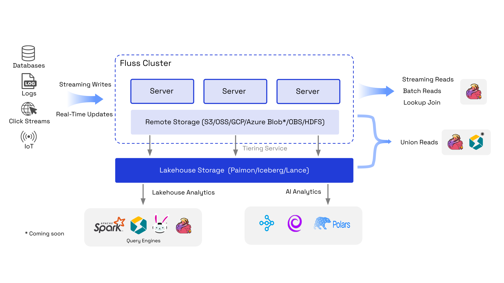
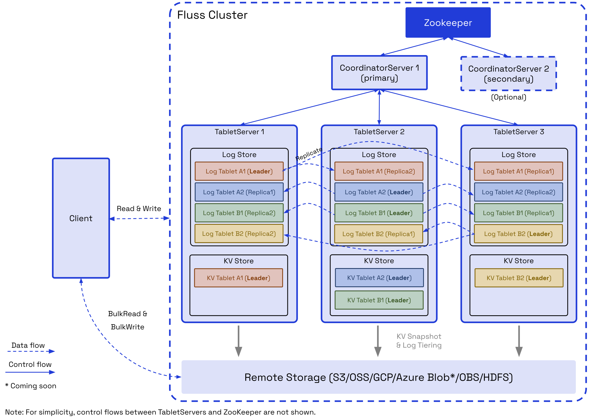
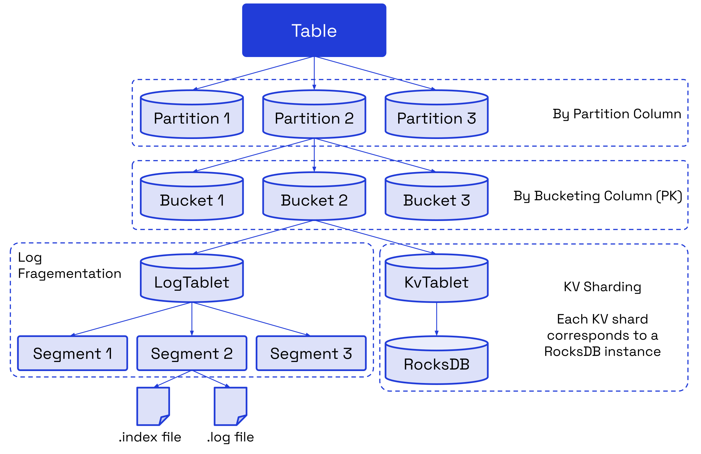
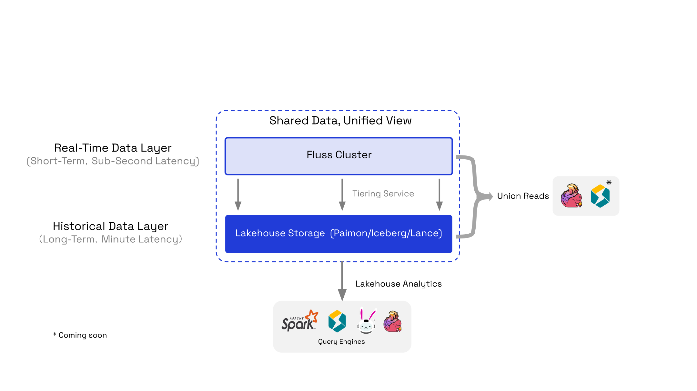
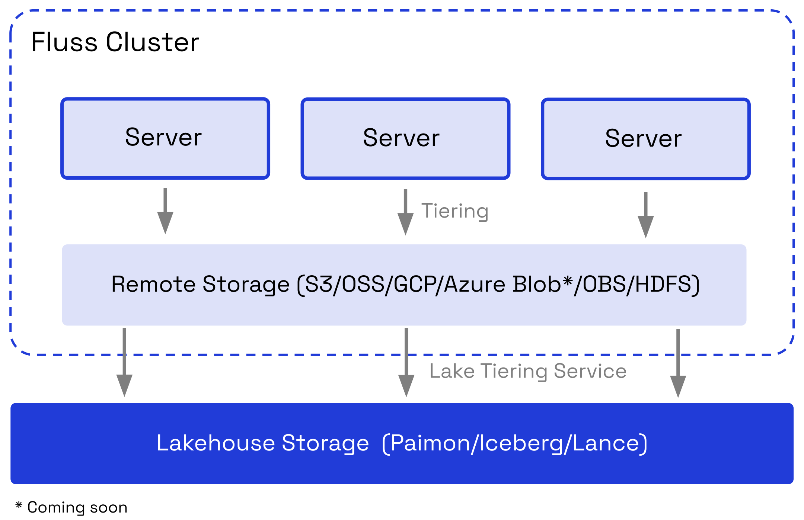

# What is Fluss?

## Navigation

- [Introduction](#index)
- [Quickstart](#quickstart-flink)
  - [Real-Time Analytics with Flink](#quickstart-flink)
  - [Building a Streaming Lakehouse](#quickstart-lakehouse)
  - [Secure Your Fluss Cluster](#quickstart-security)
- [Concepts](#concepts-architecture)
  - [Architecture](#concepts-architecture)
- [Installation & Deployment](#install-deploy-overview)
  - [Overview](#install-deploy-overview)
  - [Deploying Local Cluster](#install-deploy-deploying-local-cluster)
  - [Deploying Distributed Cluster](#install-deploy-deploying-distributed-cluster)
  - [Deploying with Docker](#install-deploy-deploying-with-docker)
  - [Deploying with Helm Charts](#install-deploy-deploying-with-helm)
- [Table Design](#table-design-overview)
  - [Overview](#table-design-overview)
  - [Table Types](#table-design-table-types-log-table)
    - [Log Table](#table-design-table-types-log-table)
    - [Primary Key Table](#table-design-table-types-pk-table)
  - [Merge Engines](#table-design-merge-engines)
    - [Default (LastRow)](#table-design-merge-engines-default)
    - [FirstRow](#table-design-merge-engines-first-row)
    - [Versioned](#table-design-merge-engines-versioned)
    - [Aggregation](#table-design-merge-engines-aggregation)
  - [Virtual Tables](#table-design-virtual-tables)
  - [Data Distribution](#table-design-data-distribution-bucketing)
    - [Bucketing](#table-design-data-distribution-bucketing)
    - [Partitioning](#table-design-data-distribution-partitioning)
    - [TTL](#table-design-data-distribution-ttl)
  - [Data Formats](#table-design-data-formats)
  - [Data Types](#table-design-data-types)
- [Engine Flink](#engine-flink-getting-started)
  - [Getting Started](#engine-flink-getting-started)
  - [DDL](#engine-flink-ddl)
  - [Procedures](#engine-flink-procedures)
  - [Writes](#engine-flink-writes)
  - [Reads](#engine-flink-reads)
  - [Lookups](#engine-flink-lookups)
  - [Delta Joins](#engine-flink-delta-joins)
  - [DataStream API](#engine-flink-datastream)
  - [Connector Options](#engine-flink-options)
- [Engine Spark](#engine-spark-getting-started)
  - [Getting Started](#engine-spark-getting-started)
  - [DDL](#engine-spark-ddl)
  - [Procedures](#engine-spark-procedures)
  - [Writes](#engine-spark-writes)
  - [Reads](#engine-spark-reads)
  - [Structured Streaming](#engine-spark-structured-streaming)
  - [Connector Options](#engine-spark-options)
- [Streaming Lakehouse](#streaming-lakehouse-overview)
  - [Lakehouse Overview](#streaming-lakehouse-overview)
  - [Integrate Data Lakes](#streaming-lakehouse-integrate-data-lakes-paimon)
    - [Paimon](#streaming-lakehouse-integrate-data-lakes-paimon)
    - [Iceberg](#streaming-lakehouse-integrate-data-lakes-iceberg)
    - [Lance](#streaming-lakehouse-integrate-data-lakes-lance)
- [Maintenance](#maintenance-configuration)
  - [Configuration](#maintenance-configuration)
  - [File Systems](#maintenance-filesystems-overview)
    - [Overview](#maintenance-filesystems-overview)
    - [HDFS](#maintenance-filesystems-hdfs)
    - [Aliyun OSS](#maintenance-filesystems-oss)
    - [Amazon S3](#maintenance-filesystems-s3)
    - [Azure Blob Storage](#maintenance-filesystems-azure)
    - [HuaweiCloud OBS](#maintenance-filesystems-obs)
  - [Tiered Storage](#maintenance-tiered-storage-overview)
    - [Overview](#maintenance-tiered-storage-overview)
    - [Remote Storage](#maintenance-tiered-storage-remote-storage)
    - [Lakehouse Storage](#maintenance-tiered-storage-lakehouse-storage)
  - [Observability](#maintenance-observability-quickstart)
    - [Quickstart Guides](#maintenance-observability-quickstart)
    - [Metric Reporters](#maintenance-observability-metric-reporters)
    - [Monitor Metrics](#maintenance-observability-monitor-metrics)
    - [Logging](#maintenance-observability-logging)
  - [Operations](#maintenance-operations-updating-configs)
    - [Updating Configs](#maintenance-operations-updating-configs)
    - [Rack-Aware Deployment](#maintenance-operations-racks)
    - [Rebalance](#maintenance-operations-rebalance)
    - [Graceful Shutdown](#maintenance-operations-graceful-shutdown)
    - [Upgrading and Compatibility](#maintenance-operations-upgrading)
    - [Upgrade Notes Archive](#maintenance-operations-upgrade-notes-archive)
- [Security](#security-overview)
  - [Security Overview](#security-overview)
  - [Authentication](#security-authentication)
  - [Authorization and ACLs](#security-authorization)
- [Fluss APIs](#apis-java-client)
  - [Java Client](#apis-java-client)
  - [Client Support Matrix](#apis-client-support-matrix)

## Content

<a id="index"></a>

<!-- source_url: https://fluss.incubator.apache.org/docs/ -->

<!-- page_index: 1 -->

# What is Fluss?

Version: 0.9

Fluss is a streaming storage built for real-time analytics & AI which can serve as the real-time data layer for Lakehouse architectures.



It bridges the gap between **streaming data** and the data **Lakehouse** by enabling low-latency, high-throughput data ingestion and processing while seamlessly integrating with popular compute engines like **Apache Flink**, with **Apache Spark** and **StarRocks** coming soon.

Fluss supports `streaming reads` and `writes` with sub-second latency and stores data in a columnar format, enhancing query performance and reducing storage costs.
It offers flexible table types, including append-only **Log Tables** and updatable **PrimaryKey Tables**, to accommodate diverse real-time analytics and processing needs.

With built-in replication for fault tolerance, horizontal scalability, and advanced features like high-QPS lookup joins and bulk read/write operations, Fluss is ideal for powering **real-time analytics**, **AI/ML pipelines**, and **streaming data warehouses**.

**Fluss (German: river, pronounced `/flus/`)** enables streaming data continuously converging, distributing and flowing into lakes, like a river 🌊

The following is a list of (but not limited to) use-cases that Fluss shines ✨:

- **📊 Optimized Real-time analytics**
- **🔧 Feature Stores**
- **📈 Real-time Dashboards**
- **🧍 Real-time Customer 360**
- **📡 Real-time IoT Pipelines**
- **🚓 Real-time Fraud Detection**
- **🚨 Real-time Alerting Systems**
- **💫 Real-time ETL/Data Warehouses**
- **🌐 Real-time Geolocation Services**
- **🚚 Real-time Shipment Update Tracking**

- [QuickStart](#quickstart-flink): Get started with Fluss in minutes.
- [Architecture](#concepts-architecture): Learn about Fluss's architecture.
- [Table Design](#table-design-overview): Explore Fluss's table types, partitions and buckets.
- [Lakehouse](#streaming-lakehouse-overview): Integrate Fluss with your Lakehouse to bring low-latency data to your Lakehouse analytics.
- [Development](https://fluss.incubator.apache.org/community/dev/ide-setup/): Set up your development environment and contribute to the community.

---

<a id="quickstart-flink"></a>

<!-- source_url: https://fluss.incubator.apache.org/docs/quickstart/flink/ -->

<!-- page_index: 2 -->

# Real-Time Analytics With Flink

Version: 0.9

> [!NOTE]
> We encourage you to use a recent version of Docker and [Compose v2](https://docs.docker.com/compose/releases/migrate/) (however, Compose v1 might work with a few adaptions).

---

<a id="quickstart-lakehouse"></a>

<!-- source_url: https://fluss.incubator.apache.org/docs/quickstart/lakehouse/ -->

<!-- page_index: 3 -->

# Building a Streaming Lakehouse

Version: 0.9

> [!NOTE]
> We encourage you to use a recent version of Docker and [Compose v2](https://docs.docker.com/compose/releases/migrate/) (however, Compose v1 might work with a few adaptions).

---

<a id="quickstart-security"></a>

<!-- source_url: https://fluss.incubator.apache.org/docs/quickstart/security/ -->

<!-- page_index: 4 -->

# Secure Your Fluss Cluster in Minutes

Version: 0.9

> [!NOTE]
> We encourage you to use a recent version of Docker and [Compose v2](https://docs.docker.com/compose/releases/migrate/) (however, Compose v1 might work with a few adaptations).

---

<a id="concepts-architecture"></a>

<!-- source_url: https://fluss.incubator.apache.org/docs/concepts/architecture/ -->

<!-- page_index: 5 -->

# Architecture

Version: 0.9

A Fluss cluster consists of two main processes: the **CoordinatorServer** and the **TabletServer**.



The **CoordinatorServer** serves as the central control and management component of the cluster. It is responsible for maintaining metadata, managing tablet allocation, listing nodes, and handling permissions.

Additionally, it coordinates critical operations such as:

- Rebalancing data during node scaling (upscaling or downscaling).
- Managing data migration and service node switching in the event of node failures.
- Overseeing table management tasks, including creating or deleting tables and updating bucket counts.

As the **brain** of the cluster, the **CoordinatorServer** ensures efficient cluster operation and seamless management of resources.

The **TabletServer** is responsible for data storage, persistence, and providing I/O services directly to users. It comprises two key components: **LogStore** and **KvStore**.

- For **PrimaryKey Tables** which support updates, both **LogStore** and **KvStore** are activated. The KvStore is used to support updates and point lookup efficiently. LogStore is used to store the changelogs of the table.
- For **Log Tables** which only support appends, only the **LogStore** is activated, optimizing performance for write-heavy workloads.

This architecture ensures the **TabletServer** delivers tailored data handling capabilities based on table types.

The **LogStore** is designed to store log data, functioning similarly to a database binlog.
Messages can only be appended, not modified, ensuring data integrity.
Its primary purpose is to enable low-latency streaming reads and to serve as the write-ahead log (WAL) for restoring the **KvStore**.

The **KvStore** is used to store table data, functioning similarly to database tables. It supports data updates and deletions, enabling efficient querying and table management. Additionally, it generates comprehensive changelogs to track data modifications.

Table data is divided into multiple buckets based on the defined bucketing policy.

Data for the **LogStore** and **KvStore** is stored within tablets. Each tablet consists of a **LogTablet** and, optionally, a **KvTablet**, depending on whether the table supports updates.
Both **LogStore** and **KvStore** adhere to the same bucket-splitting and tablet allocation policies. As a result, **LogTablets** and **KvTablets** with the same `tablet_id` are always allocated to the same **TabletServer** for efficient data management.

The **LogTablet** supports multiple replicas based on the table's configured replication factor, ensuring high availability and fault tolerance. **Currently, replication is not supported for KvTablets**.

Fluss currently utilizes **ZooKeeper** for cluster coordination, metadata storage, and cluster configuration management.
In upcoming releases, **ZooKeeper will be replaced** by **KvStore** for metadata storage and **Raft** for cluster coordination and ensuring consistency. This transition aims to streamline operations and enhance system reliability. See the [Roadmap](https://fluss.incubator.apache.org/roadmap/) for more details.

**Remote Storage** serves two primary purposes:

- **Hierarchical Storage for LogStores:** By offloading LogStore data, it reduces storage costs and accelerates scaling operations.
- **Persistent Storage for KvStores:** It ensures durable storage for KvStore data and collaborates with LogStore to enable fault recovery.

Additionally, **Remote Storage** allows clients to perform bulk read operations on Log and Kv data, enhancing data analysis efficiency and reduce the overhead on Fluss servers. In the future, it will also support bulk write operations, optimizing data import workflows for greater scalability and performance.

Fluss clients/SDKs support streaming reads/writes, batch reads/writes, DDL and point queries. Currently, the main implementation of client is Flink Connector. Users can use Flink SQL to easily operate Fluss tables and data.

---

<a id="install-deploy-overview"></a>

<!-- source_url: https://fluss.incubator.apache.org/docs/install-deploy/overview/ -->

<!-- page_index: 6 -->

# Overview

Version: 0.9

> [!WARNING]
> ZooKeeper will be removed to simplify deployment in the near future. For more details, please checkout [Roadmap](https://fluss.incubator.apache.org/roadmap/).

---

<a id="install-deploy-deploying-local-cluster"></a>

<!-- source_url: https://fluss.incubator.apache.org/docs/install-deploy/deploying-local-cluster/ -->

<!-- page_index: 7 -->

# Deploying Local Cluster

Version: 0.9

> [!WARNING]
> **This setup deploys Fluss to a single machine only.**
>
> By default, the local cluster endpoint is **accessible only locally** (e.g., via `localhost`). To allow external access to your local cluster, configure an externally reachable hostname or IP address of this machine in the `bind.listeners` field of `server.yaml`. When this is set, all services—including TabletServers—will bind to that address, making their ports accessible from remote clients.
>
> If you require full control over network exposure or plan to deploy Fluss across multiple machines, refer to the [Deploying Distributed Cluster](#install-deploy-deploying-distributed-cluster) guide. That guide explains how to deploy each `CoordinatorServer` and `TabletServer` with explicitly configured, externally accessible hostnames and ports.

---

<a id="install-deploy-deploying-distributed-cluster"></a>

<!-- source_url: https://fluss.incubator.apache.org/docs/install-deploy/deploying-distributed-cluster/ -->

<!-- page_index: 8 -->

# Deploying Distributed Cluster

Version: 0.9

> [!NOTE]
> - `tablet-server.id` is the unique id of the TabletServer. If you have multiple TabletServers, you should set a different id for each TabletServer.
> - In this example, we only set the mandatory properties. For additional properties, you can refer to [Configuration](#maintenance-configuration) for more details.

---

<a id="install-deploy-deploying-with-docker"></a>

<!-- source_url: https://fluss.incubator.apache.org/docs/install-deploy/deploying-with-docker/ -->

<!-- page_index: 9 -->

# Deploying with Docker

Version: 0.9

This guide will show you how to run a Fluss cluster using Docker.
We will introduce the [prerequisites of the Docker environment](#install-deploy-deploying-with-docker--prerequisites), and how to quickly create a Fluss cluster using [`docker run` commands](#install-deploy-deploying-with-docker--deploy-with-docker)
or a [`docker compose` file](#install-deploy-deploying-with-docker--deploy-with-docker-compose).

**Hardware**

Recommended configuration: 4 cores, 16GB memory.

**Software**

Docker and the Docker Compose plugin. All commands were tested with Docker version 27.4.0 and Docker Compose version v2.30.3.

The following is a brief overview of how to quickly create a complete Fluss testing cluster
using the `docker run` commands.

Create a shared tmpfs volume:

```bash
docker volume create shared-tmpfs 
```

Create an isolated bridge network in docker

```bash
docker network create fluss-demo 
```

Start Zookeeper in daemon mode. This is a single node zookeeper setup. Zookeeper is the central metadata store
for Fluss and should be set up with replication for production use. For more information, see [Running zookeeper cluster](https://zookeeper.apache.org/doc/r3.6.0/zookeeperStarted.html#sc_RunningReplicatedZooKeeper).

```bash
docker run \ 
    --name zookeeper \ 
    --network=fluss-demo \ 
    --restart always \ 
    -p 2181:2181 \ 
    -d zookeeper:3.9.2 
```

Start Fluss CoordinatorServer in daemon and connect to Zookeeper.

```bash
docker run \ 
    --name coordinator-server \ 
    --network=fluss-demo \ 
    --env FLUSS_PROPERTIES="zookeeper.address: zookeeper:2181 
bind.listeners: INTERNAL://coordinator-server:0, CLIENT://coordinator-server:9123 
advertised.listeners: CLIENT://localhost:9123 
internal.listener.name: INTERNAL 
" \ 
    -p 9123:9123 \ 
    -d apache/fluss:0.9.0-incubating coordinatorServer 
```

You can start one or more tablet servers based on your needs. For a production environment, ensure that you have multiple tablet servers.

If you just want to start a sample test, you can start only one TabletServer in daemon and connect to Zookeeper.
The command is as follows:

```bash
docker run \ 
    --name tablet-server \ 
    --network=fluss-demo \ 
    --env FLUSS_PROPERTIES="zookeeper.address: zookeeper:2181 
bind.listeners: INTERNAL://tablet-server:0, CLIENT://tablet-server:9123 
advertised.listeners: CLIENT://localhost:9124 
internal.listener.name: INTERNAL 
tablet-server.id: 0 
kv.snapshot.interval: 0s 
data.dir: /tmp/fluss/data 
remote.data.dir: /tmp/fluss/remote-data" \ 
    -p 9124:9123 \ 
    --volume shared-tmpfs:/tmp/fluss \ 
    -d apache/fluss:0.9.0-incubating tabletServer 
```

In a production environment, you need to start multiple Fluss TabletServer nodes.
Here we start 3 Fluss TabletServer nodes in daemon and connect to Zookeeper. The command is as follows:

1. Start tablet-server-0

```bash
docker run \ 
    --name tablet-server-0 \ 
    --network=fluss-demo \ 
    --env FLUSS_PROPERTIES="zookeeper.address: zookeeper:2181 
bind.listeners: INTERNAL://tablet-server-0:0, CLIENT://tablet-server-0:9123 
advertised.listeners: CLIENT://localhost:9124 
internal.listener.name: INTERNAL 
tablet-server.id: 0 
kv.snapshot.interval: 0s 
data.dir: /tmp/fluss/data/tablet-server-0 
remote.data.dir: /tmp/fluss/remote-data" \ 
    -p 9124:9123 \ 
    --volume shared-tmpfs:/tmp/fluss \ 
    -d apache/fluss:0.9.0-incubating tabletServer 
```

2. Start tablet-server-1

```bash
docker run \ 
    --name tablet-server-1 \ 
    --network=fluss-demo \ 
    --env FLUSS_PROPERTIES="zookeeper.address: zookeeper:2181 
bind.listeners: INTERNAL://tablet-server-1:0, CLIENT://tablet-server-1:9123 
advertised.listeners: CLIENT://localhost:9125 
internal.listener.name: INTERNAL 
tablet-server.id: 1 
kv.snapshot.interval: 0s 
data.dir: /tmp/fluss/data/tablet-server-1 
remote.data.dir: /tmp/fluss/remote-data" \ 
    -p 9125:9123 \ 
    --volume shared-tmpfs:/tmp/fluss \ 
    -d apache/fluss:0.9.0-incubating tabletServer 
```

3. Start tablet-server-2

```bash
docker run \ 
    --name tablet-server-2 \ 
    --network=fluss-demo \ 
    --env FLUSS_PROPERTIES="zookeeper.address: zookeeper:2181 
bind.listeners: INTERNAL://tablet-server-2:0, CLIENT://tablet-server-2:9123 
advertised.listeners: CLIENT://localhost:9126 
internal.listener.name: INTERNAL 
tablet-server.id: 2 
kv.snapshot.interval: 0s 
data.dir: /tmp/fluss/data/tablet-server-2 
remote.data.dir: /tmp/fluss/remote-data" \ 
    -p 9126:9123 \ 
    --volume shared-tmpfs:/tmp/fluss \ 
    -d apache/fluss:0.9.0-incubating tabletServer 
```

Now all the Fluss related components are running.

Run the below command to check the Fluss cluster status:

```bash
docker container ls -a 
```

The following is a brief overview of how to quickly create a complete Fluss testing cluster
using the `docker compose up -d` commands in a detached mode.

You can use the following `docker-compose.yml` file to start a Fluss cluster with one `CoordinatorServer` and one `TabletServer`.

```yaml
services: 
  coordinator-server: 
    image: apache/fluss:0.9.0-incubating 
    command: coordinatorServer 
    depends_on: 
      - zookeeper 
    environment: 
      - | 
        FLUSS_PROPERTIES= 
        zookeeper.address: zookeeper:2181 
        bind.listeners: INTERNAL://coordinator-server:0, CLIENT://coordinator-server:9123 
        advertised.listeners: CLIENT://localhost:9123 
        internal.listener.name: INTERNAL 
        remote.data.dir: /tmp/fluss/remote-data 
    ports: 
      - "9123:9123" 
  tablet-server: 
    image: apache/fluss:0.9.0-incubating 
    command: tabletServer 
    depends_on: 
      - coordinator-server 
    environment: 
      - | 
        FLUSS_PROPERTIES= 
        zookeeper.address: zookeeper:2181 
        bind.listeners: INTERNAL://tablet-server:0, CLIENT://tablet-server:9123 
        advertised.listeners: CLIENT://localhost:9124 
        internal.listener.name: INTERNAL 
        tablet-server.id: 0 
        kv.snapshot.interval: 0s 
        data.dir: /tmp/fluss/data 
        remote.data.dir: /tmp/fluss/remote-data 
    ports: 
        - "9124:9123" 
    volumes: 
      - shared-tmpfs:/tmp/fluss 
  zookeeper: 
    restart: always 
    image: zookeeper:3.9.2 
 
volumes: 
  shared-tmpfs: 
    driver: local 
    driver_opts: 
      type: "tmpfs" 
      device: "tmpfs" 
```

You can use the following `docker-compose.yml` file to start a Fluss cluster with one `CoordinatorServer` and three `TabletServers`.

```yaml
services: 
  coordinator-server: 
    image: apache/fluss:0.9.0-incubating 
    command: coordinatorServer 
    depends_on: 
      - zookeeper 
    environment: 
      - | 
        FLUSS_PROPERTIES= 
        zookeeper.address: zookeeper:2181 
        bind.listeners: INTERNAL://coordinator-server:0, CLIENT://coordinator-server:9123 
        advertised.listeners: CLIENT://localhost:9123 
        internal.listener.name: INTERNAL 
        remote.data.dir: /tmp/fluss/remote-data 
    ports: 
      - "9123:9123" 
  tablet-server-0: 
    image: apache/fluss:0.9.0-incubating 
    command: tabletServer 
    depends_on: 
      - coordinator-server 
    environment: 
      - | 
        FLUSS_PROPERTIES= 
        zookeeper.address: zookeeper:2181 
        bind.listeners: INTERNAL://tablet-server-0:0, CLIENT://tablet-server-0:9123 
        advertised.listeners: CLIENT://localhost:9124 
        internal.listener.name: INTERNAL 
        tablet-server.id: 0 
        kv.snapshot.interval: 0s 
        data.dir: /tmp/fluss/data/tablet-server-0 
        remote.data.dir: /tmp/fluss/remote-data 
    ports: 
      - "9124:9123" 
    volumes: 
      - shared-tmpfs:/tmp/fluss 
  tablet-server-1: 
    image: apache/fluss:0.9.0-incubating 
    command: tabletServer 
    depends_on: 
      - coordinator-server 
    environment: 
      - | 
        FLUSS_PROPERTIES= 
        zookeeper.address: zookeeper:2181 
        bind.listeners: INTERNAL://tablet-server-1:0, CLIENT://tablet-server-1:9123 
        advertised.listeners: CLIENT://localhost:9125 
        internal.listener.name: INTERNAL 
        tablet-server.id: 1 
        kv.snapshot.interval: 0s 
        data.dir: /tmp/fluss/data/tablet-server-1 
        remote.data.dir: /tmp/fluss/remote-data 
    ports: 
      - "9125:9123" 
    volumes: 
      - shared-tmpfs:/tmp/fluss 
  tablet-server-2: 
    image: apache/fluss:0.9.0-incubating 
    command: tabletServer 
    depends_on: 
      - coordinator-server 
    environment: 
      - | 
        FLUSS_PROPERTIES= 
        zookeeper.address: zookeeper:2181 
        bind.listeners: INTERNAL://tablet-server-2:0, CLIENT://tablet-server-2:9123 
        advertised.listeners: CLIENT://localhost:9126 
        internal.listener.name: INTERNAL 
        tablet-server.id: 2 
        kv.snapshot.interval: 0s 
        data.dir: /tmp/fluss/data/tablet-server-2 
        remote.data.dir: /tmp/fluss/remote-data 
    ports: 
      - "9126:9123" 
    volumes: 
      - shared-tmpfs:/tmp/fluss 
  zookeeper: 
    restart: always 
    image: zookeeper:3.9.2 
 
volumes: 
  shared-tmpfs: 
    driver: local 
    driver_opts: 
      type: "tmpfs" 
      device: "tmpfs" 
```

Save the `docker-compose.yml` script and execute the `docker compose up -d` command in the same directory
to create the cluster.

Run the below command to check the container status:

```bash
docker container ls -a 
```

After the Fluss cluster is started, you can use **Fluss Client** (e.g., Flink SQL Client) to interact with Fluss.
The following subsections will show you how to use 'Docker' to build a Flink cluster and use **Flink SQL Client**
to interact with Fluss.

You can start a Flink standalone cluster refer to [Flink Environment Preparation](#engine-flink-getting-started--preparation-when-using-flink-sql-client)

> [!NOTE]
> : Make sure the [Fluss connector jar](https://fluss.incubator.apache.org/downloads/) already has copied to the `lib` directory of your Flink home.

```shell
bin/start-cluster.sh  
```

Use the following command to enter the Flink SQL CLI Container:

```shell
bin/sql-client.sh 
```

Use the following SQL to create a Fluss catalog:

Flink SQL

```sql
CREATE CATALOG fluss_catalog WITH ( 
    'type' = 'fluss', 
    'bootstrap.servers' = 'localhost:9123' 
); 
```

Flink SQL

```sql
USE CATALOG fluss_catalog; 
```

After the catalog is created, you can use Flink SQL Client to do more with Fluss, for example, create a table, insert data, query data, etc.
More details please refer to [Flink Getting started](#engine-flink-getting-started)

---

<a id="install-deploy-deploying-with-helm"></a>

<!-- source_url: https://fluss.incubator.apache.org/docs/install-deploy/deploying-with-helm/ -->

<!-- page_index: 10 -->

# Deploying with Helm Charts

Version: 0.9

> [!NOTE]
> A Fluss cluster deployment requires a running ZooKeeper ensemble. To provide flexibility in deployment and enable reuse of existing infrastructure, the Fluss Helm chart does not include a bundled ZooKeeper cluster. If you don’t already have a ZooKeeper running, the installation documentation provides instructions for deploying one using Bitnami’s Helm chart.

---

<a id="table-design-overview"></a>

<!-- source_url: https://fluss.incubator.apache.org/docs/table-design/overview/ -->

<!-- page_index: 11 -->

# Table Overview

Version: 0.9

A Database is a collection of Table objects. You can create/delete databases or create/modify/delete tables under a database.

In Fluss, a Table is the fundamental unit of user data storage, organized into rows and columns. Tables are stored within specific databases, adhering to a hierarchical structure (database -> table).

Tables are classified into two types based on the presence of a primary key:

- **Log Tables:**
  - Designed for append-only scenarios.
  - Support only INSERT operations.
- **Primary Key Tables:**
  - Used for updating and managing data in business databases.
  - Support INSERT, UPDATE, and DELETE operations based on the defined primary key.

A Table becomes a [Partitioned Table](#table-design-data-distribution-partitioning) when a partition column is defined. Data with the same partition value is stored in the same partition. Partition columns can be applied to both Log Tables and Primary Key Tables, but with specific considerations:

- **For Log Tables**, partitioning is commonly used for log data, typically based on date columns, to facilitate data separation and cleaning.
- **For Primary Key Tables**, the partition column must be a subset of the primary key to ensure uniqueness.

This design ensures efficient data organization, flexibility in handling different use cases, and adherence to data integrity constraints.



A **partition** is a logical division of a table's data into smaller, more manageable subsets based on the values of one or more specified columns, known as partition columns.
Each unique value (or combination of values) in the partition column(s) defines a distinct partition.

A **bucket** horizontally divides the data of a table/partition into `N` buckets according to the bucketing policy.
The number of buckets `N` can be configured per table. A bucket is the smallest unit of data migration and backup.
The data of a bucket consists of a LogTablet and a (optional) KvTablet.

A **LogTablet** needs to be generated for each bucket of Log and Primary Key Tables.
For Log Tables, the LogTablet is both the primary table data and the log data. For Primary Key Tables, the LogTablet acts
as the log data for the primary table data.

- **Segment:** The smallest unit of log storage in the **LogTablet**. A segment consists of an **.index** file and a **.log** data file.
- **.index:** An `offset sparse index` that maps message relative offsets to their corresponding physical byte addresses in the .log file.
- **.log:** Compact arrangement of log data.

Each bucket of the Primary Key Table needs to generate a KvTablet. Underlying, each KvTablet corresponds to an embedded RocksDB instance. RocksDB is an LSM (log structured merge) engine which helps KvTablet support high-performance updates and lookup queries.

---

<a id="table-design-table-types-log-table"></a>

<!-- source_url: https://fluss.incubator.apache.org/docs/table-design/table-types/log-table/ -->

<!-- page_index: 12 -->

# Log Table

Version: 0.9

> [!NOTE]
> The `bucket.num` should be a positive integer. If this value is not provided, a default value from the cluster will be used as the bucket number for the table.

---

<a id="table-design-table-types-pk-table"></a>

<!-- source_url: https://fluss.incubator.apache.org/docs/table-design/table-types/pk-table/ -->

<!-- page_index: 13 -->

# Primary Key Table

Version: 0.9

> [!NOTE]
> The number of auto-incremented IDs cached by the TabletServers is controlled by the table property `table.auto-increment.cache-size`, which defaults to 100,000. A larger cache size can enhance the performance of auto-incremented ID allocation but may result in
> less monotonic values in the auto-increment column. You can configure different cache sizes for different tables based on your specific requirements.
> However, this property cannot be modified after the table has been created.

---

<a id="table-design-merge-engines"></a>

<!-- source_url: https://fluss.incubator.apache.org/docs/table-design/merge-engines/ -->

<!-- page_index: 14 -->

# Merge Engines

Version: 0.9

The **Merge Engine** in Fluss is a core component designed to efficiently handle and consolidate data updates for Primary Key Tables.
It offers users the flexibility to define how incoming data records are merged with existing records sharing the same primary key.
However, users can specify a different merge engine to customize the merging behavior according to their specific use cases.

The following merge engines are supported:

1. [Default Merge Engine (LastRow)](#table-design-merge-engines-default)
2. [FirstRow Merge Engine](#table-design-merge-engines-first-row)
3. [Versioned Merge Engine](#table-design-merge-engines-versioned)
4. [Aggregation Merge Engine](#table-design-merge-engines-aggregation)

---

<a id="table-design-merge-engines-default"></a>

<!-- source_url: https://fluss.incubator.apache.org/docs/table-design/merge-engines/default/ -->

<!-- page_index: 15 -->

# Default Merge Engine (LastRow)

Version: 0.9

The **Default Merge Engine** behaves as a LastRow merge engine that retains the latest record for a given primary key. It supports all the operations: `INSERT`, `UPDATE`, `DELETE`.
Additionally, the default merge engine supports [Partial Update](#table-design-table-types-pk-table--partial-update), which preserves the latest values for the specified update columns.
If the `'table.merge-engine'` property is not explicitly defined in the table properties when creating a Primary Key Table, the default merge engine will be applied automatically.

Flink SQL

```sql
CREATE TABLE T ( 
    k  INT, 
    v1 DOUBLE, 
    v2 STRING, 
    PRIMARY KEY (k) NOT ENFORCED 
); 
 
-- Insert 
INSERT INTO T(k, v1, v2) VALUES (1, 1.0, 't1'); 
INSERT INTO T(k, v1, v2) VALUES (1, 1.0, 't2'); 
SELECT * FROM T WHERE k = 1; 
-- Output: 
+----+-----+----+ 
| k  | v1  | v2 | 
+----+-----+----+ 
| 1  | 1.0 | t2 | 
+----+-----+----+ 
 
-- Update 
INSERT INTO T(k, v1, v2) VALUES (2, 2.0, 't2'); 
-- Switch to batch mode to perform update operation for UPDATE statement is only supported for batch mode currently 
SET execution.runtime-mode = batch; 
UPDATE T SET v1 = 4.0 WHERE k = 2; 
SELECT * FROM T WHERE k = 2; 
 -- Output: 
+----+-----+----+ 
| k  | v1  | v2 | 
+----+-----+----+ 
| 2  | 4.0 | t2 | 
+----+-----+----+ 
 
 
-- Partial Update 
INSERT INTO T(k, v1) VALUES (3, 3.0); -- set v1 to 3.0 
SELECT * FROM T WHERE k = 3; 
-- Output: 
+----+-----+------+ 
| k  | v1  | v2   | 
+----+-----+------+ 
| 3  | 3.0 | null | 
+----+-----+------+ 
INSERT INTO T(k, v2) VALUES (3, 't3'); -- set v2 to 't3' 
SELECT * FROM T WHERE k = 3; 
-- Output: 
+----+-----+----+ 
| k  | v1  | v2 | 
+----+-----+----+ 
| 3  | 3.0 | t3 | 
+----+-----+----+ 
  
-- Delete 
DELETE FROM T WHERE k = 2; 
-- Switch to streaming mode 
SET execution.runtime-mode = streaming; 
SELECT * FROM T; 
-- Output: 
+----+-----+----+ 
| k  | v1  | v2 | 
+----+-----+----+ 
| 1  | 1.0 | t2 | 
+----+-----+----+ 
| 3  | 3.0 | t3 | 
+----+-----+----+ 
```

---

<a id="table-design-merge-engines-first-row"></a>

<!-- source_url: https://fluss.incubator.apache.org/docs/table-design/merge-engines/first-row/ -->

<!-- page_index: 16 -->

# FirstRow Merge Engine

Version: 0.9

> [!NOTE]
> When using `first_row` merge engine, there are the following limits:
>
> - `UPDATE` and `DELETE` SQL statements are not supported
> - Partial Update is not supported
> - `UPDATE_BEFORE` and `DELETE` changelog events are ignored automatically

---

<a id="table-design-merge-engines-versioned"></a>

<!-- source_url: https://fluss.incubator.apache.org/docs/table-design/merge-engines/versioned/ -->

<!-- page_index: 17 -->

# Versioned Merge Engine

Version: 0.9

> [!NOTE]
> When using the `versioned` merge engine, keep the following limitations in mind:
>
> - **`UPDATE` and `DELETE` statements are not supported.**
> - **Partial updates are not supported.**
> - **`UPDATE_BEFORE` and `DELETE` changelog events are ignored automatically.**

---

<a id="table-design-merge-engines-aggregation"></a>

<!-- source_url: https://fluss.incubator.apache.org/docs/table-design/merge-engines/aggregation/ -->

<!-- page_index: 18 -->

# Aggregation Merge Engine

Version: 0.9

> [!NOTE]
> The result `0.7200000000000001` instead of `0.72` is expected behavior due to IEEE 754 double-precision floating-point arithmetic. If exact precision is required, consider using `DECIMAL` type instead of `DOUBLE`.

---

<a id="table-design-virtual-tables"></a>

<!-- source_url: https://fluss.incubator.apache.org/docs/table-design/virtual-tables/ -->

<!-- page_index: 19 -->

# Virtual Tables

Version: 0.9

> [!NOTE]
> The `$binlog` virtual table is only available for **Primary Key Tables**.

---

<a id="table-design-data-distribution-bucketing"></a>

<!-- source_url: https://fluss.incubator.apache.org/docs/table-design/data-distribution/bucketing/ -->

<!-- page_index: 20 -->

# Bucketing

Version: 0.9

A bucketing strategy is a data distribution technique that divides table data into small pieces
and distributes the data to multiple hosts and services.

When creating a Fluss table, you can specify the number of buckets by setting `'bucket.num' = '<num>'` property for the table, see more details in [DDL](#engine-flink-ddl).
Currently, Fluss supports 3 bucketing strategies: **Hash Bucketing**, **Sticky Bucketing** and **Round-Robin Bucketing**.
Primary-Key Tables only allow to use **Hash Bucketing**. Log Tables use **Sticky Bucketing** by default but can use other two bucketing strategies.

**Hash Bucketing** is common in OLAP scenarios.
The advantage is that it can be very evenly distributed to multiple nodes, making full use of the capabilities of distributed computing, and has excellent
scalability (rescale buckets or clusters) to cope with massive data.

**Usage**: setting `'bucket.key' = 'col1, col2'` property for the table to specify the bucket key for hash bucketing.
Primary-Key Tables use primary key (excluding partition key) as the bucket key by default.

**Sticky Bucketing** enables larger batches and reduces latency when writing records into Log Tables. After sending a batch, the sticky bucket changes. Over time, the records are spread out evenly among all the buckets.
Sticky Bucketing is the default bucketing strategy for Log Tables. This is quite important because Log Tables uses Apache Arrow as the underling data format which is efficient for large batches.

**Usage**: setting `'client.writer.bucket.no-key-assigner'='sticky'` property for the table to enable this strategy. PrimaryKey Tables do not support this strategy.

**Round-Robin Bucketing** is a simple strategy that randomly selects a bucket for each record before writing it in. This strategy is suitable for scenarios where the data distribution is relatively uniform and the data is not skewed.

**Usage**: setting `'client.writer.bucket.no-key-assigner'='round_robin'` property for the table to enable this strategy. PrimaryKey Tables do not support this strategy.

---

<a id="table-design-data-distribution-partitioning"></a>

<!-- source_url: https://fluss.incubator.apache.org/docs/table-design/data-distribution/partitioning/ -->

<!-- page_index: 21 -->

# Partitioning

Version: 0.9

In Fluss, a **Partitioned Table** organizes data based on one or more partition keys, providing a way to improve query performance and manageability for large datasets. Partitions allow the system to divide data into distinct segments, each corresponding to specific values of the partition keys.

For partitioned tables, Fluss supports three strategies of managing partitions.

- **Manual management partitions**, user can create new partitions or drop exists partitions. Learn how to create or drop partitions please refer to [Add Partition](#engine-flink-ddl--add-partition) and [Drop Partition](#engine-flink-ddl--drop-partition).
- **Auto management partitions**, the partitions will be created based on the auto partitioning rules configured at the time of table creation, and expired partitions are automatically removed, ensuring data not expanding unlimited. See [Auto Partitioning](#table-design-data-distribution-partitioning--auto-partitioning).
- **Dynamic create partitions**, the partitions will be created automatically based on the data being written to the table. See [Dynamic Partitioning](#table-design-data-distribution-partitioning--dynamic-partitioning).

These three strategies are orthogonal and can coexist on the same table.

Partitioned tables (either primary-key table or log table) support configuring partition keys based on multiple fields. This allows users to segment data using combinations of field values, enabling more granular data organization, management, and query optimization.

For example, in an `Order` primary key table, the partition key can be defined as `(date, region)`. Data will then be stored in partitions corresponding to specific combinations such as `date=2025-04-05, region=US`. Users can leverage partition pruning during streaming queries — such as filtering by `region=US` — to improve read performance through partition pushdown.

- **Improved Query Performance:** By narrowing down the query scope to specific partitions, the system reads fewer data, reducing query execution time.
- **Data Organization:** Partitions help in logically organizing data, making it easier to manage and query.
- **Scalability:** Partitioning large datasets distributes the data across smaller, manageable chunks, improving scalability.

- The partition key must be a Fluss native data type and cannot be contained in a map or list.
- For auto partition table, the partition keys can be one or more. If the table has only one partition key, it supports automatic creation and automatic expiration of partitions. Otherwise, only automatic expiration is allowed.
- If the table is a primary key table, the partition key must be a subset of the primary key.
- Auto-partitioning rules can only be configured at the time of creating the partitioned table; modifying the auto-partitioning rules after table creation is not supported.

The auto-partitioning rules are configured through table options. The following example demonstrates creating a table named `site_access` that supports automatic partitioning using Flink SQL.

Flink SQL

```sql
CREATE TABLE site_access( 
  event_day STRING, 
  site_id INT, 
  city_code STRING, 
  user_name STRING, 
  pv BIGINT, 
  PRIMARY KEY(event_day, site_id) NOT ENFORCED  
) PARTITIONED BY (event_day) WITH ( 
  'table.auto-partition.enabled' = 'true', 
  'table.auto-partition.time-unit' = 'YEAR', 
  'table.auto-partition.num-precreate' = '5', 
  'table.auto-partition.num-retention' = '2', 
  'table.auto-partition.time-zone' = 'Asia/Shanghai' 
); 
```

In this case, when automatic partitioning occurs (Fluss will periodically operate on all tables in the background), five partitions are pre-created with a partition granularity of YEAR, retaining two historical partitions. The time zone is set to Asia/Shanghai.

| Option | Type | Required | Default | Description |
| --- | --- | --- | --- | --- |
| table.auto-partition.enabled | Boolean | no | false | Whether enable auto partition for the table. Disable by default. When auto partition is enabled, the partitions of the table will be created automatically. |
| table.auto-partition.key | String | no | (none) | This configuration defines the time-based partition key to be used for auto-partitioning when a table is partitioned with multiple keys. Auto-partitioning utilizes a time-based partition key to handle partitions automatically, including creating new ones and removing outdated ones, by comparing the time value of the partition with the current system time. In the case of a table using multiple partition keys (such as a composite partitioning strategy), this feature determines which key should serve as the primary time dimension for making auto-partitioning decisions. And If the table has only one partition key, this config is not necessary. Otherwise, it must be specified. |
| table.auto-partition.time-unit | ENUM | no | DAY | The time granularity for auto created partitions. The default value is 'DAY'. Valid values are 'HOUR', 'DAY', 'MONTH', 'QUARTER', 'YEAR'. If the value is 'HOUR', the partition format for auto created is yyyyMMddHH. If the value is 'DAY', the partition format for auto created is yyyyMMdd. If the value is 'MONTH', the partition format for auto created is yyyyMM. If the value is 'QUARTER', the partition format for auto created is yyyyQ. If the value is 'YEAR', the partition format for auto created is yyyy. |
| table.auto-partition.num-precreate | Integer | no | 2 | The number of partitions to pre-create for auto created partitions in each check for auto partition. For example, if the current check time is 2024-11-11 and the value is configured as 3, then partitions 20241111, 20241112, 20241113 will be pre-created. If any one partition exists, it'll skip creating the partition. The default value is 2, which means 2 partitions will be pre-created. If the 'table.auto-partition.time-unit' is 'DAY'(default), one precreated partition is for today and another one is for tomorrow. For a partition table with multiple partition keys, pre-create is unsupported and will be set to 0 automatically when creating table if it is not explicitly specified. |
| table.auto-partition.num-retention | Integer | no | 7 | The number of history partitions to retain for auto created partitions in each check for auto partition. For example, if the current check time is 2024-11-11, time-unit is DAY, and the value is configured as 3, then the history partitions 20241108, 20241109, 20241110 will be retained. The partitions earlier than 20241108 will be deleted. The default value is 7. |
| table.auto-partition.time-zone | String | no | the system time zone | The time zone for auto partitions, which is by default the same as the system time zone. |

The time unit for the automatic partition table `auto-partition.time-unit` can take values of HOUR, DAY, MONTH, QUARTER, or YEAR. Automatic partitioning will use the following format to create partitions.

| Time Unit | Partition Format | Example |
| --- | --- | --- |
| HOUR | yyyyMMddHH | 2024091922 |
| DAY | yyyyMMdd | 20240919 |
| MONTH | yyyyMM | 202409 |
| QUARTER | yyyyQ | 20241 |
| YEAR | yyyy | 2024 |

Below are the configuration items related to Fluss cluster and automatic partitioning.

| Option | Type | Default | Description |
| --- | --- | --- | --- |
| auto-partition.check.interval | Duration | 10 minutes | The interval of auto partition check. The time interval for automatic partition checking is set to 10 minutes by default, meaning that it checks the table partition status every 10 minutes to see if it meets the automatic partitioning criteria. If it does not meet the criteria, partitions will be automatically created or deleted. |

**Dynamic partitioning** is a feature that is enabled by default on client, allowing the client to automatically create partitions based on the data being written to the table. This feature is especially valuable when the set of partitions is not known in advance, eliminating the need for manual partition creation. It is also particularly useful when working with multi-field partitions, as auto-partitioning currently only supports single-field partitioning creation.

Please note that the number of dynamically created partitions is also subject to the `max.partition.num` and `max.bucket.num` limit configured on the Fluss cluster.

| Option | Type | Required | Default | Description |
| --- | --- | --- | --- | --- |
| client.writer.dynamic-create-partition.enabled | Boolean | no | true | Whether to enable dynamic partition creation for the client writer. When enabled, new partitions are automatically created if they don't already exist during data writes. |

---

<a id="table-design-data-distribution-ttl"></a>

<!-- source_url: https://fluss.incubator.apache.org/docs/table-design/data-distribution/ttl/ -->

<!-- page_index: 22 -->

# TTL

Version: 0.9

Fluss supports TTL for data by setting the TTL attribute for tables with `'table.log.ttl' = '<duration>'` (default is 7 days). Fluss can periodically and automatically check for and clean up expired data in the table.

For log tables, this attribute indicates the expiration time of the log table data.
For primary key tables, this attribute indicates the expiration time of the changelog and does not represent the expiration time of the primary key table data. If you also want the data in the primary key table to expire automatically, please use [auto partitioning](#table-design-data-distribution-partitioning--auto-partitioning).

---

<a id="table-design-data-formats"></a>

<!-- source_url: https://fluss.incubator.apache.org/docs/table-design/data-formats/ -->

<!-- page_index: 23 -->

# Data Formats

Version: 0.9

In Fluss, a data format primarily defines **how data is stored and accessed**. Each format is designed to balance storage efficiency, read performance, and query capabilities.

This page describes the available formats in Fluss and provides guidance on selecting the appropriate format based on workload characteristics.

At a high level, a format determines:

- How data is laid out on disk (columnar vs row-oriented)
- How efficiently data can be scanned, filtered, or projected
- Whether the workload is optimized for streaming scans or key-based access

Formats in Fluss determine:

- CPU vs IO trade-offs
- Scan-heavy vs lookup-heavy workloads
- Analytical vs operational access patterns

---

In Fluss, storage formats can be used in two different ways, depending on how the data is accessed.

- **Log format** is designed for reading data in order, as it is written.
  It is commonly used for streaming workloads, append-only tables, and changelog-style data.
- **KV format** is designed for accessing data by key.
  It is used for workloads where queries look up or update values using a key and only the most recent value for each key is needed.

ARROW can be used as log format, while COMPACTED supports both log and KV formats.

ARROW is the **default log format** in Fluss. It stores data in a columnar layout, organizing information by columns rather than rows. This layout is well suited for analytical and streaming workloads.

- **Column pruning**: Reads only the columns required by a query
- **Predicate pushdown**: Applies filters efficiently at the storage layer
- **Arrow ecosystem integration**: Compatible with Arrow-based processing frameworks

ARROW is recommended for:

- Analytical queries that access a subset of columns
- Streaming workloads with selective column reads
- General-purpose tables with varying query patterns
- Workloads that benefit from predicate pushdown

ARROW is less efficient for workloads that:

- Always read all columns
- Mostly access individual rows by key

---

COMPACTED uses a **row-oriented format** that focuses on reducing storage size and CPU usage. It is optimized for workloads where queries typically access entire rows rather than individual columns.

- **Reduced storage overhead**: Variable-length encoding minimizes disk usage
- **Lower CPU overhead**: Efficient when all columns are accessed together
- **Row-oriented access**: Optimized for full-row reads
- **Key-value support**: Can be configured for key-based access patterns

COMPACTED is recommended for:

- Tables where queries usually select all columns
- Large vector or embedding tables
- Pre-aggregated results or materialized views
- Denormalized or joined tables
- Workloads that prioritize storage efficiency over selective column access

---

To enable the COMPACTED format for log data, set the `table.log.format` option:

```sql
CREATE TABLE my_table ( 
  id BIGINT, 
  data STRING, 
  PRIMARY KEY (id) NOT ENFORCED 
) WITH ( 
  'table.log.format' = 'COMPACTED' 
); 
```

For key-based workloads that only require the **latest value per key**, the COMPACTED format can be used for both log and kv data, combined with the WAL changelog image mode.

```sql
CREATE TABLE kv_table ( 
  key STRING, 
  value STRING, 
  PRIMARY KEY (key) NOT ENFORCED 
) WITH ( 
  'table.log.format' = 'COMPACTED', 
  'table.kv.format' = 'COMPACTED', 
  'table.changelog.image' = 'WAL' 
); 
```

COMPACTED is not recommended when:

- Queries need to read only a few columns from a table
- Filters are applied to reduce the amount of data read
- Analytical workloads require flexible access to individual columns
- Historical changes or full changelog data must be preserved

| Feature | ARROW | COMPACTED |
| --- | --- | --- |
| Physical layout | Columnar | Row-oriented |
| Typical access pattern | Scans with projection & filters | Full-row reads or key lookups |
| Column pruning | ✅ Yes | ❌ No |
| Predicate pushdown | ✅ Yes | ❌ No |
| Storage efficiency | Good | Excellent |
| CPU efficiency | Better for selective reads | Better for full-row reads |
| Log format | ✅ Yes | ✅ Yes |
| KV format | ❌ No | ✅ Yes |
| Best suited for | Analytics workloads | State tables / materialized data |

---

<a id="table-design-data-types"></a>

<!-- source_url: https://fluss.incubator.apache.org/docs/table-design/data-types/ -->

<!-- page_index: 24 -->

# Data Types

Version: 0.9

Fluss has a rich set of native data types available to users. All the data types of Fluss are as follows:

| DataType | Description |
| --- | --- |
| BOOLEAN | A boolean with a (possibly) three-valued logic of TRUE, FALSE, UNKNOWN. |
| TINYINT | A 1-byte signed integer with values from -128 to 127. |
| SMALLINT | A 2-byte signed integer with values from -32,768 to 32,767. |
| INT | A 4-byte signed integer with values from -2,147,483,648 to 2,147,483,647. |
| BIGINT | An 8-byte signed integer with values from -9,223,372,036,854,775,808 to 9,223,372,036,854,775,807. |
| FLOAT | A 4-byte single precision floating point number. |
| DOUBLE | An 8-byte double precision floating point number. |
| CHAR(n) | A fixed-length character string where n is the number of code points. n must have a value between 1 and Integer.MAX\_VALUE (both inclusive). |
| STRING | A variable-length character string. |
| DECIMAL(p, s) | A decimal number with fixed precision and scale where p is the number of digits in a number (=precision) and s is the number of digits to the right of the decimal point in a number (=scale). p must have a value between 1 and 38 (both inclusive). s must have a value between 0 and p (both inclusive). |
| DATE | A date consisting of year-month-day with values ranging from 0000-01-01 to 9999-12-31. Compared to the SQL standard, the range starts at year 0000. |
| TIME | A time WITHOUT time zone with no fractional seconds by default. An instance consists of `hour:minute:second` with up to second precision and values ranging from 00:00:00 to 23:59:59. Compared to the SQL standard, leap seconds (23:59:60 and 23:59:61) are not supported as the semantics are closer to java.time.LocalTime. A time WITH time zone is not provided. |
| TIME(p) | A time WITHOUT time zone where p is the number of digits of fractional seconds (=precision). p must have a value between 0 and 9 (both inclusive). An instance consists of `hour:minute:second[.fractional]` with up to nanosecond precision and values ranging from 00:00:00.000000000 to 23:59:59.999999999. Compared to the SQL standard, leap seconds (23:59:60 and 23:59:61) are not supported as the semantics are closer to java.time.LocalTime. A time WITH time zone is not provided. |
| TIMESTAMP | A timestamp WITHOUT time zone with 6 digits of fractional seconds by default. An instance consists of `year-month-day hour:minute:second[.fractional]` with up to microsecond precision and values ranging from 0000-01-01 00:00:00.000000 to 9999-12-31 23:59:59.999999. Compared to the SQL standard, leap seconds (23:59:60 and 23:59:61) are not supported as the semantics are closer to java.time.LocalDateTime. |
| TIMESTAMP(p) | A timestamp WITHOUT time zone where p is the number of digits of fractional seconds (=precision). p must have a value between 0 and 9 (both inclusive). An instance consists of `year-month-day hour:minute:second[.fractional]` with up to nanosecond precision and values ranging from 0000-01-01 00:00:00.000000000 to 9999-12-31 23:59:59.999999999. Compared to the SQL standard, leap seconds (23:59:60 and 23:59:61) are not supported as the semantics are closer to java.time.LocalDateTime. |
| TIMESTAMP\_LTZ | A timestamp WITH local time zone `TIMESTAMP WITH LOCAL TIME ZONE` with 6 digits of fractional seconds by default. An instance consists of `year-month-day hour:minute:second[.fractional]` zone with up to microsecond precision and values ranging from 0000-01-01 00:00:00.000000 to 9999-12-31 23:59:59.999999. Compared to the SQL standard, leap seconds (23:59:60 and 23:59:61) are not supported as the semantics are closer to java.time.Instant. |
| TIMESTAMP\_LTZ(p) | A timestamp WITH local time zone `TIMESTAMP WITH LOCAL TIME ZONE` where p is the number of digits of fractional seconds (=precision). p must have a value between 0 and 9 (both inclusive). An instance consists of `year-month-day hour:minute:second[.fractional]` with up to nanosecond precision and values ranging from 0000-01-01 00:00:00.000000000 to 9999-12-31 23:59:59.999999999. Compared to the SQL standard, leap seconds (23:59:60 and 23:59:61) are not supported as the semantics are closer to java.time.Instant |
| BINARY(n) | A fixed-length binary string (=a sequence of bytes) where n is the number of bytes. n must have a value between 1 and Integer.MAX\_VALUE (both inclusive). |
| BYTES | A variable-length binary string (=a sequence of bytes). |
| ARRAY<t> | An array of elements with same subtype. Compared to the SQL standard, the maximum cardinality of an array cannot be specified but is fixed at 2,147,483,647. Also, any valid type is supported as a subtype. The type can be declared using ARRAY<t> where t is the data type of the contained elements. |
| MAP<kt, vt> | An associative array that maps keys to values. A map cannot contain duplicate keys; each key can map to at most one value. Map keys are always non-nullable and will be automatically converted to non-nullable types if a nullable key type is provided. There is no restriction of key types; it is the responsibility of the user to ensure uniqueness. The map type is an extension to the SQL standard. The type can be declared using MAP<kt, vt> where kt is the data type of the key elements and vt is the data type of the value elements. |
| ROW<n0 t0, n1 t1, ...> ROW<n0 t0 'd0', n1 t1 'd1', ...> | A sequence of fields. A field consists of a field name, field type, and an optional description. The most specific type of a row of a table is a row type. In this case, each column of the row corresponds to the field of the row type that has the same ordinal position as the column. Compared to the SQL standard, an optional field description simplifies the handling with complex structures. A row type is similar to the STRUCT type known from other non-standard-compliant frameworks. The type can be declared using ROW<n0 t0 'd0', n1 t1 'd1', ...> where n is the unique name of a field, t is the logical type of a field, d is the description of a field. |

---

<a id="engine-flink-getting-started"></a>

<!-- source_url: https://fluss.incubator.apache.org/docs/engine-flink/getting-started/ -->

<!-- page_index: 25 -->

# Getting Started with Flink Engine

Version: 0.9

> [!NOTE]
> If you use [Amazon S3](http://aws.amazon.com/s3/), [Aliyun OSS](https://www.aliyun.com/product/oss) or [HDFS(Hadoop Distributed File System)](https://hadoop.apache.org/docs/stable/) as Fluss's [remote storage](#maintenance-tiered-storage-remote-storage), you should download the corresponding [Fluss filesystem jar](https://fluss.incubator.apache.org/downloads/#filesystem-jars) and also copy it to the lib directory of your Flink home.

---

<a id="engine-flink-ddl"></a>

<!-- source_url: https://fluss.incubator.apache.org/docs/engine-flink/ddl/ -->

<!-- page_index: 26 -->

# Flink DDL

Version: 0.9

> [!NOTE]
> 1. Currently, Fluss only supports partitioned field with `STRING` type
> 2. For the Partitioned Primary Key Table, the partitioned field (`dt` in this case) must be a subset of the primary key (`dt, shop_id, user_id` in this case)

---

<a id="engine-flink-procedures"></a>

<!-- source_url: https://fluss.incubator.apache.org/docs/engine-flink/procedures/ -->

<!-- page_index: 27 -->

# Flink Procedures

Version: 0.9

Fluss provides stored procedures to perform administrative and management operations through Flink SQL. All procedures are located in the `sys` namespace and can be invoked using the `CALL` statement.

You can list all available procedures using:

Flink SQL

```sql
SHOW PROCEDURES; 
```

Fluss provides procedures to manage Access Control Lists (ACLs) for security and authorization. See the [Security](#security-overview) documentation for more details.

Add an ACL entry to grant permissions to a principal.

**Syntax:**

```sql
CALL [catalog_name.]sys.add_acl( 
  resource => 'STRING', 
  permission => 'STRING',  
  principal => 'STRING', 
  operation => 'STRING', 
  host => 'STRING'  -- optional, defaults to '*' 
) 
```

**Parameters:**

- `resource` (required): The resource to grant permissions on. Can be `'CLUSTER'` for cluster-level permissions or a specific resource name (e.g., database or table name).
- `permission` (required): The permission type to grant. Valid values are `'ALLOW'` or `'DENY'`.
- `principal` (required): The principal to grant permissions to, in the format `'Type:Name'` (e.g., `'User:Alice'`).
- `operation` (required): The operation type to grant. Valid values include `'READ'`, `'WRITE'`, `'CREATE'`, `'DELETE'`, `'ALTER'`, `'DESCRIBE'`, `'CLUSTER_ACTION'`, `'IDEMPOTENT_WRITE'`.
- `host` (optional): The host from which the principal can access the resource. Defaults to `'*'` (all hosts).

**Example:**

Flink SQL

```sql
-- Use the Fluss catalog (replace 'fluss_catalog' with your catalog name if different) 
USE fluss_catalog; 
 
-- Grant read permission to user Alice from any host 
CALL sys.add_acl( 
  resource => 'CLUSTER', 
  permission => 'ALLOW', 
  principal => 'User:Alice', 
  operation => 'READ', 
  host => '*' 
); 
 
-- Grant write permission to user Bob from a specific host 
CALL sys.add_acl( 
  resource => 'my_database.my_table', 
  permission => 'ALLOW', 
  principal => 'User:Bob', 
  operation => 'WRITE', 
  host => '192.168.1.100' 
); 
```

Remove an ACL entry to revoke permissions.

**Syntax:**

```sql
CALL [catalog_name.]sys.drop_acl( 
  resource => 'STRING', 
  permission => 'STRING', 
  principal => 'STRING',  
  operation => 'STRING', 
  host => 'STRING'  -- optional, defaults to '*' 
) 
```

**Parameters:**

All parameters accept the same values as `add_acl`. You can use `'ANY'` as a wildcard value to match multiple entries for batch deletion.

**Example:**

Flink SQL

```sql
-- Use the Fluss catalog (replace 'fluss_catalog' with your catalog name if different) 
USE fluss_catalog; 
 
-- Remove a specific ACL entry 
CALL sys.drop_acl( 
  resource => 'CLUSTER', 
  permission => 'ALLOW', 
  principal => 'User:Alice', 
  operation => 'READ', 
  host => '*' 
); 
 
-- Remove all ACL entries for a specific user 
CALL sys.drop_acl( 
  resource => 'ANY', 
  permission => 'ANY', 
  principal => 'User:Alice', 
  operation => 'ANY', 
  host => 'ANY' 
); 
```

List ACL entries matching the specified filters.

**Syntax:**

```sql
CALL [catalog_name.]sys.list_acl( 
  resource => 'STRING', 
  permission => 'STRING',  -- optional, defaults to 'ANY' 
  principal => 'STRING',   -- optional, defaults to 'ANY' 
  operation => 'STRING',   -- optional, defaults to 'ANY' 
  host => 'STRING'         -- optional, defaults to 'ANY' 
) 
```

**Parameters:**

All parameters accept the same values as `add_acl`. Use `'ANY'` as a wildcard to match all values for that parameter.

**Returns:** An array of strings, each representing an ACL entry in the format: `resource="...";permission="...";principal="...";operation="...";host="..."`

**Example:**

Flink SQL

```sql
-- Use the Fluss catalog (replace 'fluss_catalog' with your catalog name if different) 
USE fluss_catalog; 
 
-- List all ACL entries 
CALL sys.list_acl(resource => 'ANY'); 
 
-- List all ACL entries for a specific user 
CALL sys.list_acl( 
  resource => 'ANY', 
  principal => 'User:Alice' 
); 
 
-- List all read permissions 
CALL sys.list_acl( 
  resource => 'ANY', 
  operation => 'READ' 
); 
```

Fluss provides procedures to dynamically manage cluster configurations without requiring a server restart.

Retrieve cluster configuration values.

**Syntax:**

```sql
-- Get multiple configurations 
CALL [catalog_name.]sys.get_cluster_configs(config_keys => 'key1' [, 'key2', ...]) 
 
-- Get all cluster configurations 
CALL [catalog_name.]sys.get_cluster_configs() 
```

**Parameters:**

- `config_keys` (optional): The configuration keys to retrieve. If omitted, returns all cluster configurations.

**Returns:** A table with columns:

- `config_key`: The configuration key name
- `config_value`: The current value
- `config_source`: The source of the configuration (e.g., `DYNAMIC_CONFIG`, `STATIC_CONFIG`)

**Example:**

Flink SQL

```sql
-- Use the Fluss catalog (replace 'fluss_catalog' with your catalog name if different) 
USE fluss_catalog; 
 
-- Get a specific configuration 
CALL sys.get_cluster_configs( 
  config_keys => 'kv.rocksdb.shared-rate-limiter.bytes-per-sec' 
); 
 
-- Get multiple configuration 
CALL sys.get_cluster_configs( 
  config_keys => 'kv.rocksdb.shared-rate-limiter.bytes-per-sec', 'datalake.format' 
); 
 
-- Get all cluster configurations 
CALL sys.get_cluster_configs(); 
```

Set cluster configurations dynamically.

**Syntax:**

```sql
-- Set configuration values 
CALL [catalog_name.]sys.set_cluster_configs( 
  config_pairs => 'key1', 'value1' [, 'key2', 'value2' ...] 
) 
```

**Parameters:**

- `config_pairs`(required): For key-value pairs in configuration items, the number of parameters must be even.

**Important Notes:**

- Changes are validated before being applied and persisted in ZooKeeper
- Changes are automatically applied to all servers (Coordinator and TabletServers)
- Changes survive server restarts
- Not all configurations support dynamic changes. The server will reject invalid modifications

**Example:**

Flink SQL

```sql
-- Use the Fluss catalog (replace 'fluss_catalog' with your catalog name if different) 
USE fluss_catalog; 
 
-- Set RocksDB rate limiter 
CALL sys.set_cluster_configs( 
  config_pairs => 'kv.rocksdb.shared-rate-limiter.bytes-per-sec', '200MB' 
); 
 
-- Set RocksDB rate limiter and datalake format 
CALL sys.set_cluster_configs( 
  config_pairs => 'kv.rocksdb.shared-rate-limiter.bytes-per-sec', '200MB', 'datalake.format','paimon' 
); 
```

reset cluster configurations dynamically.

**Syntax:**

```sql
-- reset configuration values 
CALL [catalog_name.]sys.reset_cluster_configs(config_keys => 'key1' [, 'key2', ...]) 
```

**Parameters:**

- `config_keys`(required): The configuration keys to reset.

**Example:**

Flink SQL

```sql
-- Use the Fluss catalog (replace 'fluss_catalog' with your catalog name if different) 
USE fluss_catalog; 
 
-- Reset a specific configuration 
CALL sys.reset_cluster_configs( 
  config_keys => 'kv.rocksdb.shared-rate-limiter.bytes-per-sec' 
); 
 
-- Reset RocksDB rate limiter and datalake format 
CALL sys.reset_cluster_configs( 
  config_keys => 'kv.rocksdb.shared-rate-limiter.bytes-per-sec', 'datalake.format' 
); 
```

Fluss provides procedures to rebalance buckets across the cluster based on workload.
Rebalancing primarily occurs in the following scenarios: Offline existing tabletServers
from the cluster, adding new tabletServers to the cluster, and routine adjustments for load imbalance.

Add server tag to TabletServers in the cluster. For example, adding `tabletServer-0` with `PERMANENT_OFFLINE` tag
indicates that `tabletServer-0` is about to be permanently decommissioned, and during the next rebalance, all buckets on this node need to be migrated away.

**Syntax:**

```sql
CALL [catalog_name.]sys.add_server_tag( 
  tabletServers => 'STRING', 
  serverTag => 'STRING' 
) 
```

**Parameters:**

- `tabletServers` (required): The TabletServer IDs to add tag to. Can be a single server ID (e.g., `'0'`) or multiple IDs separated by commas (e.g., `'0,1,2'`).
- `serverTag` (required): The tag to add to the TabletServers. Valid values are:
  - `'PERMANENT_OFFLINE'`: Indicates the TabletServer is permanently offline and will be decommissioned. All buckets on this server will be migrated during the next rebalance.
  - `'TEMPORARY_OFFLINE'`: Indicates the TabletServer is temporarily offline (e.g., for upgrading). Buckets may be temporarily migrated but can return after the server comes back online.

**Returns:** An array with a single element `'success'` if the operation completes successfully.

**Example:**

Flink SQL

```sql
-- Use the Fluss catalog (replace 'fluss_catalog' with your catalog name if different) 
USE fluss_catalog; 
 
-- Add PERMANENT_OFFLINE tag to a single TabletServer 
CALL sys.add_server_tag('0', 'PERMANENT_OFFLINE'); 
 
-- Add TEMPORARY_OFFLINE tag to multiple TabletServers 
CALL sys.add_server_tag('1,2,3', 'TEMPORARY_OFFLINE'); 
```

Remove server tag from TabletServers in the cluster. This operation is typically used when a previously tagged TabletServer is ready to return to normal service, or to cancel a planned offline operation.

**Syntax:**

```sql
CALL [catalog_name.]sys.remove_server_tag( 
  tabletServers => 'STRING', 
  serverTag => 'STRING' 
) 
```

**Parameters:**

- `tabletServers` (required): The TabletServer IDs to remove tag from. Can be a single server ID (e.g., `'0'`) or multiple IDs separated by commas (e.g., `'0,1,2'`).
- `serverTag` (required): The tag to remove from the TabletServers. Valid values are:
  - `'PERMANENT_OFFLINE'`: Remove the permanent offline tag from the TabletServer.
  - `'TEMPORARY_OFFLINE'`: Remove the temporary offline tag from the TabletServer.

**Returns:** An array with a single element `'success'` if the operation completes successfully.

**Example:**

Flink SQL

```sql
-- Use the Fluss catalog (replace 'fluss_catalog' with your catalog name if different) 
USE fluss_catalog; 
 
-- Remove PERMANENT_OFFLINE tag from a single TabletServer 
CALL sys.remove_server_tag('0', 'PERMANENT_OFFLINE'); 
 
-- Remove TEMPORARY_OFFLINE tag from multiple TabletServers 
CALL sys.remove_server_tag('1,2,3', 'TEMPORARY_OFFLINE'); 
```

Trigger a rebalance operation to redistribute buckets across TabletServers in the cluster. This procedure helps balance workload based on specified goals, such as distributing replicas or leaders evenly across the cluster.

**Syntax:**

```sql
CALL [catalog_name.]sys.rebalance( 
  priorityGoals => 'STRING' 
) 
```

**Parameters:**

- `priorityGoals` (required): The rebalance goals to achieve, specified as goal types. Can be a single goal (e.g., `'REPLICA_DISTRIBUTION'`) or multiple goals separated by commas (e.g., `'RACK_AWARE,REPLICA_DISTRIBUTION,LEADER_DISTRIBUTION'`). Valid goal types are:
  - `'RACK_AWARE'`: Ensures replicas of the same bucket are distributed across different racks. This goal should be placed first when rack awareness is required to prevent non-rack-balanced assignments.
  - `'REPLICA_DISTRIBUTION'`: Generates replica movement tasks to ensure the number of replicas on each TabletServer is near balanced.
  - `'LEADER_DISTRIBUTION'`: Generates leadership movement and leader replica movement tasks to ensure the number of leader replicas on each TabletServer is near balanced.

**Returns:** An array with a single element containing the rebalance ID (e.g., `'rebalance-12345'`), which can be used to track or cancel the rebalance operation.

**Important Notes:**

- Multiple goals can be specified in priority order. The system will attempt to achieve goals in the order specified.
- When rack awareness is required, place `RACK_AWARE` as the first goal to ensure subsequent goals respect rack constraints.
- Rebalance operations run asynchronously in the background. Use the returned rebalance ID to monitor progress.
- The rebalance operation respects server tags set by `add_server_tag`. For example, servers marked with `PERMANENT_OFFLINE` will have their buckets migrated away.

**Example:**

Flink SQL

```sql
-- Use the Fluss catalog (replace 'fluss_catalog' with your catalog name if different) 
USE fluss_catalog; 
 
-- Trigger rebalance with rack-aware goal (recommended for multi-rack deployments) 
CALL sys.rebalance('RACK_AWARE,REPLICA_DISTRIBUTION'); 
 
-- Trigger rebalance with replica distribution goal only 
CALL sys.rebalance('REPLICA_DISTRIBUTION'); 
 
-- Trigger rebalance with multiple goals in priority order 
CALL sys.rebalance('RACK_AWARE,REPLICA_DISTRIBUTION,LEADER_DISTRIBUTION'); 
```

Query the progress and status of a rebalance operation. This procedure allows you to monitor ongoing or completed rebalance operations to track their progress and view detailed information about bucket movements.

**Syntax:**

```sql
-- List the most recent rebalance progress 
CALL [catalog_name.]sys.list_rebalance() 
 
-- List a specific rebalance progress by ID 
CALL [catalog_name.]sys.list_rebalance( 
  rebalanceId => 'STRING' 
) 
```

**Parameters:**

- `rebalanceId` (optional): The rebalance ID to query. If omitted, returns the progress of the most recent rebalance operation. The rebalance ID is returned when calling the `rebalance` procedure.

**Returns:** An array of strings containing:

- Rebalance ID: The unique identifier of the rebalance operation
- Rebalance total status: The overall status of the rebalance. Possible values are:
  - `NOT_STARTED`: The rebalance has been created but not yet started
  - `REBALANCING`: The rebalance is currently in progress
  - `COMPLETED`: The rebalance has successfully completed
  - `FAILED`: The rebalance has failed
  - `CANCELED`: The rebalance has been canceled
- Rebalance progress: The completion percentage (e.g., `75.5%`)
- Rebalance detail progress for bucket: Detailed progress information for each bucket being moved

If no rebalance is found, returns empty line.

**Example:**

Flink SQL

```sql
-- Use the Fluss catalog (replace 'fluss_catalog' with your catalog name if different) 
USE fluss_catalog; 
 
-- List the most recent rebalance progress 
CALL sys.list_rebalance(); 
 
-- List a specific rebalance progress by ID 
CALL sys.list_rebalance('rebalance-12345'); 
```

Cancel an ongoing rebalance operation. This procedure allows you to stop a rebalance that is in progress, which is useful when you need to halt bucket redistribution due to operational requirements or unexpected issues.

**Syntax:**

```sql
-- Cancel the most recent rebalance operation 
CALL [catalog_name.]sys.cancel_rebalance() 
 
-- Cancel a specific rebalance operation by ID 
CALL [catalog_name.]sys.cancel_rebalance( 
  rebalanceId => 'STRING' 
) 
```

**Parameters:**

- `rebalanceId` (optional): The rebalance ID to cancel. If omitted, cancels the most recent rebalance operation. The rebalance ID is returned when calling the `rebalance` procedure.

**Returns:** An array with a single element `'success'` if the operation completes successfully.

**Important Notes:**

- Only rebalance operations in `NOT_STARTED` or `REBALANCING` status can be canceled.
- Canceling a rebalance will stop bucket movements, but already completed bucket migrations will not be rolled back.
- After cancellation, the rebalance status will change to `CANCELED`.
- You can verify the cancellation by calling `list_rebalance` to check the status.

**Example:**

Flink SQL

```sql
-- Use the Fluss catalog (replace 'fluss_catalog' with your catalog name if different) 
USE fluss_catalog; 
 
-- Cancel the most recent rebalance operation 
CALL sys.cancel_rebalance(); 
 
-- Cancel a specific rebalance operation by ID 
CALL sys.cancel_rebalance('rebalance-12345'); 
```

Fluss provides procedures to manage KV snapshot leases, allowing you to drop leased kv snapshots.

Drop KV snapshots leased under a specified leaseId. This is typically used for handle the scenario of lease
remnants. After an abnormal job termination (e.g., crash or forced cancellation), the registered lease may not
be released automatically and could require manual cleanup.

**Syntax:**

```sql
CALL [catalog_name.]sys.drop_kv_snapshot_lease( 
  leaseId => 'STRING' 
) 
```

**Parameters:**

- `leaseId` (required): The lease identifier of the KV snapshots to release. This should match the lease ID used when acquiring the KV snapshots.

**Returns:** An array with a single element `'success'` if the operation completes successfully.

**Example:**

Flink SQL

```sql
-- Use the Fluss catalog (replace 'fluss_catalog' with your catalog name if different) 
USE fluss_catalog; 
 
-- Drop KV snapshots leased under the given leaseId 
CALL sys.drop_kv_snapshot_lease('test-lease-id'); 
```

---

<a id="engine-flink-writes"></a>

<!-- source_url: https://fluss.incubator.apache.org/docs/engine-flink/writes/ -->

<!-- page_index: 28 -->

# Flink Writes

Version: 0.9

You can directly insert or update data into a Fluss table using the `INSERT INTO` statement.
Fluss primary key tables can accept all types of messages (`INSERT`, `UPDATE_BEFORE`, `UPDATE_AFTER`, `DELETE`), while Fluss log table can only accept `INSERT` type messages.

`INSERT INTO` statements are used to write data to Fluss tables.
They support both streaming and batch modes and are compatible with primary-key tables (for upserting data) as well as log tables (for appending data).

Flink SQL

```sql
CREATE TABLE log_table ( 
  order_id BIGINT, 
  item_id BIGINT, 
  amount INT, 
  address STRING 
); 
```

Flink SQL

```sql
CREATE TEMPORARY TABLE source ( 
  order_id BIGINT, 
  item_id BIGINT, 
  amount INT, 
  address STRING 
) WITH ('connector' = 'datagen'); 
```

Flink SQL

```sql
INSERT INTO log_table 
SELECT * FROM source; 
```

Flink SQL

```sql
CREATE TABLE pk_table ( 
  shop_id BIGINT, 
  user_id BIGINT, 
  num_orders INT, 
  total_amount INT, 
  PRIMARY KEY (shop_id, user_id) NOT ENFORCED 
); 
```

Flink SQL

```sql
CREATE TEMPORARY TABLE source ( 
  shop_id BIGINT, 
  user_id BIGINT, 
  num_orders INT, 
  total_amount INT 
) WITH ('connector' = 'datagen'); 
```

Flink SQL

```sql
INSERT INTO pk_table 
SELECT * FROM source; 
```

Flink SQL

```sql
CREATE TEMPORARY TABLE source ( 
  shop_id BIGINT, 
  user_id BIGINT, 
  num_orders INT, 
  total_amount INT 
) WITH ('connector' = 'datagen'); 
```

Flink SQL

```sql
-- only partial-update the num_orders column 
INSERT INTO pk_table (shop_id, user_id, num_orders) 
SELECT shop_id, user_id, num_orders FROM source; 
```

Fluss supports deleting data for primary-key tables in batch mode via `DELETE FROM` statement. Currently, only single data deletions based on the primary key are supported.

- the Primary Key Table

Flink SQL

```sql
-- DELETE statement requires batch mode 
SET 'execution.runtime-mode' = 'batch'; 
```

Flink SQL

```sql
-- The condition must include all primary key equality conditions. 
DELETE FROM pk_table WHERE shop_id = 10000 AND user_id = 123456; 
```

Fluss enables data updates for primary-key tables in batch mode using the `UPDATE` statement. Currently, only single-row updates based on the primary key are supported.

Flink SQL

```sql
-- Execute the flink job in batch mode for current session context 
SET execution.runtime-mode = batch; 
```

Flink SQL

```sql
-- The condition must include all primary key equality conditions. 
UPDATE pk_table SET total_amount = 2 WHERE shop_id = 10000 AND user_id = 123456; 
```

---

<a id="engine-flink-reads"></a>

<!-- source_url: https://fluss.incubator.apache.org/docs/engine-flink/reads/ -->

<!-- page_index: 29 -->

# Flink Reads

Version: 0.9

> [!NOTE]
> 1. Column pruning is only available when the table uses the Arrow log format (`'table.log.format' = 'arrow'`), which is enabled by default.
> 2. Reading log data from remote storage currently does not support column pruning.

---

<a id="engine-flink-lookups"></a>

<!-- source_url: https://fluss.incubator.apache.org/docs/engine-flink/lookups/ -->

<!-- page_index: 30 -->

# Flink Lookup Joins

Version: 0.9

Flink lookup joins are important because they enable efficient, real-time enrichment of streaming data with reference data, a common requirement in many real-time analytics and processing scenarios.

- Use a primary key table as a dimension table, and the join condition must include all primary keys of the dimension table.
- Fluss lookup join is in asynchronous mode by default for higher throughput. You can change the mode of lookup join as synchronous mode by setting the SQL Hint `'lookup.async' = 'false'`.

1. Create two tables.

Flink SQL

```sql
USE CATALOG fluss_catalog; 
```

Flink SQL

```sql
CREATE DATABASE my_db; 
```

Flink SQL

```sql
USE my_db; 
```

Flink SQL

```sql
CREATE TABLE `fluss_catalog`.`my_db`.`orders` ( 
  `o_orderkey` INT NOT NULL, 
  `o_custkey` INT NOT NULL, 
  `o_orderstatus` CHAR(1) NOT NULL, 
  `o_totalprice` DECIMAL(15, 2) NOT NULL, 
  `o_orderdate` DATE NOT NULL, 
  `o_orderpriority` CHAR(15) NOT NULL, 
  `o_clerk` CHAR(15) NOT NULL, 
  `o_shippriority` INT NOT NULL, 
  `o_comment` STRING NOT NULL, 
  `o_dt` STRING NOT NULL, 
  PRIMARY KEY (o_orderkey) NOT ENFORCED 
); 
```

Flink SQL

```sql
CREATE TABLE `fluss_catalog`.`my_db`.`customer` ( 
  `c_custkey` INT NOT NULL, 
  `c_name` STRING NOT NULL, 
  `c_address` STRING NOT NULL, 
  `c_nationkey` INT NOT NULL, 
  `c_phone` CHAR(15) NOT NULL, 
  `c_acctbal` DECIMAL(15, 2) NOT NULL, 
  `c_mktsegment` CHAR(10) NOT NULL, 
  `c_comment` STRING NOT NULL, 
  PRIMARY KEY (c_custkey) NOT ENFORCED 
); 
```

2. Perform lookup join.

Flink SQL

```sql
CREATE TEMPORARY TABLE lookup_join_sink 
( 
   order_key INT NOT NULL, 
   order_totalprice DECIMAL(15, 2) NOT NULL, 
   customer_name STRING NOT NULL, 
   customer_address STRING NOT NULL 
) WITH ('connector' = 'blackhole'); 
```

Flink SQL

```sql
-- look up join in asynchronous mode. 
INSERT INTO lookup_join_sink 
SELECT `o`.`o_orderkey`, `o`.`o_totalprice`, `c`.`c_name`, `c`.`c_address` 
FROM  
(SELECT `orders`.*, proctime() AS ptime FROM `orders`) AS `o` 
LEFT JOIN `customer` 
FOR SYSTEM_TIME AS OF `o`.`ptime` AS `c` 
ON `o`.`o_custkey` = `c`.`c_custkey`; 
```

Flink SQL

```sql
-- look up join in synchronous mode. 
INSERT INTO lookup_join_sink 
SELECT `o`.`o_orderkey`, `o`.`o_totalprice`, `c`.`c_name`, `c`.`c_address` 
FROM  
(SELECT `orders`.*, proctime() AS ptime FROM `orders`) AS `o` 
LEFT JOIN `customer` /*+ OPTIONS('lookup.async' = 'false') */ 
FOR SYSTEM_TIME AS OF `o`.`ptime` AS `c` 
ON `o`.`o_custkey` = `c`.`c_custkey`; 
```

Continuing from the previous example, if our dimension table is a Fluss partitioned primary key table, as follows:

Flink SQL

```sql
CREATE TABLE `fluss_catalog`.`my_db`.`customer_partitioned` ( 
  `c_custkey` INT NOT NULL, 
  `c_name` STRING NOT NULL, 
  `c_address` STRING NOT NULL, 
  `c_nationkey` INT NOT NULL, 
  `c_phone` CHAR(15) NOT NULL, 
  `c_acctbal` DECIMAL(15, 2) NOT NULL, 
  `c_mktsegment` CHAR(10) NOT NULL, 
  `c_comment` STRING NOT NULL, 
  `dt` STRING NOT NULL, 
  PRIMARY KEY (`c_custkey`, `dt`) NOT ENFORCED 
)  
PARTITIONED BY (`dt`) 
WITH ( 
    'table.auto-partition.enabled' = 'true', 
    'table.auto-partition.time-unit' = 'year' 
); 
```

To do a lookup join with the Fluss partitioned primary key table, we need to specify the
primary keys (including partition key) in the join condition.

Flink SQL

```sql
INSERT INTO lookup_join_sink 
SELECT `o`.`o_orderkey`, `o`.`o_totalprice`, `c`.`c_name`, `c`.`c_address` 
FROM  
(SELECT `orders`.*, proctime() AS ptime FROM `orders`) AS `o` 
LEFT JOIN `customer_partitioned` 
FOR SYSTEM_TIME AS OF `o`.`ptime` AS `c` 
ON `o`.`o_custkey` = `c`.`c_custkey` AND  `o`.`o_dt` = `c`.`dt`; 
```

For more details about Fluss partitioned table, see [Partitioned Tables](#table-design-data-distribution-partitioning).

- Use a primary key table as a dimension table, and the join condition must a prefix subset of the primary keys of the dimension table.
- The bucket key of Fluss dimension table need to set as the join key when creating Fluss table.
- Fluss prefix lookup join is in asynchronous mode by default for higher throughput. You can change the mode of prefix lookup join as synchronous mode by setting the SQL Hint `'lookup.async' = 'false'`.

1. Create two tables.

Flink SQL

```sql
USE CATALOG fluss_catalog; 
```

Flink SQL

```sql
CREATE DATABASE my_db; 
```

Flink SQL

```sql
USE my_db; 
```

Flink SQL

```sql
CREATE TABLE `fluss_catalog`.`my_db`.`orders_with_dt` ( 
  `o_orderkey` INT NOT NULL, 
  `o_custkey` INT NOT NULL, 
  `o_orderstatus` CHAR(1) NOT NULL, 
  `o_totalprice` DECIMAL(15, 2) NOT NULL, 
  `o_orderdate` DATE NOT NULL, 
  `o_orderpriority` CHAR(15) NOT NULL, 
  `o_clerk` CHAR(15) NOT NULL, 
  `o_shippriority` INT NOT NULL, 
  `o_comment` STRING NOT NULL, 
  `o_dt` STRING NOT NULL, 
  PRIMARY KEY (o_orderkey) NOT ENFORCED 
); 
```

Flink SQL

```sql
-- primary keys are (c_custkey, c_nationkey) 
-- bucket key is (c_custkey) 
CREATE TABLE `fluss_catalog`.`my_db`.`customer_with_bucket_key` ( 
  `c_custkey` INT NOT NULL, 
  `c_name` STRING NOT NULL, 
  `c_address` STRING NOT NULL, 
  `c_nationkey` INT NOT NULL, 
  `c_phone` CHAR(15) NOT NULL, 
  `c_acctbal` DECIMAL(15, 2) NOT NULL, 
  `c_mktsegment` CHAR(10) NOT NULL, 
  `c_comment` STRING NOT NULL, 
  PRIMARY KEY (`c_custkey`, `c_nationkey`) NOT ENFORCED 
) WITH ( 
  'bucket.key' = 'c_custkey'  
); 
```

2. Perform prefix lookup.

Flink SQL

```sql
CREATE TEMPORARY TABLE prefix_lookup_join_sink 
( 
   order_key INT NOT NULL, 
   order_totalprice DECIMAL(15, 2) NOT NULL, 
   customer_name STRING NOT NULL, 
   customer_address STRING NOT NULL 
) WITH ('connector' = 'blackhole'); 
```

Flink SQL

```sql
-- prefix look up join in asynchronous mode. 
INSERT INTO prefix_lookup_join_sink 
SELECT `o`.`o_orderkey`, `o`.`o_totalprice`, `c`.`c_name`, `c`.`c_address` 
FROM  
(SELECT `orders_with_dt`.*, proctime() AS ptime FROM `orders_with_dt`) AS `o` 
LEFT JOIN `customer_with_bucket_key` 
FOR SYSTEM_TIME AS OF `o`.`ptime` AS `c` 
ON `o`.`o_custkey` = `c`.`c_custkey`; 
 
-- join key is a prefix set of dimension table primary keys. 
```

Flink SQL

```sql
-- prefix look up join in synchronous mode. 
INSERT INTO prefix_lookup_join_sink 
SELECT `o`.`o_orderkey`, `o`.`o_totalprice`, `c`.`c_name`, `c`.`c_address` 
FROM  
(SELECT `orders_with_dt`.*, proctime() AS ptime FROM `orders_with_dt`) AS `o` 
LEFT JOIN `customer_with_bucket_key` /*+ OPTIONS('lookup.async' = 'false') */ 
FOR SYSTEM_TIME AS OF `o`.`ptime` AS `c` 
ON `o`.`o_custkey` = `c`.`c_custkey`; 
```

Continuing from the previous prefix lookup example, if our dimension table is a Fluss partitioned primary key table, as follows:

Flink SQL

```sql
-- primary keys are (c_custkey, c_nationkey, dt) 
-- bucket key is (c_custkey) 
CREATE TABLE `fluss_catalog`.`my_db`.`customer_partitioned_with_bucket_key` ( 
  `c_custkey` INT NOT NULL, 
  `c_name` STRING NOT NULL, 
  `c_address` STRING NOT NULL, 
  `c_nationkey` INT NOT NULL, 
  `c_phone` CHAR(15) NOT NULL, 
  `c_acctbal` DECIMAL(15, 2) NOT NULL, 
  `c_mktsegment` CHAR(10) NOT NULL, 
  `c_comment` STRING NOT NULL, 
  `dt` STRING NOT NULL, 
  PRIMARY KEY (`c_custkey`, `c_nationkey`, `dt`) NOT ENFORCED 
)  
PARTITIONED BY (`dt`) 
WITH ( 
    'bucket.key' = 'c_custkey', 
    'table.auto-partition.enabled' = 'true', 
    'table.auto-partition.time-unit' = 'year' 
); 
```

To do a prefix lookup with the Fluss partitioned primary key table, the prefix lookup join key is in pattern of
`a prefix subset of primary keys (excluding partition key)` + `partition key`.

Flink SQL

```sql
INSERT INTO prefix_lookup_join_sink 
SELECT `o`.`o_orderkey`, `o`.`o_totalprice`, `c`.`c_name`, `c`.`c_address` 
FROM  
(SELECT `orders_with_dt`.*, proctime() AS ptime FROM `orders_with_dt`) AS `o` 
LEFT JOIN `customer_partitioned_with_bucket_key` 
FOR SYSTEM_TIME AS OF `o`.`ptime` AS `c` 
ON `o`.`o_custkey` = `c`.`c_custkey` AND  `o`.`o_dt` = `c`.`dt`; 
 
-- join key is a prefix set of dimension table primary keys (excluding partition key) + partition key. 
```

For more details about Fluss partitioned table, see [Partitioned Tables](#table-design-data-distribution-partitioning).

When performing a lookup join, if the lookup key does not match any existing row in the dimension table, the default behavior is to skip the join (for `LEFT JOIN`, the dimension side returns `NULL`). By enabling the `lookup.insert-if-not-exists` option, Fluss will automatically insert a new row with the lookup key values when no match is found, and return the newly inserted row as the join result.

This feature is particularly useful when combined with [Auto-Increment Columns](#table-design-table-types-pk-table--auto-increment-column) to build dictionary tables on the fly during stream processing. A typical use case is mapping high-cardinality string identifiers (e.g., user IDs, device IDs) to compact integer IDs for efficient downstream aggregation, such as [RoaringBitmap-based count-distinct](#table-design-merge-engines-aggregation).

- Only supported for primary key lookup. Prefix lookup with `insert-if-not-exists` is not supported.
- The dimension table must not contain non-nullable columns other than the primary key columns and auto-increment columns. This is because Fluss cannot fill values for those columns when auto-inserting.
- Enable via SQL Hint: `/*+ OPTIONS('lookup.insert-if-not-exists' = 'true') */`.

The following example demonstrates how to automatically build a UID dictionary table during a lookup join.

1. Create a dictionary table with an auto-increment column.

Flink SQL

```sql
CREATE TABLE uid_mapping ( 
  uid VARCHAR NOT NULL, 
  uid_int32 INT, 
  PRIMARY KEY (uid) NOT ENFORCED 
) WITH ( 
  'auto-increment.fields' = 'uid_int32', 
  'bucket.num' = '1' 
); 
```

2. Perform a lookup join with `insert-if-not-exists` enabled. When a `uid` is encountered for the first time, Fluss automatically inserts it into `uid_mapping` and assigns an auto-incremented `uid_int32` value.

Flink SQL

```sql
-- UIDs from the streaming table ods_events are automatically registered 
-- into the dictionary table uid_mapping, and the corresponding integer 
-- ID uid_int32 is returned for each lookup 
SELECT 
  ods.country, 
  ods.prov, 
  ods.city, 
  ods.ymd, 
  ods.uid, 
  dim.uid_int32 
FROM ods_events AS ods 
JOIN uid_mapping /*+ OPTIONS('lookup.insert-if-not-exists' = 'true') */ 
  FOR SYSTEM_TIME AS OF ods.proctime AS dim 
  ON dim.uid = ods.uid; 
```

Suppose `ods_events` contains the following data:

| country | prov | city | ymd | uid |
| --- | --- | --- | --- | --- |
| CN | Beijing | Haidian | 2025-01-01 | user\_a |
| CN | Shanghai | Pudong | 2025-01-02 | user\_b |
| US | California | LA | 2025-01-03 | user\_a |
| JP | Tokyo | Shibuya | 2025-01-04 | user\_c |

The join result will be:

| country | prov | city | ymd | uid | uid\_int32 |
| --- | --- | --- | --- | --- | --- |
| CN | Beijing | Haidian | 2025-01-01 | user\_a | 1 |
| CN | Shanghai | Pudong | 2025-01-02 | user\_b | 2 |
| US | California | LA | 2025-01-03 | user\_a | 1 |
| JP | Tokyo | Shibuya | 2025-01-04 | user\_c | 3 |

- `user_a` first appears and gets `uid_int32 = 1`; the second occurrence reuses the same value.
- `user_b` and `user_c` each get a new auto-incremented ID.

After the job runs, the `uid_mapping` dictionary table contains:

| uid | uid\_int32 |
| --- | --- |
| user\_a | 1 |
| user\_b | 2 |
| user\_c | 3 |

Fluss lookup join supports various configuration options. For more details, please refer to the [Connector Options](#engine-flink-options--lookup-options) page.

---

<a id="engine-flink-delta-joins"></a>

<!-- source_url: https://fluss.incubator.apache.org/docs/engine-flink/delta-joins/ -->

<!-- page_index: 31 -->

# Flink Delta Join

Version: 0.9

> [!WARNING]
> There is a known issue ([FLINK-38399](https://issues.apache.org/jira/browse/FLINK-38399)) in Flink ≤ 2.1.1 that prevents certain queries from being translated into delta joins. This has been fixed in Flink 2.1.2 and Flink 2.2.

---

<a id="engine-flink-datastream"></a>

<!-- source_url: https://fluss.incubator.apache.org/docs/engine-flink/datastream/ -->

<!-- page_index: 32 -->

# Flink DataStream API

Version: 0.9

The Fluss DataStream Connector for Apache Flink provides a Flink DataStream source implementation for reading data from Fluss tables and a Flink DataStream sink implementation for writing data to Fluss tables. It allows you to seamlessly integrate Fluss tables with Flink's DataStream API, enabling you to process data from Fluss in your Flink applications.

Key features of the Fluss DataStream Connector include:

- Reading from both primary key tables and log tables
- Support for projection pushdown to select specific fields
- Flexible offset initialization strategies
- Custom de/serialization schemas for converting between Fluss records and your data types
- Writing to both primary key tables and log tables
- Support for different operation types (`INSERT`, `UPDATE`, `DELETE`)
- Configurable sink behavior with custom options
- Automatic handling of upserts for primary key tables

In order to use the Fluss DataStream Connector in Flink DataStream API, you need to add the following dependency to your `pom.xml` file, according to the Flink version you are using. The Fluss DataStream Connector is available for Flink versions 1.18, 1.19, and 1.20.

<div class="theme-tabs-container tabs-container tabList__CuJ"><ul><li>Flink 1.20</li><li>Flink 1.19</li><li>Flink 1.18</li></ul><div><div><div><div><pre><code><div><span>&lt;!-- https://mvnrepository.com/artifact/org.apache.fluss/fluss-flink-1.20 --&gt;</span><span></span> </div><div><span></span><span>&lt;</span><span>dependency</span><span>&gt;</span><span></span> </div><div><span>    </span><span>&lt;</span><span>groupId</span><span>&gt;</span><span>org.apache.fluss</span><span>&lt;/</span><span>groupId</span><span>&gt;</span><span></span> </div><div><span>    </span><span>&lt;</span><span>artifactId</span><span>&gt;</span><span>fluss-flink-1.20</span><span>&lt;/</span><span>artifactId</span><span>&gt;</span><span></span> </div><div><span>    </span><span>&lt;</span><span>version</span><span>&gt;</span><span>0.9.0-incubating</span><span>&lt;/</span><span>version</span><span>&gt;</span><span></span> </div><div><span></span><span>&lt;/</span><span>dependency</span><span>&gt;</span> </div></code></pre></div></div></div><div><div><div><pre><code><div><span>&lt;!-- https://mvnrepository.com/artifact/org.apache.fluss/fluss-flink-1.19 --&gt;</span><span></span> </div><div><span></span><span>&lt;</span><span>dependency</span><span>&gt;</span><span></span> </div><div><span>    </span><span>&lt;</span><span>groupId</span><span>&gt;</span><span>org.apache.fluss</span><span>&lt;/</span><span>groupId</span><span>&gt;</span><span></span> </div><div><span>    </span><span>&lt;</span><span>artifactId</span><span>&gt;</span><span>fluss-flink-1.19</span><span>&lt;/</span><span>artifactId</span><span>&gt;</span><span></span> </div><div><span>    </span><span>&lt;</span><span>version</span><span>&gt;</span><span>0.9.0-incubating</span><span>&lt;/</span><span>version</span><span>&gt;</span><span></span> </div><div><span></span><span>&lt;/</span><span>dependency</span><span>&gt;</span> </div></code></pre></div></div></div><div><div><div><pre><code><div><span>&lt;!-- https://mvnrepository.com/artifact/org.apache.fluss/fluss-flink-1.18 --&gt;</span><span></span> </div><div><span></span><span>&lt;</span><span>dependency</span><span>&gt;</span><span></span> </div><div><span>    </span><span>&lt;</span><span>groupId</span><span>&gt;</span><span>org.apache.fluss</span><span>&lt;/</span><span>groupId</span><span>&gt;</span><span></span> </div><div><span>    </span><span>&lt;</span><span>artifactId</span><span>&gt;</span><span>fluss-flink-1.18</span><span>&lt;/</span><span>artifactId</span><span>&gt;</span><span></span> </div><div><span>    </span><span>&lt;</span><span>version</span><span>&gt;</span><span>0.9.0-incubating</span><span>&lt;/</span><span>version</span><span>&gt;</span><span></span> </div><div><span></span><span>&lt;/</span><span>dependency</span><span>&gt;</span> </div></code></pre></div></div></div></div></div>

The main entry point for the Fluss DataStream API is the `FlussSource` class. You create a `FlussSource` instance using the builder pattern, which allows for step-by-step configuration of the source connector.

```java
// Create a FlussSource using the builder pattern 
FlussSource<Order> flussSource = FlussSource.<Order>builder() 
    .setBootstrapServers("localhost:9123") 
    .setDatabase("mydb") 
    .setTable("orders") 
    .setProjectedFields("orderId", "amount") 
    .setStartingOffsets(OffsetsInitializer.earliest()) 
    .setScanPartitionDiscoveryIntervalMs(1000L) 
    .setDeserializationSchema(new OrderDeserializationSchema()) 
    .build(); 
 
DataStreamSource<Order> stream = 
        env.fromSource(flussSource, WatermarkStrategy.noWatermarks(), "Fluss Orders Source"); 
 
stream.print(); 
```

The `FlussSourceBuilder` provides several methods for configuring the source connector:

- **setBootstrapServers(String bootstrapServers):** Sets the bootstrap servers for the Fluss source connection
- **setDatabase(String database):** Sets the database name for the Fluss source
- **setTable(String table):** Sets the table name for the Fluss source
- **setDeserializationSchema(FlussDeserializationSchema<T> schema):** Sets the deserialization schema for converting Fluss records to output records

- **setProjectedFields(String... projectedFieldNames):** Sets the fields to project from the table (if not specified, all fields are included)
- **setScanPartitionDiscoveryIntervalMs(long intervalMs):** Sets the interval for discovering new partitions (default: from configuration)
- **setStartingOffsets(OffsetsInitializer initializer):** Sets the strategy for determining starting offsets (default: `OffsetsInitializer.full()`)
- **setFlussConfig(Configuration flussConf):** Sets custom Fluss configuration properties

The `OffsetsInitializer` interface provides several factory methods for creating different types of initializers:

- **OffsetsInitializer.earliest():** Initializes offsets to the earliest available offsets of each bucket
- **OffsetsInitializer.latest():** Initializes offsets to the latest offsets of each bucket
- **OffsetsInitializer.full():** Performs a full snapshot on the table upon first startup:
  - For **log tables:** reads from the earliest log offset (equivalent to earliest())
  - For **primary key tables:** reads the latest snapshot which materializes all changes on the table
- **OffsetsInitializer.timestamp(long timestamp):** Initializes offsets based on a given timestamp

**Example:**

```java
// Start reading from the earliest available offsets 
FlussSource<Order> source = FlussSource.<Order>builder() 
    .setStartingOffsets(OffsetsInitializer.earliest()) 
    // other configuration... 
    .build(); 
 
// Start reading from the latest offsets 
FlussSource<Order> source = FlussSource.<Order>builder() 
    .setStartingOffsets(OffsetsInitializer.latest()) 
    // other configuration... 
    .build(); 
 
// Start reading from a specific timestamp 
FlussSource<Order> source = FlussSource.<Order>builder() 
    .setStartingOffsets(OffsetsInitializer.timestamp(System.currentTimeMillis() - 3600 * 1000)) 
    // other configuration... 
    .build(); 
```

The `FlussDeserializationSchema` interface is used to convert Fluss records to your desired output type. Fluss provides some built-in implementations:

- **RowDataDeserializationSchema** - Converts Fluss records to Flink's `RowData` objects
- **JsonStringDeserializationSchema** - Converts Fluss records to JSON strings

You can also implement your own deserialization schema by implementing the `FlussDeserializationSchema` interface:

```java
public class OrderDeserializationSchema implements FlussDeserializationSchema<Order> { 
    @Override 
    public void open(InitializationContext context) throws Exception { 
        // Initialization code if needed 
    } 
 
    @Override 
    public Order deserialize(LogRecord record) throws Exception { 
        InternalRow row = record.getRow(); 
 
        // Extract fields from the row 
        long orderId = row.getLong(0); 
        long itemId = row.getLong(1); 
        int amount = row.getInt(2); 
        String address = row.getString(3).toString(); 
 
        // Create and return your custom object 
        return new Order(orderId, itemId, amount, address); 
    } 
 
    @Override 
    public TypeInformation<Order> getProducedType(RowType rowSchema) { 
        return TypeInformation.of(Order.class); 
    } 
} 
```

When reading from a primary key table, the Fluss DataStream Connector automatically handles updates to the data.
For each update, it emits both the before and after versions of the record with the appropriate `RowKind` (`INSERT`, `UPDATE_BEFORE`, `UPDATE_AFTER`, `DELETE`).

```java
// Create a FlussSource for a primary key table 
FlussSource<RowData> flussSource = FlussSource.<RowData>builder() 
    .setBootstrapServers("localhost:9123") 
    .setDatabase("mydb") 
    .setTable("orders_pk") 
    .setStartingOffsets(OffsetsInitializer.earliest()) 
    .setDeserializationSchema(new RowDataDeserializationSchema()) 
    .build(); 
 
// Create a DataStream from the FlussSource 
DataStreamSource<RowData> stream = env.fromSource( 
    flussSource, 
    WatermarkStrategy.noWatermarks(), 
    "Fluss PK Source" 
); 
 
// Process the stream to handle different row kinds 
// For INSERT, UPDATE_BEFORE, UPDATE_AFTER, DELETE events 
```

**Note:** If you are mapping from `RowData` to your POJO objects, you might want to include the row kind operation.

When reading from a log table, all records are emitted with `RowKind.INSERT` since log tables only support appends.

```java
// Create a FlussSource for a log table 
FlussSource<RowData> flussSource = FlussSource.<RowData>builder() 
    .setBootstrapServers("localhost:9123") 
    .setDatabase("mydb") 
    .setTable("orders_log") 
    .setStartingOffsets(OffsetsInitializer.earliest()) 
    .setDeserializationSchema(new RowDataDeserializationSchema()) 
    .build(); 
 
// Create a DataStream from the FlussSource 
DataStreamSource<RowData> stream = env.fromSource( 
    flussSource, 
    WatermarkStrategy.noWatermarks(), 
    "Fluss Log Source" 
); 
```

Projection pushdown allows you to select only the fields you need, which can improve performance by reducing the amount of data transferred.

```java
// Create a FlussSource with projection pushdown 
FlussSource<OrderPartial> flussSource = FlussSource.<OrderPartial>builder() 
    .setBootstrapServers("localhost:9123") 
    .setDatabase("mydb") 
    .setTable("orders") 
    .setProjectedFields("orderId", "amount")  // Only select these fields 
    .setStartingOffsets(OffsetsInitializer.earliest()) 
    .setDeserializationSchema(new OrderPartialDeserializationSchema()) 
    .build(); 
 
// Create a DataStream from the FlussSource 
DataStreamSource<OrderPartial> stream = env.fromSource( 
    flussSource, 
    WatermarkStrategy.noWatermarks(), 
    "Fluss Source with Projection" 
); 
```

In this example, `OrderPartial` is a class that only contains the `orderId` and `amount` fields, and `OrderPartialDeserializationSchema` is a deserialization schema that knows how to convert the projected fields to `OrderPartial` objects.

The main entry point for the Fluss DataStream Sink API is the `FlussSink` class. You create a `FlussSink` instance using the `FlussSinkBuilder`, which allows for step-by-step configuration of the sink connector.

```java
FlussSink<RowData> flussSink = 
        FlussSink.<RowData>builder() 
                .setBootstrapServers("localhost:9123") 
                .setDatabase("mydb") 
                .setTable("orders") 
                .setSerializationSchema(new RowDataSerializationSchema(false, true)) 
                .build(); 
 
stream.sinkTo(flussSink).name("Fluss Sink"); 
```

The `FlussSinkBuilder` provides several methods for configuring the sink connector:

- **setBootstrapServers(String bootstrapServers):** Sets the bootstrap servers for the Fluss sink connection
- **setDatabase(String database):** Sets the database name for the Fluss sink
- **setTable(String table):** Sets the table name for the Fluss sink
- **setSerializationSchema(FlussSerializationSchema<T> schema):** Sets the serialization schema for converting input records to Fluss records

- **setShuffleByBucketId(boolean shuffleByBucketId):** Sets whether to shuffle data by bucket ID (default: true)
- **setOption(String key, String value):** Sets a single configuration option
- **setOptions(Map<String, String> options):** Sets multiple configuration options at once

**Note:** `FlussSerializationSchema` needs to propagate downstream the operations that take place. See [RowDataSerializationSchema](https://github.com/apache/fluss/blob/main/fluss-flink/fluss-flink-common/src/main/java/org/apache/fluss/flink/sink/serializer/RowDataSerializationSchema.java) as an example.

When writing to a primary key table, the Fluss DataStream Connector automatically handles upserts based on the primary key.

```java
// Create a FlussSink for a primary key table 
FlussSink<Order> flussSink = FlussSink.<Order>builder() 
                .setBootstrapServers("localhost:9123") 
                .setDatabase("mydb") 
                .setTable("orders_pk") 
                .setSerializationSchema(new OrderSerializationSchema()) 
                .build(); 
 
// Add the sink to your DataStream 
dataStream.sinkTo(flussSink); 
```

When writing to a log table, all records are appended.

```java
// Create a FlussSink for a log table 
FlussSink<Order> flussSink = FlussSink.<Order>builder() 
                .setBootstrapServers("localhost:9123") 
                .setDatabase("mydb") 
                .setTable("orders_log") 
                .setSerializationSchema(new OrderSerializationSchema()) 
                .build(); 
 
// Add the sink to your DataStream 
dataStream.sinkTo(flussSink); 
```

You can set custom configuration options for the Fluss sink.

```java
// Create a FlussSink with custom configuration options 
FlussSink<Order> flussSink = FlussSink.<Order>builder() 
                .setBootstrapServers("localhost:9123") 
                .setDatabase("mydb") 
                .setTable("orders") 
                .setOption("custom.key", "custom.value") 
                .setSerializationSchema(new OrderSerializationSchema()) 
                .build(); 
 
// Or set multiple options at once 
Map<String, String> options = new HashMap<>(); 
options.put("option1", "value1"); 
options.put("option2", "value2"); 
 
FlussSink<Order> flussSink = FlussSink.<Order>builder() 
        .setBootstrapServers("localhost:9123") 
        .setDatabase("mydb") 
        .setTable("orders") 
        .setOptions(options) 
        .setSerializationSchema(new OrderSerializationSchema()) 
        .build(); 
```

The `FlussSerializationSchema` interface is used to convert your data objects to Fluss's internal row format for writing to Fluss tables. Fluss provides built-in implementations:

- **RowDataSerializationSchema** - Converts Flink's `RowData` objects to Fluss rows
- **JsonStringSerializationSchema** - Converts JSON strings to Fluss rows

The serialization schema is used when writing data to Fluss tables using the Fluss sink. When configuring a Fluss sink, you provide a serialization schema that converts your data objects to Fluss's internal row format. The serialization schema is set using the `setSerializationSchema()` method on the sink builder.

You can implement your own serialization schema by implementing the `FlussSerializationSchema` interface:

```java
private static class Order implements Serializable { 
  private static final long serialVersionUID = 1L; 
  private final long orderId; 
  private final long itemId; 
  private final int amount; 
  private final String address; 
  private final RowKind rowKind; // holds the row operation 
 
  ... 
} 
 
private static class OrderSerializationSchema 
            implements FlussSerializationSchema<Order> { 
        private static final long serialVersionUID = 1L; 
 
        @Override 
        public void open(InitializationContext context) throws Exception {} 
 
        @Override 
        public RowWithOp serialize(Order value) throws Exception { 
            GenericRow row = new GenericRow(4); 
            row.setField(0, value.orderId); 
            row.setField(1, value.itemId); 
            row.setField(2, value.amount); 
            row.setField(3, BinaryString.fromString(value.address)); 
 
            RowKind rowKind = value.rowKind; 
            switch (rowKind) { 
                case INSERT: 
                case UPDATE_AFTER: 
                    return new RowWithOp(row, OperationType.UPSERT); 
                case UPDATE_BEFORE: 
                case DELETE: 
                    return new RowWithOp(row, OperationType.DELETE); 
                default: 
                    throw new IllegalArgumentException("Unsupported row kind: " + rowKind); 
            } 
        } 
    } 
```

By default you can use the [RowDataSerializationSchema](https://github.com/apache/fluss/blob/main/fluss-flink/fluss-flink-common/src/main/java/org/apache/fluss/flink/sink/serializer/RowDataSerializationSchema.java).

The `RowDataSerializationSchema` provides additional configuration options:

- **isAppendOnly** - Whether the schema operates in append-only mode (only INSERT operations)
- **ignoreDelete** - Whether to ignore `DELETE` and `UPDATE_BEFORE` operations

```java
// Create a serialization schema for append-only operations 
RowDataSerializationSchema schema = new RowDataSerializationSchema(true, false); 
 
// Create a serialization schema that handles all operation types 
RowDataSerializationSchema schema = new RowDataSerializationSchema(false, false); 
 
// Create a serialization schema that ignores DELETE operations 
RowDataSerializationSchema schema = new RowDataSerializationSchema(false, true); 
```

---

<a id="engine-flink-options"></a>

<!-- source_url: https://fluss.incubator.apache.org/docs/engine-flink/options/ -->

<!-- page_index: 33 -->

# Flink Connector Options

Version: 0.9

> [!NOTE]
> The [Storage Options](#engine-flink-options--storage-options) doesn't supported to be dynamically configured via SQL hints, because the storage behavior is determined when the table is created.

---

<a id="engine-spark-getting-started"></a>

<!-- source_url: https://fluss.incubator.apache.org/docs/engine-spark/getting-started/ -->

<!-- page_index: 34 -->

# Getting Started with Spark Engine

Version: 0.9

> [!NOTE]
> 1. The `spark.sql.catalog.fluss_catalog.bootstrap.servers` means the Fluss server address. Before you config the `bootstrap.servers`,
>    you should start the Fluss server first. See [Deploying Fluss](#install-deploy-overview--how-to-deploy-fluss)
>    for how to build a Fluss cluster.
>    Here, it is assumed that there is a Fluss cluster running on your local machine and the CoordinatorServer port is 9123.
> 2. The `spark.sql.catalog.fluss_catalog.bootstrap.servers` configuration is used to discover all nodes within the Fluss cluster. It can be set with one or more (up to three) Fluss server addresses (either CoordinatorServer or TabletServer) separated by commas.

---

<a id="engine-spark-ddl"></a>

<!-- source_url: https://fluss.incubator.apache.org/docs/engine-spark/ddl/ -->

<!-- page_index: 35 -->

# Spark DDL

Version: 0.9

> [!NOTE]
> 1. Currently, Fluss only supports partitioned field with `STRING` type.
> 2. For the Partitioned Primary Key Table, the partitioned field must be a subset of the primary key.

---

<a id="engine-spark-procedures"></a>

<!-- source_url: https://fluss.incubator.apache.org/docs/engine-spark/procedures/ -->

<!-- page_index: 36 -->

# Spark Procedures

Version: 0.9

Fluss provides stored procedures to perform administrative and management operations through Spark SQL. All procedures are located in the `sys` namespace and can be invoked using the `CALL` statement.

To enable Fluss procedures in Spark, you need to configure the Spark session extensions:

```scala
spark.conf.set("spark.sql.extensions", "org.apache.fluss.spark.FlussSparkSessionExtensions") 
```

Or in `spark-defaults.conf`:

```properties
spark.sql.extensions=org.apache.fluss.spark.FlussSparkSessionExtensions 
```

The general syntax for calling a procedure is:

```sql
CALL [catalog_name.]sys.procedure_name( 
  parameter_name => 'value', 
  another_parameter => 'value' 
) 
```

Procedures support two ways to pass arguments:

1. **Named Arguments** (recommended):


```sql
CALL catalog.sys.procedure_name(parameter => 'value') 
```

2. **Positional Arguments**:


```sql
CALL catalog.sys.procedure_name('value') 
```

Note: You cannot mix named and positional arguments in a single procedure call.

Fluss provides procedures to dynamically manage cluster configurations without requiring a server restart.

Retrieve cluster configuration values.

**Syntax:**

```sql
CALL [catalog_name.]sys.get_cluster_configs() 
CALL [catalog_name.]sys.get_cluster_configs(config_keys => ARRAY('key1', 'key2')) 
```

**Parameters:**

- `config_keys` (optional): Array of configuration keys to retrieve. If omitted, returns all cluster configurations.

**Returns:** A table with columns:

- `config_key`: The configuration key name
- `config_value`: The current value
- `config_source`: The source of the configuration (e.g., `DEFAULT`, `DYNAMIC`, `STATIC`)

**Example:**

Spark SQL

```sql
-- Use the Fluss catalog (replace 'fluss_catalog' with your catalog name if different) 
USE fluss_catalog; 
 
-- Get all cluster configurations 
CALL sys.get_cluster_configs(); 
 
-- Get specific configurations 
CALL sys.get_cluster_configs(config_keys => ARRAY('kv.rocksdb.shared-rate-limiter.bytes-per-sec', 'datalake.format')); 
```

Procedures will throw exceptions in the following cases:

- **Missing Required Parameters**: If a required parameter is not provided
- **Invalid Procedure Name**: If the specified procedure does not exist
- **Type Mismatch**: If a parameter value cannot be converted to the expected type
- **Permission Denied**: If the user does not have permission to perform the operation

- Procedures are executed synchronously and return results immediately
- The `sys` namespace is reserved for system procedures
- Custom procedures can be added by implementing the `Procedure` interface

- [Flink Procedures](#engine-flink-procedures)

---

<a id="engine-spark-writes"></a>

<!-- source_url: https://fluss.incubator.apache.org/docs/engine-spark/writes/ -->

<!-- page_index: 37 -->

# Spark Writes

Version: 0.9

> [!NOTE]
> The `MAP` type is currently **not supported** for write operations. Full MAP type write support will be available soon.

---

<a id="engine-spark-reads"></a>

<!-- source_url: https://fluss.incubator.apache.org/docs/engine-spark/reads/ -->

<!-- page_index: 38 -->

# Spark Reads

Version: 0.9

> [!TIP]
> For streaming read, see the [Structured Streaming Read](#engine-spark-structured-streaming--streaming-read) section.

---

<a id="engine-spark-structured-streaming"></a>

<!-- source_url: https://fluss.incubator.apache.org/docs/engine-spark/structured-streaming/ -->

<!-- page_index: 39 -->

# Spark Structured Streaming

Version: 0.9

> [!NOTE]
> Fluss supports exactly-once semantics for streaming writes through Spark's checkpoint mechanism. Make sure to specify a `checkpointLocation` for fault tolerance.

---

<a id="engine-spark-options"></a>

<!-- source_url: https://fluss.incubator.apache.org/docs/engine-spark/options/ -->

<!-- page_index: 40 -->

# Spark Connector Options

Version: 0.9

This page lists all the available options for the Fluss Spark connector.

The following Spark configurations can be used to control read behavior for both batch and streaming reads. These options are set using `SET` in Spark SQL or via `spark.conf.set()` in Spark applications. All options are prefixed with `spark.sql.fluss.`.

<table><thead><tr><th>Option</th><th>Default</th><th>Description</th></tr></thead><tbody><tr><td><code>spark.sql.fluss.scan.startup.mode</code></td><td><code>full</code></td><td>The startup mode when reading a Fluss table. Supported values: <ul><li><code>full</code> (default): For primary key tables, reads the full snapshot and merges with log changes. For log tables, reads from the earliest offset.</li><li><code>earliest</code>: Reads from the earliest log/changelog offset.</li><li><code>latest</code>: Reads from the latest log/changelog offset.</li><li><code>timestamp</code>: Reads from a specified timestamp (requires <code>scan.startup.timestamp</code>).</li></ul><strong>Note:</strong> For Structured Streaming read, only <code>latest</code> mode is currently supported.</td></tr><tr><td><code>spark.sql.fluss.read.optimized</code></td><td><code>false</code></td><td>If <code>true</code>, Spark will only read data from the data lake snapshot or KV snapshot, without merging log changes. This can improve read performance but may return stale data for primary key tables.</td></tr><tr><td><code>spark.sql.fluss.scan.poll.timeout</code></td><td><code>10000ms</code></td><td>The timeout for the log scanner to poll records.</td></tr></tbody></table>

---

<a id="streaming-lakehouse-overview"></a>

<!-- source_url: https://fluss.incubator.apache.org/docs/streaming-lakehouse/overview/ -->

<!-- page_index: 41 -->

# Lakehouse Overview

Version: 0.9

Lakehouse represents a new, open architecture that combines the best elements of data lakes and data warehouses.
It combines data lake scalability and cost-effectiveness with data warehouse reliability and performance.
The well-known data lake formats such as [Apache Iceberg](https://iceberg.apache.org/), [Apache Paimon](https://paimon.apache.org/), [Apache Hudi](https://hudi.apache.org/) and [Delta Lake](https://delta.io/) play key roles in the Lakehouse architecture, facilitating a harmonious balance between data storage, reliability, and analytical capabilities within a single, unified platform.

Lakehouse, as a modern architecture, is effective in addressing the complex needs of data management and analytics.
However, they struggle to meet real-time analytics scenarios that require sub-second-level data freshness due to limitations in their implementation.
With these data lake formats, you will get into a contradictory situation:

1. If you require low latency, then you must write and commit frequently, resulting in many small Parquet files. This becomes inefficient for
   reads which must now deal with masses of small files.
2. If you require reading efficiency, then you accumulate data until you can write to large Parquet files, but this results in much higher latency.

Overall, these data lake formats typically achieve data freshness at best within minute-level granularity, even under optimal usage conditions.

Fluss is a streaming storage supporting streaming reads and writes with sub-second low latency.
With [Lakehouse Storage](#maintenance-tiered-storage-lakehouse-storage), Fluss unifies data streaming and data Lakehouse by serving real-time streaming data on top of Lakehouse.
This not only brings low latency to data Lakehouse, but also adds powerful analytics to data streams.

To build a Streaming Lakehouse, Fluss maintains a tiering service that compacts real-time data from the Fluss cluster into the data lake format stored in the Lakehouse Storage.
The data in the Fluss cluster, stored in streaming Arrow format, is optimized for low-latency read and write operations, making it ideal for short-term data storage. In contrast, the compacted data in the Lakehouse, stored in Parquet format with higher compression, is optimized for efficient analytics and long-term storage.
The data in the Fluss cluster serves as a real-time data layer, retaining days of data with sub-second-level freshness. In contrast, the data in the Lakehouse serves as a historical data layer, retaining months of data with minute-level freshness.



The core idea of Streaming Lakehouse is shared data and shared metadata between stream and Lakehouse, avoiding data duplication and metadata inconsistency.
Some powerful features it provides are:

- **Unified Metadata**: Fluss provides unified table metadata for both data in Stream and Lakehouse. Users only need to manage one table and can access real-time streaming data, historical data, or both combined.
- **Union Reads**: Compute engines that perform queries on the table will read the union of the real-time streaming data and Lakehouse data. Currently, only Flink supports union reads, but more engines are on the roadmap.
- **Real-Time Lakehouse**: The union reads help Lakehouse evolving from near-real-time analytics to truly real-time analytics. This empowers businesses to gain more valuable insights from real-time data.
- **Analytical Streams**: The union reads help data streams to have the powerful analytics capabilities. This reduces complexity when developing streaming applications, simplifies debugging, and allows for immediate access to live data insights.
- **Connect to Lakehouse Ecosystem**: Fluss keeps the table metadata in sync with data lake catalogs while compacting data into Lakehouse. As a result, external engines like Spark, StarRocks, Flink, and Trino can read the data directly. They simply connect to the data lake catalog.

Currently, Fluss supports [Paimon](#streaming-lakehouse-integrate-data-lakes-paimon), [Iceberg](#streaming-lakehouse-integrate-data-lakes-iceberg), and [Lance](#streaming-lakehouse-integrate-data-lakes-lance) as Lakehouse Storage, more kinds of data lake formats are on the roadmap.

---

<a id="streaming-lakehouse-integrate-data-lakes-paimon"></a>

<!-- source_url: https://fluss.incubator.apache.org/docs/streaming-lakehouse/integrate-data-lakes/paimon/ -->

<!-- page_index: 42 -->

# Paimon

Version: 0.9

[Apache Paimon](https://paimon.apache.org/) innovatively combines a lake format with an LSM (Log-Structured Merge-tree) structure, bringing efficient updates into the lake architecture.
To integrate Fluss with Paimon, you must enable lakehouse storage and configure Paimon as the lakehouse storage. For more details, see [Enable Lakehouse Storage](#maintenance-tiered-storage-lakehouse-storage--enable-lakehouse-storage).

| Use Case | Required/Tested Versions |
| --- | --- |
| Tiering Service | Paimon **1.3** (required) |
| Union Read | Paimon 1.1, 1.2, 1.3 (tested and verified to work) |

For general guidance on configuring Paimon as the lakehouse storage, you can refer to [Lakehouse Storage](#maintenance-tiered-storage-lakehouse-storage) documentation. When starting the tiering service, make sure to use Paimon-specific configurations as parameters.

When a table is created or altered with the option `'table.datalake.enabled' = 'true'`, Fluss will automatically create a corresponding Paimon table with the same table path.
The schema of the Paimon table matches that of the Fluss table, except for the addition of three system columns at the end: `__bucket`, `__offset`, and `__timestamp`.
These system columns help Fluss clients consume data from Paimon in a streaming fashion, such as seeking by a specific bucket using an offset or timestamp.

Flink SQL

```sql
USE CATALOG fluss_catalog; 
 
CREATE TABLE fluss_order_with_lake ( 
    `order_key` BIGINT, 
    `cust_key` INT NOT NULL, 
    `total_price` DECIMAL(15, 2), 
    `order_date` DATE, 
    `order_priority` STRING, 
    `clerk` STRING, 
    `ptime` AS PROCTIME(), 
    PRIMARY KEY (`order_key`) NOT ENFORCED 
 ) WITH ( 
     'table.datalake.enabled' = 'true', 
     'table.datalake.freshness' = '30s' 
); 
```

Then, the datalake tiering service continuously tiers data from Fluss to Paimon. The parameter `table.datalake.freshness` controls the frequency that Fluss writes data to Paimon tables. By default, the data freshness is 3 minutes.
For primary key tables, changelogs are also generated in the Paimon format, enabling stream-based consumption via Paimon APIs.

Since Fluss version 0.7, you can also specify Paimon table properties when creating a datalake-enabled Fluss table by using the `paimon.` prefix within the Fluss table properties clause.

Flink SQL

```sql
CREATE TABLE fluss_order_with_lake ( 
    `order_key` BIGINT, 
    `cust_key` INT NOT NULL, 
    `total_price` DECIMAL(15, 2), 
    `order_date` DATE, 
    `order_priority` STRING, 
    `clerk` STRING, 
    `ptime` AS PROCTIME(), 
    PRIMARY KEY (`order_key`) NOT ENFORCED 
 ) WITH ( 
     'table.datalake.enabled' = 'true', 
     'table.datalake.freshness' = '30s', 
     'paimon.file.format' = 'orc', 
     'paimon.deletion-vectors.enabled' = 'true' 
); 
```

For example, you can specify the Paimon property `file.format` to change the file format of the Paimon table, or set `deletion-vectors.enabled` to enable or disable deletion vectors for the Paimon table.

For a table with the option `'table.datalake.enabled' = 'true'`, its data exists in two layers: one remains in Fluss, and the other has already been tiered to Paimon.
You can choose between two views of the table:

- A **Paimon-only view**, which offers minute-level latency but better analytics performance.
- A **combined view** of both Fluss and Paimon data, which provides second-level latency but may result in slightly degraded query performance.

Download the [paimon-flink.jar](https://paimon.apache.org/docs/1.3/project/download/) that matches your Flink version, and place it in the `FLINK_HOME/lib` directory

To read only data stored in Paimon, use the `$lake` suffix in the table name. The following example demonstrates this:

Flink SQL

```sql
-- Assume we have a table named `orders` 
 
-- Read from Paimon 
SELECT COUNT(*) FROM orders$lake; 
```

Flink SQL

```sql
-- We can also query the system tables 
SELECT * FROM orders$lake$snapshots; 
```

When you specify the `$lake` suffix in a query, the table behaves like a standard Paimon table and inherits all its capabilities.
This allows you to take full advantage of Flink's query support and optimizations on Paimon, such as querying system tables, time travel, and more.
For further information, refer to Paimon's [SQL Query documentation](https://paimon.apache.org/docs/1.3/flink/sql-query/#sql-query).

Download the [fluss-lake-paimon-0.9.0-incubating.jar](https://repo1.maven.org/maven2/org/apache/fluss/fluss-lake-paimon/0.9.0-incubating/fluss-lake-paimon-0.9.0-incubating.jar) and [paimon-bundle-1.3.1.jar](https://repo.maven.apache.org/maven2/org/apache/paimon/paimon-bundle/1.3.1/paimon-bundle-1.3.1.jar), and place it into `${FLINK_HOME}/lib`.

To read the full dataset, which includes both Fluss (fresh) and Paimon (historical) data, simply query the table without any suffix. The following example illustrates this:

Flink SQL

```sql
-- Set execution mode to streaming or batch, here just take batch as an example 
SET 'execution.runtime-mode' = 'batch'; 
 
-- Query will union data from Fluss and Paimon 
SELECT SUM(order_count) AS total_orders FROM ads_nation_purchase_power; 
```

It supports both batch and streaming modes, using Paimon for historical data and Fluss for fresh data:

- In batch mode

  The query may run slower than reading only from Paimon because it needs to merge rows from both Paimon and Fluss. However, it returns the most up-to-date results. Multiple executions of the query may produce different outputs due to continuous data ingestion.
- In streaming mode

  Flink first reads the latest Paimon snapshot (tiered via tiering service), then switches to Fluss starting from the log offset aligned with that snapshot, ensuring exactly-once semantics.
  This design enables Fluss to store only a small portion of the dataset in the Fluss cluster, reducing costs, while Paimon serves as the source of complete historical data when needed.

Key behavior for data retention:

- **Expired Fluss log data** (controlled by `table.log.ttl`) remains accessible via Iceberg if previously tiered
- **Cleaned-up partitions** in partitioned tables (controlled by `table.auto-partition.num-retention`) remain accessible via Iceberg if previously tiered

Since the data tiered to Paimon from Fluss is stored as a standard Paimon table, you can use any engine that supports Paimon to read it. Below is an example using [StarRocks](https://paimon.apache.org/docs/1.3/ecosystem/starrocks/):

First, create a Paimon catalog in StarRocks:

StarRocks SQL

```sql
CREATE EXTERNAL CATALOG paimon_catalog 
PROPERTIES ( 
       "type" = "paimon", 
       "paimon.catalog.type" = "filesystem", 
       "paimon.catalog.warehouse" = "/tmp/paimon_data_warehouse" 
); 
```

>
> [!NOTE]
> : The configuration values for `paimon.catalog.type` and `paimon.catalog.warehouse` must match those used when configuring Paimon as the lakehouse storage for Fluss in `server.yaml`.

Then, you can query the `orders` table using StarRocks:

StarRocks SQL

```sql
-- The table is in the database `fluss` 
SELECT COUNT(*) FROM paimon_catalog.fluss.orders; 
```

StarRocks SQL

```sql
-- Query the system tables to view snapshots of the table 
SELECT * FROM paimon_catalog.fluss.enriched_orders$snapshots; 
```

When integrating with Paimon, Fluss automatically converts between Fluss data types and Paimon data types.
The following table shows the mapping between [Fluss data types](#table-design-data-types) and Paimon data types:

| Fluss Data Type | Paimon Data Type |
| --- | --- |
| BOOLEAN | BOOLEAN |
| TINYINT | TINYINT |
| SMALLINT | SMALLINT |
| INT | INT |
| BIGINT | BIGINT |
| FLOAT | FLOAT |
| DOUBLE | DOUBLE |
| DECIMAL | DECIMAL |
| STRING | STRING |
| CHAR | CHAR |
| DATE | DATE |
| TIME | TIME |
| TIMESTAMP | TIMESTAMP |
| TIMESTAMP WITH LOCAL TIMEZONE | TIMESTAMP WITH LOCAL TIMEZONE |
| BINARY | BINARY |
| BYTES | BYTES |
| ARRAY<t> | ARRAY<t> |
| MAP<kt, vt> | MAP<kt, vt> |
| ROW<n0 t0, n1 t1, ...> ROW<n0 t0 'd0', n1 t1 'd1', ...> | ROW<n0 t0, n1 t1, ...> ROW<n0 t0 'd0', n1 t1 'd1', ...> |

Fluss adds specific metadata to Paimon snapshots for traceability:

- **commit-user**: Set to `__fluss_lake_tiering` to identify Fluss-generated snapshots
- **fluss-offsets**: JSON string containing the Fluss bucket offset mapping to track the tiering progress

For non-partitioned tables, the metadata structure of `fluss-offsets` is:

```json
[ 
  {"bucket": 0, "offset": 1234}, 
  {"bucket": 1, "offset": 5678}, 
  {"bucket": 2, "offset": 9012} 
] 
```

For partitioned tables, the metadata structure includes partition information:

```json
[ 
  { 
    "partition_name": "date=2025", 
    "partition_id": 0, 
    "bucket": 0, 
    "offset": 3 
  }, 
  { 
    "partition_name": "date=2025", 
    "partition_id": 1, 
    "bucket": 0, 
    "offset": 3 
  } 
] 
```

| Field | Description | Example |
| --- | --- | --- |
| `partition_id` | Unique identifier in Fluss for the partition | `0`, `1` |
| `bucket` | Bucket identifier within the partition | `0`, `1`, `2` |
| `partition_name` | Human-readable partition name | `"date=2025"`, `"date=2026"` |
| `offset` | Offset within the partition's log | `3`, `1000` |

---

<a id="streaming-lakehouse-integrate-data-lakes-iceberg"></a>

<!-- source_url: https://fluss.incubator.apache.org/docs/streaming-lakehouse/integrate-data-lakes/iceberg/ -->

<!-- page_index: 43 -->

# Iceberg

Version: 0.9

[Apache Iceberg](https://iceberg.apache.org/) is an open table format for huge analytic datasets. It provides ACID transactions, schema evolution, and efficient data organization for data lakes.
To integrate Fluss with Iceberg, you must enable lakehouse storage and configure Iceberg as the lakehouse storage. For more details, see [Enable Lakehouse Storage](#maintenance-tiered-storage-lakehouse-storage--enable-lakehouse-storage).

>
> [!NOTE]
> : Iceberg requires JDK11 or later. Please ensure that both your Fluss deployment and the Flink cluster used for tiering services are running on JDK11+.

To configure Iceberg as the lakehouse storage, you must configure the following configurations in `server.yaml`:

```yaml
# Iceberg configuration 
datalake.format: iceberg 
 
# the catalog config about Iceberg, assuming using Hadoop catalog, 
datalake.iceberg.type: hadoop 
datalake.iceberg.warehouse: /tmp/iceberg 
```

Fluss processes Iceberg configurations by stripping the `datalake.iceberg.` prefix and uses the stripped configurations (without the prefix `datalake.iceberg.`) to initialize the Iceberg catalog.

This approach enables passing custom configurations for Iceberg catalog initialization. Check out the [Iceberg Catalog Properties](https://iceberg.apache.org/docs/1.10.1/configuration/#catalog-properties) for more details on available catalog configurations.

Fluss supports all Iceberg-compatible catalog types:

**Built-in Catalog Types:**

- `hive` - Hive Metastore catalog
- `hadoop` - Hadoop catalog
- `rest` - REST catalog
- `glue` - AWS Glue catalog
- `nessie` - Nessie catalog
- `jdbc` - JDBC catalog

**Custom Catalog Implementation:**
For other catalog types, you can use:

```yaml
datalake.iceberg.catalog-impl: <your_iceberg_catalog_impl_class_name> 
```

**Example - Snowflake Catalog:**

```yaml
datalake.iceberg.catalog-impl: org.apache.iceberg.snowflake.SnowflakeCatalog 
```

Some catalogs (such as `hadoop`, `hive` catalog) require Hadoop-related classes. Please ensure Hadoop-related classes are in your classpath.

**Option 1: Use Existing Hadoop Environment (Recommended)**

```bash
export HADOOP_CLASSPATH=`hadoop classpath` 
```

Export Hadoop classpath before starting Fluss. This allows Fluss to automatically load Hadoop dependencies from the machine.

**Option 2: Download Pre-bundled Hadoop JAR**

- Download: [hadoop-apache-3.3.5-2.jar](https://repo1.maven.org/maven2/io/trino/hadoop/hadoop-apache/3.3.5-2/hadoop-apache-3.3.5-2.jar)
- Place the JAR file into `FLUSS_HOME/plugins/iceberg/` directory

**Option 3: Download Complete Hadoop Package**

- Download: [hadoop-3.3.5.tar.gz](https://archive.apache.org/dist/hadoop/common/hadoop-3.3.5/hadoop-3.3.5.tar.gz)
- Extract and configure HADOOP\_CLASSPATH:

```bash
# Download and extract Hadoop wget https://archive.apache.org/dist/hadoop/common/hadoop-3.3.5/hadoop-3.3.5.tar.gz tar -xzf hadoop-3.3.5.tar.gz
 
# Set HADOOP_HOME to the extracted directory export HADOOP_HOME=$(pwd)/hadoop-3.3.5
 
# Set HADOOP_CLASSPATH using the downloaded Hadoop export HADOOP_CLASSPATH=`$HADOOP_HOME/bin/hadoop classpath`
```

Fluss only bundles catalog implementations included in the `iceberg-core` module. For any other catalog implementations not bundled within the `iceberg-core` module (e.g., Hive Catalog), you must place the corresponding JAR file into `FLUSS_HOME/plugins/iceberg/`.

The Iceberg version that Fluss bundles is based on `1.10.1`. Please ensure the JARs you add are compatible with `Iceberg-1.10.1`.

- Ensure all JAR files are compatible with Iceberg 1.10.1
- If using an existing Hadoop environment, it's recommended to use the `HADOOP_CLASSPATH` environment variable
- Configuration changes take effect after restarting the Fluss service

To tier Fluss's data to Iceberg, you must start the datalake tiering service. For guidance, you can refer to [Start The Datalake Tiering Service](#maintenance-tiered-storage-lakehouse-storage--start-the-datalake-tiering-service). Although the example uses Paimon, the process is also applicable to Iceberg.

> [!IMPORTANT]
> : Iceberg has a strong dependency on Hadoop. You must ensure Hadoop-related classes are available in the classpath before starting the tiering service.

If you already have a Hadoop environment installed:

```bash
# Export Hadoop classpath export HADOOP_CLASSPATH=`hadoop classpath`
```

Export Hadoop classpath before starting Flink cluster. This approach allows Flink to automatically load Hadoop dependencies from your existing installation.

If you don't have a Hadoop environment, download the required JARs:

```bash
# Download the pre-bundled Hadoop JAR wget https://repo1.maven.org/maven2/io/trino/hadoop/hadoop-apache/3.3.5-2/hadoop-apache-3.3.5-2.jar
 
# Place it in Flink's lib directory cp hadoop-apache-3.3.5-2.jar ${FLINK_HOME}/lib/
```

```bash
# Download and extract Hadoop wget https://archive.apache.org/dist/hadoop/common/hadoop-3.3.5/hadoop-3.3.5.tar.gz tar -xzf hadoop-3.3.5.tar.gz
 
# Set HADOOP_HOME to the extracted directory export HADOOP_HOME=$(pwd)/hadoop-3.3.5 export HADOOP_CLASSPATH=`$HADOOP_HOME/bin/hadoop classpath`
```

Follow the dependency management guidelines below for the [Prepare required jars](#maintenance-tiered-storage-lakehouse-storage--prepare-required-jars) step:

- **Fluss Flink Connector**: Put [fluss-flink connector jar](https://fluss.incubator.apache.org/downloads/) into `${FLINK_HOME}/lib`
  - Choose a connector version matching your Flink version
  - For Flink 1.20: [fluss-flink-1.20-0.9.0-incubating.jar](https://repo1.maven.org/maven2/org/apache/fluss/fluss-flink-1.20/0.9.0-incubating/fluss-flink-1.20-0.9.0-incubating.jar)

If you are using remote storage, download the corresponding [Fluss filesystem jar](https://fluss.incubator.apache.org/downloads/#filesystem-jars) and place it into `${FLINK_HOME}/lib`:

- **Amazon S3**: [fluss-fs-s3 jar](https://fluss.incubator.apache.org/downloads/#filesystem-jars)
- **Aliyun OSS**: [fluss-fs-oss jar](https://fluss.incubator.apache.org/downloads/#filesystem-jars)
- **HDFS**: [fluss-fs-hdfs jar](https://fluss.incubator.apache.org/downloads/#filesystem-jars)

- **Fluss Lake Iceberg**: Put [fluss-lake-iceberg jar](https://repo1.maven.org/maven2/org/apache/fluss/fluss-lake-iceberg/0.9.0-incubating/fluss-lake-iceberg-0.9.0-incubating.jar) into `${FLINK_HOME}/lib`

Put the JARs required by your Iceberg Catalog into `${FLINK_HOME}/lib`.

Put the JARs required by your Iceberg FileIO into `${FLINK_HOME}/lib`:

**S3 FileIO:**

```bash
# Required JARs for S3 FileIO iceberg-aws-1.10.1.jar iceberg-aws-bundle-1.10.1.jar failsafe-3.3.2.jar
```

When following the [Start Datalake Tiering Service](#maintenance-tiered-storage-lakehouse-storage--start-datalake-tiering-service) guide, use Iceberg-specific configurations as parameters when starting the Flink tiering job:

```bash
<FLINK_HOME>/bin/flink run /path/to/fluss-flink-tiering-0.9.0-incubating.jar \ 
    --fluss.bootstrap.servers localhost:9123 \ 
    --datalake.format iceberg \ 
    --datalake.iceberg.type hadoop \ 
    --datalake.iceberg.warehouse /tmp/iceberg 
```

- Ensure all JAR files are compatible with Iceberg 1.10.1
- Verify that all required dependencies are in the `${FLINK_HOME}/lib` directory
- Check the Flink job logs for any missing dependency errors
- Restart the Flink cluster after adding new JAR files

When a Fluss table is created or altered with the option `'table.datalake.enabled' = 'true'` and configured with Iceberg as the datalake format, Fluss will automatically create a corresponding Iceberg table with the same table path.

The schema of the Iceberg table matches that of the Fluss table, except for the addition of three system columns at the end: `__bucket`, `__offset`, and `__timestamp`.
These system columns help Fluss clients consume data from Iceberg in a streaming fashion, such as seeking by a specific bucket using an offset or timestamp.

Here is an example using Flink SQL to create a table with data lake enabled:

Flink SQL

```sql
USE CATALOG fluss_catalog; 
 
CREATE TABLE fluss_order_with_lake ( 
    `order_key` BIGINT, 
    `cust_key` INT NOT NULL, 
    `total_price` DECIMAL(15, 2), 
    `order_date` DATE, 
    `order_priority` STRING, 
    `clerk` STRING, 
    `ptime` AS PROCTIME(), 
    PRIMARY KEY (`order_key`) NOT ENFORCED 
 ) WITH ( 
     'table.datalake.enabled' = 'true', 
     'table.datalake.freshness' = '30s' 
); 
```

You can also specify Iceberg [table properties](https://iceberg.apache.org/docs/latest/configuration/#table-properties) when creating a datalake-enabled Fluss table by using the `iceberg.` prefix within the Fluss table properties clause.

Here is an example to change iceberg format to `orc` and set `commit.retry.num-retries` to `5`:

Flink SQL

```sql
CREATE TABLE fluss_order_with_lake ( 
    `order_key` BIGINT, 
    `cust_key` INT NOT NULL, 
    `total_price` DECIMAL(15, 2), 
    `order_date` DATE, 
    `order_priority` STRING, 
    `clerk` STRING, 
    `ptime` AS PROCTIME(), 
    PRIMARY KEY (`order_key`) NOT ENFORCED 
 ) WITH ( 
     'table.datalake.enabled' = 'true', 
     'table.datalake.freshness' = '30s', 
     'table.datalake.auto-maintenance' = 'true', 
     'iceberg.write.format.default' = 'orc', 
     'iceberg.commit.retry.num-retries' = '5' 
); 
```

Primary key tables in Fluss are mapped to Iceberg tables with:

- **Primary key constraints**: The Iceberg table maintains the same primary key definition
- **Merge-on-read (MOR) strategy**: Updates and deletes are handled efficiently using Iceberg's MOR capabilities
- **Bucket partitioning**: Automatically partitioned by the primary key using Iceberg's bucket transform with the bucket num of Fluss to align with Fluss
- **Sorted by system column `__offset`**: Sorted by the system column `__offset` (which is derived from the Fluss change log) to preserve the data order and facilitate mapping back to the original Fluss change log

Primary Key Table Example

```sql
CREATE TABLE user_profiles ( 
    `user_id` BIGINT, 
    `username` STRING, 
    `email` STRING, 
    `last_login` TIMESTAMP, 
    `profile_data` STRING, 
    PRIMARY KEY (`user_id`) NOT ENFORCED 
) WITH ( 
    'table.datalake.enabled' = 'true', 
    'bucket.num' = '4', 
    'bucket.key' = 'user_id' 
); 
```

**Corresponding Iceberg table structure:**

```sql
CREATE TABLE user_profiles ( 
    user_id BIGINT, 
    username STRING, 
    email STRING, 
    last_login TIMESTAMP, 
    profile_data STRING, 
    __bucket INT, 
    __offset BIGINT, 
    __timestamp TIMESTAMP_LTZ, 
    PRIMARY KEY (user_id) NOT ENFORCED 
) PARTITIONED BY (bucket(user_id, 4)) 
SORTED BY (__offset ASC); 
```

The table mapping for Fluss log tables varies depending on whether the bucket key is specified or not.

Log tables without bucket in Fluss are mapped to Iceberg tables with:

- **Identity partitioning**: Using identity partitioning on the `__bucket` system column, which enables seeking to the data files in Iceberg if a specified Fluss bucket is given
- **Sorted by system column `__offset`**: Sorted by the system column `__offset` (which is derived from the Fluss log data) to preserve the data order and facilitate mapping back to the original Fluss log data

Log Table without Bucket Key

```sql
CREATE TABLE access_logs ( 
    `timestamp` TIMESTAMP, 
    `user_id` BIGINT, 
    `action` STRING, 
    `ip_address` STRING 
) WITH ( 
    'table.datalake.enabled' = 'true', 
    'bucket.num' = '3' 
); 
```

**Corresponding Iceberg table:**

```sql
CREATE TABLE access_logs ( 
    timestamp TIMESTAMP, 
    user_id BIGINT, 
    action STRING, 
    ip_address STRING, 
    __bucket INT, 
    __offset BIGINT, 
    __timestamp TIMESTAMP_LTZ 
) PARTITIONED BY (IDENTITY(__bucket)) 
SORTED BY (__offset ASC); 
```

Log tables with one bucket key in Fluss are mapped to Iceberg tables with:

- **Bucket partitioning**: Automatically partitioned by the bucket key using Iceberg's bucket transform with the bucket num of Fluss to align with Fluss
- **Sorted by system column `__offset`**: Sorted by the system column `__offset` (which is derived from the Fluss log data) to preserve the data order and facilitate mapping back to the original Fluss log data

Log Table with Bucket Key

```sql
CREATE TABLE order_events ( 
    `order_id` BIGINT, 
    `item_id` BIGINT, 
    `amount` INT, 
    `event_time` TIMESTAMP 
) WITH ( 
    'table.datalake.enabled' = 'true', 
    'bucket.num' = '5', 
    'bucket.key' = 'order_id' 
); 
```

**Corresponding Iceberg table:**

```sql
CREATE TABLE order_events ( 
    order_id BIGINT, 
    item_id BIGINT, 
    amount INT, 
    event_time TIMESTAMP, 
    __bucket INT, 
    __offset BIGINT, 
    __timestamp TIMESTAMP_LTZ 
) PARTITIONED BY (bucket(order_id, 5)) 
SORTED BY (__offset ASC); 
```

For Fluss partitioned tables, Iceberg first partitions by Fluss partition keys, then follows the above rules:

Partitioned Table Example

```sql
CREATE TABLE daily_sales ( 
    `sale_id` BIGINT, 
    `amount` DECIMAL(10,2), 
    `customer_id` BIGINT, 
    `sale_date` STRING, 
    PRIMARY KEY (`sale_id`) NOT ENFORCED 
) PARTITIONED BY (`sale_date`) 
WITH ( 
    'table.datalake.enabled' = 'true', 
    'bucket.num' = '4', 
    'bucket.key' = 'sale_id' 
); 
```

**Corresponding Iceberg table:**

```sql
CREATE TABLE daily_sales ( 
    sale_id BIGINT, 
    amount DECIMAL(10,2), 
    customer_id BIGINT, 
    sale_date STRING, 
    __bucket INT, 
    __offset BIGINT, 
    __timestamp TIMESTAMP_LTZ, 
    PRIMARY KEY (sale_id) NOT ENFORCED 
) PARTITIONED BY (IDENTITY(sale_date), bucket(sale_id, 4)) 
SORTED BY (__offset ASC); 
```

All Iceberg tables created by Fluss include three system columns:

| Column | Type | Description |
| --- | --- | --- |
| `__bucket` | INT | Fluss bucket identifier for data distribution |
| `__offset` | BIGINT | Fluss log offset for ordering and seeking |
| `__timestamp` | TIMESTAMP\_LTZ | Fluss log timestamp for temporal ordering |

When a table has the configuration `table.datalake.enabled = 'true'`, its data exists in two layers:

- Fresh data is retained in Fluss
- Historical data is tiered to Iceberg

You can query a combined view of both layers with second-level latency which is called union read.

You need to place the JARs required by Iceberg to read data into `${FLINK_HOME}/lib`. For detailed dependencies and JAR preparation instructions, refer to [🚀 Start Tiering Service to Iceberg](#streaming-lakehouse-integrate-data-lakes-iceberg--start-tiering-service-to-iceberg).

To read the full dataset, which includes both Fluss (fresh) and Iceberg (historical) data, simply query the table without any suffix. The following example illustrates this:

```sql
-- Set execution mode to streaming or batch, here just take batch as an example 
SET 'execution.runtime-mode' = 'batch'; 
 
-- Query will union data from Fluss and Iceberg 
select SUM(visit_count) from fluss_access_log; 
```

It supports both batch and streaming modes, utilizing Iceberg for historical data and Fluss for fresh data:

- **Batch mode** (only log table)
- **Streaming mode** (primary key table and log table)

  Flink first reads the latest Iceberg snapshot (tiered via tiering service), then switches to Fluss starting from the log offset matching that snapshot. This design minimizes Fluss storage requirements (reducing costs) while using Iceberg as a complete historical archive.

Key behavior for data retention:

- **Expired Fluss log data** (controlled by `table.log.ttl`) remains accessible via Iceberg if previously tiered
- **Cleaned-up partitions** in partitioned tables (controlled by `table.auto-partition.num-retention`) remain accessible via Iceberg if previously tiered

Since data tiered to Iceberg from Fluss is stored as standard Iceberg tables, you can use any Iceberg-compatible engine. Below is an example using [StarRocks](https://docs.starrocks.io/docs/data_source/catalog/iceberg/iceberg_catalog/):

StarRocks SQL

```sql
CREATE EXTERNAL CATALOG iceberg_catalog 
PROPERTIES ( 
    "type" = "iceberg", 
    "iceberg.catalog.type" = "hadoop", 
    "iceberg.catalog.warehouse" = "/tmp/iceberg" 
); 
```

Basic Query

```sql
-- Basic query 
SELECT COUNT(*) FROM iceberg_catalog.fluss.orders; 
```

Time Travel Query

```sql
-- Time travel query 
SELECT * FROM iceberg_catalog.fluss.orders FOR SYSTEM_VERSION AS OF 123456789; 
```

Query with bucket filtering for efficiency

```sql
-- Bucket filtering query 
SELECT * FROM iceberg_catalog.fluss.orders WHERE __bucket = 1 AND __offset >= 100; 
```

>
> [!NOTE]
> : The configuration values must match those used when configuring Iceberg as the lakehouse storage for Fluss in `server.yaml`.

When integrating with Iceberg, Fluss automatically converts between Fluss data types and Iceberg data types:

| Fluss Data Type | Iceberg Data Type | Notes |
| --- | --- | --- |
| BOOLEAN | BOOLEAN |  |
| TINYINT | INTEGER | Promoted to INT |
| SMALLINT | INTEGER | Promoted to INT |
| INT | INTEGER |  |
| BIGINT | LONG |  |
| FLOAT | FLOAT |  |
| DOUBLE | DOUBLE |  |
| DECIMAL | DECIMAL |  |
| STRING | STRING |  |
| CHAR | STRING | Converted to STRING |
| DATE | DATE |  |
| TIME | TIME |  |
| TIMESTAMP | TIMESTAMP (without timezone) |  |
| TIMESTAMP WITH LOCAL TIMEZONE | TIMESTAMP (with timezone) |  |
| BINARY | BINARY |  |
| BYTES | BINARY | Converted to BINARY |
| ARRAY | LIST |  |
| MAP | MAP |  |
| ROW | STRUCT |  |

The table option `table.datalake.auto-compaction` (disabled by default) provides per-table control over automatic compaction.
When enabled for a specific table, compaction is automatically triggered during write operations to that table by the tiering service.

Flink SQL

```sql
CREATE TABLE example_table ( 
    id BIGINT, 
    data STRING, 
    PRIMARY KEY (id) NOT ENFORCED 
) WITH ( 
    'table.datalake.enabled' = 'true', 
    'table.datalake.auto-compaction' = 'true' 
); 
```

- **Performance**: Reduces file count and improves query performance
- **Storage**: Optimizes storage usage by removing duplicate data
- **Maintenance**: Automatically handles data organization

Fluss adds specific metadata to Iceberg snapshots for traceability:

- **commit-user**: Set to `__fluss_lake_tiering` to identify Fluss-generated snapshots
- **fluss-offsets**: JSON string containing the Fluss bucket offset mapping to track the tiering progress

For non-partitioned tables, the metadata structure of `fluss-offsets` is:

```json
[ 
  {"bucket": 0, "offset": 1234}, 
  {"bucket": 1, "offset": 5678}, 
  {"bucket": 2, "offset": 9012} 
] 
```

For partitioned tables, the metadata structure includes partition information:

```json
[ 
  { 
    "partition_name": "date=2025", 
    "partition_id": 0, 
    "bucket": 0, 
    "offset": 3 
  }, 
  { 
    "partition_name": "date=2025", 
    "partition_id": 1, 
    "bucket": 0, 
    "offset": 3 
  } 
] 
```

| Field | Description | Example |
| --- | --- | --- |
| `partition_id` | Unique identifier in Fluss for the partition | `0`, `1` |
| `bucket` | Bucket identifier within the partition | `0`, `1`, `2` |
| `partition_name` | Human-readable partition name | `"date=2025"`, `"date=2026"` |
| `offset` | Offset within the partition's log | `3`, `1000` |

- **Multiple bucket keys**: Not supported until Iceberg implements multi-argument partition transforms

---

<a id="streaming-lakehouse-integrate-data-lakes-lance"></a>

<!-- source_url: https://fluss.incubator.apache.org/docs/streaming-lakehouse/integrate-data-lakes/lance/ -->

<!-- page_index: 44 -->

# Lance

Version: 0.9

[Lance](https://lancedb.github.io/lance/) is a modern table format optimized for machine learning and AI applications.
To integrate Fluss with Lance, you must enable lakehouse storage and configure Lance as the lakehouse storage. For more details, see [Enable Lakehouse Storage](#maintenance-tiered-storage-lakehouse-storage--enable-lakehouse-storage).

To configure Lance as the lakehouse storage, you must configure the following configurations in `server.yaml`:

```yaml
# Lance configuration 
datalake.format: lance 
 
# Currently only local file system and object stores such as AWS S3 (and compatible stores) are supported as storage backends for Lance 
# To use S3 as Lance storage backend, you need to specify the following properties 
datalake.lance.warehouse: s3://<bucket> 
datalake.lance.endpoint: <endpoint> 
datalake.lance.allow_http: true 
datalake.lance.access_key_id: <access_key_id> 
datalake.lance.secret_access_key: <secret_access_key> 
 
# Use local file system as Lance storage backend, you only need to specify the following property 
# datalake.lance.warehouse: /tmp/lance 
```

When a table is created or altered with the option `'table.datalake.enabled' = 'true'`, Fluss will automatically create a corresponding Lance table with path `<warehouse_path>/<database_name>/<table_name>.lance`.
The schema of the Lance table matches that of the Fluss table.

Flink SQL

```sql
USE CATALOG fluss_catalog; 
 
CREATE TABLE fluss_order_with_lake ( 
    `order_id` BIGINT, 
    `item_id` BIGINT, 
    `amount` INT, 
    `address` STRING 
) WITH ( 
     'table.datalake.enabled' = 'true', 
     'table.datalake.freshness' = '30s' 
); 
```

Then, you must start the datalake tiering service to tier Fluss's data to Lance. For guidance, you can refer to [Start The Datalake Tiering Service](#maintenance-tiered-storage-lakehouse-storage--start-the-datalake-tiering-service). Although the example uses Paimon, the process is also applicable to Lance.

But in [Prepare required jars](#maintenance-tiered-storage-lakehouse-storage--prepare-required-jars) step, you should follow this guidance:

- Put [fluss-flink connector jar](https://fluss.incubator.apache.org/downloads/) into `${FLINK_HOME}/lib`, you should choose a connector version matching your Flink version. If you're using Flink 1.20, please use [fluss-flink-1.20-0.9.0-incubating.jar](https://repo1.maven.org/maven2/org/apache/fluss/fluss-flink-1.20/0.9.0-incubating/fluss-flink-1.20-0.9.0-incubating.jar)
- If you are using [Amazon S3](http://aws.amazon.com/s3/), [Aliyun OSS](https://www.aliyun.com/product/oss) or [HDFS(Hadoop Distributed File System)](https://hadoop.apache.org/docs/stable/) as Fluss's [remote storage](#maintenance-tiered-storage-remote-storage),
  you should download the corresponding [Fluss filesystem jar](https://fluss.incubator.apache.org/downloads/#filesystem-jars) and also put it into `${FLINK_HOME}/lib`
- Put [fluss-lake-lance jar](https://repo1.maven.org/maven2/org/apache/fluss/fluss-lake-lance/0.9.0-incubating/fluss-lake-lance-0.9.0-incubating.jar) into `${FLINK_HOME}/lib`

Additionally, when following the [Start Datalake Tiering Service](#maintenance-tiered-storage-lakehouse-storage--start-datalake-tiering-service) guide, make sure to use Lance-specific configurations as parameters when starting the Flink tiering job:

```shell
<FLINK_HOME>/bin/flink run /path/to/fluss-flink-tiering-0.9.0-incubating.jar \ 
    --fluss.bootstrap.servers localhost:9123 \ 
    --datalake.format lance \ 
    --datalake.lance.warehouse s3://<bucket> \ 
    --datalake.lance.endpoint <endpoint> \ 
    --datalake.lance.allow_http true \ 
    --datalake.lance.secret_access_key <secret_access_key> \ 
    --datalake.lance.access_key_id <access_key_id> 
```

>
> [!NOTE]
> : Fluss v0.8 only supports tiering log tables to Lance.

>
> [!NOTE]
> : The Lance connector leverages Arrow Java library, which operates on off-heap memory. To prevent `java.lang.OutOfMemoryError: Direct buffer memory` error in Flink Task Manager, please increase the value of `taskmanager.memory.task.off-heap.size` in `<FLINK_HOME>/conf/config.yaml` to at least `'512m'` (e.g., `taskmanager.memory.task.off-heap.size: 512m`). You may need to adjust this value higher (such as `'1g'`) depending on your workload and data size.

Then, the datalake tiering service continuously tiers data from Fluss to Lance. The parameter `table.datalake.freshness` controls the frequency that Fluss writes data to Lance tables. By default, the data freshness is 3 minutes.

You can also specify Lance table properties when creating a datalake-enabled Fluss table by using the `lance.` prefix within the Fluss table properties clause.

Flink SQL

```sql
CREATE TABLE fluss_order_with_lake ( 
    `order_id` BIGINT, 
    `item_id` BIGINT, 
    `amount` INT, 
    `address` STRING 
 ) WITH ( 
     'table.datalake.enabled' = 'true', 
     'table.datalake.freshness' = '30s', 
     'lance.max_row_per_file' = '512' 
); 
```

For example, you can specify the property `max_row_per_file` to control the writing behavior when Fluss tiers data to Lance.

Since the data tiered to Lance from Fluss is stored as a standard Lance table, you can use any tool that supports Lance to read it. Below is an example using [pylance](https://pypi.org/project/pylance/):

Lance Python

```python
import lance 
ds = lance.dataset("<warehouse_path>/<database_name>/<table_name>.lance") 
```

Lance internally stores data in Arrow format.
When integrating with Lance, Fluss automatically converts between Fluss data types and Lance data types.
The following table shows the mapping between [Fluss data types](#table-design-data-types) and Lance data types:

| Fluss Data Type | Lance Data Type |
| --- | --- |
| BOOLEAN | Bool |
| TINYINT | Int8 |
| SMALLINT | Int16 |
| INT | Int32 |
| BIGINT | Int64 |
| FLOAT | Float32 |
| DOUBLE | Float64 |
| DECIMAL | Decimal128 |
| STRING | Utf8 |
| CHAR | Utf8 |
| DATE | Date |
| TIME | Time |
| TIMESTAMP | Timestamp |
| TIMESTAMP WITH LOCAL TIMEZONE | Timestamp |
| BINARY | FixedSizeBinary |
| BYTES | Binary |
| ARRAY<t> | List (or FixedSizeList) |

Fluss supports the `ARRAY<t>` data type, which is particularly useful for machine learning and AI applications, such as storing vector embeddings.
When tiering data to Lance, Fluss automatically converts `ARRAY` columns to Lance's List type (or FixedSizeList for fixed-dimension arrays).

The array type is especially valuable for:

- **Vector Embeddings**: Store embeddings generated by machine learning models (e.g., text embeddings, image embeddings)
- **Multi-dimensional Features**: Store feature vectors for recommendation systems or analytics
- **Time Series Data**: Store sequences of numerical data points
- **Batch Processing**: Store collections of related values together

You can create a Fluss table with array columns that will be tiered to Lance:

Flink SQL

```sql
CREATE TABLE product_embeddings ( 
    product_id BIGINT, 
    product_name STRING, 
    embedding ARRAY<FLOAT>, 
    tags ARRAY<STRING>, 
    PRIMARY KEY (product_id) NOT ENFORCED 
) WITH ( 
    'table.datalake.enabled' = 'true', 
    'table.datalake.freshness' = '30s' 
); 
```

Here's a complete example of using Lance with Fluss for vector embeddings in a recommendation system:

Flink SQL

```sql
USE CATALOG fluss_catalog; 
 
-- Create a table to store product embeddings 
CREATE TABLE product_vectors ( 
    product_id BIGINT, 
    product_name STRING, 
    category STRING, 
    embedding ARRAY<FLOAT>, 
    created_time TIMESTAMP 
) WITH ( 
    'table.datalake.enabled' = 'true', 
    'table.datalake.freshness' = '1min', 
    'lance.max_row_per_file' = '1024' 
); 
 
-- Insert sample data with embeddings 
INSERT INTO product_vectors VALUES 
(1, 'Laptop', 'Electronics', ARRAY[0.23, 0.45, 0.67, 0.12, 0.89], CURRENT_TIMESTAMP), 
(2, 'Phone', 'Electronics', ARRAY[0.21, 0.43, 0.65, 0.15, 0.87], CURRENT_TIMESTAMP), 
(3, 'Book', 'Media', ARRAY[0.78, 0.32, 0.11, 0.54, 0.23], CURRENT_TIMESTAMP); 
```

Once data is tiered to Lance, you can use Lance's vector search capabilities to perform similarity searches:

Lance Python with Vector Search

```python
import lance 
import numpy as np 
 
# Connect to the Lance dataset 
ds = lance.dataset("s3://my-bucket/my_database/product_vectors.lance") 
 
# Read all data 
df = ds.to_table().to_pandas() 
print(df) 
 
# Perform vector similarity search 
# Query vector (e.g., embedding of a search query) 
query_vector = np.array([0.22, 0.44, 0.66, 0.13, 0.88]) 
 
# Search for similar products using Lance's vector index 
results = ds.to_table( 
    nearest={ 
        "column": "embedding", 
        "q": query_vector, 
        "k": 5 
    } 
).to_pandas() 
 
print("Top 5 similar products:") 
print(results[['product_id', 'product_name', 'category']]) 
```

For optimal performance with vector embeddings, you can use fixed-size arrays:

Flink SQL

```sql
CREATE TABLE image_embeddings ( 
    image_id BIGINT, 
    image_url STRING, 
    embedding ARRAY<FLOAT>, 
    metadata ROW<width INT, height INT, format STRING> 
) WITH ( 
    'table.datalake.enabled' = 'true', 
    'table.datalake.freshness' = '30s' 
); 
```

When working with array columns in Lance:

1. **Fixed Dimensions**: Keep embedding dimensions consistent across all rows for better performance
2. **Data Type**: Use `FLOAT` or `DOUBLE` for numerical embeddings, depending on precision requirements
3. **Batch Size**: Adjust `lance.max_row_per_file` based on your embedding size and query patterns
4. **Freshness**: Set `table.datalake.freshness` appropriately for your use case (balance between latency and write efficiency)

- Lance stores arrays efficiently using Arrow's columnar format
- Fixed-size arrays (when all elements have the same length) can be stored more efficiently
- Lance supports vector indexes for fast similarity search on array columns
- For large embeddings (e.g., 1024+ dimensions), consider increasing Flink Task Manager's off-heap memory

---

<a id="maintenance-configuration"></a>

<!-- source_url: https://fluss.incubator.apache.org/docs/maintenance/configuration/ -->

<!-- page_index: 45 -->

# Server Configuration

Version: 0.9

> [!WARNING]
> Kafka protocol compatibility is still in development.

---

<a id="maintenance-filesystems-overview"></a>

<!-- source_url: https://fluss.incubator.apache.org/docs/maintenance/filesystems/overview/ -->

<!-- page_index: 46 -->

# File Systems

Version: 0.9

> [!WARNING]
> Never use local file system as remote storage in production as it is not fault-tolerant. Please use distributed file systems or cloud object storage listed in [Pluggable File Systems](#maintenance-filesystems-overview--pluggable-file-systems).

---

<a id="maintenance-filesystems-hdfs"></a>

<!-- source_url: https://fluss.incubator.apache.org/docs/maintenance/filesystems/hdfs/ -->

<!-- page_index: 47 -->

# HDFS

Version: 0.9

[HDFS (Hadoop Distributed File System)](https://hadoop.apache.org/docs/stable/) is the primary storage system used by Hadoop applications. Fluss
supports HDFS as a remote storage.

To enabled HDFS as remote storage, you need to define the hdfs path as remote storage in Fluss' `server.yaml`:

conf/server.yaml

```yaml
# The dir that used to be as the remote storage of Fluss 
remote.data.dir: hdfs://namenode:50010/path/to/remote/storage 
```

Sometimes, you may want to configure how Fluss accesses your Hadoop filesystem, Fluss supports three methods for loading Hadoop configuration, listed in order of priority (highest to lowest):

1. **Fluss Configuration with `fluss.hadoop.*` Prefix.** Any configuration key prefixed with `fluss.hadoop.` in your `server.yaml` will be passed directly to Hadoop configuration, with the prefix stripped.
2. **Environment Variables.** The system automatically searches for Hadoop configuration files in these locations:
   - `$HADOOP_CONF_DIR` (if set)
   - `$HADOOP_HOME/conf` (if HADOOP\_HOME is set)
   - `$HADOOP_HOME/etc/hadoop` (if HADOOP\_HOME is set)
3. **Classpath Loading.** Configuration files (`core-site.xml`, `hdfs-site.xml`) found in the classpath are loaded automatically.

Here's an example of setting up the hadoop configuration in server.yaml:

conf/server.yaml

```yaml
# The all following hadoop related configurations is just for a demonstration of how  
# to configure hadoop related configurations in `server.yaml`, you may not need configure them 
 
# Basic HA Hadoop configuration using fluss.hadoop.* prefix   
fluss.hadoop.fs.defaultFS: hdfs://mycluster 
fluss.hadoop.dfs.nameservices: mycluster 
fluss.hadoop.dfs.ha.namenodes.mycluster: nn1,nn2 
fluss.hadoop.dfs.namenode.rpc-address.mycluster.nn1: namenode1:9000 
fluss.hadoop.dfs.namenode.rpc-address.mycluster.nn2: namenode2:9000 
fluss.hadoop.dfs.namenode.http-address.mycluster.nn1: namenode1:9870 
fluss.hadoop.dfs.namenode.http-address.mycluster.nn2: namenode2:9870 
fluss.hadoop.dfs.ha.automatic-failover.enabled: true 
fluss.hadoop.dfs.client.failover.proxy.provider.mycluster: org.apache.hadoop.hdfs.server.namenode.ha.ConfiguredFailoverProxyProvider 
 
# Optional: Maybe need kerberos authentication   
fluss.hadoop.hadoop.security.authentication: kerberos 
fluss.hadoop.hadoop.security.authorization: true 
fluss.hadoop.dfs.namenode.kerberos.principal: hdfs/_HOST@REALM.COM 
fluss.hadoop.dfs.datanode.kerberos.principal: hdfs/_HOST@REALM.COM 
fluss.hadoop.dfs.web.authentication.kerberos.principal: HTTP/_HOST@REALM.COM 
# Client principal and keytab (adjust paths as needed)   
fluss.hadoop.hadoop.security.kerberos.ticket.cache.path: /tmp/krb5cc_1000 
```

Fluss includes bundled Hadoop libraries with version 3.3.4 for deploying Fluss in machine without Hadoop installed.
For most use cases, these work perfectly. However, you should configure your machine's native Hadoop environment if:

1. Your HDFS uses kerberos security
2. You need to avoid version conflicts between Fluss's bundled hadoop libraries and your HDFS cluster

Fluss automatically loads HDFS dependencies on the machine via the `HADOOP_CLASSPATH` environment variable.
Make sure that the `HADOOP_CLASSPATH` environment variable is set up (it can be checked by running `echo $HADOOP_CLASSPATH`).
If not, set it up using

```bash
export HADOOP_CLASSPATH=`hadoop classpath` 
```

---

<a id="maintenance-filesystems-oss"></a>

<!-- source_url: https://fluss.incubator.apache.org/docs/maintenance/filesystems/oss/ -->

<!-- page_index: 48 -->

# Aliyun OSS

Version: 0.9

[Aliyun Object Storage Service](https://www.aliyun.com/product/oss) (Aliyun OSS) is widely used, particularly popular among China’s cloud users, and it provides cloud object storage for a variety of use cases.

To enabled OSS as remote storage, there are some required configurations that must be add to Fluss' `server.yaml`:

```yaml
# The dir that used to be as the remote storage of Fluss 
remote.data.dir: oss://<your-bucket>/path/to/remote/storage 
# Aliyun OSS endpoint to connect to, such as: oss-cn-hangzhou.aliyuncs.com 
fs.oss.endpoint: <your-endpoint> 
# Aliyun STS endpoint to connect to obtain a STS token, such as: sts.cn-hangzhou.aliyuncs.com 
fs.oss.sts.endpoint: <your-sts-endpoint> 
# For the role of the STS token obtained from the STS endpoint, such as: acs:ram::123456789012:role/testrole 
fs.oss.roleArn: <your-role-arn> 
 
# Authentication (choose one option below) 
 
# Option 1: Direct credentials 
# Aliyun access key ID 
fs.oss.accessKeyId: <your-access-key> 
# Aliyun access key secret 
fs.oss.accessKeySecret: <your-secret-key> 
 
# Option 2: Secure credential provider 
fs.oss.credentials.provider: <your-credentials-provider> 
```

To avoid exposing sensitive access key information directly in the `server.yaml`, you can choose option2 to use a credential provider by setting the `fs.oss.credentials.provider` property.

For example, to use environment variables for credential management:

```yaml
fs.oss.credentials.provider: com.aliyun.oss.common.auth.EnvironmentVariableCredentialsProvider 
```

Then, set the following environment variables before starting the Fluss service:

```bash
export OSS_ACCESS_KEY_ID=<your-access-key> 
export OSS_ACCESS_KEY_SECRET=<your-secret-key> 
```

This approach enhances security by keeping sensitive credentials out of configuration files.

For client to access the remote storage such as reading snapshot or tiered log, client must obtain a STS token from Fluss cluster. So you must
configure `fs.oss.sts.endpoint` and `fs.oss.roleArn`.
`fs.oss.sts.endpoint` is the STS endpoint to obtain a STS token, such as `sts.cn-hangzhou.aliyuncs.com` for hangzhou region, you can
find different endpoints for different regions in [Aliyun STS Endpoint](https://help.aliyun.com/zh/ram/developer-reference/api-sts-2015-04-01-endpoint).
`fs.oss.roleArn` is for the role of the STS token obtained from the STS endpoint, it should be in the format of `acs:ram::<aliyun-account-id>:role/<role-name>`, such as `acs:ram::123456789012:role/testrole`. Since client will use the STS token to read the remote storage, the role must be granted with the read permission of the remote storage.
See more detail in [AssumeRole](https://help.aliyun.com/zh/ram/developer-reference/api-sts-2015-04-01-assumerole).

Apart from the above configurations, you can also define the configuration keys mentioned in the [Hadoop OSS documentation](http://hadoop.apache.org/docs/current/hadoop-aliyun/tools/hadoop-aliyun/index.html)
in the Fluss' `server.yaml`. These configurations defines in Hadoop OSS documentation are advanced configurations which are usually used by performance tuning.

---

<a id="maintenance-filesystems-s3"></a>

<!-- source_url: https://fluss.incubator.apache.org/docs/maintenance/filesystems/s3/ -->

<!-- page_index: 49 -->

# Amazon S3

Version: 0.9

> [!NOTE]
> Without `s3.assumed.role.arn`, Fluss falls back to `GetSessionToken` (the default AWS behavior). This is fully backward compatible — existing AWS users do not need to change their configuration.

---

<a id="maintenance-filesystems-azure"></a>

<!-- source_url: https://fluss.incubator.apache.org/docs/maintenance/filesystems/azure/ -->

<!-- page_index: 50 -->

# Azure Blob Storage

Version: 0.9

[Azure Blob Storage](https://azure.microsoft.com/en-us/products/storage/blobs) (Azure Blob Storage) is a massively scalable and secure object storage for cloud-native workloads, archives, data lakes, HPC, and machine learning.

Azure Blob Storage support is not included in the default Fluss distribution. To enable Azure Blob Storage support, you need to manually install the filesystem plugin into Fluss.

1. **Prepare the plugin JAR**:

   - Download the `fluss-fs-azure-0.9.0-incubating.jar` from the [Maven Repository](https://repo1.maven.org/maven2/org/apache/fluss/fluss-fs-azure/0.9.0-incubating/fluss-fs-azure-0.9.0-incubating.jar).
2. **Place the plugin**: Place the plugin JAR file in the `${FLUSS_HOME}/plugins/azure/` directory:


```bash
mkdir -p ${FLUSS_HOME}/plugins/azure/ 
cp fluss-fs-azure-0.9.0-incubating.jar ${FLUSS_HOME}/plugins/azure/ 
```

3. Restart Fluss if the cluster is already running to ensure the new plugin is loaded.

To enabled Azure Blob Storage as remote storage, there are some required configurations that must be added to Fluss' `server.yaml`:

```yaml
# The dir that used to be as the remote storage of Fluss, use the Azure Data Lake Storage URI 
remote.data.dir: abfs://flus@flussblob.dfs.core.windows.net/path 
# the access key for the azure blob storage account 
fs.azure.account.key: 09a295d5-3da5-4435-a660-f438b331ade8 
# The oauth account provider type for Token-based Authentication 
fs.azure.account.oauth.provider.type: org.apache.fluss.fs.azure.token.DynamicTemporaryAzureCredentialsProvider 
# The oauth2 client id for Token-based Authentication 
fs.azure.account.oauth2.client.id: ed953f8a-d5e9-481c-b355-62794f178f66 
# The oauth2 client secret for Token-based Authentication 
fs.azure.account.oauth2.client.secret: ec29f904-64f6-4372-831a-dc28ec818683 
# The oauth2 endpoint to generate access tokens for Token-based Authentication 
fs.azure.account.oauth2.client.endpoint: https://login.microsoftonline.com/154b1d91-2d07-4e3a-beb6-9261ab4926ab/oauth2/token 
```

---

<a id="maintenance-filesystems-obs"></a>

<!-- source_url: https://fluss.incubator.apache.org/docs/maintenance/filesystems/obs/ -->

<!-- page_index: 51 -->

# HuaweiCloud OBS

Version: 0.9

[HuaweiCloud Object Storage Service](https://www.huaweicloud.com/product/obs.html) (HuaweiCloud OBS) is an enterprise-grade object storage solution delivering industry-leading scalability, data durability, security, and cost-efficiency. Trusted by organizations across finance, healthcare, manufacturing, and media, OBS enables you to securely store, manage, analyze, and protect unlimited data volumes for diverse scenarios like AI training, data lakes, multi-cloud backup, and real-time media processing.

HuaweiCloud OBS support is not included in the default Fluss distribution. To enable OBS support, you need to manually install the filesystem plugin into Fluss.

1. **Prepare the plugin JAR**:

   - Download the `fluss-fs-obs-0.9.0-incubating.jar` from the [Maven Repository](https://repo1.maven.org/maven2/org/apache/fluss/fluss-fs-obs/0.9.0-incubating/fluss-fs-obs-0.9.0-incubating.jar).
2. **Place the plugin**: Place the plugin JAR file in the `${FLUSS_HOME}/plugins/obs/` directory:


```bash
mkdir -p ${FLUSS_HOME}/plugins/obs/ 
cp fluss-fs-obs-0.9.0-incubating.jar ${FLUSS_HOME}/plugins/obs/ 
```

3. Restart Fluss if the cluster is already running to ensure the new plugin is loaded.

To enabled HuaweiCloud OBS as remote storage, there are some required configurations that must be added to Fluss' `server.yaml`:

```yaml
# The dir that used to be as the remote storage of Fluss 
remote.data.dir: obs://<your-bucket>/path/to/remote/storage 
# obs endpoint, such as: https://obs.cn-north-4.myhuaweicloud.com 
fs.obs.endpoint: <obs-endpoint-hostname> 
# OBS region, such as: cn-north-4 
fs.obs.region: <your-obs-region> 
 
# Authentication (choose one option below) 
 
# Option 1: Direct credentials 
# HuaweiCloud access key 
fs.obs.access.key: <your-access-key> 
# HuaweiCloud secret key 
fs.obs.secret.key: <your-secret-key> 
 
# Option 2: Secure credential provider 
fs.obs.security.provider: <your-credentials-provider> 
```

To avoid exposing sensitive access key information directly in the `server.yaml`, you can choose option2 to use a credential provider by setting the `fs.obs.security.provider` property.

For example, to use environment variables for credential management:

```yaml
fs.obs.security.provider: com.obs.services.EnvironmentVariableObsCredentialsProvider 
```

Then, set the following environment variables before starting the Fluss service:

```bash
export OBS_ACCESS_KEY_ID=<your-access-key> 
export OBS_SECRET_ACCESS_KEY=<your-secret-key> 
```

This approach enhances security by keeping sensitive credentials out of configuration files.

---

<a id="maintenance-tiered-storage-overview"></a>

<!-- source_url: https://fluss.incubator.apache.org/docs/maintenance/tiered-storage/overview/ -->

<!-- page_index: 52 -->

# Overview

Version: 0.9

With tiered storage, Fluss allows you to scale compute and storage resources independently, provides better client isolation, and
allows faster maintenance.

Fluss organizes data into different storage layers based on its access patterns, performance requirements, and cost considerations.

Fluss ensures the recent data is stored in local for higher write/read performance and the historical data is stored in [remote storage](#maintenance-tiered-storage-remote-storage) for lower cost.

What's more, since the native format of Fluss's data is optimized for real-time write/read which is inevitable unfriendly to batch analytics, Fluss also introduces a [lakehouse storage](#maintenance-tiered-storage-lakehouse-storage) which stores the data
in the well-known open data lake format for better analytics performance. Currently, supported formats are Paimon, Iceberg, and Lance. In the future, more kinds of data lake support are on the way. Keep eyes on us!

The overall tiered storage architecture is shown in the following diagram:



---

<a id="maintenance-tiered-storage-remote-storage"></a>

<!-- source_url: https://fluss.incubator.apache.org/docs/maintenance/tiered-storage/remote-storage/ -->

<!-- page_index: 53 -->

# Remote Storage

Version: 0.9

Remote storage usually means a cost-efficient and fault-tolerant storage comparing to local disk, such as S3, HDFS, OSS.
See more detail about how to configure remote storage in documentation of [filesystems](#maintenance-filesystems-overview).

For log table, Fluss will use remote storage to store the tiered log segments of data. For primary key table, Fluss will use remote storage to store the snapshot as well as the tiered log segments for change log.

As a streaming storage, Fluss data is mostly consumed in a streaming fashion using tail reads. To achieve low
latency for tail reads, Fluss will store recent data in local disk. But for older data, to reduce local disk cost, Fluss will move data from local to remote storage, such as S3, HDFS or OSS asynchronously.

By default, Fluss will copy local log segments to remote storage in every 1 minute. The interval is controlled by configuration `remote.log.task-interval-duration`.
If you don't want to copy log segments to remote storage, you can set `remote.log.task-interval-duration` to 0.

Below is the list for all configurations to control the log segments tiered behavior in cluster level:

| Configuration | type | Default | Description |
| --- | --- | --- | --- |
| remote.log.task-interval-duration | Duration | 1min | Interval at which remote log manager runs the scheduled tasks like copy segments, clean up remote log segments, delete local log segments etc. If the value is set to 0s, it means that the remote log storage is disabled. |
| remote.log.index-file-cache-size | MemorySize | 1gb | The total size of the space allocated to store index files fetched from remote storage in the local storage. |
| remote.log-manager.thread-pool-size | Integer | 4 | Size of the thread pool used in scheduling tasks to copy segments, fetch remote log indexes and clean up remote log segments. |
| remote.log.data-transfer-thread-num | Integer | 4 | The number of threads the server uses to transfer (download and upload) remote log file can be data file, index file and remote log metadata file. |

When local log segments are copied to remote storage, the local log segments will be deleted to reduce local disk cost.
But sometimes, we want to keep the several latest log segments retain in local, although they have been coped to remote storage for better read performance.
You can control how many log segments to retain in local by setting the configuration `table.log.tiered.local-segments`(default is 2) per table.

In Fluss, one primary key table is distributed to multiple buckets. For each bucket of primary key table, Fluss will only always keep one replica in local disk without any follower replicas.

So, for fault tolerance of local disk fail forever, Fluss will do snapshots to the replicas of primary key table periodically and upload the snapshots to remote storage.
The snapshot will keep a log offset representing the next unread change log while doing the snapshot. Then, when the machine holding the replica fails, Fluss can recover the replica in other live machines by downloading the snapshot from remote storage and apply the change log
since last snapshot.

What's more, with the snapshot and the consistent log offset, Fluss client can seamlessly switch from full reading phase(reading snapshot) to the incremental
phase (subscribe change log from the consistent log offset) without any data duplication or loss.

Below is the list for all configurations to control the snapshot behavior in cluster level:

| Configuration | type | Default | Description |
| --- | --- | --- | --- |
| kv.snapshot.interval | Duration | 10min | The interval to perform periodic snapshot for kv data. |
| kv.snapshot.scheduler-thread-num | Integer | 1 | The number of threads that the server uses to schedule snapshot kv data for all the replicas in the server. |
| kv.snapshot.transfer-thread-num | Integer | 4 | The number of threads the server uses to transfer (download and upload) kv snapshot files. |
| kv.snapshot.num-retained | Integer | 1 | The maximum number of completed snapshots to retain. It's recommended to set it to a larger value to avoid the case that server delete the snapshot while the client is still reading the snapshot. |

---

<a id="maintenance-tiered-storage-lakehouse-storage"></a>

<!-- source_url: https://fluss.incubator.apache.org/docs/maintenance/tiered-storage/lakehouse-storage/ -->

<!-- page_index: 54 -->

# Lakehouse Storage

Version: 0.9

Lakehouse represents a new, open architecture that combines the best elements of data lakes and data warehouses.
Lakehouse combines data lake scalability and cost-effectiveness with data warehouse reliability and performance.

Fluss leverages the well-known Lakehouse storage solutions like Apache Paimon, Apache Iceberg, Apache Hudi, Delta Lake as
the tiered storage layer. Currently, only Apache Paimon, Apache Iceberg, Lance are supported, with more kinds of Lakehouse storage support are on the way.

Fluss's datalake tiering service will tier Fluss's data to the Lakehouse storage continuously. The data in Lakehouse storage can be read both by Fluss's client in a streaming manner and accessed directly
by external systems such as Flink, Spark, StarRocks and others. With data tiered in Lakehouse storage, Fluss
can gain much storage cost reduction and analytics performance improvement.

Lakehouse Storage is disabled by default, you must enable it manually.

The following example uses Paimon for demonstration—other data lake formats follow similar steps, but require different configuration settings and JAR files.
You can refer to the documentation of the corresponding data lake format integration for required configurations and JAR files.

First, you must configure the lakehouse storage in `server.yaml`. Take Paimon as an example, you must configure the following configurations:

```yaml
# Paimon configuration 
datalake.format: paimon 
 
# the catalog config about Paimon, assuming using Filesystem catalog 
datalake.paimon.metastore: filesystem 
datalake.paimon.warehouse: /tmp/paimon 
```

Fluss processes Paimon configurations by removing the `datalake.paimon.` prefix and then use the remaining configuration (without the prefix `datalake.paimon.`) to create the Paimon catalog. Checkout the [Paimon documentation](https://paimon.apache.org/docs/1.3/maintenance/configurations/) for more details on the available configurations.

For example, if you want to configure to use Hive catalog, you can configure like following:

```yaml
datalake.format: paimon 
datalake.paimon.metastore: hive 
datalake.paimon.uri: thrift://<hive-metastore-host-name>:<port> 
datalake.paimon.warehouse: hdfs:///path/to/warehouse 
```

While Fluss includes the core Paimon library, additional jars may still need to be manually added to `${FLUSS_HOME}/plugins/paimon/` according to your needs.
For example:

- If you are using Paimon filesystem catalog with OSS filesystem, you need to put `paimon-oss-<paimon_version>.jar` into directory `${FLUSS_HOME}/plugins/paimon/`.
- If you are using Paimon Hive catalog, you need to put [the flink sql hive connector jar](https://nightlies.apache.org/flink/flink-docs-stable/docs/connectors/table/hive/overview/#using-bundled-hive-jar) into directory `${FLUSS_HOME}/plugins/paimon/`.

Additionally, when using Paimon with HDFS, you must also configure the Fluss server with the Hadoop environment. See the [HDFS setup guide](https://fluss.incubator.apache.org/docs/next/maintenance/filesystems/hdfs/) for detailed instructions.

Then, you must start the datalake tiering service to tier Fluss's data to the lakehouse storage.

- A running Flink cluster (currently only Flink is supported as the tiering backend)
- Download [fluss-flink-tiering-0.9.0-incubating.jar](https://repo1.maven.org/maven2/org/apache/fluss/fluss-flink-tiering/0.9.0-incubating/fluss-flink-tiering-0.9.0-incubating.jar)

- Put [fluss-flink connector jar](https://fluss.incubator.apache.org/downloads/) into `${FLINK_HOME}/lib`, you should choose a connector version matching your Flink version. If you're using Flink 1.20, please use [fluss-flink-1.20-0.9.0-incubating.jar](https://repo1.maven.org/maven2/org/apache/fluss/fluss-flink-1.20/0.9.0-incubating/fluss-flink-1.20-0.9.0-incubating.jar)
- If you are using [Amazon S3](http://aws.amazon.com/s3/), [Aliyun OSS](https://www.aliyun.com/product/oss) or [HDFS(Hadoop Distributed File System)](https://hadoop.apache.org/docs/stable/) as Fluss's [remote storage](#maintenance-tiered-storage-remote-storage),
  you should download the corresponding [Fluss filesystem jar](https://fluss.incubator.apache.org/downloads/#filesystem-jars) and also put it into `${FLINK_HOME}/lib`
- Put [fluss-lake-paimon jar](https://repo1.maven.org/maven2/org/apache/fluss/fluss-lake-paimon/0.9.0-incubating/fluss-lake-paimon-0.9.0-incubating.jar) into `${FLINK_HOME}/lib`
- Put [paimon-bundle jar](https://repo.maven.apache.org/maven2/org/apache/paimon/paimon-bundle/1.3.1/paimon-bundle-1.3.1.jar) into `${FLINK_HOME}/lib`
- [Download](https://flink.apache.org/downloads/) pre-bundled Hadoop jar `flink-shaded-hadoop-2-uber-*.jar` and put into `${FLINK_HOME}/lib`
- Put Paimon's [filesystem jar](https://paimon.apache.org/docs/1.3/project/download/) into `${FLINK_HOME}/lib`, if you use s3 to store paimon data, please put `paimon-s3` jar into `${FLINK_HOME}/lib`
- The other jars that Paimon may require, for example, if you use HiveCatalog, you will need to put hive related jars

After the Flink Cluster has been started, you can execute the `fluss-flink-tiering-0.9.0-incubating.jar` by using the following command to start datalake tiering service:

```shell
<FLINK_HOME>/bin/flink run /path/to/fluss-flink-tiering-0.9.0-incubating.jar \ 
    --fluss.bootstrap.servers localhost:9123 \ 
    --datalake.format paimon \ 
    --datalake.paimon.metastore filesystem \ 
    --datalake.paimon.warehouse /tmp/paimon 
```

**Note:**

- The `fluss.bootstrap.servers` should be the bootstrap server address of your Fluss cluster. You must configure all options with the `datalake.` prefix in the [server.yaml](#maintenance-tiered-storage-lakehouse-storage--modify-serveryaml) file to run the tiering service. In this case, these parameters are `--datalake.format`, `--datalake.paimon.metastore`, and `--datalake.paimon.warehouse`.
- The Flink tiering service is stateless, and you can run multiple tiering services simultaneously to tier tables in Fluss.
  These tiering services are coordinated by the Fluss cluster to ensure exactly-once semantics when tiering data to the lake storage. This means you can freely scale the service up or down according to your workload.
- This follows the standard practice for [submitting jobs to Flink](https://nightlies.apache.org/flink/flink-docs-release-1.20/docs/deployment/cli/), where you can use the `-D` parameter to specify Flink-related configurations.
  For example, if you want to set the tiering service job name to `My Fluss Tiering Service1` and use `3` as the job parallelism, you can use the following command:

```shell
<FLINK_HOME>/bin/flink run \ 
    -Dpipeline.name="My Fluss Tiering Service1" \ 
    -Dparallelism.default=3 \ 
    /path/to/fluss-flink-tiering-0.9.0-incubating.jar \ 
    --fluss.bootstrap.servers localhost:9123 \ 
    --datalake.format paimon \ 
    --datalake.paimon.metastore filesystem \ 
    --datalake.paimon.warehouse /tmp/paimon 
```

To enable lakehouse storage for a table, the table must be created with the option `'table.datalake.enabled' = 'true'`.

Another option `table.datalake.freshness`, allows per-table configuration of data freshness in the datalake.
It defines the maximum amount of time that the datalake table's content should lag behind updates to the Fluss table.
Based on this target freshness, the Fluss tiering service automatically moves data from the Fluss table and updates to the datalake table, so that the data in the datalake table is kept up to date within this target.
The default is `3min`, if the data does not need to be as fresh, you can specify a longer target freshness time to reduce costs.

<a id="maintenance-tiered-storage-lakehouse-storage--datalake-tiering-service-options"></a>

# Datalake Tiering Service Options

The following table lists the options that can be used to configure the datalake tiering service.

| Option | Type | Default | Description |
| --- | --- | --- | --- |
| lake.tiering.auto-expire-snapshot | Boolean | false | If true, snapshot expiration will be triggered automatically when tiering service commits to the datalake, even if `table.datalake.auto-expire-snapshot` is false. |

---

<a id="maintenance-observability-quickstart"></a>

<!-- source_url: https://fluss.incubator.apache.org/docs/maintenance/observability/quickstart/ -->

<!-- page_index: 55 -->

# Observability Quickstart Guides

Version: 0.9

> [!NOTE]
> Detailed configuration instructions for Fluss and Logback can be found [here](#maintenance-observability-logging--configuring-logback).

---

<a id="maintenance-observability-metric-reporters"></a>

<!-- source_url: https://fluss.incubator.apache.org/docs/maintenance/observability/metric-reporters/ -->

<!-- page_index: 56 -->

# Metric Reporters

Version: 0.9

Fluss allows reporting [metrics](#maintenance-observability-monitor-metrics) to external system.
Metrics can be exposed to an external system by configuring one or several reporters in `conf/server.yaml`. These
reporters will be instantiated on each CoordinatorServer and TabletServers when they started.

Example reporter configuration that specifies multiple reporters:

```yaml
metrics.reporters: jmx,prometheus 
```

Metrics are exported either via pushes or pulls.

Push-based reporters usually implement the `Scheduled` interface and periodically send a summary of current metrics to an external system.

Pull-based reporters are queried from an external system instead.

The following sections list the supported reporters currently.

Type: pull

Parameters:

- `port` - (optional) the port on which JMX listens for connections.
  In order to be able to run several instances of the reporter on one host (e.g. when one TabletServer is co-located with the CoordinatorServer) it is advisable to use a port range like `9250-9260`.
  When a range is specified the actual port is shown in the relevant server log.
  If this setting is set, Fluss will start an extra JMX connector for the given port/range.
  Metrics are always available on the default local JMX interface.

Example configuration:

```yaml
metrics.reporters: jmx 
metrics.reporter.jmx.port: 9250-9260 
```

Metrics exposed through JMX are identified by a domain and a list of key-properties, which together form the object name.

The domain always begins with `org.apache.fluss` followed by a generalized metric identifier.
An example for such a domain would be `org.apache.fluss.tabletserver.replicaCount`.

The key-property list contains the values for all variables, that are associated
with a given metric.
An example for such a list would be `cluster_id=fluss1,host=localhost,server_id=1`.

The domain thus identifies a metric class, while the key-property list identifies one (or multiple) instances of that metric.

Type: pull

Parameters:

- `metrics.reporter.prometheus.port` - (optional) the port the Prometheus exporter listens on, defaults to [9249](https://github.com/prometheus/prometheus/wiki/Default-port-allocations). In order to be able to run several instances of the reporter on one host (e.g. when one TabletServer is co-located with the CoordinatorServer) it is advisable to use a port range like `9250-9260`.

Example configuration:

```yaml
metrics.reporters: prometheus 
metrics.reporter.prometheus.port: 9250 
```

Fluss metric types are mapped to Prometheus metric types as follows:

| Fluss | Prometheus | Note |
| --- | --- | --- |
| Counter | Gauge | Prometheus counters cannot be decremented. |
| Gauge | Gauge | Only numbers and booleans are supported. |
| Histogram | Summary | Quantiles .5, .75, .95, .98, .99 and .999 |
| Meter | Gauge | The gauge exports the meter's rate. |

Type: push

Parameters:

- `metrics.reporter.prometheus-push.host-url` - The PushGateway server host URL including scheme, host name, and port.
- `metrics.reporter.prometheus-push.job-name` - The job name under which metrics will be pushed.
- `metrics.reporter.prometheus-push.push-interval` - (Optional) The interval of pushing metrics to Prometheus PushGateway, defaults to 10 SECONDS.
- `metrics.reporter.prometheus-push.random-job-name-suffix` - (Optional) Specifies whether a random suffix should be appended to the job name, defaults to true. This is useful when multiple instances of the reporter are running on the same host.
- `metrics.reporter.prometheus-push.delete-on-shutdown` - (Optional) Specifies whether to delete metrics from the PushGateway on shutdown, defaults to true. Fluss will try its best to delete the metrics but this is not guaranteed.
- `metrics.reporter.prometheus-push.grouping-key` - Specifies the grouping key which is the group and global labels of all metrics. The label name and value are separated by `=`, and labels are separated by `;`, e.g., `k1=v1;k2=v2`.

Example configuration:

```yaml
metrics.reporters: prometheus-push 
metrics.reporter.prometheus-push.host-url: http://localhost:9091 
metrics.reporter.prometheus-push.job-name: fluss-tablet-server 
metrics.reporter.prometheus-push.push-interval: 10 SECONDS 
metrics.reporter.prometheus-push.random-job-name-suffix: true 
metrics.reporter.prometheus-push.delete-on-shutdown: true 
metrics.reporter.prometheus-push.grouping-key: instance=instance01;cluster=clusterA 
```

---

<a id="maintenance-observability-monitor-metrics"></a>

<!-- source_url: https://fluss.incubator.apache.org/docs/maintenance/observability/monitor-metrics/ -->

<!-- page_index: 57 -->

# Monitor Metrics

Version: 0.9

Fluss has built a metrics system to measure the behaviours of cluster and table, like the active CoordinatorServer, the number of table, the bytes written, the number of records written, etc.

Fluss supports different metric types: **Counters**, **Gauges**, **Histograms**, and **Meters**.

- `Gauge`: Provides a value of any type at a point in time.
- `Counter`: Used to count values by incrementing and decrementing.
- `Histogram`: Measure the statistical distribution of a set of values including the min, max, mean, standard deviation and percentile.
- `Meter`: The gauge exports the meter's rate.

Fluss client also has supported built-in metrics to measure operations of **write to**, **read from** fluss cluster, which can be bridged to Flink use Flink connector standard metrics.

Every metric is assigned an identifier and a set of key-value pairs under which the metric will be reported.

The identifier is delimited by `metrics.scope.delimiter`. Currently, the `metrics.scope.delimiter` is not configurable, it determined by the metric reporter. Take prometheus as example, the scope will delimited by `_`, so the scope like `A_B_C`, while Fluss metrics will always begin with `fluss`, as `fluss_A_B_C`.

The key-value pairs are called **variables** and are used to filter metrics. There are no restrictions on the
number of order of variables. Variables are case-sensitive.

For information on how to set up Fluss's metric reporters please take a look at the [Metric Reporters](#maintenance-observability-metric-reporters) page.

By default, Fluss provides **cluster state** metrics, **table state** metrics, and bridging to
**Flink connector** standard metrics. This section is a reference of all these metrics.

The tables below generally feature 5 columns:

- The "Scope" column describes which scope format is used to generate the system scope.
  For example, if the cell contains `tabletserver` then the scope format for `fluss_tabletserver` is used.
  If the cell contains multiple values, separated by a slash, then the metrics are reported multiple
  times for different entities, like for both `tabletserver` and `coordinator`.
- The (optional)"Infix" column describes which infix is appended to the scope.
- The "Metrics" column lists the names of all metrics that are registered for the given scope and infix.
- The "Description" column provides information as to what a given metric is measuring.
- The "Type" column describes which metric type is used for the measurement.

Thus, in order to infer the metric identifier:

1. Take the "fluss\_" first.
2. Take the scope-format based on the "Scope" column
3. Append the value in the "Infix" column if present, and account for the `metrics.scope.delimiter` setting
4. Append metric name.
5. One metric for prometheus will be like `fluss_tabletserver_status_JVM_CPU_load`

<table class="table table-bordered"><thead><tr><th>Scope</th><th>Infix</th><th>Metrics</th><th>Description</th><th>Type</th></tr></thead><tbody><tr><th rowspan="2"><strong>coordinator/tabletserver</strong></th><td rowspan="2">status_JVM_CPU</td><td>load</td><td>The recent CPU usage of the JVM.</td><td>Gauge</td></tr><tr><td>time</td><td>The CPU time used by the JVM.</td><td>Gauge</td></tr></tbody></table>

The memory-related metrics require Oracle's memory management (also included in OpenJDK's Hotspot implementation) to be in place.
Some metrics might not be exposed when using other JVM implementations (e.g. IBM's J9).

<table class="table table-bordered"><thead><tr><th>Scope</th><th>Infix</th><th>Metrics</th><th>Description</th><th>Type</th></tr></thead><tbody><tr><th rowspan="17"><strong>coordinator/tabletserver</strong></th><td rowspan="15">status_JVM_memory</td><td>heap_used</td><td>The amount of heap memory currently used (in bytes).</td><td>Gauge</td></tr><tr><td>heap_committed</td><td>The amount of heap memory guaranteed to be available to the JVM (in bytes).</td><td>Gauge</td></tr><tr><td>heap_max</td><td>The maximum amount of heap memory that can be used for memory management (in bytes). This value might not be necessarily equal to the maximum value specified through -Xmx or
the equivalent Fluss configuration parameter. Some GC algorithms allocate heap memory that won't
be available to the user code and, therefore, not being exposed through the heap metrics.</td><td>Gauge</td></tr><tr><td>nonHeap_used</td><td>The amount of non-heap memory currently used (in bytes).</td><td>Gauge</td></tr><tr><td>nonHeap_committed</td><td>The amount of non-heap memory guaranteed to be available to the JVM (in bytes).</td><td>Gauge</td></tr><tr><td>nonHeap_max</td><td>The maximum amount of non-heap memory that can be used for memory management (in bytes).</td><td>Gauge</td></tr><tr><td>metaspace_used</td><td>The amount of memory currently used in the Metaspace memory pool (in bytes).</td><td>Gauge</td></tr><tr><td>metaspace_committed</td><td>The amount of memory guaranteed to be available to the JVM in the Metaspace memory pool (in bytes).</td><td>Gauge</td></tr><tr><td>metaspace_max</td><td>The maximum amount of memory that can be used in the Metaspace memory pool (in bytes).</td><td>Gauge</td></tr><tr><td>direct_count</td><td>The number of buffers in the direct buffer pool.</td><td>Gauge</td></tr><tr><td>direct_memoryUsed</td><td>The amount of memory used by the JVM for the direct buffer pool (in bytes).</td><td>Gauge</td></tr><tr><td>direct_totalCapacity</td><td>The total capacity of all buffers in the direct buffer pool (in bytes).</td><td>Gauge</td></tr><tr><td>mapped_count</td><td>The number of buffers in the mapped buffer pool.</td><td>Gauge</td></tr><tr><td>mapped_memoryUsed</td><td>The amount of memory used by the JVM for the mapped buffer pool (in bytes).</td><td>Gauge</td></tr><tr><td>mapped_totalCapacity</td><td>The number of buffers in the mapped buffer pool (in bytes).</td><td>Gauge</td></tr></tbody></table>

| Scope | Infix | Metrics | Description | Type |
| --- | --- | --- | --- | --- |
| **coordinator/tabletserver** | status\_JVM\_threads | count | The total number of live threads. | Gauge |

<table class="table table-bordered"><thead><tr><th>Scope</th><th>Infix</th><th>Metrics</th><th>Description</th><th>Type</th></tr></thead><tbody><tr><th rowspan="3"><strong>coordinator/tabletserver</strong></th><td rowspan="3">status_JVM_GC</td><td>&lt;Collector/all&gt;_count</td><td>The total number of collections that have occurred for the given (or all) collector.</td><td>Gauge</td></tr><tr><td>&lt;Collector/all&gt;_time</td><td>The total time spent performing garbage collection for the given (or all) collector.</td><td>Gauge</td></tr><tr><td>&lt;Collector/all&gt;_timeMsPerSecond</td><td>The time (in milliseconds) spent garbage collecting per second for the given (or all) collector.</td><td>Gauge</td></tr></tbody></table>

<table class="table table-bordered"><thead><tr><th>Scope</th><th>Infix</th><th>Metrics</th><th>Description</th><th>Type</th></tr></thead><tbody><tr><th rowspan="4"><strong>coordinator/tabletserver/client</strong></th><td rowspan="4">netty</td><td>usedDirectMemory</td><td>The number of bytes of direct memory used by netty.</td><td>Gauge</td></tr><tr><td>numDirectArenas</td><td>The number of direct arenas in netty.</td><td>Gauge</td></tr><tr><td>numAllocationsPerSecond</td><td>The number of allocations done via the arena per second.</td><td>Meter</td></tr><tr><td>numHugeAllocationsPerSecond</td><td>The number of huge allocations done via the arena per second.</td><td>Meter</td></tr></tbody></table>

<table class="table table-bordered"><thead><tr><th>Scope</th><th>Infix</th><th>Metrics</th><th>Description</th><th>Type</th></tr></thead><tbody><tr><th rowspan="15"><strong>coordinator</strong></th><td rowspan="8">-</td><td>activeCoordinatorCount</td><td>The number of active CoordinatorServer in this cluster.</td><td>Gauge</td></tr><tr><td>activeTabletServerCount</td><td>The number of active TabletServer in this cluster.</td><td>Gauge</td></tr><tr><td>offlineBucketCount</td><td>The total number of offline buckets in this cluster.</td><td>Gauge</td></tr><tr><td>tableCount</td><td>The total number of tables in this cluster.</td><td>Gauge</td></tr><tr><td>bucketCount</td><td>The total number of buckets in this cluster.</td><td>Gauge</td></tr><tr><td>partitionCount</td><td>The total number of partitions in this cluster.</td><td>Gauge</td></tr><tr><td>kvSnapshotLeaseCount</td><td>The total number of kv snapshot leases in this cluster.</td><td>Gauge</td></tr><tr><td>leasedKvSnapshotCount</td><td>The total number of leased kv snapshots in this cluster.</td><td>Gauge</td></tr><tr><td>replicasToDeleteCount</td><td>The total number of replicas in the progress to be deleted in this cluster.</td><td>Gauge</td></tr><tr><td>eventQueueTimeMs</td><td>The time that an event spent waiting in the queue to be processed.</td><td>Histogram</td></tr><tr><td rowspan="2">event</td><td>eventQueueSize</td><td>The number of events currently waiting to be processed in the coordinator event queue. This metric is labeled with <code>event_type</code> to distinguish between different types of coordinator events.</td><td>Gauge</td></tr><tr><td>eventProcessingTimeMs</td><td>The time that an event took to be processed by the coordinator event processor. This metric is labeled with <code>event_type</code> to distinguish between different types of coordinator events.</td><td>Histogram</td></tr><tr><td rowspan="1">physicalStorage</td><td>remoteKvSize</td><td>The physical storage size of remote KV store.</td><td>Gauge</td></tr><tr><td rowspan="2">table_bucket</td><td>numKvSnapshots</td><td>number of kv snapshots of each table bucket.</td><td>Gauge</td></tr><tr><td>allKvSnapshotSize</td><td>all kv snapshot size of each table bucket.</td><td>Gauge</td></tr></tbody></table>

<table class="table table-bordered"><thead><tr><th>Scope</th><th>Infix</th><th>Metrics</th><th>Description</th><th>Type</th></tr></thead><tbody><tr><th rowspan="33"><strong>tabletserver</strong></th><td rowspan="25">-</td><td>messagesInPerSecond</td><td>The number of messages written per second to this server.</td><td>Meter</td></tr><tr><td>bytesInPerSecond</td><td>The number of bytes written per second to this server.</td><td>Meter</td></tr><tr><td>bytesOutPerSecond</td><td>The number of bytes read per second from this server.</td><td>Meter</td></tr><tr><td>replicationBytesInPerSecond</td><td>The bytes of data write into follower replica for data sync.</td><td>Meter</td></tr><tr><td>replicationBytesOutPerSecond</td><td>The bytes of data read from leader replica for data sync.</td><td>Meter</td></tr><tr><td>leaderCount</td><td>The total number of leader replicas in this TabletServer.</td><td>Gauge</td></tr><tr><td>replicaCount</td><td>The total number of replicas (include follower replicas) in this TabletServer.</td><td>Gauge</td></tr><tr><td>writerIdCount</td><td>The writer id count</td><td>Gauge</td></tr><tr><td>delayedWriteCount</td><td>The delayed write count in this TabletServer.</td><td>Gauge</td></tr><tr><td>delayedFetchCount</td><td>The delayed fetch log operation count in this TabletServer.</td><td>Gauge</td></tr><tr><td>delayedWriteExpiresPerSecond</td><td>The delayed write operation expire count per second in this TabletServer.</td><td>Meter</td></tr><tr><td>delayedFetchFromFollowerExpiresPerSecond</td><td>The delayed fetch log operation from follower expire count per second in this TabletServer.</td><td>Meter</td></tr><tr><td>delayedFetchFromClientExpiresPerSecond</td><td>The delayed fetch log operation from client expire count per second in this TabletServer.</td><td>Meter</td></tr><tr><td>underMinIsr</td><td>The count of buckets who is under min isr in this server.</td><td>Gauge</td></tr><tr><td>underReplicated</td><td>The count of buckets who is under replication factor in this server.</td><td>Gauge</td></tr><tr><td>atMinIsr</td><td>The count of buckets who is at min isr in this server.</td><td>Gauge</td></tr><tr><td>isrExpandsPerSecond</td><td>The number of isr expands per second.</td><td>Meter</td></tr><tr><td>isrShrinksPerSecond</td><td>The number of isr shrinks per second.</td><td>Meter</td></tr><tr><td>failedIsrUpdatesPerSecond</td><td>The failed isr updates per second.</td><td>Meter</td></tr><tr><td>logFlushPerSecond</td><td>The log flush count per second.</td><td>Meter</td></tr><tr><td>logFlushLatencyMs</td><td>The log flush latency in ms.</td><td>Histogram</td></tr><tr><td>kvFlushPerSecond</td><td>The kv pre-write buffer flush to underlying RocksDB count per second.</td><td>Meter</td></tr><tr><td>kvFlushLatencyMs</td><td>The kv pre-write buffer flush to underlying RocksDB latency in ms.</td><td>Histogram</td></tr><tr><td>preWriteBufferTruncateAsDuplicatedPerSecond</td><td>The number of kv pre-write buffer truncate due to the batch duplicated per second.</td><td>Meter</td></tr><tr><td>preWriteBufferTruncateAsErrorPerSecond</td><td>The number of kv pre-write buffer truncate due to the error happened when writing cdc to log per second.</td><td>Meter</td></tr><tr><td rowspan="2">logicalStorage</td><td>logSize</td><td>The logical storage size of log managed by this TabletServer.</td><td>Gauge</td></tr><tr><td>kvSize</td><td>The logical storage size of kv managed by this TabletServer.</td><td>Gauge</td></tr><tr><td rowspan="2">physicalStorage</td><td>localSize</td><td>The physical local storage size of this TabletServer.</td><td>Gauge</td></tr><tr><td>remoteLogSize</td><td>The physical remote log size managed by this TabletServer.</td><td>Gauge</td></tr><tr><td rowspan="4">user</td><td>bytesIn</td><td>The total number of bytes written to this server labeled with <code>user</code> name and <code>database</code> name and <code>table</code> name. </td><td>Counter</td></tr><tr><td>bytesOut</td><td>The total number of bytes read from this server labeled with <code>user</code> name and <code>database</code> name and <code>table</code> name. </td><td>Counter</td></tr><tr><td>bytesInPerSecond</td><td>The number of bytes written per second to this server labeled with <code>user</code>.</td><td>Meter</td></tr><tr><td>bytesOutPerSecond</td><td>The number of bytes read per second from this server labeled with <code>user</code>.</td><td>Meter</td></tr></tbody></table>

<table class="table table-bordered"><thead><tr><th>Scope</th><th>Infix</th><th>Metrics</th><th>Description</th><th>Type</th></tr></thead><tbody><tr><th rowspan="1"><strong>coordinator</strong></th><td rowspan="1">request</td><td>requestQueueSize</td><td>The CoordinatorServer node network waiting queue size.</td><td>Gauge</td></tr><tr><th rowspan="8">tabletserver</th><td rowspan="1">request</td><td>requestQueueSize</td><td>The TabletServer node network waiting queue size.</td><td>Gauge</td></tr><tr><td rowspan="7"><p>request_produceLog
request_putKv
request_lookup
request_prefixLookup
request_metadata
request_fetchLogClient
request_fetchLogFollower</p></td><td>requestsPerSecond</td><td>The total number of requests processed per second for each request type.</td><td>Meter</td></tr><tr><td>errorsPerSecond</td><td>The total number of error requests processed per second for each request type.</td><td>Meter</td></tr><tr><td>requestBytes</td><td>Size of requests for each request type.</td><td>Histogram</td></tr><tr><td>totalTimeMs</td><td>The total time it takes for each request type, it's requestQueueTimeMs + requestProcessTimeMs + responseSendTimeMs.</td><td>Histogram</td></tr><tr><td>requestProcessTimeMs</td><td>The time the current TabletServer node spends to process a request.</td><td>Histogram</td></tr><tr><td>requestQueueTimeMs</td><td>The wait time spent by the request in the network waiting queue for each request type.</td><td>Histogram</td></tr><tr><td>responseSendTimeMs</td><td>Time to send the response	for each request type.</td><td>Histogram</td></tr><tr><th rowspan="6">client</th><td rowspan="6">request</td><td>bytesInPerSecond</td><td>The data bytes return from another server per second.</td><td>Gauge</td></tr><tr><td>bytesOutPerSecond</td><td>The data bytes send from client to another server per second.</td><td>Meter</td></tr><tr><td>requestsPerSecond</td><td>The requests count send from this client to another server per second.</td><td>Meter</td></tr><tr><td>responsesPerSecond</td><td>The responses count return from another server per second.</td><td>Meter</td></tr><tr><td>requestLatencyMs</td><td>The request latency.</td><td>Gauge</td></tr><tr><td>requestsInFlight</td><td>The in flight requests count send from client to another server.</td><td>Gauge</td></tr></tbody></table>

<table class="table table-bordered"><thead><tr><th>Scope</th><th>Infix</th><th>Metrics</th><th>Description</th><th>Type</th></tr></thead><tbody><tr><th rowspan="30"><strong>tabletserver</strong></th><td rowspan="20">table</td><td>messagesInPerSecond</td><td>The number of messages written per second to this table.</td><td>Meter</td></tr><tr><td>bytesInPerSecond</td><td>The number of bytes written per second to this table.</td><td>Meter</td></tr><tr><td>bytesOutPerSecond</td><td>The number of bytes read per second from this table.</td><td>Meter</td></tr><tr><td>totalProduceLogRequestsPerSecond</td><td>The number of produce log requests to write log to this table per second.</td><td>Meter</td></tr><tr><td>failedProduceLogRequestsPerSecond</td><td>The number of failed produce log requests to write log to this table per second.</td><td>Meter</td></tr><tr><td>totalFetchLogRequestsPerSecond</td><td>The number of fetch log requests to read log from this table per second.</td><td>Meter</td></tr><tr><td>failedFetchLogRequestsPerSecond</td><td>The number of failed fetch log requests to read log from this table per second.</td><td>Meter</td></tr><tr><td>totalPutKvRequestsPerSecond</td><td>The number of put kv requests to put kv to this table per second.</td><td>Meter</td></tr><tr><td>failedPutKvRequestsPerSecond</td><td>The number of failed put kv requests to put kv to this table per second.</td><td>Meter</td></tr><tr><td>totalLookupRequestsPerSecond</td><td>The number of lookup requests to lookup value by key from this table per second.</td><td>Meter</td></tr><tr><td>failedLookupRequestsPerSecond</td><td>The number of failed lookup requests to lookup value by key from this table per second.</td><td>Meter</td></tr><tr><td>totalLimitScanRequestsPerSecond</td><td>The number of limit scan requests to scan records with limit from this table per second.</td><td>Meter</td></tr><tr><td>failedLimitScanRequestsPerSecond</td><td>The number of failed limit scan requests to scan records with limit from this table per second.</td><td>Meter</td></tr><tr><td>totalPrefixLookupRequestsPerSecond</td><td>The number of prefix lookup requests to lookup value by prefix key from this table per second.</td><td>Meter</td></tr><tr><td>failedPrefixLookupRequestsPerSecond</td><td>The number of failed prefix lookup requests to lookup value by prefix key from this table per second.</td><td>Meter</td></tr><tr><td>remoteLogCopyBytesPerSecond</td><td>The bytes of log data copied to remote per second.</td><td>Meter</td></tr><tr><td>remoteLogCopyRequestsPerSecond</td><td>The number of remote log copy requests to copy local log to remote per second.</td><td>Meter</td></tr><tr><td>remoteLogCopyErrorPerSecond</td><td>The number of error remote log copy requests to copy local log to remote per second.</td><td>Meter</td></tr><tr><td>remoteLogDeleteRequestsPerSecond</td><td>The number of delete remote log requests to delete remote log after log ttl per second.</td><td>Meter</td></tr><tr><td>remoteLogDeleteErrorPerSecond</td><td>The number of failed delete remote log requests to delete remote log after log ttl per second.</td><td>Meter</td></tr><tr><td rowspan="2">table_bucket_log</td><td>numSegments</td><td>The number of segments in local storage for this table bucket.</td><td>Gauge</td></tr><tr><td>endOffset</td><td>The end offset in local storage for this table bucket.</td><td>Gauge</td></tr><tr><td rowspan="2">table_bucket_lakeTiering</td><td>pendingRecords</td><td>The number of records lag between local log and remote log for this table bucket.</td><td>Gauge</td></tr><tr><td>timestampLag</td><td>The timestamp lag between local log and remote log for this table bucket in milliseconds.</td><td>Gauge</td></tr><tr><td rowspan="3">table_bucket_remoteLog</td><td>numSegments</td><td>The number of segments in remote storage for this table bucket.</td><td>Gauge</td></tr><tr><td>endOffset</td><td>The end offset in remote storage for this table bucket.</td><td>Gauge</td></tr><tr><td>size</td><td>The number of bytes written per second to this table.</td><td>Gauge</td></tr><tr><td rowspan="2">table_bucket_logicalStorage</td><td>logSize</td><td>The logical storage size of log for this table bucket. </td><td>Gauge</td></tr><tr><td>kvSize</td><td>The logical storage size of kv for this table bucket.</td><td>Gauge</td></tr></tbody></table>

RocksDB metrics provide insights into the performance and health of the underlying RocksDB storage engine used by Fluss. These metrics are categorized into table-level metrics (aggregated from all buckets of a table) and server-level metrics (aggregated from all tables in a server).

These metrics use Max aggregation to show the maximum value across all buckets of a table, which helps identify the worst-performing bucket.

<table class="table table-bordered"><thead><tr><th>Scope</th><th>Infix</th><th>Metrics</th><th>Description</th><th>Type</th></tr></thead><tbody><tr><th rowspan="7"><strong>tabletserver</strong></th><td rowspan="7">table</td><td>rocksdbWriteStallMicrosMax</td><td>Maximum write stall duration across all buckets of this table (in microseconds). Write stalls occur when RocksDB needs to slow down writes due to compaction pressure or memory limits.</td><td>Gauge</td></tr><tr><td>rocksdbGetLatencyMicrosMax</td><td>Maximum get operation latency across all buckets of this table (in microseconds). This represents the slowest read operation among all buckets.</td><td>Gauge</td></tr><tr><td>rocksdbWriteLatencyMicrosMax</td><td>Maximum write operation latency across all buckets of this table (in microseconds). This represents the slowest write operation among all buckets.</td><td>Gauge</td></tr><tr><td>rocksdbNumFilesAtLevel0Max</td><td>Maximum number of L0 files across all buckets of this table. A high number of L0 files indicates compaction pressure and may impact read performance.</td><td>Gauge</td></tr><tr><td>rocksdbFlushPendingMax</td><td>Maximum flush pending indicator across all buckets of this table. A value greater than 0 indicates that some buckets have pending flush operations.</td><td>Gauge</td></tr><tr><td>rocksdbCompactionPendingMax</td><td>Maximum compaction pending indicator across all buckets of this table. A value greater than 0 indicates that some buckets have pending compaction operations.</td><td>Gauge</td></tr><tr><td>rocksdbCompactionTimeMicrosMax</td><td>Maximum compaction time across all buckets of this table (in microseconds). This represents the longest compaction operation among all buckets.</td><td>Gauge</td></tr></tbody></table>

These metrics use Sum aggregation to show the total value across all buckets of a table, providing an overall view of table-level I/O and storage operations.

<table class="table table-bordered"><thead><tr><th>Scope</th><th>Infix</th><th>Metrics</th><th>Description</th><th>Type</th></tr></thead><tbody><tr><th rowspan="5"><strong>tabletserver</strong></th><td rowspan="5">table</td><td>rocksdbBytesReadTotal</td><td>Total bytes read across all buckets of this table. This includes both user reads and internal reads (e.g., compaction reads).</td><td>Gauge</td></tr><tr><td>rocksdbBytesWrittenTotal</td><td>Total bytes written across all buckets of this table. This includes both user writes and internal writes (e.g., compaction writes).</td><td>Gauge</td></tr><tr><td>rocksdbFlushBytesWrittenTotal</td><td>Total flush bytes written across all buckets of this table. This represents the amount of data flushed from memtable to persistent storage.</td><td>Gauge</td></tr><tr><td>rocksdbCompactionBytesReadTotal</td><td>Total compaction bytes read across all buckets of this table. This represents the amount of data read during compaction operations.</td><td>Gauge</td></tr><tr><td>rocksdbCompactionBytesWrittenTotal</td><td>Total compaction bytes written across all buckets of this table. This represents the amount of data written during compaction operations.</td><td>Gauge</td></tr></tbody></table>

These metrics use Sum aggregation to show the total value across all tables in a server, providing a server-wide view of RocksDB resource usage.

| Scope | Infix | Metrics | Description | Type |
| --- | --- | --- | --- | --- |
| **tabletserver** | - | rocksdbMemoryUsageTotal | Total memory usage across all RocksDB instances in this server (in bytes). | Gauge |

<table class="table table-bordered"><thead><tr><th>Scope</th><th>Infix</th><th>Metrics</th><th>Description</th><th>Type</th></tr></thead><tbody><tr><th rowspan="6"><strong>tabletserver</strong></th><td rowspan="6">table</td><td>rocksdbMemTableMemoryUsageTotal</td><td>Total memtable memory usage across all buckets of this table (in bytes).</td><td>Gauge</td></tr><tr><td>rocksdbMemTableUnFlushedMemoryUsageTotal</td><td>Total unflushed memtable memory usage across all buckets of this table (in bytes).</td><td>Gauge</td></tr><tr><td>rocksdbTableReadersMemoryUsageTotal</td><td>Total table readers (indexes and filters) memory usage across all buckets of this table (in bytes).</td><td>Gauge</td></tr><tr><td>rocksdbBlockCacheMemoryUsageTotal</td><td>Total block cache memory usage across all buckets of this table (in bytes).</td><td>Gauge</td></tr><tr><td>rocksdbBlockCachePinnedUsageTotal</td><td>Total pinned memory in block cache across all buckets of this table (in bytes).</td><td>Gauge</td></tr></tbody></table>

When using Flink to read and write, Fluss has implemented some key standard Flink connector metrics
to measure the source latency and output of sink, see [FLIP-33: Standardize Connector Metrics](https://cwiki.apache.org/confluence/display/FLINK/FLIP-33%3A+Standardize+Connector+Metrics).
Flink source / sink metrics implemented are listed here.

How to Use Flink Metrics, you can see [Flink Metrics](https://nightlies.apache.org/flink/flink-docs-release-1.20/docs/ops/metrics/#system-metrics) for more details.

| Metrics Name | Level | Description | Type |
| --- | --- | --- | --- |
| currentEmitEventTimeLag | Flink Source Operator | Time difference between sending the record out of source and file creation. | Gauge |
| currentFetchEventTimeLag | Flink Source Operator | Time difference between reading the data file and file creation. | Gauge |

| Metrics Name | Level | Description | Type |
| --- | --- | --- | --- |
| numBytesOut | Table | The total number of output bytes. | Counter |
| numBytesOutPerSecond | Table | The output bytes per second. | Meter |
| numRecordsOut | Table | The total number of output records. | Counter |
| numRecordsOutPerSecond | Table | The output records per second. | Meter |

---

<a id="maintenance-observability-logging"></a>

<!-- source_url: https://fluss.incubator.apache.org/docs/maintenance/observability/logging/ -->

<!-- page_index: 58 -->

# Logging

Version: 0.9

> [!NOTE]
> **info**
> Fluss currently uses SLF4J 1.7.x, which is *incompatible* with Logback 1.3.0 and higher.

---

<a id="maintenance-operations-updating-configs"></a>

<!-- source_url: https://fluss.incubator.apache.org/docs/maintenance/operations/updating-configs/ -->

<!-- page_index: 59 -->

# Updating Configs

Version: 0.9

Fluss allows you to update cluster or table configurations dynamically without requiring a cluster restart or table recreation. This section demonstrates how to modify and apply such configurations.

From Fluss version 0.8 onwards, some of the server configs can be updated without restarting the server.

Currently, the supported dynamically updatable server configurations include:

- `datalake.format`: Enable lakehouse storage by specifying the lakehouse format, e.g., `paimon`, `iceberg`.
- Options with prefix `datalake.${datalake.format}`
- `kv.rocksdb.shared-rate-limiter.bytes-per-sec`: Control RocksDB flush and compaction write rate shared across all RocksDB instances on the TabletServer. The rate limiter is always enabled. Set to a lower value (e.g., 100MB) to limit the rate, or a very high value to effectively disable rate limiting.

You can update the configuration of a cluster with [Java client](#maintenance-operations-updating-configs--using-java-client) or [Flink Procedures](#engine-flink-procedures--cluster-configuration-procedures).

Here is a code snippet to demonstrate how to update the cluster configurations using the Java Client:

```java
// Enable lakehouse storage with Paimon format 
admin.alterClusterConfigs( 
        Collections.singletonList( 
                new AlterConfig(DATALAKE_FORMAT.key(), "paimon", AlterConfigOpType.SET))); 
 
// Disable lakehouse storage 
admin.alterClusterConfigs( 
        Collections.singletonList( 
                new AlterConfig(DATALAKE_FORMAT.key(), "paimon", AlterConfigOpType.DELETE))); 
 
// Set RocksDB shared rate limiter to 200MB/sec 
admin.alterClusterConfigs( 
        Collections.singletonList( 
                new AlterConfig(KV_SHARED_RATE_LIMITER_BYTES_PER_SEC.key(), "200MB", AlterConfigOpType.SET))); 
```

The `AlterConfig` class contains three properties:

- `key`: The configuration key to be modified (e.g., `datalake.format`)
- `value`: The configuration value to be set (e.g., `paimon`)
- `opType`: The operation type, either `AlterConfigOpType.SET` or `AlterConfigOpType.DELETE`

For certain configurations, Fluss provides convenient Flink stored procedures that can be called directly from Flink SQL. See [Procedures](#engine-flink-procedures--cluster-configuration-procedures) for detailed documentation on using `get_cluster_config` and `set_cluster_config` procedures.

The connector options on a table including [Storage Options](#engine-flink-options--storage-options) can be updated dynamically by [ALTER TABLE ... SET](#engine-flink-ddl--alter-table) statement. See the example below:

```sql
-- Enable lakehouse storage for the given table 
ALTER TABLE my_table SET ('table.datalake.enabled' = 'true'); 
```

---

<a id="maintenance-operations-racks"></a>

<!-- source_url: https://fluss.incubator.apache.org/docs/maintenance/operations/racks/ -->

<!-- page_index: 60 -->

# Balancing Replicas Across Racks

Version: 0.9

> [!NOTE]
> 1. If rack awareness is enabled, the `tablet-server.rack` setting must be configured for each TabletServer. Failure to do so will prevent Fluss from starting and will result in an exception being thrown.

---

<a id="maintenance-operations-rebalance"></a>

<!-- source_url: https://fluss.incubator.apache.org/docs/maintenance/operations/rebalance/ -->

<!-- page_index: 61 -->

# Rebalance

Version: 0.9

Fluss provides cluster rebalancing capabilities to redistribute buckets across TabletServers based on workload and cluster topology changes. Rebalancing helps maintain optimal resource utilization and ensures balanced load distribution across the cluster.

Rebalancing primarily occurs in the following scenarios:

- **Scaling Down**: Offline existing TabletServers from the cluster
- **Scaling Up**: Adding new TabletServers to the cluster
- **Load Balancing**: Routine adjustments for load imbalance across TabletServers

You should consider triggering a rebalance operation in these situations:

1. **Server Decommissioning**: Before removing a TabletServer from the cluster permanently
2. **Server Maintenance**: Before temporarily taking a TabletServer offline for upgrades or maintenance
3. **Cluster Expansion**: After adding new TabletServers to distribute load to the new nodes
4. **Load Imbalance**: When monitoring shows uneven distribution of replicas or leaders across TabletServers

A typical rebalance workflow consists of the following steps:

Before rebalancing, tag TabletServers that need special handling:

```java
import org.apache.fluss.cluster.rebalance.ServerTag; 
 
// Mark a server for permanent decommissioning 
admin.addServerTag(Collections.singletonList(0), ServerTag.PERMANENT_OFFLINE).get(); 
 
// Mark servers for temporary maintenance 
admin.addServerTag(Arrays.asList(1, 2), ServerTag.TEMPORARY_OFFLINE).get(); 
```

Server tags help the rebalance algorithm make informed decisions:

- **PERMANENT\_OFFLINE**: All buckets on these servers will be migrated away
- **TEMPORARY\_OFFLINE**: Buckets may be temporarily migrated, with possibility to return after maintenance

Initiate a rebalance operation with specified optimization goals:

```java
import org.apache.fluss.cluster.rebalance.GoalType; 
 
// Trigger rebalance with rack-aware and replica distribution goals (recommended for multi-rack deployments) 
List<GoalType> goals = Arrays.asList( 
    GoalType.RACK_AWARE, 
    GoalType.REPLICA_DISTRIBUTION 
); 
String rebalanceId = admin.rebalance(goals).get(); 
System.out.println("Rebalance started with ID: " + rebalanceId); 
 
// Trigger rebalance with multiple goals in priority order 
List<GoalType> multipleGoals = Arrays.asList( 
    GoalType.RACK_AWARE, 
    GoalType.REPLICA_DISTRIBUTION, 
    GoalType.LEADER_DISTRIBUTION 
); 
String rebalanceId = admin.rebalance(multipleGoals).get(); 
```

Available rebalance goals:

- **RACK\_AWARE**: Ensures replicas of the same bucket are distributed across different racks. This goal is essential for high availability in multi-rack deployments, as it prevents data loss when an entire rack fails.
- **REPLICA\_DISTRIBUTION**: Ensures the number of replicas on each TabletServer is near balanced
- **LEADER\_DISTRIBUTION**: Ensures the number of leader replicas on each TabletServer is near balanced

> [!TIP]
> **Goal Priority**
> Goals are processed in the order specified. When using `RACK_AWARE`, always place it first to ensure subsequent goals (like `REPLICA_DISTRIBUTION`) respect rack constraints. If `RACK_AWARE` is not the first goal, replica movements may violate rack awareness requirements.

Track the rebalance operation using the returned rebalance ID:

```java
import org.apache.fluss.cluster.rebalance.RebalanceProgress; 
import org.apache.fluss.cluster.rebalance.RebalanceStatus; 
 
// Query specific rebalance progress 
Optional<RebalanceProgress> progress = admin.listRebalanceProgress(rebalanceId).get(); 
 
if (progress.isPresent()) { 
    RebalanceProgress p = progress.get(); 
    System.out.println("Rebalance ID: " + p.rebalanceId()); 
    System.out.println("Status: " + p.status()); 
    System.out.println("Progress: " + (p.progress() * 100) + "%"); 
     
    // Check if rebalance is complete 
    if (p.status() == RebalanceStatus.COMPLETED) { 
        System.out.println("Rebalance completed successfully!"); 
    } 
} 
 
// Query the most recent rebalance progress (if rebalanceId is not provided) 
Optional<RebalanceProgress> latestProgress = admin.listRebalanceProgress(null).get(); 
```

Rebalance statuses:

- **NOT\_STARTED**: The rebalance has been created but not yet started
- **REBALANCING**: The rebalance is currently in progress
- **COMPLETED**: The rebalance has successfully completed
- **FAILED**: The rebalance has failed
- **CANCELED**: The rebalance has been canceled

Cancel an ongoing rebalance operation if necessary:

```java
// Cancel a specific rebalance 
admin.cancelRebalance(rebalanceId).get(); 
 
// Cancel the most recent rebalance 
admin.cancelRebalance(null).get(); 
```

**Important Notes:**

- Only rebalance operations in `NOT_STARTED` or `REBALANCING` status can be canceled
- Already completed bucket migrations will not be rolled back
- After cancellation, the rebalance status will change to `CANCELED`

After rebalance completes and maintenance is done, remove server tags to restore normal operation:

```java
// Remove tags from servers that are back online 
admin.removeServerTag(Arrays.asList(1, 2), ServerTag.TEMPORARY_OFFLINE).get(); 
```

Here is a complete example demonstrating the rebalance workflow using the Java Client:

```java
import org.apache.fluss.client.admin.Admin; 
import org.apache.fluss.cluster.rebalance.GoalType; 
import org.apache.fluss.cluster.rebalance.RebalanceProgress; 
import org.apache.fluss.cluster.rebalance.RebalanceStatus; 
import org.apache.fluss.cluster.rebalance.ServerTag; 
 
import java.util.Arrays; 
import java.util.Collections; 
import java.util.List; 
import java.util.Optional; 
 
public class RebalanceExample { 
    public static void main(String[] args) throws Exception { 
        Admin admin = // ... create admin client 
         
        try { 
            // Step 1: Tag servers for decommissioning 
            System.out.println("Tagging server 0 for permanent offline..."); 
            admin.addServerTag(Collections.singletonList(0), ServerTag.PERMANENT_OFFLINE).get(); 
             
            // Step 2: Trigger rebalance 
            System.out.println("Triggering rebalance..."); 
            List<GoalType> goals = Arrays.asList( 
                GoalType.RACK_AWARE, 
                GoalType.REPLICA_DISTRIBUTION, 
                GoalType.LEADER_DISTRIBUTION 
            ); 
            String rebalanceId = admin.rebalance(goals).get(); 
            System.out.println("Rebalance started with ID: " + rebalanceId); 
             
            // Step 3: Monitor progress 
            boolean isComplete = false; 
            while (!isComplete) { 
                Thread.sleep(5000); // Poll every 5 seconds 
                 
                Optional<RebalanceProgress> progress = admin.listRebalanceProgress(rebalanceId).get(); 
                if (progress.isPresent()) { 
                    RebalanceProgress p = progress.get(); 
                    System.out.printf("Status: %s, Progress: %.2f%%\n",  
                        p.status(), p.progress() * 100); 
                     
                    if (RebalanceStatus.FINAL_STATUSES.contains(p.status())) { 
                        isComplete = true; 
                        System.out.println("Rebalance finished with status: " + p.status()); 
                    } 
                } 
            } 
             
            // Step 4: Verify completion 
            Optional<RebalanceProgress> finalProgress = admin.listRebalanceProgress(rebalanceId).get(); 
            if (finalProgress.isPresent() &&  
                finalProgress.get().status() == RebalanceStatus.COMPLETED) { 
                System.out.println("Rebalance completed successfully!"); 
            } 
             
        } catch (Exception e) { 
            System.err.println("Rebalance failed: " + e.getMessage()); 
            // Optionally cancel the rebalance on error 
            // admin.cancelRebalance(rebalanceId).get(); 
        } finally { 
            admin.close(); 
        } 
    } 
} 
```

For rebalancing operations, Fluss provides convenient Flink stored procedures that can be called directly from Flink SQL. See [Rebalance Procedures](https://fluss.incubator.apache.org/docs/next/engine-flink/procedures/#rebalance-procedures) for detailed documentation on using the following procedures:

- **add\_server\_tag**: Tag servers before rebalancing
- **remove\_server\_tag**: Remove tags after rebalancing
- **rebalance**: Trigger rebalance operation
- **list\_rebalance**: Monitor rebalance progress
- **cancel\_rebalance**: Cancel ongoing rebalance

Example using Flink SQL:

```sql
-- Tag a server for permanent offline 
CALL sys.add_server_tag('0', 'PERMANENT_OFFLINE'); 
 
-- Trigger rebalance with rack-aware goal (recommended) 
CALL sys.rebalance('RACK_AWARE,REPLICA_DISTRIBUTION,LEADER_DISTRIBUTION'); 
 
-- Monitor progress 
CALL sys.list_rebalance(); 
 
-- Cancel if needed 
CALL sys.cancel_rebalance(); 
```

When your cluster is deployed across multiple racks for high availability, always place `RACK_AWARE` as the **first** goal in your rebalance request. This ensures that:

1. The rebalance algorithm first satisfies rack distribution constraints
2. Subsequent goals (like `REPLICA_DISTRIBUTION` and `LEADER_DISTRIBUTION`) only consider movements that maintain rack awareness
3. You won't end up with multiple replicas of the same bucket on the same rack

**Recommended goal order for multi-rack deployments:**

```java
List<GoalType> goals = Arrays.asList( 
    GoalType.RACK_AWARE,           // First: ensure rack distribution 
    GoalType.REPLICA_DISTRIBUTION, // Second: balance replica count 
    GoalType.LEADER_DISTRIBUTION   // Third: balance leader count 
); 
```

**Example using Flink SQL:**

```sql
-- Correct: RACK_AWARE first ensures rack-balanced assignments 
CALL sys.rebalance('RACK_AWARE,REPLICA_DISTRIBUTION,LEADER_DISTRIBUTION'); 
 
-- Incorrect: May produce non-rack-balanced assignments 
-- CALL sys.rebalance('REPLICA_DISTRIBUTION,RACK_AWARE');  -- Don't do this! 
```

> [!WARNING]
> If `RACK_AWARE` is not placed first, replica movements generated by earlier goals may violate rack awareness constraints. The `RACK_AWARE` goal only validates and constrains movements; it does not undo movements made by prior goals.

1. **Plan Ahead**: Tag servers appropriately before triggering rebalance to guide the algorithm
2. **Monitor Progress**: Regularly check rebalance status to ensure smooth operation
3. **Off-Peak Hours**: Schedule rebalance operations during off-peak hours to minimize impact
4. **Single Rebalance**: Fluss supports only one active rebalance task at a time in the cluster
5. **Backup First**: For production environments, ensure data is backed up before major topology changes
6. **Goal Priority**: Order rebalance goals by priority - the system attempts to achieve them in order
7. **Server Tags**: Use `TEMPORARY_OFFLINE` for maintenance scenarios to allow buckets to return after maintenance
8. **Rack Awareness First**: In multi-rack deployments, always place `RACK_AWARE` as the first goal

If rebalance fails to start:

- Check if another rebalance is already in progress
- Verify that all TabletServers are healthy and reachable
- Ensure the specified server IDs exist in the cluster

If rebalance is taking longer than expected:

- Check network bandwidth between TabletServers
- Verify disk I/O performance on TabletServers
- Monitor cluster load and resource utilization
- Consider canceling and retrying with fewer goals

If rebalance appears stuck:

- Check TabletServer logs for errors
- Verify network connectivity between servers
- Use `list_rebalance` to check detailed bucket progress
- If necessary, cancel and restart the rebalance operation

---

<a id="maintenance-operations-graceful-shutdown"></a>

<!-- source_url: https://fluss.incubator.apache.org/docs/maintenance/operations/graceful-shutdown/ -->

<!-- page_index: 62 -->

# Graceful Shutdown

Version: 0.9

Apache Fluss provides a **comprehensive graceful shutdown mechanism** to ensure data integrity and proper resource cleanup when stopping servers or services.

This guide describes the shutdown procedures, configuration options, and best practices for each Fluss component.

Graceful shutdown in Fluss ensures that:

- All ongoing operations complete safely
- Resources are properly released
- Data consistency is maintained
- Network connections are cleanly closed
- Background tasks are terminated properly

These guarantees prevent data corruption and ensure smooth restarts of the system.

The **Coordinator Server** uses a multi-stage shutdown process to safely terminate all services in the correct order.

1. **Shutdown Hook Registration**: The server registers a JVM shutdown hook that triggers graceful shutdown on process termination
2. **Service Termination**: All services are stopped in a specific order to maintain consistency:

   **Coordinator Server Shutdown Order:**

   1. Server Metric Group → Metric Registry (async)
   2. Auto Partition Manager → IO Executor (5s timeout)
   3. Coordinator Event Processor → Coordinator Channel Manager
   4. RPC Server (async) → Coordinator Service
   5. Coordinator Context → Lake Table Tiering Manager
   6. ZooKeeper Client → Authorizer
   7. Dynamic Config Manager → Lake Catalog Dynamic Loader
   8. RPC Client → Client Metric Group
3. **Resource Cleanup**: Executors, connections, and other resources are properly closed

```bash
# Graceful shutdown via SIGTERM kill -TERM <coordinator-pid>
 
# Or using the shutdown script (if available)./bin/stop-coordinator.sh
```

The **Tablet Server** supports a **controlled shutdown process** designed to minimize data unavailability and ensure leadership handover before termination.

**Shutdown Order:**

1. Tablet Server Metric Group → Metric Registry (async)
2. RPC Server (async) → Tablet Service
3. ZooKeeper Client → RPC Client → Client Metric Group
4. Scheduler → KV Manager → Remote Log Manager
5. Log Manager → Replica Manager
6. Authorizer → Dynamic Config Manager → Lake Catalog Dynamic Loader

1. **Leadership Transfer**: The server attempts to transfer leadership of all buckets it leads to other replicas
2. **Retry Logic**: If leadership transfer fails, the server retries with configurable intervals
3. **Timeout Handling**: After maximum retries, the server proceeds with unclean shutdown if necessary

```bash
# Initiate controlled shutdown kill -TERM <tablet-server-pid>
```

The controlled shutdown process can be configured using the following options:

- **`tablet-server.controlled-shutdown.max-retries`**: Maximum number of attempts to transfer leadership before proceeding with unclean shutdown (default: 3)
- **`tablet-server.controlled-shutdown.retry-interval`**: Time interval between retry attempts (default: 1000ms)

**Example Configuration:**

```yaml
# server.yaml 
tablet-server.controlled-shutdown.max-retries: 5 
tablet-server.controlled-shutdown.retry-interval: 2000ms 
```

Fluss provides detailed logging during shutdown processes:

> [!NOTE]
> **INFO**
> - : Normal shutdown progress
- **WARN**: Retry attempts or timeout warnings

> [!CAUTION]
> **ERROR**
> - : Shutdown failures or exceptions

Monitor shutdown-related metrics:

- Shutdown duration
- Failed shutdown attempts
- Resource cleanup status

| Issue | Possible Causes | Recommended Actions |
| --- | --- | --- |
| **Hanging shutdown** | Blocking operations, thread pool misconfiguration, or deadlocks | Check for blocking calls without timeouts, inspect thread dumps |
| **Resource leaks** | Unclosed resources or connections | Verify all `AutoCloseable` resources and file handles are closed |
| **Data loss** | Unclean shutdown or failed leadership transfer | Always use controlled shutdown for Tablet Servers and verify replication factor |

1. Enable debug logging for shutdown components
2. Monitor JVM thread dumps during shutdown
3. Check system resource usage
4. Verify network connection states

| Configuration | Description | Default |
| --- | --- | --- |
| `tablet-server.controlled-shutdown.max-retries` | Maximum retries for controlled shutdown | 3 |
| `tablet-server.controlled-shutdown.retry-interval` | Interval between retry attempts | 1000ms |
| `shutdown.timeout.ms` | General shutdown timeout | 30000 |

- [Configuration](#maintenance-configuration)
- [Monitoring and Observability](#maintenance-observability-monitor-metrics)
- [Upgrading Fluss](#maintenance-operations-upgrading)

---

<a id="maintenance-operations-upgrading"></a>

<!-- source_url: https://fluss.incubator.apache.org/docs/maintenance/operations/upgrading/ -->

<!-- page_index: 63 -->

# Upgrading and Compatibility

Version: 0.9

> [!NOTE]
> 1. During the server upgrade process, read and write operations in the cluster will not be affected.
> 2. Currently, the Fluss `CoordinatorServer` does not yet support high availability (HA). During the `CoordinatorServer` upgrade stage, the `CoordinatorServer` will be in an unavailable state, which will affect admin operations such as table creation.

---

<a id="maintenance-operations-upgrade-notes-archive"></a>

<!-- source_url: https://fluss.incubator.apache.org/docs/maintenance/operations/upgrade-notes-archive/ -->

<!-- page_index: 64 -->

# Upgrade Notes Archive

Version: 0.9

This page contains links to all previous versions of the Fluss upgrade notes. Each document details the changes, improvements, and important considerations for upgrading from one major version to the next.

- [Upgrade Notes from v0.8 to v0.9](https://fluss.incubator.apache.org/docs/maintenance/operations/upgrade-notes-0.9/)
- [Upgrade Notes from v0.7 to v0.8](https://fluss.incubator.apache.org/docs/maintenance/operations/upgrade-notes-0.8/)

---

<a id="security-overview"></a>

<!-- source_url: https://fluss.incubator.apache.org/docs/security/overview/ -->

<!-- page_index: 65 -->

# Security Overview

Version: 0.9

Fluss provides a comprehensive security model based on two core components:

- **[Authentication](#security-authentication)**: is the process of verifying the identity of the client
- **[Authorization](#security-authorization)**: controls which resources the identity can access and which operations it can perform

By default, Fluss does not enable either feature, meaning all clients can access the system without verification or restrictions. While this is convenient for development and testing, it is not suitable for production environments due to potential security risks.

Fluss supports **pluggable mechanisms** for both authentication and authorization, allowing users to customize security policies based on their needs.

Authentication is the process of identifying who is trying to access the system.

When a client (like an application or user) connects to Fluss, it must prove its identity using one of the supported methods. Fluss currently supports:

- `PLAINTEXT`: No authentication (default). Suitable only for internal or development use.
- `SASL`: This mechanism is based on SASL (Simple Authentication and Security Layer) authentication. Currently, only SASL/PLAIN is supported, which involves authentication using a username and password.
- Custom Plugins: Extendable via plugins for enterprise or third-party integrations.

In Fluss, a listener refers to a network endpoint that the server listens on for incoming connections from clients or internal services. Each listener is associated with a name (e.g., CLIENT, INTERNAL) and an address/port binding.

Listeners allow Fluss server (TabletServer and CoordinatorServer) to support multiple connection endpoints with different purposes and security requirements: one listener may be used for internal communication between servers while others may be exposed to external clients and require different authentication protocols.
This flexibility enables operators to apply different security protocols per listener, ensuring appropriate protection levels based on who or what is connecting.

Server side listener configurations:

| Option | Type | Default Value | Description |
| --- | --- | --- | --- |
| bind.listeners | String | FLUSS://localhost:9123 | The network address and port to which the server binds for accepting connections. This defines the interface and port where the server will listen for incoming requests. The format is `listener_name://host:port`, and multiple addresses can be specified, separated by commas. Use `0.0.0.0` for the `host` to bind to all available interfaces which is dangerous on production and not suggested for production usage. The `listener_name` serves as an identifier for the address in the configuration. For example, `internal.listener.name` specifies the address used for internal server communication. If multiple addresses are configured, ensure that the `listener_name` values are unique. |
| advertised.listeners | (none) | String | The externally advertised address and port for client connections. Required in distributed environments when the bind address is not publicly reachable. Format matches `bind.listeners` (listener\_name://host:port). Defaults to the value of `bind.listeners` if not explicitly configured. |
| internal.listener.name | FLUSS | String | The listener name used for internal server communication. |
| security.protocol.map | Map | (none) | A map defining the authentication protocol for each listener. The format is `listenerName1:protocol1,listenerName2:protocol2`, e.g.,`CLIENT:SASL, INTERNAL:PLAINTEXT`.A map defining the authentication protocol for each listener. The format is `listenerName1:protocol1,listenerName2:protocol2`, e.g., `INTERNAL:PLAINTEXT,CLIENT:GSSAPI`. Each listener can be associated with a specific authentication protocol. Listeners not included in the map will use PLAINTEXT by default, which does not require authentication. Currently, only PLAINTEXT and SASL/PLAIN are supported. |

Here is an example server side configuration:

conf/server.yaml

```yaml
bind.listeners: INTERNAL://localhost:9092, CLIENT://localhost:9093 
advertised.listeners: CLIENT://node1:9093 
security.protocol.map: CLIENT:SASL, INTERNAL:PLAINTEXT 
internal.listener.name: INTERNAL 
```

In this example:

- Port **9092 (INTERNAL)** is used for internal communication and uses PLAINTEXT (no authentication required).
- Port **9093 (CLIENT)** requires SASL/PLAIN authentication for secure client access and exposes the external address `node1` for external connectivity.

Each connection must use the protocol defined in `security.protocol.map`. If a client attempts to connect using an incorrect protocol, the authentication will fail.

| Property | Description | Default Value |
| --- | --- | --- |
| security.protocol.map | A map defining the authentication protocol for each listener. The format is `listenerName1:protocol1,listenerName2:protocol2`, e.g.,`CLIENT:SASL, INTERNAL:PLAINTEXT`. | (none) |
| `security.{protocol}.*` | Protocol-specific configuration properties. For example, security.sasl.jaas.config for SASL authentication settings. | (none) |

| Property | Description | Default Value |
| --- | --- | --- |
| client.security.protocol | The security protocol used to communicate with brokers. Currently, only `PLAINTEXT` and `SASL` are supported, the configuration value is case insensitive. | PLAINTEXT |
| `client.security.{protocol}.*` | Client-side configuration properties for a specific authentication protocol. E.g., `client.security.sasl.jaas.config`. | (none) |

Authorization determines **what an authenticated user is allowed to do**. Even after successful authentication, a user may not have permission to perform certain operations like reading or writing data.

Fluss uses **Access Control Lists (ACLs)** to define permissions for specific users or roles. These rules can be set at different levels such as tables, databases, or clusters.

For example:

- User `admin` may have full read/write access to all tables.
- User `guest` might only be allowed to consume messages from a specific table.

Once a client successfully authenticates, Fluss creates a **Fluss Principal**, which represents the authenticated identity. This **Fluss Principal** is used throughout the system during authorization checks.

The principal type indicates the category of the principal (e.g., "User", "Group", "Role"), while the name identifies the specific entity within that category. By default, the simple authorizer uses "User" as the principal type, but custom authorizers can extend this to support role-based or group-based access control lists (ACLs).
Example usage:

- `new FlussPrincipal("admin", "User")` – A standard user principal.
- `new FlussPrincipal("admins", "Group")` – A group-based principal for authorization.

Fluss provides a pluggable authorization framework that uses Access Control Lists (ACLs) to determine whether a given Fluss Principal is allowed to perform an operation on a specific resource.To enable authorization, you need to configure the following properties:

| Option | Type | Default Value | Description |
| --- | --- | --- | --- |
| authorizer.enabled | Boolean | false | Specifies whether to enable the authorization feature. |
| authorizer.type | String | default | Specifies the type of authorizer to be used for access control. This value corresponds to the identifier of the authorization plugin. The default value is `default`, which indicates the built-in authorizer implementation. Custom authorizers can be implemented by providing a matching plugin identifier. |
| super.users | String | (None) | A semicolon-separated list of super users who have unrestricted access to all operations and resources. Note that the delimiter is semicolon since SSL user names may contain comma, and each super user should be specified in the format `principal_type:principal_name`, e.g., `User:admin;User:bob`. This configuration is critical for defining administrative privileges in the system. |

This section walks through the complete security workflow in Fluss from the moment a client establishes a connection, covering both authentication and authorization.

1. Client establishes a connection with the server

   A client (such as a Flink job, producer, or consumer) initiates a connection to a Fluss server endpoint — known as a listener. Each listener has a name (e.g., CLIENT, INTERNAL) and is associated with a specific `host:port` binding.
2. Authentication protocol is selected

   Based on the configuration in `security.protocol.map`, Fluss selects the appropriate authentication protocol for the listener the client is connecting to.
   For example:

```yaml
security.protocol.map: CLIENT:SASL, INTERNAL:PLAINTEXT 
```

If the client connects to the `CLIENT` listener, SASL authentication will be used.

3. Authentication process

   The client presents its credentials using the selected authentication method. For SASL/PLAIN, this typically includes a username and password.

   If the credentials are valid and the authentication is successful, and the client is allowed to proceed with further operations. Otherwise, the connection is rejected, and an authentication error is returned.
4. Fluss Principal is created

   Upon successful authentication, Fluss creates a FlussPrincipal, representing the identity of the authenticated user
5. Authorization check occur

   Before allowing any operation (like producing or consuming data), Fluss checks whether the Fluss Principal has permission to perform that action based on configured ACL rules.
6. Response to the client

   If the authorization check passes, the client can proceed with its intended operation (e.g., reading or writing data). If it fails, an authorization error is returned.

---

<a id="security-authentication"></a>

<!-- source_url: https://fluss.incubator.apache.org/docs/security/authentication/ -->

<!-- page_index: 66 -->

# Authentication

Version: 0.9

Fluss provides a pluggable authentication mechanism, allowing users to configure client and server authentication methods based on their security requirements.

Authentication in Fluss is handled through listeners, where each connection triggers a specific authentication protocol based on the configuration. Supported mechanisms include:

- **PLAINTEXT**: Default, no authentication.
- **SASL**: This mechanism is based on SASL (Simple Authentication and Security Layer) authentication. Currently, only SASL/PLAIN is supported, which involves authentication using a username and password.
- **Custom plugins**: Extendable via interfaces for enterprise or third-party integrations.

You can configure different authentication protocols per listener using the `security.protocol.map` property in `conf/server.yaml`.

The PLAINTEXT authentication method is the default used by Fluss. It does not perform any identity verification and is suitable for:

- Local development and debugging.
- Internal communication within trusted clusters.
- Lightweight deployments without access control.

No additional configuration is required for this mode.

This mechanism is based on SASL (Simple Authentication and Security Layer) authentication. Currently, only SASL/PLAIN is supported, which involves authentication using a username and password. It is recommended for production environments.

| Option | Type | Default Value | Description |
| --- | --- | --- | --- |
| security.sasl.enabled.mechanisms | List | PLAIN | Comma-separated list of enabled SASL mechanisms. Only support PLAIN(which involves authentication using a username and password) now. |
| `security.sasl.listener.name.{listenerName}.plain.jaas.config` | String | (none) | JAAS configuration for a specific listener and PLAIN mechanism. |
| `security.sasl.plain.jaas.config` | String | (none) | Global JAAS configuration for all listeners using the PLAIN mechanism. |

⚠️ The system tries to load JAAS configurations in the following order:

1. Listener-specific config: `security.sasl.listener.name.{listenerName}.{mechanism}.jaas.config`
2. Mechanism-wide config: `security.sasl.{mechanism}.jaas.config`
3. System-level fallback: `-Djava.security.auth.login.config` JVM option

Here is an example where port 9093 requires SASL/PLAIN authentication for the users "admin" and "fluss":

conf/server.yaml

```yaml
# port 9093 use SASL authentication for clients 
bind.listeners: INTERNAL://localhost:9092, CLIENT://localhost:9093 
advertised.listeners: CLIENT://host:9093, 
security.protocol.map: CLIENT:SASL, INTERNAL:PLAINTEXT 
internal.listener.name: INTERNAL 
# use SASL/PLAIN 
security.sasl.enabled.mechanisms: PLAIN 
security.sasl.plain.jaas.config: org.apache.fluss.security.auth.sasl.plain.PlainLoginModule required user_admin="admin-pass" user_fluss="fluss-pass"; 
```

Clients must specify the appropriate security protocol and authentication mechanism when connecting to Fluss brokers.

| Option | Type | Default Value | Description |
| --- | --- | --- | --- |
| client.security.protocol | String | PLAINTEXT | The security protocol used to communicate with brokers. Currently, only `PLAINTEXT` and `SASL` are supported, the configuration value is case insensitive. |
| client.security.sasl.mechanism | String | PLAIN | The SASL mechanism used for authentication. Only support PLAIN now, but will support more mechanisms in the future. |
| client.security.sasl.username | String | (none) | The password to use for client-side SASL JAAS authentication. This is used when the client connects to the Fluss cluster with SASL authentication enabled. If not provided, the username will be read from the JAAS configuration string specified by `client.security.sasl.jaas.config`. |
| client.security.sasl.password | String | (none) | The password to use for client-side SASL JAAS authentication. This is used when the client connects to the Fluss cluster with SASL authentication enabled. If not provided, the password will be read from the JAAS configuration string specified by `client.security.sasl.jaas.config`. |
| client.security.sasl.jaas.config | String | (none) | JAAS configuration for SASL. If not set, fallback to system property `-Djava.security.auth.login.config`. |

Here is an example client configuration in Flink SQL with Catalog:

Flink SQL

```sql
CREATE CATALOG fluss_catalog WITH ( 
  'type' = 'fluss', 
  'bootstrap.servers' = 'fluss-server-1:9123', 
  'client.security.protocol' = 'SASL', 
  'client.security.sasl.mechanism' = 'PLAIN', 
  'client.security.sasl.username' = '<my-username>', 
  'client.security.sasl.password' = '<my-password>', 
); 
```

Fluss supports custom authentication logic through its plugin architecture.

Steps to implement a custom authenticator:

1. **Implement AuthenticationPlugin Interfaces**:
   Implement `ClientAuthenticationPlugin` for client-side logic and implement `ServerAuthenticationPlugin` for server-side logic.
2. **Server-Side Plugin Installation**:
   Build the plugin as a standalone JAR and copy it to the Fluss server’s plugin directory: `<FLUSS_HOME>/plugins/<custom_auth_plugin>/`. The server will automatically load the plugin at startup.
3. **Client-Side Plugin Packaging** :
   To enable plugin functionality on the client side, include the plugin JAR in your application’s classpath. This allows the Fluss client to auto-discover the plugin during runtime.
4. **Configure the Desired Protocol**:

- `security.protocol.map` – for server-side listener authentication and use the `org.apache.fluss.security.auth.AuthenticationPlugin#authProtocol()` as protocol identifier.
- `client.security.protocol` – for client-side authentication and use the `org.apache.fluss.security.auth.AuthenticationPlugin#authProtocol()` as protocol identifier

---

<a id="security-authorization"></a>

<!-- source_url: https://fluss.incubator.apache.org/docs/security/authorization/ -->

<!-- page_index: 67 -->

# Authorization and ACLs

Version: 0.9

Fluss provides a pluggable authorization framework that uses Access Control Lists (ACLs) to determine whether a given FlussPrincipal is allowed to perform an operation on a specific resource.

| Option | Type | Default Value | Description |
| --- | --- | --- | --- |
| authorizer.enabled | Boolean | false | Specifies whether to enable the authorization feature. |
| authorizer.type | String | default | Specifies the type of authorizer to be used for access control. This value corresponds to the identifier of the authorization plugin. The default value is `default`, which indicates the built-in authorizer implementation. Custom authorizers can be implemented by providing a matching plugin identifier. |

Fluss uses an Access Control List (ACL) mechanism to enforce fine-grained permissions on resources such as clusters, databases, and tables. This allows administrators to define who (principals) can perform what actions (operations) on which objects (resources).

Fluss ACLs are defined in the general format:

```text
Principal {P} is Allowed Operation {O} From Host {H} on any Resource {R}. 
```

In Fluss, a Resource represents an object to which access control can be applied. **Resources are organized in a hierarchical structure**, enabling fine-grained permission management as well as permission inheritance from higher-level scopes (e.g., database-level permissions apply to all tables within that database).

There are three main types of resources:

| Resource Type | Resource Name Format Example | Description |
| --- | --- | --- |
| Cluster | cluster | The cluster resource represents the entire Fluss cluster and is used for cluster-wide permissions. |
| Database | default\_db | A database resource represents a specific database within the Fluss cluster and is used for database-level permissions. |
| Table | default\_db.default\_table | A table resource represents a specific table within a database and is used for table-level permissions. |

This hierarchy follows this pattern:

```text
Cluster 
 └── Database 
     └── Table 
```

In Fluss, an OperationType defines the type of action a principal (user or role) is attempting to perform on a resource (cluster, database, or table).

| Operation Type | Description |
| --- | --- |
| `ANY` | Matches any operation type and is used exclusively in filters or queries to match ACL entries. It should not be used when granting actual permissions. |
| `ALL` | Grants permission for all operations on a resource. |
| `READ` | Allows reading data from a resource (e.g., querying tables). |
| `WRITE` | Allows writing data to a resource (e.g., inserting or updating data in tables). |
| `CREATE` | Allows creating a new resource (e.g., creating a new database or table). |
| `DELETE` | Allows deleting a resource (e.g., deleting a database or table). |
| `ALTER` | Allows modifying the structure of a resource (e.g., altering the schema of a table). |
| `DESCRIBE` | Allows describing a resource (e.g., retrieving metadata about a table). |

Fluss implements a permission inheritance model, where certain operations imply others. This helps reduce redundancy in ACL rules by avoiding the need to explicitly grant every low-level permission.

- `ALL` implies all other operations.
- `READ`, `WRITE`, `CREATE`, `DROP`, `ALTER` each imply `DESCRIBE`.

The FlussPrincipal is a core concept in the Fluss security architecture. It represents the identity of an authenticated entity (such as a user or service) and serves as the central bridge between authentication and authorization. Once a client successfully authenticates via a supported mechanism (e.g., SASL/PLAIN, Kerberos), a FlussPrincipal is created to represent that client's identity.
This principal is then used throughout the system for access control decisions, linking who the user is with what they are allowed to do.

The principal type indicates the category of the principal (e. g., "User", "Group", "Role"), while the name identifies the specific entity within that category. By default, the simple authorizer uses "User" as the principal type, but custom authorizers can extend this to support role-based or group-based access control lists (ACLs).
Example usage:

- `new FlussPrincipal("admin", "User")` – A standard user principal.
- `new FlussPrincipal("admins", "Group")` – A group-based principal for authorization.

Below is a summary of the currently public protocols and their relationship with operations and resource types:

| Protocol | Operations | Resources | Note |
| --- | --- | --- | --- |
| CREATE\_DATABASE | CREATE | Cluster |  |
| DROP\_DATABASE | DELETE | Database |  |
| LIST\_DATABASES | DESCRIBE | Database | Only databases that the user has permission to access are returned. Databases for which the user lacks sufficient privileges are automatically filtered from the results. |
| CREATE\_TABLE | CREATE | Database |  |
| DROP\_TABLE | DELETE | Table |  |
| GET\_TABLE\_INFO | DESCRIBE | Table |  |
| LIST\_TABLES | DESCRIBE | Table | Only tables that the user has permission to access are returned. Tables for which the user lacks sufficient privileges are automatically filtered from the results. |
| LIST\_PARTITION\_INFOS | DESCRIBE | Table | Only partitions that the user has permission to access are returned. Partitions for which the user lacks sufficient privileges are automatically filtered from the results. |
| GET\_METADATA | DESCRIBE | Table | Only metadata that the user has permission to access is returned. Metadata for which the user lacks sufficient privileges is automatically filtered from the results. |
| PRODUCE\_LOG | WRITE | Table |  |
| FETCH\_LOG | READ | Table |  |
| PUT\_KV | WRITE | Cluster |  |
| LOOKUP | READ | Cluster |  |
| INIT\_WRITER | WRITE | Table | User has the INIT\_WRITER permission if it has the WRITE permission for one of the requested tables. |
| LIMIT\_SCAN | READ | Table |  |
| PREFIX\_LOOKUP | READ | Table |  |
| GET\_DATABASE\_INFO | DESCRIBE | Database |  |
| CREATE\_PARTITION | WRITE | Table |  |
| DROP\_PARTITION | WRITE | Table |  |
| CREATE\_ACLS | ALTER | Cluster |  |
| DROP\_ACLS | ALTER | Cluster |  |
| LIST\_ACLS | DESCRIBE | Cluster |  |

Fluss provides a FLINK SQL interface to manage Access Control Lists (ACLs) using the Flink CALL statement. This allows administrators and users to dynamically control access permissions for principals (users or roles) on various resources such as clusters, databases, and tables.

The general syntax is:

Flink SQL

```sql
-- Recommended, use named argument (only supported since Flink 1.19) 
CALL [catalog].sys.add_acl( 
    resource => '[resource]', 
    permission => 'ALLOW', 
    principal => '[principal_type:principal_name]', 
    operation  => '[operation_type]', 
    host => '[host]' 
); 
      
-- Use indexed argument 
CALL [catalog].sys.add_acl( 
    '[resource]',  
    '[permission]', 
    '[principal_type:principal_name]',  
    '[operation_type]', 
    '[host]' 
); 
```

| Parameter | Required | Description |
| --- | --- | --- |
| resource | Yes | The resource to apply the ACL to (e.g., `cluster`, `cluster.db1`, `cluster.db1.table1`) |
| permission | Yes | The permission to grant to the principal on the resource, currently only `ALLOW` is supported. |
| principal | Yes | The principal to apply the ACL to (e.g., `User:alice`, `Role:admin`) |
| operation | Yes | The operation to allow or deny for the principal on the resource (e.g., `READ`, `WRITE`, `CREATE`, `DELETE`, `ALTER`, `DESCRIBE`, `ANY`, `ALL`) |
| host | No | The host to apply the ACL to (e.g., `127.0.0.1`). If not specified, the ACL applies to all hosts (same as `*`) |

The general syntax is:

Flink SQL

```sql
-- Recommended, use named argument (only supported since Flink 1.19) 
CALL [catalog].sys.drop_acl( 
    resource => '[resource]', 
    permission => 'ALLOW', 
    principal => '[principal_type:principal_name]', 
    operation  => '[operation_type]', 
    host => '[host]' 
); 
      
-- Use indexed argument 
CALL [catalog].sys.drop_acl( 
    '[resource]',  
    '[permission]', 
    '[principal_type:principal_name]',  
    '[operation_type]', 
    '[host]' 
); 
```

| Parameter | Required | Description |
| --- | --- | --- |
| resource | NO | The resource to apply the ACL to (e.g., `cluster`, `cluster.db1`, `cluster.db1.table1`). If not specified, it will filter all the resource (same as `ANY`) |
| permission | NO | The permission to grant or deny to the principal on the resource (e.g., `ALLOW`, `DENY`). If If not specified, it will filter all the permission(same as `ANY`) |
| principal | NO | The principal to apply the ACL to (e.g., `User:alice`, `Role:admin`). If If not specified, it will filter all the principal(same as `ANY`) |
| operation | NO | The operation to allow or deny for the principal on the resource (e.g., `READ`, `WRITE`, `CREATE`, `DELETE`, `ALTER`, `DESCRIBE`, `ANY`, `ALL`). If If not specified, it will filter all the operation(same as `ANY`) |
| host | NO | The host to apply the ACL to (e.g., `127.0.0.1`). If not specified, the ACL applies to all hosts( same as `ANY`) |

List ACL will return a list of ACLs that match the specified criteria.
The general syntax is:

Flink SQL

```sql
-- Recommended, use named argument (only supported since Flink 1.19) 
CALL [catalog].sys.drop_acl( 
    resource => '[resource]', 
    permission => 'ALLOW', 
    principal => '[principal_type:principal_name]', 
    operation  => '[operation_type]', 
    host => '[host]' 
); 
      
-- Use indexed argument 
CALL [catalog].sys.drop_acl( 
    '[resource]',  
    '[permission]', 
    '[principal_type:principal_name]',  
    '[operation_type]', 
    '[host]' 
); 
```

| Parameter | Required | Description |
| --- | --- | --- |
| resource | NO | The resource to apply the ACL to (e.g., `cluster`, `cluster.db1`, `cluster.db1.table1`). If If not specified, it will filter all the resource(same as `ANY`) |
| permission | NO | The permission to grant or deny to the principal on the resource (e.g., `ALLOW`, `DENY`). If If not specified, it will filter all the permission(same as `ANY`) |
| principal | NO | The principal to apply the ACL to (e.g., `User:alice`, `Role:admin`). If If not specified, it will filter all the principal(same as `ANY`) |
| operation | NO | The operation to allow or deny for the principal on the resource (e.g., `READ`, `WRITE`, `CREATE`, `DELETE`, `ALTER`, `DESCRIBE`, `ANY`, `ALL`). If If not specified, it will filter all the operation(same as `ANY`) |
| host | NO | The host to apply the ACL to (e.g., `127.0.0.1`). If not specified, the ACL applies to all hosts( same as `ANY`) |

Fluss supports custom authorization logic through its plugin architecture.

Steps to Implement a Custom Authorization Logic:

1. **Implement `AuthorizationPlugin` Interfaces**.
2. **Server-Side Plugin Installation**:
   Build the plugin as a standalone JAR and copy it to the Fluss server’s plugin directory: `<FLUSS_HOME>/plugins/<custom_auth_plugin>/`. The server will automatically load the plugin at startup.
3. **Configure the Desired Protocol**: Set `org.apache.fluss.server.authorizer.AuthorizationPlugin.identifier` as the value of `authorizer.type` in the Fluss server configuration file.

---

<a id="apis-java-client"></a>

<!-- source_url: https://fluss.incubator.apache.org/docs/apis/java-client/ -->

<!-- page_index: 68 -->

# Fluss Java Client

Version: 0.9

> [!NOTE]
> `getTableStats` for Primary Key Tables requires the table to use the default changelog mode (`'table.changelog.image' = 'FULL'`). Tables configured with `'table.changelog.image' = 'WAL'` do not support this feature.

---

<a id="apis-client-support-matrix"></a>

<!-- source_url: https://fluss.incubator.apache.org/docs/apis/client-support-matrix/ -->

<!-- page_index: 69 -->

# Client Feature Support Matrix

Version: 0.9

> [!TIP]
> For more details, see [Table Overview](#table-design-overview).

---
