# Apache Paimon #

## Navigation

- ▾
  - [Overview](#concepts-overview)
  - [Basic Concepts](#concepts-basic-concepts)
  - [Concurrency Control](#concepts-concurrency-control)
  - [Catalog](#concepts-catalog)
  - ▾
    - [Overview](#concepts-rest-overview)
    - [Bear Token](#concepts-rest-bear)
    - [DLF Token](#concepts-rest-dlf)
    - [Tables](#concepts-rest-tables)
    - [PVFS](#concepts-rest-pvfs)
    - [REST API](#concepts-rest-rest-api)
    - [Schema](#concepts-spec-schema)
    - [Snapshot](#concepts-spec-snapshot)
    - [Manifest](#concepts-spec-manifest)
    - [DataFile](#concepts-spec-datafile)
    - [FileFormat](#concepts-spec-fileformat)
    - [Table Index](#concepts-spec-tableindex)
    - [File Index](#concepts-spec-fileindex)
    - [Partial Update](#primary-key-table-merge-engine-partial-update)
    - [Aggregation](#primary-key-table-merge-engine-aggregation)
    - [First Row](#primary-key-table-merge-engine-first-row)
  - [System Tables](#concepts-system-tables)
  - [Data Types](#concepts-data-types)
  - [Functions](#concepts-functions)
  - [Views](#concepts-views)
  - [Data Distribution](#primary-key-table-data-distribution)
  - [Table Mode](#primary-key-table-table-mode)
  - [Changelog Producer](#primary-key-table-changelog-producer)
  - [Sequence & Rowkind](#primary-key-table-sequence-rowkind)
  - [Compaction](#primary-key-table-compaction)
  - [Query Performance](#primary-key-table-query-performance)
  - [Chain Table](#primary-key-table-chain-table)
  - [PK Clustering Override](#primary-key-table-pk-clustering-override)
  - [Incremental Clustering](#append-table-incremental-clustering)
  - [Bucketed](#append-table-bucketed)
  - [Row Tracking](#append-table-row-tracking)
  - [Data Evolution](#append-table-data-evolution)
  - [Blob Storage](#append-table-blob)
  - [Vector Storage](#append-table-vector)
  - [Global Index](#append-table-global-index)
  - [Quick Start](#flink-quick-start)
  - [SQL DDL](#flink-sql-ddl)
  - [SQL Write](#flink-sql-write)
  - [SQL Query](#flink-sql-query)
  - [Consumer ID](#flink-consumer-id)
  - [SQL Lookup](#flink-sql-lookup)
  - [SQL Alter](#flink-sql-alter)
  - [Default Value](#flink-default-value)
  - [Procedures](#flink-procedures)
  - [Action Jars](#flink-action-jars)
  - [Savepoint](#flink-savepoint)
  - [SQL Functions](#spark-sql-functions)
  - [Auxiliary](#spark-auxiliary)
  - [DataFrame](#spark-dataframe)
  - [SQL Upsert](#spark-sql-upsert)
  - [Structured Streaming](#spark-structured-streaming)
  - [StarRocks](#ecosystem-starrocks)
  - [Doris](#ecosystem-doris)
  - [Hive](#ecosystem-hive)
  - [Trino](#ecosystem-trino)
  - [Amoro](#ecosystem-amoro)
  - [Mysql CDC](#cdc-ingestion-mysql-cdc)
  - [Postgres CDC](#cdc-ingestion-postgres-cdc)
  - [Kafka CDC](#cdc-ingestion-kafka-cdc)
  - [Mongo CDC](#cdc-ingestion-mongo-cdc)
  - [Pulsar CDC](#cdc-ingestion-pulsar-cdc)
  - [Flink CDC](#cdc-ingestion-flink-cdc)
  - [Filesystems](#maintenance-filesystems)
  - [Write Performance](#maintenance-write-performance)
  - [Dedicated Compaction](#maintenance-dedicated-compaction)
  - [Manage Snapshots](#maintenance-manage-snapshots)
  - [Rescale Bucket](#maintenance-rescale-bucket)
  - [Manage Tags](#maintenance-manage-tags)
  - [Metrics](#maintenance-metrics)
  - [Manage Privileges](#maintenance-manage-privileges)
  - [Manage Branches](#maintenance-manage-branches)
  - [Manage Partitions](#maintenance-manage-partitions)
  - [Configurations](#maintenance-configurations)
  - [REST API](#program-api-rest-api)
  - [Flink API](#program-api-flink-api)
  - [Java API](#program-api-java-api)
  - [Catalog API](#program-api-catalog-api)
  - [Cpp API](#program-api-cpp-api)
  - [Rust API](#program-api-rust-api)
  - [Python API](#pypaimon-python-api)
  - [Ray Data](#pypaimon-ray-data)
  - [PyTorch](#pypaimon-pytorch)
  - [FUSE Support](#pypaimon-fuse-support)
  - [PyJindoSDK Support](#pypaimon-pyjindosdk-support)
  - [Command Line Interface](#pypaimon-cli)
  - [Migration From Hive](#migration-migration-from-hive)
  - [Upsert To Partitioned](#migration-upsert-to-partitioned)
  - [Clone To Paimon](#migration-clone-to-paimon)
  - [Append Table](#iceberg-append-table)
  - [Primary Key Table](#iceberg-primary-key-table)
  - [Iceberg Tags](#iceberg-iceberg-tags)
  - [Hive Catalogs](#iceberg-hive-catalog)
  - [Rest Catalog](#iceberg-rest-catalog)
  - [Ecosystem](#iceberg-ecosystem)
  - [Download](#project-download)
  - [Contributing](#project-contributing)
  - [Committer](#project-committer)
  - [Understand Files](#learn-paimon-understand-files)
  - [Scenario Guide](#learn-paimon-scenario-guide)
- [JavaDocs](#api-java)
- [master](#index)
- [All Versions](#versions)
- Other pages
  - [Index of /docs/master/api](#api)
  - [Index of /docs/master/api](#api-index_2)
  - [Index of /docs/master/api](#api-index_3)
  - [Index of /docs/master/api](#api-index_4)
  - [Index of /docs/master/api](#api-index_5)
  - [Index of /docs/master/api/java](#api-java-index_2)
  - [Index of /docs/master/api/java](#api-java-index_3)
  - [Index of /docs/master/api/java](#api-java-index_4)
  - [Index of /docs/master/api/java](#api-java-index_5)
  - [Overview #](#append-table-overview)
  - [Overview #](#cdc-ingestion-overview)
  - [Spec Overview #](#concepts-spec-overview)
  - [Overview #](#ecosystem-overview)
  - [Configurations #](#iceberg-configurations)
  - [Overview #](#iceberg-overview)
  - [Overview #](#primary-key-table-merge-engine-overview)
  - [Overview #](#primary-key-table-overview)
  - [Data Evolution #](#pypaimon-data-evolution)
  - [Manage Tags #](#pypaimon-manage-tags)
  - [Overview #](#pypaimon-overview)
  - [SQL Query #](#pypaimon-sql)
  - [Default Value #](#spark-default-value)
  - [Procedures #](#spark-procedures)
  - [Quick Start #](#spark-quick-start)
  - [Altering Tables #](#spark-sql-alter)
  - [SQL DDL #](#spark-sql-ddl)
  - [SQL Query #](#spark-sql-query)
  - [SQL Write #](#spark-sql-write)

## Content

<a id="concepts-overview"></a>

<!-- source_url: https://paimon.apache.org/docs/master/concepts/overview/ -->

<!-- page_index: 1 -->

# Overview #

> This documentation is for an unreleased version of Apache Paimon. We recommend you use the latest [stable version](https://paimon.apache.org/docs/1.4).

<a id="concepts-overview--overview"></a>

# Overview [#](#concepts-overview--overview)

Apache Paimon’s Architecture:


As shown in the architecture above:

**Read/Write:** Paimon supports a versatile way to read/write data and perform OLAP queries.

- For reads, it supports consuming data
  - from historical snapshots (in batch mode),
  - from the latest offset (in streaming mode), or
  - reading incremental snapshots in a hybrid way.
- For writes, it supports
  - streaming synchronization from the changelog of databases (CDC)
  - batch insert/overwrite from offline data.

**Ecosystem:** In addition to Apache Flink, Paimon also supports read by other computation
engines like Apache Spark, StarRocks, Apache Doris, Apache Hive and Trino.

**Internal:**

- Under the hood, Paimon stores the columnar files on the filesystem/object-store
- The metadata of the file is saved in the manifest file, providing large-scale storage and data skipping.
- For primary key table, uses the LSM tree structure to support a large volume of data updates and high-performance queries.

<a id="concepts-overview--unified-storage"></a>

## Unified Storage [#](#concepts-overview--unified-storage)

For streaming engines like Apache Flink, there are typically three types of connectors:

- Message queue, such as Apache Kafka, it is used in both source and
  intermediate stages in this pipeline, to guarantee the latency stay
  within seconds.
- OLAP system, such as ClickHouse, it receives processed data in
  streaming fashion and serving user’s ad-hoc queries.
- Batch storage, such as Apache Hive, it supports various operations
  of the traditional batch processing, including `INSERT OVERWRITE`.

Paimon provides table abstraction. It is used in a way that
does not differ from the traditional database:

- In `batch` execution mode, it acts like a Hive table and
  supports various operations of Batch SQL. Query it to see the
  latest snapshot.
- In `streaming` execution mode, it acts like a message queue.
  Query it acts like querying a stream changelog from a message queue
  where historical data never expires.

---

<a id="concepts-basic-concepts"></a>

<!-- source_url: https://paimon.apache.org/docs/master/concepts/basic-concepts/ -->

<!-- page_index: 2 -->

# Basic Concepts #

> This documentation is for an unreleased version of Apache Paimon. We recommend you use the latest [stable version](https://paimon.apache.org/docs/1.4).

<a id="concepts-basic-concepts--basic-concepts"></a>

# Basic Concepts [#](#concepts-basic-concepts--basic-concepts)

<a id="concepts-basic-concepts--file-layouts"></a>

## File Layouts [#](#concepts-basic-concepts--file-layouts)

All files of a table are stored under one base directory. Paimon files are organized in a layered style. The following image illustrates the file layout. Starting from a snapshot file, Paimon readers can recursively access all records from the table.

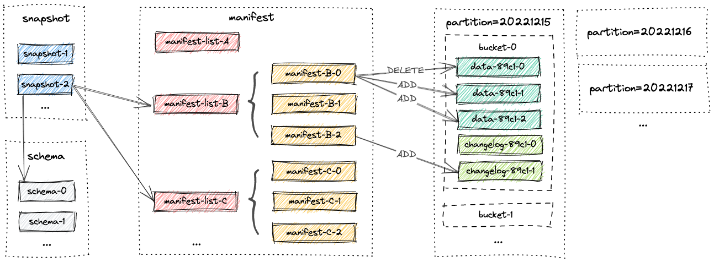
<a id="concepts-basic-concepts--snapshot"></a>

## Snapshot [#](#concepts-basic-concepts--snapshot)

All snapshot files are stored in the `snapshot` directory.

A snapshot file is a JSON file containing information about this snapshot, including

- the schema file in use
- the manifest list containing all changes of this snapshot

A snapshot captures the state of a table at some point in time. Users can access the latest data of a table through the
latest snapshot. By time traveling, users can also access the previous state of a table through an earlier snapshot.

<a id="concepts-basic-concepts--manifest-files"></a>

## Manifest Files [#](#concepts-basic-concepts--manifest-files)

All manifest lists and manifest files are stored in the `manifest` directory.

A manifest list is a list of manifest file names.

A manifest file is a file containing changes about LSM data files and changelog files. For example, which LSM data file is created and which file is deleted in the corresponding snapshot.

<a id="concepts-basic-concepts--data-files"></a>

## Data Files [#](#concepts-basic-concepts--data-files)

Data files are grouped by partitions. Currently, Paimon supports using parquet (default), orc and avro as data file’s format.

<a id="concepts-basic-concepts--partition"></a>

## Partition [#](#concepts-basic-concepts--partition)

Paimon adopts the same partitioning concept as Apache Hive to separate data.

Partitioning is an optional way of dividing a table into related parts based on the values of particular columns like date, city, and department. Each table can have one or more partition keys to identify a particular partition.

By partitioning, users can efficiently operate on a slice of records in the table.

<a id="concepts-basic-concepts--consistency-guarantees"></a>

## Consistency Guarantees [#](#concepts-basic-concepts--consistency-guarantees)

Paimon writers use two-phase commit protocol to atomically commit a batch of records to the table. Each commit produces
at most two [snapshots](#concepts-basic-concepts--snapshot) at commit time. It depends on the incremental write and compaction strategy. If only incremental writes are performed without triggering a compaction operation, only an incremental snapshot will be created. If a compaction operation is triggered, an incremental snapshot and a compacted snapshot will be created.

For any two writers modifying a table at the same time, as long as they do not modify the same partition, their commits
can occur in parallel. If they modify the same partition, only snapshot isolation is guaranteed. That is, the final table
state may be a mix of the two commits, but no changes are lost.
See [dedicated compaction job](#maintenance-dedicated-compaction--dedicated-compaction-job) for more info.

---

<a id="concepts-concurrency-control"></a>

<!-- source_url: https://paimon.apache.org/docs/master/concepts/concurrency-control/ -->

<!-- page_index: 3 -->

# Concurrency Control #

> This documentation is for an unreleased version of Apache Paimon. We recommend you use the latest [stable version](https://paimon.apache.org/docs/1.4).

<a id="concepts-concurrency-control--concurrency-control"></a>

# Concurrency Control [#](#concepts-concurrency-control--concurrency-control)

Paimon supports optimistic concurrency for multiple concurrent write jobs.

Each job writes data at its own pace and generates a new snapshot based on the current snapshot by applying incremental
files (deleting or adding files) at the time of committing.

There may be two types of commit failures here:

1. Snapshot conflict: the snapshot id has been preempted, the table has generated a new snapshot from another job. OK, let’s commit again.
2. Files conflict: The file that this job wants to delete has been deleted by another jobs. At this point, the job can only fail. (For streaming jobs, it will fail and restart, intentionally failover once)

<a id="concepts-concurrency-control--snapshot-conflict"></a>

## Snapshot conflict [#](#concepts-concurrency-control--snapshot-conflict)

Paimon’s snapshot ID is unique, so as long as the job writes its snapshot file to the file system, it is considered successful.


Paimon uses the file system’s renaming mechanism to commit snapshots, which is secure for HDFS as it ensures
transactional and atomic renaming.

But for object storage such as OSS and S3, their `'RENAME'` does not have atomic semantic. We need to configure Hive or
jdbc metastore and enable `'lock.enabled'` option for the catalog. Otherwise, there may be a chance of losing the snapshot.

<a id="concepts-concurrency-control--files-conflict"></a>

## Files conflict [#](#concepts-concurrency-control--files-conflict)

When Paimon commits a file deletion (which is only a logical deletion), it checks for conflicts with the latest snapshot.
If there are conflicts (which means the file has been logically deleted), it can no longer continue on this commit node, so it can only intentionally trigger a failover to restart, and the job will retrieve the latest status from the filesystem
in the hope of resolving this conflict.


Paimon will ensure that there is no data loss or duplication here, but if two streaming jobs are writing at the same
time and there are conflicts, you will see that they are constantly restarting, which is not a good thing.

The essence of conflict lies in deleting files (logically), and deleting files is born from compaction, so as long as
we close the compaction of the writing job (Set ‘write-only’ to true) and start a separate job to do the compaction work, everything is very good.

See [dedicated compaction job](#maintenance-dedicated-compaction--dedicated-compaction-job) for more info.

---

<a id="concepts-catalog"></a>

<!-- source_url: https://paimon.apache.org/docs/master/concepts/catalog/ -->

<!-- page_index: 4 -->

# Catalog #

> This documentation is for an unreleased version of Apache Paimon. We recommend you use the latest [stable version](https://paimon.apache.org/docs/1.4).

<a id="concepts-catalog--catalog"></a>

# Catalog [#](#concepts-catalog--catalog)

Paimon provides a Catalog abstraction to manage the table of contents and metadata. The Catalog abstraction provides
a series of ways to help you better integrate with computing engines. We always recommend that you use Catalog to
access the Paimon table.

<a id="concepts-catalog--catalogs"></a>

## Catalogs [#](#concepts-catalog--catalogs)

Paimon catalogs currently support four types of metastores:

- `filesystem` metastore (default), which stores both metadata and table files in filesystems.
- `hive` metastore, which additionally stores metadata in Hive metastore. Users can directly access the tables from Hive.
- `jdbc` metastore, which additionally stores metadata in relational databases such as MySQL, Postgres, etc.
- `rest` metastore, which is designed to provide a lightweight way to access any catalog backend from a single client.

<a id="concepts-catalog--filesystem-catalog"></a>

## Filesystem Catalog [#](#concepts-catalog--filesystem-catalog)

Metadata and table files are stored under `hdfs:///path/to/warehouse`.

```sql
-- Flink SQL
CREATE CATALOG my_catalog WITH (
    'type' = 'paimon',
    'warehouse' = 'hdfs:///path/to/warehouse'
);
```

<a id="concepts-catalog--rest-catalog"></a>

## REST Catalog [#](#concepts-catalog--rest-catalog)

By using the Paimon REST catalog, changes to the catalog will be directly stored in a remote catalog server which exposed through REST API.
See [Paimon REST Catalog](#concepts-rest-overview).

<a id="concepts-catalog--hive-catalog"></a>

## Hive Catalog [#](#concepts-catalog--hive-catalog)

By using Paimon Hive catalog, changes to the catalog will directly affect the corresponding Hive metastore. Tables
created in such catalog can also be accessed directly from Hive. Metadata and table files are stored under
`hdfs:///path/to/warehouse`. In addition, schema is also stored in Hive metastore.

```sql
-- Flink SQL
CREATE CATALOG my_hive WITH (
    'type' = 'paimon',
    'metastore' = 'hive',
    -- 'warehouse' = 'hdfs:///path/to/warehouse', default use 'hive.metastore.warehouse.dir' in HiveConf
);
```

By default, Paimon does not synchronize newly created partitions into Hive metastore. Users will see an unpartitioned
table in Hive. Partition push-down will be carried out by filter push-down instead.

If you want to see a partitioned table in Hive and also synchronize newly created partitions into Hive metastore, please set the table option `metastore.partitioned-table` to true.

<a id="concepts-catalog--jdbc-catalog"></a>

## JDBC Catalog [#](#concepts-catalog--jdbc-catalog)

By using the Paimon JDBC catalog, changes to the catalog will be directly stored in relational databases such as SQLite, MySQL, postgres, etc.

```sql
-- Flink SQL
CREATE CATALOG my_jdbc WITH (
    'type' = 'paimon',
    'metastore' = 'jdbc',
    'uri' = 'jdbc:mysql://<host>:<port>/<databaseName>',
    'jdbc.user' = '...', 
    'jdbc.password' = '...', 
    'catalog-key'='jdbc',
    'warehouse' = 'hdfs:///path/to/warehouse'
);
```

---

<a id="concepts-rest-overview"></a>

<!-- source_url: https://paimon.apache.org/docs/master/concepts/rest/overview/ -->

<!-- page_index: 5 -->

# RESTCatalog #

> This documentation is for an unreleased version of Apache Paimon. We recommend you use the latest [stable version](https://paimon.apache.org/docs/1.4).

<a id="concepts-rest-overview--restcatalog"></a>

# RESTCatalog [#](#concepts-rest-overview--restcatalog)

<a id="concepts-rest-overview--overview"></a>

## Overview [#](#concepts-rest-overview--overview)

Paimon REST Catalog provides a lightweight implementation to access the catalog service. Paimon could access the
catalog service through a catalog server which implements REST API. You can see all APIs in [REST API](#concepts-rest-rest-api).


<a id="concepts-rest-overview--key-features"></a>

## Key Features [#](#concepts-rest-overview--key-features)

1. User Defined Technology-Specific Logic Implementation
   - All technology-specific logic within the catalog server.
   - This ensures that the user can define logic that could be owned by the user.
2. Decoupled Architecture
   - The REST Catalog interacts with the catalog server through a well-defined REST API.
   - This decoupling allows for independent evolution and scaling of the catalog server and clients.
3. Language Agnostic
   - Developers can implement the catalog server in any programming language, provided that it adheres to the specified REST API.
   - This flexibility enables teams to utilize their existing tech stacks and expertise.
4. Support for Any Catalog Backend
   - REST Catalog is designed to work with any catalog backend.
   - As long as they implement the relevant APIs, they can seamlessly integrate with REST Catalog.

<a id="concepts-rest-overview--conclusion"></a>

## Conclusion [#](#concepts-rest-overview--conclusion)

REST Catalog offers adaptable solution for accessing the catalog service. According to [REST API](#concepts-rest-rest-api) is decoupled
from the catalog service.

Technology-specific Logic is encapsulated on the catalog server. At the same time, the catalog server supports any
backend and languages.

<a id="concepts-rest-overview--token-provider"></a>

## Token Provider [#](#concepts-rest-overview--token-provider)

RESTCatalog supports multiple access authentication methods, including the following:

1. [Bear Token](#concepts-rest-bear).
2. [DLF Token](#concepts-rest-dlf).

<a id="concepts-rest-overview--rest-open-api"></a>

## REST Open API [#](#concepts-rest-overview--rest-open-api)

See [REST API](#concepts-rest-rest-api).

---

<a id="concepts-rest-bear"></a>

<!-- source_url: https://paimon.apache.org/docs/master/concepts/rest/bear/ -->

<!-- page_index: 6 -->

# Bear Token #

> This documentation is for an unreleased version of Apache Paimon. We recommend you use the latest [stable version](https://paimon.apache.org/docs/1.4).

<a id="concepts-rest-bear--bear-token"></a>

# Bear Token [#](#concepts-rest-bear--bear-token)

A bearer token is an encrypted string, typically generated by the server based on a secret key. When the client
sends a request to the server, it must include `Authorization: Bearer <token>` in the request header. After receiving
the request, the server extracts the `<token>` and validates its legitimacy. If the validation passes, the
authentication is successful.

```sql
CREATE CATALOG `paimon-rest-catalog`
WITH (
    'type' = 'paimon',
    'uri' = '<catalog server url>',
    'metastore' = 'rest',
    'warehouse' = 'my_instance_name',
    'token.provider' = 'bear'
    'token' = '<token>'
);
```

---

<a id="concepts-rest-dlf"></a>

<!-- source_url: https://paimon.apache.org/docs/master/concepts/rest/dlf/ -->

<!-- page_index: 7 -->

# DLF Token #

> This documentation is for an unreleased version of Apache Paimon. We recommend you use the latest [stable version](https://paimon.apache.org/docs/1.4).

<a id="concepts-rest-dlf--dlf-token"></a>

# DLF Token [#](#concepts-rest-dlf--dlf-token)

DLF (Data Lake Formation) building is a fully-managed platform for unified metadata and data storage and management, aiming to provide customers with functions such as metadata management, storage management, permission management, storage analysis, and storage optimization.

DLF provides multiple authentication methods for different environments.

> [!NOTE]
> > The `'warehouse'` is your catalog instance name on the server, not the path.

<a id="concepts-rest-dlf--use-the-access-key"></a>

## Use the access key [#](#concepts-rest-dlf--use-the-access-key)

```sql
CREATE CATALOG `paimon-rest-catalog`
WITH (
    'type' = 'paimon',
    'uri' = '<catalog server url>',
    'metastore' = 'rest',
    'warehouse' = 'my_instance_name',
    'token.provider' = 'dlf',
    'dlf.access-key-id'='<access-key-id>',
    'dlf.access-key-secret'='<access-key-secret>',
);
```

- `uri`: Access the URI of the DLF Rest Catalog Server.
- `warehouse`: DLF Catalog name
- `token.provider`: token provider
- `dlf.access-key-id`: The Access Key ID required to access the DLF service, usually referring to the AccessKey of your
  RAM user
- `dlf.access-key-secret`:The Access Key Secret required to access the DLF service

You can grant specific permissions to a RAM user and use the RAM user’s access key for long-term access to your DLF
resources. Compared to using the Alibaba Cloud account access key, accessing DLF resources with a RAM user access key
is more secure.

<a id="concepts-rest-dlf--use-the-sts-temporary-access-token"></a>

## Use the STS temporary access token [#](#concepts-rest-dlf--use-the-sts-temporary-access-token)

Through the STS service, you can generate temporary access tokens for users, allowing them to access DLF resources
restricted by policies within the validity period.

```sql
CREATE CATALOG `paimon-rest-catalog`
WITH (
    'type' = 'paimon',
    'uri' = '<catalog server url>',
    'metastore' = 'rest',
    'warehouse' = 'my_instance_name',
    'token.provider' = 'dlf',
    'dlf.access-key-id'='<access-key-id>',
    'dlf.access-key-secret'='<access-key-secret>',
    'dlf.security-token'='<security-token>'
);
```

In some environments, temporary access token can be periodically refreshed by using a local file:

```sql
CREATE CATALOG `paimon-rest-catalog`
WITH (
    'type' = 'paimon',
    'uri' = '<catalog server url>',
    'metastore' = 'rest',
    'warehouse' = 'my_instance_name',
    'token.provider' = 'dlf',
    'dlf.token-path' = 'my_token_path_in_disk'
);
```

<a id="concepts-rest-dlf--use-the-sts-token-from-aliyun-ecs-role"></a>

## Use the STS token from aliyun ecs role [#](#concepts-rest-dlf--use-the-sts-token-from-aliyun-ecs-role)

An instance RAM role refers to a RAM role granted to an ECS instance. This RAM role is a standard service role
with the trusted entity being the cloud server. By using an instance RAM role, it is possible to obtain temporary
access token (STS Token) within the ECS instance without configuring an AccessKey.

```sql
CREATE CATALOG `paimon-rest-catalog`
WITH (
    'type' = 'paimon',
    'uri' = '<catalog server url>',
    'metastore' = 'rest',
    'warehouse' = 'my_instance_name',
    'token.provider' = 'dlf',
    'dlf.token-loader' = 'ecs'
    -- optional, loader can obtain it through ecs metadata service
    -- 'dlf.token-ecs-role-name' = 'my_ecs_role_name'
);
```

<a id="concepts-rest-dlf--dlf-endpoint-configuration"></a>

## DLF Endpoint Configuration [#](#concepts-rest-dlf--dlf-endpoint-configuration)

Paimon supports two types of DLF endpoints and automatically selects the appropriate signing algorithm:

- **DLF VPC endpoints** (e.g., `cn-hangzhou-vpc.dlf.aliyuncs.com`): Recommended for VPC environments with better performance and lower latency.
- **DLF OpenAPI endpoints** (e.g., `dlfnext.cn-hangzhou.aliyuncs.com`): Supports public network access through Alibaba Cloud API infrastructure.
  **Note:** Currently OpenAPI Endpoints only supports database and table names with alphanumeric characters (A-Z, a-z, 0-9) and specific symbols.

Simply configure the endpoint URI, and Paimon will automatically handle the authentication:

```sql
CREATE CATALOG `paimon-rest-catalog`
WITH (
    'type' = 'paimon',
    'uri' = 'https://${region}-vpc.dlf.aliyuncs.com',  -- or OpenAPI endpoint: https://dlfnext.cn-hangzhou.aliyuncs.com
    'metastore' = 'rest',
    'warehouse' = 'my_instance_name',
    'token.provider' = 'dlf',
    'dlf.access-key-id'='<access-key-id>',
    'dlf.access-key-secret'='<access-key-secret>'
);
```

---

<a id="concepts-rest-tables"></a>

<!-- source_url: https://paimon.apache.org/docs/master/concepts/rest/tables/ -->

<!-- page_index: 8 -->

# Tables #

> This documentation is for an unreleased version of Apache Paimon. We recommend you use the latest [stable version](https://paimon.apache.org/docs/1.4).

<a id="concepts-rest-tables--tables"></a>

# Tables [#](#concepts-rest-tables--tables)

Paimon supports tables:

1. paimon table: Paimon Data Table with or without Primary key
2. format-table: file format table refers to a directory that contains multiple files of the same format, where
   operations on this table allow for reading or writing to these files, compatible with Hive tables.
3. object table: provides metadata indexes for unstructured data objects in the specified Object Storage directory.

<a id="concepts-rest-tables--paimon-table"></a>

## Paimon Table [#](#concepts-rest-tables--paimon-table)

<a id="concepts-rest-tables--primary-key-table"></a>

### Primary Key Table [#](#concepts-rest-tables--primary-key-table)

See [Paimon with Primary key](#primary-key-table-overview).

Primary keys consist of a set of columns that contain unique values for each record. Paimon enforces data ordering by
sorting the primary key within each bucket, allowing streaming update and streaming changelog read.

The definition of primary key is similar to that of standard SQL, as it ensures that there is only one data entry for
the same primary key during batch queries.

Flink SQL

```sql
CREATE TABLE my_table (
    a INT PRIMARY KEY NOT ENFORCED,
    b STRING
) WITH (
    'bucket'='8'
)
```

Spark SQL

```sql
CREATE TABLE my_table (
    a INT,
    b STRING
) TBLPROPERTIES (
    'primary-key' = 'a',
    'bucket' = '8'
)
```

<a id="concepts-rest-tables--append-table"></a>

### Append Table [#](#concepts-rest-tables--append-table)

See [Append Table](#append-table-overview).

If a table does not have a primary key defined, it is an append table. Compared to the primary key table, it does not
have the ability to directly receive changelogs. It cannot be directly updated with data through streaming upsert. It
can only receive incoming data from append data.

However, it also supports batch sql: DELETE, UPDATE, and MERGE-INTO.

```sql
CREATE TABLE my_table (
    a INT,
    b STRING
)
```

<a id="concepts-rest-tables--format-table"></a>

## Format Table [#](#concepts-rest-tables--format-table)

The Hive tables inside the metastore will be mapped to Paimon’s Format Table for computing engines (Spark, Hive, Flink)
to read and write.

Format table refers to a directory that contains multiple files of the same format, where operations on this table
allow for reading or writing to these files, facilitating the retrieval of existing data and the addition of new files.

Partitioned file format table just like the standard hive format. Partitions are discovered and inferred based on
directory structure.

Currently only support `CSV`, `Parquet`, `ORC`, `JSON` formats.

Flink-CSV

```sql
CREATE TABLE my_csv_table (
    a INT,
    b STRING
) WITH (
    'type'='format-table',
    'file.format'='csv',
    'csv.field-delimiter'=','
)
```

Spark-CSV

```sql
CREATE TABLE my_csv_table (
    a INT,
    b STRING
) USING csv OPTIONS ('csv.field-delimiter' ',')
```

Flink-Parquet

```sql
CREATE TABLE my_parquet_table (
    a INT,
    b STRING
) WITH (
    'type'='format-table',
    'file.format'='parquet'
)
```

Spark-Parquet

```sql
CREATE TABLE my_parquet_table (
    a INT,
    b STRING
) USING parquet
```

Flink-JSON

```sql
CREATE TABLE my_json_table (
    a INT,
    b STRING
) WITH (
    'type'='format-table',
    'file.format'='json'
)
```

Spark-JSON

```sql
CREATE TABLE my_json_table (
    a INT,
    b STRING
) USING json
```

<a id="concepts-rest-tables--object-table"></a>

## Object Table [#](#concepts-rest-tables--object-table)

Object Table is a virtual table for unstructured data objects in the specified object storage directory. Users can:

1. Use the virtual file system (Under development) to read and write files.
2. Or use the SQL computing engine to read it as a structured file list.

The object table is managed by Catalog and can also have access permissions. Now, only REST Catalog supports Object
Table.

To Create an object table:

Flink-SQL

```sql
CREATE TABLE `my_object_table` WITH (
  'type' = 'object-table'
);
```

Spark-SQL

```sql
CREATE TABLE `my_object_table` TBLPROPERTIES (
  'type' = 'object-table'
);
```

We recommend using [pvfs](#concepts-rest-pvfs). to access files in the object table, access to the files
through the permission system of Paimon REST Catalog.

---

<a id="concepts-rest-pvfs"></a>

<!-- source_url: https://paimon.apache.org/docs/master/concepts/rest/pvfs/ -->

<!-- page_index: 9 -->

# Paimon Virtual Storage #

> This documentation is for an unreleased version of Apache Paimon. We recommend you use the latest [stable version](https://paimon.apache.org/docs/1.4).

<a id="concepts-rest-pvfs--paimon-virtual-storage"></a>

# Paimon Virtual Storage [#](#concepts-rest-pvfs--paimon-virtual-storage)

The REST Catalog provides built-in storage, including Paimon Table, Format Table, and Object Table (also known as Fileset or Volume), both of which require direct access to the file system. And our REST Catalog generates UUID paths, which makes it difficult
to directly access the file system.

So there is PVFS, which can allow users to access it through similar methods `pvfs://catalog_name/database_name/table_name/`, use the path to access all internal tables in the REST Catalog, including Paimon Table, Format Table, and Object Table.
Another advantage is that all user access to this file system is through the permission system of Paimon REST Catalog, without the need to maintain another file system permission system.

<a id="concepts-rest-pvfs--api-behavior"></a>

## API Behavior [#](#concepts-rest-pvfs--api-behavior)

For example, if you have a catalog named ‘my\_catalog’, the list behavior should be:

- `listStatus(Path('pvfs://my_catalog/'))`: return all databases, only virtual paths in FileStatus.
- `listStatus(Path('pvfs://my_catalog/my_database'))`: return all tables, only virtual paths in FileStatus.

All paths return virtual paths, reading and writing files will actually read and write data according to the true path
of the table.

- `newInputStream(Path('pvfs://my_catalog/my_database/my_table'))`: get the real path from rest server, and use real filesystem to read data.

<a id="concepts-rest-pvfs--java-sdk"></a>

## Java SDK [#](#concepts-rest-pvfs--java-sdk)

Provide a Java SDK to implement Hadoop FileSystem. In this way, compute engines can integrate ‘PVFS’ very easy.

For example, Java code can do:

```java
Configuration conf = new Configuration();
conf.set("fs.AbstractFileSystem.pvfs.impl", "org.apache.paimon.vfs.hadoop.Pvfs");
conf.set("fs.pvfs.impl", "org.apache.paimon.vfs.hadoop.PaimonVirtualFileSystem");
conf.set("fs.pvfs.uri", "http://localhost:10000");
conf.set("fs.pvfs.token.provider", "bear");
conf.set("fs.pvfs.token", "token");
Path path = new Path("pvfs://catalog_name/database_name/table_name/a.csv");
FileSystem fs = path.getFileSystem(conf);
FileStatus fileStatus = fs.getFileStatus(path);
```

For example, Spark SQL can do:

```scala
val spark = SparkSession.builder()
.appName("PVFS CSV Analysis")
.config("spark.hadoop.fs.pvfs.impl", "org.apache.paimon.vfs.hadoop.PaimonVirtualFileSystem")
.config("spark.hadoop.fs.pvfs.uri", "http://localhost:10000")
.config("spark.hadoop.fs.pvfs.token.provider", "bear")
.config("spark.hadoop.fs.pvfs.token", "token")
.getOrCreate()
spark.sql(
s"""
|CREATE TEMPORARY VIEW csv_table
|USING csv
|OPTIONS (
|  path 'pvfs://catalog_name/database_name/my_format_table_name/a.csv',
|  header 'true',
|  inferSchema 'true'
|)
""".stripMargin
)

spark.sql("SELECT * FROM csv_table LIMIT 5").show()
```

For example, use Hadoop shell command:

```xml
<!-- Configure following configuration in hadoop `core-site.xml` -->
<property>
  <name>fs.AbstractFileSystem.pvfs.impl</name>
  <value>org.apache.paimon.vfs.hadoop.Pvfs</value>
</property>

<property>
  <name>fs.pvfs.impl</name>
  <value>org.apache.paimon.vfs.hadoop.PaimonVirtualFileSystem</value>
</property>

<property>
  <name>fs.pvfs.uri</name>
  <value>http://localhost:10000</value>
</property>

<property>
  <name>fs.pvfs.token.provider</name>
  <value>bear</value>
</property>

<property>
  <name>fs.pvfs.token</name>
  <value>token</value>
</property>
```

Example: execute hadoop shell to list the virtual path

```shell
./${HADOOP_HOME}/bin/hadoop dfs -ls pvfs://catalog_name/database_name/table_name
```

<a id="concepts-rest-pvfs--python-sdk"></a>

## Python SDK [#](#concepts-rest-pvfs--python-sdk)

Python SDK provide fsspec style API, can be easily integrated to Python ecosystem.

For example, Python code can do:

```python
import pypaimon

options = {
    'uri': 'key',
    'token.provider': 'bear',
    'token': '<token>'
}
fs = pypaimon.PaimonVirtualFileSystem(options)
fs.ls("pvfs://catalog_name/database_name/table_name")
```

For example, Pyarrow can do:

```python
import pypaimon
import pyarrow.parquet as pq

options = {
    'uri': 'key',
    'token.provider': 'bear',
    'token': '<token>'
}
fs = pypaimon.PaimonVirtualFileSystem(options)
path = 'pvfs://catalog_name/database_name/table_name/a.parquet'
dataset = pq.ParquetDataset(path, filesystem=fs)
table = dataset.read()
df = table.to_pandas()
```

For example, Ray can do:

```python
import pypaimon
import ray

options = {
    'uri': 'key',
    'token.provider': 'bear',
    'token': '<token>'
}
fs = pypaimon.PaimonVirtualFileSystem(options)

ds = ray.data.read_parquet(filesystem=fs,paths="pvfs://....parquet")
```

---

<a id="concepts-rest-rest-api"></a>

<!-- source_url: https://paimon.apache.org/docs/master/concepts/rest/rest-api/ -->

<!-- page_index: 10 -->

# REST API | Apache Paimon

> This documentation is for an unreleased version of Apache Paimon. We recommend you use the latest [stable version](https://paimon.apache.org/docs/1.4).

---

<a id="concepts-spec-schema"></a>

<!-- source_url: https://paimon.apache.org/docs/master/concepts/spec/schema/ -->

<!-- page_index: 11 -->

# Schema #

> This documentation is for an unreleased version of Apache Paimon. We recommend you use the latest [stable version](https://paimon.apache.org/docs/1.4).

<a id="concepts-spec-schema--schema"></a>

# Schema [#](#concepts-spec-schema--schema)

The version of the schema file starts from 0 and currently retains all versions of the schema. There may be old files
that rely on the old schema version, so its deletion should be done with caution.

Schema File is JSON, it includes:

1. fields: data field list, data field contains `id`, `name`, `type`, field id is used to support schema evolution.
2. partitionKeys: field name list, partition definition of the table, it cannot be modified.
3. primaryKeys: field name list, primary key definition of the table, it cannot be modified.
4. options: map<string, string>, no ordered, options of the table, including a lot of capabilities and optimizations.

<a id="concepts-spec-schema--example"></a>

## Example [#](#concepts-spec-schema--example)

```json
{
  "version" : 3,
  "id" : 0,
  "fields" : [ {
    "id" : 0,
    "name" : "order_id",
    "type" : "BIGINT NOT NULL"
  }, {
    "id" : 1,
    "name" : "order_name",
    "type" : "STRING"
  }, {
    "id" : 2,
    "name" : "order_user_id",
    "type" : "BIGINT"
  }, {
    "id" : 3,
    "name" : "order_shop_id",
    "type" : "BIGINT"
  } ],
  "highestFieldId" : 3,
  "partitionKeys" : [ ],
  "primaryKeys" : [ "order_id" ],
  "options" : {
    "bucket" : "5"
  },
  "comment" : "",
  "timeMillis" : 1720496663041
}
```

<a id="concepts-spec-schema--compatibility"></a>

## Compatibility [#](#concepts-spec-schema--compatibility)

For old versions:

- version 1: should put `bucket -> 1` to options if there is no `bucket` key.
- version 1 & 2: should put `file.format -> orc` to options if there is no `file.format` key.

<a id="concepts-spec-schema--datafield"></a>

## DataField [#](#concepts-spec-schema--datafield)

DataField represents a column of the table.

1. id: int, column id, automatic increment, it is used for schema evolution.
2. name: string, column name.
3. type: data type, it is very similar to SQL type string.
4. description: string.

<a id="concepts-spec-schema--update-schema"></a>

## Update Schema [#](#concepts-spec-schema--update-schema)

Updating the schema should generate a new schema file.

```shell
warehouse
└── default.db
    └── my_table
        ├── schema
            ├── schema-0
            ├── schema-1
            └── schema-2
```

There is a reference to schema in the snapshot. The schema file with the highest numerical value is usually the latest
schema file.

Old schema files cannot be directly deleted because there may be old data files that reference old schema files. When
reading table, it is necessary to rely on them for schema evolution reading.

---

<a id="concepts-spec-snapshot"></a>

<!-- source_url: https://paimon.apache.org/docs/master/concepts/spec/snapshot/ -->

<!-- page_index: 12 -->

# Snapshot #

> This documentation is for an unreleased version of Apache Paimon. We recommend you use the latest [stable version](https://paimon.apache.org/docs/1.4).

<a id="concepts-spec-snapshot--snapshot"></a>

# Snapshot [#](#concepts-spec-snapshot--snapshot)

Each commit generates a snapshot file, and the version of the snapshot file starts from 1 and must be continuous.
`EARLIEST` and `LATEST` are hint files at the beginning and end of the snapshot list, and they can be inaccurate.
When hint files are inaccurate, the read will scan all snapshot files to determine the beginning and end.

```shell
warehouse
└── default.db
    └── my_table
        ├── snapshot
            ├── EARLIEST
            ├── LATEST
            ├── snapshot-1
            ├── snapshot-2
            └── snapshot-3
```

Writing commit will preempt the next snapshot id, and once the snapshot file is successfully written, this commit will
be visible.

Snapshot File is JSON, it includes:

1. version: Snapshot file version, current is 3.
2. id: snapshot id, same to file name.
3. schemaId: the corresponding schema version for this commit.
4. baseManifestList: a manifest list recording all changes from the previous snapshots.
5. deltaManifestList: a manifest list recording all new changes occurred in this snapshot.
6. changelogManifestList: a manifest list recording all changelog produced in this snapshot, null if no changelog is produced.
7. indexManifest: a manifest recording all index files of this table, null if no table index file.
8. commitUser: usually generated by UUID, it is used for recovery of streaming writes, one stream write job with one user.
9. commitIdentifier: transaction id corresponding to streaming write, each transaction may result in multiple commits for different commitKinds.
10. commitKind: type of changes in this snapshot, including append, compact, overwrite and analyze.
11. timeMillis: commit time millis.
12. logOffsets: commit log offsets.
13. totalRecordCount: record count of all changes occurred in this snapshot.
14. deltaRecordCount: record count of all new changes occurred in this snapshot.
15. changelogRecordCount: record count of all changelog produced in this snapshot.
16. watermark: watermark for input records, from Flink watermark mechanism, Long.MIN\_VALUE if there is no watermark.
17. statistics: stats file name for statistics of this table.

---

<a id="concepts-spec-manifest"></a>

<!-- source_url: https://paimon.apache.org/docs/master/concepts/spec/manifest/ -->

<!-- page_index: 13 -->

# Manifest #

> This documentation is for an unreleased version of Apache Paimon. We recommend you use the latest [stable version](https://paimon.apache.org/docs/1.4).

<a id="concepts-spec-manifest--manifest"></a>

# Manifest [#](#concepts-spec-manifest--manifest)

<a id="concepts-spec-manifest--manifest-list"></a>

## Manifest List [#](#concepts-spec-manifest--manifest-list)

```shell
├── manifest
    └── manifest-list-51c16f7b-421c-4bc0-80a0-17677f343358-1
```

Manifest List includes meta of several manifest files. Its name contains UUID, it is an avro file, the schema is:

1. \_FILE\_NAME: STRING, manifest file name.
2. \_FILE\_SIZE: BIGINT, manifest file size.
3. \_NUM\_ADDED\_FILES: BIGINT, number added files in manifest.
4. \_NUM\_DELETED\_FILES: BIGINT, number deleted files in manifest.
5. \_PARTITION\_STATS: SimpleStats, partition stats, the minimum and maximum values of partition fields in this manifest are beneficial
   for skipping certain manifest files during queries, it is a SimpleStats.
6. \_SCHEMA\_ID: BIGINT, schema id when writing this manifest file.

<a id="concepts-spec-manifest--manifest-1"></a>
<a id="concepts-spec-manifest--manifest-2"></a>

## Manifest [#](#concepts-spec-manifest--manifest-1)

Manifest includes meta of several data files or changelog files or table-index files. Its name contains UUID, it is an
avro file.

The changes of the file are saved in the manifest, and the file can be added or deleted. Manifests should be in
an orderly manner, and the same file may be added or deleted multiple times. The last version should be read. This
design can make commit lighter to support file deletion generated by compaction.

<a id="concepts-spec-manifest--data-manifest"></a>

### Data Manifest [#](#concepts-spec-manifest--data-manifest)

Data Manifest includes meta of several data files or changelog files.

```shell
├── manifest
    └── manifest-6758823b-2010-4d06-aef0-3b1b597723d6-0
```

The schema is:

1. \_KIND: TINYINT, ADD or DELETE, 2. \_PARTITION: BYTES, partition spec, a BinaryRow.
3. \_BUCKET: INT, bucket of this file.
4. \_TOTAL\_BUCKETS: INT, total buckets when write this file, it is used for verification after bucket changes.
5. \_FILE: data file meta.

The data file meta is:

1. \_FILE\_NAME: STRING, file name.
2. \_FILE\_SIZE: BIGINT, file size.
3. \_ROW\_COUNT: BIGINT, total number of rows (including add & delete) in this file.
4. \_MIN\_KEY: STRING, the minimum key of this file.
5. \_MAX\_KEY: STRING, the maximum key of this file.
6. \_KEY\_STATS: SimpleStats, the statistics of the key.
7. \_VALUE\_STATS: SimpleStats, the statistics of the value.
8. \_MIN\_SEQUENCE\_NUMBER: BIGINT, the minimum sequence number.
9. \_MAX\_SEQUENCE\_NUMBER: BIGINT, the maximum sequence number.
10. \_SCHEMA\_ID: BIGINT, schema id when write this file.
11. \_LEVEL: INT, level of this file, in LSM.
12. \_EXTRA\_FILES: ARRAY, extra files for this file, for example, data file index file.
13. \_CREATION\_TIME: TIMESTAMP\_MILLIS, creation time of this file.
14. \_DELETE\_ROW\_COUNT: BIGINT, rowCount = addRowCount + deleteRowCount.
15. \_EMBEDDED\_FILE\_INDEX: BYTES, if data file index is too small, store the index in manifest.
16. \_FILE\_SOURCE: TINYINT, indicate whether this file is generated as an APPEND or COMPACT file.
17. \_VALUE\_STATS\_COLS: ARRAY, statistical column in metadata.
18. \_EXTERNAL\_PATH: external path of this file, null if it is in warehouse.

<a id="concepts-spec-manifest--index-manifest"></a>

### Index Manifest [#](#concepts-spec-manifest--index-manifest)

Index Manifest includes meta of several [table-index](#concepts-spec-tableindex) files.

```shell
├── manifest
    └── index-manifest-5d670043-da25-4265-9a26-e31affc98039-0
```

The schema is:

1. \_KIND: TINYINT, ADD or DELETE, 2. \_PARTITION: BYTES, partition spec, a BinaryRow.
3. \_BUCKET: INT, bucket of this file.
4. \_INDEX\_TYPE: STRING, “HASH” or “DELETION\_VECTORS”.
5. \_FILE\_NAME: STRING, file name.
6. \_FILE\_SIZE: BIGINT, file size.
7. \_ROW\_COUNT: BIGINT, total number of rows.
8. \_DELETIONS\_VECTORS\_RANGES: Metadata only used by “DELETION\_VECTORS”, is an array of deletion vector meta, the schema of each deletion vector meta is:
   1. f0: the data file name corresponding to this deletion vector.
   2. f1: the starting offset of this deletion vector in the index file.
   3. f2: the length of this deletion vector in the index file.
   4. \_CARDINALITY: the number of deleted rows.

<a id="concepts-spec-manifest--appendix"></a>

## Appendix [#](#concepts-spec-manifest--appendix)

<a id="concepts-spec-manifest--simplestats"></a>

### SimpleStats [#](#concepts-spec-manifest--simplestats)

SimpleStats is nested row, the schema is:

1. \_MIN\_VALUES: BYTES, BinaryRow, the minimum values of the columns.
2. \_MAX\_VALUES: BYTES, BinaryRow, the maximum values of the columns.
3. \_NULL\_COUNTS: ARRAY, the number of nulls of the columns.

<a id="concepts-spec-manifest--binaryrow"></a>

### BinaryRow [#](#concepts-spec-manifest--binaryrow)

BinaryRow is backed by bytes instead of Object. It can significantly reduce the serialization/deserialization of Java
objects.

A Row has two part: Fixed-length part and variable-length part. Fixed-length part contains 1 byte header and null bit
set and field values. Null bit set is used for null tracking and is aligned to 8-byte word boundaries. `Field values`
holds fixed-length primitive types and variable-length values which can be stored in 8 bytes inside. If it does not fit
the variable-length field, then store the length and offset of variable-length part.

---

<a id="concepts-spec-datafile"></a>

<!-- source_url: https://paimon.apache.org/docs/master/concepts/spec/datafile/ -->

<!-- page_index: 14 -->

# DataFile #

> This documentation is for an unreleased version of Apache Paimon. We recommend you use the latest [stable version](https://paimon.apache.org/docs/1.4).

<a id="concepts-spec-datafile--datafile"></a>

# DataFile [#](#concepts-spec-datafile--datafile)

<a id="concepts-spec-datafile--partition"></a>

## Partition [#](#concepts-spec-datafile--partition)

Consider a Partition table via Flink SQL:

```sql
CREATE TABLE part_t (
    f0 INT,
    f1 STRING,
    dt STRING
) PARTITIONED BY (dt);

INSERT INTO part_t VALUES (1, '11', '20240514');
```

The file system will be:

```shell
part_t
├── dt=20240514
│   └── bucket-0
│       └── data-ca1c3c38-dc8d-4533-949b-82e195b41bd4-0.orc
├── manifest
│   ├── manifest-08995fe5-c2ac-4f54-9a5f-d3af1fcde41d-0
│   ├── manifest-list-51c16f7b-421c-4bc0-80a0-17677f343358-0
│   └── manifest-list-51c16f7b-421c-4bc0-80a0-17677f343358-1
├── schema
│   └── schema-0
└── snapshot
    ├── EARLIEST
    ├── LATEST
    └── snapshot-1
```

Paimon adopts the same partitioning concept as Apache Hive to separate data. The files of the partition will be placed
in a separate partition directory.

<a id="concepts-spec-datafile--bucket"></a>

## Bucket [#](#concepts-spec-datafile--bucket)

The storage of all Paimon tables relies on buckets, and data files are stored in the bucket directory. The
relationship between various table types and buckets in Paimon:

1. Primary Key Table:
   1. bucket = -1: Default mode, the dynamic bucket mode records which bucket the key corresponds to through the index
      files. The index records the correspondence between the hash value of the primary-key and the bucket.
   2. bucket = 10: The data is distributed to the corresponding buckets according to the hash value of bucket key (
      default is primary key).
2. Append Table:
   1. bucket = -1: Default mode, ignoring bucket concept, although all data is written to bucket-0, the parallelism of
      reads and writes is unrestricted.
   2. bucket = 10: You need to define bucket-key too, the data is distributed to the corresponding buckets according to
      the hash value of bucket key.

<a id="concepts-spec-datafile--data-file"></a>

## Data File [#](#concepts-spec-datafile--data-file)

The name of data file is `data-${uuid}-${id}.${format}`. For the append table, the file stores the data of the table
without adding any new columns. But for the primary key table, each row of data stores additional system columns:

<a id="concepts-spec-datafile--table-with-primary-key-data-file"></a>

### Table with Primary key Data File [#](#concepts-spec-datafile--table-with-primary-key-data-file)

1. Primary key columns, `_KEY_` prefix to key columns, this is to avoid conflicts with columns of the table. It’s optional,
   Paimon version 1.0 and above will retrieve the primary key fields from value\_columns.
2. `_VALUE_KIND`: TINYINT, row is deleted or added. Similar to RocksDB, each row of data can be deleted or added, which will be
   used for updating the primary key table.
3. `_SEQUENCE_NUMBER`: BIGINT, this number is used for comparison during updates, determining which data came first and which
   data came later.
4. Value columns. All columns declared in the table.

For example, data file for table:

```sql
CREATE TABLE T (
    a INT PRIMARY KEY NOT ENFORCED,
    b INT,
    c INT
);
```

Its file has 6 columns: `_KEY_a`, `_VALUE_KIND`, `_SEQUENCE_NUMBER`, `a`, `b`, `c`.

When `data-file.thin-mode` enabled, its file has 5 columns: `_VALUE_KIND`, `_SEQUENCE_NUMBER`, `a`, `b`, `c`.

<a id="concepts-spec-datafile--table-wo-primary-key-data-file"></a>
<a id="concepts-spec-datafile--table-w-o-primary-key-data-file"></a>

### Table w/o Primary key Data File [#](#concepts-spec-datafile--table-wo-primary-key-data-file)

- Value columns. All columns declared in the table.

For example, data file for table:

```sql
CREATE TABLE T (
    a INT,
    b INT,
    c INT
);
```

Its file has 3 columns: `a`, `b`, `c`.

<a id="concepts-spec-datafile--changelog-file"></a>

## Changelog File [#](#concepts-spec-datafile--changelog-file)

Changelog file and Data file are exactly the same, it only takes effect on the primary key table. It is similar to the
Binlog in a database, recording changes to the data in the table.

---

<a id="concepts-spec-fileformat"></a>

<!-- source_url: https://paimon.apache.org/docs/master/concepts/spec/fileformat/ -->

<!-- page_index: 15 -->

# File Format #

> This documentation is for an unreleased version of Apache Paimon. We recommend you use the latest [stable version](https://paimon.apache.org/docs/1.4).

<a id="concepts-spec-fileformat--file-format"></a>

# File Format [#](#concepts-spec-fileformat--file-format)

Currently, supports Parquet, Avro, ORC, CSV, JSON, and Lance file formats.

- Recommended column format is Parquet, which has a high compression rate and fast column projection queries.
- Recommended row based format is Avro, which has good performance n reading and writing full row (all columns).
- Recommended testing format is CSV, which has better readability but the worst read-write performance.
- Recommended format for ML workloads is Lance, which is optimized for vector search and machine learning use cases.

<a id="concepts-spec-fileformat--parquet"></a>

## PARQUET [#](#concepts-spec-fileformat--parquet)

Parquet is the default file format for Paimon.

The following table lists the type mapping from Paimon type to Parquet type.

| Paimon Type | Parquet type | Parquet logical type |
| --- | --- | --- |
| CHAR / VARCHAR / STRING | BINARY | UTF8 |
| BOOLEAN | BOOLEAN |  |
| BINARY / VARBINARY | BINARY |  |
| DECIMAL(P, S) | P <= 9: INT32, P <= 18: INT64, P > 18: FIXED\_LEN\_BYTE\_ARRAY | DECIMAL(P, S) |
| TINYINT | INT32 | INT\_8 |
| SMALLINT | INT32 | INT\_16 |
| INT | INT32 |  |
| BIGINT | INT64 |  |
| FLOAT | FLOAT |  |
| DOUBLE | DOUBLE |  |
| DATE | INT32 | DATE |
| TIME | INT32 | TIME\_MILLIS |
| TIMESTAMP(P) | P <= 3: INT64, P <= 6: INT64, P > 6: INT96 | P <= 3: MILLIS, P <= 6: MICROS, P > 6: NONE |
| TIMESTAMP\_LOCAL\_ZONE(P) | P <= 3: INT64, P <= 6: INT64, P > 6: INT96 | P <= 3: MILLIS, P <= 6: MICROS, P > 6: NONE |
| ARRAY | 3-LEVEL LIST | LIST |
| MAP | 3-LEVEL MAP | MAP |
| MULTISET | 3-LEVEL MAP | MAP |
| ROW | GROUP |  |

Limitations:

1. [Parquet does not support nullable map keys](https://github.com/apache/parquet-format/blob/master/LogicalTypes.md#maps).
2. Parquet TIMESTAMP type with precision 9 will use INT96, but this int96 is a time zone converted value and requires additional adjustments.

<a id="concepts-spec-fileformat--avro"></a>

## AVRO [#](#concepts-spec-fileformat--avro)

The following table lists the type mapping from Paimon type to Avro type.

| Paimon type | Avro type | Avro logical type |
| --- | --- | --- |
| CHAR / VARCHAR / STRING | string |  |
| `BOOLEAN` | `boolean` |  |
| `BINARY / VARBINARY` | `bytes` |  |
| `DECIMAL` | `bytes` | `decimal` |
| `TINYINT` | `int` |  |
| `SMALLINT` | `int` |  |
| `INT` | `int` |  |
| `BIGINT` | `long` |  |
| `FLOAT` | `float` |  |
| `DOUBLE` | `double` |  |
| `DATE` | `int` | `date` |
| `TIME` | `int` | `time-millis` |
| `TIMESTAMP` | P <= 3: long, P <= 6: long, P > 6: unsupported | P <= 3: timestampMillis, P <= 6: timestampMicros, P > 6: unsupported |
| `TIMESTAMP_LOCAL_ZONE` | P <= 3: long, P <= 6: long, P > 6: unsupported | P <= 3: localTimestampMillis, P <= 6: localTimestampMicros, P > 6: unsupported |
| `ARRAY` | `array` |  |
| `MAP` (key must be string/char/varchar type) | `map` |  |
| `MULTISET` (element must be string/char/varchar type) | `map` |  |
| `ROW` | `record` |  |

Note:

In addition to the types listed above, for nullable types. Paimon maps nullable types to Avro `union(something, null)`, where `something` is the Avro type converted from Paimon type.

You can refer to [Avro Specification](https://avro.apache.org/docs/1.12.0/specification/) for more information about Avro types.

<a id="concepts-spec-fileformat--orc"></a>

## ORC [#](#concepts-spec-fileformat--orc)

The following table lists the type mapping from Paimon type to Orc type.

| Paimon Type | Orc physical type | Orc logical type |
| --- | --- | --- |
| CHAR | bytes | CHAR |
| VARCHAR | bytes | VARCHAR |
| STRING | bytes | STRING |
| BOOLEAN | long | BOOLEAN |
| BYTES | bytes | BINARY |
| DECIMAL | decimal | DECIMAL |
| TINYINT | long | BYTE |
| SMALLINT | long | SHORT |
| INT | long | INT |
| BIGINT | long | LONG |
| FLOAT | double | FLOAT |
| DOUBLE | double | DOUBLE |
| DATE | long | DATE |
| TIMESTAMP | timestamp | TIMESTAMP |
| TIMESTAMP\_LOCAL\_ZONE | timestamp | TIMESTAMP\_INSTANT |
| ARRAY | - | LIST |
| MAP | - | MAP |
| ROW | - | STRUCT |

Limitations:

1. ORC has a time zone bias when mapping `TIMESTAMP_LOCAL_ZONE` type, saving the millis value corresponding to the UTC
   literal time. Due to compatibility issues, this behavior cannot be modified.

<a id="concepts-spec-fileformat--csv"></a>

## CSV [#](#concepts-spec-fileformat--csv)

Experimental feature, not recommended for production.

Format Options:

<table class="table table-bordered">
<thead>
<tr>
<th>Option</th>
<th>Default</th>
<th>Type</th>
<th>Description</th>
</tr>
</thead>
<tbody>
<tr>
<td>DOC2MDPLACEHOLDERTOKEN5END<h5>csv.field-delimiter</h5></td>
<td><code>,</code></td>
<td>String</td>
<td>Field delimiter character (<code>','</code> by default), must be single character. You can use backslash to specify special characters, e.g. <code>'\t'</code> represents the tab character.
      </td>
</tr>
<tr>
<td>DOC2MDPLACEHOLDERTOKEN6END<h5>csv.line-delimiter</h5></td>
<td><code>\n</code></td>
<td>String</td>
<td>The line delimiter for CSV format</td>
</tr>
<tr>
<td>DOC2MDPLACEHOLDERTOKEN7END<h5>csv.quote-character</h5></td>
<td><code>"</code></td>
<td>String</td>
<td>Quote character for enclosing field values (<code>"</code> by default).</td>
</tr>
<tr>
<td>DOC2MDPLACEHOLDERTOKEN8END<h5>csv.escape-character</h5></td>
<td>\</td>
<td>String</td>
<td>The escape character for CSV format.</td>
</tr>
<tr>
<td>DOC2MDPLACEHOLDERTOKEN9END<h5>csv.include-header</h5></td>
<td>false</td>
<td>Boolean</td>
<td>Whether to include header in CSV files.</td>
</tr>
<tr>
<td>DOC2MDPLACEHOLDERTOKEN10END<h5>csv.null-literal</h5></td>
<td><code>""</code></td>
<td>String</td>
<td>Null literal string that is interpreted as a null value (disabled by default).</td>
</tr>
<tr>
<td>DOC2MDPLACEHOLDERTOKEN11END<h5>csv.mode</h5></td>
<td><code>PERMISSIVE</code></td>
<td>String</td>
<td>Allows a mode for dealing with corrupt records during reading. Currently supported values are <code>'PERMISSIVE'</code>, <code>'DROPMALFORMED'</code> and <code>'FAILFAST'</code>:
      <ul>
<li>Option <code>'PERMISSIVE'</code> sets malformed fields to null.</li>
<li>Option <code>'DROPMALFORMED'</code> ignores the whole corrupted records.</li>
<li>Option <code>'FAILFAST'</code> throws an exception when it meets corrupted records.</li>
</ul>
</td>
</tr>
</tbody>
</table>

Paimon CSV format uses [jackson databind API](https://github.com/FasterXML/jackson-databind) to parse and generate CSV string.

The following table lists the type mapping from Paimon type to CSV type.

| Paimon type | CSV type |
| --- | --- |
| `CHAR / VARCHAR / STRING` | `string` |
| `BOOLEAN` | `boolean` |
| `BINARY / VARBINARY` | `string with encoding: base64` |
| `DECIMAL` | `number` |
| `TINYINT` | `number` |
| `SMALLINT` | `number` |
| `INT` | `number` |
| `BIGINT` | `number` |
| `FLOAT` | `number` |
| `DOUBLE` | `number` |
| `DATE` | `string with format: date` |
| `TIME` | `string with format: time` |
| `TIMESTAMP` | `string with format: date-time` |
| `TIMESTAMP_LOCAL_ZONE` | `string with format: date-time` |

<a id="concepts-spec-fileformat--text"></a>

## TEXT [#](#concepts-spec-fileformat--text)

Experimental feature, not recommended for production.

Format Options:

| Option | Default | Type | Description |
| --- | --- | --- | --- |
| DOC2MDPLACEHOLDERTOKEN13ENDtext.line-delimiter | `\n` | String | The line delimiter for TEXT format |

The Paimon text table contains only one field, and it is of string type.

<a id="concepts-spec-fileformat--json"></a>

## JSON [#](#concepts-spec-fileformat--json)

Experimental feature, not recommended for production.

Format Options:

<table class="table table-bordered">
<thead>
<tr>
<th>Option</th>
<th>Default</th>
<th>Type</th>
<th>Description</th>
</tr>
</thead>
<tbody>
<tr>
<td>DOC2MDPLACEHOLDERTOKEN15END<h5>json.ignore-parse-errors</h5></td>
<td>false</td>
<td>Boolean</td>
<td>Whether to ignore parse errors for JSON format. Skip fields and rows with parse errors instead of failing. Fields are set to null in case of errors.</td>
</tr>
<tr>
<td>DOC2MDPLACEHOLDERTOKEN16END<h5>json.map-null-key-mode</h5></td>
<td><code>FAIL</code></td>
<td>String</td>
<td>How to handle map keys that are null. Currently supported values are <code>'FAIL'</code>, <code>'DROP'</code> and <code>'LITERAL'</code>:
      <ul>
<li>Option <code>'FAIL'</code> will throw exception when encountering map with null key.</li>
<li>Option <code>'DROP'</code> will drop null key entries for map.</li>
<li>Option <code>'LITERAL'</code> will replace null key with string literal. The string literal is defined by <code>json.map-null-key-literal</code> option.</li>
</ul>
</td>
</tr>
<tr>
<td>DOC2MDPLACEHOLDERTOKEN17END<h5>json.map-null-key-literal</h5></td>
<td><code>null</code></td>
<td>String</td>
<td>Literal to use for null map keys when <code>json.map-null-key-mode</code> is LITERAL.</td>
</tr>
<tr>
<td>DOC2MDPLACEHOLDERTOKEN18END<h5>json.line-delimiter</h5></td>
<td><code>\n</code></td>
<td>String</td>
<td>The line delimiter for JSON format.</td>
</tr>
</tbody>
</table>

Paimon JSON format uses [jackson databind API](https://github.com/FasterXML/jackson-databind) to parse and generate JSON string.

The following table lists the type mapping from Paimon type to JSON type.

| Paimon type | JSON type |
| --- | --- |
| `CHAR / VARCHAR / STRING` | `string` |
| `BOOLEAN` | `boolean` |
| `BINARY / VARBINARY` | `string with encoding: base64` |
| `DECIMAL` | `number` |
| `TINYINT` | `number` |
| `SMALLINT` | `number` |
| `INT` | `number` |
| `BIGINT` | `number` |
| `FLOAT` | `number` |
| `DOUBLE` | `number` |
| `DATE` | `string with format: date` |
| `TIME` | `string with format: time` |
| `TIMESTAMP` | `string with format: date-time` |
| `TIMESTAMP_LOCAL_ZONE` | `string with format: date-time (with UTC time zone)` |
| `ARRAY` | `array` |
| `MAP` | `object` |
| `MULTISET` | `object` |
| `ROW` | `object` |

<a id="concepts-spec-fileformat--lance"></a>

## LANCE [#](#concepts-spec-fileformat--lance)

Lance is a modern columnar data format optimized for machine learning and vector search workloads. It provides high-performance read and write operations with native support for Apache Arrow.

The following table lists the type mapping from Paimon type to Lance (Arrow) type.

| Paimon Type | Lance (Arrow) type |
| --- | --- |
| CHAR / VARCHAR / STRING | UTF8 |
| BOOLEAN | BOOL |
| BINARY / VARBINARY | BINARY |
| DECIMAL(P, S) | DECIMAL128(P, S) |
| TINYINT | INT8 |
| SMALLINT | INT16 |
| INT | INT32 |
| BIGINT | INT64 |
| FLOAT | FLOAT |
| DOUBLE | DOUBLE |
| DATE | DATE32 |
| TIME | TIME32 / TIME64 |
| TIMESTAMP(P) | TIMESTAMP (unit based on precision) |
| ARRAY | LIST |
| MULTISET | LIST |
| ROW | STRUCT |

Limitations:

1. Lance file format does not support `MAP` type.
2. Lance file format does not support `TIMESTAMP_LOCAL_ZONE` type.

<a id="concepts-spec-fileformat--blob"></a>

## BLOB [#](#concepts-spec-fileformat--blob)

The BLOB format is a specialized format for storing large binary objects such as images, videos, and other multimodal data. Unlike other formats that store data inline, BLOB format stores large binary data in separate files with an optimized layout for random access.

BLOB files use the `.blob` extension and have the following structure:

```
+------------------+
| Blob Entry 1     |
|   Magic Number   |  4 bytes (1481511375, Little Endian)
|   Blob Data      |  Variable length
|   Length         |  8 bytes (Little Endian)
|   CRC32          |  4 bytes (Little Endian)
+------------------+
| Blob Entry 2     |
|   ...            |
+------------------+
| Index            |  Variable (Delta-Varint compressed)
+------------------+
| Index Length     |  4 bytes (Little Endian)
| Version          |  1 byte
+------------------+
```

Key features:

- **CRC32 Checksums**: Each blob entry has a CRC32 checksum for data integrity verification
- **Indexed Access**: The index at the end enables efficient random access to any blob in the file
- **Delta-Varint Compression**: The index uses delta-varint compression for space efficiency

Limitations:

1. BLOB format only supports a single BLOB type column per file.
2. BLOB format does not support predicate pushdown.
3. Statistics collection is not supported for BLOB columns.

For usage details, configuration options, and examples, see [Blob Type](#append-table-blob).

---

<a id="concepts-spec-tableindex"></a>

<!-- source_url: https://paimon.apache.org/docs/master/concepts/spec/tableindex/ -->

<!-- page_index: 16 -->

# Table index #

> This documentation is for an unreleased version of Apache Paimon. We recommend you use the latest [stable version](https://paimon.apache.org/docs/1.4).

<a id="concepts-spec-tableindex--table-index"></a>

# Table index [#](#concepts-spec-tableindex--table-index)

Table Index files is in the `index` directory.

<a id="concepts-spec-tableindex--dynamic-bucket-index"></a>

## Dynamic Bucket Index [#](#concepts-spec-tableindex--dynamic-bucket-index)

Dynamic bucket index is used to store the correspondence between the hash value of the primary-key and the bucket.

Its structure is very simple, only storing hash values in the file:

HASH\_VALUE | HASH\_VALUE | HASH\_VALUE | HASH\_VALUE | …

HASH\_VALUE is the hash value of the primary-key. 4 bytes, BIG\_ENDIAN.

<a id="concepts-spec-tableindex--deletion-vectors"></a>

## Deletion Vectors [#](#concepts-spec-tableindex--deletion-vectors)

Deletion file is used to store the deleted records position for each data file. Each bucket has one deletion file for
primary key table.

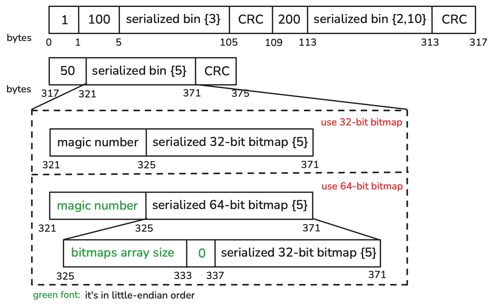

The deletion file is a binary file, and the format is as follows:

- First, record version by a byte. Current version is 1.
- Then, record <size of serialized bin, serialized bin, checksum of serialized bin> in sequence.
- Size and checksum are BIG\_ENDIAN Integer.

For each serialized bin, its serialization format is determined by `deletion-vectors.bitmap64`.
Paimon will use a 32-bit bitmap to store deleted records by default, but if `deletion-vectors.bitmap64` is set to true, a 64-bit bitmap will be used.
Serialization of the two bitmaps is different. Note that only 64-bit bitmap implementation is compatible with Iceberg.

Serialized bin for 32-bit bitmap:(default)

- First, record a const magic number by an int (BIG\_ENDIAN). Current the magic number is 1581511376.
- Then, record a 32-bit serialized bitmap. Which is a [RoaringBitmap](https://github.com/RoaringBitmap/RoaringBitmap) (org.roaringbitmap.RoaringBitmap).

Serialized bin for 64-bit bitmap:

- First, record a const magic number by an int (LITTLE\_ENDIAN). Current the magic number is 1681511377.
- Then, record a 64-bit serialized bitmap. Which supports positive 64-bit positions (the most significant bit must be 0),
  but is optimized for cases where most positions fit in 32 bits by using an array of 32-bit Roaring bitmaps. The internal bitmap array is grown as needed to accommodate the largest position.
  The serialization of the 64-bit bitmap is as follows:
  - First, record the size of bitmaps array by a long (LITTLE\_ENDIAN).
  - Then, record the index by an int (LITTLE\_ENDIAN) and serialized bytes of each bitmap in the array in sequence.

---

<a id="concepts-spec-fileindex"></a>

<!-- source_url: https://paimon.apache.org/docs/master/concepts/spec/fileindex/ -->

<!-- page_index: 17 -->

# File index #

> This documentation is for an unreleased version of Apache Paimon. We recommend you use the latest [stable version](https://paimon.apache.org/docs/1.4).

<a id="concepts-spec-fileindex--file-index"></a>

# File index [#](#concepts-spec-fileindex--file-index)

Define `file-index.${index_type}.columns`, Paimon will create its corresponding index file for each file. If the index
file is too small, it will be stored directly in the manifest, or in the directory of the data file. Each data file
corresponds to an index file, which has a separate file definition and can contain different types of indexes with
multiple columns.

<a id="concepts-spec-fileindex--index-file"></a>

## Index File [#](#concepts-spec-fileindex--index-file)

File index file format. Put all column and offset in the header.

```

 ______________________________________    _____________________
|     magic    ｜version｜head length  |
|--------------------------------------|
|            column number             |
|--------------------------------------|
|   column 1        ｜ index number    |
|--------------------------------------|
|  index name 1 ｜start pos ｜length   |
|--------------------------------------|
|  index name 2 ｜start pos ｜length   |
|--------------------------------------|
|  index name 3 ｜start pos ｜length   |
|--------------------------------------|            HEAD
|   column 2        ｜ index number    |
|--------------------------------------|
|  index name 1 ｜start pos ｜length   |
|--------------------------------------|
|  index name 2 ｜start pos ｜length   |
|--------------------------------------|
|  index name 3 ｜start pos ｜length   |
|--------------------------------------|
|                 ...                  |
|--------------------------------------|
|                 ...                  |
|--------------------------------------|
|  redundant length ｜redundant bytes  |
|--------------------------------------|    ---------------------
|                BODY                  |
|                BODY                  |
|                BODY                  |             BODY
|                BODY                  |
|______________________________________|    _____________________
*
magic:                            8 bytes long, value is 1493475289347502L, BIG_ENDIAN
version:                          4 bytes int, BIG_ENDIAN
head length:                      4 bytes int, BIG_ENDIAN
column number:                    4 bytes int, BIG_ENDIAN
column x name:                    var bytes, Java modified-utf-8
index number:                     4 bytes int (how many column items below), BIG_ENDIAN
index name x:                     var bytes, Java modified-utf-8
start pos:                        4 bytes int, BIG_ENDIAN
length:                           4 bytes int, BIG_ENDIAN
redundant length:                 4 bytes int (for compatibility with later versions, in this version, content is zero)
redundant bytes:                  var bytes (for compatibility with later version, in this version, is empty)
BODY:                             column index bytes + column index bytes + column index bytes + .......
```

<a id="concepts-spec-fileindex--index-bloomfilter"></a>
<a id="concepts-spec-fileindex--index:-bloomfilter"></a>

## Index: BloomFilter [#](#concepts-spec-fileindex--index-bloomfilter)

Options are:

- `file-index.bloom-filter.columns`: specify the columns that need bloom filter index.
- `file-index.bloom-filter.<column_name>.fpp` to config false positive probability.
- `file-index.bloom-filter.<column_name>.items` to config the expected distinct items in one data file.

Content of bloom filter index is simple:

- numHashFunctions 4 bytes int, BIG\_ENDIAN
- bloom filter bytes

This class use (64-bits) long hash. Store the num hash function (one integer) and bit set bytes only. Hash bytes type
(like varchar, binary, etc.) using xx hash, hash numeric type by [specified number hash](http://web.archive.org/web/20071223173210/http://www.concentric.net/~Ttwang/tech/inthash.htm).

<a id="concepts-spec-fileindex--index-bitmap"></a>
<a id="concepts-spec-fileindex--index:-bitmap"></a>

## Index: Bitmap [#](#concepts-spec-fileindex--index-bitmap)

- `file-index.bitmap.columns`: specify the columns that need bitmap index.
- `file-index.bitmap.<column_name>.index-block-size`: to config secondary index block size, default value is 16kb.

V2

Bitmap file index format (V2):

```


Bitmap file index format (V2)
+-------------------------------------------------+-----------------
｜ version (1 byte) = 2                           ｜
+-------------------------------------------------+
｜ row count (4 bytes int)                        ｜
+-------------------------------------------------+
｜ non-null value bitmap number (4 bytes int)     ｜
+-------------------------------------------------+
｜ has null value (1 byte)                        ｜
+-------------------------------------------------+
｜ null value offset (4 bytes if has null value)  ｜       HEAD
+-------------------------------------------------+
｜ null bitmap length (4 bytes if has null value) ｜
+-------------------------------------------------+
｜ bitmap index block number (4 bytes int)        ｜
+-------------------------------------------------+
｜ value 1 | offset 1                             ｜
+-------------------------------------------------+
｜ value 2 | offset 2                             ｜
+-------------------------------------------------+
｜ ...                                            ｜
+-------------------------------------------------+
｜ bitmap body offset (4 bytes int)               ｜
+-------------------------------------------------+-----------------
｜ bitmap index block 1                           ｜
+-------------------------------------------------+
｜ bitmap index block 2                           ｜  INDEX BLOCKS
+-------------------------------------------------+
｜ ...                                            ｜
+-------------------------------------------------+-----------------
｜ serialized bitmap 1                            ｜
+-------------------------------------------------+
｜ serialized bitmap 2                            ｜
+-------------------------------------------------+  BITMAP BLOCKS
｜ serialized bitmap 3                            ｜
+-------------------------------------------------+
｜ ...                                            ｜
+-------------------------------------------------+-----------------

index block format:
+-------------------------------------------------+
｜ entry number (4 bytes int)                     ｜
+-------------------------------------------------+
｜ value 1 | offset 1 | length 1                  ｜
+-------------------------------------------------+
｜ value 2 | offset 2 | length 2                  ｜
+-------------------------------------------------+
｜ ...                                            ｜
+-------------------------------------------------+

value x:                       var bytes for any data type (as bitmap identifier)
offset:                        4 bytes int (when it is negative, it represents that there is only one value
                                 and its position is the inverse of the negative value)
length:                        4 bytes int
  
```

V1 (Legacy)

(Legacy) Bitmap file index format (V1):

You can configure `file-index.bitmap.<column_name>.version` to use legacy bitmap version 1.

```


Bitmap file index format (V1)
+-------------------------------------------------+-----------------
| version (1 byte)                                |
+-------------------------------------------------+
| row count (4 bytes int)                         |
+-------------------------------------------------+
| non-null value bitmap number (4 bytes int)      |
+-------------------------------------------------+
| has null value (1 byte)                         |
+-------------------------------------------------+
| null value offset (4 bytes if has null value)   |       HEAD
+-------------------------------------------------+
| value 1 | offset 1                              |
+-------------------------------------------------+
| value 2 | offset 2                              |
+-------------------------------------------------+
| value 3 | offset 3                              |
+-------------------------------------------------+
| ...                                             |
+-------------------------------------------------+-----------------
| serialized bitmap 1                             |
+-------------------------------------------------+
| serialized bitmap 2                             |
+-------------------------------------------------+       BODY
| serialized bitmap 3                             |
+-------------------------------------------------+
| ...                                             |
+-------------------------------------------------+-----------------
*
value x:                       var bytes for any data type (as bitmap identifier)
offset:                        4 bytes int (when it is negative, it represents that there is only one value
                                 and its position is the inverse of the negative value)
```

Integers are all BIG\_ENDIAN.

Bitmap only support the following data type: TinyIntType, SmallIntType, IntType, BigIntType, DateType, TimeType, LocalZonedTimestampType, TimestampType, CharType, VarCharType, StringType, BooleanType.

<a id="concepts-spec-fileindex--index-range-bitmap"></a>
<a id="concepts-spec-fileindex--index:-range-bitmap"></a>

## Index: Range Bitmap [#](#concepts-spec-fileindex--index-range-bitmap)

Advantage:

1. Smaller than the bitmap index.
2. Suitable for the point query and the range query in the high level of cardinality scenarios.
3. Can be used to optimize the AND/OR predicates. (The corresponding columns need to have either bitmap index or range-bitmap index.)
4. Can be used to optimize the topk/bottomk query. (Currently only suitable for append-only tables.)

Shortcoming:

1. The point query evaluation maybe slower than bitmap index.

Options:

- `file-index.range-bitmap.columns`: specify the columns that need range-bitmap index.
- `file-index.range-bitmap.<column_name>.chunk-size`: to config the chunk size, default value is 16kb.

Table supports using range-bitmap file index to optimize the `EQUALS`, `RANGE`, `AND/OR` and `TOPN` predicate. The bitmap and range-bitmap file index result will be merged and pushed down to the DataFile for filtering rowgroups and pages.

In the following query examples, the `class_id` and the `score` has been created with range-bitmap file index. And the partition key `dt` is not necessary.

**Optimize the `EQUALS` predicate:**

```sql
SELECT * FROM TABLE WHERE dt = '20250801' AND score = 100;

SELECT * FROM TABLE WHERE dt = '20250801' AND score IN (60, 80);
```

**Optimize the `RANGE` predicate:**

```sql
SELECT * FROM TABLE WHERE dt = '20250801' AND score > 60;

SELECT * FROM TABLE WHERE dt = '20250801' AND score < 60;
```

**Optimize the `AND/OR` predicate:**

```sql
SELECT * FROM TABLE WHERE dt = '20250801' AND class_id = 1 AND score < 60;

SELECT * FROM TABLE WHERE dt = '20250801' AND class_id = 1 AND score < 60 OR score > 80;
```

**Optimize the `TOPN` predicate:**

For now, the `TOPN` predicate optimization can not use with other predicates, only support in Apache Spark.

```sql
SELECT * FROM TABLE WHERE dt = '20250801' ORDER BY score ASC LIMIT 10;

SELECT * FROM TABLE WHERE dt = '20250801' ORDER BY score DESC LIMIT 10;

-- if there are multiple sort keys, the first sort key must be created with range-bitmap.
SELECT * FROM TABLE WHERE dt = '20250801' ORDER BY score ASC, col DESC LIMIT 10;
SELECT * FROM TABLE WHERE dt = '20250801' ORDER BY score DESC, col ASC LIMIT 10;
```

```

Range Bitmap file index format (V1)
+-------------------------------------------------+-----------------
| header length (4 bytes int)                     |
+-------------------------------------------------+
| version (1 byte)                                |
+-------------------------------------------------+
| row number (4 bytes int)                        |
+-------------------------------------------------+
| cardinality (4 bytes int)                       |       HEAD
+-------------------------------------------------+
| min value                                       |
+-------------------------------------------------+
| max value                                       |
+-------------------------------------------------+
| dictionary length (4 bytes int)                 |
+-------------------------------------------------+-----------------
| dictionary serialize in bytes                   |
+-------------------------------------------------+       BODY
| bit-slice index bitmap serialize in bytes       |
+-------------------------------------------------+-----------------
```

```

Dictionary format (V1)
+-------------------------------------------------+-----------------
| header length (4 bytes int)                     |
+-------------------------------------------------+
| version (1 byte)                                |
+-------------------------------------------------+
| the chunks size (4 bytes int)                   |       HEAD
+-------------------------------------------------+    
| the offsets length (4 bytes int)                |       
+-------------------------------------------------+
| the chunks length (4 bytes int)                 |
+-------------------------------------------------+-----------------
| offsets serialize in bytes                      |
+-------------------------------------------------+
| chunks serialize in bytes                       |       BODY
+-------------------------------------------------+
| keys serialize in bytes                         |
+-------------------------------------------------+-----------------
```

```

Bit-slice index bitmap format (V1)
+-------------------------------------------------+-----------------
| header length (4 bytes int)                     |
+-------------------------------------------------+
| version (1 byte)                                |
+-------------------------------------------------+
| slices size (4 bytes int)                       |       HEAD
+-------------------------------------------------+    
| existence bitmap length (4 bytes int)           |       
+-------------------------------------------------+
| indexes length (4 bytes int)                    |
+-------------------------------------------------+
| indexes serialize in bytes                      |
+-------------------------------------------------+-----------------
| existence bitmap serialize in bytes             |
+-------------------------------------------------+
| the bit 0 bitmap serialize in bytes             |
+-------------------------------------------------+
| the bit 1 bitmap serialize in byte              |       BODY
+-------------------------------------------------+
| the bit 2 bitmap serialize in byte              |
+-------------------------------------------------+
| ...                                             |
+-------------------------------------------------+-----------------
```

RangeBitmap only support the following data type: TinyIntType, SmallIntType, IntType, BigIntType, DateType, TimeType, LocalZonedTimestampType, TimestampType, CharType, VarCharType, StringType, BooleanType, DoubleType, FloatType.

<a id="concepts-spec-fileindex--index-bit-slice-index-bitmap"></a>
<a id="concepts-spec-fileindex--index:-bit-slice-index-bitmap"></a>

## Index: Bit-Slice Index Bitmap [#](#concepts-spec-fileindex--index-bit-slice-index-bitmap)

> [!WARNING]
> > Deprecated. Using the range-bitmap index instead.

BSI file index is a numeric range index, used to accelerate range query, it can be used with bitmap index.

Define `'file-index.bsi.columns'`.

BSI file index format (V1):

```

BSI file index format (V1)
+-------------------------------------------------+
| version (1 byte)                                |
+-------------------------------------------------+
| row count (4 bytes int)                         |
+-------------------------------------------------+
| has positive value (1 byte)                     |
+-------------------------------------------------+
| positive BSI serialized (if has positive value) |       
+-------------------------------------------------+
| has negative value (1 byte)                     |
+-------------------------------------------------+
| negative BSI serialized (if has negative value) |       
+-------------------------------------------------+
```

BSI serialized format (V1):

```

BSI serialized format (V1)
+-------------------------------------------------+
| version (1 byte)                                |
+-------------------------------------------------+
| min value (8 bytes long)                        |
+-------------------------------------------------+
| max value (8 bytes long)                        |
+-------------------------------------------------+
| serialized existence bitmap                     |       
+-------------------------------------------------+
| bit slice bitmap count (4 bytes int)            |
+-------------------------------------------------+
| serialized bit 0 bitmap                         |
+-------------------------------------------------+
| serialized bit 1 bitmap                         |
+-------------------------------------------------+
| serialized bit 2 bitmap                         |
+-------------------------------------------------+
| ...                                             |
+-------------------------------------------------+
```

BSI only support the following data type: TinyIntType, SmallIntType, IntType, BigIntType, DateType, LocalZonedTimestamp, TimestampType, DecimalType.

---

<a id="primary-key-table-merge-engine-partial-update"></a>

<!-- source_url: https://paimon.apache.org/docs/master/primary-key-table/merge-engine/partial-update/ -->

<!-- page_index: 18 -->

# Partial Update #

> This documentation is for an unreleased version of Apache Paimon. We recommend you use the latest [stable version](https://paimon.apache.org/docs/1.4).

<a id="primary-key-table-merge-engine-partial-update--partial-update"></a>

# Partial Update [#](#primary-key-table-merge-engine-partial-update--partial-update)

By specifying `'merge-engine' = 'partial-update'`, users have the ability to update columns of a record through
multiple updates until the record is complete. This is achieved by updating the value fields one by one, using the
latest data under the same primary key. However, null values are not overwritten in the process.

For example, suppose Paimon receives three records:

- `<1, 23.0, 10, NULL>`-
- `<1, NULL, NULL, 'This is a book'>`
- `<1, 25.2, NULL, NULL>`

Assuming that the first column is the primary key, the final result would be `<1, 25.2, 10, 'This is a book'>`.

> [!NOTE]
> > For streaming queries, `partial-update` merge engine must be used together with `lookup` or `full-compaction`
> > [changelog producer](#primary-key-table-changelog-producer). (‘input’ changelog producer is also supported,
> > but only returns input records.)

> [!NOTE]
> **By default, Partial update can not accept delete records, you can choose one of the following solutions:**
> > - Configure ‘ignore-delete’ to ignore delete records.
> > - Configure ‘partial-update.remove-record-on-delete’ to remove the whole row when receiving delete records.
> > - Configure ‘sequence-group’s to retract partial columns. Also configure ‘partial-update.remove-record-on-sequence-group’ to remove the whole row when receiving deleted records of `specified sequence group`.

<a id="primary-key-table-merge-engine-partial-update--sequence-group"></a>

## Sequence Group [#](#primary-key-table-merge-engine-partial-update--sequence-group)

A sequence-field may not solve the disorder problem of partial-update tables with multiple stream updates, because
the sequence-field may be overwritten by the latest data of another stream during multi-stream update.

So we introduce sequence group mechanism for partial-update tables. It can solve:

1. Disorder during multi-stream update. Each stream defines its own sequence-groups.
2. A true partial-update, not just a non-null update.

See example:

```sql
CREATE TABLE t
(
    k   INT,
    a   INT,
    b   INT,
    g_1 INT,
    c   INT,
    d   INT,
    g_2 INT,
    PRIMARY KEY (k) NOT ENFORCED
) WITH (
      'merge-engine' = 'partial-update',
      'fields.g_1.sequence-group' = 'a,b',
      'fields.g_2.sequence-group' = 'c,d'
      );

INSERT INTO t
VALUES (1, 1, 1, 1, 1, 1, 1);

-- g_2 is null, c, d should not be updated
INSERT INTO t
VALUES (1, 2, 2, 2, 2, 2, CAST(NULL AS INT));

SELECT *
FROM t;
-- output 1, 2, 2, 2, 1, 1, 1

-- g_1 is smaller, a, b should not be updated
INSERT INTO t
VALUES (1, 3, 3, 1, 3, 3, 3);

SELECT *
FROM t; -- output 1, 2, 2, 2, 3, 3, 3
```

For `fields.<field-name>.sequence-group`, valid comparative data types include: DECIMAL, TINYINT, SMALLINT, INTEGER, BIGINT, FLOAT, DOUBLE, DATE, TIME, TIMESTAMP, and TIMESTAMP\_LTZ.

You can also configure multiple sorted fields in a `sequence-group`, like `fields.<field-name1>,<field-name2>.sequence-group`, multiple fields will be compared in order.

See example:

```sql
CREATE TABLE SG
(
    k   INT,
    a   INT,
    b   INT,
    g_1 INT,
    c   INT,
    d   INT,
    g_2 INT,
    g_3 INT,
    PRIMARY KEY (k) NOT ENFORCED
) WITH (
      'merge-engine' = 'partial-update',
      'fields.g_1.sequence-group' = 'a,b',
      'fields.g_2,g_3.sequence-group' = 'c,d'
      );

INSERT INTO SG
VALUES (1, 1, 1, 1, 1, 1, 1, 1);

-- g_3 is null, g_2, g_3 are not bigger, c, d should not be updated
INSERT INTO SG
VALUES (1, 2, 2, 2, 2, 2, 1, CAST(NULL AS INT));

SELECT *
FROM SG;
-- output 1, 2, 2, 2, 1, 1, 1, 1

-- g_1 is smaller, a, b should not be updated
INSERT INTO SG
VALUES (1, 3, 3, 1, 3, 3, 3, 1);

SELECT *
FROM SG;
-- output 1, 2, 2, 2, 3, 3, 3, 1
```

<a id="primary-key-table-merge-engine-partial-update--aggregation-for-partial-update"></a>

## Aggregation For Partial Update [#](#primary-key-table-merge-engine-partial-update--aggregation-for-partial-update)

You can specify aggregation function for the input field, all the functions in the
[Aggregation](#primary-key-table-merge-engine-aggregation) are supported.

> [!NOTE]
> **Sequence-group behavior changes when aggregate functions are involved.**
> > Without aggregate functions, a sequence-group field acts as a **version filter**: incoming records whose
> > sequence value does not exceed the stored value are ignored for the associated columns.
> >
> > With aggregate functions, the sequence-group field acts as an **ordering key**: every incoming record with
> > a non-NULL sequence value participates in the aggregation, regardless of whether its sequence value is
> > larger or smaller than the stored one. The stored sequence value is only advanced when the incoming value
> > is larger. For order-independent functions (`sum`, `product`, `max`, `min`) the ordering has no effect on
> > the result; for order-dependent functions (`last_non_null_value`, `first_value`, `listagg`) the
> > sequence-group value determines which record’s contribution is considered “last” or “first”.
> >
> > Records with a NULL sequence-group value are always skipped.

See example:

```sql
CREATE TABLE t
(
    k INT,
    a INT,
    b INT,
    c INT,
    d INT,
    PRIMARY KEY (k) NOT ENFORCED
) WITH (
      'merge-engine' = 'partial-update',
      'fields.a.sequence-group' = 'b',
      'fields.b.aggregate-function' = 'first_value',
      'fields.c.sequence-group' = 'd',
      'fields.d.aggregate-function' = 'sum'
      );
INSERT INTO t
VALUES (1, 1, 1, CAST(NULL AS INT), CAST(NULL AS INT));
INSERT INTO t
VALUES (1, CAST(NULL AS INT), CAST(NULL AS INT), 1, 1);
INSERT INTO t
VALUES (1, 2, 2, CAST(NULL AS INT), CAST(NULL AS INT));
INSERT INTO t
VALUES (1, CAST(NULL AS INT), CAST(NULL AS INT), 2, 2);


SELECT *
FROM t; -- output 1, 2, 1, 2, 3
```

You can also configure an aggregation function for a `sequence-group` within multiple sorted fields.

See example:

```sql
CREATE TABLE AGG
(
    k   INT,
    a   INT,
    b   INT,
    g_1 INT,
    c   VARCHAR,
    g_2 INT,
    g_3 INT,
    PRIMARY KEY (k) NOT ENFORCED
) WITH (
      'merge-engine' = 'partial-update',
      'fields.a.aggregate-function' = 'sum',
      'fields.g_1,g_3.sequence-group' = 'a',
      'fields.g_2.sequence-group' = 'c');
-- a in sequence-group g_1, g_3 with sum agg
-- b not in sequence-group
-- c in sequence-group g_2 without agg

INSERT INTO AGG
VALUES (1, 1, 1, 1, '1', 1, 1);

-- g_2 is null, c should not be updated
INSERT INTO AGG
VALUES (1, 2, 2, 2, '2', CAST(NULL AS INT), 2);

SELECT *
FROM AGG;
-- output 1, 3, 2, 2, "1", 1, 2

-- (g_1, g_3) = (2, 1) is smaller than stored (2, 2), so the stored sequence values are not advanced,
-- but the sum aggregate for a still applies: a = 3 + 3 = 6
INSERT INTO AGG
VALUES (1, 3, 3, 2, '3', 3, 1);

SELECT *
FROM AGG;
-- output 1, 6, 3, 2, "3", 3, 2
```

You can specify a default aggregation function for all the input fields with `fields.default-aggregate-function`, see
example:

```sql
CREATE TABLE t
(
    k INT,
    a INT,
    b INT,
    c INT,
    d INT,
    PRIMARY KEY (k) NOT ENFORCED
) WITH (
      'merge-engine' = 'partial-update',
      'fields.a.sequence-group' = 'b',
      'fields.c.sequence-group' = 'd',
      'fields.default-aggregate-function' = 'last_non_null_value',
      'fields.d.aggregate-function' = 'sum'
      );

INSERT INTO t
VALUES (1, 1, 1, CAST(NULL AS INT), CAST(NULL AS INT));
INSERT INTO t
VALUES (1, CAST(NULL AS INT), CAST(NULL AS INT), 1, 1);
INSERT INTO t
VALUES (1, 2, 2, CAST(NULL AS INT), CAST(NULL AS INT));
INSERT INTO t
VALUES (1, CAST(NULL AS INT), CAST(NULL AS INT), 2, 2);


SELECT *
FROM t; -- output 1, 2, 2, 2, 3
```

---

<a id="primary-key-table-merge-engine-aggregation"></a>

<!-- source_url: https://paimon.apache.org/docs/master/primary-key-table/merge-engine/aggregation/ -->

<!-- page_index: 19 -->

# Aggregation #

> This documentation is for an unreleased version of Apache Paimon. We recommend you use the latest [stable version](https://paimon.apache.org/docs/1.4).

<a id="primary-key-table-merge-engine-aggregation--aggregation"></a>

# Aggregation [#](#primary-key-table-merge-engine-aggregation--aggregation)

> [!NOTE]
> > NOTE: Always set `table.exec.sink.upsert-materialize` to `NONE` in Flink SQL TableConfig.

Sometimes users only care about aggregated results. The `aggregation` merge engine aggregates each value field with the latest data one by one under the same primary key according to the aggregate function.

Each field not part of the primary keys can be given an aggregate function, specified by the `fields.<field-name>.aggregate-function` table property, otherwise it will use `last_non_null_value` aggregation as default. For example, consider the following table definition.

Flink

```sql
CREATE TABLE my_table (
    product_id BIGINT,
    price DOUBLE,
    sales BIGINT,
    PRIMARY KEY (product_id) NOT ENFORCED
) WITH (
    'merge-engine' = 'aggregation',
    'fields.price.aggregate-function' = 'max',
    'fields.sales.aggregate-function' = 'sum'
);
```

Field `price` will be aggregated by the `max` function, and field `sales` will be aggregated by the `sum` function. Given two input records `<1, 23.0, 15>` and `<1, 30.2, 20>`, the final result will be `<1, 30.2, 35>`.

<a id="primary-key-table-merge-engine-aggregation--aggregation-functions"></a>

## Aggregation Functions [#](#primary-key-table-merge-engine-aggregation--aggregation-functions)

Current supported aggregate functions and data types are:

<a id="primary-key-table-merge-engine-aggregation--sum"></a>

### sum [#](#primary-key-table-merge-engine-aggregation--sum)

The sum function aggregates the values across multiple rows.
It supports DECIMAL, TINYINT, SMALLINT, INTEGER, BIGINT, FLOAT, and DOUBLE data types.

<a id="primary-key-table-merge-engine-aggregation--product"></a>

### product [#](#primary-key-table-merge-engine-aggregation--product)

The product function can compute product values across multiple lines.
It supports DECIMAL, TINYINT, SMALLINT, INTEGER, BIGINT, FLOAT, and DOUBLE data types.

<a id="primary-key-table-merge-engine-aggregation--count"></a>

### count [#](#primary-key-table-merge-engine-aggregation--count)

In scenarios where counting rows that match a specific condition is required, you can use the SUM function to achieve this. By expressing a condition as a Boolean value (TRUE or FALSE) and converting it into a numerical value, you can effectively count the rows. In this approach, TRUE is converted to 1, and FALSE is converted to 0.

For example, if you have a table orders and want to count the number of rows that meet a specific condition, you can use the following query:

```sql
SELECT SUM(CASE WHEN condition THEN 1 ELSE 0 END) AS count
FROM orders;
```

<a id="primary-key-table-merge-engine-aggregation--max"></a>

### max [#](#primary-key-table-merge-engine-aggregation--max)

The max function identifies and retains the maximum value.
It supports CHAR, VARCHAR, DECIMAL, TINYINT, SMALLINT, INTEGER, BIGINT, FLOAT, DOUBLE, DATE, TIME, TIMESTAMP, and TIMESTAMP\_LTZ data types.

<a id="primary-key-table-merge-engine-aggregation--min"></a>

### min [#](#primary-key-table-merge-engine-aggregation--min)

The min function identifies and retains the minimum value.
It supports CHAR, VARCHAR, DECIMAL, TINYINT, SMALLINT, INTEGER, BIGINT, FLOAT, DOUBLE, DATE, TIME, TIMESTAMP, and TIMESTAMP\_LTZ data types.

<a id="primary-key-table-merge-engine-aggregation--last_value"></a>

### last\_value [#](#primary-key-table-merge-engine-aggregation--last_value)

The last\_value function replaces the previous value with the most recently imported value.
It supports all data types.

<a id="primary-key-table-merge-engine-aggregation--last_non_null_value"></a>

### last\_non\_null\_value [#](#primary-key-table-merge-engine-aggregation--last_non_null_value)

The last\_non\_null\_value function replaces the previous value with the latest non-null value.
It supports all data types.

<a id="primary-key-table-merge-engine-aggregation--listagg"></a>

### listagg [#](#primary-key-table-merge-engine-aggregation--listagg)

The listagg function concatenates multiple string values into a single string.
It supports STRING data type.
Each field not part of the primary keys can be given a list agg delimiter, specified by the fields..list-agg-delimiter table property, otherwise it will use “,” as default.
You can use `fields.<field-name>.distinct=true` to deduplicate values split by the `fields.<field-name>.list-agg-delimiter`.

<a id="primary-key-table-merge-engine-aggregation--bool_and"></a>

### bool\_and [#](#primary-key-table-merge-engine-aggregation--bool_and)

The bool\_and function evaluates whether all values in a boolean set are true.
It supports BOOLEAN data type.

<a id="primary-key-table-merge-engine-aggregation--bool_or"></a>

### bool\_or [#](#primary-key-table-merge-engine-aggregation--bool_or)

The bool\_or function checks if at least one value in a boolean set is true.
It supports BOOLEAN data type.

<a id="primary-key-table-merge-engine-aggregation--first_value"></a>

### first\_value [#](#primary-key-table-merge-engine-aggregation--first_value)

The first\_value function retrieves the first null value from a data set.
It supports all data types.

<a id="primary-key-table-merge-engine-aggregation--first_non_null_value"></a>

### first\_non\_null\_value [#](#primary-key-table-merge-engine-aggregation--first_non_null_value)

The first\_non\_null\_value function selects the first non-null value in a data set.
It supports all data types.

<a id="primary-key-table-merge-engine-aggregation--rbm32"></a>

### rbm32 [#](#primary-key-table-merge-engine-aggregation--rbm32)

The rbm32 function aggregates multiple serialized 32-bit RoaringBitmap into a single RoaringBitmap.
It supports VARBINARY data type which must be serialized 32-bit RoaringBitmap.

RoaringBitmap is a compressed bitmap that efficiently represents sets of integers. The rbm32 aggregator is useful for scenarios where you need to merge multiple bitmap sets or use case requiring set union operations on large integer datasets.

**Example:**

```sql
-- Create a table to store user visit data with bitmap aggregation
CREATE TABLE user_visits (
  user_id INT PRIMARY KEY NOT ENFORCED,
  visit_bitmap VARBINARY
) WITH (
  'merge-engine' = 'aggregation',
  'fields.visit_bitmap.aggregate-function' = 'rbm32'
);

-- Register a UDF to create RoaringBitmap from user IDs
-- CREATE TEMPORARY FUNCTION TO_BITMAP AS 'BitmapUDF';

-- Insert data with bitmap representations
INSERT INTO user_visits VALUES
  (1, TO_BITMAP(100, 101, 102)),  -- User 1 visited pages 100, 101, 102
  (2, TO_BITMAP(101, 103)),       -- User 2 visited pages 101, 103
  (3, TO_BITMAP(102, 104));       -- User 3 visited pages 102, 104

-- When the same user_id is inserted again, the bitmaps will be merged
INSERT INTO user_visits VALUES
  (1, TO_BITMAP(103, 105)),       -- User 1 also visited pages 103, 105
  (2, TO_BITMAP(104, 106));       -- User 2 also visited pages 104, 106

-- The final result will have merged bitmaps for each user
-- User 1: pages 100, 101, 102, 103, 105
-- User 2: pages 101, 103, 104, 106
-- User 3: pages 102, 104
```

<a id="primary-key-table-merge-engine-aggregation--rbm64"></a>

### rbm64 [#](#primary-key-table-merge-engine-aggregation--rbm64)

The rbm64 function aggregates multiple serialized 64-bit Roaring64Bitmap into a single Roaring64Bitmap.
It supports VARBINARY data type which must be serialized 64-bit RoaringBitmap.

Similar to rbm32, but supports 64-bit integers, making it suitable for scenarios with very large integer values
or when you need to represent sets with values beyond the 32-bit range (up to 2^31-1).

**Example:**

```sql
-- Create a table to store large-scale user interaction data
CREATE TABLE user_interactions (
  session_id BIGINT PRIMARY KEY NOT ENFORCED,
  interaction_bitmap VARBINARY
) WITH (
  'merge-engine' = 'aggregation',
  'fields.interaction_bitmap.aggregate-function' = 'rbm64'
);

-- Register a UDF to create Roaring64Bitmap from large user IDs
-- CREATE TEMPORARY FUNCTION TO_BITMAP64 AS 'Bitmap64UDF';

-- Insert data with 64-bit bitmap representations
INSERT INTO user_interactions VALUES
  (1001, TO_BITMAP64(1000000001L, 1000000002L, 1000000003L)),
  (1002, TO_BITMAP64(1000000002L, 1000000004L)),
  (1003, TO_BITMAP64(1000000003L, 1000000005L));

-- Merge additional interactions
INSERT INTO user_interactions VALUES
  (1001, TO_BITMAP64(1000000004L, 1000000006L)),
  (1002, TO_BITMAP64(1000000005L, 1000000007L));

-- The final result will have merged 64-bit bitmaps for each session
```

The `rbm32` and `rbm64` aggregators work by:

1. Deserializing the input VARBINARY data into RoaringBitmap objects
2. Performing bitwise OR operations to merge the bitmaps
3. Serializing the result back to VARBINARY format

**Working with RoaringBitmap Functions:**

Paimon currently does not provide built-in Flink UDFs for bitmap creation. You have two options:

1. Create bitmaps programmatically: in your application code and insert serialized bytes
2. Create custom Flink UDFs: to convert raw integers to serialized bitmap format

Here are examples of both approaches:

**Option 1: Programmatic Bitmap Creation (Java/Scala)**

```java
// Create bitmaps programmatically
RoaringBitmap32 bitmap1 = RoaringBitmap32.bitmapOf(100, 101, 102);
RoaringBitmap32 bitmap2 = RoaringBitmap32.bitmapOf(101, 103);
RoaringBitmap32 bitmap3 = RoaringBitmap32.bitmapOf(102, 104);

byte[] serialized1 = bitmap1.serialize();
byte[] serialized2 = bitmap2.serialize();
byte[] serialized3 = bitmap3.serialize();

INSERT INTO user_page_visits VALUES
    (1, CAST(x'...' AS VARBINARY)),  -- serialized1 bytes
    (2, CAST(x'...' AS VARBINARY)),  -- serialized2 bytes
    (3, CAST(x'...' AS VARBINARY));  -- serialized3 bytes
```

**Option 2: Custom Flink UDFs**

```sql
-- Create the aggregation table
CREATE TABLE user_page_visits (
    user_id INT PRIMARY KEY NOT ENFORCED,
    page_visits VARBINARY
) WITH (
    'merge-engine' = 'aggregation',
    'fields.page_visits.aggregate-function' = 'rbm32'
);

-- Register custom UDFs (you need to implement these)

-- Use the UDFs
INSERT INTO user_page_visits VALUES
    (1, TO_BITMAP(100, 101, 102)),
    (2, TO_BITMAP(101, 103)),
    (3, TO_BITMAP(102, 104));

-- Query with UDFs
SELECT user_id, FROM_BITMAP(page_visits) as unique_pages
FROM user_page_visits;

SELECT user_id,
       BITMAP_CONTAINS(page_visits, 101) as visited_page_101
FROM user_page_visits
WHERE user_id = 1;
```

**Sample UDF Implementation (Java):**

```java
// BitmapUDF - Converts integers to serialized RoaringBitmap
public static class BitmapUDF extends ScalarFunction {
    public byte[] eval(Integer... values) {
        RoaringBitmap32 bitmap = new RoaringBitmap32();
        for (Integer value : values) {
            if (value != null) {
                bitmap.add(value);
            }
        }
        return bitmap.serialize();
    }
}

// BitmapCountUDF - Gets cardinality from serialized RoaringBitmap
public static class BitmapCountUDF extends ScalarFunction {
    public Long eval(byte[] bitmapBytes) {
        if (bitmapBytes == null) {
            return 0L;
        }
        try {
            RoaringBitmap32 bitmap = new RoaringBitmap32();
            bitmap.deserialize(ByteBuffer.wrap(bitmapBytes));
            return bitmap.getCardinality();
        } catch (IOException e) {
            throw new RuntimeException("Failed to deserialize bitmap", e);
        }
    }
}

// BitmapContainsUDF - Checks if value exists in bitmap
public static class BitmapContainsUDF extends ScalarFunction {
    public Boolean eval(byte[] bitmapBytes, Integer value) {
        if (bitmapBytes == null || value == null) {
            return false;
        }
        try {
            RoaringBitmap32 bitmap = new RoaringBitmap32();
            bitmap.deserialize(ByteBuffer.wrap(bitmapBytes));
            return bitmap.contains(value);
        } catch (IOException e) {
            throw new RuntimeException("Failed to deserialize bitmap", e);
        }
    }
}
```

<a id="primary-key-table-merge-engine-aggregation--nested_update"></a>

### nested\_update [#](#primary-key-table-merge-engine-aggregation--nested_update)

The nested\_update function collects multiple rows into one array (so-called ‘nested table’). It supports ARRAY data types.

Use `fields.<field-name>.nested-key=pk0,pk1,...` to specify the primary keys of the nested table. If no keys, row will be appended to array.

Use `fields.<field-name>.count-limit=<Integer>` to specify the maximum number of rows in the nested table. When no nested-key, it will select data
sequentially up to limit; but if nested-key is specified, it cannot guarantee the correctness of the aggregation result. This option can be used to
avoid abnormal input.

An example:

Flink

```sql
-- orders table
CREATE TABLE orders (
  order_id BIGINT PRIMARY KEY NOT ENFORCED,
  user_name STRING,
  address STRING
);

-- sub orders that have the same order_id 
-- belongs to the same order
CREATE TABLE sub_orders (
  order_id BIGINT,
  sub_order_id INT,
  product_name STRING,
  price BIGINT,
  PRIMARY KEY (order_id, sub_order_id) NOT ENFORCED
);

-- wide table
CREATE TABLE order_wide (
  order_id BIGINT PRIMARY KEY NOT ENFORCED,
  user_name STRING,
  address STRING,
  sub_orders ARRAY<ROW<sub_order_id BIGINT, product_name STRING, price BIGINT>>
) WITH (
  'merge-engine' = 'aggregation',
  'fields.sub_orders.aggregate-function' = 'nested_update',
  'fields.sub_orders.nested-key' = 'sub_order_id'
);

-- widen
INSERT INTO order_wide

SELECT 
  order_id, 
  user_name,
  address, 
  CAST (NULL AS ARRAY<ROW<sub_order_id BIGINT, product_name STRING, price BIGINT>>) 
FROM orders

UNION ALL 
  
SELECT 
  order_id, 
  CAST (NULL AS STRING), 
  CAST (NULL AS STRING), 
  ARRAY[ROW(sub_order_id, product_name, price)] 
FROM sub_orders;

-- query using UNNEST
SELECT order_id, user_name, address, sub_order_id, product_name, price 
FROM order_wide, UNNEST(sub_orders) AS so(sub_order_id, product_name, price)
```

<a id="primary-key-table-merge-engine-aggregation--nested_partial_update"></a>

### nested\_partial\_update [#](#primary-key-table-merge-engine-aggregation--nested_partial_update)

The nested\_partial\_update function collects multiple rows into one array (so-called ‘nested table’). It supports
ARRAY data types. You need to use `fields.<field-name>.nested-key=pk0,pk1,...` to specify the primary keys of the
nested table. The values in each row are written by partial updating some columns.

<a id="primary-key-table-merge-engine-aggregation--collect"></a>

### collect [#](#primary-key-table-merge-engine-aggregation--collect)

The collect function collects elements into an Array. You can set `fields.<field-name>.distinct=true` to deduplicate elements.
It only supports ARRAY type.

<a id="primary-key-table-merge-engine-aggregation--merge_map"></a>

### merge\_map [#](#primary-key-table-merge-engine-aggregation--merge_map)

The merge\_map function merge input maps. It only supports MAP type.

<a id="primary-key-table-merge-engine-aggregation--merge_map_with_keytime"></a>

### merge\_map\_with\_keytime [#](#primary-key-table-merge-engine-aggregation--merge_map_with_keytime)

The merge\_map\_with\_keytime function merges input maps with key-level partial updates based on timestamps.
Each key in the map carries its own timestamp, and during merging, only the value with the latest timestamp for each key is retained.
It only supports `MAP<key_type, ROW<value_field, ts_field>>` type, where the ROW must have at least 2 fields.

Use `fields.<field-name>.ts-field=<field_name_in_row>` to specify the timestamp field name in the ROW type.
If not specified, the last field of the ROW is used as the timestamp by default.

When a key’s value is null, the key will be removed from the map.
When the timestamp field is null, the entry will be skipped.

An example:

Flink

```sql
CREATE TABLE my_table (
    biz_order_id STRING,
    key_value_map MAP<STRING, ROW<`value` STRING, `ts` STRING>>,
    PRIMARY KEY (biz_order_id) NOT ENFORCED
) WITH (
    'merge-engine' = 'aggregation',
    'fields.key_value_map.aggregate-function' = 'merge_map_with_keytime',
    'fields.key_value_map.ts-field' = 'ts'
);
```

Given the following input records:

| biz\_order\_id | key\_value\_map |
| --- | --- |
| 1 | {“product\_name”: (“iPhone”, “100”), “color”: (“Black”, “100”)} |
| 1 | {“product\_name”: (“iPad”, “200”), “price”: (“999”, “200”)} |
| 1 | {“color”: (“White”, “50”)} |

The final result will be:
`{"product_name": ("iPad", "200"), "color": ("Black", "100"), "price": ("999", "200")}`
Note that `color` remains “Black” because its existing timestamp “100” is greater than the incoming “50”.

<a id="primary-key-table-merge-engine-aggregation--types-of-cardinality-sketches"></a>

### Types of cardinality sketches [#](#primary-key-table-merge-engine-aggregation--types-of-cardinality-sketches)

Paimon uses the [Apache DataSketches](https://datasketches.apache.org/) library of stochastic streaming algorithms to implement sketch modules. The DataSketches library includes various types of sketches, each one designed to solve a different sort of problem. Paimon supports HyperLogLog (HLL) and Theta cardinality sketches.

<a id="primary-key-table-merge-engine-aggregation--hyperloglog"></a>

#### HyperLogLog [#](#primary-key-table-merge-engine-aggregation--hyperloglog)

The HyperLogLog (HLL) sketch aggregator is a very compact sketch algorithm for approximate distinct counting. You can also use the HLL aggregator to calculate a union of HLL sketches.

<a id="primary-key-table-merge-engine-aggregation--theta"></a>

#### Theta [#](#primary-key-table-merge-engine-aggregation--theta)

The Theta sketch is a sketch algorithm for approximate distinct counting with set operations. Theta sketches let you count the overlap between sets, so that you can compute the union, intersection, or set difference between sketch objects.

<a id="primary-key-table-merge-engine-aggregation--choosing-a-sketch-type"></a>

#### Choosing a sketch type [#](#primary-key-table-merge-engine-aggregation--choosing-a-sketch-type)

HLL and Theta sketches both support approximate distinct counting; however, the HLL sketch produces more accurate results and consumes less storage space. Theta sketches are more flexible but require significantly more memory.

When choosing an approximation algorithm for your use case, consider the following:

If your use case entails distinct counting and merging sketch objects, use the HLL sketch.
If you need to evaluate union, intersection, or difference set operations, use the Theta sketch.
You cannot merge HLL sketches with Theta sketches.

<a id="primary-key-table-merge-engine-aggregation--hll_sketch"></a>

#### hll\_sketch [#](#primary-key-table-merge-engine-aggregation--hll_sketch)

The hll\_sketch function aggregates multiple serialized Sketch objects into a single Sketch.
It supports VARBINARY data type.

An example:

Flink

```sql
-- source table
CREATE TABLE VISITS (
  id INT PRIMARY KEY NOT ENFORCED,
  user_id STRING
);

-- agg table
CREATE TABLE UV_AGG (
  id INT PRIMARY KEY NOT ENFORCED,
  uv VARBINARY
) WITH (
  'merge-engine' = 'aggregation',
  'fields.uv.aggregate-function' = 'hll_sketch'
);

-- Register the following class as a Flink function with the name "HLL_SKETCH" 
-- for example: create TEMPORARY function HLL_SKETCH as  'HllSketchFunction';
-- which is used to transform input to sketch bytes array:
--
-- public static class HllSketchFunction extends ScalarFunction {
--   public byte[] eval(String user_id) {
--     HllSketch hllSketch = new HllSketch();
--     hllSketch.update(user_id);
--     return hllSketch.toCompactByteArray();
--   }
-- }
--
INSERT INTO UV_AGG SELECT id, HLL_SKETCH(user_id) FROM VISITS;

-- Register the following class as a Flink function with the name "HLL_SKETCH_COUNT"
-- for example: create TEMPORARY function HLL_SKETCH_COUNT as  'HllSketchCountFunction';
-- which is used to get cardinality from sketch bytes array:
-- 
-- public static class HllSketchCountFunction extends ScalarFunction { 
--   public Double eval(byte[] sketchBytes) {
--     if (sketchBytes == null) {
--       return 0d; 
--     } 
--     return HllSketch.heapify(sketchBytes).getEstimate(); 
--   } 
-- }
--
-- Then we can get user cardinality based on the aggregated field.
SELECT id, HLL_SKETCH_COUNT(UV) as uv FROM UV_AGG;
```

<a id="primary-key-table-merge-engine-aggregation--theta_sketch"></a>

#### theta\_sketch [#](#primary-key-table-merge-engine-aggregation--theta_sketch)

The theta\_sketch function aggregates multiple serialized Sketch objects into a single Sketch.
It supports VARBINARY data type.

An example:

Flink

```sql
-- source table
CREATE TABLE VISITS (
  id INT PRIMARY KEY NOT ENFORCED,
  user_id STRING
);

-- agg table
CREATE TABLE UV_AGG (
  id INT PRIMARY KEY NOT ENFORCED,
  uv VARBINARY
) WITH (
  'merge-engine' = 'aggregation',
  'fields.uv.aggregate-function' = 'theta_sketch'
);

-- Register the following class as a Flink function with the name "THETA_SKETCH" 
-- for example: create TEMPORARY function THETA_SKETCH as  'ThetaSketchFunction';
-- which is used to transform input to sketch bytes array:
--
-- public static class ThetaSketchFunction extends ScalarFunction {
--   public byte[] eval(String user_id) {
--     UpdateSketch updateSketch = UpdateSketch.builder().build();
--     updateSketch.update(user_id);
--     return updateSketch.compact().toByteArray();
--   }
-- }
--
INSERT INTO UV_AGG SELECT id, THETA_SKETCH(user_id) FROM VISITS;

-- Register the following class as a Flink function with the name "THETA_SKETCH_COUNT"
-- for example: create TEMPORARY function THETA_SKETCH_COUNT as  'ThetaSketchCountFunction';
-- which is used to get cardinality from sketch bytes array:
-- 
-- public static class ThetaSketchCountFunction extends ScalarFunction { 
--   public Double eval(byte[] sketchBytes) {
--     if (sketchBytes == null) {
--       return 0d; 
--     } 
--     return Sketches.wrapCompactSketch(Memory.wrap(sketchBytes)).getEstimate(); 
--   } 
-- }
--
-- Then we can get user cardinality based on the aggregated field.
SELECT id, THETA_SKETCH_COUNT(UV) as uv FROM UV_AGG;
```

> [!NOTE]
> > For streaming queries, `aggregation` merge engine must be used together with `lookup` or `full-compaction`
> > [changelog producer](#primary-key-table-changelog-producer). (‘input’ changelog producer is also supported, but only returns input records.)

<a id="primary-key-table-merge-engine-aggregation--retraction"></a>

## Retraction [#](#primary-key-table-merge-engine-aggregation--retraction)

Only `sum`, `product`, `collect`, `merge_map`, `nested_update`, `last_value` and `last_non_null_value` supports retraction (`UPDATE_BEFORE` and `DELETE`), others aggregate functions do not support retraction.
If you allow some functions to ignore retraction messages, you can configure:
`'fields.${field_name}.ignore-retract'='true'`.

The `last_value` and `last_non_null_value` just set field to null when accept retract messages.

The `product` will return null for retraction message when accumulator is null.

The `collect` and `merge_map` make a best-effort attempt to handle retraction messages, but the results are not
guaranteed to be accurate. The following behaviors may occur when processing retraction messages:

1. It might fail to handle retraction messages if records are disordered. For example, the table uses `collect`, and the
   upstreams send `+I['A', 'B']` and `-U['A']` respectively. If the table receives `-U['A']` first, it can do nothing; then it receives
   `+I['A', 'B']`, the merge result will be `+I['A', 'B']` instead of `+I['B']`.
2. The retract message from one upstream will retract the result merged from multiple upstreams. For example, the table
   uses `merge_map`, and one upstream sends `+I[1->A]`, another upstream sends `+I[1->B]`, `-D[1->B]` later. The table will
   merge two insert values to `+I[1->B]` first, and then the `-D[1->B]` will retract the whole result, so the final result
   is an empty map instead of `+I[1->A]`

---

<a id="primary-key-table-merge-engine-first-row"></a>

<!-- source_url: https://paimon.apache.org/docs/master/primary-key-table/merge-engine/first-row/ -->

<!-- page_index: 20 -->

# First Row #

> This documentation is for an unreleased version of Apache Paimon. We recommend you use the latest [stable version](https://paimon.apache.org/docs/1.4).

<a id="primary-key-table-merge-engine-first-row--first-row"></a>

# First Row [#](#primary-key-table-merge-engine-first-row--first-row)

By specifying `'merge-engine' = 'first-row'`, users can keep the first row of the same primary key. It differs from the
`deduplicate` merge engine that in the `first-row` merge engine, it will generate insert only changelog.

> [!NOTE]
> > `first-row` merge engine only supports `none` and `lookup` changelog producer.
> > For streaming queries must be used with the `lookup` [changelog producer](#primary-key-table-changelog-producer).

> [!NOTE]
> > 1. You can not specify [sequence.field](#primary-key-table-sequence-rowkind--sequence-field).
> > 2. Not accept `DELETE` and `UPDATE_BEFORE` message. You can config `ignore-delete` to ignore these two kinds records.
> > 3. Visibility guarantee: Tables with First Row engine, the files with level 0 will only be visible after compaction.
> >    So by default, compaction is synchronous, and if asynchronous is turned on, there may be delays in the data.

This is of great help in replacing log deduplication in streaming computation.

---

<a id="concepts-system-tables"></a>

<!-- source_url: https://paimon.apache.org/docs/master/concepts/system-tables/ -->

<!-- page_index: 21 -->

# System Tables #

> This documentation is for an unreleased version of Apache Paimon. We recommend you use the latest [stable version](https://paimon.apache.org/docs/1.4).

<a id="concepts-system-tables--system-tables"></a>

# System Tables [#](#concepts-system-tables--system-tables)

Paimon provides a very rich set of system tables to help users better analyze and query the status of Paimon tables:

1. Query the status of the data table: Data System Table.
2. Query the global status of the entire Catalog: Global System Table.

<a id="concepts-system-tables--data-system-table"></a>

## Data System Table [#](#concepts-system-tables--data-system-table)

Data System tables contain metadata and information about each Paimon data table, such as the snapshots created and the
options in use. Users can access system tables with batch queries.

Currently, Flink, Spark, Trino and StarRocks support querying system tables.

In some cases, the table name needs to be enclosed with back quotes to avoid syntax parsing conflicts, for example triple access mode:

```sql
SELECT * FROM my_catalog.my_db.`my_table$snapshots`;
```

<a id="concepts-system-tables--snapshots-table"></a>

### Snapshots Table [#](#concepts-system-tables--snapshots-table)

You can query the snapshot history information of the table through snapshots table, including the record count occurred in the snapshot.

```sql
SELECT * FROM my_table$snapshots;

/*
+--------------+------------+-----------------+-------------------+--------------+-------------------------+--------------------------------+------------------------------- +--------------------------------+---------------------+---------------------+-------------------------+----------------+
|  snapshot_id |  schema_id |     commit_user | commit_identifier |  commit_kind |             commit_time |             base_manifest_list |            delta_manifest_list |        changelog_manifest_list |  total_record_count |  delta_record_count |  changelog_record_count |      watermark |
+--------------+------------+-----------------+-------------------+--------------+-------------------------+--------------------------------+------------------------------- +--------------------------------+---------------------+---------------------+-------------------------+----------------+
|            2 |          0 | 7ca4cd28-98e... |                 2 |       APPEND | 2022-10-26 11:44:15.600 | manifest-list-31323d5f-76e6... | manifest-list-31323d5f-76e6... | manifest-list-31323d5f-76e6... |                   2 |                   2 |                       0 |  1666755855600 |
|            1 |          0 | 870062aa-3e9... |                 1 |       APPEND | 2022-10-26 11:44:15.148 | manifest-list-31593d5f-76e6... | manifest-list-31593d5f-76e6... | manifest-list-31593d5f-76e6... |                   1 |                   1 |                       0 |  1666755855148 |
+--------------+------------+-----------------+-------------------+--------------+-------------------------+--------------------------------+------------------------------- +--------------------------------+---------------------+---------------------+-------------------------+----------------+
2 rows in set
*/
```

By querying the snapshots table, you can know the commit and expiration information about that table and time travel through the data.

<a id="concepts-system-tables--schemas-table"></a>

### Schemas Table [#](#concepts-system-tables--schemas-table)

You can query the historical schemas of the table through schemas table.

```sql
SELECT * FROM my_table$schemas;

/*
+-----------+--------------------------------+----------------+--------------+---------+---------+-------------------------+
| schema_id |                         fields | partition_keys | primary_keys | options | comment |       update_time       |
+-----------+--------------------------------+----------------+--------------+---------+---------+-------------------------+
|         0 | [{"id":0,"name":"word","typ... |             [] |     ["word"] |      {} |         | 2022-10-28 11:44:20.600 |
|         1 | [{"id":0,"name":"word","typ... |             [] |     ["word"] |      {} |         | 2022-10-27 11:44:15.600 |
|         2 | [{"id":0,"name":"word","typ... |             [] |     ["word"] |      {} |         | 2022-10-26 11:44:10.600 |
+-----------+--------------------------------+----------------+--------------+---------+---------+-------------------------+
3 rows in set
*/
```

You can join the snapshots table and schemas table to get the fields of given snapshots.

```sql
SELECT s.snapshot_id, t.schema_id, t.fields 
    FROM my_table$snapshots s JOIN my_table$schemas t 
    ON s.schema_id=t.schema_id where s.snapshot_id=100;
```

<a id="concepts-system-tables--options-table"></a>

### Options Table [#](#concepts-system-tables--options-table)

You can query the table’s option information which is specified from the DDL through options table. The options not shown will be the default value. You can take reference to [Configuration](#maintenance-configurations--coreoptions).

```sql
SELECT * FROM my_table$options;

/*
+------------------------+--------------------+
|         key            |        value       |
+------------------------+--------------------+
| snapshot.time-retained |         5 h        |
+------------------------+--------------------+
1 rows in set
*/
```

<a id="concepts-system-tables--audit-log-table"></a>

### Audit log Table [#](#concepts-system-tables--audit-log-table)

If you need to audit the changelog of the table, you can use the `audit_log` system table. Through `audit_log` table, you can get the `rowkind` column when you get the incremental data of the table. You can use this column for
filtering and other operations to complete the audit.

There are four values for `rowkind`:

- `+I`: Insertion operation.
- `-U`: Update operation with the previous content of the updated row.
- `+U`: Update operation with new content of the updated row.
- `-D`: Deletion operation.

```sql
SELECT * FROM my_table$audit_log;

/*
+------------------+-----------------+-----------------+
|     rowkind      |     column_0    |     column_1    |
+------------------+-----------------+-----------------+
|        +I        |      ...        |      ...        |
+------------------+-----------------+-----------------+
|        -U        |      ...        |      ...        |
+------------------+-----------------+-----------------+
|        +U        |      ...        |      ...        |
+------------------+-----------------+-----------------+
3 rows in set
*/
```

For primary key tables, you can enable the `table-read.sequence-number.enabled` option to include the `_SEQUENCE_NUMBER` field in the output.

Enable via ALTER TABLE

```sql
ALTER TABLE my_table SET ('table-read.sequence-number.enabled' = 'true');
```

Enable via CREATE TABLE

```sql
CREATE TABLE my_table (
    ...
) WITH (
    'table-read.sequence-number.enabled' = 'true'
);
```

```sql
SELECT * FROM my_table$audit_log;

/*
+------------------+--------------------+-----------------+-----------------+
|     rowkind      | _SEQUENCE_NUMBER   |     column_0    |     column_1    |
+------------------+--------------------+-----------------+-----------------+
|        +I        |                 0  |      ...        |      ...        |
+------------------+--------------------+-----------------+-----------------+
|        -U        |                 0  |      ...        |      ...        |
+------------------+--------------------+-----------------+-----------------+
|        +U        |                 1  |      ...        |      ...        |
+------------------+--------------------+-----------------+-----------------+
3 rows in set
*/
```

> [!NOTE]
> > The `table-read.sequence-number.enabled` option cannot be set via SQL hints.

<a id="concepts-system-tables--binlog-table"></a>

### Binlog Table [#](#concepts-system-tables--binlog-table)

You can query the binlog through binlog table. In the binlog system table, the update before and update after will be packed in one row.

Currently, the binlog table is unable to display Flink’s computed columns.

```sql
SELECT * FROM T$binlog;

/*
+------------------+----------------------+-----------------------+
|     rowkind      |       column_0       |       column_1        |
+------------------+----------------------+-----------------------+
|        +I        |       [col_0]        |       [col_1]         |
+------------------+----------------------+-----------------------+
|        +U        | [col_0_ub, col_0_ua] | [col_1_ub, col_1_ua]  |
+------------------+----------------------+-----------------------+
|        -D        |       [col_0]        |       [col_1]         |
+------------------+----------------------+-----------------------+
*/
```

Similar to the audit\_log table, you can also enable `table-read.sequence-number.enabled` to include `_SEQUENCE_NUMBER` in the binlog table output:

```sql
SELECT * FROM T$binlog;

/*
+------------------+--------------------+----------------------+-----------------------+
|     rowkind      | _SEQUENCE_NUMBER   |       column_0       |       column_1        |
+------------------+--------------------+----------------------+-----------------------+
|        +I        |                 0  |       [col_0]        |       [col_1]         |
+------------------+--------------------+----------------------+-----------------------+
|        +U        |                 1  | [col_0_ub, col_0_ua] | [col_1_ub, col_1_ua]  |
+------------------+--------------------+----------------------+-----------------------+
|        -D        |                 2  |       [col_0]        |       [col_1]         |
+------------------+--------------------+----------------------+-----------------------+
*/
```

<a id="concepts-system-tables--read-optimized-table"></a>

### Read-optimized Table [#](#concepts-system-tables--read-optimized-table)

If you require extreme reading performance and can accept reading slightly old data, you can use the `ro` (read-optimized) system table.
Read-optimized system table improves reading performance by only scanning files which does not need merging.

For primary-key tables, `ro` system table only scans files on the topmost level.
That is to say, `ro` system table only produces the result of the latest full compaction.

> [!NOTE]
> > It is possible that different buckets carry out full compaction at difference times,
> > so it is possible that the values of different keys come from different snapshots.

For append tables, as all files can be read without merging, `ro` system table acts like the normal append table.

```sql
SELECT * FROM my_table$ro;
```

<a id="concepts-system-tables--files-table"></a>

### Files Table [#](#concepts-system-tables--files-table)

You can query the files of the table with specific snapshot.

```sql
-- Query the files of latest snapshot
SELECT * FROM my_table$files;

/*
+-----------+--------+--------------------------------+-------------+-----------+-------+--------------+--------------------+---------+---------+------------------------+-------------------------+-------------------------+---------------------+---------------------+-----------------------+
| partition | bucket |                      file_path | file_format | schema_id | level | record_count | file_size_in_bytes | min_key | max_key |      null_value_counts |         min_value_stats |         max_value_stats | min_sequence_number | max_sequence_number |         creation_time |
+-----------+--------+--------------------------------+-------------+-----------+-------+--------------+--------------------+---------+---------+------------------------+-------------------------+-------------------------+---------------------+---------------------+-----------------------+
|       {3} |      0 | data-8f64af95-29cc-4342-adc... |         orc |         0 |     0 |            1 |                593 |     [c] |     [c] | {cnt=0, val=0, word=0} | {cnt=3, val=33, word=c} | {cnt=3, val=33, word=c} |       1691551246234 |       1691551246637 |2023-02-24T16:06:21.166|
|       {2} |      0 | data-8b369068-0d37-4011-aa5... |         orc |         0 |     0 |            1 |                593 |     [b] |     [b] | {cnt=0, val=0, word=0} | {cnt=2, val=22, word=b} | {cnt=2, val=22, word=b} |       1691551246233 |       1691551246732 |2023-02-24T16:06:21.166|
|       {2} |      0 | data-83aa7973-060b-40b6-8c8... |         orc |         0 |     0 |            1 |                605 |     [d] |     [d] | {cnt=0, val=0, word=0} | {cnt=2, val=32, word=d} | {cnt=2, val=32, word=d} |       1691551246267 |       1691551246798 |2023-02-24T16:06:21.166|
|       {5} |      0 | data-3d304f4a-bcea-44dc-a13... |         orc |         0 |     0 |            1 |                593 |     [c] |     [c] | {cnt=0, val=0, word=0} | {cnt=5, val=51, word=c} | {cnt=5, val=51, word=c} |       1691551246788 |       1691551246152 |2023-02-24T16:06:21.166|
|       {1} |      0 | data-10abb5bc-0170-43ae-b6a... |         orc |         0 |     0 |            1 |                595 |     [a] |     [a] | {cnt=0, val=0, word=0} | {cnt=1, val=11, word=a} | {cnt=1, val=11, word=a} |       1691551246722 |       1691551246273 |2023-02-24T16:06:21.166|
|       {4} |      0 | data-2c9b7095-65b7-4013-a7a... |         orc |         0 |     0 |            1 |                593 |     [a] |     [a] | {cnt=0, val=0, word=0} | {cnt=4, val=12, word=a} | {cnt=4, val=12, word=a} |       1691551246321 |       1691551246109 |2023-02-24T16:06:21.166|
+-----------+--------+--------------------------------+-------------+-----------+-------+--------------+--------------------+---------+---------+------------------------+-------------------------+-------------------------+---------------------+---------------------+-----------------------+
6 rows in set
*/

-- You can also query the files with specific snapshot
SELECT * FROM my_table$files /*+ OPTIONS('scan.snapshot-id'='1') */;

/*
+-----------+--------+--------------------------------+-------------+-----------+-------+--------------+--------------------+---------+---------+------------------------+-------------------------+-------------------------+---------------------+---------------------+-----------------------+
| partition | bucket |                      file_path | file_format | schema_id | level | record_count | file_size_in_bytes | min_key | max_key |      null_value_counts |         min_value_stats |         max_value_stats | min_sequence_number | max_sequence_number |         creation_time |
+-----------+--------+--------------------------------+-------------+-----------+-------+--------------+--------------------+---------+---------+------------------------+-------------------------+-------------------------+---------------------+---------------------+-----------------------+
|       {3} |      0 | data-8f64af95-29cc-4342-adc... |         orc |         0 |     0 |            1 |                593 |     [c] |     [c] | {cnt=0, val=0, word=0} | {cnt=3, val=33, word=c} | {cnt=3, val=33, word=c} |       1691551246234 |       1691551246637 |2023-02-24T16:06:21.166|
|       {2} |      0 | data-8b369068-0d37-4011-aa5... |         orc |         0 |     0 |            1 |                593 |     [b] |     [b] | {cnt=0, val=0, word=0} | {cnt=2, val=22, word=b} | {cnt=2, val=22, word=b} |       1691551246233 |       1691551246732 |2023-02-24T16:06:21.166|
|       {1} |      0 | data-10abb5bc-0170-43ae-b6a... |         orc |         0 |     0 |            1 |                595 |     [a] |     [a] | {cnt=0, val=0, word=0} | {cnt=1, val=11, word=a} | {cnt=1, val=11, word=a} |       1691551246267 |       1691551246798 |2023-02-24T16:06:21.166|
+-----------+--------+--------------------------------+-------------+-----------+-------+--------------+--------------------+---------+---------+------------------------+-------------------------+-------------------------+---------------------+---------------------+-----------------------+
3 rows in set
*/
```

<a id="concepts-system-tables--file-key-ranges-table"></a>

### File Key Ranges Table [#](#concepts-system-tables--file-key-ranges-table)

You can query the key ranges and file location of each data file through the file key ranges table.
This is useful for diagnosing data distribution and Global Index coverage.

```sql
SELECT * FROM my_table$file_key_ranges;

/*
+-----------+--------+--------------------------------+-------------+-----------+-------+--------------+--------------------+---------+---------+--------------+
| partition | bucket |                      file_path | file_format | schema_id | level | record_count | file_size_in_bytes | min_key | max_key | first_row_id |
+-----------+--------+--------------------------------+-------------+-----------+-------+--------------+--------------------+---------+---------+--------------+
|       {3} |      0 | data-8f64af95-29cc-4342-adc... |         orc |         0 |     0 |            1 |                593 |     [c] |     [c] |            1 |
|       {2} |      0 | data-8b369068-0d37-4011-aa5... |         orc |         0 |     0 |            1 |                593 |     [b] |     [b] |            2 |
|       {1} |      0 | data-10abb5bc-0170-43ae-b6a... |         orc |         0 |     0 |            1 |                595 |     [a] |     [a] |            3 |
+-----------+--------+--------------------------------+-------------+-----------+-------+--------------+--------------------+---------+---------+--------------+
3 rows in set
*/
```

<a id="concepts-system-tables--tags-table"></a>

### Tags Table [#](#concepts-system-tables--tags-table)

You can query the tag history information of the table through tags table, including which snapshots are the tags based on
and some historical information of the snapshots. You can also get all tag names and time travel to a specific tag data by name.

```sql
SELECT * FROM my_table$tags;

/*
+----------+-------------+-----------+-------------------------+--------------+--------------+
| tag_name | snapshot_id | schema_id |             commit_time | record_count |   branches   |
+----------+-------------+-----------+-------------------------+--------------+--------------+
|     tag1 |           1 |         0 | 2023-06-28 14:55:29.344 |            3 |      []      |
|     tag3 |           3 |         0 | 2023-06-28 14:58:24.691 |            7 |  [branch-1]  |
+----------+-------------+-----------+-------------------------+--------------+--------------+
2 rows in set
*/
```

<a id="concepts-system-tables--branches-table"></a>

### Branches Table [#](#concepts-system-tables--branches-table)

You can query the branches of the table.

```sql
SELECT * FROM my_table$branches;

/*
+----------------------+-------------------------+
|          branch_name |             create_time |
+----------------------+-------------------------+
|              branch1 | 2024-07-18 20:31:39.084 |
|              branch2 | 2024-07-18 21:11:14.373 |
+----------------------+-------------------------+
2 rows in set
*/
```

<a id="concepts-system-tables--consumers-table"></a>

### Consumers Table [#](#concepts-system-tables--consumers-table)

You can query all consumers which contains next snapshot.

```sql
SELECT * FROM my_table$consumers;

/*
+-------------+------------------+
| consumer_id | next_snapshot_id |
+-------------+------------------+
|         id1 |                1 |
|         id2 |                3 |
+-------------+------------------+
2 rows in set
*/
```

<a id="concepts-system-tables--manifests-table"></a>

### Manifests Table [#](#concepts-system-tables--manifests-table)

You can query all manifest files contained in the latest snapshot or the specified snapshot of the current table.

```sql
-- Query the manifest of latest snapshot
SELECT * FROM my_table$manifests;

/*
+--------------------------------+-------------+------------------+-------------------+---------------+---------------------+---------------------+
|                      file_name |   file_size |  num_added_files | num_deleted_files |     schema_id | min_partition_stats | max_partition_stats |
+--------------------------------+-------------+------------------+-------------------+---------------+---------------------+---------------------+
| manifest-f4dcab43-ef6b-4713... |        12365|               40 |                 0 |             0 |      {20230315, 00} |      {20230315, 20} |
| manifest-f4dcab43-ef6b-4713... |        1648 |                1 |                 0 |             0 |      {20230115, 00} |      {20230316, 23} |
+--------------------------------+-------------+------------------+-------------------+---------------+---------------------+---------------------+
2 rows in set
*/

-- You can also query the manifest with specified snapshot
SELECT * FROM my_table$manifests /*+ OPTIONS('scan.snapshot-id'='1') */;
/*
+--------------------------------+-------------+------------------+-------------------+---------------+---------------------+---------------------+
|                      file_name |   file_size |  num_added_files | num_deleted_files |     schema_id | min_partition_stats | max_partition_stats |
+--------------------------------+-------------+------------------+-------------------+---------------+---------------------+---------------------+
| manifest-f4dcab43-ef6b-4713... |        12365|               40 |                 0 |             0 |      {20230315, 00} |      {20230315, 20} |
+--------------------------------+-------------+------------------+-------------------+---------------+---------------------+---------------------+
1 rows in set
*/

- You can also query the manifest with specified tagName
SELECT * FROM my_table$manifests /*+ OPTIONS('scan.tag-name'='tag1') */;
/*
+--------------------------------+-------------+------------------+-------------------+---------------+---------------------+---------------------+
|                      file_name |   file_size |  num_added_files | num_deleted_files |     schema_id | min_partition_stats | max_partition_stats |
+--------------------------------+-------------+------------------+-------------------+---------------+---------------------+---------------------+
| manifest-f4dcab43-ef6b-4713... |        12365|               40 |                 0 |             0 |      {20230315, 00} |      {20230315, 20} |
+--------------------------------+-------------+------------------+-------------------+---------------+---------------------+---------------------+
1 rows in set
*/

- You can also query the manifest with specified timestamp in unix milliseconds
SELECT * FROM my_table$manifests /*+ OPTIONS('scan.timestamp-millis'='1678883047356') */;
/*
+--------------------------------+-------------+------------------+-------------------+---------------+---------------------+---------------------+
|                      file_name |   file_size |  num_added_files | num_deleted_files |     schema_id | min_partition_stats | max_partition_stats |
+--------------------------------+-------------+------------------+-------------------+---------------+---------------------+---------------------+
| manifest-f4dcab43-ef6b-4713... |        12365|               40 |                 0 |             0 |      {20230315, 00} |      {20230315, 20} |
+--------------------------------+-------------+------------------+-------------------+---------------+---------------------+---------------------+
1 rows in set
*/
```

<a id="concepts-system-tables--aggregation-fields-table"></a>

### Aggregation fields Table [#](#concepts-system-tables--aggregation-fields-table)

You can query the historical aggregation of the table through aggregation fields table.

```sql
SELECT * FROM my_table$aggregation_fields;

/*
+------------+-----------------+--------------+--------------------------------+---------+
| field_name |      field_type |    function  |               function_options | comment |
+------------+-----------------+--------------+--------------------------------+---------+
| product_id | BIGINT NOT NULL |           [] |                             [] |  <NULL> |
|      price |             INT | [true,count] | [fields.price.ignore-retrac... |  <NULL> |
|      sales |          BIGINT |        [sum] | [fields.sales.aggregate-fun... |  <NULL> |
+------------+-----------------+--------------+--------------------------------+---------+
3 rows in set
*/
```

<a id="concepts-system-tables--partitions-table"></a>

### Partitions Table [#](#concepts-system-tables--partitions-table)

You can query the partition files of the table.

```sql
SELECT * FROM my_table$partitions;

/*
+-----------+--------------+-------------------+------------+---------------------+---------------------+------------+------------+---------+
| partition | record_count | file_size_in_bytes| file_count | last_update_time    | created_at          | created_by | updated_by | options |
+-----------+--------------+-------------------+------------+---------------------+---------------------+------------+------------+---------+
| {1}       |            1 |               645 |          1 | 2024-06-24 10:25:57 | 2024-06-24 10:20:00 | admin      | test_user  | {}      |
+-----------+--------------+-------------------+------------+---------------------+---------------------+------------+------------+---------+
*/
```

> [!NOTE]
> :

- The `created_by`, `created_at`, `updated_by`, and `options` fields are populated from REST catalog audit information. For non-REST catalogs, these fields will be `NULL`.

<a id="concepts-system-tables--buckets-table"></a>

### Buckets Table [#](#concepts-system-tables--buckets-table)

You can query the bucket files of the table.

```sql
SELECT * FROM my_table$buckets;

/*
+---------------+--------+----------------+--------------------+--------------------+------------------------+
|  partition    | bucket |   record_count |  file_size_in_bytes|          file_count|        last_update_time|
+---------------+--------+----------------+--------------------+--------------------+------------------------+
|  [1]          |   0    |           1    |             645    |                1   | 2024-06-24 10:25:57.400|
+---------------+--------+----------------+--------------------+--------------------+------------------------+
*/
```

<a id="concepts-system-tables--statistic-table"></a>

### Statistic Table [#](#concepts-system-tables--statistic-table)

You can query the statistic information through statistic table.

```sql
SELECT * FROM T$statistics;

/*
+--------------+------------+-----------------------+------------------+----------+
|  snapshot_id |  schema_id |     mergedRecordCount | mergedRecordSize |  colstat |
+--------------+------------+-----------------------+------------------+----------+
|            2 |          0 |              2        |         2        |    {}    |
+--------------+------------+-----------------------+------------------+----------+
1 rows in set
*/
```

<a id="concepts-system-tables--table-indexes-table"></a>

### Table Indexes Table [#](#concepts-system-tables--table-indexes-table)

You can query the table’s index files generated for dynamic bucket table (index\_type = HASH) and deletion vectors
(index\_type = DELETION\_VECTORS) through indexes table.

```sql
SELECT * FROM my_table$table_indexes;

/*
+--------------------------------+-------------+--------------------------------+--------------------------------+----------------------+----------------------+--------------------------------+
|                      partition |      bucket |                     index_type |                      file_name |            file_size |            row_count |                      dv_ranges |
+--------------------------------+-------------+--------------------------------+--------------------------------+----------------------+----------------------+--------------------------------+
|                   {2024-10-01} |           0 |                           HASH | index-70abfebf-149e-4796-9f... |                   12 |                    3 |                         <NULL> |
|                   {2024-10-01} |           0 |               DELETION_VECTORS | index-633857e7-cdce-47d2-87... |                   33 |                    1 | [(data-346cb9c8-4032-4d66-a... |
+--------------------------------+-------------+--------------------------------+--------------------------------+----------------------+----------------------+--------------------------------+
2 rows in set
*/
```

<a id="concepts-system-tables--global-system-table"></a>

## Global System Table [#](#concepts-system-tables--global-system-table)

Global system tables contain the statistical information of all the tables exists in paimon. For convenient of searching, we create a reference system database called `sys`.
We can display all the global system tables by sql in flink or spark:

```sql
USE sys;
SHOW TABLES;
```

<a id="concepts-system-tables--all-tables-table"></a>

### All Tables Table [#](#concepts-system-tables--all-tables-table)

Shows all the tables in all database.

```sql
SELECT * FROM sys.tables;

/*
+---------------+------------+------------+-------------+-------------+-------------+-------------+-------------+-------------+-------------+-------------+------------------+-------------+-------------------------+
| database_name | table_name | table_type | partitioned | primary_key |    owner    |  created_at |  created_by |  updated_at |  updated_by | record_count|file_size_in_bytes| file_count  | last_file_creation_time |
+---------------+------------+------------+-------------+-------------+-------------+-------------+-------------+-------------+-------------+-------------+------------------+-------------+-------------------------+
|         my_db | Orders_orc |    table   |     false   |    false    |    *****    |    *****    |    *****    |    *****    |    *****    |    *****    |    *****         |    *****    |    *****                |
|         my_db |  Orders2   |    table   |     true    |     true    |    *****    |     ****    |     ****    |     ****    |     ****    |     ****    |     ****         |     ****    |     ****                |
|         my_db2|  OrdersSum |    table   |     false   |     false   |     *****   |     *****   |     *****   |     *****   |     *****   |     *****   |     *****        |     *****   |     *****               |
+---------------+------------+------------+-------------+-------------+-------------+-------------+-------------+-------------+-------------+-------------+------------------+-------------+-------------------------+
3 rows in set
*/
```

This table also displays various information from REST Server, such as owner, created\_at, updated\_at.

<a id="concepts-system-tables--all-partitions-table"></a>

### All Partitions Table [#](#concepts-system-tables--all-partitions-table)

Shows all the partitions in all database.

```sql
SELECT * FROM sys.partitions;

/*
+---------------+------------+----------------+-------------+------------------+-------------+-------------------------+-------------+
| database_name | table_name | partition_name | record_count|file_size_in_bytes| file_count  | last_file_creation_time |    done     |
+---------------+------------+----------------+-------------+------------------+-------------+-------------------------+-------------+
|         my_db | Orders_orc |      dt=1      |    *****    |    *****         |    *****    |    *****                |    *****    |
|         my_db |  Orders2   |      dt=1      |     ****    |     ****         |     ****    |     ****                |    ****     |
|         my_db2|  OrdersSum |      dt=1      |     *****   |     *****        |     *****   |     *****               |   *****     |
+---------------+------------+----------------+-------------+------------------+-------------+-------------------------+-------------+
3 rows in set
*/
```

This table also displays various statistics information of partition.

<a id="concepts-system-tables--all-options-table"></a>

### ALL Options Table [#](#concepts-system-tables--all-options-table)

This table is similar to [Options Table](#concepts-system-tables--options-table), but it shows all the table options in all database.

```sql
SELECT * FROM sys.all_table_options;

/*
+---------------+--------------------------------+--------------------------------+------------------+
| database_name |                     table_name |                            key |            value |
+---------------+--------------------------------+--------------------------------+------------------+
|         my_db |                    Orders_orc  |                         bucket |               -1 |
|         my_db |                        Orders2 |                         bucket |               -1 |
|         my_db |                        Orders2 |               sink.parallelism |                7 |
|         my_db2|                      OrdersSum |                         bucket |                1 |
+---------------+--------------------------------+--------------------------------+------------------+
7 rows in set
*/
```

<a id="concepts-system-tables--catalog-options-table"></a>

### Catalog Options Table [#](#concepts-system-tables--catalog-options-table)

You can query the catalog’s option information through catalog options table. The options not shown will be the default value. You can take reference to [Configuration](#maintenance-configurations--coreoptions).

```sql
SELECT * FROM sys.catalog_options;

/*
+-----------+---------------------------+
|       key |                     value |
+-----------+---------------------------+
| warehouse | hdfs:///path/to/warehouse |
+-----------+---------------------------+
1 rows in set
*/
```

---

<a id="concepts-data-types"></a>

<!-- source_url: https://paimon.apache.org/docs/master/concepts/data-types/ -->

<!-- page_index: 22 -->

# Data Types #

> This documentation is for an unreleased version of Apache Paimon. We recommend you use the latest [stable version](https://paimon.apache.org/docs/1.4).

<a id="concepts-data-types--data-types"></a>

# Data Types [#](#concepts-data-types--data-types)

A data type describes the logical type of a value in the table ecosystem. It can be used to declare input and/or output types of operations.

All data types supported by Paimon are as follows:

| DataType | Description |
| --- | --- |
| `BOOLEAN` | `Data type of a boolean with a (possibly) three-valued logic of TRUE, FALSE, and UNKNOWN.` |
| `CHAR` `CHAR(n)` | `Data type of a fixed-length character string.` `The type can be declared using CHAR(n) where n is the number of code points. n must have a value between 1 and 2,147,483,647 (both inclusive). If no length is specified, n is equal to 1.` |
| `VARCHAR` `VARCHAR(n)` `STRING` | `Data type of a variable-length character string.` `The type can be declared using VARCHAR(n) where n is the maximum number of code points. n must have a value between 1 and 2,147,483,647 (both inclusive). If no length is specified, n is equal to 1.`  `STRING is a synonym for VARCHAR(2147483647).` |
| `BINARY` `BINARY(n)` | `Data type of a fixed-length binary string (=a sequence of bytes).` `The type can be declared using BINARY(n) where n is the number of bytes. n must have a value between 1 and 2,147,483,647 (both inclusive). If no length is specified, n is equal to 1.` |
| `VARBINARY` `VARBINARY(n)` `BYTES` | `Data type of a variable-length binary string (=a sequence of bytes).` `The type can be declared using VARBINARY(n) where n is the maximum number of bytes. n must have a value between 1 and 2,147,483,647 (both inclusive). If no length is specified, n is equal to 1.` `BYTES is a synonym for VARBINARY(2147483647).` |
| `DECIMAL` `DECIMAL(p)` `DECIMAL(p, s)` | `Data type of a decimal number with fixed precision and scale.` `The type can be declared using DECIMAL(p, s) where p is the number of digits in a number (precision) and s is the number of digits to the right of the decimal point in a number (scale). p must have a value between 1 and 38 (both inclusive). s must have a value between 0 and p (both inclusive). The default value for p is 10. The default value for s is 0.` |
| `TINYINT` | `Data type of a 1-byte signed integer with values from -128 to 127.` |
| `SMALLINT` | `Data type of a 2-byte signed integer with values from -32,768 to 32,767.` |
| `INT` | `Data type of a 4-byte signed integer with values from -2,147,483,648 to 2,147,483,647.` |
| `BIGINT` | `Data type of an 8-byte signed integer with values from -9,223,372,036,854,775,808 to 9,223,372,036,854,775,807.` |
| `FLOAT` | `Data type of a 4-byte single precision floating point number.` `Compared to the SQL standard, the type does not take parameters.` |
| `DOUBLE` | `Data type of an 8-byte double precision floating point number.` |
| `DATE` | `Data type of a date consisting of year-month-day with values ranging from 0000-01-01 to 9999-12-31.` `Compared to the SQL standard, the range starts at year 0000.` |
| `TIME` `TIME(p)` | `Data type of a time without time zone consisting of hour:minute:second[.fractional] with up to nanosecond precision and values ranging from 00:00:00.000000000 to 23:59:59.999999999.` `The type can be declared using TIME(p) where p is the number of digits of fractional seconds (precision). p must have a value between 0 and 9 (both inclusive). If no precision is specified, p is equal to 0.` |
| `TIMESTAMP` `TIMESTAMP(p)` | `Data type of a timestamp without time zone consisting of year-month-day hour:minute:second[.fractional] with up to nanosecond precision and values ranging from 0000-01-01 00:00:00.000000000 to 9999-12-31 23:59:59.999999999.` `The type can be declared using TIMESTAMP(p) where p is the number of digits of fractional seconds (precision). p must have a value between 0 and 9 (both inclusive). If no precision is specified, p is equal to 6.` |
| `TIMESTAMP WITH LOCAL TIME ZONE` `TIMESTAMP(p) WITH LOCAL TIME ZONE` | `Data type of a timestamp with local time zone consisting of year-month-day hour:minute:second[.fractional] zone with up to nanosecond precision and values ranging from 0000-01-01 00:00:00.000000000 +14:59 to 9999-12-31 23:59:59.999999999 -14:59.` `This type fills the gap between time zone free and time zone mandatory timestamp types by allowing the interpretation of UTC timestamps according to the configured session time zone. A conversion from and to int describes the number of seconds since epoch. A conversion from and to long describes the number of milliseconds since epoch.` |
| `ARRAY<t>` | `Data type of an array of elements with same subtype.` `Compared to the SQL standard, the maximum cardinality of an array cannot be specified but is fixed at 2,147,483,647. Also, any valid type is supported as a subtype.` `The type can be declared using ARRAY<t> where t is the data type of the contained elements.` |
| `MAP<kt, vt>` | `Data type of an associative array that maps keys (including NULL) to values (including NULL). A map cannot contain duplicate keys; each key can map to at most one value.` `There is no restriction of element types; it is the responsibility of the user to ensure uniqueness.` `The type can be declared using MAP<kt, vt> where kt is the data type of the key elements and vt is the data type of the value elements.` |
| `MULTISET<t>` | `Data type of a multiset (=bag). Unlike a set, it allows for multiple instances for each of its elements with a common subtype. Each unique value (including NULL) is mapped to some multiplicity.` `There is no restriction of element types; it is the responsibility of the user to ensure uniqueness.` `The type can be declared using MULTISET<t> where t is the data type of the contained elements.` |
| `ROW<n0 t0, n1 t1, ...>` `ROW<n0 t0 'd0', n1 t1 'd1', ...>` | `Data type of a sequence of fields.` `A field consists of a field name, field type, and an optional description. The most specific type of a row of a table is a row type. In this case, each column of the row corresponds to the field of the row type that has the same ordinal position as the column.` `Compared to the SQL standard, an optional field description simplifies the handling with complex structures.` `A row type is similar to the STRUCT type known from other non-standard-compliant frameworks.` `The type can be declared using ROW<n0 t0 'd0', n1 t1 'd1', ...> where n is the unique name of a field, t is the logical type of a field, d is the description of a field.` |
| `VARIANT` | `Data type of semi-structured data.` `Designed for storing any semi-structured data, including ARRAY, MAP, and scalar types. VARIANT can only store MAP types with keys of type STRING.` `Note: Requires Flink 2.0+ and Spark 4.0+.` |
| `BLOB` | `Data type of a binary large object.` `Designed for storing large binary data such as images, videos, audio files, and other multimodal data. Unlike BYTES type which stores data inline, BLOB stores large binary data in separate files and maintains references to them, providing better performance for large objects.` `Note: Requires 'row-tracking.enabled' and 'data-evolution.enabled' to be set to true. See Blob Type for details.` |

---

<a id="concepts-functions"></a>

<!-- source_url: https://paimon.apache.org/docs/master/concepts/functions/ -->

<!-- page_index: 23 -->

# Functions #

> This documentation is for an unreleased version of Apache Paimon. We recommend you use the latest [stable version](https://paimon.apache.org/docs/1.4).

<a id="concepts-functions--functions"></a>

# Functions [#](#concepts-functions--functions)

Paimon introduces a Function abstraction designed to support functions in a standard format for compute engine, addressing:

- **Unified Column-Level Filtering and Processing:** Facilitates operations at the column level, including tasks such as encryption and decryption of data.
- **Parameterized View Capabilities:** Supports parameterized operations within views, enhancing the dynamism and usability of data retrieval processes.

<a id="concepts-functions--types-of-functions-supported"></a>

## Types of Functions Supported [#](#concepts-functions--types-of-functions-supported)

Currently, Paimon supports three types of functions:

1. **File Function:** Users can define functions within a file, providing flexibility and modular support for function definition.
2. **Lambda Function:** Empowering users to define functions using Java lambda expressions, enabling inline, concise, and functional-style operations.
3. **SQL Function:** Users can define functions directly within SQL, which integrates seamlessly with SQL-based data processing.

<a id="concepts-functions--file-function-usage-in-flink"></a>

## File Function Usage in Flink [#](#concepts-functions--file-function-usage-in-flink)

Paimon functions can be utilized within Apache Flink to execute complex data operations. Below are the SQL commands for creating, altering, and dropping functions in Flink environments.

<a id="concepts-functions--create-function"></a>

### Create Function [#](#concepts-functions--create-function)

To create a new function in Flink SQL:

```sql
-- Flink SQL
CREATE FUNCTION mydb.parse_str
    AS 'com.streaming.flink.udf.StrUdf' 
    LANGUAGE JAVA
    USING JAR 'oss://my_bucket/my_location/udf.jar' [, JAR 'oss://my_bucket/my_location/a.jar'];
```

This statement creates a Java-based user-defined function named `parse_str` within the `mydb` database, utilizing specified JAR files from an object storage location.

<a id="concepts-functions--alter-function"></a>

### Alter Function [#](#concepts-functions--alter-function)

To modify an existing function in Flink SQL:

```sql
-- Flink SQL
ALTER FUNCTION mydb.parse_str
    AS 'com.streaming.flink.udf.StrUdf2' 
    LANGUAGE JAVA;
```

This command changes the implementation of the `parse_str` function to use a new Java class definition.

<a id="concepts-functions--drop-function"></a>

### Drop Function [#](#concepts-functions--drop-function)

To remove a function from Flink SQL:

```sql
-- Flink SQL
DROP FUNCTION mydb.parse_str;
```

This statement deletes the existing `parse_str` function from the `mydb` database, relinquishing its functionality.

<a id="concepts-functions--functions-in-spark"></a>

## Functions in Spark [#](#concepts-functions--functions-in-spark)

see [SQL Functions](#spark-sql-functions--user-defined-function)

---

<a id="concepts-views"></a>

<!-- source_url: https://paimon.apache.org/docs/master/concepts/views/ -->

<!-- page_index: 24 -->

# Views #

> This documentation is for an unreleased version of Apache Paimon. We recommend you use the latest [stable version](https://paimon.apache.org/docs/1.4).

<a id="concepts-views--views"></a>

# Views [#](#concepts-views--views)

A view is a logical table that encapsulates business logic and domain-specific semantics.
While most compute engines support views natively, each engine stores view metadata in proprietary formats, creating interoperability challenges across different platforms.
Paimon views abstracting engine-specific query dialects and establishing unified metadata standards.
View metadata could enable centralized view management that facilitates cross-engine sharing and reduces maintenance complexity in heterogeneous computing environments.

<a id="concepts-views--catalog-support"></a>

## Catalog support [#](#concepts-views--catalog-support)

View metadata is persisted only when the catalog implementation supports it:

- **Hive metastore catalog** – view metadata is stored together with table metadata inside the
  metastore warehouse.
- **REST catalog** – view metadata is kept in the REST backend and exposed through the catalog API.

File-system catalogs do not currently support views because they lack persistent metadata storage.

<a id="concepts-views--representation-structure"></a>

### Representation structure [#](#concepts-views--representation-structure)

| Field | Type | Description |
| --- | --- | --- |
| `query` | `string` | Canonical SQL `SELECT` statement that defines the view. |
| `dialect` | `string` | SQL dialect identifier (for example, `spark` or `flink`). |

Multiple representations can be stored for the same version so that different engines can access the
view using their native dialect.

<a id="concepts-views--operations"></a>

## Operations [#](#concepts-views--operations)

<a id="concepts-views--create-or-replace-view"></a>

### Create or replace view [#](#concepts-views--create-or-replace-view)

Use `CREATE VIEW` or `CREATE OR REPLACE VIEW` to register a view. Paimon assigns a UUID, writes the
first metadata file, and records version `1`.

```sql
CREATE VIEW sales_view AS
SELECT region, SUM(amount) AS total_amount
FROM sales
GROUP BY region;
```

<a id="concepts-views--alter-view-dialect-via-procedure"></a>

### Alter view dialect via procedure [#](#concepts-views--alter-view-dialect-via-procedure)

Paimon provides the `sys.alter_view_dialect` procedure so that engines can manage multiple SQL
representations for the same view version.

<a id="concepts-views--flink-example"></a>

#### Flink example [#](#concepts-views--flink-example)

```sql
-- Add a Flink dialect
CALL [catalog.]sys.alter_view_dialect('view_identifier', 'add', 'flink', 'SELECT ...');

-- Update the stored Flink dialect
CALL [catalog.]sys.alter_view_dialect('view_identifier', 'update', 'flink', 'SELECT ...');

-- Drop the Flink dialect representation
CALL [catalog.]sys.alter_view_dialect('view_identifier', 'drop', 'flink');
```

<a id="concepts-views--spark-example"></a>

#### Spark example [#](#concepts-views--spark-example)

```sql
-- Add a Spark dialect
CALL sys.alter_view_dialect('view_identifier', 'add', 'spark', 'SELECT ...');

-- Update the Spark dialect
CALL sys.alter_view_dialect('view_identifier', 'update', 'spark', 'SELECT ...');

-- Drop the Spark dialect
CALL sys.alter_view_dialect('view_identifier', 'drop', 'spark');
```

<a id="concepts-views--drop-view"></a>

### Drop view [#](#concepts-views--drop-view)

`DROP VIEW view_name;`

<a id="concepts-views--see-also"></a>

## See also [#](#concepts-views--see-also)

- [Spark SQL DDL – Views](#spark-sql-ddl--view)
- [REST Catalog Overview](#concepts-rest-overview)
- [REST Catalog View API](#concepts-rest-rest-api)

---

<a id="primary-key-table-data-distribution"></a>

<!-- source_url: https://paimon.apache.org/docs/master/primary-key-table/data-distribution/ -->

<!-- page_index: 25 -->

# Data Distribution #

> This documentation is for an unreleased version of Apache Paimon. We recommend you use the latest [stable version](https://paimon.apache.org/docs/1.4).

<a id="primary-key-table-data-distribution--data-distribution"></a>

# Data Distribution [#](#primary-key-table-data-distribution--data-distribution)

A bucket is the smallest storage unit for reads and writes, each bucket directory contains an [LSM tree](#primary-key-table-overview--lsm-trees).

<a id="primary-key-table-data-distribution--fixed-bucket"></a>

## Fixed Bucket [#](#primary-key-table-data-distribution--fixed-bucket)

Configure a bucket greater than 0, using Fixed Bucket mode, according to `Math.abs(key_hashcode % numBuckets)` to compute
the bucket of record.

Rescaling buckets can only be done through offline processes, see [Rescale Bucket](#maintenance-rescale-bucket).
A too large number of buckets leads to too many small files, and a too small number of buckets leads to poor write performance.

<a id="primary-key-table-data-distribution--dynamic-bucket"></a>

## Dynamic Bucket [#](#primary-key-table-data-distribution--dynamic-bucket)

Default mode for primary key table, or configure `'bucket' = '-1'`.

The keys that arrive first will fall into the old buckets, and the new keys will fall into the new buckets, the
distribution of buckets and keys depends on the order in which the data arrives. Paimon maintains an index to determine
which key corresponds to which bucket.

Paimon will automatically expand the number of buckets.

- Option1: `'dynamic-bucket.target-row-num'`: controls the target row number for one bucket.
- Option2: `'dynamic-bucket.initial-buckets'`: controls the number of initialized bucket.
- Option3: `'dynamic-bucket.max-buckets'`: controls the number of max buckets.

> [!NOTE]
> > Dynamic Bucket only support single write job. Please do not start multiple jobs to write to the same partition
> > (this can lead to duplicate data). Even if you enable `'write-only'` and start a dedicated compaction job, it won’t work.

When your updates do not cross partitions (no partitions, or primary keys contain all partition fields), Dynamic
Bucket mode uses HASH index to maintain mapping from key to bucket, it requires more memory than fixed bucket mode.

Performance:

1. Generally speaking, there is no performance loss, but there will be some additional memory consumption, **100 million**
   entries in a partition takes up **1 GB** more memory, partitions that are no longer active do not take up memory.
2. For tables with low update rates, this mode is recommended to significantly improve performance.

<a id="primary-key-table-data-distribution--postpone-bucket"></a>

## Postpone Bucket [#](#primary-key-table-data-distribution--postpone-bucket)

Postpone bucket mode is configured by `'bucket' = '-2'`.
This mode aims to solve the difficulty to determine a fixed number of buckets
and support different buckets for different partitions.

When writing records into the table, all records will first be stored in the `bucket-postpone` directory of each partition
and are not available to readers.

To move the records into the correct bucket and make them readable, you need to run a compaction job.
See `compact` [procedure](#flink-procedures).
The bucket number for the partitions compacted for the first time
is configured by the option `postpone.default-bucket-num`, whose default value is `1`.

Finally, when you feel that the bucket number of some partition is too small, you can also run a rescale job.
See `rescale` [procedure](#flink-procedures).

<a id="primary-key-table-data-distribution--cross-partitions-upsert"></a>

## Cross Partitions Upsert [#](#primary-key-table-data-distribution--cross-partitions-upsert)

When you need cross partition upsert (primary keys not contain all partition fields), recommend using the ‘-1’ bucket.
Key Dynamic mode directly maintains the mapping of keys to partition and bucket, uses local disks, and initializes
indexes by reading all existing keys in the table when starting stream write job. Different merge engines have different behaviors:

1. Deduplicate: Delete data from the old partition and insert new data into the new partition.
2. PartialUpdate & Aggregation: Insert new data into the old partition.
3. FirstRow: Ignore new data if there is old value.

Performance: For tables with a large amount of data, there will be a significant loss in performance. Moreover, initialization takes a long time.

If your upsert does not rely on too old data, you can consider configuring index TTL to reduce Index and initialization time:

- `'cross-partition-upsert.index-ttl'`: The TTL in rocksdb index and initialization, this can avoid maintaining too many
  indexes and lead to worse and worse performance.

You can also use Cross Partitions Upsert with bucket (N > 0) or bucket (-2), in these modes, there is no global index to
ensure that your data undergoes reasonable deduplication, so relying on your input to have a complete changelog can
ensure the uniqueness of the data.

<a id="primary-key-table-data-distribution--pick-partition-fields"></a>

## Pick Partition Fields [#](#primary-key-table-data-distribution--pick-partition-fields)

The following three types of fields may be defined as partition fields in the warehouse:

- Creation Time (Recommended): The creation time is generally immutable, so you can confidently treat it as a partition field
  and add it to the primary key.
- Event Time: Event time is a field in the original table. For CDC data, such as tables synchronized from MySQL
  CDC or Changelogs generated by Paimon, they are all complete CDC data, including `UPDATE_BEFORE` records, even
  if you declare the primary key containing partition field, you can achieve the unique effect (require `'changelog-producer'='input'`).
- CDC op\_ts: It cannot be defined as a partition field, unable to know previous record timestamp. So you need to use cross partition upsert, it will consume more resources.

---

<a id="primary-key-table-table-mode"></a>

<!-- source_url: https://paimon.apache.org/docs/master/primary-key-table/table-mode/ -->

<!-- page_index: 26 -->

# Table Mode #

> This documentation is for an unreleased version of Apache Paimon. We recommend you use the latest [stable version](https://paimon.apache.org/docs/1.4).

<a id="primary-key-table-table-mode--table-mode"></a>

# Table Mode [#](#primary-key-table-table-mode--table-mode)

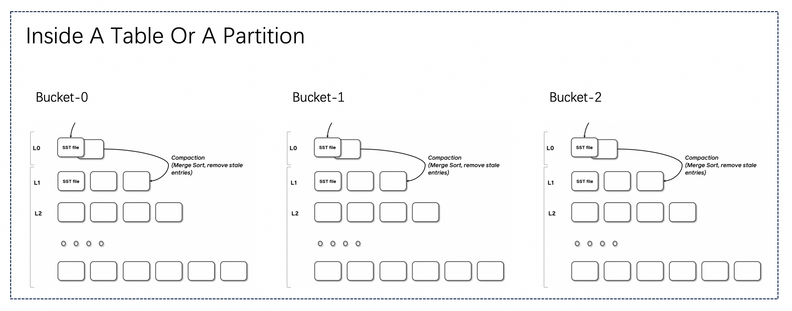

The file structure of the primary key table is roughly shown in the above figure. The table or partition contains
multiple buckets, and each bucket is a separate LSM tree structure that contains multiple files.

The writing process of LSM is roughly as follows: Flink checkpoint flush L0 files, and trigger a compaction as needed
to merge the data. According to the different processing ways during writing, there are three modes:

1. MOR (Merge On Read): Default mode, only minor compactions are performed, and merging are required for reading.
2. COW (Copy On Write): Using `'full-compaction.delta-commits' = '1'`, full compaction will be synchronized, which
   means the merge is completed on write.
3. MOW (Merge On Write): Using `'deletion-vectors.enabled' = 'true'`, in writing phase, LSM will be queried to generate
   the deletion vector file for the data file, which directly filters out unnecessary lines during reading.

The Merge On Write mode is recommended for general primary key tables (merge-engine is default `deduplicate`).

<a id="primary-key-table-table-mode--merge-on-read"></a>

## Merge On Read [#](#primary-key-table-table-mode--merge-on-read)

MOR is the default mode of primary key table.


When the mode is MOR, it is necessary to merge all files for reading, as all files are ordered and undergo multi way
merging, which includes a comparison calculation of the primary key.

There is an obvious issue here, where a single LSM tree can only have a single thread to read, so the read parallelism
is limited. If the amount of data in the bucket is too large, it can lead to poor read performance. So in order to read
performance, it is recommended to analyze the query requirements table and set the data volume in the bucket to be
between 200MB and 1GB. But if the bucket is too small, there will be a lot of small file reads and writes, causing
pressure on the file system.

In addition, due to the merging process, Filter based data skipping cannot be performed on non primary key columns, otherwise new data will be filtered out, resulting in incorrect old data.

- Write performance: very good.
- Read performance: not so good.

<a id="primary-key-table-table-mode--copy-on-write"></a>

## Copy On Write [#](#primary-key-table-table-mode--copy-on-write)

```sql
ALTER TABLE orders SET ('full-compaction.delta-commits' = '1');
```

Set `full-compaction.delta-commits` to 1, which means that every write will be fully merged, and all data will be merged
to the highest level. When reading, merging is not necessary at this time, and the reading performance is the highest.
But every write requires full merging, and write amplification is very severe.

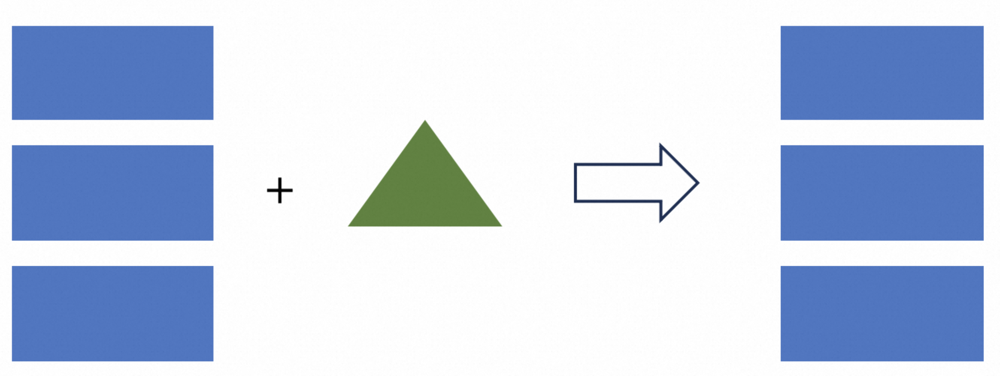

- Write performance: very bad.
- Read performance: very good.

<a id="primary-key-table-table-mode--merge-on-write"></a>

## Merge On Write [#](#primary-key-table-table-mode--merge-on-write)

```sql
ALTER TABLE orders SET ('deletion-vectors.enabled' = 'true');
```

Thanks to Paimon’s LSM structure, it has the ability to be queried by primary key. We can generate deletion vectors
files when writing, representing which data in the file has been deleted. This directly filters out unnecessary rows
during reading, which is equivalent to merging and does not affect reading performance.

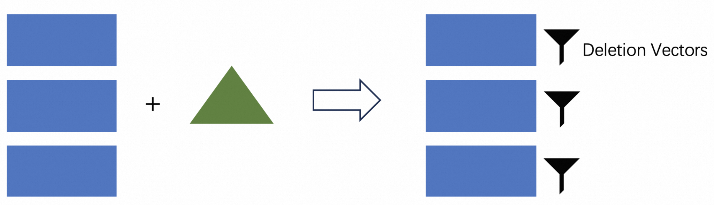

A simple example just like:

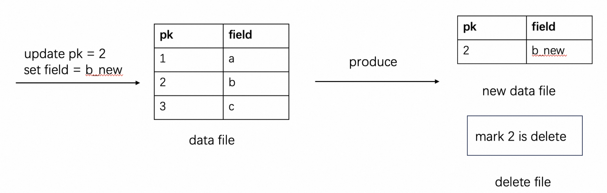

Updates data by deleting old record first and then adding new one.

- Write performance: good.
- Read performance: good.

> [!NOTE]
> > Visibility guarantee: Tables in deletion vectors mode, the files with level 0 will only be visible after compaction.
> > So by default, compaction is synchronous, and if asynchronous is turned on, there may be delays in the data.

<a id="primary-key-table-table-mode--mor-read-optimized"></a>

## MOR Read Optimized [#](#primary-key-table-table-mode--mor-read-optimized)

If you don’t want to use Deletion Vectors mode, you want to query fast enough in MOR mode, but can only find
older data, you can also:

1. Configure ‘compaction.optimization-interval’ when writing data.
2. Query from [read-optimized system table](#concepts-system-tables--read-optimized-table). Reading from
   results of optimized files avoids merging records with the same key, thus improving reading performance.

You can flexibly balance query performance and data latency when reading.

---

<a id="primary-key-table-changelog-producer"></a>

<!-- source_url: https://paimon.apache.org/docs/master/primary-key-table/changelog-producer/ -->

<!-- page_index: 27 -->

# Changelog Producer #

> This documentation is for an unreleased version of Apache Paimon. We recommend you use the latest [stable version](https://paimon.apache.org/docs/1.4).

<a id="primary-key-table-changelog-producer--changelog-producer"></a>

# Changelog Producer [#](#primary-key-table-changelog-producer--changelog-producer)

Streaming write can continuously produce the latest changes for streaming read.

By specifying the `changelog-producer` table property when creating the table, users can choose the pattern of changes produced from table files.

> [!NOTE]
> > `changelog-producer` may significantly reduce compaction performance, please do not enable it unless necessary.

<a id="primary-key-table-changelog-producer--none"></a>

## None [#](#primary-key-table-changelog-producer--none)

By default, no extra changelog producer will be applied to the writer of table. Paimon source can only see the merged changes across snapshots, like what keys are removed and what are the new values of some keys.

However, these merged changes cannot form a complete changelog, because we can’t read the old values of the keys directly from them. Merged changes require the consumers to “remember” the values of each key and to rewrite the values without seeing the old ones. Some consumers, however, need the old values to ensure correctness or efficiency.

Consider a consumer which calculates the sum on some grouping keys (might not be equal to the primary keys). If the consumer only sees a new value `5`, it cannot determine what values should be added to the summing result. For example, if the old value is `4`, it should add `1` to the result. But if the old value is `6`, it should in turn subtract `1` from the result. Old values are important for these types of consumers.

To conclude, `none` changelog producers are best suited for consumers such as a database system. Flink also has a
built-in “normalize” operator which persists the values of each key in states. As one can easily tell, this operator
will be very costly and should be avoided. (You can force removing “normalize” operator via `'scan.remove-normalize'`.)

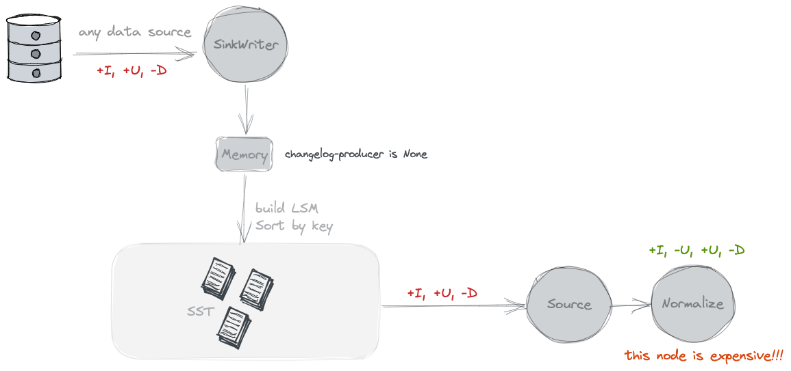
<a id="primary-key-table-changelog-producer--input"></a>

## Input [#](#primary-key-table-changelog-producer--input)

By specifying `'changelog-producer' = 'input'`, Paimon writers rely on their inputs as a source of complete changelog. All input records will be saved in separated changelog files and will be given to the consumers by Paimon sources.

`input` changelog producer can be used when Paimon writers' inputs are complete changelog, such as from a database CDC, or generated by Flink stateful computation.

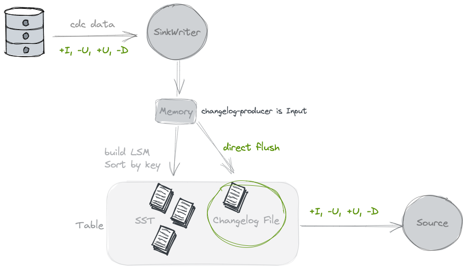
<a id="primary-key-table-changelog-producer--lookup"></a>

## Lookup [#](#primary-key-table-changelog-producer--lookup)

If your input can’t produce a complete changelog but you still want to get rid of the costly normalized operator, you
may consider using the `'lookup'` changelog producer.

By specifying `'changelog-producer' = 'lookup'`, Paimon will generate changelog through `'lookup'` during compaction (You can also enable [Async Compaction](#primary-key-table-compaction--asynchronous-compaction)). By default, lookup compaction is performed before committing written data unless disabled by `write-only` property.

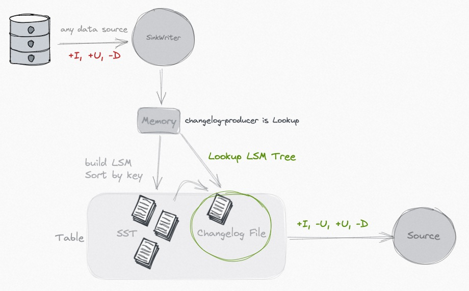

Lookup will cache data on the memory and local disk, you can use the following options to tune performance:

| Option | Default | Type | Description |
| --- | --- | --- | --- |
| DOC2MDPLACEHOLDERTOKEN4ENDlookup.cache-file-retention | 1 h | Duration | The cached files retention time for lookup. After the file expires, if there is a need for access, it will be re-read from the DFS to build an index on the local disk. |
| DOC2MDPLACEHOLDERTOKEN5ENDlookup.cache-max-disk-size | unlimited | MemorySize | Max disk size for lookup cache, you can use this option to limit the use of local disks. |
| DOC2MDPLACEHOLDERTOKEN6ENDlookup.cache-max-memory-size | 256 mb | MemorySize | Max memory size for lookup cache. |

Lookup changelog-producer supports `changelog-producer.row-deduplicate` to avoid generating -U, +U
changelog for the same record.

(Note: Please increase `'execution.checkpointing.max-concurrent-checkpoints'` Flink configuration, this is very
important for performance).

<a id="primary-key-table-changelog-producer--full-compaction"></a>

## Full Compaction [#](#primary-key-table-changelog-producer--full-compaction)

You can also consider using ‘full-compaction’ changelog producer to generate changelog, and is more suitable for scenarios
with large latency (For example, 30 minutes).

1. By specifying `'changelog-producer' = 'full-compaction'`, Paimon will compare the results between full compactions and
   produce the differences as changelog. The latency of changelog is affected by the frequency of full compactions.
2. By specifying `full-compaction.delta-commits` table property, full compaction will be constantly triggered after delta
   commits (checkpoints). This is set to 1 by default, so each checkpoint will have a full compression and generate a
   changelog.

Generally speaking, the cost and consumption of full compaction are high, so we recommend using `'lookup'` changelog
producer.

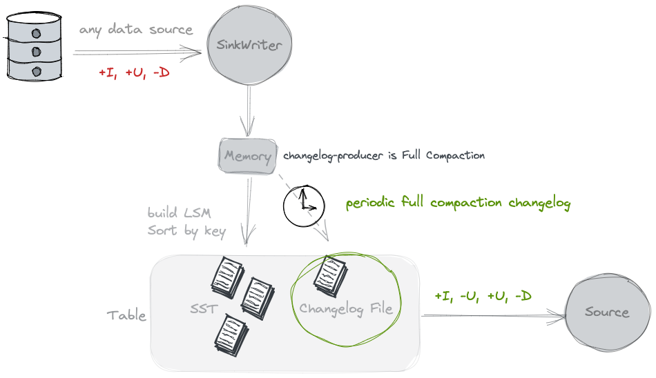

> [!NOTE]
> > Full compaction changelog producer can produce complete changelog for any type of source. However it is not as
> > efficient as the input changelog producer and the latency to produce changelog might be high.

Full-compaction changelog-producer supports `changelog-producer.row-deduplicate` to avoid generating -U, +U
changelog for the same record.

<a id="primary-key-table-changelog-producer--changelog-merging"></a>

## Changelog Merging [#](#primary-key-table-changelog-producer--changelog-merging)

For `input`, `lookup`, `full-compaction` ‘changelog-producer’.

If Flink’s checkpoint interval is short (for example, 30 seconds) and the number of buckets is large, each snapshot may
produce lots of small changelog files. Too many files may put a burden on the distributed storage cluster.

In order to compact small changelog files into large ones, you can set the table option `precommit-compact = true`.
Default value of this option is false, if true, it will add a compact coordinator and worker operator after the writer
operator, which copies changelog files into large ones.

---

<a id="primary-key-table-sequence-rowkind"></a>

<!-- source_url: https://paimon.apache.org/docs/master/primary-key-table/sequence-rowkind/ -->

<!-- page_index: 28 -->

# Sequence and Rowkind #

> This documentation is for an unreleased version of Apache Paimon. We recommend you use the latest [stable version](https://paimon.apache.org/docs/1.4).

<a id="primary-key-table-sequence-rowkind--sequence-and-rowkind"></a>

# Sequence and Rowkind [#](#primary-key-table-sequence-rowkind--sequence-and-rowkind)

When creating a table, you can specify the `'sequence.field'` by specifying fields to determine the order of updates, or you can specify the `'rowkind.field'` to determine the changelog kind of record.

<a id="primary-key-table-sequence-rowkind--sequence-field"></a>

## Sequence Field [#](#primary-key-table-sequence-rowkind--sequence-field)

By default, the primary key table determines the merge order according to the input order (the last input record will be the last to merge). However, in distributed computing, there will be some cases that lead to data disorder. At this time, you can use a time field as `sequence.field`, for example:

Flink

```sql
CREATE TABLE my_table (
    pk BIGINT PRIMARY KEY NOT ENFORCED,
    v1 DOUBLE,
    v2 BIGINT,
    update_time TIMESTAMP
) WITH (
    'sequence.field' = 'update_time'
);
```

The record with the largest `sequence.field` value will be the last to merge, if the values are the same, the input
order will be used to determine which one is the last one. `sequence.field` supports fields of all data types.

You can define multiple fields for `sequence.field`, for example `'update_time,flag'`, multiple fields will be compared in order.

> [!NOTE]
> > User defined sequence fields conflict with features such as `first_row` and `first_value`, which may result in unexpected results.

<a id="primary-key-table-sequence-rowkind--row-kind-field"></a>

## Row Kind Field [#](#primary-key-table-sequence-rowkind--row-kind-field)

By default, the primary key table determines the row kind according to the input row. You can also define the
`'rowkind.field'` to use a field to extract row kind.

The valid row kind string should be `'+I'`, `'-U'`, `'+U'` or `'-D'`.

---

<a id="primary-key-table-compaction"></a>

<!-- source_url: https://paimon.apache.org/docs/master/primary-key-table/compaction/ -->

<!-- page_index: 29 -->

# Compaction #

> This documentation is for an unreleased version of Apache Paimon. We recommend you use the latest [stable version](https://paimon.apache.org/docs/1.4).

<a id="primary-key-table-compaction--compaction"></a>

# Compaction [#](#primary-key-table-compaction--compaction)

When more and more records are written into the LSM tree, the number of sorted runs will increase. Because querying an
LSM tree requires all sorted runs to be combined, too many sorted runs will result in a poor query performance, or even
out of memory.

To limit the number of sorted runs, we have to merge several sorted runs into one big sorted run once in a while. This
procedure is called compaction.

However, compaction is a resource intensive procedure which consumes a certain amount of CPU time and disk IO, so too
frequent compaction may in turn result in slower writes. It is a trade-off between query and write performance. Paimon
currently adopts a compaction strategy similar to Rocksdb’s [universal compaction](https://github.com/facebook/rocksdb/wiki/Universal-Compaction).

Compaction solves:

1. Reduce Level 0 files to avoid poor query performance.
2. Produce changelog via [changelog-producer](#primary-key-table-changelog-producer).
3. Produce deletion vectors for [MOW mode](#primary-key-table-table-mode--merge-on-write).
4. Snapshot Expiration, Tag Expiration, Partitions Expiration.

Limitation:

- There can only be one job working on the same partition’s compaction, otherwise it will cause conflicts and one side will throw an exception failure.

Writing performance is almost always affected by compaction, so its tuning is crucial.

<a id="primary-key-table-compaction--asynchronous-compaction"></a>

## Asynchronous Compaction [#](#primary-key-table-compaction--asynchronous-compaction)

Compaction is inherently asynchronous, but if you want it to be completely asynchronous without blocking writes, expecting a mode for maximum writing throughput, the compaction can be done slowly and not in a hurry.
You can use the following strategies for your table:

```shell
num-sorted-run.stop-trigger = 2147483647
sort-spill-threshold = 10
lookup-wait = false
```

This configuration will generate more files during peak write periods and gradually merge them for optimal read
performance during low write periods.

<a id="primary-key-table-compaction--dedicated-compaction-job"></a>

## Dedicated compaction job [#](#primary-key-table-compaction--dedicated-compaction-job)

In general, if you expect multiple jobs to be written to the same table, you need to separate the compaction. You can
use [dedicated compaction job](#maintenance-dedicated-compaction--dedicated-compaction-job).

<a id="primary-key-table-compaction--record-level-expire"></a>

## Record-Level expire [#](#primary-key-table-compaction--record-level-expire)

In compaction, you can configure record-Level expire time to expire records, you should configure:

1. `'record-level.expire-time'`: time retain for records.
2. `'record-level.time-field'`: time field for record level expire.

Expiration happens in compaction, and there is no strong guarantee to expire records in time.
You can trigger a full compaction manually to expire records which were not expired in time.

<a id="primary-key-table-compaction--full-compaction"></a>

## Full Compaction [#](#primary-key-table-compaction--full-compaction)

Paimon Compaction uses [Universal-Compaction](https://github.com/facebook/rocksdb/wiki/Universal-Compaction).
By default, when there is too much incremental data, Full Compaction will be automatically performed. You don’t usually
have to worry about it.

Paimon also provides a configuration that allows for regular execution of Full Compaction.

1. ‘compaction.optimization-interval’: Implying how often to perform an optimization full compaction, this
   configuration is used to ensure the query timeliness of the read-optimized system table.
2. ‘full-compaction.delta-commits’: Full compaction will be constantly triggered after delta commits. Its disadvantage
   is that it can only perform compaction synchronously, which will affect writing efficiency.

<a id="primary-key-table-compaction--lookup-compaction"></a>

## Lookup Compaction [#](#primary-key-table-compaction--lookup-compaction)

When primary key table is configured with `lookup` [changelog producer](#primary-key-table-changelog-producer)
or `first-row` [merge-engine](https://paimon.apache.org/docs/master/primary-key-table/merge-engine/)
or has enabled `deletion vectors` for [MOW mode](#primary-key-table-table-mode--merge-on-write), Paimon will
use a radical compaction strategy to force compacting level 0 files to higher levels for every compaction trigger.

Paimon also provides configurations to optimize the frequency of this compaction.

1. ‘lookup-compact’: compact mode used for lookup compaction. Possible values: `radical`, will use
   `ForceUpLevel0Compaction` strategy to radically compact new files; `gentle`, will use `UniversalCompaction` strategy
   to gently compact new files;
2. ‘lookup-compact.max-interval’: The max interval for a forced L0 lookup compaction to be triggered in `gentle` mode.
   This option is only valid when `lookup-compact` mode is `gentle`.

By configuring ‘lookup-compact’ as `gentle`, new files in L0 will not be compacted immediately, this may greatly
reduce the overall resource usage at the expense of worse data freshness in certain cases.

<a id="primary-key-table-compaction--compaction-options"></a>

## Compaction Options [#](#primary-key-table-compaction--compaction-options)

<a id="primary-key-table-compaction--number-of-sorted-runs-to-pause-writing"></a>

### Number of Sorted Runs to Pause Writing [#](#primary-key-table-compaction--number-of-sorted-runs-to-pause-writing)

When the number of sorted runs is small, Paimon writers will perform compaction asynchronously in separated threads, so
records can be continuously written into the table. However, to avoid unbounded growth of sorted runs, writers will
pause writing when the number of sorted runs hits the threshold. The following table property determines
the threshold.

| Option | Required | Default | Type | Description |
| --- | --- | --- | --- | --- |
| DOC2MDPLACEHOLDERTOKEN8ENDnum-sorted-run.stop-trigger | No | (none) | Integer | The number of sorted runs that trigger the stopping of writes, the default value is 'num-sorted-run.compaction-trigger' + 3. |

Write stalls will become less frequent when `num-sorted-run.stop-trigger` becomes larger, thus improving writing
performance. However, if this value becomes too large, more memory and CPU time will be needed when querying the
table. If you are concerned about the OOM problem, please configure the following option.
Its value depends on your memory size.

| Option | Required | Default | Type | Description |
| --- | --- | --- | --- | --- |
| DOC2MDPLACEHOLDERTOKEN9ENDsort-spill-threshold | No | (none) | Integer | If the maximum number of sort readers exceeds this value, a spill will be attempted. This prevents too many readers from consuming too much memory and causing OOM. |

<a id="primary-key-table-compaction--number-of-sorted-runs-to-trigger-compaction"></a>

### Number of Sorted Runs to Trigger Compaction [#](#primary-key-table-compaction--number-of-sorted-runs-to-trigger-compaction)

Paimon uses [LSM tree](#primary-key-table-overview--lsm-trees) which supports a large number of updates. LSM organizes files in several [sorted runs](#primary-key-table-overview--sorted-runs). When querying records from an LSM tree, all sorted runs must be combined to produce a complete view of all records.

One can easily see that too many sorted runs will result in poor query performance. To keep the number of sorted runs in a reasonable range, Paimon writers will automatically perform [compactions](#primary-key-table-compaction). The following table property determines the minimum number of sorted runs to trigger a compaction.

| Option | Required | Default | Type | Description |
| --- | --- | --- | --- | --- |
| DOC2MDPLACEHOLDERTOKEN11ENDnum-sorted-run.compaction-trigger | No | 5 | Integer | The sorted run number to trigger compaction. Includes level0 files (one file one sorted run) and high-level runs (one level one sorted run). |

Compaction will become less frequent when `num-sorted-run.compaction-trigger` becomes larger, thus improving writing performance. However, if this value becomes too large, more memory and CPU time will be needed when querying the table. This is a trade-off between writing and query performance.

---

<a id="primary-key-table-query-performance"></a>

<!-- source_url: https://paimon.apache.org/docs/master/primary-key-table/query-performance/ -->

<!-- page_index: 30 -->

# Query Performance #

> This documentation is for an unreleased version of Apache Paimon. We recommend you use the latest [stable version](https://paimon.apache.org/docs/1.4).

<a id="primary-key-table-query-performance--query-performance"></a>

# Query Performance [#](#primary-key-table-query-performance--query-performance)

<a id="primary-key-table-query-performance--table-mode"></a>

## Table Mode [#](#primary-key-table-query-performance--table-mode)

The table schema has the greatest impact on query performance. See [Table Mode](#primary-key-table-table-mode).

For Merge On Read table, the most important thing you should pay attention to is the number of buckets, which will limit
the concurrency of reading data.

For MOW (Deletion Vectors) or COW table or [Read Optimized](#concepts-system-tables--read-optimized-table) table, there is no limit to the concurrency of reading data, and they can also utilize some filtering conditions for non-primary-key columns.

<a id="primary-key-table-query-performance--aggregate-push-down"></a>

## Aggregate push down [#](#primary-key-table-query-performance--aggregate-push-down)

Table with Deletion Vectors Enabled supports aggregate push down:

```sql
SELECT COUNT(*) FROM TABLE WHERE DT = '20230101';
```

This query can be accelerated during compilation and returns very quickly.

For Spark SQL, table with default `metadata.stats-mode` can be accelerated:

```sql
SELECT MIN(a), MAX(b) FROM TABLE WHERE DT = '20230101';
```

Min max query can be also accelerated during compilation and returns very quickly.

<a id="primary-key-table-query-performance--data-skipping-by-primary-key-filter"></a>

## Data Skipping By Primary Key Filter [#](#primary-key-table-query-performance--data-skipping-by-primary-key-filter)

For a regular bucketed table (For example, bucket = 5), the filtering conditions of the primary key will greatly
accelerate queries and reduce the reading of a large number of files.

<a id="primary-key-table-query-performance--data-skipping-by-file-index"></a>

## Data Skipping By File Index [#](#primary-key-table-query-performance--data-skipping-by-file-index)

For full-compacted file, or for primary-key table with `'deletion-vectors.enabled'`, you can use file index, it filters
files by indexing on the reading side.

Define `file-index.bitmap.columns`, Data file index is an external index file and Paimon will create its
corresponding index file for each file. If the index file is too small, it will be stored directly in the manifest, otherwise in the directory of the data file. Each data file corresponds to an index file, which has a separate file
definition and can contain different types of indexes with multiple columns.

Different file indexes may be efficient in different scenarios. For example bloom filter may speed up query in point lookup
scenario. Using a bitmap may consume more space but can result in greater accuracy.

- [BloomFilter](#concepts-spec-fileindex--index-bloomfilter): `file-index.bloom-filter.columns`.
- [Bitmap](#concepts-spec-fileindex--index-bitmap): `file-index.bitmap.columns`.
- [Range Bitmap](#concepts-spec-fileindex--index-range-bitmap): `file-index.range-bitmap.columns`.

If you want to add file index to existing table, without any rewrite, you can use `rewrite_file_index` procedure. Before
we use the procedure, you should config appropriate configurations in target table. You can use ALTER clause to config
`file-index.<filter-type>.columns` to the table.

How to invoke: see [flink procedures](#flink-procedures--procedures)

<a id="primary-key-table-query-performance--bucketed-join"></a>

## Bucketed Join [#](#primary-key-table-query-performance--bucketed-join)

Fixed Bucketed table (e.g. bucket = 10) can be used to avoid shuffle if necessary in batch query, for example, you can
use the following Spark SQL to read a Paimon table:

```sql
SET spark.sql.sources.v2.bucketing.enabled = true;

CREATE TABLE FACT_TABLE (order_id INT, f1 STRING) TBLPROPERTIES ('bucket'='10', 'primary-key' = 'order_id');

CREATE TABLE DIM_TABLE (order_id INT, f2 STRING) TBLPROPERTIES ('bucket'='10', 'primary-key' = 'order_id');

SELECT * FROM FACT_TABLE JOIN DIM_TABLE on t1.order_id = t4.order_id;
```

The `spark.sql.sources.v2.bucketing.enabled` config is used to enable bucketing for V2 data sources. When turned on, Spark will recognize the specific distribution reported by a V2 data source through SupportsReportPartitioning, and
will try to avoid shuffle if necessary.

The costly join shuffle will be avoided if two tables have the same bucketing strategy and same number of buckets.

---

<a id="primary-key-table-chain-table"></a>

<!-- source_url: https://paimon.apache.org/docs/master/primary-key-table/chain-table/ -->

<!-- page_index: 31 -->

# Chain Table #

> This documentation is for an unreleased version of Apache Paimon. We recommend you use the latest [stable version](https://paimon.apache.org/docs/1.4).

<a id="primary-key-table-chain-table--chain-table"></a>

# Chain Table [#](#primary-key-table-chain-table--chain-table)

Chain table is a new capability for primary key tables that transforms how you process incremental data.
Imagine a scenario where you periodically store a full snapshot of data (for example, once a day), even
though only a small portion changes between snapshots. ODS binlog dump is a typical example of this pattern.

Taking a daily binlog dump job as an example. A batch job merges yesterday’s full dataset with today’s
incremental changes to produce a new full dataset. This approach has two clear drawbacks:

- Full computation: Merge operation includes all data, and it will involve shuffle, which results in poor performance.
- Full storage: Store a full set of data every day, and the changed data usually accounts for a very small proportion.

Paimon addresses this problem by directly consuming only the changed data and performing merge-on-read.
In this way, full computation and storage are turned into incremental mode:

- Incremental computation: The offline ETL daily job only needs to consume the changed data of the current day and do not require merging all data.
- Incremental Storage: Only store the changed data each day, and asynchronously compact it periodically (e.g., weekly) to build a global chain table within the lifecycle.
  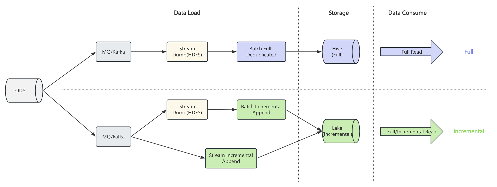

Based on the regular table, chain table introduces snapshot and delta branches to represent full and incremental
data respectively. When writing, you specify the branch to write full or incremental data. When reading, paimon
automatically chooses the appropriate strategy based on the read mode, such as full, incremental, or hybrid.

To enable chain table, you must config `chain-table.enabled` to true in the table options when creating the
table, and the snapshot and delta branch need to be created as well. Consider an example via Spark SQL:

```sql
CREATE TABLE default.t (
    `t1` string ,
    `t2` string ,
    `t3` string
) PARTITIONED BY (`date` string)
TBLPROPERTIES (
  'chain-table.enabled' = 'true',
  -- props about primary key table  
  'primary-key' = 'date,t1',
  'sequence.field' = 't2',
  'bucket-key' = 't1',
  'bucket' = '2',
  -- props about partition
  'partition.timestamp-pattern' = '$date', 
  'partition.timestamp-formatter' = 'yyyyMMdd'
);

CALL sys.create_branch('default.t', 'snapshot');

CALL sys.create_branch('default.t', 'delta');

ALTER TABLE default.t SET tblproperties 
    ('scan.fallback-snapshot-branch' = 'snapshot', 
     'scan.fallback-delta-branch' = 'delta');
 
ALTER TABLE `default`.`t$branch_snapshot` SET tblproperties
    ('scan.fallback-snapshot-branch' = 'snapshot',
     'scan.fallback-delta-branch' = 'delta');

ALTER TABLE `default`.`t$branch_delta` SET tblproperties 
    ('scan.fallback-snapshot-branch' = 'snapshot',
     'scan.fallback-delta-branch' = 'delta');
```

Notice that:

- Chain table is only supported for primary key table, which means you should define `bucket` and `bucket-key` for the table.
- Chain table should ensure that the schema of each branch is consistent.
- Only spark support now, flink will be supported later.
- Chain compact is not supported for now, and it will be supported later.
- Deletion vector is not supported for chain table.

After creating a chain table, you can read and write data in the following ways.

- Full Write: Write data to t$branch\_snapshot.

```sql
insert overwrite `default`.`t$branch_snapshot` partition (date = '20250810') 
    values ('1', '1', '1'); 
```

- Incremental Write: Write data to t$branch\_delta.

```sql
insert overwrite `default`.`t$branch_delta` partition (date = '20250811') 
    values ('2', '1', '1');
```

- Full Query: If the snapshot branch has full partition, read it directly; otherwise, read on chain merge mode.

```sql
select t1, t2, t3 from default.t where date = '20250811'
```

you will get the following result:

```text
+---+----+-----+ 
| t1|  t2|   t3| 
+---+----+-----+ 
| 1 |   1|   1 |           
| 2 |   1|   1 |               
+---+----+-----+ 
```

- Incremental Query: Read the incremental partition from t$branch\_delta

```sql
select t1, t2, t3 from `default`.`t$branch_delta` where date = '20250811'
```

you will get the following result:

```text
+---+----+-----+ 
| t1|  t2|   t3| 
+---+----+-----+      
| 2 |   1|   1 |               
+---+----+-----+ 
```

- Hybrid Query: Read both full and incremental data simultaneously.

```sql
select t1, t2, t3 from default.t where date = '20250811'
union all
select t1, t2, t3 from `default`.`t$branch_delta` where date = '20250811'
```

you will get the following result:

```text
+---+----+-----+ 
| t1|  t2|   t3| 
+---+----+-----+ 
| 1 |   1|   1 |           
| 2 |   1|   1 |  
| 2 |   1|   1 |               
+---+----+-----+ 
```

<a id="primary-key-table-chain-table--group-partition"></a>

## Group Partition [#](#primary-key-table-chain-table--group-partition)

In real-world scenarios, a table often has multiple partition dimensions. For example, data may be
partitioned by both `region` and `date`. In such cases, different regions are independent data silos —
each should maintain its own chain independently rather than sharing one global chain across all regions.

Paimon supports this pattern via **group partition**: partition keys are divided into two parts:

- **Group partition keys** (prefix fields): Dimensions that identify independent data silos (e.g., `region`).
  Each distinct combination of group partition values forms its own independent chain.
- **Chain partition keys** (suffix fields): Dimensions that form the time-ordered chain within a group
  (e.g., `date`).

Use `chain-table.chain-partition-keys` to specify the chain dimension. This value must be a
**contiguous suffix** of the table’s partition keys. Partition fields before it automatically become the
group dimension. If this option is not set, all partitions belong to a single implicit group (the
default behavior for single-dimension partitioned tables).

Consider an example where the table is partitioned by `region` and `date`, and you want each region to
have its own chain:

```sql
CREATE TABLE default.t (
    `t1` string ,
    `t2` string ,
    `t3` string
) PARTITIONED BY (`region` string, `date` string)
TBLPROPERTIES (
  'chain-table.enabled' = 'true',
  'primary-key' = 'region,date,t1',
  'sequence.field' = 't2',
  'bucket-key' = 't1',
  'bucket' = '2',
  'partition.timestamp-pattern' = '$date',
  'partition.timestamp-formatter' = 'yyyyMMdd',
  -- specify that only `date` is the chain dimension; `region` becomes the group dimension
  'chain-table.chain-partition-keys' = 'date'
);
```

With this configuration:

- Partition keys: `[region, date]`
- Group partition keys: `[region]` — CN and US each have their own independent chain
- Chain partition keys: `[date]` — time-ordered chain within each region

When reading a partition like `(region='CN', date='20250811')`, Paimon finds the nearest earlier
snapshot partition **within the same region** (e.g., `(region='CN', date='20250810')`) as the chain
anchor, and merges forward through the delta data for the CN group only. The US group is resolved
independently using its own anchor.

For hourly partitioned tables with a regional dimension, you can set both `dt` and `hour` as chain
partition keys:

```sql
'chain-table.chain-partition-keys' = 'dt,hour'
```

This treats `(dt, hour)` as the composite chain dimension and everything before it (e.g., `region`) as
the group dimension.

---

<a id="primary-key-table-pk-clustering-override"></a>

<!-- source_url: https://paimon.apache.org/docs/master/primary-key-table/pk-clustering-override/ -->

<!-- page_index: 32 -->

# PK Clustering Override #

> This documentation is for an unreleased version of Apache Paimon. We recommend you use the latest [stable version](https://paimon.apache.org/docs/1.4).

<a id="primary-key-table-pk-clustering-override--pk-clustering-override"></a>

# PK Clustering Override [#](#primary-key-table-pk-clustering-override--pk-clustering-override)

By default, data files in a primary key table are physically sorted by the primary key. This is optimal for point
lookups but can hurt scan performance when queries filter on non-primary-key columns.

**PK Clustering Override** mode changes the physical sort order of data files from the primary key to user-specified
clustering columns. This significantly improves scan performance for queries that filter or group by clustering columns, while still maintaining primary key uniqueness through deletion vectors.

<a id="primary-key-table-pk-clustering-override--quick-start"></a>

## Quick Start [#](#primary-key-table-pk-clustering-override--quick-start)

```sql
CREATE TABLE my_table (
    id BIGINT,
    dt STRING,
    city STRING,
    amount DOUBLE,
    PRIMARY KEY (id) NOT ENFORCED
) WITH (
    'pk-clustering-override' = 'true',
    'clustering.columns' = 'city',
    'deletion-vectors.enabled' = 'true',
    'bucket' = '4'
);
```

For `first-row` merge engine, deletion vectors are already built-in, so you don’t need to enable them explicitly:

```sql
CREATE TABLE my_table (
    id BIGINT,
    dt STRING,
    city STRING,
    amount DOUBLE,
    PRIMARY KEY (id) NOT ENFORCED
) WITH (
    'pk-clustering-override' = 'true',
    'clustering.columns' = 'city',
    'merge-engine' = 'first-row',
    'bucket' = '4'
);
```

After this, data files within each bucket will be physically sorted by `city` instead of `id`. Queries like
`SELECT * FROM my_table WHERE city = 'Beijing'` can skip irrelevant data files by checking their min/max statistics
on the clustering column.

<a id="primary-key-table-pk-clustering-override--requirements"></a>

## Requirements [#](#primary-key-table-pk-clustering-override--requirements)

| Option | Requirement |
| --- | --- |
| `pk-clustering-override` | `true` |
| `clustering.columns` | Must be set (one or more non-primary-key columns) |
| `deletion-vectors.enabled` | Must be `true` (not required for `first-row` merge engine) |
| `merge-engine` | `deduplicate` (default) or `first-row` only |

<a id="primary-key-table-pk-clustering-override--when-to-use"></a>

## When to Use [#](#primary-key-table-pk-clustering-override--when-to-use)

PK Clustering Override is beneficial when:

- Analytical queries frequently filter or aggregate on non-primary-key columns (e.g., `WHERE city = 'Beijing'`).
- The table uses `deduplicate` or `first-row` merge engine.

> [!NOTE]
> > Although data files are no longer sorted by the primary key, filtering on bucket-key fields (which default to the
> > primary key) still benefits from bucket pruning. The query engine can skip entire buckets that do not contain matching
> > values, so queries like `WHERE id = 12345` remain efficient.

**Unsupported modes**:

- Merge engine: `partial-update` or `aggregation`.
- Changelog producer: `lookup` or `full-compaction`.
- Configue: `sequence.fields` or `record-level.expire-time`.

---

<a id="append-table-incremental-clustering"></a>

<!-- source_url: https://paimon.apache.org/docs/master/append-table/incremental-clustering/ -->

<!-- page_index: 33 -->

# Incremental Clustering #

> This documentation is for an unreleased version of Apache Paimon. We recommend you use the latest [stable version](https://paimon.apache.org/docs/1.4).

<a id="append-table-incremental-clustering--incremental-clustering"></a>

# Incremental Clustering [#](#append-table-incremental-clustering--incremental-clustering)

Paimon currently supports ordering append tables using SFC (Space-Filling Curve)(see [sort compact](#maintenance-dedicated-compaction--sort-compact) for more info).
The resulting data layout typically delivers better performance for queries that target clustering keys.
However, with the current SortCompaction, even when neither the data nor the clustering keys have changed, each run still rewrites the entire dataset, which is extremely costly.

To address this, Paimon introduced a more flexible, incremental clustering mechanism—Incremental Clustering.
On each run, it selects only a specific subset of files to cluster, avoiding a full rewrite. This enables low-cost, sort-based optimization of the data layout and improves query performance. In addition, with Incremental Clustering, you can adjust clustering keys without rewriting existing data, the layout evolves dynamically as cluster runs and
gradually converges to an optimal state, significantly reducing the decision-making complexity around data layout.

Incremental Clustering supports:

- Support incremental clustering; minimizing write amplification as possible.
- Support small-file compaction; during rewrites, respect target-file-size.
- Support changing clustering keys; newly ingested data is clustered according to the latest clustering keys.
- Provide a full mode; when selected, the entire dataset will be reclustered.

**Only append unaware-bucket table supports Incremental Clustering.**

<a id="append-table-incremental-clustering--enable-incremental-clustering"></a>

## Enable Incremental Clustering [#](#append-table-incremental-clustering--enable-incremental-clustering)

To enable Incremental Clustering, the following configuration needs to be set for the table:

| Option | Value | Required | Type | Description |
| --- | --- | --- | --- | --- |
| DOC2MDPLACEHOLDERTOKEN2ENDclustering.incremental | true | Yes | Boolean | Must be set to true to enable incremental clustering. Default is false. |
| DOC2MDPLACEHOLDERTOKEN3ENDclustering.columns | 'clustering-columns' | Yes | String | The clustering columns, in the format 'columnName1,columnName2'. It is not recommended to use partition keys as clustering keys. |
| DOC2MDPLACEHOLDERTOKEN4ENDclustering.strategy | 'zorder' or 'hilbert' or 'order' | No | String | The ordering algorithm used for clustering. If not set, It'll decided from the number of clustering columns. 'order' is used for 1 column, 'zorder' for less than 5 columns, and 'hilbert' for 5 or more columns. |

Once Incremental Clustering for a table is enabled, you can run Incremental Clustering in batch mode periodically
to continuously optimizes data layout of the table and deliver better query performance.

> [!NOTE]
> : Since common compaction also rewrites files, it may disrupt the ordered data layout built by Incremental Clustering.
> Therefore, when Incremental Clustering is enabled, the table no longer supports write-time compaction or dedicated compaction;
> clustering and small-file merging must be performed exclusively via Incremental Clustering runs.

<a id="append-table-incremental-clustering--run-incremental-clustering"></a>

## Run Incremental Clustering [#](#append-table-incremental-clustering--run-incremental-clustering)

> [!NOTE]
> > only support running Incremental Clustering in batch mode.

To run a Incremental Clustering job, follow these instructions.

You don’t need to specify any clustering-related parameters when running Incremental Clustering, these options are already defined as table options. If you need to change clustering settings, please update the corresponding table options.

Spark SQL

Run the following sql:

```sql
--set the write parallelism, if too big, may generate a large number of small files.
SET spark.sql.shuffle.partitions=10;

-- run incremental clustering
CALL sys.compact(table => 'T')

-- run incremental clustering with full mode, this will recluster all data
CALL sys.compact(table => 'T', compact_strategy => 'full')
```

Flink Action

Run the following command to submit a incremental clustering job for the table.

```bash
<FLINK_HOME>/bin/flink run \
    /path/to/paimon-flink-action-1.5-SNAPSHOT.jar \
    compact \
    --warehouse <warehouse-path> \
    --database <database-name> \
    --table <table-name> \
    [--compact_strategy <minor / full>] \
    [--table_conf <table_conf>] \
    [--catalog_conf <paimon-catalog-conf> [--catalog_conf <paimon-catalog-conf> ...]]
```

Example: run incremental clustering

```bash
<FLINK_HOME>/bin/flink run \
    /path/to/paimon-flink-action-1.5-SNAPSHOT.jar \
    compact \
    --warehouse s3:///path/to/warehouse \
    --database test_db \
    --table test_table \
    --table_conf sink.parallelism=2 \
    --compact_strategy minor \
    --catalog_conf s3.endpoint=https://****.com \
    --catalog_conf s3.access-key=***** \
    --catalog_conf s3.secret-key=*****
```

- `--compact_strategy` Determines how to pick files to be cluster, the default is `minor`.
  - `full` : All files will be selected for clustered.
  - `minor` : Pick the set of files that need to be clustered based on specified conditions.

Note: write parallelism is set by `sink.parallelism`, if too big, may generate a large number of small files.

You can use `-D execution.runtime-mode=batch` or `-yD execution.runtime-mode=batch` (for the ON-YARN scenario) to use batch mode.

<a id="append-table-incremental-clustering--auto-clustering-for-historical-partition"></a>

## Auto-Clustering For Historical Partition [#](#append-table-incremental-clustering--auto-clustering-for-historical-partition)

While performing incremental clustering on recently active partitions, Paimon can automatically detect historical and
inactive partitions and evaluate whether their data layout has reached an optimal state.
For those historical partitions that have not yet achieved optimal layout, Paimon will also perform full clustering on them
during the same operation, thereby improving their query performance.

To enable auto-clustering for historical partitions, the following configuration needs to be set for the table:

| Option | Value | Required | Type | Description |
| --- | --- | --- | --- | --- |
| DOC2MDPLACEHOLDERTOKEN7ENDclustering.history-partition.idle-to-full-sort | 3d | Yes | Duration | The duration after which a partition without new updates is considered a historical partition. Default is null. |
| DOC2MDPLACEHOLDERTOKEN8ENDclustering.history-partition.limit | 5 | Yes | Integer | The limit of history partition number for automatically performing full clustering. Default value is 5. |

<a id="append-table-incremental-clustering--implement"></a>

## Implement [#](#append-table-incremental-clustering--implement)

To balance write amplification and sorting effectiveness, Paimon leverages the LSM Tree notion of levels to stratify data files
and uses the Universal Compaction strategy to select files for clustering.

- Newly written data lands in level-0; files in level-0 are unclustered.
- All files in level-i are produced by sorting within the same sorting set.
- By analogy with Universal Compaction: in level-0, each file is a sorted run; in level-i, all files together constitute a single sorted run. During clustering, the sorted run is the basic unit of work.

By introducing more levels, we can control the amount of data processed in each clustering run.
Data at higher levels is more stably clustered and less likely to be rewritten, thereby mitigating write amplification while maintaining good sorting effectiveness.

---

<a id="append-table-bucketed"></a>

<!-- source_url: https://paimon.apache.org/docs/master/append-table/bucketed/ -->

<!-- page_index: 34 -->

# Bucketed Append #

> This documentation is for an unreleased version of Apache Paimon. We recommend you use the latest [stable version](https://paimon.apache.org/docs/1.4).

<a id="append-table-bucketed--bucketed-append"></a>

# Bucketed Append [#](#append-table-bucketed--bucketed-append)

You can define the `bucket` and `bucket-key` to get a bucketed append table.

Example to create bucketed append table:

Flink

```sql
CREATE TABLE my_table (
    product_id BIGINT,
    price DOUBLE,
    sales BIGINT
) WITH (
    'bucket' = '8',
    'bucket-key' = 'product_id'
);
```

<a id="append-table-bucketed--data-skipping"></a>

## Data Skipping [#](#append-table-bucketed--data-skipping)

The primary and most significant advantage of a bucketed append table is **data skipping**. When queries contain
equality (`=`) or `IN` filter conditions on the `bucket-key`, Paimon can efficiently push these predicates down to
skip irrelevant bucket files entirely. This means a large number of files that do not match the filter are pruned
before reading, drastically reducing I/O and accelerating queries.

For example, if `bucket-key` is `product_id` and you query:

```sql
SELECT * FROM my_table WHERE product_id = 12345;

SELECT * FROM my_table WHERE product_id IN (1, 2, 3);
```

Paimon will only read the bucket that contains the matching `product_id` values, filtering out all other bucket files.
This is extremely effective when the table has many buckets and you are querying a small subset of bucket-key values.

<a id="append-table-bucketed--bucketed-join"></a>

## Bucketed Join [#](#append-table-bucketed--bucketed-join)

Bucketed table can also be used to accelerate join queries by avoiding costly shuffle operations in batch processing.
For example, you can use the following Spark SQL to read a Paimon table:

```sql
SET spark.sql.sources.v2.bucketing.enabled = true;

CREATE TABLE FACT_TABLE (order_id INT, f1 STRING) TBLPROPERTIES ('bucket'='10', 'bucket-key' = 'order_id');

CREATE TABLE DIM_TABLE (order_id INT, f2 STRING) TBLPROPERTIES ('bucket'='10', 'primary-key' = 'order_id');

SELECT * FROM FACT_TABLE JOIN DIM_TABLE on t1.order_id = t4.order_id;
```

The `spark.sql.sources.v2.bucketing.enabled` config is used to enable bucketing for V2 data sources. When turned on, Spark will recognize the specific distribution reported by a V2 data source through SupportsReportPartitioning, and
will try to avoid shuffle if necessary.

The costly join shuffle will be avoided if two tables have the same bucketing strategy and same number of buckets.

<a id="append-table-bucketed--bucketed-streaming"></a>

## Bucketed Streaming [#](#append-table-bucketed--bucketed-streaming)

An ordinary Append table has no strict ordering guarantees for its streaming writes and reads, but there are some cases
where you need to define a key similar to Kafka’s.

Every record in the same bucket is ordered strictly, streaming read will transfer the record to down-stream exactly in
the order of writing. To use this mode, you do not need to config special configurations, all the data will go into one
bucket as a queue.


**Streaming Read Order**

For streaming reads, records are produced in the following order:

- For any two records from two different partitions
  - If `scan.plan-sort-partition` is set to true, the record with a smaller partition value will be produced first.
  - Otherwise, the record with an earlier partition creation time will be produced first.
- For any two records from the same partition and the same bucket, the first written record will be produced first.
- For any two records from the same partition but two different buckets, different buckets are processed by different tasks, there is no order guarantee between them.

**Watermark Definition**

You can define watermark for reading Paimon tables:

```sql
CREATE TABLE t (
    `user` BIGINT,
    product STRING,
    order_time TIMESTAMP(3),
    WATERMARK FOR order_time AS order_time - INTERVAL '5' SECOND
) WITH (...);

-- launch a bounded streaming job to read paimon_table
SELECT window_start, window_end, COUNT(`user`) FROM TABLE(
 TUMBLE(TABLE t, DESCRIPTOR(order_time), INTERVAL '10' MINUTES)) GROUP BY window_start, window_end;
```

You can also enable [Flink Watermark alignment](https://nightlies.apache.org/flink/flink-docs-stable/docs/dev/datastream/event-time/generating_watermarks/#watermark-alignment-_beta_), which will make sure no sources/splits/shards/partitions increase their watermarks too far ahead of the rest:

| Key | Default | Type | Description |
| --- | --- | --- | --- |
| DOC2MDPLACEHOLDERTOKEN4ENDscan.watermark.alignment.group | (none) | String | A group of sources to align watermarks. |
| DOC2MDPLACEHOLDERTOKEN5ENDscan.watermark.alignment.max-drift | (none) | Duration | Maximal drift to align watermarks, before we pause consuming from the source/task/partition. |

**Bounded Stream**

Streaming Source can also be bounded, you can specify ‘scan.bounded.watermark’ to define the end condition for bounded streaming mode, stream reading will end until a larger watermark snapshot is encountered.

Watermark in snapshot is generated by writer, for example, you can specify a kafka source and declare the definition of watermark.
When using this kafka source to write to Paimon table, the snapshots of Paimon table will generate the corresponding watermark, so that you can use the feature of bounded watermark when streaming reads of this Paimon table.

```sql
CREATE TABLE kafka_table (
    `user` BIGINT,
    product STRING,
    order_time TIMESTAMP(3),
    WATERMARK FOR order_time AS order_time - INTERVAL '5' SECOND
) WITH ('connector' = 'kafka'...);

-- launch a streaming insert job
INSERT INTO paimon_table SELECT * FROM kakfa_table;

-- launch a bounded streaming job to read paimon_table
SELECT * FROM paimon_table /*+ OPTIONS('scan.bounded.watermark'='...') */;
```

---

<a id="append-table-row-tracking"></a>

<!-- source_url: https://paimon.apache.org/docs/master/append-table/row-tracking/ -->

<!-- page_index: 35 -->

# Row tracking #

> This documentation is for an unreleased version of Apache Paimon. We recommend you use the latest [stable version](https://paimon.apache.org/docs/1.4).

<a id="append-table-row-tracking--row-tracking"></a>

# Row tracking [#](#append-table-row-tracking--row-tracking)

Row tracking allows Paimon to track row-level tracking in a Paimon append table. Once enabled on a Paimon table, two more hidden columns will be added to the table schema:

- `_ROW_ID`: BIGINT, this is a unique identifier for each row in the table. It is used to track the update of the row and can be used to identify the row in case of update, merge into or delete.
- `_SEQUENCE_NUMBER`: BIGINT, this is field indicates which `version` of this record is. It actually is the snapshot-id of the snapshot that this row belongs to. It is used to track the update of the row version.

Hidden columns follows the following rules:

- Whenever we read from one table with row tracking enabled, the `_ROW_ID` and `_SEQUENCE_NUMBER` will be `NOT NULL`.
- If we append records to row-tracking table in the first time, we don’t actually write them to the data file, they are lazy assigned by committer.
- If one row moved from one file to another file for **any reason**, the `_ROW_ID` column should be copied to the target file. The `_SEQUENCE_NUMBER` field should be set to `NULL` if the record is changed, otherwise, copy it too.
- Whenever we read from a row-tracking table, we firstly read `_ROW_ID` and `_SEQUENCE_NUMBER` from the data file, then we read the value columns from the data file. If they found `NULL`, we read from `DataFileMeta` to fall back to the lazy assigned values. Anyway, it has no way to be `NULL`.

To enable row-tracking, you must config `row-tracking.enabled` to `true` in the table options when creating an append table.
Consider an example via Flink SQL:

```sql
CREATE TABLE part_t (
    f0 INT,
    f1 STRING,
    dt STRING
) PARTITIONED BY (dt)
WITH ('row-tracking.enabled' = 'true');
```

Notice that:

- Row tracking is only supported for unaware append tables, not for primary key tables. Which means you can’t define `bucket` and `bucket-key` for the table.
- Only spark support update, merge into and delete operations on row-tracking tables, Flink SQL does not support these operations yet.
- This function is experimental, this line will be removed after being stable.

After creating a row-tracking table, you can insert data into it as usual. The `_ROW_ID` and `_SEQUENCE_NUMBER` columns will be automatically managed by Paimon.

```sql
CREATE TABLE t (id INT, data STRING) TBLPROPERTIES ('row-tracking.enabled' = 'true');
INSERT INTO t VALUES (11, 'a'), (22, 'b')
```

You can select the row tracking meta column with the following sql in spark:

```sql
SELECT id, data, _ROW_ID, _SEQUENCE_NUMBER FROM t;
```

You will get the following result:

```text
+---+----+-------+----------------+
| id|data|_ROW_ID|_SEQUENCE_NUMBER|
+---+----+-------+----------------+
| 11|   a|      0|               1|
| 22|   b|      1|               1|
+---+----+-------+----------------+
```

Then you can update and query the table again:

```sql
UPDATE t SET data = 'new-data-update' WHERE id = 11;
-- Alternatively, update using the hidden row id `_ROW_ID`
UPDATE t SET data = 'new-data-update' WHERE _ROW_ID = 0;
SELECT id, data, _ROW_ID, _SEQUENCE_NUMBER FROM t;
```

You will get:

```text
+---+---------------+-------+----------------+
| id|           data|_ROW_ID|_SEQUENCE_NUMBER|
+---+---------------+-------+----------------+
| 22|              b|      1|               1|
| 11|new-data-update|      0|               2|
+---+---------------+-------+----------------+
```

You can also merge into the table, suppose you have a source table `s` that contains (22, ‘new-data-merge’) and (33, ‘c’):

```sql
MERGE INTO t USING s
ON t.id = s.id
WHEN MATCHED THEN UPDATE SET t.data = s.data
WHEN NOT MATCHED THEN INSERT *;
```

You will get:

```text
+---+---------------+-------+----------------+
| id|           data|_ROW_ID|_SEQUENCE_NUMBER|
+---+---------------+-------+----------------+
| 11|new-data-update|      0|               2|
| 22| new-data-merge|      1|               3|
| 33|              c|      2|               3|
+---+---------------+-------+----------------+
```

You can also delete from the table:

```sql
DELETE FROM t WHERE id = 11;
-- Alternatively, delete using the hidden row id `_ROW_ID`
DELETE FROM t WHERE _ROW_ID = 0;
```

You will get:

```text
+---+---------------+-------+----------------+
| id|           data|_ROW_ID|_SEQUENCE_NUMBER|
+---+---------------+-------+----------------+
| 22| new-data-merge|      1|               3|
| 33|              c|      2|               3|
+---+---------------+-------+----------------+
```

---

<a id="append-table-data-evolution"></a>

<!-- source_url: https://paimon.apache.org/docs/master/append-table/data-evolution/ -->

<!-- page_index: 36 -->

# Data Evolution #

> This documentation is for an unreleased version of Apache Paimon. We recommend you use the latest [stable version](https://paimon.apache.org/docs/1.4).

<a id="append-table-data-evolution--data-evolution"></a>

# Data Evolution [#](#append-table-data-evolution--data-evolution)

<a id="append-table-data-evolution--overview"></a>

## Overview [#](#append-table-data-evolution--overview)

Paimon supports complete Schema Evolution, allowing you to freely add, modify, or delete column schema. But how to
backfill newly added columns or update column data.

Data Evolution Mode is a new feature for Append tables that revolutionizes how you handle data evolution, particularly when adding new columns. This mode allows you to update partial columns without rewriting entire data
files. Instead, it writes new column data to separate files and intelligently merges them with the original data
during read operations.

The data evolution mode offers significant advantages for your data lake architecture:

- Efficient Partial Column Updates: With this mode, you can use Spark’s MERGE INTO statement to update a subset of columns. This avoids the high I/O cost of rewriting the whole file, as only the updated columns are written.
- Reduced File Rewrites: In scenarios with frequent schema changes, such as adding new columns, the traditional method requires constant file rewriting. Data evolution mode eliminates this overhead by appending new column data to dedicated files. This approach is much more efficient and reduces the burden on your storage system.
- Optimized Read Performance: The new mode is designed for seamless data retrieval. During query execution, Paimon’s engine efficiently combines the original data with the new column data, ensuring that read performance remains uncompromised. The merge process is highly optimized, so your queries run just as fast as they would on a single, consolidated file.

To enable data evolution, you must enable row-tracking and set the `row-tracking.enabled` and `data-evolution.enabled` property to `true` when creating an append table. This ensures that the table is ready for efficient schema evolution operations.

Use Spark Sql as an example:

```sql
CREATE TABLE target_table (id INT, b INT, c INT) TBLPROPERTIES (
    'row-tracking.enabled' = 'true',
    'data-evolution.enabled' = 'true'
);

INSERT INTO target_table VALUES (1, 1, 1), (2, 2, 2);
```

Now we could update partial columns by spark ‘MERGE INTO’ statement or flink ‘data\_evolution\_merge\_into’ procedure:

<a id="append-table-data-evolution--spark"></a>

### Spark [#](#append-table-data-evolution--spark)

```sql
CREATE TABLE source_table (id INT, b INT);
INSERT INTO source_table VALUES (1, 11), (2, 22), (3, 33);

MERGE INTO target_table AS t
USING source_table AS s
ON t.id = s.id
WHEN MATCHED THEN UPDATE SET t.b = s.b
WHEN NOT MATCHED THEN INSERT (id, b, c) VALUES (id, b, 0);

SELECT * FROM target_table;
+----+----+----+
| id | b  | c  |
+----+----+----+
| 1  | 11 | 1  |
| 2  | 22 | 2  |
| 3  | 33 | 0  |
```

This statement updates only the `b` column in the target table `target_table` based on the matching records from the source table
`source_table`. The `id` column and `c` column remain unchanged, and new records are inserted with the specified values. The difference between this and table those are not enabled with data evolution is that only the `b` column data is written to new files.

Note that:

- Data Evolution Table does not support ‘Delete’ and ‘Update’ statement yet.
- Merge Into for Data Evolution Table does not support ‘WHEN NOT MATCHED BY SOURCE’ clause.

<a id="append-table-data-evolution--flink"></a>

### Flink [#](#append-table-data-evolution--flink)

Since Flink does not currently support the MERGE INTO syntax, we simulate the merge-into process using the data\_evolution\_merge\_into procedure, as shown below:

```sql
CREATE TABLE source_table (id INT, b INT);
INSERT INTO source_table VALUES (1, 11), (2, 22), (3, 33);

CALL sys.data_evolution_merge_into(
    'my_db.target_table', 
    '',   /* Optional target alias */
    '',   /* Optional source sqls */
    'source_table',
    'source_table.id=target_table.id',
    'b=source_table.b',
    2     /* Specify sink parallelism */
);

SELECT * FROM source_table
+----+----+----+
| id | b  | c  |
+----+----+----+
| 1  | 11 | 1  |
| 2  | 22 | 2  |
```

Note that:

- Compared to Spark implementation, Flink data\_evolution\_merge\_into procedure only supports updating/inserting new columns now. Inserting new rows is not supported yet.

<a id="append-table-data-evolution--self-merge"></a>

#### Self Merge [#](#append-table-data-evolution--self-merge)

Self-merge refers to the case where the source and target of the merge operation are the **same table**. This is useful
when you want to transform existing column values in place — for example, applying a UDF to rewrite a column.

Since the source table cannot be the same as the target table directly, you need to create a **temporary view** based on
the system table `T$row_tracking` (which exposes the hidden `_ROW_ID` column) and use `_ROW_ID` as the merge condition.

```sql
-- 1. Register a UDF
CREATE TEMPORARY FUNCTION concat_string AS 'com.example.StringConcatUdf';

-- 2. Create a view from the row-tracking system table
CREATE TEMPORARY VIEW source_view AS
SELECT _ROW_ID, concat_string(name) AS name
FROM my_db.target_table$row_tracking;

-- 3. Self-merge: update the name column using the UDF result
CALL sys.data_evolution_merge_into(
    'my_db.target_table',
    'TempT',
    -- alternatively, you could also pass the create sqls in procedure directly
    -- like: 'CREATE TEMPORARY FUNCTION concat_string AS ''com.example.StringConcatUdf''; CREATE TEMPORARY VIEW XXX'
    '',
    'source_view',
    'TempT._ROW_ID=source_view._ROW_ID',
    'name=source_view.name',
    2
);
```

Note that:

- The source and target table name cannot be the same. You must create a temporary view as the source.
- use `view._ROW_ID` = `source._ROW_ID` to identify the self-merge pattern.
- `_ROW_ID` is only available via the `$row_tracking` system table.
- Self-merge only supports `WHEN MATCHED THEN UPDATE` semantics.

<a id="append-table-data-evolution--file-group-spec"></a>

## File Group Spec [#](#append-table-data-evolution--file-group-spec)

Through the RowId metadata, files are organized into a file group.

When writing: MERGE INTO clause for Data Evolution Table only updates the specified columns, and writes the updated column data to new files. The original data files remain unchanged.

When reading: Paimon reads both the original data files and the new files containing the updated column data. It then merges the data from these two sources to present a unified view of the table. This merging process is optimized to ensure that read performance is not significantly impacted.

After writing, the files in `target_table` like below:


When reading, the files with the same `first row id` will merge fields.

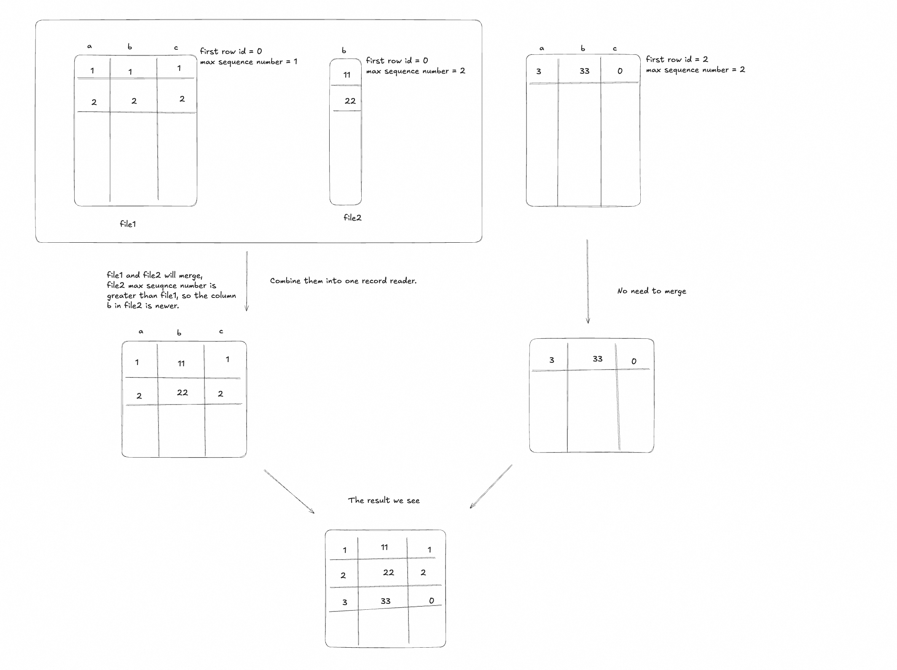

The advantage to the mode is:

- Avoid rewriting the whole file when updating partial columns, reducing I/O cost.
- The read performance is not significantly impacted, as the merge process is optimized.
- The disk space is used more efficiently, as only the updated columns are written to new files.

---

<a id="append-table-blob"></a>

<!-- source_url: https://paimon.apache.org/docs/master/append-table/blob/ -->

<!-- page_index: 37 -->

# Blob Storage #

> This documentation is for an unreleased version of Apache Paimon. We recommend you use the latest [stable version](https://paimon.apache.org/docs/1.4).

<a id="append-table-blob--blob-storage"></a>

# Blob Storage [#](#append-table-blob--blob-storage)

<a id="append-table-blob--overview"></a>

## Overview [#](#append-table-blob--overview)

The `BLOB` (Binary Large Object) type is a data type designed for storing multimodal data such as images, videos, audio files, and other large binary objects in Paimon tables. Unlike traditional `BYTES` type which stores binary data inline with other columns, `BLOB` type stores large binary data in separate files and maintains references to them, providing better performance for large objects.

The Blob Storage is based on Data Evolution mode.

The Blob type is ideal for:

- **Image Storage**: Store product images, user avatars, medical imaging data
- **Video Content**: Store video clips, surveillance footage, multimedia content
- **Audio Files**: Store voice recordings, music files, podcast episodes
- **Document Storage**: Store PDF documents, office files, large text files
- **Machine Learning**: Store embeddings, model weights, feature vectors
- **Any Large Binary Data**: Any data that is too large to store efficiently inline

<a id="append-table-blob--storage-layout"></a>

## Storage Layout [#](#append-table-blob--storage-layout)

When you define a table with a Blob column, Paimon automatically separates the storage:

1. **Normal Data Files** (e.g., `.parquet`, `.orc`): Store regular columns (INT, STRING, etc.)
2. **Blob Data Files** (`.blob`): Store the actual blob data

For example, given a table with schema `(id INT, name STRING, picture BLOB)`:

```
table/
├── bucket-0/
│   ├── data-uuid-0.parquet      # Contains id, name columns
│   ├── data-uuid-1.blob         # Contains picture blob data
│   ├── data-uuid-2.blob         # Contains more picture blob data
│   └── ...
├── manifest/
├── schema/
└── snapshot/
```

This separation provides several benefits:

- Efficient column projection (reading non-blob columns doesn’t load blob data)
- Optimized file rolling based on blob size
- Better compression for regular columnar data

For details about the blob file format structure, see [File Format - BLOB](#concepts-spec-fileformat--blob).

<a id="append-table-blob--storage-modes"></a>

## Storage Modes [#](#append-table-blob--storage-modes)

Paimon supports three storage modes for BLOB fields:

1. **Default blob storage**
   Blob bytes are written to Paimon-managed `.blob` files under the table path.
2. **Descriptor-only storage**
   Fields configured in `blob-descriptor-field` store only serialized `BlobDescriptor` bytes inline in data files. Paimon does not write `.blob` files for these fields, and writes must provide descriptor-based input.
3. **External-storage descriptor mode**
   Fields configured in `blob-external-storage-field` are a subset of `blob-descriptor-field`. At write time, Paimon writes the raw blob data to the configured `blob-external-storage-path` and stores only serialized `BlobDescriptor` bytes inline in data files.

This allows one table to mix raw-data BLOB fields, descriptor-only BLOB fields, and descriptor-based BLOB fields backed by external storage.

<a id="append-table-blob--table-options"></a>

## Table Options [#](#append-table-blob--table-options)

| Option | Required | Default | Type | Description |
| --- | --- | --- | --- | --- |
| DOC2MDPLACEHOLDERTOKEN5ENDblob-field | No | (none) | String | Specifies column names that should be stored as blob type. This is used when you want to treat a BYTES column as a BLOB. |
| DOC2MDPLACEHOLDERTOKEN6ENDblob-as-descriptor | No | false | Boolean | Controls read output format for blob fields. When set to true, queries return serialized BlobDescriptor bytes; when false, queries return actual blob bytes. This option is dynamic and can be changed with `ALTER TABLE ... SET`. |
| DOC2MDPLACEHOLDERTOKEN7ENDblob-descriptor-field | No | (none) | String | Comma-separated BLOB field names stored as serialized `BlobDescriptor` bytes inline in normal data files. By default, all blob fields store blob bytes in separate `.blob` files. If configured, one table can mix: some BLOB fields in `.blob` files and some as descriptor references. |
| DOC2MDPLACEHOLDERTOKEN8ENDblob-external-storage-field | No | (none) | String | Comma-separated BLOB field names whose raw data should be written to external storage at write time. This option must be a subset of `blob-descriptor-field`. For these fields, Paimon stores serialized `BlobDescriptor` bytes inline in data files. |
| DOC2MDPLACEHOLDERTOKEN9ENDblob-external-storage-path | No | (none) | String | External storage path used by fields configured in `blob-external-storage-field`. Orphan file cleanup is not applied to this path. |
| DOC2MDPLACEHOLDERTOKEN10ENDblob.target-file-size | No | (same as target-file-size) | MemorySize | Target size for blob files. When a blob file reaches this size, a new file is created. If not specified, uses the same value as `target-file-size`. |
| DOC2MDPLACEHOLDERTOKEN11ENDrow-tracking.enabled | Yes\* | false | Boolean | Must be enabled for blob tables to support row-level operations. |
| DOC2MDPLACEHOLDERTOKEN12ENDdata-evolution.enabled | Yes\* | false | Boolean | Must be enabled for blob tables to support schema evolution. |

\*Required for blob functionality to work correctly.

Specifically, if the storage system of the input BlobDescriptor differs from that used by Paimon, you can specify the storage configuration for the input blob descriptor using the prefix
`blob-descriptor.`. For example, if the source data is stored in a different OSS endpoint, you can configure it as below (using flink sql as an example):

```sql
CREATE TABLE image_table (
    id INT,
    name STRING,
    image BYTES
) WITH (
    'row-tracking.enabled' = 'true',
    'data-evolution.enabled' = 'true',
    'blob-field' = 'image',
    'fs.oss.endpoint' = 'aaa',                   -- This is for Paimon's own config
    'blob-descriptor.fs.oss.endpoint' = 'bbb'    -- This is for input blob descriptors' config
);
```

<a id="append-table-blob--sql-usage"></a>

## SQL Usage [#](#append-table-blob--sql-usage)

<a id="append-table-blob--creating-a-table"></a>

### Creating a Table [#](#append-table-blob--creating-a-table)

Flink SQL

```sql
-- Create a table with a blob field
-- Note: In Flink SQL, use BYTES type and specify blob-field option
CREATE TABLE image_table (
    id INT,
    name STRING,
    image BYTES
) WITH (
    'row-tracking.enabled' = 'true',
    'data-evolution.enabled' = 'true',
    'blob-field' = 'image'
);
```

Spark SQL

```sql
-- Create a table with a blob field
-- Note: In Spark SQL, use BINARY type and specify blob-field option
CREATE TABLE image_table (
    id INT,
    name STRING,
    image BINARY
) TBLPROPERTIES (
    'row-tracking.enabled' = 'true',
    'data-evolution.enabled' = 'true',
    'blob-field' = 'image'
);
```

<a id="append-table-blob--inserting-blob-data"></a>

### Inserting Blob Data [#](#append-table-blob--inserting-blob-data)

Flink SQL

```sql
-- Insert data with inline blob bytes
INSERT INTO image_table VALUES (1, 'sample', X'89504E470D0A1A0A');

-- Insert from another table
INSERT INTO image_table
SELECT id, name, content FROM source_table;
```

Spark SQL

```sql
-- Insert data with inline blob bytes
INSERT INTO image_table VALUES (1, 'sample', X'89504E470D0A1A0A');
```

<a id="append-table-blob--querying-blob-data"></a>

### Querying Blob Data [#](#append-table-blob--querying-blob-data)

```sql
-- Select all columns including blob
SELECT * FROM image_table;

-- Select only non-blob columns (efficient - doesn't load blob data)
SELECT id, name FROM image_table;

-- Select specific rows with blob
SELECT * FROM image_table WHERE id = 1;
```

<a id="append-table-blob--blob-read-output-mode-blob-as-descriptor"></a>

### Blob Read Output Mode (`blob-as-descriptor`) [#](#append-table-blob--blob-read-output-mode-blob-as-descriptor)

`blob-as-descriptor` only controls how blob values are returned when reading.

```sql
-- Return descriptor bytes
ALTER TABLE blob_table SET ('blob-as-descriptor' = 'true');
SELECT image FROM blob_table;

-- Return actual blob bytes
ALTER TABLE blob_table SET ('blob-as-descriptor' = 'false');
SELECT image FROM blob_table;
```

<a id="append-table-blob--merge-into-support"></a>

### MERGE INTO Support [#](#append-table-blob--merge-into-support)

For Data Evolution writes in Flink and Spark:

- raw-data BLOB columns are still rejected in partial-column `MERGE INTO` updates
- descriptor-based BLOB columns are allowed

<a id="append-table-blob--java-api-usage"></a>

## Java API Usage [#](#append-table-blob--java-api-usage)

<a id="append-table-blob--creating-a-table-1"></a>
<a id="append-table-blob--creating-a-table-2"></a>

### Creating a Table [#](#append-table-blob--creating-a-table-1)

The following example demonstrates how to create a table with a blob column, write blob data, and read it back using Paimon’s Java API.

```java
import org.apache.paimon.catalog.Catalog;
import org.apache.paimon.catalog.CatalogContext;
import org.apache.paimon.catalog.CatalogFactory;
import org.apache.paimon.catalog.Identifier;
import org.apache.paimon.CoreOptions;
import org.apache.paimon.data.BinaryString;
import org.apache.paimon.data.Blob;
import org.apache.paimon.data.BlobData;
import org.apache.paimon.data.GenericRow;
import org.apache.paimon.data.InternalRow;
import org.apache.paimon.fs.Path;
import org.apache.paimon.fs.SeekableInputStream;
import org.apache.paimon.reader.RecordReader;
import org.apache.paimon.schema.Schema;
import org.apache.paimon.table.Table;
import org.apache.paimon.table.sink.BatchTableCommit;
import org.apache.paimon.table.sink.BatchTableWrite;
import org.apache.paimon.table.sink.BatchWriteBuilder;
import org.apache.paimon.table.source.ReadBuilder;
import org.apache.paimon.types.DataTypes;

import java.io.ByteArrayInputStream;
import java.nio.file.Files;

public class BlobTableExample {

    public static void main(String[] args) throws Exception {
        // 1. Create catalog
        Path warehouse = new Path("/tmp/paimon-warehouse");
        Catalog catalog = CatalogFactory.createCatalog(CatalogContext.create(warehouse));
        catalog.createDatabase("my_db", true);

        // 2. Define schema with BLOB column
        Schema schema = Schema.newBuilder()
                .column("id", DataTypes.INT())
                .column("name", DataTypes.STRING())
                .column("image", DataTypes.BLOB())  // Blob column for storing images
                .option(CoreOptions.ROW_TRACKING_ENABLED.key(), "true")
                .option(CoreOptions.DATA_EVOLUTION_ENABLED.key(), "true")
                .build();

        // 3. Create table
        Identifier tableId = Identifier.create("my_db", "image_table");
        catalog.createTable(tableId, schema, true);
        Table table = catalog.getTable(tableId);

        // 4. Write blob data
        writeBlobData(table);

        // 5. Read blob data back
        readBlobData(table);
    }

    private static void writeBlobData(Table table) throws Exception {
        BatchWriteBuilder writeBuilder = table.newBatchWriteBuilder();

        try (BatchTableWrite write = writeBuilder.newWrite();
             BatchTableCommit commit = writeBuilder.newCommit()) {

            // Method 1: Create blob from byte array
            byte[] imageBytes = loadImageBytes("/path/to/image1.png");
            GenericRow row1 = GenericRow.of(
                    1,
                    BinaryString.fromString("image1"),
                    new BlobData(imageBytes)
            );
            write.write(row1);

            // Method 2: Create blob from local file
            GenericRow row2 = GenericRow.of(
                    2,
                    BinaryString.fromString("image2"),
                    Blob.fromLocal("/path/to/image2.png")
            );
            write.write(row2);

            // Method 3: Create blob from InputStream (useful for streaming data)
            byte[] streamData = loadImageBytes("/path/to/image3.png");
            ByteArrayInputStream inputStream = new ByteArrayInputStream(streamData);
            GenericRow row3 = GenericRow.of(
                    3,
                    BinaryString.fromString("image3"),
                    Blob.fromInputStream(() -> SeekableInputStream.wrap(inputStream))
            );
            write.write(row3);

            // Method 4: Create blob from HTTP URL
            GenericRow row4 = GenericRow.of(
                    4,
                    BinaryString.fromString("remote_image"),
                    Blob.fromHttp("https://example.com/image.png")
            );
            write.write(row4);

            // Commit all writes
            commit.commit(write.prepareCommit());
        }

        System.out.println("Successfully wrote 4 rows with blob data");
    }

    private static void readBlobData(Table table) throws Exception {
        ReadBuilder readBuilder = table.newReadBuilder();
        RecordReader<InternalRow> reader =
                readBuilder.newRead().createReader(readBuilder.newScan().plan());

        reader.forEachRemaining(row -> {
            int id = row.getInt(0);
            String name = row.getString(1).toString();
            Blob blob = row.getBlob(2);

            // Method 1: Read blob as byte array (loads entire blob into memory)
            byte[] data = blob.toData();
            System.out.println("Row " + id + ": " + name + ", blob size: " + data.length);

            // Method 2: Read blob as stream (better for large blobs)
            try (SeekableInputStream in = blob.newInputStream()) {
                // Process stream without loading entire blob into memory
                byte[] buffer = new byte[1024];
                int bytesRead;
                long totalSize = 0;
                while ((bytesRead = in.read(buffer)) != -1) {
                    totalSize += bytesRead;
                    // Process buffer...
                }
                System.out.println("Streamed " + totalSize + " bytes");
            } catch (Exception e) {
                e.printStackTrace();
            }
        });
    }

    private static byte[] loadImageBytes(String path) throws Exception {
        return Files.readAllBytes(java.nio.file.Path.of(path));
    }
}
```

<a id="append-table-blob--construct-blob-from-different-sources"></a>

### Construct blob from different sources [#](#append-table-blob--construct-blob-from-different-sources)

```java
// From byte array (data already in memory)
Blob blob = Blob.fromData(imageBytes);

// From local file system
Blob blob = Blob.fromLocal("/path/to/image.png");

// From any FileIO (supports HDFS, S3, OSS, etc.)
FileIO fileIO = FileIO.get(new Path("s3://bucket"), catalogContext);
Blob blob = Blob.fromFile(fileIO, "s3://bucket/path/to/image.png");

// From FileIO with offset and length (read partial file)
Blob blob = Blob.fromFile(fileIO, "s3://bucket/large-file.bin", 1024, 2048);

// From HTTP/HTTPS URL
Blob blob = Blob.fromHttp("https://example.com/image.png");

// From InputStream supplier (lazy loading)
Blob blob = Blob.fromInputStream(() -> new FileInputStream("/path/to/image.png"));

// From BlobDescriptor (reconstruct blob reference from descriptor)
BlobDescriptor descriptor = new BlobDescriptor("s3://bucket/path/to/image.png", 0, 1024);
UriReader uriReader = UriReader.fromFile(fileIO);
Blob blob = Blob.fromDescriptor(uriReader, descriptor);
```

<a id="append-table-blob--querying-blob-data-1"></a>
<a id="append-table-blob--querying-blob-data-2"></a>

### Querying Blob Data [#](#append-table-blob--querying-blob-data-1)

```java
// Get blob from row (column index 2 in this example)
Blob blob = row.getBlob(2);

// Read as byte array (simple but loads entire blob into memory)
byte[] data = blob.toData();

// Read as stream (recommended for large blobs)
try (SeekableInputStream in = blob.newInputStream()) {
    // SeekableInputStream supports random access
    in.seek(100);  // Jump to position 100
    byte[] buffer = new byte[1024];
    int bytesRead = in.read(buffer);
}

// Get blob descriptor (for reference-based blobs)
// Note: Only works for BlobRef, not BlobData
BlobDescriptor descriptor = blob.toDescriptor();
String uri = descriptor.uri();      // e.g., "s3://bucket/path/to/blob"
long offset = descriptor.offset();  // Starting position in the file
long length = descriptor.length();  // Length of the blob data
```

<a id="append-table-blob--descriptor-aware-write-behavior"></a>

### Descriptor-Aware Write Behavior [#](#append-table-blob--descriptor-aware-write-behavior)

Paimon write path is descriptor-aware automatically:

1. For blob fields stored in `.blob` files, input can be either blob bytes or a `BlobDescriptor`.
2. For fields configured in `blob-descriptor-field`, Paimon stores descriptor bytes inline in data files (no `.blob` files for those fields), and input must be a descriptor.
3. For fields configured in `blob-external-storage-field`, Paimon writes the blob data to `blob-external-storage-path` and stores descriptor bytes inline in data files.
4. This behavior does not depend on `blob-as-descriptor`.

```java
import org.apache.paimon.catalog.Catalog;
import org.apache.paimon.catalog.CatalogContext;
import org.apache.paimon.catalog.CatalogFactory;
import org.apache.paimon.catalog.Identifier;
import org.apache.paimon.CoreOptions;
import org.apache.paimon.data.BinaryString;
import org.apache.paimon.data.Blob;
import org.apache.paimon.data.BlobData;
import org.apache.paimon.data.BlobDescriptor;
import org.apache.paimon.data.GenericRow;
import org.apache.paimon.data.InternalRow;
import org.apache.paimon.fs.Path;
import org.apache.paimon.reader.RecordReader;
import org.apache.paimon.schema.Schema;
import org.apache.paimon.table.Table;
import org.apache.paimon.table.sink.BatchTableCommit;
import org.apache.paimon.table.sink.BatchTableWrite;
import org.apache.paimon.table.sink.BatchWriteBuilder;
import org.apache.paimon.table.source.ReadBuilder;
import org.apache.paimon.types.DataTypes;

public class BlobDescriptorExample {

    public static void main(String[] args) throws Exception {
        Path warehouse = new Path("s3://my-bucket/paimon-warehouse");
        CatalogContext catalogContext = CatalogContext.create(warehouse);
        Catalog catalog = CatalogFactory.createCatalog(catalogContext);
        catalog.createDatabase("my_db", true);

        // Create table: store "video" as descriptor bytes inline
        Schema schema = Schema.newBuilder()
                .column("id", DataTypes.INT())
                .column("name", DataTypes.STRING())
                .column("video", DataTypes.BLOB())
                .option(CoreOptions.ROW_TRACKING_ENABLED.key(), "true")
                .option(CoreOptions.DATA_EVOLUTION_ENABLED.key(), "true")
                .option(CoreOptions.BLOB_DESCRIPTOR_FIELD.key(), "video")
                .build();

        Identifier tableId = Identifier.create("my_db", "video_table");
        catalog.createTable(tableId, schema, true);
        Table table = catalog.getTable(tableId);

        // Write blob using descriptor reference
        writeLargeBlobWithDescriptor(table);

        // Read blob data
        readBlobData(table);
    }

    private static void writeLargeBlobWithDescriptor(Table table) throws Exception {
        BatchWriteBuilder writeBuilder = table.newBatchWriteBuilder();

        try (BatchTableWrite write = writeBuilder.newWrite();
             BatchTableCommit commit = writeBuilder.newCommit()) {

            // For a very large file (e.g., 2GB video), instead of loading into memory:
            //   byte[] hugeVideo = Files.readAllBytes(...);  // This would cause OutOfMemoryError!
            //
            // Create a descriptor reference to external blob
            String externalUri = "s3://my-bucket/videos/large_video.mp4";
            long fileSize = 2L * 1024 * 1024 * 1024;  // 2GB

            BlobDescriptor descriptor = new BlobDescriptor(externalUri, 0, fileSize);
            // file io should be accessible to externalUri
            FileIO fileIO = Table.fileIO();
            UriReader uriReader = UriReader.fromFile(fileIO);
            Blob blob = Blob.fromDescriptor(uriReader, descriptor);

            GenericRow row = GenericRow.of(
                    1,
                    BinaryString.fromString("large_video"),
                    blob);
            write.write(row);

            commit.commit(write.prepareCommit());
        }

        System.out.println("Successfully wrote large blob using descriptor reference");
    }

    private static void readBlobData(Table table) throws Exception {
        ReadBuilder readBuilder = table.newReadBuilder();
        RecordReader<InternalRow> reader =
                readBuilder.newRead().createReader(readBuilder.newScan().plan());

        reader.forEachRemaining(row -> {
            int id = row.getInt(0);
            String name = row.getString(1).toString();
            Blob blob = row.getBlob(2);

            // Field is configured in blob-descriptor-field, so descriptor is stored inline
            BlobDescriptor descriptor = blob.toDescriptor();
            System.out.println("Row " + id + ": " + name);
            System.out.println("  Blob URI: " + descriptor.uri());
            System.out.println("  Length: " + descriptor.length());
        });
    }
}
```

**Reading blob data with different output modes:**

The `blob-as-descriptor` option affects only read output:

```sql
-- When blob-as-descriptor = true: Returns BlobDescriptor bytes (reference to Paimon blob file)
ALTER TABLE video_table SET ('blob-as-descriptor' = 'true');
SELECT * FROM video_table;  -- Returns serialized BlobDescriptor

-- When blob-as-descriptor = false: Returns actual blob bytes
ALTER TABLE video_table SET ('blob-as-descriptor' = 'false');
SELECT * FROM video_table;  -- Returns actual blob bytes from Paimon storage
```

<a id="append-table-blob--blob-storage-mode-descriptor-only"></a>
<a id="append-table-blob--blob-storage-mode:-descriptor-only"></a>

### Blob storage mode: DESCRIPTOR ONLY [#](#append-table-blob--blob-storage-mode-descriptor-only)

If you want downstream tables to **reuse** upstream blob files (no copying and no new `.blob` files), configure the target blob field(s):

```sql
'blob-descriptor-field' = 'image'
```

For these configured fields, Paimon stores only serialized `BlobDescriptor` bytes in normal data files. Reading the blob follows the descriptor URI to access bytes, and writing requires descriptor input for those fields.

<a id="append-table-blob--blob-storage-mode-external-storage"></a>
<a id="append-table-blob--blob-storage-mode:-external-storage"></a>

### Blob storage mode: EXTERNAL STORAGE [#](#append-table-blob--blob-storage-mode-external-storage)

If you want Paimon to write raw blob data to a separate external location while keeping only descriptor bytes inline, configure the target blob field(s):

```sql
'blob-descriptor-field' = 'image',
'blob-external-storage-field' = 'image',
'blob-external-storage-path' = 'oss://bucket/path/'
```

For these configured fields:

- raw blob data is written to the configured external storage path
- normal data files keep only serialized `BlobDescriptor` bytes
- writes can still start from raw BLOB input
- the field is treated as descriptor-based for operations such as `MERGE INTO`

<a id="append-table-blob--limitations"></a>

## Limitations [#](#append-table-blob--limitations)

1. **Append Table Only**: Blob type is designed for append-only tables. Primary key tables are not supported.
2. **No Predicate Pushdown**: Blob columns cannot be used in filter predicates.
3. **No Statistics**: Statistics collection is not supported for blob columns.
4. **Required Options**: `row-tracking.enabled` and `data-evolution.enabled` must be set to `true`.
5. **External Storage Cleanup**: Files written through `blob-external-storage-path` are outside Paimon’s orphan file cleanup scope.

<a id="append-table-blob--best-practices"></a>

## Best Practices [#](#append-table-blob--best-practices)

1. **Use Column Projection**: Always select only the columns you need. Avoid `SELECT *` if you don’t need blob data.
2. **Set Appropriate Target File Size**: Configure `blob.target-file-size` based on your blob sizes. Larger values mean fewer files but larger individual files.
3. **Use Descriptor Fields When Reusing External Blob Files**: Configure `blob-descriptor-field` for fields that should keep descriptor references instead of writing new `.blob` files.
4. **Use External-Storage Fields When Accepting Raw Input But Storing Descriptors**: Configure `blob-external-storage-field` together with `blob-external-storage-path` when upstream writes raw blob bytes but you want descriptor-based storage.
5. **Manage External Storage Lifecycle Separately**: Files written to `blob-external-storage-path` are not cleaned up by Paimon, so retention and deletion should be managed externally.
6. **Use Partitioning**: Partition your blob tables by date or other dimensions to improve query performance and data management.

---

<a id="append-table-vector"></a>

<!-- source_url: https://paimon.apache.org/docs/master/append-table/vector/ -->

<!-- page_index: 38 -->

# Vector Storage #

> This documentation is for an unreleased version of Apache Paimon. We recommend you use the latest [stable version](https://paimon.apache.org/docs/1.4).

<a id="append-table-vector--vector-storage"></a>

# Vector Storage [#](#append-table-vector--vector-storage)

<a id="append-table-vector--overview"></a>

## Overview [#](#append-table-vector--overview)

With the explosive growth of AI scenarios, vector storage has become increasingly important.

Paimon provides optimized storage solutions specifically designed for vector data to meet the needs of various scenarios.

<a id="append-table-vector--vector-data-type"></a>

## Vector Data Type [#](#append-table-vector--vector-data-type)

Vector data comes in many types, among which dense vectors are the most commonly used. They are typically expressed as fixed-length, densely packed arrays, generally without `null` elements.

Paimon supports defining columns of type `VECTOR<t, n>`, which represents a fixed-length, dense vector column, where:

- **`t`**: The element type of the vector. Currently supports seven primitive types: `BOOLEAN`, `TINYINT`, `SMALLINT`, `INT`, `BIGINT`, `FLOAT`, `DOUBLE`;
- **`n`**: The vector dimension, must be a positive integer not exceeding `2,147,483,647`;
- **`null constraint`**: `VECTOR` type supports defining `NOT NULL` or the default nullable. However, if a specific `VECTOR` value itself is not `null`, its elements are not allowed to be `null`.

Compared to variable-length arrays, these features make dense vectors more concise in storage and memory representation, with benefits including:

- More natural semantic constraints, preventing mismatched lengths, `null` elements, and other anomalies at the data storage layer;
- Better point-lookup performance, eliminating offset array storage and access;
- Closer alignment with type representations in specialized vector engines, often avoiding memory copies and type conversions during queries.

Example: Define a table with a `VECTOR` column using Java API and write one row of data.

```java
public class CreateTableWithVector {

    public static void main(String[] args) throws Exception {
        // Schema
        Schema.Builder schemaBuilder = Schema.newBuilder();
        schemaBuilder.column("id", DataTypes.BIGINT());
        schemaBuilder.column("embed", DataTypes.VECTOR(3, DataTypes.FLOAT()));
        schemaBuilder.option(CoreOptions.FILE_FORMAT.key(), "lance");
        schemaBuilder.option(CoreOptions.FILE_COMPRESSION.key(), "none");
        Schema schema = schemaBuilder.build();

        // Create catalog
        String database = "default";
        String tempPath = System.getProperty("java.io.tmpdir") + UUID.randomUUID();
        Path warehouse = new Path(TraceableFileIO.SCHEME + "://" + tempPath);
        Identifier identifier = Identifier.create("default", "my_table");
        try (Catalog catalog = CatalogFactory.createCatalog(CatalogContext.create(warehouse))) {

            // Create table
            catalog.createDatabase(database, true);
            catalog.createTable(identifier, schema, true);
            FileStoreTable table = (FileStoreTable) catalog.getTable(identifier);

            // Write data
            BatchWriteBuilder builder = table.newBatchWriteBuilder();
            InternalVector vector = BinaryVector.fromPrimitiveArray(new float[] {1.0f, 2.0f, 3.0f});
            try (BatchTableWrite batchTableWrite = builder.newWrite()) {
                try (BatchTableCommit commit = builder.newCommit()) {
                    batchTableWrite.write(GenericRow.of(1L, vector));
                    commit.commit(batchTableWrite.prepareCommit());
                }
            }

            // Read data
            ReadBuilder readBuilder = table.newReadBuilder();
            TableScan.Plan plan = readBuilder.newScan().plan();
            try (RecordReader<InternalRow> reader = readBuilder.newRead().createReader(plan)) {
                reader.forEachRemaining(row -> {
                    float[] readVector = row.getVector(1).toFloatArray();
                    System.out.println(Arrays.toString(readVector));
                });
            }
        }
    }
}
```

**Notes**:

- Columns of `VECTOR` type cannot be used as primary key columns, partition columns, or for sorting.

<a id="append-table-vector--engine-level-representation"></a>

## Engine-Level Representation [#](#append-table-vector--engine-level-representation)

Since engine layers typically don’t have dedicated vector types, to support `VECTOR` type in engine SQL, Paimon provides a separate configuration to convert the engine’s `ARRAY` type to Paimon’s `VECTOR` type.

Usage:

- **`'vector-field'`**: Declare columns as `VECTOR` type, multiple columns separated by commas (`,`);
- **`'field.{field-name}.vector-dim'`**: Declare the dimension of the vector column.

Example: Define a table with a `VECTOR` column using Flink SQL.

```sql
CREATE TABLE IF NOT EXISTS ts_table (
    id BIGINT,
    embed1 ARRAY<FLOAT>,
    embed2 ARRAY<FLOAT>
) WITH (
    'file.format' = 'lance',
    'vector-field' = 'embed1,embed2',
    'field.embed1.vector-dim' = '128',
    'field.embed2.vector-dim' = '768'
);
```

**Notes**:

- When defining `vector-field` columns, you must provide the vector dimension; otherwise, the CREATE TABLE statement will fail;
- Currently, only Flink SQL supports this configuration; other engines have not been implemented yet.

<a id="append-table-vector--dedicated-file-format-for-vector"></a>

## Dedicated File Format for Vector [#](#append-table-vector--dedicated-file-format-for-vector)

When mapping `VECTOR` type to the file format layer, the ideal storage format is `FixedSizeList`. Currently, this is only supported for certain file formats (such as `lance`) through the `paimon-arrow` integration. This means that to use `VECTOR` type, you must specify a particular format via `file.format`, which has a global impact. In particular, this may be unfavorable for scalars and multimodal (Blob) data.

Therefore, Paimon provides a solution to store vector columns separately within Data Evolution tables.

Layout:

```
table/
├── bucket-0/
│   ├── data-uuid-0.parquet      # Contains id, name columns
│   ├── data-uuid-1.blob         # Contains blob data
│   ├── data-uuid-2.vector.lance # Contains vector data using lance format
│   └── ...
├── manifest/
├── schema/
└── snapshot/
```

Usage:

- **`vector.file.format`**: Store `VECTOR` type columns separately in the specified file format;
- **`vector.target-file-size`**: If stored separately, specifies the target file size for vector data, defaulting to `10 * 'target-file-size'`.

Example: Store `VECTOR` columns separately using Flink SQL.

```sql
CREATE TABLE IF NOT EXISTS ts_table (
    id BIGINT,
    embed ARRAY<FLOAT>
) WITH (
    'file.format' = 'parquet',
    'vector.file.format' = 'lance',
    'vector-field' = 'embed',
    'field.embed.vector-dim' = '128',
    'row-tracking.enabled' = 'true',
    'data-evolution.enabled' = 'true'
);
```

---

<a id="append-table-global-index"></a>

<!-- source_url: https://paimon.apache.org/docs/master/append-table/global-index/ -->

<!-- page_index: 39 -->

# Global Index #

> This documentation is for an unreleased version of Apache Paimon. We recommend you use the latest [stable version](https://paimon.apache.org/docs/1.4).

<a id="append-table-global-index--global-index"></a>

# Global Index [#](#append-table-global-index--global-index)

<a id="append-table-global-index--overview"></a>

## Overview [#](#append-table-global-index--overview)

Global Index is a powerful indexing mechanism for Data Evolution (append) tables. It enables efficient row-level lookups and filtering
without full-table scans. Paimon supports multiple global index types:

- **BTree Index**: A B-tree based index for scalar column lookups. Supports equality, IN, range predicates, and can be combined across multiple columns with AND/OR logic.
- **Vector Index**: An approximate nearest neighbor (ANN) index powered by DiskANN for vector similarity search.
- **Full-Text Index**: A full-text search index powered by Tantivy for text retrieval. Supports term matching and relevance scoring.

Global indexes work on top of Data Evolution tables. To use global indexes, your table **must** have:

- `'bucket' = '-1'` (unaware-bucket mode)
- `'row-tracking.enabled' = 'true'`
- `'data-evolution.enabled' = 'true'`

> Global index queries may not be exact when the index only covers part of the table data. If a query predicate matches the index, Paimon returns only the results from the indexed portion. Matching records in data that has not been indexed yet will not be returned.

<a id="append-table-global-index--prerequisites"></a>

## Prerequisites [#](#append-table-global-index--prerequisites)

Create a table with the required properties:

```sql
CREATE TABLE my_table (
    id INT,
    name STRING,
    embedding ARRAY<FLOAT>,
    content STRING
) TBLPROPERTIES (
    'bucket' = '-1',
    'row-tracking.enabled' = 'true',
    'data-evolution.enabled' = 'true',
    'global-index.enabled' = 'true'
);
```

<a id="append-table-global-index--btree-index"></a>

## BTree Index [#](#append-table-global-index--btree-index)

BTree index builds a logical B-tree structure over SST files, enabling efficient point lookups and range queries on scalar columns.

**Build BTree Index**

```sql
-- Create BTree index on 'name' column
CALL sys.create_global_index(
    table => 'db.my_table',
    index_column => 'name',
    index_type => 'btree'
);
```

**Query with BTree Index**

Once a BTree index is built, it is automatically used during scan when a filter predicate matches the indexed column.

```sql
SELECT * FROM my_table WHERE name IN ('a200', 'a300');
```

<a id="append-table-global-index--vector-index"></a>

## Vector Index [#](#append-table-global-index--vector-index)

Vector Index provides approximate nearest neighbor (ANN) search based on the DiskANN algorithm. It is suitable for
vector similarity search scenarios such as recommendation systems, image retrieval, and RAG (Retrieval Augmented
Generation) applications.

**Build Vector Index**

```sql
-- Create Lumina vector index on 'embedding' column
CALL sys.create_global_index(
    table => 'db.my_table',
    index_column => 'embedding',
    index_type => 'lumina',
    options => 'lumina.index.dimension=128'
);
```

The legacy index type `lumina-vector-ann` is still accepted for existing tables and SQL compatibility.

**Vector Search**

Spark SQL

```sql
-- Search for top-5 nearest neighbors
SELECT * FROM vector_search('my_table', 'embedding', array(1.0f, 2.0f, 3.0f), 5);
```

Flink SQL (Procedure)

Unlike Spark’s table-valued function, Flink uses a `CALL` procedure to perform vector search.
The procedure returns JSON-serialized rows as strings.

```sql
-- Search for top-5 nearest neighbors
CALL sys.vector_search(
    `table` => 'db.my_table',
    vector_column => 'embedding',
    query_vector => '1.0,2.0,3.0',
    top_k => 5
);

-- With projection (only return specific columns)
CALL sys.vector_search(
    `table` => 'db.my_table',
    vector_column => 'embedding',
    query_vector => '1.0,2.0,3.0',
    top_k => 5,
    projection => 'id,name'
);
```

Java API

```java
Table table = catalog.getTable(identifier);

// Step 1: Build vector search
float[] queryVector = {1.0f, 2.0f, 3.0f};
GlobalIndexResult result = table.newVectorSearchBuilder()
        .withVector(queryVector)
        .withLimit(5)
        .withVectorColumn("embedding")
        .executeLocal();

// Step 2: Read matching rows using the search result
ReadBuilder readBuilder = table.newReadBuilder();
TableScan.Plan plan = readBuilder.newScan().withGlobalIndexResult(result).plan();
try (RecordReader<InternalRow> reader = readBuilder.newRead().createReader(plan)) {
    reader.forEachRemaining(row -> {
        System.out.println("id=" + row.getInt(0) + ", name=" + row.getString(1));
    });
}
```

<a id="append-table-global-index--full-text-index"></a>

## Full-Text Index [#](#append-table-global-index--full-text-index)

Full-Text Index provides text search capabilities powered by Tantivy. It is suitable for text retrieval scenarios
such as document search, log analysis, and content-based filtering.

**Build Full-Text Index**

```sql
-- Create full-text index on 'content' column
CALL sys.create_global_index(
    table => 'db.my_table',
    index_column => 'content',
    index_type => 'tantivy-fulltext'
);
```

**Full-Text Search**

Spark SQL

```sql
-- Search for top-10 documents matching the query
SELECT * FROM full_text_search('my_table', 'content', 'paimon lake format', 10);
```

Java API

```java
Table table = catalog.getTable(identifier);

// Step 1: Build full-text search
GlobalIndexResult result = table.newFullTextSearchBuilder()
        .withQueryText("paimon lake format")
        .withLimit(10)
        .withTextColumn("content")
        .executeLocal();

// Step 2: Read matching rows using the search result
ReadBuilder readBuilder = table.newReadBuilder();
TableScan.Plan plan = readBuilder.newScan().withGlobalIndexResult(result).plan();
try (RecordReader<InternalRow> reader = readBuilder.newRead().createReader(plan)) {
    reader.forEachRemaining(row -> {
        System.out.println("id=" + row.getInt(0) + ", content=" + row.getString(1));
    });
}
```

Python SDK

```python
table = catalog.get_table('db.my_table')

# Step 1: Build full-text search
builder = table.new_full_text_search_builder()
builder.with_text_column('content')
builder.with_query_text('paimon lake format')
builder.with_limit(10)
result = builder.execute_local()

# Step 2: Read matching rows using the search result
read_builder = table.new_read_builder()
scan = read_builder.new_scan().with_global_index_result(result)
plan = scan.plan()
table_read = read_builder.new_read()
pa_table = table_read.to_arrow(plan.splits())
print(pa_table)
```

---

<a id="flink-quick-start"></a>

<!-- source_url: https://paimon.apache.org/docs/master/flink/quick-start/ -->

<!-- page_index: 40 -->

# Quick Start #

> This documentation is for an unreleased version of Apache Paimon. We recommend you use the latest [stable version](https://paimon.apache.org/docs/1.4).

<a id="flink-quick-start--quick-start"></a>

# Quick Start [#](#flink-quick-start--quick-start)

This documentation is a guide for using Paimon in Flink.

<a id="flink-quick-start--jars"></a>

## Jars [#](#flink-quick-start--jars)

Paimon currently supports Flink 2.2, 2.1, 2.0, 1.20, 1.19, 1.18, 1.17, 1.16. We recommend the latest Flink version for a better experience.

Download the jar file with corresponding version.

> Currently, paimon provides two types jar: one of which(the bundled jar) is used for read/write data, and the other(action jar) for operations such as manually compaction,

| Version | Type | Jar |
| --- | --- | --- |
| Flink 2.0 | Bundled Jar | Not yet released |
| Flink 1.20 | Bundled Jar | [paimon-flink-1.20-1.5-SNAPSHOT.jar](https://repository.apache.org/snapshots/org/apache/paimon/paimon-flink-1.20/1.5-SNAPSHOT/) |
| Flink 1.19 | Bundled Jar | [paimon-flink-1.19-1.5-SNAPSHOT.jar](https://repository.apache.org/snapshots/org/apache/paimon/paimon-flink-1.19/1.5-SNAPSHOT/) |
| Flink 1.18 | Bundled Jar | [paimon-flink-1.18-1.5-SNAPSHOT.jar](https://repository.apache.org/snapshots/org/apache/paimon/paimon-flink-1.18/1.5-SNAPSHOT/) |
| Flink 1.17 | Bundled Jar | [paimon-flink-1.17-1.5-SNAPSHOT.jar](https://repository.apache.org/snapshots/org/apache/paimon/paimon-flink-1.17/1.5-SNAPSHOT/) |
| Flink 1.16 | Bundled Jar | [paimon-flink-1.16-1.5-SNAPSHOT.jar](https://repository.apache.org/snapshots/org/apache/paimon/paimon-flink-1.16/1.5-SNAPSHOT/) |
| Flink Action | Action Jar | [paimon-flink-action-1.5-SNAPSHOT.jar](https://repository.apache.org/snapshots/org/apache/paimon/paimon-flink-action/1.5-SNAPSHOT/) |

You can also manually build bundled jar from the source code.

To build from source code, [clone the git repository](https://github.com/apache/paimon.git).

Build bundled jar with the following command.

- `mvn clean install -DskipTests`

You can find the bundled jar in `./paimon-flink/paimon-flink-<flink-version>/target/paimon-flink-<flink-version>-1.5-SNAPSHOT.jar`, and the action jar in `./paimon-flink/paimon-flink-action/target/paimon-flink-action-1.5-SNAPSHOT.jar`.

<a id="flink-quick-start--start"></a>

## Start [#](#flink-quick-start--start)

**Step 1: Download Flink**

If you haven’t downloaded Flink, you can [download Flink](https://flink.apache.org/downloads.html), then extract the archive with the following command.

```bash
tar -xzf flink-*.tgz
```

**Step 2: Copy Paimon Bundled Jar**

Copy paimon bundled jar to the `lib` directory of your Flink home.

```bash
cp paimon-flink-*.jar <FLINK_HOME>/lib/
```

**Step 3: Copy Hadoop Bundled Jar**

> [!NOTE]
> > If the machine is in a hadoop environment, please ensure the value of the environment variable `HADOOP_CLASSPATH` include path to the common Hadoop libraries, you do not need to use the following pre-bundled Hadoop jar.

[Download](https://flink.apache.org/downloads.html) Pre-bundled Hadoop jar and copy the jar file to the `lib` directory of your Flink home.

```bash
cp flink-shaded-hadoop-2-uber-*.jar <FLINK_HOME>/lib/
```

**Step 4: Start a Flink Local Cluster**

In order to run multiple Flink jobs at the same time, you need to modify the cluster configuration in `<FLINK_HOME>/conf/flink-conf.yaml`(Flink version < 1.19) or `<FLINK_HOME>/conf/config.yaml`(Flink version >= 1.19).

```yaml
taskmanager.numberOfTaskSlots: 2
```

To start a local cluster, run the bash script that comes with Flink:

```bash
<FLINK_HOME>/bin/start-cluster.sh
```

You should be able to navigate to the web UI at [localhost:8081](http://localhost:8081) to view
the Flink dashboard and see that the cluster is up and running.

You can now start Flink SQL client to execute SQL scripts.

```bash
<FLINK_HOME>/bin/sql-client.sh
```

**Step 5: Create a Catalog and a Table**

Catalog

```sql
-- if you're trying out Paimon in a distributed environment,
-- the warehouse path should be set to a shared file system, such as HDFS or OSS
CREATE CATALOG my_catalog WITH (
    'type'='paimon',
    'warehouse'='file:/tmp/paimon'
);

USE CATALOG my_catalog;

-- create a word count table
CREATE TABLE word_count (
    word STRING PRIMARY KEY NOT ENFORCED,
    cnt BIGINT
);
```

Generic-Catalog

Using FlinkGenericCatalog, you need to use Hive metastore. Then, you can use all the tables from Paimon, Hive, and
Flink Generic Tables (Kafka and other tables)!

In this mode, you should use ‘connector’ option for creating tables.

> [!NOTE]
> > Paimon will use `hive.metastore.warehouse.dir` in your `hive-site.xml`, please use path with scheme.
> > For example, `hdfs://...`. Otherwise, Paimon will use the local path.

```sql
CREATE CATALOG my_catalog WITH (
    'type'='paimon-generic',
    'hive-conf-dir'='...',
    'hadoop-conf-dir'='...'
);

USE CATALOG my_catalog;

-- create a word count table
CREATE TABLE word_count (
    word STRING PRIMARY KEY NOT ENFORCED,
    cnt BIGINT
) WITH (
    'connector'='paimon'
);
```

**Step 6: Write Data**

```sql
-- create a word data generator table
CREATE TEMPORARY TABLE word_table (
    word STRING
) WITH (
    'connector' = 'datagen',
    'fields.word.length' = '1'
);

-- paimon requires checkpoint interval in streaming mode
SET 'execution.checkpointing.interval' = '10 s';

-- write streaming data to dynamic table
INSERT INTO word_count SELECT word, COUNT(*) FROM word_table GROUP BY word;
```

**Step 7: OLAP Query**

```sql
-- use tableau result mode
SET 'sql-client.execution.result-mode' = 'tableau';

-- switch to batch mode
RESET 'execution.checkpointing.interval';
SET 'execution.runtime-mode' = 'batch';

-- olap query the table
SELECT * FROM word_count;
```

You can execute the query multiple times and observe the changes in the results.

**Step 8: Streaming Query**

```sql
-- switch to streaming mode
SET 'execution.runtime-mode' = 'streaming';

-- track the changes of table and calculate the count interval statistics
SELECT `interval`, COUNT(*) AS interval_cnt FROM
    (SELECT cnt / 10000 AS `interval` FROM word_count) GROUP BY `interval`;
```

**Step 9: Exit**

Cancel streaming job in [localhost:8081](http://localhost:8081), then execute the following SQL script to exit Flink SQL client.

```sql
-- uncomment the following line if you want to drop the dynamic table and clear the files
-- DROP TABLE word_count;

-- exit sql-client
EXIT;
```

Stop the Flink local cluster.

```bash
./bin/stop-cluster.sh
```

<a id="flink-quick-start--use-flink-managed-memory"></a>

## Use Flink Managed Memory [#](#flink-quick-start--use-flink-managed-memory)

Paimon tasks can create memory pools based on executor memory which will be managed by Flink executor, such as managed memory in Flink task manager. It will improve the stability and performance of sinks by managing writer buffers for multiple tasks through executor.

The following properties can be set if using Flink managed memory:

| Option | Default | Description |
| --- | --- | --- |
| sink.use-managed-memory-allocator | false | If true, flink sink will use managed memory for merge tree; otherwise, it will create an independent memory allocator, which means each task allocates and manages its own memory pool (heap memory), if there are too many tasks in one Executor, it may cause performance issues and even OOM. |
| sink.managed.writer-buffer-memory | 256M | Weight of writer buffer in managed memory, Flink will compute the memory size, for writer according to the weight, the actual memory used depends on the running environment. Now the memory size defined in this property are equals to the exact memory allocated to write buffer in runtime. |

**Use In SQL**
Users can set memory weight in SQL for Flink Managed Memory, then Flink sink operator will get the memory pool size and create allocator for Paimon writer.

```sql
INSERT INTO paimon_table /*+ OPTIONS('sink.use-managed-memory-allocator'='true', 'sink.managed.writer-buffer-memory'='256M') */
SELECT * FROM ....;
```

<a id="flink-quick-start--setting-dynamic-options"></a>

## Setting dynamic options [#](#flink-quick-start--setting-dynamic-options)

When interacting with the Paimon table, table options can be tuned without changing the options in the catalog. Paimon will extract job-level dynamic options and take effect in the current session.
The dynamic table option’s key format is `paimon.${catalogName}.${dbName}.${tableName}.${config_key}`. The catalogName/dbName/tableName can be `*`, which means matching all the specific parts.
The dynamic global option’s key format is `${config_key}`. Global options will take effect for all the tables. Table options will override global options if there are conflicts.

For example:

```sql
-- set scan.timestamp-millis=1697018249001 for all tables
SET 'scan.timestamp-millis' = '1697018249001';
SELECT * FROM T;

-- set scan.timestamp-millis=1697018249000 for the table mycatalog.default.T
SET 'paimon.mycatalog.default.T.scan.timestamp-millis' = '1697018249000';
SELECT * FROM T;

-- set scan.timestamp-millis=1697018249000 for the table default.T in any catalog
SET 'paimon.*.default.T.scan.timestamp-millis' = '1697018249000';
SELECT * FROM T;

-- set scan.timestamp-millis=1697018249000 for the table mycatalog.default.T1
-- set scan.timestamp-millis=1697018249001 for others tables
SET 'paimon.mycatalog.default.T1.scan.timestamp-millis' = '1697018249000';
SET 'scan.timestamp-millis' = '1697018249001';
SELECT * FROM T1 JOIN T2 ON xxxx;
```

---

<a id="flink-sql-ddl"></a>

<!-- source_url: https://paimon.apache.org/docs/master/flink/sql-ddl/ -->

<!-- page_index: 41 -->

# SQL DDL #

> This documentation is for an unreleased version of Apache Paimon. We recommend you use the latest [stable version](https://paimon.apache.org/docs/1.4).

<a id="flink-sql-ddl--sql-ddl"></a>

# SQL DDL [#](#flink-sql-ddl--sql-ddl)

<a id="flink-sql-ddl--create-catalog"></a>

## Create Catalog [#](#flink-sql-ddl--create-catalog)

Paimon catalogs currently support three types of metastores:

- `filesystem` metastore (default), which stores both metadata and table files in filesystems.
- `hive` metastore, which additionally stores metadata in Hive metastore. Users can directly access the tables from Hive.
- `jdbc` metastore, which additionally stores metadata in relational databases such as MySQL, Postgres, etc.

See [CatalogOptions](#maintenance-configurations--catalogoptions) for detailed options when creating a catalog.

<a id="flink-sql-ddl--create-filesystem-catalog"></a>

### Create Filesystem Catalog [#](#flink-sql-ddl--create-filesystem-catalog)

The following Flink SQL registers and uses a Paimon catalog named `my_catalog`. Metadata and table files are stored under `hdfs:///path/to/warehouse`.

```sql
CREATE CATALOG my_catalog WITH (
    'type' = 'paimon',
    'warehouse' = 'hdfs:///path/to/warehouse'
);

USE CATALOG my_catalog;
```

You can define any default table options with the prefix `table-default.` for tables created in the catalog.

<a id="flink-sql-ddl--creating-hive-catalog"></a>

### Creating Hive Catalog [#](#flink-sql-ddl--creating-hive-catalog)

By using Paimon Hive catalog, changes to the catalog will directly affect the corresponding Hive metastore. Tables created in such catalog can also be accessed directly from Hive.

To use Hive catalog, Database name, Table name and Field names should be **lower** case.

Paimon Hive catalog in Flink relies on Flink Hive connector bundled jar. You should first download Hive connector bundled jar and add it to classpath.

| Metastore version | Bundle Name | SQL Client JAR |
| --- | --- | --- |
| 2.3.0 - 3.1.3 | Flink Bundle | [Download](https://nightlies.apache.org/flink/flink-docs-stable/docs/connectors/table/hive/overview/#using-bundled-hive-jar) |
| 1.2.0 - x.x.x | Presto Bundle | [Download](https://repo.maven.apache.org/maven2/com/facebook/presto/hive/hive-apache/1.2.2-2/hive-apache-1.2.2-2.jar) |

The following Flink SQL registers and uses a Paimon Hive catalog named `my_hive`. Metadata and table files are stored under `hdfs:///path/to/warehouse`. In addition, metadata is also stored in Hive metastore.

If your Hive requires security authentication such as Kerberos, LDAP, Ranger or you want the paimon table to be managed
by Apache Atlas(Setting ‘hive.metastore.event.listeners’ in hive-site.xml). You can specify the hive-conf-dir and
hadoop-conf-dir parameter to the hive-site.xml file path.

```sql
CREATE CATALOG my_hive WITH (
    'type' = 'paimon',
    'metastore' = 'hive',
    -- 'uri' = 'thrift://<hive-metastore-host-name>:<port>', default use 'hive.metastore.uris' in HiveConf
    -- 'hive-conf-dir' = '...', this is recommended in the kerberos environment
    -- 'hadoop-conf-dir' = '...', this is recommended in the kerberos environment
    -- 'warehouse' = 'hdfs:///path/to/warehouse', default use 'hive.metastore.warehouse.dir' in HiveConf
);

USE CATALOG my_hive;
```

You can define any default table options with the prefix `table-default.` for tables created in the catalog.

Also, you can create [FlinkGenericCatalog](#flink-quick-start).

> When using hive catalog to change incompatible column types through alter table, you need to configure `hive.metastore.disallow.incompatible.col.type.changes=false`. see [HIVE-17832](https://issues.apache.org/jira/browse/HIVE-17832).

> If you are using Hive3, please disable Hive ACID:
>
>
```shell
hive.strict.managed.tables=false
hive.create.as.insert.only=false
metastore.create.as.acid=false
```

<a id="flink-sql-ddl--synchronizing-partitions-into-hive-metastore"></a>

#### Synchronizing Partitions into Hive Metastore [#](#flink-sql-ddl--synchronizing-partitions-into-hive-metastore)

By default, Paimon does not synchronize newly created partitions into Hive metastore. Users will see an unpartitioned table in Hive. Partition push-down will be carried out by filter push-down instead.

If you want to see a partitioned table in Hive and also synchronize newly created partitions into Hive metastore, please set the table property `metastore.partitioned-table` to true. Also see [CoreOptions](#maintenance-configurations--coreoptions).

<a id="flink-sql-ddl--adding-parameters-to-a-hive-table"></a>

#### Adding Parameters to a Hive Table [#](#flink-sql-ddl--adding-parameters-to-a-hive-table)

Using the table option facilitates the convenient definition of Hive table parameters.
Parameters prefixed with `hive.` will be automatically defined in the `TBLPROPERTIES` of the Hive table.
For instance, using the option `hive.table.owner=Jon` will automatically add the parameter `table.owner=Jon` to the table properties during the creation process.

<a id="flink-sql-ddl--setting-location-in-properties"></a>

#### Setting Location in Properties [#](#flink-sql-ddl--setting-location-in-properties)

If you are using an object storage , and you don’t want that the location of paimon table/database is accessed by the filesystem of hive, which may lead to the error such as “No FileSystem for scheme: s3a”.
You can set location in the properties of table/database by the config of `location-in-properties`. See
[setting the location of table/database in properties](#maintenance-configurations--hivecatalogoptions)

<a id="flink-sql-ddl--creating-jdbc-catalog"></a>

### Creating JDBC Catalog [#](#flink-sql-ddl--creating-jdbc-catalog)

By using the Paimon JDBC catalog, changes to the catalog will be directly stored in relational databases such as SQLite, MySQL, postgres, etc.

Currently, lock configuration is only supported for MySQL and SQLite. If you are using a different type of database for catalog storage, please do not configure `lock.enabled`.

Paimon JDBC Catalog in Flink needs to correctly add the corresponding jar package for connecting to the database. You should first download JDBC connector bundled jar and add it to classpath. such as MySQL, postgres

| database type | Bundle Name | SQL Client JAR |
| --- | --- | --- |
| mysql | mysql-connector-java | [Download](https://mvnrepository.com/artifact/mysql/mysql-connector-java) |
| postgres | postgresql | [Download](https://mvnrepository.com/artifact/org.postgresql/postgresql) |

```sql
CREATE CATALOG my_jdbc WITH (
    'type' = 'paimon',
    'metastore' = 'jdbc',
    'uri' = 'jdbc:mysql://<host>:<port>/<databaseName>',
    'jdbc.user' = '...', 
    'jdbc.password' = '...', 
    'catalog-key'='jdbc',
    'warehouse' = 'hdfs:///path/to/warehouse'
);

USE CATALOG my_jdbc;
```

You can configure any connection parameters that have been declared by JDBC through “jdbc.”, the connection parameters may be different between different databases, please configure according to the actual situation.

You can also perform logical isolation for databases under multiple catalogs by specifying “catalog-key”.

Additionally, when creating a JdbcCatalog, you can specify the maximum length for the lock key by configuring “lock-key-max-length,” which defaults to 255. Since this value is a combination of {catalog-key}.{database-name}.{table-name}, please adjust accordingly.

You can define any default table options with the prefix `table-default.` for tables created in the catalog.

<a id="flink-sql-ddl--create-table"></a>

## Create Table [#](#flink-sql-ddl--create-table)

After use Paimon catalog, you can create and drop tables. Tables created in Paimon Catalogs are managed by the catalog.
When the table is dropped from catalog, its table files will also be deleted.

The following SQL assumes that you have registered and are using a Paimon catalog. It creates a managed table named
`my_table` with five columns in the catalog’s `default` database, where `dt`, `hh` and `user_id` are the primary keys.

```sql
CREATE TABLE my_table (
    user_id BIGINT,
    item_id BIGINT,
    behavior STRING,
    dt STRING,
    hh STRING,
    PRIMARY KEY (dt, hh, user_id) NOT ENFORCED
);
```

You can create partitioned table:

```sql
CREATE TABLE my_table (
    user_id BIGINT,
    item_id BIGINT,
    behavior STRING,
    dt STRING,
    hh STRING,
    PRIMARY KEY (dt, hh, user_id) NOT ENFORCED
) PARTITIONED BY (dt, hh);
```

> [!NOTE]
> > If you need cross partition upsert (primary keys not contain all partition fields), see [Cross partition Upsert](#primary-key-table-data-distribution--cross-partitions-upsert-dynamic-bucket-mode) mode.

> [!NOTE]
> > By configuring [partition.expiration-time](#maintenance-manage-partitions), expired partitions can be automatically deleted.

<a id="flink-sql-ddl--specify-statistics-mode"></a>

### Specify Statistics Mode [#](#flink-sql-ddl--specify-statistics-mode)

Paimon will automatically collect the statistics of the data file for speeding up the query process. There are four modes supported:

- `full`: collect the full metrics: `null_count, min, max` .
- `truncate(length)`: length can be any positive number, the default mode is `truncate(16)`, which means collect the null count, min/max value with truncated length of 16.
  This is mainly to avoid too big column which will enlarge the manifest file.
- `counts`: only collect the null count.
- `none`: disable the metadata stats collection.

The statistics collector mode can be configured by `'metadata.stats-mode'`, by default is `'truncate(16)'`.
You can configure the field level by setting `'fields.{field_name}.stats-mode'`.

For the stats mode of `none`, by default `metadata.stats-dense-store` is `true`, which will significantly reduce the
storage size of the manifest. But the Paimon sdk in reading engine requires at least version 0.9.1 or 1.0.0 or higher.

<a id="flink-sql-ddl--field-default-value"></a>

### Field Default Value [#](#flink-sql-ddl--field-default-value)

Paimon table currently supports setting default values for fields in table properties by `'fields.item_id.default-value'`, note that partition fields and primary key fields can not be specified.

<a id="flink-sql-ddl--create-table-as-select"></a>

## Create Table As Select [#](#flink-sql-ddl--create-table-as-select)

Table can be created and populated by the results of a query, for example, we have a sql like this: `CREATE TABLE table_b AS SELECT id, name FROM table_a`, The resulting table `table_b` will be equivalent to create the table and insert the data with the following statement:
`CREATE TABLE table_b (id INT, name STRING); INSERT INTO table_b SELECT id, name FROM table_a;`

We can specify the primary key or partition when use `CREATE TABLE AS SELECT`, for syntax, please refer to the following sql.

```sql
/* For streaming mode, you need to enable the checkpoint. */

CREATE TABLE my_table (
    user_id BIGINT,
    item_id BIGINT
);
CREATE TABLE my_table_as AS SELECT * FROM my_table;

/* partitioned table */
CREATE TABLE my_table_partition (
     user_id BIGINT,
     item_id BIGINT,
     behavior STRING,
     dt STRING,
     hh STRING
) PARTITIONED BY (dt, hh);
CREATE TABLE my_table_partition_as WITH ('partition' = 'dt') AS SELECT * FROM my_table_partition;
    
/* change options */
CREATE TABLE my_table_options (
       user_id BIGINT,
       item_id BIGINT
) WITH ('file.format' = 'orc');
CREATE TABLE my_table_options_as WITH ('file.format' = 'parquet') AS SELECT * FROM my_table_options;

/* primary key */
CREATE TABLE my_table_pk (
      user_id BIGINT,
      item_id BIGINT,
      behavior STRING,
      dt STRING,
      hh STRING,
      PRIMARY KEY (dt, hh, user_id) NOT ENFORCED
);
CREATE TABLE my_table_pk_as WITH ('primary-key' = 'dt,hh') AS SELECT * FROM my_table_pk;


/* primary key + partition */
CREATE TABLE my_table_all (
      user_id BIGINT,
      item_id BIGINT,
      behavior STRING,
      dt STRING,
      hh STRING,
      PRIMARY KEY (dt, hh, user_id) NOT ENFORCED 
) PARTITIONED BY (dt, hh);
CREATE TABLE my_table_all_as WITH ('primary-key' = 'dt,hh', 'partition' = 'dt') AS SELECT * FROM my_table_all;
```

<a id="flink-sql-ddl--create-table-like"></a>

## Create Table Like [#](#flink-sql-ddl--create-table-like)

To create a table with the same schema, partition, and table properties as another table, use CREATE TABLE LIKE.

```sql
CREATE TABLE my_table (
    user_id BIGINT,
    item_id BIGINT,
    behavior STRING,
    dt STRING,
    hh STRING,
    PRIMARY KEY (dt, hh, user_id) NOT ENFORCED
);

CREATE TABLE my_table_like LIKE my_table (EXCLUDING OPTIONS);
```

<a id="flink-sql-ddl--work-with-flink-temporary-tables"></a>

## Work with Flink Temporary Tables [#](#flink-sql-ddl--work-with-flink-temporary-tables)

Flink Temporary tables are just recorded but not managed by the current Flink SQL session. If the temporary table is
dropped, its resources will not be deleted. Temporary tables are also dropped when Flink SQL session is closed.

If you want to use Paimon catalog along with other tables but do not want to store them in other catalogs, you can
create a temporary table. The following Flink SQL creates a Paimon catalog and a temporary table and also illustrates
how to use both tables together.

```sql
CREATE CATALOG my_catalog WITH (
    'type' = 'paimon',
    'warehouse' = 'hdfs:///path/to/warehouse'
);

USE CATALOG my_catalog;

-- Assume that there is already a table named my_table in my_catalog

CREATE TEMPORARY TABLE temp_table (
    k INT,
    v STRING
) WITH (
    'connector' = 'filesystem',
    'path' = 'hdfs:///path/to/temp_table.csv',
    'format' = 'csv'
);

SELECT my_table.k, my_table.v, temp_table.v FROM my_table JOIN temp_table ON my_table.k = temp_table.k;
```

---

<a id="flink-sql-write"></a>

<!-- source_url: https://paimon.apache.org/docs/master/flink/sql-write/ -->

<!-- page_index: 42 -->

# SQL Write #

> This documentation is for an unreleased version of Apache Paimon. We recommend you use the latest [stable version](https://paimon.apache.org/docs/1.4).

<a id="flink-sql-write--sql-write"></a>

# SQL Write [#](#flink-sql-write--sql-write)

<a id="flink-sql-write--syntax"></a>

## Syntax [#](#flink-sql-write--syntax)

```sql
INSERT { INTO | OVERWRITE } table_identifier [ part_spec ] [ column_list ] { value_expr | query };
```

For more information, please check the syntax document:

[Flink INSERT Statement](https://nightlies.apache.org/flink/flink-docs-stable/docs/dev/table/sql/insert/)

<a id="flink-sql-write--insert-into"></a>

## INSERT INTO [#](#flink-sql-write--insert-into)

Use `INSERT INTO` to apply records and changes to tables.

```sql
INSERT INTO my_table SELECT ...
```

`INSERT INTO` supports both batch and streaming mode. In Streaming mode, by default, it will also perform compaction, snapshot expiration, and even partition expiration in Flink Sink (if it is configured).

For multiple jobs to write the same table, you can refer to [dedicated compaction job](#maintenance-dedicated-compaction--dedicated-compaction-job) for more info.

<a id="flink-sql-write--clustering"></a>

### Clustering [#](#flink-sql-write--clustering)

In Paimon, clustering is a feature that allows you to cluster data in your [Append Table](#append-table-overview)
based on the values of certain columns during the write process. This organization of data can significantly enhance the efficiency of downstream
tasks when reading the data, as it enables faster and more targeted data retrieval. This feature is only supported for [Append Table](#append-table-overview)(bucket = -1)
and batch execution mode.

To utilize clustering, you can specify the columns you want to cluster when creating or writing to a table. Here’s a simple example of how to enable clustering:

```sql
CREATE TABLE my_table (
    a STRING,
    b STRING,
    c STRING,
) WITH (
  'sink.clustering.by-columns' = 'a,b',
);
```

You can also use SQL hints to dynamically set clustering options:

```sql
INSERT INTO my_table /*+ OPTIONS('sink.clustering.by-columns' = 'a,b') */
SELECT * FROM source;
```

The data is clustered using an automatically chosen strategy (such as ORDER, ZORDER, or HILBERT), but you can manually specify the clustering strategy
by setting the `sink.clustering.strategy`. Clustering relies on sampling and sorting. If the clustering process takes too much time, you can decrease
the total sample number by setting the `sink.clustering.sample-factor` or disable the sorting step by setting the `sink.clustering.sort-in-cluster` to false.

You can refer to [FlinkConnectorOptions](#maintenance-configurations--flinkconnectoroptions) for more info about the configurations above.

<a id="flink-sql-write--overwriting-the-whole-table"></a>

## Overwriting the Whole Table [#](#flink-sql-write--overwriting-the-whole-table)

For unpartitioned tables, Paimon supports overwriting the whole table.
(or for partitioned table which disables `dynamic-partition-overwrite` option).

Use `INSERT OVERWRITE` to overwrite the whole unpartitioned table.

```sql
INSERT OVERWRITE my_table SELECT ...
```

<a id="flink-sql-write--overwriting-a-partition"></a>

### Overwriting a Partition [#](#flink-sql-write--overwriting-a-partition)

For partitioned tables, Paimon supports overwriting a partition.

Use `INSERT OVERWRITE` to overwrite a partition.

```sql
INSERT OVERWRITE my_table PARTITION (key1 = value1, key2 = value2, ...) SELECT ...
```

<a id="flink-sql-write--dynamic-overwrite"></a>

### Dynamic Overwrite [#](#flink-sql-write--dynamic-overwrite)

Flink’s default overwrite mode is dynamic partition overwrite (that means Paimon only deletes the partitions
appear in the overwritten data). You can configure `dynamic-partition-overwrite` to change it to static overwritten.

```sql
-- MyTable is a Partitioned Table

-- Dynamic overwrite
INSERT OVERWRITE my_table SELECT ...

-- Static overwrite (Overwrite whole table)
INSERT OVERWRITE my_table /*+ OPTIONS('dynamic-partition-overwrite' = 'false') */ SELECT ...
```

<a id="flink-sql-write--truncate-tables"></a>

## Truncate tables [#](#flink-sql-write--truncate-tables)

Flink 1.17-

You can use `INSERT OVERWRITE` to purge tables by inserting empty value.

```sql
INSERT OVERWRITE my_table /*+ OPTIONS('dynamic-partition-overwrite'='false') */ SELECT * FROM my_table WHERE false;
```

Flink 1.18+

```sql
TRUNCATE TABLE my_table;
```

<a id="flink-sql-write--purging-partitions"></a>

## Purging Partitions [#](#flink-sql-write--purging-partitions)

Currently, Paimon supports two ways to purge partitions.

1. Like purging tables, you can use `INSERT OVERWRITE` to purge data of partitions by inserting empty value to them.
2. Method #1 does not support to drop multiple partitions. In case that you need to drop multiple partitions, you can submit the drop\_partition job through `flink run`.

```sql
-- Syntax
INSERT OVERWRITE my_table /*+ OPTIONS('dynamic-partition-overwrite'='false') */ 
PARTITION (key1 = value1, key2 = value2, ...) SELECT selectSpec FROM my_table WHERE false;

-- The following SQL is an example:
-- table definition
CREATE TABLE my_table (
    k0 INT,
    k1 INT,
    v STRING
) PARTITIONED BY (k0, k1);

-- you can use
INSERT OVERWRITE my_table /*+ OPTIONS('dynamic-partition-overwrite'='false') */ 
PARTITION (k0 = 0) SELECT k1, v FROM my_table WHERE false;

-- or
INSERT OVERWRITE my_table /*+ OPTIONS('dynamic-partition-overwrite'='false') */ 
PARTITION (k0 = 0, k1 = 0) SELECT v FROM my_table WHERE false;
```

<a id="flink-sql-write--updating-tables"></a>

## Updating tables [#](#flink-sql-write--updating-tables)

> [!NOTE]
> **Important table properties setting:**
> > 1. Only [primary key table](#primary-key-table-overview) supports this feature.
> > 2. [MergeEngine](https://paimon.apache.org/docs/master/primary-key-table/merge-engine/) needs to be [deduplicate](#primary-key-table-merge-engine-overview--deduplicate)
> >    or [partial-update](#primary-key-table-merge-engine-partial-update) to support this feature.
> > 3. Do not support updating primary keys.

Currently, Paimon supports updating records by using `UPDATE` in Flink 1.17 and later versions. You can perform `UPDATE` in Flink’s `batch` mode.

```sql
-- Syntax
UPDATE table_identifier SET column1 = value1, column2 = value2, ... WHERE condition;

-- The following SQL is an example:
-- table definition
CREATE TABLE my_table (
	a STRING,
	b INT,
	c INT,
	PRIMARY KEY (a) NOT ENFORCED
) WITH ( 
	'merge-engine' = 'deduplicate' 
);

-- you can use
UPDATE my_table SET b = 1, c = 2 WHERE a = 'myTable';
```

<a id="flink-sql-write--deleting-from-table"></a>

## Deleting from table [#](#flink-sql-write--deleting-from-table)

Flink 1.17+

> [!NOTE]
> **Important table properties setting:**
> > 1. Only primary key tables support this feature.
> > 2. If the table has primary keys, the following [MergeEngine](#primary-key-table-merge-engine-overview) support this feature:
> >    - [deduplicate](#primary-key-table-merge-engine-overview--deduplicate).
> >    - [partial-update](#primary-key-table-merge-engine-partial-update) with option ‘partial-update.remove-record-on-delete’ enabled.
> > 3. Do not support deleting from table in streaming mode.

```sql
-- Syntax
DELETE FROM table_identifier WHERE conditions;

-- The following SQL is an example:
-- table definition
CREATE TABLE my_table (
    id BIGINT NOT NULL,
    currency STRING,
    rate BIGINT,
    dt String,
    PRIMARY KEY (id, dt) NOT ENFORCED
) PARTITIONED BY (dt) WITH ( 
    'merge-engine' = 'deduplicate' 
);

-- you can use
DELETE FROM my_table WHERE currency = 'UNKNOWN';
```

<a id="flink-sql-write--partition-mark-done"></a>

## Partition Mark Done [#](#flink-sql-write--partition-mark-done)

For partitioned tables, each partition may need to be scheduled to trigger downstream batch computation. Therefore, it is necessary to choose this timing to indicate that it is ready for scheduling and to minimize the amount of data
drift during scheduling. We call this process: “Partition Mark Done”.

Example to mark done:

```sql
CREATE TABLE my_partitioned_table (
    f0 INT,
    f1 INT,
    f2 INT,
    ...
    dt STRING
) PARTITIONED BY (dt) WITH (
    'partition.timestamp-formatter'='yyyyMMdd',
    'partition.timestamp-pattern'='$dt',
    'partition.time-interval'='1 d',
    'partition.idle-time-to-done'='15 m',
    'partition.mark-done-action'='done-partition'
);
```

You can also customize a PartitionMarkDoneAction to mark the partition completed.

- partition.mark-done-action: custom
- partition.mark-done-action.custom.class: The partition mark done class for implement PartitionMarkDoneAction interface (e.g. org.apache.paimon.CustomPartitionMarkDoneAction).

Define a class CustomPartitionMarkDoneAction to implement the PartitionMarkDoneAction interface.

```java
package org.apache.paimon;

public class CustomPartitionMarkDoneAction implements PartitionMarkDoneAction {
    
    @Override
    public void markDone(String partition) {
        // do something.
    }

    @Override
    public void close() {}
}
```

Paimon also support http-report partition mark done action, this action will report the partition to the remote http server.

- partition.mark-done-action: http-report
- partition.mark-done-action.http.url : Action will report the partition to the remote http server.
- partition.mark-done-action.http.params : Http client request params in the request body json.

Http Post request body :

```json
{
    "table": "table fullName",
    "path": "table location path",
    "partition": "mark done partition",
    "params" : "custom params"
}
```

Http Response body :

```json
{
    "result": "success"
}
```

1. Firstly, you need to define the time parser of the partition and the time interval between partitions in order to
   determine when the partition can be properly marked done.
2. Secondly, you need to define idle-time, which determines how long it takes for the partition to have no new data,
   and then it will be marked as done.
3. Thirdly, by default, partition mark done will create \_SUCCESS file, the content of \_SUCCESS file is a json, contains
   `creationTime` and `modificationTime`, they can help you understand if there is any delayed data. You can also
   configure other actions, like `'done-partition'`, for example, partition `'dt=20240501'` with produce
   `'dt=20240501.done'` done partition.

---

<a id="flink-sql-query"></a>

<!-- source_url: https://paimon.apache.org/docs/master/flink/sql-query/ -->

<!-- page_index: 43 -->

# SQL Query #

> This documentation is for an unreleased version of Apache Paimon. We recommend you use the latest [stable version](https://paimon.apache.org/docs/1.4).

<a id="flink-sql-query--sql-query"></a>

# SQL Query [#](#flink-sql-query--sql-query)

Just like all other tables, Paimon tables can be queried with `SELECT` statement.

<a id="flink-sql-query--batch-query"></a>

## Batch Query [#](#flink-sql-query--batch-query)

Paimon’s batch read returns all the data in a snapshot of the table. By default, batch reads return the latest snapshot.

```sql
-- Flink SQL
SET 'execution.runtime-mode' = 'batch';
```

<a id="flink-sql-query--batch-time-travel"></a>

### Batch Time Travel [#](#flink-sql-query--batch-time-travel)

Paimon batch reads with time travel can specify a snapshot or a tag and read the corresponding data.

Flink (dynamic option)

```sql
-- read the snapshot with id 1L
SELECT * FROM t /*+ OPTIONS('scan.snapshot-id' = '1') */;

-- read the snapshot from specified timestamp in unix milliseconds
SELECT * FROM t /*+ OPTIONS('scan.timestamp-millis' = '1678883047356') */;

-- read the snapshot from specified timestamp string ,it will be automatically converted to timestamp in unix milliseconds
-- Supported formats include：yyyy-MM-dd, yyyy-MM-dd HH:mm:ss, yyyy-MM-dd HH:mm:ss.SSS, use default local time zone
SELECT * FROM t /*+ OPTIONS('scan.timestamp' = '2023-12-09 23:09:12') */;

-- read tag 'my-tag'
SELECT * FROM t /*+ OPTIONS('scan.tag-name' = 'my-tag') */;

-- read the snapshot from watermark, will match the first snapshot after the watermark
SELECT * FROM t /*+ OPTIONS('scan.watermark' = '1678883047356') */; 
```

Flink 1.18+

Flink SQL supports time travel syntax after 1.18.

```sql
-- read the snapshot from specified timestamp
SELECT * FROM t FOR SYSTEM_TIME AS OF TIMESTAMP '2023-01-01 00:00:00';

-- you can also use some simple expressions (see flink document to get supported functions)
SELECT * FROM t FOR SYSTEM_TIME AS OF TIMESTAMP '2023-01-01 00:00:00' + INTERVAL '1' DAY
```

<a id="flink-sql-query--batch-incremental"></a>

### Batch Incremental [#](#flink-sql-query--batch-incremental)

Read incremental changes between start snapshot (exclusive) and end snapshot.

For example:

- ‘5,10’ means changes between snapshot 5 and snapshot 10.
- ‘TAG1,TAG3’ means changes between TAG1 and TAG3.

```sql
-- incremental between snapshot ids
SELECT * FROM t /*+ OPTIONS('incremental-between' = '12,20') */;

-- incremental between snapshot time mills
SELECT * FROM t /*+ OPTIONS('incremental-between-timestamp' = '1692169000000,1692169900000') */;
SELECT * FROM t /*+ OPTIONS('incremental-between-timestamp' = '2025-03-12 00:00:00,2025-03-12 00:08:00') */;
```

By default, will scan changelog files for the table which produces changelog files. Otherwise, scan newly changed files.
You can also force specifying `'incremental-between-scan-mode'`.

In Batch SQL, the `DELETE` records are not allowed to be returned, so records of `-D` will be dropped.
If you want see `DELETE` records, you can use audit\_log table:

```sql
SELECT * FROM t$audit_log /*+ OPTIONS('incremental-between' = '12,20') */;
```

<a id="flink-sql-query--batch-incremental-between-auto-created-tags"></a>

### Batch Incremental between Auto-created Tags [#](#flink-sql-query--batch-incremental-between-auto-created-tags)

You can use `incremental-between` to query incremental changes between two tags. But for auto-created tag, the tag may
not be created in-time because of data delay.

For example, assume that tags ‘2024-12-01’, ‘2024-12-02’ and ‘2024-12-04’ are auto created daily. Data for 12/03 are delayed
and ingested with data for 12/04. Now if you want to query the incremental changes between tags, and you don’t know the tag
of 12/03 is not created, you will use `incremental-between` with ‘2024-12-01,2024-12-02’, ‘2024-12-02,2024-12-03’ and
‘2024-12-03,2024-12-04’ respectively, then you will get an error that the tag ‘2024-12-03’ doesn’t exist.

We introduced a new option `incremental-to-auto-tag` for this scenario. You can only specify the end tag, and Paimon will
find an earlier tag and return changes between them. If the tag doesn’t exist or the earlier tag doesn’t exist, return empty.

For example, when you query ‘incremental-to-auto-tag=2024-12-01’ or ‘incremental-to-auto-tag=2024-12-03’, the result is
empty; Query ‘incremental-to-auto-tag=2024-12-02’, the result is change between 12/01 and 12/02; Query ‘incremental-to-auto-tag=2024-12-04’, the result is change between 12/02 and 12/04.

<a id="flink-sql-query--streaming-query"></a>

## Streaming Query [#](#flink-sql-query--streaming-query)

By default, Streaming read produces the latest snapshot on the table upon first startup, and continue to read the latest changes.

Paimon by default ensures that your startup is properly processed with all data included.

> [!WARNING]
> > Paimon Source in Streaming mode is unbounded, like a queue that never ends.

```sql
-- Flink SQL
SET 'execution.runtime-mode' = 'streaming';
```

You can also do streaming read without the snapshot data, you can use `latest` scan mode:

```sql
-- Continuously reads latest changes without producing a snapshot at the beginning.
SELECT * FROM t /*+ OPTIONS('scan.mode' = 'latest') */;
```

<a id="flink-sql-query--streaming-time-travel"></a>

### Streaming Time Travel [#](#flink-sql-query--streaming-time-travel)

If you only want to process data for today and beyond, you can do so with partitioned filters:

```sql
SELECT * FROM t WHERE dt > '2023-06-26';
```

If it’s not a partitioned table, or you can’t filter by partition, you can use Time travel’s stream read.

Flink (dynamic option)

```sql
-- read changes from snapshot id 1L 
SELECT * FROM t /*+ OPTIONS('scan.snapshot-id' = '1') */;

-- read changes from snapshot specified timestamp
SELECT * FROM t /*+ OPTIONS('scan.timestamp-millis' = '1678883047356') */;

-- read snapshot id 1L upon first startup, and continue to read the changes
SELECT * FROM t /*+ OPTIONS('scan.mode'='from-snapshot-full','scan.snapshot-id' = '1') */;
```

Flink 1.18+

Flink SQL supports time travel syntax after 1.18.

```sql
-- read the snapshot from specified timestamp
SELECT * FROM t FOR SYSTEM_TIME AS OF TIMESTAMP '2023-01-01 00:00:00';

-- you can also use some simple expressions (see flink document to get supported functions)
SELECT * FROM t FOR SYSTEM_TIME AS OF TIMESTAMP '2023-01-01 00:00:00' + INTERVAL '1' DAY
```

Time travel’s stream read rely on snapshots, but by default, snapshot only retains data within 1 hour, which can
prevent you from reading older incremental data. So, Paimon also provides another mode for streaming reads, `scan.file-creation-time-millis`, which provides a rough filtering to retain files generated after `timeMillis`.

```sql
SELECT * FROM t /*+ OPTIONS('scan.file-creation-time-millis' = '1678883047356') */;
```

<a id="flink-sql-query--read-overwrite"></a>

### Read Overwrite [#](#flink-sql-query--read-overwrite)

Streaming reading will ignore the commits generated by `INSERT OVERWRITE` by default. If you want to read the
commits of `OVERWRITE`, you can configure `streaming-read-overwrite`.

<a id="flink-sql-query--read-parallelism"></a>

## Read Parallelism [#](#flink-sql-query--read-parallelism)

By default, the parallelism of batch reads is the same as the number of splits, while the parallelism of stream
reads is the same as the number of buckets, but not greater than `scan.infer-parallelism.max`.

Disable `scan.infer-parallelism`, global parallelism will be used for reads.

You can also manually specify the parallelism from `scan.parallelism`.

| Key | Default | Type | Description |
| --- | --- | --- | --- |
| DOC2MDPLACEHOLDERTOKEN9ENDscan.infer-parallelism | true | Boolean | If it is false, parallelism of source are set by global parallelism. Otherwise, source parallelism is inferred from splits number (batch mode) or bucket number(streaming mode). |
| DOC2MDPLACEHOLDERTOKEN10ENDscan.infer-parallelism.max | 1024 | Integer | If scan.infer-parallelism is true, limit the parallelism of source through this option. |
| DOC2MDPLACEHOLDERTOKEN11ENDscan.parallelism | (none) | Integer | Define a custom parallelism for the scan source. By default, if this option is not defined, the planner will derive the parallelism for each statement individually by also considering the global configuration. If user enable the scan.infer-parallelism, the planner will derive the parallelism by inferred parallelism. |

<a id="flink-sql-query--query-optimization"></a>

## Query Optimization [#](#flink-sql-query--query-optimization)

Batch
Streaming

It is highly recommended to specify partition and primary key filters
along with the query, which will speed up the data skipping of the query.

The filter functions that can accelerate data skipping are:

- `=`
- `<`
- `<=`
- `>`
- `>=`
- `IN (...)`
- `LIKE 'abc%'`
- `IS NULL`

Paimon will sort the data by primary key, which speeds up the point queries
and range queries. When using a composite primary key, it is best for the query
filters to form a [leftmost prefix](https://dev.mysql.com/doc/refman/5.7/en/multiple-column-indexes.html)
of the primary key for good acceleration.

Suppose that a table has the following specification:

```sql
CREATE TABLE orders (
    catalog_id BIGINT,
    order_id BIGINT,
    .....,
    PRIMARY KEY (catalog_id, order_id) NOT ENFORCED -- composite primary key
);
```

The query obtains a good acceleration by specifying a range filter for
the leftmost prefix of the primary key.

```sql
SELECT * FROM orders WHERE catalog_id=1025;

SELECT * FROM orders WHERE catalog_id=1025 AND order_id=29495;

SELECT * FROM orders
  WHERE catalog_id=1025
  AND order_id>2035 AND order_id<6000;
```

However, the following filter cannot accelerate the query well.

```sql
SELECT * FROM orders WHERE order_id=29495;

SELECT * FROM orders WHERE catalog_id=1025 OR order_id=29495;
```

<a id="flink-sql-query--dedicated-split-generation"></a>

## Dedicated Split Generation [#](#flink-sql-query--dedicated-split-generation)

When Paimon table snapshots contain large amount of source splits, Flink jobs reading from this table might endure long
initialization time or even OOM in JobManagers. In this case, you can configure `'scan.dedicated-split-generation' = 'true'`
to avoid such problem. This option would enable executing the source split generation process in a dedicated subtask
that runs on TaskManager, instead of in the source coordinator on the JobManager.

Note that this feature could have some side effects on your Flink jobs. For example:

1. It will change the DAG of the flink job, thus breaking checkpoint compatibility if enabled on an existing job.
2. It may lead to the Flink AdaptiveBatchScheduler inferring a small parallelism for the source reader operator. you can
   configure `scan.infer-parallelism` to avoid this possible drawback.
3. The failover strategy of the Flink job would be forced into global failover instead of regional failover, given that
   the dedicated source split generation task would be connected to all downstream subtasks.

So please make sure these side effects are acceptable to you before enabling it.

---

<a id="flink-consumer-id"></a>

<!-- source_url: https://paimon.apache.org/docs/master/flink/consumer-id/ -->

<!-- page_index: 44 -->

# Consumer ID #

> This documentation is for an unreleased version of Apache Paimon. We recommend you use the latest [stable version](https://paimon.apache.org/docs/1.4).

<a id="flink-consumer-id--consumer-id"></a>

# Consumer ID [#](#flink-consumer-id--consumer-id)

Consumer id can help you accomplish the following two things:

1. Safe consumption: When deciding whether a snapshot has expired, Paimon looks at all the consumers of the table in
   the file system, and if there are consumers that still depend on this snapshot, then this snapshot will not be
   deleted by expiration.
2. Resume from breakpoint: When previous job is stopped, the newly started job can continue to consume from the previous
   progress without resuming from the state.

<a id="flink-consumer-id--usage"></a>

## Usage [#](#flink-consumer-id--usage)

You can specify the `consumer-id` when streaming read table.

The consumer will prevent expiration of the snapshot. In order to prevent too many snapshots caused by mistakes, you need to specify `'consumer.expiration-time'` to manage the lifetime of consumers.

```sql
ALTER TABLE t SET ('consumer.expiration-time' = '1 d');
```

Then, restart streaming write job of this table, expiration of consumers will be triggered in writing job.

```sql
SELECT * FROM t /*+ OPTIONS('consumer-id' = 'myid', 'consumer.mode' = 'at-least-once') */;
```

<a id="flink-consumer-id--ignore-progress"></a>

## Ignore Progress [#](#flink-consumer-id--ignore-progress)

Sometimes, you only want the feature of ‘Safe Consumption’. You want to get a new snapshot progress when restarting the
stream consumption job , you can enable the `'consumer.ignore-progress'` option.

```sql
SELECT * FROM t /*+ OPTIONS('consumer-id' = 'myid', 'consumer.ignore-progress' = 'true') */;
```

The startup of this job will retrieve the snapshot that should be read again.

<a id="flink-consumer-id--consumer-mode"></a>

## Consumer Mode [#](#flink-consumer-id--consumer-mode)

By default, the consumption of snapshots is strictly aligned within the checkpoint to make ‘Resume from breakpoint’
feature exactly-once.

But in some scenarios where you don’t need ‘Resume from breakpoint’, or you don’t need strict ‘Resume from breakpoint’, you can consider enabling `'consumer.mode' = 'at-least-once'` mode. This mode:

1. Allow readers consume snapshots at different rates and record the slowest snapshot-id among all readers into the
   consumer. It doesn’t affect the checkpoint time and have good performance.
2. This mode can provide more capabilities, such as watermark alignment.

> [!NOTE]
> > About `'consumer.mode'`, since the implementation of `exactly-once` mode and `at-least-once` mode are completely
> > different, the state of flink is incompatible and cannot be restored from the state when switching modes.

<a id="flink-consumer-id--reset-consumer"></a>

## Reset Consumer [#](#flink-consumer-id--reset-consumer)

You can reset or delete a consumer with a given consumer ID and next snapshot ID and delete a consumer with a given
consumer ID. First, you need to stop the streaming task using this consumer ID, and then execute the reset consumer
action job.

Run the following command:

Flink SQL

```sql
CALL sys.reset_consumer(
   `table` => 'database_name.table_name', 
   consumer_id => 'consumer_id', 
   next_snapshot_id => <snapshot_id>
);
-- No next_snapshot_id if you want to delete the consumer
```

Flink Action

```bash
<FLINK_HOME>/bin/flink run \
    /path/to/paimon-flink-action-1.5-SNAPSHOT.jar \
    reset-consumer \
    --warehouse <warehouse-path> \
    --database <database-name> \
    --table <table-name> \
    --consumer_id <consumer-id> \
    [--next_snapshot <next-snapshot-id>] \
    [--catalog_conf <paimon-catalog-conf> [--catalog_conf <paimon-catalog-conf> ...]]

## No next_snapshot if you want to delete the consumer
```

<a id="flink-consumer-id--clear-consumers"></a>

## Clear Consumers [#](#flink-consumer-id--clear-consumers)

You can clear consumers in bulk with a given including consumers and excluding consumers(accept regular expression).

Run the following command:

Flink SQL

```sql
CALL sys.clear_consumers(
   `table` => 'database_name.table_name', 
   `including_consumers` => 'including_consumers', 
   `excluding_consumers` => 'excluding_consumers'
);
-- No including_consumers if you want to clear all consumers except excluding_consumers in the table
```

Flink Action

```bash
<FLINK_HOME>/bin/flink run \
    /path/to/paimon-flink-action-1.5-SNAPSHOT.jar \
    clear_consumers \
    --warehouse <warehouse-path> \
    --database <database-name> \
    --table <table-name> \
    [--including_consumers <including-consumers>] \
    [--excluding_consumers <excluding-consumers>] \
    [--catalog_conf <paimon-catalog-conf> [--catalog_conf <paimon-catalog-conf> ...]]
    
## No including_consumers if you want to clear all consumers except excluding_consumers in the table
```

---

<a id="flink-sql-lookup"></a>

<!-- source_url: https://paimon.apache.org/docs/master/flink/sql-lookup/ -->

<!-- page_index: 45 -->

# Lookup Joins #

> This documentation is for an unreleased version of Apache Paimon. We recommend you use the latest [stable version](https://paimon.apache.org/docs/1.4).

<a id="flink-sql-lookup--lookup-joins"></a>

# Lookup Joins [#](#flink-sql-lookup--lookup-joins)

[Lookup Joins](https://nightlies.apache.org/flink/flink-docs-stable/docs/dev/table/sql/queries/joins/) are a type of join in streaming queries. It is used to enrich a table with data that is queried from Paimon. The join requires one table to have a processing time attribute and the other table to be backed by a lookup source connector.

Paimon supports lookup joins on tables with primary keys and append tables in Flink. The following example illustrates this feature.

<a id="flink-sql-lookup--prepare"></a>

## Prepare [#](#flink-sql-lookup--prepare)

First, let’s create a Paimon table and update it in real-time.

```sql
-- Create a paimon catalog
CREATE CATALOG my_catalog WITH (
  'type'='paimon',
  'warehouse'='hdfs://nn:8020/warehouse/path' -- or 'file://tmp/foo/bar'
);

USE CATALOG my_catalog;

-- Create a table in paimon catalog
CREATE TABLE customers (
    id INT PRIMARY KEY NOT ENFORCED,
    name STRING,
    country STRING,
    zip STRING
);

-- Launch a streaming job to update customers table
INSERT INTO customers ...

-- Create a temporary left table, like from kafka
CREATE TEMPORARY TABLE orders (
    order_id INT,
    total INT,
    customer_id INT,
    proc_time AS PROCTIME()
) WITH (
    'connector' = 'kafka',
    'topic' = '...',
    'properties.bootstrap.servers' = '...',
    'format' = 'csv'
    ...
);
```

<a id="flink-sql-lookup--normal-lookup"></a>

## Normal Lookup [#](#flink-sql-lookup--normal-lookup)

You can now use `customers` in a lookup join query.

```sql
-- enrich each order with customer information
SELECT o.order_id, o.total, c.country, c.zip
FROM orders AS o
JOIN customers
FOR SYSTEM_TIME AS OF o.proc_time AS c
ON o.customer_id = c.id;
```

<a id="flink-sql-lookup--retry-lookup"></a>

## Retry Lookup [#](#flink-sql-lookup--retry-lookup)

If the records of `orders` (main table) join missing because the corresponding data of `customers` (lookup table) is not ready.
You can consider using Flink’s [Delayed Retry Strategy For Lookup](https://nightlies.apache.org/flink/flink-docs-stable/docs/dev/table/sql/queries/hints/#3-enable-delayed-retry-strategy-for-lookup).
Only for Flink 1.16+.

```sql
-- enrich each order with customer information
SELECT /*+ LOOKUP('table'='c', 'retry-predicate'='lookup_miss', 'retry-strategy'='fixed_delay', 'fixed-delay'='1s', 'max-attempts'='600') */
o.order_id, o.total, c.country, c.zip
FROM orders AS o
JOIN customers
FOR SYSTEM_TIME AS OF o.proc_time AS c
ON o.customer_id = c.id;
```

<a id="flink-sql-lookup--async-retry-lookup"></a>

## Async Retry Lookup [#](#flink-sql-lookup--async-retry-lookup)

The problem with synchronous retry is that one record will block subsequent records, causing the entire job to be blocked.
You can consider using async + allow\_unordered to avoid blocking, the records that join missing will no longer block
other records.

```sql
-- enrich each order with customer information
SELECT /*+ LOOKUP('table'='c', 'retry-predicate'='lookup_miss', 'output-mode'='allow_unordered', 'retry-strategy'='fixed_delay', 'fixed-delay'='1s', 'max-attempts'='600') */
o.order_id, o.total, c.country, c.zip
FROM orders AS o
JOIN customers /*+ OPTIONS('lookup.async'='true', 'lookup.async-thread-number'='16') */
FOR SYSTEM_TIME AS OF o.proc_time AS c
ON o.customer_id = c.id;
```

> [!NOTE]
> > If the main table (`orders`) is CDC stream, `allow_unordered` will be ignored by Flink SQL (only supports append stream),
> > your streaming job may be blocked. You can try to use `audit_log` system table feature of Paimon to walk around
> > (convert CDC stream to append stream).

<a id="flink-sql-lookup--large-scale-lookup-fixed-bucket"></a>

## Large Scale Lookup (Fixed Bucket) [#](#flink-sql-lookup--large-scale-lookup-fixed-bucket)

By default, each Flink subtask would store a whole copy of the lookup table. If the amount of data in `customers`
(lookup table) is too large for a single subtask, you can enable the shuffle lookup optimization as follows
(For Flink 2.0+ and fixed-bucket Paimon table). This optimization enables sending data of the same bucket to designated
subtask(s), so each Flink subtask would only need to store a part of the whole data.

```sql
-- enrich each order with customer information
SELECT /*+ LOOKUP('table'='c', 'shuffle'='true') */
o.order_id, o.total, c.country, c.zip
FROM orders AS o
JOIN customers
FOR SYSTEM_TIME AS OF o.proc_time AS c
ON o.customer_id = c.id;
```

Note that this optimization only takes effect when the join keys contain all the bucket keys.

<a id="flink-sql-lookup--dynamic-partition"></a>

## Dynamic Partition [#](#flink-sql-lookup--dynamic-partition)

In traditional data warehouses, each partition often maintains the latest full data, so this partition table only
needs to join the latest partition. Paimon has specifically developed the `max_pt` feature for this scenario.

**Create Paimon Partitioned Table**

```sql
CREATE TABLE customers (
  id INT,
  name STRING,
  country STRING,
  zip STRING,
  dt STRING,
  PRIMARY KEY (id, dt) NOT ENFORCED
) PARTITIONED BY (dt);
```

**Lookup Join**

```sql
SELECT o.order_id, o.total, c.country, c.zip
FROM orders AS o
JOIN customers /*+ OPTIONS('scan.partitions'='max_pt()', 'lookup.dynamic-partition.refresh-interval'='1 h') */
FOR SYSTEM_TIME AS OF o.proc_time AS c
ON o.customer_id = c.id;
```

The Lookup node will automatically refresh the latest partition and query the data of the latest partition.

The option `scan.partitions` can also specify fixed partitions in the form of `key1=value1,key2=value2`.
Multiple partitions should be separated by semicolon (`;`).
When specifying fixed partitions, this option can also be used in batch joins.

The option `scan.partitions` can also specify max\_pt() for parent partition in the form of `key1=max_pt(),key2=max_pt()`.
All subpartitions for the latest parent partition will be loaded. For example, if partition keys is `'year', 'day', 'hh'`, you can specify `year=max_pt()`, it will find the latest partition for `year` and load all its subpartitions for lookup.
Only supports partitions to be specified hierarchically. For example, if setting `year=max_pt(),hh=max_pt()`, `hh=max_pt()`
makes no sense.

<a id="flink-sql-lookup--query-service"></a>

## Query Service [#](#flink-sql-lookup--query-service)

You can run a Flink Streaming Job to start query service for the table. When QueryService exists, Flink Lookup Join
will prioritize obtaining data from it, which will effectively improve query performance.

Flink SQL

```sql
CALL sys.query_service('database_name.table_name', parallelism);
```

Flink Action

```bash
<FLINK_HOME>/bin/flink run \
    /path/to/paimon-flink-action-1.5-SNAPSHOT.jar \
    query_service \
    --warehouse <warehouse-path> \
    --database <database-name> \
    --table <table-name> \
    [--parallelism <parallelism>] \
    [--catalog_conf <paimon-catalog-conf> [--catalog_conf <paimon-catalog-conf> ...]]
```

---

<a id="flink-sql-alter"></a>

<!-- source_url: https://paimon.apache.org/docs/master/flink/sql-alter/ -->

<!-- page_index: 46 -->

# Altering Tables #

> This documentation is for an unreleased version of Apache Paimon. We recommend you use the latest [stable version](https://paimon.apache.org/docs/1.4).

<a id="flink-sql-alter--altering-tables"></a>

# Altering Tables [#](#flink-sql-alter--altering-tables)

<a id="flink-sql-alter--changingadding-table-properties"></a>
<a id="flink-sql-alter--changing-adding-table-properties"></a>

## Changing/Adding Table Properties [#](#flink-sql-alter--changingadding-table-properties)

The following SQL sets `write-buffer-size` table property to `256 MB`.

```sql
ALTER TABLE my_table SET (
    'write-buffer-size' = '256 MB'
);
```

<a id="flink-sql-alter--removing-table-properties"></a>

## Removing Table Properties [#](#flink-sql-alter--removing-table-properties)

The following SQL removes `write-buffer-size` table property.

```sql
ALTER TABLE my_table RESET ('write-buffer-size');
```

<a id="flink-sql-alter--changingadding-table-comment"></a>
<a id="flink-sql-alter--changing-adding-table-comment"></a>

## Changing/Adding Table Comment [#](#flink-sql-alter--changingadding-table-comment)

The following SQL changes comment of table `my_table` to `table comment`.

```sql
ALTER TABLE my_table SET (
    'comment' = 'table comment'
    );
```

<a id="flink-sql-alter--removing-table-comment"></a>

## Removing Table Comment [#](#flink-sql-alter--removing-table-comment)

The following SQL removes table comment.

```sql
ALTER TABLE my_table RESET ('comment');
```

<a id="flink-sql-alter--rename-table-name"></a>

## Rename Table Name [#](#flink-sql-alter--rename-table-name)

The following SQL rename the table name to new name.

```sql
ALTER TABLE my_table RENAME TO my_table_new;
```

> [!NOTE]
> > If you use object storage without REST Catalog, such as S3 or OSS, please use this syntax carefully, because the renaming of object storage is not atomic, and only partial files may be moved in case of failure.

<a id="flink-sql-alter--adding-new-columns"></a>

## Adding New Columns [#](#flink-sql-alter--adding-new-columns)

The following SQL adds two columns `c1` and `c2` to table `my_table`.

> [!NOTE]
> > To add a column in a row type, see [Changing Column Type](#flink-sql-alter--changing-column-type).

```sql
ALTER TABLE my_table ADD (c1 INT, c2 STRING);
```

<a id="flink-sql-alter--renaming-column-name"></a>

## Renaming Column Name [#](#flink-sql-alter--renaming-column-name)

The following SQL renames column `c0` in table `my_table` to `c1`.

```sql
ALTER TABLE my_table RENAME c0 TO c1;
```

<a id="flink-sql-alter--dropping-columns"></a>

## Dropping Columns [#](#flink-sql-alter--dropping-columns)

The following SQL drops two columns `c1` and `c2` from table `my_table`.

```sql
ALTER TABLE my_table DROP (c1, c2);
```

> [!NOTE]
> > To drop a column in a row type, see [Changing Column Type](#flink-sql-alter--changing-column-type).

In hive catalog, you need to ensure:

1. disable `hive.metastore.disallow.incompatible.col.type.changes` in your hive server
2. or set `hadoop.hive.metastore.disallow.incompatible.col.type.changes=false` in your paimon catalog.

Otherwise this operation may fail, throws an exception like `The following columns have types incompatible with the existing columns in their respective positions`.

<a id="flink-sql-alter--dropping-partitions"></a>

## Dropping Partitions [#](#flink-sql-alter--dropping-partitions)

The following SQL drops the partitions of the paimon table.

For flink sql, you can specify the partial columns of partition columns, and you can also specify multiple partition values at the same time.

```sql
ALTER TABLE my_table DROP PARTITION (`id` = 1);

ALTER TABLE my_table DROP PARTITION (`id` = 1, `name` = 'paimon');

ALTER TABLE my_table DROP PARTITION (`id` = 1), PARTITION (`id` = 2);
```

<a id="flink-sql-alter--changing-column-nullability"></a>

## Changing Column Nullability [#](#flink-sql-alter--changing-column-nullability)

The following SQL changes nullability of column `coupon_info`.

```sql
CREATE TABLE my_table (id INT PRIMARY KEY NOT ENFORCED, coupon_info FLOAT NOT NULL);

-- Change column `coupon_info` from NOT NULL to nullable
ALTER TABLE my_table MODIFY coupon_info FLOAT;

-- Change column `coupon_info` from nullable to NOT NULL
-- If there are NULL values already, set table option as below to drop those records silently before altering table.
SET 'table.exec.sink.not-null-enforcer' = 'DROP';
ALTER TABLE my_table MODIFY coupon_info FLOAT NOT NULL;
```

> [!NOTE]
> > Changing nullable column to NOT NULL is only supported by Flink currently.

<a id="flink-sql-alter--changing-column-comment"></a>

## Changing Column Comment [#](#flink-sql-alter--changing-column-comment)

The following SQL changes comment of column `buy_count` to `buy count`.

```sql
ALTER TABLE my_table MODIFY buy_count BIGINT COMMENT 'buy count';
```

<a id="flink-sql-alter--adding-column-position"></a>

## Adding Column Position [#](#flink-sql-alter--adding-column-position)

To add a new column with specified position, use FIRST or AFTER col\_name.

```sql
ALTER TABLE my_table ADD c INT FIRST;

ALTER TABLE my_table ADD c INT AFTER b;
```

<a id="flink-sql-alter--changing-column-position"></a>

## Changing Column Position [#](#flink-sql-alter--changing-column-position)

To modify an existent column to a new position, use FIRST or AFTER col\_name.

```sql
ALTER TABLE my_table MODIFY col_a DOUBLE FIRST;

ALTER TABLE my_table MODIFY col_a DOUBLE AFTER col_b;
```

<a id="flink-sql-alter--changing-column-type"></a>

## Changing Column Type [#](#flink-sql-alter--changing-column-type)

The following SQL changes type of column `col_a` to `DOUBLE`.

```sql
ALTER TABLE my_table MODIFY col_a DOUBLE;
```

Paimon also supports changing columns of row type, array type, and map type.

```sql
-- col_a previously has type ARRAY<MAP<INT, ROW(f1 INT, f2 STRING)>>
-- the following SQL changes f1 to BIGINT, drops f2, and adds f3
ALTER TABLE my_table MODIFY col_a ARRAY<MAP<INT, ROW(f1 BIGINT, f3 DOUBLE)>>;
```

<a id="flink-sql-alter--adding-watermark"></a>

## Adding watermark [#](#flink-sql-alter--adding-watermark)

The following SQL adds a computed column `ts` from existing column `log_ts`, and a watermark with strategy `ts - INTERVAL '1' HOUR` on column `ts` which is marked as event time attribute of table `my_table`.

```sql
ALTER TABLE my_table ADD (
    ts AS TO_TIMESTAMP(log_ts) AFTER log_ts,
    WATERMARK FOR ts AS ts - INTERVAL '1' HOUR
);
```

<a id="flink-sql-alter--dropping-watermark"></a>

## Dropping watermark [#](#flink-sql-alter--dropping-watermark)

The following SQL drops the watermark of table `my_table`.

```sql
ALTER TABLE my_table DROP WATERMARK;
```

<a id="flink-sql-alter--changing-watermark"></a>

## Changing watermark [#](#flink-sql-alter--changing-watermark)

The following SQL modifies the watermark strategy to `ts - INTERVAL '2' HOUR`.

```sql
ALTER TABLE my_table MODIFY WATERMARK FOR ts AS ts - INTERVAL '2' HOUR;
```

<a id="flink-sql-alter--alter-database"></a>

# ALTER DATABASE [#](#flink-sql-alter--alter-database)

The following SQL sets one or more properties in the specified database. If a particular property is already set in the database, override the old value with the new one.

```sql
ALTER DATABASE [catalog_name.]db_name SET (key1=val1, key2=val2, ...);
```

<a id="flink-sql-alter--altering-database-location"></a>

## Altering Database Location [#](#flink-sql-alter--altering-database-location)

The following SQL changes location of database `my_database` to `file:/temp/my_database`.

```sql
ALTER DATABASE my_database SET ('location' =  'file:/temp/my_database');
```

---

<a id="flink-default-value"></a>

<!-- source_url: https://paimon.apache.org/docs/master/flink/default-value/ -->

<!-- page_index: 47 -->

# Default Value #

> This documentation is for an unreleased version of Apache Paimon. We recommend you use the latest [stable version](https://paimon.apache.org/docs/1.4).

<a id="flink-default-value--default-value"></a>

# Default Value [#](#flink-default-value--default-value)

Paimon allows specifying default values for columns. When users write to these tables without explicitly providing
values for certain columns, Paimon automatically generates default values for these columns.

<a id="flink-default-value--create-table"></a>

## Create Table [#](#flink-default-value--create-table)

Flink SQL does not have native support for default values, so we can only create a table without default values:

```sql
CREATE TABLE my_table (
    a BIGINT,
    b STRING,
    c INT,
    tags ARRAY<STRING>,
    properties MAP<STRING, STRING>,
    nested ROW<x INT, y STRING>
);
```

We support the procedure of modifying column default values in Flink. You can add default value definitions after
creating the table:

```sql
-- Set simple type default values
CALL sys.alter_column_default_value('default.my_table', 'b', 'my_value');
CALL sys.alter_column_default_value('default.my_table', 'c', '5');

-- Set complex type default values
CALL sys.alter_column_default_value('default.my_table', 'tags', '[tag1, tag2, tag3]');
CALL sys.alter_column_default_value('default.my_table', 'properties', '{key1 -> value1, key2 -> value2}');
CALL sys.alter_column_default_value('default.my_table', 'nested', '{42, default_value}');
```

<a id="flink-default-value--insert-table"></a>

## Insert Table [#](#flink-default-value--insert-table)

For SQL commands that execute table writes, such as the `INSERT`, `UPDATE`, and `MERGE` commands, `NULL` value is
parsed into the default value specified for the corresponding column.

For example:

```sql
INSERT INTO my_table (a) VALUES (1), (2);

SELECT * FROM my_table;
-- result: [[1, my_value, 5, [tag1, tag2, tag3], {key1=value1, key2=value2}, +I[42, default_value]],
--          [2, my_value, 5, [tag1, tag2, tag3], {key1=value1, key2=value2}, +I[42, default_value]]]
```

---

<a id="flink-procedures"></a>

<!-- source_url: https://paimon.apache.org/docs/master/flink/procedures/ -->

<!-- page_index: 48 -->

# Procedures #

> This documentation is for an unreleased version of Apache Paimon. We recommend you use the latest [stable version](https://paimon.apache.org/docs/1.4).

<a id="flink-procedures--procedures"></a>

# Procedures [#](#flink-procedures--procedures)

Flink 1.18 and later versions support [Call Statements](https://nightlies.apache.org/flink/flink-docs-master/docs/sql/reference/utility/call/), which make it easier to manipulate data and metadata of Paimon table by writing SQLs instead of submitting Flink jobs.

In 1.18, the procedure only supports passing arguments by position. You must pass all arguments in order, and if you
don’t want to pass some arguments, you must use `''` as placeholder. For example, if you want to compact table `default.t`
with parallelism 4, but you don’t want to specify partitions and sort strategy, the call statement should be
`CALL sys.compact('default.t', '', '', '', 'sink.parallelism=4')`.

In higher versions, the procedure supports passing arguments by name. You can pass arguments in any order and any optional
argument can be omitted. For the above example, the call statement is
`` CALL sys.compact(`table` => 'default.t', options => 'sink.parallelism=4') ``.

Specify partitions: we use string to represent partition filter. “,” means “AND” and “;” means “OR”. For example, if you want
to specify two partitions date=01 and date=02, you need to write ‘date=01;date=02’; If you want to specify one partition
with date=01 and day=01, you need to write ‘date=01,day=01’.

Table options syntax: we use string to represent table options. The format is ‘key1=value1,key2=value2…’.

All available procedures are listed below.

| Procedure Name | Usage | Explanation | Example |
| --- | --- | --- | --- |
| compact | -- Use named argument CALL [catalog.]sys.compact( `table` => 'table', partitions => 'partitions', order\_strategy => 'order\_strategy', order\_by => 'order\_by', options => 'options', `where` => 'where', partition\_idle\_time => 'partition\_idle\_time', compact\_strategy => 'compact\_strategy') -- Use indexed argument | To compact a table. Arguments:- table(required): the target table identifier. - partitions(optional): partition filter. - order\_strategy(optional): 'order' or 'zorder' or 'hilbert' or 'none'. - order\_by(optional): the columns need to be sort. Left empty if 'order\_strategy' is 'none'. - options(optional): additional dynamic options of the table. It prioritizes higher than original `tableProp` and lower than `procedureArg`. - where(optional): partition predicate(Can't be used together with "partitions"). Note: as where is a keyword,a pair of backticks need to add around like `where`. - partition\_idle\_time(optional): this is used to do a full compaction for partition which had not received any new data for 'partition\_idle\_time'. And only these partitions will be compacted. This argument can not be used with order compact. - compact\_strategy(optional): this determines how to pick files to be merged, the default is determined by the runtime execution mode. 'full' strategy only supports batch mode. All files will be selected for merging. 'minor' strategy: Pick the set of files that need to be merged based on specified conditions. | -- use partition filter CALL sys.compact(`table` => 'default.T', partitions => 'p=0', order\_strategy => 'zorder', order\_by => 'a,b', options => 'sink.parallelism=4') -- use partition predicate CALL sys.compact(`table` => 'default.T', `where` => 'dt>10 and h<20', order\_strategy => 'zorder', order\_by => 'a,b', options => 'sink.parallelism=4') |
| compact\_database | -- Use named argument CALL [catalog.]sys.compact\_database( including\_databases => 'includingDatabases', mode => 'mode', including\_tables => 'includingTables', excluding\_tables => 'excludingTables', table\_options => 'tableOptions', partition\_idle\_time => 'partitionIdleTime', compact\_strategy => 'compact\_strategy') -- Use indexed argument CALL [catalog.]sys.compact\_database() CALL [catalog.]sys.compact\_database('includingDatabases') CALL [catalog.]sys.compact\_database('includingDatabases', 'mode') CALL [catalog.]sys.compact\_database('includingDatabases', 'mode', 'includingTables') CALL [catalog.]sys.compact\_database('includingDatabases', 'mode', 'includingTables', 'excludingTables') CALL [catalog.]sys.compact\_database('includingDatabases', 'mode', 'includingTables', 'excludingTables', 'tableOptions') CALL [catalog.]sys.compact\_database('includingDatabases', 'mode', 'includingTables', 'excludingTables', 'tableOptions', 'partitionIdleTime') CALL [catalog.]sys.compact\_database('includingDatabases', 'mode', 'includingTables', 'excludingTables', 'tableOptions', 'partitionIdleTime', 'compact\_strategy') | To compact databases. Arguments:- includingDatabases: to specify databases. You can use regular expression. - mode: compact mode. "divided": start a sink for each table, detecting the new table requires restarting the job;   "combined" (default): start a single combined sink for all tables, the new table will be automatically detected. - includingTables: to specify tables. You can use regular expression. - excludingTables: to specify tables that are not compacted. You can use regular expression. - tableOptions: additional dynamic options of the table. - partition\_idle\_time: this is used to do a full compaction for partition which had not received any new data for 'partition\_idle\_time'. And only these partitions will be compacted. - compact\_strategy(optional): this determines how to pick files to be merged, the default is determined by the runtime execution mode. 'full' strategy only supports batch mode. All files will be selected for merging. 'minor' strategy: Pick the set of files that need to be merged based on specified conditions. | CALL sys.compact\_database( including\_databases => 'db1|db2', mode => 'combined', including\_tables => 'table\_.\*', excluding\_tables => 'ignore', table\_options => 'sink.parallelism=4', compat\_strategy => 'full') |
| create\_tag | -- Use named argument -- based on the specified snapshot CALL [catalog.]sys.create\_tag(`table` => 'identifier', tag => 'tagName', snapshot\_id => snapshotId) -- based on the latest snapshot CALL [catalog.]sys.create\_tag(`table` => 'identifier', tag => 'tagName') -- Use indexed argument -- based on the specified snapshot CALL [catalog.]sys.create\_tag('identifier', 'tagName', snapshotId) -- based on the latest snapshot CALL [catalog.]sys.create\_tag('identifier', 'tagName') | To create a tag based on given snapshot. Arguments:- table: the target table identifier. Cannot be empty. - tagName: name of the new tag. - snapshotId (Long): id of the snapshot which the new tag is based on. - time\_retained: The maximum time retained for newly created tags. | CALL sys.create\_tag(`table` => 'default.T', tag => 'my\_tag', snapshot\_id => cast(10 as bigint), time\_retained => '1 d') |
| create\_tag\_from\_timestamp | -- Create a tag from the first snapshot whose commit-time greater than the specified timestamp. -- Use named argument CALL [catalog.]sys.create\_tag\_from\_timestamp(`table` => 'identifier', tag => 'tagName', timestamp => timestamp, time\_retained => time\_retained) -- Use indexed argument CALL [catalog.]sys.create\_tag\_from\_timestamp('identifier', 'tagName', timestamp, time\_retained) | To create a tag based on given timestamp. Arguments:- table: the target table identifier. Cannot be empty. - tag: name of the new tag. - timestamp (Long): Find the first snapshot whose commit-time greater than this timestamp. - time\_retained : The maximum time retained for newly created tags. | -- for Flink 1.18 CALL sys.create\_tag\_from\_timestamp('default.T', 'my\_tag', 1724404318750, '1 d') -- for Flink 1.19 and later CALL sys.create\_tag\_from\_timestamp(`table` => 'default.T', `tag` => 'my\_tag', `timestamp` => 1724404318750, time\_retained => '1 d') |
| create\_tag\_from\_watermark | -- Create a tag from the first snapshot whose watermark greater than the specified timestamp. -- Use named argument CALL [catalog.]sys.create\_tag\_from\_watermark(`table` => 'identifier', tag => 'tagName', watermark => watermark, time\_retained => time\_retained) -- Use indexed argument CALL [catalog.]sys.create\_tag\_from\_watermark('identifier', 'tagName', watermark, time\_retained) | To create a tag based on given watermark timestamp. Arguments:- table: the target table identifier. Cannot be empty. - tag: name of the new tag. - watermark (Long): Find the first snapshot whose watermark greater than the specified watermark. - time\_retained : The maximum time retained for newly created tags. | -- for Flink 1.18 CALL sys.create\_tag\_from\_watermark('default.T', 'my\_tag', 1724404318750, '1 d') -- for Flink 1.19 and later CALL sys.create\_tag\_from\_watermark(`table` => 'default.T', `tag` => 'my\_tag', `watermark` => 1724404318750, time\_retained => '1 d') |
| delete\_tag | -- Use named argument CALL [catalog.]sys.delete\_tag(`table` => 'identifier', tag => 'tagName') -- Use indexed argument CALL [catalog.]sys.delete\_tag('identifier', 'tagName') | To delete a tag. Arguments:- table: the target table identifier. Cannot be empty. - tagName: name of the tag to be deleted. If you specify multiple tags, delimiter is ','. | CALL sys.delete\_tag(`table` => 'default.T', tag => 'my\_tag') |
| replace\_tag | -- Use named argument -- replace tag with new time retained CALL [catalog.]sys.replace\_tag(`table` => 'identifier', tag => 'tagName', time\_retained => 'timeRetained') -- replace tag with new snapshot id and time retained CALL [catalog.]sys.replace\_tag(`table` => 'identifier', snapshot\_id => 'snapshotId') -- Use indexed argument -- replace tag with new snapshot id and time retained CALL [catalog.]sys.replace\_tag('identifier', 'tagName', 'snapshotId', 'timeRetained') | To replace an existing tag with new tag info. Arguments:- table: the target table identifier. Cannot be empty. - tag: name of the existed tag. Cannot be empty. - snapshot(Long): id of the snapshot which the tag is based on, it is optional. - time\_retained: The maximum time retained for the existing tag, it is optional. | -- for Flink 1.18 CALL sys.replace\_tag('default.T', 'my\_tag', 5, '1 d') -- for Flink 1.19 and later CALL sys.replace\_tag(`table` => 'default.T', tag => 'my\_tag', snapshot\_id => 5, time\_retained => '1 d') |
| expire\_tags | CALL [catalog.]sys.expire\_tags('identifier', 'older\_than') | To expire tags by time. Arguments:- table: the target table identifier. Cannot be empty. - older\_than: tagCreateTime before which tags will be removed. | CALL sys.expire\_tags(table => 'default.T', older\_than => '2024-09-06 11:00:00') |
| trigger\_tag\_automatic\_creation | CALL [catalog.]sys.trigger\_tag\_automatic\_creation('identifier') | Trigger the tag automatic creation. Arguments:- table: the target table identifier. Cannot be empty. | CALL sys.trigger\_tag\_automatic\_creation(table => 'default.T') |
| merge\_into | -- for Flink 1.18 CALL [catalog.]sys.merge\_into('identifier','targetAlias', 'sourceSqls','sourceTable','mergeCondition', 'matchedUpsertCondition','matchedUpsertSetting', 'notMatchedInsertCondition','notMatchedInsertValues', 'matchedDeleteCondition') -- for Flink 1.19 and later CALL [catalog.]sys.merge\_into( target\_table => 'identifier', target\_alias => 'targetAlias', source\_sqls => 'sourceSqls', source\_table => 'sourceTable', merge\_condition => 'mergeCondition', matched\_upsert\_condition => 'matchedUpsertCondition', matched\_upsert\_setting => 'matchedUpsertSetting', not\_matched\_insert\_condition => 'notMatchedInsertCondition', not\_matched\_insert\_values => 'notMatchedInsertValues', matched\_delete\_condition => 'matchedDeleteCondition', not\_matched\_by\_source\_upsert\_condition => 'notMatchedBySourceUpsertCondition', not\_matched\_by\_source\_upsert\_setting => 'notMatchedBySourceUpsertSetting', not\_matched\_by\_source\_delete\_condition => 'notMatchedBySourceDeleteCondition') | To perform "MERGE INTO" syntax. See [merge\_into action](https://paimon.apache.org/flink/action-jars#merging-into-table) for details of arguments. | -- for matched order rows, -- increase the price, -- and if there is no match, -- insert the order from -- the source table -- for Flink 1.18 CALL sys.merge\_into('default.T','','','default.S','T.id=S.order\_id','','price=T.price+20','','\*','') -- for Flink 1.19 and later CALL sys.merge\_into( target\_table => 'default.T', source\_table => 'default.S', merge\_condition => 'T.id=S.order\_id', matched\_upsert\_setting => 'price=T.price+20', not\_matched\_insert\_values => '\*') |
| data\_evolution\_merge\_into | -- Use indexed argument CALL [catalog].sys.data\_evolution\_merge\_into('targetTable','targetAlias', 'sourceSqls','sourceTable','mergeCondition','matchedUpdateSet',sinkParallelism) -- Use named argument CALL [catalog].sys.data\_evolution\_merge\_into( target\_table => 'identifier', target\_alias => 'targetAlias', source\_sqls => 'sourceSqls', source\_table => 'sourceTable', merge\_condition => 'mergeCondition', matched\_update\_set => 'matchedUpdateSet', sink\_parallelism => sinkParallelism) | To perform "MERGE INTO" syntax specially implemented for data-evolution tables. Please see [data evolution](#append-table-data-evolution) for more information. | -- for Flink 1.18 CALL [catalog].sys.data\_evolution\_merge\_into('default.T', '', '', 'S', 'T.id=S.id', 'name=S.name', 2) -- for Flink 1.19 and later CALL [catalog].sys.data\_evolution\_merge\_into( target\_table => 'default.T', source\_table => 'S', merge\_condition => 'T.id=S.id', matched\_update\_set => 'name=S.name', sink\_parallelism => 2) |
| remove\_orphan\_files | -- Use named argument CALL [catalog.]sys.remove\_orphan\_files(`table` => 'identifier', older\_than => 'olderThan', dry\_run => 'dryRun', mode => 'mode') -- Use indexed argument CALL [catalog.]sys.remove\_orphan\_files('identifier') CALL [catalog.]sys.remove\_orphan\_files('identifier', 'olderThan') CALL [catalog.]sys.remove\_orphan\_files('identifier', 'olderThan', 'dryRun') CALL [catalog.]sys.remove\_orphan\_files('identifier', 'olderThan', 'dryRun','parallelism') CALL [catalog.]sys.remove\_orphan\_files('identifier', 'olderThan', 'dryRun','parallelism','mode') | To remove the orphan data files and metadata files. Arguments:- table: the target table identifier. Cannot be empty, you can use database\_name.\* to clean whole database. - olderThan: to avoid deleting newly written files, this procedure only   deletes orphan files older than 1 day by default. This argument can modify the interval. - dryRun: when true, view only orphan files, don't actually remove files. Default is false. - parallelism: The maximum number of concurrent deleting files. By default is the number of processors available to the Java virtual machine. - mode: The mode of remove orphan clean procedure (local or distributed) . By default is distributed. | CALL sys.remove\_orphan\_files(`table` => 'default.T', older\_than => '2023-10-31 12:00:00') CALL sys.remove\_orphan\_files(`table` => 'default.\*', older\_than => '2023-10-31 12:00:00') CALL sys.remove\_orphan\_files(`table` => 'default.T', older\_than => '2023-10-31 12:00:00', dry\_run => true) CALL sys.remove\_orphan\_files(`table` => 'default.T', older\_than => '2023-10-31 12:00:00', dry\_run => false, parallelism => 5) CALL sys.remove\_orphan\_files(`table` => 'default.T', older\_than => '2023-10-31 12:00:00', dry\_run => false, parallelism => 5, mode => 'local') |
| remove\_unexisting\_files | -- Use named argument CALL [catalog.]sys.remove\_unexisting\_files(`table` => 'identifier', dry\_run => 'dryRun', parallelism => parallelism) -- Use indexed argument CALL [catalog.]sys.remove\_unexisting\_files('identifier') CALL [catalog.]sys.remove\_unexisting\_files('identifier', 'dryRun', 'parallelism') | Procedure to remove unexisting data files from manifest entries. See [Java docs](https://paimon.apache.org/docs/master/api/java/org/apache/paimon/flink/action/RemoveUnexistingFilesAction.html) for detailed use cases. Arguments:- table: the target table identifier. Cannot be empty, you can use database\_name.\* to clean whole database. - dry\_run (optional): only check what files will be removed, but not really remove them. Default is false. - parallelism (optional): number of parallelisms to check files in the manifests. Note that user is on his own risk using this procedure, which may cause data loss when used outside from the use cases listed in Java docs. | -- remove unexisting data files in the table `mydb.myt` CALL sys.remove\_unexisting\_files(`table` => 'mydb.myt') |
| remove\_unexisting\_manifests | -- Use named argument CALL [catalog.]sys.remove\_unexisting\_files(`table` => 'identifier') | Procedure to remove unexisting manifest file from manifset-list. for detailed use cases. Arguments:- table: the target table identifier. Cannot be empty, you can use database.table$branch\_xx to remove branch table unexisting manifest file. Note that user is on his own risk using this procedure, which may cause data loss when used outside from the use cases listed in Java docs. | -- remove unexisting manifest file in the table `mydb.myt` CALL sys.remove\_unexisting\_manifests(`table` => 'mydb.myt') |
| reset\_consumer | -- Use named argument CALL [catalog.]sys.reset\_consumer(`table` => 'identifier', consumer\_id => 'consumerId', next\_snapshot\_id => 'nextSnapshotId') -- Use indexed argument -- reset the new next snapshot id in the consumer CALL [catalog.]sys.reset\_consumer('identifier', 'consumerId', nextSnapshotId) -- delete consumer CALL [catalog.]sys.reset\_consumer('identifier', 'consumerId') | To reset or delete consumer. Arguments:- table: the target table identifier. Cannot be empty. - consumerId: consumer to be reset or deleted. - nextSnapshotId (Long): the new next snapshot id of the consumer. | CALL sys.reset\_consumer(`table` => 'default.T', consumer\_id => 'myid', next\_snapshot\_id => cast(10 as bigint)) |
| clear\_consumers | -- Use named argument CALL [catalog.]sys.clear\_consumers(`table` => 'identifier', including\_consumers => 'includingConsumers', excluding\_consumers => 'excludingConsumers') -- Use indexed argument -- clear all consumers in the table CALL [catalog.]sys.clear\_consumers('identifier') -- clear some consumers in the table (accept regular expression) CALL [catalog.]sys.clear\_consumers('identifier', 'includingConsumers') -- exclude some consumers (accept regular expression) CALL [catalog.]sys.clear\_consumers('identifier', 'includingConsumers', 'excludingConsumers') | To reset or delete consumer. Arguments:- table: the target table identifier. Cannot be empty. - includingConsumers: consumers to be cleared. - excludingConsumers: consumers which not to be cleared. | CALL sys.clear\_consumers(`table` => 'default.T') CALL sys.clear\_consumers(`table` => 'default.T', including\_consumers => 'myid.\*') CALL sys.clear\_consumers(table => 'default.T', including\_consumers => '', excluding\_consumers => 'myid1.\*') CALL sys.clear\_consumers(table => 'default.T', including\_consumers => 'myid.\*', excluding\_consumers => 'myid1.\*') |
| rollback\_to | -- for Flink 1.18 -- rollback to a snapshot CALL [catalog.]sys.rollback\_to('identifier', snapshotId) -- rollback to a tag CALL [catalog.]sys.rollback\_to('identifier', 'tagName') -- for Flink 1.19 and later -- rollback to a snapshot CALL [catalog.]sys.rollback\_to(`table` => 'identifier', snapshot\_id => snapshotId) -- rollback to a tag CALL [catalog.]sys.rollback\_to(`table` => 'identifier', tag => 'tagName') | To rollback to a specific version of target table. Argument:- table: the target table identifier. Cannot be empty. - snapshotId (Long): id of the snapshot that will roll back to. - tagName: name of the tag that will roll back to. | -- for Flink 1.18 CALL sys.rollback\_to('default.T', 10) -- for Flink 1.19 and later CALL sys.rollback\_to(`table` => 'default.T', snapshot\_id => 10) |
| rollback\_to\_timestamp | -- for Flink 1.18 -- rollback to the snapshot which earlier or equal than timestamp. CALL [catalog.]sys.rollback\_to\_timestamp('identifier', timestamp) -- for Flink 1.19 and later -- rollback to the snapshot which earlier or equal than timestamp. CALL [catalog.]sys.rollback\_to\_timestamp(`table` => 'default.T', `timestamp` => timestamp) | To rollback to the snapshot which earlier or equal than timestamp. Argument:- table: the target table identifier. Cannot be empty. - timestamp (Long): Roll back to the snapshot which earlier or equal than timestamp. | -- for Flink 1.18 CALL sys.rollback\_to\_timestamp('default.T', 10) -- for Flink 1.19 and later CALL sys.rollback\_to\_timestamp(`table` => 'default.T', timestamp => 1730292023000) |
| rollback\_to\_watermark | -- for Flink 1.18 -- rollback to the snapshot which earlier or equal than watermark. CALL [catalog.]sys.rollback\_to\_watermark('identifier', watermark) -- for Flink 1.19 and later -- rollback to the snapshot which earlier or equal than watermark. CALL [catalog.]sys.rollback\_to\_watermark(`table` => 'default.T', `watermark` => watermark) | To rollback to the snapshot which earlier or equal than watermark. Argument:- table: the target table identifier. Cannot be empty. - watermark (Long): Roll back to the snapshot which earlier or equal than watermark. | -- for Flink 1.18 CALL sys.rollback\_to\_watermark('default.T', 1730292023000) -- for Flink 1.19 and later CALL sys.rollback\_to\_watermark(`table` => 'default.T', watermark => 1730292023000) |
| purge\_files | -- clear table with purge files. CALL [catalog.]sys.purge\_files('identifier') | To clear table with purge files. Argument:- table: the target table identifier. Cannot be empty. | CALL sys.purge\_files('default.T') |
| migrate\_database | -- for Flink 1.18 -- migrate all hive tables in database to paimon tables. CALL [catalog.]sys.migrate\_database('connector', 'dbIdentifier', 'options'[, &ltparallelism>]) -- for Flink 1.19 and later -- migrate all hive tables in database to paimon tables. CALL [catalog.]sys.migrate\_database(connector => 'connector', source\_database => 'dbIdentifier', options => 'options'[, &ltparallelism => parallelism>]) | To migrate all hive tables in database to paimon table. Argument:- connector: the origin database's type to be migrated, such as hive. Cannot be empty. - source\_database: name of the origin database to be migrated. Cannot be empty. - options: the table options of the paimon table to migrate. - parallelism: the parallelism for migrate process, default is core numbers of machine. | -- for Flink 1.18 CALL sys.migrate\_database('hive', 'db01', 'file.format=parquet', 6) -- for Flink 1.19 and later CALL sys.migrate\_database(connector => 'hive', source\_database => 'db01', options => 'file.format=parquet', parallelism => 6) |
| migrate\_table | -- migrate hive table to a paimon table. CALL [catalog.]sys.migrate\_table(connector => 'connector', source\_table => 'tableIdentifier', options => 'options'[, &ltparallelism => parallelism>]) | To migrate hive table to a paimon table. Argument:- connector: the origin table's type to be migrated, such as hive. Cannot be empty. - source\_table: name of the origin table to be migrated. Cannot be empty. - target\_table: name of the target paimon table to migrate. If not set would keep the same name with origin table - options: the table options of the paimon table to migrate. - parallelism: the parallelism for migrate process, default is core numbers of machine. - delete\_origin: If had set target\_table, can set delete\_origin to decide whether delete the origin table metadata from hms after migrate. Default is true | CALL sys.migrate\_table(connector => 'hive', source\_table => 'db01.t1', options => 'file.format=parquet', parallelism => 6) |
| migrate\_iceberg\_table | -- Use named argument CALL sys.migrate\_iceberg\_table(source\_table => 'database\_name.table\_name', iceberg\_options => 'iceberg\_options', options => 'paimon\_options', parallelism => parallelism); -- Use indexed argument CALL sys.migrate\_iceberg\_table('source\_table','iceberg\_options', 'options', 'parallelism'); | To migrate iceberg table to paimon. Arguments:- source\_table: string type, is used to specify the source iceberg table to migrate, it's required. - iceberg\_options: string type, is used to specify the configuration of migration, multiple configuration items are separated by commas. it's required. - options: string type, is used to specify the additional options for the target paimon table, it's optional. - parallelism: integer type, is used to specify the parallelism of the migration job, it's optional. | CALL sys.migrate\_iceberg\_table(source\_table => 'iceberg\_db.iceberg\_tbl',iceberg\_options => 'metadata.iceberg.storage=hadoop-catalog,iceberg\_warehouse=/path/to/iceberg/warehouse'); |
| expire\_snapshots | -- Use named argument CALL [catalog.]sys.expire\_snapshots( `table` => 'identifier', retain\_max => 'retain\_max', retain\_min => 'retain\_min', older\_than => 'older\_than', max\_deletes => 'max\_deletes', options => 'key1=value1,key2=value2') -- Use indexed argument -- for Flink 1.18 CALL [catalog.]sys.expire\_snapshots(table, retain\_max) -- for Flink 1.19 and later CALL [catalog.]sys.expire\_snapshots(table, retain\_max, retain\_min, older\_than, max\_deletes) | To expire snapshots. Argument:- table: the target table identifier. Cannot be empty. - retain\_max: the maximum number of completed snapshots to retain. - retain\_min: the minimum number of completed snapshots to retain. - order\_than: timestamp before which snapshots will be removed. - max\_deletes: the maximum number of snapshots that can be deleted at once. - options: the additional dynamic options of the table. It prioritizes higher than original `tableProp` and lower than `procedureArg`. | -- for Flink 1.18 CALL sys.expire\_snapshots('default.T', 2) -- for Flink 1.19 and later CALL sys.expire\_snapshots(`table` => 'default.T', retain\_max => 2) CALL sys.expire\_snapshots(`table` => 'default.T', older\_than => '2024-01-01 12:00:00') CALL sys.expire\_snapshots(`table` => 'default.T', older\_than => '2024-01-01 12:00:00', retain\_min => 10) CALL sys.expire\_snapshots(`table` => 'default.T', older\_than => '2024-01-01 12:00:00', max\_deletes => 10, options => 'snapshot.expire.limit=1') |
| expire\_changelogs | -- Use named argument CALL [catalog.]sys.expire\_changelogs( `table` => 'identifier', retain\_max => 'retain\_max', retain\_min => 'retain\_min', older\_than => 'older\_than', max\_deletes => 'max\_deletes') delete\_all => 'delete\_all') -- Use indexed argument -- for Flink 1.18 CALL [catalog.]sys.expire\_changelogs(table, retain\_max, retain\_min, older\_than, max\_deletes) CALL [catalog.]sys.expire\_changelogs(table, delete\_all) -- for Flink 1.19 and later CALL [catalog.]sys.expire\_changelogs(table, retain\_max, retain\_min, older\_than, max\_deletes, delete\_all) | To expire changelogs. Argument:- table: the target table identifier. Cannot be empty. - retain\_max: the maximum number of completed changelogs to retain. - retain\_min: the minimum number of completed changelogs to retain. - order\_than: timestamp before which changelogs will be removed. - max\_deletes: the maximum number of changelogs that can be deleted at once. - delete\_all: whether to delete all separated changelogs. | -- for Flink 1.18 CALL sys.expire\_changelogs('default.T', 4, 2, '2024-01-01 12:00:00', 2) CALL sys.expire\_changelogs('default.T', true) -- for Flink 1.19 and later CALL sys.expire\_changelogs(`table` => 'default.T', retain\_max => 2) CALL sys.expire\_changelogs(`table` => 'default.T', older\_than => '2024-01-01 12:00:00') CALL sys.expire\_changelogs(`table` => 'default.T', older\_than => '2024-01-01 12:00:00', retain\_min => 10) CALL sys.expire\_changelogs(`table` => 'default.T', older\_than => '2024-01-01 12:00:00', max\_deletes => 10) CALL sys.expire\_changelogs(`table` => 'default.T', delete\_all => true) |
| expire\_partitions | CALL [catalog.]sys.expire\_partitions(table, expiration\_time, timestamp\_formatter, expire\_strategy, options) | To expire partitions. Argument:- table: the target table identifier. Cannot be empty. - expiration\_time: the expiration interval of a partition. A partition will be expired if it's lifetime is over this value. Partition time is extracted from the partition value. - timestamp\_formatter: the formatter to format timestamp from string. - timestamp\_pattern: the pattern to get a timestamp from partitions. - expire\_strategy: specifies the expiration strategy for partition expiration, possible values: 'values-time' or 'update-time' , 'values-time' as default. - max\_expires: The maximum of limited expired partitions, it is optional. - options: the additional dynamic options of the table. It prioritizes higher than original `tableProp` and lower than `procedureArg`. | -- for Flink 1.18 CALL sys.expire\_partitions('default.T', '1 d', 'yyyy-MM-dd', '$dt', 'values-time') -- for Flink 1.19 and later CALL sys.expire\_partitions(`table` => 'default.T', expiration\_time => '1 d', timestamp\_formatter => 'yyyy-MM-dd', expire\_strategy => 'values-time') CALL sys.expire\_partitions(`table` => 'default.T', expiration\_time => '1 d', timestamp\_formatter => 'yyyy-MM-dd HH:mm', timestamp\_pattern => '$dt $hm', expire\_strategy => 'values-time', options => 'partition.expiration-max-num=2') |
| repair | -- repair all databases and tables in catalog CALL [catalog.]sys.repair() -- repair all tables in a specific database CALL [catalog.]sys.repair('databaseName') -- repair a table CALL [catalog.]sys.repair('databaseName.tableName') -- repair database and table in a string if you specify multiple tags, delimiter is ',' CALL [catalog.]sys.repair('databaseName01,database02.tableName01,database03') | Synchronize information from the file system to Metastore. Argument:- empty: all databases and tables in catalog. - databaseName : the target database name. - tableName: the target table identifier. | CALL sys.repair(`table` => 'test\_db.T') |
| rewrite\_file\_index | -- Use named argument CALL [catalog.]sys.rewrite\_file\_index(<`table` => identifier> [, &ltpartitions => partitions>]) -- Use indexed argument CALL [catalog.]sys.rewrite\_file\_index(&ltidentifier> [, &ltpartitions>]) | Rewrite the file index for the table. Argument:- table: &ltdatabaseName&gt.&lttableName&gt. - partitions : specific partitions. | -- rewrite the file index for the whole table CALL sys.rewrite\_file\_index(`table` => 'test\_db.T') -- rewrite the file index for the specified partition in the table CALL sys.rewrite\_file\_index(`table` => 'test\_db.T', partitions => 'pt=a') || create\_branch | CALL [catalog.]sys.create\_branch(`table` => 'identifier', branch => 'branchName', tag => 'tagName') | To create a branch based on given tag, or just create empty branch. Arguments:- table: the target table identifier or branch identifier. Cannot be empty. - branch: name of the new branch. - tag: name of the tag which the new branch is based on. - ignoreIfExists: ignore if branch exists, default is false. | CALL sys.create\_branch(`table` => 'default.T', branch => 'branch1', tag => 'tag1') -- based on the specified branch's tag CALL sys.create\_branch(`table` => 'default.T$branch\_existBranchName', branch => 'branch1', tag => 'tag1') CALL sys.create\_branch(`table` => 'default.T', branch => 'branch1') |
| delete\_branch | -- Use named argument CALL [catalog.]sys.delete\_branch(`table` => 'identifier', branch => 'branchName') -- Use indexed argument CALL [catalog.]sys.delete\_branch('identifier', 'branchName') | To delete a branch. Arguments:- table: the target table identifier. Cannot be empty. - branchName: name of the branch to be deleted. If you specify multiple branches, delimiter is ','. | CALL sys.delete\_branch(`table` => 'default.T', branch => 'branch1') |
| rename\_branch | -- Use named argument CALL [catalog.]sys.rename\_branch(`table` => 'identifier', from\_branch => 'branchName', to\_branch => 'newBranchName') -- Use indexed argument CALL [catalog.]sys.rename\_branch('identifier', 'branchName', 'newBranchName') | To rename a branch. Arguments:- table: the target table identifier. Cannot be empty. - from\_branch: name of the branch to be renamed. - to\_branch: new name of the branch. | CALL sys.rename\_branch(`table` => 'default.T', from\_branch => 'branch1', to\_branch => 'branch2') |
| fast\_forward | -- Use named argument CALL [catalog.]sys.fast\_forward(`table` => 'identifier', branch => 'branchName') -- Use indexed argument CALL [catalog.]sys.fast\_forward('identifier', 'branchName') | To fast\_forward a branch to main branch. Arguments:- table: the target table identifier. Cannot be empty. - branchName: name of the branch to be merged. | CALL sys.fast\_forward(`table` => 'default.T', branch => 'branch1') |
| compact\_manifest | CALL [catalog.]sys.compact\_manifest(`table` => 'identifier') CALL [catalog.]sys.compact\_manifest(`table` => 'identifier', 'options' => 'key1=value1,key2=value2') | To compact\_manifest the manifests. Arguments:- table: the target table identifier. Cannot be empty. - options: the additional dynamic options of the table. It prioritizes higher than original `tableProp` and lower than `procedureArg`. | CALL sys.compact\_manifest(`table` => 'default.T') |
| rescale | CALL [catalog.]sys.rescale(`table` => 'identifier', `bucket\_num` => bucket\_num, `partition` => 'partition', `scan\_parallelism` => scan\_parallelism, `sink\_parallelism` => sink\_parallelism) | Rescale one partition of a table. Arguments:- table: The target table identifier. Cannot be empty. - bucket\_num: Resulting bucket number after rescale. The default value of argument bucket\_num is the current bucket number of the table. Cannot be empty for postpone bucket tables. - partition: What partition to rescale. For partitioned table this argument cannot be empty. - scan\_parallelism: Parallelism of source operator. The default value is the current bucket number of the partition. - sink\_parallelism: Parallelism of sink operator. The default value is equal to bucket\_num. | CALL sys.rescale(`table` => 'default.T', `bucket\_num` => 16, `partition` => 'dt=20250217,hh=08') |
| alter\_view\_dialect | -- add dialect in the view CALL [catalog.]sys.alter\_view\_dialect('view\_identifier', 'add', 'flink', 'query') CALL [catalog.]sys.alter\_view\_dialect(`view` => 'view\_identifier', `action` => 'add', `query` => 'query') -- update dialect in the view CALL [catalog.]sys.alter\_view\_dialect('view\_identifier', 'update', 'flink', 'query') CALL [catalog.]sys.alter\_view\_dialect(`view` => 'view\_identifier', `action` => 'update', `query` => 'query') -- drop dialect in the view CALL [catalog.]sys.alter\_view\_dialect('view\_identifier', 'drop', 'flink') CALL [catalog.]sys.alter\_view\_dialect(`view` => 'view\_identifier', `action` => 'drop') | To alter view dialect. Arguments:- view: the target view identifier. Cannot be empty. - action: define change action like: add, update, drop. Cannot be empty. - engine: when engine which is not flink need define it. - query: query for the dialect when action is add and update it couldn't be empty. | -- add dialect in the view CALL sys.alter\_view\_dialect('view\_identifier', 'add', 'flink', 'query') CALL sys.alter\_view\_dialect(`view` => 'view\_identifier', `action` => 'add', `query` => 'query') -- update dialect in the view CALL sys.alter\_view\_dialect('view\_identifier', 'update', 'flink', 'query') CALL sys.alter\_view\_dialect(`view` => 'view\_identifier', `action` => 'update', `query` => 'query') -- drop dialect in the view CALL sys.alter\_view\_dialect('view\_identifier', 'drop', 'flink') CALL sys.alter\_view\_dialect(`view` => 'view\_identifier', `action` => 'drop') |
| create\_function | CALL [catalog.]sys.create\_function( 'function\_identifier', '[{"id": 0, "name":"length", "type":"INT"}, {"id": 1, "name":"width", "type":"INT"}]', '[{"id": 0, "name":"area", "type":"BIGINT"}]', true, 'comment', 'k1=v1,k2=v2') | To create a function. Arguments:- function: the target function identifier. Cannot be empty. - inputParams: inputParams of the function. - returnParams: returnParams of the function. - deterministic: Whether the function is deterministic. - comment: The comment for the function. - options: the additional dynamic options of the function. | CALL sys.create\_function(`function` => 'function\_identifier', inputParams => '[{"id": 0, "name":"length", "type":"INT"}, {"id": 1, "name":"width", "type":"INT"}]', returnParams => '[{"id": 0, "name":"area", "type":"BIGINT"}]', deterministic => true, comment => 'comment', options => 'k1=v1,k2=v2' ) |
| alter\_function | CALL [catalog.]sys.alter\_function( 'function\_identifier', '{"action" : "addDefinition", "name" : "flink", "definition" : {"type" : "file", "fileResources" : [{"resourceType": "JAR", "uri": "oss://mybucket/xxxx.jar"}], "language": "JAVA", "className": "xxxx", "functionName": "functionName" } }') | To alter a function. Arguments:- function: the target function identifier. Cannot be empty. - change: change of the function. | CALL sys.alter\_function(`function` => 'function\_identifier', `change` => '{"action" : "addDefinition", "name" : "flink", "definition" : {"type" : "file", "fileResources" : [{"resourceType": "JAR", "uri": "oss://mybucket/xxxx.jar"}], "language": "JAVA", "className": "xxxx", "functionName": "functionName" } }' ) |
| drop\_function | CALL [catalog.]sys.drop\_function('function\_identifier') | To drop a function. Arguments:- function: the target function identifier. Cannot be empty. | CALL sys.drop\_function(`function` => 'function\_identifier') |
| vector\_search | CALL [catalog.]sys.vector\_search( `table` => 'identifier', vector\_column => 'columnName', query\_vector => 'v1,v2,...', top\_k => topK, projection => 'col1,col2', options => 'key1=value1;key2=value2') | To perform vector similarity search on a table with a global vector index. Returns JSON-serialized rows. Arguments:- table(required): the target table identifier. - vector\_column(required): the name of the vector column to search. - query\_vector(required): comma-separated float values representing the query vector, e.g. '1.0,2.0,3.0'. - top\_k(required): the number of nearest neighbors to return. - projection(optional): comma-separated column names to include in the result. If omitted, all columns are returned. - options(optional): additional dynamic options of the table. | CALL sys.vector\_search( `table` => 'default.T', vector\_column => 'embedding', query\_vector => '1.0,2.0,3.0', top\_k => 5) CALL sys.vector\_search( `table` => 'default.T', vector\_column => 'embedding', query\_vector => '1.0,2.0,3.0', top\_k => 5, projection => 'id,name') |

---

<a id="flink-action-jars"></a>

<!-- source_url: https://paimon.apache.org/docs/master/flink/action-jars/ -->

<!-- page_index: 49 -->

# Action Jars #

> This documentation is for an unreleased version of Apache Paimon. We recommend you use the latest [stable version](https://paimon.apache.org/docs/1.4).

<a id="flink-action-jars--action-jars"></a>

# Action Jars [#](#flink-action-jars--action-jars)

After the Flink Local Cluster has been started, you can execute the action jar by using the following command.

```bash
<FLINK_HOME>/bin/flink run \
 /path/to/paimon-flink-action-1.5-SNAPSHOT.jar \
 <action>
 <args>
```

The following command is used to compact a table.

```bash
<FLINK_HOME>/bin/flink run \
 /path/to/paimon-flink-action-1.5-SNAPSHOT.jar \
 compact \
 --path <TABLE_PATH>
```

<a id="flink-action-jars--merging-into-table"></a>

## Merging into table [#](#flink-action-jars--merging-into-table)

Paimon supports “MERGE INTO” via submitting the ‘merge\_into’ job through `flink run`.

> [!NOTE]
> **Important table properties setting:**
> > 1. Only [primary key table](#primary-key-table-overview) supports this feature.
> > 2. The action won’t produce UPDATE\_BEFORE, so it’s not recommended to set ‘changelog-producer’ = ‘input’.

The design referenced such syntax:

```sql
MERGE INTO target-table
  USING source_table | source-expr AS source-alias
  ON merge-condition
  WHEN MATCHED [AND matched-condition]
    THEN UPDATE SET xxx
  WHEN MATCHED [AND matched-condition]
    THEN DELETE
  WHEN NOT MATCHED [AND not_matched_condition]
    THEN INSERT VALUES (xxx)
  WHEN NOT MATCHED BY SOURCE [AND not-matched-by-source-condition]
    THEN UPDATE SET xxx
  WHEN NOT MATCHED BY SOURCE [AND not-matched-by-source-condition]
    THEN DELETE
```

The merge\_into action use “upsert” semantics instead of “update”, which means if the row exists, then do update, else do insert. For example, for non-primary-key table, you can update every column, but for primary key table, if you want to update primary keys, you have to insert a new row which has
different primary keys from rows in the table. In this scenario, “upsert” is useful.

Run the following command to submit a ‘merge\_into’ job for the table.

```bash
<FLINK_HOME>/bin/flink run \
    /path/to/paimon-flink-action-1.5-SNAPSHOT.jar \
    merge_into \
    --warehouse <warehouse-path> \
    --database <database-name> \
    --table <target-table> \
    [--target_as <target-table-alias>] \
    --source_table <source_table-name> \
    [--source_sql <sql> ...]\
    --on <merge-condition> \
    --merge_actions <matched-upsert,matched-delete,not-matched-insert,not-matched-by-source-upsert,not-matched-by-source-delete> \
    --matched_upsert_condition <matched-condition> \
    --matched_upsert_set <upsert-changes> \
    --matched_delete_condition <matched-condition> \
    --not_matched_insert_condition <not-matched-condition> \
    --not_matched_insert_values <insert-values> \
    --not_matched_by_source_upsert_condition <not-matched-by-source-condition> \
    --not_matched_by_source_upsert_set <not-matched-upsert-changes> \
    --not_matched_by_source_delete_condition <not-matched-by-source-condition> \
    [--catalog_conf <paimon-catalog-conf> [--catalog_conf <paimon-catalog-conf> ...]]
    
You can pass sqls by '--source_sql <sql> [, --source_sql <sql> ...]' to config environment and create source table at runtime.
    
-- Examples:
-- Find all orders mentioned in the source table, then mark as important if the price is above 100 
-- or delete if the price is under 10.
./flink run \
    /path/to/paimon-flink-action-1.5-SNAPSHOT.jar \
    merge_into \
    --warehouse <warehouse-path> \
    --database <database-name> \
    --table T \
    --source_table S \
    --on "T.id = S.order_id" \
    --merge_actions \
    matched-upsert,matched-delete \
    --matched_upsert_condition "T.price > 100" \
    --matched_upsert_set "mark = 'important'" \
    --matched_delete_condition "T.price < 10" 
    
-- For matched order rows, increase the price, and if there is no match, insert the order from the 
-- source table:
./flink run \
    /path/to/paimon-flink-action-1.5-SNAPSHOT.jar \
    merge_into \
    --warehouse <warehouse-path> \
    --database <database-name> \
    --table T \
    --source_table S \
    --on "T.id = S.order_id" \
    --merge_actions \
    matched-upsert,not-matched-insert \
    --matched_upsert_set "price = T.price + 20" \
    --not_matched_insert_values * 

-- For not matched by source order rows (which are in the target table and does not match any row in the
-- source table based on the merge-condition), decrease the price or if the mark is 'trivial', delete them:
./flink run \
    /path/to/paimon-flink-action-1.5-SNAPSHOT.jar \
    merge_into \
    --warehouse <warehouse-path> \
    --database <database-name> \
    --table T \
    --source_table S \
    --on "T.id = S.order_id" \
    --merge_actions \
    not-matched-by-source-upsert,not-matched-by-source-delete \
    --not_matched_by_source_upsert_condition "T.mark <> 'trivial'" \
    --not_matched_by_source_upsert_set "price = T.price - 20" \
    --not_matched_by_source_delete_condition "T.mark = 'trivial'"
    
-- A --source_sql example: 
-- Create a temporary view S in new catalog and use it as source table
./flink run \
    /path/to/paimon-flink-action-1.5-SNAPSHOT.jar \
    merge_into \
    --warehouse <warehouse-path> \
    --database <database-name> \
    --table T \
    --source_sql "CREATE CATALOG test_cat WITH (...)" \
    --source_sql "CREATE TEMPORARY VIEW test_cat.`default`.S AS SELECT order_id, price, 'important' FROM important_order" \
    --source_table test_cat.default.S \
    --on "T.id = S.order_id" \
    --merge_actions not-matched-insert\
    --not_matched_insert_values *
```

The term ‘matched’ explanation:

1. matched: changed rows are from target table and each can match a source table row based on
   merge-condition and optional matched-condition (source ∩ target).
2. not matched: changed rows are from source table and all rows cannot match any target table
   row based on merge-condition and optional not\_matched\_condition (source - target).
3. not matched by source: changed rows are from target table and all row cannot match any source
   table row based on merge-condition and optional not-matched-by-source-condition (target - source).

Parameters format:

1. matched\_upsert\_changes:
   col = <source\_table>.col | expression [, …] (Means setting <target\_table>.col with given value. Do not
   add ‘<target\_table>.’ before ‘col’.)
   Especially, you can use ‘\*’ to set columns with all source columns (require target table’s
   schema is equal to source’s).
2. not\_matched\_upsert\_changes is similar to matched\_upsert\_changes, but you cannot reference
   source table’s column or use ‘\*’.
3. insert\_values:
   col1, col2, …, col\_end
   Must specify values of all columns. For each column, you can reference <source\_table>.col or
   use an expression.
   Especially, you can use ‘\*’ to insert with all source columns (require target table’s schema
   is equal to source’s).
4. not\_matched\_condition cannot use target table’s columns to construct condition expression.
5. not\_matched\_by\_source\_condition cannot use source table’s columns to construct condition expression.

> [!WARNING]
> > 1. Target alias cannot be duplicated with existed table name.
> > 2. If the source table is not in the current catalog and current database, the source-table-name must be
> >    qualified (database.table or catalog.database.table if created a new catalog).
> >    For examples:
> >    (1) If source table ‘my\_source’ is in ‘my\_db’, qualify it:
> >    --source\_table “my\_db.my\_source”
> >    (2) Example for sqls:
> >    When sqls changed current catalog and database, it’s OK to not qualify the source table name:
> >    --source\_sql “CREATE CATALOG my\_cat WITH (…)"
> >    --source\_sql “USE CATALOG my\_cat”
> >    --source\_sql “CREATE DATABASE my\_db”
> >    --source\_sql “USE my\_db”
> >    --source\_sql “CREATE TABLE S …"
> >    --source\_table S
> >    but you must qualify it in the following case:
> >    --source\_sql “CREATE CATALOG my\_cat WITH (…)"
> >    --source\_sql “CREATE TABLE my\_cat.`default`.S …"
> >    --source\_table my\_cat.default.S
> >    You can use just ‘S’ as source table name in following arguments.
> > 3. At least one merge action must be specified.
> > 4. If both matched-upsert and matched-delete actions are present, their conditions must both be present too
> >    (same to not-matched-by-source-upsert and not-matched-by-source-delete). Otherwise, all conditions are optional.
> > 5. All conditions, set changes and values should use Flink SQL syntax. To ensure the whole command runs normally
> >    in Shell, please quote them with "" to escape blank spaces and use ‘\’ to escape special characters in statement.
> >    For example:
> >    --source\_sql “CREATE TABLE T (k INT) WITH (‘special-key’ = ‘123\!')”

For more information of ‘merge\_into’, see

```bash
<FLINK_HOME>/bin/flink run \
    /path/to/paimon-flink-action-1.5-SNAPSHOT.jar \
    merge_into --help
```

<a id="flink-action-jars--deleting-from-table"></a>

## Deleting from table [#](#flink-action-jars--deleting-from-table)

In Flink 1.16 and previous versions, Paimon only supports deleting records via submitting the ‘delete’ job through `flink run`.

Run the following command to submit a ‘delete’ job for the table.

```bash
<FLINK_HOME>/bin/flink run \
    /path/to/paimon-flink-action-1.5-SNAPSHOT.jar \
    delete \
    --warehouse <warehouse-path> \
    --database <database-name> \
    --table <table-name> \
    --where <filter_spec> \
    [--catalog_conf <paimon-catalog-conf> [--catalog_conf <paimon-catalog-conf> ...]]
    
filter_spec is equal to the 'WHERE' clause in SQL DELETE statement. Examples:
    age >= 18 AND age <= 60
    animal <> 'cat'
    id > (SELECT count(*) FROM employee)
```

For more information of ‘delete’, see

```bash
<FLINK_HOME>/bin/flink run \
    /path/to/paimon-flink-action-1.5-SNAPSHOT.jar \
    delete --help
```

<a id="flink-action-jars--drop-partition"></a>

## Drop Partition [#](#flink-action-jars--drop-partition)

Run the following command to submit a ‘drop\_partition’ job for the table.

```bash
<FLINK_HOME>/bin/flink run \
    /path/to/paimon-flink-action-1.5-SNAPSHOT.jar \
    drop_partition \
    --warehouse <warehouse-path> \
    --database <database-name> \
    --table <table-name> \
    [--partition <partition_spec> [--partition <partition_spec> ...]] \
    [--catalog_conf <paimon-catalog-conf> [--catalog_conf <paimon-catalog-conf> ...]]

partition_spec:
key1=value1,key2=value2...
```

For more information of ‘drop\_partition’, see

```bash
<FLINK_HOME>/bin/flink run \
    /path/to/paimon-flink-action-1.5-SNAPSHOT.jar \
    drop_partition --help
```

<a id="flink-action-jars--rewrite-file-index"></a>

## Rewrite File Index [#](#flink-action-jars--rewrite-file-index)

Run the following command to submit a ‘rewrite\_file\_index’ job for the table.

```bash
<FLINK_HOME>/bin/flink run \
    /path/to/paimon-flink-action-1.5-SNAPSHOT.jar \
    rewrite_file_index \
    --warehouse <warehouse-path> \
    --identifier <database.table> \
    [--partitions <partition_spec>] \
    [--catalog_conf <paimon-catalog-conf> [--catalog_conf <paimon-catalog-conf> ...]]
```

For more information of ‘rewrite\_file\_index’, see

```bash
<FLINK_HOME>/bin/flink run \
    /path/to/paimon-flink-action-1.5-SNAPSHOT.jar \
    rewrite_file_index --help
```

<a id="flink-action-jars--force-start-flink-job"></a>

## Force Start Flink Job [#](#flink-action-jars--force-start-flink-job)

Some actions, like `create_tag`, are lightweight and by default will not be submitted as a job to Flink cluster. If you
have the need to unify the experience regardless of actions, you can use the `--force_start_flink_job` flag to make sure
submitting them as jobs. For example,

```bash
<FLINK_HOME>/bin/flink run \
    /path/to/paimon-flink-action-1.5-SNAPSHOT.jar \
    drop_partition \
    --warehouse <warehouse-path> \
    --database <database-name> \
    --table <table-name> \
    [--partition <partition_spec> [--partition <partition_spec> ...]] \
    [--catalog_conf <paimon-catalog-conf> [--catalog_conf <paimon-catalog-conf> ...]]
    --force_start_flink_job true
```

---

<a id="flink-savepoint"></a>

<!-- source_url: https://paimon.apache.org/docs/master/flink/savepoint/ -->

<!-- page_index: 50 -->

# Savepoint #

> This documentation is for an unreleased version of Apache Paimon. We recommend you use the latest [stable version](https://paimon.apache.org/docs/1.4).

<a id="flink-savepoint--savepoint"></a>

# Savepoint [#](#flink-savepoint--savepoint)

Paimon has its own snapshot management, this may conflict with Flink’s checkpoint management, causing exceptions when
restoring from savepoint (don’t worry, it will not cause the storage to be damaged).

It is recommended that you use the following methods to savepoint:

1. Use Flink [Stop with savepoint](https://nightlies.apache.org/flink/flink-docs-stable/docs/ops/state/savepoints/#stopping-a-job-with-savepoint).
2. Use Paimon Tag with Flink Savepoint, and rollback-to-tag before restoring from savepoint.

<a id="flink-savepoint--stop-with-savepoint"></a>

## Stop with savepoint [#](#flink-savepoint--stop-with-savepoint)

This feature of Flink ensures that the last checkpoint is fully processed, which means there will be no more uncommitted
metadata left. This is very safe, so we recommend using this feature to stop and start job.

<a id="flink-savepoint--tag-with-savepoint"></a>

## Tag with Savepoint [#](#flink-savepoint--tag-with-savepoint)

In Flink, we may consume from Kafka and then write to Paimon. Since Flink’s checkpoint only retains a limited number, we will trigger a savepoint at certain time (such as code upgrades, data updates, etc.) to ensure that the state can
be retained for a longer time, so that the job can be restored incrementally.

Paimon’s snapshot is similar to Flink’s checkpoint, and both will automatically expire, but the tag feature of Paimon
allows snapshots to be retained for a long time. Therefore, we can combine the two features of Paimon’s tag and Flink’s
savepoint to achieve incremental recovery of job from the specified savepoint.

**Step 1: Enable automatically create tags for savepoint.**

You can set `sink.savepoint.auto-tag` to `true` to enable the feature of automatically creating tags for savepoint.

**Step 2: Trigger savepoint.**

You can refer to [Flink savepoint](https://nightlies.apache.org/flink/flink-docs-stable/docs/ops/state/savepoints/#operations)
to learn how to configure and trigger savepoint.

**Step 3: Choose the tag corresponding to the savepoint.**

The tag corresponding to the savepoint will be named in the form of `savepoint-${savepointID}`. You can refer to
[Tags Table](#concepts-system-tables--tags-table) to query.

**Step 4: Rollback the paimon table.**

[Rollback](#maintenance-manage-tags--rollback-to-tag) the Paimon table to the specified tag.

**Step 5: Restart from the savepoint.**

You can refer to [here](https://nightlies.apache.org/flink/flink-docs-stable/docs/ops/state/savepoints/#resuming-from-savepoints) to learn how to restart from a specified savepoint.

---

<a id="spark-sql-functions"></a>

<!-- source_url: https://paimon.apache.org/docs/master/spark/sql-functions/ -->

<!-- page_index: 51 -->

# SQL Functions #

> This documentation is for an unreleased version of Apache Paimon. We recommend you use the latest [stable version](https://paimon.apache.org/docs/1.4).

<a id="spark-sql-functions--sql-functions"></a>

# SQL Functions [#](#spark-sql-functions--sql-functions)

This section introduce all available Paimon Spark functions.

<a id="spark-sql-functions--built-in-function"></a>

## Built-in Function [#](#spark-sql-functions--built-in-function)

<a id="spark-sql-functions--max_pt"></a>

### max\_pt [#](#spark-sql-functions--max_pt)

`sys.max_pt($table_name)`

It accepts a string type literal to specify the table name and return a max-valid-toplevel partition value.

- **valid**: the partition which contains data files
- **toplevel**: only return the first partition value if the table has multi-partition columns

It would throw exception when:

- the table is not a partitioned table
- the partitioned table does not have partition
- all of the partitions do not contains data files

**Example**

```sql
SELECT sys.max_pt('t');
-- 20250101
 
SELECT * FROM t where pt = sys.max_pt('t');
-- a, 20250101
```

<a id="spark-sql-functions--path_to_descriptor"></a>

### path\_to\_descriptor [#](#spark-sql-functions--path_to_descriptor)

`sys.path_to_descriptor($file_path)`

Converts a file path (STRING) to a blob descriptor (BINARY). This function is useful when working with blob data stored in external files. It creates a blob descriptor that references the file at the specified path.

**Arguments:**

- `file_path` (STRING): The path to the external file containing the blob data.

**Returns:**

- A BINARY value representing the serialized blob descriptor.

**Example**

```sql
-- Insert blob data using path_to_descriptor function
INSERT INTO t VALUES ('1', 'paimon', sys.path_to_descriptor('file:///path/to/blob_file'));

-- Insert with partition
INSERT OVERWRITE TABLE t PARTITION(ds='1017', batch='test')
VALUES ('1', 'paimon', '1024', '12345678', '20241017', sys.path_to_descriptor('file:///path/to/blob_file'));
```

<a id="spark-sql-functions--descriptor_to_string"></a>

### descriptor\_to\_string [#](#spark-sql-functions--descriptor_to_string)

`sys.descriptor_to_string($descriptor)`

Converts a blob descriptor (BINARY) to its string representation (STRING). This function is useful for debugging or displaying the contents of a blob descriptor in a human-readable format.

**Arguments:**

- `descriptor` (BINARY): The blob descriptor bytes to convert.

**Returns:**

- A STRING representation of the blob descriptor.

**Example**

```sql
-- Convert a blob descriptor to string for inspection
SELECT sys.descriptor_to_string(content) FROM t WHERE id = '1';
-- [BlobDescriptor{version=1', uri='/path/to/data-2c103f6f-3857-4062-abc3-2e260374a68e-1.blob', offset=4, length=1048576}]
```

<a id="spark-sql-functions--user-defined-function"></a>

## User-defined Function [#](#spark-sql-functions--user-defined-function)

Paimon Spark supports two types of user-defined functions: lambda functions and file-based functions.

This feature currently only supports the REST catalog.

<a id="spark-sql-functions--lambda-function"></a>

### Lambda Function [#](#spark-sql-functions--lambda-function)

Empowering users to define functions using Java lambda expressions, enabling inline, concise, and functional-style operations.

**Example**

```sql
-- Create Function
CALL sys.create_function(`function` => 'my_db.area_func',
  `inputParams` => '[{"id": 0, "name":"length", "type":"INT"}, {"id": 1, "name":"width", "type":"INT"}]',
  `returnParams` => '[{"id": 0, "name":"area", "type":"BIGINT"}]',
  `deterministic` => true,
  `comment` => 'comment',
  `options` => 'k1=v1,k2=v2'
);

-- Alter Function
CALL sys.alter_function(`function` => 'my_db.area_func',
  `change` => '{"action" : "addDefinition", "name" : "spark", "definition" : {"type" : "lambda", "definition" : "(Integer length, Integer width) -> { return (long) length * width; }", "language": "JAVA" } }'
);

-- Drop Function
CALL sys.drop_function(`function` => 'my_db.area_func');
```

<a id="spark-sql-functions--file-function"></a>

### File Function [#](#spark-sql-functions--file-function)

Users can define functions within a file, providing flexibility and modular support for function definition, only supports jar files now.

Currently, supports Spark or Hive implementations of UDFs and UDAFs, see [Spark UDFs](https://spark.apache.org/docs/latest/sql-ref-functions.html#udfs-user-defined-functions)

This feature requires Spark 3.4 or higher.

**Example**

```sql
-- Create Function or Temporary Function (Temporary function should not specify database name)
CREATE [TEMPORARY] FUNCTION <mydb>.simple_udf
AS 'com.example.SimpleUdf' 
USING JAR '/tmp/SimpleUdf.jar' [, JAR '/tmp/SimpleUdfR.jar'];

-- Create or Replace Temporary Function (Temporary function should not specify database name)
CREATE OR REPLACE [TEMPORARY] FUNCTION <mydb>.simple_udf 
AS 'com.example.SimpleUdf'
USING JAR '/tmp/SimpleUdf.jar';
       
-- Describe Function
DESCRIBE FUNCTION [EXTENDED] <mydb>.simple_udf;

-- Drop Function
DROP [TEMPORARY] FUNCTION <mydb>.simple_udf;
```

---

<a id="spark-auxiliary"></a>

<!-- source_url: https://paimon.apache.org/docs/master/spark/auxiliary/ -->

<!-- page_index: 52 -->

# Auxiliary Statements #

> This documentation is for an unreleased version of Apache Paimon. We recommend you use the latest [stable version](https://paimon.apache.org/docs/1.4).

<a id="spark-auxiliary--auxiliary-statements"></a>

# Auxiliary Statements [#](#spark-auxiliary--auxiliary-statements)

<a id="spark-auxiliary--set-reset"></a>

## Set / Reset [#](#spark-auxiliary--set-reset)

The SET command sets a property, returns the value of an existing property or returns all SQLConf properties with value and meaning.
The RESET command resets runtime configurations specific to the current session which were set via the SET command to their default values.

To set dynamic options globally, you need add the `spark.paimon.` prefix. You can also set dynamic table options at this format:
`spark.paimon.${catalogName}.${dbName}.${tableName}.${config_key}`. The catalogName/dbName/tableName can be `*`, which means matching all
the specific parts. Dynamic table options will override global options if there are conflicts.

```sql
-- set spark conf
SET spark.sql.sources.partitionOverwriteMode=dynamic;

-- set paimon conf
SET spark.paimon.file.block-size=512M;

-- reset conf
RESET spark.paimon.file.block-size;

-- set scan.snapshot-id=1 for the table default.T in any catalogs
SET spark.paimon.*.default.T.scan.snapshot-id=1;
SELECT * FROM default.T;

-- set scan.snapshot-id=1 for the table T in any databases and catalogs
SET spark.paimon.*.*.T.scan.snapshot-id=1;
SELECT * FROM default.T;

-- set scan.snapshot-id=2 for the table default.T1 in any catalogs and scan.snapshot-id=1 on other tables
SET spark.paimon.scan.snapshot-id=1;
SET spark.paimon.*.default.T1.scan.snapshot-id=2;
SELECT * FROM default.T1 JOIN default.T2 ON xxxx;
```

<a id="spark-auxiliary--describe-table"></a>

## Describe table [#](#spark-auxiliary--describe-table)

DESCRIBE TABLE statement returns the basic metadata information of a table or view. The metadata information includes column name, column type and column comment.

```sql
-- describe table or view
DESCRIBE TABLE my_table;

-- describe table or view with additional metadata
DESCRIBE TABLE EXTENDED my_table;
```

<a id="spark-auxiliary--show-create-table"></a>

## Show create table [#](#spark-auxiliary--show-create-table)

SHOW CREATE TABLE returns the CREATE TABLE statement or CREATE VIEW statement that was used to create a given table or view.

```sql
SHOW CREATE TABLE my_table;
```

<a id="spark-auxiliary--show-columns"></a>

## Show columns [#](#spark-auxiliary--show-columns)

Returns the list of columns in a table. If the table does not exist, an exception is thrown.

```sql
SHOW COLUMNS FROM my_table;
```

<a id="spark-auxiliary--show-partitions"></a>

## Show partitions [#](#spark-auxiliary--show-partitions)

The SHOW PARTITIONS statement is used to list partitions of a table. An optional partition spec may be specified to return the partitions matching the supplied partition spec.

```sql
-- Lists all partitions for my_table
SHOW PARTITIONS my_table;

-- Lists partitions matching the supplied partition spec for my_table
SHOW PARTITIONS my_table PARTITION (dt='20230817');
```

<a id="spark-auxiliary--show-table-extended"></a>

## Show table extended [#](#spark-auxiliary--show-table-extended)

The SHOW TABLE EXTENDED statement is used to list table or partition information.

```sql
-- Lists tables that satisfy regular expressions
SHOW TABLE EXTENDED IN db_name LIKE 'test*';

-- Lists the specified partition information for the table
SHOW TABLE EXTENDED IN db_name LIKE 'table_name' PARTITION(pt = '2024');
```

<a id="spark-auxiliary--show-views"></a>

## Show views [#](#spark-auxiliary--show-views)

The SHOW VIEWS statement returns all the views for an optionally specified database.

```sql
-- Lists all views
SHOW VIEWS;

-- Lists all views that satisfy regular expressions
SHOW VIEWS LIKE 'test*';
```

<a id="spark-auxiliary--analyze-table"></a>

## Analyze table [#](#spark-auxiliary--analyze-table)

The ANALYZE TABLE statement collects statistics about the table, that are to be used by the query optimizer to find a better query execution plan.
Paimon supports collecting table-level statistics and column statistics through analyze.

```sql
-- collect table-level statistics
ANALYZE TABLE my_table COMPUTE STATISTICS;

-- collect table-level statistics and column statistics for col1
ANALYZE TABLE my_table COMPUTE STATISTICS FOR COLUMNS col1;

-- collect table-level statistics and column statistics for all columns
ANALYZE TABLE my_table COMPUTE STATISTICS FOR ALL COLUMNS;
```

<a id="spark-auxiliary--refresh-table"></a>

## Refresh table [#](#spark-auxiliary--refresh-table)

The REFRESH TABLE statement invalidates the cached entries, which include data and metadata of the given table.

In particular, when the caching catalog is enabled, Paimon will automatically cache the table’s metadata. In multi-session scenarios, after a table is recreated in one session, this command must be used in another session to clear the cache.

```sql
REFRESH TABLE table_identifier;
```

---

<a id="spark-dataframe"></a>

<!-- source_url: https://paimon.apache.org/docs/master/spark/dataframe/ -->

<!-- page_index: 53 -->

# DataFrame #

> This documentation is for an unreleased version of Apache Paimon. We recommend you use the latest [stable version](https://paimon.apache.org/docs/1.4).

<a id="spark-dataframe--dataframe"></a>

# DataFrame [#](#spark-dataframe--dataframe)

Paimon supports creating table, inserting data, and querying through the Spark DataFrame API.

<a id="spark-dataframe--create-table"></a>

## Create Table [#](#spark-dataframe--create-table)

You can specify table properties with `option` or set partition columns with `partitionBy` if needed.

```scala
val data: DataFrame = Seq((1, "x1", "p1"), (2, "x2", "p2")).toDF("a", "b", "pt")

data.write.format("paimon")
  .option("primary-key", "a,pt")
  .option("k1", "v1")
  .partitionBy("pt")
  .saveAsTable("test_tbl") // or .save("/path/to/default.db/test_tbl")
```

<a id="spark-dataframe--insert"></a>

## Insert [#](#spark-dataframe--insert)

<a id="spark-dataframe--insert-into"></a>

### Insert Into [#](#spark-dataframe--insert-into)

You can achieve INSERT INTO semantics by setting the mode to `append`.

```scala
val data: DataFrame = ...

data.write.format("paimon")
  .mode("append")
  .insertInto("test_tbl") // or .saveAsTable("test_tbl") or .save("/path/to/default.db/test_tbl")
```

Note: `insertInto` ignores the column names and just uses position-based write, if you need to write by column name, use `saveAsTable` or `save` instead.

<a id="spark-dataframe--insert-overwrite"></a>

### Insert Overwrite [#](#spark-dataframe--insert-overwrite)

You can achieve INSERT OVERWRITE semantics by setting the mode to `overwrite` with `insertInto`.

It supports dynamic partition overwritten for partitioned table.
To enable dynamic overwritten you need to set the Spark session configuration `spark.sql.sources.partitionOverwriteMode` to `dynamic`.

```scala
val data: DataFrame = ...

data.write.format("paimon")
  .mode("overwrite")
  .insertInto("test_tbl")
```

<a id="spark-dataframe--replace-table"></a>

## Replace Table [#](#spark-dataframe--replace-table)

You can achieve REPLACE TABLE semantics by setting the mode to `overwrite` with `saveAsTable` or `save`.

It first drops the existing table and then create a new one, so you need to specify the table’s properties or partition columns if needed.

```scala
val data: DataFrame = ...

data.write.format("paimon")
  .option("primary-key", "a,pt")
  .option("k1", "v1")
  .partitionBy("pt")
  .mode("overwrite")
  .saveAsTable("test_tbl") // or .save("/path/to/default.db/test_tbl")
```

<a id="spark-dataframe--query"></a>

## Query [#](#spark-dataframe--query)

```scala
spark.read.format("paimon")
  .table("t") // or .load("/path/to/default.db/test_tbl")
  .show()
```

To specify the catalog or database, you can use

```scala
// recommend
spark.read.format("paimon")
  .table("<catalogName>.<databaseName>.<tableName>")

// or
spark.read.format("paimon")
  .option("catalog", "<catalogName>")
  .option("database", "<databaseName>")
  .option("table", "<tableName>")
  .load("/path/to/default.db/test_tbl")
```

You can specify other read configs through option:

```scala
// time travel
spark.read.format("paimon")
  .option("scan.snapshot-id", 1)
  .table("t")
```

---

<a id="spark-sql-upsert"></a>

<!-- source_url: https://paimon.apache.org/docs/master/spark/sql-upsert/ -->

<!-- page_index: 54 -->

# SQL Upsert #

> This documentation is for an unreleased version of Apache Paimon. We recommend you use the latest [stable version](https://paimon.apache.org/docs/1.4).

<a id="spark-sql-upsert--sql-upsert"></a>

# SQL Upsert [#](#spark-sql-upsert--sql-upsert)

For table without primary key, Paimon supports upsert write mode: If the row with the same upsert key already exists, perform update; otherwise, perform insert.

<a id="spark-sql-upsert--usage"></a>

## Usage [#](#spark-sql-upsert--usage)

Specify the following table properties when creating the table

- `upsert-key`: Defines the key columns used for upsert, cannot be used together with primary key.
  Unlike primary key, the upsert key value can be `null`, and null-equality matching is supported.
  Multiple columns separated by commas.
- `sequence.field` (optional): When new record share the same upsert key, the row with the larger `sequence.field` value is kept as the merge result.
  And it will also deduplicate the data being written.
  If `sequence.field` is not set, new record share the same upsert key simply update the existing one and no deduplication is performed.
  Multiple columns separated by commas.

<a id="spark-sql-upsert--example"></a>

## Example [#](#spark-sql-upsert--example)

Create table:

```sql
CREATE TABLE t (k1 INT, k2 INT, ts1 INT, ts2 INT, v STRING)
TBLPROPERTIES ('upsert-key' = 'k1,k2', 'sequence.field' = 'ts1,ts2')
```

Insert data1:

```sql
INSERT INTO t values
(null, null, 2, 1, 'v1'),
(null, null, 2, 2, 'v4'),
(1, null, 1, 1, 'v1'),
(1, 2, 1, 1, 'v1'),
(1, 2, 2, 1, 'v2')
```

Query result:

```sql
SELECT * FROM t ORDER BY k1, k2

-- null, null, 2, 2, "v4"
-- 1, null, 1, 1, "v1"
-- 1, 2, 2, 1, "v2"
```

Insert data2:

```sql
INSERT INTO t values
(null, null, 2, 1, 'v5'),
(null, 1, 1, 1, 'v1'),
(1, null, 2, 1, 'v2'),
(1, 1, 1, 1, 'v1'),
(1, 2, 2, 0, 'v3')
```

Query result:

```sql
SELECT * FROM t ORDER BY k1, k2

-- null, null, 2, 2, "v4"
-- null, 1, 1, 1, "v1"
-- 1, null, 2, 1, "v2"
-- 1, 1, 1, 1, "v1"
-- 1, 2, 2, 1, "v2"
```

---

<a id="spark-structured-streaming"></a>

<!-- source_url: https://paimon.apache.org/docs/master/spark/structured-streaming/ -->

<!-- page_index: 55 -->

# Structured Streaming #

> This documentation is for an unreleased version of Apache Paimon. We recommend you use the latest [stable version](https://paimon.apache.org/docs/1.4).

<a id="spark-structured-streaming--structured-streaming"></a>

# Structured Streaming [#](#spark-structured-streaming--structured-streaming)

Paimon supports streaming data processing with [Spark Structured Streaming](https://spark.apache.org/docs/latest/streaming/index.html), enabling both streaming write and streaming query.

<a id="spark-structured-streaming--streaming-write"></a>

## Streaming Write [#](#spark-structured-streaming--streaming-write)

> [!NOTE]
> > Paimon Structured Streaming only supports the two `append` and `complete` modes.

```scala
// Create a paimon table if not exists.
spark.sql(s"""
           |CREATE TABLE T (k INT, v STRING)
           |TBLPROPERTIES ('primary-key'='k', 'bucket'='3')
           |""".stripMargin)

// Here we use MemoryStream to fake a streaming source.
val inputData = MemoryStream[(Int, String)]
val df = inputData.toDS().toDF("k", "v")

// Streaming Write to paimon table.
val stream = df
  .writeStream
  .outputMode("append")
  .option("checkpointLocation", "/path/to/checkpoint")
  .format("paimon")
  .start("/path/to/paimon/sink/table")
```

Streaming write also supports [Write merge schema](#spark-sql-write--write-merge-schema).

<a id="spark-structured-streaming--streaming-query"></a>

## Streaming Query [#](#spark-structured-streaming--streaming-query)

> [!NOTE]
> > Paimon currently supports Spark 3.3+ for streaming read.

Paimon supports rich scan mode for streaming read. There is a list:

| Scan Mode | Description |
| --- | --- |
| DOC2MDPLACEHOLDERTOKEN3ENDlatest | For streaming sources, continuously reads latest changes without producing a snapshot at the beginning. |
| DOC2MDPLACEHOLDERTOKEN4ENDlatest-full | For streaming sources, produces the latest snapshot on the table upon first startup, and continue to read the latest changes. |
| DOC2MDPLACEHOLDERTOKEN5ENDfrom-timestamp | For streaming sources, continuously reads changes starting from timestamp specified by "scan.timestamp-millis", without producing a snapshot at the beginning. |
| DOC2MDPLACEHOLDERTOKEN6ENDfrom-snapshot | For streaming sources, continuously reads changes starting from snapshot specified by "scan.snapshot-id", without producing a snapshot at the beginning. |
| DOC2MDPLACEHOLDERTOKEN7ENDfrom-snapshot-full | For streaming sources, produces from snapshot specified by "scan.snapshot-id" on the table upon first startup, and continuously reads changes. |
| DOC2MDPLACEHOLDERTOKEN8ENDdefault | It is equivalent to from-snapshot if "scan.snapshot-id" is specified. It is equivalent to from-timestamp if "timestamp-millis" is specified. Or, It is equivalent to latest-full. |

A simple example with default scan mode:

```scala
// no any scan-related configs are provided, that will use latest-full scan mode.
val query = spark.readStream
  .format("paimon")
  // by table name
  .table("table_name") 
  // or by location
  // .load("/path/to/paimon/source/table")
  .writeStream
  .format("console")
  .start()
```

Paimon Structured Streaming also supports a variety of streaming read modes, it can support many triggers and many read limits.

These read limits are supported:

| Key | Default | Type | Description |
| --- | --- | --- | --- |
| DOC2MDPLACEHOLDERTOKEN9ENDread.stream.maxFilesPerTrigger | (none) | Integer | The maximum number of files returned in a single batch. |
| DOC2MDPLACEHOLDERTOKEN10ENDread.stream.maxBytesPerTrigger | (none) | Long | The maximum number of bytes returned in a single batch. |
| DOC2MDPLACEHOLDERTOKEN11ENDread.stream.maxRowsPerTrigger | (none) | Long | The maximum number of rows returned in a single batch. |
| DOC2MDPLACEHOLDERTOKEN12ENDread.stream.minRowsPerTrigger | (none) | Long | The minimum number of rows returned in a single batch, which used to create MinRowsReadLimit with read.stream.maxTriggerDelayMs together. |
| DOC2MDPLACEHOLDERTOKEN13ENDread.stream.maxTriggerDelayMs | (none) | Long | The maximum delay between two adjacent batches, which used to create MinRowsReadLimit with read.stream.minRowsPerTrigger together. |

**Example: One**

Use `org.apache.spark.sql.streaming.Trigger.AvailableNow()` and `maxBytesPerTrigger` defined by paimon.

```scala
// Trigger.AvailableNow()) processes all available data at the start
// of the query in one or multiple batches, then terminates the query.
// That set read.stream.maxBytesPerTrigger to 128M means that each
// batch processes a maximum of 128 MB of data.
val query = spark.readStream
  .format("paimon")
  .option("read.stream.maxBytesPerTrigger", "134217728")
  .table("table_name")
  .writeStream
  .format("console")
  .trigger(Trigger.AvailableNow())
  .start()
```

**Example: Two**

Use `org.apache.spark.sql.connector.read.streaming.ReadMinRows`.

```scala
// It will not trigger a batch until there are more than 5,000 pieces of data,
// unless the interval between the two batches is more than 300 seconds.
val query = spark.readStream
  .format("paimon")
  .option("read.stream.minRowsPerTrigger", "5000")
  .option("read.stream.maxTriggerDelayMs", "300000")
  .table("table_name")
  .writeStream
  .format("console")
  .start()
```

Paimon Structured Streaming supports read row in the form of changelog (add rowkind column in row to represent its
change type) in two ways:

- Direct streaming read with the system audit\_log table
- Set `read.changelog` to true (default is false), then streaming read with table location

**Example:**

```scala
// Option 1
val query1 = spark.readStream
  .format("paimon")
  .table("`table_name$audit_log`")
  .writeStream
  .format("console")
  .start()

// Option 2
val query2 = spark.readStream
  .format("paimon")
  .option("read.changelog", "true")
  .table("table_name")
  .writeStream
  .format("console")
  .start()

/*
+I   1  Hi
+I   2  Hello
*/
```

---

<a id="ecosystem-starrocks"></a>

<!-- source_url: https://paimon.apache.org/docs/master/ecosystem/starrocks/ -->

<!-- page_index: 56 -->

# StarRocks #

> This documentation is for an unreleased version of Apache Paimon. We recommend you use the latest [stable version](https://paimon.apache.org/docs/1.4).

<a id="ecosystem-starrocks--starrocks"></a>

# StarRocks [#](#ecosystem-starrocks--starrocks)

This documentation is a guide for using Paimon in StarRocks.

<a id="ecosystem-starrocks--version"></a>

## Version [#](#ecosystem-starrocks--version)

Paimon currently supports StarRocks 3.1 and above. Recommended version is StarRocks 3.2.6 or above.

<a id="ecosystem-starrocks--create-paimon-catalog"></a>

## Create Paimon Catalog [#](#ecosystem-starrocks--create-paimon-catalog)

Paimon catalogs are registered by executing a `CREATE EXTERNAL CATALOG` SQL in StarRocks.
For example, you can use the following SQL to create a Paimon catalog named paimon\_catalog.

```sql
CREATE EXTERNAL CATALOG paimon_catalog PROPERTIES(
    "type" = "paimon",
    "paimon.catalog.type" = "filesystem",
    "paimon.catalog.warehouse" = "oss://<your_bucket>/user/warehouse/"
);
```

More catalog types and configures can be seen in [Paimon catalog](https://docs.starrocks.io/docs/data_source/catalog/paimon_catalog/).

<a id="ecosystem-starrocks--query"></a>

## Query [#](#ecosystem-starrocks--query)

Suppose there already exists a database named `test_db` and a table named `test_tbl` in `paimon_catalog`, you can query this table using the following SQL:

```sql
SELECT * FROM paimon_catalog.test_db.test_tbl;
```

<a id="ecosystem-starrocks--query-system-tables"></a>

## Query System Tables [#](#ecosystem-starrocks--query-system-tables)

You can access all kinds of Paimon system tables by StarRocks. For example, you can read the `ro`
(read-optimized) system table to improve reading performance of primary-key tables.

```sql
SELECT * FROM paimon_catalog.test_db.test_tbl$ro;
```

For another example, you can query partition files of the table using the following SQL:

```sql
SELECT * FROM paimon_catalog.test_db.partition_tbl$partitions;
/*
+-----------+--------------+--------------------+------------+----------------------------+
| partition | record_count | file_size_in_bytes | file_count | last_update_time           |
+-----------+--------------+--------------------+------------+----------------------------+
| [1]       |            1 |                645 |          1 | 2024-01-01 00:00:00.000000 |
+-----------+--------------+--------------------+------------+----------------------------+
*/
```

<a id="ecosystem-starrocks--starrocks-to-paimon-type-mapping"></a>

## StarRocks to Paimon type mapping [#](#ecosystem-starrocks--starrocks-to-paimon-type-mapping)

This section lists all supported type conversion between StarRocks and Paimon.
All StarRocks’s data types can be found in this doc [StarRocks Data type overview](https://docs.starrocks.io/docs/sql-reference/data-types/).

| StarRocks Data Type | Paimon Data Type | Atomic Type |
| --- | --- | --- |
| `STRUCT` | `RowType` | false |
| `MAP` | `MapType` | false |
| `ARRAY` | `ArrayType` | false |
| `BOOLEAN` | `BooleanType` | true |
| `TINYINT` | `TinyIntType` | true |
| `SMALLINT` | `SmallIntType` | true |
| `INT` | `IntType` | true |
| `BIGINT` | `BigIntType` | true |
| `FLOAT` | `FloatType` | true |
| `DOUBLE` | `DoubleType` | true |
| `CHAR(length)` | `CharType(length)` | true |
| `VARCHAR(MAX_VARCHAR_LENGTH)` | `VarCharType(VarCharType.MAX_LENGTH)` | true |
| `VARCHAR(length)` | `VarCharType(length), length is less than VarCharType.MAX_LENGTH` | true |
| `DATE` | `DateType` | true |
| `DATETIME` | `TimestampType` | true |
| `DECIMAL(precision, scale)` | `DecimalType(precision, scale)` | true |
| `VARBINARY(length)` | `VarBinaryType(length)` | true |
| `DATETIME` | `LocalZonedTimestampType` | true |

---

<a id="ecosystem-doris"></a>

<!-- source_url: https://paimon.apache.org/docs/master/ecosystem/doris/ -->

<!-- page_index: 57 -->

# Doris #

> This documentation is for an unreleased version of Apache Paimon. We recommend you use the latest [stable version](https://paimon.apache.org/docs/1.4).

<a id="ecosystem-doris--doris"></a>

# Doris [#](#ecosystem-doris--doris)

This documentation is a guide for using Paimon in Doris.

> More details can be found in [Apache Doris Website](https://doris.apache.org/docs/dev/lakehouse/catalogs/paimon-catalog)

<a id="ecosystem-doris--version"></a>

## Version [#](#ecosystem-doris--version)

Paimon currently supports Apache Doris 2.0.6 and above.

<a id="ecosystem-doris--create-paimon-catalog"></a>

## Create Paimon Catalog [#](#ecosystem-doris--create-paimon-catalog)

Use `CREATE CATALOG` statement in Apache Doris to create Paimon Catalog.

Doris support multi types of Paimon Catalogs. Here are some examples:

```sql
-- HDFS based Paimon Catalog
CREATE CATALOG `paimon_hdfs` PROPERTIES (
    "type" = "paimon",
    "warehouse" = "hdfs://172.21.0.1:8020/user/paimon",
    "hadoop.username" = "hadoop"
);

-- Aliyun OSS based Paimon Catalog
CREATE CATALOG `paimon_oss` PROPERTIES (
    "type" = "paimon",
    "warehouse" = "oss://paimon-bucket/paimonoss",
    "oss.endpoint" = "oss-cn-beijing.aliyuncs.com",
    "oss.access_key" = "ak",
    "oss.secret_key" = "sk"
);

-- Hive Metastore based Paimon Catalog
CREATE CATALOG `paimon_hms` PROPERTIES (
    "type" = "paimon",
    "paimon.catalog.type" = "hms",
    "warehouse" = "hdfs://172.21.0.1:8020/user/zhangdong/paimon2",
    "hive.metastore.uris" = "thrift://172.21.0.44:7004",
    "hadoop.username" = "hadoop"
);

-- Integrate with Aliyun DLF 1.0
CREATE CATALOG paimon_dlf PROPERTIES (
    'type' = 'paimon',
    'paimon.catalog.type' = 'dlf',
    'warehouse' = 'oss://paimon-bucket/paimonoss/',
    'dlf.proxy.mode' = 'DLF_ONLY',
    'dlf.uid' = 'xxxxx',
    'dlf.region' = 'cn-beijing',
    'dlf.access_key' = 'ak',
    'dlf.secret_key' = 'sk'
);

-- Integrate with Aliyun DLF 3.0 Paimon Rest
-- Apache Doris supported since version 3.1.0
CREATE CATALOG dlf_paimon_rest PROPERTIES (
    'type' = 'paimon',
    'uri' = 'http://cn-beijing-vpc.dlf.aliyuncs.com',
    'warehouse' = 'catalog_name',
    'paimon.rest.token.provider' = 'dlf',
    'paimon.rest.dlf.access-key-id' = 'ak',
    'paimon.rest.dlf.access-key-secret' = 'sk'
);
```

See [Apache Doris Website](https://doris.apache.org/docs/dev/lakehouse/catalogs/paimon-catalog#examples) for more examples.

<a id="ecosystem-doris--access-paimon-catalog"></a>

## Access Paimon Catalog [#](#ecosystem-doris--access-paimon-catalog)

1. Query Paimon table with full qualified name


```sql
SELECT * FROM paimon_hdfs.paimon_db.paimon_table;
```

2. Switch to Paimon Catalog and query


```sql
SWITCH paimon_hdfs;
USE paimon_db;
SELECT * FROM paimon_table;
```

<a id="ecosystem-doris--query-optimization"></a>

## Query Optimization [#](#ecosystem-doris--query-optimization)

- Read optimized for Primary Key Table

  Doris can utilize the [Read optimized](https://paimon.apache.org/docs/0.8/primary-key-table/read-optimized/) feature for Primary Key Table(release in Paimon 0.6), by reading base data files using native Parquet/ORC reader and delta file using JNI.
- Deletion Vectors

  Doris(2.1.4+) natively supports [Deletion Vectors](https://paimon.apache.org/docs/0.8/primary-key-table/deletion-vectors/)(released in Paimon 0.8).

<a id="ecosystem-doris--doris-to-paimon-type-mapping"></a>

## Doris to Paimon type mapping [#](#ecosystem-doris--doris-to-paimon-type-mapping)

| Doris Data Type | Paimon Data Type | Atomic Type |
| --- | --- | --- |
| `Boolean` | `BooleanType` | true |
| `TinyInt` | `TinyIntType` | true |
| `SmallInt` | `SmallIntType` | true |
| `Int` | `IntType` | true |
| `BigInt` | `BigIntType` | true |
| `Float` | `FloatType` | true |
| `Double` | `DoubleType` | true |
| `VarChar` | `VarCharType` | true |
| `Char` | `CharType` | true |
| `Binary` | `VarBinaryType, BinaryType` | true |
| `Decimal(precision, scale)` | `DecimalType(precision, scale)` | true |
| `Datetime` | `TimestampType,LocalZonedTimestampType` | true |
| `Date` | `DateType` | true |
| `Array` | `ArrayType` | false |
| `Map` | `MapType` | false |
| `Struct` | `RowType` | false |

---

<a id="ecosystem-hive"></a>

<!-- source_url: https://paimon.apache.org/docs/master/ecosystem/hive/ -->

<!-- page_index: 58 -->

# Hive #

> This documentation is for an unreleased version of Apache Paimon. We recommend you use the latest [stable version](https://paimon.apache.org/docs/1.4).

<a id="ecosystem-hive--hive"></a>

# Hive [#](#ecosystem-hive--hive)

This documentation is a guide for using Paimon in Hive.

<a id="ecosystem-hive--version"></a>

## Version [#](#ecosystem-hive--version)

Paimon currently supports Hive 3.1, 2.3, 2.2, 2.1 and 2.1-cdh-6.3.

<a id="ecosystem-hive--execution-engine"></a>

## Execution Engine [#](#ecosystem-hive--execution-engine)

Paimon currently supports MR and Tez execution engine for Hive Read, and MR execution engine for Hive Write.
Note If you use beeline, please restart the hive cluster.

<a id="ecosystem-hive--installation"></a>

## Installation [#](#ecosystem-hive--installation)

Download the jar file with corresponding version.

|  | Jar |
| --- | --- |
| Hive 3.1 | [paimon-hive-connector-3.1-1.5-SNAPSHOT.jar](https://repository.apache.org/snapshots/org/apache/paimon/paimon-hive-connector-3.1/1.5-SNAPSHOT/) |
| Hive 2.3 | [paimon-hive-connector-2.3-1.5-SNAPSHOT.jar](https://repository.apache.org/snapshots/org/apache/paimon/paimon-hive-connector-2.3/1.5-SNAPSHOT/) |
| Hive 2.2 | [paimon-hive-connector-2.2-1.5-SNAPSHOT.jar](https://repository.apache.org/snapshots/org/apache/paimon/paimon-hive-connector-2.2/1.5-SNAPSHOT/) |
| Hive 2.1 | [paimon-hive-connector-2.1-1.5-SNAPSHOT.jar](https://repository.apache.org/snapshots/org/apache/paimon/paimon-hive-connector-2.1/1.5-SNAPSHOT/) |
| Hive 2.1-cdh-6.3 | [paimon-hive-connector-2.1-cdh-6.3-1.5-SNAPSHOT.jar](https://repository.apache.org/snapshots/org/apache/paimon/paimon-hive-connector-2.1-cdh-6.3/1.5-SNAPSHOT/) |

You can also manually build bundled jar from the source code.

To build from source code, [clone the git repository](https://github.com/apache/paimon.git).

Build bundled jar with the following command.
`mvn clean install -DskipTests`

You can find Hive connector jar in `./paimon-hive/paimon-hive-connector-<hive-version>/target/paimon-hive-connector-<hive-version>-1.5-SNAPSHOT.jar`.

There are several ways to add this jar to Hive.

- You can create an `auxlib` folder under the root directory of Hive, and copy `paimon-hive-connector-1.5-SNAPSHOT.jar` into `auxlib`.
- You can also copy this jar to a path accessible by Hive, then use `add jar /path/to/paimon-hive-connector-1.5-SNAPSHOT.jar` to enable paimon support in Hive. Note that this method is not recommended. If you’re using the MR execution engine and running a join statement, you may be faced with the exception `org.apache.hive.com.esotericsoftware.kryo.kryoexception: unable to find class`.

NOTE:

- If you are using HDFS :
  - Make sure that the environment variable `HADOOP_HOME` or `HADOOP_CONF_DIR` is set.
  - You can set `paimon.hadoop-load-default-config` =`false` to disable loading the default value from `core-default.xml`、`hdfs-default.xml`, which may lead smaller size for split.
- With hive cbo, it may lead to some incorrect query results, such as to query `struct` type with `not null` predicate, you can disable the cbo by `set hive.cbo.enable=false;` command.

<a id="ecosystem-hive--hive-sql-access-paimon-tables-already-in-hive-metastore"></a>
<a id="ecosystem-hive--hive-sql:-access-paimon-tables-already-in-hive-metastore"></a>

## Hive SQL: access Paimon Tables already in Hive metastore [#](#ecosystem-hive--hive-sql-access-paimon-tables-already-in-hive-metastore)

Run the following Hive SQL in Hive CLI to access the created table.

```sql
-- Assume that paimon-hive-connector-<hive-version>-1.5-SNAPSHOT.jar is already in auxlib directory.
-- List tables in Hive
-- (you might need to switch to "default" database if you're not there by default)

SHOW TABLES;

/*
OK
test_table
*/

-- Read records from test_table

SELECT a, b FROM test_table ORDER BY a;

/*
OK
1	Table
2	Store
*/

-- Insert records into test table
-- Limitations:
-- Only support INSERT INTO, not support INSERT OVERWRITE
-- It is recommended to write to a non primary key table
-- Writing to a primary key table may result in a large number of small files

INSERT INTO test_table VALUES (3, 'Paimon');

SELECT a, b FROM test_table ORDER BY a;

/*
OK
1	Table
2	Store
3	Paimon
*/

-- time travel

SET paimon.scan.snapshot-id=1;
SELECT a, b FROM test_table ORDER BY a;
/*
OK
1	Table
2	Store
3	Paimon
*/
SET paimon.scan.snapshot-id=null;
```

<a id="ecosystem-hive--hive-sql-create-new-paimon-tables"></a>
<a id="ecosystem-hive--hive-sql:-create-new-paimon-tables"></a>

## Hive SQL: create new Paimon Tables [#](#ecosystem-hive--hive-sql-create-new-paimon-tables)

You can create new paimon tables in Hive. Run the following Hive SQL in Hive CLI.

```sql
-- Assume that paimon-hive-connector-1.5-SNAPSHOT.jar is already in auxlib directory.
-- Let's create a new paimon table.

SET hive.metastore.warehouse.dir=warehouse_path;

CREATE TABLE hive_test_table(
    a INT COMMENT 'The a field',
    b STRING COMMENT 'The b field'
)
STORED BY 'org.apache.paimon.hive.PaimonStorageHandler';
```

<a id="ecosystem-hive--hive-sql-access-paimon-tables-by-external-table"></a>
<a id="ecosystem-hive--hive-sql:-access-paimon-tables-by-external-table"></a>

## Hive SQL: access Paimon Tables by External Table [#](#ecosystem-hive--hive-sql-access-paimon-tables-by-external-table)

To access existing paimon table, you can also register them as external tables in Hive. Run the following Hive SQL in Hive CLI.

```sql
-- Assume that paimon-hive-connector-1.5-SNAPSHOT.jar is already in auxlib directory.
-- Let's use the test_table created in the above section.
-- To create an external table, you don't need to specify any column or table properties.
-- Pointing the location to the path of table is enough.

CREATE EXTERNAL TABLE external_test_table
STORED BY 'org.apache.paimon.hive.PaimonStorageHandler'
LOCATION '/path/to/table/store/warehouse/default.db/test_table';
    
-- In addition to the way setting location above, you can also place the location setting in TBProperties
-- to avoid Hive accessing Paimon's location through its own file system when creating tables.
-- This method is effective in scenarios using Object storage,such as s3.

CREATE EXTERNAL TABLE external_test_table
STORED BY 'org.apache.paimon.hive.PaimonStorageHandler'
TBLPROPERTIES (
 'paimon_location' ='s3://xxxxx/path/to/table/store/warehouse/default.db/test_table'
);

-- Read records from external_test_table

SELECT a, b FROM external_test_table ORDER BY a;

/*
OK
1	Table
2	Store
*/

-- Insert records into test table

INSERT INTO external_test_table VALUES (3, 'Paimon');

SELECT a, b FROM external_test_table ORDER BY a;

/*
OK
1	Table
2	Store
3	Paimon
*/
```

<a id="ecosystem-hive--hive-type-conversion"></a>

## Hive Type Conversion [#](#ecosystem-hive--hive-type-conversion)

This section lists all supported type conversion between Hive and Paimon.
All Hive’s data types are available in package `org.apache.hadoop.hive.serde2.typeinfo`.

| Hive Data Type | Paimon Data Type | Atomic Type |
| --- | --- | --- |
| `StructTypeInfo` | `RowType` | false |
| `MapTypeInfo` | `MapType` | false |
| `ListTypeInfo` | `ArrayType` | false |
| `PrimitiveTypeInfo("boolean")` | `BooleanType` | true |
| `PrimitiveTypeInfo("tinyint")` | `TinyIntType` | true |
| `PrimitiveTypeInfo("smallint")` | `SmallIntType` | true |
| `PrimitiveTypeInfo("int")` | `IntType` | true |
| `PrimitiveTypeInfo("bigint")` | `BigIntType` | true |
| `PrimitiveTypeInfo("float")` | `FloatType` | true |
| `PrimitiveTypeInfo("double")` | `DoubleType` | true |
| `CharTypeInfo(length)` | `CharType(length)` | true |
| `PrimitiveTypeInfo("string")` | `VarCharType(VarCharType.MAX_LENGTH)` | true |
| `VarcharTypeInfo(length)` | `VarCharType(length), length is less than VarCharType.MAX_LENGTH` | true |
| `PrimitiveTypeInfo("date")` | `DateType` | true |
| `PrimitiveTypeInfo("timestamp")` | `TimestampType` | true |
| `DecimalTypeInfo(precision, scale)` | `DecimalType(precision, scale)` | true |
| `PrimitiveTypeInfo("binary")` | `VarBinaryType`, `BinaryType` | true |

---

<a id="ecosystem-trino"></a>

<!-- source_url: https://paimon.apache.org/docs/master/ecosystem/trino/ -->

<!-- page_index: 59 -->

# Trino #

> This documentation is for an unreleased version of Apache Paimon. We recommend you use the latest [stable version](https://paimon.apache.org/docs/1.4).

<a id="ecosystem-trino--trino"></a>

# Trino [#](#ecosystem-trino--trino)

This documentation is a guide for using Paimon in Trino.

<a id="ecosystem-trino--version"></a>

## Version [#](#ecosystem-trino--version)

Paimon currently supports Trino 440.

<a id="ecosystem-trino--filesystem"></a>

## Filesystem [#](#ecosystem-trino--filesystem)

From version 0.8, Paimon share Trino filesystem for all actions, which means, you should
config Trino filesystem before using trino-paimon. You can find information about how to config
filesystems for Trino on Trino official website.

<a id="ecosystem-trino--preparing-paimon-jar-file"></a>

## Preparing Paimon Jar File [#](#ecosystem-trino--preparing-paimon-jar-file)

[Download](#project-download)

You can also manually build a bundled jar from the source code. However, there are a few preliminary steps that need to be taken before compiling:

- To build from the source code, [clone the git repository](https://github.com/apache/paimon-trino.git).
- Install JDK21 locally, and configure JDK21 as a global environment variable;

Then,you can build bundled jar with the following command:

```bash
mvn clean install -DskipTests
```

You can find Trino connector jar in `./paimon-trino-<trino-version>/target/paimon-trino-<trino-version>-1.5-SNAPSHOT-plugin.tar.gz`.

We use [hadoop-apache](https://mvnrepository.com/artifact/io.trino.hadoop/hadoop-apache) as a dependency for Hadoop, and the default Hadoop dependency typically supports both Hadoop 2 and Hadoop 3.
If you encounter an unsupported scenario, you can specify the corresponding Apache Hadoop version.

For example, if you want to use Hadoop 3.3.5-1, you can use the following command to build the jar:

```bash
mvn clean install -DskipTests -Dhadoop.apache.version=3.3.5-1
```

<a id="ecosystem-trino--configure-paimon-catalog"></a>

## Configure Paimon Catalog [#](#ecosystem-trino--configure-paimon-catalog)

<a id="ecosystem-trino--install-paimon-connector"></a>

### Install Paimon Connector [#](#ecosystem-trino--install-paimon-connector)

```bash
tar -zxf paimon-trino-<trino-version>-1.5-SNAPSHOT-plugin.tar.gz -C ${TRINO_HOME}/plugin
```

> NOTE: For JDK 21, when Deploying Trino, should add jvm options: `--add-opens=java.base/sun.nio.ch=ALL-UNNAMED --add-opens=java.base/java.nio=ALL-UNNAMED`

<a id="ecosystem-trino--configure"></a>

### Configure [#](#ecosystem-trino--configure)

Catalogs are registered by creating a catalog properties file in the etc/catalog directory. For example, create etc/catalog/paimon.properties with the following contents to mount the paimon connector as the paimon catalog:

```properties
connector.name=paimon
warehouse=file:/tmp/warehouse
```

If you are using HDFS, choose one of the following ways to configure your HDFS:

- set environment variable HADOOP\_HOME.
- set environment variable HADOOP\_CONF\_DIR.
- configure `hadoop-conf-dir` in the properties.

If you are using a Hadoop filesystem, you can still use trino-hdfs and trino-hive to config it.
For example, if you use oss as a storage, you can write in `paimon.properties` according to [Trino Reference](https://trino.io/docs/current/connector/hive.html#hdfs-configuration):

```properties
hive.config.resources=/path/to/core-site.xml
```

Then, config core-site.xml according to [Jindo Reference](https://github.com/aliyun/alibabacloud-jindodata/blob/master/docs/user/4.x/4.6.x/4.6.12/oss/presto/jindosdk_on_presto.md)

<a id="ecosystem-trino--kerberos"></a>

## Kerberos [#](#ecosystem-trino--kerberos)

You can configure kerberos keytab file when using KERBEROS authentication in the properties.

```properties
security.kerberos.login.principal=hadoop-user
security.kerberos.login.keytab=/etc/trino/hdfs.keytab
```

Keytab files must be distributed to every node in the cluster that runs Trino.

<a id="ecosystem-trino--create-schema"></a>

## Create Schema [#](#ecosystem-trino--create-schema)

```sql
CREATE SCHEMA paimon.test_db;
```

<a id="ecosystem-trino--create-table"></a>

## Create Table [#](#ecosystem-trino--create-table)

```sql
CREATE TABLE paimon.test_db.orders (
    order_key bigint,
    orders_tatus varchar,
    total_price decimal(18,4),
    order_date date
)
WITH (
    file_format = 'ORC',
    primary_key = ARRAY['order_key','order_date'],
    partitioned_by = ARRAY['order_date'],
    bucket = '2',
    bucket_key = 'order_key',
    changelog_producer = 'input'
);
```

<a id="ecosystem-trino--add-column"></a>

## Add Column [#](#ecosystem-trino--add-column)

```sql
CREATE TABLE paimon.test_db.orders (
    order_key bigint,
    orders_tatus varchar,
    total_price decimal(18,4),
    order_date date
)
WITH (
    file_format = 'ORC',
    primary_key = ARRAY['order_key','order_date'],
    partitioned_by = ARRAY['order_date'],
    bucket = '2',
    bucket_key = 'order_key',
    changelog_producer = 'input'
);

ALTER TABLE paimon.test_db.orders ADD COLUMN shipping_address varchar;
```

<a id="ecosystem-trino--query"></a>

## Query [#](#ecosystem-trino--query)

```sql
SELECT * FROM paimon.test_db.orders;
```

<a id="ecosystem-trino--query-with-time-traveling"></a>

## Query with Time Traveling [#](#ecosystem-trino--query-with-time-traveling)

```sql
-- read the snapshot from specified timestamp
SELECT * FROM t FOR TIMESTAMP AS OF TIMESTAMP '2023-01-01 00:00:00 Asia/Shanghai';

-- read the snapshot with id 1L (use snapshot id as version)
SELECT * FROM t FOR VERSION AS OF 1;

-- read tag 'my-tag'
SELECT * FROM t FOR VERSION AS OF 'my-tag';
```

> [!WARNING]
> > If tag’s name is a number and equals to a snapshot id, the VERSION AS OF syntax will consider tag first. For example, if
> > you have a tag named ‘1’ based on snapshot 2, the statement `SELECT * FROM paimon.test_db.orders FOR VERSION AS OF '1'` actually queries snapshot 2
> > instead of snapshot 1.

<a id="ecosystem-trino--insert"></a>

## Insert [#](#ecosystem-trino--insert)

```sql
INSERT INTO paimon.test_db.orders VALUES (.....);
```

Supports:

- primary key table with fixed bucket.
- non-primary-key table with bucket -1.

<a id="ecosystem-trino--trino-to-paimon-type-mapping"></a>

## Trino to Paimon type mapping [#](#ecosystem-trino--trino-to-paimon-type-mapping)

This section lists all supported type conversion between Trino and Paimon.
All Trino’s data types are available in package `io.trino.spi.type`.

| Trino Data Type | Paimon Data Type | Atomic Type |
| --- | --- | --- |
| `RowType` | `RowType` | false |
| `MapType` | `MapType` | false |
| `ArrayType` | `ArrayType` | false |
| `BooleanType` | `BooleanType` | true |
| `TinyintType` | `TinyIntType` | true |
| `SmallintType` | `SmallIntType` | true |
| `IntegerType` | `IntType` | true |
| `BigintType` | `BigIntType` | true |
| `RealType` | `FloatType` | true |
| `DoubleType` | `DoubleType` | true |
| `CharType(length)` | `CharType(length)` | true |
| `VarCharType(VarCharType.MAX_LENGTH)` | `VarCharType(VarCharType.MAX_LENGTH)` | true |
| `VarCharType(length)` | `VarCharType(length), length is less than VarCharType.MAX_LENGTH` | true |
| `DateType` | `DateType` | true |
| `TimestampType` | `TimestampType` | true |
| `DecimalType(precision, scale)` | `DecimalType(precision, scale)` | true |
| `VarBinaryType(length)` | `VarBinaryType(length)` | true |
| `TimestampWithTimeZoneType` | `LocalZonedTimestampType` | true |

<a id="ecosystem-trino--tmp-dir"></a>

## Tmp Dir [#](#ecosystem-trino--tmp-dir)

Paimon will unzip some jars to the tmp directory for codegen. By default, Trino will use `'/tmp'` as the temporary
directory, but `'/tmp'` may be periodically deleted.

You can configure this environment variable when Trino starts:

```shell
-Djava.io.tmpdir=/path/to/other/tmpdir
```

Let Paimon use a secure temporary directory.

---

<a id="ecosystem-amoro"></a>

<!-- source_url: https://paimon.apache.org/docs/master/ecosystem/amoro/ -->

<!-- page_index: 60 -->

# Apache Amoro With Paimon #

> This documentation is for an unreleased version of Apache Paimon. We recommend you use the latest [stable version](https://paimon.apache.org/docs/1.4).

<a id="ecosystem-amoro--apache-amoro-with-paimon"></a>

# Apache Amoro With Paimon [#](#ecosystem-amoro--apache-amoro-with-paimon)

**[Apache Amoro(incubating)](https://amoro.apache.org)** is a Lakehouse management system built on open data lake formats. Working with compute engines including Flink, Spark, and Trino, Amoro brings pluggable and
**[Table Maintenance](https://amoro.apache.org/docs/latest/self-optimizing/)** features for a Lakehouse to provide out-of-the-box data warehouse experience, and helps data platforms or products easily build infra-decoupled, stream-and-batch-fused and lake-native architecture.
**[AMS](https://amoro.apache.org/docs/latest/#architecture)(Amoro Management Service)** provides Lakehouse management features, like self-optimizing, data expiration, etc. It also provides a unified catalog service for all compute engines, which can also be combined with existing metadata services like HMS(Hive Metastore).

<a id="ecosystem-amoro--table-format"></a>

# Table Format [#](#ecosystem-amoro--table-format)

Apache Amoro supports all catalog types supported by paimon, including common catalog: Hadoop, Hive, Glue, JDBC, Nessie and other third-party catalog.
Amoro supports all storage types supported by Paimon, including common store: Hadoop, S3, GCS, ECS, OSS, and so on.


In the future, Paimon automatic optimization strategy will be supported, and users can achieve the best balance experience by cooperating with Amoro automatic optimization

---

<a id="cdc-ingestion-mysql-cdc"></a>

<!-- source_url: https://paimon.apache.org/docs/master/cdc-ingestion/mysql-cdc/ -->

<!-- page_index: 61 -->

# MySQL CDC #

> This documentation is for an unreleased version of Apache Paimon. We recommend you use the latest [stable version](https://paimon.apache.org/docs/1.4).

<a id="cdc-ingestion-mysql-cdc--mysql-cdc"></a>

# MySQL CDC [#](#cdc-ingestion-mysql-cdc--mysql-cdc)

Paimon supports synchronizing changes from different databases using change data capture (CDC). This feature requires Flink and its [CDC connectors](https://nightlies.apache.org/flink/flink-cdc-docs-stable/).

<a id="cdc-ingestion-mysql-cdc--prepare-cdc-bundled-jar"></a>

## Prepare CDC Bundled Jar [#](#cdc-ingestion-mysql-cdc--prepare-cdc-bundled-jar)

Download `CDC Bundled Jar` and put them under <FLINK\_HOME>/lib/.

| Version | Bundled Jar |
| --- | --- |
| 3.5.0 | - [flink-sql-connector-mysql-cdc-3.5.0.jar](https://repo1.maven.org/maven2/org/apache/flink/flink-sql-connector-mysql-cdc/3.5.0/flink-sql-connector-mysql-cdc-3.5.0.jar)- [mysql-connector-java-8.0.27.jar](https://repo1.maven.org/maven2/mysql/mysql-connector-java/8.0.27/mysql-connector-java-8.0.27.jar) |

> [!CAUTION]
> > Only CDC 3.5.0 or above is supported.

<a id="cdc-ingestion-mysql-cdc--synchronizing-tables"></a>

## Synchronizing Tables [#](#cdc-ingestion-mysql-cdc--synchronizing-tables)

By using [MySqlSyncTableAction](https://paimon.apache.org/docs/master/api/java/org/apache/paimon/flink/action/cdc/mysql/MySqlSyncTableAction) in a Flink DataStream job or directly through `flink run`, users can synchronize one or multiple tables from MySQL into one Paimon table.

To use this feature through `flink run`, run the following shell command.

```bash
<FLINK_HOME>/bin/flink run \
    /path/to/paimon-flink-action-1.5-SNAPSHOT.jar \
    mysql_sync_table \
    --warehouse <warehouse-path> \
    --database <database-name> \
    --table <table-name> \
    [--partition_keys <partition_keys>] \
    [--primary_keys <primary-keys>] \
    [--type_mapping <option1,option2...>] \
    [--computed_column <'column-name=expr-name(args[, ...])'> [--computed_column ...]] \
    [--metadata_column <metadata-column>] \
    [--mysql_conf <mysql-cdc-source-conf> [--mysql_conf <mysql-cdc-source-conf> ...]] \
    [--catalog_conf <paimon-catalog-conf> [--catalog_conf <paimon-catalog-conf> ...]] \
    [--table_conf <paimon-table-sink-conf> [--table_conf <paimon-table-sink-conf> ...]]
```

<table class="configuration table table-bordered">
<thead>
<tr>
<th>Configuration</th>
<th>Description</th>
</tr>
</thead>
<tbody>
<tr>
<td>DOC2MDPLACEHOLDERTOKEN3END<h5>--warehouse</h5></td>
<td>The path to Paimon warehouse.</td>
</tr>
<tr>
<td>DOC2MDPLACEHOLDERTOKEN4END<h5>--database</h5></td>
<td>The database name in Paimon catalog.</td>
</tr>
<tr>
<td>DOC2MDPLACEHOLDERTOKEN5END<h5>--table</h5></td>
<td>The Paimon table name.</td>
</tr>
<tr>
<td>DOC2MDPLACEHOLDERTOKEN6END<h5>--partition_keys</h5></td>
<td>The partition keys for Paimon table. If there are multiple partition keys, connect them with comma, for example "dt,hh,mm".</td>
</tr>
<tr>
<td>DOC2MDPLACEHOLDERTOKEN7END<h5>--primary_keys</h5></td>
<td>The primary keys for Paimon table. If there are multiple primary keys, connect them with comma, for example "buyer_id,seller_id".</td>
</tr>
<tr>
<td>DOC2MDPLACEHOLDERTOKEN8END<h5>--type_mapping</h5></td>
<td>It is used to specify how to map MySQL data type to Paimon type.

            Supported options:
            <ul>
<li>"tinyint1-not-bool": maps MySQL TINYINT(1) to TINYINT instead of BOOLEAN.</li>
<li>"to-nullable": ignores all NOT NULL constraints (except for primary keys).
                    This is used to solve the problem that Flink cannot accept the MySQL 'ALTER TABLE ADD COLUMN type NOT NULL DEFAULT x' operation.
                </li>
<li>"to-string": maps all MySQL types to STRING.</li>
<li>"char-to-string": maps MySQL CHAR(length)/VARCHAR(length) types to STRING.</li>
<li>"longtext-to-bytes": maps MySQL LONGTEXT types to BYTES.</li>
<li>"bigint-unsigned-to-bigint": maps MySQL BIGINT UNSIGNED, BIGINT UNSIGNED ZEROFILL, SERIAL to BIGINT. You should ensure overflow won't occur when using this option.</li>
</ul>
</td>
</tr>
<tr>
<td>DOC2MDPLACEHOLDERTOKEN9END<h5>--sync_primary_keys_from_source_schema</h5></td>
<td>This is used to specify if primary keys from source should be used in paimon schema if primary keys using --primary_keys are not specified. The default is true.</td>
</tr>
<tr>
<td>DOC2MDPLACEHOLDERTOKEN10END<h5>--computed_column</h5></td>
<td>The definitions of computed columns. The argument field is from MySQL table field name. See <a href="#cdc-ingestion-overview--computed-functions">here</a> for a complete list of configurations. </td>
</tr>
<tr>
<td>DOC2MDPLACEHOLDERTOKEN11END<h5>--metadata_column</h5></td>
<td>--metadata_column is used to specify which metadata columns to include in the output schema of the connector. Metadata columns provide additional information related to the source data, for example: --metadata_column table_name,database_name,op_ts. See its <a href="https://nightlies.apache.org/flink/flink-cdc-docs-master/docs/connectors/flink-sources/mysql-cdc/#available-metadata">document</a> for a complete list of available metadata.</td>
</tr>
<tr>
<td>DOC2MDPLACEHOLDERTOKEN12END<h5>--mysql_conf</h5></td>
<td>The configuration for Flink CDC MySQL sources. Each configuration should be specified in the format "key=value". hostname, username, password, database-name and table-name are required configurations, others are optional. See its <a href="https://nightlies.apache.org/flink/flink-cdc-docs-master/docs/connectors/flink-sources/mysql-cdc/#connector-options">document</a> for a complete list of configurations.</td>
</tr>
<tr>
<td>DOC2MDPLACEHOLDERTOKEN13END<h5>--catalog_conf</h5></td>
<td>The configuration for Paimon catalog. Each configuration should be specified in the format "key=value". See <a href="#maintenance-configurations--catalogoptions">here</a> for a complete list of catalog configurations.</td>
</tr>
<tr>
<td>DOC2MDPLACEHOLDERTOKEN14END<h5>--table_conf</h5></td>
<td>The configuration for Paimon table sink. Each configuration should be specified in the format "key=value". See <a href="#maintenance-configurations">here</a> for a complete list of table configurations.</td>
</tr>
</tbody>
</table>

If the Paimon table you specify does not exist, this action will automatically create the table. Its schema will be derived from all specified MySQL tables. If the Paimon table already exists, its schema will be compared against the schema of all specified MySQL tables.

<a id="cdc-ingestion-mysql-cdc--example-1-synchronize-tables-into-one-paimon-table"></a>
<a id="cdc-ingestion-mysql-cdc--example-1:-synchronize-tables-into-one-paimon-table"></a>

### Example 1: synchronize tables into one Paimon table [#](#cdc-ingestion-mysql-cdc--example-1-synchronize-tables-into-one-paimon-table)

```bash
<FLINK_HOME>/bin/flink run \
    /path/to/paimon-flink-action-1.5-SNAPSHOT.jar \
    mysql_sync_table \
    --warehouse hdfs:///path/to/warehouse \
    --database test_db \
    --table test_table \
    --partition_keys pt \
    --primary_keys pt,uid \
    --computed_column '_year=year(age)' \
    --mysql_conf hostname=127.0.0.1 \
    --mysql_conf username=root \
    --mysql_conf password=123456 \
    --mysql_conf database-name='source_db' \
    --mysql_conf table-name='source_table1|source_table2' \
    --catalog_conf metastore=hive \
    --catalog_conf uri=thrift://hive-metastore:9083 \
    --table_conf bucket=4 \
    --table_conf changelog-producer=input \
    --table_conf sink.parallelism=4
```

As example shows, the mysql\_conf’s table-name supports regular expressions to monitor multiple tables that satisfy
the regular expressions. The schemas of all the tables will be merged into one Paimon table schema.

<a id="cdc-ingestion-mysql-cdc--example-2-synchronize-shards-into-one-paimon-table"></a>
<a id="cdc-ingestion-mysql-cdc--example-2:-synchronize-shards-into-one-paimon-table"></a>

### Example 2: synchronize shards into one Paimon table [#](#cdc-ingestion-mysql-cdc--example-2-synchronize-shards-into-one-paimon-table)

You can also set ‘database-name’ with a regular expression to capture multiple databases. A typical scenario is that a
table ‘source\_table’ is split into database ‘source\_db1’, ‘source\_db2’ …, then you can synchronize data of all the
‘source\_table’s into one Paimon table.

```bash
<FLINK_HOME>/bin/flink run \
    /path/to/paimon-flink-action-1.5-SNAPSHOT.jar \
    mysql_sync_table \
    --warehouse hdfs:///path/to/warehouse \
    --database test_db \
    --table test_table \
    --partition_keys pt \
    --primary_keys pt,uid \
    --computed_column '_year=year(age)' \
    --mysql_conf hostname=127.0.0.1 \
    --mysql_conf username=root \
    --mysql_conf password=123456 \
    --mysql_conf database-name='source_db.+' \
    --mysql_conf table-name='source_table' \
    --catalog_conf metastore=hive \
    --catalog_conf uri=thrift://hive-metastore:9083 \
    --table_conf bucket=4 \
    --table_conf changelog-producer=input \
    --table_conf sink.parallelism=4
```

<a id="cdc-ingestion-mysql-cdc--synchronizing-databases"></a>

## Synchronizing Databases [#](#cdc-ingestion-mysql-cdc--synchronizing-databases)

By using [MySqlSyncDatabaseAction](https://paimon.apache.org/docs/master/api/java/org/apache/paimon/flink/action/cdc/mysql/MySqlSyncDatabaseAction) in a Flink DataStream job or directly through `flink run`, users can synchronize the whole MySQL database into one Paimon database.

To use this feature through `flink run`, run the following shell command.

```bash
<FLINK_HOME>/bin/flink run \
    /path/to/paimon-flink-action-1.5-SNAPSHOT.jar \
    mysql_sync_database \
    --warehouse <warehouse-path> \
    --database <database-name> \
    [--ignore_incompatible <true/false>] \
    [--merge_shards <true/false>] \
    [--table_prefix <paimon-table-prefix>] \
    [--table_suffix <paimon-table-suffix>] \
    [--including_tables <mysql-table-name|name-regular-expr>] \
    [--excluding_tables <mysql-table-name|name-regular-expr>] \
    [--mode <sync-mode>] \
    [--metadata_column <metadata-column>] \
    [--type_mapping <option1,option2...>] \
    [--partition_keys <partition_keys>] \
    [--primary_keys <primary-keys>] \
    [--mysql_conf <mysql-cdc-source-conf> [--mysql_conf <mysql-cdc-source-conf> ...]] \
    [--catalog_conf <paimon-catalog-conf> [--catalog_conf <paimon-catalog-conf> ...]] \
    [--table_conf <paimon-table-sink-conf> [--table_conf <paimon-table-sink-conf> ...]]
```

<table class="configuration table table-bordered">
<thead>
<tr>
<th>Configuration</th>
<th>Description</th>
</tr>
</thead>
<tbody>
<tr>
<td>DOC2MDPLACEHOLDERTOKEN18END<h5>--warehouse</h5></td>
<td>The path to Paimon warehouse.</td>
</tr>
<tr>
<td>DOC2MDPLACEHOLDERTOKEN19END<h5>--database</h5></td>
<td>The database name in Paimon catalog.</td>
</tr>
<tr>
<td>DOC2MDPLACEHOLDERTOKEN20END<h5>--ignore_incompatible</h5></td>
<td>It is default false, in this case, if MySQL table name exists in Paimon and their schema is incompatible,an exception will be thrown. You can specify it to true explicitly to ignore the incompatible tables and exception.</td>
</tr>
<tr>
<td>DOC2MDPLACEHOLDERTOKEN21END<h5>--merge_shards</h5></td>
<td>It is default true, in this case, if some tables in different databases have the same name, their schemas will be merged and their records will be synchronized into one Paimon table. Otherwise, each table's records will be synchronized to a corresponding Paimon table, and the Paimon table will be named to 'databaseName_tableName' to avoid potential name conflict.</td>
</tr>
<tr>
<td>DOC2MDPLACEHOLDERTOKEN22END<h5>--table_prefix</h5></td>
<td>The prefix of all Paimon tables to be synchronized. For example, if you want all synchronized tables to have "ods_" as prefix, you can specify "--table_prefix ods_".</td>
</tr>
<tr>
<td>DOC2MDPLACEHOLDERTOKEN23END<h5>--table_suffix</h5></td>
<td>The suffix of all Paimon tables to be synchronized. The usage is same as "--table_prefix".</td>
</tr>
<tr>
<td>DOC2MDPLACEHOLDERTOKEN24END<h5>--including_tables</h5></td>
<td>It is used to specify which source tables are to be synchronized. You must use '|' to separate multiple tables.Because '|' is a special character, a comma is required, for example: 'a|b|c'.Regular expression is supported, for example, specifying "--including_tables test|paimon.*" means to synchronize table 'test' and all tables start with 'paimon'.</td>
</tr>
<tr>
<td>DOC2MDPLACEHOLDERTOKEN25END<h5>--excluding_tables</h5></td>
<td>It is used to specify which source tables are not to be synchronized. The usage is same as "--including_tables". "--excluding_tables" has higher priority than "--including_tables" if you specified both.</td>
</tr>
<tr>
<td>DOC2MDPLACEHOLDERTOKEN26END<h5>--mode</h5></td>
<td>It is used to specify synchronization mode.
Possible values:<ul><li>"divided" (the default mode if you haven't specified one): start a sink for each table, the synchronization of the new table requires restarting the job.</li><li>"combined": start a single combined sink for all tables, the new table will be automatically synchronized.</li></ul></td>
</tr>
<tr>
<td>DOC2MDPLACEHOLDERTOKEN27END<h5>--metadata_column</h5></td>
<td>--metadata_column is used to specify which metadata columns to include in the output schema of the connector. Metadata columns provide additional information related to the source data, for example: --metadata_column table_name,database_name,op_ts. See its <a href="https://nightlies.apache.org/flink/flink-cdc-docs-release-3.1/docs/connectors/flink-sources/mysql-cdc/#available-metadata">document</a> for a complete list of available metadata.</td>
</tr>
<tr>
<td>DOC2MDPLACEHOLDERTOKEN28END<h5>--type_mapping</h5></td>
<td>It is used to specify how to map MySQL data type to Paimon type.

            Supported options:
                <ul>
<li>"tinyint1-not-bool": maps MySQL TINYINT(1) to TINYINT instead of BOOLEAN.</li>
<li>"to-nullable": ignores all NOT NULL constraints (except for primary keys).
                        This is used to solve the problem that Flink cannot accept the MySQL 'ALTER TABLE ADD COLUMN type NOT NULL DEFAULT x' operation.
                    </li>
<li>"to-string": maps all MySQL types to STRING.</li>
<li>"char-to-string": maps MySQL CHAR(length)/VARCHAR(length) types to STRING.</li>
<li>"longtext-to-bytes": maps MySQL LONGTEXT types to BYTES.</li>
<li>"bigint-unsigned-to-bigint": maps MySQL BIGINT UNSIGNED, BIGINT UNSIGNED ZEROFILL, SERIAL to BIGINT. You should ensure overflow won't occur when using this option.</li>
</ul>
</td>
</tr>
<tr>
<td>DOC2MDPLACEHOLDERTOKEN29END<h5>--partition_keys</h5></td>
<td>The partition keys for Paimon table. If there are multiple partition keys, connect them with comma, for example "dt,hh,mm".
            If the keys are not in source table, the sink table won't set partition keys.</td>
</tr>
<tr>
<td>DOC2MDPLACEHOLDERTOKEN30END<h5>--primary_keys</h5></td>
<td>The primary keys for Paimon table. If there are multiple primary keys, connect them with comma, for example "buyer_id,seller_id".
            If the keys are not provided, but the source has primary keys, the sink table will use source's primary keys.
            Otherwise, the sink table won't set primary keys.
            If the keys are not provided, but the source has primary keys, and you don't want to use source's primary keys,
            use --sync_primary_keys_from_source_schema.</td>
</tr>
<tr>
<td>DOC2MDPLACEHOLDERTOKEN31END<h5>--sync_primary_keys_from_source_schema</h5></td>
<td>This is used to specify if primary keys from source should be used in paimon schema if primary keys using --primary_keys are not specified. The default is true.</td>
</tr>
<tr>
<td>DOC2MDPLACEHOLDERTOKEN32END<h5>--mysql_conf</h5></td>
<td>The configuration for Flink CDC MySQL sources. Each configuration should be specified in the format "key=value". hostname, username, password, database-name and table-name are required configurations, others are optional. See its <a href="https://nightlies.apache.org/flink/flink-cdc-docs-master/docs/connectors/flink-sources/mysql-cdc/#connector-options">document</a> for a complete list of configurations.</td>
</tr>
<tr>
<td>DOC2MDPLACEHOLDERTOKEN33END<h5>--catalog_conf</h5></td>
<td>The configuration for Paimon catalog. Each configuration should be specified in the format "key=value". See <a href="#maintenance-configurations--catalogoptions">here</a> for a complete list of catalog configurations.</td>
</tr>
<tr>
<td>DOC2MDPLACEHOLDERTOKEN34END<h5>--table_conf</h5></td>
<td>The configuration for Paimon table sink. Each configuration should be specified in the format "key=value". See <a href="#maintenance-configurations">here</a> for a complete list of table configurations.</td>
</tr>
</tbody>
</table>

Only tables with primary keys will be synchronized.

For each MySQL table to be synchronized, if the corresponding Paimon table does not exist, this action will automatically create the table. Its schema will be derived from all specified MySQL tables. If the Paimon table already exists, its schema will be compared against the schema of all specified MySQL tables.

<a id="cdc-ingestion-mysql-cdc--example-1-synchronize-entire-database"></a>
<a id="cdc-ingestion-mysql-cdc--example-1:-synchronize-entire-database"></a>

### Example 1: synchronize entire database [#](#cdc-ingestion-mysql-cdc--example-1-synchronize-entire-database)

```bash
<FLINK_HOME>/bin/flink run \
    /path/to/paimon-flink-action-1.5-SNAPSHOT.jar \
    mysql_sync_database \
    --warehouse hdfs:///path/to/warehouse \
    --database test_db \
    --mysql_conf hostname=127.0.0.1 \
    --mysql_conf username=root \
    --mysql_conf password=123456 \
    --mysql_conf database-name=source_db \
    --catalog_conf metastore=hive \
    --catalog_conf uri=thrift://hive-metastore:9083 \
    --table_conf bucket=4 \
    --table_conf changelog-producer=input \
    --table_conf sink.parallelism=4
```

<a id="cdc-ingestion-mysql-cdc--example-2-synchronize-newly-added-tables-under-database"></a>
<a id="cdc-ingestion-mysql-cdc--example-2:-synchronize-newly-added-tables-under-database"></a>

### Example 2: synchronize newly added tables under database [#](#cdc-ingestion-mysql-cdc--example-2-synchronize-newly-added-tables-under-database)

Let’s say at first a Flink job is synchronizing tables [product, user, address]
under database `source_db`. The command to submit the job looks like:

```bash
<FLINK_HOME>/bin/flink run \
    /path/to/paimon-flink-action-1.5-SNAPSHOT.jar \
    mysql_sync_database \
    --warehouse hdfs:///path/to/warehouse \
    --database test_db \
    --mysql_conf hostname=127.0.0.1 \
    --mysql_conf username=root \
    --mysql_conf password=123456 \
    --mysql_conf database-name=source_db \
    --catalog_conf metastore=hive \
    --catalog_conf uri=thrift://hive-metastore:9083 \
    --table_conf bucket=4 \
    --table_conf changelog-producer=input \
    --table_conf sink.parallelism=4 \
    --including_tables 'product|user|address'
```

At a later point we would like the job to also synchronize tables [order, custom], which contains history data. We can achieve this by recovering from the previous
snapshot of the job and thus reusing existing state of the job. The recovered job will
first snapshot newly added tables, and then continue reading changelog from previous
position automatically.

The command to recover from previous snapshot and add new tables to synchronize looks like:

```bash
<FLINK_HOME>/bin/flink run \
    --fromSavepoint savepointPath \
    /path/to/paimon-flink-action-1.5-SNAPSHOT.jar \
    mysql_sync_database \
    --warehouse hdfs:///path/to/warehouse \
    --database test_db \
    --mysql_conf hostname=127.0.0.1 \
    --mysql_conf username=root \
    --mysql_conf password=123456 \
    --mysql_conf database-name=source_db \
    --catalog_conf metastore=hive \
    --catalog_conf uri=thrift://hive-metastore:9083 \
    --table_conf bucket=4 \
    --including_tables 'product|user|address|order|custom'
```

> [!NOTE]
> > You can set `--mode combined` to enable synchronizing newly added tables without restarting job.

<a id="cdc-ingestion-mysql-cdc--example-3-synchronize-and-merge-multiple-shards"></a>
<a id="cdc-ingestion-mysql-cdc--example-3:-synchronize-and-merge-multiple-shards"></a>

### Example 3: synchronize and merge multiple shards [#](#cdc-ingestion-mysql-cdc--example-3-synchronize-and-merge-multiple-shards)

Let’s say you have multiple database shards `db1`, `db2`, … and each database has tables `tbl1`, `tbl2`, …. You can
synchronize all the `db.+.tbl.+` into tables `test_db.tbl1`, `test_db.tbl2` … by following command:

```bash
<FLINK_HOME>/bin/flink run \
    /path/to/paimon-flink-action-1.5-SNAPSHOT.jar \
    mysql_sync_database \
    --warehouse hdfs:///path/to/warehouse \
    --database test_db \
    --mysql_conf hostname=127.0.0.1 \
    --mysql_conf username=root \
    --mysql_conf password=123456 \
    --mysql_conf database-name='db.+' \
    --catalog_conf metastore=hive \
    --catalog_conf uri=thrift://hive-metastore:9083 \
    --table_conf bucket=4 \
    --table_conf changelog-producer=input \
    --table_conf sink.parallelism=4 \
    --including_tables 'tbl.+'
```

By setting database-name to a regular expression, the synchronization job will capture all tables under matched databases
and merge tables of the same name into one table.

> [!NOTE]
> > You can set `--merge_shards false` to prevent merging shards. The synchronized tables will be named to ‘databaseName\_tableName’
> > to avoid potential name conflict.

<a id="cdc-ingestion-mysql-cdc--faq"></a>

## FAQ [#](#cdc-ingestion-mysql-cdc--faq)

1. Chinese characters in records ingested from MySQL are garbled.

- Try to set `env.java.opts: -Dfile.encoding=UTF-8` in `flink-conf.yaml`(Flink version < 1.19) or `config.yaml`(Flink version >= 1.19)
  (the option is changed to `env.java.opts.all` since Flink-1.17).

2. Synchronize MySQL table and column comment.

- Synchronize MySQL create table comment to the paimon table, you need to configure `--mysql_conf jdbc.properties.useInformationSchema=true`.
- Synchronize MySQL alter table or column comment to the paimon table, you need to configure `--mysql_conf debezium.include.schema.comments=true`.

---

<a id="cdc-ingestion-postgres-cdc"></a>

<!-- source_url: https://paimon.apache.org/docs/master/cdc-ingestion/postgres-cdc/ -->

<!-- page_index: 62 -->

# Postgres CDC #

> This documentation is for an unreleased version of Apache Paimon. We recommend you use the latest [stable version](https://paimon.apache.org/docs/1.4).

<a id="cdc-ingestion-postgres-cdc--postgres-cdc"></a>

# Postgres CDC [#](#cdc-ingestion-postgres-cdc--postgres-cdc)

Paimon supports synchronizing changes from different databases using change data capture (CDC). This feature requires Flink and its [CDC connectors](https://nightlies.apache.org/flink/flink-cdc-docs-stable/).

<a id="cdc-ingestion-postgres-cdc--prepare-cdc-bundled-jar"></a>

## Prepare CDC Bundled Jar [#](#cdc-ingestion-postgres-cdc--prepare-cdc-bundled-jar)

Download `CDC Bundled Jar` and put them under <FLINK\_HOME>/lib/.

| Version | Bundled Jar |
| --- | --- |
| 3.5.0 | - [flink-sql-connector-postgres-cdc-3.5.0.jar](https://repo1.maven.org/maven2/org/apache/flink/flink-sql-connector-postgres-cdc/3.5.0/flink-sql-connector-postgres-cdc-3.5.0.jar) |

> [!CAUTION]
> > Only CDC 3.5.0 or above is supported.

<a id="cdc-ingestion-postgres-cdc--synchronizing-tables"></a>

## Synchronizing Tables [#](#cdc-ingestion-postgres-cdc--synchronizing-tables)

By using [PostgresSyncTableAction](https://paimon.apache.org/docs/master/api/java/org/apache/paimon/flink/action/cdc/postgres/PostgresSyncTableAction) in a Flink DataStream job or directly through `flink run`, users can synchronize one or multiple tables from PostgreSQL into one Paimon table.

To use this feature through `flink run`, run the following shell command.

```bash
<FLINK_HOME>/bin/flink run \
    /path/to/paimon-flink-action-1.5-SNAPSHOT.jar \
    postgres_sync_table \
    --warehouse <warehouse_path> \
    --database <database_name> \
    --table <table_name> \
    [--partition_keys <partition_keys>] \
    [--primary_keys <primary_keys>] \
    [--type_mapping <option1,option2...>] \
    [--computed_column <'column-name=expr-name(args[, ...])'> [--computed_column ...]] \
    [--metadata_column <metadata_column>] \
    [--postgres_conf <postgres_cdc_source_conf> [--postgres_conf <postgres_cdc_source_conf> ...]] \
    [--catalog_conf <paimon_catalog_conf> [--catalog_conf <paimon_catalog_conf> ...]] \
    [--table_conf <paimon_table_sink_conf> [--table_conf <paimon_table_sink_conf> ...]]
```

<table class="configuration table table-bordered">
<thead>
<tr>
<th>Configuration</th>
<th>Description</th>
</tr>
</thead>
<tbody>
<tr>
<td>DOC2MDPLACEHOLDERTOKEN3END<h5>--warehouse</h5></td>
<td>The path to Paimon warehouse.</td>
</tr>
<tr>
<td>DOC2MDPLACEHOLDERTOKEN4END<h5>--database</h5></td>
<td>The database name in Paimon catalog.</td>
</tr>
<tr>
<td>DOC2MDPLACEHOLDERTOKEN5END<h5>--table</h5></td>
<td>The Paimon table name.</td>
</tr>
<tr>
<td>DOC2MDPLACEHOLDERTOKEN6END<h5>--partition_keys</h5></td>
<td>The partition keys for Paimon table. If there are multiple partition keys, connect them with comma, for example "dt,hh,mm".</td>
</tr>
<tr>
<td>DOC2MDPLACEHOLDERTOKEN7END<h5>--primary_keys</h5></td>
<td>The primary keys for Paimon table. If there are multiple primary keys, connect them with comma, for example "buyer_id,seller_id".</td>
</tr>
<tr>
<td>DOC2MDPLACEHOLDERTOKEN8END<h5>--type_mapping</h5></td>
<td>It is used to specify how to map PostgreSQL data type to Paimon type.

            Supported options:
            <ul>
<li>"to-string": maps all PostgreSQL types to STRING.</li>
</ul>
</td>
</tr>
<tr>
<td>DOC2MDPLACEHOLDERTOKEN9END<h5>--sync_primary_keys_from_source_schema</h5></td>
<td>This is used to specify if primary keys from source should be used in paimon schema if primary keys using --primary_keys are not specified. The default is true.</td>
</tr>
<tr>
<td>DOC2MDPLACEHOLDERTOKEN10END<h5>--computed_column</h5></td>
<td>The definitions of computed columns. The argument field is from PostgreSQL table field name. See <a href="#cdc-ingestion-overview--computed-functions">here</a> for a complete list of configurations. </td>
</tr>
<tr>
<td>DOC2MDPLACEHOLDERTOKEN11END<h5>--metadata_column</h5></td>
<td>--metadata_column is used to specify which metadata columns to include in the output schema of the connector. Metadata columns provide additional information related to the source data, for example: --metadata_column table_name,database_name,schema_name,op_ts. See its <a href="https://nightlies.apache.org/flink/flink-cdc-docs-master/docs/connectors/flink-sources/postgres-cdc/#available-metadata">document</a> for a complete list of available metadata.</td>
</tr>
<tr>
<td>DOC2MDPLACEHOLDERTOKEN12END<h5>--postgres_conf</h5></td>
<td>The configuration for Flink CDC Postgres sources. Each configuration should be specified in the format "key=value". hostname, username, password, database-name, schema-name, table-name and slot.name are required configurations, others are optional. See its <a href="https://nightlies.apache.org/flink/flink-cdc-docs-master/docs/connectors/flink-sources/postgres-cdc/#connector-options">document</a> for a complete list of configurations.</td>
</tr>
<tr>
<td>DOC2MDPLACEHOLDERTOKEN13END<h5>--catalog_conf</h5></td>
<td>The configuration for Paimon catalog. Each configuration should be specified in the format "key=value". See <a href="#maintenance-configurations--catalogoptions">here</a> for a complete list of catalog configurations.</td>
</tr>
<tr>
<td>DOC2MDPLACEHOLDERTOKEN14END<h5>--table_conf</h5></td>
<td>The configuration for Paimon table sink. Each configuration should be specified in the format "key=value". See <a href="#maintenance-configurations">here</a> for a complete list of table configurations.</td>
</tr>
</tbody>
</table>

If the Paimon table you specify does not exist, this action will automatically create the table. Its schema will be derived from all specified PostgreSQL tables. If the Paimon table already exists, its schema will be compared against the schema of all specified PostgreSQL tables.

Example 1: synchronize tables into one Paimon table

```bash
<FLINK_HOME>/bin/flink run \
    /path/to/paimon-flink-action-1.5-SNAPSHOT.jar \
    postgres_sync_table \
    --warehouse hdfs:///path/to/warehouse \
    --database test_db \
    --table test_table \
    --partition_keys pt \
    --primary_keys pt,uid \
    --computed_column '_year=year(age)' \
    --postgres_conf hostname=127.0.0.1 \
    --postgres_conf username=root \
    --postgres_conf password=123456 \
    --postgres_conf database-name='source_db' \
    --postgres_conf schema-name='public' \
    --postgres_conf table-name='source_table1|source_table2' \
    --postgres_conf slot.name='paimon_cdc' \
    --catalog_conf metastore=hive \
    --catalog_conf uri=thrift://hive-metastore:9083 \
    --table_conf bucket=4 \
    --table_conf changelog-producer=input \
    --table_conf sink.parallelism=4
```

As example shows, the postgres\_conf’s table-name supports regular expressions to monitor multiple tables that satisfy
the regular expressions. The schemas of all the tables will be merged into one Paimon table schema.

Example 2: synchronize shards into one Paimon table

You can also set ‘schema-name’ with a regular expression to capture multiple schemas. A typical scenario is that a
table ‘source\_table’ is split into schema ‘source\_schema1’, ‘source\_schema2’ …, then you can synchronize data of all the
‘source\_table’s into one Paimon table.

```bash
<FLINK_HOME>/bin/flink run \
    /path/to/paimon-flink-action-1.5-SNAPSHOT.jar \
    postgres_sync_table \
    --warehouse hdfs:///path/to/warehouse \
    --database test_db \
    --table test_table \
    --partition_keys pt \
    --primary_keys pt,uid \
    --computed_column '_year=year(age)' \
    --postgres_conf hostname=127.0.0.1 \
    --postgres_conf username=root \
    --postgres_conf password=123456 \
    --postgres_conf database-name='source_db' \
    --postgres_conf schema-name='source_schema.+' \
    --postgres_conf table-name='source_table' \
    --postgres_conf slot.name='paimon_cdc' \
    --catalog_conf metastore=hive \
    --catalog_conf uri=thrift://hive-metastore:9083 \
    --table_conf bucket=4 \
    --table_conf changelog-producer=input \
    --table_conf sink.parallelism=4
```

---

<a id="cdc-ingestion-kafka-cdc"></a>

<!-- source_url: https://paimon.apache.org/docs/master/cdc-ingestion/kafka-cdc/ -->

<!-- page_index: 63 -->

# Kafka CDC #

> This documentation is for an unreleased version of Apache Paimon. We recommend you use the latest [stable version](https://paimon.apache.org/docs/1.4).

<a id="cdc-ingestion-kafka-cdc--kafka-cdc"></a>

# Kafka CDC [#](#cdc-ingestion-kafka-cdc--kafka-cdc)

<a id="cdc-ingestion-kafka-cdc--prepare-kafka-bundled-jar"></a>

## Prepare Kafka Bundled Jar [#](#cdc-ingestion-kafka-cdc--prepare-kafka-bundled-jar)

```
flink-sql-connector-kafka-*.jar
```

<a id="cdc-ingestion-kafka-cdc--supported-formats"></a>

## Supported Formats [#](#cdc-ingestion-kafka-cdc--supported-formats)

Flink provides several Kafka CDC formats: Canal Json, Debezium Json, Debezium Avro, Ogg Json, Maxwell Json and Normal Json.
If a message in a Kafka topic is a change event captured from another database using the Change Data Capture (CDC) tool, then you can use the Paimon Kafka CDC. Write the INSERT, UPDATE, DELETE messages parsed into the paimon table.

| Formats | Supported |
| --- | --- |
| [Canal CDC](https://nightlies.apache.org/flink/flink-docs-stable/docs/connectors/table/formats/canal/) | True |
| [Debezium CDC](https://nightlies.apache.org/flink/flink-docs-stable/docs/connectors/table/formats/debezium/) | True |
| [Maxwell CDC](https://nightlies.apache.org/flink/flink-docs-stable/docs/connectors/table/formats/maxwell/) | True |
| [OGG CDC](https://nightlies.apache.org/flink/flink-docs-stable/docs/connectors/table/formats/ogg/) | True |
| [JSON](https://nightlies.apache.org/flink/flink-docs-stable/docs/connectors/table/formats/json/) | True |
| [aws-dms-json](https://docs.aws.amazon.com/dms/latest/userguide/Welcome.html) | True |
| debezium-bson | True |

> [!NOTE]
> > The JSON sources possibly missing some information. For example, Ogg and Maxwell format standards don’t contain field
> > types; When you write JSON sources into Flink Kafka sink, it will only reserve data and row type and drop other information.
> > The synchronization job will try best to handle the problem as follows:
> >
> > 1. Usually, debezium-json contains ‘schema’ field, from which Paimon will retrieve data types. Make sure your debezium
> >    json has this field, or Paimon will use ‘STRING’ type.
> > 2. If missing field types, Paimon will use ‘STRING’ type as default.
> > 3. If missing database name or table name, you cannot do database synchronization, but you can still do table synchronization.
> > 4. If missing primary keys, the job might create non primary key table. You can set primary keys when submit job in table
> >    synchronization.

<a id="cdc-ingestion-kafka-cdc--synchronizing-tables"></a>

## Synchronizing Tables [#](#cdc-ingestion-kafka-cdc--synchronizing-tables)

By using [KafkaSyncTableAction](https://paimon.apache.org/docs/master/api/java/org/apache/paimon/flink/action/cdc/kafka/KafkaSyncTableAction) in a Flink DataStream job or directly through `flink run`, users can synchronize one or multiple tables from Kafka’s one topic into one Paimon table.

To use this feature through `flink run`, run the following shell command.

```bash
<FLINK_HOME>/bin/flink run \
    /path/to/paimon-flink-action-1.5-SNAPSHOT.jar \
    kafka_sync_table \
    --warehouse <warehouse-path> \
    --database <database-name> \
    --table <table-name> \
    [--partition_keys <partition_keys>] \
    [--primary_keys <primary-keys>] \
    [--type_mapping to-string] \
    [--computed_column <'column-name=expr-name(args[, ...])'> [--computed_column ...]] \
    [--metadata_column <metadata-column> [--metadata_column ...]] \
    [--metadata_column_prefix <metadata-column-prefix>] \
    [--kafka_conf <kafka-source-conf> [--kafka_conf <kafka-source-conf> ...]] \
    [--catalog_conf <paimon-catalog-conf> [--catalog_conf <paimon-catalog-conf> ...]] \
    [--table_conf <paimon-table-sink-conf> [--table_conf <paimon-table-sink-conf> ...]]
```

<table class="configuration table table-bordered">
<thead>
<tr>
<th>Configuration</th>
<th>Description</th>
</tr>
</thead>
<tbody>
<tr>
<td>DOC2MDPLACEHOLDERTOKEN4END<h5>--warehouse</h5></td>
<td>The path to Paimon warehouse.</td>
</tr>
<tr>
<td>DOC2MDPLACEHOLDERTOKEN5END<h5>--database</h5></td>
<td>The database name in Paimon catalog.</td>
</tr>
<tr>
<td>DOC2MDPLACEHOLDERTOKEN6END<h5>--table</h5></td>
<td>The Paimon table name.</td>
</tr>
<tr>
<td>DOC2MDPLACEHOLDERTOKEN7END<h5>--partition_keys</h5></td>
<td>The partition keys for Paimon table. If there are multiple partition keys, connect them with comma, for example "dt,hh,mm".</td>
</tr>
<tr>
<td>DOC2MDPLACEHOLDERTOKEN8END<h5>--primary_keys</h5></td>
<td>The primary keys for Paimon table. If there are multiple primary keys, connect them with comma, for example "buyer_id,seller_id".</td>
</tr>
<tr>
<td>DOC2MDPLACEHOLDERTOKEN9END<h5>--type_mapping</h5></td>
<td>It is used to specify how to map MySQL data type to Paimon type.

            Supported options:
            <ul>
<li>"tinyint1-not-bool": maps MySQL TINYINT(1) to TINYINT instead of BOOLEAN.</li>
<li>"to-nullable": ignores all NOT NULL constraints (except for primary keys).
                    This is used to solve the problem that Flink cannot accept the MySQL 'ALTER TABLE ADD COLUMN column type NOT NULL DEFAULT x' operation.
                </li>
<li>"to-string": maps all MySQL types to STRING.</li>
<li>"char-to-string": maps MySQL CHAR(length)/VARCHAR(length) types to STRING.</li>
<li>"longtext-to-bytes": maps MySQL LONGTEXT types to BYTES.</li>
<li>"bigint-unsigned-to-bigint": maps MySQL BIGINT UNSIGNED, BIGINT UNSIGNED ZEROFILL, SERIAL to BIGINT. You should ensure overflow won't occur when using this option.</li>
<li>"decimal-no-change": Ignore decimal type change.</li>
</ul>
</td>
</tr>
<tr>
<td>DOC2MDPLACEHOLDERTOKEN10END<h5>--sync_primary_keys_from_source_schema</h5></td>
<td>This is used to specify if primary keys from source should be used in paimon schema if primary keys using --primary_keys are not specified. The default is true.</td>
</tr>
<tr>
<td>DOC2MDPLACEHOLDERTOKEN11END<h5>--computed_column</h5></td>
<td>The definitions of computed columns. The argument field is from Kafka topic's table field name. See <a href="#cdc-ingestion-overview--computed-functions">here</a> for a complete list of configurations. </td>
</tr>
<tr>
<td>DOC2MDPLACEHOLDERTOKEN12END<h5>--metadata_column</h5></td>
<td>--metadata_column is used to specify which metadata columns to include in the output schema of the connector. Metadata columns provide additional information related to the source data. Available values are topic, partition, offset, timestamp and timestamp_type (one of 'NoTimestampType', 'CreateTime' or 'LogAppendTime').</td>
</tr>
<tr>
<td>DOC2MDPLACEHOLDERTOKEN13END<h5>--metadata_column_prefix</h5></td>
<td>--metadata_column_prefix is optionally used to set a prefix for metadata columns in the Paimon table to avoid conflicts with existing attributes. For example, with prefix "__kafka_", the metadata column "topic" will be stored as "__kafka_topic" field.</td>
</tr>
<tr>
<td>DOC2MDPLACEHOLDERTOKEN14END<h5>--kafka_conf</h5></td>
<td>The configuration for Flink Kafka sources. Each configuration should be specified in the format `key=value`. `properties.bootstrap.servers`, `topic/topic-pattern`, `properties.group.id`,  and `value.format` are required configurations, others are optional.See its <a href="https://nightlies.apache.org/flink/flink-docs-stable/docs/connectors/table/kafka/#connector-options">document</a> for a complete list of configurations.</td>
</tr>
<tr>
<td>DOC2MDPLACEHOLDERTOKEN15END<h5>--catalog_conf</h5></td>
<td>The configuration for Paimon catalog. Each configuration should be specified in the format "key=value". See <a href="#maintenance-configurations--catalogoptions">here</a> for a complete list of catalog configurations.</td>
</tr>
<tr>
<td>DOC2MDPLACEHOLDERTOKEN16END<h5>--table_conf</h5></td>
<td>The configuration for Paimon table sink. Each configuration should be specified in the format "key=value". See <a href="#maintenance-configurations">here</a> for a complete list of table configurations.</td>
</tr>
</tbody>
</table>

If the Paimon table you specify does not exist, this action will automatically create the table. Its schema will be derived from all specified Kafka topic’s tables,it gets the earliest non-DDL data parsing schema from topic. If the Paimon table already exists, its schema will be compared against the schema of all specified Kafka topic’s tables.

Example 1:

```bash
<FLINK_HOME>/bin/flink run \
    /path/to/paimon-flink-action-1.5-SNAPSHOT.jar \
    kafka_sync_table \
    --warehouse hdfs:///path/to/warehouse \
    --database test_db \
    --table test_table \
    --partition_keys pt \
    --primary_keys pt,uid \
    --computed_column '_year=year(age)' \
    --kafka_conf properties.bootstrap.servers=127.0.0.1:9020 \
    --kafka_conf topic=order \
    --kafka_conf properties.group.id=123456 \
    --kafka_conf value.format=canal-json \
    --catalog_conf metastore=hive \
    --catalog_conf uri=thrift://hive-metastore:9083 \
    --table_conf bucket=4 \
    --table_conf changelog-producer=input \
    --table_conf sink.parallelism=4
```

If the kafka topic doesn’t contain message when you start the synchronization job, you must manually create the table
before submitting the job. You can define the partition keys and primary keys only, and the left columns will be added
by the synchronization job.

NOTE: In this case you shouldn’t use –partition\_keys or –primary\_keys, because those keys are defined when creating
the table and can not be modified. Additionally, if you specified computed columns, you should also define all the argument
columns used for computed columns.

Example 2:
If you want to synchronize a table which has primary key ‘id INT’, and you want to compute a partition key ‘part=date\_format(create\_time,yyyy-MM-dd)’, you can create a such table first (the other columns can be omitted):

```sql
CREATE TABLE test_db.test_table (
    id INT,                 -- primary key
    create_time TIMESTAMP,  -- the argument of computed column part
    part STRING,            -- partition key
    PRIMARY KEY (id, part) NOT ENFORCED
) PARTITIONED BY (part);
```

Then you can submit synchronization job:

```bash
<FLINK_HOME>/bin/flink run \
    /path/to/paimon-flink-action-1.5-SNAPSHOT.jar \
    kafka_sync_table \
    --warehouse hdfs:///path/to/warehouse \
    --database test_db \
    --table test_table \
    --computed_column 'part=date_format(create_time,yyyy-MM-dd)' \
    ... (other conf)
```

Example 3:
For some append data (such as log data), it can be treated as special CDC data with only INSERT operation type, so you can use ‘format=json’ to synchronize such data to the Paimon table.

```bash
<FLINK_HOME>/bin/flink run \
    /path/to/paimon-flink-action-1.5-SNAPSHOT.jar \
    kafka_sync_table \
    --warehouse hdfs:///path/to/warehouse \
    --database test_db \
    --table test_table \
    --partition_keys pt \
    --computed_column 'pt=date_format(event_tm, yyyyMMdd)' \
    --kafka_conf properties.bootstrap.servers=127.0.0.1:9020 \
    --kafka_conf topic=test_log \
    --kafka_conf properties.group.id=123456 \
    --kafka_conf value.format=json \
    --catalog_conf metastore=hive \
    --catalog_conf uri=thrift://hive-metastore:9083 \
    --table_conf sink.parallelism=4
```

<a id="cdc-ingestion-kafka-cdc--synchronizing-databases"></a>

## Synchronizing Databases [#](#cdc-ingestion-kafka-cdc--synchronizing-databases)

By using [KafkaSyncDatabaseAction](https://paimon.apache.org/docs/master/api/java/org/apache/paimon/flink/action/cdc/kafka/KafkaSyncDatabaseAction) in a Flink DataStream job or directly through `flink run`, users can synchronize the multi topic or one topic into one Paimon database.

To use this feature through `flink run`, run the following shell command.

```bash
<FLINK_HOME>/bin/flink run \
    /path/to/paimon-flink-action-1.5-SNAPSHOT.jar \
    kafka_sync_database \
    --warehouse <warehouse-path> \
    --database <database-name> \
    [--table_mapping <table-name>=<paimon-table-name1> [--table_mapping <table-name2>=<paimon-table-name2> ...]] \
    [--table_prefix <paimon-table-prefix>] \
    [--table_suffix <paimon-table-suffix>] \
    [--table_prefix_db <db-name1>=<table-prefix1> [--table_prefix_db <db-name2>=<table-prefix2> ...]] \
    [--table_suffix_db <db-name1>=<table-suffix1> [--table_suffix_db <db-name2>=<table-suffix2> ...]] \
    [--including_tables <table-name|name-regular-expr>] \
    [--excluding_tables <table-name|name-regular-expr>] \
    [--including_dbs <database-name|name-regular-expr>] \
    [--excluding_dbs <database-name|name-regular-expr>] \
    [--type_mapping to-string] \
    [--partition_keys <partition_keys>] \
    [--primary_keys <primary-keys>] \
    [--computed_column <'column-name=expr-name(args[, ...])'> [--computed_column ...]] \
    [--metadata_column <metadata-column> [--metadata_column ...]] \
    [--metadata_column_prefix <metadata-column-prefix>] \
    [--kafka_conf <kafka-source-conf> [--kafka_conf <kafka-source-conf> ...]] \
    [--catalog_conf <paimon-catalog-conf> [--catalog_conf <paimon-catalog-conf> ...]] \
    [--table_conf <paimon-table-sink-conf> [--table_conf <paimon-table-sink-conf> ...]]
```

<table class="configuration table table-bordered">
<thead>
<tr>
<th>Configuration</th>
<th>Description</th>
</tr>
</thead>
<tbody>
<tr>
<td>DOC2MDPLACEHOLDERTOKEN18END<h5>--warehouse</h5></td>
<td>The path to Paimon warehouse.</td>
</tr>
<tr>
<td>DOC2MDPLACEHOLDERTOKEN19END<h5>--database</h5></td>
<td>The database name in Paimon catalog.</td>
</tr>
<tr>
<td>DOC2MDPLACEHOLDERTOKEN20END<h5>--ignore_incompatible</h5></td>
<td>It is default false, in this case, if MySQL table name exists in Paimon and their schema is incompatible,an exception will be thrown. You can specify it to true explicitly to ignore the incompatible tables and exception.</td>
</tr>
<tr>
<td>DOC2MDPLACEHOLDERTOKEN21END<h5>--table_mapping</h5></td>
<td>The table name mapping between source database and Paimon. For example, if you want to synchronize a source table named "test" to a Paimon table named "paimon_test", you can specify "--table_mapping test=paimon_test". Multiple mappings could be specified with multiple "--table_mapping" options. "--table_mapping" has higher priority than "--table_prefix" and "--table_suffix".</td>
</tr>
<tr>
<td>DOC2MDPLACEHOLDERTOKEN22END<h5>--table_prefix</h5></td>
<td>The prefix of all Paimon tables to be synchronized except those specified by "--table_mapping" or "--table_prefix_db". For example, if you want all synchronized tables to have "ods_" as prefix, you can specify "--table_prefix ods_".</td>
</tr>
<tr>
<td>DOC2MDPLACEHOLDERTOKEN23END<h5>--table_suffix</h5></td>
<td>The suffix of all Paimon tables to be synchronized except those specified by "--table_mapping" or "--table_suffix_db". The usage is same as "--table_prefix".</td>
</tr>
<tr>
<td>DOC2MDPLACEHOLDERTOKEN24END<h5>--table_prefix_db</h5></td>
<td>The prefix of the Paimon tables to be synchronized from the specified db. For example, if you want to prefix the tables from db1 with "ods_db1_", you can specify "--table_prefix_db db1=ods_db1_". Multiple mappings could be specified multiple "--table_prefix_db" options. "--table_prefix_db" has higher priority than "--table_prefix".</td>
</tr>
<tr>
<td>DOC2MDPLACEHOLDERTOKEN25END<h5>--table_suffix_db</h5></td>
<td>The suffix of the Paimon tables to be synchronized from the specified db. The usage is same as "--table_prefix_db".</td>
</tr>
<tr>
<td>DOC2MDPLACEHOLDERTOKEN26END<h5>--including_tables</h5></td>
<td>It is used to specify which source tables are to be synchronized. You must use '|' to separate multiple tables.Because '|' is a special character, a comma is required, for example: 'a|b|c'.Regular expression is supported, for example, specifying "--including_tables test|paimon.*" means to synchronize table 'test' and all tables start with 'paimon'.</td>
</tr>
<tr>
<td>DOC2MDPLACEHOLDERTOKEN27END<h5>--excluding_tables</h5></td>
<td>It is used to specify which source tables are not to be synchronized. The usage is same as "--including_tables". "--excluding_tables" has higher priority than "--including_tables" if you specified both.</td>
</tr>
<tr>
<td>DOC2MDPLACEHOLDERTOKEN28END<h5>--including_dbs</h5></td>
<td>It is used to specify the databases within which the tables are to be synchronized. The usage is same as "--including_tables".</td>
</tr>
<tr>
<td>DOC2MDPLACEHOLDERTOKEN29END<h5>--excluding_dbs</h5></td>
<td>It is used to specify the databases within which the tables are not to be synchronized. The usage is same as "--excluding_tables". "--excluding_dbs" has higher priority than "--including_dbs" if you specified both.</td>
</tr>
<tr>
<td>DOC2MDPLACEHOLDERTOKEN30END<h5>--type_mapping</h5></td>
<td>It is used to specify how to map MySQL data type to Paimon type.

            Supported options:
            <ul>
<li>"tinyint1-not-bool": maps MySQL TINYINT(1) to TINYINT instead of BOOLEAN.</li>
<li>"to-nullable": ignores all NOT NULL constraints (except for primary keys).
                    This is used to solve the problem that Flink cannot accept the MySQL 'ALTER TABLE ADD COLUMN column type NOT NULL DEFAULT x' operation.
                </li>
<li>"to-string": maps all MySQL types to STRING.</li>
<li>"char-to-string": maps MySQL CHAR(length)/VARCHAR(length) types to STRING.</li>
<li>"longtext-to-bytes": maps MySQL LONGTEXT types to BYTES.</li>
<li>"bigint-unsigned-to-bigint": maps MySQL BIGINT UNSIGNED, BIGINT UNSIGNED ZEROFILL, SERIAL to BIGINT. You should ensure overflow won't occur when using this option.</li>
<li>"decimal-no-change": Ignore decimal type change.</li>
</ul>
</td>
</tr>
<tr>
<td>DOC2MDPLACEHOLDERTOKEN31END<h5>--computed_column</h5></td>
<td>The definitions of computed columns. The argument field is from Kafka topic's table field name. See <a href="#cdc-ingestion-overview--computed-functions">here</a> for a complete list of configurations. NOTICE: It returns null if the referenced column does not exist in the source table.</td>
</tr>
<tr>
<td>DOC2MDPLACEHOLDERTOKEN32END<h5>--metadata_column</h5></td>
<td>--metadata_column is used to specify which metadata columns to include in the output schema of the connector. Metadata columns provide additional information related to the source data. Available values are topic, partition, offset, timestamp and timestamp_type (one of 'NoTimestampType', 'CreateTime' or 'LogAppendTime').</td>
</tr>
<tr>
<td>DOC2MDPLACEHOLDERTOKEN33END<h5>--metadata_column_prefix</h5></td>
<td>--metadata_column_prefix is optionally used to set a prefix for metadata columns in the Paimon table to avoid conflicts with existing attributes. For example, with prefix "__kafka_", the metadata column "topic" will be stored as "__kafka_topic" field.</td>
</tr>
<tr>
<td>DOC2MDPLACEHOLDERTOKEN34END<h5>--eager_init</h5></td>
<td>It is default false. If true, all relevant tables commiter will be initialized eagerly, which means those tables could be forced to create snapshot.</td>
</tr>
<tr>
<tr>
<td>DOC2MDPLACEHOLDERTOKEN35END<h5>--partition_keys</h5></td>
<td>The partition keys for Paimon table. If there are multiple partition keys, connect them with comma, for example "dt,hh,mm".
            If the keys are not in source table, the sink table won't set partition keys.</td>
</tr>
<tr>
<td>DOC2MDPLACEHOLDERTOKEN36END<h5>--multiple_table_partition_keys</h5></td>
<td>The partition keys for each different Paimon table. If there are multiple partition keys, connect them with comma, for example
            <li>--multiple_table_partition_keys  tableName1=col1,col2.col3</li>
<li>--multiple_table_partition_keys  tableName2=col4,col5.col6</li>
<li>--multiple_table_partition_keys  tableName3=col7,col8.col9</li>
            If the keys are not in source table, the sink table won't set partition keys.</td>
</tr>
<tr>
<td>DOC2MDPLACEHOLDERTOKEN37END<h5>--primary_keys</h5></td>
<td>The primary keys for Paimon table. If there are multiple primary keys, connect them with comma, for example "buyer_id,seller_id".
            If the keys are not provided, but the source has primary keys, the sink table will use source's primary keys.
            Otherwise, the sink table won't set primary keys.
            If the keys are not provided, but the source has primary keys, and you don't want to use source's primary keys,
            use --sync_primary_keys_from_source_schema.</td>
</tr>
<tr>
<td>DOC2MDPLACEHOLDERTOKEN38END<h5>--sync_primary_keys_from_source_schema</h5></td>
<td>This is used to specify if primary keys from source should be used in paimon schema if primary keys using --primary_keys are not specified. The default is true.</td>
</tr>
<tr>
<tr>
<td>DOC2MDPLACEHOLDERTOKEN39END<h5>--kafka_conf</h5></td>
<td>The configuration for Flink Kafka sources. Each configuration should be specified in the format `key=value`. `properties.bootstrap.servers`, `topic/topic-pattern`, `properties.group.id`,  and `value.format` are required configurations, others are optional.See its <a href="https://nightlies.apache.org/flink/flink-docs-stable/docs/connectors/table/kafka/#connector-options">document</a> for a complete list of configurations.</td>
</tr>
<tr>
<td>DOC2MDPLACEHOLDERTOKEN40END<h5>--catalog_conf</h5></td>
<td>The configuration for Paimon catalog. Each configuration should be specified in the format "key=value". See <a href="#maintenance-configurations--catalogoptions">here</a> for a complete list of catalog configurations.</td>
</tr>
<tr>
<td>DOC2MDPLACEHOLDERTOKEN41END<h5>--table_conf</h5></td>
<td>The configuration for Paimon table sink. Each configuration should be specified in the format "key=value". See <a href="#maintenance-configurations">here</a> for a complete list of table configurations.</td>
</tr>
</tr></tr></tbody>
</table>

This action will build a single combined sink for all tables. For each Kafka topic’s table to be synchronized, if the
corresponding Paimon table does not exist, this action will automatically create the table, and its schema will be derived
from all specified Kafka topic’s tables. If the Paimon table already exists and its schema is different from that parsed
from Kafka record, this action will try to preform schema evolution.

Example

Synchronization from one Kafka topic to Paimon database.

```bash
<FLINK_HOME>/bin/flink run \
    /path/to/paimon-flink-action-1.5-SNAPSHOT.jar \
    kafka_sync_database \
    --warehouse hdfs:///path/to/warehouse \
    --database test_db \
    --kafka_conf properties.bootstrap.servers=127.0.0.1:9020 \
    --kafka_conf topic=order \
    --kafka_conf properties.group.id=123456 \
    --kafka_conf value.format=canal-json \
    --catalog_conf metastore=hive \
    --catalog_conf uri=thrift://hive-metastore:9083 \
    --table_conf bucket=4 \
    --table_conf changelog-producer=input \
    --table_conf sink.parallelism=4 \
    --computed_column 'pt=date_format(event_tm, yyyyMMdd)'
```

Synchronization from multiple Kafka topics to Paimon database.

```bash
<FLINK_HOME>/bin/flink run \
    /path/to/paimon-flink-action-1.5-SNAPSHOT.jar \
    kafka_sync_database \
    --warehouse hdfs:///path/to/warehouse \
    --database test_db \
    --kafka_conf properties.bootstrap.servers=127.0.0.1:9020 \
    --kafka_conf topic=order\;logistic_order\;user \
    --kafka_conf properties.group.id=123456 \
    --kafka_conf value.format=canal-json \
    --catalog_conf metastore=hive \
    --catalog_conf uri=thrift://hive-metastore:9083 \
    --table_conf bucket=4 \
    --table_conf changelog-producer=input \
    --table_conf sink.parallelism=4
```

<a id="cdc-ingestion-kafka-cdc--additional-kafka_config"></a>

## Additional kafka\_config [#](#cdc-ingestion-kafka-cdc--additional-kafka_config)

There are some useful options to build Flink Kafka Source, but they are not provided by flink-kafka-connector document. They are:

| Key | Default | Type | Description |
| --- | --- | --- | --- |
| schema.registry.url | (none) | String | When configuring "value.format=debezium-avro" which requires using the Confluence schema registry model for Apache Avro serialization, you need to provide the schema registry URL. |

<a id="cdc-ingestion-kafka-cdc--debezium-bson"></a>

## Debezium-bson [#](#cdc-ingestion-kafka-cdc--debezium-bson)

The debezium-bson format is one of the formats supported by [Kafka CDC](#cdc-ingestion-kafka-cdc).
It is the format obtained by collecting mongodb through debezium, which is similar to
[debezium-json](https://nightlies.apache.org/flink/flink-docs-stable/docs/connectors/table/formats/debezium/) format.
However, MongoDB does not have a fixed schema, and the field types of each document may be different, so the before/after fields
in JSON are all string types, while the debezium-json format requires a JSON object type.

MongoDB BSON Jar can be downloaded from the [Maven repository](https://mvnrepository.com/artifact/org.mongodb/bson)

```
bson-*.jar
```

> [!NOTE]
> > The debezium bson format requires insert/update/delete event messages include the full document, and include a field that represents the state of the document before the change.
> > This requires setting debezium’s capture.mode to change\_streams\_update\_full\_with\_pre\_image and [capture.mode.full.update.type](https://debezium.io/documentation/reference/stable/connectors/mongodb.html#mongodb-property-capture-mode-full-update-type) to post\_image.
> > Before version 6.0 of MongoDB, it was not possible to obtain ‘Update Before’ information. Therefore, using the id field in the Kafka Key as ‘Update before’ information

Here is a simple example for an update operation captured from a Mongodb customers collection in JSON format:

```json
{
  "schema": {
    "type": "struct",
    "fields": [
      {
        "type": "string",
        "optional": true,
        "name": "io.debezium.data.Json",
        "version": 1,
        "field": "before"
      },
      {
        "type": "string",
        "optional": true,
        "name": "io.debezium.data.Json",
        "version": 1,
        "field": "after"
      },
      ...
    ]
  },
  "payload": {
    "before": "{\"_id\": {\"$oid\" : \"596e275826f08b2730779e1f\"}, \"name\" : \"Anne\", \"create_time\" : {\"$numberLong\" : \"1558965506000\"}, \"tags\":[\"success\"]}",
    "after": "{\"_id\": {\"$oid\" : \"596e275826f08b2730779e1f\"}, \"name\" : \"Anne\", \"create_time\" : {\"$numberLong\" : \"1558965506000\"}, \"tags\":[\"passion\",\"success\"]}",
    "source": {
      "db": "inventory",
      "rs": "rs0",
      "collection": "customers",
      ...
    },
    "op": "u",
    "ts_ms": 1558965515240,
    "ts_us": 1558965515240142,
    "ts_ns": 1558965515240142879
  }
}
```

This document from the MongoDB collection customers has 4 columns, the \_id is a BSON ObjectID, name is a string, create\_time is a long, tags is an array of string. The following is the processing result in debezium-bson format:

Document Schema:

| Field Name | Field Type | Key |
| --- | --- | --- |
| \_id | STRING | Primary Key |
| name | STRING |  |
| create\_time | STRING |  |
| tags | STRING |  |

Records:

| RowKind | \_id | name | create\_time | tags |
| --- | --- | --- | --- | --- |
| -U | 596e275826f08b2730779e1f | Anne | 1558965506000 | [“success”] |
| +U | 596e275826f08b2730779e1f | Anne | 1558965506000 | [“passion”,“success”] |

Because the schema field of the event message does not have the field information of the document, the debezium-bson format does not require event messages to have schema information. The specific operations are as follows:

- Parse the before/after fields of the event message into BSONDocument.
- Recursive traversal all fields of BSONDocument and convert BsonValue to Java Object.
- All top-level fields of before/after are converted to string type, and \_id is fixed to primary key
- If the top-level fields of before/after is a basic type(such as Integer/Long, etc.), it is directly converted to a string, if not, it is converted to a JSON string

Below is a list of top-level field BsonValue conversion examples:

<table class="configuration table table-bordered">
<thead>
<tr>
<th>BsonValue Type</th>
<th>Json Value</th>
<th>Conversion Result String</th>
</tr>
</thead>
<tbody>
<tr>
<td>DOC2MDPLACEHOLDERTOKEN44END<h5>BsonString</h5></td>
<td>"hello"</td>
<td>"hello"</td>
</tr>
<tr>
<td>DOC2MDPLACEHOLDERTOKEN45END<h5>BsonInt32</h5></td>
<td>123</td>
<td>"123"</td>
</tr>
<tr>
<td>DOC2MDPLACEHOLDERTOKEN46END<h5>BsonInt64</h5></td>
<td>
<ul>
<li>1735934393769</li>
<li>{"$numberLong": "1735934393769"}</li>
</ul>
</td>
<td>"1735934393769"</td>
</tr>
<tr>
<td>DOC2MDPLACEHOLDERTOKEN47END<h5>BsonDouble</h5></td>
<td>
<ul>
<li>{"$numberDouble": "3.14"}</li>
<li>{"$numberDouble": "NaN"}</li>
<li>{"$numberDouble": "Infinity"}</li>
<li>{"$numberDouble": "-Infinity"}</li>
</ul>
</td>
<td>
<ul>
<li>"3.14"</li>
<li>"NaN"</li>
<li>"Infinity"</li>
<li>"-Infinity"</li>
</ul>
</td>
</tr>
<tr>
<td>DOC2MDPLACEHOLDERTOKEN48END<h5>BsonBoolean</h5></td>
<td>
<ul>
<li>true</li>
<li>false</li>
</ul>
</td>
<td>
<ul>
<li>"true"</li>
<li>"false"</li>
</ul>
</td>
</tr>
<tr>
<td>DOC2MDPLACEHOLDERTOKEN49END<h5>BsonArray</h5></td>
<td>[1,2,{"$numberLong": "1735934393769"}]</td>
<td>"[1,2,1735934393769]"</td>
</tr>
<tr>
<td>DOC2MDPLACEHOLDERTOKEN50END<h5>BsonObjectId</h5></td>
<td>{"$oid": "596e275826f08b2730779e1f"}</td>
<td>"596e275826f08b2730779e1f"</td>
</tr>
<tr>
<td>DOC2MDPLACEHOLDERTOKEN51END<h5>BsonDateTime</h5></td>
<td>{"$date": 1735934393769 }</td>
<td>"1735934393769"</td>
</tr>
<tr>
<td>DOC2MDPLACEHOLDERTOKEN52END<h5>BsonNull</h5></td>
<td>null</td>
<td>null</td>
</tr>
<tr>
<td>DOC2MDPLACEHOLDERTOKEN53END<h5>BsonUndefined</h5></td>
<td>{"$undefined": true}</td>
<td>null</td>
</tr>
<tr>
<td>DOC2MDPLACEHOLDERTOKEN54END<h5>BsonBinary</h5></td>
<td>{"$binary": "uE2/4v5MSVOiJZkOo3APKQ==", "$type": "0"}</td>
<td>"uE2/4v5MSVOiJZkOo3APKQ=="</td>
</tr>
<tr>
<td>DOC2MDPLACEHOLDERTOKEN55END<h5>BsonBinary(type=UUID)</h5></td>
<td>{"$binary": "uE2/4v5MSVOiJZkOo3APKQ==", "$type": "4"}</td>
<td>"b84dbfe2-fe4c-4953-a225-990ea3700f29"</td>
</tr>
<tr>
<td>DOC2MDPLACEHOLDERTOKEN56END<h5>BsonDecimal128</h5></td>
<td>
<ul>
<li>{"$numberDecimal": "3.14"}</li>
<li>{"$numberDecimal": "NaN"}</li>
</ul>
</td>
<td>
<ul>
<li>"3.14"</li>
<li>"NaN"</li>
</ul>
</td>
</tr>
<tr>
<td>DOC2MDPLACEHOLDERTOKEN57END<h5>BsonRegularExpression</h5></td>
<td>{"$regularExpression": {"pattern": "^pass$", "options": "i"}}</td>
<td>"/^pass$/i"</td>
</tr>
<tr>
<td>DOC2MDPLACEHOLDERTOKEN58END<h5>BsonSymbol</h5></td>
<td>{"$symbol": "symbol"}</td>
<td>"symbol"</td>
</tr>
<tr>
<td>DOC2MDPLACEHOLDERTOKEN59END<h5>BsonTimestamp</h5></td>
<td>{"$timestamp": {"t": 1736997330, "i": 2}}</td>
<td>"1736997330"</td>
</tr>
<tr>
<td>DOC2MDPLACEHOLDERTOKEN60END<h5>BsonMinKey</h5></td>
<td>{"$minKey": 1}</td>
<td>"BsonMinKey"</td>
</tr>
<tr>
<td>DOC2MDPLACEHOLDERTOKEN61END<h5>BsonMaxKey</h5></td>
<td>{"$maxKey": 1}</td>
<td>"BsonMaxKey"</td>
</tr>
<tr>
<td>DOC2MDPLACEHOLDERTOKEN62END<h5>BsonJavaScript</h5></td>
<td>{"$code": "function(){}"}</td>
<td>"function(){}"</td>
</tr>
<tr>
<td>DOC2MDPLACEHOLDERTOKEN63END<h5>BsonJavaScriptWithScope</h5></td>
<td>{"$code": "function(){}", "$scope": {"name": "Anne"}}</td>
<td>'{"$code": "function(){}", "$scope": {"name": "Anne"}}'</td>
</tr>
<tr>
<td>DOC2MDPLACEHOLDERTOKEN64END<h5>BsonDocument</h5></td>
<td>
<pre>
{
  "decimalPi": {"$numberDecimal": "3.14"},
  "doublePi": {"$numberDouble": "3.14"},
  "doubleNaN": {"$numberDouble": "NaN"},
  "decimalNaN": {"$numberDecimal": "NaN"},
  "long": {"$numberLong": "100"},
  "bool": true,
  "array": [
    {"$numberInt": "1"},
    {"$numberLong": "2"}
  ]
}
</pre>
</td>
<td>
<pre>
'{
  "decimalPi":3.14,
  "doublePi":3.14,
  "doubleNaN":"NaN",
  "decimalNaN":"NaN",
  "long":100,
  "bool":true,
  "array":[1,2]
}'
</pre>
</td>
</tr>
</tbody>
</table>

---

<a id="cdc-ingestion-mongo-cdc"></a>

<!-- source_url: https://paimon.apache.org/docs/master/cdc-ingestion/mongo-cdc/ -->

<!-- page_index: 64 -->

# Mongo CDC #

> This documentation is for an unreleased version of Apache Paimon. We recommend you use the latest [stable version](https://paimon.apache.org/docs/1.4).

<a id="cdc-ingestion-mongo-cdc--mongo-cdc"></a>

# Mongo CDC [#](#cdc-ingestion-mongo-cdc--mongo-cdc)

<a id="cdc-ingestion-mongo-cdc--prepare-mongodb-bundled-jar"></a>

## Prepare MongoDB Bundled Jar [#](#cdc-ingestion-mongo-cdc--prepare-mongodb-bundled-jar)

| Version | Bundled Jar |
| --- | --- |
| 3.5.0 | - [flink-sql-connector-mongodb-cdc-3.5.0.jar](https://repo1.maven.org/maven2/org/apache/flink/flink-sql-connector-mongodb-cdc/3.5.0/flink-sql-connector-mongodb-cdc-3.5.0.jar) |

> [!CAUTION]
> > Only CDC 3.5.0 or above is supported.

<a id="cdc-ingestion-mongo-cdc--synchronizing-tables"></a>

## Synchronizing Tables [#](#cdc-ingestion-mongo-cdc--synchronizing-tables)

By using [MongoDBSyncTableAction](https://paimon.apache.org/docs/master/api/java/org/apache/paimon/flink/action/cdc/mongodb/MongoDBSyncTableAction) in a Flink DataStream job or directly through `flink run`, users can synchronize one collection from MongoDB into one Paimon table.

To use this feature through `flink run`, run the following shell command.

```bash
<FLINK_HOME>/bin/flink run \
    /path/to/paimon-flink-action-1.5-SNAPSHOT.jar \
    mongodb_sync_table \
    --warehouse <warehouse-path> \
    --database <database-name> \
    --table <table-name> \
    [--partition_keys <partition_keys>] \
    [--computed_column <'column-name=expr-name(args[, ...])'> [--computed_column ...]] \
    [--mongodb_conf <mongodb-cdc-source-conf> [--mongodb_conf <mongodb-cdc-source-conf> ...]] \
    [--catalog_conf <paimon-catalog-conf> [--catalog_conf <paimon-catalog-conf> ...]] \
    [--table_conf <paimon-table-sink-conf> [--table_conf <paimon-table-sink-conf> ...]]
```

| Configuration | Description |
| --- | --- |
| DOC2MDPLACEHOLDERTOKEN3END--warehouse | The path to Paimon warehouse. |
| DOC2MDPLACEHOLDERTOKEN4END--database | The database name in Paimon catalog. |
| DOC2MDPLACEHOLDERTOKEN5END--table | The Paimon table name. |
| DOC2MDPLACEHOLDERTOKEN6END--partition\_keys | The partition keys for Paimon table. If there are multiple partition keys, connect them with comma, for example "dt,hh,mm". |
| DOC2MDPLACEHOLDERTOKEN7END--computed\_column | The definitions of computed columns. The argument field is from MongoDB collection field name. See [here](#cdc-ingestion-overview--computed-functions) for a complete list of configurations. |
| DOC2MDPLACEHOLDERTOKEN8END--mongodb\_conf | The configuration for Flink CDC MongoDB sources. Each configuration should be specified in the format "key=value". hosts, username, password, database and collection are required configurations, others are optional. See its [document](https://nightlies.apache.org/flink/flink-cdc-docs-release-3.1/docs/connectors/flink-sources/mongodb-cdc/#connector-options) for a complete list of configurations. |
| DOC2MDPLACEHOLDERTOKEN9END--catalog\_conf | The configuration for Paimon catalog. Each configuration should be specified in the format "key=value". See [here](#maintenance-configurations) for a complete list of catalog configurations. |
| DOC2MDPLACEHOLDERTOKEN10END--table\_conf | The configuration for Paimon table sink. Each configuration should be specified in the format "key=value". See [here](#maintenance-configurations) for a complete list of table configurations. |

Here are a few points to take note of:

1. The `mongodb_conf` introduces the `schema.start.mode` parameter on top of the MongoDB CDC source configuration.`schema.start.mode` provides two modes: `dynamic` (default) and `specified`.
   In `dynamic` mode, MongoDB schema information is parsed at one level, which forms the basis for schema change evolution.
   In `specified` mode, synchronization takes place according to specified criteria.
   This can be done by configuring `field.name` to specify the synchronization fields and `parser.path` to specify the JSON parsing path for those fields.
   The difference between the two is that the `specify` mode requires the user to explicitly identify the fields to be used and create a mapping table based on those fields.
   Dynamic mode, on the other hand, ensures that Paimon and MongoDB always keep the top-level fields consistent, eliminating the need to focus on specific fields.
   Further processing of the data table is required when using values from nested fields.
2. The `mongodb_conf` introduces the `default.id.generation` parameter as an enhancement to the MongoDB CDC source configuration. The `default.id.generation` setting offers two distinct behaviors: when set to true and when set to false.
   When `default.id.generation` is set to true, the MongoDB CDC source adheres to the default `_id` generation strategy, which involves stripping the outer $oid nesting to provide a more straightforward identifier. This mode simplifies the `_id` representation, making it more direct and user-friendly.
   On the contrary, when `default.id.generation` is set to false, the MongoDB CDC source retains the original `_id` structure, without any additional processing. This mode offers users the flexibility to work with the raw `_id` format as provided by MongoDB, preserving any nested elements like `$oid`.
   The choice between the two hinges on the user’s preference: the former for a cleaner, simplified `_id` and the latter for a direct representation of MongoDB’s `_id` structure.

| Operator | Description |
| --- | --- |
| DOC2MDPLACEHOLDERTOKEN11END$ | The root element to query. This starts all path expressions. |
| DOC2MDPLACEHOLDERTOKEN12END@ | The current node being processed by a filter predicate. |
| DOC2MDPLACEHOLDERTOKEN13END\* | Wildcard. Available anywhere a name or numeric are required. |
| DOC2MDPLACEHOLDERTOKEN14END.. | Deep scan. Available anywhere a name is required. |
| DOC2MDPLACEHOLDERTOKEN15END. | Dot-notated child. |
| DOC2MDPLACEHOLDERTOKEN16END['{name}' (, '{name}')] | Bracket-notated child or children. |
| DOC2MDPLACEHOLDERTOKEN17END[{number} (, {number})] | Bracket-notated child or children. |
| DOC2MDPLACEHOLDERTOKEN18END[start:end] | Array index or indexes. |
| DOC2MDPLACEHOLDERTOKEN19END[?({expression})] | Filter expression. Expression must evaluate to a boolean value. |

Functions can be invoked at the tail end of a path - the input to a function is the output of the path expression. The function output is dictated by the function itself.

| Function | Description | Output type |
| --- | --- | --- |
| DOC2MDPLACEHOLDERTOKEN20ENDmin() | Provides the min value of an array of numbers. | Double |
| DOC2MDPLACEHOLDERTOKEN21ENDmax() | Provides the max value of an array of numbers. | Double |
| DOC2MDPLACEHOLDERTOKEN22ENDavg() | Provides the average value of an array of numbers. | Double |
| DOC2MDPLACEHOLDERTOKEN23ENDstddev() | Provides the standard deviation value of an array of numbers | Double |
| DOC2MDPLACEHOLDERTOKEN24ENDlength() | Provides the length of an array | Integer |
| DOC2MDPLACEHOLDERTOKEN25ENDsum() | Provides the sum value of an array of numbers. | Double |
| DOC2MDPLACEHOLDERTOKEN26ENDkeys() | Provides the property keys (An alternative for terminal tilde ~) | Set |
| DOC2MDPLACEHOLDERTOKEN27ENDconcat(X) | Provides a concatinated version of the path output with a new item. | like input |
| DOC2MDPLACEHOLDERTOKEN28ENDappend(X) | add an item to the json path output array | like input |
| DOC2MDPLACEHOLDERTOKEN29ENDappend(X) | add an item to the json path output array | like input |
| DOC2MDPLACEHOLDERTOKEN30ENDfirst() | Provides the first item of an array | Depends on the array |
| DOC2MDPLACEHOLDERTOKEN31ENDlast() | Provides the last item of an array | Depends on the array |
| DOC2MDPLACEHOLDERTOKEN32ENDindex(X) | Provides the item of an array of index: X, if the X is negative, take from backwards | Depends on the array |

Path Examples

```json
{
    "store": {
        "book": [
            {
                "category": "reference",
                "author": "Nigel Rees",
                "title": "Sayings of the Century",
                "price": 8.95
            },
            {
                "category": "fiction",
                "author": "Evelyn Waugh",
                "title": "Sword of Honour",
                "price": 12.99
            },
            {
                "category": "fiction",
                "author": "Herman Melville",
                "title": "Moby Dick",
                "isbn": "0-553-21311-3",
                "price": 8.99
            },
            {
                "category": "fiction",
                "author": "J. R. R. Tolkien",
                "title": "The Lord of the Rings",
                "isbn": "0-395-19395-8",
                "price": 22.99
            }
        ],
        "bicycle": {
            "color": "red",
            "price": 19.95
        }
    },
    "expensive": 10
}
```

| JsonPath | Result |
| --- | --- |
| DOC2MDPLACEHOLDERTOKEN33END$.store.book[\*].author | Provides the min value of an array of numbers. |
| DOC2MDPLACEHOLDERTOKEN34END$..author | All authors. |
| DOC2MDPLACEHOLDERTOKEN35END$.store.\* | All things, both books and bicycles. |
| DOC2MDPLACEHOLDERTOKEN36END$.store..price | Provides the standard deviation value of an array of numbers. |
| DOC2MDPLACEHOLDERTOKEN37END$..book[2] | The third book. |
| DOC2MDPLACEHOLDERTOKEN38END$..book[-2] | The second to last book. |
| DOC2MDPLACEHOLDERTOKEN39END$..book[0,1] | The first two books. |
| DOC2MDPLACEHOLDERTOKEN40END$..book[:2] | All books from index 0 (inclusive) until index 2 (exclusive). |
| DOC2MDPLACEHOLDERTOKEN41END$..book[1:2] | All books from index 1 (inclusive) until index 2 (exclusive) |
| DOC2MDPLACEHOLDERTOKEN42END$..book[-2:] | Last two books |
| DOC2MDPLACEHOLDERTOKEN43END$..book[2:] | All books from index 2 (inclusive) to last |
| DOC2MDPLACEHOLDERTOKEN44END$..book[?(@.isbn)] | All books with an ISBN number |
| DOC2MDPLACEHOLDERTOKEN45END$.store.book[?(@.price < 10)] | All books in store cheaper than 10 |
| DOC2MDPLACEHOLDERTOKEN46END$..book[?(@.price <= $['expensive'])] | All books in store that are not "expensive" |
| DOC2MDPLACEHOLDERTOKEN47END$..book[?(@.author =~ /.\*REES/i)] | All books matching regex (ignore case) |
| DOC2MDPLACEHOLDERTOKEN48END$..\* | Give me every thing |
| DOC2MDPLACEHOLDERTOKEN49END$..book.length() | The number of books |

1. The synchronized table is required to have its primary key set as `_id`.
   This is because MongoDB’s change events are recorded before updates in messages.
   Consequently, we can only convert them into Flink’s UPSERT change log stream.
   The upstart stream demands a unique key, which is why we must declare `_id` as the primary key.
   Declaring other columns as primary keys is not feasible, as delete operations only encompass the \_id and sharding key, excluding other keys and values.
2. MongoDB Change Streams are designed to return simple JSON documents without any data type definitions. This is because MongoDB is a document-oriented database, and one of its core features is the dynamic schema, where documents can contain different fields, and the data types of fields can be flexible. Therefore, the absence of data type definitions in Change Streams is to maintain this flexibility and extensibility.
   For this reason, we have set all field data types for synchronizing MongoDB to Paimon as String to address the issue of not being able to obtain data types.

If the Paimon table you specify does not exist, this action will automatically create the table. Its schema will be derived from MongoDB collection.

Example 1: synchronize collection into one Paimon table

```bash
<FLINK_HOME>/bin/flink run \
    /path/to/paimon-flink-action-1.5-SNAPSHOT.jar \
    mongodb_sync_table \
    --warehouse hdfs:///path/to/warehouse \
    --database test_db \
    --table test_table \
    --partition_keys pt \
    --computed_column '_year=year(age)' \
    --mongodb_conf hosts=127.0.0.1:27017 \
    --mongodb_conf username=root \
    --mongodb_conf password=123456 \
    --mongodb_conf database=source_db \
    --mongodb_conf collection=source_table1 \
    --catalog_conf metastore=hive \
    --catalog_conf uri=thrift://hive-metastore:9083 \
    --table_conf bucket=4 \
    --table_conf changelog-producer=input \
    --table_conf sink.parallelism=4
```

Example 2: Synchronize collection into a Paimon table according to the specified field mapping.

```bash
<FLINK_HOME>/bin/flink run \
    /path/to/paimon-flink-action-1.5-SNAPSHOT.jar \
    mongodb_sync_table \
    --warehouse hdfs:///path/to/warehouse \
    --database test_db \
    --table test_table \
    --partition_keys pt \
    --mongodb_conf hosts=127.0.0.1:27017 \
    --mongodb_conf username=root \
    --mongodb_conf password=123456 \
    --mongodb_conf database=source_db \
    --mongodb_conf collection=source_table1 \
    --mongodb_conf schema.start.mode=specified \
    --mongodb_conf field.name=_id,name,description \
    --mongodb_conf parser.path=$._id,$.name,$.description \
    --catalog_conf metastore=hive \
    --catalog_conf uri=thrift://hive-metastore:9083 \
    --table_conf bucket=4 \
    --table_conf changelog-producer=input \
    --table_conf sink.parallelism=4
```

<a id="cdc-ingestion-mongo-cdc--synchronizing-databases"></a>

## Synchronizing Databases [#](#cdc-ingestion-mongo-cdc--synchronizing-databases)

By using [MongoDBSyncDatabaseAction](https://paimon.apache.org/docs/master/api/java/org/apache/paimon/flink/action/cdc/mongodb/MongoDBSyncDatabaseAction) in a Flink DataStream job or directly through `flink run`, users can synchronize the whole MongoDB database into one Paimon database.

To use this feature through `flink run`, run the following shell command.

```bash
<FLINK_HOME>/bin/flink run \
    /path/to/paimon-flink-action-1.5-SNAPSHOT.jar \
    mongodb_sync_database \
    --warehouse <warehouse-path> \
    --database <database-name> \
    [--table_prefix <paimon-table-prefix>] \
    [--table_suffix <paimon-table-suffix>] \
    [--including_tables <mongodb-table-name|name-regular-expr>] \
    [--excluding_tables <mongodb-table-name|name-regular-expr>] \
    [--partition_keys <partition_keys>] \
    [--primary_keys <primary-keys>] \
    [--mongodb_conf <mongodb-cdc-source-conf> [--mongodb_conf <mongodb-cdc-source-conf> ...]] \
    [--catalog_conf <paimon-catalog-conf> [--catalog_conf <paimon-catalog-conf> ...]] \
    [--table_conf <paimon-table-sink-conf> [--table_conf <paimon-table-sink-conf> ...]]
```

| Configuration | Description |
| --- | --- |
| DOC2MDPLACEHOLDERTOKEN51END--warehouse | The path to Paimon warehouse. |
| DOC2MDPLACEHOLDERTOKEN52END--database | The database name in Paimon catalog. |
| DOC2MDPLACEHOLDERTOKEN53END--table\_prefix | The prefix of all Paimon tables to be synchronized. For example, if you want all synchronized tables to have "ods\_" as prefix, you can specify "--table\_prefix ods\_". |
| DOC2MDPLACEHOLDERTOKEN54END--table\_suffix | The suffix of all Paimon tables to be synchronized. The usage is same as "--table\_prefix". |
| DOC2MDPLACEHOLDERTOKEN55END--including\_tables | It is used to specify which source tables are to be synchronized. You must use '|' to separate multiple tables.Because '|' is a special character, a comma is required, for example: 'a|b|c'.Regular expression is supported, for example, specifying "--including\_tables test|paimon.\*" means to synchronize table 'test' and all tables start with 'paimon'. |
| DOC2MDPLACEHOLDERTOKEN56END--excluding\_tables | It is used to specify which source tables are not to be synchronized. The usage is same as "--including\_tables". "--excluding\_tables" has higher priority than "--including\_tables" if you specified both. |
| DOC2MDPLACEHOLDERTOKEN57END--partition\_keys | The partition keys for Paimon table. If there are multiple partition keys, connect them with comma, for example "dt,hh,mm". If the keys are not in source table, the sink table won't set partition keys. |
| DOC2MDPLACEHOLDERTOKEN58END--primary\_keys | The primary keys for Paimon table. If there are multiple primary keys, connect them with comma, for example "buyer\_id,seller\_id". If the keys are not provided, but the source has primary keys, the sink table will use source's primary keys. Otherwise, the sink table won't set primary keys. If the keys are not provided, but the source has primary keys, and you don't want to use source's primary keys, use --sync\_primary\_keys\_from\_source\_schema. |
| DOC2MDPLACEHOLDERTOKEN59END--sync\_primary\_keys\_from\_source\_schema | This is used to specify if primary keys from source should be used in paimon schema if primary keys using --primary\_keys are not specified. The default is true. |
| DOC2MDPLACEHOLDERTOKEN60END--mongodb\_conf | The configuration for Flink CDC MongoDB sources. Each configuration should be specified in the format "key=value". hosts, username, password, database are required configurations, others are optional. See its [document](https://nightlies.apache.org/flink/flink-cdc-docs-release-3.1/docs/connectors/flink-sources/mongodb-cdc/#connector-options) for a complete list of configurations. |
| DOC2MDPLACEHOLDERTOKEN61END--catalog\_conf | The configuration for Paimon catalog. Each configuration should be specified in the format "key=value". See [here](#maintenance-configurations--catalogoptions) for a complete list of catalog configurations. |
| DOC2MDPLACEHOLDERTOKEN62END--table\_conf | The configuration for Paimon table sink. Each configuration should be specified in the format "key=value". See [here](#maintenance-configurations) for a complete list of table configurations. |

All collections to be synchronized need to set \_id as the primary key.
For each MongoDB collection to be synchronized, if the corresponding Paimon table does not exist, this action will automatically create the table.
Its schema will be derived from all specified MongoDB collection. If the Paimon table already exists, its schema will be compared against the schema of all specified MongoDB collection.
Any MongoDB tables created after the commencement of the task will automatically be included.

Example 1: synchronize entire database

```bash
<FLINK_HOME>/bin/flink run \
    /path/to/paimon-flink-action-1.5-SNAPSHOT.jar \
    mongodb_sync_database \
    --warehouse hdfs:///path/to/warehouse \
    --database test_db \
    --mongodb_conf hosts=127.0.0.1:27017 \
    --mongodb_conf username=root \
    --mongodb_conf password=123456 \
    --mongodb_conf database=source_db \
    --catalog_conf metastore=hive \
    --catalog_conf uri=thrift://hive-metastore:9083 \
    --table_conf bucket=4 \
    --table_conf changelog-producer=input \
    --table_conf sink.parallelism=4
```

Example 2: Synchronize the specified table.

```bash
<FLINK_HOME>/bin/flink run \
--fromSavepoint savepointPath \
/path/to/paimon-flink-action-1.5-SNAPSHOT.jar \
mongodb_sync_database \
--warehouse hdfs:///path/to/warehouse \
--database test_db \
--mongodb_conf hosts=127.0.0.1:27017 \
--mongodb_conf username=root \
--mongodb_conf password=123456 \
--mongodb_conf database=source_db \
--catalog_conf metastore=hive \
--catalog_conf uri=thrift://hive-metastore:9083 \
--table_conf bucket=4 \
--including_tables 'product|user|address|order|custom'
```

---

<a id="cdc-ingestion-pulsar-cdc"></a>

<!-- source_url: https://paimon.apache.org/docs/master/cdc-ingestion/pulsar-cdc/ -->

<!-- page_index: 65 -->

# Pulsar CDC #

> This documentation is for an unreleased version of Apache Paimon. We recommend you use the latest [stable version](https://paimon.apache.org/docs/1.4).

<a id="cdc-ingestion-pulsar-cdc--pulsar-cdc"></a>

# Pulsar CDC [#](#cdc-ingestion-pulsar-cdc--pulsar-cdc)

<a id="cdc-ingestion-pulsar-cdc--prepare-pulsar-bundled-jar"></a>

## Prepare Pulsar Bundled Jar [#](#cdc-ingestion-pulsar-cdc--prepare-pulsar-bundled-jar)

```
flink-connector-pulsar-*.jar
```

<a id="cdc-ingestion-pulsar-cdc--supported-formats"></a>

## Supported Formats [#](#cdc-ingestion-pulsar-cdc--supported-formats)

Flink provides several Pulsar CDC formats: Canal Json, Debezium Json, Debezium Avro, Ogg Json, Maxwell Json and Normal Json.
If a message in a pulsar topic is a change event captured from another database using the Change Data Capture (CDC) tool, then you can use the Paimon Pulsar CDC. Write the INSERT, UPDATE, DELETE messages parsed into the paimon table.

| Formats | Supported |
| --- | --- |
| [Canal CDC](https://nightlies.apache.org/flink/flink-docs-stable/docs/connectors/table/formats/canal/) | True |
| [Debezium CDC](https://nightlies.apache.org/flink/flink-docs-stable/docs/connectors/table/formats/debezium/) | True |
| [Maxwell CDC](https://nightlies.apache.org/flink/flink-docs-stable/docs/connectors/table/formats/maxwell/) | True |
| [OGG CDC](https://nightlies.apache.org/flink/flink-docs-stable/docs/connectors/table/formats/ogg/) | True |
| [JSON](https://nightlies.apache.org/flink/flink-docs-stable/docs/connectors/table/formats/json/) | True |

> [!NOTE]
> > The JSON sources possibly missing some information. For example, Ogg and Maxwell format standards don’t contain field
> > types; When you write JSON sources into Flink Pulsar sink, it will only reserve data and row type and drop other information.
> > The synchronization job will try best to handle the problem as follows:
> >
> > 1. If missing field types, Paimon will use ‘STRING’ type as default.
> > 2. If missing database name or table name, you cannot do database synchronization, but you can still do table synchronization.
> > 3. If missing primary keys, the job might create non primary key table. You can set primary keys when submit job in table
> >    synchronization.

<a id="cdc-ingestion-pulsar-cdc--synchronizing-tables"></a>

## Synchronizing Tables [#](#cdc-ingestion-pulsar-cdc--synchronizing-tables)

By using [PulsarSyncTableAction](https://paimon.apache.org/docs/master/api/java/org/apache/paimon/flink/action/cdc/pulsar/PulsarSyncTableAction) in a Flink DataStream job or directly through `flink run`, users can synchronize one or multiple tables from Pulsar’s one topic into one Paimon table.

To use this feature through `flink run`, run the following shell command.

```bash
<FLINK_HOME>/bin/flink run \
    /path/to/paimon-flink-action-1.5-SNAPSHOT.jar \
    pulsar_sync_table \
    --warehouse <warehouse-path> \
    --database <database-name> \
    --table <table-name> \
    [--partition_keys <partition_keys>] \
    [--primary_keys <primary-keys>] \
    [--type_mapping to-string] \
    [--computed_column <'column-name=expr-name(args[, ...])'> [--computed_column ...]] \
    [--pulsar_conf <pulsar-source-conf> [--pulsar_conf <pulsar-source-conf> ...]] \
    [--catalog_conf <paimon-catalog-conf> [--catalog_conf <paimon-catalog-conf> ...]] \
    [--table_conf <paimon-table-sink-conf> [--table_conf <paimon-table-sink-conf> ...]]
```

<table class="configuration table table-bordered">
<thead>
<tr>
<th>Configuration</th>
<th>Description</th>
</tr>
</thead>
<tbody>
<tr>
<td>DOC2MDPLACEHOLDERTOKEN4END<h5>--warehouse</h5></td>
<td>The path to Paimon warehouse.</td>
</tr>
<tr>
<td>DOC2MDPLACEHOLDERTOKEN5END<h5>--database</h5></td>
<td>The database name in Paimon catalog.</td>
</tr>
<tr>
<td>DOC2MDPLACEHOLDERTOKEN6END<h5>--table</h5></td>
<td>The Paimon table name.</td>
</tr>
<tr>
<td>DOC2MDPLACEHOLDERTOKEN7END<h5>--partition_keys</h5></td>
<td>The partition keys for Paimon table. If there are multiple partition keys, connect them with comma, for example "dt,hh,mm".</td>
</tr>
<tr>
<td>DOC2MDPLACEHOLDERTOKEN8END<h5>--primary_keys</h5></td>
<td>The primary keys for Paimon table. If there are multiple primary keys, connect them with comma, for example "buyer_id,seller_id".</td>
</tr>
<tr>
<td>DOC2MDPLACEHOLDERTOKEN9END<h5>--type_mapping</h5></td>
<td>It is used to specify how to map MySQL data type to Paimon type.

            Supported options:
            <ul>
<li>"tinyint1-not-bool": maps MySQL TINYINT(1) to TINYINT instead of BOOLEAN.</li>
<li>"to-nullable": ignores all NOT NULL constraints (except for primary keys).
                    This is used to solve the problem that Flink cannot accept the MySQL 'ALTER TABLE ADD COLUMN column type NOT NULL DEFAULT x' operation.
                </li>
<li>"to-string": maps all MySQL types to STRING.</li>
<li>"char-to-string": maps MySQL CHAR(length)/VARCHAR(length) types to STRING.</li>
<li>"longtext-to-bytes": maps MySQL LONGTEXT types to BYTES.</li>
<li>"bigint-unsigned-to-bigint": maps MySQL BIGINT UNSIGNED, BIGINT UNSIGNED ZEROFILL, SERIAL to BIGINT. You should ensure overflow won't occur when using this option.</li>
</ul>
</td>
</tr>
<tr>
<td>DOC2MDPLACEHOLDERTOKEN10END<h5>--sync_primary_keys_from_source_schema</h5></td>
<td>This is used to specify if primary keys from source should be used in paimon schema if primary keys using --primary_keys are not specified. The default is true.</td>
</tr>
<tr>
<td>DOC2MDPLACEHOLDERTOKEN11END<h5>--computed_column</h5></td>
<td>The definitions of computed columns. The argument field is from Pulsar topic's table field name. See <a href="#cdc-ingestion-overview--computed-functions">here</a> for a complete list of configurations. </td>
</tr>
<tr>
<td>DOC2MDPLACEHOLDERTOKEN12END<h5>--pulsar_conf</h5></td>
<td>The configuration for Flink Pulsar sources. Each configuration should be specified in the format `key=value`. `topic/topic-pattern`, `value.format`, `pulsar.client.serviceUrl`, `pulsar.admin.adminUrl`, and `pulsar.consumer.subscriptionName` are required configurations, others are optional.See its <a href="https://nightlies.apache.org/flink/flink-docs-stable/docs/connectors/datastream/pulsar/#source-configurable-options">document</a> for a complete list of configurations.</td>
</tr>
<tr>
<td>DOC2MDPLACEHOLDERTOKEN13END<h5>--catalog_conf</h5></td>
<td>The configuration for Paimon catalog. Each configuration should be specified in the format "key=value". See <a href="#maintenance-configurations--catalogoptions">here</a> for a complete list of catalog configurations.</td>
</tr>
<tr>
<td>DOC2MDPLACEHOLDERTOKEN14END<h5>--table_conf</h5></td>
<td>The configuration for Paimon table sink. Each configuration should be specified in the format "key=value". See <a href="#maintenance-configurations">here</a> for a complete list of table configurations.</td>
</tr>
</tbody>
</table>

If the Paimon table you specify does not exist, this action will automatically create the table. Its schema will be derived from all specified Pulsar topic’s tables,it gets the earliest non-DDL data parsing schema from topic. If the Paimon table already exists, its schema will be compared against the schema of all specified Pulsar topic’s tables.

Example 1:

```bash
<FLINK_HOME>/bin/flink run \
    /path/to/paimon-flink-action-1.5-SNAPSHOT.jar \
    pulsar_sync_table \
    --warehouse hdfs:///path/to/warehouse \
    --database test_db \
    --table test_table \
    --partition_keys pt \
    --primary_keys pt,uid \
    --computed_column '_year=year(age)' \
    --pulsar_conf topic=order \
    --pulsar_conf value.format=canal-json \
    --pulsar_conf pulsar.client.serviceUrl=pulsar://127.0.0.1:6650 \
    --pulsar_conf pulsar.admin.adminUrl=http://127.0.0.1:8080 \
    --pulsar_conf pulsar.consumer.subscriptionName=paimon-tests \
    --catalog_conf metastore=hive \
    --catalog_conf uri=thrift://hive-metastore:9083 \
    --table_conf bucket=4 \
    --table_conf changelog-producer=input \
    --table_conf sink.parallelism=4
```

If the Pulsar topic doesn’t contain message when you start the synchronization job, you must manually create the table
before submitting the job. You can define the partition keys and primary keys only, and the left columns will be added
by the synchronization job.

NOTE: In this case you shouldn’t use –partition\_keys or –primary\_keys, because those keys are defined when creating
the table and can not be modified. Additionally, if you specified computed columns, you should also define all the argument
columns used for computed columns.

Example 2:
If you want to synchronize a table which has primary key ‘id INT’, and you want to compute a partition key ‘part=date\_format(create\_time,yyyy-MM-dd)’, you can create a such table first (the other columns can be omitted):

```sql
CREATE TABLE test_db.test_table (
    id INT,                 -- primary key
    create_time TIMESTAMP,  -- the argument of computed column part
    part STRING,            -- partition key
    PRIMARY KEY (id, part) NOT ENFORCED
) PARTITIONED BY (part);
```

Then you can submit synchronization job:

```bash
<FLINK_HOME>/bin/flink run \
    /path/to/paimon-flink-action-1.5-SNAPSHOT.jar \
    pulsar_sync_table \
    --warehouse hdfs:///path/to/warehouse \
    --database test_db \
    --table test_table \
    --computed_column 'part=date_format(create_time,yyyy-MM-dd)' \
    ... (other conf)
```

Example 3:
For some append data (such as log data), it can be treated as special CDC data with only INSERT operation type, so you can use ‘format=json’ to synchronize such data to the Paimon table.

```bash
<FLINK_HOME>/bin/flink run \
    /path/to/paimon-flink-action-1.5-SNAPSHOT.jar \
    kafka_sync_table \
    --warehouse hdfs:///path/to/warehouse \
    --database test_db \
    --table test_table \
    --partition_keys pt \
    --computed_column 'pt=date_format(event_tm, yyyyMMdd)' \
    --kafka_conf properties.bootstrap.servers=127.0.0.1:9020 \
    --kafka_conf topic=test_log \
    --kafka_conf properties.group.id=123456 \
    --kafka_conf value.format=json \
    --catalog_conf metastore=hive \
    --catalog_conf uri=thrift://hive-metastore:9083 \
    --table_conf sink.parallelism=4
```

<a id="cdc-ingestion-pulsar-cdc--synchronizing-databases"></a>

## Synchronizing Databases [#](#cdc-ingestion-pulsar-cdc--synchronizing-databases)

By using [PulsarSyncDatabaseAction](https://paimon.apache.org/docs/master/api/java/org/apache/paimon/flink/action/cdc/pulsar/PulsarSyncDatabaseAction) in a Flink DataStream job or directly through `flink run`, users can synchronize the multi topic or one topic into one Paimon database.

To use this feature through `flink run`, run the following shell command.

```bash
<FLINK_HOME>/bin/flink run \
    /path/to/paimon-flink-action-1.5-SNAPSHOT.jar \
    pulsar_sync_database \
    --warehouse <warehouse-path> \
    --database <database-name> \
    [--table_prefix <paimon-table-prefix>] \
    [--table_suffix <paimon-table-suffix>] \
    [--including_tables <table-name|name-regular-expr>] \
    [--excluding_tables <table-name|name-regular-expr>] \
    [--type_mapping to-string] \
    [--partition_keys <partition_keys>] \
    [--primary_keys <primary-keys>] \
    [--pulsar_conf <pulsar-source-conf> [--pulsar_conf <pulsar-source-conf> ...]] \
    [--catalog_conf <paimon-catalog-conf> [--catalog_conf <paimon-catalog-conf> ...]] \
    [--table_conf <paimon-table-sink-conf> [--table_conf <paimon-table-sink-conf> ...]]
```

<table class="configuration table table-bordered">
<thead>
<tr>
<th>Configuration</th>
<th>Description</th>
</tr>
</thead>
<tbody>
<tr>
<td>DOC2MDPLACEHOLDERTOKEN16END<h5>--warehouse</h5></td>
<td>The path to Paimon warehouse.</td>
</tr>
<tr>
<td>DOC2MDPLACEHOLDERTOKEN17END<h5>--database</h5></td>
<td>The database name in Paimon catalog.</td>
</tr>
<tr>
<td>DOC2MDPLACEHOLDERTOKEN18END<h5>--ignore_incompatible</h5></td>
<td>It is default false, in this case, if MySQL table name exists in Paimon and their schema is incompatible,an exception will be thrown. You can specify it to true explicitly to ignore the incompatible tables and exception.</td>
</tr>
<tr>
<td>DOC2MDPLACEHOLDERTOKEN19END<h5>--table_prefix</h5></td>
<td>The prefix of all Paimon tables to be synchronized. For example, if you want all synchronized tables to have "ods_" as prefix, you can specify "--table_prefix ods_".</td>
</tr>
<tr>
<td>DOC2MDPLACEHOLDERTOKEN20END<h5>--table_suffix</h5></td>
<td>The suffix of all Paimon tables to be synchronized. The usage is same as "--table_prefix".</td>
</tr>
<tr>
<td>DOC2MDPLACEHOLDERTOKEN21END<h5>--including_tables</h5></td>
<td>It is used to specify which source tables are to be synchronized. You must use '|' to separate multiple tables.Because '|' is a special character, a comma is required, for example: 'a|b|c'.Regular expression is supported, for example, specifying "--including_tables test|paimon.*" means to synchronize table 'test' and all tables start with 'paimon'.</td>
</tr>
<tr>
<td>DOC2MDPLACEHOLDERTOKEN22END<h5>--excluding_tables</h5></td>
<td>It is used to specify which source tables are not to be synchronized. The usage is same as "--including_tables". "--excluding_tables" has higher priority than "--including_tables" if you specified both.</td>
</tr>
<tr>
<td>DOC2MDPLACEHOLDERTOKEN23END<h5>--type_mapping</h5></td>
<td>It is used to specify how to map MySQL data type to Paimon type.

            Supported options:
            <ul>
<li>"tinyint1-not-bool": maps MySQL TINYINT(1) to TINYINT instead of BOOLEAN.</li>
<li>"to-nullable": ignores all NOT NULL constraints (except for primary keys).
                    This is used to solve the problem that Flink cannot accept the MySQL 'ALTER TABLE ADD COLUMN column type NOT NULL DEFAULT x' operation.
                </li>
<li>"to-string": maps all MySQL types to STRING.</li>
<li>"char-to-string": maps MySQL CHAR(length)/VARCHAR(length) types to STRING.</li>
<li>"longtext-to-bytes": maps MySQL LONGTEXT types to BYTES.</li>
<li>"bigint-unsigned-to-bigint": maps MySQL BIGINT UNSIGNED, BIGINT UNSIGNED ZEROFILL, SERIAL to BIGINT. You should ensure overflow won't occur when using this option.</li>
</ul>
</td>
</tr>
<tr>
<td>DOC2MDPLACEHOLDERTOKEN24END<h5>--partition_keys</h5></td>
<td>The partition keys for Paimon table. If there are multiple partition keys, connect them with comma, for example "dt,hh,mm".
            If the keys are not in source table, the sink table won't set partition keys.</td>
</tr>
<tr>
<td>DOC2MDPLACEHOLDERTOKEN25END<h5>--primary_keys</h5></td>
<td>The primary keys for Paimon table. If there are multiple primary keys, connect them with comma, for example "buyer_id,seller_id".
            If the keys are not provided, but the source has primary keys, the sink table will use source's primary keys.
            Otherwise, the sink table won't set primary keys.
            If the keys are not provided, but the source has primary keys, and you don't want to use source's primary keys,
            use --sync_primary_keys_from_source_schema.</td>
</tr>
<tr>
<td>DOC2MDPLACEHOLDERTOKEN26END<h5>--sync_primary_keys_from_source_schema</h5></td>
<td>This is used to specify if primary keys from source should be used in paimon schema if primary keys using --primary_keys are not specified. The default is true.</td>
</tr>
<tr>
<td>DOC2MDPLACEHOLDERTOKEN27END<h5>--pulsar_conf</h5></td>
<td>The configuration for Flink Pulsar sources. Each configuration should be specified in the format `key=value`. `topic/topic-pattern`, `value.format`, `pulsar.client.serviceUrl`, `pulsar.admin.adminUrl`, and `pulsar.consumer.subscriptionName` are required configurations, others are optional.See its <a href="https://nightlies.apache.org/flink/flink-docs-stable/docs/connectors/datastream/pulsar/#source-configurable-options">document</a> for a complete list of configurations.</td>
</tr>
<tr>
<td>DOC2MDPLACEHOLDERTOKEN28END<h5>--catalog_conf</h5></td>
<td>The configuration for Paimon catalog. Each configuration should be specified in the format "key=value". See <a href="#maintenance-configurations--catalogoptions">here</a> for a complete list of catalog configurations.</td>
</tr>
<tr>
<td>DOC2MDPLACEHOLDERTOKEN29END<h5>--table_conf</h5></td>
<td>The configuration for Paimon table sink. Each configuration should be specified in the format "key=value". See <a href="#maintenance-configurations">here</a> for a complete list of table configurations.</td>
</tr>
</tbody>
</table>

Only tables with primary keys will be synchronized.

This action will build a single combined sink for all tables. For each Pulsar topic’s table to be synchronized, if the
corresponding Paimon table does not exist, this action will automatically create the table, and its schema will be derived
from all specified Pulsar topic’s tables. If the Paimon table already exists and its schema is different from that parsed
from Pulsar record, this action will try to preform schema evolution.

Example

Synchronization from one Pulsar topic to Paimon database.

```bash
<FLINK_HOME>/bin/flink run \
    /path/to/paimon-flink-action-1.5-SNAPSHOT.jar \
    pulsar_sync_database \
    --warehouse hdfs:///path/to/warehouse \
    --database test_db \
    --pulsar_conf topic=order \
    --pulsar_conf value.format=canal-json \
    --pulsar_conf pulsar.client.serviceUrl=pulsar://127.0.0.1:6650 \
    --pulsar_conf pulsar.admin.adminUrl=http://127.0.0.1:8080 \
    --pulsar_conf pulsar.consumer.subscriptionName=paimon-tests \
    --catalog_conf metastore=hive \
    --catalog_conf uri=thrift://hive-metastore:9083 \
    --table_conf bucket=4 \
    --table_conf changelog-producer=input \
    --table_conf sink.parallelism=4
```

Synchronization from multiple Pulsar topics to Paimon database.

```bash
<FLINK_HOME>/bin/flink run \
    /path/to/paimon-flink-action-1.5-SNAPSHOT.jar \
    pulsar_sync_database \
    --warehouse hdfs:///path/to/warehouse \
    --database test_db \
    --pulsar_conf topic=order,logistic_order,user \
    --pulsar_conf value.format=canal-json \
    --pulsar_conf pulsar.client.serviceUrl=pulsar://127.0.0.1:6650 \
    --pulsar_conf pulsar.admin.adminUrl=http://127.0.0.1:8080 \
    --pulsar_conf pulsar.consumer.subscriptionName=paimon-tests \
    --catalog_conf metastore=hive \
    --catalog_conf uri=thrift://hive-metastore:9083 \
    --table_conf bucket=4 \
    --table_conf changelog-producer=input \
    --table_conf sink.parallelism=4
```

<a id="cdc-ingestion-pulsar-cdc--additional-pulsar_config"></a>

## Additional pulsar\_config [#](#cdc-ingestion-pulsar-cdc--additional-pulsar_config)

There are some useful options to build Flink Pulsar Source, but they are not provided by flink-pulsar-connector document. They are:

| Key | Default | Type | Description |
| --- | --- | --- | --- |
| value.format | (none) | String | Defines the format identifier for encoding value data. |
| topic | (none) | String | Topic name(s) from which the data is read. It also supports topic list by separating topic by semicolon like 'topic-1;topic-2'. Note, only one of "topic-pattern" and "topic" can be specified. |
| topic-pattern | (none) | String | The regular expression for a pattern of topic names to read from. All topics with names that match the specified regular expression will be subscribed by the consumer when the job starts running. Note, only one of "topic-pattern" and "topic" can be specified. |
| pulsar.startCursor.fromMessageId | EARLIEST | Sting | Using a unique identifier of a single message to seek the start position. The common format is a triple '&ltlong&gtledgerId,&ltlong&gtentryId,&ltint&gtpartitionIndex'. Specially, you can set it to EARLIEST (-1, -1, -1) or LATEST (Long.MAX\_VALUE, Long.MAX\_VALUE, -1). |
| pulsar.startCursor.fromPublishTime | (none) | Long | Using the message publish time to seek the start position. |
| pulsar.startCursor.fromMessageIdInclusive | true | Boolean | Whether to include the given message id. This option only works when the message id is not EARLIEST or LATEST. |
| pulsar.stopCursor.atMessageId | (none) | String | Stop consuming when the message id is equal or greater than the specified message id. Message that is equal to the specified message id will not be consumed. The common format is a triple '&ltlong&gtledgerId,&ltlong&gtentryId,&ltint&gtpartitionIndex'. Specially, you can set it to LATEST (Long.MAX\_VALUE, Long.MAX\_VALUE, -1).|  |  |  |  | | --- | --- | --- | --- | | pulsar.stopCursor.afterMessageId | (none) | String | Stop consuming when the message id is greater than the specified message id. Message that is equal to the specified message id will be consumed. The common format is a triple '&ltlong&gtledgerId,&ltlong&gtentryId,&ltint&gtpartitionIndex'. Specially, you can set it to LATEST (Long.MAX\_VALUE, Long.MAX\_VALUE, -1). | | pulsar.stopCursor.atEventTime | (none) | Long | Stop consuming when message event time is greater than or equals the specified timestamp. Message that even time is equal to the specified timestamp will not be consumed. | | pulsar.stopCursor.afterEventTime | (none) | Long | Stop consuming when message event time is greater than the specified timestamp. Message that even time is equal to the specified timestamp will be consumed. | | pulsar.source.unbounded | true | Boolean | To specify the boundedness of a stream. | | schema.registry.url | (none) | String | When configuring "value.format=debezium-avro" which requires using the Confluence schema registry model for Apache Avro serialization, you need to provide the schema registry URL. | |

---

<a id="cdc-ingestion-flink-cdc"></a>

<!-- source_url: https://paimon.apache.org/docs/master/cdc-ingestion/flink-cdc/ -->

<!-- page_index: 66 -->

# Flink CDC #

> This documentation is for an unreleased version of Apache Paimon. We recommend you use the latest [stable version](https://paimon.apache.org/docs/1.4).

<a id="cdc-ingestion-flink-cdc--flink-cdc"></a>

# Flink CDC [#](#cdc-ingestion-flink-cdc--flink-cdc)

Flink CDC is a streaming data integration tool for the Flink engine. It allows users to describe their ETL pipeline
logic via YAML elegantly and help users automatically generating customized Flink operators and submitting job.

The Paimon Pipeline connector can be used as both the Data Source or the Data Sink of the Flink CDC pipeline. This
document describes how to set up the Paimon Pipeline connector as the Data Source. If you are interested in using
Paimon as the Data Sink, please refer to Flink CDC’s
[Paimon Pipeline Connector](https://nightlies.apache.org/flink/flink-cdc-docs-release-3.5/docs/connectors/pipeline-connectors/paimon/)
document.

<a id="cdc-ingestion-flink-cdc--what-can-the-connector-do"></a>

## What can the connector do? [#](#cdc-ingestion-flink-cdc--what-can-the-connector-do)

- Synchronizes data from a Paimon warehouse, database or table to an external system supported by Flink CDC
- Synchronizes schema changes
- Automatically discovers newly created tables in the source Paimon warehouse.

<a id="cdc-ingestion-flink-cdc--how-to-create-pipeline"></a>

## How to create Pipeline [#](#cdc-ingestion-flink-cdc--how-to-create-pipeline)

The pipeline for reading data from Paimon and sink to Doris can be defined as follows:

```yaml
source:
  type: paimon
  name: Paimon Source
  database: default
  table: test_table
  catalog.properties.metastore: filesystem
  catalog.properties.warehouse: /path/warehouse

sink:
  type: doris
  name: Doris Sink
  fenodes: 127.0.0.1:8030
  username: root
  password: pass

pipeline:
  name: Paimon to Doris Pipeline
  parallelism: 2
```

<a id="cdc-ingestion-flink-cdc--pipeline-connector-options"></a>

## Pipeline Connector Options [#](#cdc-ingestion-flink-cdc--pipeline-connector-options)

| Key | Default | Type | Description |
| --- | --- | --- | --- |
| DOC2MDPLACEHOLDERTOKEN4ENDdatabase | (none) | String | Name of the database to be scanned. By default, all databases will be scanned. |
| DOC2MDPLACEHOLDERTOKEN5ENDtable | (none) | String | Name of the table to be scanned. By default, all tables will be scanned. |
| DOC2MDPLACEHOLDERTOKEN6ENDtable.discovery-interval | 1 min | Duration | The discovery interval of new tables. Only effective when database or table is not set. |

<a id="cdc-ingestion-flink-cdc--catalog-options"></a>

## Catalog Options [#](#cdc-ingestion-flink-cdc--catalog-options)

Apart from the pipeline connector options described above, in the CDC yaml file you can also configure options that
starts with `catalog.properties.`. For example, `catalog.properties.warehouse` or `catalog.properties.metastore`. Such
options will have their prefix removed and the rest be regarded as catalog options. Please refer to the
[Configurations](#maintenance-configurations) section for catalog options available.

<a id="cdc-ingestion-flink-cdc--usage-notes"></a>

## Usage Notes [#](#cdc-ingestion-flink-cdc--usage-notes)

- Data updates for primary key tables (-U, +U) will be replaced with -D and +I.
- Does not support dropping tables. If you need to drop a table from the Paimon warehouse, please restart the Flink CDC job after performing the drop operation. When the job restarts, it will stop reading data from the dropped table, and the target table in the external system will remain unchanged from its state before the job was stopped.
- Data from the same table will be consumed by the same Flink source subtask. If the amount of data varies significantly across different tables, performance bottlenecks caused by data skew may be observed in Flink CDC jobs.
- If the CDC job has consumed up to the latest snapshot of a table and the next snapshot is not available yet, the monitoring and consumption of this table may be temporarily paused until `continuous.discovery-interval` has passed.

<a id="cdc-ingestion-flink-cdc--data-type-mapping"></a>

## Data Type Mapping [#](#cdc-ingestion-flink-cdc--data-type-mapping)

| Paimon type | CDC type | NOTE |
| --- | --- | --- |
| TINYINT | TINYINT |  |
| SMALLINT | SMALLINT |  |
| INT | INT |  |
| BIGINT | BIGINT |  |
| FLOAT | FLOAT |  |
| DOUBLE | DOUBLE |  |
| DECIMAL(p, s) | DECIMAL(p, s) |  |
| BOOLEAN | BOOLEAN |  |
| DATE | DATE |  |
| TIMESTAMP | TIMESTAMP |  |
| TIMESTAMP\_LTZ | TIMESTAMP\_LTZ |  |
| CHAR(n) | CHAR(n) |  |
| VARCHAR(n) | VARCHAR(n) |  |

[Back to top](#cdc-ingestion-flink-cdc--top)

---

<a id="maintenance-filesystems"></a>

<!-- source_url: https://paimon.apache.org/docs/master/maintenance/filesystems/ -->

<!-- page_index: 67 -->

# Filesystems #

> This documentation is for an unreleased version of Apache Paimon. We recommend you use the latest [stable version](https://paimon.apache.org/docs/1.4).

<a id="maintenance-filesystems--filesystems"></a>

# Filesystems [#](#maintenance-filesystems--filesystems)

Apache Paimon utilizes the same pluggable file systems as Apache Flink. Users can follow the
[standard plugin mechanism](https://nightlies.apache.org/flink/flink-docs-stable/docs/deployment/filesystems/plugins/)
to configure the plugin structure if using Flink as compute engine. However, for other engines like Spark
or Hive, the provided opt jars (by Flink) may get conflicts and cannot be used directly. It is not convenient
for users to fix class conflicts, thus Paimon provides the self-contained and engine-unified
FileSystem pluggable jars for user to query tables from Spark/Hive side.

<a id="maintenance-filesystems--supported-filesystems"></a>

## Supported FileSystems [#](#maintenance-filesystems--supported-filesystems)

| FileSystem | URI Scheme | Pluggable | Description |
| --- | --- | --- | --- |
| Local File System | file:// | N | Built-in Support |
| HDFS | hdfs:// | N | Built-in Support, ensure that the cluster is in the hadoop environment |
| Aliyun OSS | oss:// | Y |  |
| S3 | s3:// | Y |  |
| Tencent Cloud Object Storage | cosn:// | Y |  |
| Microsoft Azure Storage | abfs:// | Y |  |
| Huawei OBS | obs:// | Y |  |
| Google Cloud Storage | gs:// | Y |  |

<a id="maintenance-filesystems--dependency"></a>

## Dependency [#](#maintenance-filesystems--dependency)

We recommend you to download the jar directly: [Download Link](#project-download--filesystem-jars).

You can also manually build bundled jar from the source code.

To build from source code, [clone the git repository](https://github.com/apache/paimon.git).

Build shaded jar with the following command.

```bash
mvn clean install -DskipTests
```

You can find the shaded jars under
`./paimon-filesystems/paimon-${fs}/target/paimon-${fs}-1.5-SNAPSHOT.jar`.

<a id="maintenance-filesystems--hdfs"></a>

## HDFS [#](#maintenance-filesystems--hdfs)

You don’t need any additional dependencies to access HDFS because you have already taken care of the Hadoop dependencies.

<a id="maintenance-filesystems--hdfs-configuration"></a>

### HDFS Configuration [#](#maintenance-filesystems--hdfs-configuration)

For HDFS, the most important thing is to be able to read your HDFS configuration.

Flink

You may not have to do anything, if you are in a hadoop environment. Otherwise, pick one of the following ways to
configure your HDFS:

1. Set environment variable `HADOOP_HOME` or `HADOOP_CONF_DIR`.
2. Configure `'hadoop-conf-dir'` in the paimon catalog.
3. Configure Hadoop options through prefix `'hadoop.'` in the paimon catalog.

The first approach is recommended.

If you do not want to include the value of the environment variable, you can configure `hadoop-conf-loader` to `option`.

Hive/Spark

HDFS Configuration is available directly through the computation cluster, see cluster configuration of Hive and Spark for details.

<a id="maintenance-filesystems--paimon-hadoop-uber-package"></a>

### Paimon-Hadoop Uber package [#](#maintenance-filesystems--paimon-hadoop-uber-package)

If you want to read from and write to Paimon tables on a Hadoop cluster within an application that has no Hadoop dependencies, you can use the Paimon Hadoop uber jar.

Download [paimon-hadoop-uber-1.5-SNAPSHOT.jar](https://repository.apache.org/snapshots/org/apache/paimon/paimon-hadoop-uber/1.5-SNAPSHOT/).

Put `paimon-hadoop-uber-1.5-SNAPSHOT.jar` into classpath directory of your application.

<a id="maintenance-filesystems--hadoop-compatible-file-systems-hcfs"></a>

### Hadoop-compatible file systems (HCFS) [#](#maintenance-filesystems--hadoop-compatible-file-systems-hcfs)

All Hadoop file systems are automatically available when the Hadoop libraries are on the classpath.

This way, Paimon seamlessly supports all of Hadoop file systems implementing the `org.apache.hadoop.fs.FileSystem`
interface, and all Hadoop-compatible file systems (HCFS).

- HDFS
- Alluxio (see configuration specifics below)
- XtreemFS
- …

The Hadoop configuration has to have an entry for the required file system implementation in the `core-site.xml` file.

For Alluxio support add the following entry into the core-site.xml file:

```xml
<property>
  <name>fs.alluxio.impl</name>
  <value>alluxio.hadoop.FileSystem</value>
</property>
```

<a id="maintenance-filesystems--kerberos"></a>

### Kerberos [#](#maintenance-filesystems--kerberos)

Flink

Configure the following options in your catalog configuration:

- security.kerberos.login.keytab: Absolute path to a Kerberos keytab file that contains the user credentials.
  Please make sure it is copied to each machine.
- security.kerberos.login.principal: Kerberos principal name associated with the keytab.

And configure the following option in the program’s java property:

- java.security.krb5.conf: Absolute path to the Kerberos configuration file.
  Please make sure it is copied to each machine.

Spark

It is recommended to use [Spark Kerberos Keytab](https://spark.apache.org/docs/latest/security.html#using-a-keytab).

Hive

An intuitive approach is to configure Hive’s kerberos authentication.

Trino/JavaAPI

Configure the following three options in your catalog configuration:

- security.kerberos.login.keytab: Absolute path to a Kerberos keytab file that contains the user credentials.
  Please make sure it is copied to each machine.
- security.kerberos.login.principal: Kerberos principal name associated with the keytab.
- security.kerberos.login.use-ticket-cache: True or false, indicates whether to read from your Kerberos ticket cache.

For JavaAPI:

```
SecurityContext.install(catalogOptions);
```

<a id="maintenance-filesystems--hdfs-ha"></a>

### HDFS HA [#](#maintenance-filesystems--hdfs-ha)

Ensure that `hdfs-site.xml` and `core-site.xml` contain the necessary [HA configuration](https://hadoop.apache.org/docs/stable/hadoop-project-dist/hadoop-hdfs/HDFSHighAvailabilityWithNFS.html).

<a id="maintenance-filesystems--hdfs-viewfs"></a>

### HDFS ViewFS [#](#maintenance-filesystems--hdfs-viewfs)

Ensure that `hdfs-site.xml` and `core-site.xml` contain the necessary [ViewFs configuration](https://hadoop.apache.org/docs/stable/hadoop-project-dist/hadoop-hdfs/ViewFs.html).

<a id="maintenance-filesystems--oss"></a>

## OSS [#](#maintenance-filesystems--oss)

Download [paimon-oss-1.5-SNAPSHOT.jar](https://repository.apache.org/snapshots/org/apache/paimon/paimon-oss/1.5-SNAPSHOT/).

Flink

> [!NOTE]
> > If you have already configured [oss access through Flink](https://nightlies.apache.org/flink/flink-docs-stable/docs/deployment/filesystems/oss/) (Via Flink FileSystem),
> > here you can skip the following configuration.

Put `paimon-oss-1.5-SNAPSHOT.jar` into `lib` directory of your Flink home, and create catalog:

```sql
CREATE CATALOG my_catalog WITH (
    'type' = 'paimon',
    'warehouse' = 'oss://<bucket>/<path>',
    'fs.oss.endpoint' = 'oss-cn-hangzhou.aliyuncs.com',
    'fs.oss.accessKeyId' = 'xxx',
    'fs.oss.accessKeySecret' = 'yyy'
);
```

Spark

> [!NOTE]
> > If you have already configured oss access through Spark (Via Hadoop FileSystem), here you can skip the following configuration.

Place `paimon-oss-1.5-SNAPSHOT.jar` together with `paimon-spark-1.5-SNAPSHOT.jar` under Spark’s jars directory, and start like

```shell
spark-sql \
  --conf spark.sql.extensions=org.apache.paimon.spark.extensions.PaimonSparkSessionExtensions \
  --conf spark.sql.catalog.paimon=org.apache.paimon.spark.SparkCatalog \
  --conf spark.sql.catalog.paimon.warehouse=oss://<bucket>/<path> \
  --conf spark.sql.catalog.paimon.fs.oss.endpoint=oss-cn-hangzhou.aliyuncs.com \
  --conf spark.sql.catalog.paimon.fs.oss.accessKeyId=xxx \
  --conf spark.sql.catalog.paimon.fs.oss.accessKeySecret=yyy
```

Hive

> [!NOTE]
> > If you have already configured oss access through Hive (Via Hadoop FileSystem), here you can skip the following configuration.

NOTE: You need to ensure that Hive metastore can access `oss`.

Place `paimon-oss-1.5-SNAPSHOT.jar` together with `paimon-hive-connector-1.5-SNAPSHOT.jar` under Hive’s auxlib directory, and start like

```sql
SET paimon.fs.oss.endpoint=oss-cn-hangzhou.aliyuncs.com;
SET paimon.fs.oss.accessKeyId=xxx;
SET paimon.fs.oss.accessKeySecret=yyy;
```

And read table from hive metastore, table can be created by Flink or Spark, see [Catalog with Hive Metastore](#flink-sql-ddl)

```sql
SELECT * FROM test_table;
SELECT COUNT(1) FROM test_table;
```

Trino

From version 0.8, paimon-trino uses trino filesystem as basic file read and write system. We strongly recommend you to use jindo-sdk in trino.

You can find [How to config jindo sdk on trino](https://github.com/aliyun/alibabacloud-jindodata/blob/master/docs/user/4.x/4.6.x/4.6.12/oss/presto/jindosdk_on_presto.md) here.
Please note that:

- Use paimon to replace hive-hadoop2 when you decompress the plugin jar and find location to put in.
- You can specify the `core-site.xml` in `paimon.properties` on configuration [hive.config.resources](https://trino.io/docs/current/connector/hive.html#hdfs-configuration).
- Presto and Jindo use the same configuration method.

If your environment has jindo sdk dependencies, you can use Jindo Fs to connect OSS. Jindo has better read and write efficiency.

Download [paimon-jindo-1.5-SNAPSHOT.jar](https://repository.apache.org/snapshots/org/apache/paimon/paimon-jindo/1.5-SNAPSHOT/).

<a id="maintenance-filesystems--s3"></a>

## S3 [#](#maintenance-filesystems--s3)

Download [paimon-s3-1.5-SNAPSHOT.jar](https://repository.apache.org/snapshots/org/apache/paimon/paimon-s3/1.5-SNAPSHOT/).

Flink

> [!NOTE]
> > If you have already configured [s3 access through Flink](https://nightlies.apache.org/flink/flink-docs-stable/docs/deployment/filesystems/s3/) (Via Flink FileSystem),
> > here you can skip the following configuration.

Put `paimon-s3-1.5-SNAPSHOT.jar` into `lib` directory of your Flink home, and create catalog:

```sql
CREATE CATALOG my_catalog WITH (
    'type' = 'paimon',
    'warehouse' = 's3://<bucket>/<path>',
    's3.endpoint' = 'your-endpoint-hostname',
    's3.access-key' = 'xxx',
    's3.secret-key' = 'yyy'
);
```

Spark

> [!NOTE]
> > If you have already configured s3 access through Spark (Via Hadoop FileSystem), here you can skip the following configuration.

Place `paimon-s3-1.5-SNAPSHOT.jar` together with `paimon-spark-1.5-SNAPSHOT.jar` under Spark’s jars directory, and start like

```shell
spark-sql \
  --conf spark.sql.extensions=org.apache.paimon.spark.extensions.PaimonSparkSessionExtensions \
  --conf spark.sql.catalog.paimon=org.apache.paimon.spark.SparkCatalog \
  --conf spark.sql.catalog.paimon.warehouse=s3://<bucket>/<path> \
  --conf spark.sql.catalog.paimon.s3.endpoint=your-endpoint-hostname \
  --conf spark.sql.catalog.paimon.s3.access-key=xxx \
  --conf spark.sql.catalog.paimon.s3.secret-key=yyy
```

Hive

> [!NOTE]
> > If you have already configured s3 access through Hive ((Via Hadoop FileSystem)), here you can skip the following configuration.

NOTE: You need to ensure that Hive metastore can access `s3`.

Place `paimon-s3-1.5-SNAPSHOT.jar` together with `paimon-hive-connector-1.5-SNAPSHOT.jar` under Hive’s auxlib directory, and start like

```sql
SET paimon.s3.endpoint=your-endpoint-hostname;
SET paimon.s3.access-key=xxx;
SET paimon.s3.secret-key=yyy;
```

And read table from hive metastore, table can be created by Flink or Spark, see [Catalog with Hive Metastore](#flink-sql-ddl)

```sql
SELECT * FROM test_table;
SELECT COUNT(1) FROM test_table;
```

Trino

Paimon use shared trino filesystem as basic read and write system.

Please refer to [Trino S3](https://trino.io/docs/current/object-storage/file-system-s3.html) to config s3 filesystem in trino.

<a id="maintenance-filesystems--s3-compliant-object-stores"></a>

### S3 Compliant Object Stores [#](#maintenance-filesystems--s3-compliant-object-stores)

The S3 Filesystem also support using S3 compliant object stores such as MinIO, Tencent’s COS and IBM’s Cloud Object
Storage. Just configure your endpoint to the provider of the object store service.

```yaml
s3.endpoint: your-endpoint-hostname
```

<a id="maintenance-filesystems--configure-path-style-access"></a>

### Configure Path Style Access [#](#maintenance-filesystems--configure-path-style-access)

Some S3 compliant object stores might not have virtual host style addressing enabled by default, for example when using Standalone MinIO for testing purpose.
In such cases, you will have to provide the property to enable path style access.

```yaml
s3.path.style.access: true
```

<a id="maintenance-filesystems--s3a-performance"></a>

### S3A Performance [#](#maintenance-filesystems--s3a-performance)

[Tune Performance](https://hadoop.apache.org/docs/stable/hadoop-aws/tools/hadoop-aws/performance.html) for `S3AFileSystem`.

If you encounter the following exception:

```shell
Caused by: org.apache.http.conn.ConnectionPoolTimeoutException: Timeout waiting for connection from pool.
```

Try to configure this in catalog options: `fs.s3a.connection.maximum=1000`.

<a id="maintenance-filesystems--google-cloud-storage"></a>

## Google Cloud Storage [#](#maintenance-filesystems--google-cloud-storage)

Download [paimon-gs-1.5-SNAPSHOT.jar](https://repository.apache.org/snapshots/org/apache/paimon/paimon-gs/1.5-SNAPSHOT/).

Flink

> [!NOTE]
> > If you have already configured [gcs access through Flink](https://nightlies.apache.org/flink/flink-docs-release-2.0/docs/deployment/filesystems/gcs/) (Via Flink FileSystem),
> > here you can skip the following configuration.

Put `paimon-gs-1.5-SNAPSHOT.jar` into `lib` directory of your Flink home, and create catalog:

```sql
CREATE CATALOG my_catalog WITH (
    'type' = 'paimon',
    'warehouse' = 'gs://<bucket>/<path>',
    'fs.gs.auth.type' = 'SERVICE_ACCOUNT_JSON_KEYFILE',
    'fs.gs.auth.service.account.json.keyfile' = '/path/to/service-account-.json'
);
```

<a id="maintenance-filesystems--microsoft-azure-storage"></a>

## Microsoft Azure Storage [#](#maintenance-filesystems--microsoft-azure-storage)

Download [paimon-azure-1.5-SNAPSHOT.jar](https://repository.apache.org/snapshots/org/apache/paimon/paimon-azure/1.5-SNAPSHOT/).

Flink

> [!NOTE]
> > If you have already configured [azure access through Flink](https://nightlies.apache.org/flink/flink-docs-release-2.0/docs/deployment/filesystems/azure/) (Via Flink FileSystem),
> > here you can skip the following configuration.

Put `paimon-azure-1.5-SNAPSHOT.jar` into `lib` directory of your Flink home, and create catalog:

```sql
CREATE CATALOG my_catalog WITH (
   'type' = 'paimon',
   'warehouse' = 'wasb://,<container>@<account>.blob.core.windows.net/<path>',
   'fs.azure.account.key.Account.blob.core.windows.net' = 'yyy'
);
```

Spark

> [!NOTE]
> > If you have already configured azure access through Spark (Via Hadoop FileSystem), here you can skip the following configuration.

Place `paimon-azure-1.5-SNAPSHOT.jar` together with `paimon-spark-1.5-SNAPSHOT.jar` under Spark’s jars directory, and start like

```shell
spark-sql \
  --conf spark.sql.extensions=org.apache.paimon.spark.extensions.PaimonSparkSessionExtensions \
  --conf spark.sql.catalog.paimon=org.apache.paimon.spark.SparkCatalog \
  --conf spark.sql.catalog.paimon.warehouse=wasb://,<container>@<account>.blob.core.windows.net/<path> \
  --conf fs.azure.account.key.Account.blob.core.windows.net=yyy \
```

<a id="maintenance-filesystems--obs"></a>

## OBS [#](#maintenance-filesystems--obs)

Download [paimon-obs-1.5-SNAPSHOT.jar](https://repository.apache.org/snapshots/org/apache/paimon/paimon-obs/1.5-SNAPSHOT/).

Flink

> [!NOTE]
> > If you have already configured [obs access through Flink](https://nightlies.apache.org/flink/flink-docs-stable/docs/deployment/filesystems/s3/) (Via Flink FileSystem),
> > here you can skip the following configuration.

Put `paimon-obs-1.5-SNAPSHOT.jar` into `lib` directory of your Flink home, and create catalog:

```sql
CREATE CATALOG my_catalog WITH (
    'type' = 'paimon',
    'warehouse' = 'obs://<bucket>/<path>',
    'fs.obs.endpoint' = 'obs-endpoint-hostname',
    'fs.obs.access.key' = 'xxx',
    'fs.obs.secret.key' = 'yyy'
);
```

Spark

> [!NOTE]
> > If you have already configured obs access through Spark (Via Hadoop FileSystem), here you can skip the following configuration.

Place `paimon-obs-1.5-SNAPSHOT.jar` together with `paimon-spark-1.5-SNAPSHOT.jar` under Spark’s jars directory, and start like

```shell
spark-sql \
  --conf spark.sql.extensions=org.apache.paimon.spark.extensions.PaimonSparkSessionExtensions \
  --conf spark.sql.catalog.paimon=org.apache.paimon.spark.SparkCatalog \
  --conf spark.sql.catalog.paimon.warehouse=obs://<bucket>/<path> \
  --conf spark.sql.catalog.paimon.fs.obs.endpoint=obs-endpoint-hostname \
  --conf spark.sql.catalog.paimon.fs.obs.access.key=xxx \
  --conf spark.sql.catalog.paimon.fs.obs.secret.key=yyy
```

Hive

> [!NOTE]
> > If you have already configured obs access through Hive ((Via Hadoop FileSystem)), here you can skip the following configuration.

NOTE: You need to ensure that Hive metastore can access `obs`.

Place `paimon-obs-1.5-SNAPSHOT.jar` together with `paimon-hive-connector-1.5-SNAPSHOT.jar` under Hive’s auxlib directory, and start like

```sql
SET paimon.fs.obs.endpoint=obs-endpoint-hostname;
SET paimon.fs.obs.access.key=xxx;
SET paimon.fs.obs.secret.key=yyy;
```

And read table from hive metastore, table can be created by Flink or Spark, see [Catalog with Hive Metastore](#flink-sql-ddl)

```sql
SELECT * FROM test_table;
SELECT COUNT(1) FROM test_table;
```

---

<a id="maintenance-write-performance"></a>

<!-- source_url: https://paimon.apache.org/docs/master/maintenance/write-performance/ -->

<!-- page_index: 68 -->

# Write Performance #

> This documentation is for an unreleased version of Apache Paimon. We recommend you use the latest [stable version](https://paimon.apache.org/docs/1.4).

<a id="maintenance-write-performance--write-performance"></a>

# Write Performance [#](#maintenance-write-performance--write-performance)

Paimon’s write performance is closely related to checkpoint, so if you need greater write throughput:

1. Flink Configuration (`'flink-conf.yaml'/'config.yaml'` or `SET` in SQL): Increase the checkpoint interval
   (`'execution.checkpointing.interval'`), increase max concurrent checkpoints to 3
   (`'execution.checkpointing.max-concurrent-checkpoints'`), or just use batch mode.
2. Increase `write-buffer-size`.
3. Enable `write-buffer-spillable`.
4. Rescale bucket number if you are using Fixed-Bucket mode.

Option `'changelog-producer' = 'lookup' or 'full-compaction'`, and option `'full-compaction.delta-commits'` have a
large impact on write performance, if it is a snapshot / full synchronization phase you can unset these options and
then enable them again in the incremental phase.

If you find that the input of the job shows a jagged pattern in the case of backpressure, it may be imbalanced work
nodes. You can consider turning on [Asynchronous Compaction](#primary-key-table-compaction--asynchronous-compaction) to observe if the
throughput is increased.

<a id="maintenance-write-performance--parallelism"></a>

## Parallelism [#](#maintenance-write-performance--parallelism)

It is recommended that the parallelism of sink should be less than or equal to the number of buckets, preferably equal. You can control the parallelism of the sink with the `sink.parallelism` table property.

| Option | Required | Default | Type | Description |
| --- | --- | --- | --- | --- |
| DOC2MDPLACEHOLDERTOKEN2ENDsink.parallelism | No | (none) | Integer | Defines the parallelism of the sink operator. By default, the parallelism is determined by the framework using the same parallelism of the upstream chained operator. |

<a id="maintenance-write-performance--local-merging"></a>

## Local Merging [#](#maintenance-write-performance--local-merging)

If your job suffers from primary key data skew
(for example, you want to count the number of views for each page in a website, and some particular pages are very popular among the users), you can set `'local-merge-buffer-size'` so that input records will be buffered and merged
before they’re shuffled by bucket and written into sink.
This is particularly useful when the same primary key is updated frequently between snapshots.

The buffer will be flushed when it is full. We recommend starting with `64 mb`
when you are faced with data skew but don’t know where to start adjusting buffer size.

(Currently, Local merging not works for CDC ingestion)

<a id="maintenance-write-performance--file-format"></a>

## File Format [#](#maintenance-write-performance--file-format)

If you want to achieve ultimate compaction performance, you can consider using row storage file format AVRO.

- The advantage is that you can achieve high write throughput and compaction performance.
- The disadvantage is that your analysis queries will be slow, and the biggest problem with row storage is that it
  does not have the query projection. For example, if the table have 100 columns but only query a few columns, the
  IO of row storage cannot be ignored. Additionally, compression efficiency will decrease and storage costs will
  increase.

This a tradeoff.

Enable row storage through the following options:

```properties
file.format = avro
metadata.stats-mode = none
```

The collection of statistical information for row storage is a bit expensive, so I suggest turning off statistical
information as well.

If you don’t want to modify all files to Avro format, at least you can consider modifying the files in the previous
layers to Avro format. You can use `'file.format.per.level' = '0:avro,1:avro'` to specify the files in the first two
layers to be in Avro format.

<a id="maintenance-write-performance--file-compression"></a>

## File Compression [#](#maintenance-write-performance--file-compression)

By default, Paimon uses zstd with level 1, you can modify the compression algorithm:

`'file.compression.zstd-level'`: Default zstd level is 1. For higher compression rates, it can be configured to 9, but the read and write speed will significantly decrease.

<a id="maintenance-write-performance--stability"></a>

## Stability [#](#maintenance-write-performance--stability)

If there are too few buckets or resources, full-compaction may cause the checkpoint timeout, Flink’s default
checkpoint timeout is 10 minutes.

If you expect stability even in this case, you can turn up the checkpoint timeout, for example:

```properties
execution.checkpointing.timeout = 60 min
```

<a id="maintenance-write-performance--write-initialize"></a>

## Write Initialize [#](#maintenance-write-performance--write-initialize)

In the initialization of write, the writer of the bucket needs to read all historical files. If there is a bottleneck
here (For example, writing a large number of partitions simultaneously), you can use `sink.writer-coordinator.enabled`
to use a Flink coordinator to cache the read manifest data to accelerate initialization. The cache memory for coordinator
is `sink.writer-coordinator.cache-memory`, default is 1GB in Job Manager.

<a id="maintenance-write-performance--write-memory"></a>

## Write Memory [#](#maintenance-write-performance--write-memory)

There are three main places in Paimon writer that takes up memory:

- Writer’s memory buffer, shared and preempted by all writers of a single task. This memory value can be adjusted by the `write-buffer-size` table property.
- Memory consumed when merging several sorted runs for compaction. Can be adjusted by the `num-sorted-run.compaction-trigger` option to change the number of sorted runs to be merged.
- If the row is very large, reading too many lines of data at once will consume a lot of memory when making a compaction. Reducing the `read.batch-size` option can alleviate the impact of this case.
- The memory consumed by writing columnar ORC file. Decreasing the `orc.write.batch-size` option can reduce the consumption of memory for ORC format.
- If files are automatically compaction in the write task, dictionaries for certain large columns can significantly consume memory during compaction.
  - To disable dictionary encoding for all fields in Parquet format, set `'parquet.enable.dictionary'= 'false'`.
  - To disable dictionary encoding for all fields in ORC format, set `orc.dictionary.key.threshold='0'`. Additionally,set `orc.column.encoding.direct='field1,field2'` to disable dictionary encoding for specific columns.

If your Flink job does not rely on state, please avoid using managed memory, which you can control with the following Flink parameter:

```properties
taskmanager.memory.managed.size=1m
```

Or you can use Flink managed memory for your write buffer to avoid OOM, set table property:

```properties
sink.use-managed-memory-allocator=true
```

<a id="maintenance-write-performance--commit-memory"></a>

## Commit Memory [#](#maintenance-write-performance--commit-memory)

Committer node may use a large memory if the amount of data written to the table is particularly large, OOM may occur
if the memory is too small. In this case, you need to increase the Committer heap memory, but you may not want to
increase the memory of Flink’s TaskManager uniformly, which may lead to a waste of memory.

You can use fine-grained-resource-management of Flink to increase committer heap memory only:

1. Configure Flink Configuration `cluster.fine-grained-resource-management.enabled: true`. (This is default after Flink 1.18)
2. Configure Paimon Table Options: `sink.committer-memory`, for example 300 MB, depends on your `TaskManager`.
   (`sink.committer-cpu` is also supported)
3. If you use Flink batch job write data into Paimon or run dedicated compaction, Configure Flink Configuration `fine-grained.shuffle-mode.all-blocking: true`.

---

<a id="maintenance-dedicated-compaction"></a>

<!-- source_url: https://paimon.apache.org/docs/master/maintenance/dedicated-compaction/ -->

<!-- page_index: 69 -->

# Dedicated Compaction #

> This documentation is for an unreleased version of Apache Paimon. We recommend you use the latest [stable version](https://paimon.apache.org/docs/1.4).

<a id="maintenance-dedicated-compaction--dedicated-compaction"></a>

# Dedicated Compaction [#](#maintenance-dedicated-compaction--dedicated-compaction)

Paimon’s snapshot management supports writing with multiple writers.

> [!NOTE]
> > For S3-like object store, its `'RENAME'` does not have atomic semantic. We need to configure Hive metastore and
> > enable `'lock.enabled'` option for the catalog.

By default, Paimon supports concurrent writing to different partitions. A recommended mode is that streaming
job writes records to Paimon’s latest partition, Simultaneously batch job (overwrite) writes records to the
historical partition.

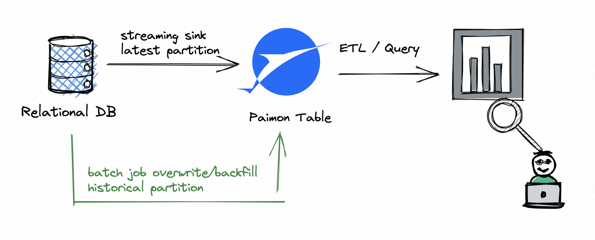

So far, everything works very well, but if you need multiple writers to write records to the same partition, it will
be a bit more complicated. For example, you don’t want to use `UNION ALL`, you have multiple
streaming jobs to write records to a `'partial-update'` table. Please refer to the `'Dedicated Compaction Job'` below.

<a id="maintenance-dedicated-compaction--dedicated-compaction-job"></a>

## Dedicated Compaction Job [#](#maintenance-dedicated-compaction--dedicated-compaction-job)

By default, Paimon writers will perform compaction as needed during writing records. This is sufficient for most use cases.

Compaction will mark some data files as “deleted” (not really deleted, see
[expiring snapshots](#maintenance-manage-snapshots--expiring-snapshots) for more info).
If multiple writers mark the same file, a conflict will occur when committing the changes. Paimon will automatically
resolve the conflict, but this may result in job restarts.

To avoid these downsides, users can also choose to skip compactions in writers, and run a dedicated job only for compaction. As compactions are performed only by the dedicated job, writers can continuously write records without pausing and no conflicts will ever occur.

To skip compactions in writers, set the following table property to `true`.

| Option | Required | Default | Type | Description |
| --- | --- | --- | --- | --- |
| DOC2MDPLACEHOLDERTOKEN2ENDwrite-only | No | false | Boolean | If set to true, compactions and snapshot expiration will be skipped. This option is used along with dedicated compact jobs. |

To run a dedicated job for compaction, follow these instructions.

Flink SQL

Run the following sql:

```sql
CALL sys.compact(
  `table` => 'default.T', 
  partitions => 'p=0', 
  options => 'sink.parallelism=4',
  `where` => 'dt>10 and h<20'
);
```

Flink Action Jar

Run the following command to submit a compaction job for the table.

```bash
<FLINK_HOME>/bin/flink run \
    /path/to/paimon-flink-action-1.5-SNAPSHOT.jar \
    compact \
    --warehouse <warehouse-path> \
    --database <database-name> \
    --table <table-name> \
    [--partition <partition-name>] \
    [--compact_strategy <minor / full>] \
    [--table_conf <table_conf>] \
    [--catalog_conf <paimon-catalog-conf> [--catalog_conf <paimon-catalog-conf> ...]]
```

Example: compact table

```bash
<FLINK_HOME>/bin/flink run \
    /path/to/paimon-flink-action-1.5-SNAPSHOT.jar \
    compact \
    --warehouse s3:///path/to/warehouse \
    --database test_db \
    --table test_table \
    --partition dt=20221126,hh=08 \
    --partition dt=20221127,hh=09 \
    --table_conf sink.parallelism=10 \
    --compact_strategy minor \
    --catalog_conf s3.endpoint=https://****.com \
    --catalog_conf s3.access-key=***** \
    --catalog_conf s3.secret-key=*****
```

- `--compact_strategy` Determines how to pick files to be merged, the default is determined by the runtime execution mode, streaming-mode use `minor` strategy and batch-mode use `full` strategy.
  - `full` : Only supports batch mode. All files will be selected for merging.
  - `minor` : Pick the set of files that need to be merged based on specified conditions.

You can use `-D execution.runtime-mode=batch` or `-yD execution.runtime-mode=batch` (for the ON-YARN scenario) to control batch or streaming mode. If you submit a batch job, all
current table files will be compacted. If you submit a streaming job, the job will continuously monitor new changes
to the table and perform compactions as needed.

For more usage of the compact action, see

```bash
<FLINK_HOME>/bin/flink run \
    /path/to/paimon-flink-action-1.5-SNAPSHOT.jar \
    compact --help
```

> [!NOTE]
> > Similarly, the default is synchronous compaction, which may cause checkpoint timeouts.
> > You can configure `table_conf` to use [Asynchronous Compaction](#primary-key-table-compaction--asynchronous-compaction).

<a id="maintenance-dedicated-compaction--database-compaction-job"></a>

## Database Compaction Job [#](#maintenance-dedicated-compaction--database-compaction-job)

You can run the following command to submit a compaction job for multiple database.

Flink SQL

Run the following sql:

```sql
CALL sys.compact_database(
  including_databases => 'includingDatabases', 
  mode => 'mode', 
  including_tables => 'includingTables', 
  excluding_tables => 'excludingTables', 
  table_options => 'tableOptions'
)

-- example
CALL sys.compact_database(
  including_databases => 'db1|db2', 
  mode => 'combined', 
  including_tables => 'table_.*', 
  excluding_tables => 'ignore', 
  table_options => 'sink.parallelism=4'
)
```

Flink Action Jar

```bash
<FLINK_HOME>/bin/flink run \
    /path/to/paimon-flink-action-1.5-SNAPSHOT.jar \
    compact_database \
    --warehouse <warehouse-path> \
    --including_databases <database-name|name-regular-expr> \
    [--including_tables <paimon-table-name|name-regular-expr>] \
    [--excluding_tables <paimon-table-name|name-regular-expr>] \
    [--mode <compact-mode>] \
    [--compact_strategy <minor / full>] \
    [--catalog_conf <paimon-catalog-conf> [--catalog_conf <paimon-catalog-conf> ...]] \
    [--table_conf <paimon-table_conf> [--table_conf <paimon-table_conf> ...]]
```

- `--including_databases` is used to specify which database is to be compacted. In compact mode, you need to specify a database name, in compact\_database mode, you could specify multiple database, regular expression is supported.
- `--including_tables` is used to specify which source tables are to be compacted, you must use ‘|’ to separate multiple tables, the format is `databaseName.tableName`, regular expression is supported. For example, specifying “–including\_tables db1.t1|db2.+” means to compact table ‘db1.t1’ and all tables in the db2 database.
- `--excluding_tables` is used to specify which source tables are not to be compacted. The usage is same as “–including\_tables”. “–excluding\_tables” has higher priority than “–including\_tables” if you specified both.
- `--mode` is used to specify compaction mode. Possible values:
  - “divided” (the default mode if you haven’t specified one): start a sink for each table, the compaction of the new table requires restarting the job.
  - “combined”: start a single combined sink for all tables, the new table will be automatically compacted.
- `--catalog_conf` is the configuration for Paimon catalog. Each configuration should be specified in the format `key=value`. See [here](#maintenance-configurations) for a complete list of catalog configurations.
- `--table_conf` is the configuration for compaction. Each configuration should be specified in the format `key=value`. Pivotal configuration is listed below:

| Key | Default | Type | Description |
| --- | --- | --- | --- |
| continuous.discovery-interval | 10 s | Duration | The discovery interval of continuous reading. |
| sink.parallelism | (none) | Integer | Defines a custom parallelism for the sink. By default, if this option is not defined, the planner will derive the parallelism for each statement individually by also considering the global configuration. |

You can use `-D execution.runtime-mode=batch` to control batch or streaming mode. If you submit a batch job, all
current table files will be compacted. If you submit a streaming job, the job will continuously monitor new changes
to the table and perform compactions as needed.

> [!NOTE]
> > If you only want to submit the compaction job and don’t want to wait until the job is done, you should submit in [detached mode](https://nightlies.apache.org/flink/flink-docs-stable/docs/deployment/cli/#submitting-a-job).

> [!NOTE]
> > You can set `--mode combined` to enable compacting newly added tables without restarting job.

Example1: compact database

```bash
<FLINK_HOME>/bin/flink run \
    /path/to/paimon-flink-action-1.5-SNAPSHOT.jar \
    compact_database \
    --warehouse s3:///path/to/warehouse \
    --including_databases test_db \
    --catalog_conf s3.endpoint=https://****.com \
    --catalog_conf s3.access-key=***** \
    --catalog_conf s3.secret-key=*****
```

Example2: compact database in combined mode

```bash
<FLINK_HOME>/bin/flink run \
    /path/to/paimon-flink-action-1.5-SNAPSHOT.jar \
    compact_database \
    --warehouse s3:///path/to/warehouse \
    --including_databases test_db \
    --mode combined \
    --catalog_conf s3.endpoint=https://****.com \
    --catalog_conf s3.access-key=***** \
    --catalog_conf s3.secret-key=***** \
    --table_conf continuous.discovery-interval=*****
```

For more usage of the compact\_database action, see

```bash
<FLINK_HOME>/bin/flink run \
    /path/to/paimon-flink-action-1.5-SNAPSHOT.jar \
    compact_database --help
```

<a id="maintenance-dedicated-compaction--sort-compact"></a>

## Sort Compact [#](#maintenance-dedicated-compaction--sort-compact)

If your table is configured with [dynamic bucket primary key table](#primary-key-table-data-distribution--dynamic-bucket)
or [append table](#append-table-overview) , you can trigger a compact with specified column sort to speed up queries.

Flink SQL

Run the following sql:

```sql
-- sort compact table
CALL sys.compact(`table` => 'default.T', order_strategy => 'zorder', order_by => 'a,b')
```

Flink Action Jar

```bash
<FLINK_HOME>/bin/flink run \
    -D execution.runtime-mode=batch \
    /path/to/paimon-flink-action-1.5-SNAPSHOT.jar \
    compact \
    --warehouse <warehouse-path> \
    --database <database-name> \
    --table <table-name> \
    --order_strategy <orderType> \
    --order_by <col1,col2,...> \
    [--partition <partition-name>] \
    [--catalog_conf <paimon-catalog-conf> [--catalog_conf <paimon-catalog-conf> ...]] \
    [--table_conf <paimon-table-dynamic-conf> [--table_conf <paimon-table-dynamic-conf>] ...]
```

There are two new configuration in `Sort Compact`

| Configuration | Description |
| --- | --- |
| DOC2MDPLACEHOLDERTOKEN5END--order\_strategy | the order strategy now support "zorder" and "hilbert" and "order". For example: --order\_strategy zorder |
| DOC2MDPLACEHOLDERTOKEN6END--order\_by | Specify the order columns. For example: --order\_by col0, col1 |

The sort parallelism is the same as the sink parallelism, you can dynamically specify it by add conf `--table_conf sink.parallelism=<value>`.

> [!NOTE]
> > Sort Compact currently supports only bucket=-1 and batch mode.

<a id="maintenance-dedicated-compaction--historical-partition-compact"></a>

## Historical Partition Compact [#](#maintenance-dedicated-compaction--historical-partition-compact)

You can run the following command to submit a compaction job for partition which has not received any new data for
a period of time. Small files in those partitions will be full compacted.

> [!NOTE]
> > This feature now is only used in batch mode.

<a id="maintenance-dedicated-compaction--for-table"></a>

### For Table [#](#maintenance-dedicated-compaction--for-table)

This is for one table.

Flink SQL

Run the following sql:

```sql
-- history partition compact table
CALL sys.compact(`table` => 'default.T', partition_idle_time => '1 d')
```

Flink Action Jar

```bash
<FLINK_HOME>/bin/flink run \
    -D execution.runtime-mode=batch \
    /path/to/paimon-flink-action-1.5-SNAPSHOT.jar \
    compact \
    --warehouse <warehouse-path> \
    --database <database-name> \
    --table <table-name> \
    --partition_idle_time <partition-idle-time> \
    [--partition <partition-name>] \
    [--compact_strategy <minor / full>] \
    [--catalog_conf <paimon-catalog-conf> [--catalog_conf <paimon-catalog-conf> ...]] \
    [--table_conf <paimon-table-dynamic-conf> [--table_conf <paimon-table-dynamic-conf>] ...]
```

There are one new configuration in `Historical Partition Compact`

- `--partition_idle_time`: this is used to do a full compaction for partition which had not received any new data for
  ‘partition\_idle\_time’. And only these partitions will be compacted.

<a id="maintenance-dedicated-compaction--for-databases"></a>

### For Databases [#](#maintenance-dedicated-compaction--for-databases)

This is for multiple tables in different databases.

Flink SQL

Run the following sql:

```sql
-- history partition compact table
CALL sys.compact_database(
  including_databases => 'includingDatabases', 
  mode => 'mode', 
  including_tables => 'includingTables',
  excluding_tables => 'excludingTables',
  table_options => 'tableOptions',
  partition_idle_time => 'partition_idle_time'
);
```

Example: compact historical partitions for tables in database

```sql
-- history partition compact table
CALL sys.compact_database(
  includingDatabases => 'test_db', 
  mode => 'combined', 
  partition_idle_time => '1 d'
);
```

Flink Action Jar

```bash
<FLINK_HOME>/bin/flink run \
    -D execution.runtime-mode=batch \
    /path/to/paimon-flink-action-1.5-SNAPSHOT.jar \
    compact_database \
    --warehouse <warehouse-path> \
    --including_databases <database-name|name-regular-expr> \
    --partition_idle_time <partition-idle-time> \
    [--including_tables <paimon-table-name|name-regular-expr>] \
    [--excluding_tables <paimon-table-name|name-regular-expr>] \
    [--mode <compact-mode>] \
    [--compact_strategy <minor / full>] \
    [--catalog_conf <paimon-catalog-conf> [--catalog_conf <paimon-catalog-conf> ...]] \
    [--table_conf <paimon-table_conf> [--table_conf <paimon-table_conf> ...]]
```

Example: compact historical partitions for tables in database

```bash
<FLINK_HOME>/bin/flink run \
    /path/to/paimon-flink-action-1.5-SNAPSHOT.jar \
    compact_database \
    --warehouse s3:///path/to/warehouse \
    --including_databases test_db \
    --partition_idle_time 1d \
    --catalog_conf s3.endpoint=https://****.com \
    --catalog_conf s3.access-key=***** \
    --catalog_conf s3.secret-key=*****
```

---

<a id="maintenance-manage-snapshots"></a>

<!-- source_url: https://paimon.apache.org/docs/master/maintenance/manage-snapshots/ -->

<!-- page_index: 70 -->

# Manage Snapshots #

> This documentation is for an unreleased version of Apache Paimon. We recommend you use the latest [stable version](https://paimon.apache.org/docs/1.4).

<a id="maintenance-manage-snapshots--manage-snapshots"></a>

# Manage Snapshots [#](#maintenance-manage-snapshots--manage-snapshots)

This section will describe the management and behavior related to snapshots.

<a id="maintenance-manage-snapshots--expire-snapshots"></a>

## Expire Snapshots [#](#maintenance-manage-snapshots--expire-snapshots)

Paimon writers generate one or two [snapshot](#concepts-basic-concepts--snapshot) per commit. Each snapshot may add some new data files or mark some old data files as deleted. However, the marked data files are not truly deleted because Paimon also supports time traveling to an earlier snapshot. They are only deleted when the snapshot expires.

Currently, expiration is automatically performed by Paimon writers when committing new changes. By expiring old snapshots, old data files and metadata files that are no longer used can be deleted to release disk space.

Snapshot expiration is controlled by the following table properties.

| Option | Required | Default | Type | Description |
| --- | --- | --- | --- | --- |
| DOC2MDPLACEHOLDERTOKEN2ENDsnapshot.time-retained | No | 1 h | Duration | The maximum time of completed snapshots to retain. |
| DOC2MDPLACEHOLDERTOKEN3ENDsnapshot.num-retained.min | No | 10 | Integer | The minimum number of completed snapshots to retain. Should be greater than or equal to 1. |
| DOC2MDPLACEHOLDERTOKEN4ENDsnapshot.num-retained.max | No | Integer.MAX\_VALUE | Integer | The maximum number of completed snapshots to retain. Should be greater than or equal to the minimum number. |
| DOC2MDPLACEHOLDERTOKEN5ENDsnapshot.expire.execution-mode | No | sync | Enum | Specifies the execution mode of expire. |
| DOC2MDPLACEHOLDERTOKEN6ENDsnapshot.expire.limit | No | 10 | Integer | The maximum number of snapshots allowed to expire at a time. |

When the number of snapshots is less than `snapshot.num-retained.min`, no snapshots will be expired(even the condition `snapshot.time-retained` meet), after which `snapshot.num-retained.max` and `snapshot.time-retained` will be used to control the snapshot expiration until the remaining snapshot meets the condition.

The following example show more details(`snapshot.num-retained.min` is 2, `snapshot.time-retained` is 1h, `snapshot.num-retained.max` is 5):

> snapshot item is described using tuple (snapshotId, corresponding time)

| New Snapshots | All snapshots after expiration check | explanation |
| --- | --- | --- |
| (snapshots-1, 2023-07-06 10:00) | (snapshots-1, 2023-07-06 10:00) | No snapshot expired |
| (snapshots-2, 2023-07-06 10:20) | (snapshots-1, 2023-07-06 10:00) (snapshots-2, 2023-07-06 10:20) | No snapshot expired |
| (snapshots-3, 2023-07-06 10:40) | (snapshots-1, 2023-07-06 10:00) (snapshots-2, 2023-07-06 10:20) (snapshots-3, 2023-07-06 10:40) | No snapshot expired |
| (snapshots-4, 2023-07-06 11:00) | (snapshots-1, 2023-07-06 10:00) (snapshots-2, 2023-07-06 10:20) (snapshots-3, 2023-07-06 10:40) (snapshots-4, 2023-07-06 11:00) | No snapshot expired |
| (snapshots-5, 2023-07-06 11:20) | (snapshots-2, 2023-07-06 10:20) (snapshots-3, 2023-07-06 10:40) (snapshots-4, 2023-07-06 11:00) (snapshots-5, 2023-07-06 11:20) | snapshot-1 was expired because the condition `snapshot.time-retained` is not met |
| (snapshots-6, 2023-07-06 11:30) | (snapshots-3, 2023-07-06 10:40) (snapshots-4, 2023-07-06 11:00) (snapshots-5, 2023-07-06 11:20) (snapshots-6, 2023-07-06 11:30) | snapshot-2 was expired because the condition `snapshot.time-retained` is not met |
| (snapshots-7, 2023-07-06 11:35) | (snapshots-3, 2023-07-06 10:40) (snapshots-4, 2023-07-06 11:00) (snapshots-5, 2023-07-06 11:20) (snapshots-6, 2023-07-06 11:30) (snapshots-7, 2023-07-06 11:35) | No snapshot expired |
| (snapshots-8, 2023-07-06 11:36) | (snapshots-4, 2023-07-06 11:00) (snapshots-5, 2023-07-06 11:20) (snapshots-6, 2023-07-06 11:30) (snapshots-7, 2023-07-06 11:35) (snapshots-8, 2023-07-06 11:36) | snapshot-3 was expired because the condition `snapshot.num-retained.max` is not met |

Please note that too short retain time or too small retain number may result in:

- Batch queries cannot find the file. For example, the table is relatively large and
  the batch query takes 10 minutes to read, but the snapshot from 10 minutes ago
  expires, at which point the batch query will read a deleted snapshot.
- Streaming reading jobs on table files fail to restart.
  When the job restarts, the snapshot it recorded may have expired. (You can use
  [Consumer Id](#flink-sql-query--consumer-id) to protect streaming reading
  in a small retain time of snapshot expiration).

By default, paimon will delete expired snapshots synchronously. When there are too
many files that need to be deleted, they may not be deleted quickly and back-pressured
to the upstream operator. To avoid this situation, users can use asynchronous expiration
mode by setting `snapshot.expire.execution-mode` to `async`. However, if your job runs in
batch mode, it is not recommended to use asynchronous expiration mode, as the expire task
may fail to complete successfully.

<a id="maintenance-manage-snapshots--manually-expire-snapshot"></a>

## Manually expire snapshot [#](#maintenance-manage-snapshots--manually-expire-snapshot)

Manually expire a table’s snapshots

Flink SQL

Run the following command:

```sql
-- for Flink 1.18
CALL sys.expire_snapshots('database_name.table_name', 2)
-- for Flink 1.19 and later
CALL sys.expire_snapshots(`table` => 'database_name.table_name', retain_max => 2)
CALL sys.expire_snapshots(`table` => 'database_name.table_name', older_than => '2024-01-01 12:00:00')
CALL sys.expire_snapshots(`table` => 'database_name.table_name', older_than => '2024-01-01 12:00:00', retain_min => 10)
CALL sys.expire_snapshots(`table` => 'database_name.table_name', older_than => '2024-01-01 12:00:00', max_deletes => 10, options => 'snapshot.expire.limit=1')
```

Flink Action

Run the following command:

```bash
<FLINK_HOME>/bin/flink run \
    /path/to/paimon-flink-action-1.5-SNAPSHOT.jar \
    expire_snapshots \
    --warehouse <warehouse-path> \
    --identifier <identifier> \
    --older_than <timestamp> \
    --version <snapshot-id> \
    --max_deletes <max-deletes> \
    --retain_max <retain-max> \
    --retain_min <retain-min> \
    [--catalog_conf <paimon-catalog-conf> [--catalog_conf <paimon-catalog-conf> ...]]
```

Spark

Run the following sql:

```sql
CALL sys.expire_snapshots(table => 'database_name.table_name', retain_max => 10, options => 'snapshot.expire.limit=1');
```

<a id="maintenance-manage-snapshots--rollback-to-snapshot"></a>

## Rollback to Snapshot [#](#maintenance-manage-snapshots--rollback-to-snapshot)

Rollback a table to a specific snapshot ID.

Flink SQL

Run the following command:

```sql
CALL sys.rollback_to(`table` => 'database_name.table_name', snapshot_id => <snasphot-id>);
```

Flink Action

Run the following command:

```bash
<FLINK_HOME>/bin/flink run \
    /path/to/paimon-flink-action-1.5-SNAPSHOT.jar \
    rollback_to \
    --warehouse <warehouse-path> \
    --database <database-name> \
    --table <table-name> \
    --version <snapshot-id> \
    [--catalog_conf <paimon-catalog-conf> [--catalog_conf <paimon-catalog-conf> ...]]
```

Java API

```java
import org.apache.paimon.table.Table;

public class RollbackTo {

    public static void main(String[] args) {
        // before rollback:
        // snapshot-3
        // snapshot-4
        // snapshot-5
        // snapshot-6
        // snapshot-7
      
        table.rollbackTo(5);
        
        // after rollback:
        // snapshot-3
        // snapshot-4
        // snapshot-5
    }
}
```

Spark

Run the following sql:

```sql
CALL sys.rollback(table => 'database_name.table_name', snapshot => snasphot_id);
```

<a id="maintenance-manage-snapshots--remove-orphan-files"></a>

## Remove Orphan Files [#](#maintenance-manage-snapshots--remove-orphan-files)

Paimon files are deleted physically only when expiring snapshots. However, it is possible that some unexpected errors occurred
when deleting files, so that there may exist files that are not used by Paimon snapshots (so-called “orphan files”). You can
submit a `remove_orphan_files` job to clean them:

Spark SQL/Flink SQL

```sql
CALL sys.remove_orphan_files(`table` => 'my_db.my_table', [older_than => '2023-10-31 12:00:00'])

CALL sys.remove_orphan_files(`table` => 'my_db.*', [older_than => '2023-10-31 12:00:00'])
```

Flink Action

```bash
<FLINK_HOME>/bin/flink run \
    /path/to/paimon-flink-action-1.5-SNAPSHOT.jar \
    remove_orphan_files \
    --warehouse <warehouse-path> \
    --database <database-name> \
    --table <table-name> \
    [--older_than <timestamp>] \
    [--dry_run <false/true>] \
    [--parallelism <parallelism>]
```

To avoid deleting files that are newly added by other writing jobs, this action only deletes orphan files older than
1 day by default. The interval can be modified by `--older_than`. For example:

```bash
<FLINK_HOME>/bin/flink run \
    /path/to/paimon-flink-action-1.5-SNAPSHOT.jar \
    remove_orphan_files \
    --warehouse <warehouse-path> \
    --database <database-name> \
    --table T \
    --older_than '2023-10-31 12:00:00'
```

The table can be `*` to clean all tables in the database.

---

<a id="maintenance-rescale-bucket"></a>

<!-- source_url: https://paimon.apache.org/docs/master/maintenance/rescale-bucket/ -->

<!-- page_index: 71 -->

# Rescale Bucket #

> This documentation is for an unreleased version of Apache Paimon. We recommend you use the latest [stable version](https://paimon.apache.org/docs/1.4).

<a id="maintenance-rescale-bucket--rescale-bucket"></a>

# Rescale Bucket [#](#maintenance-rescale-bucket--rescale-bucket)

Since the number of total buckets dramatically influences the performance, Paimon allows users to
tune bucket numbers by `ALTER TABLE` command and reorganize data layout by `INSERT OVERWRITE`
without recreating the table/partition. When executing overwrite jobs, the framework will automatically
scan the data with the old bucket number and hash the record according to the current bucket number.

<a id="maintenance-rescale-bucket--rescale-overwrite"></a>

## Rescale Overwrite [#](#maintenance-rescale-bucket--rescale-overwrite)

```sql
-- rescale number of total buckets
ALTER TABLE table_identifier SET ('bucket' = '...');

-- reorganize data layout of table/partition
INSERT OVERWRITE table_identifier [PARTITION (part_spec)]
SELECT ... 
FROM table_identifier
[WHERE part_spec];
```

Please note that

- `ALTER TABLE` only modifies the table’s metadata and will **NOT** reorganize or reformat existing data.
  Reorganize existing data must be achieved by `INSERT OVERWRITE`.
- Rescale bucket number does not influence the read and running write jobs.
- Once the bucket number is changed, any newly scheduled `INSERT INTO` jobs which write to without-reorganized
  existing table/partition will throw a `TableException` with message like


```text
Try to write table/partition ... with a new bucket num ..., 
but the previous bucket num is ... Please switch to batch mode, 
and perform INSERT OVERWRITE to rescale current data layout first.
```

- For partitioned table, it is possible to have different bucket number for different partitions. *E.g.*


```sql
ALTER TABLE my_table SET ('bucket' = '4');
INSERT OVERWRITE my_table PARTITION (dt = '2022-01-01')
SELECT * FROM ...;
  
ALTER TABLE my_table SET ('bucket' = '8');
INSERT OVERWRITE my_table PARTITION (dt = '2022-01-02')
SELECT * FROM ...;
```

- During overwrite period, make sure there are no other jobs writing the same table/partition.

<a id="maintenance-rescale-bucket--use-case"></a>

## Use Case [#](#maintenance-rescale-bucket--use-case)

Rescale bucket helps to handle sudden spikes in throughput. Suppose there is a daily streaming ETL task to sync transaction data. The table’s DDL and pipeline
are listed as follows.

```sql
-- table DDL
CREATE TABLE verified_orders (
    trade_order_id BIGINT,
    item_id BIGINT,
    item_price DOUBLE,
    dt STRING,
    PRIMARY KEY (dt, trade_order_id, item_id) NOT ENFORCED 
) PARTITIONED BY (dt)
WITH (
    'bucket' = '16'
);

-- like from a kafka table 
CREATE temporary TABLE raw_orders(
    trade_order_id BIGINT,
    item_id BIGINT,
    item_price BIGINT,
    gmt_create STRING,
    order_status STRING
) WITH (
    'connector' = 'kafka',
    'topic' = '...',
    'properties.bootstrap.servers' = '...',
    'format' = 'csv'
    ...
);

-- streaming insert as bucket num = 16
INSERT INTO verified_orders
SELECT trade_order_id,
       item_id,
       item_price,
       DATE_FORMAT(gmt_create, 'yyyy-MM-dd') AS dt
FROM raw_orders
WHERE order_status = 'verified';
```

The pipeline has been running well for the past few weeks. However, the data volume has grown fast recently, and the job’s latency keeps increasing. To improve the data freshness, users can

- Suspend the streaming job with a savepoint ( see
  [Suspended State](https://nightlies.apache.org/flink/flink-docs-stable/docs/internals/job_scheduling/) and
  [Stopping a Job Gracefully Creating a Final Savepoint](https://nightlies.apache.org/flink/flink-docs-stable/docs/deployment/cli/#terminating-a-job) )


```bash
$ ./bin/flink stop \ --savepointPath /tmp/flink-savepoints \ $JOB_ID
```

- Increase the bucket number


```sql
-- scaling out
ALTER TABLE verified_orders SET ('bucket' = '32');
```

- Switch to the batch mode and overwrite the current partition(s) to which the streaming job is writing


```sql
SET 'execution.runtime-mode' = 'batch';
-- suppose today is 2022-06-22
-- case 1: there is no late event which updates the historical partitions, thus overwrite today's partition is enough
INSERT OVERWRITE verified_orders PARTITION (dt = '2022-06-22')
SELECT trade_order_id,
       item_id,
       item_price
FROM verified_orders
WHERE dt = '2022-06-22';
  
-- case 2: there are late events updating the historical partitions, but the range does not exceed 3 days
INSERT OVERWRITE verified_orders
SELECT trade_order_id,
       item_id,
       item_price,
       dt
FROM verified_orders
WHERE dt IN ('2022-06-20', '2022-06-21', '2022-06-22');
```

- After overwrite job has finished, switch back to streaming mode. And now, the parallelism can be increased alongside with bucket number to restore the streaming job from the savepoint
  ( see [Start a SQL Job from a savepoint](https://nightlies.apache.org/flink/flink-docs-stable/docs/dev/table/sqlclient/#start-a-sql-job-from-a-savepoint) )


```sql
SET 'execution.runtime-mode' = 'streaming';
SET 'execution.savepoint.path' = <savepointPath>;

INSERT INTO verified_orders
SELECT trade_order_id,
     item_id,
     item_price,
     DATE_FORMAT(gmt_create, 'yyyy-MM-dd') AS dt
FROM raw_orders
WHERE order_status = 'verified';
```

---

<a id="maintenance-manage-tags"></a>

<!-- source_url: https://paimon.apache.org/docs/master/maintenance/manage-tags/ -->

<!-- page_index: 72 -->

# Manage Tags #

> This documentation is for an unreleased version of Apache Paimon. We recommend you use the latest [stable version](https://paimon.apache.org/docs/1.4).

<a id="maintenance-manage-tags--manage-tags"></a>

# Manage Tags [#](#maintenance-manage-tags--manage-tags)

Paimon’s snapshots can provide an easy way to query historical data. But in most scenarios, a job will generate too many
snapshots and table will expire old snapshots according to table configuration. Snapshot expiration will also delete old
data files, and the historical data of expired snapshots cannot be queried anymore.

To solve this problem, you can create a tag based on a snapshot. The tag will maintain the manifests and data files of the
snapshot. A typical usage is creating tags daily, then you can maintain the historical data of each day for batch reading.

<a id="maintenance-manage-tags--automatic-creation"></a>

## Automatic Creation [#](#maintenance-manage-tags--automatic-creation)

Paimon supports automatic creation of tags in writing job.

**Step 1: Choose Creation Mode**

You can set creation mode by table option `'tag.automatic-creation'`. Supported values are:

- `process-time`: Create TAG based on the time of the machine.
- `watermark`: Create TAG based on the watermark of the Sink input.
- `batch`: In a batch processing scenario, a tag is generated after the current task is completed.

> [!NOTE]
> > If you choose Watermark, you may need to specify the time zone of watermark, if watermark is not in the
> > UTC time zone, please configure `'sink.watermark-time-zone'`.

**Step 2: Choose Creation Period**

What frequency is used to generate tags. You can choose `'daily'`, `'hourly'` and `'two-hours'` for `'tag.creation-period'`.

If you need to wait for late data, you can configure a delay time: `'tag.creation-delay'`.

**Step 3: Automatic deletion of tags**

You can configure `'tag.num-retained-max'` or `tag.default-time-retained` to delete tags automatically.

Example, configure table to create a tag at 0:10 every day, with a maximum retention time of 3 months:

```sql
-- Flink SQL
CREATE TABLE t (
    k INT PRIMARY KEY NOT ENFORCED,
    f0 INT,
    ...
) WITH (
    'tag.automatic-creation' = 'process-time',
    'tag.creation-period' = 'daily',
    'tag.creation-delay' = '10 m',
    'tag.num-retained-max' = '90'
);

INSERT INTO t SELECT ...;

-- Spark SQL

-- Read latest snapshot
SELECT * FROM t;

-- Read Tag snapshot
SELECT * FROM t VERSION AS OF '2023-07-26';

-- Read Incremental between Tags
SELECT * FROM paimon_incremental_query('t', '2023-07-25', '2023-07-26');
```

See [Query Tables](#spark-sql-query) to see more query for Spark.

<a id="maintenance-manage-tags--create-tags"></a>

## Create Tags [#](#maintenance-manage-tags--create-tags)

You can create a tag with given name and snapshot ID.

Flink SQL

Run the following command:

```sql
CALL sys.create_tag(`table` => 'database_name.table_name', tag => 'tag_name', [snapshot_id => <snapshot-id>]);
```

If `snapshot_id` unset, snapshot\_id defaults to the latest.

Flink Action

Run the following command:

```bash
<FLINK_HOME>/bin/flink run \
    /path/to/paimon-flink-action-1.5-SNAPSHOT.jar \
    create_tag \
    --warehouse <warehouse-path> \
    --database <database-name> \
    --table <table-name> \
    --tag_name <tag-name> \
    [--snapshot <snapshot_id>] \
    [--time_retained <time-retained>] \
    [--catalog_conf <paimon-catalog-conf> [--catalog_conf <paimon-catalog-conf> ...]]
```

If `snapshot` unset, snapshot\_id defaults to the latest.

Java API

```java
import org.apache.paimon.table.Table;

public class CreateTag {

    public static void main(String[] args) {
        Table table = ...;
        table.createTag("my-tag", 1);
        table.createTag("my-tag-retained-12-hours", 1, Duration.ofHours(12));
    }
}
```

Spark

Run the following sql:

```sql
CALL sys.create_tag(table => 'test.t', tag => 'test_tag', snapshot => 2);
```

To create a tag with retained 1 day, run the following sql:

```sql
CALL sys.create_tag(table => 'test.t', tag => 'test_tag', snapshot => 2, time_retained => '1 d');
```

To create a tag based on the latest snapshot id, run the following sql:

```sql
CALL sys.create_tag(table => 'test.t', tag => 'test_tag');
```

<a id="maintenance-manage-tags--delete-tags"></a>

## Delete Tags [#](#maintenance-manage-tags--delete-tags)

You can delete a tag by its name.

Flink SQL

Run the following command:

```sql
CALL sys.delete_tag(`table` => 'database_name.table_name', tag => 'tag_name');
```

Flink Action

Run the following command:

```bash
<FLINK_HOME>/bin/flink run \
    /path/to/paimon-flink-action-1.5-SNAPSHOT.jar \
    delete_tag \
    --warehouse <warehouse-path> \
    --database <database-name> \
    --table <table-name> \
    --tag_name <tag-name> \
    [--catalog_conf <paimon-catalog-conf> [--catalog_conf <paimon-catalog-conf> ...]]
```

Java API

```java
import org.apache.paimon.table.Table;

public class DeleteTag {

    public static void main(String[] args) {
        Table table = ...;
        table.deleteTag("my-tag");
    }
}
```

Spark

Run the following sql:

```sql
CALL sys.delete_tag(table => 'test.t', tag => 'test_tag');
```

<a id="maintenance-manage-tags--rollback-to-tag"></a>

## Rollback to Tag [#](#maintenance-manage-tags--rollback-to-tag)

Rollback table to a specific tag. All snapshots and tags whose snapshot id is larger than the tag will be deleted (and
the data will be deleted too).

Flink SQL

Run the following command:

```sql
CALL sys.rollback_to(`table` => 'database_name.table_name', tag => 'tag_name');
```

Flink Action

Run the following command:

```bash
<FLINK_HOME>/bin/flink run \
    /path/to/paimon-flink-action-1.5-SNAPSHOT.jar \
    rollback_to \
    --warehouse <warehouse-path> \
    --database <database-name> \
    --table <table-name> \
    --version <tag-name> \
    [--catalog_conf <paimon-catalog-conf> [--catalog_conf <paimon-catalog-conf> ...]]
```

Java API

```java
import org.apache.paimon.table.Table;

public class RollbackTo {

    public static void main(String[] args) {
        // before rollback:
        // snapshot-3 [expired] -> tag3
        // snapshot-4 [expired]
        // snapshot-5 -> tag5
        // snapshot-6
        // snapshot-7
      
        table.rollbackTo("tag3");
        
        // after rollback:
        // snapshot-3 -> tag3
    }
}
```

Spark

Run the following sql:

```sql
CALL sys.rollback(table => 'test.t', version => '2');
```

---

<a id="maintenance-metrics"></a>

<!-- source_url: https://paimon.apache.org/docs/master/maintenance/metrics/ -->

<!-- page_index: 73 -->

# Paimon Metrics #

> This documentation is for an unreleased version of Apache Paimon. We recommend you use the latest [stable version](https://paimon.apache.org/docs/1.4).

<a id="maintenance-metrics--paimon-metrics"></a>

# Paimon Metrics [#](#maintenance-metrics--paimon-metrics)

Paimon has built a metrics system to measure the behaviours of reading and writing, like how many manifest files it scanned in the last planning, how long it took in the last commit operation, how many files it deleted in the last compact operation.

In Paimon’s metrics system, metrics are updated and reported at table granularity.

There are three types of metrics provided in the Paimon metric system, `Gauge`, `Counter`, `Histogram`.

- `Gauge`: Provides a value of any type at a point in time.
- `Counter`: Used to count values by incrementing and decrementing.
- `Histogram`: Measure the statistical distribution of a set of values including the min, max, mean, standard deviation and percentile.

Paimon has supported built-in metrics to measure operations of **commits**, **scans**, **writes** and **compactions**, which can be bridged to any computing engine that supports, like Flink, Spark etc.

<a id="maintenance-metrics--metrics-list"></a>

## Metrics List [#](#maintenance-metrics--metrics-list)

Below is lists of Paimon built-in metrics. They are summarized into types of scan metrics, commit metrics, write metrics, write buffer metrics and compaction metrics.

<a id="maintenance-metrics--scan-metrics"></a>

### Scan Metrics [#](#maintenance-metrics--scan-metrics)

| Metrics Name | Type | Description |
| --- | --- | --- |
| lastScanDuration | Gauge | The time it took to complete the last scan. |
| scanDuration | Histogram | Distributions of the time taken by the last few scans. |
| lastScannedManifests | Gauge | Number of scanned manifest files in the last scan. |
| lastScanSkippedTableFiles | Gauge | Total skipped table files in the last scan. |
| lastScanResultedTableFiles | Gauge | Resulted table files in the last scan. |

<a id="maintenance-metrics--commit-metrics"></a>

### Commit Metrics [#](#maintenance-metrics--commit-metrics)

| Metrics Name | Type | Description |
| --- | --- | --- |
| lastCommitDuration | Gauge | The time it took to complete the last commit. |
| commitDuration | Histogram | Distributions of the time taken by the last few commits. |
| lastCommitAttempts | Gauge | The number of attempts the last commit made. |
| lastTableFilesAdded | Gauge | Number of added table files in the last commit, including newly created data files and compacted after. |
| lastTableFilesDeleted | Gauge | Number of deleted table files in the last commit, which comes from compacted before. |
| lastTableFilesAppended | Gauge | Number of appended table files in the last commit, which means the newly created data files. |
| lastTableFilesCommitCompacted | Gauge | Number of compacted table files in the last commit, including compacted before and after. |
| lastChangelogFilesAppended | Gauge | Number of appended changelog files in last commit. |
| lastChangelogFileCommitCompacted | Gauge | Number of compacted changelog files in last commit. |
| lastGeneratedSnapshots | Gauge | Number of snapshot files generated in the last commit, maybe 1 snapshot or 2 snapshots. |
| lastDeltaRecordsAppended | Gauge | Delta records count in last commit with APPEND commit kind. |
| lastChangelogRecordsAppended | Gauge | Changelog records count in last commit with APPEND commit kind. |
| lastDeltaRecordsCommitCompacted | Gauge | Delta records count in last commit with COMPACT commit kind. |
| lastChangelogRecordsCommitCompacted | Gauge | Changelog records count in last commit with COMPACT commit kind. |
| lastPartitionsWritten | Gauge | Number of partitions written in the last commit. |
| lastBucketsWritten | Gauge | Number of buckets written in the last commit. |
| lastCompactionInputFileSize | Gauge | Total size of the input files for the last compaction. |
| lastCompactionOutputFileSize | Gauge | Total size of the output files for the last compaction. |

<a id="maintenance-metrics--write-buffer-metrics"></a>

### Write Buffer Metrics [#](#maintenance-metrics--write-buffer-metrics)

| Metrics Name | Type | Description |
| --- | --- | --- |
| numWriters | Gauge | Number of writers in this parallelism. |
| bufferPreemptCount | Gauge | The total number of memory preempted. |
| usedWriteBufferSizeByte | Gauge | Current used write buffer size in byte. |
| totalWriteBufferSizeByte | Gauge | The total write buffer size configured in byte. |

<a id="maintenance-metrics--compaction-metrics"></a>

### Compaction Metrics [#](#maintenance-metrics--compaction-metrics)

| Metrics Name | Type | Description |
| --- | --- | --- |
| maxLevel0FileCount | Gauge | The maximum number of level 0 files currently handled by this task. This value will become larger if asynchronous compaction cannot be done in time. |
| avgLevel0FileCount | Gauge | The average number of level 0 files currently handled by this task. This value will become larger if asynchronous compaction cannot be done in time. |
| compactionThreadBusy | Gauge | The maximum business of compaction threads in this task. Currently, there is only one compaction thread in each parallelism, so value of business ranges from 0 (idle) to 100 (compaction running all the time). |
| avgCompactionTime | Gauge | The average runtime of compaction threads, calculated based on recorded compaction time data in milliseconds. The value represents the average duration of compaction operations. Higher values indicate longer average compaction times, which may suggest the need for performance optimization. |
| compactionCompletedCount | Counter | The total number of compactions that have completed. |
| compactionQueuedCount | Counter | The total number of compactions that are queued/running. |
| compactionTotalCount | Counter | The total number of compactions. |
| maxCompactionInputSize | Gauge | The maximum input file size for this task's compaction. |
| avgCompactionInputSize | Gauge | The average input file size for this task's compaction. |
| maxCompactionOutputSize | Gauge | The maximum output file size for this task's compaction. |
| avgCompactionOutputSize | Gauge | The average output file size for this task's compaction. |
| maxTotalFileSize | Gauge | The maximum total file size of an active (currently being written) bucket. |
| avgTotalFileSize | Gauge | The average total file size of all active (currently being written) buckets. |
| maxSortBufferUsedBytes | Gauge | The maximum sort buffer memory currently used across all active compaction buckets, in bytes. High values relative to `maxSortBufferTotalBytes` indicate memory pressure during compaction; consider lowering `sort-spill-threshold` or reducing `sort-spill-buffer-size`. |
| avgSortBufferUsedBytes | Gauge | The average sort buffer memory used across all active compaction buckets, in bytes. |
| maxSortBufferUtilisationPercent | Gauge | The maximum sort buffer utilisation percentage (0–100) across all active compaction buckets. A value consistently near 100 indicates the sort buffer pool is exhausted and spilling to disk is occurring or imminent. |
| avgSortBufferUtilisationPercent | Gauge | The average sort buffer utilisation percentage across all active compaction buckets. |

<a id="maintenance-metrics--bridging-to-flink"></a>

## Bridging To Flink [#](#maintenance-metrics--bridging-to-flink)

Paimon has implemented bridging metrics to Flink’s metrics system, which can be reported by Flink, and the lifecycle of metric groups are managed by Flink.

Please join the `<scope>.<infix>.<metric_name>` to get the complete metric identifier when using Flink to access Paimon, `metric_name` can be got from [Metric List](#maintenance-metrics--metrics-list).

For example, the identifier of metric `lastPartitionsWritten` for table `word_count` in Flink job named `insert_word_count` is:

`localhost.taskmanager.localhost:60340-775a20.insert_word_count.Global Committer : word_count.0.paimon.table.word_count.commit.lastPartitionsWritten`.

From Flink Web-UI, go to the committer operator’s metrics, it’s shown as:

`0.Global_Committer___word_count.paimon.table.word_count.commit.lastPartitionsWritten`.

> [!NOTE]
> > 1. Please refer to [System Scope](https://nightlies.apache.org/flink/flink-docs-master/docs/ops/metrics/#system-scope) to understand Flink `scope`
> > 2. Scan metrics are only supported by Flink versions >= 1.18

|  | Scope | Infix |
| --- | --- | --- |
| Scan Metrics | <host>.jobmanager.<job\_name> | <source\_operator\_name>.coordinator. enumerator.paimon.table.<table\_name>.scan |
| Commit Metrics | <host>.taskmanager.<tm\_id>.<job\_name>.<committer\_operator\_name>.<subtask\_index> | paimon.table.<table\_name>.commit |
| Write Metrics | <host>.taskmanager.<tm\_id>.<job\_name>.<writer\_operator\_name>.<subtask\_index> | paimon.table.<table\_name>.partition.<partition\_string>.bucket.<bucket\_index>.writer |
| Write Buffer Metrics | <host>.taskmanager.<tm\_id>.<job\_name>.<writer\_operator\_name>.<subtask\_index> | paimon.table.<table\_name>.writeBuffer |
| Compaction Metrics | <host>.taskmanager.<tm\_id>.<job\_name>.<writer\_operator\_name>.<subtask\_index> | paimon.table.<table\_name>.partition.<partition\_string>.bucket.<bucket\_index>.compaction |
| Flink Source Metrics | <host>.taskmanager.<tm\_id>.<job\_name>.<source\_operator\_name>.<subtask\_index> | - |
| Flink Sink Metrics | <host>.taskmanager.<tm\_id>.<job\_name>.<committer\_operator\_name>.<subtask\_index> | - |

<a id="maintenance-metrics--flink-connector-standard-metrics"></a>

### Flink Connector Standard Metrics [#](#maintenance-metrics--flink-connector-standard-metrics)

When using Flink to read and write, Paimon has implemented some key standard Flink connector metrics to measure the source latency and output of sink, see [FLIP-33: Standardize Connector Metrics](https://cwiki.apache.org/confluence/display/FLINK/FLIP-33%3A+Standardize+Connector+Metrics). Flink source / sink metrics implemented are listed here.

<a id="maintenance-metrics--source-metrics-flink"></a>

#### Source Metrics (Flink) [#](#maintenance-metrics--source-metrics-flink)

| Metrics Name | Level | Type | Description |
| --- | --- | --- | --- |
| currentEmitEventTimeLag | Flink Source Operator | Gauge | Time difference between sending the record out of source and file creation. |
| currentFetchEventTimeLag | Flink Source Operator | Gauge | Time difference between reading the data file and file creation. |
| sourceParallelismUpperBound | Flink Source Enumerator | Gauge | Recommended upper bound of parallelism for auto-scaling systems. Note: This is a recommendation, not a hard limit. |

> [!NOTE]
> > Please note that if you specified `consumer-id` in your streaming query, the level of source metrics should turn into the reader operator, which is behind the `Monitor` operator.

<a id="maintenance-metrics--sink-metrics-flink"></a>

#### Sink Metrics (Flink) [#](#maintenance-metrics--sink-metrics-flink)

| Metrics Name | Level | Type | Description |
| --- | --- | --- | --- |
| numBytesOut | Table | Counter | The total number of output bytes. |
| numBytesOutPerSecond | Table | Meter | The output bytes per second. |
| numRecordsOut | Table | Counter | The total number of output records. |
| numRecordsOutPerSecond | Table | Meter | The output records per second. |

---

<a id="maintenance-manage-privileges"></a>

<!-- source_url: https://paimon.apache.org/docs/master/maintenance/manage-privileges/ -->

<!-- page_index: 74 -->

# Manage Privileges #

> This documentation is for an unreleased version of Apache Paimon. We recommend you use the latest [stable version](https://paimon.apache.org/docs/1.4).

<a id="maintenance-manage-privileges--manage-privileges"></a>

# Manage Privileges [#](#maintenance-manage-privileges--manage-privileges)

Paimon provides a privilege system on catalogs.
Privileges determine which users can perform which operations on which objects, so that you can manage table access in a fine-grained manner.

Currently, Paimon adopts the identity-based access control (IBAC) privilege model.
That is, privileges are directly assigned to users.

> [!WARNING]
> > This privilege system only prevents unwanted users from accessing tables through catalogs.
> > It does not block access through temporary table (by specifying table path on filesystem),
> > nor does it prevent user from directly modifying data files on filesystem.
> > If you need more serious protection, use a filesystem with access management instead.

<a id="maintenance-manage-privileges--basic-concepts"></a>

## Basic Concepts [#](#maintenance-manage-privileges--basic-concepts)

We now introduce the basic concepts of the privilege system.

<a id="maintenance-manage-privileges--object"></a>

### Object [#](#maintenance-manage-privileges--object)

An object is an entity to which access can be granted. Unless allowed by a grant, access is denied.

Currently, the privilege system in Paimon has three types of objects: CATALOG, DATABASE and TABLE.
Objects have a logical hierarchy, which is related to the concept they represent.
For example:

- If a user is granted a privilege on the catalog,
  he will also have this privilege on all databases and all tables in the catalog.
- If a user is granted a privilege on the database,
  he will also have this privilege on all tables in that database.
- If a user is revoked a privilege from the catalog,
  he will also lose this privilege on all databases and all tables in the catalog.
- If a user is revoked a privilege from the database,
  he will also lose this privilege on all tables in that database.

<a id="maintenance-manage-privileges--privilege"></a>

### Privilege [#](#maintenance-manage-privileges--privilege)

A privilege is a defined level of access to an object.
Multiple privileges can be used to control the granularity of access granted on an object.
Privileges are object-specific. Different objects may have different privileges.

Currently, we support the following privileges.

| Privilege | Description | Can be Granted on |
| --- | --- | --- |
| SELECT | Queries data in a table. | TABLE, DATABASE, CATALOG |
| INSERT | Inserts, updates or drops data in a table. Creates or drops tags and branches in a table. | TABLE, DATABASE, CATALOG |
| ALTER\_TABLE | Alters metadata of a table, including table name, column names, table options, etc. | TABLE, DATABASE, CATALOG |
| DROP\_TABLE | Drops a table. | TABLE, DATABASE, CATALOG |
| CREATE\_TABLE | Creates a table in a database. | DATABASE, CATALOG |
| DROP\_DATABASE | Drops a database. | DATABASE, CATALOG |
| CREATE\_DATABASE | Creates a database in the catalog. | CATALOG |
| ADMIN | Creates or drops privileged users, grants or revokes privileges from users in a catalog. | CATALOG |

<a id="maintenance-manage-privileges--user"></a>

### User [#](#maintenance-manage-privileges--user)

The entity to which privileges can be granted. Users are authenticated by their password.

When the privilege system is enabled, two special users will be created automatically.

- The `root` user,
  which is identified by the provided root password when enabling the privilege system.
  This user always has all privileges in the catalog.
- The `anonymous` user.
  This is the default user if no username and password is provided when creating the catalog.

<a id="maintenance-manage-privileges--enable-privileges"></a>

## Enable Privileges [#](#maintenance-manage-privileges--enable-privileges)

Paimon currently only supports file-based privilege system.
Only catalogs with `'metastore' = 'filesystem'` (the default value) or `'metastore' = 'hive'` support such privilege system.

To enable the privilege system on a filesystem / Hive catalog, do the following steps.

Flink 1.18+

Run the following Flink SQL.

```sql
-- use the catalog where you want to enable the privilege system
USE CATALOG `my-catalog`;
    
-- initialize privilege system by providing a root password
-- change 'root-password' to the password you want
CALL sys.init_file_based_privilege('root-password');
```

After the privilege system is enabled, please re-create the catalog and authenticate as `root` to create other users and grant them privileges.

> [!NOTE]
> > Privilege system does not affect existing catalogs.
> > That is, these catalogs can still access and modify the tables freely.
> > Please drop and re-create all catalogs with the desired warehouse path
> > if you want to use the privilege system in these catalogs.

<a id="maintenance-manage-privileges--accessing-privileged-catalogs"></a>

## Accessing Privileged Catalogs [#](#maintenance-manage-privileges--accessing-privileged-catalogs)

To access a privileged catalog and to be authenticated as a user, you need to define `user` and `password` catalog options when creating the catalog.
For example, the following SQL creates a catalog while trying to be authenticated as `root`, whose password is `mypassword`.

Flink

```sql
CREATE CATALOG `my-catalog` WITH (
    'type' = 'paimon',
    -- ...
    'user' = 'root',
    'password' = 'mypassword'
);
```

<a id="maintenance-manage-privileges--creating-users"></a>

## Creating Users [#](#maintenance-manage-privileges--creating-users)

You must be authenticated as a user with `ADMIN` privilege (for example, `root`) to perform this operation.

Do the following steps to create a user in the privilege system.

Flink 1.18+

Run the following Flink SQL.

```sql
-- use the catalog where you want to create a user
-- you must be authenticated as a user with ADMIN privilege in this catalog
USE CATALOG `my-catalog`;

-- create a user authenticated by the specified password
-- change 'user' and 'password' to the username and password you want
CALL sys.create_privileged_user('user', 'password');
```

<a id="maintenance-manage-privileges--dropping-users"></a>

## Dropping Users [#](#maintenance-manage-privileges--dropping-users)

You must be authenticated as a user with `ADMIN` privilege (for example, `root`) to perform this operation.

Do the following steps to drop a user in the privilege system.

Flink 1.18+

Run the following Flink SQL.

```sql
-- use the catalog where you want to drop a user
-- you must be authenticated as a user with ADMIN privilege in this catalog
USE CATALOG `my-catalog`;

-- change 'user' to the username you want to drop
CALL sys.drop_privileged_user('user');
```

<a id="maintenance-manage-privileges--granting-privileges-to-users"></a>

## Granting Privileges to Users [#](#maintenance-manage-privileges--granting-privileges-to-users)

You must be authenticated as a user with `ADMIN` privilege (for example, `root`) to perform this operation.

Do the following steps to grant a user with privilege in the privilege system.

Flink 1.18+

Run the following Flink SQL.

```sql
-- use the catalog where you want to drop a user
-- you must be authenticated as a user with ADMIN privilege in this catalog
USE CATALOG `my-catalog`;

-- you can change 'user' to the username you want, and 'SELECT' to other privilege you want
-- grant 'user' with privilege 'SELECT' on the whole catalog
CALL sys.grant_privilege_to_user('user', 'SELECT');
-- grant 'user' with privilege 'SELECT' on database my_db
CALL sys.grant_privilege_to_user('user', 'SELECT', 'my_db');
-- grant 'user' with privilege 'SELECT' on table my_db.my_tbl
CALL sys.grant_privilege_to_user('user', 'SELECT', 'my_db', 'my_tbl');
```

<a id="maintenance-manage-privileges--revoking-privileges-to-users"></a>

## Revoking Privileges to Users [#](#maintenance-manage-privileges--revoking-privileges-to-users)

You must be authenticated as a user with `ADMIN` privilege (for example, `root`) to perform this operation.

Do the following steps to revoke a privilege from user in the privilege system.

Flink 1.18+

Run the following Flink SQL.

```sql
-- use the catalog where you want to drop a user
-- you must be authenticated as a user with ADMIN privilege in this catalog
USE CATALOG `my-catalog`;

-- you can change 'user' to the username you want, and 'SELECT' to other privilege you want
-- revoke 'user' with privilege 'SELECT' on the whole catalog
CALL sys.revoke_privilege_from_user('user', 'SELECT');
-- revoke 'user' with privilege 'SELECT' on database my_db
CALL sys.revoke_privilege_from_user('user', 'SELECT', 'my_db');
-- revoke 'user' with privilege 'SELECT' on table my_db.my_tbl
CALL sys.revoke_privilege_from_user('user', 'SELECT', 'my_db', 'my_tbl');
```

---

<a id="maintenance-manage-branches"></a>

<!-- source_url: https://paimon.apache.org/docs/master/maintenance/manage-branches/ -->

<!-- page_index: 75 -->

# Manage Branches #

> This documentation is for an unreleased version of Apache Paimon. We recommend you use the latest [stable version](https://paimon.apache.org/docs/1.4).

<a id="maintenance-manage-branches--manage-branches"></a>

# Manage Branches [#](#maintenance-manage-branches--manage-branches)

In streaming data processing, it’s difficult to correct data for it may affect the existing data, and users will see the streaming provisional results, which is not expected.

We suppose the branch that the existing workflow is processing on is ‘main’ branch, by creating custom data branch, it can help to do experimental tests and data validating for the new job on the existing table, which doesn’t need to stop the existing reading / writing workflows and no need to copy data from the main branch.

By merge or replace branch operations, users can complete the correcting of data.

<a id="maintenance-manage-branches--create-branches"></a>

## Create Branches [#](#maintenance-manage-branches--create-branches)

Paimon supports creating branch from a specific tag, or just creating an empty branch which means the initial state of the created branch is like an empty table.

Flink SQL

Run the following sql:

```sql
-- create branch named 'branch1' from tag 'tag1'
CALL sys.create_branch('default.T', 'branch1', 'tag1');

-- create empty branch named 'branch1'
CALL sys.create_branch('default.T', 'branch1');
```

Flink Action Jar

Run the following command:

```bash
<FLINK_HOME>/bin/flink run \
    /path/to/paimon-flink-action-1.5-SNAPSHOT.jar \
    create_branch \
    --warehouse <warehouse-path> \
    --database <database-name> \
    --table <table-name> \
    --branch_name <branch-name> \
    [--tag_name <tag-name>] \
    [--catalog_conf <paimon-catalog-conf> [--catalog_conf <paimon-catalog-conf> ...]]
```

Spark SQL

Run the following sql:

```sql
-- create branch named 'branch1' from tag 'tag1'
CALL sys.create_branch('default.T', 'branch1', 'tag1');

-- create empty branch named 'branch1'
CALL sys.create_branch('default.T', 'branch1');
```

<a id="maintenance-manage-branches--delete-branches"></a>

## Delete Branches [#](#maintenance-manage-branches--delete-branches)

You can delete branch by its name.

> [!WARNING]
> **Note:**
> > The `Delete Branches` operation only deletes the metadata file. If you want to clear the data written during the branch, use [remove\_orphan\_files](#flink-procedures)

Flink SQL

Run the following sql:

```sql
CALL sys.delete_branch('default.T', 'branch1');
```

Flink Action Jar

Run the following command:

```bash
<FLINK_HOME>/bin/flink run \
    /path/to/paimon-flink-action-1.5-SNAPSHOT.jar \
    delete_branch \
    --warehouse <warehouse-path> \
    --database <database-name> \
    --table <table-name> \
    --branch_name <branch-name> \
    [--catalog_conf <paimon-catalog-conf> [--catalog_conf <paimon-catalog-conf> ...]]
```

Spark SQL

Run the following sql:

```sql
CALL sys.delete_branch('default.T', 'branch1');
```

<a id="maintenance-manage-branches--read-write-with-branch"></a>

## Read / Write With Branch [#](#maintenance-manage-branches--read-write-with-branch)

You can read or write with branch as below.

Flink

```sql
-- read from branch 'branch1'
SELECT * FROM `t$branch_branch1`;
SELECT * FROM `t$branch_branch1` /*+ OPTIONS('consumer-id' = 'myid') */;

-- write to branch 'branch1'
INSERT INTO `t$branch_branch1` SELECT ...
```

Spark SQL

```sql
-- read from branch 'branch1'
SELECT * FROM `t$branch_branch1`;

-- write to branch 'branch1'
INSERT INTO `t$branch_branch1` SELECT ...
```

Spark DataFrame

```sql
-- read from branch 'branch1'
spark.read.format("paimon").option("branch", "branch1").table("t")
```

<a id="maintenance-manage-branches--fast-forward"></a>

## Fast Forward [#](#maintenance-manage-branches--fast-forward)

Fast-Forward the custom branch to main will delete all the snapshots, tags and schemas in the main branch that are created after the branch’s initial tag. And copy snapshots, tags and schemas from the branch to the main branch.

If your branch modifies the schema, after Fast Forward, if it is Spark SQL, you can execute `REFRESH TABLE my_table`
to clean up the cache to avoid inconsistencies caused by caching.

Flink SQL

```sql
CALL sys.fast_forward('default.T', 'branch1');
```

Flink Action Jar

Run the following command:

```bash
<FLINK_HOME>/bin/flink run \
    /path/to/paimon-flink-action-1.5-SNAPSHOT.jar \
    fast_forward \
    --warehouse <warehouse-path> \
    --database <database-name> \
    --table <table-name> \
    --branch_name <branch-name> \
    [--catalog_conf <paimon-catalog-conf> [--catalog_conf <paimon-catalog-conf> ...]]
```

Spark SQL

Run the following sql:

```sql
CALL sys.fast_forward('default.T', 'branch1');
```

<a id="maintenance-manage-branches--batch-reading-from-fallback-branch"></a>

## Batch Reading from Fallback Branch [#](#maintenance-manage-branches--batch-reading-from-fallback-branch)

You can set the table option `scan.fallback-branch`
so that when a batch job reads from the current branch, if a partition does not exist, the reader will try to read this partition from the fallback branch.
For streaming read jobs, this feature is currently not supported, and will only produce results from the current branch.

What’s the use case of this feature? Say you have created a Paimon table partitioned by date.
You have a long-running streaming job which inserts records into Paimon, so that today’s data can be queried in time.
You also have a batch job which runs at every night to insert corrected records of yesterday into Paimon, so that the preciseness of the data can be promised.

When you query from this Paimon table, you would like to first read from the results of batch job.
But if a partition (for example, today’s partition) does not exist in its result, then you would like to read from the results of streaming job.
In this case, you can create a branch for streaming job, and set `scan.fallback-branch` to this streaming branch.

Let’s look at an example.

Flink

```sql
-- create Paimon table
CREATE TABLE T (
    dt STRING NOT NULL,
    name STRING NOT NULL,
    amount BIGINT
) PARTITIONED BY (dt);

-- create a branch for streaming job
CALL sys.create_branch('default.T', 'test');

-- set primary key and bucket number for the branch
ALTER TABLE `T$branch_test` SET (
    'primary-key' = 'dt,name',
    'bucket' = '2',
    'changelog-producer' = 'lookup'
);

-- set fallback branch
ALTER TABLE T SET (
    'scan.fallback-branch' = 'test'
);

-- write records into the streaming branch
INSERT INTO `T$branch_test` VALUES ('20240725', 'apple', 4), ('20240725', 'peach', 10), ('20240726', 'cherry', 3), ('20240726', 'pear', 6);

-- write records into the default branch
INSERT INTO T VALUES ('20240725', 'apple', 5), ('20240725', 'banana', 7);

SELECT * FROM T;
/*
+------------------+------------------+--------+
|               dt |             name | amount |
+------------------+------------------+--------+
|         20240725 |            apple |      5 |
|         20240725 |           banana |      7 |
|         20240726 |           cherry |      3 |
|         20240726 |             pear |      6 |
+------------------+------------------+--------+
*/

-- reset fallback branch
ALTER TABLE T RESET ( 'scan.fallback-branch' );

-- now it only reads from default branch
SELECT * FROM T;
/*
+------------------+------------------+--------+
|               dt |             name | amount |
+------------------+------------------+--------+
|         20240725 |            apple |      5 |
|         20240725 |           banana |      7 |
+------------------+------------------+--------+
*/
```

---

<a id="maintenance-manage-partitions"></a>

<!-- source_url: https://paimon.apache.org/docs/master/maintenance/manage-partitions/ -->

<!-- page_index: 76 -->

# Manage Partitions #

> This documentation is for an unreleased version of Apache Paimon. We recommend you use the latest [stable version](https://paimon.apache.org/docs/1.4).

<a id="maintenance-manage-partitions--manage-partitions"></a>

# Manage Partitions [#](#maintenance-manage-partitions--manage-partitions)

Paimon provides multiple ways to manage partitions, including expire historical partitions by different strategies or
mark a partition done to notify the downstream application that the partition has finished writing.

<a id="maintenance-manage-partitions--expiring-partitions"></a>

## Expiring Partitions [#](#maintenance-manage-partitions--expiring-partitions)

You can set `partition.expiration-time` when creating a partitioned table. Paimon streaming sink will periodically check
the status of partitions and delete expired partitions according to time.

How to determine whether a partition has expired: you can set `partition.expiration-strategy` when creating a partitioned table, this strategy determines how to extract the partition time and compare it with the current time to see if survival time
has exceeded the `partition.expiration-time`. Expiration strategy supported values are:

- `values-time` : The strategy compares the time extracted from the partition value with the current time,
  this strategy as the default.
- `update-time` : The strategy compares the last update time of the partition with the current time.
  What is the scenario for this strategy:
  - Your partition value is non-date formatted.
  - You only want to keep data that has been updated in the last n days/months/years.
  - Data initialization imports a large amount of historical data.

> [!NOTE]
> **Note:**
> > After the partition expires, it is logically deleted and the latest snapshot cannot query its data. But the
> > files in the file system are not immediately physically deleted, it depends on when the corresponding snapshot expires.
> > See [Expire Snapshots](#maintenance-manage-snapshots--expire-snapshots).

An example for single partition field:

`values-time` strategy.

```sql
CREATE TABLE t (...) PARTITIONED BY (dt) WITH (
    'partition.expiration-time' = '7 d',
    'partition.expiration-check-interval' = '1 d',
    'partition.timestamp-formatter' = 'yyyyMMdd'   -- this is required in `values-time` strategy.
);
-- Let's say now the date is 2024-07-09，so before the date of 2024-07-02 will expire.
insert into t values('pk', '2024-07-01');

-- An example for multiple partition fields
CREATE TABLE t (...) PARTITIONED BY (other_key, dt) WITH (
    'partition.expiration-time' = '7 d',
    'partition.expiration-check-interval' = '1 d',
    'partition.timestamp-formatter' = 'yyyyMMdd',
    'partition.timestamp-pattern' = '$dt'
);
```

`update-time` strategy.

```sql
CREATE TABLE t (...) PARTITIONED BY (dt) WITH (
    'partition.expiration-time' = '7 d',
    'partition.expiration-check-interval' = '1 d',
    'partition.expiration-strategy' = 'update-time'
);

-- The last update time of the partition is now, so it will not expire.
insert into t values('pk', '2024-01-01');
-- Support non-date formatted partition.
insert into t values('pk', 'par-1'); 
```

More options:

<table class="table table-bordered">
<thead>
<tr>
<th>Option</th>
<th>Default</th>
<th>Type</th>
<th>Description</th>
</tr>
</thead>
<tbody>
<tr>
<td>DOC2MDPLACEHOLDERTOKEN2END<h5>partition.expiration-strategy</h5></td>
<td>values-time</td>
<td>String</td>
<td>
                Specifies the expiration strategy for partition expiration.
                Possible values:
                <li>values-time: The strategy compares the time extracted from the partition value with the current time.</li>
<li>update-time: The strategy compares the last update time of the partition with the current time.</li>
</td>
</tr>
<tr>
<td>DOC2MDPLACEHOLDERTOKEN3END<h5>partition.expiration-check-interval</h5></td>
<td>1 h</td>
<td>Duration</td>
<td>The check interval of partition expiration.</td>
</tr>
<tr>
<td>DOC2MDPLACEHOLDERTOKEN4END<h5>partition.expiration-time</h5></td>
<td>(none)</td>
<td>Duration</td>
<td>The expiration interval of a partition. A partition will be expired if it's lifetime is over this value. Partition time is extracted from the partition value.</td>
</tr>
<tr>
<td>DOC2MDPLACEHOLDERTOKEN5END<h5>partition.timestamp-formatter</h5></td>
<td>(none)</td>
<td>String</td>
<td>The formatter to format timestamp from string. It can be used with 'partition.timestamp-pattern' to create a formatter using the specified value.<ul><li>Default formatter is 'yyyy-MM-dd HH:mm:ss' and 'yyyy-MM-dd'.</li><li>Supports multiple partition fields like '$year-$month-$day $hour:00:00'.</li><li>The timestamp-formatter is compatible with Java's DateTimeFormatter.</li></ul></td>
</tr>
<tr>
<td>DOC2MDPLACEHOLDERTOKEN6END<h5>partition.timestamp-pattern</h5></td>
<td>(none)</td>
<td>String</td>
<td>You can specify a pattern to get a timestamp from partitions. The formatter pattern is defined by 'partition.timestamp-formatter'.<ul><li>By default, read from the first field.</li><li>If the timestamp in the partition is a single field called 'dt', you can use '$dt'.</li><li>If it is spread across multiple fields for year, month, day, and hour, you can use '$year-$month-$day $hour:00:00'.</li><li>If the timestamp is in fields dt and hour, you can use '$dt $hour:00:00'.</li></ul></td>
</tr>
<tr>
<td>DOC2MDPLACEHOLDERTOKEN7END<h5>end-input.check-partition-expire</h5></td>
<td>false</td>
<td>Boolean</td>
<td>Whether check partition expire after batch mode or bounded stream job finish.</td>
</tr>
</tbody>
</table>

<a id="maintenance-manage-partitions--partition-mark-done"></a>

## Partition Mark Done [#](#maintenance-manage-partitions--partition-mark-done)

You can use the option `'partition.mark-done-action'` to configure the action when a partition needs to be mark done.

- `success-file`: add ‘\_success’ file to directory.
- `done-partition`: add ‘xxx.done’ partition to metastore.
- `mark-event`: mark partition event to metastore.
- `http-report`: report partition mark done to remote http server.
- `custom`: use policy class to create a mark-partition policy.
  These actions can be configured at the same time: ‘done-partition,success-file,mark-event,custom’.

Paimon partition mark done can be triggered both by streaming write and batch write.

<a id="maintenance-manage-partitions--streaming-mark-done"></a>

### Streaming Mark Done [#](#maintenance-manage-partitions--streaming-mark-done)

You can use the options `'partition.idle-time-to-done'` to set a partition idle time to done duration. When a partition
has no new data after this time duration, the mark done action will be triggered to indicate that the data is ready.

By default, Flink will use process time as idle time to trigger partition mark done. You can also use watermark to
trigger partition mark done. This will make the partition mark done time more accurate when data is delayed. You can
enable this by setting `'partition.mark-done-action.mode' = 'watermark'`.

<a id="maintenance-manage-partitions--batch-mark-done"></a>

### Batch Mark Done [#](#maintenance-manage-partitions--batch-mark-done)

For batch mode, you can trigger partition mark done when end input by setting `'partition.end-input-to-done'='true'`, and all partitions written in this batch will be marked done.

---

<a id="maintenance-configurations"></a>

<!-- source_url: https://paimon.apache.org/docs/master/maintenance/configurations/ -->

<!-- page_index: 77 -->

# Configuration #

> This documentation is for an unreleased version of Apache Paimon. We recommend you use the latest [stable version](https://paimon.apache.org/docs/1.4).

<a id="maintenance-configurations--configuration"></a>

# Configuration [#](#maintenance-configurations--configuration)

<a id="maintenance-configurations--coreoptions"></a>

### CoreOptions [#](#maintenance-configurations--coreoptions)

Core options for paimon.

<table class="configuration table table-bordered">
<thead>
<tr>
<th>Key</th>
<th>Default</th>
<th>Type</th>
<th>Description</th>
</tr>
</thead>
<tbody>
<tr>
<td>DOC2MDPLACEHOLDERTOKEN2END<h5>add-column-before-partition</h5></td>
<td>false</td>
<td>Boolean</td>
<td>If true, when adding a new column without specifying a position, the column will be placed before the first partition column instead of at the end of the schema. This only takes effect for partitioned tables.</td>
</tr>
<tr>
<td>DOC2MDPLACEHOLDERTOKEN3END<h5>aggregation.remove-record-on-delete</h5></td>
<td>false</td>
<td>Boolean</td>
<td>Whether to remove the whole row in aggregation engine when -D records are received.</td>
</tr>
<tr>
<td>DOC2MDPLACEHOLDERTOKEN4END<h5>alter-column-null-to-not-null.disabled</h5></td>
<td>true</td>
<td>Boolean</td>
<td>If true, it disables altering column type from null to not null. Default is true. Users can disable this option to explicitly convert null column type to not null.</td>
</tr>
<tr>
<td>DOC2MDPLACEHOLDERTOKEN5END<h5>async-file-write</h5></td>
<td>true</td>
<td>Boolean</td>
<td>Whether to enable asynchronous IO writing when writing files.</td>
</tr>
<tr>
<td>DOC2MDPLACEHOLDERTOKEN6END<h5>auto-create</h5></td>
<td>false</td>
<td>Boolean</td>
<td>Whether to create underlying storage when reading and writing the table.</td>
</tr>
<tr>
<td>DOC2MDPLACEHOLDERTOKEN7END<h5>blob-as-descriptor</h5></td>
<td>false</td>
<td>Boolean</td>
<td>Write blob field using blob descriptor rather than blob bytes.</td>
</tr>
<tr>
<td>DOC2MDPLACEHOLDERTOKEN8END<h5>blob-descriptor-field</h5></td>
<td>(none)</td>
<td>String</td>
<td>Comma-separated BLOB field names to store as serialized BlobDescriptor bytes inline in data files.</td>
</tr>
<tr>
<td>DOC2MDPLACEHOLDERTOKEN9END<h5>blob-external-storage-field</h5></td>
<td>(none)</td>
<td>String</td>
<td>Comma-separated BLOB field names (must be a subset of 'blob-descriptor-field') whose raw data will be written to external storage at write time. The external storage path is configured via 'blob-external-storage-path'. Orphan file cleanup is not applied to that path.</td>
</tr>
<tr>
<td>DOC2MDPLACEHOLDERTOKEN10END<h5>blob-external-storage-path</h5></td>
<td>(none)</td>
<td>String</td>
<td>The external storage path where raw BLOB data from fields configured by 'blob-external-storage-field' is written at write time. Orphan file cleanup is not applied to this path.</td>
</tr>
<tr>
<td>DOC2MDPLACEHOLDERTOKEN11END<h5>blob-field</h5></td>
<td>(none)</td>
<td>String</td>
<td>Specifies column names that should be stored as blob type. This is used when you want to treat a BYTES column as a BLOB.</td>
</tr>
<tr>
<td>DOC2MDPLACEHOLDERTOKEN12END<h5>blob.split-by-file-size</h5></td>
<td>(none)</td>
<td>Boolean</td>
<td>Whether to consider blob file size as a factor when performing scan splitting.</td>
</tr>
<tr>
<td>DOC2MDPLACEHOLDERTOKEN13END<h5>blob.target-file-size</h5></td>
<td>(none)</td>
<td>MemorySize</td>
<td>Target size of a blob file. Default is value of TARGET_FILE_SIZE.</td>
</tr>
<tr>
<td>DOC2MDPLACEHOLDERTOKEN14END<h5>bucket</h5></td>
<td>-1</td>
<td>Integer</td>
<td>Bucket number for file store. It should either be equal to -1 (dynamic bucket mode), -2 (postpone bucket mode), or it must be greater than 0 (fixed bucket mode).</td>
</tr>
<tr>
<td>DOC2MDPLACEHOLDERTOKEN15END<h5>bucket-append-ordered</h5></td>
<td>true</td>
<td>Boolean</td>
<td>Whether to ignore the order of the buckets when reading data from an append-only table.</td>
</tr>
<tr>
<td>DOC2MDPLACEHOLDERTOKEN16END<h5>bucket-function.type</h5></td>
<td>default</td>
<td><p>Enum</p></td>
<td>The bucket function for paimon bucket.

Possible values:<ul><li>"default": The default bucket function which will use arithmetic: bucket_id = Math.abs(hash_bucket_binary_row % numBuckets) to get bucket.</li><li>"mod": The modulus bucket function which will use modulus arithmetic: bucket_id = Math.floorMod(bucket_key_value, numBuckets) to get bucket. Note: the bucket key must be a single field of INT or BIGINT datatype.</li><li>"hive": The hive bucket function which will use hive-compatible hash arithmetic to get bucket.</li></ul></td>
</tr>
<tr>
<td>DOC2MDPLACEHOLDERTOKEN17END<h5>bucket-key</h5></td>
<td>(none)</td>
<td>String</td>
<td>Specify the paimon distribution policy. Data is assigned to each bucket according to the hash value of bucket-key. If you specify multiple fields, delimiter is ','. If not specified, the primary key will be used; if there is no primary key, the full row will be used.</td>
</tr>
<tr>
<td>DOC2MDPLACEHOLDERTOKEN18END<h5>cache-page-size</h5></td>
<td>64 kb</td>
<td>MemorySize</td>
<td>Memory page size for caching.</td>
</tr>
<tr>
<td>DOC2MDPLACEHOLDERTOKEN19END<h5>chain-table.chain-partition-keys</h5></td>
<td>(none)</td>
<td>String</td>
<td>Partition keys that participate in chain logic. Must be a contiguous suffix of the table's partition keys. Comma-separated. If not set, all partition keys participate in chain.</td>
</tr>
<tr>
<td>DOC2MDPLACEHOLDERTOKEN20END<h5>chain-table.enabled</h5></td>
<td>false</td>
<td>Boolean</td>
<td>Whether enabled chain table.</td>
</tr>
<tr>
<td>DOC2MDPLACEHOLDERTOKEN21END<h5>changelog-file.compression</h5></td>
<td>(none)</td>
<td>String</td>
<td>Changelog file compression.</td>
</tr>
<tr>
<td>DOC2MDPLACEHOLDERTOKEN22END<h5>changelog-file.format</h5></td>
<td>(none)</td>
<td>String</td>
<td>Specify the message format of changelog files, currently parquet, avro and orc are supported.</td>
</tr>
<tr>
<td>DOC2MDPLACEHOLDERTOKEN23END<h5>changelog-file.prefix</h5></td>
<td>"changelog-"</td>
<td>String</td>
<td>Specify the file name prefix of changelog files.</td>
</tr>
<tr>
<td>DOC2MDPLACEHOLDERTOKEN24END<h5>changelog-file.stats-mode</h5></td>
<td>(none)</td>
<td>String</td>
<td>Changelog file metadata stats collection. none, counts, truncate(16), full is available.</td>
</tr>
<tr>
<td>DOC2MDPLACEHOLDERTOKEN25END<h5>changelog-producer</h5></td>
<td>none</td>
<td><p>Enum</p></td>
<td>Whether to double write to a changelog file. This changelog file keeps the details of data changes, it can be read directly during stream reads. This can be applied to tables with primary keys.

Possible values:<ul><li>"none": No changelog file.</li><li>"input": Double write to a changelog file when flushing memory table, the changelog is from input.</li><li>"full-compaction": Generate changelog files with each full compaction.</li><li>"lookup": Generate changelog files through 'lookup' compaction.</li></ul></td>
</tr>
<tr>
<td>DOC2MDPLACEHOLDERTOKEN26END<h5>changelog-producer.row-deduplicate</h5></td>
<td>false</td>
<td>Boolean</td>
<td>Whether to generate -U, +U changelog for the same record. This configuration is only valid for the changelog-producer is lookup or full-compaction.</td>
</tr>
<tr>
<td>DOC2MDPLACEHOLDERTOKEN27END<h5>changelog-producer.row-deduplicate-ignore-fields</h5></td>
<td>(none)</td>
<td>String</td>
<td>Fields that are ignored for comparison while generating -U, +U changelog for the same record. This configuration is only valid for the changelog-producer.row-deduplicate is true.</td>
</tr>
<tr>
<td>DOC2MDPLACEHOLDERTOKEN28END<h5>changelog.num-retained.max</h5></td>
<td>(none)</td>
<td>Integer</td>
<td>The maximum number of completed changelog to retain. Should be greater than or equal to the minimum number.</td>
</tr>
<tr>
<td>DOC2MDPLACEHOLDERTOKEN29END<h5>changelog.num-retained.min</h5></td>
<td>(none)</td>
<td>Integer</td>
<td>The minimum number of completed changelog to retain. Should be greater than or equal to 1.</td>
</tr>
<tr>
<td>DOC2MDPLACEHOLDERTOKEN30END<h5>changelog.time-retained</h5></td>
<td>(none)</td>
<td>Duration</td>
<td>The maximum time of completed changelog to retain.</td>
</tr>
<tr>
<td>DOC2MDPLACEHOLDERTOKEN31END<h5>clustering.columns</h5></td>
<td>(none)</td>
<td>String</td>
<td>Specifies the column name(s) used for comparison during range partitioning, in the format 'columnName1,columnName2'. If not set or set to an empty string, it indicates that the range partitioning feature is not enabled. This option will be effective only for append table without primary keys and batch execution mode.</td>
</tr>
<tr>
<td>DOC2MDPLACEHOLDERTOKEN32END<h5>clustering.history-partition.idle-to-full-sort</h5></td>
<td>(none)</td>
<td>Duration</td>
<td>The duration after which a partition without new updates is considered a historical partition. Historical partitions will be automatically fully clustered during the cluster operation.</td>
</tr>
<tr>
<td>DOC2MDPLACEHOLDERTOKEN33END<h5>clustering.history-partition.limit</h5></td>
<td>5</td>
<td>Integer</td>
<td>The limit of history partition number for automatically performing full clustering.</td>
</tr>
<tr>
<td>DOC2MDPLACEHOLDERTOKEN34END<h5>clustering.incremental</h5></td>
<td>false</td>
<td>Boolean</td>
<td>Whether enable incremental clustering.</td>
</tr>
<tr>
<td>DOC2MDPLACEHOLDERTOKEN35END<h5>clustering.incremental.mode</h5></td>
<td>global-sort</td>
<td><p>Enum</p></td>
<td>The sort mode for incremental clustering compaction. 'global-sort' (default) performs a global range shuffle so output files are globally ordered. 'local-sort' skips the global shuffle and only sorts rows within each compaction task, producing files that are internally ordered. 'local-sort' is cheaper and sufficient for Parquet lookup optimizations.

Possible values:<ul><li>"global-sort": Perform global range shuffle and then local sort. Output files are globally ordered but require network shuffling.</li><li>"local-sort": Sort rows only within each compaction task without global shuffle. Every output file is internally ordered.</li></ul></td>
</tr>
<tr>
<td>DOC2MDPLACEHOLDERTOKEN36END<h5>clustering.incremental.optimize-write</h5></td>
<td>false</td>
<td>Boolean</td>
<td>Whether enable perform clustering before write phase when incremental clustering is enabled.</td>
</tr>
<tr>
<td>DOC2MDPLACEHOLDERTOKEN37END<h5>clustering.strategy</h5></td>
<td>"auto"</td>
<td>String</td>
<td>Specifies the comparison algorithm used for range partitioning, including 'zorder', 'hilbert', and 'order', corresponding to the z-order curve algorithm, hilbert curve algorithm, and basic type comparison algorithm, respectively. When not configured, it will automatically determine the algorithm based on the number of columns in 'clustering.by-columns'. 'order' is used for 1 column, 'zorder' for less than 5 columns, and 'hilbert' for 5 or more columns.</td>
</tr>
<tr>
<td>DOC2MDPLACEHOLDERTOKEN38END<h5>commit.callback.#.param</h5></td>
<td>(none)</td>
<td>String</td>
<td>Parameter string for the constructor of class #. Callback class should parse the parameter by itself.</td>
</tr>
<tr>
<td>DOC2MDPLACEHOLDERTOKEN39END<h5>commit.callbacks</h5></td>
<td>(none)</td>
<td>String</td>
<td>A list of commit callback classes to be called after a successful commit. Class names are connected with comma (example: com.test.CallbackA,com.sample.CallbackB).</td>
</tr>
<tr>
<td>DOC2MDPLACEHOLDERTOKEN40END<h5>commit.discard-duplicate-files</h5></td>
<td>false</td>
<td>Boolean</td>
<td>Whether discard duplicate files in commit.</td>
</tr>
<tr>
<td>DOC2MDPLACEHOLDERTOKEN41END<h5>commit.force-compact</h5></td>
<td>false</td>
<td>Boolean</td>
<td>Whether to force a compaction before commit.</td>
</tr>
<tr>
<td>DOC2MDPLACEHOLDERTOKEN42END<h5>commit.force-create-snapshot</h5></td>
<td>false</td>
<td>Boolean</td>
<td>In streaming job, whether to force creating snapshot when there is no data in this write-commit phase.</td>
</tr>
<tr>
<td>DOC2MDPLACEHOLDERTOKEN43END<h5>commit.max-retries</h5></td>
<td>10</td>
<td>Integer</td>
<td>Maximum number of retries when commit failed.</td>
</tr>
<tr>
<td>DOC2MDPLACEHOLDERTOKEN44END<h5>commit.max-retry-wait</h5></td>
<td>10 s</td>
<td>Duration</td>
<td>Max retry wait time when commit failed.</td>
</tr>
<tr>
<td>DOC2MDPLACEHOLDERTOKEN45END<h5>commit.min-retry-wait</h5></td>
<td>10 ms</td>
<td>Duration</td>
<td>Min retry wait time when commit failed.</td>
</tr>
<tr>
<td>DOC2MDPLACEHOLDERTOKEN46END<h5>commit.strict-mode.last-safe-snapshot</h5></td>
<td>(none)</td>
<td>Long</td>
<td>If set, committer will check if there are other commit user's snapshot starting from the snapshot after this one. If found a COMPACT / OVERWRITE snapshot, or found a APPEND snapshot which committed files to fixed bucket, commit will be aborted.If the value of this option is -1, committer will not check for its first commit.</td>
</tr>
<tr>
<td>DOC2MDPLACEHOLDERTOKEN47END<h5>commit.timeout</h5></td>
<td>(none)</td>
<td>Duration</td>
<td>Timeout duration of retry when commit failed.</td>
</tr>
<tr>
<td>DOC2MDPLACEHOLDERTOKEN48END<h5>commit.user-prefix</h5></td>
<td>(none)</td>
<td>String</td>
<td>Specifies the commit user prefix.</td>
</tr>
<tr>
<td>DOC2MDPLACEHOLDERTOKEN49END<h5>compaction.delete-ratio-threshold</h5></td>
<td>0.2</td>
<td>Double</td>
<td>Ratio of the deleted rows in a data file to be forced compacted for append-only table.</td>
</tr>
<tr>
<td>DOC2MDPLACEHOLDERTOKEN50END<h5>compaction.file-num-limit</h5></td>
<td>100000</td>
<td>Integer</td>
<td>To avoid OOM caused by scanning compaction files, you can use this option to limit the for unaware-bucket append table compaction.</td>
</tr>
<tr>
<td>DOC2MDPLACEHOLDERTOKEN51END<h5>compaction.force-rewrite-all-files</h5></td>
<td>false</td>
<td>Boolean</td>
<td>Whether to force pick all files for a full compaction. Usually seen in a compaction task to external paths.</td>
</tr>
<tr>
<td>DOC2MDPLACEHOLDERTOKEN52END<h5>compaction.force-up-level-0</h5></td>
<td>false</td>
<td>Boolean</td>
<td>If set to true, compaction strategy will always include all level 0 files in candidates.</td>
</tr>
<tr>
<td>DOC2MDPLACEHOLDERTOKEN53END<h5>compaction.incremental-size-threshold</h5></td>
<td>(none)</td>
<td>MemorySize</td>
<td>When incremental size is bigger than this threshold, force a full compaction.</td>
</tr>
<tr>
<td>DOC2MDPLACEHOLDERTOKEN54END<h5>compaction.max-size-amplification-percent</h5></td>
<td>200</td>
<td>Integer</td>
<td>The size amplification is defined as the amount (in percentage) of additional storage needed to store a single byte of data in the merge tree for changelog mode table.</td>
</tr>
<tr>
<td>DOC2MDPLACEHOLDERTOKEN55END<h5>compaction.min.file-num</h5></td>
<td>5</td>
<td>Integer</td>
<td>For file set [f_0,...,f_N], the minimum file number to trigger a compaction for append-only table.</td>
</tr>
<tr>
<td>DOC2MDPLACEHOLDERTOKEN56END<h5>compaction.offpeak-ratio</h5></td>
<td>0</td>
<td>Integer</td>
<td>Allows you to set a different (by default, more aggressive) percentage ratio for determining  whether larger sorted run's size are included in compactions during off-peak hours. Works in the  same way as compaction.size-ratio. Only applies if offpeak.start.hour and  offpeak.end.hour are also enabled.   For instance, if your cluster experiences low pressure between 2 AM  and 6 PM ,  you can configure `compaction.offpeak.start.hour=2` and `compaction.offpeak.end.hour=18` to define this period as off-peak hours.  During these hours, you can increase the off-peak compaction ratio (e.g. `compaction.offpeak-ratio=20`) to enable more aggressive data compaction</td>
</tr>
<tr>
<td>DOC2MDPLACEHOLDERTOKEN57END<h5>compaction.offpeak.end.hour</h5></td>
<td>-1</td>
<td>Integer</td>
<td>The end of off-peak hours, expressed as an integer between 0 and 23, exclusive. Set to -1 to disable off-peak.</td>
</tr>
<tr>
<td>DOC2MDPLACEHOLDERTOKEN58END<h5>compaction.offpeak.start.hour</h5></td>
<td>-1</td>
<td>Integer</td>
<td>The start of off-peak hours, expressed as an integer between 0 and 23, inclusive Set to -1 to disable off-peak</td>
</tr>
<tr>
<td>DOC2MDPLACEHOLDERTOKEN59END<h5>compaction.optimization-interval</h5></td>
<td>(none)</td>
<td>Duration</td>
<td>Implying how often to perform an optimization compaction, this configuration is used to ensure the query timeliness of the read-optimized system table.</td>
</tr>
<tr>
<td>DOC2MDPLACEHOLDERTOKEN60END<h5>compaction.size-ratio</h5></td>
<td>1</td>
<td>Integer</td>
<td>Percentage flexibility while comparing sorted run size for changelog mode table. If the candidate sorted run(s) size is 1% smaller than the next sorted run's size, then include next sorted run into this candidate set.</td>
</tr>
<tr>
<td>DOC2MDPLACEHOLDERTOKEN61END<h5>compaction.small-file-ratio</h5></td>
<td>0.7</td>
<td>Double</td>
<td>The ratio of target file size. Files whose size is smaller than target-file-size * compaction.small-file-ratio will be picked for compaction rewriting. This avoids compacting the same file repeatedly due to compression inaccuracy causing output files to be slightly smaller than the target size.</td>
</tr>
<tr>
<td>DOC2MDPLACEHOLDERTOKEN62END<h5>compaction.total-size-threshold</h5></td>
<td>(none)</td>
<td>MemorySize</td>
<td>When total size is smaller than this threshold, force a full compaction.</td>
</tr>
<tr>
<td>DOC2MDPLACEHOLDERTOKEN63END<h5>consumer-id</h5></td>
<td>(none)</td>
<td>String</td>
<td>Consumer id for recording the offset of consumption in the storage.</td>
</tr>
<tr>
<td>DOC2MDPLACEHOLDERTOKEN64END<h5>consumer.changelog-only</h5></td>
<td>false</td>
<td>Boolean</td>
<td>If true, consumer will only affect changelog expiration and will not prevent snapshot from being expired.</td>
</tr>
<tr>
<td>DOC2MDPLACEHOLDERTOKEN65END<h5>consumer.expiration-time</h5></td>
<td>(none)</td>
<td>Duration</td>
<td>The expiration interval of consumer files. A consumer file will be expired if it's lifetime after last modification is over this value.</td>
</tr>
<tr>
<td>DOC2MDPLACEHOLDERTOKEN66END<h5>consumer.ignore-progress</h5></td>
<td>false</td>
<td>Boolean</td>
<td>Whether to ignore consumer progress for the newly started job.</td>
</tr>
<tr>
<td>DOC2MDPLACEHOLDERTOKEN67END<h5>consumer.mode</h5></td>
<td>exactly-once</td>
<td><p>Enum</p></td>
<td>Specify the consumer consistency mode for table.

Possible values:<ul><li>"exactly-once": Readers consume data at snapshot granularity, and strictly ensure that the snapshot-id recorded in the consumer is the snapshot-id + 1 that all readers have exactly consumed.</li><li>"at-least-once": Each reader consumes snapshots at a different rate, and the snapshot with the slowest consumption progress among all readers will be recorded in the consumer.</li></ul></td>
</tr>
<tr>
<td>DOC2MDPLACEHOLDERTOKEN68END<h5>continuous.discovery-interval</h5></td>
<td>10 s</td>
<td>Duration</td>
<td>The discovery interval of continuous reading.</td>
</tr>
<tr>
<td>DOC2MDPLACEHOLDERTOKEN69END<h5>cross-partition-upsert.bootstrap-parallelism</h5></td>
<td>10</td>
<td>Integer</td>
<td>The parallelism for bootstrap in a single task for cross partition upsert.</td>
</tr>
<tr>
<td>DOC2MDPLACEHOLDERTOKEN70END<h5>cross-partition-upsert.index-ttl</h5></td>
<td>(none)</td>
<td>Duration</td>
<td>The TTL in rocksdb index for cross partition upsert (primary keys not contain all partition fields), this can avoid maintaining too many indexes and lead to worse and worse performance, but please note that this may also cause data duplication.</td>
</tr>
<tr>
<td>DOC2MDPLACEHOLDERTOKEN71END<h5>data-evolution.enabled</h5></td>
<td>false</td>
<td>Boolean</td>
<td>Whether enable data evolution for row tracking table.</td>
</tr>
<tr>
<td>DOC2MDPLACEHOLDERTOKEN72END<h5>data-file.external-paths</h5></td>
<td>(none)</td>
<td>String</td>
<td>The external paths where the data of this table will be written, multiple elements separated by commas.</td>
</tr>
<tr>
<td>DOC2MDPLACEHOLDERTOKEN73END<h5>data-file.external-paths.specific-fs</h5></td>
<td>(none)</td>
<td>String</td>
<td>The specific file system of the external path when data-file.external-paths.strategy is set to specific-fs, should be the prefix scheme of the external path, now supported are s3 and oss.</td>
</tr>
<tr>
<td>DOC2MDPLACEHOLDERTOKEN74END<h5>data-file.external-paths.strategy</h5></td>
<td>none</td>
<td><p>Enum</p></td>
<td>The strategy of selecting an external path when writing data.

Possible values:<ul><li>"none": Do not choose any external storage, data will still be written to the default warehouse path.</li><li>"specific-fs": Select a specific file system as the external path. Currently supported are S3 and OSS.</li><li>"round-robin": When writing a new file, a path is chosen from data-file.external-paths in turn.</li><li>"entropy-inject": When writing a new file, a path is chosen based on the hash value of the file's content.</li><li>"weight-robin": When writing a new file, a path is chosen based on configured weights.</li></ul></td>
</tr>
<tr>
<td>DOC2MDPLACEHOLDERTOKEN75END<h5>data-file.external-paths.weights</h5></td>
<td>(none)</td>
<td>String</td>
<td>The weights for external paths when data-file.external-paths.strategy is set to weight-robin. Format: 'weight1,weight2,...' with weights corresponding to paths in data-file.external-paths by order. Example: '10,5,15' means first path has weight 10, second 5, third 15. Weights must be positive integers.</td>
</tr>
<tr>
<td>DOC2MDPLACEHOLDERTOKEN76END<h5>data-file.path-directory</h5></td>
<td>(none)</td>
<td>String</td>
<td>Specify the path directory of data files.</td>
</tr>
<tr>
<td>DOC2MDPLACEHOLDERTOKEN77END<h5>data-file.prefix</h5></td>
<td>"data-"</td>
<td>String</td>
<td>Specify the file name prefix of data files.</td>
</tr>
<tr>
<td>DOC2MDPLACEHOLDERTOKEN78END<h5>data-file.thin-mode</h5></td>
<td>false</td>
<td>Boolean</td>
<td>Enable data file thin mode to avoid duplicate columns storage.</td>
</tr>
<tr>
<td>DOC2MDPLACEHOLDERTOKEN79END<h5>delete.force-produce-changelog</h5></td>
<td>false</td>
<td>Boolean</td>
<td>Force produce changelog in delete sql, or you can use 'streaming-read-overwrite' to read changelog from overwrite commit.</td>
</tr>
<tr>
<td>DOC2MDPLACEHOLDERTOKEN80END<h5>deletion-vector.index-file.target-size</h5></td>
<td>2 mb</td>
<td>MemorySize</td>
<td>The target size of deletion vector index file.</td>
</tr>
<tr>
<td>DOC2MDPLACEHOLDERTOKEN81END<h5>deletion-vectors.bitmap64</h5></td>
<td>false</td>
<td>Boolean</td>
<td>Enable 64 bit bitmap implementation. Note that only 64 bit bitmap implementation is compatible with Iceberg.</td>
</tr>
<tr>
<td>DOC2MDPLACEHOLDERTOKEN82END<h5>deletion-vectors.enabled</h5></td>
<td>false</td>
<td>Boolean</td>
<td>Whether to enable deletion vectors mode. In this mode, index files containing deletion vectors are generated when data is written, which marks the data for deletion. During read operations, by applying these index files, merging can be avoided.</td>
</tr>
<tr>
<td>DOC2MDPLACEHOLDERTOKEN83END<h5>deletion-vectors.modifiable</h5></td>
<td>false</td>
<td>Boolean</td>
<td>Whether to enable modifying deletion vectors mode.</td>
</tr>
<tr>
<td>DOC2MDPLACEHOLDERTOKEN84END<h5>disable-explicit-type-casting</h5></td>
<td>false</td>
<td>Boolean</td>
<td>If true, it disables explicit type casting. For ex: it disables converting LONG type to INT type. Users can enable this option to disable explicit type casting</td>
</tr>
<tr>
<td>DOC2MDPLACEHOLDERTOKEN85END<h5>dynamic-bucket.assigner-parallelism</h5></td>
<td>(none)</td>
<td>Integer</td>
<td>Parallelism of assigner operator for dynamic bucket mode, it is related to the number of initialized bucket, too small will lead to insufficient processing speed of assigner.</td>
</tr>
<tr>
<td>DOC2MDPLACEHOLDERTOKEN86END<h5>dynamic-bucket.initial-buckets</h5></td>
<td>(none)</td>
<td>Integer</td>
<td>Initial buckets for a partition in assigner operator for dynamic bucket mode.</td>
</tr>
<tr>
<td>DOC2MDPLACEHOLDERTOKEN87END<h5>dynamic-bucket.max-buckets</h5></td>
<td>-1</td>
<td>Integer</td>
<td>Max buckets for a partition in dynamic bucket mode, It should either be equal to -1 (unlimited), or it must be greater than 0 (fixed upper bound).</td>
</tr>
<tr>
<td>DOC2MDPLACEHOLDERTOKEN88END<h5>dynamic-bucket.target-row-num</h5></td>
<td>2000000</td>
<td>Long</td>
<td>If the bucket is -1, for primary key table, is dynamic bucket mode, this option controls the target row number for one bucket.</td>
</tr>
<tr>
<td>DOC2MDPLACEHOLDERTOKEN89END<h5>dynamic-partition-overwrite</h5></td>
<td>true</td>
<td>Boolean</td>
<td>Whether only overwrite dynamic partition when overwriting a partitioned table with dynamic partition columns. Works only when the table has partition keys.</td>
</tr>
<tr>
<td>DOC2MDPLACEHOLDERTOKEN90END<h5>end-input.check-partition-expire</h5></td>
<td>false</td>
<td>Boolean</td>
<td>Optional endInput check partition expire used in case of batch mode or bounded stream.</td>
</tr>
<tr>
<td>DOC2MDPLACEHOLDERTOKEN91END<h5>fields.default-aggregate-function</h5></td>
<td>(none)</td>
<td>String</td>
<td>Default aggregate function of all fields for partial-update and aggregate merge function.</td>
</tr>
<tr>
<td>DOC2MDPLACEHOLDERTOKEN92END<h5>file-index.in-manifest-threshold</h5></td>
<td>500 bytes</td>
<td>MemorySize</td>
<td>The threshold to store file index bytes in manifest.</td>
</tr>
<tr>
<td>DOC2MDPLACEHOLDERTOKEN93END<h5>file-index.read.enabled</h5></td>
<td>true</td>
<td>Boolean</td>
<td>Whether enabled read file index.</td>
</tr>
<tr>
<td>DOC2MDPLACEHOLDERTOKEN94END<h5>file-operation.thread-num</h5></td>
<td>(none)</td>
<td>Integer</td>
<td>The maximum number of concurrent file operations. By default is the number of processors available to the Java virtual machine.</td>
</tr>
<tr>
<td>DOC2MDPLACEHOLDERTOKEN95END<h5>file-reader-async-threshold</h5></td>
<td>10 mb</td>
<td>MemorySize</td>
<td>The threshold for read file async.</td>
</tr>
<tr>
<td>DOC2MDPLACEHOLDERTOKEN96END<h5>file.block-size</h5></td>
<td>(none)</td>
<td>MemorySize</td>
<td>File block size of format, default value of orc stripe is 64 MB, and parquet row group is 128 MB.</td>
</tr>
<tr>
<td>DOC2MDPLACEHOLDERTOKEN97END<h5>file.compression</h5></td>
<td>"zstd"</td>
<td>String</td>
<td>Default file compression. For faster read and write, it is recommended to use zstd.</td>
</tr>
<tr>
<td>DOC2MDPLACEHOLDERTOKEN98END<h5>file.compression.per.level</h5></td>
<td></td>
<td>Map</td>
<td>Define different compression policies for different level, you can add the conf like this: 'file.compression.per.level' = '0:lz4,1:zstd'.</td>
</tr>
<tr>
<td>DOC2MDPLACEHOLDERTOKEN99END<h5>file.compression.zstd-level</h5></td>
<td>1</td>
<td>Integer</td>
<td>Default file compression zstd level. For higher compression rates, it can be configured to 9, but the read and write speed will significantly decrease.</td>
</tr>
<tr>
<td>DOC2MDPLACEHOLDERTOKEN100END<h5>file.format</h5></td>
<td>"parquet"</td>
<td>String</td>
<td>Specify the message format of data files, currently orc, parquet and avro are supported.</td>
</tr>
<tr>
<td>DOC2MDPLACEHOLDERTOKEN101END<h5>file.format.per.level</h5></td>
<td></td>
<td>Map</td>
<td>Define different file format for different level, you can add the conf like this: 'file.format.per.level' = '0:avro,3:parquet', if the file format for level is not provided, the default format which set by `file.format` will be used.</td>
</tr>
<tr>
<td>DOC2MDPLACEHOLDERTOKEN102END<h5>file.suffix.include.compression</h5></td>
<td>false</td>
<td>Boolean</td>
<td>Whether to add file compression type in the file name of data file and changelog file.</td>
</tr>
<tr>
<td>DOC2MDPLACEHOLDERTOKEN103END<h5>force-lookup</h5></td>
<td>false</td>
<td>Boolean</td>
<td>Whether to force the use of lookup for compaction.</td>
</tr>
<tr>
<td>DOC2MDPLACEHOLDERTOKEN104END<h5>format-table.commit-hive-sync-url</h5></td>
<td>(none)</td>
<td>String</td>
<td>Format table commit hive sync uri.</td>
</tr>
<tr>
<td>DOC2MDPLACEHOLDERTOKEN105END<h5>format-table.file.compression</h5></td>
<td>(none)</td>
<td>String</td>
<td>Format table file compression.</td>
</tr>
<tr>
<td>DOC2MDPLACEHOLDERTOKEN106END<h5>format-table.implementation</h5></td>
<td>paimon</td>
<td><p>Enum</p></td>
<td>Format table uses paimon or engine.

Possible values:<ul><li>"paimon": Paimon format table implementation.</li><li>"engine": Engine format table implementation.</li></ul></td>
</tr>
<tr>
<td>DOC2MDPLACEHOLDERTOKEN107END<h5>format-table.partition-path-only-value</h5></td>
<td>false</td>
<td>Boolean</td>
<td>Format table file path only contain partition value.</td>
</tr>
<tr>
<td>DOC2MDPLACEHOLDERTOKEN108END<h5>full-compaction.delta-commits</h5></td>
<td>(none)</td>
<td>Integer</td>
<td>For streaming write, full compaction will be constantly triggered after delta commits. For batch write, full compaction will be triggered with each commit as long as this value is greater than 0.</td>
</tr>
<tr>
<td>DOC2MDPLACEHOLDERTOKEN109END<h5>global-index.build.max-parallelism</h5></td>
<td>4096</td>
<td>Integer</td>
<td>The max parallelism of Flink/Spark for building global index.</td>
</tr>
<tr>
<td>DOC2MDPLACEHOLDERTOKEN110END<h5>global-index.build.max-shard</h5></td>
<td>32</td>
<td>Integer</td>
<td>The preferred max number of shards for building global index. If the number of shards calculated by 'global-index.row-count-per-shard' exceeds this value, max-shard will be automatically increased to accommodate the data volume while keeping 'global-index.row-count-per-shard' unchanged.</td>
</tr>
<tr>
<td>DOC2MDPLACEHOLDERTOKEN111END<h5>global-index.column-update-action</h5></td>
<td>THROW_ERROR</td>
<td><p>Enum</p></td>
<td>Defines the action to take when an update modifies columns that are covered by a global index.

Possible values:<ul><li>"THROW_ERROR"</li><li>"DROP_PARTITION_INDEX"</li></ul></td>
</tr>
<tr>
<td>DOC2MDPLACEHOLDERTOKEN112END<h5>global-index.enabled</h5></td>
<td>true</td>
<td>Boolean</td>
<td>Whether to enable global index for scan.</td>
</tr>
<tr>
<td>DOC2MDPLACEHOLDERTOKEN113END<h5>global-index.external-path</h5></td>
<td>(none)</td>
<td>String</td>
<td>Global index root directory, if not set, the global index files will be stored under the &lt;table-root-directory&gt;/index.</td>
</tr>
<tr>
<td>DOC2MDPLACEHOLDERTOKEN114END<h5>global-index.row-count-per-shard</h5></td>
<td>100000</td>
<td>Long</td>
<td>Row count per shard for global index.</td>
</tr>
<tr>
<td>DOC2MDPLACEHOLDERTOKEN115END<h5>global-index.thread-num</h5></td>
<td>(none)</td>
<td>Integer</td>
<td>The maximum number of concurrent scanner for global index.By default is the number of processors available to the Java virtual machine.</td>
</tr>
<tr>
<td>DOC2MDPLACEHOLDERTOKEN116END<h5>ignore-delete</h5></td>
<td>false</td>
<td>Boolean</td>
<td>Whether to ignore delete records.</td>
</tr>
<tr>
<td>DOC2MDPLACEHOLDERTOKEN117END<h5>ignore-update-before</h5></td>
<td>false</td>
<td>Boolean</td>
<td>Whether to ignore update-before records.</td>
</tr>
<tr>
<td>DOC2MDPLACEHOLDERTOKEN118END<h5>incremental-between</h5></td>
<td>(none)</td>
<td>String</td>
<td>Read incremental changes between start snapshot (exclusive) and end snapshot (inclusive), for example, '5,10' means changes between snapshot 5 and snapshot 10.</td>
</tr>
<tr>
<td>DOC2MDPLACEHOLDERTOKEN119END<h5>incremental-between-scan-mode</h5></td>
<td>auto</td>
<td><p>Enum</p></td>
<td>Scan kind when Read incremental changes between start snapshot (exclusive) and end snapshot (inclusive).

Possible values:<ul><li>"auto": Scan changelog files for the table which produces changelog files. Otherwise, scan newly changed files.</li><li>"delta": Scan newly changed files between snapshots.</li><li>"changelog": Scan changelog files between snapshots.</li><li>"diff": Get diff by comparing data of end snapshot with data of start snapshot.</li></ul></td>
</tr>
<tr>
<td>DOC2MDPLACEHOLDERTOKEN120END<h5>incremental-between-tag-to-snapshot</h5></td>
<td>false</td>
<td>Boolean</td>
<td>Whether to read incremental changes between the snapshot corresponding to the tag.</td>
</tr>
<tr>
<td>DOC2MDPLACEHOLDERTOKEN121END<h5>incremental-between-timestamp</h5></td>
<td>(none)</td>
<td>String</td>
<td>Read incremental changes between start timestamp (exclusive) and end timestamp (inclusive), for example, 't1,t2' means changes between timestamp t1 and timestamp t2.</td>
</tr>
<tr>
<td>DOC2MDPLACEHOLDERTOKEN122END<h5>incremental-to-auto-tag</h5></td>
<td>(none)</td>
<td>String</td>
<td>Used to specify the end tag (inclusive), and Paimon will find an earlier tag and return changes between them. If the tag doesn't exist or the earlier tag doesn't exist, return empty. This option requires 'tag.creation-period' and 'tag.period-formatter' configured.</td>
</tr>
<tr>
<td>DOC2MDPLACEHOLDERTOKEN123END<h5>index-file-in-data-file-dir</h5></td>
<td>false</td>
<td>Boolean</td>
<td>Whether index file in data file directory.</td>
</tr>
<tr>
<td>DOC2MDPLACEHOLDERTOKEN124END<h5>local-merge-buffer-size</h5></td>
<td>(none)</td>
<td>MemorySize</td>
<td>Local merge will buffer and merge input records before they're shuffled by bucket and written into sink. The buffer will be flushed when it is full.
Mainly to resolve data skew on primary keys. We recommend starting with 64 mb when trying out this feature.</td>
</tr>
<tr>
<td>DOC2MDPLACEHOLDERTOKEN125END<h5>local-sort.max-num-file-handles</h5></td>
<td>128</td>
<td>Integer</td>
<td>The maximal fan-in for external merge sort. It limits the number of file handles. If it is too small, may cause intermediate merging. But if it is too large, it will cause too many files opened at the same time, consume memory and lead to random reading.</td>
</tr>
<tr>
<td>DOC2MDPLACEHOLDERTOKEN126END<h5>lookup-compact</h5></td>
<td>RADICAL</td>
<td><p>Enum</p></td>
<td>Lookup compact mode used for lookup compaction.

Possible values:<ul><li>"RADICAL"</li><li>"GENTLE"</li></ul></td>
</tr>
<tr>
<td>DOC2MDPLACEHOLDERTOKEN127END<h5>lookup-compact.max-interval</h5></td>
<td>(none)</td>
<td>Integer</td>
<td>The max interval for a gentle mode lookup compaction to be triggered. For every interval, a forced lookup compaction will be performed to flush L0 files to higher level. This option is only valid when lookup-compact mode is gentle.</td>
</tr>
<tr>
<td>DOC2MDPLACEHOLDERTOKEN128END<h5>lookup-wait</h5></td>
<td>true</td>
<td>Boolean</td>
<td>When need to lookup, commit will wait for compaction by lookup.</td>
</tr>
<tr>
<td>DOC2MDPLACEHOLDERTOKEN129END<h5>lookup.cache-file-retention</h5></td>
<td>1 h</td>
<td>Duration</td>
<td>The cached files retention time for lookup. After the file expires, if there is a need for access, it will be re-read from the DFS to build an index on the local disk.</td>
</tr>
<tr>
<td>DOC2MDPLACEHOLDERTOKEN130END<h5>lookup.cache-max-disk-size</h5></td>
<td>infinite</td>
<td>MemorySize</td>
<td>Max disk size for lookup cache, you can use this option to limit the use of local disks.</td>
</tr>
<tr>
<td>DOC2MDPLACEHOLDERTOKEN131END<h5>lookup.cache-max-memory-size</h5></td>
<td>256 mb</td>
<td>MemorySize</td>
<td>Max memory size for lookup cache.</td>
</tr>
<tr>
<td>DOC2MDPLACEHOLDERTOKEN132END<h5>lookup.cache-spill-compression</h5></td>
<td>"zstd"</td>
<td>String</td>
<td>Spill compression for lookup cache, currently zstd, none, lz4 and lzo are supported.</td>
</tr>
<tr>
<td>DOC2MDPLACEHOLDERTOKEN133END<h5>lookup.cache.bloom.filter.enabled</h5></td>
<td>true</td>
<td>Boolean</td>
<td>Whether to enable the bloom filter for lookup cache.</td>
</tr>
<tr>
<td>DOC2MDPLACEHOLDERTOKEN134END<h5>lookup.cache.bloom.filter.fpp</h5></td>
<td>0.05</td>
<td>Double</td>
<td>Define the default false positive probability for lookup cache bloom filters.</td>
</tr>
<tr>
<td>DOC2MDPLACEHOLDERTOKEN135END<h5>lookup.cache.high-priority-pool-ratio</h5></td>
<td>0.25</td>
<td>Double</td>
<td>The fraction of cache memory that is reserved for high-priority data like index, filter.</td>
</tr>
<tr>
<td>DOC2MDPLACEHOLDERTOKEN136END<h5>lookup.hash-load-factor</h5></td>
<td>0.75</td>
<td>Float</td>
<td>The index load factor for lookup.</td>
</tr>
<tr>
<td>DOC2MDPLACEHOLDERTOKEN137END<h5>lookup.merge-buffer-size</h5></td>
<td>8 mb</td>
<td>MemorySize</td>
<td>Buffer memory size for one key merging in lookup.</td>
</tr>
<tr>
<td>DOC2MDPLACEHOLDERTOKEN138END<h5>lookup.merge-records-threshold</h5></td>
<td>1024</td>
<td>Integer</td>
<td>Threshold for merging records to binary buffer in lookup.</td>
</tr>
<tr>
<td>DOC2MDPLACEHOLDERTOKEN139END<h5>lookup.remote-file.enabled</h5></td>
<td>false</td>
<td>Boolean</td>
<td>Whether to enable the remote file for lookup.</td>
</tr>
<tr>
<td>DOC2MDPLACEHOLDERTOKEN140END<h5>lookup.remote-file.level-threshold</h5></td>
<td>-2147483648</td>
<td>Integer</td>
<td>Level threshold of lookup to generate remote lookup files. Level files below this threshold will not generate remote lookup files.</td>
</tr>
<tr>
<td>DOC2MDPLACEHOLDERTOKEN141END<h5>manifest.compression</h5></td>
<td>"zstd"</td>
<td>String</td>
<td>Default file compression for manifest.</td>
</tr>
<tr>
<td>DOC2MDPLACEHOLDERTOKEN142END<h5>manifest.delete-file-drop-stats</h5></td>
<td>false</td>
<td>Boolean</td>
<td>For DELETE manifest entry in manifest file, drop stats to reduce memory and storage. Default value is false only for compatibility of old reader.</td>
</tr>
<tr>
<td>DOC2MDPLACEHOLDERTOKEN143END<h5>manifest.format</h5></td>
<td>"avro"</td>
<td>String</td>
<td>Specify the message format of manifest files.</td>
</tr>
<tr>
<td>DOC2MDPLACEHOLDERTOKEN144END<h5>manifest.full-compaction-threshold-size</h5></td>
<td>16 mb</td>
<td>MemorySize</td>
<td>The size threshold for triggering full compaction of manifest.</td>
</tr>
<tr>
<td>DOC2MDPLACEHOLDERTOKEN145END<h5>manifest.merge-min-count</h5></td>
<td>30</td>
<td>Integer</td>
<td>To avoid frequent manifest merges, this parameter specifies the minimum number of ManifestFileMeta to merge.</td>
</tr>
<tr>
<td>DOC2MDPLACEHOLDERTOKEN146END<h5>manifest.target-file-size</h5></td>
<td>8 mb</td>
<td>MemorySize</td>
<td>Suggested file size of a manifest file.</td>
</tr>
<tr>
<td>DOC2MDPLACEHOLDERTOKEN147END<h5>merge-engine</h5></td>
<td>deduplicate</td>
<td><p>Enum</p></td>
<td>Specify the merge engine for table with primary key.

Possible values:<ul><li>"deduplicate": De-duplicate and keep the last row.</li><li>"partial-update": Partial update non-null fields.</li><li>"aggregation": Aggregate fields with same primary key.</li><li>"first-row": De-duplicate and keep the first row.</li></ul></td>
</tr>
<tr>
<td>DOC2MDPLACEHOLDERTOKEN148END<h5>metadata.stats-dense-store</h5></td>
<td>true</td>
<td>Boolean</td>
<td>Whether to store statistic densely in metadata (manifest files), which will significantly reduce the storage size of metadata when the none statistic mode is set. Note, when this mode is enabled with 'metadata.stats-mode:none', the Paimon sdk in reading engine requires at least version 0.9.1 or 1.0.0 or higher.</td>
</tr>
<tr>
<td>DOC2MDPLACEHOLDERTOKEN149END<h5>metadata.stats-keep-first-n-columns</h5></td>
<td>-1</td>
<td>Integer</td>
<td>Define how many columns' stats are kept in metadata file from front to end. Default value '-1' means ignoring this config.</td>
</tr>
<tr>
<td>DOC2MDPLACEHOLDERTOKEN150END<h5>metadata.stats-mode</h5></td>
<td>"truncate(16)"</td>
<td>String</td>
<td>The mode of metadata stats collection. none, counts, truncate(16), full is available.
<ul><li>"none": means disable the metadata stats collection.</li></ul><ul><li>"counts" means only collect the null count.</li></ul><ul><li>"full": means collect the null count, min/max value.</li></ul><ul><li>"truncate(16)": means collect the null count, min/max value with truncated length of 16.</li></ul><ul><li>Field level stats mode can be specified by fields.{field_name}.stats-mode</li></ul></td>
</tr>
<tr>
<td>DOC2MDPLACEHOLDERTOKEN151END<h5>metadata.stats-mode.per.level</h5></td>
<td></td>
<td>Map</td>
<td>Define different 'metadata.stats-mode' for different level, you can add the conf like this: 'metadata.stats-mode.per.level' = '0:none', if the metadata.stats-mode for level is not provided, the default mode which set by `metadata.stats-mode` will be used.</td>
</tr>
<tr>
<td>DOC2MDPLACEHOLDERTOKEN152END<h5>metastore.partitioned-table</h5></td>
<td>false</td>
<td>Boolean</td>
<td>Whether to create this table as a partitioned table in metastore.
For example, if you want to list all partitions of a Paimon table in Hive, you need to create this table as a partitioned table in Hive metastore.
This config option does not affect the default filesystem metastore.</td>
</tr>
<tr>
<td>DOC2MDPLACEHOLDERTOKEN153END<h5>metastore.tag-to-partition</h5></td>
<td>(none)</td>
<td>String</td>
<td>Whether to create this table as a partitioned table for mapping non-partitioned table tags in metastore. This allows the Hive engine to view this table in a partitioned table view and use partitioning field to read specific partitions (specific tags).</td>
</tr>
<tr>
<td>DOC2MDPLACEHOLDERTOKEN154END<h5>metastore.tag-to-partition.preview</h5></td>
<td>none</td>
<td><p>Enum</p></td>
<td>Whether to preview tag of generated snapshots in metastore. This allows the Hive engine to query specific tag before creation.

Possible values:<ul><li>"none": No automatically created tags.</li><li>"process-time": Based on the time of the machine, create TAG once the processing time passes period time plus delay.</li><li>"watermark": Based on the watermark of the input, create TAG once the watermark passes period time plus delay.</li><li>"batch": In the batch processing scenario, the tag corresponding to the current snapshot is generated after the task is completed.</li></ul></td>
</tr>
<tr>
<td>DOC2MDPLACEHOLDERTOKEN155END<h5>num-levels</h5></td>
<td>(none)</td>
<td>Integer</td>
<td>Total level number, for example, there are 3 levels, including 0,1,2 levels.</td>
</tr>
<tr>
<td>DOC2MDPLACEHOLDERTOKEN156END<h5>num-sorted-run.compaction-trigger</h5></td>
<td>5</td>
<td>Integer</td>
<td>The sorted run number to trigger compaction. Includes level0 files (one file one sorted run) and high-level runs (one level one sorted run).</td>
</tr>
<tr>
<td>DOC2MDPLACEHOLDERTOKEN157END<h5>num-sorted-run.stop-trigger</h5></td>
<td>(none)</td>
<td>Integer</td>
<td>The number of sorted runs that trigger the stopping of writes, the default value is 'num-sorted-run.compaction-trigger' + 3.</td>
</tr>
<tr>
<td>DOC2MDPLACEHOLDERTOKEN158END<h5>overwrite-upgrade</h5></td>
<td>true</td>
<td>Boolean</td>
<td>Whether to try upgrading the data files after overwriting a primary key table.</td>
</tr>
<tr>
<td>DOC2MDPLACEHOLDERTOKEN159END<h5>page-size</h5></td>
<td>64 kb</td>
<td>MemorySize</td>
<td>Memory page size.</td>
</tr>
<tr>
<td>DOC2MDPLACEHOLDERTOKEN160END<h5>parquet.enable.dictionary</h5></td>
<td>(none)</td>
<td>Integer</td>
<td>Turn off the dictionary encoding for all fields in parquet.</td>
</tr>
<tr>
<td>DOC2MDPLACEHOLDERTOKEN161END<h5>partial-update.remove-record-on-delete</h5></td>
<td>false</td>
<td>Boolean</td>
<td>Whether to remove the whole row in partial-update engine when -D records are received.</td>
</tr>
<tr>
<td>DOC2MDPLACEHOLDERTOKEN162END<h5>partial-update.remove-record-on-sequence-group</h5></td>
<td>(none)</td>
<td>String</td>
<td>When -D records of the given sequence groups are received, remove the whole row.</td>
</tr>
<tr>
<td>DOC2MDPLACEHOLDERTOKEN163END<h5>partition</h5></td>
<td>(none)</td>
<td>String</td>
<td>Define partition by table options, cannot define partition on DDL and table options at the same time.</td>
</tr>
<tr>
<td>DOC2MDPLACEHOLDERTOKEN164END<h5>partition.default-name</h5></td>
<td>"__DEFAULT_PARTITION__"</td>
<td>String</td>
<td>The default partition name in case the dynamic partition column value is null/empty string.</td>
</tr>
<tr>
<td>DOC2MDPLACEHOLDERTOKEN165END<h5>partition.end-input-to-done</h5></td>
<td>false</td>
<td>Boolean</td>
<td>Whether mark the done status to indicate that the data is ready when end input.</td>
</tr>
<tr>
<td>DOC2MDPLACEHOLDERTOKEN166END<h5>partition.expiration-batch-size</h5></td>
<td>(none)</td>
<td>Integer</td>
<td>The batch size of partition expiration. By default, all partitions to be expired will be expired together, which may cause a risk of out-of-memory. Use this parameter to divide partition expiration process and mitigate memory pressure.</td>
</tr>
<tr>
<td>DOC2MDPLACEHOLDERTOKEN167END<h5>partition.expiration-check-interval</h5></td>
<td>1 h</td>
<td>Duration</td>
<td>The check interval of partition expiration.</td>
</tr>
<tr>
<td>DOC2MDPLACEHOLDERTOKEN168END<h5>partition.expiration-max-num</h5></td>
<td>100</td>
<td>Integer</td>
<td>The default deleted num of partition expiration.</td>
</tr>
<tr>
<td>DOC2MDPLACEHOLDERTOKEN169END<h5>partition.expiration-strategy</h5></td>
<td>"values-time"</td>
<td>String</td>
<td>The strategy determines how to extract the partition time and compare it with the current time.<ul><li>"values-time": This strategy compares the time extracted from the partition value with the current time.</li><li>"update-time": This strategy compares the last update time of the partition with the current time.</li></ul></td>
</tr>
<tr>
<td>DOC2MDPLACEHOLDERTOKEN170END<h5>partition.expiration-time</h5></td>
<td>(none)</td>
<td>Duration</td>
<td>The expiration interval of a partition. A partition will be expired if it's lifetime is over this value. Partition time is extracted from the partition value.</td>
</tr>
<tr>
<td>DOC2MDPLACEHOLDERTOKEN171END<h5>partition.idle-time-to-report-statistic</h5></td>
<td>0 ms</td>
<td>Duration</td>
<td>Set a time duration when a partition has no new data after this time duration, start to report the partition statistics to hms.</td>
</tr>
<tr>
<td>DOC2MDPLACEHOLDERTOKEN172END<h5>partition.legacy-name</h5></td>
<td>true</td>
<td>Boolean</td>
<td>The legacy partition name is using `toString` fpr all types. If false, using cast to string for all types.</td>
</tr>
<tr>
<td>DOC2MDPLACEHOLDERTOKEN173END<h5>partition.mark-done-action</h5></td>
<td>"success-file"</td>
<td>String</td>
<td>Action to mark a partition done is to notify the downstream application that the partition has finished writing, the partition is ready to be read. 1. 'success-file': add '_success' file to directory. 2. 'done-partition': add 'xxx.done' partition to metastore. 3. 'mark-event': mark partition event to metastore. 4. 'http-report': report partition mark done to remote http server. 5. 'custom': use policy class to create a mark-partition policy. Both can be configured at the same time: 'done-partition,success-file,mark-event,custom'.</td>
</tr>
<tr>
<td>DOC2MDPLACEHOLDERTOKEN174END<h5>partition.mark-done-action.custom.class</h5></td>
<td>(none)</td>
<td>String</td>
<td>The partition mark done class for implement PartitionMarkDoneAction interface. Only work in custom mark-done-action.</td>
</tr>
<tr>
<td>DOC2MDPLACEHOLDERTOKEN175END<h5>partition.mark-done-action.http.params</h5></td>
<td>(none)</td>
<td>String</td>
<td>Http client request parameters will be written to the request body, this can only be used by http-report partition mark done action.</td>
</tr>
<tr>
<td>DOC2MDPLACEHOLDERTOKEN176END<h5>partition.mark-done-action.http.url</h5></td>
<td>(none)</td>
<td>String</td>
<td>Mark done action will reports the partition to the remote http server, this can only be used by http-report partition mark done action.</td>
</tr>
<tr>
<td>DOC2MDPLACEHOLDERTOKEN177END<h5>partition.sink-strategy</h5></td>
<td>NONE</td>
<td><p>Enum</p></td>
<td>This is only for partitioned append table or postpone pk table, and the purpose is to reduce small files and improve write performance. Through this repartitioning strategy to reduce the number of partitions written by each task to as few as possible.<ul><li>none: Rebalanced or Forward partitioning, this is the default behavior, this strategy is suitable for the number of partitions you write in a batch is much smaller than write parallelism.</li><li>hash: Hash the partitions value, this strategy is suitable for the number of partitions you write in a batch is greater equals than write parallelism.</li></ul>

Possible values:<ul><li>"NONE"</li><li>"HASH"</li></ul></td>
</tr>
<tr>
<td>DOC2MDPLACEHOLDERTOKEN178END<h5>partition.timestamp-format.strict</h5></td>
<td>false</td>
<td>Boolean</td>
<td>When enabled, if a partition value does not match the 'partition.timestamp-formatter' or 'partition.timestamp-pattern' configuration, an error will be thrown during writing. This helps prevent dirty partition directories caused by incorrectly specified partition fields.</td>
</tr>
<tr>
<td>DOC2MDPLACEHOLDERTOKEN179END<h5>partition.timestamp-formatter</h5></td>
<td>(none)</td>
<td>String</td>
<td>The formatter to format timestamp from string. It can be used with 'partition.timestamp-pattern' to create a formatter using the specified value.<ul><li>Default formatter is 'yyyy-MM-dd HH:mm:ss' and 'yyyy-MM-dd'.</li><li>Supports multiple partition fields like '$year-$month-$day $hour:00:00'.</li><li>The timestamp-formatter is compatible with Java's DateTimeFormatter.</li></ul></td>
</tr>
<tr>
<td>DOC2MDPLACEHOLDERTOKEN180END<h5>partition.timestamp-pattern</h5></td>
<td>(none)</td>
<td>String</td>
<td>You can specify a pattern to get a timestamp from partitions. The formatter pattern is defined by 'partition.timestamp-formatter'.<ul><li>By default, read from the first field.</li><li>If the timestamp in the partition is a single field called 'dt', you can use '$dt'.</li><li>If it is spread across multiple fields for year, month, day, and hour, you can use '$year-$month-$day $hour:00:00'.</li><li>If the timestamp is in fields dt and hour, you can use '$dt $hour:00:00'.</li></ul></td>
</tr>
<tr>
<td>DOC2MDPLACEHOLDERTOKEN181END<h5>pk-clustering-override</h5></td>
<td>false</td>
<td>Boolean</td>
<td>Enables clustering by non-primary key fields. When set to true, the physical sort order of data files is determined by the configured 'clustering.columns' instead of the primary key, optimizing query performance for non-PK columns.</td>
</tr>
<tr>
<td>DOC2MDPLACEHOLDERTOKEN182END<h5>postpone.batch-write-fixed-bucket</h5></td>
<td>true</td>
<td>Boolean</td>
<td>Whether to write the data into fixed bucket for batch writing a postpone bucket table.</td>
</tr>
<tr>
<td>DOC2MDPLACEHOLDERTOKEN183END<h5>postpone.batch-write-fixed-bucket.max-parallelism</h5></td>
<td>2048</td>
<td>Integer</td>
<td>The number of partitions for global index.</td>
</tr>
<tr>
<td>DOC2MDPLACEHOLDERTOKEN184END<h5>postpone.default-bucket-num</h5></td>
<td>1</td>
<td>Integer</td>
<td>Bucket number for the partitions compacted for the first time in postpone bucket tables.</td>
</tr>
<tr>
<td>DOC2MDPLACEHOLDERTOKEN185END<h5>primary-key</h5></td>
<td>(none)</td>
<td>String</td>
<td>Define primary key by table options, cannot define primary key on DDL and table options at the same time.</td>
</tr>
<tr>
<td>DOC2MDPLACEHOLDERTOKEN186END<h5>query-auth.enabled</h5></td>
<td>false</td>
<td>Boolean</td>
<td>Enable query auth to give Catalog the opportunity to perform column level and row level permission validation on queries.</td>
</tr>
<tr>
<td>DOC2MDPLACEHOLDERTOKEN187END<h5>read.batch-size</h5></td>
<td>1024</td>
<td>Integer</td>
<td>Read batch size for any file format if it supports.</td>
</tr>
<tr>
<td>DOC2MDPLACEHOLDERTOKEN188END<h5>record-level.expire-time</h5></td>
<td>(none)</td>
<td>Duration</td>
<td>Record level expire time for primary key table, expiration happens in compaction, there is no strong guarantee to expire records in time. You must specific 'record-level.time-field' too.</td>
</tr>
<tr>
<td>DOC2MDPLACEHOLDERTOKEN189END<h5>record-level.time-field</h5></td>
<td>(none)</td>
<td>String</td>
<td>Time field for record level expire. It supports the following types: `timestamps in seconds with INT`,`timestamps in seconds with BIGINT`, `timestamps in milliseconds with BIGINT` or `timestamp`.</td>
</tr>
<tr>
<td>DOC2MDPLACEHOLDERTOKEN190END<h5>row-tracking.enabled</h5></td>
<td>false</td>
<td>Boolean</td>
<td>Whether enable unique row id for append table.</td>
</tr>
<tr>
<td>DOC2MDPLACEHOLDERTOKEN191END<h5>rowkind.field</h5></td>
<td>(none)</td>
<td>String</td>
<td>The field that generates the row kind for primary key table, the row kind determines which data is '+I', '-U', '+U' or '-D'.</td>
</tr>
<tr>
<td>DOC2MDPLACEHOLDERTOKEN192END<h5>scan.bounded.watermark</h5></td>
<td>(none)</td>
<td>Long</td>
<td>End condition "watermark" for bounded streaming mode. Stream reading will end when a larger watermark snapshot is encountered.</td>
</tr>
<tr>
<td>DOC2MDPLACEHOLDERTOKEN193END<h5>scan.creation-time-millis</h5></td>
<td>(none)</td>
<td>Long</td>
<td>Optional timestamp used in case of "from-creation-timestamp" scan mode.</td>
</tr>
<tr>
<td>DOC2MDPLACEHOLDERTOKEN194END<h5>scan.fallback-branch</h5></td>
<td>(none)</td>
<td>String</td>
<td>When a batch job queries from a table, if a partition does not exist in the current branch, the reader will try to get this partition from this fallback branch.</td>
</tr>
<tr>
<td>DOC2MDPLACEHOLDERTOKEN195END<h5>scan.fallback-delta-branch</h5></td>
<td>(none)</td>
<td>String</td>
<td>When a batch job queries from a chain table, if a partition does not exist in either main or snapshot branch, the reader will try to get this partition from chain snapshot and delta branch together.</td>
</tr>
<tr>
<td>DOC2MDPLACEHOLDERTOKEN196END<h5>scan.fallback-snapshot-branch</h5></td>
<td>(none)</td>
<td>String</td>
<td>When a batch job queries from a chain table, if a partition does not exist in the main branch, the reader will try to get this partition from chain snapshot branch.</td>
</tr>
<tr>
<td>DOC2MDPLACEHOLDERTOKEN197END<h5>scan.file-creation-time-millis</h5></td>
<td>(none)</td>
<td>Long</td>
<td>After configuring this time, only the data files created after this time will be read. It is independent of snapshots, but it is imprecise filtering (depending on whether or not compaction occurs).</td>
</tr>
<tr>
<td>DOC2MDPLACEHOLDERTOKEN198END<h5>scan.ignore-corrupt-files</h5></td>
<td>false</td>
<td>Boolean</td>
<td>Ignore corrupt files while scanning.</td>
</tr>
<tr>
<td>DOC2MDPLACEHOLDERTOKEN199END<h5>scan.ignore-lost-files</h5></td>
<td>false</td>
<td>Boolean</td>
<td>Ignore lost files while scanning.</td>
</tr>
<tr>
<td>DOC2MDPLACEHOLDERTOKEN200END<h5>scan.manifest.parallelism</h5></td>
<td>(none)</td>
<td>Integer</td>
<td>The parallelism of scanning manifest files, default value is the size of cpu processor. Note: Scale-up this parameter will increase memory usage while scanning manifest files. We can consider downsize it when we encounter an out of memory exception while scanning</td>
</tr>
<tr>
<td>DOC2MDPLACEHOLDERTOKEN201END<h5>scan.max-splits-per-task</h5></td>
<td>10</td>
<td>Integer</td>
<td>Max split size should be cached for one task while scanning. If splits size cached in enumerator are greater than tasks size multiply by this value, scanner will pause scanning.</td>
</tr>
<tr>
<td>DOC2MDPLACEHOLDERTOKEN202END<h5>scan.mode</h5></td>
<td>default</td>
<td><p>Enum</p></td>
<td>Specify the scanning behavior of the source.

Possible values:<ul><li>"default": Determines actual startup mode according to other table properties. If "scan.timestamp-millis" is set the actual startup mode will be "from-timestamp", and if "scan.snapshot-id" or "scan.tag-name" is set the actual startup mode will be "from-snapshot". Otherwise the actual startup mode will be "latest-full".</li><li>"latest-full": For streaming sources, produces the latest snapshot on the table upon first startup, and continue to read the latest changes. For batch sources, just produce the latest snapshot but does not read new changes.</li><li>"full": Deprecated. Same as "latest-full".</li><li>"latest": For streaming sources, continuously reads latest changes without producing a snapshot at the beginning. For batch sources, behaves the same as the "latest-full" startup mode.</li><li>"compacted-full": For streaming sources, produces a snapshot after the latest compaction on the table upon first startup, and continue to read the latest changes. For batch sources, just produce a snapshot after the latest compaction but does not read new changes. Snapshots of full compaction are picked when scheduled full-compaction is enabled.</li><li>"from-timestamp": For streaming sources, continuously reads changes starting from timestamp specified by "scan.timestamp-millis", without producing a snapshot at the beginning. For batch sources, produces a snapshot at timestamp specified by "scan.timestamp-millis" but does not read new changes.</li><li>"from-creation-timestamp": For streaming sources and batch sources, If timestamp specified by "scan.creation-time-millis" is during in the range of earliest snapshot and latest snapshot: mode is from-snapshot which snapshot is equal or later the timestamp. If timestamp is earlier than earliest snapshot or later than latest snapshot, mode is from-file-creation-time.</li><li>"from-file-creation-time": For streaming and batch sources, consumes a snapshot and filters the data files by creation time. For streaming sources, upon first startup, and continue to read the latest changes.</li><li>"from-snapshot": For streaming sources, continuously reads changes starting from snapshot specified by "scan.snapshot-id", without producing a snapshot at the beginning. For batch sources, produces a snapshot specified by "scan.snapshot-id" or "scan.tag-name" but does not read new changes.</li><li>"from-snapshot-full": For streaming sources, produces from snapshot specified by "scan.snapshot-id" on the table upon first startup, and continuously reads changes. For batch sources, produces a snapshot specified by "scan.snapshot-id" but does not read new changes.</li><li>"incremental": Read incremental changes between start and end snapshot or timestamp.</li></ul></td>
</tr>
<tr>
<td>DOC2MDPLACEHOLDERTOKEN203END<h5>scan.plan-sort-partition</h5></td>
<td>false</td>
<td>Boolean</td>
<td>Whether to sort plan files by partition fields, this allows you to read according to the partition order, even if your partition writes are out of order. It is recommended that you use this for streaming read of the 'append-only' table. By default, streaming read will read the full snapshot first. In order to avoid the disorder reading for partitions, you can open this option.</td>
</tr>
<tr>
<td>DOC2MDPLACEHOLDERTOKEN204END<h5>scan.primary-branch</h5></td>
<td>(none)</td>
<td>String</td>
<td>When a batch job queries from a table, if a partition exists in the primary branch, the reader will read this partition from the primary branch. Otherwise, the reader will read this partition from the current branch.</td>
</tr>
<tr>
<td>DOC2MDPLACEHOLDERTOKEN205END<h5>scan.snapshot-id</h5></td>
<td>(none)</td>
<td>Long</td>
<td>Optional snapshot id used in case of "from-snapshot" or "from-snapshot-full" scan mode</td>
</tr>
<tr>
<td>DOC2MDPLACEHOLDERTOKEN206END<h5>scan.tag-name</h5></td>
<td>(none)</td>
<td>String</td>
<td>Optional tag name used in case of "from-snapshot" scan mode.</td>
</tr>
<tr>
<td>DOC2MDPLACEHOLDERTOKEN207END<h5>scan.timestamp</h5></td>
<td>(none)</td>
<td>String</td>
<td>Optional timestamp used in case of "from-timestamp" scan mode, it will be automatically converted to timestamp in unix milliseconds, use local time zone</td>
</tr>
<tr>
<td>DOC2MDPLACEHOLDERTOKEN208END<h5>scan.timestamp-millis</h5></td>
<td>(none)</td>
<td>Long</td>
<td>Optional timestamp used in case of "from-timestamp" scan mode. If there is no snapshot earlier than this time, the earliest snapshot will be chosen.</td>
</tr>
<tr>
<td>DOC2MDPLACEHOLDERTOKEN209END<h5>scan.watermark</h5></td>
<td>(none)</td>
<td>Long</td>
<td>Optional watermark used in case of "from-snapshot" scan mode. If there is no snapshot later than this watermark, will throw an exceptions.</td>
</tr>
<tr>
<td>DOC2MDPLACEHOLDERTOKEN210END<h5>sequence.field</h5></td>
<td>(none)</td>
<td>String</td>
<td>The field that generates the sequence number for primary key table, the sequence number determines which data is the most recent.</td>
</tr>
<tr>
<td>DOC2MDPLACEHOLDERTOKEN211END<h5>sequence.field.sort-order</h5></td>
<td>ascending</td>
<td><p>Enum</p></td>
<td>Specify the order of sequence.field.

Possible values:<ul><li>"ascending": specifies sequence.field sort order is ascending.</li><li>"descending": specifies sequence.field sort order is descending.</li></ul></td>
</tr>
<tr>
<td>DOC2MDPLACEHOLDERTOKEN212END<h5>sink.process-time-zone</h5></td>
<td>(none)</td>
<td>String</td>
<td>The time zone to parse the long process time to TIMESTAMP value. The default value is JVM's default time zone. If you want to specify a time zone, you should either set a full name such as 'America/Los_Angeles' or a custom zone id such as 'GMT-08:00'. This option currently is used for extract tag name.</td>
</tr>
<tr>
<td>DOC2MDPLACEHOLDERTOKEN213END<h5>sink.watermark-time-zone</h5></td>
<td>"UTC"</td>
<td>String</td>
<td>The time zone to parse the long watermark value to TIMESTAMP value. The default value is 'UTC', which means the watermark is defined on TIMESTAMP column or not defined. If the watermark is defined on TIMESTAMP_LTZ column, the time zone of watermark is user configured time zone, the value should be the user configured local time zone. The option value is either a full name such as 'America/Los_Angeles', or a custom timezone id such as 'GMT-08:00'.</td>
</tr>
<tr>
<td>DOC2MDPLACEHOLDERTOKEN214END<h5>snapshot.clean-empty-directories</h5></td>
<td>false</td>
<td>Boolean</td>
<td>Whether to try to clean empty directories when expiring snapshots, if enabled, please note:<ul><li>hdfs: may print exceptions in NameNode.</li><li>oss/s3: may cause performance issue.</li></ul></td>
</tr>
<tr>
<td>DOC2MDPLACEHOLDERTOKEN215END<h5>snapshot.expire.execution-mode</h5></td>
<td>sync</td>
<td><p>Enum</p></td>
<td>Specifies the execution mode of expire.

Possible values:<ul><li>"sync": Execute expire synchronously. If there are too many files, it may take a long time and block stream processing.</li><li>"async": Execute expire asynchronously. If the generation of snapshots is greater than the deletion, there will be a backlog of files.</li></ul></td>
</tr>
<tr>
<td>DOC2MDPLACEHOLDERTOKEN216END<h5>snapshot.expire.limit</h5></td>
<td>50</td>
<td>Integer</td>
<td>The maximum number of snapshots allowed to expire at a time.</td>
</tr>
<tr>
<td>DOC2MDPLACEHOLDERTOKEN217END<h5>snapshot.ignore-empty-commit</h5></td>
<td>(none)</td>
<td>Boolean</td>
<td>Whether ignore empty commit.</td>
</tr>
<tr>
<td>DOC2MDPLACEHOLDERTOKEN218END<h5>snapshot.num-retained.max</h5></td>
<td>infinite</td>
<td>Integer</td>
<td>The maximum number of completed snapshots to retain. Should be greater than or equal to the minimum number.</td>
</tr>
<tr>
<td>DOC2MDPLACEHOLDERTOKEN219END<h5>snapshot.num-retained.min</h5></td>
<td>10</td>
<td>Integer</td>
<td>The minimum number of completed snapshots to retain. Should be greater than or equal to 1.</td>
</tr>
<tr>
<td>DOC2MDPLACEHOLDERTOKEN220END<h5>snapshot.time-retained</h5></td>
<td>1 h</td>
<td>Duration</td>
<td>The maximum time of completed snapshots to retain.</td>
</tr>
<tr>
<td>DOC2MDPLACEHOLDERTOKEN221END<h5>snapshot.watermark-idle-timeout</h5></td>
<td>(none)</td>
<td>Duration</td>
<td>In watermarking, if a source remains idle beyond the specified timeout duration, it triggers snapshot advancement and facilitates tag creation.</td>
</tr>
<tr>
<td>DOC2MDPLACEHOLDERTOKEN222END<h5>sort-compaction.local-sample.magnification</h5></td>
<td>1000</td>
<td>Integer</td>
<td>The magnification of local sample for sort-compaction.The size of local sample is sink parallelism * magnification.</td>
</tr>
<tr>
<td>DOC2MDPLACEHOLDERTOKEN223END<h5>sort-compaction.range-strategy</h5></td>
<td>SIZE</td>
<td><p>Enum</p></td>
<td>The range strategy of sort compaction, the default value is quantity.
If the data size allocated for the sorting task is uneven,which may lead to performance bottlenecks, the config can be set to size.

Possible values:<ul><li>"SIZE"</li><li>"QUANTITY"</li></ul></td>
</tr>
<tr>
<td>DOC2MDPLACEHOLDERTOKEN224END<h5>sort-engine</h5></td>
<td>loser-tree</td>
<td><p>Enum</p></td>
<td>Specify the sort engine for table with primary key.

Possible values:<ul><li>"min-heap": Use min-heap for multiway sorting.</li><li>"loser-tree": Use loser-tree for multiway sorting. Compared with heapsort, loser-tree has fewer comparisons and is more efficient.</li></ul></td>
</tr>
<tr>
<td>DOC2MDPLACEHOLDERTOKEN225END<h5>sort-spill-buffer-size</h5></td>
<td>64 mb</td>
<td>MemorySize</td>
<td>Amount of data to spill records to disk in spilled sort.</td>
</tr>
<tr>
<td>DOC2MDPLACEHOLDERTOKEN226END<h5>sort-spill-threshold</h5></td>
<td>(none)</td>
<td>Integer</td>
<td>If the maximum number of sort readers exceeds this value, a spill will be attempted. This prevents too many readers from consuming too much memory and causing OOM.</td>
</tr>
<tr>
<td>DOC2MDPLACEHOLDERTOKEN227END<h5>source.split.open-file-cost</h5></td>
<td>4 mb</td>
<td>MemorySize</td>
<td>Open file cost of a source file. It is used to avoid reading too many files with a source split, which can be very slow.</td>
</tr>
<tr>
<td>DOC2MDPLACEHOLDERTOKEN228END<h5>source.split.target-size</h5></td>
<td>128 mb</td>
<td>MemorySize</td>
<td>Target size of a source split when scanning a bucket.</td>
</tr>
<tr>
<td>DOC2MDPLACEHOLDERTOKEN229END<h5>spill-compression</h5></td>
<td>"zstd"</td>
<td>String</td>
<td>Compression for spill, currently zstd, lzo and zstd are supported.</td>
</tr>
<tr>
<td>DOC2MDPLACEHOLDERTOKEN230END<h5>spill-compression.zstd-level</h5></td>
<td>1</td>
<td>Integer</td>
<td>Default spill compression zstd level. For higher compression rates, it can be configured to 9, but the read and write speed will significantly decrease.</td>
</tr>
<tr>
<td>DOC2MDPLACEHOLDERTOKEN231END<h5>streaming-read-append-overwrite</h5></td>
<td>false</td>
<td>Boolean</td>
<td>Whether to read the delta from append table's overwrite commit in streaming mode.</td>
</tr>
<tr>
<td>DOC2MDPLACEHOLDERTOKEN232END<h5>streaming-read-overwrite</h5></td>
<td>false</td>
<td>Boolean</td>
<td>Whether to read the changes from overwrite in streaming mode. Cannot be set to true when changelog producer is full-compaction or lookup because it will read duplicated changes.</td>
</tr>
<tr>
<td>DOC2MDPLACEHOLDERTOKEN233END<h5>streaming.read.snapshot.delay</h5></td>
<td>(none)</td>
<td>Duration</td>
<td>The delay duration of stream read when scan incremental snapshots.</td>
</tr>
<tr>
<td>DOC2MDPLACEHOLDERTOKEN234END<h5>table-read.sequence-number.enabled</h5></td>
<td>false</td>
<td>Boolean</td>
<td>Whether to include the _SEQUENCE_NUMBER field when reading the audit_log or binlog system tables. This is only valid for primary key tables.</td>
</tr>
<tr>
<td>DOC2MDPLACEHOLDERTOKEN235END<h5>tag.automatic-completion</h5></td>
<td>false</td>
<td>Boolean</td>
<td>Whether to automatically complete missing tags.</td>
</tr>
<tr>
<td>DOC2MDPLACEHOLDERTOKEN236END<h5>tag.automatic-creation</h5></td>
<td>none</td>
<td><p>Enum</p></td>
<td>Whether to create tag automatically. And how to generate tags.

Possible values:<ul><li>"none": No automatically created tags.</li><li>"process-time": Based on the time of the machine, create TAG once the processing time passes period time plus delay.</li><li>"watermark": Based on the watermark of the input, create TAG once the watermark passes period time plus delay.</li><li>"batch": In the batch processing scenario, the tag corresponding to the current snapshot is generated after the task is completed.</li></ul></td>
</tr>
<tr>
<td>DOC2MDPLACEHOLDERTOKEN237END<h5>tag.batch.customized-name</h5></td>
<td>(none)</td>
<td>String</td>
<td>Use customized name when creating tags in Batch mode.</td>
</tr>
<tr>
<td>DOC2MDPLACEHOLDERTOKEN238END<h5>tag.callback.#.param</h5></td>
<td>(none)</td>
<td>String</td>
<td>Parameter string for the constructor of class #. Callback class should parse the parameter by itself.</td>
</tr>
<tr>
<td>DOC2MDPLACEHOLDERTOKEN239END<h5>tag.callbacks</h5></td>
<td>(none)</td>
<td>String</td>
<td>A list of commit callback classes to be called after a successful tag. Class names are connected with comma (example: com.test.CallbackA,com.sample.CallbackB).</td>
</tr>
<tr>
<td>DOC2MDPLACEHOLDERTOKEN240END<h5>tag.create-success-file</h5></td>
<td>false</td>
<td>Boolean</td>
<td>Whether to create tag success file for new created tags.</td>
</tr>
<tr>
<td>DOC2MDPLACEHOLDERTOKEN241END<h5>tag.creation-delay</h5></td>
<td>0 ms</td>
<td>Duration</td>
<td>How long is the delay after the period ends before creating a tag. This can allow some late data to enter the Tag.</td>
</tr>
<tr>
<td>DOC2MDPLACEHOLDERTOKEN242END<h5>tag.creation-period</h5></td>
<td>daily</td>
<td><p>Enum</p></td>
<td>What frequency is used to generate tags.

Possible values:<ul><li>"daily": Generate a tag every day.</li><li>"hourly": Generate a tag every hour.</li><li>"two-hours": Generate a tag every two hours.</li></ul></td>
</tr>
<tr>
<td>DOC2MDPLACEHOLDERTOKEN243END<h5>tag.creation-period-duration</h5></td>
<td>(none)</td>
<td>Duration</td>
<td>The period duration for tag auto create periods.If user set it, tag.creation-period would be invalid.</td>
</tr>
<tr>
<td>DOC2MDPLACEHOLDERTOKEN244END<h5>tag.default-time-retained</h5></td>
<td>(none)</td>
<td>Duration</td>
<td>The default maximum time retained for newly created tags. It affects both auto-created tags and manually created (by procedure) tags.</td>
</tr>
<tr>
<td>DOC2MDPLACEHOLDERTOKEN245END<h5>tag.num-retained-max</h5></td>
<td>(none)</td>
<td>Integer</td>
<td>The maximum number of tags to retain. It only affects auto-created tags.</td>
</tr>
<tr>
<td>DOC2MDPLACEHOLDERTOKEN246END<h5>tag.period-formatter</h5></td>
<td>with_dashes</td>
<td><p>Enum</p></td>
<td>The date format for tag periods.

Possible values:<ul><li>"with_dashes": Dates and hours with dashes, e.g., 'yyyy-MM-dd HH'</li><li>"without_dashes": Dates and hours without dashes, e.g., 'yyyyMMdd HH'</li><li>"without_dashes_and_spaces": Dates and hours without dashes and spaces, e.g., 'yyyyMMddHH'</li></ul></td>
</tr>
<tr>
<td>DOC2MDPLACEHOLDERTOKEN247END<h5>tag.time-expire-enabled</h5></td>
<td>true</td>
<td>Boolean</td>
<td>Whether to enable tag expiration by retained time.</td>
</tr>
<tr>
<td>DOC2MDPLACEHOLDERTOKEN248END<h5>target-file-size</h5></td>
<td>(none)</td>
<td>MemorySize</td>
<td>Target size of a file.<ul><li>primary key table: the default value is 128 MB.</li><li>append table: the default value is 256 MB.</li></ul></td>
</tr>
<tr>
<td>DOC2MDPLACEHOLDERTOKEN249END<h5>type</h5></td>
<td>table</td>
<td><p>Enum</p></td>
<td>Type of the table.

Possible values:<ul><li>"table": Normal Paimon table.</li><li>"format-table": A file format table refers to a directory that contains multiple files of the same format.</li><li>"materialized-table": A materialized table combines normal Paimon table and materialized SQL.</li><li>"object-table": An object table combines normal Paimon table and object location.</li><li>"lance-table": A lance table, see 'https://lancedb.github.io/lance/'.</li><li>"iceberg-table": An iceberg table, see 'https://iceberg.apache.org/'.</li></ul></td>
</tr>
<tr>
<td>DOC2MDPLACEHOLDERTOKEN250END<h5>upsert-key</h5></td>
<td>(none)</td>
<td>String</td>
<td>Define upsert key to do MERGE INTO when executing INSERT INTO, cannot be defined with primary key.</td>
</tr>
<tr>
<td>DOC2MDPLACEHOLDERTOKEN251END<h5>variant.inferShreddingSchema</h5></td>
<td>false</td>
<td>Boolean</td>
<td>Whether to automatically infer the shredding schema when writing Variant columns.</td>
</tr>
<tr>
<td>DOC2MDPLACEHOLDERTOKEN252END<h5>variant.shredding.maxInferBufferRow</h5></td>
<td>4096</td>
<td>Integer</td>
<td>Maximum number of rows to buffer for schema inference.</td>
</tr>
<tr>
<td>DOC2MDPLACEHOLDERTOKEN253END<h5>variant.shredding.maxSchemaDepth</h5></td>
<td>50</td>
<td>Integer</td>
<td>Maximum traversal depth in Variant values during schema inference.</td>
</tr>
<tr>
<td>DOC2MDPLACEHOLDERTOKEN254END<h5>variant.shredding.maxSchemaWidth</h5></td>
<td>300</td>
<td>Integer</td>
<td>Maximum number of shredded fields allowed in an inferred schema.</td>
</tr>
<tr>
<td>DOC2MDPLACEHOLDERTOKEN255END<h5>variant.shredding.minFieldCardinalityRatio</h5></td>
<td>0.1</td>
<td>Double</td>
<td>Minimum fraction of rows that must contain a field for it to be shredded. Fields below this threshold will remain in the un-shredded Variant binary.</td>
</tr>
<tr>
<td>DOC2MDPLACEHOLDERTOKEN256END<h5>variant.shreddingSchema</h5></td>
<td>(none)</td>
<td>String</td>
<td>The Variant shredding schema for writing.</td>
</tr>
<tr>
<td>DOC2MDPLACEHOLDERTOKEN257END<h5>vector-field</h5></td>
<td>(none)</td>
<td>String</td>
<td>Specifies column names that should be stored as vector type. This is used when you want to treat a ARRAY column as a VECTOR.</td>
</tr>
<tr>
<td>DOC2MDPLACEHOLDERTOKEN258END<h5>vector.file.format</h5></td>
<td>(none)</td>
<td>String</td>
<td>Specify the vector store file format.</td>
</tr>
<tr>
<td>DOC2MDPLACEHOLDERTOKEN259END<h5>vector.target-file-size</h5></td>
<td>(none)</td>
<td>MemorySize</td>
<td>Target size of a vector-store file. Default is 10 * TARGET_FILE_SIZE.</td>
</tr>
<tr>
<td>DOC2MDPLACEHOLDERTOKEN260END<h5>visibility-callback.check-interval</h5></td>
<td>10 s</td>
<td>Duration</td>
<td>The interval for checking visibility when visibility-callback enabled.</td>
</tr>
<tr>
<td>DOC2MDPLACEHOLDERTOKEN261END<h5>visibility-callback.enabled</h5></td>
<td>false</td>
<td>Boolean</td>
<td>Whether to enable the visibility wait callback that waits for compaction to complete after commit. This is useful for primary key tables with deletion vectors or postpone bucket mode to ensure data visibility, only used for batch mode or bounded stream.</td>
</tr>
<tr>
<td>DOC2MDPLACEHOLDERTOKEN262END<h5>visibility-callback.timeout</h5></td>
<td>30 min</td>
<td>Duration</td>
<td>The maximum time to wait for compaction to complete when visibility callback is enabled. If the timeout is reached, an exception will be thrown.</td>
</tr>
<tr>
<td>DOC2MDPLACEHOLDERTOKEN263END<h5>write-buffer-for-append</h5></td>
<td>false</td>
<td>Boolean</td>
<td>This option only works for append-only table. Whether the write use write buffer to avoid out-of-memory error.</td>
</tr>
<tr>
<td>DOC2MDPLACEHOLDERTOKEN264END<h5>write-buffer-size</h5></td>
<td>256 mb</td>
<td>MemorySize</td>
<td>Amount of data to build up in memory before converting to a sorted on-disk file.</td>
</tr>
<tr>
<td>DOC2MDPLACEHOLDERTOKEN265END<h5>write-buffer-spill.max-disk-size</h5></td>
<td>infinite</td>
<td>MemorySize</td>
<td>The max disk to use for write buffer spill. This only work when the write buffer spill is enabled</td>
</tr>
<tr>
<td>DOC2MDPLACEHOLDERTOKEN266END<h5>write-buffer-spillable</h5></td>
<td>true</td>
<td>Boolean</td>
<td>Whether the write buffer can be spillable.</td>
</tr>
<tr>
<td>DOC2MDPLACEHOLDERTOKEN267END<h5>write-max-writers-to-spill</h5></td>
<td>10</td>
<td>Integer</td>
<td>When in batch append inserting, if the writer number is greater than this option, we open the buffer cache and spill function to avoid out-of-memory. </td>
</tr>
<tr>
<td>DOC2MDPLACEHOLDERTOKEN268END<h5>write-only</h5></td>
<td>false</td>
<td>Boolean</td>
<td>If set to true, compactions and snapshot expiration will be skipped. This option is used along with dedicated compact jobs.</td>
</tr>
<tr>
<td>DOC2MDPLACEHOLDERTOKEN269END<h5>write.batch-memory</h5></td>
<td>128 mb</td>
<td>MemorySize</td>
<td>Write batch memory for any file format if it supports.</td>
</tr>
<tr>
<td>DOC2MDPLACEHOLDERTOKEN270END<h5>write.batch-size</h5></td>
<td>1024</td>
<td>Integer</td>
<td>Write batch size for any file format if it supports.</td>
</tr>
<tr>
<td>DOC2MDPLACEHOLDERTOKEN271END<h5>zorder.var-length-contribution</h5></td>
<td>8</td>
<td>Integer</td>
<td>The bytes of types (CHAR, VARCHAR, BINARY, VARBINARY) devote to the zorder sort.</td>
</tr>
</tbody>
</table>

<a id="maintenance-configurations--catalogoptions"></a>

### CatalogOptions [#](#maintenance-configurations--catalogoptions)

Options for paimon catalog.

<table class="configuration table table-bordered">
<thead>
<tr>
<th>Key</th>
<th>Default</th>
<th>Type</th>
<th>Description</th>
</tr>
</thead>
<tbody>
<tr>
<td>DOC2MDPLACEHOLDERTOKEN273END<h5>cache-enabled</h5></td>
<td>true</td>
<td>Boolean</td>
<td>Controls whether the catalog will cache databases, tables, manifests and partitions.</td>
</tr>
<tr>
<td>DOC2MDPLACEHOLDERTOKEN274END<h5>cache.deletion-vectors.max-num</h5></td>
<td>100000</td>
<td>Integer</td>
<td>Controls the maximum number of deletion vector meta that can be cached.</td>
</tr>
<tr>
<td>DOC2MDPLACEHOLDERTOKEN275END<h5>cache.expire-after-access</h5></td>
<td>10 min</td>
<td>Duration</td>
<td>Cache expiration policy: marks cache entries to expire after a specified duration has passed since their last access.</td>
</tr>
<tr>
<td>DOC2MDPLACEHOLDERTOKEN276END<h5>cache.expire-after-write</h5></td>
<td>30 min</td>
<td>Duration</td>
<td>Cache expiration policy: marks cache entries to expire after a specified duration has passed since their last refresh.</td>
</tr>
<tr>
<td>DOC2MDPLACEHOLDERTOKEN277END<h5>cache.manifest.max-memory</h5></td>
<td>(none)</td>
<td>MemorySize</td>
<td>Controls the maximum memory to cache manifest content.</td>
</tr>
<tr>
<td>DOC2MDPLACEHOLDERTOKEN278END<h5>cache.manifest.small-file-memory</h5></td>
<td>128 mb</td>
<td>MemorySize</td>
<td>Controls the cache memory to cache small manifest files.</td>
</tr>
<tr>
<td>DOC2MDPLACEHOLDERTOKEN279END<h5>cache.manifest.small-file-threshold</h5></td>
<td>1 mb</td>
<td>MemorySize</td>
<td>Controls the threshold of small manifest file.</td>
</tr>
<tr>
<td>DOC2MDPLACEHOLDERTOKEN280END<h5>cache.partition.max-num</h5></td>
<td>0</td>
<td>Long</td>
<td>Controls the max number for which partitions in the catalog are cached.</td>
</tr>
<tr>
<td>DOC2MDPLACEHOLDERTOKEN281END<h5>cache.snapshot.max-num-per-table</h5></td>
<td>20</td>
<td>Integer</td>
<td>Controls the max number for snapshots per table in the catalog are cached.</td>
</tr>
<tr>
<td>DOC2MDPLACEHOLDERTOKEN282END<h5>case-sensitive</h5></td>
<td>(none)</td>
<td>Boolean</td>
<td>Indicates whether this catalog is case-sensitive.</td>
</tr>
<tr>
<td>DOC2MDPLACEHOLDERTOKEN283END<h5>client-pool-size</h5></td>
<td>2</td>
<td>Integer</td>
<td>Configure the size of the connection pool.</td>
</tr>
<tr>
<td>DOC2MDPLACEHOLDERTOKEN284END<h5>file-io.allow-cache</h5></td>
<td>true</td>
<td>Boolean</td>
<td>Whether to allow static cache in file io implementation. If not allowed, this means that there may be a large number of FileIO instances generated, enabling caching can lead to resource leakage.</td>
</tr>
<tr>
<td>DOC2MDPLACEHOLDERTOKEN285END<h5>format-table.enabled</h5></td>
<td>true</td>
<td>Boolean</td>
<td>Whether to support format tables, format table corresponds to a regular csv, parquet or orc table, allowing read and write operations. However, during these processes, it does not connect to the metastore; hence, newly added partitions will not be reflected in the metastore and need to be manually added as separate partition operations.</td>
</tr>
<tr>
<td>DOC2MDPLACEHOLDERTOKEN286END<h5>lock-acquire-timeout</h5></td>
<td>8 min</td>
<td>Duration</td>
<td>The maximum time to wait for acquiring the lock.</td>
</tr>
<tr>
<td>DOC2MDPLACEHOLDERTOKEN287END<h5>lock-check-max-sleep</h5></td>
<td>8 s</td>
<td>Duration</td>
<td>The maximum sleep time when retrying to check the lock.</td>
</tr>
<tr>
<td>DOC2MDPLACEHOLDERTOKEN288END<h5>lock.enabled</h5></td>
<td>(none)</td>
<td>Boolean</td>
<td>Enable Catalog Lock.</td>
</tr>
<tr>
<td>DOC2MDPLACEHOLDERTOKEN289END<h5>lock.type</h5></td>
<td>(none)</td>
<td>String</td>
<td>The Lock Type for Catalog, such as 'hive', 'zookeeper'.</td>
</tr>
<tr>
<td>DOC2MDPLACEHOLDERTOKEN290END<h5>metastore</h5></td>
<td>"filesystem"</td>
<td>String</td>
<td>Metastore of paimon catalog, supports filesystem, hive and jdbc.</td>
</tr>
<tr>
<td>DOC2MDPLACEHOLDERTOKEN291END<h5>resolving-file-io.enabled</h5></td>
<td>false</td>
<td>Boolean</td>
<td>Whether to enable resolving fileio, when this option is enabled, in conjunction with the table's property data-file.external-paths, Paimon can read and write to external storage paths, such as OSS or S3. In order to access these external paths correctly, you also need to configure the corresponding access key and secret key.</td>
</tr>
<tr>
<td>DOC2MDPLACEHOLDERTOKEN292END<h5>sync-all-properties</h5></td>
<td>true</td>
<td>Boolean</td>
<td>Sync all table properties to the catalog metastore (e.g. Hive metastore, JDBC catalog store)</td>
</tr>
<tr>
<td>DOC2MDPLACEHOLDERTOKEN293END<h5>table.type</h5></td>
<td>managed</td>
<td><p>Enum</p></td>
<td>Type of table.

Possible values:<ul><li>"managed": Paimon owned table where the entire lifecycle of the table data is managed.</li><li>"external": The table where Paimon has loose coupling with the data stored in external locations.</li></ul></td>
</tr>
<tr>
<td>DOC2MDPLACEHOLDERTOKEN294END<h5>uri</h5></td>
<td>(none)</td>
<td>String</td>
<td>Uri of metastore server.</td>
</tr>
<tr>
<td>DOC2MDPLACEHOLDERTOKEN295END<h5>warehouse</h5></td>
<td>(none)</td>
<td>String</td>
<td>The warehouse root path of catalog.</td>
</tr>
</tbody>
</table>

<a id="maintenance-configurations--hivecatalogoptions"></a>

### HiveCatalogOptions [#](#maintenance-configurations--hivecatalogoptions)

Options for Hive catalog.

<table class="configuration table table-bordered">
<thead>
<tr>
<th>Key</th>
<th>Default</th>
<th>Type</th>
<th>Description</th>
</tr>
</thead>
<tbody>
<tr>
<td>DOC2MDPLACEHOLDERTOKEN297END<h5>client-pool-cache.eviction-interval-ms</h5></td>
<td>300000</td>
<td>Long</td>
<td>Setting the client's pool cache eviction interval(ms).
</td>
</tr>
<tr>
<td>DOC2MDPLACEHOLDERTOKEN298END<h5>client-pool-cache.keys</h5></td>
<td>(none)</td>
<td>String</td>
<td>Specify client cache key, multiple elements separated by commas.
<ul><li>"ugi":  the Hadoop UserGroupInformation instance that represents the current user using the cache.</li></ul><ul><li>"user_name" similar to UGI but only includes the user's name determined by UserGroupInformation#getUserName.</li></ul><ul><li>"conf": name of an arbitrary configuration. The value of the configuration will be extracted from catalog properties and added to the cache key. A conf element should start with a "conf:" prefix which is followed by the configuration name. E.g. specifying "conf:a.b.c" will add "a.b.c" to the key, and so that configurations with different default catalog wouldn't share the same client pool. Multiple conf elements can be specified.</li></ul></td>
</tr>
<tr>
<td>DOC2MDPLACEHOLDERTOKEN299END<h5>hadoop-conf-dir</h5></td>
<td>(none)</td>
<td>String</td>
<td>File directory of the core-site.xml、hdfs-site.xml、yarn-site.xml、mapred-site.xml. Currently, only local file system paths are supported.
If not configured, try to load from 'HADOOP_CONF_DIR' or 'HADOOP_HOME' system environment.
Configure Priority: 1.from 'hadoop-conf-dir' 2.from HADOOP_CONF_DIR  3.from HADOOP_HOME/conf 4.HADOOP_HOME/etc/hadoop.
</td>
</tr>
<tr>
<td>DOC2MDPLACEHOLDERTOKEN300END<h5>hive-conf-dir</h5></td>
<td>(none)</td>
<td>String</td>
<td>File directory of the hive-site.xml , used to create HiveMetastoreClient and security authentication, such as Kerberos, LDAP, Ranger and so on.
If not configured, try to load from 'HIVE_CONF_DIR' env.
</td>
</tr>
<tr>
<td>DOC2MDPLACEHOLDERTOKEN301END<h5>location-in-properties</h5></td>
<td>false</td>
<td>Boolean</td>
<td>Setting the location in properties of hive table/database.
If you don't want to access the location by the filesystem of hive when using a object storage such as s3,oss
you can set this option to true.
</td>
</tr>
<tr>
<td>DOC2MDPLACEHOLDERTOKEN302END<h5>metastore.client.class</h5></td>
<td>"org.apache.hadoop.hive.metastore.HiveMetaStoreClient"</td>
<td>String</td>
<td>Class name of Hive metastore client.
NOTE: This class must directly implements org.apache.hadoop.hive.metastore.IMetaStoreClient.</td>
</tr>
</tbody>
</table>

<a id="maintenance-configurations--hiveconnectoroptions"></a>

### HiveConnectorOptions [#](#maintenance-configurations--hiveconnectoroptions)

Hive connector options for paimon.

| Key | Default | Type | Description |
| --- | --- | --- | --- |
| DOC2MDPLACEHOLDERTOKEN304ENDpaimon.respect.minmaxsplitsize.enabled | false | Boolean | If true, Paimon will calculate the size of split through hive parameters about splits such as 'mapreduce.input.fileinputformat.split.minsize' and 'mapreduce.input.fileinputformat.split.maxsize', and then split. |
| DOC2MDPLACEHOLDERTOKEN305ENDpaimon.split.openfilecost | (none) | Long | The cost when open a file. The config will overwrite the table property 'source.split.open-file-cost'. |

<a id="maintenance-configurations--jdbccatalogoptions"></a>

### JdbcCatalogOptions [#](#maintenance-configurations--jdbccatalogoptions)

Options for Jdbc catalog.

| Key | Default | Type | Description |
| --- | --- | --- | --- |
| DOC2MDPLACEHOLDERTOKEN307ENDcatalog-key | "jdbc" | String | Custom jdbc catalog store key. |
| DOC2MDPLACEHOLDERTOKEN308ENDlock-key-max-length | 255 | Integer | Set the maximum length of the lock key. The 'lock-key' is composed of concatenating three fields : 'catalog-key', 'database', and 'table'. |

<a id="maintenance-configurations--flinkcatalogoptions"></a>

### FlinkCatalogOptions [#](#maintenance-configurations--flinkcatalogoptions)

Flink catalog options for paimon.

| Key | Default | Type | Description |
| --- | --- | --- | --- |
| DOC2MDPLACEHOLDERTOKEN310ENDdefault-database | "default" | String |  |
| DOC2MDPLACEHOLDERTOKEN311ENDdisable-create-table-in-default-db | false | Boolean | If true, creating table in default database is not allowed. Default is false. |

<a id="maintenance-configurations--flinkconnectoroptions"></a>

### FlinkConnectorOptions [#](#maintenance-configurations--flinkconnectoroptions)

Flink connector options for paimon.

<table class="configuration table table-bordered">
<thead>
<tr>
<th>Key</th>
<th>Default</th>
<th>Type</th>
<th>Description</th>
</tr>
</thead>
<tbody>
<tr>
<td>DOC2MDPLACEHOLDERTOKEN313END<h5>changelog.precommit-compact.thread-num</h5></td>
<td>(none)</td>
<td>Integer</td>
<td>Maximum number of threads to copy bytes from small changelog files. By default is the number of processors available to the Java virtual machine.</td>
</tr>
<tr>
<td>DOC2MDPLACEHOLDERTOKEN314END<h5>commit.custom-listeners</h5></td>
<td>(none)</td>
<td>String</td>
<td>Commit listener will be called after a successful commit. This option list custom commit listener identifiers separated by comma.</td>
</tr>
<tr>
<td>DOC2MDPLACEHOLDERTOKEN315END<h5>end-input.watermark</h5></td>
<td>(none)</td>
<td>Long</td>
<td>Optional endInput watermark used in case of batch mode or bounded stream.</td>
</tr>
<tr>
<td>DOC2MDPLACEHOLDERTOKEN316END<h5>filesystem.job-level-settings.enabled</h5></td>
<td>true</td>
<td>Boolean</td>
<td>Enable pass job level filesystem settings to table file IO.</td>
</tr>
<tr>
<td>DOC2MDPLACEHOLDERTOKEN317END<h5>lookup.async</h5></td>
<td>false</td>
<td>Boolean</td>
<td>Whether to enable async lookup join.</td>
</tr>
<tr>
<td>DOC2MDPLACEHOLDERTOKEN318END<h5>lookup.async-thread-number</h5></td>
<td>16</td>
<td>Integer</td>
<td>The thread number for lookup async.</td>
</tr>
<tr>
<td>DOC2MDPLACEHOLDERTOKEN319END<h5>lookup.bootstrap-parallelism</h5></td>
<td>4</td>
<td>Integer</td>
<td>The parallelism for bootstrap in a single task for lookup join.</td>
</tr>
<tr>
<td>DOC2MDPLACEHOLDERTOKEN320END<h5>lookup.cache</h5></td>
<td>AUTO</td>
<td><p>Enum</p></td>
<td>The cache mode of lookup join.

Possible values:<ul><li>"AUTO"</li><li>"FULL"</li><li>"MEMORY"</li></ul></td>
</tr>
<tr>
<td>DOC2MDPLACEHOLDERTOKEN321END<h5>lookup.dynamic-partition.refresh-interval</h5></td>
<td>1 h</td>
<td>Duration</td>
<td>Specific dynamic partition refresh interval for lookup, scan all partitions and obtain corresponding partition.</td>
</tr>
<tr>
<td>DOC2MDPLACEHOLDERTOKEN322END<h5>lookup.dynamic-partition.refresh.async</h5></td>
<td>false</td>
<td>Boolean</td>
<td>Whether to refresh dynamic partition lookup table asynchronously. This option only works for full cache dimension table. When enabled, partition changes will be loaded in a background thread while the old partition data continues serving queries. When disabled (default), partition refresh is synchronous and blocks queries until the new partition data is fully loaded.</td>
</tr>
<tr>
<td>DOC2MDPLACEHOLDERTOKEN323END<h5>lookup.refresh.async</h5></td>
<td>false</td>
<td>Boolean</td>
<td>Whether to refresh lookup table in an async thread.</td>
</tr>
<tr>
<td>DOC2MDPLACEHOLDERTOKEN324END<h5>lookup.refresh.async.pending-snapshot-count</h5></td>
<td>5</td>
<td>Integer</td>
<td>If the pending snapshot count exceeds the threshold, lookup operator will refresh the table in sync.</td>
</tr>
<tr>
<td>DOC2MDPLACEHOLDERTOKEN325END<h5>lookup.refresh.full-load-threshold</h5></td>
<td>(none)</td>
<td>Integer</td>
<td>If the pending snapshot count exceeds this threshold, lookup table will discard incremental updates and refresh the entire table from the latest snapshot. This can improve performance when there are many snapshots pending. Set to a reasonable value (e.g., 10) to enable this optimization. Default is Integer.MAX_VALUE (disabled). </td>
</tr>
<tr>
<td>DOC2MDPLACEHOLDERTOKEN326END<h5>lookup.refresh.time-periods-blacklist</h5></td>
<td>(none)</td>
<td>String</td>
<td>The blacklist contains several time periods. During these time periods, the lookup table's cache refreshing is forbidden. Blacklist format is start1-&gt;end1,start2-&gt;end2,... , and the time format is yyyy-MM-dd HH:mm. Only used when lookup table is FULL cache mode.</td>
</tr>
<tr>
<td>DOC2MDPLACEHOLDERTOKEN327END<h5>partition.idle-time-to-done</h5></td>
<td>(none)</td>
<td>Duration</td>
<td>Set a time duration when a partition has no new data after this time duration, mark the done status to indicate that the data is ready.</td>
</tr>
<tr>
<td>DOC2MDPLACEHOLDERTOKEN328END<h5>partition.mark-done-action.mode</h5></td>
<td>process-time</td>
<td><p>Enum</p></td>
<td>How to trigger partition mark done action.

Possible values:<ul><li>"process-time": Based on the time of the machine, mark the partition done once the processing time passes period time plus delay.</li><li>"watermark": Based on the watermark of the input, mark the partition done once the watermark passes period time plus delay.</li></ul></td>
</tr>
<tr>
<td>DOC2MDPLACEHOLDERTOKEN329END<h5>partition.mark-done.recover-from-state</h5></td>
<td>true</td>
<td>Boolean</td>
<td>Whether trigger partition mark done when recover from state.</td>
</tr>
<tr>
<td>DOC2MDPLACEHOLDERTOKEN330END<h5>partition.time-interval</h5></td>
<td>(none)</td>
<td>Duration</td>
<td>You can specify time interval for partition, for example, daily partition is '1 d', hourly partition is '1 h'.</td>
</tr>
<tr>
<td>DOC2MDPLACEHOLDERTOKEN331END<h5>precommit-compact</h5></td>
<td>false</td>
<td>Boolean</td>
<td>If true, it will add a compact coordinator and worker operator after the writer operator,in order to compact several changelog files (for primary key tables) or newly created data files (for unaware bucket tables) from the same partition into large ones, which can decrease the number of small files.</td>
</tr>
<tr>
<td>DOC2MDPLACEHOLDERTOKEN332END<h5>read.shuffle-bucket-with-partition</h5></td>
<td>true</td>
<td>Boolean</td>
<td>Whether shuffle by partition and bucket when read.</td>
</tr>
<tr>
<td>DOC2MDPLACEHOLDERTOKEN333END<h5>scan.bounded</h5></td>
<td>(none)</td>
<td>Boolean</td>
<td>Bounded mode for Paimon consumer. By default, Paimon automatically selects bounded mode based on the mode of the Flink job.</td>
</tr>
<tr>
<td>DOC2MDPLACEHOLDERTOKEN334END<h5>scan.dedicated-split-generation</h5></td>
<td>false</td>
<td>Boolean</td>
<td>If true, the split generation process would be performed during runtime on a Flink task, instead of on the JobManager during initialization phase.</td>
</tr>
<tr>
<td>DOC2MDPLACEHOLDERTOKEN335END<h5>scan.infer-parallelism</h5></td>
<td>true</td>
<td>Boolean</td>
<td>If it is false, parallelism of source are set by global parallelism. Otherwise, source parallelism is inferred from splits number (batch mode) or bucket number(streaming mode).</td>
</tr>
<tr>
<td>DOC2MDPLACEHOLDERTOKEN336END<h5>scan.infer-parallelism.max</h5></td>
<td>1024</td>
<td>Integer</td>
<td>If scan.infer-parallelism is true, limit the parallelism of source through this option.</td>
</tr>
<tr>
<td>DOC2MDPLACEHOLDERTOKEN337END<h5>scan.max-snapshot.count</h5></td>
<td>-1</td>
<td>Integer</td>
<td>The max snapshot count to scan per checkpoint. Not limited when it's negative.</td>
</tr>
<tr>
<td>DOC2MDPLACEHOLDERTOKEN338END<h5>scan.parallelism</h5></td>
<td>(none)</td>
<td>Integer</td>
<td>Define a custom parallelism for the scan source. By default, if this option is not defined, the planner will derive the parallelism for each statement individually by also considering the global configuration. If user enable the scan.infer-parallelism, the planner will derive the parallelism by inferred parallelism.</td>
</tr>
<tr>
<td>DOC2MDPLACEHOLDERTOKEN339END<h5>scan.partitions</h5></td>
<td>(none)</td>
<td>String</td>
<td>Specify the partitions to scan. Partitions should be given in the form of key1=value1,key2=value2. Partition keys not specified will be filled with the value of partition.default-name. Multiple partitions should be separated by semicolon (;). This option can support normal source tables and lookup join tables. There are two special values max_pt() and max_two_pt() are also supported to specify the (two) partition(s) with the largest partition value. For lookup source, the max partition(s) will be periodically refreshed; for normal source, the max partition(s) will be determined before job running without refreshing even for streaming jobs.</td>
</tr>
<tr>
<td>DOC2MDPLACEHOLDERTOKEN340END<h5>scan.remove-normalize</h5></td>
<td>false</td>
<td>Boolean</td>
<td>Whether to force the removal of the normalize node when streaming read. Note: This is dangerous and is likely to cause data errors if downstream is used to calculate aggregation and the input is not complete changelog.</td>
</tr>
<tr>
<td>DOC2MDPLACEHOLDERTOKEN341END<h5>scan.split-enumerator.batch-size</h5></td>
<td>10</td>
<td>Integer</td>
<td>How many splits should assign to subtask per batch in StaticFileStoreSplitEnumerator to avoid exceed `akka.framesize` limit.</td>
</tr>
<tr>
<td>DOC2MDPLACEHOLDERTOKEN342END<h5>scan.split-enumerator.mode</h5></td>
<td>fair</td>
<td><p>Enum</p></td>
<td>The mode used by StaticFileStoreSplitEnumerator to assign splits.

Possible values:<ul><li>"fair": Distribute splits evenly when batch reading to prevent a few tasks from reading all.</li><li>"preemptive": Distribute splits preemptively according to the consumption speed of the task.</li></ul></td>
</tr>
<tr>
<td>DOC2MDPLACEHOLDERTOKEN343END<h5>scan.watermark.alignment.group</h5></td>
<td>(none)</td>
<td>String</td>
<td>A group of sources to align watermarks.</td>
</tr>
<tr>
<td>DOC2MDPLACEHOLDERTOKEN344END<h5>scan.watermark.alignment.max-drift</h5></td>
<td>(none)</td>
<td>Duration</td>
<td>Maximal drift to align watermarks, before we pause consuming from the source/task/partition.</td>
</tr>
<tr>
<td>DOC2MDPLACEHOLDERTOKEN345END<h5>scan.watermark.alignment.update-interval</h5></td>
<td>1 s</td>
<td>Duration</td>
<td>How often tasks should notify coordinator about the current watermark and how often the coordinator should announce the maximal aligned watermark.</td>
</tr>
<tr>
<td>DOC2MDPLACEHOLDERTOKEN346END<h5>scan.watermark.emit.strategy</h5></td>
<td>on-event</td>
<td><p>Enum</p></td>
<td>Emit strategy for watermark generation.

Possible values:<ul><li>"on-periodic": Emit watermark periodically, interval is controlled by Flink 'pipeline.auto-watermark-interval'.</li><li>"on-event": Emit watermark per record.</li></ul></td>
</tr>
<tr>
<td>DOC2MDPLACEHOLDERTOKEN347END<h5>scan.watermark.idle-timeout</h5></td>
<td>(none)</td>
<td>Duration</td>
<td>If no records flow in a partition of a stream for that amount of time, then that partition is considered "idle" and will not hold back the progress of watermarks in downstream operators.</td>
</tr>
<tr>
<td>DOC2MDPLACEHOLDERTOKEN348END<h5>sink.clustering.sample-factor</h5></td>
<td>100</td>
<td>Integer</td>
<td>Specifies the sample factor. Let S represent the total number of samples, F represent the sample factor, and P represent the sink parallelism, then S=F×P. The minimum allowed sample factor is 20.</td>
</tr>
<tr>
<td>DOC2MDPLACEHOLDERTOKEN349END<h5>sink.clustering.sort-in-cluster</h5></td>
<td>true</td>
<td>Boolean</td>
<td>Indicates whether to further sort data belonged to each sink task after range partitioning.</td>
</tr>
<tr>
<td>DOC2MDPLACEHOLDERTOKEN350END<h5>sink.committer-cpu</h5></td>
<td>1.0</td>
<td>Double</td>
<td>Sink committer cpu to control cpu cores of global committer.</td>
</tr>
<tr>
<td>DOC2MDPLACEHOLDERTOKEN351END<h5>sink.committer-memory</h5></td>
<td>(none)</td>
<td>MemorySize</td>
<td>Sink committer memory to control heap memory of global committer.</td>
</tr>
<tr>
<td>DOC2MDPLACEHOLDERTOKEN352END<h5>sink.committer-operator-chaining</h5></td>
<td>true</td>
<td>Boolean</td>
<td>Allow sink committer and writer operator to be chained together</td>
</tr>
<tr>
<td>DOC2MDPLACEHOLDERTOKEN353END<h5>sink.cross-partition.managed-memory</h5></td>
<td>256 mb</td>
<td>MemorySize</td>
<td>Weight of managed memory for RocksDB in cross-partition update, Flink will compute the memory size according to the weight, the actual memory used depends on the running environment.</td>
</tr>
<tr>
<td>DOC2MDPLACEHOLDERTOKEN354END<h5>sink.managed.writer-buffer-memory</h5></td>
<td>256 mb</td>
<td>MemorySize</td>
<td>Weight of writer buffer in managed memory, Flink will compute the memory size for writer according to the weight, the actual memory used depends on the running environment.</td>
</tr>
<tr>
<td>DOC2MDPLACEHOLDERTOKEN355END<h5>sink.operator-uid.suffix</h5></td>
<td>(none)</td>
<td>String</td>
<td>Set the uid suffix for the writer, dynamic bucket assigner and committer operators. The uid format is ${UID_PREFIX}_${TABLE_NAME}_${USER_UID_SUFFIX}. If the uid suffix is not set, flink will automatically generate the operator uid, which may be incompatible when the topology changes.</td>
</tr>
<tr>
<td>DOC2MDPLACEHOLDERTOKEN356END<h5>sink.parallelism</h5></td>
<td>(none)</td>
<td>Integer</td>
<td>Defines a custom parallelism for the sink. By default, if this option is not defined, the planner will derive the parallelism for each statement individually by also considering the global configuration.</td>
</tr>
<tr>
<td>DOC2MDPLACEHOLDERTOKEN357END<h5>sink.savepoint.auto-tag</h5></td>
<td>false</td>
<td>Boolean</td>
<td>If true, a tag will be automatically created for the snapshot created by flink savepoint.</td>
</tr>
<tr>
<td>DOC2MDPLACEHOLDERTOKEN358END<h5>sink.use-managed-memory-allocator</h5></td>
<td>false</td>
<td>Boolean</td>
<td>If true, flink sink will use managed memory for merge tree; otherwise, it will create an independent memory allocator.</td>
</tr>
<tr>
<td>DOC2MDPLACEHOLDERTOKEN359END<h5>sink.writer-coordinator.cache-memory</h5></td>
<td>2 gb</td>
<td>MemorySize</td>
<td>Controls the cache memory of writer coordinator to cache manifest files in Job Manager.</td>
</tr>
<tr>
<td>DOC2MDPLACEHOLDERTOKEN360END<h5>sink.writer-coordinator.enabled</h5></td>
<td>false</td>
<td>Boolean</td>
<td>Enable sink writer coordinator to plan data files in Job Manager.</td>
</tr>
<tr>
<td>DOC2MDPLACEHOLDERTOKEN361END<h5>sink.writer-coordinator.page-size</h5></td>
<td>32 kb</td>
<td>MemorySize</td>
<td>Controls the page size for one RPC request of writer coordinator.</td>
</tr>
<tr>
<td>DOC2MDPLACEHOLDERTOKEN362END<h5>sink.writer-cpu</h5></td>
<td>1.0</td>
<td>Double</td>
<td>Sink writer cpu to control cpu cores of writer.</td>
</tr>
<tr>
<td>DOC2MDPLACEHOLDERTOKEN363END<h5>sink.writer-memory</h5></td>
<td>(none)</td>
<td>MemorySize</td>
<td>Sink writer memory to control heap memory of writer.</td>
</tr>
<tr>
<td>DOC2MDPLACEHOLDERTOKEN364END<h5>sink.writer-refresh-detectors</h5></td>
<td>(none)</td>
<td>String</td>
<td>The option groups which are expected to be refreshed when streaming writing, multiple option group separated by commas. Now only 'external-paths' is supported.</td>
</tr>
<tr>
<td>DOC2MDPLACEHOLDERTOKEN365END<h5>source.checkpoint-align.enabled</h5></td>
<td>false</td>
<td>Boolean</td>
<td>Whether to align the flink checkpoint with the snapshot of the paimon table, If true, a checkpoint will only be made if a snapshot is consumed.</td>
</tr>
<tr>
<td>DOC2MDPLACEHOLDERTOKEN366END<h5>source.checkpoint-align.timeout</h5></td>
<td>30 s</td>
<td>Duration</td>
<td>If the new snapshot has not been generated when the checkpoint starts to trigger, the enumerator will block the checkpoint and wait for the new snapshot. Set the maximum waiting time to avoid infinite waiting, if timeout, the checkpoint will fail. Note that it should be set smaller than the checkpoint timeout.</td>
</tr>
<tr>
<td>DOC2MDPLACEHOLDERTOKEN367END<h5>source.operator-uid.suffix</h5></td>
<td>(none)</td>
<td>String</td>
<td>Set the uid suffix for the source operators. After setting, the uid format is ${UID_PREFIX}_${TABLE_NAME}_${USER_UID_SUFFIX}. If the uid suffix is not set, flink will automatically generate the operator uid, which may be incompatible when the topology changes.</td>
</tr>
<tr>
<td>DOC2MDPLACEHOLDERTOKEN368END<h5>unaware-bucket.compaction.parallelism</h5></td>
<td>(none)</td>
<td>Integer</td>
<td>Defines a custom parallelism for the unaware-bucket table compaction job. By default, if this option is not defined, the planner will derive the parallelism for each statement individually by also considering the global configuration.</td>
</tr>
</tbody>
</table>

<a id="maintenance-configurations--sparkcatalogoptions"></a>

### SparkCatalogOptions [#](#maintenance-configurations--sparkcatalogoptions)

Spark catalog options for paimon.

| Key | Default | Type | Description |
| --- | --- | --- | --- |
| DOC2MDPLACEHOLDERTOKEN370ENDcatalog.create-underlying-session-catalog | false | Boolean | If true, create and use an underlying session catalog instead of default session catalog when use SparkGenericCatalog. |
| DOC2MDPLACEHOLDERTOKEN371ENDdefaultDatabase | "default" | String | The default database name. |
| DOC2MDPLACEHOLDERTOKEN372ENDv1Function.enabled | true | Boolean | Whether to enable v1 function. |

<a id="maintenance-configurations--sparkconnectoroptions"></a>

### SparkConnectorOptions [#](#maintenance-configurations--sparkconnectoroptions)

Spark connector options for paimon.

| Key | Default | Type | Description |
| --- | --- | --- | --- |
| DOC2MDPLACEHOLDERTOKEN374ENDread.allow.fullScan | true | Boolean | Whether to allow full scan when reading a partitioned table. |
| DOC2MDPLACEHOLDERTOKEN375ENDread.changelog | false | Boolean | Whether to read row in the form of changelog (add rowkind column in row to represent its change type). |
| DOC2MDPLACEHOLDERTOKEN376ENDread.stream.maxBytesPerTrigger | (none) | Long | The maximum number of bytes returned in a single batch. |
| DOC2MDPLACEHOLDERTOKEN377ENDread.stream.maxFilesPerTrigger | (none) | Integer | The maximum number of files returned in a single batch. |
| DOC2MDPLACEHOLDERTOKEN378ENDread.stream.maxRowsPerTrigger | (none) | Long | The maximum number of rows returned in a single batch. |
| DOC2MDPLACEHOLDERTOKEN379ENDread.stream.maxTriggerDelayMs | (none) | Long | The maximum delay between two adjacent batches, which used to create MinRowsReadLimit with read.stream.minRowsPerTrigger together. |
| DOC2MDPLACEHOLDERTOKEN380ENDread.stream.minRowsPerTrigger | (none) | Long | The minimum number of rows returned in a single batch, which used to create MinRowsReadLimit with read.stream.maxTriggerDelayMs together. |
| DOC2MDPLACEHOLDERTOKEN381ENDrequiredSparkConfsCheck.enabled | true | Boolean | Whether to verify SparkSession is initialized with required configurations. |
| DOC2MDPLACEHOLDERTOKEN382ENDsource.split.target-size-with-column-pruning | false | Boolean | Whether to adjust the target split size based on pruned (projected) columns. If enabled, split size estimation uses only the columns actually being read. |
| DOC2MDPLACEHOLDERTOKEN383ENDwrite.merge-schema | false | Boolean | If true, merge the data schema and the table schema automatically before write data. |
| DOC2MDPLACEHOLDERTOKEN384ENDwrite.merge-schema.explicit-cast | false | Boolean | If true, allow to merge data types if the two types meet the rules for explicit casting. |
| DOC2MDPLACEHOLDERTOKEN385ENDwrite.use-v2-write | false | Boolean | If true, v2 write will be used. Currently, only HASH\_FIXED and BUCKET\_UNAWARE bucket modes are supported. Will fall back to v1 write for other bucket modes. Currently, Spark V2 write does not support TableCapability.STREAMING\_WRITE. |

<a id="maintenance-configurations--orc-options"></a>

### ORC Options [#](#maintenance-configurations--orc-options)

| Key | Default | Type | Description |
| --- | --- | --- | --- |
| DOC2MDPLACEHOLDERTOKEN387ENDorc.column.encoding.direct | (none) | Integer | Comma-separated list of fields for which dictionary encoding is to be skipped in orc. |
| DOC2MDPLACEHOLDERTOKEN388ENDorc.dictionary.key.threshold | 0.8 | Double | If the number of distinct keys in a dictionary is greater than this fraction of the total number of non-null rows, turn off dictionary encoding in orc. Use 0 to always disable dictionary encoding. Use 1 to always use dictionary encoding. |
| DOC2MDPLACEHOLDERTOKEN389ENDorc.timestamp-ltz.legacy.type | true | Boolean | This option is used to be compatible with the paimon-orc's old behavior for the `timestamp\_ltz` data type. |

<a id="maintenance-configurations--rocksdb-options"></a>

### RocksDB Options [#](#maintenance-configurations--rocksdb-options)

The following options allow users to finely adjust RocksDB for better performance. You can either specify them in table properties or in dynamic table hints.

<table class="configuration table table-bordered">
<thead>
<tr>
<th>Key</th>
<th>Default</th>
<th>Type</th>
<th>Description</th>
</tr>
</thead>
<tbody>
<tr>
<td>DOC2MDPLACEHOLDERTOKEN391END<h5>lookup.cache-rows</h5></td>
<td>10000</td>
<td>Long</td>
<td>The maximum number of rows to store in the cache.</td>
</tr>
<tr>
<td>DOC2MDPLACEHOLDERTOKEN392END<h5>lookup.continuous.discovery-interval</h5></td>
<td>(none)</td>
<td>Duration</td>
<td>The discovery interval of lookup continuous reading. This is used as an SQL hint. If it's not configured, the lookup function will fallback to 'continuous.discovery-interval'.</td>
</tr>
<tr>
<td>DOC2MDPLACEHOLDERTOKEN393END<h5>rocksdb.block.blocksize</h5></td>
<td>4 kb</td>
<td>MemorySize</td>
<td>The approximate size (in bytes) of user data packed per block. The default blocksize is '4KB'.</td>
</tr>
<tr>
<td>DOC2MDPLACEHOLDERTOKEN394END<h5>rocksdb.block.cache-size</h5></td>
<td>128 mb</td>
<td>MemorySize</td>
<td>The amount of the cache for data blocks in RocksDB.</td>
</tr>
<tr>
<td>DOC2MDPLACEHOLDERTOKEN395END<h5>rocksdb.block.metadata-blocksize</h5></td>
<td>4 kb</td>
<td>MemorySize</td>
<td>Approximate size of partitioned metadata packed per block. Currently applied to indexes block when partitioned index/filters option is enabled. The default blocksize is '4KB'.</td>
</tr>
<tr>
<td>DOC2MDPLACEHOLDERTOKEN396END<h5>rocksdb.bloom-filter.bits-per-key</h5></td>
<td>10.0</td>
<td>Double</td>
<td>Bits per key that bloom filter will use, this only take effect when bloom filter is used. The default value is 10.0.</td>
</tr>
<tr>
<td>DOC2MDPLACEHOLDERTOKEN397END<h5>rocksdb.bloom-filter.block-based-mode</h5></td>
<td>false</td>
<td>Boolean</td>
<td>If true, RocksDB will use block-based filter instead of full filter, this only take effect when bloom filter is used. The default value is 'false'.</td>
</tr>
<tr>
<td>DOC2MDPLACEHOLDERTOKEN398END<h5>rocksdb.compaction.level.max-size-level-base</h5></td>
<td>256 mb</td>
<td>MemorySize</td>
<td>The upper-bound of the total size of level base files in bytes. The default value is '256MB'.</td>
</tr>
<tr>
<td>DOC2MDPLACEHOLDERTOKEN399END<h5>rocksdb.compaction.level.target-file-size-base</h5></td>
<td>64 mb</td>
<td>MemorySize</td>
<td>The target file size for compaction, which determines a level-1 file size. The default value is '64MB'.</td>
</tr>
<tr>
<td>DOC2MDPLACEHOLDERTOKEN400END<h5>rocksdb.compaction.level.use-dynamic-size</h5></td>
<td>false</td>
<td>Boolean</td>
<td>If true, RocksDB will pick target size of each level dynamically. From an empty DB, RocksDB would make last level the base level, which means merging L0 data into the last level, until it exceeds max_bytes_for_level_base. And then repeat this process for second last level and so on. The default value is 'false'. For more information, please refer to <a href="https://github.com/facebook/rocksdb/wiki/Leveled-Compaction#level_compaction_dynamic_level_bytes-is-true">RocksDB's doc.</a></td>
</tr>
<tr>
<td>DOC2MDPLACEHOLDERTOKEN401END<h5>rocksdb.compaction.style</h5></td>
<td>LEVEL</td>
<td><p>Enum</p></td>
<td>The specified compaction style for DB. Candidate compaction style is LEVEL, FIFO, UNIVERSAL or NONE, and Flink chooses 'LEVEL' as default style.

Possible values:<ul><li>"LEVEL"</li><li>"UNIVERSAL"</li><li>"FIFO"</li><li>"NONE"</li></ul></td>
</tr>
<tr>
<td>DOC2MDPLACEHOLDERTOKEN402END<h5>rocksdb.compression.type</h5></td>
<td>LZ4_COMPRESSION</td>
<td><p>Enum</p></td>
<td>The compression type.

Possible values:<ul><li>"NO_COMPRESSION"</li><li>"SNAPPY_COMPRESSION"</li><li>"ZLIB_COMPRESSION"</li><li>"BZLIB2_COMPRESSION"</li><li>"LZ4_COMPRESSION"</li><li>"LZ4HC_COMPRESSION"</li><li>"XPRESS_COMPRESSION"</li><li>"ZSTD_COMPRESSION"</li><li>"DISABLE_COMPRESSION_OPTION"</li></ul></td>
</tr>
<tr>
<td>DOC2MDPLACEHOLDERTOKEN403END<h5>rocksdb.files.open</h5></td>
<td>-1</td>
<td>Integer</td>
<td>The maximum number of open files (per stateful operator) that can be used by the DB, '-1' means no limit. The default value is '-1'.</td>
</tr>
<tr>
<td>DOC2MDPLACEHOLDERTOKEN404END<h5>rocksdb.thread.num</h5></td>
<td>2</td>
<td>Integer</td>
<td>The maximum number of concurrent background flush and compaction jobs (per stateful operator). The default value is '2'.</td>
</tr>
<tr>
<td>DOC2MDPLACEHOLDERTOKEN405END<h5>rocksdb.use-bloom-filter</h5></td>
<td>false</td>
<td>Boolean</td>
<td>If true, every newly created SST file will contain a Bloom filter. It is disabled by default.</td>
</tr>
<tr>
<td>DOC2MDPLACEHOLDERTOKEN406END<h5>rocksdb.writebuffer.count</h5></td>
<td>2</td>
<td>Integer</td>
<td>The maximum number of write buffers that are built up in memory. The default value is '2'.</td>
</tr>
<tr>
<td>DOC2MDPLACEHOLDERTOKEN407END<h5>rocksdb.writebuffer.number-to-merge</h5></td>
<td>1</td>
<td>Integer</td>
<td>The minimum number of write buffers that will be merged together before writing to storage. The default value is '1'.</td>
</tr>
<tr>
<td>DOC2MDPLACEHOLDERTOKEN408END<h5>rocksdb.writebuffer.size</h5></td>
<td>64 mb</td>
<td>MemorySize</td>
<td>The amount of data built up in memory (backed by an unsorted log on disk) before converting to a sorted on-disk files. The default writebuffer size is '64MB'.</td>
</tr>
</tbody>
</table>

---

<a id="program-api-rest-api"></a>

<!-- source_url: https://paimon.apache.org/docs/master/program-api/rest-api/ -->

<!-- page_index: 78 -->

# REST API #

> This documentation is for an unreleased version of Apache Paimon. We recommend you use the latest [stable version](https://paimon.apache.org/docs/1.4).

<a id="program-api-rest-api--rest-api"></a>

# REST API [#](#program-api-rest-api--rest-api)

This is Java API for [REST](#concepts-rest-overview).

<a id="program-api-rest-api--dependency"></a>

## Dependency [#](#program-api-rest-api--dependency)

Maven dependency:

```xml
<dependency>
  <groupId>org.apache.paimon</groupId>
  <artifactId>paimon-api</artifactId>
  <version>1.5-SNAPSHOT</version>
</dependency>
```

Or download the jar file:
[Paimon API](https://repository.apache.org/snapshots/org/apache/paimon/paimon-api/1.5-SNAPSHOT/).

<a id="program-api-rest-api--restapi"></a>

## RESTApi [#](#program-api-rest-api--restapi)

```java
import org.apache.paimon.options.Options;
import org.apache.paimon.rest.RESTApi;

import java.util.List;

import static org.apache.paimon.options.CatalogOptions.WAREHOUSE;
import static org.apache.paimon.rest.RESTCatalogOptions.DLF_ACCESS_KEY_ID;
import static org.apache.paimon.rest.RESTCatalogOptions.DLF_ACCESS_KEY_SECRET;
import static org.apache.paimon.rest.RESTCatalogOptions.TOKEN;
import static org.apache.paimon.rest.RESTCatalogOptions.TOKEN_PROVIDER;
import static org.apache.paimon.rest.RESTCatalogOptions.URI;

public class RESTApiExample {

    public static void main(String[] args) {
        Options options = new Options();
        options.set(URI, "<catalog server url>");
        options.set(WAREHOUSE, "my_instance_name");
        setBearToken(options); // or setDlfToken

        RESTApi api = new RESTApi(options);
        List<String> tables = api.listTables("my_database");
        System.out.println(tables);
    }

    private static void setBearToken(Options options) {
        options.set(TOKEN_PROVIDER, "bear");
        options.set(TOKEN, "<token>");
    }

    private static void setDlfToken(Options options) {
        options.set(TOKEN_PROVIDER, "dlf");
        options.set(DLF_ACCESS_KEY_ID, "<access-key-id>");
        options.set(DLF_ACCESS_KEY_SECRET, "<access-key-secret>");
    }
}
```

See more methods in `'RESTApi'`.

---

<a id="program-api-flink-api"></a>

<!-- source_url: https://paimon.apache.org/docs/master/program-api/flink-api/ -->

<!-- page_index: 79 -->

# Flink API #

> This documentation is for an unreleased version of Apache Paimon. We recommend you use the latest [stable version](https://paimon.apache.org/docs/1.4).

<a id="program-api-flink-api--flink-api"></a>

# Flink API [#](#program-api-flink-api--flink-api)

> [!NOTE]
> > If possible, recommend using Flink SQL or Spark SQL, or simply use SQL APIs in programs.

<a id="program-api-flink-api--dependency"></a>

## Dependency [#](#program-api-flink-api--dependency)

Maven dependency:

```xml
<dependency>
  <groupId>org.apache.paimon</groupId>
  <artifactId>paimon-flink-1.20</artifactId>
  <version>1.5-SNAPSHOT</version>
</dependency>

<dependency>
  <groupId>org.apache.flink</groupId>
  <artifactId>flink-table-api-java-bridge</artifactId>
  <version>1.20.0</version>
  <scope>provided</scope>
</dependency>
```

Or download the jar file:
[Paimon Flink](https://repository.apache.org/snapshots/org/apache/paimon/paimon-flink-1.20/1.5-SNAPSHOT/).

Please choose your Flink version.

Paimon relies on Hadoop environment, you should add hadoop classpath or bundled jar.

Not only DataStream API, you can also read or write to Paimon tables by the conversion between DataStream and Table in Flink.
See [DataStream API Integration](https://nightlies.apache.org/flink/flink-docs-stable/docs/dev/table/data_stream_api/).

<a id="program-api-flink-api--write-to-table"></a>

## Write to Table [#](#program-api-flink-api--write-to-table)

```java
import org.apache.paimon.catalog.Catalog;
import org.apache.paimon.catalog.Identifier;
import org.apache.paimon.flink.FlinkCatalogFactory;
import org.apache.paimon.flink.sink.FlinkSinkBuilder;
import org.apache.paimon.options.Options;
import org.apache.paimon.table.Table;

import org.apache.flink.api.common.typeinfo.Types;
import org.apache.flink.streaming.api.datastream.DataStream;
import org.apache.flink.streaming.api.environment.StreamExecutionEnvironment;
import org.apache.flink.table.api.DataTypes;
import org.apache.flink.table.types.DataType;
import org.apache.flink.types.Row;
import org.apache.flink.types.RowKind;

public class WriteToTable {

    public static void writeTo() throws Exception {
        // create environments of both APIs
        StreamExecutionEnvironment env = StreamExecutionEnvironment.getExecutionEnvironment();
        // for CONTINUOUS_UNBOUNDED source, set checkpoint interval
        // env.enableCheckpointing(60_000);

        // create a changelog DataStream
        DataStream<Row> input =
                env.fromElements(
                                Row.ofKind(RowKind.INSERT, "Alice", 12),
                                Row.ofKind(RowKind.INSERT, "Bob", 5),
                                Row.ofKind(RowKind.UPDATE_BEFORE, "Alice", 12),
                                Row.ofKind(RowKind.UPDATE_AFTER, "Alice", 100))
                        .returns(
                                Types.ROW_NAMED(
                                        new String[] {"name", "age"}, Types.STRING, Types.INT));

        // get table from catalog
        Options catalogOptions = new Options();
        catalogOptions.set("warehouse", "/path/to/warehouse");
        Catalog catalog = FlinkCatalogFactory.createPaimonCatalog(catalogOptions);
        Table table = catalog.getTable(Identifier.create("my_db", "T"));

        DataType inputType =
                DataTypes.ROW(
                        DataTypes.FIELD("name", DataTypes.STRING()),
                        DataTypes.FIELD("age", DataTypes.INT()));
        FlinkSinkBuilder builder = new FlinkSinkBuilder(table).forRow(input, inputType);

        // set sink parallelism
        // builder.parallelism(_your_parallelism)

        // set overwrite mode
        // builder.overwrite(...)

        builder.build();
        env.execute();
    }
}
```

<a id="program-api-flink-api--read-from-table"></a>

## Read from Table [#](#program-api-flink-api--read-from-table)

```java
import org.apache.paimon.catalog.Catalog;
import org.apache.paimon.catalog.Identifier;
import org.apache.paimon.flink.FlinkCatalogFactory;
import org.apache.paimon.flink.source.FlinkSourceBuilder;
import org.apache.paimon.options.Options;
import org.apache.paimon.table.Table;

import org.apache.flink.streaming.api.datastream.DataStream;
import org.apache.flink.streaming.api.environment.StreamExecutionEnvironment;
import org.apache.flink.types.Row;

public class ReadFromTable {

    public static void readFrom() throws Exception {
        // create environments of both APIs
        StreamExecutionEnvironment env = StreamExecutionEnvironment.getExecutionEnvironment();

        // get table from catalog
        Options catalogOptions = new Options();
        catalogOptions.set("warehouse", "/path/to/warehouse");
        Catalog catalog = FlinkCatalogFactory.createPaimonCatalog(catalogOptions);
        Table table = catalog.getTable(Identifier.create("my_db", "T"));

        // table = table.copy(Collections.singletonMap("scan.file-creation-time-millis", "..."));
        
        FlinkSourceBuilder builder = new FlinkSourceBuilder(table).env(env);
        
        // builder.sourceBounded(true);
        // builder.projection(...);
        // builder.predicate(...);
        // builder.limit(...);
        // builder.sourceParallelism(...);

        DataStream<Row> dataStream = builder.buildForRow();

        // use this datastream
        dataStream.executeAndCollect().forEachRemaining(System.out::println);

        // prints:
        // +I[Bob, 12]
        // +I[Alice, 12]
        // -U[Alice, 12]
        // +U[Alice, 14]
    }
}
```

<a id="program-api-flink-api--cdc-ingestion-table"></a>

## Cdc ingestion Table [#](#program-api-flink-api--cdc-ingestion-table)

Paimon supports ingest data into Paimon tables with schema evolution.

- You can use Java API to write cdc records into Paimon Tables.
- You can write records to Paimon’s partial-update table with adding columns dynamically.

Here is an example to use `RichCdcSinkBuilder` API:

```java
import org.apache.paimon.catalog.CatalogLoader;
import org.apache.paimon.flink.FlinkCatalogFactory;
import org.apache.paimon.catalog.Identifier;
import org.apache.paimon.flink.sink.cdc.RichCdcRecord;
import org.apache.paimon.flink.sink.cdc.RichCdcSinkBuilder;
import org.apache.paimon.options.Options;
import org.apache.paimon.table.Table;
import org.apache.paimon.types.DataTypes;

import org.apache.flink.streaming.api.datastream.DataStream;
import org.apache.flink.streaming.api.environment.StreamExecutionEnvironment;

import static org.apache.paimon.types.RowKind.INSERT;

public class WriteCdcToTable {

    public static void writeTo() throws Exception {
        StreamExecutionEnvironment env = StreamExecutionEnvironment.getExecutionEnvironment();
        // for CONTINUOUS_UNBOUNDED source, set checkpoint interval
        // env.enableCheckpointing(60_000);

        DataStream<RichCdcRecord> dataStream =
                env.fromElements(
                        RichCdcRecord.builder(INSERT)
                                .field("order_id", DataTypes.BIGINT(), "123")
                                .field("price", DataTypes.DOUBLE(), "62.2")
                                .build(),
                        // dt field will be added with schema evolution
                        RichCdcRecord.builder(INSERT)
                                .field("order_id", DataTypes.BIGINT(), "245")
                                .field("price", DataTypes.DOUBLE(), "82.1")
                                .field("dt", DataTypes.TIMESTAMP(), "2023-06-12 20:21:12")
                                .build());

        Identifier identifier = Identifier.create("my_db", "T");
        Options catalogOptions = new Options();
        catalogOptions.set("warehouse", "/path/to/warehouse");
        CatalogLoader catalogLoader =
                () -> FlinkCatalogFactory.createPaimonCatalog(catalogOptions);
        Table table = catalogLoader.load().getTable(identifier);

        new RichCdcSinkBuilder(table)
                .forRichCdcRecord(dataStream)
                .identifier(identifier)
                .catalogLoader(catalogLoader)
                .build();

        env.execute();
    }
}
```

---

<a id="program-api-java-api"></a>

<!-- source_url: https://paimon.apache.org/docs/master/program-api/java-api/ -->

<!-- page_index: 80 -->

# Java API #

> This documentation is for an unreleased version of Apache Paimon. We recommend you use the latest [stable version](https://paimon.apache.org/docs/1.4).

<a id="program-api-java-api--java-api"></a>

# Java API [#](#program-api-java-api--java-api)

> [!NOTE]
> > If possible, recommend using computing engines such as Flink SQL or Spark SQL.

<a id="program-api-java-api--dependency"></a>

## Dependency [#](#program-api-java-api--dependency)

Maven dependency:

```xml
<dependency>
  <groupId>org.apache.paimon</groupId>
  <artifactId>paimon-bundle</artifactId>
  <version>1.5-SNAPSHOT</version>
</dependency>
```

Or download the jar file:
[Paimon Bundle](https://repository.apache.org/snapshots/org/apache/paimon/paimon-bundle/1.5-SNAPSHOT/).

Paimon relies on Hadoop environment, you should add hadoop classpath or bundled jar.

<a id="program-api-java-api--create-catalog"></a>

## Create Catalog [#](#program-api-java-api--create-catalog)

Before coming into contact with the Table, you need to create a Catalog.

```java
import org.apache.paimon.catalog.Catalog;
import org.apache.paimon.catalog.CatalogContext;
import org.apache.paimon.catalog.CatalogFactory;
import org.apache.paimon.fs.Path;
import org.apache.paimon.options.Options;

public class CreateCatalog {

    public static Catalog createFilesystemCatalog() {
        CatalogContext context = CatalogContext.create(new Path("..."));
        return CatalogFactory.createCatalog(context);
    }

    public static Catalog createHiveCatalog() {
        // Paimon Hive catalog relies on Hive jars
        // You should add hive classpath or hive bundled jar.
        Options options = new Options();
        options.set("warehouse", "...");
        options.set("metastore", "hive");
        options.set("uri", "...");
        options.set("hive-conf-dir", "...");
        options.set("hadoop-conf-dir", "...");
        CatalogContext context = CatalogContext.create(options);
        return CatalogFactory.createCatalog(context);
    }
}
```

<a id="program-api-java-api--create-table"></a>

## Create Table [#](#program-api-java-api--create-table)

You can use the catalog to create tables. The created tables are persistence in the file system.
Next time you can directly obtain these tables.

```java
import org.apache.paimon.catalog.Catalog;
import org.apache.paimon.catalog.Identifier;
import org.apache.paimon.schema.Schema;
import org.apache.paimon.types.DataTypes;

public class CreateTable {

    public static void main(String[] args) {
        Schema.Builder schemaBuilder = Schema.newBuilder();
        schemaBuilder.primaryKey("f0", "f1");
        schemaBuilder.partitionKeys("f1");
        schemaBuilder.column("f0", DataTypes.STRING());
        schemaBuilder.column("f1", DataTypes.INT());
        Schema schema = schemaBuilder.build();

        Identifier identifier = Identifier.create("my_db", "my_table");
        try {
            Catalog catalog = CreateCatalog.createFilesystemCatalog();
            catalog.createTable(identifier, schema, false);
        } catch (Catalog.TableAlreadyExistException e) {
            // do something
        } catch (Catalog.DatabaseNotExistException e) {
            // do something
        }
    }
}
```

<a id="program-api-java-api--get-table"></a>

## Get Table [#](#program-api-java-api--get-table)

The `Table` interface provides access to the table metadata and tools to read and write table.

```java
import org.apache.paimon.catalog.Catalog;
import org.apache.paimon.catalog.Identifier;
import org.apache.paimon.table.Table;

public class GetTable {

    public static Table getTable() {
        Identifier identifier = Identifier.create("my_db", "my_table");
        try {
            Catalog catalog = CreateCatalog.createFilesystemCatalog();
            return catalog.getTable(identifier);
        } catch (Catalog.TableNotExistException e) {
            // do something
            throw new RuntimeException("table not exist");
        }
    }
}
```

<a id="program-api-java-api--batch-read"></a>

## Batch Read [#](#program-api-java-api--batch-read)

For relatively small amounts of data, or for data that has undergone projection and filtering, you can directly use a standalone program to read the table data.

But if the data volume of the table is relatively large, you can distribute splits to different tasks for reading.

The reading is divided into two stages:

1. Scan Plan: Generate plan splits in a global node (‘Coordinator’, or named ‘Driver’).
2. Read Split: Read split in distributed tasks.

```java
import org.apache.paimon.data.InternalRow;
import org.apache.paimon.predicate.Predicate;
import org.apache.paimon.predicate.PredicateBuilder;
import org.apache.paimon.reader.RecordReader;
import org.apache.paimon.table.Table;
import org.apache.paimon.table.source.ReadBuilder;
import org.apache.paimon.table.source.Split;
import org.apache.paimon.table.source.TableRead;
import org.apache.paimon.types.DataTypes;
import org.apache.paimon.types.RowType;

import com.google.common.collect.Lists;

import java.util.List;

public class ReadTable {

    public static void main(String[] args) throws Exception {
        // 1. Create a ReadBuilder and push filter (`withFilter`)
        // and projection (`withProjection`) if necessary
        Table table = GetTable.getTable();

        PredicateBuilder builder =
                new PredicateBuilder(RowType.of(DataTypes.STRING(), DataTypes.INT()));
        Predicate notNull = builder.isNotNull(0);
        Predicate greaterOrEqual = builder.greaterOrEqual(1, 12);

        int[] projection = new int[]{0, 1};

        ReadBuilder readBuilder =
                table.newReadBuilder()
                        .withProjection(projection)
                        .withFilter(Lists.newArrayList(notNull, greaterOrEqual));

        // 2. Plan splits in 'Coordinator' (or named 'Driver')
        List<Split> splits = readBuilder.newScan().plan().splits();

        // 3. Distribute these splits to different tasks

        // 4. Read a split in task
        // You can use executeFilter to do filter per record.
        // By default, only capable of performing coarse-grained filtering.
        TableRead read = readBuilder.newRead().executeFilter();
        RecordReader<InternalRow> reader = read.createReader(splits);
        reader.forEachRemaining(System.out::println);
    }
}
```

<a id="program-api-java-api--batch-write"></a>

## Batch Write [#](#program-api-java-api--batch-write)

The writing is divided into two stages:

1. Write records: Write records in distributed tasks, generate commit messages.
2. Commit/Abort: Collect all CommitMessages, commit them in a global node (‘Coordinator’, or named ‘Driver’, or named ‘Committer’).
   When the commit fails for certain reason, abort unsuccessful commit via CommitMessages.

```java
import org.apache.paimon.data.BinaryString;
import org.apache.paimon.data.GenericRow;
import org.apache.paimon.table.Table;
import org.apache.paimon.table.sink.BatchTableCommit;
import org.apache.paimon.table.sink.BatchTableWrite;
import org.apache.paimon.table.sink.BatchWriteBuilder;
import org.apache.paimon.table.sink.CommitMessage;

import java.util.List;

public class BatchWrite {
    public static void main(String[] args) throws Exception {
        // 1. Create a WriteBuilder (Serializable)
        Table table = GetTable.getTable();
        BatchWriteBuilder writeBuilder = table.newBatchWriteBuilder().withOverwrite();

        // 2. Write records in distributed tasks
        BatchTableWrite write = writeBuilder.newWrite();

        GenericRow record1 = GenericRow.of(BinaryString.fromString("Alice"), 12);
        GenericRow record2 = GenericRow.of(BinaryString.fromString("Bob"), 5);
        GenericRow record3 = GenericRow.of(BinaryString.fromString("Emily"), 18);

        // If this is a distributed write, you can use writeBuilder.newWriteSelector.
        // WriteSelector determines to which logical downstream writers a record should be written to.
        // If it returns empty, no data distribution is required.

        write.write(record1);
        write.write(record2);
        write.write(record3);

        List<CommitMessage> messages = write.prepareCommit();

        // 3. Collect all CommitMessages to a global node and commit
        BatchTableCommit commit = writeBuilder.newCommit();
        commit.commit(messages);

        // Abort unsuccessful commit to delete data files
        // commit.abort(messages);
    }
}
```

<a id="program-api-java-api--stream-read"></a>

## Stream Read [#](#program-api-java-api--stream-read)

The difference of Stream Read is that StreamTableScan can continuously scan and generate splits.

StreamTableScan provides the ability to checkpoint and restore, which can let you save the correct state
during stream reading.

```java
import org.apache.paimon.data.InternalRow;
import org.apache.paimon.predicate.Predicate;
import org.apache.paimon.predicate.PredicateBuilder;
import org.apache.paimon.reader.RecordReader;
import org.apache.paimon.table.Table;
import org.apache.paimon.table.source.ReadBuilder;
import org.apache.paimon.table.source.Split;
import org.apache.paimon.table.source.StreamTableScan;
import org.apache.paimon.table.source.TableRead;
import org.apache.paimon.types.DataTypes;
import org.apache.paimon.types.RowType;

import com.google.common.collect.Lists;

import java.util.List;

public class StreamReadTable {

    public static void main(String[] args) throws Exception {
        // 1. Create a ReadBuilder and push filter (`withFilter`)
        // and projection (`withProjection`) if necessary
        Table table = GetTable.getTable();

        PredicateBuilder builder =
                new PredicateBuilder(RowType.of(DataTypes.STRING(), DataTypes.INT()));
        Predicate notNull = builder.isNotNull(0);
        Predicate greaterOrEqual = builder.greaterOrEqual(1, 12);

        int[] projection = new int[]{0, 1};

        ReadBuilder readBuilder =
                table.newReadBuilder()
                        .withProjection(projection)
                        .withFilter(Lists.newArrayList(notNull, greaterOrEqual));

        // 2. Plan splits in 'Coordinator' (or named 'Driver')
        StreamTableScan scan = readBuilder.newStreamScan();
        while (true) {
            List<Split> splits = scan.plan().splits();
            // Distribute these splits to different tasks

            Long state = scan.checkpoint();
            // can be restored in scan.restore(state) after fail over

            // 3. Read a split in task
            // You can use executeFilter to do filter per record.
            // By default, only capable of performing coarse-grained filtering.
            TableRead read = readBuilder.newRead().executeFilter();
            RecordReader<InternalRow> reader = read.createReader(splits);
            reader.forEachRemaining(System.out::println);

            Thread.sleep(1000);
        }
    }
}
```

<a id="program-api-java-api--stream-write"></a>

## Stream Write [#](#program-api-java-api--stream-write)

The difference of Stream Write is that StreamTableCommit can continuously commit.

Key points to achieve exactly-once consistency:

- CommitUser represents a user. A user can commit multiple times. In distributed processing, you are
  expected to use the same commitUser.
- Different applications need to use different commitUsers.
- The commitIdentifier of `StreamTableWrite` and `StreamTableCommit` needs to be consistent, and the
  id needs to be incremented for the next committing.
- When a failure occurs, if you still have uncommitted `CommitMessage`s, please use `StreamTableCommit#filterAndCommit`
  to exclude the committed messages by commitIdentifier.

```java
import org.apache.paimon.data.BinaryString;
import org.apache.paimon.data.GenericRow;
import org.apache.paimon.table.Table;
import org.apache.paimon.table.sink.CommitMessage;
import org.apache.paimon.table.sink.StreamTableCommit;
import org.apache.paimon.table.sink.StreamTableWrite;
import org.apache.paimon.table.sink.StreamWriteBuilder;

import java.util.List;

public class StreamWriteTable {

    public static void main(String[] args) throws Exception {
        // 1. Create a WriteBuilder (Serializable)
        Table table = GetTable.getTable();
        StreamWriteBuilder writeBuilder = table.newStreamWriteBuilder();

        // 2. Write records in distributed tasks
        StreamTableWrite write = writeBuilder.newWrite();
        // commitIdentifier like Flink checkpointId
        long commitIdentifier = 0;

        while (true) {
            GenericRow record1 = GenericRow.of(BinaryString.fromString("Alice"), 12);
            GenericRow record2 = GenericRow.of(BinaryString.fromString("Bob"), 5);
            GenericRow record3 = GenericRow.of(BinaryString.fromString("Emily"), 18);

            // If this is a distributed write, you can use writeBuilder.newWriteSelector.
            // WriteSelector determines to which logical downstream writers a record should be written to.
            // If it returns empty, no data distribution is required.

            write.write(record1);
            write.write(record2);
            write.write(record3);
            List<CommitMessage> messages = write.prepareCommit(false, commitIdentifier);
            commitIdentifier++;

            // 3. Collect all CommitMessages to a global node and commit
            StreamTableCommit commit = writeBuilder.newCommit();
            commit.commit(commitIdentifier, messages);

            // 4. When failure occurs and you're not sure if the commit process is successful,
            //    you can use `filterAndCommit` to retry the commit process.
            //    Succeeded commits will be automatically skipped.
            /*
            Map<Long, List<CommitMessage>> commitIdentifiersAndMessages = new HashMap<>();
            commitIdentifiersAndMessages.put(commitIdentifier, messages);
            commit.filterAndCommit(commitIdentifiersAndMessages);
            */

            Thread.sleep(1000);
        }
    }
}
```

<a id="program-api-java-api--data-types"></a>

## Data Types [#](#program-api-java-api--data-types)

| Java | Paimon |
| --- | --- |
| boolean | boolean |
| byte | byte |
| short | short |
| int | int |
| long | long |
| float | float |
| double | double |
| string | org.apache.paimon.data.BinaryString |
| decimal | org.apache.paimon.data.Decimal |
| timestamp | org.apache.paimon.data.Timestamp |
| byte[] | byte[] |
| array | org.apache.paimon.data.InternalArray |
| map | org.apache.paimon.data.InternalMap |
| InternalRow | org.apache.paimon.data.InternalRow |

<a id="program-api-java-api--predicate-types"></a>

## Predicate Types [#](#program-api-java-api--predicate-types)

| SQL Predicate | Paimon Predicate |
| --- | --- |
| and | org.apache.paimon.predicate.PredicateBuilder.and |
| or | org.apache.paimon.predicate.PredicateBuilder.or |
| is null | org.apache.paimon.predicate.PredicateBuilder.isNull |
| is not null | org.apache.paimon.predicate.PredicateBuilder.isNotNull |
| in | org.apache.paimon.predicate.PredicateBuilder.in |
| not in | org.apache.paimon.predicate.PredicateBuilder.notIn |
| = | org.apache.paimon.predicate.PredicateBuilder.equal |
| <> | org.apache.paimon.predicate.PredicateBuilder.notEqual |
| < | org.apache.paimon.predicate.PredicateBuilder.lessThan |
| <= | org.apache.paimon.predicate.PredicateBuilder.lessOrEqual |
| > | org.apache.paimon.predicate.PredicateBuilder.greaterThan |
| >= | org.apache.paimon.predicate.PredicateBuilder.greaterOrEqual |
| between | org.apache.paimon.predicate.PredicateBuilder.between |
| like | org.apache.paimon.predicate.PredicateBuilder.like |

---

<a id="program-api-catalog-api"></a>

<!-- source_url: https://paimon.apache.org/docs/master/program-api/catalog-api/ -->

<!-- page_index: 81 -->

# Catalog API #

> This documentation is for an unreleased version of Apache Paimon. We recommend you use the latest [stable version](https://paimon.apache.org/docs/1.4).

<a id="program-api-catalog-api--catalog-api"></a>

# Catalog API [#](#program-api-catalog-api--catalog-api)

<a id="program-api-catalog-api--create-database"></a>

## Create Database [#](#program-api-catalog-api--create-database)

You can use the catalog to create databases. The created databases are persistence in the file system.

```java
import org.apache.paimon.catalog.Catalog;

public class CreateDatabase {

    public static void main(String[] args) {
        try {
            Catalog catalog = CreateCatalog.createFilesystemCatalog();
            catalog.createDatabase("my_db", false);
        } catch (Catalog.DatabaseAlreadyExistException e) {
            // do something
        }
    }
}
```

<a id="program-api-catalog-api--determine-whether-database-exists"></a>

## Determine Whether Database Exists [#](#program-api-catalog-api--determine-whether-database-exists)

You can use the catalog to determine whether the database exists

```java
import org.apache.paimon.catalog.Catalog;

public class DatabaseExists {

    public static void main(String[] args) {
        Catalog catalog = CreateCatalog.createFilesystemCatalog();
        boolean exists = catalog.databaseExists("my_db");
    }
}
```

<a id="program-api-catalog-api--list-databases"></a>

## List Databases [#](#program-api-catalog-api--list-databases)

You can use the catalog to list databases.

```java
import org.apache.paimon.catalog.Catalog;

import java.util.List;

public class ListDatabases {

    public static void main(String[] args) {
        Catalog catalog = CreateCatalog.createFilesystemCatalog();
        List<String> databases = catalog.listDatabases();
    }
}
```

<a id="program-api-catalog-api--drop-database"></a>

## Drop Database [#](#program-api-catalog-api--drop-database)

You can use the catalog to drop database.

```java
import org.apache.paimon.catalog.Catalog;

public class DropDatabase {

    public static void main(String[] args) {
        try {
            Catalog catalog = CreateCatalog.createFilesystemCatalog();
            catalog.dropDatabase("my_db", false, true);
        } catch (Catalog.DatabaseNotEmptyException e) {
            // do something
        } catch (Catalog.DatabaseNotExistException e) {
            // do something
        }
    }
}
```

<a id="program-api-catalog-api--alter-database"></a>

## Alter Database [#](#program-api-catalog-api--alter-database)

You can use the catalog to alter database’s properties.(ps: only support hive and jdbc catalog)

```java
import java.util.ArrayList;
import org.apache.paimon.catalog.Catalog;

public class AlterDatabase {

    public static void main(String[] args) {
        try {
            Catalog catalog = CreateCatalog.createHiveCatalog();
            List<DatabaseChange> changes = new ArrayList<>();
            changes.add(DatabaseChange.setProperty("k1", "v1"));
            changes.add(DatabaseChange.removeProperty("k2"));
            catalog.alterDatabase("my_db", changes, true);
        } catch (Catalog.DatabaseNotExistException e) {
            // do something
        }
    }
}
```

<a id="program-api-catalog-api--determine-whether-table-exists"></a>

## Determine Whether Table Exists [#](#program-api-catalog-api--determine-whether-table-exists)

You can use the catalog to determine whether the table exists

```java
import org.apache.paimon.catalog.Catalog;
import org.apache.paimon.catalog.Identifier;

public class TableExists {

    public static void main(String[] args) {
        Identifier identifier = Identifier.create("my_db", "my_table");
        Catalog catalog = CreateCatalog.createFilesystemCatalog();
        boolean exists = catalog.tableExists(identifier);
    }
}
```

<a id="program-api-catalog-api--list-tables"></a>

## List Tables [#](#program-api-catalog-api--list-tables)

You can use the catalog to list tables.

```java
import org.apache.paimon.catalog.Catalog;

import java.util.List;

public class ListTables {

    public static void main(String[] args) {
        try {
            Catalog catalog = CreateCatalog.createFilesystemCatalog();
            List<String> tables = catalog.listTables("my_db");
        } catch (Catalog.DatabaseNotExistException e) {
            // do something
        }
    }
}
```

<a id="program-api-catalog-api--drop-table"></a>

## Drop Table [#](#program-api-catalog-api--drop-table)

You can use the catalog to drop table.

```java
import org.apache.paimon.catalog.Catalog;
import org.apache.paimon.catalog.Identifier;

public class DropTable {

    public static void main(String[] args) {
        Identifier identifier = Identifier.create("my_db", "my_table");
        try {
            Catalog catalog = CreateCatalog.createFilesystemCatalog();
            catalog.dropTable(identifier, false);
        } catch (Catalog.TableNotExistException e) {
            // do something
        }
    }
}
```

<a id="program-api-catalog-api--rename-table"></a>

## Rename Table [#](#program-api-catalog-api--rename-table)

You can use the catalog to rename a table.

```java
import org.apache.paimon.catalog.Catalog;
import org.apache.paimon.catalog.Identifier;

public class RenameTable {

    public static void main(String[] args) {
        Identifier fromTableIdentifier = Identifier.create("my_db", "my_table");
        Identifier toTableIdentifier = Identifier.create("my_db", "test_table");
        try {
            Catalog catalog = CreateCatalog.createFilesystemCatalog();
            catalog.renameTable(fromTableIdentifier, toTableIdentifier, false);
        } catch (Catalog.TableAlreadyExistException e) {
            // do something
        } catch (Catalog.TableNotExistException e) {
            // do something
        }
    }
}
```

<a id="program-api-catalog-api--alter-table"></a>

## Alter Table [#](#program-api-catalog-api--alter-table)

You can use the catalog to alter a table, but you need to pay attention to the following points.

- Column %s cannot specify NOT NULL in the %s table.
- Cannot update partition column type in the table.
- Cannot change nullability of primary key.
- If the type of the column is nested row type, update the column type is not supported.
- Update column to nested row type is not supported.

```java
import org.apache.paimon.catalog.Catalog;
import org.apache.paimon.catalog.Identifier;
import org.apache.paimon.schema.Schema;
import org.apache.paimon.schema.SchemaChange;
import org.apache.paimon.types.DataField;
import org.apache.paimon.types.DataTypes;

import com.google.common.collect.Lists;

import java.util.Arrays;
import java.util.HashMap;
import java.util.Map;

public class AlterTable {

    public static void main(String[] args) {
        Identifier identifier = Identifier.create("my_db", "my_table");

        Map<String, String> options = new HashMap<>();
        options.put("bucket", "4");

        Catalog catalog = CreateCatalog.createFilesystemCatalog();
        catalog.createDatabase("my_db", false);

        try {
            catalog.createTable(
                    identifier,
                    new Schema(
                            Lists.newArrayList(
                                    new DataField(0, "col1", DataTypes.STRING(), "field1"),
                                    new DataField(1, "col2", DataTypes.STRING(), "field2"),
                                    new DataField(2, "col3", DataTypes.STRING(), "field3"),
                                    new DataField(3, "col4", DataTypes.BIGINT(), "field4"),
                                    new DataField(
                                            4,
                                            "col5",
                                            DataTypes.ROW(
                                                    new DataField(
                                                            5, "f1", DataTypes.STRING(), "f1"),
                                                    new DataField(
                                                            6, "f2", DataTypes.STRING(), "f2"),
                                                    new DataField(
                                                            7, "f3", DataTypes.STRING(), "f3")),
                                            "field5"),
                                    new DataField(8, "col6", DataTypes.STRING(), "field6")),
                            Lists.newArrayList("col1"), // partition keys
                            Lists.newArrayList("col1", "col2"), // primary key
                            options,
                            "table comment"),
                    false);
        } catch (Catalog.TableAlreadyExistException e) {
            // do something
        } catch (Catalog.DatabaseNotExistException e) {
            // do something
        }

        // add option
        SchemaChange addOption = SchemaChange.setOption("snapshot.time-retained", "2h");
        // add column
        SchemaChange addColumn = SchemaChange.addColumn("col1_after", DataTypes.STRING());
        // add a column after col1
        SchemaChange.Move after = SchemaChange.Move.after("col1_after", "col1");
        SchemaChange addColumnAfterField =
                SchemaChange.addColumn("col7", DataTypes.STRING(), "", after);
        // rename column
        SchemaChange renameColumn = SchemaChange.renameColumn("col3", "col3_new_name");
        // drop column
        SchemaChange dropColumn = SchemaChange.dropColumn("col6");
        // update column comment
        SchemaChange updateColumnComment =
                SchemaChange.updateColumnComment(new String[]{"col4"}, "col4 field");
        // update nested column comment
        SchemaChange updateNestedColumnComment =
                SchemaChange.updateColumnComment(new String[]{"col5", "f1"}, "col5 f1 field");
        // update column type
        SchemaChange updateColumnType = SchemaChange.updateColumnType("col4", DataTypes.DOUBLE());
        // update column position, you need to pass in a parameter of type Move
        SchemaChange updateColumnPosition =
                SchemaChange.updateColumnPosition(SchemaChange.Move.first("col4"));
        // update column nullability
        SchemaChange updateColumnNullability =
                SchemaChange.updateColumnNullability(new String[]{"col4"}, false);
        // update nested column nullability
        SchemaChange updateNestedColumnNullability =
                SchemaChange.updateColumnNullability(new String[]{"col5", "f2"}, false);

        SchemaChange[] schemaChanges =
                new SchemaChange[]{
                        addOption,
                        removeOption,
                        addColumn,
                        addColumnAfterField,
                        renameColumn,
                        dropColumn,
                        updateColumnComment,
                        updateNestedColumnComment,
                        updateColumnType,
                        updateColumnPosition,
                        updateColumnNullability,
                        updateNestedColumnNullability
                };
        try {
            catalog.alterTable(identifier, Arrays.asList(schemaChanges), false);
        } catch (Catalog.TableNotExistException e) {
            // do something
        } catch (Catalog.ColumnAlreadyExistException e) {
            // do something
        } catch (Catalog.ColumnNotExistException e) {
            // do something
        }
    }
}
```

---

<a id="program-api-cpp-api"></a>

<!-- source_url: https://paimon.apache.org/docs/master/program-api/cpp-api/ -->

<!-- page_index: 82 -->

# Cpp API #

> This documentation is for an unreleased version of Apache Paimon. We recommend you use the latest [stable version](https://paimon.apache.org/docs/1.4).

<a id="program-api-cpp-api--cpp-api"></a>

# Cpp API [#](#program-api-cpp-api--cpp-api)

Paimon C++ is a high-performance C++ implementation of Apache Paimon. Paimon C++ aims to provide a native, high-performance and extensible implementation that allows native engines to access the Paimon datalake
format with maximum efficiency.

<a id="program-api-cpp-api--environment-settings"></a>

## Environment Settings [#](#program-api-cpp-api--environment-settings)

[Paimon C++](https://github.com/alibaba/paimon-cpp.git) is currently governed under Alibaba open source
community. You can checkout the [document](https://alibaba.github.io/paimon-cpp/getting_started.html)
for more details about environment settings.

```sh
git clone https://github.com/alibaba/paimon-cpp.git
cd paimon-cpp
mkdir build-release
cd build-release
cmake ..
make -j8       # if you have 8 CPU cores, otherwise adjust
make install
```

<a id="program-api-cpp-api--create-catalog"></a>

## Create Catalog [#](#program-api-cpp-api--create-catalog)

Before coming into contact with the Table, you need to create a Catalog.

```c++
#include "paimon/catalog/catalog.h"

// Note that keys and values are all string
std::map<std::string, std::string> options;
PAIMON_ASSIGN_OR_RAISE(std::unique_ptr<paimon::Catalog> catalog,
                       paimon::Catalog::Create(root_path, options));
```

Current C++ Paimon only supports filesystem catalog. In the future, we will support REST catalog.
See [Catalog](#concepts-catalog).

You can use the catalog to create table for writing data.

<a id="program-api-cpp-api--create-database"></a>

## Create Database [#](#program-api-cpp-api--create-database)

Table is located in a database. If you want to create table in a new database, you should create it.

```c++
PAIMON_RETURN_NOT_OK(catalog->CreateDatabase('database_name', options, /*ignore_if_exists=*/false));
```

<a id="program-api-cpp-api--create-table"></a>

## Create Table [#](#program-api-cpp-api--create-table)

Table schema contains fields definition, partition keys, primary keys, table options.
The field definition is described by `Arrow::Schema`. All arguments except fields definition are optional.

for example:

```c++
arrow::FieldVector fields = {
    arrow::field("f0", arrow::utf8()),
    arrow::field("f1", arrow::int32()),
    arrow::field("f2", arrow::int32()),
    arrow::field("f3", arrow::float64()),
};
std::shared_ptr<arrow::Schema> schema = arrow::schema(fields);
::ArrowSchema arrow_schema;
arrow::Status arrow_status = arrow::ExportSchema(*schema, &arrow_schema);
if (!arrow_status.ok()) {
    return paimon::Status::Invalid(arrow_status.message());
}
PAIMON_RETURN_NOT_OK(catalog->CreateTable(paimon::Identifier(db_name, table_name),
                                            &arrow_schema,
                                            /*partition_keys=*/{},
                                            /*primary_keys=*/{}, options,
                                            /*ignore_if_exists=*/false));
```

See [Data Types](https://alibaba.github.io/paimon-cpp/user_guide/data_types.html) for all supported
`arrow-to-paimon` data types mapping.

<a id="program-api-cpp-api--batch-write"></a>

## Batch Write [#](#program-api-cpp-api--batch-write)

Paimon table write is Two-Phase Commit, you can write many times, but once committed, no more data can be written.
C++ Paimon uses Apache Arrow as [in-memory format], check out [document](https://alibaba.github.io/paimon-cpp/user_guide/arrow.html)
for more details.

for example:

```c++
arrow::Result<std::shared_ptr<arrow::StructArray>> PrepareData(const arrow::FieldVector& fields) {
    arrow::StringBuilder f0_builder;
    arrow::Int32Builder f1_builder;
    arrow::Int32Builder f2_builder;
    arrow::DoubleBuilder f3_builder;

    std::vector<std::tuple<std::string, int, int, double>> data = {
        {"Alice", 1, 0, 11.0}, {"Bob", 1, 1, 12.1}, {"Cathy", 1, 2, 13.2}};

    for (const auto& row : data) {
        ARROW_RETURN_NOT_OK(f0_builder.Append(std::get<0>(row)));
        ARROW_RETURN_NOT_OK(f1_builder.Append(std::get<1>(row)));
        ARROW_RETURN_NOT_OK(f2_builder.Append(std::get<2>(row)));
        ARROW_RETURN_NOT_OK(f3_builder.Append(std::get<3>(row)));
    }

    std::shared_ptr<arrow::Array> f0_array, f1_array, f2_array, f3_array;
    ARROW_RETURN_NOT_OK(f0_builder.Finish(&f0_array));
    ARROW_RETURN_NOT_OK(f1_builder.Finish(&f1_array));
    ARROW_RETURN_NOT_OK(f2_builder.Finish(&f2_array));
    ARROW_RETURN_NOT_OK(f3_builder.Finish(&f3_array));

    std::vector<std::shared_ptr<arrow::Array>> children = {f0_array, f1_array, f2_array, f3_array};
    auto struct_type = arrow::struct_(fields);
    return std::make_shared<arrow::StructArray>(struct_type, f0_array->length(), children);
}
```

```c++
std::string table_path = root_path + "/" + db_name + ".db/" + table_name;
std::string commit_user = "some_commit_user";
// write
paimon::WriteContextBuilder context_builder(table_path, commit_user);
PAIMON_ASSIGN_OR_RAISE(std::unique_ptr<paimon::WriteContext> write_context,
                        context_builder.SetOptions(options).Finish());
PAIMON_ASSIGN_OR_RAISE(std::unique_ptr<paimon::FileStoreWrite> writer,
                        paimon::FileStoreWrite::Create(std::move(write_context)));
// prepare data
auto struct_array = PrepareData(fields);
if (!struct_array.ok()) {
    return paimon::Status::Invalid(struct_array.status().ToString());
}
::ArrowArray arrow_array;
arrow_status = arrow::ExportArray(*struct_array.ValueUnsafe(), &arrow_array);
if (!arrow_status.ok()) {
    return paimon::Status::Invalid(arrow_status.message());
}
paimon::RecordBatchBuilder batch_builder(&arrow_array);
PAIMON_ASSIGN_OR_RAISE(std::unique_ptr<paimon::RecordBatch> record_batch,
                        batch_builder.Finish());
PAIMON_RETURN_NOT_OK(writer->Write(std::move(record_batch)));
PAIMON_ASSIGN_OR_RAISE(std::vector<std::shared_ptr<paimon::CommitMessage>> commit_message,
                        writer->PrepareCommit());

// commit
paimon::CommitContextBuilder commit_context_builder(table_path, commit_user);
PAIMON_ASSIGN_OR_RAISE(std::unique_ptr<paimon::CommitContext> commit_context,
                        commit_context_builder.SetOptions(options).Finish());
PAIMON_ASSIGN_OR_RAISE(std::unique_ptr<paimon::FileStoreCommit> committer,
                        paimon::FileStoreCommit::Create(std::move(commit_context)));
PAIMON_RETURN_NOT_OK(committer->Commit(commit_message));
```

<a id="program-api-cpp-api--batch-read"></a>

## Batch Read [#](#program-api-cpp-api--batch-read)

<a id="program-api-cpp-api--predicate-pushdown"></a>

### Predicate pushdown [#](#program-api-cpp-api--predicate-pushdown)

A `ReadContextBuilder` is used to pass context to reader, push down and filter is done by reader.

```c++
ReadContextBuilder read_context_builder(table_path);
```

You can use `PredicateBuilder` to build filters and pushdown them by `ReadContextBuilder`:

```c++
# Example filter: 'f3' > 12.0 OR 'f1' == 1
PAIMON_ASSIGN_OR_RAISE(
    auto predicate,
    PredicateBuilder::Or(
        {PredicateBuilder::GreaterThan(/*field_index=*/3, /*field_name=*/"f3",
                                        FieldType::DOUBLE, Literal(static_cast<double>(12.0))),
        PredicateBuilder::Equal(/*field_index=*/1, /*field_name=*/"f1", FieldType::INT,
                                    Literal(1))}));
ReadContextBuilder read_context_builder(table_path);
read_context_builder.SetPredicate(predicate).EnablePredicateFilter(true);
```

You can also pushdown projection by `ReadContextBuilder`:

```c++
# select f3 and f2 columns
read_context_builder.SetReadSchema({"f3", "f1", "f2"});
```

<a id="program-api-cpp-api--generate-splits"></a>

### Generate Splits [#](#program-api-cpp-api--generate-splits)

Then you can step into Scan Plan stage to get `splits`:

```c++
// scan
paimon::ScanContextBuilder scan_context_builder(table_path);
PAIMON_ASSIGN_OR_RAISE(std::unique_ptr<paimon::ScanContext> scan_context,
                        scan_context_builder.SetOptions(options).Finish());
PAIMON_ASSIGN_OR_RAISE(std::unique_ptr<paimon::TableScan> scanner,
                        paimon::TableScan::Create(std::move(scan_context)));
PAIMON_ASSIGN_OR_RAISE(std::shared_ptr<paimon::Plan> plan, scanner->CreatePlan());
auto splits = plan->Splits();
```

Finally, you can read data from the `splits` to arrow format.

<a id="program-api-cpp-api--read-apache-arrow"></a>

### Read Apache Arrow [#](#program-api-cpp-api--read-apache-arrow)

This requires `C++ Arrow` to be installed.

```c++
PAIMON_ASSIGN_OR_RAISE(std::unique_ptr<paimon::ReadContext> read_context,
                        read_context_builder.SetOptions(options).Finish());
PAIMON_ASSIGN_OR_RAISE(std::unique_ptr<paimon::TableRead> table_read,
                        paimon::TableRead::Create(std::move(read_context)));
PAIMON_ASSIGN_OR_RAISE(std::unique_ptr<paimon::BatchReader> batch_reader,
                        table_read->CreateReader(splits));
arrow::ArrayVector result_array_vector;
while (true) {
    PAIMON_ASSIGN_OR_RAISE(paimon::BatchReader::ReadBatch batch, batch_reader->NextBatch());
    if (paimon::BatchReader::IsEofBatch(batch)) {
        break;
    }
    auto& [c_array, c_schema] = batch;
    auto arrow_result = arrow::ImportArray(c_array.get(), c_schema.get());
    if (!arrow_result.ok()) {
        return paimon::Status::Invalid(arrow_result.status().ToString());
    }
    auto result_array = arrow_result.ValueUnsafe();
    result_array_vector.push_back(result_array);
}
auto chunk_result = arrow::ChunkedArray::Make(result_array_vector);
if (!chunk_result.ok()) {
    return paimon::Status::Invalid(chunk_result.status().ToString());
}
```

<a id="program-api-cpp-api--documentation"></a>

## Documentation [#](#program-api-cpp-api--documentation)

For more information, See [C++ Paimon Documentation](https://alibaba.github.io/paimon-cpp/index.html).

---

<a id="program-api-rust-api"></a>

<!-- source_url: https://paimon.apache.org/docs/master/program-api/rust-api/ -->

<!-- page_index: 83 -->

# Rust API #

> This documentation is for an unreleased version of Apache Paimon. We recommend you use the latest [stable version](https://paimon.apache.org/docs/1.4).

<a id="program-api-rust-api--rust-api"></a>

# Rust API [#](#program-api-rust-api--rust-api)

- [Paimon Rust Docs](https://paimon.apache.org/docs/rust/).
- [Paimon Rust Repo](https://github.com/apache/paimon-rust).

---

<a id="pypaimon-python-api"></a>

<!-- source_url: https://paimon.apache.org/docs/master/pypaimon/python-api/ -->

<!-- page_index: 84 -->

# Python API #

> This documentation is for an unreleased version of Apache Paimon. We recommend you use the latest [stable version](https://paimon.apache.org/docs/1.4).

<a id="pypaimon-python-api--python-api"></a>

# Python API [#](#pypaimon-python-api--python-api)

<a id="pypaimon-python-api--create-catalog"></a>

## Create Catalog [#](#pypaimon-python-api--create-catalog)

Before coming into contact with the Table, you need to create a Catalog.

filesystem

```python
from pypaimon import CatalogFactory

# Note that keys and values are all string
catalog_options = {
    'warehouse': 'file:///path/to/warehouse'
}
catalog = CatalogFactory.create(catalog_options)
```

For an S3 warehouse, pass S3 authentication options with the filesystem catalog options:

```python
from pypaimon import CatalogFactory

catalog_options = {
    'warehouse': 's3://bucket/path/to/warehouse',
    's3.endpoint': 'https://s3.amazonaws.com',
    's3.access-key': 'xxx',
    's3.secret-key': 'yyy',
    # Optional. Required for temporary credentials.
    's3.session-token': 'zzz',
    # Optional. Useful for S3 compatible stores such as MinIO.
    's3.path-style-access': 'true',
}
catalog = CatalogFactory.create(catalog_options)
```

For an HDFS warehouse with Kerberos authentication:

```python
from pypaimon import CatalogFactory

catalog_options = {
    'warehouse': 'hdfs://namenode:8020/path/to/warehouse',
    # Keytab mode: automatic kinit
    'security.kerberos.login.principal': 'user@YOUR.REALM',
    'security.kerberos.login.keytab': '/path/to/user.keytab',
}
catalog = CatalogFactory.create(catalog_options)
```

If you have already run `kinit` externally, you can omit `principal` and `keytab`.
PyPaimon will automatically pick up the ticket from `KRB5CCNAME` environment variable
or the default `/tmp/krb5cc_<uid>`:

```python
from pypaimon import CatalogFactory

catalog_options = {
    'warehouse': 'hdfs://namenode:8020/path/to/warehouse',
    # Ticket cache mode: uses existing Kerberos ticket
}
catalog = CatalogFactory.create(catalog_options)
```

To disable ticket cache auto-detection and force SIMPLE authentication, set:

```python
catalog_options = {
    'warehouse': 'hdfs://namenode:8020/path/to/warehouse',
    'security.kerberos.login.use-ticket-cache': 'false',
}
```

rest catalog

The sample code is as follows. The detailed meaning of option can be found in [REST](#concepts-rest-overview).

```python
from pypaimon import CatalogFactory

# Note that keys and values are all string
catalog_options = {
  'metastore': 'rest',
  'warehouse': 'xxx',
  'uri': 'xxx',
  'token.provider': 'xxx'
}
catalog = CatalogFactory.create(catalog_options)
```

Currently, PyPaimon only support filesystem catalog and rest catalog. See [Catalog](#concepts-catalog).

You can use the catalog to create table for writing data.

<a id="pypaimon-python-api--create-database"></a>

## Create Database [#](#pypaimon-python-api--create-database)

Table is located in a database. If you want to create table in a new database, you should create it.

```python
catalog.create_database(
    name='database_name',
    ignore_if_exists=True,  # To raise error if the database exists, set False
    properties={'key': 'value'}  # optional database properties
)
```

<a id="pypaimon-python-api--create-table"></a>

## Create Table [#](#pypaimon-python-api--create-table)

Table schema contains fields definition, partition keys, primary keys, table options and comment.
The field definition is described by `pyarrow.Schema`. All arguments except fields definition are optional.

Generally, there are two ways to build `pyarrow.Schema`.

First, you can use `pyarrow.schema` method directly, for example:

```python
import pyarrow as pa

from pypaimon import Schema

pa_schema = pa.schema([
    ('dt', pa.string()),
    ('hh', pa.string()),
    ('pk', pa.int64()),
    ('value', pa.string())
])

schema = Schema.from_pyarrow_schema(
    pa_schema=pa_schema,
    partition_keys=['dt', 'hh'],
    primary_keys=['dt', 'hh', 'pk'],
    options={'bucket': '2'},
    comment='my test table')
```

See [Data Types](#pypaimon-python-api--data-types) for all supported `pyarrow-to-paimon` data types mapping.

Second, if you have some Pandas data, the `pa_schema` can be extracted from `DataFrame`:

```python
import pandas as pd
import pyarrow as pa

from pypaimon import Schema

# Example DataFrame data
data = {
    'dt': ['2024-01-01', '2024-01-01', '2024-01-02'],
    'hh': ['12', '15', '20'],
    'pk': [1, 2, 3],
    'value': ['a', 'b', 'c'],
}
dataframe = pd.DataFrame(data)

# Get Paimon Schema
record_batch = pa.RecordBatch.from_pandas(dataframe)
schema = Schema.from_pyarrow_schema(
    pa_schema=record_batch.schema,
    partition_keys=['dt', 'hh'],
    primary_keys=['dt', 'hh', 'pk'],
    options={'bucket': '2'},
    comment='my test table'
)
```

After building table schema, you can create corresponding table:

```python
schema = ...
catalog.create_table(
    identifier='database_name.table_name',
    schema=schema,
    ignore_if_exists=True  # To raise error if the table exists, set False
)

# Get Table
table = catalog.get_table('database_name.table_name')
```

<a id="pypaimon-python-api--alter-table"></a>

## Alter Table [#](#pypaimon-python-api--alter-table)

Alter a table with a list of schema changes. Use `SchemaChange` from `pypaimon.schema.schema_change` and types from `pypaimon.schema.data_types` (e.g. `AtomicType`).

```python
from pypaimon.schema.schema_change import SchemaChange
from pypaimon.schema.data_types import AtomicType

# Add column(s)
catalog.alter_table(
    'database_name.table_name',
    [
        SchemaChange.add_column('new_col', AtomicType('STRING')),
        SchemaChange.add_column('score', AtomicType('DOUBLE'), comment='optional'),
    ],
    ignore_if_not_exists=False
)

# Drop column
catalog.alter_table(
    'database_name.table_name',
    [SchemaChange.drop_column('col_name')],
    ignore_if_not_exists=False
)
```

Other supported changes: `SchemaChange.rename_column`, `update_column_type`, `update_column_comment`, `set_option`, `remove_option`, `update_comment`.

<a id="pypaimon-python-api--batch-write"></a>

## Batch Write [#](#pypaimon-python-api--batch-write)

Paimon table write is Two-Phase Commit, you can write many times, but once committed, no more data can be written.

> [!WARNING]
> > Currently, the feature of writing multiple times and committing once only supports append only table.

```python
table = catalog.get_table('database_name.table_name')

# 1. Create table write and commit
write_builder = table.new_batch_write_builder()
table_write = write_builder.new_write()
table_commit = write_builder.new_commit()

# 2. Write data. Support 4 methods:
# 2.1 Write pandas.DataFrame
dataframe = ...
table_write.write_pandas(dataframe)

# 2.2 Write pyarrow.Table
pa_table = ...
table_write.write_arrow(pa_table)

# 2.3 Write pyarrow.RecordBatch
record_batch = ...
table_write.write_arrow_batch(record_batch)

# 3. Commit data (required for write_pandas/write_arrow/write_arrow_batch only)
commit_messages = table_write.prepare_commit()
table_commit.commit(commit_messages)

# 4. Close resources
table_write.close()
table_commit.close()
```

By default, the data will be appended to table. If you want to overwrite table, you should use `TableWrite#overwrite`
API:

```python
# overwrite whole table
write_builder = table.new_batch_write_builder().overwrite()

# overwrite partition 'dt=2024-01-01'
write_builder = table.new_batch_write_builder().overwrite({'dt': '2024-01-01'})
```

<a id="pypaimon-python-api--batch-read"></a>

## Batch Read [#](#pypaimon-python-api--batch-read)

<a id="pypaimon-python-api--predicate-pushdown"></a>

### Predicate pushdown [#](#pypaimon-python-api--predicate-pushdown)

A `ReadBuilder` is used to build reading utils and perform filter and projection pushdown.

```python
table = catalog.get_table('database_name.table_name')
read_builder = table.new_read_builder()
```

You can use `PredicateBuilder` to build filters and pushdown them by `ReadBuilder`:

```python
# Example filter: ('f0' < 3 OR 'f1' > 6) AND 'f3' = 'A'

predicate_builder = read_builder.new_predicate_builder()

predicate1 = predicate_builder.less_than('f0', 3)
predicate2 = predicate_builder.greater_than('f1', 6)
predicate3 = predicate_builder.or_predicates([predicate1, predicate2])

predicate4 = predicate_builder.equal('f3', 'A')
predicate_5 = predicate_builder.and_predicates([predicate3, predicate4])

read_builder = read_builder.with_filter(predicate_5)
```

See [Predicate](#pypaimon-python-api--predicate) for all supported filters and building methods. Filter by `_ROW_ID`: see [Data Evolution](#pypaimon-data-evolution--filter-by-_row_id).

You can also pushdown projection by `ReadBuilder`:

```python
# select f3 and f2 columns
read_builder = read_builder.with_projection(['f3', 'f2'])
```

<a id="pypaimon-python-api--generate-splits"></a>

### Generate Splits [#](#pypaimon-python-api--generate-splits)

Then you can step into Scan Plan stage to get `splits`:

```python
table_scan = read_builder.new_scan()
splits = table_scan.plan().splits()
```

Finally, you can read data from the `splits` to various data format.

<a id="pypaimon-python-api--read-apache-arrow"></a>

### Read Apache Arrow [#](#pypaimon-python-api--read-apache-arrow)

This requires `pyarrow` to be installed.

You can read all the data into a `pyarrow.Table`:

```python
table_read = read_builder.new_read()
pa_table = table_read.to_arrow(splits)
print(pa_table)

# pyarrow.Table
# f0: int32
# f1: string
# ----
# f0: [[1,2,3],[4,5,6],...]
# f1: [["a","b","c"],["d","e","f"],...]
```

You can also read data into a `pyarrow.RecordBatchReader` and iterate record batches:

```python
table_read = read_builder.new_read()
for batch in table_read.to_arrow_batch_reader(splits):
    print(batch)

# pyarrow.RecordBatch
# f0: int32
# f1: string
# ----
# f0: [1,2,3]
# f1: ["a","b","c"]
```

<a id="pypaimon-python-api--read-python-iterator"></a>

### Read Python Iterator [#](#pypaimon-python-api--read-python-iterator)

You can read the data row by row into a native Python iterator.
This is convenient for custom row-based processing logic.

```python
table_read = read_builder.new_read()
for row in table_read.to_iterator(splits):
    print(row)

# [1,2,3]
# ["a","b","c"]
```

<a id="pypaimon-python-api--read-pandas"></a>

### Read Pandas [#](#pypaimon-python-api--read-pandas)

This requires `pandas` to be installed.

You can read all the data into a `pandas.DataFrame`:

```python
table_read = read_builder.new_read()
df = table_read.to_pandas(splits)
print(df)

#    f0 f1
# 0   1  a
# 1   2  b
# 2   3  c
# 3   4  d
# ...
```

<a id="pypaimon-python-api--read-duckdb"></a>

### Read DuckDB [#](#pypaimon-python-api--read-duckdb)

This requires `duckdb` to be installed.

You can convert the splits into an in-memory DuckDB table and query it:

```python
table_read = read_builder.new_read()
duckdb_con = table_read.to_duckdb(splits, 'duckdb_table')

print(duckdb_con.query("SELECT * FROM duckdb_table").fetchdf())
#    f0 f1
# 0   1  a
# 1   2  b
# 2   3  c
# 3   4  d
# ...

print(duckdb_con.query("SELECT * FROM duckdb_table WHERE f0 = 1").fetchdf())
#    f0 f1
# 0   1  a
```

<a id="pypaimon-python-api--incremental-read"></a>

### Incremental Read [#](#pypaimon-python-api--incremental-read)

This API allows reading data committed between two snapshot timestamps. The steps are as follows.

- Set the option `CoreOptions.INCREMENTAL_BETWEEN_TIMESTAMP` on a copied table via `table.copy({...})`. The value must
  be a string: `"startMillis,endMillis"`, where `startMillis` is exclusive and `endMillis` is inclusive.
- Use `SnapshotManager` to obtain snapshot timestamps or you can determine them by yourself.
- Read the data as above.

Example:

```python
from pypaimon import CatalogFactory
from pypaimon.common.core_options import CoreOptions
from pypaimon.snapshot.snapshot_manager import SnapshotManager

# Prepare catalog and obtain a table
catalog = CatalogFactory.create({'warehouse': '/path/to/warehouse'})
table = catalog.get_table('default.your_table_name')

# Assume the table has at least two snapshots (1 and 2)
snapshot_manager = SnapshotManager(table)
t1 = snapshot_manager.get_snapshot_by_id(1).time_millis
t2 = snapshot_manager.get_snapshot_by_id(2).time_millis

# Read records committed between [t1, t2]
table_inc = table.copy({CoreOptions.INCREMENTAL_BETWEEN_TIMESTAMP: f"{t1},{t2}"})

read_builder = table_inc.new_read_builder()
table_scan = read_builder.new_scan()
table_read = read_builder.new_read()
splits = table_scan.plan().splits()

# To Arrow
arrow_table = table_read.to_arrow(splits)

# Or to pandas
pandas_df = table_read.to_pandas(splits)
```

<a id="pypaimon-python-api--shard-read"></a>

### Shard Read [#](#pypaimon-python-api--shard-read)

Shard Read allows you to read data in parallel by dividing the table into multiple shards. This is useful for
distributed processing and parallel computation.

You can specify the shard index and total number of shards to read a specific portion of the data:

```python
# Prepare read builder
table = catalog.get_table('database_name.table_name')
read_builder = table.new_read_builder()
table_read = read_builder.new_read()

# Read the second shard (index 1) out of 3 total shards
splits = read_builder.new_scan().with_shard(1, 3).plan().splits()

# Read all shards and concatenate results
splits1 = read_builder.new_scan().with_shard(0, 3).plan().splits()
splits2 = read_builder.new_scan().with_shard(1, 3).plan().splits()
splits3 = read_builder.new_scan().with_shard(2, 3).plan().splits()

# Combine results from all shards

all_splits = splits1 + splits2 + splits3
pa_table = table_read.to_arrow(all_splits)
```

Example with shard read:

```python
import pyarrow as pa
from pypaimon import CatalogFactory, Schema

# Create catalog
catalog_options = {'warehouse': 'file:///path/to/warehouse'}
catalog = CatalogFactory.create(catalog_options)
catalog.create_database("default", False)
# Define schema
pa_schema = pa.schema([
    ('user_id', pa.int64()),
    ('item_id', pa.int64()),
    ('behavior', pa.string()),
    ('dt', pa.string()),
])

# Create table and write data
schema = Schema.from_pyarrow_schema(pa_schema, partition_keys=['dt'])
catalog.create_table('default.test_table', schema, False)
table = catalog.get_table('default.test_table')

# Write data in two batches
write_builder = table.new_batch_write_builder()

# First write
table_write = write_builder.new_write()
table_commit = write_builder.new_commit()
data1 = {
    'user_id': [1, 2, 3, 4, 5, 6, 7, 8, 9, 10, 11, 12, 13, 14],
    'item_id': [1001, 1002, 1003, 1004, 1005, 1006, 1007, 1008, 1009, 1010, 1011, 1012, 1013, 1014],
    'behavior': ['a', 'b', 'c', None, 'd', 'e', 'f', 'g', 'h', 'i', 'j', 'k', 'l', 'm'],
    'dt': ['p1', 'p1', 'p2', 'p1', 'p2', 'p1', 'p2', 'p1', 'p2', 'p1', 'p2', 'p1', 'p2', 'p1'],
}
pa_table = pa.Table.from_pydict(data1, schema=pa_schema)
table_write.write_arrow(pa_table)
table_commit.commit(table_write.prepare_commit())
table_write.close()
table_commit.close()

# Second write
table_write = write_builder.new_write()
table_commit = write_builder.new_commit()
data2 = {
    'user_id': [5, 6, 7, 8, 18],
    'item_id': [1005, 1006, 1007, 1008, 1018],
    'behavior': ['e', 'f', 'g', 'h', 'z'],
    'dt': ['p2', 'p1', 'p2', 'p2', 'p1'],
}
pa_table = pa.Table.from_pydict(data2, schema=pa_schema)
table_write.write_arrow(pa_table)
table_commit.commit(table_write.prepare_commit())
table_write.close()
table_commit.close()

# Read specific shard
read_builder = table.new_read_builder()
table_read = read_builder.new_read()

# Read shard 2 out of 3 total shards
splits = read_builder.new_scan().with_shard(2, 3).plan().splits()
shard_data = table_read.to_arrow(splits)

# Verify shard distribution by reading all shards
splits1 = read_builder.new_scan().with_shard(0, 3).plan().splits()
splits2 = read_builder.new_scan().with_shard(1, 3).plan().splits()
splits3 = read_builder.new_scan().with_shard(2, 3).plan().splits()

# Combine all shards should equal full table read
all_shards_data = pa.concat_tables([
    table_read.to_arrow(splits1),
    table_read.to_arrow(splits2),
    table_read.to_arrow(splits3),
])
full_table_data = table_read.to_arrow(read_builder.new_scan().plan().splits())
```

Key points about shard read:

- **Shard Index**: Zero-based index of the shard to read (0 to total\_shards-1)
- **Total Shards**: Total number of shards to divide the data into
- **Data Distribution**: Data is distributed evenly across shards, with remainder rows going to the last shard
- **Parallel Processing**: Each shard can be processed independently for better performance
- **Consistency**: Combining all shards should produce the complete table data

<a id="pypaimon-python-api--rollback"></a>

## Rollback [#](#pypaimon-python-api--rollback)

Paimon supports rolling back a table to a previous snapshot or tag. This is useful for undoing unwanted changes or
restoring the table to a known good state.

<a id="pypaimon-python-api--rollback-to-snapshot"></a>

### Rollback to Snapshot [#](#pypaimon-python-api--rollback-to-snapshot)

You can rollback a table to a specific snapshot by its ID:

```python
table = catalog.get_table('database_name.table_name')

# Rollback to snapshot 3
table.rollback_to(3)  # snapshot id
```

<a id="pypaimon-python-api--rollback-to-tag"></a>

### Rollback to Tag [#](#pypaimon-python-api--rollback-to-tag)

You can also rollback a table to a previously created tag:

```python
table = catalog.get_table('database_name.table_name')

# Rollback to tag 'v3'
table.rollback_to('v3')  # tag name
```

The `rollback_to` method accepts either an `int` (snapshot ID) or a `str` (tag name) and automatically dispatches
to the appropriate rollback logic.

<a id="pypaimon-python-api--streaming-read"></a>

## Streaming Read [#](#pypaimon-python-api--streaming-read)

Streaming reads allow you to continuously read new data as it arrives in a Paimon table. This is useful for building
real-time data pipelines and ETL jobs.

<a id="pypaimon-python-api--basic-streaming-read"></a>

### Basic Streaming Read [#](#pypaimon-python-api--basic-streaming-read)

Use `StreamReadBuilder` to create a streaming scan that continuously polls for new snapshots:

```python
table = catalog.get_table('database_name.table_name')

# Create streaming read builder
stream_builder = table.new_stream_read_builder()
stream_builder.with_poll_interval_ms(1000)  # Poll every 1 second

# Create streaming scan and table read
scan = stream_builder.new_streaming_scan()
table_read = stream_builder.new_read()

# Async streaming (recommended for ETL pipelines)
import asyncio

async def process_stream():
    async for plan in scan.stream():
        for split in plan.splits():
            arrow_batch = table_read.to_arrow([split])
            # Process the data
            print(f"Received {arrow_batch.num_rows} rows")

asyncio.run(process_stream())
```

<a id="pypaimon-python-api--synchronous-streaming"></a>

### Synchronous Streaming [#](#pypaimon-python-api--synchronous-streaming)

For simpler use cases, you can use the synchronous wrapper:

```python
# Synchronous streaming
for plan in scan.stream_sync():
    arrow_table = table_read.to_arrow(plan.splits())
    process(arrow_table)
```

<a id="pypaimon-python-api--manual-position-control"></a>

### Manual Position Control [#](#pypaimon-python-api--manual-position-control)

You can directly read and set the scan position via `next_snapshot_id`:

```python
# Save current position
saved_position = scan.next_snapshot_id

# Later, restore position
scan.next_snapshot_id = saved_position

# Or start from a specific snapshot
scan.next_snapshot_id = 42
```

<a id="pypaimon-python-api--filtering-streaming-data"></a>

### Filtering Streaming Data [#](#pypaimon-python-api--filtering-streaming-data)

You can apply predicates and projections to streaming reads:

```python
stream_builder = table.new_stream_read_builder()

# Build predicate
predicate_builder = stream_builder.new_predicate_builder()
predicate = predicate_builder.greater_than('timestamp', 1704067200000)

# Apply filter and projection
stream_builder.with_filter(predicate)
stream_builder.with_projection(['id', 'name', 'timestamp'])

scan = stream_builder.new_streaming_scan()
```

Key points about streaming reads:

- **Poll Interval**: Controls how often to check for new snapshots (default: 1000ms)
- **Initial Scan**: First iteration returns all existing data, subsequent iterations return only new data
- **Commit Types**: By default, only APPEND commits are processed; COMPACT and OVERWRITE are skipped

<a id="pypaimon-python-api--parallel-consumption"></a>

### Parallel Consumption [#](#pypaimon-python-api--parallel-consumption)

For high-throughput streaming, you can run multiple consumers in parallel, each reading a disjoint subset of buckets.
This is similar to Kafka consumer groups.

**Using `with_buckets()` for explicit bucket assignment**:

```python
# Consumer 0 reads buckets 0, 1, 2
stream_builder.with_buckets([0, 1, 2])

# Consumer 1 reads buckets 3, 4, 5
stream_builder.with_buckets([3, 4, 5])
```

**Using `with_bucket_filter()` for custom filtering**:

```python
# Read only even buckets
stream_builder.with_bucket_filter(lambda b: b % 2 == 0)
```

<a id="pypaimon-python-api--row-kind-support"></a>

### Row Kind Support [#](#pypaimon-python-api--row-kind-support)

For changelog streams, you can include the row kind to distinguish between inserts, updates, and deletes:

```python
stream_builder = table.new_stream_read_builder()
stream_builder.with_include_row_kind(True)

scan = stream_builder.new_streaming_scan()
table_read = stream_builder.new_read()

async for plan in scan.stream():
    arrow_table = table_read.to_arrow(plan.splits())
    for row in arrow_table.to_pylist():
        row_kind = row['_row_kind']  # +I, -U, +U, or -D
        if row_kind == '+I':
            handle_insert(row)
        elif row_kind == '-D':
            handle_delete(row)
        elif row_kind in ('-U', '+U'):
            handle_update(row)
```

Row kind values:

- `+I`: Insert
- `-U`: Update before (old value)
- `+U`: Update after (new value)
- `-D`: Delete

<a id="pypaimon-python-api--data-types"></a>

## Data Types [#](#pypaimon-python-api--data-types)

<a id="pypaimon-python-api--scalar-types"></a>

### Scalar Types [#](#pypaimon-python-api--scalar-types)

| Python Native Type | PyArrow Type | Paimon Type |
| --- | --- | --- |
| `int` | `pyarrow.int8()` | `TINYINT` |
| `int` | `pyarrow.int16()` | `SMALLINT` |
| `int` | `pyarrow.int32()` | `INT` |
| `int` | `pyarrow.int64()` | `BIGINT` |
| `float` | `pyarrow.float32()` | `FLOAT` |
| `float` | `pyarrow.float64()` | `DOUBLE` |
| `bool` | `pyarrow.bool_()` | `BOOLEAN` |
| `str` | `pyarrow.string()` | `STRING`, `CHAR(n)`, `VARCHAR(n)` |
| `bytes` | `pyarrow.binary()` | `BYTES`, `VARBINARY(n)` |
| `bytes` | `pyarrow.binary(length)` | `BINARY(length)` |
| `bytes` | `pyarrow.large_binary()` | `BLOB` |
| `decimal.Decimal` | `pyarrow.decimal128(precision, scale)` | `DECIMAL(precision, scale)` |
| `datetime.datetime` | `pyarrow.timestamp(unit, tz=None)` | `TIMESTAMP(p)` — unit: `'s'` p=0, `'ms'` p=1–3, `'us'` p=4–6, `'ns'` p=7–9 |
| `datetime.datetime` | `pyarrow.timestamp(unit, tz='UTC')` | `TIMESTAMP_LTZ(p)` — same unit/p mapping as above |
| `datetime.date` | `pyarrow.date32()` | `DATE` |
| `datetime.time` | `pyarrow.time32('ms')` | `TIME(p)` |

<a id="pypaimon-python-api--complex-types"></a>

### Complex Types [#](#pypaimon-python-api--complex-types)

| Python Native Type | PyArrow Type | Paimon Type |
| --- | --- | --- |
| `list` | `pyarrow.list_(element_type)` | `ARRAY<element_type>` |
| `dict` | `pyarrow.map_(key_type, value_type)` | `MAP<key, value>` |
| `dict` | `pyarrow.struct([field, ...])` | `ROW<field ...>` |

<a id="pypaimon-python-api--variant-type"></a>

### VARIANT Type [#](#pypaimon-python-api--variant-type)

`VARIANT` stores semi-structured, schema-flexible data (JSON objects, arrays, and primitives)
in the [Parquet Variant binary encoding](https://github.com/apache/parquet-format/blob/master/VariantEncoding.md).

pypaimon exposes VARIANT columns as Arrow `struct<value: binary NOT NULL, metadata: binary NOT NULL>` and
provides `GenericVariant` for encoding and decoding.

Paimon supports two Parquet storage layouts for VARIANT:

- **Plain VARIANT** — the standard two-field struct (`value` + `metadata`). Default for all writes.
- **Shredded VARIANT** — typed sub-columns are stored alongside overflow bytes, enabling column-skipping
  inside the Parquet file. Controlled by the `variant.shreddingSchema` table option.

Plain VARIANT

**Read**

A VARIANT column arrives as `struct<value: binary, metadata: binary>` in every Arrow batch.
Use `GenericVariant.from_arrow_struct` to decode each row:

```python
from pypaimon.data.generic_variant import GenericVariant

read_builder = table.new_read_builder()
result = read_builder.new_read().to_arrow(read_builder.new_scan().plan().splits())

for record in result.to_pylist():
    if (payload := record["payload"]) is not None:
        gv = GenericVariant.from_arrow_struct(payload)
        print(gv.to_python())   # decode to Python dict / list / scalar
```

`from_arrow_struct` is a lightweight operation — it only wraps the two raw byte arrays without
parsing them. Actual variant binary decoding is deferred to `to_python()`.

**Write**

Build `GenericVariant` values and convert them to an Arrow column with `to_arrow_array`:

```python
import pyarrow as pa
from pypaimon.data.generic_variant import GenericVariant

gv1 = GenericVariant.from_python({'city': 'Beijing', 'age': 30})
gv2 = GenericVariant.from_python({'tags': [1, 2, 3], 'active': True})
# None represents SQL NULL

data = pa.table({
    'id':      pa.array([1, 2, 3], type=pa.int32()),
    'payload': GenericVariant.to_arrow_array([gv1, gv2, None]),
})

write_builder = table.new_batch_write_builder()
table_write = write_builder.new_write()
table_commit = write_builder.new_commit()
table_write.write_arrow(data)
table_commit.commit(table_write.prepare_commit())
table_write.close()
table_commit.close()
```

Shredded VARIANT

In shredded mode the VARIANT column is physically split inside Parquet into a three-field group:

```
payload (GROUP)
├── metadata   BYTE_ARRAY          -- key dictionary (always present)
├── value      BYTE_ARRAY OPTIONAL -- overflow bytes for un-shredded fields
└── typed_value (GROUP) OPTIONAL
    ├── age    (GROUP)
    │   ├── value        BYTE_ARRAY OPTIONAL
    │   └── typed_value  INT64 OPTIONAL
    └── city   (GROUP)
        ├── value        BYTE_ARRAY OPTIONAL
        └── typed_value  BYTE_ARRAY OPTIONAL
```

**Read — automatic reassembly**

When pypaimon reads a Parquet file that contains shredded VARIANT columns (whether written by Paimon Java
or by pypaimon with shredding enabled), it **automatically detects and reassembles** them back to the
standard `struct<value, metadata>` form before returning any batch. No code changes are needed on the
read side:

```python
from pypaimon.data.generic_variant import GenericVariant

# Works identically for both shredded and plain Parquet files
read_builder = table.new_read_builder()
result = read_builder.new_read().to_arrow(read_builder.new_scan().plan().splits())

for record in result.to_pylist():
    if (payload := record["payload"]) is not None:
        gv = GenericVariant.from_arrow_struct(payload)   # same API as plain VARIANT
        print(gv.to_python())
```

Reassembly (reconstructing the variant binary from `typed_value` sub-columns and overflow bytes)
happens inside `FormatPyArrowReader.read_arrow_batch()` — that is, **at batch read time**, before
the Arrow data is returned to the caller. Note: When sub-field projection is active
(`with_variant_sub_fields`), reassembly is skipped entirely and only the requested typed
sub-columns are decoded.

**Write — shredding mode**

Set the `variant.shreddingSchema` table option to a JSON-encoded `ROW` type that describes which
sub-fields of which VARIANT columns to shred. The top-level fields map VARIANT column names to their
sub-field schemas:

```python
import json

shredding_schema = json.dumps({
    "type": "ROW",
    "fields": [
        {
            "id": 0,
            "name": "payload",          # VARIANT column name in the table
            "type": {
                "type": "ROW",
                "fields": [             # sub-fields to extract as typed columns
                    {"id": 0, "name": "age",  "type": "BIGINT"},
                    {"id": 1, "name": "city", "type": "VARCHAR"},
                ]
            }
        }
    ]
})

# Pass the option when creating the table
schema = Schema.from_pyarrow_schema(
    pa_schema,
    options={'variant.shreddingSchema': shredding_schema}
)
catalog.create_table('db.events', schema, ignore_if_exists=True)
```

Once the option is set, each `write_arrow` call transparently converts VARIANT columns to the shredded
Parquet layout. The read path — including Java Paimon and other engines — can then exploit the typed
sub-columns for column-skipping via sub-field projection.

Fields not listed in `variant.shreddingSchema` are stored in the overflow `value` bytes and remain
fully accessible on the read path.

Supported Paimon type strings for shredded sub-fields: `BOOLEAN`, `INT`, `BIGINT`, `FLOAT`, `DOUBLE`, `VARCHAR`, `DECIMAL(p,s)`, and nested `ROW` types for recursive object shredding.

**`GenericVariant` API:**

| Method | Description |
| --- | --- |
| `GenericVariant.from_python(obj)` | Build from a Python object (`dict`, `list`, `int`, `str`, …) |
| `GenericVariant.from_arrow_struct({"value": b"...", "metadata": b"..."})` | Wrap raw bytes from an Arrow VARIANT struct row (read path) |
| `GenericVariant.to_arrow_array([gv1, gv2, None, ...])` | Convert a list of `GenericVariant` (or `None`) to a `pa.StructArray` for writing |
| `gv.to_python()` | Decode to native Python (`dict`, `list`, `int`, `str`, `None`, …) |
| `gv.value()` | Return raw value bytes |
| `gv.metadata()` | Return raw metadata bytes |

**Limitations:**

- `VARIANT` is only supported with Parquet file format. ORC and Avro are not supported.
- `VARIANT` cannot be used as a primary key or partition key.

<a id="pypaimon-python-api--predicate"></a>

## Predicate [#](#pypaimon-python-api--predicate)

| Predicate kind | Predicate method |
| --- | --- |
| p1 and p2 | PredicateBuilder.and\_predicates([p1, p2]) |
| p1 or p2 | PredicateBuilder.or\_predicates([p1, p2]) |
| f = literal | PredicateBuilder.equal(f, literal) |
| f != literal | PredicateBuilder.not\_equal(f, literal) |
| f < literal | PredicateBuilder.less\_than(f, literal) |
| f <= literal | PredicateBuilder.less\_or\_equal(f, literal) |
| f > literal | PredicateBuilder.greater\_than(f, literal) |
| f >= literal | PredicateBuilder.greater\_or\_equal(f, literal) |
| f is null | PredicateBuilder.is\_null(f) |
| f is not null | PredicateBuilder.is\_not\_null(f) |
| f.startswith(literal) | PredicateBuilder.startswith(f, literal) |
| f.endswith(literal) | PredicateBuilder.endswith(f, literal) |
| f.contains(literal) | PredicateBuilder.contains(f, literal) |
| f is in [l1, l2] | PredicateBuilder.is\_in(f, [l1, l2]) |
| f is not in [l1, l2] | PredicateBuilder.is\_not\_in(f, [l1, l2]) |
| lower <= f <= upper | PredicateBuilder.between(f, lower, upper) |

<a id="pypaimon-python-api--consumer-management"></a>

## Consumer Management [#](#pypaimon-python-api--consumer-management)

Consumer management allows you to track consumption progress, prevent snapshot expiration, and resume from breakpoints.

<a id="pypaimon-python-api--create-consumermanager"></a>

### Create ConsumerManager [#](#pypaimon-python-api--create-consumermanager)

```python
from pypaimon import CatalogFactory

# Get table and file_io
catalog = CatalogFactory.create({'warehouse': 'file:///path/to/warehouse'})
table = catalog.get_table('database_name.table_name')
file_io = table.file_io()

# Create consumer manager
manager = table.consumer_manager()
```

<a id="pypaimon-python-api--get-consumer"></a>

### Get Consumer [#](#pypaimon-python-api--get-consumer)

Retrieve a consumer by its ID:

```python
from pypaimon.consumer.consumer import Consumer

consumer = manager.consumer('consumer_id')
if consumer:
    print(f"Next snapshot: {consumer.next_snapshot}")
else:
    print("Consumer not found")
```

<a id="pypaimon-python-api--reset-consumer"></a>

### Reset Consumer [#](#pypaimon-python-api--reset-consumer)

Create or reset a consumer with a new snapshot ID:

```python
# Reset consumer to snapshot 10
manager.reset_consumer('consumer_id', Consumer(next_snapshot=10))
```

<a id="pypaimon-python-api--delete-consumer"></a>

### Delete Consumer [#](#pypaimon-python-api--delete-consumer)

Delete a consumer by its ID:

```python
manager.delete_consumer('consumer_id')
```

<a id="pypaimon-python-api--list-consumers"></a>

### List Consumers [#](#pypaimon-python-api--list-consumers)

Get all consumers with their next snapshot IDs:

```python
consumers = manager.consumers()
for consumer_id, next_snapshot in consumers.items():
    print(f"Consumer {consumer_id}: next snapshot {next_snapshot}")
```

<a id="pypaimon-python-api--list-all-consumer-ids"></a>

### List All Consumer IDs [#](#pypaimon-python-api--list-all-consumer-ids)

List all consumer IDs:

```python
consumer_ids = manager.list_all_ids()
for consumer_id in consumer_ids:
    print(consumer_id)
```

<a id="pypaimon-python-api--get-minimum-next-snapshot"></a>

### Get Minimum Next Snapshot [#](#pypaimon-python-api--get-minimum-next-snapshot)

Get the minimum next snapshot across all consumers:

```python
min_snapshot = manager.min_next_snapshot()
if min_snapshot:
    print(f"Minimum next snapshot: {min_snapshot}")
```

<a id="pypaimon-python-api--expire-consumers"></a>

### Expire Consumers [#](#pypaimon-python-api--expire-consumers)

Expire consumers modified before a given datetime:

```python
from datetime import datetime, timedelta

# Expire consumers older than 1 day
expire_time = datetime.now() - timedelta(days=1)
manager.expire(expire_time)
```

<a id="pypaimon-python-api--clear-consumers"></a>

### Clear Consumers [#](#pypaimon-python-api--clear-consumers)

Clear consumers matching regular expression patterns:

```python
# Clear all consumers starting with "test_"
manager.clear_consumers('test_.*')

# Clear all consumers except those starting with "prod_"
manager.clear_consumers(
    '.*',
    'prod_.*'
)
```

<a id="pypaimon-python-api--branch-support"></a>

### Branch Support [#](#pypaimon-python-api--branch-support)

ConsumerManager supports multiple branches:

```python
# Custom branch
branch_manager = manager.with_branch('feature_branch')

# Each branch maintains its own consumers
print(branch_manager.consumers())  # Consumers on feature branch
```

<a id="pypaimon-python-api--branch-management"></a>

## Branch Management [#](#pypaimon-python-api--branch-management)

Branch management allows you to create multiple versions of a table, enabling parallel development and experimentation. Paimon supports creating branches from the current state or from specific tags.

> [!NOTE]
> **PyPaimon provides two implementations of BranchManager :**
> > - **FileSystemBranchManager**: For tables accessed directly via filesystem (default for filesystem catalog)
> > - **CatalogBranchManager**: For tables accessed via catalog (e.g., REST catalog)
> >
> > The `table.branch_manager()` method automatically returns the appropriate implementation based on the table’s catalog environment.

<a id="pypaimon-python-api--create-branch"></a>

### Create Branch [#](#pypaimon-python-api--create-branch)

Create a new branch from the current table state:

```python
from pypaimon import CatalogFactory

catalog = CatalogFactory.create({'warehouse': 'file:///path/to/warehouse'})
table = catalog.get_table('database_name.table_name')

# Create a branch from current state
table.branch_manager().create_branch('feature_branch')
```

Create a branch from a specific tag:

```python
# Create a branch from tag 'v1.0'
table.branch_manager().create_branch('feature_branch', tag_name='v1.0')
```

Create a branch and ignore if it already exists:

```python
# No error if branch already exists
table.branch_manager().create_branch('feature_branch', ignore_if_exists=True)
```

<a id="pypaimon-python-api--list-branches"></a>

### List Branches [#](#pypaimon-python-api--list-branches)

List all branches for a table:

```python
# Get all branch names
branches = table.branch_manager().branches()

for branch in branches:
    print(f"Branch: {branch}")
```

<a id="pypaimon-python-api--check-branch-exists"></a>

### Check Branch Exists [#](#pypaimon-python-api--check-branch-exists)

Check if a specific branch exists:

```python
if table.branch_manager().branch_exists('feature_branch'):
    print("Branch exists")
else:
    print("Branch does not exist")
```

<a id="pypaimon-python-api--drop-branch"></a>

### Drop Branch [#](#pypaimon-python-api--drop-branch)

Delete an existing branch:

```python
# Drop a branch
table.branch_manager().drop_branch('feature_branch')
```

<a id="pypaimon-python-api--rename-branch"></a>

### Rename Branch [#](#pypaimon-python-api--rename-branch)

Rename an existing branch to a new name:

```python
# Rename a branch
table.branch_manager().rename_branch('old_branch_name', 'new_branch_name')
```

> [!WARNING]
> > The source branch must exist and cannot be the main branch. The target branch name must be valid and not already exist.

<a id="pypaimon-python-api--fast-forward"></a>

### Fast Forward [#](#pypaimon-python-api--fast-forward)

Fast forward the main branch to a specific branch:

```python
# Fast forward main to feature branch
# This is useful when you want to merge changes from a feature branch back to main
table.branch_manager().fast_forward('feature_branch')
```

> [!WARNING]
> > Fast forward operation is irreversible and will replace the current state of the main branch with the target branch’s state.

<a id="pypaimon-python-api--branch-path-structure"></a>

### Branch Path Structure [#](#pypaimon-python-api--branch-path-structure)

Paimon organizes branches in the file system as follows:

- **Main branch**: Stored directly in the table directory (e.g., `/path/to/table/`)
- **Feature branches**: Stored in a `branch` subdirectory (e.g., `/path/to/table/branch/branch-feature_branch/`)

<a id="pypaimon-python-api--branch-name-validation"></a>

### Branch Name Validation [#](#pypaimon-python-api--branch-name-validation)

Branch names have the following constraints:

- Cannot be “main” (the default branch)
- Cannot be blank or whitespace only
- Cannot be a pure numeric string
- Valid examples: `feature`, `develop`, `feature-123`, `my-branch`

<a id="pypaimon-python-api--supported-features"></a>

## Supported Features [#](#pypaimon-python-api--supported-features)

The following shows the supported features of Python Paimon compared to Java Paimon:

**Catalog Level**

- FileSystemCatalog
- RestCatalog

**Filesystem & Security**

- Local filesystem (`file://`)
- HDFS (`hdfs://`) with SIMPLE authentication
- HDFS (`hdfs://`) with Kerberos authentication (keytab or ticket cache)
- Aliyun OSS (`oss://`)
- S3 (`s3://`)

**Table Level**

- Append Tables
  - `bucket = -1` (unaware)
  - `bucket > 0` (fixed)
- Primary Key Tables
  - only support deduplicate
  - `bucket = -2` (postpone)
  - `bucket > 0` (fixed)
  - read with deletion vectors enabled
- Format Tables
  - PARQUET
  - CSV
  - JSON
  - ORC
  - TEXT
- Read/Write Operations
  - Batch read and write for append tables and primary key tables
  - Predicate filtering
  - Overwrite semantics
  - Incremental reading of Delta data
  - Reading and writing blob data
  - `with_shard` feature
  - Rollback feature
  - Streaming reads
  - Parallel consumption with bucket filtering
  - Row kind support for changelog streams

---

<a id="pypaimon-ray-data"></a>

<!-- source_url: https://paimon.apache.org/docs/master/pypaimon/ray-data/ -->

<!-- page_index: 85 -->

# Ray Data #

> This documentation is for an unreleased version of Apache Paimon. We recommend you use the latest [stable version](https://paimon.apache.org/docs/1.4).

<a id="pypaimon-ray-data--ray-data"></a>

# Ray Data [#](#pypaimon-ray-data--ray-data)

<a id="pypaimon-ray-data--read"></a>

## Read [#](#pypaimon-ray-data--read)

This requires `ray` to be installed.

You can convert the splits into a Ray Dataset and handle it by Ray Data API for distributed processing:

```python
table_read = read_builder.new_read()
ray_dataset = table_read.to_ray(splits)

print(ray_dataset)
# MaterializedDataset(num_blocks=1, num_rows=9, schema={f0: int32, f1: string})

print(ray_dataset.take(3))
# [{'f0': 1, 'f1': 'a'}, {'f0': 2, 'f1': 'b'}, {'f0': 3, 'f1': 'c'}]

print(ray_dataset.to_pandas())
#    f0 f1
# 0   1  a
# 1   2  b
# 2   3  c
# 3   4  d
# ...
```

The `to_ray()` method supports Ray Data API parameters for distributed processing:

```python
# Basic usage
ray_dataset = table_read.to_ray(splits)

# Specify number of output blocks
ray_dataset = table_read.to_ray(splits, override_num_blocks=4)

# Configure Ray remote arguments
ray_dataset = table_read.to_ray(
    splits,
    override_num_blocks=4,
    ray_remote_args={"num_cpus": 2, "max_retries": 3}
)

# Use Ray Data operations
mapped_dataset = ray_dataset.map(lambda row: {'value': row['value'] * 2})
filtered_dataset = ray_dataset.filter(lambda row: row['score'] > 80)
df = ray_dataset.to_pandas()
```

**Parameters:**

- `override_num_blocks`: Optional override for the number of output blocks. By default,
  Ray automatically determines the optimal number.
- `ray_remote_args`: Optional kwargs passed to `ray.remote()` in read tasks
  (e.g., `{"num_cpus": 2, "max_retries": 3}`).
- `concurrency`: Optional max number of Ray tasks to run concurrently. By default,
  dynamically decided based on available resources.
- `**read_args`: Additional kwargs passed to the datasource (e.g., `per_task_row_limit`
  in Ray 2.52.0+).

**Ray Block Size Configuration:**

If you need to configure Ray’s block size (e.g., when Paimon splits exceed Ray’s default
128MB block size), set it before calling `to_ray()`:

```python
from ray.data import DataContext

ctx = DataContext.get_current()
ctx.target_max_block_size = 256 * 1024 * 1024  # 256MB (default is 128MB)
ray_dataset = table_read.to_ray(splits)
```

See [Ray Data API Documentation](https://docs.ray.io/en/latest/data/api/doc/ray.data.read_datasource.html) for more details.

<a id="pypaimon-ray-data--write"></a>

## Write [#](#pypaimon-ray-data--write)

```python
table = catalog.get_table('database_name.table_name')

# 1. Create table write and commit
write_builder = table.new_batch_write_builder()
table_write = write_builder.new_write()
table_commit = write_builder.new_commit()

# 2 Write Ray Dataset (requires ray to be installed)
import ray
ray_dataset = ray.data.read_json("/path/to/data.jsonl")
table_write.write_ray(ray_dataset, overwrite=False, concurrency=2)
# Parameters:
#   - dataset: Ray Dataset to write
#   - overwrite: Whether to overwrite existing data (default: False)
#   - concurrency: Optional max number of concurrent Ray tasks
#   - ray_remote_args: Optional kwargs passed to ray.remote() (e.g., {"num_cpus": 2})
# Note: write_ray() handles commit internally through Ray Datasink API.
#       Skip steps 3-4 if using write_ray() - just close the writer.

# 3. Commit data (required for write_pandas/write_arrow/write_arrow_batch only)
commit_messages = table_write.prepare_commit()
table_commit.commit(commit_messages)

# 4. Close resources
table_write.close()
table_commit.close()
```

By default, the data will be appended to table. If you want to overwrite table, you should use `TableWrite#overwrite`
API:

```python
# overwrite whole table
write_builder = table.new_batch_write_builder().overwrite()

# overwrite partition 'dt=2024-01-01'
write_builder = table.new_batch_write_builder().overwrite({'dt': '2024-01-01'})
```

---

<a id="pypaimon-pytorch"></a>

<!-- source_url: https://paimon.apache.org/docs/master/pypaimon/pytorch/ -->

<!-- page_index: 86 -->

# PyTorch #

> This documentation is for an unreleased version of Apache Paimon. We recommend you use the latest [stable version](https://paimon.apache.org/docs/1.4).

<a id="pypaimon-pytorch--pytorch"></a>

# PyTorch [#](#pypaimon-pytorch--pytorch)

<a id="pypaimon-pytorch--read"></a>

## Read [#](#pypaimon-pytorch--read)

This requires `torch` to be installed.

You can read all the data into a `torch.utils.data.Dataset` or `torch.utils.data.IterableDataset`:

```python
from torch.utils.data import DataLoader

table_read = read_builder.new_read()
dataset = table_read.to_torch(splits, streaming=True, prefetch_concurrency=2)
dataloader = DataLoader(
    dataset,
    batch_size=2,
    num_workers=2,  # Concurrency to read data
    shuffle=False
)

# Collect all data from dataloader
for batch_idx, batch_data in enumerate(dataloader):
    print(batch_data)

# output:
#   {'user_id': tensor([1, 2]), 'behavior': ['a', 'b']}
#   {'user_id': tensor([3, 4]), 'behavior': ['c', 'd']}
#   {'user_id': tensor([5, 6]), 'behavior': ['e', 'f']}
#   {'user_id': tensor([7, 8]), 'behavior': ['g', 'h']}
```

When the `streaming` parameter is true, it will iteratively read;
when it is false, it will read the full amount of data into memory.

**`prefetch_concurrency`** (default: 1): When streaming is true, number of threads used for parallel prefetch within each DataLoader worker. Set to a value greater than 1 to partition splits across threads and increase read throughput. Has no effect when streaming is false.

---

<a id="pypaimon-fuse-support"></a>

<!-- source_url: https://paimon.apache.org/docs/master/pypaimon/fuse-support/ -->

<!-- page_index: 87 -->

# FUSE Support #

> This documentation is for an unreleased version of Apache Paimon. We recommend you use the latest [stable version](https://paimon.apache.org/docs/1.4).

<a id="pypaimon-fuse-support--fuse-support"></a>

# FUSE Support [#](#pypaimon-fuse-support--fuse-support)

When using PyPaimon REST Catalog to access remote object storage (such as OSS, S3, or HDFS), data access typically goes through remote storage SDKs. However, in scenarios where remote storage paths are mounted locally via FUSE (Filesystem in Userspace), users can access data directly through local filesystem paths for better performance.

This feature enables PyPaimon to use local file access when FUSE mount is available, bypassing remote storage SDKs.

<a id="pypaimon-fuse-support--configuration"></a>

## Configuration [#](#pypaimon-fuse-support--configuration)

| Option | Type | Default | Description |
| --- | --- | --- | --- |
| `fuse.enabled` | Boolean | `false` | Whether to enable FUSE local path mapping |
| `fuse.root` | String | (none) | FUSE mounted local root path, e.g., `/mnt/fuse/warehouse` |
| `fuse.validation-mode` | String | `strict` | Validation mode: `strict`, `warn`, or `none` |

<a id="pypaimon-fuse-support--usage"></a>

## Usage [#](#pypaimon-fuse-support--usage)

```python
from pypaimon import CatalogFactory

catalog_options = {
    'metastore': 'rest',
    'uri': 'http://rest-server:8080',
    'warehouse': 'oss://my-catalog/',
    'token.provider': 'xxx',

    # FUSE local path configuration
    'fuse.enabled': 'true',
    'fuse.root': '/mnt/fuse/warehouse',
    'fuse.validation-mode': 'strict'
}

catalog = CatalogFactory.create(catalog_options)
```

<a id="pypaimon-fuse-support--validation-modes"></a>

## Validation Modes [#](#pypaimon-fuse-support--validation-modes)

Validation is performed on first data access to verify FUSE mount correctness. The `validation-mode` controls behavior when the local path does not exist:

| Mode | Behavior | Use Case |
| --- | --- | --- |
| `strict` | Throw exception, block operation | Production, safety first |
| `warn` | Log warning, fallback to default FileIO | Testing, compatibility first |
| `none` | Skip validation, use directly | Trusted environment, performance first |

> [!NOTE]
> : Configuration errors (e.g., `fuse.enabled=true` but `fuse.root` not configured) will throw exceptions directly, regardless of validation mode.

<a id="pypaimon-fuse-support--how-it-works"></a>

## How It Works [#](#pypaimon-fuse-support--how-it-works)

1. When `fuse.enabled=true`, PyPaimon attempts to use local file access
2. On first data access, validation is triggered (unless mode is `none`)
3. Validation fetches the `default` database location and converts it to local path
4. If local path exists, subsequent data access uses `FuseLocalFileIO`
5. Path translation uses database/table logical names: remote path `oss://<catalog-id>/<db-id>/<table-id>` → local path `<root>/<db-name>/<table-name>`
6. If validation fails, behavior depends on `validation-mode`

<a id="pypaimon-fuse-support--example-scenario"></a>

## Example Scenario [#](#pypaimon-fuse-support--example-scenario)

Assume you have:

- Remote storage paths use UUIDs: `oss://clg-paimon-xxx/db-xxx/tbl-xxx`
- FUSE mount: `/mnt/fuse/warehouse` (mounted to `pvfs://demo_catalog`)
- FUSE exposes logical names: `/mnt/fuse/warehouse/my_db/my_table`

```python
from pypaimon import CatalogFactory

catalog = CatalogFactory.create({
    'metastore': 'rest',
    'uri': 'http://rest-server:8080',
    'warehouse': 'oss://my-catalog/',
    'fuse.enabled': 'true',
    'fuse.root': '/mnt/fuse/warehouse',
    'fuse.validation-mode': 'none'
})

# When reading table 'my_db.my_table', PyPaimon will:
# 1. Convert "oss://clg-paimon-xxx/db-xxx/tbl-xxx" to "/mnt/fuse/warehouse/my_db/my_table"
# 2. Use FuseLocalFileIO to read from local path
table = catalog.get_table('my_db.my_table')
reader = table.new_read_builder().new_read()
```

<a id="pypaimon-fuse-support--limitations"></a>

## Limitations [#](#pypaimon-fuse-support--limitations)

- Only catalog-level FUSE mount is supported (single `fuse.root` configuration)
- Validation only checks if local path exists, not data consistency
- If FUSE mount becomes unavailable after validation, file operations may fail

---

<a id="pypaimon-pyjindosdk-support"></a>

<!-- source_url: https://paimon.apache.org/docs/master/pypaimon/pyjindosdk-support/ -->

<!-- page_index: 88 -->

# PyJindoSDK Support #

> This documentation is for an unreleased version of Apache Paimon. We recommend you use the latest [stable version](https://paimon.apache.org/docs/1.4).

<a id="pypaimon-pyjindosdk-support--pyjindosdk-support"></a>

# PyJindoSDK Support [#](#pypaimon-pyjindosdk-support--pyjindosdk-support)

<a id="pypaimon-pyjindosdk-support--introduction"></a>

## Introduction [#](#pypaimon-pyjindosdk-support--introduction)

[JindoSDK](https://github.com/aliyun/alibabacloud-jindodata) is a high-performance storage SDK developed by Alibaba Cloud for accessing OSS (Object Storage Service) and other cloud storage systems. It provides optimized I/O performance and deep integration with the Alibaba Cloud ecosystem.

PyPaimon now supports using [PyJindoSDK](https://github.com/aliyun/alibabacloud-jindodata) (the Python binding of JindoSDK) to access OSS. Compared to the legacy implementation based on PyArrow’s S3FileSystem, PyJindoSDK offers better performance and compatibility when working with OSS.

<a id="pypaimon-pyjindosdk-support--usage"></a>

## Usage [#](#pypaimon-pyjindosdk-support--usage)

<a id="pypaimon-pyjindosdk-support--installation"></a>

### Installation [#](#pypaimon-pyjindosdk-support--installation)

Install `pyjindosdk` via pip:

```shell
pip install pyjindosdk
```

Once installed, PyPaimon will automatically use PyJindoSDK as the default file I/O implementation for accessing OSS. No additional configuration is required.

<a id="pypaimon-pyjindosdk-support--fallback-to-legacy-implementation"></a>

### Fallback to Legacy Implementation [#](#pypaimon-pyjindosdk-support--fallback-to-legacy-implementation)

Since JindoSDK is a native implementation, pre-built Python packages may not be available for all OS or platform versions. If you need to fall back to the legacy PyArrow-based implementation for any reason, there are two ways to do so:

**Option 1: Set catalog option `fs.oss.impl` to `legacy`**

```python
from pypaimon import CatalogFactory

catalog_options = {
    'metastore': 'rest',
    'uri': 'http://rest-server:8080',
    'warehouse': 'oss://my-bucket/warehouse',

    # Fallback to the legacy PyArrow S3FileSystem implementation
    'fs.oss.impl': 'legacy',
}

catalog = CatalogFactory.create(catalog_options)
```

**Option 2: Uninstall pyjindosdk**

Simply uninstalling the `pyjindosdk` package will cause PyPaimon to automatically fall back to the legacy implementation:

```shell
pip uninstall pyjindosdk
```

---

<a id="pypaimon-cli"></a>

<!-- source_url: https://paimon.apache.org/docs/master/pypaimon/cli/ -->

<!-- page_index: 89 -->

# Command Line Interface #

> This documentation is for an unreleased version of Apache Paimon. We recommend you use the latest [stable version](https://paimon.apache.org/docs/1.4).

<a id="pypaimon-cli--command-line-interface"></a>

# Command Line Interface [#](#pypaimon-cli--command-line-interface)

PyPaimon provides a command-line interface (CLI) for interacting with Paimon catalogs and tables.
The CLI allows you to read data from Paimon tables directly from the command line.

<a id="pypaimon-cli--installation"></a>

## Installation [#](#pypaimon-cli--installation)

The CLI is installed automatically when you install PyPaimon:

```shell
pip install pypaimon
```

After installation, the `paimon` command will be available in your terminal.

<a id="pypaimon-cli--basic-usage"></a>

## Basic Usage [#](#pypaimon-cli--basic-usage)

Before using the CLI, you need to create a catalog configuration file.
By default, the CLI looks for a `paimon.yaml` file in the current directory.

Create a `paimon.yaml` file with your catalog settings:

**Filesystem Catalog:**

```yaml
metastore: filesystem
warehouse: /path/to/warehouse
```

**REST Catalog:**

```yaml
metastore: rest
uri: http://localhost:8080
warehouse: catalog_name
```

**Usage:**

```shell
paimon [OPTIONS] COMMAND [ARGS]...
```

- `-c, --config PATH`: Path to catalog configuration file (default: `paimon.yaml`)
- `--help`: Show help message and exit

<a id="pypaimon-cli--table-commands"></a>

## Table Commands [#](#pypaimon-cli--table-commands)

<a id="pypaimon-cli--table-read"></a>

### Table Read [#](#pypaimon-cli--table-read)

Read data from a Paimon table and display it in a tabular format.

```shell
paimon table read mydb.users
```

**Options:**

- `--select, -s`: Select specific columns to read (comma-separated)
- `--where, -w`: Filter condition in SQL-like syntax
- `--limit, -l`: Maximum number of results to display (default: 100)
- `--format, -f`: Output format: `table` (default) or `json`

**Examples:**

```shell
# Read with limit paimon table read mydb.users -l 50

# Read specific columns paimon table read mydb.users -s id,name,age

# Filter with WHERE clause paimon table read mydb.users --where "age > 18"

# Combine select, where, and limit paimon table read mydb.users -s id,name -w "age >= 20 AND city = 'Beijing'" -l 50

# Output as JSON (for programmatic use) paimon table read mydb.users --format json
```

**WHERE Operators**

The `--where` option supports SQL-like filter expressions:

| Operator | Example |
| --- | --- |
| `=`, `!=`, `<>` | `name = 'Alice'` |
| `<`, `<=`, `>`, `>=` | `age > 18` |
| `IS NULL`, `IS NOT NULL` | `deleted_at IS NULL` |
| `IN (...)`, `NOT IN (...)` | `status IN ('active', 'pending')` |
| `BETWEEN ... AND ...` | `age BETWEEN 20 AND 30` |
| `LIKE` | `name LIKE 'A%'` |

Multiple conditions can be combined with `AND` and `OR` (AND has higher precedence). Parentheses are supported for grouping:

```shell
# AND condition paimon table read mydb.users -w "age >= 20 AND age <= 30"

# OR condition paimon table read mydb.users -w "city = 'Beijing' OR city = 'Shanghai'"

# Parenthesized grouping paimon table read mydb.users -w "(age > 18 OR name = 'Bob') AND city = 'Beijing'"

# IN list paimon table read mydb.users -w "city IN ('Beijing', 'Shanghai', 'Hangzhou')"

# BETWEEN paimon table read mydb.users -w "age BETWEEN 25 AND 35"

# LIKE pattern paimon table read mydb.users -w "name LIKE 'A%'"

# IS NULL / IS NOT NULL paimon table read mydb.users -w "email IS NOT NULL"
```

Literal values are automatically cast to the appropriate Python type based on the table schema (e.g., `INT` fields cast to `int`, `DOUBLE` to `float`).

Output:

```
 id    name  age      city
  1   Alice   25   Beijing
  2     Bob   30  Shanghai
  3 Charlie   35 Guangzhou
  4   David   28  Shenzhen
  5     Eve   32  Hangzhou
```

<a id="pypaimon-cli--table-get"></a>

### Table Get [#](#pypaimon-cli--table-get)

Get and display table schema information in JSON format. The output format is the same as the schema JSON format used
in table create, making it easy to export and reuse table schemas.

```shell
paimon table get mydb.users
```

Output:

```json
{
  "fields": [
    {"id": 0, "name": "user_id", "type": "BIGINT"},
    {"id": 1, "name": "username", "type": "STRING"},
    {"id": 2, "name": "email", "type": "STRING"},
    {"id": 3, "name": "age", "type": "INT"},
    {"id": 4, "name": "city", "type": "STRING"},
    {"id": 5, "name": "created_at", "type": "TIMESTAMP"},
    {"id": 6, "name": "is_active", "type": "BOOLEAN"}
  ],
  "partitionKeys": ["city"],
  "primaryKeys": ["user_id"],
  "options": {
    "bucket": "4",
    "changelog-producer": "input"
  },
  "comment": "User information table"
}
```

**Note:** The output JSON can be saved to a file and used directly with the `table create` command to recreate the table structure.

<a id="pypaimon-cli--table-snapshot"></a>

### Table Snapshot [#](#pypaimon-cli--table-snapshot)

Get and display the latest snapshot information of a Paimon table in JSON format. The snapshot contains metadata about the current state of the table.

```shell
paimon table snapshot mydb.users
```

Output:

```json
{
  "version": 3,
  "id": 5,
  "schemaId": 1,
  "baseManifestList": "manifest-list-5-base-...",
  "deltaManifestList": "manifest-list-5-delta-...",
  "changelogManifestList": null,
  "totalRecordCount": 1000,
  "deltaRecordCount": 100,
  "changelogRecordCount": null,
  "commitUser": "user-123",
  "commitIdentifier": 1709123456789,
  "commitKind": "APPEND",
  "timeMillis": 1709123456789,
  "watermark": null,
  "statistics": null,
  "nextRowId": null
}
```

<a id="pypaimon-cli--table-create"></a>

### Table Create [#](#pypaimon-cli--table-create)

Create a new Paimon table with a schema defined in a JSON file. The schema JSON format is the same as the output from
`table get`, ensuring consistency and easy schema reuse.

**Options:**

- `--schema, -s`: Path to schema JSON file - **Required**
- `--ignore-if-exists, -i`: Do not raise error if table already exists

The schema JSON file follows the same format as output by `table get`:

**Field Properties:**

- `id`: Field ID (integer, typically starts from 0) - **Required**
- `name`: Field name - **Required**
- `type`: Field data type (e.g., `INT`, `BIGINT`, `STRING`, `TIMESTAMP`, `DECIMAL(10,2)`) - **Required**
- `description`: Optional field description

**Schema Properties:**

- `fields`: List of field definitions - **Required**
- `partitionKeys`: List of partition key column names
- `primaryKeys`: List of primary key column names
- `options`: Table options as key-value pairs
- `comment`: Table comment

**Example Workflow:**

1. Export schema from an existing table:


```shell
paimon table get mydb.users > users_schema.json
```

2. Create a new table with the same schema:


```shell
paimon table create mydb.users_copy --schema users_schema.json
```

<a id="pypaimon-cli--table-import"></a>

### Table Import [#](#pypaimon-cli--table-import)

Import data from CSV or JSON files into an existing Paimon table. This is useful for bulk loading data from external sources.

**Options:**

- `--input, -i`: Path to input file (CSV or JSON format) - **Required**

**Supported Formats:**

- **CSV** (`.csv`): Comma-separated values file
- **JSON** (`.json`): JSON file with array of objects format

<a id="pypaimon-cli--import-from-csv"></a>

#### Import from CSV [#](#pypaimon-cli--import-from-csv)

The CSV file should have:

- A header row with column names matching the table schema
- Data types compatible with the table columns

```csv
id,name,age,city
1,Alice,25,Beijing
2,Bob,30,Shanghai
3,Charlie,35,Guangzhou
```

Output:

```
Successfully imported 3 rows into 'mydb.users'.
```

<a id="pypaimon-cli--import-from-json"></a>

#### Import from JSON [#](#pypaimon-cli--import-from-json)

The JSON file should be an array of objects with keys matching the table column names.

```json
[
  {"id": 1, "name": "Alice", "age": 25, "city": "Beijing"},
  {"id": 2, "name": "Bob", "age": 30, "city": "Shanghai"},
  {"id": 3, "name": "Charlie", "age": 35, "city": "Guangzhou"}
]
```

Output:

```
Successfully imported 3 rows into 'mydb.users'.
```

<a id="pypaimon-cli--important-notes"></a>

#### Important Notes [#](#pypaimon-cli--important-notes)

- The target table must exist before importing data
- Column names in the file must match the table schema
- Data types should be compatible with the table schema
- The import operation appends data to the existing table

<a id="pypaimon-cli--table-list-partitions"></a>

### Table List Partitions [#](#pypaimon-cli--table-list-partitions)

List partitions of a Paimon table. Supports optional pattern filtering to match specific partitions.

```shell
paimon table list-partitions mydb.orders
```

**Options:**

- `--pattern, -p`: Partition name pattern to filter partitions
- `--format, -f`: Output format: `table` (default) or `json`

**Examples:**

```shell
# List all partitions paimon table list-partitions mydb.orders

# List partitions matching a pattern paimon table list-partitions mydb.orders --pattern "dt=2024*"

# Output as JSON (for programmatic use) paimon table list-partitions mydb.orders --format json
```

Output:

```
              Partition  RecordCount  FileSizeInBytes  FileCount  LastFileCreationTime       UpdatedAt  UpdatedBy
dt=2024-01-01,region=us          500          1048576         10         1704067200000  1704153600000      admin
dt=2024-01-02,region=eu          300           524288          5         1704153600000  1704240000000      user1
dt=2024-01-03,region=us          200           262144          3         1704240000000  1704326400000      admin
```

<a id="pypaimon-cli--table-rename"></a>

### Table Rename [#](#pypaimon-cli--table-rename)

Rename a table in the catalog. Both source and target must be specified in `database.table` format.

```shell
paimon table rename mydb.old_name mydb.new_name
```

Output:

```
Table 'mydb.old_name' renamed to 'mydb.new_name' successfully.
```

**Note:** Both filesystem and REST catalogs support table rename. For filesystem catalogs, the rename is performed by renaming the underlying table directory.

<a id="pypaimon-cli--table-full-text-search"></a>

### Table Full-Text Search [#](#pypaimon-cli--table-full-text-search)

Perform full-text search on a Paimon table with a Tantivy full-text index and display matching rows.

```shell
paimon table full-text-search mydb.articles --column content --query "paimon lake"
```

**Options:**

- `--column, -c`: Text column to search on - **Required**
- `--query, -q`: Query text to search for - **Required**
- `--limit, -l`: Maximum number of results to return (default: 10)
- `--select, -s`: Select specific columns to display (comma-separated)
- `--format, -f`: Output format: `table` (default) or `json`

**Examples:**

```shell
# Basic full-text search paimon table full-text-search mydb.articles -c content -q "paimon lake"

# Search with limit paimon table full-text-search mydb.articles -c content -q "streaming data" -l 20

# Search with column projection paimon table full-text-search mydb.articles -c content -q "paimon" -s "id,title,content"

# Output as JSON paimon table full-text-search mydb.articles -c content -q "paimon" -f json
```

Output:

```
 id                                            content
  0  Apache Paimon is a streaming data lake platform
  2  Paimon supports real-time data ingestion and...
  4  Data lake platforms like Paimon handle large-...
```

**Note:** The table must have a Tantivy full-text index built on the target column. See [Global Index](#append-table-global-index) for how to create full-text indexes.

<a id="pypaimon-cli--table-drop"></a>

### Table Drop [#](#pypaimon-cli--table-drop)

Drop a table from the catalog. This will permanently delete the table and all its data.

**Options:**

- `--ignore-if-not-exists, -i`: Do not raise error if table does not exist

```shell
paimon table drop mydb.old_table
```

Output:

```
Table 'mydb.old_table' dropped successfully.
```

**Warning:** This operation cannot be undone. All data in the table will be permanently deleted.

<a id="pypaimon-cli--table-alter"></a>

### Table Alter [#](#pypaimon-cli--table-alter)

Alter a table’s schema or options. This command supports multiple sub-commands for different types of schema changes.

<a id="pypaimon-cli--basic-syntax"></a>

#### Basic Syntax [#](#pypaimon-cli--basic-syntax)

```shell
paimon table alter DATABASE.TABLE [--ignore-if-not-exists] SUBCOMMAND [OPTIONS]
```

**Global Options:**

- `--ignore-if-not-exists, -i`: Do not raise error if table does not exist

<a id="pypaimon-cli--set-option"></a>

#### Set Option [#](#pypaimon-cli--set-option)

Set a table option (key-value pair):

```shell
paimon table alter mydb.users set-option -k snapshot.num-retained-max -v 10
```

<a id="pypaimon-cli--remove-option"></a>

#### Remove Option [#](#pypaimon-cli--remove-option)

Remove a table option:

```shell
paimon table alter mydb.users remove-option -k snapshot.num-retained-max
```

<a id="pypaimon-cli--add-column"></a>

#### Add Column [#](#pypaimon-cli--add-column)

Add a new column to the table:

**Example:**

```shell
paimon table alter mydb.users add-column -n email -t STRING -c "User email address"
```

**Example with position (first):**

```shell
paimon table alter mydb.users add-column -n row_id -t BIGINT --first
```

**Example with position (after):**

```shell
paimon table alter mydb.users add-column -n email -t STRING --after name
```

<a id="pypaimon-cli--drop-column"></a>

#### Drop Column [#](#pypaimon-cli--drop-column)

Drop a column from the table:

```shell
paimon table alter mydb.users drop-column -n email
```

<a id="pypaimon-cli--rename-column"></a>

#### Rename Column [#](#pypaimon-cli--rename-column)

Rename an existing column:

```shell
paimon table alter mydb.users rename-column -n username -m user_name
```

<a id="pypaimon-cli--alter-column"></a>

#### Alter Column [#](#pypaimon-cli--alter-column)

Alter an existing column’s type, comment, or position. Multiple changes can be specified in a single command.

**Change Column Type:**

```shell
paimon table alter mydb.users alter-column -n age -t BIGINT
```

**Change Column Comment:**

```shell
paimon table alter mydb.users alter-column -n age -c 'User age in years'
```

**Change Column Position:**

```shell
paimon table alter mydb.users alter-column -n age --first

paimon table alter mydb.users alter-column -n age --after name
```

**Multiple changes in one command:**

```shell
paimon table alter mydb.users alter-column -n age -t BIGINT -c 'User age in years'
```

<a id="pypaimon-cli--update-comment"></a>

#### Update Comment [#](#pypaimon-cli--update-comment)

```shell
paimon table alter mydb.users update-comment -c "Updated user information table"
```

<a id="pypaimon-cli--database-commands"></a>

## Database Commands [#](#pypaimon-cli--database-commands)

<a id="pypaimon-cli--db-get"></a>

### DB Get [#](#pypaimon-cli--db-get)

Get and display database information in JSON format.

```shell
paimon db get mydb
```

Output:

```json
{
  "name": "mydb",
  "options": {}
}
```

<a id="pypaimon-cli--db-create"></a>

### DB Create [#](#pypaimon-cli--db-create)

Create a new database.

```shell
# Create a simple database paimon db create mydb

# Create with properties paimon db create mydb -p '{"key1": "value1", "key2": "value2"}'

# Create and ignore if already exists paimon db create mydb -i
```

<a id="pypaimon-cli--db-drop"></a>

### DB Drop [#](#pypaimon-cli--db-drop)

Drop an existing database.

```shell
# Drop a database paimon db drop mydb

# Drop and ignore if not exists paimon db drop mydb -i

# Drop with all tables (cascade) paimon db drop mydb --cascade
```

<a id="pypaimon-cli--db-alter"></a>

### DB Alter [#](#pypaimon-cli--db-alter)

Alter database properties by setting or removing properties.

```shell
# Set properties paimon db alter mydb --set '{"key1": "value1", "key2": "value2"}'

# Remove properties paimon db alter mydb --remove key1 key2

# Set and remove properties in one command paimon db alter mydb --set '{"key1": "new_value"}' --remove key2
```

<a id="pypaimon-cli--db-list-tables"></a>

### DB List Tables [#](#pypaimon-cli--db-list-tables)

List all tables in a database.

```shell
paimon db list-tables mydb
```

Output:

```
orders
products
users
```

<a id="pypaimon-cli--catalog-commands"></a>

## Catalog Commands [#](#pypaimon-cli--catalog-commands)

<a id="pypaimon-cli--catalog-list-dbs"></a>

### Catalog List DBs [#](#pypaimon-cli--catalog-list-dbs)

List all databases in the catalog.

```shell
paimon catalog list-dbs
```

Output:

```
default
mydb
analytics
```

<a id="pypaimon-cli--sql-command"></a>

## SQL Command [#](#pypaimon-cli--sql-command)

Execute SQL queries on Paimon tables directly from the command line. This feature is powered by pypaimon-rust and DataFusion.

**Prerequisites:**

```shell
pip install pypaimon[sql]
```

<a id="pypaimon-cli--one-shot-query"></a>

### One-Shot Query [#](#pypaimon-cli--one-shot-query)

Execute a single SQL query and display the result:

```shell
paimon sql "SELECT * FROM users LIMIT 10"
```

Output:

```
 id    name  age      city
  1   Alice   25   Beijing
  2     Bob   30  Shanghai
  3 Charlie   35 Guangzhou
```

**Options:**

- `--format, -f`: Output format: `table` (default) or `json`

**Examples:**

```shell
# Direct table name (uses default catalog and database) paimon sql "SELECT * FROM users"

# Two-part: database.table paimon sql "SELECT * FROM mydb.users"

# Query with filter and aggregation paimon sql "SELECT city, COUNT(*) AS cnt FROM users GROUP BY city ORDER BY cnt DESC"

# Output as JSON paimon sql "SELECT * FROM users LIMIT 5" --format json
```

<a id="pypaimon-cli--interactive-repl"></a>

### Interactive REPL [#](#pypaimon-cli--interactive-repl)

Start an interactive SQL session by running `paimon sql` without a query argument. The REPL supports arrow keys for line editing, and command history is persisted across sessions in `~/.paimon_history`.

```shell
paimon sql
```

Output:

```
    ____        _
   / __ \____ _(_)___ ___  ____  ____
  / /_/ / __ `/ / __ `__ \/ __ \/ __ \
 / ____/ /_/ / / / / / / / /_/ / / / /
/_/    \__,_/_/_/ /_/ /_/\____/_/ /_/

  Powered by pypaimon-rust + DataFusion
  Type 'help' for usage, 'exit' to quit.

paimon> SHOW DATABASES;
default
mydb

paimon> USE mydb;
Using database 'mydb'.

paimon> SHOW TABLES;
orders
users

paimon> SELECT count(*) AS cnt
     > FROM users
> WHERE age > 18; cnt 42 (1 row in 0.05s)

paimon> exit
Bye!
```

SQL statements end with `;` and can span multiple lines. The continuation prompt  `>` indicates that more input is expected.

**REPL Commands:**

| Command | Description |
| --- | --- |
| `USE <database>;` | Switch the default database |
| `SHOW DATABASES;` | List all databases |
| `SHOW TABLES;` | List tables in the current database |
| `SELECT ...;` | Execute a SQL query |
| `help` | Show usage information |
| `exit` / `quit` | Exit the REPL |

For more details on SQL syntax and the Python API, see [SQL Query](#pypaimon-sql).

---

<a id="migration-migration-from-hive"></a>

<!-- source_url: https://paimon.apache.org/docs/master/migration/migration-from-hive/ -->

<!-- page_index: 90 -->

# Hive Table Migration #

> This documentation is for an unreleased version of Apache Paimon. We recommend you use the latest [stable version](https://paimon.apache.org/docs/1.4).

<a id="migration-migration-from-hive--hive-table-migration"></a>

# Hive Table Migration [#](#migration-migration-from-hive--hive-table-migration)

Apache Hive supports ORC, Parquet file formats that could be migrated to Paimon.
When migrating data to a paimon table, the origin table will be permanently disappeared. So please back up your data if you
still need the original table. The migrated table will be [append table](#append-table-overview).

Now, we can use paimon hive catalog with Migrate Table Procedure to totally migrate a table from hive to paimon.
At the same time, you can use paimon hive catalog with Migrate Database Procedure to fully synchronize all tables in the database to paimon.

- Migrate Table Procedure: Paimon table does not exist, use the procedure upgrade hive table to paimon table. Hive table will disappear after action done.
- Migrate Database Procedure: Paimon table does not exist, use the procedure upgrade all hive tables in database to paimon table. All hive tables will disappear after action done.

These three actions now support file format of hive “orc” and “parquet” and “avro”.

**We highly recommend to back up hive table data before migrating, because migrating action is not atomic. If been interrupted while migrating, you may lose your data.**

<a id="migration-migration-from-hive--migrate-hive-table"></a>

## Migrate Hive Table [#](#migration-migration-from-hive--migrate-hive-table)

Flink SQL

```sql
CREATE CATALOG PAIMON WITH (
   'type'='paimon',
   'metastore' = 'hive',
   'uri' = 'thrift://localhost:9083',
   'warehouse'='/path/to/warehouse/');

USE CATALOG PAIMON;

CALL sys.migrate_table(
    connector => 'hive',
    source_table => 'default.hivetable',
    -- You can specify the target table, and if the target table already exists
    -- the file will be migrated directly to it
    -- target_table => 'default.paimontarget',
    -- You can specify delete_origin is false, this won't delete hivetable
    -- delete_origin => false,
    options => 'file.format=orc');
```

Flink Action

```bash
<FLINK_HOME>/flink run ./paimon-flink-action-1.5-SNAPSHOT.jar \
migrate_table \
--warehouse /path/to/warehouse \
--catalog_conf uri=thrift://localhost:9083 \
--catalog_conf metastore=hive \
--source_type hive \
--table default.hive_or_paimon
```

After invoke, “hivetable” will totally convert to paimon format. Writing and reading the table by old “hive way” will fail.

<a id="migration-migration-from-hive--migrate-hive-database"></a>

## Migrate Hive Database [#](#migration-migration-from-hive--migrate-hive-database)

Flink SQL

```sql
CREATE CATALOG PAIMON WITH (
   'type'='paimon', 
   'metastore' = 'hive', 
   'uri' = 'thrift://localhost:9083', 
   'warehouse'='/path/to/warehouse/');

USE CATALOG PAIMON;

CALL sys.migrate_database(
    connector => 'hive',
    source_database => 'default',
    options => 'file.format=orc');
```

Flink Action

```bash
<FLINK_HOME>/bin/flink run \
/path/to/paimon-flink-action-1.5-SNAPSHOT.jar \
migrate_databse \
--warehouse <warehouse-path> \
--source_type hive \
--database <database> \
[--catalog_conf <paimon-catalog-conf> [--catalog_conf <paimon-catalog-conf> ...]] \
[--options <paimon-table-conf  [,paimon-table-conf ...]> ]
```

Example:

```bash
<FLINK_HOME>/flink run ./paimon-flink-action-1.5-SNAPSHOT.jar migrate_table \
--warehouse /path/to/warehouse \
--catalog_conf uri=thrift://localhost:9083 \
--catalog_conf metastore=hive \
--source_type hive \
--database default
```

After invoke, all tables in “default” database will totally convert to paimon format. Writing and reading the table by old “hive way” will fail.

---

<a id="migration-upsert-to-partitioned"></a>

<!-- source_url: https://paimon.apache.org/docs/master/migration/upsert-to-partitioned/ -->

<!-- page_index: 91 -->

# Upsert To Partitioned #

> This documentation is for an unreleased version of Apache Paimon. We recommend you use the latest [stable version](https://paimon.apache.org/docs/1.4).

<a id="migration-upsert-to-partitioned--upsert-to-partitioned"></a>

# Upsert To Partitioned [#](#migration-upsert-to-partitioned--upsert-to-partitioned)

> [!WARNING]
> **Note:**
> > Only Hive Engine can be used to query these upsert-to-partitioned tables.

The [Tag Management](#maintenance-manage-tags) will maintain the manifests and data files of the snapshot.
A typical usage is creating tags daily, then you can maintain the historical data of each day for batch reading.

When using primary key tables, a non-partitioned approach is often used to maintain updates, in order to mirror and
synchronize tables from upstream database tables. This allows users to query the latest data. The tradition of Hive
data warehouses is not like this. Offline data warehouses require an immutable view every day to ensure the idempotence
of calculations. So we created a Tag mechanism to output these views.

However, the traditional use of Hive data warehouses is more accustomed to using partitions to specify the query’s Tag, and is more accustomed to using Hive computing engines.

So, we introduce `'metastore.tag-to-partition'` and `'metastore.tag-to-partition.preview'` to mapping a non-partitioned
primary key table to the partition table in Hive metastore, and mapping the partition field to the name of the Tag to be
fully compatible with Hive.

<a id="migration-upsert-to-partitioned--example-for-tag-to-partition"></a>

## Example for Tag to Partition [#](#migration-upsert-to-partitioned--example-for-tag-to-partition)

**Step 1: Create table and tag in Flink SQL**

Flink

```sql
CREATE CATALOG my_hive WITH (
    'type' = 'paimon',
    'metastore' = 'hive',
    -- 'uri' = 'thrift://<hive-metastore-host-name>:<port>', default use 'hive.metastore.uris' in HiveConf
    -- 'hive-conf-dir' = '...', this is recommended in the kerberos environment
    -- 'hadoop-conf-dir' = '...', this is recommended in the kerberos environment
    -- 'warehouse' = 'hdfs:///path/to/table/store/warehouse', default use 'hive.metastore.warehouse.dir' in HiveConf
);

USE CATALOG my_hive;

CREATE TABLE mydb.t (
    pk INT,
    col1 STRING,
    col2 STRING
) WITH (
    'bucket' = '-1',
    'metastore.tag-to-partition' = 'dt'
);

INSERT INTO t VALUES (1, '10', '100'), (2, '20', '200');

-- create tag '2023-10-16' for snapshot 1
CALL sys.create_tag('mydb.t', '2023-10-16', 1);
```

**Step 2: Query table in Hive with Partition Pruning**

Hive

```sql
SHOW PARTITIONS t;
/*
OK
dt=2023-10-16
*/

SELECT * FROM t WHERE dt='2023-10-16';
/*
OK
1 10 100 2023-10-16
2 20 200 2023-10-16
*/
```

<a id="migration-upsert-to-partitioned--example-for-tag-preview"></a>

## Example for Tag Preview [#](#migration-upsert-to-partitioned--example-for-tag-preview)

The above example can only query tags that have already been created, but Paimon is a real-time data lake, and you also
need to query the latest data. Therefore, Paimon provides a preview feature:

**Step 1: Create table and tag in Flink SQL**

Flink

```sql
CREATE CATALOG my_hive WITH (
    'type' = 'paimon',
    'metastore' = 'hive',
    -- 'uri' = 'thrift://<hive-metastore-host-name>:<port>', default use 'hive.metastore.uris' in HiveConf
    -- 'hive-conf-dir' = '...', this is recommended in the kerberos environment
    -- 'hadoop-conf-dir' = '...', this is recommended in the kerberos environment
    -- 'warehouse' = 'hdfs:///path/to/table/store/warehouse', default use 'hive.metastore.warehouse.dir' in HiveConf
);

USE CATALOG my_hive;

CREATE TABLE mydb.t (
    pk INT,
    col1 STRING,
    col2 STRING
) WITH (
    'bucket' = '-1',
    'metastore.tag-to-partition' = 'dt',
    -- preview tag creation mode process-time
    -- paimon will create partitions early based on process-time
    'metastore.tag-to-partition.preview' = 'process-time'
);

INSERT INTO t VALUES (1, '10', '100'), (2, '20', '200');

-- create tag '2023-10-16' for snapshot 1
CALL sys.create_tag('mydb.t', '2023-10-16', 1);

-- new data in '2023-10-17'
INSERT INTO t VALUES (3, '30', '300'), (4, '40', '400');

-- haven't finished writing the data for '2023-10-17' yet, so there's no need to create a tag for now
-- but the data is already visible for Hive
```

**Step 2: Query table in Hive with Partition Pruning**

Hive

```sql
SHOW PARTITIONS t;
/*
OK
dt=2023-10-16
dt=2023-10-17
*/

SELECT * FROM t WHERE dt='2023-10-17';
-- preview tag '2023-10-17'
/*
OK
1 10 100 2023-10-17
2 20 200 2023-10-17
3 30 300 2023-10-17
4 40 400 2023-10-17
*/
```

---

<a id="migration-clone-to-paimon"></a>

<!-- source_url: https://paimon.apache.org/docs/master/migration/clone-to-paimon/ -->

<!-- page_index: 92 -->

# Clone To Paimon #

> This documentation is for an unreleased version of Apache Paimon. We recommend you use the latest [stable version](https://paimon.apache.org/docs/1.4).

<a id="migration-clone-to-paimon--clone-to-paimon"></a>

# Clone To Paimon [#](#migration-clone-to-paimon--clone-to-paimon)

Clone supports cloning tables to Paimon tables.

1. Clone is `OVERWRITE` semantic that will overwrite the partitions of the target table according to the data.
2. Clone is reentrant, but it requires existing tables to contain all fields from the source table and have the
   same partition fields.

Currently, clone supports clone Hive tables in Hive Catalog to Paimon Catalog, supports Parquet, ORC, Avro formats, target table will be append table.

<a id="migration-clone-to-paimon--clone-hive-table"></a>

## Clone Hive Table [#](#migration-clone-to-paimon--clone-hive-table)

```bash
<FLINK_HOME>/flink run ./paimon-flink-action-1.5-SNAPSHOT.jar \
clone \
--database default \
--table hivetable \
--catalog_conf metastore=hive \
--catalog_conf uri=thrift://localhost:9088 \
--target_database test \
--target_table test_table \
--target_catalog_conf warehouse=my_warehouse \
--parallelism 10 \
--where <filter_spec>
```

You can use filter spec to specify the filtering condition for the partition.

<a id="migration-clone-to-paimon--clone-hive-database"></a>

## Clone Hive Database [#](#migration-clone-to-paimon--clone-hive-database)

```bash
<FLINK_HOME>/flink run ./paimon-flink-action-1.5-SNAPSHOT.jar \
clone \
--database default \
--catalog_conf metastore=hive \
--catalog_conf uri=thrift://localhost:9088 \
--target_database test \
--parallelism 10 \
--target_catalog_conf warehouse=my_warehouse
--included_tables <included_tables_spec> \
--excluded_tables <excluded_tables_spec>
```

“–included\_tables” and “–excluded\_tables” are optional parameters, which are used to specify the tables that need or don’t need to be cloned.
The format is `<database1>.<table1>,<database2>.<table2>,<database3>.<table3>`.
“–excluded\_tables” has higher priority than “–included\_tables” if you specified both.

<a id="migration-clone-to-paimon--clone-hive-catalog"></a>

## Clone Hive Catalog [#](#migration-clone-to-paimon--clone-hive-catalog)

```bash
<FLINK_HOME>/flink run ./paimon-flink-action-1.5-SNAPSHOT.jar \
clone \
--catalog_conf metastore=hive \
--catalog_conf uri=thrift://localhost:9088 \
--parallelism 10 \
--target_catalog_conf warehouse=my_warehouse \
--included_tables <included_tables_spec> \
--excluded_tables <excluded_tables_spec>
```

“–included\_tables” and “–excluded\_tables” are optional parameters, which are used to specify the tables that need or don’t need to be cloned.
The format is `<database1>.<table1>,<database2>.<table2>,<database3>.<table3>`.
“–excluded\_tables” has higher priority than “–included\_tables” if you specified both.

---

<a id="iceberg-append-table"></a>

<!-- source_url: https://paimon.apache.org/docs/master/iceberg/append-table/ -->

<!-- page_index: 93 -->

# Append Tables #

> This documentation is for an unreleased version of Apache Paimon. We recommend you use the latest [stable version](https://paimon.apache.org/docs/1.4).

<a id="iceberg-append-table--append-tables"></a>

# Append Tables [#](#iceberg-append-table--append-tables)

Let’s walk through a simple example, where we query Paimon tables with Iceberg connectors in Flink and Spark.
Before trying out this example, make sure that your compute engine already supports Iceberg.
Please refer to Iceberg’s document if you haven’t set up Iceberg.

- Flink: [Preparation when using Flink SQL Client](https://iceberg.apache.org/docs/latest/flink/#preparation-when-using-flink-sql-client)
- Spark: [Using Iceberg in Spark 3](https://iceberg.apache.org/docs/latest/spark-getting-started/#using-iceberg-in-spark-3)

Let’s now create a Paimon append only table with Iceberg compatibility enabled and insert some data.

Flink SQL

```sql
CREATE CATALOG paimon_catalog WITH (
    'type' = 'paimon',
    'warehouse' = '<path-to-warehouse>'
);

CREATE TABLE paimon_catalog.`default`.cities (
    country STRING,
    name STRING
) WITH (
    'metadata.iceberg.storage' = 'hadoop-catalog'
);

INSERT INTO paimon_catalog.`default`.cities VALUES ('usa', 'new york'), ('germany', 'berlin'), ('usa', 'chicago'), ('germany', 'hamburg');
```

Spark SQL

Start `spark-sql` with the following command line.

```bash
spark-sql --jars <path-to-paimon-jar> \
    --conf spark.sql.catalog.paimon_catalog=org.apache.paimon.spark.SparkCatalog \
    --conf spark.sql.catalog.paimon_catalog.warehouse=<path-to-warehouse> \
    --packages org.apache.iceberg:iceberg-spark-runtime-<iceberg-version> \
    --conf spark.sql.catalog.iceberg_catalog=org.apache.iceberg.spark.SparkCatalog \
    --conf spark.sql.catalog.iceberg_catalog.type=hadoop \
    --conf spark.sql.catalog.iceberg_catalog.warehouse=<path-to-warehouse>/iceberg \
    --conf spark.sql.catalog.iceberg_catalog.cache-enabled=false \ # disable iceberg catalog caching to quickly see the result
    --conf spark.sql.extensions=org.apache.paimon.spark.extensions.PaimonSparkSessionExtensions,org.apache.iceberg.spark.extensions.IcebergSparkSessionExtensions
```

Run the following Spark SQL to create Paimon table and insert data.

```sql
CREATE TABLE paimon_catalog.`default`.cities (
    country STRING,
    name STRING
) TBLPROPERTIES (
    'metadata.iceberg.storage' = 'hadoop-catalog'
);

INSERT INTO paimon_catalog.`default`.cities VALUES ('usa', 'new york'), ('germany', 'berlin'), ('usa', 'chicago'), ('germany', 'hamburg');
```

Now let’s query this Paimon table with Iceberg connector.

Flink SQL

```sql
CREATE CATALOG iceberg_catalog WITH (
    'type' = 'iceberg',
    'catalog-type' = 'hadoop',
    'warehouse' = '<path-to-warehouse>/iceberg',
    'cache-enabled' = 'false' -- disable iceberg catalog caching to quickly see the result
);

SELECT * FROM iceberg_catalog.`default`.cities WHERE country = 'germany';
/*
+----+--------------------------------+--------------------------------+
| op |                        country |                           name |
+----+--------------------------------+--------------------------------+
| +I |                        germany |                         berlin |
| +I |                        germany |                        hamburg |
+----+--------------------------------+--------------------------------+
*/
```

Spark SQL

```sql
SELECT * FROM iceberg_catalog.`default`.cities WHERE country = 'germany';
/*
germany berlin
germany hamburg
*/
```

Let’s insert more data and query again.

Flink SQL

```sql
INSERT INTO paimon_catalog.`default`.cities VALUES ('usa', 'houston'), ('germany', 'munich');

SELECT * FROM iceberg_catalog.`default`.cities WHERE country = 'germany';
/*
+----+--------------------------------+--------------------------------+
| op |                        country |                           name |
+----+--------------------------------+--------------------------------+
| +I |                        germany |                         munich |
| +I |                        germany |                         berlin |
| +I |                        germany |                        hamburg |
+----+--------------------------------+--------------------------------+
*/
```

Spark SQL

```sql
INSERT INTO paimon_catalog.`default`.cities VALUES ('usa', 'houston'), ('germany', 'munich');

SELECT * FROM iceberg_catalog.`default`.cities WHERE country = 'germany';
/*
germany munich
germany berlin
germany hamburg
*/
```

---

<a id="iceberg-primary-key-table"></a>

<!-- source_url: https://paimon.apache.org/docs/master/iceberg/primary-key-table/ -->

<!-- page_index: 94 -->

# Primary Key Tables #

> This documentation is for an unreleased version of Apache Paimon. We recommend you use the latest [stable version](https://paimon.apache.org/docs/1.4).

<a id="iceberg-primary-key-table--primary-key-tables"></a>

# Primary Key Tables [#](#iceberg-primary-key-table--primary-key-tables)

Let’s walk through a simple example, where we query Paimon tables with Iceberg connectors in Flink and Spark.
Before trying out this example, make sure that your compute engine already supports Iceberg.
Please refer to Iceberg’s document if you haven’t set up Iceberg.

- Flink: [Preparation when using Flink SQL Client](https://iceberg.apache.org/docs/latest/flink/#preparation-when-using-flink-sql-client)
- Spark: [Using Iceberg in Spark 3](https://iceberg.apache.org/docs/latest/spark-getting-started/#using-iceberg-in-spark-3)

Flink SQL

```sql
CREATE CATALOG paimon_catalog WITH (
    'type' = 'paimon',
    'warehouse' = '<path-to-warehouse>'
);

CREATE TABLE paimon_catalog.`default`.orders (
    order_id BIGINT,
    status STRING,
    payment DOUBLE,
    PRIMARY KEY (order_id) NOT ENFORCED
) WITH (
    'metadata.iceberg.storage' = 'hadoop-catalog',
    'compaction.optimization-interval' = '1ms' -- ATTENTION: this option is only for testing, see "timeliness" section below for more information
);

INSERT INTO paimon_catalog.`default`.orders VALUES (1, 'SUBMITTED', CAST(NULL AS DOUBLE)), (2, 'COMPLETED', 200.0), (3, 'SUBMITTED', CAST(NULL AS DOUBLE));

CREATE CATALOG iceberg_catalog WITH (
    'type' = 'iceberg',
    'catalog-type' = 'hadoop',
    'warehouse' = '<path-to-warehouse>/iceberg',
    'cache-enabled' = 'false' -- disable iceberg catalog caching to quickly see the result
);

SELECT * FROM iceberg_catalog.`default`.orders WHERE status = 'COMPLETED';
/*
+----+----------------------+--------------------------------+--------------------------------+
| op |             order_id |                         status |                        payment |
+----+----------------------+--------------------------------+--------------------------------+
| +I |                    2 |                      COMPLETED |                          200.0 |
+----+----------------------+--------------------------------+--------------------------------+
*/

INSERT INTO paimon_catalog.`default`.orders VALUES (1, 'COMPLETED', 100.0);

SELECT * FROM iceberg_catalog.`default`.orders WHERE status = 'COMPLETED';
/*
+----+----------------------+--------------------------------+--------------------------------+
| op |             order_id |                         status |                        payment |
+----+----------------------+--------------------------------+--------------------------------+
| +I |                    1 |                      COMPLETED |                          100.0 |
| +I |                    2 |                      COMPLETED |                          200.0 |
+----+----------------------+--------------------------------+--------------------------------+
*/
```

Spark SQL

Start `spark-sql` with the following command line.

```bash
spark-sql --jars <path-to-paimon-jar> \
    --conf spark.sql.catalog.paimon_catalog=org.apache.paimon.spark.SparkCatalog \
    --conf spark.sql.catalog.paimon_catalog.warehouse=<path-to-warehouse> \
    --packages org.apache.iceberg:iceberg-spark-runtime-<iceberg-version> \
    --conf spark.sql.catalog.iceberg_catalog=org.apache.iceberg.spark.SparkCatalog \
    --conf spark.sql.catalog.iceberg_catalog.type=hadoop \
    --conf spark.sql.catalog.iceberg_catalog.warehouse=<path-to-warehouse>/iceberg \
    --conf spark.sql.catalog.iceberg_catalog.cache-enabled=false \ # disable iceberg catalog caching to quickly see the result
    --conf spark.sql.extensions=org.apache.paimon.spark.extensions.PaimonSparkSessionExtensions,org.apache.iceberg.spark.extensions.IcebergSparkSessionExtensions
```

Run the following Spark SQL to create Paimon table, insert/update data, and query with Iceberg catalog.

```sql
CREATE TABLE paimon_catalog.`default`.orders (
    order_id BIGINT,
    status STRING,
    payment DOUBLE
) TBLPROPERTIES (
    'primary-key' = 'order_id',
    'metadata.iceberg.storage' = 'hadoop-catalog',
    'compaction.optimization-interval' = '1ms' -- ATTENTION: this option is only for testing, see "timeliness" section below for more information
);

INSERT INTO paimon_catalog.`default`.orders VALUES (1, 'SUBMITTED', CAST(NULL AS DOUBLE)), (2, 'COMPLETED', 200.0), (3, 'SUBMITTED', CAST(NULL AS DOUBLE));

SELECT * FROM iceberg_catalog.`default`.orders WHERE status = 'COMPLETED';
/*
2       COMPLETED       200.0
*/

INSERT INTO paimon_catalog.`default`.orders VALUES (1, 'COMPLETED', 100.0);

SELECT * FROM iceberg_catalog.`default`.orders WHERE status = 'COMPLETED';
/*
2       COMPLETED       200.0
1       COMPLETED       100.0
*/
```

Paimon primary key tables organize data files as LSM trees, so data files must be merged in memory before querying.
However, Iceberg readers are not able to merge data files, so they can only query data files on the highest level of LSM trees.
Data files on the highest level are produced by the full compaction process.
So **to conclude, for primary key tables, Iceberg readers can only query data after full compaction**.

By default, there is no guarantee on how frequently Paimon will perform full compaction.
You can configure the following table option, so that Paimon is forced to perform full compaction after several commits.

| Option | Default | Type | Description |
| --- | --- | --- | --- |
| DOC2MDPLACEHOLDERTOKEN1ENDcompaction.optimization-interval | (none) | Duration | Full compaction will be constantly triggered per time interval. First compaction after the job starts will always be full compaction. |
| DOC2MDPLACEHOLDERTOKEN2ENDfull-compaction.delta-commits | (none) | Integer | Full compaction will be constantly triggered after delta commits. Only implemented in Flink. |

Note that full compaction is a resource-consuming process, so the value of this table option should not be too small.
We recommend full compaction to be performed once or twice per hour.

<a id="iceberg-primary-key-table--deletion-vector-support"></a>

## Deletion Vector Support [#](#iceberg-primary-key-table--deletion-vector-support)

[Deletion vectors](#concepts-spec-tableindex--deletion-vectors) in Paimon are used to store deleted records for each file.
Under deletion-vector mode, paimon readers can directly filter out unnecessary records during reading phase without merging data.
Fortunately, Iceberg has supported [deletion vectors](https://iceberg.apache.org/spec/?h=deletion#deletion-vectors) in [Version 3](https://iceberg.apache.org/spec/?h=deletion#version-3).
This means that if the Iceberg reader can recognize Paimon’s deletion vectors, it will be able to read all of Paimon’s data, even without the ability to merge data files.
With Paimon’s deletion vectors synchronized to Iceberg, Iceberg reader and Paimon reader can achieve true real-time synchronization.

If the following conditions are met, it will construct metadata about Paimon’s deletion vectors for Iceberg.

- ‘`deletion-vectors.enabled`’ and ‘`deletion-vectors.bitmap64`’ should be set to true. Because only 64-bit bitmap implementation of deletion vector in Paimon is compatible with Iceberg.
- ‘`metadata.iceberg.format-version`'(default value is 2) should be set to 3. Because Iceberg only supports deletion vector in V3.
- Version of Iceberg should be 1.8.0+.
- JDK version should be 11+. Iceberg has stopped supporting JDK 8 since version 1.7.0.

Here is an example:

Flink SQL

```sql
-- flink version: 1.20.1

CREATE CATALOG paimon_catalog WITH (
    'type' = 'paimon',
    'warehouse' = '<path-to-warehouse>'
);

-- Create a paimon table with primary key and enable deletion vector
CREATE TABLE paimon_catalog.`default`.T
(
    pt  INT
    ,k  INT
    ,v  INT
    ,PRIMARY KEY (pt, k) NOT ENFORCED
)PARTITIONED BY (pt)
WITH (
    'metadata.iceberg.storage' = 'hadoop-catalog'
    ,'metadata.iceberg.format-version' = '3'
    ,'deletion-vectors.enabled' = 'true'
    ,'deletion-vectors.bitmap64' = 'true'
);

INSERT INTO paimon_catalog.`default`.T
VALUES (1, 9, 90), (1, 10, 100), (1, 11, 110), (2, 20, 200)
;

-- iceberg version: 1.8.1
CREATE CATALOG iceberg_catalog WITH (
    'type' = 'iceberg',
    'catalog-type' = 'hadoop',
    'warehouse' = '<path-to-warehouse>/iceberg',
    'cache-enabled' = 'false' -- disable iceberg catalog caching to quickly see the result
);

SELECT * FROM iceberg_catalog.`default`.T;
/*
+------------+------------+------------+
|         pt |          k |          v |
+------------+------------+------------+
|          2 |         20 |        200 |
|          1 |          9 |         90 |
|          1 |         10 |        100 |
|          1 |         11 |        110 |
+------------+------------+------------+
*/

-- insert some data again, this will generate deletion vectors
INSERT INTO paimon_catalog.`default`.T
VALUES (1, 10, 101), (2, 20, 201), (1, 12, 121)
;

-- select deletion-vector index in paimon
SELECT * FROM paimon_catalog.`default`.`T$table_indexes` WHERE index_type='DELETION_VECTORS';
/*
+------------+-----------+-------------------+------------------------   -----+------------+------------+--------------------------------+
|  partition |    bucket |        index_type |                      file_name |  file_size |  row_count |                      dv_ranges |
+------------+-----------+-------------------+------------------------   -----+------------+------------+--------------------------------+
|        {1} |         0 |  DELETION_VECTORS | index-4ae44c5d-2fc6-40b0-9ff0~ |         43 |          1 | [(data-968fdf3a-2f44-41df-89b~ |
+------------+-----------+-------------------+------------------------   -----+------------+------------+--------------------------------+
*/

-- select in iceberg, the updates was successfully read by iceberg
SELECT * FROM iceberg_catalog.`default`.T;
/*
+------------+------------+------------+
|         pt |          k |          v |
+------------+------------+------------+
|          1 |          9 |         90 |
|          1 |         11 |        110 |
|          2 |         20 |        201 |
|          1 |         10 |        101 |
|          1 |         12 |        121 |
+------------+------------+------------+
*/
```

> [!NOTE]
> > note1: Upgrade the implementation of deletion vector to 64-bit bitmap if necessary.

If your paimon table has already been in deletion-vector mode, but 32-bit bitmap was used for deletion vector.
You need to upgrade the implementation of deletion vector to 64-bit bitmap if you want to synchronize deletion-vector metadata to iceberg.
You can follow the following steps to upgrade to 64-bit deletion-vector:

1. stop all the writing jobs of your paimon table.
2. perform a [full compaction](#maintenance-dedicated-compaction--dedicated-compaction-job) to your paimon table.
3. run `ALTER TABLE tableName SET ('deletion-vectors.bitmap64' = 'true')` to upgrade to 64-bit deletion vector.
4. restart your writing job. If meeting the all the conditions mentioned above, deletion vector metadata will be synchronized to iceberg.

> [!NOTE]
> > note2: Upgrade the format version of iceberg to 3 if necessary.

You can upgrade the format version of iceberg from 2 to 3 by setting `'metadata.iceberg.format-version' = '3'`.
This will recreate the iceberg metadata without using the base metadata.

---

<a id="iceberg-iceberg-tags"></a>

<!-- source_url: https://paimon.apache.org/docs/master/iceberg/iceberg-tags/ -->

<!-- page_index: 95 -->

# Iceberg Tags #

> This documentation is for an unreleased version of Apache Paimon. We recommend you use the latest [stable version](https://paimon.apache.org/docs/1.4).

<a id="iceberg-iceberg-tags--iceberg-tags"></a>

# Iceberg Tags [#](#iceberg-iceberg-tags--iceberg-tags)

When enable iceberg compatibility, Paimon Tags will also be synced to [Iceberg Tags](https://iceberg.apache.org/docs/nightly/branching/#historical-tags).
Tags are only synced to Iceberg if the referenced snapshot exists in the Iceberg table.

```sql
CREATE CATALOG paimon WITH (
    'type' = 'paimon',
    'warehouse' = '<path-to-warehouse>'
);

CREATE CATALOG iceberg WITH (
    'type' = 'iceberg',
    'catalog-type' = 'hadoop',
    'warehouse' = '<path-to-warehouse>/iceberg',
    'cache-enabled' = 'false' -- disable iceberg catalog caching to quickly see the result
);

-- create tag for paimon table
CALL paimon.sys.create_tag('default.T', 'tag1', 1);

-- query tag in iceberg table
SELECT * FROM iceberg.`default`.T /*+ OPTIONS('tag'='tag1') */;
```

---

<a id="iceberg-hive-catalog"></a>

<!-- source_url: https://paimon.apache.org/docs/master/iceberg/hive-catalog/ -->

<!-- page_index: 96 -->

# Hive Catalog #

> This documentation is for an unreleased version of Apache Paimon. We recommend you use the latest [stable version](https://paimon.apache.org/docs/1.4).

<a id="iceberg-hive-catalog--hive-catalog"></a>

# Hive Catalog [#](#iceberg-hive-catalog--hive-catalog)

When creating Paimon table, set `'metadata.iceberg.storage' = 'hive-catalog'`.
This option value not only store Iceberg metadata like hadoop-catalog, but also create Iceberg external table in Hive.
This Paimon table can be accessed from Iceberg Hive catalog later.

To provide information about Hive metastore, you also need to set some (or all) of the following table options when creating Paimon table.

| Option | Default | Type | Description |
| --- | --- | --- | --- |
| DOC2MDPLACEHOLDERTOKEN1ENDmetadata.iceberg.uri |  | String | Hive metastore uri for Iceberg Hive catalog. |
| DOC2MDPLACEHOLDERTOKEN2ENDmetadata.iceberg.hive-conf-dir |  | String | hive-conf-dir for Iceberg Hive catalog. |
| DOC2MDPLACEHOLDERTOKEN3ENDmetadata.iceberg.hadoop-conf-dir |  | String | hadoop-conf-dir for Iceberg Hive catalog. |
| DOC2MDPLACEHOLDERTOKEN4ENDmetadata.iceberg.manifest-compression | snappy | String | Compression for Iceberg manifest files. |
| DOC2MDPLACEHOLDERTOKEN5ENDmetadata.iceberg.manifest-legacy-version | false | Boolean | Should use the legacy manifest version to generate Iceberg's 1.4 manifest files. |
| DOC2MDPLACEHOLDERTOKEN6ENDmetadata.iceberg.hive-client-class | org.apache.hadoop.hive.metastore.HiveMetaStoreClient | String | Hive client class name for Iceberg Hive Catalog. |
| DOC2MDPLACEHOLDERTOKEN7ENDmetadata.iceberg.glue.skip-archive | false | Boolean | Skip archive for AWS Glue catalog. |
| DOC2MDPLACEHOLDERTOKEN8ENDmetadata.iceberg.hive-skip-update-stats | false | Boolean | Skip updating Hive stats. |

<a id="iceberg-hive-catalog--aws-glue-catalog"></a>

## AWS Glue Catalog [#](#iceberg-hive-catalog--aws-glue-catalog)

You can use Hive Catalog to connect AWS Glue metastore, you can use set `'metadata.iceberg.hive-client-class'` to
`'com.amazonaws.glue.catalog.metastore.AWSCatalogMetastoreClient'`.

> **Note:** You can use this [repo](https://github.com/promotedai/aws-glue-data-catalog-client-for-apache-hive-metastore) to build the required jar, include it in your path and configure the AWSCatalogMetastoreClient.

---

<a id="iceberg-rest-catalog"></a>

<!-- source_url: https://paimon.apache.org/docs/master/iceberg/rest-catalog/ -->

<!-- page_index: 97 -->

# Rest Catalog #

> This documentation is for an unreleased version of Apache Paimon. We recommend you use the latest [stable version](https://paimon.apache.org/docs/1.4).

<a id="iceberg-rest-catalog--rest-catalog"></a>

# Rest Catalog [#](#iceberg-rest-catalog--rest-catalog)

When creating Paimon table, set `'metadata.iceberg.storage' = 'rest-catalog'`.
This option value will not only store Iceberg metadata like hadoop-catalog, but also create table in [iceberg rest catalog](https://iceberg.apache.org/terms/#decoupling-using-the-rest-catalog).
This Paimon table can be accessed from Iceberg Rest catalog later.

You need to provide information about Rest Catalog by setting options prefixed with `'metadata.iceberg.rest.'`, such as
`'metadata.iceberg.rest.uri' = 'https://localhost/'`. Paimon will try to use these options to initialize an iceberg rest catalog, and use this rest catalog to commit metadata.

**Dependency:**

This feature needs dependency:

[paimon-iceberg-1.5-SNAPSHOT.jar](https://repository.apache.org/snapshots/org/apache/paimon/paimon-iceberg/1.5-SNAPSHOT/),

and JDK version should be 11+.

You can also manually build the jar from the source code.(need JDK 11+)

To build from source code, [clone the git repository](https://github.com/apache/paimon.git).

Build bundled jar with the following command.

- `mvn clean install -DskipTests`

You can find the jar in `./paimon-iceberg/target/paimon-iceberg-1.5-SNAPSHOT.jar`.

**Example:**

Here is an example using flink sql:

```sql
-- create a paimon table
CREATE TABLE `paimon`.`default`.`T` (
  pt INT,
  k INT,
  v INT,
  PRIMARY KEY (pt, k) NOT ENFORCED
) PARTITIONED BY (pt) WITH (
  'metadata.iceberg.storage' = 'rest-catalog',
  'metadata.iceberg.rest.uri' = 'http://localhost:55807/',
  'metadata.iceberg.rest.warehouse' = 'rck_warehouse',
  'metadata.iceberg.rest.clients' = '1'
);

-- insert some data
INSERT INTO `paimon`.`default`.`T` VALUES(1, 9, 90),(1, 10, 100),(1, 11, 110),(2, 20, 200);

-- create an iceberg rest catalog
CREATE CATALOG `iceberg` WITH (
  'type' = 'iceberg',
  'catalog-type' = 'rest',
  'uri' = 'http://localhost:55807/',
  'clients' = '1',
  'cache-enabled' = 'false'
)

-- verify the data in iceberg rest-catalog
SELECT v, k, pt FROM `iceberg`.`default`.`T` ORDER BY pt, k;
/*
the query results:
 90,  9, 1
100, 10, 1
110, 11, 1
200, 20, 2
*/
```

**Schema compatabilty and Partition evolution:**

There is a fundamental difference between Paimon and Iceberg regarding the starting fieldId. Paimon uses fieldId 0, while Iceberg uses fieldId 1. If we create an Iceberg table using a Paimon schema directly, it will shift all fieldIds by +1, causing field disorder. However, it is possible to update the schema after table creation and start the schema from fieldId 0.

Table creation attempts to minimize issues with fieldId disorder and partition evolution by following a 2 option logic:

- Partition fieldId = 0: Paimon creates an empty schema first and then updates the schema to the actual one. Partition evolution is unavoidable.
- Partition fieldId > 0: Paimon creates an initial dummy schema first, offsetting partition fields correctly, and then updates the schema to the actual one, avoiding partition evolution.

**Note:**

Paimon will firstly write iceberg metadata in a separate directory like hadoop-catalog, and then commit metadata to iceberg rest catalog.
If the two are incompatible, we take the metadata stored in the separate directory as the reference.

There are some cases when committing to iceberg rest catalog:

1. table not exists in iceberg rest-catalog. It’ll create the table in rest catalog first, and commit metadata.
2. table exists in iceberg rest-catalog and is compatible with the base metadata stored in the separate directory. It’ll directly get the table and commit metadata.
3. table exists, and isn’t compatible with the base metadata stored in the separate directory. It’ll **drop the table and recreate the table**, then commit metadata.

---

<a id="iceberg-ecosystem"></a>

<!-- source_url: https://paimon.apache.org/docs/master/iceberg/ecosystem/ -->

<!-- page_index: 98 -->

# Iceberg Ecosystems #

> This documentation is for an unreleased version of Apache Paimon. We recommend you use the latest [stable version](https://paimon.apache.org/docs/1.4).

<a id="iceberg-ecosystem--iceberg-ecosystems"></a>

# Iceberg Ecosystems [#](#iceberg-ecosystem--iceberg-ecosystems)

<a id="iceberg-ecosystem--aws-athena"></a>

## AWS Athena [#](#iceberg-ecosystem--aws-athena)

AWS Athena may use old manifest reader to read Iceberg manifest by names, we should let Paimon producing legacy Iceberg
manifest list file, you can enable: `'metadata.iceberg.manifest-legacy-version'`.

<a id="iceberg-ecosystem--duckdb"></a>

## DuckDB [#](#iceberg-ecosystem--duckdb)

Duckdb may rely on files placed in the `root/data` directory, while Paimon is usually placed directly in the `root`
directory, so you can configure this parameter for the table to achieve compatibility:
`'data-file.path-directory' = 'data'`.

<a id="iceberg-ecosystem--trino-iceberg"></a>

## Trino Iceberg [#](#iceberg-ecosystem--trino-iceberg)

In this example, we use Trino Iceberg connector to access Paimon table through Iceberg Hive catalog.
Before trying out this example, make sure that you have configured Trino Iceberg connector.
See [Trino’s document](https://trino.io/docs/current/connector/iceberg.html#general-configuration) for more information.

Let’s first create a Paimon table with Iceberg compatibility enabled.

Flink SQL

```sql
CREATE CATALOG paimon_catalog WITH (
    'type' = 'paimon',
    'warehouse' = '<path-to-warehouse>'
);

CREATE TABLE paimon_catalog.`default`.animals (
    kind STRING,
    name STRING
) WITH (
    'metadata.iceberg.storage' = 'hive-catalog',
    'metadata.iceberg.uri' = 'thrift://<host>:<port>'
);

INSERT INTO paimon_catalog.`default`.animals VALUES ('mammal', 'cat'), ('mammal', 'dog'), ('reptile', 'snake'), ('reptile', 'lizard');
```

Spark SQL

Start `spark-sql` with the following command line.

```bash
spark-sql --jars <path-to-paimon-jar> \
    --conf spark.sql.catalog.paimon_catalog=org.apache.paimon.spark.SparkCatalog \
    --conf spark.sql.catalog.paimon_catalog.warehouse=<path-to-warehouse> \
    --packages org.apache.iceberg:iceberg-spark-runtime-<iceberg-version> \
    --conf spark.sql.catalog.iceberg_catalog=org.apache.iceberg.spark.SparkCatalog \
    --conf spark.sql.catalog.iceberg_catalog.type=hadoop \
    --conf spark.sql.catalog.iceberg_catalog.warehouse=<path-to-warehouse>/iceberg \
    --conf spark.sql.catalog.iceberg_catalog.cache-enabled=false \ # disable iceberg catalog caching to quickly see the result
    --conf spark.sql.extensions=org.apache.paimon.spark.extensions.PaimonSparkSessionExtensions,org.apache.iceberg.spark.extensions.IcebergSparkSessionExtensions
```

Run the following Spark SQL to create Paimon table, insert/update data, and query with Iceberg catalog.

```sql
CREATE TABLE paimon_catalog.`default`.animals (
    kind STRING,
    name STRING
) TBLPROPERTIES (
    'metadata.iceberg.storage' = 'hive-catalog',
    'metadata.iceberg.uri' = 'thrift://<host>:<port>'
);

INSERT INTO paimon_catalog.`default`.animals VALUES ('mammal', 'cat'), ('mammal', 'dog'), ('reptile', 'snake'), ('reptile', 'lizard');
```

Start Trino using Iceberg catalog and query from Paimon table.

```sql
SELECT * FROM animals WHERE class = 'mammal';
/*
   kind | name 
--------+------
 mammal | cat  
 mammal | dog  
*/
```

---

<a id="project-download"></a>

<!-- source_url: https://paimon.apache.org/docs/master/project/download/ -->

<!-- page_index: 99 -->

# Download #

> This documentation is for an unreleased version of Apache Paimon. We recommend you use the latest [stable version](https://paimon.apache.org/docs/1.4).

<a id="project-download--download"></a>

# Download [#](#project-download--download)

This documentation is a guide for downloading Paimon Jars.

<a id="project-download--engine-jars"></a>

## Engine Jars [#](#project-download--engine-jars)

| Version | Jar |
| --- | --- |
| Flink 2.0 | Not yet released |
| Flink 1.20 | [paimon-flink-1.20-1.5-SNAPSHOT.jar](https://repository.apache.org/snapshots/org/apache/paimon/paimon-flink-1.20/1.5-SNAPSHOT/) |
| Flink 1.19 | [paimon-flink-1.19-1.5-SNAPSHOT.jar](https://repository.apache.org/snapshots/org/apache/paimon/paimon-flink-1.19/1.5-SNAPSHOT/) |
| Flink 1.18 | [paimon-flink-1.18-1.5-SNAPSHOT.jar](https://repository.apache.org/snapshots/org/apache/paimon/paimon-flink-1.18/1.5-SNAPSHOT/) |
| Flink 1.17 | [paimon-flink-1.17-1.5-SNAPSHOT.jar](https://repository.apache.org/snapshots/org/apache/paimon/paimon-flink-1.17/1.5-SNAPSHOT/) |
| Flink 1.16 | [paimon-flink-1.16-1.5-SNAPSHOT.jar](https://repository.apache.org/snapshots/org/apache/paimon/paimon-flink-1.16/1.5-SNAPSHOT/) |
| Flink Action | [paimon-flink-action-1.5-SNAPSHOT.jar](https://repository.apache.org/snapshots/org/apache/paimon/paimon-flink-action/1.5-SNAPSHOT/) |
| Spark 4.1 | [paimon-spark-4.1\_2.13-1.5-SNAPSHOT.jar](https://repository.apache.org/snapshots/org/apache/paimon/paimon-spark-4.1_2.13/1.5-SNAPSHOT/) |
| Spark 4.0 | [paimon-spark-4.0\_2.13-1.5-SNAPSHOT.jar](https://repository.apache.org/snapshots/org/apache/paimon/paimon-spark-4.0_2.13/1.5-SNAPSHOT/) |
| Spark 3.5 | [paimon-spark-3.5\_2.12-1.5-SNAPSHOT.jar](https://repository.apache.org/snapshots/org/apache/paimon/paimon-spark-3.5_2.12/1.5-SNAPSHOT/) |
| Spark 3.4 | [paimon-spark-3.4\_2.12-1.5-SNAPSHOT.jar](https://repository.apache.org/snapshots/org/apache/paimon/paimon-spark-3.4_2.12/1.5-SNAPSHOT/) |
| Spark 3.3 | [paimon-spark-3.3\_2.12-1.5-SNAPSHOT.jar](https://repository.apache.org/snapshots/org/apache/paimon/paimon-spark-3.3_2.12/1.5-SNAPSHOT/) |
| Spark 3.2 | [paimon-spark-3.2\_2.12-1.5-SNAPSHOT.jar](https://repository.apache.org/snapshots/org/apache/paimon/paimon-spark-3.2_2.12/1.5-SNAPSHOT/) |
| Hive 3.1 | [paimon-hive-connector-3.1-1.5-SNAPSHOT.jar](https://repository.apache.org/snapshots/org/apache/paimon/paimon-hive-connector-3.1/1.5-SNAPSHOT/) |
| Hive 2.3 | [paimon-hive-connector-2.3-1.5-SNAPSHOT.jar](https://repository.apache.org/snapshots/org/apache/paimon/paimon-hive-connector-2.3/1.5-SNAPSHOT/) |
| Hive 2.2 | [paimon-hive-connector-2.2-1.5-SNAPSHOT.jar](https://repository.apache.org/snapshots/org/apache/paimon/paimon-hive-connector-2.2/1.5-SNAPSHOT/) |
| Hive 2.1 | [paimon-hive-connector-2.1-1.5-SNAPSHOT.jar](https://repository.apache.org/snapshots/org/apache/paimon/paimon-hive-connector-2.1/1.5-SNAPSHOT/) |
| Hive 2.1-cdh-6.3 | [paimon-hive-connector-2.1-cdh-6.3-1.5-SNAPSHOT.jar](https://repository.apache.org/snapshots/org/apache/paimon/paimon-hive-connector-2.1-cdh-6.3/1.5-SNAPSHOT/) |
| Trino 440 | [paimon-trino-440-1.5-SNAPSHOT-plugin.tar.gz](https://repository.apache.org/content/repositories/snapshots/org/apache/paimon/paimon-trino-440/1.5-SNAPSHOT/) |

<a id="project-download--filesystem-jars"></a>

## Filesystem Jars [#](#project-download--filesystem-jars)

| Version | Jar |
| --- | --- |
| paimon-oss | [paimon-oss-1.5-SNAPSHOT.jar](https://repository.apache.org/snapshots/org/apache/paimon/paimon-oss/1.5-SNAPSHOT/) |
| paimon-jindo | [paimon-jindo-1.5-SNAPSHOT.jar](https://repository.apache.org/snapshots/org/apache/paimon/paimon-jindo/1.5-SNAPSHOT/) |
| paimon-s3 | [paimon-s3-1.5-SNAPSHOT.jar](https://repository.apache.org/snapshots/org/apache/paimon/paimon-s3/1.5-SNAPSHOT/) |

<a id="project-download--api-jars"></a>

## API Jars [#](#project-download--api-jars)

| Version | Jar |
| --- | --- |
| paimon-bundle | [paimon-bundle-1.5-SNAPSHOT.jar](https://repository.apache.org/snapshots/org/apache/paimon/paimon-bundle/1.5-SNAPSHOT/) |

<a id="project-download--manifestmf"></a>
<a id="project-download--manifest.mf"></a>

## MANIFEST.MF

For unstable version, you can find git commit id in jar:

```shell
Manifest-Version: 1.0
Implementation-Title: Paimon : Common
Implementation-Version: 1.5-SNAPSHOT
Specification-Vendor: The Apache Software Foundation
Specification-Title: Paimon : Common
Implementation-Vendor-Id: org.apache.paimon
SCM-Branch: master
Implementation-Vendor: The Apache Software Foundation
SCM-Revision: c8b4772f3cb4b25b25537e1ab0775441c627bf1c
Created-By: Apache Maven 3.2.5
Build-Jdk: 1.8.0_301
Specification-Version: 1.5-SNAPSHOT
```

The `SCM-Revision` git commit id.

---

<a id="project-contributing"></a>

<!-- source_url: https://paimon.apache.org/docs/master/project/contributing/ -->

<!-- page_index: 100 -->

# Contributing #

> This documentation is for an unreleased version of Apache Paimon. We recommend you use the latest [stable version](https://paimon.apache.org/docs/1.4).

<a id="project-contributing--contributing"></a>

# Contributing [#](#project-contributing--contributing)

Apache Paimon is developed by an open and friendly community. Everybody is cordially welcome to join
the community and contribute to Apache Paimon. There are several ways to interact with the community and contribute
to Paimon including asking questions, filing bug reports, proposing new features, joining discussions on the mailing
lists, contributing code or documentation, improving website, testing release candidates and writing corresponding blog etc.

<a id="project-contributing--what-do-you-want-to-do"></a>

## What do you want to do? [#](#project-contributing--what-do-you-want-to-do)

Contributing to Apache Paimon goes beyond writing code for the project. Below, we list different opportunities to help the project:

<table class="table table-bordered">
<thead>
<tr>
<th>Area</th>
<th>Further information</th>
</tr>
</thead>
<tbody>
<tr>
<td><span></span> Report Bug</td>
<td>To report a problem with Paimon, open <a href="https://github.com/apache/paimon/issues">Paimon's issues</a>.
      Please give detailed information about the problem you encountered and, if possible, add a description that helps to reproduce the problem.</td>
</tr>
<tr>
<td><span></span> Contribute Code</td>
<td>Read the <a href="#project-contributing--code-contribution-guide">Code Contribution Guide</a></td>
</tr>
<tr>
<td><span></span> Code Reviews</td>
<td>Read the <a href="#project-contributing--code-review-guide">Code Review Guide</a></td>
</tr>
<tr>
<td><span></span> Release Version</td>
<td>Releasing a new Paimon version.</td>
</tr>
<tr>
<td><span></span> Support Users</td>
<td>Reply to questions on the <a href="https://github.com/apache/paimon#mailing-lists">user mailing list</a>,
          check the latest issues in <a href="https://github.com/apache/paimon/issues">Issues</a> for tickets which are actually user questions.
      </td>
</tr>
<tr>
<td><span></span> Spread the Word About Paimon</td>
<td>Organize or attend a Paimon Meetup, contribute to the Paimon blog, share your conference, meetup or blog
          post on the <a href="https://github.com/apache/paimon#mailing-lists">dev@paimon.apache.org mailing list</a>.
      </td>
</tr>
<tr>
<td colspan="2">
<span></span> Any other question? Reach out to the
                     <a href="https://github.com/apache/paimon#mailing-lists">dev@paimon.apache.org mailing list</a> to get help!
      </td>
</tr>
</tbody>
</table>

<a id="project-contributing--code-contribution-guide"></a>

## Code Contribution Guide [#](#project-contributing--code-contribution-guide)

Apache Paimon is maintained, improved, and extended by code contributions of volunteers. We welcome contributions to Paimon.

Please feel free to ask questions at any time. Either send a mail to the Dev mailing list or comment on the issue you are working on.

<a id="project-contributing--1-discuss"></a>

## 1[Discuss](#project-contributing--consensus)

Create an Issue or mailing list discussion and reach consensus

**To request an issue, please note that it is not just a "please assign it to me", you need to explain your understanding of the issue, and your design, and if possible, you need to provide your POC code.**

<a id="project-contributing--2-implement"></a>

## 2[Implement](#project-contributing--implement)

Create the Pull Request and the approach agreed upon in the issue.

**1.Only create the PR if you are assigned to the issue. 2.Please associate an issue (if any), e.g. fix #123. 3.Please enable the actions of your own clone project.**

<a id="project-contributing--3-review"></a>

## 3[Review](#project-contributing--review)

Work with the reviewer.

**1.Make sure no unrelated or unnecessary reformatting changes are included. 2.Please ensure that the test passing. 3.Please don't resolve conversation.**

<a id="project-contributing--4-merge"></a>

## 4[Merge](#project-contributing--merge)

A committer of Paimon checks if the contribution fulfills the requirements and merges the code to the codebase.

<a id="project-contributing--code-review-guide"></a>

## Code Review Guide [#](#project-contributing--code-review-guide)

Every review needs to check the following six aspects. **We encourage to check these aspects in order, to avoid
spending time on detailed code quality reviews when formal requirements are not met or there is no consensus in
the community to accept the change.**

<a id="project-contributing--1-is-the-contribution-well-described"></a>
<a id="project-contributing--1.-is-the-contribution-well-described"></a>

#### 1. Is the Contribution Well-Described? [#](#project-contributing--1-is-the-contribution-well-described)

Check whether the contribution is sufficiently well-described to support a good review. Trivial changes and fixes
do not need a long description. If the implementation is exactly according to a prior discussion on issue or the
development mailing list, only a short reference to that discussion is needed.

If the implementation is different from the agreed approach in the consensus discussion, a detailed description of
the implementation is required for any further review of the contribution.

<a id="project-contributing--2-does-the-contribution-need-attention-from-some-specific-committers"></a>
<a id="project-contributing--2.-does-the-contribution-need-attention-from-some-specific-committers"></a>

#### 2. Does the Contribution Need Attention from some Specific Committers? [#](#project-contributing--2-does-the-contribution-need-attention-from-some-specific-committers)

Some changes require attention and approval from specific committers.

If the pull request needs specific attention, one of the tagged committers/contributors should give the final approval.

<a id="project-contributing--3-is-the-overall-code-quality-good-meeting-standard-we-want-to-maintain-in-paimon"></a>
<a id="project-contributing--3.-is-the-overall-code-quality-good-meeting-standard-we-want-to-maintain-in-paimon"></a>

#### 3. Is the Overall Code Quality Good, Meeting Standard we Want to Maintain in Paimon? [#](#project-contributing--3-is-the-overall-code-quality-good-meeting-standard-we-want-to-maintain-in-paimon)

- Does the code follow the right software engineering practices? Is the code correct, robust, maintainable, testable?
- Are the changes performance aware, when changing a performance sensitive part?
- Are the changes sufficiently covered by tests? Are the tests executing fast?
- If dependencies have been changed, were the NOTICE files updated?

Code guidelines can be found in the [Flink Java Code Style and Quality Guide](https://flink.apache.org/how-to-contribute/code-style-and-quality-java/).

<a id="project-contributing--4-are-the-documentation-updated"></a>
<a id="project-contributing--4.-are-the-documentation-updated"></a>

#### 4. Are the documentation updated? [#](#project-contributing--4-are-the-documentation-updated)

If the pull request introduces a new feature, the feature should be documented.

<a id="project-contributing--become-a-committer"></a>

## Become a Committer [#](#project-contributing--become-a-committer)

When you have made enough contributions, you can be nominated as Paimon’s Committer. See [Committer](#project-committer).

---

<a id="project-committer"></a>

<!-- source_url: https://paimon.apache.org/docs/master/project/committer/ -->

<!-- page_index: 101 -->

# Committer #

> This documentation is for an unreleased version of Apache Paimon. We recommend you use the latest [stable version](https://paimon.apache.org/docs/1.4).

<a id="project-committer--committer"></a>

# Committer [#](#project-committer--committer)

<a id="project-committer--become-a-committer"></a>

## Become a Committer [#](#project-committer--become-a-committer)

<a id="project-committer--how-to-become-a-committer"></a>

#### How to become a committer [#](#project-committer--how-to-become-a-committer)

There is no strict protocol for becoming a committer. Candidates for new committers are typically people that are
active contributors and community members. Candidates are suggested by current committers or PMC members, and
voted upon by the PMC.

If you would like to become a committer, you should engage with the community and start contributing to Apache Paimon in
any of the above ways. You might also want to talk to other committers and ask for their advice and guidance.

- Community contributions include helping to answer user questions on the mailing list, verifying release candidates,
  giving talks, organizing community events, and other forms of evangelism and community building. The “Apache Way” has
  a strong focus on the project community, and committers can be recognized for outstanding community contributions even
  without any code contributions.
- Code/technology contributions include contributed pull requests (patches), design discussions, reviews, testing,
  and other help in identifying and fixing bugs. Especially constructive and high quality design discussions, as well
  as helping other contributors, are strong indicators.

<a id="project-committer--identify-promising-candidates"></a>

#### Identify promising candidates [#](#project-committer--identify-promising-candidates)

While the prior points give ways to identify promising candidates, the following are “must haves” for any committer candidate:

- Being community minded: The candidate understands the meritocratic principles of community management. They do not
  always optimize for as much as possible personal contribution, but will help and empower others where it makes sense.
- We trust that a committer candidate will use their write access to the repositories responsibly, and if in doubt,
  conservatively. It is important that committers are aware of what they know and what they don’t know. In doubt,
  committers should ask for a second pair of eyes rather than commit to parts that they are not well familiar with.
- They have shown to be respectful towards other community members and constructive in discussions.

<a id="project-committer--committer-rights"></a>

## Committer Rights [#](#project-committer--committer-rights)

JetBrains provides a free license to Apache Committers, allowing them to access all JetBrains IDEs, such as
IntelliJ IDEA, PyCharm, and other desktop tools.

Please use your @apache.org email address to [All Products Packs for Apache committers](https://www.jetbrains.com/shop/eform/apache?product=ALL).

---

<a id="learn-paimon-understand-files"></a>

<!-- source_url: https://paimon.apache.org/docs/master/learn-paimon/understand-files/ -->

<!-- page_index: 102 -->

# Understand Files #

> This documentation is for an unreleased version of Apache Paimon. We recommend you use the latest [stable version](https://paimon.apache.org/docs/1.4).

<a id="learn-paimon-understand-files--understand-files"></a>

# Understand Files [#](#learn-paimon-understand-files--understand-files)

This article is specifically designed to clarify
the impact that various file operations have on files.

This page provides concrete examples and practical tips for
effectively managing them. Furthermore, through an in-depth
exploration of operations such as commit and compact, we aim to offer insights into the creation and updates of files.

<a id="learn-paimon-understand-files--prerequisite"></a>

## Prerequisite [#](#learn-paimon-understand-files--prerequisite)

Before delving further into this page, please ensure that you have read through the
following sections:

1. [Basic Concepts](#concepts-basic-concepts), 2. [Primary Key Table](#primary-key-table-overview) and [Append Table](#append-table-overview)
3. How to use Paimon in [Flink](https://paimon.apache.org/docs/master/flink/).

<a id="learn-paimon-understand-files--understand-file-operations"></a>

## Understand File Operations [#](#learn-paimon-understand-files--understand-file-operations)

<a id="learn-paimon-understand-files--create-catalog"></a>

### Create Catalog [#](#learn-paimon-understand-files--create-catalog)

Start Flink SQL client via `./sql-client.sh` and execute the following
statements one by one to create a Paimon catalog.

```sql
CREATE CATALOG paimon WITH (
'type' = 'paimon',
'warehouse' = 'file:///tmp/paimon'
);

USE CATALOG paimon;
```

This will only create a directory at given path `file:///tmp/paimon`.

<a id="learn-paimon-understand-files--create-table"></a>

### Create Table [#](#learn-paimon-understand-files--create-table)

Execute the following create table statement will create a Paimon table with 3 fields:

```sql
CREATE TABLE T (
  id BIGINT,
  a INT,
  b STRING,
  dt STRING COMMENT 'timestamp string in format yyyyMMdd',
  PRIMARY KEY(id, dt) NOT ENFORCED
) PARTITIONED BY (dt);
```

This will create Paimon table `T` under the path `/tmp/paimon/default.db/T`, with its schema stored in `/tmp/paimon/default.db/T/schema/schema-0`

<a id="learn-paimon-understand-files--insert-records-into-table"></a>

### Insert Records Into Table [#](#learn-paimon-understand-files--insert-records-into-table)

Run the following insert statement in Flink SQL:

```sql
INSERT INTO T VALUES (1, 10001, 'varchar00001', '20230501');
```

Once the Flink job is completed, the records are written to the Paimon table through a successful `commit`.
Users can verify the visibility of these records by executing the query `SELECT * FROM T` which will return a single row.
The commit process creates a snapshot located at the path `/tmp/paimon/default.db/T/snapshot/snapshot-1`.
The resulting file layout at snapshot-1 is as described below:

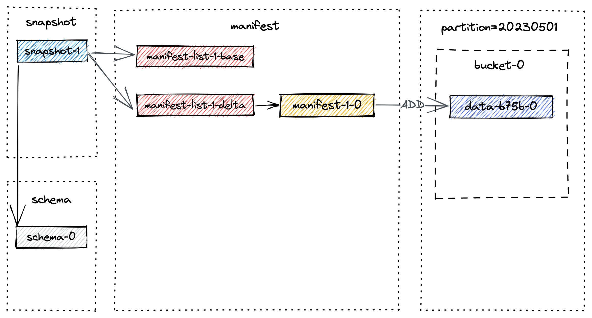

The content of snapshot-1 contains metadata of the snapshot, such as manifest list and schema id:

```json
{
  "version" : 3,
  "id" : 1,
  "schemaId" : 0,
  "baseManifestList" : "manifest-list-4ccc-c07f-4090-958c-cfe3ce3889e5-0",
  "deltaManifestList" : "manifest-list-4ccc-c07f-4090-958c-cfe3ce3889e5-1",
  "changelogManifestList" : null,
  "commitUser" : "7d758485-981d-4b1a-a0c6-d34c3eb254bf",
  "commitIdentifier" : 9223372036854775807,
  "commitKind" : "APPEND",
  "timeMillis" : 1684155393354,
  "logOffsets" : { },
  "totalRecordCount" : 1,
  "deltaRecordCount" : 1,
  "changelogRecordCount" : 0,
  "watermark" : -9223372036854775808
}
```

Remind that a manifest list contains all changes of the snapshot, `baseManifestList` is the base
file upon which the changes in `deltaManifestList` is applied.
The first commit will result in 1 manifest file, and 2 manifest lists are
created (the file names might differ from those in your experiment):

```bash
./T/manifest:
manifest-list-4ccc-c07f-4090-958c-cfe3ce3889e5-1	
manifest-list-4ccc-c07f-4090-958c-cfe3ce3889e5-0
manifest-2b833ea4-d7dc-4de0-ae0d-ad76eced75cc-0
```

`manifest-2b833ea4-d7dc-4de0-ae0d-ad76eced75cc-0` is the manifest
file (manifest-1-0 in the above graph), which stores the information about the data files in the snapshot.

`manifest-list-4ccc-c07f-4090-958c-cfe3ce3889e5-0` is the
baseManifestList (manifest-list-1-base in the above graph), which is effectively empty.

`manifest-list-4ccc-c07f-4090-958c-cfe3ce3889e5-1` is the
deltaManifestList (manifest-list-1-delta in the above graph), which
contains a list of manifest entries that perform operations on data
files, which, in this case, is `manifest-1-0`.

Now let’s insert a batch of records across different partitions and
see what happens. In Flink SQL, execute the following statement:

```sql
INSERT INTO T VALUES 
(2, 10002, 'varchar00002', '20230502'),
(3, 10003, 'varchar00003', '20230503'),
(4, 10004, 'varchar00004', '20230504'),
(5, 10005, 'varchar00005', '20230505'),
(6, 10006, 'varchar00006', '20230506'),
(7, 10007, 'varchar00007', '20230507'),
(8, 10008, 'varchar00008', '20230508'),
(9, 10009, 'varchar00009', '20230509'),
(10, 10010, 'varchar00010', '20230510');
```

The second `commit` takes place and executing `SELECT * FROM T` will return
10 rows. A new snapshot, namely `snapshot-2`, is created and gives us the
following physical file layout:

```bash
% ls -1tR ../T:
dt=20230501
dt=20230502	
dt=20230503	
dt=20230504	
dt=20230505	
dt=20230506	
dt=20230507	
dt=20230508	
dt=20230509	
dt=20230510	
snapshot
schema
manifest

./T/snapshot:
LATEST
snapshot-2
EARLIEST
snapshot-1

./T/manifest:
manifest-list-9ac2-5e79-4978-a3bc-86c25f1a303f-1 # delta manifest list for snapshot-2
manifest-list-9ac2-5e79-4978-a3bc-86c25f1a303f-0 # base manifest list for snapshot-2	
manifest-f1267033-e246-4470-a54c-5c27fdbdd074-0	 # manifest file for snapshot-2

manifest-list-4ccc-c07f-4090-958c-cfe3ce3889e5-1 # delta manifest list for snapshot-1 
manifest-list-4ccc-c07f-4090-958c-cfe3ce3889e5-0 # base manifest list for snapshot-1
manifest-2b833ea4-d7dc-4de0-ae0d-ad76eced75cc-0  # manifest file for snapshot-1

./T/dt=20230501/bucket-0:
data-b75b7381-7c8b-430f-b7e5-a204cb65843c-0.orc

...
# each partition has the data written to bucket-0...

./T/schema:
schema-0
```

The new file layout as of snapshot-2 looks like


<a id="learn-paimon-understand-files--delete-records-from-table"></a>

### Delete Records From Table [#](#learn-paimon-understand-files--delete-records-from-table)

Now let’s delete records that meet the condition `dt>=20230503`.
In Flink SQL, execute the following statement:

Batch

```sql
DELETE FROM T WHERE dt >= '20230503';
```

The third `commit` takes place and it gives us `snapshot-3`. Now, listing the files
under the table and your will find out no partition is dropped. Instead, a new data
file is created for partition `20230503` to `20230510`:

```bash
./T/dt=20230510/bucket-0:
data-b93f468c-b56f-4a93-adc4-b250b3aa3462-0.orc # newer data file created by the delete statement 
data-0fcacc70-a0cb-4976-8c88-73e92769a762-0.orc # older data file created by the insert statement
```

This make sense since we insert a record in the second commit (represented by
`+I[10, 10010, 'varchar00010', '20230510']`) and then delete
the record in the third commit. Executing `SELECT * FROM T` will return 2 rows, namely:

```
+I[1, 10001, 'varchar00001', '20230501']
+I[2, 10002, 'varchar00002', '20230502']
```

The new file layout as of snapshot-3 looks like
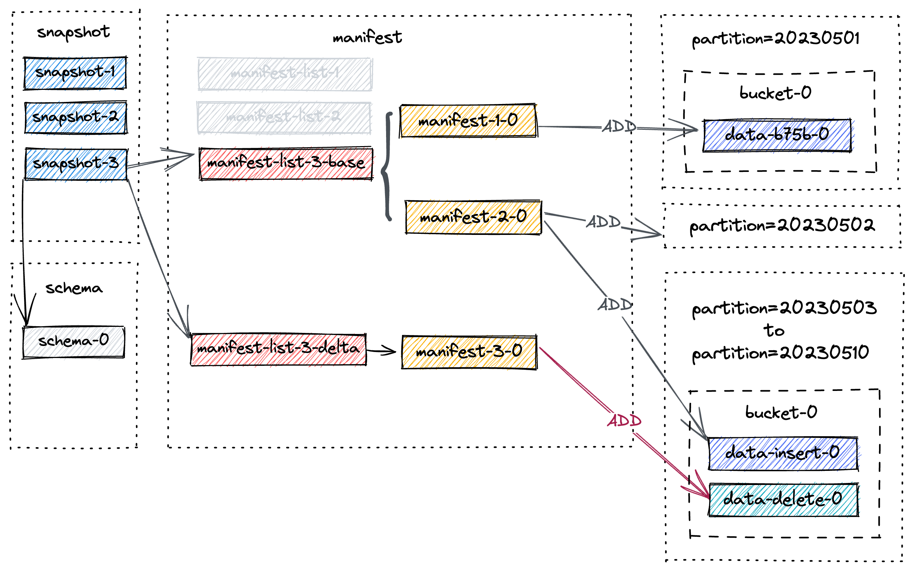

Note that `manifest-3-0` contains 8 manifest entries of `ADD` operation type, corresponding to 8 newly written data files.

<a id="learn-paimon-understand-files--compact-table"></a>

### Compact Table [#](#learn-paimon-understand-files--compact-table)

As you may have noticed, the number of small files will augment over successive
snapshots, which may lead to decreased read performance. Therefore, a full-compaction
is needed in order to reduce the number of small files.

Let’s trigger the full-compaction now, and run a dedicated compaction job through `flink run`:

Batch

Flink SQL

```sql
CALL sys.compact(
   `table` => 'database_name.table_name', 
   partitions => 'partition_name', 
   order_strategy => 'order_strategy',
   order_by => 'order_by',
   options => 'paimon_table_dynamic_conf'
);
```

Flink Action

```bash
<FLINK_HOME>/bin/flink run \
    -D execution.runtime-mode=batch \
    /path/to/paimon-flink-action-1.5-SNAPSHOT.jar \
    compact \
    --warehouse <warehouse-path> \
    --database <database-name> \
    --table <table-name> \
    [--partition <partition-name>] \
    [--catalog_conf <paimon-catalog-conf> [--catalog_conf <paimon-catalog-conf> ...]] \
    [--table_conf <paimon-table-dynamic-conf> [--table_conf <paimon-table-dynamic-conf>] ...]
```

an example would be (suppose you’re already in Flink home)

Flink SQL

```sql
CALL sys.compact('T');
```

Flink Action

```bash
./bin/flink run \
    ./lib/paimon-flink-action-1.5-SNAPSHOT.jar \
    compact \
    --path file:///tmp/paimon/default.db/T
```

All current table files will be compacted and a new snapshot, namely `snapshot-4`, is
made and contains the following information:

```json
{
  "version" : 3,
  "id" : 4,
  "schemaId" : 0,
  "baseManifestList" : "manifest-list-9be16-82e7-4941-8b0a-7ce1c1d0fa6d-0",
  "deltaManifestList" : "manifest-list-9be16-82e7-4941-8b0a-7ce1c1d0fa6d-1",
  "changelogManifestList" : null,
  "commitUser" : "a3d951d5-aa0e-4071-a5d4-4c72a4233d48",
  "commitIdentifier" : 9223372036854775807,
  "commitKind" : "COMPACT",
  "timeMillis" : 1684163217960,
  "logOffsets" : { },
  "totalRecordCount" : 2,
  "deltaRecordCount" : -16,
  "changelogRecordCount" : 0,
  "watermark" : -9223372036854775808
}
```

The new file layout as of snapshot-4 looks like
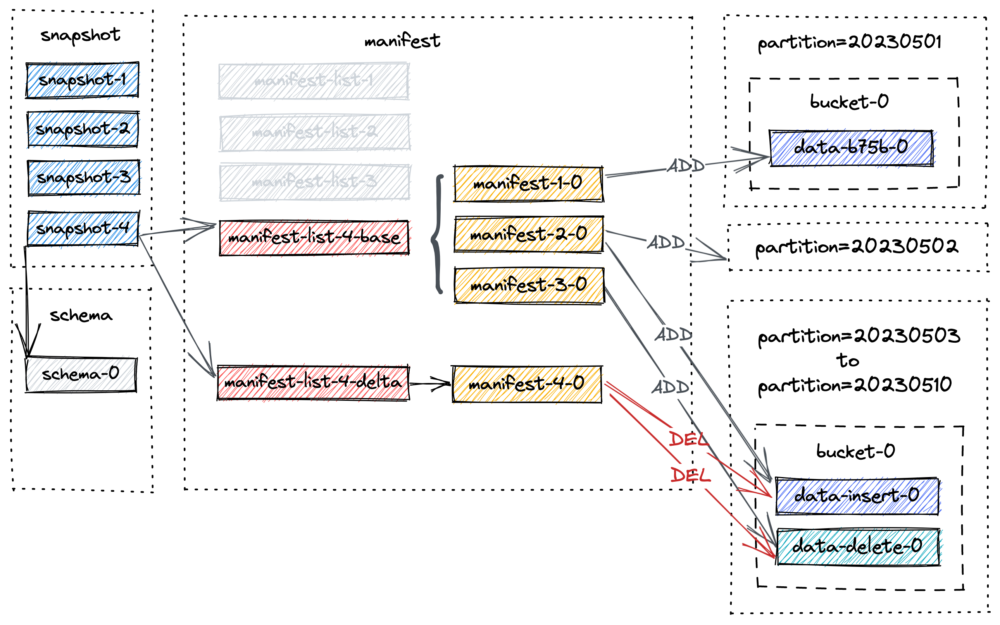

Note that `manifest-4-0` contains 20 manifest entries (18 `DELETE` operations and 2 `ADD` operations)

1. For partition `20230503` to `20230510`, two `DELETE` operations for two data files
2. For partition `20230501` to `20230502`, one `DELETE` operation and one `ADD` operation for the same data file.
   This is because there has been an upgrade of the file from level 0 to the highest level. Please rest assured that
   this is only a change in metadata, and the file is still the same.

<a id="learn-paimon-understand-files--alter-table"></a>

### Alter Table [#](#learn-paimon-understand-files--alter-table)

Execute the following statement to configure full-compaction:

```sql
ALTER TABLE T SET ('full-compaction.delta-commits' = '1');
```

It will create a new schema for Paimon table, namely `schema-1`, but no snapshot
has actually used this schema yet until the next commit.

<a id="learn-paimon-understand-files--expire-snapshots"></a>

### Expire Snapshots [#](#learn-paimon-understand-files--expire-snapshots)

Remind that the marked data files are not truly deleted until the snapshot expires and
no consumer depends on the snapshot. For more information, see [Expiring Snapshots](#maintenance-manage-snapshots--expiring-snapshots).

During the process of snapshot expiration, the range of snapshots is initially determined, and then data files within these snapshots are marked for deletion.
A data file is `marked` for deletion only when there is a manifest entry of kind `DELETE` that references that specific data file.
This marking ensures that the file will not be utilized by subsequent snapshots and can be safely removed.

Let’s say all 4 snapshots in the above diagram are about to expire. The expire process is as follows:

1. It first deletes all marked data files, and records any changed buckets.
2. It then deletes any changelog files and associated manifests.
3. Finally, it deletes the snapshots themselves and writes the earliest hint file.

If any directories are left empty after the deletion process, they will be deleted as well.

Let’s say another snapshot, `snapshot-5` is created and snapshot expiration is triggered. `snapshot-1` to `snapshot-4` are
to be deleted. For simplicity, we will only focus on files from previous snapshots, the final layout after snapshot
expiration looks like:


As a result, partition `20230503` to `20230510` are physically deleted.

<a id="learn-paimon-understand-files--flink-stream-write"></a>

### Flink Stream Write [#](#learn-paimon-understand-files--flink-stream-write)

Finally, we will examine Flink Stream Write by utilizing the example
of CDC ingestion. This section will address the capturing and writing of
change data into Paimon, as well as the mechanisms behind asynchronous compact
and snapshot commit and expiration.

To begin, let’s take a closer look at the CDC ingestion workflow and
the unique roles played by each component involved.


1. `MySQL CDC Source` uniformly reads snapshot and incremental data, with `SnapshotReader` reading snapshot data
   and `BinlogReader` reading incremental data, respectively.
2. `Paimon Sink` writes data into Paimon table in bucket level. The `CompactManager` within it will trigger compaction
   asynchronously.
3. `Committer Operator` is a singleton responsible for committing and expiring snapshots.

Next, we will go over end-to-end data flow.


`MySQL Cdc Source` read snapshot and incremental data and emit them to downstream after normalization.


`Paimon Sink` first buffers new records in a heap-based LSM tree, and flushes them to disk when
the memory buffer is full. Note that each data file written is a sorted run. At this point, no manifest file and snapshot
is created. Right before Flink checkpoint takes places, `Paimon Sink` will flush all buffered records and send committable message
to downstream, which is read and committed by `Committer Operator` during checkpoint.


During checkpoint, `Committer Operator` will create a new snapshot and associate it with manifest lists so that the snapshot
contains information about all data files in the table.

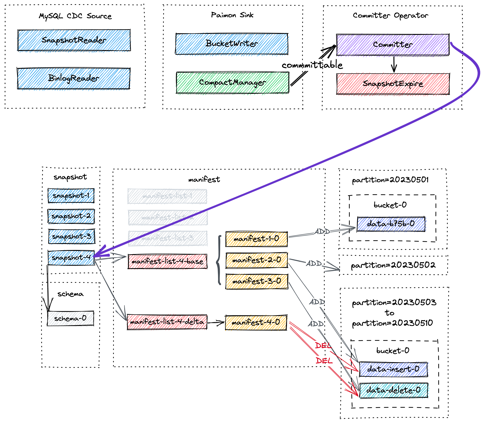

At later point asynchronous compaction might take place, and the committable produced by `CompactManager` contains information
about previous files and merged files so that `Committer Operator` can construct corresponding manifest entries. In this case
`Committer Operator` might produce two snapshot during Flink checkpoint, one for data written (snapshot of kind `Append`) and the
other for compact (snapshot of kind `Compact`). If no data file is written during checkpoint interval, only snapshot of kind `Compact`
will be created. `Committer Operator` will check against snapshot expiration and perform
physical deletion of marked data files.

<a id="learn-paimon-understand-files--understand-small-files"></a>

## Understand Small Files [#](#learn-paimon-understand-files--understand-small-files)

Many users are concerned about small files, which can lead to:

1. Stability issue: Too many small files in HDFS, NameNode will be overstressed.
2. Cost issue: A small file in HDFS will temporarily use the size of a minimum of one Block, for example 128 MB.
3. Query efficiency: The efficiency of querying too many small files will be affected.

<a id="learn-paimon-understand-files--understand-checkpoints"></a>

### Understand Checkpoints [#](#learn-paimon-understand-files--understand-checkpoints)

Assuming you are using Flink Writer, each checkpoint generates 1-2 snapshots, and the checkpoint forces the files to be
generated on DFS, so the smaller the checkpoint interval the more small files will be generated.

1. So first thing is increase checkpoint interval.

By default, not only checkpoint will cause the file to be generated, but writer’s memory (write-buffer-size) exhaustion
will also flush data to DFS and generate the corresponding file. You can enable `write-buffer-spillable` to generate
spilled files in writer to generate bigger files in DFS.

2. So second thing is increase `write-buffer-size` or enable `write-buffer-spillable`.

<a id="learn-paimon-understand-files--understand-snapshots"></a>

### Understand Snapshots [#](#learn-paimon-understand-files--understand-snapshots)


Paimon maintains multiple versions of files, compaction and deletion of files are logical and do not actually
delete files. Files are only really deleted when Snapshot is expired, so the first way to reduce files is to
reduce the time it takes for snapshot to be expired. Flink writer will automatically expire snapshots.

See [Expire Snapshots](#maintenance-manage-snapshots--expire-snapshots).

<a id="learn-paimon-understand-files--understand-partitions-and-buckets"></a>

### Understand Partitions and Buckets [#](#learn-paimon-understand-files--understand-partitions-and-buckets)

Paimon files are organized in a layered style. The following image illustrates the file layout. Starting
from a snapshot file, Paimon readers can recursively access all records from the table.


For example, the following table:

```sql
CREATE TABLE MyTable (
    user_id BIGINT,
    item_id BIGINT,
    behavior STRING,
    dt STRING,
    hh STRING,
    PRIMARY KEY (dt, hh, user_id) NOT ENFORCED
) PARTITIONED BY (dt, hh) WITH (
    'bucket' = '10'
);
```

The table data will be physically sliced into different partitions, and different buckets inside, so if the overall
data volume is too small, there is at least one file in a single bucket, I suggest you configure a smaller number
of buckets, otherwise there will be quite a few small files as well.

<a id="learn-paimon-understand-files--understand-lsm-for-primary-table"></a>

### Understand LSM for Primary Table [#](#learn-paimon-understand-files--understand-lsm-for-primary-table)

LSM tree organizes files into several sorted runs. A sorted run consists of one or multiple data files and each data
file belongs to exactly one sorted run.


By default, sorted runs number depends on `num-sorted-run.compaction-trigger`, see [Compaction for Primary Key Table](#maintenance-write-performance--compaction), this means that there are at least 5 files in a bucket. If you want to reduce this number, you can keep fewer files, but write performance may suffer.

<a id="learn-paimon-understand-files--understand-files-for-bucketed-append-table"></a>

### Understand Files for Bucketed Append Table [#](#learn-paimon-understand-files--understand-files-for-bucketed-append-table)

By default, Append also does automatic compaction to reduce the number of small files.

However, for Bucketed Append table, it will only compact the files within the Bucket for sequential
purposes, which may keep more small files. See [Bucketed Append](#append-table-bucketed).

<a id="learn-paimon-understand-files--understand-full-compaction"></a>

### Understand Full-Compaction [#](#learn-paimon-understand-files--understand-full-compaction)

Maybe you think the 5 files for the primary key table are actually okay, but the Append table (bucket)
may have 50 small files in a single bucket, which is very difficult to accept. Worse still, partitions that
are no longer active also keep so many small files.

Configure ‘full-compaction.delta-commits’ perform full-compaction periodically in Flink writing. And it can ensure
that partitions are full compacted before writing ends.

---

<a id="learn-paimon-scenario-guide"></a>

<!-- source_url: https://paimon.apache.org/docs/master/learn-paimon/scenario-guide/ -->

<!-- page_index: 103 -->

# Scenario Guide #

> This documentation is for an unreleased version of Apache Paimon. We recommend you use the latest [stable version](https://paimon.apache.org/docs/1.4).

<a id="learn-paimon-scenario-guide--scenario-guide"></a>

# Scenario Guide [#](#learn-paimon-scenario-guide--scenario-guide)

This guide helps you choose the right Paimon table type and configuration for your specific use case. Paimon provides
**Primary Key Table**, **Append Table**, and **Multimodal Data Lake** capabilities — each with different modes and
configurations that are suited for different scenarios.

<a id="learn-paimon-scenario-guide--quick-decision"></a>

## Quick Decision [#](#learn-paimon-scenario-guide--quick-decision)

| Scenario | Table Type | Key Configuration |
| --- | --- | --- |
| CDC real-time sync from database | Primary Key Table | `deletion-vectors.enabled = true` |
| Streaming aggregation / metrics | Primary Key Table | `merge-engine = aggregation` |
| Multi-stream partial column updates | Primary Key Table | `merge-engine = partial-update` |
| Log deduplication (keep first) | Primary Key Table | `merge-engine = first-row` |
| Batch ETL / data warehouse layers | Append Table | Default (unaware-bucket) |
| High-frequency point queries on key | Append Table | `bucket = N, bucket-key = col` |
| Queue-like ordered streaming | Append Table | `bucket = N, bucket-key = col` |
| Large-scale OLAP with ad-hoc queries | Append Table | Incremental Clustering |
| Store images / videos / documents | Append Table (Blob) | `blob-field`, Data Evolution enabled |
| AI vector search / RAG | Append Table (Vector) | `VECTOR` type, Global Index (DiskANN) |
| AI feature engineering & column evolution | Append Table | `data-evolution.enabled = true` |
| Python AI pipeline (Ray / PyTorch) | Append Table | PyPaimon SDK |

---

<a id="learn-paimon-scenario-guide--primary-key-table"></a>

## Primary Key Table [#](#learn-paimon-scenario-guide--primary-key-table)

Use a Primary Key Table when your data has a natural unique key and you need **real-time updates** (insert, update, delete).
See [Primary Key Table Overview](#primary-key-table-overview).

<a id="learn-paimon-scenario-guide--scenario-1-cdc-real-time-sync"></a>
<a id="learn-paimon-scenario-guide--scenario-1:-cdc-real-time-sync"></a>

### Scenario 1: CDC Real-Time Sync [#](#learn-paimon-scenario-guide--scenario-1-cdc-real-time-sync)

**When:** You want to synchronize a MySQL / PostgreSQL / MongoDB table to the data lake in real-time with upsert
semantics. This is the most common use case for Primary Key Tables.

**Recommended Configuration:**

```sql
CREATE TABLE orders (
    order_id BIGINT,
    user_id BIGINT,
    amount DECIMAL(10,2),
    status STRING,
    update_time TIMESTAMP,
    dt STRING,
    PRIMARY KEY (order_id, dt) NOT ENFORCED
) PARTITIONED BY (dt) WITH (
    'deletion-vectors.enabled' = 'true',
    'changelog-producer' = 'lookup',
    'sequence.field' = 'update_time'
);
```

**Why this configuration:**

- **`deletion-vectors.enabled = true`** (MOW mode): Enables [Merge On Write](#primary-key-table-table-mode--merge-on-write) with Deletion Vectors.
  This mode gives you the best balance of write and read performance. Compared to the default MOR mode, MOW
  avoids merging at read time, which greatly improves OLAP query performance.
- **`changelog-producer = lookup`**: Generates a complete [changelog](#primary-key-table-changelog-producer--lookup)
  for downstream streaming consumers. If your CDC source is directly connected to a database (e.g., MySQL CDC, Postgres CDC),
  you can use `changelog-producer = input` instead, since the database CDC stream already provides a complete changelog.
  However, if your CDC source comes from Kafka (or other message queues), `input` may not be reliable — use `lookup` to
  ensure changelog correctness. If no downstream streaming read is needed, you can omit this to save compaction resources.
- **`sequence.field = update_time`**: Guarantees correct update ordering even when data arrives out of order.
- **Bucketing**: Use the default Dynamic Bucket (`bucket = -1`). The system automatically adjusts bucket count based
  on data volume. If you are sensitive to data visibility latency, set a fixed bucket number (e.g. `'bucket' = '5'`)
  — roughly 1 bucket per 1GB of data in a partition.

**CDC Ingestion Tip:** Use [Paimon CDC Ingestion](#cdc-ingestion-overview) for whole-database sync with
automatic table creation and schema evolution support.

<a id="learn-paimon-scenario-guide--scenario-2-multi-stream-partial-column-updates"></a>
<a id="learn-paimon-scenario-guide--scenario-2:-multi-stream-partial-column-updates"></a>

### Scenario 2: Multi-Stream Partial Column Updates [#](#learn-paimon-scenario-guide--scenario-2-multi-stream-partial-column-updates)

**When:** Multiple data sources each contribute different columns to the same record, and you want to progressively
merge them into a complete wide table (e.g., orders from one stream + logistics info from another).

**Recommended Configuration:**

```sql
CREATE TABLE order_wide (
    order_id BIGINT PRIMARY KEY NOT ENFORCED,
    -- from order stream
    user_name STRING,
    amount DECIMAL(10,2),
    order_time TIMESTAMP,
    -- from logistics stream
    tracking_no STRING,
    delivery_status STRING,
    delivery_time TIMESTAMP
) WITH (
    'merge-engine' = 'partial-update',
    'fields.order_time.sequence-group' = 'user_name,amount',
    'fields.delivery_time.sequence-group' = 'tracking_no,delivery_status',
    'deletion-vectors.enabled' = 'true',
    'changelog-producer' = 'lookup'
);
```

**Why:** The [partial-update](#primary-key-table-merge-engine-partial-update) merge engine allows each
stream to update only its own columns without overwriting the others. `sequence-group` ensures ordering within each
stream independently.

<a id="learn-paimon-scenario-guide--scenario-3-streaming-aggregation-metrics"></a>
<a id="learn-paimon-scenario-guide--scenario-3:-streaming-aggregation-metrics"></a>

### Scenario 3: Streaming Aggregation / Metrics [#](#learn-paimon-scenario-guide--scenario-3-streaming-aggregation-metrics)

**When:** You need to pre-aggregate metrics in real-time (e.g., page views, total sales, UV count). Each incoming record
should be aggregated with the existing value, not replace it.

**Recommended Configuration:**

```sql
CREATE TABLE product_metrics (
    product_id BIGINT,
    dt STRING,
    total_sales BIGINT,
    max_price DOUBLE,
    uv VARBINARY,
    PRIMARY KEY (product_id, dt) NOT ENFORCED
) PARTITIONED BY (dt) WITH (
    'merge-engine' = 'aggregation',
    'fields.total_sales.aggregate-function' = 'sum',
    'fields.max_price.aggregate-function' = 'max',
    'fields.uv.aggregate-function' = 'hll_sketch',
    'deletion-vectors.enabled' = 'true',
    'changelog-producer' = 'lookup'
);
```

**Why:** The [aggregation](#primary-key-table-merge-engine-aggregation) merge engine supports 20+
aggregate functions (`sum`, `max`, `min`, `count`, `hll_sketch`, `theta_sketch`, `collect`, `merge_map`, etc.), ideal
for real-time metric accumulation.

<a id="learn-paimon-scenario-guide--scenario-4-log-deduplication-keep-first-record"></a>
<a id="learn-paimon-scenario-guide--scenario-4:-log-deduplication-keep-first-record"></a>

### Scenario 4: Log Deduplication (Keep First Record) [#](#learn-paimon-scenario-guide--scenario-4-log-deduplication-keep-first-record)

**When:** You receive a high-volume log stream with possible duplicates and only want to keep the first occurrence of
each key (e.g., first login event per user per day).

**Recommended Configuration:**

```sql
CREATE TABLE first_login (
    user_id BIGINT,
    dt STRING,
    login_time TIMESTAMP,
    device STRING,
    ip STRING,
    PRIMARY KEY (user_id, dt) NOT ENFORCED
) PARTITIONED BY (dt) WITH (
    'merge-engine' = 'first-row',
    'changelog-producer' = 'lookup'
);
```

**Why:** The [first-row](#primary-key-table-merge-engine-first-row) merge engine keeps only the earliest
record for each primary key and produces insert-only changelog, making it perfect for streaming log deduplication.

<a id="learn-paimon-scenario-guide--primary-key-table-bucket-mode-comparison"></a>
<a id="learn-paimon-scenario-guide--primary-key-table:-bucket-mode-comparison"></a>

### Primary Key Table: Bucket Mode Comparison [#](#learn-paimon-scenario-guide--primary-key-table-bucket-mode-comparison)

| Mode | Config | Best For | Trade-off |
| --- | --- | --- | --- |
| Dynamic Bucket (default) | `bucket = -1` | Most scenarios, auto-scaling | Requires single write job |
| Fixed Bucket | `bucket = N` | Stable workloads, bucketed join | Manual rescaling needed |
| Postpone Bucket | `bucket = -2` | Adaptive Partition Level Bucket | New data not visible until compaction |

**General guideline:** ~1 bucket per 1GB of data in a partition, with each bucket containing 200MB–1GB of data.

<a id="learn-paimon-scenario-guide--primary-key-table-table-mode-comparison"></a>
<a id="learn-paimon-scenario-guide--primary-key-table:-table-mode-comparison"></a>

### Primary Key Table: Table Mode Comparison [#](#learn-paimon-scenario-guide--primary-key-table-table-mode-comparison)

| Mode | Config | Write Perf | Read Perf | Best For |
| --- | --- | --- | --- | --- |
| MOR (default) | — | Very good | Not so good | Write-heavy, less query |
| COW | `full-compaction.delta-commits = 1` | Very bad | Very good | Read-heavy, batch jobs |
| MOW | `deletion-vectors.enabled = true` | Good | Good | Balanced (recommended for most) |

---

<a id="learn-paimon-scenario-guide--append-table"></a>

## Append Table [#](#learn-paimon-scenario-guide--append-table)

Use an Append Table when your data **has no natural primary key**, or you are working with **batch ETL** pipelines
where data is only inserted and does not need upsert semantics.
See [Append Table Overview](#append-table-overview).

Compared to Primary Key Tables, Append Tables have much better batch read/write performance, simpler design, and lower
resource consumption. **We recommend using Append Tables for most batch processing scenarios.**

<a id="learn-paimon-scenario-guide--scenario-5-batch-etl-data-warehouse-layers-unaware-bucket"></a>
<a id="learn-paimon-scenario-guide--scenario-5:-batch-etl-data-warehouse-layers-unaware-bucket"></a>

### Scenario 5: Batch ETL / Data Warehouse Layers (Unaware-Bucket) [#](#learn-paimon-scenario-guide--scenario-5-batch-etl-data-warehouse-layers-unaware-bucket)

**When:** Standard data warehouse layering (ODS → DWD → DWS → ADS), bulk INSERT OVERWRITE, or Spark / Hive style
batch processing.

**Recommended Configuration:**

```sql
CREATE TABLE dwd_events (
    event_id BIGINT,
    user_id BIGINT,
    event_type STRING,
    event_time TIMESTAMP,
    dt STRING
) PARTITIONED BY (dt);
```

No bucket configuration needed. This is an **unaware-bucket** append table — the simplest and most commonly used form.
Paimon automatically handles small file merging and supports:

- **Time travel** and version rollback.
- **Schema evolution** (add/drop/rename columns).
- **Data skipping** via min-max stats in manifest files.
- **File Index** (BloomFilter, Bitmap, Range Bitmap) for further query acceleration.
- **Row-level operations** (DELETE / UPDATE / MERGE INTO in Spark SQL).
- **Incremental Clustering** for advanced data layout optimization.

**Query Optimization Tip:** If your queries frequently filter on specific columns, consider using
[Incremental Clustering](#append-table-incremental-clustering) to sort data by those columns:

```sql
ALTER TABLE dwd_events SET (
    'clustering.incremental' = 'true',
    'clustering.columns' = 'user_id'
);
```

Or define a File Index for point lookups:

```sql
ALTER TABLE dwd_events SET (
    'file-index.bloom-filter.columns' = 'user_id'
);
```

<a id="learn-paimon-scenario-guide--scenario-6-high-frequency-point-queries-bucketed-append"></a>
<a id="learn-paimon-scenario-guide--scenario-6:-high-frequency-point-queries-bucketed-append"></a>

### Scenario 6: High-Frequency Point Queries (Bucketed Append) [#](#learn-paimon-scenario-guide--scenario-6-high-frequency-point-queries-bucketed-append)

**When:** Your append table is frequently queried with equality or IN filters on a specific column
(e.g., `WHERE product_id = xxx`). This is the **most impactful** advantage of a bucketed append table.

**Recommended Configuration:**

```sql
CREATE TABLE product_logs (
    product_id BIGINT,
    log_time TIMESTAMP,
    message STRING,
    dt STRING
) PARTITIONED BY (dt) WITH (
    'bucket' = '16',
    'bucket-key' = 'product_id'
);
```

**Why this is powerful:** The `bucket-key` enables **data skipping** — when a query contains `=` or `IN` conditions on
the bucket-key, Paimon pushes these predicates down and prunes all irrelevant bucket files entirely. With 16 buckets, a point query on `product_id` only reads ~1/16 of the data.

```sql
-- Only reads the bucket containing product_id=12345, skips all other 15 buckets
SELECT * FROM product_logs WHERE product_id = 12345;

-- Only reads buckets for these 3 values
SELECT * FROM product_logs WHERE product_id IN (1, 2, 3);
```

See [Bucketed Append — Data Skipping](#append-table-bucketed--data-skipping).

**Bucketed Join Bonus:** If two bucketed tables share the same `bucket-key` and bucket count, Spark can join them
**without shuffle**, significantly accelerating batch join queries:

```sql
SET spark.sql.sources.v2.bucketing.enabled = true;

-- Both tables have bucket=16, bucket-key=product_id
SELECT * FROM product_logs JOIN product_dim
ON product_logs.product_id = product_dim.product_id;
```

See [Bucketed Join](#append-table-bucketed--bucketed-join).

<a id="learn-paimon-scenario-guide--scenario-7-queue-like-ordered-streaming-bucketed-append"></a>
<a id="learn-paimon-scenario-guide--scenario-7:-queue-like-ordered-streaming-bucketed-append"></a>

### Scenario 7: Queue-Like Ordered Streaming (Bucketed Append) [#](#learn-paimon-scenario-guide--scenario-7-queue-like-ordered-streaming-bucketed-append)

**When:** You want to use Paimon as a message queue replacement with strict ordering guarantees per key (similar to
Kafka partitioning), with the benefits of filter push-down and lower cost.

**Recommended Configuration:**

```sql
CREATE TABLE event_stream (
    user_id BIGINT,
    event_type STRING,
    event_time TIMESTAMP(3),
    payload STRING,
    WATERMARK FOR event_time AS event_time - INTERVAL '5' SECOND
) WITH (
    'bucket' = '8',
    'bucket-key' = 'user_id'
);
```

**Why:** Within the same bucket, records are strictly ordered by write time. Streaming reads deliver records in exact
write order per bucket. This gives you Kafka-like partitioned ordering at data lake cost.

See [Bucketed Streaming](#append-table-bucketed--bucketed-streaming).

<a id="learn-paimon-scenario-guide--append-table-bucket-mode-comparison"></a>
<a id="learn-paimon-scenario-guide--append-table:-bucket-mode-comparison"></a>

### Append Table: Bucket Mode Comparison [#](#learn-paimon-scenario-guide--append-table-bucket-mode-comparison)

| Mode | Config | Data Skipping | Bucketed Join | Ordered Streaming | Incremental Clustering |
| --- | --- | --- | --- | --- | --- |
| Unaware-Bucket (default) | No bucket config | Via min-max / file index | No | No | Yes |
| Bucketed | `bucket = N, bucket-key = col` | **Bucket-key filter pushdown** | Yes | Yes | No |

---

<a id="learn-paimon-scenario-guide--multimodal-data-lake"></a>

## Multimodal Data Lake [#](#learn-paimon-scenario-guide--multimodal-data-lake)

Paimon is a multimodal lakehouse for AI. You can keep multimodal data, metadata, and embeddings in the same table and
query them via vector search, full-text search, or SQL. All multimodal features are built on top of Append Tables with
[Data Evolution](#append-table-data-evolution) mode enabled.

<a id="learn-paimon-scenario-guide--scenario-8-storing-multimodal-data-blob-table"></a>
<a id="learn-paimon-scenario-guide--scenario-8:-storing-multimodal-data-blob-table"></a>

### Scenario 8: Storing Multimodal Data (Blob Table) [#](#learn-paimon-scenario-guide--scenario-8-storing-multimodal-data-blob-table)

**When:** You need to store images, videos, audio files, documents, or model weights alongside structured metadata in
the data lake, and want efficient column projection without loading large binary data.

**Recommended Configuration:**

Flink SQL

```sql
CREATE TABLE image_table (
    id INT,
    name STRING,
    label STRING,
    image BYTES
) WITH (
    'row-tracking.enabled' = 'true',
    'data-evolution.enabled' = 'true',
    'blob-field' = 'image'
);
```

Spark SQL

```sql
CREATE TABLE image_table (
    id INT,
    name STRING,
    label STRING,
    image BINARY
) TBLPROPERTIES (
    'row-tracking.enabled' = 'true',
    'data-evolution.enabled' = 'true',
    'blob-field' = 'image'
);
```

**Why:** The [Blob Storage](#append-table-blob) separates large binary data into dedicated `.blob` files
while metadata stays in standard columnar files (Parquet/ORC). This means:

- `SELECT id, name, label FROM image_table` does **not** load any blob data — very fast.
- Blob data supports streaming reads for large objects (videos, model weights) without loading entire files into memory.
- Supports multiple input methods: local files, HTTP URLs, InputStreams, and byte arrays.

**For external storage (e.g., blobs already in S3):**

```sql
CREATE TABLE video_table (
    id INT,
    title STRING,
    video BYTES
) WITH (
    'row-tracking.enabled' = 'true',
    'data-evolution.enabled' = 'true',
    'blob-descriptor-field' = 'video',
    'blob-external-storage-field' = 'video',
    'blob-external-storage-path' = 's3://my-bucket/paimon-blobs/'
);
```

This stores only descriptor references inline, while the actual blob data resides in external storage.

<a id="learn-paimon-scenario-guide--scenario-9-vector-search-rag-applications"></a>
<a id="learn-paimon-scenario-guide--scenario-9:-vector-search-rag-applications"></a>

### Scenario 9: Vector Search / RAG Applications [#](#learn-paimon-scenario-guide--scenario-9-vector-search-rag-applications)

**When:** You are building a recommendation system, image retrieval, or RAG (Retrieval Augmented Generation)
application that needs approximate nearest neighbor (ANN) search on embeddings.

**Recommended Configuration:**

Spark SQL

```sql
CREATE TABLE doc_embeddings (
    doc_id INT,
    title STRING,
    content STRING,
    embedding ARRAY<FLOAT>
) TBLPROPERTIES (
    'row-tracking.enabled' = 'true',
    'data-evolution.enabled' = 'true',
    'global-index.enabled' = 'true',
    'vector-field' = 'embedding',
    'field.embedding.vector-dim' = '768',
    'vector.file.format' = 'lance'
);
```

Java API

```java
Schema schema = Schema.newBuilder()
    .column("doc_id", DataTypes.INT())
    .column("title", DataTypes.STRING())
    .column("content", DataTypes.STRING())
    .column("embedding", DataTypes.VECTOR(768, DataTypes.FLOAT()))
    .option("bucket", "-1")
    .option("row-tracking.enabled", "true")
    .option("data-evolution.enabled", "true")
    .option("global-index.enabled", "true")
    .option("vector.file.format", "lance")
    .build();
```

**Build the vector index and search:**

```sql
-- Build DiskANN vector index
CALL sys.create_global_index(
    table => 'db.doc_embeddings',
    index_column => 'embedding',
    index_type => 'lumina',
    options => 'lumina.index.dimension=768'
);

-- Search for top-5 nearest neighbors
SELECT * FROM vector_search('doc_embeddings', 'embedding', array(0.1f, 0.2f, ...), 5);
```

The legacy index type `lumina-vector-ann` is still accepted for existing tables and SQL compatibility.

**Why:** The [Global Index](#append-table-global-index) with DiskANN provides high-performance ANN search.
Vector data is stored in dedicated `.vector.lance` files optimized for dense vectors, while scalar columns stay in
Parquet. You can also build a **BTree Index** on scalar columns for efficient filtering:

```sql
-- Build BTree index for scalar filtering
CALL sys.create_global_index(
    table => 'db.doc_embeddings',
    index_column => 'title',
    index_type => 'btree'
);

-- Scalar lookup is accelerated by BTree index
SELECT * FROM doc_embeddings WHERE title IN ('doc_a', 'doc_b');
```

<a id="learn-paimon-scenario-guide--scenario-10-ai-feature-engineering-with-data-evolution"></a>
<a id="learn-paimon-scenario-guide--scenario-10:-ai-feature-engineering-with-data-evolution"></a>

### Scenario 10: AI Feature Engineering with Data Evolution [#](#learn-paimon-scenario-guide--scenario-10-ai-feature-engineering-with-data-evolution)

**When:** You have a feature store or data pipeline where new feature columns are added frequently, and you want to
backfill or update specific columns without rewriting entire data files.

**Recommended Configuration:**

```sql
CREATE TABLE feature_store (
    user_id INT,
    age INT,
    gender STRING,
    purchase_count INT
) TBLPROPERTIES (
    'row-tracking.enabled' = 'true',
    'data-evolution.enabled' = 'true'
);
```

**Update only specific columns via MERGE INTO:**

```sql
-- Later, add a new feature column
ALTER TABLE feature_store ADD COLUMNS (embedding ARRAY<FLOAT>);

-- Backfill only the new column — no full file rewrite!
MERGE INTO feature_store AS t
USING embedding_source AS s
ON t.user_id = s.user_id
WHEN MATCHED THEN UPDATE SET t.embedding = s.embedding;
```

**Why:** [Data Evolution](#append-table-data-evolution) mode writes only the updated columns to new files
and merges them at read time. This is ideal for:

- Adding new feature columns and backfilling data without rewriting the entire table.
- Iterative ML feature engineering — add, update, or refine features as your model evolves.
- Reducing I/O cost and storage overhead for frequent partial column updates.

<a id="learn-paimon-scenario-guide--scenario-11-python-ai-pipeline-pypaimon"></a>
<a id="learn-paimon-scenario-guide--scenario-11:-python-ai-pipeline-pypaimon"></a>

### Scenario 11: Python AI Pipeline (PyPaimon) [#](#learn-paimon-scenario-guide--scenario-11-python-ai-pipeline-pypaimon)

**When:** You are building ML training or inference pipelines in Python and need to read/write Paimon tables natively
without JDK dependency.

**Example: Read data for model training:**

```python
from pypaimon import CatalogFactory
from torch.utils.data import DataLoader

# Connect to Paimon
catalog = CatalogFactory.create({'warehouse': 's3://my-bucket/warehouse'})
table = catalog.get_table('db.feature_store')

# Read with filter and projection
read_builder = table.new_read_builder()
read_builder = read_builder.with_projection(['user_id', 'embedding'])
read_builder = read_builder.with_filter(
    read_builder.new_predicate_builder().equal('gender', 'M')
)
splits = read_builder.new_scan().plan().splits()
table_read = read_builder.new_read()

# Option 1: Load into PyTorch DataLoader
dataset = table_read.to_torch(splits, streaming=True, prefetch_concurrency=2)
dataloader = DataLoader(dataset, batch_size=32, num_workers=4)
for batch in dataloader:
    # Training loop
    pass

# Option 2: Load into Ray for distributed processing
ray_dataset = table_read.to_ray(splits, override_num_blocks=8)
mapped = ray_dataset.map(lambda row: {'feat': row['embedding']})

# Option 3: Load into Pandas / PyArrow
df = table_read.to_pandas(splits)
arrow_table = table_read.to_arrow(splits)
```

**Why:** [PyPaimon](#pypaimon-overview) is a pure Python SDK (no JDK required) that integrates seamlessly
with the Python AI ecosystem:

- **PyTorch**: Direct `DataLoader` integration with streaming and prefetch support.
- **Ray**: Distributed data processing with configurable parallelism.
- **Pandas / PyArrow**: Native DataFrame and Arrow Table support for data science workflows.
- **Data Evolution**: Python API supports `update_by_arrow_with_row_id` and `upsert_by_arrow_with_key` for
  row-level updates from Python. See [PyPaimon Data Evolution](#pypaimon-data-evolution).

---

<a id="learn-paimon-scenario-guide--summary-table-type-decision-tree"></a>
<a id="learn-paimon-scenario-guide--summary:-table-type-decision-tree"></a>

## Summary: Table Type Decision Tree [#](#learn-paimon-scenario-guide--summary-table-type-decision-tree)

```
Do you need upsert / update / delete?
├── YES → Primary Key Table
│   ├── Simple upsert (keep latest)? → merge-engine = deduplicate (default)
│   ├── Progressive multi-column updates? → merge-engine = partial-update
│   ├── Pre-aggregate metrics? → merge-engine = aggregation
│   └── Dedup keep first? → merge-engine = first-row
│
│   Table mode:
│   ├── Most scenarios → deletion-vectors.enabled = true (MOW, recommended)
│   ├── Write-heavy, query-light → default MOR
│   └── Read-heavy, batch → full-compaction.delta-commits = 1 (COW)
│
│   Bucket mode:
│   ├── Most scenarios → bucket = -1 (Dynamic, default)
│   ├── Stable workload, need bucketed join → bucket = N (Fixed)
│   └── Unknown distribution → bucket = -2 (Postpone)
│
└── NO → Append Table
    ├── Standard batch ETL? → No bucket config (unaware-bucket)
    │   └── Need query acceleration? → Incremental Clustering or File Index
    │
    ├── Need bucket-key filter pushdown / join / ordered streaming?
    │   → bucket = N, bucket-key = col (Bucketed Append)
    │
    └── AI / Multimodal scenarios? → Enable Data Evolution
        ├── Store images / videos / docs? → Blob Table (blob-field)
        ├── Vector search / RAG? → VECTOR type + Global Index (DiskANN)
        ├── Feature engineering? → Data Evolution (MERGE INTO partial columns)
        └── Python pipeline? → PyPaimon (Ray / PyTorch / Pandas)
```

---

<a id="api-java"></a>

<!-- source_url: https://paimon.apache.org/docs/master/api/java/ -->

<!-- page_index: 104 -->

<a id="api-java--index-of-docs-master-api-java"></a>

# Index of /docs/master/api/java

<table>
<tr><th></th><th><a href="#api-java-index_4">Name</a></th><th><a href="#api-java-index_3">Last modified</a></th><th><a href="#api-java-index_5">Size</a></th><th><a href="#api-java-index_2">Description</a></th></tr>
<tr><th colspan="5"><hr/></th></tr>
<tr><td></td><td><a href="#api">Parent Directory</a></td><td> </td><td align="right">  - </td><td> </td></tr>
<tr><td></td><td><a href="https://paimon.apache.org/docs/master/api/java/argfile">argfile</a></td><td align="right">2026-04-09 00:48  </td><td align="right">708 </td><td> </td></tr>
<tr><td></td><td><a href="https://paimon.apache.org/docs/master/api/java/javadoc.sh">javadoc.sh</a></td><td align="right">2026-04-23 01:02  </td><td align="right">142 </td><td> </td></tr>
<tr><td></td><td><a href="https://paimon.apache.org/docs/master/api/java/options">options</a></td><td align="right">2026-04-23 01:02  </td><td align="right"> 68K</td><td> </td></tr>
<tr><td></td><td><a href="https://paimon.apache.org/docs/master/api/java/packages">packages</a></td><td align="right">2026-04-09 00:48  </td><td align="right">9.1K</td><td> </td></tr>
<tr><th colspan="5"><hr/></th></tr>
</table>

---

<a id="index"></a>

<!-- source_url: https://paimon.apache.org/docs/master/ -->

<!-- page_index: 105 -->

<a id="index--apache-paimon"></a>

# Apache Paimon [#](#index--apache-paimon)

Apache Paimon is a lake format for building Lakehouse Architecture for both streaming and batch
operations. Paimon provides large-scale data lake storage for analytics, realtime streaming updates
powered by LSM (Log-structured merge-tree) structure, and multimodal data management for AI workloads
— all in a single unified format.

<a id="index--large-scale-data-lake"></a>

## Large-Scale Data Lake [#](#index--large-scale-data-lake)

Paimon is built for huge analytic datasets. A single table can contain tens of petabytes of data, and even
these huge tables can be read efficiently without a distributed SQL engine.

- **Time travel** enables reproducible queries that use exactly the same table snapshot, or lets users easily
  examine changes. Version rollback allows users to quickly correct problems by resetting tables to a good state.
- **Scan planning is fast** — data files are pruned with partition and column-level stats, using table metadata.
  File Index (BloomFilter, Bitmap, Range Bitmap) and aggregate push-down further accelerate queries.
- **Schema evolution** supports add, drop, update, or rename columns, and has no side-effects.
- **Rich ecosystem** — adds tables to compute engines including Flink, Spark, Hive, Trino, Presto, StarRocks, and
  Doris, working just like a SQL table.
- **Incremental Clustering** with z-order/hilbert/order sorting to optimize data layout at low cost.

<a id="index--realtime-data-lake"></a>

## Realtime Data Lake [#](#index--realtime-data-lake)

Paimon’s Primary Key Table brings realtime streaming updates into the lake architecture, powered by the LSM
(Log-structured merge-tree) structure.

- **Large-scale streaming updates** with very high performance, typically through Flink Streaming.
- **Multiple Merge Engines**: Deduplicate to keep last row, Partial Update to progressively complete records,
  Aggregation to aggregate values, or First Row to keep the earliest record — update records however you like.
- **Multiple Table Modes**: Merge On Read (MOR), Copy On Write (COW), and Merge On Write (MOW) with Deletion Vectors
  for flexible read/write trade-offs.
- **Changelog Producers** (None, Input, Lookup, Full Compaction) produce correct and complete changelog for merge
  engines, simplifying your streaming analytics.
- **CDC Ingestion** from MySQL, Kafka, MongoDB, Pulsar, PostgreSQL, and Flink CDC with schema evolution support.

<a id="index--multimodal-data-lake"></a>

## Multimodal Data Lake [#](#index--multimodal-data-lake)

Paimon is a multimodal lakehouse for AI. Keep multimodal data, metadata, and embeddings in the same table and query
them via vector search, full-text search, or SQL.

- **Data Evolution** for efficient row-level updates and partial column changes without rewriting entire files — add
  new features (columns) as your application evolves, without copying existing data.
- **Blob Table** for storing multimodal data (images, videos, audio, documents, model weights) with separated storage
  layout — blob data is stored in dedicated `.blob` files while metadata stays in standard columnar files.
- **Global Index** with BTree Index for high-performance scalar lookups and Vector Index (DiskANN) for approximate
  nearest neighbor search.
- **PyPaimon** native Python SDK with no JDK dependency, seamlessly integrating with the Python AI ecosystem
  including Ray, PyTorch, Pandas and PyArrow for data loading, training, and inference workflows.

<a id="index--try-paimon"></a>

## Try Paimon

If you’re interested in playing around with Paimon, check out our
quick start guide with [Flink](#flink-quick-start) or [Spark](#spark-quick-start). It provides a step by
step introduction to the APIs and guides you through real applications.

<a id="index--get-help-with-paimon"></a>

## Get Help with Paimon

If you get stuck, you can subscribe User Mailing List ([user-subscribe@paimon.apache.org](mailto:user-subscribe@paimon.apache.org)), Paimon tracks issues in GitHub and prefers to receive contributions as pull requests. You can also create an issue.

---

<a id="versions"></a>

<!-- source_url: https://paimon.apache.org/docs/master/versions/ -->

<!-- page_index: 106 -->

# Versions #

> This documentation is for an unreleased version of Apache Paimon. We recommend you use the latest [stable version](https://paimon.apache.org/docs/1.4).

<a id="versions--versions"></a>

# Versions [#](#versions--versions)

An appendix of hosted documentation for all versions of Apache Paimon.

- [master](#index)
- [stable](https://paimon.apache.org/docs/1.4)
- [1.4](https://paimon.apache.org/docs/1.4)
- [1.3](https://paimon.apache.org/docs/1.3)
- [1.2](https://paimon.apache.org/docs/1.2)
- [1.1](https://paimon.apache.org/docs/1.1)

---

<a id="api"></a>

<!-- source_url: https://paimon.apache.org/docs/master/api/ -->

<!-- page_index: 107 -->

<a id="api--index-of-docs-master-api"></a>

# Index of /docs/master/api

<table>
<tr><th></th><th><a href="#api-index_4">Name</a></th><th><a href="#api-index_3">Last modified</a></th><th><a href="#api-index_5">Size</a></th><th><a href="#api-index_2">Description</a></th></tr>
<tr><th colspan="5"><hr/></th></tr>
<tr><td></td><td><a href="#index">Parent Directory</a></td><td> </td><td align="right">  - </td><td> </td></tr>
<tr><td></td><td><a href="https://paimon.apache.org/docs/master/api/catalog-api.html">catalog-api.html</a></td><td align="right">2025-12-11 00:41  </td><td align="right">364 </td><td> </td></tr>
<tr><td></td><td><a href="https://paimon.apache.org/docs/master/api/cpp-api.html">cpp-api.html</a></td><td align="right">2025-12-26 00:43  </td><td align="right">352 </td><td> </td></tr>
<tr><td></td><td><a href="https://paimon.apache.org/docs/master/api/flink-api.html">flink-api.html</a></td><td align="right">2025-12-11 00:41  </td><td align="right">358 </td><td> </td></tr>
<tr><td></td><td><a href="https://paimon.apache.org/docs/master/api/java-api.html">java-api.html</a></td><td align="right">2025-12-11 00:41  </td><td align="right">355 </td><td> </td></tr>
<tr><td></td><td><a href="#api-java">java/</a></td><td align="right">2026-04-23 01:02  </td><td align="right">  - </td><td> </td></tr>
<tr><td></td><td><a href="https://paimon.apache.org/docs/master/api/rest-api.html">rest-api.html</a></td><td align="right">2025-12-11 00:41  </td><td align="right">355 </td><td> </td></tr>
<tr><td></td><td><a href="https://paimon.apache.org/docs/master/api/rust-api.html">rust-api.html</a></td><td align="right">2026-04-03 00:53  </td><td align="right">355 </td><td> </td></tr>
<tr><th colspan="5"><hr/></th></tr>
</table>

---

<a id="api-index_2"></a>

<!-- source_url: https://paimon.apache.org/docs/master/api/?C=D%3BO%3DA -->

<!-- page_index: 108 -->

<a id="api-index_2--index-of-docs-master-api"></a>

# Index of /docs/master/api

<table>
<tr><th></th><th><a href="#api-index_4">Name</a></th><th><a href="#api-index_3">Last modified</a></th><th><a href="#api-index_5">Size</a></th><th><a href="#api-index_2">Description</a></th></tr>
<tr><th colspan="5"><hr/></th></tr>
<tr><td></td><td><a href="#index">Parent Directory</a></td><td> </td><td align="right">  - </td><td> </td></tr>
<tr><td></td><td><a href="https://paimon.apache.org/docs/master/api/catalog-api.html">catalog-api.html</a></td><td align="right">2025-12-11 00:41  </td><td align="right">364 </td><td> </td></tr>
<tr><td></td><td><a href="https://paimon.apache.org/docs/master/api/cpp-api.html">cpp-api.html</a></td><td align="right">2025-12-26 00:43  </td><td align="right">352 </td><td> </td></tr>
<tr><td></td><td><a href="https://paimon.apache.org/docs/master/api/flink-api.html">flink-api.html</a></td><td align="right">2025-12-11 00:41  </td><td align="right">358 </td><td> </td></tr>
<tr><td></td><td><a href="https://paimon.apache.org/docs/master/api/java-api.html">java-api.html</a></td><td align="right">2025-12-11 00:41  </td><td align="right">355 </td><td> </td></tr>
<tr><td></td><td><a href="#api-java">java/</a></td><td align="right">2026-04-23 01:02  </td><td align="right">  - </td><td> </td></tr>
<tr><td></td><td><a href="https://paimon.apache.org/docs/master/api/rest-api.html">rest-api.html</a></td><td align="right">2025-12-11 00:41  </td><td align="right">355 </td><td> </td></tr>
<tr><td></td><td><a href="https://paimon.apache.org/docs/master/api/rust-api.html">rust-api.html</a></td><td align="right">2026-04-03 00:53  </td><td align="right">355 </td><td> </td></tr>
<tr><th colspan="5"><hr/></th></tr>
</table>

---

<a id="api-index_3"></a>

<!-- source_url: https://paimon.apache.org/docs/master/api/?C=M%3BO%3DA -->

<!-- page_index: 109 -->

<a id="api-index_3--index-of-docs-master-api"></a>

# Index of /docs/master/api

<table>
<tr><th></th><th><a href="#api-index_4">Name</a></th><th><a href="#api-index_3">Last modified</a></th><th><a href="#api-index_5">Size</a></th><th><a href="#api-index_2">Description</a></th></tr>
<tr><th colspan="5"><hr/></th></tr>
<tr><td></td><td><a href="#index">Parent Directory</a></td><td> </td><td align="right">  - </td><td> </td></tr>
<tr><td></td><td><a href="https://paimon.apache.org/docs/master/api/catalog-api.html">catalog-api.html</a></td><td align="right">2025-12-11 00:41  </td><td align="right">364 </td><td> </td></tr>
<tr><td></td><td><a href="https://paimon.apache.org/docs/master/api/cpp-api.html">cpp-api.html</a></td><td align="right">2025-12-26 00:43  </td><td align="right">352 </td><td> </td></tr>
<tr><td></td><td><a href="https://paimon.apache.org/docs/master/api/flink-api.html">flink-api.html</a></td><td align="right">2025-12-11 00:41  </td><td align="right">358 </td><td> </td></tr>
<tr><td></td><td><a href="https://paimon.apache.org/docs/master/api/java-api.html">java-api.html</a></td><td align="right">2025-12-11 00:41  </td><td align="right">355 </td><td> </td></tr>
<tr><td></td><td><a href="#api-java">java/</a></td><td align="right">2026-04-23 01:02  </td><td align="right">  - </td><td> </td></tr>
<tr><td></td><td><a href="https://paimon.apache.org/docs/master/api/rest-api.html">rest-api.html</a></td><td align="right">2025-12-11 00:41  </td><td align="right">355 </td><td> </td></tr>
<tr><td></td><td><a href="https://paimon.apache.org/docs/master/api/rust-api.html">rust-api.html</a></td><td align="right">2026-04-03 00:53  </td><td align="right">355 </td><td> </td></tr>
<tr><th colspan="5"><hr/></th></tr>
</table>

---

<a id="api-index_4"></a>

<!-- source_url: https://paimon.apache.org/docs/master/api/?C=N%3BO%3DD -->

<!-- page_index: 110 -->

<a id="api-index_4--index-of-docs-master-api"></a>

# Index of /docs/master/api

<table>
<tr><th></th><th><a href="#api-index_4">Name</a></th><th><a href="#api-index_3">Last modified</a></th><th><a href="#api-index_5">Size</a></th><th><a href="#api-index_2">Description</a></th></tr>
<tr><th colspan="5"><hr/></th></tr>
<tr><td></td><td><a href="#index">Parent Directory</a></td><td> </td><td align="right">  - </td><td> </td></tr>
<tr><td></td><td><a href="https://paimon.apache.org/docs/master/api/catalog-api.html">catalog-api.html</a></td><td align="right">2025-12-11 00:41  </td><td align="right">364 </td><td> </td></tr>
<tr><td></td><td><a href="https://paimon.apache.org/docs/master/api/cpp-api.html">cpp-api.html</a></td><td align="right">2025-12-26 00:43  </td><td align="right">352 </td><td> </td></tr>
<tr><td></td><td><a href="https://paimon.apache.org/docs/master/api/flink-api.html">flink-api.html</a></td><td align="right">2025-12-11 00:41  </td><td align="right">358 </td><td> </td></tr>
<tr><td></td><td><a href="https://paimon.apache.org/docs/master/api/java-api.html">java-api.html</a></td><td align="right">2025-12-11 00:41  </td><td align="right">355 </td><td> </td></tr>
<tr><td></td><td><a href="#api-java">java/</a></td><td align="right">2026-04-23 01:02  </td><td align="right">  - </td><td> </td></tr>
<tr><td></td><td><a href="https://paimon.apache.org/docs/master/api/rest-api.html">rest-api.html</a></td><td align="right">2025-12-11 00:41  </td><td align="right">355 </td><td> </td></tr>
<tr><td></td><td><a href="https://paimon.apache.org/docs/master/api/rust-api.html">rust-api.html</a></td><td align="right">2026-04-03 00:53  </td><td align="right">355 </td><td> </td></tr>
<tr><th colspan="5"><hr/></th></tr>
</table>

---

<a id="api-index_5"></a>

<!-- source_url: https://paimon.apache.org/docs/master/api/?C=S%3BO%3DA -->

<!-- page_index: 111 -->

<a id="api-index_5--index-of-docs-master-api"></a>

# Index of /docs/master/api

<table>
<tr><th></th><th><a href="#api-index_4">Name</a></th><th><a href="#api-index_3">Last modified</a></th><th><a href="#api-index_5">Size</a></th><th><a href="#api-index_2">Description</a></th></tr>
<tr><th colspan="5"><hr/></th></tr>
<tr><td></td><td><a href="#index">Parent Directory</a></td><td> </td><td align="right">  - </td><td> </td></tr>
<tr><td></td><td><a href="https://paimon.apache.org/docs/master/api/catalog-api.html">catalog-api.html</a></td><td align="right">2025-12-11 00:41  </td><td align="right">364 </td><td> </td></tr>
<tr><td></td><td><a href="https://paimon.apache.org/docs/master/api/cpp-api.html">cpp-api.html</a></td><td align="right">2025-12-26 00:43  </td><td align="right">352 </td><td> </td></tr>
<tr><td></td><td><a href="https://paimon.apache.org/docs/master/api/flink-api.html">flink-api.html</a></td><td align="right">2025-12-11 00:41  </td><td align="right">358 </td><td> </td></tr>
<tr><td></td><td><a href="https://paimon.apache.org/docs/master/api/java-api.html">java-api.html</a></td><td align="right">2025-12-11 00:41  </td><td align="right">355 </td><td> </td></tr>
<tr><td></td><td><a href="#api-java">java/</a></td><td align="right">2026-04-23 01:02  </td><td align="right">  - </td><td> </td></tr>
<tr><td></td><td><a href="https://paimon.apache.org/docs/master/api/rest-api.html">rest-api.html</a></td><td align="right">2025-12-11 00:41  </td><td align="right">355 </td><td> </td></tr>
<tr><td></td><td><a href="https://paimon.apache.org/docs/master/api/rust-api.html">rust-api.html</a></td><td align="right">2026-04-03 00:53  </td><td align="right">355 </td><td> </td></tr>
<tr><th colspan="5"><hr/></th></tr>
</table>

---

<a id="api-java-index_2"></a>

<!-- source_url: https://paimon.apache.org/docs/master/api/java/?C=D%3BO%3DA -->

<!-- page_index: 112 -->

<a id="api-java-index_2--index-of-docs-master-api-java"></a>

# Index of /docs/master/api/java

<table>
<tr><th></th><th><a href="#api-java-index_4">Name</a></th><th><a href="#api-java-index_3">Last modified</a></th><th><a href="#api-java-index_5">Size</a></th><th><a href="#api-java-index_2">Description</a></th></tr>
<tr><th colspan="5"><hr/></th></tr>
<tr><td></td><td><a href="#api">Parent Directory</a></td><td> </td><td align="right">  - </td><td> </td></tr>
<tr><td></td><td><a href="https://paimon.apache.org/docs/master/api/java/argfile">argfile</a></td><td align="right">2026-04-09 00:48  </td><td align="right">708 </td><td> </td></tr>
<tr><td></td><td><a href="https://paimon.apache.org/docs/master/api/java/javadoc.sh">javadoc.sh</a></td><td align="right">2026-04-23 01:02  </td><td align="right">142 </td><td> </td></tr>
<tr><td></td><td><a href="https://paimon.apache.org/docs/master/api/java/options">options</a></td><td align="right">2026-04-23 01:02  </td><td align="right"> 68K</td><td> </td></tr>
<tr><td></td><td><a href="https://paimon.apache.org/docs/master/api/java/packages">packages</a></td><td align="right">2026-04-09 00:48  </td><td align="right">9.1K</td><td> </td></tr>
<tr><th colspan="5"><hr/></th></tr>
</table>

---

<a id="api-java-index_3"></a>

<!-- source_url: https://paimon.apache.org/docs/master/api/java/?C=M%3BO%3DA -->

<!-- page_index: 113 -->

<a id="api-java-index_3--index-of-docs-master-api-java"></a>

# Index of /docs/master/api/java

<table>
<tr><th></th><th><a href="#api-java-index_4">Name</a></th><th><a href="#api-java-index_3">Last modified</a></th><th><a href="#api-java-index_5">Size</a></th><th><a href="#api-java-index_2">Description</a></th></tr>
<tr><th colspan="5"><hr/></th></tr>
<tr><td></td><td><a href="#api">Parent Directory</a></td><td> </td><td align="right">  - </td><td> </td></tr>
<tr><td></td><td><a href="https://paimon.apache.org/docs/master/api/java/argfile">argfile</a></td><td align="right">2026-04-09 00:48  </td><td align="right">708 </td><td> </td></tr>
<tr><td></td><td><a href="https://paimon.apache.org/docs/master/api/java/javadoc.sh">javadoc.sh</a></td><td align="right">2026-04-23 01:02  </td><td align="right">142 </td><td> </td></tr>
<tr><td></td><td><a href="https://paimon.apache.org/docs/master/api/java/options">options</a></td><td align="right">2026-04-23 01:02  </td><td align="right"> 68K</td><td> </td></tr>
<tr><td></td><td><a href="https://paimon.apache.org/docs/master/api/java/packages">packages</a></td><td align="right">2026-04-09 00:48  </td><td align="right">9.1K</td><td> </td></tr>
<tr><th colspan="5"><hr/></th></tr>
</table>

---

<a id="api-java-index_4"></a>

<!-- source_url: https://paimon.apache.org/docs/master/api/java/?C=N%3BO%3DD -->

<!-- page_index: 114 -->

<a id="api-java-index_4--index-of-docs-master-api-java"></a>

# Index of /docs/master/api/java

<table>
<tr><th></th><th><a href="#api-java-index_4">Name</a></th><th><a href="#api-java-index_3">Last modified</a></th><th><a href="#api-java-index_5">Size</a></th><th><a href="#api-java-index_2">Description</a></th></tr>
<tr><th colspan="5"><hr/></th></tr>
<tr><td></td><td><a href="#api">Parent Directory</a></td><td> </td><td align="right">  - </td><td> </td></tr>
<tr><td></td><td><a href="https://paimon.apache.org/docs/master/api/java/argfile">argfile</a></td><td align="right">2026-04-09 00:48  </td><td align="right">708 </td><td> </td></tr>
<tr><td></td><td><a href="https://paimon.apache.org/docs/master/api/java/javadoc.sh">javadoc.sh</a></td><td align="right">2026-04-23 01:02  </td><td align="right">142 </td><td> </td></tr>
<tr><td></td><td><a href="https://paimon.apache.org/docs/master/api/java/options">options</a></td><td align="right">2026-04-23 01:02  </td><td align="right"> 68K</td><td> </td></tr>
<tr><td></td><td><a href="https://paimon.apache.org/docs/master/api/java/packages">packages</a></td><td align="right">2026-04-09 00:48  </td><td align="right">9.1K</td><td> </td></tr>
<tr><th colspan="5"><hr/></th></tr>
</table>

---

<a id="api-java-index_5"></a>

<!-- source_url: https://paimon.apache.org/docs/master/api/java/?C=S%3BO%3DA -->

<!-- page_index: 115 -->

<a id="api-java-index_5--index-of-docs-master-api-java"></a>

# Index of /docs/master/api/java

<table>
<tr><th></th><th><a href="#api-java-index_4">Name</a></th><th><a href="#api-java-index_3">Last modified</a></th><th><a href="#api-java-index_5">Size</a></th><th><a href="#api-java-index_2">Description</a></th></tr>
<tr><th colspan="5"><hr/></th></tr>
<tr><td></td><td><a href="#api">Parent Directory</a></td><td> </td><td align="right">  - </td><td> </td></tr>
<tr><td></td><td><a href="https://paimon.apache.org/docs/master/api/java/argfile">argfile</a></td><td align="right">2026-04-09 00:48  </td><td align="right">708 </td><td> </td></tr>
<tr><td></td><td><a href="https://paimon.apache.org/docs/master/api/java/javadoc.sh">javadoc.sh</a></td><td align="right">2026-04-23 01:02  </td><td align="right">142 </td><td> </td></tr>
<tr><td></td><td><a href="https://paimon.apache.org/docs/master/api/java/options">options</a></td><td align="right">2026-04-23 01:02  </td><td align="right"> 68K</td><td> </td></tr>
<tr><td></td><td><a href="https://paimon.apache.org/docs/master/api/java/packages">packages</a></td><td align="right">2026-04-09 00:48  </td><td align="right">9.1K</td><td> </td></tr>
<tr><th colspan="5"><hr/></th></tr>
</table>

---

<a id="append-table-overview"></a>

<!-- source_url: https://paimon.apache.org/docs/master/append-table/overview/ -->

<!-- page_index: 116 -->

# Overview #

> This documentation is for an unreleased version of Apache Paimon. We recommend you use the latest [stable version](https://paimon.apache.org/docs/1.4).

<a id="append-table-overview--overview"></a>

# Overview [#](#append-table-overview--overview)

If a table does not have a primary key defined, it is an append table. Compared to the primary key table, it does not
have the ability to directly receive changelogs. It cannot be directly updated with data through upsert. It can only
receive incoming data from append data.

Flink

```sql
CREATE TABLE my_table (
    product_id BIGINT,
    price DOUBLE,
    sales BIGINT
) WITH (
    -- 'target-file-size' = '256 MB',
    -- 'file.format' = 'parquet',
    -- 'file.compression' = 'zstd',
    -- 'file.compression.zstd-level' = '3'
);
```

Batch write and batch read in typical application scenarios, similar to a regular Hive partition table, but compared to
the Hive table, it can bring:

1. Time travel enables reproducible queries that use exactly the same table snapshot, or lets users easily examine
   changes. Version rollback allows users to quickly correct problems by resetting tables to a good state.
2. Scan planning is fast — data files are pruned with partition and column-level stats, using table metadata. File
   Index (BloomFilter, Bitmap, Range Bitmap) and aggregate push-down further accelerate queries.
3. Schema evolution supports add, drop, update, or rename columns, and has no side-effects.
4. Rich ecosystem — adds tables to compute engines including Flink, Spark, Hive, Trino, Presto, StarRocks, and Doris,
   working just like a SQL table.
5. Incremental Clustering with z-order/hilbert/order sorting to optimize data layout at low cost.
6. Streaming read & write like a queue, DELETE / UPDATE / MERGE INTO support low-cost row-level operations.

---

title: “Streaming”
weight: 2
type: docs
aliases:

- /append-table/streaming.html

---

<a id="append-table-overview--append-streaming"></a>

## Append Streaming [#](#append-table-overview--append-streaming)

You can stream write to the Append table in a very flexible way through Flink, or read the Append table through
Flink, using it like a queue. The only difference is that its latency is in minutes. Its advantages are very low cost
and the ability to push down filters and projection.

**Pre small files merging**

“Pre” means that this compact occurs before committing files to the snapshot.

If Flink’s checkpoint interval is short (for example, 30 seconds), each snapshot may produce lots of small changelog
files. Too many files may put a burden on the distributed storage cluster.

In order to compact small changelog files into large ones, you can set the table option `precommit-compact = true`.
Default value of this option is false, if true, it will add a compact coordinator and worker operator after the writer
operator, which copies changelog files into large ones.

**Post small files merging**

“Post” means that this compact occurs after committing files to the snapshot.

In streaming write job, without bucket definition, there is no compaction in writer, instead, will use
`Compact Coordinator` to scan the small files and pass compaction task to `Compact Worker`. In streaming mode, if you
run insert sql in flink, the topology will be like this:

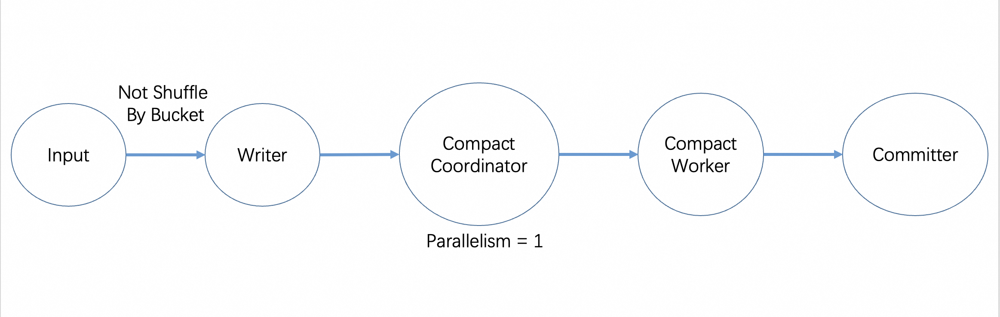

Do not worry about backpressure, compaction never backpressure.

If you set `write-only` to true, the `Compact Coordinator` and `Compact Worker` will be removed in the topology.

The auto compaction is only supported in Flink engine streaming mode. You can also start a compaction job in Flink by
Flink action in Paimon and disable all the other compactions by setting `write-only`.

**Streaming Query**

You can stream the Append table and use it like a Message Queue. As with primary key tables, there are two options
for streaming reads:

1. By default, Streaming read produces the latest snapshot on the table upon first startup, and continue to read the
   latest incremental records.
2. You can specify `scan.mode`, `scan.snapshot-id`, `scan.timestamp-millis` and/or `scan.file-creation-time-millis` to
   stream read incremental only.

Similar to flink-kafka, order is not guaranteed by default, if your data has some sort of order requirement, you also
need to consider defining a `bucket-key`, see [Bucketed Append](#append-table-bucketed)

<a id="append-table-overview--aggregate-push-down"></a>

## Aggregate push down [#](#append-table-overview--aggregate-push-down)

Append Table supports aggregate push down:

```sql
SELECT COUNT(*) FROM TABLE WHERE DT = '20230101';
```

This query can be accelerated during compilation and returns very quickly.

For Spark SQL, table with default `metadata.stats-mode` can be accelerated:

```sql
SELECT MIN(a), MAX(b) FROM TABLE WHERE DT = '20230101';

SELECT * FROM TABLE ORDER BY a LIMIT 1;
```

Min max topN query can be also accelerated during compilation and returns very quickly.

<a id="append-table-overview--data-skipping-by-order"></a>

## Data Skipping By Order [#](#append-table-overview--data-skipping-by-order)

Paimon by default records the maximum and minimum values of each field in the manifest file.

In the query, according to the `WHERE` condition of the query, together with the statistics in the manifest we can
perform file filtering. If the filtering effect is good, the query that would have cost minutes will be accelerated to
milliseconds to complete the execution.

Often the data distribution is not always ideal for filtering, so can we sort the data by the field in `WHERE` condition?
You can take a look at [Flink COMPACT Action](#maintenance-dedicated-compaction--sort-compact), [Flink COMPACT Procedure](#flink-procedures) or [Spark COMPACT Procedure](#spark-procedures).

<a id="append-table-overview--data-skipping-by-file-index"></a>

## Data Skipping By File Index [#](#append-table-overview--data-skipping-by-file-index)

You can use file index too, it filters files by indexing on the reading side.

Define `file-index.bitmap.columns`, Data file index is an external index file and Paimon will create its
corresponding index file for each file. If the index file is too small, it will be stored directly in the manifest, otherwise in the directory of the data file. Each data file corresponds to an index file, which has a separate file
definition and can contain different types of indexes with multiple columns.

Different file indexes may be efficient in different scenarios. For example bloom filter may speed up query in point lookup
scenario. Using a bitmap may consume more space but can result in greater accuracy.

- [BloomFilter](#concepts-spec-fileindex--index-bloomfilter): `file-index.bloom-filter.columns`.
- [Bitmap](#concepts-spec-fileindex--index-bitmap): `file-index.bitmap.columns`.
- [Range Bitmap](#concepts-spec-fileindex--index-range-bitmap): `file-index.range-bitmap.columns`.

If you want to add file index to existing table, without any rewrite, you can use `rewrite_file_index` procedure. Before
we use the procedure, you should config appropriate configurations in target table. You can use ALTER clause to config
`file-index.<filter-type>.columns` to the table.

How to invoke: see [flink procedures](#flink-procedures--procedures)

<a id="append-table-overview--row-level-operations"></a>

## Row Level Operations [#](#append-table-overview--row-level-operations)

Now, only Spark SQL supports DELETE & UPDATE & MERGE INTO, you can take a look at [Spark Write](#spark-sql-write).

Example:

```sql
DELETE FROM my_table WHERE currency = 'UNKNOWN';
```

Update append table has two modes:

1. COW (Copy on Write): search for the hit files and then rewrite each file to remove the data that needs to be deleted
   from the files. This operation is costly.
2. MOW (Merge on Write): By specifying `'deletion-vectors.enabled' = 'true'`, the Deletion Vectors mode can be enabled.
   Only marks certain records of the corresponding file for deletion and writes the deletion file, without rewriting the entire file.

---

<a id="cdc-ingestion-overview"></a>

<!-- source_url: https://paimon.apache.org/docs/master/cdc-ingestion/overview/ -->

<!-- page_index: 117 -->

# Overview #

> This documentation is for an unreleased version of Apache Paimon. We recommend you use the latest [stable version](https://paimon.apache.org/docs/1.4).

<a id="cdc-ingestion-overview--overview"></a>

# Overview [#](#cdc-ingestion-overview--overview)

Paimon supports a variety of ways to ingest data into Paimon tables with schema evolution. This means that the added
columns are synchronized to the Paimon table in real time and the synchronization job will not be restarted for this purpose.

We currently support the following sync ways:

1. MySQL Synchronizing Table: synchronize one or multiple tables from MySQL into one Paimon table.
2. MySQL Synchronizing Database: synchronize the whole MySQL database into one Paimon database.
3. [Program API Sync](#program-api-flink-api--cdc-ingestion-table): synchronize your custom DataStream input into one Paimon table.
4. Kafka Synchronizing Table: synchronize one Kafka topic’s table into one Paimon table.
5. Kafka Synchronizing Database: synchronize one Kafka topic containing multiple tables or multiple topics containing one table each into one Paimon database.
6. MongoDB Synchronizing Collection: synchronize one Collection from MongoDB into one Paimon table.
7. MongoDB Synchronizing Database: synchronize the whole MongoDB database into one Paimon database.
8. Pulsar Synchronizing Table: synchronize one Pulsar topic’s table into one Paimon table.
9. Pulsar Synchronizing Database: synchronize one Pulsar topic containing multiple tables or multiple topics containing one table each into one Paimon database.

<a id="cdc-ingestion-overview--what-is-schema-evolution"></a>

## What is Schema Evolution [#](#cdc-ingestion-overview--what-is-schema-evolution)

Suppose we have a MySQL table named `tableA`, it has three fields: `field_1`, `field_2`, `field_3`. When we want to load
this MySQL table to Paimon, we can do this in Flink SQL, or use [MySqlSyncTableAction](https://paimon.apache.org/docs/master/api/java/org/apache/paimon/flink/action/cdc/mysql/MySqlSyncTableAction).

**Flink SQL:**

In Flink SQL, if we change the table schema of the MySQL table after the ingestion, the table schema change will not be synchronized to Paimon.

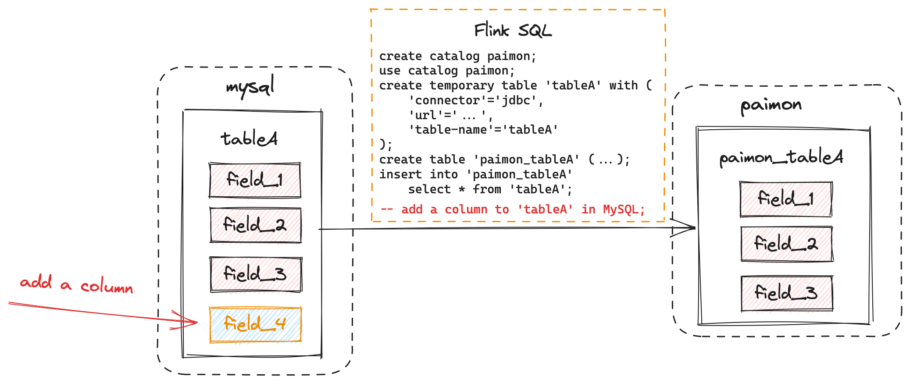

**MySqlSyncTableAction:**

In [MySqlSyncTableAction](https://paimon.apache.org/docs/master/api/java/org/apache/paimon/flink/action/cdc/mysql/MySqlSyncTableAction), if we change the table schema of the MySQL table after the ingestion, the table schema change will be synchronized to Paimon, and the data of `field_4` which is newly added will be synchronized to Paimon too.


<a id="cdc-ingestion-overview--schema-change-evolution"></a>

## Schema Change Evolution [#](#cdc-ingestion-overview--schema-change-evolution)

Cdc Ingestion supports a limited number of schema changes. Currently, the framework can not rename table, drop columns, so the
behaviors of `RENAME TABLE` and `DROP COLUMN` will be ignored, `RENAME COLUMN` will add a new column. Currently supported schema changes includes:

- Adding columns.
- Altering column types. More specifically,

  - altering from a string type (char, varchar, text) to another string type with longer length,
  - altering from a non-string type to string type (char, varchar, text),
  - altering from a binary type (binary, varbinary, blob) to another binary type with longer length,
  - altering from an integer type (tinyint, smallint, int, bigint) to another integer type with wider range,
  - altering from a floating-point type (float, double) to another floating-point type with wider range,

  are supported.

<a id="cdc-ingestion-overview--computed-functions"></a>

## Computed Functions [#](#cdc-ingestion-overview--computed-functions)

`--computed_column` are the definitions of computed columns. The argument field is from source table field name.

<a id="cdc-ingestion-overview--temporal-functions"></a>

### Temporal Functions [#](#cdc-ingestion-overview--temporal-functions)

Temporal functions can convert date and epoch time to another form. A common use case is to generate partition values.

| Function | Description |
| --- | --- |
| DOC2MDPLACEHOLDERTOKEN5ENDyear(temporal-column [, precision]) | Extract year from the input. Output is an INT value represent the year. |
| DOC2MDPLACEHOLDERTOKEN6ENDmonth(temporal-column [, precision]) | Extract month of year from the input. Output is an INT value represent the month of year. |
| DOC2MDPLACEHOLDERTOKEN7ENDday(temporal-column [, precision]) | Extract day of month from the input. Output is an INT value represent the day of month. |
| DOC2MDPLACEHOLDERTOKEN8ENDhour(temporal-column [, precision]) | Extract hour from the input. Output is an INT value represent the hour. |
| DOC2MDPLACEHOLDERTOKEN9ENDminute(temporal-column [, precision]) | Extract minute from the input. Output is an INT value represent the minute. |
| DOC2MDPLACEHOLDERTOKEN10ENDsecond(temporal-column [, precision]) | Extract second from the input. Output is an INT value represent the second. |
| DOC2MDPLACEHOLDERTOKEN11ENDdate\_format(temporal-column, format-string [, precision]) | Convert the input to desired formatted string. Output type is STRING. |
| DOC2MDPLACEHOLDERTOKEN12ENDnow() | Get the timestamp when ingesting the record. Output type is TIMESTAMP\_LTZ(3). |

The data type of the temporal-column can be one of the following cases:

1. DATE, DATETIME or TIMESTAMP.
2. Any integer numeric type (such as INT and BIGINT). In this case, the data will be considered as epoch time of `1970-01-01 00:00:00`.
   You should set precision of the value (default is 0).
3. STRING. In this case, if you didn’t set the time unit, the data will be considered as formatted string of DATE,
   DATETIME or TIMESTAMP value. Otherwise, the data will be considered as string value of epoch time. So you must set time
   unit in the latter case.

The precision represents the unit of the epoch time. Currently, There are four valid precisions: `0` (for epoch seconds), `3` (for epoch milliseconds), `6`(for epoch microseconds) and `9` (for epoch nanoseconds). Take the time point
`1970-01-01 00:00:00.123456789` as an example, the epoch seconds are 0, the epoch milliseconds are 123, the epoch microseconds
are 123456, and the epoch nanoseconds are 123456789. The precision should match the input values. You can set precision
in this way: `date_format(epoch_col, yyyy-MM-dd, 0)`.

`date_format` is a flexible function which is able to convert the temporal value to various formats with different format
strings. A most common format string is `yyyy-MM-dd HH:mm:ss.SSS`. Another example is `yyyy-ww` which can extract the year
and the week-of-the-year from the input. Note that the output is affected by the locale. For example, in some regions the
first day of a week is Monday while in others is Sunday, so if you use `date_format(date_col, yyyy-ww)` and the input of
date\_col is 2024-01-07 (Sunday), the output maybe `2024-01` (if the first day of a week is Monday) or `2024-02` (if the
first day of a week is Sunday).

<a id="cdc-ingestion-overview--other-functions"></a>

### Other Functions [#](#cdc-ingestion-overview--other-functions)

| Function | Description |
| --- | --- |
| DOC2MDPLACEHOLDERTOKEN14ENDsubstring(column,beginInclusive) | Get column.substring(beginInclusive). Output is a STRING. |
| DOC2MDPLACEHOLDERTOKEN15ENDsubstring(column,beginInclusive,endExclusive) | Get column.substring(beginInclusive,endExclusive). Output is a STRING. |
| DOC2MDPLACEHOLDERTOKEN16ENDtruncate(column,width) | Truncate column by width. Output type is the same with column. If the column is a STRING, truncate(column,width) will truncate the string to width characters, namely `value.substring(0, width)`. If the column is an INT or LONG, truncate(column,width) will truncate the number with the algorithm `v - (((v % W) + W) % W)`. The `redundant` compute part is to keep the result always positive. If the column is a DECIMAL, truncate(column,width) will truncate the decimal with the algorithm: let `scaled\_W = decimal(W, scale(v))`, then return `v - (v % scaled\_W)`. |
| DOC2MDPLACEHOLDERTOKEN17ENDcast(value,dataType) | Get a constant value. The output is an atomic type, such as STRING, INT, BOOLEAN, etc. |
| DOC2MDPLACEHOLDERTOKEN18ENDupper(value) | Convert string column to upper case. The input should be a STRING and the output is a STRING. |
| DOC2MDPLACEHOLDERTOKEN19ENDlower(value) | Convert string column to lower case. The input should be a STRING and the output is a STRING. |
| DOC2MDPLACEHOLDERTOKEN20ENDtrim(value) | Trim string column. The input should be a STRING and the output is a STRING. |

<a id="cdc-ingestion-overview--special-data-type-mapping"></a>

## Special Data Type Mapping [#](#cdc-ingestion-overview--special-data-type-mapping)

It is possible that some data types of upstream systems cannot be directly mapped to Paimon data types. We have some special
data types mapping rules:

1. MySQL `TINYINT(1)` type will be mapped to `Boolean`.
2. MySQL `BIT(1)` type will be mapped to `Boolean`.
3. MySQL `BIGINT UNSIGNED`, `BIGINT UNSIGNED ZEROFILL`, `SERIAL` will be mapped to `DECIMAL(20, 0)`.
4. MySQL `BINARY` will be mapped to Paimon `VARBINARY`. This is because the binary value is passed as bytes in binlog, so it
   should be mapped to byte type (`BYTES` or `VARBINARY`). We choose `VARBINARY` because it can retain the length information.
5. Some upstream systems may not pass decimal precision and scale information. In this case, we will use `DECIMAL(38, 18)`.
6. When using Hive catalog, MySQL `TIME` type will be mapped to `STRING`.

We provide some options to customize the mapping rules. Please use `--type_mapping option1,option2,...` to specify them:

1. `tinyint1-not-bool`: Map MySQL `TINYINT(1)` to Paimon `TINYINT` instead of `Boolean`.
2. `to-nullable`: Ignore all `NOT NULL` constraints (except primary keys).
3. `to-string`: Map all MySQL data type to `STRING`.
4. `char-to-string`: Map MySQL `CHAR(length)`/`VARCHAR(length)` types to `STRING`.
5. `longtext-to-bytes`: Map MySQL `LONGTEXT` types to `BYTES`.
6. `decimal_no_change`: Avoid that Paimon CDC framework automatically use `DECIMAL(38, 18)`.
7. `bigint-unsigned-to-bigint`: Map MySQL `BIGINT UNSIGNED`, `BIGINT UNSIGNED ZEROFILL`, `SERIAL` to Paimon `BIGINT`,
   but there is potential data overflow because `BIGINT UNSIGNED` can store up to 20 digits integer value but Paimon
   `BIGINT` can only store up to 19 digits integer value. So you should ensure the overflow won’t occur when using this option.
8. `allow_non_string_to_string`: Schema change doesn’t support non-string type to string by default. Use this option to allow this change.

<a id="cdc-ingestion-overview--custom-job-settings"></a>

## Custom Job Settings [#](#cdc-ingestion-overview--custom-job-settings)

<a id="cdc-ingestion-overview--checkpointing"></a>

### Checkpointing [#](#cdc-ingestion-overview--checkpointing)

Use `-Dexecution.checkpointing.interval=<interval>` to enable checkpointing and set interval. For 0.7 and later versions, if you haven’t enabled checkpointing, Paimon will enable checkpointing by default and set checkpoint interval to 180 seconds.

<a id="cdc-ingestion-overview--job-name"></a>

### Job Name [#](#cdc-ingestion-overview--job-name)

Use `-Dpipeline.name=<job-name>` to set custom synchronization job name.

<a id="cdc-ingestion-overview--table-configuration"></a>

### table configuration [#](#cdc-ingestion-overview--table-configuration)

You can use `--table_conf` to set table properties and some flink job properties (like `sink.parallelism`). If the table is
created by the cdc job, the table’s properties will be equal to the given properties. Otherwise, the job will use the given
properties to alter table’s properties. But note that immutable options (like `merge-engine`) and bucket number won’t be altered.

---

<a id="concepts-spec-overview"></a>

<!-- source_url: https://paimon.apache.org/docs/master/concepts/spec/overview/ -->

<!-- page_index: 118 -->

# Spec Overview #

> This documentation is for an unreleased version of Apache Paimon. We recommend you use the latest [stable version](https://paimon.apache.org/docs/1.4).

<a id="concepts-spec-overview--spec-overview"></a>

# Spec Overview [#](#concepts-spec-overview--spec-overview)

This is the specification for the Paimon table format, this document standardizes the underlying file structure and
design of Paimon.


<a id="concepts-spec-overview--terms"></a>

## Terms [#](#concepts-spec-overview--terms)

- Schema: fields, primary keys definition, partition keys definition and options.
- Snapshot: the entrance to all data committed at some specific time point.
- Manifest list: includes several manifest files.
- Manifest: includes several data files or changelog files.
- Data File: contains incremental records.
- Changelog File: contains records produced by changelog-producer.
- Global Index: index for a bucket or partition.
- Data File Index: index for a data file.

Run Flink SQL with Paimon:

```sql
CREATE CATALOG my_catalog WITH (
    'type' = 'paimon',
    'warehouse' = '/your/path'
);       
USE CATALOG my_catalog;

CREATE TABLE my_table (
    k INT PRIMARY KEY NOT ENFORCED,
    f0 INT,
    f1 STRING
);

INSERT INTO my_table VALUES (1, 11, '111');
```

Take a look to the disk:

```shell
warehouse
└── default.db
    └── my_table
        ├── bucket-0
        │   └── data-59f60cb9-44af-48cc-b5ad-59e85c663c8f-0.orc
        ├── index
        │   └── index-5625e6d9-dd44-403b-a738-2b6ea92e20f1-0
        ├── manifest
        │   ├── index-manifest-5d670043-da25-4265-9a26-e31affc98039-0
        │   ├── manifest-6758823b-2010-4d06-aef0-3b1b597723d6-0
        │   ├── manifest-list-9f856d52-5b33-4c10-8933-a0eddfaa25bf-0
        │   └── manifest-list-9f856d52-5b33-4c10-8933-a0eddfaa25bf-1
        ├── schema
        │   └── schema-0
        └── snapshot
            ├── EARLIEST
            ├── LATEST
            └── snapshot-1
```

---

<a id="ecosystem-overview"></a>

<!-- source_url: https://paimon.apache.org/docs/master/ecosystem/overview/ -->

<!-- page_index: 119 -->

# Overview #

> This documentation is for an unreleased version of Apache Paimon. We recommend you use the latest [stable version](https://paimon.apache.org/docs/1.4).

<a id="ecosystem-overview--overview"></a>

# Overview [#](#ecosystem-overview--overview)

<a id="ecosystem-overview--compatibility-matrix"></a>

## Compatibility Matrix [#](#ecosystem-overview--compatibility-matrix)

| Engine | Version | Batch Read | Batch Write | Create Table | Alter Table | Streaming Write | Streaming Read | Batch Overwrite | DELETE & UPDATE | MERGE INTO | Time Travel |
| --- | --- | --- | --- | --- | --- | --- | --- | --- | --- | --- | --- |
| Flink | 1.16 - 1.20 | ✅ | ✅ | ✅ | ✅(1.17+) | ✅ | ✅ | ✅ | ✅(1.17+) | ❌ | ✅ |
| Spark | 3.2 - 4.0 | ✅ | ✅ | ✅ | ✅ | ✅(3.3+) | ✅(3.3+) | ✅ | ✅ | ✅ | ✅(3.3+) |
| Hive | 2.1 - 3.1 | ✅ | ✅ | ✅ | ❌ | ❌ | ❌ | ❌ | ❌ | ❌ | ✅ |
| Trino | 420 - 440 | ✅ | ✅(427+) | ✅(427+) | ✅(427+) | ❌ | ❌ | ❌ | ❌ | ❌ | ✅ |
| Presto | 0.236 - 0.280 | ✅ | ❌ | ✅ | ✅ | ❌ | ❌ | ❌ | ❌ | ❌ | ❌ |
| [StarRocks](https://docs.starrocks.io/docs/data_source/catalog/paimon_catalog/) | 3.1+ | ✅ | ❌ | ❌ | ❌ | ❌ | ❌ | ❌ | ❌ | ❌ | ✅ |
| [Doris](https://doris.apache.org/docs/dev/lakehouse/catalogs/paimon-catalog) | 2.0.6+ | ✅ | ❌ | ❌ | ❌ | ❌ | ❌ | ❌ | ❌ | ❌ | ✅ |

<a id="ecosystem-overview--streaming-engines"></a>

## Streaming Engines [#](#ecosystem-overview--streaming-engines)

<a id="ecosystem-overview--flink-streaming"></a>

### Flink Streaming [#](#ecosystem-overview--flink-streaming)

Flink is the most comprehensive streaming computing engine that is widely used for data CDC ingestion and the
construction of streaming pipelines.

Recommended version is Flink 1.17.2.

<a id="ecosystem-overview--spark-streaming"></a>

### Spark Streaming [#](#ecosystem-overview--spark-streaming)

You can also use Spark Streaming to build a streaming pipeline. Spark’s schema evolution capability will be better
implemented, but you must accept the mechanism of mini-batch.

<a id="ecosystem-overview--batch-engines"></a>

## Batch Engines [#](#ecosystem-overview--batch-engines)

<a id="ecosystem-overview--spark-batch"></a>

### Spark Batch [#](#ecosystem-overview--spark-batch)

Spark Batch is the most widely used batch computing engine.

Recommended version is Spark 3.5.8.

<a id="ecosystem-overview--flink-batch"></a>

### Flink Batch [#](#ecosystem-overview--flink-batch)

Flink Batch is also available, which can make your pipeline more integrated with streaming and batch unified.

<a id="ecosystem-overview--olap-engines"></a>

## OLAP Engines [#](#ecosystem-overview--olap-engines)

<a id="ecosystem-overview--starrocks"></a>

### StarRocks [#](#ecosystem-overview--starrocks)

StarRocks is the most recommended OLAP engine with the most advanced integration.

Recommended version is StarRocks 3.2.6.

<a id="ecosystem-overview--other-olap"></a>

### Other OLAP [#](#ecosystem-overview--other-olap)

You can also use Doris and Trino and Presto, or, you can just use Spark, Flink and Hive to query Paimon tables.

<a id="ecosystem-overview--download"></a>

## Download [#](#ecosystem-overview--download)

[Download Link](#project-download--engine-jars)

---

<a id="iceberg-configurations"></a>

<!-- source_url: https://paimon.apache.org/docs/master/iceberg/configurations/ -->

<!-- page_index: 120 -->

# Configurations #

> This documentation is for an unreleased version of Apache Paimon. We recommend you use the latest [stable version](https://paimon.apache.org/docs/1.4).

<a id="iceberg-configurations--configurations"></a>

# Configurations [#](#iceberg-configurations--configurations)

Options for Iceberg Compatibility.

<table class="configuration table table-bordered">
<thead>
<tr>
<th>Key</th>
<th>Default</th>
<th>Type</th>
<th>Description</th>
</tr>
</thead>
<tbody>
<tr>
<td>DOC2MDPLACEHOLDERTOKEN1END<h5>metadata.iceberg.compaction.max.file-num</h5></td>
<td>50</td>
<td>Integer</td>
<td>If number of small Iceberg manifest metadata files exceeds this limit, always trigger manifest metadata compaction regardless of their total size.</td>
</tr>
<tr>
<td>DOC2MDPLACEHOLDERTOKEN2END<h5>metadata.iceberg.compaction.min.file-num</h5></td>
<td>10</td>
<td>Integer</td>
<td>Minimum number of Iceberg manifest metadata files to trigger manifest metadata compaction.</td>
</tr>
<tr>
<td>DOC2MDPLACEHOLDERTOKEN3END<h5>metadata.iceberg.database</h5></td>
<td>(none)</td>
<td>String</td>
<td>Metastore database name for Iceberg Catalog. Set this as an iceberg database alias if using a centralized Catalog. Multiple databases can be specified with semicolons, e.g. 'db1;db2'. The table will be registered in each database.</td>
</tr>
<tr>
<td>DOC2MDPLACEHOLDERTOKEN4END<h5>metadata.iceberg.delete-after-commit.enabled</h5></td>
<td>true</td>
<td>Boolean</td>
<td>Whether to delete old metadata files after each table commit</td>
</tr>
<tr>
<td>DOC2MDPLACEHOLDERTOKEN5END<h5>metadata.iceberg.format-version</h5></td>
<td>2</td>
<td>Integer</td>
<td>The format version of iceberg table, the value can be 2 or 3. Note that only version 3 supports deletion vector.</td>
</tr>
<tr>
<td>DOC2MDPLACEHOLDERTOKEN6END<h5>metadata.iceberg.glue.skip-archive</h5></td>
<td>false</td>
<td>Boolean</td>
<td>Skip archive for AWS Glue catalog.</td>
</tr>
<tr>
<td>DOC2MDPLACEHOLDERTOKEN7END<h5>metadata.iceberg.hadoop-conf-dir</h5></td>
<td>(none)</td>
<td>String</td>
<td>hadoop-conf-dir for Iceberg Hive catalog.</td>
</tr>
<tr>
<td>DOC2MDPLACEHOLDERTOKEN8END<h5>metadata.iceberg.hive-client-class</h5></td>
<td>"org.apache.hadoop.hive.metastore.HiveMetaStoreClient"</td>
<td>String</td>
<td>Hive client class name for Iceberg Hive Catalog.</td>
</tr>
<tr>
<td>DOC2MDPLACEHOLDERTOKEN9END<h5>metadata.iceberg.hive-conf-dir</h5></td>
<td>(none)</td>
<td>String</td>
<td>hive-conf-dir for Iceberg Hive catalog.</td>
</tr>
<tr>
<td>DOC2MDPLACEHOLDERTOKEN10END<h5>metadata.iceberg.hive-skip-update-stats</h5></td>
<td>false</td>
<td>Boolean</td>
<td>Skip updating Hive stats.</td>
</tr>
<tr>
<td>DOC2MDPLACEHOLDERTOKEN11END<h5>metadata.iceberg.manifest-compression</h5></td>
<td>"snappy"</td>
<td>String</td>
<td>Compression for Iceberg manifest files.</td>
</tr>
<tr>
<td>DOC2MDPLACEHOLDERTOKEN12END<h5>metadata.iceberg.manifest-legacy-version</h5></td>
<td>false</td>
<td>Boolean</td>
<td>Should use the legacy manifest version to generate Iceberg's 1.4 manifest files.</td>
</tr>
<tr>
<td>DOC2MDPLACEHOLDERTOKEN13END<h5>metadata.iceberg.previous-versions-max</h5></td>
<td>0</td>
<td>Integer</td>
<td>The number of old metadata files to keep after each table commit. For rest-catalog, it will keep 1 old metadata at least.</td>
</tr>
<tr>
<td>DOC2MDPLACEHOLDERTOKEN14END<h5>metadata.iceberg.storage</h5></td>
<td>disabled</td>
<td><p>Enum</p></td>
<td>When set, produce Iceberg metadata after a snapshot is committed, so that Iceberg readers can read Paimon's raw data files.  </td>
</tr>
<tr>
<td>DOC2MDPLACEHOLDERTOKEN15END<h5>metadata.iceberg.storage-location</h5></td>
<td>(none)</td>
<td><p>Enum</p></td>
<td>To store Iceberg metadata in a separate directory or under table location

Possible values:<ul><li>"table-location": Store Iceberg metadata in each table's directory. Useful for standalone Iceberg tables or Java API access. Can also be used with Hive Catalog</li><li>"catalog-location": Store Iceberg metadata in a separate directory. Allows integration with Hive Catalog or Hadoop Catalog.</li></ul></td>
</tr>
<tr>
<td>DOC2MDPLACEHOLDERTOKEN16END<h5>metadata.iceberg.table</h5></td>
<td>(none)</td>
<td>String</td>
<td>Metastore table name for Iceberg Catalog.Set this as an iceberg table alias if using a centralized Catalog.</td>
</tr>
<tr>
<td>DOC2MDPLACEHOLDERTOKEN17END<h5>metadata.iceberg.uri</h5></td>
<td>(none)</td>
<td>String</td>
<td>Hive metastore uri for Iceberg Hive catalog.</td>
</tr>
</tbody>
</table>

---

<a id="iceberg-overview"></a>

<!-- source_url: https://paimon.apache.org/docs/master/iceberg/overview/ -->

<!-- page_index: 121 -->

# Overview #

> This documentation is for an unreleased version of Apache Paimon. We recommend you use the latest [stable version](https://paimon.apache.org/docs/1.4).

<a id="iceberg-overview--overview"></a>

# Overview [#](#iceberg-overview--overview)

Paimon supports generating Iceberg compatible metadata, so that Paimon tables can be consumed directly by Iceberg readers.

Set the following table options, so that Paimon tables can generate Iceberg compatible metadata.

<table class="table table-bordered">
<thead>
<tr>
<th>Option</th>
<th>Default</th>
<th>Type</th>
<th>Description</th>
</tr>
</thead>
<tbody>
<tr>
<td>DOC2MDPLACEHOLDERTOKEN1END<h5>metadata.iceberg.storage</h5></td>
<td>disabled</td>
<td>Enum</td>
<td>
        When set, produce Iceberg metadata after a snapshot is committed, so that Iceberg readers can read Paimon's raw data files.
        <ul>
<li><code>disabled</code>: Disable Iceberg compatibility support.</li>
<li><code>table-location</code>: Store Iceberg metadata in each table's directory.</li>
<li><code>hadoop-catalog</code>: Store Iceberg metadata in a separate directory. This directory can be specified as the warehouse directory of an Iceberg Hadoop catalog.</li>
<li><code>hive-catalog</code>: Not only store Iceberg metadata like hadoop-catalog, but also create Iceberg external table in Hive.</li>
</ul>
</td>
</tr>
<tr>
<td>DOC2MDPLACEHOLDERTOKEN2END<h5>metadata.iceberg.storage-location</h5></td>
<td>(none)</td>
<td>Enum</td>
<td>
        Specifies where to store Iceberg metadata files. If not set, the storage location will default based on the selected metadata.iceberg.storage type.
        <ul>
<li><code>table-location</code>: Store Iceberg metadata in each table's directory. Useful for standalone Iceberg tables or Iceberg Java API access. Can also be used with Hive Catalog.</li>
<li><code>catalog-location</code>: Store Iceberg metadata in a separate directory. This is the default behavior when using Hive Catalog or Hadoop Catalog.</li>
</ul>
</td>
</tr>
</tbody>
</table>

For most SQL users, we recommend setting `'metadata.iceberg.storage' = 'hadoop-catalog' or` ‘metadata.iceberg.storage’ = ‘hive-catalog’`, so that all tables can be visited as an Iceberg warehouse. For Iceberg Java API users, you might consider setting` ‘metadata.iceberg.storage’ = ‘table-location’`, so you can visit each table with its table path. When using` metadata.iceberg.storage = hadoop-catalog`or`hive-catalog`, you can optionally configure` metadata.iceberg.storage-location` to control where the metadata is stored.
If not set, the default behavior depends on the storage type.

<a id="iceberg-overview--supported-types"></a>

## Supported Types [#](#iceberg-overview--supported-types)

Paimon Iceberg compatibility currently supports the following data types.

| Paimon Data Type | Iceberg Data Type |
| --- | --- |
| `BOOLEAN` | `boolean` |
| `INT` | `int` |
| `BIGINT` | `long` |
| `FLOAT` | `float` |
| `DOUBLE` | `double` |
| `DECIMAL` | `decimal` |
| `CHAR` | `string` |
| `VARCHAR` | `string` |
| `BINARY` | `binary` |
| `VARBINARY` | `binary` |
| `DATE` | `date` |
| `TIMESTAMP` (precision 3-6) | `timestamp` |
| `TIMESTAMP_LTZ` (precision 3-6) | `timestamptz` |
| `TIMESTAMP` (precision 7-9) | `timestamp_ns` |
| `TIMESTAMP_LTZ` (precision 7-9) | `timestamptz_ns` |
| `ARRAY` | `list` |
| `MAP` | `map` |
| `ROW` | `struct` |

> [!NOTE]
> **Note on Timestamp Types:**
> > - `TIMESTAMP` and `TIMESTAMP_LTZ` types with precision from 3 to 6 are mapped to standard Iceberg timestamp types
> > - `TIMESTAMP` and `TIMESTAMP_LTZ` types with precision from 7 to 9 use nanosecond precision and require Iceberg v3 format

---

<a id="primary-key-table-merge-engine-overview"></a>

<!-- source_url: https://paimon.apache.org/docs/master/primary-key-table/merge-engine/overview/ -->

<!-- page_index: 122 -->

# Overview #

> This documentation is for an unreleased version of Apache Paimon. We recommend you use the latest [stable version](https://paimon.apache.org/docs/1.4).

<a id="primary-key-table-merge-engine-overview--overview"></a>

# Overview [#](#primary-key-table-merge-engine-overview--overview)

When Paimon sink receives two or more records with the same primary keys, it will merge them into one record to keep
primary keys unique. By specifying the `merge-engine` table property, users can choose how records are merged together.

> [!NOTE]
> > Always set `table.exec.sink.upsert-materialize` to `NONE` in Flink SQL TableConfig, sink upsert-materialize may
> > result in strange behavior. When the input is out of order, we recommend that you use
> > [Sequence Field](#primary-key-table-sequence-rowkind--sequence-field) to correct disorder.

<a id="primary-key-table-merge-engine-overview--deduplicate"></a>

## Deduplicate [#](#primary-key-table-merge-engine-overview--deduplicate)

The `deduplicate` merge engine is the default merge engine. Paimon will only keep the latest record and throw away
other records with the same primary keys.

Specifically, if the latest record is a `DELETE` record, all records with the same primary keys will be deleted.
You can config `ignore-delete` to ignore it.

---

<a id="primary-key-table-overview"></a>

<!-- source_url: https://paimon.apache.org/docs/master/primary-key-table/overview/ -->

<!-- page_index: 123 -->

# Overview #

> This documentation is for an unreleased version of Apache Paimon. We recommend you use the latest [stable version](https://paimon.apache.org/docs/1.4).

<a id="primary-key-table-overview--overview"></a>

# Overview [#](#primary-key-table-overview--overview)

If you define a table with primary key, you can insert, update or delete records in the table.

Primary keys consist of a set of columns that contain unique values for each record. Paimon enforces data ordering by
sorting the primary key within each bucket, allowing users to achieve high performance by applying filtering conditions
on the primary key. See [CREATE TABLE](#flink-sql-ddl--create-table).

<a id="primary-key-table-overview--bucket"></a>

## Bucket [#](#primary-key-table-overview--bucket)

Unpartitioned tables, or partitions in partitioned tables, are sub-divided into buckets, to provide extra structure to the data that may be used for more efficient querying.

Each bucket directory contains an LSM tree and its [changelog files](#primary-key-table-changelog-producer).

The range for a bucket is determined by the hash value of one or more columns in the records. Users can specify bucketing columns by providing the [`bucket-key` option](#maintenance-configurations--coreoptions). If no `bucket-key` option is specified, the primary key (if defined) or the complete record will be used as the bucket key.

A bucket is the smallest storage unit for reads and writes, so the number of buckets limits the maximum processing parallelism. This number should not be too big, though, as it will result in lots of small files and low read performance. In general, the recommended data size in each bucket is about 200MB - 1GB.

Also, see [rescale bucket](#maintenance-rescale-bucket) if you want to adjust the number of buckets after a table is created.

<a id="primary-key-table-overview--lsm-trees"></a>

## LSM Trees [#](#primary-key-table-overview--lsm-trees)

Paimon adopts the LSM tree (log-structured merge-tree) as the data structure for file storage. This documentation briefly introduces the concepts about LSM trees.

<a id="primary-key-table-overview--sorted-runs"></a>

### Sorted Runs [#](#primary-key-table-overview--sorted-runs)

LSM tree organizes files into several sorted runs. A sorted run consists of one or multiple data files and each data file belongs to exactly one sorted run.

Records within a data file are sorted by their primary keys. Within a sorted run, ranges of primary keys of data files never overlap.


As you can see, different sorted runs may have overlapped primary key ranges, and may even contain the same primary key. When querying the LSM tree, all sorted runs must be combined and all records with the same primary key must be merged according to the user-specified [merge engine](#primary-key-table-merge-engine-overview) and the timestamp of each record.

New records written into the LSM tree will be first buffered in memory. When the memory buffer is full, all records in memory will be sorted and flushed to disk. A new sorted run is now created.

---

<a id="pypaimon-data-evolution"></a>

<!-- source_url: https://paimon.apache.org/docs/master/pypaimon/data-evolution/ -->

<!-- page_index: 124 -->

# Data Evolution #

> This documentation is for an unreleased version of Apache Paimon. We recommend you use the latest [stable version](https://paimon.apache.org/docs/1.4).

<a id="pypaimon-data-evolution--data-evolution"></a>

# Data Evolution [#](#pypaimon-data-evolution--data-evolution)

PyPaimon for Data Evolution mode. See [Data Evolution](#append-table-data-evolution).

<a id="pypaimon-data-evolution--prerequisites"></a>

## Prerequisites [#](#pypaimon-data-evolution--prerequisites)

To use partial updates / data evolution, enable both options when creating the table:

- **`row-tracking.enabled`**: `true`
- **`data-evolution.enabled`**: `true`

<a id="pypaimon-data-evolution--update-columns-by-row-id"></a>

## Update Columns By Row ID [#](#pypaimon-data-evolution--update-columns-by-row-id)

You can create `TableUpdate.update_by_arrow_with_row_id` to update columns to data evolution tables.

The input data should include the `_ROW_ID` column, update operation will automatically sort and match each `_ROW_ID` to
its corresponding `first_row_id`, then groups rows with the same `first_row_id` and writes them to a separate file.

**Requirements for `_ROW_ID` updates**

- **Update columns only**: include `_ROW_ID` plus the columns you want to update (partial schema is OK).

```python
import pyarrow as pa
from pypaimon import CatalogFactory, Schema

catalog = CatalogFactory.create({'warehouse': '/tmp/warehouse'})
catalog.create_database('default', False)

simple_pa_schema = pa.schema([
  ('f0', pa.int8()),
  ('f1', pa.int16()),
])
schema = Schema.from_pyarrow_schema(simple_pa_schema,
                                    options={'row-tracking.enabled': 'true', 'data-evolution.enabled': 'true'})
catalog.create_table('default.test_row_tracking', schema, False)
table = catalog.get_table('default.test_row_tracking')

# write all columns
write_builder = table.new_batch_write_builder()
table_write = write_builder.new_write()
table_commit = write_builder.new_commit()
expect_data = pa.Table.from_pydict({
  'f0': [-1, 2],
  'f1': [-1001, 1002]
}, schema=simple_pa_schema)
table_write.write_arrow(expect_data)
table_commit.commit(table_write.prepare_commit())
table_write.close()
table_commit.close()

# update partial columns
write_builder = table.new_batch_write_builder()
table_update = write_builder.new_update().with_update_type(['f0'])
table_commit = write_builder.new_commit()
data2 = pa.Table.from_pydict({
  '_ROW_ID': [0, 1],
  'f0': [5, 6],
}, schema=pa.schema([
  ('_ROW_ID', pa.int64()),
  ('f0', pa.int8()),
]))
cmts = table_update.update_by_arrow_with_row_id(data2)
table_commit.commit(cmts)
table_commit.close()

# content should be:
#   'f0': [5, 6],
#   'f1': [-1001, 1002]
```

<a id="pypaimon-data-evolution--filter-by-_row_id"></a>

## Filter by \_ROW\_ID [#](#pypaimon-data-evolution--filter-by-_row_id)

Requires the same [Prerequisites](#pypaimon-data-evolution--prerequisites) (row-tracking and data-evolution enabled). On such tables you can filter by `_ROW_ID` to prune files at scan time. Supported: `equal('_ROW_ID', id)`, `is_in('_ROW_ID', [id1, ...])`, `between('_ROW_ID', low, high)`.

```python
pb = table.new_read_builder().new_predicate_builder()
rb = table.new_read_builder().with_filter(pb.equal('_ROW_ID', 0))
result = rb.new_read().to_arrow(rb.new_scan().plan().splits())
```

<a id="pypaimon-data-evolution--upsert-by-key"></a>

## Upsert By Key [#](#pypaimon-data-evolution--upsert-by-key)

If you want to **upsert** (update-or-insert) rows by one or more business key columns — without manually providing
`_ROW_ID` — use `upsert_by_arrow_with_key`. For each input row:

- **Key matches** an existing row → update that row in place.
- **No match** → append as a new row.

**Requirements**

- The table must have `data-evolution.enabled = true` and `row-tracking.enabled = true`.
- All `upsert_keys` must exist in both the table schema and the input data.
- For **partitioned tables**, the input data must contain all partition key columns. Partition keys are
  **automatically stripped** from `upsert_keys` during matching (since each partition is processed independently),
  so you do **not** need to include them in `upsert_keys`.

**Example: basic upsert**

```python
import pyarrow as pa
from pypaimon import CatalogFactory, Schema

catalog = CatalogFactory.create({'warehouse': '/tmp/warehouse'})
catalog.create_database('default', False)

pa_schema = pa.schema([
    ('id', pa.int32()),
    ('name', pa.string()),
    ('age', pa.int32()),
])
schema = Schema.from_pyarrow_schema(
    pa_schema,
    options={'row-tracking.enabled': 'true', 'data-evolution.enabled': 'true'},
)
catalog.create_table('default.users', schema, False)
table = catalog.get_table('default.users')

# write initial data
write_builder = table.new_batch_write_builder()
write = write_builder.new_write()
commit = write_builder.new_commit()
write.write_arrow(pa.Table.from_pydict(
    {'id': [1, 2], 'name': ['Alice', 'Bob'], 'age': [30, 25]},
    schema=pa_schema,
))
commit.commit(write.prepare_commit())
write.close()
commit.close()

# upsert: update id=1, insert id=3
write_builder = table.new_batch_write_builder()
table_update = write_builder.new_update()
table_commit = write_builder.new_commit()

upsert_data = pa.Table.from_pydict(
    {'id': [1, 3], 'name': ['Alice_v2', 'Charlie'], 'age': [31, 28]},
    schema=pa_schema,
)
cmts = table_update.upsert_by_arrow_with_key(upsert_data, upsert_keys=['id'])
table_commit.commit(cmts)
table_commit.close()

# content should be:
#   id=1: name='Alice_v2', age=31   (updated)
#   id=2: name='Bob',      age=25   (unchanged)
#   id=3: name='Charlie',  age=28   (new)
```

**Example: partial-column upsert with `update_cols`**

Combine `with_update_type` with `upsert_by_arrow_with_key` to update only specific columns for
matched rows while still appending full rows for new keys:

```python
write_builder = table.new_batch_write_builder()
table_update = write_builder.new_update().with_update_type(['age'])
table_commit = write_builder.new_commit()

upsert_data = pa.Table.from_pydict(
    {'id': [1, 4], 'name': ['ignored', 'David'], 'age': [99, 22]},
    schema=pa_schema,
)
cmts = table_update.upsert_by_arrow_with_key(upsert_data, upsert_keys=['id'])
table_commit.commit(cmts)
table_commit.close()

# id=1: only 'age' is updated to 99; 'name' remains 'Alice_v2'
# id=4: appended as a full new row
```

**Example: partitioned table with composite key**

```python
partitioned_schema = pa.schema([
    ('id', pa.int32()),
    ('name', pa.string()),
    ('region', pa.string()),
])
schema = Schema.from_pyarrow_schema(
    partitioned_schema,
    partition_keys=['region'],
    options={'row-tracking.enabled': 'true', 'data-evolution.enabled': 'true'},
)
catalog.create_table('default.users_partitioned', schema, False)
table = catalog.get_table('default.users_partitioned')

# ... write initial data ...

write_builder = table.new_batch_write_builder()
table_update = write_builder.new_update()
table_commit = write_builder.new_commit()

upsert_data = pa.Table.from_pydict(
    {'id': [1, 3], 'name': ['Alice_v2', 'Charlie'], 'region': ['US', 'EU']},
    schema=partitioned_schema,
)
# upsert_keys=['id'] only; partition key 'region' is auto-stripped
cmts = table_update.upsert_by_arrow_with_key(upsert_data, upsert_keys=['id'])
table_commit.commit(cmts)
table_commit.close()
```

**Notes**

- Execution is driven **partition-by-partition**: only one partition’s key set is loaded into memory at a time.
- Duplicate keys in the input data are automatically deduplicated — the **last occurrence** is kept.
- The upsert is atomic per commit — all matched updates and new appends are included in the same commit.

<a id="pypaimon-data-evolution--update-columns-by-shards"></a>

## Update Columns By Shards [#](#pypaimon-data-evolution--update-columns-by-shards)

If you want to **compute a derived column** (or **update an existing column based on other columns**) without providing
`_ROW_ID`, you can use the shard scan + rewrite workflow:

- Read only the columns you need (projection)
- Compute the new values in the same row order
- Write only the updated columns back
- Commit per shard

This is useful for backfilling a newly added column, or recomputing a column from other columns.

**Example: compute `d = c + b - a`**

```python
import pyarrow as pa
from pypaimon import CatalogFactory, Schema

catalog = CatalogFactory.create({'warehouse': '/tmp/warehouse'})
catalog.create_database('default', False)

table_schema = pa.schema([
    ('a', pa.int32()),
    ('b', pa.int32()),
    ('c', pa.int32()),
    ('d', pa.int32()),
])

schema = Schema.from_pyarrow_schema(
    table_schema,
    options={'row-tracking.enabled': 'true', 'data-evolution.enabled': 'true'},
)
catalog.create_table('default.t', schema, False)
table = catalog.get_table('default.t')

# write initial data (a, b, c only)
write_builder = table.new_batch_write_builder()
write = write_builder.new_write().with_write_type(['a', 'b', 'c'])
commit = write_builder.new_commit()
write.write_arrow(pa.Table.from_pydict({'a': [1, 2], 'b': [10, 20], 'c': [100, 200]}))
commit.commit(write.prepare_commit())
write.close()
commit.close()

# shard update: read (a, b, c), write only (d)
update = write_builder.new_update()
update.with_read_projection(['a', 'b', 'c'])
update.with_update_type(['d'])

shard_idx = 0
num_shards = 1
upd = update.new_shard_updator(shard_idx, num_shards)
reader = upd.arrow_reader()

for batch in iter(reader.read_next_batch, None):
    a = batch.column('a').to_pylist()
    b = batch.column('b').to_pylist()
    c = batch.column('c').to_pylist()
    d = [ci + bi - ai for ai, bi, ci in zip(a, b, c)]

    upd.update_by_arrow_batch(
        pa.RecordBatch.from_pydict({'d': d}, schema=pa.schema([('d', pa.int32())]))
    )

commit_messages = upd.prepare_commit()
commit = write_builder.new_commit()
commit.commit(commit_messages)
commit.close()
```

**Example: update an existing column `c = b - a`**

```python
update = write_builder.new_update()
update.with_read_projection(['a', 'b'])
update.with_update_type(['c'])

upd = update.new_shard_updator(0, 1)
reader = upd.arrow_reader()
for batch in iter(reader.read_next_batch, None):
    a = batch.column('a').to_pylist()
    b = batch.column('b').to_pylist()
    c = [bi - ai for ai, bi in zip(a, b)]
    upd.update_by_arrow_batch(
        pa.RecordBatch.from_pydict({'c': c}, schema=pa.schema([('c', pa.int32())]))
    )

commit_messages = upd.prepare_commit()
commit = write_builder.new_commit()
commit.commit(commit_messages)
commit.close()
```

**Notes**

- **Row order matters**: the batches you write must have the **same number of rows** as the batches you read, in the
  same order for that shard.
- **Parallelism**: run multiple shards by calling `new_shard_updator(shard_idx, num_shards)` for each shard.

---

<a id="pypaimon-manage-tags"></a>

<!-- source_url: https://paimon.apache.org/docs/master/pypaimon/manage-tags/ -->

<!-- page_index: 125 -->

# Manage Tags #

> This documentation is for an unreleased version of Apache Paimon. We recommend you use the latest [stable version](https://paimon.apache.org/docs/1.4).

<a id="pypaimon-manage-tags--manage-tags"></a>

# Manage Tags [#](#pypaimon-manage-tags--manage-tags)

Just like Java API of Paimon, you can create a [tag](#maintenance-manage-tags) based on a snapshot. The tag will maintain the manifests and data files of the snapshot.
A typical usage is creating tags daily, then you can maintain the historical data of each day for batch reading.

<a id="pypaimon-manage-tags--create-and-delete-tag"></a>

## Create and Delete Tag [#](#pypaimon-manage-tags--create-and-delete-tag)

You can create a tag with given name and snapshot ID, and delete a tag with given name.

```python

table = catalog.get_table('database_name.table_name')
table.create_tag("tag2", snapshot_id=2)  # create tag2 based on snapshot 2
table.create_tag("tag2")  # create tag2 based on latest snapshot
table.delete_tag("tag2")  # delete tag2
```

If snapshot\_id unset, snapshot\_id defaults to the latest.

<a id="pypaimon-manage-tags--rename-tag"></a>

## Rename Tag [#](#pypaimon-manage-tags--rename-tag)

You can rename a tag to a new name.

```python

table = catalog.get_table('database_name.table_name')
table.rename_tag("old_tag", "new_tag")  # rename old_tag to new_tag
```

<a id="pypaimon-manage-tags--read-tag"></a>

## Read Tag [#](#pypaimon-manage-tags--read-tag)

You can read data from a specific tag.

```python

table = catalog.get_table('database_name.table_name')
table.create_tag("tag2", snapshot_id=2)

# Read from tag2 using scan.tag-name option
table_with_tag = table.copy({"scan.tag-name": "tag2"})
read_builder = table_with_tag.new_read_builder()
table_scan = read_builder.new_scan()
table_read = read_builder.new_read()
result = table_read.to_arrow(table_scan.plan().splits())
```

---

<a id="pypaimon-overview"></a>

<!-- source_url: https://paimon.apache.org/docs/master/pypaimon/overview/ -->

<!-- page_index: 126 -->

# Overview #

> This documentation is for an unreleased version of Apache Paimon. We recommend you use the latest [stable version](https://paimon.apache.org/docs/1.4).

<a id="pypaimon-overview--overview"></a>

# Overview [#](#pypaimon-overview--overview)

PyPaimon is a Python implementation for connecting Paimon catalog, reading & writing tables. The complete Python
implementation of the brand new PyPaimon does not require JDK installation.

<a id="pypaimon-overview--environment-settings"></a>

## Environment Settings [#](#pypaimon-overview--environment-settings)

SDK is published at [pypaimon](https://pypi.org/project/pypaimon/). You can install by

```shell
pip install pypaimon
```

<a id="pypaimon-overview--build-from-source"></a>

## Build From Source [#](#pypaimon-overview--build-from-source)

You can build the source package by executing the following command:

```commandline
python3 setup.py sdist
```

The package is under `dist/`. Then you can install the package by executing the following command:

```commandline
pip3 install dist/*.tar.gz
```

The command will install the package and core dependencies to your local Python environment.

---

<a id="pypaimon-sql"></a>

<!-- source_url: https://paimon.apache.org/docs/master/pypaimon/sql/ -->

<!-- page_index: 127 -->

# SQL Query #

> This documentation is for an unreleased version of Apache Paimon. We recommend you use the latest [stable version](https://paimon.apache.org/docs/1.4).

<a id="pypaimon-sql--sql-query"></a>

# SQL Query [#](#pypaimon-sql--sql-query)

PyPaimon supports executing SQL queries on Paimon tables, powered by [pypaimon-rust](https://github.com/apache/paimon-rust/tree/main/bindings/python) and [DataFusion](https://datafusion.apache.org/python/).

<a id="pypaimon-sql--installation"></a>

## Installation [#](#pypaimon-sql--installation)

SQL query support requires additional dependencies. Install them with:

```shell
pip install pypaimon[sql]
```

This will install `pypaimon-rust` and `datafusion`.

<a id="pypaimon-sql--usage"></a>

## Usage [#](#pypaimon-sql--usage)

Create a `SQLContext`, register one or more catalogs with their options, and run SQL queries.

<a id="pypaimon-sql--basic-query"></a>

### Basic Query [#](#pypaimon-sql--basic-query)

```python
from pypaimon.sql import SQLContext

ctx = SQLContext()
ctx.register_catalog("paimon", {"warehouse": "/path/to/warehouse"})
ctx.set_current_catalog("paimon")
ctx.set_current_database("default")

# Execute SQL and get PyArrow Table
table = ctx.sql("SELECT * FROM my_table")
print(table)

# Convert to Pandas DataFrame
df = table.to_pandas()
print(df)
```

<a id="pypaimon-sql--table-reference-format"></a>

### Table Reference Format [#](#pypaimon-sql--table-reference-format)

The default catalog and default database can be configured via `set_current_catalog()` and `set_current_database()`, so you can reference tables in two ways:

```python
# Direct table name (uses default database)
ctx.sql("SELECT * FROM my_table")

# Two-part: database.table
ctx.sql("SELECT * FROM mydb.my_table")
```

<a id="pypaimon-sql--filtering"></a>

### Filtering [#](#pypaimon-sql--filtering)

```python
table = ctx.sql("""
    SELECT id, name, age 
    FROM users 
    WHERE age > 18 AND city = 'Beijing'
""")
```

<a id="pypaimon-sql--aggregation"></a>

### Aggregation [#](#pypaimon-sql--aggregation)

```python
table = ctx.sql("""
    SELECT city, COUNT(*) AS cnt, AVG(age) AS avg_age
    FROM users
    GROUP BY city
    ORDER BY cnt DESC
""")
```

<a id="pypaimon-sql--join"></a>

### Join [#](#pypaimon-sql--join)

```python
table = ctx.sql("""
    SELECT u.name, o.order_id, o.amount
    FROM users u
    JOIN orders o ON u.id = o.user_id
    WHERE o.amount > 100
""")
```

<a id="pypaimon-sql--subquery"></a>

### Subquery [#](#pypaimon-sql--subquery)

```python
table = ctx.sql("""
    SELECT * FROM users
    WHERE id IN (
        SELECT user_id FROM orders
        WHERE amount > 1000
    )
""")
```

<a id="pypaimon-sql--cross-database-query"></a>

### Cross-Database Query [#](#pypaimon-sql--cross-database-query)

```python
# Query a table in another database using two-part syntax
table = ctx.sql("""
    SELECT u.name, o.amount
    FROM default.users u
    JOIN analytics.orders o ON u.id = o.user_id
""")
```

<a id="pypaimon-sql--multi-catalog-query"></a>

### Multi-Catalog Query [#](#pypaimon-sql--multi-catalog-query)

`SQLContext` supports registering multiple catalogs for cross-catalog queries:

```python
from pypaimon.sql import SQLContext

ctx = SQLContext()
ctx.register_catalog("a", {"warehouse": "/path/to/warehouse_a"})
ctx.register_catalog("b", {
    "metastore": "rest",
    "uri": "http://localhost:8080",
    "warehouse": "warehouse_b",
})
ctx.set_current_catalog("a")
ctx.set_current_database("default")

# Cross-catalog join
table = ctx.sql("""
    SELECT a_users.name, b_orders.amount
    FROM a.default.users AS a_users
    JOIN b.default.orders AS b_orders ON a_users.id = b_orders.user_id
""")
```

<a id="pypaimon-sql--supported-sql-syntax"></a>

## Supported SQL Syntax [#](#pypaimon-sql--supported-sql-syntax)

The SQL engine is powered by Apache DataFusion, which supports a rich set of SQL syntax including:

- `SELECT`, `WHERE`, `GROUP BY`, `HAVING`, `ORDER BY`, `LIMIT`
- `JOIN` (INNER, LEFT, RIGHT, FULL, CROSS)
- Subqueries and CTEs (`WITH`)
- Aggregate functions (`COUNT`, `SUM`, `AVG`, `MIN`, `MAX`, etc.)
- Window functions (`ROW_NUMBER`, `RANK`, `LAG`, `LEAD`, etc.)
- `UNION`, `INTERSECT`, `EXCEPT`

For the full SQL reference, see the [DataFusion SQL documentation](https://datafusion.apache.org/user-guide/sql/index.html).

---

<a id="spark-default-value"></a>

<!-- source_url: https://paimon.apache.org/docs/master/spark/default-value/ -->

<!-- page_index: 128 -->

# Default Value #

> This documentation is for an unreleased version of Apache Paimon. We recommend you use the latest [stable version](https://paimon.apache.org/docs/1.4).

<a id="spark-default-value--default-value"></a>

# Default Value [#](#spark-default-value--default-value)

Paimon allows specifying default values for columns. When users write to these tables without explicitly providing
values for certain columns, Paimon automatically generates default values for these columns.

<a id="spark-default-value--create-table"></a>

## Create Table [#](#spark-default-value--create-table)

You can create a table with columns with default values using the following SQL:

```sql
CREATE TABLE my_table (
    a BIGINT,
    b STRING DEFAULT 'my_value',
    c INT DEFAULT 5,
    tags ARRAY<STRING> DEFAULT ARRAY('tag1', 'tag2', 'tag3'),
    properties MAP<STRING, STRING> DEFAULT MAP('key1', 'value1', 'key2', 'value2'),
    nested STRUCT<x: INT, y: STRING> DEFAULT STRUCT(42, 'default_value')
);
```

<a id="spark-default-value--insert-table"></a>

## Insert Table [#](#spark-default-value--insert-table)

For SQL commands that execute table writes, such as the `INSERT`, `UPDATE`, and `MERGE` commands, the `DEFAULT` keyword
or `NULL` value is parsed into the default value specified for the corresponding column.

For example:

```sql
INSERT INTO my_table (a) VALUES (1), (2);

SELECT * FROM my_table;
-- result: [[1, my_value, 5, [tag1, tag2, tag3], {'key1' -> 'value1', 'key2' -> 'value2'}, {42, default_value}],
--          [2, my_value, 5, [tag1, tag2, tag3], {'key1' -> 'value1', 'key2' -> 'value2'}, {42, default_value}]]
```

<a id="spark-default-value--alter-default-value"></a>

## Alter Default Value [#](#spark-default-value--alter-default-value)

Paimon supports alter column default value.

For example:

```sql
CREATE TABLE T (a INT, b INT DEFAULT 2);

INSERT INTO T (a) VALUES (1);
-- result: [[1, 2]]

ALTER TABLE T ALTER COLUMN b SET DEFAULT 3;

INSERT INTO T (a) VALUES (2);
-- result: [[1, 2], [2, 3]]
```

The default value of `'b'` column has been changed to 3 from 2. You can also alter default values for complex types:

```sql
ALTER TABLE my_table ALTER COLUMN tags SET DEFAULT ARRAY('new_tag1', 'new_tag2');

INSERT INTO my_table (a) VALUES (3);
-- result: [[1, my_value, 5, [tag1, tag2, tag3], {'key1' -> 'value1', 'key2' -> 'value2'}, {42, default_value}],
--          [2, my_value, 5, [tag1, tag2, tag3], {'key1' -> 'value1', 'key2' -> 'value2'}, {42, default_value}],
--          [3, my_value, 5, [new_tag1, new_tag2], {'key1' -> 'value1', 'key2' -> 'value2'}, {42, default_value}]]

ALTER TABLE my_table ALTER COLUMN properties SET DEFAULT MAP('new_key', 'new_value');

INSERT INTO my_table (a) VALUES (4);
-- result: [[1, my_value, 5, [tag1, tag2, tag3], {'key1' -> 'value1', 'key2' -> 'value2'}, {42, default_value}],
--          [2, my_value, 5, [tag1, tag2, tag3], {'key1' -> 'value1', 'key2' -> 'value2'}, {42, default_value}],
--          [3, my_value, 5, [new_tag1, new_tag2], {'key1' -> 'value1', 'key2' -> 'value2'}, {42, default_value}],
--          [4, my_value, 5, [new_tag1, new_tag2], {'new_key' -> 'new_value'}, {42, default_value}]]
```

<a id="spark-default-value--limitation"></a>

## Limitation [#](#spark-default-value--limitation)

Not support alter table add column with default value, for example: `ALTER TABLE T ADD COLUMN d INT DEFAULT 5;`.

---

<a id="spark-procedures"></a>

<!-- source_url: https://paimon.apache.org/docs/master/spark/procedures/ -->

<!-- page_index: 129 -->

# Procedures #

> This documentation is for an unreleased version of Apache Paimon. We recommend you use the latest [stable version](https://paimon.apache.org/docs/1.4).

<a id="spark-procedures--procedures"></a>

# Procedures [#](#spark-procedures--procedures)

This section introduce all available spark procedures about paimon.

| Procedure Name | Explanation | Example |
| --- | --- | --- |
| compact | To compact files. Argument:- table: the target table identifier. Cannot be empty. - partitions: partition filter. the comma (",") represents "AND", the semicolon (";") represents "OR". If you want to compact one partition with date=01 and day=01, you need to write 'date=01,day=01'. Left empty for all partitions. (Can't be used together with "where") - where: partition predicate. Left empty for all partitions. (Can't be used together with "partitions") - order\_strategy: 'order' or 'zorder' or 'hilbert' or 'none'. Left empty for 'none'. - order\_by: the columns need to be sort. Left empty if 'order\_strategy' is 'none'. - options: additional dynamic options of the table. It prioritizes higher than original `tableProp` and lower than `procedureArg`. - partition\_idle\_time: this is used to do a full compaction for partition which had not received any new data for 'partition\_idle\_time'. And only these partitions will be compacted. This argument can not be used with order compact. - compact\_strategy: this determines how to pick files to be merged, the default is determined by the runtime execution mode. 'full' strategy only supports batch mode. All files will be selected for merging. 'minor' strategy: Pick the set of files that need to be merged based on specified conditions. | SET spark.sql.shuffle.partitions=10; --set the compact parallelism |
| expire\_snapshots | To expire snapshots. Argument:- table: the target table identifier. Cannot be empty. - retain\_max: the maximum number of completed snapshots to retain. - retain\_min: the minimum number of completed snapshots to retain. - older\_than: timestamp before which snapshots will be removed. - max\_deletes: the maximum number of snapshots that can be deleted at once. - options: the additional dynamic options of the table. It prioritizes higher than original `tableProp` and lower than `procedureArg`. | CALL sys.expire\_snapshots(table => 'default.T', retain\_max => 10, options => 'snapshot.expire.limit=1') |
| expire\_partitions | To expire partitions. Argument:- table: the target table identifier. Cannot be empty. - expiration\_time: the expiration interval of a partition. A partition will be expired if it's lifetime is over this value. Partition time is extracted from the partition value. - timestamp\_formatter: the formatter to format timestamp from string. - timestamp\_pattern: the pattern to get a timestamp from partitions. - expire\_strategy: specifies the expiration strategy for partition expiration, possible values: 'values-time' or 'update-time' , 'values-time' as default. - max\_expires: The maximum of limited expired partitions, it is optional. - options: the additional dynamic options of the table. It prioritizes higher than original `tableProp` and lower than `procedureArg`. | CALL sys.expire\_partitions(table => 'default.T', expiration\_time => '1 d', timestamp\_formatter => 'yyyy-MM-dd', timestamp\_pattern => '$dt', expire\_strategy => 'values-time', options => 'partition.expiration-max-num=2') |
| create\_tag | To create a tag based on given snapshot. Arguments:- table: the target table identifier. Cannot be empty. - tag: name of the new tag. Cannot be empty. - snapshot(Long): id of the snapshot which the new tag is based on. - time\_retained: The maximum time retained for newly created tags. | -- based on snapshot 10 with 1d CALL sys.create\_tag(table => 'default.T', tag => 'my\_tag', snapshot => 10, time\_retained => '1 d') -- based on the latest snapshot CALL sys.create\_tag(table => 'default.T', tag => 'my\_tag') |
| create\_tag\_from\_timestamp | To create a tag based on given timestamp. Arguments:- table: the target table identifier. Cannot be empty. - tag: name of the new tag. - timestamp (Long): Find the first snapshot whose commit-time is greater than this timestamp. - time\_retained : The maximum time retained for newly created tags. | CALL sys.create\_tag\_from\_timestamp(`table` => 'default.T', `tag` => 'my\_tag', `timestamp` => 1724404318750, time\_retained => '1 d') |
| rename\_tag | Rename a tag with a new tag name. Arguments:- table: the target table identifier. Cannot be empty. - tag: name of the tag. Cannot be empty. - target\_tag: the new tag name to rename. Cannot be empty. | CALL sys.rename\_tag(table => 'default.T', tag => 'tag1', target\_tag => 'tag2') |
| replace\_tag | Replace an existing tag with new tag info. Arguments:- table: the target table identifier. Cannot be empty. - tag: name of the existed tag. Cannot be empty. - snapshot(Long): id of the snapshot which the tag is based on, it is optional. - time\_retained: The maximum time retained for the existing tag, it is optional. | CALL sys.replace\_tag(table => 'default.T', tag\_name => 'tag1', snapshot => 10, time\_retained => '1 d') |
| delete\_tag | To delete a tag. Arguments:- table: the target table identifier. Cannot be empty. - tag: name of the tag to be deleted. If you specify multiple tags, delimiter is ','. | CALL sys.delete\_tag(table => 'default.T', tag => 'my\_tag') |
| expire\_tags | To expire tags by time. Arguments:- table: the target table identifier. Cannot be empty. - older\_than: tagCreateTime before which tags will be removed. | CALL sys.expire\_tags(table => 'default.T', older\_than => '2024-09-06 11:00:00') |
| trigger\_tag\_automatic\_creation | Trigger the tag automatic creation. Arguments:- table: the target table identifier. Cannot be empty. | CALL sys.trigger\_tag\_automatic\_creation(table => 'default.T') |
| rollback | To rollback to a specific version of target table, note version/snapshot/tag must set one of them. Argument:- table: the target table identifier. Cannot be empty. - version: id of the snapshot or name of tag that will roll back to, version would be Deprecated. - snapshot: snapshot that will roll back to. - tag: tag that will roll back to. | CALL sys.rollback(table => 'default.T', version => 'my\_tag') CALL sys.rollback(table => 'default.T', version => 10) CALL sys.rollback(table => 'default.T', tag => 'tag1') CALL sys.rollback(table => 'default.T', snapshot => 2) |
| rollback\_to\_timestamp | To rollback to the snapshot which earlier or equal than timestamp. Argument:- table: the target table identifier. Cannot be empty. - timestamp: roll back to the snapshot which earlier or equal than timestamp. | CALL sys.rollback\_to\_timestamp(table => 'default.T', timestamp => 1730292023000) |
| rollback\_to\_watermark | To rollback to the snapshot which earlier or equal than watermark. Argument:- table: the target table identifier. Cannot be empty. - watermark: roll back to the snapshot which earlier or equal than watermark. | CALL sys.rollback\_to\_watermark(table => 'default.T', watermark => 1730292023000) |
| purge\_files | To clear table with purge files. Argument:- table: the target table identifier. Cannot be empty. | CALL sys.purge\_files(table => 'default.T') |
| migrate\_database | Migrate all hive tables in database to paimon tables. Arguments:- source\_type: the origin database's type to be migrated, such as hive. Cannot be empty. - database: name of the origin database to be migrated. Cannot be empty. - options: the table options of the paimon table to migrate. - options\_map: Options map for adding key-value options which is a map. - parallelism: the parallelism for migrate process, default is core numbers of machine. | CALL sys.migrate\_database(source\_type => 'hive', database => 'db01', options => 'file.format=parquet', options\_map => map('k1','v1'), parallelism => 6) |
| migrate\_table | Migrate hive table to a paimon table. Arguments:- source\_type: the origin table's type to be migrated, such as hive. Cannot be empty. - table: name of the origin table to be migrated. Cannot be empty. - options: the table options of the paimon table to migrate. - target\_table: name of the target paimon table to migrate. If not set would keep the same name with origin table - delete\_origin: If had set target\_table, can set delete\_origin to decide whether delete the origin table metadata from hms after migrate. Default is true - options\_map: Options map for adding key-value options which is a map. - parallelism: the parallelism for migrate process, default is core numbers of machine. | CALL sys.migrate\_table(source\_type => 'hive', table => 'default.T', options => 'file.format=parquet', options\_map => map('k1','v1'), parallelism => 6) |
| remove\_orphan\_files | To remove the orphan data files and metadata files. Arguments:- table: the target table identifier. Cannot be empty, you can use database\_name.\* to clean whole database. - older\_than: to avoid deleting newly written files, this procedure only deletes orphan files older than 1 day by default. This argument can modify the interval. - dry\_run: when true, view only orphan files, don't actually remove files. Default is false. - parallelism: The maximum number of concurrent deleting files. By default is the number of processors available to the Java virtual machine. - mode: The mode of remove orphan clean procedure (local or distributed) . By default is distributed. | CALL sys.remove\_orphan\_files(table => 'default.T', older\_than => '2023-10-31 12:00:00') CALL sys.remove\_orphan\_files(table => 'default.\*', older\_than => '2023-10-31 12:00:00') CALL sys.remove\_orphan\_files(table => 'default.T', older\_than => '2023-10-31 12:00:00', dry\_run => true) CALL sys.remove\_orphan\_files(table => 'default.T', older\_than => '2023-10-31 12:00:00', dry\_run => true, parallelism => 5) CALL sys.remove\_orphan\_files(table => 'default.T', older\_than => '2023-10-31 12:00:00', dry\_run => true, parallelism => 5, mode => 'local') |
| remove\_unexisting\_files | Procedure to remove unexisting data files from manifest entries. See [Java docs](https://paimon.apache.org/docs/master/api/java/org/apache/paimon/flink/action/RemoveUnexistingFilesAction.html) for detailed use cases. Arguments:- table: the target table identifier. Cannot be empty, you can use database\_name.\* to clean whole database. - dry\_run (optional): only check what files will be removed, but not really remove them. Default is false. - parallelism (optional): number of parallelisms to check files in the manifests. Note that user is on his own risk using this procedure, which may cause data loss when used outside from the use cases listed in Java docs. | -- remove unexisting data files in the table `mydb.myt` CALL sys.remove\_unexisting\_files(table => 'mydb.myt') |
| repair | Synchronize information from the file system to Metastore. Argument:- database\_or\_table: empty or the target database name or the target table identifier, if you specify multiple tags, delimiter is ',' | CALL sys.repair('test\_db.T') CALL sys.repair('test\_db.T,test\_db01,test\_db.T2') |
| create\_branch | To merge a branch to main branch. Arguments:- table: the target table identifier or branch identifier. Cannot be empty. - branch: name of the branch to be merged. - tag: name of the new tag. Cannot be empty. - ignoreIfExists: ignore if branch exists, default is false. | CALL sys.create\_branch(table => 'test\_db.T', branch => 'test\_branch') CALL sys.create\_branch(table => 'test\_db.T', branch => 'test\_branch', tag => 'my\_tag') CALL sys.create\_branch(table => 'test\_db.T$branch\_existBranchName', branch => 'test\_branch', tag => 'my\_tag') |
| delete\_branch | To merge a branch to main branch. Arguments:- table: the target table identifier. Cannot be empty. - branch: name of the branch to be merged. If you specify multiple branches, delimiter is ','. | CALL sys.delete\_branch(table => 'test\_db.T', branch => 'test\_branch') |
| rename\_branch | To rename a branch. Arguments:- table: the target table identifier. Cannot be empty. - from\_branch: name of the branch to be renamed. - to\_branch: new name of the branch. | CALL sys.rename\_branch(table => 'test\_db.T', from\_branch => 'test\_branch', to\_branch => 'new\_branch') |
| fast\_forward | To fast\_forward a branch to main branch. Arguments:- table: the target table identifier. Cannot be empty. - branch: name of the branch to be merged. | CALL sys.fast\_forward(table => 'test\_db.T', branch => 'test\_branch') |
| reset\_consumer | To reset or delete consumer. Arguments:- table: the target table identifier. Cannot be empty. - consumerId: consumer to be reset or deleted. - nextSnapshotId (Long): the new next snapshot id of the consumer. | -- reset the new next snapshot id in the consumer CALL sys.reset\_consumer(table => 'default.T', consumerId => 'myid', nextSnapshotId => 10) -- delete consumer CALL sys.reset\_consumer(table => 'default.T', consumerId => 'myid') |
| clear\_consumers | To clear consumers. Arguments:- table: the target table identifier. Cannot be empty. - includingConsumers: consumers to be cleared. - excludingConsumers: consumers which not to be cleared. | -- clear all consumers in the table CALL sys.clear\_consumers(table => 'default.T') -- clear some consumers in the table (accept regular expression) CALL sys.clear\_consumers(table => 'default.T', includingConsumers => 'myid.\*') -- clear all consumers except excludingConsumers in the table (accept regular expression) CALL sys.clear\_consumers(table => 'default.T', includingConsumers => '', excludingConsumers => 'myid1.\*') -- clear all consumers with includingConsumers and excludingConsumers (accept regular expression) CALL sys.clear\_consumers(table => 'default.T', includingConsumers => 'myid.\*', excludingConsumers => 'myid1.\*') |
| mark\_partition\_done | To mark partition to be done. Arguments:- table: the target table identifier. Cannot be empty. - partitions: partitions need to be mark done, If you specify multiple partitions, delimiter is ';'. | -- mark single partition done CALL sys.mark\_partition\_done(table => 'default.T', partitions => 'day=2024-07-01') -- mark multiple partitions done CALL sys.mark\_partition\_done(table => 'default.T', partitions => 'day=2024-07-01;day=2024-07-02') |
| compact\_manifest | To compact\_manifest the manifests. Arguments:- table: the target table identifier. Cannot be empty. - options: the additional dynamic options of the table. It prioritizes higher than original `tableProp` and lower than `procedureArg`. | CALL sys.compact\_manifest(`table` => 'default.T') |
| alter\_view\_dialect | To alter view dialect. Arguments:- view: the target view identifier. Cannot be empty. - action: define change action like: add, update, drop. Cannot be empty. - engine: when engine which is not spark need define it. - query: query for the dialect when action is add and update it couldn't be empty. | -- add dialect in the view CALL sys.alter\_view\_dialect('view\_identifier', 'add', 'spark', 'query') CALL sys.alter\_view\_dialect(`view` => 'view\_identifier', `action` => 'add', `query` => 'query') -- update dialect in the view CALL sys.alter\_view\_dialect('view\_identifier', 'update', 'spark', 'query') CALL sys.alter\_view\_dialect(`view` => 'view\_identifier', `action` => 'update', `query` => 'query') -- drop dialect in the view CALL sys.alter\_view\_dialect('view\_identifier', 'drop', 'spark') CALL sys.alter\_view\_dialect(`view` => 'view\_identifier', `action` => 'drop') |
| create\_function | To create a function. Arguments:- function: the target function identifier. Cannot be empty. - inputParams: inputParams of the function. - returnParams: returnParams of the function. - deterministic: Whether the function is deterministic. - comment: The comment for the function. - options: the additional dynamic options of the function. | CALL sys.create\_function(`function` => 'function\_identifier', `inputParams` => '[{"id": 0, "name":"length", "type":"INT"}, {"id": 1, "name":"width", "type":"INT"}]', `returnParams` => '[{"id": 0, "name":"area", "type":"BIGINT"}]', `deterministic` => true, `comment` => 'comment', `options` => 'k1=v1,k2=v2' ) |
| alter\_function | To alter a function. Arguments:- function: the target function identifier. Cannot be empty. - change: change of the function. | CALL sys.alter\_function(`function` => 'function\_identifier', `change` => '{"action" : "addDefinition", "name" : "spark", "definition" : {"type" : "lambda", "definition" : "(Integer length, Integer width) -> { return (long) length \* width; }", "language": "JAVA" } }' ) |
| drop\_function | To drop a function. Arguments:- function: the target function identifier. Cannot be empty. | CALL sys.drop\_function(`function` => 'function\_identifier') |
| rewrite\_file\_index | To rewrite the file index for the table. Arguments:- table: the target table identifier. Cannot be empty. - where: partition predicate. Left empty for all partitions. | CALL sys.rewrite\_file\_index(table => "t") CALL sys.rewrite\_file\_index(table => "t", where => "day = '2025-08-17'") |
| copy | copy table files. Arguments:- source\_table: the source table identifier. Cannot be empty. - target\_table: the target table identifier. Cannot be empty. - where: partition predicate. Left empty for all partitions. | CALL sys.copy(source\_table => "t1", target\_table => "t1\_copy") CALL sys.copy(source\_table => "t1", target\_table => "t1\_copy", where => "day = '2025-08-17'") |
| rescale | Rescale partitions of a table by changing the bucket number. Arguments:- table: the target table identifier. Cannot be empty. - bucket\_num: resulting bucket number after rescale. The default value is the current bucket number of the table. Cannot be empty for postpone bucket tables. - partitions: partition filter. Left empty for all partitions. (Can't be used together with "where") - where: partition predicate. Left empty for all partitions. (Can't be used together with "partitions") | CALL sys.rescale(table => 'default.T', bucket\_num => 16, partitions => 'dt=20250217,hh=08;dt=20250217,hh=09') |

---

<a id="spark-quick-start"></a>

<!-- source_url: https://paimon.apache.org/docs/master/spark/quick-start/ -->

<!-- page_index: 130 -->

# Quick Start #

> This documentation is for an unreleased version of Apache Paimon. We recommend you use the latest [stable version](https://paimon.apache.org/docs/1.4).

<a id="spark-quick-start--quick-start"></a>

# Quick Start [#](#spark-quick-start--quick-start)

<a id="spark-quick-start--preparation"></a>

## Preparation [#](#spark-quick-start--preparation)

Paimon supports the following Spark versions with their respective Java and Scala compatibility. We recommend using the latest Spark version for a better experience.

- Spark 4.x (including 4.1, 4.0) : Pre-built with Java 17 and Scala 2.13
- Spark 3.x (including 3.5, 3.4, 3.3, 3.2) : Pre-built with Java 8 and Scala 2.12/2.13

Download the jar file with corresponding version.

| Version | Jar (Scala 2.12) | Jar (Scala 2.13) |
| --- | --- | --- |
| Spark 4.1 | - | [paimon-spark-4.1\_2.13-1.5-SNAPSHOT.jar](https://repository.apache.org/snapshots/org/apache/paimon/paimon-spark-4.1_2.13/1.5-SNAPSHOT/) |
| Spark 4.0 | - | [paimon-spark-4.0\_2.13-1.5-SNAPSHOT.jar](https://repository.apache.org/snapshots/org/apache/paimon/paimon-spark-4.0_2.13/1.5-SNAPSHOT/) |
| Spark 3.5 | [paimon-spark-3.5\_2.12-1.5-SNAPSHOT.jar](https://repository.apache.org/snapshots/org/apache/paimon/paimon-spark-3.5_2.12/1.5-SNAPSHOT/) | [paimon-spark-3.5\_2.13-1.5-SNAPSHOT.jar](https://repository.apache.org/snapshots/org/apache/paimon/paimon-spark-3.5_2.13/1.5-SNAPSHOT/) |
| Spark 3.4 | [paimon-spark-3.4\_2.12-1.5-SNAPSHOT.jar](https://repository.apache.org/snapshots/org/apache/paimon/paimon-spark-3.4_2.12/1.5-SNAPSHOT/) | [paimon-spark-3.4\_2.13-1.5-SNAPSHOT.jar](https://repository.apache.org/snapshots/org/apache/paimon/paimon-spark-3.4_2.13/1.5-SNAPSHOT/) |
| Spark 3.3 | [paimon-spark-3.3\_2.12-1.5-SNAPSHOT.jar](https://repository.apache.org/snapshots/org/apache/paimon/paimon-spark-3.3_2.12/1.5-SNAPSHOT/) | [paimon-spark-3.3\_2.13-1.5-SNAPSHOT.jar](https://repository.apache.org/snapshots/org/apache/paimon/paimon-spark-3.3_2.13/1.5-SNAPSHOT/) |
| Spark 3.2 | [paimon-spark-3.2\_2.12-1.5-SNAPSHOT.jar](https://repository.apache.org/snapshots/org/apache/paimon/paimon-spark-3.2_2.12/1.5-SNAPSHOT/) | [paimon-spark-3.2\_2.13-1.5-SNAPSHOT.jar](https://repository.apache.org/snapshots/org/apache/paimon/paimon-spark-3.2_2.13/1.5-SNAPSHOT/) |

You can also manually build bundled jar from the source code.

To build from source code, [clone the git repository](https://github.com/apache/paimon.git), then build the bundled jar with the following command.

```bash
# build paimon spark 3.5 with scala 2.12 mvn clean package -DskipTests -pl paimon-spark/paimon-spark-3.5 -am

# build paimon spark 3.5 with scala 2.13 mvn clean package -DskipTests -pl paimon-spark/paimon-spark-3.5 -am -Pscala-2.13

# build paimon spark 4.0 mvn clean package -DskipTests -pl paimon-spark/paimon-spark-4.0 -am -Pspark4

# build paimon spark 4.1 mvn clean package -DskipTests -pl paimon-spark/paimon-spark-4.1 -am -Pspark4
```

For Spark 3.5, you can find the bundled jar in `./paimon-spark/paimon-spark-3.5/target/paimon-spark-3.5_2.12-1.5-SNAPSHOT.jar`.

<a id="spark-quick-start--setup"></a>

## Setup [#](#spark-quick-start--setup)

> [!NOTE]
> > If you are using HDFS, make sure that the environment variable `HADOOP_HOME` or `HADOOP_CONF_DIR` is set.

**Step 1: Specify Paimon Jar File**

Append path to paimon jar file to the `--jars` argument when starting `spark-sql`.

```bash
spark-sql ... --jars /path/to/paimon-spark-3.5_2.12-1.5-SNAPSHOT.jar
```

OR use the `--packages` option.

```bash
spark-sql ... --packages org.apache.paimon:paimon-spark-3.5_2.12:1.5-SNAPSHOT
```

Alternatively, you can copy `paimon-spark-3.5_2.12-1.5-SNAPSHOT.jar` under `spark/jars` in your Spark installation directory.

**Step 2: Specify Paimon Catalog**

Catalog

When starting `spark-sql`, use the following command to register Paimon’s Spark catalog with the name `paimon`. Table files of the warehouse is stored under `/tmp/paimon`.

```bash
spark-sql ... \
    --conf spark.sql.catalog.paimon=org.apache.paimon.spark.SparkCatalog \
    --conf spark.sql.catalog.paimon.warehouse=file:/tmp/paimon \
    --conf spark.sql.extensions=org.apache.paimon.spark.extensions.PaimonSparkSessionExtensions
```

Catalogs are configured using properties under spark.sql.catalog.(catalog\_name). In above case, ‘paimon’ is the
catalog name, you can change it to your own favorite catalog name.

After `spark-sql` command line has started, run the following SQL to create and switch to database `default`.

```sql
USE paimon;
USE default;
```

After switching to the catalog (`'USE paimon'`), Spark’s existing tables will not be directly accessible, you
can use the `spark_catalog.${database_name}.${table_name}` to access Spark tables.

Generic Catalog

When starting `spark-sql`, use the following command to register Paimon’s Spark Generic catalog to replace Spark
default catalog `spark_catalog`. (default warehouse is Spark `spark.sql.warehouse.dir`)

Currently, it is only recommended to use `SparkGenericCatalog` in the case of Hive metastore, Paimon will infer
Hive conf from Spark session, you just need to configure Spark’s Hive conf.

```bash
spark-sql ... \
    --conf spark.sql.catalog.spark_catalog=org.apache.paimon.spark.SparkGenericCatalog \
    --conf spark.sql.extensions=org.apache.paimon.spark.extensions.PaimonSparkSessionExtensions
```

Using `SparkGenericCatalog`, you can use Paimon tables in this Catalog or non-Paimon tables such as Spark’s csv, parquet, Hive tables, etc.

<a id="spark-quick-start--create-table"></a>

## Create Table [#](#spark-quick-start--create-table)

Catalog

```sql
create table my_table (
    k int,
    v string
) tblproperties (
    'primary-key' = 'k'
);
```

Generic Catalog

```sql
create table my_table (
    k int,
    v string
) USING paimon
tblproperties (
    'primary-key' = 'k'
);
```

<a id="spark-quick-start--insert-table"></a>

## Insert Table [#](#spark-quick-start--insert-table)

SQL

```sql
INSERT INTO my_table VALUES (1, 'Hi'), (2, 'Hello');
```

DataFrame

```scala
-- you can use
Seq((1, "Hi"), (2, "Hello")).toDF("k", "v")
  .write.format("paimon").mode("append").saveAsTable("my_table")

-- or
Seq((1, "Hi"), (2, "Hello")).toDF("k", "v")
  .write.format("paimon").mode("append").save("file:/tmp/paimon/default.db/my_table")
```

<a id="spark-quick-start--query-table"></a>

## Query Table [#](#spark-quick-start--query-table)

SQL

```sql
SELECT * FROM my_table;

/*
1	Hi
2	Hello
*/
```

DataFrame

```scala
-- you can use
spark.read.format("paimon").table("my_table").show()

-- or
spark.read.format("paimon").load("file:/tmp/paimon/default.db/my_table").show()

/*
+---+------+
| k |     v|
+---+------+
|  1|    Hi|
|  2| Hello|
+---+------+
*/
```

<a id="spark-quick-start--spark-type-conversion"></a>

## Spark Type Conversion [#](#spark-quick-start--spark-type-conversion)

This section lists all supported type conversion between Spark and Paimon.
All Spark’s data types are available in package `org.apache.spark.sql.types`.

| Spark Data Type | Paimon Data Type | Atomic Type |
| --- | --- | --- |
| `StructType` | `RowType` | false |
| `MapType` | `MapType` | false |
| `ArrayType` | `ArrayType` | false |
| `BooleanType` | `BooleanType` | true |
| `ByteType` | `TinyIntType` | true |
| `ShortType` | `SmallIntType` | true |
| `IntegerType` | `IntType` | true |
| `LongType` | `BigIntType` | true |
| `FloatType` | `FloatType` | true |
| `DoubleType` | `DoubleType` | true |
| `StringType` | `VarCharType(Integer.MAX_VALUE)` | true |
| `VarCharType(length)` | `VarCharType(length)` | true |
| `CharType(length)` | `CharType(length)` | true |
| `DateType` | `DateType` | true |
| `TimestampType` | `LocalZonedTimestamp` | true |
| `TimestampNTZType(Spark3.4+)` | `TimestampType` | true |
| `DecimalType(precision, scale)` | `DecimalType(precision, scale)` | true |
| `BinaryType` | `VarBinaryType`, `BinaryType` | true |
| `VariantType(Spark4.0+)` | `VariantType` | true |

> [!WARNING]
> **When using Spark3.4 and above, all timestamp types can be parsed correctly.**
> > Due to the previous design, in Spark3.3 and below, Paimon will map both Paimon’s TimestampType and LocalZonedTimestamp to Spark’s TimestampType, and only correctly handle with TimestampType.
> >
> > Therefore, when using Spark3.3 and below, reads Paimon table with LocalZonedTimestamp type written by other engines, such as Flink, the query result of LocalZonedTimestamp type will have time zone offset, which needs to be adjusted manually.

---

<a id="spark-sql-alter"></a>

<!-- source_url: https://paimon.apache.org/docs/master/spark/sql-alter/ -->

<!-- page_index: 131 -->

# Altering Tables #

> This documentation is for an unreleased version of Apache Paimon. We recommend you use the latest [stable version](https://paimon.apache.org/docs/1.4).

<a id="spark-sql-alter--altering-tables"></a>

# Altering Tables [#](#spark-sql-alter--altering-tables)

<a id="spark-sql-alter--changingadding-table-properties"></a>
<a id="spark-sql-alter--changing-adding-table-properties"></a>

## Changing/Adding Table Properties [#](#spark-sql-alter--changingadding-table-properties)

The following SQL sets `write-buffer-size` table property to `256 MB`.

```sql
ALTER TABLE my_table SET TBLPROPERTIES (
    'write-buffer-size' = '256 MB'
);
```

<a id="spark-sql-alter--removing-table-properties"></a>

## Removing Table Properties [#](#spark-sql-alter--removing-table-properties)

The following SQL removes `write-buffer-size` table property.

```sql
ALTER TABLE my_table UNSET TBLPROPERTIES ('write-buffer-size');
```

<a id="spark-sql-alter--changingadding-table-comment"></a>
<a id="spark-sql-alter--changing-adding-table-comment"></a>

## Changing/Adding Table Comment [#](#spark-sql-alter--changingadding-table-comment)

The following SQL changes comment of table `my_table` to `table comment`.

```sql
ALTER TABLE my_table SET TBLPROPERTIES (
    'comment' = 'table comment'
    );
```

<a id="spark-sql-alter--removing-table-comment"></a>

## Removing Table Comment [#](#spark-sql-alter--removing-table-comment)

The following SQL removes table comment.

```sql
ALTER TABLE my_table UNSET TBLPROPERTIES ('comment');
```

<a id="spark-sql-alter--rename-table-name"></a>

## Rename Table Name [#](#spark-sql-alter--rename-table-name)

The following SQL rename the table name to new name.

The simplest sql to call is:

```sql
ALTER TABLE my_table RENAME TO my_table_new;
```

Note that: we can rename paimon table in spark this way:

```sql
ALTER TABLE [catalog.[database.]]test1 RENAME to [database.]test2;
```

But we can’t put catalog name before the renamed-to table, it will throw an error if we write sql like this:

```sql
ALTER TABLE catalog.database.test1 RENAME to catalog.database.test2;
```

> [!NOTE]
> > If you use object storage without REST Catalog, such as S3 or OSS, please use this syntax carefully, because the renaming of object storage is not atomic, and only partial files may be moved in case of failure.

<a id="spark-sql-alter--adding-new-columns"></a>

## Adding New Columns [#](#spark-sql-alter--adding-new-columns)

The following SQL adds two columns `c1` and `c2` to table `my_table`.

```sql
ALTER TABLE my_table ADD COLUMNS (
    c1 INT,
    c2 STRING
);
```

The following SQL adds a nested column `f3` to a struct type.

```sql
-- column v previously has type STRUCT<f1: STRING, f2: INT>
ALTER TABLE my_table ADD COLUMN v.f3 STRING;
```

The following SQL adds a nested column `f3` to a struct type, which is the element type of an array type.

```sql
-- column v previously has type ARRAY<STRUCT<f1: STRING, f2: INT>>
ALTER TABLE my_table ADD COLUMN v.element.f3 STRING;
```

The following SQL adds a nested column `f3` to a struct type, which is the value type of a map type.

```sql
-- column v previously has type MAP<INT, STRUCT<f1: STRING, f2: INT>>
ALTER TABLE my_table ADD COLUMN v.value.f3 STRING;
```

<a id="spark-sql-alter--renaming-column-name"></a>

## Renaming Column Name [#](#spark-sql-alter--renaming-column-name)

The following SQL renames column `c0` in table `my_table` to `c1`.

```sql
ALTER TABLE my_table RENAME COLUMN c0 TO c1;
```

The following SQL renames a nested column `f1` to `f100` in a struct type.

```sql
-- column v previously has type STRUCT<f1: STRING, f2: INT>
ALTER TABLE my_table RENAME COLUMN v.f1 to f100;
```

The following SQL renames a nested column `f1` to `f100` in a struct type, which is the element type of an array type.

```sql
-- column v previously has type ARRAY<STRUCT<f1: STRING, f2: INT>>
ALTER TABLE my_table RENAME COLUMN v.element.f1 to f100;
```

The following SQL renames a nested column `f1` to `f100` in a struct type, which is the value type of a map type.

```sql
-- column v previously has type MAP<INT, STRUCT<f1: STRING, f2: INT>>
ALTER TABLE my_table RENAME COLUMN v.value.f1 to f100;
```

<a id="spark-sql-alter--dropping-columns"></a>

## Dropping Columns [#](#spark-sql-alter--dropping-columns)

The following SQL drops two columns `c1` and `c2` from table `my_table`.

```sql
ALTER TABLE my_table DROP COLUMNS (c1, c2);
```

The following SQL drops a nested column `f2` from a struct type.

```sql
-- column v previously has type STRUCT<f1: STRING, f2: INT>
ALTER TABLE my_table DROP COLUMN v.f2;
```

The following SQL drops a nested column `f2` from a struct type, which is the element type of an array type.

```sql
-- column v previously has type ARRAY<STRUCT<f1: STRING, f2: INT>>
ALTER TABLE my_table DROP COLUMN v.element.f2;
```

The following SQL drops a nested column `f2` from a struct type, which is the value type of a map type.

```sql
-- column v previously has type MAP<INT, STRUCT<f1: STRING, f2: INT>>
ALTER TABLE my_table DROP COLUMN v.value.f2;
```

In hive catalog, you need to ensure:

1. disable `hive.metastore.disallow.incompatible.col.type.changes` in your hive server
2. or `spark-sql --conf spark.hadoop.hive.metastore.disallow.incompatible.col.type.changes=false` in your spark.

Otherwise this operation may fail, throws an exception like `The following columns have types incompatible with the existing columns in their respective positions`.

<a id="spark-sql-alter--dropping-partitions"></a>

## Dropping Partitions [#](#spark-sql-alter--dropping-partitions)

The following SQL drops the partitions of the paimon table. For spark sql, you need to specify all the partition columns.

```sql
ALTER TABLE my_table DROP PARTITION (`id` = 1, `name` = 'paimon');
```

<a id="spark-sql-alter--changing-column-comment"></a>

## Changing Column Comment [#](#spark-sql-alter--changing-column-comment)

The following SQL changes comment of column `buy_count` to `buy count`.

```sql
ALTER TABLE my_table ALTER COLUMN buy_count COMMENT 'buy count';
```

<a id="spark-sql-alter--adding-column-position"></a>

## Adding Column Position [#](#spark-sql-alter--adding-column-position)

```sql
ALTER TABLE my_table ADD COLUMN c INT FIRST;

ALTER TABLE my_table ADD COLUMN c INT AFTER b;
```

<a id="spark-sql-alter--changing-column-position"></a>

## Changing Column Position [#](#spark-sql-alter--changing-column-position)

```sql
ALTER TABLE my_table ALTER COLUMN col_a FIRST;

ALTER TABLE my_table ALTER COLUMN col_a AFTER col_b;
```

<a id="spark-sql-alter--changing-column-type"></a>

## Changing Column Type [#](#spark-sql-alter--changing-column-type)

```sql
ALTER TABLE my_table ALTER COLUMN col_a TYPE DOUBLE;
```

The following SQL changes the type of a nested column `f2` to `BIGINT` in a struct type.

```sql
-- column v previously has type STRUCT<f1: STRING, f2: INT>
ALTER TABLE my_table ALTER COLUMN v.f2 TYPE BIGINT;
```

The following SQL changes the type of a nested column `f2` to `BIGINT` in a struct type, which is the element type of an array type.

```sql
-- column v previously has type ARRAY<STRUCT<f1: STRING, f2: INT>>
ALTER TABLE my_table ALTER COLUMN v.element.f2 TYPE BIGINT;
```

The following SQL changes the type of a nested column `f2` to `BIGINT` in a struct type, which is the value type of a map type.

```sql
-- column v previously has type MAP<INT, STRUCT<f1: STRING, f2: INT>>
ALTER TABLE my_table ALTER COLUMN v.value.f2 TYPE BIGINT;
```

<a id="spark-sql-alter--alter-database"></a>

# ALTER DATABASE [#](#spark-sql-alter--alter-database)

The following SQL sets one or more properties in the specified database. If a particular property is already set in the database, override the old value with the new one.

```sql
ALTER { DATABASE | SCHEMA | NAMESPACE } my_database
    SET { DBPROPERTIES | PROPERTIES } ( property_name = property_value [ , ... ] )
```

<a id="spark-sql-alter--altering-database-location"></a>

## Altering Database Location [#](#spark-sql-alter--altering-database-location)

The following SQL sets the location of the specified database to `file:/temp/my_database.db`.

```sql
ALTER DATABASE my_database SET LOCATION 'file:/temp/my_database.db'
```

---

<a id="spark-sql-ddl"></a>

<!-- source_url: https://paimon.apache.org/docs/master/spark/sql-ddl/ -->

<!-- page_index: 132 -->

# SQL DDL #

> This documentation is for an unreleased version of Apache Paimon. We recommend you use the latest [stable version](https://paimon.apache.org/docs/1.4).

<a id="spark-sql-ddl--sql-ddl"></a>

# SQL DDL [#](#spark-sql-ddl--sql-ddl)

<a id="spark-sql-ddl--catalog"></a>

## Catalog [#](#spark-sql-ddl--catalog)

<a id="spark-sql-ddl--create-catalog"></a>

### Create Catalog [#](#spark-sql-ddl--create-catalog)

Paimon catalogs currently support three types of metastores:

- `filesystem` metastore (default), which stores both metadata and table files in filesystems.
- `hive` metastore, which additionally stores metadata in Hive metastore. Users can directly access the tables from Hive.
- `jdbc` metastore, which additionally stores metadata in relational databases such as MySQL, Postgres, etc.

See [CatalogOptions](#maintenance-configurations--catalogoptions) for detailed options when creating a catalog.

<a id="spark-sql-ddl--create-filesystem-catalog"></a>

#### Create Filesystem Catalog [#](#spark-sql-ddl--create-filesystem-catalog)

The following Spark SQL registers and uses a Paimon catalog named `my_catalog`. Metadata and table files are stored under `hdfs:///path/to/warehouse`.

The following shell command registers a paimon catalog named `paimon`. Metadata and table files are stored under `hdfs:///path/to/warehouse`.

```bash
spark-sql ... \
    --conf spark.sql.catalog.paimon=org.apache.paimon.spark.SparkCatalog \
    --conf spark.sql.catalog.paimon.warehouse=hdfs:///path/to/warehouse
```

You can define any default table options with the prefix `spark.sql.catalog.paimon.table-default.` for tables created in the catalog.

After `spark-sql` is started, you can switch to the `default` database of the `paimon` catalog with the following SQL.

```sql
USE paimon.default;
```

<a id="spark-sql-ddl--creating-hive-catalog"></a>

#### Creating Hive Catalog [#](#spark-sql-ddl--creating-hive-catalog)

By using Paimon Hive catalog, changes to the catalog will directly affect the corresponding Hive metastore. Tables created in such catalog can also be accessed directly from Hive.

To use Hive catalog, Database name, Table name and Field names should be **lower** case.

Your Spark installation should be able to detect, or already contains Hive dependencies. See [here](https://spark.apache.org/docs/latest/sql-data-sources-hive-tables.html) for more information.

The following shell command registers a Paimon Hive catalog named `paimon`. Metadata and table files are stored under `hdfs:///path/to/warehouse`. In addition, metadata is also stored in Hive metastore.

```bash
spark-sql ... \
    --conf spark.sql.catalog.paimon=org.apache.paimon.spark.SparkCatalog \
    --conf spark.sql.catalog.paimon.warehouse=hdfs:///path/to/warehouse \
    --conf spark.sql.catalog.paimon.metastore=hive \
    --conf spark.sql.catalog.paimon.uri=thrift://<hive-metastore-host-name>:<port>
```

You can define any default table options with the prefix `spark.sql.catalog.paimon.table-default.` for tables created in the catalog.

After `spark-sql` is started, you can switch to the `default` database of the `paimon` catalog with the following SQL.

```sql
USE paimon.default;
```

Also, you can create [SparkGenericCatalog](#spark-quick-start).

**Synchronizing Partitions into Hive Metastore**

By default, Paimon does not synchronize newly created partitions into Hive metastore. Users will see an unpartitioned table in Hive. Partition push-down will be carried out by filter push-down instead.

If you want to see a partitioned table in Hive and also synchronize newly created partitions into Hive metastore, please set the table property `metastore.partitioned-table` to true. Also see [CoreOptions](#maintenance-configurations--coreoptions).

<a id="spark-sql-ddl--creating-jdbc-catalog"></a>

#### Creating JDBC Catalog [#](#spark-sql-ddl--creating-jdbc-catalog)

By using the Paimon JDBC catalog, changes to the catalog will be directly stored in relational databases such as SQLite, MySQL, postgres, etc.

Currently, lock configuration is only supported for MySQL and SQLite. If you are using a different type of database for catalog storage, please do not configure `lock.enabled`.

Paimon JDBC Catalog in Spark needs to correctly add the corresponding jar package for connecting to the database. You should first download JDBC connector bundled jar and add it to classpath. such as MySQL, postgres

| database type | Bundle Name | SQL Client JAR |
| --- | --- | --- |
| mysql | mysql-connector-java | [Download](https://mvnrepository.com/artifact/mysql/mysql-connector-java) |
| postgres | postgresql | [Download](https://mvnrepository.com/artifact/org.postgresql/postgresql) |

```bash
spark-sql ... \
    --conf spark.sql.catalog.paimon=org.apache.paimon.spark.SparkCatalog \
    --conf spark.sql.catalog.paimon.warehouse=hdfs:///path/to/warehouse \
    --conf spark.sql.catalog.paimon.metastore=jdbc \
    --conf spark.sql.catalog.paimon.uri=jdbc:mysql://<host>:<port>/<databaseName> \
    --conf spark.sql.catalog.paimon.jdbc.user=... \
    --conf spark.sql.catalog.paimon.jdbc.password=...
    
```

```sql
USE paimon.default;
```

<a id="spark-sql-ddl--creating-rest-catalog"></a>

#### Creating REST Catalog [#](#spark-sql-ddl--creating-rest-catalog)

By using the Paimon REST catalog, changes to the catalog will be directly stored in remote server.

<a id="spark-sql-ddl--bear-token"></a>

##### bear token [#](#spark-sql-ddl--bear-token)

```bash
spark-sql ... \
    --conf spark.sql.catalog.paimon=org.apache.paimon.spark.SparkCatalog \
    --conf spark.sql.catalog.paimon.metastore=rest \
    --conf spark.sql.catalog.paimon.uri=<catalog server url> \
    --conf spark.sql.catalog.paimon.token.provider=bear \
    --conf spark.sql.catalog.paimon.token=<token>
    
```

<a id="spark-sql-ddl--dlf-ak"></a>

##### dlf ak [#](#spark-sql-ddl--dlf-ak)

```bash
spark-sql ... \
    --conf spark.sql.catalog.paimon=org.apache.paimon.spark.SparkCatalog \
    --conf spark.sql.catalog.paimon.metastore=rest \
    --conf spark.sql.catalog.paimon.uri=<catalog server url> \
    --conf spark.sql.catalog.paimon.token.provider=dlf \
    --conf spark.sql.catalog.paimon.dlf.access-key-id=<access-key-id> \
    --conf spark.sql.catalog.paimon.dlf.access-key-secret=<security-token>
    
```

<a id="spark-sql-ddl--dlf-sts-token"></a>

##### dlf sts token [#](#spark-sql-ddl--dlf-sts-token)

```bash
spark-sql ... \
    --conf spark.sql.catalog.paimon=org.apache.paimon.spark.SparkCatalog \
    --conf spark.sql.catalog.paimon.metastore=rest \
    --conf spark.sql.catalog.paimon.uri=<catalog server url> \
    --conf spark.sql.catalog.paimon.token.provider=dlf \
    --conf spark.sql.catalog.paimon.dlf.access-key-id=<access-key-id> \
    --conf spark.sql.catalog.paimon.dlf.access-key-secret=<access-key-secret> \
    --conf spark.sql.catalog.paimon.dlf.security-token=<security-token>
    
    
```

```sql
USE paimon.default;
```

<a id="spark-sql-ddl--table"></a>

## Table [#](#spark-sql-ddl--table)

<a id="spark-sql-ddl--create-table"></a>

### Create Table [#](#spark-sql-ddl--create-table)

After use Paimon catalog, you can create and drop tables. Tables created in Paimon Catalogs are managed by the catalog.
When the table is dropped from catalog, its table files will also be deleted.

The following SQL assumes that you have registered and are using a Paimon catalog. It creates a managed table named
`my_table` with five columns in the catalog’s `default` database, where `dt`, `hh` and `user_id` are the primary keys.

```sql
CREATE TABLE my_table (
    user_id BIGINT,
    item_id BIGINT,
    behavior STRING,
    dt STRING,
    hh STRING
) TBLPROPERTIES (
    'primary-key' = 'dt,hh,user_id'
);
```

You can create partitioned table:

```sql
CREATE TABLE my_table (
    user_id BIGINT,
    item_id BIGINT,
    behavior STRING,
    dt STRING,
    hh STRING
) PARTITIONED BY (dt, hh) TBLPROPERTIES (
    'primary-key' = 'dt,hh,user_id'
);
```

<a id="spark-sql-ddl--create-external-table"></a>

### Create External Table [#](#spark-sql-ddl--create-external-table)

When the catalog’s `metastore` type is `hive`, if the `location` is specified when creating a table, that table will be considered an external table; otherwise, it will be a managed table.

When you drop an external table, only the metadata in Hive will be removed, and the actual data files will not be deleted; whereas dropping a managed table will also delete the data.

```sql
CREATE TABLE my_table (
    user_id BIGINT,
    item_id BIGINT,
    behavior STRING,
    dt STRING,
    hh STRING
) PARTITIONED BY (dt, hh) TBLPROPERTIES (
    'primary-key' = 'dt,hh,user_id'
) LOCATION '/path/to/table';
```

Furthermore, if there is already data stored in the specified location, you can create the table without explicitly specifying the fields, partitions and props or other information.
In this case, the new table will inherit them all from the existing table’s metadata.

However, if you manually specify them, you need to ensure that they are consistent with those of the existing table (props can be a subset). Therefore, it is strongly recommended not to specify them.

```sql
CREATE TABLE my_table LOCATION '/path/to/table';
```

<a id="spark-sql-ddl--create-table-as-select"></a>

### Create Table As Select [#](#spark-sql-ddl--create-table-as-select)

Table can be created and populated by the results of a query, for example, we have a sql like this: `CREATE TABLE table_b AS SELECT id, name FORM table_a`, The resulting table `table_b` will be equivalent to create the table and insert the data with the following statement:
`CREATE TABLE table_b (id INT, name STRING); INSERT INTO table_b SELECT id, name FROM table_a;`

We can specify the primary key or partition when use `CREATE TABLE AS SELECT`, for syntax, please refer to the following sql.

```sql
CREATE TABLE my_table (
     user_id BIGINT,
     item_id BIGINT
);
CREATE TABLE my_table_as AS SELECT * FROM my_table;

/* partitioned table*/
CREATE TABLE my_table_partition (
      user_id BIGINT,
      item_id BIGINT,
      behavior STRING,
      dt STRING,
      hh STRING
) PARTITIONED BY (dt, hh);
CREATE TABLE my_table_partition_as PARTITIONED BY (dt) AS SELECT * FROM my_table_partition;

/* change TBLPROPERTIES */
CREATE TABLE my_table_options (
       user_id BIGINT,
       item_id BIGINT
) TBLPROPERTIES ('file.format' = 'orc');
CREATE TABLE my_table_options_as TBLPROPERTIES ('file.format' = 'parquet') AS SELECT * FROM my_table_options;


/* primary key */
CREATE TABLE my_table_pk (
     user_id BIGINT,
     item_id BIGINT,
     behavior STRING,
     dt STRING,
     hh STRING
) TBLPROPERTIES (
    'primary-key' = 'dt,hh,user_id'
);
CREATE TABLE my_table_pk_as TBLPROPERTIES ('primary-key' = 'dt') AS SELECT * FROM my_table_pk;

/* primary key + partition */
CREATE TABLE my_table_all (
    user_id BIGINT,
    item_id BIGINT,
    behavior STRING,
    dt STRING,
    hh STRING
) PARTITIONED BY (dt, hh) TBLPROPERTIES (
    'primary-key' = 'dt,hh,user_id'
);
CREATE TABLE my_table_all_as PARTITIONED BY (dt) TBLPROPERTIES ('primary-key' = 'dt,hh') AS SELECT * FROM my_table_all;
```

<a id="spark-sql-ddl--create-table-like"></a>

### Create Table Like [#](#spark-sql-ddl--create-table-like)

A new table can be created from an existing source table. Available from **Spark 3.4**.

```sql
CREATE TABLE target_table LIKE source_table;
```

`CREATE TABLE LIKE` copies the source schema and partitioning.

In `SparkCatalog`, if `USING xxx` is not specified, the target inherits the source provider.

In `SparkGenericCatalog`, use `USING paimon` to enable Paimon `CREATE TABLE LIKE` semantics.

When Paimon handles the command, comments and table properties are copied only when the source and target providers are the same. If the providers are different, only the comment is copied.

`path`, `provider`, `location`, `owner`, `external` and `is-managed-location` are never copied. Users can still override the target table with `TBLPROPERTIES`.

`STORED AS` is not supported in `SparkCatalog`. In `SparkGenericCatalog`, commands without `USING paimon` use Spark native behavior.

```sql
CREATE TABLE source_tbl (
    id INT,
    name STRING,
    pt STRING
) COMMENT 'source comment'
PARTITIONED BY (pt)
TBLPROPERTIES ('primary-key' = 'id,pt', 'bucket' = '5');

-- target inherits the source provider
CREATE TABLE target_tbl LIKE source_tbl;
```

<a id="spark-sql-ddl--view"></a>

## View [#](#spark-sql-ddl--view)

Views are based on the result-set of an SQL query, when using `org.apache.paimon.spark.SparkCatalog`, views are managed by paimon itself.
And in this case, views are supported when the `metastore` type is `hive` or `rest`.

<a id="spark-sql-ddl--create-or-replace-view"></a>

### Create Or Replace View [#](#spark-sql-ddl--create-or-replace-view)

CREATE VIEW constructs a virtual table that has no physical data.

```sql
-- create a view or a temporary view. (temporary view should not specify database name)
CREATE [TEMPORARY] VIEW <mydb>.v1 AS SELECT * FROM t1;

-- create a view or a temporary view, if a view of same name already exists, it will be replaced. (temporary view should not specify database name)
CREATE OR REPLACE [TEMPORARY] VIEW <mydb>.v1 AS SELECT * FROM t1;
```

<a id="spark-sql-ddl--drop-view"></a>

### Drop View [#](#spark-sql-ddl--drop-view)

DROP VIEW removes the metadata associated with a specified view from the catalog.

```sql
-- drop a view or a temporary view.
DROP VIEW <mydb>.v1;
```

<a id="spark-sql-ddl--tag"></a>

## Tag [#](#spark-sql-ddl--tag)

<a id="spark-sql-ddl--create-or-replace-tag"></a>

### Create Or Replace Tag [#](#spark-sql-ddl--create-or-replace-tag)

Create or replace a tag syntax with the following options.

- Create a tag with or without the snapshot id and time retention.
- Create an existed tag is not failed if using `IF NOT EXISTS` syntax.
- Update a tag using `REPLACE TAG` or `CREATE OR REPLACE TAG` syntax.

```sql
-- create a tag based on the latest snapshot and no retention.
ALTER TABLE T CREATE TAG `TAG-1`;

-- create a tag based on the latest snapshot and no retention if it doesn't exist.
ALTER TABLE T CREATE TAG IF NOT EXISTS `TAG-1`;

-- create a tag based on the latest snapshot and retain it for 7 day.
ALTER TABLE T CREATE TAG `TAG-2` RETAIN 7 DAYS;

-- create a tag based on snapshot-1 and no retention.
ALTER TABLE T CREATE TAG `TAG-3` AS OF VERSION 1;

-- create a tag based on snapshot-2 and retain it for 12 hour.
ALTER TABLE T CREATE TAG `TAG-4` AS OF VERSION 2 RETAIN 12 HOURS;

-- replace a existed tag with new snapshot id and new retention
ALTER TABLE T REPLACE TAG `TAG-4` AS OF VERSION 2 RETAIN 24 HOURS;

-- create or replace a tag, create tag if it not exist, replace tag if it exists.
ALTER TABLE T CREATE OR REPLACE TAG `TAG-5` AS OF VERSION 2 RETAIN 24 HOURS;
```

NOTE: If tag.automatic-creation is set, only one auto-tag could be created for one snapshot.

<a id="spark-sql-ddl--delete-tag"></a>

### Delete Tag [#](#spark-sql-ddl--delete-tag)

Delete a tag or multiple tags of a table.

```sql
-- delete a tag.
ALTER TABLE T DELETE TAG `TAG-1`;

-- delete a tag if it exists.
ALTER TABLE T DELETE TAG IF EXISTS `TAG-1`

-- delete multiple tags, delimiter is ','.
ALTER TABLE T DELETE TAG `TAG-1,TAG-2`;
```

<a id="spark-sql-ddl--rename-tag"></a>

### Rename Tag [#](#spark-sql-ddl--rename-tag)

Rename an existing tag with a new tag name.

```sql
ALTER TABLE T RENAME TAG `TAG-1` TO `TAG-2`;
```

<a id="spark-sql-ddl--show-tags"></a>

### Show Tags [#](#spark-sql-ddl--show-tags)

List all tags of a table.

```sql
SHOW TAGS T;
```

---

<a id="spark-sql-query"></a>

<!-- source_url: https://paimon.apache.org/docs/master/spark/sql-query/ -->

<!-- page_index: 133 -->

# SQL Query #

> This documentation is for an unreleased version of Apache Paimon. We recommend you use the latest [stable version](https://paimon.apache.org/docs/1.4).

<a id="spark-sql-query--sql-query"></a>

# SQL Query [#](#spark-sql-query--sql-query)

Just like all other tables, Paimon tables can be queried with `SELECT` statement.

<a id="spark-sql-query--batch-query"></a>

## Batch Query [#](#spark-sql-query--batch-query)

Paimon’s batch read returns all the data in a snapshot of the table. By default, batch reads return the latest snapshot.

```sql
-- read all columns
SELECT * FROM t;
```

Paimon also supports reading some hidden metadata columns, currently supporting the following columns:

- `__paimon_partition`: The partition of the record.
- `__paimon_bucket`: The bucket of the record.
- `__paimon_row_index`: The row index of the record. (Available only for non-PK or deletion vector or full compacted PK table).
- `__paimon_file_path`: The file path of the record. (Available only for non-PK or deletion vector or full compacted PK table).
- `_ROW_ID`: The unique row id of the record (Available only for row-tracking tables).
- `_SEQUENCE_NUMBER`: The sequence number of the record (Available only for row-tracking tables).

For example:

```sql
-- read all columns and the corresponding file path, partition, bucket, rowIndex of the record
SELECT *, __paimon_file_path, __paimon_partition, __paimon_bucket, __paimon_row_index FROM t;
```

<a id="spark-sql-query--batch-time-travel"></a>

### Batch Time Travel [#](#spark-sql-query--batch-time-travel)

Paimon batch reads with time travel can specify a snapshot or a tag and read the corresponding data.

Requires Spark 3.3+.

you can use `VERSION AS OF` and `TIMESTAMP AS OF` in query to do time travel:

```sql
-- read the snapshot with id 1L (use snapshot id as version)
SELECT * FROM t VERSION AS OF 1;

-- read the snapshot from specified timestamp 
SELECT * FROM t TIMESTAMP AS OF '2023-06-01 00:00:00.123';

-- read the snapshot from specified timestamp in unix seconds
SELECT * FROM t TIMESTAMP AS OF 1678883047;

-- read tag 'my-tag'
SELECT * FROM t VERSION AS OF 'my-tag';

-- read the snapshot from specified watermark. will match the first snapshot after the watermark
SELECT * FROM t VERSION AS OF 'watermark-1678883047356';
```

> [!WARNING]
> > If tag’s name is a number and equals to a snapshot id, the VERSION AS OF syntax will consider tag first. For example, if
> > you have a tag named ‘1’ based on snapshot 2, the statement `SELECT * FROM t VERSION AS OF '1'` actually queries snapshot 2
> > instead of snapshot 1.

<a id="spark-sql-query--batch-incremental"></a>

### Batch Incremental [#](#spark-sql-query--batch-incremental)

Read incremental changes between start snapshot (exclusive) and end snapshot.

For example:

- ‘5,10’ means changes between snapshot 5 and snapshot 10.
- ‘TAG1,TAG3’ means changes between TAG1 and TAG3.

By default, will scan changelog files for the table which produces changelog files. Otherwise, scan newly changed files.
You can also force specifying `'incremental-between-scan-mode'`.

Paimon supports that use Spark SQL to do the incremental query that implemented by Spark Table Valued Function.

```sql
-- read the incremental data between snapshot id 12 and snapshot id 20.
SELECT * FROM paimon_incremental_query('tableName', 12, 20);

-- read the incremental data between ts 1692169900000 and ts 1692169900000.
SELECT * FROM paimon_incremental_between_timestamp('tableName', '1692169000000', '1692169900000');
SELECT * FROM paimon_incremental_between_timestamp('tableName', '2025-03-12 00:00:00', '2025-03-12 00:08:00');

-- read the incremental data to tag '2024-12-04'.
-- Paimon will find an earlier tag and return changes between them.
-- If the tag doesn't exist or the earlier tag doesn't exist, return empty.
SELECT * FROM paimon_incremental_to_auto_tag('tableName', '2024-12-04');
```

In Batch SQL, the `DELETE` records are not allowed to be returned, so records of `-D` will be dropped.
If you want see `DELETE` records, you can query audit\_log table.

<a id="spark-sql-query--query-optimization"></a>

## Query Optimization [#](#spark-sql-query--query-optimization)

It is highly recommended to specify partition and primary key filters
along with the query, which will speed up the data skipping of the query.

The filter functions that can accelerate data skipping are:

- `=`
- `<`
- `<=`
- `>`
- `>=`
- `IN (...)`
- `LIKE 'abc%'`
- `IS NULL`

Paimon will sort the data by primary key, which speeds up the point queries
and range queries. When using a composite primary key, it is best for the query
filters to form a [leftmost prefix](https://dev.mysql.com/doc/refman/5.7/en/multiple-column-indexes.html)
of the primary key for good acceleration.

Suppose that a table has the following specification:

```sql
CREATE TABLE orders (
    catalog_id BIGINT,
    order_id BIGINT,
    .....,
) TBLPROPERTIES (
    'primary-key' = 'catalog_id,order_id'
);
```

The query obtains a good acceleration by specifying a range filter for
the leftmost prefix of the primary key.

```sql
SELECT * FROM orders WHERE catalog_id=1025;

SELECT * FROM orders WHERE catalog_id=1025 AND order_id=29495;

SELECT * FROM orders
  WHERE catalog_id=1025
  AND order_id>2035 AND order_id<6000;
```

However, the following filter cannot accelerate the query well.

```sql
SELECT * FROM orders WHERE order_id=29495;

SELECT * FROM orders WHERE catalog_id=1025 OR order_id=29495;
```

---

<a id="spark-sql-write"></a>

<!-- source_url: https://paimon.apache.org/docs/master/spark/sql-write/ -->

<!-- page_index: 134 -->

# SQL Write #

> This documentation is for an unreleased version of Apache Paimon. We recommend you use the latest [stable version](https://paimon.apache.org/docs/1.4).

<a id="spark-sql-write--sql-write"></a>

# SQL Write [#](#spark-sql-write--sql-write)

<a id="spark-sql-write--insert-table"></a>

## Insert Table [#](#spark-sql-write--insert-table)

The `INSERT` statement inserts new rows into a table or overwrites the existing data in the table. The inserted rows can be specified by value expressions or result from a query.

**Syntax**

```sql
INSERT { INTO | OVERWRITE } table_identifier [ part_spec ] [ column_list ] { value_expr | query };
```

**Parameters**

- **table\_identifier**: Specifies a table name, which may be optionally qualified with a database name.
- **part\_spec**: An optional parameter that specifies a comma-separated list of key and value pairs for partitions.
- **column\_list**: An optional parameter that specifies a comma-separated list of columns belonging to the table\_identifier table. Spark will reorder the columns of the input query to match the table schema according to the specified column list.

  Note: Since Spark 3.4, INSERT INTO commands with explicit column lists comprising fewer columns than the target table will automatically add the corresponding default values for the remaining columns (or NULL for any column lacking an explicitly-assigned default value). In Spark 3.3 or earlier, column\_list’s size must be equal to the target table’s column size, otherwise these commands would have failed.
- **value\_expr** ( { value | NULL } [ , … ] ) [ , ( … ) ]: Specifies the values to be inserted. Either an explicitly specified value or a NULL can be inserted. A comma must be used to separate each value in the clause. More than one set of values can be specified to insert multiple rows.

For more information, please check the syntax document: [Spark INSERT Statement](https://spark.apache.org/docs/latest/sql-ref-syntax-dml-insert-table.html)

<a id="spark-sql-write--insert-into"></a>

### Insert Into [#](#spark-sql-write--insert-into)

Use `INSERT INTO` to apply records and changes to tables.

```sql
INSERT INTO my_table SELECT ...
```

<a id="spark-sql-write--insert-overwrite"></a>

### Insert Overwrite [#](#spark-sql-write--insert-overwrite)

Use `INSERT OVERWRITE` to overwrite the whole table.

```sql
INSERT OVERWRITE my_table SELECT ...
```

<a id="spark-sql-write--insert-overwrite-partition"></a>

#### Insert Overwrite Partition [#](#spark-sql-write--insert-overwrite-partition)

Use `INSERT OVERWRITE` to overwrite a partition.

```sql
INSERT OVERWRITE my_table PARTITION (key1 = value1, key2 = value2, ...) SELECT ...
```

<a id="spark-sql-write--dynamic-overwrite-partition"></a>

#### Dynamic Overwrite Partition [#](#spark-sql-write--dynamic-overwrite-partition)

Spark’s default overwrite mode is `static` partition overwrite. To enable dynamic overwritten you need to set the Spark session configuration `spark.sql.sources.partitionOverwriteMode` to `dynamic`

For example:

```sql
CREATE TABLE my_table (id INT, pt STRING) PARTITIONED BY (pt);
INSERT INTO my_table VALUES (1, 'p1'), (2, 'p2');

-- Static overwrite (Overwrite the whole table)
INSERT OVERWRITE my_table VALUES (3, 'p1');
-- or 
INSERT OVERWRITE my_table PARTITION (pt) VALUES (3, 'p1');

SELECT * FROM my_table;
/*
+---+---+
| id| pt|
+---+---+
|  3| p1|
+---+---+
*/

-- Static overwrite with specified partitions (Only overwrite pt='p1')
INSERT OVERWRITE my_table PARTITION (pt='p1') VALUES (3);

SELECT * FROM my_table;
/*
+---+---+
| id| pt|
+---+---+
|  2| p2|
|  3| p1|
+---+---+
*/
  
-- Dynamic overwrite (Only overwrite pt='p1')
SET spark.sql.sources.partitionOverwriteMode=dynamic;
INSERT OVERWRITE my_table VALUES (3, 'p1');

SELECT * FROM my_table;
/*
+---+---+
| id| pt|
+---+---+
|  2| p2|
|  3| p1|
+---+---+
*/
```

<a id="spark-sql-write--truncate-table"></a>

## Truncate Table [#](#spark-sql-write--truncate-table)

The `TRUNCATE TABLE` statement removes all the rows from a table or partition(s).

```sql
TRUNCATE TABLE my_table;
```

<a id="spark-sql-write--update-table"></a>

## Update Table [#](#spark-sql-write--update-table)

Updates the column values for the rows that match a predicate. When no predicate is provided, update the column values for all rows.

Note:

> [!NOTE]
> > Update primary key columns is not supported when the target table is a primary key table.

Spark supports update PrimitiveType and StructType, for example:

```sql
-- Syntax
UPDATE table_identifier SET column1 = value1, column2 = value2, ... WHERE condition;

CREATE TABLE t (
  id INT, 
  s STRUCT<c1: INT, c2: STRING>, 
  name STRING)
TBLPROPERTIES (
  'primary-key' = 'id', 
  'merge-engine' = 'deduplicate'
);

-- you can use
UPDATE t SET name = 'a_new' WHERE id = 1;
UPDATE t SET s.c2 = 'a_new' WHERE s.c1 = 1;
```

<a id="spark-sql-write--delete-from-table"></a>

## Delete From Table [#](#spark-sql-write--delete-from-table)

Deletes the rows that match a predicate. When no predicate is provided, deletes all rows.

```sql
DELETE FROM my_table WHERE id = 1;
```

<a id="spark-sql-write--merge-into-table"></a>

## Merge Into Table [#](#spark-sql-write--merge-into-table)

Merges a set of updates, insertions and deletions based on a source table into a target table.

Note:

> [!NOTE]
> > In update clause, to update primary key columns is not supported when the target table is a primary key table.

**Example: One**

This is a simple demo that, if a row exists in the target table update it, else insert it.

```sql
-- Here both source and target tables have the same schema: (a INT, b INT, c STRING), and a is a primary key.

MERGE INTO target
USING source
ON target.a = source.a
WHEN MATCHED THEN
UPDATE SET *
WHEN NOT MATCHED
THEN INSERT *
```

**Example: Two**

This is a demo with multiple, conditional clauses.

```sql
-- Here both source and target tables have the same schema: (a INT, b INT, c STRING), and a is a primary key.

MERGE INTO target
USING source
ON target.a = source.a
WHEN MATCHED AND target.a = 5 THEN
   UPDATE SET b = source.b + target.b      -- when matched and meet the condition 1, then update b;
WHEN MATCHED AND source.c > 'c2' THEN
   UPDATE SET *    -- when matched and meet the condition 2, then update all the columns;
WHEN MATCHED THEN
   DELETE      -- when matched, delete this row in target table;
WHEN NOT MATCHED AND c > 'c9' THEN
   INSERT (a, b, c) VALUES (a, b * 1.1, c)      -- when not matched but meet the condition 3, then transform and insert this row;
WHEN NOT MATCHED THEN
INSERT *      -- when not matched, insert this row without any transformation;
```

<a id="spark-sql-write--write-merge-schema"></a>

## Write Merge Schema [#](#spark-sql-write--write-merge-schema)

> [!NOTE]
> > Since the table schema may be updated during writing, catalog caching needs to be disabled to use this feature. Configure `spark.sql.catalog.<catalogName>.cache-enabled` to `false`.

Write merge schema is a feature that allows users to easily modify the current schema of a table to adapt to existing data, or new data that changes over time, while maintaining data integrity and consistency.

Paimon supports automatic schema merging of source data and current table data while data is being written, and uses the merged schema as the latest schema of the table, and it only requires configuring `write.merge-schema`.

```scala
data.write
  .format("paimon")
  .mode("append")
  .option("write.merge-schema", "true")
  .save(location)
```

When enable `write.merge-schema`, Paimon can allow users to perform the following actions on table schema by default:

- Adding columns
- Up-casting the type of column(e.g. Int -> Long)

Paimon also supports explicit type conversions between certain types (e.g. String -> Date, Long -> Int), it requires an explicit configuration `write.merge-schema.explicit-cast`.

Write merge schema can be used in streaming mode at the same time.

```scala
val inputData = MemoryStream[(Int, String)]
inputData
  .toDS()
  .toDF("col1", "col2")
  .writeStream
  .format("paimon")
  .option("checkpointLocation", "/path/to/checkpoint")
  .option("write.merge-schema", "true")
  .option("write.merge-schema.explicit-cast", "true")
  .start(location)
```

Here list the configurations.

| Scan Mode | Description |
| --- | --- |
| DOC2MDPLACEHOLDERTOKEN11ENDwrite.merge-schema | If true, merge the data schema and the table schema automatically before write data. |
| DOC2MDPLACEHOLDERTOKEN12ENDwrite.merge-schema.explicit-cast | If true, allow to merge data types if the two types meet the rules for explicit casting. |

This mode also supports Spark SQL. Here is an example:

```sql
SET `spark.paimon.write.merge-schema` = true;

CREATE TABLE t (a INT, b STRING);
INSERT INTO t VALUES (1, '1'), (2, '2');

-- Need using `BY NAME` statement (requires Spark 3.5+)
INSERT INTO t BY NAME SELECT 3 AS a, '3' AS b, 3 AS c;
```

---
