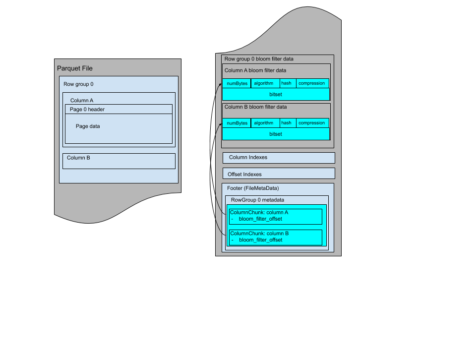
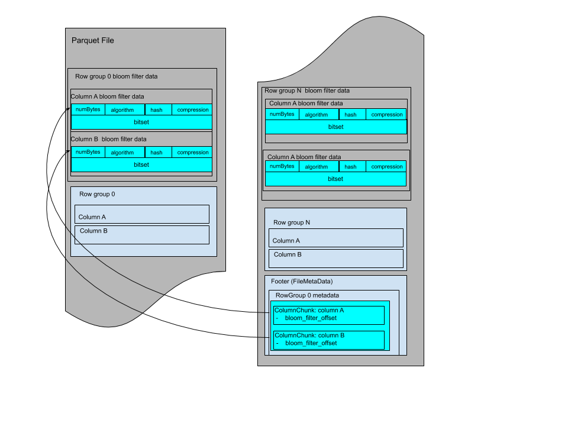
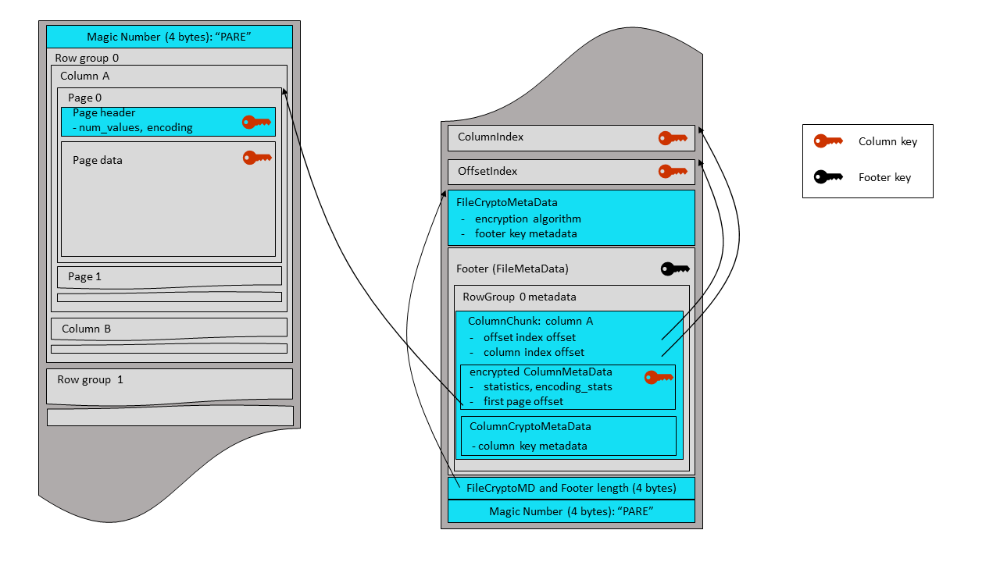
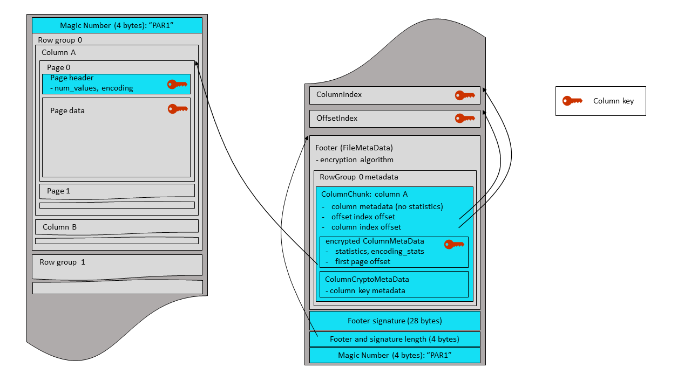

# Documentation

## Navigation

- [Documentation](#index)
  - [Overview](#overview)
    - [Motivation](#overview-motivation)
  - [Concepts](#concepts)
  - [File Format](#file-format)
    - [Binary Protocol Extensions](#file-format-binaryprotocolextensions)
    - [Configurations](#file-format-configurations)
    - [Extensibility](#file-format-extensibility)
    - [Metadata](#file-format-metadata)
    - [Types](#file-format-types)
      - [Geospatial Type](#file-format-types-geospatial)
      - [Logical Types](#file-format-types-logicaltypes)
      - [Variant Shredding](#file-format-types-variantshredding)
      - [Variant Type](#file-format-types-variantencoding)
    - [Nested Encoding](#file-format-nestedencoding)
    - [Bloom Filter](#file-format-bloomfilter)
    - [Data Pages](#file-format-data-pages)
      - [Compression](#file-format-data-pages-compression)
      - [Encodings](#file-format-data-pages-encodings)
      - [Encryption](#file-format-data-pages-encryption)
      - [Checksumming](#file-format-data-pages-checksumming)
      - [Column Chunks](#file-format-data-pages-columnchunks)
      - [Error Recovery](#file-format-data-pages-errorrecovery)
    - [Nulls](#file-format-nulls)
    - [Page Index](#file-format-pageindex)
    - [Implementation status](#file-format-implementationstatus)
  - [Developer Guide](#contribution-guidelines)
    - [Sub-Projects](#contribution-guidelines-sub-projects)
    - [Building Parquet](#contribution-guidelines-building)
    - [Contributing to Parquet-Java](#contribution-guidelines-contributing)
    - [Releasing Parquet-Java](#contribution-guidelines-releasing)
  - [Resources](#learning-resources)
    - [Blog Posts](#learning-resources-blog-posts)
    - [Presentations](#learning-resources-presentations)
      - [Spark Summit 2020](#learning-resources-presentations-spark-summit-2020)
      - [Hadoop Summit 2014](#learning-resources-presentations-hadoop-summit-2014)
      - [#CONF 2014](#learning-resources-presentations-conf-2014-parquet-summit-twitter)
      - [Strata 2013](#learning-resources-presentations-strata-2013)
  - [Apache Software Foundation (ASF)](#asf)

## Content

<a id="index"></a>

<!-- source_url: https://parquet.apache.org/docs/ -->

<!-- page_index: 1 -->

<a id="index--documentation"></a>

# Documentation

Welcome to the documentation for Apache Parquet.

The specification for the Apache Parquet file format is hosted in the [parquet-format](https://github.com/apache/parquet-format) repository.
The current implementation status of various features can be found in the [implementation status](#file-format-implementationstatus) page.

---

<a id="index--overview"></a>

##### [Overview](#overview)

All about Parquet.

<a id="index--concepts"></a>

##### [Concepts](#concepts)

Glossary of relevant terminology.

<a id="index--file-format"></a>

##### [File Format](#file-format)

Documentation about the Parquet File Format.

<a id="index--developer-guide"></a>

##### [Developer Guide](#contribution-guidelines)

All developer resources related to Parquet.

<a id="index--resources"></a>

##### [Resources](#learning-resources)

Various resources to learn about the Parquet File Format.

<a id="index--apache-software-foundation-asf"></a>

##### [Apache Software Foundation (ASF)](#asf)

Apache Software Foundation

Last modified October 28, 2025: [Improve introduction / overview, add more links to spec and implementation status (#125) (f6f48d4)](https://github.com/apache/parquet-site/commit/f6f48d43ec715f3f7db5e96f0b7d61e6eeaa48da)

---

<a id="overview"></a>

<!-- source_url: https://parquet.apache.org/docs/overview/ -->

<!-- page_index: 2 -->

<a id="overview--overview"></a>

# Overview

All about Parquet.

Apache Parquet is an open source, column-oriented data file format designed for efficient data storage and retrieval.
It provides high performance compression and encoding schemes to handle complex data in bulk and is supported in many programming languages and analytics tools.

<a id="overview--parquet-format-specification"></a>

### parquet-format (Specification)

The [parquet-format](https://github.com/apache/parquet-format) repository hosts the official specification of the Parquet file format, defining how data is structured and stored. This specification, along with the [parquet.thrift](https://github.com/apache/parquet-format/blob/master/src/main/thrift/parquet.thrift) Thrift metadata definitions, is necessary for developing software to effectively read and write Parquet files.

Note that the parquet-format repository does not contain source code for libraries to read or write Parquet files, but rather the formal definitions and documentation of the file format itself.

<a id="overview--parquet-java"></a>

### parquet-java

The [parquet-java](https://github.com/apache/parquet-java) (formerly named `parquet-mr`) repository is part of the Apache Parquet project and contains:

- Java libraries to read and write Parquet files in Java applications.
- Utilities and APIs for working with Parquet files, including tools for data import/export, schema management, and data conversion.

Note that there are a number of other implementations of the Parquet format, some of which are listed below.

<a id="overview--other-clients-libraries-tools"></a>

### Other Clients / Libraries / Tools

The Parquet ecosystem is rich and varied, encompassing a wide array of tools, libraries, and clients, each offering different levels of feature support. It’s important to note that not all implementations support the same features of the Parquet format. When integrating multiple Parquet implementations within your workflow, it is crucial to conduct thorough testing to ensure compatibility and performance across different platforms and tools.

You can find more information about the feature support of various Parquet implementations on the [implementation status](#file-format-implementationstatus) page.

Here is a non-exhaustive list of open source Parquet implementations:

- [Parquet-java](https://github.com/apache/parquet-java)
- [Parquet C++, a subproject of Arrow C++](https://github.com/apache/arrow/tree/main/cpp/src/parquet) ([documentation](https://arrow.apache.org/docs/cpp/parquet.html))
- [Parquet Go, a subproject of Arrow Go](https://github.com/apache/arrow-go/tree/main/parquet) ([documentation](https://github.com/apache/arrow-go/tree/main/parquet))
- [Parquet Rust, a subproject of Arrow Rust](https://github.com/apache/arrow-rs/blob/main/parquet/README.md)
- [cuDF](https://github.com/rapidsai/cudf)
- [Apache Impala](https://github.com/apache/impala)
- [DuckDB](https://github.com/duckdb/duckdb)
- [fastparquet, a Python implementation of the Apache Parquet format](https://github.com/dask/fastparquet)

---

<a id="overview--motivation"></a>

##### [Motivation](#overview-motivation)

Last modified November 12, 2025: [Minor: Fix various typos on the site (#133) (a506efc)](https://github.com/apache/parquet-site/commit/a506efc9d2d708e86709841311f3220d828fb4cf)

---

<a id="overview-motivation"></a>

<!-- source_url: https://parquet.apache.org/docs/overview/motivation/ -->

<!-- page_index: 3 -->

<a id="overview-motivation--motivation"></a>

# Motivation

We created Parquet to make the advantages of compressed, efficient columnar data representation available to any project in the Hadoop ecosystem.

Parquet is built from the ground up with complex nested data structures in mind, and uses the [record shredding and assembly algorithm](https://github.com/julienledem/redelm/wiki/The-striping-and-assembly-algorithms-from-the-Dremel-paper) described in the Dremel paper. We believe this approach is superior to simple flattening of nested name spaces.

Parquet is built to support very efficient compression and encoding schemes. Multiple projects have demonstrated the performance impact of applying the right compression and encoding scheme to the data. Parquet allows compression schemes to be specified on a per-column level, and is future-proofed to allow adding more encodings as they are invented and implemented.

Parquet is built to be used by anyone. The Hadoop ecosystem is rich with data processing frameworks, and we are not interested in playing favorites. We believe that an efficient, well-implemented columnar storage substrate should be useful to all frameworks without the cost of extensive and difficult to set up dependencies.

Last modified March 24, 2022: [Final Squash (3563721)](https://github.com/apache/parquet-site/commit/3563721676b364b767058a953f2bcc3e2c0c4b09)

---

<a id="concepts"></a>

<!-- source_url: https://parquet.apache.org/docs/concepts/ -->

<!-- page_index: 4 -->

<a id="concepts--concepts"></a>

# Concepts

Glossary of relevant terminology.

- *Block (HDFS block)*: This means a block in HDFS and the meaning is
  unchanged for describing this file format. The file format is
  designed to work well on top of HDFS.
- *File*: A HDFS file that must include the metadata for the file.
  It does not need to actually contain the data.
- *Row group*: A logical horizontal partitioning of the data into rows.
  There is no physical structure that is guaranteed for a row group.
  A row group consists of a column chunk for each column in the dataset.
- *Column chunk*: A chunk of the data for a particular column. They live
  in a particular row group and are guaranteed to be contiguous in the file.
- *Page*: Column chunks are divided up into pages. A page is conceptually
  an indivisible unit (in terms of compression and encoding). There can
  be multiple page types which are interleaved in a column chunk.

Hierarchically, a file consists of one or more row groups. A row group
contains exactly one column chunk per column. Column chunks contain one or
more pages.

<a id="concepts--unit-of-parallelization"></a>

## Unit of parallelization

- MapReduce - File/Row Group
- IO - Column chunk
- Encoding/Compression - Page

Last modified March 8, 2024: [Update to new website (b3b81ce)](https://github.com/apache/parquet-site/commit/b3b81ce3e9f9e6f25b41f463577976628515384a)

---

<a id="file-format"></a>

<!-- source_url: https://parquet.apache.org/docs/file-format/ -->

<!-- page_index: 5 -->

<a id="file-format--file-format"></a>

# File Format

Documentation about the Parquet File Format.

This file and the thrift definition should be read together to understand the format.

```
    4-byte magic number "PAR1"
    <Column 1 Chunk 1>
    <Column 2 Chunk 1>
    ...
    <Column N Chunk 1>
    <Column 1 Chunk 2>
    <Column 2 Chunk 2>
    ...
    <Column N Chunk 2>
    ...
    <Column 1 Chunk M>
    <Column 2 Chunk M>
    ...
    <Column N Chunk M>
    File Metadata
    4-byte length in bytes of file metadata (little endian)
    4-byte magic number "PAR1"
```

In the above example, there are N columns in this table, split into M row
groups. The file metadata contains the locations of all the column chunk
start locations. More details on what is contained in the metadata can be found
in the Thrift definition.

File metadata is written after the data to allow for single pass writing.

Readers are expected to first read the file metadata to find all the column
chunks they are interested in. The columns chunks should then be read sequentially.

The format is explicitly designed to separate the metadata from the data. This
allows splitting columns into multiple files, as well as having a single metadata
file reference multiple parquet files.


---

<a id="file-format--binary-protocol-extensions"></a>

##### [Binary Protocol Extensions](#file-format-binaryprotocolextensions)

<a id="file-format--configurations"></a>

##### [Configurations](#file-format-configurations)

<a id="file-format--extensibility"></a>

##### [Extensibility](#file-format-extensibility)

<a id="file-format--metadata"></a>

##### [Metadata](#file-format-metadata)

<a id="file-format--types"></a>

##### [Types](#file-format-types)

<a id="file-format--nested-encoding"></a>

##### [Nested Encoding](#file-format-nestedencoding)

<a id="file-format--bloom-filter"></a>

##### [Bloom Filter](#file-format-bloomfilter)

<a id="file-format--data-pages"></a>

##### [Data Pages](#file-format-data-pages)

<a id="file-format--nulls"></a>

##### [Nulls](#file-format-nulls)

<a id="file-format--page-index"></a>

##### [Page Index](#file-format-pageindex)

<a id="file-format--implementation-status"></a>

##### [Implementation status](#file-format-implementationstatus)

Last modified July 7, 2024: [GH-68: Match language from parquet-format after merge of PARQUET-2139 (#69) (a407d81)](https://github.com/apache/parquet-site/commit/a407d81a41a90b58ae90a6567a84dd084b5d2947)

---

<a id="file-format-binaryprotocolextensions"></a>

<!-- source_url: https://parquet.apache.org/docs/file-format/binaryprotocolextensions/ -->

<!-- page_index: 6 -->

<a id="file-format-binaryprotocolextensions--binary-protocol-extensions"></a>

# Binary Protocol Extensions

<a id="file-format-binaryprotocolextensions--binary-protocol-extensions-2"></a>

# Binary Protocol Extensions

The extension mechanism of the `binary` Thrift field-id `32767` has some desirable properties:

- Existing readers will ignore these extensions without any modifications
- Existing readers will ignore the extension bytes with little processing overhead
- The content of the extension is freeform and can be encoded in any format. This format is not restricted to Thrift.
- Extensions can be appended to existing Thrift serialized structs [without requiring Thrift libraries](#file-format-binaryprotocolextensions--appending-extensions-to-thrift) for manipulation (or changes to the thrift IDL).

Because only one field-id is reserved the extension bytes themselves require disambiguation; otherwise readers will not be able to decode extensions safely. This is left to implementers which MUST put enough unique state in their extension bytes for disambiguation. This can be relatively easily achieved by adding a [UUID](https://en.wikipedia.org/wiki/Universally%5C_unique%5C_identifier) at the start or end of the extension bytes. The extension does not specify a disambiguation mechanism to allow more flexibility to implementers.

Putting everything together in an example, if we would extend `FileMetaData` it would look like this on the wire.

```
N-1 bytes | Thrift compact protocol encoded FileMetadata (minus \0 thrift stop field)
4 bytes   | 08 FF FF 01 (long form header for 32767: binary)
1-5 bytes | ULEB128(M) encoded size of the extension
M bytes   | extension bytes
1 byte    | \0 (thrift stop field)
```

The choice to reserve only one field-id has an additional (and frankly unintended) property. It creates scarcity in the extension space and disincentivizes vendors from keeping their extensions private. As a vendor having an extension means one cannot use it in tandem with other extensions from other vendors even if such extensions are publicly known. The easiest path of interoperability and ability to further experiment is to push an extension through standardization and continue experimenting with other ideas internally on top of the (now) standardized version.

<a id="file-format-binaryprotocolextensions--path-to-standardization"></a>

#### Path to standardization

So far the above specification shows how different vendors can add extensions without stepping on each other’s toes. As long as extensions are private this works out ok.

Unavoidably (and desirably) some extensions will make it into the official specification. Depending on the nature of the extension, migration can take different paths. While it is out of the scope of this document to design all such migrations, we illustrate some of these paths in the [examples](#file-format-binaryprotocolextensions--examples).

<a id="file-format-binaryprotocolextensions--examples"></a>

## Examples

To illustrate the applicability of the extension mechanism we provide examples of fictional extensions to Parquet and how migration can play out if/when the community decides to adopt them in the official specification.

<a id="file-format-binaryprotocolextensions--footer"></a>

### Footer

A variant of `FileMetaData` encoded in Flatbuffers is introduced. This variant is more performant and can scale to very wide tables, something that current Thrift `FileMetaData` struggles with.

In its private form the footer of a Parquet file will look like so:

```
N-1 bytes | Thrift compact protocol encoded FileMetadata (minus \0 thrift stop field)
4 bytes   | 08 FF FF 01 (long form header for 32767: binary)
1-5 bytes | ULEB128(K+28) encoded size of the extension
K bytes   | Flatbuffers representation (v0) of FileMetaData
4 bytes   | little-endian crc32(flatbuffer)
4 bytes   | little-endian size(flatbuffer)
4 bytes   | little-endian crc32(size(flatbuffer))
16 bytes  | some-UUID
1 byte    | \0 (thrift stop field)
4 bytes   | PAR1
```

some-UUID is some UUID picked for this extension and it is used throughout (possibly internal) experimentation. It is put at the end to allow detection of the extension when parsed in reverse. The little-endian sizes and crc32s are also to the end to facilitate efficient parsing the footer in reverse without requiring parsing the Thrift compact protocol that precedes it.

At some point the experiments conclude and the extension shared publicly with the community. The extension is proposed for inclusion to the standard with a migration plan to replace the existing `FileMetaData`.

The community reviews the proposal and (potentially) proposes changes to the Flatbuffers IDL representation. In addition, because this extension is a *replacement* of an existing struct, it must:

1. have some way of being extended in the future much like what it replaces. Because the extension mechanism only allows for a single extension, without this in place we cannot have footer extensions during the migration.
2. consider its intermediate form where both the **Thrift** `FileMetaData` and the **FlatBuffers** `FileMetaData` will be present.
3. consider its final form where the long form header for `32767: binary` may not be present.

Once the design is ratified the new `FileMetaData` encoding is made final with the following migration plan. For the next N years writers will write both the Thrift and the flatbuffer `FileMetaData`. It will look much like its private form except the flatbuffer IDL may be different:

```
N-1 bytes | Thrift compact protocol encoded FileMetadata (minus \0 thrift stop field)
4 bytes   | 08 FF FF 01 (long form header for 32767: binary)
1-5 bytes | ULEB128(K+28) encoded size of the extension
K bytes   | Flatbuffers representation (v1) of FileMetaData
4 bytes   | little-endian crc32(flatbuffer)
4 bytes   | little-endian size(flatbuffer)
4 bytes   | little-endian crc32(size(flatbuffer))
16 bytes  | some-other-UUID
1 byte    | \0 (thrift stop field)
4 bytes   | PAR1
```

After the migration period, the end of the Parquet file may look like this:

```
K bytes   | Flatbuffers representation (v1) of FileMetaData
4 bytes   | little-endian crc32(flatbuffer)
4 bytes   | little-endian size(flatbuffer)
4 bytes   | little-endian crc32(size(flatbuffer))
4 bytes   | PAR3
```

In this example, we see several design decisions for the extension at play:

- There is a new some-other-UUID for the accepted change to the standard and now the Thrift `FileMetaData` cannot be extended itself.
- The length of the footer and the crc32 of the length itself, guarantees that new readers will not overshoot reading bytes in case of corrupt bits in these critical 8 bytes of the file.
- The crc32 of the flatbuffer representation enhances Parquet to have crc32 for metadata as well which is arguably more important than crc32 for data.
- The new encoding itself, which MUST contain some way to be extended in the future (much like Thrift does with this specification).

<a id="file-format-binaryprotocolextensions--encoding"></a>

### Encoding

The community experiments with a new encoding extension. At the same time they want to keep the newly encoded Parquet files open for everyone to read. So they add a new encoding via an extension to the `ColumnMetaData` struct. The extension stores offsets in the Parquet file where the new and duplicate encoded data for this column lives. The new writer carefully places all the new encodings at the start of the row group and all the old encodings at the end of the row group. This layout minimizes disruption for readers unaware of the new encodings.

In its private form Parquet files look like so:

```
4 bytes   | PAR1
          |             | Column b (new encoding)
          |             | Column c (new encoding)
R bytes   |  Row Group  | Column a
          |     0       | Column d
          |             | Column b (old encoding)
          |             | Column c (old encoding)
          |             | FileMetaData
          |             | ColumnMetaData: a
          |             | ColumnMetaData: b
F bytes   |             | <extension-blob with offsets to new encoding>
          |             | ColumnMetaData: c
          |             | <extension-blob with offsets to new encoding>
          |             | ColumnMetaData: d
4 bytes   | PAR1
```

The custom reader is compiled with thrift IDL with a binary for field with id 32767. This is done to become extension aware and inspect the extension bytes looking for the UUID disambiguator. If that’s found it decodes the offsets from the rest of the bytes and reads the region of the file containing the new encoding.

If/when the encoding is ratified, it is added to the official specification as an additional type in `Encodings` at which point the extension is no longer necessary, nor the duplicated data in the row group.

<a id="file-format-binaryprotocolextensions--appending-extensions-to-thrift"></a>

## Appending extensions to thrift

```c++
void AppendUleb(uint32_t x, std::string* out) {
  while (true) {
    uint8_t c = x & 0x7F;
    if (x < 0x80) return out->push_back(c);
    out->push_back(c + 0x80);
    x >>= 7;
  }
};

std::string AppendExtension(std::string thrift, const std::string& ext) {
  assert(thrift.back() == '\x00');   // there was a stop field in the first place
  thrift.back() = '\x08';      // replace stop field with binary type
  AppendUleb(32767, &thrift);  // field-id
  AppendUleb(ext.size(), &thrift);
  thrift += ext;
  thrift += '\x00';  // add the stop field
  return thrift;
}
```

Last modified February 24, 2026: [Switch from Algolia DocSearch to Lunr offline search (#168) (90ea0a7)](https://github.com/apache/parquet-site/commit/90ea0a7e52a9c2b360626dc6d5fbc70f49e7e918)

---

<a id="file-format-configurations"></a>

<!-- source_url: https://parquet.apache.org/docs/file-format/configurations/ -->

<!-- page_index: 7 -->

<a id="file-format-configurations--configurations"></a>

# Configurations

<a id="file-format-configurations--row-group-size"></a>

### Row Group Size

Larger row groups allow for larger column chunks which makes it
possible to do larger sequential IO. Larger groups also require more buffering in
the write path (or a two pass write). We recommend large row groups (512MB - 1GB).
Since an entire row group might need to be read, we want it to completely fit on
one HDFS block. Therefore, HDFS block sizes should also be set to be larger. An
optimized read setup would be: 1GB row groups, 1GB HDFS block size, 1 HDFS block
per HDFS file.

<a id="file-format-configurations--data-page-size"></a>

### Data Page Size

Data pages should be considered indivisible so smaller data pages
allow for more fine grained reading (e.g. single row lookup). Larger page sizes
incur less space overhead (less page headers) and potentially less parsing overhead
(processing headers). Note: for sequential scans, it is not expected to read a page
at a time; this is not the IO chunk. We recommend 8KB for page sizes.

Last modified March 8, 2024: [Update to new website (b3b81ce)](https://github.com/apache/parquet-site/commit/b3b81ce3e9f9e6f25b41f463577976628515384a)

---

<a id="file-format-extensibility"></a>

<!-- source_url: https://parquet.apache.org/docs/file-format/extensibility/ -->

<!-- page_index: 8 -->

<a id="file-format-extensibility--extensibility"></a>

# Extensibility

There are many places in the format for compatible extensions:

- File Version: The file metadata contains a version.
- Encodings: Encodings are specified by enum and more can be added in the future.
- Page types: Additional page types can be added and safely skipped.

Last modified January 14, 2024: [Sync site with format release v2.10.0 (7cf58a9)](https://github.com/apache/parquet-site/commit/7cf58a9ec47d96608dfec9771179691301ede3ce)

---

<a id="file-format-metadata"></a>

<!-- source_url: https://parquet.apache.org/docs/file-format/metadata/ -->

<!-- page_index: 9 -->

<a id="file-format-metadata--metadata"></a>

# Metadata

There are two types of metadata: file metadata, and page header metadata.

All thrift structures are serialized using the TCompactProtocol. The full
definition of these structures is given in the Parquet
[Thrift definition](https://github.com/apache/parquet-format/blob/master/src/main/thrift/parquet.thrift).

<a id="file-format-metadata--file-metadata"></a>

## File metadata

In the diagram below, file metadata is described by the `FileMetaData`
structure. This file metadata provides offset and size information useful
when navigating the Parquet file.



<a id="file-format-metadata--page-header"></a>

## Page header

Page header metadata (`PageHeader` and children in the diagram) is stored
in-line with the page data, and is used in the reading and decoding of data.



Last modified March 5, 2025: [Update Metadata Diagrams (#106) (5ab1cc6)](https://github.com/apache/parquet-site/commit/5ab1cc62cee7214f3c1f17e6b8a3a22e721eb6de)

---

<a id="file-format-types"></a>

<!-- source_url: https://parquet.apache.org/docs/file-format/types/ -->

<!-- page_index: 10 -->

<a id="file-format-types--types"></a>

# Types

The types supported by the file format are intended to be as minimal as possible, with a focus on how the types effect on disk storage. For example, 16-bit ints
are not explicitly supported in the storage format since they are covered by
32-bit ints with an efficient encoding. This reduces the complexity of implementing
readers and writers for the format. The types are:

```
  - BOOLEAN: 1 bit boolean
  - INT32: 32 bit signed ints
  - INT64: 64 bit signed ints
  - INT96: 96 bit signed ints (deprecated; only used by legacy implementations)
  - FLOAT: IEEE 32-bit floating point values
  - DOUBLE: IEEE 64-bit floating point values
  - BYTE_ARRAY: arbitrarily long byte arrays
  - FIXED_LEN_BYTE_ARRAY: fixed length byte arrays
```

---

<a id="file-format-types--geospatial-type"></a>

##### [Geospatial Type](#file-format-types-geospatial)

<a id="file-format-types--logical-types"></a>

##### [Logical Types](#file-format-types-logicaltypes)

<a id="file-format-types--variant-shredding"></a>

##### [Variant Shredding](#file-format-types-variantshredding)

<a id="file-format-types--variant-type"></a>

##### [Variant Type](#file-format-types-variantencoding)

Last modified May 20, 2025: [Update \_index.md (#114) (fec6dbf)](https://github.com/apache/parquet-site/commit/fec6dbf4f693457112defa67851c52ce32fa91ac)

---

<a id="file-format-types-geospatial"></a>

<!-- source_url: https://parquet.apache.org/docs/file-format/types/geospatial/ -->

<!-- page_index: 11 -->

<a id="file-format-types-geospatial--geospatial-type"></a>

# Geospatial Type

<a id="file-format-types-geospatial--geospatial-definitions"></a>

# Geospatial Definitions

This document contains the specification of geospatial types and statistics.

<a id="file-format-types-geospatial--background"></a>

# Background

The Geometry and Geography class hierarchy and its Well-Known Text (WKT) and
Well-Known Binary (WKB) serializations (ISO variant supporting XY, XYZ, XYM, XYZM) are defined by [OpenGIS Implementation Specification for Geographic
information - Simple feature access - Part 1: Common architecture](https://portal.ogc.org/files/?artifact_id=25355), from [OGC(Open Geospatial Consortium)](https://www.ogc.org/standard/sfa/).

The version of the OGC standard first used here is 1.2.1, but future versions
may also be used if the WKB representation remains wire-compatible.

<a id="file-format-types-geospatial--coordinate-reference-system"></a>

## Coordinate Reference System

Coordinate Reference System (CRS) is a mapping of how coordinates refer to
locations on Earth.

The default CRS `OGC:CRS84` means that the geospatial features must be stored
in the order of longitude/latitude based on the WGS84 datum.

Custom CRS can be specified by a string value. It is recommended to use an
identifier-based approach like [Spatial reference identifier](https://en.wikipedia.org/wiki/Spatial_reference_system#Identifier).

For geographic CRS, longitudes are bound by [-180, 180] and latitudes are bound
by [-90, 90].

<a id="file-format-types-geospatial--edge-interpolation-algorithm"></a>

## Edge Interpolation Algorithm

An algorithm for interpolating edges, and is one of the following values:

- `spherical`: edges are interpolated as geodesics on a sphere.
- `vincenty`: <https://en.wikipedia.org/wiki/Vincenty%27s_formulae>
- `thomas`: Thomas, Paul D. Spheroidal geodesics, reference systems, & local geometry. US Naval Oceanographic Office, 1970.
- `andoyer`: Thomas, Paul D. Mathematical models for navigation systems. US Naval Oceanographic Office, 1965.
- `karney`: [Karney, Charles FF. “Algorithms for geodesics.” Journal of Geodesy 87 (2013): 43-55](https://link.springer.com/content/pdf/10.1007/s00190-012-0578-z.pdf), and [GeographicLib](https://geographiclib.sourceforge.io/)

<a id="file-format-types-geospatial--logical-types"></a>

# Logical Types

Two geospatial logical type annotations are supported:

- `GEOMETRY`: geospatial features in the WKB format with linear/planar edges interpolation. See [Geometry](#file-format-types-logicaltypes--geometry)
- `GEOGRAPHY`: geospatial features in the WKB format with an explicit (non-linear/non-planar) edges interpolation algorithm. See [Geography](#file-format-types-logicaltypes--geography)

<a id="file-format-types-geospatial--statistics"></a>

# Statistics

`GeospatialStatistics` is a struct specific for `GEOMETRY` and `GEOGRAPHY`
logical types to store statistics of a column chunk. It is an optional field in
the `ColumnMetaData` and contains [Bounding Box](#file-format-types-geospatial--bounding-box) and [Geospatial
Types](#file-format-types-geospatial--geospatial-types) that are described below in detail.

<a id="file-format-types-geospatial--bounding-box"></a>

## Bounding Box

A geospatial instance has at least two coordinate dimensions: X and Y for 2D
coordinates of each point. Please note that X is longitude/easting and Y is
latitude/northing. A geospatial instance can optionally have Z and/or M values
associated with each point.

The Z values introduce the third dimension coordinate. Usually they are used to
indicate the height, or elevation.

M values are an opportunity for a geospatial instance to track a value in a
fourth dimension. These values can be used as a linear reference value (e.g., highway milepost value), a timestamp, or some other value as defined by the CRS.

Bounding box is defined as the thrift struct below in the representation of
min/max value pair of coordinates from each axis. Note that X and Y Values are
always present. Z and M are omitted for 2D geospatial instances.

When calculating a bounding box, null or NaN values in a coordinate
dimension are skipped. For example, `POINT (1 NaN)` contributes a value to X
but no values to Y, Z, or M dimension of the bounding box. If a dimension has
only null or NaN values, that dimension is omitted from the bounding box. If
either the X or Y dimension is missing, then the bounding box itself is not
produced.

For the X values only, xmin may be greater than xmax. In this case, an object
in this bounding box may match if it contains an X such that `x >= xmin` OR
`x <= xmax`. This wraparound occurs only when the corresponding bounding box
crosses the antimeridian line. In geographic terminology, the concepts of `xmin`, `xmax`, `ymin`, and `ymax` are also known as `westernmost`, `easternmost`, `southernmost` and `northernmost`, respectively.

For `GEOGRAPHY` types, X and Y values are restricted to the canonical ranges of
[-180, 180] for X and [-90, 90] for Y.

```thrift
struct BoundingBox {
  1: required double xmin;
  2: required double xmax;
  3: required double ymin;
  4: required double ymax;
  5: optional double zmin;
  6: optional double zmax;
  7: optional double mmin;
  8: optional double mmax;
}
```

<a id="file-format-types-geospatial--geospatial-types"></a>

## Geospatial Types

A list of geospatial types from all instances in the `GEOMETRY` or `GEOGRAPHY`
column, or an empty list if they are not known.

This is borrowed from [geometry\_types of GeoParquet](https://github.com/opengeospatial/geoparquet/blob/v1.1.0/format-specs/geoparquet.md?plain=1#L159) except that
values in the list are [WKB (ISO-variant) integer codes](https://en.wikipedia.org/wiki/Well-known_text_representation_of_geometry#Well-known_binary).
Table below shows the most common geospatial types and their codes:

| Type | XY | XYZ | XYM | XYZM |
| --- | --- | --- | --- | --- |
| Point | 0001 | 1001 | 2001 | 3001 |
| LineString | 0002 | 1002 | 2002 | 3002 |
| Polygon | 0003 | 1003 | 2003 | 3003 |
| MultiPoint | 0004 | 1004 | 2004 | 3004 |
| MultiLineString | 0005 | 1005 | 2005 | 3005 |
| MultiPolygon | 0006 | 1006 | 2006 | 3006 |
| GeometryCollection | 0007 | 1007 | 2007 | 3007 |

In addition, the following rules are applied:

- A list of multiple values indicates that multiple geospatial types are present (e.g. `[0003, 0006]`).
- An empty array explicitly signals that the geospatial types are not known.
- The geospatial types in the list must be unique (e.g. `[0001, 0001]` is not valid).

<a id="file-format-types-geospatial--crs-customization"></a>

# CRS Customization

CRS is represented as a string value. Writer and reader implementations are
responsible for serializing and deserializing the CRS, respectively.

As a convention to maximize the interoperability, custom CRS values can be
specified by a string of the format `type:identifier`, where `type` is one of
the following values:

- `srid`: [Spatial reference identifier](https://en.wikipedia.org/wiki/Spatial_reference_system#Identifier), `identifier` is the SRID itself.
- `projjson`: [PROJJSON](https://proj.org/en/stable/specifications/projjson.html), `identifier` is the name of a table property or a file property where the projjson string is stored.

<a id="file-format-types-geospatial--coordinate-axis-order"></a>

# Coordinate axis order

The axis order of the coordinates in WKB and bounding box stored in Parquet
follows the de facto standard for axis order in WKB and is therefore always
(x, y) where x is easting or longitude and y is northing or latitude. This
ordering explicitly overrides the axis order as specified in the CRS.

Last modified February 24, 2026: [Switch from Algolia DocSearch to Lunr offline search (#168) (90ea0a7)](https://github.com/apache/parquet-site/commit/90ea0a7e52a9c2b360626dc6d5fbc70f49e7e918)

---

<a id="file-format-types-logicaltypes"></a>

<!-- source_url: https://parquet.apache.org/docs/file-format/types/logicaltypes/ -->

<!-- page_index: 12 -->

<a id="file-format-types-logicaltypes--logical-types"></a>

# Logical Types

<a id="file-format-types-logicaltypes--parquet-logical-type-definitions"></a>

# Parquet Logical Type Definitions

Logical types are used to extend the types that parquet can be used to store, by specifying how the primitive types should be interpreted. This keeps the set
of primitive types to a minimum and reuses parquet’s efficient encodings. For
example, strings are stored with the primitive type `BYTE_ARRAY` with a `STRING`
annotation.

This file contains the specification for all logical types.

<a id="file-format-types-logicaltypes--metadata"></a>

### Metadata

The parquet format’s `LogicalType` stores the type annotation. The annotation
may require additional metadata fields, as well as rules for those fields.

There is an older representation of the logical type annotations called `ConvertedType`.
To support backward compatibility with old files, readers should interpret `LogicalTypes`
in the same way as `ConvertedType`, and writers should populate `ConvertedType` in the metadata
according to well defined conversion rules.

<a id="file-format-types-logicaltypes--compatibility"></a>

### Compatibility

The Thrift definition of the metadata has two fields for logical types: `ConvertedType` and `LogicalType`.
`ConvertedType` is an enum of all available annotations. Since Thrift enums can’t have additional type parameters, it is cumbersome to define additional type parameters, like decimal scale and precision
(which are additional 32 bit integer fields on SchemaElement, and are relevant only for decimals) or time unit
and UTC adjustment flag for Timestamp types. To overcome this problem, a new logical type representation was introduced into
the metadata to replace `ConvertedType`: `LogicalType`. The new representation is a union of structs of logical types, this way allowing more flexible API, logical types can have type parameters.

`ConvertedType` is deprecated. However, to maintain compatibility with old writers, Parquet readers should be able to read and interpret `ConvertedType` annotations
in case `LogicalType` annotations are not present. Parquet writers must always write
`LogicalType` annotations where applicable, but must also write the corresponding
`ConvertedType` annotations (if any) to maintain compatibility with old readers.

Compatibility considerations are mentioned for each annotation in the corresponding section.

<a id="file-format-types-logicaltypes--string-types"></a>

## String Types

<a id="file-format-types-logicaltypes--string"></a>

### STRING

`STRING` may only be used to annotate the `BYTE_ARRAY` primitive type and indicates
that the byte array should be interpreted as a UTF-8 encoded character string.

The sort order used for `STRING` strings is unsigned byte-wise comparison.

*Compatibility*

`STRING` corresponds to `UTF8` ConvertedType.

<a id="file-format-types-logicaltypes--enum"></a>

### ENUM

`ENUM` annotates the `BYTE_ARRAY` primitive type and indicates that the value
was converted from an enumerated type in another data model (e.g. Thrift, Avro, Protobuf).
Applications using a data model lacking a native enum type should interpret `ENUM`
annotated field as a UTF-8 encoded string.

The sort order used for `ENUM` values is unsigned byte-wise comparison.

<a id="file-format-types-logicaltypes--uuid"></a>

### UUID

`UUID` annotates a 16-byte `FIXED_LEN_BYTE_ARRAY` primitive type. The value is
encoded using big-endian, so that `00112233-4455-6677-8899-aabbccddeeff` is encoded
as the bytes `00 11 22 33 44 55 66 77 88 99 aa bb cc dd ee ff`
(This example is from [wikipedia’s UUID page](https://en.wikipedia.org/wiki/Universally_unique_identifier)).

The sort order used for `UUID` values is unsigned byte-wise comparison.

<a id="file-format-types-logicaltypes--numeric-types"></a>

## Numeric Types

<a id="file-format-types-logicaltypes--signed-integers"></a>

### Signed Integers

`INT` annotation can be used to specify the maximum number of bits in the stored value.
The annotation has two parameters: bit width and sign.
Allowed bit width values are `8`, `16`, `32`, `64`, and sign can be `true` or `false`.
For signed integers, the second parameter should be `true`, for example, a signed integer with bit width of 8 is defined as `INT(8, true)`
Implementations may use these annotations to produce smaller
in-memory representations when reading data.

If a stored value is larger than the maximum allowed by the annotation, the
behavior is not defined and can be determined by the implementation.
Implementations must not write values that are larger than the annotation
allows.

`INT(8, true)`, `INT(16, true)`, and `INT(32, true)` must annotate an `int32` primitive type and
`INT(64, true)` must annotate an `int64` primitive type. `INT(32, true)` and `INT(64, true)` are
implied by the `int32` and `int64` primitive types if no other annotation is
present and should be considered optional.

The sort order used for signed integer types is signed.

<a id="file-format-types-logicaltypes--unsigned-integers"></a>

### Unsigned Integers

`INT` annotation can be used to specify unsigned integer types, along with a maximum number of bits in the stored value.
The annotation has two parameters: bit width and sign.
Allowed bit width values are `8`, `16`, `32`, `64`, and sign can be `true` or `false`.
In case of unsigned integers, the second parameter should be `false`, for example, an unsigned integer with bit width of 8 is defined as `INT(8, false)`
Implementations may use these annotations to produce smaller
in-memory representations when reading data.

If a stored value is larger than the maximum allowed by the annotation, the
behavior is not defined and can be determined by the implementation.
Implementations must not write values that are larger than the annotation
allows.

`INT(8, false)`, `INT(16, false)`, and `INT(32, false)` must annotate an `int32` primitive type and
`INT(64, false)` must annotate an `int64` primitive type.

The sort order used for unsigned integer types is unsigned.

<a id="file-format-types-logicaltypes--deprecated-integer-convertedtype"></a>

### Deprecated integer ConvertedType

`INT_8`, `INT_16`, `INT_32`, and `INT_64` annotations can be also used to specify
signed integers with 8, 16, 32, or 64 bit width.

`INT_8`, `INT_16`, and `INT_32` must annotate an `int32` primitive type and
`INT_64` must annotate an `int64` primitive type. `INT_32` and `INT_64` are
implied by the `int32` and `int64` primitive types if no other annotation is
present and should be considered optional.

`UINT_8`, `UINT_16`, `UINT_32`, and `UINT_64` annotations can be also used to specify
unsigned integers with 8, 16, 32, or 64 bit width.

`UINT_8`, `UINT_16`, and `UINT_32` must annotate an `int32` primitive type and
`UINT_64` must annotate an `int64` primitive type.

*Backward compatibility:*

| ConvertedType | LogicalType |
| --- | --- |
| INT\_8 | IntType (bitWidth = 8, isSigned = true) |
| INT\_16 | IntType (bitWidth = 16, isSigned = true) |
| INT\_32 | IntType (bitWidth = 32, isSigned = true) |
| INT\_64 | IntType (bitWidth = 64, isSigned = true) |
| UINT\_8 | IntType (bitWidth = 8, isSigned = false) |
| UINT\_16 | IntType (bitWidth = 16, isSigned = false) |
| UINT\_32 | IntType (bitWidth = 32, isSigned = false) |
| UINT\_64 | IntType (bitWidth = 64, isSigned = false) |

*Forward compatibility:*

<table><tr colspan="3"><th colspan="3">LogicalType</th><th>ConvertedType</th></tr><tr><td rowspan="8">IntType</td><td rowspan="4">isSigned</td><td>bitWidth = 8</td><td>INT_8</td></tr><tr><td>bitWidth = 16</td><td>INT_16</td></tr><tr><td>bitWidth = 32</td><td>INT_32</td></tr><tr><td>bitWidth = 64</td><td>INT_64</td></tr><tr><td rowspan="4">!isSigned</td><td>bitWidth = 8</td><td>UINT_8</td></tr><tr><td>bitWidth = 16</td><td>UINT_16</td></tr><tr><td>bitWidth = 32</td><td>UINT_32</td></tr><tr><td>bitWidth = 64</td><td>UINT_64</td></tr></table>

<a id="file-format-types-logicaltypes--decimal"></a>

### DECIMAL

`DECIMAL` annotation represents arbitrary-precision signed decimal numbers of
the form `unscaledValue * 10^(-scale)`.

The primitive type stores an unscaled integer value. For `BYTE_ARRAY` and
`FIXED_LEN_BYTE_ARRAY`, the unscaled number must be encoded as two’s complement using
big-endian byte order (the most significant byte is the zeroth element). The
scale stores the number of digits of that value that are to the right of the
decimal point, and the precision stores the maximum number of digits supported
in the unscaled value.

If not specified, the scale is 0. Scale must be zero or a positive integer less
than or equal to the precision. Precision is required and must be a non-zero positive
integer. A precision too large for the underlying type (see below) is an error.

`DECIMAL` can be used to annotate the following types:

- `int32`: for 1 <= precision <= 9
- `int64`: for 1 <= precision <= 18; precision < 10 will produce a
  warning
- `fixed_len_byte_array`: precision is limited by the array size. Length `n`
  can store <= `floor(log_10(2^(8*n - 1) - 1))` base-10 digits
- `byte_array`: `precision` is not limited, but is required. The minimum number of
  bytes to store the unscaled value should be used.

The sort order used for `DECIMAL` values is signed comparison of the represented
value.

If the column uses `int32` or `int64` physical types, then signed comparison of
the integer values produces the correct ordering. If the physical type is
fixed, then the correct ordering can be produced by flipping the
most-significant bit in the first byte and then using unsigned byte-wise
comparison.

*Compatibility*

To support compatibility with older readers, implementations of parquet-format should
write `DecimalType` precision and scale into the corresponding SchemaElement field in metadata.

<a id="file-format-types-logicaltypes--float16"></a>

### FLOAT16

The `FLOAT16` annotation represents half-precision floating-point numbers in the 2-byte IEEE little-endian format.

Used in contexts where precision is traded off for smaller footprint and potentially better performance.

The primitive type is a 2-byte `FIXED_LEN_BYTE_ARRAY`.

The sort order for `FLOAT16` is signed (with special handling of NANs and signed zeros); it uses the same [logic](https://github.com/apache/parquet-format#sort-order) as `FLOAT` and `DOUBLE`.

<a id="file-format-types-logicaltypes--temporal-types"></a>

## Temporal Types

<a id="file-format-types-logicaltypes--date"></a>

### DATE

`DATE` is used for a logical date type, without a time of day. It must
annotate an `int32` that stores the number of days from the Unix epoch, 1
January 1970.

The sort order used for `DATE` is signed.

<a id="file-format-types-logicaltypes--time"></a>

### TIME

`TIME` is used for a logical time type without a date with millisecond or microsecond precision.
The type has two type parameters: UTC adjustment (`true` or `false`)
and unit (`MILLIS` or `MICROS`, `NANOS`).

`TIME` with unit `MILLIS` is used for millisecond precision.
It must annotate an `int32` that stores the number of
milliseconds after midnight.

`TIME` with unit `MICROS` is used for microsecond precision.
It must annotate an `int64` that stores the number of
microseconds after midnight.

`TIME` with unit `NANOS` is used for nanosecond precision.
It must annotate an `int64` that stores the number of
nanoseconds after midnight.

The sort order used for `TIME` is signed.

<a id="file-format-types-logicaltypes--deprecated-time-convertedtype"></a>

#### Deprecated time ConvertedType

`TIME_MILLIS` is the deprecated ConvertedType counterpart of a `TIME` logical
type that is UTC normalized and has `MILLIS` precision. Like the logical type
counterpart, it must annotate an `int32`.

`TIME_MICROS` is the deprecated ConvertedType counterpart of a `TIME` logical
type that is UTC normalized and has `MICROS` precision. Like the logical type
counterpart, it must annotate an `int64`.

Despite there is no exact corresponding ConvertedType for local time semantic, in order to support forward compatibility with those libraries, which annotated
their local time with legacy `TIME_MICROS` and `TIME_MILLIS` annotation, Parquet writer implementation *must* annotate local time with legacy annotations too, as shown below.

*Backward compatibility:*

| ConvertedType | LogicalType |
| --- | --- |
| TIME\_MILLIS | TimeType (isAdjustedToUTC = true, unit = MILLIS) |
| TIME\_MICROS | TimeType (isAdjustedToUTC = true, unit = MICROS) |

*Forward compatibility:*

<table><tr colspan="3"><th colspan="3">LogicalType</th><th>ConvertedType</th></tr><tr><td rowspan="6">TimeType</td><td rowspan="3">isAdjustedToUTC = true</td><td>unit = MILLIS</td><td>TIME_MILLIS</td></tr><tr><td>unit = MICROS</td><td>TIME_MICROS</td></tr><tr><td>unit = NANOS</td><td>-</td></tr><tr><td rowspan="3">isAdjustedToUTC = false</td><td>unit = MILLIS</td><td>TIME_MILLIS</td></tr><tr><td>unit = MICROS</td><td>TIME_MICROS</td></tr><tr><td>unit = NANOS</td><td>-</td></tr></table>

<a id="file-format-types-logicaltypes--timestamp"></a>

### TIMESTAMP

In data annotated with the `TIMESTAMP` logical type, each value is a single
`int64` number that can be decoded into year, month, day, hour, minute, second
and subsecond fields using calculations detailed below. Please note that a value
defined this way does not necessarily correspond to a single instant on the
time-line and such interpretations are allowed on purpose.

The `TIMESTAMP` type has two type parameters:

- `isAdjustedToUTC` must be either `true` or `false`.
- `unit` must be one of `MILLIS`, `MICROS` or `NANOS`. This list is subject
  to potential expansion in the future. Upon reading, unknown `unit`-s must
  be handled as unsupported features (rather than as errors in the data files).

<a id="file-format-types-logicaltypes--instant-semantics-timestamps-normalized-to-utc"></a>

#### Instant semantics (timestamps normalized to UTC)

A `TIMESTAMP` with `isAdjustedToUTC=true` is defined as the number of
milliseconds, microseconds or nanoseconds (depending on the `unit`
parameter being `MILLIS`, `MICROS` or `NANOS`, respectively) elapsed since the
Unix epoch, 1970-01-01 00:00:00 UTC. Each such value unambiguously identifies a
single instant on the time-line.

For example, in a `TIMESTAMP(isAdjustedToUTC=true, unit=MILLIS)`, the
number 172800000 corresponds to 1970-01-03 00:00:00 UTC, because it is equal to
2 \* 24 \* 60 \* 60 \* 1000, therefore it is exactly two days from the reference
point, the Unix epoch. In Java, this calculation can be achieved by calling
`Instant.ofEpochMilli(172800000)`.

As a slightly more complicated example, if one wants to store 1970-01-03
00:00:00 (UTC+01:00) as a `TIMESTAMP(isAdjustedToUTC=true, unit=MILLIS)`, first the time zone offset has to be dealt with. By normalizing the timestamp to
UTC, we calculate what time in UTC corresponds to the same instant: 1970-01-02
23:00:00 UTC. This is 1 day and 23 hours after the epoch, therefore it can be
encoded as the number (24 + 23) \* 60 \* 60 \* 1000 = 169200000.

Please note that time zone information gets lost in this process. Upon reading a
value back, we can only reconstruct the instant, but not the original
representation. In practice, such timestamps are typically displayed to users in
their local time zones, therefore they may be displayed differently depending on
the execution environment.

<a id="file-format-types-logicaltypes--local-semantics-timestamps-not-normalized-to-utc"></a>

#### Local semantics (timestamps not normalized to UTC)

A `TIMESTAMP` with `isAdjustedToUTC=false` represents year, month, day, hour, minute, second and subsecond fields in a local timezone, *regardless of what
specific time zone is considered local*. This means that such timestamps should
always be displayed the same way, regardless of the local time zone in effect.
On the other hand, without additional information such as an offset or
time-zone, these values do not identify instants on the time-line unambiguously, because the corresponding instants would depend on the local time zone.

Using a single number to represent a local timestamp is a lot less intuitive
than for instants. One must use a local timestamp as the reference point and
calculate the elapsed time between the actual timestamp and the reference point.
The problem is that the result may depend on the local time zone, for example
because there may have been a daylight saving time change between the two
timestamps.

The solution to this problem is to use a simplification that makes the result
easy to calculate and independent of the timezone. Treating every day as
consisting of exactly 86400 seconds and ignoring DST changes altogether allows
us to unambiguously represent a local timestamp as a difference from a reference
local timestamp. We define the reference local timestamp to be 1970-01-01
00:00:00 (note the lack of UTC at the end, as this is not an instant). This way
the encoding of local timestamp values becomes very similar to the encoding of
instant values. For example, in a `TIMESTAMP(isAdjustedToUTC=false, unit=MILLIS)`, the number 172800000 corresponds to 1970-01-03 00:00:00
(note the lack of UTC at the end), because it is exactly two days from the
reference point (172800000 = 2 \* 24 \* 60 \* 60 \* 1000).

Another way to get to the same definition is to treat the local timestamp value
*as if* it were in UTC and store it as an instant. For example, if we treat the
local timestamp 1970-01-03 00:00:00 *as if* it were the instant 1970-01-03
00:00:00 UTC, we can store it as 172800000. When reading 172800000 back, we can
reconstruct the instant 1970-01-03 00:00:00 UTC and convert it to a local
timestamp *as if* we were in the UTC time zone, resulting in 1970-01-03
00:00:00. In Java, this can be achieved by calling
`LocalDateTime.ofEpochSecond(172800, 0, ZoneOffset.UTC)`.

Please note that while from a practical point of view this second definition is
equivalent to the first one, from a theoretical point of view only the first
definition can be considered correct, the second one just “incidentally” leads
to the same results. Nevertheless, this second definition is worth mentioning as
well, because it is relatively widespread and it can lead to confusion, especially due to its usage of UTC in the calculations. One can stumble upon
code, comments and specifications ambiguously stating that a timestamp “is
stored in UTC”. In some contexts, it means that it is *normalized* to UTC and
acts as an instant. In some other contexts though, it means the exact opposite, namely that the timestamp is stored *as if* it were in UTC and acts as a
local timestamp in reality.

<a id="file-format-types-logicaltypes--common-considerations"></a>

#### Common considerations

Every possible `int64` number represents a valid timestamp, but depending on the
precision, the corresponding year may be outside of the practical everyday
limits and implementations may choose to only support a limited range.

On the other hand, not every combination of year, month, day, hour, minute, second and subsecond values can be encoded into an `int64`. Most notably:

- An arbitrary combination of timestamp fields can not be encoded as a single
  number if the values for some of the fields are outside of their normal range
  (where the “normal range” corresponds to everyday usage). For example, neither
  of the following can be represented in a timestamp:
  - hour = -1
  - hour = 25
  - minute = 61
  - month = 13
  - day = 29, month = 2, year = any non-leap year
- Due to the range of the `int64` type, timestamps using the `NANOS` unit
  can only represent values between 1677-09-21 00:12:43 and 2262-04-11 23:47:16.
  Values outside of this range can not be represented with the `NANOS`
  unit. (Other precisions have similar limits but those are outside of the
  domain for practical everyday usage.)

The sort order used for `TIMESTAMP` is signed.

<a id="file-format-types-logicaltypes--deprecated-timestamp-convertedtype"></a>

#### Deprecated timestamp ConvertedType

`TIMESTAMP_MILLIS` is the deprecated ConvertedType counterpart of a `TIMESTAMP`
logical type that is UTC normalized and has `MILLIS` precision. Like the logical
type counterpart, it must annotate an `int64`.

`TIMESTAMP_MICROS` is the deprecated ConvertedType counterpart of a `TIMESTAMP`
logical type that is UTC normalized and has `MICROS` precision. Like the logical
type counterpart, it must annotate an `int64`.

Despite there is no exact corresponding ConvertedType for local timestamp semantic, in order to support forward compatibility with those libraries, which annotated
their local timestamps with legacy `TIMESTAMP_MICROS` and `TIMESTAMP_MILLIS` annotation, Parquet writer implementation *must* annotate local timestamps with legacy annotations too, as shown below.

*Backward compatibility:*

| ConvertedType | LogicalType |
| --- | --- |
| TIMESTAMP\_MILLIS | TimestampType (isAdjustedToUTC = true, unit = MILLIS) |
| TIMESTAMP\_MICROS | TimestampType (isAdjustedToUTC = true, unit = MICROS) |

*Forward compatibility:*

<table><tr colspan="3"><th colspan="3">LogicalType</th><th>ConvertedType</th></tr><tr><td rowspan="6">TimestampType</td><td rowspan="3">isAdjustedToUTC = true</td><td>unit = MILLIS</td><td>TIMESTAMP_MILLIS</td></tr><tr><td>unit = MICROS</td><td>TIMESTAMP_MICROS</td></tr><tr><td>unit = NANOS</td><td>-</td></tr><tr><td rowspan="3">isAdjustedToUTC = false</td><td>unit = MILLIS</td><td>TIMESTAMP_MILLIS</td></tr><tr><td>unit = MICROS</td><td>TIMESTAMP_MICROS</td></tr><tr><td>unit = NANOS</td><td>-</td></tr></table>

<a id="file-format-types-logicaltypes--interval"></a>

### INTERVAL

`INTERVAL` is used for an interval of time. It must annotate a
`fixed_len_byte_array` of length 12. This array stores three little-endian
unsigned integers that represent durations at different granularities of time.
The first stores a number in months, the second stores a number in days, and
the third stores a number in milliseconds. This representation is independent
of any particular timezone or date.

Each component in this representation is independent of the others. For
example, there is no requirement that a large number of days should be
expressed as a mix of months and days because there is not a constant
conversion from days to months.

The sort order used for `INTERVAL` is undefined. When writing data, no min/max
statistics should be saved for this type and if such non-compliant statistics
are found during reading, they must be ignored.

<a id="file-format-types-logicaltypes--embedded-types"></a>

## Embedded Types

Embedded types do not have type-specific orderings.

<a id="file-format-types-logicaltypes--json"></a>

### JSON

`JSON` is used for an embedded JSON document. It must annotate a `BYTE_ARRAY`
primitive type. The `BYTE_ARRAY` data is interpreted as a UTF-8 encoded character
string of valid JSON as defined by the [JSON specification](http://json.org/)

The sort order used for `JSON` is unsigned byte-wise comparison.

<a id="file-format-types-logicaltypes--bson"></a>

### BSON

`BSON` is used for an embedded BSON document. It must annotate a `BYTE_ARRAY`
primitive type. The `BYTE_ARRAY` data is interpreted as an encoded BSON document as
defined by the [BSON specification](http://bsonspec.org/spec.html).

The sort order used for `BSON` is unsigned byte-wise comparison.

<a id="file-format-types-logicaltypes--variant"></a>

### VARIANT

`VARIANT` is used for a Variant value. It must annotate a group. The group must
contain a field named `metadata` and a field named `value`. Both fields must have
type `binary`, which is also called `BYTE_ARRAY` in the Parquet thrift definition.
The `VARIANT` annotated group can be used to store either an unshredded Variant
value, or a shredded Variant value.

- The Variant group must be annotated with the `VARIANT` logical type, with the version number
  included in the declaration.
- Both fields `value` and `metadata` must be of type `binary` (called `BYTE_ARRAY`
  in the Parquet thrift definition).
- The `metadata` field is required and must be a valid Variant metadata component,
  as defined by the [Variant binary encoding specification](#file-format-types-variantencoding).
- When present, the `value` field must be a valid Variant value component,
  as defined by the [Variant binary encoding specification](#file-format-types-variantencoding).
- The `value` field is required for unshredded Variant values.
- The `value` field is optional and may be null only when parts of the Variant
  value are shredded according to the [Variant shredding specification](#file-format-types-variantshredding).

This is the expected representation of an unshredded Variant in Parquet:

```
optional group variant_unshredded (VARIANT(1)) {
  required binary metadata;
  required binary value;
}
```

This is an example representation of a shredded Variant in Parquet:

```
optional group variant_shredded (VARIANT(1)) {
  required binary metadata;
  optional binary value;
  optional int64 typed_value;
}
```

<a id="file-format-types-logicaltypes--geometry"></a>

### GEOMETRY

`GEOMETRY` is used for geospatial features in the Well-Known Binary (WKB) format
with linear/planar edges interpolation. It must annotate a `BYTE_ARRAY`
primitive type. See [Geospatial.md](#file-format-types-geospatial) for more detail.

The type has only one type parameter:

- `crs`: An optional string value for CRS. If unset, the CRS defaults to
  `"OGC:CRS84"`, which means that the geometries must be stored in longitude,
  latitude based on the WGS84 datum.

The sort order used for `GEOMETRY` is undefined. When writing data, no min/max
statistics should be saved for this type and if such non-compliant statistics
are found during reading, they must be ignored.

<a id="file-format-types-logicaltypes--geography"></a>

### GEOGRAPHY

`GEOGRAPHY` is used for geospatial features in the WKB format with an explicit
(non-linear/non-planar) edges interpolation algorithm. It must annotate a
`BYTE_ARRAY` primitive type. See [Geospatial.md](#file-format-types-geospatial) for more detail.

The type has two type parameters:

- `crs`: An optional string value for CRS. It must be a geographic CRS, where
  longitudes are bound by [-180, 180] and latitudes are bound by [-90, 90].
  If unset, the CRS defaults to `"OGC:CRS84"`.
- `algorithm`: An optional enum value to describes the edge interpolation
  algorithm. Supported values are: `SPHERICAL`, `VINCENTY`, `THOMAS`, `ANDOYER`,
  `KARNEY`. If unset, the algorithm defaults to `SPHERICAL`.

The sort order used for `GEOGRAPHY` is undefined. When writing data, no min/max
statistics should be saved for this type and if such non-compliant statistics
are found during reading, they must be ignored.

<a id="file-format-types-logicaltypes--nested-types"></a>

## Nested Types

This section specifies how `LIST` and `MAP` can be used to encode nested types
by adding group levels around repeated fields that are not present in the data.

This does not affect repeated fields that are not annotated: A repeated field
that is neither contained by a `LIST`- or `MAP`-annotated group nor annotated
by `LIST` or `MAP` should be interpreted as a required list of required
elements where the element type is the type of the field.

```
WARNING: writers should not produce list types like these examples! They are
just for the purpose of reading existing data for backward-compatibility.

// List<Integer> (non-null list, non-null elements)
repeated int32 num;

// List<Tuple<Integer, String>> (non-null list, non-null elements)
repeated group my_list {
  required int32 num;
  optional binary str (STRING);
}
```

For all fields in the schema, implementations should use either `LIST` and
`MAP` annotations *or* unannotated repeated fields, but not both. When using
the annotations, no unannotated repeated types are allowed.

<a id="file-format-types-logicaltypes--lists"></a>

### Lists

`LIST` is used to annotate types that should be interpreted as lists.

`LIST` must always annotate a 3-level structure:

```
<list-repetition> group <name> (LIST) {
  repeated group list {
    <element-repetition> <element-type> element;
  }
}
```

- The outer-most level must be a group annotated with `LIST` that contains a
  single field named `list`. The repetition of this level must be either
  `optional` or `required` and determines whether the list is nullable.
- The middle level, named `list`, must be a repeated group with a single
  field named `element`.
- The `element` field encodes the list’s element type and repetition. Element
  repetition must be `required` or `optional`.

The following examples demonstrate two of the possible lists of string values.

```
// List<String> (list non-null, elements nullable)
required group my_list (LIST) {
  repeated group list {
    optional binary element (STRING);
  }
}

// List<String> (list nullable, elements non-null)
optional group my_list (LIST) {
  repeated group list {
    required binary element (STRING);
  }
}
```

Element types can be nested structures. For example, a list of lists:

```
// List<List<Integer>>
optional group array_of_arrays (LIST) {
  repeated group list {
    required group element (LIST) {
      repeated group list {
        required int32 element;
      }
    }
  }
}
```

<a id="file-format-types-logicaltypes--backward-compatibility-rules"></a>

#### Backward-compatibility rules

New writer implementations should always produce the 3-level LIST structure shown
above. However, historically data files have been produced that use different
structures to represent list-like data, and readers may include compatibility
measures to interpret them as intended.

It is required that the repeated group of elements is named `list` and that
its element field is named `element`. However, these names may not be used in
existing data and should not be enforced as errors when reading. For example, the following field schema should produce a nullable list of non-null strings, even though the repeated group is named `element`.

```
optional group my_list (LIST) {
  repeated group element {
    required binary str (STRING);
  };
}
```

Some existing data does not include the inner element layer, resulting in a
`LIST` that annotates a 2-level structure. Unlike the 3-level structure, the
repetition of a 2-level structure can be `optional`, `required`, or `repeated`.
When it is `repeated`, the `LIST`-annotated 2-level structure can only serve as
an element within another `LIST`-annotated 2-level structure.

For backward-compatibility, the type of elements in `LIST`-annotated structures
should always be determined by the following rules:

1. If the repeated field is not a group, then its type is the element type and
   elements are required.
2. If the repeated field is a group with multiple fields, then its type is the
   element type and elements are required.
3. If the repeated field is a group with one field with `repeated` repetition,
   then its type is the element type and elements are required.
4. If the repeated field is a group with one field and is named either `array`
   or uses the `LIST`-annotated group’s name with `_tuple` appended then the
   repeated type is the element type and elements are required.
5. Otherwise, the repeated field’s type is the element type with the repeated
   field’s repetition.

Examples that can be interpreted using these rules:

```
WARNING: writers should not produce list types like these examples! They are
just for the purpose of reading existing data for backward-compatibility.

// Rule 1: List<Integer> (nullable list, non-null elements)
optional group my_list (LIST) {
  repeated int32 element;
}

// Rule 2: List<Tuple<String, Integer>> (nullable list, non-null elements)
optional group my_list (LIST) {
  repeated group element {
    required binary str (STRING);
    required int32 num;
  };
}

// Rule 3: List<List<Integer>> (nullable outer list, non-null elements)
optional group my_list (LIST) {
  repeated group array (LIST) {
    repeated int32 array;
  };
}

// Rule 4: List<OneTuple<String>> (nullable list, non-null elements)
optional group my_list (LIST) {
  repeated group array {
    required binary str (STRING);
  };
}

// Rule 4: List<OneTuple<String>> (nullable list, non-null elements)
optional group my_list (LIST) {
  repeated group my_list_tuple {
    required binary str (STRING);
  };
}

// Rule 5: List<String>  (nullable list, nullable elements)
optional group my_list (LIST) {
  repeated group element {
    optional binary str (STRING);
  };
}
```

<a id="file-format-types-logicaltypes--maps"></a>

### Maps

`MAP` is used to annotate types that should be interpreted as a map from keys
to values. `MAP` must annotate a 3-level structure:

```
<map-repetition> group <name> (MAP) {
  repeated group key_value {
    required <key-type> key;
    <value-repetition> <value-type> value;
  }
}
```

- The outer-most level must be a group annotated with `MAP` that contains a
  single field named `key_value`. The repetition of this level must be either
  `optional` or `required` and determines whether the map is nullable.
- The middle level, named `key_value`, must be a repeated group with a `key`
  field for map keys and, optionally, a `value` field for map values. It must
  not contain any other values.
- The `key` field encodes the map’s key type. This field must have
  repetition `required` and must always be present. It must always be the first
  field of the repeated `key_value` group.
- The `value` field encodes the map’s value type and repetition. This field can
  be `required`, `optional`, or omitted. It must always be the second field of
  the repeated `key_value` group if present. In case of not present, it can be
  represented as a map with all null values or as a set of keys.

The following example demonstrates the type for a non-null map from strings to
nullable integers:

```
// Map<String, Integer>
required group my_map (MAP) {
  repeated group key_value {
    required binary key (STRING);
    optional int32 value;
  }
}
```

If there are multiple key-value pairs for the same key, then the final value
for that key must be the last value. Other values may be ignored or may be
added with replacement to the map container in the order that they are encoded.
The `MAP` annotation should not be used to encode multi-maps using duplicate
keys.

<a id="file-format-types-logicaltypes--backward-compatibility-rules-1"></a>
<a id="file-format-types-logicaltypes--backward-compatibility-rules-2"></a>

#### Backward-compatibility rules

It is required that the repeated group of key-value pairs is named `key_value`
and that its fields are named `key` and `value`. However, these names may not
be used in existing data and should not be enforced as errors when reading.
(`key` and `value` can be identified by their position in case of misnaming.)

Some existing data incorrectly used `MAP_KEY_VALUE` in place of `MAP`. For
backward-compatibility, a group annotated with `MAP_KEY_VALUE` that is not
contained by a `MAP`-annotated group should be handled as a `MAP`-annotated
group.

Examples that can be interpreted using these rules:

```
// Map<String, Integer> (nullable map, non-null values)
optional group my_map (MAP) {
  repeated group map {
    required binary str (STRING);
    required int32 num;
  }
}

// Map<String, Integer> (nullable map, nullable values)
optional group my_map (MAP_KEY_VALUE) {
  repeated group map {
    required binary key (STRING);
    optional int32 value;
  }
}
```

<a id="file-format-types-logicaltypes--unknown-always-null"></a>

## UNKNOWN (always null)

Sometimes, when discovering the schema of existing data, values are always null
and there’s no type information.
The `UNKNOWN` type can be used to annotate a column that is always null.
(Similar to Null type in Avro and Arrow)

Last modified February 24, 2026: [Switch from Algolia DocSearch to Lunr offline search (#168) (90ea0a7)](https://github.com/apache/parquet-site/commit/90ea0a7e52a9c2b360626dc6d5fbc70f49e7e918)

---

<a id="file-format-types-variantshredding"></a>

<!-- source_url: https://parquet.apache.org/docs/file-format/types/variantshredding/ -->

<!-- page_index: 13 -->

<a id="file-format-types-variantshredding--variant-shredding"></a>

# Variant Shredding

<a id="file-format-types-variantshredding--variant-shredding-2"></a>

# Variant Shredding

The Variant type is designed to store and process semi-structured data efficiently, even with heterogeneous values.
Query engines encode each Variant value in a self-describing format, and store it as a group containing `value` and `metadata` binary fields in Parquet.
Since data is often partially homogeneous, it can be beneficial to extract certain fields into separate Parquet columns to further improve performance.
This process is called **shredding**.

Shredding enables the use of Parquet’s columnar representation for more compact data encoding, column statistics for data skipping, and partial projections.

For example, the query `SELECT variant_get(event, '$.event_ts', 'timestamp') FROM tbl` only needs to load field `event_ts`, and if that column is shredded, it can be read by columnar projection without reading or deserializing the rest of the `event` Variant.
Similarly, for the query `SELECT * FROM tbl WHERE variant_get(event, '$.event_type', 'string') = 'signup'`, the `event_type` shredded column metadata can be used for skipping and to lazily load the rest of the Variant.

<a id="file-format-types-variantshredding--variant-metadata"></a>

## Variant Metadata

Variant metadata is stored in the top-level Variant group in a binary `metadata` column regardless of whether the Variant value is shredded.

All `value` columns within the Variant must use the same `metadata`.
All field names of a Variant, whether shredded or not, must be present in the metadata.

<a id="file-format-types-variantshredding--value-shredding"></a>

## Value Shredding

Variant values are stored in Parquet fields named `value`.
Each `value` field may have an associated shredded field named `typed_value` that stores the value when it matches a specific type.
When `typed_value` is present, readers **must** reconstruct shredded values according to this specification.

For example, a Variant field, `measurement` may be shredded as long values by adding `typed_value` with type `int64`:

```
required group measurement (VARIANT(1)) {
  required binary metadata;
  optional binary value;
  optional int64 typed_value;
}
```

The Parquet columns used to store variant metadata and values must be accessed by name, not by position.

The series of measurements `34, null, "n/a", 100` would be stored as:

| Value | `metadata` | `value` | `typed_value` |
| --- | --- | --- | --- |
| 34 | `01 00` v1/empty | null | `34` |
| null | `01 00` v1/empty | `00` (null) | null |
| “n/a” | `01 00` v1/empty | `13 6E 2F 61` (`n/a`) | null |
| 100 | `01 00` v1/empty | null | `100` |

Both `value` and `typed_value` are optional fields used together to encode a single value.
Values in the two fields must be interpreted according to the following table:

| `value` | `typed_value` | Meaning |
| --- | --- | --- |
| null | null | The value is missing; only valid for shredded object fields |
| non-null | null | The value is present and may be any type, including null |
| null | non-null | The value is present and is the shredded type |
| non-null | non-null | The value is present and is a partially shredded object |

An object is *partially shredded* when the `value` is an object and the `typed_value` is a shredded object.
Writers must not produce data where both `value` and `typed_value` are non-null, unless the Variant value is an object.

If a Variant is missing in a context where a value is required, readers must return a Variant null (`00`): basic type 0 (primitive) and physical type 0 (null).
For example, if a Variant is required (like `measurement` above) and both `value` and `typed_value` are null, the returned `value` must be `00` (Variant null).

<a id="file-format-types-variantshredding--shredded-value-types"></a>

### Shredded Value Types

Shredded values must use the following Parquet types:

| Variant Type | Parquet Physical Type | Parquet Logical Type |
| --- | --- | --- |
| boolean | BOOLEAN |  |
| int8 | INT32 | INT(8, signed=true) |
| int16 | INT32 | INT(16, signed=true) |
| int32 | INT32 |  |
| int64 | INT64 |  |
| float | FLOAT |  |
| double | DOUBLE |  |
| decimal4 | INT32 | DECIMAL(P, S) |
| decimal8 | INT64 | DECIMAL(P, S) |
| decimal16 | BYTE\_ARRAY / FIXED\_LEN\_BYTE\_ARRAY | DECIMAL(P, S) |
| date | INT32 | DATE |
| time | INT64 | TIME(false, MICROS) |
| timestamptz(6) | INT64 | TIMESTAMP(true, MICROS) |
| timestamptz(9) | INT64 | TIMESTAMP(true, NANOS) |
| timestampntz(6) | INT64 | TIMESTAMP(false, MICROS) |
| timestampntz(9) | INT64 | TIMESTAMP(false, NANOS) |
| binary | BINARY |  |
| string | BINARY | STRING |
| uuid | FIXED\_LEN\_BYTE\_ARRAY[len=16] | UUID |
| array | GROUP; see Arrays below | LIST |
| object | GROUP; see Objects below |  |

<a id="file-format-types-variantshredding--primitive-types"></a>

#### Primitive Types

Primitive values can be shredded using the equivalent Parquet primitive type from the table above for `typed_value`.

Unless the value is shredded as an object (see [Objects](#file-format-types-variantshredding--objects)), `typed_value` or `value` (but not both) must be non-null.

<a id="file-format-types-variantshredding--arrays"></a>

#### Arrays

Arrays can be shredded by using a 3-level Parquet list for `typed_value`.

If the value is not an array, `typed_value` must be null.
If the value is an array, `value` must be null.

The list `element` must be a required group.
The `element` group can contain `value` and `typed_value` fields.
The element’s `value` field stores the element as Variant-encoded `binary` when the `typed_value` is not present or cannot represent it.
The `typed_value` field may be omitted when not shredding elements as a specific type.
The `value` field may be omitted when shredding elements as a specific type.
However, at least one of the two fields must be present.

For example, a `tags` Variant may be shredded as a list of strings using the following definition:

```
optional group tags (VARIANT(1)) {
  required binary metadata;
  optional binary value;
  optional group typed_value (LIST) {   # must be optional to allow a null list
    repeated group list {
      required group element {          # shredded element
        optional binary value;
        optional binary typed_value (STRING);
      }
    }
  }
}
```

All elements of an array must be present (not missing) because the `array` Variant encoding does not allow missing elements.
That is, either `typed_value` or `value` (but not both) must be non-null.
Null elements must be encoded in `value` as Variant null: basic type 0 (primitive) and physical type 0 (null).

The series of `tags` arrays `["comedy", "drama"], ["horror", null], ["comedy", "drama", "romance"], null` would be stored as:

| Array | `value` | `typed_value` | `typed_value...value` | `typed_value...typed_value` |
| --- | --- | --- | --- | --- |
| `["comedy", "drama"]` | null | non-null | [null, null] | [`comedy`, `drama`] |
| `["horror", null]` | null | non-null | [null, `00`] | [`horror`, null] |
| `["comedy", "drama", "romance"]` | null | non-null | [null, null, null] | [`comedy`, `drama`, `romance`] |
| null | `00` (null) | null |  |  |

<a id="file-format-types-variantshredding--objects"></a>

#### Objects

Fields of an object can be shredded using a Parquet group for `typed_value` that contains shredded fields.

If the value is an object, `typed_value` must be non-null.
If the value is not an object, `typed_value` must be null.
Readers can assume that a value is not an object if `typed_value` is null and that `typed_value` field values are correct; that is, readers do not need to read the `value` column if `typed_value` fields satisfy the required fields.

Each shredded field in the `typed_value` group is represented as a required group that contains optional `value` and `typed_value` fields.
The `value` field stores the value as Variant-encoded `binary` when the `typed_value` cannot represent the field.
This layout enables readers to skip data based on the field statistics for `value` and `typed_value`.
The `typed_value` field may be omitted when not shredding fields as a specific type.

The `value` column of a partially shredded object must never contain fields represented by the Parquet columns in `typed_value` (shredded fields).
Readers may always assume that data is written correctly and that shredded fields in `typed_value` are not present in `value`.
As a result, reads when a field is defined in both `value` and a `typed_value` shredded field may be inconsistent.

For example, a Variant `event` field may shred `event_type` (`string`) and `event_ts` (`timestamp`) columns using the following definition:

```
optional group event (VARIANT(1)) {
  required binary metadata;
  optional binary value;                # a variant, expected to be an object
  optional group typed_value {          # shredded fields for the variant object
    required group event_type {         # shredded field for event_type
      optional binary value;
      optional binary typed_value (STRING);
    }
    required group event_ts {           # shredded field for event_ts
      optional binary value;
      optional int64 typed_value (TIMESTAMP(true, MICROS));
    }
  }
}
```

The group for each named field must use repetition level `required`.

A field’s `value` and `typed_value` are set to null (missing) to indicate that the field does not exist in the variant.
To encode a field that is present with a null value, the `value` must contain a Variant null: basic type 0 (primitive) and physical type 0 (null).

When both `value` and `typed_value` for a field are non-null, engines should fail.
If engines choose to read in such cases, then the `typed_value` column must be used.
Readers may always assume that data is written correctly and that only `value` or `typed_value` is defined.
As a result, reads when both `value` and `typed_value` are defined may be inconsistent with optimized reads that require only one of the columns.

The table below shows how the series of objects in the first column would be stored:

| Event object | `value` | `typed_value` | `typed_value.event_type.value` | `typed_value.event_type.typed_value` | `typed_value.event_ts.value` | `typed_value.event_ts.typed_value` | Notes |
| --- | --- | --- | --- | --- | --- | --- | --- |
| `{"event_type": "noop", "event_ts": 1729794114937}` | null | non-null | null | `noop` | null | 1729794114937 | Fully shredded object |
| `{"event_type": "login", "event_ts": 1729794146402, "email": "user@example.com"}` | `{"email": "user@example.com"}` | non-null | null | `login` | null | 1729794146402 | Partially shredded object |
| `{"error_msg": "malformed: ..."}` | `{"error_msg", "malformed: ..."}` | non-null | null | null | null | null | Object with all shredded fields missing |
| `"malformed: not an object"` | `malformed: not an object` | null |  |  |  |  | Not an object (stored as Variant string) |
| `{"event_ts": 1729794240241, "click": "_button"}` | `{"click": "_button"}` | non-null | null | null | null | 1729794240241 | Field `event_type` is missing |
| `{"event_type": null, "event_ts": 1729794954163}` | null | non-null | `00` (field exists, is null) | null | null | 1729794954163 | Field `event_type` is present and is null |
| `{"event_type": "noop", "event_ts": "2024-10-24"}` | null | non-null | null | `noop` | `"2024-10-24"` | null | Field `event_ts` is present but not a timestamp |
| `{ }` | null | non-null | null | null | null | null | Object is present but empty |
| null | `00` (null) | null |  |  |  |  | Object/value is null |
| missing | null | null |  |  |  |  | Object/value is missing |
| INVALID: `{"event_type": "login", "event_ts": 1729795057774}` | `{"event_type": "login"}` | non-null | null | `login` | null | 1729795057774 | INVALID: Shredded field is present in `value` |
| INVALID: `{"event_type": "login"}` | `{"event_type": "login"}` | null |  |  |  |  | INVALID: Shredded field is present in `value`, while `typed_value` is null |
| INVALID: `"a"` | `"a"` | non-null | null | null | null | null | INVALID: `typed_value` is present and `value` is not an object |
| INVALID: `{}` | `02 00` (object with 0 fields) | null |  |  |  |  | INVALID: `typed_value` is null for object |

Invalid cases in the table above must not be produced by writers.
Readers must return an object when `typed_value` is non-null containing the shredded fields.

<a id="file-format-types-variantshredding--nesting"></a>

## Nesting

The `typed_value` associated with any Variant `value` field can be any shredded type, as shown in the sections above.

For example, the `event` object above may also shred sub-fields as object (`location`) or array (`tags`).

```
optional group event (VARIANT(1)) {
  required binary metadata;
  optional binary value;
  optional group typed_value {
    required group event_type {
      optional binary value;
      optional binary typed_value (STRING);
    }
    required group event_ts {
      optional binary value;
      optional int64 typed_value (TIMESTAMP(true, MICROS));
    }
    required group location {
      optional binary value;
      optional group typed_value {
        required group latitude {
          optional binary value;
          optional double typed_value;
        }
        required group longitude {
          optional binary value;
          optional double typed_value;
        }
      }
    }
    required group tags {
      optional binary value;
      optional group typed_value (LIST) {
        repeated group list {
          required group element {
            optional binary value;
            optional binary typed_value (STRING);
          }
        }
      }
    }
  }
}
```

<a id="file-format-types-variantshredding--data-skipping"></a>

# Data Skipping

Statistics for `typed_value` columns can be used for file, row group, or page skipping when `value` is always null (missing).

When the corresponding `value` column is all nulls, all values must be the shredded `typed_value` field’s type.
Because the type is known, comparisons with values of that type are valid.
`IS NULL`/`IS NOT NULL` and `IS NAN`/`IS NOT NAN` filter results are also valid.

Comparisons with values of other types are not necessarily valid and data should not be skipped.

Casting behavior for Variant is delegated to processing engines.
For example, the interpretation of a string as a timestamp may depend on the engine’s SQL session time zone.

<a id="file-format-types-variantshredding--reconstructing-a-shredded-variant"></a>

## Reconstructing a Shredded Variant

It is possible to recover an unshredded Variant value using a recursive algorithm, where the initial call is to `construct_variant` with the top-level Variant group fields.

```python
def construct_variant(metadata: Metadata, value: Variant, typed_value: Any) -> Variant:
    """Constructs a Variant from value and typed_value"""
    if typed_value is not None:
        if isinstance(typed_value, dict):
            # this is a shredded object
            object_fields = {
                name: construct_variant(metadata, field.value, field.typed_value)
                for (name, field) in typed_value
            }

            if value is not None:
                # this is a partially shredded object
                assert isinstance(value, VariantObject), "partially shredded value must be an object"
                assert typed_value.keys().isdisjoint(value.keys()), "object keys must be disjoint"

                # union the shredded fields and non-shredded fields
                return VariantObject(metadata, object_fields).union(VariantObject(metadata, value))

            else:
                return VariantObject(metadata, object_fields)

        elif isinstance(typed_value, list):
            # this is a shredded array
            assert value is None, "shredded array must not conflict with variant value"

            elements = [
                construct_variant(metadata, elem.value, elem.typed_value)
                for elem in list(typed_value)
            ]
            return VariantArray(metadata, elements)

        else:
            # this is a shredded primitive
            assert value is None, "shredded primitive must not conflict with variant value"

            return primitive_to_variant(typed_value)

    elif value is not None:
        return Variant(metadata, value)

    else:
        # value is missing
        return None

def primitive_to_variant(typed_value: Any): Variant:
    if isinstance(typed_value, int):
        return VariantInteger(typed_value)
    elif isinstance(typed_value, str):
        return VariantString(typed_value)
    ...
```

<a id="file-format-types-variantshredding--backward-and-forward-compatibility"></a>

## Backward and forward compatibility

Shredding is an optional feature of Variant, and readers must continue to be able to read a group containing only `value` and `metadata` fields.

Engines that do not write shredded values must be able to read shredded values according to this spec or must fail.

Different files may contain conflicting shredding schemas.
That is, files may contain different `typed_value` columns for the same Variant with incompatible types.
It may not be possible to infer or specify a single shredded schema that would allow all Parquet files for a table to be read without reconstructing the value as a Variant.

Last modified February 24, 2026: [Switch from Algolia DocSearch to Lunr offline search (#168) (90ea0a7)](https://github.com/apache/parquet-site/commit/90ea0a7e52a9c2b360626dc6d5fbc70f49e7e918)

---

<a id="file-format-types-variantencoding"></a>

<!-- source_url: https://parquet.apache.org/docs/file-format/types/variantencoding/ -->

<!-- page_index: 14 -->

<a id="file-format-types-variantencoding--variant-type"></a>

# Variant Type

<a id="file-format-types-variantencoding--variant-binary-encoding"></a>

# Variant Binary Encoding

A Variant represents a type that contains one of:

- Primitive: A type and corresponding value (e.g. INT, STRING)
- Array: An ordered list of Variant values
- Object: An unordered collection of string/Variant pairs (i.e. key/value pairs). An object may not contain duplicate keys.

A Variant is encoded with 2 binary values, the [value](#file-format-types-variantencoding--value-encoding) and the [metadata](#file-format-types-variantencoding--metadata-encoding).

There are a fixed number of allowed primitive types, provided in the table below.
These represent a commonly supported subset of the [logical types](https://github.com/apache/parquet-format/blob/master/LogicalTypes.md) allowed by the Parquet format.

The Variant Binary Encoding allows representation of semi-structured data (e.g. JSON) in a form that can be efficiently queried by path.
The design is intended to allow efficient access to nested data even in the presence of very wide or deep structures.

Another motivation for the representation is that (aside from metadata) each nested Variant value is contiguous and self-contained.
For example, in a Variant containing an Array of Variant values, the representation of an inner Variant value, when paired with the metadata of the full variant, is itself a valid Variant.

This document describes the Variant Binary Encoding scheme.
Variant fields can also be *shredded*.
Shredding refers to extracting some elements of the variant into separate columns for more efficient extraction/filter pushdown.
The [Variant Shredding specification](#file-format-types-variantshredding) describes the details of shredding Variant values as typed Parquet columns.

<a id="file-format-types-variantencoding--variant-in-parquet"></a>

## Variant in Parquet

A Variant value in Parquet is represented by a group with 2 fields, named `value` and `metadata`.

- The Variant group must be annotated with the `VARIANT` logical type.
- Both fields `value` and `metadata` must be of type `binary` (called `BYTE_ARRAY` in the Parquet thrift definition).
- The `metadata` field is `required` and must be a valid Variant metadata, as defined below.
- The `value` field must be annotated as `required` for unshredded Variant values, or `optional` if parts of the value are [shredded](#file-format-types-variantshredding) as typed Parquet columns.
- When present, the `value` field must be a valid Variant value, as defined below.

This is the expected unshredded representation in Parquet:

```
optional group variant_name (VARIANT(1)) {
  required binary metadata;
  required binary value;
}
```

This is an example representation of a shredded Variant in Parquet:

```
optional group shredded_variant_name (VARIANT(1)) {
  required binary metadata;
  optional binary value;
  optional int64 typed_value;
}
```

The `VARIANT` annotation places no additional restrictions on the repetition of Variant groups, but repetition may be restricted by containing types (such as `MAP` and `LIST`).
The Variant group name is the name of the Variant column.

<a id="file-format-types-variantencoding--metadata-encoding"></a>

## Metadata encoding

The encoded metadata always starts with a header byte.

```
             7     6  5   4  3             0
            +-------+---+---+---------------+
header      |       |   |   |    version    |
            +-------+---+---+---------------+
                ^         ^
                |         +-- sorted_strings
                +-- offset_size_minus_one
```

The `version` is a 4-bit value that must always contain the value `1`.
`sorted_strings` is a 1-bit value indicating whether dictionary strings are sorted and unique.
`offset_size_minus_one` is a 2-bit value providing the number of bytes per dictionary size and offset field.
The actual number of bytes, `offset_size`, is `offset_size_minus_one + 1`.

The entire metadata is encoded as the following diagram shows:

```
           7                     0
          +-----------------------+
metadata  |        header         |
          +-----------------------+
          |                       |
          :    dictionary_size    :  <-- unsigned little-endian, `offset_size` bytes
          |                       |
          +-----------------------+
          |                       |
          :        offset         :  <-- unsigned little-endian, `offset_size` bytes
          |                       |
          +-----------------------+
                      :
          +-----------------------+
          |                       |
          :        offset         :  <-- unsigned little-endian, `offset_size` bytes
          |                       |      (`dictionary_size + 1` offsets)
          +-----------------------+
          |                       |
          :         bytes         :
          |                       |
          +-----------------------+
```

The metadata is encoded first with the `header` byte, then `dictionary_size` which is an unsigned little-endian value of `offset_size` bytes, and represents the number of string values in the dictionary.
Next, is an `offset` list, which contains `dictionary_size + 1` values.
Each `offset` is an unsigned little-endian value of `offset_size` bytes, and represents the starting byte offset of the i-th string in `bytes`.
The first `offset` value will always be `0`, and the last `offset` value will always be the total length of `bytes`.
The last part of the metadata is `bytes`, which stores all the string values in the dictionary.
All string values must be UTF-8 encoded strings.

<a id="file-format-types-variantencoding--metadata-encoding-grammar"></a>

### Metadata encoding grammar

The grammar for encoded metadata is as follows

```
metadata: <header> <dictionary_size> <dictionary>
header: 1 byte (<version> | <sorted_strings> << 4 | (<offset_size_minus_one> << 6))
version: a 4-bit version ID. Currently, must always contain the value 1
sorted_strings: a 1-bit value indicating whether metadata strings are sorted
offset_size_minus_one: 2-bit value providing the number of bytes per dictionary size and offset field.
dictionary_size: `offset_size` bytes. unsigned little-endian value indicating the number of strings in the dictionary
dictionary: <offset>* <bytes>
offset: `offset_size` bytes. unsigned little-endian value indicating the starting position of the ith string in `bytes`. The list should contain `dictionary_size + 1` values, where the last value is the total length of `bytes`.
bytes: UTF-8 encoded dictionary string values
```

Notes:

- Offsets are relative to the start of the `bytes` array.
- The length of the ith string can be computed as `offset[i+1] - offset[i]`.
- The offset of the first string is always equal to 0 and is therefore redundant. It is included in the spec to simplify in-memory-processing.
- `offset_size_minus_one` indicates the number of bytes per `dictionary_size` and `offset` entry. I.e. a value of 0 indicates 1-byte offsets, 1 indicates 2-byte offsets, 2 indicates 3 byte offsets and 3 indicates 4-byte offsets.
- If `sorted_strings` is set to 1, strings in the dictionary must be unique and sorted in lexicographic order. If the value is set to 0, readers may not make any assumptions about string order or uniqueness.

<a id="file-format-types-variantencoding--value-encoding"></a>

## Value encoding

The entire encoded Variant value includes the `value_metadata` byte, and then 0 or more bytes for the `val`.

```
           7                                  2 1          0
          +------------------------------------+------------+
value     |            value_header            | basic_type |  <-- value_metadata
          +------------------------------------+------------+
          |                                                 |
          :                   value_data                    :  <-- 0 or more bytes
          |                                                 |
          +-------------------------------------------------+
```

<a id="file-format-types-variantencoding--basic-type"></a>

### Basic Type

The `basic_type` is 2-bit value that represents which basic type the Variant value is.
The [basic types table](#file-format-types-variantencoding--encoding-types) shows what each value represents.

<a id="file-format-types-variantencoding--value-header"></a>

### Value Header

The `value_header` is a 6-bit value that contains more information about the type, and the format depends on the `basic_type`.

<a id="file-format-types-variantencoding--value-header-for-primitive-type-basic_type0"></a>
<a id="file-format-types-variantencoding--value-header-for-primitive-type-basic_type-0"></a>

#### Value Header for Primitive type (`basic_type`=0)

When `basic_type` is `0`, `value_header` is a 6-bit `primitive_header`.
The [primitive types table](#file-format-types-variantencoding--encoding-types) shows what each value represents.

```
                 5                     0
                +-----------------------+
value_header    |   primitive_header    |
                +-----------------------+
```

<a id="file-format-types-variantencoding--value-header-for-short-string-basic_type1"></a>
<a id="file-format-types-variantencoding--value-header-for-short-string-basic_type-1"></a>

#### Value Header for Short string (`basic_type`=1)

When `basic_type` is `1`, `value_header` is a 6-bit `short_string_header`.

```
                 5                     0
                +-----------------------+
value_header    |  short_string_header  |
                +-----------------------+
```

The `short_string_header` value is the length of the string.

<a id="file-format-types-variantencoding--value-header-for-object-basic_type2"></a>
<a id="file-format-types-variantencoding--value-header-for-object-basic_type-2"></a>

#### Value Header for Object (`basic_type`=2)

When `basic_type` is `2`, `value_header` is made up of `field_offset_size_minus_one`, `field_id_size_minus_one`, and `is_large`.

```
                  5   4  3     2 1     0
                +---+---+-------+-------+
value_header    |   |   |       |       |
                +---+---+-------+-------+
                      ^     ^       ^
                      |     |       +-- field_offset_size_minus_one
                      |     +-- field_id_size_minus_one
                      +-- is_large
```

`field_offset_size_minus_one` and `field_id_size_minus_one` are 2-bit values that represent the number of bytes used to encode the field offsets and field ids.
The actual number of bytes is computed as `field_offset_size_minus_one + 1` and `field_id_size_minus_one + 1`.
`is_large` is a 1-bit value that indicates how many bytes are used to encode the number of elements.
If `is_large` is `0`, 1 byte is used, and if `is_large` is `1`, 4 bytes are used.

<a id="file-format-types-variantencoding--value-header-for-array-basic_type3"></a>
<a id="file-format-types-variantencoding--value-header-for-array-basic_type-3"></a>

#### Value Header for Array (`basic_type`=3)

When `basic_type` is `3`, `value_header` is made up of `field_offset_size_minus_one`, and `is_large`.

```
                 5         3  2  1     0
                +-----------+---+-------+
value_header    |           |   |       |
                +-----------+---+-------+
                              ^     ^
                              |     +-- field_offset_size_minus_one
                              +-- is_large
```

`field_offset_size_minus_one` is a 2-bit value that represents the number of bytes used to encode the field offset.
The actual number of bytes is computed as `field_offset_size_minus_one + 1`.
`is_large` is a 1-bit value that indicates how many bytes are used to encode the number of elements.
If `is_large` is `0`, 1 byte is used, and if `is_large` is `1`, 4 bytes are used.

<a id="file-format-types-variantencoding--value-data"></a>

### Value Data

The `value_data` encoding format depends on the type specified by `value_metadata`.
For some types, the `value_data` will be 0-bytes.

<a id="file-format-types-variantencoding--value-data-for-primitive-type-basic_type0"></a>
<a id="file-format-types-variantencoding--value-data-for-primitive-type-basic_type-0"></a>

#### Value Data for Primitive type (`basic_type`=0)

When `basic_type` is `0`, `value_data` depends on the `primitive_header` value.
The [primitive types table](#file-format-types-variantencoding--encoding-types) shows the encoding format for each primitive type.

<a id="file-format-types-variantencoding--value-data-for-short-string-basic_type1"></a>
<a id="file-format-types-variantencoding--value-data-for-short-string-basic_type-1"></a>

#### Value Data for Short string (`basic_type`=1)

When `basic_type` is `1`, `value_data` is the sequence of UTF-8 encoded bytes that represents the string.

<a id="file-format-types-variantencoding--value-data-for-object-basic_type2"></a>
<a id="file-format-types-variantencoding--value-data-for-object-basic_type-2"></a>

#### Value Data for Object (`basic_type`=2)

When `basic_type` is `2`, `value_data` encodes an object.
The encoding format is shown in the following diagram:

```
                    7                     0
                   +-----------------------+
object value_data  |                       |
                   :     num_elements      :  <-- unsigned little-endian, 1 or 4 bytes
                   |                       |
                   +-----------------------+
                   |                       |
                   :       field_id        :  <-- unsigned little-endian, `field_id_size` bytes
                   |                       |
                   +-----------------------+
                               :
                   +-----------------------+
                   |                       |
                   :       field_id        :  <-- unsigned little-endian, `field_id_size` bytes
                   |                       |      (`num_elements` field_ids)
                   +-----------------------+
                   |                       |
                   :     field_offset      :  <-- unsigned little-endian, `field_offset_size` bytes
                   |                       |
                   +-----------------------+
                               :
                   +-----------------------+
                   |                       |
                   :     field_offset      :  <-- unsigned little-endian, `field_offset_size` bytes
                   |                       |      (`num_elements + 1` field_offsets)
                   +-----------------------+
                   |                       |
                   :         value         :
                   |                       |
                   +-----------------------+
                               :
                   +-----------------------+
                   |                       |
                   :         value         :  <-- (`num_elements` values)
                   |                       |
                   +-----------------------+
```

An object `value_data` begins with `num_elements`, a 1-byte or 4-byte unsigned little-endian value, representing the number of elements in the object.
The size in bytes of `num_elements` is indicated by `is_large` in the `value_header`.
Next, is a list of `field_id` values.
There are `num_elements` number of entries and each `field_id` is an unsigned little-endian value of `field_id_size` bytes.
A `field_id` is an index into the dictionary in the metadata.
The `field_id` list is followed by a `field_offset` list.
There are `num_elements + 1` number of entries and each `field_offset` is an unsigned little-endian value of `field_offset_size` bytes.
A `field_offset` represents the byte offset (relative to the first byte of the first `value`) where the i-th `value` starts.
The last `field_offset` points to the byte after the end of the last `value`.
The `field_offset` list is followed by the `value` list.
There are `num_elements` number of `value` entries and each `value` is an encoded Variant value.
For the i-th key-value pair of the object, the key is the metadata dictionary entry indexed by the i-th `field_id`, and the value is the Variant `value` starting from the i-th `field_offset` byte offset.

The field ids and field offsets must be in lexicographical order of the corresponding field names in the metadata dictionary.
However, the actual `value` entries do not need to be in any particular order.
This implies that the `field_offset` values may not be monotonically increasing.
For example, for the following object:

```
{
  "c": 3,
  "b": 2,
  "a": 1
}
```

The `field_id` list must be `[<id for key "a">, <id for key "b">, <id for key "c">]`, in lexicographical order.
The `field_offset` list must be `[<offset for value 1>, <offset for value 2>, <offset for value 3>, <last offset>]`.
The `value` list can be in any order.

<a id="file-format-types-variantencoding--value-data-for-array-basic_type3"></a>
<a id="file-format-types-variantencoding--value-data-for-array-basic_type-3"></a>

#### Value Data for Array (`basic_type`=3)

When `basic_type` is `3`, `value_data` encodes an array. The encoding format is shown in the following diagram:

```
                   7                     0
                  +-----------------------+
array value_data  |                       |
                  :     num_elements      :  <-- unsigned little-endian, 1 or 4 bytes
                  |                       |
                  +-----------------------+
                  |                       |
                  :     field_offset      :  <-- unsigned little-endian, `field_offset_size` bytes
                  |                       |
                  +-----------------------+
                              :
                  +-----------------------+
                  |                       |
                  :     field_offset      :  <-- unsigned little-endian, `field_offset_size` bytes
                  |                       |      (`num_elements + 1` field_offsets)
                  +-----------------------+
                  |                       |
                  :         value         :
                  |                       |
                  +-----------------------+
                              :
                  +-----------------------+
                  |                       |
                  :         value         :  <-- (`num_elements` values)
                  |                       |
                  +-----------------------+
```

An array `value_data` begins with `num_elements`, a 1-byte or 4-byte unsigned little-endian value, representing the number of elements in the array.
The size in bytes of `num_elements` is indicated by `is_large` in the `value_header`.
Next, is a `field_offset` list.
There are `num_elements + 1` number of entries and each `field_offset` is an unsigned little-endian value of `field_offset_size` bytes.
A `field_offset` represents the byte offset (relative to the first byte of the first `value`) where the i-th `value` starts.
The last `field_offset` points to the byte after the last byte of the last `value`.
The `field_offset` list is followed by the `value` list.
There are `num_elements` number of `value` entries and each `value` is an encoded Variant value.
For the i-th array entry, the value is the Variant `value` starting from the i-th `field_offset` byte offset.

<a id="file-format-types-variantencoding--value-encoding-grammar"></a>

### Value encoding grammar

The grammar for an encoded value is:

```
value: <value_metadata> <value_data>?
value_metadata: 1 byte (<basic_type> | (<value_header> << 2))
basic_type: ID from Basic Type table. <value_header> must be a corresponding variation
value_header: <primitive_header> | <short_string_header> | <object_header> | <array_header>
primitive_header: ID from Primitive Type table. <val> must be a corresponding variation of <primitive_val>
short_string_header: unsigned string length in bytes from 0 to 63
object_header: (is_large << 4 | field_id_size_minus_one << 2 | field_offset_size_minus_one)
array_header: (is_large << 2 | field_offset_size_minus_one)
value_data:  <primitive_val> | <short_string_val> | <object_val> | <array_val>
primitive_val: see table for binary representation
short_string_val: UTF-8 encoded bytes
object_val: <num_elements> <field_id>* <field_offset>* <fields>
array_val: <num_elements> <field_offset>* <fields>
num_elements: a 1 or 4 byte unsigned little-endian value (depending on is_large in <object_header>/<array_header>)
field_id: a 1, 2, 3 or 4 byte unsigned little-endian value (depending on field_id_size_minus_one in <object_header>), indexing into the dictionary
field_offset: a 1, 2, 3 or 4 byte unsigned little-endian value (depending on field_offset_size_minus_one in <object_header>/<array_header>), providing the offset in bytes within fields
fields: <value>*
```

Each `value_data` must correspond to the type defined by `value_metadata`. Boolean and null types do not have a corresponding `value_data`, since their type defines their value.

Each `array_val` and `object_val` must contain exactly `num_elements + 1` values for `field_offset`.
The last entry is the offset that is one byte past the last field (i.e. the total size of all fields in bytes).
All offsets are relative to the first byte of the first field in the object/array.

`field_id_size_minus_one` and `field_offset_size_minus_one` indicate the number of bytes per field ID/offset.
For example, a value of 0 indicates 1-byte IDs, 1 indicates 2-byte IDs, 2 indicates 3 byte IDs and 3 indicates 4-byte IDs.
The `is_large` flag for arrays and objects is used to indicate whether the number of elements is indicated using a one or four byte value.
When more than 255 elements are present, `is_large` must be set to true.
It is valid for an implementation to use a larger value than necessary for any of these fields (e.g. `is_large` may be true for an object with less than 256 elements).

The “short string” basic type may be used as an optimization to fold string length into the type byte for strings less than 64 bytes.
It is semantically identical to the “string” primitive type.

The Decimal type contains a scale, but no precision. The implied precision of a decimal value is `floor(log_10(val)) + 1`.

<a id="file-format-types-variantencoding--encoding-types"></a>

## Encoding types

*Variant basic types*

| Basic Type | ID | Description |
| --- | --- | --- |
| Primitive | `0` | One of the primitive types |
| Short string | `1` | A string with a length less than 64 bytes |
| Object | `2` | A collection of (string-key, variant-value) pairs |
| Array | `3` | An ordered sequence of variant values |

*Variant primitive types*

| Equivalence Class | Variant Physical Type | Type ID | Equivalent Parquet Type | Binary format |
| --- | --- | --- | --- | --- |
| NullType | null | `0` | UNKNOWN | none |
| Boolean | boolean (True) | `1` | BOOLEAN | none |
| Boolean | boolean (False) | `2` | BOOLEAN | none |
| Exact Numeric | int8 | `3` | INT(8, signed) | 1 byte |
| Exact Numeric | int16 | `4` | INT(16, signed) | 2 byte little-endian |
| Exact Numeric | int32 | `5` | INT(32, signed) | 4 byte little-endian |
| Exact Numeric | int64 | `6` | INT(64, signed) | 8 byte little-endian |
| Double | double | `7` | DOUBLE | IEEE little-endian |
| Exact Numeric | decimal4 | `8` | DECIMAL(precision, scale) | 1 byte scale in range [0, 38], followed by little-endian unscaled value (see decimal table) |
| Exact Numeric | decimal8 | `9` | DECIMAL(precision, scale) | 1 byte scale in range [0, 38], followed by little-endian unscaled value (see decimal table) |
| Exact Numeric | decimal16 | `10` | DECIMAL(precision, scale) | 1 byte scale in range [0, 38], followed by little-endian unscaled value (see decimal table) |
| Date | date | `11` | DATE | 4 byte little-endian |
| Timestamp | timestamp | `12` | TIMESTAMP(isAdjustedToUTC=true, MICROS) | 8-byte little-endian |
| TimestampNTZ | timestamp without time zone | `13` | TIMESTAMP(isAdjustedToUTC=false, MICROS) | 8-byte little-endian |
| Float | float | `14` | FLOAT | IEEE little-endian |
| Binary | binary | `15` | BINARY | 4 byte little-endian size, followed by bytes |
| String | string | `16` | STRING | 4 byte little-endian size, followed by UTF-8 encoded bytes |
| TimeNTZ | time without time zone | `17` | TIME(isAdjustedToUTC=false, MICROS) | 8-byte little-endian |
| Timestamp | timestamp with time zone | `18` | TIMESTAMP(isAdjustedToUTC=true, NANOS) | 8-byte little-endian |
| TimestampNTZ | timestamp without time zone | `19` | TIMESTAMP(isAdjustedToUTC=false, NANOS) | 8-byte little-endian |
| UUID | uuid | `20` | UUID | 16-byte big-endian |

The *Equivalence Class* column indicates logical equivalence of physically encoded types.
For example, a user expression operating on a string value containing “hello” should behave the same, whether it is encoded with the short string optimization, or long string encoding.
Similarly, user expressions operating on an *int8* value of 1 should behave the same as a decimal16 with scale 2 and unscaled value 100.

*Decimal table*

| Decimal Precision | Decimal value type | Variant Physical Type |
| --- | --- | --- |
| 1 <= precision <= 9 | int32 | decimal4 |
| 10 <= precision <= 18 | int64 | decimal8 |
| 19 <= precision <= 38 | int128 | decimal16 |
| > 38 | Not supported |  |

<a id="file-format-types-variantencoding--string-values-must-be-utf-8-encoded"></a>

## String values must be UTF-8 encoded

All strings within the Variant binary format must be UTF-8 encoded.
This includes the dictionary key string values, the “short string” values, and the “long string” values.

<a id="file-format-types-variantencoding--object-field-id-order-and-uniqueness"></a>

## Object field ID order and uniqueness

For objects, field IDs and offsets must be listed in the order of the corresponding field names, sorted lexicographically (using unsigned byte ordering for UTF-8).
Note that the field values themselves are not required to follow this order.
As a result, offsets will not necessarily be listed in ascending order.
The field values are not required to be in the same order as the field IDs, to enable flexibility when constructing Variant values.

An implementation may rely on this field ID order in searching for field names.
E.g. a binary search on field IDs (combined with metadata lookups) may be used to find a field with a given name.

Field names are case-sensitive.
Field names are required to be unique for each object.
It is an error for an object to contain two fields with the same name, whether or not they have distinct dictionary IDs.

<a id="file-format-types-variantencoding--versions-and-extensions"></a>

## Versions and extensions

An implementation is not expected to parse a Variant value whose metadata version is higher than the version supported by the implementation.
However, new types may be added to the specification without incrementing the version ID.
In such a situation, an implementation should be able to read the rest of the Variant value if desired.

<a id="file-format-types-variantencoding--shredding"></a>

## Shredding

A single Variant object may have poor read performance when only a small subset of fields are needed.
A better approach is to create separate columns for individual fields, referred to as shredding or subcolumnarization.
[VariantShredding.md](#file-format-types-variantshredding) describes the Variant shredding specification in Parquet.

Last modified February 24, 2026: [Switch from Algolia DocSearch to Lunr offline search (#168) (90ea0a7)](https://github.com/apache/parquet-site/commit/90ea0a7e52a9c2b360626dc6d5fbc70f49e7e918)

---

<a id="file-format-nestedencoding"></a>

<!-- source_url: https://parquet.apache.org/docs/file-format/nestedencoding/ -->

<!-- page_index: 15 -->

<a id="file-format-nestedencoding--nested-encoding"></a>

# Nested Encoding

To encode nested columns, Parquet uses the Dremel encoding with definition and
repetition levels. Definition levels specify how many optional fields in the
path for the column are defined. Repetition levels specify at what repeated field
in the path has the value repeated. The max definition and repetition levels can
be computed from the schema (i.e. how much nesting there is). This defines the
maximum number of bits required to store the levels (levels are defined for all
values in the column).

Two encodings for the levels are supported BIT\_PACKED and RLE. Only RLE is now used as it supersedes BIT\_PACKED.

Last modified January 14, 2024: [Sync site with format release v2.10.0 (7cf58a9)](https://github.com/apache/parquet-site/commit/7cf58a9ec47d96608dfec9771179691301ede3ce)

---

<a id="file-format-bloomfilter"></a>

<!-- source_url: https://parquet.apache.org/docs/file-format/bloomfilter/ -->

<!-- page_index: 16 -->

<a id="file-format-bloomfilter--bloom-filter"></a>

# Bloom Filter

<a id="file-format-bloomfilter--parquet-bloom-filter"></a>

# Parquet Bloom Filter

<a id="file-format-bloomfilter--problem-statement"></a>

### Problem statement

In their current format, column statistics and dictionaries can be used for predicate
pushdown. Statistics include minimum and maximum value, which can be used to filter out
values not in the range. Dictionaries are more specific, and readers can filter out values
that are between min and max but not in the dictionary. However, when there are too many
distinct values, writers sometimes choose not to add dictionaries because of the extra
space they occupy. This leaves columns with large cardinalities and widely separated min
and max without support for predicate pushdown.

A [Bloom filter](https://en.wikipedia.org/wiki/Bloom_filter) is a compact data structure that
overapproximates a set. It can respond to membership queries with either “definitely no” or
“probably yes”, where the probability of false positives is configured when the filter is
initialized. Bloom filters do not have false negatives.

Because Bloom filters are small compared to dictionaries, they can be used for predicate
pushdown even in columns with high cardinality and when space is at a premium.

<a id="file-format-bloomfilter--goal"></a>

### Goal

- Enable predicate pushdown for high-cardinality columns while using less space than
  dictionaries.
- Induce no additional I/O overhead when executing queries on columns without Bloom
  filters attached or when executing non-selective queries.

<a id="file-format-bloomfilter--technical-approach"></a>

### Technical Approach

The section describes split block Bloom filters, which is the first
(and, at time of writing, only) Bloom filter representation supported
in Parquet.

First we will describe a “block”. This is the main component split
block Bloom filters are composed of.

Each block is 256 bits, broken up into eight contiguous “words”, each
consisting of 32 bits. Each word is thought of as an array of bits;
each bit is either “set” or “not set”.

When initialized, a block is “empty”, which means each of the eight
component words has no bits set. In addition to initialization, a
block supports two other operations: `block_insert` and
`block_check`. Both take a single unsigned 32-bit integer as input;
`block_insert` returns no value, but modifies the block, while
`block_check` returns a boolean. The semantics of `block_check` are
that it must return `true` if `block_insert` was previously called on
the block with the same argument, and otherwise it returns `false`
with high probability. For more details of the probability, see below.

The operations `block_insert` and `block_check` depend on some
auxiliary artifacts. First, there is a sequence of eight odd unsigned
32-bit integer constants called the `salt`. Second, there is a method
called `mask` that takes as its argument a single unsigned 32-bit
integer and returns a block in which each word has exactly one bit
set.

```
unsigned int32 salt[8] = {0x47b6137bU, 0x44974d91U, 0x8824ad5bU,
                          0xa2b7289dU, 0x705495c7U, 0x2df1424bU,
                          0x9efc4947U, 0x5c6bfb31U}

block mask(unsigned int32 x) {
  block result
  for i in [0..7] {
    unsigned int32 y = x * salt[i]
    result.getWord(i).setBit(y >> 27)
  }
  return result
}
```

Since there are eight words in the block and eight integers in the
salt, there is a correspondence between them. To set a bit in the nth
word of the block, `mask` first multiplies its argument by the nth
integer in the `salt`, keeping only the least significant 32 bits of
the 64-bit product, then divides that 32-bit unsigned integer by 2 to
the 27th power, denoted above using the C language’s right shift
operator “`>>`”. The resulting integer is between 0 and 31, inclusive. That integer is the bit that gets set in the word in the
block.

From the `mask` operation, `block_insert` is defined as setting every
bit in the block that was also set in the result from mask. Similarly, `block_check` returns `true` when every bit that is set in the result
of `mask` is also set in the block.

```
void block_insert(block b, unsigned int32 x) {
  block masked = mask(x)
  for i in [0..7] {
    for j in [0..31] {
      if (masked.getWord(i).isSet(j)) {
        b.getWord(i).setBit(j)
      }
    }
  }
}
```

```
boolean block_check(block b, unsigned int32 x) {
  block masked = mask(x)
  for i in [0..7] {
    for j in [0..31] {
      if (masked.getWord(i).isSet(j)) {
        if (not b.getWord(i).setBit(j)) {
          return false
        }
      }
    }
  }
  return true
}
```

The reader will note that a block, as defined here, is actually a
special kind of Bloom filter. Specifically it is a “split” Bloom
filter, as described in section 2.1 of [Network Applications of Bloom
Filters: A
Survey](https://www.eecs.harvard.edu/~michaelm/postscripts/im2005b.pdf). The
use of multiplication by an odd constant and then shifting right is a
method of hashing integers as described in section 2.2 of
Dietzfelbinger et al.’s [A reliable randomized algorithm for the
closest-pair
problem](http://hjemmesider.diku.dk/~jyrki/Paper/CP-11.4.1997.pdf).

This closes the definition of a block and the operations on it.

Now that a block is defined, we can describe Parquet’s split block
Bloom filters. A split block Bloom filter (henceforth “SBBF”) is
composed of `z` blocks, where `z` is greater than or equal to one and
less than 2 to the 31st power. When an SBBF is initialized, each block
in it is initialized, which means each bit in each word in each block
in the SBBF is unset.

In addition to initialization, an SBBF supports an operation called
`filter_insert` and one called `filter_check`. Each takes as an
argument a 64-bit unsigned integer; `filter_check` returns a boolean
and `filter_insert` does not return a value, but does modify the SBBF.

The `filter_insert` operation first uses the most significant 32 bits
of its argument to select a block to operate on. Call the argument
“`h`”, and recall the use of “`z`” to mean the number of blocks. Then
a block number `i` between `0` and `z-1` (inclusive) to operate on is
chosen as follows:

```c
unsigned int64 h_top_bits = h >> 32;
unsigned int64 z_as_64_bit = z;
unsigned int32 i = (h_top_bits * z_as_64_bit) >> 32;
```

The first line extracts the most significant 32 bits from `h` and
assigns them to a 64-bit unsigned integer. The second line is
simpler: it just sets an unsigned 64-bit value to the same value as
the 32-bit unsigned value `z`. The purpose of having both `h_top_bits`
and `z_as_64_bit` be 64-bit values is so that their product is a
64-bit value. That product is taken in the third line, and then the
most significant 32 bits are extracted into the value `i`, which is
the index of the block that will be operated on.

After this process to select `i`, `filter_insert` uses the least
significant 32 bits of `h` as the argument to `block_insert` called on
block `i`.

The technique for converting the most significant 32 bits to an
integer between `0` and `z-1` (inclusive) avoids using the modulo
operation, which is often very slow. This trick can be found in
[Kenneth A. Ross’s 2006 IBM research report, “Efficient Hash Probes on
Modern Processors”](https://domino.research.ibm.com/library/cyberdig.nsf/papers/DF54E3545C82E8A585257222006FD9A2/$File/rc24100.pdf)

The `filter_check` operation uses the same method as `filter_insert`
to select a block to operate on, then uses the least significant 32
bits of its argument as an argument to `block_check` called on that
block, returning the result.

In the pseudocode below, the modulus operator is represented with the C
language’s “`%`” operator. The “`>>`” operator is used to denote the
conversion of an unsigned 64-bit integer to an unsigned 32-bit integer
containing only the most significant 32 bits, and C’s cast operator
“`(unsigned int32)`” is used to denote the conversion of an unsigned
64-bit integer to an unsigned 32-bit integer containing only the least
significant 32 bits.

```
void filter_insert(SBBF filter, unsigned int64 x) {
  unsigned int64 i = ((x >> 32) * filter.numberOfBlocks()) >> 32;
  block b = filter.getBlock(i);
  block_insert(b, (unsigned int32)x)
}
```

```
boolean filter_check(SBBF filter, unsigned int64 x) {
  unsigned int64 i = ((x >> 32) * filter.numberOfBlocks()) >> 32;
  block b = filter.getBlock(i);
  return block_check(b, (unsigned int32)x)
}
```

The use of blocks is from Putze et al.’s [Cache-, Hash- and
Space-Efficient Bloom
filters](http://algo2.iti.kit.edu/documents/cacheefficientbloomfilters-jea.pdf)

To use an SBBF for values of arbitrary Parquet types, we apply a hash
function to that value - at the time of writing, [xxHash](https://cyan4973.github.io/xxHash/), using the function XXH64
with a seed of 0 and [following the specification version
0.1.1](https://github.com/Cyan4973/xxHash/blob/v0.7.0/doc/xxhash_spec.md).

<a id="file-format-bloomfilter--sizing-an-sbbf"></a>

#### Sizing an SBBF

The `check` operation in SBBFs can return `true` for an argument that
was never inserted into the SBBF. These are called “false
positives”. The “false positive probability” is the probability that
any given hash value that was never `insert`ed into the SBBF will
cause `check` to return `true` (a false positive). There is not a
simple closed-form calculation of this probability, but here is an
example:

A filter that uses 1024 blocks and has had 26,214 hash values
`insert`ed will have a false positive probability of around 1.26%. Each
of those 1024 blocks occupies 256 bits of space, so the total space
usage is 262,144. That means that the ratio of bits of space to hash
values is 10-to-1. Adding more hash values increases the denominator
and lowers the ratio, which increases the false positive
probability. For instance, inserting twice as many hash values
(52,428) decreases the ratio of bits of space per hash value inserted
to 5-to-1 and increases the false positive probability to
18%. Inserting half as many hash values (13,107) increases the ratio
of bits of space per hash value inserted to 20-to-1 and decreases the
false positive probability to 0.04%.

Here are some sample values of the ratios needed to achieve certain
false positive rates:

| Bits of space per `insert` | False positive probability |
| --- | --- |
| 6.0 | 10 % |
| 10.5 | 1 % |
| 16.9 | 0.1 % |
| 26.4 | 0.01 % |
| 41 | 0.001 % |

<a id="file-format-bloomfilter--file-format"></a>

#### File Format

Each multi-block Bloom filter is required to work for only one column chunk. The data of a multi-block
bloom filter consists of the bloom filter header followed by the bloom filter bitset. The bloom filter
header encodes the size of the bloom filter bit set in bytes that is used to read the bitset.

Here are the Bloom filter definitions in thrift:

```
/** Block-based algorithm type annotation. **/
struct SplitBlockAlgorithm {}
/** The algorithm used in Bloom filter. **/
union BloomFilterAlgorithm {
  /** Block-based Bloom filter. **/
  1: SplitBlockAlgorithm BLOCK;
}

/** Hash strategy type annotation. xxHash is an extremely fast non-cryptographic hash
 * algorithm. It uses 64 bits version of xxHash. 
 **/
struct XxHash {}

/** 
 * The hash function used in Bloom filter. This function takes the hash of a column value
 * using plain encoding.
 **/
union BloomFilterHash {
  /** xxHash Strategy. **/
  1: XxHash XXHASH;
}

/**
 * The compression used in the Bloom filter.
 **/
struct Uncompressed {}
union BloomFilterCompression {
  1: Uncompressed UNCOMPRESSED;
}

/**
  * Bloom filter header is stored at beginning of Bloom filter data of each column
  * and followed by its bitset.
  **/
struct BloomFilterPageHeader {
  /** The size of bitset in bytes **/
  1: required i32 numBytes;
  /** The algorithm for setting bits. **/
  2: required BloomFilterAlgorithm algorithm;
  /** The hash function used for Bloom filter. **/
  3: required BloomFilterHash hash;
  /** The compression used in the Bloom filter **/
  4: required BloomFilterCompression compression;
}

struct ColumnMetaData {
  ...
  /** Byte offset from beginning of file to Bloom filter data. **/
  14: optional i64 bloom_filter_offset;
}
```

The Bloom filters are grouped by row group and with data for each column in the same order as the file schema.
The Bloom filter data can be stored before the page indexes after all row groups. The file layout looks like:


Or it can be stored between row groups, the file layout looks like:


<a id="file-format-bloomfilter--encryption"></a>

#### Encryption

In the case of columns with sensitive data, the Bloom filter exposes a subset of sensitive
information such as the presence of value. Therefore the Bloom filter of columns with sensitive
data should be encrypted with the column key, and the Bloom filter of other (not sensitive) columns
do not need to be encrypted.

Bloom filters have two serializable modules - the PageHeader thrift structure (with its internal
fields, including the BloomFilterPageHeader `bloom_filter_page_header`), and the Bitset. The header
structure is serialized by Thrift, and written to file output stream; it is followed by the
serialized Bitset.

For Bloom filters in sensitive columns, each of the two modules will be encrypted after
serialization, and then written to the file. The encryption will be performed using the AES GCM
cipher, with the same column key, but with different AAD module types - “BloomFilter Header” (8)
and “BloomFilter Bitset” (9). The length of the encrypted buffer is written before the buffer, as
described in the Parquet encryption specification.

Last modified February 24, 2026: [Switch from Algolia DocSearch to Lunr offline search (#168) (90ea0a7)](https://github.com/apache/parquet-site/commit/90ea0a7e52a9c2b360626dc6d5fbc70f49e7e918)

---

<a id="file-format-data-pages"></a>

<!-- source_url: https://parquet.apache.org/docs/file-format/data-pages/ -->

<!-- page_index: 17 -->

<a id="file-format-data-pages--data-pages"></a>

# Data Pages

For data pages, the 3 pieces of information are encoded back to back, after the page
header. No padding is allowed in the data page.
In order we have:

1. repetition levels data
2. definition levels data
3. encoded values

The value of `uncompressed_page_size` specified in the header is for all the 3 pieces combined.

The encoded values for the data page is always required. The definition and repetition levels
are optional, based on the schema definition. If the column is not nested (i.e.
the path to the column has length 1), we do not encode the repetition levels (it would
always have the value 1). For data that is required, the definition levels are
skipped (if encoded, it will always have the value of the max definition level).

For example, in the case where the column is non-nested and required, the data in the
page is only the encoded values.

The supported encodings are described in Encodings.md

The supported compression codecs are described in Compression.md

---

<a id="file-format-data-pages--compression"></a>

##### [Compression](#file-format-data-pages-compression)

<a id="file-format-data-pages--encodings"></a>

##### [Encodings](#file-format-data-pages-encodings)

<a id="file-format-data-pages--encryption"></a>

##### [Encryption](#file-format-data-pages-encryption)

<a id="file-format-data-pages--checksumming"></a>

##### [Checksumming](#file-format-data-pages-checksumming)

<a id="file-format-data-pages--column-chunks"></a>

##### [Column Chunks](#file-format-data-pages-columnchunks)

<a id="file-format-data-pages--error-recovery"></a>

##### [Error Recovery](#file-format-data-pages-errorrecovery)

Last modified January 14, 2024: [Sync site with format release v2.10.0 (7cf58a9)](https://github.com/apache/parquet-site/commit/7cf58a9ec47d96608dfec9771179691301ede3ce)

---

<a id="file-format-data-pages-compression"></a>

<!-- source_url: https://parquet.apache.org/docs/file-format/data-pages/compression/ -->

<!-- page_index: 18 -->

<a id="file-format-data-pages-compression--compression"></a>

# Compression

<a id="file-format-data-pages-compression--parquet-compression-definitions"></a>

# Parquet compression definitions

This document contains the specification of all supported compression codecs.

<a id="file-format-data-pages-compression--overview"></a>

## Overview

Parquet allows the data block inside dictionary pages and data pages to
be compressed for better space efficiency. The Parquet format supports
several compression codecs covering different areas in the compression
ratio / processing cost spectrum.

The detailed specifications of compression codecs are maintained externally
by their respective authors or maintainers, which we reference hereafter.

For all compression codecs except the deprecated `LZ4` codec, the raw data
of a (data or dictionary) page is fed *as-is* to the underlying compression
library, without any additional framing or padding. The information required
for precise allocation of compressed and decompressed buffers is written
in the `PageHeader` struct.

<a id="file-format-data-pages-compression--codecs"></a>

## Codecs

<a id="file-format-data-pages-compression--uncompressed"></a>

### UNCOMPRESSED

No-op codec. Data is left uncompressed.

<a id="file-format-data-pages-compression--snappy"></a>

### SNAPPY

A codec based on the
[Snappy compression format](https://github.com/google/snappy/blob/master/format_description.txt).
If any ambiguity arises when implementing this format, the implementation
provided by Google Snappy [library](https://github.com/google/snappy/)
is authoritative.

<a id="file-format-data-pages-compression--gzip"></a>

### GZIP

A codec based on the GZIP format (not the closely-related “zlib” or “deflate”
formats) defined by [RFC 1952](https://tools.ietf.org/html/rfc1952).
If any ambiguity arises when implementing this format, the implementation
provided by the [zlib compression library](https://zlib.net/) is authoritative.

Readers should support reading pages containing multiple GZIP members, however, as this has historically not been supported by all implementations, it is recommended
that writers refrain from creating such pages by default for better interoperability.

<a id="file-format-data-pages-compression--lzo"></a>

### LZO

A codec based on or interoperable with the
[LZO compression library](https://www.oberhumer.com/opensource/lzo/).

<a id="file-format-data-pages-compression--brotli"></a>

### BROTLI

A codec based on the Brotli format defined by
[RFC 7932](https://tools.ietf.org/html/rfc7932).
If any ambiguity arises when implementing this format, the implementation
provided by the [Brotli compression library](https://github.com/google/brotli)
is authoritative.

<a id="file-format-data-pages-compression--lz4"></a>

### LZ4

A **deprecated** codec loosely based on the LZ4 compression algorithm, but with an additional undocumented framing scheme. The framing is part
of the original Hadoop compression library and was historically copied
first in parquet-mr, then emulated with mixed results by parquet-cpp.

It is strongly suggested that implementors of Parquet writers deprecate
this compression codec in their user-facing APIs, and advise users to
switch to the newer, interoperable `LZ4_RAW` codec.

<a id="file-format-data-pages-compression--zstd"></a>

### ZSTD

A codec based on the Zstandard format defined by
[RFC 8478](https://tools.ietf.org/html/rfc8478). If any ambiguity arises
when implementing this format, the implementation provided by the
[Zstandard compression library](https://facebook.github.io/zstd/)
is authoritative.

<a id="file-format-data-pages-compression--lz4_raw"></a>

### LZ4\_RAW

A codec based on the [LZ4 block format](https://github.com/lz4/lz4/blob/dev/doc/lz4_Block_format.md).
If any ambiguity arises when implementing this format, the implementation
provided by the [LZ4 compression library](https://www.lz4.org/) is authoritative.

Last modified February 24, 2026: [Switch from Algolia DocSearch to Lunr offline search (#168) (90ea0a7)](https://github.com/apache/parquet-site/commit/90ea0a7e52a9c2b360626dc6d5fbc70f49e7e918)

---

<a id="file-format-data-pages-encodings"></a>

<!-- source_url: https://parquet.apache.org/docs/file-format/data-pages/encodings/ -->

<!-- page_index: 19 -->

<a id="file-format-data-pages-encodings--encodings"></a>

# Encodings

<a id="file-format-data-pages-encodings--parquet-encoding-definitions"></a>

# Parquet encoding definitions

This file contains the specification of all supported encodings.

Unless otherwise stated in page or encoding documentation, any encoding can be
used with any page type.

<a id="file-format-data-pages-encodings--supported-encodings"></a>

### Supported Encodings

For details on current implementation status, see the [Implementation Status](#file-format-implementationstatus--encodings) page.

| Encoding type | Encoding enum | Supported Types |
| --- | --- | --- |
| [Plain](#file-format-data-pages-encodings--plain) | PLAIN = 0 | All Physical Types |
| [Dictionary Encoding](#file-format-data-pages-encodings--dictionary) | PLAIN\_DICTIONARY = 2 (Deprecated) RLE\_DICTIONARY = 8 | All Physical Types |
| [Run Length Encoding / Bit-Packing Hybrid](#file-format-data-pages-encodings--rle) | RLE = 3 | BOOLEAN, Dictionary Indices |
| [Delta Encoding](#file-format-data-pages-encodings--deltaenc) | DELTA\_BINARY\_PACKED = 5 | INT32, INT64 |
| [Delta-length byte array](#file-format-data-pages-encodings--deltalength) | DELTA\_LENGTH\_BYTE\_ARRAY = 6 | BYTE\_ARRAY |
| [Delta Strings](#file-format-data-pages-encodings--deltastring) | DELTA\_BYTE\_ARRAY = 7 | BYTE\_ARRAY, FIXED\_LEN\_BYTE\_ARRAY |
| [Byte Stream Split](#file-format-data-pages-encodings--bytestreamsplit) | BYTE\_STREAM\_SPLIT = 9 | INT32, INT64, FLOAT, DOUBLE, FIXED\_LEN\_BYTE\_ARRAY |

<a id="file-format-data-pages-encodings--deprecated-encodings"></a>

### Deprecated Encodings

| Encoding type | Encoding enum |
| --- | --- |
| [Bit-packed (Deprecated)](#file-format-data-pages-encodings--bitpacked) | BIT\_PACKED = 4 |
<a id="file-format-data-pages-encodings--plain-plain-0"></a>
<a id="file-format-data-pages-encodings--plain:-plain-0"></a>

### Plain: (PLAIN = 0)

Supported Types: all

This is the plain encoding that must be supported for types. It is
intended to be the simplest encoding. Values are encoded back to back.

The plain encoding is used whenever a more efficient encoding can not be used. It
stores the data in the following format:

- BOOLEAN: [Bit Packed](#file-format-data-pages-encodings--bitpacked), LSB first
- INT32: 4 bytes little endian
- INT64: 8 bytes little endian
- INT96: 12 bytes little endian (deprecated)
- FLOAT: 4 bytes IEEE little endian
- DOUBLE: 8 bytes IEEE little endian
- BYTE\_ARRAY: length in 4 bytes little endian followed by the bytes contained in the array
- FIXED\_LEN\_BYTE\_ARRAY: the bytes contained in the array

For native types, this outputs the data as little endian. Floating
point types are encoded in IEEE.

For the byte array type, it encodes the length as a 4 byte little
endian, followed by the bytes.

<a id="file-format-data-pages-encodings--dictionary-encoding-plain_dictionary-2-and-rle_dictionary-8"></a>

### Dictionary Encoding (PLAIN\_DICTIONARY = 2 and RLE\_DICTIONARY = 8)

The dictionary encoding builds a dictionary of values encountered in a given column. The
dictionary will be stored in a dictionary page per column chunk. The values are stored as integers
using the [RLE/Bit-Packing Hybrid](#file-format-data-pages-encodings--rle) encoding. If the dictionary grows too big, whether in size
or number of distinct values, the encoding will fall back to the plain encoding. The dictionary page is
written first, before the data pages of the column chunk.

Dictionary page format: the entries in the dictionary using the [plain](#file-format-data-pages-encodings--plain) encoding.

Data page format: the bit width used to encode the entry ids stored as 1 byte (max bit width = 32), followed by the values encoded using RLE/Bit packed described above (with the given bit width).

Using the `PLAIN_DICTIONARY` enum value is deprecated, use `RLE_DICTIONARY`
in a data page and `PLAIN` in a dictionary page for new Parquet files.

<a id="file-format-data-pages-encodings--run-length-encoding-bit-packing-hybrid-rle-3"></a>

### Run Length Encoding / Bit-Packing Hybrid (RLE = 3)

This encoding uses a combination of bit-packing and run length encoding to more efficiently store repeated values.

The grammar for this encoding looks like this, given a fixed bit-width known in advance:

```
rle-bit-packed-hybrid: <length> <encoded-data>
// length is not always prepended, please check the table below for more detail
length := length of the <encoded-data> in bytes stored as 4 bytes little endian (unsigned int32)
encoded-data := <run>*
run := <bit-packed-run> | <rle-run>
bit-packed-run := <bit-packed-header> <bit-packed-values>
bit-packed-header := varint-encode(<bit-pack-scaled-run-len> << 1 | 1)
// we always bit-pack a multiple of 8 values at a time, so we only store the number of values / 8
bit-pack-scaled-run-len := (bit-packed-run-len) / 8
bit-packed-run-len := *see 3 below*
bit-packed-values := *see 1 below*
rle-run := <rle-header> <repeated-value>
rle-header := varint-encode( (rle-run-len) << 1)
rle-run-len := *see 3 below*
repeated-value := value that is repeated, using a fixed-width of round-up-to-next-byte(bit-width)
```

1. The bit-packing here is done in a different order than the one in the [deprecated bit-packing](#file-format-data-pages-encodings--bitpacked) encoding.
   The values are packed from the least significant bit of each byte to the most significant bit,
   though the order of the bits in each value remains in the usual order of most significant to least
   significant. For example, to pack the same values as the example in the deprecated encoding above:

   The numbers 1 through 7 using bit width 3:


```
dec value: 0   1   2   3   4   5   6   7
bit value: 000 001 010 011 100 101 110 111
bit label: ABC DEF GHI JKL MNO PQR STU VWX
```

   would be encoded like this where spaces mark byte boundaries (3 bytes):


```
bit value: 10001000 11000110 11111010
bit label: HIDEFABC RMNOJKLG VWXSTUPQ
```

   The reason for this packing order is to have fewer word-boundaries on little-endian hardware
   when deserializing more than one byte at at time. This is because 4 bytes can be read into a
   32 bit register (or 8 bytes into a 64 bit register) and values can be unpacked just by
   shifting and ORing with a mask. (to make this optimization work on a big-endian machine,
   you would have to use the ordering used in the [deprecated bit-packing](#file-format-data-pages-encodings--bitpacked) encoding)
2. varint-encode() is ULEB-128 encoding, see <https://en.wikipedia.org/wiki/LEB128>
3. bit-packed-run-len and rle-run-len must be in the range [1, 231 - 1].
   This means that a Parquet implementation can always store the run length in a signed
   32-bit integer. This length restriction was not part of the Parquet 2.5.0 and earlier
   specifications, but longer runs were not readable by the most common Parquet
   implementations so, in practice, were not safe for Parquet writers to emit.

Note that the RLE encoding method is only supported for the following types of
data:

- Repetition and definition levels
- Dictionary indices
- Boolean values in data pages, as an alternative to PLAIN encoding

Whether prepending the four-byte `length` to the `encoded-data` is summarized as the table below:

```
+--------------+------------------------+-----------------+
| Page kind    | RLE-encoded data kind  | Prepend length? |
+--------------+------------------------+-----------------+
| Data page v1 | Definition levels      | Y               |
|              | Repetition levels      | Y               |
|              | Dictionary indices     | N               |
|              | Boolean values         | Y               |
+--------------+------------------------+-----------------+
| Data page v2 | Definition levels      | N               |
|              | Repetition levels      | N               |
|              | Dictionary indices     | N               |
|              | Boolean values         | Y               |
+--------------+------------------------+-----------------+
```
<a id="file-format-data-pages-encodings--bit-packed-deprecated-bit_packed-4"></a>

### Bit-packed (Deprecated) (BIT\_PACKED = 4)

This is a bit-packed only encoding, which is deprecated and will be replaced by the [RLE/bit-packing](#file-format-data-pages-encodings--rle) hybrid encoding.
Each value is encoded back to back using a fixed width.
There is no padding between values (except for the last byte, which is padded with 0s).
For example, if the max repetition level was 3 (2 bits) and the max definition level as 3
(2 bits), to encode 30 values, we would have 30 \* 2 = 60 bits = 8 bytes.

This implementation is deprecated because the [RLE/bit-packing](#file-format-data-pages-encodings--rle) hybrid is a superset of this implementation.
For compatibility reasons, this implementation packs values from the most significant bit to the least significant bit, which is not the same as the [RLE/bit-packing](#file-format-data-pages-encodings--rle) hybrid.

For example, the numbers 1 through 7 using bit width 3:

```
dec value: 0   1   2   3   4   5   6   7
bit value: 000 001 010 011 100 101 110 111
bit label: ABC DEF GHI JKL MNO PQR STU VWX
```

would be encoded like this where spaces mark byte boundaries (3 bytes):

```
bit value: 00000101 00111001 01110111
bit label: ABCDEFGH IJKLMNOP QRSTUVWX
```

Note that the BIT\_PACKED encoding method is only supported for encoding
repetition and definition levels.

<a id="file-format-data-pages-encodings--delta-encoding-delta_binary_packed-5"></a>

### Delta Encoding (DELTA\_BINARY\_PACKED = 5)

Supported Types: INT32, INT64

This encoding is adapted from the Binary packing described in
[“Decoding billions of integers per second through vectorization”](https://arxiv.org/pdf/1209.2137v5.pdf)
by D. Lemire and L. Boytsov.

In delta encoding we make use of variable length integers for storing various
numbers (not the deltas themselves). For unsigned values, we use ULEB128, which is the unsigned version of LEB128 ([https://en.wikipedia.org/wiki/LEB128#Unsigned\_LEB128)](https://en.wikipedia.org/wiki/LEB128#Unsigned_LEB128%29).
For signed values, we use zigzag encoding (<https://developers.google.com/protocol-buffers/docs/encoding#signed-integers>)
to map negative values to positive ones and apply ULEB128 on the result.

Delta encoding consists of a header followed by blocks of delta encoded values
binary packed. Each block is made of miniblocks, each of them binary packed with its own bit width.

The header is defined as follows:

```
<block size in values> <number of miniblocks in a block> <total value count> <first value>
```

- the block size is a multiple of 128; it is stored as a ULEB128 int
- the miniblock count per block is a divisor of the block size such that their
  quotient, the number of values in a miniblock, is a multiple of 32; it is
  stored as a ULEB128 int
- the total value count is stored as a ULEB128 int
- the first value is stored as a zigzag ULEB128 int

Each block contains

```
<min delta> <list of bitwidths of miniblocks> <miniblocks>
```

- the min delta is a zigzag ULEB128 int (we compute a minimum as we need
  positive integers for bit packing)
- the bitwidth of each block is stored as a byte
- each miniblock is a list of bit packed ints according to the bit width
  stored at the beginning of the block

To encode a block, we will:

1. Compute the differences between consecutive elements. For the first
   element in the block, use the last element in the previous block or, in
   the case of the first block, use the first value of the whole sequence,
   stored in the header.
2. Compute the frame of reference (the minimum of the deltas in the block).
   Subtract this min delta from all deltas in the block. This guarantees that
   all values are non-negative.
3. Encode the frame of reference (min delta) as a zigzag ULEB128 int followed
   by the bit widths of the miniblocks and the delta values (minus the min
   delta) bit-packed per miniblock.

Having multiple blocks allows us to adapt to changes in the data by changing
the frame of reference (the min delta) which can result in smaller values
after the subtraction which, again, means we can store them with a lower bit width.

If there are not enough values to fill the last miniblock, we pad the miniblock
so that its length is always the number of values in a full miniblock multiplied
by the bit width. The values of the padding bits should be zero, but readers
must accept paddings consisting of arbitrary bits as well.

If, in the last block, less than `<number of miniblocks in a block>`
miniblocks are needed to store the values, the bytes storing the bit widths
of the unneeded miniblocks are still present, their value should be zero, but readers must accept arbitrary values as well. There are no additional
padding bytes for the miniblock bodies though, as if their bit widths were 0
(regardless of the actual byte values). The reader knows when to stop reading
by keeping track of the number of values read.

Subtractions in steps 1) and 2) may incur signed arithmetic overflow, and so
will the corresponding additions when decoding. Overflow should be allowed
and handled as wrapping around in 2’s complement notation so that the original
values are correctly restituted. This may require explicit care in some programming
languages (for example by doing all arithmetic in the unsigned domain). Writers
must not use more bits when bit packing the miniblock data than would be required
to PLAIN encode the physical type (e.g. INT32 data must not use more than 32 bits).

The following examples use 8 as the block size to keep the examples short, but in real cases it would be invalid.

<a id="file-format-data-pages-encodings--example-1"></a>

#### Example 1

1, 2, 3, 4, 5

After step 1), we compute the deltas as:

1, 1, 1, 1

The minimum delta is 1 and after step 2, the relative deltas become:

0, 0, 0, 0

The final encoded data is:

header:
8 (block size), 1 (miniblock count), 5 (value count), 1 (first value)

block:
1 (minimum delta), 0 (bitwidth), (no data needed for bitwidth 0)

<a id="file-format-data-pages-encodings--example-2"></a>

#### Example 2

7, 5, 3, 1, 2, 3, 4, 5, the deltas would be

-2, -2, -2, 1, 1, 1, 1

The minimum is -2, so the relative deltas are:

0, 0, 0, 3, 3, 3, 3

The encoded data is

header:
8 (block size), 1 (miniblock count), 8 (value count), 7 (first value)

block:
-2 (minimum delta), 2 (bitwidth), 00000011111111b (0,0,0,3,3,3,3 packed on 2 bits)

<a id="file-format-data-pages-encodings--characteristics"></a>

#### Characteristics

This encoding is similar to the [RLE/bit-packing](#file-format-data-pages-encodings--rle) encoding. However the [RLE/bit-packing](#file-format-data-pages-encodings--rle) encoding is specifically used when the range of ints is small over the entire page, as is true of repetition and definition levels. It uses a single bit width for the whole page.
The delta encoding algorithm described above stores a bit width per miniblock and is less sensitive to variations in the size of encoded integers. It is also somewhat doing RLE encoding as a block containing all the same values will be bit packed to a zero bit width thus being only a header.

<a id="file-format-data-pages-encodings--delta-length-byte-array-delta_length_byte_array-6"></a>
<a id="file-format-data-pages-encodings--delta-length-byte-array:-delta_length_byte_array-6"></a>

### Delta-length byte array: (DELTA\_LENGTH\_BYTE\_ARRAY = 6)

Supported Types: BYTE\_ARRAY

This encoding is always preferred over PLAIN for byte array columns.

For this encoding, we will take all the byte array lengths and encode them using delta
encoding (DELTA\_BINARY\_PACKED). The byte array data follows all of the length data just
concatenated back to back. The expected savings is from the cost of encoding the lengths
and possibly better compression in the data (it is no longer interleaved with the lengths).

The data stream looks like:

```
<Delta Encoded Lengths> <Byte Array Data>
```

For example, if the data was “Hello”, “World”, “Foobar”, “ABCDEF”

then the encoded data would be comprised of the following segments:

- DeltaEncoding(5, 5, 6, 6) (the string lengths)
- “HelloWorldFoobarABCDEF”

<a id="file-format-data-pages-encodings--delta-strings-delta_byte_array-7"></a>
<a id="file-format-data-pages-encodings--delta-strings:-delta_byte_array-7"></a>

### Delta Strings: (DELTA\_BYTE\_ARRAY = 7)

Supported Types: BYTE\_ARRAY, FIXED\_LEN\_BYTE\_ARRAY

This is also known as incremental encoding or front compression: for each element in a
sequence of strings, store the prefix length of the previous entry plus the suffix.

For a longer description, see <https://en.wikipedia.org/wiki/Incremental_encoding>.

This is stored as a sequence of delta-encoded prefix lengths (DELTA\_BINARY\_PACKED), followed by
the suffixes encoded as delta length byte arrays (DELTA\_LENGTH\_BYTE\_ARRAY).

For example, if the data was “axis”, “axle”, “babble”, “babyhood”

then the encoded data would be comprised of the following segments:

- DeltaEncoding(0, 2, 0, 3) (the prefix lengths)
- DeltaEncoding(4, 2, 6, 5) (the suffix lengths)
- “axislebabbleyhood”

Note that, even for FIXED\_LEN\_BYTE\_ARRAY, all lengths are encoded despite the redundancy.

<a id="file-format-data-pages-encodings--byte-stream-split-byte_stream_split-9"></a>
<a id="file-format-data-pages-encodings--byte-stream-split:-byte_stream_split-9"></a>

### Byte Stream Split: (BYTE\_STREAM\_SPLIT = 9)

Supported Types: FLOAT, DOUBLE, INT32, INT64, FIXED\_LEN\_BYTE\_ARRAY

This encoding does not reduce the size of the data but can lead to a significantly better
compression ratio and speed when a compression algorithm is used afterwards.

This encoding creates K byte-streams of length N where K is the size in bytes of the data
type and N is the number of elements in the data sequence. For example, K is 4 for FLOAT
type and 8 for DOUBLE type.

The bytes of each value are scattered to the corresponding streams. The 0-th byte goes to the
0-th stream, the 1-st byte goes to the 1-st stream and so on.
The streams are concatenated in the following order: 0-th stream, 1-st stream, etc.
The total length of encoded streams is K \* N bytes. Because it does not have any metadata
to indicate the total length, the end of the streams is also the end of data page. No padding
is allowed inside the data page.

Example:
Original data is three 32-bit floats and for simplicity we look at their raw representation.

```
       Element 0      Element 1      Element 2
Bytes  AA BB CC DD    00 11 22 33    A3 B4 C5 D6
```

After applying the transformation, the data has the following representation:

```
Bytes  AA 00 A3 BB 11 B4 CC 22 C5 DD 33 D6
```

Last modified February 24, 2026: [Switch from Algolia DocSearch to Lunr offline search (#168) (90ea0a7)](https://github.com/apache/parquet-site/commit/90ea0a7e52a9c2b360626dc6d5fbc70f49e7e918)

---

<a id="file-format-data-pages-encryption"></a>

<!-- source_url: https://parquet.apache.org/docs/file-format/data-pages/encryption/ -->

<!-- page_index: 20 -->

<a id="file-format-data-pages-encryption--encryption"></a>

# Encryption

<a id="file-format-data-pages-encryption--parquet-modular-encryption"></a>

# Parquet Modular Encryption

Parquet files containing sensitive information can be protected by the modular encryption
mechanism that encrypts and authenticates the file data and metadata - while allowing
for a regular Parquet functionality (columnar projection, predicate pushdown, encoding
and compression).

<a id="file-format-data-pages-encryption--1-problem-statement"></a>

## 1 Problem Statement

Existing data protection solutions (such as flat encryption of files, in-storage encryption, or use of an encrypting storage client) can be applied to Parquet files, but have various
security or performance issues. An encryption mechanism, integrated in the Parquet format, allows for an optimal combination of data security, processing speed and encryption granularity.

<a id="file-format-data-pages-encryption--2-goals"></a>

## 2 Goals

1. Protect Parquet data and metadata by encryption, while enabling selective reads
   (columnar projection, predicate push-down).
2. Implement “client-side” encryption/decryption (storage client). The storage server
   must not see plaintext data, metadata or encryption keys.
3. Leverage authenticated encryption that allows clients to check integrity of the retrieved
   data - making sure the file (or file parts) have not been replaced with a wrong version, or
   tampered with otherwise.
4. Enable different encryption keys for different columns and for the footer.
5. Allow for partial encryption - encrypt only column(s) with sensitive data.
6. Work with all compression and encoding mechanisms supported in Parquet.
7. Support multiple encryption algorithms, to account for different security and performance
   requirements.
8. Enable two modes for metadata protection -
   - full protection of file metadata
   - partial protection of file metadata that allows legacy readers to access unencrypted
     columns in an encrypted file.
9. Minimize overhead of encryption - in terms of size of encrypted files, and throughput
   of write/read operations.

<a id="file-format-data-pages-encryption--3-technical-approach"></a>

## 3 Technical Approach

Parquet files are comprised of separately serialized components: pages, page headers, column
indexes, offset indexes, bloom filter headers and bitsets, the footer. Parquet encryption
mechanism denotes them as “modules”
and encrypts each module separately – making it possible to fetch and decrypt the footer, find the offset of required pages, fetch the pages and decrypt the data. In this document, the term “footer” always refers to the regular Parquet footer - the `FileMetaData` structure, and its nested fields (row groups / column chunks).

File encryption is flexible - each column and the footer can be encrypted with the same key, with a different key, or not encrypted at all.

The results of compression of column pages are encrypted before being written to the output
stream. A new Thrift structure, with column crypto metadata, is added to column chunks of
the encrypted columns. This metadata provides information about the column encryption keys.

The results of serialization of Thrift structures are encrypted, before being written
to the output stream.

The file footer can be either encrypted or left as a plaintext. In an encrypted footer mode, a new Thrift structure with file crypto metadata is added to the file. This metadata provides
information about the file encryption algorithm and the footer encryption key.

In a plaintext footer mode, the contents of the footer structure is visible and signed
in order to verify its integrity. New footer fields keep an
information about the file encryption algorithm and the footer signing key.

For encrypted columns, the following modules are always encrypted, with the same column key:
pages and page headers (both dictionary and data), column indexes, offset indexes, bloom filter
headers and bitsets. If the
column key is different from the footer encryption key, the column metadata is serialized
separately and encrypted with the column key. In this case, the column metadata is also
considered to be a module.

<a id="file-format-data-pages-encryption--4-encryption-algorithms-and-keys"></a>

## 4 Encryption Algorithms and Keys

Parquet encryption algorithms are based on the standard AES ciphers for symmetric encryption.
AES is supported in Intel and other CPUs with hardware acceleration of crypto operations
(“AES-NI”) - that can be leveraged, for example, by Java programs (automatically via HotSpot), or C++ programs (via EVP-\* functions in OpenSSL). Parquet supports all standard AES key sizes:
128, 192 and 256 bits.

Initially, two algorithms have been implemented, one based on a GCM mode of AES, and the
other on a combination of GCM and CTR modes.

<a id="file-format-data-pages-encryption--41-aes-modes-used-in-parquet"></a>
<a id="file-format-data-pages-encryption--4.1-aes-modes-used-in-parquet"></a>

### 4.1 AES modes used in Parquet

<a id="file-format-data-pages-encryption--411-aes-gcm"></a>
<a id="file-format-data-pages-encryption--4.1.1-aes-gcm"></a>

#### 4.1.1 AES GCM

AES GCM is an authenticated encryption. Besides the data confidentiality (encryption), it
supports two levels of integrity verification (authentication): of the data (default), and of the data combined with an optional AAD (“additional authenticated data”). The
authentication allows to make sure the data has not been tampered with. An AAD
is a free text to be authenticated, together with the data. The user can, for example, pass the
file name with its version (or creation timestamp) as an AAD input, to verify that the
file has not been replaced with an older version. The details on how Parquet creates
and uses AADs are provided in the section 4.4.

<a id="file-format-data-pages-encryption--412-aes-ctr"></a>
<a id="file-format-data-pages-encryption--4.1.2-aes-ctr"></a>

#### 4.1.2 AES CTR

AES CTR is a regular (not authenticated) cipher. It is faster than the GCM cipher, since it
doesn’t perform integrity verification and doesn’t calculate an authentication tag.
Actually, GCM is a combination of the CTR cipher and an
authentication layer called GMAC. For applications running without AES acceleration
(e.g. on Java versions before Java 9) and willing to compromise on content verification, CTR cipher can provide a boost in encryption/decryption throughput.

<a id="file-format-data-pages-encryption--413-nonces-and-ivs"></a>
<a id="file-format-data-pages-encryption--4.1.3-nonces-and-ivs"></a>

#### 4.1.3 Nonces and IVs

GCM and CTR ciphers require a unique vector to be provided for each encrypted stream.
In this document, the unique input to GCM encryption is called nonce (“number used once”).
The unique input to CTR encryption is called IV (“initialization vector”), and is comprised of two
parts: a nonce and an initial counter field.

Parquet encryption uses the RBG-based (random bit generator) nonce construction as defined in
the section 8.2.2 of the NIST SP 800-38D document. For each encrypted module, Parquet generates a
unique nonce with a length of 12 bytes (96 bits). Notice: the NIST
specification uses a term “IV” for what is called “nonce” in the Parquet encryption design.

<a id="file-format-data-pages-encryption--414-invocation-limit"></a>
<a id="file-format-data-pages-encryption--4.1.4-invocation-limit"></a>

#### 4.1.4 Invocation limit

According to the section 8.3 of the NIST SP 800-38D document, *“The total number of invocations
of the authenticated encryption function shall not exceed 2^32, including all IV lengths and
all instances of the authenticated encryption function with the given key”*. This restriction is
related to the “uniqueness requirement of IVs and keys” (section 8 in the NIST spec) - *“if even
one IV is ever repeated, then the implementation may be vulnerable”*. *“Compliance with this
requirement is crucial to the security of GCM”*.

The bulk of modules in a Parquet file are page headers and data pages. Therefore, one encryption
key shall not not be used for more than 2^31 (~2 billion) pages. In Parquet files encrypted with
multiple keys (footer and column keys), the constraint on the number of invocations is applied
to each key separately.

When running in the context of a larger system, any particular Parquet writer implementation likely
does not have sufficient context to enforce key invocation limits system-wide. Therefore, the higher level system itself must arrange to supply keys appropriately to the various writer instances.

Parquet writer implementations should have a local invocation counter for each encryption key. If the
counter exceeds 2^32, the implementation should return an error and produce no more cipherblocks.
While this does not enforce a system-wide limit, it helps in distributed systems that provide different
keys to different nodes (or generate unique keys in each node).

<a id="file-format-data-pages-encryption--42-parquet-encryption-algorithms"></a>
<a id="file-format-data-pages-encryption--4.2-parquet-encryption-algorithms"></a>

### 4.2 Parquet encryption algorithms

<a id="file-format-data-pages-encryption--421-aes_gcm_v1"></a>
<a id="file-format-data-pages-encryption--4.2.1-aes_gcm_v1"></a>

#### 4.2.1 AES\_GCM\_V1

This Parquet algorithm encrypts all modules by the GCM cipher, without padding. The AES GCM cipher
must be implemented by a cryptographic provider according to the NIST SP 800-38D specification.

In Parquet, an input to the GCM cipher is an encryption key, a 12-byte nonce, a plaintext and an
AAD. The output is a ciphertext with the length equal to that of plaintext, and a 16-byte authentication
tag used to verify the ciphertext and AAD integrity.

<a id="file-format-data-pages-encryption--422-aes_gcm_ctr_v1"></a>
<a id="file-format-data-pages-encryption--4.2.2-aes_gcm_ctr_v1"></a>

#### 4.2.2 AES\_GCM\_CTR\_V1

In this Parquet algorithm, all modules except pages are encrypted with the GCM cipher, as described
above. The pages are encrypted by the CTR cipher without padding. This allows to encrypt/decrypt
the bulk of the data faster, while still verifying the metadata integrity and making
sure the file has not been replaced with a wrong version. However, tampering with the
page data might go unnoticed. The AES CTR cipher
must be implemented by a cryptographic provider according to the NIST SP 800-38A specification.

In Parquet, an input to the CTR cipher is an encryption key, a 16-byte IV and a plaintext. IVs are comprised of
a 12-byte nonce and a 4-byte initial counter field. The first 31 bits of the initial counter field are set
to 0, the last bit is set to 1. The output is a ciphertext with the length equal to that of plaintext.

<a id="file-format-data-pages-encryption--43-key-metadata"></a>
<a id="file-format-data-pages-encryption--4.3-key-metadata"></a>

### 4.3 Key metadata

A wide variety of services and tools for management of encryption keys exist in the
industry today. Public clouds offer different key management services (KMS), and
organizational IT systems either build proprietary key managers in-house or adopt open source
tools for on-premises deployment. Besides the diversity of management tools, there are many
ways to generate and handle the keys themselves (generate Data keys inside KMS – or locally
upon data encryption; use Data keys only, or use Master keys to encrypt the Data keys;
store the encrypted key material inside the data file, or at a separate location; etc). There
is also a large variety of authorization and certification methods, required to control the
access to encryption keys.

Parquet is not limited to a single KMS, key generation/wrapping method, or authorization service.
Instead, Parquet provides a developer with a simple interface that can be utilized for implementation
of any key management scheme. For each column or footer key, a file writer can generate and pass an
arbitrary `key_metadata` byte array that will be stored in the file. This field is made available to
file readers to enable recovery of the key. For example, the key\_metadata
can keep a serialized

- String ID of a Data key. This enables direct retrieval of the Data key from a KMS.
- Encrypted Data key, and string ID of a Master key. The Data key is generated randomly and
  encrypted with a Master key either remotely in a KMS, or locally after retrieving the Master key from a KMS.
  Master key rotation requires modification of the data file footer.
- Short ID (counter) of a Data key inside the Parquet data file. The Data key is encrypted with a
  Master key using one of the options described above – but the resulting key material is stored
  separately, outside the data file, and will be retrieved using the counter and file path.
  Master key rotation doesn’t require modification of the data file.

Key metadata can also be empty - in a case the encryption keys are fully managed by the caller
code, and passed explicitly to Parquet readers for the file footer and each encrypted column.

<a id="file-format-data-pages-encryption--44-additional-authenticated-data"></a>
<a id="file-format-data-pages-encryption--4.4-additional-authenticated-data"></a>

### 4.4 Additional Authenticated Data

The AES GCM cipher protects against byte replacement inside a ciphertext - but, without an AAD, it can’t prevent replacement of one ciphertext with another (encrypted with the same key).
Parquet modular encryption leverages AADs to protect against swapping ciphertext modules (encrypted
with AES GCM) inside a file or between files. Parquet can also protect against swapping full
files - for example, replacement of a file with an old version, or replacement of one table
partition with another. AADs are built to reflects the identity of a file and of the modules
inside the file.

Parquet constructs a module AAD from two components: an optional AAD prefix - a string provided
by the user for the file, and an AAD suffix, built internally for each GCM-encrypted module
inside the file. The AAD prefix should reflect the target identity that helps to detect file
swapping (a simple example - table name with a date and partition, e.g. “employees\_23May2018.part0”).
The AAD suffix reflects the internal identity of modules inside the file, which for example
prevents replacement of column pages in row group 0 by pages from the same column in row
group 1. The module AAD is a direct concatenation of the prefix and suffix parts.

<a id="file-format-data-pages-encryption--441-aad-prefix"></a>
<a id="file-format-data-pages-encryption--4.4.1-aad-prefix"></a>

#### 4.4.1 AAD prefix

File swapping can be prevented by an AAD prefix string, that uniquely identifies the file and
allows to differentiate it e.g. from older versions of the file or from other partition files in the same
data set (table). This string is optionally passed by a writer upon file creation. If provided, the AAD prefix is stored in an `aad_prefix` field in the file, and is made available to the readers.
This field is not encrypted. If a user is concerned about keeping the file identity inside the file, the writer code can explicitly request Parquet not to store the AAD prefix. Then the aad\_prefix field
will be empty; AAD prefixes must be fully managed by the caller code and supplied explictly to Parquet
readers for each file.

The protection against swapping full files is optional. It is not enabled by default because
it requires the writers to generate and pass an AAD prefix.

A reader of a file created with an AAD prefix, should be able to verify the prefix (file identity)
by comparing it with e.g. the target table name, using a convention accepted in the organization.
Readers of data sets, comprised of multiple partition files, can verify data set integrity by
checking the number of files and the AAD prefix of each file. For example, a reader that needs to
process the employee table, a May 23 version, knows (via the convention) that
the AAD prefix must be “employees\_23May2018.partN” in
each corresponding table file. If a file AAD prefix is “employees\_23May2018.part0”, the reader
will know it is fine, but if the prefix is “employees\_23May2016.part0” or “contractors\_23May2018.part0” -
the file is wrong. The reader should also know the number of table partitions and verify availability
of all partition files (prefixes) from 0 to N-1.

<a id="file-format-data-pages-encryption--442-aad-suffix"></a>
<a id="file-format-data-pages-encryption--4.4.2-aad-suffix"></a>

#### 4.4.2 AAD suffix

The suffix part of a module AAD protects against module swapping inside a file. It also protects against
module swapping between files - in situations when an encryption key is re-used in multiple files and the
writer has not provided a unique AAD prefix for each file.

Unlike AAD prefix, a suffix is built internally by Parquet, by direct concatenation of the following parts:

1. [All modules] internal file identifier - a random byte array generated for each file (implementation-defined length)
2. [All modules] module type (1 byte)
3. [All modules except footer] row group ordinal (2 byte short, little endian)
4. [All modules except footer] column ordinal (2 byte short, little endian)
5. [Data page and header only] page ordinal (2 byte short, little endian)

The following module types are defined:

- Footer (0)
- ColumnMetaData (1)
- Data Page (2)
- Dictionary Page (3)
- Data PageHeader (4)
- Dictionary PageHeader (5)
- ColumnIndex (6)
- OffsetIndex (7)
- BloomFilter Header (8)
- BloomFilter Bitset (9)

|  | Internal File ID | Module type | Row group ordinal | Column ordinal | Page ordinal |
| --- | --- | --- | --- | --- | --- |
| Footer | yes | yes (0) | no | no | no |
| ColumnMetaData | yes | yes (1) | yes | yes | no |
| Data Page | yes | yes (2) | yes | yes | yes |
| Dictionary Page | yes | yes (3) | yes | yes | no |
| Data PageHeader | yes | yes (4) | yes | yes | yes |
| Dictionary PageHeader | yes | yes (5) | yes | yes | no |
| ColumnIndex | yes | yes (6) | yes | yes | no |
| OffsetIndex | yes | yes (7) | yes | yes | no |
| BloomFilter Header | yes | yes (8) | yes | yes | no |
| BloomFilter Bitset | yes | yes (9) | yes | yes | no |

<a id="file-format-data-pages-encryption--5-file-format"></a>

## 5 File Format

<a id="file-format-data-pages-encryption--51-encrypted-module-serialization"></a>
<a id="file-format-data-pages-encryption--5.1-encrypted-module-serialization"></a>

### 5.1 Encrypted module serialization

All modules, except column pages, are encrypted with the GCM cipher. In the AES\_GCM\_V1 algorithm, the column pages are also encrypted with AES GCM. For each module, the GCM encryption
buffer is comprised of a nonce, ciphertext and tag, described in the Algorithms section. The length of
the encryption buffer (a 4-byte little endian) is written to the output stream, followed by the buffer itself.

| length (4 bytes) | nonce (12 bytes) | ciphertext (length-28 bytes) | tag (16 bytes) |
| --- | --- | --- | --- |

In the AES\_GCM\_CTR\_V1 algorithm, the column pages are encrypted with AES CTR.
For each page, the CTR encryption buffer is comprised of a nonce and ciphertext, described in the Algorithms section. The length of the encryption buffer
(a 4-byte little endian) is written to the output stream, followed by the buffer itself.

| length (4 bytes) | nonce (12 bytes) | ciphertext (length-12 bytes) |
| --- | --- | --- |

<a id="file-format-data-pages-encryption--52-crypto-structures"></a>
<a id="file-format-data-pages-encryption--5.2-crypto-structures"></a>

### 5.2 Crypto structures

Parquet file encryption algorithm is specified in a union of the following Thrift structures:

```c
struct AesGcmV1 {
  /** AAD prefix **/
  1: optional binary aad_prefix

  /** Unique file identifier part of AAD suffix **/
  2: optional binary aad_file_unique
  
  /** In files encrypted with AAD prefix without storing it,
   * readers must supply the prefix **/
  3: optional bool supply_aad_prefix
}

struct AesGcmCtrV1 {
  /** AAD prefix **/
  1: optional binary aad_prefix

  /** Unique file identifier part of AAD suffix **/
  2: optional binary aad_file_unique
  
  /** In files encrypted with AAD prefix without storing it,
   * readers must supply the prefix **/
  3: optional bool supply_aad_prefix
}

union EncryptionAlgorithm {
  1: AesGcmV1 AES_GCM_V1
  2: AesGcmCtrV1 AES_GCM_CTR_V1
}
```

If a writer provides an AAD prefix, it will be used for enciphering the file and stored in the
`aad_prefix` field. However, the writer can request Parquet not to store the prefix in the file. In
this case, the `aad_prefix` field will not be set, and the `supply_aad_prefix` field will be set
to *true* to inform readers they must supply the AAD prefix for this file in order to be able to
decrypt it.

The row group ordinal, required for AAD suffix calculation, is set in the RowGroup structure:

```c
struct RowGroup {
...
  /** Row group ordinal in the file **/
  7: optional i16 ordinal
}
```

The integrity of this field is protected by authenticated encryption of the footer (FileMetaData). Therefore, the reader implementations can use either a local row group counter (ordinal) or the `RowGroup.ordinal`
field as an input to AAD suffix calculation. The latter option can be helpful when different reader
threads process different row groups in the same parquet file.

A `crypto_metadata` field is set in each ColumnChunk in the encrypted columns. ColumnCryptoMetaData
is a union - the actual structure is chosen depending on whether the column is encrypted with the
footer encryption key, or with a column-specific key. For the latter, a key metadata can be specified.

```c
struct EncryptionWithFooterKey {
}

struct EncryptionWithColumnKey {
  /** Column path in schema **/
  1: required list<string> path_in_schema
  
  /** Retrieval metadata of column encryption key **/
  2: optional binary key_metadata
}

union ColumnCryptoMetaData {
  1: EncryptionWithFooterKey ENCRYPTION_WITH_FOOTER_KEY
  2: EncryptionWithColumnKey ENCRYPTION_WITH_COLUMN_KEY
}

struct ColumnChunk {
...
  /** Crypto metadata of encrypted columns **/
  8: optional ColumnCryptoMetaData crypto_metadata
}
```

<a id="file-format-data-pages-encryption--53-protection-of-sensitive-metadata"></a>
<a id="file-format-data-pages-encryption--5.3-protection-of-sensitive-metadata"></a>

### 5.3 Protection of sensitive metadata

The Parquet file footer, and its nested structures, contain sensitive information - ranging
from a secret data (column statistics) to other information that can be exploited by an
attacker (e.g. schema, num\_values, key\_value\_metadata, encoding
and crypto\_metadata). This information is automatically protected when the footer and
secret columns are encrypted with the same key. In other cases - when column(s) and the
footer are encrypted with different keys; or column(s) are encrypted and the footer is not, an extra measure is required to protect the column-specific information in the file footer.
In these cases, the `ColumnMetaData` structures are Thrift-serialized separately and encrypted
with a column-specific key, thus protecting the column stats and
other metadata. The column metadata module is encrypted with the GCM cipher, serialized
according to the section 5.1 instructions and stored in an `optional binary encrypted_column_metadata`
field in the `ColumnChunk`.

```c
struct ColumnChunk {
...
  
  /** Column metadata for this chunk.. **/
  3: optional ColumnMetaData meta_data
..
  /** Crypto metadata of encrypted columns **/
  8: optional ColumnCryptoMetaData crypto_metadata
  
  /** Encrypted column metadata for this chunk **/
  9: optional binary encrypted_column_metadata
}
```

<a id="file-format-data-pages-encryption--54-encrypted-footer-mode"></a>
<a id="file-format-data-pages-encryption--5.4-encrypted-footer-mode"></a>

### 5.4 Encrypted footer mode

In files with sensitive column data, a good security practice is to encrypt not only the
secret columns, but also the file footer metadata. This hides the file schema, number of rows, key-value properties, column sort order, names of the encrypted columns
and metadata of the column encryption keys.

The columns encrypted with the same key as the footer must leave the column metadata at the original
location, `optional ColumnMetaData meta_data` in the `ColumnChunk` structure.
This field is not set for columns encrypted with a column-specific key - instead, the `ColumnMetaData`
is Thrift-serialized, encrypted with the column key and written to the `encrypted_column_metadata`
field in the `ColumnChunk` structure, as described in the section 5.3.

A Thrift-serialized `FileCryptoMetaData` structure is written before the encrypted footer.
It contains information on the file encryption algorithm and on the footer key metadata. Then
the combined length of this structure and of the encrypted footer is written as a 4-byte
little endian integer, followed by a final magic string, “PARE”. The same magic bytes are
written at the beginning of the file (offset 0). Parquet readers start file parsing by
reading and checking the magic string. Therefore, the encrypted footer mode uses a new
magic string (“PARE”) in order to instruct readers to look for a file crypto metadata
before the footer - and also to immediately inform legacy readers (expecting ‘PAR1’
bytes) that they can’t parse this file.

```c
/** Crypto metadata for files with encrypted footer **/
struct FileCryptoMetaData {
  /** 
   * Encryption algorithm. This field is only used for files
   * with encrypted footer. Files with plaintext footer store algorithm id
   * inside footer (FileMetaData structure).
   */
  1: required EncryptionAlgorithm encryption_algorithm
    
  /** Retrieval metadata of key used for encryption of footer, 
   *  and (possibly) columns **/
  2: optional binary key_metadata
}
```



<a id="file-format-data-pages-encryption--55-plaintext-footer-mode"></a>
<a id="file-format-data-pages-encryption--5.5-plaintext-footer-mode"></a>

### 5.5 Plaintext footer mode

This mode allows legacy Parquet versions (released before the encryption support) to access
unencrypted columns in encrypted files - at a price of leaving certain metadata fields
unprotected in these files.

The plaintext footer mode can be useful during a transitional period in organizations where
some frameworks can’t be upgraded to a new Parquet library for a while. Data writers will
upgrade and run with a new Parquet version, producing encrypted files in this mode. Data
readers working with sensitive data will also upgrade to a new Parquet library. But other
readers that don’t need the sensitive columns, can continue working with an older Parquet
version. They will be able to access plaintext columns in encrypted files. A legacy reader, trying to access a sensitive column data in an encrypted file with a plaintext footer, will
get an exception. More specifically, a Thrift parsing exception on an encrypted page header
structure. Again, using legacy Parquet readers for encrypted files is a temporary solution.

In the plaintext footer mode, the `optional ColumnMetaData meta_data` is set in the `ColumnChunk`
structure for all columns, but is stripped of the statistics for the sensitive (encrypted)
columns. These statistics are available for new readers with the column key - they decrypt
the `encrypted_column_metadata` field, described in the section 5.3, and parse it to get statistics
and all other column metadata values. The legacy readers are not aware of the encrypted metadata field;
they parse the regular (plaintext) field as usual. While they can’t read the data of encrypted
columns, they read their metadata to extract the offset and size of encrypted column data, required for column chunk vectorization.

The plaintext footer is signed in order to prevent tampering with the
`FileMetaData` contents. The footer signing is done by encrypting the serialized `FileMetaData`
structure with the
AES GCM algorithm - using a footer signing key, and an AAD constructed according to the instructions
of the section 4.4. Only the nonce and GCM tag are stored in the file – as a 28-byte
fixed-length array, written right after the footer itself. The ciphertext is not stored, because it is not required for footer integrity verification by readers.

| nonce (12 bytes) | tag (16 bytes) |
| --- | --- |

The plaintext footer mode sets the following fields in the the FileMetaData structure:

```c
struct FileMetaData {
...
  /** 
   * Encryption algorithm. This field is set only in encrypted files
   * with plaintext footer. Files with encrypted footer store algorithm id
   * in FileCryptoMetaData structure.
   */
  8: optional EncryptionAlgorithm encryption_algorithm

  /** 
   * Retrieval metadata of key used for signing the footer. 
   * Used only in encrypted files with plaintext footer. 
   */ 
  9: optional binary footer_signing_key_metadata
}
```

The `FileMetaData` structure is Thrift-serialized and written to the output stream.
The 28-byte footer signature is written after the plaintext footer, followed by a 4-byte little endian integer
that contains the combined length of the footer and its signature. A final magic string,
“PAR1”, is written at the end of the
file. The same magic string is written at the beginning of the file (offset 0). The magic bytes
for plaintext footer mode are ‘PAR1’ to allow legacy readers to read projections of the file
that do not include encrypted columns.



<a id="file-format-data-pages-encryption--6-encryption-overhead"></a>
<a id="file-format-data-pages-encryption--6.-encryption-overhead"></a>

## 6. Encryption Overhead

The size overhead of Parquet modular encryption is negligible, since most of the encryption
operations are performed on pages (the minimal unit of Parquet data storage and compression).
The overhead order of magnitude is adding 1 byte per each ~30,000 bytes of original
data - calculated by comparing the page encryption overhead (nonce + tag + length = 32 bytes)
to the default page size (1 MB). This is a rough estimation, and can change with the encryption
algorithm (no 16-byte tag in AES\_GCM\_CTR\_V1) and with page configuration or data encoding/compression.

The throughput overhead of Parquet modular encryption depends on whether AES enciphering is
done in software or hardware. In both cases, performing encryption on full pages (~1MB buffers)
instead of on much smaller individual data values causes AES to work at its maximal speed.

Last modified February 24, 2026: [Switch from Algolia DocSearch to Lunr offline search (#168) (90ea0a7)](https://github.com/apache/parquet-site/commit/90ea0a7e52a9c2b360626dc6d5fbc70f49e7e918)

---

<a id="file-format-data-pages-checksumming"></a>

<!-- source_url: https://parquet.apache.org/docs/file-format/data-pages/checksumming/ -->

<!-- page_index: 21 -->

<a id="file-format-data-pages-checksumming--checksumming"></a>

# Checksumming

Pages of all kinds can be individually checksummed. This allows disabling of checksums
at the HDFS file level, to better support single row lookups. Checksums are calculated
using the standard CRC32 algorithm - as used in e.g. GZip - on the serialized binary
representation of a page (not including the page header itself).

Last modified January 14, 2024: [Sync site with format release v2.10.0 (7cf58a9)](https://github.com/apache/parquet-site/commit/7cf58a9ec47d96608dfec9771179691301ede3ce)

---

<a id="file-format-data-pages-columnchunks"></a>

<!-- source_url: https://parquet.apache.org/docs/file-format/data-pages/columnchunks/ -->

<!-- page_index: 22 -->

<a id="file-format-data-pages-columnchunks--column-chunks"></a>

# Column Chunks

Column chunks are composed of pages written back to back. The pages share a common
header and readers can skip over pages they are not interested in. The data for the
page follows the header and can be compressed and/or encoded. The compression and
encoding is specified in the page metadata.

A column chunk might be partly or completely dictionary encoded. It means that
dictionary indexes are saved in the data pages instead of the actual values. The
actual values are stored in the dictionary page. See details in Encodings.md.
The dictionary page must be placed at the first position of the column chunk. At
most one dictionary page can be placed in a column chunk.

Additionally, files can contain an optional column index to allow readers to
skip pages more efficiently. See PageIndex.md for details and
the reasoning behind adding these to the format.

Last modified January 14, 2024: [Sync site with format release v2.10.0 (7cf58a9)](https://github.com/apache/parquet-site/commit/7cf58a9ec47d96608dfec9771179691301ede3ce)

---

<a id="file-format-data-pages-errorrecovery"></a>

<!-- source_url: https://parquet.apache.org/docs/file-format/data-pages/errorrecovery/ -->

<!-- page_index: 23 -->

<a id="file-format-data-pages-errorrecovery--error-recovery"></a>

# Error Recovery

If the file metadata is corrupt, the file is lost. If the column metadata is corrupt, that column chunk is lost (but column chunks for this column in other row groups are
okay). If a page header is corrupt, the remaining pages in that chunk are lost. If
the data within a page is corrupt, that page is lost. The file will be more
resilient to corruption with smaller row groups.

Potential extension: With smaller row groups, the biggest issue is placing the file
metadata at the end. If an error happens while writing the file metadata, all the
data written will be unreadable. This can be fixed by writing the file metadata
every Nth row group.
Each file metadata would be cumulative and include all the row groups written so
far. Combining this with the strategy used for rc or avro files using sync markers, a reader could recover partially written files.

Last modified January 14, 2024: [Sync site with format release v2.10.0 (7cf58a9)](https://github.com/apache/parquet-site/commit/7cf58a9ec47d96608dfec9771179691301ede3ce)

---

<a id="file-format-nulls"></a>

<!-- source_url: https://parquet.apache.org/docs/file-format/nulls/ -->

<!-- page_index: 24 -->

<a id="file-format-nulls--nulls"></a>

# Nulls

Nullity is encoded in the definition levels (which is run-length encoded). NULL values
are not encoded in the data. For example, in a non-nested schema, a column with 1000 NULLs
would be encoded with run-length encoding (0, 1000 times) for the definition levels and
nothing else.

Last modified January 14, 2024: [Sync site with format release v2.10.0 (7cf58a9)](https://github.com/apache/parquet-site/commit/7cf58a9ec47d96608dfec9771179691301ede3ce)

---

<a id="file-format-pageindex"></a>

<!-- source_url: https://parquet.apache.org/docs/file-format/pageindex/ -->

<!-- page_index: 25 -->

<a id="file-format-pageindex--page-index"></a>

# Page Index

<a id="file-format-pageindex--parquet-page-index-layout-to-support-page-skipping"></a>
<a id="file-format-pageindex--parquet-page-index:-layout-to-support-page-skipping"></a>

# Parquet page index: Layout to Support Page Skipping

In Parquet, a *page index* is optional metadata for a
ColumnChunk, containing statistics for DataPages that can be used
to skip those pages when scanning in ordered and unordered columns.
The page index is stored using the OffsetIndex and ColumnIndex structures, defined in [`parquet.thrift`](https://parquet.apache.org/docs/file-format/pageindex/src/main/thrift/parquet.thrift)

<a id="file-format-pageindex--problem-statement"></a>

## Problem Statement

In previous versions of the format, Statistics are stored for ColumnChunks in
ColumnMetaData and for individual pages inside DataPageHeader structs. When
reading pages, a reader had to process the page header to determine
whether the page could be skipped based on the statistics. This means the reader
had to access all pages in a column, thus likely reading most of the column
data from disk.

<a id="file-format-pageindex--goals"></a>

## Goals

1. Make both range scans and point lookups I/O efficient by allowing direct
   access to pages based on their min and max values. In particular:
   - A single-row lookup in a row group based on the sort column of that row group
     will only read one data page per the retrieved column.
   - Range scans on the sort column will only need to read the exact data
     pages that contain relevant data.
   - Make other selective scans I/O efficient: if we have a very selective
     predicate on a non-sorting column, for the other retrieved columns we
     should only need to access data pages that contain matching rows.
2. No additional decoding effort for scans without selective predicates, e.g.,
   full-row group scans. If a reader determines that it does not need to read
   the index data, it does not incur any overhead.
3. Index pages for sorted columns use minimal storage by storing only the
   boundary elements between pages.

<a id="file-format-pageindex--non-goals"></a>

## Non-Goals

- Support for the equivalent of secondary indices, i.e., an index structure
  sorted on the key values over non-sorted data.

<a id="file-format-pageindex--technical-approach"></a>

## Technical Approach

We add two new per-column structures to the row group metadata:

- ColumnIndex: this allows navigation to the pages of a column based on column
  values and is used to locate data pages that contain matching values for a
  scan predicate
- OffsetIndex: this allows navigation by row index and is used to retrieve
  values for rows identified as matches via the ColumnIndex. Once rows of a
  column are skipped, the corresponding rows in the other columns have to be
  skipped. Hence the OffsetIndexes for each column in a RowGroup are stored
  together.

The new index structures are stored separately from RowGroup, near the footer. This is done so that a reader does not have to pay the I/O and deserialization
cost for reading them if it is not doing selective scans. The index structures'
location and length are stored in ColumnChunk.


Some observations:

- We don’t need to record the lower bound for the first page and the upper
  bound for the last page, because the row group Statistics can provide that.
  We still include those for the sake of uniformity, and the overhead should be
  negligible.
- We store lower and upper bounds for the values of each page. These may be the
  actual minimum and maximum values found on a page, but can also be (more
  compact) values that do not exist on a page. For example, instead of storing
  ““Blart Versenwald III”, a writer may set `min_values[i]="B"`,
  `max_values[i]="C"`. This allows writers to truncate large values and writers
  should use this to enforce some reasonable bound on the size of the index
  structures.
- Readers that support ColumnIndex should not also use page statistics. The
  only reason to write page-level statistics when writing ColumnIndex structs
  is to support older readers (not recommended).

For ordered columns, this allows a reader to find matching pages by performing
a binary search in `min_values` and `max_values`. For unordered columns, a
reader can find matching pages by sequentially reading `min_values` and
`max_values`.

For range scans, this approach can be extended to return ranges of rows, page
indices, and page offsets to scan in each column. The reader can then
initialize a scanner for each column and fast forward them to the start row of
the scan.

The `min_values` and `max_values` are calculated based on the `column_orders`
field in the `FileMetaData` struct of the footer.

Last modified February 24, 2026: [Switch from Algolia DocSearch to Lunr offline search (#168) (90ea0a7)](https://github.com/apache/parquet-site/commit/90ea0a7e52a9c2b360626dc6d5fbc70f49e7e918)

---

<a id="file-format-implementationstatus"></a>

<!-- source_url: https://parquet.apache.org/docs/file-format/implementationstatus/ -->

<!-- page_index: 26 -->

<a id="file-format-implementationstatus--implementation-status"></a>

# Implementation status

This page summarizes the features supported by different Parquet
implementations.

*Note*: If you find out of date information, please help us improve the accuracy
of this page by opening an issue or submitting a pull request.

<a id="file-format-implementationstatus--legend"></a>

### Legend

The value in each box means:

- ✅: supported. Footnote added when support is partial. When data is available, links to release notes are provided on the implementing version.
- ❌: not supported
- (R): only read support
- (W): only write support
- (blank): no data

<a id="file-format-implementationstatus--implementations"></a>

### Implementations

- [arrow](https://github.com/apache/arrow/tree/main/cpp/src/parquet) (C++)
- [parquet-java](https://github.com/apache/parquet-java) (Java)
- [arrow-go](https://github.com/apache/arrow-go/tree/main/parquet) (Go)
- [arrow-rs](https://github.com/apache/arrow-rs/blob/main/parquet/README.md) (Rust)
- [cudf](https://github.com/rapidsai/cudf) (cuDF C++)
- [hyparquet](https://github.com/hyparam/hyparquet) (JavaScript)
- [duckdb](https://github.com/duckdb/duckdb) (C++)
- [polars](https://github.com/pola-rs/polars) (Rust)

<a id="file-format-implementationstatus--physical-types"></a>

### [Physical types](#file-format-implementationstatus--physical-types)

Physical types are defined by the [`enum Type` in parquet.thrift](https://github.com/apache/parquet-format/blob/master/src/main/thrift/parquet.thrift#L32)

| Data Type | arrow | parquet-java | arrow-go | arrow-rs | cudf | hyparquet | duckdb | polars |
| --- | --- | --- | --- | --- | --- | --- | --- | --- |
| BOOLEAN | ✅ | ✅ | ✅ | ✅ | ✅ | ✅ | ✅ | ✅ |
| INT32 | ✅ | ✅ | ✅ | ✅ | ✅ | ✅ | ✅ | ✅ |
| INT64 | ✅ | ✅ | ✅ | ✅ | ✅ | ✅ | ✅ | ✅ |
| INT96[1](#file-format-implementationstatus--note-physical-types-0) | ✅ | ✅ | ✅ | ✅ | ✅ | (R) | (R) | (R) |
| FLOAT | ✅ | ✅ | ✅ | ✅ | ✅ | ✅ | ✅ | ✅ |
| DOUBLE | ✅ | ✅ | ✅ | ✅ | ✅ | ✅ | ✅ | ✅ |
| BYTE\_ARRAY | ✅ | ✅ | ✅ | ✅ | ✅ | ✅ | ✅ | ✅ |
| FIXED\_LEN\_BYTE\_ARRAY | ✅ | ✅ | ✅ | ✅ | ✅ | ✅ | ✅ | (R) |

**Notes:**

(1)&nbspThis type is deprecated, but as of 2024 it's common in currently produced parquet files

<a id="file-format-implementationstatus--logical-types"></a>

### [Logical types](#file-format-implementationstatus--logical-types)

Logical types are defined by the [`union LogicalType` in parquet.thrift](https://github.com/apache/parquet-format/blob/master/src/main/thrift/parquet.thrift#L471) and described in [LogicalTypes.md](https://github.com/apache/parquet-format/blob/master/LogicalTypes.md)

| Data Type | arrow | parquet-java | arrow-go | arrow-rs | cudf | hyparquet | duckdb | polars |
| --- | --- | --- | --- | --- | --- | --- | --- | --- |
| STRING | ✅ | ✅ | ✅ | ✅ | ✅ | ✅ | ✅ | ✅ |
| ENUM | ❌ | ✅ | ✅ | ✅[(1)](#file-format-implementationstatus--note-logical-types-0) | ❌ | ✅ | ✅ | (R) |
| UUID | ❌ | ✅ | ✅ | ✅[(1)](#file-format-implementationstatus--note-logical-types-0) | ❌ | ✅ | ✅ | (R) |
| 8, 16, 32, 64 bit signed and unsigned INT | ✅ | ✅ | ✅ | ✅ | ✅ | ✅ | ✅ | ✅ |
| DECIMAL (INT32) | ✅ | ✅ | ✅ | ✅ | ✅ | ✅ | ✅ | (R) |
| DECIMAL (INT64) | ✅ | ✅ | ✅ | ✅ | ✅ | ✅ | ✅ | (R) |
| DECIMAL (BYTE\_ARRAY) | ✅ | ✅ | ✅ | ✅ | ✅ | ✅ | (R) | (R) |
| DECIMAL (FIXED\_LEN\_BYTE\_ARRAY) | ✅ | ✅ | ✅ | ✅ | ✅ | ✅ | ✅ | ✅ |
| FLOAT16 ([2023](https://github.com/apache/parquet-format/releases/tag/apache-parquet-format-2.10.0)) | [✅](https://arrow.apache.org/release/15.0.0.html) | ✅[(1)](#file-format-implementationstatus--note-logical-types-0) | [✅](https://github.com/apache/arrow-go/releases/tag/v18.4.0) | [✅](https://github.com/apache/arrow-rs/releases/tag/49.0.0) | ✅ | ✅ | [✅](https://github.com/duckdb/duckdb/releases/tag/v1.3.0) | ✅ |
| DATE | ✅ | ✅ | ✅ | ✅ | ✅ | ✅ | ✅ | ✅ |
| TIME (INT32) | ✅ | ✅ | ✅ | ✅ | ✅ | ✅ | ✅ | (R) |
| TIME (INT64) | ✅ | ✅ | ✅ | ✅ | ✅ | ✅ | ✅ | ✅ |
| TIMESTAMP (INT64) | ✅ | ✅ | ✅ | ✅ | ✅ | ✅ | ✅ | ✅ |
| INTERVAL | ✅ | ✅[(1)](#file-format-implementationstatus--note-logical-types-0) | ✅ | ✅ | ❌ | ✅ | ✅ | (R) |
| JSON | [✅](https://arrow.apache.org/release/18.0.0.html) | ✅[(1)](#file-format-implementationstatus--note-logical-types-0) | ✅ | ✅[(1)](#file-format-implementationstatus--note-logical-types-0) | ❌ | ✅ | ✅ | ❌ |
| BSON | ❌ | ✅[(1)](#file-format-implementationstatus--note-logical-types-0) | ✅ | ✅[(1)](#file-format-implementationstatus--note-logical-types-0) | ❌ | ❌ | ❌ | ❌ |
| [VARIANT](https://github.com/apache/parquet-format/blob/master/VariantEncoding.md) ([2025](https://github.com/apache/parquet-format/releases/tag/apache-parquet-format-2.11.0)) |  | [✅](https://github.com/apache/parquet-java/releases/tag/apache-parquet-1.16.0) | [✅](https://github.com/apache/arrow-go/releases/tag/v18.4.0) | [✅](https://github.com/apache/arrow-rs/releases/tag/56.0.0) | ❌ | [(R)](https://github.com/hyparam/hyparquet/releases/tag/v1.24.0) | [✅](https://github.com/duckdb/duckdb/releases/tag/v1.4.0) | ❌ |
| [GEOMETRY](https://github.com/apache/parquet-format/blob/master/Geospatial.md#logical-types) ([2025](https://github.com/apache/parquet-format/releases/tag/apache-parquet-format-2.11.0)) | [✅](https://arrow.apache.org/release/21.0.0.html) | [✅](https://github.com/apache/parquet-java/releases/tag/apache-parquet-1.16.0) | ❌ | [✅](https://github.com/apache/arrow-rs/releases/tag/57.0.0) | ❌ | [✅](https://github.com/hyparam/hyparquet/releases/tag/v1.19.0) | [✅](https://github.com/duckdb/duckdb/releases/tag/v1.4.0) | (R) |
| [GEOGRAPHY](https://github.com/apache/parquet-format/blob/master/Geospatial.md#logical-types) ([2025](https://github.com/apache/parquet-format/releases/tag/apache-parquet-format-2.11.0)) | [✅](https://arrow.apache.org/release/21.0.0.html) | [✅](https://github.com/apache/parquet-java/releases/tag/apache-parquet-1.16.0) | ❌ | [✅](https://github.com/apache/arrow-rs/releases/tag/57.0.0) | ❌ | [✅](https://github.com/hyparam/hyparquet/releases/tag/v1.19.0) | [✅](https://github.com/duckdb/duckdb/releases/tag/v1.4.0) | (R) |
| LIST | ✅ | ✅ | ✅ | ✅ | ✅ | ✅ | ✅ | ✅ |
| MAP | ✅ | ✅ | ✅ | ✅ | ✅ | (R) | ✅ | (R) |
| UNKNOWN (always null) | ✅ | ✅ | ✅ | ✅ | ✅ | ✅ | ✅ | ✅ |

**Notes:**

(1)&nbspOnly supported to use its annotated physical type

<a id="file-format-implementationstatus--encodings"></a>

### [Encodings](#file-format-implementationstatus--encodings)

Encodings are defined by the [`enum Encoding` in parquet.thrift](https://github.com/apache/parquet-format/blob/master/src/main/thrift/parquet.thrift#L566) and described in [Encodings.md](https://github.com/apache/parquet-format/blob/master/Encodings.md)

| Encoding | arrow | parquet-java | arrow-go | arrow-rs | cudf | hyparquet | duckdb | polars |
| --- | --- | --- | --- | --- | --- | --- | --- | --- |
| PLAIN | ✅ | ✅ | ✅ | ✅ | ✅ | ✅ | ✅ | ✅ |
| PLAIN\_DICTIONARY | ✅ | ✅ | ✅ | ✅ | ✅ | ✅ | (R) | (R) |
| RLE\_DICTIONARY | ✅ | ✅ | ✅ | ✅ | ✅ | ✅ | ✅ | ✅ |
| RLE | ✅ | ✅ | ✅ | ✅ | ✅ | ✅ | ✅ | (R) |
| BIT\_PACKED (deprecated) | ✅ | ✅ | ✅ | ❌[(1)](#file-format-implementationstatus--note-encodings-0) | (R) | ✅ | ❌ | ❌ |
| DELTA\_BINARY\_PACKED | ✅ | ✅ | ✅ | ✅ | ✅ | ✅ | [✅](https://github.com/duckdb/duckdb/releases/tag/v1.2.0) | (R) |
| DELTA\_LENGTH\_BYTE\_ARRAY | ✅ | ✅ | ✅ | ✅ | ✅ | ✅ | ✅ | (R) |
| DELTA\_BYTE\_ARRAY | ✅ | ✅ | ✅ | ✅ | ✅ | ✅ | ✅ | (R) |
| BYTE\_STREAM\_SPLIT ([2020](https://github.com/apache/parquet-format/releases/tag/apache-parquet-format-2.8.0)) | [✅](https://arrow.apache.org/release/16.0.0.html) | ✅ | [✅](https://arrow.apache.org/release/18.0.0.html) | [✅](https://github.com/apache/arrow-rs/releases/tag/52.2.0) | ✅ | ✅ | ✅ | (R) |
| [BYTE\_STREAM\_SPLIT (Additional Types)](https://github.com/apache/parquet-format/commit/e517ac4dbe08d518eb5c2e58576d4c711973db94) ([2024](https://github.com/apache/parquet-format/releases/tag/apache-parquet-format-2.11.0)) | [✅](https://arrow.apache.org/release/16.0.0.html) | ✅ | [✅](https://arrow.apache.org/release/18.0.0.html) | [✅](https://github.com/apache/arrow-rs/releases/tag/53.0.0) |  | ✅ | [✅](https://github.com/duckdb/duckdb/releases/tag/v1.2.0) | ❌ |

**Notes:**

(1)&nbspPartial read support, but only in the case of level data with a bitwidth of 0

<a id="file-format-implementationstatus--compressions"></a>
<a id="file-format-implementationstatus--compression-codecs"></a>

### [Compression Codecs](#file-format-implementationstatus--compressions)

Compressions are defined by the [`enum CompressionCodec` in parquet.thrift](https://github.com/apache/parquet-format/blob/master/src/main/thrift/parquet.thrift#L642) and described in [Compression.md](https://github.com/apache/parquet-format/blob/master/Compression.md)

| Compression | arrow | parquet-java | arrow-go | arrow-rs | cudf | hyparquet | duckdb | polars |
| --- | --- | --- | --- | --- | --- | --- | --- | --- |
| UNCOMPRESSED | ✅ | ✅ | ✅ | ✅ | ✅ | ✅ | ✅ | ✅ |
| BROTLI | ✅ | ✅ | ✅ | ✅ | (R) | (R) | ✅ | ✅ |
| GZIP | ✅ | ✅ | ✅ | ✅ | (R) | (R) | ✅ | ✅ |
| LZ4 (deprecated) | ✅ | ❌ | ❌ | ✅ | ❌ | (R) | ❌ | ❌ |
| LZ4\_RAW | ✅ | ✅ | ✅ | ✅ | ✅ | (R) | ✅ | ✅ |
| LZO | ❌ | ❌ | ❌ | ❌ | ❌ | ❌ | ❌ | (R) |
| SNAPPY | ✅ | ✅ | ✅ | ✅ | ✅ | ✅ | ✅ | ✅ |
| ZSTD | ✅ | ✅ | ✅ | ✅ | ✅ | (R) | ✅ | ✅ |

<a id="file-format-implementationstatus--format-features"></a>
<a id="file-format-implementationstatus--other-format-level-features"></a>

### [Other format level features](#file-format-implementationstatus--format-features)

| Feature | arrow | parquet-java | arrow-go | arrow-rs | cudf | hyparquet | duckdb | polars |
| --- | --- | --- | --- | --- | --- | --- | --- | --- |
| [xxHash-based bloom filters](https://github.com/apache/parquet-format/blob/master/BloomFilter.md) ([2019](https://github.com/apache/parquet-format/releases/tag/apache-parquet-format-2.7.0)) | [✅](https://arrow.apache.org/release/15.0.0.html) | ✅ | [✅](https://github.com/apache/arrow-go/releases/tag/v18.3.0) | ✅ | [(R)](https://github.com/rapidsai/cudf/releases/tag/v25.06.00) | ❌ | ✅ | ❌ |
| Bloom filter length[1](#file-format-implementationstatus--note-format-features-0) | [✅](https://arrow.apache.org/release/15.0.0.html) | ✅ | [✅](https://github.com/apache/arrow-go/releases/tag/v18.3.0) | ✅ | (R) | (R) | ✅ | ❌ |
| Statistics min\_value, max\_value | ✅ | ✅ | ✅ | ✅ | ✅ | ✅ | ✅ | ✅ |
| [Page index](https://github.com/apache/parquet-format/blob/master/PageIndex.md) ([2018](https://github.com/apache/parquet-format/releases/tag/apache-parquet-format-2.4.0)) | [✅](https://arrow.apache.org/release/20.0.0.html) | ✅ | ✅ | ✅ | ✅ | ✅ | (R) | (R) |
| Page CRC32 checksum | [✅](https://arrow.apache.org/release/15.0.0.html) | ✅ | ❌ | ✅ | ❌ | ❌ | (R) | (R) |
| [Modular encryption](https://github.com/apache/parquet-format/blob/master/Encryption.md) ([2019](https://github.com/apache/parquet-format/releases/tag/apache-parquet-format-2.7.0)) | ✅ | ✅ | ✅ | [✅](https://github.com/apache/arrow-rs/releases/tag/55.0.0)
[R](https://github.com/apache/arrow-rs/releases/tag/54.3.0) | ❌ | ❌ | ✅[(2)](#file-format-implementationstatus--note-format-features-1) | ❌ |
| Size statistics ([2023](https://github.com/apache/parquet-format/releases/tag/apache-parquet-format-2.10.0))[3](#file-format-implementationstatus--note-format-features-2) | [✅](https://arrow.apache.org/release/19.0.0.html) | ✅ | (R) | ✅ | ✅ | (R) | (R) | (R) |
| Data Page V2[4](#file-format-implementationstatus--note-format-features-3) | ✅ | ✅ | ✅ | ✅ | ✅ | ✅ | ✅ | (R) |

**Notes:**

(1)&nbspIn parquet.thrift: ColumnMetaData->bloom\_filter\_length

(2)&nbspPartial support

(3)&nbspIn parquet.thrift: ColumnMetaData->size\_statistics

(4)&nbspIn parquet.thrift: DataPageHeaderV2

<a id="file-format-implementationstatus--api-features"></a>
<a id="file-format-implementationstatus--high-level-data-apis-for-parquet-feature-usage"></a>

### [High level data APIs for Parquet feature usage](#file-format-implementationstatus--api-features)

| Feature | arrow | parquet-java | arrow-go | arrow-rs | cudf | hyparquet | duckdb | polars |
| --- | --- | --- | --- | --- | --- | --- | --- | --- |
| Parquet summary file[1](#file-format-implementationstatus--note-api-features-0) | ✅ | ✅ | ❌ | ❌ | (W) | ❌ | ❌ | ❌ |
| Row group "Sorting column" metadata[2](#file-format-implementationstatus--note-api-features-1) | ✅ | ❌ | ✅ | ✅ | (W) | ❌ | (R) | (R) |
| Row group pruning using statistics | ❌ | ✅ | ✅[(3)](#file-format-implementationstatus--note-api-features-2) | ✅ | ✅ | ✅ | ✅ | ✅ |
| Row group pruning using bloom filter | ❌ | ✅ | ✅[(3)](#file-format-implementationstatus--note-api-features-2) | ✅ | [✅](https://github.com/rapidsai/cudf/releases/tag/v25.06.00) | ❌ | ✅ | ❌ |
| Reading select columns only | ✅ | ✅ | ✅ | ✅ | ✅ | ✅ | ✅ | ✅ |
| Page pruning using statistics | ❌ | ✅ | ✅[(3)](#file-format-implementationstatus--note-api-features-2) | ✅ | ❌ | ✅ | ❌ | ❌ |

**Notes:**

(1)&nbspFiles named \_metadata that consolidate footers from multiple parquet files.

(2)&nbspIn parquet.thrift: RowGroup->sorting\_columns

(3)&nbspPartial support

<a id="file-format-implementationstatus--read-support-by-year"></a>
<a id="file-format-implementationstatus--minimum-version-for-read-support-by-year"></a>

### [Minimum Version for Read Support by Year](#file-format-implementationstatus--read-support-by-year)

This table shows the minimum engine version required to read Parquet files using features introduced in each year. Only includes compression, encodings, physical types, and logical types. Features without a specified format version are assumed to have been added prior to 2023.

**Note:** This data was originally collected in December 2025, and not all data was backfilled. It is likely older releases of each engine support reading all features for 2023 and before. As volunteers have time they are invited to add more granular details on releases. Generally, versions are expected to be accurate for any year 2025 and after.

**Note:** The following features are excluded from this table: ENUM, UUID, INTERVAL, JSON, BSON, BIT\_PACKED (deprecated), LZ4 (deprecated), LZO.

| Engine | ≤2023 Features | 2024 Features | 2025 Features |
| --- | --- | --- | --- |
| Apache Arrow C++ | [18.0.0](https://arrow.apache.org/release/18.0.0.html) (2024-10-28) | [18.0.0](https://arrow.apache.org/release/18.0.0.html) (2024-10-28) | ❌ |
| Parquet Java | [1.14.1](https://github.com/apache/parquet-java/releases/tag/apache-parquet-1.14.1) (2024-07-16) | [1.14.1](https://github.com/apache/parquet-java/releases/tag/apache-parquet-1.14.1) (2024-07-16) | [1.16.0](https://github.com/apache/parquet-java/releases/tag/apache-parquet-1.16.0) (2025-09-03) |
| Apache Arrow Go | [18.4.0](https://github.com/apache/arrow-go/releases/tag/v18.4.0) (2025-07-21) | [18.4.0](https://github.com/apache/arrow-go/releases/tag/v18.4.0) (2025-07-21) | ❌ |
| Apache Arrow Rust | [52.2.0](https://github.com/apache/arrow-rs/releases/tag/52.2.0) (2024-07-28) | [53.0.0](https://github.com/apache/arrow-rs/releases/tag/53.0.0) (2024-08-31) | [57.0.0](https://github.com/apache/arrow-rs/releases/tag/57.0.0) (2025-10-19) |
| cuDF | [25.12.00](https://github.com/rapidsai/cudf/releases/tag/v25.12.00) (2025-12-10) | ❌ | ❌ |
| Hyparquet | [1.0.0](https://github.com/hyparam/hyparquet/releases/tag/v1.0.0) (2024-06-23) | [1.0.0](https://github.com/hyparam/hyparquet/releases/tag/v1.0.0) (2024-06-23) | [1.24.0](https://github.com/hyparam/hyparquet/releases/tag/v1.24.0) (2026-01-09) |
| DuckDB | [1.4.0](https://github.com/duckdb/duckdb/releases/tag/v1.4.0) (2025-09-16) | [1.4.0](https://github.com/duckdb/duckdb/releases/tag/v1.4.0) (2025-09-16) | [1.4.0](https://github.com/duckdb/duckdb/releases/tag/v1.4.0) (2025-09-16) |
| Polars | [1.37.0](https://github.com/pola-rs/polars/releases/tag/py-1.37.0) (2026-01-10) | ❌ | ❌ |

Last modified February 11, 2026: [Add Polars to Parquet implementations (#153) (2db55d6)](https://github.com/apache/parquet-site/commit/2db55d62f0ccab17bb6a5d17ae019b370a327a06)

---

<a id="contribution-guidelines"></a>

<!-- source_url: https://parquet.apache.org/docs/contribution-guidelines/ -->

<!-- page_index: 27 -->

<a id="contribution-guidelines--developer-guide"></a>

# Developer Guide

All developer resources related to Parquet.

This section contains the developer specific documentation related to Parquet.

---

<a id="contribution-guidelines--sub-projects"></a>

##### [Sub-Projects](#contribution-guidelines-sub-projects)

<a id="contribution-guidelines--building-parquet"></a>

##### [Building Parquet](#contribution-guidelines-building)

How to build Parquet

<a id="contribution-guidelines--contributing-to-parquet-java"></a>

##### [Contributing to Parquet-Java](#contribution-guidelines-contributing)

How to contribute to Parquet-Java

<a id="contribution-guidelines--releasing-parquet-java"></a>

##### [Releasing Parquet-Java](#contribution-guidelines-releasing)

How to release Parquet-Java

Last modified March 24, 2022: [Final Squash (3563721)](https://github.com/apache/parquet-site/commit/3563721676b364b767058a953f2bcc3e2c0c4b09)

---

<a id="contribution-guidelines-sub-projects"></a>

<!-- source_url: https://parquet.apache.org/docs/contribution-guidelines/sub-projects/ -->

<!-- page_index: 28 -->

<a id="contribution-guidelines-sub-projects--sub-projects"></a>

# Sub-Projects

The [parquet-format](https://github.com/apache/parquet-format) project contains format specifications and Thrift definitions of metadata required to properly read Parquet files.

The [parquet-java](https://github.com/apache/parquet-java) project is a Java library to read and write Parquet files. It consists of multiple sub-modules, which implement the core components of reading and writing a nested, column-oriented data stream, to and from the Parquet format, along with Hadoop Input/Output Formats, Pig loaders, and other Java-based utilities for interacting with Parquet.

The [parquet-cpp](https://arrow.apache.org/docs/cpp/parquet.html) project is a C++ library to read-write Parquet files. It is part of the [Apache Arrow](https://arrow.apache.org/) C++ implementation, with bindings to Python, R, Ruby and C/GLib.

The [parquet-rs](https://github.com/apache/arrow-rs/tree/main/parquet) project is a Rust library to read-write Parquet files.

The [parquet-go](https://github.com/apache/arrow-go/tree/main/parquet) project is a Golang library to read-write Parquet files. It is part of the [Apache Arrow](https://arrow.apache.org/) Go implementation.

The [parquet-compatibility](https://github.com/Parquet/parquet-compatibility) project (deprecated) contains compatibility tests that can be used to verify that implementations in different languages can read and write each other’s files. As of January 2022 compatibility tests only exist up to version 1.2.0.

Last modified January 17, 2025: [MINOR. Update link about sub-projects (#96) (c0b15c4)](https://github.com/apache/parquet-site/commit/c0b15c409281e52cdc5a6f4e6f3e354948b9790e)

---

<a id="contribution-guidelines-building"></a>

<!-- source_url: https://parquet.apache.org/docs/contribution-guidelines/building/ -->

<!-- page_index: 29 -->

<a id="contribution-guidelines-building--building-parquet"></a>

# Building Parquet

How to build Parquet

Building
Java resources can be build using `mvn package`. The current stable version should always be available from Maven Central.

C++ thrift resources can be generated via make.

Thrift can be also code-genned into any other thrift-supported language.

Last modified March 24, 2022: [Final Squash (3563721)](https://github.com/apache/parquet-site/commit/3563721676b364b767058a953f2bcc3e2c0c4b09)

---

<a id="contribution-guidelines-contributing"></a>

<!-- source_url: https://parquet.apache.org/docs/contribution-guidelines/contributing/ -->

<!-- page_index: 30 -->

<a id="contribution-guidelines-contributing--contributing-to-parquet-java"></a>

# Contributing to Parquet-Java

How to contribute to Parquet-Java

<a id="contribution-guidelines-contributing--pull-requests"></a>

## Pull Requests

We prefer to receive contributions in the form of GitHub pull requests. Please send pull requests against the [github.com/apache/parquet-java](https://github.com/apache/parquet-java) repository. If you’ve previously forked Parquet from its old location, you will need to add a remote or update your origin remote to <https://github.com/apache/parquet-java.git>. Here are a few tips to get your contribution in:

1. Break your work into small, single-purpose patches if possible. It’s much harder to merge in a large change with a lot of disjoint features.
2. Create an Issue on the [Parquet-Java issues](https://github.com/apache/parquet-java/issues).
3. Submit the patch as a GitHub pull request against the master branch. For a tutorial, see the GitHub guides on forking a repo and sending a pull request. Prefix your pull request name with the Issue `GH-2935`: (ex: <https://github.com/apache/parquet-java/pull/2951>).
4. Make sure that your code passes the unit tests. You can run the tests with `mvn test` in the root directory.
5. Add new unit tests for your code.
6. All Pull Requests are tested automatically on [GitHub Actions](https://github.com/apache/parquet-java/actions).

If you’d like to report a bug but don’t have time to fix it, you can still [raise an issue](https://github.com/apache/parquet-java/issues), or email the mailing list ([dev@parquet.apache.org](mailto:dev@parquet.apache.org)).

<a id="contribution-guidelines-contributing--committers"></a>

## Committers

<a id="contribution-guidelines-contributing--merging-a-pull-request"></a>

### Merging a Pull Request

Merging a pull request requires being a committer on the project and approval of the PR by a committer who is not the author.

A pull request can be merged through the GitHub UI. By default, only [squash and merge](https://github.com/apache/parquet-java/blob/824b7d009eb41539cb0e2f73110efc0ac5694251/.asf.yaml#L29) is enabled on the project.

When the PR solves an existing issue, ensure that it references the issue in the Pull-Request template `Closes #1234`. This way the issue is linked to the PR, and GitHub will automatically close the relevant issue when the PR is being merged.

<a id="contribution-guidelines-contributing--semantic-versioning"></a>

### Semantic versioning

Parquet-Java leverages [semantic versioning](https://semver.org/#semantic-versioning-200) to ensure compatibility for developers and users of the libraries as APIs and implementations evolve. The Maven plugin [`japicmp`](https://github.com/siom79/japicmp) enforces this, and will fail when an API is being changed without going through the correct deprecation cycle. This includes for all the modules, excluding: `parquet-benchmarks`, `parquet-cli`, `parquet-tools`, `parquet-format-structures`, `parquet-hadoop-bundle` and `parquet-pig-bundle`.

All interfaces, classes, and methods targeted for deprecation must include the following:

- `@Deprecated` annotation on the appropriate element
- `@deprecated` javadoc comment including: the version for removal, the appropriate alternative for usage
- Replacement of existing code paths that use the deprecated behavior

```java
/**
 * @param c the current class
 * @return the corresponding logger
 * @deprecated will be removed in 2.0.0; use org.slf4j.LoggerFactory instead.
 */
@Deprecated
public static Log getLog(Class<?> c) {
    return new Log(c);
}
```

Checking for API violations can be done by running `mvn verify -Dmaven.test.skip=true japicmp:cmp`.

<a id="contribution-guidelines-contributing--tracking-issues-using-milestones"></a>

### Tracking issues using Milestones

When a PR is raised that fixes a bug, or a feature that you want to target a certain version, make sure to attach a [milestone](https://github.com/apache/parquet-java/milestones). This way other committers can track certain versions, and see what is still pending. For information on the actual release, please check [the release page](#contribution-guidelines-releasing).

<a id="contribution-guidelines-contributing--maintenance-branches"></a>

### Maintenance branches

Once a PR has been merged to master, it can be that the commit needs to be backported to maintenance [branches](https://github.com/apache/parquet-java/branches), (ex: [1.14.x](https://github.com/apache/parquet-java/tree/parquet-1.14.x)). The easiest way is to do this locally:

Make sure that the remote is set up correctly:

```sh
git remote add github-apache git@github.com:apache/parquet-java.git
```

Now you can cherry-pick a PR to a previous branch:

```sh
git fetch --all
git checkout parquet-1.14.x
git reset --hard github-apache/parquet-1.14.x
git cherry-pick <hash-from-the-commit>
git push github-apache/parquet-1.14.x
```

<a id="contribution-guidelines-contributing--website"></a>

## Website

<a id="contribution-guidelines-contributing--release-documentation"></a>

### Release Documentation

To create documentation for a new release of `parquet-format` create a new .md file under `content/en/blog/parquet-format`. Please see existing files in that directory as an example.

To create documentation for a new release of `parquet-java` create a new .md file under `content/en/blog/parquet-java`. Please see existing files in that directory as an example.

<a id="contribution-guidelines-contributing--website-development-and-deployment"></a>

### Website development and deployment

<a id="contribution-guidelines-contributing--staging"></a>

#### Staging

To make a change to the `staging` version of the website:

1. Make a PR against the `staging` branch in the repository
2. Once the PR is merged, the `Build and Deploy Parquet Site`
   job in the [deployment workflow](https://github.com/apache/parquet-site/blob/staging/.github/workflows/deploy.yml) will be run, populating the `asf-staging` branch on this repo with the necessary files.

**Do not directly edit the `asf-staging` branch of this repo**

<a id="contribution-guidelines-contributing--production"></a>

#### Production

To make a change to the `production` version of the website:

1. Make a PR against the `production` branch in the repository
2. Once the PR is merged, the `Build and Deploy Parquet Site`
   job in the [deployment workflow](https://github.com/apache/parquet-site/blob/production/.github/workflows/deploy.yml) will be run, populating the `asf-site` branch on this repo with the necessary files.

**Do not directly edit the `asf-site` branch of this repo**

Last modified November 12, 2025: [Minor: Fix various typos on the site (#133) (a506efc)](https://github.com/apache/parquet-site/commit/a506efc9d2d708e86709841311f3220d828fb4cf)

---

<a id="contribution-guidelines-releasing"></a>

<!-- source_url: https://parquet.apache.org/docs/contribution-guidelines/releasing/ -->

<!-- page_index: 31 -->

<a id="contribution-guidelines-releasing--releasing-parquet-java"></a>

# Releasing Parquet-Java

How to release Parquet-Java

<a id="contribution-guidelines-releasing--setup"></a>

### Setup

N.B. The mechanics of releasing parquet-format is the same (e.g. setting up keys, branching, votes, etc)

You will need:

- PGP code signing keys, published in [KEYS](https://downloads.apache.org/parquet/KEYS).
- Permission to stage artifacts in [Nexus](https://repository.apache.org/).

Make sure you have permission to deploy Parquet artifacts to Nexus by pushing a snapshot:

```sh
mvn deploy
```

If you have problems, read the [publishing Maven artifacts documentation](https://www.apache.org/dev/publishing-maven-artifacts.html).

<a id="contribution-guidelines-releasing--release-process"></a>

### Release process

Parquet uses the maven-release-plugin to tag a release and push binary artifacts to staging in Nexus. Once maven completes the release, the official source tarball is built from the tag.

<a id="contribution-guidelines-releasing--0-before-you-start-the-release-process"></a>
<a id="contribution-guidelines-releasing--0.-before-you-start-the-release-process"></a>

#### 0. Before you start the release process

1. Verify that the release is finished (no planned Issues/PRs are pending [on the milestone](https://github.com/apache/parquet-java/milestones))
2. Build and test the project
3. Create a new branch for the release if this is a new minor version. For example, if the new minor version is 1.14.0, create a new branch `parquet-1.14.x`

<a id="contribution-guidelines-releasing--1-run-the-prepare-script"></a>
<a id="contribution-guidelines-releasing--1.-run-the-prepare-script"></a>

#### 1. Run the prepare script

```sh
./dev/prepare-release.sh <version> <rc-number>
```

This runs maven’s release prepare with a consistent tag name. After this step, the release tag will exist in the git repository.

If this step fails, you can roll back the changes by running these commands.

```sh
find ./ -type f -name '*.releaseBackup' -exec rm {} \;
find ./ -type f -name 'pom.xml' -exec git checkout {} \;
```

<a id="contribution-guidelines-releasing--2-run-releaseperform-to-stage-binaries"></a>
<a id="contribution-guidelines-releasing--2.-run-release:perform-to-stage-binaries"></a>

#### 2. Run release:perform to stage binaries

Upload binary artifacts for the release tag to [Nexus](https://repository.apache.org/):

```sh
mvn release:perform -DskipTests -Darguments=-DskipTests
```

<a id="contribution-guidelines-releasing--3-in-nexus-close-the-staging-repository"></a>
<a id="contribution-guidelines-releasing--3.-in-nexus-close-the-staging-repository"></a>

#### 3. In Nexus, close the staging repository

Closing a staging repository makes the binaries available in [staging](https://repository.apache.org/content/groups/staging/org/apache/parquet/), but does not publish them.

1. Go to [Nexus](https://repository.apache.org/).
2. In the menu on the left, choose “Staging Repositories”.
3. Select the Parquet repository.
4. At the top, click “Close” and follow the instructions. For the comment use “Apache Parquet [Format] ”.

<a id="contribution-guidelines-releasing--4-run-the-source-tarball-script"></a>
<a id="contribution-guidelines-releasing--4.-run-the-source-tarball-script"></a>

#### 4. Run the source tarball script

```sh
dev/source-release.sh <version> <rc-number>
```

This script builds the source tarball from the release tag’s SHA1, signs it, and uploads the necessary files with SVN.

The source release is pushed to <https://dist.apache.org/repos/dist/dev/parquet/>

The last message from the script is the release commit’s SHA1 hash and URL for the VOTE e-mail.

<a id="contribution-guidelines-releasing--5-prepare-the-pre-release"></a>
<a id="contribution-guidelines-releasing--5.-prepare-the-pre-release"></a>

### 5. Prepare the pre-release

Creating the [pre-release](https://github.com/apache/parquet-java/releases/new) will give the users the changelog to see if they need to validate certain functionality. First select the newly created `rc` (ex: `apache-parquet-1.15.0-rc0`) tag, and then the previous release (ex. `apache-parquet-1.14.1`). Hit the `Generate release notes` button to auto generate the notes. You can curate the notes a bit by removing unrelated changes (whitespace, test-only changes) and sorting them to make them easier to digest. Make sure to check the `Set as pre-release` checkbox as this is a release candidate.

<a id="contribution-guidelines-releasing--5-send-a-vote-e-mail-to-devparquetapacheorg"></a>
<a id="contribution-guidelines-releasing--5.-send-a-vote-e-mail-to-dev-parquet.apache.org"></a>

#### 5. Send a VOTE e-mail to [dev@parquet.apache.org](mailto:dev@parquet.apache.org)

Here is a template you can use. Make sure everything applies to your release.

```
Subject: [VOTE] Release Apache Parquet <VERSION> RC<NUM>


Hi everyone,

I propose the following RC to be released as official Apache Parquet <VERSION> release.

The commit id is <SHA1>
* This corresponds to the tag: apache-parquet-<VERSION>-rc<NUM>
* https://github.com/apache/parquet-java/tree/<SHA1>

The release tarball, signature, and checksums are here:
* https://dist.apache.org/repos/dist/dev/parquet/<PATH>

You can find the KEYS file here:
* https://downloads.apache.org/parquet/KEYS

You can find the changelog here:
https://github.com/apache/parquet-java/releases/tag/apache-parquet-<VERSION>-rc<NUM>

Binary artifacts are staged in Nexus here:
* https://repository.apache.org/content/groups/staging/org/apache/parquet/

This release includes important changes that I should have summarized here, but I'm lazy.

Please download, verify, and test.

Please vote in the next 72 hours.

[ ] +1 Release this as Apache Parquet <VERSION>
[ ] +0
[ ] -1 Do not release this because...
```

<a id="contribution-guidelines-releasing--publishing-after-the-vote-passes"></a>

### Publishing after the vote passes

After a release candidate passes a vote, the candidate needs to be published as the final release.

<a id="contribution-guidelines-releasing--1-tag-final-release-and-set-development-version"></a>
<a id="contribution-guidelines-releasing--1.-tag-final-release-and-set-development-version"></a>

#### 1. Tag final release and set development version

```sh
./dev/finalize-release <release-version> <rc-num> <new-development-version-without-SNAPSHOT-suffix>
```

This will add the final release tag to the RC tag and sets the new development version in the pom files. If everything is fine push the changes and the new tag to GitHub: `git push --follow-tags`

<a id="contribution-guidelines-releasing--2-release-the-binary-repository-in-nexus"></a>
<a id="contribution-guidelines-releasing--2.-release-the-binary-repository-in-nexus"></a>

#### 2. Release the binary repository in Nexus

Releasing a binary repository publishes the binaries to [public](https://repository.apache.org/content/groups/public/org/apache/parquet/).

1. Go to [Nexus](https://repository.apache.org/).
2. In the menu on the left, choose “Staging Repositories”.
3. Select the Parquet repository.
4. At the top, click Release and follow the instructions. For the comment use “Apache Parquet [Format] ”.

<a id="contribution-guidelines-releasing--3-copy-the-release-artifacts-in-svn-into-releases"></a>
<a id="contribution-guidelines-releasing--3.-copy-the-release-artifacts-in-svn-into-releases"></a>

#### 3. Copy the release artifacts in SVN into releases

First, check out the candidates and releases locations in SVN:

```sh
svn mv https://dist.apache.org/repos/dist/dev/parquet/apache-parquet-<VERSION>-rcN/ https://dist.apache.org/repos/dist/release/parquet/apache-parquet-<VERSION> -m "Parquet: Add release <VERSION>"
```

<a id="contribution-guidelines-releasing--4-update-parquetapacheorg"></a>
<a id="contribution-guidelines-releasing--4.-update-parquet.apache.org"></a>

#### 4. Update parquet.apache.org

Update the downloads page on parquet.apache.org. Instructions for updating the site are on the [contribution page](#contribution-guidelines-contributing).

<a id="contribution-guidelines-releasing--5-add-the-release-to-github"></a>
<a id="contribution-guidelines-releasing--5.-add-the-release-to-github"></a>

### 5. Add the release to GitHub

Add a [new release to GitHub](https://github.com/apache/parquet-java/releases/new). First select the newly tag (ex: `apache-parquet-1.15.0`), and then the previous release (ex. `apache-parquet-1.14.1`). You can copy the release notes from the RC that passed the vote.

<a id="contribution-guidelines-releasing--6-send-an-announce-e-mail-to-announceapacheorg-and-the-dev-list"></a>
<a id="contribution-guidelines-releasing--6.-send-an-announce-e-mail-to-announce-apache.org-and-the-dev-list"></a>

#### 6. Send an ANNOUNCE e-mail to [announce@apache.org](mailto:announce@apache.org) and the dev list

```
[ANNOUNCE] Apache Parquet release <VERSION>


I'm pleased to announce the release of Parquet <VERSION>!

Parquet is a general-purpose columnar file format for nested data. It uses
space-efficient encodings and a compressed and splittable structure for
processing frameworks like Hadoop.

Changes are listed at: https://github.com/apache/parquet-java/releases/tag/apache-parquet-<VERSION>

This release can be downloaded from: https://parquet.apache.org/downloads/

Java artifacts are available from Maven Central.

Thanks to everyone for contributing!
```

<a id="contribution-guidelines-releasing--6-update-parquet-format-with-feature-enablement-guidance"></a>
<a id="contribution-guidelines-releasing--6.-update-parquet-format-with-feature-enablement-guidance"></a>

#### 6. Update parquet-format with feature enablement guidance

The recommendations for other feature enablement is generally tied to releases of
parquet-java (details are in the parquet-format repo). As releases are made the
specification should be updated to indicate the recommended dates for when a new
feature may be enabled.

<a id="contribution-guidelines-releasing--release-cadence"></a>

### Release Cadence

Provided enough volunteers are available the Parquet community aims to have
releases on a quarterly basis (Targets months are January, April, July and
October). If a new major version is necessary it will be targetted for the
October release.

Last modified March 14, 2025: [MINOR: Skip tests when uploading JARs (#87) (04b6d1e)](https://github.com/apache/parquet-site/commit/04b6d1e2a8bc3694e1e81d8cef6474fdf50ecbfe)

---

<a id="learning-resources"></a>

<!-- source_url: https://parquet.apache.org/docs/learning-resources/ -->

<!-- page_index: 32 -->

<a id="learning-resources--resources"></a>

# Resources

Various resources to learn about the Parquet File Format.

---

<a id="learning-resources--blog-posts"></a>

##### [Blog Posts](#learning-resources-blog-posts)

Blog posts with content about the Parquet File Format.

<a id="learning-resources--presentations"></a>

##### [Presentations](#learning-resources-presentations)

Presentations with content about the Parquet File Format.

Last modified March 24, 2022: [Final Squash (3563721)](https://github.com/apache/parquet-site/commit/3563721676b364b767058a953f2bcc3e2c0c4b09)

---

<a id="learning-resources-blog-posts"></a>

<!-- source_url: https://parquet.apache.org/docs/learning-resources/blog-posts/ -->

<!-- page_index: 33 -->

<a id="learning-resources-blog-posts--blog-posts"></a>

# Blog Posts

Blog posts with content about the Parquet File Format.

- [Apache Parquet: Cost Efficiency @ Scale in Big Data File Format](https://eng.uber.com/cost-efficiency-big-data/)
- [One Stone, Three Birds: Finer-Grained Encryption @ Apache Parquet](https://eng.uber.com/one-stone-three-birds-finer-grained-encryption-apache-parquet/)
- [Designing a Parquet Catalog for InfluxDB IOx](https://www.influxdata.com/blog/designing-a-parquet-catalog-for-influxdb-iox/)

Last modified April 13, 2023: [Add InfluxDB blog post link about Parquet catalog (#30) (18774c9)](https://github.com/apache/parquet-site/commit/18774c99a2c0f4fe4ccd2d78a9567557bff6150a)

---

<a id="learning-resources-presentations"></a>

<!-- source_url: https://parquet.apache.org/docs/learning-resources/presentations/ -->

<!-- page_index: 34 -->

<a id="learning-resources-presentations--presentations"></a>

# Presentations

Presentations with content about the Parquet File Format.

---

<a id="learning-resources-presentations--spark-summit-2020"></a>

##### [Spark Summit 2020](#learning-resources-presentations-spark-summit-2020)

Spark Summit 2020: The Apache Spark File Format Ecosystem

<a id="learning-resources-presentations--hadoop-summit-2014"></a>

##### [Hadoop Summit 2014](#learning-resources-presentations-hadoop-summit-2014)

Hadoop Summit 2014: Efficient Data Storage for Analytics with Parquet 2.0

<a id="learning-resources-presentations--conf-2014"></a>

##### [#CONF 2014](#learning-resources-presentations-conf-2014-parquet-summit-twitter)

#CONF 2014: Parquet Format at Twitter

<a id="learning-resources-presentations--strata-2013"></a>

##### [Strata 2013](#learning-resources-presentations-strata-2013)

Strata 2013: Parquet: Columnar storage for the people

Last modified March 24, 2022: [Final Squash (3563721)](https://github.com/apache/parquet-site/commit/3563721676b364b767058a953f2bcc3e2c0c4b09)

---

<a id="learning-resources-presentations-spark-summit-2020"></a>

<!-- source_url: https://parquet.apache.org/docs/learning-resources/presentations/spark-summit-2020/ -->

<!-- page_index: 35 -->

<a id="learning-resources-presentations-spark-summit-2020--spark-summit-2020"></a>

# Spark Summit 2020

Spark Summit 2020: The Apache Spark File Format Ecosystem

[Slides](https://www.slideshare.net/databricks/the-apache-spark-file-format-ecosystem)

<iframe allow="accelerometer; autoplay; clipboard-write; encrypted-media; gyroscope; picture-in-picture; web-share; fullscreen" loading="eager" referrerpolicy="strict-origin-when-cross-origin" src="https://www.youtube.com/embed/auNAzC3AU18?autoplay=0&amp;controls=1&amp;end=0&amp;loop=0&amp;mute=0&amp;start=0" style="position:absolute;top:0;left:0;width:100%;height:100%;border:0" title="YouTube video"></iframe>

Last modified March 24, 2022: [Final Squash (3563721)](https://github.com/apache/parquet-site/commit/3563721676b364b767058a953f2bcc3e2c0c4b09)

---

<a id="learning-resources-presentations-hadoop-summit-2014"></a>

<!-- source_url: https://parquet.apache.org/docs/learning-resources/presentations/hadoop-summit-2014/ -->

<!-- page_index: 36 -->

<a id="learning-resources-presentations-hadoop-summit-2014--hadoop-summit-2014"></a>

# Hadoop Summit 2014

Hadoop Summit 2014: Efficient Data Storage for Analytics with Parquet 2.0

[Slides](https://www.slideshare.net/cloudera/hadoop-summit-36479635)

<iframe allow="accelerometer; autoplay; clipboard-write; encrypted-media; gyroscope; picture-in-picture; web-share; fullscreen" loading="eager" referrerpolicy="strict-origin-when-cross-origin" src="https://www.youtube.com/embed/MZNjmfx4LMc?autoplay=0&amp;controls=1&amp;end=0&amp;loop=0&amp;mute=0&amp;start=0" style="position:absolute;top:0;left:0;width:100%;height:100%;border:0" title="YouTube video"></iframe>

Last modified March 24, 2022: [Final Squash (3563721)](https://github.com/apache/parquet-site/commit/3563721676b364b767058a953f2bcc3e2c0c4b09)

---

<a id="learning-resources-presentations-conf-2014-parquet-summit-twitter"></a>

<!-- source_url: https://parquet.apache.org/docs/learning-resources/presentations/conf-2014-parquet-summit-twitter/ -->

<!-- page_index: 37 -->

<a id="learning-resources-presentations-conf-2014-parquet-summit-twitter--conf-2014"></a>

# #CONF 2014

#CONF 2014: Parquet Format at Twitter

<iframe allow="accelerometer; autoplay; clipboard-write; encrypted-media; gyroscope; picture-in-picture; web-share; fullscreen" loading="eager" referrerpolicy="strict-origin-when-cross-origin" src="https://www.youtube.com/embed/Qfp6Uv1UrA0?autoplay=0&amp;controls=1&amp;end=0&amp;loop=0&amp;mute=0&amp;start=0" style="position:absolute;top:0;left:0;width:100%;height:100%;border:0" title="YouTube video"></iframe>

Last modified March 24, 2022: [Final Squash (3563721)](https://github.com/apache/parquet-site/commit/3563721676b364b767058a953f2bcc3e2c0c4b09)

---

<a id="learning-resources-presentations-strata-2013"></a>

<!-- source_url: https://parquet.apache.org/docs/learning-resources/presentations/strata-2013/ -->

<!-- page_index: 38 -->

<a id="learning-resources-presentations-strata-2013--strata-2013"></a>

# Strata 2013

Strata 2013: Parquet: Columnar storage for the people

[Slides](https://www.slideshare.net/julienledem/parquet-stratany-hadoopworld2013)

Last modified March 24, 2022: [Final Squash (3563721)](https://github.com/apache/parquet-site/commit/3563721676b364b767058a953f2bcc3e2c0c4b09)

---

<a id="asf"></a>

<!-- source_url: https://parquet.apache.org/docs/asf/ -->

<!-- page_index: 39 -->

<a id="asf--apache-software-foundation-asf"></a>

# Apache Software Foundation (ASF)

Apache Software Foundation

---

<a id="asf--license"></a>

##### [License](https://parquet.apache.org/docs/asf/license/)

<a id="asf--security"></a>

##### [Security](https://parquet.apache.org/docs/asf/security/)

<a id="asf--sponsor"></a>

##### [Sponsor](https://parquet.apache.org/docs/asf/sponsor/)

<a id="asf--donate"></a>

##### [Donate](https://parquet.apache.org/docs/asf/donate/)

<a id="asf--events"></a>

##### [Events](https://parquet.apache.org/docs/asf/events/)

Last modified March 24, 2022: [Final Squash (3563721)](https://github.com/apache/parquet-site/commit/3563721676b364b767058a953f2bcc3e2c0c4b09)

---
