# Why choose RocketMQ

## Navigation

- [Introduction](#index)
  - [Why choose RocketMQ](#index)
  - [Concepts](#introduction-02concepts)
  - [Parameter Constraints and Suggestions](#introduction-03limits)
- [Quick Start](#quickstart-01quickstart)
  - [Run RocketMQ locally](#quickstart-01quickstart)
  - [Run RocketMQ in Docker](#quickstart-02quickstartwithdocker)
  - [Run RocketMQ with Docker Compose](#quickstart-03quickstartwithdockercompose)
  - [Run RocketMQ with Kubernetes](#quickstart-04quickstartwithhelminkubernetes)
- [Domain Model](#domainmodel-01main)
  - [Domain Model](#domainmodel-01main)
  - [Topic](#domainmodel-02topic)
  - [Message Queue](#domainmodel-03messagequeue)
  - [Message](#domainmodel-04message)
  - [Producer](#domainmodel-04producer)
  - [Consumer Group](#domainmodel-07consumergroup)
  - [Consumer](#domainmodel-08consumer)
  - [Subscription](#domainmodel-09subscription)
- [Feature Behavior](#featurebehavior-01normalmessage)
  - [Normal Message](#featurebehavior-01normalmessage)
  - [Delay Message](#featurebehavior-02delaymessage)
  - [Ordered Message](#featurebehavior-03fifomessage)
  - [Transaction Message](#featurebehavior-04transactionmessage)
  - [Sending Retry and Throttling Policy](#featurebehavior-05sendretrypolicy)
  - [Consumer Types](#featurebehavior-06consumertype)
  - [Message Filtering](#featurebehavior-07messagefilter)
  - [Consumer Load Balancing](#featurebehavior-08consumerloadbalance)
  - [Consumer Progress Management](#featurebehavior-09consumerprogress)
  - [Consumption Retry](#featurebehavior-10consumerretrypolicy)
  - [Message Storage and Cleanup](#featurebehavior-11messagestorepolicy)
- [Deployment & Operations](#deploymentoperations-01deploy)
  - [Deployment Method](#deploymentoperations-01deploy)
  - [Admin Tool](#deploymentoperations-02admintool)
  - [Master-Slave Automatic Failover Mode](#deploymentoperations-03autofailover)
  - [RocketMQ Dashboard](#deploymentoperations-04dashboard)
  - [RocketMQ Prometheus Exporter](#deploymentoperations-05exporter)
- [Observability](#observability-01metrics)
  - [Metrics](#observability-01metrics)
- [Client SDK](#sdk-01overview)
  - [Overview](#sdk-01overview)
  - [Java Client SDK](#sdk-02java)
  - [C++ Client SDK](#sdk-03cplusplus)
  - [C# Client SDK](#sdk-04csharp)
  - [Go Client SDK](#sdk-05go)
- [Best Practice](#bestpractice-01bestpractice)
  - [Basic Best Practices](#bestpractice-01bestpractice)
  - [DLedger](#bestpractice-02dledger)
  - [Access Control 2.0](#bestpractice-03access)
  - [JVM/OS Configuration](#bestpractice-04jvmos)
  - [Consistent Subscription Relationship](#bestpractice-05subscribe)
  - [FAQs](#bestpractice-06faq)
- [RocketMQ EventBridge](#eventbridge-01rocketmqeventbridgeconcepts)
  - [RocketMQ EventBridge Core Concept](#eventbridge-01rocketmqeventbridgeconcepts)
  - [RocketMQ EventBridge Overview](#eventbridge-02rocketmqeventbridgeoverview)
  - [RocketMQ EventBridge Quick Start](#eventbridge-03rocketmqeventbridgequickstart)
- [RocketMQ MQTT](#mqtt-01rocketmqmqttoverview)
  - [RocketMQ MQTT Overview](#mqtt-01rocketmqmqttoverview)
  - [RocketMQ MQTT QuickStart](#mqtt-02rocketmqmqttquickstart)
- [RocketMQ Connect](#connect-01rocketmq-connect-overview)
  - [RocketMQ Connect Overview](#connect-01rocketmq-connect-overview)
  - [RocketMQ Connect Concept](#connect-02rocketmq-connect-concept)
  - [RocketMQ Connect Quick Start](#connect-03rocketmq-connect-quick-start)
  - [RocketMQ Connect in Action 1](#connect-04rocketmq-connect-in-action1)
  - [RocketMQ Connect in Action 2](#connect-05rocketmq-connect-in-action2)
  - [RocketMQ Connect in Action 3](#connect-06rocketmq-connect-in-action3)
  - [RocketMQ Connect in Action 4](#connect-07rocketmq-connect-in-action4)
  - [RocketMQ Connect in Action 5](#connect-08rocketmq-connect-in-action5-es)
- [RocketMQ Streams](#streams-01rocketmq-streams-overview)
  - [RocketMQ Streams Overview](#streams-01rocketmq-streams-overview)
  - [RocketMQ Streams Core Concept](#streams-02rocketmq-streams-concept)
  - [RocketMQ Streams Quick Start](#streams-03rocketmq-streams-quick-start)
- [Contribution Guide](#contributionguide-01how-to-contribute)
  - [How to Contribute](#contributionguide-01how-to-contribute)
  - [Code Guidelines](#contributionguide-02code-guidelines)
  - [GitHub Submit PR](#contributionguide-03pull-request)
  - [Release Manual](#contributionguide-04release-manual)
- [Security](#security-01security)
  - [Security](#security-01security)

## Content

<a id="index"></a>

<!-- source_url: https://rocketmq.apache.org/docs/ -->

<!-- page_index: 1 -->

# Why choose RocketMQ

Version: 5.0

> [!TIP]
> The following table shows the comparison between RocketMQ, ActiveMQ and Kafka

---

<a id="introduction-02concepts"></a>

<!-- source_url: https://rocketmq.apache.org/docs/introduction/02concepts/ -->

<!-- page_index: 2 -->

# Concepts

Version: 5.0

> [!NOTE]
> **info**
> Starting from version 5.0, Apache RocketMQ supports enforcing the validation of message types, that is, each topic only allows messages of a single type to be sent. This can better facilitate operation and management of production systems and avoid confusion. However, to ensure backward compatibility with version 4.x, the validation feature is enable by default.

---

<a id="introduction-03limits"></a>

<!-- source_url: https://rocketmq.apache.org/docs/introduction/03limits/ -->

<!-- page_index: 3 -->

# Parameter Constraints and Suggestions

Version: 5.0

<a id="introduction-03limits--parameter-constraints-and-suggestions"></a>

# Parameter Constraints and Suggestions

There are many custom parameters and resource names in the Apache RocketMQ system. You are advised to set the system according to the following instructions to avoid application exceptions caused by improper setting of certain parameters.

| Parameters | Recommended range | Instructions |
| --- | --- | --- |
| Topic name | Characters suggest：a~z A~Z 0~9 （*）（-）（%） Suggested length：1~64 characters System reserved character：The following reserved characters or characters with special prefixes are not allowed for topic names. reserved characters: TBW102  *BenchmarkTest*  SELF\_TEST\_TOPIC  *OFFSET\_MOVED\_EVENT*  SCHEDULE\_TOPIC\_XXXX  *RMQ\_SYS\_TRANS\_HALF\_TOPIC*  RMQ\_SYS\_TRACE\_TOPIC  *RMQ\_SYS\_TRANS\_OP\_HALF\_TOPIC reserved prefix characters:*  rmq\_sys* %RETRY% *%DLQ%* rocketmq-broker- | Topic name should use short, common characters and avoid special characters. Special characters may cause exceptions in system parsing. If the characters are too long, messages may be rejected. |
| ConsumerGroup name | Characters suggest：a~z A~Z 0~9 （*）（-）（%） Suggested length：1~64 characters System reserved character：The following reserved characters or characters with special prefixes are not allowed for consumerGroup names. reserved characters:  *DEFAULT\_CONSUMER*  DEFAULT\_PRODUCER  *TOOLS\_CONSUMER*  FILTERSRV\_CONSUMER  *\_\_MONITOR\_CONSUMER*  CLIENT\_INNER\_PRODUCER  *SELF\_TEST\_P\_GROUP*  SELF\_TEST\_C\_GROUP  *CID\_ONS-HTTP-PROXY*  CID\_ONSAPI\_PERMISSION  *CID\_ONSAPI\_OWNER*  CID\_ONSAPI\_PULL  *CID\_RMQ\_SYS\_TRANS*  reserved characters \* CID\_RMQ\_SYS* \* CID\_HOUSEKEEPING | null |
| ACL credentials | Characters suggest：AK（AccessKey ID）、SK（AccessKey Secret）and Token only support a~z A~Z 0~9 Suggested length：less than 1024 characters. | null |
| Request timeout | Default value：3000ms. | The request timeout duration is the waiting time for local synchronous invocation of clients. Set a proper value based on the actual application to avoid long thread blocking time. |
| Max message size | Default value：4 MB. Message compression is not involved, only the size of the message body is calculated. Value range：Suggest less than 4 MB. | The message transmission should be compressed and the load should be controlled to avoid the transmission of large files. |
| Message custom properties | Character limit：All visible characters. Suggested length：Sum of all keys and values less than 16KB. System reserved properties：The following reserved properties are not allowed as keys for custom properties. System reserved Keys | null |
| MessageGroup | Character limit：All visible characters. Suggested length：1~64. | Generally, messageGroup is set to a set of message identifiers that need to ensure order, such as order, user, etc. |
| Max number of message sending retries | Default values：3 times. Value range：No limits. | Sending retry policy is invisible to applications. A small value is recommended to avoid blocking service threads. If the message is not sent successfully after the maximum number of retries is reached, it is recommended that the service side perform backtracking to ensure message reliability. |
| Max number of message consume retries | Default value：16 times. | Consumption retry times set a proper value based on actual service requirements to avoid unlimited consumption retry times. If the number of retry times is too large, the system pressure increases. |
| Transaction exception check interval | Default value：60 seconds. | Transaction exception check interval refers to the interval at which semi-transaction messages are not committed due to system restart or abnormal conditions. The producer client will check back the transaction status according to this interval. Do not set the interval too short. Otherwise, the system performance may be affected by frequent callback calls. |
| Time of the first callback of a semi-transaction message | Default value：Refer to [Transaction exception check interval] \* Max check times | null |
| Maximum timeout duration of semi-transaction messages | Default value：4 Hour. | If the semi-transaction message is not committed due to system restart or abnormal conditions, the producer client will check back according to the transaction exception check interval. If no result is returned after the timeout period of the semi-transaction message, the semi-transaction message will be forcibly rolled back. |
| PushConsumer sdk cache | Default value：  *Maximum cache num：1024*  Maximum cache size：64 M. | The number and size of cached messages should be set to the limit allowed by system memory. |
| PushConsumer retry intervals | Default value：  *Concurrent deliver type：The interval time ladder changes.*  Fifo deliver type：3000 ms. | null |
| PushConsumer consume threads | Default value：20 | null |
| Get message batch size | Default value：32 | The consumer obtains the maximum number of messages from the server at a time. You are advised to set a proper parameter value based on actual services. If the number of messages obtained at one time is too large, a large number of messages may be duplicated when consumption fails. |
| SimpleConsumer max invisible time | Default value：This parameter is mandatory and has no default value. Suggested range：10 seconds to 12 hours. | Consumption invisible time refers to the total time between message processing and retry after failure. You are advised to set the value to a little longer than the actual time. |

---

<a id="quickstart-01quickstart"></a>

<!-- source_url: https://rocketmq.apache.org/docs/quickStart/01quickstart/ -->

<!-- page_index: 4 -->

# Run RocketMQ locally

Version: 5.0

<a id="quickstart-01quickstart--run-rocketmq-locally"></a>

# Run RocketMQ locally

This section will describe steps to quickly deploy a RocketMQ cluster with a single node; Commands to send and receive messages to/from it are also included as proof of work.

> [!TIP]
> **SYSTEM REQUIREMENT**
> 1. 64-bit OS，Linux/Unix/macOS is recommended
> 2. 64-bit JDK 1.8+

> [!TIP]
> **Download RocketMQ**
> Apache RocketMQ is distributed both in binary and source packages. Click [here](https://dist.apache.org/repos/dist/release/rocketmq/5.3.2/rocketmq-all-5.3.2-source-release.zip) to download Apache RocketMQ 5.3.2 source package. You may prefer [prebuilt binary package](https://dist.apache.org/repos/dist/release/rocketmq/5.3.2/rocketmq-all-5.3.2-bin-release.zip), which can be run directly since it has been compiled.

The following instruction takes the application of RocketMQ 5.3.2 source package in Linux environment as an example in order to introduce the installation process of RocketMQ.

Extract the source package of RocketMQ 5.3.2, then compile and build the binary executables:

```shell
$ unzip rocketmq-all-5.3.2-source-release.zip
$ cd rocketmq-all-5.3.2-source-release/
$ mvn -Prelease-all -DskipTests -Dspotbugs.skip=true clean install -U
$ cd distribution/target/rocketmq-5.3.2/rocketmq-5.3.2
```

After the installation of RocketMQ, start the NameServer:

```shell
### start namesrv 
$ nohup sh bin/mqnamesrv &
  
### verify namesrv  
$ tail -f ~/logs/rocketmqlogs/namesrv.log The Name Server boot success...
```

> [!NOTE]
> **info**
> Once we see **'The Name Server boot success..'** from namesrv.log, it means the NameServer has been started successfully.

After nameserver startup, we need start the broker and proxy. We recommend Local deployment mode, where Broker and Proxy are deployed in the same process. We also support cluster deployment mode. Learn more [Deployment introduction](#deploymentoperations-01deploy).

```shell
### start broker 
$ nohup sh bin/mqbroker -n localhost:9876 --enable-proxy &
 
### verify broker 
$ tail -f ~/logs/rocketmqlogs/proxy.log The broker[broker-a,192.169.1.2:10911] boot success...
```

> [!NOTE]
> **info**
> Once we see “The broker[brokerName,ip:port] boot success..” from proxy.log, it means the Broker has been started successfully.

> [!NOTE]
> Thus far, a single-Master RocketMQ cluster has been deployed, and we are able to send and receive simple messages by scripts.

Before test with tools, we need set the nameserver address to system. like system environment variables `NAMESRV_ADDR`.

```shell
$ export NAMESRV_ADDR=localhost:9876
$ sh bin/tools.sh org.apache.rocketmq.example.quickstart.Producer SendResult [sendStatus=SEND_OK, msgId= ...
 
$ sh bin/tools.sh org.apache.rocketmq.example.quickstart.Consumer ConsumeMessageThread_%d Receive New Messages: [MessageExt...
```

We can also try to use the client sdk to send and receive messages, you can see more details from [rocketmq-clients](https://github.com/apache/rocketmq-clients).

1. Create a java project.
2. Add sdk dependency to *pom.xml*, remember to replace the `rocketmq-client-java-version` with the [latest release](https://search.maven.org/search?q=g:org.apache.rocketmq%20AND%20a:rocketmq-client-java).


```xml
<dependency> 
    <groupId>org.apache.rocketmq</groupId> 
    <artifactId>rocketmq-client-java</artifactId> 
    <version>${rocketmq-client-java-version}</version> 
</dependency>  
```

3. Create topic by mqadmin cli tools.


```shell
$ sh bin/mqadmin updatetopic -n localhost:9876 -t TestTopic -c DefaultCluster
```

4. In the Java project you have created, create a program that sends messages and run it with the following code:


```java
import java.io.IOException; 
import org.apache.rocketmq.client.apis.ClientConfiguration; 
import org.apache.rocketmq.client.apis.ClientConfigurationBuilder; 
import org.apache.rocketmq.client.apis.ClientException; 
import org.apache.rocketmq.client.apis.ClientServiceProvider; 
import org.apache.rocketmq.client.apis.message.Message; 
import org.apache.rocketmq.client.apis.producer.Producer; 
import org.apache.rocketmq.client.apis.producer.SendReceipt; 
import org.slf4j.Logger; 
import org.slf4j.LoggerFactory; 
 
public class ProducerExample { 
    private static final Logger logger = LoggerFactory.getLogger(ProducerExample.class); 
 
    public static void main(String[] args) throws ClientException, IOException { 
        String endpoint = "localhost:8081"; 
        String topic = "TestTopic"; 
        ClientServiceProvider provider = ClientServiceProvider.loadService(); 
        ClientConfigurationBuilder builder = ClientConfiguration.newBuilder().setEndpoints(endpoint); 
        ClientConfiguration configuration = builder.build(); 
        Producer producer = provider.newProducerBuilder() 
            .setTopics(topic) 
            .setClientConfiguration(configuration) 
            .build(); 
        Message message = provider.newMessageBuilder() 
            .setTopic(topic) 
            .setKeys("messageKey") 
            .setTag("messageTag") 
            .setBody("messageBody".getBytes()) 
            .build(); 
        try { 
            SendReceipt sendReceipt = producer.send(message); 
            logger.info("Send message successfully, messageId={}", sendReceipt.getMessageId()); 
        } catch (ClientException e) { 
            logger.error("Failed to send message", e); 
        } 
        // producer.close(); 
    } 
} 
```

5. In the Java project you have created, create a consumer demo program and run it. Apache RocketMQ support [SimpleConsumer](#featurebehavior-06consumertype) and [PushConsumer](#featurebehavior-06consumertype).


```java
import java.io.IOException; 
import java.util.Collections; 
import org.apache.rocketmq.client.apis.ClientConfiguration; 
import org.apache.rocketmq.client.apis.ClientException; 
import org.apache.rocketmq.client.apis.ClientServiceProvider; 
import org.apache.rocketmq.client.apis.consumer.ConsumeResult; 
import org.apache.rocketmq.client.apis.consumer.FilterExpression; 
import org.apache.rocketmq.client.apis.consumer.FilterExpressionType; 
import org.apache.rocketmq.client.apis.consumer.PushConsumer; 
import org.slf4j.Logger; 
import org.slf4j.LoggerFactory; 
 
public class PushConsumerExample { 
    private static final Logger logger = LoggerFactory.getLogger(PushConsumerExample.class); 
 
    private PushConsumerExample() { 
    } 
 
    public static void main(String[] args) throws ClientException, IOException, InterruptedException { 
        final ClientServiceProvider provider = ClientServiceProvider.loadService(); 
        String endpoints = "localhost:8081"; 
        ClientConfiguration clientConfiguration = ClientConfiguration.newBuilder() 
            .setEndpoints(endpoints) 
            .build(); 
        String tag = "*"; 
        FilterExpression filterExpression = new FilterExpression(tag, FilterExpressionType.TAG); 
        String consumerGroup = "YourConsumerGroup"; 
        String topic = "TestTopic"; 
        PushConsumer pushConsumer = provider.newPushConsumerBuilder() 
            .setClientConfiguration(clientConfiguration) 
            .setConsumerGroup(consumerGroup) 
            .setSubscriptionExpressions(Collections.singletonMap(topic, filterExpression)) 
            .setMessageListener(messageView -> { 
                logger.info("Consume message successfully, messageId={}", messageView.getMessageId()); 
                return ConsumeResult.SUCCESS; 
            }) 
            .build(); 
        Thread.sleep(Long.MAX_VALUE); 
        // pushConsumer.close(); 
    } 
} 
```

After finishing the practice, we could shut down the service by the following commands.

```shell
$ sh bin/mqshutdown broker The mqbroker(36695) is running... Send shutdown request to mqbroker(36695) OK
 
$ sh bin/mqshutdown namesrv The mqnamesrv(36664) is running... Send shutdown request to mqnamesrv(36664) OK
```

---

<a id="quickstart-02quickstartwithdocker"></a>

<!-- source_url: https://rocketmq.apache.org/docs/quickStart/02quickstartWithDocker/ -->

<!-- page_index: 5 -->

# Run RocketMQ in Docker

Version: 5.0

<a id="quickstart-02quickstartwithdocker--run-rocketmq-in-docker"></a>

# Run RocketMQ in Docker

This section introduces how to quickly deploy a single-node, single-replica RocketMQ service using Docker and complete simple message sending and receiving.

> [!TIP]
> **System Requirements**
> 1. 64-bit operating system
> 2. 64-bit JDK 1.8+

Here, we take the RocketMQ 5.3.2 version image from [dockerhub](https://hub.docker.com/r/apache/rocketmq/tags) as an example to introduce the deployment process.

```shell
docker pull apache/rocketmq:5.3.2 
```

RocketMQ involves multiple services and requires multiple containers. Creating a Docker network facilitates communication between containers.

```shell
docker network create rocketmq 
```

```shell
# Start NameServer docker run -d --name rmqnamesrv -p 9876:9876 --network rocketmq apache/rocketmq:5.3.2 sh mqnamesrv
 
# Verify if NameServer started successfully docker logs -f rmqnamesrv
```

> [!NOTE]
> **info**
> Once we see **'The Name Server boot success..'** from namesrv.log, it means the NameServer has been started successfully.

After nameserver startup, we proceed to start the Broker and Proxy.

<div class="tabs-container tabList__CuJ"><ul><li>Linux</li><li>Windows</li></ul><div><div><div><div><pre><code><span><span># Configure the broker's IP address</span> </span><span><span>echo "brokerIP1=127.0.0.1" &gt; broker.conf</span> </span><span><span></span> </span><span><span># Start the Broker and Proxy</span> </span><span><span>docker run -d \</span> </span><span><span>--name rmqbroker \</span> </span><span><span>--network rocketmq \</span> </span><span><span>-p 10912:10912 -p 10911:10911 -p 10909:10909 \</span> </span><span><span>-p 8080:8080 -p 8081:8081 \</span> </span><span><span>-e "NAMESRV_ADDR=rmqnamesrv:9876" \</span> </span><span><span># In PowerShell, replace %cd% with $pwd</span> </span><span><span>-v ./broker.conf:/home/rocketmq/rocketmq-5.3.2/conf/broker.conf \</span> </span><span><span>apache/rocketmq:5.3.2 sh mqbroker --enable-proxy \</span> </span><span><span>-c /home/rocketmq/rocketmq-5.3.2/conf/broker.conf</span> </span><span><span></span> </span><span><span># Verify if Broker started successfully</span> </span><span><span>docker exec -it rmqbroker bash -c "tail -n 10 /home/rocketmq/logs/rocketmqlogs/proxy.log"</span> </span></code></pre><div></div></div></div></div><div><div><div><pre><code><span><span># Configure the broker's IP address</span> </span><span><span>echo "brokerIP1=127.0.0.1" &gt; broker.conf</span> </span><span><span></span> </span><span><span># Start the Broker and Proxy</span> </span><span><span>docker run -d ^</span> </span><span><span>--name rmqbroker ^</span> </span><span><span>--net rocketmq ^</span> </span><span><span>-p 10912:10912 -p 10911:10911 -p 10909:10909 ^</span> </span><span><span>-p 8080:8080 -p 8081:8081 \</span> </span><span><span>-e "NAMESRV_ADDR=rmqnamesrv:9876" ^</span> </span><span><span>-v %cd%\broker.conf:/home/rocketmq/rocketmq-5.3.2/conf/broker.conf ^</span> </span><span><span>apache/rocketmq:5.3.2 sh mqbroker --enable-proxy \</span> </span><span><span>-c /home/rocketmq/rocketmq-5.3.2/conf/broker.conf</span> </span><span><span></span> </span><span><span># Verify if Broker started successfully</span> </span><span><span>docker exec -it rmqbroker bash -c "tail -n 10 /home/rocketmq/logs/rocketmqlogs/proxy.log"</span> </span></code></pre><div></div></div></div></div></div></div>

> [!NOTE]
> **info**
> Once we see **'The broker[brokerName,ip:port] boot success..'** from proxy.log, it means the Broker has been started successfully.

> [!NOTE]
> Thus far, a single-Master RocketMQ cluster has been deployed, and we are able to send and receive simple messages.

We can also try to use the client sdk to send and receive messages, you can see more details from [rocketmq-clients](https://github.com/apache/rocketmq-clients).

1. Create a java project.
2. Add sdk dependency to *pom.xml*, remember to replace the `rocketmq-client-java-version` with the [latest release](https://search.maven.org/search?q=g:org.apache.rocketmq%20AND%20a:rocketmq-client-java).


```xml
<dependency> 
    <groupId>org.apache.rocketmq</groupId> 
    <artifactId>rocketmq-client-java</artifactId> 
    <version>${rocketmq-client-java-version}</version> 
</dependency>  
```

3. Enter the broker container and create a Topic using mqadmin.


```shell
$ docker exec -it rmqbroker bash
$ sh mqadmin updatetopic -t TestTopic -c DefaultCluster
```

4. In the created Java project, create and run a program to send a normal message. The sample code is as follows:


```java
import org.apache.rocketmq.client.apis.ClientConfiguration; 
import org.apache.rocketmq.client.apis.ClientConfigurationBuilder; 
import org.apache.rocketmq.client.apis.ClientException; 
import org.apache.rocketmq.client.apis.ClientServiceProvider; 
import org.apache.rocketmq.client.apis.message.Message; 
import org.apache.rocketmq.client.apis.producer.Producer; 
import org.apache.rocketmq.client.apis.producer.SendReceipt; 
import org.slf4j.Logger; 
import org.slf4j.LoggerFactory; 
 
public class ProducerExample { 
    private static final Logger logger = LoggerFactory.getLogger(ProducerExample.class); 
 
    public static void main(String[] args) throws ClientException { 
        // Endpoint address, set to the Proxy address and port list, usually xxx:8080;xxx:8081 
        String endpoint = "localhost:8081"; 
        // The target topic name for message sending, which needs to be created in advance. 
        String topic = "TestTopic"; 
        ClientServiceProvider provider = ClientServiceProvider.loadService(); 
        ClientConfigurationBuilder builder = ClientConfiguration.newBuilder().setEndpoints(endpoint); 
        ClientConfiguration configuration = builder.build(); 
        // When initializing Producer, communication configuration and pre-bound Topic need to be set. 
        Producer producer = provider.newProducerBuilder() 
            .setTopics(topic) 
            .setClientConfiguration(configuration) 
            .build(); 
        // Sending a normal message. 
        Message message = provider.newMessageBuilder() 
            .setTopic(topic) 
            // Set the message index key, which can be used to accurately find a specific message. 
            .setKeys("messageKey") 
            // Set the message Tag, used by the consumer to filter messages by specified Tag. 
            .setTag("messageTag") 
            // Message body 
            .setBody("messageBody".getBytes()) 
            .build(); 
        try { 
            // Send the message, paying attention to the sending result and catching exceptions. 
            SendReceipt sendReceipt = producer.send(message); 
            logger.info("Send message successfully, messageId={}", sendReceipt.getMessageId()); 
        } catch (ClientException e) { 
            logger.error("Failed to send message", e); 
        } 
        // producer.close(); 
    } 
} 
```

5. In the created Java project, create and run a program to subscribe to normal messages. Apache RocketMQ supports both [SimpleConsumer](https://rocketmq.apache.org/zh/docs/featureBehavior/06consumertype) and [PushConsumer](https://rocketmq.apache.org/zh/docs/featureBehavior/06consumertype) types of consumers. You can choose either method to subscribe to messages.

```java
import java.io.IOException; 
import java.util.Collections; 
import org.apache.rocketmq.client.apis.ClientConfiguration; 
import org.apache.rocketmq.client.apis.ClientException; 
import org.apache.rocketmq.client.apis.ClientServiceProvider; 
import org.apache.rocketmq.client.apis.consumer.ConsumeResult; 
import org.apache.rocketmq.client.apis.consumer.FilterExpression; 
import org.apache.rocketmq.client.apis.consumer.FilterExpressionType; 
import org.apache.rocketmq.client.apis.consumer.PushConsumer; 
import org.slf4j.Logger; 
import org.slf4j.LoggerFactory; 
 
public class PushConsumerExample { 
    private static final Logger logger = LoggerFactory.getLogger(PushConsumerExample.class); 
 
    private PushConsumerExample() { 
    } 
 
    public static void main(String[] args) throws ClientException, IOException, InterruptedException { 
        final ClientServiceProvider provider = ClientServiceProvider.loadService(); 
        // Endpoint address, set to the Proxy address and port list, usually xxx:8080;xxx:8081 
        String endpoints = "localhost:8081"; 
        ClientConfiguration clientConfiguration = ClientConfiguration.newBuilder() 
            .setEndpoints(endpoints) 
            .build(); 
        // Subscription message filtering rule, indicating subscription to all Tag messages. 
        String tag = "*"; 
        FilterExpression filterExpression = new FilterExpression(tag, FilterExpressionType.TAG); 
        // Specify the consumer group the consumer belongs to, Group needs to be created in advance. 
        String consumerGroup = "YourConsumerGroup"; 
        // Specify which target Topic to subscribe to, Topic needs to be created in advance. 
        String topic = "TestTopic"; 
        // Initialize PushConsumer 
        PushConsumer pushConsumer = provider.newPushConsumerBuilder() 
            .setClientConfiguration(clientConfiguration) 
            // Set the consumer group 
            .setConsumerGroup(consumerGroup) 
            // Set pre-bound subscription relationship 
            .setSubscriptionExpressions(Collections.singletonMap(topic, filterExpression)) 
            // Set the message listener 
            .setMessageListener(messageView -> { 
                // Handle messages and return the consumption result 
                logger.info("Consume message successfully, messageId={}", messageView.getMessageId()); 
                return ConsumeResult.SUCCESS; 
            }) 
            .build(); 
        Thread.sleep(Long.MAX_VALUE); 
        // If PushConsumer is no longer needed, this instance can be closed. 
        // pushConsumer.close(); 
    } 
} 
```

After completing the experiment, we can stop the containers as follows.

```shell
# Stop the NameServer container docker stop rmqnamesrv
 
# Stop the Broker container docker stop rmqbroker
```

---

<a id="quickstart-03quickstartwithdockercompose"></a>

<!-- source_url: https://rocketmq.apache.org/docs/quickStart/03quickstartWithDockercompose/ -->

<!-- page_index: 6 -->

# Run RocketMQ with Docker Compose

Version: 5.0

<a id="quickstart-03quickstartwithdockercompose--run-rocketmq-with-docker-compose"></a>

# Run RocketMQ with Docker Compose

This section introduces how to quickly deploy a single-node, single-replica RocketMQ service using Docker-compose and complete simple message sending and receiving.

> [!TIP]
> **System Requirements**
> 1. 64-bit operating system
> 2. 64-bit JDK 1.8+

To quickly start and run the RocketMQ cluster, you can use the following template to create a docker-compose.yml file by modifying or adding configurations in the environment section.

```text
version: '3.8' 
services: 
  namesrv: 
    image: apache/rocketmq:5.3.2 
    container_name: rmqnamesrv 
    ports: 
      - 9876:9876 
    networks: 
      - rocketmq 
    command: sh mqnamesrv 
  broker: 
    image: apache/rocketmq:5.3.2 
    container_name: rmqbroker 
    ports: 
      - 10909:10909 
      - 10911:10911 
      - 10912:10912 
    environment: 
      - NAMESRV_ADDR=rmqnamesrv:9876 
    depends_on: 
      - namesrv 
    networks: 
      - rocketmq 
    command: sh mqbroker 
  proxy: 
    image: apache/rocketmq:5.3.2 
    container_name: rmqproxy 
    networks: 
      - rocketmq 
    depends_on: 
      - broker 
      - namesrv 
    ports: 
      - 8080:8080 
      - 8081:8081 
    restart: on-failure 
    environment: 
      - NAMESRV_ADDR=rmqnamesrv:9876 
    command: sh mqproxy 
networks: 
  rocketmq: 
    driver: bridge 
```

tart all defined services according to the docker-compose.yml file.

<div class="tabs-container tabList__CuJ"><ul><li>Linux</li><li>Windows</li></ul><div><div><div><div><pre><code><span><span>docker-compose up -d</span> </span></code></pre><div></div></div></div></div><div><div><div><pre><code><span><span>docker-compose -p rockermq_project up -d</span> </span></code></pre><div></div></div></div></div></div></div>

1. After testing with tools, we can try to send and receive messages using the SDK. Here is an example of using the Java SDK for message sending and receiving. More details can be found at [rocketmq-clients](https://github.com/apache/rocketmq-clients).
2. Add the following dependency to the pom.xml file to introduce the Java dependency library, replacing `rocketmq-client-java-version` with [the latest version](https://search.maven.org/search?q=g:org.apache.rocketmq%20AND%20a:rocketmq-client-java).


```xml
<dependency> 
    <groupId>org.apache.rocketmq</groupId> 
    <artifactId>rocketmq-client-java</artifactId> 
    <version>${rocketmq-client-java-version}</version> 
</dependency>  
```

3. Enter the broker container and create a Topic using mqadmin.


```shell
$ docker exec -it rmqbroker bash
$ sh mqadmin updatetopic -t TestTopic -c DefaultCluster
```

4. In the created Java project, create and run a program to send a normal message. The sample code is as follows:


```java
import org.apache.rocketmq.client.apis.ClientConfiguration; 
import org.apache.rocketmq.client.apis.ClientConfigurationBuilder; 
import org.apache.rocketmq.client.apis.ClientException; 
import org.apache.rocketmq.client.apis.ClientServiceProvider; 
import org.apache.rocketmq.client.apis.message.Message; 
import org.apache.rocketmq.client.apis.producer.Producer; 
import org.apache.rocketmq.client.apis.producer.SendReceipt; 
import org.slf4j.Logger; 
import org.slf4j.LoggerFactory; 
 
public class ProducerExample { 
    private static final Logger logger = LoggerFactory.getLogger(ProducerExample.class); 
 
    public static void main(String[] args) throws ClientException { 
        // Endpoint address, set to the Proxy address and port list, usually xxx:8080;xxx:8081 
        String endpoint = "localhost:8081"; 
        // The target Topic name for message sending, which needs to be created in advance. 
        String topic = "TestTopic"; 
        ClientServiceProvider provider = ClientServiceProvider.loadService(); 
        ClientConfigurationBuilder builder = ClientConfiguration.newBuilder().setEndpoints(endpoint); 
        ClientConfiguration configuration = builder.build(); 
        // When initializing Producer, communication configuration and pre-bound Topic need to be set. 
        Producer producer = provider.newProducerBuilder() 
            .setTopics(topic) 
            .setClientConfiguration(configuration) 
            .build(); 
        // Sending a normal message. 
        Message message = provider.newMessageBuilder() 
            .setTopic(topic) 
            // Set the message index key, which can be used to accurately find a specific message. 
            .setKeys("messageKey") 
            // Set the message Tag, used by the consumer to filter messages by specified Tag. 
            .setTag("messageTag") 
            // Message body. 
            .setBody("messageBody".getBytes()) 
            .build(); 
        try { 
            // Send the message, paying attention to the sending result and catching exceptions. 
            SendReceipt sendReceipt = producer.send(message); 
            logger.info("Send message successfully, messageId={}", sendReceipt.getMessageId()); 
        } catch (ClientException e) { 
            logger.error("Failed to send message", e); 
        } 
        // producer.close(); 
    } 
} 
```

5. In the created Java project, create and run a program to subscribe to normal messages. Apache RocketMQ supports both [SimpleConsumer](https://rocketmq.apache.org/zh/docs/featureBehavior/06consumertype) and [PushConsumer](https://rocketmq.apache.org/zh/docs/featureBehavior/06consumertype) types of consumers. You can choose either method to subscribe to messages.

```java
import java.io.IOException; 
import java.util.Collections; 
import org.apache.rocketmq.client.apis.ClientConfiguration; 
import org.apache.rocketmq.client.apis.ClientException; 
import org.apache.rocketmq.client.apis.ClientServiceProvider; 
import org.apache.rocketmq.client.apis.consumer.ConsumeResult; 
import org.apache.rocketmq.client.apis.consumer.FilterExpression; 
import org.apache.rocketmq.client.apis.consumer.FilterExpressionType; 
import org.apache.rocketmq.client.apis.consumer.PushConsumer; 
import org.slf4j.Logger; 
import org.slf4j.LoggerFactory; 
 
public class PushConsumerExample { 
    private static final Logger logger = LoggerFactory.getLogger(PushConsumerExample.class); 
 
    private PushConsumerExample() { 
    } 
 
    public static void main(String[] args) throws ClientException, IOException, InterruptedException { 
        final ClientServiceProvider provider = ClientServiceProvider.loadService(); 
        // Endpoint address, set to the Proxy address and port list, usually xxx:8080;xxx:8081 
        String endpoints = "localhost:8081"; 
        ClientConfiguration clientConfiguration = ClientConfiguration.newBuilder() 
            .setEndpoints(endpoints) 
            .build(); 
        // Subscription message filtering rule, indicating subscription to all Tag messages. 
        String tag = "*"; 
        FilterExpression filterExpression = new FilterExpression(tag, FilterExpressionType.TAG); 
        // Specify the consumer group the consumer belongs to, Group needs to be created in advance. 
        String consumerGroup = "YourConsumerGroup"; 
        // Specify which target Topic to subscribe to, Topic needs to be created in advance. 
        String topic = "TestTopic"; 
        // Initialize PushConsumer 
        PushConsumer pushConsumer = provider.newPushConsumerBuilder() 
            .setClientConfiguration(clientConfiguration) 
            // Set the consumer group. 
            .setConsumerGroup(consumerGroup) 
            // Set pre-bound subscription relationship. 
            .setSubscriptionExpressions(Collections.singletonMap(topic, filterExpression)) 
            // Set the message listener. 
            .setMessageListener(messageView -> { 
                // Handle messages and return the consumption result. 
                logger.info("Consume message successfully, messageId={}", messageView.getMessageId()); 
                return ConsumeResult.SUCCESS; 
            }) 
            .build(); 
        Thread.sleep(Long.MAX_VALUE); 
        // If PushConsumer is no longer needed, this instance can be closed. 
        // pushConsumer.close(); 
    } 
} 
 
```

```shell
docker-compose down 
```

---

<a id="quickstart-04quickstartwithhelminkubernetes"></a>

<!-- source_url: https://rocketmq.apache.org/docs/quickStart/04quickstartWithHelmInKubernetes/ -->

<!-- page_index: 7 -->

# Run RocketMQ with Kubernetes

Version: 5.0

<a id="quickstart-04quickstartwithhelminkubernetes--run-rocketmq-with-kubernetes"></a>

# Run RocketMQ with Kubernetes

This section describes how to quickly deploy a single-node RocketMQ 5.x service in a Kubernetes and perform simple message sending and receiving.

> [!TIP]
> **SYSTEM REQUIREMENTS**
> - A running Kubernetes cluster
> - Installed Helm 3.7.0+
> - 64-bit JDK 1.8+

Make sure Helm is installed on your system:

```bash
$ helm version
```

If Helm (version 3.7.0 or above) is not installed, you can install it using the following command:

```bash
$ curl https://raw.githubusercontent.com/helm/helm/main/scripts/get-helm-3 | bash
```

```bash
$ helm pull oci://registry-1.docker.io/apache/rocketmq --version 0.0.1
$ tar -zxvf rocketmq-0.0.1.tgz
```

Use the Helm chart to deploy RocketMQ.

```yaml
# Modify the configuration in values.yaml 
$ vim values.yaml 
## values.yaml, adjust memory requests and limits in broker resources according to available memory size ## 
  resources: 
    limits: 
      cpu: 2 
      memory: 10Gi 
    requests: 
      cpu: 2 
      memory: 10Gi 
##values.yaml## 
```

```bash
$ helm install rocketmq-demo ./rocketmq
# Check pod status
# If the parameters are normal, it indicates successful deployment
$ kubectl get pods -o wide -n default NAME READY STATUS RESTARTS AGE IP NODE NOMINATED NODE READINESS GATES rocketmq-demo-broker-0 1/1 Running 0 6h3m 192.168.58.225 k8s-node02 <none> <none> rocketmq-demo-nameserver-757877747b-k669k 1/1 Running 0 6h3m 192.168.58.226 k8s-node02 <none> <none> rocketmq-demo-proxy-6c569bd457-wcg6g 1/1 Running 0 6h3m 192.168.85.227 k8s-node01 <none> <none>
```

Use the JAVA SDK to test message sending and receiving (since the local network and the k8s network are not on the same internal network, you need to package the project locally and run it remotely. After packaging, copy the jar file from the target directory to the target server and execute java -jar jar file name). The specifics are as follows:

1）Create a Java project in IDE.

2）Add the following dependency to the pom.xml file to import the Java library:

```xml
 ......  
    <dependency> 
            <groupId>org.apache.rocketmq</groupId> 
            <artifactId>rocketmq-client-java</artifactId> 
            <version>5.0.7</version> 
      </dependency> 
    ..... 
```

3）Log into the pod (management tools are needed), or it can also be executed on the host

```bash
# Log into the pod
$ kubectl exec -ti rocketmq-demo-broker-0  -- /bin/bash
 
# Create Topic using mqadmin tools
$ sh mqadmin updatetopic  -t TestTopic -c DefaultCluster
 
# Create subscription group using mqadmin tools
$ sh mqadmin updateSubGroup -c DefaultCluster -g TestGroup
```

4）In the created Java project, create a program to send normal messages (ProducerDemo.java); the sample code is as follows:

```java
package com.rocketmq.producer; 
 
import org.apache.rocketmq.client.apis.ClientConfiguration; 
import org.apache.rocketmq.client.apis.ClientConfigurationBuilder; 
import org.apache.rocketmq.client.apis.ClientException; 
import org.apache.rocketmq.client.apis.ClientServiceProvider; 
import org.apache.rocketmq.client.apis.message.Message; 
import org.apache.rocketmq.client.apis.producer.Producer; 
import org.apache.rocketmq.client.apis.producer.SendReceipt; 
 
public class ProducerDemo { 
    public static void main(String[] args) throws ClientException { 
        // The endpoint address, which needs to be set to the address and port list of the Proxy; the following is the proxy address in the k8s environment. 
        String endpoint = "192.168.85.227:8081"; 
        // The target Topic name for sending messages, which needs to be created in advance. 
        String topic = "TestTopic"; 
        ClientServiceProvider provider = ClientServiceProvider.loadService(); 
        ClientConfigurationBuilder builder = ClientConfiguration.newBuilder().setEndpoints(endpoint); 
        ClientConfiguration configuration = builder.build(); 
        // When initializing the Producer, communication configuration and pre-bound Topic need to be set. 
        Producer producer = provider.newProducerBuilder() 
            .setTopics(topic) 
            .setClientConfiguration(configuration) 
            .build(); 
        // Sending normal messages. 
        Message message = provider.newMessageBuilder() 
            .setTopic(topic) 
            // Set message index key for precise search of a specific message. 
            .setKeys("messageKey") 
            // Set message Tag for filtering messages based on specific tags on the consumer side. 
            .setTag("messageTag") 
            // Message body. 
            .setBody("messageBody".getBytes()) 
            .build(); 
        try { 
            // Send the message, you need to pay attention to the sending result and handle failures and other exceptions. 
            SendReceipt sendReceipt = producer.send(message); 
            System.out.println("Send message successfully, messageId=" + sendReceipt.getMessageId()); 
        } catch (ClientException e) { 
        } 
        // producer.close(); 
    } 
} 
```

5）In the created Java project, create a program to subscribe to normal messages (Consumer.java). Apache RocketMQ supports [SimpleConsumer](https://rocketmq.apache.org/zh/docs/featureBehavior/06consumertype) and [PushConsumer](https://rocketmq.apache.org/zh/docs/featureBehavior/06consumertype), here we use the PushConsumer.

```java
 
package com.rocketmq.consumer; 
 
import java.io.IOException; 
import java.util.Collections; 
import org.apache.rocketmq.client.apis.ClientConfiguration; 
import org.apache.rocketmq.client.apis.ClientException; 
import org.apache.rocketmq.client.apis.ClientServiceProvider; 
import org.apache.rocketmq.client.apis.consumer.ConsumeResult; 
import org.apache.rocketmq.client.apis.consumer.FilterExpression; 
import org.apache.rocketmq.client.apis.consumer.FilterExpressionType; 
import org.apache.rocketmq.client.apis.consumer.PushConsumer; 
import java.util.List; 
 
public class Consumer { 
    public static void main(String[] args) throws ClientException, IOException, InterruptedException { 
        final ClientServiceProvider provider = ClientServiceProvider.loadService(); 
        // The endpoint address, which needs to be set to the address and port list of the Proxy; the following is the proxy address in the k8s environment. 
        String endpoints = "192.168.85.227:8081"; 
        ClientConfiguration clientConfiguration = ClientConfiguration.newBuilder() 
            .setEndpoints(endpoints) 
            .build(); 
        // The filter rule for subscribing to messages, indicating subscription to messages of all Tags. 
        String tag = "*"; 
        FilterExpression filterExpression = new FilterExpression(tag, FilterExpressionType.TAG); 
        // Specify the consumer group to which the consumer belongs; the Group needs to be created in advance. 
        String consumerGroup = "TestGroup"; 
        // Specify which target Topic needs to be subscribed to; the Topic needs to be created in advance. 
        String topic = "TestTopic"; 
        // Initialize PushConsumer, binding to the consumer group ConsumerGroup, communication parameters, and subscription relationship. 
        PushConsumer pushConsumer = provider.newPushConsumerBuilder() 
            .setClientConfiguration(clientConfiguration) 
            // Set consumer group. 
            .setConsumerGroup(consumerGroup) 
            // Set pre-bound subscription relationship. 
            .setSubscriptionExpressions(Collections.singletonMap(topic, filterExpression)) 
            // Set consumption listener. 
            .setMessageListener(messageView -> { 
                // Process the message and return the consumption result. 
                System.out.println("Consume message successfully, messageId=" + messageView.getMessageId()); 
                return ConsumeResult.SUCCESS; 
            }) 
            .build(); 
        Thread.sleep(Long.MAX_VALUE); 
        // If you don't need to use PushConsumer anymore, you can close this instance. 
        // pushConsumer.close(); 
    } 
} 
 
```

```bash
#Release all RocketMQ resources 
$ helm uninstall rocketmq-demo
```

---

<a id="domainmodel-01main"></a>

<!-- source_url: https://rocketmq.apache.org/docs/domainModel/01main/ -->

<!-- page_index: 8 -->

# Domain Model

Version: 5.0

<a id="domainmodel-01main--domain-model"></a>

# Domain Model

This section describes the domain model of Apache RocketMQ.

Apache RocketMQ is a distributed middleware service that adopts an asynchronous communication model and a publish/subscribe message transmission model.

For more information about the communication model and transmission model, see **Communication model** and **Message transmission model**.

The asynchronous communication model of Apache RocketMQ features simple system topology and weak upstream-downstream coupling. Apache RocketMQ is used in asynchronous decoupling and load shifting scenarios.


As shown in the preceding figure, the lifecycle of a Apache RocketMQ message consists of three stages: production, storage, and consumption.

A producer generates a message and sends it to a Apache RocketMQ broker. The message is stored in a topic on the broker. A consumer subscribes to the topic to consume the message.

**Message production**

[Producer](#domainmodel-04producer)：

The running entity that is used to generate messages in Apache RocketMQ. Producers are the upstream parts of business call links. Producers are lightweight, anonymous, and do not have identities.

**Message storage**

- [Topic](#domainmodel-02topic)：

  The grouping container that is used for message transmission and storage in Apache RocketMQ. A topic consists of multiple message queues, which are used to store messages and scale out the topic.
- [MessageQueue](#domainmodel-03messagequeue)：

  The unit container that is used for message transmission and storage in Apache RocketMQ. Message queues are similar to partitions in Kafka. Apache RocketMQ stores messages in a streaming manner based on an infinite queue structure. Messages are stored in order in a queue.
- [Message](#domainmodel-04message)：

  The minimum unit of data transmission in Apache RocketMQ. Messages are immutable after they are initialized and stored.

**Message consumption**

- [ConsumerGroup](#domainmodel-07consumergroup)：

  An independent group of consumption identities defined in the publish/subscribe model of Apache RocketMQ. A consumer group is used to centrally manage consumers that run at the bottom layer. Consumers in the same group must maintain the same consumption logic and configurations with each other, and consume the messages subscribed by the group together to scale out the consumption capacity of the group.
- [Consumer](#domainmodel-08consumer)：

  The running entity that is used to consume messages in Apache RocketMQ. Consumers are the downstream parts of business call links, A consumer must belong to a specific consumer group.
- [Subscription](#domainmodel-09subscription)：

  The collection of configurations in the publish/subscribe model of Apache RocketMQ. The configurations include message filtering, retry, and consumer progress Subscriptions are managed at the consumer group level. You use consumer groups to specify subscriptions to manage how consumers in the group filter messages, retry consumption, and restore a consumer offset.

  The configurations in a Apache RocketMQ subscription are all persistent, except for filter expressions. Subscriptions are unchanged regardless of whether the broker restarts or the connection is closed.

According to the concept of distributed system architecture, a complex system can be split into multiple independent modules, such as microservice modules. Remote communication between the modules must be ensured in the system. There are two typical communication models for this purpose: RPC-based synchronous communication model and middleware-based asynchronous communication model.

RPC-based synchronous model


In this model, remote systems communicate with each other directly. Each request is sent directly from the caller to the callee, and the callee returns the call result immediately to the caller.
**Notice** The word "synchronous" does not refer to the mode of the programming interface. RPC also supports the programming mode of asynchronous non-blocking calls, in which case the caller still expects a direct response from the callee within a specified period.

Asynchronous communication model
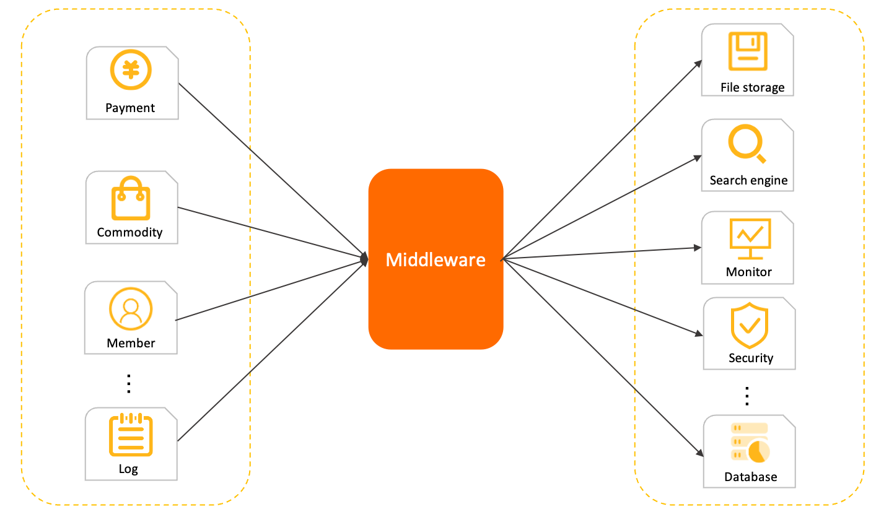

In this model, subsystems are not connected in a tightly coupled manner. The caller needs only to convert a request into an asynchronous event, or message, and send it to the agent. As long as the message is sent, the call is considered complete. The agent delivers the message to the called downstream subsystem and ensures that the task is accomplished. The role of agent is typically assumed by a message middleware.

Asynchronous communication provides the following benefits:

- Simple system topology. Because the caller and callee both communicate only with the agent, the system works in a star structure that is easy to maintain and manage.

- Weak upstream and downstream coupling. Weak coupling enables the system structure to be more flexible. The agent performs buffering and asynchronous recovery. Systems deployed at the upstream and downstream can be upgraded and changed independently without affecting each other.

- Load shifting. Message-oriented agents typically provide a large traffic buffer and powerful traffic shaping capability. This prevents traffic peaks from drowning downstream systems.

Message middleware services have two common transmission models: the point-to-point model and the publish/subscribe model.

Point-to-point model


The point-to-point model, also known as the queue model, has the following characteristics:

- Consumer anonymity: The queue is the only identity used during upstream-downstream communication. Downstream consumers cannot declare an identity when they obtain messages from the queue.
- One-to-one communication: Consumers do not have identities. All consumers in a consumer group consume the subscribed messages together. Each message can be consumed only by one specific consumer. For this reason, this model supports only one-to-one communication.

Publish/subscribe model
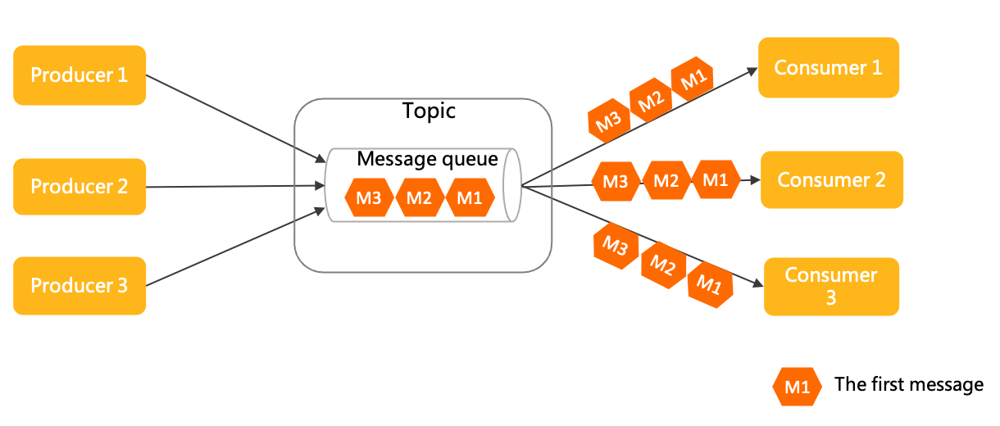

This model has the following characteristics:

- Independent consumption: In this model, consumers use the identity of a consumer group, or a subscription, to receive and consume messages. Consumer groups are independent of each other.
- One-to-many communication: Based on the design of independent identity, this model allows a topic to be subscribed to by multiple consumer groups, each having full access to all the messages. Therefore, the publish/subscribe model supports one-to-many communication.

Comparison between transmission models

The point-to-point model is simpler in structure, while the publish/subscribe model offers better scalability. Apache RocketMQ uses and has the same high scalability as the publish/subscribe model.

---

<a id="domainmodel-02topic"></a>

<!-- source_url: https://rocketmq.apache.org/docs/domainModel/02topic/ -->

<!-- page_index: 9 -->

# Topic

Version: 5.0

> [!NOTE]
> **info**
> To ensure backward compatibility with version 4.x, the above validation feature is disabled by default. It is recommended to enable the validation by using the server parameter "enableTopicMessageTypeCheck".

---

<a id="domainmodel-03messagequeue"></a>

<!-- source_url: https://rocketmq.apache.org/docs/domainModel/03messagequeue/ -->

<!-- page_index: 10 -->

# Message Queue

Version: 5.0

<a id="domainmodel-03messagequeue--message-queue"></a>

# Message Queue

This section describes the definition, model relationship, and internal attributes of message queues in Apache RocketMQ. This topic also provides version compatibility information and usage notes for message queues.

A queue is a container that is used to store and transmit messages in Apache RocketMQ. A queue is the smallest unit of storage for Apache RocketMQ messages.

A topic in Apache RocketMQ consists of multiple queues. This way, queues support horizontal partitioning and streaming storage.

Queues provide the following benefits:

- Ordered Storage Queues are ordered in nature: Messages are stored in the same order in which they are queued. The earliest message is at the start of the queue and the latest message is at the end of the queue. Offsets are used to label the locations and the order of messages in a queue.
- Streaming Operation Semantics: The queue-based storage in Apache RocketMQ allows consumers to read one or more messages from an offset. This helps implement features such as aggregate read and backtrack read. These features are not available in RabbitMQ or ActiveMQ.

The following figure shows the position of queues in the domain model of Apache RocketMQ.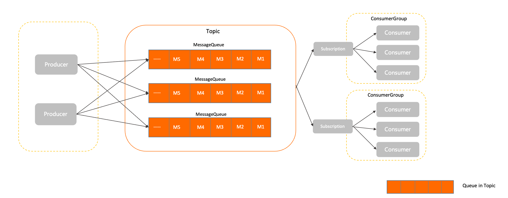

By default, Apache RocketMQ provides reliable message storage. All messages that are successfully delivered are persistently stored in queues. Messages are sent by the producer and received by the consumer client. Each message can be successfully delivered at least once.

The queue model of Apache RocketMQ is similar to the partition model of Kafka. In Apache RocketMQ, a queue is part of a topic. Messages are operated in queues even though they are managed by topic. For example, when a producer sends a message to a specific topic, the message is sent to a queue in the topic.

You can change the number of queues in Apache RocketMQ to scale out or scale in.

Read and write permissions

- Definition: whether data can be read from or written to the current queue.
- Values: defined by the broker. The following describes the enumerations:

  - 6: read and write. Messages can be written to and read from the current queue.
  - 4: read-only. Messages can be read from but not written to the current queue.
  - 2: write-only. Messages can be written to but not read from the current queue.
  - 0: The read or write status is unavailable. The current queue does not allow read or write operations.

- Constraint: The read and write permissions are related to O\&M operations. We recommend that you do not frequently modify the permissions.

Each topic consists of one or more queues that are used to store messages. The number of queues in each topic is related to the message type and the region where the instance resides. The number of queues cannot be changed.

Queue names vary based on the versions of Apache RocketMQ brokers. The following describes the differences:

- Broker versions 3.x and 4.x: A queue name consists of the topic name, broker ID, and queue ID, and is bound to physical nodes.
- Broker versions 5.x: A queue name is a globally unique string that is assigned by the cluster, and is decoupled from physical nodes.

We recommend that you do not construct queue names or bind them to other operations. Otherwise, the queue names may fail to be resolved when the broker is updated.

**Queue number setting**

You can specify the number of queues in Apache RocketMQ when you create or change a topic. We recommend that you configure a small number of queues and avoid adding queues that you do not require.

The following describes the issues that occur due to a large number of queues in a topic:

- **Increase in the volume of metadata in a cluster** Apache RocketMQ collects metrics and monitors data based on queues. A large number of queues may cause the volume of metadata to increase.

- **Overloaded client** Message reads and writes in Apache RocketMQ are performed based on queues. A large number of queues may generate empty polling requests that increase system load.

**Scenarios for adding queues**

- Load balancing of physical nodes

  Queues of each topic in Apache RocketMQ can be distributed to different service nodes. To ensure the load balancing of cluster traffic after the cluster is scaled out, we recommend that you add queues or migrate previous queues to the new service nodes.

- Performance bottleneck issue related to fifo messages

  In Apache RocketMQ broker versions 4.x, fifo messages take effect in only queues. As a result, the concurrency of fifo messages is based on the number of queues. We recommend that you increase the number of queues when a performance bottleneck issue occurs in the system.

---

<a id="domainmodel-04message"></a>

<!-- source_url: https://rocketmq.apache.org/docs/domainModel/04message/ -->

<!-- page_index: 11 -->

# Message

Version: 5.0

<a id="domainmodel-04message--message"></a>

# Message

This section describes the definition, model relationship, internal attributes, and behavior constraints of messages in Apache RocketMQ. This topic also provides usage notes for messages.

A message is the smallest unit of data transmission in Apache RocketMQ. A producer encapsulates the load and extended attributes of business data into messages and sends the messages to a Apache RocketMQ broker. Then, the broker delivers the messages to the consumer based on the relevant semantics.

The characteristics of the message model in Apache RocketMQ are:

- **Immutability**: A message is an event that is generated. After the message is generated, the content of the message does not change. Even if the message passes through a transmission channel, the content of the message remains the same. The messages that consumers obtain are read-only messages.

- **Persistence**: By default, Apache RocketMQ persists messages. The received messages are stored in the storage file of the Apache RocketMQ broker to ensure that the messages can be traced and restored if system failures occur.

The following figure shows the position of messages in the domain model of Apache RocketMQ.

1. Messages are initialized by producers and are sent to the Apache RocketMQ broker.
2. Messages are stored in queues in the order in which the messages are received on the Apache RocketMQ broker.
3. Consumers obtain and consume messages from the Apache RocketMQ broker based on the specified subscriptions.

**System retention attributes**

**Topic name**

- Definition: the name of the topic to which a message belongs. The topic name is globally unique in a cluster. For more information, see [Topic](#domainmodel-02topic).
- Values: obtained from the SDK of the client.

**Message type**

- Definition: the type of a message.
- Values: obtained from the SDK of the client. Apache RocketMQ supports the following message types:

  - Normal: [Normal messages](#featurebehavior-01normalmessage). A normal message does not require special semantics and is not correlated with other normal messages.
  - FIFO: [Fifo messages](#featurebehavior-03fifomessage). Apache RocketMQ uses a message group to determine the order of a specified set of messages. The messages are delivered in the order in which they are sent.
  - Delay: [Delayed messages](#featurebehavior-02delaymessage). You can specify a delay to make messages available to consumers only after the delay has elapsed, instead of delivering messages immediately when they are produced.
  - Transaction: [Transaction messages](#featurebehavior-04transactionmessage). Apache RocketMQ supports distributed transaction messages and ensures transaction consistency of database updates and message calls.

**Message queue**

- Definition: the queue to which a message belongs. For more information, see [Message queues](#domainmodel-03messagequeue).
- Values: specified and populated by the broker.

**Message offset**

- Definition: the location where the current message is stored in the queue. For more information, see [Working mechanism](#featurebehavior-09consumerprogress).
- Values: specified and populated by the broker. Valid values: 0 to Long.Max.

**Message ID**

- Definition: the unique identifier of a message. The ID of each message is globally unique in the cluster.
- Values: automatically generated by the producer client. A message ID is a string of 32 characters that consists of digits and uppercase letters.

**(Optional) Message keys**

- Definition: the list of index keys for messages. You can configure different keys to distinguish between messages and quickly find messages.
- Values: defined by the producer client.

**(Optional) Message tag**

- Definition: the tag that is used to filter messages. Consumers can filter messages by tags and receive only messages that contain specified tags.
- Values: defined by the producer client.
- Constraint: Only one tag can be specified for each message.

**(Optional) Scheduled time**

- Definition: the millisecond-level timestamp that is used when a message triggers delayed delivery in a scheduled time scenario. For more information, see [Delayed messages](#featurebehavior-02delaymessage).
- Values: defined by the message producer.
- Constraint: The maximum duration is 40 days.

**Message sending time**

- Definition: the local millisecond-level timestamp of the producer client when the message is sent.
- Values: populated by the producer client.
- Note: The client time may be different from the broker time. In this case, the message sending time is based on the client time.

**Message store timestamp**

- Definition: the local millisecond-level timestamp of the Apache RocketMQ broker when the message is stored.

  For delay messages and transaction messages, the message retention time is the broker time that is displayed for the consumer when the message takes effect.
- Values: populated by the broker.
- Note: The client time may be different from the broker time. In this case, the message retention time is based on the broker time.

**Retry times**

- Definition: the number of times that the Apache RocketMQ broker redelivers a message after the message fails to be consumed. After each retry, the maximum number of retries is increased by one. For more information, see [Consumption retry](#featurebehavior-10consumerretrypolicy).
- Values: labeled by the broker. The first time that a message is consumed, the number of retries is zero. The first time that a message fails to be consumed, the number of retries is one.

**Custom attributes for messages**

**Custom attributes**

- Definition: the extended information that can be specified by the producer.
- Values: specified by the producer based on key-value pairs from a string.

**Message load**

- Definition: the actual message data of the service message.
- Values: serialized by the producer and transmitted in binary bytes.
- Constraints: see [Parameter limits](#introduction-03limits).

The size of a message cannot exceed the upper limit. If the size of a message exceeds the corresponding upper limit, the message fails to be sent.

The following describes the default limits for messages:

- max size of message: 4 MB

**Overloaded transmission is not recommended for a single message.**

Apache RocketMQ is a messaging middleware that transmits data for business events. If the size of a message is large, the network transmission layer may be overloaded. This affects retries upon errors and throttling. We recommend that you limit the data size of a single message event.

If an overloaded transmission is required in the production environment, we recommend that you split the message based on a fixed size or use the file storage method.

**Immutability of messages**

Messages cannot be modified in Apache RocketMQ broker versions 5.x and the messages that consumers obtain are read-only messages. No strong constraints related to immutability are imposed on versions 3.x and 4.x. We recommend that you re-initialize messages if you want to transmit messages.

- Correct example:


```java
Message m = Consumer.receive(); 
Message m2= MessageBuilder.buildFrom(m); 
Producer.send(m2); 
```

- Incorrect example：


```java
Message m = Consumer.receive(); 
m.update()； 
Producer.send(m); 
```

---

<a id="domainmodel-04producer"></a>

<!-- source_url: https://rocketmq.apache.org/docs/domainModel/04producer/ -->

<!-- page_index: 12 -->

# Producer

Version: 5.0

<a id="domainmodel-04producer--producer"></a>

# Producer

This section describes the concept of producers in Apache RocketMQ. It also describes the role of producers in the messaging model, producer attributes and compatibility, and some usage notes of working with producers.

A producer in Apache RocketMQ is a functional messaging entity that creates messages and sends them to the server.

A producer is typically integrated on the business system and serves to encapsulate data as messages in Apache RocketMQ and send the messages to the server. For more information about messages, see [Messages](#domainmodel-04message).

The following message delivery elements are defined on the producer side:

- Transmission mode: A producer can specify the message transmission mode in an API operation. Apache RocketMQ supports synchronous transmission and asynchronous transmission.
- Batch transmission: A producer can specify batch transmission in an API operation. For example, the number or size of messages sent at a time can be specified.
- Transactional behavior: Apache RocketMQ supports transaction messages. Producers are involved in transaction checks to ensure eventual consistency of transactions. For more information, see [Transactional messages](#featurebehavior-04transactionmessage).

Producers and topics have an n-to-n relationship. A producer can send messages to multiple topics, and a topic can receive messages from multiple producers. This many-to-many relationship facilitates performance scaling and disaster recovery.


The following figure shows the role of producers in the messaging model of Apache RocketMQ.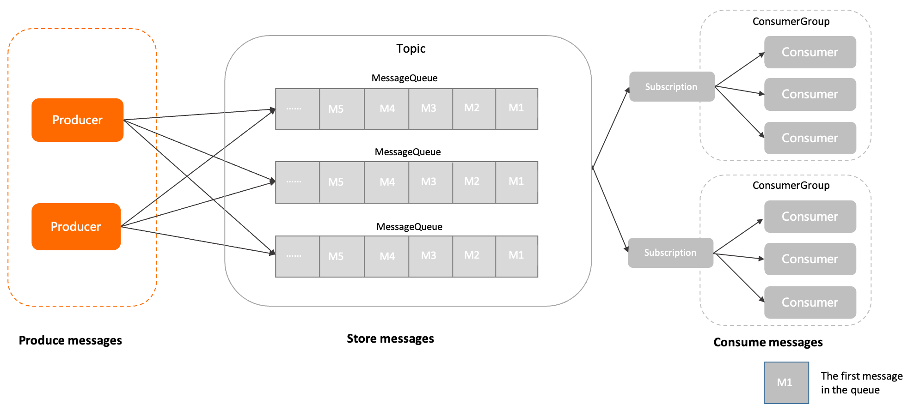

1. The message is initialized by the producer and sent to the Apache RocketMQ server.
2. Messages are stored in the specified queue of the topic in the order in which they arrive at the Apache RocketMQ server.
3. The consumer obtains and consumes messages from the Apache RocketMQ server based on the specified subscription relationship.

**Client ID**

- Definition: the identity of a producer client. This attribute is used to distinguish between different producers. A client ID is globally unique within a cluster.
- Value: The client ID is automatically generated by Apache RocketMQ SDKs. It is mainly used for O\&M purposes such as log viewing and problem locating. The client ID cannot be modified.

**Communication parameters**

- **(Required)** : the endpoint used to connect to the server. This endpoint is used to identify the cluster.

  The access point must be configured in the format. We recommend that you use domain names to avoid using IP addresses to prevent node changes from failing to perform hotspot migration.

- **(Optional)** : the credential used by the client for authentication.

  Transmission is required only when identity recognition and authentication are enabled on the server.

- Request Timeout **(Optional)** : the timeout period of the network request. For more information about the value range and default value, see [Parameter limits](#introduction-03limits).

**Prebound topic list**

- Definition: the list of topics to which a producer of Apache RocketMQ sends messages. Prebound topics provide the following benefits:

  - Transaction messages **(Required)**: The prebound topic list attribute must be specified for transaction messages. In transaction messaging scenarios, when a producer recovers from a fault or is restarted, the producer checks whether a transaction message topic contains uncommitted transaction messages. This prevents latency caused by uncommitted transaction messages in the topic after the producer sends new messages to the topic.
  - Non-transaction messages **(Optional)**: The server checks the access permissions and validity of the destination topics based on the list of prebound topics during producer initialization, instead of performing the check after the application is started. We recommend that you specify the prebound topic list attribute for non-transaction messages.

    If the prebound topic list attribute is not specified for non-transaction messages or destination topics are changed, Apache RocketMQ dynamically checks and identifies destination topics.
- Limit: For transaction messages, prebound topics must be specified and used together with a transaction checker.

**Transaction checker**

- Apache RocketMQ uses a transaction messaging mechanism that requires a producer to implement a transaction checker to ensure eventual consistency of transactions. For more information, see [Transaction messages](#featurebehavior-04transactionmessage).
- When a producer sends transaction messages, a transaction checker must be configured and used together with prebound topics.

**Send retry policy**

Send retry policy specifies how a producer retries the delivery of messages upon a failed message delivery attempt. For more information, see [Message sending retry](#featurebehavior-05sendretrypolicy).

Starting from Apache RocketMQ version 5.x, producers are anonymous, and producer groups are discontinued. For Apache RocketMQ version 3.x and version 4.x, existing producer groups can be discontinued, without affecting your business.

**We recommend that you limit the number of producers on individual processes.**

In Apache RocketMQ, producers and topics provide a many-to-many form of communication. A single producer can send messages to multiple topics. We recommend that you create and initialize the minimum number of producers that your business scenarios require, and reuse as many producers as you can. For example, in a scenario that requires message delivery to multiple topics, you do not need to create a producer for each topic.

**We recommend that you do not create and destroy producers on a regular basis.**

The producers of Apache RocketMQ are underlying resources that can be reused, like the connection pool of a database. You do not need to create producers each time you send messages or destroy the producers after you send messages. If you regularly create and destroy producers, a large number of short connection requests are generated on the broker. This imposes a high level of load on your system.

- Example of correct usage


```java
  Producer p = ProducerBuilder.build(); 
  for (int i =0;i<n;i++) 
  { 
    Message m= MessageBuilder.build(); 
    p.send(m); 
  } 
  p.shutdown(); 
```

- Example of incorrect usage


```java
  for (int i =0;i<n;i++) 
  { 
    Producer p = ProducerBuilder.build(); 
    Message m= MessageBuilder.build(); 
    p.send(m); 
    p.shutdown(); 
  } 
```

---

<a id="domainmodel-07consumergroup"></a>

<!-- source_url: https://rocketmq.apache.org/docs/domainModel/07consumergroup/ -->

<!-- page_index: 13 -->

# Consumer Group

Version: 5.0

<a id="domainmodel-07consumergroup--consumer-group"></a>

# Consumer Group

This section describes the definition, model relationship, internal attributes, and behavior constraints of consumer groups in Apache RocketMQ. This topic also provides version compatibility information and usage notes for consumer groups.

A consumer group is a load balancing group that contains consumers that use the same consumption behaviors in Apache RocketMQ.

Unlike consumers that are running entities, consumer groups are logical resources. Apache RocketMQ initializes multiple consumers in a consumer group to achieve the scaling of consumption performance and high availability disaster recovery.

In a consumer group, consumers consume messages based on the consumption behaviors and load balancing policy that are defined in the group. The following section describes the consumption behaviors that are defined:

- Subscription: Apache RocketMQ manages and traces subscriptions based on consumer groups. For more information, see [Subscriptions](#domainmodel-09subscription).
  aa
- Delivery order: The Apache RocketMQ broker delivers messages to consumers by using ordered delivery or concurrent delivery. You can configure the delivery method in the consumer group. For more information, see [fifo messages](#featurebehavior-03fifomessage).
- Consumption retry policy: the retry policy that is used when a consumer fails to consume a message. The policy includes the number of retries and the setting of dead-letter queues. For more information, see [Consumption retry](#featurebehavior-10consumerretrypolicy).

The following figure shows the position of consumer groups in the domain model of Apache RocketMQ.

1. The message is initialized by the producer and sent to the Apache RocketMQ server.
2. Messages are stored in the specified queue of the topic in the order in which they arrive at the Apache RocketMQ server.
3. The consumer obtains and consumes messages from the Apache RocketMQ server based on the specified subscription relationship.

**Consumer group name**

- Definition: the name of a consumer group. Consumer group names are used to distinguish between consumer groups. Consumer group names are globally unique in a cluster.
- Values: created and configured by users. For more information, see [Parameter limits](#introduction-03limits).

**Delivery order**

- Definition: the order in which Apache RocketMQ delivers messages to a consumer client.

  Apache RocketMQ supports ordered delivery and concurrent delivery based on different consumption scenarios. For more information, see [Fifo messages](#featurebehavior-03fifomessage).

- Values: The default delivery method is concurrent delivery.

**Consumption retry policy**

- Definition: the retry policy that is used when a consumer fails to consume a message. If a consumer fails to consume a message, the system re-delivers the failed message to the consumer for re-consumption based on the policy. For more information, see [Consumption retry](#featurebehavior-10consumerretrypolicy).
- Values:A consumption retry policy contains the following items:

  - Maximum retries: the maximum number of times that a message can be re-delivered. If a message fails to be consumed and the maximum number of retries is exceeded, the message is delivered to the dead-letter queue or is discarded.
  - Retry interval: the interval between which the Apache RocketMQ broker re-delivers a failed message.

For more information about the valid values and default values of maximum retries and retry intervals, see [Parameter limits](#introduction-03limits).

- Constraint: Retry interval is available only for push consumers.

**Subscription**

- Definition: the set of subscription relationships that are associated with the current consumer group. A subscription includes the topics to which the consumers subscribe and the message filter rules that are used by consumers. For more information, see [Subscriptions](#domainmodel-09subscription).

Consumers dynamically register subscriptions for consumer groups. The Apache RocketMQ broker persists subscriptions and matches the subscriptions to the consumption progress of messages.

In the Apache RocketMQ domain model, consumer management is implemented through consumer grouping, and consumers in the same group share messages for consumption. Therefore, to ensure the normal load and consumption of messages in a group, Apache RocketMQ require all consumers in the same group to keep the following consumption behaviors consistent:

- **Delivery Order**
- **Consumption retry policy**

As described in Behavior Constraints, the delivery order and consumption retry policy of all consumers in the same group need to be consistent.

- Apache RocketMQ server version 5.x: The consumption behavior of the preceding consumers is obtained from the associated consumer groups. Therefore, the consumption behavior of all consumers in the same group must be consistent, and the client does not need to pay attention to it.
- Apache RocketMQ server version 3.x/ 4.x history: The preceding consumption logic is defined by the consumer client interface. Therefore, you must ensure that the consumption behavior of consumers in the same group is consistent when you set the consumer client.

If you use the Apache RocketMQ server version 5.x and the client uses the previous version SDK, the consumer's consumption logic is subject to the settings of the consumer client interface.

**Create consumer groups based on your business requirements**

In Apache RocketMQ, consumers and topics are in a many-to-many mapping relationship. We recommend that you take note of the following rules before you create consumer groups:

- Consistent message delivery order: The message delivery order must be consistent for all consumers in a consumer group. The delivery method is either ordered delivery or concurrent delivery. We recommend that you do not use the same consumer group for different business scenarios.
- Consistent business type: A consumer group corresponds to a topic. Different business domains have different requirements for message consumption, such as message filter rules and consumption retry policies. We recommend that you use different consumer groups in different business domains. We also recommend that you add up to 10 topics in a consumer group.

**Avoid using automated mechanisms to manage consumer groups**

In the Apache RocketMQ architecture, consumer groups are logical resources that are used to manage the status of consumers. Each consumer group is associated with various data, such as consumption status, accumulated messages, observable metrics, and monitoring data. We recommend that you strictly manage your consumer groups. Proceed with caution when you add, delete, modify, or query consumption groups.

Apache RocketMQ provides the automatic consumer group creation feature. However, if you enable this feature in production environments, a large number of consumer groups may be created. A large number of consumer groups can be difficult to manage and reclaim and results in the waste of system resources. Therefore, we recommend that you use this feature in only test environments.

---

<a id="domainmodel-08consumer"></a>

<!-- source_url: https://rocketmq.apache.org/docs/domainModel/08consumer/ -->

<!-- page_index: 14 -->

# Consumer

Version: 5.0

<a id="domainmodel-08consumer--consumer"></a>

# Consumer

This section describes the definition, model relationship, internal attributes, and behavior constraints for consumers in Apache RocketMQ. This topic also provides version compatibility information and usage notes for consumers.

A consumer is an entity that receives and processes messages in Apache RocketMQ.

Consumers are usually integrated in business systems. They obtain messages from Apache RocketMQ brokers and convert the messages into information that can be perceived and processed by business logic.

The following items determine consumer behavior:

- Consumer identity: A consumer must be associated with a consumer group to obtain behavior settings and consumption status.
- Consumer type: Apache RocketMQ provides a variety of consumer types for different development scenarios, including push consumers, simple consumers and pull consumers. For more information, see [Consumer types](#featurebehavior-06consumertype).
- Local settings for consumers: These settings specify how consumer clients run based on the consumer type. For example, you can configure the number of threads and concurrency settings on consumers to achieve different transmission effects.

The following figure shows how consumers are positioned in the domain model of Apache RocketMQ.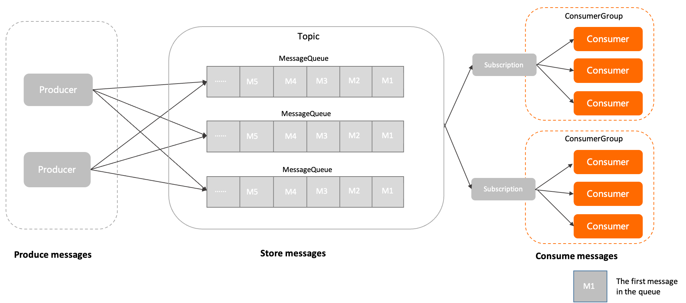

1. The message is initialized by the producer and sent to the Apache RocketMQ server.
2. Messages are stored in the specified queue of the topic in the order in which they arrive at the Apache RocketMQ server.
3. The consumer obtains and consumes messages from the Apache RocketMQ server based on the specified subscription relationship.

**Consumer group name**

- Definition: the name of the consumer group associated with the current consumer. Consumers inherit their behavior from the consumer groups. For more information, see [Consumer groups](#domainmodel-07consumergroup).
- Values: Consumer groups are the logical resources of Apache RocketMQ{#product-name}

  . You must create consumer groups by using the console or calling API operations in advance. For more information about the limits on this operation, see[Parameter limits](#introduction-03limits).

**Client ID**

- Definition: the identity of a consumer client. This attribute is used to distinguish between different consumers. The value must be unique within a cluster.
- Values: The client ID is automatically generated by the Apache RocketMQ SDK. It is mainly used for O\&M purposes such as log viewing and problem locating. The client ID cannot be modified.

**Communication parameters**

- Endpoints **(Required)** : the endpoint used to connect to the server. This endpoint is used to identify the cluster.

  The access point must be configured in the format. We recommend that you use domain names to avoid using IP addresses to prevent node changes from failing to perform hotspot migration.

- Credential **(Optional)** : the credential used by the client for authentication.

  Transmission is required only when identity recognition and authentication are enabled on the server.

- Request Timeout **(Optional)** : the timeout period of the network request. For more information about the value range and default value, see [Parameter limits](#introduction-03limits).

**Pre-bound subscription list**

- Definition: the subscription list of the specified consumer. The Apache RocketMQ broker can use the pre-bound subscription list to verify the permissions and validity of the subscribed topic during consumer initialization instead of after the application is started.
- Values: We recommend that you specify the subscription or the list of subscribed topics during consumer initialization. If the subscription is not specified or the subscribed topics are changed, Apache RocketMQ dynamically verifies the topics.

**Message listener**

- Definition: the listener that a consumer uses to invoke the message consumption logic after Apache RocketMQ broker pushes a message to the consumer.
- Values: The value of a message listener is configured on the consumer client.
- Constraints: When you consume messages as a push consumer, you must configure the message listener on the consumer client. For more information about consumer types, see [Consumer types](#featurebehavior-06consumertype).

In the Apache RocketMQ domain model, consumer management is implemented through consumer grouping, and consumers in the same group share messages for consumption. Therefore, to ensure the normal load and consumption of messages in a group, Apache RocketMQ require all consumers in the same group to keep the following consumption behaviors consistent:

- **Delivery Order**
- **Consumption retry policy**

As described in Behavior Constraints, the delivery order and consumption retry policy of all consumers in the same group need to be consistent.

- Apache RocketMQ server version 5.x: The consumption behavior of the preceding consumers is obtained from the associated consumer groups. Therefore, the consumption behavior of all consumers in the same group must be consistent, and the client does not need to pay attention to it.
- Apache RocketMQ server version 3.x/ 4.x history: The preceding consumption logic is defined by the consumer client interface. Therefore, you must ensure that the consumption behavior of consumers in the same group is consistent when you set the consumer client.

If you use the Apache RocketMQ server version 5.x and the client uses the previous version SDK, the consumer's consumption logic is subject to the settings of the consumer client interface.

**We recommend that you limit the number of consumers on individual processes.**

The consumers of Apache RocketMQ support the non-blocking transmission mode at the communication protocol level. The non-blocking transmission mode has higher communication efficiency and supports concurrent access by multiple threads. Therefore, in most scenarios, only one consumer needs to be initialized for a consumer group in a single process. Avoid initializing multiple consumers with the same configurations during the development phase.

**We recommend that you do not create and destroy consumers on a regular basis.**

The consumers of Apache RocketMQ are underlying resources that can be reused, like the connection pool of a database. You do not need to create consumers each time you receive messages or destroy the consumers after you consume messages. If you regularly create and destroy consumers, a large number of short connection requests are generated on the broker. This imposes a high level of load on your system.

- Correct example


```java
Consumer c = ConsumerBuilder.build(); 
for (int i =0;i<n;i++) 
{ 
  Message m= c.receive(); 
  //process message 
} 
c.shutdown(); 
```

- Incorrect example


```java
for (int i =0;i<n;i++) 
{ 
  Consumer c = ConsumerBuilder.build(); 
  Message m= c.receive(); 
  //process message 
  c.shutdown(); 
} 
```

---

<a id="domainmodel-09subscription"></a>

<!-- source_url: https://rocketmq.apache.org/docs/domainModel/09subscription/ -->

<!-- page_index: 15 -->

# Subscription

Version: 5.0

<a id="domainmodel-09subscription--subscription"></a>

# Subscription

This section describes the definition, model relationship, internal attributes, and usage notes for subscriptions in Apache RocketMQ.

A subscription is the rule and status settings for consumers to obtain and process messages in Apache RocketMQ.

Subscriptions are dynamically registered by consumer groups with brokers. Messages are then matched and consumed based on the filter rules defined by subscriptions.

By configuring subscriptions, you can control the following messaging behaviors:

- Message filter rules: These rules are used to define which messages in a topic are consumed by a consumer. By configuring message filter rules, consumers can effectively obtain messages that they want and specify message receiving ranges based on different business scenarios. For more information, see [Message filtering](#featurebehavior-07messagefilter).
- Consumption status: By default, the Apache RocketMQ broker provides persistent subscriptions. In other words, after a consumer group subscribes to a broker, consumers in the group can continue consuming messages from where the consumers left off after they reconnect.

The subscriptions of Apache RocketMQ are designed based on consumer groups and topics. Therefore, a subscription refers to the subscription of a specified consumer group to a topic. The following describes the rules for determining a subscription:

- One topic to many subscribersThe following figure shows two consumer groups (Group A and Group B) subscribed to Topic A. These two subscriptions are independent of each other and can be defined separately.
  
- One subscriber to multiple topicsThe following figure shows a consumer group (Group A) subscribed to two topics: Topic A and Topic B. Consumers in Group A have two separate subscriptions to Topic A and Topic B. The two subscriptions are independent of each other and can be defined separately.
  

The following figure shows the position of subscriptions in the domain model of Apache RocketMQ.

1. The message is initialized by the producer and sent to the Apache RocketMQ server.
2. Messages are stored in the specified queue of the topic in the order in which they arrive at the Apache RocketMQ server.
3. The consumer obtains and consumes messages from the Apache RocketMQ server based on the specified subscription relationship.

**Filter types**

- Definition: the type of a message filter rule. After a message filter rule is set for a subscription, the system matches the messages in a topic based on the filter rule. Only the messages that meet the conditions are delivered to consumers. This feature helps you classify messages sent to consumers based on your requirements.
- Values:

  - Tag filter: filters and matches the full text based on tag strings.
  - SQL92 filter: filters and matches message attributes based on SQL syntax.

**Filter expressions**

- Definition: the expression of a custom filter rule.
- Values: For more information, see [Syntax for filter expressions](#featurebehavior-07messagefilter).

**Subscription consistency**

Apache RocketMQ manages subscriptions based on consumer groups. Therefore, consumers in the same consumer group must maintain the same consumption logic. Otherwise, consumption conflicts occur, which in turn causes some messages to be incorrectly consumed.

- Correct example


```java
//Consumer c1 
Consumer c1 = ConsumerBuilder.build(groupA); 
c1.subscribe(topicA,"TagA"); 
//Consumer c2 
Consumer c2 = ConsumerBuilder.build(groupA); 
c2.subscribe(topicA,"TagA"); 
```

- Incorrect example


```java
//Consumer c1 
Consumer c1 = ConsumerBuilder.build(groupA); 
c1.subscribe(topicA,"TagA"); 
//Consumer c2Consumer  
c2 = ConsumerBuilder.build(groupA); 
c2.subscribe(topicA,"TagB"); 
```

**Do not frequently modify subscriptions.**

In Apache RocketMQ, subscriptions are associated with metadata and configurations such as filter rules and consumption progress. The system must also ensure that the consumption behavior, consumption logic, and load policy of all consumers in the consumer group are consistent. These factors result in a complex web of relationships that need to be managed. Therefore, we recommend that you do not regularly modify subscriptions to change the business logic in the production environment. Otherwise, the client constantly needs to adjust its load distribution, which causes message reception problems.

---

<a id="featurebehavior-01normalmessage"></a>

<!-- source_url: https://rocketmq.apache.org/docs/featureBehavior/01normalmessage/ -->

<!-- page_index: 16 -->

# Normal Message

Version: 5.0

<a id="featurebehavior-01normalmessage--normal-message"></a>

# Normal Message

Normal messages are messages that have no special features in Apache RocketMQ. They are different from featured messages such as fifo messages, delay messages, and transaction messages. This topic describes the scenarios, working mechanism, usage, and usage notes of normal messages.

Normal messages are generally used in microservice decoupling, data integration, and event-driven scenarios. Most of these scenarios have low or no requirements on timing or the sequence for processing messages other than reliable transmission channels.

**Scenario 1: Asynchronous decoupling of microservices**


The preceding figure shows an online e-commerce transaction scenario. In this scenario, the upstream order system encapsulates order placement and payment as an independent normal message and sends the message to the Apache RocketMQ broker. Downstream systems then subscribe to the message from the broker on demand and process tasks based on the local consumption logic. Messages are independent of each other and do not need to be associated.

**Scenario 2: Data integration transmission**


The preceding figure uses offline log collection as an example. An instrumentation component is used to collect operations logs from frontend applications and forward the logs to Apache RocketMQ. Each message is a piece of log data that requires no processing from Apache RocketMQ. Apache RocketMQ needs only to send the log data to the downstream storage and analysis systems. The backend applications are responsible for subsequent processing tasks.

**Definition of normal messages**

Normal messages are messages with basic functions in Apache RocketMQ. Normal messages support asynchronous decoupling and communication between producers and consumers.


**Lifecycle of a normal message**

- Initialized: The message is built and initialized by the producer and is ready to be sent to a broker.
- Ready: The message is sent to the broker, and is visible to the consumer and available for consumption.
- Inflight: The message is obtained by the consumer and processed based on the local business logic of the consumer.

  In this process, the broker waits for the consumer to complete the consumption and submit the consumption result. If no response is received from the consumer in a certain period of time, Apache RocketMQ retries the message. For more information, see [Consumption retry](#featurebehavior-10consumerretrypolicy).
- Acked: The consumer completes consumption and submits the consumption result to the broker. The broker marks whether the current message is successfully consumed.

  By default, Apache RocketMQ retains all messages. When the consumption result is submitted, the message data is logically marked as consumed instead of being deleted immediately. Therefore, the consumer can backtrack the message for re-consumption before it is deleted due to the expiration of the retention period or insufficient storage space.
- Deleted: When the retention period of the message expires or the storage space is insufficient, Apache RocketMQ deletes the earliest saved message from the physical file in a rolling manner. For more information, see [Message storage and cleanup](#featurebehavior-11messagestorepolicy).

Normal messages support only topics whose MessageType is Normal.

**Create topic**

For creating topics in Apache RocketMQ 5.0, it is recommended to use the mqadmin tool. However, it is worth noting that message type needs to be added as a property parameter. Here is an example:

```shell
sh mqadmin updateTopic -n <nameserver_address> -t <topic_name> -c <cluster_name> -a +message.type=NORMAL 
```

**Send messages**

You can set index keys and filter tags to filter or search for normal messages. The following sample code shows how to send and receive normal messages in Java:

```java
// Send a normal message.  
  MessageBuilder messageBuilder = new MessageBuilder(); 
  Message message = messageBuilder.setTopic("topic") 
  // Specify the message index key so that you can accurately search for the message by using a keyword. 
  .setKeys("messageKey") 
  // Specify the message tag so that the consumer can filter the message based on the specified tag. 
  .setTag("messageTag") 
  // Message body.  
  .setBody("messageBody".getBytes()) 
  .build(); 
  try { 
    // Send the message. You need to pay attention to the sending result and capture exceptions such as failures.  
    SendReceipt sendReceipt = producer.send(message); 
    System.out.println(sendReceipt.getMessageId()); 
  } catch (ClientException e) { 
      e.printStackTrace(); 
  } 
  // Consumption example 1: When you consume a normal message as a push consumer, you need only to process the message in the message listener.  
  MessageListener messageListener = new MessageListener() { 
      @Override 
      public ConsumeResult consume(MessageView messageView) { 
          System.out.println(messageView); 
          // Return the status based on the consumption result.  
          return ConsumeResult.SUCCESS; 
      } 
  }; 
  // Consumption example 2: When you consume a normal message as a simple consumer, you must obtain and consume the message, and submit the consumption result.  
  List<MessageView> messageViewList = null; 
  try { 
      messageViewList = simpleConsumer.receive(10, Duration.ofSeconds(30)); 
      messageViewList.forEach(messageView -> { 
          System.out.println(messageView); 
          // After consumption is complete, you must invoke ACK to submit the consumption result.  
          try { 
              simpleConsumer.ack(messageView); 
          } catch (ClientException e) { 
              e.printStackTrace(); 
          } 
      }); 
      } catch (ClientException e) { 
      // If the pull fails due to system traffic throttling or other reasons, you must re-initiate the request to obtain the message.  
      e.printStackTrace(); 
  } 
```

**Set a globally unique index key to facilitate troubleshooting**

You can set custom index keys, which are message keys, in Apache RocketMQ. When you query and trace messages, the index key can help you find these messages efficiently and accurately.

Therefore, when you send messages, we recommend that you use the unique information of the service, such as order ID and user ID, as an index. This helps you find messages quickly in the future.

---

<a id="featurebehavior-02delaymessage"></a>

<!-- source_url: https://rocketmq.apache.org/docs/featureBehavior/02delaymessage/ -->

<!-- page_index: 17 -->

# Delay Message

Version: 5.0

> [!NOTE]
> Scheduled message and delay message are essentially the same. Both of them deliver messages to consumers at a fixed time according to the timing time set by the message. Therefore, delay messages are used in the following sections.

---

<a id="featurebehavior-03fifomessage"></a>

<!-- source_url: https://rocketmq.apache.org/docs/featureBehavior/03fifomessage/ -->

<!-- page_index: 18 -->

# Ordered Message

Version: 5.0

> [!NOTE]
> - When a PushConsumer consumer consumes messages, Apache RocketMQ ensures that messages are delivered to the consumer one by one in the order in which the messages are stored.
> - When a SimpleConsumer consumer consumes messages, the consumer may pull multiple messages at a time, and the business application must have a solution to implement the message consumption order. For more information about consumer types, see [Consumer types](#featurebehavior-06consumertype).

---

<a id="featurebehavior-04transactionmessage"></a>

<!-- source_url: https://rocketmq.apache.org/docs/featureBehavior/04transactionmessage/ -->

<!-- page_index: 19 -->

# Transaction Message

Version: 5.0

<a id="featurebehavior-04transactionmessage--transaction-message"></a>

# Transaction Message

Transactional messages are an advanced message type in Apache RocketMQ. This topic describes the application scenarios, working mechanism, limits, usage, and usage notes of transactional messages.

**Distributed transactions**

When a core business logic is executed in a distributed system, multiple downstream businesses are invoked to process the logic simultaneously. Therefore, ensuring the consistency of the execution results between the core business and the downstream businesses is the biggest challenge that needs to be solved for distributed transactions.
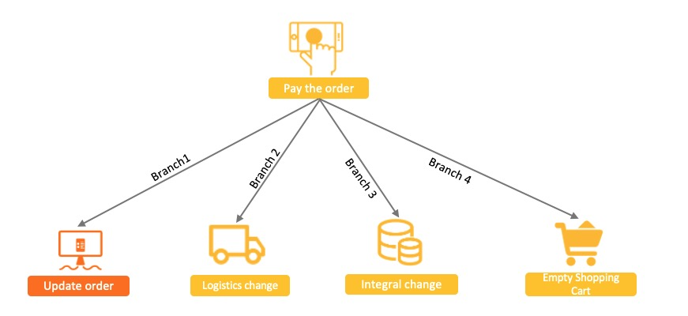

In an e-commerce scenario, when a user places an order, downstream systems are triggered to make changes accordingly. For example, the logistics system must initiate shipment, the credit system must update the user's credit points, and the shopping cart system must clear the user's shopping cart. The processing branches include:

- The order system changes the order status from unpaid to paid.
- The logistics system adds a to-be-shipped record and creates an order logistics record.
- The credit system updates the credit points of the user.
- The shopping cart system clears the shopping cart and updates the user's shopping cart records.

**Traditional XA-based solution: poor performance**

The typical method used to ensure result consistency among the branches is by using a distributed transaction system based on the eXtended Architecture (XA) protocol. The system encapsulates the four call branches into a large transaction that contains four independent transaction branches. While this solution can ensure result consistency, a large number of resources need to be locked to achieve this. This number increases with the number of branches, which results in low system concurrency. As more downstream branches are added, the system performance deteriorates.

**Normal message-based solution: poor result consistency**

A simpler solution based on the XA solution treats the change of the order system as a local transaction and the changes of downstream systems as downstream tasks. Transaction branches are treated as normal messages with added order table transactions. This solution processes messages asynchronously to shorten the processing lifecycle and improves system concurrency. 

However, this solution is prone to deliver inconsistent results between the core transaction and transaction branches, for example:

- The message is sent, but the order is not executed. As a result, the whole transaction needs to be rolled back.
- The order is executed, but the message is not sent. In this case, the message has to be resent for consumption.
- Timeout errors cannot be reliably detected, which makes it difficult to determine whether the order needs to be rolled back or an order change needs to be committed.

**Distributed transaction message-based solution of Apache RocketMQ: thorough consistency**

The reason why consistency cannot be guaranteed in the preceding solution is that normal messages do not have the commit, rollback, and unified coordination capabilities of standalone database transactions.

The transactional message feature of Apache RocketMQ supports two-phase commit on the basis of the normal message-based solution. The feature combines two-phase commit and local transaction to achieve global consistency of commit results.
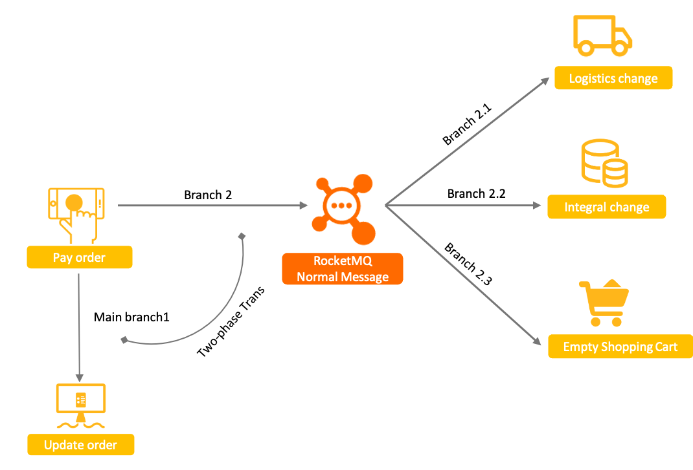

The transactional message solution of Apache RocketMQ is powerful, scalable, and easy to develop. For more information about the working mechanism and process of transactional message, see Working mechanism。

**Definition**

Transactional messages are an advanced message type provided by Apache RocketMQ to ensure the ultimate consistency between message production and local transaction.
**Processing workflow**

The following figure shows the interaction process of transactional messages.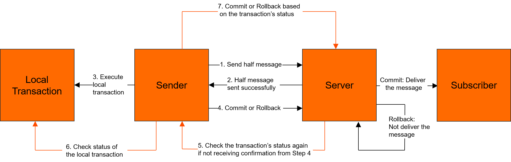

1. The producer sends a message to a Apache RocketMQ broker.
2. The Apache RocketMQ broker saves the message and marks it as not ready for delivery. A message in this state is called a half message. After that, the broker sends an acknowledgment message (ACK) back to the producer.
3. The producer executes the local transaction.
4. The producer sends a second ACK to the broker to submit the execution result of the local transaction. The execution result may be Commit or Rollback.

   - If the status of the message received by the broker is Commit, the broker marks the half message as deliverable and delivers the message to the consumer.
   - If the status of the message received by the broker is Rollback, the broker rolls back the transaction and does not deliver the half message to the consumer.
5.
> [!NOTE]
> If the network is disconnected or the producer application is restarted and the broker does not receive a second ACK or the status of the half message is Unknown, the broker waits a period of time and sends a request to a producer in the producer cluster to query the status of the half message.
> For more information about the length of the period and the maximum number of queries, see[Parameter limits](#introduction-03limits).

6. After the producer receives the request, the producer checks the execution result of the local transaction that corresponds to the half message.
7. The producer sends another ACK to the Apache RocketMQ broker based on the execution result of the local transaction. Then, the broker processes the half message by following Step 4.

**Lifecycle of a transactional message**
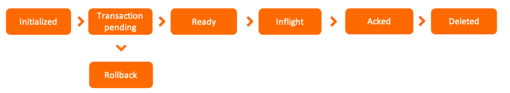

- Initialized: The message is built and initialized by the producer and is ready to be sent to a broker.
- Transaction pending: The half message is sent to the broker. However, it is not immediately written to a disk for permanent storage. Instead, it is stored in a transaction storage system. The message is not committed until the system verifies that the second phase of the local transaction is successful. During this period, the message is invisible to downstream consumers.
- Rollback: In the second phase, if the execution result of the transaction is rollback, the broker rolls back the half message and terminates the workflow.
- Ready: The message is sent to the broker, and is visible to the consumer and available for consumption.
- Inflight: The message is obtained by the consumer and processed based on the local business logic of the consumer.

  In this process, the broker waits for the consumer to complete the consumption and submit the consumption result. If no response is received from the consumer in a certain period of time, Apache RocketMQ retries the message. For more information, see [Consumption retry](#featurebehavior-10consumerretrypolicy).
- Acked: The consumer completes consumption and submits the consumption result to the broker. The broker marks whether the current message is successfully consumed.

  By default, Apache RocketMQ retains all messages. When the consumption result is submitted, the message data is logically marked as consumed instead of being deleted immediately. Therefore, the consumer can backtrack the message for re-consumption before it is deleted due to the expiration of the retention period or insufficient storage space.
- Deleted: When the retention period of the message expires or the storage space is insufficient, Apache RocketMQ deletes the earliest saved message from the physical file in a rolling manner. For more information, see [Message storage and cleanup](#featurebehavior-11messagestorepolicy).

**Message type consistency**

Transactional messages can only be used in topics whose MessageType is Transaction.

**Transaction-centered consumption**

The transactional message feature of Apache RocketMQ guarantees that the same transaction can be processed between the local core transaction and downstream branches. However, it does not guarantee the consistency between the message consumption result and the upstream execution result. Therefore, downstream businesses must ensure that messages are processed correctly. We recommend that consumers [Consumption retry](#featurebehavior-10consumerretrypolicy) properly to ensure that the message is processed correctly in the event of failure.

**Intermediate state visibility**

The transactional message feature of Apache RocketMQ ensures only final consistency, which means that status consistency is not guaranteed between an upstream transaction and a downstream branch before a message is delivered to a consumer. Therefore, transactional messages are only suitable for transaction scenarios that accept asynchronous execution.

**Transaction timeout mechanism**

Apache RocketMQ implements a timeout mechanism for transactional messages. Upon receiving a half message, if the broker cannot determine whether to commit or roll back the transaction after a certain period of time, the broker rolls back the message by default. For more information about the timeout period, see[Parameter limits](#introduction-03limits).

**Create topic**

For creating topics in Apache RocketMQ 5.0, it is recommended to use the mqadmin tool. However, it is worth noting that message type needs to be added as a property parameter. Here is an example:

```shell
sh mqadmin updateTopic -n <nameserver_address> -t <topic_name> -c <cluster_name> -a +message.type=Transaction 
```

**Send messages**

Sending transactional messages is different from sending normal messages in the following aspects:

- Before sending transactional messages, you must enable the transaction checker and associate it with local transaction execution.
- When creating a producer, you must set the transaction checker and bind the list of topics of messages to be sent. These actions enable the built-in transaction checker of the client to restore topics in the event of exceptions.

**Create TRANSACTION Topic**

*NORMAL Topic doesn't support delivery TRANSACTION message, you'll get an error if you send a TRANSACTION message to a NORMAL topic.*

```bash
./bin/mqadmin updatetopic -n localhost:9876 -t TestTopic -c DefaultCluster -a +message.type=TRANSACTION 
```

- -c the cluster name
- -t the topic name
- -n the address of the nameserver
- **-a extra attributes，we add an `message.type` attribute with value `TRANSACTION` to support delivery TRANSACTION message.**

The following example uses Java as an example to show you how to send transactional messages:

```java
    // The demo is used to simulate the order table query service to check whether the order transaction is submitted.  
    private static boolean checkOrderById(String orderId) { 
        return true; 
    } 
    // The demo is used to simulate the execution result of a local transaction.  
    private static boolean doLocalTransaction() { 
        return true; 
    } 
    public static void main(String[] args) throws ClientException { 
        ClientServiceProvider provider = new ClientServiceProvider(); 
        MessageBuilder messageBuilder = new MessageBuilder(); 
        // Build a transaction producer: The transactional message requires the producer to build a transaction checker to check the intermediate status of an exceptional half message.  
        Producer producer = provider.newProducerBuilder() 
                .setTransactionChecker(messageView -> { 
                    /** 
                     * The transaction checker checks whether the local transaction is correctly committed or rolled back based on the business ID, for example, an order ID.  
                     * If this order is found in the order table, the order insertion action is committed correctly by the local transaction. If no order is found in the order table, the local transaction has been rolled back.  
                     */ 
                    final String orderId = messageView.getProperties().get("OrderId"); 
                    if (Strings.isNullOrEmpty(orderId)) { 
                        // Message error. Rollback is returned.  
                        return TransactionResolution.ROLLBACK; 
                    } 
                    return checkOrderById(orderId) ? TransactionResolution.COMMIT : TransactionResolution.ROLLBACK; 
                }) 
                .build(); 
        // Create a transaction branch.  
        final Transaction transaction; 
        try { 
            transaction = producer.beginTransaction(); 
        } catch (ClientException e) { 
            e.printStackTrace(); 
            // If the transaction branch fails to be created, the transaction is terminated.  
            return; 
        } 
        Message message = messageBuilder.setTopic("topic") 
                // Specify the message index key so that the system can use a keyword to accurately locate the message.  
                .setKeys("messageKey") 
                // Specify the message tag so that consumers can use the tag to filter the message.  
                .setTag("messageTag") 
                // For transactional messages, a unique ID associated with the local transaction is created to verify the query of the local transaction status.  
                .addProperty("OrderId", "xxx") 
                // Message body.  
                .setBody("messageBody".getBytes()) 
                .build(); 
        // Send a half message. 
        final SendReceipt sendReceipt; 
        try { 
            sendReceipt = producer.send(message, transaction); 
        } catch (ClientException e) { 
            // If the half message fails to be sent, the transaction can be terminated and the message is rolled back.  
            return; 
        } 
        /** 
         * Execute the local transaction and check the execution result.  
         * 1. If the result is Commit, deliver the message.  
         * 2. If the result is Rollback, roll back the message.  
         * 3. If an unknown exception occurs, no action is performed until a response is obtained from a half message status query.  
         * 
         */ 
        boolean localTransactionOk = doLocalTransaction(); 
        if (localTransactionOk) { 
            try { 
                transaction.commit(); 
            } catch (ClientException e) { 
                // You can determine whether to retry the message based on your business requirements. If you do not want to retry the message, you can use the half message status query to submit the transaction status.  
                e.printStackTrace(); 
            } 
        } else { 
            try { 
                transaction.rollback(); 
            } catch (ClientException e) { 
                // We recommend that you record the exception information. This enables you to submit the transaction status based on the half message status query in the event of a rollback exception. Otherwise, you have to retry the message.  
                e.printStackTrace(); 
            } 
        } 
    } 
```

**Avoid timeout of a large number of half messages.**

Apache RocketMQ allows you to check the transaction in the event of an exception during a transaction commit to ensure transaction consistency. However, producers should try to avoid local transactions returning unknown results. A large number of transaction checks can cause system performance to deteriorate and delay transaction processing.

**Properly handle transactions in progress.**

During a half message status query, do not return Rollback or Commit for a transaction in progress. Instead, keep the Unknown status for the transaction.

Generally, the reason why the transaction is in progress is that the transaction execution is slow and the query is frequent. Two solutions are recommended:

- Set the interval for the first query to a larger value. However, this may cause a large delay for messages that depend on the query result.
- Make the program correctly identify ongoing transactions.

---

<a id="featurebehavior-05sendretrypolicy"></a>

<!-- source_url: https://rocketmq.apache.org/docs/featureBehavior/05sendretrypolicy/ -->

<!-- page_index: 20 -->

# Sending Retry and Throttling Policy

Version: 5.0

> [!NOTE]
> For transaction messages, only [transparent retries](https://github.com/grpc/proposal/blob/master/A6-client-retries.md#transparent-retries) are performed. No retries are performed in network exception or timeout scenarios.

---

<a id="featurebehavior-06consumertype"></a>

<!-- source_url: https://rocketmq.apache.org/docs/featureBehavior/06consumertype/ -->

<!-- page_index: 21 -->

# Consumer Types

Version: 5.0

> [!NOTE]
> **info**
> PullConsumer is only recommended for integration in a stream processing framework. PushConsumer and simpleConsumer could satisfy most scenarios.
>
> You can switch between the PushConsumer and SimpleConsumer based on your business scenarios. When you switch to a different consumer type, the usage of existing resources and existing business processing tasks in Apache RocketMQ are not affected.

---

<a id="featurebehavior-07messagefilter"></a>

<!-- source_url: https://rocketmq.apache.org/docs/featureBehavior/07messagefilter/ -->

<!-- page_index: 22 -->

# Message Filtering

Version: 5.0

> [!NOTE]
> **info**
> Because tags are a system attribute, tag-based filtering is a type of attribute-based SQL filtering. In SQL syntaxes, the tag attribute is represented by TAGS.

---

<a id="featurebehavior-08consumerloadbalance"></a>

<!-- source_url: https://rocketmq.apache.org/docs/featureBehavior/08consumerloadbalance/ -->

<!-- page_index: 23 -->

# Consumer Load Balancing

Version: 5.0

> [!NOTE]
> Message-based load balancing ensures that messages in a queue can be concurrently processed by multiple consumers. However, messages are randomly sent to consumers, which means that you cannot specify how messages are allocated to consumers.

---

<a id="featurebehavior-09consumerprogress"></a>

<!-- source_url: https://rocketmq.apache.org/docs/featureBehavior/09consumerprogress/ -->

<!-- page_index: 24 -->

# Consumer Progress Management

Version: 5.0

> [!NOTE]
> **info**
> Consumer offsets are saved to and restored from Apache RocketMQ servers, and are not related to any specific consumer. Therefore, Apache RocketMQ can restore consumer progress across different consumers.

---

<a id="featurebehavior-10consumerretrypolicy"></a>

<!-- source_url: https://rocketmq.apache.org/docs/featureBehavior/10consumerretrypolicy/ -->

<!-- page_index: 25 -->

# Consumption Retry

Version: 5.0

> [!NOTE]
> **info**
> If the number of retries exceeds 16, the interval of each subsequent retry is 2 hours.

---

<a id="featurebehavior-11messagestorepolicy"></a>

<!-- source_url: https://rocketmq.apache.org/docs/featureBehavior/11messagestorepolicy/ -->

<!-- page_index: 26 -->

# Message Storage and Cleanup

Version: 5.0

> [!NOTE]
> **Management granularity**
>
> Apache RocketMQ manages storage duration based on broker nodes due to the following reasons:
>
> - Advantages of message storage: Apache RocketMQ manages physical data by using a unified two-level organization method that consists of physical log queues and lightweight logical queues. This method provides the benefits of ordered read and write operations, high throughput, and high performance. However, you cannot manage message storage based on topics or queues by using this method.
> - Capacity assurance and data security: Even though Apache RocketMQ generates independent storage files based on topics or queues, the files share the same underlying storage medium. You can manage storage duration based on topics or queues in a flexible manner. The SLA for storage may not be fulfilled if the storage capacity of the cluster becomes insufficient. If you want to manage messages in a secure manner, the best way is to store messages by using different storage durations in different clusters.

---

<a id="deploymentoperations-01deploy"></a>

<!-- source_url: https://rocketmq.apache.org/docs/deploymentOperations/01deploy/ -->

<!-- page_index: 27 -->

# Deployment Method

Version: 5.0

> [!WARNING]
> **caution**
> This method carries a high risk, as there is only one node for the Broker, and if the Broker restarts or goes down, the entire service will be unavailable. It is not recommended in online environments, but can be used for local testing.

---

<a id="deploymentoperations-02admintool"></a>

<!-- source_url: https://rocketmq.apache.org/docs/deploymentOperations/02admintool/ -->

<!-- page_index: 28 -->

# Admin Tool

Version: 5.0

<a id="deploymentoperations-02admintool--admin-tool"></a>

# Admin Tool

> [!TIP]
> **Notice**
> 1. To execute a command: `./mqadmin {command} {args}`
> 2. Most commands require the configuration of the NameServer address with the `-n` flag, in the format `ip:port`
> 3. Most commands can get help with the `-h` flag
> 4. If both the Broker address (`-b`) and the clusterName (`-c`) are configured, the command will be executed using the Broker address. If the Broker address is not configured, the command will be executed on all hosts in the cluster. Only one Broker address is supported, in the format `ip:port`, where the port is 10911 by default.
> 5. In the `tools` directory, you can see many commands, but not all of them can be used. Only those initialized in `MQAdminStartup` can be used. You can also modify this class to add or define your own commands.
> 6. Some commands may not have been updated due to version updates, and may cause errors. In this case, please read the relevant command source code.

> [!NOTE]
> **Topic-related parameters**
> |  |  |  |  |
> | --- | --- | --- | --- |
> | Name | Definition | Command options | Explain |
> | updateTopic | Create/update topic configuration | -b | Broker address, representing the Broker where the topic is located. Only a single Broker is supported, with the address in the format ip:port. |
> | -c | Cluster name, representing the cluster where the topic is located (the cluster can be queried with the clusterList command). |
> | -h | Print help |
> | -n | NameServer address，format ip:port |
> | -p | Specify the read-write permissions for the new topic( W=2|R=4|WR=6 ) |
> | -r | Number of readable queues（default is 8） |
> | -w | Number of writable queues（default is 8） |
> | -t | Topic name (the name can only use the characters ^[a-zA-Z0-9\_-]+$ ） |
> | deleteTopic | Delete Topic | -c | Cluster name, representing the deletion of a specific topic under a certain cluster (the cluster can be queried with the clusterList command). |
> | -h | Print help |
> | -n | NameServer address，format ip:port |
> | -t | topic name (the name can only use the characters ^[a-zA-Z0-9\_-]+$ ） |
> | topicList | Query topic list information | -h | Print help |
> | -c | Without the -c flag, only the topic list is returned. Adding -c returns the clusterName, topic, and consumerGroup information, i.e. the cluster that the topic belongs to and the subscription relationship. There are no parameters. |
> | -n | NameServer address，format ip:port |
> | topicRoute | Query topic routing information | -t | topic name |
> | -h | Print help |
> | -n | NameServer address，format ip:port |
> | topicStatus | Query topic message queue offsets | -t | topic name |
> | -h | Print help |
> | -n | NameServer address，format ip:port |
> | topicClusterList | Query list of clusters where the topic is located | -t | topic name |
> | -h | Print help |
> | -n | NameServer address，format ip:port |
> | updateTopicPerm | Update topic read-write permissions | -t | topic name |
> | -h | Print help |
> | -n | NameServer address，format ip:port |
> | -b | Broker address, representing the Broker where the topic is located. Only a single Broker is supported, with the address in the format ip:port. |
> | -p | Specify the read-write permissions for the new topic( W=2|R=4|WR=6 ) |
> | -c | Cluster name, representing the cluster where the topic is located (the cluster can be queried with the clusterList command). The -b flag takes precedence. If there is no -b flag, the command will be executed on all Brokers in the cluster. |
> | updateOrderConf | Create, delete, and get specific kv configurations from the NameServer. This feature is currently not available. | -h | Print help |
> | -n | NameServer address，format ip:port |
> | -t | topic,key |
> | -v | orderConf,value |
> | -m | method，optional get、put、delete |
> | allocateMQ | Calculate the load results of the message queue for the consumer list using an average load algorithm. | -t | topic name |
> | -h | Print help |
> | -n | NameServer address，format ip:port |
> | -i | ipList,separated by commas, calculates the message queue load for these IPs for the topic. |
> | statsAll | Print information about the topic's subscriptions, TPS, accumulation, 24-hour total read-write volume, etc. | -h | Print help |
> | -n | NameServer address，format ip:port |
> | -a | Print only active topics |
> | -t | Specify topic |

> [!NOTE]
> **Cluster-related parameters**
> |  |  |  |  |
> | --- | --- | --- | --- |
> | Name | Definition | Command options | Explain |
> | clusterList | Query cluster information, including the cluster, BrokerName, BrokerId, TPS, and other information. | -m | Print more information (additional information printed includes: #InTotalYest, #OutTotalYest,#InTotalToday ,#OutTotalToday) |
> | -h | Print help |
> | -n | NameServer address，format ip:port |
> | -i | Print interval, in seconds. |
> | clusterRT | Send a message to test the RT of each Broker in the cluster. The message is sent to the${BrokerName} Topic。 | -a | amount,the total number of probes each time. RT = total time / amount |
> | -s | Message size，Unit: B |
> | -c | Which cluster to probe |
> | -p | Whether to print formatted logs, separated by |, default is not printed. |
> | -h | Print help |
> | -m | Belonging datacenter, for printing purposes. |
> | -i | Send interval,in seconds. |
> | -n | NameServer address，format ip:port |

> [!NOTE]
> **Broker-related parameters**
> |  |  |  |  |
> | --- | --- | --- | --- |
> | Name | Definition | Command options | Explain |
> | queryMsgById | Query the msg based on offsetMsgId. If using the open source console, offsetMsgId should be used. This command has additional parameters, for more information on their function, please read QueryMsgByIdSubCommand. | -i | msgId |
> | -h | Print help |
> | -n | NameServer address，format ip:port |
> | queryMsgByKey | Query message based on message key. | -k | msgKey |
> | -t | Topic name |
> | -h | Print help |
> | -n | NameServer address，format ip:port |
> | queryMsgByOffset | Query message based on offset. | -b | Broker name (note that the name of the Broker, not its address, should be entered here. The Broker name can be found using the clusterList command). |
> | -i | query queue id |
> | -o | offset value |
> | -t | topic name |
> | -h | Print help |
> | -n | NameServer address,format ip:port |
> | queryMsgByUniqueKey | Query based on msgId. msgId is different from offsetMsgId, for more information see common operations issues. -g and -d are used together, after finding the message, try to let a specific consumer consume the message and return the consumption result. | -h | Print help |
> | -n | NameServer address，format ip:port |
> | -i | unique msg id |
> | -g | consumerGroup |
> | -d | clientId |
> | -t | topic name |
> | checkMsgSendRT | Check the RT of sending messages to a topic. The function is similar to clusterRT. | -h | Print help |
> | -n | NameServer address,format ip:port |
> | -t | topic name |
> | -a | Number of probes |
> | -s | message size |
> | sendMessage | Send a message, which can be sent to a specific message queue based on configuration, or a normal send. | -h | Print help |
> | -n | NameServer address,format ip:port |
> | -t | topic name |
> | -p | message body |
> | -k | keys |
> | -c | tags |
> | -b | BrokerName |
> | -i | queueId |
> | consumeMessage | Consume messages. Messages can be consumed based on offset, start & end timestamps, and message queues. Different configurations execute different consumption logic, see ConsumeMessageCommand for more information. | -h | Print help |
> | -n | NameServer address,format ip:port |
> | -t | topic name |
> | -b | BrokerName |
> | -o | Consume from offset |
> | -i | queueId |
> | -g | Consumer group |
> | -s | Start timestamp, see -h for format. |
> | -d | End timestamp |
> | -c | Consume a certain number of messages |
> | printMsg | Consume messages from Broker and print them, optional time period. | -h | Print help |
> | -n | NameServer address,format ip:port |
> | -t | topic name |
> | -c | Character set, e.g. UTF-8 |
> | -s | subExpress,filter expression |
> | -b | Start timestamp, see -h for format. |
> | -e | End timestamp |
> | -d | Whether to print the message body. |
> | printMsgByQueue | Similar to printMsg, but for a specific message queue. | -h | Print help |
> | -n | NameServer address,format ip:port |
> | -t | topic name |
> | -i | queueId |
> | -a | BrokerName |
> | -c | Character set, e.g. UTF-8 |
> | -s | subExpress, filter expression |
> | -b | Start timestamp, see -h for format. |
> | -e | End timestamp |
> | -p | Whether to print the message body. |
> | -d | Whether to print the message body. |
> | -f | Whether to count and print the number of tags |
> | resetOffsetByTime | Reset offset based on timestamp, both Broker and consumer will be reset. | -h | Print help |
> | -n | NameServer address, format ip:port |
> | -g | Consumer group |
> | -t | topic name |
> | -s | Reset to the offset corresponding to this timestamp. |
> | -f | Whether to force reset. If false, only backward offset is supported. If true, regardless of the relationship between the timestamp-corresponding offset and consumeOffset. |
> | -c | Whether to reset the offset for the C++ client. |

> [!NOTE]
> **Message-related parameters**
> |  |  |  |  |
> | --- | --- | --- | --- |
> | Name | Definition | Command options | Explain |
> | queryMsgById | To query a message by its offset message ID (offsetMsgId), you can use the offsetMsgId command if using an open source console. This command has additional parameters, the specific function of which can be found by reading the QueryMsgByIdSubCommand. | -i | msgId |
> | -h | Print help |
> | -n | NameServer address,format ip:port |
> | queryMsgByKey | Query a message by key. | -k | msgKey |
> | -t | Topic name |
> | -h | Print help |
> | -n | NameServer address,format ip:port |
> | queryMsgByOffset | Query a message by offset | -b | Broker name (Note that this should be the name of the Broker, not the address. The name of the Broker can be found in clusterList.) |
> | -i | query queue id |
> | -o | offset value |
> | -t | topic name |
> | -h | Print help |
> | -n | NameServer address,format ip:port |
> | queryMsgByUniqueKey | Query based on msgId. Note that msgId is different from offsetMsgId. For more information, see Common Operations and Maintenance Issues. Use -g and -d together to try to have a specific consumer consume the message and return the consumption result once the message has been found. | -h | Print help |
> | -n | NameServer address,format ip:port |
> | -i | unique msg id |
> | -g | consumerGroup |
> | -d | clientId |
> | -t | topic name |
> | checkMsgSendRT | Check the RT (round-trip time) for sending messages to a topic. This function is similar to clusterRT. | -h | Print help |
> | -n | NameServer address,format ip:port |
> | -t | topic name |
> | -a | Number of probes. |
> | -s | Message size |
> | sendMessage | Send a message, which can be sent to a specific Message Queue according to configuration or sent normally. | -h | Print help |
> | -n | NameServer address,format ip:port |
> | -t | topic name |
> | -p | body，message body |
> | -k | keys |
> | -c | tags |
> | -b | BrokerName |
> | -i | queueId |
> | consumeMessage | Consume messages. Messages can be consumed based on offset, start & end timestamps, and message queue. Different configurations will execute different consumption logic. See ConsumeMessageCommand for more information. | -h | Print help |
> | -n | NameServer address,format ip:port |
> | -t | topic name |
> | -b | BrokerName |
> | -o | Consume from a specified offset. |
> | -i | queueId |
> | -g | Consumer group |
> | -s | Start timestamp, see -h for format. |
> | -d | End timestamp |
> | -c | Consume a specified number of messages. |
> | printMsg | Consume and print messages from the Broker within a specified time period. | -h | Print help |
> | -n | NameServer address,format ip:port |
> | -t | topic name |
> | -c | Character set, e.g. UTF-8 |
> | -s | subExpress，filter expression |
> | -b | Start timestamp, see -h for format. |
> | -e | End timestamp |
> | -d | Whether to print message body |
> | printMsgByQueue | Similar to printMsg, but specifies a Message Queue. | -h | Print help |
> | -n | NameServer address,format ip:port |
> | -t | topic name |
> | -i | queueId |
> | -a | BrokerName |
> | -c | Character set, e.g. UTF-8 |
> | -s | subExpress,filter expression |
> | -b | Start timestamp, see -h for format. |
> | -e | End timestamp |
> | -p | Whether to print the message |
> | -d | Whether to print the message body |
> | -f | Whether to count and print the number of tags |
> | resetOffsetByTime | Resetting the offset by timestamp will reset both the broker and the consumer. | -h | Print help |
> | -n | NameServer address, format ip:port |
> | -g | Consumer group |
> | -t | topic name |
> | -s | Reset to the offset corresponding to this timestamp. |
> | -f | Whether to force reset. If false, only backward offset is supported. If true, the relationship between the timestamp corresponding offset and consumeOffset is ignored. |
> | -c | Whether to reset the offset for the C++ client. |

> [!NOTE]
> **Consume-related parameters**
> |  |  |  |  |
> | --- | --- | --- | --- |
> | Name | Definitation | Command options | Explain |
> | consumerProgress | Consumer group consumption status, including specific client IP's message accumulation. | -g | consumer group name |
> | -s | Whether to print the client IP. |
> | -h | Pirnt help |
> | -n | NameServer address,format ip:port |
> | consumerStatus | Consumer status refers to the status of a consumer, including whether all consumers in the same group have the same subscriptions, whether the Process Queue is stacking up, and the jstack result of the consumer. The information returned by this command is extensive, and users should refer to the ConsumerStatusSubCommand for more details. | -h | Print help |
> | -n | NameServer address,format ip:port |
> | -g | consumer group |
> | -i | clientId |
> | -s | Whether to execute jstack |
> | getConsumerStatus | Get Consumer consumption progress | -g | Consumer group name |
> | -t | Query topic |
> | -i | Consumer client ip |
> | -n | NameServer address,format ip:port |
> | -h | Print help |
> | updateSubGroup | Update or create a subscription relationship. | -n | NameServer address,format ip:port |
> | -h | Print help |
> | -b | Broker address |
> | -c | Cluster name |
> | -g | Consumer group name |
> | -s | whether the group is allowed to consume |
> | -m | Whether to start consuming from the smallest offset. |
> | -d | Whether it is broadcast mode. |
> | -q | Number of retry queues. |
> | -r | Maximum number of retries |
> | -i | When slaveReadEnable is turned on and it has not yet reached the point where it is recommended to consume from the slave, it is possible to configure the standby machine id to actively consume from the standby machine. |
> | -w | If the Broker suggests consuming from the slave, the configuration determines which slave to consume from. The BrokerId can be configured, for example 1. |
> | -a | Whether other consumers are notified of load balancing when the number of consumers changes. |
> | deleteSubGroup | To remove a subscription from a Broker | -n | NameServer address，format ip:port |
> | -h | Print help |
> | -b | Broker address |
> | -c | Cluster name |
> | -g | Consumer group name |
> | cloneGroupOffset | Using the offsets from the source consumer group in the target consumer group. | -n | NameServer address,format ip:port |
> | -h | Print help |
> | -s | Source consumer group |
> | -d | Target consumer group |
> | -t | topicname |
> | -o | Not currently in use. |

> [!NOTE]
> **Connection-related parameters**
> |  |  |  |  |
> | --- | --- | --- | --- |
> | Name | Definition | Command options | Explain |
> | consumerConnection | Query consumer network connections. | -g | Name of consumer group. |
> | -n | NameServer address，format ip:port |
> | -h | Print help |
> | producerConnection | Query producer network connections. | -g | Name of producer group. |
> | -t | topic name |
> | -n | NameServer address,format ip:port |
> | -h | Print help |

> [!NOTE]
> **Connection-related parameters**
> |  |  |  |  |
> | --- | --- | --- | --- |
> | Name | Definition | Command options | Explain |
> | updateKvConfig | Update NameServer KV configuration, currently not in use. | -s | Name space |
> | -k | key |
> | -v | value |
> | -n | NameServer address,format ip:port |
> | -h | Print help |
> | deleteKvConfig | Delete NameServer KV configuration. | -s | Name space |
> | -k | key |
> | -n | NameServer address,format ip:port |
> | -h | Print help |
> | getNamesrvConfig | Get NameServer configuration. | -n | NameServer address,format ip:port |
> | -h | Print help |
> | updateNamesrvConfig | Modify NameServer configuration. | -n | NameServer address,format ip:port |
> | -h | Print help |
> | -k | key |
> | -v | value |

> [!NOTE]
> **Connection-related parameters**
> |  |  |  |  |
> | --- | --- | --- | --- |
> | Name | Definition | Command options | Explain |
> | startMonitoring | Start the monitoring process to monitor events such as message deletion errors and the number of messages in the retry queue. | -n | NameServer address,format ip:port |
> | -h | Print help |

---

<a id="deploymentoperations-03autofailover"></a>

<!-- source_url: https://rocketmq.apache.org/docs/deploymentOperations/03autofailover/ -->

<!-- page_index: 29 -->

# Master-Slave Automatic Failover Mode

Version: 5.0

<a id="deploymentoperations-03autofailover--master-slave-automatic-failover-mode"></a>

# Master-Slave Automatic Failover Mode

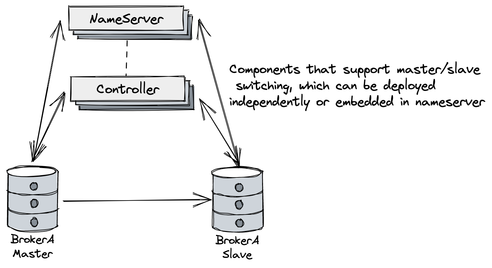

This document mainly introduces how to deploy a RocketMQ cluster that supports automatic master-slave switchover. Its architecture is shown in the above figure. It mainly adds the controller component that supports automatic master-slave switchover, which can be deployed independently or embedded in the NameServer.

> [!TIP]
> **Refer to**
> For more details, refer to [Design Ideas](https://github.com/apache/rocketmq/blob/develop/docs/en/controller/design.md) and [Quick Start](https://github.com/apache/rocketmq/blob/develop/docs/en/controller/quick_start.md)

The controller component provides selection of the master. If the controller needs to be fault-tolerant, it needs to be deployed in three or more replicas (following the Raft majority protocol).

> [!TIP]
> If the controller is only deployed as a single copy, it can still complete broker failover, but if the single-point controller fails, it will affect the switchover ability but not affect the normal send and receive of the existing cluster.

There are two ways to deploy the controller. One is to embed it in the NameServer for deployment. This can be opened by setting enableControllerInNamesrv (it can be selectively opened and is not required to be opened on every NameServer). In this mode, the NameServer itself is still stateless, which means that if the NameServer fails in the embedded mode, it will only affect the switchover ability, not the original routing acquisition and other functions. The other is to deploy the controller component independently.

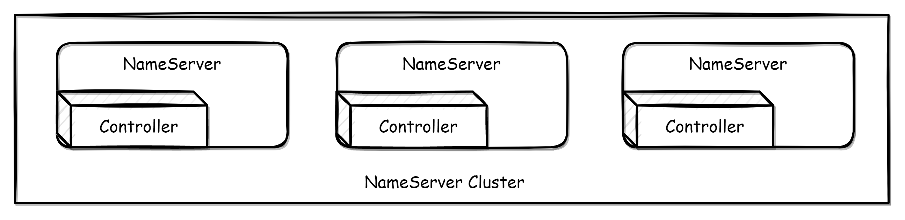

When the Controller is embedded in the NameServer for deployment, you only need to set **`enableControllerInNamesrv=true`** in the NameServer configuration file and fill in the controller configuration.

```properties
enableControllerInNamesrv = true 
controllerDLegerGroup = group1 
controllerDLegerPeers = n0-127.0.0.1:9877;n1-127.0.0.1:9878;n2-127.0.0.1:9879 
controllerDLegerSelfId = n0 
controllerStorePath = /home/admin/DledgerController 
enableElectUncleanMaster = false 
notifyBrokerRoleChanged = true 
```

Parameter explain：

- enableControllerInNamesrv: Whether to enable the controller in the Nameserver, the default is false.
- controllerDLegerGroup: The name of the DLedger Raft Group, it must be consistent within the same DLedger Raft Group.
- controllerDLegerPeers: Port information of the nodes within the DLedger Group, the configuration of the nodes within the same Group must be consistent.
- controllerDLegerSelfId: Node id, must be one of the controllerDLegerPeers; each node within the same Group must be unique.
- controllerStorePath: Location of the controller log storage. The controller is stateful, and the controller needs to rely on the log to recover data when restarting or crashing. This directory is very important and cannot be easily deleted.
- enableElectUncleanMaster: Whether it is possible to elect a Master from outside SyncStateSet. If true, it may choose a replica with outdated data as the master and lose messages. The default is false.
- notifyBrokerRoleChanged: Whether to actively notify when the role of the Broker replica group changes, the default is true.

After setting the parameters, you can start the Nameserver by specifying the configuration file.

```shell
$ nohup sh bin/mqnamesrv -c namesrv.conf &
```

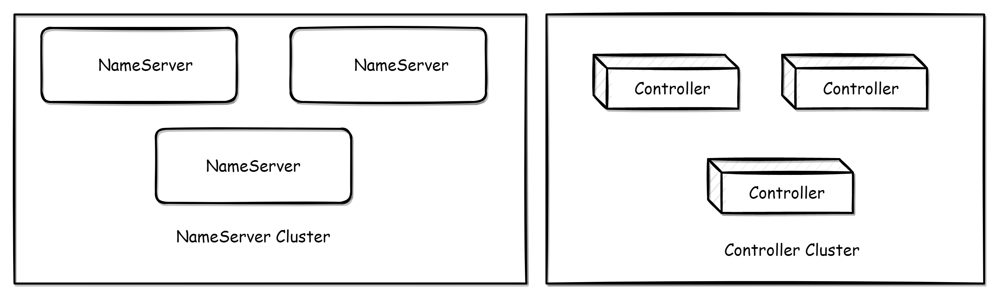

To deploy independently, run the following script:

```shell
$ nohup sh bin/mqcontroller -c controller.conf &
```

The mqcontroller script is located at **`distribution/bin/mqcontroller`** in the source code package, and the configuration parameters are the same as in the embedded mode.

> [!WARNING]
> **Caution**
> After independently deploying the Controller, you still need to deploy the NameServer separately to provide routing discovery capability.

The Broker start method is the same as before, with the following additional parameters:

- enableControllerMode: The overall switch for the Broker controller mode. Only when this value is true will the automatic primary-secondary switch mode be enabled. The default is false.
- controllerAddr: The address of the controller, separated by semicolons between multiple controllers. For example, `controllerAddr = 127.0.0.1:9877;127.0.0.1:9878;127.0.0.1:9879`
- syncBrokerMetadataPeriod: The time interval for syncing Broker replica information to the controller. The default is 5000 (5s).
- checkSyncStateSetPeriod: The time interval for checking SyncStateSet, checking SyncStateSet may shrink SyncState. The default is 5000 (5s).
- syncControllerMetadataPeriod: The time interval for syncing controller metadata, mainly to obtain the address of the active controller. The default is 10000 (10s).
- haMaxTimeSlaveNotCatchup: The maximum time interval for Slave not catching up to Master, if a slave in SyncStateSet exceeds this time interval, it will be removed from SyncStateSet. The default is 15000 (15s).
- storePathEpochFile: The location of the epoch file. The epoch file is very important and cannot be deleted casually. The default is in the store directory.
- allAckInSyncStateSet: If this value is true, a message will only be returned to the client as successful when it has been replicated to every replica in SyncStateSet, ensuring that the message is not lost. The default is false.
- syncFromLastFile: If the slave is a blank disk startup, whether to replicate from the last file. The default is false.
- asyncLearner: If this value is true, the replica will not enter SyncStateSet, that is, it will not be elected as Master, but will always act as a learner replica and perform asynchronous replication. The default is false.
- inSyncReplicas: The number of replica groups that need to be kept in sync, the default is 1, and this parameter is invalid when allAckInSyncStateSet=true.
- minInSyncReplicas: The minimum number of replica groups that need to be kept in sync. If the number of replicas in SyncStateSet is less than minInSyncReplicas, putMessage will return PutMessageStatus.IN\_SYNC\_REPLICAS, the default is 1

In controller mode, the Broker configuration must set enableControllerMode=true and fill in controllerAddr, and start with the following command:

```shell
$ nohup sh bin/mqbroker -c broker.conf &
```

> [!WARNING]
> **Caution**
> In automatic primary and secondary switching mode, Broker does not need to specify brokerId and brokerRole, which are assigned by the controller component.

This mode does not make any changes or modifications to any client-level APIs, and there are no compatibility issues with clients.

The Nameserver itself has not been modified and there are no compatibility issues with the Nameserver. If enableControllerInNamesrv is enabled and the controller parameters are configured correctly, the controller function is enabled.

If Broker is set to **`enableControllerMode=false`**, it will still operate as before. If **`enableControllerMode=true`**, the Controller must be deployed and the parameters must be configured correctly in order to operate properly.

The specific behavior is shown in the following table:

|  | Old nameserver | Old nameserver + Deploy controllers independently | New nameserver enables controller | New nameserver disable controller |
| --- | --- | --- | --- | --- |
| Old broker | Normal running, cannot failover | Normal running, cannot failover | Normal running, cannot failover | Normal running, cannot failover |
| New broker enable controller mode | Unable to go online normally | Normal running, can failover | Normal running, can failover | Unable to go online normally |
| New broker disable controller mode | Normal running, cannot failover | Normal running, cannot failover | Normal running, cannot failover | Normal running, cannot failover |

From the compatibility statements above, it can be seen that NameServer can be upgraded normally without compatibility issues. In the case where the Nameserver is not to be upgraded, the controller component can be deployed independently to obtain switching capabilities. For broker upgrades, there are two cases:

> [!WARNING]
> **Caution**
> If the primary and secondary CommitLogs are not aligned, it is necessary to ensure that the primary is online before the secondary is online, otherwise messages may be lost due to data truncation.

---

<a id="deploymentoperations-04dashboard"></a>

<!-- source_url: https://rocketmq.apache.org/docs/deploymentOperations/04Dashboard/ -->

<!-- page_index: 30 -->

# RocketMQ Dashboard

Version: 5.0

> [!TIP]
> Replace namesrv.addr:port with the nameserver address and port configured in rocketmq
>
> 1. Open port numbers: 8080, 9876, 10911, 11011
>
> - Cloud server: Set security group access rules
> - Local virtual machine: Turn off firewall, or -add-port

---

<a id="deploymentoperations-05exporter"></a>

<!-- source_url: https://rocketmq.apache.org/docs/deploymentOperations/05Exporter/ -->

<!-- page_index: 31 -->

# RocketMQ Prometheus Exporter

Version: 5.0

> [!WARNING]
> **caution**
> In previous versions, there were 87 concurrentHashMaps, but since the Map does not delete expired metrics, once there is a label change, a new metric is generated and the old, unused metric cannot be automatically deleted, which eventually causes a memory overflow. However, using the Cache structure can enable expired deletion, and the expiration time can be configured.

---

<a id="observability-01metrics"></a>

<!-- source_url: https://rocketmq.apache.org/docs/observability/01metrics/ -->

<!-- page_index: 32 -->

# Metrics

Version: 5.0

<a id="observability-01metrics--metrics"></a>

# Metrics

RocketMQ exposes the following metrics in Prometheus format. You can monitor your clusters with those metrics.

- Broker metrics
- Producer metrics
- Consumer metrics

> Version support: The following metrics for RocketMQ were introduced since 5.1.0 and only support the broker.

The standard for defining metrics in RocketMQ complies with that for defining the metrics in open source Prometheus. The metric types that RocketMQ offers include counters, gauges, and histograms. For more information, see [METRIC TYPES](https://prometheus.io/docs/concepts/metric_types/).

The following table describes the labels of the metrics that are related to the Message Queue for Apache RocketMQ broker.

- cluster: RocketMQ cluster name.
- node\_type: the type of service node, whitch includes the following:proxy,broker,nameserver.
- node\_id: the ID of the service node.
- topic: the topic of RocketMQ.
- message\_type: the type of a message, which includes the following: normal:normal messages; fifo:ordered messages; transaction:Transactional messages; delay:scheduled or delayed messages.
- consumer\_group: the ID of the consumer group.
- invocation\_status: the result of the API call for create topic or consumer group, which includes success and failure.

| Type | Name | Unit | Description | Label |
| --- | --- | --- | --- | --- |
| counter | rocketmq\_messages\_in\_total | count | The number of messages that are produced. | cluster,node\_type,node\_id,topic,message\_type |
| counter | rocketmq\_messages\_out\_total | count | The number of messages that are consumed. | cluster,node\_type,node\_id,topic, consumer\_group |
| counter | rocketmq\_throughput\_in\_total | byte | The write throughput that are produced. | cluster,node\_type,node\_id,topic,message\_type |
| counter | rocketmq\_throughput\_out\_total | byte | The read throughput that are produced. | cluster,node\_type,node\_id,topic, consumer\_group |
| histogram | rocketmq\_message\_size | byte | The distribution of message sizes. This metric is counted only when messages are sent. The following shows the distribution ranges: le\_1\_kb: ≤ 1 KB le\_4\_kb: ≤ 4 KB le\_512\_kb: ≤ 512 KB le\_1\_mb: ≤ 1 MB le\_2\_mb: ≤ 2 MB le\_4\_mb: ≤ 4 MB le\_overflow: > 4 MB | cluster,node\_type,node\_id,topic,message\_type |
| gauge | rocketmq\_consumer\_ready\_messages | count | The number of ready messages. | cluster,node\_type,node\_id,topic, consumer\_group |
| gauge | rocketmq\_consumer\_inflight\_messages | count | The number of inflight messages. | cluster,node\_type,node\_id,topic, consumer\_group |
| gauge | rocketmq\_consumer\_queueing\_latency | millisecond | Ready messages queueing delay time. | cluster,node\_type,node\_id,topic, consumer\_group |
| gauge | rocketmq\_consumer\_lag\_latency | millisecond | The delayed time before messages are consumed. | cluster,node\_type,node\_id,topic, consumer\_group |
| counter | rocketmq\_send\_to\_dlq\_messages\_total | count | The number of messages that are sent to the dead-letter queue. | cluster,node\_type,node\_id,topic, consumer\_group |
| histogram | rocketmq\_rpc\_latency | millisecond | The rpc call latency | cluster,node\_typ,node\_id,protocol\_type,request\_code,response\_code |
| gauge | rocketmq\_storage\_message\_reserve\_time | millisecond | Message retention time. | cluster,node\_type,node\_id |
| gauge | rocketmq\_storage\_dispatch\_behind\_bytes | byte | Undispatched message size. | cluster,node\_type,node\_id |
| gauge | rocketmq\_storage\_flush\_behind\_bytes | byte | Unflushed message size. | cluster,node\_type,node\_id |
| gauge | rocketmq\_thread\_pool\_wartermark | count | The number of tasks queued in the thread pool. | cluster,node\_type,node\_id,name |
| histogram | rocketmq\_topic\_create\_execution\_time | millisecond | The execution time for creating topic: le\_10\_ms le\_100\_ms le\_1\_s le\_3\_s le\_5\_s le\_overflow | cluster,node\_type,node\_id,invocation\_status,is\_system |
| histogram | rocketmq\_consumer\_group\_create\_execution\_time | millisecond | The execution time for creating consumer group: le\_10\_ms le\_100\_ms le\_1\_s le\_3\_s le\_5\_s le\_overflow | cluster,node\_type,node\_id,invocation\_status |
| gauge | rocketmq\_topic\_number | count | The number of topics | cluster,node\_type,node\_id |
| gauge | rocketmq\_consumer\_group\_number | count | The number of consumer group | cluster,node\_type,node\_id |

The following table describes the labels of the metrics that are related to the producers in Message Queue for Apache RocketMQ.

- cluster: RocketMQ cluster name.
- node\_type: the type of service node, whitch includes the following:proxy,broker,nameserver.
- node\_id: the ID of the service node.
- topic: the topic of Message Queue for Apache RocketMQ.
- message\_type: the type of a message, which includes the following: normal:normal messages; fifo:ordered messages; transaction:Transactional messages; delay:scheduled or delayed messages.
- client\_id: the ID of the client.
- invocation\_status: the result of the API call for sending messages, which includes success and failure.

| Type | Name | Unit | Description | Label |
| --- | --- | --- | --- | --- |
| Histogram | rocketmq\_send\_cost\_time | millisecond | The distribution of production API call time. The following shows the distribution ranges: le\_1\_ms le\_5\_ms le\_10\_ms le\_20\_ms le\_50\_ms le\_200\_ms le\_500\_ms le\_overflow | topic,client\_id,invocation\_status |

The following table describes the labels of the metrics that are related to the consumers in Message Queue for Apache RocketMQ.

- topic: the topic of Message Queue for Apache RocketMQ.
- consumer\_group: the ID of the consumer group.
- client\_id: the ID of the client.
- invocation\_status: the result of the API call for consuming messages, which includes success and failure.

| Type | Name | Unit | Description | Label |
| --- | --- | --- | --- | --- |
| Histogram | rocketmq\_process\_time | millisecond | The distribution of message process time.The following shows the distribution ranges: le\_1\_ms le\_5\_ms le\_10\_ms le\_100\_ms le\_10000\_ms le\_60000\_ms le\_overflow | topic,consumer\_group,client\_id,invocation\_status |
| gauge | rocketmq\_consumer\_cached\_messages | message | The number of messages in the local buffer queue of PushConsumer. | topic,consumer\_group,client\_id |
| gauge | rocketmq\_consumer\_cached\_bytes | byte | The total size of messages in the local buffer queue of PushConsumer. | topic,consumer\_group,client\_id |
| Histogram | rocketmq\_await\_time | millisecond | The distribution of queuing time for messages in the local buffer queue of PushConsumer. The following shows the distribution ranges: le\_1\_ms le\_5\_ms le\_20\_ms le\_100\_ms le\_1000\_ms le\_5000\_ms le\_10000\_ms le\_overflow | topic,consumer\_group,client\_id |

RocketMQ defines metrics based on the following business scenarios.

 The above figure shows the number and duration of messages in different stages. By monitoring these metrics, you can determine whether the business consumption is abnormal. The following table describes the meaning of these metrics and the formulas that are used to calculate these metrics.

| Name | Description | Formula |
| --- | --- | --- |
| Inflight messages | The number of messages being processed by consumer but not acked yet | Offset of the latest pulled message - Offset of the latest committed message |
| Ready messages | The number of messages that are ready for consumption. | Maximum offset - Offset of the latest pulled message |
| Ready time | normal message or ordered message:the time when the message is stored to the broker. Scheduled message:timing end time. Transactional message: transaction commit time. | -- |
| Ready message queue time | The time interval between the ready time of the earliest ready message and the current time. This time reflects the timeliness of consumers pulling messages. | Current time - Ready time of the earliest ready message |
| Consumer lag time | The time difference between the ready time of the earliest unacked message and the current moment. This time reflects the timeliness of the consumer to complete message processing. | Current time - Ready time of the earliest unacked message |

In PushConsumer, real-time message processing capability is implemented based on the typical Reactor thread model inside the SDK.As shown below, the SDK has a built-in long polling thread that asynchronously pulls messages into the SDK's built-in buffer queue and then separately commits them to the consumer thread, triggering the listener to execute the local consumption logic.  The metrics of local buffer queues in the PushConsumer scenario are as follows:

- Number of messages in the local buffer queue: Total number of messages in the local buffer queue.
- Message size in the local buffer queue: The sum of all message sizes in the local buffer queue.
- Message waiting time: the time that the message is temporarily cached in the local buffer queue waiting to be processed.

Currently, two exporters are supported: gRPC OTLP and Prometheus.

The gRPC OTLP exporter periodically reports metrics to the specified OpenTelemetry Collector.

Prerequisites: Deploy an OpenTelemetry Collector that supports the [GRPC OpenTelemetry Protocol](https://github.com/open-telemetry/oteps/blob/main/text/0035-opentelemetry-protocol.md).

To enable the gRPC OTLP exporter of Broker metrics, do the following:

1. Set `metricsExporterType` to `OTLP_GRPC`.
2. Set `metricsGrpcExporterTarget` to the endpoint provided by the OpenTelemetry Collector.

Optional configurations:

1. `metricsGrpcExporterHeader`: Attach request headers to the gRPC OTLP exporter in the format of key1:value1,key2:value2.
2. `metricGrpcExporterTimeOutInMills`: Set the request timeout for the gRPC OTLP exporter.
3. `metricGrpcExporterIntervalInMills`: Set the reporting interval for the gRPC OTLP exporter.

The Prometheus exporter only supports Pull mode and Cumulative aggregation. See [OpenTelemetry Metrics Exporter - Prometheus](https://opentelemetry.io/docs/reference/specification/metrics/sdk_exporters/prometheus/) for more information.

To enable the Prometheus exporter of Broker metrics, do the following:

1. Set `metricsExporterType` to `PROM`.

Visit `http://<broker-ip>:5557/metrics` to view metrics. Configure service discovery or manually configure a pull task in Prometheus to collect metrics.

Optional configurations:

1. `metricsPromExporterPort`: The port number on which Broker exposes the metrics service. The default is `5557`.
2. `metricGrpcExporterTimeOutInMills`: The hostname for the exposed metrics service. The default is the IP to which Broker registers with NameServer, brokerIP1.

---

<a id="sdk-01overview"></a>

<!-- source_url: https://rocketmq.apache.org/docs/sdk/01overview/ -->

<!-- page_index: 33 -->

# Overview

Version: 5.0

> [!TIP]
> How to quickly distinguish whether the SDK used is the Remoting protocol or the gRPC protocol?
>
> Method 1: Check the repository coordinates
>
> - For Java language: If the repository coordinate is rocketmq-client, it is the Remoting protocol. If it is rocketmq-client-java, it is the gRPC protocol.
> - For other languages: Other gRPC languages are also named in the format of rocketmq-client-{language}.
>
> Method 2: Check the keywords
>
> - If the code package or classpath contains the keyword 'remoting', it is the Remoting protocol. Otherwise, it is the gRPC protocol SDK.

---

<a id="sdk-02java"></a>

<!-- source_url: https://rocketmq.apache.org/docs/sdk/02java/ -->

<!-- page_index: 34 -->

# Java Client SDK

Version: 5.0

> [!NOTE]
> **info**
> - This sample code is built based on the gRPC protocol SDK. Therefore, the server needs to be upgraded to at least version 5.0 and enable gRPC Proxy to be compatible. Please refer to the [quick start guide](#quickstart-01quickstart) for deploying Proxy.
> - If you are using the Remoting protocol SDK, it is recommended to refer to the example code of the previous version 4.x for running. To identify the type of SDK you are using, please refer to the [overview](#sdk-01overview).

---

<a id="sdk-03cplusplus"></a>

<!-- source_url: https://rocketmq.apache.org/docs/sdk/03cplusplus/ -->

<!-- page_index: 35 -->

# C++ Client SDK

Version: 5.0

> [!NOTE]
> **info**
> - This sample code is built based on the gRPC protocol SDK. Therefore, the server needs to be upgraded to at least version 5.0 and enable gRPC Proxy to be compatible. Please refer to the [quick start guide](#quickstart-01quickstart) for deploying Proxy.
> - If you are using the Remoting protocol SDK, it is recommended to refer to the example code of the previous version 4.x for running. To identify the type of SDK you are using, please refer to the [overview](#sdk-01overview).

---

<a id="sdk-04csharp"></a>

<!-- source_url: https://rocketmq.apache.org/docs/sdk/04csharp/ -->

<!-- page_index: 36 -->

# C# Client SDK

Version: 5.0

> [!NOTE]
> **info**
> - This sample code is built based on the gRPC protocol SDK. Therefore, the server needs to be upgraded to at least version 5.0 and enable gRPC Proxy to be compatible. Please refer to the [quick start guide](#quickstart-01quickstart) for deploying Proxy.
> - If you are using the Remoting protocol SDK, it is recommended to refer to the example code of the previous version 4.x for running. To identify the type of SDK you are using, please refer to the [overview](#sdk-01overview).

---

<a id="sdk-05go"></a>

<!-- source_url: https://rocketmq.apache.org/docs/sdk/05go/ -->

<!-- page_index: 37 -->

# Go Client SDK

Version: 5.0

> [!NOTE]
> **info**
> - This sample code is built based on the gRPC protocol SDK. Therefore, the server needs to be upgraded to at least version 5.0 and enable gRPC Proxy to be compatible. Please refer to the [quick start guide](#quickstart-01quickstart) for deploying Proxy.
> - If you are using the Remoting protocol SDK, it is recommended to refer to the example code of the previous version 4.x for running. To identify the type of SDK you are using, please refer to the [overview](#sdk-01overview).

---

<a id="bestpractice-01bestpractice"></a>

<!-- source_url: https://rocketmq.apache.org/docs/bestPractice/01bestpractice/ -->

<!-- page_index: 38 -->

# Basic Best Practices

Version: 5.0

<a id="bestpractice-01bestpractice--basic-best-practices"></a>

# Basic Best Practices

An application can be identified as a Topic, and message subtypes can be identified as tags. tags can be set freely by the application. Only when the producer sets tags when sending messages, the consumer can use tags to filter messages through the broker when subscribing messages.
5.x SDK can call messageBuilder.setTag("messageTag") and historical versions can call message.setTags("messageTag").

At the service level, it is recommended that each message be mapped to a unique service identifier and set to the keys field to locate message loss problems in the future. The server creates an index (hash index) for each message, and the application can query the content of the message by topic and key, and by whom the message was consumed. Since it is a hash index, make sure that the key is as unique as possible to avoid potential hash collisions. Common setup policies use discrete unique identifiers such as order Id, user Id, and request Id.

If the message is sent successfully or fails, you need to print message logs for troubleshooting services. Send Indicates that the message is sent successfully as long as no exception is thrown.

The send method of the Producer itself supports internal retry,5.x Retry logic reference [Send retry policy](#featurebehavior-05sendretrypolicy)：

The above strategies also guarantee the success of message sending to a certain extent. If the business requires that the message be sent without loss, you still need to cover for possible exceptions, such as when the send synchronization method is called and fails to send, then try to store the message to the db and retry periodically by the background thread to ensure that the message reaches the Broker.

The reason why the above DB retry method is not integrated into the MQ client, but requires the application to complete by itself, is mainly based on the following considerations: First, the MQ client is designed as a stateless mode, convenient for arbitrary horizontal expansion, and the consumption of machine resources is only cpu, memory, network. Secondly, if the MQ client is internally integrated with a KV storage module, the data can only be reliable if the synchronous disk fall, and the synchronous disk fall itself has a large performance overhead, so it usually uses asynchronous disk fall, and because the application closure process is not controlled by MQ operation and maintenance personnel, it may often happen kill -9 such violent closure. Resulting in data not timely drop disk and loss. Third, the machine where the Producer resides has low reliability and is generally virtual machines, which are not suitable for storing important data. In summary, it is recommended that the retry process be controlled by the application.

RocketMQ cannot avoid message duplications (Exactly Once), so if the business is very sensitive to consumption duplications, it is important to de-process at the business level.
This can be done with the help of relational databases. You first need to determine a unique key for the message, either an msgId or a unique identifying field in the message content, such as an order id.
Determine if the unique key exists in the relational database before consumption. If not, insert and consume, otherwise skip. (The actual process should consider the atomicity problem, determine whether there is a primary key conflict, then the insertion failed, directly skip)

MsgId must be a globally unique identifier, but in practice, there may be cases where the same message has two different msgIds (consumer active retransmission, duplication due to client reinvestment mechanism, etc.), which necessitates repeated consumption of business fields.

The vast majority of message consumption is IO intensive, that is, it may be operating on a database or calling an RPC, and the rate of consumption for this type of consumption depends on the throughput of the back-end database or external system.
By increasing consumption parallelism, the total consumption throughput can be improved, but when the parallelism increases to a certain degree, it will decrease.
Therefore, the application must set a reasonable degree of parallelism. There are several ways to modify consumption parallelism:

- In the same ConsumerGroup, we increase the number of Consumer instances to improve parallelism (note that Consumer instances exceeding the subscription queue are invalid). You can add a machine, or start multiple processes on an existing machine.
- Improve the individual Consumer's consumption parallel threads, 5.x PushConsumer SDK can PushConsumerBuilder.setConsumptionThreadCount() sets the number of threads, SimpleConsumer is free to increase concurrency from business threads, and the underlying thread is safe; The historical SDK PushConsumer can be implemented by modifying parameters consumeThreadMin and consumeThreadMax.

If some business processes support bulk consumption, consumption throughput can be greatly improved. For example, the application of order deduction takes 1 s to process one order at a time, and it may only take 2 s to process 10 orders at a time, so the consumption throughput can be greatly improved. It is recommended to use SimpleConsumer from the 5.x SDK, set the batch size per interface call, and pull multiple messages at once.

In case of message pile-up, if the consumption rate cannot keep up with the delivery rate, and if the business is not demanding enough data, you can choose to discard unimportant messages. You are advised to use the reset site function to directly adjust the consumption site to a specified time or location.

For example, the consumption process of a message is as follows:

- Query [data 1] from DB according to message
- Query [data 2] from DB according to message
- Complex business calculations
- Insert [data 3] into DB
- Insert [data 4] into DB

There are four interactions with DB during the consumption of this message. If we calculate each interaction as 5ms, the total time is 20ms.
Assuming that the service computation takes 5ms, the total time is 25ms. Therefore, if the four DB interactions can be optimized to two, the total time can be optimized to 15ms, which means that the overall performance is improved by 40%.
Therefore, if the application is sensitive to delay, the DB can be deployed on SSD disks. Compared with SCSI disks, the RT of the former is much smaller.

If the number of messages is small, you are advised to print messages in the consumption entry method, which takes a long time to consume.

```java
   new MessageListener() { 
        @Override 
        public ConsumeResult consume(MessageView messageView) { 
            LOGGER.info("Consume message={}", messageView); 
            //Do your consume process 
            return ConsumeResult.SUCCESS; 
            } 
    } 
```

If you can print each message consuming time, it will be more convenient to troubleshoot online problems such as slow consumption.

Broker roles are classified into ASYNC\_MASTER, SYNC\_MASTER, and SLAVE.
If you have strict requirements on message reliability, deploy SYNC\_MASTER plus SLAVE.
If message reliability is not required, deploy ASYNC\_MASTER plus SLAVE.
If testing is only convenient, you can select ASYNC\_MASTER only or SYNC\_MASTER only deployment.

Compared with ASYNC\_FLUSH, SYNC\_FLUSH suffers from performance loss but is more reliable. Therefore, the trade-off must be made based on the actual service scenario.

| Parameter | Default | Description |
| --- | --- | --- |
| listenPort | 10911 | A listening port that accepts client connections |
| namesrvAddr | null | nameServer address |
| brokerIP1 | The network InetAddress | The IP address on which the broker is currently listening |
| brokerIP2 | same to brokerIP1 | When a master/slave broker exists, if the brokerIP2 property is configured on the broker master node, the broker slave node will connect to the brokerIP2 configured on the master node for synchronization |
| brokerName | null | broker name |
| brokerClusterName | DefaultCluster | The Cluster name to which this broker belongs |
| brokerId | 0 | broker id 0 indicates master, and other positive integers indicate slave |
| storePathCommitLog | $HOME/store/commitlog/ | Path to store the commit log |
| storePathConsumerQueue | $HOME/store/consumequeue/ | A path that consumes queue is stored |
| mappedFileSizeCommitLog | 1024 \* 1024 \* 1024(1G) | commit log mapping file size |
| deleteWhen | 04 | At what time of day should I delete the commit log whose file retention time has exceeded |
| fileReservedTime | 72 | File retention time in hours |
| brokerRole | ASYNC\_MASTER | SYNC\_MASTER/ASYNC\_MASTER/SLAVE |
| flushDiskType | ASYNC\_FLUSH | SYNC\_FLUSH/ASYNC\_FLUSH The broker in SYNC\_FLUSH mode guarantees to flush messages before receiving the acknowledged producer. ASYNC\_FLUSH brokers use the flush mode to flush a group of messages for better performance. |

The default log path for the Broker is located at ${user.home}/logs/rocketmqlogs/. You can change the log level and path by editing the xx.logback.xml file in the conf directory of the binary package.

> Note: Please ensure your logs are properly secured to prevent sensitive information leaks.

---

<a id="bestpractice-02dledger"></a>

<!-- source_url: https://rocketmq.apache.org/docs/bestPractice/02dledger/ -->

<!-- page_index: 39 -->

# DLedger

Version: 5.0

<a id="bestpractice-02dledger--dledger"></a>

# DLedger

DLedger is a set of distributed log storage components based on Raft protocol. When deploying RocketMQ, you can choose to use DLedger to replace the native replica storage mechanism. This document is mainly introduced for how to build and deploy auto failover RocketMQ cluster based on DLedger.

The build phase is divided into two parts, DLedger should be built first, and then build RocketMQ.

```shell
$ git clone https://github.com/openmessaging/dledger.git
$ cd dledger
$ mvn clean install -DskipTests
```

```shell
$ git clone https://github.com/apache/rocketmq.git
$ cd rocketmq
$ git checkout -b store_with_dledger origin/store_with_dledger
$ mvn -Prelease-all -DskipTests clean install -U
```

After building successfully

```shell
#{rocketmq-version} replace with rocketmq actual version. example: 5.1.0 
$ cd distribution/target/rocketmq-{rocketmq-version}/rocketmq-{rocketmq-version}
$ sh bin/dledger/fast-try.sh start
```

If the above commands executed successfully, then check cluster status by using mqadmin operation commands.

```shell
$ sh bin/mqadmin clusterList -n 127.0.0.1:9876
```

If everything goes well, the following content will appear:


（BID is 0 indicate Master, the others are Follower）

After the startup is successful, producer can produce message, and then test failover scenario.

Execute the following command to stop the cluster quickly:

```shell
$ sh bin/dledger/fast-try.sh stop
```

Quick deployment, default configuration is in directory conf/dledger, default storage path is /tmp/rmqstore.

After the successful deployment, kill the Leader process(as the above example, kill process that binds port 30931), then wait for 10 seconds, use clusterList command to check cluster status, and you could find that the Leader has been switched to another node.

This document introduces how to deploy auto failover RocketMQ-on-DLedger Group.

RocketMQ-on-DLedger Group is a broker group with **same name**, needs at least 3 nodes, elect a Leader by Raft algorithm automatically, the others as Follower, replicating data between Leader and Follower for system high available.
RocketMQ-on-DLedger Group can failover automatically, and maintains consistent.
RocketMQ-on-DLedger Group can scale up horizontal, that is, can deploy any RocketMQ-on-DLedger Groups providing services external.

Each RocketMQ-on-DLedger Group needs at least 3 machines.(assuming 3 in this document)
write 3 configuration files, advising refer to the directory of conf/dledger 's example configuration file.
key configuration items:

| name | meaning | example |
| --- | --- | --- |
| enableDLegerCommitLog | whether enable DLedger | true |
| dLegerGroup | DLedger Raft Group's name, advising maintain consistent to brokerName | RaftNode00 |
| dLegerPeers | DLedger Group's nodes port infos, each node's configuration stay consistent in the same group. | n0-127.0.0.1:40911;n1-127.0.0.1:40912;n2-127.0.0.1:40913 |
| dLegerSelfId | node id, must belongs to dLegerPeers; each node is unique in the same group. | n0 |
| sendMessageThreadPoolNums | the count of sending thread, advising set equal to the cpu cores. | 16 |

The following presents an example configuration conf/dledger/broker-n0.conf.

```text
brokerClusterName = RaftCluster 
brokerName=RaftNode00 
listenPort=30911 
namesrvAddr=127.0.0.1:9876 
storePathRootDir=/tmp/rmqstore/node00 
storePathCommitLog=/tmp/rmqstore/node00/commitlog 
enableDLegerCommitLog=true 
dLegerGroup=RaftNode00 
dLegerPeers=n0-127.0.0.1:40911;n1-127.0.0.1:40912;n2-127.0.0.1:40913 
## must be unique 
dLegerSelfId=n0 
sendMessageThreadPoolNums=16 
```

Startup stays consistent with the old version.

`nohup sh bin/mqbroker -c conf/dledger/xxx-n0.conf &`
`nohup sh bin/mqbroker -c conf/dledger/xxx-n1.conf &`
`nohup sh bin/mqbroker -c conf/dledger/xxx-n2.conf &`

If old cluster deployed in Master mode, then each Master needs to be transformed into a RocketMQ-on-DLedger Group.
If old cluster deployed in Master-Slave mode, then each Master-Slave group needs to be transformed into a RocketMQ-on-DLedger Group.

Execute kill command, or call `bin/mqshutdown broker`.

Each node in RocketMQ-on-DLedger group is compatible with old Commitlog, but Raft replicating process works on the adding message only. So, to avoid occurring exceptions, old Commitlog must be consistent.
If old cluster deployed in Master-Slave mode, it maybe inconsistent after shutdown. Advising use md5sum to check at least 2 recently Commitlog file, if occur inconsistent, maintain consistent by copy.

Although RocketMQ-on-DLedger Group can deployed with 2 nodes, it lacks failover ability(at least 3 nodes can tolerate one node fail).
Make sure that both Master and Slave's Commitlog is consistent, then prepare 3 machines, copy old Commitlog from Master to this 3 machines(BTW, copy the config directory).

Then, go ahead to set configurations.

Refer to New cluster deployment.

Refer to New cluster deployment.

---

<a id="bestpractice-03access"></a>

<!-- source_url: https://rocketmq.apache.org/docs/bestPractice/03access/ -->

<!-- page_index: 40 -->

# Access Control 2.0

Version: 5.0

<a id="bestpractice-03access--access-control-2.0"></a>

# Access Control 2.0

> [!NOTE]
> **Version Notice**
> This document describes **Access Control 2.0 (ACL 2.0)**, applicable to **RocketMQ 5.3.0** and above.
>
> - If you are using **RocketMQ 4.x, 5.0-5.2, or 5.3.0-5.3.2**, please refer to [ACL 1.0 Documentation](https://rocketmq.apache.org/docs/bestPractice/07access-1.0)
> - **Starting from RocketMQ 5.3.3, ACL 1.0 is no longer supported**. It is recommended to upgrade to ACL 2.0
> - If you are migrating from ACL 1.0 to 2.0, please refer to the [ACL 1.0 Migration](#bestpractice-03access--5-migrating-from-acl-10-to-acl-20) section

> [!CAUTION]
> **Security Notice**
> ⚠️ **All usernames and passwords in this document are for demonstration purposes only. DO NOT use them in production environments!**
>
> For production deployment, please ensure:
>
> - Use strong passwords (at least 16 characters, including uppercase, lowercase, numbers, and special characters)
> - Strictly control the scope of super user usage
> - Properly secure authentication credentials and do not commit them in plain text to code repositories

Access Control 2.0 (ACL 2.0) is an upgraded version of Apache RocketMQ's Access Control List, providing comprehensive authentication and authorization mechanisms to protect the data security of RocketMQ clusters.

- **Dual Security Mechanisms**: Supports independent configuration of authentication and authorization
- **Flexible Resource Matching**: Supports exact match, prefix match, and wildcard match
- **Fine-grained Permission Control**: Covers multiple resource types including Cluster, Namespace, Topic, and Group
- **Multiple Strategy Options**: Provides stateless and stateful authentication/authorization strategies
- **Inter-component Secure Communication**: Supports access control between components such as Broker, Proxy, and NameServer

| Concept | Description |
| --- | --- |
| **User** | Entity accessing RocketMQ resources, divided into Super users and Normal users |
| **Resource** | Objects requiring access control, such as Cluster, Namespace, Topic, Group |
| **Action** | Operations performed on resources, such as Pub, Sub, Create, Update, Delete, Get, List |
| **Decision** | Authorization result, Allow or Deny |
| **Environment** | Access environment information, such as source IP address |

---

This section helps you quickly start a RocketMQ cluster with ACL enabled in 5 minutes.

> **Prerequisites**:
>
> - RocketMQ version ≥ 5.3.0
> - RocketMQ basic installation completed
>
> **Version Check**:
>
>
```bash
# Check RocketMQ version sh bin/mqbroker -v
```

>
> [!NOTE]
> : This example uses integrated storage-compute architecture (single Broker mode), suitable for quick experience and testing environments. For production deployment, refer to the [Configuration](#bestpractice-03access--configuration) section.

Edit the `conf/broker.conf` file and add the following configuration:

```properties
# Enable authentication 
authenticationEnabled = true 
authenticationMetadataProvider = org.apache.rocketmq.auth.authentication.provider.LocalAuthenticationMetadataProvider 
 
# Enable authorization 
authorizationEnabled = true 
authorizationMetadataProvider = org.apache.rocketmq.auth.authorization.provider.LocalAuthorizationMetadataProvider 
 
# Initialize admin user (auto-created on first startup) 
initAuthenticationUser = {"username":"rocketmq","password":"12345678"} 
 
# Inter-component authentication credentials (for Broker master-slave sync, internal cluster communication, etc.) 
innerClientAuthenticationCredentials = {"accessKey":"rocketmq","secretKey":"12345678"} 
```

> **Configuration Notes**:
>
> - Only required items need to be configured for quick start; other items have default values
> - For production environments, it is recommended to configure `authenticationStrategy` and `authorizationStrategy` to stateful strategy for better performance

```bash
# 1. Start NameServer nohup sh bin/mqnamesrv &
 
# 2. Start Broker (using the above configuration file) nohup sh bin/mqbroker -n localhost:9876 -c conf/broker.conf &
```

After enabling ACL, you need to configure authentication credentials for the mqadmin tool to execute management commands.

Edit the `conf/tools.yml` file:

```yaml
# Use the initialized admin user credentials 
accessKey: rocketmq 
secretKey: 12345678 
```

```bash
# Create producer user sh bin/mqadmin createUser -n 127.0.0.1:9876 -c DefaultCluster \ -u producer_user \ -p producer123 \ -t Normal
 
# Grant Topic publish permission sh bin/mqadmin createAcl -n 127.0.0.1:9876 -c DefaultCluster \ -s User:producer_user \ -r Topic:TestTopic \ -a Pub \ -d Allow
```

Send a test message using Java client:

```java
SessionCredentials credentials = new SessionCredentials("producer_user", "producer123"); 
StaticSessionCredentialsProvider credentialsProvider =  
    new StaticSessionCredentialsProvider(credentials); 
 
ClientConfiguration clientConfiguration = ClientConfiguration.newBuilder() 
    .setEndpoints("127.0.0.1:10911") 
    .setCredentialProvider(credentialsProvider) 
    .build(); 
// ... Create Producer and send message 
```

✅ Congratulations! You have successfully started a RocketMQ cluster with ACL enabled.

RocketMQ supports two deployment architectures. Choose the appropriate configuration based on your scenario.

Broker handles both computation and storage, suitable for small to medium-scale clusters and testing environments.

**Configuration Example**:

```properties
# broker.conf 
authenticationEnabled = true 
authenticationMetadataProvider = org.apache.rocketmq.auth.authentication.provider.LocalAuthenticationMetadataProvider 
authenticationStrategy = org.apache.rocketmq.auth.authentication.strategy.StatefulAuthenticationStrategy 
 
authorizationEnabled = true 
authorizationMetadataProvider = org.apache.rocketmq.auth.authorization.provider.LocalAuthorizationMetadataProvider 
authorizationStrategy = org.apache.rocketmq.auth.authorization.strategy.StatefulAuthorizationStrategy 
 
initAuthenticationUser = {"username":"rocketmq","password":"12345678"} 
innerClientAuthenticationCredentials = {"accessKey":"rocketmq","secretKey":"12345678"} 
```

Proxy handles computation and authentication/authorization, while Broker only handles storage and metadata management. Suitable for large-scale production environments.

**Broker Configuration** (`broker.conf`):

```properties
# Broker only acts as metadata provider, does not handle client authentication/authorization 
authenticationEnabled = false 
authorizationEnabled = false 
 
# Configure metadata providers 
authenticationMetadataProvider = org.apache.rocketmq.auth.authentication.provider.LocalAuthenticationMetadataProvider 
authorizationMetadataProvider = org.apache.rocketmq.auth.authorization.provider.LocalAuthorizationMetadataProvider 
 
# Initialize admin user 
initAuthenticationUser = {"username":"rocketmq","password":"12345678"} 
```

**Proxy Configuration** (`rmq-proxy.json`):

```json
{ 
  "authenticationEnabled": true, 
  "authenticationProvider": "org.apache.rocketmq.auth.authentication.provider.DefaultAuthenticationProvider", 
  "authenticationMetadataProvider": "org.apache.rocketmq.proxy.auth.ProxyAuthenticationMetadataProvider", 
  "authenticationStrategy": "org.apache.rocketmq.auth.authentication.strategy.StatefulAuthenticationStrategy", 
   
  "authorizationEnabled": true, 
  "authorizationProvider": "org.apache.rocketmq.auth.authorization.provider.DefaultAuthorizationProvider", 
  "authorizationMetadataProvider": "org.apache.rocketmq.proxy.auth.ProxyAuthorizationMetadataProvider", 
  "authorizationStrategy": "org.apache.rocketmq.auth.authorization.strategy.StatefulAuthorizationStrategy" 
} 
```

**Startup Sequence**:

```bash
# 1. Start NameServer nohup sh bin/mqnamesrv &
 
# 2. Start Broker (storage node) nohup sh bin/mqbroker -n localhost:9876 -c conf/broker.conf &
 
# 3. Start Proxy (compute node) nohup sh bin/mqproxy -n localhost:9876 -pc conf/rmq-proxy.json &
```

---

| Parameter | Type | Default | Description |
| --- | --- | --- | --- |
| `authenticationEnabled` | boolean | `false` | Whether to enable authentication |
| `authenticationProvider` | String | `org.apache.rocketmq.auth.authentication.provider.DefaultAuthenticationProvider` | Authentication provider implementation class (optional, uses default) |
| `authenticationMetadataProvider` | String | - | Authentication metadata provider implementation class **Required** |
| `authenticationStrategy` | String | `org.apache.rocketmq.auth.authentication.strategy.StatelessAuthenticationStrategy` | Authentication strategy (optional, uses default) Production recommendation: stateful strategy `org.apache.rocketmq.auth.authentication.strategy.StatefulAuthenticationStrategy` |
| `initAuthenticationUser` | JSON | - | **Recommended**: System initialization user (auto-created on first startup) Format: `{"username":"xxx","password":"xxx"}` If not configured, admin user must be created manually |
| `innerClientAuthenticationCredentials` | JSON | - | **Conditional**: Inter-component authentication credentials for Broker master-slave sync, Proxy-Broker access, Controller election, etc. Format: `{"accessKey":"xxx","secretKey":"xxx"}` ⚠️ All components must use identical credentials if inter-component communication exists |
| `authenticationWhitelist` | String | - | Authentication whitelist (comma-separated IP list) |

| Parameter | Type | Default | Description |
| --- | --- | --- | --- |
| `authorizationEnabled` | boolean | `false` | Whether to enable authorization |
| `authorizationProvider` | String | `org.apache.rocketmq.auth.authorization.provider.DefaultAuthorizationProvider` | Authorization provider implementation class (optional, uses default) |
| `authorizationMetadataProvider` | String | - | Authorization metadata provider implementation class **Required** |
| `authorizationStrategy` | String | `org.apache.rocketmq.auth.authorization.strategy.StatelessAuthorizationStrategy` | Authorization strategy (optional, uses default) Production recommendation: stateful strategy `org.apache.rocketmq.auth.authorization.strategy.StatefulAuthorizationStrategy` |
| `authorizationWhitelist` | String | - | Authorization whitelist (comma-separated IP list) |

| Parameter | Type | Default | Description |
| --- | --- | --- | --- |
| `userCacheMaxNum` | int | `1000` | Maximum user cache size |
| `userCacheExpiredSecond` | int | `600` | User cache expiration time (seconds) |
| `userCacheRefreshSecond` | int | `60` | User cache refresh time (seconds) |
| `aclCacheMaxNum` | int | `1000` | Maximum ACL cache size |
| `aclCacheExpiredSecond` | int | `600` | ACL cache expiration time (seconds) |
| `aclCacheRefreshSecond` | int | `60` | ACL cache refresh time (seconds) |
| `statefulAuthenticationCacheMaxNum` | int | `10000` | Maximum stateful authentication cache size |
| `statefulAuthenticationCacheExpiredSecond` | int | `60` | Stateful authentication cache expiration time (seconds) |
| `statefulAuthorizationCacheMaxNum` | int | `10000` | Maximum stateful authorization cache size |
| `statefulAuthorizationCacheExpiredSecond` | int | `60` | Stateful authorization cache expiration time (seconds) |

- **Characteristics**: Performs complete authentication and authorization check for every request
- **Advantages**: High security, permission changes take effect immediately
- **Disadvantages**: Higher performance overhead
- **Use Cases**: Environments with extremely high security requirements
- **Default**: ✅ System uses this strategy by default

**Configuration Example**:

```properties
# Default values, can be omitted 
authenticationStrategy = org.apache.rocketmq.auth.authentication.strategy.StatelessAuthenticationStrategy 
authorizationStrategy = org.apache.rocketmq.auth.authorization.strategy.StatelessAuthorizationStrategy 
```

- **Characteristics**: First request performs authentication/authorization, subsequent requests use cached results
- **Advantages**: Lower performance overhead, higher throughput
- **Disadvantages**: Permission changes have delay (takes effect after cache expires)
- **Use Cases**: High throughput scenarios, recommended for production environments
- **Recommendation**: ⭐ Explicitly configure this strategy for production environments

**Configuration Example**:

```properties
# Recommended for production 
authenticationStrategy = org.apache.rocketmq.auth.authentication.strategy.StatefulAuthenticationStrategy 
authorizationStrategy = org.apache.rocketmq.auth.authorization.strategy.StatefulAuthorizationStrategy 
```

---

| User Type | Description | Permission Scope | Use Case |
| --- | --- | --- | --- |
| **Super** | Super user | Has all permissions on all resources, no separate authorization needed | System administrator, operations personnel |
| **Normal** | Normal user | Requires explicit authorization to access resources | Business applications, services |

Before using the mqadmin command-line tool, configure admin credentials.

**Configuration File**: `conf/tools.yml`

```yaml
# Use super user's username and password 
accessKey: rocketmq 
secretKey: 12345678 
```

**Verify Configuration**:

```bash
# Test if mqadmin tool can connect normally sh bin/mqadmin listUser -n 127.0.0.1:9876 -c DefaultCluster
```

```bash
# Create normal user sh bin/mqadmin createUser -n 127.0.0.1:9876 -c DefaultCluster -u username -p password -t Normal
 
# Create super user sh bin/mqadmin createUser -n 127.0.0.1:9876 -c DefaultCluster -u rocketmq -p 12345678 -t Super
```

```bash
# Update user password sh bin/mqadmin updateUser -n 127.0.0.1:9876 -c DefaultCluster -u username -p newpassword
 
# Update user type sh bin/mqadmin updateUser -n 127.0.0.1:9876 -c DefaultCluster -u username -t Super
```

```bash
# Query user details sh bin/mqadmin getUser -n 127.0.0.1:9876 -c DefaultCluster -u username
 
# Query user list sh bin/mqadmin listUser -n 127.0.0.1:9876 -c DefaultCluster
 
# Query user list with filter sh bin/mqadmin listUser -n 127.0.0.1:9876 -c DefaultCluster -f producer
```

```bash
sh bin/mqadmin deleteUser -n 127.0.0.1:9876 -c DefaultCluster -u username 
```

| Parameter | Required | Description | Default |
| --- | --- | --- | --- |
| `-n` | Yes | NameServer address | - |
| `-c` | No | Cluster name (choose one with `-b`) | - |
| `-b` | No | Broker address (choose one with `-c`) | - |
| `-u` | Yes | Username | - |
| `-p` | No | Password (used for create/update) | - |
| `-t` | No | User type: Super or Normal | Normal |
| `-f` | No | Filter condition (used for query) | - |

---

| Resource Type | Format | Example | Description |
| --- | --- | --- | --- |
| **Any** | `*` | `*` | All resources |
| **Cluster** | `Cluster:cluster_name` | `Cluster:DefaultCluster` | Cluster-level resource |
| **Namespace** | `Namespace:namespace` | `Namespace:test` | Namespace |
| **Topic** | `Topic:topic_name` | `Topic:TestTopic` | Message topic |
| **Group** | `Group:group_name` | `Group:TestGroup` | Consumer group |

| Matching Mode | Description | Example | Match Result |
| --- | --- | --- | --- |
| **Exact Match (LITERAL)** | Exact resource name match | `Topic:OrderTopic` | Matches only `Topic:OrderTopic` |
| **Prefix Match (PREFIXED)** | Matches resources with specified prefix | `Topic:Order*` | Matches `Topic:OrderTopic`, `Topic:OrderDLQTopic`, etc. |
| **Wildcard Match (ANY)** | Matches all resources of the type | `Topic:*` | Matches all Topics |

| Action | Description | Applicable Resources |
| --- | --- | --- |
| **Pub** | Publish messages | Topic |
| **Sub** | Subscribe messages | Topic, Group |
| **Create** | Create resource | Cluster, Namespace, Topic, Group |
| **Update** | Update resource | Cluster, Namespace, Topic, Group |
| **Delete** | Delete resource | Cluster, Namespace, Topic, Group |
| **Get** | Query resource details | Cluster, Namespace, Topic, Group |
| **List** | Query resource list | Cluster, Namespace, Topic, Group |
| **All** | All operations | All resources |

| Decision | Description |
| --- | --- |
| **Allow** | Allow operation |
| **Deny** | Deny operation (higher priority than Allow) |

When multiple permission policies match the same request, the final result is determined by the following priority.

| Resource Priority (High→Low) | Decision Priority |
| --- | --- |
| 1. Specific resource type > Any resource type (`*`) 2. Exact match > Prefix match > Wildcard match 3. Longer resource name > Shorter resource name | **Deny > Allow** (Deny has higher priority than Allow) |

| Policy | Resource Definition | Action | Decision | Priority |
| --- | --- | --- | --- | --- |
| 1 | `Topic:test-abc-1` | Pub,Sub | Deny | Highest |
| 2 | `Topic:test-abc` | Pub,Sub | Allow | High |
| 3 | `Topic:test-*` | Pub,Sub | Allow | Medium |
| 4 | `Topic:*` | Pub,Sub | Allow | Low |
| 5 | `*` | All | Deny | Lowest |

**Match Results**:

| Access Resource | Matched Policy | Final Decision |
| --- | --- | --- |
| `Topic:test-abc-1` | Policy 1 (exact match) | ❌ Deny |
| `Topic:test-abc` | Policy 2 (exact match) | ✅ Allow |
| `Topic:test-123` | Policy 3 (prefix match) | ✅ Allow |
| `Topic:other` | Policy 4 (wildcard match) | ✅ Allow |
| `Group:TestGroup` | Policy 5 (any resource) | ❌ Deny |

**Basic Usage Examples**:

```bash
# Example 1: Grant publish permission for a single Topic sh bin/mqadmin createAcl -n 127.0.0.1:9876 -c DefaultCluster \ -s User:producer_user -r Topic:TestTopic -a Pub -d Allow
 
# Example 2: Grant subscribe permission for a single Topic (need to specify both Topic and Group) sh bin/mqadmin createAcl -n 127.0.0.1:9876 -c DefaultCluster \ -s User:consumer_user -r Topic:TestTopic,Group:TestGroup -a Sub -d Allow
 
# Example 3: Grant multiple operation permissions sh bin/mqadmin createAcl -n 127.0.0.1:9876 -c DefaultCluster \ -s User:admin_user -r Topic:TestTopic -a Create,Update,Delete,Get,List -d Allow
```

**Resource Matching Mode Examples**:

```bash
# Example 4: Exact match - precise resource name match sh bin/mqadmin createAcl -n 127.0.0.1:9876 -c DefaultCluster \ -s User:order_service -r Topic:OrderTopic -a Pub,Sub -d Allow
 
# Example 5: Prefix match - matches all Topics starting with order_ sh bin/mqadmin createAcl -n 127.0.0.1:9876 -c DefaultCluster \ -s User:order_service -r Topic:order_* -a Pub -d Allow
 
# Example 6: Wildcard match - matches all Topics sh bin/mqadmin createAcl -n 127.0.0.1:9876 -c DefaultCluster \ -s User:monitor_user -r Topic:* -a Get,List -d Allow
 
# Example 7: Match all resource types sh bin/mqadmin createAcl -n 127.0.0.1:9876 -c DefaultCluster \ -s User:super_admin -r * -a All -d Allow
```

**IP Whitelist Examples**:

```bash
# Example 8: Restrict single IP access sh bin/mqadmin createAcl -n 127.0.0.1:9876 -c DefaultCluster \ -s User:producer_user -r Topic:TestTopic -a Pub -i 192.168.1.100 -d Allow
 
# Example 9: Restrict IP range access (CIDR format) sh bin/mqadmin createAcl -n 127.0.0.1:9876 -c DefaultCluster \ -s User:internal_user -r Topic:InternalTopic -a Pub,Sub -i 192.168.1.0/24 -d Allow
 
# Example 10: No IP restriction (do not specify -i parameter) sh bin/mqadmin createAcl -n 127.0.0.1:9876 -c DefaultCluster \ -s User:public_user -r Topic:PublicTopic -a Pub -d Allow
```

**Deny Policy Examples**:

```bash
# Example 11: Deny access to sensitive Topic sh bin/mqadmin createAcl -n 127.0.0.1:9876 -c DefaultCluster \ -s User:normal_user -r Topic:SensitiveTopic -a Pub,Sub -d Deny
 
# Example 12: Grant most permissions first, then deny specific resources (Deny has higher priority)
# Step 1: Grant access to all Topics sh bin/mqadmin createAcl -n 127.0.0.1:9876 -c DefaultCluster \ -s User:normal_user -r Topic:* -a Pub,Sub -d Allow
# Step 2: Deny sensitive Topic (overrides above Allow) sh bin/mqadmin createAcl -n 127.0.0.1:9876 -c DefaultCluster \ -s User:normal_user -r Topic:SensitiveTopic -a Pub,Sub -d Deny
```

**Cluster Management Permission Examples**:

```bash
# Example 13: Grant cluster query permission sh bin/mqadmin createAcl -n 127.0.0.1:9876 -c DefaultCluster \ -s User:monitor_user -r Cluster:DefaultCluster -a Get,List -d Allow
 
# Example 14: Grant Topic management permission sh bin/mqadmin createAcl -n 127.0.0.1:9876 -c DefaultCluster \ -s User:topic_admin -r Topic:* -a Create,Update,Delete,Get,List -d Allow
 
# Example 15: Grant Group management permission sh bin/mqadmin createAcl -n 127.0.0.1:9876 -c DefaultCluster \ -s User:group_admin -r Group:* -a Create,Update,Delete,Get,List -d Allow
```

```bash
sh bin/mqadmin updateAcl -n 127.0.0.1:9876 -c DefaultCluster \ 
  -s User:producer_user -r Topic:TestTopic -a Pub,Sub -d Allow 
```

```bash
# Query all permissions of a user sh bin/mqadmin getAcl -n 127.0.0.1:9876 -c DefaultCluster -s User:producer_user
 
# Query all permission list sh bin/mqadmin listAcl -n 127.0.0.1:9876 -c DefaultCluster
 
# Query permission list with filter sh bin/mqadmin listAcl -n 127.0.0.1:9876 -c DefaultCluster -s User:producer_user -r Topic:TestTopic
```

```bash
# Delete all permissions of a user sh bin/mqadmin deleteAcl -n 127.0.0.1:9876 -c DefaultCluster -s User:producer_user
 
# Delete user's permission for specific resource sh bin/mqadmin deleteAcl -n 127.0.0.1:9876 -c DefaultCluster -s User:producer_user -r Topic:TestTopic
```

| Parameter | Required | Description | Example |
| --- | --- | --- | --- |
| `-n` | Yes | NameServer address | `127.0.0.1:9876` |
| `-c` | No | Cluster name (choose one with `-b`) | `DefaultCluster` |
| `-b` | No | Broker address (choose one with `-c`) | `192.168.1.1:10911` |
| `-s` | Yes | Subject name | `User:producer_user` |
| `-r` | No | Resource definition (comma-separated) | `Topic:TestTopic` `Topic:*` `Topic:Order*,Group:Order*` |
| `-a` | No | Action type (comma-separated) | `Pub` `Pub,Sub` `Create,Update,Delete` |
| `-i` | No | IP whitelist (supports IP or IP range) | `192.168.1.100` `192.168.1.0/24` |
| `-d` | No | Decision result | `Allow` or `Deny` |

---

```xml
<dependency> 
    <groupId>org.apache.rocketmq</groupId> 
    <artifactId>rocketmq-client-java</artifactId> 
    <version>5.5.0</version> 
</dependency> 
```

```java
import org.apache.rocketmq.client.apis.ClientConfiguration; 
import org.apache.rocketmq.client.apis.ClientServiceProvider; 
import org.apache.rocketmq.client.apis.SessionCredentials; 
import org.apache.rocketmq.client.apis.StaticSessionCredentialsProvider; 
import org.apache.rocketmq.client.apis.producer.Producer; 
import org.apache.rocketmq.client.apis.message.Message; 
 
public class ProducerWithACL { 
    public static void main(String[] args) throws Exception { 
        // 1. Create credentials provider 
        SessionCredentials credentials = new SessionCredentials( 
            "producer_user",  // AccessKey (username) 
            "producer123"     // SecretKey (password) 
        ); 
        StaticSessionCredentialsProvider credentialsProvider =  
            new StaticSessionCredentialsProvider(credentials); 
         
        // 2. Configure client 
        ClientConfiguration clientConfiguration = ClientConfiguration.newBuilder() 
            .setEndpoints("127.0.0.1:8081")  // Proxy or Broker address 
            .setCredentialProvider(credentialsProvider) 
            .build(); 
         
        // 3. Create producer 
        ClientServiceProvider provider = ClientServiceProvider.loadService(); 
        Producer producer = provider.newProducerBuilder() 
            .setClientConfiguration(clientConfiguration) 
            .setTopics("TestTopic") 
            .build(); 
         
        // 4. Send message 
        Message message = provider.newMessageBuilder() 
            .setTopic("TestTopic") 
            .setBody("Hello RocketMQ with ACL".getBytes()) 
            .build(); 
         
        producer.send(message); 
        System.out.println("Message sent successfully"); 
         
        // 5. Close producer 
        producer.close(); 
    } 
} 
```

```java
import org.apache.rocketmq.client.apis.ClientConfiguration; 
import org.apache.rocketmq.client.apis.ClientServiceProvider; 
import org.apache.rocketmq.client.apis.SessionCredentials; 
import org.apache.rocketmq.client.apis.StaticSessionCredentialsProvider; 
import org.apache.rocketmq.client.apis.consumer.PushConsumer; 
import org.apache.rocketmq.client.apis.consumer.FilterExpression; 
import org.apache.rocketmq.client.apis.consumer.FilterExpressionType; 
import org.apache.rocketmq.client.apis.consumer.ConsumeResult; 
 
import java.util.Collections; 
 
public class ConsumerWithACL { 
    public static void main(String[] args) throws Exception { 
        // 1. Create credentials provider 
        SessionCredentials credentials = new SessionCredentials( 
            "consumer_user",  // AccessKey (username) 
            "consumer123"     // SecretKey (password) 
        ); 
        StaticSessionCredentialsProvider credentialsProvider =  
            new StaticSessionCredentialsProvider(credentials); 
         
        // 2. Configure client 
        ClientConfiguration clientConfiguration = ClientConfiguration.newBuilder() 
            .setEndpoints("127.0.0.1:8081") 
            .setCredentialProvider(credentialsProvider) 
            .build(); 
         
        // 3. Create consumer 
        ClientServiceProvider provider = ClientServiceProvider.loadService(); 
        FilterExpression filterExpression = new FilterExpression("*", FilterExpressionType.TAG); 
         
        PushConsumer consumer = provider.newPushConsumerBuilder() 
            .setClientConfiguration(clientConfiguration) 
            .setConsumerGroup("TestGroup") 
            .setSubscriptionExpressions(Collections.singletonMap("TestTopic", filterExpression)) 
            .setMessageListener(messageView -> { 
                System.out.println("Received message: " + new String(messageView.getBody().array())); 
                return ConsumeResult.SUCCESS; 
            }) 
            .build(); 
         
        System.out.println("Consumer started successfully"); 
         
        // Keep running 
        Thread.sleep(Long.MAX_VALUE); 
    } 
} 
```

```yaml
# application.yml 
rocketmq: 
  name-server: 127.0.0.1:9876 
  producer: 
    group: producer-group 
    access-key: producer_user 
    secret-key: producer123 
  consumer: 
    group: consumer-group 
    access-key: consumer_user 
    secret-key: consumer123 
    topics: 
      - TestTopic 
```

---

**Requirement**: Producer can only send messages, consumer can only consume messages

```bash
# Create producer user sh bin/mqadmin createUser -n 127.0.0.1:9876 -c DefaultCluster \ -u producer_user -p producer123 -t Normal
 
# Create consumer user sh bin/mqadmin createUser -n 127.0.0.1:9876 -c DefaultCluster \ -u consumer_user -p consumer123 -t Normal
 
# Grant producer publish permission sh bin/mqadmin createAcl -n 127.0.0.1:9876 -c DefaultCluster \ -s User:producer_user -r Topic:TestTopic -a Pub -d Allow
 
# Grant consumer subscribe permission sh bin/mqadmin createAcl -n 127.0.0.1:9876 -c DefaultCluster \ -s User:consumer_user -r Topic:TestTopic,Group:TestGroup -a Sub -d Allow
```

**Requirement**: Different business modules use different Topic prefixes, each module can only access its own Topics

```bash
# Create order module user sh bin/mqadmin createUser -n 127.0.0.1:9876 -c DefaultCluster \ -u order_service -p order123 -t Normal
 
# Grant order module permission (can access all Topics starting with order_) sh bin/mqadmin createAcl -n 127.0.0.1:9876 -c DefaultCluster \ -s User:order_service -r Topic:order_* -a Pub,Sub -d Allow
 
# Create payment module user sh bin/mqadmin createUser -n 127.0.0.1:9876 -c DefaultCluster \ -u payment_service -p payment123 -t Normal
 
# Grant payment module permission (can access all Topics starting with payment_) sh bin/mqadmin createAcl -n 127.0.0.1:9876 -c DefaultCluster \ -s User:payment_service -r Topic:payment_* -a Pub,Sub -d Allow
```

**Requirement**: Only allow specific IP ranges to access

```bash
# Create user sh bin/mqadmin createUser -n 127.0.0.1:9876 -c DefaultCluster \ -u internal_user -p internal123 -t Normal
 
# Grant permission but restrict to internal IP access only sh bin/mqadmin createAcl -n 127.0.0.1:9876 -c DefaultCluster \ -s User:internal_user \ -r Topic:InternalTopic \ -a Pub,Sub \ -i 192.168.1.0/24,10.0.0.0/8 \ -d Allow
```

**Requirement**: Administrator needs to manage Topic and Group creation, update, deletion

```bash
# Create admin user sh bin/mqadmin createUser -n 127.0.0.1:9876 -c DefaultCluster \ -u admin_user -p admin_user123 -t Normal
 
# Grant cluster management permission sh bin/mqadmin createAcl -n 127.0.0.1:9876 -c DefaultCluster \ -s User:admin_user \ -r Cluster:DefaultCluster \ -a Create,Update,Delete,Get,List \ -d Allow
 
# Grant all Topic management permission sh bin/mqadmin createAcl -n 127.0.0.1:9876 -c DefaultCluster \ -s User:admin_user \ -r Topic:* \ -a Create,Update,Delete,Get,List \ -d Allow
 
# Grant all Group management permission sh bin/mqadmin createAcl -n 127.0.0.1:9876 -c DefaultCluster \ -s User:admin_user \ -r Group:* \ -a Create,Update,Delete,Get,List \ -d Allow
```

**Requirement**: Explicitly deny certain users from accessing sensitive Topics

```bash
# Grant user access to most Topics sh bin/mqadmin createAcl -n 127.0.0.1:9876 -c DefaultCluster \ -s User:normal_user \ -r Topic:* \ -a Pub,Sub \ -d Allow
 
# Deny access to sensitive Topic (Deny has higher priority than Allow) sh bin/mqadmin createAcl -n 127.0.0.1:9876 -c DefaultCluster \ -s User:normal_user \ -r Topic:SensitiveTopic \ -a Pub,Sub \ -d Deny
```

---

**Error Message**:

```text
CODE: 17  DESC: No user 
or 
CODE: 16  DESC: Authentication failed 
```

**Possible Causes**:

- `conf/tools.yml` file not configured
- Credentials in `tools.yml` are incorrect
- Configured user is not a super user

**Solution**:

```bash
# 1. Check if tools.yml file exists ls conf/tools.yml
 
# 2. Configure admin credentials cat > conf/tools.yml << EOF accessKey: rocketmq secretKey: 12345678 EOF
 
# 3. Verify configuration sh bin/mqadmin listUser -n 127.0.0.1:9876 -c DefaultCluster
```

**Error Message**:

```text
[AUTHENTICATION] User:xxx is authenticated failed with Signature = xxx 
```

**Possible Causes**:

- Incorrect username or password
- User does not exist
- User is disabled

**Troubleshooting Steps**:

```bash
# 1. Check if user exists sh bin/mqadmin getUser -n 127.0.0.1:9876 -c DefaultCluster -u username
 
# 2. Verify client configuration has correct username and password
 
# 3. Reset user password sh bin/mqadmin updateUser -n 127.0.0.1:9876 -c DefaultCluster -u username -p newpassword
```

**Error Message**:

```text
[AUTHORIZATION] Subject = User:xxx is Deny Action = Pub from sourceIp = xxx on resource = Topic:xxx 
```

**Possible Causes**:

- User does not have permission for the resource
- IP not in whitelist
- Deny rule exists

**Troubleshooting Steps**:

```bash
# 1. Check user's permission configuration sh bin/mqadmin getAcl -n 127.0.0.1:9876 -c DefaultCluster -s User:username
 
# 2. Check if Deny rules exist sh bin/mqadmin listAcl -n 127.0.0.1:9876 -c DefaultCluster -s User:username
 
# 3. Grant appropriate permission sh bin/mqadmin createAcl -n 127.0.0.1:9876 -c DefaultCluster \ -s User:username -r Topic:TestTopic -a Pub -d Allow
```

**Error Message**:

```text
Slave Broker connect to Master failed 
or 
Proxy connect to Broker failed 
```

**Possible Causes**:

- `innerClientAuthenticationCredentials` misconfigured
- Inconsistent authentication credentials between components
- Master/Slave credential configuration mismatch

**Solution**:

```bash
# Check if all component configurations are consistent grep "innerClientAuthenticationCredentials" conf/*.conf conf/*.json
 
# Modify to unified credentials
innerClientAuthenticationCredentials = {"accessKey":"rocketmq","secretKey":"12345678"} 
```

All authentication and authorization operations are logged in Broker/Proxy logs.

**View Authentication Logs**:

```bash
grep "AUTHENTICATION" logs/rocketmqlogs/broker.log 
 
# Authentication success example
# [AUTHENTICATION] User:producer_user is authenticated success with Signature = xxx
 
# Authentication failure example
# [AUTHENTICATION] User:producer_user is authenticated failed with Signature = xxx
```

**View Authorization Logs**:

```bash
grep "AUTHORIZATION" logs/rocketmqlogs/broker.log 
 
# Authorization success example
# [AUTHORIZATION] Subject = User:producer_user is Allow Action = Pub from sourceIp = 192.168.1.100 on resource = Topic:TestTopic
 
# Authorization failure example
# [AUTHORIZATION] Subject = User:producer_user is Deny Action = Sub from sourceIp = 192.168.1.100 on resource = Topic:TestTopic
```

---

✅ **Recommended Practices**:

- Create independent users for different applications or services
- Use strong passwords (at least 8 characters, including letters and numbers)
- Super users should only be used for system initialization and emergency operations

❌ **Avoid**:

- Multiple applications sharing the same user
- Using weak passwords (e.g., 123456)
- Excessive use of super users in production

✅ **Recommended Practices**:

- Follow the principle of least privilege, grant only necessary permissions
- Use prefix matching to simplify permission management for similar resources
- Use Deny rules to protect sensitive resources
- Producers should only be granted Pub permission, consumers should only be granted Sub permission

❌ **Avoid**:

- Granting all users All permission on `*` resource
- Excessive use of wildcard matching
- Ignoring IP whitelist configuration

**Choose Stateless Strategy for**:

- Finance, payment, and other scenarios with extremely high security requirements
- Scenarios where permission changes need to take effect immediately
- Low throughput scenarios

**Choose Stateful Strategy for**:

- E-commerce, logging, and other high throughput scenarios
- Scenarios where permission changes are infrequent
- Scenarios with high performance requirements

For production deployment, in addition to basic configuration (refer to [Quick Start](#bestpractice-03access--quick-start)), pay attention to the following parameter tuning.

```properties
# broker.conf 
# Basic configuration 
authenticationEnabled = true 
authenticationMetadataProvider = org.apache.rocketmq.auth.authentication.provider.LocalAuthenticationMetadataProvider 
authorizationEnabled = true 
authorizationMetadataProvider = org.apache.rocketmq.auth.authorization.provider.LocalAuthorizationMetadataProvider 
initAuthenticationUser = {"username":"rocketmq","password":"12345678"} 
innerClientAuthenticationCredentials = {"accessKey":"rocketmq","secretKey":"12345678"} 
 
# Production performance tuning: use stateful strategy (default is stateless) 
authenticationStrategy = org.apache.rocketmq.auth.authentication.strategy.StatefulAuthenticationStrategy 
authorizationStrategy = org.apache.rocketmq.auth.authorization.strategy.StatefulAuthorizationStrategy 
 
# Cache configuration (adjust based on number of users and QPS) 
userCacheMaxNum = 5000 
userCacheExpiredSecond = 3600 
userCacheRefreshSecond = 300 
aclCacheMaxNum = 5000 
aclCacheExpiredSecond = 3600 
aclCacheRefreshSecond = 300 
statefulAuthenticationCacheMaxNum = 20000 
statefulAuthenticationCacheExpiredSecond = 60 
statefulAuthorizationCacheMaxNum = 20000 
statefulAuthorizationCacheExpiredSecond = 60 
```

**Broker Configuration** (`broker.conf`):

```properties
# Broker only acts as metadata provider 
authenticationEnabled = false 
authorizationEnabled = false 
authenticationMetadataProvider = org.apache.rocketmq.auth.authentication.provider.LocalAuthenticationMetadataProvider 
authorizationMetadataProvider = org.apache.rocketmq.auth.authorization.provider.LocalAuthorizationMetadataProvider 
initAuthenticationUser = {"username":"rocketmq","password":"12345678"} 
innerClientAuthenticationCredentials = {"accessKey":"rocketmq","secretKey":"12345678"} 
```

**Proxy Configuration** (`rmq-proxy.json`):

```json
{ 
  "authenticationEnabled": true, 
  "authenticationProvider": "org.apache.rocketmq.auth.authentication.provider.DefaultAuthenticationProvider", 
  "authenticationMetadataProvider": "org.apache.rocketmq.proxy.auth.ProxyAuthenticationMetadataProvider", 
  "authenticationStrategy": "org.apache.rocketmq.auth.authentication.strategy.StatefulAuthenticationStrategy", 
  "innerClientAuthenticationCredentials": "{\"accessKey\":\"rocketmq\", \"secretKey\":\"12345678\"}", 
   
  "authorizationEnabled": true, 
  "authorizationProvider": "org.apache.rocketmq.auth.authorization.provider.DefaultAuthorizationProvider", 
  "authorizationMetadataProvider": "org.apache.rocketmq.proxy.auth.ProxyAuthorizationMetadataProvider", 
  "authorizationStrategy": "org.apache.rocketmq.auth.authorization.strategy.StatefulAuthorizationStrategy", 
   
  "userCacheMaxNum": 5000, 
  "userCacheExpiredSecond": 3600, 
  "userCacheRefreshSecond": 300, 
  "aclCacheMaxNum": 5000, 
  "aclCacheExpiredSecond": 3600, 
  "aclCacheRefreshSecond": 300, 
  "statefulAuthenticationCacheMaxNum": 20000, 
  "statefulAuthenticationCacheExpiredSecond": 60, 
  "statefulAuthorizationCacheMaxNum": 20000, 
  "statefulAuthorizationCacheExpiredSecond": 60 
} 
```

**Tuning Recommendations**:

| Parameter | Recommended Value | Description |
| --- | --- | --- |
| `userCacheMaxNum` | Number of users × 1.5 | Avoid frequent loading of user data |
| `aclCacheMaxNum` | Number of users × 1.5 | Avoid frequent loading of permission data |
| `statefulAuthenticationCacheMaxNum` | Number of connections × 2 | Cache authentication result for each connection |
| `statefulAuthorizationCacheMaxNum` | Number of connections × resources × 2 | Cache authorization result for each connection on each resource |

**Migration Steps**:

```bash
# 1. Backup ACL 1.0 configuration cp conf/plain_acl.yml conf/plain_acl.yml.backup
 
# 2. Enable migration in Broker configuration echo "migrateAuthFromV1Enabled = true" >> conf/broker.conf
 
# 3. Enable ACL 2.0 cat >> conf/broker.conf << EOF
authenticationEnabled = true 
authenticationMetadataProvider = org.apache.rocketmq.auth.authentication.provider.LocalAuthenticationMetadataProvider 
authorizationEnabled = true 
authorizationMetadataProvider = org.apache.rocketmq.auth.authorization.provider.LocalAuthorizationMetadataProvider 
initAuthenticationUser = {"username":"rocketmq","password":"12345678"} 
innerClientAuthenticationCredentials = {"accessKey":"rocketmq","secretKey":"12345678"} 
EOF 
 
# 4. Restart Broker (migration will execute automatically on startup) sh bin/mqbroker -n localhost:9876 -c conf/broker.conf
 
# 5. Verify migration results sh bin/mqadmin listUser -n 127.0.0.1:9876 -c DefaultCluster sh bin/mqadmin listAcl -n 127.0.0.1:9876 -c DefaultCluster
 
# 6. After successful migration, disable migration switch
# migrateAuthFromV1Enabled = false
 
# 7. Delete old configuration file (optional) rm conf/plain_acl.yml
```

**Notes**:

- ACL 1.0 IP whitelist will not be migrated (behavior inconsistency)
- Existing users and permissions will not be overwritten
- It is recommended to verify migration results in test environment first
- After successful migration, it is recommended to delete `plain_acl.yml` file to avoid confusion

When expanding the cluster with new Brokers, you need to synchronize user and permission data.

**Copy all users from old Broker to new Broker**:

```bash
# Copy all users sh bin/mqadmin copyUser -n 127.0.0.1:9876 -f 192.168.0.1:10911 -t 192.168.0.2:10911
 
# Copy all permissions sh bin/mqadmin copyAcl -n 127.0.0.1:9876 -f 192.168.0.1:10911 -t 192.168.0.2:10911
```

**Copy specific user from old Broker to new Broker**:

```bash
# Copy specific user sh bin/mqadmin copyUser -n 127.0.0.1:9876 -f 192.168.0.1:10911 -t 192.168.0.2:10911 -u producer_user
 
# Copy permissions for this user sh bin/mqadmin copyAcl -n 127.0.0.1:9876 -f 192.168.0.1:10911 -t 192.168.0.2:10911 -s User:producer_user
```

**Recommended Monitoring Metrics**:

- Authentication failure count
- Authorization denial count
- Cache hit rate
- User count
- ACL rule count

**Log Monitoring Script Example**:

```bash
#!/bin/bash 
# Monitor authentication failure count
auth_fail_count=$(grep "authenticated failed" logs/rocketmqlogs/broker.log | wc -l) 
if [ $auth_fail_count -gt 100 ]; then 
    echo "Alert: Too many authentication failures: $auth_fail_count" 
fi 
 
# Monitor authorization denial count
authz_deny_count=$(grep "is Deny" logs/rocketmqlogs/broker.log | wc -l) 
if [ $authz_deny_count -gt 100 ]; then 
    echo "Alert: Too many authorization denials: $authz_deny_count" 
fi 
```

---

<a id="bestpractice-04jvmos"></a>

<!-- source_url: https://rocketmq.apache.org/docs/bestPractice/04JVMOS/ -->

<!-- page_index: 41 -->

# JVM/OS Configuration

Version: 5.0

<a id="bestpractice-04jvmos--jvm-os-configuration"></a>

# JVM/OS Configuration

This section focuses on system (JVM/OS) related configuration.

The latest release of JDK 1.8 is recommended. Prevent the JVM from adjusting the heap size for better performance by setting the same Xms and Xmx values. The production JVM configuration is as follows:

```text
-server -Xms8g -Xmx8g -Xmn4g  
```

When the JVM is 8-byte aligned by default, it is recommended that the maximum heap memory not exceed 32 G. Otherwise, the pointer compression technology of the JVM will be affected and memory will be wasted.

If you don't care about the startup time of the RocketMQ Broker, a better option is to "pre-touch" the Java heap to ensure that every page will be allocated during JVM initialization. Those who don't care about startup time can enable it:

```text
-XX:+AlwaysPreTouch   
```

Disabling bias locking may reduce JVM pauses:

```text
-XX:-UseBiasedLocking    
```

Garbage collection, we recommend using the G1 collector that came with JDK 1.8:

```text
-XX:+UseG1GC  
-XX:G1HeapRegionSize=16m    
-XX:G1ReservePercent=25  
-XX:InitiatingHeapOccupancyPercent=30 
```

These GC options may seem aggressive, but they proved to perform well in our production environment.

Also, don't set the value of -XX:MaxGCPauseMillis too small, or the JVM will use a small young generation to achieve this goal, which will result in very frequent minor GCS, so rolling GC log files are recommended:

```text
-XX:+UseGCLogFileRotation    
-XX:NumberOfGCLogFiles=5  
-XX:GCLogFileSize=30m 
```

If writing to GC files increases the agent's latency, consider redirecting GC log files to the in-memory file system:

```text
-Xloggc:/dev/shm/mq_gc_%p.log123    
```

The os.sh script lists many kernel parameters in the bin folder, which can be changed slightly and then used for production purposes. Note the following parameters, for more details, see [Documentation](https://www.kernel.org/doc/Documentation/sysctl/vm.txt) in /proc/sys/vm/\*

- **vm.extra\_free\_kbytes** The VM is told to keep extra available memory between the threshold at which background reclamation (kswapd) starts and the threshold at which it is directly reclaimed (by allocating processes). RocketMQ uses this parameter to avoid long delays in memory allocation. (depending on the kernel version)
- **vm.min\_free\_kbytes** If it is set below 1024 KB, it will subtly break the system, and the system is prone to deadlock under high load.
- **vm.max\_map\_count** Limits the maximum number of memory mapped regions that a process can have. RocketMQ will load CommitLog and ConsumeQueue using MMAP, so it is recommended to set this parameter to a large value.
- **vm.swappiness** Defines how aggressively the kernel swaps memory pages. Higher values increase aggression, lower values decrease exchange volume. A value of 10 is recommended to avoid exchange delays.
- **File descriptor limits** RocketMQ needs to open file descriptors for files (CommitLog and ConsumeQueue) and network connections. We recommend setting the file descriptor value to 655350.
- [Disk scheduler](https://access.redhat.com/documentation/en-US/Red_Hat_Enterprise_Linux/6/html/Performance_Tuning_Guide/ch06s04s02.html) RocketMQ recommends the use of an I/O deadline scheduler, which attempts to provide a guaranteed delay for requests.

---

<a id="bestpractice-05subscribe"></a>

<!-- source_url: https://rocketmq.apache.org/docs/bestPractice/05subscribe/ -->

<!-- page_index: 42 -->

# Consistent Subscription Relationship

Version: 5.0

> [!NOTE]
> **info**
> RocketMQ emphasizes consistency in subscription relationships, which means that every Consumer within the same ConsumerGroup should be consistent, because from the perspective of the server, all Consumers in a Group should be the same logical copy.
>
> Emphasis on consistency in subscription relationships does not mean that a Consumer cannot subscribe to multiple Topics, and each Consumer can still subscribe to multiple Topics as needed, but the premise is that Consumers within the same consumer group must be consistent.

---

<a id="bestpractice-06faq"></a>

<!-- source_url: https://rocketmq.apache.org/docs/bestPractice/06FAQ/ -->

<!-- page_index: 43 -->

# FAQs

Version: 5.0

<a id="bestpractice-06faq--faqs"></a>

# FAQs

Common questions about the RocketMQ project:

1. **Why should we use RocketMQ instead of choosing other products?**

   Please refer to [why choose RocketMQ](http://rocketmq.apache.org/docs/motivation/)
2. **Do I need to install any other software in order to use RocketMQ, such as ZooKeeper?**

   No，RocketMQ can run on independent。

1. **Where does the newly created ConsumerGroup start consuming messages?**

   1）When the 5.x SDK is first online, it will consume from the latest message on the server, starting from the tail of the queue. After restarting again, it will continue to consume from the last consumption position.

   2）The 3.x/4.x SDK is more complicated. If the first start is within three days of the sent message, the consumer will start consuming from the first saved message on the server. If the sent message is more than three days, the consumer will start consuming from the latest message on the server, starting from the tail of the queue. After restarting again, it will continue to consume from the last consumption position.
2. **When consumption fails, how can the message be consumed again?**

   1）In cluster mode, the consumption business logic code will return a consumption failure status, or throw an exception. If a message consumption fails, it will be retried according to the maximum retry count set, and then the message will be discarded.

   2）In broadcast consumption mode, broadcast consumption still guarantees that the message is consumed at least once, but does not provide resend options.
3. **When consumption fails, how can the failed message be found?**

   1）Using a time-based topic query can query messages within a period of time.

   2）Use the topic and message ID to accurately query the message.

   3）Use the topic and message Key to accurately query all messages with the same message Key.
4. **Is the message only delivered once?**

   RocketMQ ensures that all messages are delivered at least once. In most cases, messages are not repeated.
5. **How can a new Broker be added?**

   1）Start a new Broker and register it in the Broker list of the NameServer.

   2）By default, only internal system Topics and Consumer Groups are automatically created. If you want to have your business topic and consumer group on the new node, copy them from the existing Broker. We provide management tools and command line to handle this.

The following answers are default values, which can be modified through configuration.

1. **How long can messages be saved on the server?**

   Messages will be stored for a maximum of 3 days. Messages that have not been used for more than 3 days will be deleted.
2. **What is the size limit for message bodies?**

   Typically, it is 256KB.
3. **How do you set the number of consumer threads?**

   When you start the consumer, you can set the property. The parameter name varies by version.

1. **APPLY\_TOPIC\_URL**

   - **exception information**


```java
topic[xxx] not exist, apply first please! 
```

   - **reason**

     1）When a Producer sends a message or a Consumer consumes a message, this exception will occur if the routing information for the Topic cannot be obtained.
   - **solution**

     1）Make sure that the NameServer indeed contains the routing information for the Topic. You can use the management tool or the Web console to query the routing information from the NameServer through the TopicRoute;

     2）Make sure that the Broker and Consumer are connected to the same NameServer cluster;

     3）Make sure that the queue permissions for the topic are 6 (rw-) for the Producer or at least 2 (-w-) for the Consumer;

     If the topic cannot be found, create it on the Broker through the management tool command updateTopic or the Web console.
2. **NAME\_SERVER\_ADDR\_NOT\_EXIST\_URL**

   - **exception information**


```java
No name server address, please set it 
```

     or


```java
connect to xxx failed, maybe the domain name xxx not bind in /etc/hosts 
```

   - **reason**

     1）Producer or Consumer, there is an error in obtaining the NameServer address information.
   - **solution**

     1）Please refer to：[5.1 Client addressing](https://github.com/apache/rocketmq/blob/develop/docs/cn/best_practice.md)
3. **GROUP\_NAME\_DUPLICATE\_URL**

   - **exception information**


```java
The producer group[xxx] has been created before, specify another name please. 
```

   - **reason**

     1）A Consumer Group with the same name has already been started and registration failed.
   - **solution**

     1）Rename a new Consumer Group.

     2）A Consumer Group with the same name was normally closed and then started again.
4. **CLIENT\_PARAMETER\_CHECK\_URL**

   - **exception information**


```text
consumerGroup can not equal ... 
```

     or


```java
allocateMessageQueueStrategy is null ... 
```

     or


```java
Long polling mode, the consumer consumerTimeoutMillisWhenSuspend must greater than brokerSuspendMaxTimeMillis ... 
```

     In addition to the above exceptions, there may be other exceptions that are not listed here.
   - **reason**

     1）Consumer parameter verification failed.
   - **solution**

     1）Please refer to： [5.2 Client configuration](https://github.com/apache/rocketmq/blob/develop/docs/cn/best_practice.md)
5. **SUBSCRIPTION\_GROUP\_NOT\_EXIST**

   - **exception information**


```java
subscription group not exist 
```

   - **reason**

     1）If the Consumer Group or DelayQueue encounters an error while getting subscription information.
   - **solution**

     1）Ensure the Consumer's subscription to the Topic information is consistent with the Topic information in the NameServer.

     2）Make sure the Broker and Consumer are connected to the same NameServer cluster.

     3）Ensure the queue permissions for the Topic are 6 (rw-) for the Producer, or at least 2 (-w-) for the Consumer
6. **CLIENT\_SERVICE\_NOT\_OK**

   - **exception information**


```java
The xxx service state not OK, maybe started once 
```

   - **reason**

     1）Starting multiple Producer/Consumer instances in the same JVM using the same Producer/Consumer Group may cause the client to fail to start.
   - **solution**

     1）Make sure only one Producer/Consumer instance is started for a given Producer/Consumer Group JVM.
7. **NO\_TOPIC\_ROUTE\_INFO**

   - **exception information**


```java
No route info of this topic: 
```

   - **reason**

     1）If a message is sent to a topic that is not available to the producer，that's what happens.
   - **solution**

     1）Ensure the producer is able to connect to the name server and retrieve routing metadata from it.

     2）Ensure the name server contains routing metadata for the topic. You can use a management tool or the Web console to query the routing metadata from the name server using TopicRoute.

     3）Make sure your Broker is sending heartbeats to the same NameServer list that your producer is connected to.

     4）Ensure the topic has permission 6 (rw-), or at least 2 (-w-).

     If the topic is not found, create it on the Broker via the management tool command updateTopic or the Web console.
8. **LOAD\_JSON\_EXCEPTION**

   - **exception information**


```java
readLocalOffset Exception 
```

   - **reason**

     1）In broadcast mode, consumers have an error when loading the local offsets.json file.

     2）A damaged fastjson file can also cause the same problem.
   - **solution**

     1）Check if the fastjson version and RocketMQ version in use are consistent.

     2）Upgrade fastjson version.
9. **SAME\_GROUP\_DIFFERENT\_TOPIC**

   - **exception information**


```java
the consumer's group info/subscription not exist 
```

   - **reason**
     1）Consumer subscription to Topic information does not exist.
   - **solution**

     1）Check if the Consumer Group where the Consumer belongs exists.

     2）Check if the Topic subscribed to by the Consumer exists.
10. **MQLIST\_NOT\_EXIST**

    - **exception information**


```java
Can not find Message Queue for this topic 
```

    - **reason**
      1）For the Producer, the corresponding Queue information could not be obtained based on the Topic.
    - **solution**

      1）Ensure that the Queue information has been correctly configured for the Topic.

      2）Ensure that the Queue corresponding to the Topic has at least 2 (-w-) permissions.
11. **SEND\_MSG\_FAILED**

    - **exception information**


```java
Send [xxx] times, still failed, cost [xxx]ms, Topic: xxx, BrokersSent ... 
```

    - **reason**
      1）The Producer message sending is abnormal. A total of 3 times are sent in SYNC mode, and 1 time is sent in ASYNC and ONEWAY.
    - **solution**
      1）Whether the timeout parameter of the Producer sending message is too small.

      2）Ensure that the Broker is normal.

      3）Ensure that the connection between the Producer and Broker is normal.
12. **UNKNOWN\_HOST\_EXCEPTION**

    - **exception information**


```java
InetAddress java.net.InetAddress.getLocalHost() throws UnknownHostException 
```

    - **reason**

      1）There may be many network interfaces on the host, and one interface may be bound to multiple IP addresses.
    - **solution**

      1）Ensure that the IP corresponding to the host can be accessed normally, and use network commands such as Ping to check the network situation.

1. What is the impact of the Broker crashing？

   1）Master node crashes

   Messages can no longer be sent to the Broker cluster, but if you have another available Broker cluster, messages can still be sent as long as the topic exists. Messages can still be consumed from the Slave node.

   2）Some Slave nodes crash

   Sending messages will not be affected as long as there is another working Slave. Consuming messages will not be affected unless the consumer group is set to consume from the Slave first. By default, the consumer group consumes from the Master.

   3）All Slave nodes crash

   Sending messages to the Master will not be affected, but if the Master is SYNC\_MASTER, the Producer will get a SLAVE\_NOT\_AVAILABLE indicating that the message was not sent to any Slave. Consuming messages will not be affected unless the consumer group is set to consume from the Slave first. By default, the consumer group consumes from the Master.

---

<a id="eventbridge-01rocketmqeventbridgeconcepts"></a>

<!-- source_url: https://rocketmq.apache.org/docs/eventbridge/01RocketMQEventBridgeConcepts/ -->

<!-- page_index: 44 -->

# RocketMQ EventBridge Core Concept

Version: 5.0

<a id="eventbridge-01rocketmqeventbridgeconcepts--rocketmq-eventbridge-core-concept"></a>

# RocketMQ EventBridge Core Concept

Understanding the core concepts in EventBridge can help us better analyze and use EventBridge. This article focuses on introducing the terms included in EventBridge:

- EventSource: the source of the event. Used to manage events sent to EventBridge, all events sent to EventBridge must be marked with the source name information, corresponding to the source field in the CloudEvent event body.
- EventBus: the event bus. Used to store events sent to EventBridge.
- EventRule: event rule. When a consumer needs to subscribe to events, they can configure filtering and transformation information through rules to push events to the designated target endpoint.
- FilterPattern: event filtering pattern, used to configure filtering of target endpoints in rules.
- Transform: event transformation, converting the event format to the data format required by the target endpoint.
- EventTarget: the target endpoint of the event, which is the actual event consumer.

Next, we will expand on these concepts in more detail.

Event source represents the origin of the event and is used to describe a category of events, generally corresponding one-to-one with microservice systems. For example: transaction event source, attendance event source, etc. Event source is a large classification for events, and a single event source often contains multiple event types (type), such as a transaction event source may contain: order events, payment events, refund events, etc.

Additionally, it is worth noting that event source is not used to describe the entity that caused the event. Instead, in CloudEvent, we generally use subject to represent the entity resource that caused the event. The event source is similar to the large category divisions in a market economy department store, such as fresh food area, daily necessities area, household appliances area, etc. In the event center "department store", we can quickly find the event we need through the event source.

The event bus is where events are stored, and it can have multiple implementations including Local, RocketMQ, Kafka, etc.

When the event producer sends an event, they must specify the event bus. The event bus is a first-class citizen in EventBridge, and all other resources form logical isolation around the event bus, that is: event sources and event rules must belong to a specific event bus. Event sources and event rules under different event buses can have the same name, but event sources and rules under the same event bus must have unique names.

When a consumer needs to subscribe to events, they can configure filtering and transformation information through event rules, and push events to the designated target endpoint. Therefore, event rules include three parts: event filtering + event transformation + event target.


By using event filtering patterns, we can filter events on the event bus and only push the events that the target endpoint needs, thus reducing unnecessary opening and relieving the pressure on the consumer's target endpoint. Currently, EventBridge supports the following event filtering capabilities:

- Specified value matching
- Prefix matching
- Suffix matching
- Exclusion matching
- Numeric matching
- Array matching
- And complex combination logic matching

(Details will be covered in other articles)

Event producers' events may be subscribed to by multiple consumers, but the data format needed by different consumers is often different. In this case, it is necessary to convert the event produced by the producer into the event format that the consumer target end needs. Currently, EventBridge supports the following event conversion capabilities:

- Complete events: No conversion, directly delivering the original CloudEvents;
- Partial events: Extracting the content that needs to be delivered to the event target through JsonPath syntax from CloudEvents;
- Constants: The event only serves as a trigger, and the delivered content is a constant;
- Template converter: Flexibly rendering the delivered event format through the definition of a template.

(Details to be seen in other articles)

The event target is the event consumer in the EventBridge architecture. In this architecture, consumers only need to design their own business models and provide a common API (this API can be used to receive events and also for front-end management operations). EventBridge will then safely and reliably push events to the target consumer according to the data format defined by the API.

---

<a id="eventbridge-02rocketmqeventbridgeoverview"></a>

<!-- source_url: https://rocketmq.apache.org/docs/eventbridge/02RocketMQEventBridgeOverview/ -->

<!-- page_index: 45 -->

# RocketMQ EventBridge Overview

Version: 5.0

<a id="eventbridge-02rocketmqeventbridgeoverview--rocketmq-eventbridge-overview"></a>

# RocketMQ EventBridge Overview

RocketMQ EventBridge is dedicated to helping users build high-reliability, low-coupling, and high-performance event-driven architectures. In event-driven architecture, microservices do not need to actively subscribe to external messages, but can instead centralize all entries that trigger changes in the microservice system to the API, and only need to focus on the current microservice's own business domain model definition and design of the API, without having to adapt and parse external service messages through a lot of glue code. EventBridge is responsible for safely and reliably adapting and delivering external service-generated events to the API designed by the current microservice.

When do we use RocketMQ messages and when do we use EventBridge events? What is the meaning of events, and what is the difference with messages?

We have defined events as follows:

```text
Events refer to things that have already happened, especially important things. 
```

The relationship between events and messages is as follows：


Messages include Command messages and Event messages. Command messages are operation commands sent by external systems to this system (as shown in the left part of the figure); Event messages are events that occur after the system receives a Command operation request and internal changes (as shown in the right part of the figure);

Events are always "already happened." "Already happened" also means they are immutable. This feature is very important, when we process events and analyze events, it means that we can absolutely trust these events, as long as we receive the events, they must be true behaviors of the system.

Command represents an operation request, whether it truly happens or not cannot be known. For example：

```text
* Turning on the kitchen lights 
* Someone pressed the doorbell 
* Account A received 100,000. 
```

An event is a clear occurrence that has already happened, such as

```text
* The kitchen light being turned on 
* Someone pressing the doorbell 
* Account A receiving 100,000 
```

```text
An event is an objective description of a change in the state or attribute value of a thing, but it does not make any expectations about how to handle the event itself. In contrast, both Command and Query have expectations, they hope the system will make changes or return results, but the Event is just an objective description of a change in the system. 
```

For example: the traffic signal, from green to yellow, just describes an objective fact, and there is no objective expectation in itself. In different countries and regions, different expectations are given to this event. For example, in Japan, yellow is equivalent to red, while in Russia, running a yellow light is tolerated.

Compared to Command messages：

- Events: are a bit like "market economy", goods are produced and placed in the large window of the shopping mall, consumers buy them back if they feel good, if no one buys them, the goods may expire and be wasted.
- Command message: is a bit like "planned economy", production is based on demand, designated distribution objects, and there is little waste.

```text
The same entity cannot have both A and B occur at the same time, there must be a temporal relationship; if so, these two events must belong to different event types. 
```

For example: for the same traffic light, it can't turn green and red at the same time, it can only turn into one state at a given moment. If we see two events with the same content, then it must have occurred twice and one happened before the other. This is valuable for processing data consistency and system behavior analysis (such as ABA scenarios): we not only see the final result of the system, but also the intermediate process that led to that result.

Events try to record the "crime scene" as completely as possible, because events do not know how consumers will use them, so they will be as detailed as possible. Including:

```text
When did the event occur? 
Who generated it? 
What type of event is it? 
What is the content of the event? What is the structure of the content? 
... ... 
```

Compared to common messages we see, as the upstream and downstream are generally determined, often in order to improve performance and transmission efficiency, messages will be as concise as possible, as long as it meets the consumer's needs specified by the "planned economy".

In microservices, we often encounter situations where messages produced in one microservice need to be notified to other consumers. Here we compare three ways:

**A: Strong dependency method**

The producer actively calls the consumer's microservice and adapts the consumer's API. This design is undoubtedly very bad, the producer is strongly dependent on the consumer, deeply coupled. If a call to a consumer has an exception and no effective isolation is done, it is very likely to cause the entire microservice to hang. It is very poor when new consumers come in.

**B: Semi-decoupling method**

The producer sends the message to the message service, and the consumer subscribes to the message service to get the message and converts the message into the data format required by its own business domain model. This method achieved decoupling on the call chain, greatly reducing system risks, but for consumers, they still need to understand and parse the producer's business semantics and convert the message into the format needed for their own business domain. Under this method, when the consumer needs to subscribe to data from multiple producers, a large amount of glue code is needed to adapt to each message produced by the producer. In addition, when the upstream producer's message format changes, there is also a risk and operational cost.

**C: Complete decoupling method**

Under this method, consumers do not need to introduce SDK to subscribe to Broker, they only need to design API according to their own business domain model, and the message service will filter and convert upstream


Scenario 1 mainly focuses on the event communication between microservices within a single product. Scenario 2 mainly focuses on event communication between multiple products. In an enterprise, we often use multiple products, and many of these products may not be developed by ourselves, but are purchased as external SaaS services. In this case, it is difficult to make events flow between different external SaaS products, because these external SaaS products are not developed by ourselves and it is not easy to modify their code. The event center capability provided by EventBridge can help collect events generated by various products and organize and manage them well, just like the goods in a department store window, carefully arranged and equipped with instructions, for consumers to choose from, and also providing home delivery service.


In order to address the problems mentioned in the above two scenarios, EventBridge approaches from five aspects:

**1. Determine event standards:**

Because events are not for oneself, but for everyone. It has no clear consumer, and all are potential consumers. Therefore, we need to standardize the definition of events, so that everyone can understand, and be easy to understand. Currently, CloudEvent under CNCF has gradually become a widely recognized factual standard, so we choose CloudEvent as our EventBridge event standard.

**2. Establish event center:**

The event center contains all the events registered by various systems. This is like the market economy department store we mentioned above, which has a variety of events classified and arranged, and everyone can come in to see which events may be needed, and then buy them back.

**3. Define event format:**

Event format is used to describe the specific contents of events. This is equivalent to a sales contract in a market economy. The event format sent by the producer must be determined and cannot always change; the format in which the consumer receives events must also be determined, otherwise the entire market will be in chaos.

**4. Subscription "rules":**

We need to give consumers the ability to deliver events to the target end, and filter and transform events before delivery so that it can adapt to the format of the target end API receiving parameters. We call this process creating a subscription rule.

**5. Event Bus:**
Finally, we also need a place to store events, that is the event bus in the middle of the diagram.


---

<a id="eventbridge-03rocketmqeventbridgequickstart"></a>

<!-- source_url: https://rocketmq.apache.org/docs/eventbridge/03RocketMQEventBridgeQuickStart/ -->

<!-- page_index: 46 -->

# RocketMQ EventBridge Quick Start

Version: 5.0

<a id="eventbridge-03rocketmqeventbridgequickstart--rocketmq-eventbridge-quick-start"></a>

# RocketMQ EventBridge Quick Start

RocketMQ EventBridge requires a message service to store events and a runtime to subscribe and push events. In this case, we choose Apache RocketMQ as our message service and Apache RocketMQ Connect as our runtime for subscribing and pushing events. Of course, you can also choose other message services instead, EventBridge does not impose any restrictions on this. In the future, EventBridge also plans to implement its own runtime based on OpenMessaging Connect API in order to better provide event-driven services.

System requirements:

- 64-bit operating system, Linux/Unix/macOS is recommended
- 64-bit JDK 1.8+

Apache RocketMQ is a great message service and we choose it as the default storage for EventBus. You can quickly deploy it according to this manual: [Apache RocketMQ Quick Start](https://rocketmq.apache.org/docs/quick-start/)

We use Apache RocketMQ Connect as our default runtime to connect to external upstream and downstream services. You can complete the deployment according to the manual: [RocketMQ Connect Quick Start](https://github.com/apache/rocketmq-connect). Before deploying Apache RocketMQ Connect, you should download the following plugins and put them in the directory defined by the "pluginPaths" configuration parameter in rocketmq-connect.

- [rocketmq-connect-eventbridge-jar-with-dependencies.jar](https://cn-hangzhou-eventbridge.oss-cn-hangzhou.aliyuncs.com/rocketmq-connect-eventbridge-0.0.1-SNAPSHOT-jar-with-dependencies.jar)
- [rocketmq-connect-dingtalk-jar-with-dependencies.jar](https://cn-hangzhou-eventbridge.oss-cn-hangzhou.aliyuncs.com/rocketmq-connect-dingtalk-1.0-SNAPSHOT-jar-with-dependencies.jar)
- [connect-cloudevent-transform-jar-with-dependencies.jar](https://cn-hangzhou-eventbridge.oss-cn-hangzhou.aliyuncs.com/connect-cloudevent-transform-1.0.0-SNAPSHOT-jar-with-dependencies.jar)
- [connect-filter-transform-jar-with-dependencies.jar](https://cn-hangzhou-eventbridge.oss-cn-hangzhou.aliyuncs.com/connect-filter-transform-1.0.0-SNAPSHOT-jar-with-dependencies.jar)
- [connect-eventbridge-transform-jar-with-dependencies.jar](https://cn-hangzhou-eventbridge.oss-cn-hangzhou.aliyuncs.com/connect-eventbridge-transform-1.0.0-SNAPSHOT-jar-with-dependencies.jar)

- Download EventBridge

  You can download the binary package of EventBridge from [here](https://www.apache.org/dyn/closer.cgi?path=rocketmq/rocketmq-eventbridge/1.0.0/rocketmq-eventbridge-1.0.0-bin-release.zip) : rocketmq-eventbridge-xxx-bin-release.zip. After downloading, unzip it and you will get a directory as follows:


```text
/rocketmq-eventbridge-xxx-bin-release/ 
|——bin 
|   |——runserver.sh 
|   |——eventbridge.sh 
|——config 
|   |——application.properties 
|——jar 
|   |——rocketmq-eventbridge.jar 
```

- Configuring EventBridge

  Before running, we need to configure the runtime environment for EventBridge by modifying the config/application.properties file, as follows：


```text
# Mysql database address 
spring.datasource.url=jdbc:mysql://xxxx:3306/xxxx?characterEncoding=utf8 
spring.datasource.username=xxx 
spring.datasource.password=xxxx 
 
# RocketMQ nameserver address 
rocketmq.namesrvAddr=xxxxx:9876 
 
# RocketMQ cluster name 
rocketmq.cluster.name=DefaultCluster 
 
# RocketMQ Connect address 
rocketmq.connect.endpoint=xxxxxx:8082 
 
# log default configuration 
log.path=～ 
log.level=INFO 
app.name=rocketmq-eventbridge 
```

- Start EventBridge


```shell
sh bin/eventbridge.sh start  
```

  The log directory by default is located at ~ /rocketmq-eventbridge/rocketmq-eventbridge.log, it can be modified by changing the log.path and app.name. The log can be used to check if the service has started properly.：
  
- Test EventBridge

Once the service is started, we can use the following demo cases to test and verify EventBridge.

- Create Event Bus


```text
POST /bus/createEventBus HTTP/1.1 
Host: demo.eventbridge.com 
Content-Type: application/json; charset=utf-8 
{ 
"eventBusName":"demo-bus", 
"description":"a demo bus." 
} 
```

- Create Source Event


```text
POST /source/createEventSource HTTP/1.1 
Host: demo.eventbridge.com 
Content-Type: application/json; charset=utf-8 
{ 
"eventBusName":"demo-bus", 
"eventSourceName":"demo-source", 
"description":"A demo source." 
} 
```

- Create Event Rules


```text
POST /rule/createEventRule HTTP/1.1 
Host: demo.eventbridge.com 
Content-Type: application/json; charset=utf-8 
{ 
  "eventBusName":"demo-bus", 
  "eventRuleName":"demo-rule", 
  "description":"A demo rule.", 
  "filterPattern":"{}" 
} 
```

- Create Event Target

  Create an event target that delivers to EventBridge in the cloud.


```text
POST /target/createEventTargets HTTP/1.1 
Host: demo.eventbridge.com 
Content-Type: application/json; charset=utf-8 
{ 
    "eventBusName":"demo-bus", 
    "eventRuleName":"demo-rule", 
    "eventTargets":[ 
            { 
            "eventTargetName":"eventbridge-target", 
            "className":"acs.eventbridge", 
                "config":{ 
                "RegionId":"cn-hangzhou", 
                "AliyunEventBus":"rocketmq-eventbridge" 
                } 
            } 
        ] 
} 
```

  Creating an event target that delivers notifications to a DingTalk robot：


```text
POST /target/createEventTargets HTTP/1.1 
Host: demo.eventbridge.com 
Content-Type: application/json; charset=utf-8 
{ 
    "eventBusName":"demo-bus", 
    "eventRuleName":"demo-rule", 
    "eventTargets":[ 
        { 
            "eventTargetName":"dingtalk-target", 
            "className":"acs.dingtalk", 
            "config":{ 
            "WebHook":"https://oapi.dingtalk.com/robot/send?access_token=b43a54b702314415c2acdae97eda1e092528b7a9dddb31510a5b4430be2ef867", 
            "SecretKey":"SEC53483bf496b8f9e0b4ab0ab669d422208e6ccfaedfd5120ea6b8426b9ecd47aa", 
            "Body":"{\"template\":\"{\\\"text\\\":{\\\"content\\\":\\\"${content}\\\"},\\\"msgtype\\\":\\\"text\\\"}\",\"form\":\"TEMPLATE\",\"value\":\"{\\\"content\\\":\\\"$.data.body\\\"}\"}" 
            } 
        } 
    ] 
} 
```

- Send Event to EventBus

  Finally, we will send an event through the API and verify if the Target endpoint receives the corresponding event as expected.


```text
POST /putEvents HTTP/1.1 
Host: demo.eventbridge.com 
Content-Type:"application/cloudevents+json; charset=UTF-8" 
{ 
  "specversion" : "1.0", 
  "type" : "com.github.pull_request.opened", 
  "source" : "https://github.com/cloudevents/spec/pull", 
  "subject" : "123", 
  "id" : "A234-1234-1234", 
  "time" : "2018-04-05T17:31:00Z", 
  "datacontenttype" : "application/json", 
  "data" : { 
    "body":"demo" 
  }, 
  "aliyuneventbusname":"demo-bus" 
} 
```

---

<a id="mqtt-01rocketmqmqttoverview"></a>

<!-- source_url: https://rocketmq.apache.org/docs/mqtt/01RocketMQMQTTOverview/ -->

<!-- page_index: 47 -->

# RocketMQ MQTT Overview

Version: 5.0

<a id="mqtt-01rocketmqmqttoverview--rocketmq-mqtt-overview"></a>

# RocketMQ MQTT Overview

The traditional message queue MQ is mainly used for message communication between services (ends), such as transaction messages, payment messages, logistics messages, etc. in the e-commerce field. However, under the general category of messages, there is another very important and common message field, that is, IoT terminal device messages. In recent years, we have seen the explosive growth of IoT device-oriented news arising from smart home and industrial interconnection, and the news on the mobile APP side of the mobile Internet, which has been developed for more than ten years, is still orders of magnitude huge. The order of magnitude of messages for terminal devices is many orders of magnitude larger than that of traditional servers and is still growing rapidly.

If there is a unified message system (product) to provide multi-scenario computing (such as stream, event) and multi-scenario (IoT, APP) access, it is actually very valuable, because messages are also important data. There is only one system, which can minimize storage costs and effectively avoid the consistency problems and challenges caused by data synchronization between different systems.

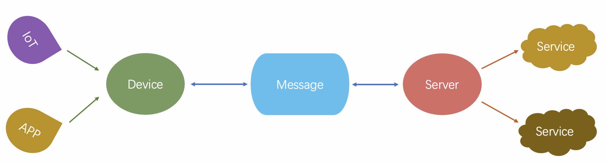

Based on this, we introduced the RocketMQ-MQTT extension project to realize RocketMQ's unified access to the messages of IoT devices and servers, and provide integrated message storage and intercommunication capabilities.

In IoT terminal scenarios, the MQTT protocol is widely adopted across the industry. MQTT originated in IoT contexts as a lightweight message transport protocol based on the publish/subscribe (Pub/Sub) model, specifically designed for low-bandwidth and unreliable network environments. It was originally developed by IBM and is now maintained as an open standard by the OASIS consortium. MQTT is extensively used in IoT, smart hardware, vehicle networking, smart cities, telemedicine, power, oil & energy, and other domains.

Its core communication model is also Pub/Sub—similar to RocketMQ. But it provides greater flexibility in subscription patterns, supporting multi-level topic subscriptions (e.g., `/t/t1/t2`) and wildcard subscriptions (e.g., `/t/t1/+`). With MQTT, you can easily implement message broadcasting, multicasting, and unicasting.

The goal of the RocketMQ MQTT architecture is to achieve unified management of message storage and distribution while enabling multi-protocol integration without intruding into the core logic of the RocketMQ broker. To this end, we have designed two fundamental models: the queue storage model and the push-pull model.


We have designed a topic queue model for multi-dimensional distribution. As shown in the figure above, messages can come from various access scenarios (such as MQ/AMQP on the server side and MQTT on the client side), but only one copy will be written and stored in the commitlog, and then Distribute the queue index (ConsumerQueue) of multiple demand scenarios. For example, the server-side scenario (MQ/AMQP) can perform traditional server-side consumption according to the first-level Topic queue, and the client-side MQTT scenario can consume according to MQTT multi-level Topic and wildcard subscription.

Such a queue model can support the access and message sending and receiving of the server and terminal scenarios at the same time, achieving the goal of integration.


The above figure shows a push-pull model. The P node in the figure is a protocol gateway or broker plug-in, and the terminal device is connected to the gateway node through the MQTT protocol. Messages can be sent from a variety of scenarios (MQ/AMQP/MQTT). After being stored in the Topic queue, there will be a notify logic module to sense the arrival of the new message in real time, and then a message event (that is, the topic name of the message) will be generated. The event is pushed to the gateway node, and the gateway node performs internal matching according to the subscription status of the connected terminal devices, finds which terminal devices can be matched, and then triggers a pull request to the storage layer to read the message and push it to the terminal device.


Our goal is to achieve an integrated and self-closed loop based on RocketMQ, but we don't want Broker to be invaded into more scenario logic. We abstract a protocol computing layer, which can be a gateway or a broker plug-in. Broker focuses on solving Queue issues and doing some Queue storage adaptation or transformation to meet the above computing needs. The protocol computing layer is responsible for protocol access and must be pluggable and deployed.

---

<a id="mqtt-02rocketmqmqttquickstart"></a>

<!-- source_url: https://rocketmq.apache.org/docs/mqtt/02RocketMQMQTTQuickStart/ -->

<!-- page_index: 48 -->

# RocketMQ MQTT QuickStart

Version: 5.0

<a id="mqtt-02rocketmqmqttquickstart--rocketmq-mqtt-quickstart"></a>

# RocketMQ MQTT QuickStart

- 64-bit operating system, Linux/Unix/macOS recommended
- 64-bit JDK 1.8+

Since the RocketMQ-MQTT project relies on the underlying multi-queue distribution of RocketMQ, RocketMQ supports this feature from version 4.9.3, so you need to confirm that the version of RocketMQ is upgraded to 4.9.3 or later, and ensure that the following configuration items are enabled:

```text
enableLmq = true  
enableMultiDispatch = true 
```

For the deployment of RocketMQ-MQTT, refer to the project description, download the project release version or build it directly from the source code.

```text
git clone https://github.com/apache/rocketmq-mqtt 
cd rocketmq-mqtt  
mvn -Prelease-all -DskipTests clean install -U  
cd distribution/target/  
```

After the source code is built, edit conf/service.conf to complete the MQTT related configuration, as follows

```text
username=xxx    // Authorization verification account configuration 
secretKey=xxx    // Authorization verification account configuration 
NAMESRV_ADDR=xxx  //namesrv access point 
eventNotifyRetryTopic=xx   //notify retry topic, created in advance 
clientRetryTopic=xx  //Client message retry topic, created in advance 
```

Other launch configuration and pre-step reference projects [README.md](https://github.com/apache/rocketmq-mqtt/blob/main/README.md)

Finally start the meta service and then the mqtt broker. Go to the distribution/target/bin directory and start the process.

```text
sh meta.sh start 
sh mqtt.sh start 
```

The basic code is provided in the project engineering code, see the code [example](https://github.com/apache/rocketmq-mqtt/tree/main/mqtt-example)

```text
MqttConsumer.java  // MQTT client initiates subscription message 
MqttProducer.java   // MQTT client starts publishing messages 
RocketMQConsumer.java // RocketMQ client starts subscription message 
RocketMQProducer.java  // RocketMQ client starts publishing messages 
```

---

<a id="connect-01rocketmq-connect-overview"></a>

<!-- source_url: https://rocketmq.apache.org/docs/connect/01RocketMQ%20Connect%20Overview/ -->

<!-- page_index: 49 -->

# RocketMQ Connect Overview

Version: 5.0

<a id="connect-01rocketmq-connect-overview--rocketmq-connect-overview"></a>

# RocketMQ Connect Overview

RocketMQ Connect is an important component of RocketMQ data integration, which can transfer data in and out of RocketMQ from various systems efficiently and reliably. It is a separate, distributed, scalable, and fault-tolerant system that has low latency, high reliability, high performance, low code, and strong scalability. It can achieve various heterogeneous data system connections, data pipeline building, ETL, CDC, and data lake capabilities.

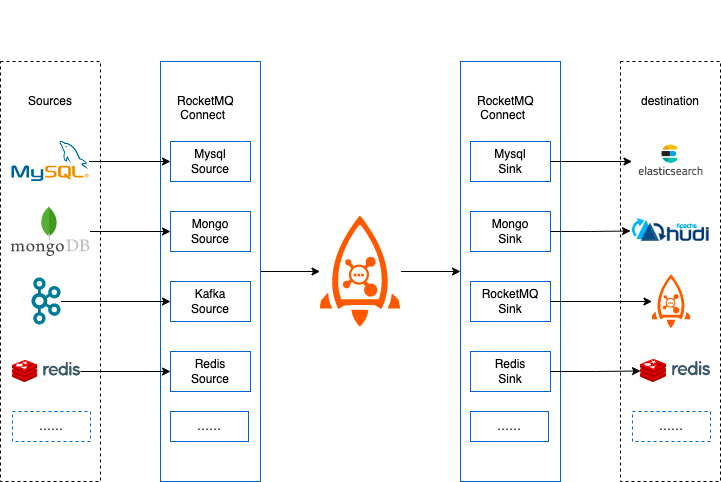

RocketMQ Connect is a standalone, distributed, scalable, and fault-tolerant system that mainly provides RocketMQ with the ability to flow data in and out of various external systems. Users do not need programming, they only need simple configuration to use RocketMQ Connect, such as synchronizing data from MySQL to RocketMQ, only need to configure the account password, connection address, and the need to synchronize the database and table name.

**Building a streaming data pipeline**


In business systems, MySQL's excellent transaction support is used to handle data addition, deletion, and modification, ElasticSearch and Solr are used to achieve powerful search capabilities, or the generated business data is synchronized to the data analysis system and data lake (such as Hudi) for further processing, thus making the data generate higher value. Using RocketMQ Connect, it is easy to realize such data pipeline capabilities. Only three tasks need to be configured: the first task is to get data from MySQL, the second and third tasks are to consume data from RocketMQ to ElasticSearch and Hudi. Configuring these three tasks has realized two data pipelines from MySQL to ElasticSearch and MySQL to Hudi, which can not only meet the needs of transactions in business but also the needs of search, and also can construct a data lake.

CDC, as one of the ETL patterns, can capture the database's INSERT, UPDATE, DELETE changes in near real-time, RocketMQ Connect flow data transmission, with high availability and low latency characteristics, through connector easily realize CDC.

When creating a Connector, it is generally completed through configuration. Connector generally includes the logical Connector and the Task that performs data replication, which is the physical thread, as shown in the following figure, two Connector connectors and their corresponding running Task tasks.

![RocketMQ Connect任务模型1](data:image/png;base64,iVBORw0KGgoAAAANSUhEUgAAAdcAAADnCAYAAABMiRzYAAAcS0lEQVR4Xu2dZ7Rc1XmGIX9x8sPxCssr8SKBhJVgLwIhxoAhVGOZZnoMFqYYZEAgOqKKIproHVMDSIgiEJJAvXcJVUCi9yqqaAIJkHbm3XP3cO6ZM6Nb9j138/E8a71LM6fP1f3mmb3P3nPXWXfddR0hhBBC4mWdCm7NmjWEEEIIiRB51csVAAAA4oBcAQAAIoNcAQAAIoNcAQAAIoNcAQAAIoNcAQAAIoNcAQAAIoNcAQAAIoNcAQAAIoNcAQAAIoNcAQAAIoNcAQAAIoNcAQAAIoNcAQAAIoNcAQAAIoNcAQAAIoNcAQAAIoNcAQAAIoNcAQAAIoNcAQAAIoNcAQAAIoNcAQAAIoNcAQAAIoNcAQAAIoNcAQAAIoNcAQAAIoNcAQAAIoNcAQAAIoNcAQAAIoNcAQAAIoNcAQAAIoNcAQAAIoNcAQAAIoNcAQAAIoNcAQAAIoNcAQAAIoNcAQAAIoNcAQAAIvODlOtRV08nxgN2yf9fE3uxwA9SrkdW/vOeXbaGGI3+f8Eu1K/tWKlf5ErMxUpxQjHUr+1YqV/kSszFSnFCMdSv7VipX+RKzMVKcUIx1K/tWKlf5ErMxUpxQjHUr+1YqV/kSszFSnFCMdSv7VipX+RKzMVKcUIx1K/tWKlf5ErMxUpxQjHUr+1YqV/kSszFSnFCMdSv7VipX+RKzMVKcUIx1K/tWKlf5ErMxUpxQjHUr+1YqV/kSszFSnFCMdSv7VipX+RKzMVKcUIx1K/tWKlf5ErMxUpxQjHUr+1YqV/kSszFSnFCMdSv7VipX+RKzMVKcUIx1K/tWKlf5JpQFr22wk1Z9Gbd8pCl73zrxs550U1d/Fbduo5k0sLX3ZNvfFW3/PseK8UJxaRavyROrNQvco2Q9X70t/4HOe/FT1otP/mcS/3ycy+7sW6fbCS5PfY9OPxnuH/ZaGO/b1j/zLur3UlnXVw7j6LH519+S22bATfc49b/6c/qjl2Ucy+9wf3rxj+vHWvnHr93I2c8U7fd9zVWihOKiV2/JK1YqV/kGiFBetfc/mCr5RtvsmlVrhWZ5ffJ5oCeR7nf7XWgm/70u+6JF5a7ATfe6/e77f7Rfv0xJ53j/v4n/+DOvvg632pVa/Pymwb6bc648Gq/zWU33O23yR87n/uGT/f73f3wRLfkra/d0PEL3fa77O5+sdl/1237fY2V4oRiYtcvSStW6he5Rojk+p9b/Mr12POA2rIxs1/wP1wJVnLte94V7uDDj62tHz7pSS80yVRSPP60C1odU63dwY/NdHOe/8gfR8LNn/eYk8/151bLtq1yveS6u/zxdNywTK3WcP4lb3/jTujb37eCdbzD/nKS765e+Mrn/npDl/SClz/zz2cufc8Letc99nOn9hvgX6/WX3vHQ74FrmP0/PPxbvHrX/rlD42e67bYaju//PcHHOJmP/tB3TV2NlaKE4qJXb8krVipX+QaIRKc5Kmf4/yXPvXL9Fyt0c233MbL9Y4HxrZaL5lpnR6r5ap16hqWJMfNfal27AdGzvbriu7FhlbojCXL2izX0bOe9/tIfLqGe4ZObnXf9cIrb/WvR9c8cNhUL1m1nPUhQPuNf+Jlv93c5z/2zyXbQcOn1Y7Z/6rb3PApT/vnammr9a3l+nCglrmWS7Y6tlrMEm3+GjsbK8UJxcSuX5JWrNQvco0Qyei2wSP9fczQNaxWnR4HuT795iq/3Q13PeLXa9twL1atOm2z9bY7hf8Qt832v/Gtur8Oesw/z9/PVdT6DcJrq1yVEVOXuMOPPtmLU/vrurR/uG7JNGwrWWq7tshVrXWt63X8Ga2keddD491F19zhu7B1LLW0tXzUzGf9ftOfeqfuGjsTK8UJxcSuX5JWrNQvco2QINcTz+jvW6sSkH6mElKQq7Y76LBj3D7/e5gf8RvEpG7YbBftwle/cFfecp8/pgSoLldtq+Pnz3vTPcP8Osm5rXJVd27oolUkWl2zjqMWsM57092P1tb/35AJtdeSleusZ95vJVftF/bR8f54xHF159ayll+4VlFLN79tZ2KlOKGY2PVL0oqV+kWuERLkGrpD1d264657+nVZuWoQUehC3nKbHfyy0HrLdgUr+x/8Z38MyVDrs7K66q+DfYt2u517uF1228cva6tc99q/p9vvoCNaLZsw7xV/jiHj5vvryg7A6jfgJrftjr+tyTW0ToP0i+Sq168RyOH5kDFP+Ba7WsRqGesDhKJjDh4xwz315sq66+xMrBQnFBO7fouiwX75ZY2iHqbsB+SuzJznPnSPT1/q3xfy66zESv0i1wgJctVj3V/Uz1NTY/Q8K1cVbBhZrHubWqbuYklR91tD1+9j05a6n22woet92vn++bGn9PP7SKDaRsdu+Y/zXcPaRut0bD3PRgORstfa/+rb/X4SvebN6n6rZKhluh98Zv9rvAAle0lP3bvqzlVXro5/0tmX+GNK/o3k+vDYef65xKk3nk023dwPpAr3nXW/VYOkdF699va8kbUlVooTiimqX41J0O+WemKyy3XfX7dg8tuvLfr9HTZxsb+l0ehDq9bp9k2oRdX6LQNH1NY12i8kfGBti5j1nqA6CudSDjmyj3//yG/bHdH7iG796ENzfl17Y6V+W/6fkGtnkpVr71PP8z/UMArWyzUzz1WDebLrFQ1akky1XMdS1H0cBhpJPuG4IdpGxatWqNZLrtn1IRpxnL1WdUNr1HJ2GxVteFPQ/c8whUiRaNVdrHVBwopG+upfyVUDq7JylbR1/WFbtcBDV7S6usNyXb8kn72+GLFSnFBMUf1OXvSG/53Ky1UfFjsjV4lP9ZlfL4nofBohrw+bmqt+1HF9/TLt02i/bGpyrbRG8+uy0S0YXY/qVvuo3lXXWqYZA/ntuyN6DeH9IL+uvbFSvy3vc8i1rKgAJab8chWMulz15iA55dcrakmq61lTZ/SJVaNvT+93eW2AUHui4lfXbtGnZglY1zJxwWt1x1ZxK/l9iqIPEBr4lF+u6Tt6Hdl7vzFjpTihmKL6bYtc1YOkaWZh3TmXXF/7shb9PmpAoXqeQk+R5KpemHDrJZsw1e7uRybVlqk3RvtKMNn99GUvkqBuyegDpW7nqAayclXN64OnerDyrdE+p1/oBwLml2tshL5cRo/VVaxbOhKuPhCr10jLNfVNYyD0wVjH0AfpIP1G16V1+pCt/bRcrXO9V4TzFk2z07n1WvTBXMdodD1F0/bysVK/yLWkSDK9+pzpf+DZX1QSP1aKE4opqt8g10N7neiFGSJhBLnqg61uZ4R99DzMPVfPkcYWhBH+Qa6Nunf1YVj7SB7qnpXosh9Us/sFWUtwEpOW63GQqz6Eaj655KcWcP5ckpx6gvLLQ9TDpX31WtWLpLENui71OOk6dA6JXo/12sJI/kbXpQ/UEqKkqn00+l/b6T2s0TS7cMtHYyvmv/xpw+vJT9vLvxbFSv0i15Kie6W6h/rw+AV160jcWClOKKaofoNcJQ+9qYfoTXxtcg1zv9X9quVhsF4zuSrqOQotsJY3Ui9JtULzcs1OTdOHbLVQg1z/cOjRXj6aRZA/hyLJSeD55SGSnI4T5tArOp5mHQS5hgFQ2jbcwml0XRrYqH000FHLJVu9luvuHNJwml22W7jZ9eSn7RXFSv0iV2IuVooTiimq37Z0C+flKhFKrhrkJwmH5botsja5qis0O2JX3ajqctZ+miKXl2u25akWtVqSQa4h6krOn0eRfIu6UDXISeM51L2bv6+sDxkaiJi/ft2r1bn0uNF1qfWeva6Q8wbc3HCaXVauza4nP/ixKFbqF7kSc7FSnFBMUf22Va5ZmWi6mOSqQXXaN4xanzj/1bXKVUIuWq7u0LzUJLGs1PNyVUtRLUbdD5XY88fUvWJtp5Zydrley4GH9PKj7yWssG8Y2S+R6jqyf9AjL9ei6wpdvDpfmDYn8eteaqNpdlm5Nrse5GqcouLsrqig1S2lN4dGA5lI+2KlOKGYovpti1zVytN9Un0Rim7PaHvJVQMF9YavAU4SSRj120yuajVqGx1f+6t2NWNAyyTr9shVYgrXr9Zh/lwajSxB6utCde16HqbU6XWEb39Ti1HvJ7oOL7fK447INXxBjAZL6rWFb4nTz7bRNLvwjW3aptn1IFfjFBVn2dEvmkYBtvwH+Kjw81NnujP6BJ//Sz/fh1gpTiimqH4bzXPNylWj38NXfupf3TsMA5o0QCfUobowJQDNE28kVyUILkTHDKN31yZXjZjNz3PVHHKdN4zYzUZSC3PoQ7IDgkLrVvvrX90HDdfRHrnquvT46lvvb3Wu8LqaTbMLA8HUem10Pflpe0WxUr8tPyPkWnY0uEnFp09y6jbRPRvdy9AvXphX2t25+d7hXvj55anHSnFCMZ2pX8lBIs5PMVPUYtOgoqJ1jaKWrkbQ6oNofl3s6LrUwlVPV9EXr4TRvDG+yEFRC1nHK5qu12iaXXbbjl6PlfpFrt0Q/dLqZ37xtXe2Xl75JdQgi/CtSxoYoU/dEq7uc6iwtLzR/DR9gtQQen2i1n4SY/bTbaM/9xa+pELLtZ+6x9T9FL7YInyabXQ9eh26Hn2hhe4B5V9v2bFSnFBMd9cv6dpYqV/k2g0Jc8WaDUcP93Q0b+/BUXP8/RZ1u+jTa6P5aeFbY9R9pEEJ4SsKJd1mf+5NspYwdW8l/KH2kdOW+K4gHVv3dZpdj/5ggdZpnmB2Un13xUpxQjHdXb+ka2OlfpFrN0SDAfQzz4/+y0ZzzvQH2MNzfSuT9tF9o0bz04Jcg+A0z8yLsrJvsz/3ptZu+GPpigZVSMDZbuFm1yO5SsKpDMiyUpxQTHfXL+naWKlf5NoNCSMDw/f5ZqMv9Fe3sOaTqYs4LNdXq2kfDdtvND8tyDXbItZzjXps9ufe1GotGriUlWuz65FcJff8/t0VK8UJxXR3/ZKujZX6Ra7dELXwJDR1sWaXh7/zqsERmpAe7nUqIyY/5dfpq86KRvll5Rr+5qoS5Nrsz72pFaxRlWGf6+982I9OzMq12fUgVyiT7q5f0rWxUr/ItZuiv5Oqn7tajBrgpNamul3DBG3d55SANXRdz/W1Y+FvxHZErs3+3FvfC67y89X0dWeayqDtNCJR92DDNs2uB7lCmaRQv6TrYqV+kWs3RcI6svfp4T/AR98hGkbg6t7obnv/wS+X1CQ5jfbVuiK5qlXZSK5h9HGjP/emqT/hb0XqXGrlarnmq2k7DZBqdj0nnnmRH7mcf43dFSvFCcWkUL+k62KlfpFrN0dCVGuxaC6ZIsFp8FHRvLaOpNmfe5PY1U2cXabzZr+AO/b1dEWsFCcUk1L9kvixUr/IlZiLleKEYqhf27FSv8iVmIuV4oRiqF/bsVK/yJWYi5XihGKoX9uxUr/IlZiLleKEYqhf27FSv8iVmIuV4oRiqF/bsVK/yJWYi5XihGKoX9uxUr/IlZiLleKEYqhf27FSv8iVmIuV4oRiqF/bsVK/yJWYi5XihGKoX9uxUr/IlZiLleKEYqhf27FSv8iVmIuV4oRiqF/bsVK/yJWYi5XihGKoX9uxUr/IlZiLleKEYqhf27FSv8iVmIuV4oRiqF/bsVK/yJWYi5XihGKoX9uxUr/IlZiLleKEYqhf27FSv8iVmIuV4oRiqF/bsVK/P1i5HkXMxkpxQjHUr+1Yqd8fpFwBAAC6EuQKAAAQGeQKAAAQGeQKAAAQGeQKAAAQGeQKAAAQGeQKAAAQGeQKAAAQGeQKAAAQGeQKAAAQGeQKAAAQGeQKAAAQGeQKAAAQGeQKAAAQGeQKAAAQGeQKAAAQGeQKAAAQGeQKAAAQGeQKAAAQGeQKAAAQGeQKAAAQGeQKAAAQGeQKAAAQGeQKAAAQGeQKAAAQGeQKAAAQGeQKAAAQGeQKAAAQGeQKAAAQGeQKAAAQGeQKAAAQGeQKAAAQGeQKAAAQGeQKAAAQGeQKAAAQGeQKAAAQGeQKAAAQGeQKAAAQGeQKAAAQGeQKAAAQGeQKAAAQGeQKAAAQGeQKAAAQGeQKAAAQGeQKAAAQGeQKAAAQGeQKAAAQGeQKAAAQGeQKAAAQGeSaIKeM+iNJLBZZ54THSWIBOyDXBNGb+eL3niKJxLRcBy4jqQS5mgK5JghyTSvIlZQS5GoK5JogyDWtIFdSSpCrKZBrgiDXtIJcSSlBrqZArgmCXNMKciWlBLmaArkmCHJNK8iVlBLkagrkmiDINa0gV1JKkKspkGuCINe0glxJKUGupkCuCYJc0wpyJaUEuZoCuSYIck0ryJWUEuRqCuSaIMg1rSBXUkqQqymQa4Ig17SCXEkpQa6mQK4JglzTCnIlpQS5mgK5JghyTSvIlZQS5GoK5JogyDWtIFdSSpCrKZBrgiDXtIJcSSlBrqZArgmCXNMKciWlBLmaArkmCHJNK8iVlBLkagrkmiApyXXqc9Pc9Bdm1C0PmffWAjds5vCm23zfg1wTyeD36pdZCnI1BXJNkM7K9dEZw/x/7GZbbl63busdt/Hrhkx+pG5dNrcOuc1tvf3W4RfEH+uGQTfW1s9+ZY773b671dYr/7jBP7m7R9xT2+bHP/mxu/imS+uOnc2Bhx3Y6hjZnHjeyXXbN8tN99/s/m2TjeuWdzbItWO58rkVbo3Ok1v+7per3YKPv6lb3ixbTfmkes2Vx5Pf+9q99Pm3rbcZ9VHrF5cjf7ymeeSD6j6Pfli/riuDXE2BXBOks3IdOv3RmqDGLZ5YWz7l2am15c3kOve1J2pym/PqXDd20Th3+HFH+GVqoS5a9qSX7X9suokbcOvlfpsZL8ysbXPf2Pv9cSTXi268pO742Wi/8U9O8JHM9zl4n9pzCTy/fbMg1/bR1XK96tmukevfjP3Y/fuk5a23ua/Sqh35kc+pT37ht91u2icty9opySDXYe3cr7NBrqZArgkSS66bbrGpO3PA2bXlF17f3y8Lct11r9+6C667sNX63fff3T0253G/zR1D76ytm/P6PPeXU4/20lOrVuu1Xfa8Qbo99u7hn7dFrtlsv+sOrufRh9Se3z/hQbfzHrv44/zPLtu5u0bcXVt34rknug02+me3/k/Xd8eecZw/d1aukraOd8I5J9Sdp71Brh3LWuU65H33xTdrqgLUuiEfVJ+PqD6/+JkVbkXluZbN/vCb6jVXlt/+8ldu7Lur6o4b0mPGp9VtW46jjH5nlVv57Rq3avWa6rkl48ryC5Z+4ZavWuOv8+UvvvVibSXXQcvc/Mr2r66orLu/i7ulkaspkGuCxJLrKeef4v5rqy1qyyUoLQty7XVSr1Zdx9r2mNOPcQvfXuS7eNf70Xru4CMPdtfec12re6pq0Wp9/rzK8Wf1cRtuvJF/3Fm5Sp77HbK/GzzuAfenYw/1x5VEB46+zx/73lGDfMtZ1zlozOCaXNWS1uv69c7buSfenF93nvYGuXYskqsY9faqVqkJrkViaon6fYa2SE2yHVPt5l20/Ft38wtfutWyn9ZVtpvy/tdVERacU8nL9deVVq/277dkhTti3mf+saS6zvDq+QZUrrP3ws/dVxX5PvrmylZy1XV+s7ryePR3ou6yIFdTINcEiSXXYbNG+H/V2pQc9XjE7Mdqcn1gwkP+8aQlk93kpVNqy3UMLZNEJauWXxIvvoXvLnaH9z7c/XyzX9SdVznzsrN8a1KPOytXiXPmS7PcrJdn+3u3uoa5b8xzV9xxpX98+yN3+A8CuuYJT030cpX01b2s61P3dv4cHQly7ViCXD9YuaZV5Mm1yfXWl77ysgvHevD1ldV1A9sv100nLXcHzf2s2lqtSFst4UnLvvbCFDq2Ws16vvHE5bXrWvrpN/5a/25cy/V1dZCrKZBrgsSS64wXZ7ktt/2VO/vyc72c1CWs7t2sRCUjdQdfdOPFvqWoZRJY9n7nxKcn+a5X7Xfdvde7vpec4R8XjRA+5Jg/1VrLnZWrurR1DJ1L1xnkuuCdRW7PA/fyz0PrWiKVXMMHAe0nMefP0ZEg145lrd3Cebm2tCQl11cq8nxq+XcC3XdWizAHtl+ukqa2F7oexcu1sm7YW1Vpi2VfrXYbTvhOroHdZ35Sd44uCXI1BXJNkJhylVh/uc0vvbhO7X96nVzVDbxDj53czrvt5AWqZeddc4GXU/64apHqGBoRrGNceedVtXXHnn6sGzz+QS+7My490y/rjFwfnzvKn0PSl1B1vUGuoxeM8cKX3NWK1Xn6XXWel6sea52uVV3J+XN0JMi1Y2mrXNcfX5Xrb6a3SLEiV8lP24V9rn3hy+q6ge2X68KPv3Wf6V7umOrzt1asrsp12IfVcz/wvus1/3P3yderq/dWW65Lx9Fz3fcN92i7NMjVFMg1QWLKVV3CoTU38onRdXIdMmVobb2m8GT3P+2ivn4eq7qCQ6tQXbHaRvc0JTANMpLw9j5oH79ectM5tI0e9+7b258rRNLMX29IVq66h6rj6fp133TfnvtV5Vppoeq6NKVIctW1qaWs1nR2QJPuE2dfZ2eCXDuWtcp10DK/ftQ7q/zgpuc+q7YuJVe1FrVO0lOL9qOV1Zuu2r+9clWLNLSCtU5Hmlo5Rni8XkvLWcfVtq0GNLVM8Rn46sq680QPcjUFck2Qzso1zHMN3aJh2owe5+WqqDs4fw9VrdcgXUUi7XN2n9r6ac9P963d7DY6jv4998p+fpvQpZuN7ofmrzckK1cNXNIArLBfz149/fE0t1b3g3U9Wq6Wsl6fric/FUfnKprr294g146lLfNcJ1ZakIHQdesHNFXE+3alhRnQPn7dwKoE6+a5ZpKXa59FX9S6gzWYSqIVO0371LdihQY5aZ2/N5ub5yr5+9eRGX3cJUGupmh570KuKdFZubY3Em92Sk6IWokPTx3qu2Hz60I02EgDo0bOq26jruEBt11Rt11Hozm2Gv2rx2oha4qNHqs1qw8R6gLO7xM7yLWL0zL9pW65olblYxHmmz7wfvXe7qCW5xJl6Ood81H1Xmt+n7KDXE2BXBOkLLlqHqm+IUktwlgjay0GuZJSglxNgVwTpCy5qmv4hH4nuXGLx9etI98FuZJSglxNgVwTpCy5krYFuZJSglxNgVwTBLmmFeRKSglyNQVyTRDkmlaQKyklyNUUyDVBkGtaQa6klCBXUyDXBEGuaQW5klKCXE2BXBMEuaYV5EpKCXI1BXJNEOSaVpArKSXI1RTINUGQa1pBrqSUIFdTINcEQa5pBbmSUoJcTYFcEwS5phXkSkoJcjUFck0Q5JpWkCspJcjVFMg1QZBrWkGupJQgV1Mg1wRBrmkFuZJSglxNgVwTBLmmFeRKSglyNQVyTRDkmlaQKyklyNUUyDVBkGtaQa6klCBXUyDXBEGuaQW5klKCXE2BXBMEuaYV5EpKCXI1BXJNEL2Zk7RiES9XklTADsgVAAAgMsgVAAAgMsgVAAAgMsgVAAAgMsgVAAAgMsgVAAAgMsgVAAAgMsgVAAAgMsgVAAAgMsgVAAAgMsgVAAAgMsgVAAAgMsgVAAAgMsgVAAAgMsgVAAAgMsgVAAAgMsgVAAAgMsgVAAAgMsgVAAAgMsgVAAAgMsgVAAAgMsgVAAAgMsgVAAAgMsgVAAAgMsgVAAAgMsgVAAAgMsgVAAAgMsgVAAAgMsgVAAAgMjW5EkIIISRe/h8ygC+XLAVw9AAAAABJRU5ErkJggg==)

A Connector can also run multiple tasks at the same time to increase the parallelism of the Connector. For example, the Hudi Sink Connector in the figure below has 2 tasks, each task handles different shard data, thus increasing the parallelism of the Connector and improving processing performance.

![RocketMQ Connect任务模型2](data:image/png;base64,iVBORw0KGgoAAAANSUhEUgAAAeEAAADnCAYAAAApZO6nAAAeZUlEQVR4Xu2debRcRZ3H498684fjGY/H8TijM5wz6EEdRhQGBhXECIpsMoJBASGy75JEIAhhMci+KauBhLAkhCSQBLISsidkJSHs+74mkECAkJr+1qMu993u6vS7776uepXP55wv6a5b995q6v3qe2vr7vOZz3zGIIQQQqj96lPDbNq0CSGEEEJtVGbCAAAA0D4wYQAAgEBgwgAAAIHAhAEAAAKBCQMAAAQCEwYAAAgEJgwAABAITBgAACAQmDAAAEAgMGEAAIBAYMIAAACBwIQBAAACgQkDAAAEAhMGAAAIBCYMAAAQCEwYAAAgEJgwAABAIDBhAACAQGDCAAAAgcCEAQAAAoEJAwAABAITBgAACAQmDAAAEAhMGAAAIBCYMAAAQCAwYQAAgEBgwgAAAIHAhAEAAAKBCQMAAAQCEwYAAAgEJgwAABAITBgAACAQmDAAAEAgMGEAAIBAYMIAAACBwIQBAAACgQkDAAAEAhMGAAAIRK8x4cMvnoUSF6RLsa5ReoJy9BoTPqxWyatf2YQSleoX0oX4TVvEb3kwYRSFCOK0IX7TFvFbHkwYRSGCOG2I37RF/JYHE0ZRiCBOG+I3bRG/5cGEURQiiNOG+E1bxG95MGEUhQjitCF+0xbxWx5MGEUhgjhtiN+0RfyWBxNGUYggThviN20Rv+XBhFEUIojThvhNW8RveTBhFIUI4rQhftMW8VseTBhFIYI4bYjftEX8lgcTRlGIIE4b4jdtEb/lwYRRFCKI04b4TVvEb3kwYRSFCOK0IX7TFvFbHkwYRSGCOG2I37RF/JYHE0ZRiCBOG+I3bRG/5cGEu6mlz6w39y99vi7dadVLG8198x83M5e9UHesjKYvedYsf+79uvTeLoI4bWKNX1SNiN/ybLEm/NnP/YM+tFn0+JpO6Sedfr5NP+PPV9adk5fM8Gf7HGjzSv/29a3sue74wy9/bE7847nZfSS9/tMFf83yDL3iJvPFL32l7tqNdMb5V5h/3+ob2bV26fsLM2H2w3X5eqsI4rSpOn5RXCJ+y7PFm/Al193eKX2rrbfpMOGa6RXPyeuX/Q43P91zfzProZfNwsfeNkOvvNmed+2tk+zxI0883fzTF/7ZnHbuZbYXrN7rBVcNt3kGnn2xzfPnK4bZPMVrF3XLuFn2vGGjp5mVL3xoxkxZYnbedQ/zzW//d13e3iqCOG2qjl8Ul4jf8mzRJvytbb9n+v78l1navfMes2YnI5YJDzjzL+bAQ47Kjo+bvtwan0xX5nnsH87qdE31nkfePcfMf/RNex0Zc/G+R550hr23esqtmvB5l91or6frujT1gt39V774kTl+wBDbq9b1Dv79iXaYfMlT79ryuqHwxU++Y9/PWfWqNfLdfravOWXwUPt5dfzS6++wPXpdo9/vjjXLnn3Ppt8xaYHZ9vs72fRf/PIgM2/163Vl7K4I4rSpOn5RXCJ+y7NFm7BMVp/7wSfW2jS9V+/2O9vtYE34+tvu63Rcpqdjeq2esI5pSFpmOnnBE9m1b5swzx5rNFfserWzV77SsglPmvuoPUcGqTLcNGZGp3nhsy+8xn4elXn42JnWjNUT18OCzpuy8Embb8Gjb9n3MuUR4x7IrjnkomvNuPsfsu/Vc1dvXul6iFBPX+kyZV1bPXAZcrGM3RVBnDZVxy+KS8RvebZoE7525AQ7z+qGpNVL1Gtnwg89/4HNd8WNd9rjyuvmitVLVJ7td/yRNSlph51/bHuJfxtxt31fnG+W1Jt2xtiqCUvjZ640hxxxkjVYna9y6XxXbpmuyytTVb5WTFi9fx3rf+zATuZ64x1TzDmXXG+HznUt9dyVPnHOanverBUv1ZWxOyKI06bq+EVxifgtzxZvwicMHGJ7vzIq/T+QcTkTVr4DDj7S7P1/B9sVzs7ANPybHxpe8vQ6c+Ffb7HXlFFqqFd5df3ifa+6aaw9JhNv1YQ1jOyGhiUZssqs66hHrfteNeyu7PjfR03NPkvehOc+/FonE9Z57hxd79eHHlN3b6XpnKLUcy7m7Y4I4rSpOn5RXCJ+y7PFm7AbhtUw7w93+7k9ljdhLYZyQ9fb7fADm+Z6g/khaGm/A39nryHT1PG8qV30t5G2h7zTLn3NrrvvbdNaNeE99+tn9j3g0E5pUxc9Ze8xavKDtlz5hWSDh15ldvzhTzITdr1d93DQyIT1+bXi2r0fde9COwKgHrZ62nrQkHTNkeNnmxXPb6grZ3dEEKdN1fHbSFq0WEzzSSNW+QfpntT8R94w98xaZduF4rFURPyWZ4s3Yb3W/Kc+v7YM6X3ehBXYbiW15l6VpmFqmafmg92Q890PrDJf+erXzNF/+JN9f9TJg+05Mlrl0bWzXuT05TaPjunaep+XFlTlyzrk4uvseXog0L5jzQfLNJWm+epBQy6xRqmHApmjhpU1jKwhZF3/xNPOs9fUQ4LPhEfft8i+l8Gqgdp6m+/YBWFuXlzzwVrspfvqs3elwWtFBHHaNIpfrZnQ35ZGdvLpWpegqZ9i/s1Jf79jpy2zUym+h1sd07SRi0XF+l+Hj8+O+c5zcg+2rRi42gTFkbuXdNBhx9n2o5g3hNSOaMpJD9fFY10V8VseTLj2+uhTzrQB4lb9WhPO7RPWoqT8cUmLr2S6Ste1JA1buwVTMil3XSflUZCrV6vjMuH8cSetsM6XVcPfWqWdz6Pgdo2H5mfd1ipJhqxhah1zZi1pZbP+lQlrgVjehGXuKr/Lqx69GwLXELtLV/n1MJAvXxUiiNOmUfzOWPqc/ZsqmrAeKrtjwjJIxWfxuMxG99OOAD2Uaq//4ccMsGk6x3deXpkJ13q3xWN5aepH5VHc6hzFu+JaadohUcwfQvoMrj0oHuuqiN/ybLEm3BUpUGVgxXQFloZ61YjIxIrHJfVMNeStLUV6AtZq41MHX5AtdOqK1EhoSLnRU7iMWmWZtviZumurEZCK5zSSHjS0gKuYrm1N+hz5uekqRRCnTaP4bcWENSKl7Xfu2OnnXZ59KY7+HrUwUiNZbuRJJqxRHTflk5fbgjjszulZmkZ3dK6MKH+evlRHZqmpID14ahpJMZA3YcW8HlA1Ilbs3R536tl2QWMxXWs39CU+eq0hak0lyZj14KxRKKVrS6DWaOgBWtfQA7d7OPCVS8f0MK7zlK7evtoKd99G2w91b30WPcDrGr7yNNrOWBTxWx5MuIlkRv2PG2T/UPN/0Kh6EcRp0yh+nQn/tv8J1lidZCzOhPUArGkUd47eu737GonS2ge3o8GZsG9YWQ/NOkcmo2FhGWL+gTZ/njN1GaEMTOl67UxYD6vajy+TVI+6eC+ZoUaWiulOGjHTufqsGpXS2guVSyNYKofuoQcCvdZnczsXfOXSg7eMU+arc7TbQfnUhvm2H7qpJq39ePDJtd7yFLczFj+LRPyWBxNuIs3lao539JTFdcdQtSKI06ZR/DoTlsmo8XdSY785E3Z75zXsq3S36LCZCUsaiXI9OuWXZKbq1RZNOL9lTw/j6vE6E/7Vb4+wJqVdE8V7SDJDGX0x3UlmqOu47yCQdD3tsnAm7BZyKa+bOvKVSws0dY4WbCpdpqzPctkNo7zbD/PD0c3KU9zO2EjEb3kwYRSFCOK0aRS/rQxHF01YhikT1mJFmbVL13TM5kxYQ7D5FcoavtVQt87T1sGiCed7suqhq2fqTNhJQ9jF+0gy6UZDt1qspfUmGlYuznvrYUQLKovl11yy7qXXvnJpNCBfLqczh17t3X6YN+Fm5Sku4mwk4rc8mDCKQgRx2jSK31ZNOG862kYnE9biQJ3rVulPe/DpzZqwjLtRuoZhi+Yns8ubf9GE1fNUD1TztXoAKF5Tc9nKp553Pl2fZf+D+tvdBjI2d67bySDDVTnyP+xSNOFG5XJDy7qf206oBwTN9fq2H+ZNuFl5MOGeBRMuIQW+hsPUiPgWZKGuiSBOm0bx24oJq9eoeVx94YymhZRfJqwFjzIGLdSS4bhVzs1MWL1Q5dH1db5iVzsklCZT74oJy8Bc+dXbLN5Lq69lpPqaV5Vd791WQ30O92186oGqPVE5rAnWXpcxYfdFPFr0qc/mvrVP/2992w/dN+gpT7PyYMI9CybcBekPUqse9f/KSQ1EcUtRSKlHUPxlqN4ggjhtGsWvb59w3oS12t99Vav+1dymW5ilhUYuDjV0KqPQPnufCUvOCJ10TbdaeXMmrBXCxX3C2oOv+7oVynnJ/Nx3EDjlFza53rLO17+ap3Xl6IoJq1x6ffE1t3a6l/tczbYfugVt6g37ylPczthIxG95MOEuSIu0FKR6MtRwjeaUNNeiP1C3Lze0rr55nH0wKKbHLoI4bboTvzIRGXZx652kHqAWRzU65pN6zloxrAfW4rGqpXKpx6yRs0ZfcONWL1fxhRmSety6XqNtjL7th/m8ZctD/JYHE25R+uPW/6NzL72hc3rtj1WLRdy3YGmBh57iZcyah1EAKt23v09PpNpaoCd0nScDzT8t+35G0H0ZiNJ1noblNOzlvkDEPR37yqPPofLoi0M0R1X8vO0WQZw2oeMX9ayI3/Jgwi3K7bVrtkzfzTlp3+PtE+fb+SAN9+hp2Le/z32Lj4attLjCfbWkzLnZzwjK1GWsmvvRnj/lm/DASjsEpWtr3qlZefTDFTqmfZb5Ly8IJYI4bULHL+pZEb/lwYRblBY16P9RcbVjXtqz961tv5e917dk6RzNa/n29zkTdkaofXrWUGvnNvsZQfWeZeLuelocIqPOD0c3K49MWGYdy8IygjhtQscv6lkRv+XBhFuUWwnpvq85L/2wg4ajtR9PQ9MuXV+Jp3O0ncG3v8+ZcL6Hrfda5dnsZwTVC260ACtvws3KIxPWQ0Dx/FAiiNMmdPyinhXxWx5MuEWpxyjj09BuPt39zrAWeWjjv5uLlcbPWGGP6SvqGq1qzJuw+81fyZlws58RVK9aq0jdOZffMNquxsybcLPyYMLQTkLHL+pZEb/lwYS7IP1Or/4/qQeqhVrqvWq4122E1zysjFpL+vVeXxfnfqO4jAk3+xnBAWddZPf76WvqtMVD+bQCU3PELk+z8mDC0E5iiF/UcyJ+y4MJd0EytsOOPjUbFpb0HbFuxbHmbnff61c2XeYnM9TqZh1rZMLqpfpM2K229v2MoLZEud8q1b3Ua1a69vspnxZ6NSvPCYPOsSu1i58xlAjitIkhflHPifgtDyZcQjJO9T4b7cWTZIRaRNVoX2AZNfsZQT0AaHg6n6b75r+Ivery9IQI4rSJKX5R9SJ+y4MJoyhEEKcN8Zu2iN/yYMIoChHEaUP8pi3itzyYMIpCBHHaEL9pi/gtDyaMohBBnDbEb9oifsuDCaMoRBCnDfGbtojf8mDCKAoRxGlD/KYt4rc8mDCKQgRx2hC/aYv4LQ8mjKIQQZw2xG/aIn7LgwmjKEQQpw3xm7aI3/JgwigKEcRpQ/ymLeK3PJgwikIEcdoQv2mL+C0PJoyiEEGcNsRv2iJ+y4MJoyhEEKcN8Zu2iN/yYMIoChHEaUP8pi3itzyYMIpCBHHaEL9pi/gtDyaMohBBnDbEb9oifsuDCaMoRBCnDfGbtojf8vQqEz4cJSuCOG2I37RF/Jan15gwAABAamDCAAAAgcCEAQAAAoEJAwAABAITBgAACAQmDAAAEAhMGAAAIBCYMAAAQCAwYQAAgEBgwgAAAIHAhAEAAAKBCQMAAAQCEwYAAAgEJgwAABAITBgAACAQmDAAAEAgMGEAAIBAYMIAAACBwIQBAAACgQkDAAAEAhMGAAAIBCYMAAAQCEwYAAAgEJgwAABAIDBhAACAQGDCAAAAgcCEAQAAAoEJAwAABAITBgAACAQmDAAAEAhMGAAAIBCYMAAAQCAwYQAAgEBgwgAAAIHAhAEAAAKBCQMAAAQCEwYAAAgEJgwAABAITBgAACAQmDAAAEAgMGEAAIBAYMIAAACBwIQBAAACgQkDAAAEAhMGAAAIBCYMAAAQCEwYAAAgEJgwAABAIDBhAACAQGDCFXHyxF+jyJQifY6/B0WmRhTzoPCKFUy4ItToL3t1BYpESZvw8FdQLPI07tRTZPLUUwxgwhWBCcclTBi1RZ7GnXqKTJ56igFMuCIw4biECaO2yNO4U0+RyVNPMYAJVwQmHJcwYdQWeRp36ikyeeopBjDhisCE4xImjNoiT+NOPUUmTz3FACZcEZhwXMKEUVvkadypp8jkqacYwIQrAhOOS5gwaos8jTv1FJk89RQDmHBFYMJxCRNGbZGncaeeIpOnnmIAE64ITDguYcKoLfI07tRTZPLUUwxgwhWBCcclTBi1RZ7GnXqKTJ56igFMuCIw4biECaO2yNO4U0+RyVNPMYAJVwQmHJcwYdQWeRp36ikyeeopBjDhisCE4xImjNoiT+NOPUUmTz3FACZcEZhwXMKEUVvkadypp8jkqacYwIQrAhOOS5gwaos8jTv1FJk89RQDmHBFYMJxCRNGbZGncaeeIpOnnmIAE64ITDguYcKoLfI07tRTZPLUUwxgwhWBCcclTBi1RZ7GnXqKTJ56igFMuCJiMuGZjzxgZj02uy7dadELi83YOeOa5untwoQDaURNI1+tT09VnsadeopMnnqKAUy4IrprwnfNHqtKMN/e7jt1x7b/4Q722KgZd9Ydy+uaUdea7Xfe3uZ117pixJXZ8XlPzTc/3Wf37Lj05a/+ixk2/qYsz+e/8Hlz7lXn1107r/0P3r/TNfI64cyT6vI301W3Xm3+Y+ut6tK7K0y4dX3w8SYz7KkNndL6zl7bcb9xr9flb6bhT28wL733selzx2v2/C9PeavT8ZVrPsp/nE6Mf6FzGTanU5atM+9v3FSXnqlmNI+8s9HsNXdt/bGq5GncqadP1ayeVH7V0RsbNpkRz9SuO/7NujyVyFNPMYAJV0R3TXjMrLsyI5u8bFqWfv/qmVl6MxNe8MzCzATnP73A3Ld0sjnkmENtmnq8S19Zbk35P7fZ2gy95gKbZ/Zjc7I8t9x3q72OTPicK8+ru35eOm/K8qlWMv29D9w7ey+jL+ZvJky4a/RU436zr3HvYqOYNe41Azx00Tu2ke+UZ0zNLCa8afVmreFVA+ze9xnVNSM5Zbm/cR+4Yp1ZtbbDSJSveLwyeRp36ulTeevpnjds2VWO81avN6/X7rPuowb5qpCnnmIAE66Iqkx4m223MYOGnpaln335EJvmTHi3PX9izrrs7E7H99hvD3P3/HtsnuvH3JAdm//sIvP7U46w5qheso4rX/6+zpz77tXXvm/FhPPaebcfmH5HHJS9v3Xq7WaXn+1qr/O/u+5kbhw/LDt2whknmK9+/V/NF7/0RXPUwGPsvfMmLHPX9Y4//fi6+3RVmHDr2lzjfsCCd8zL73+cHetXe//i+k/e1xrx6a98aK+hxvrxdzd2NO63vWbWfFj7d6LfHHTNxW991Omeum7tUuaV2rGDF76THZv44gf2Hh99bMzklz+w9+3UuNdMQ9eb+NIH9v3qmmk8t+5j+xm2FBPubfV01qp1Nq87d6cH1tjPUuyVVyJPPcUAJlwRVZnwyX862fzX97fN0mVkSnMm3P/E/p2GrJX3yFOPNEteXGqHlj/7uc+aAw870Fx602Wd5nzVQ9bx4n2lY/94nPnaVl+3r7trwjLZfQ/az4ycfJv5zVG/tdeV2Q6fdIu99s0TR9ieuMo54t6RmQmrZ67P9T+77GQWPv9g3X26Kky4dakhtA1jrQF1WvH2xo771Rp3NaJqVF3+Acs/bTwveuQ9U2uLzZ3Pb7Dnifww59emvl13P6di465rPlzrve4xZ41Z9OZHZoMa7lojvs/ctbbB33/e2ux+GmLOGvdRr5m1Hxrbk5Kp5O+hvCmZcFL1VOtVf//+Ndl1r3vyfXtOn1t7YK7aU08xgAlXRFUmPHbuePuveq8yUb0eP+/uzIRvm3qHfT195QwzY9X9WbquoTSZrUxN6ZIMcsnLy8whRx9ivvHtb9bdVxr05z/a3qled9eEZbBznphr5j45z84tqwwLnltk/nL9hfb1dXdebx8YVOapK6ZZE9bDgYa1VT4NqxfvUUaYcOtSoyqpcXR65yM1h5tv3J9ct9E8mGug1bCXbdzVcPe583XTZ/Tr5orH3uu4/+2vmaGr19vXv1/8rl1MtOPMNXYoU+VyPTs7jFkcUh2engknWU+3vGpuf3aDPXf0cx0jGZXLU08xgAlXRFUmPPvxuWa7Hb9nTrvgDGtiGorWsHLebGVaGoY+58pzbc9TaTK6/HzstIem2yFfnXfZzZebAecNtK8brYg+6MjfZL3v7pqwhtJ1Dd1L5XQmvPilpebn++9p37veugxXJuweGHSeDLx4jzLChFuXGshmw5zFxn3wyvVZ4y4LOPfh9dmxcS90XvDTlcb9lmc22J6U0PXt/WuNuxrpJ97t6PEpdWmt96frq1wOZbfGULhHaiacXD3d9YbtHSt90IpPy1e5PPUUA5hwRVRpwjLg7+7wXWtwpww5tc6ENfz8g74/Mrvs/iNrtEo785KzrIkVr6serq6hFdC6xoU3XJQdO+rUo8zIKbdbUxx4/iCb1h0TvmfBRHsPPRzIeFVeZ8KTFt9rHwz0EKBese4z+KIzrQnrtY6prBrCLt6jjDDh1tVK424bz0+O3fFsx7yfXqsBzfdeNBdbpnH/x8lv2fxX13pWatDVi7L3V+N+75umz91v2AZbC3hUlr8/9f6n5aodk/loaLR4jy3NhHtVPdXMWD1jzd03eoCqVJ56igFMuCKqNGENRbve4YSFk+pMeNT9Y7Lj2tqUP/8P5wyw+4A1BO16mRoCVh7NucrotFhKxrjXAXtnPVDdQ3n0+ugBR9t7Oclci+V1ypuw5nh1PZVf87r79Nu3w4RrPV6VS1utZMIqm3re6p3nF2ZpHjv/ObsjTLh1ba5xdw2tXUU77nU7B+gad80xrq81pFpM890Za2xjW6Zx19yhvd+EN+x8oUzCvq9dR+ahLSxq3DX3qIVEMphsrnF4R69PaHFP/h5bkgn3tnq69LGOeeMfz1prtpr2dqbivH4l8tRTDGDCFdFdE3b7hN1wrNtOpNdFE5Y0DF2c41Vv2JmzJMM97rTjsuMPPDrL9p7zeXQd/XvGhYNtHjeUnJfma4vldcqbsBZgaSGZO69f/372etqbrPlqlUfp6nnr86k8xS1KulejvdJdFSbcupo27tp/OvJVO58n9N+Xa423a9w156fG3qHVsnZF7ieNe7OVrp2GOWuNts51LHlrozWKp9dvrBlMRw9K6E7q1fUZ2zHXmN/6ojLaY7l7WBNetgWYcC+sp2WfLCorYueSG5SjW/LUUwxgwhXRXRPuqmTQ+a1KTup1jp45xg7/Fo85adGUFnhNWNSRR0PSQ6/9S12+stIeZa121mv1uLX1SK/VO9bDhoaei+dULUy4B6ShxkYrV2uNv+3BjK5gSHGS9qF+0hPSEKf2q+p1rXe0zfS3O8pQPCekPI079dQ76ikGMOGKaJcJax+uvrFKPcyqVhKnKEwYtUWexp16ikyeeooBTLgi2mXCGpI+fvCJZvKyKXXH0KfChFFb5GncqafI5KmnGMCEK6JdJoxaEyaM2iJP4049RSZPPcUAJlwRmHBcwoRRW+Rp3KmnyOSppxjAhCsCE45LmDBqizyNO/UUmTz1FAOYcEVgwnEJE0Ztkadxp54ik6eeYgATrghMOC5hwqgt8jTu1FNk8tRTDGDCFYEJxyVMGLVFnsadeopMnnqKAUy4IjDhuIQJo7bI07hTT5HJU08xgAlXBCYclzBh1BZ5GnfqKTJ56ikGMOGKwITjEiaM2iJP4049RSZPPcUAJlwRmHBcwoRRW+Rp3KmnyOSppxjAhCsCE45LmDBqizyNO/UUmTz1FAOYcEVgwnEJE0Ztkadxp54ik6eeYgATrghMOC5hwqgt8jTu1FNk8tRTDGDCFYEJxyVMGLVFnsadeopMnnqKAUy4IjDhuIQJo7bI07hTT5HJU08xgAlXBCYclzBh1BZ5GnfqKTJ56ikGMOGKwITjEiaM2iJP4049RSZPPcUAJlwRmHBcwoRRW+Rp3KmnyOSppxjAhCtCjT6KSyliG3cUlRpRzIPCK1YwYQAAgEBgwgAAAIHAhAEAAAKBCQMAAAQCEwYAAAgEJgwAABAITBgAACAQmDAAAEAgMGEAAIBAYMIAAACBwIQBAAACgQkDAAAEAhMGAAAIBCYMAAAQCEwYAAAgEJgwAABAIDBhAACAQGDCAAAAgcCEAQAAAoEJAwAABAITBgAACAQmDAAAEAhMGAAAIBCYMAAAQCAwYQAAgEBgwgAAAIHAhAEAAAKBCQMAAAQCEwYAAAhEJxNGCCGEUHslE/5/N6G4AxiTnDIAAAAASUVORK5CYII=)

RocketMQ Connect Worker supports two running modes, cluster and single-machine. In cluster mode, as the name implies, there are multiple Worker nodes, it is recommended to have at least 2 Worker nodes to form a highly available cluster. Cluster configuration information, offset information, and status information are stored in a specified RocketMQ Topic. A new Worker node will also obtain these configuration, offset, and status information and trigger load balancing to re-allocate tasks in the cluster to achieve a balanced state, and reduce the number of Worker nodes or when a Worker node goes down, it will also trigger load balancing to ensure that all tasks in the cluster can run normally on the surviving nodes of the cluster.


In standalone mode, Connector tasks run on a single machine and Worker itself does not have high availability, task offset information is persisted locally. It is suitable for scenarios where there is no high availability requirement or does not require Worker to ensure high availability, such as deployment in K8s clusters, which are guaranteed by K8s clusters.

![RocketMQ Connect部署模型单机](data:image/png;base64,iVBORw0KGgoAAAANSUhEUgAAAb8AAADJCAYAAACzHzwaAAAkaElEQVR4Xu2dCZQU1bnH25eTRJ+aY/JyTN6LJickTxNjEvMMigtq1AgE9wVFQ1RQiQsIiAKKCoKgyDKgIosIKoIiKCIiqOwgw6YIoriwCcMyzMDMALPP3Ff/r/oW1dXVzUwvUzXc/3fOj6q6tXTdrqJ/c5eqGznr3AsUIYSYCsPMiDQ9p7n6eIcihBDjoPzMDcqPEGIslJ+5QfkRQoyF8jM3KD9CiLFQfuZGQvnd8/DT6ic/PTEm7cT/Pln99bxLnOW535SqSCSinhj5Rtz+iRj66mz129//KS6dEEIaGsrP3EgovzHvLBOxTcvdKsuvL/palgGkh7SRUxfJ8tsrtsXtnwjKjxASFig/cyOh/BZsqRKx9R89VZYfHDhKnX1RS/U/v2oiAkMaSodYxvwHG0pUy+v/pY457nhJ6znoRUmfMGeNuqj19ere3oNFem75YZ/z/36lurvXU7I87r2V6oyzL5ASJ441+/N9kv7w0Anq9i6Pqctv6qCu/mfHuHMlhJBUoPzMjYTyA5DdjXd1k/nmLa5W9/cZptp0uF/d3LG7pEFc1/7rHpm/7Jpb1MlNTlGDxr+r+j7/uogzZ9KH6oW3lsg81vV6Zpwjv3nflqk/NT1fNbv4HyLa99bske2ub99ZjZy2WJ17yeUiQhy7Y48nZR3O57k3F8SdJyGEpALlZ24klR9Ka6f+8Uy1cGu1yAelOMgNIluyXUkpDyXDjzYccGSn94UMUUrT8puydKOkQ34oGTa94DL1+zPOUvM3lkv6/X2GS5vi0jx7f13NOvPTfJEfSoP4TO85EkJIqlB+5kZS+b04c4UICMKC6JZ+p9ScL4sd0WE649OdatK8L2ReV1OC9l0fl5Ih5Id9dTqOpdsOITSIE+nX397JSXczce56kR9k6j0/QghJB8rP3Egqv8VbakRAp//fOTHyQYkNaSgBYhmlN2z3ykfrnG0uvryNtAn6yQ/SQ4kOJT1dhXrb/Y86JUHw4Vf71ejpH0upk/IjhGQDys/cSCo/gLY3iO2RYS87aR269ZE0tP/pNLQJXtH2DpHWO6vyRHjj3//EV366w8vTL81wpKlLkmjvW7CpQt3R/Qm7qnNrLeVHCMkKlJ+5cVj5oZMLpDRt2RYn7fmpCyVt4IvTnTSU0iA5XV0JEaKadNTbSxPKD6DtDx1fMN/2rgec/SG+Z6fMl/SOPQaolte1izs3QghJB8rP3Dis/OrDws2V0v7nbvurL7PWFko7H47lXUcIIZmE8jM3Mio/QghpTFB+5gblRwgxFsrP3KD8CCHGQvmZG5QfIcRYKD9zg/IjhBgL5WduUH6EEGOh/MwNyo8QYiyUn7lB+RFCjIXyMzcoP0KIsVB+5gblRwgxFsrP3KD8CCHGQvmZG5QfIcRYKD9zg/IjhBgL5WduUH6EEGOh/MwNyo8QYiyUn7lhnPwi988kIcN7jQhpKCg/c8NM+b26i4QFyo8ECOVnblB+JFgoPxIglJ+5QfmRYKH8SIBQfuYG5UeChfIjAUL5mRuUHwkWyo8ECOVnblB+JFgoPxIglJ+5QfmRYKH8SIBQfuYG5UeChfIjAUL5mRuUHwkWyo8ECOVnblB+JFgoPxIglJ+5QfmRYKH8SIBQfuYG5Zdt3shXkVmF8emaibvUjz7YqyLvJdmmPrxvHef1/Pj0sEL5kQCh/MwNyi8BtfoLmrYnJn1WXoWkv7alPG6fGCwJbT5Y7XzRFTW1sq+z3pLe+zsqnM9BYP6VTYeO+9zXpaqqRsUf24fJW8tVefWho+0srVG/m7cvbrvQQfmRAKH8zA3KLwFaI09/eTAmvSwqmEmHkd+XJdXquwM1KjKjQAQ64qtS2a/bmgOyfnF+pbJ8qKZstYT4XoGU1nK+treZ+p0tyZHWMrbxHttLuxUlsl/H1ftVZNJu9ffFxWpXWY06UFUbt23ooPxIgFB+5gbllwAorsSSx/aDNU7azz7cK18aBAj5Td9ertYVVTnrmy8qsoVjyQ7SmrurMuaYKC22XV6iIm8XyHGeteTm/dyFlhTx2SgZ1lV+o74psy+mdVydhlKf8/mv7VYf7KyQUiSOt3pvlV0d+2a+fb66yvXNPfbyjEIRaJ6V9xlWHpFfrH/yi4NSgsUx1uyrto9hpV/9cbEqqqyR9I0HrPTph87jsFB+JEAoP3OD8ksABAS5yZc01a76xDJKc8WVdsmv86cHYtZDNliHeZT8EKj6hMSOnbPXOfYNy4rt/XzaAnUpDiXGusqvyUf7ZB+ICedwx6r9Me1+4zeVSX5QNdp+ZYlIECVPSBrxH/rc3rKXIcPboueBY47bWKaaLSiSZZRUUXpFOkqzOE8EZIhjo8QJEXrPMSGUHwkQys/coPwSAFl0/+yAtKMNiFZ9olSEalAtv8jk3bJd3/V2VSa2ddoCrVIRttlbgS3sKCyvlVJRz7VRaXraEwFKjwgIqa7yA03nF6lVVokOYkPgU7G/Pm+RXXRbyEzaEusgP5R2se7jPVUxUrv3k/1qzLdlUkUrx5pop58y1xZx5N06lv4oPxIglJ+5QfklQMtvzs4KKe1BEPKFWcJw5Gdt93lRlfpmf7X02JT1qEJ8bXdMFWRkSr4auqFUjglBoUoR0T3a/uem97qD9nEsedZZfm/ucaogAUSIc5bjWCUzfO5jnx9qu7xn9X57nVd+78TKD/vpfXC8tajq9Hw20vwCJUXvtr5QfiRAKD9zg/JLgJafru5DdeLOMrvk45YfOplgW1SJ7quw28Z06cdd1Qk2lFTbx3jTloxbJkOsEmUP6/P2WKXDHaX259RVfpsOVKuvSzxiisq65ZJiOS93B52J1nwBSqFR+enSnZayn/wk/9HzAlcsLZESL0qU0k5oCV6wjvlPtGtapWLvefpC+ZEAofzMDcovAVp+mEf7FgKPHmDZLT/0rrTXKmlbkzTrhx+7oL1PV23+2SqN4Tjzop1QFljSQEjVpLUNjq0DVZ/YButwbCy7QUcV97mO3Wh3eJHenqh+fD1fZIVAeySqJiEokbF1bqi+lB6lE+18ztpRIceEnGUfH/m1XlokyyK26QXqoHU8dLTR7Z5o70PpE58rwp5E+ZHwQ/mZG5RfAkR+0WrJ+bujIon2YoT83M/5obOHez1os6zYkSb+BagedTqiWHLQx9WBbbCLlOKs9ZCfX0iPUff5vrZbep26A3LqtTZa1flugfOIBsLu0Wmfq5YkAj01EZAfOt645QdR4vx1SAk2WtWKqlwdOH+RsPv8kkH5kQCh/MwNyi8DLCuosrv4e9dZAkOVItrgdIeQOKySGKpW5YF0VBVaUnpne3ni7ZPxdoFUXca0N2osQf4C1Zt4A4z32Cid+nS+8QWCf8tn2xmFdjufq+2xTlB+JEAoP3OD8ksHSwJL99ilHpGOdz05PJQfCRDKz9yg/NLBKi2hDQ+dSuLWkbpB+ZEAofzMDcqPBAvlRwKE8jM3KD8SLJQfCRDKz9yg/LLBpN3yyjF5fZm3cwmJhfIjAUL5mRuUXyaxpPfhLnvIIx143OGm3BC1Cc4udF7XFgooPxIglJ+5QfllEHR+wXNueEBcSnzvFshbXOR5uehzdUHzyDp7ZAZvemBQfiRAKD9zg/LLFG/myxc6+tvoW140U/JlCCH91ha8uxMvwIYQ5XVh0ZEdMIgthjPCq8ogULzmDM/O4bk5PJSOt7hgPz3Kgj5+wuGEog/RIx37vbG1XN7hqR+8x3BFyc4H+cD54IH7L4oPDduUcSg/EiCUn7lB+WUI/Q5Q/Z5MP/CKM8Qne6vVtR/bA87KEEgTD73uDG9cwbh5cJSMxzfFliqkhVeJOa8gw8PkSYYTgkwhNLwvVA+ke8a8Ihk9HsfG4xnJzgcv9EbgHaB3YYgkn/xkBMqPBAjlZ25QfhkC77yULzRJ9SYeiMcAuXoZb3WRfd4vFPm5hwzCtvJu0Kj8HAFNtV9GjX2TDSeE0qJ7MN1XN9tj+bmrPZOdD+Qn7+jMdocdyo8ECOVnblB+mWJWoXyhzvs0XeCF16j2xLBAMoq6XveGLTaUwiA/efdndN2svAp7dIeo/NwlSsTFi4qTDieEUp9fxxa3/JKdD+Qn8vXsn3EoPxIglJ+5QflliugICahCdKc74/zNLlQfWELRbW3gvGhVKV52DfmhSlOv88rPGXPv1UPySzackDNyQ3SffusPyMgMbvklOx/Kj5gA5WduUH4ZBOPkITDaOzrA4EXSqFbU4+ChRAVBYsQELGN0dD1GYCrySzac0LRt5TKyA8b1w4u1EXj2EG2Aeptk50P5EROg/MwNyi+TWELJLYgdWqgQvTajPShROtwSHWEd0oGE0FsT6/zkJ6WyBPLTvUcTDic0wx5zD4F/UUqU9PcKZTsp/SU5n9mW/NDzNC6PmYbyIwFC+ZkblF82sIQlwxj5DS0E3iuQzil1HvD1cCQbTgji9Y6qjs+d6hqWKNPnUx8oPxIglJ+5QfmRYKH8SIBQfuYG5UeChfIjAUL5mRuUHwkWyo8ECOVnblB+JFgoPxIglJ+5QfmRYKH8SIBQfuYG5UeChfIjAUL5mRuUHwkWyo8ECOVnblB+JFgoPxIglJ+5QfmRYKH8SIBQfuYG5UeChfIjAUL5mRuUHwkWyo8ECOVnblB+JFgoPxIglJ+5Yab8SKjwXiNCGgrKzz92769VL66sVL3mlAdCztJKtWSL/2DdmQrj5EcIIRrKzz9yllSqlhNKAyWSs1s9u3q/99QyFpQfIcRYKD//uGFSvIwamsjgXSrS85usCZDyI4QYC+XnH24J3T6tLK5aMlt0erc8Tn7ZEiDlRwgxFsrPP1qNtwXUavxBNWlNlXd11mLtzpro58bKLxsCpPwIIcZC+fmHu+TXkPL7PCo/b8kvGwKk/AghxkL5+UdY5ZdJAVJ+hBBjofz8I8zyy5QAKT9CiLFQfv6h2/xahKjNz0u6AqT8CCHGQvn5R9hLfpkQIOVHCDEWys8/Gov80hEg5UcIMRbKzz8ak/xSFSDlRwgxFsrPP8L4nN/hqK8AKT9CiLFQfv7RwpLPZRPQ4aVhS36Qn/7c+sqvvgKk/AghxkL5+celLx1Ul1qlPkxfW1PpXZ21gPzkcy1SkV99BEj5EUKMhfLzj0ss6V1sCQjTiQ0ov88s+eEzQaryq6sAKT9CiLGYKL/Bgwer0tJSb3JMXDDugLrIAtNXP21A+e2ols8EkUE746RWHw4nQMqPEGIspsmvtrZW/fCHP1THHHOM6t+/f0IJnm/JR/NyA8tPf2668jucACk/QoixmCY/BEp+kN9xxx2njj32WF8JnjNuv8OETypi1mUz1ljy05+bCfmBRAKk/AghxmKi/GpqatQJJ5ygIpGI4CfBZmP3q7MtAWHakPL7tqDG+dzI0Pw4kaWKnwApP0KIsTS15Pe9733POI466ihHfhpUh95yyy0ihqZjSoQzx5ao8asbTn4I/dmnjypWkd4b40SWKl4BUn6EEGNBya+6uto4fvzjHzvS+8EPfiD06NFDFRUViRjOGGuLD9OXGlh+984sdT7/qOf2qEjfzXEiSxW3ACk/QoixmFjtOXToUGnz85Oejj+OLlZ/tsB0XAPL75uCmpjPx/ToZwtVZMSetDl17F61aLP90D7lRwgxFhPld/TRR6vvf//7Ir3i4mLvaok/jCkWUPU4toHlh3h9XaXz+fpcMrV8y7QD8hmUHyHEWEyU34ABAxJKT8fvRhU5jF1V7l3dIPFJXrVq9VpxzLlkCgTlRwgxFhPlV5c4xRKEJij56dhvffzqvCqL6uhUU/flPvNLY/KEoPwIIcZC+flHk5H7HEavDFZ+mYhRK8ti8oSg/AghxkL5+cdJliB+ZYHpqCNEfjo/mCIoP0KIsVB+/vHz5/aqn43cK9MXLHE09nhhRZmTH0wRlB8hxFgoP//4qSUJzcgVjV9+yIM7TwjKjxBiLJSffxz/bKHDc0eA/J5bURqTJwTlRwgxFsrPP/BQuSaR/PKKa9XML6rU2JWVoQDngnPyC+TBnScE5UcIMRbKzz8iwwtUZESBTEcsjx/2qKpGqRdyq1TLCaWhYtTySlVd4z1bJXnQ+cEUQfkRQoyF8vMPtyj85FdRVatunBQvn6C5cXKpqqz2nm1UflrolB8hxHSyIT8MGLtvn92dHrF3r93BojFFJGePw/DcePlVVodXflU+8kMe3HlCUH6EEGPJtPxyc3NVkyZN1E033STSO++889Txxx/v3axOsWXLFjVlyhRvcoOEWxQ5PvJD1SKqGL3yCZrRCao9kQfKjxBComRafv369VOtWrWSAWMXLlwoQwZ5R0mva8yYMUNEGkREhuU7DM096F0tsaO4Vs36qkq9tKoyFLy/oUrOyS+QB3eeEJQfIcRYUpXfO++8o0477TQp1V111VVq27ZtatasWerEE0+UtK5du8p6yA8yRDz11FPqlFNOUSeddJJIEtWjiOXLl6vmzZvLvu3atVMFBQVq06ZNIj7sf9111yXdPxsho6hDFNZ0SAL5NaYYsiwqv2i+EJQfIcRYUpHf+vXrRUpdunSRas7WrVtL9ebOnTvVbbfdJrJbs2aNysnJEREuW7ZMtoPcMD958mRJh/R27dolx+rUqZOUFHEsiPDgwYMy+gL2Wb16dcL9sxWRIbstSeyW6eBljV9+yIPOD0BQfoQQY0lFfr169VLNmjVzlr/88ksR2NatW1Xfvn1V+/btJX3evHkiLATa7rDN3LlzVVVVlfrss8/Ujh071LBhw6Qkp0txGzZskO0gUne1Z6L9sxVaEkeU/Fx5QlB+hBBjSUV+bdq0kWpNHWjTg5hWrVqVUH7V1dXq1ltvle1QauvcubOU7u677z5J87Ju3boY+SXaP1sRGbzL4ZmP7cFfvbGtqEYt3lyjZm+oSpHqjIJz2V7k09vFCuTBnScE5UcIMZZU5If2Nt0Oh1i7dq1Iqby8PKH80HMTpTn0AEUpDuljxoxRvXv3Vk2bNhWRgaKiIrVkyRJVUVERI79E+2cr3KIYlEB+6GTi7W0ZNONXV3pPUwJ5oPwIISRKKvJDGxxKX4sXL5blnj17qiuuuELmE8kP7X8tWrQQeaEnKNr1RowYoebMmSPiRHsfSpDYH/uganPmzJnOfKL9sxWRQTttUVjTp3zkV3CgVt0zvTxOPkFz74xyVXgwviPQ00shv53RfO2UNMqPEGIsqcgP7XN4jk9XQUJQuvMJ5NWhQweZnz9/vrTnIdCxBfN6H3SQKSy03zHZrVs3p7oTx0K7HiIvL0+W0cMz2f7ZCJHEIFt+A5fGy29vaa269c2yOPkEzW1Ty9Q+nydLkAedH4Cg/AghxpKK/HRATuiggpJZXQLVol988YVUX3ojPz9f2vnKymJfIo1jl5SUyHyy/TMdkUE7VOTpHTIdsHS/d7XEgPkVcfIJmoELKrynKYE86PxgiqD8CCHGko78juQQSURJJL9P8mrUiysr1RNzK0IBzuXTPP8OLyI/V54QlB8hxFgoP/+IPJVnYYliYJ56com//BpTIA86P5giKD9CiLFQfv6hJYFp/yNAfsgD5UcIIVEoP/+IDNhukSfTfovtNsfGHMiDzg+mCMqPEGIslJ9/uOXXN4n88g/UqrU7azLKXp9HFdIN5OGIlR/yQdLD+52GCe+5kvrj/U4J5ZcoIk9uj7JN9UkgvylrszOS+zUTS9X09T6D8qURyIPOD6aII0p+avlwkiJhvw/kR8rnvEndCPv1DQrKzz8i/aPy659Yfm0nx4srU+AB+kxGn0VR+fU/UuW3YjhJkbDfB/Ij5XPepG6E/foGBeXnH5F+31lsk+nji4q9q1VpZW2csDIJSn+ZDORB5wdTBOVHhLDfB5RfeoT9+gYF5ecfbvk96iO/kvLsPuQ+bIn/OzpTDeSB8iO+hP0+oPzSI+zXNygoP/+IPPGdQ++Fxd7VEqu2VasHZpWrO98uyyiPfVguHV8yGciDO08Iyo8IYb8PKL/0CPv1DQrKzz/congkgfwaUyAPlB/xJez3AeWXHmG/vkFB+flHpM8Wi60yfXhBkXd1owvkQecHUwTlR4Sw3weUX3qE/foGBeXnH7YoKL9GQaryO/4/j5ZhQirnPx2TPuS+KyV9zEPXx+2TTYpnPxk3qvPZp/1STe1/q7PNhIdvjNvmwr/8Rm18o1fc8epK2O8Dyi89wn59g4Ly84/I41scei4o9q5udIE8uPOEoPyi8ps+8PaY9DP+9xeSPvrBhpVf0ez+8rlLRt4rIvzkpa7qvmvPk7TXHrtZthnf60Z16i9PVOVzB6qyjwaq76b2Vqc3+blqedapccerK2G/Dyi/9Aj79Q0Kys8/3KLocQTID3mg/DxAfuee/mt10yVnOGnbpvUW2UCAWn6bpvRSF5/5W9keJbGVL3aR9DUTHlBtL/2LGnBXK3XyiSeov/7uZBGWHCt3mBrY8R8iqmsvPF09fXdrNfjeK5IeT8tvw8SHYs6zT/vL5PiYh/wgO/f6bjdeKPlwp9WHsN8HlF96hP36BgXl5x+RxzbbPLpZPTR/n3d1owvkQecHUwTlZ8ln+P1Xi3CqFthVn1iG0Jr/6de2/JYMEfFcfs5pasXY+0VE2A8ls0XP3yP7Xn/Rn2Ue+6AKEseZPeRO2Q6lSkgQ27VrcWbS4yWSH0qCSEf1LOT3s58cpyY+erN69dG26ok7Wsq6KU+0i8tfXQn7fUD5pUfYr29QUH7+oSWB6YNHgPyQB0d+FgjKz5LOR8M7SklKV32iJIZ5Lb95w/8dI0e9H9rhtPyqFwySdGyLdZhHdeWILtc4+1x53h9EfsmOl0h+6yc+KOkQJOSHecgToLSJ5Udv+3tc/upK2O8Dyi89wn59g4Ly849I700O3ec1/g4vyIM7TwjKLyo/VEmitLdj+mMikop5TznyG9erTVw1I9Y91/VakR9KYTp91bgusj/mkf7BsLucdfgMyC/Z8RLJb9bgO5zP8av2RLUp9sP+7vS6Evb7gPJLj7Bf36Cg/PyD8mtEpCu/b17vKfJA293VzU+XdVp+uaM726W53GH2fstzZBmig/x0Wxxwy+83v/ivmN6iXW64QOSX7HiJ5Ic2SbQbYt5Pfuj4gv2Wj+kck15Xwn4fZEt++e/2lWpob7oGpXO0z6rFg+PWNSbCfn2DgvLzj8gjGx26zmv81Z7IgztPCMovKj/Mo2MKBPJ633/KstPm9/FQ2Q4lNrVsmGwv8rLmk8nvriuaSRUqSpPrXnlA9pE2vyTH0/KbOai92jL1EdlP9/b8/NXuclzID2LFerDg2bvVP875vX2MpYl/yJMR9vvALT/9qMeTd7aKzYclKKTraudk4LriDwhsD/CHxeY3H3bWo9MTrp1eDy5teootS2v99rcelTRcW++x3eA6uY/hxukYVUd633qp6tXu4rh0DarEUQ1eu+iZuHVhv75BQfn5R+ThqCgwHfydOnrcjjh+5JMW1vXIg5Mfys/GLb9+d9odRw58OECWIT9dcsOPpf5hxRQdTZCeTH57Z/VzxIUqSxyvw+VnJz2e33N+aCvU5wj8nvPDsT97uVtc/upK2O8Dt/x0myfE4s7DnKF3Ot+HN39u0MkI26ATEf7gQHsqvmPIDutx3XBdUNrW20By+AMD1xHtu1p+eW8nlx/+mCl87wkB27/8yE3Ocn3/UHnkX5eoHrf8LS4dsnujbzt51AWfgSp77zZhv75BQfn5R6TvJksU36pILxd62TttbOv7brbzeKT8p0hVfvUBz9WhetTvL2s/0A737Rs9nWq19q3PUjmdr0r5eNkk7PeBV3661PbVpEPVw/jDAo97IB3VwJAZxKbXo9r5+W7XyPOSehu9DqU+VHljHr1nRaxWCd39He3/wP7DBJ9fV/m5wfbvPdPBWUY7LnoGQ6i3tvqrKpj5hKTjvPDoCtKRT/QaRrpbfsg38opSP0SK9mrKr/5Qfv5x6dTdseI4grhsar7kkfLLItOevFVKhXh0Qj/OIDL02TZown4feOUHsd3WqqkjLLVksHy/+rEVpEEOKM1jHqU1XdrDSwEwj2pu7P/xqE4x7X6oOux03flx3xFA1Wf3themLz+r1Ae5oQZg7cvdRVw4LtbhDySUMlHljU5Skh/r/LT8UNWNvOLxGffxv57cg/KrJ5Sff3y7t0q1nVmgImO2W+QdMVPkCXlDUH7ZJDdHquLwg4UfMfw4xW0TEsJ+H3jlh8c7IBIIDGmoFkZpTT96grRRD17ndAzCtrpdFcv4I+Shmy+SP06wPdZN7mO39eLYaF/zfkegzd/OUB2vbJa2/A5+NEC9+7Q9XzKnv5RKUXWN5c7XN5dzQK0AOkOhmha1A5AfOmNBml3bHPo+NJRf/aH8zA3Kjwhhvw/85Fez0C7NQRIQUt8OLdTi5+2XAWC7PTP7yjw6r6BKFIJBujyTueRQ702IENWG2BZtruj8otv/vOCtPygtpis/lOR0bQDSIWEtP5w35pEOoUPiSIf8kAZ0j2Q3lF/9ofzMDcqPCGG/D/zkh3lIS0sE1YRu+QFIBNWIWI9HTJCG9jX0xHXnf+f0x2U/HGPQ3ZfLPDq+YB0ki1Ii2teQjnbEdOWH3rz68/DICzpWaflB5vjM3TP6qBe6Xyfb4XELyA9i1pLTbYEayq/+UH7mBuVHhLDfB4nkhzfx6JITqgi98hvb4wZZlhcERJ+rfKV3W0mTnpy5OVIKQ2kOaXiuD719MY92OLSvoYpSv+gc1Z44hpYfXmKAzieaZC8ZcMsPb/6RKtllw6S0ifzod7NCcCjFosMNPlsL193h5cG2f5M8uztLUX71h/IzNyi/OoIOEPhh8WNYp0M9OOsC2qfwY+pNB3iWD1V46PCAH260B3m3yQZhvw+8z/npakm86xTX4OF2l8gy5Od+zk8/YhDThmdJEO1q7msI+aB9Vm8DkbifAwRYxrHxfJ6Wnxf94nI/sF7LD+eFKk0cD+D8sB5iX/rCfTKv1+F+wD6Qn37ODz1CsU536AH6RQ3e4blA2K9vUFB+5gblV0fwWIJ+PgslAvwg6WX9Xs+6kkh+qGbDjxdeko0SDXodJmp7yjRhvw/c8qsPuhSHHp7edRAISlTuRx68oCSHqkmUzrCMl4d7376TMlZJFe2RuhOOlNiib5KBwFCSRPVn3H4pEPbrGxSUn7lB+aUAOhug2kkvo7SG6jBUreFhafcrxjAoLnokoorqqX+3lh88t/wgVRwPJQa0A7kf3MaPH3645QfS5zwySdjvg1Tkh96U+ANCvxbOZMJ+fYOC8jM3KL8U8MoPcrvnmnPleS20yUhbjiW5T8d3EyGimgzP/KGaCuP/afnhr3p0csAPNNqdUIqU7u3R46JtSqrwPA9bZ4Ow3wepyA8PkeM7dI+eYSphv75BQfmZG5RfCnjlB7Ghmgo/snjNFEpr6EqvO2PoV2ShJIeqTf1MGqpPUa0Z94aX3GHSvR37YqQH7+dng7DfB6nIjxwi7Nc3KCg/c4PySwGv/NBNHSU8yEq/yFieI7Mkhlea6c4LeGUVRAf56Q4S2M/dQQHtTygNIt3dASPbhP0+oPzSI+zXNygoP3OD8ksBt/x0rz95O4glPN1Oh/ld7zyu9r3fX4SGUiCEhp6KkB/msQ5tgbr7OiSIkiCeXfPrrp5Nwn4fUH7pEfbrGxSUn7lB+aWAW35ow4Ps5C39S4aou68+V5ZRwsNLlPHIgvQmzM2RlxjjoWV3hxe0S2F7SBM9CVFCRA9EPVwRSDbeXKYI+31A+aVH2K9vUFB+5gbllwIx1Z7Lc6SHp67G7N7Wfhs/xu1DN3n3uyNRnYmHlr2POqDtD+vwvkZ9HDfukQuyRdjvA8ovPcJ+fYOC8jM3KL8MgUFOnWeylgyWRxjs+SHyaipUcXr3CRNhvw8ov/QI+/UNCsrP3KD8iBD2+4DyS4+wX9+goPzMDcqPCGG/Dyi/9Aj79Q0Kys/coPyIEPb7gPJLj7Bf36Cg/MwNyo8IYb8PKL/0CPv1DQrKz9yg/IgQ9vuA8kuPsF/foKD8zA3Kjwhhvw8ov/QI+/UNCsrP3KD8iBD2+4DyS4+wX9+goPzMjSNKfiQ9vN9pmPCeK6k/3u+UUH4mxxEjP0IIqS+Un7lB+RFCjIXyMzcoP0KIsVB+5gblRwgxFsrP3KD8CCHGQvmZG5QfIcRYKD9zg/IjhBgL5WduUH6EEGOh/MwNyo8QYiyUn7lB+RFCjIXyMzcoP0KIsVB+5gblRwgxFsrP3KD8CCHGQvmZG5QfIcRYKD9zg/IjhBgL5WduUH6EEGOh/MwNyo8QYiyUn7lB+RFCjIXyMzcoP0KIsVB+5gblRwgxFsrP3KD8CCHGQvmZG5QfIcRYKD9zg/IjhBgL5WduUH6EEGOh/MwNyo8QYiyUn7lB+RFCjIXyMzcoP0KIsVB+5gblRwgxFsrP3KD8CCHGQvmZGyI/QggxEcrP3Ph/lYF7GXg8kHsAAAAASUVORK5CYII=)

---

<a id="connect-02rocketmq-connect-concept"></a>

<!-- source_url: https://rocketmq.apache.org/docs/connect/02RocketMQ%20Connect%20Concept/ -->

<!-- page_index: 50 -->

# RocketMQ Connect Concept

Version: 5.0

<a id="connect-02rocketmq-connect-concept--rocketmq-connect-concept"></a>

# RocketMQ Connect Concept

The connector defines where the data is copied from and where it is copied to. It reads data from the source system and writes it to RocketMQ, which is the SourceConnector, or reads data from RocketMQ and writes it to the target system, which is the SinkConnector. The Connector decides the number of tasks to be created, and receives configuration from the Worker and passes it to the task.

Task is the minimum allocation unit of Connector task sharding, which is responsible for actually copying the source data to RocketMQ (SourceTask), or reading data from RocketMQ and writing it to the target system (SinkTask). Tasks are stateless, and can be started and stopped dynamically. Multiple tasks can be executed in parallel, and the parallelism of data copying by the Connector is mainly reflected in the number of tasks.

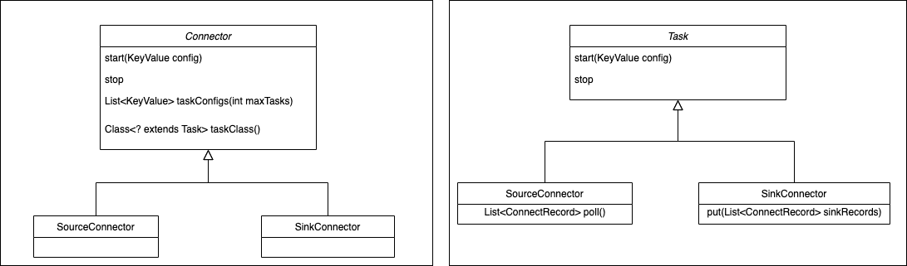

Through Connect's API, you can also see the responsibilities of Connector and Task, Connector has determined the data copy flow when it is implemented, Connector receives data source related configuration, taskClass obtains the type of task to be created, and taskConfigs specifies the maximum number of tasks, and allocates configuration for tasks. After task gets the configuration, it reads data from the data source and writes it to the target storage.

From the following two diagrams, it is clear to see the basic flow of processing for Connector and Task.

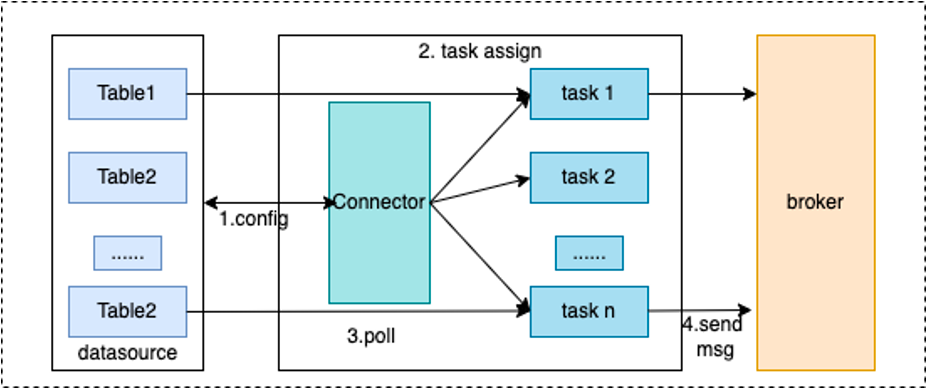

The worker process is the running environment for Connector and Task, it provides RESTful capabilities, accepts HTTP requests, and passes the obtained configuration to Connector and Task. In addition, it is responsible for starting Connector and Task, saving Connector configuration information, saving the position information of Task's synchronized data, and load balancing capability. High availability, scaling and fault handling of Connect clusters mainly rely on the load balancing capability of Worker.


From the above diagram, it can be seen that the Worker receives http requests through the provided REST API, and passes the received configuration information to the configuration management service. The configuration management service saves the configuration locally and synchronizes it with other worker nodes, while also triggering load balancing.

---

<a id="connect-03rocketmq-connect-quick-start"></a>

<!-- source_url: https://rocketmq.apache.org/docs/connect/03RocketMQ%20Connect%20Quick%20Start/ -->

<!-- page_index: 51 -->

# RocketMQ Connect Quick Start

Version: 5.0

<a id="connect-03rocketmq-connect-quick-start--rocketmq-connect-quick-start"></a>

# RocketMQ Connect Quick Start

<a id="connect-03rocketmq-connect-quick-start--quick-start"></a>

# Quick Start

This tutorial will start a RocketMQ Connector example project "rocketmq-connect-sample" in standalone mode to help you understand the working principle of connectors.
The example project provides a source connector that reads data from source files and sends it to the RocketMQ cluster.
It also provides a sink connector that reads messages from the RocketMQ cluster and writes them to destination files.

1. Linux/Unix/Mac
2. 64bit JDK 1.8+;
3. Maven 3.2.x+;
4. Start RocketMQ. Either [RocketMQ 4.x](https://rocketmq.apache.org/docs/4.x/) or
   [RocketMQ 5.x](#quickstart-01quickstart) 5.x version can be used;
5. Test RocketMQ message sending and receiving using the tool.

Here, use the environment variable NAMESRV\_ADDR to inform the tool client of the NameServer address of RocketMQ as localhost:9876.

```shell
#$ cd distribution/target/rocketmq-4.9.7/rocketmq-4.9.7 
$ cd distribution/target/rocketmq-5.1.4/rocketmq-5.1.4
 
$ export NAMESRV_ADDR=localhost:9876
$ sh bin/tools.sh org.apache.rocketmq.example.quickstart.Producer SendResult [sendStatus=SEND_OK, msgId= ...
 
$ sh bin/tools.sh org.apache.rocketmq.example.quickstart.Consumer ConsumeMessageThread_%d Receive New Messages: [MessageExt...
```

> [!NOTE]
> : RocketMQ has the feature of automatically creating Topic and Group. When sending or subscribing to messages, if the corresponding Topic or Group does not exist, RocketMQ will automatically create them. Therefore, there is no need to create Topic and Group in advance.

```shell
git clone https://github.com/apache/rocketmq-connect.git 
 
cd  rocketmq-connect 
 
export RMQ_CONNECT_HOME=`pwd` 
 
mvn -Prelease-connect -Dmaven.test.skip=true clean install -U 
```

> [!NOTE]
> : The project already includes the code for rocketmq-connect-sample by default, so there is no need to build the rocketmq-connect-sample plugin separately.

Modify the `connect-standalone.conf` file to configure the RocketMQ connection
address and other information. Please refer to [9. Configuration File Instructions](#connect-03rocketmq-connect-quick-start--9-configuration-file-instructions) for details.

```text
cd $RMQ_CONNECT_HOME/distribution/target/rocketmq-connect-0.0.1-SNAPSHOT/rocketmq-connect-0.0.1-SNAPSHOT 
 
vim conf/connect-standalone.conf 
```

In standalone mode, RocketMQ Connect persists the synchronization checkpoint information
to the local file directory storePathRootDir.

> storePathRootDir=/Users/YourUsername/rocketmqconnect/storeRoot

If you want to reset the synchronization checkpoint, you need to delete the persisted
checkpoint file.

```shell
rm -rf /Users/YourUsername/rocketmqconnect/storeRoot/* 
```

```shell
sh bin/connect-standalone.sh -c conf/connect-standalone.conf & 
```

**tips**: You can modify `docker/connect/bin/runconnect.sh` to adjust JVM startup
parameters as needed.

> JAVA\_OPT="${JAVA\_OPT} -server -Xms256m -Xmx256m"

To view the startup log file:

```shell
tail -100f ~/logs/rocketmqconnect/connect_runtime.log 
```

If the runtime starts successfully, you will see the following print in the log file:

> The standalone worker boot success.

To exit the log tracking mode of `tail -f` command, you can press the `Ctrl + C` key combination.

```shell
mkdir -p /Users/YourUsername/rocketmqconnect/ 
cd /Users/YourUsername/rocketmqconnect/ 
touch test-source-file.txt 
 
echo "Hello \r\nRocketMQ\r\n Connect" >> test-source-file.txt 
```

> [!NOTE]
> : There should be no empty lines (the demo program will throw an error if it
> encounters empty lines). The source connector will continuously read the source file
> and convert each line of data into a message body to be sent to RocketMQ for consumption
> by the sink connector.

```shell
curl -X POST -H "Content-Type: application/json" http://127.0.0.1:8082/connectors/fileSourceConnector -d '{ 
    "connector.class": "org.apache.rocketmq.connect.file.FileSourceConnector", 
    "filename": "/Users/YourUsername/rocketmqconnect/test-source-file.txt", 
    "connect.topicname": "fileTopic" 
}' 
```

If the curl request returns status 200, it indicates successful creation. Example response:

> {"status":200,"body":{"connector.class":"org.apache.rocketmq.connect.file.FileSourceConnector","filename":"/Users/YourUsername/rocketmqconnect/test-source-file.txt","connect.topicname":"fileTopic"}}

View the log file:

```shell
tail -100f ~/logs/rocketmqconnect/connect_runtime.log 
```

If you see the following log, it means the file source connector has started successfully:

> Start connector fileSourceConnector and set target state STARTED successed!!

| key | nullable | default | description |
| --- | --- | --- | --- |
| connector.class | false |  | The class name (including the package name) that implements the Connector interface |
| filename | false |  | The name of the source file (recommended to use absolute path) |
| connect.topicname | false |  | Topic required for synchronizing file data |

```shell
curl -X POST -H "Content-Type: application/json" http://127.0.0.1:8082/connectors/fileSinkConnector -d '{ 
    "connector.class": "org.apache.rocketmq.connect.file.FileSinkConnector", 
    "filename": "/Users/YourUsername/rocketmqconnect/test-sink-file.txt", 
    "connect.topicnames": "fileTopic" 
}' 
```

If the curl request returns status 200, it indicates successful creation. Example response:

> {"status":200,"body":{"connector.class":"org.apache.rocketmq.connect.file.FileSinkConnector","filename":"/Users/YourUsername/rocketmqconnect/test-sink-file.txt","connect.topicnames":"fileTopic"}}

View the log file:

```shell
tail -100f ~/logs/rocketmqconnect/connect_runtime.log 
```

If you see the following log, it means the file sink connector has started successfully:

> Start connector fileSinkConnector and set target state STARTED successed!!

Check if the sink connector has written data to the destination file:

```shell
cat /Users/YourUsername/rocketmqconnect/test-sink-file.txt 
```

If the test-sink-file.txt file is generated and its content is the same as the
test-source-file.txt, it means the entire process is running correctly.

Continue writing test data to the source file test-source-file.txt:

```shell
cd /Users/YourUsername/rocketmqconnect/ 
 
echo "Say Hi to\r\nRMQ Connector\r\nAgain" >> test-source-file.txt 
 
# Wait a few seconds, check if rocketmq-connect replicate data to sink file succeed sleep 10 cat /Users/YourUsername/rocketmqconnect/test-sink-file.txt
```

> [!NOTE]
> : The order of file contents may vary because the `rocketmq-connect-sample` uses `normal message` when
> sending and receiving messages to/from a RocketMQ topic. This is different from `ordered message`, and consuming
> `normal messages` does not guarantee the order.

| key | nullable | default | description |
| --- | --- | --- | --- |
| connector.class | false |  | The class name (including the package name) that implements the Connector interface |
| filename | false |  | The sink pulls data and saves it to a file(recommended to use absolute path) |
| connect.topicnames | false |  | The topics of the data messages that the sink needs to process |

**Tips**：The configuration file instructions for the sample rocketmq-connect-sample are for reference only, different source/sink connectors have different configurations, please refer to the specific source/sink connector.

The RESTful command format for stopping connectors is
`http://(your worker ip):(port)/connectors/(connector name)/stop`

To stop the two connectors in the demo, you can use the following commands:

```shell
curl http://127.0.0.1:8082/connectors/fileSinkConnector/stop 
curl http://127.0.0.1:8082/connectors/fileSourceConnector/stop 
```

If the curl request returns a status of 200, it indicates successful stopping of the connectors.
Example response:

> {"status":200,"body":"Connector [fileSinkConnector] deleted successfully"}

If you see the following log message, it means the file sink connector has been
successfully shut down:

```shell
tail -100f ~/logs/rocketmqconnect/connect_default.log 
```

> Completed shutdown for connectorName:fileSinkConnector

```shell
cd $RMQ_CONNECT_HOME/distribution/target/rocketmq-connect-0.0.1-SNAPSHOT/rocketmq-connect-0.0.1-SNAPSHOT 
sh bin/connectshutdown.sh 
```

You can use the following commands to view the log directory:

```shell
ls $HOME/logs/rocketmqconnect 
ls ~/logs/rocketmqconnect 
```

Modify the RESTful port, storeRoot path, Nameserver address, and other information based on your usage.

Here is an example of a configuration file:

```shell
#current cluster node uniquely identifies 
workerId=DEFAULT_WORKER_1 
 
# Http prot for user to access REST API
httpPort=8082 
 
# Local file dir for config store
storePathRootDir=/Users/YourUsername/rocketmqconnect/storeRoot 
 
#You need to modify it to your own rocketmq nameserver endpoint. 
# RocketMQ namesrvAddr
namesrvAddr=127.0.0.1:9876   
 
# Plugin path for loading Source/Sink Connectors
# The rocketmq-connect project already includes the rocketmq-connect-sample module by default, so no configuration is needed here. pluginPaths=
```

Explanation of storePathRootDir configuration:

In standalone mode, RocketMQ Connect persists the synchronization checkpoint information
to the local file directory specified by storePathRootDir. The persistent files include:

| key | description |
| --- | --- |
| connectorConfig.json | Connector configuration persistence files |
| position.json | Source connect data processing progress persistence files |
| taskConfig.json | Task configuration persistence files |
| offset.json | Sink connect data consumption progress persistence files |
| connectorStatus.json | Connector status persistence files |
| taskStatus.json | Task status persistence files |

---

<a id="connect-04rocketmq-connect-in-action1"></a>

<!-- source_url: https://rocketmq.apache.org/docs/connect/04RocketMQ%20Connect%20In%20Action1/ -->

<!-- page_index: 52 -->

# RocketMQ Connect in Action 1

Version: 5.0

<a id="connect-04rocketmq-connect-in-action1--rocketmq-connect-in-action-1"></a>

# RocketMQ Connect in Action 1

MySQL Source(CDC) - >RocketMQ Connect -> MySQL Sink(JDBC)

1. Linux/Unix/Mac
2. 64bit JDK 1.8+;
3. Maven 3.2.x+;
4. Start [RocketMQ](https://rocketmq.apache.org/docs/quick-start/);

**tips** : ${ROCKETMQ\_HOME} locational instructions

> bin-release.zip version：/rocketmq-all-4.9.4-bin-release
>
> source-release.zip version：/rocketmq-all-4.9.4-source-release/distribution

Debezium RocketMQ Connector

```text
$ cd rocketmq-connect/connectors/rocketmq-connect-debezium/ 
$ mvn clean package -Dmaven.test.skip=true 
```

Move the compiled Debezium MySQL RocketMQ Connector package into the Runtime loading directory. The command is as follows：

```shell
mkdir -p /usr/local/connector-plugins 
cp rocketmq-connect-debezium-mysql/target/rocketmq-connect-debezium-mysql-0.0.1-SNAPSHOT-jar-with-dependencies.jar /usr/local/connector-plugins 
```

JDBC Connector

Move the compiled JDBC Connector package into the Runtime loading directory. The command is as follows：

```text
$ cd rocketmq-connect/connectors/rocketmq-connect-jdbc/ 
$ mvn clean package -Dmaven.test.skip=true 
cp rocketmq-connect-jdbc/target/rocketmq-connect-jdbc-0.0.1-SNAPSHOT-jar-with-dependencies.jar /usr/local/connector-plugins 
 
```

```text
cd  rocketmq-connect 
 
mvn -Prelease-connect -DskipTests clean install -U 
 
```

Modify the configuration `connect-standalone.conf`, the main configuration is as follows

```shell
$ cd distribution/target/rocketmq-connect-0.0.1-SNAPSHOT/rocketmq-connect-0.0.1-SNAPSHOT
$ vim conf/connect-standalone.conf
```

```text
workerId=standalone-worker 
storePathRootDir=/tmp/storeRoot 
 
## Http port for user to access REST API 
httpPort=8082 
 
# Rocketmq namesrvAddr 
namesrvAddr=localhost:9876 
 
# RocketMQ acl 
aclEnable=false 
accessKey=rocketmq 
secretKey=12345678 
 
autoCreateGroupEnable=false 
clusterName="DefaultCluster" 
 
# Core configuration, configure the plugin directory of the previously compiled debezium package here 
# Source or sink connector jar file dir,The default value is rocketmq-connect-sample 
pluginPaths=/usr/local/connector-plugins 
```

```text
cd distribution/target/rocketmq-connect-0.0.1-SNAPSHOT/rocketmq-connect-0.0.1-SNAPSHOT 
 
sh bin/connect-standalone.sh -c conf/connect-standalone.conf & 
 
```

Use debezium's MySQL docker environment to set up the MySQL database

```text
docker run -it --rm --name mysql -p 3306:3306 -e MYSQL_ROOT_PASSWORD=debezium -e MYSQL_USER=mysqluser -e MYSQL_PASSWORD=mysqlpw quay.io/debezium/example-mysql:1.9 
```

MySQL information

Port：3306

Account：root/debezium

slave:debezium/dbz

Log in to the database with the root/debezium account

Source database table：inventory.employee

```text
CREATE database inventory; 
 
use inventory; 
CREATE TABLE `employee` ( 
`id` bigint NOT NULL AUTO_INCREMENT, 
`name` varchar(128) DEFAULT NULL, 
`howold` int DEFAULT NULL, 
`male` int DEFAULT NULL, 
`company` varchar(128) DEFAULT NULL, 
`money` double DEFAULT NULL, 
`begin_time` datetime DEFAULT NULL, 
`modify_time` timestamp NULL DEFAULT CURRENT_TIMESTAMP ON UPDATE CURRENT_TIMESTAMP COMMENT 'modify time', 
`decimal_test` decimal(11,2) DEFAULT NULL COMMENT 'test decimal type', 
PRIMARY KEY (`id`) 
) ENGINE=InnoDB AUTO_INCREMENT=16 DEFAULT CHARSET=utf8; 
 
 
 
INSERT INTO `employee` VALUES (1, 'name-01', 24, 6, 'company', 9987, '2021-12-22 08:00:00', '2022-06-14 18:20:11', 321.11); 
INSERT INTO `employee` VALUES (2, 'name-02', 19, 7, 'company', 32232, '2021-12-29 08:00:00', '2022-06-14 18:18:47', 77.12); 
INSERT INTO `employee` VALUES (8, 'name-03', 20, 1, NULL, 0, NULL, '2022-06-14 18:26:05', 11111.00); 
INSERT INTO `employee` VALUES (9, 'name-04', 21, 1, 'company', 12345, '2021-12-24 20:44:10', '2022-06-14 18:20:02', 123.12); 
INSERT INTO `employee` VALUES (11, 'name-05', 50, 2, 'company', 33333, '2021-12-24 22:14:52', '2022-06-14 18:19:58', 123.12); 
INSERT INTO `employee` VALUES (12, 'name-06', 19, 3, NULL, 0, NULL, '2022-06-14 18:26:12', 111233.00); 
INSERT INTO `employee` VALUES (13, 'name-07', 20, 4, 'company', 3237, '2021-12-29 01:31:03', '2022-06-14 18:19:27', 52.00); 
INSERT INTO `employee` VALUES (14, 'name-08', 25, 15, 'company', 32255, '2022-02-08 19:06:39', '2022-06-14 18:18:32', 0.00); 
INSERT INTO `employee` VALUES (15, NULL, 0, 0, NULL, 0, NULL, '2022-06-14 20:13:29', NULL); 
 
 
```

Target database：inventory\_2.employee

```text
CREATE database inventory_2; 
use inventory_2; 
CREATE TABLE `employee` ( 
`id` bigint NOT NULL AUTO_INCREMENT, 
`name` varchar(128) DEFAULT NULL, 
`howold` int DEFAULT NULL, 
`male` int DEFAULT NULL, 
`company` varchar(128) DEFAULT NULL, 
`money` double DEFAULT NULL, 
`begin_time` datetime DEFAULT NULL, 
`modify_time` timestamp NULL DEFAULT CURRENT_TIMESTAMP ON UPDATE CURRENT_TIMESTAMP COMMENT '修改时间', 
`decimal_test` decimal(11,2) DEFAULT NULL COMMENT 'test decimal type', 
PRIMARY KEY (`id`) 
) ENGINE=InnoDB AUTO_INCREMENT=16 DEFAULT CHARSET=utf8; 
```

Synchronize original table data：inventory.employee
Purpose: Parse MySQL binlog and encapsulate into a generic ConnectRecord object and send to RocketMQ Topic.

```shell
curl -X POST -H "Content-Type: application/json" http://127.0.0.1:8082/connectors/MySQLCDCSource -d '{ 
"connector.class": "org.apache.rocketmq.connect.debezium.mysql.DebeziumMysqlConnector", 
"max.task": "1", 
"connect.topicname": "debezium-mysql-source-topic", 
"kafka.transforms": "Unwrap", 
"kafka.transforms.Unwrap.delete.handling.mode": "none", 
"kafka.transforms.Unwrap.type": "io.debezium.transforms.ExtractNewRecordState", 
"kafka.transforms.Unwrap.add.headers": "op,source.db,source.table", 
"database.history.skip.unparseable.ddl": true, 
"database.history.name.srv.addr": "localhost:9876", 
"database.history.rocketmq.topic": "db-history-debezium-topic", 
"database.history.store.only.monitored.tables.ddl": true, 
"include.schema.changes": false, 
"database.server.name": "dbserver1", 
"database.port": 3306, 
"database.hostname": "database ip", 
"database.connectionTimeZone": "UTC", 
"database.user": "debezium", 
"database.password": "dbz", 
"table.include.list": "inventory.employee", 
"max.batch.size": 50, 
"database.include.list": "inventory", 
"snapshot.mode": "when_needed", 
"database.server.id": "184054", 
"key.converter": "org.apache.rocketmq.connect.runtime.converter.record.json.JsonConverter", 
"value.converter": "org.apache.rocketmq.connect.runtime.converter.record.json.JsonConverter" 
}' 
```

Purpose: Consume data from the Topic and write to the destination table through the JDBC protocol.

```shell
curl -X POST -H "Content-Type: application/json" http://127.0.0.1:8082/connectors/jdbcmysqlsinktest -d '{ 
  "connector.class": "org.apache.rocketmq.connect.jdbc.connector.JdbcSinkConnector", 
  "max.task": "2", 
  "connect.topicnames": "debezium-mysql-source", 
  "connection.url": "jdbc:mysql://database ip:3306/inventory_2", 
  "connection.user": "root", 
  "connection.password": "debezium", 
  "pk.fields": "id", 
  "table.name.from.header": "true", 
  "pk.mode": "record_key", 
  "insert.mode": "UPSERT", 
  "db.timezone": "UTC", 
  "table.types": "TABLE", 
  "errors.deadletterqueue.topic.name": "dlq-topic", 
  "errors.log.enable": "true", 
  "errors.tolerance": "ALL", 
  "delete.enabled": "true", 
  "key.converter": "org.apache.rocketmq.connect.runtime.converter.record.json.JsonConverter", 
  "value.converter": "org.apache.rocketmq.connect.runtime.converter.record.json.JsonConverter" 
}' 
```

After the above two Connector tasks are successfully created, log in to the database with the root/debezium account.

Insert, delete or update data to the source database table: inventory.employee, then the data will be synchronized to the destination table inventory\_2.employee.

---

<a id="connect-05rocketmq-connect-in-action2"></a>

<!-- source_url: https://rocketmq.apache.org/docs/connect/05RocketMQ%20Connect%20In%20Action2/ -->

<!-- page_index: 53 -->

# RocketMQ Connect in Action 2

Version: 5.0

<a id="connect-05rocketmq-connect-in-action2--rocketmq-connect-in-action-2"></a>

# RocketMQ Connect in Action 2

PostgreSQL Source(CDC) - >RocketMQ Connect -> MySQL Sink(JDBC)

1. Linux/Unix/Mac
2. 64bit JDK 1.8+;
3. Maven 3.2.x+;
4. Start [RocketMQ](https://rocketmq.apache.org/docs/quick-start/);

**tips** : ${ROCKETMQ\_HOME} locational instructions

> bin-release.zip version：/rocketmq-all-4.9.4-bin-release
>
> source-release.zip version：/rocketmq-all-4.9.4-source-release/distribution

Debezium RocketMQ Connector

```text
$ cd rocketmq-connect/connectors/rocketmq-connect-debezium/ 
$ mvn clean package -Dmaven.test.skip=true 
```

Move the compiled Debezium PostgreSQL RocketMQ Connector package into the Runtime loading directory. The command is as follows ：

```text
mkdir -p /usr/local/connector-plugins 
cp rocketmq-connect-debezium-postgresql/target/rocketmq-connect-debezium-postgresql-0.0.1-SNAPSHOT-jar-with-dependencies.jar /usr/local/connector-plugins 
```

JDBC Connector

Move the compiled JDBC Connector package into the Runtime loading directory. The command is as follows：

```text
$ cd rocketmq-connect/connectors/rocketmq-connect-jdbc/ 
$ mvn clean package -Dmaven.test.skip=true 
cp rocketmq-connect-jdbc/target/rocketmq-connect-jdbc-0.0.1-SNAPSHOT-jar-with-dependencies.jar /usr/local/connector-plugins 
 
```

```text
cd  rocketmq-connect 
 
mvn -Prelease-connect -DskipTests clean install -U 
 
```

Modify the configuration `connect-standalone.conf`, the main configuration is as follows

```shell
$ cd distribution/target/rocketmq-connect-0.0.1-SNAPSHOT/rocketmq-connect-0.0.1-SNAPSHOT
$ vim conf/connect-standalone.conf
```

```text
$ cd distribution/target/rocketmq-connect-0.0.1-SNAPSHOT/rocketmq-connect-0.0.1-SNAPSHOT 
$ vim conf/connect-standalone.conf 
```

```text
workerId=standalone-worker 
storePathRootDir=/tmp/storeRoot 
 
## Http port for user to access REST API 
httpPort=8082 
 
# Rocketmq namesrvAddr 
namesrvAddr=localhost:9876 
 
# RocketMQ acl 
aclEnable=false 
accessKey=rocketmq 
secretKey=12345678 
 
autoCreateGroupEnable=false 
clusterName="DefaultCluster" 
 
# Core configuration, configure the plugin directory of the previously compiled debezium package here 
# Source or sink connector jar file dir,The default value is rocketmq-connect-sample 
pluginPaths=/usr/local/connector-plugins 
```

```text
cd distribution/target/rocketmq-connect-0.0.1-SNAPSHOT/rocketmq-connect-0.0.1-SNAPSHOT 
 
sh bin/connect-standalone.sh -c conf/connect-standalone.conf & 
 
```

Use debezium's Postgres docker environment to set up the Postgres database

```text
# starting a pg instance 
docker run -d --name postgres -p 5432:5432 -e POSTGRES_USER=start_data_engineer -e POSTGRES_PASSWORD=password debezium/postgres:14 
 
# bash into postgres instance 
docker exec -ti postgres /bin/bash 
```

Postgres information
Port：5432
Aaccount：start\_data\_engineer/password
Synchronize original database：bank.holding
Target database table：bank1.holding

Use debezium's MySQL docker environment to set up the MySQL database.

```text
docker run -it --rm --name mysql -p 3306:3306 -e MYSQL_ROOT_PASSWORD=debezium -e MYSQL_USER=mysqluser -e MYSQL_PASSWORD=mysqlpw quay.io/debezium/example-mysql:1.9 
```

MySQL information

Port：3306

Account：root/debezium

Log in to the database with the start\_data\_engineer/password account

Source database table：bank.holding

```text
CREATE SCHEMA bank; 
SET search_path TO bank,public; 
CREATE TABLE bank.holding ( 
                              holding_id int, 
                              user_id int, 
                              holding_stock varchar(8), 
                              holding_quantity int, 
                              datetime_created timestamp, 
                              datetime_updated timestamp, 
                              primary key(holding_id) 
); 
ALTER TABLE bank.holding replica identity FULL; 
insert into bank.holding values (1000, 1, 'VFIAX', 10, now(), now()); 
\q 
insert into bank.holding values (1000, 1, 'VFIAX', 10, now(), now()); 
insert into bank.holding values (1001, 2, 'SP500', 1, now(), now()); 
insert into bank.holding values (1003, 3, 'SP500', 1, now(), now()); 
update bank.holding set holding_quantity = 300 where holding_id=1000; 
 
```

Target database table：bank1.holding

```text
create database bank1; 
CREATE TABLE holding ( 
                          holding_id int, 
                          user_id int, 
                          holding_stock varchar(8), 
                          holding_quantity int, 
                          datetime_created bigint, 
                          datetime_updated bigint, 
                          primary key(holding_id) 
); 
 
```

Synchronize original table data：bank.holding
Purpose: Parse Postgres binlog and encapsulate it into a common ConnectRecord object, which is sent to the RocketMQ Topic.

```text
curl -X POST -H "Content-Type: application/json" http://127.0.0.1:8082/connectors/postgres-connector -d  '{ 
  "connector.class": "org.apache.rocketmq.connect.debezium.postgres.DebeziumPostgresConnector", 
  "max.task": "1", 
  "connect.topicname": "debezium-postgres-source-01", 
  "kafka.transforms": "Unwrap", 
  "kafka.transforms.Unwrap.delete.handling.mode": "none", 
  "kafka.transforms.Unwrap.type": "io.debezium.transforms.ExtractNewRecordState", 
  "kafka.transforms.Unwrap.add.headers": "op,source.db,source.table", 
  "database.history.skip.unparseable.ddl": true, 
  "database.server.name": "bankserver1", 
  "database.port": 5432, 
  "database.hostname": "database ip", 
  "database.connectionTimeZone": "UTC", 
  "database.user": "start_data_engineer", 
  "database.dbname": "start_data_engineer", 
  "database.password": "password", 
  "table.whitelist": "bank.holding", 
  "key.converter": "org.apache.rocketmq.connect.runtime.converter.record.json.JsonConverter", 
  "value.converter": "org.apache.rocketmq.connect.runtime.converter.record.json.JsonConverter" 
}' 
```

Purpose: Consume data from the Topic and write it to the target table through JDBC protocol.

```text
curl -X POST -H "Content-Type: application/json" http://127.0.0.1:8082/connectors/jdbcmysqlsinktest201 -d '{ 
  "connector.class": "org.apache.rocketmq.connect.jdbc.connector.JdbcSinkConnector", 
  "max.task": "2", 
  "connect.topicnames": "debezium-postgres-source-01", 
  "connection.url": "jdbc:mysql://database ip:3306/bank1", 
  "connection.user": "root", 
  "connection.password": "debezium", 
  "pk.fields": "holding_id", 
  "table.name.from.header": "true", 
  "pk.mode": "record_key", 
  "insert.mode": "UPSERT", 
  "db.timezone": "UTC", 
  "table.types": "TABLE", 
  "errors.deadletterqueue.topic.name": "dlq-topic", 
  "errors.log.enable": "true", 
  "errors.tolerance": "ALL", 
  "delete.enabled": "true", 
  "key.converter": "org.apache.rocketmq.connect.runtime.converter.record.json.JsonConverter", 
  "value.converter": "org.apache.rocketmq.connect.runtime.converter.record.json.JsonConverter" 
}' 
 
```

After the creation of the above two Connector tasks, log in to the database using the start\_data\_engineer/password account.

Any add, delete, or modification made to the source database table `bankholding` will be synced to the target table `bank1.holding`.

---

<a id="connect-06rocketmq-connect-in-action3"></a>

<!-- source_url: https://rocketmq.apache.org/docs/connect/06RocketMQ%20Connect%20In%20Action3/ -->

<!-- page_index: 54 -->

# RocketMQ Connect in Action 3

Version: 5.0

<a id="connect-06rocketmq-connect-in-action3--rocketmq-connect-in-action-3"></a>

# RocketMQ Connect in Action 3


1. Linux/Unix/Mac
2. 64bit JDK 1.8+;
3. Maven 3.2.x+;
4. Start [RocketMQ](https://rocketmq.apache.org/docs/quick-start/);

**tips** : ${ROCKETMQ\_HOME} locational instructions

> bin-release.zip version：/rocketmq-all-4.9.4-bin-release
>
> source-release.zip version：/rocketmq-all-4.9.4-source-release/distribution

Debezium RocketMQ Connector

```text
$ cd rocketmq-connect/connectors/rocketmq-connect-debezium/ 
$ mvn clean package -Dmaven.test.skip=true 
```

Compile the Debezium MySQL, PostgreSQL, and RocketMQ Connector packages and place them in the Runtime loading directory. The command is as follows：

```text
mkdir -p /usr/local/connector-plugins 
cp rocketmq-connect-debezium-postgresql/target/rocketmq-connect-debezium-postgresql-0.0.1-SNAPSHOT-jar-with-dependencies.jar /usr/local/connector-plugins 
 
cp rocketmq-connect-debezium-mysql/target/rocketmq-connect-debezium-mysql-0.0.1-SNAPSHOT-jar-with-dependencies.jar /usr/local/connector-plugins 
 
```

JDBC Connector

Move the compiled JDBC Connector package into the Runtime loading directory. The command is as follows：

```text
$ cd rocketmq-connect/connectors/rocketmq-connect-jdbc/ 
$ mvn clean package -Dmaven.test.skip=true 
cp rocketmq-connect-jdbc/target/rocketmq-connect-jdbc-0.0.1-SNAPSHOT-jar-with-dependencies.jar /usr/local/connector-plugins 
 
```

```text
cd  rocketmq-connect 
 
mvn -Prelease-connect -DskipTests clean install -U 
 
```

Modify the configuration `connect-standalone.conf`, the main configuration is as follows

```text
$ cd distribution/target/rocketmq-connect-0.0.1-SNAPSHOT/rocketmq-connect-0.0.1-SNAPSHOT 
$ vim conf/connect-standalone.conf 
```

```text
workerId=standalone-worker 
storePathRootDir=/tmp/storeRoot 
 
## Http port for user to access REST API 
httpPort=8082 
 
# Rocketmq namesrvAddr 
namesrvAddr=localhost:9876 
 
# RocketMQ acl 
aclEnable=false 
accessKey=rocketmq 
secretKey=12345678 
 
autoCreateGroupEnable=false 
clusterName="DefaultCluster" 
 
#  Core configuration, configure the plugin directory of the previously compiled debezium package here 
# Source or sink connector jar file dir,The default value is rocketmq-connect-sample 
pluginPaths=/usr/local/connector-plugins 
```

```text
cd distribution/target/rocketmq-connect-0.0.1-SNAPSHOT/rocketmq-connect-0.0.1-SNAPSHOT 
 
sh bin/connect-standalone.sh -c conf/connect-standalone.conf & 
 
```

Use debezium's Postgres docker environment to set up the Postgres database

```text
# starting a pg instance 
docker run -d --name postgres -p 5432:5432 -e POSTGRES_USER=start_data_engineer -e POSTGRES_PASSWORD=password debezium/postgres:14 
 
# bash into postgres instance 
docker exec -ti postgres /bin/bash 
```

Postgres information
Port：5432
Account：start\_data\_engineer/password
Synchronize the source database：bank.user

Use debezium's MySQL docker environment to set up the MySQL database

```text
docker run -it --rm --name mysql -p 3306:3306 -e MYSQL_ROOT_PASSWORD=debezium -e MYSQL_USER=mysqluser -e MYSQL_PASSWORD=mysqlpw quay.io/debezium/example-mysql:1.9 
```

```text
docker run -it --rm --name mysql -p 3306:3306 -e MYSQL_ROOT_PASSWORD=debezium -e MYSQL_USER=mysqluser -e MYSQL_PASSWORD=mysqlpw quay.io/debezium/example-mysql:1.9 
```

MySQL information

Port：3306

Account：root/debezium
Synchronize the source database：bank.user

Target database：bank1.user

Login to the database using the root/debezium account

Source database table：bank.user

```text
create database bank; 
use bank; 
 
create table bank.user 
( 
    id       bigint NOT NULL AUTO_INCREMENT, 
    user_id          integer, 
    name    varchar(8), 
    age integer, 
    birthday date, 
    datetime_created timestamp(3), 
    datetime_updated timestamp(3), 
    height           decimal(11, 2) null, 
    PRIMARY KEY (`id`) 
); 
 
insert into bank.user values (1003, 1, 'lilei2', 10, now(), now(), now(), 1.72); 
update bank.user set user_id = 1003 where id = 1003; 
 
```

Login to the PostgreSQL database using the start\_data\_engineer/password account.

Source database table: bank.user

```text
CREATE SCHEMA bank; 
SET search_path TO bank,public; 
create table bank.user 
( 
    id       integer not null 
        constraint user_pkey 
            primary key, 
    user_id          integer, 
    name    varchar(8), 
    age integer, 
    birthday date, 
    datetime_created timestamp(3), 
    datetime_updated timestamp(3), 
    height           numeric(11, 2) 
); 
 
insert into bank.user values (1001, 1, 'lilei1', 10, now(), now(), now(), 1.72); 
update bank.user set user_id = 1001 where id = 1001; 
 
```

Target database table: bank1.user

```text
create database bank1; 
create table bank1.user 
( 
    id               bigint auto_increment 
        primary key, 
    user_id          int            null, 
    name             varchar(8)     null, 
    age              int            null, 
    birthday         date           null, 
    datetime_created timestamp(3)   null, 
    datetime_updated timestamp(3)   null, 
    height           decimal(11, 2) null 
); 
 
```

Synchronize the original table：bank.user
Purpose：Parse the MySQL binlog and encapsulate it into a common ConnectRecord object, sent to the RocketMQ Topic.

```text
curl -X POST -H "Content-Type: application/json" http://127.0.0.1:8082/connectors/MySQLCDCSource1000 -d '{ 
"connector.class": "org.apache.rocketmq.connect.debezium.mysql.DebeziumMysqlConnector", 
"max.task": "1", 
"connect.topicname": "debezium-source-topic1000", 
"kafka.transforms": "Unwrap", 
"kafka.transforms.Unwrap.delete.handling.mode": "none", 
"kafka.transforms.Unwrap.type": "io.debezium.transforms.ExtractNewRecordState", 
"kafka.transforms.Unwrap.add.headers": "op,source.db,source.table", 
"database.history.skip.unparseable.ddl": true, 
"database.history.name.srv.addr": "localhost:9876", 
"database.history.rocketmq.topic": "db-history-debezium-topic1000", 
"database.history.store.only.monitored.tables.ddl": true, 
"include.schema.changes": false, 
"database.server.name": "dbserver1", 
"database.port": 3306, 
"database.hostname": "database ip", 
"database.connectionTimeZone": "UTC", 
"database.user": "debezium", 
"database.password": "dbz", 
"table.include.list": "bank.user", 
"max.batch.size": 50, 
"database.include.list": "bank", 
"snapshot.mode": "when_needed", 
"database.server.id": "184054", 
"key.converter": "org.apache.rocketmq.connect.runtime.converter.record.json.JsonConverter", 
"value.converter": "org.apache.rocketmq.connect.runtime.converter.record.json.JsonConverter" 
}' 
```

Synchronize the original table：bank.user
Purpose: Parse the Postgres binlog and encapsulate it into a common ConnectRecord object, sent to the RocketMQ Topic.

```text
curl -X POST -H "Content-Type: application/json" http://127.0.0.1:8082/connectors/postgres-connector1000 -d  '{ 
  "connector.class": "org.apache.rocketmq.connect.debezium.postgres.DebeziumPostgresConnector", 
  "max.task": "1", 
  "connect.topicname": "debezium-source-topic1000", 
  "kafka.transforms": "Unwrap", 
  "kafka.transforms.Unwrap.delete.handling.mode": "none", 
  "kafka.transforms.Unwrap.type": "io.debezium.transforms.ExtractNewRecordState", 
  "kafka.transforms.Unwrap.add.headers": "op,source.db,source.table", 
  "database.history.skip.unparseable.ddl": true, 
  "database.server.name": "bankserver1", 
  "database.port": 5432, 
  "database.hostname": "database ip", 
  "database.connectionTimeZone": "UTC", 
  "database.user": "start_data_engineer", 
  "database.dbname": "start_data_engineer", 
  "database.password": "password", 
  "table.whitelist": "bank.user", 
  "key.converter": "org.apache.rocketmq.connect.runtime.converter.record.json.JsonConverter", 
  "value.converter": "org.apache.rocketmq.connect.runtime.converter.record.json.JsonConverter" 
}' 
```

Purpose: Consume the data in the Topic and write it to the target table through JDBC protocol.

```text
curl -X POST -H "Content-Type: application/json" http://127.0.0.1:8082/connectors/jdbcmysqlsinktest1000 -d '{ 
  "connector.class": "org.apache.rocketmq.connect.jdbc.connector.JdbcSinkConnector", 
  "max.task": "2", 
  "connect.topicnames": "debezium-source-topic1000", 
  "connection.url": "jdbc:mysql://database ip:3306/bank1", 
  "connection.user": "root", 
  "connection.password": "debezium", 
  "pk.fields": "id", 
  "table.name.from.header": "true", 
  "pk.mode": "record_key", 
  "insert.mode": "UPSERT", 
  "db.timezone": "UTC", 
  "table.types": "TABLE", 
  "errors.deadletterqueue.topic.name": "dlq-topic", 
  "errors.log.enable": "true", 
  "errors.tolerance": "ALL", 
  "delete.enabled": "true", 
  "key.converter": "org.apache.rocketmq.connect.runtime.converter.record.json.JsonConverter", 
  "value.converter": "org.apache.rocketmq.connect.runtime.converter.record.json.JsonConverter" 
}' 
 
```

After the above three Connector tasks are created successfully, login to the PostgreSQL database using the start\_data\_engineer/password account or login to the MySQL database using the root/debezium account.

Modifying, deleting, or adding to the source database table bank.user will synchronize to the target MySQL table bank1.user.

---

<a id="connect-07rocketmq-connect-in-action4"></a>

<!-- source_url: https://rocketmq.apache.org/docs/connect/07RocketMQ%20Connect%20In%20Action4/ -->

<!-- page_index: 55 -->

# RocketMQ Connect in Action 4

Version: 5.0

<a id="connect-07rocketmq-connect-in-action4--rocketmq-connect-in-action-4"></a>

# RocketMQ Connect in Action 4

SFTP Server (File Data) -> RocketMQ Connect -> SFTP Server (File)

1. Linux/Unix/Mac
2. 64bit JDK 1.8+;
3. Maven 3.2.x+;
4. Start RocketMQ. Either [RocketMQ 4.x](https://rocketmq.apache.org/docs/4.x/) or
   [RocketMQ 5.x](#quickstart-01quickstart) 5.x version can be used;
5. Test RocketMQ message sending and receiving using the tool.

Here, use the environment variable NAMESRV\_ADDR to inform the tool client of the NameServer address of RocketMQ as localhost:9876.

```shell
#$ cd distribution/target/rocketmq-4.9.7/rocketmq-4.9.7 
$ cd distribution/target/rocketmq-5.1.4/rocketmq-5.1.4
 
$ export NAMESRV_ADDR=localhost:9876
$ sh bin/tools.sh org.apache.rocketmq.example.quickstart.Producer SendResult [sendStatus=SEND_OK, msgId= ...
 
$ sh bin/tools.sh org.apache.rocketmq.example.quickstart.Consumer ConsumeMessageThread_%d Receive New Messages: [MessageExt...
```

> [!NOTE]
> : RocketMQ has the feature of automatically creating Topic and Group. When sending or subscribing to messages, if the corresponding Topic or Group does not exist, RocketMQ will automatically create them. Therefore, there is no need to create Topic and Group in advance.

```shell
git clone https://github.com/apache/rocketmq-connect.git 
 
cd  rocketmq-connect 
 
export RMQ_CONNECT_HOME=`pwd` 
 
mvn -Prelease-connect -Dmaven.test.skip=true clean install -U 
```

```text
cd $RMQ_CONNECT_HOME/connectors/rocketmq-connect-sftp/ 
 
mvn clean package -Dmaven.test.skip=true 
```

Put the compiled jar of the SFTP RocketMQ Connector into the Plugin directory for runtime loading.

```text
mkdir -p /Users/YourUsername/rocketmqconnect/connector-plugins 
cp target/rocketmq-connect-sftp-0.0.1-SNAPSHOT-jar-with-dependencies.jar /Users/YourUsername/rocketmqconnect/connector-plugins 
```

Modify the `connect-standalone.conf` file to configure the RocketMQ connection
address and other information.

```text
cd $RMQ_CONNECT_HOME/distribution/target/rocketmq-connect-0.0.1-SNAPSHOT/rocketmq-connect-0.0.1-SNAPSHOT 
 
vim conf/connect-standalone.conf 
```

Example configuration information is as follows:

```text
workerId=standalone-worker 
storePathRootDir=/Users/YourUsername/rocketmqconnect/storeRoot 
 
## Http port for user to access REST API 
httpPort=8082 
 
# Rocketmq namesrvAddr 
namesrvAddr=localhost:9876 
 
# RocketMQ acl 
aclEnable=false 
#accessKey=rocketmq 
#secretKey=12345678 
 
clusterName="DefaultCluster" 
 
# Plugin path for loading Source/Sink Connectors 
pluginPaths=/Users/YourUsername/rocketmqconnect/connector-plugins 
```

In standalone mode, RocketMQ Connect persistently stores the synchronization checkpoint information
in the local file directory specified by storePathRootDir.

> storePathRootDir=/Users/YourUsername/rocketmqconnect/storeRoot

If you want to reset the synchronization checkpoint, you need to delete the persisted checkpoint information files.

```shell
rm -rf /Users/YourUsername/rocketmqconnect/storeRoot/* 
```

To start Connector Worker in standalone mode:

```text
sh bin/connect-standalone.sh -c conf/connect-standalone.conf & 
```

SFTP (SSH File Transfer Protocol) is a file transfer protocol used for secure file transfers between computers.
SFTP is built on top of the SSH (Secure Shell) protocol and utilizes encryption and authentication.

We will use the built-in SFTP service in macOS (by enabling "Remote Login" access).
For detailed instructions, please refer to the
[Allow a remote computer to access your Mac](https://support.apple.com/guide/mac-help/allow-a-remote-computer-to-access-your-mac-mchlp1066/mac)document.

Create a test file named `source.txt` and write some test data to it:

```shell
mkdir -p /Users/YourUsername/rocketmqconnect/sftp-test/ 
 
cd /Users/YourUsername/rocketmqconnect/sftp-test/ 
 
touch source.txt 
 
echo 'John Doe|100000202211290001|20221129001|30000.00|2022-11-28|03:00:00|7.00 
Jane Smith|100000202211290002|20221129002|40000.00|2022-11-28|04:00:00|9.00 
Bob Johnson|100000202211290003|20221129003|50000.00|2022-11-28|05:00:00|12.00' >> source.txt 
```

Log in to the SFTP service to verify that you can access it normally. Enter the following command, then enter your
password :

```shell
# sftp -P port YourUsername@hostname sftp -P 22 YourUsername@127.0.0.1
```

> [!NOTE]
> : Since this is the SFTP service provided by your local MAC OS, the address is `127.0.0.1` and the port is the default 22.

```shell
sftp> cd /Users/YourUsername/rocketmqconnect/sftp-test/ 
sftp> ls source.txt 
sftp> bye 
```

Run the following command to start the SFTP source connector. This connector will connect to the
SFTP service to read from the `source.txt` file. For each line of text in the file, the connector
will parse and package the contents into a generic ConnectRecord object, which will then be sent
to a RocketMQ topic for consumption by sink connectors.

```shell
curl -X POST --location "http://localhost:8082/connectors/SftpSourceConnector" --http1.1 \ 
    -H "Host: localhost:8082" \ 
    -H "Content-Type: application/json" \ 
    -d '{ 
          "connector.class": "org.apache.rocketmq.connect.http.sink.SftpSourceConnector", 
          "host": "127.0.0.1", 
          "port": 22, 
          "username": "YourUsername", 
          "password": "yourPassword", 
          "filePath": "/Users/YourUsername/rocketmqconnect/sftp-test/source.txt", 
          "connect.topicname": "sftpTopic", 
          "fieldSeparator": "|", 
          "fieldSchema": "username|idCardNo|orderNo|orderAmount|trxDate|trxTime|profit" 
        }' 
```

If the curl request returns status: 200, it indicates that the connector was successfully
created. An example response would look like this:

```json
{"status":200,"body":{"connector.class":"... 
```

To confirm that the file source connector has started successfully, run the following command:

```shell
tail -100f ~/logs/rocketmqconnect/connect_runtime.log 
```

> Start connector SftpSourceConnector and set target state STARTED successed!!

Run the following command to start the SFTP sink connector. This connector will subscribe to the RocketMQ topic
to consume messages and convert each one into a single line of text, which will then be written to the destination
file `sink.txt` using the SFTP protocol:

```shell
curl -X POST --location "http://localhost:8082/connectors/SftpSinkConnector" --http1.1 \ 
    -H "Host: localhost:8082" \ 
    -H "Content-Type: application/json" \ 
    -d '{ 
          "connector.class": "org.apache.rocketmq.connect.http.sink.SftpSinkConnector", 
          "host": "127.0.0.1", 
          "port": 22, 
          "username": "YourUsername", 
          "password": "yourPassword", 
          "filePath": "/Users/YourUsername/rocketmqconnect/sftp-test/sink.txt", 
          "connect.topicnames": "sftpTopic", 
          "fieldSeparator": "|", 
          "fieldSchema": "username|idCardNo|orderNo|orderAmount|trxDate|trxTime|profit" 
        }' 
```

If the curl request returns status: 200, it indicates that the connector was successfully
created. An example response would look like this:

```json
{"status":200,"body":{"connector.class":"... 
```

Check the logs to confirm successful startup of the SFTP sink connector:

```shell
tail -100f ~/logs/rocketmqconnect/connect_runtime.log 
```

> Start connector SftpSinkConnector and set target state STARTED successed!!

Confirm that the data has been written to the destination file by running the following command:

```shell
cat /Users/YourUsername/rocketmqconnect/sftp-test/sink.txt 
```

If the `sink.txt` file has been generated and its contents match those of the `source.txt` file, the entire process is working correctly.

Write more test data to the `source.txt` file to continue testing:

```shell
cd /Users/YourUsername/rocketmqconnect/sftp-test/ 
 
echo 'John Doe|100000202211290001|20221129001|30000.00|2022-11-28|03:00:00|7.00 
Jane Smith|100000202211290002|20221129002|40000.00|2022-11-28|04:00:00|9.00 
Bob Johnson|100000202211290003|20221129003|50000.00|2022-11-28|05:00:00|12.00' >> source.txt 
 
# Wait a few seconds to give the connector time to replicate data to the sink file. sleep 10
 
cat /Users/YourUsername/rocketmqconnect/sftp-test/sink.txt 
```

> [!NOTE]
> : The order of file contents may vary because the `rocketmq-connect-sftp` uses `normal message` when
> sending and receiving messages to/from a RocketMQ topic. This is different from `ordered message`, and consuming
> `normal messages` does not guarantee the order.

---

<a id="connect-08rocketmq-connect-in-action5-es"></a>

<!-- source_url: https://rocketmq.apache.org/docs/connect/08RocketMQ%20%20Connect%20In%20Action5-ES/ -->

<!-- page_index: 56 -->

# RocketMQ Connect in Action 5

Version: 5.0

<a id="connect-08rocketmq-connect-in-action5-es--rocketmq-connect-in-action-5"></a>

# RocketMQ Connect in Action 5

Elasticsearch Source -> RocketMQ Connect -> Elasticsearch Sink

1. Linux/Unix/Mac
2. 64bit JDK 1.8+;
3. Maven 3.2.x+;
4. Start RocketMQ. Either [RocketMQ 4.x](https://rocketmq.apache.org/docs/4.x/) or
   [RocketMQ 5.x](#quickstart-01quickstart) 5.x version can be used;
5. Test RocketMQ message sending and receiving using the tool.

Here, use the environment variable NAMESRV\_ADDR to inform the tool client of the NameServer address of RocketMQ as localhost:9876.

```shell
#$ cd distribution/target/rocketmq-4.9.7/rocketmq-4.9.7 
$ cd distribution/target/rocketmq-5.1.4/rocketmq-5.1.4
 
$ export NAMESRV_ADDR=localhost:9876
$ sh bin/tools.sh org.apache.rocketmq.example.quickstart.Producer SendResult [sendStatus=SEND_OK, msgId= ...
 
$ sh bin/tools.sh org.apache.rocketmq.example.quickstart.Consumer ConsumeMessageThread_%d Receive New Messages: [MessageExt...
```

> [!NOTE]
> : RocketMQ has the feature of automatically creating Topic and Group. When sending or subscribing to messages, if the corresponding Topic or Group does not exist, RocketMQ will automatically create them. Therefore, there is no need to create Topic and Group in advance.

Here's the English translation of the content:

Clone the repository and build the RocketMQ Connect project:

```shell
git clone https://github.com/apache/rocketmq-connect.git 
 
cd rocketmq-connect 
 
export RMQ_CONNECT_HOME=`pwd` 
 
mvn -Prelease-connect -Dmaven.test.skip=true clean install -U 
```

Build the Elasticsearch RocketMQ Connector plugin:

```shell
cd $RMQ_CONNECT_HOME/connectors/rocketmq-connect-elasticsearch/ 
 
mvn clean package -Dmaven.test.skip=true 
```

Copy the compiled Elasticsearch RocketMQ Connector plugin JAR file into the plugin directory used by the runtime:

```shell
mkdir -p /Users/YourUsername/rocketmqconnect/connector-plugins 
 
cp target/rocketmq-connect-elasticsearch-1.0.0-jar-with-dependencies.jar /Users/YourUsername/rocketmqconnect/connector-plugins 
```

Modify the `connect-standalone.conf` file to configure the RocketMQ connection
address and other information.

```shell
cd $RMQ_CONNECT_HOME/distribution/target/rocketmq-connect-0.0.1-SNAPSHOT/rocketmq-connect-0.0.1-SNAPSHOT 
 
vim conf/connect-standalone.conf 
```

Example configuration information is as follows:

```text
workerId=standalone-worker 
storePathRootDir=/Users/YourUsername/rocketmqconnect/storeRoot 
 
## Http port for user to access REST API 
httpPort=8082 
 
# Rocketmq namesrvAddr 
namesrvAddr=localhost:9876 
 
# RocketMQ acl 
aclEnable=false 
#accessKey=rocketmq 
#secretKey=12345678 
 
clusterName="DefaultCluster" 
 
# Plugin path for loading Source/Sink Connectors 
pluginPaths=/Users/YourUsername/rocketmqconnect/connector-plugins 
```

In standalone mode, RocketMQ Connect persistently stores the synchronization checkpoint information
in the local file directory specified by storePathRootDir.

> storePathRootDir=/Users/YourUsername/rocketmqconnect/storeRoot

If you want to reset the synchronization checkpoint, delete the persistence files:

```shell
rm -rf /Users/YourUsername/rocketmqconnect/storeRoot/* 
```

To start Connector Worker in standalone mode:

```text
sh bin/connect-standalone.sh -c conf/connect-standalone.conf & 
```

Elasticsearch is an open-source search and analytics engine.

We'll use two separate Docker instances of Elasticsearch to serve as our source and destination databases:

```text
docker pull docker.elastic.co/elasticsearch/elasticsearch:7.15.1 
 
docker run --name es1 -p 9200:9200 -p 9300:9300 -e "discovery.type=single-node" -e "ES_JAVA_OPTS=-Xms1g -Xmx1g" \   
-v /Users/YourUsername/rocketmqconnect/es/es1_data:/usr/share/elasticsearch/data \   
-d docker.elastic.co/elasticsearch/elasticsearch:7.15.1  
 
docker run --name es2 -p 9201:9200 -p 9301:9300 -e "discovery.type=single-node" -e "ES_JAVA_OPTS=-Xms1g -Xmx1g" \  
-v /Users/YourUsername/rocketmqconnect/es/es2_data:/usr/share/elasticsearch/data \  
-d docker.elastic.co/elasticsearch/elasticsearch:7.15.1 
```

Explanation of Docker commands:

- `--name es2`: Specifies a name for the container, e.g., `es2`.
- `-p 9201:9200 -p 9301:9300`: Maps ports 9200 and 9300 on the Elasticsearch container to host ports 9201 and 9301 so that the Elasticsearch service can be accessed via the host.
- `-e discovery.type=single-node`: configures Elasticsearch to work on a single node without discovering other nodes in a cluster, suitable for single-server deployment.
- `-v /Users/YourUsername/rocketmqconnect/es/es2_data:/usr/share/elasticsearch/data`: Mounts a directory on the host to `/usr/share/elasticsearch/data` within the container for persistent storage of Elasticsearch data.

This runs a custom-configured instance of Elasticsearch with persistent data storage on a container accessible through port 9200 on the host machine, making it useful for development or testing environments on a local machine.

View the Elasticsearch logs:

```text
docker logs -f es1 
 
docker logs -f es2 
```

Verify that Elasticsearch has started successfully:

```text
# Check Elasticsearch instance 1 
curl -XGET http://localhost:9200 
 
# Check Elasticsearch instance 2 
curl -XGET http://localhost:9201 
```

A successful connection and correct operation will result in JSON responses containing information
about Elasticsearch and its version number.

Kibana is an open-source data visualization tool that allows users to interactively explore
and understand data stored within Elasticsearch clusters. It offers rich features such as charts, graphs, and dashboards.

For convenience, we'll set up two separate instances of Kibana in Docker and link them to
our previously established Elasticsearch containers using the following command:

```text
docker pull docker.elastic.co/kibana/kibana:7.15.1 
 
docker run --name kibana1 --link es1:elasticsearch -p 5601:5601 -d docker.elastic.co/kibana/kibana:7.15.1 
 
docker run --name kibana2 --link es2:elasticsearch -p 5602:5601 -d docker.elastic.co/kibana/kibana:7.15.1 
```

Explanation of Docker Commands:

- `--name kibana2`: Assigns a name to the new container, e.g., kibana2
- `--link es2:elasticsearch`: Links the container to another named Elasticsearch instance (in this case, 'es2'). This enables communication between Kibana and Elasticsearch.
- `-p 5602:5601`: Maps Kibana's default port (5601) to the same port on the host machine to make it accessible through the browser.
- `-d`: runs the Docker container in detached mode.

Once the container has launched, you can monitor its log output:

```text
docker logs -f kibana1 
 
docker logs -f kibana2 
```

To access Kibana console pages, simply visit following addresses in your browser

- kibana1: http://localhost:5601
- kibana2：http://localhost:5602

If they load correctly, it indicates successful startup of the respective Kibana instances.

Kibana's Dev Tools can help you interact and operate directly with Elasticsearch in Kibana.
You can execute various queries and operations, analyze and understand the returned data.
Refer to the documentation [console-kibana](https://www.elastic.co/guide/en/kibana/8.9/console-kibana.html).

Access the Kibana1 console through the browser, find Dev Tools from the left menu, and enter the following commands on the page to write test data:

```text
POST /_bulk 
{ "index" : { "_index" : "connect_es" } } 
{ "id": "1", "field1": "value1", "field2": "value2" } 
{ "index" : { "_index" : "connect_es" } } 
{ "id": "2", "field1": "value3", "field2": "value4" } 
```

> [!NOTE]
> :

- connect\_es: The index name for the data.
- id/field1/field2: These are field names, and 1, value1, value2 represent the values for the fields.

> [!NOTE]
> : There is a limitation in `rocketmq-connect-elasticsearch`, which requires a field in the data that
> can be used for >= comparison operations (string or number). This field will be used to record the
> synchronization checkpoint. In the above example, the `id` field is a globally unique, incrementing numerical field.

To query data within an index, use the following command:

```text
GET /connect_es/_search 
{ 
  "size": 100 
} 
```

If there is no data available, the response will be:

```text
{ 
  "error" : { 
    ...  
    "type" : "index_not_found_exception", 
    "reason" : "no such index [connect_es]", 
    "resource.type" : "index_or_alias", 
    "resource.id" : "connect_es", 
    "index_uuid" : "_na_", 
    "index" : "connect_es" 
  }, 
  "status" : 404 
} 
```

If there is data available, the response will be:

```text
{ 
  ... 
  "hits" : { 
    "total" : { 
      "value" : 2, 
      "relation" : "eq" 
    }, 
    "max_score" : 1.0, 
    "hits" : [ 
      { 
        "_index" : "connect_es", 
        "_type" : "_doc", 
        "_id" : "_dx49osBb46Z9cN4hYCg", 
        "_score" : 1.0, 
        "_source" : { 
          "id" : "1", 
          "field1" : "value1", 
          "field2" : "value2" 
        } 
      }, 
      { 
        "_index" : "connect_es", 
        "_type" : "_doc", 
        "_id" : "_tx49osBb46Z9cN4hYCg", 
        "_score" : 1.0, 
        "_source" : { 
          "id" : "2", 
          "field1" : "value3", 
          "field2" : "value4" 
        } 
      } 
    ] 
  } 
} 
 
```

If you need to delete data within an index due to repeated testing or other reasons, you can use the following command:

```text
DELETE /connect_es 
```

Run the following command to start the ES source connector. The connector will connect to Elasticsearch
and read document data from the connect\_es index. It will parse the Elasticsearch document data and
package it into a generic ConnectRecord object, which will be sent to a RocketMQ topic for consumption by the Sink Connector.

```text
curl -X POST -H "Content-Type: application/json" http://127.0.0.1:8082/connectors/elasticsearchSourceConnector -d  '{ 
  "connector.class":"org.apache.rocketmq.connect.elasticsearch.connector.ElasticsearchSourceConnector", 
    "elasticsearchHost":"localhost", 
    "elasticsearchPort":9200, 
    "index":{ 
        "connect_es": { 
            "primaryShards":1, 
            "id":1 
        } 
    }, 
    "max.tasks":2, 
    "connect.topicname":"ConnectEsTopic", 
    "value.converter":"org.apache.rocketmq.connect.runtime.converter.record.json.JsonConverter", 
    "key.converter":"org.apache.rocketmq.connect.runtime.converter.record.json.JsonConverter" 
}' 
```

> [!NOTE]
> : The startup command specifies that the source ES should synchronize the connect\_es index, and the incrementing field in the index is id. Data will be fetched starting from id=1.

If the curl request returns status:200, it indicates a successful creation, and the sample response will be:

> {"status":200,"body":{"connector.class":"...

If you see the following logs, it indicates that the file source connector has started successfully.

```shell
tail -100f ~/logs/rocketmqconnect/connect_runtime.log 
```

> Start connector elasticsearchSourceConnector and set target state STARTED successed!!

Run the following command to start the ES sink connector. The connector will subscribe to data from
the RocketMQ topic and consume it. It will convert each message into document data and write it to the destination ES.

```text
curl -X POST -H "Content-Type: application/json" http://127.0.0.1:8082/connectors/elasticsearchSinkConnector -d '{ 
  "connector.class":"org.apache.rocketmq.connect.elasticsearch.connector.ElasticsearchSinkConnector", 
    "elasticsearchHost":"localhost", 
    "elasticsearchPort":9201, 
    "max.tasks":2, 
    "connect.topicnames":"ConnectEsTopic", 
    "value.converter":"org.apache.rocketmq.connect.runtime.converter.record.json.JsonConverter", 
    "key.converter":"org.apache.rocketmq.connect.runtime.converter.record.json.JsonConverter" 
}' 
```

> [!NOTE]
> : The startup command specifies the address and port of the destination ES, which corresponds to
> the previously started ES2 in Docker.

If the curl request returns status:200, it indicates a successful creation, and the sample response will be:

> {"status":200,"body":{"connector.class":"...

If you see the following logs, it indicates that the file source connector has started successfully:

```shell
tail -100f ~/logs/rocketmqconnect/connect_runtime.log 
```

> Start connector elasticsearchSinkConnector and set target state STARTED successed!!

To check if the sink connector has written data to the destination ES index:

1. Access the Kibana2 console address in the browser: http://localhost:5602
2. In the Kibana2 Dev Tools page, query the data within the index. If it matches the data in the source ES1, it means the connector is running properly.

```text
GET /connect_es/_search 
{ 
  "size": 100 
} 
```

---

<a id="streams-01rocketmq-streams-overview"></a>

<!-- source_url: https://rocketmq.apache.org/docs/streams/01RocketMQ%20Streams%20Overview/ -->

<!-- page_index: 57 -->

# RocketMQ Streams Overview

Version: 5.0

<a id="streams-01rocketmq-streams-overview--rocketmq-streams-overview"></a>

# RocketMQ Streams Overview

RocketMQ Streams is a lightweight stream computing engine based on RocketMQ. It can be applied as an SDK dependency without the need for deploying complex stream computing servers, making it resource-efficient, easily extensible, and rich in stream computing operators.

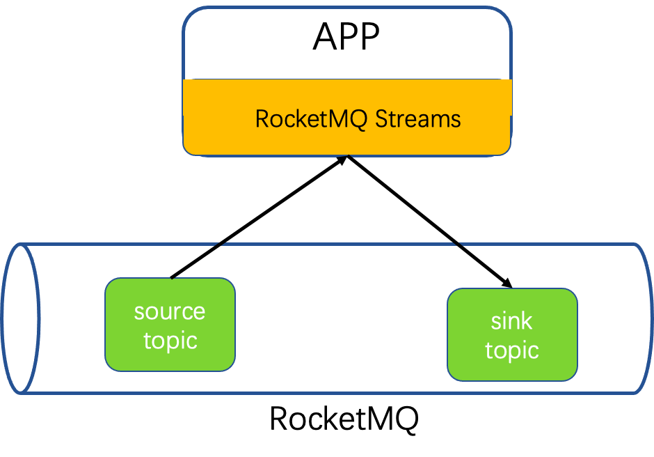

Data is consumed from RocketMQ by RocketMQ-streams, processed, and ultimately written back to RocketMQ.


Data is consumed by the RocketMQ Consumer, enters the processing topology to be processed by operators. If the stream processing task contains the keyBy operator, the data needs to be grouped by Key and written to a shuffle topic. Subsequent operators consume from the shuffle topic. If there are also stateful operators such as count, the calculation requires reading and writing to the state topic. After the calculation is finished, the result is written back to RocketMQ.

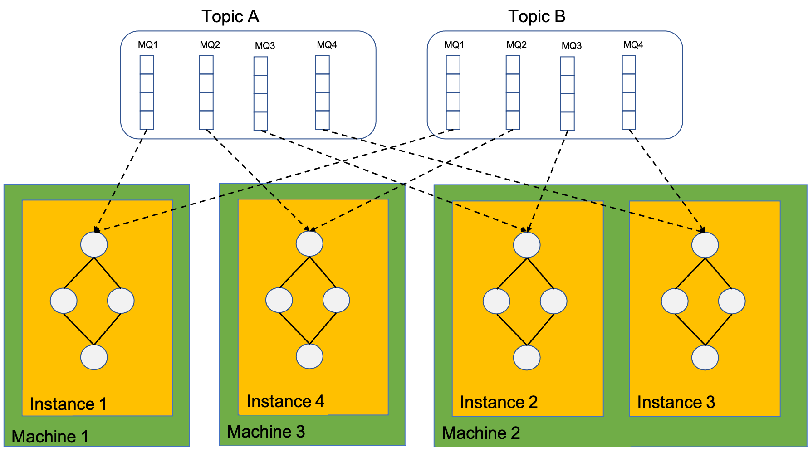

The calculation instances actually depend on the client of the Rocket-streams SDK. Therefore, the calculation instances consume MQ, dependent on the RocketMQ rebalance allocation. The total number of calculation instances cannot be greater than the total number of consuming MQ, otherwise, some calculation instances will be in a waiting state, unable to consume data.

One calculation instance can consume multiple MQs, and within one instance, there is only one calculation topology graph.

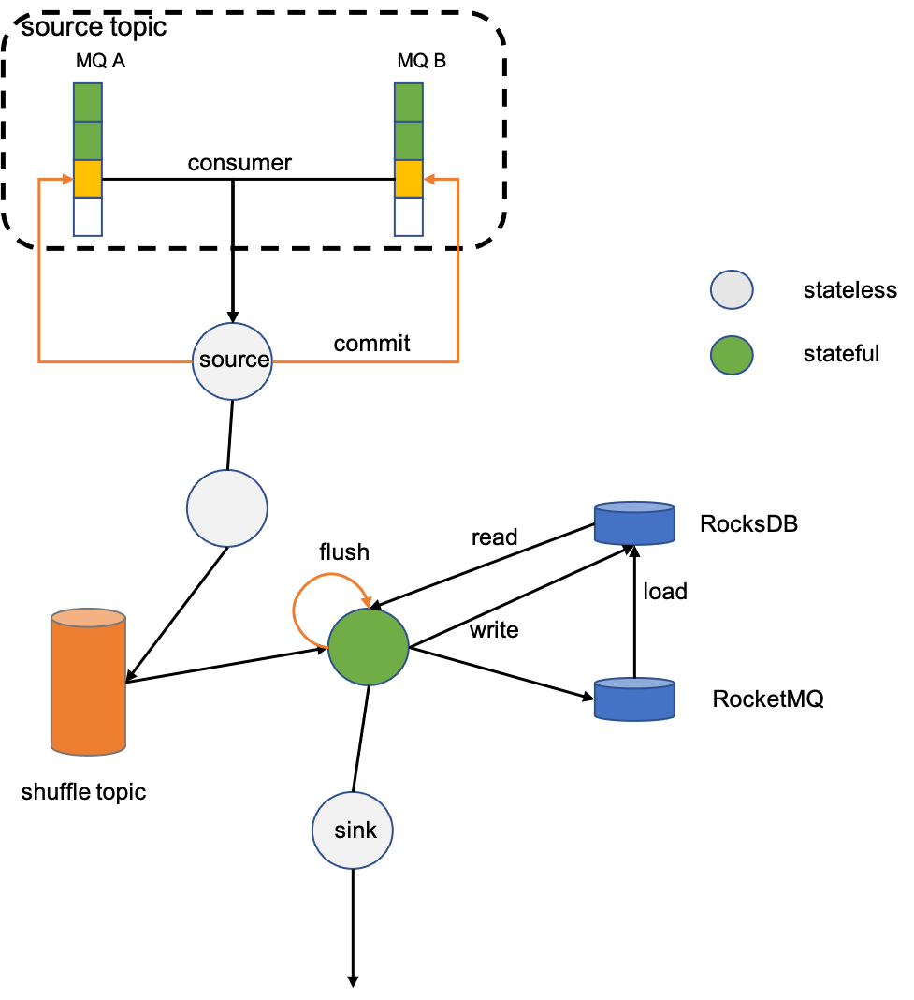

For stateful operators, such as count, grouping must be done first before summing. The grouping operator keyBy will re-write the data to RocketMQ based on the grouping key, and ensures that data with the same key is written to the same partition (this process is called shuffle), to ensure that data with the same key is consumed by the same consumer. The state is locally accelerated by RocksDB, and remotely persisted by RocketMQ.


When the calculation instances are reduced from 3 to 2, with the help of the rebalance function under the RocketMQ cluster consumption mode, the consumed MQ will be re-allocated among the calculation instances. The MQ2 and MQ3 consumed by Instance1 are allocated to Instance2 and Instance3, and the state data of these two MQs also needs to be migrated to Instance2 and Instance3. This also implies that the state data is saved according to the original data partition MQ; expansion is just the opposite process.

---

<a id="streams-02rocketmq-streams-concept"></a>

<!-- source_url: https://rocketmq.apache.org/docs/streams/02RocketMQ%20Streams%20Concept/ -->

<!-- page_index: 58 -->

# RocketMQ Streams Core Concept

Version: 5.0

<a id="streams-02rocketmq-streams-concept--rocketmq-streams-core-concept"></a>

# RocketMQ Streams Core Concept


- An instance of StreamBuilder has 1 to N pipelines, where a pipeline represents a data processing path.
- A pipeline can contain 1 to N processing nodes, called GroupNodes.
- An instance of StreamBuilder also has a TopologyBuilder, which can construct data processors.
- Each JobId corresponds to one instance of StreamBuilder.


- An instance of RocketMQStream has a TopologyBuilder for building topologies
- An instance of RocketMQStream can instantiate 1 to N worker threads
- Each thread, represented by a WorkerThread instance, contains an engine
- An engine contains all the logic for executing data processing and includes a consumer instance, a producer instance, and a StateStore instance.

A Stream Processing Instance represents a process running RocketMQ Streams;

- An instance of Stream Processing contains one StreamBuilder, one RocketMQStream, one topology, and one or multiple pipelines.

- `StreamBuilder(jobId)` build instance；
- `<OUT> RStream<OUT> source(topicName, deserializer)`  define source topic and deserialization method；

- `<K> GroupedStream<K, T> keyBy(selectAction)` group the data by specific field；
- `<O> RStream<O> map(mapperAction)` transform data one-to-one；
- `RStream<T> filter(predictor)` filter the data
- `<VR> RStream<T> flatMap(mapper)`transform data one-to-many；
- `<T2> JoinedStream<T, T2> join(rightStream)` Perform a two-stream join；
- `sink(topicName, serializer)` output the results to a specific topic；

Operations on data that has the same key

- `<OUT> GroupedStream<K, Integer> count(selectAction)` counts the number of data entries that contain a certain field.
- `GroupedStream<K, V> min(selectAction)` calculates the minimum value of a certain field.
- `GroupedStream<K, V> max(selectAction)` calculates the maximum value of a certain field.
- `GroupedStream<K, ? extends Number> sum(selectAction)` calculates the sum of a certain field.
- `GroupedStream<K, V> filter(predictor)` filters a certain field.
- `<OUT> GroupedStream<K, OUT> map(valueMapperAction)` performs one-to-one data transformation.
- `<OUT> GroupedStream<K, OUT> aggregate(accumulator)` performs aggregate operations on the data, and supports second-order aggregation, such as adding data before a window triggers and calculating results when the window triggers.
- `WindowStream<K, V> window(windowInfo)` defines a window for the stream.
- `GroupedStream<K, V> addGraphNode(name, supplier)` adds a custom operator to the stream processing topology at a low-level interface.
- `RStream<V> toRStream()` converts to RStream, only converting in terms of interface and not affecting the data.
- `sink(topicName, serializer)` writes the results to a topic in a custom serialization format.

Operations on data that has been divided into windows

- `WindowStream<K, Integer> count()` counts the number of data entries in the window.
- `WindowStream<K, V> filter(predictor)` filters the data in the window.
- `<OUT> WindowStream<K, OUT> map(mapperAction)` performs one-to-one data transformation on the data in the window.
- `<OUT> WindowStream<K, OUT> aggregate(aggregateAction)` performs many-to-one data transformation on the data in the window.
- `<OUT> WindowStream<K, OUT> aggregate(accumulator)` performs aggregate operations on the data in the window, and supports second-order aggregation, such as adding data before a window triggers and calculating results when the window triggers.
- `void sink(topicName, serializer)` writes the results to a topic in a custom serialization format.

---

<a id="streams-03rocketmq-streams-quick-start"></a>

<!-- source_url: https://rocketmq.apache.org/docs/streams/03RocketMQ%20Streams%20Quick%20Start/ -->

<!-- page_index: 59 -->

# RocketMQ Streams Quick Start

Version: 5.0

<a id="streams-03rocketmq-streams-quick-start--rocketmq-streams-quick-start"></a>

# RocketMQ Streams Quick Start

Refer to the RocketMQ Streams project rocketmq-streams-examples module for programs that can be run directly. Steps to run the example:

- Start RocketMQ 5.0 or above locally.
- Use mqAdmin to create the data source topic in the example.
- Start the example.
- Write appropriate data to the source topic of RocketMQ (as determined by the example).

- 64bit JDK 1.8+
- Maven 3.2+
- Start RocketMQ locally，[Startup documentation](https://rocketmq.apache.org/docs/quick-start/)

```xml
 <dependencies> 
    <dependency> 
        <groupId>org.apache.rocketmq</groupId> 
        <artifactId>rocketmq-streams</artifactId> 
            <!-- Modify as needed --> 
        <version>1.1.0</version> 
    </dependency> 
</dependencies> 
```

```java
public class WordCount { 
    public static void main(String[] args) { 
        StreamBuilder builder = new StreamBuilder("wordCount"); 
 
        builder.source("sourceTopic", total -> { 
                    String value = new String(total, StandardCharsets.UTF_8); 
                    return new Pair<>(null, value); 
                }) 
                .flatMap((ValueMapperAction<String, List<String>>) value -> { 
                    String[] splits = value.toLowerCase().split("\\W+"); 
                    return Arrays.asList(splits); 
                }) 
                .keyBy(value -> value) 
                .count() 
                .toRStream() 
                .print(); 
 
        TopologyBuilder topologyBuilder = builder.build(); 
 
        Properties properties = new Properties(); 
        properties.put(MixAll.NAMESRV_ADDR_PROPERTY, "127.0.0.1:9876"); 
 
        RocketMQStream rocketMQStream = new RocketMQStream(topologyBuilder, properties); 
 
        final CountDownLatch latch = new CountDownLatch(1); 
 
        Runtime.getRuntime().addShutdownHook(new Thread("wordcount-shutdown-hook") { 
            @Override 
            public void run() { 
                rocketMQStream.stop(); 
                latch.countDown(); 
            } 
        }); 
 
        try { 
            rocketMQStream.start(); 
            latch.await(); 
        } catch (final Throwable e) { 
            System.exit(1); 
        } 
        System.exit(0); 
    } 
} 
```

If the data written to the sourceTopic is as follows: each line of data is sent as a message;

```xml
"To be, or not to be,--that is the question:--", 
"Whether 'tis nobler in the mind to suffer", 
"The slings and arrows of outrageous fortune", 
"Or to take arms against a sea of troubles,", 
"And by opposing end them?--To die,--to sleep,--", 
"No more; and by a sleep to say we end", 
"The heartache, and the thousand natural shocks", 
"That flesh is heir to,--'tis a consummation", 
```

Count the frequency of words, and the calculation results are as follows:

```xml
(key=to, value=1) 
(key=be, value=1) 
(key=or, value=1) 
(key=not, value=1) 
(key=to, value=2) 
(key=be, value=2) 
(key=that, value=1) 
(key=is, value=1) 
(key=the, value=1) 
(key=whether, value=1) 
(key=tis, value=1) 
(key=nobler, value=1) 
(key=mind, value=1) 
(key=against, value=1) 
(key=troubles, value=1) 
(key=slings, value=1) 
(key=die, value=1) 
(key=natural, value=1) 
(key=flesh, value=1) 
(key=sea, value=1) 
(key=fortune, value=1) 
(key=shocks, value=1) 
(key=consummation, value=1) 
(key=to, value=3) 
(key=to, value=4) 
(key=to, value=5) 
(key=say, value=1) 
(key=end, value=1) 
(key=end, value=2) 
(key=to, value=6) 
(key=to, value=7) 
(key=to, value=8) 
(key=or, value=2) 
(key=them, value=1) 
(key=take, value=1) 
(key=arms, value=1) 
(key=of, value=1) 
(key=and, value=1) 
(key=of, value=2) 
(key=and, value=2) 
(key=by, value=1) 
(key=sleep, value=1) 
(key=and, value=3) 
(key=by, value=2) 
(key=sleep, value=2) 
(key=and, value=4) 
(key=that, value=2) 
(key=arrows, value=1) 
(key=heir, value=1) 
(key=question, value=1) 
(key=is, value=2) 
(key=the, value=2) 
(key=suffer, value=1) 
(key=a, value=1) 
(key=the, value=3) 
(key=no, value=1) 
(key=a, value=2) 
(key=opposing, value=1) 
(key=the, value=4) 
(key=the, value=5) 
(key=a, value=3) 
(key=in, value=1) 
(key=more, value=1) 
(key=heartache, value=1) 
(key=outrageous, value=1) 
(key=we, value=1) 
(key=thousand, value=1) 
(key=tis, value=2) 
```

---

<a id="contributionguide-01how-to-contribute"></a>

<!-- source_url: https://rocketmq.apache.org/docs/contributionGuide/01how-to-contribute/ -->

<!-- page_index: 60 -->

# How to Contribute

Version: 5.0

<a id="contributionguide-01how-to-contribute--how-to-contribute"></a>

# How to Contribute

Apache RocketMQ —— Open and sharing open source community, sincerely invite you to join.

Ways of community communication and contribution:

- Ask questions
- Submitting an error report
- Introduce new feature
- Participate in discussions on mailing lists
- Contribute code or documentation
- Optimize the site
- Test pre-release versions

Apache RocketMQ community provides a complete process to help you answer your questions.

You can ask questions through [User mailing list](mailto:users@rocketmq.apache.org) and [Stack Overflow #rocketmq](https://stackoverflow.com/questions/tagged/rocketmq) .

If you have problems using RocketMQ,You can file an error report on [GitHub Issue](https://github.com/apache/rocketmq/issues).

The community is constantly looking for feedback to improve Apache RocketMQ,Your need for improvements or new features will benefit all RocketMQ users, Please create an issue on [GitHub Issue](https://github.com/apache/rocketmq/issues)。

Proposals need to include appropriate details and scope of impact. Please elaborate as much as possible on the requirements.We hope to get more complete information for the following reasons:

- The improvements and new features implemented ultimately fit your needs
- Evaluate input costs and design solutions based on your needs
- To facilitate constructive community discussion around the proposal

If you plan to implement your proposal to contribute to the community, you will also need to provide detailed description information,And follow [code-guidelines](#contributionguide-02code-guidelines) Code specification

We recommend building community consensus before implementing features. By discussing the need for new features and how to implement them, proposals that are outside the scope of the project can be spotted early.

Members of the Apache RocketMQ community communicate through the following two types of email:

- [User mailing list](mailto:users@rocketmq.apache.org) ：Apache RocketMQ users use the mailing list to ask for help or advice.

  You can contribute to the community by subscribing to the email system to help others solve problems;

  You can also retrieve on Stackoverflow [rocketmq](https://stackoverflow.com/questions/tagged/rocketmq) tag answer user questions and get more insights.
- [Development mailing list](mailto:dev@rocketmq.apache.org) : Apache RocketMQ developers use this mailing list to communicate new features, pre-releases, general development processes, etc.

  If you are interested in contributing code to the RocketMQ community, you can join the mailing list.

You can also by subscribing to [mailing lists](https://rocketmq.apache.org/contact) get more info about the community.

Apache RocketMQ continues to grow with the help of its active community. Every few weeks we release a new version of RocketMQ to fix bugs, improve performance, add features, etc. The process for releasing a new version is as follows:

1. Launch a new pre-release version and start the voting process (72 hours)
2. Test pre-release versions and score (+1 no problem found, -1 test problem)
3. If the pre-release version is not tested, release it; otherwise, go back to Step 1

We have compiled the [release-manual](#contributionguide-04release-manual) release guide on the website.
Testing a pre-release is a big job, and we need to get more people involved. The RocketMQ community encourages everyone to participate in testing the new version. By testing the pre-release version, you will be confident that the new RocketMQ version will still service your program properly and is indeed supporting version upgrades.

Apache RocketMQ has been and will continue to be maintained, optimized, and extended.
So Apache RocketMQ encourages everyone to contribute source code.To give code contributors and reviewers a great code contribution experience and provide a high quality code repository, the community follows the contribution process in [code-guidelines](#contributionguide-02code-guidelines).The coding manual contains guidelines for building a development environment, community coding guidelines and coding styles, and describes how to submit contributed code.

\*\*Be sure to read it carefully before coding [code-guidelines](#contributionguide-02code-guidelines)

And please read [Apache Software Foundation contributor license](https://www.apache.org/licenses/contributor-agreements.html) to submit electronic signature.

How to find the right issue?

[GitHub Issue](https://github.com/apache/rocketmq/issues) lists the improvements and recommended features that have been proposed so far.

Good documentation is essential to any kind of software. The Apache RocketMQ community is committed to providing concise, accurate, and complete technical documentation. The community invites all contributions to help refine and improve the RocketMQ documentation.

- Please report missing, incorrect, expired documents on [GitHub Issue](https://github.com/apache/rocketmq/issues)
- The RocketMQ technical documentation is written in Markdown form and stored in [RocketMQ Official Website Repository](https://github.com/apache/rocketmq-site/tree/new-official-website/) `/docs`

Read [Q&A](https://github.com/apache/rocketmq-site/tree/new-official-website)to learn how to contribute by updating and refining documents.

The Apache RocketMQ website represents Apache RocketMQ and the Apache RocketMQ community. Its main functions are as follows:

- Become familiar with the visitor Apache RocketMQ and the features of Apache RocketMQ
- Support visitors to download and use RocketMQ
- Guide visitors to participate and contribute to the RocketMQ community

The community accepts any contribution that will help improve the site.

Please provide your suggestions and ideas about the site by creating [Github Issue](https://github.com/apache/rocketmq-site/issues)

If you would like to update or optimize the website, please visit [apache/rocketmq-site new-official-website](https://github.com/apache/rocketmq-site/tree/new-official-website#qa%E3%80%82)

There are many more ways to contribute to the RocketMQ community that you can choose from:

- Introduce RocketMQ to as many partners as possible
- Organize offline communication meetings or online user groups
- Become the evangelist of RocketMQ
- ...

Committers are members of a community's project repository who can modify code, documents, and websites or accept contributions from other members.

There is no strict protocol for becoming a committer, and candidates are usually active contributors in the community.

Being an active contributor means: participating in discussions on email lists, helping others solve problems, verifying pre-release versions, honoring the good people and continuously optimizing community management, which is part of the community in Apache.

Undoubtedly, contributing code and documentation to the project is equally important. A good place to start is by optimizing performance, developing new features, and fixing bugs. Either way, you are responsible for contributing code, providing test cases and documentation, and maintaining it continuously.

Candidates can be recommended by committer or PMC members in the community, and ultimately voted on by the PMC.

If you are interested in becoming a committer in the RocketMQ community, please actively engage with the community and contribute to Apache RocketMQ in any of the above ways

committer members in the community will be eager to share with you and give you advice and guidance as appropriate.

---

<a id="contributionguide-02code-guidelines"></a>

<!-- source_url: https://rocketmq.apache.org/docs/contributionGuide/02code-guidelines/ -->

<!-- page_index: 61 -->

# Code Guidelines

Version: 5.0

<a id="contributionguide-02code-guidelines--code-guidelines"></a>

# Code Guidelines

This article introduces you to coding specifications and coding guidelines.

Research shows that 80% of software development time is spent on software maintenance, including source code interpretation, source code refactoring, source code maintenance, etc.

Agreeing on and enforcing code specifications and guidelines can help improve code readability, maintain code ownership by the development team,

help engineers understand new code quickly and deeply, and simplify maintenance costs.

The following guides you to import the `rmq_codeStyle.xml` encoding specification file and `Apache.xml` contribution license file in IDEA.

1.File Path: `rocketmq/style/rmq_codestyle.xml`

2.Apple OS Import: `IntelliJ IDEA > File > Settings > Editor > Code Style` enter the `Code Style`, select the `Manage > Import` to import the `rmq_codestyle.xml` and name it `Scheme`

3.Windows OS Import: `IntelliJ IDEA > File > Settings > Editor > Code Style` enter the `Code Style`, select the `Show Scheme Actions > Import Scheme > Intellij IDEA code style XML` to import the `rmq_codestyle.xml`

![1656682140788](data:image/png;base64,iVBORw0KGgoAAAANSUhEUgAAAy0AAADMCAMAAABJPryOAAADAFBMVEX///8AAABhrPGGxaMafcSTQwBmZgDy8vJaAADiwn5mtv9IfMOTk7oAAGPm6/ABYafuzKuTf5P////JztPxrGF+MwDO8fHj4+O2///r6+sAADe6qcOIy++uZmd/f5Px8dOs8fEAOGXxzc2XlMNiAGK63/GTut8aGhp+wuLHikSXwM2X6f80h84AM37i4tJnrO///7a92+19MzPx8ayT0/EXMDBaouGO2v/l6rDfupM2AGE3AADMq5jxzbrd3d1eADWIiWbP1NnY5uLi4qKi4uKko6M1ADWp6u+nXjSHrPEZqetCitCnp3+am5tcmbvu//+2trbc//9nGRmIQxmSkpNnGWsAWXNxcXFeNYQZabD/2o4ZfM2xkH/N7v8ZGWtUe9biolp+fsIZlOFvfMN/p83xz4dCGRndwM1nGURv1f8ZGUS83v/xzaepaRmtra26/+sZQ43lrGvx8d80NH1WVlZaWlpuk5O0zuLi4sI5Y2SHYYe9vb2Xqstjrq4zAFpIwPRCGWu1awC4k5Wiw+LC4uLIy4inf5O/4canzfGOOQD//+yTf39Ajqm8mLbd/+tKmNAzfsJCGUS6//QMQ0Rv1esAAFqHNmHly41utfE5jtrd8PF/p6dkZWWiWlqIQ0SHrIcDZq3M1busYQDajjm1mJjx05PU1NQQT33Nzc3Np39+flrH6u9FRUWbu7uAgICX6fQAWqJmOTnK06bPhzZ/f3+rmLf/6eHxtW5aWgDx8c6Nq+qiWgCLaI5WAACnf6f/tmaXwOtuAAD/1dfiw6JDAAAZfNc+Pnq83t4Aa7X//9uTf6fMq6vDxcfDon8AAEPTk0Oiwn6IQ2uHz/GNjtSHh8/CfjO6//+u6f/z37pmADl+on41NTUAQ5N/k7j97sw5ADmYmKve8M08Za618dO7k36QstKHNgDx8bUANoe18fGKr40AAG6ju95/f6bi0rKnf3/Z2o7O8M4AOY6X1f+OOTljAACHNjarzO45AGbd//RDk9Pf8d+cl7wTXZHl6tAAWlqxxdiJAAAAAXRSTlMAQObYZgAAAAFiS0dEEeK1PboAAAAJcEhZcwAADsQAAA7EAZUrDhsAAB/4SURBVHja7Z0NfFRXlcB5SHf4aNJ2NkwgSWvWkAxsw4KNQtJgYQs0mhgVmC6lCLL5IA0FJLSuVFpjkGqgtVurNU3saiQlEtEpa5TuiNtUBDepXbtSwdTa7q7L0tTKomxTFZXdc869933M55tkJvN1zi/z7rtf7yWZ+59zzr3vnpk0yZDsDJLtDhYWWzIpiGRnljAtLGMGJjubaWFhscVLNtPCwmIPl2ymhYXFHi67M0qYFpZx4OLMKGFaWMaDC9PCwmKTlt1MCwuLTVyYFhaW6Gi5abvHs/0mpoWFJQwt2UTLcx6S5zKdlrYfvePV773+2jj/q3CV8A0Onhj3PVgSgQvRcpPHc8jhOOTx3JSBtLz6PQ3kMQstz4cb772WHHW/FI6Wgyc0DUpM12RaUpmW7Z5DOJIOebYzLZG1w0uzTZmnsHNYWhAWpKWNaUkPWjweGkkOTHejSbY7o2gRQxdG9aDULW0wvgcJI6g6eGKwzTK4v77WghqQ8uoLqrG6CuUvSZ4GHY6z78BrXnUF1Lz1ih+9BWkxWrCkLC3OlR7PyozTLUiJJlNJiyh4/bWDJz5nVQU3ubebVMslk4J6/TXjKrrCekojpULXfB6aA32oW8wqjSW1LLFewxKb7fHMzkBantJ+3vXq96TfgtoBC2CMXzp4wt8sq3Xrp8/L8a4aq6ugQjl4gkh66xWCCrzmwRM/74IuSIupBUuqefmAS69HQNPbm2F+C2kO/NgHI8mgBQvwALrA+j+b/U6PiZZLRgoHdZXnyZ2RHdsIF/Jb2l7/rytQXb3+mqUFSwrRomaQPbVprFUi0oKeikW3DOJAfyyAlrVft7jwj6HfohqrqzxvuCRPPSYMNqLlKe3vTgw6BC2sV1KUFrE6eag2/XEJNSd2iaauNEWLxW/xo0W7yTz/JebEjMYmv0V4O2LW7DG6Jtzs62SQSb+Fp8ZSkhYhs9Mfl5C04Kh+UFliOLNlmhOz/s9WWnJPCRbUnJi8Cs0b63Nt5LfQNYEZcHBoBtlowZKStCAu2zONlokVNsDShxbn7O0OpiWOgjMAPOrShRZ+qjKu0sazYEwL02KbFvBaWJgWpoWFaWFaWFh0WnZzzBcWFnu0ZKYwLSxMC9PCwrQwLSxMC9PCwrQwLSxMC9PCwrQwLSwsTEs8admeFsIUMC0TQktuGgjTwrQwLUxLImjZtqWgfPXGKqaFaWFagkr5ajfIAgst87YUMC1MC9MSiRZLyrQwLUyLlRZhenVsdq+TumUb4LOOMIKqjs3rtqW0cRZqiJQtPRUDWnbNXJTCtKxdy1xEr1uQErdMJS2iYGNVx+bPbU4bWspGNW1yAmn51//O/asPer3e83tzjZME0ZLryZ29du1sSJiNaGlpce84XL5a+i1oiWFB9jZ3TcfmFDfLtpthmezwfaEwfrREYodo+WRu7ve9nxQncZdac2KhxbP2W2tBvrXWw2xEa4nNc9dkX15jogUL8ACWWNr4LY13ueJridmlJfd/nt07IbT03k2c1N7dG6hbCBbAhXXLGGhBT8WiW4CSbe4F6UQL6hZlkJWWLV2mad0yA+x8uVKbnIOnsqTxllP+tOyaed/U+XuXT9W0R1fk5mL6MPIxrfKIyOBh/jeX/qxSW7QJsqKJNn9vIC1wnBjdQrhIWKy0gBm2duVKOMxmNqKcEwMVYvgtAInZb0kfWhw5WlYh0lBKyHQjEahifOcml42OuHIAnsYbC2VJUFqAkuVTAYNNj66gFLXJpry5ucuXzsVTZGc5ALVJO5I77ePQBFTNsZC0gN/SMBG4KFgstKBaWelwIC5rRbKSGbFLC+gS94PKEsP5MdOcWDrNIPcDETkjLmmJ+d48lUOxi0sxJ1+yJIglRobWJhz9CAlRsGvmR1DPbKI+pGkQHPmiJpuC0rLnoxOjWxAXBUsYWsCLYfeFn3wJmEEGa8xKC2UcZlpGXCH8FhMtN8xVtLzzlrk6ErZp+f7LN08ULbm9vUHnxKyW2GwPG2RMi9XL/wVhge5L2U8kLeTLXFtookWWBLXEFuVKSwzdFyDjb6FoWiWaX1DzDyv8aMHSXTOD0PL96z6aO2G0hJpBll6+l718piWobunXaL2lsRL8F0kLZqDMRIssCUVLrvLyp1VCIjyVR1dARoPK0+jl67SggZb3NX9awF15+Wa53gLUJIoWnkFmWpLvyRezJZZMa/m8Osm0MC385AvTwrTwU5VMCz+DzLQwLUwL08K0MC1MC9PCtESgJa1ivngTJExLZtCSXuJNzDfqMC1MC9PCtDAtTAvTwrSwMC1MC9PCtDAtTAvTwrQwLUwL08K0MC0ZRMvlNW43xkdiWpgWpiUyLQtsFjItTIvTefu/L2ZamJYMoGXhqKYNRkHG0D5N06YzLQFgyKAv5Xcsc7trMJOaxhnTEoaWARz5A53h6LCiMfTG4oh0+PfJAL8F+KjJzm7ZWFW+el12x2cLWLekIS0LR6dH1CWBtDjbOpkWP93SgqoETsvvKMi+/KW0oOUQixBFy8DFVYZBljULxvl9cDJ9aF+nrMPyi6tkrYkWbKiX3/67WdSwU7R/kPoEpSV1/kNjo+VLBWlEC4ufblG0LBxFPLJmDe2DwQ8plrdNV3pC1ZosMWqoyoGWhS8uxqZUkpG6RVhiOw4zLelPC6UwyGmc46h/cfHCObMULapWefl5i0VOlQMtAxSrs1NcLxNpMbx8oiV7Hnv56ee3vLjYRMsbixUtzp7OnkGnlZY3FuuWmNNMyxuLkRaBXSbSwmv5GTMn1gN6wjnQKWyqi6uG9gEjPeiK/OAfFzutlpjgwUyLKkdLDKcLrqVk4QtYCdaa+GFamJa0WW9BE2rQ5OU/Lv35NuWn9wTx8pX6MHn5t1fSMgwkUAB9fs20MC1pvpZv2FARJomtq5O/m8VPVTItmUuLbQBI/QSfL2ZamJaMoKVNm26blQFlpDEtTEtG0cLPIDMtLEwL05KEtCRbmD2mhWlJYlpSI4Qr08K0MC1MC9PCtDAtTAvTklhaPjCBwrSkKC3Wr19l3cK6hWkJRovv3OQJpmXaLXMT8a16TAvTEiNaxiURLoG0HDsCh9PIxen590dHy+m/WaraL19q6nnsYaYlRWgpv7UqQoM7CpgWgxZEYtfMvLlBBnkEWqbdtfe03uW0qfOuG+ZGAqTWnDAt8aPlue3+w3+1270uPC3YZEFq0tJ4Y2HZ0mWaVupwlI1SgtKvaVmFssB3DrenQ9vGSkwwO+Kic6wfceERGlP5/Ra7bru0vpbP+adFQcZ4BFqOLUJgDHRMHY9EgKX3buKk9u5epiW+tGz3WHFpQQ5aasLRUr56QfblH1elLC2j3ei+lC09pZQFFMJRFvjOAQs5WYW+j7kowax+PhmQAsJUeWMALbtmLoLRffpI7rSPr4Cf5Uu/pmmgJ5ZP1TQNaMH00RWod5ZPXYT8nKa81CDYGQ73TZ3/aTxTnS3ohMZFwsK0xNMSs+KCJESyxDp+cDhlLTHSLUDFm6dyaDc5KZey0TwY9bKA2tGBNI4ESj/PGXE5BFSTg3r5AMqxRTC+NxEwy6ceQXWDaOQem793+VQY/JseXQGNNr30MEADTZSrMmeF0CK7Zj4qz2RnURURFwUL0xJXv8WCS4vaf6825gMt8vTymvtWU60iCstrKD7fOpkBdn652b2gBU9lSfLSgsPeqMxTBYqWxspSbE1Z07mg5c1ToWiZdtenb5gLigLUB+mWuag1yAiDA6WgQaDm3W+5DRoun5o312R7IRekYOhMdrbjuAAuCpZx07JwzizbASgz0Muv9TwXQIsefu/WKnV6ec3GKmWt4RmVZ8v4fBTuYs2CcuCpBeDp+ESVLElaWspGIX9tIVli78FaWeA71w2qJKsQseiXusV0LiyxEZegKMASg2H+bzDujy2CER6KFqQJWfnZXcSO4EUoEGBM0ELGmqTFhm4BXHqjnROjOK1BtqcwLVHrFj383q1V6tQ89OcBEaKpjAoD6oRiXEJOvmRJEtECg2Pkfp0W6cWTHNC0bsOtf1y68Zp2j9Qt8hzsMZOXH5yW3GMfQWvr/27ba6IFLbFdM5UlBsicfukIvED9NCg6xKQxaBiZhzNFi2GuxXQGWYRuCdz6JcMj2QpAmel+i3RD9PB7iha/oGJgjVlpEZSZaUlcTKU/12UMT76MfaZZ0LJJWyRcDhMtUKjlfc3w8nOnVS4Si5fHNO2IPicm9I6gBRlTnY/kxo2WINuKmRb7c2LzthTgnJgefk9ZYjsO67R0/IKwQPel/AVJC/ky11aZaJElCaHlr6Ukgpaxipj5Oq2ToZ/ZcVvGTosIoIfQyMiuZInp4VopnIsR4rWT11uy/aaQda/d38tfoNthtN7SsRmKVXw+yECZiRZZwrTYFcLD8FH0s3it5QfSIiK7ClpknNbvrhJBX6c7ZfxWXstPNxkXLRnzVKWkhcJNClpkZFeiRcV97cGZAApaKeK3Mi1MS+bSIsJNhqLl9spOVTVgNxQS08K0pCktA3niC4x6UIGIyK7KEsM4rYhIj7TERPzWoFFbmRamJWpaUiuKBa23kMIAa+seVCAisqv08ilOK7aBKgrxKuK3Mi1MSyZJ5Miu/OQL08LCtDAtTAvTwrQwLRNLCz+DzLSwMC1R0zIlk+SqbilXMS1MC9PCtDAtTAvTwrQwLUwL08K0MC2RxPe0a/iaYlP+U8XR9L5w/ivXFMM1mBamJc1o2Xm2IRgt1jzRsvNsu60rVpQEuwbTksy0VB+dEa765IfrmRaUYc81xbGlpS+OtBjPiTEtdmm56k/+Y/+M03k8LC3YIj+ZaHm7kITT0leCusD39De93hIjceFg3+r1vtyFxy8iLTvPer0NjuEHvN52QQM1FY362omoraim+qDgP00XwH7tsaNlutPZNsi0REHLn75qxaUaQahuCkPLyTP5U9ZX1a+/Pj9paDEdE0gLDPLhZ13gazTAq10lNNiHr+wCqwodmK3XKd2COeHSYFPoKRoBJls9JdIG61O46XWx1C34xD7TEpUlZsUFUYhgidXdTLmkoqVXSGJpqWggCshu6isxEvip8II04GA3LDGhPdqlpbVzT7FoBNgs+fQf/7Cn2EKLrHsAFFQsaRna1+mUO/AXvriMtkaKB/MXvvjLSm36AJWMc0N+evktFlx0MNDc2l8vUicUYtpkAgrzR3/ahD0+BLQY1YmhhdLE0oJmEppLQWlpkDiFpYUa7dyDrOy+sstKi9QqW2NpiWla3mKn2nC/cHQQN6/InfgLRy+uGtAGcePkeDfkp5mX/9WvXhVAy8kzCML+ekKj+eiMk48U6dqkmjDCHLZuzgfdYq5ODC2oWRJLy9bzGMUSTTCyslQiDCmwuN5VjMeKYJaYoEU0clSgHbayxGG1xKjubS5pocVKt6DbIjfcExRvLJY78TEnX+PdkJ8BuoVSGP+UwqGa/mKlPVqdxwkOgARR+XC9tTozdYuYv6po8D39XvTF9YSc9Ap06/H4RbHeUgFZcNwJHUWLbGRQZKJF1PkueM+7YkkLbh+WG+4lLXInvpmW2MybpaXfAkrCoOXJIp0W/2mxfFIlrU2tx9FviTDHHPc5sWTQLX5zxrGd9o3LDDJYVz0YJ4w23Eta5E58Ey3j3ZCfznNirc4inBMTlhhYYDgBdr1Ip3yevPm6XoKKaKk7XFyEtJiqEyLJoFtSkhYMXaH8eqJF7sQ30eIc54b8tF5vQaPquOHlY/YZ0Bx1q/RFllYnnbai89+MEwDg5ZuqE0JLMsyJpYjwWn581/LDSHPTlOQTpoVpSUZa6h6qZ1qYFqbFlmZJpPXFtDAtKWaJ8TPITAvTwrQwLUwL08K0MC1MS+Jp2Z2EwrQwLUlKizPphGlhWpgWpiWutHCsSqYlAi1Bvp2VaWFamBZjX37WLKaFaWFabNCCO4216YG0xCXafjhaGm85xbSkCC05I66MpQX3sjAtTIs/LeKbvRtvLIwzLeKrswfkLt5RSpKYFrEnjDbmAy10hgfc9hKL3fjBaBn7d6wzLSlHS8g3ezcNvqw/w8APt8nvme/EJMlpURvz56gt+ERQbHbjMy1SOj5bwLQEscTa5CcyjDc0c+L8lVvjpuUNtfEeaJFn9IXfsdmNb6JlmaaV4v3LQGnNn1mK//ffnLsPMpPxXSlbKuqhNm/ZiCtVaNlWk3K0vE+IXVoaK/Ed8sE7NeLCt04Tb86BUnirJsv3cMRltMJUmNdYhD1G7NACSoWidbV1Jgkt+JvD32ilZeDiKrUxH2gRZ0RLrKNYeruVe4LvBH5CHZjsO5dV6MjJKkRaRqke3wHfuTSj5fKaBUmkS95nOoahhT4tswp9H3PhO0TvFL45jgPizenvduS8VArQUI25FaR0BVVkS7fcXjnd2ZNMtJSNltLROicGbpXamA+WmDhT8S1isBvfRMsph+9NnZaypafK5oh/JRxIt1A96fkcpiWutKwUYtMS6ydoMG9+c6Dq3W+57TdvnpI4GK10PoyiiLT0oHefVLpF/Jk5I4FxkOXGfPDyxZmzB8pjsxs/FC2O/lL4dEoLWsrvWOZ2AzTz3O6NVZfX3Lfa7QY4yldTISYPwmvH/Z+ooszGKmuHhNBCqT1aGitLMQmgxfcmsvLlu1xUY24l+TAXRaJFxBdGcyZp/BZ/Wib6yRcrLY133QAF57qBG2GJCVpS0BIrX70OvZKOT1SRGgEAWjZWld9RgCqlfHWN1C1QTRmsM3dIDC2oWezRgqOmX6oIy5vT/1I3vEodOkfUSryfarj129MtchUjLg7A2C0xMIB+YlhiCaMFVDR6LfDynXsctbXDoAV9wxTz8gmMLxWUr95SII0uOLS4UWpadhw2aKEMImTukOy6BR2Ye5SKyNGMN6excjI5olKfyFbi/VSeDxThmx2JFjGjNB0tm0ROIFu9fBiI6KolyVOVB0pDTi/mpCItCMKWAp0WwiQ7CC2AiblDIubEbOiWsUk0awP8DHIUtJADGfjf9X2hUE5HpBotHd9BKi6vWQcOCVpbQM21lJS/YLHEdhy2dEiEdrGhW5iWZKLlAM3KB/nv4ix9gmEZo27Z5navg/H/uPDdOzaTsw8J5Ob5efmmDgmhJfKcGNPC+1viv5afXJPF/Awy08K0MC1MC9PCtDAtvBuMaQlCC8d8YVqYlvQSpoVpYVqipcV/Xz7TwrSwhKYl0gNscdoNxrQwLUwL08K0pDstPWCMtQ0O7cNdb9MpkgCaZ5j/i3+WT/QzLUwL0wJ+yyA+BTpwcdXQPkBkIGsWxeCgiAJZs1i3MC1Mi5+dtXA0b7H6ytbptL9ABrJgWpgWXm+JTAt+tTHTwrTwWn4ALW2dPWiJDZILIywxzEtaYrbVmGlhWlKaFg1DBLYRKkP7HheLL7qXjyj1aBd/zbQwLUxLHCeLM42Wjs8WlN8aYZO93EwZdV0QiXgvpoVpSUZaLq9xYzyXaGjBLWHrwtGyjbb0r4sbLbai7zEtTEscaFlgcwQrIlpwR2VLTVjdEuFiRvWY9ge8z3SMSEuIeO5lcwodoRvbiqsQmpZXvr0hxGr5Z1YlBy38nNjE0EL79SNZYvGmxcZO4wPdeOwfuT/OtLzyRG3tf2xgWjKIFoxQcWuVCrhHngztyldh9rDCbQ4CIw0y3L+v6kydJQ6ipPyOX252Y8ClmmwV2Q+r6QbYYsdh2dN2LD9bEZIoPGvobfbBadE726ZlGEl55Yk79VGyf8mdYZ7EYlpS32+pEbTIgHtU/N3DpjB7pE+2WWkxIvGJOlNnSYsev2/H4RbwYuAeemS/W6vkDbCHbGc/lp+t6HsU8jhYiP2Y0jIkOBn+4yqmJcN0iwy4Jyrok14GdyFCWqy0qEh8qs7SmWiRJXgN+VKxyqhaxpFdoLezHcvPlm4hU6y/m4CheMYUbl8Pua9okd+IICsxUWH4RYh62TeYOYe0DN/7fkHBhv1L/gVssjuH4HDvK99e5cQTYGjoM1+prf2tMNjunFha/GLsMy0xpsXwPjo211BhIC1YZNBi1FlcF0GL0SGQFnkDokX1tBvLz170PRnCWDIgv5ziRhVyX9KiQr0atKgw/BR6lAJch5oqMNECCmX/EmADdAzqFqBl6InfksoZeuJX6MbsP/R+yk0gLf4x9pmW2NIiA+4pFubpugUrLq+Rg3oeDumWGj0Sn6wzdVaWmIzfZ6ZFRvYTZM6TlphoF00sPzu6RQ51AiDvlE6L1BaSFhVG3KBFleRQsNZS0TekJaZo+eEGssCIGqKFKuActA7WOp1Xo6qZSFqsUcM/MIGSIV6+DLgn3Zl7dN2CxtKWZUoFtIjFFOXlqzqjs/Ly1UyBiRYR2Q/9FnEDDOt3WPaMIpafreh7/d1giKmQonmnFBAicn5kWpTrgn1t+C1BafnhBknLK6BqUOMkjBbWLSn35Eucoi+FoKXxlpeESml8DykasKb6s1TIfX9LTFRKSwxLyCK71tQ3+JzY1WpObP+SX0HOzxK79/2SFoTn6om2xBIYY9+bSsK0kFLAT1fUGgc0rZsssHv0kPvKy1ffiCAqsbEKwy9mA0Tf0LTo6y37l+wmtx5MLquXv0HYabW135hY3ZLQGPsJUmhjE6YlGhnjNyJY1/LDzhwn9MmXKQkQpiUdn0EezzciMC1MS4Y9sT+Ob0RgWpgW3t+Sbs8gMy1MC9MyUbScfKQoelqmpJAwLUxLAC3NTVEQcsbpzGdamJbY0ZIiMV+ioGX99fkSlvwp66vqo6Hl7aVMC9OS8jIWWupunhGtJebs+numhWlJJ1pOPvKdVc78aqezCcEQ1hYaXfvrKX8UTo/OkLpFGWRNJx95xuk8LjPmS8gSSYvTObfUJi0nP1wPP3W/L4KfMY7w6qMzwt+AaWFaxkvLmaMzqmHk1z1Uv/56QKR6f/3JMzDeIaW80i1TqhGgKVQHR+jw+yJUMVBvuoQs0Wlxdl0KoCWoQgugpRnpdRK15pPjsaGl2llEfwVcuUh8Bhydof/eTAtLSN1SpF40XOBAww5SlVetW4EIMSQJiieLqmkeocl0CVli0OIKR4vp2oIW03gmWvJxXOcb7eq6HqqPihbjDn66pRkatyIhXU3iT2NamJZx0PJkkT8taI1ZaRHj00yLecQ6nY5gllh0tAilJ9u1NjXnx4YW+FNQi62//qPI3/onn2FamJYoaQE7p1VZYnL46F5+L2GB7svJv5S0kC/z+XrTJWSJpMXVGczLp5s+gzqJfCLp+whL7CH8sdKilNyUKSZAdZdJeFiUon9lcptaoeZDeIef0l/zIaDF7FRVOzc00cWbqXrB+GixE33PKi07DkMnpiWFaXm7MfZ0l6VVePk4+nAGoG4VVElaMANlpkvIEiGfDD6DTM4S+T14A+X7hKfFSZMKgIqajVP+k/CwCNJmUSsHvbgOZhCwZrqB2akiW4w0KTpo+dVjpSVE9D0qDheBJZG0JEn0vVSjJZTZEpcnX/wQlaae8n1C0yJNQmnDSTtO6BjlYVFajXMNutsExBeJPwlVHl3d4lRVk84hFJuw59hpCRpPLOKz9VHGco0tLaYj05JStEjfJyQtxjgmc4uUn5UWaZ+JMW/+c5yCs9am1uN4A3Mt/AbCb8Hf4H+bpvjTMim9abG10zhRMnxNscN34bwr6k64g+BTxTH+bXzJRIvyfULRgnO98herFlZivnq0APwn6WHRgwbXi1S6TXX36h5P3eHiIsLRqBUumiDk5BmcOLfQMilaWgKi70lazNH3avzj7VFMGL2e9ubbDqA3XlooTTAtFV7vdaHGdkXJGMe2hZaKBrxJg8Ox1estcfSVxJKWOD+DHEgL+UTS9wlKi3DdxYmzqJkWW8RR+E+6l49G1jPQ1OQ2NZOrQ14Xuig4J2bUNsvVG6F7jksNhreLnpbg0ffWUKgKPfoeMuQfbw87GdH5MO6L/QB646YlcoSkeMvWl7tCV/bFgpbhK7uGn3XtPNsOR6jYuac49WgJL3UP1cf81tE8PKpomTQG3WIKoKfrFiOeWEC8vcB4Y/YD6KWBbhG0+J7+Jn7u46c/5H0XION72tUHuQ9iaQON+ge83na/lg46+eKnioEEqHLBjywwGvRhJ6QFdAzyJ64mLzf87HvR2Nt5FjPY5Q9nS+iXou5Y+5sLqJeSmpbWsCvyY5KoAZw0VloMXyQ0LQYbwaLz2Q2gN845sWTQLY4+HPu+CzAgL7SDGgDrC04IIBeN7Ze7hDZAlwRe2BLQEC1l8dbrTLSoAtUAryNsMMwCMVSgLjf8QDsh1yCUELRBfPvkbyJrQSP5EhPFwtazXtKJj6lmceaPQbXYxSVE9D0rLVhR/oJ/vD2DFr3kO/EKVOEnSeG3wOf6edIJwEYFRtppUOqGaEEL6souNaD72rEY8BEtZbHPrFtkgd7A98cu5AB1Swl5Qjv3uIzLYT9SNHBP0UVcTJxTLemdJKYlOR5AnhQFLmGi77m3FKjoe1Cxsco/3p5BC9aTlx9FAL3x0ZIkc2J9JYqWBrNxRrTAsO4zPv4NWhoMF95KiyzQGyAtFXQdaYkFowW1T7vsUlECzcU51oKeAtKYFluwTJrgx18SN6ecIL+lHdUHGl9oF4F59K5izPh+pWjZeVa4H8oSE7SIlrK44rpi9OsrzitLDAr0BuTKgDl3tkR4+X6WmKDlbS60u0SXYc8eqoJzrAVuwCBjWuzBMnG4XP5xlZgxy6gnX/rIiX76vehmy5lecMCFcUZzYmpibCtNNUtaZEsxA/0NKBOJT5yhl683QNXURy5/Bd1DevnicpIW3wW4o+yy82yDQ/4mpLEueF/+YKJoSZH4FVaZoPGKJlzCYEno6qT4vA++4PhsxAXKinCz0I7he635JWNauUxMtNQUZCUB9hjTYqie9vA9L3i9ERb8dRdmXGs4wa5V0R7bdaIARFMJlf8HkGR2H3JX2d8AAAAASUVORK5CYII=)

4.The imported `rmq_codeStyle.xml` specifies the code's indentation format, naming conventions, standard Java conventions, and so on

5.After IDEA is set, the code is automatically reformat to pass the code style validate of Travis CI

1.File Path: `rocketmq/style/copyright/Apache.xml`

2.Import: `IntelliJ IDEA > File > Settings > Editor > Copyright > Copyright Profiles` enter the `Copyright Profiles`, select the `import` to import the `Apache.xml`


3.License: [Apache License, Version 2.0](https://www.apache.org/licenses/LICENSE-2.0)

![1656684219109](data:image/png;base64,iVBORw0KGgoAAAANSUhEUgAAA2IAAACgCAMAAABZuS+CAAADAFBMVEX///8AAAD/1dcANffTk0OTQwBDAAAaGhoAAP4HhN5IfMPy8vIafcSSuJKX6fTd6evj4+OXlMPe3t6kXv9aWloAAG6Tf6fT09OHz/F+MwAZQ42Tf3/d3b2Tut9v1f9CGUR+wuJhrPEAAEPfupMZGWvm6/CX6f8AW6Nep+lbAP3dvXw0g/KKvtvCfjNeNTVbADTlyffG6c5+fsIZlOFDkLNCGRmANf4AM37lqPm6k382ADa1tbXx8c5Hk+HO8fHe8N5/f6cZabCXwOuIQxk1hpRhAGHTtW663/FCitA1NV40APvl6tCo6a9uAACHYYf//+1CQ2utra0QT32ampqpaRnx8ayTp6cAQ0PsqV/j46O+3O1IwPSqZWY0AAA0AFy6//+nzfFhAACFNTVcmbui4+Pk5MO1bgCGhmAAAGEZGUSAg/lnGWsZfM0AADXl6rCnf3+jWlrEg/xnGRnko1vryoRCGWu6qcNcAABDQ0TE5OTNzYbxzacAXvRvfMNbNfxaj/YAAFwAQ5O18fGsYQDAwMCX6etnGUR0dHSnzc0WaaSAye4zfsGRkZEwMDC6/+uJ0vVnrO9DQwC1k0O6ut/T8fGINmEZqetaoqIAbrXly41grKzx05MTXZGiWgD/6eHr6+vxtW66uqfNp6c2hs6nf5O6k5Os8fHOzs6FhcvdwM2IQ0Sx8LJ8M1g2YWGEqu+p6u/x37r///80Nfmg3t5CaWvO8M7r68o0gMTd///Gy4x+flrx8bV/p80ZQ0Tt7apeAF66//STbgCIy+9ao+NnQ0SGNgB+MzNttfGSucGTf5MzWlo0W6SIaY3K6+uAgIDxrGE2NocZfNfK7cvf8fFDk9NbXvlbqPQXFxfOhzZnaWuIimt/k7q18dNhADbx8d8AYKwANoXp6ae6qdd+Wn6Tk9M2AGFcqO++6fL204riwn7x8dKAxeY5OTluk5O6urrpp17G6u/lrGvHikTDyPZXntyT0/FnrLChoaGk6u9hYWHd/+vmxIDxz4fFgDTd//RISEj45kLpAAAAAXRSTlMAQObYZgAAAAFiS0dEsENkrsQAAAAJcEhZcwAADsQAAA7EAZUrDhsAABDYSURBVHja7Z0PfJVVGce5iNzlXTVGxJ8SQbnQRARTFuFa4DKni+jqKCcyARmK8SdQmQoUCGmOa1KhMflzqSn4p5zLwnJmNpr2zy2SamnELJsBpWylw4TqeZ5z3n93G/t379373vv7fdh77jnnOefez7v3y/Oc5747b79+loIppFAAguKnfu0omFoCYlBiKQsGgRgExQ+yIBCDoDgyFgRiEBRHxlpTSkAMSjRjVSklIAYlnDEgBkHxRKwViEFQPBkDYhCUAMQyQ+FwKBOIQVCsEQsKYhvCog2pjtjCM9+snjHk9tieZPuMWweu2+yS3/3jv7gEACSCMUEsMxzeHQjsDoczUxCx6hk+0vMOxAac+WbH52xoFEA0en+3ETvZO5yjpCp//mhdXd3LLwIxbyMWCu/my293OATEHGW7+kfEVtnJg0+OmF0mYid7h3Pkk5qIze3xb7dbY3vzRlBniIXD8ksNcPk6R4yvpxRiyslsHejbor3YQqJmi7BHXVsHblnoiB1vudPBJ+FV/aplvO7rRNzhU4kgOrybxz46Qzpkdur/JBOp3qFDxC5UAmJJiVhVazjcmnJejNHy6VIjphqG3L514OcGOhDL9IdsTmy/zRWysZplALUTmzKWETNm5wa26wwx+ax2xHKW1dVNy6XaV5apqJEbTn/8/bkB+pHWj0uXNAdyHvgWFfxajLm/rm6uHq2n4rHKWoqfL4tPPArEdKA41AoUI+FwJAUR2+lbt7l6hl6LcRjHDeRt9m8dGB3TXeE3Xw7QEaZlzKO5XLeZ+mQsz2jMzg1cdhIoXlgVCoUMxOqEFiJh1TSCieBQhJ3O6ykDMaGPDjkPXMJQ5ix7mtdahmOSLmO0MRWNM61PhxeLf7qDGBsaVqQNHZpiazHxUex3OL4zEeMGPpAzcp6zyN1hG2L7rXKAQksqC4f86VR2alvUG0i/ChQ3y+ydIRblxVaxg6GXJgfSYCE2VxuuqqsTIpmdB22IzbVGG1PROG29Srs6IBY/xIykffiKJPZfnSLGqy+HFyM8FrInikLszv/Z0xfsxqpftYyH3H74VGrb6fsnjbMhpmbvGmLnOLyYhZgFTYeI6SiyU8QevIQRU9ZALAGIqa+ed1+R/Ix1lFHcb6yiFGKOtVgUYn/ItH+TpjKKzrUYzVA94xaCyESM28/8mh2xk6zFAoE2XkxFdy+/aHKQs2xuIOcbnHg/a5oNMW4OfDu3DWJPB0w7YyoOFLW1zAXE4ouYUiT5GesQMU6/X2AEipz/s2UUnees1VHbqVL+Vkbxpz5xUAt5dWYiZsxuIibv0DFibTKKZrrD4ODxD3D9rLq6z9q9GDfXzTW8GHVrB9VqG21Ldyhrcy6kO+KOGDMWSjXEYirr7o0Bbb4s2+mL9X0jvcrHM2JQwhGrioQCQCwWiMk3Y21dpYsQOws+q08Qw23AsUEseqkliD0fcA9iq+qmwYkBMQ/faS8rMQgCYhAExIAY5HHEWrEDFQTFEbHUFBCDgBgQg4AYEIMgIAbEICAGxCAgBsQgCIgBMQiIAbFu6l2QtwXEXI9YBuRpATEgBvU1YoWLapauGFMJxIAYFDvElq7wkzY5EGtZVAPEgBgUF8QcJRADYlAMEFORYflk/3TtxQqJuenCHnWVT55e6OnY8WSI5dT6RjsaZl2866QUHJ86rGf42AbOOjCsh4gVTRyF69ijXozR8utSI6YaxlSWT/7x5GRBjIjy+a63QdRwMOoqdwFiJcPHAbFkRKzZP+Lo0hV6LcaBIjcEC/355ZM9HjU6ECOfVW9zXOsr2iImRl1Vt4ydiLUdqhA7dHfxAiCWhIFiiz8/WJBnQ4wb+ECBYjCpEAsc/9suNyM2YeP2vUAsKRHj1ZfDixFahf5NyYcYH2fN8/kqAus5bDw+x0d+jbmjn1kXP0o9jblidv887uGyMZcHXC8meqwUnzCMdaO20kNzasmsvvEHPMFtauCS62iqA9f5fAfZtPE2R9wpiJU8N+rGj9xK4eI3S30+Yu3QHCmKqLaxaOJTPt84XcEV7a2MIjkray1GZNnXYkmIGDsSrpAXy/l0bqCeQDMQM71YTi3BQj1SzprHtIiZHistpitSNcPKGFpP+K0fLTUeOI95ZVoP8tKMhx5vixjxxc6qZPjaBRk3rl1Q8tdbuSgqZaSKSsdlHJo6SvXvxSXtLcTIa/kvMAJFzi7aMorJhtj8YfWyPX2FChQbxJe1g9hoOagFHPsqekUmemy9dnXKWNUMK2Mo0WhMyAO5t5692DD+DB0Eits3yo8gJIcJPt/aBezYVKDIXk4+AdyYVxBLpRuo1FVNV7kiQtZix+dU8PXfJcTmDzNIMaBqDzFNDx8aKhoOBrqFGMeAzJSB2KE5GzMOFUchJhUIiLk1o7hkWIBjtsDVuxgxvvAbyItRyEaFA7GDAW6SugoBG3N1vEdjuZj1kBUocs2wMoYGjl967jATMTNQtBBrGyhSUMic7ZXU/QTlviZwoLg3o+jDGjGuZHxhAS5pIObO78XE36gch6zFqO275MIapODvxRqMdMfbOncxWqczdLpDj6XietNY18x0x9v6+7f11GsgxjYq3SGI8dC26Y7t8qXY9nElw9/Hzowcmc/3y+IFnPUg0BRiRgoEAmKevoGq3Xy8LeHfpaFtvhUwQtTO7u5AOgOIJT1iPi1HY0NjbncQcxCZc6/OTAIxIAbE2vdi9Y67rzofut55ByRHmBUBIAbEgBjutIeAGBCDgBgQw/Y42B4HiEEQNnkDYhAQA2IQBMQgCIgBMQiIATEIAmJADAJiQAxKdcTKz6hZ+vlKIAZBMUesIM/v94/4UTRivL0i72EKxCCot4ip/beD0V7Mk14NiEFALFGIbYCgOKq7iJXfXMlI8UZU+TbECvKo1jzivLy3VsjTJnR/i2xX5XbEqiAofurmWixfIbb0jpoor9bMG3FvKsgjoprHGP1k7AUvhqug9wrhFMQCMcuLNfvVNosWYgQVlWJDB93PGwkDMSAGxHqAGPmsqLVYS37L9KCJmNHPG+IDMSDmIv196j3Gy+oD97gWsaUr6PXVlXbEyj/zMw4OpxNsY4z+8sescNLFiLkuB1U9z+d73ltps5Cbzt2WkxkQYqbtgXtcmFHU6Q7e7H6TM6NYSJ6rIO+PKsGh+wtd+42ZmxHj3UsP37sLiPVA8hCr+oounmiF2OEePEinT26gKswPutZneQux47/JDXhNIff879QN644eOOVOxCR76E3EIi7TM6VNuvT5KuS4tjKyp/Z+etFktLpNoYArPsaVjS9EzHNnnbU9tRXc91uqNd5WXMm9S65rfOGZifzAKTY1hsVDsUKsUOJGIBabC4WvDroOKiL6eOXayj211EblMxPL6MJpch1iEVchFn3WuH19k9RuKq7k/8P21BJipQcjN00ti/PpxJ32LkQsEmnwjYu8IZeLHPfUfoj+SfmGesoSEGtXb2jEos/aKxPLXvnJMandVHxMeunwCv93Nb9MmoFYiiEWKSrde2PjrfRCjiXzj5TU7qWyVrdGgFj7p23iESmjz1rkxJMnxsmLyDvFC6SXDmxtGAGxeCLmtr0t3/kVPzTsiDza6KGi0iczMuhyKKkdl5FxQj3wyIXPOApF3PE5Tiw5QqfryeizlvHOpeceySCW6OwWyzksqRXEMhRi2Ko0tRDjR2DqBzrTxcGP75PnHannHrn0GUcht3wQfliofvC1/axlbJdHZfNZVQ+NWvKUfrbvc6PofMfz8YdAzIWItSeXPzEi5Paztj36Eb0Je6ooEAtsyPSCPjh8r5s/XijD3Wft7OInbK3feSKzqHRjgj4DEPMMYv/OhHp61rb7HGfvbAq2E0UYECPELoSg+AmI4U57yCV32gMxCAJiQAwCYkAMAmJdluOvn4OykWm77d2d1JgHiEEphZj8TXN3EOv6jfey947erAqIQamKWPkt0TtKdeStuoyYYWG3VIPj/HcxQAxyIWIt+YWbgBgExQuxgkdq+OpfesdLsr8b70bqH3G0IO+tFSOOcoXiPP7TZ91uA0c28tCbmdoty2/+1AptagClBxs92li9BxCDkhwx5uOOGqJgujyfhTeZKmTExjBWzM+YSt48R7dbiBX8+ij3qc1MbZaMmeXF5NkTxmDdYxjLe8CLQcmOGO9/Qz+y069yaEydQCIVtf2v0W4P/2TfbbWZqc3SidgmM0ZsNhEzjOMQNAIxyHWISQzn15tpt4vYIzXtIlY+OV/iQtnM1GbZVcQeqQFiUCog1szBGkVyGjGO6QryNGIqohM0jHYLHAalhZdfvJmpaXlGDTdGIWYMdgSK+j2AGJTkiBVOV0eNWLDZ71/0knH525IYut1cYY04j47f53S/rNC0JQeP3NhipDvIcpE5abnuMdMdQAxKgbVYr1WYjxuoICAWP7nqUUhADEo6xAr9btrGFIhBSRgo4k57CIgBMQgCYkAMAmJADIKAGBCDgBgQgzyPWHpqCohBQAyIQUAMiEEQEANiEBADYhAQA2IQ1OeInf/fQcbLfc8OAmIQ1D3E9l1TVdXfU4hdpQTEIE8gdl/VSjo83EUcFWKLx67sU8RsRyAGuQuxu7ZJse0uy4d1hxa3IDZUCYhBrkNs2+XbzKNyYjtOs+LFmWuInr/Qi5WLxz4sfVTb8bH/rOHemRftOG3fsxdRVMmmxrA+QkxKIAa5MFBkumyEmYjtu4aZmrlm8VjijEpuH7lSauf/Zw37usVjCbFr+vPSrO+9GPsxIAa5ci227fLLbYSZiElJ6Ag9dKCQcN9X10iNEJPe+9iLDUpf/B43IAYvBrk23WH3YVaOUCGm6eHD7Idn9093KWJXwYtBbs4o3uWozZ45iDOKKlDccdrisf25jcLD9742yETMDBRdgVg6vBjkasTaZO3lezEz3XGVlOnpI8lzGYiln/9Dne4QxNJn92m6Ix0ZRchLiDllOaiR0d+V3de3WOHuDii5EGPfZbV+eY3KOQIxCIoNYiOrHMstChSr3E8YEIPcjxjutIcgIAbEICAGxCAgBsQgCIgBMQiIATEoBRHDbsBADAJiQAwCYkAMgoAYEIOAGBCDgBgQgyB3IDbpsjLzdVZZ5/bZaV+iEVnHgBgExBQ2aWmre4hYdlpaWlOU+fLVMiKGiF2rBMQgTyI2hRmZMr6rOCrEsjVX2WUOAEWD1VyxRMx2BGKQ1xDLauqWdRvEDKTiilirEhCDvIfYlFOOWvFiGmGR/fssDv6yx3Pfa1Q75V+XHZPeG8g06waOKqmihmnE2OqonmAwHefSiCw1iKZZribuFWJSAjHIy4hlMVOEQjb9UMntg5ukNomBIbeVzRiphVZUoMhW5gSE3CSFGLu87Cau9NqLsR8DYpCXEVMloSP00CFLMhZcI0aklw9CjQ0xclBlKm40JzARm5LGGk++rKz3iMGLQZ5di5XZESszEVs+fvnqYKeIWUszcwILMTMGze4dZNdeCy8GeRex5Xz5Txmv4jyCIns1t1F4+L0vlpmIWYFih4iZE9gCRWoefGzSY1Z6pKeCF4P6GrFeZe3V92JGuuN3OjsxmJ2Qgdiky3S6QyG23JbuMBOMegILMR7ElHXyvVtXEENGEepjwmJ3e4fpcKKT8bbkI26ggoBYrxFzJgKzdcoQiEGpili/GCM22HljFMd87iMMiEGJIyw177UHYlDiEOsHxCAonoSlJGNADEogYanIGBCDEklYCjIGxKCEEpZ6kAExKLGApRxlQAxKEF//B3bKEW75Eh2GAAAAAElFTkSuQmCC)

Refer to [Five open source protocols(GPL,LGPL,BSD,MIT,Apache) - OSCHINA - Chinese open source technology exchange community](https://www.oschina.net/question/54100_9455) For details

1. select the `Settings > Editor > File and Code Templates > Includes`
2. enter the `File Header` , remove the Javadoc label from it

![1656684039505](data:image/png;base64,iVBORw0KGgoAAAANSUhEUgAAA1kAAAC8CAMAAAC9vpStAAADAFBMVEX///8AAAC08fHjiV8wpk4afcQmlj4AAGbTom1lAADGy4z2lGUZqev//7ZCitDlqPkAYKeXqeEAADR+WgDj4+Obm5vx8awZfM3/1ddbAP1+wuI5AGZaosIAAP6OOQCSkpI1AADl6rDdwM3T06LPhzby8vJnaGmtra0ZQ42Ki2n///9nrO/Nzc04ADiko6OXlMNhADbx05NQiLsaGhoANfdDkbSIUDGAg/kANILG6u+k6u/ly41vfMP///RIwPQ4iJ7S8fFkQzXm6/DU1NT//+tCQ2sZGUS6qddnGRkya6S6qcM5OTlmsrRmtv90nbc0g/LxtW5tMTH//9rl6tCaYEeGzvFmAGbP1NkAQ5MzMzOsxNQZlOE1pddCGRlkNf4ZGWvi4qIAQ0NtotPd1etIfMOX6f7/tmYZabCuucCIQxmpaRlutfExMW22ZmaIrIrr6+sxMVCANADx8dOOOTnTu4gAAFq2///Z2o6qZ2gqWG6O2v/AwMDiwn5nGURaAADCfjO9vb0ZQ0RaouI0AP22ZgBCGWttMVDHikSIotMAXvSKO2bEg/zT07tFe6Bv1etv1f+i4uKibW3xz4c8Z2i+3O1nGWsAbrXb//+1k0M2h8+6uodrmLMAWqJQMTHx8bXJztO6/+uCUz5tMW1CGUT/2o7i4sLlyfeJrvI5jtr/6eHxrGHRf1hDAABkk7EAAEPx8c+LaI6LjNWIy++X1eFcmLtWVlYDZq3lrGtZiaaiWgAZfNfd/+26//+An7QzfsKkXv2IUFAANPhQMVA0NfduAAC7iFA2q1So6c6HNjaJqL6ANf4AOY40XvQ5OY5VhqQ0Nfmi09OHuqKTQwC709MsnUVdjKlDk9OibTE2AGEAAG4xUIi60qIuLi45ZrbB4cGp6u/Tk0N8o7vahVzB4aJbqO+qrrKIQ0S6//Q+sFq1bgBhrPF0dHTajjlmADmTbgDb29uTk9NLgKIoSFjiolqX1f+Iu9NGRkY2NoeT0/Fvm7kAZrbTtW6XwOttoqJQMW2RlJh/f7GRAAAAAXRSTlMAQObYZgAAAAFiS0dEKcq3hSQAAAAJcEhZcwAADsQAAA7EAZUrDhsAABUlSURBVHja7d0PfFXleQdwDsVBShI7RyCsg5tAryE3EQp3dYSESG4ci1YEEhFjmsY6IBDaRgsyl4hmFs0UV5xaMktra5tighRLlhpNg3SbsqmbYy1lq/sTutFaLTSrHR1j3drned/3/Lv/b3Jz77n3/J7PJ/fc+77nPSfG8/V53vfee5wyxYyAu6LEi0AkN6aEiYDrArIQk48rEIAsBCLptgKQhUAkn1YAshCI5NMKdLksIAuRClqBQJfPVQFZiJTQgiwEYhJkBSALgZgEWpCFQEyqrLESj6dkDLIQiGTICuiyOj0iOt0u6+0jF596+XtTE/5T8qClh2MOpMOPqy9sxHE+RLpo6bLGPJ5yr7fc4xlzoaynXtYotttknYl2mdd6gwefTlSWGHY6sqxPfVsTccuq+GSdSZQlIjWySjzlfNWVe0ogK3YC+XB7iKw4c4h+2HWallxZb0OWM2V5POKq8/K2i8vCLlfJklfo0sPafpWz3qaLer9QQ11LD+9/22bm5z+2DhbXtJGzeMxpAwf1PfXyLf8rmtThFUdqeOo/9TMYfeZo49eSTUsP01GOXFynnv+Z3H5vqjqJ+fuelmy34+J2nizfYo9nsetyFovS1FbJkg0s5mP2bDTmL4kky5L/xFNu+dhhuZWHlynrtCXhmX3W7KlkqSb+HTSNf45cJIaa3KqRtt93u+iGLMdUg7VmNdju8bS7UNY6Kr3YibiiOYFwA2WD00sPB5daBf7gUlKXtY5Sx9LDp20LIkcufurb5uHFrEhd+foZ9D7baClLNfGxicx2ylHbRW4Uv5f0zr+r/H3FruuCqkxEmlcwiFatRwKrrXXZPEtcoWfoimQChixu4AeqBu1/tvZ/8USSdUbMjvYbUyU+HOs5clE/vFedytjSg95nGa3/WqqJKsBV8hdjWXTEM1KWOon6fTU9dUWbniFSKUtfdfcUZHG2iilrvzcoZ9E1Lq7kIFk//nnEedYZM2GckRe8KWu/vjNPq7bzPEs/g953xppudFlqdcQqS4gSW3US878Ean1kPy5uh8iS7xSXF2Q/rUhrg6f16Yu6gK3zrKDr1D/mjTrPkkXaGc2Ws/TDyypRU2v1+hks8yx9SmeZZ/EeVln6KJUj5RLGfrXrOkveQ6Rfloz27KcVURb/p/5DejXIi3WWtUH7n22xN/La4NLDug0afctPTFn64b3msvt2Y21Q7zNHG6lUNgVVgz/RxM5CMp9E/r5y13UaqkHnyWJaJW6TlWkh5lmIDJPlay/xQhZkIZIuC5/IhSwEZOGz7gjIgiwEZEEWAjFhWbh3EwIxCbJwv0EEArIgCwFZkIWALMhCICALshCQBVkIyIIsBAKy0i+rJCsCECDLcbJmZUFAFmRBFmRlk6y21QPFdS2jkAVZiAnLKq7zU5TZZHWvHoAsyEIkU5ZtC1mQhRi/LFn+VTb7W1XOaiNqrYIcdVU2t7ZldIEY6XKa/cENSZD1onbXo/aWe4qCWyDLvTmLRfnVVsmSDS2jlc1/1Jw1smbnaNo745d12718I6YrftO8Vu/Twsu6z7oTZLlZ1pB/UUVxnZpncTXIDYE2f35lc4aXhiVWWO94n3t46gRladrnLSnr/uDLV8h60SmyCqwbyEpDNdjtzw80bLPI4gZ+oGowa+ZZj/33qglVg7fdy2Be5KzFyF6ip5q2/N/uFHnsnqLPz/rqnXc9yrJetPFLY9R+Q5gq+EYtZKVNFs+sbDmLRLX5y7JJFucsvSh8cvYHSzXtefWCnH2ySHvnED9VLY9dtSG8rK/eqd0vs9f9QtZ/8HMW5UBZkpaCBVlpWBuk1GTOswiUdZ6VPbK8h7TpU1nOk4LX86yHU9dzd74zO2f5qkME7bF/mqpaIsqiTPXSzwjOPUUvGdUgVX9WWc6pBpmWDguy0iGLcpT/Q3o1yOuElrXBbFp1/wDpObR8laoGn/ubDYfEzOlJfqV+VEvEapBz1n1qvsWy6DWXgw6VRbR0WJCVts9guOHTTVQR2mWJF16rrOWros2zCNJdj95Hkyx9BYPXAUXOWl5x273OkzWrthZrg5A1ySsY1wlCPN2afVTJEnOvu6daZKmWsNWgXBu8Xz5jQSxLLsXLTl2WU+ZZWHWHrFTkrA9o4v2sx4povqVk8Qtqs8hSLRFlLa8Qa+uGLGpd/huUo36mab+lV4PUDVmQhc+6j/8zGPh0E2RBFmQBAmRBFmRBFmRBFmRBFmQhIAuyIAuyslwW7t2EgKxJkIVAQBZkISALshCQBVkIBGRBFgKyIAsBWZCFQCRP1uW/XRG1f+4KyEJAlj3KfxDiZN68h6LLoj3OOknWoAzIQjhI1g9+aad1OaO5fG00WXNpj9dWBF476xhZlkfIQjikGgyiNfdsrGrw4F/JV06StVgGZCEcNM+y0TIRUck3b4XaciNt11rx0eu/+OhaMYJlmd1pkSW2kIVw1ApGwS/LQ2XNZTREixkdp8a5G4wsdbkkR6947+NnOWdZutMjizMWZCEcn7Pk9rWzYksPpGmemZX28hoHQyJQzGqFvduROascgUhyJDbP2mCVtcGQFbw8eFbI2rt270M8z4q1Lj/Za4PIWQinrw3unbdBrA3OlVMouRCotsfFSsXBv5UAWdbBv//oBrGCYXanJTDPQjhNVsj7WVzYPWSuYPDL3yFZBz9tvIm1d554upcXNo6LxY0V1u60yMLaIMJ5KxgTieNrA04OyEJkpqyDn14BWQjISnrGSmcFCFmILK4G8Vl3BGRBFgIBWZCFgKwMkFWQhYFLG7IcIKs24SjwjTfGc7JxDMGlDVmQBVmQBVmQhYAsyEJAFmRBFmRBFmQhIAuyEJDlHFk7//LCwi+fTFRW3s27rC+3vN6TsKwZb34nXlkLH7wAWS6TVfmVgYyV9cjVjY2Nb34uLll7+iYma+H6xsbrEpK18wuNjXdcgKwsk9WWn3Gy4rmTZ7Cs29WFO+myZjTSqWYsS0DWDFa18wu3i98Sstwlq2FbmYMyUzx38kyXrIXrb0+wGlQjZnz8JGRBVrplxf62fjhZO///JMvico1yyiuNjR8/GV5W3vlSTSNgeTm0IVm979/l4x9+rZEs0e7zndO06buCZBmI+Cx8fN42UqM6a6gsNWLhg/9Ae7z5zw+WimJS7v7I1f+33lAJWRknq3h3qd9PwLr9/pbRhm031Pn9BKm4TjTy5hr6WfTeB0bFi5ZR+4C0yBLbxYnNs5ZJWZwVSBq9iJiz8nIu+Xqv6sjL6ZM5S8nKy1lD3a/35J3v8NXPX8OtITlLl7Vw/TKRh0RG+sc3v6POGlkWdYqctf46sdIid3/kagt+yMo8WXWtPIuqfGBUpCfCMtQyWrx7gFNVcV2+ylnULV5wn3VAemTFuita5Jw1o5Fj2cL1d1yIKIvp7OiQhZ8pS7ymhy0aR19ezhUdEWWJLZ1WbOlBnTWKrG9d0KtBeqp2t1qErEzMWYTohwPFdasHVOFHD0N+jvyhRRWmLPGCuVkHZEbOssjSy6tHrrbbil+WPtWqny9tFYSumktZRESXFTTVijbP0ofV1kJWVshiNKsHDFmCVCCMLCJlHZCOtcGJ5CxxJf/pyZ1/bL9uw8ji6i/vKMu6qsN3brqoBuvnUzXIVeEndvU+wzVh8NrgK8x1xjJZDVIVuJ7X/OSWzhpubfCV4LVBkqV2h6yskFX5DAtq2NZKEyiu+EjY3WJTfNRWDS6qsA1IR9aaSM4Sbx/x5Cf4bacQWb7eIo083byL1yoep7xFZeAVpZSwqF3jKZemXQp9P4sLuevMFQx6eUcpZSB11qjvZ73CKxhCltodsrIjZ7X5/a1k5Uq5LlHZLBYyaEOvuoNWMCwD0iIrwbVBfLoJkfbPYDhrgR2fG4QsyIIsyIIsyIIsRGpl4VskkIWALMhCQFYqZE3ofn7jl4VwRbhZlg+BmLSALAQCsiALkTGyLnNtlHgQiEkLN8vC+hViEtcGIQuBgCzIQkAWZCEgC7IQiHTLavrmkuEvVUXfJ7d/07j6wkTMcyUW7zMCshBOkTVns8/n6+9LRNbwiM9XGE3WPrH4Xzhpsp6QYcp6XgVkIRwk6/o4r3ZdT66PRuQuiJqzYhzM7DZOn5AsyyNkIbJE1vDI9bGrwcmWpT79DVkIh8tq+mYVX+1c56lk1NTjo9w0/NYvRAt3+KQeW1F4bZXZZxms6MiW4bd+vcd3fS4/nbP590bEYalbnID36N+kRlbL48UlS2whC+HwedYCKWv4rSV6Epnz55suy722anikUKxucJ7aZ5c1PEIYxC6yzzJYyVItwyP9m3J9fJyqOZuJDo/5UpU6AY9Q+1F//DmLsxZkITIkZ+WKlQeVd0QGkRf9EqEp1y5LbGm03mcbLGSpFj6G+hEnY2zcLU7ALfp+IyuXxC8LOQuRQbLM2VJTzwLRGCqLmyyyjD7bVEvKMgeEylInELL0kXM2x2friSfiyFmdWRDZ9U+T+TFuWaKw+0yV7qbayFncMWezAlDNl3/uAlkN8iRJ9lkG69WgbLHJKrxMHFYqrlbVoNyv6dX41zPiyFmdmf+fSKssfIUj075FYlvBkMsW+vTr942cxQXbyl/oqSVXvlmlr2DofeZgfQVDXwWxyHpCjOF5ljwB1YT9m9TIfVHfA7PLir02CFkI93w/a1xr7HF8BgOyEJAFWZAFWZAFWQgXf1t/cmTJG2GFHkZfKBqDLMiCrPFc151dYWl1powWZEGW02WdOpXYNf01EbdS4ioPoaXeZupsLx+DLMhyuawTJxK7pm/8Psf/3Oot8IbQ0mXZ3smFLMhypawf/Sixa/r7r9LDq7ceuFXMtcLKsjyBLMiCrHhzFj94iRavZISTVQ5ZLpTltjvjfnGjii8mrRq8kR4OHLjxxq+Fl9Xe2eX1jmGeBVkulvVrFKdOnDjF26Art8sSYWTx9kBYWQSrc2wMsiDLzbJOTZs27QQFbU7FLevAAXMbRhbB6uRBne2QBVmoBhOIGLLaOzs7a2try7s6IQuyXC1r2rRE388ytxHnWbPay7vGIAuy3Cwr8XeKo8sSa4OzZtVCFmRFj8qvDBR/djSREUOLKmhQpsgKWbyIEd/9rr7tjPx+FnIWZEWJhm1+v3/Re4NlieaWUWfKGpQxibJeeEHfhpM1JgPzLMiKKqtMPgmWVRYzZ6UtRw1aHuOTlWi88cJP/4Tipy+8Ee6TumP6giLWBiEry2QtljGJst4QEU4WhbxXwNgsvJ8FWTFkVT4wyrKK6/z+fKus4t2lokV28CNXiLz1UzVIg8z+1aVkrTt6CZk8WWI7ebLwzUdEUuZZ+VJW8e4BnZRobiUxrWJ1o469icehltHiOtqlTcrS+8tohGhJUc7irAVZiAzJWUN+jnxbziJrPxyQpZ94pA6xHVI5y+ynh+K61QMpkoWchcggWebcKbIs01GoLB6XAluDg8hZiEySJcq8u0dDZXFH8VFZDXJmMmo/S79oeSb20kdSAjkLkVErGJXNfn+ZOf1aPaDkcEfLqLGCQVUjr1eYsrhfrGC08eQsFbLiWBvMrrtP47LOzM9gJCPStw4fXlbm/4uELNfLanh4VK4cQhZkQVYyg8vItMGKLmujbysHZCEytRoMOFLWxq2QhYCspMvauDWWrN6rOmL+RSPuQx15N++K89/Lltd7IAuyskPWxq0hsurnX4qlJi9H09bE2Kd+vqZpr/9BsKz6+Tyw9/27IAuysrsapLDL6v2wedlLB6Gw1vjqH46QifQhxlDIgiwXytpqhPHXOde3Z010Wb1/F0UAZEEWZIWTVb+jQ1zhXPFdk8MFHSngF9Npc75U0/pEztKLwr76+Tfk8D68pRqR2wQQgxDLEnsGyVJtvUWisuRXPFC2ioP2QBZkZXY1GJw48s530BXepxwwDn6xZTptL4kp1RZmZuxCz3tZFm1pHzNnEZU+KYsPqNpFMzNVbfVf75FHpt498tTcygdDzoKsTJU10x7ij7OnT/xsMRIP4RAv6Lm47nfwYsU57ZJlFylrjU+iWGNPTiRri9DUZ2s22s6xM3EselCt4atQyIKsjJH1bM2zM2c+XVNjyBJVmX6p22Xt6DBlcUWYgCyzsjNlybbeoj7jFcuSrZAFWRku66anb5o5s8aSs7bIOm8Nl2d5R23VoKrVdnT0/ivtcr7D3EXKukT5x1oNmrJErfeJXfZm2caUzslqsH4+nUG2QhZkZbas99T8e817KGc9bcjac0k99hbxZOpc0AqGzFlUwPGqg9jFlHWl2IeHhKxgqGUK2wqGbON51+P0isrAK0ppoN4KWZCVybJuqqmpoaQ106wGxx1xYkhqQFbmyxrXrQMTvPdnGmTRLOvZmpk1lpwFWYgUyVLffAwjq03cFaM1k2WFWRuELEQqZY2Ljtmdmq/o4/tZCMiCLMiCLK4GH/jrbfmBQDffPsb8DqOko+7iufuTzf6yIX7asO2GOr5fhnHnDN7DGJmam3nGIUvL+ICsbJDFt0Sj55abeSpZqqW4blHFEM26aM+GbUSH7+j52dGGr1fwMx6h9kvRzTzjkZXp/2NzyMoOWSSDfZk381SyVAvDUT9iCGPjbpGiuEXfLzU384xf1uBlxzggC5EmWYG2/O58+w2YpCzZEl5WZXO+zGJl5siU3MwzblmDxyALkV5Zlb9bQ3DMm3nq1aBssclqpVzVot9Vt1tVg3K/lN3MMz5Zg8fCyhoeubaqqefaqngv8n0rl0AWYjz/ZzqSJcBYbuapr2DIFpusK8UqBc+zaPTjNLab/9ckcmSqbuYZl6zBY0Gyhkf4L7QgjKw5m/nl8Ej/JshCJEHWOCLNa+wJr2CEkcVPIQsBWeOVdcwIQ5YwYuQslrYgWJZsnLPZ5+Odm3p8hSxLtjb1FO6Lv4qErOySNQWy4pQlU9j1Upb86/VvUo1io++ycolqberp74Est8Jy24fdE3g/y1AjZeX6CikLLbDLsjRSrsoV1ngrWpt6UlYYQhZkOVTWR+wRRla1+IsV2qtB1SiorVxSLQpD3opWqgYxz3KvrCmQpWS9GyLLVg1Wq0lWkCzRWE177mNRhWJUtb7uAVkuhgVZccpScym7LNVYLedXTT2WeRaPgiw3y5oCWXHJ4oW/EFmqkSj1/xftnevzLaBqULVClrthuYtWRFnXhMjCp5sQE4PlKloRZb377h9CFiK5sNxEK4G1QchCTBSWi2zh+1mIVLpyDy58pxiREla/AlKom5GVJvXoAAAAAElFTkSuQmCC)

---

<a id="contributionguide-03pull-request"></a>

<!-- source_url: https://rocketmq.apache.org/docs/contributionGuide/03pull-request/ -->

<!-- page_index: 62 -->

# GitHub Submit PR

Version: 5.0

<a id="contributionguide-03pull-request--github-submit-pr"></a>

# GitHub Submit PR

This article walks you through contributing RocketMQ through Git

As a prerequisite, this section briefly explains the reasons for using Git to contribute RocketMQ. If you have related knowledge, you can skip it

First, you need to educate yourself about Git and GitHub

Think: From a developer's perspective, how do you collaborate with others to complete a project?

If you think of packaging, compression, and then copy and paste, think of expanding the scope of participants to the 10k+ level

This is the point of the remote repository: Developers can easily access the repository code from GitHub and submit development branches to the remote repository to communicate and share with others

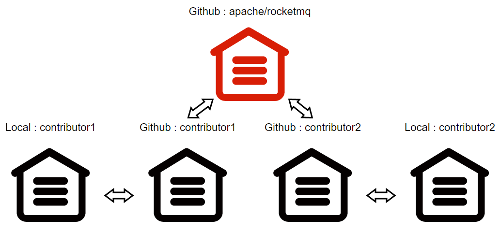

So, with this public repository, what then?

How do I download the code for a remote repository?

How do I commit a development branch to a remote repository?

① fork [apache/rocketmq](https://github.com/apache/rocketmq) to personal GitHub remote repository

```shell
https://github.com/cuser/rocketmq.git # cuser's rocketmq repo[repository] url 
```

Notice: `cuser` GitHub username，after `Fork` you can find the copy repository through the personal home page Repositories, and view the address

② Install Git yourself and clone it to your local repository

```shell
git clone https://github.com/cuser/rocketmq.git # git clone [repo url] 
```

Notice：The cloned local repository will use GitHub repository as the remote repository, and will be named `origin`

③ Get the latest code for the development branch

```shell
git rebase origin/develop # git rebase [branch] 
```

Notice： [rebase `<branch>`](https://git-scm.com/docs/git-rebase) The basic term is base swapping, and you can see why this step is necessary by looking at the linked examples

④ Make changes in the local repository

```shell
git checkout -b RocketMQ-Vxx.0 # git checkout [-b] [new-branch] 
git add /rocketmq/pom.xml # git add [dir/file] 
git commit -a -m "pom"  # git commit [-all] [-msg] [message] 
```

Notice： Reference [Git](https://git-scm.com/docs/git-add)，Use relative paths to switch to the same directory as `.git`

⑤ Push changes to the remote repository

```shell
git push --set-upstream apache RocketMQ-Vxx.0   # push branch to https://github.com/cuser/rocketmq-site.git 
```

As follows: Take submitting PR to the `new-official-website` branch as an example to illustrate the PR process

Reference `Git Contribution Guide`Modify the branch in the local repository and push it to the GitHub remote repository

```shell
git checkout new-official-website   # git checkout -b new-official-website 
git push origin new-official-website    # push to https://github.com/cuser/rocketmq-site.git 
```

① Switch the GitHub remote repository to the development branch new-official-website

② Create the pull request and click the open pull request under Contribute

③ compare across forks, Select the request branch and the development branch


base repository / base : Request repository and request branch

head repository / compare : Develop repository and branch

Be sure to correctly select the request branch and the development branch, and request merging only after obtaining permission from the branch owner

④ Fill in the PR summary with uppercase letters and briefly describe the PR content


Before submitting PR, please confirm as follows:

1. A [GitHub Issue]( [apache/rocketmq: Mirror of Apache RocketMQ (github.com)](https://github.com/apache/rocketmq/issues) ) corresponding to PR has been created
2. Modified content to comply with [Coding Guidelines](#contributionguide-02code-guidelines) programming specification
3. The PR summary begins with [ISSUE #XXX] and briefly describes the change requirements
4. Outline PR change requirements, change logs, and validation information,Reference [PR Demo](https://github.com/apache/rocketmq/pull/152)
5. Submit content with complete test cases and ensure that basic checks, unit tests, and integration tests pass

⑤ Click "Create pull request" , Request that the branch be merged

⑥ At this point, the PR is visible on the apache/rocketmq-site remote repository, and all collaborators can review the PR and make suggestions

You can make changes locally and commit multiple times based on comments. Information about the request to merge and the submission of changes is displayed simultaneously on the PR page, the issue list, and the RocketMQ mailing list, in order to remind the committer to review the PR in a timely manner

Open source Project development branch mergers are performed by the committer.

① Merge contributor PR

```shell
git checkout develop    # switch to local develop branch 
git pull apache develop # fast-forward to current remote HEAD 
git pull --squash https://github.com/cuser/rocketmq.git RocketMQ-Vxx.0  # merge to branch 
```

A pull request merge branch may contain multiple commits. It is recommended that the `--squash` directive compress the commit to a single commit

It is important to resolve merge conflicts and ensure that the current branch is synchronized to the remote branch before merging

Please read[Git pull]( [Git - git-pull Documentation (git-scm.com)](https://git-scm.com/docs/git-pull) ) to learn fast-forward and other info

② Merge committer PR

If committer merges its own PR, run the command [Git merge]( [Git - git-merge Documentation (git-scm.com)](https://git-scm.com/docs/git-merge) )

```shell
git checkout develop      # switch to local develop branch 
git pull apache develop   # fast-forward to current remote HEAD 
git merge --squash RocketMQ-Vxx.0   # merge to branch 
```

③ Do regular patch checks, build projects with built-in test cases, and be sure to modify the changelog

④ Once all of the above is done, submit the merge with the following instructions, feedback the branch status to the developer, and close PR

```shell
git commit --author="contributor_name <contributor_email>" -a -m "RocketMQ-Vxx.0 description closes apache/rocketmq#ZZ" 
```

For details of closing PR, reference [Close PR](https://docs.github.com/cn/issues/tracking-your-work-with-issues/closing-an-issue)

⑤ Push the merged branch to the apache/rocketmq remote repository

```shell
git push apache develop 
```

⑥ Once a PR is submitted, it will remain in the GitHub remote repository, and you can also update your personal GitHub repository simultaneously

```shell
git push origin develop 
```

Notice: squash discards the commit information of the development branch

Reject PR: Means that no pull or merge is performed, but only the reject PR message is submitted

```SHELL
git commit --allow-empty -m "RocketMQ-Vxx.0 closes apache/rocketmq#ZZ *Won't fix*" 
git push apache develop 
```

Close PR #ZZ on GitHub

---

<a id="contributionguide-04release-manual"></a>

<!-- source_url: https://rocketmq.apache.org/docs/contributionGuide/04release-manual/ -->

<!-- page_index: 63 -->

# Release Manual

Version: 5.0

> [!TIP]
> Set the default public key. If you have multiple public keys, modify `~/.gnupg/gpg.conf`.

---

<a id="security-01security"></a>

<!-- source_url: https://rocketmq.apache.org/docs/security/01security/ -->

<!-- page_index: 64 -->

# Security

Version: 5.0

<a id="security-01security--security"></a>

# Security

The Apache RocketMQ project itself provides security features such as ACL and TLS, but the final security effectiveness still depends on the operator's comprehensive protection of **network, hosts, accounts, and data**.

> **Important Note (Security Deployment Baseline)**: RocketMQ's authentication/authorization capabilities rely on ACL configuration. If ACL is not enabled/configured, RocketMQ will not enforce client identity verification at the protocol layer. Any entity that can access RocketMQ ports may initiate message sending/receiving or management operations.
> **Operators must**: Either enable and properly configure ACL (authentication + authorization), or strictly restrict RocketMQ components and ports within a trusted network (intranet/VPC/private network), rather than exposing them to untrusted networks.

- ACL 1.0 has been supported since RocketMQ 4.4.0
- The more secure **ACL 2.0** was introduced in 5.3.0
- ACL 1.0 was removed in 5.3.3
- It is recommended that all users who use Apache RocketMQ ACL migrate to **ACL 2.0**

ACL is used for **authentication** and **authorization** control of RocketMQ requests. For production environments, it is recommended to:

- Enable ACL (authentication/authorization) unless RocketMQ is strictly isolated within a trusted network, and configure accounts with minimum privileges for applications
- Avoid using administrator accounts in business applications; implement tiered access keys, regular rotation, and audit changes

RocketMQ Dashboard and some observability components (such as RocketMQ Prometheus Exporter) do **not** enable strong authentication by default; anyone who can access the HTTP port can read cluster metadata. Strongly recommended:

- Bind the Dashboard listening address to the intranet or a trusted VPC
- Configure ACL / IP allow-lists on the gateway / Ingress / reverse proxy
- If public-network operation and maintenance is required, be sure to add a VPN, HTTP Basic/OAuth authentication, or a WAF

> Otherwise, information-leakage risks may occur; such risks are the responsibility of the deployment side rather than RocketMQ vulnerabilities.

- Clients and servers can communicate through **TLS** encryption; enable it if sensitive data is involved
- The message body is defined by the business; RocketMQ will **not** parse or persist decrypted content
- If messages contain sensitive information, perform field-level or overall encryption on the business side to avoid storing plaintext

- RocketMQ only transmits byte arrays and does **not** perform object deserialization
- If consumers need to deserialize, they should choose secure formats (such as **JSON-Binding, Protobuf** etc.) and validate untrusted data

- Always use the latest official stable client to obtain the latest vulnerability fixes and improvements

- Properly keep RocketMQ-related logs (including **Broker, NameServer, Proxy, Client**, etc.) to avoid leakage of sensitive information

Apache RocketMQ is a project of the Apache Software Foundation (ASF) and follows the ASF vulnerability handling process.

To report a new vulnerability you have discovered, please follow the ASF vulnerability reporting process:
<https://apache.org/security/#reporting-a-vulnerability>

To help us assess and address the issue, please include the affected component(s)/version(s), reproduction steps, impact analysis, and a PoC if available.

> Please do not disclose exploitable details via public issues, mailing lists, or social media before a fix is available.

RocketMQ's authentication and authorization capabilities are provided by ACL; whether to enable it depends on deployment and configuration.
When ACL is not enabled or not configured, requests may be processed without identity verification. This is a deployment/configuration choice. Operators should enable ACL based on their threat model and ensure security through network isolation and other means.

---
