# What is airflowctl? ¶

## Navigation

- Content
  - [Installation of airflowctl](#installation)
    - [Prerequisites](#installation-prerequisites)
    - [Python Version Compatibility](#installation-prerequisites--python-version-compatibility)
    - [Installing from sources](#installation-installing-from-sources)
    - [Installing from PyPI](#installation-installing-from-pypi)
    - [Using released sources](#installation--using-released-sources)
    - [Using PyPI](#installation--using-pypi)
  - [How-to Guides](#howto)
  - [Security](#security)
  - [Release Notes](#release_notes)
- Usage
  - [Quick Start](#start)
  - [References](#cli-and-env-variables-ref)
- [Home](#index)

## Content

<a id="installation"></a>

<!-- source_url: https://airflow.apache.org/docs/apache-airflow-ctl/stable/installation/index.html -->

<!-- page_index: 1 -->

# Installation of airflowctl ¶

<svg fill="currentColor" height="16" viewbox="0 0 16 16" width="16">
<path></path>
</svg>

`↑↓` Navigate
`⏎` Select
`Esc` Close

<a id="installation--installation-of-airflowctl"></a>

# Installation of airflowctl

- [Using released sources](#installation--using-released-sources)
- [Using PyPI](#installation--using-pypi)

This page describes installations options that you might use when considering how to install Airflow®.
Airflow consists of many components, often distributed among many physical or virtual machines, therefore
installation of Airflow might be quite complex, depending on the options you choose.

<a id="installation--using-released-sources"></a>

## [Using released sources](#installation--id1)

More details: [Installing from Sources](#installation-installing-from-sources)

**When this option works best**

- This option is best if you expect to build all your software from sources.
- Apache Airflow is one of the projects that belong to the [Apache Software Foundation](https://www.apache.org/).
  It is a requirement for all ASF projects that they can be installed using official sources released via [Official Apache Downloads](https://dlcdn.apache.org/).
- This is the best choice if you have a strong need to [verify the integrity and provenance of the software](https://www.apache.org/dyn/closer.cgi#verify)

**Intended users**

- Users who are familiar with installing and building software from sources and are conscious about integrity and provenance
  of the software they use down to the lowest level possible.

**What are you expected to handle**

- You are expected to build and install airflow and its components on your own.
- You should develop and handle the deployment for all components of Airflow.
- You are responsible for setting up database, creating and managing database schema with `airflow db` commands,
  automated startup and recovery, maintenance, cleanup and upgrades of Airflow and the Airflow Providers.
- You need to setup monitoring of your system allowing you to observe resources and react to problems.
- You are expected to configure and manage appropriate resources for the installation (memory, CPU, etc) based
  on the monitoring of your installation and feedback loop. See the notes about requirements.

**What Apache Airflow Community provides for that method**

- You have [instructions](https://github.com/apache/airflow/blob/main/INSTALL) on how to build the software but due to various environments
  and tools you might want to use, you might expect that there will be problems which are specific to your deployment and environment
  you will have to diagnose and solve.

**Where to ask for help**

- The `#user-troubleshooting` channel on slack can be used for quick general troubleshooting questions. The
  [GitHub discussions](https://github.com/apache/airflow/discussions) if you look for longer discussion and have more information to share.
- The `#user-best-practices` channel on slack can be used to ask for and share best practices on using and deploying airflow.
- If you can provide description of a reproducible problem with Airflow software, you can open issue at [GitHub issues](https://github.com/apache/airflow/issues)
- If you want to contribute back to Airflow, the `#contributors` slack channel for building the Airflow itself

<a id="installation--using-pypi"></a>

## [Using PyPI](#installation--id2)

More details: [Installation from PyPI](#installation-installing-from-pypi)

**When this option works best**

- This installation method is useful when you are not familiar with Containers and Docker and want to install
  Apache Airflow on physical or virtual machines and you are used to installing and running software using custom
  deployment mechanism.
- The only officially supported mechanism of installation is via `pip` using constraint mechanisms. The constraint
  files are managed by Apache Airflow release managers to make sure that you can repeatably install Airflow from PyPI with all Providers and
  required dependencies.
- In case of PyPI installation you could also verify integrity and provenance of the packages
  downloaded from PyPI as described at the installation page, but software you download from PyPI is pre-built
  for you so that you can install it without building, and you do not build the software from sources.

**Intended users**

- Users who are familiar with installing and configuring Python applications, managing Python environments,
  dependencies and running software with their custom deployment mechanisms.

**What are you expected to handle**

- You are expected to install airflowctl.
- You should run the Airflow API server.
- You need to setup monitoring of your system allowing you to observe resources and react to problems.

**What Apache Airflow Community provides for that method**

- You have [Installation from PyPI](#installation-installing-from-pypi)
  on how to install the software but due to various environments and tools you might want to use, you might
  expect that there will be problems which are specific to your deployment and environment you will have to
  diagnose and solve.
- You have [Quick Start](#start) where you can see an example of Quick Start with running Airflow
  locally which you can use to start Airflow quickly for local testing and development.
  However, this is just for inspiration. Do not expect [Quick Start](#start) is ready for production installation,
  you need to build your own production-ready deployment if you follow this approach.

**Where to ask for help**

- The `#user-troubleshooting` channel on Airflow Slack for quick general
  troubleshooting questions. The [GitHub discussions](https://github.com/apache/airflow/discussions)
  if you look for longer discussion and have more information to share.
- The `#user-best-practices` channel on slack can be used to ask for and share best
  practices on using and deploying airflow.
- If you can provide description of a reproducible problem with Airflow software, you can open
  issue at [GitHub issues](https://github.com/apache/airflow/issues)

[Previous](#index "What is airflowctl?")
[Next](#installation-prerequisites "Prerequisites")

---

<a id="installation-prerequisites"></a>

<!-- source_url: https://airflow.apache.org/docs/apache-airflow-ctl/stable/installation/prerequisites.html -->

<!-- page_index: 2 -->

# Prerequisites ¶

<svg fill="currentColor" height="16" viewbox="0 0 16 16" width="16">
<path></path>
</svg>

`↑↓` Navigate
`⏎` Select
`Esc` Close

<a id="installation-prerequisites--prerequisites"></a>

# Prerequisites

airflowctl is tested with:

The minimum memory required we recommend airflowctl to run with is 200MB, but the actual requirements depend
wildly on the deployment options you have.
The Keyring backend needs to be installed separately into your operating system. This will enhance security. See [Security](#security) for more information.

<a id="installation-prerequisites--keyring-backend-recommended"></a>

## Keyring Backend [Recommended]

airflowctl uses keyring to store the API token securely. This ensures that the token is not stored in plain text and is only accessible to authorized users.

Recommended keyring backends are:

- [macOS Keychain](https://en.wikipedia.org/wiki/Keychain_%28software%29)
- [Freedesktop Secret Service](http://standards.freedesktop.org/secret-service/) supports many DE including GNOME (requires [secretstorage](https://pypi.python.org/pypi/secretstorage))
- [KDE4 & KDE5 KWallet](https://en.wikipedia.org/wiki/KWallet) (requires [dbus](https://pypi.python.org/pypi/dbus-python))
- [Windows Credential Locker](https://docs.microsoft.com/en-us/windows/uwp/security/credential-locker)

In case there’s no keyring available (common in headless environments) you can provide the token to each command. See [Security](#security) for more information.

<a id="installation-prerequisites--third-party-backends"></a>

### Third-Party Backends

In addition to the backends provided by the core keyring package for
the most common and secure use cases, there
are additional keyring backend implementations available for other
use cases. Simply install them to make them available:

- [keyrings.cryptfile](https://pypi.org/project/keyrings.cryptfile)
  :   - Encrypted text file storage.
- [keyrings.alt](https://pypi.org/project/keyrings.alt)
  :   - “alternate”, possibly-insecure backends, originally part of the core package, but available for opt-in.
- [gsheet-keyring](https://pypi.org/project/gsheet-keyring)
  :   - a backend that stores secrets in a Google Sheet. For use with [ipython-secrets](https://pypi.org/project/ipython-secrets).
- [bitwarden-keyring](https://pypi.org/project/bitwarden-keyring/)
  :   - a backend that stores secrets in the [BitWarden](https://bitwarden.com/) password manager.
- [onepassword-keyring](https://pypi.org/project/onepassword-keyring/)
  :   - a backend that stores secrets in the [1Password](https://1password.com/) password manager.
- [sagecipher](https://pypi.org/project/sagecipher)
  :   - an encryption backend which uses the ssh agent protocol’s signature operation to derive the cipher key.
- [keyrings.osx\_keychain\_keys](https://pypi.org/project/keyrings.osx-keychain-keys)
  :   - `OSX keychain key-management`, for private, public, and symmetric keys.
- [keyring\_pass.PasswordStoreBackend](https://github.com/nazarewk/keyring_pass)
  :   - Password Store (pass) backend for python’s keyring
- [keyring\_jeepney](https://pypi.org/project/keyring_jeepney)
  :   - a pure Python backend using the secret service `DBus` API for desktop Linux (requires `keyring<24`).

<a id="installation-prerequisites--python-version-compatibility"></a>

# Python Version Compatibility

`airflowctl` is compatible with versions of Python 3.10 through Python 3.14.

| Python Version | Supported |
| --- | --- |
| 3.10 | Yes |
| 3.11 | Yes |
| 3.12 | Yes |
| 3.13 | Yes |
| 3.14 | Yes |
| 3.15 | No |

[Previous](#installation "Installation of airflowctl")
[Next](#installation-installing-from-sources "Installing from Sources")

---

<a id="installation-installing-from-sources"></a>

<!-- source_url: https://airflow.apache.org/docs/apache-airflow-ctl/stable/installation/installing-from-sources.html -->

<!-- page_index: 3 -->

# Installing from Sources ¶

<svg fill="currentColor" height="16" viewbox="0 0 16 16" width="16">
<path></path>
</svg>

`↑↓` Navigate
`⏎` Select
`Esc` Close

<a id="installation-installing-from-sources--installing-from-sources"></a>

# Installing from Sources

<a id="installation-installing-from-sources--released-packages"></a>

## Released packages

This page describes downloading and verifying Airflow Ctl version `0.1.5` using officially released packages.
You can also install `airflowctl` - as most Python packages - via [PyPI](#installation-installing-from-pypi).
You can choose different version of Airflow by selecting a different version from the drop-down at
the top-left of the page.

The Source packages are official packages of the Apache Software Foundation - and the ones that you can
use is you want to build the packages yourself from the source code and be sure that the provenance of
the packages is verified and matches the source code from the repository and you can verify the
checksums and signatures of the packages.

The `sdist` and `whl` packages released are the convenience packages - of installation also installed from
the same sources and you can still verify the origin of the packages and want to verify checksums and
signatures of the packages. The packages are available via the Official Apache Software Foundations Downloads
[Official Apache Software Foundations Downloads](https://dlcdn.apache.org/)

The `0.1.5` downloads of Airflow Ctl are available at:

- [Sources package for airflow-ctl:](https://www.apache.org/dyn/closer.lua/airflow/airflow-ctl/0.1.5/apache_airflow_ctl-0.1.5-source.tar.gz) ([asc](https://downloads.apache.org/airflow/airflow-ctl/0.1.5/apache_airflow_ctl-0.1.5-source.tar.gz.asc), [sha512](https://downloads.apache.org/airflow/airflow-ctl/0.1.5/apache_airflow_ctl-0.1.5-source.tar.gz.sha512))
- [Sdist package for airflow-ctl distributions](https://www.apache.org/dyn/closer.lua/airflow/airflow-ctl/0.1.5/apache_airflow_ctl-0.1.5.tar.gz) ([asc](https://downloads.apache.org/airflow/airflow-ctl/0.1.5/apache_airflow_ctl-0.1.5.tar.gz.asc), [sha512](https://downloads.apache.org/airflow/airflow-ctl/0.1.5/apache_airflow_ctl-0.1.5.tar.gz.sha512))
- [Whl package for airflow-ctl distribution](https://www.apache.org/dyn/closer.lua/airflow/airflow-ctl/0.1.5/apache_airflow_ctl-0.1.5-py3-none-any.whl) ([asc](https://downloads.apache.org/airflow/airflow-ctl/0.1.5/apache_airflow_ctl-0.1.5-py3-none-any.whl.asc), [sha512](https://downloads.apache.org/airflow/airflow-ctl/0.1.5/apache_airflow_ctl-0.1.5-py3-none-any.whl.sha512))

If you want to install from the source code, you can download from the sources link above, it will contain
a `INSTALL` file containing details on how you can build and install airflowctl.

<a id="installation-installing-from-sources--release-integrity"></a>

## Release integrity

[PGP signatures KEYS](https://downloads.apache.org/airflow/KEYS)

It is essential that you verify the integrity of the downloaded files using the PGP or SHA signatures.
The PGP signatures can be verified using GPG or PGP. Please download the KEYS as well as the asc
signature files for relevant distribution. It is recommended to get these files from the
main distribution directory and not from the mirrors.

```
gpg -i KEYS
```

or

```
pgpk -a KEYS
```

or

```
pgp -ka KEYS
```

To verify the binaries/sources you can download the relevant asc files for it from main
distribution directory and follow the below guide.

```
gpg --verify apache-airflow-ctl-********.asc apache-airflow-ctl-*********
```

or

```
pgpv apache-airflow-ctl-********.asc
```

or

```
pgp apache-airflow-********.asc
```

Example:

```
$ gpg --verify apache-airflow-ctl-0.1.5-source.tar.gz.asc apache-airflow-ctl-0.1.5-source.tar.gz gpg: Signature made Sat 11 Sep 12:49:54 2021 BST gpg: using RSA key CDE15C6E4D3A8EC4ECF4BA4B6674E08AD7DE406F gpg: issuer "kaxilnaik@apache.org" gpg: Good signature from "Kaxil Naik <kaxilnaik@apache.org>" [unknown] gpg: aka "Kaxil Naik <kaxilnaik@gmail.com>" [unknown] gpg: WARNING: The key's User ID is not certified with a trusted signature! gpg: There is no indication that the signature belongs to the owner. Primary key fingerprint: CDE1 5C6E 4D3A 8EC4 ECF4 BA4B 6674 E08A D7DE 406F
```

The “Good signature from …” is indication that the signatures are correct.
Do not worry about the “not certified with a trusted signature” warning. Most of the certificates used
by release managers are self signed, that’s why you get this warning. By importing the server in the
previous step and importing it via ID from `KEYS` page, you know that this is a valid Key already.

For SHA512 sum check, download the relevant `sha512` and run the following:

```
shasum -a 512 apache-airflow-ctl--********  | diff - apache-airflow-ctl--********.sha512
```

The `SHASUM` of the file should match the one provided in `.sha512` file.

Example:

```
shasum -a 512 apache-airflow-ctl-0.1.5-source.tar.gz  | diff - apache-airflow-ctl-0.1.5-source.tar.gz.sha512
```

<a id="installation-installing-from-sources--verifying-pypi-releases"></a>

## Verifying PyPI releases

You can verify the airflowctl `.whl` packages from PyPI by locally downloading the package and signature
and SHA sum files with the script below:

```
#!/bin/bash
airflowctl_version="0.1.5"
ctl_download_dir="$(mktemp -d)"
pip download --no-deps "apache-airflow-ctl==${airflowctl_version}" --dest "${ctl_download_dir}"
curl "https://downloads.apache.org/airflow/airflow-ctl/${airflowctl_version}/apache_airflow_ctl-${airflowctl_version}-py3-none-any.whl.asc" \
    -L -o "${ctl_download_dir}/apache_airflow_ctl-${airflowctl_version}-py3-none-any.whl.asc"
curl "https://downloads.apache.org/airflow/airflow-ctl/${airflowctl_version}/apache_airflow_ctl-${airflowctl_version}-py3-none-any.whl.sha512" \
    -L -o "${ctl_download_dir}/apache_airflow_ctl-${airflowctl_version}-py3-none-any.whl.sha512"
echo
echo "Please verify files downloaded to ${ctl_download_dir}"
ls -la "${ctl_download_dir}"
echo
```

Once you verify the files following the instructions from previous chapter you can remove the temporary
folder created.

[Previous](#installation-prerequisites "Prerequisites")
[Next](#installation-installing-from-pypi "Installation from PyPI")

---

<a id="installation-installing-from-pypi"></a>

<!-- source_url: https://airflow.apache.org/docs/apache-airflow-ctl/stable/installation/installing-from-pypi.html -->

<!-- page_index: 4 -->

# Installation from PyPI ¶

> [!NOTE]
> > [!NOTE]
> > `↑↓` Navigate
> > `⏎` Select
> > `Esc` Close
> >
> > <a id="installation-installing-from-pypi--installation-from-pypi"></a>

> >
> > # Installation from PyPI
> >
> > This page describes installations using the `apache-airflow-ctl` package [published in
> > PyPI](https://pypi.org/project/apache-airflow-ctl/).
> >
> > <a id="installation-installing-from-pypi--installation-via-pipx-or-uv-as-tool"></a>

> >
> > ## Installation via `pipx` or `uv` as tool
> >
> > You can locally deploy or run airflowctl without installing it in your environment using tools like [pipx](https://pypi.org/project/pipx/) or [uv](https://astral.sh/uv/).
> >
> > Via `pipx` it is possible to install airflowctl directly from PyPI using the command below:
> >
> > ```
> > pipx install "apache-airflow-ctl==0.1.5"
> > ```
> >
> > As well as directly run w/o installing it first:
> >
> > ```
> > pipx run "apache-airflow-ctl --help"
> > ```
> >
> > Same via Astral `uv` to install airflowctl from PyPI using the command below:
> >
> > ```
> > uv tool install "apache-airflow-ctl==0.1.5"
> > ```
> >
> > Additionally to jump-start using it you can also use the shortcut via `uvx` command and directly run it without installing it first:
> >
> > ```
> > uvx apache-airflow-ctl --help
> > ```
> >
> > <a id="installation-installing-from-pypi--installation-in-your-environment"></a>

> >
> > ## Installation in your environment
> >
> > Only `pip` and `uv` installation is currently officially supported.
> >
> > > [!NOTE]
> > > While there are some successes with using other tools like [poetry](https://python-poetry.org/) or
> > > [pip-tools](https://pypi.org/project/pip-tools/), they do not share the same workflow as
> > > `pip` - especially when it comes to constraint vs. requirements management.
> > > Installing via `Poetry` or `pip-tools` is not currently supported. If you wish to install airflow
> > > using those tools you should use the constraints and convert them to appropriate
> > > format and workflow that your tool requires. Uv follows `pip` approach
> > > with `uv pip` so it should work similarly.
> > >
> > > There are known issues with `bazel` that might lead to circular dependencies when using it to install
> > > Airflow. Please switch to `pip` if you encounter such problems. `Bazel` community works on fixing
> > > the problem in [this PR](https://github.com/bazelbuild/rules_python/pull/1166) so it might be that
> > > newer versions of `bazel` will handle it.
> >
> > Typical command to install airflowctl from scratch in a reproducible way from PyPI looks like below:
> >
> > ```
> > pip install "apache-airflow-ctl==0.1.5"
> > ```
> >
> > Those are just examples, see further for more explanation why those are the best practices.
> >
> > > [!NOTE]
> > > Generally speaking, Python community established practice is to perform application installation in a
> > > virtualenv created with `virtualenv` or `venv` tools. You can also use `uv` or `pipx` to install
> > > Airflow in application dedicated virtual environment created for you. There are also other tools that can be used
> > > to manage your virtualenv installation and you are free to choose how you are managing the environments.
> > > Airflow has no limitation regarding to the tool of your choice when it comes to virtual environment.
> > >
> > > The only exception where you might consider not using virtualenv is when you are building a container
> > > image with only Airflow installed - this is for example how Airflow is installed in the official Container
> > > image.
> >
> > [Previous](#installation-installing-from-sources "Installing from Sources")
> > [Next](#howto "How-to Guides")

---

<a id="howto"></a>

<!-- source_url: https://airflow.apache.org/docs/apache-airflow-ctl/stable/howto/index.html -->

<!-- page_index: 5 -->

# How-to Guides ¶

<svg fill="currentColor" height="16" viewbox="0 0 16 16" width="16">
<path></path>
</svg>

`↑↓` Navigate
`⏎` Select
`Esc` Close

<a id="howto--how-to-guides"></a>

# How-to Guides

Setting up the sandbox in the [Quick Start](#start) section was easy;
building a production-grade environment requires a bit more work!

These how-to guides will step you through common tasks in using and
configuring an airflowctl environment.

<a id="howto--how-to-use-airflowctl"></a>

## How to use airflowctl

<a id="howto--important-note"></a>

### **Important Note**

airflowctl needs the Airflow API running to be able to work. Please, see the login section below before use.
Otherwise, you may get errors.

<a id="howto--datetime-usage"></a>

### Datetime Usage

For datetime parameters, date should be timezone aware and in ISO format.
For example: `2025-10-10T10:00:00+00:00`
Let’s take example of triggering a Dag run with a logical date, run after and a note.

```
airflowctl dagrun trigger --dag-id="example_bash_operator" --logical-date="2025-09-06T00:00:00+00:00" --run-after="2025-09-06T00:00:00+00:00" --note="Triggered from airflowctl"
```

<a id="howto--login"></a>

### Login

airflowctl needs to be able to connect to the Airflow API. You should pass API URL as a parameter to the command
`--api-url`. The URL should be in the form of `http(s)://<host>:<port>`.
You can also set the environment variable `AIRFLOW_CLI_TOKEN` to the token to use for authentication.

There are two ways to authenticate with the Airflow API:

1. Using a token acquired from the Airflow API

```
airflowctl auth login --api-url <api_url> --api-token <token> --env <env_name:production>
```

2. Using a username and password

```
airflowctl auth login --api-url <api_url> --username <username> --password <password> --env <env_name:production>
```

If there’s no keyring available, common in headless systems like docker images, you can still use the tool by setting
the environment variable `AIRFLOW_CLI_TOKEN`.

```
export AIRFLOW_CLI_TOKEN=<token>
airflowctl auth login --api-url <api_url> --env <env_name:production> --skip-keyring
```

In both cases token is securely stored in the keyring backend. Only configuration persisted in `~/.config/airflow` file
is the API URL and the environment name. The token is stored in the keyring backend and is not persisted in the
configuration file. The keyring backend is used to securely store the token and is not accessible to the user.

<a id="howto--what-is-authentication-for-airflowctl"></a>

#### What is authentication for `airflowctl`?

For `airflowctl` to be able to communicate with the Airflow API, it needs to authenticate itself and acquire token.
This is done using either a token or a username and password.
The token can be acquired from the Airflow API or generated using a username and password.

[](https://raw.githubusercontent.com/apache/airflow/main/airflow-ctl/docs/images/diagrams/airflowctl_api_network_architecture_diagram.png)

<a id="howto--parameter-details-for-airflowctl-auth-login"></a>

#### Parameter Details for airflowctl auth login

**–api-url**: This parameter is required. (e.g. `http://localhost:8080`)
The default value is `http://localhost:8080`. Full URL of the Airflow API. Without any `/api/*` suffixes.
If you are running the `airflowctl` in `breeze` container, it is optional.

**–api-token**: This parameter is optional.
If you are setting the token via the environment variable `AIRFLOW_CLI_TOKEN`, you can skip using this parameter.

**–username**: This parameter is optional.
If you are not using `--api-token` or the environment variable `AIRFLOW_CLI_TOKEN`, you must provide a username to authentication along with `--password`.

**–password**: This parameter is optional.
If you provide a username via `--username` this is the required password to authenticate.

**–env**: This parameter is optional.
The name of the environment to create or update. The default value is `production`.
This parameter is useful when you want to manage multiple Airflow environments.

**–skip-keyring**: This parameter is optional.
Useful when there’s no keyring available in the system where airflowctl is running.
Set `AIRFLOW_CLI_TOKEN` or use the `--api-token` flag for next commands.

<a id="howto--more-usage-and-help-pictures"></a>

### More Usage and Help Pictures

For more information use

```
airflowctl auth login --help
```

[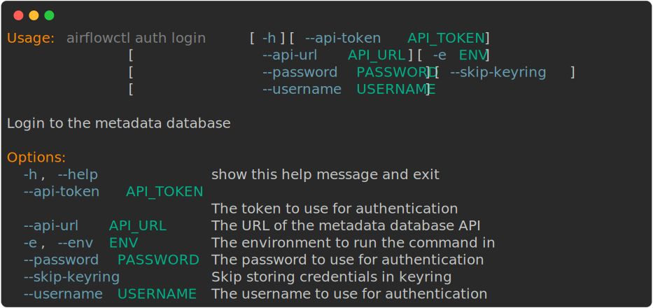](https://raw.githubusercontent.com/apache/airflow/main/airflow-ctl/docs/images/output_auth_login.svg)

You are ready to use airflowctl now.
Please, also see [Command Line Interface and Environment Variables Reference](#cli-and-env-variables-ref) for the list of available commands and options.

You can use the command `airflowctl --help` to see the list of available commands.

[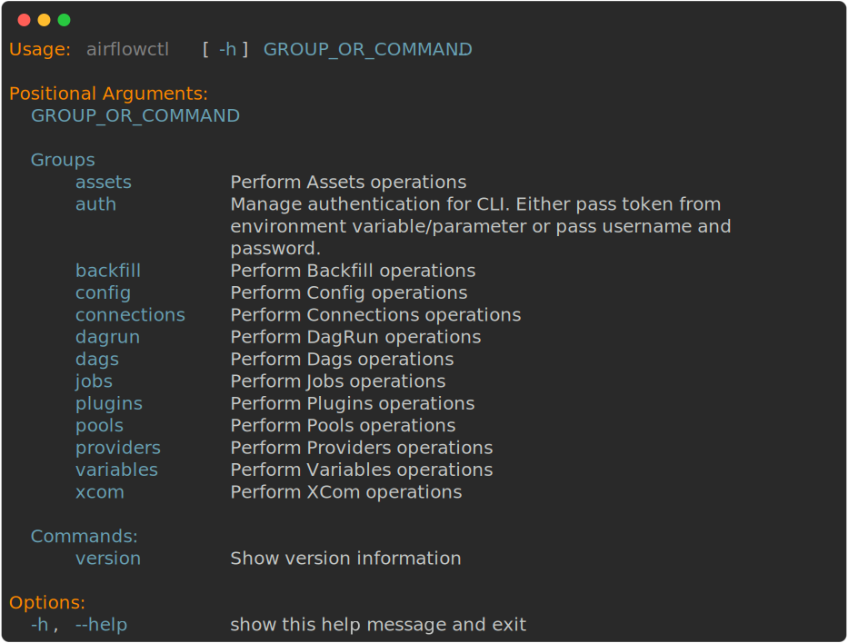](https://raw.githubusercontent.com/apache/airflow/main/airflow-ctl/docs/images/output_main.svg)

<a id="howto--all-available-group-command-references"></a>

## All Available Group Command References

Below are the command reference diagrams for all available commands in airflowctl.
These visual references show the full command syntax, options, and parameters for each command.

<a id="howto--assets"></a>

### **Assets**

[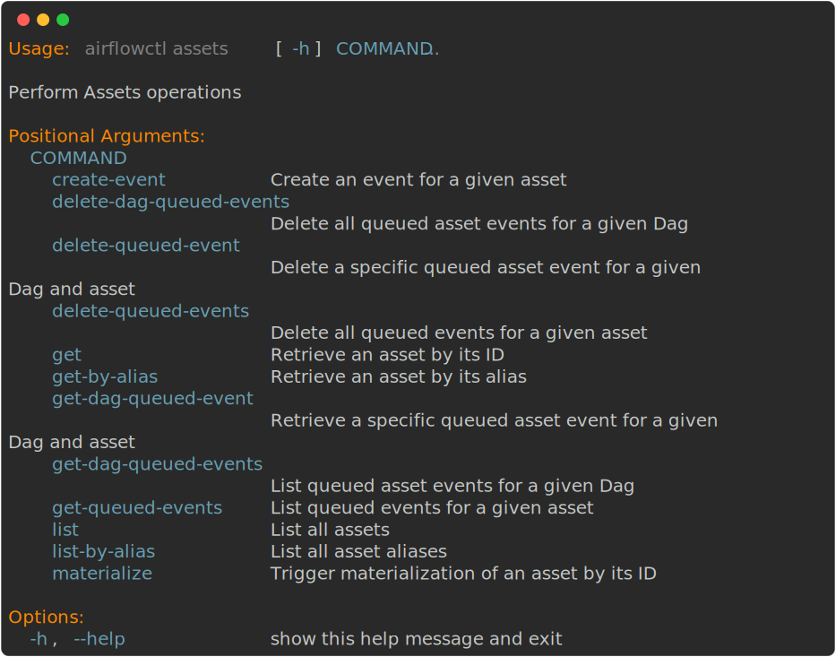](https://raw.githubusercontent.com/apache/airflow/main/airflow-ctl/docs/images/output_assets.svg)

<a id="howto--auth"></a>

### **Auth**

[](https://raw.githubusercontent.com/apache/airflow/main/airflow-ctl/docs/images/output_auth.svg)

<a id="howto--backfill"></a>

### **Backfill**

[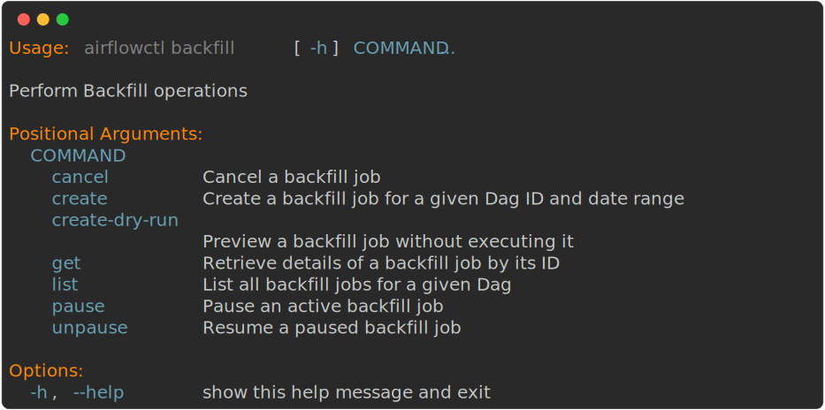](https://raw.githubusercontent.com/apache/airflow/main/airflow-ctl/docs/images/output_backfill.svg)

<a id="howto--config"></a>

### **Config**

[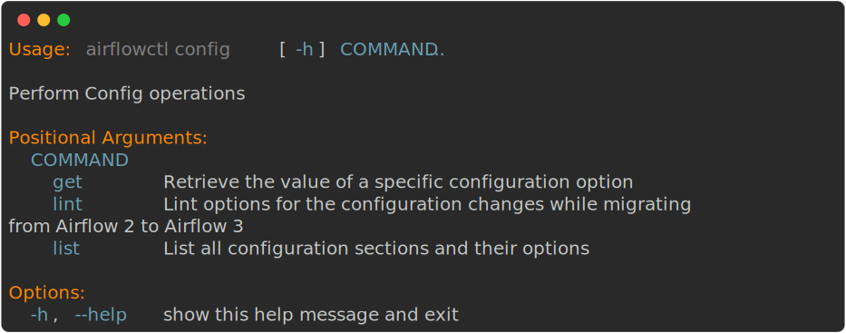](https://raw.githubusercontent.com/apache/airflow/main/airflow-ctl/docs/images/output_config.svg)

<a id="howto--connections"></a>

### **Connections**

[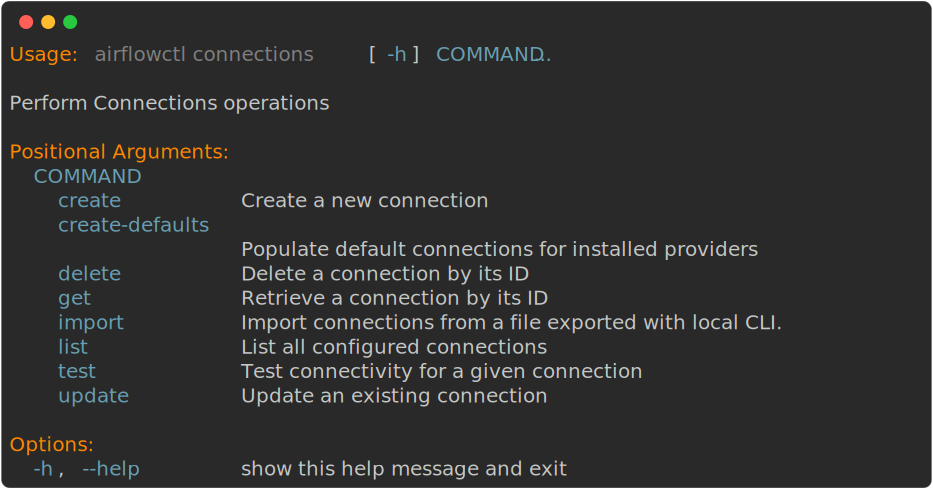](https://raw.githubusercontent.com/apache/airflow/main/airflow-ctl/docs/images/output_connections.svg)

<a id="howto--dags"></a>

### **Dags**

[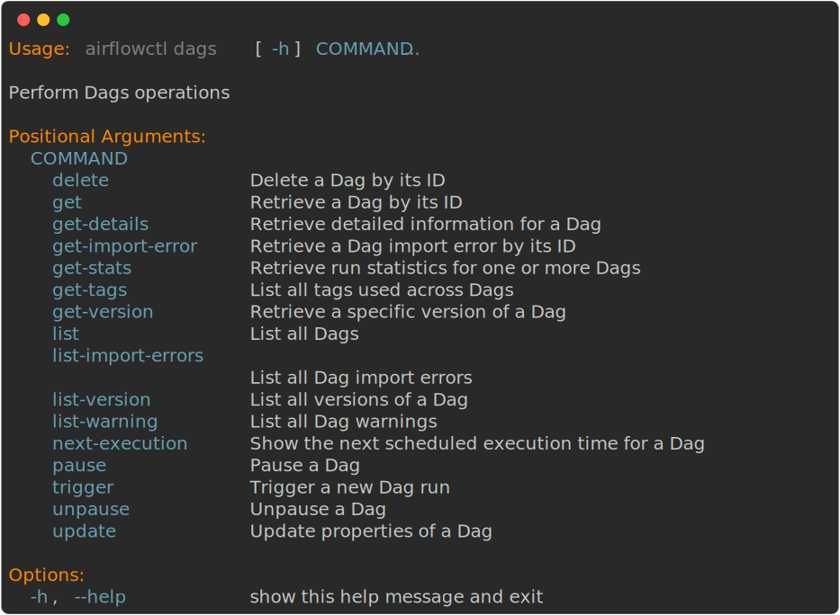](https://raw.githubusercontent.com/apache/airflow/main/airflow-ctl/docs/images/output_dags.svg)

<a id="howto--dag-runs"></a>

### **Dag Runs**

[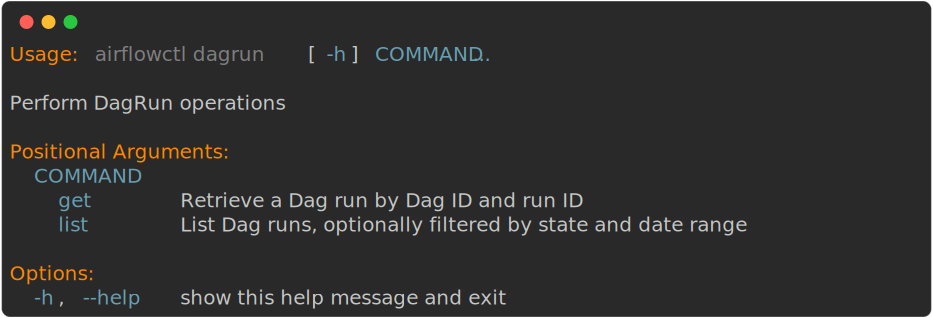](https://raw.githubusercontent.com/apache/airflow/main/airflow-ctl/docs/images/output_dagrun.svg)

<a id="howto--jobs"></a>

### **Jobs**

[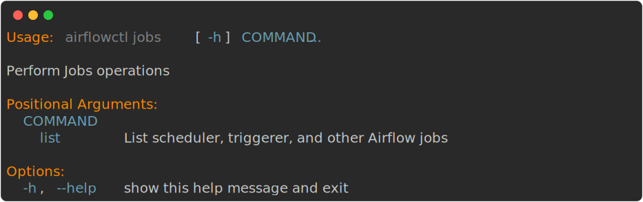](https://raw.githubusercontent.com/apache/airflow/main/airflow-ctl/docs/images/output_jobs.svg)

<a id="howto--pools"></a>

### **Pools**

[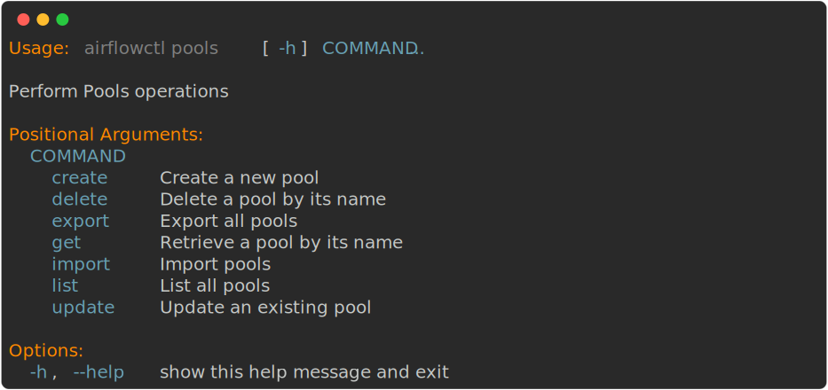](https://raw.githubusercontent.com/apache/airflow/main/airflow-ctl/docs/images/output_pools.svg)

<a id="howto--providers"></a>

### **Providers**

[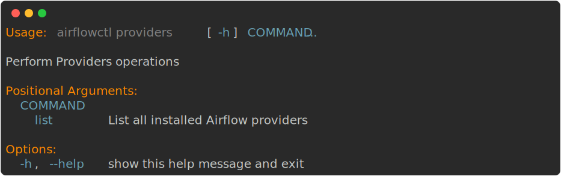](https://raw.githubusercontent.com/apache/airflow/main/airflow-ctl/docs/images/output_providers.svg)

<a id="howto--variables"></a>

### **Variables**

[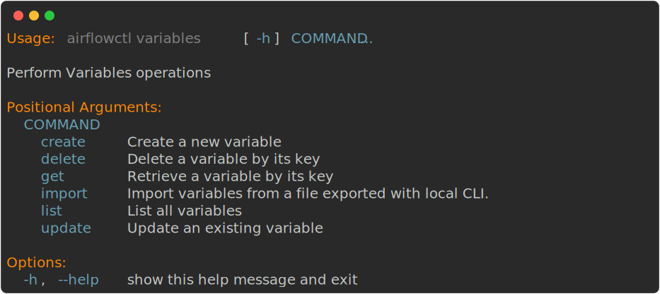](https://raw.githubusercontent.com/apache/airflow/main/airflow-ctl/docs/images/output_variables.svg)

<a id="howto--version"></a>

### **Version**

[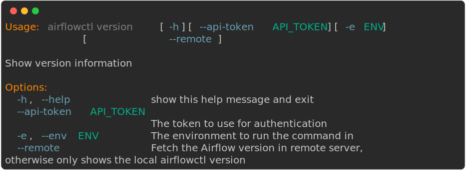](https://raw.githubusercontent.com/apache/airflow/main/airflow-ctl/docs/images/output_version.svg)

[Previous](#installation-installing-from-pypi "Installation from PyPI")
[Next](#security "Security")

---

<a id="security"></a>

<!-- source_url: https://airflow.apache.org/docs/apache-airflow-ctl/stable/security.html -->

<!-- page_index: 6 -->

# Security ¶

<svg fill="currentColor" height="16" viewbox="0 0 16 16" width="16">
<path></path>
</svg>

`↑↓` Navigate
`⏎` Select
`Esc` Close

<a id="security--security"></a>

# Security

airflowctl is leveraging Apache Airflow Public API security features and additional layers of security to ensure that your data is safe and secure.
airflowctl facilitates the seamless deployment of CLI and API features together, reducing redundancy and simplifying maintenance. Transitioning from direct database access to an API-driven model will enhance the CLI’s capabilities and improve security.

- **Authentication**: airflowctl uses authentication to ensure that only authorized users can access the system. This is done using an API Token. See more on <https://airflow.apache.org/docs/apache-airflow/stable/security/api.html>
- **Keyring**: airflowctl uses keyring to store the API Token securely. This ensures that the Token is not stored in plain text and is only accessible to authorized users.
  :   - In case no keyring is available, you can set the `AIRFLOW_CLI_TOKEN` environment variable or the `--api-token` flag for each command. Be cautious of not exposing this token to others.

airflowctl API Token has its own expiration time. The default is 1 hour. You can change it in the Airflow configuration file (airflow.cfg) by setting the `jwt_cli_expiration_time` parameter under the `[api_auth]` section. The value is in seconds. This will impact all users using `airflowctl`.

For more information see [Setting Configuration
Options](https://airflow.apache.org/docs/apache-airflow/stable/howto/set-config.html).

[Previous](#howto "How-to Guides")
[Next](#release_notes "Release Notes")

---

<a id="release_notes"></a>

<!-- source_url: https://airflow.apache.org/docs/apache-airflow-ctl/stable/release_notes.html -->

<!-- page_index: 7 -->

# Release Notes ¶

<svg fill="currentColor" height="16" viewbox="0 0 16 16" width="16">
<path></path>
</svg>

`↑↓` Navigate
`⏎` Select
`Esc` Close

<a id="release_notes--release-notes"></a>

# Release Notes

<a id="release_notes--airflowctl-0.1.5-2026-05-26"></a>

## airflowctl 0.1.5 (2026-05-26)

<a id="release_notes--significant-changes"></a>

### Significant Changes

- Add dags next execution command #66172 (#66188)
- Add bulk delete Dag Runs (#67095)
- Add `rerun_with_latest_version` config hierarchy for clear/rerun behavior (#63884)
- Implement patching of task group instances in API (#62812)
- Allow remote version check without authentication (#65099)
- Add cursor based pagination for get\_dag\_runs endpoint (#65604)
- Enable queue up new tasks (#63484)
- Add cursor based pagination for get\_task\_instances endpoint (#64845)
- Add `is_backfillable` property to DAG API responses (#64644)
- Expose required primitive parameters of auto-generated commands as positional
  arguments instead of `--flag` options. Optional parameters keep the
  `--flag` form. Follows the dev-list lazy consensus on airflowctl parameter
  style (see <https://lists.apache.org/thread/m1qvcvow3l17ytv40vhslh40wn3rntrm>) (#66768)

<a id="release_notes--bug-fixes"></a>

### Bug Fixes

- Fix connections import schema handling (#67063)
- Fix broken download URLs and variable names in docs (#67046)
- Fix missing pyyaml runtime dependency (#65489)
- Fix dagrun list crash when –state is omitted (#65608)
- Fix backfill params not overriding existing DAG run conf (#64939)
- Fix ruff on client-py (#64868)

<a id="release_notes--improvements"></a>

### Improvements

- AIP-103: Add Core API endpoints for task state and asset state (#67041)
- Comment to not edit RELEASE\_NOTES.rst manually in PRs for airflowctl (#67128)
- Align Dag capitalization from “DAG” to “Dag” for airflow-ctl/ (#66112)
- Send backfill create and dry-run payloads as JSON (#65158)
- Use existing safe\_load function in airflowctl utils to load help texts (#65841)
- Cap airflow-ctl httpx dependency below 1.0 (#65607)
- Remove dead airflow-ctl/newsfragments directory (unused by changelog tooling) (#65507)
- Incorrect fallback logic (#64586)
- Run non-provider mypy as regular prek static checks instead of separate CI jobs (#64780)
- Clear, Mark Success/Fail and delete multiple Task Instances (#64141)

<a id="release_notes--airflowctl-0.1.4-2026-04-18"></a>

## airflowctl 0.1.4 (2026-04-18)

<a id="release_notes--significant-changes-2"></a>

### Significant Changes

- Add YAML-based help texts for auto-generated airflowctl commands (#65073)
- Added plugins command to airflowctl (#64935)
- Allow direct execution from airflowctl via `uvx` (#64406)
- Python 3.14 support (#63520)

<a id="release_notes--bug-fixes-2"></a>

### Bug Fixes

- Declare `pyyaml` as a runtime dependency so `airflowctl` starts without crashing on `ModuleNotFoundError`
- Prevent path traversal via AIRFLOW\_CLI\_ENVIRONMENT in airflowctl (#64618)
- Fix `is_alive` default in `airflowctl jobs list` to show all jobs (#65065)
- Fix CLI error handling and exit codes for failed commands (#65052)
- Fix list-envs auth status for env names containing `.json` (#64677)
- Fix infinite loop for `limit<0` in airflowctl list operations (#64582)
- Fix `airflowctl dagrun list` limit handling (#64071)
- Fix incorrect fallback logic in airflowctl API client (#64586)
- Fix `airflowctl connections import` to return non-zero exit code on failure (#64416)
- Fix `airflowctl variables import` to correctly handle falsy values (#64362)
- Fix `airflowctl version` command prompting for keyring credentials (#63772)
- Fix `airflowctl` boolean flags on Python 3.14 (#63587)

<a id="release_notes--improvements-2"></a>

### Improvements

- Add `operator` value to `DagRunType` in airflowctl `datamodels` (#63733)
- Use DAG form when materializing assets in airflowctl (#64211)
- Allow `null` `dag_run_conf` in `BackfillResponse` serialization (#63259)
- Mention Python 3.14 support in docs (#63950)

<a id="release_notes--airflowctl-0.1.3-2026-03-09"></a>

## airflowctl 0.1.3 (2026-03-09)

<a id="release_notes--significant-changes-3"></a>

### Significant Changes

- Add airflowctl auth token command to print JWT access tokens (#62843)
- Add `--action-on-existing-key` to `pools import` and `connections import` (#62702)
- Add retry mechanism to airflowctl and remove flaky integration mark (#63016)
- airflowctl auth login: prompt for credentials interactively when none are provided (#62549)
- feat(airflowctl): support on headless environments (#62217)

<a id="release_notes--bug-fixes-3"></a>

### Bug Fixes

- Fix `airflowctl pools export` ignoring `--output` table/yaml/plain (#62665)
- Fix `airflowctl connections import` failure when JSON omits `extra` field (#62662)
- Amend compatibility issues for airflowctl (#63388)

<a id="release_notes--improvements-3"></a>

### Improvements

- Send `limit` parameter in `execute_list` server requests (#63048)
- Run test coverage when airflowctl command has any change (#63216)
- airflow-ctl: add coverage tests for console formatting output (#62627)
- Clean up stale Python 3.9 workaround in airflow-ctl CLI config parser (#62206)
- Expose `timetable_partitioned` in UI API (#62777)

<a id="release_notes--miscellaneous"></a>

### Miscellaneous

- CI: upgrade important CI environment (#62610)
- Fix all build-system requirements including transitive dependencies (#62570)
- Add DagRunType for asset materializations (#62276)

<a id="release_notes--airflowctl-0.1.2-2026-02-20"></a>

## airflowctl 0.1.2 (2026-02-20)

<a id="release_notes--significant-changes-4"></a>

### Significant Changes

- Add XCom CLI commands to airflowctl (#61021)
- Add auth list-envs command to list CLI environments and their auth status (#61426)
- Add allowed\_run\_types to whitelist specific dag run types (#61833)
- Default logical\_date to now in airflowctl dagrun trigger to match UI behavior (#61047)

<a id="release_notes--bug-fixes-4"></a>

### Bug Fixes

- Allow listing dag runs without specifying dag\_id (#61525)
- Fix infinite password retry loop in airflowctl EncryptedKeyring initialization (#61329)
- Fix airflowctl auth login reporting success when keyring backend is unavailable (#61296)
- Fix airflowctl crash when incorrect keyring password is entered (#61042)
- Strip api-url for airflowctl auth login which fails with trailing slash (#61245)
- Fix `airflow-ctl-tests` files not triggering pre-commit integration tests (#61023)

<a id="release_notes--improvements-4"></a>

### Improvements

- Print debug mode warning to stderr to avoid polluting stdout JSON output (#61302)
- Refactor `datamodel` defaulting logic into dedicated method (#61236)
- Alias run\_after for XComResponse (#61443)
- Add test for sensitive config masking in airflowctl (#60361)

<a id="release_notes--miscellaneous-2"></a>

### Miscellaneous

- Update keyring>=25.7.0 (#61529)
- Upgrade fastapi and conform openapi schema changes (#61476)
- Use SQLA’s native Uuid/JSON instead of sqlalchemy-utils’ types (#61532)
- Fix slots negative infinity (#61140)
- Pool API improve slots validation (#61071)
- Add `team_name` to Pool APIs (#60952)
- Add partition\_key to DagRunAssetReference (#61725)
- Promote release\_notes.rst into documentation that replace changelog.rst (#60482)
- Add HITLDetailHistory UI (#56760)
- Add static checker for preventing to increase dag version (#59430)

<a id="release_notes--airflowctl-0.1.1-2026-01-09"></a>

## airflowctl 0.1.1 (2026-01-09)

<a id="release_notes--significant-changes-5"></a>

### Significant Changes

- Make pause/unpause commands positional for improved CLI consistency (#59936)
- Remove deprecated export functionality from airflowctl (#59850)
- Add `team_name` to connection commands (#59336)
- Add `team_id` to variable commands (#57102)
- Add pre-commit checks for airflowctl test coverage (#58856)
- Display active DAG run count in header with auto-refresh support (#58332)

<a id="release_notes--bug-fixes-5"></a>

### Bug Fixes

- Simplify airflowctl exception handling in `safe_call_command` (#59808)
- Fix `backfill` default behavior for `run_on_latest_version` (#59304)
- Update `BulkDeleteAction` to use generic typing (#59207)
- Bump minimum supported `prek` version to 0.2.0 (#58952)
- Fix RST formatting to ensure blank lines before bullet lists (#58760)
- Update Python compatibility requirements and airflowctl documentation (#58653)
- Consistently exclude unsupported Python 3.14 (#58657)
- Improve cross-distribution dependency management (#58430)
- Synchronize documentation between official and convenience source installs (#58379)
- Add retry multiplier support (#56866)
- Fix documentation issues for installing from source distributions (#58366)
- Update `pyproject.toml` files to support `pytest>=9.0.0` TOML syntax (#58182)

<a id="release_notes--airflowctl-0.1.0-2025-11-05"></a>

## airflowctl 0.1.0 (2025-11-05)

Release of airflowctl, a command-line tool. There are lots of great features to use from start.
Please check the documentation for quick start and usage instructions.

Please visit quick start guide: [Quick Start](#start)

A new way of using Apache Airflow using CLI. Enhanced security is provided by using the Apache Airflow API to provide similar functionality to the Apache Airflow CLI.
Integrated with Keyring to enhance password security.

[Previous](#security "Security")
[Next](#start "Quick Start")

---

<a id="start"></a>

<!-- source_url: https://airflow.apache.org/docs/apache-airflow-ctl/stable/start.html -->

<!-- page_index: 8 -->

# Quick Start ¶

<svg fill="currentColor" height="16" viewbox="0 0 16 16" width="16">
<path></path>
</svg>

`↑↓` Navigate
`⏎` Select
`Esc` Close

<a id="start--quick-start"></a>

# Quick Start

Let’s first install `airflowctl` if you haven’t already:

From PyPI: [Installation from PyPI](#installation-installing-from-pypi)

From source: [Installing from Sources](#installation-installing-from-sources)

airflowctl is a command line tool that helps you manage your Airflow deployments.
It is designed to be easy to use and provides a simple interface for managing your Airflow environment.

To get started, you can use the following command to create a new airflowctl environment:

```
airflowctl auth login --username <username> --password <password> --api-url <api_url> --env <env_name>
```

To persist the environment, you can set `AIRFLOW_CLI_ENVIRONMENT`.
The environment variable should be the name of the environment you want to use.
This will allow users to switch environments easily.

OR

```
export AIRFLOW_CLI_TOKEN=<token>
airflowctl auth login --api-url <api_url> --env <env_name>
```

This command will create a new airflowctl environment with the specified username and password.
You can then use the following command to start the airflowctl environment:

```
airflowctl --help
```

[Previous](#release_notes "Release Notes")
[Next](#cli-and-env-variables-ref "Command Line Interface and Environment Variables Reference")

---

<a id="cli-and-env-variables-ref"></a>

<!-- source_url: https://airflow.apache.org/docs/apache-airflow-ctl/stable/cli-and-env-variables-ref.html -->

<!-- page_index: 9 -->

# Command Line Interface and Environment Variables Reference ¶

> [!NOTE]
> `↑↓` Navigate
> `⏎` Select
> `Esc` Close
>
> <a id="cli-and-env-variables-ref--command-line-interface-and-environment-variables-reference"></a>

>
> # Command Line Interface and Environment Variables Reference
>
> <a id="cli-and-env-variables-ref--cli"></a>

>
> ## CLI
>
> airflowctl has a very rich command line interface that allows for
> many types of operation on a Dag, starting services, and supporting
> development and testing.
>
> > [!NOTE]
> > **For more information on usage CLI, see Command Line Interface and Environment Variables Reference**
> >
>
> Content
>
> - [Positional Arguments](#cli-and-env-variables-ref--airflowctl.ctl.cli_parser-get_parser-positional-arguments)
> - [Sub-commands](#cli-and-env-variables-ref--sub-commands)
>
>   - [assets](#cli-and-env-variables-ref--assets)
>   - [auth](#cli-and-env-variables-ref--auth)
>   - [backfill](#cli-and-env-variables-ref--backfill)
>   - [config](#cli-and-env-variables-ref--config)
>   - [connections](#cli-and-env-variables-ref--connections)
>   - [dagrun](#cli-and-env-variables-ref--dagrun)
>   - [dags](#cli-and-env-variables-ref--dags)
>   - [jobs](#cli-and-env-variables-ref--jobs)
>   - [plugins](#cli-and-env-variables-ref--plugins)
>   - [pools](#cli-and-env-variables-ref--pools)
>   - [providers](#cli-and-env-variables-ref--providers)
>   - [variables](#cli-and-env-variables-ref--variables)
>   - [version](#cli-and-env-variables-ref--version)
>   - [xcom](#cli-and-env-variables-ref--xcom)
>
> ```
> Usage:airflowctl [- h] GROUP_OR_COMMAND ...
> ```
>
> <a id="cli-and-env-variables-ref--positional-arguments"></a>

>
> ### [Positional Arguments](#cli-and-env-variables-ref--id1)
>
> `GROUP_OR_COMMAND`
> :   Possible choices: assets, auth, backfill, config, connections, dagrun, dags, jobs, plugins, pools, providers, variables, version, xcom
>
> <a id="cli-and-env-variables-ref--sub-commands"></a>

>
> ### [Sub-commands](#cli-and-env-variables-ref--id2)
>
> <a id="cli-and-env-variables-ref--assets"></a>

>
> #### [assets](#cli-and-env-variables-ref--id3)
>
> Perform Assets operations
>
> ```
> airflowctl assets [- h] COMMAND ...
> ```
>
> <a id="cli-and-env-variables-ref--positional-arguments-2"></a>

>
> ##### Positional Arguments
>
> `COMMAND`
> :   Possible choices: create-event, delete-dag-queued-events, delete-queued-event, delete-queued-events, get, get-by-alias, get-dag-queued-event, get-dag-queued-events, get-queued-events, list, list-by-alias, materialize
>
> <a id="cli-and-env-variables-ref--sub-commands-2"></a>

>
> ##### Sub-commands
>
> <a id="cli-and-env-variables-ref--create-event"></a>

>
> ###### create-event
>
> Create an event for a given asset
>
> ```
> airflowctl assets create - event [- h] [-- api - token API_TOKEN] [-- asset - id ASSET_ID] [- e ENV] [-- extra EXTRA] [-- partition - key PARTITION_KEY] [-- output (table,json,yaml,plain )]
> ```
>
> <a id="cli-and-env-variables-ref--named-arguments"></a>

>
> ###### Named Arguments
>
> `--api-token`
> :   The token to use for authentication
>
> `--asset-id`
> :   asset\_id for asset\_event\_body operation
>
> `-e, --env`
> :   The environment to run the command in
>
>     Default: `'production'`
>
> `--extra`
> :   extra for asset\_event\_body operation
>
> `--partition-key`
> :   partition\_key for asset\_event\_body operation
>
> `--output, -o`
> :   Possible choices: table, json, yaml, plain
>
>     Output format. Allowed values: json, yaml, plain, table (default: json)
>
>     Default: `'json'`
>
> <a id="cli-and-env-variables-ref--delete-dag-queued-events"></a>

>
> ###### delete-dag-queued-events
>
> Delete all queued asset events for a given Dag
>
> ```
> airflowctl assets delete - dag - queued - events [- h] [-- api - token API_TOKEN] [- e ENV] [-- output (table,json,yaml,plain )] dag_id before
> ```
>
> <a id="cli-and-env-variables-ref--positional-arguments-3"></a>

>
> ###### Positional Arguments
>
> `dag_id`
> :   dag\_id for delete\_dag\_queued\_events operation in AssetsOperations
>
> `before`
> :   before for delete\_dag\_queued\_events operation in AssetsOperations
>
> <a id="cli-and-env-variables-ref--named-arguments-2"></a>

>
> ###### Named Arguments
>
> `--api-token`
> :   The token to use for authentication
>
> `-e, --env`
> :   The environment to run the command in
>
>     Default: `'production'`
>
> `--output, -o`
> :   Possible choices: table, json, yaml, plain
>
>     Output format. Allowed values: json, yaml, plain, table (default: json)
>
>     Default: `'json'`
>
> <a id="cli-and-env-variables-ref--delete-queued-event"></a>

>
> ###### delete-queued-event
>
> Delete a specific queued asset event for a given Dag and asset
>
> ```
> airflowctl assets delete - queued - event [- h] [-- api - token API_TOKEN] [- e ENV] [-- output (table,json,yaml,plain )] dag_id asset_id
> ```
>
> <a id="cli-and-env-variables-ref--positional-arguments-4"></a>

>
> ###### Positional Arguments
>
> `dag_id`
> :   dag\_id for delete\_queued\_event operation in AssetsOperations
>
> `asset_id`
> :   asset\_id for delete\_queued\_event operation in AssetsOperations
>
> <a id="cli-and-env-variables-ref--named-arguments-3"></a>

>
> ###### Named Arguments
>
> `--api-token`
> :   The token to use for authentication
>
> `-e, --env`
> :   The environment to run the command in
>
>     Default: `'production'`
>
> `--output, -o`
> :   Possible choices: table, json, yaml, plain
>
>     Output format. Allowed values: json, yaml, plain, table (default: json)
>
>     Default: `'json'`
>
> <a id="cli-and-env-variables-ref--delete-queued-events"></a>

>
> ###### delete-queued-events
>
> Delete all queued events for a given asset
>
> ```
> airflowctl assets delete - queued - events [- h] [-- api - token API_TOKEN] [- e ENV] [-- output (table,json,yaml,plain )] asset_id
> ```
>
> <a id="cli-and-env-variables-ref--positional-arguments-5"></a>

>
> ###### Positional Arguments
>
> `asset_id`
> :   asset\_id for delete\_queued\_events operation in AssetsOperations
>
> <a id="cli-and-env-variables-ref--named-arguments-4"></a>

>
> ###### Named Arguments
>
> `--api-token`
> :   The token to use for authentication
>
> `-e, --env`
> :   The environment to run the command in
>
>     Default: `'production'`
>
> `--output, -o`
> :   Possible choices: table, json, yaml, plain
>
>     Output format. Allowed values: json, yaml, plain, table (default: json)
>
>     Default: `'json'`
>
> <a id="cli-and-env-variables-ref--get"></a>

>
> ###### get
>
> Retrieve an asset by its ID
>
> ```
> airflowctl assets get [- h] [-- api - token API_TOKEN] [- e ENV] [-- output (table,json,yaml,plain )] asset_id
> ```
>
> <a id="cli-and-env-variables-ref--positional-arguments-6"></a>

>
> ###### Positional Arguments
>
> `asset_id`
> :   asset\_id for get operation in AssetsOperations
>
> <a id="cli-and-env-variables-ref--named-arguments-5"></a>

>
> ###### Named Arguments
>
> `--api-token`
> :   The token to use for authentication
>
> `-e, --env`
> :   The environment to run the command in
>
>     Default: `'production'`
>
> `--output, -o`
> :   Possible choices: table, json, yaml, plain
>
>     Output format. Allowed values: json, yaml, plain, table (default: json)
>
>     Default: `'json'`
>
> <a id="cli-and-env-variables-ref--get-by-alias"></a>

>
> ###### get-by-alias
>
> Retrieve an asset by its alias
>
> ```
> airflowctl assets get - by - alias [- h] [-- api - token API_TOKEN] [- e ENV] [-- output (table,json,yaml,plain )] alias
> ```
>
> <a id="cli-and-env-variables-ref--positional-arguments-7"></a>

>
> ###### Positional Arguments
>
> `alias`
> :   alias for get\_by\_alias operation in AssetsOperations
>
> <a id="cli-and-env-variables-ref--named-arguments-6"></a>

>
> ###### Named Arguments
>
> `--api-token`
> :   The token to use for authentication
>
> `-e, --env`
> :   The environment to run the command in
>
>     Default: `'production'`
>
> `--output, -o`
> :   Possible choices: table, json, yaml, plain
>
>     Output format. Allowed values: json, yaml, plain, table (default: json)
>
>     Default: `'json'`
>
> <a id="cli-and-env-variables-ref--get-dag-queued-event"></a>

>
> ###### get-dag-queued-event
>
> Retrieve a specific queued asset event for a given Dag and asset
>
> ```
> airflowctl assets get - dag - queued - event [- h] [-- api - token API_TOKEN] [- e ENV] [-- output (table,json,yaml,plain )] dag_id asset_id
> ```
>
> <a id="cli-and-env-variables-ref--positional-arguments-8"></a>

>
> ###### Positional Arguments
>
> `dag_id`
> :   dag\_id for get\_dag\_queued\_event operation in AssetsOperations
>
> `asset_id`
> :   asset\_id for get\_dag\_queued\_event operation in AssetsOperations
>
> <a id="cli-and-env-variables-ref--named-arguments-7"></a>

>
> ###### Named Arguments
>
> `--api-token`
> :   The token to use for authentication
>
> `-e, --env`
> :   The environment to run the command in
>
>     Default: `'production'`
>
> `--output, -o`
> :   Possible choices: table, json, yaml, plain
>
>     Output format. Allowed values: json, yaml, plain, table (default: json)
>
>     Default: `'json'`
>
> <a id="cli-and-env-variables-ref--get-dag-queued-events"></a>

>
> ###### get-dag-queued-events
>
> List queued asset events for a given Dag
>
> ```
> airflowctl assets get - dag - queued - events [- h] [-- api - token API_TOKEN] [- e ENV] [-- output (table,json,yaml,plain )] dag_id before
> ```
>
> <a id="cli-and-env-variables-ref--positional-arguments-9"></a>

>
> ###### Positional Arguments
>
> `dag_id`
> :   dag\_id for get\_dag\_queued\_events operation in AssetsOperations
>
> `before`
> :   before for get\_dag\_queued\_events operation in AssetsOperations
>
> <a id="cli-and-env-variables-ref--named-arguments-8"></a>

>
> ###### Named Arguments
>
> `--api-token`
> :   The token to use for authentication
>
> `-e, --env`
> :   The environment to run the command in
>
>     Default: `'production'`
>
> `--output, -o`
> :   Possible choices: table, json, yaml, plain
>
>     Output format. Allowed values: json, yaml, plain, table (default: json)
>
>     Default: `'json'`
>
> <a id="cli-and-env-variables-ref--get-queued-events"></a>

>
> ###### get-queued-events
>
> List queued events for a given asset
>
> ```
> airflowctl assets get - queued - events [- h] [-- api - token API_TOKEN] [- e ENV] [-- output (table,json,yaml,plain )] asset_id
> ```
>
> <a id="cli-and-env-variables-ref--positional-arguments-10"></a>

>
> ###### Positional Arguments
>
> `asset_id`
> :   asset\_id for get\_queued\_events operation in AssetsOperations
>
> <a id="cli-and-env-variables-ref--named-arguments-9"></a>

>
> ###### Named Arguments
>
> `--api-token`
> :   The token to use for authentication
>
> `-e, --env`
> :   The environment to run the command in
>
>     Default: `'production'`
>
> `--output, -o`
> :   Possible choices: table, json, yaml, plain
>
>     Output format. Allowed values: json, yaml, plain, table (default: json)
>
>     Default: `'json'`
>
> <a id="cli-and-env-variables-ref--list"></a>

>
> ###### list
>
> List all assets
>
> ```
> airflowctl assets list [- h] [-- api - token API_TOKEN] [- e ENV] [-- output (table,json,yaml,plain )]
> ```
>
> <a id="cli-and-env-variables-ref--named-arguments-10"></a>

>
> ###### Named Arguments
>
> `--api-token`
> :   The token to use for authentication
>
> `-e, --env`
> :   The environment to run the command in
>
>     Default: `'production'`
>
> `--output, -o`
> :   Possible choices: table, json, yaml, plain
>
>     Output format. Allowed values: json, yaml, plain, table (default: json)
>
>     Default: `'json'`
>
> <a id="cli-and-env-variables-ref--list-by-alias"></a>

>
> ###### list-by-alias
>
> List all asset aliases
>
> ```
> airflowctl assets list - by - alias [- h] [-- api - token API_TOKEN] [- e ENV] [-- output (table,json,yaml,plain )]
> ```
>
> <a id="cli-and-env-variables-ref--named-arguments-11"></a>

>
> ###### Named Arguments
>
> `--api-token`
> :   The token to use for authentication
>
> `-e, --env`
> :   The environment to run the command in
>
>     Default: `'production'`
>
> `--output, -o`
> :   Possible choices: table, json, yaml, plain
>
>     Output format. Allowed values: json, yaml, plain, table (default: json)
>
>     Default: `'json'`
>
> <a id="cli-and-env-variables-ref--materialize"></a>

>
> ###### materialize
>
> Trigger materialization of an asset by its ID
>
> ```
> airflowctl assets materialize [- h] [-- api - token API_TOKEN] asset_id
> ```
>
> <a id="cli-and-env-variables-ref--positional-arguments-11"></a>

>
> ###### Positional Arguments
>
> `asset_id`
> :   asset\_id for materialize operation in AssetsOperations
>
> <a id="cli-and-env-variables-ref--named-arguments-12"></a>

>
> ###### Named Arguments
>
> `--api-token`
> :   The token to use for authentication
>
> <a id="cli-and-env-variables-ref--auth"></a>

>
> #### [auth](#cli-and-env-variables-ref--id4)
>
> Manage authentication for CLI. Either pass token from environment variable/parameter or pass username and password.
>
> ```
> airflowctl auth [- h] COMMAND ...
> ```
>
> <a id="cli-and-env-variables-ref--positional-arguments-12"></a>

>
> ##### Positional Arguments
>
> `COMMAND`
> :   Possible choices: list-envs, login, token
>
> <a id="cli-and-env-variables-ref--sub-commands-3"></a>

>
> ##### Sub-commands
>
> <a id="cli-and-env-variables-ref--list-envs"></a>

>
> ###### list-envs
>
> List all CLI environments with their authentication status
>
> ```
> airflowctl auth list - envs [- h] [-- api - token API_TOKEN] [-- output (table,json,yaml,plain )]
> ```
>
> <a id="cli-and-env-variables-ref--named-arguments-13"></a>

>
> ###### Named Arguments
>
> `--api-token`
> :   The token to use for authentication
>
> `--output, -o`
> :   Possible choices: table, json, yaml, plain
>
>     Output format. Allowed values: json, yaml, plain, table (default: json)
>
>     Default: `'json'`
>
> <a id="cli-and-env-variables-ref--login"></a>

>
> ###### login
>
> Login to the metadata database
>
> ```
> airflowctl auth login [- h] [-- api - token API_TOKEN] [-- api - url API_URL] [- e ENV] [-- password PASSWORD] [-- skip - keyring] [-- username USERNAME]
> ```
>
> <a id="cli-and-env-variables-ref--named-arguments-14"></a>

>
> ###### Named Arguments
>
> `--api-token`
> :   The token to use for authentication
>
> `--api-url`
> :   The URL of the metadata database API
>
>     Default: `'http://localhost:8080'`
>
> `-e, --env`
> :   The environment to run the command in
>
>     Default: `'production'`
>
> `--password`
> :   The password to use for authentication
>
> `--skip-keyring`
> :   Skip storing credentials in keyring
>
>     Default: `False`
>
> `--username`
> :   The username to use for authentication
>
> <a id="cli-and-env-variables-ref--token"></a>

>
> ###### token
>
> Authenticate with username and password and print the access token to stdout. Username and password are prompted interactively if not provided.
>
> ```
> airflowctl auth token [- h] [-- api - token API_TOKEN] [-- api - url API_URL] [-- password PASSWORD] [-- username USERNAME]
> ```
>
> <a id="cli-and-env-variables-ref--named-arguments-15"></a>

>
> ###### Named Arguments
>
> `--api-token`
> :   The token to use for authentication
>
> `--api-url`
> :   The URL of the metadata database API
>
>     Default: `'http://localhost:8080'`
>
> `--password`
> :   The password to use for authentication
>
> `--username`
> :   The username to use for authentication
>
> <a id="cli-and-env-variables-ref--backfill"></a>

>
> #### [backfill](#cli-and-env-variables-ref--id5)
>
> Perform Backfill operations
>
> ```
> airflowctl backfill [- h] COMMAND ...
> ```
>
> <a id="cli-and-env-variables-ref--positional-arguments-13"></a>

>
> ##### Positional Arguments
>
> `COMMAND`
> :   Possible choices: cancel, create, create-dry-run, get, list, pause, unpause
>
> <a id="cli-and-env-variables-ref--sub-commands-4"></a>

>
> ##### Sub-commands
>
> <a id="cli-and-env-variables-ref--cancel"></a>

>
> ###### cancel
>
> Cancel a backfill job
>
> ```
> airflowctl backfill cancel [- h] [-- api - token API_TOKEN] backfill_id
> ```
>
> <a id="cli-and-env-variables-ref--positional-arguments-14"></a>

>
> ###### Positional Arguments
>
> `backfill_id`
> :   backfill\_id for cancel operation in BackfillOperations
>
> <a id="cli-and-env-variables-ref--named-arguments-16"></a>

>
> ###### Named Arguments
>
> `--api-token`
> :   The token to use for authentication
>
> <a id="cli-and-env-variables-ref--create"></a>

>
> ###### create
>
> Create a backfill job for a given Dag ID and date range
>
> ```
> airflowctl backfill create [- h] [-- api - token API_TOKEN] [-- dag - id DAG_ID] [-- dag - run - conf DAG_RUN_CONF] [- e ENV] [-- from - date FROM_DATE] [-- max - active - runs MAX_ACTIVE_RUNS] [-- reprocess - behavior REPROCESS_BEHAVIOR] [-- run - backwards | -- no - run - backwards] [-- run - on - latest - version | -- no - run - on - latest - version] [-- to - date TO_DATE] [-- output (table,json,yaml,plain )]
> ```
>
> <a id="cli-and-env-variables-ref--named-arguments-17"></a>

>
> ###### Named Arguments
>
> `--api-token`
> :   The token to use for authentication
>
> `--dag-id`
> :   dag\_id for backfill operation
>
> `--dag-run-conf`
> :   dag\_run\_conf for backfill operation
>
> `-e, --env`
> :   The environment to run the command in
>
>     Default: `'production'`
>
> `--from-date`
> :   from\_date for backfill operation
>
> `--max-active-runs`
> :   max\_active\_runs for backfill operation
>
> `--reprocess-behavior`
> :   reprocess\_behavior for backfill operation
>
> `--run-backwards, --no-run-backwards`
> :   run\_backwards for backfill operation (default: False)
>
>     Default: `False`
>
> `--run-on-latest-version, --no-run-on-latest-version`
> :   run\_on\_latest\_version for backfill operation (default: False)
>
>     Default: `False`
>
> `--to-date`
> :   to\_date for backfill operation
>
> `--output, -o`
> :   Possible choices: table, json, yaml, plain
>
>     Output format. Allowed values: json, yaml, plain, table (default: json)
>
>     Default: `'json'`
>
> <a id="cli-and-env-variables-ref--create-dry-run"></a>

>
> ###### create-dry-run
>
> Preview a backfill job without executing it
>
> ```
> airflowctl backfill create - dry - run [- h] [-- api - token API_TOKEN] [-- dag - id DAG_ID] [-- dag - run - conf DAG_RUN_CONF] [- e ENV] [-- from - date FROM_DATE] [-- max - active - runs MAX_ACTIVE_RUNS] [-- reprocess - behavior REPROCESS_BEHAVIOR] [-- run - backwards | -- no - run - backwards] [-- run - on - latest - version | -- no - run - on - latest - version] [-- to - date TO_DATE] [-- output (table,json,yaml,plain )]
> ```
>
> <a id="cli-and-env-variables-ref--named-arguments-18"></a>

>
> ###### Named Arguments
>
> `--api-token`
> :   The token to use for authentication
>
> `--dag-id`
> :   dag\_id for backfill operation
>
> `--dag-run-conf`
> :   dag\_run\_conf for backfill operation
>
> `-e, --env`
> :   The environment to run the command in
>
>     Default: `'production'`
>
> `--from-date`
> :   from\_date for backfill operation
>
> `--max-active-runs`
> :   max\_active\_runs for backfill operation
>
> `--reprocess-behavior`
> :   reprocess\_behavior for backfill operation
>
> `--run-backwards, --no-run-backwards`
> :   run\_backwards for backfill operation (default: False)
>
>     Default: `False`
>
> `--run-on-latest-version, --no-run-on-latest-version`
> :   run\_on\_latest\_version for backfill operation (default: False)
>
>     Default: `False`
>
> `--to-date`
> :   to\_date for backfill operation
>
> `--output, -o`
> :   Possible choices: table, json, yaml, plain
>
>     Output format. Allowed values: json, yaml, plain, table (default: json)
>
>     Default: `'json'`
>
> <a id="cli-and-env-variables-ref--get-2"></a>

>
> ###### get
>
> Retrieve details of a backfill job by its ID
>
> ```
> airflowctl backfill get [- h] [-- api - token API_TOKEN] [- e ENV] [-- output (table,json,yaml,plain )] backfill_id
> ```
>
> <a id="cli-and-env-variables-ref--positional-arguments-15"></a>

>
> ###### Positional Arguments
>
> `backfill_id`
> :   backfill\_id for get operation in BackfillOperations
>
> <a id="cli-and-env-variables-ref--named-arguments-19"></a>

>
> ###### Named Arguments
>
> `--api-token`
> :   The token to use for authentication
>
> `-e, --env`
> :   The environment to run the command in
>
>     Default: `'production'`
>
> `--output, -o`
> :   Possible choices: table, json, yaml, plain
>
>     Output format. Allowed values: json, yaml, plain, table (default: json)
>
>     Default: `'json'`
>
> <a id="cli-and-env-variables-ref--list-2"></a>

>
> ###### list
>
> List all backfill jobs for a given Dag
>
> ```
> airflowctl backfill list [- h] [-- api - token API_TOKEN] [- e ENV] [-- output (table,json,yaml,plain )] dag_id
> ```
>
> <a id="cli-and-env-variables-ref--positional-arguments-16"></a>

>
> ###### Positional Arguments
>
> `dag_id`
> :   dag\_id for list operation in BackfillOperations
>
> <a id="cli-and-env-variables-ref--named-arguments-20"></a>

>
> ###### Named Arguments
>
> `--api-token`
> :   The token to use for authentication
>
> `-e, --env`
> :   The environment to run the command in
>
>     Default: `'production'`
>
> `--output, -o`
> :   Possible choices: table, json, yaml, plain
>
>     Output format. Allowed values: json, yaml, plain, table (default: json)
>
>     Default: `'json'`
>
> <a id="cli-and-env-variables-ref--pause"></a>

>
> ###### pause
>
> Pause an active backfill job
>
> ```
> airflowctl backfill pause [- h] [-- api - token API_TOKEN] backfill_id
> ```
>
> <a id="cli-and-env-variables-ref--positional-arguments-17"></a>

>
> ###### Positional Arguments
>
> `backfill_id`
> :   backfill\_id for pause operation in BackfillOperations
>
> <a id="cli-and-env-variables-ref--named-arguments-21"></a>

>
> ###### Named Arguments
>
> `--api-token`
> :   The token to use for authentication
>
> <a id="cli-and-env-variables-ref--unpause"></a>

>
> ###### unpause
>
> Resume a paused backfill job
>
> ```
> airflowctl backfill unpause [- h] [-- api - token API_TOKEN] backfill_id
> ```
>
> <a id="cli-and-env-variables-ref--positional-arguments-18"></a>

>
> ###### Positional Arguments
>
> `backfill_id`
> :   backfill\_id for unpause operation in BackfillOperations
>
> <a id="cli-and-env-variables-ref--named-arguments-22"></a>

>
> ###### Named Arguments
>
> `--api-token`
> :   The token to use for authentication
>
> <a id="cli-and-env-variables-ref--config"></a>

>
> #### [config](#cli-and-env-variables-ref--id6)
>
> Perform Config operations
>
> ```
> airflowctl config [- h] COMMAND ...
> ```
>
> <a id="cli-and-env-variables-ref--positional-arguments-19"></a>

>
> ##### Positional Arguments
>
> `COMMAND`
> :   Possible choices: get, lint, list
>
> <a id="cli-and-env-variables-ref--sub-commands-5"></a>

>
> ##### Sub-commands
>
> <a id="cli-and-env-variables-ref--get-3"></a>

>
> ###### get
>
> Retrieve the value of a specific configuration option
>
> ```
> airflowctl config get [- h] [-- api - token API_TOKEN] [- e ENV] [-- output (table,json,yaml,plain )] section option
> ```
>
> <a id="cli-and-env-variables-ref--positional-arguments-20"></a>

>
> ###### Positional Arguments
>
> `section`
> :   section for get operation in ConfigOperations
>
> `option`
> :   option for get operation in ConfigOperations
>
> <a id="cli-and-env-variables-ref--named-arguments-23"></a>

>
> ###### Named Arguments
>
> `--api-token`
> :   The token to use for authentication
>
> `-e, --env`
> :   The environment to run the command in
>
>     Default: `'production'`
>
> `--output, -o`
> :   Possible choices: table, json, yaml, plain
>
>     Output format. Allowed values: json, yaml, plain, table (default: json)
>
>     Default: `'json'`
>
> <a id="cli-and-env-variables-ref--lint"></a>

>
> ###### lint
>
> Lint options for the configuration changes while migrating from Airflow 2 to Airflow 3
>
> ```
> airflowctl config lint [- h] [-- api - token API_TOKEN] [-- ignore - option IGNORE_OPTION] [-- ignore - section IGNORE_SECTION] [-- option OPTION] [-- section SECTION] [- v]
> ```
>
> <a id="cli-and-env-variables-ref--named-arguments-24"></a>

>
> ###### Named Arguments
>
> `--api-token`
> :   The token to use for authentication
>
> `--ignore-option`
> :   The configuration option being ignored
>
> `--ignore-section`
> :   The configuration section being ignored
>
> `--option`
> :   The option of the configuration
>
> `--section`
> :   The section of the configuration
>
> `-v, --verbose`
> :   Enables detailed output, including the list of ignored sections and options
>
>     Default: `False`
>
> <a id="cli-and-env-variables-ref--list-3"></a>

>
> ###### list
>
> List all configuration sections and their options
>
> ```
> airflowctl config list [- h] [-- api - token API_TOKEN] [- e ENV] [-- output (table,json,yaml,plain )]
> ```
>
> <a id="cli-and-env-variables-ref--named-arguments-25"></a>

>
> ###### Named Arguments
>
> `--api-token`
> :   The token to use for authentication
>
> `-e, --env`
> :   The environment to run the command in
>
>     Default: `'production'`
>
> `--output, -o`
> :   Possible choices: table, json, yaml, plain
>
>     Output format. Allowed values: json, yaml, plain, table (default: json)
>
>     Default: `'json'`
>
> <a id="cli-and-env-variables-ref--connections"></a>

>
> #### [connections](#cli-and-env-variables-ref--id7)
>
> Perform Connections operations
>
> ```
> airflowctl connections [- h] COMMAND ...
> ```
>
> <a id="cli-and-env-variables-ref--positional-arguments-21"></a>

>
> ##### Positional Arguments
>
> `COMMAND`
> :   Possible choices: create, create-defaults, delete, get, import, list, test, update
>
> <a id="cli-and-env-variables-ref--sub-commands-6"></a>

>
> ##### Sub-commands
>
> <a id="cli-and-env-variables-ref--create-2"></a>

>
> ###### create
>
> Create a new connection
>
> ```
> airflowctl connections create [- h] [-- api - token API_TOKEN] [-- conn - type CONN_TYPE] [-- connection - id CONNECTION_ID] [-- description DESCRIPTION] [- e ENV] [-- extra EXTRA] [-- host HOST] [-- login LOGIN] [-- password PASSWORD] [-- port PORT] [-- team - name TEAM_NAME] [-- output (table,json,yaml,plain )]
> ```
>
> <a id="cli-and-env-variables-ref--named-arguments-26"></a>

>
> ###### Named Arguments
>
> `--api-token`
> :   The token to use for authentication
>
> `--conn-type`
> :   conn\_type for connection operation
>
> `--connection-id`
> :   connection\_id for connection operation
>
> `--description`
> :   description for connection operation
>
> `-e, --env`
> :   The environment to run the command in
>
>     Default: `'production'`
>
> `--extra`
> :   extra for connection operation
>
> `--host`
> :   host for connection operation
>
> `--login`
> :   login for connection operation
>
> `--password`
> :   password for connection operation
>
> `--port`
> :   port for connection operation
>
> `--team-name`
> :   team\_name for connection operation
>
> `--output, -o`
> :   Possible choices: table, json, yaml, plain
>
>     Output format. Allowed values: json, yaml, plain, table (default: json)
>
>     Default: `'json'`
>
> <a id="cli-and-env-variables-ref--create-defaults"></a>

>
> ###### create-defaults
>
> Populate default connections for installed providers
>
> ```
> airflowctl connections create - defaults [- h] [-- api - token API_TOKEN] [- e ENV] [-- output (table,json,yaml,plain )]
> ```
>
> <a id="cli-and-env-variables-ref--named-arguments-27"></a>

>
> ###### Named Arguments
>
> `--api-token`
> :   The token to use for authentication
>
> `-e, --env`
> :   The environment to run the command in
>
>     Default: `'production'`
>
> `--output, -o`
> :   Possible choices: table, json, yaml, plain
>
>     Output format. Allowed values: json, yaml, plain, table (default: json)
>
>     Default: `'json'`
>
> <a id="cli-and-env-variables-ref--delete"></a>

>
> ###### delete
>
> Delete a connection by its ID
>
> ```
> airflowctl connections delete [- h] [-- api - token API_TOKEN] [- e ENV] [-- output (table,json,yaml,plain )] conn_id
> ```
>
> <a id="cli-and-env-variables-ref--positional-arguments-22"></a>

>
> ###### Positional Arguments
>
> `conn_id`
> :   conn\_id for delete operation in ConnectionsOperations
>
> <a id="cli-and-env-variables-ref--named-arguments-28"></a>

>
> ###### Named Arguments
>
> `--api-token`
> :   The token to use for authentication
>
> `-e, --env`
> :   The environment to run the command in
>
>     Default: `'production'`
>
> `--output, -o`
> :   Possible choices: table, json, yaml, plain
>
>     Output format. Allowed values: json, yaml, plain, table (default: json)
>
>     Default: `'json'`
>
> <a id="cli-and-env-variables-ref--get-4"></a>

>
> ###### get
>
> Retrieve a connection by its ID
>
> ```
> airflowctl connections get [- h] [-- api - token API_TOKEN] [- e ENV] [-- output (table,json,yaml,plain )] conn_id
> ```
>
> <a id="cli-and-env-variables-ref--positional-arguments-23"></a>

>
> ###### Positional Arguments
>
> `conn_id`
> :   conn\_id for get operation in ConnectionsOperations
>
> <a id="cli-and-env-variables-ref--named-arguments-29"></a>

>
> ###### Named Arguments
>
> `--api-token`
> :   The token to use for authentication
>
> `-e, --env`
> :   The environment to run the command in
>
>     Default: `'production'`
>
> `--output, -o`
> :   Possible choices: table, json, yaml, plain
>
>     Output format. Allowed values: json, yaml, plain, table (default: json)
>
>     Default: `'json'`
>
> <a id="cli-and-env-variables-ref--import"></a>

>
> ###### import
>
> Import connections from a file exported with local CLI.
>
> ```
> airflowctl connections import
> [- h] [- a {overwrite,fail,skip }] [-- api - token API_TOKEN] FILEPATH
> ```
>
> <a id="cli-and-env-variables-ref--positional-arguments-24"></a>

>
> ###### Positional Arguments
>
> `FILEPATH`
> :   Connections JSON file
>
> <a id="cli-and-env-variables-ref--named-arguments-30"></a>

>
> ###### Named Arguments
>
> `-a, --action-on-existing-key`
> :   Possible choices: overwrite, fail, skip
>
>     Action to take if the entity already exists.
>
>     Default: `'overwrite'`
>
> `--api-token`
> :   The token to use for authentication
>
> <a id="cli-and-env-variables-ref--list-4"></a>

>
> ###### list
>
> List all configured connections
>
> ```
> airflowctl connections list [- h] [-- api - token API_TOKEN] [- e ENV] [-- output (table,json,yaml,plain )]
> ```
>
> <a id="cli-and-env-variables-ref--named-arguments-31"></a>

>
> ###### Named Arguments
>
> `--api-token`
> :   The token to use for authentication
>
> `-e, --env`
> :   The environment to run the command in
>
>     Default: `'production'`
>
> `--output, -o`
> :   Possible choices: table, json, yaml, plain
>
>     Output format. Allowed values: json, yaml, plain, table (default: json)
>
>     Default: `'json'`
>
> <a id="cli-and-env-variables-ref--test"></a>

>
> ###### test
>
> Test connectivity for a given connection
>
> ```
> airflowctl connections test [- h] [-- api - token API_TOKEN] [-- conn - type CONN_TYPE] [-- connection - id CONNECTION_ID] [-- description DESCRIPTION] [-- extra EXTRA] [-- host HOST] [-- login LOGIN] [-- password PASSWORD] [-- port PORT] [-- team - name TEAM_NAME]
> ```
>
> <a id="cli-and-env-variables-ref--named-arguments-32"></a>

>
> ###### Named Arguments
>
> `--api-token`
> :   The token to use for authentication
>
> `--conn-type`
> :   conn\_type for connection operation
>
> `--connection-id`
> :   connection\_id for connection operation
>
> `--description`
> :   description for connection operation
>
> `--extra`
> :   extra for connection operation
>
> `--host`
> :   host for connection operation
>
> `--login`
> :   login for connection operation
>
> `--password`
> :   password for connection operation
>
> `--port`
> :   port for connection operation
>
> `--team-name`
> :   team\_name for connection operation
>
> <a id="cli-and-env-variables-ref--update"></a>

>
> ###### update
>
> Update an existing connection
>
> ```
> airflowctl connections update [- h] [-- api - token API_TOKEN] [-- conn - type CONN_TYPE] [-- connection - id CONNECTION_ID] [-- description DESCRIPTION] [- e ENV] [-- extra EXTRA] [-- host HOST] [-- login LOGIN] [-- password PASSWORD] [-- port PORT] [-- team - name TEAM_NAME] [-- output (table,json,yaml,plain )]
> ```
>
> <a id="cli-and-env-variables-ref--named-arguments-33"></a>

>
> ###### Named Arguments
>
> `--api-token`
> :   The token to use for authentication
>
> `--conn-type`
> :   conn\_type for connection operation
>
> `--connection-id`
> :   connection\_id for connection operation
>
> `--description`
> :   description for connection operation
>
> `-e, --env`
> :   The environment to run the command in
>
>     Default: `'production'`
>
> `--extra`
> :   extra for connection operation
>
> `--host`
> :   host for connection operation
>
> `--login`
> :   login for connection operation
>
> `--password`
> :   password for connection operation
>
> `--port`
> :   port for connection operation
>
> `--team-name`
> :   team\_name for connection operation
>
> `--output, -o`
> :   Possible choices: table, json, yaml, plain
>
>     Output format. Allowed values: json, yaml, plain, table (default: json)
>
>     Default: `'json'`
>
> <a id="cli-and-env-variables-ref--dagrun"></a>

>
> #### [dagrun](#cli-and-env-variables-ref--id8)
>
> Perform DagRun operations
>
> ```
> airflowctl dagrun [- h] COMMAND ...
> ```
>
> <a id="cli-and-env-variables-ref--positional-arguments-25"></a>

>
> ##### Positional Arguments
>
> `COMMAND`
> :   Possible choices: get, list
>
> <a id="cli-and-env-variables-ref--sub-commands-7"></a>

>
> ##### Sub-commands
>
> <a id="cli-and-env-variables-ref--get-5"></a>

>
> ###### get
>
> Retrieve a Dag run by Dag ID and run ID
>
> ```
> airflowctl dagrun get [- h] [-- api - token API_TOKEN] [- e ENV] [-- output (table,json,yaml,plain )] dag_id dag_run_id
> ```
>
> <a id="cli-and-env-variables-ref--positional-arguments-26"></a>

>
> ###### Positional Arguments
>
> `dag_id`
> :   dag\_id for get operation in DagRunOperations
>
> `dag_run_id`
> :   dag\_run\_id for get operation in DagRunOperations
>
> <a id="cli-and-env-variables-ref--named-arguments-34"></a>

>
> ###### Named Arguments
>
> `--api-token`
> :   The token to use for authentication
>
> `-e, --env`
> :   The environment to run the command in
>
>     Default: `'production'`
>
> `--output, -o`
> :   Possible choices: table, json, yaml, plain
>
>     Output format. Allowed values: json, yaml, plain, table (default: json)
>
>     Default: `'json'`
>
> <a id="cli-and-env-variables-ref--list-5"></a>

>
> ###### list
>
> List Dag runs, optionally filtered by state and date range
>
> ```
> airflowctl dagrun list [- h] [-- api - token API_TOKEN] [-- dag - id DAG_ID] [-- end - date END_DATE] [- e ENV] [-- limit LIMIT] [-- start - date START_DATE] [-- state STATE] [-- output (table,json,yaml,plain )]
> ```
>
> <a id="cli-and-env-variables-ref--named-arguments-35"></a>

>
> ###### Named Arguments
>
> `--api-token`
> :   The token to use for authentication
>
> `--dag-id`
> :   dag\_id for list operation in DagRunOperations
>
> `--end-date`
> :   end\_date for list operation in DagRunOperations
>
> `-e, --env`
> :   The environment to run the command in
>
>     Default: `'production'`
>
> `--limit`
> :   limit for list operation in DagRunOperations
>
> `--start-date`
> :   start\_date for list operation in DagRunOperations
>
> `--state`
> :   state for list operation in DagRunOperations
>
> `--output, -o`
> :   Possible choices: table, json, yaml, plain
>
>     Output format. Allowed values: json, yaml, plain, table (default: json)
>
>     Default: `'json'`
>
> <a id="cli-and-env-variables-ref--dags"></a>

>
> #### [dags](#cli-and-env-variables-ref--id9)
>
> Perform Dags operations
>
> ```
> airflowctl dags [- h] COMMAND ...
> ```
>
> <a id="cli-and-env-variables-ref--positional-arguments-27"></a>

>
> ##### Positional Arguments
>
> `COMMAND`
> :   Possible choices: delete, get, get-details, get-import-error, get-stats, get-tags, get-version, list, list-import-errors, list-version, list-warning, next-execution, pause, trigger, unpause, update
>
> <a id="cli-and-env-variables-ref--sub-commands-8"></a>

>
> ##### Sub-commands
>
> <a id="cli-and-env-variables-ref--delete-2"></a>

>
> ###### delete
>
> Delete a Dag by its ID
>
> ```
> airflowctl dags delete [- h] [-- api - token API_TOKEN] [- e ENV] [-- output (table,json,yaml,plain )] dag_id
> ```
>
> <a id="cli-and-env-variables-ref--positional-arguments-28"></a>

>
> ###### Positional Arguments
>
> `dag_id`
> :   dag\_id for delete operation in DagsOperations
>
> <a id="cli-and-env-variables-ref--named-arguments-36"></a>

>
> ###### Named Arguments
>
> `--api-token`
> :   The token to use for authentication
>
> `-e, --env`
> :   The environment to run the command in
>
>     Default: `'production'`
>
> `--output, -o`
> :   Possible choices: table, json, yaml, plain
>
>     Output format. Allowed values: json, yaml, plain, table (default: json)
>
>     Default: `'json'`
>
> <a id="cli-and-env-variables-ref--get-6"></a>

>
> ###### get
>
> Retrieve a Dag by its ID
>
> ```
> airflowctl dags get [- h] [-- api - token API_TOKEN] [- e ENV] [-- output (table,json,yaml,plain )] dag_id
> ```
>
> <a id="cli-and-env-variables-ref--positional-arguments-29"></a>

>
> ###### Positional Arguments
>
> `dag_id`
> :   dag\_id for get operation in DagsOperations
>
> <a id="cli-and-env-variables-ref--named-arguments-37"></a>

>
> ###### Named Arguments
>
> `--api-token`
> :   The token to use for authentication
>
> `-e, --env`
> :   The environment to run the command in
>
>     Default: `'production'`
>
> `--output, -o`
> :   Possible choices: table, json, yaml, plain
>
>     Output format. Allowed values: json, yaml, plain, table (default: json)
>
>     Default: `'json'`
>
> <a id="cli-and-env-variables-ref--get-details"></a>

>
> ###### get-details
>
> Retrieve detailed information for a Dag
>
> ```
> airflowctl dags get - details [- h] [-- api - token API_TOKEN] [- e ENV] [-- output (table,json,yaml,plain )] dag_id
> ```
>
> <a id="cli-and-env-variables-ref--positional-arguments-30"></a>

>
> ###### Positional Arguments
>
> `dag_id`
> :   dag\_id for get\_details operation in DagsOperations
>
> <a id="cli-and-env-variables-ref--named-arguments-38"></a>

>
> ###### Named Arguments
>
> `--api-token`
> :   The token to use for authentication
>
> `-e, --env`
> :   The environment to run the command in
>
>     Default: `'production'`
>
> `--output, -o`
> :   Possible choices: table, json, yaml, plain
>
>     Output format. Allowed values: json, yaml, plain, table (default: json)
>
>     Default: `'json'`
>
> <a id="cli-and-env-variables-ref--get-import-error"></a>

>
> ###### get-import-error
>
> Retrieve a Dag import error by its ID
>
> ```
> airflowctl dags get - import - error [- h] [-- api - token API_TOKEN] [- e ENV] [-- output (table,json,yaml,plain )] import_error_id
> ```
>
> <a id="cli-and-env-variables-ref--positional-arguments-31"></a>

>
> ###### Positional Arguments
>
> `import_error_id`
> :   import\_error\_id for get\_import\_error operation in DagsOperations
>
> <a id="cli-and-env-variables-ref--named-arguments-39"></a>

>
> ###### Named Arguments
>
> `--api-token`
> :   The token to use for authentication
>
> `-e, --env`
> :   The environment to run the command in
>
>     Default: `'production'`
>
> `--output, -o`
> :   Possible choices: table, json, yaml, plain
>
>     Output format. Allowed values: json, yaml, plain, table (default: json)
>
>     Default: `'json'`
>
> <a id="cli-and-env-variables-ref--get-stats"></a>

>
> ###### get-stats
>
> Retrieve run statistics for one or more Dags
>
> ```
> airflowctl dags get - stats [- h] [-- api - token API_TOKEN] [- e ENV] [-- output (table,json,yaml,plain )] dag_ids
> ```
>
> <a id="cli-and-env-variables-ref--positional-arguments-32"></a>

>
> ###### Positional Arguments
>
> `dag_ids`
> :   dag\_ids for get\_stats operation in DagsOperations
>
> <a id="cli-and-env-variables-ref--named-arguments-40"></a>

>
> ###### Named Arguments
>
> `--api-token`
> :   The token to use for authentication
>
> `-e, --env`
> :   The environment to run the command in
>
>     Default: `'production'`
>
> `--output, -o`
> :   Possible choices: table, json, yaml, plain
>
>     Output format. Allowed values: json, yaml, plain, table (default: json)
>
>     Default: `'json'`
>
> <a id="cli-and-env-variables-ref--get-tags"></a>

>
> ###### get-tags
>
> List all tags used across Dags
>
> ```
> airflowctl dags get - tags [- h] [-- api - token API_TOKEN] [- e ENV] [-- output (table,json,yaml,plain )]
> ```
>
> <a id="cli-and-env-variables-ref--named-arguments-41"></a>

>
> ###### Named Arguments
>
> `--api-token`
> :   The token to use for authentication
>
> `-e, --env`
> :   The environment to run the command in
>
>     Default: `'production'`
>
> `--output, -o`
> :   Possible choices: table, json, yaml, plain
>
>     Output format. Allowed values: json, yaml, plain, table (default: json)
>
>     Default: `'json'`
>
> <a id="cli-and-env-variables-ref--get-version"></a>

>
> ###### get-version
>
> Retrieve a specific version of a Dag
>
> ```
> airflowctl dags get - version [- h] [-- api - token API_TOKEN] [- e ENV] [-- output (table,json,yaml,plain )] dag_id version_number
> ```
>
> <a id="cli-and-env-variables-ref--positional-arguments-33"></a>

>
> ###### Positional Arguments
>
> `dag_id`
> :   dag\_id for get\_version operation in DagsOperations
>
> `version_number`
> :   version\_number for get\_version operation in DagsOperations
>
> <a id="cli-and-env-variables-ref--named-arguments-42"></a>

>
> ###### Named Arguments
>
> `--api-token`
> :   The token to use for authentication
>
> `-e, --env`
> :   The environment to run the command in
>
>     Default: `'production'`
>
> `--output, -o`
> :   Possible choices: table, json, yaml, plain
>
>     Output format. Allowed values: json, yaml, plain, table (default: json)
>
>     Default: `'json'`
>
> <a id="cli-and-env-variables-ref--list-6"></a>

>
> ###### list
>
> List all Dags
>
> ```
> airflowctl dags list [- h] [-- api - token API_TOKEN] [- e ENV] [-- output (table,json,yaml,plain )]
> ```
>
> <a id="cli-and-env-variables-ref--named-arguments-43"></a>

>
> ###### Named Arguments
>
> `--api-token`
> :   The token to use for authentication
>
> `-e, --env`
> :   The environment to run the command in
>
>     Default: `'production'`
>
> `--output, -o`
> :   Possible choices: table, json, yaml, plain
>
>     Output format. Allowed values: json, yaml, plain, table (default: json)
>
>     Default: `'json'`
>
> <a id="cli-and-env-variables-ref--list-import-errors"></a>

>
> ###### list-import-errors
>
> List all Dag import errors
>
> ```
> airflowctl dags list - import - errors [- h] [-- api - token API_TOKEN] [- e ENV] [-- output (table,json,yaml,plain )]
> ```
>
> <a id="cli-and-env-variables-ref--named-arguments-44"></a>

>
> ###### Named Arguments
>
> `--api-token`
> :   The token to use for authentication
>
> `-e, --env`
> :   The environment to run the command in
>
>     Default: `'production'`
>
> `--output, -o`
> :   Possible choices: table, json, yaml, plain
>
>     Output format. Allowed values: json, yaml, plain, table (default: json)
>
>     Default: `'json'`
>
> <a id="cli-and-env-variables-ref--list-version"></a>

>
> ###### list-version
>
> List all versions of a Dag
>
> ```
> airflowctl dags list - version [- h] [-- api - token API_TOKEN] [- e ENV] [-- output (table,json,yaml,plain )] dag_id
> ```
>
> <a id="cli-and-env-variables-ref--positional-arguments-34"></a>

>
> ###### Positional Arguments
>
> `dag_id`
> :   dag\_id for list\_version operation in DagsOperations
>
> <a id="cli-and-env-variables-ref--named-arguments-45"></a>

>
> ###### Named Arguments
>
> `--api-token`
> :   The token to use for authentication
>
> `-e, --env`
> :   The environment to run the command in
>
>     Default: `'production'`
>
> `--output, -o`
> :   Possible choices: table, json, yaml, plain
>
>     Output format. Allowed values: json, yaml, plain, table (default: json)
>
>     Default: `'json'`
>
> <a id="cli-and-env-variables-ref--list-warning"></a>

>
> ###### list-warning
>
> List all Dag warnings
>
> ```
> airflowctl dags list - warning [- h] [-- api - token API_TOKEN] [- e ENV] [-- output (table,json,yaml,plain )]
> ```
>
> <a id="cli-and-env-variables-ref--named-arguments-46"></a>

>
> ###### Named Arguments
>
> `--api-token`
> :   The token to use for authentication
>
> `-e, --env`
> :   The environment to run the command in
>
>     Default: `'production'`
>
> `--output, -o`
> :   Possible choices: table, json, yaml, plain
>
>     Output format. Allowed values: json, yaml, plain, table (default: json)
>
>     Default: `'json'`
>
> <a id="cli-and-env-variables-ref--next-execution"></a>

>
> ###### next-execution
>
> Show the next scheduled execution time for a Dag
>
> ```
> airflowctl dags next - execution [- h] [-- api - token API_TOKEN] [-- output (table,json,yaml,plain )] dag_id
> ```
>
> <a id="cli-and-env-variables-ref--positional-arguments-35"></a>

>
> ###### Positional Arguments
>
> `dag_id`
> :   The Dag ID of the Dag to pause or unpause
>
> <a id="cli-and-env-variables-ref--named-arguments-47"></a>

>
> ###### Named Arguments
>
> `--api-token`
> :   The token to use for authentication
>
> `--output, -o`
> :   Possible choices: table, json, yaml, plain
>
>     Output format. Allowed values: json, yaml, plain, table (default: json)
>
>     Default: `'json'`
>
> <a id="cli-and-env-variables-ref--pause-2"></a>

>
> ###### pause
>
> Pause a Dag
>
> ```
> airflowctl dags pause [- h] [-- api - token API_TOKEN] [-- output (table,json,yaml,plain )] dag_id
> ```
>
> <a id="cli-and-env-variables-ref--positional-arguments-36"></a>

>
> ###### Positional Arguments
>
> `dag_id`
> :   The Dag ID of the Dag to pause or unpause
>
> <a id="cli-and-env-variables-ref--named-arguments-48"></a>

>
> ###### Named Arguments
>
> `--api-token`
> :   The token to use for authentication
>
> `--output, -o`
> :   Possible choices: table, json, yaml, plain
>
>     Output format. Allowed values: json, yaml, plain, table (default: json)
>
>     Default: `'json'`
>
> <a id="cli-and-env-variables-ref--trigger"></a>

>
> ###### trigger
>
> Trigger a new Dag run
>
> ```
> airflowctl dags trigger [- h] [-- api - token API_TOKEN] [-- conf CONF] [-- dag - run - id DAG_RUN_ID] [-- data - interval - end DATA_INTERVAL_END] [-- data - interval - start DATA_INTERVAL_START] [- e ENV] [-- logical - date LOGICAL_DATE] [-- note NOTE] [-- partition - key PARTITION_KEY] [-- run - after RUN_AFTER] [-- output (table,json,yaml,plain )] dag_id
> ```
>
> <a id="cli-and-env-variables-ref--positional-arguments-37"></a>

>
> ###### Positional Arguments
>
> `dag_id`
> :   dag\_id for trigger operation in DagsOperations
>
> <a id="cli-and-env-variables-ref--named-arguments-49"></a>

>
> ###### Named Arguments
>
> `--api-token`
> :   The token to use for authentication
>
> `--conf`
> :   conf for trigger\_dag\_run operation
>
> `--dag-run-id`
> :   dag\_run\_id for trigger\_dag\_run operation
>
> `--data-interval-end`
> :   data\_interval\_end for trigger\_dag\_run operation
>
> `--data-interval-start`
> :   data\_interval\_start for trigger\_dag\_run operation
>
> `-e, --env`
> :   The environment to run the command in
>
>     Default: `'production'`
>
> `--logical-date`
> :   logical\_date for trigger\_dag\_run operation
>
> `--note`
> :   note for trigger\_dag\_run operation
>
> `--partition-key`
> :   partition\_key for trigger\_dag\_run operation
>
> `--run-after`
> :   run\_after for trigger\_dag\_run operation
>
> `--output, -o`
> :   Possible choices: table, json, yaml, plain
>
>     Output format. Allowed values: json, yaml, plain, table (default: json)
>
>     Default: `'json'`
>
> <a id="cli-and-env-variables-ref--unpause-2"></a>

>
> ###### unpause
>
> Unpause a Dag
>
> ```
> airflowctl dags unpause [- h] [-- api - token API_TOKEN] [-- output (table,json,yaml,plain )] dag_id
> ```
>
> <a id="cli-and-env-variables-ref--positional-arguments-38"></a>

>
> ###### Positional Arguments
>
> `dag_id`
> :   The Dag ID of the Dag to pause or unpause
>
> <a id="cli-and-env-variables-ref--named-arguments-50"></a>

>
> ###### Named Arguments
>
> `--api-token`
> :   The token to use for authentication
>
> `--output, -o`
> :   Possible choices: table, json, yaml, plain
>
>     Output format. Allowed values: json, yaml, plain, table (default: json)
>
>     Default: `'json'`
>
> <a id="cli-and-env-variables-ref--update-2"></a>

>
> ###### update
>
> Update properties of a Dag
>
> ```
> airflowctl dags update [- h] [-- api - token API_TOKEN] [- e ENV] [-- is - paused | -- no - is - paused] [-- output (table,json,yaml,plain )] dag_id
> ```
>
> <a id="cli-and-env-variables-ref--positional-arguments-39"></a>

>
> ###### Positional Arguments
>
> `dag_id`
> :   dag\_id for update operation in DagsOperations
>
> <a id="cli-and-env-variables-ref--named-arguments-51"></a>

>
> ###### Named Arguments
>
> `--api-token`
> :   The token to use for authentication
>
> `-e, --env`
> :   The environment to run the command in
>
>     Default: `'production'`
>
> `--is-paused, --no-is-paused`
> :   is\_paused for dag\_body operation (default: False)
>
>     Default: `False`
>
> `--output, -o`
> :   Possible choices: table, json, yaml, plain
>
>     Output format. Allowed values: json, yaml, plain, table (default: json)
>
>     Default: `'json'`
>
> <a id="cli-and-env-variables-ref--jobs"></a>

>
> #### [jobs](#cli-and-env-variables-ref--id10)
>
> Perform Jobs operations
>
> ```
> airflowctl jobs [- h] COMMAND ...
> ```
>
> <a id="cli-and-env-variables-ref--positional-arguments-40"></a>

>
> ##### Positional Arguments
>
> `COMMAND`
> :   Possible choices: list
>
> <a id="cli-and-env-variables-ref--sub-commands-9"></a>

>
> ##### Sub-commands
>
> <a id="cli-and-env-variables-ref--list-7"></a>

>
> ###### list
>
> List scheduler, triggerer, and other Airflow jobs
>
> ```
> airflowctl jobs list [- h] [-- api - token API_TOKEN] [- e ENV] [-- hostname HOSTNAME] [-- is - alive | -- no - is - alive] [-- job - type JOB_TYPE] [-- output (table,json,yaml,plain )]
> ```
>
> <a id="cli-and-env-variables-ref--named-arguments-52"></a>

>
> ###### Named Arguments
>
> `--api-token`
> :   The token to use for authentication
>
> `-e, --env`
> :   The environment to run the command in
>
>     Default: `'production'`
>
> `--hostname`
> :   hostname for list operation in JobsOperations
>
> `--is-alive, --no-is-alive`
> :   is\_alive for list operation in JobsOperations
>
> `--job-type`
> :   job\_type for list operation in JobsOperations
>
> `--output, -o`
> :   Possible choices: table, json, yaml, plain
>
>     Output format. Allowed values: json, yaml, plain, table (default: json)
>
>     Default: `'json'`
>
> <a id="cli-and-env-variables-ref--plugins"></a>

>
> #### [plugins](#cli-and-env-variables-ref--id11)
>
> Perform Plugins operations
>
> ```
> airflowctl plugins [- h] COMMAND ...
> ```
>
> <a id="cli-and-env-variables-ref--positional-arguments-41"></a>

>
> ##### Positional Arguments
>
> `COMMAND`
> :   Possible choices: list, list-import-errors
>
> <a id="cli-and-env-variables-ref--sub-commands-10"></a>

>
> ##### Sub-commands
>
> <a id="cli-and-env-variables-ref--list-8"></a>

>
> ###### list
>
> List all installed Airflow plugins
>
> ```
> airflowctl plugins list [- h] [-- api - token API_TOKEN] [- e ENV] [-- output (table,json,yaml,plain )]
> ```
>
> <a id="cli-and-env-variables-ref--named-arguments-53"></a>

>
> ###### Named Arguments
>
> `--api-token`
> :   The token to use for authentication
>
> `-e, --env`
> :   The environment to run the command in
>
>     Default: `'production'`
>
> `--output, -o`
> :   Possible choices: table, json, yaml, plain
>
>     Output format. Allowed values: json, yaml, plain, table (default: json)
>
>     Default: `'json'`
>
> <a id="cli-and-env-variables-ref--list-import-errors-2"></a>

>
> ###### list-import-errors
>
> List all plugin import errors
>
> ```
> airflowctl plugins list - import - errors [- h] [-- api - token API_TOKEN] [- e ENV] [-- output (table,json,yaml,plain )]
> ```
>
> <a id="cli-and-env-variables-ref--named-arguments-54"></a>

>
> ###### Named Arguments
>
> `--api-token`
> :   The token to use for authentication
>
> `-e, --env`
> :   The environment to run the command in
>
>     Default: `'production'`
>
> `--output, -o`
> :   Possible choices: table, json, yaml, plain
>
>     Output format. Allowed values: json, yaml, plain, table (default: json)
>
>     Default: `'json'`
>
> <a id="cli-and-env-variables-ref--pools"></a>

>
> #### [pools](#cli-and-env-variables-ref--id12)
>
> Perform Pools operations
>
> ```
> airflowctl pools [- h] COMMAND ...
> ```
>
> <a id="cli-and-env-variables-ref--positional-arguments-42"></a>

>
> ##### Positional Arguments
>
> `COMMAND`
> :   Possible choices: create, delete, export, get, import, list, update
>
> <a id="cli-and-env-variables-ref--sub-commands-11"></a>

>
> ##### Sub-commands
>
> <a id="cli-and-env-variables-ref--create-3"></a>

>
> ###### create
>
> Create a new pool
>
> ```
> airflowctl pools create [- h] [-- api - token API_TOKEN] [-- description DESCRIPTION] [- e ENV] [-- include - deferred | -- no - include - deferred] [-- name NAME] [-- slots SLOTS] [-- team - name TEAM_NAME] [-- output (table,json,yaml,plain )]
> ```
>
> <a id="cli-and-env-variables-ref--named-arguments-55"></a>

>
> ###### Named Arguments
>
> `--api-token`
> :   The token to use for authentication
>
> `--description`
> :   description for pool operation
>
> `-e, --env`
> :   The environment to run the command in
>
>     Default: `'production'`
>
> `--include-deferred, --no-include-deferred`
> :   include\_deferred for pool operation (default: False)
>
>     Default: `False`
>
> `--name`
> :   name for pool operation
>
> `--slots`
> :   slots for pool operation
>
> `--team-name`
> :   team\_name for pool operation
>
> `--output, -o`
> :   Possible choices: table, json, yaml, plain
>
>     Output format. Allowed values: json, yaml, plain, table (default: json)
>
>     Default: `'json'`
>
> <a id="cli-and-env-variables-ref--delete-3"></a>

>
> ###### delete
>
> Delete a pool by its name
>
> ```
> airflowctl pools delete [- h] [-- api - token API_TOKEN] [- e ENV] [-- output (table,json,yaml,plain )] pool
> ```
>
> <a id="cli-and-env-variables-ref--positional-arguments-43"></a>

>
> ###### Positional Arguments
>
> `pool`
> :   pool for delete operation in PoolsOperations
>
> <a id="cli-and-env-variables-ref--named-arguments-56"></a>

>
> ###### Named Arguments
>
> `--api-token`
> :   The token to use for authentication
>
> `-e, --env`
> :   The environment to run the command in
>
>     Default: `'production'`
>
> `--output, -o`
> :   Possible choices: table, json, yaml, plain
>
>     Output format. Allowed values: json, yaml, plain, table (default: json)
>
>     Default: `'json'`
>
> <a id="cli-and-env-variables-ref--export"></a>

>
> ###### export
>
> Export all pools
>
> ```
> airflowctl pools export [- h] [-- api - token API_TOKEN] [-- output (table,json,yaml,plain )] FILEPATH
> ```
>
> <a id="cli-and-env-variables-ref--positional-arguments-44"></a>

>
> ###### Positional Arguments
>
> `FILEPATH`
> :   File path to read from for import commands.
>
> <a id="cli-and-env-variables-ref--named-arguments-57"></a>

>
> ###### Named Arguments
>
> `--api-token`
> :   The token to use for authentication
>
> `--output, -o`
> :   Possible choices: table, json, yaml, plain
>
>     Output format. Allowed values: json, yaml, plain, table (default: json)
>
>     Default: `'json'`
>
> <a id="cli-and-env-variables-ref--get-7"></a>

>
> ###### get
>
> Retrieve a pool by its name
>
> ```
> airflowctl pools get [- h] [-- api - token API_TOKEN] [- e ENV] [-- output (table,json,yaml,plain )] pool_name
> ```
>
> <a id="cli-and-env-variables-ref--positional-arguments-45"></a>

>
> ###### Positional Arguments
>
> `pool_name`
> :   pool\_name for get operation in PoolsOperations
>
> <a id="cli-and-env-variables-ref--named-arguments-58"></a>

>
> ###### Named Arguments
>
> `--api-token`
> :   The token to use for authentication
>
> `-e, --env`
> :   The environment to run the command in
>
>     Default: `'production'`
>
> `--output, -o`
> :   Possible choices: table, json, yaml, plain
>
>     Output format. Allowed values: json, yaml, plain, table (default: json)
>
>     Default: `'json'`
>
> <a id="cli-and-env-variables-ref--import-2"></a>

>
> ###### import
>
> Import pools
>
> ```
> airflowctl pools import
> [- h] [- a {overwrite,fail,skip }] [-- api - token API_TOKEN] FILEPATH
> ```
>
> <a id="cli-and-env-variables-ref--positional-arguments-46"></a>

>
> ###### Positional Arguments
>
> `FILEPATH`
> :   File path to read from for import commands.
>
> <a id="cli-and-env-variables-ref--named-arguments-59"></a>

>
> ###### Named Arguments
>
> `-a, --action-on-existing-key`
> :   Possible choices: overwrite, fail, skip
>
>     Action to take if the entity already exists.
>
>     Default: `'overwrite'`
>
> `--api-token`
> :   The token to use for authentication
>
> <a id="cli-and-env-variables-ref--list-9"></a>

>
> ###### list
>
> List all pools
>
> ```
> airflowctl pools list [- h] [-- api - token API_TOKEN] [- e ENV] [-- output (table,json,yaml,plain )]
> ```
>
> <a id="cli-and-env-variables-ref--named-arguments-60"></a>

>
> ###### Named Arguments
>
> `--api-token`
> :   The token to use for authentication
>
> `-e, --env`
> :   The environment to run the command in
>
>     Default: `'production'`
>
> `--output, -o`
> :   Possible choices: table, json, yaml, plain
>
>     Output format. Allowed values: json, yaml, plain, table (default: json)
>
>     Default: `'json'`
>
> <a id="cli-and-env-variables-ref--update-3"></a>

>
> ###### update
>
> Update an existing pool
>
> ```
> airflowctl pools update [- h] [-- api - token API_TOKEN] [-- description DESCRIPTION] [- e ENV] [-- include - deferred | -- no - include - deferred] [-- pool POOL] [-- slots SLOTS] [-- team - name TEAM_NAME] [-- output (table,json,yaml,plain )]
> ```
>
> <a id="cli-and-env-variables-ref--named-arguments-61"></a>

>
> ###### Named Arguments
>
> `--api-token`
> :   The token to use for authentication
>
> `--description`
> :   description for pool\_body operation
>
> `-e, --env`
> :   The environment to run the command in
>
>     Default: `'production'`
>
> `--include-deferred, --no-include-deferred`
> :   include\_deferred for pool\_body operation (default: False)
>
>     Default: `False`
>
> `--pool`
> :   pool for pool\_body operation
>
> `--slots`
> :   slots for pool\_body operation
>
> `--team-name`
> :   team\_name for pool\_body operation
>
> `--output, -o`
> :   Possible choices: table, json, yaml, plain
>
>     Output format. Allowed values: json, yaml, plain, table (default: json)
>
>     Default: `'json'`
>
> <a id="cli-and-env-variables-ref--providers"></a>

>
> #### [providers](#cli-and-env-variables-ref--id13)
>
> Perform Providers operations
>
> ```
> airflowctl providers [- h] COMMAND ...
> ```
>
> <a id="cli-and-env-variables-ref--positional-arguments-47"></a>

>
> ##### Positional Arguments
>
> `COMMAND`
> :   Possible choices: list
>
> <a id="cli-and-env-variables-ref--sub-commands-12"></a>

>
> ##### Sub-commands
>
> <a id="cli-and-env-variables-ref--list-10"></a>

>
> ###### list
>
> List all installed Airflow providers
>
> ```
> airflowctl providers list [- h] [-- api - token API_TOKEN] [- e ENV] [-- output (table,json,yaml,plain )]
> ```
>
> <a id="cli-and-env-variables-ref--named-arguments-62"></a>

>
> ###### Named Arguments
>
> `--api-token`
> :   The token to use for authentication
>
> `-e, --env`
> :   The environment to run the command in
>
>     Default: `'production'`
>
> `--output, -o`
> :   Possible choices: table, json, yaml, plain
>
>     Output format. Allowed values: json, yaml, plain, table (default: json)
>
>     Default: `'json'`
>
> <a id="cli-and-env-variables-ref--variables"></a>

>
> #### [variables](#cli-and-env-variables-ref--id14)
>
> Perform Variables operations
>
> ```
> airflowctl variables [- h] COMMAND ...
> ```
>
> <a id="cli-and-env-variables-ref--positional-arguments-48"></a>

>
> ##### Positional Arguments
>
> `COMMAND`
> :   Possible choices: create, delete, get, import, list, update
>
> <a id="cli-and-env-variables-ref--sub-commands-13"></a>

>
> ##### Sub-commands
>
> <a id="cli-and-env-variables-ref--create-4"></a>

>
> ###### create
>
> Create a new variable
>
> ```
> airflowctl variables create [- h] [-- api - token API_TOKEN] [-- description DESCRIPTION] [- e ENV] [-- key KEY] [-- team - name TEAM_NAME] [-- value VALUE] [-- output (table,json,yaml,plain )]
> ```
>
> <a id="cli-and-env-variables-ref--named-arguments-63"></a>

>
> ###### Named Arguments
>
> `--api-token`
> :   The token to use for authentication
>
> `--description`
> :   description for variable operation
>
> `-e, --env`
> :   The environment to run the command in
>
>     Default: `'production'`
>
> `--key`
> :   key for variable operation
>
> `--team-name`
> :   team\_name for variable operation
>
> `--value`
> :   value for variable operation
>
> `--output, -o`
> :   Possible choices: table, json, yaml, plain
>
>     Output format. Allowed values: json, yaml, plain, table (default: json)
>
>     Default: `'json'`
>
> <a id="cli-and-env-variables-ref--delete-4"></a>

>
> ###### delete
>
> Delete a variable by its key
>
> ```
> airflowctl variables delete [- h] [-- api - token API_TOKEN] [- e ENV] [-- output (table,json,yaml,plain )] variable_key
> ```
>
> <a id="cli-and-env-variables-ref--positional-arguments-49"></a>

>
> ###### Positional Arguments
>
> `variable_key`
> :   variable\_key for delete operation in VariablesOperations
>
> <a id="cli-and-env-variables-ref--named-arguments-64"></a>

>
> ###### Named Arguments
>
> `--api-token`
> :   The token to use for authentication
>
> `-e, --env`
> :   The environment to run the command in
>
>     Default: `'production'`
>
> `--output, -o`
> :   Possible choices: table, json, yaml, plain
>
>     Output format. Allowed values: json, yaml, plain, table (default: json)
>
>     Default: `'json'`
>
> <a id="cli-and-env-variables-ref--get-8"></a>

>
> ###### get
>
> Retrieve a variable by its key
>
> ```
> airflowctl variables get [- h] [-- api - token API_TOKEN] [- e ENV] [-- output (table,json,yaml,plain )] variable_key
> ```
>
> <a id="cli-and-env-variables-ref--positional-arguments-50"></a>

>
> ###### Positional Arguments
>
> `variable_key`
> :   variable\_key for get operation in VariablesOperations
>
> <a id="cli-and-env-variables-ref--named-arguments-65"></a>

>
> ###### Named Arguments
>
> `--api-token`
> :   The token to use for authentication
>
> `-e, --env`
> :   The environment to run the command in
>
>     Default: `'production'`
>
> `--output, -o`
> :   Possible choices: table, json, yaml, plain
>
>     Output format. Allowed values: json, yaml, plain, table (default: json)
>
>     Default: `'json'`
>
> <a id="cli-and-env-variables-ref--import-3"></a>

>
> ###### import
>
> Import variables from a file exported with local CLI.
>
> ```
> airflowctl variables import
> [- h] [- a {overwrite,fail,skip }] [-- api - token API_TOKEN] FILEPATH
> ```
>
> <a id="cli-and-env-variables-ref--positional-arguments-51"></a>

>
> ###### Positional Arguments
>
> `FILEPATH`
> :   File path to read from for import commands.
>
> <a id="cli-and-env-variables-ref--named-arguments-66"></a>

>
> ###### Named Arguments
>
> `-a, --action-on-existing-key`
> :   Possible choices: overwrite, fail, skip
>
>     Action to take if the entity already exists.
>
>     Default: `'overwrite'`
>
> `--api-token`
> :   The token to use for authentication
>
> <a id="cli-and-env-variables-ref--list-11"></a>

>
> ###### list
>
> List all variables
>
> ```
> airflowctl variables list [- h] [-- api - token API_TOKEN] [- e ENV] [-- output (table,json,yaml,plain )]
> ```
>
> <a id="cli-and-env-variables-ref--named-arguments-67"></a>

>
> ###### Named Arguments
>
> `--api-token`
> :   The token to use for authentication
>
> `-e, --env`
> :   The environment to run the command in
>
>     Default: `'production'`
>
> `--output, -o`
> :   Possible choices: table, json, yaml, plain
>
>     Output format. Allowed values: json, yaml, plain, table (default: json)
>
>     Default: `'json'`
>
> <a id="cli-and-env-variables-ref--update-4"></a>

>
> ###### update
>
> Update an existing variable
>
> ```
> airflowctl variables update [- h] [-- api - token API_TOKEN] [-- description DESCRIPTION] [- e ENV] [-- key KEY] [-- team - name TEAM_NAME] [-- value VALUE] [-- output (table,json,yaml,plain )]
> ```
>
> <a id="cli-and-env-variables-ref--named-arguments-68"></a>

>
> ###### Named Arguments
>
> `--api-token`
> :   The token to use for authentication
>
> `--description`
> :   description for variable operation
>
> `-e, --env`
> :   The environment to run the command in
>
>     Default: `'production'`
>
> `--key`
> :   key for variable operation
>
> `--team-name`
> :   team\_name for variable operation
>
> `--value`
> :   value for variable operation
>
> `--output, -o`
> :   Possible choices: table, json, yaml, plain
>
>     Output format. Allowed values: json, yaml, plain, table (default: json)
>
>     Default: `'json'`
>
> <a id="cli-and-env-variables-ref--version"></a>

>
> #### [version](#cli-and-env-variables-ref--id15)
>
> Show version information
>
> ```
> airflowctl version [- h] [-- api - token API_TOKEN] [- e ENV] [-- remote]
> ```
>
> <a id="cli-and-env-variables-ref--named-arguments-69"></a>

>
> ##### Named Arguments
>
> `--api-token`
> :   The token to use for authentication
>
> `-e, --env`
> :   The environment to run the command in
>
>     Default: `'production'`
>
> `--remote`
> :   Fetch the Airflow version in remote server, otherwise only shows the local airflowctl version
>
>     Default: `False`
>
> <a id="cli-and-env-variables-ref--xcom"></a>

>
> #### [xcom](#cli-and-env-variables-ref--id16)
>
> Perform XCom operations
>
> ```
> airflowctl xcom [- h] COMMAND ...
> ```
>
> <a id="cli-and-env-variables-ref--positional-arguments-52"></a>

>
> ##### Positional Arguments
>
> `COMMAND`
> :   Possible choices: add, delete, edit, get, list
>
> <a id="cli-and-env-variables-ref--sub-commands-14"></a>

>
> ##### Sub-commands
>
> <a id="cli-and-env-variables-ref--add"></a>

>
> ###### add
>
> Add a new XCom entry for a specific task instance
>
> ```
> airflowctl xcom add [- h] [-- api - token API_TOKEN] [- e ENV] [-- map - index MAP_INDEX] [-- output (table,json,yaml,plain )] dag_id dag_run_id task_id key value
> ```
>
> <a id="cli-and-env-variables-ref--positional-arguments-53"></a>

>
> ###### Positional Arguments
>
> `dag_id`
> :   dag\_id for add operation in XComOperations
>
> `dag_run_id`
> :   dag\_run\_id for add operation in XComOperations
>
> `task_id`
> :   task\_id for add operation in XComOperations
>
> `key`
> :   key for add operation in XComOperations
>
> `value`
> :   value for add operation in XComOperations
>
> <a id="cli-and-env-variables-ref--named-arguments-70"></a>

>
> ###### Named Arguments
>
> `--api-token`
> :   The token to use for authentication
>
> `-e, --env`
> :   The environment to run the command in
>
>     Default: `'production'`
>
> `--map-index`
> :   map\_index for add operation in XComOperations
>
> `--output, -o`
> :   Possible choices: table, json, yaml, plain
>
>     Output format. Allowed values: json, yaml, plain, table (default: json)
>
>     Default: `'json'`
>
> <a id="cli-and-env-variables-ref--delete-5"></a>

>
> ###### delete
>
> Delete an XCom entry for a specific task instance
>
> ```
> airflowctl xcom delete [- h] [-- api - token API_TOKEN] [- e ENV] [-- map - index MAP_INDEX] [-- output (table,json,yaml,plain )] dag_id dag_run_id task_id key
> ```
>
> <a id="cli-and-env-variables-ref--positional-arguments-54"></a>

>
> ###### Positional Arguments
>
> `dag_id`
> :   dag\_id for delete operation in XComOperations
>
> `dag_run_id`
> :   dag\_run\_id for delete operation in XComOperations
>
> `task_id`
> :   task\_id for delete operation in XComOperations
>
> `key`
> :   key for delete operation in XComOperations
>
> <a id="cli-and-env-variables-ref--named-arguments-71"></a>

>
> ###### Named Arguments
>
> `--api-token`
> :   The token to use for authentication
>
> `-e, --env`
> :   The environment to run the command in
>
>     Default: `'production'`
>
> `--map-index`
> :   map\_index for delete operation in XComOperations
>
> `--output, -o`
> :   Possible choices: table, json, yaml, plain
>
>     Output format. Allowed values: json, yaml, plain, table (default: json)
>
>     Default: `'json'`
>
> <a id="cli-and-env-variables-ref--edit"></a>

>
> ###### edit
>
> Update an existing XCom entry for a specific task instance
>
> ```
> airflowctl xcom edit [- h] [-- api - token API_TOKEN] [- e ENV] [-- map - index MAP_INDEX] [-- output (table,json,yaml,plain )] dag_id dag_run_id task_id key value
> ```
>
> <a id="cli-and-env-variables-ref--positional-arguments-55"></a>

>
> ###### Positional Arguments
>
> `dag_id`
> :   dag\_id for edit operation in XComOperations
>
> `dag_run_id`
> :   dag\_run\_id for edit operation in XComOperations
>
> `task_id`
> :   task\_id for edit operation in XComOperations
>
> `key`
> :   key for edit operation in XComOperations
>
> `value`
> :   value for edit operation in XComOperations
>
> <a id="cli-and-env-variables-ref--named-arguments-72"></a>

>
> ###### Named Arguments
>
> `--api-token`
> :   The token to use for authentication
>
> `-e, --env`
> :   The environment to run the command in
>
>     Default: `'production'`
>
> `--map-index`
> :   map\_index for edit operation in XComOperations
>
> `--output, -o`
> :   Possible choices: table, json, yaml, plain
>
>     Output format. Allowed values: json, yaml, plain, table (default: json)
>
>     Default: `'json'`
>
> <a id="cli-and-env-variables-ref--get-9"></a>

>
> ###### get
>
> Retrieve an XCom entry for a specific task instance
>
> ```
> airflowctl xcom get [- h] [-- api - token API_TOKEN] [- e ENV] [-- map - index MAP_INDEX] [-- output (table,json,yaml,plain )] dag_id dag_run_id task_id key
> ```
>
> <a id="cli-and-env-variables-ref--positional-arguments-56"></a>

>
> ###### Positional Arguments
>
> `dag_id`
> :   dag\_id for get operation in XComOperations
>
> `dag_run_id`
> :   dag\_run\_id for get operation in XComOperations
>
> `task_id`
> :   task\_id for get operation in XComOperations
>
> `key`
> :   key for get operation in XComOperations
>
> <a id="cli-and-env-variables-ref--named-arguments-73"></a>

>
> ###### Named Arguments
>
> `--api-token`
> :   The token to use for authentication
>
> `-e, --env`
> :   The environment to run the command in
>
>     Default: `'production'`
>
> `--map-index`
> :   map\_index for get operation in XComOperations
>
> `--output, -o`
> :   Possible choices: table, json, yaml, plain
>
>     Output format. Allowed values: json, yaml, plain, table (default: json)
>
>     Default: `'json'`
>
> <a id="cli-and-env-variables-ref--list-12"></a>

>
> ###### list
>
> List XCom entries for a specific task instance
>
> ```
> airflowctl xcom list [- h] [-- api - token API_TOKEN] [- e ENV] [-- key KEY] [-- map - index MAP_INDEX] [-- output (table,json,yaml,plain )] dag_id dag_run_id task_id
> ```
>
> <a id="cli-and-env-variables-ref--positional-arguments-57"></a>

>
> ###### Positional Arguments
>
> `dag_id`
> :   dag\_id for list operation in XComOperations
>
> `dag_run_id`
> :   dag\_run\_id for list operation in XComOperations
>
> `task_id`
> :   task\_id for list operation in XComOperations
>
> <a id="cli-and-env-variables-ref--named-arguments-74"></a>

>
> ###### Named Arguments
>
> `--api-token`
> :   The token to use for authentication
>
> `-e, --env`
> :   The environment to run the command in
>
>     Default: `'production'`
>
> `--key`
> :   key for list operation in XComOperations
>
> `--map-index`
> :   map\_index for list operation in XComOperations
>
> `--output, -o`
> :   Possible choices: table, json, yaml, plain
>
>     Output format. Allowed values: json, yaml, plain, table (default: json)
>
>     Default: `'json'`
>
> <a id="cli-and-env-variables-ref--environment-variables"></a>

>
> ## Environment Variables
>
> AIRFLOW\_CLI\_TOKEN
> :   The token used to authenticate with the Airflow API. This is only
>     required if you are using the Airflow API and have not set up
>     authentication using a different method. If username and password hasn’t been used.
>
> AIRFLOW\_CLI\_ENVIRONMENT
> :   Environment name to use for the CLI. This is used to determine
>     which environment to use when running the CLI. This is only
>     required if you have multiple environments set up and want to
>     specify which one to use. If not set, the default environment
>     will be used which is production.
>
> AIRFLOW\_CLI\_DEBUG\_MODE
> :   This variable can be used to enable debug mode for the CLI.
>     It disables some features such as keyring integration and save credentials to file.
>     It is only meant to use if either you are developing airflowctl or running API integration tests.
>     Please do not use this variable unless you know what you are doing.
>
> AIRFLOW\_CLI\_API\_RETRIES
> :   The number of times to retry an API call if it fails. This is
>     only used if you are using the Airflow API and have not set up
>     authentication using a different method. The default value is 3.
>
> AIRFLOW\_CLI\_API\_RETRY\_WAIT\_MIN
> :   The minimum amount of time to wait between API retries in seconds.
>     This is only used if you are using the Airflow API and have not set up
>     authentication using a different method. The default value is 1 second.
>
> AIRFLOW\_CLI\_API\_RETRY\_WAIT\_MAX
> :   The maximum amount of time to wait between API retries in seconds.
>     This is only used if you are using the Airflow API and have not set up
>     authentication using a different method. The default value is 10 seconds.
>
> [Previous](#start "Quick Start")Next

---

<a id="index"></a>

<!-- source_url: https://airflow.apache.org/docs/apache-airflow-ctl/stable/index.html -->

<!-- page_index: 10 -->

# What is airflowctl? ¶

<svg fill="currentColor" height="16" viewbox="0 0 16 16" width="16">
<path></path>
</svg>

`↑↓` Navigate
`⏎` Select
`Esc` Close

<a id="index--what-is-airflowctl"></a>

# What is airflowctl?

airflowctl is a command line tool that helps you communicate with API and provide similar functionality with Apache Airflow CLI.
It is designed to be easy to use and provides a simple interface for managing your Airflow API calls and daily operations.

Please head over to [Quick Start](#start) to get started.

Previous
[Next](#installation "Installation of airflowctl")

---
