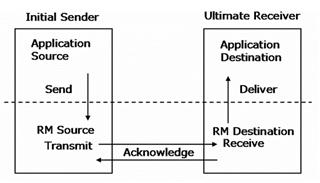
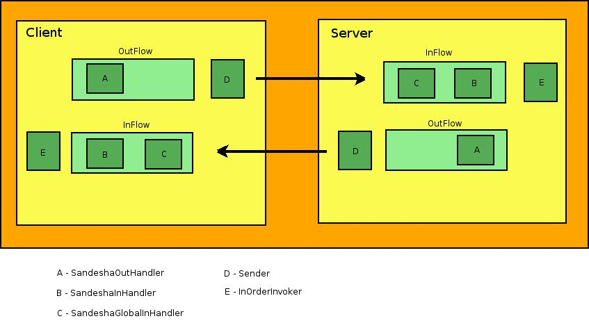
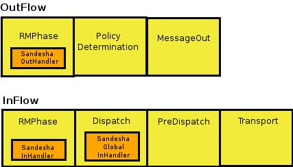
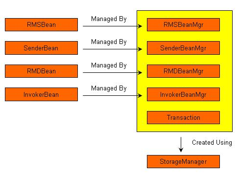

# Apache Sandesha2 User's Guide

## Navigation

- Apache Sandesha2
  - [Home](#sandesha)
  - Documentation
    - [User Guide](#sandesha-userguide)
    - [Architecture Guide](#sandesha-architectureguide)
  - Project Information
    - [Issue Tracking](#sandesha-issue-tracking)

## Content

<a id="sandesha"></a>

<!-- source_url: https://axis.apache.org/axis2/java/sandesha/index.html -->

<!-- page_index: 1 -->

<a id="sandesha--welcome-to-apache-sandesha2"></a>

# Welcome to Apache Sandesha2

Apache Sandesha2™ is an Axis2 module that implements the [WS-ReliableMessaging
specification](http://www.ibm.com/developerworks/webservices/library/specification/ws-rm/) published by IBM, Microsoft, BEA and TIBCO.
By using Sandesha2 you can add reliable
messaging capability to the web services hosted using Axis2. Sandesha2 can
also be used with Axis2 client to interact with already hosted web services
in a reliable manner. Please see sandesha2 user guide for more information on
using Sandesha2. Read Sandesha2 Architecture guide to see how Sandesha2 work
internally.

Apache Sandesha2, Sandesha2, Apache, the Apache feather logo, and the Apache Sandesha2 project logo are trademarks of The Apache Software Foundation.

---

<a id="sandesha-userguide"></a>

<!-- source_url: https://axis.apache.org/axis2/java/sandesha/userGuide.html -->

<!-- page_index: 2 -->

<a id="sandesha-userguide--apache-sandesha2-user-s-guide"></a>

# Apache Sandesha2 User's Guide

This document introduces you to Apache Sandesha2. This will first take you
through a step by step process of developing a sample application using
Sandesha2. In the latter sections you will be introduced to some advance
features making you more familiar with the application.

<a id="sandesha-userguide--contents"></a>

## Contents

- [Introduction](#sandesha-userguide--introduction)
- [Installing the Sandesa2 module](#sandesha-userguide--install)
- [Creating and deploying a RM enabled Web
  service - SimpleService](#sandesha-userguide--your_first_service)
- [Writing clients for the SimpleService](#sandesha-userguide--writing_clients)
  - [Configuring the client repository](#sandesha-userguide--client_repo)
  - [Doing One-Way invocation](#sandesha-userguide--one_way)
  - [Doing a Request-Reply invocation](#sandesha-userguide--request_reply)
- [Sandesha2 Client API](#sandesha-userguide--client_api)
  - [Selecting your RM version](#sandesha-userguide--version)
  - [Getting Acknowledgements and Faults to a given
    Endpoint](#sandesha-userguide--acks)
  - [Managing Sequences](#sandesha-userguide--managing)
  - [Offering a Sequence ID for the Response
    Sequence](#sandesha-userguide--offering)
  - [Creating a Sequence Without Sending any
    Messages](#sandesha-userguide--creating)
  - [Sending Acknowledgement Requests from the
    Client Code](#sandesha-userguide--ack_requests)
  - [Terminating a Sequence from the Client
    Code](#sandesha-userguide--terminating)
  - [Closing a Sequence from the Client Code](#sandesha-userguide--closing)
  - [Blocking the Client Code until a Sequence is
    complete](#sandesha-userguide--blocking)
  - [Working with Sandesha Reports](#sandesha-userguide--reports)
    - [SandeshaReports](#sandesha-userguide--sandesha_reports)
    - [SequenceReports](#sandesha-userguide--sequence_reports)
  - [Sandesha Listener Feature](#sandesha-userguide--listners)
    - [onError](#sandesha-userguide--on_error)
    - [onTimeOut](#sandesha-userguide--on_timeout)
- [More about sequences](#sandesha-userguide--sequences)
  - [Creation of sequences](#sandesha-userguide--creation)
  - [Termination of sequences](#sandesha-userguide--termination)
  - [Closing of sequences](#sandesha-userguide--closing1)
  - [Timing out of sequences](#sandesha-userguide--timing_out)
- [Delivery Assurances of Sandesha2](#sandesha-userguide--delivary_assurances)
- [Configuring Sandesha2](#sandesha-userguide--configuring)
  - [AcknowledgementInterval](#sandesha-userguide--acknowledgementinterval)
  - [RetransmissionInterval](#sandesha-userguide--retransmissioninterval)
  - [ExponentialBackoff](#sandesha-userguide--exponentialbackoff)
  - [MaximumRetransmissionCount](#sandesha-userguide--maximumretransmissioncount)
  - [InactivityTimeout](#sandesha-userguide--inactivitytimeout)
  - [InactivityTimeoutMeasure](#sandesha-userguide--inactivitytimeoutmeasure)
  - [InvokeInOrder](#sandesha-userguide--invokeinorder)
  - [StorageManagers](#sandesha-userguide--storagemanagers)
  - [MessageTypesToDrop](#sandesha-userguide--messagetypestodrop)
  - [SecurityManager](#sandesha-userguide--securitymanager)

<a id="sandesha-userguide--introduction"></a>

## Introduction

Sandesha2 is a Web Service-ReliableMessaging (WS-RM) implementation for
Apache Axis2. With Sandesha2 you can make your Web services reliable, or you
can invoke already hosted reliable Web services.

If you want to learn more about Apache Axis2, refer to [Apache Axis2 User
Guide](http://axis.apache.org/axis2/java/core/docs/userguide.html) and [Apache
Axis2 Architecture Guide](http://axis.apache.org/axis2/java/core/docs/Axis2ArchitectureGuide.html).

Architecure guide for Sandesha2 is accessible at [Sandesha2 Architecture Guide](#sandesha-architectureguide).

Sandesha2 supports the WS-ReliableMessaging specification. It fully
supports the WS-ReliableMessaging 1.0 specification (February 2005) (<http://specs.xmlsoap.org/ws/2005/02/rm/ws-reliablemessaging.pdf>).

This specification has been submitted to OASIS and currently being
standardized under the OASIS WS-RX Technical Committee as WSRM 1.1 (see <http://www.oasis-open.org/committees/tc_home.php?wg_abbrev=ws-rx> ).
Sandesha2 currently supports Committee Draft 4 of the specification being
developed under this technical committee ( <http://docs.oasis-open.org/ws-rx/wsrm/200602/wsrm-1.1-spec-cd-04.pdf>).

<a id="sandesha-userguide--installing-the-sandesa2-module"></a>

## Installing the Sandesa2 module

In this section you will be tought how to install the Sandesha2 module in
a Axis2 environment. Simply follow the given instructions step by step.

1. Download a compatible Axis2 binary distribution.
2. Extract the distribution file to a temporary folder (from now on
   referred as AXIS2\_HOME)
3. Add a user phase named 'RMPhase' to all four flows of the axis2.xml
   file which is in the AXIS2\_HOME/conf directory. Note the positioning of
   'RMPhase' within different phaseOrders.


```
                
                
                <axisconfig name="AxisJava2.0">
                
                        <!-- REST OF THE CONFIGURATION-->
                
                        <phaseOrder type="InFlow">
                                <phase name="Transport"/>
                                    <phase name="Security"/>
                                    <phase name="PreDispatch"/>
                                    <phase name="Dispatch" />
                                    <phase name="OperationInPhase"/>
                                    <phase name="soapmonitorPhase"/>
                                    <phase name="RMPhase"/>
                            </phaseOrder>
                            
                            <phaseOrder type="OutFlow">
                                    <phase name="RMPhase"/>
                                    <phase name="soapmonitorPhase"/>
                                    <phase name="OperationOutPhase"/>
                                    <phase name="PolicyDetermination"/>
                                    <phase name="MessageOut"/>
                                    <phase name="Security"/>
                            </phaseOrder>
                                    
                            <phaseOrder type="InFaultFlow">
                                    <phase name="PreDispatch"/>
                                    <phase name="Dispatch" />
                                    <phase name="OperationInFaultPhase"/>
                                    <phase name="soapmonitorPhase"/>
                                    <phase name="RMPhase"/>
                            </phaseOrder>
                            
                            <phaseOrder type="OutFaultFlow">
                                    <phase name="RMPhase"/>
                                    <phase name="soapmonitorPhase"/>
                                    <phase name="OperationOutFaultPhase"/>
                                    <phase name="PolicyDetermination"/>
                                    <phase name="MessageOut"/>
                            </phaseOrder>
                    
                    </axisconfig>
                
                
```

4. Download the Sandesha2 binary distribution and extract it to a
   temporary folder (from now on referred as SANDESHA2\_HOME).
5. Get the Sandesha2 module file (sandesha2-<VERSION>.mar) from
   SANDESHA2\_HOME directory and put it to the AXIS2\_HOME/repository/modules
   directory.
6. Get the Sandesha2-policy-<VERSION>.jar file from the
   SANDESHA2\_HOME directory and put it to the AXIS2\_HOME/lib directory.
7. Build the Axis2 web application by moving to the AXIS2\_HOME/webapp
   directory and running the ant target 'create.war'. Deploy the generated
   axis2.war.

<a id="sandesha-userguide--creating-and-deploying-a-rm-enabled-web-service-simpleservice"></a>

## Creating and deploying a RM enabled Web service - SimpleService

This section will give you step by step guidelines on creating a Web
service with Reliable Messaging support and making it available within your
Axis2 server. This simple service will have a single one-way operation (ping)
and a request-response operation (echoString). We assume that you have
followed the previous steps to install Sandesha2 and you have installed and
configured JDK 1.4 or later in your system. We also assume you have the
ability to compile & run a simple java class.

1. Add all the files that come under the AXIS2\_HOME/lib to your
   CLASSPATH.
2. Add the Sandesha2 jar file (sandesha2-<VERSION>.jar) from your
   SANDESHA2\_HOME to your CLASSPATH.
3. Create the service implementation java file as given below and
   compile it.


```
            
package sandesha2.samples.userguide;

import java.util.HashMap;
import java.util.Map;
import javax.xml.namespace.QName;
import org.apache.axiom.om.OMAbstractFactory;
import org.apache.axiom.om.OMElement;
import org.apache.axiom.om.OMFactory;
import org.apache.axiom.om.OMNamespace;

public class RMSampleService {

        private static Map sequenceStrings = new HashMap();
        private final String applicationNamespaceName = "http://tempuri.org/"; 
        private final String Text = "Text";
        private final String Sequence = "Sequence";
        private final String echoStringResponse = "echoStringResponse";
        private final String EchoStringReturn = "EchoStringReturn";
        
        public OMElement echoString(OMElement in) throws Exception {
                
                OMElement textElem = in.getFirstChildWithName(new QName (applicationNamespaceName,Text));
                OMElement sequenceElem = in.getFirstChildWithName(new QName (applicationNamespaceName,Sequence));
                
                if (textElem==null)
                        throw new Exception ("'Text' element is not present as a child of the 'echoString' element");
                if (sequenceElem==null)
                        throw new Exception ("'Sequence' element is not present as a child of the 'echoString' element");
                
                String textStr = textElem.getText();
                String sequenceStr = sequenceElem.getText();
                
                System.out.println("'EchoString' service got text '" + textStr + "' for the sequence '" + sequenceStr + "'");
                
                String previousText = (String) sequenceStrings.get(sequenceStr);
                String resultText = (previousText==null)?textStr:previousText+textStr;
                sequenceStrings.put(sequenceStr,resultText);
                
                OMFactory fac = OMAbstractFactory.getOMFactory();
                OMNamespace applicationNamespace = fac.createOMNamespace(applicationNamespaceName,"ns1");
                OMElement echoStringResponseElem = fac.createOMElement(echoStringResponse, applicationNamespace);
                OMElement echoStringReturnElem = fac.createOMElement(EchoStringReturn, applicationNamespace);
                
                echoStringReturnElem.setText(resultText);
                echoStringResponseElem.addChild(echoStringReturnElem);
                
                return echoStringResponseElem;
        }
  
        public void ping(OMElement in) throws Exception  {
                OMElement textElem = in.getFirstChildWithName(new QName (applicationNamespaceName,Text));
                if (textElem==null)
                        throw new Exception ("'Text' element is not present as a child of the 'Ping' element");
                
                String textValue = textElem.getText();
                
                System.out.println("ping service got text:" + textValue);
        }
        
}
            
```

4. Create your services.xml file as following.


```
        
<service name="RMSampleService">

   <parameter name="ServiceClass" locked="xsd:false">sandesha2.samples.userguide.RMSampleService</parameter>
   
    <description>
        The userguide Sample service.
    </description>
    
    <module ref="sandesha2" />
    <module ref="addressing" />
        
    <operation name="ping" mep="http://www.w3.org/2004/08/wsdl/in-only">  
        <messageReceiver class="org.apache.axis2.receivers.RawXMLINOnlyMessageReceiver" />
    </operation>
    <operation name="echoString">
        <messageReceiver class="org.apache.axis2.receivers.RawXMLINOutMessageReceiver" />
    </operation>
    
</service>        
        
        
```

5. Set RMSampleService.class and the services.xml files obtained from
   the previous steps in the folder structure below. Create a
   RMSampleService.aar file by compressing it using the jar or a zip
   tool.


```
              RMSampleService.aar
                   |
                   |--META-INF
                   |    |--services.xml
                   |-sandesha2
                        |--samples
                             |--userguide
                                 |--RMSampleService.class
    
```

6. To deploy the web service simply drop it to the
   WEB-INF/repository/services direcory of your Axis2 web application.
   Please read the Axis2 userguide for more information on deploying Web
   service archieves.
7. List the Axis2 services to see whether the SimpleService has been
   correctly deployed.
8. Congradulations. You just deployed your first Web Service with
   Reliable Messaging support from Sandesha2.

<a id="sandesha-userguide--writing-clients-for-reliable-services"></a>

## Writing Clients for Reliable Services

<a id="sandesha-userguide--configuring-the-client-repository"></a>

### Configuring the client repository

1. Create a repository directory in your system to be used as the Axis2
   client repository (from now on referred as CLIENT\_REPO).
2. Put the configured the axis2.xml file from the previous section to the
   CLIENT\_REPO directory & rename it as client\_axis2.xml.
3. Create a directory named 'modules' under the CLIENT\_REPO.
4. Put the Sandesha mar (sandesha2-<VERSION>.mar) file from the
   Sandesha2 binary distribution and the addressing mar file from the Axis2
   binary distribution (addressing-<VERSION>.mar) to the
   CLIENT\_REPO/modules directory.
5. Now you should have the following folder structure in the CLIENT\_REPO.


```
       Client_Repo  
            |-- client_axis2.xml
            |--modules
                  |--sandesha2.mar
                  |--addressing.mar
        
```

<a id="sandesha-userguide--doing-one-way-invocation"></a>

### Doing One-Way invocation

1. Add all the jar files fromAXIS2\_HOME/lib directory to your
   CLASSPATH.
2. Put the Sandesha2 jar file (sandesha2-<VERSION>.jar) to your
   CLASSPATH.
3. Create a 'UserguidePingClient.java' file with following content.


```

package sandesha2.samples.userguide;

import java.io.File;
import org.apache.axiom.om.OMAbstractFactory;
import org.apache.axiom.om.OMElement;
import org.apache.axiom.om.OMFactory;
import org.apache.axiom.om.OMNamespace;
import org.apache.axis2.AxisFault;
import org.apache.axis2.addressing.EndpointReference;
import org.apache.axis2.client.Options;
import org.apache.axis2.client.ServiceClient;
import org.apache.axis2.context.ConfigurationContext;
import org.apache.axis2.context.ConfigurationContextFactory;
import org.apache.sandesha2.client.SandeshaClientConstants;
import javax.xml.namespace.QName;


public class UserguidePingClient {

        private static final String applicationNamespaceName = "http://tempuri.org/"; 
        private static final String ping = "ping";
        private static final String Text = "Text";
        private static String toEPR = "http://127.0.0.1:8070/axis2/services/RMSampleService";

        private static String CLIENT_REPO_PATH = "CLIENT_REPO";
        
        public static void main(String[] args) throws AxisFault {
                
                String axis2_xml = CLIENT_REPO_PATH + File.separator + "client_axis2.xml";
                ConfigurationContext configContext = ConfigurationContextFactory.createConfigurationContextFromFileSystem(CLIENT_REPO_PATH,axis2_xml);
                
                Options clientOptions = new Options ();
                clientOptions.setTo(new EndpointReference (toEPR));

                ServiceClient serviceClient = new ServiceClient (configContext,null);
                clientOptions.setAction("urn:wsrm:Ping");
                serviceClient.setOptions(clientOptions);
                
                serviceClient.engageModule(new QName ("sandesha2"));
                serviceClient.engageModule(new QName ("addressing"));
                
                serviceClient.fireAndForget(getPingOMBlock("ping1"));
                serviceClient.fireAndForget(getPingOMBlock("ping2"));
                
                clientOptions.setProperty(SandeshaClientConstants.LAST_MESSAGE, "true");
                serviceClient.fireAndForget(getPingOMBlock("ping3"));
                
                serviceClient.cleanup();
        }
        
        private static OMElement getPingOMBlock(String text) {
                OMFactory fac = OMAbstractFactory.getOMFactory();
                OMNamespace namespace = fac.createOMNamespace(applicationNamespaceName,"ns1");
                OMElement pingElem = fac.createOMElement(ping, namespace);
                OMElement textElem = fac.createOMElement(Text, namespace);
                
                textElem.setText(text);
                pingElem.addChild(textElem);

                return pingElem;
        }
}
    
```

4. In the above file replace the value of the CLIENT\_REPO\_PATH variable
   with the full path to the CLIENT\_REPO folder. This should be in a JAVA
   compatible manner. e.g.: c:\\sandesha2\\repository
5. Compile the class
6. Run it.
7. Observe the following differences between the RM client code and a
   normal Axis2 one-way client invocation.

   - Engaging Sandesha2 module.

     serviceClient.engageModule(new QName ("sandesha2"));
   - Engaging Addressing module

     serviceClient.engageModule(new QName ("addressing"));
   - Setting the LAST\_MESSAGE property before doing the last invocation.

     clientOptions.setProperty(SandeshaClientConstants.LAST\_MESSAGE,
     "true");

<a id="sandesha-userguide--doing-request-reply-invocation"></a>

### Doing Request-Reply invocation

1. Add all the jar files from the AXIS2\_HOME/lib directory to your
   CLASSPATH.
2. Put the Sandesha2 jar file (sandesha2-<VERSION>.jar) to your
   CLASSPATH.
3. Create a 'UserguideEchoClient.java' file with following content.


```

package sandesha2.samples.userguide;

import java.io.File;
import javax.xml.namespace.QName;
import org.apache.axiom.om.OMAbstractFactory;
import org.apache.axiom.om.OMElement;
import org.apache.axiom.om.OMFactory;
import org.apache.axiom.om.OMNamespace;
import org.apache.axiom.soap.SOAPBody;
import org.apache.axis2.addressing.EndpointReference;
import org.apache.axis2.client.Options;
import org.apache.axis2.client.ServiceClient;
import org.apache.axis2.client.async.AsyncResult;
import org.apache.axis2.client.async.Callback;
import org.apache.axis2.context.ConfigurationContext;
import org.apache.axis2.context.ConfigurationContextFactory;
import org.apache.sandesha2.client.SandeshaClientConstants;

public class UserguideEchoClient {
        
        private final static String applicationNamespaceName = "http://tempuri.org/"; 
        private final static String echoString = "echoString";
        private final static String Text = "Text";
        private final static String Sequence = "Sequence";
        private final static String echoStringResponse = "echoStringResponse";
        private final static String EchoStringReturn = "EchoStringReturn";
        private static String toEPR = "http://127.0.0.1:8070/axis2/services/RMSampleService";

        private static String CLIENT_REPO_PATH = "Full path to the Client Repo folder";
        
        public static void main(String[] args) throws Exception {
                
                String axis2_xml = CLIENT_REPO_PATH + File.separator +"client_axis2.xml";
        ConfigurationContext configContext = ConfigurationContextFactory.createConfigurationContextFromFileSystem(CLIENT_REPO_PATH,axis2_xml);
                ServiceClient serviceClient = new ServiceClient (configContext,null);        
                
                Options clientOptions = new Options ();
                clientOptions.setTo(new EndpointReference (toEPR));
                clientOptions.setUseSeparateListener(true);
                serviceClient.setOptions(clientOptions);

                serviceClient.engageModule(new QName ("sandesha2"));
                serviceClient.engageModule(new QName ("addressing"));

                Callback callback1 = new TestCallback ("Callback 1");
                serviceClient.sendReceiveNonBlocking (getEchoOMBlock("echo1","sequence1"),callback1);
                Callback callback2 = new TestCallback ("Callback 2");
                serviceClient.sendReceiveNonBlocking(getEchoOMBlock("echo2","sequence1"),callback2);

                clientOptions.setProperty(SandeshaClientConstants.LAST_MESSAGE, "true");
                Callback callback3 = new TestCallback ("Callback 3");
                serviceClient.sendReceiveNonBlocking(getEchoOMBlock("echo3","sequence1"),callback3);
                
        while (!callback3.isComplete()) {
            Thread.sleep(1000);
        }
        
        Thread.sleep(4000); 
        }

        private static OMElement getEchoOMBlock(String text, String sequenceKey) {
                OMFactory fac = OMAbstractFactory.getOMFactory();
                OMNamespace applicationNamespace = fac.createOMNamespace(applicationNamespaceName,"ns1");
                OMElement echoStringElement = fac.createOMElement(echoString, applicationNamespace);
                OMElement textElem = fac.createOMElement(Text,applicationNamespace);
                OMElement sequenceElem = fac.createOMElement(Sequence,applicationNamespace);
                
                textElem.setText(text);
                sequenceElem.setText(sequenceKey);
                echoStringElement.addChild(textElem);
                echoStringElement.addChild(sequenceElem);
                
                return echoStringElement;
        }

        static class TestCallback extends Callback {

                String name = null;
                public TestCallback (String name) {
                        this.name = name;
                }
                
                public void onComplete(AsyncResult result) {
                        SOAPBody body = result.getResponseEnvelope().getBody();
                        
                        OMElement echoStringResponseElem = body.getFirstChildWithName(new QName (applicationNamespaceName,echoStringResponse));                        
                        OMElement echoStringReturnElem = echoStringResponseElem.getFirstChildWithName(new QName (applicationNamespaceName,EchoStringReturn));
                        
                        String resultStr = echoStringReturnElem.getText();
                        System.out.println("Callback '" + name +  "' got result:" + resultStr);
                }

                public void onError (Exception e) {
                        System.out.println("Error reported for test call back");
                        e.printStackTrace();
                }
        }
}
    
```

4. In the above file replace the value of the CLIENT\_REPO\_PATH variable
   with the full path to the CLIENT\_REPO folder. This should be in a JAVA
   compatible manner. e.g.: c:\\sandesha2\\repository
5. Compile the above class.
6. Run the above class.
7. Observer the following differences between the RM client code and a
   normal Axis2 one-way client invocation.
   - Engaging Sandesha2 module.
   - Engaging Addressing module
   - Setting the LAST\_MESSAGE property before doing the last
     invocation.

<a id="sandesha-userguide--sandesha2-client-api"></a>

## Sandesha2 Client API

This section will introduce you to some client API features which you may
not use for general cases. These features will be useful if you have some
knowledge in WSRM (Web service Reliable Messaging) and if you want to
customize the default behavior of Sandesha2 to make it work according to your
requirements. Some of these have to be done by simply setting a property in
the 'Options' object which you set to your ServiceClient. For these you have
to add the sandesha2-client-<VERSION>.jar to your classpath. For
others, you have to use a special class called SandeshaClient, which is
available in the Sandesha-<VERSION>.jar file. Both these comes with
Sandesha2 distributions.

<a id="sandesha-userguide--selecting-your-rm-version"></a>

### Selecting your RM version

As it was explained earlier Sandesha2 supports two WSRM specifications.
The default is the submitted WSRM specification. But if you want to change
this and work in the new OASIS WSRM specification, set the following property
in the Options object.

```
clientOptions.setProperty(SandeshaClientConstants.RM_SPEC_VERSION,Sandesha2Constants.SPEC_VERSIONS.v1_1);
```

To go back to the WSRM submitted specification set the property as
follows.

```
clientOptions.setProperty(SandeshaClientConstants.RM_SPEC_VERSION,Sandesha2Constants.SPEC_VERSIONS.v1_0);
```

<a id="sandesha-userguide--getting-acknowledgements-and-faults-to-a-given-endpoint"></a>

### **Getting Acknowledgements and Faults to a Given Endpoint**

In the default configuration, response path for acknowledgements and
faults related to a sequence is the anonymous endpoint. For example, HTTP
transport will send acknowledgements and faults in the HTTP response of
request messages. If you want to avoid this and if you want to get
acknowledgements and faults to a different endpoint, add following part to
the client code before doing any invocation. Note that this does not effect
the path of your application level faults. Only RM faults which occur within
the Sandesha2 will be sent to this endpoint.

```

clientOptions.setTransportInProtocol(org.apache.axis2.Constants.TRANSPORT_HTTP);
clientOptions.setProperty(SandeshaClientConstants.AcksTo,<endpoint>); //example endpoint - http://tempuri.org/acks.
```

<a id="sandesha-userguide--managing-sequences"></a>

### **Managing Sequences**

In the default behaviour Sandesha2 assumes that messages going to the same
endpoint should go in the same RM sequence. Messages will be sent in
different RM sequences only if their WS-Addressing To address is different.
But if required you can instruct Sandesha2 to send messages that have the
same WS-Addressing To address in two or more sequences. To do this you have
to set a property called Sequence Key.

```
clientOptions.setProperty(SandeshaClientConstants.SEQUENCE_KEY,<a string to identify the sequence>);
```

If the sequence key is different, Sandesha2 will send messages in two
sequences even if they are sent to the same endpoint.

<a id="sandesha-userguide--offering-a-sequence-id-for-the-response-sequence"></a>

### Offering a Sequence ID for the Response Sequence

This is a concept of reliable messaging which may not be very useful to
you as a end user. Here what you do is offering a sequence ID for the
sequence to be created in the response side within the Create Sequence
Request message of the request path. If you provide this and if the Sandesha2
server accepts the offered sequence ID it can refrain from doing the Create
Sequence message exchange in the response path. To do this, add the following
to the client code.

```
clientOptions.setProperty(SandeshaClientConstants.OFFERED_SEQUENCE_ID,<new uuid>);
```

<a id="sandesha-userguide--creating-a-sequence-without-sending-any-messages"></a>

### Creating a Sequence Without Sending any Messages

Sometimes you may need Sandesha2 client to start a sequence with a server
without sending any application messages. When you ask for this, Sandesha2
will do a Create Sequence message exchange and obtain a new sequence ID from
the server. The sequenceKey value of the newly created sequence will be
returned from this method which could be used do message invocations with it.
This method also has a boolean parameter which tells whether to offer a
sequence for the response side. (read the part on [offering
sequence IDs](#sandesha-userguide--oas) to learn more about offering sequences) . The line you have
to add to your client code for creating a sequence is as follows.

```
String sequenceKey = SandeshaClient.createSequence (ServiceClient serviceClient, booleanoffer);
```

There is an overloaded method of this which takes the sequenceKey from the
user.

```
SandeshaClient.createSequnce (ServiceClient serviceClient, boolean offer,String sequenceKey);
```

<a id="sandesha-userguide--sending-acknowledgement-requests-from-the-client-code"></a>

### Sending Acknowledgement Requests from the Client Code

You can ask Sandesha2 to get an acknowledgement from a server with which
it is maintaining a sequence. This may be useful in a case where your [SequenceReports](#sandesha-userguide--sequencereport) indicate that some of the messages
you sent have not been acknowledged and when you want to verify that. You can
do this by adding following line to the client code.

```
SandeshaClient.sendAckRequest (ServiceClient serviceClient);
```

You can use following method to send an acknowledgement request to a
specific sequence identified by the Sequence Key.

```
SandeshaClient.sendAckRequest (ServiceClient serviceClient, String sequenceKey);
```

<a id="sandesha-userguide--terminating-a-sequence-from-the-client-code"></a>

### Terminating a Sequence from the Client Code

You can terminate an on going sequence at any time by adding the line
given in this section to your client code. Remember that if you terminate a
sequence some of your messages may not get delivered to the service.

```
SandeshaClient.terminateSequence (ServiceClient serviceClient);
```

To terminate a specific sequence identified by a sequenceKey use
following.

```
SandeshaClient.terminateSequence (ServiceClient serviceClient, String sequenceKey);
```

<a id="sandesha-userguide--closing-a-sequence-from-the-client-code"></a>

### Closing a Sequence from the Client Code

You can close an ongoing sequence at any time by adding the line given in
this section to your client code. Sequence close feature is only available
for new WSRM specification being developed under OASIS. Remember that if you
do not close elegantly, some of your messages may not get delivered to the
service. Again, see the section on [More about
sequences](#sandesha-userguide--sequences) for more details. You can issue following command from your
client code to close a sequence.

```
SandeshaClient.closeSequence (ServiceClient serviceClient);
```

To close a specific sequence identified by a sequence key use the
following

```
SandeshaClient.closeSequence (ServiceClient serviceClient, String sequenceKey);
```

<a id="sandesha-userguide--blocking-the-client-code-until-a-sequence-is-complete"></a>

### Blocking the Client Code until a Sequence is Complete

After your client code delivered some messages to the RM layer, you may
have to wait for some time until the RM layer does its work. The time you
have to block depends on your system performance and network latencies. It
may be easier to ask the RM layer to block until its work is done by issuing
one of the following commands in your client code.

```
SandeshaClient.waitUntilSequenceCompleted (ServiceClient serviceClient);

SandeshaClient.waitUntilSequenceCompleted (ServiceClient serviceClient, String sequenceKey);
```

You can also give the maximum number of seconds the RM Layer should block.
The blocking will stop at the end of this maximum time even if the sequence
is not terminated or not timed out. But note that internally RM is still
working. So even though the blocking stops, RM layer will continue its work
until you exit the program.

```
SandeshaClient.waitUntilSequenceCompleted (ServiceClient serviceClient, long maxWaitingTime);

SandeshaClient.waitUntilSequenceCompleted (ServiceClient serviceClient, long maxWaitingTime, String sequenceKey);
```

<a id="sandesha-userguide--working-with-sandesha-reports"></a>

### Working with Sandesha Reports

Sandesha introduces a feature called Sandesha Reports with which you can
get status information about the sequences managed by Sandesha2. There are
basically two kinds of reports, each explained in following subtopics.

<a id="sandesha-userguide--sandeshareport"></a>

#### SandeshaReport

This gives information on all the incoming and outgoing sequences
Sandesha2 system is managing. When we consider a particular endpoint, an
incoming sequence is a sequence to which that endpoint is working as a
RM-Destination (RMD). An outgoing sequence is a sequence to which this
endpoint works as a RM-Source (RMS).

A SandeshaReport include following information:

- Sequence IDs of all the outgoing sequences.
- Number of completed messages of each outgoing sequences.
- Sequence IDs of all the incoming sequences.
- No of completed messages of each incoming sequence.

To get a SandeshaReport at any time, invoke following method from your
client code.

```
SandeshaClient.getSandeshaReport (ConfigurationContext c);
```

<a id="sandesha-userguide--sequencereport"></a>

#### SequenceReport

A SequenceReport gives information on a specific sequences that a Sandesha
system is working on. This can be an incoming sequence or an outgoing
sequence.

A SequenceReport will give following information:

1. Status of the sequence which can be one of the following.
   - INITIAL - The sequence has not been established yet.
   - ESTABLISHED - Create Sequence / Create Sequence Response message
     exchange has been done.
   - TERMINATED - The sequence has been terminated.
   - TIMEDOUT - The sequence has timed out.
   - UNKNOWN - The status cannot be determined.
2. Sequence Direction
   - OUT - Outgoing sequence
   - IN - Incoming sequence
3. Sequence ID of the sequence
4. Internal sequence ID of the sequence.
5. Number of completed messages of the sequence.

A messages is considered as **completed** when a RMS has
successfully sent the message to the RMD and received an acknowledgement.

To get an incoming sequence report, you have to issue following command
from your client code.

```
SandeshaClient.getIncomingSequenceReports (ConfigurationContext configCtx);
```

To get an outgoing Sequence Report you can invoke any of the following
functions.

```
SandeshaClient.getOutgoingSequenceReport (ServiceClient serviceClient);
SandeshaClient.getOutgoingSequenceReport (String to,String sequenceKey,ConfigurationContext configurationContext);
SandeshaClient.getOutgoingSequenceReport (String internalSequenceID,ConfigurationContext configurationContext);
```

<a id="sandesha-userguide--sandesha-listener-feature"></a>

### Sandesha Listener Feature

You can use this new feature to register a listener class in Sandesha2 and
get notified when specific event happens in the system. The basic interface
is given below.

```
public interface SandeshaListener {
    public void onError(AxisFault fault);
    public void onTimeOut(SequenceReport report);
}
```

You can implement this class and set an object of that type as a property
in the Options object in your client code. An example is given below.

```
options.setProperty (SandeshaClientConstants.SANDESHA_LISTENER, new SandeshaListnerImpl ());
```

Currently SandeshaListener defines the following two methods- onError
& onTimedOut.

<a id="sandesha-userguide--onerror"></a>

### onError

This will be invoked if Sandesha2 receives a fault SOAP message. The parameter will be an AxisFault
representing that fault message. this will be specially useful for capturing the faults that get returned
due to RM protocol messages, since they do not get returned to the client code.

<a id="sandesha-userguide--ontimeout"></a>

### onTimeOut

As mentioned in the earlier section [Sequence Management of
Sanesha2](#sandesha-userguide--smo), there is a possibility of an inactive sequence timing out. When
a specific sequence times out, this method of the SandeshaListener will be
invoked giving a report of that sequence as a parameter.

<a id="sandesha-userguide--more-about-sequences"></a>

## More about sequences

This section will explain you about the sequence management method of
Sandesha2. This is basically about four things, each explained in following
sub topics.

<a id="sandesha-userguide--creation-of-sequences"></a>

### Creation of sequences

Sandesha client uses two properties given by the client to decide the
sequence in which it should send a particular application message. First one
is the address of the WS-Addressing To endpoint address. The second is a
special constant given by the client called Sequence Key which is set as a
property in the Options object as it was explained before. Sandesha2 client
generates a value called Internal Sequence ID by combining these two values.
All messages having the same Internal Sequence ID will be sent in a single
sequence, until that particular sequence is terminated.

Sequences that carry messages from the client to a server are called
request sequences and ones that carry messages from the server to the client
are called response sequences. Sandesha2 always keep a single response
sequence corresponding to a particular request sequence.

<a id="sandesha-userguide--termination-of-sequences"></a>

### Termination of sequences

There are currently two methods to terminate a particular sequence from
the Client API. The first method is to [set the Last
Message property](#sandesha-userguide--lastmessage) as it was explained earlier. After all the messages up
to the last message get delivered reliably Sandesha2 will terminate that
sequence. Remember that if you are working on the Submitted WSRM
specification (the default), this is the only method you can use.

If you are working on the new WSRM specification (see previous section on
[Selecting the Specification Version](#sandesha-userguide--sts) if you want to know
how to set this), these is an alternate method you can use to terminate a
sequence. You can keep invoking the ServiceClient to send messages, without
setting a Last Message property. After you finish your work call following
function to terminate the sequence.

```
SandeshaClient.terminateSequence (ServiceClient);
```

You can use the function below to terminate a sequence identified by a
particular Sequence Key.

```
SandeshaClient.terminateSequence (ServiceClient, SequenceKey);
```

When a request sequence is terminated, Sandesha2 will wait till all the
response messages are reliably delivered to the client and after which will
terminate the response sequence as well.

<a id="sandesha-userguide--closing-of-sequences"></a>

### Closing of sequences

New WSRM specification being developed under OASIS introduces a new
feature called closing a sequence. When a sequence is closed the server will
not except new application messages, but will accept RM control messages like
acknowledgement requests. If you are writing your code for this RM version
you can use following functions to close the current sequence.

```
SandeshaClient.closeSequence (ServiceClient);
```

You can use the function below to close a sequence identified by a
particular Sequence Key.

```
SandeshaClient.terminateSequence (ServiceClient,, SequenceKey);
```

<a id="sandesha-userguide--timing-out-a-sequence"></a>

### Timing Out a Sequence

Depending on its policy configurations Sandesha2 may time out certain
sequences. After a sequence get timed out, it is considered finalized and
cannot be used any more. There are basically two ways a sequence can time
out, and both can be configured using policies. See '[InactivityTimeout](#sandesha-userguide--inactivitytimeout)' and '[MaximumRetransmissionCount](#sandesha-userguide--maximumretransmissioncount)' parts of
the '[Configuring Sandesha2](#sandesha-userguide--cs)' sub topic for more details.

<a id="sandesha-userguide--delivery-assurances-of-sandesha2"></a>

## Delivery Assurances of Sandesha2

As it was mentioned in the [Architecture
Guide](#sandesha-architectureguide), Sandesha2 provide an in-order exactly-once delivery assurance.
**In-order** means that Sandesha2 will guarantee delivering of
the messages to the Web service in the order of their message numbers. If you
use a Sandesha2 client this will be the order you called the invocation
methods of your service client. **Exactly-once** delivery
assurance means that Sandesha2 will make sure that the service will be
invoked only once for each message. As it was mentioned earlier Sandesha2
retransmits messages to obtain reliability. Due to the exactly-once delivery
assurance you can be sure that your service gets invoked only once.

If you require the performance to be maximized and if you do not want
ordering, you can configure Sandesha2 to invoke messages in the order they
arrive. Read 'Configuring Sandesha2' section below to learn how to do
this.

<a id="sandesha-userguide--configuring-sandesha2"></a>

## Configuring Sandesha2

Sandesha2 provides a set of configurations which you can use to customize
its execution behavior. All these configurations are available in a WS-Policy
format. These policies can be in the module.xml file of the Sandesha module
or in the services.xml file of a service on which Sandesha2 module has been
engaged. Most of the policies in the module.xml can be overridden by setting
different values in a services.xml. But some policies cannot be overridden
and must be set correctly in the module.xml file.

You will find each Sandesha2 policy and the way an alteration of it can
effect Sandesha2. Make sure that you set these values carefully. Setting
incompatible types or values may cause Sandesha system to malfunction.
Normally if Sandesha2 can detect that the value you have set is incompatible, it will set a default value which is mentioned in the SandeshaConstants
class.

<a id="sandesha-userguide--acknowledgementinterval"></a>

### AcknowledgementInterval

When a RMD receives an application message and when it has to send
acknowledgements to an endpoint (other than the anonymous URL), it will not
send this message immediately but will wait for some time to see whether
there are any other messages (for example application response messages)
going towards the destination of the acknowledgement message. If it finds
any, the acknowledgement message is piggybacked in this second message and
both are sent together. If the RMD does not find any messages that go towards
the destination of the acknowledgement within a specific time interval, the
acknowledgement is sent as a stand alone message. This time interval is
called the **acknowledgement interval** and can be configured in
Sandesha2 policies. The measurement unit is in milliseconds.

<a id="sandesha-userguide--retransmissioninterval"></a>

### RetransmissionInterval

As it was mentioned earlier some messages in RM should be retransmitted
until a proper response or acknowledgement is returned. After sending a
message once, the RMS will wait for some time before sending it for the
second time. This waiting time between the first and second retransmission
attempts is given by this policy. If the policy given later called the
ExponentialBackoff is set to false the time gap between all the
retransmissions attempts will have the same value, which is the
RetransmissionInterval. Measurement unit is in milliseconds.

<a id="sandesha-userguide--exponentialbackoff"></a>

### ExponentialBackoff

Value of this can either be 'true' or 'false'. This measure is used to
adjust the retransmission attempts so that an RMD does not get flooded with a
large number of retransmitted messages. If this is 'true', a time gap between
two retransmissions will be twice as the time gap between previous two
retransmissions. For example, if the time gap between the fourth and fifth
retransmission attempts is twenty seconds the time gap between the fifth and
sixth attempts will be forty seconds. If this property is set to 'false', all
retransmissions will have the same value, which is given by the
'RetransmissionInterval' property.

<a id="sandesha-userguide--maximumretransmissioncount"></a>

### MaximumRetransmissionCount

This gives the maximum number of times a message has to be retransmitted.
When a specific message gets retransmitted a maximum number of times, and is
still not sent correctly to the RMD, it will not be sent again and the
request will be marked as Timed Out. When a sequence is timed out, it cannot
be used any more. If the value of this property is '-1' there is no limit in
the number of retransmission attempts.

<a id="sandesha-userguide--inactivitytimeout"></a>

### InactivityTimeout

A Sandesha2 RMS always keeps track of the last time a particular RMD
responded to a request by it. If the RMD does not response within the time
limit given by the time interval given by this measure, the RMS will give up
attempting and will mark the sequence as Timed Out. After timing out the
particular sequence, it cannot be used any more. If the value of this is -1, there is not inactivity timeout limit The measure of this is given by the
property 'InactivityTimeoutMeasure'.

<a id="sandesha-userguide--inactivitytimeoutmeasure"></a>

### InactivityTimeoutMeasure

This gives the measure of the property 'InactivityTimeout'. The value of
this can be seconds, minutes, hours or days. If you give a value that cannot
be interpreted the default will be used.

<a id="sandesha-userguide--invokeinorder"></a>

### InvokeInOrder

As it was mentioned earlier, Sandesha2 implement the in-order invoking
delivery assurance. This property can be used to turn this on or off. The
value of this has to be 'true' if in-order invoking has to be enabled. It has
to be false if in-order invoking has to be disabled. Please remember that
this is a non-overridable property. I.e. value you set in the module.xml is
the one that is used for all the services and will not be overridden for a
particular service by setting a different value there.

<a id="sandesha-userguide--storagemanagers"></a>

### StorageManagers

This gives the storage manager implementation classes used by Sandesha2.
You have to mention the full qualified class name here.

You can basically define two StorageManagers

InMemoryStorageManager - Expected to store data in memory. Supposed to be
faster.

PermanentStorageManager - Will be storing data in a database. So will be
little slower but real business applications will most probably prefer this
could provide additional features like recovery from failures.

Only one of these StorageManagers will be active in a given Sandesha2
instance. By default it will be the InMemorystoragemanager. If you want to
make the PermanentStoragemanager active add the following property to the
axis2.xml.

<parameter name="Sandesha2StorageManager"
locked="false">persistent</parameter>

StorageManager property is not overridable, i.e., value you set in the
module.xml is the one that is used for all the services and will not be
overridden for a particular service by setting a different value there.

You can easily create your own Storage Manager. Please read the Sandesha2 [Architecture Guide](#sandesha-architectureguide) for more details on
this.

<a id="sandesha-userguide--messagetypestodrop"></a>

### MessageTypesToDrop

This is a property that may not be very useful to an end user, but may be
useful for some debug purposes. As it was mentioned earlier Sandesha2 gives a
Message Type to each message it sends. For example, Create Sequence messages
will have the type 1 and Acknowledgement messages will have the type 4. You
can add a comma separated list of integers in the property telling Sandesha2
not to send messages of those types.

<a id="sandesha-userguide--securitymanager"></a>

### SecurityManager

The security manager allows you to plug a certain Secure Conversation
implemenation into axis2. The default is a DummySecurityManager which does
not do any real work. We have also implemented a RamaprtBasedSecurityManager
which allows you to use Rampart as your secure conversation
implementation.

To use the rampart follow the below steps.

1. Add the wss4j jar file (wss4j-VERSION.jar) to your to your
   CLASSPATH. (If your are in the server side add this to the WEB-INF/lib
   folder of the Axis2 webapp).
2. Add the Rampart and Rahas modules to the Axis2 modules directory.
3. Change the SecurityManager policy of the Sandesha2 module.xml to the
   following

   org.apache.sandesha2.security.rampart.RampartBasedSecurityManager

---

<a id="sandesha-architectureguide"></a>

<!-- source_url: https://axis.apache.org/axis2/java/sandesha/architectureGuide.html -->

<!-- page_index: 3 -->

<a id="sandesha-architectureguide--apache-sandesha2-architecture-guide"></a>

# Apache Sandesha2 Architecture Guide

<a id="sandesha-architectureguide--content"></a>

## Content

- [Introduction](#sandesha-architectureguide--intro)
- [Architecture](#sandesha-architectureguide--architecture)
  - [Handlers](#sandesha-architectureguide--hnd)
    - [SandeshaGlobalInHandler](#sandesha-architectureguide--globalin)
    - [SandeshaInHandler](#sandesha-architectureguide--in)
    - [SandeshaOutHandler](#sandesha-architectureguide--out)
  - [RMMessageReceiver](#sandesha-architectureguide--rmm)
  - [Sender](#sandesha-architectureguide--sender)
  - [Inorder Invoker](#sandesha-architectureguide--ioi)
  - Polling Manager
  - [Storage Framework](#sandesha-architectureguide--sf)
- [Delivery Assurances](#sandesha-architectureguide--da)
- [Configuring Sandesha](#sandesha-architectureguide--config)
- [Example Scenarios](#sandesha-architectureguide--es)
  - [Client Side](#sandesha-architectureguide--cs)
  - [Server Side](#sandesha-architectureguide--ss)

<a id="sandesha-architectureguide--introduction"></a>

## Introduction

Sandesha2 gives reliable messaging capabilities to
Axis2. From the point of view of the Axis2 engine, Sandesha2 is a module. When
this module is engaged to a service, clients have the option of invoking it in a
reliable manner. In the client side Sandesha2 module can be used to interact
with existing reliable Web services.

According to the Web service-ReliableMessaging (WS-RM)
specification which is implemented by Sandesha2, reliable communication happens
between two endpoints. These endpoints are called the RM Source (RMS) and the RM
Destination (RMD). Before communication, RMS and RMD perform a message exchange
to create a relationship called a Sequence between them. A Sequence is always
identified by a unique Sequence Identifier.

Each message of a sequence is numbered, starting from one. In
Sandesha2 the maximum number of messages a sequence can support is 2 64
(size of *long*
data type). Of course practically this may be limited by the memory available
for your system . The message number is used by the destination to support
additional delivery assurances. This will be explained later in this tutorial.

The reliability is obtained basically using
acknowledgements. RMS is required to send each message one or more times to the
RMD. RMD sends back acknowledgements to notify the successful reception of
messages. After receiving an acknowledgement for a certain message RMS can stop
the retransmission of that message.

When all messages of a certain sequence have been
successfully transmitted to RMD, RMS sends a TerminateSequence message. If RMD
receives this message it can free any resources allocated for this sequence.
Otherwise resource de-allocation will happen based on a timeout.

**Following diagram explains operation of the RMS
and the RMD**.


Sandesha2 supports two reliable messaging specifications. It
fully supports the WS-ReliableMessaging February 2005 specification and
February 2007 specification which was created by collaborative efforts
of several companies.

<a id="sandesha-architectureguide--architecture"></a>

## Architecture



Sandesha2 components are used in a completely symmetric
manner, in the server side and client as shown in the diagram above. Lets just
consider a single side for this discussion.

<a id="sandesha-architectureguide--handlers"></a>

### Handlers

Sandesha2 adds three handlers to the execution chain of
Axis2. Two of these handlers are added to a special user phase called 'RMPhase'
of in and out flows. The other handler is added to the predispatch phase of the
inFlow. These handlers and their functions are given below.



<a id="sandesha-architectureguide--sandeshaglobalinhandler"></a>

#### SandeshaGlobalInHandler

This handler is added to the predispatch phase of the
inFlow. Since this is a global phase, this handler will be called for each and
every message that comes to the Axis2 system. To maximize performance, the very
first function of this handler is to identify whether the current message can be
processed by it. It checks whether the message is intended for a RM enabled
service, and if so, check the message type to further verify whether it should
be processed globally. This handler was placed to perform functions that should
be done before the instance dispatching level of Axis2.

**Some of these functions are given below:**

- Detecting duplicate messages.
- Detecting faults that occur due to RM control messages and
  reporting them.

<a id="sandesha-architectureguide--sandeshainhandler"></a>

#### SandeshaInHandler

This is added to the RMPhase of the inFlow. Since
RMPhase is a user phase, this handler will only be invoked for messages that are
aimed at RM enabled service. This handler processes the SOAP header of the
message. Acknowledgement headers, Acknowledgement requests and sequence
processing headers are processed by this handler. Sandesha2 has a special set of
classes called message processors which are capable of processing each type of
message. Depending on the type, the message is send through the
'processInMessage' method of the message processor which will do the further
processing of it.

<a id="sandesha-architectureguide--sandeshaouthandler"></a>

#### SandeshaOutHandler

This handler is responsible for doing the basic outFlow
processing. This will first generate an ID called the Internal Sequence ID which
is used to identify the sequence this message should belongs to. All the
messages having the same Internal Sequence ID will be sent within a single
sequence. An Internal Sequence ID will have a corresponding Sequence ID which
would be obtained after the Create Sequence message exchange. In the client side
the Internal Sequence ID is the combination of the wsa:To address and a special
value given by the client called Sequence Key. In the server side the Internal
Sequence ID is a derivation of the Sequence ID value of the messages of the
incoming sequence.

Before sending the message through other handlers the
SandeshaOutHandler will send it through the 'processOutMessage' method of the
respective message processor.

<a id="sandesha-architectureguide--rmmessagereceiver"></a>

#### RMMessageReceiver

All the Reliable messaging operations
(CreateSequence/CloseSequence etc) have the RMMessageReceiver as the ultimate
receiver for the message. The RMMessageReceiver will identify the type of RM
control message. Sandesha2 has a special set of classes called message
processors which are capable of processing each type of message. Depending on
the type, the message is send through the 'processInMessage' method of the
message processor which will do the further processing of it.

<a id="sandesha-architectureguide--sender"></a>

### Sender

Sender is responsible for transmission and retransmission of
messages. The Sender is a separate thread that keeps running all the
time. At each iteration Sender checks whether there is any messages to
be sent. If there is any, it is sent to the destination. Sender also
identifies messages that has to be retransmitted and keep re-sending
them until a maximum limit decided by [Sandesha2 policies](#sandesha-userguide--cs) is exceeded.

<a id="sandesha-architectureguide--in-order-invoker"></a>

### In Order Invoker

InOrderInvoker is another separate thread that is
started by the Sandesha2 system. This is started only if Sadesha2 has been
configured to support in-order delivery assurance. InOrderInvoker makes sure
that it invokes messages of a sequence only in the order of message numbers.

<a id="sandesha-architectureguide--storage-framework"></a>

### Storage Framework

Sandesha2 storage framework is one of the most important
parts of the Sandesha2 system. This was designed to support the RM message
exchange while being independent of the storage implementation used. The storage
framework defines a set of interfaces and abstract classes that can be
implemented by a particular storage implementation. Sandesha2 system comes with
an in-memory storage implementation. There can be other implementations based on
different databases and persistence mechanisms.

**Following diagram gives a brief view of the
Sandesha2 storage framework.**



Storage framework defines several beans that extend the
RMBean abstract class. They are given below:

1. RMSBean (fields - internalSequenceID, createSeqMsgID,
   sequenceID, createSequenceMsgStoreKey, referenceMessageStoreKey,
   securityTokenData, clientCompletedMessages, toEPR, soapVersion, replyToEPR,
   rMVersion, acksToEPR, terminated, serviceName, pollingMode)
2. SenderBean (fields - messageContextRefKey,
   internalSequenceID, messageNumber, messageID, messageType, send, resend,
   sentCount,timeToSend)
3. RMDBean (fields - sequenceID, nextMsgToProcess,
   pollingMode, referenceMessageKey, toEPR, replyToEPR, rMVersion, acksToEPR,
   terminated, serviceName, pollingMode)
4. InvokerBean (fields - invoked,messageContextRefKey,
   sequenceID, msgNo)

There are four bean manager interfaces corresponding to
each of above beans.They are as follows:

1. RMSBeanMgr
2. InvokerBeanMgr
3. RMDBeanMgr
4. SenderBeanMgr

Sandesha2 also defines a StorageManager interface that
defines methods to create each of these bean managers and to create a
Transaction object which should implement the Transaction interface. Transaction
interface defines commit and rollback methods. The StorageManager interface is
also responsible for storing, updating, retrieving and deleting of
MessageContext instances for a sequence.

Collectively each Sandesha2 storage implementation
should have following classes:

1. An implementation of the StorageManager interface.
2. Implementations of the four Bean Manager interfaces.
3. An implementation of the Transaction interface.

These classes can be packed as a jar archive and added
to the classpath. The name of the StorageManager implementation class must be
mentioned in Sandesha2 policy configurations. This will be picked up after a
restart of the the Axis2 engine. **InMemory
Implementation** As discussed, Sandesha ships with an
InMemory implementation of the storage manager. Perhaps the most significant
point of interest in this implementation is the transaction model. Transactions
are scoped by thread: a transaction can only be associated with one thread ever
and a thread can only have one transaction active at any single point in time.
Any storage manager beans touched by the transaction will be enlisted into the
transaction in such a way that any other transactions that attempt to touch the
beans will block until the enlisting transaction completes (either commits or
rollsback).

<a id="sandesha-architectureguide--delivery-assurances"></a>

## Delivery Assurances

Sandesha2 can provide an in-order exactly-once delivery
assurance. The ordering (in-order) is optional. You can disable it using
Sandesha2 policy configurations. The ordering is done using the [InOrderInvoker thread](#sandesha-architectureguide--ioi) that was
introduced earlier.

**If ordering (in-order) is enabled**, SandeshaInHandler pauses the execution of an incoming
application message. As a result of this, the message will not go through rest
of the handler chain in the first invocation. Note that it also starts the
InOrderInvoker thread if it is stopped. This thread goes through the paused
messages and resume each of them in the order of message numbers.

**If in-order invocation is not enabled** the SandeshaInHandler will not pause the messages and they
will go in their full execution path in one go.

The delivery assurance to be used depends on your
requirements. If you want the invocation to be as fast as possible, and you do
not care about ordering, disable in order invocation. But if you want message to
be invoked in the order they were sent by the client, you have to enable it.
There could be a considerable performance improvements if this feature is
disabled. Specially if majority of the messages come out of order. In the
current implementation, each message (identified by sequenceID and message
number) will be invoked only once. So exactly once delivery assurance is
guaranteed. You cannot ask Sandesha2 to invoke the same message more than
once. **Configuring
Sandesha** Sandesha is configured using various means, and
this configuration is made accesible in the SandeshaPolicyBean object, which is
stored in the AxisDescription as a property at module init time. The
configuration data can be loaded by examing the policies in the sandesha
module.xml, from default values (if there is nothing in the module.xml) or from
property files if explicitly driven by client code. Some of the possible
options to configure are: **AcknowledgementInterval:** time between
sending acknowledgements **RetransmissionInterval:** time
between retransmitting messages **MaximumRetransmissionCount:**
max count to retry sending unacknowledged
messages **ExponentialBackoff:** if true the time between
message retransmission attempts will grow
exponentially. **InactivityTimeout:** time that the sequence is
allowed to remain inactive before it is cleaned
up. **SequenceRemovalTimeout:** time to wait after a sequence is
terminated before removing the sequence state from the
store. **InvokeInOrder:** if true messages will only be
delivered to the webservice endpoint in the exact order they were sent by the
RMS. **MessageTypesToDrop:** the set of message types (stored by
number, see Sandesha2Constants.MessageTypes) that are elligible to drop by the
RMS. **StorageManager:InMemoryStorageManager:** the classname to
use for the volatile
storagemanager **StorageManager:PermanentStorageManager:** the
classname to use for the non-volatile
storagemanager **SecurityManager:** the class to use in order to
process any WS-Security tokens associated with a sequence. A NO-OP
implementation is shipped with Sandesha. **ContextManager:** the
class to use to ensure the inOrderInvoker thread uses a specific context. A
NO-OP implementation is shipped with Sandesha. **EPRDecorator:**
the class to use in order to augment any endpoint references with any extra
information required. A NO-OP implementation is shipped with
Sandesha. **MakeConnection:Enabled:** if true, makeConnection
messages will be used when sandesha is performing synchronous
messaging. **MakeConnection:UseRMAnonURI:** if true, makeConnection messages used for synchronous messaging will use the RM anonymous
URI. **MakeConnection:UseMessageSerialization:** if true
messages are serialized into binary when sbeing stored in the
storageManager. **EnforceRM:** if true any non-RM messages
recieved by the RMD will cause an exception to be shown.

<a id="sandesha-architectureguide--example-scenario"></a>

## Example Scenario

This part explains how Sandesha2 framework works internally for
the most common RM scenario, which is the sending of a couple of Ping
messages from a client to the server. We will mainly look at how
Sandesha2 uses its storage to do the RM message exchange correctly.
While going through the following, keep the [RM
Beans and their fields](#sandesha-architectureguide--rmbeans) which were mentioned
earlier, in mind.

<a id="sandesha-architectureguide--client-side"></a>

### Client Side

- Client does the first fireAndForget method invocation
  of a serviceClient after setting necessary properties.
- Message reaches the SandeshaOutHandler which detects
  it as an application message. The processing is delegated to the
  processOutMessage method of the Application Message Processor.
- Application Message Processor generates the Internal
  Sequence ID as explained earlier. It understands that this is a new sequence
  and generates a Create Sequence Message for it. The Application Message gets
  paused.
- Application Message Processor adds an entry to the
  RMS bean manager representing the newly created Create Sequence message. This
  entry has three properties. The sequenceID property is initially null. The
  createSeqMsgID is the message ID of the created CreateSequence message. The
  internalSequenceID property gets the generated Internal Sequence ID value.
- Application Message Processor adds two entries to the
  SenderBeanManager. One which has the send property to 'false' represents the
  application message, other which has the send property to 'true' represents
  the CreateSequence message. The Sender thread sends (and retransmits) only the
  CreateSequence message.
- Application Message Processor stores three
  MessageContext instances inside the StoreManager. The first is the
  CreateSequence message, the second a "reference message", which is a copy of
  the CreateSequence message. The third is the application message.
- After some time the client side would receive a
  Create Sequence Response message from the server. The SandeshaInHandler
  delegates the processing to the CreateSequenceResponse message processor. It
  finds the correct CreateSequence manager entry using the
  createSequenceMessageID property (which is in the relatesTo entry of the
  response message).
- Client updates the sequenceID property of the RMS
  bean manager entry. Also the send value of the application message entries are
  set to 'true'. The sender starts transmitting and retransmitting application
  messages.
- When the client receives acknowledgements for the
  messages it send, they are delivered to the Acknowledgement Processor which
  removes the corresponding application message entries from the Sender bean
  manager.
- If an acknowledgement says that all the sent messages (up to
  last message) was successfully received, the Acknowledgement Processor
  creates a Terminate Sequence message and adds a corresponding entry to
  the Sender bean manager.

<a id="sandesha-architectureguide--server-side"></a>

### Server Side

- Server receives a CreateSequence message. It
  generates a new sequence ID and creates a new Create Sequence Response message
  containing this ID.
- CreateSequence message processor processInMessage
  creates an RMD bean representing the server side of the sequence. The sequence
  identifier for this sequence is stored in the RMD bean and the bean is added
  to the RMD bean manager. The initial value for nextMsgNoToProcess property is
  1.
- The CreateSequence message processor starts the
  "worker" threads for the sequence. This includes the Sender thread for
  response messages and the Invoker thread if the StorageManager returns one.
- The CreateSequenceResponse message is created and
  sent immediately by the CreateSequence message processor.
- After some time the server receives an application
  message. The SandeshaGlobalInHandler retrieves the RMD bean which matches the
  inbound sequence. A check is made to ensure this is not a duplicate message
  before processing is allowed to continue.
- The server side SandeshaInHandler delegates this to the
  RMMessageReceiver which creates an acknowledgement message and sends
  it. If in-order invocation is enabled, an entry is added to the
  InvokerBeanManager representing this new application message.

  *Lets assume that the message number of this message is
  2.*
- The InOrderInvoker which keeps looking at the
  InvokerBeanManager entries sees that there are entries to be invoked.
- The InOrderInvoker checks the entry of the RMDBean
  manager of the relevant sequence and sees that it is 1. But since only message
  number 2 is present in the invokerBeanManager entries, the invocation is not
  done.
- After some time, application message 1 also comes.
  Now the Invoker sees this entry and invokes the message. It also updates the
  nextMsgNoToProcess property of RMD Bean to 2. The Invoker again checks whether
  the new entry for the nextMsgNoToProcess (2) is present in the
  InvokerBeanManager entries. Since this is present it is also invoked. The
  value is again updated (to 3) but no invocation is done since an entry is not
  found.
- Some time later the server may receive a TerminateSequence
  message. It can partly remove the resources allocated for the sequence.
  The other part of resources (which is required by the InOrderInvoker)
  is removed after the invocation of the last message.

---

<a id="sandesha-issue-tracking"></a>

<!-- source_url: https://axis.apache.org/axis2/java/sandesha/issue-tracking.html -->

<!-- page_index: 4 -->

<a id="sandesha-issue-tracking--overview"></a>

## Overview

This project uses [JIRA](http://www.atlassian.com/software/jira) a J2EE-based, issue tracking and project management application.

<a id="sandesha-issue-tracking--issue-tracking"></a>

## Issue Tracking

Issues, bugs, and feature requests should be submitted to the following issue tracking system for this project.

```
https://issues.apache.org/jira/browse/SANDESHA2
```

---
