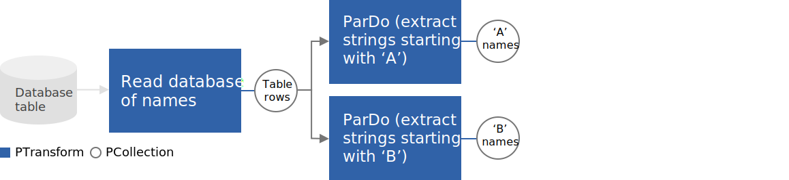
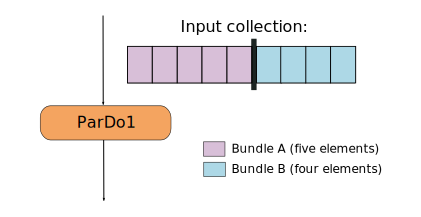
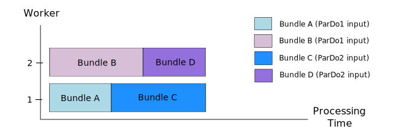
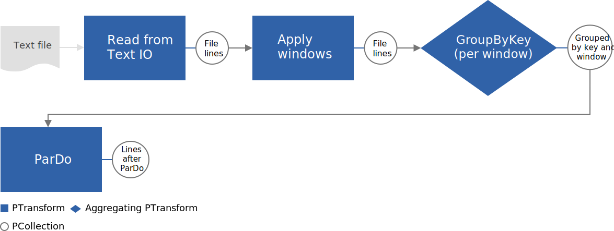
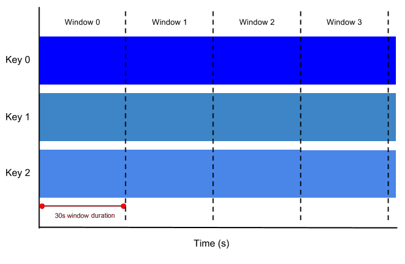
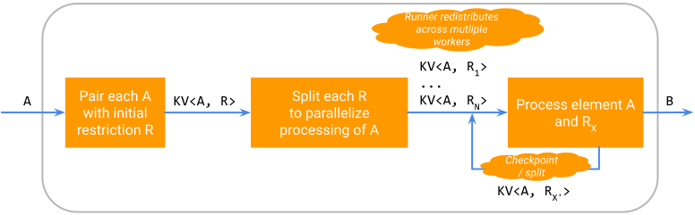
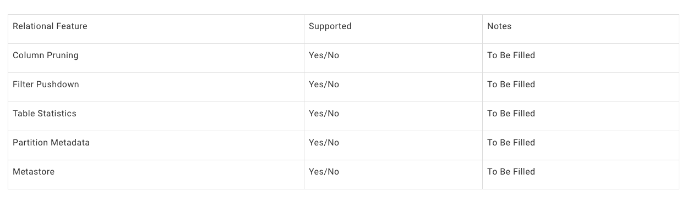
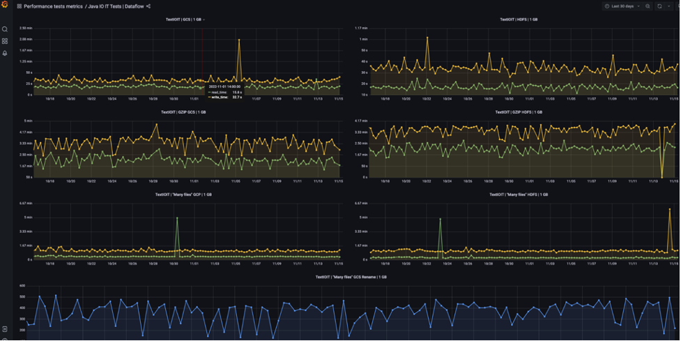
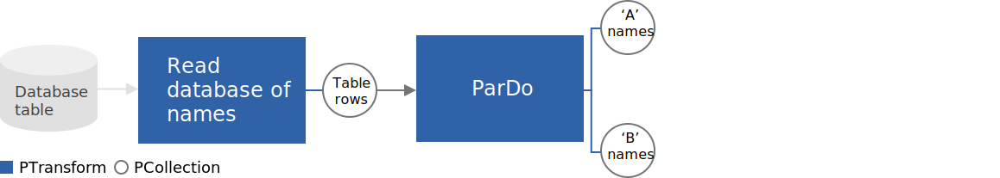
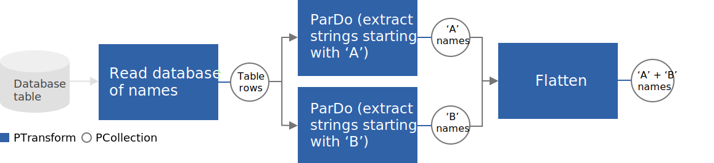

# Apache Beam Documentation

## Navigation

- [Documentation](#index)
- [Using the Documentation](#index)
- Concepts
  - [Basics of the Beam model](#basics)
  - [How Beam executes a pipeline](#runtime-model)
  - [Start with the](#basics)
  - [Read the](#programming-guide)
  - [Learn about Beam’s](#runtime-model)
  - [Reference the](#glossary)
- Beam programming guide
  - [Overview](#programming-guide)
  - [Pipelines](#programming-guide--creating-a-pipeline)
  - PCollections
    - [Creating a PCollection](#programming-guide--pcollections)
    - [PCollection characteristics](#programming-guide--pcollection-characteristics)
  - Transforms
    - [Applying transforms](#programming-guide--applying-transforms)
    - Core Beam transforms
      - [ParDo](#programming-guide--pardo)
      - [GroupByKey](#programming-guide--groupbykey)
      - [CoGroupByKey](#programming-guide--cogroupbykey)
      - [Combine](#programming-guide--combine)
      - [Flatten](#programming-guide--flatten)
      - [Partition](#programming-guide--partition)
    - [Requirements for user code](#programming-guide--requirements-for-writing-user-code-for-beam-transforms)
    - [Side inputs](#programming-guide--side-inputs)
    - [Additional outputs](#programming-guide--additional-outputs)
    - [Composite transforms](#programming-guide--composite-transforms)
  - Pipeline I/O
    - [Using I/O transforms](#programming-guide--pipeline-io)
    - [I/O connectors](#io-connectors)
    - [Managed I/O](#io-managed-io)
    - I/O connector guides
      - [Apache Iceberg](#io-built-in-iceberg)
      - [Apache Parquet](#io-built-in-parquet)
      - [Hadoop Input/Output Format](#io-built-in-hadoop)
      - [HCatalog IO](#io-built-in-hcatalog)
      - [Google BigQuery](#io-built-in-google-bigquery)
      - [Snowflake](#io-built-in-snowflake)
      - [CDAP I/O](#io-built-in-cdap)
      - [Spark Receiver I/O](#io-built-in-sparkreceiver)
      - [SingleStoreDB I/O](#io-built-in-singlestore)
      - [Web APIs I/O](#io-built-in-webapis)
    - Developing new I/O connectors
      - [Overview: Developing connectors](#io-developing-io-overview)
      - [Developing connectors (Java)](#io-developing-io-java)
      - [Developing connectors (Python)](#io-developing-io-python)
      - [I/O Standards](#io-io-standards)
    - [Testing I/O transforms](#io-testing)
  - Schemas
    - [What is a schema](#programming-guide--what-is-a-schema)
    - [Schemas for programming language types](#programming-guide--schemas-for-pl-types)
    - [Schema definition](#programming-guide--schema-definition)
    - [Logical types](#programming-guide--logical-types)
    - [Creating schemas](#programming-guide--creating-schemas)
    - [Using schemas](#programming-guide--using-schemas)
  - Data encoding and type safety
    - [Data encoding basics](#programming-guide--data-encoding-and-type-safety)
    - [Specifying coders](#programming-guide--specifying-coders)
    - [Default coders and the CoderRegistry](#programming-guide--default-coders-and-the-coderregistry)
  - Windowing
    - [Windowing basics](#programming-guide--windowing)
    - [Provided windowing functions](#programming-guide--provided-windowing-functions)
    - [Setting your PCollection’s windowing function](#programming-guide--setting-your-pcollections-windowing-function)
    - [Watermarks and late data](#programming-guide--watermarks-and-late-data)
    - [Adding timestamps to a PCollection’s elements](#programming-guide--adding-timestamps-to-a-pcollections-elements)
  - Triggers
    - [Trigger basics](#programming-guide--triggers)
    - [Event time triggers and the default trigger](#programming-guide--event-time-triggers)
    - [Processing time triggers](#programming-guide--processing-time-triggers)
    - [Data-driven triggers](#programming-guide--data-driven-triggers)
    - [Setting a trigger](#programming-guide--setting-a-trigger)
    - [Composite triggers](#programming-guide--composite-triggers)
  - Metrics
    - [Metrics basics](#programming-guide--metrics)
    - [Types of metrics](#programming-guide--types-of-metrics)
    - [Querying metrics](#programming-guide--querying-metrics)
    - [Using metrics in pipeline](#programming-guide--using-metrics)
    - [Export metrics](#programming-guide--export-metrics)
  - State and Timers
    - [Types of state](#programming-guide--types-of-state)
    - [Deferred state reads](#programming-guide--deferred-state-reads)
    - [Timers](#programming-guide--timers)
    - [Garbage collecting state](#programming-guide--garbage-collecting-state)
    - [State and timers examples](#programming-guide--state-timers-examples)
  - Splittable DoFns
    - [Basics](#programming-guide--sdf-basics)
    - [Sizing and progress](#programming-guide--sizing-and-progress)
    - [User-initiated checkpoint](#programming-guide--user-initiated-checkpoint)
    - [Runner initiated split](#programming-guide--runner-initiated-split)
    - [Watermark estimation](#programming-guide--watermark-estimation)
    - [Truncating during drain](#programming-guide--truncating-during-drain)
    - [Bundle finalization](#programming-guide--bundle-finalization)
  - Multi-language Pipelines
    - [Creating cross-language transforms](#programming-guide--create-x-lang-transforms)
    - [Using cross-language transforms](#programming-guide--use-x-lang-transforms)
    - [Runner Support](#programming-guide--x-lang-transform-runner-support)
  - [Batched DoFns](#programming-guide--batched-dofns)
  - [Transform service](#programming-guide--transform-service)
- Pipeline development lifecycle
  - [Design Your Pipeline](#pipelines-design-your-pipeline)
  - [Create Your Pipeline](#pipelines-create-your-pipeline)
  - [Test Your Pipeline](#pipelines-test-your-pipeline)
- [Common pipeline patterns](#patterns-overview)
  - [Overview](#patterns-overview)
  - [File processing](#patterns-file-processing)
  - [Side inputs](#patterns-side-inputs)
  - [Pipeline options](#patterns-pipeline-options)
  - [Custom I/O](#patterns-custom-io)
  - [Custom windows](#patterns-custom-windows)
  - [BigQueryIO](#patterns-bigqueryio)
  - [AI Platform](#patterns-ai-platform)
  - [Schema](#patterns-schema)
  - [BigQuery ML](#patterns-bqml)
  - [Grouping elements for efficient external service calls](#patterns-grouping-elements-for-efficient-external-service-calls)
  - [Rate limiting DoFns and Transforms](#patterns-rate-limiting)
  - [Cache using a shared object](#patterns-shared-class)
  - [Processing files as they arrive](#patterns-file-processing--processing-files-as-they-arrive)
  - [Accessing filenames](#patterns-file-processing--accessing-filenames)
- Runtime systems
  - [Container environments](#runtime-environments)
  - [Resource hints](#runtime-resource-hints)
  - [SDK Harness Configuration](#runtime-sdk-harness-config)
- Transform catalog
  - Python
    - [Overview](#transforms-python-overview)
    - Element-wise
      - Enrichment
        - [Overview](#transforms-python-elementwise-enrichment)
        - [Bigtable example](#transforms-python-elementwise-enrichment-bigtable)
        - [Milvus example](#transforms-python-elementwise-enrichment-milvus)
        - [CloudSQL example](#transforms-python-elementwise-enrichment-cloudsql)
        - [Vertex AI Feature Store examples](#transforms-python-elementwise-enrichment-vertexai)
      - [Filter](#transforms-python-elementwise-filter)
      - [FlatMap](#transforms-python-elementwise-flatmap)
      - [Keys](#transforms-python-elementwise-keys)
      - [KvSwap](#transforms-python-elementwise-kvswap)
      - [Map](#transforms-python-elementwise-map)
      - [MLTransform](#transforms-python-elementwise-mltransform)
      - [ParDo](#transforms-python-elementwise-pardo)
      - [Partition](#transforms-python-elementwise-partition)
      - [Regex](#transforms-python-elementwise-regex)
      - [Reify](#transforms-python-elementwise-reify)
      - [RunInference](#transforms-python-elementwise-runinference)
        - [Overview](#transforms-python-elementwise-runinference)
        - [PyTorch examples](#transforms-python-elementwise-runinference-pytorch)
        - [Sklearn examples](#transforms-python-elementwise-runinference-sklearn)
      - [ToString](#transforms-python-elementwise-tostring)
      - [Values](#transforms-python-elementwise-values)
      - [WithTimestamps](#transforms-python-elementwise-withtimestamps)
    - Aggregation
      - [ApproximateQuantiles](#transforms-python-aggregation-approximatequantiles)
      - [ApproximateUnique](#transforms-python-aggregation-approximateunique)
      - [BatchElements](#transforms-python-aggregation-batchelements)
      - [CoGroupByKey](#transforms-python-aggregation-cogroupbykey)
      - [CombineGlobally](#transforms-python-aggregation-combineglobally)
      - [CombinePerKey](#transforms-python-aggregation-combineperkey)
      - [CombineValues](#transforms-python-aggregation-combinevalues)
      - [Count](#transforms-python-aggregation-count)
      - [Distinct](#transforms-python-aggregation-distinct)
      - [GroupBy](#transforms-python-aggregation-groupby)
      - [GroupByKey](#transforms-python-aggregation-groupbykey)
      - [GroupIntoBatches](#transforms-python-aggregation-groupintobatches)
      - [Latest](#transforms-python-aggregation-latest)
      - [Max](#transforms-python-aggregation-max)
      - [Mean](#transforms-python-aggregation-mean)
      - [Min](#transforms-python-aggregation-min)
      - [Sample](#transforms-python-aggregation-sample)
      - [Sum](#transforms-python-aggregation-sum)
      - [Top](#transforms-python-aggregation-top)
      - [ToList](#transforms-python-aggregation-tolist)
    - Other
      - [Create](#transforms-python-other-create)
      - [Flatten](#transforms-python-other-flatten)
      - [Reshuffle](#transforms-python-other-reshuffle)
      - [WaitOn](#transforms-python-other-waiton)
      - [WindowInto](#transforms-python-other-windowinto)
  - Java
    - [Overview](#transforms-java-overview)
    - Element-wise
      - [Filter](#transforms-java-elementwise-filter)
      - [FlatMapElements](#transforms-java-elementwise-flatmapelements)
      - [Keys](#transforms-java-elementwise-keys)
      - [KvSwap](#transforms-java-elementwise-kvswap)
      - [MapElements](#transforms-java-elementwise-mapelements)
      - [ParDo](#transforms-java-elementwise-pardo)
      - [Partition](#transforms-java-elementwise-partition)
      - [Regex](#transforms-java-elementwise-regex)
      - [Reify](#transforms-java-elementwise-reify)
      - [ToString](#transforms-java-elementwise-tostring)
      - [Values](#transforms-java-elementwise-values)
      - [WithKeys](#transforms-java-elementwise-withkeys)
      - [WithTimestamps](#transforms-java-elementwise-withtimestamps)
    - Aggregation
      - [ApproximateQuantiles](#transforms-java-aggregation-approximatequantiles)
      - [ApproximateUnique](#transforms-java-aggregation-approximateunique)
      - [CoGroupByKey](#transforms-java-aggregation-cogroupbykey)
      - [Combine](#transforms-java-aggregation-combine)
      - [CombineWithContext](#transforms-java-aggregation-combinewithcontext)
      - [Count](#transforms-java-aggregation-count)
      - [Distinct](#transforms-java-aggregation-distinct)
      - [GroupByKey](#transforms-java-aggregation-groupbykey)
      - [GroupIntoBatches](#transforms-java-aggregation-groupintobatches)
      - [BatchElements](#transforms-java-aggregation-batchelements)
      - [HllCount](#transforms-java-aggregation-hllcount)
      - [Latest](#transforms-java-aggregation-latest)
      - [Max](#transforms-java-aggregation-max)
      - [Mean](#transforms-java-aggregation-mean)
      - [Min](#transforms-java-aggregation-min)
      - [Sample](#transforms-java-aggregation-sample)
      - [Sum](#transforms-java-aggregation-sum)
      - [Top](#transforms-java-aggregation-top)
    - Other
      - [Create](#transforms-java-other-create)
      - [Flatten](#transforms-java-other-flatten)
      - [PAssert](#transforms-java-other-passert)
      - [View](#transforms-java-other-view)
      - [Wait.On](#transforms-java-other-wait)
      - [Window](#transforms-java-other-window)
- [Glossary](#glossary)
- 13. Multi-language pipelines
  - [Python multi-language pipelines quickstart](#sdks-python-multi-language-pipelines)
  - [Java multi-language pipelines quickstart](#sdks-java-multi-language-pipelines)
- [Apache Beam Programming Guide](#programming-guide)
- Apply
  - [Applying transforms](#programming-guide--applying-transforms)
- 4.2.1.4. DoFn lifecycle
  - [For the Python SDK, the pipeline contents such as DoFn user code, is](#sdks-python-pipeline-dependencies--pickling-and-managing-the-main-session)
- 15.4 Portable transforms included in the Transform service
  - [RunInference](#transforms-python-elementwise-runinference)
- Using SnowflakeIO with AWS S3
  - [Create](#io-built-in-snowflake--extending-pipeline-options)
- [Snowflake I/O](#io-built-in-snowflake)
- General usage
  - .withCsvMapper(mapper)
    - [Accepts a](#io-built-in-snowflake--csvmapper)
- Accepts the
  - [Accepts the](#io-built-in-snowflake--userdatamapper-function)
- Pipeline
  - [Beam Programming Guide: Overview](#programming-guide--overview)
  - [Beam Programming Guide: Creating a pipeline](#programming-guide--creating-a-pipeline)
  - [Design your pipeline](#pipelines-design-your-pipeline)
  - [Create your pipeline](#pipelines-create-your-pipeline)
  - [Basics of the Beam model: Pipeline](#basics--pipeline)
  - [Overview](#programming-guide--overview)
  - [Creating a pipeline](#programming-guide--creating-a-pipeline)
- PCollection
  - [Basics of the Beam model: PCollection](#basics--pcollection)
  - [Programming guide: PCollections](#programming-guide--pcollections)
- PTransform
  - [Basics of the Beam model: PTransform](#basics--ptransform)
  - [Overview](#programming-guide--overview)
  - [Transforms](#programming-guide--transforms)
- Aggregation
  - [Java Transform catalog](#transforms-java-overview--aggregation)
  - [Python Transform catalog](#transforms-python-overview--aggregation)
- User-defined function (UDF)
  - [DoFn](#programming-guide--pardo)
  - [WindowFn](#programming-guide--setting-your-pcollections-windowing-function)
  - [ViewFn](#programming-guide--side-inputs)
  - [WindowMappingFn](#programming-guide--side-inputs-windowing)
  - [CombineFn](#programming-guide--combine)
  - [Coder](#programming-guide--data-encoding-and-type-safety)
- Schema
  - [Beam Programming Guide: Schemas](#programming-guide--schemas)
  - [Schema Patterns](#patterns-schema)
  - [Basics of the Beam model: Schema](#basics--schema)
  - [Programming guide: Schemas](#programming-guide--schemas)
- Runner
  - [Choosing a Runner](#index--choosing-a-runner)
  - [Beam Capability Matrix](#runners-capability-matrix)
  - [Basics of the Beam model: Runner](#basics--runner)
- Watermark
  - [Beam Programming Guide: Watermarks and late data](#programming-guide--watermarks-and-late-data)
  - [Basics of the Beam model: Watermark](#basics--watermark)
  - [Programming guide: Watermarks and late data](#programming-guide--watermarks-and-late-data)
- Trigger
  - [Basics of the Beam model: Trigger](#basics--trigger)
  - [Programming guide: Triggers](#programming-guide--triggers)
- Splittable DoFn
  - [Basics of the Beam model: Splittable DoFn](#basics--splittable-dofn)
  - [Programming guide: Splittable DoFns](#programming-guide--splittable-dofns)
- What’s next
  - [Create your own pipeline](#pipelines-create-your-pipeline)
  - [Test your pipeline](#pipelines-test-your-pipeline)
  - [Programming Guide](#programming-guide)
  - [Execute your pipeline on a](#runners-capability-matrix)
- [Beam Programming Guide: PCollections](#programming-guide--pcollections)
- [Beam Programming Guide: Transforms](#programming-guide--transforms)
- [Beam transform catalog (](#transforms-java-overview)
- [Beam Programming Guide: Core Beam transforms](#programming-guide--core-beam-transforms)
- [Requirements for writing user code for Beam transforms](#programming-guide--requirements-for-writing-user-code-for-beam-transforms)
- [Beam Programming Guide: ParDo](#programming-guide--pardo)
- [Beam Programming Guide: WindowFn](#programming-guide--setting-your-pcollections-windowing-function)
- [Beam Programming Guide: CombineFn](#programming-guide--combine)
- [Beam Programming Guide: Coder](#programming-guide--data-encoding-and-type-safety)
- [Beam Programming Guide: Side inputs](#programming-guide--side-inputs)
- [Beam Programming Guide: Windowing](#programming-guide--windowing)
- [Beam Programming Guide: Triggers](#programming-guide--triggers)
- [Beam Programming Guide: State and Timers](#programming-guide--state-and-timers)
- [Splittable DoFns](#programming-guide--splittable-dofns)
- Batch processing
  - [Size and boundedness](#programming-guide--size-and-boundedness)
- Bounded data
  - [Size and boundedness](#programming-guide--size-and-boundedness)
- Bundle
  - [Bundling and persistence](#runtime-model--bundling-and-persistence)
- Coder
  - [Data encoding and type safety](#programming-guide--data-encoding-and-type-safety)
- Composite transform
  - [Composite transforms](#programming-guide--composite-transforms)
- Counter (metric)
  - [Types of metrics](#programming-guide--types-of-metrics)
- Cross-language transforms
  - [Multi-language pipelines](#programming-guide--multi-language-pipelines)
- Distribution (metric)
  - [Types of metrics](#programming-guide--types-of-metrics)
- DoFn
  - [ParDo](#programming-guide--pardo)
- Driver
  - [Overview](#programming-guide--overview)
- Element
  - [PCollection characteristics](#programming-guide--pcollection-characteristics)
- Element-wise
  - [Java Transform catalog](#transforms-java-overview--element-wise)
  - [Python Transform catalog](#transforms-python-overview--element-wise)
- Event time
  - [Watermarks and late data](#programming-guide--watermarks-and-late-data)
  - [Triggers](#programming-guide--triggers)
- Gauge (metric)
  - [Types of metrics](#programming-guide--types-of-metrics)
- I/O connector
  - [Pipeline I/O](#programming-guide--pipeline-io)
- Metrics
  - [Metrics](#programming-guide--metrics)
- Multi-language pipeline
  - [Multi-language pipelines](#programming-guide--multi-language-pipelines)
- Pipe operator ( | )
  - [Applying transforms](#programming-guide--applying-transforms)
- Processing time
  - [Watermarks and late data](#programming-guide--watermarks-and-late-data)
  - [Triggers](#programming-guide--triggers)
- Session
  - [Session windows](#programming-guide--session-windows)
- Side input
  - [Side inputs](#programming-guide--side-inputs)
  - [Side input patterns](#patterns-side-inputs)
- Sink
  - [Developing new I/O connectors](#io-developing-io-overview)
  - [Pipeline I/O](#programming-guide--pipeline-io)
- Source
  - [Developing new I/O connectors](#io-developing-io-overview)
  - [Pipeline I/O](#programming-guide--pipeline-io)
- State
  - [Basics of the Beam model: State and timers](#basics--state-and-timers)
  - [Programming guide: State and Timers](#programming-guide--state-and-timers)
- Streaming
  - [Size and boundedness](#programming-guide--size-and-boundedness)
  - [Python Streaming Pipelines](#sdks-python-streaming)
- Timestamp
  - [Basics of the Beam model: Timestamp](#basics--timestamp)
  - [Element timestamps](#programming-guide--element-timestamps)
  - [Adding timestamps to a PCollection’s elements](#programming-guide--adding-timestamps-to-a-pcollections-elements)
- Unbounded data
  - [Size and boundedness](#programming-guide--size-and-boundedness)
- User-defined function
  - [Basics of the Beam model: User-Defined Functions (UDFs)](#basics--user-defined-functions-udfs)
  - [ParDo](#programming-guide--pardo)
  - [Requirements for writing user code for Beam transforms](#programming-guide--requirements-for-writing-user-code-for-beam-transforms)
- Windowing
  - [Basics of the Beam model: Window](#basics--window)
  - [Programming guide: Windowing](#programming-guide--windowing)
- Worker
  - [Execution model](#runtime-model)
- [Apache Beam glossary](#glossary)
- [Basics of the Beam model: Aggregation](#basics--aggregation)
- Timer
  - [Basics of the Beam model: State and timers](#basics--state-and-timers)
  - [Programming guide: State and Timers](#programming-guide--state-and-timers)
- [Cdap IO](#io-built-in-cdap)
- [Overview](#sdks-go-cross-compilation)
- Java
  - [Java SDK overview](#sdks-java)
  - [Java SDK dependencies](#sdks-java-dependencies)
  - [Java SDK extensions](#sdks-java-extensions)
  - [Java 3rd party extensions](#sdks-java-thirdparty)
  - [Nexmark benchmark suite](#sdks-java-testing-nexmark)
  - [TPC-DS benchmark suite](#sdks-java-testing-tpcds)
  - [Java multi-language pipelines quickstart](#sdks-java-multi-language-pipelines)
  - [Defining the transformation itself as a](#programming-guide--composite-transforms)
  - [Writing a](#sdks-yaml--providers)
- [General](#index)
- Python
  - [Python SDK overview](#sdks-python)
  - [Python SDK dependencies](#sdks-python-dependencies)
  - [Python streaming pipelines](#sdks-python-streaming)
  - [Ensuring Python type safety](#sdks-python-type-safety)
  - [Managing pipeline dependencies](#sdks-python-pipeline-dependencies)
  - [Python multi-language pipelines guide](#sdks-python-custom-multi-language-pipelines-guide)
  - [Python multi-language pipelines quickstart](#sdks-python-multi-language-pipelines)
  - [Python Unrecoverable Errors](#sdks-python-unrecoverable-errors)
  - [Python SDK image build](#sdks-python-sdk-image-build)
- Typescript
  - [Typescript SDK overview](#sdks-typescript)
- [Developing I/O connectors for Java](#io-developing-io-java)
- [Google BigQuery I/O connector](#io-built-in-google-bigquery)
- [Developing I/O connectors for Python](#io-developing-io-python)
- [Web APIs I/O connector](#io-built-in-webapis)
- [Hadoop Input/Output Format IO](#io-built-in-hadoop)
- [You can test an entire](#programming-guide--composite-transforms)
- [Managed I/O Connectors](#io-managed-io)
- [Apache Iceberg I/O connector](#io-built-in-iceberg)
- [Building Beam Python SDK Image Guide](#sdks-python-sdk-image-build)
- [this guide](#sdks-python-sdk-image-build)
- What to consider when designing your pipeline
  - [What do you want to do with your data?](#programming-guide--pardo)
- Related transforms
  - [Filter](#transforms-python-elementwise-filter)
  - [ParDo](#transforms-python-elementwise-pardo)
  - [Map](#transforms-python-elementwise-map)
  - [FlatMap](#transforms-python-elementwise-flatmap)
  - [CombineGlobally](#transforms-python-aggregation-combineglobally)
  - [CombineValues](#transforms-python-aggregation-combinevalues)
  - [Mean](#transforms-python-aggregation-mean)
  - [Count](#transforms-python-aggregation-count)
  - [Top](#transforms-python-aggregation-top)
  - [Sample](#transforms-python-aggregation-sample)
  - [CombinePerKey](#transforms-python-aggregation-combineperkey)
  - [Max](#transforms-python-aggregation-max)
  - [Sum](#transforms-python-aggregation-sum)
  - [Min](#transforms-python-aggregation-min)
  - [CoGroupByKey](#transforms-python-aggregation-cogroupbykey)
  - [Keys](#transforms-java-elementwise-keys)
  - [Values](#transforms-java-elementwise-values)
  - [KvSwap](#transforms-java-elementwise-kvswap)
  - [Combine](#transforms-java-aggregation-combine)
  - [Reify](#transforms-python-elementwise-reify)
  - [ApproximateUnique](#transforms-java-aggregation-approximateunique)
  - [WithTimestamps](#transforms-java-elementwise-withtimestamps)
  - [GroupByKey](#transforms-python-aggregation-groupbykey)
  - [GroupBy](#transforms-python-aggregation-groupby)
  - [Flatten](#transforms-python-other-flatten)
  - [WindowInto](#transforms-python-other-windowinto)
  - [Reshuffle](#transforms-python-other-reshuffle)
  - [WithKeys](#transforms-java-elementwise-withkeys)
  - [FlatMapElements](#transforms-java-elementwise-flatmapelements)
  - [HllCount](#transforms-java-aggregation-hllcount)
  - [Distinct](#transforms-java-aggregation-distinct)
  - [Window](#transforms-java-other-window)
  - [Timestamp](#transforms-python-elementwise-withtimestamps)
  - [MapElements](#transforms-java-elementwise-mapelements)
  - [CombineWithContext](#transforms-java-aggregation-combinewithcontext)
  - [Latest](#transforms-java-aggregation-latest)
  - [Partition](#transforms-java-elementwise-partition)
  - [GroupIntoBatches](#transforms-python-aggregation-groupintobatches)
- Serialization and communication
  - [Passing elements between transforms that are running on the same worker. This may allow the runner to avoid serializing elements; instead, the runner can just pass the elements in](#glossary--fusion)
- [Languages](#sdks-java)
- Go
  - [Go SDK overview](#sdks-go)
- Scala
  - [Scio](#sdks-scala)
- Yaml
  - [Yaml overview](#sdks-yaml)
  - [Yaml User Defined Functions](#sdks-yaml-udf)
  - [Yaml Aggregation](#sdks-yaml-combine)
  - [Error handling](#sdks-yaml-errors)
  - [Yaml Testing](#sdks-yaml-testing)
  - [Inlining Python](#sdks-yaml-inline-python)
  - [Yaml Providers](#sdks-yaml-providers)
  - [Yaml Join](#sdks-yaml-join)
- SQL
  - [Overview](#dsls-sql-overview)
  - [Walkthrough](#dsls-sql-walkthrough)
  - [Shell](#dsls-sql-shell)
  - Apache Calcite dialect
    - [Calcite support overview](#dsls-sql-calcite-overview)
    - [Query syntax](#dsls-sql-calcite-query-syntax)
    - [Data types](#dsls-sql-calcite-data-types)
    - [Scalar functions](#dsls-sql-calcite-scalar-functions)
    - [Aggregate functions](#dsls-sql-calcite-aggregate-functions)
  - ZetaSQL dialect
    - [ZetaSQL support overview](#dsls-sql-zetasql-overview)
    - [Function call rules](#dsls-sql-zetasql-syntax)
    - [Conversion rules](#dsls-sql-zetasql-conversion-rules)
    - [Query syntax](#dsls-sql-zetasql-query-syntax)
    - [Lexical structure](#dsls-sql-zetasql-lexical)
    - [Data types](#dsls-sql-zetasql-data-types)
    - [Operators](#dsls-sql-zetasql-operators)
    - Scalar functions
      - [String functions](#dsls-sql-zetasql-string-functions)
      - [Mathematical functions](#dsls-sql-zetasql-math-functions)
      - [Conditional expressions](#dsls-sql-zetasql-conditional-expressions)
    - [Aggregate functions](#dsls-sql-zetasql-aggregate-functions)
  - Beam SQL extensions
    - [CREATE EXTERNAL TABLE](#dsls-sql-extensions-create-external-table)
    - [Windowing & triggering](#dsls-sql-extensions-windowing-and-triggering)
    - [Joins](#dsls-sql-extensions-joins)
    - [User-defined functions](#dsls-sql-extensions-user-defined-functions)
    - [SET pipeline options](#dsls-sql-extensions-set)
- DataFrames
  - [Overview](#dsls-dataframes-overview)
  - [Differences from pandas](#dsls-dataframes-differences-from-pandas)
- [Beam SQL extensions: CREATE EXTERNAL TABLE](#dsls-sql-extensions-create-external-table)
- Pipeline Fundamentals
  - [Design Your Pipeline](#pipelines-design-your-pipeline)
  - [Create Your Pipeline](#pipelines-create-your-pipeline)
  - [Test Your Pipeline](#pipelines-test-your-pipeline)
- SDKs
  - [Java SDK](#sdks-java)
  - [Python SDK](#sdks-python)
  - [Go SDK](#sdks-go)
- Transform catalogs
  - [Java transform catalog](#transforms-java-overview)
  - [Python transform catalog](#transforms-python-overview)
- [Runners](#runners-capability-matrix)
- [Apache Beam Documentation](#index)
- Available Runners
  - [JetRunner:](#runners-jet)
  - [Twister2Runner:](#runners-twister2)
- [Enrichment transform](#transforms-python-elementwise-enrichment)
- [Overview: Developing a new I/O connector](#io-developing-io-overview)
- [SparkReceiver IO](#io-built-in-sparkreceiver)
- [File processing patterns](#patterns-file-processing)
- [Analysing the structure and meaning of text](#patterns-ai-platform--analysing-the-structure-and-meaning-of-text)
- [Getting predictions](#patterns-ai-platform--getting-predictions)
- [AI Platform integration patterns](#patterns-ai-platform)
- [Using data to dynamically set session window gaps](#patterns-custom-windows--using-data-to-dynamically-set-session-window-gaps)
- [Custom window patterns](#patterns-custom-windows)
- [Slowly updating global window side inputs](#patterns-side-inputs--slowly-updating-global-window-side-inputs)
- [Dynamically grouping elements using the BatchElements -transform](#patterns-batch-elements)
- [BigQuery ML integration](#patterns-bqml)
- [Rate limiting patterns](#patterns-rate-limiting)
- [Grouping elements for efficient external service calls using the GroupIntoBatches -transform](#patterns-grouping-elements-for-efficient-external-service-calls)
- [MLTransform for data processing](#transforms-python-elementwise-mltransform)
- [Use CloudSQL to enrich data](#transforms-python-elementwise-enrichment-cloudsql)
- [Latest](#transforms-java-aggregation-hllcount)
- [Retroactively logging runtime parameters](#patterns-pipeline-options--retroactively-logging-runtime-parameters)
- [Choosing between built-in and custom connectors](#patterns-custom-io--choosing-between-built-in-and-custom-connectors)
- [Google BigQuery patterns](#patterns-bigqueryio--google-bigquery-patterns)
- [Using Joins](#patterns-schema--using-joins)
- [Model export and on-worker serving using BQML and TFX_BSL](#patterns-bqml--bigquery-ml-integration)
- [Grouping elements for efficient external service calls](#patterns-grouping-elements-for-efficient-external-service-calls--grouping-elements-for-efficient-external-service-calls-using-the-groupintobatches-transform)
- [Dynamically grouping elements](#patterns-batch-elements--dynamically-grouping-elements-using-the-batchelements-transform)
- [Create a cache on a batch pipeline](#patterns-shared-class--create-a-cache-on-a-batch-pipeline)
- [Create a cache and update it regularly on a streaming pipeline](#patterns-shared-class--create-a-cache-and-update-it-regularly-on-a-streaming-pipeline)
- [Custom I/O patterns](#patterns-custom-io)
- [Apache Parquet I/O connector](#io-built-in-parquet)
- [Pipeline option patterns](#patterns-pipeline-options)
- [Python transform catalog overview](#transforms-python-overview)
- [Enrichment with Google Cloud Vertex AI Feature Store](#transforms-python-elementwise-enrichment-vertexai)
- [Java transform catalog overview](#transforms-java-overview)
- [Cache data using a shared object](#patterns-shared-class)
- [Use Milvus to enrich data](#transforms-python-elementwise-enrichment-milvus)
- [Use RunInference with PyTorch](#transforms-python-elementwise-runinference-pytorch)
- [Use RunInference with Sklearn](#transforms-python-elementwise-runinference-sklearn)
- [Use Bigtable to enrich data](#transforms-python-elementwise-enrichment-bigtable)
- [direct runner](#runners-direct)
- FROM clause
  - [Syntax](#dsls-sql-zetasql-query-syntax)
- JOIN types
  - [Syntax](#dsls-sql-calcite-query-syntax)
- WHERE clause
  - [Syntax](#dsls-sql-calcite-query-syntax)
- GROUP BY clause
  - [Syntax](#dsls-sql-calcite-query-syntax)
- HAVING clause
  - [Syntax](#dsls-sql-calcite-query-syntax)
- Set operators
  - [Syntax](#dsls-sql-calcite-query-syntax)
- LIMIT clause and OFFSET clause
  - [Syntax](#dsls-sql-calcite-query-syntax)
- [Beam Calcite SQL query syntax](#dsls-sql-calcite-query-syntax)
  - [Joins](#dsls-sql-extensions-joins)
- [Beam ZetaSQL query syntax](#dsls-sql-zetasql-query-syntax)
- [Euphoria Java 8 DSL](#sdks-java-euphoria)
- [TPC Benchmark™ DS (TPC-DS) benchmark suite](#sdks-java-testing-tpcds)
- [Python custom multi-language pipelines guide](#sdks-python-custom-multi-language-pipelines-guide)
- Implement a TypedSchemaTransformProvider
  - [: Returns a unique identifier for this transform. The](#programming-guide--1314-defining-a-urn)
- [Beam ZetaSQL lexical structure](#dsls-sql-zetasql-data-types)
- [Beam SQL Shell](#dsls-sql-shell)
- [Managing Python Pipeline Dependencies](#sdks-python-pipeline-dependencies)
- Make the launch environment compatible with the runtime environment
  - [save the main session](#sdks-python-pipeline-dependencies--pickling-and-managing-the-main-session)
- [Beam YAML](#sdks-yaml)
- [Beam SDK for Java dependencies](#sdks-java-dependencies)
- [Beam SQL extensions: User-defined functions](#dsls-sql-extensions-user-defined-functions)
- [Apache Beam 3rd Party Java Extensions](#sdks-java-thirdparty)
- [Beam YAML mappings](#sdks-yaml-udf)
- [Beam ZetaSQL aggregate functions](#dsls-sql-zetasql-aggregate-functions)
- [Beam ZetaSQL operators](#dsls-sql-zetasql-operators)
- [Beam SQL extensions: Joins](#dsls-sql-extensions-joins)
- Modifying a pipeline to use stream processing
  - [Choose a](#programming-guide--windowing)
- Running a streaming pipeline
  - [DirectRunner streaming execution](#runners-direct--streaming-execution)
  - [DataflowRunner streaming execution](#runners-dataflow--streaming-execution)
  - [Portable Flink runner](#runners-flink)
- [Apache Beam Java SDK Extensions](#sdks-java-extensions)
- [Beam ZetaSQL string functions](#dsls-sql-zetasql-string-functions)
- Extensions
  - [join-library](#sdks-java-extensions--join-library)
  - [sorter](#sdks-java-extensions--sorter)
  - [Nexmark](#sdks-java-testing-nexmark)
  - [TPC-DS](#sdks-java-testing-tpcds)
  - [euphoria](#sdks-java-euphoria)
- [Apache Beam Java SDK](#sdks-java)
- [Unrecoverable Errors in Beam Python](#sdks-python-unrecoverable-errors)
- [Apache Beam Python SDK](#sdks-python)
- [Beam YAML Schema](#sdks-yaml-schema)
- [Beam SQL Walkthrough](#dsls-sql-walkthrough)
- [Beam Calcite SQL scalar functions](#dsls-sql-calcite-scalar-functions)
- [Apache Beam Typescript SDK](#sdks-typescript)
- [Beam ZetaSQL mathematical functions](#dsls-sql-zetasql-math-functions)
- [Beam SQL extensions: Windowing and triggering](#dsls-sql-extensions-windowing-and-triggering)
- [Beam SQL extensions: SET and RESET Pipeline Options](#dsls-sql-extensions-set)
- [Beam Calcite SQL overview](#dsls-sql-calcite-overview)
- [Beam ZetaSQL conversion rules](#dsls-sql-zetasql-conversion-rules)
- [Beam YAML Tests](#sdks-yaml-testing)
- [Beam ZetaSQL function call rules](#dsls-sql-zetasql-syntax)
- [Beam ZetaSQL overview](#dsls-sql-zetasql-overview)
- [Beam DataFrames overview](#dsls-dataframes-overview)
- [Beam SQL overview](#dsls-sql-overview)
- [Beam YAML Aggregations](#sdks-yaml-combine)
- [Using PyTransform from YAML](#sdks-yaml-inline-python)
- [Apache Beam Go SDK](#sdks-go)
- [Beam YAML Join](#sdks-yaml-join)
- [Beam SDK for Go dependencies](#sdks-go-dependencies)
- [Apache Beam Scala SDK](#sdks-scala)
- [Beam YAML Error Handling](#sdks-yaml-errors)
- [Providers](#sdks-yaml-providers)
- [Beam SDK for Python dependencies](#sdks-python-dependencies)
- [Beam Calcite SQL aggregate functions](#dsls-sql-calcite-aggregate-functions)
- [Beam Calcite SQL data types](#dsls-sql-calcite-data-types)
- [Beam ZetaSQL conditional expressions](#dsls-sql-zetasql-conditional-expressions)
- [Capability Matrix](#runners-capability-matrix)
- [Prism Runner](#runners-prism)
- [Apache Flink](#runners-flink)
- [Apache Nemo](#runners-nemo)
- [Apache Spark](#runners-spark)
- [Google Cloud Dataflow](#runners-dataflow)
- [Hazelcast Jet](#runners-jet)
- [Twister2](#runners-twister2)
- [Using the Apache Spark Runner](#runners-spark)
- What is being computed?
  - [SEE DETAILS AND FULL VERSION HERE.](#runners-capability-matrix-what-is-being-computed)
- Bounded Splittable DoFn Support Status
  - [SEE DETAILS AND FULL VERSION HERE.](#runners-capability-matrix-bounded-splittable-dofn-support-status)
- Unbounded Splittable DoFn Support Status
  - [SEE DETAILS AND FULL VERSION HERE.](#runners-capability-matrix-unbounded-splittable-dofn-support-status)
- Where in event time?
  - [SEE DETAILS AND FULL VERSION HERE.](#runners-capability-matrix-where-in-event-time)
- When in processing time?
  - [SEE DETAILS AND FULL VERSION HERE.](#runners-capability-matrix-when-in-processing-time)
- How do refinements relate?
  - [SEE DETAILS AND FULL VERSION HERE.](#runners-capability-matrix-how-do-refinements-relate)
- Additional common features not yet part of the Beam model
  - [SEE DETAILS AND FULL VERSION HERE.](#runners-capability-matrix-additional-common-features-not-yet-part-of-the-beam-model)
- [Using the Direct Runner](#runners-direct)
- [Using the Google Cloud Dataflow Runner](#runners-dataflow)
- [Using the Apache Nemo Runner](#runners-nemo)
- [Using the Apache Samza Runner](#runners-samza)

## Content

<a id="index"></a>

<!-- source_url: https://beam.apache.org/documentation/ -->

<!-- page_index: 1 -->

# Apache Beam Documentation

- Documentation
- [Using the Documentation](#index)
- Concepts
  - [Basics of the Beam model](#basics)
  - [How Beam executes a pipeline](#runtime-model)
- Beam programming guide
  - [Overview](#programming-guide)
  - [Pipelines](#programming-guide--creating-a-pipeline)
  - PCollections
    - [Creating a PCollection](#programming-guide--pcollections)
    - [PCollection characteristics](#programming-guide--pcollection-characteristics)
  - Transforms
    - [Applying transforms](#programming-guide--applying-transforms)
    - Core Beam transforms
      - [ParDo](#programming-guide--pardo)
      - [GroupByKey](#programming-guide--groupbykey)
      - [CoGroupByKey](#programming-guide--cogroupbykey)
      - [Combine](#programming-guide--combine)
      - [Flatten](#programming-guide--flatten)
      - [Partition](#programming-guide--partition)
    - [Requirements for user code](#programming-guide--requirements-for-writing-user-code-for-beam-transforms)
    - [Side inputs](#programming-guide--side-inputs)
    - [Additional outputs](#programming-guide--additional-outputs)
    - [Composite transforms](#programming-guide--composite-transforms)
  - Pipeline I/O
    - [Using I/O transforms](#programming-guide--pipeline-io)
    - [I/O connectors](#io-connectors)
    - [Managed I/O](#io-managed-io)
    - I/O connector guides
      - [Apache Iceberg](#io-built-in-iceberg)
      - [Apache Parquet](#io-built-in-parquet)
      - [Hadoop Input/Output Format](#io-built-in-hadoop)
      - [HCatalog IO](#io-built-in-hcatalog)
      - [Google BigQuery](#io-built-in-google-bigquery)
      - [Snowflake](#io-built-in-snowflake)
      - [CDAP I/O](#io-built-in-cdap)
      - [Spark Receiver I/O](#io-built-in-sparkreceiver)
      - [SingleStoreDB I/O](#io-built-in-singlestore)
      - [Web APIs I/O](#io-built-in-webapis)
    - Developing new I/O connectors
      - [Overview: Developing connectors](#io-developing-io-overview)
      - [Developing connectors (Java)](#io-developing-io-java)
      - [Developing connectors (Python)](#io-developing-io-python)
      - [I/O Standards](#io-io-standards)
    - [Testing I/O transforms](#io-testing)
  - Schemas
    - [What is a schema](#programming-guide--what-is-a-schema)
    - [Schemas for programming language types](#programming-guide--schemas-for-pl-types)
    - [Schema definition](#programming-guide--schema-definition)
    - [Logical types](#programming-guide--logical-types)
    - [Creating schemas](#programming-guide--creating-schemas)
    - [Using schemas](#programming-guide--using-schemas)
  - Data encoding and type safety
    - [Data encoding basics](#programming-guide--data-encoding-and-type-safety)
    - [Specifying coders](#programming-guide--specifying-coders)
    - [Default coders and the CoderRegistry](#programming-guide--default-coders-and-the-coderregistry)
  - Windowing
    - [Windowing basics](#programming-guide--windowing)
    - [Provided windowing functions](#programming-guide--provided-windowing-functions)
    - [Setting your PCollection’s windowing function](#programming-guide--setting-your-pcollections-windowing-function)
    - [Watermarks and late data](#programming-guide--watermarks-and-late-data)
    - [Adding timestamps to a PCollection’s elements](#programming-guide--adding-timestamps-to-a-pcollections-elements)
  - Triggers
    - [Trigger basics](#programming-guide--triggers)
    - [Event time triggers and the default trigger](#programming-guide--event-time-triggers)
    - [Processing time triggers](#programming-guide--processing-time-triggers)
    - [Data-driven triggers](#programming-guide--data-driven-triggers)
    - [Setting a trigger](#programming-guide--setting-a-trigger)
    - [Composite triggers](#programming-guide--composite-triggers)
  - Metrics
    - [Metrics basics](#programming-guide--metrics)
    - [Types of metrics](#programming-guide--types-of-metrics)
    - [Querying metrics](#programming-guide--querying-metrics)
    - [Using metrics in pipeline](#programming-guide--using-metrics)
    - [Export metrics](#programming-guide--export-metrics)
  - State and Timers
    - [Types of state](#programming-guide--types-of-state)
    - [Deferred state reads](#programming-guide--deferred-state-reads)
    - [Timers](#programming-guide--timers)
    - [Garbage collecting state](#programming-guide--garbage-collecting-state)
    - [State and timers examples](#programming-guide--state-timers-examples)
  - Splittable DoFns
    - [Basics](#programming-guide--sdf-basics)
    - [Sizing and progress](#programming-guide--sizing-and-progress)
    - [User-initiated checkpoint](#programming-guide--user-initiated-checkpoint)
    - [Runner initiated split](#programming-guide--runner-initiated-split)
    - [Watermark estimation](#programming-guide--watermark-estimation)
    - [Truncating during drain](#programming-guide--truncating-during-drain)
    - [Bundle finalization](#programming-guide--bundle-finalization)
  - Multi-language Pipelines
    - [Creating cross-language transforms](#programming-guide--create-x-lang-transforms)
    - [Using cross-language transforms](#programming-guide--use-x-lang-transforms)
    - [Runner Support](#programming-guide--x-lang-transform-runner-support)
  - [Batched DoFns](#programming-guide--batched-dofns)
  - [Transform service](#programming-guide--transform-service)
- Pipeline development lifecycle
  - [Design Your Pipeline](#pipelines-design-your-pipeline)
  - [Create Your Pipeline](#pipelines-create-your-pipeline)
  - [Test Your Pipeline](#pipelines-test-your-pipeline)
- Common pipeline patterns
  - [Overview](#patterns-overview)
  - [File processing](#patterns-file-processing)
  - [Side inputs](#patterns-side-inputs)
  - [Pipeline options](#patterns-pipeline-options)
  - [Custom I/O](#patterns-custom-io)
  - [Custom windows](#patterns-custom-windows)
  - [BigQueryIO](#patterns-bigqueryio)
  - [AI Platform](#patterns-ai-platform)
  - [Schema](#patterns-schema)
  - [BigQuery ML](#patterns-bqml)
  - [Grouping elements for efficient external service calls](#patterns-grouping-elements-for-efficient-external-service-calls)
  - [Rate limiting DoFns and Transforms](#patterns-rate-limiting)
  - [Cache using a shared object](#patterns-shared-class)
- AI/ML pipelines
  - [Get started with AI/ML](https://beam.apache.org/documentation/ml/overview/)
  - [About Beam ML](https://beam.apache.org/documentation/ml/about-ml/)
  - Prediction and inference
    - [Overview](https://beam.apache.org/documentation/ml/inference-overview/)
    - [Build a pipeline with multiple models](https://beam.apache.org/documentation/ml/multi-model-pipelines/)
    - [Build a custom model handler with TensorRT](https://beam.apache.org/documentation/ml/tensorrt-runinference)
    - [Use LLM inference](https://beam.apache.org/documentation/ml/large-language-modeling)
    - [Build a multi-language inference pipeline](https://beam.apache.org/documentation/ml/multi-language-inference/)
    - [Update your model in production](https://beam.apache.org/documentation/ml/side-input-updates/)
  - Data processing
    - [Preprocess data](https://beam.apache.org/documentation/ml/preprocess-data/)
    - [Explore your data](https://beam.apache.org/documentation/ml/data-processing/)
  - Workflow orchestration
    - [Use ML-OPS workflow orchestrators](https://beam.apache.org/documentation/ml/orchestration/)
  - Model training
    - [Per-entity training](https://beam.apache.org/documentation/ml/per-entity-training)
    - [Online clustering](https://beam.apache.org/documentation/ml/online-clustering/)
    - [ML model evaluation](https://beam.apache.org/documentation/ml/model-evaluation/)
  - [ML Dependency Extras](https://beam.apache.org/documentation/ml/ml-dependency-extras/)
  - Use cases
    - [Build an anomaly detection pipeline](https://beam.apache.org/documentation/ml/anomaly-detection/)
  - Reference
    - [RunInference metrics](https://beam.apache.org/documentation/ml/runinference-metrics/)
    - [Model validation](https://beam.apache.org/documentation/ml/model-evaluation/)
- Runtime systems
  - [Container environments](#runtime-environments)
  - [Resource hints](#runtime-resource-hints)
  - [SDK Harness Configuration](#runtime-sdk-harness-config)
- Transform catalog
  - Python
    - [Overview](#transforms-python-overview)
    - Element-wise
      - Enrichment
        - [Overview](#transforms-python-elementwise-enrichment)
        - [Bigtable example](#transforms-python-elementwise-enrichment-bigtable)
        - [Milvus example](#transforms-python-elementwise-enrichment-milvus)
        - [CloudSQL example](#transforms-python-elementwise-enrichment-cloudsql)
        - [Vertex AI Feature Store examples](#transforms-python-elementwise-enrichment-vertexai)
      - [Filter](#transforms-python-elementwise-filter)
      - [FlatMap](#transforms-python-elementwise-flatmap)
      - [Keys](#transforms-python-elementwise-keys)
      - [KvSwap](#transforms-python-elementwise-kvswap)
      - [Map](#transforms-python-elementwise-map)
      - [MLTransform](#transforms-python-elementwise-mltransform)
      - [ParDo](#transforms-python-elementwise-pardo)
      - [Partition](#transforms-python-elementwise-partition)
      - [Regex](#transforms-python-elementwise-regex)
      - [Reify](#transforms-python-elementwise-reify)
      - RunInference
        - [Overview](#transforms-python-elementwise-runinference)
        - [PyTorch examples](#transforms-python-elementwise-runinference-pytorch)
        - [Sklearn examples](#transforms-python-elementwise-runinference-sklearn)
      - [ToString](#transforms-python-elementwise-tostring)
      - [Values](#transforms-python-elementwise-values)
      - [WithTimestamps](#transforms-python-elementwise-withtimestamps)
    - Aggregation
      - [ApproximateQuantiles](#transforms-python-aggregation-approximatequantiles)
      - [ApproximateUnique](#transforms-python-aggregation-approximateunique)
      - [BatchElements](#transforms-python-aggregation-batchelements)
      - [CoGroupByKey](#transforms-python-aggregation-cogroupbykey)
      - [CombineGlobally](#transforms-python-aggregation-combineglobally)
      - [CombinePerKey](#transforms-python-aggregation-combineperkey)
      - [CombineValues](#transforms-python-aggregation-combinevalues)
      - [Count](#transforms-python-aggregation-count)
      - [Distinct](#transforms-python-aggregation-distinct)
      - [GroupBy](#transforms-python-aggregation-groupby)
      - [GroupByKey](#transforms-python-aggregation-groupbykey)
      - [GroupIntoBatches](#transforms-python-aggregation-groupintobatches)
      - [Latest](#transforms-python-aggregation-latest)
      - [Max](#transforms-python-aggregation-max)
      - [Mean](#transforms-python-aggregation-mean)
      - [Min](#transforms-python-aggregation-min)
      - [Sample](#transforms-python-aggregation-sample)
      - [Sum](#transforms-python-aggregation-sum)
      - [Top](#transforms-python-aggregation-top)
      - [ToList](#transforms-python-aggregation-tolist)
    - Other
      - [Create](#transforms-python-other-create)
      - [Flatten](#transforms-python-other-flatten)
      - [Reshuffle](#transforms-python-other-reshuffle)
      - [WaitOn](#transforms-python-other-waiton)
      - [WindowInto](#transforms-python-other-windowinto)
  - Java
    - [Overview](#transforms-java-overview)
    - Element-wise
      - [Filter](#transforms-java-elementwise-filter)
      - [FlatMapElements](#transforms-java-elementwise-flatmapelements)
      - [Keys](#transforms-java-elementwise-keys)
      - [KvSwap](#transforms-java-elementwise-kvswap)
      - [MapElements](#transforms-java-elementwise-mapelements)
      - [ParDo](#transforms-java-elementwise-pardo)
      - [Partition](#transforms-java-elementwise-partition)
      - [Regex](#transforms-java-elementwise-regex)
      - [Reify](#transforms-java-elementwise-reify)
      - [ToString](#transforms-java-elementwise-tostring)
      - [Values](#transforms-java-elementwise-values)
      - [WithKeys](#transforms-java-elementwise-withkeys)
      - [WithTimestamps](#transforms-java-elementwise-withtimestamps)
    - Aggregation
      - [ApproximateQuantiles](#transforms-java-aggregation-approximatequantiles)
      - [ApproximateUnique](#transforms-java-aggregation-approximateunique)
      - [CoGroupByKey](#transforms-java-aggregation-cogroupbykey)
      - [Combine](#transforms-java-aggregation-combine)
      - [CombineWithContext](#transforms-java-aggregation-combinewithcontext)
      - [Count](#transforms-java-aggregation-count)
      - [Distinct](#transforms-java-aggregation-distinct)
      - [GroupByKey](#transforms-java-aggregation-groupbykey)
      - [GroupIntoBatches](#transforms-java-aggregation-groupintobatches)
      - [BatchElements](#transforms-java-aggregation-batchelements)
      - [HllCount](#transforms-java-aggregation-hllcount)
      - [Latest](#transforms-java-aggregation-latest)
      - [Max](#transforms-java-aggregation-max)
      - [Mean](#transforms-java-aggregation-mean)
      - [Min](#transforms-java-aggregation-min)
      - [Sample](#transforms-java-aggregation-sample)
      - [Sum](#transforms-java-aggregation-sum)
      - [Top](#transforms-java-aggregation-top)
    - Other
      - [Create](#transforms-java-other-create)
      - [Flatten](#transforms-java-other-flatten)
      - [PAssert](#transforms-java-other-passert)
      - [View](#transforms-java-other-view)
      - [Wait.On](#transforms-java-other-wait)
      - [Window](#transforms-java-other-window)
- [Glossary](#glossary)
- [Beam Wiki ](https://cwiki.apache.org/confluence/display/BEAM/Apache+Beam)

- [Concepts](#index--concepts)
- [Pipeline Fundamentals](#index--pipeline-fundamentals)
- [SDKs](#index--sdks)
- [Transform catalogs](#index--transform-catalogs)
- [Runners](#index--runners)
  - [Available Runners](#index--available-runners)
  - [Choosing a Runner](#index--choosing-a-runner)

<a id="index--apache-beam-documentation"></a>

# Apache Beam Documentation

This page provides links to conceptual information and reference material for
the Beam programming model, SDKs, and runners.

<a id="index--concepts"></a>

## Concepts

Learn about the Beam Programming Model and the concepts common to all Beam SDKs
and Runners.

- Start with the [Basics of the Beam model](#basics) for
  introductory conceptual information.
- Read the [Programming Guide](#programming-guide), which
  has more detailed information about the Beam concepts and provides code
  snippets.
- Learn about Beam’s [execution model](#runtime-model) to better
  understand how pipelines execute.
- Visit [Learning Resources](https://beam.apache.org/documentation/resources/learning-resources) for
  some of our favorite articles and talks about Beam.
- Reference the [glossary](#glossary) to learn the terminology of the
  Beam programming model.

<a id="index--pipeline-fundamentals"></a>

## Pipeline Fundamentals

- [Design Your Pipeline](#pipelines-design-your-pipeline) by
  planning your pipeline’s structure, choosing transforms to apply to your data,
  and determining your input and output methods.
- [Create Your Pipeline](#pipelines-create-your-pipeline) using
  the classes in the Beam SDKs.
- [Test Your Pipeline](#pipelines-test-your-pipeline) to minimize
  debugging a pipeline’s remote execution.

<a id="index--sdks"></a>

## SDKs

Find status and reference information on all of the available Beam SDKs.

- [Java SDK](#sdks-java)
- [Python SDK](#sdks-python)
- [Go SDK](#sdks-go)

<a id="index--transform-catalogs"></a>

## Transform catalogs

Beam’s transform catalogs contain explanations and code snippets for Beam’s
built-in transforms.

- [Java transform catalog](#transforms-java-overview)
- [Python transform catalog](#transforms-python-overview)

<a id="index--runners"></a>

## Runners

A Beam Runner runs a Beam pipeline on a specific (often distributed) data
processing system.

<a id="index--available-runners"></a>

### Available Runners

<svg fill="none" height="84" viewbox="0 0 67 84" width="67" xmlns="http://www.w3.org/2000/svg" xmlns:xlink="http://www.w3.org/1999/xlink"><rect height="83.4223" width="188.235"></rect><defs><pattern height="1" id="pattern5" width="1"><use></use></pattern><image height="1e3" id="image5" width="1e3"/></defs></svg>

[DirectRunner:](#runners-direct)

Runs locally on your machine – great for developing, testing, and debugging.

<svg fill="none" height="84" viewbox="0 0 67 84" width="67" xmlns="http://www.w3.org/2000/svg" xmlns:xlink="http://www.w3.org/1999/xlink"><rect height="83.4223" width="188.235"></rect><defs><pattern height="1" id="pattern5" width="1"><use></use></pattern><image height="1e3" id="image5" width="1e3"/></defs></svg>

[PrismRunner:](#runners-prism)

Runs locally on your machine – great for developing, testing, and debugging.

<svg fill="none" height="56" viewbox="0 0 106 56" width="106" xmlns="http://www.w3.org/2000/svg" xmlns:xlink="http://www.w3.org/1999/xlink"><rect height="54.4143" width="105.564"></rect><defs><pattern height="1" id="pattern4" width="1"><use></use></pattern><image height="150" id="image4" width="291"/></defs></svg>

[FlinkRunner:](#runners-flink)

Runs on [Apache Flink](https://flink.apache.org).

<svg fill="none" height="56" viewbox="0 0 107 56" width="107" xmlns="http://www.w3.org/2000/svg" xmlns:xlink="http://www.w3.org/1999/xlink"><rect height="54.9812" width="105.564"></rect><defs><pattern height="1" id="pattern9" width="1"><use></use></pattern><image height="100" id="image9" width="192"/></defs></svg>

[SparkRunner:](#runners-spark)

Runs on [Apache Spark](https://spark.apache.org).

<svg fill="none" height="84" viewbox="0 0 84 84" width="84" xmlns="http://www.w3.org/2000/svg" xmlns:xlink="http://www.w3.org/1999/xlink"><rect height="82.7777" width="82.7777"></rect><defs><pattern height="1" id="pattern6" width="1"><use></use></pattern><image height="100" id="image6" width="100"/></defs></svg>

[DataflowRunner:](#runners-dataflow)

Runs on [Google Cloud Dataflow](https://cloud.google.com/dataflow), a fully managed service within Google Cloud Platform.

<svg fill="none" height="48" viewbox="0 0 106 48" width="106" xmlns="http://www.w3.org/2000/svg" xmlns:xlink="http://www.w3.org/1999/xlink"><rect height="46.7191" width="105.564"></rect><defs><pattern height="1" id="pattern8" width="1"><use></use></pattern><image height="131" id="image8" width="296"/></defs></svg>

[SamzaRunner:](#runners-samza)

Runs on [Apache Samza](https://samza.apache.org).

- [JetRunner:](#runners-jet) Runs on [Hazelcast Jet](https://hazelcast.com/).
- [Twister2Runner:](#runners-twister2) Runs on [Twister2](https://twister2.org/).

[+ SHOW MORE](#index--collapserunners)

<a id="index--choosing-a-runner"></a>

### Choosing a Runner

Beam is designed to enable pipelines to be portable across different runners.
However, given every runner has different capabilities, they also have different
abilities to implement the core concepts in the Beam model. The
[Capability Matrix](#runners-capability-matrix) provides a
detailed comparison of runner functionality.

Once you have chosen which runner to use, see that runner’s page for more
information about any initial runner-specific setup as well as any required or
optional `PipelineOptions` for configuring its execution. You might also want to
refer back to the Quickstart for [Java](https://beam.apache.org/get-started/quickstart-java), [Python](https://beam.apache.org/get-started/quickstart-py) or [Go](https://beam.apache.org/get-started/quickstart-go) for
instructions on executing the sample WordCount pipeline.

---

<a id="basics"></a>

<!-- source_url: https://beam.apache.org/documentation/basics/ -->

<!-- page_index: 2 -->

<a id="basics--basics-of-the-beam-model"></a>

# Basics of the Beam model

Apache Beam is a unified model for defining both batch and streaming
data-parallel processing pipelines. To get started with Beam, you’ll need to
understand an important set of core concepts:

- [*Pipeline*](#basics--pipeline) - A pipeline is a user-constructed graph of
  transformations that defines the desired data processing operations.
- [*PCollection*](#basics--pcollection) - A `PCollection` is a data set or data
  stream. The data that a pipeline processes is part of a PCollection.
- [*PTransform*](#basics--ptransform) - A `PTransform` (or *transform*) represents a
  data processing operation, or a step, in your pipeline. A transform is
  applied to zero or more `PCollection` objects, and produces zero or more
  `PCollection` objects.
- [*Aggregation*](#basics--aggregation) - Aggregation is computing a value from
  multiple (1 or more) input elements.
- [*User-defined function (UDF)*](#basics--user-defined-function-udf) - Some Beam
  operations allow you to run user-defined code as a way to configure the
  transform.
- [*Schema*](#basics--schema) - A schema is a language-independent type definition for
  a `PCollection`. The schema for a `PCollection` defines elements of that
  `PCollection` as an ordered list of named fields.
- [*SDK*](#sdks-java) - A language-specific library that lets
  pipeline authors build transforms, construct their pipelines, and submit
  them to a runner.
- [*Runner*](#basics--runner) - A runner runs a Beam pipeline using the capabilities of
  your chosen data processing engine.
- [*Window*](#basics--window) - A `PCollection` can be subdivided into windows based on
  the timestamps of the individual elements. Windows enable grouping operations
  over collections that grow over time by dividing the collection into windows
  of finite collections.
- [*Watermark*](#basics--watermark) - A watermark is a guess as to when all data in a
  certain window is expected to have arrived. This is needed because data isn’t
  always guaranteed to arrive in a pipeline in time order, or to always arrive
  at predictable intervals.
- [*Trigger*](#basics--trigger) - A trigger determines when to aggregate the results of
  each window.
- [*State and timers*](#basics--state-and-timers) - Per-key state and timer callbacks
  are lower level primitives that give you full control over aggregating input
  collections that grow over time.
- [*Splittable DoFn*](#basics--splittable-dofn) - Splittable DoFns let you process
  elements in a non-monolithic way. You can checkpoint the processing of an
  element, and the runner can split the remaining work to yield additional
  parallelism.

The following sections cover these concepts in more detail and provide links to
additional documentation.

<a id="basics--pipeline"></a>

## Pipeline

A Beam pipeline is a graph (specifically, a
[directed acyclic graph](https://en.wikipedia.org/wiki/Directed_acyclic_graph))
of all the data and computations in your data processing task. This includes
reading input data, transforming that data, and writing output data. A pipeline
is constructed by a user in their SDK of choice. Then, the pipeline makes its
way to the runner either through the SDK directly or through the Runner API’s
RPC interface. For example, this diagram shows a branching pipeline:



In this diagram, the boxes represent the parallel computations called
[*PTransforms*](#basics--ptransform) and the arrows with the circles represent the data
(in the form of [*PCollections*](#basics--pcollection)) that flows between the
transforms. The data might be bounded, stored, data sets, or the data might also
be unbounded streams of data. In Beam, most transforms apply equally to bounded
and unbounded data.

You can express almost any computation that you can think of as a graph as a
Beam pipeline. A Beam driver program typically starts by creating a `Pipeline`
object, and then uses that object as the basis for creating the pipeline’s data
sets and its transforms.

For more information about pipelines, see the following pages:

- [Beam Programming Guide: Overview](#programming-guide--overview)
- [Beam Programming Guide: Creating a pipeline](#programming-guide--creating-a-pipeline)
- [Design your pipeline](#pipelines-design-your-pipeline)
- [Create your pipeline](#pipelines-create-your-pipeline)

<a id="basics--pcollection"></a>

## PCollection

A `PCollection` is an unordered bag of elements. Each `PCollection` is a
potentially distributed, homogeneous data set or data stream, and is owned by
the specific `Pipeline` object for which it is created. Multiple pipelines
cannot share a `PCollection`. Beam pipelines process PCollections, and the
runner is responsible for storing these elements.

A `PCollection` generally contains “big data” (too much data to fit in memory on
a single machine). Sometimes a small sample of data or an intermediate result
might fit into memory on a single machine, but Beam’s computational patterns and
transforms are focused on situations where distributed data-parallel computation
is required. Therefore, the elements of a `PCollection` cannot be processed
individually, and are instead processed uniformly in parallel.

The following characteristics of a `PCollection` are important to know.

**Bounded vs. unbounded**:

A `PCollection` can be either bounded or unbounded.

- A *bounded* `PCollection` is a dataset of a known, fixed size (alternatively,
  a dataset that is not growing over time). Bounded data can be processed by
  batch pipelines.
- An *unbounded* `PCollection` is a dataset that grows over time, and the
  elements are processed as they arrive. Unbounded data must be processed by
  streaming pipelines.

These two categories derive from the intuitions of batch and stream processing, but the two are unified in Beam and bounded and unbounded PCollections can
coexist in the same pipeline. If your runner can only support bounded
PCollections, you must reject pipelines that contain unbounded PCollections. If
your runner is only targeting streams, there are adapters in Beam’s support code
to convert everything to APIs that target unbounded data.

**Timestamps**:

Every element in a `PCollection` has a timestamp associated with it.

When you execute a primitive connector to a storage system, that connector is
responsible for providing initial timestamps. The runner must propagate and
aggregate timestamps. If the timestamp is not important, such as with certain
batch processing jobs where elements do not denote events, the timestamp will be
the minimum representable timestamp, often referred to colloquially as “negative
infinity”.

**Watermarks**:

Every `PCollection` must have a [watermark](#basics--watermark) that estimates how
complete the `PCollection` is.

The watermark is a guess that “we’ll never see an element with an earlier
timestamp”. Data sources are responsible for producing a watermark. The runner
must implement watermark propagation as PCollections are processed, merged, and
partitioned.

The contents of a `PCollection` are complete when a watermark advances to
“infinity”. In this manner, you can discover that an unbounded PCollection is
finite.

**Windowed elements**:

Every element in a `PCollection` resides in a [window](#basics--window). No element
resides in multiple windows; two elements can be equal except for their window, but they are not the same.

When elements are written to the outside world, they are effectively placed back
into the global window. Transforms that write data and don’t take this
perspective risk data loss.

A window has a maximum timestamp. When the watermark exceeds the maximum
timestamp plus the user-specified allowed lateness, the window is expired. All
data related to an expired window might be discarded at any time.

**Coder**:

Every `PCollection` has a coder, which is a specification of the binary format
of the elements.

In Beam, the user’s pipeline can be written in a language other than the
language of the runner. There is no expectation that the runner can actually
deserialize user data. The Beam model operates principally on encoded data,
“just bytes”. Each `PCollection` has a declared encoding for its elements, called a coder. A coder has a URN that identifies the encoding, and might have
additional sub-coders. For example, a coder for lists might contain a coder for
the elements of the list. Language-specific serialization techniques are
frequently used, but there are a few common key formats (such as key-value pairs
and timestamps) so the runner can understand them.

**Windowing strategy**:

Every `PCollection` has a windowing strategy, which is a specification of
essential information for grouping and triggering operations. The `Window`
transform sets up the windowing strategy, and the `GroupByKey` transform has
behavior that is governed by the windowing strategy.

For more information about PCollections, see the following page:

- [Beam Programming Guide: PCollections](#programming-guide--pcollections)

<a id="basics--ptransform"></a>

## PTransform

A `PTransform` (or transform) represents a data processing operation, or a step, in your pipeline. A transform is usually applied to one or more input
`PCollection` objects. Transforms that read input are an exception; these
transforms might not have an input `PCollection`.

You provide transform processing logic in the form of a function object
(colloquially referred to as “user code”), and your user code is applied to each
element of the input PCollection (or more than one PCollection). Depending on
the pipeline runner and backend that you choose, many different workers across a
cluster might execute instances of your user code in parallel. The user code
that runs on each worker generates the output elements that are added to zero or
more output `PCollection` objects.

The Beam SDKs contain a number of different transforms that you can apply to
your pipeline’s PCollections. These include general-purpose core transforms, such as `ParDo` or `Combine`. There are also pre-written composite transforms
included in the SDKs, which combine one or more of the core transforms in a
useful processing pattern, such as counting or combining elements in a
collection. You can also define your own more complex composite transforms to
fit your pipeline’s exact use case.

The following list has some common transform types:

- Source transforms such as `TextIO.Read` and `Create`. A source transform
  conceptually has no input.
- Processing and conversion operations such as `ParDo`, `GroupByKey`,
  `CoGroupByKey`, `Combine`, and `Count`.
- Outputting transforms such as `TextIO.Write`.
- User-defined, application-specific composite transforms.

For more information about transforms, see the following pages:

- [Beam Programming Guide: Overview](#programming-guide--overview)
- [Beam Programming Guide: Transforms](#programming-guide--transforms)
- Beam transform catalog ([Java](#transforms-java-overview),
  [Python](#transforms-python-overview))

<a id="basics--aggregation"></a>

## Aggregation

Aggregation is computing a value from multiple (1 or more) input elements. In
Beam, the primary computational pattern for aggregation is to group all elements
with a common key and window then combine each group of elements using an
associative and commutative operation. This is similar to the “Reduce” operation
in the [MapReduce](https://en.wikipedia.org/wiki/MapReduce) model, though it is
enhanced to work with unbounded input streams as well as bounded data sets.


*Figure 1: Aggregation of elements. Elements with the same color represent those
with a common key and window.*

Some simple aggregation transforms include `Count` (computes the count of all
elements in the aggregation), `Max` (computes the maximum element in the
aggregation), and `Sum` (computes the sum of all elements in the aggregation).

When elements are grouped and emitted as a bag, the aggregation is known as
`GroupByKey` (the associative/commutative operation is bag union). In this case, the output is no smaller than the input. Often, you will apply an operation such
as summation, called a `CombineFn`, in which the output is significantly smaller
than the input. In this case the aggregation is called `CombinePerKey`.

In a real application, you might have millions of keys and/or windows; that is
why this is still an “embarrassingly parallel” computational pattern. In those
cases where you have fewer keys, you can add parallelism by adding a
supplementary key, splitting each of your problem’s natural keys into many
sub-keys. After these sub-keys are aggregated, the results can be further
combined into a result for the original natural key for your problem. The
associativity of your aggregation function ensures that this yields the same
answer, but with more parallelism.

When your input is unbounded, the computational pattern of grouping elements by
key and window is roughly the same, but governing when and how to emit the
results of aggregation involves three concepts:

- [Windowing](#basics--window), which partitions your input into bounded subsets that
  can be complete.
- [Watermarks](#basics--watermark), which estimate the completeness of your input.
- [Triggers](#basics--trigger), which govern when and how to emit aggregated results.

For more information about available aggregation transforms, see the following
pages:

- [Beam Programming Guide: Core Beam transforms](#programming-guide--core-beam-transforms)
- Beam Transform catalog
  ([Java](#transforms-java-overview--aggregation),
  [Python](#transforms-python-overview--aggregation))

<a id="basics--user-defined-function-udf"></a>

## User-defined function (UDF)

Some Beam operations allow you to run user-defined code as a way to configure
the transform. For example, when using `ParDo`, user-defined code specifies what
operation to apply to every element. For `Combine`, it specifies how values
should be combined. By using [cross-language transforms](https://beam.apache.org/documentation/patterns/cross-language/), a Beam pipeline can contain UDFs written in a different language, or even
multiple languages in the same pipeline.

Beam has several varieties of UDFs:

- [*DoFn*](#programming-guide--pardo) - per-element processing
  function (used in `ParDo`)
- [*WindowFn*](#programming-guide--setting-your-pcollections-windowing-function) -
  places elements in windows and merges windows (used in `Window` and
  `GroupByKey`)
- [*ViewFn*](#programming-guide--side-inputs) - adapts a
  materialized `PCollection` to a particular interface (used in side inputs)
- [*WindowMappingFn*](#programming-guide--side-inputs-windowing) -
  maps one element’s window to another, and specifies bounds on how far in the
  past the result window will be (used in side inputs)
- [*CombineFn*](#programming-guide--combine) - associative and
  commutative aggregation (used in `Combine` and state)
- [*Coder*](#programming-guide--data-encoding-and-type-safety) -
  encodes user data; some coders have standard formats and are not really UDFs

Each language SDK has its own idiomatic way of expressing the user-defined
functions in Beam, but there are common requirements. When you build user code
for a Beam transform, you should keep in mind the distributed nature of
execution. For example, there might be many copies of your function running on a
lot of different machines in parallel, and those copies function independently, without communicating or sharing state with any of the other copies. Each copy
of your user code function might be retried or run multiple times, depending on
the pipeline runner and the processing backend that you choose for your
pipeline. Beam also supports stateful processing through the
[stateful processing API](https://beam.apache.org/blog/stateful-processing/).

For more information about user-defined functions, see the following pages:

- [Requirements for writing user code for Beam transforms](#programming-guide--requirements-for-writing-user-code-for-beam-transforms)
- [Beam Programming Guide: ParDo](#programming-guide--pardo)
- [Beam Programming Guide: WindowFn](#programming-guide--setting-your-pcollections-windowing-function)
- [Beam Programming Guide: CombineFn](#programming-guide--combine)
- [Beam Programming Guide: Coder](#programming-guide--data-encoding-and-type-safety)
- [Beam Programming Guide: Side inputs](#programming-guide--side-inputs)

<a id="basics--schema"></a>

## Schema

A schema is a language-independent type definition for a `PCollection`. The
schema for a `PCollection` defines elements of that `PCollection` as an ordered
list of named fields. Each field has a name, a type, and possibly a set of user
options.

In many cases, the element type in a `PCollection` has a structure that can be
introspected. Some examples are JSON, Protocol Buffer, Avro, and database row
objects. All of these formats can be converted to Beam Schemas. Even within a
SDK pipeline, Simple Java POJOs (or equivalent structures in other languages)
are often used as intermediate types, and these also have a clear structure that
can be inferred by inspecting the class. By understanding the structure of a
pipeline’s records, we can provide much more concise APIs for data processing.

Beam provides a collection of transforms that operate natively on schemas. For
example, [Beam SQL](#dsls-sql-overview) is a common transform
that operates on schemas. These transforms allow selections and aggregations in
terms of named schema fields. Another advantage of schemas is that they allow
referencing of element fields by name. Beam provides a selection syntax for
referencing fields, including nested and repeated fields.

For more information about schemas, see the following pages:

- [Beam Programming Guide: Schemas](#programming-guide--schemas)
- [Schema Patterns](#patterns-schema)

<a id="basics--runner"></a>

## Runner

A Beam runner runs a Beam pipeline on a specific platform. Most runners are
translators or adapters to massively parallel big data processing systems, such
as Apache Flink, Apache Spark, Google Cloud Dataflow, and more. For example, the
Flink runner translates a Beam pipeline into a Flink job. The Direct Runner runs
pipelines locally so you can test, debug, and validate that your pipeline
adheres to the Apache Beam model as closely as possible.

For an up-to-date list of Beam runners and which features of the Apache Beam
model they support, see the runner
[capability matrix](#runners-capability-matrix).

For more information about runners, see the following pages:

- [Choosing a Runner](#index--choosing-a-runner)
- [Beam Capability Matrix](#runners-capability-matrix)

<a id="basics--window"></a>

## Window

Windowing subdivides a `PCollection` into *windows* according to the timestamps
of its individual elements. Windows enable grouping operations over unbounded
collections by dividing the collection into windows of finite collections.

A *windowing function* tells the runner how to assign elements to one or more
initial windows, and how to merge windows of grouped elements. Each element in a
`PCollection` can only be in one window, so if a windowing function specifies
multiple windows for an element, the element is conceptually duplicated into
each of the windows and each element is identical except for its window.

Transforms that aggregate multiple elements, such as `GroupByKey` and `Combine`, work implicitly on a per-window basis; they process each `PCollection` as a
succession of multiple, finite windows, though the entire collection itself may
be of unbounded size.

Beam provides several windowing functions:

- **Fixed time windows** (also known as “tumbling windows”) represent a consistent
  duration, non-overlapping time interval in the data stream.
- **Sliding time windows** (also known as “hopping windows”) also represent time
  intervals in the data stream; however, sliding time windows can overlap.
- **Per-session windows** define windows that contain elements that are within a
  certain gap duration of another element.
- **Single global window**: by default, all data in a `PCollection` is assigned to
  the single global window, and late data is discarded.
- **Calendar-based windows** (not supported by the Beam SDK for Python)

You can also define your own windowing function if you have more complex
requirements.

For example, let’s say we have a `PCollection` that uses fixed-time windowing, with windows that are five minutes long. For each window, Beam must collect all
the data with an event time timestamp in the given window range (between 0:00
and 4:59 in the first window, for instance). Data with timestamps outside that
range (data from 5:00 or later) belongs to a different window.

Two concepts are closely related to windowing and covered in the following
sections: [watermarks](#basics--watermark) and [triggers](#basics--trigger).

For more information about windows, see the following page:

- [Beam Programming Guide: Windowing](#programming-guide--windowing)
- [Beam Programming Guide: WindowFn](#programming-guide--setting-your-pcollections-windowing-function)

<a id="basics--watermark"></a>

## Watermark

In any data processing system, there is a certain amount of lag between the time
a data event occurs (the “event time”, determined by the timestamp on the data
element itself) and the time the actual data element gets processed at any stage
in your pipeline (the “processing time”, determined by the clock on the system
processing the element). In addition, data isn’t always guaranteed to arrive in
a pipeline in time order, or to always arrive at predictable intervals. For
example, you might have intermediate systems that don’t preserve order, or you
might have two servers that timestamp data but one has a better network
connection.

To address this potential unpredictability, Beam tracks a *watermark*. A
watermark is a guess as to when all data in a certain window is expected to have
arrived in the pipeline. You can also think of this as “we’ll never see an
element with an earlier timestamp”.

Data sources are responsible for producing a watermark, and every `PCollection`
must have a watermark that estimates how complete the `PCollection` is. The
contents of a `PCollection` are complete when a watermark advances to
“infinity”. In this manner, you might discover that an unbounded `PCollection`
is finite. After the watermark progresses past the end of a window, any further
element that arrives with a timestamp in that window is considered *late data*.

[Triggers](#basics--trigger) are a related concept that allow you to modify and refine
the windowing strategy for a `PCollection`. You can use triggers to decide when
each individual window aggregates and reports its results, including how the
window emits late elements.

For more information about watermarks, see the following page:

- [Beam Programming Guide: Watermarks and late data](#programming-guide--watermarks-and-late-data)

<a id="basics--trigger"></a>

## Trigger

When collecting and grouping data into windows, Beam uses *triggers* to
determine when to emit the aggregated results of each window (referred to as a
*pane*). If you use Beam’s default windowing configuration and default trigger, Beam outputs the aggregated result when it estimates all data has arrived, and
discards all subsequent data for that window.

At a high level, triggers provide two additional capabilities compared to
outputting at the end of a window:

1. Triggers allow Beam to emit early results, before all the data in a given
   window has arrived. For example, emitting after a certain amount of time
   elapses, or after a certain number of elements arrives.
2. Triggers allow processing of late data by triggering after the event time
   watermark passes the end of the window.

These capabilities allow you to control the flow of your data and also balance
between data completeness, latency, and cost.

Beam provides a number of pre-built triggers that you can set:

- **Event time triggers**: These triggers operate on the event time, as
  indicated by the timestamp on each data element. Beam’s default trigger is
  event time-based.
- **Processing time triggers**: These triggers operate on the processing time,
  which is the time when the data element is processed at any given stage in
  the pipeline.
- **Data-driven triggers**: These triggers operate by examining the data as it
  arrives in each window, and firing when that data meets a certain property.
  Currently, data-driven triggers only support firing after a certain number of
  data elements.
- **Composite triggers**: These triggers combine multiple triggers in various
  ways. For example, you might want one trigger for early data and a different
  trigger for late data.

For more information about triggers, see the following page:

- [Beam Programming Guide: Triggers](#programming-guide--triggers)

<a id="basics--state-and-timers"></a>

## State and timers

Beam’s windowing and triggers provide an abstraction for grouping and
aggregating unbounded input data based on timestamps. However, there are
aggregation use cases that might require an even higher degree of control. State
and timers are two important concepts that help with these uses cases. Like
other aggregations, state and timers are processed per window.

**State**:

Beam provides the State API for manually managing per-key state, allowing for
fine-grained control over aggregations. The State API lets you augment
element-wise operations (for example, `ParDo` or `Map`) with mutable state. Like
other aggregations, state is processed per window.

The State API models state per key. To use the state API, you start out with a
keyed `PCollection`. A `ParDo` that processes this `PCollection` can declare
persistent state variables. When you process each element inside the `ParDo`, you can use the state variables to write or update state for the current key or
to read previous state written for that key. State is always fully scoped only
to the current processing key.

Beam provides several types of state, though different runners might support a
different subset of these states.

- **ValueState**: ValueState is a scalar state value. For each key in the
  input, a ValueState stores a typed value that can be read and modified inside
  the `DoFn`.
- A common use case for state is to accumulate multiple elements into a group:
  - **BagState**: BagState allows you to accumulate elements in an unordered
    bag. This lets you add elements to a collection without needing to read any
    of the previously accumulated elements.
  - **MapState**: MapState allows you to accumulate elements in a map.
  - **SetState**: SetState allows you to accumulate elements in a set.
  - **OrderedListState**: OrderedListState allows you to accumulate elements in
    a timestamp-sorted list.
- **CombiningState**: CombiningState allows you to create a state object that
  is updated using a Beam combiner. Like BagState, you can add elements to an
  aggregation without needing to read the current value, and the accumulator
  can be compacted using a combiner.

You can use the State API together with the Timer API to create processing tasks
that give you fine-grained control over the workflow.

**Timers**:

Beam provides a per-key timer callback API that enables delayed processing of
data stored using the State API. The Timer API lets you set timers to call back
at either an event-time or a processing-time timestamp. For more advanced use
cases, your timer callback can set another timer. Like other aggregations, timers are processed per window. You can use the timer API together with the
State API to create processing tasks that give you fine-grained control over the
workflow.

The following timers are available:

- **Event-time timers**: Event-time timers fire when the input watermark for
  the `DoFn` passes the time at which the timer is set, meaning that the runner
  believes that there are no more elements to be processed with timestamps
  before the timer timestamp. This allows for event-time aggregations.
- **Processing-time timers**: Processing-time timers fire when the real wall-clock
  time passes. This is often used to create larger batches of data before
  processing. It can also be used to schedule events that should occur at a
  specific time.
- **Dynamic timer tags**: Beam also supports dynamically setting a timer tag. This
  allows you to set multiple different timers in a `DoFn` and dynamically
  choose timer tags (for example, based on data in the input elements).

For more information about state and timers, see the following pages:

- [Beam Programming Guide: State and Timers](#programming-guide--state-and-timers)
- [Stateful processing with Apache Beam](https://beam.apache.org/blog/stateful-processing/)
- [Timely (and Stateful) Processing with Apache Beam](https://beam.apache.org/blog/timely-processing/)

<a id="basics--splittable-dofn"></a>

## Splittable DoFn

Splittable `DoFn` (SDF) is a generalization of `DoFn` that lets you process
elements in a non-monolithic way. Splittable `DoFn` makes it easier to create
complex, modular I/O connectors in Beam.

A regular `ParDo` processes an entire element at a time, applying your regular
`DoFn` and waiting for the call to terminate. When you instead apply a
splittable `DoFn` to each element, the runner has the option of splitting the
element’s processing into smaller tasks. You can checkpoint the processing of an
element, and you can split the remaining work to yield additional parallelism.

For example, imagine you want to read every line from very large text files.
When you write your splittable `DoFn`, you can have separate pieces of logic to
read a segment of a file, split a segment of a file into sub-segments, and
report progress through the current segment. The runner can then invoke your
splittable `DoFn` intelligently to split up each input and read portions
separately, in parallel.

A common computation pattern has the following steps:

1. The runner splits an incoming element before starting any processing.
2. The runner starts running your processing logic on each sub-element.
3. If the runner notices that some sub-elements are taking longer than others,
   the runner splits those sub-elements further and repeats step 2.
4. The sub-element either finishes processing, or the user chooses to
   checkpoint the sub-element and the runner repeats step 2.

You can also write your splittable `DoFn` so the runner can split the unbounded
processing. For example, if you write a splittable `DoFn` to watch a set of
directories and output filenames as they arrive, you can split to subdivide the
work of different directories. This allows the runner to split off a hot
directory and give it additional resources.

For more information about Splittable `DoFn`, see the following pages:

- [Splittable DoFns](#programming-guide--splittable-dofns)
- [Splittable DoFn in Apache Beam is Ready to Use](https://beam.apache.org/blog/splittable-do-fn-is-available/)

<a id="basics--whats-next"></a>
<a id="basics--what-s-next"></a>

## What’s next

Take a look at our [other documentation](#index) such as the Beam
programming guide, pipeline execution information, and transform reference
catalogs.

---

<a id="runtime-model"></a>

<!-- source_url: https://beam.apache.org/documentation/runtime/model/ -->

<!-- page_index: 3 -->

<a id="runtime-model--execution-model"></a>

# Execution model

The Beam model allows runners to execute your pipeline in different ways. You
may observe various effects as a result of the runner’s choices. This page
describes these effects so you can better understand how Beam pipelines execute.

<a id="runtime-model--processing-of-elements"></a>

## Processing of elements

The serialization and communication of elements between machines is one of the
most expensive operations in a distributed execution of your pipeline. Avoiding
this serialization may require re-processing elements after failures or may
limit the distribution of output to other machines.

<a id="runtime-model--serialization-and-communication"></a>

### Serialization and communication

The runner might serialize elements between machines for communication purposes
and for other reasons such as persistence.

A runner may decide to transfer elements between transforms in a variety of
ways, such as:

- Routing elements to a worker for processing as part of a grouping operation.
  This may involve serializing elements and grouping or sorting them by their
  key.
- Redistributing elements between workers to adjust parallelism. This may
  involve serializing elements and communicating them to other workers.
- Using the elements in a side input to a `ParDo`. This may require
  serializing the elements and broadcasting them to all the workers executing
  the `ParDo`.
- Passing elements between transforms that are running on the same worker.
  This may allow the runner to avoid serializing elements; instead, the runner
  can just pass the elements in memory. This is done as part of an
  optimization that is known as
  [fusion](#glossary--fusion).

Some situations where the runner may serialize and persist elements are:

1. When used as part of a stateful `DoFn`, the runner may persist values to some
   state mechanism.
2. When committing the results of processing, the runner may persist the outputs
   as a checkpoint.

<a id="runtime-model--bundling-and-persistence"></a>

### Bundling and persistence

Beam pipelines often focus on “[embarassingly parallel](https://en.wikipedia.org/wiki/embarrassingly_parallel)”
problems. Because of this, the APIs emphasize processing elements in parallel, which makes it difficult to express actions like “assign a sequence number to
each element in a PCollection”. This is intentional as such algorithms are much
more likely to suffer from scalability problems.

Processing all elements in parallel also has some drawbacks. Specifically, it
makes it impossible to batch any operations, such as writing elements to a sink
or checkpointing progress during processing.

Instead of processing all elements simultaneously, the elements in a
`PCollection` are processed in *bundles*. The division of the collection into
bundles is arbitrary and selected by the runner. This allows the runner to
choose an appropriate middle-ground between persisting results after every
element, and having to retry everything if there is a failure. For example, a
streaming runner may prefer to process and commit small bundles, and a batch
runner may prefer to process larger bundles.

<a id="runtime-model--data-partitioning-and-inter-stage-execution"></a>

### Data partitioning and inter-stage execution

Partitioning and parallelization of element processing within a Beam pipeline is
dependent on two things:

- Data source implementation
- Inter-stage key parallelism

Beam pipelines read data from a source (e.g. `KafkaIO`, `BigQueryIO`, `JdbcIO`, or your own source implementation). To implement a Source in Beam one must
implement it as a Splittable `DoFn`. A Splittable `DoFn` provides the runner
with interfaces to facilitate the splitting of work.

When running key-based operations in Beam (e.g. `GroupByKey`, `Combine`, `Reshuffle.perKey`, and stateful `DoFn`s), Beam runners perform serialization
and transfer of data known as *shuffle*1. Shuffle allows data
elements of the same key to be processed together.

The way in which runners *shuffle* data may be slightly different for Batch and
Streaming execution modes.

1Not to be confused with the `shuffle` operation in some runners.

<a id="runtime-model--data-ordering-in-a-pipeline-execution"></a>

#### Data ordering in a pipeline execution

The Beam model does not define strict guidelines regarding the order in which
runners process elements or transport them across `PTransforms`. Runners are
free to implement data transfer semantics in different forms.

Some use cases exist where user pipelines may need to rely on specific ordering
semantics in pipeline execution. The [capability matrix documents](#runners-capability-matrix-additional-common-features-not-yet-part-of-the-beam-model)
runner behavior for **key-ordered delivery**.

Consider a single Beam worker processing a series of bundles from the same Beam
transform, and consider a `PTransform` that outputs data from this Stage into a
downstream `PCollection`. Finally, consider two events *with the same key*
emitted in a certain order by this worker (within the same bundle or as part of
different bundles).

We say that the Beam runner supports **key-ordered delivery** if it guarantees
that these two events will be observed in the same order by a PTransform that is
immediately downstream independently of the kind of data transmission method.

This characteristic will hold true in runners and operations that have
key-limited parallelism.

<a id="runtime-model--parallelism"></a>
<a id="runtime-model--failures-and-parallelism-within-and-between-transforms"></a>

## Failures and parallelism within and between transforms

In this section, we discuss how elements in the input collection are processed
in parallel, and how transforms are retried when failures occur.

<a id="runtime-model--data-parallelism"></a>
<a id="runtime-model--data-parallelism-within-one-transform"></a>

### Data-parallelism within one transform

When executing a single `ParDo`, a runner might divide an example input
collection of nine elements into two bundles as shown in figure 1.



*Figure 1: A runner divides an input collection into two bundles.*

When the `ParDo` executes, workers may process the two bundles in parallel as
shown in figure 2.


*Figure 2: Two workers process the two bundles in parallel.*

Since elements cannot be split, the maximum parallelism for a transform depends
on the number of elements in the collection. In figure 3, the input collection
has nine elements, so the maximum parallelism is nine.


*Figure 3: Nine workers process a nine element input collection in parallel.*

Note: Splittable ParDo allows splitting the processing of a single input across
multiple bundles. This feature is a work in progress.

<a id="runtime-model--dependent-parallellism"></a>
<a id="runtime-model--dependent-parallelism-between-transforms"></a>

### Dependent-parallelism between transforms

`ParDo` transforms that are in sequence may be *dependently parallel* if the
runner chooses to execute the consuming transform on the producing transform’s
output elements without altering the bundling. In figure 4, `ParDo1` and
`ParDo2` are *dependently parallel* if the output of `ParDo1` for a given
element must be processed on the same worker.


*Figure 4: Two transforms in sequence and their corresponding input collections.*

Figure 5 shows how these dependently parallel transforms might execute. The
first worker executes `ParDo1` on the elements in bundle A (which results in
bundle C), and then executes `ParDo2` on the elements in bundle C. Similarly, the second worker executes `ParDo1` on the elements in bundle B (which results
in bundle D), and then executes `ParDo2` on the elements in bundle D.



*Figure 5: Two workers execute dependently parallel ParDo transforms.*

Executing transforms this way allows a runner to avoid redistributing elements
between workers, which saves on communication costs. However, the maximum parallelism
now depends on the maximum parallelism of the first of the dependently parallel
steps.

<a id="runtime-model--failures-within-one-transform"></a>

### Failures within one transform

If processing of an element within a bundle fails, the entire bundle fails. The
elements in the bundle must be retried (otherwise the entire pipeline fails), although they do not need to be retried with the same bundling.

For this example, we will use the `ParDo` from figure 1 that has an input
collection with nine elements and is divided into two bundles.

In figure 6, the first worker successfully processes all five elements in bundle
A. The second worker processes the four elements in bundle B: the first two
elements were successfully processed, the third element’s processing failed, and
there is one element still awaiting processing.

We see that the runner retries all elements in bundle B and the processing
completes successfully the second time. Note that the retry does not necessarily
happen on the same worker as the original processing attempt, as shown in the
figure.


*Figure 6: The processing of an element within bundle B fails, and another worker
retries the entire bundle.*

Because we encountered a failure while processing an element in the input
bundle, we had to reprocess *all* of the elements in the input bundle. This means
the runner must throw away the entire output of the bundle (including any state
mutations and set timers) since all of the results it contains will be recomputed.

Note that if the failed transform is a `ParDo`, then the `DoFn` instance is torn
down and abandoned.

<a id="runtime-model--coupled-failure"></a>
<a id="runtime-model--coupled-failure:-failures-between-transforms"></a>

### Coupled failure: Failures between transforms

If a failure to process an element in `ParDo2` causes `ParDo1` to re-execute, these two steps are said to be *co-failing*.

For this example, we will use the two `ParDo`s from figure 4.

In figure 7, worker two successfully executes `ParDo1` on all elements in bundle
B. However, the worker fails to process an element in bundle D, so `ParDo2`
fails (shown as the red X). As a result, the runner must discard and recompute
the output of `ParDo2`. Because the runner was executing `ParDo1` and `ParDo2`
together, the output bundle from `ParDo1` must also be thrown away, and all
elements in the input bundle must be retried. These two `ParDo`s are co-failing.


*Figure 7: Processing of an element within bundle D fails, so all elements in
the input bundle are retried.*

Note that the retry does not necessarily have the same processing time as the
original attempt, as shown in the diagram.

All `DoFns` that experience coupled failures are terminated and must be torn
down since they aren’t following the normal `DoFn` lifecycle .

Executing transforms this way allows a runner to avoid persisting elements
between transforms, saving on persistence costs.

---

<a id="programming-guide"></a>

<!-- source_url: https://beam.apache.org/documentation/programming-guide/ -->

<!-- page_index: 4 -->

# Apache Beam Programming Guide

- Documentation
- [Using the Documentation](#index)
- Concepts
  - [Basics of the Beam model](#basics)
  - [How Beam executes a pipeline](#runtime-model)
- Beam programming guide
  - [Overview](#programming-guide)
  - [Pipelines](#programming-guide--creating-a-pipeline)
  - PCollections
    - [Creating a PCollection](#programming-guide--pcollections)
    - [PCollection characteristics](#programming-guide--pcollection-characteristics)
  - Transforms
    - [Applying transforms](#programming-guide--applying-transforms)
    - Core Beam transforms
      - [ParDo](#programming-guide--pardo)
      - [GroupByKey](#programming-guide--groupbykey)
      - [CoGroupByKey](#programming-guide--cogroupbykey)
      - [Combine](#programming-guide--combine)
      - [Flatten](#programming-guide--flatten)
      - [Partition](#programming-guide--partition)
    - [Requirements for user code](#programming-guide--requirements-for-writing-user-code-for-beam-transforms)
    - [Side inputs](#programming-guide--side-inputs)
    - [Additional outputs](#programming-guide--additional-outputs)
    - [Composite transforms](#programming-guide--composite-transforms)
  - Pipeline I/O
    - [Using I/O transforms](#programming-guide--pipeline-io)
    - [I/O connectors](#io-connectors)
    - [Managed I/O](#io-managed-io)
    - I/O connector guides
      - [Apache Iceberg](#io-built-in-iceberg)
      - [Apache Parquet](#io-built-in-parquet)
      - [Hadoop Input/Output Format](#io-built-in-hadoop)
      - [HCatalog IO](#io-built-in-hcatalog)
      - [Google BigQuery](#io-built-in-google-bigquery)
      - [Snowflake](#io-built-in-snowflake)
      - [CDAP I/O](#io-built-in-cdap)
      - [Spark Receiver I/O](#io-built-in-sparkreceiver)
      - [SingleStoreDB I/O](#io-built-in-singlestore)
      - [Web APIs I/O](#io-built-in-webapis)
    - Developing new I/O connectors
      - [Overview: Developing connectors](#io-developing-io-overview)
      - [Developing connectors (Java)](#io-developing-io-java)
      - [Developing connectors (Python)](#io-developing-io-python)
      - [I/O Standards](#io-io-standards)
    - [Testing I/O transforms](#io-testing)
  - Schemas
    - [What is a schema](#programming-guide--what-is-a-schema)
    - [Schemas for programming language types](#programming-guide--schemas-for-pl-types)
    - [Schema definition](#programming-guide--schema-definition)
    - [Logical types](#programming-guide--logical-types)
    - [Creating schemas](#programming-guide--creating-schemas)
    - [Using schemas](#programming-guide--using-schemas)
  - Data encoding and type safety
    - [Data encoding basics](#programming-guide--data-encoding-and-type-safety)
    - [Specifying coders](#programming-guide--specifying-coders)
    - [Default coders and the CoderRegistry](#programming-guide--default-coders-and-the-coderregistry)
  - Windowing
    - [Windowing basics](#programming-guide--windowing)
    - [Provided windowing functions](#programming-guide--provided-windowing-functions)
    - [Setting your PCollection’s windowing function](#programming-guide--setting-your-pcollections-windowing-function)
    - [Watermarks and late data](#programming-guide--watermarks-and-late-data)
    - [Adding timestamps to a PCollection’s elements](#programming-guide--adding-timestamps-to-a-pcollections-elements)
  - Triggers
    - [Trigger basics](#programming-guide--triggers)
    - [Event time triggers and the default trigger](#programming-guide--event-time-triggers)
    - [Processing time triggers](#programming-guide--processing-time-triggers)
    - [Data-driven triggers](#programming-guide--data-driven-triggers)
    - [Setting a trigger](#programming-guide--setting-a-trigger)
    - [Composite triggers](#programming-guide--composite-triggers)
  - Metrics
    - [Metrics basics](#programming-guide--metrics)
    - [Types of metrics](#programming-guide--types-of-metrics)
    - [Querying metrics](#programming-guide--querying-metrics)
    - [Using metrics in pipeline](#programming-guide--using-metrics)
    - [Export metrics](#programming-guide--export-metrics)
  - State and Timers
    - [Types of state](#programming-guide--types-of-state)
    - [Deferred state reads](#programming-guide--deferred-state-reads)
    - [Timers](#programming-guide--timers)
    - [Garbage collecting state](#programming-guide--garbage-collecting-state)
    - [State and timers examples](#programming-guide--state-timers-examples)
  - Splittable DoFns
    - [Basics](#programming-guide--sdf-basics)
    - [Sizing and progress](#programming-guide--sizing-and-progress)
    - [User-initiated checkpoint](#programming-guide--user-initiated-checkpoint)
    - [Runner initiated split](#programming-guide--runner-initiated-split)
    - [Watermark estimation](#programming-guide--watermark-estimation)
    - [Truncating during drain](#programming-guide--truncating-during-drain)
    - [Bundle finalization](#programming-guide--bundle-finalization)
  - Multi-language Pipelines
    - [Creating cross-language transforms](#programming-guide--create-x-lang-transforms)
    - [Using cross-language transforms](#programming-guide--use-x-lang-transforms)
    - [Runner Support](#programming-guide--x-lang-transform-runner-support)
  - [Batched DoFns](#programming-guide--batched-dofns)
  - [Transform service](#programming-guide--transform-service)
- Pipeline development lifecycle
  - [Design Your Pipeline](#pipelines-design-your-pipeline)
  - [Create Your Pipeline](#pipelines-create-your-pipeline)
  - [Test Your Pipeline](#pipelines-test-your-pipeline)
- Common pipeline patterns
  - [Overview](#patterns-overview)
  - [File processing](#patterns-file-processing)
  - [Side inputs](#patterns-side-inputs)
  - [Pipeline options](#patterns-pipeline-options)
  - [Custom I/O](#patterns-custom-io)
  - [Custom windows](#patterns-custom-windows)
  - [BigQueryIO](#patterns-bigqueryio)
  - [AI Platform](#patterns-ai-platform)
  - [Schema](#patterns-schema)
  - [BigQuery ML](#patterns-bqml)
  - [Grouping elements for efficient external service calls](#patterns-grouping-elements-for-efficient-external-service-calls)
  - [Rate limiting DoFns and Transforms](#patterns-rate-limiting)
  - [Cache using a shared object](#patterns-shared-class)
- AI/ML pipelines
  - [Get started with AI/ML](https://beam.apache.org/documentation/ml/overview/)
  - [About Beam ML](https://beam.apache.org/documentation/ml/about-ml/)
  - Prediction and inference
    - [Overview](https://beam.apache.org/documentation/ml/inference-overview/)
    - [Build a pipeline with multiple models](https://beam.apache.org/documentation/ml/multi-model-pipelines/)
    - [Build a custom model handler with TensorRT](https://beam.apache.org/documentation/ml/tensorrt-runinference)
    - [Use LLM inference](https://beam.apache.org/documentation/ml/large-language-modeling)
    - [Build a multi-language inference pipeline](https://beam.apache.org/documentation/ml/multi-language-inference/)
    - [Update your model in production](https://beam.apache.org/documentation/ml/side-input-updates/)
  - Data processing
    - [Preprocess data](https://beam.apache.org/documentation/ml/preprocess-data/)
    - [Explore your data](https://beam.apache.org/documentation/ml/data-processing/)
  - Workflow orchestration
    - [Use ML-OPS workflow orchestrators](https://beam.apache.org/documentation/ml/orchestration/)
  - Model training
    - [Per-entity training](https://beam.apache.org/documentation/ml/per-entity-training)
    - [Online clustering](https://beam.apache.org/documentation/ml/online-clustering/)
    - [ML model evaluation](https://beam.apache.org/documentation/ml/model-evaluation/)
  - [ML Dependency Extras](https://beam.apache.org/documentation/ml/ml-dependency-extras/)
  - Use cases
    - [Build an anomaly detection pipeline](https://beam.apache.org/documentation/ml/anomaly-detection/)
  - Reference
    - [RunInference metrics](https://beam.apache.org/documentation/ml/runinference-metrics/)
    - [Model validation](https://beam.apache.org/documentation/ml/model-evaluation/)
- Runtime systems
  - [Container environments](#runtime-environments)
  - [Resource hints](#runtime-resource-hints)
  - [SDK Harness Configuration](#runtime-sdk-harness-config)
- Transform catalog
  - Python
    - [Overview](#transforms-python-overview)
    - Element-wise
      - Enrichment
        - [Overview](#transforms-python-elementwise-enrichment)
        - [Bigtable example](#transforms-python-elementwise-enrichment-bigtable)
        - [Milvus example](#transforms-python-elementwise-enrichment-milvus)
        - [CloudSQL example](#transforms-python-elementwise-enrichment-cloudsql)
        - [Vertex AI Feature Store examples](#transforms-python-elementwise-enrichment-vertexai)
      - [Filter](#transforms-python-elementwise-filter)
      - [FlatMap](#transforms-python-elementwise-flatmap)
      - [Keys](#transforms-python-elementwise-keys)
      - [KvSwap](#transforms-python-elementwise-kvswap)
      - [Map](#transforms-python-elementwise-map)
      - [MLTransform](#transforms-python-elementwise-mltransform)
      - [ParDo](#transforms-python-elementwise-pardo)
      - [Partition](#transforms-python-elementwise-partition)
      - [Regex](#transforms-python-elementwise-regex)
      - [Reify](#transforms-python-elementwise-reify)
      - RunInference
        - [Overview](#transforms-python-elementwise-runinference)
        - [PyTorch examples](#transforms-python-elementwise-runinference-pytorch)
        - [Sklearn examples](#transforms-python-elementwise-runinference-sklearn)
      - [ToString](#transforms-python-elementwise-tostring)
      - [Values](#transforms-python-elementwise-values)
      - [WithTimestamps](#transforms-python-elementwise-withtimestamps)
    - Aggregation
      - [ApproximateQuantiles](#transforms-python-aggregation-approximatequantiles)
      - [ApproximateUnique](#transforms-python-aggregation-approximateunique)
      - [BatchElements](#transforms-python-aggregation-batchelements)
      - [CoGroupByKey](#transforms-python-aggregation-cogroupbykey)
      - [CombineGlobally](#transforms-python-aggregation-combineglobally)
      - [CombinePerKey](#transforms-python-aggregation-combineperkey)
      - [CombineValues](#transforms-python-aggregation-combinevalues)
      - [Count](#transforms-python-aggregation-count)
      - [Distinct](#transforms-python-aggregation-distinct)
      - [GroupBy](#transforms-python-aggregation-groupby)
      - [GroupByKey](#transforms-python-aggregation-groupbykey)
      - [GroupIntoBatches](#transforms-python-aggregation-groupintobatches)
      - [Latest](#transforms-python-aggregation-latest)
      - [Max](#transforms-python-aggregation-max)
      - [Mean](#transforms-python-aggregation-mean)
      - [Min](#transforms-python-aggregation-min)
      - [Sample](#transforms-python-aggregation-sample)
      - [Sum](#transforms-python-aggregation-sum)
      - [Top](#transforms-python-aggregation-top)
      - [ToList](#transforms-python-aggregation-tolist)
    - Other
      - [Create](#transforms-python-other-create)
      - [Flatten](#transforms-python-other-flatten)
      - [Reshuffle](#transforms-python-other-reshuffle)
      - [WaitOn](#transforms-python-other-waiton)
      - [WindowInto](#transforms-python-other-windowinto)
  - Java
    - [Overview](#transforms-java-overview)
    - Element-wise
      - [Filter](#transforms-java-elementwise-filter)
      - [FlatMapElements](#transforms-java-elementwise-flatmapelements)
      - [Keys](#transforms-java-elementwise-keys)
      - [KvSwap](#transforms-java-elementwise-kvswap)
      - [MapElements](#transforms-java-elementwise-mapelements)
      - [ParDo](#transforms-java-elementwise-pardo)
      - [Partition](#transforms-java-elementwise-partition)
      - [Regex](#transforms-java-elementwise-regex)
      - [Reify](#transforms-java-elementwise-reify)
      - [ToString](#transforms-java-elementwise-tostring)
      - [Values](#transforms-java-elementwise-values)
      - [WithKeys](#transforms-java-elementwise-withkeys)
      - [WithTimestamps](#transforms-java-elementwise-withtimestamps)
    - Aggregation
      - [ApproximateQuantiles](#transforms-java-aggregation-approximatequantiles)
      - [ApproximateUnique](#transforms-java-aggregation-approximateunique)
      - [CoGroupByKey](#transforms-java-aggregation-cogroupbykey)
      - [Combine](#transforms-java-aggregation-combine)
      - [CombineWithContext](#transforms-java-aggregation-combinewithcontext)
      - [Count](#transforms-java-aggregation-count)
      - [Distinct](#transforms-java-aggregation-distinct)
      - [GroupByKey](#transforms-java-aggregation-groupbykey)
      - [GroupIntoBatches](#transforms-java-aggregation-groupintobatches)
      - [BatchElements](#transforms-java-aggregation-batchelements)
      - [HllCount](#transforms-java-aggregation-hllcount)
      - [Latest](#transforms-java-aggregation-latest)
      - [Max](#transforms-java-aggregation-max)
      - [Mean](#transforms-java-aggregation-mean)
      - [Min](#transforms-java-aggregation-min)
      - [Sample](#transforms-java-aggregation-sample)
      - [Sum](#transforms-java-aggregation-sum)
      - [Top](#transforms-java-aggregation-top)
    - Other
      - [Create](#transforms-java-other-create)
      - [Flatten](#transforms-java-other-flatten)
      - [PAssert](#transforms-java-other-passert)
      - [View](#transforms-java-other-view)
      - [Wait.On](#transforms-java-other-wait)
      - [Window](#transforms-java-other-window)
- [Glossary](#glossary)
- [Beam Wiki ](https://cwiki.apache.org/confluence/display/BEAM/Apache+Beam)

- [1. Overview](#programming-guide--overview)
- [2. Creating a pipeline](#programming-guide--creating-a-pipeline)
  - [2.1. Configuring pipeline options](#programming-guide--configuring-pipeline-options)
    - [2.1.1. Setting PipelineOptions from command-line arguments](#programming-guide--pipeline-options-cli)
    - [2.1.2. Creating custom options](#programming-guide--creating-custom-options)
- [3. PCollections](#programming-guide--pcollections)
  - [3.1. Creating a PCollection](#programming-guide--creating-a-pcollection)
    - [3.1.1. Reading from an external source](#programming-guide--reading-external-source)
    - [3.1.2. Creating a PCollection from in-memory data](#programming-guide--creating-pcollection-in-memory)
  - [3.2. PCollection characteristics](#programming-guide--pcollection-characteristics)
    - [3.2.1. Element type](#programming-guide--element-type)
    - [3.2.2. Element schema](#programming-guide--element-schema)
    - [3.2.3. Immutability](#programming-guide--immutability)
    - [3.2.4. Random access](#programming-guide--random-access)
    - [3.2.5. Size and boundedness](#programming-guide--size-and-boundedness)
    - [3.2.6. Element timestamps](#programming-guide--element-timestamps)
- [4. Transforms](#programming-guide--transforms)
  - [4.1. Applying transforms](#programming-guide--applying-transforms)
  - [4.2. Core Beam transforms](#programming-guide--core-beam-transforms)
    - [4.2.1. ParDo](#programming-guide--pardo)
    - [4.2.2. GroupByKey](#programming-guide--groupbykey)
    - [4.2.3. CoGroupByKey](#programming-guide--cogroupbykey)
    - [4.2.4. Combine](#programming-guide--combine)
    - [4.2.5. Flatten](#programming-guide--flatten)
    - [4.2.6. Partition](#programming-guide--partition)
  - [4.3. Requirements for writing user code for Beam transforms](#programming-guide--requirements-for-writing-user-code-for-beam-transforms)
    - [4.3.1. Serializability](#programming-guide--user-code-serializability)
    - [4.3.2. Thread-compatibility](#programming-guide--user-code-thread-compatibility)
    - [4.3.3. Idempotence](#programming-guide--user-code-idempotence)
  - [4.4. Side inputs](#programming-guide--side-inputs)
    - [4.4.1. Passing side inputs to ParDo](#programming-guide--side-inputs-pardo)
    - [4.4.2. Side inputs and windowing](#programming-guide--side-inputs-windowing)
  - [4.5. Additional outputs](#programming-guide--additional-outputs)
    - [4.5.1. Tags for multiple outputs](#programming-guide--output-tags)
    - [4.5.2. Emitting to multiple outputs in your DoFn](#programming-guide--multiple-outputs-dofn)
    - [4.5.3. Accessing additional parameters in your DoFn](#programming-guide--other-dofn-parameters)
  - [4.6. Composite transforms](#programming-guide--composite-transforms)
    - [4.6.1. An example composite transform](#programming-guide--composite-transform-example)
    - [4.6.2. Creating a composite transform](#programming-guide--composite-transform-creation)
    - [4.6.3. PTransform Style Guide](#programming-guide--ptransform-style-guide)
- [5. Pipeline I/O](#programming-guide--pipeline-io)
  - [5.1. Reading input data](#programming-guide--pipeline-io-reading-data)
  - [5.2. Writing output data](#programming-guide--pipeline-io-writing-data)
  - [5.3. File-based input and output data](#programming-guide--file-based-data)
    - [5.3.1. Reading from multiple locations](#programming-guide--file-based-reading-multiple-locations)
    - [5.3.2. Writing to multiple output files](#programming-guide--file-based-writing-multiple-files)
  - [5.4. Beam-provided I/O transforms](#programming-guide--provided-io-transforms)
- [6. Schemas](#programming-guide--schemas)
  - [6.1. What is a schema?](#programming-guide--what-is-a-schema)
  - [6.2. Schemas for programming language types](#programming-guide--schemas-for-pl-types)
  - [6.3. Schema definition](#programming-guide--schema-definition)
  - [6.4. Logical types](#programming-guide--logical-types)
    - [6.4.1. Defining a logical type](#programming-guide--defining-a-logical-type)
    - [6.4.2. Useful logical types](#programming-guide--built-in-logical-types)
  - [6.5. Creating Schemas](#programming-guide--creating-schemas)
    - [6.5.1. Inferring schemas](#programming-guide--inferring-schemas)
  - [6.6. Using Schema Transforms](#programming-guide--using-schemas)
    - [6.6.1. Field selection syntax](#programming-guide--661-field-selection-syntax)
    - [6.6.2. Schema transforms](#programming-guide--662-schema-transforms)
    - [6.6.3. Schemas in ParDo](#programming-guide--663-schemas-in-pardo)
- [7. Data encoding and type safety](#programming-guide--data-encoding-and-type-safety)
  - [7.1. Specifying coders](#programming-guide--specifying-coders)
  - [7.2. Default coders and the CoderRegistry](#programming-guide--default-coders-and-the-coderregistry)
    - [7.2.1. Looking up a default coder](#programming-guide--default-coder-lookup)
    - [7.2.2. Setting the default coder for a type](#programming-guide--setting-default-coder)
    - [7.2.3. Annotating a custom data type with a default coder](#programming-guide--annotating-custom-type-default-coder)
- [8. Windowing](#programming-guide--windowing)
  - [8.1. Windowing basics](#programming-guide--windowing-basics)
    - [8.1.1. Windowing constraints](#programming-guide--windowing-constraints)
    - [8.1.2. Windowing with bounded PCollections](#programming-guide--windowing-bounded-collections)
  - [8.2. Provided windowing functions](#programming-guide--provided-windowing-functions)
    - [8.2.1. Fixed time windows](#programming-guide--fixed-time-windows)
    - [8.2.2. Sliding time windows](#programming-guide--sliding-time-windows)
    - [8.2.3. Session windows](#programming-guide--session-windows)
    - [8.2.4. The single global window](#programming-guide--single-global-window)
  - [8.3. Setting your PCollection’s windowing function](#programming-guide--setting-your-pcollections-windowing-function)
    - [8.3.1. Fixed-time windows](#programming-guide--using-fixed-time-windows)
    - [8.3.2. Sliding time windows](#programming-guide--using-sliding-time-windows)
    - [8.3.3. Session windows](#programming-guide--using-session-windows)
    - [8.3.4. Single global window](#programming-guide--using-single-global-window)
  - [8.4. Watermarks and late data](#programming-guide--watermarks-and-late-data)
    - [8.4.1. Managing late data](#programming-guide--managing-late-data)
  - [8.5. Adding timestamps to a PCollection’s elements](#programming-guide--adding-timestamps-to-a-pcollections-elements)
- [9. Triggers](#programming-guide--triggers)
  - [9.1. Event time triggers](#programming-guide--event-time-triggers)
    - [9.1.1. Default trigger](#programming-guide--default-trigger)
  - [9.2. Processing time triggers](#programming-guide--processing-time-triggers)
  - [9.3. Data-driven triggers](#programming-guide--data-driven-triggers)
  - [9.4. Setting a trigger](#programming-guide--setting-a-trigger)
    - [9.4.1. Window accumulation modes](#programming-guide--window-accumulation-modes)
    - [9.4.2. Handling late data](#programming-guide--handling-late-data)
  - [9.5. Composite triggers](#programming-guide--composite-triggers)
    - [9.5.1. Composite trigger types](#programming-guide--composite-trigger-types)
    - [9.5.2. Composition with AfterWatermark](#programming-guide--composite-afterwatermark)
    - [9.5.3. Other composite triggers](#programming-guide--other-composite-triggers)
- [10. Metrics](#programming-guide--metrics)
  - [10.1. The main concepts of Beam metrics](#programming-guide--101-the-main-concepts-of-beam-metrics)
  - [10.2. Types of metrics](#programming-guide--types-of-metrics)
  - [10.3. Querying metrics](#programming-guide--querying-metrics)
  - [10.4. Using metrics in pipeline](#programming-guide--using-metrics)
  - [10.5. Export metrics](#programming-guide--export-metrics)
- [11. State and Timers](#programming-guide--state-and-timers)
  - [11.1. Types of state](#programming-guide--types-of-state)
    - [ValueState](#programming-guide--valuestate)
    - [CombiningState](#programming-guide--combiningstate)
    - [BagState](#programming-guide--bagstate)
    - [SetState](#programming-guide--setstate)
    - [OrderListState](#programming-guide--orderliststate)
    - [MultimapState](#programming-guide--multimap-state)
  - [11.2. Deferred state reads](#programming-guide--deferred-state-reads)
  - [11.3. Timers](#programming-guide--timers)
    - [11.3.1. Event-time timers](#programming-guide--event-time-timers)
    - [11.3.2. Processing-time timers](#programming-guide--processing-time-timers)
    - [11.3.3. Dynamic timer tags](#programming-guide--dynamic-timer-tags)
    - [11.3.4. Timer output timestamps](#programming-guide--timer-output-timestamps)
    - [11.3.5 Timer Callback Parameters](#programming-guide--timer-callback-parameters)
  - [11.4. Garbage collecting state](#programming-guide--garbage-collecting-state)
  - [11.5. State and timers examples](#programming-guide--state-timers-examples)
    - [11.5.1. Joining clicks and views](#programming-guide--joining-clicks-and-views)
    - [11.5.2. Batching RPCs](#programming-guide--batching-rpcs)
    - [11.5.3. Looping timers](#programming-guide--looping-timers)
- [12. Splittable `DoFns`](#programming-guide--splittable-dofns)
  - [12.1. SDF basics](#programming-guide--sdf-basics)
    - [12.1.1. A basic SDF](#programming-guide--a-basic-sdf)
  - [12.2. Sizing and progress](#programming-guide--sizing-and-progress)
  - [12.3. User-initiated checkpoint](#programming-guide--user-initiated-checkpoint)
  - [12.4. Runner-initiated split](#programming-guide--runner-initiated-split)
  - [12.5. Watermark estimation](#programming-guide--watermark-estimation)
    - [12.5.1. Controlling the watermark](#programming-guide--controlling-the-watermark)
  - [12.6. Truncating during drain](#programming-guide--truncating-during-drain)
  - [12.7. Bundle finalization](#programming-guide--bundle-finalization)
- [13. Multi-language pipelines](#programming-guide--multi-language-pipelines)
  - [13.1. Creating cross-language transforms](#programming-guide--create-x-lang-transforms)
    - [13.1.1. Creating cross-language Java transforms](#programming-guide--1311-creating-cross-language-java-transforms)
    - [13.1.2. Creating cross-language Python transforms](#programming-guide--1312-creating-cross-language-python-transforms)
    - [13.1.3. Creating cross-language Go transforms](#programming-guide--1313-creating-cross-language-go-transforms)
    - [13.1.4. Defining a URN](#programming-guide--1314-defining-a-urn)
  - [13.2. Using cross-language transforms](#programming-guide--use-x-lang-transforms)
    - [13.2.1. Using cross-language transforms in a Java pipeline](#programming-guide--1321-using-cross-language-transforms-in-a-java-pipeline)
    - [13.2.2. Using cross-language transforms in a Python pipeline](#programming-guide--1322-using-cross-language-transforms-in-a-python-pipeline)
    - [13.2.3. Using cross-language transforms in a Go pipeline](#programming-guide--1323-using-cross-language-transforms-in-a-go-pipeline)
    - [13.2.4. Using cross-language transforms in a Typescript pipeline](#programming-guide--1324-using-cross-language-transforms-in-a-typescript-pipeline)
  - [13.3. Runner Support](#programming-guide--x-lang-transform-runner-support)
  - [13.4 Tips and Troubleshooting](#programming-guide--x-lang-transform-tips-troubleshooting)
- [14 Batched DoFns](#programming-guide--batched-dofns)
  - [14.1 Basics](#programming-guide--batched-dofn-basics)
  - [14.2 Element-wise Fallback](#programming-guide--batched-dofn-elementwise)
  - [14.3 Batch Production vs. Batch Consumption](#programming-guide--batched-dofn-batch-production)
  - [14.4 Supported Batch Types](#programming-guide--batched-dofn-types)
    - [[numpy](https://github.com/apache/beam/blob/master/sdks/python/apache_beam/typehints/batch.py)](#programming-guide--numpyhttpsgithubcomapachebeamblobmastersdkspythonapache_beamtypehintsbatchpy)
    - [[pandas](https://github.com/apache/beam/blob/master/sdks/python/apache_beam/typehints/pandas_type_compatibility.py)](#programming-guide--pandashttpsgithubcomapachebeamblobmastersdkspythonapache_beamtypehintspandas_type_compatibilitypy)
    - [[pyarrow](https://github.com/apache/beam/blob/master/sdks/python/apache_beam/typehints/arrow_type_compatibility.py)](#programming-guide--pyarrowhttpsgithubcomapachebeamblobmastersdkspythonapache_beamtypehintsarrow_type_compatibilitypy)
    - [Other types?](#programming-guide--other-types)
  - [14.5 Dynamic Batch Input and Output Types](#programming-guide--batched-dofn-dynamic-types)
  - [14.6 Batches and Event-time Semantics](#programming-guide--batched-dofn-event-time)
- [15 Transform service](#programming-guide--transform-service)
  - [15.1 Using the transform service to upgrade transforms](#programming-guide--transform-service-usage-upgrade)
  - [15.2 Using the Transform service for multi-language pipelines](#programming-guide--transform-service-usage-multi-language)
  - [15.3 Manually starting the transform service](#programming-guide--transform-service-usage-muanual)
  - [15.4 Portable transforms included in the Transform service](#programming-guide--transform-service-included-transforms)

<a id="programming-guide--apache-beam-programming-guide"></a>

# Apache Beam Programming Guide

The **Beam Programming Guide** is intended for Beam users who want to use the
Beam SDKs to create data processing pipelines. It provides guidance for using
the Beam SDK classes to build and test your pipeline. The programming guide is
not intended as an exhaustive reference, but as a language-agnostic, high-level
guide to programmatically building your Beam pipeline. As the programming guide
is filled out, the text will include code samples in multiple languages to help
illustrate how to implement Beam concepts in your pipelines.

If you want a brief introduction to Beam’s basic concepts before reading the
programming guide, take a look at the
[Basics of the Beam model](#basics) page.

**Adapt for:**

- Java SDK
- Python SDK
- Go SDK
- TypeScript SDK
- Yaml API

The Python SDK supports Python 3.8, 3.9, 3.10, 3.11, and 3.12.

The [Go SDK](https://pkg.go.dev/github.com/apache/beam/sdks/v2/go/pkg/beam) supports Go v1.20+.

The Typescript SDK supports Node v16+ and is still experimental.

YAML is supported as of Beam 2.52, but is under active development and the most
recent SDK is advised.

<a id="programming-guide--overview"></a>
<a id="programming-guide--1.-overview"></a>

## 1. Overview

To use Beam, you need to first create a driver program using the classes in one
of the Beam SDKs. Your driver program *defines* your pipeline, including all of
the inputs, transforms, and outputs; it also sets execution options for your
pipeline (typically passed in using command-line options). These include the
Pipeline Runner, which, in turn, determines what back-end your pipeline will run
on.

The Beam SDKs provide a number of abstractions that simplify the mechanics of
large-scale distributed data processing. The same Beam abstractions work with
both batch and streaming data sources. When you create your Beam pipeline, you
can think about your data processing task in terms of these abstractions. They
include:

- `Pipeline`: A `Pipeline` encapsulates your entire data processing task, from
  start to finish. This includes reading input data, transforming that data, and
  writing output data. All Beam driver programs must create a `Pipeline`. When
  you create the `Pipeline`, you must also specify the execution options that
  tell the `Pipeline` where and how to run.
- `PCollection`: A `PCollection` represents a distributed data set that your
  Beam pipeline operates on. The data set can be *bounded*, meaning it comes
  from a fixed source like a file, or *unbounded*, meaning it comes from a
  continuously updating source via a subscription or other mechanism. Your
  pipeline typically creates an initial `PCollection` by reading data from an
  external data source, but you can also create a `PCollection` from in-memory
  data within your driver program. From there, `PCollection`s are the inputs and
  outputs for each step in your pipeline.
- `PTransform`: A `PTransform` represents a data processing operation, or a step,
  in your pipeline. Every `PTransform` takes one or more `PCollection` objects as
  input, performs a processing function that you provide on the elements of that
  `PCollection`, and produces zero or more output `PCollection` objects.

- `Scope`: The Go SDK has an explicit scope variable used to build a `Pipeline`.
  A `Pipeline` can return it’s root scope with the `Root()` method. The scope
  variable is passed to `PTransform` functions to place them in the `Pipeline`
  that owns the `Scope`.

- I/O transforms: Beam comes with a number of “IOs” - library `PTransform`s that
  read or write data to various external storage systems.

Note that in Beam YAML, `PCollection`s are either implicit (e.g. when using
`chain`) or referenced by their producing `PTransform`.

A typical Beam driver program works as follows:

- **Create** a `Pipeline` object and set the pipeline execution options, including
  the Pipeline Runner.
- Create an initial `PCollection` for pipeline data, either using the IOs
  to read data from an external storage system, or using a `Create` transform to
  build a `PCollection` from in-memory data.
- **Apply** `PTransform`s to each `PCollection`. Transforms can change, filter,
  group, analyze, or otherwise process the elements in a `PCollection`. A
  transform creates a new output `PCollection` *without modifying the input
  collection*. A typical pipeline applies subsequent transforms to each new
  output `PCollection` in turn until processing is complete. However, note that
  a pipeline does not have to be a single straight line of transforms applied
  one after another: think of `PCollection`s as variables and `PTransform`s as
  functions applied to these variables: the shape of the pipeline can be an
  arbitrarily complex processing graph.
- Use IOs to write the final, transformed `PCollection`(s) to an external source.
- **Run** the pipeline using the designated Pipeline Runner.

When you run your Beam driver program, the Pipeline Runner that you designate
constructs a **workflow graph** of your pipeline based on the `PCollection`
objects you’ve created and transforms that you’ve applied. That graph is then
executed using the appropriate distributed processing back-end, becoming an
asynchronous “job” (or equivalent) on that back-end.

<a id="programming-guide--creating-a-pipeline"></a>
<a id="programming-guide--2.-creating-a-pipeline"></a>

## 2. Creating a pipeline

The `Pipeline` abstraction encapsulates all the data and steps in your data
processing task. Your Beam driver program typically starts by constructing a
[Pipeline](https://beam.apache.org/releases/javadoc/2.74.0/index.html?org%2Fapache%2Fbeam%2Fsdk%2FPipeline.html=)
[Pipeline](https://github.com/apache/beam/blob/master/sdks/python/apache_beam/pipeline.py)
[Pipeline](https://github.com/apache/beam/blob/master/sdks/go/pkg/beam/pipeline.go#L62)
object, and then using that object as the basis for creating the pipeline’s data
sets as `PCollection`s and its operations as `Transform`s.

To use Beam, your driver program must first create an instance of the Beam SDK
class `Pipeline` (typically in the `main()` function). When you create your
`Pipeline`, you’ll also need to set some **configuration options**. You can set
your pipeline’s configuration options programmatically, but it’s often easier to
set the options ahead of time (or read them from the command line) and pass them
to the `Pipeline` object when you create the object.

A Pipeline in the Typescript API is simply a function that will be called
with a single `root` object and is passed to a Runner's `run` method.


```java
// Start by defining the options for the pipeline.
PipelineOptions options = PipelineOptionsFactory.create();

// Then create the pipeline.
Pipeline p = Pipeline.create(options);
```


```py
import apache_beam as beam

with beam.Pipeline() as pipeline:
  pass  # build your pipeline here
```


```go
// beam.Init() is an initialization hook that must be called
// near the beginning of main(), before creating a pipeline.
beam.Init()

// Create the Pipeline object and root scope.
pipeline, scope := beam.NewPipelineWithRoot()
```


```typescript
await beam.createRunner().run(function pipeline(root) {
  // Use root to build a pipeline.
});
```


```yaml
pipeline:
  ...

options:
  ...
```

For a more in-depth tutorial on creating basic pipelines
in the Python SDK, please read and work through
[this colab notebook](https://colab.sandbox.google.com/github/apache/beam/blob/master/examples/notebooks/get-started/learn_beam_basics_by_doing.ipynb).

<a id="programming-guide--configuring-pipeline-options"></a>
<a id="programming-guide--2.1.-configuring-pipeline-options"></a>

### 2.1. Configuring pipeline options

Use the pipeline options to configure different aspects of your pipeline, such
as the pipeline runner that will execute your pipeline and any runner-specific
configuration required by the chosen runner. Your pipeline options will
potentially include information such as your project ID or a location for
storing files.

When you run the pipeline on a runner of your choice, a copy of the
PipelineOptions will be available to your code. For example, if you add a PipelineOptions parameter
to a DoFn’s `@ProcessElement` method, it will be populated by the system.

<a id="programming-guide--pipeline-options-cli"></a>
<a id="programming-guide--2.1.1.-setting-pipelineoptions-from-command-line-arguments"></a>

#### 2.1.1. Setting PipelineOptions from command-line arguments

While you can configure your pipeline by creating a `PipelineOptions` object and
setting the fields directly, the Beam SDKs include a command-line parser that
you can use to set fields in `PipelineOptions` using command-line arguments.

To read options from the command-line, construct your `PipelineOptions` object
as demonstrated in the following example code:

Use Go flags to parse command line arguments to configure your pipeline. Flags must be parsed
before `beam.Init()` is called.

Any Javascript object can be used as pipeline options.
One can either construct one manually, but it is also common to pass an object
created from command line options such as `yargs.argv`.

Pipeline options are simply an optional YAML mapping property that is a sibling to
the pipeline definition itself.
It will be merged with whatever options are passed on the command line.


```java
PipelineOptions options =
    PipelineOptionsFactory.fromArgs(args).withValidation().create();
```


```py
from apache_beam.options.pipeline_options import PipelineOptions

beam_options = PipelineOptions()
```


```go
// If beamx or Go flags are used, flags must be parsed first,
// before beam.Init() is called.
flag.Parse()
```


```typescript
const pipeline_options = {
  runner: "default",
  project: "my_project",
};

const runner = beam.createRunner(pipeline_options);

const runnerFromCommandLineOptions = beam.createRunner(yargs.argv);
```


```yaml
pipeline:
  ...

options:
  my_pipeline_option: my_value
  ...
```

This interprets command-line arguments that follow the format:

```
--<option>=<value>
```

> Appending the method `.withValidation` will check for required
> command-line arguments and validate argument values.

Building your `PipelineOptions` this way lets you specify any of the options as
a command-line argument.

Defining flag variables this way lets you specify any of the options as a command-line argument.

> **Note:** The [WordCount example pipeline](https://beam.apache.org/get-started/wordcount-example)
> demonstrates how to set pipeline options at runtime by using command-line
> options.

<a id="programming-guide--creating-custom-options"></a>
<a id="programming-guide--2.1.2.-creating-custom-options"></a>

#### 2.1.2. Creating custom options

You can add your own custom options in addition to the standard
`PipelineOptions`.

To add your own options, define an interface with getter and
setter methods for each option.

The following example shows how to add `input` and `output` custom options:


```java
public interface MyOptions extends PipelineOptions {
    String getInput();
    void setInput(String input);

    String getOutput();
    void setOutput(String output);
}
```


```py
from apache_beam.options.pipeline_options import PipelineOptions

class MyOptions(PipelineOptions):
  @classmethod
  def _add_argparse_args(cls, parser):
    parser.add_argument('--input')
    parser.add_argument('--output')
```


```go
// Use standard Go flags to define pipeline options.
var (
	input  = flag.String("input", "", "")
	output = flag.String("output", "", "")
)
```


```typescript
const options = yargs.argv; // Or an alternative command-line parsing library.

// Use options.input and options.output during pipeline construction.
```

You can also specify a description, which appears when a user passes `--help` as
a command-line argument, and a default value.

You set the description and default value using annotations, as follows:


```java
public interface MyOptions extends PipelineOptions {
    @Description("Input for the pipeline")
    @Default.String("gs://my-bucket/input")
    String getInput();
    void setInput(String input);

    @Description("Output for the pipeline")
    @Default.String("gs://my-bucket/output")
    String getOutput();
    void setOutput(String output);
}
```


```py
from apache_beam.options.pipeline_options import PipelineOptions

class MyOptions(PipelineOptions):
  @classmethod
  def _add_argparse_args(cls, parser):
    parser.add_argument(
        '--input',
        default='gs://dataflow-samples/shakespeare/kinglear.txt',
        help='The file path for the input text to process.')
    parser.add_argument(
        '--output', required=True, help='The path prefix for output files.')
```


```go
var (
	input  = flag.String("input", "gs://my-bucket/input", "Input for the pipeline")
	output = flag.String("output", "gs://my-bucket/output", "Output for the pipeline")
)
```

For Python, you can also simply parse your custom options with argparse; there
is no need to create a separate PipelineOptions subclass.

It’s recommended that you register your interface with `PipelineOptionsFactory`
and then pass the interface when creating the `PipelineOptions` object. When you
register your interface with `PipelineOptionsFactory`, the `--help` can find
your custom options interface and add it to the output of the `--help` command.
`PipelineOptionsFactory` will also validate that your custom options are
compatible with all other registered options.

The following example code shows how to register your custom options interface
with `PipelineOptionsFactory`:


```java
PipelineOptionsFactory.register(MyOptions.class);
MyOptions options = PipelineOptionsFactory.fromArgs(args)
                                                .withValidation()
                                                .as(MyOptions.class);
```

Now your pipeline can accept `--input=value` and `--output=value` as command-line arguments.

<a id="programming-guide--pcollections"></a>
<a id="programming-guide--3.-pcollections"></a>

## 3. PCollections

The [PCollection](https://beam.apache.org/releases/javadoc/2.74.0/index.html?org%2Fapache%2Fbeam%2Fsdk%2Fvalues%2FPCollection.html=)
`PCollection`
[PCollection](https://github.com/apache/beam/blob/master/sdks/go/pkg/beam/pcollection.go#L39)
abstraction represents a
potentially distributed, multi-element data set. You can think of a
`PCollection` as “pipeline” data; Beam transforms use `PCollection` objects as
inputs and outputs. As such, if you want to work with data in your pipeline, it
must be in the form of a `PCollection`.

After you’ve created your `Pipeline`, you’ll need to begin by creating at least
one `PCollection` in some form. The `PCollection` you create serves as the input
for the first operation in your pipeline.

In Beam YAML, `PCollection`s are either implicit (e.g. when using `chain`)
or referred to by their producing `PTransform`.<a id="programming-guide--creating-a-pcollection"></a>
<a id="programming-guide--3.1.-creating-a-pcollection"></a>

### 3.1. Creating a PCollection

You create a `PCollection` by either reading data from an external source using
Beam’s [Source API](#programming-guide--pipeline-io), or you can create a `PCollection` of data
stored in an in-memory collection class in your driver program. The former is
typically how a production pipeline would ingest data; Beam’s Source APIs
contain adapters to help you read from external sources like large cloud-based
files, databases, or subscription services. The latter is primarily useful for
testing and debugging purposes.

<a id="programming-guide--reading-external-source"></a>
<a id="programming-guide--3.1.1.-reading-from-an-external-source"></a>

#### 3.1.1. Reading from an external source

To read from an external source, you use one of the [Beam-provided I/O
adapters](#programming-guide--pipeline-io). The adapters vary in their exact usage, but all of them
read from some external data source and return a `PCollection` whose elements
represent the data records in that source.

Each data source adapter has a `Read` transform; to read, you must apply that transform to the `Pipeline` object itself.
place this transform in the `source` or `transforms` portion of the pipeline.
`TextIO.Read`
`io.TextFileSource`
`textio.Read`
`textio.ReadFromText`, `ReadFromText`, for example, reads from an
external text file and returns a `PCollection` whose elements
are of type `String` where each `String`
represents one line from the text file. Here’s how you
would apply `TextIO.Read`
`io.TextFileSource`
`textio.Read`
`textio.ReadFromText`
`ReadFromText`
to your `Pipeline` root to create
a `PCollection`:


```java
public static void main(String[] args) {
    // Create the pipeline.
    PipelineOptions options =
        PipelineOptionsFactory.fromArgs(args).create();
    Pipeline p = Pipeline.create(options);

    // Create the PCollection 'lines' by applying a 'Read' transform.
    PCollection<String> lines = p.apply(
      "ReadMyFile", TextIO.read().from("gs://some/inputData.txt"));
}
```


```py
lines = pipeline | 'ReadMyFile' >> beam.io.ReadFromText(
    'gs://some/inputData.txt')
```


```go
// Read the file at the URI 'gs://some/inputData.txt' and return
// the lines as a PCollection<string>.
// Notice the scope as the first variable when calling
// the method as is needed when calling all transforms.
lines := textio.Read(scope, "gs://some/inputData.txt")
```


```typescript
async function pipeline(root: beam.Root) {
  // Note that textio.ReadFromText is an AsyncPTransform.
  const pcoll: PCollection<string> = await root.applyAsync(
    textio.ReadFromText("path/to/text_pattern")
  );
}
```


```yaml
pipeline:
  source:
    type: ReadFromText
    config:
      path: ...
```

See the [section on I/O](#programming-guide--pipeline-io) to learn more about how to read from the
various data sources supported by the Beam SDK.

<a id="programming-guide--creating-pcollection-in-memory"></a>
<a id="programming-guide--3.1.2.-creating-a-pcollection-from-in-memory-data"></a>

#### 3.1.2. Creating a PCollection from in-memory data

To create a `PCollection` from an in-memory Java `Collection`, you use the
Beam-provided `Create` transform. Much like a data adapter’s `Read`, you apply
`Create` directly to your `Pipeline` object itself.

As parameters, `Create` accepts the Java `Collection` and a `Coder` object. The
`Coder` specifies how the elements in the `Collection` should be
[encoded](#programming-guide--element-type).

To create a `PCollection` from an in-memory `list`, you use the Beam-provided
`Create` transform. Apply this transform directly to your `Pipeline` object
itself.

To create a `PCollection` from an in-memory `slice`, you use the Beam-provided
`beam.CreateList` transform. Pass the pipeline `scope`, and the `slice` to this transform.

To create a `PCollection` from an in-memory `array`, you use the Beam-provided
`Create` transform. Apply this transform directly to your `Root` object.

To create a `PCollection` from an in-memory `array`, you use the Beam-provided
`Create` transform. Specify the elements in the pipeline itself.

The following example code shows how to create a `PCollection` from an in-memory
`List`
`list`
`slice`
`array`:


```java
public static void main(String[] args) {
    // Create a Java Collection, in this case a List of Strings.
    final List<String> LINES = Arrays.asList(
      "To be, or not to be: that is the question: ",
      "Whether 'tis nobler in the mind to suffer ",
      "The slings and arrows of outrageous fortune, ",
      "Or to take arms against a sea of troubles, ");

    // Create the pipeline.
    PipelineOptions options =
        PipelineOptionsFactory.fromArgs(args).create();
    Pipeline p = Pipeline.create(options);

    // Apply Create, passing the list and the coder, to create the PCollection.
    p.apply(Create.of(LINES)).setCoder(StringUtf8Coder.of());
}
```


```py
import apache_beam as beam

with beam.Pipeline() as pipeline:
  lines = (
      pipeline
      | beam.Create([
          'To be, or not to be: that is the question: ',
          "Whether 'tis nobler in the mind to suffer ",
          'The slings and arrows of outrageous fortune, ',
          'Or to take arms against a sea of troubles, ',
      ]))
```


```go
lines := []string{
	"To be, or not to be: that is the question: ",
	"Whether 'tis nobler in the mind to suffer ",
	"The slings and arrows of outrageous fortune, ",
	"Or to take arms against a sea of troubles, ",
}

// Create the Pipeline object and root scope.
// It's conventional to use p as the Pipeline variable and
// s as the scope variable.
p, s := beam.NewPipelineWithRoot()

// Pass the slice to beam.CreateList, to create the pcollection.
// The scope variable s is used to add the CreateList transform
// to the pipeline.
linesPCol := beam.CreateList(s, lines)
```


```typescript
function pipeline(root: beam.Root) {const pcoll = root.apply(beam.create(["To be, or not to be: that is the question: ","Whether 'tis nobler in the mind to suffer ","The slings and arrows of outrageous fortune, ","Or to take arms against a sea of troubles, ",]) );}
```


```yaml
pipeline:
  transforms:
    - type: Create
      config:
        elements:
          - A
          - B
          - ...
```

<a id="programming-guide--pcollection-characteristics"></a>
<a id="programming-guide--3.2.-pcollection-characteristics"></a>

### 3.2. PCollection characteristics

A `PCollection` is owned by the specific `Pipeline` object for which it is
created; multiple pipelines cannot share a `PCollection`.
In some respects, a `PCollection` functions like
a `Collection` class. However, a `PCollection` can differ in a few key ways:

<a id="programming-guide--element-type"></a>
<a id="programming-guide--3.2.1.-element-type"></a>

#### 3.2.1. Element type

The elements of a `PCollection` may be of any type, but must all be of the same
type. However, to support distributed processing, Beam needs to be able to
encode each individual element as a byte string (so elements can be passed
around to distributed workers). The Beam SDKs provide a data encoding mechanism
that includes built-in encoding for commonly-used types as well as support for
specifying custom encodings as needed.

<a id="programming-guide--element-schema"></a>
<a id="programming-guide--3.2.2.-element-schema"></a>

#### 3.2.2. Element schema

In many cases, the element type in a `PCollection` has a structure that can be introspected.
Examples are JSON, Protocol Buffer, Avro, and database records. Schemas provide a way to
express types as a set of named fields, allowing for more-expressive aggregations.

<a id="programming-guide--immutability"></a>
<a id="programming-guide--3.2.3.-immutability"></a>

#### 3.2.3. Immutability

A `PCollection` is immutable. Once created, you cannot add, remove, or change
individual elements. A Beam Transform might process each element of a
`PCollection` and generate new pipeline data (as a new `PCollection`), *but it
does not consume or modify the original input collection*.

> **Note:** Beam SDKs avoid unnecessary copying of elements, so `PCollection`
> contents are logically immutable, not physically immutable. Changes to input
> elements may be visible to other DoFns executing within the same bundle, and may
> cause correctness issues.
> As a rule, it’s not safe to modify values provided to a DoFn.

<a id="programming-guide--random-access"></a>
<a id="programming-guide--3.2.4.-random-access"></a>

#### 3.2.4. Random access

A `PCollection` does not support random access to individual elements. Instead, Beam Transforms consider every element in a `PCollection` individually.

<a id="programming-guide--size-and-boundedness"></a>
<a id="programming-guide--3.2.5.-size-and-boundedness"></a>

#### 3.2.5. Size and boundedness

A `PCollection` is a large, immutable “bag” of elements. There is no upper limit
on how many elements a `PCollection` can contain; any given `PCollection` might
fit in memory on a single machine, or it might represent a very large
distributed data set backed by a persistent data store.

A `PCollection` can be either **bounded** or **unbounded** in size. A
**bounded** `PCollection` represents a data set of a known, fixed size, while an
**unbounded** `PCollection` represents a data set of unlimited size. Whether a
`PCollection` is bounded or unbounded depends on the source of the data set that
it represents. Reading from a batch data source, such as a file or a database, creates a bounded `PCollection`. Reading from a streaming or
continuously-updating data source, such as Pub/Sub or Kafka, creates an unbounded
`PCollection` (unless you explicitly tell it not to).

The bounded (or unbounded) nature of your `PCollection` affects how Beam
processes your data. A bounded `PCollection` can be processed using a batch job, which might read the entire data set once, and perform processing in a job of
finite length. An unbounded `PCollection` must be processed using a streaming
job that runs continuously, as the entire collection can never be available for
processing at any one time.

Beam uses [windowing](#programming-guide--windowing) to divide a continuously updating unbounded
`PCollection` into logical windows of finite size. These logical windows are
determined by some characteristic associated with a data element, such as a
**timestamp**. Aggregation transforms (such as `GroupByKey` and `Combine`) work
on a per-window basis — as the data set is generated, they process each
`PCollection` as a succession of these finite windows.

<a id="programming-guide--element-timestamps"></a>
<a id="programming-guide--3.2.6.-element-timestamps"></a>

#### 3.2.6. Element timestamps

Each element in a `PCollection` has an associated intrinsic **timestamp**. The
timestamp for each element is initially assigned by the [Source](#programming-guide--pipeline-io)
that creates the `PCollection`. Sources that create an unbounded `PCollection`
often assign each new element a timestamp that corresponds to when the element
was read or added.

>
> [!NOTE]
> : Sources that create a bounded `PCollection` for a fixed data set
> also automatically assign timestamps, but the most common behavior is to
> assign every element the same timestamp (`Long.MIN_VALUE`).

Timestamps are useful for a `PCollection` that contains elements with an
inherent notion of time. If your pipeline is reading a stream of events, like
Tweets or other social media messages, each element might use the time the event
was posted as the element timestamp.

You can manually assign timestamps to the elements of a `PCollection` if the
source doesn’t do it for you. You’ll want to do this if the elements have an
inherent timestamp, but the timestamp is somewhere in the structure of the
element itself (such as a “time” field in a server log entry). Beam has
[Transforms](#programming-guide--transforms) that take a `PCollection` as input and output an
identical `PCollection` with timestamps attached; see [Adding
Timestamps](#programming-guide--adding-timestamps-to-a-pcollections-elements) for more information
about how to do so.

<a id="programming-guide--transforms"></a>
<a id="programming-guide--4.-transforms"></a>

## 4. Transforms

Transforms are the operations in your pipeline, and provide a generic
processing framework. You provide processing logic in the form of a function
object (colloquially referred to as “user code”), and your user code is applied
to each element of an input `PCollection` (or more than one `PCollection`).
Depending on the pipeline runner and back-end that you choose, many different
workers across a cluster may execute instances of your user code in parallel.
The user code running on each worker generates the output elements that are
ultimately added to the final output `PCollection` that the transform produces.

> Aggregation is an important concept to understand when learning about Beam’s
> transforms. For an introduction to aggregation, see the Basics of the Beam
> model [Aggregation section](#basics--aggregation).

The Beam SDKs contain a number of different transforms that you can apply to
your pipeline’s `PCollection`s. These include general-purpose core transforms, such as [ParDo](#programming-guide--pardo) or [Combine](#programming-guide--combine). There are also pre-written
[composite transforms](#programming-guide--composite-transforms) included in the SDKs, which
combine one or more of the core transforms in a useful processing pattern, such
as counting or combining elements in a collection. You can also define your own
more complex composite transforms to fit your pipeline’s exact use case.

For a more in-depth tutorial of applying various transforms
in the Python SDK, please read and work through
[this colab notebook](https://colab.sandbox.google.com/github/liferoad/beam/blob/learn-transforms/examples/notebooks/get-started/learn_beam_transforms_by_doing.ipynb).

<a id="programming-guide--applying-transforms"></a>
<a id="programming-guide--4.1.-applying-transforms"></a>

### 4.1. Applying transforms

To invoke a transform, you must **apply** it to the input `PCollection`. Each
transform in the Beam SDKs has a generic `apply` method
(or pipe operator `|`).
Invoking multiple Beam transforms is similar to *method chaining*, but with one
slight difference: You apply the transform to the input `PCollection`, passing
the transform itself as an argument, and the operation returns the output
`PCollection`.
`array`
In YAML, transforms are applied by listing their inputs.
This takes the general form:


```java
[Output PCollection] = [Input PCollection].apply([Transform])
```


```py
[Output PCollection] = [Input PCollection] | [Transform]
```


```go
[Output PCollection] := beam.ParDo(scope, [Transform], [Input PCollection])
```


```typescript
[Output PCollection] = [Input PCollection].apply([Transform])
[Output PCollection] = await [Input PCollection].applyAsync([AsyncTransform])
```


```yaml
pipeline:transforms:...- name: ProducingTransform type: ProducingTransformType ...
- name: MyTransform type: MyTransformType input: ProducingTransform ...
```

If a transform has more than one
([non-error](#sdks-yaml-errors)) output, the various outputs can be identified by explicitly giving the output name.


```yaml
pipeline:transforms:...- name: ProducingTransform type: ProducingTransformType ...
- name: MyTransform type: MyTransformType input: ProducingTransform.output_name ...
- name: MyTransform type: MyTransformType input: ProducingTransform.another_output_name ...
```

For linear pipelines, this can be further simplified by implicitly determining
the inputs based on by the ordering of the transforms by designating and setting
the type to `chain`. For example


```yaml
pipeline:
  type: chain
  transforms:
    - name: ProducingTransform
      type: ReadTransform
      config: ...

    - name: MyTransform
      type: MyTransformType
      config: ...

    - name: ConsumingTransform
      type: WriteTransform
      config: ...
```

Because Beam uses a generic `apply` method for `PCollection`, you can both chain
transforms sequentially and also apply transforms that contain other transforms
nested within (called [composite transforms](#programming-guide--composite-transforms) in the Beam
SDKs).

It’s recommended to create a new variable for each new `PCollection` to
sequentially transform input data. `Scope`s can be used to create functions
that contain other transforms
(called [composite transforms](#programming-guide--composite-transforms) in the Beam SDKs).

How you apply your pipeline’s transforms determines the structure of your
pipeline. The best way to think of your pipeline is as a directed acyclic graph, where `PTransform` nodes are subroutines that accept `PCollection` nodes as
inputs and emit `PCollection` nodes as outputs.
For example, you can chain together transforms to create a pipeline that successively modifies input data:
For example, you can successively call transforms on PCollections to modify the input data:


```java
[Final Output PCollection] = [Initial Input PCollection].apply([First Transform])
.apply([Second Transform])
.apply([Third Transform])
```


```py
[Final Output PCollection] = ([Initial Input PCollection] | [First Transform]
              | [Second Transform]
              | [Third Transform])
```


```go
[Second PCollection] := beam.ParDo(scope, [First Transform], [Initial Input PCollection])
[Third PCollection] := beam.ParDo(scope, [Second Transform], [Second PCollection])
[Final Output PCollection] := beam.ParDo(scope, [Third Transform], [Third PCollection])
```


```typescript
[Final Output PCollection] = [Initial Input PCollection].apply([First Transform])
.apply([Second Transform])
.apply([Third Transform])
```

The graph of this pipeline looks like the following:


*Figure 1: A linear pipeline with three sequential transforms.*

However, note that a transform *does not consume or otherwise alter* the input
collection — remember that a `PCollection` is immutable by definition. This means
that you can apply multiple transforms to the same input `PCollection` to create
a branching pipeline, like so:


```java
[PCollection of database table rows] = [Database Table Reader].apply([Read Transform])
[PCollection of 'A' names] = [PCollection of database table rows].apply([Transform A])
[PCollection of 'B' names] = [PCollection of database table rows].apply([Transform B])
```


```py
[PCollection of database table rows] = [Database Table Reader] | [Read Transform]
[PCollection of 'A' names] = [PCollection of database table rows] | [Transform A]
[PCollection of 'B' names] = [PCollection of database table rows] | [Transform B]
```


```go
[PCollection of database table rows] = beam.ParDo(scope, [Read Transform], [Database Table Reader])
[PCollection of 'A' names] = beam.ParDo(scope, [Transform A], [PCollection of database table rows])
[PCollection of 'B' names] = beam.ParDo(scope, [Transform B], [PCollection of database table rows])
```


```typescript
[PCollection of database table rows] = [Database Table Reader].apply([Read Transform])
[PCollection of 'A' names] = [PCollection of database table rows].apply([Transform A])
[PCollection of 'B' names] = [PCollection of database table rows].apply([Transform B])
```

The graph of this branching pipeline looks like the following:


*Figure 2: A branching pipeline. Two transforms are applied to a single
PCollection of database table rows.*

You can also build your own [composite transforms](#programming-guide--composite-transforms) that
nest multiple transforms inside a single, larger transform. Composite transforms
are particularly useful for building a reusable sequence of simple steps that
get used in a lot of different places.

The pipe syntax allows one to apply PTransforms to `tuple`s and `dict`s of
PCollections as well for those transforms accepting multiple inputs (such as
`Flatten` and `CoGroupByKey`).

PTransforms can also be applied to any `PValue`, which include the Root object, PCollections, arrays of `PValue`s, and objects with `PValue` values.
One can apply transforms to these composite types by wrapping them with
`beam.P`, e.g.
`beam.P({left: pcollA, right: pcollB}).apply(transformExpectingTwoPCollections)`.

PTransforms come in two flavors, synchronous and asynchronous, depending on
whether their *application*\* involves asynchronous invocations.
An `AsyncTransform` must be applied with `applyAsync` and returns a `Promise`
which must be awaited before further pipeline construction.

<a id="programming-guide--core-beam-transforms"></a>
<a id="programming-guide--4.2.-core-beam-transforms"></a>

### 4.2. Core Beam transforms

Beam provides the following core transforms, each of which represents a different
processing paradigm:

- `ParDo`
- `GroupByKey`
- `CoGroupByKey`
- `Combine`
- `Flatten`
- `Partition`

The Typescript SDK provides some of the most basic of these transforms
as methods on `PCollection` itself.

<a id="programming-guide--pardo"></a>
<a id="programming-guide--4.2.1.-pardo"></a>

#### 4.2.1. ParDo

`ParDo` is a Beam transform for generic parallel processing. The `ParDo`
processing paradigm is similar to the “Map” phase of a
[Map/Shuffle/Reduce](https://en.wikipedia.org/wiki/MapReduce)-style
algorithm: a `ParDo` transform considers each element in the input
`PCollection`, performs some processing function (your user code) on that
element, and emits zero, one, or multiple elements to an output `PCollection`.

`ParDo` is useful for a variety of common data processing operations, including:

- **Filtering a data set.** You can use `ParDo` to consider each element in a
  `PCollection` and either output that element to a new collection or discard
  it.
- **Formatting or type-converting each element in a data set.** If your input
  `PCollection` contains elements that are of a different type or format than
  you want, you can use `ParDo` to perform a conversion on each element and
  output the result to a new `PCollection`.
- **Extracting parts of each element in a data set.** If you have a
  `PCollection` of records with multiple fields, for example, you can use a
  `ParDo` to parse out just the fields you want to consider into a new
  `PCollection`.
- **Performing computations on each element in a data set.** You can use `ParDo`
  to perform simple or complex computations on every element, or certain
  elements, of a `PCollection` and output the results as a new `PCollection`.

In such roles, `ParDo` is a common intermediate step in a pipeline. You might
use it to extract certain fields from a set of raw input records, or convert raw
input into a different format; you might also use `ParDo` to convert processed
data into a format suitable for output, like database table rows or printable
strings.

When you apply a `ParDo` transform, you’ll need to provide user code in the form
of a `DoFn` object. `DoFn` is a Beam SDK class that defines a distributed
processing function.

In Beam YAML, `ParDo` operations are expressed by the `MapToFields`, `Filter`, and `Explode` transform types. These types can take a UDF in the language of your
choice, rather than introducing the notion of a `DoFn`.
See [the page on mapping fns](#sdks-yaml-udf) for more details.

> When you create a subclass of `DoFn`, note that your subclass should adhere to
> the [Requirements for writing user code for Beam transforms](#programming-guide--requirements-for-writing-user-code-for-beam-transforms).

All DoFns should be registered using a generic `register.DoFnXxY[...]`
function. This allows the Go SDK to infer an encoding from any inputs/outputs, registers the DoFn for execution on remote runners, and optimizes the runtime
execution of the DoFns via reflection.


```go
// ComputeWordLengthFn is a DoFn that computes the word length of string elements.type ComputeWordLengthFn struct{}
// ProcessElement computes the length of word and emits the result.// When creating structs as a DoFn, the ProcessElement method performs the // work of this step in the pipeline.func (fn *ComputeWordLengthFn) ProcessElement(ctx context.Context, word string) int {...}
func init() {// 2 inputs and 1 output => DoFn2x1 // Input/output types are included in order in the brackets register.DoFn2x1[context.Context, string, int](&ComputeWordLengthFn{})}
```

<a id="programming-guide--applying-pardo"></a>
<a id="programming-guide--4.2.1.1.-applying-pardo"></a>

##### 4.2.1.1. Applying ParDo

Like all Beam transforms, you apply `ParDo` by calling the `apply` method on the
input `PCollection` and passing `ParDo` as an argument, as shown in the
following example code:

Like all Beam transforms, you apply `ParDo` by calling the `beam.ParDo` on the
input `PCollection` and passing the `DoFn` as an argument, as shown in the
following example code:

`beam.ParDo` applies the passed in `DoFn` argument to the input `PCollection`, as shown in the following example code:


```java
// The input PCollection of Strings.
PCollection<String> words = ...;

// The DoFn to perform on each element in the input PCollection.
static class ComputeWordLengthFn extends DoFn<String, Integer> { ... }

// Apply a ParDo to the PCollection "words" to compute lengths for each word.
PCollection<Integer> wordLengths = words.apply(
    ParDo
    .of(new ComputeWordLengthFn()));        // The DoFn to perform on each element, which
                                            // we define above.
```


```py
# The input PCollection of Strings.
words = ...

# The DoFn to perform on each element in the input PCollection.

class ComputeWordLengthFn(beam.DoFn):
  def process(self, element):
    return [len(element)]


# Apply a ParDo to the PCollection "words" to compute lengths for each word.
word_lengths = words | beam.ParDo(ComputeWordLengthFn())
```


```go
// ComputeWordLengthFn is the DoFn to perform on each element in the input PCollection.
type ComputeWordLengthFn struct{}

// ProcessElement is the method to execute for each element.
func (fn *ComputeWordLengthFn) ProcessElement(word string, emit func(int)) {
	emit(len(word))
}

// DoFns must be registered with beam.
func init() {
	beam.RegisterType(reflect.TypeOf((*ComputeWordLengthFn)(nil)))
	// 2 inputs and 0 outputs => DoFn2x0
	// 1 input => Emitter1
	// Input/output types are included in order in the brackets
	register.DoFn2x0[string, func(int)](&ComputeWordLengthFn{})
	register.Emitter1[int]()
}


// words is an input PCollection of strings
var words beam.PCollection = ...

wordLengths := beam.ParDo(s, &ComputeWordLengthFn{}, words)
```


```typescript
# The input PCollection of Strings.const words : PCollection<string> = ...
# The DoFn to perform on each element in the input PCollection.
function computeWordLengthFn(): beam.DoFn<string, number> {return {process: function* (element) {yield element.length; },};}
const result = words.apply(beam.parDo(computeWordLengthFn()));
```

In the example, our input `PCollection` contains `String`
`string` values. We apply a
`ParDo` transform that specifies a function (`ComputeWordLengthFn`) to compute
the length of each string, and outputs the result to a new `PCollection` of
`Integer`
`int` values that stores the length of each word.

<a id="programming-guide--4212-creating-a-dofn"></a>
<a id="programming-guide--4.2.1.2.-creating-a-dofn"></a>

##### 4.2.1.2. Creating a DoFn

The `DoFn` object that you pass to `ParDo` contains the processing logic that
gets applied to the elements in the input collection. When you use Beam, often
the most important pieces of code you’ll write are these `DoFn`s - they’re what
define your pipeline’s exact data processing tasks.

> **Note:** When you create your `DoFn`, be mindful of the [Requirements
> for writing user code for Beam transforms](#programming-guide--requirements-for-writing-user-code-for-beam-transforms)
> and ensure that your code follows them.
> You should avoid time-consuming operations such as reading large files in `DoFn.Setup`.

A `DoFn` processes one element at a time from the input `PCollection`. When you
create a subclass of `DoFn`, you’ll need to provide type parameters that match
the types of the input and output elements. If your `DoFn` processes incoming
`String` elements and produces `Integer` elements for the output collection
(like our previous example, `ComputeWordLengthFn`), your class declaration would
look like this:

A `DoFn` processes one element at a time from the input `PCollection`. When you
create a `DoFn` struct, you’ll need to provide type parameters that match
the types of the input and output elements in a ProcessElement method.
If your `DoFn` processes incoming `string` elements and produces `int` elements
for the output collection (like our previous example, `ComputeWordLengthFn`), your dofn could
look like this:


```java
static class ComputeWordLengthFn extends DoFn<String, Integer> { ... }
```


```go
// ComputeWordLengthFn is a DoFn that computes the word length of string elements.
type ComputeWordLengthFn struct{}

// ProcessElement computes the length of word and emits the result.
// When creating structs as a DoFn, the ProcessElement method performs the
// work of this step in the pipeline.
func (fn *ComputeWordLengthFn) ProcessElement(word string, emit func(int)) {
   ...
}

func init() {
  // 2 inputs and 0 outputs => DoFn2x0
  // 1 input => Emitter1
  // Input/output types are included in order in the brackets
	register.Function2x0(&ComputeWordLengthFn{})
	register.Emitter1[int]()
}
```

Inside your `DoFn` subclass, you’ll write a method annotated with
`@ProcessElement` where you provide the actual processing logic. You don’t need
to manually extract the elements from the input collection; the Beam SDKs handle
that for you. Your `@ProcessElement` method should accept a parameter tagged with
`@Element`, which will be populated with the input element. In order to output
elements, the method can also take a parameter of type `OutputReceiver` which
provides a method for emitting elements. The parameter types must match the input
and output types of your `DoFn` or the framework will raise an error. Note: `@Element` and
`OutputReceiver` were introduced in Beam 2.5.0; if using an earlier release of Beam, a
`ProcessContext` parameter should be used instead.

Inside your `DoFn` subclass, you’ll write a method `process` where you provide
the actual processing logic. You don’t need to manually extract the elements
from the input collection; the Beam SDKs handle that for you. Your `process` method
should accept an argument `element`, which is the input element, and return an
iterable with its output values. You can accomplish this by emitting individual
elements with `yield` statements, and use `yield from` to emit all elements from
an iterable, such as a list or a generator. Using `return` statement
with an iterable is also acceptable as long as you don’t mix `yield` and
`return` statements in the same `process` method, since that leads to [incorrect behavior](https://github.com/apache/beam/issues/22969).

For your `DoFn` type, you’ll write a method `ProcessElement` where you provide
the actual processing logic. You don’t need to manually extract the elements
from the input collection; the Beam SDKs handle that for you. Your `ProcessElement` method
should accept a parameter `element`, which is the input element. In order to output elements, the method can also take a function parameter, which can be called to emit elements.
The parameter types must match the input and output types of your `DoFn`
or the framework will raise an error.


```java
static class ComputeWordLengthFn extends DoFn<String, Integer> {
  @ProcessElement
  public void processElement(@Element String word, OutputReceiver<Integer> out) {
    // Use OutputReceiver.output to emit the output element.
    out.output(word.length());
  }
}
```


```py
class ComputeWordLengthFn(beam.DoFn):
  def process(self, element):
    return [len(element)]
```


```go
// ComputeWordLengthFn is the DoFn to perform on each element in the input PCollection.
type ComputeWordLengthFn struct{}

// ProcessElement is the method to execute for each element.
func (fn *ComputeWordLengthFn) ProcessElement(word string, emit func(int)) {
	emit(len(word))
}

// DoFns must be registered with beam.
func init() {
	beam.RegisterType(reflect.TypeOf((*ComputeWordLengthFn)(nil)))
	// 2 inputs and 0 outputs => DoFn2x0
	// 1 input => Emitter1
	// Input/output types are included in order in the brackets
	register.DoFn2x0[string, func(int)](&ComputeWordLengthFn{})
	register.Emitter1[int]()
}
```


```typescript
function computeWordLengthFn(): beam.DoFn<string, number> {
  return {
    process: function* (element) {
      yield element.length;
    },
  };
}
```

Simple DoFns can also be written as functions.


```go
func ComputeWordLengthFn(word string, emit func(int)) { ... }

func init() {
  // 2 inputs and 0 outputs => DoFn2x0
  // 1 input => Emitter1
  // Input/output types are included in order in the brackets
  register.DoFn2x0[string, func(int)](&ComputeWordLengthFn{})
  register.Emitter1[int]()
}
```

> **Note:** Whether using a structural `DoFn` type or a functional `DoFn`, they should be registered with
> beam in an `init` block. Otherwise they may not execute on distributed runners.

> **Note:** If the elements in your input `PCollection` are key/value pairs, you
> can access the key or value by using `element.getKey()` or
> `element.getValue()`, respectively.

> **Note:** If the elements in your input `PCollection` are key/value pairs, your
> process element method must have two parameters, for each of the key and value,
> respectively. Similarly, key/value pairs are also output as separate
> parameters to a single `emitter function`.

Proper use of return vs yield in Python Functions.

> **Returning a single element (e.g., `return element`) is incorrect**
> The `process` method in Beam must return an *iterable* of elements. Returning a single value like an integer or string
> (e.g., `return element`) leads to a runtime error (`TypeError: 'int' object is not iterable`) or incorrect results since the return value
> will be treated as an iterable. Always ensure your return type is iterable.


```python
# Incorrectly Returning a single string instead of a sequence
class ReturnIndividualElement(beam.DoFn):
    def process(self, element):
        return element

with beam.Pipeline() as pipeline:
    (
        pipeline
        | "CreateExamples" >> beam.Create(["foo"])
        | "MapIncorrect" >> beam.ParDo(ReturnIndividualElement())
        | "Print" >> beam.Map(print)
    )
  # prints:
  # f
  # o
  # o
```

> **Returning a list (e.g., `return [element1, element2]`) is valid because List is Iterable**
> This approach works well when emitting multiple outputs from a single call and is easy to read for small datasets.


```python
# Returning a list of strings
class ReturnWordsFn(beam.DoFn):
    def process(self, element):
        # Split the sentence and return all words longer than 2 characters as a list
        return [word for word in element.split() if len(word) > 2]

with beam.Pipeline() as pipeline:
    (
        pipeline
        | "CreateSentences_Return" >> beam.Create([  # Create a collection of sentences
            "Apache Beam is powerful",               # Sentence 1
            "Try it now"                             # Sentence 2
        ])
        | "SplitWithReturn" >> beam.ParDo(ReturnWordsFn())  # Apply the custom DoFn to split words
        | "PrintWords_Return" >> beam.Map(print)  # Print each List of words
    )
  # prints:
  # Apache
  # Beam
  # powerful
  # Try
  # now
```

> **Using `yield` (e.g., `yield element`) is also valid**
> This approach can be useful for generating multiple outputs more flexibly, especially in cases where conditional logic or loops are involved.


```python
# Yielding each line one at a time
class YieldWordsFn(beam.DoFn):
    def process(self, element):
        # Splitting the sentence and yielding words that have more than 2 characters
        for word in element.split():
            if len(word) > 2:
                yield word

with beam.Pipeline() as pipeline:
    (
        pipeline
        | "CreateSentences_Yield" >> beam.Create([  # Create a collection of sentences
            "Apache Beam is powerful",              # Sentence 1
            "Try it now"                            # Sentence 2
        ])
        | "SplitWithYield" >> beam.ParDo(YieldWordsFn())  # Apply the custom DoFn to split words
        | "PrintWords_Yield" >> beam.Map(print)  # Print each word
    )
  # prints:
  # Apache
  # Beam
  # powerful
  # Try
  # now
```

A given `DoFn` instance generally gets invoked one or more times to process some
arbitrary bundle of elements. However, Beam doesn’t guarantee an exact number of
invocations; it may be invoked multiple times on a given worker node to account
for failures and retries. As such, you can cache information across multiple
calls to your processing method, but if you do so, make sure the implementation
**does not depend on the number of invocations**.

In your processing method, you’ll also need to meet some immutability
requirements to ensure that Beam and the processing back-end can safely
serialize and cache the values in your pipeline. Your method should meet the
following requirements:

- You should not in any way modify an element returned by
  the `@Element` annotation or `ProcessContext.sideInput()` (the incoming
  elements from the input collection).
- Once you output a value using `OutputReceiver.output()` you should not modify
  that value in any way.

- You should not in any way modify the `element` argument provided to the
  `process` method, or any side inputs.
- Once you output a value using `yield` or `return`, you should not modify
  that value in any way.

- You should not in any way modify the parameters provided to the
  `ProcessElement` method, or any side inputs.
- Once you output a value using an `emitter function`, you should not modify
  that value in any way.
<a id="programming-guide--lightweight-dofns"></a>
<a id="programming-guide--4.2.1.3.-lightweight-dofns-and-other-abstractions"></a>

##### 4.2.1.3. Lightweight DoFns and other abstractions

If your function is relatively straightforward, you can simplify your use of
`ParDo` by providing a lightweight `DoFn` in-line, as
an anonymous inner class instance
a lambda function
an anonymous function
a function passed to `PCollection.map` or `PCollection.flatMap`.

Here’s the previous example, `ParDo` with `ComputeLengthWordsFn`, with the
`DoFn` specified as
an anonymous inner class instance
a lambda function
an anonymous function
a function:


```java
// The input PCollection.
PCollection<String> words = ...;

// Apply a ParDo with an anonymous DoFn to the PCollection words.
// Save the result as the PCollection wordLengths.
PCollection<Integer> wordLengths = words.apply(
  "ComputeWordLengths",                     // the transform name
  ParDo.of(new DoFn<String, Integer>() {    // a DoFn as an anonymous inner class instance
      @ProcessElement
      public void processElement(@Element String word, OutputReceiver<Integer> out) {
        out.output(word.length());
      }
    }));
```


```py
# The input PCollection of strings.
words = ...

# Apply a lambda function to the PCollection words.
# Save the result as the PCollection word_lengths.

word_lengths = words | beam.FlatMap(lambda word: [len(word)])
```


```go
The Go SDK cannot support anonymous functions outside of the deprecated Go Direct runner.

// words is the input PCollection of strings
var words beam.PCollection = ...

lengths := beam.ParDo(s, func (word string, emit func(int)) {
      emit(len(word))
}, words)
```


```typescript
// The input PCollection of strings.
words = ...

const result = words.flatMap((word) => [word.length]);
```

If your `ParDo` performs a one-to-one mapping of input elements to output
elements–that is, for each input element, it applies a function that produces
*exactly one* output element, you can return that
element directly.you can use the higher-level
`MapElements``Map`
transform.`MapElements` can accept an anonymous
Java 8 lambda function for additional brevity.

Here’s the previous example using `MapElements`
`Map`a direct return:


```java
// The input PCollection.
PCollection<String> words = ...;

// Apply a MapElements with an anonymous lambda function to the PCollection words.
// Save the result as the PCollection wordLengths.
PCollection<Integer> wordLengths = words.apply(
  MapElements.into(TypeDescriptors.integers())
             .via((String word) -> word.length()));
```


```py
# The input PCollection of string.
words = ...

# Apply a Map with a lambda function to the PCollection words.
# Save the result as the PCollection word_lengths.

word_lengths = words | beam.Map(len)
```


```go
The Go SDK cannot support anonymous functions outside of the deprecated Go Direct runner.


func wordLengths(word string) int { return len(word) }
func init()                       { register.Function1x1(wordLengths) }

func applyWordLenAnon(s beam.Scope, words beam.PCollection) beam.PCollection {
	return beam.ParDo(s, wordLengths, words)
}
```


```typescript
// The input PCollection of string.
words = ...

const result = words.map((word) => word.length);
```

> **Note:** You can use Java 8 lambda functions with several other Beam
> transforms, including `Filter`, `FlatMapElements`, and `Partition`.

> **Note:** Anonymous function DoFns do not work on distributed runners.
> It’s recommended to use named functions and register them with `register.FunctionXxY` in
> an `init()` block.

<a id="programming-guide--dofn"></a>
<a id="programming-guide--4.2.1.4.-dofn-lifecycle"></a>

##### 4.2.1.4. DoFn lifecycle

Here is a sequence diagram that shows the lifecycle of the DoFn during
the execution of the ParDo transform. The comments give useful
information to pipeline developers such as the constraints that
apply to the objects or particular cases such as failover or
instance reuse. They also give instantiation use cases. Three key points
to note are that:

1. Teardown is done on a best effort basis and thus
   isn’t guaranteed.
2. The number of DoFn instances created at runtime is runner-dependent.
3. For the Python SDK, the pipeline contents such as DoFn user code,
   is [serialized into a bytecode](#sdks-python-pipeline-dependencies--pickling-and-managing-the-main-session). Therefore, `DoFn`s should not reference objects that are not serializable, such as locks. To manage a single instance of an object across multiple `DoFn` instances in the same process, use utilities in the [shared.py](https://beam.apache.org/releases/pydoc/current/apache_beam.utils.shared.html) module.


<a id="programming-guide--groupbykey"></a>
<a id="programming-guide--4.2.2.-groupbykey"></a>

#### 4.2.2. GroupByKey

`GroupByKey` is a Beam transform for processing collections of key/value pairs.
It’s a parallel reduction operation, analogous to the Shuffle phase of a
Map/Shuffle/Reduce-style algorithm. The input to `GroupByKey` is a collection of
key/value pairs that represents a *multimap*, where the collection contains
multiple pairs that have the same key, but different values. Given such a
collection, you use `GroupByKey` to collect all of the values associated with
each unique key.

`GroupByKey` is a good way to aggregate data that has something in common. For
example, if you have a collection that stores records of customer orders, you
might want to group together all the orders from the same postal code (wherein
the “key” of the key/value pair is the postal code field, and the “value” is the
remainder of the record).

Let’s examine the mechanics of `GroupByKey` with a simple example case, where
our data set consists of words from a text file and the line number on which
they appear. We want to group together all the line numbers (values) that share
the same word (key), letting us see all the places in the text where a
particular word appears.

Our input is a `PCollection` of key/value pairs where each word is a key, and
the value is a line number in the file where the word appears. Here’s a list of
the key/value pairs in the input collection:

```
cat, 1
dog, 5
and, 1
jump, 3
tree, 2
cat, 5
dog, 2
and, 2
cat, 9
and, 6
...
```

`GroupByKey` gathers up all the values with the same key and outputs a new pair
consisting of the unique key and a collection of all of the values that were
associated with that key in the input collection. If we apply `GroupByKey` to
our input collection above, the output collection would look like this:

```
cat, [1,5,9]
dog, [5,2]
and, [1,2,6]
jump, [3]
tree, [2]
...
```

Thus, `GroupByKey` represents a transform from a multimap (multiple keys to
individual values) to a uni-map (unique keys to collections of values).

Using `GroupByKey` is straightforward:

While all SDKs have a `GroupByKey` transform, using `GroupBy` is
generally more natural.
The `GroupBy` transform can be parameterized by the name(s) of properties
on which to group the elements of the PCollection, or a function taking
the each element as input that maps to a key on which to do grouping.


```java
// The input PCollection.
 PCollection<KV<String, String>> mapped = ...;

// Apply GroupByKey to the PCollection mapped.
// Save the result as the PCollection reduced.
PCollection<KV<String, Iterable<String>>> reduced =
 mapped.apply(GroupByKey.<String, String>create());
```


```py
# The input PCollection of (`string`, `int`) tuples.
words_and_counts = ...


grouped_words = words_and_counts | beam.GroupByKey()
```


```go
// CreateAndSplit creates and returns a PCollection with <K,V>
// from an input slice of stringPair (struct with K, V string fields).
pairs := CreateAndSplit(s, input)
keyed := beam.GroupByKey(s, pairs)
```


```typescript
// A PCollection of elements like
//    {word: "cat", score: 1}, {word: "dog", score: 5}, {word: "cat", score: 5}, ...
const scores : PCollection<{word: string, score: number}> = ...

// This will produce a PCollection with elements like
//   {key: "cat", value: [{ word: "cat", score: 1 },
//                        { word: "cat", score: 5 }, ...]}
//   {key: "dog", value: [{ word: "dog", score: 5 }, ...]}
const grouped_by_word = scores.apply(beam.groupBy("word"));

// This will produce a PCollection with elements like
//   {key: 3, value: [{ word: "cat", score: 1 },
//                    { word: "dog", score: 5 },
//                    { word: "cat", score: 5 }, ...]}
const by_word_length = scores.apply(beam.groupBy((x) => x.word.length));
```


```yaml
type: Combine
config:
  group_by: animal
  combine:
    weight: group
```

<a id="programming-guide--groupbykey-and-unbounded-pcollections"></a>
<a id="programming-guide--4.2.2.1-groupbykey-and-unbounded-pcollections"></a>

##### 4.2.2.1 GroupByKey and unbounded PCollections

If you are using unbounded `PCollection`s, you must use either [non-global
windowing](#programming-guide--setting-your-pcollections-windowing-function) or an
[aggregation trigger](#programming-guide--triggers) in order to perform a `GroupByKey` or
[CoGroupByKey](#programming-guide--cogroupbykey). This is because a bounded `GroupByKey` or
`CoGroupByKey` must wait for all the data with a certain key to be collected, but with unbounded collections, the data is unlimited. Windowing and/or triggers
allow grouping to operate on logical, finite bundles of data within the
unbounded data streams.

If you do apply `GroupByKey` or `CoGroupByKey` to a group of unbounded
`PCollection`s without setting either a non-global windowing strategy, a trigger
strategy, or both for each collection, Beam generates an IllegalStateException
error at pipeline construction time.

When using `GroupByKey` or `CoGroupByKey` to group `PCollection`s that have a
[windowing strategy](#programming-guide--windowing) applied, all of the `PCollection`s you want to
group *must use the same windowing strategy* and window sizing. For example, all
of the collections you are merging must use (hypothetically) identical 5-minute
fixed windows, or 4-minute sliding windows starting every 30 seconds.

If your pipeline attempts to use `GroupByKey` or `CoGroupByKey` to merge
`PCollection`s with incompatible windows, Beam generates an
IllegalStateException error at pipeline construction time.

<a id="programming-guide--cogroupbykey"></a>
<a id="programming-guide--4.2.3.-cogroupbykey"></a>

#### 4.2.3. CoGroupByKey

`CoGroupByKey` performs a relational join of two or more key/value
`PCollection`s that have the same key type.
[Design Your Pipeline](#pipelines-design-your-pipeline--multiple-sources)
shows an example pipeline that uses a join.

Consider using `CoGroupByKey` if you have multiple data sets that provide
information about related things. For example, let’s say you have two different
files with user data: one file has names and email addresses; the other file
has names and phone numbers. You can join those two data sets, using the user
name as a common key and the other data as the associated values. After the
join, you have one data set that contains all of the information (email
addresses and phone numbers) associated with each name.

One can also consider using SqlTransform to perform a join.

If you are using unbounded `PCollection`s, you must use either [non-global
windowing](#programming-guide--setting-your-pcollections-windowing-function) or an
[aggregation trigger](#programming-guide--triggers) in order to perform a `CoGroupByKey`. See
[GroupByKey and unbounded PCollections](#programming-guide--groupbykey-and-unbounded-pcollections)
for more details.

In the Beam SDK for Java, `CoGroupByKey` accepts a tuple of keyed
`PCollection`s (`PCollection<KV<K, V>>`) as input. For type safety, the SDK
requires you to pass each `PCollection` as part of a `KeyedPCollectionTuple`.
You must declare a `TupleTag` for each input `PCollection` in the
`KeyedPCollectionTuple` that you want to pass to `CoGroupByKey`. As output, `CoGroupByKey` returns a `PCollection<KV<K, CoGbkResult>>`, which groups values
from all the input `PCollection`s by their common keys. Each key (all of type
`K`) will have a different `CoGbkResult`, which is a map from `TupleTag<T>` to
`Iterable<T>`. You can access a specific collection in an `CoGbkResult` object
by using the `TupleTag` that you supplied with the initial collection.

In the Beam SDK for Python, `CoGroupByKey` accepts a dictionary of keyed
`PCollection`s as input. As output, `CoGroupByKey` creates a single output
`PCollection` that contains one key/value tuple for each key in the input
`PCollection`s. Each key’s value is a dictionary that maps each tag to an
iterable of the values under they key in the corresponding `PCollection`.

In the Beam Go SDK, `CoGroupByKey` accepts an arbitrary number of
`PCollection`s as input. As output, `CoGroupByKey` creates a single output
`PCollection` that groups each key with value iterator functions for each
input `PCollection`. The iterator functions map to input `PCollections` in
the same order they were provided to the `CoGroupByKey`.

The following conceptual examples use two input collections to show the mechanics of
`CoGroupByKey`.

The first set of data has a `TupleTag<String>` called `emailsTag` and contains names
and email addresses. The second set of data has a `TupleTag<String>` called
`phonesTag` and contains names and phone numbers.

The first set of data contains names and email addresses. The second set of
data contains names and phone numbers.


```java
final List<KV<String, String>> emailsList =
    Arrays.asList(
        KV.of("amy", "amy@example.com"),
        KV.of("carl", "carl@example.com"),
        KV.of("julia", "julia@example.com"),
        KV.of("carl", "carl@email.com"));

final List<KV<String, String>> phonesList =
    Arrays.asList(
        KV.of("amy", "111-222-3333"),
        KV.of("james", "222-333-4444"),
        KV.of("amy", "333-444-5555"),
        KV.of("carl", "444-555-6666"));

PCollection<KV<String, String>> emails = p.apply("CreateEmails", Create.of(emailsList));
PCollection<KV<String, String>> phones = p.apply("CreatePhones", Create.of(phonesList));
```


```py
emails_list = [
    ('amy', 'amy@example.com'),
    ('carl', 'carl@example.com'),
    ('julia', 'julia@example.com'),
    ('carl', 'carl@email.com'),
]
phones_list = [
    ('amy', '111-222-3333'),
    ('james', '222-333-4444'),
    ('amy', '333-444-5555'),
    ('carl', '444-555-6666'),
]

emails = p | 'CreateEmails' >> beam.Create(emails_list)
phones = p | 'CreatePhones' >> beam.Create(phones_list)
```


```go
type stringPair struct {K, V string}
func splitStringPair(e stringPair) (string, string) {return e.K, e.V}
func init() {// Register DoFn.register.Function1x2(splitStringPair)}
// CreateAndSplit is a helper function that creates func CreateAndSplit(s beam.Scope, input []stringPair) beam.PCollection {initial := beam.CreateList(s, input) return beam.ParDo(s, splitStringPair, initial)}
var emailSlice = []stringPair{{"amy", "amy@example.com"},{"carl", "carl@example.com"},{"julia", "julia@example.com"},{"carl", "carl@email.com"},}
var phoneSlice = []stringPair{{"amy", "111-222-3333"},{"james", "222-333-4444"},{"amy", "333-444-5555"},{"carl", "444-555-6666"},} emails := CreateAndSplit(s.Scope("CreateEmails"), emailSlice) phones := CreateAndSplit(s.Scope("CreatePhones"), phoneSlice)
```


```typescript
const emails_list = [{ name: "amy", email: "amy@example.com" },{ name: "carl", email: "carl@example.com" },{ name: "julia", email: "julia@example.com" },{ name: "carl", email: "carl@email.com" },]; const phones_list = [{ name: "amy", phone: "111-222-3333" },{ name: "james", phone: "222-333-4444" },{ name: "amy", phone: "333-444-5555" },{ name: "carl", phone: "444-555-6666" },];
const emails = root.apply(beam.withName("createEmails", beam.create(emails_list)) ); const phones = root.apply(beam.withName("createPhones", beam.create(phones_list)) );
```


```yaml
- type: Create
  name: CreateEmails
  config:
    elements:
      - { name: "amy", email: "amy@example.com" }
      - { name: "carl", email: "carl@example.com" }
      - { name: "julia", email: "julia@example.com" }
      - { name: "carl", email: "carl@email.com" }

- type: Create
  name: CreatePhones
  config:
    elements:
      - { name: "amy", phone: "111-222-3333" }
      - { name: "james", phone: "222-333-4444" }
      - { name: "amy", phone: "333-444-5555" }
      - { name: "carl", phone: "444-555-6666" }
```

After `CoGroupByKey`, the resulting data contains all data associated with each
unique key from any of the input collections.


```java
final TupleTag<String> emailsTag = new TupleTag<>();
final TupleTag<String> phonesTag = new TupleTag<>();

final List<KV<String, CoGbkResult>> expectedResults =
    Arrays.asList(
        KV.of(
            "amy",
            CoGbkResult.of(emailsTag, Arrays.asList("amy@example.com"))
                .and(phonesTag, Arrays.asList("111-222-3333", "333-444-5555"))),
        KV.of(
            "carl",
            CoGbkResult.of(emailsTag, Arrays.asList("carl@email.com", "carl@example.com"))
                .and(phonesTag, Arrays.asList("444-555-6666"))),
        KV.of(
            "james",
            CoGbkResult.of(emailsTag, Arrays.asList())
                .and(phonesTag, Arrays.asList("222-333-4444"))),
        KV.of(
            "julia",
            CoGbkResult.of(emailsTag, Arrays.asList("julia@example.com"))
                .and(phonesTag, Arrays.asList())));
```


```py
results = [('amy',{'emails': ['amy@example.com'],'phones': ['111-222-3333', '333-444-5555'] }),('carl',{'emails': ['carl@email.com', 'carl@example.com'],'phones': ['444-555-6666'] }),('james', {'emails': [], 'phones': ['222-333-4444'] }),('julia', {'emails': ['julia@example.com'], 'phones': [] }),]
```


```go
results := beam.CoGroupByKey(s, emails, phones)

contactLines := beam.ParDo(s, formatCoGBKResults, results)


// Synthetic example results of a cogbk.
results := []struct {
	Key            string
	Emails, Phones []string
}{
	{
		Key:    "amy",
		Emails: []string{"amy@example.com"},
		Phones: []string{"111-222-3333", "333-444-5555"},
	}, {
		Key:    "carl",
		Emails: []string{"carl@email.com", "carl@example.com"},
		Phones: []string{"444-555-6666"},
	}, {
		Key:    "james",
		Emails: []string{},
		Phones: []string{"222-333-4444"},
	}, {
		Key:    "julia",
		Emails: []string{"julia@example.com"},
		Phones: []string{},
	},
}
```


```typescript
const results = [{name: "amy",values: {emails: [{ name: "amy", email: "amy@example.com" }],phones: [{ name: "amy", phone: "111-222-3333" },{ name: "amy", phone: "333-444-5555" },],},},{name: "carl",values: {emails: [{ name: "carl", email: "carl@example.com" },{ name: "carl", email: "carl@email.com" },],phones: [{ name: "carl", phone: "444-555-6666" }],},},{name: "james",values: {emails: [],phones: [{ name: "james", phone: "222-333-4444" }],},},{name: "julia",values: {emails: [{ name: "julia", email: "julia@example.com" }],phones: [],},},];
```

The following code example joins the two `PCollection`s with `CoGroupByKey`, followed by a `ParDo` to consume the result. Then, the code uses tags to look up
and format data from each collection.

The following code example joins the two `PCollection`s with `CoGroupByKey`, followed by a `ParDo` to consume the result. The ordering of the `DoFn` iterator
parameters maps to the ordering of the `CoGroupByKey` inputs.


```java
PCollection<KV<String, CoGbkResult>> results =
    KeyedPCollectionTuple.of(emailsTag, emails)
        .and(phonesTag, phones)
        .apply(CoGroupByKey.create());

PCollection<String> contactLines =
    results.apply(
        ParDo.of(
            new DoFn<KV<String, CoGbkResult>, String>() {
              @ProcessElement
              public void processElement(
                  @Element KV<String, CoGbkResult> e, OutputReceiver<String> receiver) {
                String name = e.getKey();
                Iterable<String> emailsIter = e.getValue().getAll(emailsTag);
                Iterable<String> phonesIter = e.getValue().getAll(phonesTag);
                String formattedResult =
                    Snippets.formatCoGbkResults(name, emailsIter, phonesIter);
                receiver.output(formattedResult);
              }
            }));
```


```py
# The result PCollection contains one key-value element for each key in the
# input PCollections. The key of the pair will be the key from the input and
# the value will be a dictionary with two entries: 'emails' - an iterable of
# all values for the current key in the emails PCollection and 'phones': an
# iterable of all values for the current key in the phones PCollection.
results = ({'emails': emails, 'phones': phones} | beam.CoGroupByKey())

def join_info(name_info):
  (name, info) = name_info
  return '%s; %s; %s' %\
      (name, sorted(info['emails']), sorted(info['phones']))

contact_lines = results | beam.Map(join_info)
```


```go
func formatCoGBKResults(key string, emailIter, phoneIter func(*string) bool) string {
	var s string
	var emails, phones []string
	for emailIter(&s) {
		emails = append(emails, s)
	}
	for phoneIter(&s) {
		phones = append(phones, s)
	}
	// Values have no guaranteed order, sort for deterministic output.
	sort.Strings(emails)
	sort.Strings(phones)
	return fmt.Sprintf("%s; %s; %s", key, formatStringIter(emails), formatStringIter(phones))
}

func init() {
	register.Function3x1(formatCoGBKResults)
	// 1 input of type string => Iter1[string]
	register.Iter1[string]()
}


// Synthetic example results of a cogbk.
results := []struct {
	Key            string
	Emails, Phones []string
}{
	{
		Key:    "amy",
		Emails: []string{"amy@example.com"},
		Phones: []string{"111-222-3333", "333-444-5555"},
	}, {
		Key:    "carl",
		Emails: []string{"carl@email.com", "carl@example.com"},
		Phones: []string{"444-555-6666"},
	}, {
		Key:    "james",
		Emails: []string{},
		Phones: []string{"222-333-4444"},
	}, {
		Key:    "julia",
		Emails: []string{"julia@example.com"},
		Phones: []string{},
	},
}
```


```typescript
const formatted_results_pcoll = beam
  .P({ emails, phones })
  .apply(beam.coGroupBy("name"))
  .map(function formatResults({ key, values }) {
    const emails = values.emails.map((x) => x.email).sort();
    const phones = values.phones.map((x) => x.phone).sort();
    return `${key}; [${emails}]; [${phones}]`;
  });
```


```yaml
- type: MapToFields
  name: PrepareEmails
  input: CreateEmails
  config:
    language: python
    fields:
      name: name
      email: "[email]"
      phone: "[]"

- type: MapToFields
  name: PreparePhones
  input: CreatePhones
  config:
    language: python
    fields:
      name: name
      email: "[]"
      phone: "[phone]"

- type: Combine
  name: CoGropuBy
  input: [PrepareEmails, PreparePhones]
  config:
    group_by: [name]
    combine:
      email: concat
      phone: concat

- type: MapToFields
  name: FormatResults
  input: CoGropuBy
  config:
    language: python
    fields:
      formatted:
          "'%s; %s; %s' % (name, sorted(email), sorted(phone))"
```

The formatted data looks like this:


```java
final List<String> formattedResults =
    Arrays.asList(
        "amy; ['amy@example.com']; ['111-222-3333', '333-444-5555']",
        "carl; ['carl@email.com', 'carl@example.com']; ['444-555-6666']",
        "james; []; ['222-333-4444']",
        "julia; ['julia@example.com']; []");
```


```py
formatted_results = [
    "amy; ['amy@example.com']; ['111-222-3333', '333-444-5555']",
    "carl; ['carl@email.com', 'carl@example.com']; ['444-555-6666']",
    "james; []; ['222-333-4444']",
    "julia; ['julia@example.com']; []",
]
```


```go
formattedResults := []string{
	"amy; ['amy@example.com']; ['111-222-3333', '333-444-5555']",
	"carl; ['carl@email.com', 'carl@example.com']; ['444-555-6666']",
	"james; []; ['222-333-4444']",
	"julia; ['julia@example.com']; []",
}
```


```typescript
const formatted_results = [
  "amy; [amy@example.com]; [111-222-3333,333-444-5555]",
  "carl; [carl@email.com,carl@example.com]; [444-555-6666]",
  "james; []; [222-333-4444]",
  "julia; [julia@example.com]; []",
];
```


```yaml
"amy; ['amy@example.com']; ['111-222-3333', '333-444-5555']",
"carl; ['carl@email.com', 'carl@example.com']; ['444-555-6666']",
"james; []; ['222-333-4444']",
"julia; ['julia@example.com']; []",
```

<a id="programming-guide--combine"></a>
<a id="programming-guide--4.2.4.-combine"></a>

#### 4.2.4. Combine

[`Combine`](https://beam.apache.org/releases/javadoc/2.74.0/index.html?org%2Fapache%2Fbeam%2Fsdk%2Ftransforms%2FCombine.html=)
[`Combine`](https://github.com/apache/beam/blob/master/sdks/python/apache_beam/transforms/core.py)
[`Combine`](https://github.com/apache/beam/blob/master/sdks/go/pkg/beam/combine.go#L27)
[`Combine`](https://github.com/apache/beam/blob/master/sdks/typescript/src/apache_beam/transforms/group_and_combine.ts)
is a Beam transform for combining collections of elements or values in your
data. `Combine` has variants that work on entire `PCollection`s, and some that
combine the values for each key in `PCollection`s of key/value pairs.

When you apply a `Combine` transform, you must provide the function that
contains the logic for combining the elements or values. The combining function
should be commutative and associative, as the function is not necessarily
invoked exactly once on all values with a given key. Because the input data
(including the value collection) may be distributed across multiple workers, the
combining function might be called multiple times to perform partial combining
on subsets of the value collection. The Beam SDK also provides some pre-built
combine functions for common numeric combination operations such as sum, min, and max.

Simple combine operations, such as sums, can usually be implemented as a simple
function. More complex combination operations might require you to create a
subclass of `CombineFn`
that has an accumulation type distinct from the input/output type.

The associativity and commutativity of a `CombineFn` allows runners to
automatically apply some optimizations:

- **Combiner lifting**: This is the most significant optimization. Input
  elements are combined per key and window before they are shuffled, so the
  volume of data shuffled might be reduced by many orders of magnitude. Another
  term for this optimization is “mapper-side combine.”
- **Incremental combining**: When you have a `CombineFn` that reduces the data
  size by a lot, it is useful to combine elements as they emerge from a
  streaming shuffle. This spreads out the cost of doing combines over the time
  that your streaming computation might be idle. Incremental combining also
  reduces the storage of intermediate accumulators.

<a id="programming-guide--simple-combines"></a>
<a id="programming-guide--4.2.4.1.-simple-combinations-using-simple-functions"></a>

##### 4.2.4.1. Simple combinations using simple functions

Beam YAML has the following buit-in CombineFns: count, sum, min, max, mean, any, all, group, and concat.
CombineFns from other languages can also be referenced
as described in the (full docs on aggregation)[https://beam.apache.org/documentation/sdks/yaml-combine/].
The following example code shows a simple combine function.
Combining is done by modifying a grouping transform with the `combining` method.
This method takes three parameters: the value to combine (either as a named
property of the input elements, or a function of the entire input), the combining operation (either a binary function or a `CombineFn`), and finally a name for the combined value in the output object.


```java
// Sum a collection of Integer values. The function SumInts implements the interface SerializableFunction.public static class SumInts implements SerializableFunction<Iterable<Integer>, Integer> {@Override public Integer apply(Iterable<Integer> input) {int sum = 0; for (int item : input) {sum += item;} return sum;}}
```


```py
pc = [1, 10, 100, 1000]

def bounded_sum(values, bound=500):
  return min(sum(values), bound)

small_sum = pc | beam.CombineGlobally(bounded_sum)  # [500]
large_sum = pc | beam.CombineGlobally(bounded_sum, bound=5000)  # [1111]
```


```go
func sumInts(a, v int) int {return a + v}
func init() {register.Function2x1(sumInts)}
func globallySumInts(s beam.Scope, ints beam.PCollection) beam.PCollection {return beam.Combine(s, sumInts, ints)}
type boundedSum struct {Bound int}
func (fn *boundedSum) MergeAccumulators(a, v int) int {sum := a + v if fn.Bound > 0 && sum > fn.Bound {return fn.Bound} return sum}
func init() {register.Combiner1[int](&boundedSum{})}
func globallyBoundedSumInts(s beam.Scope, bound int, ints beam.PCollection) beam.PCollection {return beam.Combine(s, &boundedSum{Bound: bound}, ints)}
```


```typescript
const pcoll = root.apply(beam.create([1, 10, 100, 1000]));
const result = pcoll.apply(
  beam
    .groupGlobally()
    .combining((c) => c, (x, y) => x + y, "sum")
    .combining((c) => c, (x, y) => x * y, "product")
);
const expected = { sum: 1111, product: 1000000 }
```


```yaml
type: Combine
config:
  language: python
  group_by: animal
  combine:
    biggest:
      fn:
        type: 'apache_beam.transforms.combiners.TopCombineFn'
        config:
          n: 2
      value: weight
```

All Combiners should be registered using a generic `register.CombinerX[...]`
function. This allows the Go SDK to infer an encoding from any inputs/outputs, registers the Combiner for execution on remote runners, and optimizes the runtime
execution of the Combiner via reflection.

Combiner1 should be used when your accumulator, input, and output are all of the
same type. It can be called with `register.Combiner1[T](&CustomCombiner{})` where `T`
is the type of the input/accumulator/output.

Combiner2 should be used when your accumulator, input, and output are 2 distinct
types. It can be called with `register.Combiner2[T1, T2](&CustomCombiner{})` where
`T1` is the type of the accumulator and `T2` is the other type.

Combiner3 should be used when your accumulator, input, and output are 3 distinct
types. It can be called with `register.Combiner3[T1, T2, T3](&CustomCombiner{})`
where `T1` is the type of the accumulator, `T2` is the type of the input, and `T3` is
the type of the output.

<a id="programming-guide--advanced-combines"></a>
<a id="programming-guide--4.2.4.2.-advanced-combinations-using-combinefn"></a>

##### 4.2.4.2. Advanced combinations using CombineFn

For more complex combine functions, you can define a
subclass of`CombineFn`.
You should use a `CombineFn` if the combine function requires a more sophisticated
accumulator, must perform additional pre- or post-processing, might change the
output type, or takes the key into account.

A general combining operation consists of five operations. When you create a
subclass of
`CombineFn`, you must provide five operations by overriding the
corresponding methods. Only `MergeAccumulators` is a required method. The
others will have a default interpretation based on the accumulator type. The
lifecycle methods are:

1. **Create Accumulator** creates a new “local” accumulator. In the example
   case, taking a mean average, a local accumulator tracks the running sum of
   values (the numerator value for our final average division) and the number of
   values summed so far (the denominator value). It may be called any number of
   times in a distributed fashion.
2. **Add Input** adds an input element to an accumulator, returning the
   accumulator value. In our example, it would update the sum and increment the
   count. It may also be invoked in parallel.
3. **Merge Accumulators** merges several accumulators into a single accumulator;
   this is how data in multiple accumulators is combined before the final
   calculation. In the case of the mean average computation, the accumulators
   representing each portion of the division are merged together. It may be
   called again on its outputs any number of times.
4. **Extract Output** performs the final computation. In the case of computing a
   mean average, this means dividing the combined sum of all the values by the
   number of values summed. It is called once on the final, merged accumulator.
5. **Compact** returns a more compact represenation of the accumulator. This is
   called before an accumulator is sent across the wire, and can be useful in
   cases where values are buffered or otherwise lazily kept unprocessed when
   added to the accumulator. Compact should return an equivalent, though
   possibly modified, accumulator. In most cases, Compact is not necessary. For
   a real world example of using Compact, see the Python SDK implementation of
   [TopCombineFn](https://github.com/apache/beam/blob/master/sdks/python/apache_beam/transforms/combiners.py#L523)

The following example code shows how to define a `CombineFn` that computes a
mean average:


```java
public class AverageFn extends CombineFn<Integer, AverageFn.Accum, Double> {
  public static class Accum {
    int sum = 0;
    int count = 0;
  }

  @Override
  public Accum createAccumulator() { return new Accum(); }

  @Override
  public Accum addInput(Accum accum, Integer input) {
      accum.sum += input;
      accum.count++;
      return accum;
  }

  @Override
  public Accum mergeAccumulators(Iterable<Accum> accums) {
    Accum merged = createAccumulator();
    for (Accum accum : accums) {
      merged.sum += accum.sum;
      merged.count += accum.count;
    }
    return merged;
  }

  @Override
  public Double extractOutput(Accum accum) {
    return ((double) accum.sum) / accum.count;
  }

  // No-op
  @Override
  public Accum compact(Accum accum) { return accum; }
}
```


```py
pc = ...

class AverageFn(beam.CombineFn):
  def create_accumulator(self):
    return (0.0, 0)

  def add_input(self, sum_count, input):
    (sum, count) = sum_count
    return sum + input, count + 1

  def merge_accumulators(self, accumulators):
    sums, counts = zip(*accumulators)
    return sum(sums), sum(counts)

  def extract_output(self, sum_count):
    (sum, count) = sum_count
    return sum / count if count else float('NaN')

  def compact(self, accumulator):
    # No-op
    return accumulator
```


```go
type averageFn struct{}
type averageAccum struct {Count, Sum int}
func (fn *averageFn) CreateAccumulator() averageAccum {return averageAccum{0, 0}}
func (fn *averageFn) AddInput(a averageAccum, v int) averageAccum {return averageAccum{Count: a.Count + 1, Sum: a.Sum + v}}
func (fn *averageFn) MergeAccumulators(a, v averageAccum) averageAccum {return averageAccum{Count: a.Count + v.Count, Sum: a.Sum + v.Sum}}
func (fn *averageFn) ExtractOutput(a averageAccum) float64 {if a.Count == 0 {return math.NaN()} return float64(a.Sum) / float64(a.Count)}
func (fn *averageFn) Compact(a averageAccum) averageAccum {// No-op return a}
func init() {register.Combiner3[averageAccum, int, float64](&averageFn{})}
```


```typescript
const meanCombineFn: beam.CombineFn<number, [number, number], number> ={createAccumulator: () => [0, 0],addInput: ([sum, count]: [number, number], i: number) => [sum + i,count + 1,],mergeAccumulators: (accumulators: [number, number][]) => accumulators.reduce(([sum0, count0], [sum1, count1]) => [sum0 + sum1,count0 + count1,]),extractOutput: ([sum, count]: [number, number]) => sum / count,};
```

<a id="programming-guide--combining-pcollection"></a>
<a id="programming-guide--4.2.4.3.-combining-a-pcollection-into-a-single-value"></a>

##### 4.2.4.3. Combining a PCollection into a single value

Use the global combine to transform all of the elements in a given `PCollection`
into a single value, represented in your pipeline as a new `PCollection`
containing one element. The following example code shows how to apply the Beam
provided sum combine function to produce a single sum value for a `PCollection`
of integers.


```java
// Sum.SumIntegerFn() combines the elements in the input PCollection. The resulting PCollection, called sum,
// contains one value: the sum of all the elements in the input PCollection.
PCollection<Integer> pc = ...;
PCollection<Integer> sum = pc.apply(
   Combine.globally(new Sum.SumIntegerFn()));
```


```py
# sum combines the elements in the input PCollection.
# The resulting PCollection, called result, contains one value: the sum of all
# the elements in the input PCollection.
pc = ...

result = pc | beam.CombineGlobally(sum)
```


```go
average := beam.Combine(s, &averageFn{}, ints)
```


```typescript
const pcoll = root.apply(beam.create([4, 5, 6]));
const result = pcoll.apply(
  beam.groupGlobally().combining((c) => c, meanCombineFn, "mean")
);
```


```yaml
type: Combine
config:
  group_by: []
  combine:
    weight: sum
```

<a id="programming-guide--combine-global-windowing"></a>
<a id="programming-guide--4.2.4.4.-combine-and-global-windowing"></a>

##### 4.2.4.4. Combine and global windowing

If your input `PCollection` uses the default global windowing, the default
behavior is to return a `PCollection` containing one item. That item’s value
comes from the accumulator in the combine function that you specified when
applying `Combine`. For example, the Beam provided sum combine function returns
a zero value (the sum of an empty input), while the min combine function returns
a maximal or infinite value.

To have `Combine` instead return an empty `PCollection` if the input is empty, specify `.withoutDefaults` when you apply your `Combine` transform, as in the
following code example:


```java
PCollection<Integer> pc = ...;
PCollection<Integer> sum = pc.apply(
  Combine.globally(new Sum.SumIntegerFn()).withoutDefaults());
```


```py
pc = ...
sum = pc | beam.CombineGlobally(sum).without_defaults()
```


```go
func returnSideOrDefault(d float64, iter func(*float64) bool) float64 {
	var c float64
	if iter(&c) {
		// Side input has a value, so return it.
		return c
	}
	// Otherwise, return the default
	return d
}
func init() { register.Function2x1(returnSideOrDefault) }

func globallyAverageWithDefault(s beam.Scope, ints beam.PCollection) beam.PCollection {
	// Setting combine defaults has requires no helper function in the Go SDK.
	average := beam.Combine(s, &averageFn{}, ints)

	// To add a default value:
	defaultValue := beam.Create(s, float64(0))
	return beam.ParDo(s, returnSideOrDefault, defaultValue, beam.SideInput{Input: average})
}
```


```typescript
const pcoll = root.apply(
  beam.create([
    { player: "alice", accuracy: 1.0 },
    { player: "bob", accuracy: 0.99 },
    { player: "eve", accuracy: 0.5 },
    { player: "eve", accuracy: 0.25 },
  ])
);
const result = pcoll.apply(
  beam
    .groupGlobally()
    .combining("accuracy", combiners.mean, "mean")
    .combining("accuracy", combiners.max, "max")
);
const expected = [{ max: 1.0, mean: 0.685 }];
```

<a id="programming-guide--combine-non-global-windowing"></a>
<a id="programming-guide--4.2.4.5.-combine-and-non-global-windowing"></a>

##### 4.2.4.5. Combine and non-global windowing

If your `PCollection` uses any non-global windowing function, Beam does not
provide the default behavior. You must specify one of the following options when
applying `Combine`:

- Specify `.withoutDefaults`, where windows that are empty in the input
  `PCollection` will likewise be empty in the output collection.
- Specify `.asSingletonView`, in which the output is immediately converted to a
  `PCollectionView`, which will provide a default value for each empty window
  when used as a side input. You’ll generally only need to use this option if
  the result of your pipeline’s `Combine` is to be used as a side input later in
  the pipeline.

If your `PCollection` uses any non-global windowing function, the Beam Go SDK
behaves the same way as with global windowing. Windows that are empty in the input
`PCollection` will likewise be empty in the output collection.

<a id="programming-guide--combining-values-in-a-keyed-pcollection"></a>
<a id="programming-guide--4.2.4.6.-combining-values-in-a-keyed-pcollection"></a>

##### 4.2.4.6. Combining values in a keyed PCollection

After creating a keyed PCollection (for example, by using a `GroupByKey`
transform), a common pattern is to combine the collection of values associated
with each key into a single, merged value. Drawing on the previous example from
`GroupByKey`, a key-grouped `PCollection` called `groupedWords` looks like this:

```
  cat, [1,5,9]
  dog, [5,2]
  and, [1,2,6]
  jump, [3]
  tree, [2]
  ...
```

In the above `PCollection`, each element has a string key (for example, “cat”)
and an iterable of integers for its value (in the first element, containing [1, 5, 9]). If our pipeline’s next processing step combines the values (rather than
considering them individually), you can combine the iterable of integers to
create a single, merged value to be paired with each key. This pattern of a
`GroupByKey` followed by merging the collection of values is equivalent to
Beam’s Combine PerKey transform. The combine function you supply to Combine
PerKey must be an associative reduction function or a
subclass of `CombineFn`.


```java
// PCollection is grouped by key and the Double values associated with each key are combined into a Double.
PCollection<KV<String, Double>> salesRecords = ...;
PCollection<KV<String, Double>> totalSalesPerPerson =
  salesRecords.apply(Combine.<String, Double, Double>perKey(
    new Sum.SumDoubleFn()));

// The combined value is of a different type than the original collection of values per key. PCollection has
// keys of type String and values of type Integer, and the combined value is a Double.
PCollection<KV<String, Integer>> playerAccuracy = ...;
PCollection<KV<String, Double>> avgAccuracyPerPlayer =
  playerAccuracy.apply(Combine.<String, Integer, Double>perKey(
    new MeanInts())));
```


```py
# PCollection is grouped by key and the numeric values associated with each key
# are averaged into a float.
player_accuracies = ...

avg_accuracy_per_player = (
    player_accuracies
    | beam.CombinePerKey(beam.combiners.MeanCombineFn()))
```


```go
// PCollection is grouped by key and the numeric values associated with each key
// are averaged into a float64.
playerAccuracies := ... // PCollection<string,int>

avgAccuracyPerPlayer := stats.MeanPerKey(s, playerAccuracies)

// avgAccuracyPerPlayer is a PCollection<string,float64>
```


```typescript
const pcoll = root.apply(beam.create([{ player: "alice", accuracy: 1.0 },{ player: "bob", accuracy: 0.99 },{ player: "eve", accuracy: 0.5 },{ player: "eve", accuracy: 0.25 },]) ); const result = pcoll.apply(beam .groupBy("player") .combining("accuracy", combiners.mean, "mean") .combining("accuracy", combiners.max, "max") ); const expected = [{ player: "alice", mean: 1.0, max: 1.0 },{ player: "bob", mean: 0.99, max: 0.99 },{ player: "eve", mean: 0.375, max: 0.5 },];
```


```yaml
type: Combine
config:
  group_by: [animal]
  combine:
    total_weight:
      fn: sum
      value: weight
    average_weight:
      fn: mean
      value: weight
```

<a id="programming-guide--flatten"></a>
<a id="programming-guide--4.2.5.-flatten"></a>

#### 4.2.5. Flatten

[`Flatten`](https://beam.apache.org/releases/javadoc/2.74.0/index.html?org%2Fapache%2Fbeam%2Fsdk%2Ftransforms%2FFlatten.html=)
[`Flatten`](https://beam.apache.org/releases/pydoc/current/apache_beam.transforms.core.html#apache_beam.transforms.core.Flatten)
[`Flatten`](https://github.com/apache/beam/blob/master/sdks/go/pkg/beam/flatten.go)
`Flatten`
is a Beam transform for `PCollection` objects that store the same data type.
`Flatten` merges multiple `PCollection` objects into a single logical
`PCollection`.

The following example shows how to apply a `Flatten` transform to merge multiple
`PCollection` objects.


```java
// Flatten takes a PCollectionList of PCollection objects of a given type.
// Returns a single PCollection that contains all of the elements in the PCollection objects in that list.
PCollection<String> pc1 = ...;
PCollection<String> pc2 = ...;
PCollection<String> pc3 = ...;
PCollectionList<String> collections = PCollectionList.of(pc1).and(pc2).and(pc3);

PCollection<String> merged = collections.apply(Flatten.<String>pCollections());
```

One can also use the [`FlattenWith`](https://beam.apache.org/releases/javadoc/2.74.0/index.html?org%2Fapache%2Fbeam%2Fsdk%2Ftransforms%2FFlatten.html=)
transform to merge PCollections into an output PCollection in a manner more compatible with chaining.


```java
PCollection<String> merged = pc1
    .apply(...)
    // Merges the elements of pc2 in at this point...
    .apply(FlattenWith.of(pc2))
    .apply(...)
    // and the elements of pc3 at this point.
    .apply(FlattenWith.of(pc3))
    .apply(...);
```


```py
# Flatten takes a tuple of PCollection objects.
# Returns a single PCollection that contains all of the elements in the PCollection objects in that tuple.

merged = (
    (pcoll1, pcoll2, pcoll3)
    # A list of tuples can be "piped" directly into a Flatten transform.
    | beam.Flatten())
```

One can also use the [`FlattenWith`](https://beam.apache.org/releases/pydoc/current/apache_beam.transforms.core.html#apache_beam.transforms.core.FlattenWith)
transform to merge PCollections into an output PCollection in a manner more compatible with chaining.


```py
merged = (
    pcoll1
    | SomeTransform()
    | beam.FlattenWith(pcoll2, pcoll3)
    | SomeOtherTransform())
```

`FlattenWith` can take root `PCollection`-producing transforms
(such as `Create` and `Read`) as well as already constructed PCollections, and will apply them and flatten their outputs into the resulting output
PCollection.


```py
merged = (
    pcoll
    | SomeTransform()
    | beam.FlattenWith(beam.Create(['x', 'y', 'z']))
    | SomeOtherTransform())
```


```go
// Flatten accepts any number of PCollections of the same element type.
// Returns a single PCollection that contains all of the elements in input PCollections.

merged := beam.Flatten(s, pcol1, pcol2, pcol3)
```


```typescript
// Flatten taken an array of PCollection objects, wrapped in beam.P(...) // Returns a single PCollection that contains a union of all of the elements in all input PCollections.
const fib = root.apply(beam.withName("createFib", beam.create([1, 1, 2, 3, 5, 8])) ); const pow = root.apply(beam.withName("createPow", beam.create([1, 2, 4, 8, 16, 32])) ); const result = beam.P([fib, pow]).apply(beam.flatten());
```


```yaml
- type: Flatten
  input: [SomeProducingTransform, AnotherProducingTransform]
```

In Beam YAML explicit flattens are not usually needed as one can list
multiple inputs for any transform which will be implicitly flattened.

<a id="programming-guide--data-encoding-merged-collections"></a>
<a id="programming-guide--4.2.5.1.-data-encoding-in-merged-collections"></a>

##### 4.2.5.1. Data encoding in merged collections

By default, the coder for the output `PCollection` is the same as the coder for
the first `PCollection` in the input `PCollectionList`. However, the input
`PCollection` objects can each use different coders, as long as they all contain
the same data type in your chosen language.

<a id="programming-guide--merging-windowed-collections"></a>
<a id="programming-guide--4.2.5.2.-merging-windowed-collections"></a>

##### 4.2.5.2. Merging windowed collections

When using `Flatten` to merge `PCollection` objects that have a windowing
strategy applied, all of the `PCollection` objects you want to merge must use a
compatible windowing strategy and window sizing. For example, all the
collections you’re merging must all use (hypothetically) identical 5-minute
fixed windows or 4-minute sliding windows starting every 30 seconds.

If your pipeline attempts to use `Flatten` to merge `PCollection` objects with
incompatible windows, Beam generates an `IllegalStateException` error when your
pipeline is constructed.

<a id="programming-guide--partition"></a>
<a id="programming-guide--4.2.6.-partition"></a>

#### 4.2.6. Partition

[`Partition`](https://beam.apache.org/releases/javadoc/2.74.0/index.html?org%2Fapache%2Fbeam%2Fsdk%2Ftransforms%2FPartition.html=)
[`Partition`](https://github.com/apache/beam/blob/master/sdks/python/apache_beam/transforms/core.py)
[`Partition`](https://github.com/apache/beam/blob/master/sdks/go/pkg/beam/partition.go)
`Partition`
is a Beam transform for `PCollection` objects that store the same data
type. `Partition` splits a single `PCollection` into a fixed number of smaller
collections.

Often in the Typescript SDK the `Split` transform is more natural to use.

`Partition` divides the elements of a `PCollection` according to a partitioning
function that you provide. The partitioning function contains the logic that
determines how to split up the elements of the input `PCollection` into each
resulting partition `PCollection`. The number of partitions must be determined
at graph construction time. You can, for example, pass the number of partitions
as a command-line option at runtime (which will then be used to build your
pipeline graph), but you cannot determine the number of partitions in
mid-pipeline (based on data calculated after your pipeline graph is constructed, for instance).

The following example divides a `PCollection` into percentile groups.


```java
// Provide an int value with the desired number of result partitions, and a PartitionFn that represents the
// partitioning function. In this example, we define the PartitionFn in-line. Returns a PCollectionList
// containing each of the resulting partitions as individual PCollection objects.
PCollection<Student> students = ...;
// Split students up into 10 partitions, by percentile:
PCollectionList<Student> studentsByPercentile =
    students.apply(Partition.of(10, new PartitionFn<Student>() {
        public int partitionFor(Student student, int numPartitions) {
            return student.getPercentile()  // 0..99
                 * numPartitions / 100;
        }}));

// You can extract each partition from the PCollectionList using the get method, as follows:
PCollection<Student> fortiethPercentile = studentsByPercentile.get(4);
```


```py
# Provide an int value with the desired number of result partitions, and a partitioning function (partition_fn in this example).
# Returns a tuple of PCollection objects containing each of the resulting partitions as individual PCollection objects.
students = ...

def partition_fn(student, num_partitions):
  return int(get_percentile(student) * num_partitions / 100)

by_decile = students | beam.Partition(partition_fn, 10)


# You can extract each partition from the tuple of PCollection objects as follows:

fortieth_percentile = by_decile[4]
```


```go
func decileFn(student Student) int {
	return int(float64(student.Percentile) / float64(10))
}

func init() {
	register.Function1x1(decileFn)
}


// Partition returns a slice of PCollections
studentsByPercentile := beam.Partition(s, 10, decileFn, students)
// Each partition can be extracted by indexing into the slice.
fortiethPercentile := studentsByPercentile[4]
```


```typescript
const deciles: PCollection<Student>[] = students.apply(beam.partition((student, numPartitions) => Math.floor((getPercentile(student) / 100) * numPartitions),10) ); const topDecile: PCollection<Student> = deciles[9];
```


```yaml
type: Partition
config:
  by: str(percentile // 10)
  language: python
  outputs: ["0", "1", "2", "3", "4", "5", "6", "7", "8", "9", "10"]
```

Note that in Beam YAML, `PCollections` are partitioned via string rather than integer values.

<a id="programming-guide--requirements-for-writing-user-code-for-beam-transforms"></a>
<a id="programming-guide--4.3.-requirements-for-writing-user-code-for-beam-transforms"></a>

### 4.3. Requirements for writing user code for Beam transforms

When you build user code for a Beam transform, you should keep in mind the
distributed nature of execution. For example, there might be many copies of your
function running on a lot of different machines in parallel, and those copies
function independently, without communicating or sharing state with any of the
other copies. Depending on the Pipeline Runner and processing back-end you
choose for your pipeline, each copy of your user code function may be retried or
run multiple times. As such, you should be cautious about including things like
state dependency in your user code.

In general, your user code must fulfill at least these requirements:

- Your function object must be **serializable**.
- Your function object must be **thread-compatible**, and be aware that *the
  Beam SDKs are not thread-safe*.

In addition, it’s recommended that you make your function object **idempotent**.
Non-idempotent functions are supported by Beam, but require additional
thought to ensure correctness when there are external side effects.

> **Note:** These requirements apply to subclasses of `DoFn`(a function object
> used with the [ParDo](#programming-guide--pardo) transform), `CombineFn` (a function object used
> with the [Combine](#programming-guide--combine) transform), and `WindowFn` (a function object
> used with the [Window](#programming-guide--windowing) transform).

> **Note:** These requirements apply to `DoFn`s (a function object
> used with the [ParDo](#programming-guide--pardo) transform), `CombineFn`s (a function object used
> with the [Combine](#programming-guide--combine) transform), and `WindowFn`s (a function object
> used with the [Window](#programming-guide--windowing) transform).

<a id="programming-guide--user-code-serializability"></a>
<a id="programming-guide--4.3.1.-serializability"></a>

#### 4.3.1. Serializability

Any function object you provide to a transform must be **fully serializable**.
This is because a copy of the function needs to be serialized and transmitted to
a remote worker in your processing cluster.
The base classes for user code, such
as `DoFn`, `CombineFn`, and `WindowFn`, already implement `Serializable`;
however, your subclass must not add any non-serializable members.
Funcs are serializable as long as
they are registered with `register.FunctionXxY` (for simple functions) or
`register.DoFnXxY` (for structural DoFns), and are not closures. Structural
`DoFn`s will have all exported fields serialized. Unexported fields are unable to
be serialized, and will be silently ignored.
The Typescript SDK use [ts-serialize-closures](https://github.com/nokia/ts-serialize-closures)
to serialize functions (and other objects).
This works out of the box for functions that are not closures, and also works
for closures as long as the function in question (and any closures it references)
are compiled with the
[`ts-closure-transform` hooks](https://github.com/apache/beam/blob/master/sdks/typescript/tsconfig.json)
(e.g. by using `ttsc` in place of `tsc`).
One can alternatively call
`requireForSerialization("importableModuleDefiningFunc", {func})`
to [register a function directly](https://github.com/apache/beam/blob/master/sdks/typescript/src/apache_beam/serialization.ts) by name which can be less error-prone.
Note that if, as is often the case in Javascript, `func` returns objects that
contain closures, it is not sufficient to register `func` alone–its return
value must be registered if used.

Some other serializability factors you should keep in mind are:

- TransientUnexported
  fields in your function object are *not* transmitted to worker
  instances, because they are not automatically serialized.
- Avoid loading a field with a large amount of data before serialization.
- Individual instances of your function object cannot share data.
- Mutating a function object after it gets applied will have no effect.

> **Note:** Take care when declaring your function object inline by using an anonymous
> inner class instance. In a non-static context, your inner class instance will
> implicitly contain a pointer to the enclosing class and that class’ state.
> That enclosing class will also be serialized, and thus the same considerations
> that apply to the function object itself also apply to this outer class.

> **Note:** There’s no way to detect if a function is a closure. Closures will cause
> runtime errors and pipeline failures. Avoid using anonymous functions when possible.

<a id="programming-guide--user-code-thread-compatibility"></a>
<a id="programming-guide--4.3.2.-thread-compatibility"></a>

#### 4.3.2. Thread-compatibility

Your function object should be thread-compatible. Each instance of your function
object is accessed by a single thread at a time on a worker instance, unless you
explicitly create your own threads. Note, however, that **the Beam SDKs are not
thread-safe**. If you create your own threads in your user code, you must
provide your own synchronization. Note that static members in your function
object are not passed to worker instances and that multiple instances of your
function may be accessed from different threads.

<a id="programming-guide--user-code-idempotence"></a>
<a id="programming-guide--4.3.3.-idempotence"></a>

#### 4.3.3. Idempotence

It’s recommended that you make your function object idempotent–that is, that it
can be repeated or retried as often as necessary without causing unintended side
effects. Non-idempotent functions are supported, however the Beam model provides
no guarantees as to the number of times your user code might be invoked or retried;
as such, keeping your function object idempotent keeps your pipeline’s output
deterministic, and your transforms’ behavior more predictable and easier to debug.

<a id="programming-guide--side-inputs"></a>
<a id="programming-guide--4.4.-side-inputs"></a>

### 4.4. Side inputs

In addition to the main input `PCollection`, you can provide additional inputs
to a `ParDo` transform in the form of side inputs. A side input is an additional
input that your `DoFn` can access each time it processes an element in the input
`PCollection`. When you specify a side input, you create a view of some other
data that can be read from within the `ParDo` transform’s `DoFn` while processing
each element.

Side inputs are useful if your `ParDo` needs to inject additional data when
processing each element in the input `PCollection`, but the additional data
needs to be determined at runtime (and not hard-coded). Such values might be
determined by the input data, or depend on a different branch of your pipeline.

All side input iterables should be registered using a generic `register.IterX[...]`
function. This optimizes runtime execution of the iterable.

<a id="programming-guide--side-inputs-pardo"></a>
<a id="programming-guide--4.4.1.-passing-side-inputs-to-pardo"></a>

#### 4.4.1. Passing side inputs to ParDo


```java
  // Pass side inputs to your ParDo transform by invoking .withSideInputs.
  // Inside your DoFn, access the side input by using the method DoFn.ProcessContext.sideInput.

  // The input PCollection to ParDo.
  PCollection<String> words = ...;

  // A PCollection of word lengths that we'll combine into a single value.
  PCollection<Integer> wordLengths = ...; // Singleton PCollection

  // Create a singleton PCollectionView from wordLengths using Combine.globally and View.asSingleton.
  final PCollectionView<Integer> maxWordLengthCutOffView =
     wordLengths.apply(Combine.globally(new Max.MaxIntFn()).asSingletonView());


  // Apply a ParDo that takes maxWordLengthCutOffView as a side input.
  PCollection<String> wordsBelowCutOff =
  words.apply(ParDo
      .of(new DoFn<String, String>() {
          @ProcessElement
          public void processElement(@Element String word, OutputReceiver<String> out, ProcessContext c) {
            // In our DoFn, access the side input.
            int lengthCutOff = c.sideInput(maxWordLengthCutOffView);
            if (word.length() <= lengthCutOff) {
              out.output(word);
            }
          }
      }).withSideInputs(maxWordLengthCutOffView)
  );
```


```py
# Side inputs are available as extra arguments in the DoFn's process method or Map / FlatMap's callable.
# Optional, positional, and keyword arguments are all supported. Deferred arguments are unwrapped into their
# actual values. For example, using pvalue.AsIteor(pcoll) at pipeline construction time results in an iterable
# of the actual elements of pcoll being passed into each process invocation. In this example, side inputs are
# passed to a FlatMap transform as extra arguments and consumed by filter_using_length.
words = ...

# Callable takes additional arguments.
def filter_using_length(word, lower_bound, upper_bound=float('inf')):
  if lower_bound <= len(word) <= upper_bound:
    yield word

# Construct a deferred side input.
avg_word_len = (
    words
    | beam.Map(len)
    | beam.CombineGlobally(beam.combiners.MeanCombineFn()))

# Call with explicit side inputs.
small_words = words | 'small' >> beam.FlatMap(filter_using_length, 0, 3)

# A single deferred side input.
larger_than_average = (
    words | 'large' >> beam.FlatMap(
        filter_using_length, lower_bound=pvalue.AsSingleton(avg_word_len))
)

# Mix and match.
small_but_nontrivial = words | beam.FlatMap(
    filter_using_length,
    lower_bound=2,
    upper_bound=pvalue.AsSingleton(avg_word_len))


# We can also pass side inputs to a ParDo transform, which will get passed to its process method.
# The first two arguments for the process method would be self and element.


class FilterUsingLength(beam.DoFn):
  def process(self, element, lower_bound, upper_bound=float('inf')):
    if lower_bound <= len(element) <= upper_bound:
      yield element

small_words = words | beam.ParDo(FilterUsingLength(), 0, 3)

...
```


```go
// Side inputs are provided using `beam.SideInput` in the DoFn's ProcessElement method.
// Side inputs can be arbitrary PCollections, which can then be iterated over per element
// in a DoFn.
// Side input parameters appear after main input elements, and before any output emitters.
words = ...

// avgWordLength is a PCollection containing a single element, a singleton.
avgWordLength := stats.Mean(s, wordLengths)

// Side inputs are added as with the beam.SideInput option to beam.ParDo.
wordsAboveCutOff := beam.ParDo(s, filterWordsAbove, words, beam.SideInput{Input: avgWordLength})
wordsBelowCutOff := beam.ParDo(s, filterWordsBelow, words, beam.SideInput{Input: avgWordLength})


// filterWordsAbove is a DoFn that takes in a word,
// and a singleton side input iterator as of a length cut off
// and only emits words that are beneath that cut off.
//
// If the iterator has no elements, an error is returned, aborting processing.
func filterWordsAbove(word string, lengthCutOffIter func(*float64) bool, emitAboveCutoff func(string)) error {
	var cutOff float64
	ok := lengthCutOffIter(&cutOff)
	if !ok {
		return fmt.Errorf("no length cutoff provided")
	}
	if float64(len(word)) > cutOff {
		emitAboveCutoff(word)
	}
	return nil
}

// filterWordsBelow is a DoFn that takes in a word,
// and a singleton side input of a length cut off
// and only emits words that are beneath that cut off.
//
// If the side input isn't a singleton, a runtime panic will occur.
func filterWordsBelow(word string, lengthCutOff float64, emitBelowCutoff func(string)) {
	if float64(len(word)) <= lengthCutOff {
		emitBelowCutoff(word)
	}
}

func init() {
	register.Function3x1(filterWordsAbove)
	register.Function3x0(filterWordsBelow)
	// 1 input of type string => Emitter1[string]
	register.Emitter1[string]()
	// 1 input of type float64 => Iter1[float64]
	register.Iter1[float64]()
}


// The Go SDK doesn't support custom ViewFns.
// See https://github.com/apache/beam/issues/18602 for details
// on how to contribute them!
```


```typescript
// Side inputs are provided by passing an extra context object to
// `map`, `flatMap`, or `parDo` transforms.  This object will get passed as an
// extra argument to the provided function (or `process` method of the `DoFn`).
// `SideInputParam` properties (generally created with `pardo.xxxSideInput(...)`)
// have a `lookup` method that can be invoked from within the process method.

// Let words be a PCollection of strings.
const words : PCollection<string> = ...

// meanLengthPColl will contain a single number whose value is the
// average length of the words
const meanLengthPColl: PCollection<number> = words
  .apply(
    beam
      .groupGlobally<string>()
      .combining((word) => word.length, combiners.mean, "mean")
  )
  .map(({ mean }) => mean);

// Now we use this as a side input to yield only words that are
// smaller than average.
const smallWords = words.flatMap(
  // This is the function, taking context as a second argument.
  function* keepSmall(word, context) {
    if (word.length < context.meanLength.lookup()) {
      yield word;
    }
  },
  // This is the context that will be passed as a second argument.
  { meanLength: pardo.singletonSideInput(meanLengthPColl) }
);
```

<a id="programming-guide--side-inputs-windowing"></a>
<a id="programming-guide--4.4.2.-side-inputs-and-windowing"></a>

#### 4.4.2. Side inputs and windowing

A windowed `PCollection` may be infinite and thus cannot be compressed into a
single value (or single collection class). When you create a `PCollectionView`
of a windowed `PCollection`, the `PCollectionView` represents a single entity
per window (one singleton per window, one list per window, etc.).

Beam uses the window(s) for the main input element to look up the appropriate
window for the side input element. Beam projects the main input element’s window
into the side input’s window set, and then uses the side input from the
resulting window. If the main input and side inputs have identical windows, the
projection provides the exact corresponding window. However, if the inputs have
different windows, Beam uses the projection to choose the most appropriate side
input window.

For example, if the main input is windowed using fixed-time windows of one
minute, and the side input is windowed using fixed-time windows of one hour, Beam projects the main input window against the side input window set and
selects the side input value from the appropriate hour-long side input window.

If the main input element exists in more than one window, then `processElement`
gets called multiple times, once for each window. Each call to `processElement`
projects the “current” window for the main input element, and thus might provide
a different view of the side input each time.

If the side input has multiple trigger firings, Beam uses the value from the
latest trigger firing. This is particularly useful if you use a side input with
a single global window and specify a trigger.

<a id="programming-guide--additional-outputs"></a>
<a id="programming-guide--4.5.-additional-outputs"></a>

### 4.5. Additional outputs

While `ParDo` always produces a main output `PCollection` (as the return value
from `apply`), you can also have your `ParDo` produce any number of additional
output `PCollection`s. If you choose to have multiple outputs, your `ParDo`
returns all of the output `PCollection`s (including the main output) bundled
together.

While `beam.ParDo` always produces an output `PCollection`, your `DoFn` can produce any
number of additional output `PCollections`s, or even none at all.
If you choose to have multiple outputs, your `DoFn` needs to be called with the `ParDo`
function that matches the number of outputs. `beam.ParDo2` for two output `PCollection`s, `beam.ParDo3` for three and so on until `beam.ParDo7`. If you need more, you can
use `beam.ParDoN` which will return a `[]beam.PCollection`.

While `ParDo` always produces a main output `PCollection` (as the return value
from `apply`). If you want to have multiple outputs, emit an object with distinct
properties in your `ParDo` operation and follow this operation with a `Split`
to break it into multiple `PCollection`s.

In Beam YAML, one obtains multiple outputs by emitting all outputs to a single
`PCollection`, possibly with an extra field, and then using `Partition` to
split this single `PCollection` into multiple distinct `PCollection`
outputs.

<a id="programming-guide--output-tags"></a>
<a id="programming-guide--4.5.1.-tags-for-multiple-outputs"></a>

#### 4.5.1. Tags for multiple outputs

The `Split` PTransform will take a PCollection of elements of the form
`{tagA?: A, tagB?: B, ...}` and return a object
`{tagA: PCollection<A>, tagB: PCollection<B>, ...}`.
The set of expected tags is passed to the operation; how multiple or
unknown tags are handled can be specified by passing a non-default
`SplitOptions` instance.

The Go SDK doesn’t use output tags, and instead uses positional ordering for
multiple output PCollections.


```java
// To emit elements to multiple output PCollections, create a TupleTag object to identify each collection
// that your ParDo produces. For example, if your ParDo produces three output PCollections (the main output
// and two additional outputs), you must create three TupleTags. The following example code shows how to
// create TupleTags for a ParDo with three output PCollections.

  // Input PCollection to our ParDo.
  PCollection<String> words = ...;

  // The ParDo will filter words whose length is below a cutoff and add them to
  // the main output PCollection<String>.
  // If a word is above the cutoff, the ParDo will add the word length to an
  // output PCollection<Integer>.
  // If a word starts with the string "MARKER", the ParDo will add that word to an
  // output PCollection<String>.
  final int wordLengthCutOff = 10;

  // Create three TupleTags, one for each output PCollection.
  // Output that contains words below the length cutoff.
  final TupleTag<String> wordsBelowCutOffTag =
      new TupleTag<String>(){};
  // Output that contains word lengths.
  final TupleTag<Integer> wordLengthsAboveCutOffTag =
      new TupleTag<Integer>(){};
  // Output that contains "MARKER" words.
  final TupleTag<String> markedWordsTag =
      new TupleTag<String>(){};

// Passing Output Tags to ParDo:
// After you specify the TupleTags for each of your ParDo outputs, pass the tags to your ParDo by invoking
// .withOutputTags. You pass the tag for the main output first, and then the tags for any additional outputs
// in a TupleTagList. Building on our previous example, we pass the three TupleTags for our three output
// PCollections to our ParDo. Note that all of the outputs (including the main output PCollection) are
// bundled into the returned PCollectionTuple.

  PCollectionTuple results =
      words.apply(ParDo
          .of(new DoFn<String, String>() {
            // DoFn continues here.
            ...
          })
          // Specify the tag for the main output.
          .withOutputTags(wordsBelowCutOffTag,
          // Specify the tags for the two additional outputs as a TupleTagList.
                          TupleTagList.of(wordLengthsAboveCutOffTag)
                                      .and(markedWordsTag)));
```


```py
# To emit elements to multiple output PCollections, invoke with_outputs() on the ParDo, and specify the
# expected tags for the outputs. with_outputs() returns a DoOutputsTuple object. Tags specified in
# with_outputs are attributes on the returned DoOutputsTuple object. The tags give access to the
# corresponding output PCollections.


results = (
    words
    | beam.ParDo(ProcessWords(), cutoff_length=2, marker='x').with_outputs(
        'above_cutoff_lengths',
        'marked strings',
        main='below_cutoff_strings'))
below = results.below_cutoff_strings
above = results.above_cutoff_lengths
marked = results['marked strings']  # indexing works as well


# The result is also iterable, ordered in the same order that the tags were passed to with_outputs(),
# the main tag (if specified) first.


below, above, marked = (words
                        | beam.ParDo(
                            ProcessWords(), cutoff_length=2, marker='x')
                        .with_outputs('above_cutoff_lengths',
                                      'marked strings',
                                      main='below_cutoff_strings'))
```


```go
// beam.ParDo3 returns PCollections in the same order as
// the emit function parameters in processWords.
below, above, marked := beam.ParDo3(s, processWords, words)

// processWordsMixed uses both a standard return and an emitter function.
// The standard return produces the first PCollection from beam.ParDo2,
// and the emitter produces the second PCollection.
length, mixedMarked := beam.ParDo2(s, processWordsMixed, words)
```


```typescript
# Create three PCollections from a single input PCollection.

const { below, above, marked } = to_split.apply(
  beam.split(["below", "above", "marked"])
);
```

<a id="programming-guide--multiple-outputs-dofn"></a>
<a id="programming-guide--4.5.2.-emitting-to-multiple-outputs-in-your-dofn"></a>

#### 4.5.2. Emitting to multiple outputs in your DoFn

Call emitter functions as needed to produce 0 or more elements for its matching
`PCollection`. The same value can be emitted with multiple emitters.
As normal, do not mutate values after emitting them from any emitter.

All emitters should be registered using a generic `register.EmitterX[...]`
function. This optimizes runtime execution of the emitter.

DoFns can also return a single element via the standard return.
The standard return is always the first PCollection returned from beam.ParDo.
Other emitters output to their own PCollections in their defined parameter order.

`MapToFields` is always one-to-one. To perform a one-to-many mapping one can
first map a field to an iterable type and then follow this transform with an
`Explode` transform that will emit multiple values, one per value of the
exploded field.


```java
// Inside your ParDo's DoFn, you can emit an element to a specific output PCollection by providing a
// MultiOutputReceiver to your process method, and passing in the appropriate TupleTag to obtain an OutputReceiver.
// After your ParDo, extract the resulting output PCollections from the returned PCollectionTuple.
// Based on the previous example, this shows the DoFn emitting to the main output and two additional outputs.

  .of(new DoFn<String, String>() {
     public void processElement(@Element String word, MultiOutputReceiver out) {
       if (word.length() <= wordLengthCutOff) {
         // Emit short word to the main output.
         // In this example, it is the output with tag wordsBelowCutOffTag.
         out.get(wordsBelowCutOffTag).output(word);
       } else {
         // Emit long word length to the output with tag wordLengthsAboveCutOffTag.
         out.get(wordLengthsAboveCutOffTag).output(word.length());
       }
       if (word.startsWith("MARKER")) {
         // Emit word to the output with tag markedWordsTag.
         out.get(markedWordsTag).output(word);
       }
     }}));
```


```py
# Inside your ParDo's DoFn, you can emit an element to a specific output by wrapping the value and the output tag (str).
# using the pvalue.OutputValue wrapper class.
# Based on the previous example, this shows the DoFn emitting to the main output and two additional outputs.


class ProcessWords(beam.DoFn):
  def process(self, element, cutoff_length, marker):
    if len(element) <= cutoff_length:
      # Emit this short word to the main output.
      yield element
    else:
      # Emit this word's long length to the 'above_cutoff_lengths' output.
      yield pvalue.TaggedOutput('above_cutoff_lengths', len(element))
    if element.startswith(marker):
      # Emit this word to a different output with the 'marked strings' tag.
      yield pvalue.TaggedOutput('marked strings', element)


# Producing multiple outputs is also available in Map and FlatMap.
# Here is an example that uses FlatMap and shows that the tags do not need to be specified ahead of time.


def even_odd(x):
  yield pvalue.TaggedOutput('odd' if x % 2 else 'even', x)
  if x % 10 == 0:
    yield x

results = numbers | beam.FlatMap(even_odd).with_outputs()

evens = results.even
odds = results.odd
tens = results[None]  # the undeclared main output
```


```go
// processWords is a DoFn that has 3 output PCollections. The emitter functions // are matched in positional order to the PCollections returned by beam.ParDo3.func processWords(word string, emitBelowCutoff, emitAboveCutoff, emitMarked func(string)) {const cutOff = 5 if len(word) < cutOff {emitBelowCutoff(word) } else {emitAboveCutoff(word)} if isMarkedWord(word) {emitMarked(word)}}
// processWordsMixed demonstrates mixing an emitter, with a standard return.// If a standard return is used, it will always be the first returned PCollection,// followed in positional order by the emitter functions.func processWordsMixed(word string, emitMarked func(string)) int {if isMarkedWord(word) {emitMarked(word)} return len(word)}
func init() {register.Function4x0(processWords) register.Function2x1(processWordsMixed) // 1 input of type string => Emitter1[string] register.Emitter1[string]()}
```


```typescript
const to_split = words.flatMap(function* (word) {if (word.length < 5) {yield { below: word }; } else {yield { above: word };} if (isMarkedWord(word)) {yield { marked: word };} });
```


```yaml
- type: MapToFields
  input: SomeProducingTransform
  config:
    language: python
    fields:
      word: "line.split()"

- type: Explode
  input: MapToFields
  config:
    fields: word
```

<a id="programming-guide--other-dofn-parameters"></a>
<a id="programming-guide--4.5.3.-accessing-additional-parameters-in-your-dofn"></a>

#### 4.5.3. Accessing additional parameters in your DoFn

In addition to the element and the `OutputReceiver`, Beam will populate other parameters to your DoFn’s `@ProcessElement` method.
Any combination of these parameters can be added to your process method in any order.

In addition to the element, Beam will populate other parameters to your DoFn’s `process` method.
Any combination of these parameters can be added to your process method in any order.

In addition to the element, Beam will populate other parameters to your DoFn’s `process` method.
These are available by placing accessors in the context argument, just as for side inputs.

In addition to the element, Beam will populate other parameters to your DoFn’s `ProcessElement` method.
Any combination of these parameters can be added to your process method in a standard order.

**context.Context:**
To support consolidated logging and user defined metrics, a `context.Context` parameter can be requested.
Per Go conventions, if present it’s required to be the first parameter of the `DoFn` method.


```go
func MyDoFn(ctx context.Context, word string) string { ... }
```

**Timestamp:**
To access the timestamp of an input element, add a parameter annotated with `@Timestamp` of type `Instant`. For example:

**Timestamp:**
To access the timestamp of an input element, add a keyword parameter default to `DoFn.TimestampParam`. For example:

**Timestamp:**
To access the timestamp of an input element, add a `beam.EventTime` parameter before the element. For example:

**Timestamp:**
To access the window an input element falls into, add a `pardo.windowParam()` to the context argument.


```java
.of(new DoFn<String, String>() {
     public void processElement(@Element String word, @Timestamp Instant timestamp) {
  }})
```


```py
import apache_beam as beam

class ProcessRecord(beam.DoFn):

  def process(self, element, timestamp=beam.DoFn.TimestampParam):
     # access timestamp of element.
     pass
```


```go
func MyDoFn(ts beam.EventTime, word string) string { ... }
```


```typescript
function processFn(element, context) {
  return context.timestamp.lookup();
}

pcoll.map(processFn, { timestamp: pardo.timestampParam() });
```

**Window:**
To access the window an input element falls into, add a parameter of the type of the window used for the input `PCollection`.
If the parameter is a window type (a subclass of `BoundedWindow`) that does not match the input `PCollection`, then an error
will be raised. If an element falls in multiple windows (for example, this will happen when using `SlidingWindows`), then the
`@ProcessElement` method will be invoked multiple time for the element, once for each window. For example, when fixed windows
are being used, the window is of type `IntervalWindow`.

**Window:**
To access the window an input element falls into, add a keyword parameter default to `DoFn.WindowParam`.
If an element falls in multiple windows (for example, this will happen when using `SlidingWindows`), then the
`process` method will be invoked multiple time for the element, once for each window.

**Window:**
To access the window an input element falls into, add a `beam.Window` parameter before the element.
If an element falls in multiple windows (for example, this will happen when using SlidingWindows), then the `ProcessElement` method will be invoked multiple time for the element, once for each window.
Since `beam.Window` is an interface it’s possible to type assert to the concrete implementation of the window.
For example, when fixed windows are being used, the window is of type `window.IntervalWindow`.

**Window:**
To access the window an input element falls into, add a `pardo.windowParam()` to the context argument.
If an element falls in multiple windows (for example, this will happen when using `SlidingWindows`), then the
function will be invoked multiple time for the element, once for each window.


```java
.of(new DoFn<String, String>() {
     public void processElement(@Element String word, IntervalWindow window) {
  }})
```


```py
import apache_beam as beam

class ProcessRecord(beam.DoFn):

  def process(self, element, window=beam.DoFn.WindowParam):
     # access window e.g. window.end.micros
     pass
```


```go
func MyDoFn(w beam.Window, word string) string {
  iw := w.(window.IntervalWindow)
  ...
}
```


```typescript
pcoll.map(processWithWindow, { timestamp: pardo.windowParam() });
```

**PaneInfo:**
When triggers are used, Beam provides a `PaneInfo` object that contains information about the current firing. Using `PaneInfo`
you can determine whether this is an early or a late firing, and how many times this window has already fired for this key.

**PaneInfo:**
When triggers are used, Beam provides a `DoFn.PaneInfoParam` object that contains information about the current firing. Using `DoFn.PaneInfoParam`
you can determine whether this is an early or a late firing, and how many times this window has already fired for this key.
This feature implementation in Python SDK is not fully completed; see more at [Issue 17821](https://github.com/apache/beam/issues/18721).

**PaneInfo:**
When triggers are used, Beam provides `beam.PaneInfo` object that contains information about the current firing. Using `beam.PaneInfo`
you can determine whether this is an early or a late firing, and how many times this window has already fired for this key.

**Window:**
To access the window an input element falls into, add a `pardo.paneInfoParam()` to the context argument.
Using `beam.PaneInfo` you can determine whether this is an early or a late firing, and how many times this window has already fired for this key.


```java
.of(new DoFn<String, String>() {
     public void processElement(@Element String word, PaneInfo paneInfo) {
  }})
```


```py
import apache_beam as beam

class ProcessRecord(beam.DoFn):

  def process(self, element, pane_info=beam.DoFn.PaneInfoParam):
     # access pane info, e.g. pane_info.is_first, pane_info.is_last, pane_info.timing
     pass
```


```go
func extractWordsFn(pn beam.PaneInfo, line string, emitWords func(string)) {if pn.Timing == typex.PaneEarly || pn.Timing == typex.PaneOnTime {// ... perform operation ...} if pn.Timing == typex.PaneLate {// ... perform operation ...} if pn.IsFirst {// ... perform operation ...} if pn.IsLast {// ... perform operation ...}
words := strings.Split(line, " ") for _, w := range words {emitWords(w)}}
```


```typescript
pcoll.map(processWithPaneInfo, { timestamp: pardo.paneInfoParam() });
```

**PipelineOptions:**
The `PipelineOptions` for the current pipeline can always be accessed in a process method by adding it
as a parameter:


```java
.of(new DoFn<String, String>() {
     public void processElement(@Element String word, PipelineOptions options) {
  }})
```

`@OnTimer` methods can also access many of these parameters. Timestamp, Window, key, `PipelineOptions`, `OutputReceiver`, and
`MultiOutputReceiver` parameters can all be accessed in an `@OnTimer` method. In addition, an `@OnTimer` method can take
a parameter of type `TimeDomain` which tells whether the timer is based on event time or processing time.
Timers are explained in more detail in the
[Timely (and Stateful) Processing with Apache Beam](https://beam.apache.org/blog/2017/08/28/timely-processing.html) blog post.

**Timer and State:**
In addition to aforementioned parameters, user defined Timer and State parameters can be used in a stateful DoFn.
Timers and States are explained in more detail in the
[Timely (and Stateful) Processing with Apache Beam](https://beam.apache.org/blog/2017/08/28/timely-processing.html) blog post.

**Timer and State:**
User defined State and Timer parameters can be used in a stateful DoFn.
Timers and States are explained in more detail in the
[Timely (and Stateful) Processing with Apache Beam](https://beam.apache.org/blog/2017/08/28/timely-processing.html) blog post.

**Timer and State:**
This feature isn’t yet implemented in the Typescript SDK, but we welcome [contributions](https://beam.apache.org/contribute/).
In the meantime, Typescript pipelines wishing to use state and timers can do so
using [cross-language transforms](#programming-guide--use-x-lang-transforms).


```py
class StatefulDoFn(beam.DoFn):
  """An example stateful DoFn with state and timer"""

  BUFFER_STATE_1 = BagStateSpec('buffer1', beam.BytesCoder())
  BUFFER_STATE_2 = BagStateSpec('buffer2', beam.VarIntCoder())
  WATERMARK_TIMER = TimerSpec('watermark_timer', TimeDomain.WATERMARK)

  def process(self,
              element,
              timestamp=beam.DoFn.TimestampParam,
              window=beam.DoFn.WindowParam,
              buffer_1=beam.DoFn.StateParam(BUFFER_STATE_1),
              buffer_2=beam.DoFn.StateParam(BUFFER_STATE_2),
              watermark_timer=beam.DoFn.TimerParam(WATERMARK_TIMER)):

    # Do your processing here
    key, value = element
    # Read all the data from buffer1
    all_values_in_buffer_1 = [x for x in buffer_1.read()]

    if StatefulDoFn._is_clear_buffer_1_required(all_values_in_buffer_1):
        # clear the buffer data if required conditions are met.
        buffer_1.clear()

    # add the value to buffer 2
    buffer_2.add(value)

    if StatefulDoFn._all_condition_met():
      # Clear the timer if certain condition met and you don't want to trigger
      # the callback method.
      watermark_timer.clear()

    yield element

  @on_timer(WATERMARK_TIMER)
  def on_expiry_1(self,
                  timestamp=beam.DoFn.TimestampParam,
                  window=beam.DoFn.WindowParam,
                  key=beam.DoFn.KeyParam,
                  buffer_1=beam.DoFn.StateParam(BUFFER_STATE_1),
                  buffer_2=beam.DoFn.StateParam(BUFFER_STATE_2)):
    # Window and key parameters are really useful especially for debugging issues.
    yield 'expired1'

  @staticmethod
  def _all_condition_met():
      # some logic
      return True

  @staticmethod
  def _is_clear_buffer_1_required(buffer_1_data):
      # Some business logic
      return True
```


```go
// stateAndTimersFn is an example stateful DoFn with state and a timer.type stateAndTimersFn struct {Buffer1   state.Bag[string] Buffer2   state.Bag[int64] Watermark timers.EventTime}
func (s *stateAndTimersFn) ProcessElement(sp state.Provider, tp timers.Provider, w beam.Window, key string, value int64, emit func(string, int64)) error {// ... handle processing elements here, set a callback timer...
// Read all the data from Buffer1 in this window.vals, ok, err := s.Buffer1.Read(sp) if err != nil {return err} if ok && s.shouldClearBuffer(vals) {// clear the buffer data if required conditions are met.s.Buffer1.Clear(sp)}
// Add the value to Buffer2.s.Buffer2.Add(sp, value)
if s.allConditionsMet() {// Clear the timer if certain condition met and you don't want to trigger // the callback method.s.Watermark.Clear(tp)}
emit(key, value)
return nil}
func (s *stateAndTimersFn) OnTimer(sp state.Provider, tp timers.Provider, w beam.Window, key string, timer timers.Context, emit func(string, int64)) error {// Window and key parameters are really useful especially for debugging issues.switch timer.Family {case s.Watermark.Family:// timer expired, emit a different signal emit(key, -1)} return nil}
func (s *stateAndTimersFn) shouldClearBuffer([]string) bool {// some business logic return false}
func (s *stateAndTimersFn) allConditionsMet() bool {// other business logic return true}
```


```typescript
// Not yet implemented.
```

<a id="programming-guide--composite-transforms"></a>
<a id="programming-guide--4.6.-composite-transforms"></a>

### 4.6. Composite transforms

Transforms can have a nested structure, where a complex transform performs
multiple simpler transforms (such as more than one `ParDo`, `Combine`, `GroupByKey`, or even other composite transforms). These transforms are called
composite transforms. Nesting multiple transforms inside a single composite
transform can make your code more modular and easier to understand.

The Beam SDK comes packed with many useful composite transforms. See the API
reference pages for a list of transforms:

- [Pre-written Beam transforms for Java](https://beam.apache.org/releases/javadoc/2.74.0/index.html?org%2Fapache%2Fbeam%2Fsdk%2Ftransforms%2Fpackage-summary.html=)
- [Pre-written Beam transforms for Python](https://beam.apache.org/releases/pydoc/2.74.0/apache_beam.transforms.html)
- [Pre-written Beam transforms for Go](https://github.com/apache/beam/tree/master/sdks/go/pkg/beam/transforms)

<a id="programming-guide--composite-transform-example"></a>
<a id="programming-guide--4.6.1.-an-example-composite-transform"></a>

#### 4.6.1. An example composite transform

The `CountWords` transform in the [WordCount example program](https://beam.apache.org/get-started/wordcount-example/)
is an example of a composite transform. `CountWords` is a `PTransform`
subclass that consists
of multiple nested transforms.

In its `expand` method, the
The `CountWords` transform applies the following
transform operations:

1. It applies a `ParDo` on the input `PCollection` of text lines, producing
   an output `PCollection` of individual words.
2. It applies the Beam SDK library transform `Count` on the `PCollection` of
   words, producing a `PCollection` of key/value pairs. Each key represents a
   word in the text, and each value represents the number of times that word
   appeared in the original data.


```java
  public static class CountWords extends PTransform<PCollection<String>,
      PCollection<KV<String, Long>>> {
    @Override
    public PCollection<KV<String, Long>> expand(PCollection<String> lines) {

      // Convert lines of text into individual words.
      PCollection<String> words = lines.apply(
          ParDo.of(new ExtractWordsFn()));

      // Count the number of times each word occurs.
      PCollection<KV<String, Long>> wordCounts =
          words.apply(Count.<String>perElement());

      return wordCounts;
    }
  }
```


```py
# The CountWords Composite Transform inside the WordCount pipeline.
@beam.ptransform_fn
def CountWords(pcoll):
  return (
      pcoll
      # Convert lines of text into individual words.
      | 'ExtractWords' >> beam.ParDo(ExtractWordsFn())
      # Count the number of times each word occurs.
      | beam.combiners.Count.PerElement()
      # Format each word and count into a printable string.
      | 'FormatCounts' >> beam.ParDo(FormatCountsFn()))
```


```go
// CountWords is a function that builds a composite PTransform
// to count the number of times each word appears.
func CountWords(s beam.Scope, lines beam.PCollection) beam.PCollection {
	// A subscope is required for a function to become a composite transform.
	// We assign it to the original scope variable s to shadow the original
	// for the rest of the CountWords function.
	s = s.Scope("CountWords")

	// Since the same subscope is used for the following transforms,
	// they are in the same composite PTransform.

	// Convert lines of text into individual words.
	words := beam.ParDo(s, extractWordsFn, lines)

	// Count the number of times each word occurs.
	wordCounts := stats.Count(s, words)

	// Return any PCollections that should be available after
	// the composite transform.
	return wordCounts
}
```


```typescript
function countWords(lines: PCollection<string>) {return lines // .map((s: string) => s.toLowerCase()) .flatMap(function* splitWords(line: string) {yield* line.split(/[^a-z]+/); }) .apply(beam.countPerElement());}
const counted = lines.apply(countWords);
```

> **Note:** Because `Count` is itself a composite transform,
> `CountWords` is also a nested composite transform.

<a id="programming-guide--composite-transform-creation"></a>
<a id="programming-guide--4.6.2.-creating-a-composite-transform"></a>

#### 4.6.2. Creating a composite transform

A PTransform in the Typescript SDK is simply a function that accepts and
returns `PValue`s such as `PCollection`s.

To create your own composite transform, create a subclass of the `PTransform`
class and override the `expand` method to specify the actual processing logic.
You can then use this transform just as you would a built-in transform from the
Beam SDK.

For the `PTransform` class type parameters, you pass the `PCollection` types
that your transform takes as input, and produces as output. To take multiple
`PCollection`s as input, or produce multiple `PCollection`s as output, use one
of the multi-collection types for the relevant type parameter.

To create your own composite `PTransform` call the `Scope` method on the current
pipeline scope variable. Transforms passed this new sub-`Scope` will be a part of
the same composite `PTransform`.

To be able to re-use your Composite, build it inside a normal Go function or method.
This function is passed a scope and input PCollections, and returns any
output PCollections it produces. **Note:** Such functions cannot be passed directly to
`ParDo` functions.

The following code sample shows how to declare a `PTransform` that accepts a
`PCollection` of `String`s for input, and outputs a `PCollection` of `Integer`s:


```java
  static class ComputeWordLengths
    extends PTransform<PCollection<String>, PCollection<Integer>> {
    ...
  }
```


```py
class ComputeWordLengths(beam.PTransform):
  def expand(self, pcoll):
    # Transform logic goes here.
    return pcoll | beam.Map(lambda x: len(x))
```


```go
// CountWords is a function that builds a composite PTransform
// to count the number of times each word appears.
func CountWords(s beam.Scope, lines beam.PCollection) beam.PCollection {
	// A subscope is required for a function to become a composite transform.
	// We assign it to the original scope variable s to shadow the original
	// for the rest of the CountWords function.
	s = s.Scope("CountWords")

	// Since the same subscope is used for the following transforms,
	// they are in the same composite PTransform.

	// Convert lines of text into individual words.
	words := beam.ParDo(s, extractWordsFn, lines)

	// Count the number of times each word occurs.
	wordCounts := stats.Count(s, words)

	// Return any PCollections that should be available after
	// the composite transform.
	return wordCounts
}
```

Within your `PTransform` subclass, you’ll need to override the `expand` method.
The `expand` method is where you add the processing logic for the `PTransform`.
Your override of `expand` must accept the appropriate type of input
`PCollection` as a parameter, and specify the output `PCollection` as the return
value.

The following code sample shows how to override `expand` for the
`ComputeWordLengths` class declared in the previous example:

The following code sample shows how to call the `CountWords` composite PTransform, adding it to your pipeline:


```java
static class ComputeWordLengths extends PTransform<PCollection<String>, PCollection<Integer>> {@Override public PCollection<Integer> expand(PCollection<String>) {...// transform logic goes here ...}
```


```py
class ComputeWordLengths(beam.PTransform):
  def expand(self, pcoll):
    # Transform logic goes here.
    return pcoll | beam.Map(lambda x: len(x))
```


```go
lines := ... // a PCollection of strings.

// A Composite PTransform function is called like any other function.
wordCounts := CountWords(s, lines) // returns a PCollection<KV<string,int>>
```

As long as you override the `expand` method in your `PTransform` subclass to
accept the appropriate input `PCollection`(s) and return the corresponding
output `PCollection`(s), you can include as many transforms as you want. These
transforms can include core transforms, composite transforms, or the transforms
included in the Beam SDK libraries.

Your composite `PTransform`s can include as many transforms as you want. These
transforms can include core transforms, other composite transforms, or the transforms
included in the Beam SDK libraries. They can also consume and return as many
`PCollection`s as are necessary.

Your composite transform’s parameters and return value must match the initial
input type and final return type for the entire transform, even if the
transform’s intermediate data changes type multiple times.

**Note:** The `expand` method of a `PTransform` is not meant to be invoked
directly by the user of a transform. Instead, you should call the `apply` method
on the `PCollection` itself, with the transform as an argument. This allows
transforms to be nested within the structure of your pipeline.

<a id="programming-guide--ptransform-style-guide"></a>
<a id="programming-guide--4.6.3.-ptransform-style-guide"></a>

#### 4.6.3. PTransform Style Guide

The [PTransform Style Guide](https://beam.apache.org/contribute/ptransform-style-guide/)
contains additional information not included here, such as style guidelines, logging and testing guidance, and language-specific considerations. The guide
is a useful starting point when you want to write new composite PTransforms.

<a id="programming-guide--pipeline-io"></a>
<a id="programming-guide--5.-pipeline-i-o"></a>

## 5. Pipeline I/O

When you create a pipeline, you often need to read data from some external
source, such as a file or a database. Likewise, you may
want your pipeline to output its result data to an external storage system.
Beam provides read and write transforms for a [number of common data storage
types](https://beam.apache.org/documentation/io/built-in/). If you want your pipeline
to read from or write to a data storage format that isn’t supported by the
built-in transforms, you can [implement your own read and write
transforms](#io-developing-io-overview).

<a id="programming-guide--pipeline-io-reading-data"></a>
<a id="programming-guide--5.1.-reading-input-data"></a>

### 5.1. Reading input data

Read transforms read data from an external source and return a `PCollection`
representation of the data for use by your pipeline. You can use a read
transform at any point while constructing your pipeline to create a new
`PCollection`, though it will be most common at the start of your pipeline.


```java
PCollection<String> lines = p.apply(TextIO.read().from("gs://some/inputData.txt"));
```


```py
lines = pipeline | beam.io.ReadFromText('gs://some/inputData.txt')
```


```go
lines :=  textio.Read(scope, 'gs://some/inputData.txt')
```

<a id="programming-guide--pipeline-io-writing-data"></a>
<a id="programming-guide--5.2.-writing-output-data"></a>

### 5.2. Writing output data

Write transforms write the data in a `PCollection` to an external data source.
You will most often use write transforms at the end of your pipeline to output
your pipeline’s final results. However, you can use a write transform to output
a `PCollection`’s data at any point in your pipeline.


```java
output.apply(TextIO.write().to("gs://some/outputData"));
```


```py
output | beam.io.WriteToText('gs://some/outputData')
```


```go
textio.Write(scope, 'gs://some/inputData.txt', output)
```

<a id="programming-guide--file-based-data"></a>
<a id="programming-guide--5.3.-file-based-input-and-output-data"></a>

### 5.3. File-based input and output data

<a id="programming-guide--file-based-reading-multiple-locations"></a>
<a id="programming-guide--5.3.1.-reading-from-multiple-locations"></a>

#### 5.3.1. Reading from multiple locations

Many read transforms support reading from multiple input files matching a glob
operator you provide. Note that glob operators are filesystem-specific and obey
filesystem-specific consistency models. The following TextIO example uses a glob
operator (`*`) to read all matching input files that have prefix “input-” and the
suffix “.csv” in the given location:


```java
p.apply("ReadFromText",
    TextIO.read().from("protocol://my_bucket/path/to/input-*.csv"));
```


```py
lines = pipeline | 'ReadFromText' >> beam.io.ReadFromText(
    'path/to/input-*.csv')
```


```go
lines := textio.Read(scope, "path/to/input-*.csv")
```

To read data from disparate sources into a single `PCollection`, read each one
independently and then use the [Flatten](#programming-guide--flatten) transform to create a single
`PCollection`.

<a id="programming-guide--file-based-writing-multiple-files"></a>
<a id="programming-guide--5.3.2.-writing-to-multiple-output-files"></a>

#### 5.3.2. Writing to multiple output files

For file-based output data, write transforms write to multiple output files by
default. When you pass an output file name to a write transform, the file name
is used as the prefix for all output files that the write transform produces.
You can append a suffix to each output file by specifying a suffix.

The following write transform example writes multiple output files to a
location. Each file has the prefix “numbers”, a numeric tag, and the suffix
“.csv”.


```java
records.apply("WriteToText",
    TextIO.write().to("protocol://my_bucket/path/to/numbers")
                .withSuffix(".csv"));
```


```py
filtered_words | 'WriteToText' >> beam.io.WriteToText(
    '/path/to/numbers', file_name_suffix='.csv')
```


```go
// The Go SDK textio doesn't support sharding on writes yet.
// See https://github.com/apache/beam/issues/21031 for ways
// to contribute a solution.
```

<a id="programming-guide--provided-io-transforms"></a>
<a id="programming-guide--5.4.-beam-provided-i-o-transforms"></a>

### 5.4. Beam-provided I/O transforms

See the [Beam-provided I/O Transforms](https://beam.apache.org/documentation/io/built-in/)
page for a list of the currently available I/O transforms.

<a id="programming-guide--schemas"></a>
<a id="programming-guide--6.-schemas"></a>

## 6. Schemas

Often, the types of the records being processed have an obvious structure. Common Beam sources produce
JSON, Avro, Protocol Buffer, or database row objects; all of these types have well defined structures, structures that can often be determined by examining the type. Even within a SDK pipeline, Simple Java POJOs
(or equivalent structures in other languages) are often used as intermediate types, and these also have a
clear structure that can be inferred by inspecting the class. By understanding the structure of a pipeline’s
records, we can provide much more concise APIs for data processing.

<a id="programming-guide--what-is-a-schema"></a>
<a id="programming-guide--6.1.-what-is-a-schema"></a>

### 6.1. What is a schema?

Most structured records share some common characteristics:

- They can be subdivided into separate named fields. Fields usually have string names, but sometimes - as in the case of indexed
  tuples - have numerical indices instead.
- There is a confined list of primitive types that a field can have. These often match primitive types in most programming
  languages: int, long, string, etc.
- Often a field type can be marked as optional (sometimes referred to as nullable) or required.

Often records have a nested structure. A nested structure occurs when a field itself has subfields so the
type of the field itself has a schema. Fields that are array or map types is also a common feature of these structured
records.

For example, consider the following schema, representing actions in a fictitious e-commerce company:

**Purchase**

| **Field Name** | **Field Type** |
| --- | --- |
| userId | STRING |
| itemId | INT64 |
| shippingAddress | ROW(ShippingAddress) |
| cost | INT64 |
| transactions | ARRAY[ROW(Transaction)] |

**ShippingAddress**

| **Field Name** | **Field Type** |
| --- | --- |
| streetAddress | STRING |
| city | STRING |
| state | nullable STRING |
| country | STRING |
| postCode | STRING |

**Transaction**

| **Field Name** | **Field Type** |
| --- | --- |
| bank | STRING |
| purchaseAmount | DOUBLE |

Purchase event records are represented by the above purchase schema. Each purchase event contains a shipping address, which
is a nested row containing its own schema. Each purchase also contains an array of credit-card transactions
(a list, because a purchase might be split across multiple credit cards); each item in the transaction list is a row
with its own schema.

This provides an abstract description of the types involved, one that is abstracted away from any specific programming
language.

Schemas provide us a type-system for Beam records that is independent of any specific programming-language type. There
might be multiple Java classes that all have the same schema (for example a Protocol-Buffer class or a POJO class), and Beam will allow us to seamlessly convert between these types. Schemas also provide a simple way to reason about
types across different programming-language APIs.

A `PCollection` with a schema does not need to have a `Coder` specified, as Beam knows how to encode and decode
Schema rows; Beam uses a special coder to encode schema types.

<a id="programming-guide--schemas-for-pl-types"></a>
<a id="programming-guide--6.2.-schemas-for-programming-language-types"></a>

### 6.2. Schemas for programming language types

While schemas themselves are language independent, they are designed to embed naturally into the programming languages
of the Beam SDK being used. This allows Beam users to continue using native types while reaping the advantage of
having Beam understand their element schemas.

In Java you could use the following set of classes to represent the purchase schema. Beam will automatically
infer the correct schema based on the members of the class.

In Python you can use the following set of classes to represent the purchase schema. Beam will automatically infer the correct schema based on the members of the class.

In Go, schema encoding is used by default for struct types, with Exported fields becoming part of the schema.
Beam will automatically infer the schema based on the fields and field tags of the struct, and their order.

In Typescript, JSON objects are used to represent schema’d data.
Unfortunately type information in Typescript is not propagated to the runtime layer, so it needs to be manually specified in some places (e.g. when using cross-language pipelines).

In Beam YAML, all transforms produce and accept schema’d data which is used to validate the pipeline.

In some cases, Beam is unable to figure out the output type of a mapping function.
In this case, you can specify it manually using
[JSON schema syntax](https://json-schema.org/understanding-json-schema/reference/type).


```java
@DefaultSchema(JavaBeanSchema.class) public class Purchase {public String getUserId();  // Returns the id of the user who made the purchase.public long getItemId();  // Returns the identifier of the item that was purchased.public ShippingAddress getShippingAddress();  // Returns the shipping address, a nested type.public long getCostCents();  // Returns the cost of the item.public List<Transaction> getTransactions();  // Returns the transactions that paid for this purchase (returns a list, since the purchase might be spread out over multiple credit cards).
@SchemaCreate public Purchase(String userId, long itemId, ShippingAddress shippingAddress, long costCents,List<Transaction> transactions) {...}}
@DefaultSchema(JavaBeanSchema.class) public class ShippingAddress {public String getStreetAddress(); public String getCity(); @Nullable public String getState(); public String getCountry(); public String getPostCode();
@SchemaCreate public ShippingAddress(String streetAddress, String city, @Nullable String state, String country,String postCode) {...}}
@DefaultSchema(JavaBeanSchema.class) public class Transaction {public String getBank(); public double getPurchaseAmount();
@SchemaCreate public Transaction(String bank, double purchaseAmount) {...}}
```


```py
import typing

class Purchase(typing.NamedTuple):
  user_id: str  # The id of the user who made the purchase.
  item_id: int  # The identifier of the item that was purchased.
  shipping_address: ShippingAddress  # The shipping address, a nested type.
  cost_cents: int  # The cost of the item
  transactions: typing.Sequence[Transaction]  # The transactions that paid for this purchase (a list, since the purchase might be spread out over multiple credit cards).

class ShippingAddress(typing.NamedTuple):
  street_address: str
  city: str
  state: typing.Optional[str]
  country: str
  postal_code: str

class Transaction(typing.NamedTuple):
  bank: str
  purchase_amount: float
```


```go
type Purchase struct {
	// ID of the user who made the purchase.
	UserID string `beam:"userId"`
	// Identifier of the item that was purchased.
	ItemID int64 `beam:"itemId"`
	// The shipping address, a nested type.
	ShippingAddress ShippingAddress `beam:"shippingAddress"`
	// The cost of the item in cents.
	Cost int64 `beam:"cost"`
	// The transactions that paid for this purchase.
	// A slice since the purchase might be spread out over multiple
	// credit cards.
	Transactions []Transaction `beam:"transactions"`
}

type ShippingAddress struct {
	StreetAddress string  `beam:"streetAddress"`
	City          string  `beam:"city"`
	State         *string `beam:"state"`
	Country       string  `beam:"country"`
	PostCode      string  `beam:"postCode"`
}

type Transaction struct {
	Bank           string  `beam:"bank"`
	PurchaseAmount float64 `beam:"purchaseAmount"`
}
```


```typescript
const pcoll = root .apply(beam.create([{ intField: 1, stringField: "a" },{ intField: 2, stringField: "b" },])) // Let beam know the type of the elements by providing an exemplar..apply(beam.withRowCoder({ intField: 0, stringField: "" }));
```


```yaml
type: MapToFields
config:
  language: python
  fields:
    new_field:
      expression: "hex(weight)"
      output_type: { "type": "string" }
```

Using JavaBean classes as above is one way to map a schema to Java classes. However multiple Java classes might have
the same schema, in which case the different Java types can often be used interchangeably. Beam will add implicit
conversions between types that have matching schemas. For example, the above
`Transaction` class has the same schema as the following class:


```java
@DefaultSchema(JavaFieldSchema.class)
public class TransactionPojo {
  public String bank;
  public double purchaseAmount;
}
```

So if we had two `PCollection`s as follows


```java
PCollection<Transaction> transactionBeans = readTransactionsAsJavaBean();
PCollection<TransactionPojos> transactionPojos = readTransactionsAsPojo();
```

Then these two `PCollection`s would have the same schema, even though their Java types would be different. This means
for example the following two code snippets are valid:


```java
transactionBeans.apply(ParDo.of(new DoFn<...>() {
   @ProcessElement public void process(@Element TransactionPojo pojo) {
      ...
   }
}));
```

and


```java
transactionPojos.apply(ParDo.of(new DoFn<...>() {
   @ProcessElement public void process(@Element Transaction row) {
    }
}));
```

Even though the in both cases the `@Element` parameter differs from the `PCollection`’s Java type, since the
schemas are the same Beam will automatically make the conversion. The built-in `Convert` transform can also be used
to translate between Java types of equivalent schemas, as detailed below.

<a id="programming-guide--schema-definition"></a>
<a id="programming-guide--6.3.-schema-definition"></a>

### 6.3. Schema definition

The schema for a `PCollection` defines elements of that `PCollection` as an ordered list of named fields. Each field
has a name, a type, and possibly a set of user options. The type of a field can be primitive or composite. The following
are the primitive types currently supported by Beam:

| Type | Description |
| --- | --- |
| BYTE | An 8-bit signed value |
| INT16 | A 16-bit signed value |
| INT32 | A 32-bit signed value |
| INT64 | A 64-bit signed value |
| DECIMAL | An arbitrary-precision decimal type |
| FLOAT | A 32-bit IEEE 754 floating point number |
| DOUBLE | A 64-bit IEEE 754 floating point number |
| STRING | A string |
| DATETIME | A timestamp represented as milliseconds since the epoch |
| BOOLEAN | A boolean value |
| BYTES | A raw byte array |

A field can also reference a nested schema. In this case, the field will have type ROW, and the nested schema will
be an attribute of this field type.

Three collection types are supported as field types: ARRAY, ITERABLE and MAP:

- **ARRAY** This represents a repeated value type, where the repeated elements can have any supported type. Arrays of
  nested rows are supported, as are arrays of arrays.
- **ITERABLE** This is very similar to the array type, it represents a repeated value, but one in which the full list of
  items is not known until iterated over. This is intended for the case where an iterable might be larger than the
  available memory, and backed by external storage (for example, this can happen with the iterable returned by a
  `GroupByKey`). The repeated elements can have any supported type.
- **MAP** This represents an associative map from keys to values. All schema types are supported for both keys and values.
  Values that contain map types cannot be used as keys in any grouping operation.

<a id="programming-guide--logical-types"></a>
<a id="programming-guide--6.4.-logical-types"></a>

### 6.4. Logical types

Users can extend the schema type system to add custom logical types that can be used as a field. A logical type is
identified by a unique identifier and an argument. A logical type also specifies an underlying schema type to be used
for storage, along with conversions to and from that type. As an example, a logical union can always be represented as
a row with nullable fields, where the user ensures that only one of those fields is ever set at a time. However this can
be tedious and complex to manage. The OneOf logical type provides a value class that makes it easier to manage the type
as a union, while still using a row with nullable fields as its underlying storage. Each logical type also has a
unique identifier, so they can be interpreted by other languages as well. More examples of logical types are listed
below.

<a id="programming-guide--defining-a-logical-type"></a>
<a id="programming-guide--6.4.1.-defining-a-logical-type"></a>

#### 6.4.1. Defining a logical type

To define a logical type you must specify a Schema type to be used to represent the underlying type as well as a unique
identifier for that type. A logical type imposes additional semantics on top a schema type. For example, a logical
type to represent nanosecond timestamps is represented as a schema containing an INT64 and an INT32 field. This schema
alone does not say anything about how to interpret this type, however the logical type tells you that this represents
a nanosecond timestamp, with the INT64 field representing seconds and the INT32 field representing nanoseconds.

Logical types are also specified by an argument, which allows creating a class of related types. For example, a
limited-precision decimal type would have an integer argument indicating how many digits of precision are represented.
The argument is represented by a schema type, so can itself be a complex type.

In Java, a logical type is specified as a subclass of the `LogicalType` class. A custom Java class can be specified to represent the logical type and conversion functions must be supplied to convert back and forth between this Java class and the underlying Schema type representation. For example, the logical type representing nanosecond timestamp might be implemented as follows

In Go, a logical type is specified with a custom implementation of the `beam.SchemaProvider` interface.
For example, the logical type provider representing nanosecond timestamps
might be implemented as follows

In Typescript, a logical type defined by the [LogicalTypeInfo](https://github.com/apache/beam/blob/master/sdks/typescript/src/apache_beam/coders/row_coder.ts)
interface which associates a logical type’s URN with its representation
and its conversion to and from this representation.


```java
// A Logical type using java.time.Instant to represent the logical type.public class TimestampNanos implements LogicalType<Instant, Row> {// The underlying schema used to represent rows.private final Schema SCHEMA = Schema.builder().addInt64Field("seconds").addInt32Field("nanos").build(); @Override public String getIdentifier() { return "timestampNanos"; } @Override public FieldType getBaseType() { return schema; }
// Convert the representation type to the underlying Row type. Called by Beam when necessary.@Override public Row toBaseType(Instant instant) {return Row.withSchema(schema).addValues(instant.getEpochSecond(), instant.getNano()).build();}
// Convert the underlying Row type to an Instant. Called by Beam when necessary.@Override public Instant toInputType(Row base) {return Instant.of(row.getInt64("seconds"), row.getInt32("nanos"));}
...}
```


```go
// Define a logical provider like so:


// TimestampNanos is a logical type using time.Time, but
// encodes as a schema type.
type TimestampNanos time.Time

func (tn TimestampNanos) Seconds() int64 {
	return time.Time(tn).Unix()
}
func (tn TimestampNanos) Nanos() int32 {
	return int32(time.Time(tn).UnixNano() % 1000000000)
}

// tnStorage is the storage schema for TimestampNanos.
type tnStorage struct {
	Seconds int64 `beam:"seconds"`
	Nanos   int32 `beam:"nanos"`
}

var (
	// reflect.Type of the Value type of TimestampNanos
	tnType        = reflect.TypeOf((*TimestampNanos)(nil)).Elem()
	tnStorageType = reflect.TypeOf((*tnStorage)(nil)).Elem()
)

// TimestampNanosProvider implements the beam.SchemaProvider interface.
type TimestampNanosProvider struct{}

// FromLogicalType converts checks if the given type is TimestampNanos, and if so
// returns the storage type.
func (p *TimestampNanosProvider) FromLogicalType(rt reflect.Type) (reflect.Type, error) {
	if rt != tnType {
		return nil, fmt.Errorf("unable to provide schema.LogicalType for type %v, want %v", rt, tnType)
	}
	return tnStorageType, nil
}

// BuildEncoder builds a Beam schema encoder for the TimestampNanos type.
func (p *TimestampNanosProvider) BuildEncoder(rt reflect.Type) (func(any, io.Writer) error, error) {
	if _, err := p.FromLogicalType(rt); err != nil {
		return nil, err
	}
	enc, err := coder.RowEncoderForStruct(tnStorageType)
	if err != nil {
		return nil, err
	}
	return func(iface any, w io.Writer) error {
		v := iface.(TimestampNanos)
		return enc(tnStorage{
			Seconds: v.Seconds(),
			Nanos:   v.Nanos(),
		}, w)
	}, nil
}

// BuildDecoder builds a Beam schema decoder for the TimestampNanos type.
func (p *TimestampNanosProvider) BuildDecoder(rt reflect.Type) (func(io.Reader) (any, error), error) {
	if _, err := p.FromLogicalType(rt); err != nil {
		return nil, err
	}
	dec, err := coder.RowDecoderForStruct(tnStorageType)
	if err != nil {
		return nil, err
	}
	return func(r io.Reader) (any, error) {
		s, err := dec(r)
		if err != nil {
			return nil, err
		}
		tn := s.(tnStorage)
		return TimestampNanos(time.Unix(tn.Seconds, int64(tn.Nanos))), nil
	}, nil
}


// Register it like so:

beam.RegisterSchemaProvider(tnType, &TimestampNanosProvider{})
```


```typescript
// Register a logical type:

class Foo {
  constructor(public value: string) {}
}
requireForSerialization("apache-beam", { Foo });
row_coder.registerLogicalType({
  urn: "beam:logical_type:typescript_foo:v1",
  reprType: row_coder.RowCoder.inferTypeFromJSON("string", false),
  toRepr: (foo) => foo.value,
  fromRepr: (value) => new Foo(value),
});


// And use it as follows:

const pcoll = root
  .apply(beam.create([new Foo("a"), new Foo("b")]))
  // Use beamLogicalType in the exemplar to indicate its use.
  .apply(
    beam.withRowCoder({
      beamLogicalType: "beam:logical_type:typescript_foo:v1",
    } as any)
  );
```

<a id="programming-guide--built-in-logical-types"></a>
<a id="programming-guide--6.4.2.-useful-logical-types"></a>

#### 6.4.2. Useful logical types

Currently the Python SDK provides minimal convenience logical types, other than to handle `MicrosInstant`.

Currently the Go SDK provides minimal convenience logical types, other than to handle additional integer primitives, and `time.Time`.

<a id="programming-guide--enumerationtype"></a>

##### **EnumerationType**

This convenience builder doesn’t yet exist for the Python SDK.

This convenience builder doesn’t yet exist for the Go SDK.

This logical type allows creating an enumeration type consisting of a set of named constants.


```java
Schema schema = Schema.builder()
               …
     .addLogicalTypeField("color", EnumerationType.create("RED", "GREEN", "BLUE"))
     .build();
```

The value of this field is stored in the row as an INT32 type, however the logical type defines a value type that lets
you access the enumeration either as a string or a value. For example:


```java
EnumerationType.Value enumValue = enumType.valueOf("RED");
enumValue.getValue();  // Returns 0, the integer value of the constant.
enumValue.toString();  // Returns "RED", the string value of the constant
```

Given a row object with an enumeration field, you can also extract the field as the enumeration value.


```java
EnumerationType.Value enumValue = row.getLogicalTypeValue("color", EnumerationType.Value.class);
```

Automatic schema inference from Java POJOs and JavaBeans automatically converts Java enums to EnumerationType logical
types.

<a id="programming-guide--oneoftype"></a>

##### **OneOfType**

This convenience builder doesn’t yet exist for the Python SDK.

This convenience builder doesn’t yet exist for the Go SDK.

OneOfType allows creating a disjoint union type over a set of schema fields. For example:


```java
Schema schema = Schema.builder()
               …
     .addLogicalTypeField("oneOfField",
        OneOfType.create(Field.of("intField", FieldType.INT32),
                         Field.of("stringField", FieldType.STRING),
                         Field.of("bytesField", FieldType.BYTES)))
      .build();
```

The value of this field is stored in the row as another Row type, where all the fields are marked as nullable. The
logical type however defines a Value object that contains an enumeration value indicating which field was set and allows
getting just that field:


```java
// Returns an enumeration indicating all possible case values for the enum.
// For the above example, this will be
// EnumerationType.create("intField", "stringField", "bytesField");
EnumerationType oneOfEnum = onOfType.getCaseEnumType();

// Creates an instance of the union with the string field set.
OneOfType.Value oneOfValue = oneOfType.createValue("stringField", "foobar");

// Handle the oneof
switch (oneOfValue.getCaseEnumType().toString()) {
  case "intField":
    return processInt(oneOfValue.getValue(Integer.class));
  case "stringField":
    return processString(oneOfValue.getValue(String.class));
  case "bytesField":
    return processBytes(oneOfValue.getValue(bytes[].class));
}
```

In the above example we used the field names in the switch statement for clarity, however the enum integer values could
also be used.

<a id="programming-guide--creating-schemas"></a>
<a id="programming-guide--6.5.-creating-schemas"></a>

### 6.5. Creating Schemas

In order to take advantage of schemas, your `PCollection`s must have a schema attached to it.
Often, the source itself will attach a schema to the PCollection.
For example, when using `AvroIO` to read Avro files, the source can automatically infer a Beam schema from the Avro schema and attach that to the Beam `PCollection`.
However not all sources produce schemas.
In addition, often Beam pipelines have intermediate stages and types, and those also can benefit from the expressiveness of schemas.

<a id="programming-guide--inferring-schemas"></a>
<a id="programming-guide--6.5.1.-inferring-schemas"></a>

#### 6.5.1. Inferring schemas

**Adapt for:**

- Java SDK
- Python SDK
- Go SDK
- TypeScript SDK

Unfortunately, Beam is unable to access Typescript’s type information at runtime.
Schemas must be manually declared with `beam.withRowCoder`.
On the other hand, schema-aware operations such as `GroupBy` can be used
without an explicit schema declared.

Beam is able to infer schemas from a variety of common Java types.
The `@DefaultSchema` annotation can be used to tell Beam to infer schemas from a specific type.
The annotation takes a `SchemaProvider` as an argument, and `SchemaProvider` classes are already built in for common Java types.
The `SchemaRegistry` can also be invoked programmatically for cases where it is not practical to annotate the Java type itself.

**Java POJOs**

A POJO (Plain Old Java Object) is a Java object that is not bound by any restriction other than the Java Language
Specification. A POJO can contain member variables that are primitives, that are other POJOs, or are collections maps or
arrays thereof. POJOs do not have to extend prespecified classes or extend any specific interfaces.

If a POJO class is annotated with `@DefaultSchema(JavaFieldSchema.class)`, Beam will automatically infer a schema for
this class. Nested classes are supported as are classes with `List`, array, and `Map` fields.

For example, annotating the following class tells Beam to infer a schema from this POJO class and apply it to any
`PCollection<TransactionPojo>`.


```java
@DefaultSchema(JavaFieldSchema.class)
public class TransactionPojo {
  public final String bank;
  public final double purchaseAmount;
  @SchemaCreate
  public TransactionPojo(String bank, double purchaseAmount) {
    this.bank = bank;
    this.purchaseAmount = purchaseAmount;
  }
}
// Beam will automatically infer the correct schema for this PCollection. No coder is needed as a result.
PCollection<TransactionPojo> pojos = readPojos();
```

The `@SchemaCreate` annotation tells Beam that this constructor can be used to create instances of TransactionPojo, assuming that constructor parameters have the same names as the field names. `@SchemaCreate` can also be used to annotate
static factory methods on the class, allowing the constructor to remain private. If there is no `@SchemaCreate`
annotation then all the fields must be non-final and the class must have a zero-argument constructor.

There are a couple of other useful annotations that affect how Beam infers schemas. By default the schema field names
inferred will match that of the class field names. However `@SchemaFieldName` can be used to specify a different name to
be used for the schema field. `@SchemaIgnore` can be used to mark specific class fields as excluded from the inferred
schema. For example, it’s common to have ephemeral fields in a class that should not be included in a schema
(e.g. caching the hash value to prevent expensive recomputation of the hash), and `@SchemaIgnore` can be used to
exclude these fields. Note that ignored fields will not be included in the encoding of these records.

In some cases it is not convenient to annotate the POJO class, for example if the POJO is in a different package that is
not owned by the Beam pipeline author. In these cases the schema inference can be triggered programmatically in
pipeline’s main function as follows:


```java
 pipeline.getSchemaRegistry().registerPOJO(TransactionPOJO.class);
```

**Java Beans**

Java Beans are a de-facto standard for creating reusable property classes in Java. While the full
standard has many characteristics, the key ones are that all properties are accessed via getter and setter classes, and
the name format for these getters and setters is standardized. A Java Bean class can be annotated with
`@DefaultSchema(JavaBeanSchema.class)` and Beam will automatically infer a schema for this class. For example:


```java
@DefaultSchema(JavaBeanSchema.class)
public class TransactionBean {
  public TransactionBean() { … }
  public String getBank() { … }
  public void setBank(String bank) { … }
  public double getPurchaseAmount() { … }
  public void setPurchaseAmount(double purchaseAmount) { … }
}
// Beam will automatically infer the correct schema for this PCollection. No coder is needed as a result.
PCollection<TransactionBean> beans = readBeans();
```

The `@SchemaCreate` annotation can be used to specify a constructor or a static factory method, in which case the
setters and zero-argument constructor can be omitted.


```java
@DefaultSchema(JavaBeanSchema.class)
public class TransactionBean {
  @SchemaCreate
  Public TransactionBean(String bank, double purchaseAmount) { … }
  public String getBank() { … }
  public double getPurchaseAmount() { … }
}
```

`@SchemaFieldName` and `@SchemaIgnore` can be used to alter the schema inferred, just like with POJO classes.

**AutoValue**

Java value classes are notoriously difficult to generate correctly. There is a lot of boilerplate you must create in
order to properly implement a value class. AutoValue is a popular library for easily generating such classes by
implementing a simple abstract base class.

Beam can infer a schema from an AutoValue class. For example:


```java
@DefaultSchema(AutoValueSchema.class)
@AutoValue
public abstract class TransactionValue {
  public abstract String getBank();
  public abstract double getPurchaseAmount();
}
```

This is all that’s needed to generate a simple AutoValue class, and the above `@DefaultSchema` annotation tells Beam to
infer a schema from it. This also allows AutoValue elements to be used inside of `PCollection`s.

`@SchemaFieldName` and `@SchemaIgnore` can be used to alter the schema inferred.

Beam has a few different mechanisms for inferring schemas from Python code.

**NamedTuple classes**

A [NamedTuple](https://docs.python.org/3/library/typing.html#typing.NamedTuple)
class is a Python class that wraps a `tuple`, assigning a name to each element
and restricting it to a particular type. Beam will automatically infer the
schema for PCollections with `NamedTuple` output types. For example:


```py
class Transaction(typing.NamedTuple):
  bank: str
  purchase_amount: float

pc = input | beam.Map(lambda ...).with_output_types(Transaction)
```

**beam.Row and Select**

There are also methods for creating ad-hoc schema declarations. First, you can
use a lambda that returns instances of `beam.Row`:


```py
input_pc = ... # {"bank": ..., "purchase_amount": ...}
output_pc = input_pc | beam.Map(lambda item: beam.Row(bank=item["bank"],
                                                      purchase_amount=item["purchase_amount"])
```

Sometimes it can be more concise to express the same logic with the
[`Select`](https://beam.apache.org/releases/pydoc/current/apache_beam.transforms.core.html#apache_beam.transforms.core.Select) transform:


```py
input_pc = ... # {"bank": ..., "purchase_amount": ...}
output_pc = input_pc | beam.Select(bank=lambda item: item["bank"],
                                   purchase_amount=lambda item: item["purchase_amount"])
```

Note that these declaration don’t include any specific information about the
types of the `bank` and `purchase_amount` fields, so Beam will attempt to infer
type information. If it’s unable to it will fall back to the generic type
`Any`. Sometimes this is not ideal, you can use casts to make sure Beam
correctly infers types with `beam.Row` or with `Select`:


```py
input_pc = ... # {"bank": ..., "purchase_amount": ...}
output_pc = input_pc | beam.Map(lambda item: beam.Row(bank=str(item["bank"]),
                                                      purchase_amount=float(item["purchase_amount"])))
```

Beam currently only infers schemas for exported fields in Go structs.

**Structs**

Beam will automatically infer schemas for all Go structs used
as PCollection elements, and default to encoding them using
schema encoding.


```go
type Transaction struct{
  Bank string
  PurchaseAmount float64

  checksum []byte // ignored
}
```

Unexported fields are ignored, and cannot be automatically inferred as part of the schema.
Fields of type func, channel, unsafe.Pointer, or uintptr will be ignored by inference.
Fields of interface types are ignored, unless a schema provider
is registered for them.

By default, schema field names will match the exported struct field names.
In the above example, “Bank” and “PurchaseAmount” are the schema field names.
A schema field name can be overridden with a struct tag for the field.


```go
type Transaction struct{
  Bank           string  `beam:"bank"`
  PurchaseAmount float64 `beam:"purchase_amount"`
}
```

Overriding schema field names is useful for compatibility cross language transforms, as schema fields may have different requirements or restrictions from Go exported fields.

<a id="programming-guide--using-schemas"></a>
<a id="programming-guide--6.6.-using-schema-transforms"></a>

### 6.6. Using Schema Transforms

A schema on a `PCollection` enables a rich variety of relational transforms. The fact that each record is composed of
named fields allows for simple and readable aggregations that reference fields by name, similar to the aggregations in
a SQL expression.

Beam does not yet support Schema transforms natively in Go. However, it will be implemented with the following behavior.

<a id="programming-guide--661-field-selection-syntax"></a>
<a id="programming-guide--6.6.1.-field-selection-syntax"></a>

#### 6.6.1. Field selection syntax

The advantage of schemas is that they allow referencing of element fields by name. Beam provides a selection syntax for
referencing fields, including nested and repeated fields. This syntax is used by all of the schema transforms when
referencing the fields they operate on. The syntax can also be used inside of a DoFn to specify which schema fields to
process.

Addressing fields by name still retains type safety as Beam will check that schemas match at the time the pipeline graph
is constructed. If a field is specified that does not exist in the schema, the pipeline will fail to launch. In addition, if a field is specified with a type that does not match the type of that field in the schema, the pipeline will fail to
launch.

The following characters are not allowed in field names: . \* [ ] { }

<a id="programming-guide--top-level-fields"></a>

##### **Top-level fields**

In order to select a field at the top level of a schema, the name of the field is specified. For example, to select just
the user ids from a `PCollection` of purchases one would write (using the `Select` transform)


```java
purchases.apply(Select.fieldNames("userId"));
```


```py
input_pc = ... # {"user_id": ...,"bank": ..., "purchase_amount": ...}
output_pc = input_pc | beam.Select("user_id")
```

<a id="programming-guide--nested-fields"></a>

##### **Nested fields**

Support for Nested fields hasn’t been developed for the Python SDK yet.

Support for Nested fields hasn’t been developed for the Go SDK yet.

Individual nested fields can be specified using the dot operator. For example, to select just the postal code from the
shipping address one would write


```java
purchases.apply(Select.fieldNames("shippingAddress.postCode"));
```

<a id="programming-guide--wildcards"></a>

##### **Wildcards**

Support for wildcards hasn’t been developed for the Python SDK yet.

Support for wildcards hasn’t been developed for the Go SDK yet.

The \* operator can be specified at any nesting level to represent all fields at that level. For example, to select all
shipping-address fields one would write


```java
purchases.apply(Select.fieldNames("shippingAddress.*"));
```

<a id="programming-guide--arrays"></a>

##### **Arrays**

An array field, where the array element type is a row, can also have subfields of the element type addressed. When
selected, the result is an array of the selected subfield type. For example

Support for Array fields hasn’t been developed for the Python SDK yet.

Support for Array fields hasn’t been developed for the Go SDK yet.


```java
purchases.apply(Select.fieldNames("transactions[].bank"));
```

Will result in a row containing an array field with element-type string, containing the list of banks for each
transaction.

While the use of [] brackets in the selector is recommended, to make it clear that array elements are being selected, they can be omitted for brevity. In the future, array slicing will be supported, allowing selection of portions of the
array.

<a id="programming-guide--maps"></a>

##### **Maps**

A map field, where the value type is a row, can also have subfields of the value type addressed. When selected, the
result is a map where the keys are the same as in the original map but the value is the specified type. Similar to
arrays, the use of {} curly brackets in the selector is recommended, to make it clear that map value elements are being
selected, they can be omitted for brevity. In the future, map key selectors will be supported, allowing selection of
specific keys from the map. For example, given the following schema:

**PurchasesByType**

| **Field Name** | **Field Type** |
| --- | --- |
| purchases | MAP{STRING, ROW{PURCHASE} |

The following


```java
purchasesByType.apply(Select.fieldNames("purchases{}.userId"));
```

Support for Map fields hasn’t been developed for the Python SDK yet.

Support for Map fields hasn’t been developed for the Go SDK yet.

Will result in a row containing a map field with key-type string and value-type string. The selected map will contain
all of the keys from the original map, and the values will be the userId contained in the purchase record.

While the use of {} brackets in the selector is recommended, to make it clear that map value elements are being selected, they can be omitted for brevity. In the future, map slicing will be supported, allowing selection of specific keys from
the map.

<a id="programming-guide--662-schema-transforms"></a>
<a id="programming-guide--6.6.2.-schema-transforms"></a>

#### 6.6.2. Schema transforms

Beam provides a collection of transforms that operate natively on schemas. These transforms are very expressive, allowing selections and aggregations in terms of named schema fields. Following are some examples of useful
schema transforms.

<a id="programming-guide--selecting-input"></a>

##### **Selecting input**

Often a computation is only interested in a subset of the fields in an input `PCollection`. The `Select` transform allows
one to easily project out only the fields of interest. The resulting `PCollection` has a schema containing each selected
field as a top-level field. Both top-level and nested fields can be selected. For example, in the Purchase schema, one
could select only the userId and streetAddress fields as follows


```java
purchases.apply(Select.fieldNames("userId", "shippingAddress.streetAddress"));
```

Support for Nested fields hasn’t been developed for the Python SDK yet.

Support for Nested fields hasn’t been developed for the Go SDK yet.

The resulting `PCollection` will have the following schema

| **Field Name** | **Field Type** |
| --- | --- |
| userId | STRING |
| streetAddress | STRING |

The same is true for wildcard selections. The following


```java
purchases.apply(Select.fieldNames("userId", "shippingAddress.*"));
```

Support for Wildcards hasn’t been developed for the Python SDK yet.

Support for Wildcards hasn’t been developed for the Go SDK yet.

Will result in the following schema

| **Field Name** | **Field Type** |
| --- | --- |
| userId | STRING |
| streetAddress | STRING |
| city | STRING |
| state | nullable STRING |
| country | STRING |
| postCode | STRING |

When selecting fields nested inside of an array, the same rule applies that each selected field appears separately as a
top-level field in the resulting row. This means that if multiple fields are selected from the same nested row, each
selected field will appear as its own array field. For example


```java
purchases.apply(Select.fieldNames( "transactions.bank", "transactions.purchaseAmount"));
```

Support for nested fields hasn’t been developed for the Python SDK yet.

Support for nested fields hasn’t been developed for the Go SDK yet.

Will result in the following schema

| **Field Name** | **Field Type** |
| --- | --- |
| bank | ARRAY[STRING] |
| purchaseAmount | ARRAY[DOUBLE] |

Wildcard selections are equivalent to separately selecting each field.

Selecting fields nested inside of maps have the same semantics as arrays. If you select multiple fields from a map
, then each selected field will be expanded to its own map at the top level. This means that the set of map keys will
be copied, once for each selected field.

Sometimes different nested rows will have fields with the same name. Selecting multiple of these fields would result in
a name conflict, as all selected fields are put in the same row schema. When this situation arises, the
`Select.withFieldNameAs` builder method can be used to provide an alternate name for the selected field.

Another use of the Select transform is to flatten a nested schema into a single flat schema. For example


```java
purchases.apply(Select.flattenedSchema());
```

Support for nested fields hasn’t been developed for the Python SDK yet.

Support for nested fields hasn’t been developed for the Go SDK yet.

Will result in the following schema

| **Field Name** | **Field Type** |
| --- | --- |
| userId | STRING |
| itemId | STRING |
| shippingAddress\_streetAddress | STRING |
| shippingAddress\_city | nullable STRING |
| shippingAddress\_state | STRING |
| shippingAddress\_country | STRING |
| shippingAddress\_postCode | STRING |
| costCents | INT64 |
| transactions\_bank | ARRAY[STRING] |
| transactions\_purchaseAmount | ARRAY[DOUBLE] |

<a id="programming-guide--grouping-aggregations"></a>

##### **Grouping aggregations**

The `Group` transform allows simply grouping data by any number of fields in the input schema, applying aggregations to
those groupings, and storing the result of those aggregations in a new schema field. The output of the `Group` transform
has a schema with one field corresponding to each aggregation performed.

The `GroupBy` transform allows simply grouping data by any number of fields in the input schema, applying aggregations to
those groupings, and storing the result of those aggregations in a new schema field. The output of the `GroupBy` transform
has a schema with one field corresponding to each aggregation performed.

The simplest usage of `Group` specifies no aggregations, in which case all inputs matching the provided set of fields
are grouped together into an `ITERABLE` field. For example

The simplest usage of `GroupBy` specifies no aggregations, in which case all inputs matching the provided set of fields
are grouped together into an `ITERABLE` field. For example


```java
purchases.apply(Group.byFieldNames("userId", "bank"));
```


```py
input_pc = ... # {"user_id": ...,"bank": ..., "purchase_amount": ...}
output_pc = input_pc | beam.GroupBy('user_id','bank')
```

Support for schema-aware grouping hasn’t been developed for the Go SDK yet.

The output schema of this is:

| **Field Name** | **Field Type** |
| --- | --- |
| key | ROW{userId:STRING, bank:STRING} |
| values | ITERABLE[ROW[Purchase]] |

The key field contains the grouping key and the values field contains a list of all the values that matched that key.

The names of the key and values fields in the output schema can be controlled using this withKeyField and withValueField
builders, as follows:


```java
purchases.apply(Group.byFieldNames("userId", "shippingAddress.streetAddress")
    .withKeyField("userAndStreet")
    .withValueField("matchingPurchases"));
```

It is quite common to apply one or more aggregations to the grouped result. Each aggregation can specify one or more fields
to aggregate, an aggregation function, and the name of the resulting field in the output schema. For example, the
following application computes three aggregations grouped by userId, with all aggregations represented in a single
output schema:


```java
purchases.apply(Group.byFieldNames("userId")
    .aggregateField("itemId", Count.combineFn(), "numPurchases")
    .aggregateField("costCents", Sum.ofLongs(), "totalSpendCents")
    .aggregateField("costCents", Top.<Long>largestLongsFn(10), "topPurchases"));
```


```py
input_pc = ... # {"user_id": ..., "item_Id": ..., "cost_cents": ...}
output_pc = input_pc | beam.GroupBy("user_id")
	.aggregate_field("item_id", CountCombineFn, "num_purchases")
	.aggregate_field("cost_cents", sum, "total_spendcents")
	.aggregate_field("cost_cents", TopCombineFn, "top_purchases")
```

Support for schema-aware grouping hasn’t been developed for the Go SDK yet.

The result of this aggregation will have the following schema:

| **Field Name** | **Field Type** |
| --- | --- |
| key | ROW{userId:STRING} |
| value | ROW{numPurchases: INT64, totalSpendCents: INT64, topPurchases: ARRAY[INT64]} |

Often `Selected.flattenedSchema` will be use to flatten the result into a non-nested, flat schema.

<a id="programming-guide--joins"></a>

##### **Joins**

Beam supports equijoins on schema `PCollections` - namely joins where the join condition depends on the equality of a
subset of fields. For example, the following examples uses the Purchases schema to join transactions with the reviews
that are likely associated with that transaction (both the user and product match that in the transaction). This is a
“natural join” - one in which the same field names are used on both the left-hand and right-hand sides of the join -
and is specified with the `using` keyword:

Support for joins hasn’t been developed for the Python SDK yet.

Support for joins hasn’t been developed for the Go SDK yet.


```java
PCollection<Transaction> transactions = readTransactions();
PCollection<Review> reviews = readReviews();
PCollection<Row> joined = transactions.apply(
    Join.innerJoin(reviews).using("userId", "productId"));
```

The resulting schema is the following:

| **Field Name** | **Field Type** |
| --- | --- |
| lhs | ROW{Transaction} |
| rhs | ROW{Review} |

Each resulting row contains one Transaction and one Review that matched the join condition.

If the fields to match in the two schemas have different names, then the on function can be used. For example, if the
Review schema named those fields differently than the Transaction schema, then we could write the following:

Support for joins hasn’t been developed for the Python SDK yet.

Support for joins hasn’t been developed for the Go SDK yet.


```java
PCollection<Row> joined = transactions.apply(
    Join.innerJoin(reviews).on(
      FieldsEqual
         .left("userId", "productId")
         .right("reviewUserId", "reviewProductId")));
```

In addition to inner joins, the Join transform supports full outer joins, left outer joins, and right outer joins.

<a id="programming-guide--complex-joins"></a>

##### **Complex joins**

While most joins tend to be binary joins - joining two inputs together - sometimes you have more than two input
streams that all need to be joined on a common key. The `CoGroup` transform allows joining multiple `PCollections`
together based on equality of schema fields. Each `PCollection` can be marked as required or optional in the final
join record, providing a generalization of outer joins to joins with greater than two input `PCollection`s. The output
can optionally be expanded - providing individual joined records, as in the `Join` transform. The output can also be
processed in unexpanded format - providing the join key along with Iterables of all records from each input that matched
that key.

Support for joins hasn’t been developed for the Python SDK yet.

Support for joins hasn’t been developed for the Go SDK yet.

<a id="programming-guide--filtering-events"></a>

##### **Filtering events**

The `Filter` transform can be configured with a set of predicates, each one based one specified fields. Only records for
which all predicates return true will pass the filter. For example the following


```java
purchases.apply(Filter.create()
    .whereFieldName("costCents", c -> c > 100 * 20)
    .whereFieldName("shippingAddress.country", c -> c.equals("de"));
```

Will produce all purchases made from Germany with a purchase price of greater than twenty cents.

<a id="programming-guide--adding-fields-to-a-schema"></a>

##### **Adding fields to a schema**

The AddFields transform can be used to extend a schema with new fields. Input rows will be extended to the new schema by
inserting null values for the new fields, though alternate default values can be specified; if the default null value
is used then the new field type will be marked as nullable. Nested subfields can be added using the field selection
syntax, including nested fields inside arrays or map values.

For example, the following application


```java
purchases.apply(AddFields.<PurchasePojo>create()
    .field("timeOfDaySeconds", FieldType.INT32)
    .field("shippingAddress.deliveryNotes", FieldType.STRING)
    .field("transactions.isFlagged", FieldType.BOOLEAN, false));
```

Results in a `PCollection` with an expanded schema. All of the rows and fields of the input, but also with the specified
fields added to the schema. All resulting rows will have null values filled in for the **timeOfDaySeconds** and the
**shippingAddress.deliveryNotes** fields, and a false value filled in for the **transactions.isFlagged** field.

<a id="programming-guide--removing-fields-from-a-schema"></a>

##### **Removing fields from a schema**

`DropFields` allows specific fields to be dropped from a schema. Input rows will have their schemas truncated, and any
values for dropped fields will be removed from the output. Nested fields can also be dropped using the field selection
syntax.

For example, the following snippet


```java
purchases.apply(DropFields.fields("userId", "shippingAddress.streetAddress"));
```

Results in a copy of the input with those two fields and their corresponding values removed.

<a id="programming-guide--renaming-schema-fields"></a>

##### **Renaming schema fields**

`RenameFields` allows specific fields in a schema to be renamed. The field values in input rows are left unchanged, only
the schema is modified. This transform is often used to prepare records for output to a schema-aware sink, such as an
RDBMS, to make sure that the `PCollection` schema field names match that of the output. It can also be used to rename
fields generated by other transforms to make them more usable (similar to SELECT AS in SQL). Nested fields can also be
renamed using the field-selection syntax.

For example, the following snippet


```java
purchases.apply(RenameFields.<PurchasePojo>create()
  .rename("userId", "userIdentifier")
  .rename("shippingAddress.streetAddress", "shippingAddress.street"));
```

Results in the same set of unmodified input elements, however the schema on the PCollection has been changed to rename
**userId** to **userIdentifier** and **shippingAddress.streetAddress** to **shippingAddress.street**.

<a id="programming-guide--converting-between-types"></a>

##### **Converting between types**

As mentioned, Beam can automatically convert between different Java types, as long as those types have equivalent
schemas. One way to do this is by using the `Convert` transform, as follows.


```java
PCollection<PurchaseBean> purchaseBeans = readPurchasesAsBeans();
PCollection<PurchasePojo> pojoPurchases =
    purchaseBeans.apply(Convert.to(PurchasePojo.class));
```

Beam will validate that the inferred schema for `PurchasePojo` matches that of the input `PCollection`, and will
then cast to a `PCollection<PurchasePojo>`.

Since the `Row` class can support any schema, any `PCollection` with schema can be cast to a `PCollection` of rows, as
follows.


```java
PCollection<Row> purchaseRows = purchaseBeans.apply(Convert.toRows());
```

If the source type is a single-field schema, Convert will also convert to the type of the field if asked, effectively
unboxing the row. For example, give a schema with a single INT64 field, the following will convert it to a
`PCollection<Long>`


```java
PCollection<Long> longs = rows.apply(Convert.to(TypeDescriptors.longs()));
```

In all cases, type checking is done at pipeline graph construction, and if the types do not match the schema then the
pipeline will fail to launch.

<a id="programming-guide--663-schemas-in-pardo"></a>
<a id="programming-guide--6.6.3.-schemas-in-pardo"></a>

#### 6.6.3. Schemas in ParDo

A `PCollection` with a schema can apply a `ParDo`, just like any other `PCollection`. However the Beam runner is aware
of schemas when applying a `ParDo`, which enables additional functionality.

<a id="programming-guide--input-conversion"></a>

##### **Input conversion**

Beam does not yet support input conversion in Go.

Since Beam knows the schema of the source `PCollection`, it can automatically convert the elements to any Java type for
which a matching schema is known. For example, using the above-mentioned Transaction schema, say we have the following
`PCollection`:


```java
PCollection<PurchasePojo> purchases = readPurchases();
```

If there were no schema, then the applied `DoFn` would have to accept an element of type `TransactionPojo`. However
since there is a schema, you could apply the following DoFn:


```java
purchases.apply(ParDo.of(new DoFn<PurchasePojo, PurchasePojo>() {
  @ProcessElement public void process(@Element PurchaseBean purchase) {
      ...
  }
}));
```

Even though the `@Element` parameter does not match the Java type of the `PCollection`, since it has a matching schema
Beam will automatically convert elements. If the schema does not match, Beam will detect this at graph-construction time
and will fail the job with a type error.

Since every schema can be represented by a Row type, Row can also be used here:


```java
purchases.appy(ParDo.of(new DoFn<PurchasePojo, PurchasePojo>() {
  @ProcessElement public void process(@Element Row purchase) {
      ...
  }
}));
```

<a id="programming-guide--input-selection"></a>

##### **Input selection**

Since the input has a schema, you can also automatically select specific fields to process in the DoFn.

Given the above purchases `PCollection`, say you want to process just the userId and the itemId fields. You can do these
using the above-described selection expressions, as follows:


```java
purchases.appy(ParDo.of(new DoFn<PurchasePojo, PurchasePojo>() {
  @ProcessElement public void process(
     @FieldAccess("userId") String userId, @FieldAccess("itemId") long itemId) {
      ...
  }
}));
```

You can also select nested fields, as follows.


```java
purchases.appy(ParDo.of(new DoFn<PurchasePojo, PurchasePojo>() {
  @ProcessElement public void process(
    @FieldAccess("shippingAddress.street") String street) {
      ...
  }
}));
```

For more information, see the section on field-selection expressions. When selecting subschemas, Beam will
automatically convert to any matching schema type, just like when reading the entire row.

<a id="programming-guide--data-encoding-and-type-safety"></a>
<a id="programming-guide--7.-data-encoding-and-type-safety"></a>

## 7. Data encoding and type safety

**Adapt for:**

- Java SDK
- Python SDK
- Go SDK
- TypeScript SDK

When Beam runners execute your pipeline, they often need to materialize the
intermediate data in your `PCollection`s, which requires converting elements to
and from byte strings. The Beam SDKs use objects called `Coder`s to describe how
the elements of a given `PCollection` may be encoded and decoded.

> Note that coders are unrelated to parsing or formatting data when interacting
> with external data sources or sinks. Such parsing or formatting should
> typically be done explicitly, using transforms such as `ParDo` or
> `MapElements`.

In the Beam SDK for Java, the type `Coder` provides the methods required for
encoding and decoding data. The SDK for Java provides a number of Coder
subclasses that work with a variety of standard Java types, such as Integer, Long, Double, StringUtf8 and more. You can find all of the available Coder
subclasses in the [Coder package](https://github.com/apache/beam/tree/master/sdks/java/core/src/main/java/org/apache/beam/sdk/coders).

In the Beam SDK for Python, the type `Coder` provides the methods required for
encoding and decoding data. The SDK for Python provides a number of Coder
subclasses that work with a variety of standard Python types, such as primitive
types, Tuple, Iterable, StringUtf8 and more. You can find all of the available
Coder subclasses in the
[apache\_beam.coders](https://github.com/apache/beam/tree/master/sdks/python/apache_beam/coders)
package.

Standard Go types like `int`, `int64` `float64`, `[]byte`, and `string` and more are coded using builtin coders.
Structs and pointers to structs default using Beam Schema Row encoding.
However, users can build and register custom coders with `beam.RegisterCoder`.
You can find available Coder functions in the
[coder](https://pkg.go.dev/github.com/apache/beam/sdks/go/pkg/beam/core/graph/coder)
package.

Standard Typescript types like `number`, `UInt8Array` and `string` and more are coded using builtin coders.
Json objects and arrays are encoded via a BSON encoding.
For these types, coders need not be specified unless interacting with cross-language transforms.
Users can build custom coders by extending `beam.coders.Coder`
for use with `withCoderInternal`, but generally logical types are preferred for this case.

> Note that coders do not necessarily have a 1:1 relationship with types. For
> example, the Integer type can have multiple valid coders, and input and output
> data can use different Integer coders. A transform might have Integer-typed
> input data that uses BigEndianIntegerCoder, and Integer-typed output data that
> uses VarIntCoder.

<a id="programming-guide--specifying-coders"></a>
<a id="programming-guide--7.1.-specifying-coders"></a>

### 7.1. Specifying coders

The Beam SDKs require a coder for every `PCollection` in your pipeline. In most
cases, the Beam SDK is able to automatically infer a `Coder` for a `PCollection`
based on its element type or the transform that produces it, however, in some
cases the pipeline author will need to specify a `Coder` explicitly, or develop
a `Coder` for their custom type.

You can explicitly set the coder for an existing `PCollection` by using the
method `PCollection.setCoder`. Note that you cannot call `setCoder` on a
`PCollection` that has been finalized (e.g. by calling `.apply` on it).

You can get the coder for an existing `PCollection` by using the method
`getCoder`. This method will fail with an `IllegalStateException` if a coder has
not been set and cannot be inferred for the given `PCollection`.

Beam SDKs use a variety of mechanisms when attempting to automatically infer the
`Coder` for a `PCollection`.

Each pipeline object has a `CoderRegistry`. The `CoderRegistry` represents a
mapping of Java types to the default coders that the pipeline should use for
`PCollection`s of each type.

The Beam SDK for Python has a `CoderRegistry` that represents a mapping of
Python types to the default coder that should be used for `PCollection`s of each
type.

The Beam SDK for Go allows users to register default coder
implementations with `beam.RegisterCoder`.

By default, the Beam SDK for Java automatically infers the `Coder` for the
elements of a `PCollection` produced by a `PTransform` using the type parameter
from the transform’s function object, such as `DoFn`. In the case of `ParDo`, for example, a `DoFn<Integer, String>` function object accepts an input element
of type `Integer` and produces an output element of type `String`. In such a
case, the SDK for Java will automatically infer the default `Coder` for the
output `PCollection<String>` (in the default pipeline `CoderRegistry`, this is
`StringUtf8Coder`).

By default, the Beam SDK for Python automatically infers the `Coder` for the
elements of an output `PCollection` using the typehints from the transform’s
function object, such as `DoFn`. In the case of `ParDo`, for example a `DoFn`
with the typehints `@beam.typehints.with_input_types(int)` and
`@beam.typehints.with_output_types(str)` accepts an input element of type int
and produces an output element of type str. In such a case, the Beam SDK for
Python will automatically infer the default `Coder` for the output `PCollection`
(in the default pipeline `CoderRegistry`, this is `BytesCoder`).

By default, the Beam SDK for Go automatically infers the `Coder` for the elements of an output `PCollection` by the output of the transform’s function object, such as a `DoFn`.
In the case of `ParDo`, for example a `DoFn`
with the parameters of `v int, emit func(string)` accepts an input element of type `int`
and produces an output element of type `string`.
In such a case, the Beam SDK for Go will automatically infer the default `Coder` for the output `PCollection` to be the `string_utf8` coder.

> **Note:** If you create your `PCollection` from in-memory data by using the
> `Create` transform, you cannot rely on coder inference and default coders.
> `Create` does not have access to any typing information for its arguments, and
> may not be able to infer a coder if the argument list contains a value whose
> exact run-time class doesn’t have a default coder registered.

When using `Create`, the simplest way to ensure that you have the correct coder
is by invoking `withCoder` when you apply the `Create` transform.

<a id="programming-guide--default-coders-and-the-coderregistry"></a>
<a id="programming-guide--7.2.-default-coders-and-the-coderregistry"></a>

### 7.2. Default coders and the CoderRegistry

Each Pipeline object has a `CoderRegistry` object, which maps language types to
the default coder the pipeline should use for those types. You can use the
`CoderRegistry` yourself to look up the default coder for a given type, or to
register a new default coder for a given type.

`CoderRegistry` contains a default mapping of coders to standard
JavaPython
types for any pipeline you create using the Beam SDK for
JavaPython.
The following table shows the standard mapping:

| Java Type | Default Coder |
| --- | --- |
| Double | DoubleCoder |
| Instant | InstantCoder |
| Integer | VarIntCoder |
| Iterable | IterableCoder |
| KV | KvCoder |
| List | ListCoder |
| Map | MapCoder |
| Long | VarLongCoder |
| String | StringUtf8Coder |
| TableRow | TableRowJsonCoder |
| Void | VoidCoder |
| byte[ ] | ByteArrayCoder |
| TimestampedValue | TimestampedValueCoder |

| Python Type | Default Coder |
| --- | --- |
| int | VarIntCoder |
| float | FloatCoder |
| str | BytesCoder |
| bytes | StrUtf8Coder |
| Tuple | TupleCoder |

<a id="programming-guide--default-coder-lookup"></a>
<a id="programming-guide--7.2.1.-looking-up-a-default-coder"></a>

#### 7.2.1. Looking up a default coder

You can use the method `CoderRegistry.getCoder` to determine the default
Coder for a Java type. You can access the `CoderRegistry` for a given pipeline
by using the method `Pipeline.getCoderRegistry`. This allows you to determine
(or set) the default Coder for a Java type on a per-pipeline basis: i.e. “for
this pipeline, verify that Integer values are encoded using
`BigEndianIntegerCoder`.”

You can use the method `CoderRegistry.get_coder` to determine the default Coder
for a Python type. You can use `coders.registry` to access the `CoderRegistry`.
This allows you to determine (or set) the default Coder for a Python type.

You can use the `beam.NewCoder` function to determine the default Coder for a Go type.

<a id="programming-guide--setting-default-coder"></a>
<a id="programming-guide--7.2.2.-setting-the-default-coder-for-a-type"></a>

#### 7.2.2. Setting the default coder for a type

To set the default Coder for a
JavaPython
type for a particular pipeline, you obtain and modify the pipeline’s
`CoderRegistry`. You use the method
`Pipeline.getCoderRegistry`
`coders.registry`
to get the `CoderRegistry` object, and then use the method
`CoderRegistry.registerCoder`
`CoderRegistry.register_coder`
to register a new `Coder` for the target type.

To set the default Coder for a Go type you use the function `beam.RegisterCoder` to register a encoder and decoder functions for the target type.
However, built in types like `int`, `string`, `float64`, etc cannot have their coders override.

The following example code demonstrates how to set a default Coder, in this case
`BigEndianIntegerCoder`, for
Integerint
values for a pipeline.

The following example code demonstrates how to set a custom Coder for `MyCustomType` elements.


```java
PipelineOptions options = PipelineOptionsFactory.create();
Pipeline p = Pipeline.create(options);

CoderRegistry cr = p.getCoderRegistry();
cr.registerCoder(Integer.class, BigEndianIntegerCoder.class);
```


```py
apache_beam.coders.registry.register_coder(int, BigEndianIntegerCoder)
```


```go
type MyCustomType struct{...}
// See documentation on beam.RegisterCoder for other supported coder forms.
func encode(MyCustomType) []byte { ... }
func decode(b []byte) MyCustomType { ... }
func init() {beam.RegisterCoder(reflect.TypeOf((*MyCustomType)(nil)).Elem(), encode, decode)}
```

<a id="programming-guide--annotating-custom-type-default-coder"></a>
<a id="programming-guide--7.2.3.-annotating-a-custom-data-type-with-a-default-coder"></a>

#### 7.2.3. Annotating a custom data type with a default coder

If your pipeline program defines a custom data type, you can use the
`@DefaultCoder` annotation to specify the coder to use with that type.
By default, Beam will use `SerializableCoder` which uses Java serialization, but it has drawbacks:

1. It is inefficient in encoding size and speed.
   See this [comparison of Java serialization methods.](https://blog.softwaremill.com/the-best-serialization-strategy-for-event-sourcing-9321c299632b)
2. It is non-deterministic: it may produce different binary encodings for two
   equivalent objects.

   For key/value pairs, the correctness of key-based operations
   (GroupByKey, Combine) and per-key State depends on having a deterministic
   coder for the key

You can use the `@DefaultCoder` annotation to set a new default as follows:


```java
@DefaultCoder(AvroCoder.class)
public class MyCustomDataType {
  ...
}
```

If you’ve created a custom coder to match your data type, and you want to use
the `@DefaultCoder` annotation, your coder class must implement a static
`Coder.of(Class<T>)` factory method.


```java
public class MyCustomCoder implements Coder {public static Coder<T> of(Class<T> clazz) {...} ...}
@DefaultCoder(MyCustomCoder.class) public class MyCustomDataType {...}
```

The Beam SDK for PythonGo
does not support annotating data types with a default coder.
If you would like to set a default coder, use the method described in the
previous section, *Setting the default coder for a type*.

<a id="programming-guide--windowing"></a>
<a id="programming-guide--8.-windowing"></a>

## 8. Windowing

Windowing subdivides a `PCollection` according to the timestamps of its
individual elements. Transforms that aggregate multiple elements, such as
`GroupByKey` and `Combine`, work implicitly on a per-window basis — they process
each `PCollection` as a succession of multiple, finite windows, though the
entire collection itself may be of unbounded size.

A related concept, called **triggers**, determines when to emit the results of
aggregation as unbounded data arrives. You can use triggers to refine the
windowing strategy for your `PCollection`. Triggers allow you to deal with
late-arriving data or to provide early results. See the [triggers](#programming-guide--triggers)
section for more information.

<a id="programming-guide--windowing-basics"></a>
<a id="programming-guide--8.1.-windowing-basics"></a>

### 8.1. Windowing basics

Some Beam transforms, such as `GroupByKey` and `Combine`, group multiple
elements by a common key. Ordinarily, that grouping operation groups all of the
elements that have the same key within the entire data set. With an unbounded
data set, it is impossible to collect all of the elements, since new elements
are constantly being added and may be infinitely many (e.g. streaming data). If
you are working with unbounded `PCollection`s, windowing is especially useful.

In the Beam model, any `PCollection` (including unbounded `PCollection`s) can be
subdivided into logical windows. Each element in a `PCollection` is assigned to
one or more windows according to the `PCollection`’s windowing function, and
each individual window contains a finite number of elements. Grouping transforms
then consider each `PCollection`’s elements on a per-window basis. `GroupByKey`, for example, implicitly groups the elements of a `PCollection` by *key and
window*.

**Caution:** Beam’s default windowing behavior is to assign all elements of a
`PCollection` to a single, global window and discard late data, *even for
unbounded `PCollection`s*. Before you use a grouping transform such as
`GroupByKey` on an unbounded `PCollection`, you must do at least one of the
following:

- Set a non-global windowing function. See [Setting your PCollection’s
  windowing function](#programming-guide--setting-your-pcollections-windowing-function).
- Set a non-default [trigger](#programming-guide--triggers). This allows the global window to emit
  results under other conditions, since the default windowing behavior (waiting
  for all data to arrive) will never occur.

If you don’t set a non-global windowing function or a non-default trigger for
your unbounded `PCollection` and subsequently use a grouping transform such as
`GroupByKey` or `Combine`, your pipeline will generate an error upon
construction and your job will fail.

<a id="programming-guide--windowing-constraints"></a>
<a id="programming-guide--8.1.1.-windowing-constraints"></a>

#### 8.1.1. Windowing constraints

After you set the windowing function for a `PCollection`, the elements’ windows
are used the next time you apply a grouping transform to that `PCollection`.
Window grouping occurs on an as-needed basis. If you set a windowing function
using the `Window` transform, each element is assigned to a window, but the
windows are not considered until `GroupByKey` or `Combine` aggregates across a
window and key. This can have different effects on your pipeline. Consider the
example pipeline in the figure below:


**Figure 3:** Pipeline applying windowing

In the above pipeline, we create an unbounded `PCollection` by reading a set of
key/value pairs using `KafkaIO`, and then apply a windowing function to that
collection using the `Window` transform. We then apply a `ParDo` to the
collection, and then later group the result of that `ParDo` using `GroupByKey`.
The windowing function has no effect on the `ParDo` transform, because the
windows are not actually used until they’re needed for the `GroupByKey`.
Subsequent transforms, however, are applied to the result of the `GroupByKey` –
data is grouped by both key and window.

<a id="programming-guide--windowing-bounded-collections"></a>
<a id="programming-guide--8.1.2.-windowing-with-bounded-pcollections"></a>

#### 8.1.2. Windowing with bounded PCollections

You can use windowing with fixed-size data sets in **bounded** `PCollection`s.
However, note that windowing considers only the implicit timestamps attached to
each element of a `PCollection`, and data sources that create fixed data sets
(such as `TextIO`) assign the same timestamp to every element. This means that
all the elements are by default part of a single, global window.

To use windowing with fixed data sets, you can assign your own timestamps to
each element. To assign timestamps to elements, use a `ParDo` transform with a
`DoFn` that outputs each element with a new timestamp (for example, the
[WithTimestamps](https://beam.apache.org/releases/javadoc/2.74.0/index.html?org%2Fapache%2Fbeam%2Fsdk%2Ftransforms%2FWithTimestamps.html=)
transform in the Beam SDK for Java).

To illustrate how windowing with a bounded `PCollection` can affect how your
pipeline processes data, consider the following pipeline:


**Figure 4:** `GroupByKey` and `ParDo` without windowing, on a bounded collection.

In the above pipeline, we create a bounded `PCollection` by reading lines from a
file using `TextIO`. We then group the collection using `GroupByKey`, and apply a `ParDo` transform to the grouped `PCollection`. In this example, the
`GroupByKey` creates a collection of unique keys, and then `ParDo` gets applied
exactly once per key.

Note that even if you don’t set a windowing function, there is still a window –
all elements in your `PCollection` are assigned to a single global window.

Now, consider the same pipeline, but using a windowing function:



**Figure 5:** `GroupByKey` and `ParDo` with windowing, on a bounded collection.

As before, the pipeline creates a bounded `PCollection` by reading lines from a
file. We then set a [windowing function](#programming-guide--setting-your-pcollections-windowing-function)
for that `PCollection`. The `GroupByKey` transform groups the elements of the
`PCollection` by both key and window, based on the windowing function. The
subsequent `ParDo` transform gets applied multiple times per key, once for each
window.

<a id="programming-guide--provided-windowing-functions"></a>
<a id="programming-guide--8.2.-provided-windowing-functions"></a>

### 8.2. Provided windowing functions

You can define different kinds of windows to divide the elements of your
`PCollection`. Beam provides several windowing functions, including:

- Fixed Time Windows
- Sliding Time Windows
- Per-Session Windows
- Single Global Window
- Calendar-based Windows (not supported by the Beam SDK for Python or Go)

You can also define your own `WindowFn` if you have a more complex need.

Note that each element can logically belong to more than one window, depending
on the windowing function you use. Sliding time windowing, for example, can
create overlapping windows wherein a single element can be assigned to multiple
windows. However, each element in a `PCollection` can only be in one window, so
if an element is assigned to multiple windows, the element is conceptually
duplicated into each of the windows and each element is identical except for its
window.

<a id="programming-guide--fixed-time-windows"></a>
<a id="programming-guide--8.2.1.-fixed-time-windows"></a>

#### 8.2.1. Fixed time windows

The simplest form of windowing is using **fixed time windows**: given a
timestamped `PCollection` which might be continuously updating, each window
might capture (for example) all elements with timestamps that fall into a 30
second interval.

A fixed time window represents a consistent duration, non overlapping time
interval in the data stream. Consider windows with a 30 second duration: all
of the elements in your unbounded `PCollection` with timestamp values from
0:00:00 up to (but not including) 0:00:30 belong to the first window, elements
with timestamp values from 0:00:30 up to (but not including) 0:01:00 belong to
the second window, and so on.



**Figure 6:** Fixed time windows, 30s in duration.

<a id="programming-guide--sliding-time-windows"></a>
<a id="programming-guide--8.2.2.-sliding-time-windows"></a>

#### 8.2.2. Sliding time windows

A **sliding time window** also represents time intervals in the data stream;
however, sliding time windows can overlap. For example, each window might
capture 60 seconds worth of data, but a new window starts every 30 seconds.
The frequency with which sliding windows begin is called the *period*.
Therefore, our example would have a window *duration* of 60 seconds and a
*period* of 30 seconds.

Because multiple windows overlap, most elements in a data set will belong to
more than one window. This kind of windowing is useful for taking running
averages of data; using sliding time windows, you can compute a running average
of the past 60 seconds’ worth of data, updated every 30 seconds, in our
example.


**Figure 7:** Sliding time windows, with 1 minute window duration and 30s window
period.

<a id="programming-guide--session-windows"></a>
<a id="programming-guide--8.2.3.-session-windows"></a>

#### 8.2.3. Session windows

A **session window** function defines windows that contain elements that are
within a certain gap duration of another element. Session windowing applies on a
per-key basis and is useful for data that is irregularly distributed with
respect to time. For example, a data stream representing user mouse activity may
have long periods of idle time interspersed with high concentrations of clicks.
If data arrives after the minimum specified gap duration time, this initiates
the start of a new window.


**Figure 8:** Session windows, with a minimum gap duration. Note how each data key
has different windows, according to its data distribution.

<a id="programming-guide--single-global-window"></a>
<a id="programming-guide--8.2.4.-the-single-global-window"></a>

#### 8.2.4. The single global window

By default, all data in a `PCollection` is assigned to the single global window, and late data is discarded. If your data set is of a fixed size, you can use the
global window default for your `PCollection`.

You can use the single global window if you are working with an unbounded data set
(e.g. from a streaming data source) but use caution when applying aggregating
transforms such as `GroupByKey` and `Combine`. The single global window with a
default trigger generally requires the entire data set to be available before
processing, which is not possible with continuously updating data. To perform
aggregations on an unbounded `PCollection` that uses global windowing, you
should specify a non-default trigger for that `PCollection`.

<a id="programming-guide--setting-your-pcollections-windowing-function"></a>
<a id="programming-guide--8.3.-setting-your-pcollection-s-windowing-function"></a>

### 8.3. Setting your PCollection’s windowing function

You can set the windowing function for a `PCollection` by applying the `Window`
transform. When you apply the `Window` transform, you must provide a `WindowFn`.
The `WindowFn` determines the windowing function your `PCollection` will use for
subsequent grouping transforms, such as a fixed or sliding time window.

When you set a windowing function, you may also want to set a trigger for your
`PCollection`. The trigger determines when each individual window is aggregated
and emitted, and helps refine how the windowing function performs with respect
to late data and computing early results. See the [triggers](#programming-guide--triggers) section
for more information.

In Beam YAML windowing specifications can also be placed directly on any
transform rather than requiring an explicit `WindowInto` transform.

<a id="programming-guide--using-fixed-time-windows"></a>
<a id="programming-guide--8.3.1.-fixed-time-windows"></a>

#### 8.3.1. Fixed-time windows

The following example code shows how to apply `Window` to divide a `PCollection`
into fixed windows, each 60 seconds in length:


```java
    PCollection<String> items = ...;
    PCollection<String> fixedWindowedItems = items.apply(
        Window.<String>into(FixedWindows.of(Duration.standardSeconds(60))));
```


```py
from apache_beam import window
fixed_windowed_items = (
    items | 'window' >> beam.WindowInto(window.FixedWindows(60)))
```


```go
fixedWindowedItems := beam.WindowInto(s,
	window.NewFixedWindows(60*time.Second),
	items)
```


```typescript
pcoll
  .apply(beam.windowInto(windowings.fixedWindows(60)))
```


```yaml
type: WindowInto
windowing:
  type: fixed
  size: 60s
```

<a id="programming-guide--using-sliding-time-windows"></a>
<a id="programming-guide--8.3.2.-sliding-time-windows"></a>

#### 8.3.2. Sliding time windows

The following example code shows how to apply `Window` to divide a `PCollection`
into sliding time windows. Each window is 30 seconds in length, and a new window
begins every five seconds:


```java
    PCollection<String> items = ...;
    PCollection<String> slidingWindowedItems = items.apply(
        Window.<String>into(SlidingWindows.of(Duration.standardSeconds(30)).every(Duration.standardSeconds(5))));
```


```py
from apache_beam import window
sliding_windowed_items = (
    items | 'window' >> beam.WindowInto(window.SlidingWindows(30, 5)))
```


```go
slidingWindowedItems := beam.WindowInto(s,
	window.NewSlidingWindows(5*time.Second, 30*time.Second),
	items)
```


```typescript
pcoll
  .apply(beam.windowInto(windowings.slidingWindows(30, 5)))
```


```yaml
type: WindowInto
windowing:
  type: sliding
  size: 5m
  period: 30s
```

<a id="programming-guide--using-session-windows"></a>
<a id="programming-guide--8.3.3.-session-windows"></a>

#### 8.3.3. Session windows

The following example code shows how to apply `Window` to divide a `PCollection`
into session windows, where each session must be separated by a time gap of at
least 10 minutes (600 seconds):


```java
    PCollection<String> items = ...;
    PCollection<String> sessionWindowedItems = items.apply(
        Window.<String>into(Sessions.withGapDuration(Duration.standardSeconds(600))));
```


```py
from apache_beam import window
session_windowed_items = (
    items | 'window' >> beam.WindowInto(window.Sessions(10 * 60)))
```


```go
sessionWindowedItems := beam.WindowInto(s,
	window.NewSessions(600*time.Second),
	items)
```


```typescript
pcoll
  .apply(beam.windowInto(windowings.sessions(10 * 60)))
```


```yaml
type: WindowInto
windowing:
  type: sessions
  gap: 60s
```

Note that the sessions are per-key — each key in the collection will have its
own session groupings depending on the data distribution.

<a id="programming-guide--using-single-global-window"></a>
<a id="programming-guide--8.3.4.-single-global-window"></a>

#### 8.3.4. Single global window

If your `PCollection` is bounded (the size is fixed), you can assign all the
elements to a single global window. The following example code shows how to set
a single global window for a `PCollection`:


```java
    PCollection<String> items = ...;
    PCollection<String> batchItems = items.apply(
        Window.<String>into(new GlobalWindows()));
```


```py
from apache_beam import window
global_windowed_items = (
    items | 'window' >> beam.WindowInto(window.GlobalWindows()))
```


```go
globalWindowedItems := beam.WindowInto(s,
	window.NewGlobalWindows(),
	items)
```


```typescript
pcoll
  .apply(beam.windowInto(windowings.globalWindows()))
```


```yaml
type: WindowInto
windowing:
  type: global
```

<a id="programming-guide--watermarks-and-late-data"></a>
<a id="programming-guide--8.4.-watermarks-and-late-data"></a>

### 8.4. Watermarks and late data

In any data processing system, there is a certain amount of lag between the time
a data event occurs (the “event time”, determined by the timestamp on the data
element itself) and the time the actual data element gets processed at any stage
in your pipeline (the “processing time”, determined by the clock on the system
processing the element). In addition, there are no guarantees that data events
will appear in your pipeline in the same order that they were generated.

For example, let’s say we have a `PCollection` that’s using fixed-time
windowing, with windows that are five minutes long. For each window, Beam must
collect all the data with an *event time* timestamp in the given window range
(between 0:00 and 4:59 in the first window, for instance). Data with timestamps
outside that range (data from 5:00 or later) belong to a different window.

However, data isn’t always guaranteed to arrive in a pipeline in time order, or
to always arrive at predictable intervals. Beam tracks a *watermark*, which is
the system’s notion of when all data in a certain window can be expected to have
arrived in the pipeline. Once the watermark progresses past the end of a window, any further element that arrives with a timestamp in that window is considered
**late data**.

From our example, suppose we have a simple watermark that assumes approximately
30s of lag time between the data timestamps (the event time) and the time the
data appears in the pipeline (the processing time), then Beam would close the
first window at 5:30. If a data record arrives at 5:34, but with a timestamp
that would put it in the 0:00-4:59 window (say, 3:38), then that record is late
data.

Note: For simplicity, we’ve assumed that we’re using a very straightforward
watermark that estimates the lag time. In practice, your `PCollection`’s data
source determines the watermark, and watermarks can be more precise or complex.

Beam’s default windowing configuration tries to determine when all data has
arrived (based on the type of data source) and then advances the watermark past
the end of the window. This default configuration does *not* allow late data.
[Triggers](#programming-guide--triggers) allow you to modify and refine the windowing strategy for
a `PCollection`. You can use triggers to decide when each individual window
aggregates and reports its results, including how the window emits late
elements.

<a id="programming-guide--managing-late-data"></a>
<a id="programming-guide--8.4.1.-managing-late-data"></a>

#### 8.4.1. Managing late data

You can allow late data by invoking the `.withAllowedLateness` operation when
you set your `PCollection`’s windowing strategy. The following code example
demonstrates a windowing strategy that will allow late data up to two days after
the end of a window.


```java
    PCollection<String> items = ...;
    PCollection<String> fixedWindowedItems = items.apply(
        Window.<String>into(FixedWindows.of(Duration.standardMinutes(1)))
              .withAllowedLateness(Duration.standardDays(2)));
```


```py
   pc = [Initial PCollection]
   pc | beam.WindowInto(
              FixedWindows(60),
              trigger=trigger_fn,
              accumulation_mode=accumulation_mode,
              timestamp_combiner=timestamp_combiner,
              allowed_lateness=Duration(seconds=2*24*60*60)) # 2 days
```


```go
windowedItems := beam.WindowInto(s,
	window.NewFixedWindows(1*time.Minute), items,
	beam.AllowedLateness(2*24*time.Hour), // 2 days
)
```

When you set `.withAllowedLateness` on a `PCollection`, that allowed lateness
propagates forward to any subsequent `PCollection` derived from the first
`PCollection` you applied allowed lateness to. If you want to change the allowed
lateness later in your pipeline, you must do so explicitly by applying
`Window.configure().withAllowedLateness()`.

<a id="programming-guide--adding-timestamps-to-a-pcollections-elements"></a>
<a id="programming-guide--8.5.-adding-timestamps-to-a-pcollection-s-elements"></a>

### 8.5. Adding timestamps to a PCollection’s elements

An unbounded source provides a timestamp for each element. Depending on your
unbounded source, you may need to configure how the timestamp is extracted from
the raw data stream.

However, bounded sources (such as a file from `TextIO`) do not provide
timestamps. If you need timestamps, you must add them to your `PCollection`’s
elements.

You can assign new timestamps to the elements of a `PCollection` by applying a
[ParDo](#programming-guide--pardo) transform that outputs new elements with timestamps that you
set.

An example might be if your pipeline reads log records from an input file, and
each log record includes a timestamp field; since your pipeline reads the
records in from a file, the file source doesn’t assign timestamps automatically.
You can parse the timestamp field from each record and use a `ParDo` transform
with a `DoFn` to attach the timestamps to each element in your `PCollection`.


```java
      PCollection<LogEntry> unstampedLogs = ...;
      PCollection<LogEntry> stampedLogs =
          unstampedLogs.apply(ParDo.of(new DoFn<LogEntry, LogEntry>() {
            public void processElement(@Element LogEntry element, OutputReceiver<LogEntry> out) {
              // Extract the timestamp from log entry we're currently processing.
              Instant logTimeStamp = extractTimeStampFromLogEntry(element);
              // Use OutputReceiver.outputWithTimestamp (rather than
              // OutputReceiver.output) to emit the entry with timestamp attached.
              out.outputWithTimestamp(element, logTimeStamp);
            }
          }));
```


```py
class AddTimestampDoFn(beam.DoFn):
  def process(self, element):
    # Extract the numeric Unix seconds-since-epoch timestamp to be
    # associated with the current log entry.
    unix_timestamp = extract_timestamp_from_log_entry(element)
    # Wrap and emit the current entry and new timestamp in a
    # TimestampedValue.
    yield beam.window.TimestampedValue(element, unix_timestamp)

timestamped_items = items | 'timestamp' >> beam.ParDo(AddTimestampDoFn())
```


```go
// AddTimestampDoFn extracts an event time from a LogEntry.
func AddTimestampDoFn(element LogEntry, emit func(beam.EventTime, LogEntry)) {
	et := extractEventTime(element)
	// Defining an emitter with beam.EventTime as the first parameter
	// allows the DoFn to set the event time for the emitted element.
	emit(mtime.FromTime(et), element)
}


// Use the DoFn with ParDo as normal.

stampedLogs := beam.ParDo(s, AddTimestampDoFn, unstampedLogs)
```


```yaml
type: AssignTimestamps
config:
  language: python
  timestamp:
    callable: |
      import datetime

      def extract_timestamp(x):
        raw = datetime.datetime.strptime(
            x.external_timestamp_field, "%Y-%m-%d")
        return raw.astimezone(datetime.timezone.utc)      
```

<a id="programming-guide--triggers"></a>
<a id="programming-guide--9.-triggers"></a>

## 9. Triggers

> **Note:** The Trigger API in the Beam SDK for Go is currently experimental and subject to change.

When collecting and grouping data into windows, Beam uses **triggers** to
determine when to emit the aggregated results of each window (referred to as a
*pane*). If you use Beam’s default windowing configuration and [default
trigger](#programming-guide--default-trigger), Beam outputs the aggregated result when it
[estimates all data has arrived](#programming-guide--watermarks-and-late-data), and discards all
subsequent data for that window.

You can set triggers for your `PCollection`s to change this default behavior.
Beam provides a number of pre-built triggers that you can set:

- **Event time triggers**. These triggers operate on the event time, as
  indicated by the timestamp on each data element. Beam’s default trigger is
  event time-based.
- **Processing time triggers**. These triggers operate on the processing time
  – the time when the data element is processed at any given stage in the
  pipeline.
- **Data-driven triggers**. These triggers operate by examining the data as it
  arrives in each window, and firing when that data meets a certain property.
  Currently, data-driven triggers only support firing after a certain number
  of data elements.
- **Composite triggers**. These triggers combine multiple triggers in various
  ways.

At a high level, triggers provide two additional capabilities compared to simply
outputting at the end of a window:

- Triggers allow Beam to emit early results, before all the data in a given
  window has arrived. For example, emitting after a certain amount of time
  elapses, or after a certain number of elements arrives.
- Triggers allow processing of late data by triggering after the event time
  watermark passes the end of the window.

These capabilities allow you to control the flow of your data and balance
between different factors depending on your use case:

- **Completeness:** How important is it to have all of your data before you
  compute your result?
- **Latency:** How long do you want to wait for data? For example, do you wait
  until you think you have all data? Do you process data as it arrives?
- **Cost:** How much compute power/money are you willing to spend to lower the
  latency?

For example, a system that requires time-sensitive updates might use a strict
time-based trigger that emits a window every *N* seconds, valuing promptness
over data completeness. A system that values data completeness more than the
exact timing of results might choose to use Beam’s default trigger, which fires
at the end of the window.

You can also set a trigger for an unbounded `PCollection` that uses a [single
global window for its windowing function](#programming-guide--windowing). This can be useful when
you want your pipeline to provide periodic updates on an unbounded data set —
for example, a running average of all data provided to the present time, updated
every N seconds or every N elements.

<a id="programming-guide--event-time-triggers"></a>
<a id="programming-guide--9.1.-event-time-triggers"></a>

### 9.1. Event time triggers

The `AfterWatermark` trigger operates on *event time*. The `AfterWatermark`
trigger emits the contents of a window after the
[watermark](#programming-guide--watermarks-and-late-data) passes the end of the window, based on the
timestamps attached to the data elements. The watermark is a global progress
metric, and is Beam’s notion of input completeness within your pipeline at any
given point. `AfterWatermark.pastEndOfWindow()`
`AfterWatermark`
`trigger.AfterEndOfWindow` *only* fires when the
watermark passes the end of the window.

In addition, you can configure triggers that fire if your pipeline receives data
before or after the end of the window.

The following example shows a billing scenario, and uses both early and late
firings:


```java
  // Create a bill at the end of the month.
  AfterWatermark.pastEndOfWindow()
      // During the month, get near real-time estimates.
      .withEarlyFirings(
          AfterProcessingTime
              .pastFirstElementInPane()
              .plusDuration(Duration.standardMinutes(1))
      // Fire on any late data so the bill can be corrected.
      .withLateFirings(AfterPane.elementCountAtLeast(1))
```


```py
AfterWatermark(
    early=AfterProcessingTime(delay=1 * 60), late=AfterCount(1))
```


```go
trigger := trigger.AfterEndOfWindow().
	EarlyFiring(trigger.AfterProcessingTime().
		PlusDelay(60 * time.Second)).
	LateFiring(trigger.Repeat(trigger.AfterCount(1)))
```

<a id="programming-guide--default-trigger"></a>
<a id="programming-guide--9.1.1.-default-trigger"></a>

#### 9.1.1. Default trigger

The default trigger for a `PCollection` is based on event time, and emits the
results of the window when the Beam’s watermark passes the end of the window, and then fires each time late data arrives.

However, if you are using both the default windowing configuration and the
default trigger, the default trigger emits exactly once, and late data is
discarded. This is because the default windowing configuration has an allowed
lateness value of 0. See the Handling Late Data section for information about
modifying this behavior.

<a id="programming-guide--processing-time-triggers"></a>
<a id="programming-guide--9.2.-processing-time-triggers"></a>

### 9.2. Processing time triggers

The `AfterProcessingTime` trigger operates on *processing time*. For example, the `AfterProcessingTime.pastFirstElementInPane()`
`AfterProcessingTime`
`trigger.AfterProcessingTime()` trigger emits a window
after a certain amount of processing time has passed since data was received.
The processing time is determined by the system clock, rather than the data
element’s timestamp.

The `AfterProcessingTime` trigger is useful for triggering early results from a
window, particularly a window with a large time frame such as a single global
window.

<a id="programming-guide--data-driven-triggers"></a>
<a id="programming-guide--9.3.-data-driven-triggers"></a>

### 9.3. Data-driven triggers

Beam provides one data-driven trigger, `AfterPane.elementCountAtLeast()`
`AfterCount`
`trigger.AfterCount()`. This trigger works on an element
count; it fires after the current pane has collected at least *N* elements. This
allows a window to emit early results (before all the data has accumulated), which can be particularly useful if you are using a single global window.

It is important to note that if, for example, you specify
`.elementCountAtLeast(50)`
AfterCount(50)
`trigger.AfterCount(50)` and only 32 elements arrive, those 32 elements sit around forever. If the 32 elements are important to you, consider using [composite triggers](#programming-guide--composite-triggers) to combine multiple
conditions. This allows you to specify multiple firing conditions such as “fire
either when I receive 50 elements, or every 1 second”.

<a id="programming-guide--setting-a-trigger"></a>
<a id="programming-guide--9.4.-setting-a-trigger"></a>

### 9.4. Setting a trigger

When you set a windowing function for a `PCollection` by using the
`Window``WindowInto``beam.WindowInto`
transform, you can also specify a trigger.

You set the trigger(s) for a `PCollection` by invoking the method
`.triggering()` on the result of your `Window.into()` transform. This code
sample sets a time-based trigger for a `PCollection`, which emits results one
minute after the first element in that window has been processed. The last line
in the code sample, `.discardingFiredPanes()`, sets the window’s **accumulation
mode**.

You set the trigger(s) for a `PCollection` by setting the `trigger` parameter
when you use the `WindowInto` transform. This code sample sets a time-based
trigger for a `PCollection`, which emits results one minute after the first
element in that window has been processed. The `accumulation_mode` parameter
sets the window’s **accumulation mode**.

You set the trigger(s) for a `PCollection` by passing in the `beam.Trigger` parameter
when you use the `beam.WindowInto` transform. This code sample sets a time-based
trigger for a `PCollection`, which emits results one minute after the first
element in that window has been processed.
The `beam.AccumulationMode` parameter sets the window’s **accumulation mode**.


```java
  PCollection<String> pc = ...;
  pc.apply(Window.<String>into(FixedWindows.of(1, TimeUnit.MINUTES))
                               .triggering(AfterProcessingTime.pastFirstElementInPane()
                                                              .plusDelayOf(Duration.standardMinutes(1)))
                               .discardingFiredPanes());
```


```py
  pcollection | WindowInto(
    FixedWindows(1 * 60),
    trigger=AfterProcessingTime(1 * 60),
    accumulation_mode=AccumulationMode.DISCARDING)
```


```go
windowedItems := beam.WindowInto(s,
	window.NewFixedWindows(1*time.Minute), pcollection,
	beam.Trigger(trigger.AfterProcessingTime().
		PlusDelay(1*time.Minute)),
	beam.AllowedLateness(30*time.Minute),
	beam.PanesDiscard(),
)
```

<a id="programming-guide--window-accumulation-modes"></a>
<a id="programming-guide--9.4.1.-window-accumulation-modes"></a>

#### 9.4.1. Window accumulation modes

When you specify a trigger, you must also set the window’s **accumulation
mode**. When a trigger fires, it emits the current contents of the window as a
pane. Since a trigger can fire multiple times, the accumulation mode determines
whether the system *accumulates* the window panes as the trigger fires, or
*discards* them.

To set a window to accumulate the panes that are produced when the trigger
fires, invoke`.accumulatingFiredPanes()` when you set the trigger. To set a
window to discard fired panes, invoke `.discardingFiredPanes()`.

To set a window to accumulate the panes that are produced when the trigger
fires, set the `accumulation_mode` parameter to `ACCUMULATING` when you set the
trigger. To set a window to discard fired panes, set `accumulation_mode` to
`DISCARDING`.

To set a window to accumulate the panes that are produced when the trigger
fires, set the `beam.AccumulationMode` parameter to `beam.PanesAccumulate()` when you set the
trigger. To set a window to discard fired panes, set `beam.AccumulationMode` to
`beam.PanesDiscard()`.

Let’s look an example that uses a `PCollection` with fixed-time windowing and a
data-based trigger. This is something you might do if, for example, each window
represented a ten-minute running average, but you wanted to display the current
value of the average in a UI more frequently than every ten minutes. We’ll
assume the following conditions:

- The `PCollection` uses 10-minute fixed-time windows.
- The `PCollection` has a repeating trigger that fires every time 3 elements
  arrive.

The following diagram shows data events for key X as they arrive in the
PCollection and are assigned to windows. To keep the diagram a bit simpler, we’ll assume that the events all arrive in the pipeline in order.


<a id="programming-guide--accumulating-mode"></a>
<a id="programming-guide--9.4.1.1.-accumulating-mode"></a>

##### 9.4.1.1. Accumulating mode

If our trigger is set to accumulating mode, the trigger emits the following
values each time it fires. Keep in mind that the trigger fires every time three
elements arrive:

```
  First trigger firing:  [5, 8, 3]
  Second trigger firing: [5, 8, 3, 15, 19, 23]
  Third trigger firing:  [5, 8, 3, 15, 19, 23, 9, 13, 10]
```

<a id="programming-guide--discarding-mode"></a>
<a id="programming-guide--9.4.1.2.-discarding-mode"></a>

##### 9.4.1.2. Discarding mode

If our trigger is set to discarding mode, the trigger emits the following values
on each firing:

```
  First trigger firing:  [5, 8, 3]
  Second trigger firing:           [15, 19, 23]
  Third trigger firing:                         [9, 13, 10]
```

<a id="programming-guide--handling-late-data"></a>
<a id="programming-guide--9.4.2.-handling-late-data"></a>

#### 9.4.2. Handling late data

If you want your pipeline to process data that arrives after the watermark
passes the end of the window, you can apply an *allowed lateness* when you set
your windowing configuration. This gives your trigger the opportunity to react
to the late data. If allowed lateness is set, the default trigger will emit new
results immediately whenever late data arrives.

You set the allowed lateness by using `.withAllowedLateness()`
`allowed_lateness`
`beam.AllowedLateness()`
when you set your windowing function:


```java
  PCollection<String> pc = ...;
  pc.apply(Window.<String>into(FixedWindows.of(1, TimeUnit.MINUTES))
                              .triggering(AfterProcessingTime.pastFirstElementInPane()
                                                             .plusDelayOf(Duration.standardMinutes(1)))
                              .withAllowedLateness(Duration.standardMinutes(30));
```


```py
  pc = [Initial PCollection]
  pc | beam.WindowInto(
            FixedWindows(60),
            trigger=AfterProcessingTime(60),
            allowed_lateness=1800) # 30 minutes
     | ...
```


```go
allowedToBeLateItems := beam.WindowInto(s,
	window.NewFixedWindows(1*time.Minute), pcollection,
	beam.Trigger(trigger.AfterProcessingTime().
		PlusDelay(1*time.Minute)),
	beam.AllowedLateness(30*time.Minute),
)
```

This allowed lateness propagates to all `PCollection`s derived as a result of
applying transforms to the original `PCollection`. If you want to change the
allowed lateness later in your pipeline, you can apply
`Window.configure().withAllowedLateness()`
`allowed_lateness`
`beam.AllowedLateness()`
again, explicitly.

<a id="programming-guide--composite-triggers"></a>
<a id="programming-guide--9.5.-composite-triggers"></a>

### 9.5. Composite triggers

You can combine multiple triggers to form **composite triggers**, and can
specify a trigger to emit results repeatedly, at most once, or under other
custom conditions.

<a id="programming-guide--composite-trigger-types"></a>
<a id="programming-guide--9.5.1.-composite-trigger-types"></a>

#### 9.5.1. Composite trigger types

Beam includes the following composite triggers:

- You can add additional early firings or late firings to
  `AfterWatermark.pastEndOfWindow` via `.withEarlyFirings` and
  `.withLateFirings`.
- `Repeatedly.forever` specifies a trigger that executes forever. Any time the
  trigger’s conditions are met, it causes a window to emit results and then
  resets and starts over. It can be useful to combine `Repeatedly.forever`
  with `.orFinally` to specify a condition that causes the repeating trigger
  to stop.
- `AfterEach.inOrder` combines multiple triggers to fire in a specific
  sequence. Each time a trigger in the sequence emits a window, the sequence
  advances to the next trigger.
- `AfterFirst` takes multiple triggers and emits the first time *any* of its
  argument triggers is satisfied. This is equivalent to a logical OR operation
  for multiple triggers.
- `AfterAll` takes multiple triggers and emits when *all* of its argument
  triggers are satisfied. This is equivalent to a logical AND operation for
  multiple triggers.
- `orFinally` can serve as a final condition to cause any trigger to fire one
  final time and never fire again.

<a id="programming-guide--composite-afterwatermark"></a>
<a id="programming-guide--9.5.2.-composition-with-afterwatermark"></a>

#### 9.5.2. Composition with AfterWatermark

Some of the most useful composite triggers fire a single time when Beam
estimates that all the data has arrived (i.e. when the watermark passes the end
of the window) combined with either, or both, of the following:

- Speculative firings that precede the watermark passing the end of the window
  to allow faster processing of partial results.
- Late firings that happen after the watermark passes the end of the window,
  to allow for handling late-arriving data

You can express this pattern using `AfterWatermark`. For example, the following
example trigger code fires on the following conditions:

- On Beam’s estimate that all the data has arrived (the watermark passes the
  end of the window)
- Any time late data arrives, after a ten-minute delay

- After two days, we assume no more data of interest will arrive, and the
  trigger stops executing


```java
  .apply(Window
      .configure()
      .triggering(AfterWatermark
           .pastEndOfWindow()
           .withLateFirings(AfterProcessingTime
                .pastFirstElementInPane()
                .plusDelayOf(Duration.standardMinutes(10))))
      .withAllowedLateness(Duration.standardDays(2)));
```


```py
pcollection | WindowInto(
    FixedWindows(1 * 60),
    trigger=AfterWatermark(late=AfterProcessingTime(10 * 60)),
    allowed_lateness=2 * 24 * 60 * 60,
    accumulation_mode=AccumulationMode.DISCARDING)
```


```go
compositeTriggerItems := beam.WindowInto(s,
	window.NewFixedWindows(1*time.Minute), pcollection,
	beam.Trigger(trigger.AfterEndOfWindow().
		LateFiring(trigger.AfterProcessingTime().
			PlusDelay(10*time.Minute))),
	beam.AllowedLateness(2*24*time.Hour),
)
```

<a id="programming-guide--other-composite-triggers"></a>
<a id="programming-guide--9.5.3.-other-composite-triggers"></a>

#### 9.5.3. Other composite triggers

You can also build other sorts of composite triggers. The following example code
shows a simple composite trigger that fires whenever the pane has at least 100
elements, or after a minute.


```java
  Repeatedly.forever(AfterFirst.of(
      AfterPane.elementCountAtLeast(100),
      AfterProcessingTime.pastFirstElementInPane().plusDelayOf(Duration.standardMinutes(1))))
```


```py
pcollection | WindowInto(
    FixedWindows(1 * 60),
    trigger=Repeatedly(
        AfterAny(AfterCount(100), AfterProcessingTime(1 * 60))),
    accumulation_mode=AccumulationMode.DISCARDING)
```

<a id="programming-guide--metrics"></a>
<a id="programming-guide--10.-metrics"></a>

## 10. Metrics

In the Beam model, metrics provide some insight into the current state of a user pipeline, potentially while the pipeline is running. There could be different reasons for that, for instance:

- Check the number of errors encountered while running a specific step in the pipeline;
- Monitor the number of RPCs made to backend service;
- Retrieve an accurate count of the number of elements that have been processed;
- …and so on.

<a id="programming-guide--101-the-main-concepts-of-beam-metrics"></a>
<a id="programming-guide--10.1.-the-main-concepts-of-beam-metrics"></a>

### 10.1. The main concepts of Beam metrics

- **Named**. Each metric has a name which consists of a namespace and an actual name. The
  namespace can be used to differentiate between multiple metrics with the same name and also
  allows querying for all metrics within a specific namespace.
- **Scoped**. Each metric is reported against a specific step in the pipeline, indicating what
  code was running when the metric was incremented.
- **Dynamically Created**. Metrics may be created during runtime without pre-declaring them, in
  much the same way a logger could be created. This makes it easier to produce metrics in utility
  code and have them usefully reported.
- **Degrade Gracefully**. If a runner doesn’t support some part of reporting metrics, the
  fallback behavior is to drop the metric updates rather than failing the pipeline. If a runner
  doesn’t support some part of querying metrics, the runner will not return the associated data.

Reported metrics are implicitly scoped to the transform within the pipeline that reported them.
This allows reporting the same metric name in multiple places and identifying the value each
transform reported, as well as aggregating the metric across the entire pipeline.

> **Note:** It is runner-dependent whether metrics are accessible during pipeline execution or only
> after jobs have completed.

<a id="programming-guide--types-of-metrics"></a>
<a id="programming-guide--10.2.-types-of-metrics"></a>

### 10.2. Types of metrics

There are three types of metrics that are supported for the moment: `Counter`, `Distribution` and
`Gauge`.

In the Beam SDK for Go, a `context.Context` provided by the framework must be passed to the metric
or the metric value will not be recorded. The framework will automatically provide a valid
`context.Context` to `ProcessElement` and similar methods when it’s the first parameter.

**Counter**: A metric that reports a single long value and can be incremented or decremented.


```java
Counter counter = Metrics.counter( "namespace", "counter1");
@ProcessElement public void processElement(ProcessContext context) {// count the elements counter.inc(); ...}
```


```go
var counter = beam.NewCounter("namespace", "counter1")

func (fn *MyDoFn) ProcessElement(ctx context.Context, ...) {
	// count the elements
	counter.Inc(ctx, 1)
	...
}
```


```py
from apache_beam import metrics

class MyDoFn(beam.DoFn):
  def __init__(self):
    self.counter = metrics.Metrics.counter("namespace", "counter1")

  def process(self, element):
    self.counter.inc()
    yield element
```

**Distribution**: A metric that reports information about the distribution of reported values.


```java
Distribution distribution = Metrics.distribution( "namespace", "distribution1");
@ProcessElement public void processElement(ProcessContext context) {Integer element = context.element(); // create a distribution (histogram) of the values distribution.update(element); ...}
```


```go
var distribution = beam.NewDistribution("namespace", "distribution1")

func (fn *MyDoFn) ProcessElement(ctx context.Context, v int64, ...) {
    // create a distribution (histogram) of the values
	distribution.Update(ctx, v)
	...
}
```


```py
class MyDoFn(beam.DoFn):
  def __init__(self):
    self.distribution = metrics.Metrics.distribution("namespace", "distribution1")

  def process(self, element):
    self.distribution.update(element)
    yield element
```

**Gauge**: A metric that reports the latest value out of reported values. Since metrics are
collected from many workers the value may not be the absolute last, but one of the latest values.


```java
Gauge gauge = Metrics.gauge( "namespace", "gauge1");
@ProcessElement public void processElement(ProcessContext context) {Integer element = context.element(); // create a gauge (latest value received) of the values gauge.set(element); ...}
```


```go
var gauge = beam.NewGauge("namespace", "gauge1")

func (fn *MyDoFn) ProcessElement(ctx context.Context, v int64, ...) {
  // create a gauge (latest value received) of the values
	gauge.Set(ctx, v)
	...
}
```


```py
class MyDoFn(beam.DoFn):
  def __init__(self):
    self.gauge = metrics.Metrics.gauge("namespace", "gauge1")

  def process(self, element):
    self.gauge.set(element)
    yield element
```

<a id="programming-guide--querying-metrics"></a>
<a id="programming-guide--10.3.-querying-metrics"></a>

### 10.3. Querying metrics

`PipelineResult` has a method `metrics()` which returns a `MetricResults` object that allows
accessing metrics. The main method available in `MetricResults` allows querying for all metrics
matching a given filter.

`beam.PipelineResult` has a method `Metrics()` which returns a `metrics.Results` object that allows
accessing metrics. The main method available in `metrics.Results` allows querying for all metrics
matching a given filter. It takes in a predicate with a `SingleResult` parameter type, which can
be used for custom filters.

`PipelineResult` has a `metrics` method that returns a `MetricResults` object. The `MetricResults` object lets you
access metrics. The main method available in the `MetricResults` object, `query`, lets you
query all metrics that match a given filter. The `query` method takes in a `MetricsFilter` object that you can
use to filter by several different criteria. Querying a `MetricResults` object returns
a dictionary of lists of `MetricResult` objects, with the dictionary organizing them by type, for example, `Counter`, `Distribution`, and `Gauge`. The `MetricResult` object contains a `result` function
that gets the value of the metric and contains a `key` property. The `key` property contains information about
the namespace and the name of the metric.


```java
public interface PipelineResult {MetricResults metrics();}
public abstract class MetricResults {public abstract MetricQueryResults queryMetrics(@Nullable MetricsFilter filter);}
public interface MetricQueryResults {Iterable<MetricResult<Long>> getCounters(); Iterable<MetricResult<DistributionResult>> getDistributions(); Iterable<MetricResult<GaugeResult>> getGauges();}
public interface MetricResult<T> {MetricName getName(); String getStep(); T getCommitted(); T getAttempted();}
```


```go
func queryMetrics(pr beam.PipelineResult, ns, n string) metrics.QueryResults {
	return pr.Metrics().Query(func(r beam.MetricResult) bool {
		return r.Namespace() == ns && r.Name() == n
	})
}
```


```py
class PipelineResult:
  def metrics(self) -> MetricResults:
  """Returns a the metric results from the pipeline."""

class MetricResults:
  def query(self, filter: MetricsFilter) -> Dict[str, List[MetricResult]]:
    """Filters the results against the specified filter."""

class MetricResult:
  def result(self):
    """Returns the value of the metric."""
```

<a id="programming-guide--using-metrics"></a>
<a id="programming-guide--10.4.-using-metrics-in-pipeline"></a>

### 10.4. Using metrics in pipeline

Below, there is a simple example of how to use a `Counter` metric in a user pipeline.


```java
// creating a pipeline with custom metrics DoFn
pipeline
    .apply(...)
    .apply(ParDo.of(new MyMetricsDoFn()));

pipelineResult = pipeline.run().waitUntilFinish(...);

// request the metric called "counter1" in namespace called "namespace"
MetricQueryResults metrics =
    pipelineResult
        .metrics()
        .queryMetrics(
            MetricsFilter.builder()
                .addNameFilter(MetricNameFilter.named("namespace", "counter1"))
                .build());

// print the metric value - there should be only one line because there is only one metric
// called "counter1" in the namespace called "namespace"
for (MetricResult<Long> counter: metrics.getCounters()) {
  System.out.println(counter.getName() + ":" + counter.getAttempted());
}

public class MyMetricsDoFn extends DoFn<Integer, Integer> {
  private final Counter counter = Metrics.counter( "namespace", "counter1");

  @ProcessElement
  public void processElement(ProcessContext context) {
    // count the elements
    counter.inc();
    context.output(context.element());
  }
}
```


```go
func addMetricDoFnToPipeline(s beam.Scope, input beam.PCollection) beam.PCollection {return beam.ParDo(s, &MyMetricsDoFn{}, input)}
func executePipelineAndGetMetrics(ctx context.Context, p *beam.Pipeline) (metrics.QueryResults, error) {pr, err := beam.Run(ctx, runner, p) if err != nil {return metrics.QueryResults{}, err}
// Request the metric called "counter1" in namespace called "namespace" ms := pr.Metrics().Query(func(r beam.MetricResult) bool {return r.Namespace() == "namespace" && r.Name() == "counter1" })
// Print the metric value - there should be only one line because there is // only one metric called "counter1" in the namespace called "namespace" for _, c := range ms.Counters() {fmt.Println(c.Namespace(), "-", c.Name(), ":", c.Committed)} return ms, nil}
type MyMetricsDoFn struct {counter beam.Counter}
func init() {beam.RegisterType(reflect.TypeOf((*MyMetricsDoFn)(nil)))}
func (fn *MyMetricsDoFn) Setup() {// While metrics can be defined in package scope or dynamically // it's most efficient to include them in the DoFn.fn.counter = beam.NewCounter("namespace", "counter1")}
func (fn *MyMetricsDoFn) ProcessElement(ctx context.Context, v beam.V, emit func(beam.V)) {// count the elements fn.counter.Inc(ctx, 1) emit(v)}
```


```py
class MyMetricsDoFn(beam.DoFn):
  def __init__(self):
    super().__init__()
    self.counter = metrics.Metrics.counter("namespace", "counter1")

  def process(self, element):
    self.counter.inc()
    yield element

with beam.Pipeline() as p:
  p | beam.Create([1, 2, 3]) | beam.ParDo(MyMetricsDoFn())

metrics_filter = metrics.MetricsFilter().with_name("counter1")
query_result  = p.result.metrics().query(metrics_filter)

for metric in query_result["counters"]:
  print(metric)
```

<a id="programming-guide--export-metrics"></a>
<a id="programming-guide--10.5.-export-metrics"></a>

### 10.5. Export metrics

Beam metrics can be exported to external sinks. If a metrics sink is set up in the configuration, the runner will push metrics to it at a default 5s period.
The configuration is held in the [MetricsOptions](https://beam.apache.org/releases/javadoc/2.19.0/org/apache/beam/sdk/metrics/MetricsOptions.html) class.
It contains push period configuration and also sink specific options such as type and URL. As for now only the REST HTTP and the Graphite sinks are supported and only
Flink and Spark runners support metrics export.

Also Beam metrics are exported to inner Spark and Flink dashboards to be consulted in their respective UI.

<a id="programming-guide--state-and-timers"></a>
<a id="programming-guide--11.-state-and-timers"></a>

## 11. State and Timers

Beam’s windowing and triggering facilities provide a powerful abstraction for grouping and aggregating unbounded input
data based on timestamps. However there are aggregation use cases for which developers may require a higher degree of
control than provided by windows and triggers. Beam provides an API for manually managing per-key state, allowing for
fine-grained control over aggregations.

Beam’s state API models state per key. To use the state API, you start out with a keyed `PCollection`, which in Java
is modeled as a `PCollection<KV<K, V>>`. A `ParDo` processing this `PCollection` can now declare state variables. Inside
the `ParDo` these state variables can be used to write or update state for the current key or to read previous state
written for that key. State is always fully scoped only to the current processing key.

Windowing can still be used together with stateful processing. All state for a key is scoped to the current window. This
means that the first time a key is seen for a given window any state reads will return empty, and that a runner can
garbage collect state when a window is completed. It’s also often useful to use Beam’s windowed aggregations prior to
the stateful operator. For example, using a combiner to preaggregate data, and then storing aggregated data inside of
state. Merging windows are not currently supported when using state and timers.

Sometimes stateful processing is used to implement state-machine style processing inside a `DoFn`. When doing this, care must be taken to remember that the elements in input PCollection have no guaranteed order and to ensure that the
program logic is resilient to this. Unit tests written using the DirectRunner will shuffle the order of element
processing, and are recommended to test for correctness.

In Java, DoFn declares states to be accessed by creating final `StateSpec` member variables representing each state. Each
state must be named using the `StateId` annotation; this name is unique to a ParDo in the graph and has no relation
to other nodes in the graph. A `DoFn` can declare multiple state variables.

In Python, DoFn declares states to be accessed by creating `StateSpec` class member variables representing each state. Each
`StateSpec` is initialized with a name, this name is unique to a ParDo in the graph and has no relation
to other nodes in the graph. A `DoFn` can declare multiple state variables.

In Go, DoFn declares states to be accessed by creating state struct member variables representing each state. Each
state variable is initialized with a key, this key is unique to a ParDo in the graph and has no relation
to other nodes in the graph. If no name is supplied, the key defaults to the member variable’s name.
A `DoFn` can declare multiple state variables.

> **Note:** The Beam SDK for Typescript does not yet support a State and Timer API,
> but it is possible to use these features from cross-language pipelines (see below).

<a id="programming-guide--types-of-state"></a>
<a id="programming-guide--11.1.-types-of-state"></a>

### 11.1. Types of state

Beam provides several types of state:

<a id="programming-guide--valuestate"></a>

#### ValueState

A ValueState is a scalar state value. For each key in the input, a ValueState will store a typed value that can be
read and modified inside the DoFn’s `@ProcessElement` or `@OnTimer` methods. If the type of the ValueState has a coder
registered, then Beam will automatically infer the coder for the state value. Otherwise, a coder can be explicitly
specified when creating the ValueState. For example, the following ParDo creates a single state variable that
accumulates the number of elements seen.

Note: `ValueState` is called `ReadModifyWriteState` in the Python SDK.


```java
PCollection<KV<String, ValueT>> perUser = readPerUser();
perUser.apply(ParDo.of(new DoFn<KV<String, ValueT>, OutputT>() {
  @StateId("state") private final StateSpec<ValueState<Integer>> numElements = StateSpecs.value();

  @ProcessElement public void process(@StateId("state") ValueState<Integer> state) {
    // Read the number element seen so far for this user key.
    // state.read() returns null if it was never set. The below code allows us to have a default value of 0.
    int currentValue = MoreObjects.firstNonNull(state.read(), 0);
    // Update the state.
    state.write(currentValue + 1);
  }
}));
```


```go
// valueStateFn keeps track of the number of elements seen.type valueStateFn struct {Val state.Value[int]}
func (s *valueStateFn) ProcessElement(p state.Provider, book string, word string, emitWords func(string)) error {// Get the value stored in our state val, ok, err := s.Val.Read(p) if err != nil {return err} if !ok {s.Val.Write(p, 1) } else {s.Val.Write(p, val+1)}
if val > 10000 {// Example of clearing and starting again with an empty bag s.Val.Clear(p)}
return nil}
```

Beam also allows explicitly specifying a coder for `ValueState` values. For example:


```java
PCollection<KV<String, ValueT>> perUser = readPerUser();
perUser.apply(ParDo.of(new DoFn<KV<String, ValueT>, OutputT>() {
  @StateId("state") private final StateSpec<ValueState<MyType>> numElements = StateSpecs.value(new MyTypeCoder());
                 ...
}));
```


```py
class ReadModifyWriteStateDoFn(DoFn):
  STATE_SPEC = ReadModifyWriteStateSpec('num_elements', VarIntCoder())

  def process(self, element, state=DoFn.StateParam(STATE_SPEC)):
    # Read the number element seen so far for this user key.
    current_value = state.read() or 0
    state.write(current_value+1)

_ = (p | 'Read per user' >> ReadPerUser()
       | 'state pardo' >> beam.ParDo(ReadModifyWriteStateDoFn()))
```


```go
type valueStateDoFn struct {Val state.Value[MyCustomType]}
func encode(m MyCustomType) []byte {return m.Bytes()}
func decode(b []byte) MyCustomType {return MyCustomType{}.FromBytes(b)}
func init() {beam.RegisterCoder(reflect.TypeOf((*MyCustomType)(nil)).Elem(), encode, decode)}
```


```typescript
const pcoll = root.apply(beam.create([{ key: "a", value: 1 },{ key: "b", value: 10 },{ key: "a", value: 100 },]) ); const result: PCollection<number> = await pcoll .apply(withCoderInternal(new KVCoder(new StrUtf8Coder(), new VarIntCoder()))) .applyAsync(pythonTransform(// Construct a new Transform from source."__constructor__",[pythonCallable(` # Define a DoFn to be used below.class ReadModifyWriteStateDoFn(beam.DoFn):STATE_SPEC = beam.transforms.userstate.ReadModifyWriteStateSpec('num_elements', beam.coders.VarIntCoder())
def process(self, element, state=beam.DoFn.StateParam(STATE_SPEC)):current_value = state.read() or 0 state.write(current_value + 1) yield current_value + 1
class MyPythonTransform(beam.PTransform):def expand(self, pcoll):return pcoll | beam.ParDo(ReadModifyWriteStateDoFn()) `),],// Keyword arguments to pass to the transform, if any.{},// Output type if it cannot be inferred { requestedOutputCoders: { output: new VarIntCoder() } }) );
```

<a id="programming-guide--combiningstate"></a>

#### CombiningState

`CombiningState` allows you to create a state object that is updated using a Beam combiner. For example, the previous
`ValueState` example could be rewritten to use `CombiningState`


```java
PCollection<KV<String, ValueT>> perUser = readPerUser(); perUser.apply(ParDo.of(new DoFn<KV<String, ValueT>, OutputT>() {@StateId("state") private final StateSpec<CombiningState<Integer, int[], Integer>> numElements =StateSpecs.combining(Sum.ofIntegers());
@ProcessElement public void process(@StateId("state") ValueState<Integer> state) {state.add(1);} }));
```


```py
class CombiningStateDoFn(DoFn):
  SUM_TOTAL = CombiningValueStateSpec('total', sum)

  def process(self, element, state=DoFn.StateParam(SUM_TOTAL)):
    state.add(1)

_ = (p | 'Read per user' >> ReadPerUser()
       | 'Combine state pardo' >> beam.ParDo(CombiningStateDofn()))
```


```go
// combiningStateFn keeps track of the number of elements seen.
type combiningStateFn struct {
	// types are the types of the accumulator, input, and output respectively
	Val state.Combining[int, int, int]
}

func (s *combiningStateFn) ProcessElement(p state.Provider, book string, word string, emitWords func(string)) error {
	// Get the value stored in our state
	val, _, err := s.Val.Read(p)
	if err != nil {
		return err
	}
	s.Val.Add(p, 1)

	if val > 10000 {
		// Example of clearing and starting again with an empty bag
		s.Val.Clear(p)
	}

	return nil
}

func combineState(s beam.Scope, input beam.PCollection) beam.PCollection {
	// ...
	// CombineFn param can be a simple fn like this or a structural CombineFn
	cFn := state.MakeCombiningState[int, int, int]("stateKey", func(a, b int) int {
		return a + b
	})
	combined := beam.ParDo(s, combiningStateFn{Val: cFn}, input)

	// ...
```

<a id="programming-guide--bagstate"></a>

#### BagState

A common use case for state is to accumulate multiple elements. `BagState` allows for accumulating an unordered set
of elements. This allows for addition of elements to the collection without requiring the reading of the entire
collection first, which is an efficiency gain. In addition, runners that support paged reads can allow individual
bags larger than available memory.


```java
PCollection<KV<String, ValueT>> perUser = readPerUser();
perUser.apply(ParDo.of(new DoFn<KV<String, ValueT>, OutputT>() {
  @StateId("state") private final StateSpec<BagState<ValueT>> numElements = StateSpecs.bag();

  @ProcessElement public void process(
    @Element KV<String, ValueT> element,
    @StateId("state") BagState<ValueT> state) {
    // Add the current element to the bag for this key.
    state.add(element.getValue());
    if (shouldFetch()) {
      // Occasionally we fetch and process the values.
      Iterable<ValueT> values = state.read();
      processValues(values);
      state.clear();  // Clear the state for this key.
    }
  }
}));
```


```py
class BagStateDoFn(DoFn):
  ALL_ELEMENTS = BagStateSpec('buffer', coders.VarIntCoder())

  def process(self, element_pair, state=DoFn.StateParam(ALL_ELEMENTS)):
    state.add(element_pair[1])
    if should_fetch():
      all_elements = list(state.read())
      process_values(all_elements)
      state.clear()

_ = (p | 'Read per user' >> ReadPerUser()
       | 'Bag state pardo' >> beam.ParDo(BagStateDoFn()))
```


```go
// bagStateFn only emits words that haven't been seen type bagStateFn struct {Bag state.Bag[string]}
func (s *bagStateFn) ProcessElement(p state.Provider, book, word string, emitWords func(string)) error {// Get all values we've written to this bag state in this window.vals, ok, err := s.Bag.Read(p) if err != nil {return err} if !ok || !contains(vals, word) {emitWords(word) s.Bag.Add(p, word)}
if len(vals) > 10000 {// Example of clearing and starting again with an empty bag s.Bag.Clear(p)}
return nil}
```

<a id="programming-guide--setstate"></a>

#### SetState

A common use case for state is to accumulate unique elements. `SetState` allows for accumulating an unordered set
of elements.


```java
PCollection<KV<String, ValueT>> perUser = readPerUser();
perUser.apply(ParDo.of(new DoFn<KV<String, ValueT>, OutputT>() {
  @StateId("state") private final StateSpec<SetState<ValueT>> uniqueElements = StateSpecs.bag();

  @ProcessElement public void process(
    @Element KV<String, ValueT> element,
    @StateId("state") SetState<ValueT> state) {
    // Add the current element to the set state for this key.
    state.add(element.getValue());
    if (shouldFetch()) {
      // Occasionally we fetch and process the values.
      Iterable<ValueT> values = state.read();
      processValues(values);
      state.clear();  // Clear the state for this key.
    }
  }
}));
```


```py
class SetStateDoFn(DoFn):
  UNIQUE_ELEMENTS = SetStateSpec('buffer', coders.VarIntCoder())

  def process(self, element_pair, state=DoFn.StateParam(UNIQUE_ELEMENTS)):
    state.add(element_pair[1])
    if should_fetch():
      unique_elements = list(state.read())
      process_values(unique_elements)
      state.clear()

_ = (p | 'Read per user' >> ReadPerUser()
       | 'Set state pardo' >> beam.ParDo(SetStateDoFn()))
```

<a id="programming-guide--orderliststate"></a>

#### OrderListState

`OrderListState` state that accumulate elements in an ordered List.


```java
PCollection<KV<String, ValueT>> perUser = readPerUser();
perUser.apply(ParDo.of(new DoFn<KV<String, ValueT>, OutputT>() {
  @StateId("state") private final StateSpec<OrderedListState<ValueT>> uniqueElements = StateSpecs.bag();

  @ProcessElement public void process(
    @Element KV<String, ValueT> element,
    @StateId("state") SetState<ValueT> state) {
    // Add the current element to the set state for this key.
    state.add(element.getValue());
    if (shouldFetch()) {
      // Occasionally we fetch and process the values.
      Iterable<ValueT> values = state.read();
      processValues(values);
      state.clear();  // Clear the state for this key.
    }
  }
}));
```


```py
class OrderedListStateDoFn(DoFn):
  STATE_ELEMENTS = OrderedListStateSpec('buffer', coders.ListCoder())

  def process(self, element_pair, state=DoFn.StateParam(STATE_ELEMENTS)):
    state.add(element_pair[1])
    if should_fetch():
      elements = list(state.read())
      process_values(elements)
      state.clear()

_ = (p | 'Read per user' >> ReadPerUser()
       | 'Set state pardo' >> beam.ParDo(OrderedListStateDoFn()))
```


```go
// orderedListStateFn tracks timestamped events per key and reads a sub-range.type orderedListStateFn struct {Events state.OrderedList[string]}
func (s *orderedListStateFn) ProcessElement(p state.Provider, key string, event string, emit func(string)) error {// Add the event with the current timestamp as the sort key.now := time.Now().UnixMilli() s.Events.Add(p, now, event)
// Read a sub-range of events (e.g. the last hour).oneHourAgo := now - 3600000 entries, ok, err := s.Events.ReadRange(p, oneHourAgo, now+1) if err != nil {return err} if ok {for _, e := range entries {emit(fmt.Sprintf("%s@%d", e.Value, e.SortKey))}}
// Clear events older than one hour.s.Events.ClearRange(p, 0, oneHourAgo)
return nil}
```

<a id="programming-guide--multimap-state"></a>
<a id="programming-guide--multimapstate"></a>

#### MultimapState

`MultimapState` allow one key mapped to different values but the key value could be unordered.


```java
  @StateId(stateId)
  private final StateSpec<MultimapState<String, Integer>> multimapState =
      StateSpecs.multimap(StringUtf8Coder.of(), VarIntCoder.of());

  @ProcessElement
  public void processElement(
      ProcessContext c,
      @Element KV<String, KV<String, Integer>> element,
      @StateId(stateId) MultimapState<String, Integer> state,
      @StateId(countStateId) CombiningState<Integer, int[], Integer> count,
      OutputReceiver<KV<String, Integer>> r) {
    ReadableState<Boolean> isEmptyView = state.isEmpty();
    boolean isEmpty = state.isEmpty().read();

    KV<String, Integer> value = element.getValue();
    state.put(value.getKey(), value.getValue());
  }
```

<a id="programming-guide--deferred-state-reads"></a>
<a id="programming-guide--11.2.-deferred-state-reads"></a>

### 11.2. Deferred state reads

When a `DoFn` contains multiple state specifications, reading each one in order can be slow. Calling the `read()` function
on a state can cause the runner to perform a blocking read. Performing multiple blocking reads in sequence adds latency
to element processing. If you know that a state will always be read, you can annotate it as @AlwaysFetched, and then the
runner can prefetch all of the states necessary. For example:


```java
PCollection<KV<String, ValueT>> perUser = readPerUser();
perUser.apply(ParDo.of(new DoFn<KV<String, ValueT>, OutputT>() {
   @StateId("state1") private final StateSpec<ValueState<Integer>> state1 = StateSpecs.value();
   @StateId("state2") private final StateSpec<ValueState<String>> state2 = StateSpecs.value();
   @StateId("state3") private final StateSpec<BagState<ValueT>> state3 = StateSpecs.bag();

  @ProcessElement public void process(
    @AlwaysFetched @StateId("state1") ValueState<Integer> state1,
    @AlwaysFetched @StateId("state2") ValueState<String> state2,
    @AlwaysFetched @StateId("state3") BagState<ValueT> state3) {
    state1.read();
    state2.read();
    state3.read();
  }
}));
```


```py
This is not supported yet, see https://github.com/apache/beam/issues/20739.
```


```go
This is not supported yet, see https://github.com/apache/beam/issues/22964.
```

If however there are code paths in which the states are not fetched, then annotating with @AlwaysFetched will add
unnecessary fetching for those paths. In this case, the readLater method allows the runner to know that the state will
be read in the future, allowing multiple state reads to be batched together.


```java
PCollection<KV<String, ValueT>> perUser = readPerUser();
perUser.apply(ParDo.of(new DoFn<KV<String, ValueT>, OutputT>() {
  @StateId("state1") private final StateSpec<ValueState<Integer>> state1 = StateSpecs.value();
  @StateId("state2") private final StateSpec<ValueState<String>> state2 = StateSpecs.value();
  @StateId("state3") private final StateSpec<BagState<ValueT>> state3 = StateSpecs.bag();

  @ProcessElement public void process(
    @StateId("state1") ValueState<Integer> state1,
    @StateId("state2") ValueState<String> state2,
    @StateId("state3") BagState<ValueT> state3) {
    if (/* should read state */) {
      state1.readLater();
      state2.readLater();
      state3.readLater();
    }

    // The runner can now batch all three states into a single read, reducing latency.
    processState1(state1.read());
    processState2(state2.read());
    processState3(state3.read());
  }
}));
```

<a id="programming-guide--timers"></a>
<a id="programming-guide--11.3.-timers"></a>

### 11.3. Timers

Beam provides a per-key timer callback API. This allows for delayed processing of data stored using the state API.
Timers can be set to callback at either an event-time or a processing-time timestamp. Every timer is identified with a
TimerId. A given timer for a key can only be set for a single timestamp. Calling set on a timer overwrites the previous
firing time for that key’s timer.

<a id="programming-guide--event-time-timers"></a>
<a id="programming-guide--11.3.1.-event-time-timers"></a>

#### 11.3.1. Event-time timers

Event-time timers fire when the input watermark for the DoFn passes the time at which the timer is set, meaning that
the runner believes that there are no more elements to be processed with timestamps before the timer timestamp. This
allows for event-time aggregations.


```java
PCollection<KV<String, ValueT>> perUser = readPerUser(); perUser.apply(ParDo.of(new DoFn<KV<String, ValueT>, OutputT>() {@StateId("state") private final StateSpec<ValueState<Integer>> state = StateSpecs.value(); @TimerId("timer") private final TimerSpec timer = TimerSpecs.timer(TimeDomain.EVENT_TIME);
@ProcessElement public void process(@Element KV<String, ValueT> element,@Timestamp Instant elementTs,@StateId("state") ValueState<Integer> state,@TimerId("timer") Timer timer) {...// Set an event-time timer to the element timestamp.timer.set(elementTs);}
@OnTimer("timer") public void onTimer() {//Process timer.} }));
```


```py
class EventTimerDoFn(DoFn):
  ALL_ELEMENTS = BagStateSpec('buffer', coders.VarIntCoder())
  TIMER = TimerSpec('timer', TimeDomain.WATERMARK)

  def process(self,
              element_pair,
              t = DoFn.TimestampParam,
              buffer = DoFn.StateParam(ALL_ELEMENTS),
              timer = DoFn.TimerParam(TIMER)):
    buffer.add(element_pair[1])
    # Set an event-time timer to the element timestamp.
    timer.set(t)

  @on_timer(TIMER)
  def expiry_callback(self, buffer = DoFn.StateParam(ALL_ELEMENTS)):
    buffer.clear()

_ = (p | 'Read per user' >> ReadPerUser()
       | 'EventTime timer pardo' >> beam.ParDo(EventTimerDoFn()))
```


```go
type eventTimerDoFn struct {State state.Value[int64] Timer timers.EventTime}
func (fn *eventTimerDoFn) ProcessElement(ts beam.EventTime, sp state.Provider, tp timers.Provider, book, word string, emitWords func(string)) {// ...
// Set an event-time timer to the element timestamp.fn.Timer.Set(tp, ts.ToTime())
// ...}
func (fn *eventTimerDoFn) OnTimer(sp state.Provider, tp timers.Provider, w beam.Window, key string, timer timers.Context, emitWords func(string)) {switch timer.Family {case fn.Timer.Family:// process callback for this timer}}
func AddEventTimeDoFn(s beam.Scope, in beam.PCollection) beam.PCollection {return beam.ParDo(s, &eventTimerDoFn{// Timers are given family names so their callbacks can be handled independantly.Timer: timers.InEventTime("processWatermark"),State: state.MakeValueState[int64]("latest"),}, in)}
```

<a id="programming-guide--processing-time-timers"></a>
<a id="programming-guide--11.3.2.-processing-time-timers"></a>

#### 11.3.2. Processing-time timers

Processing-time timers fire when the real wall-clock time passes. This is often used to create larger batches of data
before processing. It can also be used to schedule events that should occur at a specific time. Just like with
event-time timers, processing-time timers are per key - each key has a separate copy of the timer.

While processing-time timers can be set to an absolute timestamp, it is very common to set them to an offset relative
to the current time. In Java, the `Timer.offset` and `Timer.setRelative` methods can be used to accomplish this.


```java
PCollection<KV<String, ValueT>> perUser = readPerUser(); perUser.apply(ParDo.of(new DoFn<KV<String, ValueT>, OutputT>() {@TimerId("timer") private final TimerSpec timer = TimerSpecs.timer(TimeDomain.PROCESSING_TIME);
@ProcessElement public void process(@TimerId("timer") Timer timer) {...// Set a timer to go off 30 seconds in the future.timer.offset(Duration.standardSeconds(30)).setRelative();}
@OnTimer("timer") public void onTimer() {//Process timer.} }));
```


```py
class ProcessingTimerDoFn(DoFn):
  ALL_ELEMENTS = BagStateSpec('buffer', coders.VarIntCoder())
  TIMER = TimerSpec('timer', TimeDomain.REAL_TIME)

  def process(self,
              element_pair,
              buffer = DoFn.StateParam(ALL_ELEMENTS),
              timer = DoFn.TimerParam(TIMER)):
    buffer.add(element_pair[1])
    # Set a timer to go off 30 seconds in the future.
    timer.set(Timestamp.now() + Duration(seconds=30))

  @on_timer(TIMER)
  def expiry_callback(self, buffer = DoFn.StateParam(ALL_ELEMENTS)):
    # Process timer.
    buffer.clear()

_ = (p | 'Read per user' >> ReadPerUser()
       | 'ProcessingTime timer pardo' >> beam.ParDo(ProcessingTimerDoFn()))
```


```go
type processingTimerDoFn struct {Timer timers.ProcessingTime}
func (fn *processingTimerDoFn) ProcessElement(sp state.Provider, tp timers.Provider, book, word string, emitWords func(string)) {// ...
// Set a timer to go off 30 seconds in the future.fn.Timer.Set(tp, time.Now().Add(30*time.Second))
// ...}
func (fn *processingTimerDoFn) OnTimer(sp state.Provider, tp timers.Provider, w beam.Window, key string, timer timers.Context, emitWords func(string)) {switch timer.Family {case fn.Timer.Family:// process callback for this timer}}
func AddProcessingTimeDoFn(s beam.Scope, in beam.PCollection) beam.PCollection {return beam.ParDo(s, &processingTimerDoFn{// Timers are given family names so their callbacks can be handled independantly.Timer: timers.InProcessingTime("timer"),}, in)}
```

<a id="programming-guide--dynamic-timer-tags"></a>
<a id="programming-guide--11.3.3.-dynamic-timer-tags"></a>

#### 11.3.3. Dynamic timer tags

Beam also supports dynamically setting a timer tag using `TimerMap` in the Java SDK. This allows for setting multiple different timers
in a `DoFn` and allowing for the timer tags to be dynamically chosen - e.g. based on data in the input elements. A
timer with a specific tag can only be set to a single timestamp, so setting the timer again has the effect of
overwriting the previous expiration time for the timer with that tag. Each `TimerMap` is identified with a timer family
id, and timers in different timer families are independent.

In the Python SDK, a dynamic timer tag can be specified while calling `set()` or `clear()`. By default, the timer
tag is an empty string if not specified.


```java
PCollection<KV<String, ValueT>> perUser = readPerUser(); perUser.apply(ParDo.of(new DoFn<KV<String, ValueT>, OutputT>() {@TimerFamily("actionTimers") private final TimerSpec timer =TimerSpecs.timerMap(TimeDomain.EVENT_TIME);
@ProcessElement public void process(@Element KV<String, ValueT> element,@Timestamp Instant elementTs,@TimerFamily("actionTimers") TimerMap timers) {timers.set(element.getValue().getActionType(), elementTs);}
@OnTimerFamily("actionTimers") public void onTimer(@TimerId String timerId) {LOG.info("Timer fired with id " + timerId);} }));
```


```py
class TimerDoFn(DoFn):
  ALL_ELEMENTS = BagStateSpec('buffer', coders.VarIntCoder())
  TIMER = TimerSpec('timer', TimeDomain.REAL_TIME)

  def process(self,
              element_pair,
              buffer = DoFn.StateParam(ALL_ELEMENTS),
              timer = DoFn.TimerParam(TIMER)):
    buffer.add(element_pair[1])
    # Set a timer to go off 30 seconds in the future with dynamic timer tag 'first_timer'.
    # And set a timer to go off 60 seconds in the future with dynamic timer tag 'second_timer'.
    timer.set(Timestamp.now() + Duration(seconds=30), dynamic_timer_tag='first_timer')
    timer.set(Timestamp.now() + Duration(seconds=60), dynamic_timer_tag='second_timer')
    # Note that a timer can also be explicitly cleared if previously set with a dynamic timer tag:
    # timer.clear(dynamic_timer_tag=...)

  @on_timer(TIMER)
  def expiry_callback(self, buffer = DoFn.StateParam(ALL_ELEMENTS), timer_tag=DoFn.DynamicTimerTagParam):
    # Process timer, the dynamic timer tag associated with expiring timer can be read back with DoFn.DynamicTimerTagParam.
    buffer.clear()
    yield (timer_tag, 'fired')

_ = (p | 'Read per user' >> ReadPerUser()
       | 'ProcessingTime timer pardo' >> beam.ParDo(TimerDoFn()))
```


```go
type hasAction interface {Action() string}
type dynamicTagsDoFn[V hasAction] struct {Timer timers.EventTime}
func (fn *dynamicTagsDoFn[V]) ProcessElement(ts beam.EventTime, tp timers.Provider, key string, value V, emitWords func(string)) {// ...
// Set a timer to go off 30 seconds in the future.fn.Timer.Set(tp, ts.ToTime(), timers.WithTag(value.Action()))
// ...}
func (fn *dynamicTagsDoFn[V]) OnTimer(tp timers.Provider, w beam.Window, key string, timer timers.Context, emitWords func(string)) {switch timer.Family {case fn.Timer.Family:tag := timer.Tag // Do something with fired tag _ = tag}}
func AddDynamicTimerTagsDoFn[V hasAction](s beam.Scope, in beam.PCollection) beam.PCollection {return beam.ParDo(s, &dynamicTagsDoFn[V]{Timer: timers.InEventTime("actionTimers"),}, in)}
```

<a id="programming-guide--timer-output-timestamps"></a>
<a id="programming-guide--11.3.4.-timer-output-timestamps"></a>

#### 11.3.4. Timer output timestamps

By default, event-time timers will hold the output watermark of the `ParDo` to the timestamp of the timer. This means
that if a timer is set to 12pm, any windowed aggregations or event-time timers later in the pipeline graph that finish
after 12pm will not expire. The timestamp of the timer is also the default output timestamp for the timer callback. This
means that any elements output from the onTimer method will have a timestamp equal to the timestamp of the timer firing.
For processing-time timers, the default output timestamp and watermark hold is the value of the input watermark at the
time the timer was set.

In some cases, a DoFn needs to output timestamps earlier than the timer expiration time, and therefore also needs to
hold its output watermark to those timestamps. For example, consider the following pipeline that temporarily batches
records into state, and sets a timer to drain the state. This code may appear correct, but will not work properly.


```java
PCollection<KV<String, ValueT>> perUser = readPerUser();
perUser.apply(ParDo.of(new DoFn<KV<String, ValueT>, OutputT>() {
  @StateId("elementBag") private final StateSpec<BagState<ValueT>> elementBag = StateSpecs.bag();
  @StateId("timerSet") private final StateSpec<ValueState<Boolean>> timerSet = StateSpecs.value();
  @TimerId("outputState") private final TimerSpec timer = TimerSpecs.timer(TimeDomain.PROCESSING_TIME);

  @ProcessElement public void process(
      @Element KV<String, ValueT> element,
      @StateId("elementBag") BagState<ValueT> elementBag,
      @StateId("timerSet") ValueState<Boolean> timerSet,
      @TimerId("outputState") Timer timer) {
    // Add the current element to the bag for this key.
    elementBag.add(element.getValue());
    if (!MoreObjects.firstNonNull(timerSet.read(), false)) {
      // If the timer is not current set, then set it to go off in a minute.
      timer.offset(Duration.standardMinutes(1)).setRelative();
      timerSet.write(true);
    }
  }

  @OnTimer("outputState") public void onTimer(
      @StateId("elementBag") BagState<ValueT> elementBag,
      @StateId("timerSet") ValueState<Boolean> timerSet,
      OutputReceiver<ValueT> output) {
    for (ValueT bufferedElement : elementBag.read()) {
      // Output each element.
      output.outputWithTimestamp(bufferedElement, bufferedElement.timestamp());
    }
    elementBag.clear();
    // Note that the timer has now fired.
    timerSet.clear();
  }
}));
```


```go
type badTimerOutputTimestampsFn[V any] struct {ElementBag  state.Bag[V] TimerSet    state.Value[bool] OutputState timers.ProcessingTime}
func (fn *badTimerOutputTimestampsFn[V]) ProcessElement(sp state.Provider, tp timers.Provider, key string, value V, emit func(string)) error {// Add the current element to the bag for this key.if err := fn.ElementBag.Add(sp, value); err != nil {return err} set, _, err := fn.TimerSet.Read(sp) if err != nil {return err} if !set {fn.OutputState.Set(tp, time.Now().Add(1*time.Minute)) fn.TimerSet.Write(sp, true)} return nil}
func (fn *badTimerOutputTimestampsFn[V]) OnTimer(sp state.Provider, tp timers.Provider, w beam.Window, key string, timer timers.Context, emit func(string)) error {switch timer.Family {case fn.OutputState.Family:vs, _, err := fn.ElementBag.Read(sp) if err != nil {return err} for _, v := range vs {// Output each element emit(fmt.Sprintf("%v", v))}
fn.ElementBag.Clear(sp) // Note that the timer has now fired.fn.TimerSet.Clear(sp)} return nil}
```

The problem with this code is that the ParDo is buffering elements, however nothing is preventing the watermark
from advancing past the timestamp of those elements, so all those elements might be dropped as late data. In order
to prevent this from happening, an output timestamp needs to be set on the timer to prevent the watermark from advancing
past the timestamp of the minimum element. The following code demonstrates this.


```java
PCollection<KV<String, ValueT>> perUser = readPerUser();
perUser.apply(ParDo.of(new DoFn<KV<String, ValueT>, OutputT>() {
  // The bag of elements accumulated.
  @StateId("elementBag") private final StateSpec<BagState<ValueT>> elementBag = StateSpecs.bag();
  // The timestamp of the timer set.
  @StateId("timerTimestamp") private final StateSpec<ValueState<Long>> timerTimestamp = StateSpecs.value();
  // The minimum timestamp stored in the bag.
  @StateId("minTimestampInBag") private final StateSpec<CombiningState<Long, long[], Long>>
     minTimestampInBag = StateSpecs.combining(Min.ofLongs());

  @TimerId("outputState") private final TimerSpec timer = TimerSpecs.timer(TimeDomain.PROCESSING_TIME);

  @ProcessElement public void process(
      @Element KV<String, ValueT> element,
      @StateId("elementBag") BagState<ValueT> elementBag,
      @AlwaysFetched @StateId("timerTimestamp") ValueState<Long> timerTimestamp,
      @AlwaysFetched @StateId("minTimestampInBag") CombiningState<Long, long[], Long> minTimestamp,
      @TimerId("outputState") Timer timer) {
    // Add the current element to the bag for this key.
    elementBag.add(element.getValue());
    // Keep track of the minimum element timestamp currently stored in the bag.
    minTimestamp.add(element.getValue().timestamp());

    // If the timer is already set, then reset it at the same time but with an updated output timestamp (otherwise
    // we would keep resetting the timer to the future). If there is no timer set, then set one to expire in a minute.
    Long timerTimestampMs = timerTimestamp.read();
    Instant timerToSet = (timerTimestamp.isEmpty().read())
        ? Instant.now().plus(Duration.standardMinutes(1)) : new Instant(timerTimestampMs);
    // Setting the outputTimestamp to the minimum timestamp in the bag holds the watermark to that timestamp until the
    // timer fires. This allows outputting all the elements with their timestamp.
    timer.withOutputTimestamp(minTimestamp.read()).s et(timerToSet).
    timerTimestamp.write(timerToSet.getMillis());
  }

  @OnTimer("outputState") public void onTimer(
      @StateId("elementBag") BagState<ValueT> elementBag,
      @StateId("timerTimestamp") ValueState<Long> timerTimestamp,
      OutputReceiver<ValueT> output) {
    for (ValueT bufferedElement : elementBag.read()) {
      // Output each element.
      output.outputWithTimestamp(bufferedElement, bufferedElement.timestamp());
    }
    // Note that the timer has now fired.
    timerTimestamp.clear();
  }
}));
```


```py
Timer output timestamps is not yet supported in Python SDK. See https://github.com/apache/beam/issues/20705.
```


```go
type element[V any] struct {
	Timestamp int64
	Value     V
}

type goodTimerOutputTimestampsFn[V any] struct {
	ElementBag        state.Bag[element[V]]                // The bag of elements accumulated.
	TimerTimerstamp   state.Value[int64]                   // The timestamp of the timer set.
	MinTimestampInBag state.Combining[int64, int64, int64] // The minimum timestamp stored in the bag.
	OutputState       timers.ProcessingTime                // The timestamp of the timer.
}

func (fn *goodTimerOutputTimestampsFn[V]) ProcessElement(et beam.EventTime, sp state.Provider, tp timers.Provider, key string, value V, emit func(beam.EventTime, string)) error {
	// ...
	// Add the current element to the bag for this key, and preserve the event time.
	if err := fn.ElementBag.Add(sp, element[V]{Timestamp: et.Milliseconds(), Value: value}); err != nil {
		return err
	}

	// Keep track of the minimum element timestamp currently stored in the bag.
	fn.MinTimestampInBag.Add(sp, et.Milliseconds())

	// If the timer is already set, then reset it at the same time but with an updated output timestamp (otherwise
	// we would keep resetting the timer to the future). If there is no timer set, then set one to expire in a minute.
	ts, ok, _ := fn.TimerTimerstamp.Read(sp)
	var tsToSet time.Time
	if ok {
		tsToSet = time.UnixMilli(ts)
	} else {
		tsToSet = time.Now().Add(1 * time.Minute)
	}

	minTs, _, _ := fn.MinTimestampInBag.Read(sp)
	outputTs := time.UnixMilli(minTs)

	// Setting the outputTimestamp to the minimum timestamp in the bag holds the watermark to that timestamp until the
	// timer fires. This allows outputting all the elements with their timestamp.
	fn.OutputState.Set(tp, tsToSet, timers.WithOutputTimestamp(outputTs))
	fn.TimerTimerstamp.Write(sp, tsToSet.UnixMilli())

	return nil
}

func (fn *goodTimerOutputTimestampsFn[V]) OnTimer(sp state.Provider, tp timers.Provider, w beam.Window, key string, timer timers.Context, emit func(beam.EventTime, string)) error {
	switch timer.Family {
	case fn.OutputState.Family:
		vs, _, err := fn.ElementBag.Read(sp)
		if err != nil {
			return err
		}
		for _, v := range vs {
			// Output each element with their timestamp
			emit(beam.EventTime(v.Timestamp), fmt.Sprintf("%v", v.Value))
		}

		fn.ElementBag.Clear(sp)
		// Note that the timer has now fired.
		fn.TimerTimerstamp.Clear(sp)
	}
	return nil
}

func AddTimedOutputBatching[V any](s beam.Scope, in beam.PCollection) beam.PCollection {
	return beam.ParDo(s, &goodTimerOutputTimestampsFn[V]{
		ElementBag:      state.MakeBagState[element[V]]("elementBag"),
		TimerTimerstamp: state.MakeValueState[int64]("timerTimestamp"),
		MinTimestampInBag: state.MakeCombiningState[int64, int64, int64]("minTimestampInBag", func(a, b int64) int64 {
			if a < b {
				return a
			}
			return b
		}),
		OutputState: timers.InProcessingTime("outputState"),
	}, in)
}
```

<a id="programming-guide--timer-callback-parameters"></a>
<a id="programming-guide--11.3.5-timer-callback-parameters"></a>

#### 11.3.5 Timer Callback Parameters

The following parameters are provided for the timer callback methods which could be used for debuging.

1. Window: This can provide the window object to access the window start and end time.
2. Timestamp: This can provide the timestamp at which the timer was set to fire.
3. Key: The key was associated with the element.


```java
@OnTimer(END_OF_WINDOW_ID)
public void onWindowTimer(
        OutputReceiver<KV<K, Iterable<InputT>>> receiver,
        @Timestamp Instant timestamp,
        @Key K key,
        @StateId(BATCH_ID) BagState<InputT> batch,
        BoundedWindow window) {

      // You can write your debug code here.
      LOG.debug(
          "*** END OF WINDOW *** for key {} and timer timestamp {} in windows {}",
          key.toString(),
          timestamp.toString(),
          window.toString());
}
```


```py
class TimerDoFn(DoFn):
  BAG_STATE = BagStateSpec('buffer', coders.VarIntCoder())
  TIMER = TimerSpec('timer', TimeDomain.REAL_TIME)

  def process(self,
              element_pair,
              bag_state=DoFn.StateParam(BAG_STATE),
              timer=DoFn.TimerParam(TIMER)):
    ...

  @on_timer(TIMER)
  def expiry_callback(self,
                      bag_state=DoFn.StateParam(BAG_STATE),
                      window=DoFn.WindowParam,
                      timestamp=DoFn.TimestampParam,
                      key=DoFn.KeyParam):
    # You can potentlly print these parameter to get more information for debugging.
    bag_state.clear()
    log.info(f"Key: {key}, timestamp: {timestamp}, window: {window}")
    yield (timer_tag, 'fired')
```


```go
func (s *Stateful) ProcessElement(ctx context.Context, ts beam.EventTime, sp state.Provider, tp timers.Provider, key, word string, _ func(beam.EventTime, string, string)) error {s.ElementBag.Add(sp, word) s.MinTime.Add(sp, int64(ts)) // Process the element here.} func (s *Stateful) OnTimer(ctx context.Context, ts beam.EventTime, sp state.Provider, tp timers.Provider, key string, timer timers.Context, emit func(beam.EventTime, string, string)) {log.Infof(ctx, "Timer fired for key %q, for family %q and tag %q", key, timer.Family, timer.Tag)}
```

<a id="programming-guide--garbage-collecting-state"></a>
<a id="programming-guide--11.4.-garbage-collecting-state"></a>

### 11.4. Garbage collecting state

Per-key state needs to be garbage collected, or eventually the increasing size of state may negatively impact
performance. There are two common strategies for garbage collecting state.

<a id="programming-guide--using-windows-for-garbage-collection"></a>
<a id="programming-guide--11.4.1.-using-windows-for-garbage-collection"></a>

##### 11.4.1. **Using windows for garbage collection**

All state and timers for a key is scoped to the window it is in. This means that depending on the timestamp of the
input element the ParDo will see different values for the state depending on the window that element falls into. In
addition, once the input watermark passes the end of the window, the runner should garbage collect all state for that
window. (note: if allowed lateness is set to a positive value for the window, the runner must wait for the watermark to
pass the end of the window plus the allowed lateness before garbage collecting state). This can be used as a
garbage-collection strategy.

For example, given the following:


```java
PCollection<KV<String, ValueT>> perUser = readPerUser(); perUser.apply(Window.into(CalendarWindows.days(1) .withTimeZone(DateTimeZone.forID("America/Los_Angeles")))); .apply(ParDo.of(new DoFn<KV<String, ValueT>, OutputT>() {@StateId("state") private final StateSpec<ValueState<Integer>> state = StateSpecs.value(); ...@ProcessElement public void process(@Timestamp Instant ts, @StateId("state") ValueState<Integer> state) {// The state is scoped to a calendar day window. That means that if the input timestamp ts is after // midnight PST, then a new copy of the state will be seen for the next day.} }));
```


```py
class StateDoFn(DoFn):
  ALL_ELEMENTS = BagStateSpec('buffer', coders.VarIntCoder())

  def process(self,
              element_pair,
              buffer = DoFn.StateParam(ALL_ELEMENTS)):
    ...

_ = (p | 'Read per user' >> ReadPerUser()
       | 'Windowing' >> beam.WindowInto(FixedWindows(60 * 60 * 24))
       | 'DoFn' >> beam.ParDo(StateDoFn()))
```


```go
	items := beam.ParDo(s, statefulDoFn{
		S: state.MakeValueState[int]("S"),
	}, elements)
	out := beam.WindowInto(s, window.NewFixedWindows(24*time.Hour), items)
```

This `ParDo` stores state per day. Once the pipeline is done processing data for a given day, all the state for that
day is garbage collected.

<a id="programming-guide--using-timers-for-garbage-collection"></a>
<a id="programming-guide--11.4.1.-using-timers-for-garbage-collection"></a>

##### 11.4.1. **Using timers For garbage collection**

In some cases, it is difficult to find a windowing strategy that models the desired garbage-collection strategy. For
example, a common desire is to garbage collect state for a key once no activity has been seen on the key for some time.
This can be done by updating a timer that garbage collects state. For example


```java
PCollection<KV<String, ValueT>> perUser = readPerUser();
perUser.apply(ParDo.of(new DoFn<KV<String, ValueT>, OutputT>() {
  // The state for the key.
  @StateId("state") private final StateSpec<ValueState<ValueT>> state = StateSpecs.value();

  // The maximum element timestamp seen so far.
  @StateId("maxTimestampSeen") private final StateSpec<CombiningState<Long, long[], Long>>
     maxTimestamp = StateSpecs.combining(Max.ofLongs());

  @TimerId("gcTimer") private final TimerSpec gcTimer = TimerSpecs.timer(TimeDomain.EVENT_TIME);

  @ProcessElement public void process(
      @Element KV<String, ValueT> element,
      @Timestamp Instant ts,
      @StateId("state") ValueState<ValueT> state,
      @StateId("maxTimestampSeen") CombiningState<Long, long[], Long> maxTimestamp,
      @TimerId("gcTimer") gcTimer) {
    updateState(state, element);
    maxTimestamp.add(ts.getMillis());

    // Set the timer to be one hour after the maximum timestamp seen. This will keep overwriting the same timer, so
    // as long as there is activity on this key the state will stay active. Once the key goes inactive for one hour's
    // worth of event time (as measured by the watermark), then the gc timer will fire.
    Instant expirationTime = new Instant(maxTimestamp.read()).plus(Duration.standardHours(1));
    timer.set(expirationTime);
  }

  @OnTimer("gcTimer") public void onTimer(
      @StateId("state") ValueState<ValueT> state,
      @StateId("maxTimestampSeen") CombiningState<Long, long[], Long> maxTimestamp) {
       // Clear all state for the key.
       state.clear();
       maxTimestamp.clear();
    }
 }
```


```py
class UserDoFn(DoFn):
  ALL_ELEMENTS = BagStateSpec('state', coders.VarIntCoder())
  MAX_TIMESTAMP = CombiningValueStateSpec('max_timestamp_seen', max)
  TIMER = TimerSpec('gc-timer', TimeDomain.WATERMARK)

  def process(self,
              element,
              t = DoFn.TimestampParam,
              state = DoFn.StateParam(ALL_ELEMENTS),
              max_timestamp = DoFn.StateParam(MAX_TIMESTAMP),
              timer = DoFn.TimerParam(TIMER)):
    update_state(state, element)
    max_timestamp.add(t.micros)

    # Set the timer to be one hour after the maximum timestamp seen. This will keep overwriting the same timer, so
    # as long as there is activity on this key the state will stay active. Once the key goes inactive for one hour's
    # worth of event time (as measured by the watermark), then the gc timer will fire.
    expiration_time = Timestamp(micros=max_timestamp.read()) + Duration(seconds=60*60)
    timer.set(expiration_time)

  @on_timer(TIMER)
  def expiry_callback(self,
                      state = DoFn.StateParam(ALL_ELEMENTS),
                      max_timestamp = DoFn.StateParam(MAX_TIMESTAMP)):
    state.clear()
    max_timestamp.clear()


_ = (p | 'Read per user' >> ReadPerUser()
       | 'User DoFn' >> beam.ParDo(UserDoFn()))
```


```go
type timerGarbageCollectionFn[V any] struct {
	State             state.Value[V]                       // The state for the key.
	MaxTimestampInBag state.Combining[int64, int64, int64] // The maximum element timestamp seen so far.
	GcTimer           timers.EventTime                     // The timestamp of the timer.
}

func (fn *timerGarbageCollectionFn[V]) ProcessElement(et beam.EventTime, sp state.Provider, tp timers.Provider, key string, value V, emit func(beam.EventTime, string)) {
	updateState(sp, fn.State, key, value)
	fn.MaxTimestampInBag.Add(sp, et.Milliseconds())

	// Set the timer to be one hour after the maximum timestamp seen. This will keep overwriting the same timer, so
	// as long as there is activity on this key the state will stay active. Once the key goes inactive for one hour's
	// worth of event time (as measured by the watermark), then the gc timer will fire.
	maxTs, _, _ := fn.MaxTimestampInBag.Read(sp)
	expirationTime := time.UnixMilli(maxTs).Add(1 * time.Hour)
	fn.GcTimer.Set(tp, expirationTime)
}

func (fn *timerGarbageCollectionFn[V]) OnTimer(sp state.Provider, tp timers.Provider, w beam.Window, key string, timer timers.Context, emit func(beam.EventTime, string)) {
	switch timer.Family {
	case fn.GcTimer.Family:
		// Clear all the state for the key
		fn.State.Clear(sp)
		fn.MaxTimestampInBag.Clear(sp)
	}
}

func AddTimerGarbageCollection[V any](s beam.Scope, in beam.PCollection) beam.PCollection {
	return beam.ParDo(s, &timerGarbageCollectionFn[V]{
		State: state.MakeValueState[V]("timerTimestamp"),
		MaxTimestampInBag: state.MakeCombiningState[int64, int64, int64]("maxTimestampInBag", func(a, b int64) int64 {
			if a > b {
				return a
			}
			return b
		}),
		GcTimer: timers.InEventTime("gcTimer"),
	}, in)
}
```

<a id="programming-guide--state-timers-examples"></a>
<a id="programming-guide--11.5.-state-and-timers-examples"></a>

### 11.5. State and timers examples

Following are some example uses of state and timers

<a id="programming-guide--joining-clicks-and-views"></a>
<a id="programming-guide--11.5.1.-joining-clicks-and-views"></a>

#### 11.5.1. Joining clicks and views

In this example, the pipeline is processing data from an e-commerce site’s home page. There are two input streams:
a stream of views, representing suggested product links displayed to the user on the home page, and a stream of
clicks, representing actual user clicks on these links. The goal of the pipeline is to join click events with view
events, outputting a new joined event that contains information from both events. Each link has a unique identifier
that is present in both the view event and the join event.

Many view events will never be followed up with clicks. This pipeline will wait one hour for a click, after which it
will give up on this join. While every click event should have a view event, some small number of view events may be
lost and never make it to the Beam pipeline; the pipeline will similarly wait one hour after seeing a click event, and
give up if the view event does not arrive in that time. Input events are not ordered - it is possible to see the click
event before the view event. The one hour join timeout should be based on event time, not on processing time.


```java
// Read the event stream and key it by the link id.
PCollection<KV<String, Event>> eventsPerLinkId =
    readEvents()
    .apply(WithKeys.of(Event::getLinkId).withKeyType(TypeDescriptors.strings()));

eventsPerLinkId.apply(ParDo.of(new DoFn<KV<String, Event>, JoinedEvent>() {
  // Store the view event.
  @StateId("view") private final StateSpec<ValueState<Event>> viewState = StateSpecs.value();
  // Store the click event.
  @StateId("click") private final StateSpec<ValueState<Event>> clickState = StateSpecs.value();

  // The maximum element timestamp seen so far.
  @StateId("maxTimestampSeen") private final StateSpec<CombiningState<Long, long[], Long>>
     maxTimestamp = StateSpecs.combining(Max.ofLongs());

  // Timer that fires when an hour goes by with an incomplete join.
  @TimerId("gcTimer") private final TimerSpec gcTimer = TimerSpecs.timer(TimeDomain.EVENT_TIME);

  @ProcessElement public void process(
      @Element KV<String, Event> element,
      @Timestamp Instant ts,
      @AlwaysFetched @StateId("view") ValueState<Event> viewState,
      @AlwaysFetched @StateId("click") ValueState<Event> clickState,
      @AlwaysFetched @StateId("maxTimestampSeen") CombiningState<Long, long[], Long> maxTimestampState,
      @TimerId("gcTimer") gcTimer,
      OutputReceiver<JoinedEvent> output) {
    // Store the event into the correct state variable.
    Event event = element.getValue();
    ValueState<Event> valueState = event.getType().equals(VIEW) ? viewState : clickState;
    valueState.write(event);

    Event view = viewState.read();
    Event click = clickState.read();
    (if view != null && click != null) {
      // We've seen both a view and a click. Output a joined event and clear state.
      output.output(JoinedEvent.of(view, click));
      clearState(viewState, clickState, maxTimestampState);
    } else {
       // We've only seen on half of the join.
       // Set the timer to be one hour after the maximum timestamp seen. This will keep overwriting the same timer, so
       // as long as there is activity on this key the state will stay active. Once the key goes inactive for one hour's
       // worth of event time (as measured by the watermark), then the gc timer will fire.
        maxTimestampState.add(ts.getMillis());
       Instant expirationTime = new Instant(maxTimestampState.read()).plus(Duration.standardHours(1));
       gcTimer.set(expirationTime);
    }
  }

  @OnTimer("gcTimer") public void onTimer(
      @StateId("view") ValueState<Event> viewState,
      @StateId("click") ValueState<Event> clickState,
      @StateId("maxTimestampSeen") CombiningState<Long, long[], Long> maxTimestampState) {
       // An hour has gone by with an incomplete join. Give up and clear the state.
       clearState(viewState, clickState, maxTimestampState);
    }

    private void clearState(
      @StateId("view") ValueState<Event> viewState,
      @StateId("click") ValueState<Event> clickState,
      @StateId("maxTimestampSeen") CombiningState<Long, long[], Long> maxTimestampState) {
      viewState.clear();
      clickState.clear();
      maxTimestampState.clear();
    }
 }));
```


```py
class JoinDoFn(DoFn):
  # stores the view event.
  VIEW_STATE_SPEC = ReadModifyWriteStateSpec('view', EventCoder())
  # stores the click event.
  CLICK_STATE_SPEC = ReadModifyWriteStateSpec('click', EventCoder())
  # The maximum element timestamp value seen so far.
  MAX_TIMESTAMP = CombiningValueStateSpec('max_timestamp_seen', max)
  # Timer that fires when an hour goes by with an incomplete join.
  GC_TIMER = TimerSpec('gc', TimeDomain.WATERMARK)

  def process(self,
              element,
              view=DoFn.StateParam(VIEW_STATE_SPEC),
              click=DoFn.StateParam(CLICK_STATE_SPEC),
              max_timestamp_seen=DoFn.StateParam(MAX_TIMESTAMP),
              ts=DoFn.TimestampParam,
              gc=DoFn.TimerParam(GC_TIMER)):
    event = element
    if event.type == 'view':
      view.write(event)
    else:
      click.write(event)

    previous_view = view.read()
    previous_click = click.read()

    # We've seen both a view and a click. Output a joined event and clear state.
    if previous_view and previous_click:
      yield (previous_view, previous_click)
      view.clear()
      click.clear()
      max_timestamp_seen.clear()
    else:
      max_timestamp_seen.add(ts)
      gc.set(max_timestamp_seen.read() + Duration(seconds=3600))

  @on_timer(GC_TIMER)
  def gc_callback(self,
                  view=DoFn.StateParam(VIEW_STATE_SPEC),
                  click=DoFn.StateParam(CLICK_STATE_SPEC),
                  max_timestamp_seen=DoFn.StateParam(MAX_TIMESTAMP)):
    view.clear()
    click.clear()
    max_timestamp_seen.clear()


_ = (p | 'EventsPerLinkId' >> ReadPerLinkEvents()
       | 'Join DoFn' >> beam.ParDo(JoinDoFn()))
```


```go
type JoinedEvent struct {View, Click *Event}
type joinDoFn struct {View  state.Value[*Event] // Store the view event.Click state.Value[*Event] // Store the click event.
MaxTimestampSeen state.Combining[int64, int64, int64] // The maximum element timestamp seen so far.GcTimer          timers.EventTime                     // The timestamp of the timer.}
func (fn *joinDoFn) ProcessElement(et beam.EventTime, sp state.Provider, tp timers.Provider, key string, event *Event, emit func(JoinedEvent)) {valueState := fn.View if event.isClick() {valueState = fn.Click} valueState.Write(sp, event)
view, _, _ := fn.View.Read(sp) click, _, _ := fn.Click.Read(sp) if view != nil && click != nil {emit(JoinedEvent{View: view, Click: click}) fn.clearState(sp) return}
fn.MaxTimestampSeen.Add(sp, et.Milliseconds()) expTs, _, _ := fn.MaxTimestampSeen.Read(sp) fn.GcTimer.Set(tp, time.UnixMilli(expTs).Add(1*time.Hour))}
func (fn *joinDoFn) OnTimer(sp state.Provider, tp timers.Provider, w beam.Window, key string, timer timers.Context, emit func(beam.EventTime, string)) {switch timer.Family {case fn.GcTimer.Family:fn.clearState(sp)}}
func (fn *joinDoFn) clearState(sp state.Provider) {fn.View.Clear(sp) fn.Click.Clear(sp) fn.MaxTimestampSeen.Clear(sp)}
func AddJoinDoFn(s beam.Scope, in beam.PCollection) beam.PCollection {return beam.ParDo(s, &joinDoFn{View:  state.MakeValueState[*Event]("view"),Click: state.MakeValueState[*Event]("click"),MaxTimestampSeen: state.MakeCombiningState[int64, int64, int64]("maxTimestampSeen", func(a, b int64) int64 {if a > b {return a} return b }),GcTimer: timers.InEventTime("gcTimer"),}, in)}
```

<a id="programming-guide--batching-rpcs"></a>
<a id="programming-guide--11.5.2.-batching-rpcs"></a>

#### 11.5.2. Batching RPCs

In this example, input elements are being forwarded to an external RPC service. The RPC accepts batch requests -
multiple events for the same user can be batched in a single RPC call. Since this RPC service also imposes rate limits, we want to batch ten seconds worth of events together in order to reduce the number of calls.


```java
PCollection<KV<String, ValueT>> perUser = readPerUser();
perUser.apply(ParDo.of(new DoFn<KV<String, ValueT>, OutputT>() {
  // Store the elements buffered so far.
  @StateId("state") private final StateSpec<BagState<ValueT>> elements = StateSpecs.bag();
  // Keep track of whether a timer is currently set or not.
  @StateId("isTimerSet") private final StateSpec<ValueState<Boolean>> isTimerSet = StateSpecs.value();
  // The processing-time timer user to publish the RPC.
  @TimerId("outputState") private final TimerSpec timer = TimerSpecs.timer(TimeDomain.PROCESSING_TIME);

  @ProcessElement public void process(
    @Element KV<String, ValueT> element,
    @StateId("state") BagState<ValueT> elementsState,
    @StateId("isTimerSet") ValueState<Boolean> isTimerSetState,
    @TimerId("outputState") Timer timer) {
    // Add the current element to the bag for this key.
    state.add(element.getValue());
    if (!MoreObjects.firstNonNull(isTimerSetState.read(), false)) {
      // If there is no timer currently set, then set one to go off in 10 seconds.
      timer.offset(Duration.standardSeconds(10)).setRelative();
      isTimerSetState.write(true);
   }
  }

  @OnTimer("outputState") public void onTimer(
    @StateId("state") BagState<ValueT> elementsState,
    @StateId("isTimerSet") ValueState<Boolean> isTimerSetState) {
    // Send an RPC containing the batched elements and clear state.
    sendRPC(elementsState.read());
    elementsState.clear();
    isTimerSetState.clear();
  }
}));
```


```py
class BufferDoFn(DoFn):
  BUFFER = BagStateSpec('buffer', EventCoder())
  IS_TIMER_SET = ReadModifyWriteStateSpec('is_timer_set', BooleanCoder())
  OUTPUT = TimerSpec('output', TimeDomain.REAL_TIME)

  def process(self,
              buffer=DoFn.StateParam(BUFFER),
              is_timer_set=DoFn.StateParam(IS_TIMER_SET),
              timer=DoFn.TimerParam(OUTPUT)):
    buffer.add(element)
    if not is_timer_set.read():
      timer.set(Timestamp.now() + Duration(seconds=10))
      is_timer_set.write(True)

  @on_timer(OUTPUT)
  def output_callback(self,
                      buffer=DoFn.StateParam(BUFFER),
                      is_timer_set=DoFn.StateParam(IS_TIMER_SET)):
    send_rpc(list(buffer.read()))
    buffer.clear()
    is_timer_set.clear()
```


```go
type bufferDoFn[V any] struct {Elements   state.Bag[V]      // Store the elements buffered so far.IsTimerSet state.Value[bool] // Keep track of whether a timer is currently set or not.
OutputElements timers.ProcessingTime // The processing-time timer user to publish the RPC.}
func (fn *bufferDoFn[V]) ProcessElement(et beam.EventTime, sp state.Provider, tp timers.Provider, key string, value V) {fn.Elements.Add(sp, value)
isSet, _, _ := fn.IsTimerSet.Read(sp) if !isSet {fn.OutputElements.Set(tp, time.Now().Add(10*time.Second)) fn.IsTimerSet.Write(sp, true)}}
func (fn *bufferDoFn[V]) OnTimer(sp state.Provider, tp timers.Provider, w beam.Window, key string, timer timers.Context) {switch timer.Family {case fn.OutputElements.Family:elements, _, _ := fn.Elements.Read(sp) sendRpc(elements) fn.Elements.Clear(sp) fn.IsTimerSet.Clear(sp)}}
func AddBufferDoFn[V any](s beam.Scope, in beam.PCollection) beam.PCollection {return beam.ParDo(s, &bufferDoFn[V]{Elements:   state.MakeBagState[V]("elements"),IsTimerSet: state.MakeValueState[bool]("isTimerSet"),
OutputElements: timers.InProcessingTime("outputElements"),}, in)}
```

<a id="programming-guide--looping-timers"></a>
<a id="programming-guide--11.5.3.-looping-timers"></a>

#### 11.5.3. Looping timers

Looping timers are a pattern where a timer sets another timer for a future time, creating a loop. This is useful for producing periodic outputs or heartbeats in the absence of data for a specific key.

When draining a pipeline, it is important to terminate these loops to allow the pipeline to finish. In the Java SDK, you can use the `CausedByDrain` parameter in the `@OnTimer` method to check if the timer firing was induced by a drain operation. **Note:** `CausedByDrain` will be set only in certain runners. Check the [capability matrix](#runners-capability-matrix) for more details.


```java
public static class LoopingStatefulTimer extends DoFn<KV<String, Integer>, KV<String, Integer>> {
    @TimerId("loopingTimer") private final TimerSpec loopingTimer = TimerSpecs.timer(TimeDomain.EVENT_TIME);

    @ProcessElement
    public void process(
        @Element KV<String, Integer> element,
        @TimerId("loopingTimer") Timer timer,
        OutputReceiver<KV<String, Integer>> output) {

      // Set initial timer
      timer.offset(Duration.standardMinutes(1)).setRelative();
      output.output(element);
    }

    @OnTimer("loopingTimer")
    public void onTimer(
        @Key String key,
        @TimerId("loopingTimer") Timer timer,
        OutputReceiver<KV<String, Integer>> output,
        CausedByDrain drain) {

      output.output(KV.of(key, 0));

      // Cancel looping timer if drain is in progress
      if (drain == CausedByDrain.CAUSED_BY_DRAIN) {
        return;
      }

      // Set next timer
      timer.offset(Duration.standardMinutes(1)).setRelative();
    }
}
```


```py
# Python does not currently support detecting drain in OnTimer.
# The following example demonstrates a looping timer without drain support,
# using event time.

class LoopingTimerDoFn(DoFn):
  TIMER = TimerSpec('timer', TimeDomain.WATERMARK)

  def process(self, element, ts=DoFn.TimestampParam, timer=DoFn.TimerParam(TIMER)):
    timer.set(ts + Duration(seconds=60))
    yield element

  @on_timer(TIMER)
  def on_timer(self, key=DoFn.KeyParam, timestamp=DoFn.TimestampParam, timer=DoFn.TimerParam(TIMER)):
    yield (key, 0)
    # Loops forever, cannot handle drain safely if it never stops.
    timer.set(timestamp + Duration(seconds=60))
```


```go
// Go does not currently support detecting drain in OnTimer.
// The following example demonstrates a looping timer without drain support,
// using event time.

type LoopingTimerFn struct {
	Timer      timers.EventTime
}

func (fn *LoopingTimerFn) ProcessElement(et beam.EventTime, sp state.Provider, tp timers.Provider, key string, value int, emit func(string, int)) {
	nextTime := et.ToTime().Add(60 * time.Second)
	fn.Timer.Set(tp, nextTime)
	emit(key, value)
}

func (fn *LoopingTimerFn) OnTimer(et beam.EventTime, sp state.Provider, tp timers.Provider, key string, timer timers.Context, emit func(string, int)) {
	emit(key, 0)
	// Loops forever, cannot handle drain safely if it never stops.
	nextTime := et.ToTime().Add(60 * time.Second)
	fn.Timer.Set(tp, nextTime)
}
```

<a id="programming-guide--splittable-dofns"></a>
<a id="programming-guide--12.-splittable-dofns"></a>

## 12. Splittable `DoFns`

A Splittable `DoFn` (SDF) enables users to create modular components containing I/Os (and some advanced
[non I/O use cases](https://s.apache.org/splittable-do-fn#heading=h.5cep9s8k4fxv)). Having modular
I/O components that can be connected to each other simplify typical patterns that users want.
For example, a popular use case is to read filenames from a message queue followed by parsing those
files. Traditionally, users were required to either write a single I/O connector that contained the
logic for the message queue and the file reader (increased complexity) or choose to reuse a message
queue I/O followed by a regular `DoFn` that read the file (decreased performance). With SDF, we bring the richness of Apache Beam’s I/O APIs to a `DoFn` enabling modularity while maintaining the
performance of traditional I/O connectors.

<a id="programming-guide--sdf-basics"></a>
<a id="programming-guide--12.1.-sdf-basics"></a>

### 12.1. SDF basics

At a high level, an SDF is responsible for processing element and restriction pairs. A
restriction represents a subset of work that would have been necessary to have been done when
processing the element.

Executing an SDF follows the following steps:

1. Each element is paired with a restriction (e.g. filename is paired with offset range representing the whole file).
2. Each element and restriction pair is split (e.g. offset ranges are broken up into smaller pieces).
3. The runner redistributes the element and restriction pairs to several workers.
4. Element and restriction pairs are processed in parallel (e.g. the file is read). Within this last step,
   the element and restriction pair can pause its own processing and/or be split into further element and
   restriction pairs.



<a id="programming-guide--a-basic-sdf"></a>
<a id="programming-guide--12.1.1.-a-basic-sdf"></a>

#### 12.1.1. A basic SDF

A basic SDF is composed of three parts: a restriction, a restriction provider, and a
restriction tracker. If you want to control the watermark, especially in a streaming
pipeline, two more components are needed: a watermark estimator provider and a watermark estimator.

The restriction is a user-defined object that is used to represent a subset of
work for a given element. For example, we defined `OffsetRange` as a restriction to represent offset
positions in [Java](https://beam.apache.org/releases/javadoc/current/org/apache/beam/sdk/io/range/OffsetRange.html)
and [Python](https://beam.apache.org/releases/pydoc/current/apache_beam.io.restriction_trackers.html#apache_beam.io.restriction_trackers.OffsetRange).

The restriction provider lets SDF authors override default implementations, including the ones for
splitting and sizing. In [Java](https://beam.apache.org/releases/javadoc/current/org/apache/beam/sdk/transforms/DoFn.ProcessElement.html)
and [Go](https://github.com/apache/beam/blob/0f466e6bcd4ac8677c2bd9ecc8e6af3836b7f3b8/sdks/go/pkg/beam/pardo.go#L226), this is the `DoFn`. [Python](https://beam.apache.org/releases/pydoc/current/apache_beam.transforms.core.html#apache_beam.transforms.core.RestrictionProvider)
has a dedicated `RestrictionProvider` type.

The restriction tracker is responsible for tracking which subset of the restriction has been
completed during processing. For APIs details, read the [Java](https://beam.apache.org/releases/javadoc/current/org/apache/beam/sdk/transforms/splittabledofn/RestrictionTracker.html)
and [Python](https://beam.apache.org/releases/pydoc/current/apache_beam.io.iobase.html#apache_beam.io.iobase.RestrictionTracker)
reference documentation.

There are some built-in `RestrictionTracker` implementations defined in Java:

1. [OffsetRangeTracker](https://beam.apache.org/releases/javadoc/current/org/apache/beam/sdk/transforms/splittabledofn/OffsetRangeTracker.html)
2. [GrowableOffsetRangeTracker](https://beam.apache.org/releases/javadoc/current/org/apache/beam/sdk/transforms/splittabledofn/GrowableOffsetRangeTracker.html)
3. [ByteKeyRangeTracker](https://beam.apache.org/releases/javadoc/current/org/apache/beam/sdk/transforms/splittabledofn/ByteKeyRangeTracker.html)

The SDF also has a built-in `RestrictionTracker` implementation in Python:

1. [OffsetRangeTracker](https://beam.apache.org/releases/pydoc/current/apache_beam.io.restriction_trackers.html#apache_beam.io.restriction_trackers.OffsetRestrictionTracker)

Go also has a built-in `RestrictionTracker` type:

1. [OffsetRangeTracker](https://pkg.go.dev/github.com/apache/beam/sdks/v2/go/pkg/beam/io/rtrackers/offsetrange)

The watermark state is a user-defined object which is used to create a `WatermarkEstimator` from a
`WatermarkEstimatorProvider`. The simplest watermark state could be a `timestamp`.

The watermark estimator provider lets SDF authors define how to initialize the watermark state and
create a watermark estimator. In [Java](https://beam.apache.org/releases/javadoc/current/org/apache/beam/sdk/transforms/DoFn.ProcessElement.html) and [Go](https://pkg.go.dev/github.com/apache/beam/sdks/v2/go/pkg/beam#ParDo)
this is the `DoFn`. [Python](https://beam.apache.org/releases/pydoc/current/apache_beam.transforms.core.html#apache_beam.transforms.core.WatermarkEstimatorProvider)
has a dedicated `WatermarkEstimatorProvider` type.

The watermark estimator tracks the watermark when an element-restriction pair is in progress.
For APIs details, read the [Java](https://beam.apache.org/releases/javadoc/current/org/apache/beam/sdk/transforms/splittabledofn/WatermarkEstimator.html), [Python](https://beam.apache.org/releases/pydoc/current/apache_beam.io.iobase.html#apache_beam.io.iobase.WatermarkEstimator), and [Go](https://pkg.go.dev/github.com/apache/beam/sdks/v2/go/pkg/beam/core/sdf#WatermarkEstimator)
reference documentation.

There are some built-in `WatermarkEstimator` implementations in Java:

1. [Manual](https://beam.apache.org/releases/javadoc/current/org/apache/beam/sdk/transforms/splittabledofn/WatermarkEstimators.Manual.html)
2. [MonotonicallyIncreasing](https://beam.apache.org/releases/javadoc/current/org/apache/beam/sdk/transforms/splittabledofn/WatermarkEstimators.MonotonicallyIncreasing.html)
3. [WallTime](https://beam.apache.org/releases/javadoc/current/org/apache/beam/sdk/transforms/splittabledofn/WatermarkEstimators.WallTime.html)

Along with the default `WatermarkEstimatorProvider`, there are the same set of built-in
`WatermarkEstimator` implementations in Python:

1. [ManualWatermarkEstimator](https://beam.apache.org/releases/pydoc/current/apache_beam.io.watermark_estimators.html#apache_beam.io.watermark_estimators.ManualWatermarkEstimator)
2. [MonotonicWatermarkEstimator](https://beam.apache.org/releases/pydoc/current/apache_beam.io.watermark_estimators.html#apache_beam.io.watermark_estimators.MonotonicWatermarkEstimator)
3. [WalltimeWatermarkEstimator](https://beam.apache.org/releases/pydoc/current/apache_beam.io.watermark_estimators.html#apache_beam.io.watermark_estimators.WalltimeWatermarkEstimator)

The following `WatermarkEstimator` types are implemented in Go:

1. [TimestampObservingEstimator](https://pkg.go.dev/github.com/apache/beam/sdks/v2/go/pkg/beam/core/sdf#TimestampObservingWatermarkEstimator)
2. [WalltimeWatermarkEstimator](https://pkg.go.dev/github.com/apache/beam/sdks/v2/go/pkg/beam/core/sdf#WallTimeWatermarkEstimator)

To define an SDF, you must choose whether the SDF is bounded (default) or
unbounded and define a way to initialize an initial restriction for an element. The distinction is
based on how the amount of work is represented:

- Bounded DoFns are those where the work represented by an element is well-known beforehand and has
  an end. Examples of bounded elements include a file or group of files.
- Unbounded DoFns are those where the amount of work does not have a specific end or the
  amount of work is not known beforehand. Examples of unbounded elements include a Kafka or a PubSub
  topic.

In Java, you can use [@UnboundedPerElement](https://beam.apache.org/releases/javadoc/current/index.html?org%2Fapache%2Fbeam%2Fsdk%2Ftransforms%2FDoFn.UnboundedPerElement.html=)
or [@BoundedPerElement](https://beam.apache.org/releases/javadoc/current/index.html?org%2Fapache%2Fbeam%2Fsdk%2Ftransforms%2FDoFn.BoundedPerElement.html=)
to annotate your `DoFn`. In Python, you can use [@unbounded\_per\_element](https://beam.apache.org/releases/pydoc/current/apache_beam.transforms.core.html#apache_beam.transforms.core.DoFn.unbounded_per_element)
to annotate the `DoFn`.


```java
@BoundedPerElement private static class FileToWordsFn extends DoFn<String, Integer> {@GetInitialRestriction public OffsetRange getInitialRestriction(@Element String fileName) throws IOException {return new OffsetRange(0, new File(fileName).length());}
@ProcessElement public void processElement(@Element String fileName,RestrictionTracker<OffsetRange, Long> tracker,OutputReceiver<Integer> outputReceiver) throws IOException {RandomAccessFile file = new RandomAccessFile(fileName, "r"); seekToNextRecordBoundaryInFile(file, tracker.currentRestriction().getFrom()); while (tracker.tryClaim(file.getFilePointer())) {outputReceiver.output(readNextRecord(file));}}
// Providing the coder is only necessary if it can not be inferred at runtime.@GetRestrictionCoder public Coder<OffsetRange> getRestrictionCoder() {return OffsetRange.Coder.of();}}
```


```py
class FileToWordsRestrictionProvider(beam.transforms.core.RestrictionProvider
                                     ):
  def initial_restriction(self, file_name):
    return OffsetRange(0, os.stat(file_name).st_size)

  def create_tracker(self, restriction):
    return beam.io.restriction_trackers.OffsetRestrictionTracker()

class FileToWordsFn(beam.DoFn):
  def process(
      self,
      file_name,
      # Alternatively, we can let FileToWordsFn itself inherit from
      # RestrictionProvider, implement the required methods and let
      # tracker=beam.DoFn.RestrictionParam() which will use self as
      # the provider.
      tracker=beam.DoFn.RestrictionParam(FileToWordsRestrictionProvider())):
    with open(file_name) as file_handle:
      file_handle.seek(tracker.current_restriction.start())
      while tracker.try_claim(file_handle.tell()):
        yield read_next_record(file_handle)

  # Providing the coder is only necessary if it can not be inferred at
  # runtime.
  def restriction_coder(self):
    return ...
```


```go
func (fn *splittableDoFn) CreateInitialRestriction(filename string) offsetrange.Restriction {return offsetrange.Restriction{Start: 0,End:   getFileLength(filename),}}
func (fn *splittableDoFn) CreateTracker(rest offsetrange.Restriction) *sdf.LockRTracker {return sdf.NewLockRTracker(offsetrange.NewTracker(rest))}
func (fn *splittableDoFn) ProcessElement(rt *sdf.LockRTracker, filename string, emit func(int)) error {file, err := os.Open(filename) if err != nil {return err} offset, err := seekToNextRecordBoundaryInFile(file, rt.GetRestriction().(offsetrange.Restriction).Start)
if err != nil {return err} for rt.TryClaim(offset) {record, newOffset := readNextRecord(file) emit(record) offset = newOffset} return nil}
```

At this point, we have an SDF that supports [runner-initiated splits](#programming-guide--runner-initiated-split)
enabling dynamic work rebalancing. To increase the rate at which initial parallelization of work occurs
or for those runners that do not support runner-initiated splitting, we recommend providing
a set of initial splits:


```java
void splitRestriction(
    @Restriction OffsetRange restriction, OutputReceiver<OffsetRange> splitReceiver) {
  long splitSize = 64 * (1 << 20);
  long i = restriction.getFrom();
  while (i < restriction.getTo() - splitSize) {
    // Compute and output 64 MiB size ranges to process in parallel
    long end = i + splitSize;
    splitReceiver.output(new OffsetRange(i, end));
    i = end;
  }
  // Output the last range
  splitReceiver.output(new OffsetRange(i, restriction.getTo()));
}
```


```py
class FileToWordsRestrictionProvider(beam.transforms.core.RestrictionProvider
                                     ):
  def split(self, file_name, restriction):
    # Compute and output 64 MiB size ranges to process in parallel
    split_size = 64 * (1 << 20)
    i = restriction.start
    while i < restriction.end - split_size:
      yield OffsetRange(i, i + split_size)
      i += split_size
    yield OffsetRange(i, restriction.end)
```


```go
func (fn *splittableDoFn) SplitRestriction(filename string, rest offsetrange.Restriction) (splits []offsetrange.Restriction) {
	size := 64 * (1 << 20)
	i := rest.Start
	for i < rest.End - size {
		// Compute and output 64 MiB size ranges to process in parallel
		end := i + size
     		splits = append(splits, offsetrange.Restriction{i, end})
		i = end
	}
	// Output the last range
	splits = append(splits, offsetrange.Restriction{i, rest.End})
	return splits
}
```

<a id="programming-guide--sizing-and-progress"></a>
<a id="programming-guide--12.2.-sizing-and-progress"></a>

### 12.2. Sizing and progress

Sizing and progress are used during execution of an SDF to inform runners so that they may
perform intelligent decisions about which restrictions to split and how to parallelize work.

Before processing an element and restriction, an initial size may be used by a runner to choose
how and who processes the restrictions attempting to improve initial balancing and parallelization
of work. During the processing of an element and restriction, sizing and progress are used to choose
which restrictions to split and who should process them.

By default, we use the restriction tracker’s estimate for work remaining falling back to assuming
that all restrictions have an equal cost. To override the default, SDF authors can provide the
appropriate method within the restriction provider. SDF authors need to be aware that the
sizing method will be invoked concurrently during bundle processing due to runner initiated splitting
and progress estimation.


```java
@GetSize
double getSize(@Element String fileName, @Restriction OffsetRange restriction) {
  return (fileName.contains("expensiveRecords") ? 2 : 1) * restriction.getTo()
      - restriction.getFrom();
}
```


```py
# The RestrictionProvider is responsible for calculating the size of given
# restriction.
class MyRestrictionProvider(beam.transforms.core.RestrictionProvider):
  def restriction_size(self, file_name, restriction):
    weight = 2 if "expensiveRecords" in file_name else 1
    return restriction.size() * weight
```


```go
func (fn *splittableDoFn) RestrictionSize(filename string, rest offsetrange.Restriction) float64 {
	weight := float64(1)
	if strings.Contains(filename, “expensiveRecords”) {
		weight = 2
	}
	return weight * (rest.End - rest.Start)
}
```

<a id="programming-guide--user-initiated-checkpoint"></a>
<a id="programming-guide--12.3.-user-initiated-checkpoint"></a>

### 12.3. User-initiated checkpoint

Some I/Os cannot produce all of the data necessary to complete a restriction within the lifetime of a
single bundle. This typically happens with unbounded restrictions, but can also happen with bounded
restrictions. For example, there could be more data that needs to be ingested but is not available yet.
Another cause of this scenario is the source system throttling your data.

Your SDF can signal to you that you are not done processing the current restriction. This
signal can suggest a time to resume at. While the runner tries to honor the resume time, this is not
guaranteed. This allows execution to continue on a restriction that has available work improving
resource utilization.


```java
@ProcessElement public ProcessContinuation processElement(RestrictionTracker<OffsetRange, Long> tracker,OutputReceiver<RecordPosition> outputReceiver) {long currentPosition = tracker.currentRestriction().getFrom(); Service service = initializeService(); try {while (true) {List<RecordPosition> records = service.readNextRecords(currentPosition); if (records.isEmpty()) {// Return a short delay if there is no data to process at the moment.return ProcessContinuation.resume().withResumeDelay(Duration.standardSeconds(10));} for (RecordPosition record : records) {if (!tracker.tryClaim(record.getPosition())) {return ProcessContinuation.stop();} currentPosition = record.getPosition() + 1;
outputReceiver.output(record);}} } catch (ThrottlingException exception) {// Return a longer delay in case we are being throttled.return ProcessContinuation.resume().withResumeDelay(Duration.standardSeconds(60));}}
```


```py
class MySplittableDoFn(beam.DoFn):
  def process(
      self,
      element,
      restriction_tracker=beam.DoFn.RestrictionParam(
          MyRestrictionProvider())):
    current_position = restriction_tracker.current_restriction.start()
    while True:
      # Pull records from an external service.
      try:
        records = external_service.fetch(current_position)
        if records.empty():
          # Set a shorter delay in case we are being throttled.
          restriction_tracker.defer_remainder(timestamp.Duration(second=10))
          return
        for record in records:
          if restriction_tracker.try_claim(record.position):
            current_position = record.position
            yield record
          else:
            return
      except TimeoutError:
        # Set a longer delay in case we are being throttled.
        restriction_tracker.defer_remainder(timestamp.Duration(seconds=60))
        return
```


```go
func (fn *checkpointingSplittableDoFn) ProcessElement(rt *sdf.LockRTracker, emit func(Record)) (sdf.ProcessContinuation, error) {position := rt.GetRestriction().(offsetrange.Restriction).Start for {records, err := fn.ExternalService.readNextRecords(position)
if err != nil {if err == fn.ExternalService.ThrottlingErr {// Resume at a later time to avoid throttling.return sdf.ResumeProcessingIn(60 * time.Second), nil} return sdf.StopProcessing(), err}
if len(records) == 0 {// Wait for data to be available.return sdf.ResumeProcessingIn(10 * time.Second), nil} for _, record := range records {if !rt.TryClaim(position) {// Records have been claimed, finish processing.return sdf.StopProcessing(), nil} position += 1
emit(record)}}}
```

<a id="programming-guide--runner-initiated-split"></a>
<a id="programming-guide--12.4.-runner-initiated-split"></a>

### 12.4. Runner-initiated split

A runner at any time may attempt to split a restriction while it is being processed. This allows the
runner to either pause processing of the restriction so that other work may be done (common for
unbounded restrictions to limit the amount of output and/or improve latency) or split the restriction
into two pieces, increasing the available parallelism within the system. Different runners (e.g., Dataflow, Flink, Spark) have different strategies to issue splits under batch and streaming
execution.

Author an SDF with this in mind since the end of the restriction may change. When writing the
processing loop, use the result from trying to claim a piece of the restriction instead of assuming
you can process until the end.

One incorrect example could be:


```java
@ProcessElement
public void badTryClaimLoop(
    @Element String fileName,
    RestrictionTracker<OffsetRange, Long> tracker,
    OutputReceiver<Integer> outputReceiver)
    throws IOException {
  RandomAccessFile file = new RandomAccessFile(fileName, "r");
  seekToNextRecordBoundaryInFile(file, tracker.currentRestriction().getFrom());
  // The restriction tracker can be modified by another thread in parallel
  // so storing state locally is ill advised.
  long end = tracker.currentRestriction().getTo();
  while (file.getFilePointer() < end) {
    // Only after successfully claiming should we produce any output and/or
    // perform side effects.
    tracker.tryClaim(file.getFilePointer());
    outputReceiver.output(readNextRecord(file));
  }
}
```


```py
class BadTryClaimLoop(beam.DoFn):
  def process(
      self,
      file_name,
      tracker=beam.DoFn.RestrictionParam(FileToWordsRestrictionProvider())):
    with open(file_name) as file_handle:
      file_handle.seek(tracker.current_restriction.start())
      # The restriction tracker can be modified by another thread in parallel
      # so storing state locally is ill advised.
      end = tracker.current_restriction.end()
      while file_handle.tell() < end:
        # Only after successfully claiming should we produce any output and/or
        # perform side effects.
        tracker.try_claim(file_handle.tell())
        yield read_next_record(file_handle)
```


```go
func (fn *badTryClaimLoop) ProcessElement(rt *sdf.LockRTracker, filename string, emit func(int)) error {
            file, err := os.Open(filename)
	if err != nil {
		return err
	}
	offset, err := seekToNextRecordBoundaryInFile(file, rt.GetRestriction().(offsetrange.Restriction).Start)

	if err != nil {
		return err
	}

	// The restriction tracker can be modified by another thread in parallel
	// so storing state locally is ill advised.
	end = rt.GetRestriction().(offsetrange.Restriction).End
	for offset < end {
		// Only after successfully claiming should we produce any output and/or
		// perform side effects.
    	rt.TryClaim(offset)
		record, newOffset := readNextRecord(file)
		emit(record)
		offset = newOffset
	}
	return nil
}
```

<a id="programming-guide--watermark-estimation"></a>
<a id="programming-guide--12.5.-watermark-estimation"></a>

### 12.5. Watermark estimation

The default watermark estimator does not produce a watermark estimate. Therefore, the output watermark
is solely computed by the minimum of upstream watermarks.

An SDF can advance the output watermark by specifying a lower bound for all future output
that this element and restriction pair will produce. The runner computes the minimum output watermark
by taking the minimum over all upstream watermarks and the minimum reported by each element and
restriction pair. The reported watermark must monotonically increase for each element and restriction
pair across bundle boundaries. When an element and restriction pair stops processing its watermark, it is no longer considered part of the above calculation.

Tips:

- If you author an SDF that outputs records with timestamps, you should expose ways to allow users of
  this SDF to configure which watermark estimator to use.
- Any data produced before the watermark may be considered late. See
  [watermarks and late data](#programming-guide--watermarks-and-late-data) for more details.

<a id="programming-guide--controlling-the-watermark"></a>
<a id="programming-guide--12.5.1.-controlling-the-watermark"></a>

#### 12.5.1. Controlling the watermark

There are two general types of watermark estimators: timestamp observing and external clock observing.
Timestamp observing watermark estimators use the output timestamp of each record to compute the watermark
estimate while external clock observing watermark estimators control the watermark by using a clock that
is not associated to any individual output, such as the local clock of the machine or a clock exposed
through an external service.

The watermark estimator provider lets you override the default watermark estimation logic and use an existing
watermark estimator implementation. You can also provide your own watermark estimator implementation.


```java
// (Optional) Define a custom watermark state type to save information between bundle // processing rounds.public static class MyCustomWatermarkState {public MyCustomWatermarkState(String element, OffsetRange restriction) {// Store data necessary for future watermark computations}}
// (Optional) Choose which coder to use to encode the watermark estimator state.@GetWatermarkEstimatorStateCoder public Coder<MyCustomWatermarkState> getWatermarkEstimatorStateCoder() {return AvroCoder.of(MyCustomWatermarkState.class);}
// Define a WatermarkEstimator public static class MyCustomWatermarkEstimator implements TimestampObservingWatermarkEstimator<MyCustomWatermarkState> {
public MyCustomWatermarkEstimator(MyCustomWatermarkState type) {// Initialize watermark estimator state}
@Override public void observeTimestamp(Instant timestamp) {// Will be invoked on each output from the SDF}
@Override public Instant currentWatermark() {// Return a monotonically increasing value return currentWatermark;}
@Override public MyCustomWatermarkState getState() {// Return state to resume future watermark estimation after a checkpoint/split return null;}}
// Then, update the DoFn to generate the initial watermark estimator state for all new element // and restriction pairs and to create a new instance given watermark estimator state.
@GetInitialWatermarkEstimatorState public MyCustomWatermarkState getInitialWatermarkEstimatorState(@Element String element, @Restriction OffsetRange restriction) {// Compute and return the initial watermark estimator state for each element and // restriction. All subsequent processing of an element and restriction will be restored // from the existing state.return new MyCustomWatermarkState(element, restriction);}
@NewWatermarkEstimator public WatermarkEstimator<MyCustomWatermarkState> newWatermarkEstimator(@WatermarkEstimatorState MyCustomWatermarkState oldState) {return new MyCustomWatermarkEstimator(oldState);}}
```


```py
# (Optional) Define a custom watermark state type to save information between
# bundle processing rounds.
class MyCustomerWatermarkEstimatorState(object):
  def __init__(self, element, restriction):
    # Store data necessary for future watermark computations
    pass

# Define a WatermarkEstimator
class MyCustomWatermarkEstimator(WatermarkEstimator):
  def __init__(self, estimator_state):
    self.state = estimator_state

  def observe_timestamp(self, timestamp):
    # Will be invoked on each output from the SDF
    pass

  def current_watermark(self):
    # Return a monotonically increasing value
    return current_watermark

  def get_estimator_state(self):
    # Return state to resume future watermark estimation after a
    # checkpoint/split
    return self.state

# Then, a WatermarkEstimatorProvider needs to be created for this
# WatermarkEstimator
class MyWatermarkEstimatorProvider(WatermarkEstimatorProvider):
  def initial_estimator_state(self, element, restriction):
    return MyCustomerWatermarkEstimatorState(element, restriction)

  def create_watermark_estimator(self, estimator_state):
    return MyCustomWatermarkEstimator(estimator_state)

# Finally, define the SDF using your estimator.
class MySplittableDoFn(beam.DoFn):
  def process(
      self,
      element,
      restriction_tracker=beam.DoFn.RestrictionParam(MyRestrictionProvider()),
      watermark_estimator=beam.DoFn.WatermarkEstimatorParam(
          MyWatermarkEstimatorProvider())):
    # The current watermark can be inspected.
    watermark_estimator.current_watermark()
```


```go
// WatermarkState is a custom type.`
//
// It is optional to write your own state type when making a custom estimator.
type WatermarkState struct {
	Watermark time.Time
}

// CustomWatermarkEstimator is a custom watermark estimator.
// You may use any type here, including some of Beam's built in watermark estimator types,
// e.g. sdf.WallTimeWatermarkEstimator, sdf.TimestampObservingWatermarkEstimator, and sdf.ManualWatermarkEstimator
type CustomWatermarkEstimator struct {
	state WatermarkState
}

// CurrentWatermark returns the current watermark and is invoked on DoFn splits and self-checkpoints.
// Watermark estimators must implement CurrentWatermark() time.Time
func (e *CustomWatermarkEstimator) CurrentWatermark() time.Time {
	return e.state.Watermark
}

// ObserveTimestamp is called on the output timestamps of all
// emitted elements to update the watermark. It is optional
func (e *CustomWatermarkEstimator) ObserveTimestamp(ts time.Time) {
	e.state.Watermark = ts
}

// InitialWatermarkEstimatorState defines an initial state used to initialize the watermark
// estimator. It is optional. If this is not defined, WatermarkEstimatorState may not be
// defined and CreateWatermarkEstimator must not take in parameters.
func (fn *weDoFn) InitialWatermarkEstimatorState(et beam.EventTime, rest offsetrange.Restriction, element string) WatermarkState {
	// Return some watermark state
	return WatermarkState{Watermark: time.Now()}
}

// CreateWatermarkEstimator creates the watermark estimator used by this Splittable DoFn.
// Must take in a state parameter if InitialWatermarkEstimatorState is defined, otherwise takes no parameters.
func (fn *weDoFn) CreateWatermarkEstimator(initialState WatermarkState) *CustomWatermarkEstimator {
	return &CustomWatermarkEstimator{state: initialState}
}

// WatermarkEstimatorState returns the state used to resume future watermark estimation
// after a checkpoint/split. It is required if InitialWatermarkEstimatorState is defined,
// otherwise it must not be defined.
func (fn *weDoFn) WatermarkEstimatorState(e *CustomWatermarkEstimator) WatermarkState {
	return e.state
}

// ProcessElement is the method to execute for each element.
// It can optionally take in a watermark estimator.
func (fn *weDoFn) ProcessElement(e *CustomWatermarkEstimator, element string) {
	// ...
	e.state.Watermark = time.Now()
}
```

<a id="programming-guide--truncating-during-drain"></a>
<a id="programming-guide--12.6.-truncating-during-drain"></a>

### 12.6. Truncating during drain

Runners which support draining pipelines need the ability to drain SDFs; otherwise, the
pipeline may never stop. By default, bounded restrictions process the remainder of the restriction while
unbounded restrictions finish processing at the next SDF-initiated checkpoint or runner-initiated split.
You are able to override this default behavior by defining the appropriate method on the restriction
provider.

Note: Once the pipeline drain starts and truncate restriction transform is triggered, the `sdf.ProcessContinuation`
will not be rescheduled.


```java
@TruncateRestriction
@Nullable
TruncateResult<OffsetRange> truncateRestriction(
    @Element String fileName, @Restriction OffsetRange restriction) {
  if (fileName.contains("optional")) {
    // Skip optional files
    return null;
  }
  return TruncateResult.of(restriction);
}
```


```py
class MyRestrictionProvider(beam.transforms.core.RestrictionProvider):
  def truncate(self, file_name, restriction):
    if "optional" in file_name:
      # Skip optional files
      return None
    return restriction
```


```go
// TruncateRestriction is a transform that is triggered when pipeline starts to drain. It helps to finish a
// pipeline quicker by truncating the restriction.
func (fn *splittableDoFn) TruncateRestriction(rt *sdf.LockRTracker, element string) offsetrange.Restriction {
	start := rt.GetRestriction().(offsetrange.Restriction).Start
	prevEnd := rt.GetRestriction().(offsetrange.Restriction).End
	// truncate the restriction by half.
	newEnd := prevEnd / 2
	return offsetrange.Restriction{
		Start: start,
		End:   newEnd,
	}
}
```

<a id="programming-guide--bundle-finalization"></a>
<a id="programming-guide--12.7.-bundle-finalization"></a>

### 12.7. Bundle finalization

Bundle finalization enables a `DoFn` to perform side effects by registering a callback.
The callback is invoked once the runner has acknowledged that it has durably persisted the output.
For example, a message queue might need to acknowledge messages that it has ingested into the pipeline.
Bundle finalization is not limited to SDFs but is called out here since this is the primary
use case.


```java
@ProcessElement
public void processElement(
    @Element String element,
    OutputReceiver<Integer> receiver,
    BundleFinalizer bundleFinalizer) {
  // ... produce output ...

  bundleFinalizer.afterBundleCommit(
      Instant.now().plus(Duration.standardMinutes(5)),
      () -> {
        // ... perform a side effect ...
      });
}
```


```py
class MySplittableDoFn(beam.DoFn):
  def process(self, element, bundle_finalizer=beam.DoFn.BundleFinalizerParam):
    # ... produce output ...

    # Register callback function for this bundle that performs the side
    # effect.
    bundle_finalizer.register(my_callback_func)
```


```go
func (fn *splittableDoFn) ProcessElement(bf beam.BundleFinalization, rt *sdf.LockRTracker, element string) {// ... produce output ...
bf.RegisterCallback(5*time.Minute, func() error {// ... perform a side effect ...
return nil })}
```

<a id="programming-guide--multi-language-pipelines"></a>
<a id="programming-guide--13.-multi-language-pipelines"></a>

## 13. Multi-language pipelines

This section provides comprehensive documentation of multi-language pipelines. To get started creating a multi-language pipeline, see:

- [Python multi-language pipelines quickstart](#sdks-python-multi-language-pipelines)
- [Java multi-language pipelines quickstart](#sdks-java-multi-language-pipelines)

Beam lets you combine transforms written in any supported SDK language (currently, Java and Python) and use them in one multi-language pipeline. This capability makes it easy to provide new functionality simultaneously in different Apache Beam SDKs through a single cross-language transform. For example, the [Apache Kafka connector](https://github.com/apache/beam/blob/master/sdks/python/apache_beam/io/kafka.py) and [SQL transform](https://github.com/apache/beam/blob/master/sdks/python/apache_beam/transforms/sql.py) from the Java SDK can be used in Python pipelines.

Pipelines that use transforms from more than one SDK-language are known as *multi-language pipelines*.

Beam YAML is built entirely on top of cross-language transforms.
In addition to the built in transforms, you can author your own transforms
(using the full expressivity of the Beam API) and surface them via a concept
called [providers](#sdks-yaml--providers).

<a id="programming-guide--create-x-lang-transforms"></a>
<a id="programming-guide--13.1.-creating-cross-language-transforms"></a>

### 13.1. Creating cross-language transforms

To make transforms written in one language available to pipelines written in another language, Beam uses an *expansion service*, which creates and injects the appropriate language-specific pipeline fragments into the pipeline.

In the following example, a Beam Python pipeline starts up a local Java expansion service to create and inject the appropriate Java pipeline fragments for executing the Java Kafka cross-language transform into the Python pipeline. The SDK then downloads and stages the necessary Java dependencies needed to execute these transforms.


At runtime, the Beam runner will execute both Python and Java transforms to run the pipeline.

In this section, we will use [KafkaIO.Read](https://beam.apache.org/releases/javadoc/current/org/apache/beam/sdk/io/kafka/KafkaIO.Read.html) to illustrate how to create a cross-language transform for Java and a test example for Python.

<a id="programming-guide--1311-creating-cross-language-java-transforms"></a>
<a id="programming-guide--13.1.1.-creating-cross-language-java-transforms"></a>

#### 13.1.1. Creating cross-language Java transforms

There are two ways to make Java transforms available to other SDKs.

- Option 1: In some cases, you can use existing Java transforms from other SDKs without writing any additional Java code.
- Option 2: You can use arbitrary Java transforms from other SDKs by adding a few Java classes.

<a id="programming-guide--13111-using-existing-java-transforms-without-writing-more-java-code"></a>
<a id="programming-guide--13.1.1.1-using-existing-java-transforms-without-writing-more-java-code"></a>

##### 13.1.1.1 Using existing Java transforms without writing more Java code

Starting with Beam 2.34.0, Python SDK users can use some Java transforms without writing additional Java code. This can be useful in many cases. For example:

- A developer not familiar with Java may need to use an existing Java transform from a Python pipeline.
- A developer may need to make an existing Java transform available to a Python pipeline without writing/releasing more Java code.

> **Note:** This feature is currently only available when using Java transforms from a Python pipeline.

To be eligible for direct usage, the API of the Java transform has to meet the following requirements:

1. The Java transform can be constructed using an available public constructor or a public static method (a constructor method) in the same Java class.
2. The Java transform can be configured using one or more builder methods. Each builder method should be public and should return an instance of the Java transform.

Here’s an example Java class that can be directly used from the Python API.

```java
public class JavaDataGenerator extends PTransform<PBegin, PCollection<String>> {. . .
// The following method satisfies requirement 1.// Note that you could use a class constructor instead of a static method.public static JavaDataGenerator create(Integer size) {return new JavaDataGenerator(size);}
static class JavaDataGeneratorConfig implements Serializable  {public String prefix; public long length; public String suffix; . . .}
// The following method conforms to requirement 2.public JavaDataGenerator withJavaDataGeneratorConfig(JavaDataGeneratorConfig dataConfig) {return new JavaDataGenerator(this.size, javaDataGeneratorConfig);}
. . .}
```

For a complete example, see [JavaDataGenerator](https://github.com/apache/beam/blob/master/examples/multi-language/src/main/java/org/apache/beam/examples/multilanguage/JavaDataGenerator.java).

To use a Java class that conforms to the above requirements from a Python SDK pipeline, follow these steps:

1. Create a *yaml* allowlist that describes the Java transform classes and methods that will be directly accessed from Python.
2. Start an expansion service, using the `javaClassLookupAllowlistFile` option to pass the path to the allowlist.
3. Use the Python [JavaExternalTransform](https://github.com/apache/beam/blob/master/sdks/python/apache_beam/transforms/external.py) API to directly access Java transforms defined in the allowlist from the Python side.

Starting with Beam 2.36.0, steps 1 and 2 can be skipped, as described in the corresponding sections below.

**Step 1**

To use an eligible Java transform from Python, define a *yaml* allowlist. This allowlist lists the class names, constructor methods, and builder methods that are directly available to be used from the Python side.

Starting with Beam 2.35.0, you have the option to pass `*` to the `javaClassLookupAllowlistFile` option instead of defining an actual allowlist. The `*` specifies that all supported transforms in the classpath of the expansion service can be accessed through the API. We encourage using an actual allowlist for production, because allowing clients to access arbitrary Java classes can pose a security risk.


```
version: v1
allowedClasses:
- className: my.beam.transforms.JavaDataGenerator
  allowedConstructorMethods:
    - create
      allowedBuilderMethods:
    - withJavaDataGeneratorConfig
```

**Step 2**

Provide the allowlist as an argument when starting up the Java expansion service. For example, you can start the expansion service
as a local Java process using the following command:


```
java -jar <jar file> <port> --javaClassLookupAllowlistFile=<path to the allowlist file>
```

Starting with Beam 2.36.0, the `JavaExternalTransform` API will automatically start up an expansion service with a given `jar` file dependency if an expansion service address was not provided.

**Step 3**

You can use the Java class directly from your Python pipeline using a stub transform created from the `JavaExternalTransform` API. This API allows you to construct the transform using the Java class name and allows you to invoke builder methods to configure the class.

Constructor and method parameter types are mapped between Python and Java using a Beam schema. The schema is auto-generated using the object types
provided on the Python side. If the Java class constructor method or builder method accepts any complex object types, make sure that the Beam schema
for these objects is registered and available for the Java expansion service. If a schema has not been registered, the Java expansion service will
try to register a schema using [JavaFieldSchema](#programming-guide--creating-schemas). In Python, arbitrary objects
can be represented using `NamedTuple`s, which will be represented as Beam rows in the schema. Here is a Python stub transform that represents the above
mentioned Java transform:

```py
JavaDataGeneratorConfig = typing.NamedTuple(
'JavaDataGeneratorConfig', [('prefix', str), ('length', int), ('suffix', str)])
data_config = JavaDataGeneratorConfig(prefix='start', length=20, suffix='end')

java_transform = JavaExternalTransform(
'my.beam.transforms.JavaDataGenerator', expansion_service='localhost:<port>').create(numpy.int32(100)).withJavaDataGeneratorConfig(data_config)
```

You can use this transform in a Python pipeline along with other Python transforms. For a complete example, see [javadatagenerator.py](https://github.com/apache/beam/blob/master/examples/multi-language/python/javadatagenerator.py).

<a id="programming-guide--13112-using-the-api-to-make-existing-java-transforms-available-to-other-sdks"></a>
<a id="programming-guide--13.1.1.2-using-the-api-to-make-existing-java-transforms-available-to-other-sdks"></a>

##### 13.1.1.2 Using the API to make existing Java transforms available to other SDKs

To make your Beam Java SDK transform portable across SDK languages, you must implement two interfaces: [ExternalTransformBuilder](https://github.com/apache/beam/blob/master/sdks/java/core/src/main/java/org/apache/beam/sdk/transforms/ExternalTransformBuilder.java) and [ExternalTransformRegistrar](https://github.com/apache/beam/blob/master/sdks/java/core/src/main/java/org/apache/beam/sdk/expansion/ExternalTransformRegistrar.java). The `ExternalTransformBuilder` interface constructs the cross-language transform using configuration values passed in from the pipeline, and the `ExternalTransformRegistrar` interface registers the cross-language transform for use with the expansion service.

**Implementing the interfaces**

1. Define a Builder class for your transform that implements the `ExternalTransformBuilder` interface and overrides the `buildExternal` method that will be used to build your transform object. Initial configuration values for your transform should be defined in the `buildExternal` method. In most cases, it’s convenient to make the Java transform builder class implement `ExternalTransformBuilder`.

   > **Note:** `ExternalTransformBuilder` requires you to define a configuration object (a simple POJO) to capture a set of parameters sent by external SDKs to initiate the Java transform. Usually these parameters directly map to constructor parameters of the Java transform.


```java
@AutoValue.Builder
abstract static class Builder<K, V>
  implements ExternalTransformBuilder<External.Configuration, PBegin, PCollection<KV<K, V>>> {
  abstract Builder<K, V> setConsumerConfig(Map<String, Object> config);

  abstract Builder<K, V> setTopics(List<String> topics);

  /** Remaining property declarations omitted for clarity. */

  abstract Read<K, V> build();

  @Override
  public PTransform<PBegin, PCollection<KV<K, V>>> buildExternal(
      External.Configuration config) {
    setTopics(ImmutableList.copyOf(config.topics));

    /** Remaining property defaults omitted for clarity. */
  }
}
```

   For complete examples, see [JavaCountBuilder](https://github.com/apache/beam/blob/master/examples/multi-language/src/main/java/org/apache/beam/examples/multilanguage/JavaCountBuilder.java) and [JavaPrefixBuilder](https://github.com/apache/beam/blob/master/examples/multi-language/src/main/java/org/apache/beam/examples/multilanguage/JavaPrefixBuilder.java).

   Note that the `buildExternal` method can perform additional operations before setting properties received from external SDKs in the transform. For example, `buildExternal` can validate properties available in the configuration object before setting them in the transform.
2. Register the transform as an external cross-language transform by defining a class that implements `ExternalTransformRegistrar`. You must annotate your class with the `AutoService` annotation to ensure that your transform is registered and instantiated properly by the expansion service.
3. In your registrar class, define a Uniform Resource Name (URN) for your transform. The URN must be a unique string that identifies your transform with the expansion service.
4. From within your registrar class, define a configuration class for the parameters used during the initialization of your transform by the external SDK.

   The following example from the KafkaIO transform shows how to implement steps two through four:


```java
@AutoService(ExternalTransformRegistrar.class) public static class External implements ExternalTransformRegistrar {
public static final String URN = "beam:external:java:kafka:read:v1";
@Override public Map<String, Class<? extends ExternalTransformBuilder<?, ?, ?>>> knownBuilders() {return ImmutableMap.of(URN,(Class<? extends ExternalTransformBuilder<?, ?, ?>>) (Class<?>) AutoValue_KafkaIO_Read.Builder.class);}
/** Parameters class to expose the Read transform to an external SDK. */ public static class Configuration {private Map<String, String> consumerConfig; private List<String> topics;
public void setConsumerConfig(Map<String, String> consumerConfig) {this.consumerConfig = consumerConfig;}
public void setTopics(List<String> topics) {this.topics = topics;}
/** Remaining properties omitted for clarity. */}}
```

   For additional examples, see [JavaCountRegistrar](https://github.com/apache/beam/blob/master/examples/multi-language/src/main/java/org/apache/beam/examples/multilanguage/JavaCountRegistrar.java) and [JavaPrefixRegistrar](https://github.com/apache/beam/blob/master/examples/multi-language/src/main/java/org/apache/beam/examples/multilanguage/JavaPrefixRegistrar.java).

After you have implemented the `ExternalTransformBuilder` and `ExternalTransformRegistrar` interfaces, your transform can be registered and created successfully by the default Java expansion service.

**Starting the expansion service**

You can use an expansion service with multiple transforms in the same pipeline. The Beam Java SDK provides a default expansion service for Java transforms. You can also write your own expansion service, but that’s generally not needed, so it’s not covered in this section.

Perform the following to start up a Java expansion service directly:


```
# Build a JAR with both your transform and the expansion service

# Start the expansion service at the specified port.
$ jar -jar /path/to/expansion_service.jar <PORT_NUMBER>
```

The expansion service is now ready to serve transforms on the specified port.

When creating SDK-specific wrappers for your transform, you may be able to use SDK-provided utilities to start up an expansion service. For example, the Python SDK provides the utilities [`JavaJarExpansionService`](https://beam.apache.org/releases/pydoc/current/apache_beam.transforms.external.html#apache_beam.transforms.external.JavaJarExpansionService) and [`BeamJarExpansionService`](https://beam.apache.org/releases/pydoc/current/apache_beam.transforms.external.html#apache_beam.transforms.external.BeamJarExpansionService) for starting up a Java expansion service using a JAR file.

**Including dependencies**

If your transform requires external libraries, you can include them by adding them to the classpath of the expansion service. After they are included in the classpath, they will be staged when your transform is expanded by the expansion service.

**Writing SDK-specific wrappers**

Your cross-language Java transform can be called through the lower-level [`ExternalTransform`](https://beam.apache.org/releases/pydoc/current/apache_beam.transforms.external.html#apache_beam.transforms.external.ExternalTransform) class in a multi-language pipeline (as described in the next section); however, if possible, you should write an SDK-specific wrapper in the language of the pipeline (such as Python) to access the transform instead. This higher-level abstraction will make it easier for pipeline authors to use your transform.

To create an SDK wrapper for use in a Python pipeline, do the following:

1. Create a Python module for your cross-language transform(s).
2. In the module, use one of the [`PayloadBuilder`](https://beam.apache.org/releases/pydoc/current/apache_beam.transforms.external.html#apache_beam.transforms.external.PayloadBuilder) classes to build the payload for the initial cross-language transform expansion request.

   The parameter names and types of the payload should map to parameter names and types of the configuration POJO provided to the Java `ExternalTransformBuilder`. Parameter types are mapped across SDKs using a [Beam schema](https://github.com/apache/beam/blob/master/model/pipeline/src/main/proto/org/apache/beam/model/pipeline/v1/schema.proto). Parameter names are mapped by simply converting Python underscore-separated variable names to camel-case (Java standard).

   In the following example, [kafka.py](https://github.com/apache/beam/blob/master/sdks/python/apache_beam/io/kafka.py) uses `NamedTupleBasedPayloadBuilder` to build the payload. The parameters map to the Java [KafkaIO.External.Configuration](https://github.com/apache/beam/blob/master/sdks/java/io/kafka/src/main/java/org/apache/beam/sdk/io/kafka/KafkaIO.java) config object defined in the previous section.


```py
class ReadFromKafkaSchema(typing.NamedTuple):
    consumer_config: typing.Mapping[str, str]
    topics: typing.List[str]
    # Other properties omitted for clarity.

payload = NamedTupleBasedPayloadBuilder(ReadFromKafkaSchema(...))
```

3. Start an expansion service, unless one is specified by the pipeline creator. The Beam Python SDK provides the utilities [`JavaJarExpansionService`](https://beam.apache.org/releases/pydoc/current/apache_beam.transforms.external.html#apache_beam.transforms.external.JavaJarExpansionService) and [`BeamJarExpansionService`](https://beam.apache.org/releases/pydoc/current/apache_beam.transforms.external.html#apache_beam.transforms.external.BeamJarExpansionService) for starting up an expansion service using a JAR file. [`JavaJarExpansionService`](https://beam.apache.org/releases/pydoc/current/apache_beam.transforms.external.html#apache_beam.transforms.external.JavaJarExpansionService) can be used to start up an expansion service using the path (a local path or a URL) to a given JAR file. [`BeamJarExpansionService`](https://beam.apache.org/releases/pydoc/current/apache_beam.transforms.external.html#apache_beam.transforms.external.BeamJarExpansionService) can be used to start an expansion service from a JAR released with Beam.

   For transforms released with Beam, do the following:

   1. Add a Gradle target to Beam that can be used to build a shaded expansion service JAR for the target Java transform. This target should produce a Beam JAR that contains all dependencies needed for expanding the Java transform, and the JAR should be released with Beam. You might be able to use an existing Gradle target that offers an aggregated version of an expansion service JAR (for example, for all GCP IO).
   2. In your Python module, instantiate `BeamJarExpansionService` with the Gradle target.


```py
expansion_service = BeamJarExpansionService('sdks:java:io:expansion-service:shadowJar')
```

4. Add a Python wrapper transform class that extends [`ExternalTransform`](https://beam.apache.org/releases/pydoc/current/apache_beam.transforms.external.html#apache_beam.transforms.external.ExternalTransform). Pass the payload and expansion service defined above as parameters to the constructor of the [`ExternalTransform`](https://beam.apache.org/releases/pydoc/current/apache_beam.transforms.external.html#apache_beam.transforms.external.ExternalTransform) parent class.

<a id="programming-guide--1312-creating-cross-language-python-transforms"></a>
<a id="programming-guide--13.1.2.-creating-cross-language-python-transforms"></a>

#### 13.1.2. Creating cross-language Python transforms

Any Python transforms defined in the scope of the expansion service should be accessible by specifying their fully qualified names. For example, you could use Python’s `ReadFromText` transform in a Java pipeline with its fully qualified name `apache_beam.io.ReadFromText`:

```java
p.apply("Read",
    PythonExternalTransform.<PBegin, PCollection<String>>from("apache_beam.io.ReadFromText")
    .withKwarg("file_pattern", options.getInputFile())
    .withKwarg("validate", false))
```

`PythonExternalTransform` has other useful methods such as `withExtraPackages` for staging PyPI package dependencies and `withOutputCoder` for setting an output coder. If your transform exists in an external package, make sure to specify that package using `withExtraPackages`, for example:

```java
p.apply("Read",
    PythonExternalTransform.<PBegin, PCollection<String>>from("my_python_package.BeamReadPTransform")
    .withExtraPackages(ImmutableList.of("my_python_package")))
```

Alternatively, you may want to create a Python module that registers an existing Python transform as a cross-language transform for use with the Python expansion service and calls into that existing transform to perform its intended operation. A registered URN can be used later in an expansion request for indicating an expansion target.

**Defining the Python module**

1. Define a Uniform Resource Name (URN) for your transform. The URN must be a unique string that identifies your transform with the expansion service.


```py
TEST_COMPK_URN = "beam:transforms:xlang:test:compk"
```

2. For an existing Python transform, create a new class to register the URN with the Python expansion service.


```py
@ptransform.PTransform.register_urn(TEST_COMPK_URN, None)
class CombinePerKeyTransform(ptransform.PTransform):
```

3. From within the class, define an expand method that takes an input PCollection, runs the Python transform, and then returns the output PCollection.


```py
def expand(self, pcoll):
    return pcoll \
        | beam.CombinePerKey(sum).with_output_types(
              typing.Tuple[unicode, int])
```

4. As with other Python transforms, define a `to_runner_api_parameter` method that returns the URN.


```py
def to_runner_api_parameter(self, unused_context):
    return TEST_COMPK_URN, None
```

5. Define a static `from_runner_api_parameter` method that returns an instantiation of the cross-language Python transform.


```py
@staticmethod
def from_runner_api_parameter(
      unused_ptransform, unused_parameter, unused_context):
    return CombinePerKeyTransform()
```

**Starting the expansion service**

An expansion service can be used with multiple transforms in the same pipeline. The Beam Python SDK provides a default expansion service for you to use with your Python transforms. You are free to write your own expansion service, but that is generally not needed, so it is not covered in this section.

Perform the following steps to start up the default Python expansion service directly:

1. Create a virtual environment and [install the Apache Beam SDK](https://beam.apache.org/get-started/quickstart-py/).
2. Start the Python SDK’s expansion service with a specified port.

   

```
$ export PORT_FOR_EXPANSION_SERVICE=12345
    
```

3. Import any modules that contain transforms to be made available using the expansion service.

   

```
$ python -m apache_beam.runners.portability.expansion_service_test -p $PORT_FOR_EXPANSION_SERVICE --pickle_library=cloudpickle
    
```

4. This expansion service is now ready to serve up transforms on the address `localhost:$PORT\_FOR\_EXPANSION\_SERVICE

<a id="programming-guide--1313-creating-cross-language-go-transforms"></a>
<a id="programming-guide--13.1.3.-creating-cross-language-go-transforms"></a>

#### 13.1.3. Creating cross-language Go transforms

Go currently does not support creating cross-language transforms, only using cross-language
transforms from other languages; see more at [Issue 21767](https://github.com/apache/beam/issues/21767).

<a id="programming-guide--1314-defining-a-urn"></a>
<a id="programming-guide--13.1.4.-defining-a-urn"></a>

#### 13.1.4. Defining a URN

Developing a cross-language transform involves defining a URN for registering the transform with an expansion service. In this section
we provide a convention for defining such URNs. Following this convention is optional but it will ensure that your transform
will not run into conflicts when registering in an expansion service along with transforms developed by other developers.

<a id="programming-guide--13141-schema"></a>
<a id="programming-guide--13.1.4.1.-schema"></a>

##### 13.1.4.1. Schema

A URN should consist of the following components:

- **ns-id**: A namespace identifier. Default recommendation is `beam:transform`.
- **org-identifier**: Identifies the organization where the transform was defined. Transforms defined in Apache Beam use `org.apache.beam` for this.
- **functionality-identifier**: Identifies the functionality of the cross-language transform.
- **version**: a version number for the transform.

We provide the schema from the URN convention in [augmented Backus–Naur](https://en.wikipedia.org/wiki/Augmented_Backus%E2%80%93Naur_form) form.
Keywords in upper case are from the [URN spec](https://datatracker.ietf.org/doc/html/rfc8141).


```
transform-urn = ns-id “:” org-identifier “:” functionality-identifier  “:” version
ns-id = (“beam” / NID) “:” “transform”
id-char = ALPHA / DIGIT / "-" / "." / "_" / "~" ; A subset of characters allowed in a URN
org-identifier = 1*id-char
functionality-identifier = 1*id-char
version = “v” 1*(DIGIT / “.”)  ; For example, ‘v1.2’
```

<a id="programming-guide--13142-examples"></a>
<a id="programming-guide--13.1.4.2.-examples"></a>

##### 13.1.4.2. Examples

Below we’ve given some example transform classes and corresponding URNs to be used.

- A transform offered with Apache Beam that writes Parquet files.
  - `beam:transform:org.apache.beam:parquet_write:v1`
- A transform offered with Apache Beam that reads from Kafka with metadata.
  - `beam:transform:org.apache.beam:kafka_read_with_metadata:v1`
- A transform developed by organization abc.org that reads from data store MyDatastore.
  - `beam:transform:org.abc:mydatastore_read:v1`

<a id="programming-guide--use-x-lang-transforms"></a>
<a id="programming-guide--13.2.-using-cross-language-transforms"></a>

### 13.2. Using cross-language transforms

Depending on the SDK language of the pipeline, you can use a high-level SDK-wrapper class, or a low-level transform class to access a cross-language transform.

<a id="programming-guide--1321-using-cross-language-transforms-in-a-java-pipeline"></a>
<a id="programming-guide--13.2.1.-using-cross-language-transforms-in-a-java-pipeline"></a>

#### 13.2.1. Using cross-language transforms in a Java pipeline

Users have three options to use cross-language transforms in a Java pipeline. At the highest level of abstraction, some popular Python transforms are accessible through dedicated Java wrapper transforms. For example, the Java SDK has the `DataframeTransform` class, which uses the Python SDK’s `DataframeTransform`, and it has the `RunInference` class, which uses the Python SDK’s `RunInference`, and so on. When an SDK-specific wrapper transform is not available for a target Python transform, you can use the lower-level [PythonExternalTransform](https://github.com/apache/beam/blob/master/sdks/java/extensions/python/src/main/java/org/apache/beam/sdk/extensions/python/PythonExternalTransform.java) class instead by specifying the fully qualified name of the Python transform. If you want to try external transforms from SDKs other than Python (including Java SDK itself), you can also use the lowest-level [External](https://github.com/apache/beam/blob/master/sdks/java/core/src/main/java/org/apache/beam/sdk/util/construction/External.java) class.

**Using an SDK wrapper**

To use a cross-language transform through an SDK wrapper, import the module for the SDK wrapper and call it from your pipeline, as shown in the example:

```java
import org.apache.beam.sdk.extensions.python.transforms.DataframeTransform;

input.apply(DataframeTransform.of("lambda df: df.groupby('a').sum()").withIndexes())
```

**Using the PythonExternalTransform class**

When an SDK-specific wrapper is not available, you can access the Python cross-language transform through the `PythonExternalTransform` class by specifying the fully qualified name and the constructor arguments of the target Python transform.

```java
input.apply(
    PythonExternalTransform.<PCollection<Row>, PCollection<Row>>from(
        "apache_beam.dataframe.transforms.DataframeTransform")
    .withKwarg("func", PythonCallableSource.of("lambda df: df.groupby('a').sum()"))
    .withKwarg("include_indexes", true))
```

**Using the External class**

1. Make sure you have any runtime environment dependencies (like the JRE) installed on your local machine (either directly on the local machine or available through a container). See the expansion service section for more details.

   > **Note:** When including Python transforms from within a Java pipeline, all Python dependencies have to be included in the SDK harness container.
2. Start up the expansion service for the SDK that is in the language of the transform you’re trying to consume, if not available.

   Make sure the transform you are trying to use is available and can be used by the expansion service.
3. Include [External.of(…)](https://github.com/apache/beam/blob/master/sdks/java/core/src/main/java/org/apache/beam/sdk/util/construction/External.java) when instantiating your pipeline. Reference the URN, payload, and expansion service. For examples, see the [cross-language transform test suite](https://github.com/apache/beam/blob/master/sdks/java/core/src/test/java/org/apache/beam/sdk/util/construction/ValidateRunnerXlangTest.java).
4. After the job has been submitted to the Beam runner, shutdown the expansion service by terminating the expansion service process.

<a id="programming-guide--1322-using-cross-language-transforms-in-a-python-pipeline"></a>
<a id="programming-guide--13.2.2.-using-cross-language-transforms-in-a-python-pipeline"></a>

#### 13.2.2. Using cross-language transforms in a Python pipeline

If a Python-specific wrapper for a cross-language transform is available, use that. Otherwise, you have to use the lower-level [`ExternalTransform`](https://beam.apache.org/releases/pydoc/current/apache_beam.transforms.external.html#apache_beam.transforms.external.ExternalTransform) class to access the transform.

**Using an SDK wrapper**

To use a cross-language transform through an SDK wrapper, import the module for the SDK wrapper and call it from your pipeline, as shown in the example:

```py
from apache_beam.io.kafka import ReadFromKafka

kafka_records = (
        pipeline
        | 'ReadFromKafka' >> ReadFromKafka(
            consumer_config={
                'bootstrap.servers': self.bootstrap_servers,
                'auto.offset.reset': 'earliest'
            },
            topics=[self.topic],
            max_num_records=max_num_records,
            expansion_service=<Address of expansion service>))
```

**Using the ExternalTransform class**

When an SDK-specific wrapper isn’t available, you will have to access the cross-language transform through the `ExternalTransform` class.

1. Make sure you have any runtime environment dependencies (like the JRE) installed on your local machine. See the expansion service section for more details.
2. Start up the expansion service for the SDK that is in the language of the transform you’re trying to consume, if not available.
   Python provides several classes for automatically starting expansion java services such as
   [JavaJarExpansionService](https://beam.apache.org/releases/pydoc/current/apache_beam.transforms.external.html#apache_beam.transforms.external.JavaJarExpansionService)
   and [BeamJarExpansionService](https://beam.apache.org/releases/pydoc/current/apache_beam.transforms.external.html#apache_beam.transforms.external.BeamJarExpansionService)
   which can be passed directly as an expansion service to `beam.ExternalTransform`.
   Make sure the transform you’re trying to use is available and can be used by the expansion service.

   For Java, make sure the builder and registrar for the transform are available in the classpath of the expansion service.
3. Include `ExternalTransform` when instantiating your pipeline. Reference the URN, payload, and expansion service.
   You can use one of the available [`PayloadBuilder`](https://beam.apache.org/releases/pydoc/current/apache_beam.transforms.external.html#apache_beam.transforms.external.PayloadBuilder) classes to build the payload for `ExternalTransform`.


```py
with pipeline as p:
    res = (
        p
        | beam.Create(['a', 'b']).with_output_types(unicode)
        | beam.ExternalTransform(
            TEST_PREFIX_URN,
            ImplicitSchemaPayloadBuilder({'data': '0'}),
            <expansion service>))
    assert_that(res, equal_to(['0a', '0b']))
```

   For additional examples, see [addprefix.py](https://github.com/apache/beam/blob/master/examples/multi-language/python/addprefix.py) and [javacount.py](https://github.com/apache/beam/blob/master/examples/multi-language/python/javacount.py).
4. After the job has been submitted to the Beam runner, shut down any manually started expansion services by terminating the expansion service process.

**Using the JavaExternalTransform class**

Python has the ability to invoke Java-defined transforms via [proxy objects](https://beam.apache.org/releases/pydoc/current/apache_beam.transforms.external.html#apache_beam.transforms.external.JavaExternalTransform)
as if they were Python transforms.
These are invoked as follows

````
```py
MyJavaTransform = beam.JavaExternalTransform('fully.qualified.ClassName', classpath=[jars])

with pipeline as p:
    res = (
        p
        | beam.Create(['a', 'b']).with_output_types(unicode)
        | MyJavaTransform(javaConstructorArg, ...).builderMethod(...)
    assert_that(res, equal_to(['0a', '0b']))
```
````

Python’s `getattr` method can be used if the method names in java are reserved
Python keywords such as `from`.

As with other external transforms, either a pre-started expansion service can
be provided, or jar files that include the transform, its dependencies, and
Beam’s expansion service in which case an expansion service will be auto-started.

<a id="programming-guide--1323-using-cross-language-transforms-in-a-go-pipeline"></a>
<a id="programming-guide--13.2.3.-using-cross-language-transforms-in-a-go-pipeline"></a>

#### 13.2.3. Using cross-language transforms in a Go pipeline

If a Go-specific wrapper for a cross-language is available, use that. Otherwise, you have to use the
lower-level [CrossLanguage](https://pkg.go.dev/github.com/apache/beam/sdks/v2/go/pkg/beam#CrossLanguage)
function to access the transform.

**Expansion Services**

The Go SDK supports automatically starting Java expansion services if an expansion address is not provided, although this is slower than
providing a persistent expansion service. Many wrapped Java transforms manage perform this automatically; if you wish to do this manually, use the `xlangx` package’s
[UseAutomatedJavaExpansionService()](https://pkg.go.dev/github.com/apache/beam/sdks/v2@v2.40.0/go/pkg/beam/core/runtime/xlangx#UseAutomatedJavaExpansionService) function. In order to use Python cross-language transforms, you must manually start any necessary expansion
services on your local machine and ensure they are accessible to your code during pipeline construction.

**Using an SDK wrapper**

To use a cross-language transform through an SDK wrapper, import the package for the SDK wrapper
and call it from your pipeline as shown in the example:

```go
import (
    "github.com/apache/beam/sdks/v2/go/pkg/beam/io/xlang/kafkaio"
)

// Kafka Read using previously defined values.
kafkaRecords := kafkaio.Read(
    s,
    expansionAddr, // Address of expansion service.
    bootstrapAddr,
    []string{topicName},
    kafkaio.MaxNumRecords(numRecords),
    kafkaio.ConsumerConfigs(map[string]string{"auto.offset.reset": "earliest"}))
```

**Using the CrossLanguage function**

When an SDK-specific wrapper isn’t available, you will have to access the cross-language transform through the `beam.CrossLanguage` function.

1. Make sure you have the appropriate expansion service running. See the expansion service section for details.
2. Make sure the transform you’re trying to use is available and can be used by the expansion service.
   Refer to [Creating cross-language transforms](#programming-guide--create-x-lang-transforms) for details.
3. Use the `beam.CrossLanguage` function in your pipeline as appropriate. Reference the URN, payload,
   expansion service address, and define inputs and outputs. You can use the
   [beam.CrossLanguagePayload](https://pkg.go.dev/github.com/apache/beam/sdks/v2/go/pkg/beam#CrossLanguagePayload)
   function as a helper for encoding a payload. You can use the
   [beam.UnnamedInput](https://pkg.go.dev/github.com/apache/beam/sdks/v2/go/pkg/beam#UnnamedInput) and
   [beam.UnnamedOutput](https://pkg.go.dev/github.com/apache/beam/sdks/v2/go/pkg/beam#UnnamedOutput)
   functions as shortcuts for single, unnamed inputs/outputs or define a map for named ones.


```go
type prefixPayload struct {
   Data string `beam:"data"`
}
urn := "beam:transforms:xlang:test:prefix"
payload := beam.CrossLanguagePayload(prefixPayload{Data: prefix})
expansionAddr := "localhost:8097"
outT := beam.UnnamedOutput(typex.New(reflectx.String))
res := beam.CrossLanguage(s, urn, payload, expansionAddr, beam.UnnamedInput(inputPCol), outT)
```

4. After the job has been submitted to the Beam runner, shutdown the expansion service by
   terminating the expansion service process.

<a id="programming-guide--1324-using-cross-language-transforms-in-a-typescript-pipeline"></a>
<a id="programming-guide--13.2.4.-using-cross-language-transforms-in-a-typescript-pipeline"></a>

#### 13.2.4. Using cross-language transforms in a Typescript pipeline

Using a Typescript wrapper for a cross-language pipeline is similar to using any
other transform, provided the dependencies (e.g. a recent Python interpreter or
a Java JRE) is available. For example, most of the Typescript IOs are simply
wrappers around Beam transforms from other languages.

If a wrapper is not already available, one can use it explicitly using
[apache\_beam.transforms.external.rawExternalTransform](https://github.com/apache/beam/blob/master/sdks/typescript/src/apache_beam/transforms/external.ts).
which takes a `urn` (a string identifying the transform), a `payload` (a binary or json object parameterizing the transform), and a `expansionService` which can either be an address of a pre-started service
or a callable returning an auto-started expansion service object.

For example, one could write

```
pcoll.applyAsync(
    rawExternalTransform(
        "beam:registered:urn",
        {arg: value},
        "localhost:expansion_service_port"
    )
);
```

Note that `pcoll` must have a cross-language compatible coder coder such as `SchemaCoder`.
This can be ensured with the [withCoderInternal](https://github.com/apache/beam/blob/master/sdks/typescript/src/apache_beam/transforms/internal.ts)
or [withRowCoder](https://github.com/apache/beam/blob/master/sdks/typescript/src/apache_beam/transforms/internal.ts)
transforms, e.g.

```

const result = pcoll.apply(
  beam.withRowCoder({ intFieldName: 0, stringFieldName: "" })
);
```

Coder can also be specified on the output if it cannot be inferred, e.g.

In addition, there are several utilities such as [pythonTransform](https://github.com/apache/beam/blob/master/sdks/typescript/src/apache_beam/transforms/python.ts)
that make it easier to invoke transforms from specific languages:

```
const result: PCollection<number> = await pcoll .apply(beam.withName("UpdateCoder1", beam.withRowCoder({ a: 0, b: 0 }))) .applyAsync(pythonTransform(// Fully qualified name "apache_beam.transforms.Map",// Positional arguments [pythonCallable("lambda x: x.a + x.b")],// Keyword arguments {},// Output type if it cannot be inferred { requestedOutputCoders: { output: new VarIntCoder() } }) );
```

Cross-language transforms can also be defined in line, which can be useful
for accessing features or libraries not available in the calling SDK

```
const result: PCollection<string> = await pcoll .apply(withCoderInternal(new StrUtf8Coder())) .applyAsync(pythonTransform(// Define an arbitrary transform from a callable."__callable__",[pythonCallable(` def apply(pcoll, prefix, postfix):return pcoll | beam.Map(lambda s: prefix + s + postfix) `),],// Keyword arguments to pass above, if any.{ prefix: "x", postfix: "y" },// Output type if it cannot be inferred { requestedOutputCoders: { output: new StrUtf8Coder() } }) );
```

<a id="programming-guide--x-lang-transform-runner-support"></a>
<a id="programming-guide--13.3.-runner-support"></a>

### 13.3. Runner Support

Currently, portable runners such as Flink, Spark, and the direct runner can be used with multi-language pipelines.

Dataflow supports multi-language pipelines through the Dataflow Runner v2 backend architecture.

<a id="programming-guide--x-lang-transform-tips-troubleshooting"></a>
<a id="programming-guide--13.4-tips-and-troubleshooting"></a>

### 13.4 Tips and Troubleshooting

For additional tips and troubleshooting information, see [here](https://cwiki.apache.org/confluence/display/BEAM/Multi-language+Pipelines+Tips).

<a id="programming-guide--batched-dofns"></a>
<a id="programming-guide--14-batched-dofns"></a>

## 14 Batched DoFns

**Adapt for:**

- Java SDK
- Python SDK
- Go SDK
- TypeScript SDK

Batched DoFns are currently a Python-only feature.

Batched DoFns enable users to create modular, composable components that
operate on batches of multiple logical elements. These DoFns can leverage
vectorized Python libraries, like numpy, scipy, and pandas, which operate on
batches of data for efficiency.

<a id="programming-guide--batched-dofn-basics"></a>
<a id="programming-guide--14.1-basics"></a>

### 14.1 Basics

Batched DoFns are currently a Python-only feature.

A trivial Batched DoFn might look like this:


```py
class MultiplyByTwo(beam.DoFn):
  # Type
  def process_batch(self, batch: np.ndarray) -> Iterator[np.ndarray]:
    yield batch * 2

  # Declare what the element-wise output type is
  def infer_output_type(self, input_element_type):
    return input_element_type
```

This DoFn can be used in a Beam pipeline that otherwise operates on individual
elements. Beam will implicitly buffer elements and create numpy arrays on the
input side, and on the output side it will explode the numpy arrays back into
individual elements:


```py
(p | beam.Create([1, 2, 3, 4]).with_output_types(np.int64)
   | beam.ParDo(MultiplyByTwo()) # Implicit buffering and batch creation
   | beam.Map(lambda x: x/3))  # Implicit batch explosion
```

Note that we use
[`PTransform.with_output_types`](https://beam.apache.org/releases/pydoc/current/apache_beam.transforms.ptransform.html#apache_beam.transforms.ptransform.PTransform.with_output_types) to
set the *element-wise* typehint for the output of `beam.Create`. Then, when
`MultiplyByTwo` is applied to this `PCollection`, Beam recognizes that
`np.ndarray` is an acceptable batch type to use in conjunction with `np.int64`
elements. We will use numpy typehints like these throughout this guide, but
Beam supports typehints from other libraries as well, see [Supported Batch
Types](#programming-guide--batched-dofn-types).

In the previous case, Beam will implicitly create and explode batches at the
input and output boundaries. However, if Batched DoFns with equivalent types are
chained together, this batch creation and explosion will be elided. The batches
will be passed straight through! This makes it much simpler to efficiently
compose transforms that operate on batches.


```py
(p | beam.Create([1, 2, 3, 4]).with_output_types(np.int64)
   | beam.ParDo(MultiplyByTwo()) # Implicit buffering and batch creation
   | beam.ParDo(MultiplyByTwo()) # Batches passed through
   | beam.ParDo(MultiplyByTwo()))
```

<a id="programming-guide--batched-dofn-elementwise"></a>
<a id="programming-guide--14.2-element-wise-fallback"></a>

### 14.2 Element-wise Fallback

Batched DoFns are currently a Python-only feature.

For some DoFns you may be able to provide both a batched and an element-wise
implementation of your desired logic. You can do this by simply defining both
`process` and `process_batch`:


```py
class MultiplyByTwo(beam.DoFn):
  def process(self, element: np.int64) -> Iterator[np.int64]:
    # Multiply an individual int64 by 2
    yield element * 2

  def process_batch(self, batch: np.ndarray) -> Iterator[np.ndarray]:
    # Multiply a _batch_ of int64s by 2
    yield batch * 2
```

When executing this DoFn, Beam will select the best implementation to use given
the context. Generally, if the inputs to a DoFn are already batched Beam will
use the batched implementation; otherwise it will use the element-wise
implementation defined in the `process` method.

Note that, in this case, there is no need to define `infer_output_type`. This is
because Beam can get the output type from the typehint on `process`.

<a id="programming-guide--batched-dofn-batch-production"></a>
<a id="programming-guide--14.3-batch-production-vs.-batch-consumption"></a>

### 14.3 Batch Production vs. Batch Consumption

Batched DoFns are currently a Python-only feature.

By convention, Beam assumes that the `process_batch` method, which consumes
batched inputs, will also produce batched outputs. Similarly, Beam assumes the
`process` method will produce individual elements. This can be overridden with
the [`@beam.DoFn.yields_elements`](https://beam.apache.org/releases/pydoc/current/apache_beam.transforms.core.html#apache_beam.transforms.core.DoFn.yields_elements) and
[`@beam.DoFn.yields_batches`](https://beam.apache.org/releases/pydoc/current/apache_beam.transforms.core.html#apache_beam.transforms.core.DoFn.yields_batches) decorators. For example:


```py
# Consumes elements, produces batches
class ReadFromFile(beam.DoFn):

  @beam.DoFn.yields_batches
  def process(self, path: str) -> Iterator[np.ndarray]:
    ...
    yield array
  

  # Declare what the element-wise output type is
  def infer_output_type(self):
    return np.int64

# Consumes batches, produces elements
class WriteToFile(beam.DoFn):
  @beam.DoFn.yields_elements
  def process_batch(self, batch: np.ndarray) -> Iterator[str]:
    ...
    yield output_path
```

<a id="programming-guide--batched-dofn-types"></a>
<a id="programming-guide--14.4-supported-batch-types"></a>

### 14.4 Supported Batch Types

Batched DoFns are currently a Python-only feature.

We’ve used numpy types in the Batched DoFn implementations in this guide –
`np.int64`  as the element typehint and `np.ndarray` as the corresponding
batch typehint – but Beam supports typehints from other libraries as well.

<a id="programming-guide--numpyhttpsgithubcomapachebeamblobmastersdkspythonapache_beamtypehintsbatchpy"></a>
<a id="programming-guide--numpy"></a>

> [!NOTE]
> #### [numpy](https://github.com/apache/beam/blob/master/sdks/python/apache_beam/typehints/batch.py)

| Element Typehint | Batch Typehint |
| --- | --- |
| Numeric types (`int`, `np.int32`, `bool`, …) | np.ndarray (or NumpyArray) |

<a id="programming-guide--pandashttpsgithubcomapachebeamblobmastersdkspythonapache_beamtypehintspandas_type_compatibilitypy"></a>
<a id="programming-guide--pandas"></a>

> [!NOTE]
> #### [pandas](https://github.com/apache/beam/blob/master/sdks/python/apache_beam/typehints/pandas_type_compatibility.py)

| Element Typehint | Batch Typehint |
| --- | --- |
| Numeric types (`int`, `np.int32`, `bool`, …) | `pd.Series` |
| `bytes` |  |
| `Any` |  |
| [Beam Schema Types](#programming-guide--schemas) | `pd.DataFrame` |

<a id="programming-guide--pyarrowhttpsgithubcomapachebeamblobmastersdkspythonapache_beamtypehintsarrow_type_compatibilitypy"></a>
<a id="programming-guide--pyarrow"></a>

> [!NOTE]
> #### [pyarrow](https://github.com/apache/beam/blob/master/sdks/python/apache_beam/typehints/arrow_type_compatibility.py)

| Element Typehint | Batch Typehint |
| --- | --- |
| Numeric types (`int`, `np.int32`, `bool`, …) | `pd.Series` |
| `Any` |  |
| `List` |  |
| `Mapping` |  |
| [Beam Schema Types](#programming-guide--schemas) | `pa.Table` |

<a id="programming-guide--other-types"></a>

#### Other types?

If there are other batch types you would like to use with Batched DoFns, please
[file an issue](https://github.com/apache/beam/issues/new/choose).

<a id="programming-guide--batched-dofn-dynamic-types"></a>
<a id="programming-guide--14.5-dynamic-batch-input-and-output-types"></a>

### 14.5 Dynamic Batch Input and Output Types

Batched DoFns are currently a Python-only feature.

For some Batched DoFns, it may not be sufficient to declare batch types
statically, with typehints on `process` and/or `process_batch`. You may need to
declare these types dynamically. You can do this by overriding the
[`get_input_batch_type`](https://beam.apache.org/releases/pydoc/current/apache_beam.transforms.core.html#apache_beam.transforms.core.DoFn.get_input_batch_type)
and
[`get_output_batch_type`](https://beam.apache.org/releases/pydoc/current/apache_beam.transforms.core.html#apache_beam.transforms.core.DoFn.get_output_batch_type)
methods on your DoFn:


```py
# Utilize Beam's parameterized NumpyArray typehint
from apache_beam.typehints.batch import NumpyArray

class MultipyByTwo(beam.DoFn):
  # No typehints needed
  def process_batch(self, batch):
    yield batch * 2

  def get_input_batch_type(self, input_element_type):
    return NumpyArray[input_element_type]

  def get_output_batch_type(self, input_element_type):
    return NumpyArray[input_element_type]

  def infer_output_type(self, input_element_type):
    return input_element_type
```

<a id="programming-guide--batched-dofn-event-time"></a>
<a id="programming-guide--14.6-batches-and-event-time-semantics"></a>

### 14.6 Batches and Event-time Semantics

Batched DoFns are currently a Python-only feature.

Currently, batches must have a single set of timing information (event time, windows, etc…) that applies to every logical element in the batch. There is
currently no mechanism to create batches that span multiple timestamps. However, it is possible to retrieve this timing information in Batched DoFn
implementations. This information can be accessed by using the conventional
`DoFn.*Param` attributes:


```py
class RetrieveTimingDoFn(beam.DoFn):

  def process_batch(
    self,
    batch: np.ndarray,
    timestamp=beam.DoFn.TimestampParam,
    pane_info=beam.DoFn.PaneInfoParam,
   ) -> Iterator[np.ndarray]:
     ...

  def infer_output_type(self, input_type):
    return input_type
```

<a id="programming-guide--transform-service"></a>
<a id="programming-guide--15-transform-service"></a>

## 15 Transform service

The Apache Beam SDK versions 2.49.0 and later include a [Docker Compose](https://docs.docker.com/compose/)
service named *Transform service*.

The following diagram illustrates the basic architecture of the Transform service.


To use the Transform service, Docker must be available on the machine that starts the service.

The Transform service has several primary use cases.

<a id="programming-guide--transform-service-usage-upgrade"></a>
<a id="programming-guide--15.1-using-the-transform-service-to-upgrade-transforms"></a>

### 15.1 Using the transform service to upgrade transforms

Transform service can be used to upgrade (or downgrade) the Beam SDK versions of supported individual transforms used by Beam pipelines without changing the Beam version of the pipelines.
This feature is currently only available for Beam Java SDK 2.53.0 and later. Currently, the following transforms are available for upgrading:

- BigQuery read transform (URN: *beam:transform:org.apache.beam:bigquery\_read:v1*)
- BigQuery write transform (URN: *beam:transform:org.apache.beam:bigquery\_write:v1*)
- Kafka read transform (URN: *beam:transform:org.apache.beam:kafka\_read\_with\_metadata:v2*)
- Kafka write transform (URN: *beam:transform:org.apache.beam:kafka\_write:v2*)

To use this feature, you can simply execute a Java pipeline with additional pipeline options that specify the URNs of the transforms you would like to upgrade and the Beam version you would like to upgrade the transforms to. All transforms in the pipeline with matching URNs will be upgraded.

For example, to upgrade the BigQuery read transform for a pipeline run using Beam `2.53.0` to a future Beam version `2.xy.z`, you can specify the following additional pipelines options.


```java
--transformsToOverride=beam:transform:org.apache.beam:bigquery_read:v1 --transformServiceBeamVersion=2.xy.z
```


```py
This feature is currently not available for Python SDK.
```


```go
This feature is currently not available for Go SDK.
```

Note that the framework will automatically download the relevant Docker containers and startup the transform service for you.

Please see [here](https://cwiki.apache.org/confluence/display/BEAM/Transform+Service#TransformService-Upgradetransformswithoutupgradingthepipeline) for a full example that uses this feature to upgrade BigQuery read and write transforms.

<a id="programming-guide--transform-service-usage-multi-language"></a>
<a id="programming-guide--15.2-using-the-transform-service-for-multi-language-pipelines"></a>

### 15.2 Using the Transform service for multi-language pipelines

Transform service implements the Beam expansion API. This allows Beam multi-language pipelines to use the transform service when expanding transforms available within the transform service.
The main advantage here is that multi-language pipelines will be able to operate without installing support for additional language runtimes. For example, Beam Python pipelines that use Java transforms such as
`KafkaIO` can operate without installing Java locally during job submission as long as Docker is available in the system.

In some cases, Apache Beam SDKs can automatically start the Transform service.

- The Java [`PythonExternalTransform` API](https://github.com/apache/beam/blob/master/sdks/java/extensions/python/src/main/java/org/apache/beam/sdk/extensions/python/PythonExternalTransform.java) automatically
  starts the Transform service when a Python runtime isn’t available locally, but Docker is.
- The Apache Beam Python multi-language wrappers might automatically start the Transform service when you’re using Java transforms, a Java language runtime isn’t available locally, and Docker is available locally.

Beam users also have the option to [manually start](#programming-guide--transform-service-usage-muanual) a transform service and use that as the expansion service used by multi-language pipelines.

<a id="programming-guide--transform-service-usage-muanual"></a>
<a id="programming-guide--15.3-manually-starting-the-transform-service"></a>

### 15.3 Manually starting the transform service

A Beam Transform service instance can be manually started by using utilities provided with Apache Beam SDKs.


```java
java -jar beam-sdks-java-transform-service-app-<Beam version for the jar>.jar --port <port> --beam_version <Beam version for the transform service> --project_name <a unique ID for the transform service> --command up
```


```py
python -m apache_beam.utils.transform_service_launcher --port <port> --beam_version <Beam version for the transform service> --project_name <a unique ID for the transform service> --command up
```


```go
This feature is currently in development.
```

To stop the transform service, use the following commands.


```java
java -jar beam-sdks-java-transform-service-app-<Beam version for the jar>.jar --port <port> --beam_version <Beam version for the transform service> --project_name <a unique ID for the transform service> --command down
```


```py
python -m apache_beam.utils.transform_service_launcher --port <port> --beam_version <Beam version for the transform service> --project_name <a unique ID for the transform service> --command down
```


```go
This feature is currently in development.
```

<a id="programming-guide--transform-service-included-transforms"></a>
<a id="programming-guide--15.4-portable-transforms-included-in-the-transform-service"></a>

### 15.4 Portable transforms included in the Transform service

Beam Transform service includes a number of transforms implemented in the Apache Beam Java and Python SDKs.

Currently, the following transforms are included in the Transform service:

- Java transforms: Google Cloud I/O connectors, the Kafka I/O connector, and the JDBC I/O connector
- Python transforms: all portable transforms implemented within the Apache Beam Python SDK, such as
  [RunInference](#transforms-python-elementwise-runinference) and
  [DataFrame](#dsls-dataframes-overview) transforms.

For a more comprehensive list of available transforms, see the
[Transform service](https://cwiki.apache.org/confluence/display/BEAM/Transform+Service#TransformService-TransformsincludedintheTransformservice) developer guide.

---

<a id="glossary"></a>

<!-- source_url: https://beam.apache.org/documentation/glossary/ -->

<!-- page_index: 5 -->

<a id="glossary--apache-beam-glossary"></a>

# Apache Beam glossary

<a id="glossary--aggregation"></a>

## Aggregation

A transform pattern for computing a value from multiple input elements. Aggregation is similar to the reduce operation in the [MapReduce](https://en.wikipedia.org/wiki/MapReduce) model. Aggregation transforms include Combine (applies a user-defined function to all elements in the aggregation), Count (computes the count of all elements in the aggregation), Max (computes the maximum element in the aggregation), and Sum (computes the sum of all elements in the aggregation).

For a list of built-in aggregation transforms, see:

- [Java Transform catalog](#transforms-java-overview--aggregation)
- [Python Transform catalog](#transforms-python-overview--aggregation)

To learn more, see:

- [Basics of the Beam model: Aggregation](#basics--aggregation)

<a id="glossary--apply"></a>

## Apply

A method for invoking a transform on an input PCollection (or set of PCollections) to produce one or more output PCollections. The `apply` method is attached to the PCollection (or value). Invoking multiple Beam transforms is similar to method chaining, but with a difference: You apply the transform to the input PCollection, passing the transform itself as an argument, and the operation returns the output PCollection. Because of Beam’s deferred execution model, applying a transform does not immediately execute that transform.

To learn more, see:

- [Applying transforms](#programming-guide--applying-transforms)

<a id="glossary--batch-processing"></a>

## Batch processing

A data processing paradigm for working with finite, or bounded, datasets. A bounded PCollection represents a dataset of a known, fixed size. Reading from a batch data source, such as a file or a database, creates a bounded PCollection. A batch processing job eventually ends, in contrast to a streaming job, which runs until cancelled.

To learn more, see:

- [Size and boundedness](#programming-guide--size-and-boundedness)

<a id="glossary--bounded-data"></a>

## Bounded data

A dataset of a known, fixed size (alternatively, a dataset that is not growing over time). A PCollection can be bounded or unbounded, depending on the source of the data that it represents. Reading from a batch data source, such as a file or a database, creates a bounded PCollection. Beam also supports reading a bounded amount of data from an unbounded source.

To learn more, see:

- [Size and boundedness](#programming-guide--size-and-boundedness)

<a id="glossary--bundle"></a>

## Bundle

The processing and commit/retry unit for elements in a PCollection. Instead of processing all elements in a PCollection simultaneously, Beam processes the elements in bundles. The runner handles the division of the collection into bundles, and in doing so it may optimize the bundle size for the use case. For example, a streaming runner might process smaller bundles than a batch runner.

To learn more, see:

- [Bundling and persistence](#runtime-model--bundling-and-persistence)

<a id="glossary--coder"></a>

## Coder

A component that describes how the elements of a PCollection can be encoded and decoded. To support distributed processing and cross-language portability, Beam needs to be able to encode each element of a PCollection as bytes. The Beam SDKs provide built-in coders for common types and language-specific mechanisms for specifying the encoding of a PCollection.

To learn more, see:

- [Data encoding and type safety](#programming-guide--data-encoding-and-type-safety)

<a id="glossary--cogroupbykey"></a>

## CoGroupByKey

A PTransform that takes two or more PCollections and aggregates the elements by key. In effect, CoGroupByKey performs a relational join of two or more key/value PCollections that have the same key type. While GroupByKey performs this operation over a single input collection, CoGroupByKey operates over multiple input collections.

To learn more, see:

- [CoGroupByKey](#programming-guide--cogroupbykey)
- [CoGroupByKey (Java)](#transforms-java-aggregation-cogroupbykey)
- [CoGroupByKey (Python)](#transforms-python-aggregation-cogroupbykey)

<a id="glossary--collection"></a>

## Collection

See [PCollection](#glossary--pcollection).

<a id="glossary--combine"></a>

## Combine

A PTransform for combining all elements of a PCollection or all values associated with a key. When you apply a Combine transform, you have to provide a user-defined function (UDF) that contains the logic for combining the elements or values. The combining function should be [commutative](https://en.wikipedia.org/wiki/Commutative_property) and [associative](https://en.wikipedia.org/wiki/Associative_property), because the function is not necessarily invoked exactly once on all values with a given key.

To learn more, see:

- [Combine](#programming-guide--combine)
- [Combine (Java)](#transforms-java-aggregation-combine)
- [CombineGlobally (Python)](#transforms-python-aggregation-combineglobally)
- [CombinePerKey (Python)](#transforms-python-aggregation-combineperkey)
- [CombineValues (Python)](#transforms-python-aggregation-combinevalues)

<a id="glossary--composite-transform"></a>

## Composite transform

A PTransform that expands into many PTransforms. Composite transforms have a nested structure, in which a complex transform applies one or more simpler transforms. These simpler transforms could be existing Beam operations like ParDo, Combine, or GroupByKey, or they could be other composite transforms. Nesting multiple transforms inside a single composite transform can make your pipeline more modular and easier to understand. Many of the built-in transforms are composite transforms.

To learn more, see:

- [Composite transforms](#programming-guide--composite-transforms)

<a id="glossary--counter-metric"></a>

## Counter (metric)

A metric that reports a single long value and can be incremented. In the Beam model, metrics provide insight into the state of a pipeline, potentially while the pipeline is running.

To learn more, see:

- [Types of metrics](#programming-guide--types-of-metrics)

<a id="glossary--cross-language-transforms"></a>

## Cross-language transforms

Transforms that can be shared across Beam SDKs. With cross-language transforms, you can use transforms written in any supported SDK language (currently, Java and Python) in a pipeline written in a different SDK language. For example, you could use the Apache Kafka connector from the Java SDK in a Python streaming pipeline. Cross-language transforms make it possible to provide new functionality simultaneously in different SDKs.

To learn more, see:

- [Multi-language pipelines](#programming-guide--multi-language-pipelines)

<a id="glossary--deferred-execution"></a>

## Deferred execution

A feature of the Beam execution model. Beam operations are deferred, meaning that the result of a given operation may not be available for control flow. Deferred execution allows the Beam API to support parallel processing of data and perform pipeline-level optimizations.

<a id="glossary--distribution-metric"></a>

## Distribution (metric)

A metric that reports information about the distribution of reported values. In the Beam model, metrics provide insight into the state of a pipeline, potentially while the pipeline is running.

To learn more, see:

- [Types of metrics](#programming-guide--types-of-metrics)

<a id="glossary--dofn"></a>

## DoFn

A function object used by ParDo (or some other transform) to process the elements of a PCollection, often producing elements for an output PCollection. A DoFn is a user-defined function, meaning that it contains custom code that defines a data processing task in your pipeline. The Beam system invokes a DoFn one or more times to process some arbitrary bundle of elements, but Beam doesn’t guarantee an exact number of invocations.

To learn more, see:

- [ParDo](#programming-guide--pardo)

<a id="glossary--driver"></a>

## Driver

A program that defines your pipeline, including all of the inputs, transforms, and outputs. To use Beam, you need to create a driver program using classes from one of the Beam SDKs. The driver program creates a pipeline and specifies the execution options that tell the pipeline where and how to run. These options include the runner, which determines what backend your pipeline will run on.

To learn more, see:

- [Overview](#programming-guide--overview)

<a id="glossary--element"></a>

## Element

The unit of data in a PCollection. Elements in a PCollection can be of any type, but they must all have the same type. This allows parallel computations to operate uniformly across the entire collection. Some element types have a structure that can be introspected (for example, JSON, Protocol Buffer, Avro, and database records).

To learn more, see:

- [PCollection characteristics](#programming-guide--pcollection-characteristics)

<a id="glossary--element-wise"></a>

## Element-wise

A type of transform that independently processes each element in an input PCollection. Element-wise is similar to the map operation in the [MapReduce](https://en.wikipedia.org/wiki/MapReduce) model. An element-wise transform might output 0, 1, or multiple values for each input element. This is in contrast to aggregation transforms, which compute a single value from multiple input elements. Element-wise operations include Filter, FlatMap, and ParDo.

For a complete list of element-wise transforms, see:

- [Java Transform catalog](#transforms-java-overview--element-wise)
- [Python Transform catalog](#transforms-python-overview--element-wise)

<a id="glossary--engine"></a>

## Engine

A data-processing system, such as Dataflow, Spark, or Flink. A Beam runner for an engine executes a Beam pipeline on that engine.

<a id="glossary--event-time"></a>

## Event time

The time a data event occurs, determined by a timestamp on an element. This is in contrast to processing time, which is when an element is processed in a pipeline. An event could be, for example, a user interaction or a write to an error log. There’s no guarantee that events will appear in a pipeline in order of event time, but windowing and timers let you reason correctly about event time.

To learn more, see:

- [Watermarks and late data](#programming-guide--watermarks-and-late-data)
- [Triggers](#programming-guide--triggers)

<a id="glossary--expansion-service"></a>

## Expansion Service

A service that enables a pipeline to apply (expand) cross-language transforms defined in other SDKs. For example, by connecting to a Java expansion service, the Python SDK can apply transforms implemented in Java. Currently, SDKs typically start up expansion services as local processes, but in the future Beam may support long-running expansion services. The development of expansion services is part of the ongoing effort to support multi-language pipelines.

<a id="glossary--flatten"></a>

## Flatten

One of the core PTransforms. Flatten merges multiple PCollections into a single logical PCollection.

To learn more, see:

- [Flatten](#programming-guide--flatten)
- [Flatten (Java)](#transforms-java-other-flatten)
- [Flatten (Python)](#transforms-python-other-flatten)

<a id="glossary--fn-api"></a>

## Fn API

An interface that lets a runner invoke SDK-specific user-defined functions. The Fn API, together with the Runner API, supports the ability to mix and match SDKs and runners. Used together, the Fn and Runner APIs let new SDKs run on every runner, and let new runners run pipelines from every SDK.

<a id="glossary--fusion"></a>

## Fusion

An optimization that Beam runners can apply before running a pipeline. When one transform outputs a PCollection that’s consumed by another transform, or when two or more transforms take the same PCollection as input, a runner may be able to fuse the transforms together into a single processing unit (a *stage* in Dataflow). The consuming DoFn processes elements as they are emitted by the producing DoFn, rather than waiting for the entire intermediate PCollection to be computed. Fusion can make pipeline execution more efficient by preventing I/O operations.

<a id="glossary--gauge-metric"></a>

## Gauge (metric)

A metric that reports the latest value out of reported values. In the Beam model, metrics provide insight into the state of a pipeline, potentially while the pipeline is running. Because metrics are collected from many workers, the gauge value may not be the absolute last value, but it will be one of the latest values produced by one of the workers.

To learn more, see:

- [Types of metrics](#programming-guide--types-of-metrics)

<a id="glossary--groupbykey"></a>

## GroupByKey

A PTransform for processing collections of key/value pairs. GroupByKey is a parallel reduction operation, similar to the shuffle of a map/shuffle/reduce algorithm. The input to GroupByKey is a collection of key/value pairs in which multiple pairs have the same key but different values (i.e. a multimap). You can use GroupByKey to collect all of the values associated with each unique key.

To learn more, see:

- [GroupByKey](#programming-guide--groupbykey)
- [GroupByKey (Java)](#transforms-java-aggregation-groupbykey)
- [GroupByKey (Python)](#transforms-python-aggregation-groupbykey)

<a id="glossary--io-connector"></a>
<a id="glossary--i-o-connector"></a>

## I/O connector

A set of PTransforms for working with external data storage systems. When you create a pipeline, you often need to read from or write to external data systems such as files or databases. Beam provides read and write transforms for a number of common data storage types.

To learn more, see:

- [Pipeline I/O](#programming-guide--pipeline-io)
- [Built-in I/O Transforms](https://beam.apache.org/documentation/io/built-in/)

<a id="glossary--map"></a>

## Map

An element-wise PTransform that applies a user-defined function (UDF) to each element in a PCollection. Using Map, you can transform each individual element into a new element, but you can’t change the number of elements.

To learn more, see:

- [Map (Python)](#transforms-python-elementwise-map)
- [MapElements (Java)](#transforms-java-elementwise-mapelements)

<a id="glossary--metrics"></a>

## Metrics

Data on the state of a pipeline, potentially while the pipeline is running. You can use the built-in Beam metrics to gain insight into the functioning of your pipeline. For example, you might use Beam metrics to track errors, calls to a backend service, or the number of elements processed. Beam currently supports three types of metric: Counter, Distribution, and Gauge.

To learn more, see:

- [Metrics](#programming-guide--metrics)

<a id="glossary--multi-language-pipeline"></a>

## Multi-language pipeline

A pipeline that uses cross-language transforms. You can combine transforms written in any supported SDK language (currently, Java and Python) and use them in one multi-language pipeline.

To learn more, see:

- [Multi-language pipelines](#programming-guide--multi-language-pipelines)

<a id="glossary--pardo"></a>

## ParDo

The lowest-level element-wise PTransform. For each element in an input PCollection, ParDo applies a function and emits zero, one, or multiple elements to an output PCollection. “ParDo” is short for “Parallel Do.” It’s similar to the map operation in a [MapReduce](https://en.wikipedia.org/wiki/MapReduce) algorithm and the reduce operation when following a GroupByKey. ParDo is also comparable to the `apply` method from a DataFrame, or the `UPDATE` keyword from SQL.

To learn more, see:

- [ParDo](#programming-guide--pardo)
- [ParDo (Java)](#transforms-java-elementwise-pardo)
- [ParDo (Python)](#transforms-python-elementwise-pardo)

<a id="glossary--partition"></a>

## Partition

An element-wise PTransform that splits a single PCollection into a fixed number of smaller, disjoint PCollections. Partition requires a user-defined function (UDF) to determine how to split up the elements of the input collection into the resulting output collections. The number of partitions must be determined at graph construction time, meaning that you can’t determine the number of partitions using data calculated by the running pipeline.

To learn more, see:

- [Partition](#programming-guide--partition)
- [Partition (Java)](#transforms-java-elementwise-partition)
- [Partition (Python)](#transforms-python-elementwise-partition)

<a id="glossary--pcollection"></a>

## PCollection

A potentially distributed, homogeneous dataset or data stream. PCollections represent data in a Beam pipeline, and Beam transforms (PTransforms) use PCollection objects as inputs and outputs. PCollections are intended to be immutable, meaning that once a PCollection is created, you can’t add, remove, or change individual elements. The “P” stands for “parallel.”

To learn more, see:

- [Basics of the Beam model: PCollection](#basics--pcollection)
- [Programming guide: PCollections](#programming-guide--pcollections)

<a id="glossary--pipe-operator"></a>

## Pipe operator (`|`)

Delimits a step in a Python pipeline. For example: `[Final Output PCollection] = ([Initial Input PCollection] | [First Transform] | [Second Transform] | [Third Transform])`. The output of each transform is passed from left to right as input to the next transform. The pipe operator in Python is equivalent to the `apply` method in Java (in other words, the pipe applies a transform to a PCollection), and usage is similar to the pipe operator in shell scripts, which lets you pass the output of one program into the input of another.

To learn more, see:

- [Applying transforms](#programming-guide--applying-transforms)

<a id="glossary--pipeline"></a>

## Pipeline

An encapsulation of your entire data processing task, including reading input data from a source, transforming that data, and writing output data to a sink. You can think of a pipeline as a Beam program that uses PTransforms to process PCollections. (Alternatively, you can think of it as a single, executable composite PTransform with no inputs or outputs.) The transforms in a pipeline can be represented as a directed acyclic graph (DAG). All Beam driver programs must create a pipeline.

To learn more, see:

- [Basics of the Beam model: Pipeline](#basics--pipeline)
- [Overview](#programming-guide--overview)
- [Creating a pipeline](#programming-guide--creating-a-pipeline)
- [Design your pipeline](#pipelines-design-your-pipeline)
- [Create your pipeline](#pipelines-create-your-pipeline)

<a id="glossary--processing-time"></a>

## Processing time

The real-world time at which an element is processed at some stage in a pipeline. Processing time is not the same as event time, which is the time at which a data event occurs. Processing time is determined by the clock on the system processing the element. There’s no guarantee that elements will be processed in order of event time.

To learn more, see:

- [Watermarks and late data](#programming-guide--watermarks-and-late-data)
- [Triggers](#programming-guide--triggers)

<a id="glossary--ptransform"></a>

## PTransform

A data processing operation, or a step, in your pipeline. A PTransform takes zero or more PCollections as input, applies a processing function to the elements of that PCollection, and produces zero or more output PCollections. Some PTransforms accept user-defined functions that apply custom logic. The “P” stands for “parallel.”

To learn more, see:

- [Basics of the Beam model: PTransform](#basics--ptransform)
- [Overview](#programming-guide--overview)
- [Transforms](#programming-guide--transforms)

<a id="glossary--resource-hints"></a>

> [!NOTE]
> ## Resource hints

A Beam feature that lets you provide information to a runner about the compute resource requirements of your pipeline. You can use resource hints to define requirements for specific transforms or for an entire pipeline. For example, you could use a resource hint to specify the minimum amount of memory to allocate to workers. The runner is responsible for interpreting resource hints, and runners can ignore unsupported hints.

To learn more, see:

- [Resource hints](#runtime-resource-hints)

<a id="glossary--runner"></a>

## Runner

A runner runs a pipeline on a specific platform. Most runners are translators or adapters to massively parallel big data processing systems. Other runners exist for local testing and debugging. Among the supported runners are Google Cloud Dataflow, Apache Spark, Apache Samza, Apache Flink, the Interactive Runner, and the Direct Runner.

To learn more, see:

- [Basics of the Beam model: Runner](#basics--runner)
- [Choosing a Runner](#index--choosing-a-runner)
- [Beam Capability Matrix](#runners-capability-matrix)

<a id="glossary--schema"></a>

## Schema

A language-independent type definition for the elements of a PCollection. The schema for a PCollection defines elements of that PCollection as an ordered list of named fields. Each field has a name, a type, and possibly a set of user options. Schemas provide a way to reason about types across different programming-language APIs. They also let you describe data transformations more succinctly and at a higher level.

To learn more, see:

- [Basics of the Beam model: Schema](#basics--schema)
- [Programming guide: Schemas](#programming-guide--schemas)
- [Schema Patterns](#patterns-schema)

<a id="glossary--session"></a>

## Session

A time interval for grouping data events. A session is defined by some minimum gap duration between events. For example, a data stream representing user mouse activity may have periods with high concentrations of clicks followed by periods of inactivity. A session can represent such a pattern of activity delimited by inactivity.

To learn more, see:

- [Session windows](#programming-guide--session-windows)
- [Analyzing Usage Patterns](https://beam.apache.org/get-started/mobile-gaming-example/#analyzing-usage-patterns)

<a id="glossary--side-input"></a>

## Side input

Additional input to a PTransform that is provided in its entirety, rather than element-by-element. Side input is input that you provide in addition to the main input PCollection. A DoFn can access side input each time it processes an element in the PCollection.

To learn more, see:

- [Side inputs](#programming-guide--side-inputs)
- [Side input patterns](#patterns-side-inputs)

<a id="glossary--sink"></a>

## Sink

A transform that writes to an external data storage system, like a file or database.

To learn more, see:

- [Developing new I/O connectors](#io-developing-io-overview)
- [Pipeline I/O](#programming-guide--pipeline-io)
- [Built-in I/O transforms](https://beam.apache.org/documentation/io/built-in/)

<a id="glossary--source"></a>

## Source

A transform that reads from an external storage system. A pipeline typically reads input data from a source. The source has a type, which may be different from the sink type, so you can change the format of data as it moves through your pipeline.

To learn more, see:

- [Developing new I/O connectors](#io-developing-io-overview)
- [Pipeline I/O](#programming-guide--pipeline-io)
- [Built-in I/O transforms](https://beam.apache.org/documentation/io/built-in/)

<a id="glossary--splittable-dofn"></a>

## Splittable DoFn

A generalization of DoFn that makes it easier to create complex, modular I/O connectors. A Splittable DoFn (SDF) can process elements in a non-monolithic way, meaning that the processing can be decomposed into smaller tasks. With SDF, you can check-point the processing of an element, and you can split the remaining work to yield additional parallelism. SDF is recommended for building new I/O connectors.

To learn more, see:

- [Basics of the Beam model: Splittable DoFn](#basics--splittable-dofn)
- [Programming guide: Splittable DoFns](#programming-guide--splittable-dofns)
- [Splittable DoFn in Apache Beam is Ready to Use](https://beam.apache.org/blog/splittable-do-fn-is-available/)

<a id="glossary--stage"></a>

## Stage

The unit of fused transforms in a pipeline. Runners can perform fusion optimization to make pipeline execution more efficient. In Dataflow, the pipeline is conceptualized as a graph of fused stages.

<a id="glossary--state"></a>

## State

Persistent values that a PTransform can access. The state API lets you augment element-wise operations (for example, ParDo or Map) with mutable state. Using the state API, you can read from, and write to, state as you process each element of a PCollection. You can use the state API together with the timer API to create processing tasks that give you fine-grained control over the workflow. State is always local to a key and window.

To learn more, see:

- [Basics of the Beam model: State and timers](#basics--state-and-timers)
- [Programming guide: State and Timers](#programming-guide--state-and-timers)
- [Stateful processing with Apache Beam](https://beam.apache.org/blog/stateful-processing/)

<a id="glossary--streaming"></a>

## Streaming

A data processing paradigm for working with infinite, or unbounded, datasets. Reading from a streaming data source, such as Pub/Sub or Kafka, creates an unbounded PCollection. An unbounded PCollection must be processed using a job that runs continuously, because the entire collection can never be available for processing at any one time.

To learn more, see:

- [Size and boundedness](#programming-guide--size-and-boundedness)
- [Python Streaming Pipelines](#sdks-python-streaming)

<a id="glossary--timer"></a>

# Timer

A Beam feature that enables delayed processing of data stored using the state API. The timer API lets you set timers to call back at either an event-time or a processing-time timestamp. You can use the timer API together with the state API to create processing tasks that give you fine-grained control over the workflow.

To learn more, see:

- [Basics of the Beam model: State and timers](#basics--state-and-timers)
- [Programming guide: State and Timers](#programming-guide--state-and-timers)
- [Stateful processing with Apache Beam](https://beam.apache.org/blog/stateful-processing/)
- [Timely (and Stateful) Processing with Apache Beam](https://beam.apache.org/blog/timely-processing/)

<a id="glossary--timestamp"></a>

## Timestamp

A point in event time associated with an element in a PCollection and used to assign a window to the element. The source that creates the PCollection assigns each element an initial timestamp, often corresponding to when the element was read or added. But you can also manually assign timestamps. This can be useful if elements have an inherent timestamp, but the timestamp is somewhere in the structure of the element itself (for example, a time field in a server log entry).

To learn more, see:

- [Basics of the Beam model: Timestamp](#basics--timestamp)
- [Element timestamps](#programming-guide--element-timestamps)
- [Adding timestamps to a PCollection’s elements](#programming-guide--adding-timestamps-to-a-pcollections-elements)

<a id="glossary--transform"></a>

## Transform

See PTransform.

<a id="glossary--trigger"></a>

## Trigger

Determines when to emit aggregated result data from a window. You can use triggers to refine the windowing strategy for your pipeline. If you use the default windowing configuration and default trigger, Beam outputs an aggregated result when it estimates that all data for a window has arrived, and it discards all subsequent data for that window. But you can also use triggers to emit early results, before all the data in a given window has arrived, or to process late data by triggering after the event time watermark passes the end of the window.

To learn more, see:

- [Basics of the Beam model: Trigger](#basics--trigger)
- [Programming guide: Triggers](#programming-guide--triggers)

<a id="glossary--unbounded-data"></a>

## Unbounded data

A dataset that grows over time, with elements processed as they arrive. A PCollection can be bounded or unbounded, depending on the source of the data that it represents. Reading from a streaming or continuously-updating data source, such as Pub/Sub or Kafka, typically creates an unbounded PCollection.

To learn more, see:

- [Size and boundedness](#programming-guide--size-and-boundedness)

<a id="glossary--user-defined-function"></a>

## User-defined function

Custom logic that a PTransform applies to your data. Some PTransforms accept a user-defined function (UDF) as a way to configure the transform. For example, ParDo expects user code in the form of a DoFn object. Each language SDK has its own idiomatic way of expressing user-defined functions, but there are some common requirements, like serializability and thread compatibility.

To learn more, see:

- [Basics of the Beam model: User-Defined Functions (UDFs)](#basics--user-defined-functions-udfs)
- [ParDo](#programming-guide--pardo)
- [Requirements for writing user code for Beam transforms](#programming-guide--requirements-for-writing-user-code-for-beam-transforms)

<a id="glossary--watermark"></a>

## Watermark

An estimate on the lower bound of the timestamps that will be seen (in the future) at this point of the pipeline. Watermarks provide a way to estimate the completeness of input data. Every PCollection has an associated watermark. Once the watermark progresses past the end of a window, any element that arrives with a timestamp in that window is considered late data.

To learn more, see:

- [Basics of the Beam model: Watermark](#basics--watermark)
- [Programming guide: Watermarks and late data](#programming-guide--watermarks-and-late-data)

<a id="glossary--windowing"></a>

## Windowing

Partitioning a PCollection into bounded subsets grouped by the timestamps of individual elements. In the Beam model, any PCollection – including unbounded PCollections – can be subdivided into logical windows. Each element in a PCollection is assigned to one or more windows according to the PCollection’s windowing function, and each individual window contains a finite number of elements. Transforms that aggregate multiple elements, such as GroupByKey and Combine, work implicitly on a per-window basis.

To learn more, see:

- [Basics of the Beam model: Window](#basics--window)
- [Programming guide: Windowing](#programming-guide--windowing)

<a id="glossary--worker"></a>

## Worker

A container, process, or virtual machine (VM) that handles some part of the parallel processing of a pipeline. Each worker node has its own independent copy of state. A Beam runner might serialize elements between machines for communication purposes and for other reasons such as persistence.

To learn more, see:

- [Execution model](#runtime-model)

---

<a id="io-connectors"></a>

<!-- source_url: https://beam.apache.org/documentation/io/connectors/ -->

<!-- page_index: 6 -->

# I/O Connectors

[
](https://tour.beam.apache.org)

[
](https://beam.apache.org/documentation/ml/overview/)

---

<a id="io-managed-io"></a>

<!-- source_url: https://beam.apache.org/documentation/io/managed-io/ -->

<!-- page_index: 7 -->

<a id="io-managed-io--managed-io-connectors"></a>
<a id="io-managed-io--managed-i-o-connectors"></a>

# Managed I/O Connectors

Beam’s new Managed API streamlines how you use existing I/Os, offering both
simplicity and powerful enhancements. I/Os are now configured through a
lightweight, consistent interface: a simple configuration map with a unified
API that spans multiple connectors.

With Managed I/O, runners gain deeper insight into each I/O’s structure and
intent. This allows the runner to optimize performance, adjust behavior
dynamically, or even replace the I/O with a more efficient or updated
implementation behind the scenes.

For example, the DataflowRunner can seamlessly upgrade a Managed transform to
its latest SDK version, automatically applying bug fixes and new features (no
manual updates or user intervention required!)

<a id="io-managed-io--supported-sdks"></a>

## Supported SDKs

The Managed API is directly accessible through the
[Java](https://beam.apache.org/releases/javadoc/current/org/apache/beam/sdk/managed/Managed.html)
and
[Python](https://beam.apache.org/releases/pydoc/current/apache_beam.transforms.managed.html)
SDKs.

Additionally, some SDKs use the Managed API internally. For example, the Iceberg connector
used in [Beam YAML](https://beam.apache.org/releases/yamldoc/current/#writetoiceberg)
and Beam SQL is invoked via the Managed API under the hood.

<a id="io-managed-io--available-configurations"></a>

## Available Configurations

*Note: required configuration fields are **bolded**.*

| Connector Name | Read Configuration | Write Configuration |
| --- | --- | --- |
| **ICEBERG\_CDC** | **table** (`str`) catalog\_name (`str`) catalog\_properties (`map[str, str]`) config\_properties (`map[str, str]`) drop (`list[str]`) filter (`str`) from\_snapshot (`int64`) from\_timestamp (`int64`) keep (`list[str]`) poll\_interval\_seconds (`int32`) starting\_strategy (`str`) streaming (`boolean`) to\_snapshot (`int64`) to\_timestamp (`int64`) | Unavailable |
| **KAFKA** | **bootstrap\_servers** (`str`) **topic** (`str`) allow\_duplicates (`boolean`) confluent\_schema\_registry\_subject (`str`) confluent\_schema\_registry\_url (`str`) consumer\_config\_updates (`map[str, str]`) file\_descriptor\_path (`str`) format (`str`) message\_name (`str`) offset\_deduplication (`boolean`) redistribute\_by\_record\_key (`boolean`) redistribute\_num\_keys (`int32`) redistributed (`boolean`) schema (`str`) | **bootstrap\_servers** (`str`) **format** (`str`) **topic** (`str`) file\_descriptor\_path (`str`) message\_name (`str`) producer\_config\_updates (`map[str, str]`) schema (`str`) |
| **ICEBERG** | **table** (`str`) catalog\_name (`str`) catalog\_properties (`map[str, str]`) config\_properties (`map[str, str]`) drop (`list[str]`) filter (`str`) keep (`list[str]`) | **table** (`str`) autosharding (`boolean`) catalog\_name (`str`) catalog\_properties (`map[str, str]`) config\_properties (`map[str, str]`) direct\_write\_byte\_limit (`int32`) distribution\_mode (`str`) drop (`list[str]`) keep (`list[str]`) only (`str`) partition\_fields (`list[str]`) sort\_fields (`list[str]`) table\_properties (`map[str, str]`) triggering\_frequency\_seconds (`int32`) |
| **SQLSERVER** | **jdbc\_url** (`str`) connection\_properties (`str`) disable\_auto\_commit (`boolean`) fetch\_size (`int32`) location (`str`) num\_partitions (`int32`) output\_parallelization (`boolean`) partition\_column (`str`) password (`str`) read\_query (`str`) username (`str`) | **jdbc\_url** (`str`) autosharding (`boolean`) batch\_size (`int64`) connection\_properties (`str`) location (`str`) password (`str`) username (`str`) write\_statement (`str`) |
| **POSTGRES** | **jdbc\_url** (`str`) connection\_properties (`str`) fetch\_size (`int32`) location (`str`) num\_partitions (`int32`) output\_parallelization (`boolean`) partition\_column (`str`) password (`str`) read\_query (`str`) username (`str`) | **jdbc\_url** (`str`) autosharding (`boolean`) batch\_size (`int64`) connection\_properties (`str`) location (`str`) password (`str`) username (`str`) write\_statement (`str`) |
| **BIGQUERY** | kms\_key (`str`) query (`str`) row\_restriction (`str`) fields (`list[str]`) table (`str`) | **table** (`str`) drop (`list[str]`) keep (`list[str]`) kms\_key (`str`) only (`str`) triggering\_frequency\_seconds (`int64`) |
| **MYSQL** | **jdbc\_url** (`str`) connection\_init\_sql (`list[str]`) connection\_properties (`str`) disable\_auto\_commit (`boolean`) fetch\_size (`int32`) location (`str`) num\_partitions (`int32`) output\_parallelization (`boolean`) partition\_column (`str`) password (`str`) read\_query (`str`) username (`str`) | **jdbc\_url** (`str`) autosharding (`boolean`) batch\_size (`int64`) connection\_init\_sql (`list[str]`) connection\_properties (`str`) location (`str`) password (`str`) username (`str`) write\_statement (`str`) |

<a id="io-managed-io--configuration-details"></a>

## Configuration Details

<a id="io-managed-io--iceberg_cdc-read"></a>

### `ICEBERG_CDC` Read

| Configuration | Type | Description |
| --- | --- | --- |
| **table** | `str` | Identifier of the Iceberg table. |
| catalog\_name | `str` | Name of the catalog containing the table. |
| catalog\_properties | `map[str, str]` | Properties used to set up the Iceberg catalog. |
| config\_properties | `map[str, str]` | Properties passed to the Hadoop Configuration. |
| drop | `list[str]` | A subset of column names to exclude from reading. If null or empty, all columns will be read. |
| filter | `str` | SQL-like predicate to filter data at scan time. Example: "id > 5 AND status = 'ACTIVE'". Uses Apache Calcite syntax: https://calcite.apache.org/docs/reference.html |
| from\_snapshot | `int64` | Starts reading from this snapshot ID (inclusive). |
| from\_timestamp | `int64` | Starts reading from the first snapshot (inclusive) that was created after this timestamp (in milliseconds). |
| keep | `list[str]` | A subset of column names to read exclusively. If null or empty, all columns will be read. |
| poll\_interval\_seconds | `int32` | The interval at which to poll for new snapshots. Defaults to 60 seconds. |
| starting\_strategy | `str` | The source's starting strategy. Valid options are: "earliest" or "latest". Can be overriden by setting a starting snapshot or timestamp. Defaults to earliest for batch, and latest for streaming. |
| streaming | `boolean` | Enables streaming reads, where source continuously polls for snapshots forever. |
| to\_snapshot | `int64` | Reads up to this snapshot ID (inclusive). |
| to\_timestamp | `int64` | Reads up to the latest snapshot (inclusive) created before this timestamp (in milliseconds). |

<a id="io-managed-io--kafka-read"></a>

### `KAFKA` Read

| Configuration | Type | Description |
| --- | --- | --- |
| **bootstrap\_servers** | `str` | A list of host/port pairs to use for establishing the initial connection to the Kafka cluster. The client will make use of all servers irrespective of which servers are specified here for bootstrapping—this list only impacts the initial hosts used to discover the full set of servers. This list should be in the form `host1:port1,host2:port2,...` |
| **topic** | `str` | n/a |
| allow\_duplicates | `boolean` | If the Kafka read allows duplicates. |
| confluent\_schema\_registry\_subject | `str` | n/a |
| confluent\_schema\_registry\_url | `str` | n/a |
| consumer\_config\_updates | `map[str, str]` | A list of key-value pairs that act as configuration parameters for Kafka consumers. Most of these configurations will not be needed, but if you need to customize your Kafka consumer, you may use this. See a detailed list: https://docs.confluent.io/platform/current/installation/configuration/consumer-configs.html |
| file\_descriptor\_path | `str` | The path to the Protocol Buffer File Descriptor Set file. This file is used for schema definition and message serialization. |
| format | `str` | The encoding format for the data stored in Kafka. Valid options are: RAW,STRING,AVRO,JSON,PROTO |
| message\_name | `str` | The name of the Protocol Buffer message to be used for schema extraction and data conversion. |
| offset\_deduplication | `boolean` | If the redistribute is using offset deduplication mode. |
| redistribute\_by\_record\_key | `boolean` | If the redistribute keys by the Kafka record key. |
| redistribute\_num\_keys | `int32` | The number of keys for redistributing Kafka inputs. |
| redistributed | `boolean` | If the Kafka read should be redistributed. |
| schema | `str` | The schema in which the data is encoded in the Kafka topic. For AVRO data, this is a schema defined with AVRO schema syntax (https://avro.apache.org/docs/1.10.2/spec.html#schemas). For JSON data, this is a schema defined with JSON-schema syntax (https://json-schema.org/). If a URL to Confluent Schema Registry is provided, then this field is ignored, and the schema is fetched from Confluent Schema Registry. |

<a id="io-managed-io--kafka-write"></a>

### `KAFKA` Write

| Configuration | Type | Description |
| --- | --- | --- |
| **bootstrap\_servers** | `str` | A list of host/port pairs to use for establishing the initial connection to the Kafka cluster. The client will make use of all servers irrespective of which servers are specified here for bootstrapping—this list only impacts the initial hosts used to discover the full set of servers. \| Format: host1:port1,host2:port2,... |
| **format** | `str` | The encoding format for the data stored in Kafka. Valid options are: RAW,JSON,AVRO,PROTO |
| **topic** | `str` | n/a |
| file\_descriptor\_path | `str` | The path to the Protocol Buffer File Descriptor Set file. This file is used for schema definition and message serialization. |
| message\_name | `str` | The name of the Protocol Buffer message to be used for schema extraction and data conversion. |
| producer\_config\_updates | `map[str, str]` | A list of key-value pairs that act as configuration parameters for Kafka producers. Most of these configurations will not be needed, but if you need to customize your Kafka producer, you may use this. See a detailed list: https://docs.confluent.io/platform/current/installation/configuration/producer-configs.html |
| schema | `str` | n/a |

<a id="io-managed-io--iceberg-read"></a>

### `ICEBERG` Read

| Configuration | Type | Description |
| --- | --- | --- |
| **table** | `str` | Identifier of the Iceberg table. |
| catalog\_name | `str` | Name of the catalog containing the table. |
| catalog\_properties | `map[str, str]` | Properties used to set up the Iceberg catalog. |
| config\_properties | `map[str, str]` | Properties passed to the Hadoop Configuration. |
| drop | `list[str]` | A subset of column names to exclude from reading. If null or empty, all columns will be read. |
| filter | `str` | SQL-like predicate to filter data at scan time. Example: "id > 5 AND status = 'ACTIVE'". Uses Apache Calcite syntax: https://calcite.apache.org/docs/reference.html |
| keep | `list[str]` | A subset of column names to read exclusively. If null or empty, all columns will be read. |

<a id="io-managed-io--iceberg-write"></a>

### `ICEBERG` Write

<table class="table table-bordered"><tr><th>Configuration</th><th>Type</th><th>Description</th></tr><tr><td><strong>table</strong></td><td><code>str</code></td><td>A fully-qualified table identifier. You may also provide a template to write to multiple dynamic destinations, for example: `dataset.my_{col1}_{col2.nested}_table`.</td></tr><tr><td>autosharding</td><td><code>boolean</code></td><td>Enables dynamic sharding to automatically adjust the number of parallel writers based on data volume. It handles data skew by further sub-dividing partitions into multiple shards to prevent bottlenecks during high-throughput writes. Only available with 'hash' distribution mode.</td></tr><tr><td>catalog_name</td><td><code>str</code></td><td>Name of the catalog containing the table.</td></tr><tr><td>catalog_properties</td><td><code>map[<span>str</span>, <span>str</span>]</code></td><td>Properties used to set up the Iceberg catalog.</td></tr><tr><td>config_properties</td><td><code>map[<span>str</span>, <span>str</span>]</code></td><td>Properties passed to the Hadoop Configuration.</td></tr><tr><td>direct_write_byte_limit</td><td><code>int32</code></td><td>For a streaming pipeline, sets the limit for lifting bundles into the direct write path.</td></tr><tr><td>distribution_mode</td><td><code>str</code></td><td>Defines distribution of write data. Supported distributions:
- none: don't shuffle rows (default)
- hash: shuffle rows by partition key before writing data</td></tr><tr><td>drop</td><td><code>list[<span>str</span>]</code></td><td>A list of field names to drop from the input record before writing. Is mutually exclusive with 'keep' and 'only'.</td></tr><tr><td>keep</td><td><code>list[<span>str</span>]</code></td><td>A list of field names to keep in the input record. All other fields are dropped before writing. Is mutually exclusive with 'drop' and 'only'.</td></tr><tr><td>only</td><td><code>str</code></td><td>The name of a single record field that should be written. Is mutually exclusive with 'keep' and 'drop'.</td></tr><tr><td>partition_fields</td><td><code>list[<span>str</span>]</code></td><td>Fields used to create a partition spec that is applied when tables are created. For a field 'foo', the available partition transforms are:<ul><li><code>foo</code></li><li><code>truncate(foo, N)</code></li><li><code>bucket(foo, N)</code></li><li><code>hour(foo)</code></li><li><code>day(foo)</code></li><li><code>month(foo)</code></li><li><code>year(foo)</code></li><li><code>void(foo)</code></li></ul><p>For more information on partition transforms, please visit <a href="https://iceberg.apache.org/spec/#partition-transforms">https://iceberg.apache.org/spec/#partition-transforms</a>.</p></td></tr><tr><td>sort_fields</td><td><code>list[<span>str</span>]</code></td><td>Fields used to set the table’s sort order, applied when the table is created. Each entry has the form <code>&lt;term&gt; [asc|desc] [nulls first|nulls last]</code>, where <code>&lt;term&gt;</code> is a field name or one of the partition transforms (e.g. <code>bucket(col, 4)</code>, <code>day(ts)</code>). Direction defaults to ascending; null order defaults to nulls-first for ascending and nulls-last for descending. Note: this sets the table’s declared sort order as metadata; it does not cause Beam to physically sort records before writing.
For more information on sort orders, please visit <a href="https://iceberg.apache.org/spec/#sort-orders">https://iceberg.apache.org/spec/#sort-orders</a>.</td></tr><tr><td>table_properties</td><td><code>map[<span>str</span>, <span>str</span>]</code></td><td>Iceberg table properties to be set on the table when it is created.
For more information on table properties, please visit <a href="https://iceberg.apache.org/docs/latest/configuration/#table-properties">https://iceberg.apache.org/docs/latest/configuration/#table-properties</a>.</td></tr><tr><td>triggering_frequency_seconds</td><td><code>int32</code></td><td>For a streaming pipeline, sets the frequency at which snapshots are produced.</td></tr></table>

<a id="io-managed-io--sqlserver-read"></a>

### `SQLSERVER` Read

| Configuration | Type | Description |
| --- | --- | --- |
| **jdbc\_url** | `str` | Connection URL for the JDBC source. |
| connection\_properties | `str` | Used to set connection properties passed to the JDBC driver not already defined as standalone parameter (e.g. username and password can be set using parameters above accordingly). Format of the string must be "key1=value1;key2=value2;". |
| disable\_auto\_commit | `boolean` | Whether to disable auto commit on read. Defaults to true if not provided. The need for this config varies depending on the database platform. Informix requires this to be set to false while Postgres requires this to be set to true. |
| fetch\_size | `int32` | This method is used to override the size of the data that is going to be fetched and loaded in memory per every database call. It should ONLY be used if the default value throws memory errors. |
| location | `str` | Name of the table to read from. |
| num\_partitions | `int32` | The number of partitions |
| output\_parallelization | `boolean` | Whether to reshuffle the resulting PCollection so results are distributed to all workers. |
| partition\_column | `str` | Name of a column of numeric type that will be used for partitioning. |
| password | `str` | Password for the JDBC source. |
| read\_query | `str` | SQL query used to query the JDBC source. |
| username | `str` | Username for the JDBC source. |

<a id="io-managed-io--sqlserver-write"></a>

### `SQLSERVER` Write

| Configuration | Type | Description |
| --- | --- | --- |
| **jdbc\_url** | `str` | Connection URL for the JDBC sink. |
| autosharding | `boolean` | If true, enables using a dynamically determined number of shards to write. |
| batch\_size | `int64` | n/a |
| connection\_properties | `str` | Used to set connection properties passed to the JDBC driver not already defined as standalone parameter (e.g. username and password can be set using parameters above accordingly). Format of the string must be "key1=value1;key2=value2;". |
| location | `str` | Name of the table to write to. |
| password | `str` | Password for the JDBC source. |
| username | `str` | Username for the JDBC source. |
| write\_statement | `str` | SQL query used to insert records into the JDBC sink. |

<a id="io-managed-io--postgres-read"></a>

### `POSTGRES` Read

| Configuration | Type | Description |
| --- | --- | --- |
| **jdbc\_url** | `str` | Connection URL for the JDBC source. |
| connection\_properties | `str` | Used to set connection properties passed to the JDBC driver not already defined as standalone parameter (e.g. username and password can be set using parameters above accordingly). Format of the string must be "key1=value1;key2=value2;". |
| fetch\_size | `int32` | This method is used to override the size of the data that is going to be fetched and loaded in memory per every database call. It should ONLY be used if the default value throws memory errors. |
| location | `str` | Name of the table to read from. |
| num\_partitions | `int32` | The number of partitions |
| output\_parallelization | `boolean` | Whether to reshuffle the resulting PCollection so results are distributed to all workers. |
| partition\_column | `str` | Name of a column of numeric type that will be used for partitioning. |
| password | `str` | Password for the JDBC source. |
| read\_query | `str` | SQL query used to query the JDBC source. |
| username | `str` | Username for the JDBC source. |

<a id="io-managed-io--postgres-write"></a>

### `POSTGRES` Write

| Configuration | Type | Description |
| --- | --- | --- |
| **jdbc\_url** | `str` | Connection URL for the JDBC sink. |
| autosharding | `boolean` | If true, enables using a dynamically determined number of shards to write. |
| batch\_size | `int64` | n/a |
| connection\_properties | `str` | Used to set connection properties passed to the JDBC driver not already defined as standalone parameter (e.g. username and password can be set using parameters above accordingly). Format of the string must be "key1=value1;key2=value2;". |
| location | `str` | Name of the table to write to. |
| password | `str` | Password for the JDBC source. |
| username | `str` | Username for the JDBC source. |
| write\_statement | `str` | SQL query used to insert records into the JDBC sink. |

<a id="io-managed-io--bigquery-write"></a>

### `BIGQUERY` Write

| Configuration | Type | Description |
| --- | --- | --- |
| **table** | `str` | The bigquery table to write to. Format: [${PROJECT}:]${DATASET}.${TABLE} |
| drop | `list[str]` | A list of field names to drop from the input record before writing. Is mutually exclusive with 'keep' and 'only'. |
| keep | `list[str]` | A list of field names to keep in the input record. All other fields are dropped before writing. Is mutually exclusive with 'drop' and 'only'. |
| kms\_key | `str` | Use this Cloud KMS key to encrypt your data |
| only | `str` | The name of a single record field that should be written. Is mutually exclusive with 'keep' and 'drop'. |
| triggering\_frequency\_seconds | `int64` | Determines how often to 'commit' progress into BigQuery. Default is every 5 seconds. |

<a id="io-managed-io--bigquery-read"></a>

### `BIGQUERY` Read

| Configuration | Type | Description |
| --- | --- | --- |
| kms\_key | `str` | Use this Cloud KMS key to encrypt your data |
| query | `str` | The SQL query to be executed to read from the BigQuery table. |
| row\_restriction | `str` | Read only rows that match this filter, which must be compatible with Google standard SQL. This is not supported when reading via query. |
| fields | `list[str]` | Read only the specified fields (columns) from a BigQuery table. Fields may not be returned in the order specified. If no value is specified, then all fields are returned. Example: "col1, col2, col3" |
| table | `str` | The fully-qualified name of the BigQuery table to read from. Format: [${PROJECT}:]${DATASET}.${TABLE} |

<a id="io-managed-io--mysql-read"></a>

### `MYSQL` Read

| Configuration | Type | Description |
| --- | --- | --- |
| **jdbc\_url** | `str` | Connection URL for the JDBC source. |
| connection\_init\_sql | `list[str]` | Sets the connection init sql statements used by the Driver. Only MySQL and MariaDB support this. |
| connection\_properties | `str` | Used to set connection properties passed to the JDBC driver not already defined as standalone parameter (e.g. username and password can be set using parameters above accordingly). Format of the string must be "key1=value1;key2=value2;". |
| disable\_auto\_commit | `boolean` | Whether to disable auto commit on read. Defaults to true if not provided. The need for this config varies depending on the database platform. Informix requires this to be set to false while Postgres requires this to be set to true. |
| fetch\_size | `int32` | This method is used to override the size of the data that is going to be fetched and loaded in memory per every database call. It should ONLY be used if the default value throws memory errors. |
| location | `str` | Name of the table to read from. |
| num\_partitions | `int32` | The number of partitions |
| output\_parallelization | `boolean` | Whether to reshuffle the resulting PCollection so results are distributed to all workers. |
| partition\_column | `str` | Name of a column of numeric type that will be used for partitioning. |
| password | `str` | Password for the JDBC source. |
| read\_query | `str` | SQL query used to query the JDBC source. |
| username | `str` | Username for the JDBC source. |

<a id="io-managed-io--mysql-write"></a>

### `MYSQL` Write

| Configuration | Type | Description |
| --- | --- | --- |
| **jdbc\_url** | `str` | Connection URL for the JDBC sink. |
| autosharding | `boolean` | If true, enables using a dynamically determined number of shards to write. |
| batch\_size | `int64` | n/a |
| connection\_init\_sql | `list[str]` | Sets the connection init sql statements used by the Driver. Only MySQL and MariaDB support this. |
| connection\_properties | `str` | Used to set connection properties passed to the JDBC driver not already defined as standalone parameter (e.g. username and password can be set using parameters above accordingly). Format of the string must be "key1=value1;key2=value2;". |
| location | `str` | Name of the table to write to. |
| password | `str` | Password for the JDBC source. |
| username | `str` | Username for the JDBC source. |
| write\_statement | `str` | SQL query used to insert records into the JDBC sink. |

---

<a id="io-built-in-iceberg"></a>

<!-- source_url: https://beam.apache.org/documentation/io/built-in/iceberg/ -->

<!-- page_index: 8 -->

# Apache Iceberg I/O connector

[Built-in I/O Transforms](https://beam.apache.org/documentation/io/built-in/)

<a id="io-built-in-iceberg--apache-iceberg-io-connector"></a>
<a id="io-built-in-iceberg--apache-iceberg-i-o-connector"></a>

# Apache Iceberg I/O connector

The Beam SDKs include built-in transforms that can read data from and write data
to [Apache Iceberg](https://iceberg.apache.org/) tables.

**Adapt for:**

- SQL Shell
- Java SDK
- Python SDK
- Yaml API

To use IcebergIO, add the Maven artifact dependency to your `pom.xml` file.


```java
<dependency>
  <groupId>org.apache.beam</groupId>
  <artifactId>beam-sdks-java-io-iceberg</artifactId>
  <version>2.74.0</version>
</dependency>
```

To use IcebergIO, install the [Beam SQL Shell](#dsls-sql-shell--installation) and run the following command:

```shell
./beam-sql.sh --io iceberg
```

To use IcebergIO with [Beam YAML](https://beam.apache.org/documentation/io/sdks/yaml), install the `yaml` extra:


```yaml
pip install apache_beam[yaml]
```

If you’re new to Iceberg, check out the [basics section](#io-built-in-iceberg--iceberg-basics) under the guide.

Additional resources:

- [IcebergIO configuration parameters](#io-managed-io--iceberg-write)
- [IcebergIO source code](https://github.com/apache/beam/tree/master/sdks/java/io/iceberg/src/main/java/org/apache/beam/sdk/io/iceberg)
- [IcebergIO Javadoc](https://beam.apache.org/releases/javadoc/2.74.0/org/apache/beam/sdk/io/iceberg/IcebergIO.html)
- [Apache Iceberg spec](https://iceberg.apache.org/spec/)
- [Apache Iceberg terms](https://iceberg.apache.org/terms/)
<a id="io-built-in-iceberg--quickstart-with-public-datasets"></a>

## Quickstart with Public Datasets

We can jump straight into reading some high-quality public datasets served via Iceberg’s REST Catalog.
These datasets are hosted on Google Cloud’s BigLake and are available to read by anyone, making it a good
resource to experiment with.

There are some prerequisites to using the BigLake Catalog:

- A Google Cloud Project (for authentication). Create an account [here](https://docs.cloud.google.com/docs/get-started) if you don’t have one.
- Standard Google [Application Default Credentials](https://docs.cloud.google.com/docs/authentication/set-up-adc-local-dev-environment#local-user-cred) (ADC) set up in your environment.
- A [Google Cloud Storage bucket](https://docs.cloud.google.com/storage/docs/creating-buckets)

When you’ve met those prerequisites, start by setting up your catalog:


```sql
  CREATE CATALOG my_catalog TYPE 'iceberg'
  PROPERTIES (
    'type' = 'rest',
    'uri' = 'https://biglake.googleapis.com/iceberg/v1/restcatalog',
    'warehouse' = 'gs://biglake-public-nyc-taxi-iceberg',
    'header.x-goog-user-project' = '$PROJECT_ID',
    'rest.auth.type' = 'google',
    'io-impl' = 'org.apache.iceberg.gcp.gcs.GCSFileIO',
    'header.X-Iceberg-Access-Delegation' = 'vended-credentials'
  );
```


```java
  
  Map<String, String> catalogProps =
      ImmutableMap.of(
          "type", "rest",
          "uri", "https://biglake.googleapis.com/iceberg/v1/restcatalog",
          "warehouse", "gs://biglake-public-nyc-taxi-iceberg",
          "header.x-goog-user-project", PROJECT_ID,
          "rest.auth.type", "google",
          "io-impl", "org.apache.iceberg.gcp.gcs.GCSFileIO",
          "header.X-Iceberg-Access-Delegation", "vended-credentials");
```


```py
  
  biglake_catalog_props = {
      'type': 'rest',
      'uri': 'https://biglake.googleapis.com/iceberg/v1/restcatalog',
      'warehouse': 'gs://biglake-public-nyc-taxi-iceberg',
      'header.x-goog-user-project': PROJECT_ID,
      'rest.auth.type': 'google',
      'io-impl': 'org.apache.iceberg.gcp.gcs.GCSFileIO',
      'header.X-Iceberg-Access-Delegation': 'vended-credentials'
  }
```


```yaml
catalog_props: &catalog_props
  type: "rest"
  uri: "https://biglake.googleapis.com/iceberg/v1/restcatalog"
  warehouse: "gs://biglake-public-nyc-taxi-iceberg"
  header.x-goog-user-project: *PROJECT_ID
  rest.auth.type: "google"
  io-impl: "org.apache.iceberg.gcp.gcs.GCSFileIO"
  header.X-Iceberg-Access-Delegation: "vended-credentials"
```

Now simply query the public dataset:


```sql
  SELECT
    passenger_count,
    COUNT(1) AS num_trips,
    ROUND(AVG(total_amount), 2) AS avg_fare,
    ROUND(AVG(trip_distance), 2) AS avg_distance
  FROM
    bqms.public_data.nyc_taxicab
  WHERE
    data_file_year = 2021
    AND tip_amount > 100
  GROUP BY
    passenger_count
  ORDER BY
    num_trips DESC;
```


```java
  
  Pipeline p = Pipeline.create();
  
  // Set up query properties:
  Map<String, Object> config =
      ImmutableMap.of(
          "table",
          "public_data.nyc_taxicab",
          "catalog_properties",
          catalogProps,
          "filter",
          "data_file_year = 2021 AND tip_amount > 100",
          "keep",
          Arrays.asList("passenger_count", "total_amount", "trip_distance"));
  
  // Read Iceberg records
  PCollection<Row> icebergRows =
      p.apply(Managed.read("iceberg").withConfig(config)).getSinglePCollection();
  
  // Perform further analysis on records
  PCollection<Row> result =
      icebergRows
          .apply(AddFields.<Row>create().field("num_trips", Schema.FieldType.INT32, 1))
          .apply(
              Group.<Row>byFieldNames("passenger_count")
                  .aggregateField("num_trips", Sum.ofIntegers(), "num_trips")
                  .aggregateField("total_amount", Mean.of(), "avg_fare")
                  .aggregateField("trip_distance", Mean.of(), "avg_distance"));
  
  // Print to console
  result.apply(
      MapElements.into(TypeDescriptors.voids())
          .via(
              row -> {
                System.out.println(row);
                return null;
              }));
  
  // Execute
  p.run().waitUntilFinish();
```


```py
  
  from statistics import mean
  
  config = {
      "table": "public_data.nyc_taxicab",
      "catalog_properties": biglake_catalog_props,
      "filter": "data_file_year = 2021 AND tip_amount > 100",
      "keep": ["passenger_count", "total_amount", "trip_distance"]
  }
  
  with beam.Pipeline() as p:
    rows = p | beam.managed.Read("iceberg", config=config)
  
    result = (
        rows | beam.Select(num_trips=lambda x: 1, *rows.element_type._fields)
        | beam.GroupBy('passenger_count').aggregate_field(
            'num_trips', sum, 'total_trips').aggregate_field(
                'total_amount', mean, 'avg_fare').aggregate_field(
                    'trip_distance', mean, 'avg_distance'))
  
    result | beam.Map(print)
```


```yaml
  pipeline:
    type: chain
    transforms:
      - type: ReadFromIceberg
        config:
        table: "public_data.nyc_taxicab"
        catalog_properties: *biglake_catalog_props
        filter: "data_file_year = 2021 AND tip_amount > 100"
        keep: [ "passenger_count", "total_amount", "trip_distance" ]
      - type: Sql
        config:
          query: "SELECT
                    passenger_count,
                    COUNT(1) AS num_trips,
                    ROUND(AVG(total_amount), 2) AS avg_fare,
                    ROUND(AVG(trip_distance), 2) AS avg_distance
                  FROM
                    PCOLLECTION
                  GROUP BY
                    passenger_count"
  
```

<a id="io-built-in-iceberg--user-guide"></a>

## User Guide

<a id="io-built-in-iceberg--choose-your-catalog"></a>

### Choose Your Catalog

First, select a Catalog implementation to handle metadata management and storage interaction.
Beam supports a wide variety of Iceberg catalogs, but this guide focuses on two common paths:
**Hadoop** for easy local development and **BigLake** for managing production data at cloud scale.

Use Hadoop Catalog for quick, local testing with zero setup and no external dependencies.
The following examples use a temporary local directory.


```sql
    CREATE CATALOG my_catalog TYPE 'iceberg'
    PROPERTIES (
      'type' = 'hadoop',
      'warehouse' = 'file:///tmp/beam-iceberg-local-quickstart',
    );
  
```


```java
    
    Map<String, String> catalogProps =
        ImmutableMap.of(
            "type", "hadoop",
            "warehouse", "file:///tmp/beam-iceberg-local-quickstart");

  
```


```py
    
    hadoop_catalog_props = {
        'type': 'hadoop',
        'warehouse': 'file:///tmp/beam-iceberg-local-quickstart'
    }

  
```


```yaml
    catalog_props: &catalog_props
      type: "hadoop"
      warehouse: "file:///tmp/beam-iceberg-local-quickstart"
  
```

Use BigLake Catalog for a fully managed REST-based experience. It simplifies access to cloud storage with
built-in credential delegation and unified metadata management. It requires a few pre-requisites:

- A Google Cloud Project (for authentication). Create an account [here](https://docs.cloud.google.com/docs/get-started) if you don’t have one.
- Standard Google [Application Default Credentials](https://docs.cloud.google.com/docs/authentication/set-up-adc-local-dev-environment#local-user-cred) (ADC) set up in your environment.
- A [Google Cloud Storage bucket](https://docs.cloud.google.com/storage/docs/creating-buckets)


```sql
  CREATE CATALOG my_catalog TYPE 'iceberg'
  PROPERTIES (
    'type' = 'rest',
    'uri' = 'https://biglake.googleapis.com/iceberg/v1/restcatalog',
    'warehouse' = 'gs://$BUCKET_NAME',
    'header.x-goog-user-project' = '$PROJECT_ID',
    'rest.auth.type' = 'google',
    'io-impl' = 'org.apache.iceberg.gcp.gcs.GCSFileIO',
    'header.X-Iceberg-Access-Delegation' = 'vended-credentials'
  );
  
```


```java
  
  Map<String, String> catalogProps =
      ImmutableMap.of(
          "type", "rest",
          "uri", "https://biglake.googleapis.com/iceberg/v1/restcatalog",
          "warehouse", "gs://" + BUCKET_NAME,
          "header.x-goog-user-project", PROJECT_ID,
          "rest.auth.type", "google",
          "io-impl", "org.apache.iceberg.gcp.gcs.GCSFileIO",
          "header.X-Iceberg-Access-Delegation", "vended-credentials");

  
```


```py
  
  biglake_catalog_config = {
      'type': 'rest',
      'uri': 'https://biglake.googleapis.com/iceberg/v1/restcatalog',
      'warehouse': 'gs://' + BUCKET_NAME,
      'header.x-goog-user-project': PROJECT_ID,
      'rest.auth.type': 'google',
      'io-impl': 'org.apache.iceberg.gcp.gcs.GCSFileIO',
      'header.X-Iceberg-Access-Delegation': 'vended-credentials'
  }

  
```


```yaml
  catalog_props: &catalog_props
    type: "rest"
    uri: "https://biglake.googleapis.com/iceberg/v1/restcatalog"
    warehouse: "gs://" + *BUCKET_NAME
    header.x-goog-user-project: *PROJECT_ID
    rest.auth.type: "google"
    io-impl: "org.apache.iceberg.gcp.gcs.GCSFileIO"
    header.X-Iceberg-Access-Delegation: "vended-credentials"
  
```

<a id="io-built-in-iceberg--create-a-namespace"></a>

### Create a Namespace

If you’re on Beam SQL, you can explicitly create a new namespace:

```sql
CREATE DATABASE my_catalog.my_db;
```

Alternatively, the IcebergIO sink will automatically create missing namespaces at runtime.
This is ideal for dynamic pipelines where destinations are determined by the incoming data

<a id="io-built-in-iceberg--create-a-table"></a>

### Create a Table

Tables are defined by a schema and an optional partition spec.
You can create a table using SQL DDL or by configuring the Iceberg destination in your Beam pipeline.


```sql
CREATE EXTERNAL TABLE my_catalog.my_db.my_table (
    id BIGINT,
    name VARCHAR,
    age INTEGER
)
TYPE 'iceberg'
```


```java
Map<String, Object> managedConfig =
    ImmutableMap.of("table", "my_db.my_table", "catalog_properties", catalogProps);

// Note: The table will get created when inserting data (see below)
```


```py
managed_config = {
    'table': 'my_db.my_table', 'catalog_properties': hadoop_catalog_props
}

# Note: The table will get created when inserting data (see below)
```


```yaml
- type: WriteToIceberg
  config:
    table: "my_db.my_table"
    catalog_properties: *catalog_props

# Note: The table will get created when inserting data (see below)
```

<a id="io-built-in-iceberg--insert-data"></a>

### Insert Data

Once your table is defined, you can write data using standard SQL `INSERT` or by calling the IcebergIO sink in your SDK of choice.


```sql
INSERT INTO my_catalog.my_db.my_table VALUES
    (1, 'Mark', 32),
    (2, 'Omar', 24),
    (3, 'Rachel', 27);
```


```java
Schema inputSchema =
    Schema.builder().addInt64Field("id").addStringField("name").addInt32Field("age").build();

Pipeline p = Pipeline.create();
p.apply(
        Create.of(
            Row.withSchema(inputSchema).addValues(1, "Mark", 34).build(),
            Row.withSchema(inputSchema).addValues(2, "Omar", 24).build(),
            Row.withSchema(inputSchema).addValues(3, "Rachel", 27).build()))
    .apply(Managed.write("iceberg").withConfig(managedConfig));

p.run();
```


```py
with beam.Pipeline() as p:(p | beam.Create([beam.Row(id=1, name="Mark", age=32),beam.Row(id=2, name="Omar", age=24),beam.Row(id=3, name="Rachel", age=27) ]) | beam.managed.Write("iceberg", config=managed_config))
```


```yaml
pipeline:
  type: chain
  transforms:
    - type: Create
      config:
        elements:
          - id: 1
            name: "Mark"
            age: 32
          - id: 2
            name: "Omar"
            age: 24
          - id: 3
            name: "Rachel"
            age: 27
    - type: WriteToIceberg
      config:
        table: "my_db.my_table"
        catalog_properties: *catalog_props
```

<a id="io-built-in-iceberg--view-namespaces-and-tables"></a>

### View Namespaces and Tables

If you’re on Beam SQL, you can view the newly created resources:

```sql
SHOW DATABASES my_catalog;
```

```sql
SHOW TABLES my_catalog.my_db;
```

<a id="io-built-in-iceberg--query-data"></a>

### Query Data


```sql
SELECT * FROM my_catalog.my_db.my_table;
```


```java
Pipeline q = Pipeline.create();
PCollection<Row> rows =
    q.apply(Managed.read("iceberg").withConfig(managedConfig)).getSinglePCollection();

rows.apply(
    MapElements.into(TypeDescriptors.voids())
        .via(
            row -> {
              System.out.println(row);
              return null;
            }));

q.run();
```


```py
with beam.Pipeline() as p:
  (
      p
      | beam.managed.Read("iceberg", config=managed_config)
      | beam.LogElements())
```


```yaml
pipeline:
  type: chain
  transforms:
    - type: ReadFromIceberg
      config:
        table: "my_db.my_table"
        catalog_properties: *catalog_props
    - type: LogForTesting
```

<a id="io-built-in-iceberg--further-steps"></a>

## Further steps

Check out the full [IcebergIO configuration](#io-managed-io--iceberg-write) to make
use of other features like applying a partition spec, table properties, row filtering, column pruning, etc.

<a id="io-built-in-iceberg--data-types"></a>

## Data Types

Check this [overview of Iceberg data types](https://iceberg.apache.org/spec/#schemas-and-data-types).

IcebergIO leverages Beam Schemas to bridge the gap between SDK-native types and the Iceberg specification.
While the Java SDK provides full coverage for the Iceberg v2 spec (with v3 support currently in development), other SDKs may have specific constraints on complex or experimental types. The following examples demonstrate
the standard mapping for core data types across SQL, Java, Python, and YAML:


```sql
  INSERT INTO catalog.namespace.table VALUES (
    9223372036854775807, -- BIGINT
    2147483647,          -- INTEGER
    1.0,                 -- FLOAT
    1.0,                 -- DOUBLE
    TRUE,                -- BOOLEAN
    TIMESTAMP '2018-05-28 20:17:40.123', -- TIMESTAMP
    'varchar',           -- VARCHAR
    'char',              -- CHAR
    ARRAY['abc', 'xyz'],  -- ARRAY
    ARRAY[CAST(ROW('abc', 123) AS ROW(nested_str VARCHAR, nested_int INTEGER))] -- ARRAY[STRUCT]
  )
```


```java
  
  import java.math.BigDecimal;
  import java.time.Instant;
  import java.time.LocalDate;
  import java.time.LocalTime;
  import java.time.ZoneOffset;
  import java.util.Arrays;
  import org.apache.beam.sdk.schemas.Schema;
  import org.apache.beam.sdk.schemas.logicaltypes.SqlTypes;
  import org.apache.beam.sdk.schemas.logicaltypes.Timestamp;
  import org.apache.beam.sdk.values.Row;
  import org.apache.beam.vendor.guava.v32_1_2_jre.com.google.common.collect.ImmutableMap;
  import org.joda.time.DateTime;
  
  public class IcebergBeamSchemaAndRow {
    public Row createRow() {
      Schema nestedSchema =
          Schema.builder().addStringField("nested_field").addInt32Field("nested_field_2").build();
      Schema beamSchema =
          Schema.builder()
              .addBooleanField("boolean_field")
              .addInt32Field("int_field")
              .addInt64Field("long_field")
              .addFloatField("float_field")
              .addDoubleField("double_field")
              .addDecimalField("numeric_field")
              .addByteArrayField("bytes_field")
              .addStringField("string_field")
              .addLogicalTypeField("time_field", SqlTypes.TIME)
              .addLogicalTypeField("date_field", SqlTypes.DATE)
              .addLogicalTypeField("timestamp_field", Timestamp.MICROS)
              .addDateTimeField("timestamptz_field")
              .addArrayField("array_field", Schema.FieldType.INT32)
              .addMapField("map_field", Schema.FieldType.STRING, Schema.FieldType.INT32)
              .addRowField("struct_field", nestedSchema)
              .build();
  
      Row beamRow =
          Row.withSchema(beamSchema)
              .withFieldValues(
                  ImmutableMap.<String, Object>builder()
                      .put("boolean_field", true)
                      .put("int_field", 1)
                      .put("long_field", 2L)
                      .put("float_field", 3.4f)
                      .put("double_field", 4.5d)
                      .put("numeric_field", new BigDecimal(67))
                      .put("bytes_field", new byte[] {1, 2, 3})
                      .put("string_field", "value")
                      .put("time_field", LocalTime.now(ZoneOffset.UTC))
                      .put("date_field", LocalDate.now(ZoneOffset.UTC))
                      .put("timestamp_field", Instant.now())
                      .put("timestamptz_field", DateTime.now())
                      .put("array_field", Arrays.asList(1, 2, 3))
                      .put("map_field", ImmutableMap.of("a", 1, "b", 2))
                      .put(
                          "struct_field",
                          Row.withSchema(nestedSchema).addValues("nested_value", 123).build())
                      .build())
              .build();
  
      return beamRow;
    }
  }
```


```py
  
  import apache_beam as beam
  from apache_beam.utils.timestamp import Timestamp
  
  row = beam.Row(
      boolean_field=True,
      int_field=1,
      long_field=2,
      float_field=3.45,
      bytes_field=b'value',
      string_field="value",
      timestamptz_field=Timestamp(4, 5),
      array_field=[1, 2, 3],
      map_field={
          "a": 1, "b": 2
      },
      struct_field=beam.Row(nested_field="nested_value", nested_field2=123))
  
  import numpy as np
  from apache_beam.typehints.row_type import RowTypeConstraint
  from typing import Sequence
  
  # Override data schema by adding `with_output_types` to the transform:
  beam.Create(row).with_output_types(
      RowTypeConstraint.from_fields([
          ('boolean_field', bool), ('int_field', int), ('long_field', np.int64),
          ('float_field', float), ('bytes_field', bytes), ('string_field', str),
          ('timestamptz_field', Timestamp), ('array_field', Sequence[int]),
          ('map_field', dict[str, int]),
          (
              'struct_field',
              RowTypeConstraint.from_fields([('nested_field', str),
                                             ('nested_field2', int)]))
      ]))
```


```yaml
  pipeline:
    transforms:
      - type: Create
        config:
          elements:
            - boolean_field: false
              integer_field: 123
              number_field: 4.56
              string_field: "abc"
              struct_field:
                nested_1: a
                nested_2: 1
              array_field: [1, 2, 3]
          output_schema:
            type: object
            properties:
              boolean_field:
                type: boolean
              integer_field:
                type: integer
              number_field:
                type: number
              string_field:
                type: string
              struct_field:
                type: object
                properties:
                  nested_1:
                    type: string
                  nested_2:
                    type: integer
              array_field:
                type: array
                items:
                  type: integer
```

<a id="io-built-in-iceberg--iceberg-basics"></a>

## Iceberg basics

<a id="io-built-in-iceberg--catalogs"></a>

### Catalogs

A catalog is a top-level entity used to manage and access Iceberg tables. There are many catalog implementations out there;
this guide focuses on the Hadoop catalog for easy local testing and BigLake REST catalog for cloud-scale development.

<a id="io-built-in-iceberg--namespaces"></a>

### Namespaces

A namespace lives inside a catalog and may contain a number of Iceberg tables. This is the equivalent of a “database”.

<a id="io-built-in-iceberg--tables"></a>

### Tables

The actual entity containing data, and is described by a schema and partition spec.

<a id="io-built-in-iceberg--snapshots"></a>

### Snapshots

A new snapshot is created whenever a change is made to an Iceberg table. Each snapshot provides a summary of the change
and references its parent snapshot. An Iceberg table’s history is a chronological list of snapshots, enabling features
like time travel and ACID-compliant concurrent writes.

---

<a id="io-built-in-parquet"></a>

<!-- source_url: https://beam.apache.org/documentation/io/built-in/parquet/ -->

<!-- page_index: 9 -->

# Apache Parquet I/O connector

- Documentation
- [Using the Documentation](#index)
- Concepts
  - [Basics of the Beam model](#basics)
  - [How Beam executes a pipeline](#runtime-model)
- Beam programming guide
  - [Overview](#programming-guide)
  - [Pipelines](#programming-guide--creating-a-pipeline)
  - PCollections
    - [Creating a PCollection](#programming-guide--pcollections)
    - [PCollection characteristics](#programming-guide--pcollection-characteristics)
  - Transforms
    - [Applying transforms](#programming-guide--applying-transforms)
    - Core Beam transforms
      - [ParDo](#programming-guide--pardo)
      - [GroupByKey](#programming-guide--groupbykey)
      - [CoGroupByKey](#programming-guide--cogroupbykey)
      - [Combine](#programming-guide--combine)
      - [Flatten](#programming-guide--flatten)
      - [Partition](#programming-guide--partition)
    - [Requirements for user code](#programming-guide--requirements-for-writing-user-code-for-beam-transforms)
    - [Side inputs](#programming-guide--side-inputs)
    - [Additional outputs](#programming-guide--additional-outputs)
    - [Composite transforms](#programming-guide--composite-transforms)
  - Pipeline I/O
    - [Using I/O transforms](#programming-guide--pipeline-io)
    - [I/O connectors](#io-connectors)
    - [Managed I/O](#io-managed-io)
    - I/O connector guides
      - [Apache Iceberg](#io-built-in-iceberg)
      - [Apache Parquet](#io-built-in-parquet)
      - [Hadoop Input/Output Format](#io-built-in-hadoop)
      - [HCatalog IO](#io-built-in-hcatalog)
      - [Google BigQuery](#io-built-in-google-bigquery)
      - [Snowflake](#io-built-in-snowflake)
      - [CDAP I/O](#io-built-in-cdap)
      - [Spark Receiver I/O](#io-built-in-sparkreceiver)
      - [SingleStoreDB I/O](#io-built-in-singlestore)
      - [Web APIs I/O](#io-built-in-webapis)
    - Developing new I/O connectors
      - [Overview: Developing connectors](#io-developing-io-overview)
      - [Developing connectors (Java)](#io-developing-io-java)
      - [Developing connectors (Python)](#io-developing-io-python)
      - [I/O Standards](#io-io-standards)
    - [Testing I/O transforms](#io-testing)
  - Schemas
    - [What is a schema](#programming-guide--what-is-a-schema)
    - [Schemas for programming language types](#programming-guide--schemas-for-pl-types)
    - [Schema definition](#programming-guide--schema-definition)
    - [Logical types](#programming-guide--logical-types)
    - [Creating schemas](#programming-guide--creating-schemas)
    - [Using schemas](#programming-guide--using-schemas)
  - Data encoding and type safety
    - [Data encoding basics](#programming-guide--data-encoding-and-type-safety)
    - [Specifying coders](#programming-guide--specifying-coders)
    - [Default coders and the CoderRegistry](#programming-guide--default-coders-and-the-coderregistry)
  - Windowing
    - [Windowing basics](#programming-guide--windowing)
    - [Provided windowing functions](#programming-guide--provided-windowing-functions)
    - [Setting your PCollection’s windowing function](#programming-guide--setting-your-pcollections-windowing-function)
    - [Watermarks and late data](#programming-guide--watermarks-and-late-data)
    - [Adding timestamps to a PCollection’s elements](#programming-guide--adding-timestamps-to-a-pcollections-elements)
  - Triggers
    - [Trigger basics](#programming-guide--triggers)
    - [Event time triggers and the default trigger](#programming-guide--event-time-triggers)
    - [Processing time triggers](#programming-guide--processing-time-triggers)
    - [Data-driven triggers](#programming-guide--data-driven-triggers)
    - [Setting a trigger](#programming-guide--setting-a-trigger)
    - [Composite triggers](#programming-guide--composite-triggers)
  - Metrics
    - [Metrics basics](#programming-guide--metrics)
    - [Types of metrics](#programming-guide--types-of-metrics)
    - [Querying metrics](#programming-guide--querying-metrics)
    - [Using metrics in pipeline](#programming-guide--using-metrics)
    - [Export metrics](#programming-guide--export-metrics)
  - State and Timers
    - [Types of state](#programming-guide--types-of-state)
    - [Deferred state reads](#programming-guide--deferred-state-reads)
    - [Timers](#programming-guide--timers)
    - [Garbage collecting state](#programming-guide--garbage-collecting-state)
    - [State and timers examples](#programming-guide--state-timers-examples)
  - Splittable DoFns
    - [Basics](#programming-guide--sdf-basics)
    - [Sizing and progress](#programming-guide--sizing-and-progress)
    - [User-initiated checkpoint](#programming-guide--user-initiated-checkpoint)
    - [Runner initiated split](#programming-guide--runner-initiated-split)
    - [Watermark estimation](#programming-guide--watermark-estimation)
    - [Truncating during drain](#programming-guide--truncating-during-drain)
    - [Bundle finalization](#programming-guide--bundle-finalization)
  - Multi-language Pipelines
    - [Creating cross-language transforms](#programming-guide--create-x-lang-transforms)
    - [Using cross-language transforms](#programming-guide--use-x-lang-transforms)
    - [Runner Support](#programming-guide--x-lang-transform-runner-support)
  - [Batched DoFns](#programming-guide--batched-dofns)
  - [Transform service](#programming-guide--transform-service)
- Pipeline development lifecycle
  - [Design Your Pipeline](#pipelines-design-your-pipeline)
  - [Create Your Pipeline](#pipelines-create-your-pipeline)
  - [Test Your Pipeline](#pipelines-test-your-pipeline)
- Common pipeline patterns
  - [Overview](#patterns-overview)
  - [File processing](#patterns-file-processing)
  - [Side inputs](#patterns-side-inputs)
  - [Pipeline options](#patterns-pipeline-options)
  - [Custom I/O](#patterns-custom-io)
  - [Custom windows](#patterns-custom-windows)
  - [BigQueryIO](#patterns-bigqueryio)
  - [AI Platform](#patterns-ai-platform)
  - [Schema](#patterns-schema)
  - [BigQuery ML](#patterns-bqml)
  - [Grouping elements for efficient external service calls](#patterns-grouping-elements-for-efficient-external-service-calls)
  - [Rate limiting DoFns and Transforms](#patterns-rate-limiting)
  - [Cache using a shared object](#patterns-shared-class)
- AI/ML pipelines
  - [Get started with AI/ML](https://beam.apache.org/documentation/ml/overview/)
  - [About Beam ML](https://beam.apache.org/documentation/ml/about-ml/)
  - Prediction and inference
    - [Overview](https://beam.apache.org/documentation/ml/inference-overview/)
    - [Build a pipeline with multiple models](https://beam.apache.org/documentation/ml/multi-model-pipelines/)
    - [Build a custom model handler with TensorRT](https://beam.apache.org/documentation/ml/tensorrt-runinference)
    - [Use LLM inference](https://beam.apache.org/documentation/ml/large-language-modeling)
    - [Build a multi-language inference pipeline](https://beam.apache.org/documentation/ml/multi-language-inference/)
    - [Update your model in production](https://beam.apache.org/documentation/ml/side-input-updates/)
  - Data processing
    - [Preprocess data](https://beam.apache.org/documentation/ml/preprocess-data/)
    - [Explore your data](https://beam.apache.org/documentation/ml/data-processing/)
  - Workflow orchestration
    - [Use ML-OPS workflow orchestrators](https://beam.apache.org/documentation/ml/orchestration/)
  - Model training
    - [Per-entity training](https://beam.apache.org/documentation/ml/per-entity-training)
    - [Online clustering](https://beam.apache.org/documentation/ml/online-clustering/)
    - [ML model evaluation](https://beam.apache.org/documentation/ml/model-evaluation/)
  - [ML Dependency Extras](https://beam.apache.org/documentation/ml/ml-dependency-extras/)
  - Use cases
    - [Build an anomaly detection pipeline](https://beam.apache.org/documentation/ml/anomaly-detection/)
  - Reference
    - [RunInference metrics](https://beam.apache.org/documentation/ml/runinference-metrics/)
    - [Model validation](https://beam.apache.org/documentation/ml/model-evaluation/)
- Runtime systems
  - [Container environments](#runtime-environments)
  - [Resource hints](#runtime-resource-hints)
  - [SDK Harness Configuration](#runtime-sdk-harness-config)
- Transform catalog
  - Python
    - [Overview](#transforms-python-overview)
    - Element-wise
      - Enrichment
        - [Overview](#transforms-python-elementwise-enrichment)
        - [Bigtable example](#transforms-python-elementwise-enrichment-bigtable)
        - [Milvus example](#transforms-python-elementwise-enrichment-milvus)
        - [CloudSQL example](#transforms-python-elementwise-enrichment-cloudsql)
        - [Vertex AI Feature Store examples](#transforms-python-elementwise-enrichment-vertexai)
      - [Filter](#transforms-python-elementwise-filter)
      - [FlatMap](#transforms-python-elementwise-flatmap)
      - [Keys](#transforms-python-elementwise-keys)
      - [KvSwap](#transforms-python-elementwise-kvswap)
      - [Map](#transforms-python-elementwise-map)
      - [MLTransform](#transforms-python-elementwise-mltransform)
      - [ParDo](#transforms-python-elementwise-pardo)
      - [Partition](#transforms-python-elementwise-partition)
      - [Regex](#transforms-python-elementwise-regex)
      - [Reify](#transforms-python-elementwise-reify)
      - RunInference
        - [Overview](#transforms-python-elementwise-runinference)
        - [PyTorch examples](#transforms-python-elementwise-runinference-pytorch)
        - [Sklearn examples](#transforms-python-elementwise-runinference-sklearn)
      - [ToString](#transforms-python-elementwise-tostring)
      - [Values](#transforms-python-elementwise-values)
      - [WithTimestamps](#transforms-python-elementwise-withtimestamps)
    - Aggregation
      - [ApproximateQuantiles](#transforms-python-aggregation-approximatequantiles)
      - [ApproximateUnique](#transforms-python-aggregation-approximateunique)
      - [BatchElements](#transforms-python-aggregation-batchelements)
      - [CoGroupByKey](#transforms-python-aggregation-cogroupbykey)
      - [CombineGlobally](#transforms-python-aggregation-combineglobally)
      - [CombinePerKey](#transforms-python-aggregation-combineperkey)
      - [CombineValues](#transforms-python-aggregation-combinevalues)
      - [Count](#transforms-python-aggregation-count)
      - [Distinct](#transforms-python-aggregation-distinct)
      - [GroupBy](#transforms-python-aggregation-groupby)
      - [GroupByKey](#transforms-python-aggregation-groupbykey)
      - [GroupIntoBatches](#transforms-python-aggregation-groupintobatches)
      - [Latest](#transforms-python-aggregation-latest)
      - [Max](#transforms-python-aggregation-max)
      - [Mean](#transforms-python-aggregation-mean)
      - [Min](#transforms-python-aggregation-min)
      - [Sample](#transforms-python-aggregation-sample)
      - [Sum](#transforms-python-aggregation-sum)
      - [Top](#transforms-python-aggregation-top)
      - [ToList](#transforms-python-aggregation-tolist)
    - Other
      - [Create](#transforms-python-other-create)
      - [Flatten](#transforms-python-other-flatten)
      - [Reshuffle](#transforms-python-other-reshuffle)
      - [WaitOn](#transforms-python-other-waiton)
      - [WindowInto](#transforms-python-other-windowinto)
  - Java
    - [Overview](#transforms-java-overview)
    - Element-wise
      - [Filter](#transforms-java-elementwise-filter)
      - [FlatMapElements](#transforms-java-elementwise-flatmapelements)
      - [Keys](#transforms-java-elementwise-keys)
      - [KvSwap](#transforms-java-elementwise-kvswap)
      - [MapElements](#transforms-java-elementwise-mapelements)
      - [ParDo](#transforms-java-elementwise-pardo)
      - [Partition](#transforms-java-elementwise-partition)
      - [Regex](#transforms-java-elementwise-regex)
      - [Reify](#transforms-java-elementwise-reify)
      - [ToString](#transforms-java-elementwise-tostring)
      - [Values](#transforms-java-elementwise-values)
      - [WithKeys](#transforms-java-elementwise-withkeys)
      - [WithTimestamps](#transforms-java-elementwise-withtimestamps)
    - Aggregation
      - [ApproximateQuantiles](#transforms-java-aggregation-approximatequantiles)
      - [ApproximateUnique](#transforms-java-aggregation-approximateunique)
      - [CoGroupByKey](#transforms-java-aggregation-cogroupbykey)
      - [Combine](#transforms-java-aggregation-combine)
      - [CombineWithContext](#transforms-java-aggregation-combinewithcontext)
      - [Count](#transforms-java-aggregation-count)
      - [Distinct](#transforms-java-aggregation-distinct)
      - [GroupByKey](#transforms-java-aggregation-groupbykey)
      - [GroupIntoBatches](#transforms-java-aggregation-groupintobatches)
      - [BatchElements](#transforms-java-aggregation-batchelements)
      - [HllCount](#transforms-java-aggregation-hllcount)
      - [Latest](#transforms-java-aggregation-latest)
      - [Max](#transforms-java-aggregation-max)
      - [Mean](#transforms-java-aggregation-mean)
      - [Min](#transforms-java-aggregation-min)
      - [Sample](#transforms-java-aggregation-sample)
      - [Sum](#transforms-java-aggregation-sum)
      - [Top](#transforms-java-aggregation-top)
    - Other
      - [Create](#transforms-java-other-create)
      - [Flatten](#transforms-java-other-flatten)
      - [PAssert](#transforms-java-other-passert)
      - [View](#transforms-java-other-view)
      - [Wait.On](#transforms-java-other-wait)
      - [Window](#transforms-java-other-window)
- [Glossary](#glossary)
- [Beam Wiki ](https://cwiki.apache.org/confluence/display/BEAM/Apache+Beam)

- [Before you start](#io-built-in-parquet--before-you-start)

[Built-in I/O Transforms](https://beam.apache.org/documentation/io/built-in/)

<a id="io-built-in-parquet--apache-parquet-io-connector"></a>
<a id="io-built-in-parquet--apache-parquet-i-o-connector"></a>

# Apache Parquet I/O connector

**Adapt for:**

- Java SDK
- Python SDK

The Beam SDKs include built-in transforms that can read data from and write data
to [Apache Parquet](https://parquet.apache.org) files.

<a id="io-built-in-parquet--before-you-start"></a>

## Before you start

To use ParquetIO, add the Maven artifact dependency to your `pom.xml` file.


```java
<dependency>
    <groupId>org.apache.beam</groupId>
    <artifactId>beam-sdks-java-io-parquet</artifactId>
    <version>2.74.0</version>
</dependency>
```

Additional resources:

- [ParquetIO source code](https://github.com/apache/beam/blob/master/sdks/java/io/parquet/src/main/java/org/apache/beam/sdk/io/parquet/ParquetIO.java)
- [ParquetIO Javadoc](https://beam.apache.org/releases/javadoc/2.74.0/org/apache/beam/sdk/io/parquet/ParquetIO.html)

ParquetIO comes preinstalled with the Apache Beam python sdk..2.74.0

Additional resources:

- [ParquetIO source code](https://github.com/apache/beam/blob/master/sdks/python/apache_beam/io/parquetio.py)
- [ParquetIO Pydoc](https://beam.apache.org/releases/pydoc/2.74.0/apache_beam.io.parquetio.html)

<a id="io-built-in-parquet--using-parquetio-with-spark-before-24"></a>
<a id="io-built-in-parquet--using-parquetio-with-spark-before-2.4"></a>

#### Using ParquetIO with Spark before 2.4

`ParquetIO` depends on an API introduced in Apache Parquet 1.10.0. **Spark 2.4.x is compatible and no additional steps are necessary**. Older versions of Spark will not work out of the box since a pre-installed version of Parquet libraries will take precedence during execution. The following workaround should be applied.

>
> [!NOTE]
> : The following technique allows you to execute your pipeline with `ParquetIO` correctly.
> The Parquet files that are consumed or generated by this Beam connector should remain interoperable with the other tools on your cluster.

Include the Parquet artifact normally and ensure that it brings in the correct version of Parquet as a transitive dependency.


```java
<dependency>
    <groupId>org.apache.beam</groupId>
    <artifactId>beam-sdks-java-io-parquet</artifactId>
    <version>${beam.version}</version>
</dependency>
```

Relocate the following packages:


```java
<plugin>
  <groupId>org.apache.maven.plugins</groupId>
  <artifactId>maven-shade-plugin</artifactId>
  <configuration>
    <createDependencyReducedPom>false</createDependencyReducedPom>
    <filters>
      <filter>
        <artifact>*:*</artifact>
        <excludes>
          <exclude>META-INF/*.SF</exclude>
          <exclude>META-INF/*.DSA</exclude>
          <exclude>META-INF/*.RSA</exclude>
        </excludes>
      </filter>
    </filters>
  </configuration>
  <executions>
    <execution>
      <phase>package</phase>
      <goals>
        <goal>shade</goal>
      </goals>
      <configuration>
        <shadedArtifactAttached>true</shadedArtifactAttached>
        <shadedClassifierName>shaded</shadedClassifierName>
        <relocations>
          <relocation>
            <pattern>org.apache.parquet</pattern>
            <shadedPattern>shaded.org.apache.parquet</shadedPattern>
          </relocation>
          <!-- Some packages are shaded already, and on the original spark classpath. Shade them more. -->
          <relocation>
            <pattern>shaded.parquet</pattern>
            <shadedPattern>reshaded.parquet</shadedPattern>
          </relocation>
          <relocation>
            <pattern>org.apache.avro</pattern>
            <shadedPattern>shaded.org.apache.avro</shadedPattern>
          </relocation>
        </relocations>
        <transformers>
          <transformer
            implementation="org.apache.maven.plugins.shade.resource.ServicesResourceTransformer"/>
        </transformers>
      </configuration>
    </execution>
  </executions>
</plugin>
```

This technique has been tested to work on Spark 2.2.3, Spark 2.3.3 and Spark 2.4.3 (although it is optional for Spark 2.4+).

---

<a id="io-built-in-hadoop"></a>

<!-- source_url: https://beam.apache.org/documentation/io/built-in/hadoop/ -->

<!-- page_index: 10 -->

<a id="io-built-in-hadoop--hadoop-inputoutput-format-io"></a>
<a id="io-built-in-hadoop--hadoop-input-output-format-io"></a>

# Hadoop Input/Output Format IO

> **IMPORTANT!** Previous implementation of Hadoop Input Format IO, called `HadoopInputFormatIO`, is deprecated starting from *Apache Beam 2.10*. Please, use current `HadoopFormatIO` which supports both `InputFormat` and `OutputFormat`.

A `HadoopFormatIO` is a transform for reading data from any source or writing data to any sink that implements Hadoop’s `InputFormat` or `OutputFormat` accordingly. For example, Cassandra, Elasticsearch, HBase, Redis, Postgres, etc.

`HadoopFormatIO` allows you to connect to many data sources/sinks that do not yet have a Beam IO transform. However, `HadoopFormatIO` has to make several performance trade-offs in connecting to `InputFormat` or `OutputFormat`. So, if there is another Beam IO transform for connecting specifically to your data source/sink of choice, we recommend you use that one.

<a id="io-built-in-hadoop--reading-using-hadoopformatio"></a>

### Reading using HadoopFormatIO

You will need to pass a Hadoop `Configuration` with parameters specifying how the read will occur. Many properties of the `Configuration` are optional and some are required for certain `InputFormat` classes, but the following properties must be set for all `InputFormat` classes:

- `mapreduce.job.inputformat.class` - The `InputFormat` class used to connect to your data source of choice.
- `key.class` - The `Key` class returned by the `InputFormat` in `mapreduce.job.inputformat.class`.
- `value.class` - The `Value` class returned by the `InputFormat` in `mapreduce.job.inputformat.class`.

For example:


```java
Configuration myHadoopConfiguration = new Configuration(false);
// Set Hadoop InputFormat, key and value class in configuration
myHadoopConfiguration.setClass("mapreduce.job.inputformat.class", InputFormatClass,
  InputFormat.class);
myHadoopConfiguration.setClass("key.class", InputFormatKeyClass, Object.class);
myHadoopConfiguration.setClass("value.class", InputFormatValueClass, Object.class);
```


```py
  # The Beam SDK for Python does not support Hadoop Input/Output Format IO.
```

You will need to check if the `Key` and `Value` classes output by the `InputFormat` have a Beam `Coder` available. If not, you can use `withKeyTranslation` or `withValueTranslation` to specify a method transforming instances of those classes into another class that is supported by a Beam `Coder`. These settings are optional and you don’t need to specify translation for both key and value.

For example:


```java
SimpleFunction<InputFormatKeyClass, MyKeyClass> myOutputKeyType =new SimpleFunction<InputFormatKeyClass, MyKeyClass>() {public MyKeyClass apply(InputFormatKeyClass input) {// ...logic to transform InputFormatKeyClass to MyKeyClass} }; SimpleFunction<InputFormatValueClass, MyValueClass> myOutputValueType =new SimpleFunction<InputFormatValueClass, MyValueClass>() {public MyValueClass apply(InputFormatValueClass input) {// ...logic to transform InputFormatValueClass to MyValueClass} };
```


```py
  # The Beam SDK for Python does not support Hadoop Input/Output Format IO.
```

<a id="io-built-in-hadoop--read-data-only-with-hadoop-configuration"></a>
<a id="io-built-in-hadoop--read-data-only-with-hadoop-configuration."></a>

#### Read data only with Hadoop configuration.


```java
p.apply("read",
  HadoopFormatIO.<InputFormatKeyClass, InputFormatKeyClass>read()
  .withConfiguration(myHadoopConfiguration);
```


```py
  # The Beam SDK for Python does not support Hadoop Input/Output Format IO.
```

<a id="io-built-in-hadoop--read-data-with-configuration-and-key-translation"></a>

#### Read data with configuration and key translation

For example, a Beam `Coder` is not available for `Key` class, so key translation is required.


```java
p.apply("read",
  HadoopFormatIO.<MyKeyClass, InputFormatKeyClass>read()
  .withConfiguration(myHadoopConfiguration)
  .withKeyTranslation(myOutputKeyType);
```


```py
  # The Beam SDK for Python does not support Hadoop Input/Output Format IO.
```

<a id="io-built-in-hadoop--read-data-with-configuration-and-value-translation"></a>

#### Read data with configuration and value translation

For example, a Beam `Coder` is not available for `Value` class, so value translation is required.


```java
p.apply("read",
  HadoopFormatIO.<InputFormatKeyClass, MyValueClass>read()
  .withConfiguration(myHadoopConfiguration)
  .withValueTranslation(myOutputValueType);
```


```py
  # The Beam SDK for Python does not support Hadoop Input/Output Format IO.
```

<a id="io-built-in-hadoop--read-data-with-configuration-value-translation-and-key-translation"></a>

#### Read data with configuration, value translation and key translation

For example, Beam Coders are not available for both `Key` class and `Value` classes of `InputFormat`, so key and value translation are required.


```java
p.apply("read",
  HadoopFormatIO.<MyKeyClass, MyValueClass>read()
  .withConfiguration(myHadoopConfiguration)
  .withKeyTranslation(myOutputKeyType)
  .withValueTranslation(myOutputValueType);
```


```py
  # The Beam SDK for Python does not support Hadoop Input/Output Format IO.
```

<a id="io-built-in-hadoop--examples-for-specific-inputformats"></a>

# Examples for specific InputFormats

<a id="io-built-in-hadoop--cassandra-cqlinputformat"></a>

### Cassandra - CqlInputFormat

To read data from Cassandra, use `org.apache.cassandra.hadoop.cql3.CqlInputFormat`, which needs the following properties to be set:


```java
Configuration cassandraConf = new Configuration();
cassandraConf.set("cassandra.input.thrift.port", "9160");
cassandraConf.set("cassandra.input.thrift.address", CassandraHostIp);
cassandraConf.set("cassandra.input.partitioner.class", "Murmur3Partitioner");
cassandraConf.set("cassandra.input.keyspace", "myKeySpace");
cassandraConf.set("cassandra.input.columnfamily", "myColumnFamily");
cassandraConf.setClass("key.class", java.lang.Long Long.class, Object.class);
cassandraConf.setClass("value.class", com.datastax.driver.core.Row Row.class, Object.class);
cassandraConf.setClass("mapreduce.job.inputformat.class", org.apache.cassandra.hadoop.cql3.CqlInputFormat CqlInputFormat.class, InputFormat.class);
```


```py
  # The Beam SDK for Python does not support Hadoop Input/Output Format IO.
```

Call Read transform as follows:


```java
PCollection<KV<Long, String>> cassandraData =
  p.apply("read",
  HadoopFormatIO.<Long, String>read()
  .withConfiguration(cassandraConf)
  .withValueTranslation(cassandraOutputValueType);
```


```py
  # The Beam SDK for Python does not support Hadoop Input/Output Format IO.
```

The `CqlInputFormat` key class is `java.lang.Long` `Long`, which has a Beam `Coder`. The `CqlInputFormat` value class is `com.datastax.driver.core.Row` `Row`, which does not have a Beam `Coder`. Rather than write a new coder, you can provide your own translation method, as follows:


```java
SimpleFunction<Row, String> cassandraOutputValueType = SimpleFunction<Row, String>()
{
  public String apply(Row row) {
    return row.getString('myColName');
  }
};
```


```py
  # The Beam SDK for Python does not support Hadoop Input/Output Format IO.
```

<a id="io-built-in-hadoop--elasticsearch-esinputformat"></a>

### Elasticsearch - EsInputFormat

To read data from Elasticsearch, use `EsInputFormat`, which needs following properties to be set:


```java
Configuration elasticsearchConf = new Configuration();
elasticsearchConf.set("es.nodes", ElasticsearchHostIp);
elasticsearchConf.set("es.port", "9200");
elasticsearchConf.set("es.resource", "ElasticIndexName/ElasticTypeName");
elasticsearchConf.setClass("key.class", org.apache.hadoop.io.Text Text.class, Object.class);
elasticsearchConf.setClass("value.class", org.elasticsearch.hadoop.mr.LinkedMapWritable LinkedMapWritable.class, Object.class);
elasticsearchConf.setClass("mapreduce.job.inputformat.class", org.elasticsearch.hadoop.mr.EsInputFormat EsInputFormat.class, InputFormat.class);
```


```py
  # The Beam SDK for Python does not support Hadoop Input/Output Format IO.
```

Call Read transform as follows:


```java
PCollection<KV<Text, LinkedMapWritable>> elasticData = p.apply("read",
  HadoopFormatIO.<Text, LinkedMapWritable>read().withConfiguration(elasticsearchConf));
```


```py
  # The Beam SDK for Python does not support Hadoop Input/Output Format IO.
```

The `org.elasticsearch.hadoop.mr.EsInputFormat`’s `EsInputFormat` key class is `org.apache.hadoop.io.Text` `Text`, and its value class is `org.elasticsearch.hadoop.mr.LinkedMapWritable` `LinkedMapWritable`. Both key and value classes have Beam Coders.

<a id="io-built-in-hadoop--hcatalog-hcatinputformat"></a>

### HCatalog - HCatInputFormat

To read data using HCatalog, use `org.apache.hive.hcatalog.mapreduce.HCatInputFormat`, which needs the following properties to be set:


```java
Configuration hcatConf = new Configuration();
hcatConf.setClass("mapreduce.job.inputformat.class", HCatInputFormat.class, InputFormat.class);
hcatConf.setClass("key.class", LongWritable.class, Object.class);
hcatConf.setClass("value.class", HCatRecord.class, Object.class);
hcatConf.set("hive.metastore.uris", "thrift://metastore-host:port");

org.apache.hive.hcatalog.mapreduce.HCatInputFormat.setInput(hcatConf, "my_database", "my_table", "my_filter");
```


```py
  # The Beam SDK for Python does not support Hadoop Input/Output Format IO.
```

Call Read transform as follows:


```java
PCollection<KV<Long, HCatRecord>> hcatData =
  p.apply("read",
  HadoopFormatIO.<Long, HCatRecord>read()
  .withConfiguration(hcatConf);
```


```py
  # The Beam SDK for Python does not support Hadoop Input/Output Format IO.
```

<a id="io-built-in-hadoop--amazon-dynamodb-dynamodbinputformat"></a>

### Amazon DynamoDB - DynamoDBInputFormat

To read data from Amazon DynamoDB, use `org.apache.hadoop.dynamodb.read.DynamoDBInputFormat`.
DynamoDBInputFormat implements the older `org.apache.hadoop.mapred.InputFormat` interface and to make it compatible with HadoopFormatIO which uses the newer abstract class `org.apache.hadoop.mapreduce.InputFormat`, a wrapper API is required which acts as an adapter between HadoopFormatIO and DynamoDBInputFormat (or in general any InputFormat implementing `org.apache.hadoop.mapred.InputFormat`)
The below example uses one such available wrapper API - <https://github.com/twitter/elephant-bird/blob/master/core/src/main/java/com/twitter/elephantbird/mapreduce/input/MapReduceInputFormatWrapper.java>


```java
Configuration dynamoDBConf = new Configuration();
Job job = Job.getInstance(dynamoDBConf);
com.twitter.elephantbird.mapreduce.input.MapReduceInputFormatWrapper.setInputFormat(org.apache.hadoop.dynamodb.read.DynamoDBInputFormat.class, job);
dynamoDBConf = job.getConfiguration();
dynamoDBConf.setClass("key.class", Text.class, WritableComparable.class);
dynamoDBConf.setClass("value.class", org.apache.hadoop.dynamodb.DynamoDBItemWritable.class, Writable.class);
dynamoDBConf.set("dynamodb.servicename", "dynamodb");
dynamoDBConf.set("dynamodb.input.tableName", "table_name");
dynamoDBConf.set("dynamodb.endpoint", "dynamodb.us-west-1.amazonaws.com");
dynamoDBConf.set("dynamodb.regionid", "us-west-1");
dynamoDBConf.set("dynamodb.throughput.read", "1");
dynamoDBConf.set("dynamodb.throughput.read.percent", "1");
dynamoDBConf.set("dynamodb.version", "2011-12-05");
dynamoDBConf.set(DynamoDBConstants.DYNAMODB_ACCESS_KEY_CONF, "aws_access_key");
dynamoDBConf.set(DynamoDBConstants.DYNAMODB_SECRET_KEY_CONF, "aws_secret_key");
```


```py
  # The Beam SDK for Python does not support Hadoop Input/Output Format IO.
```

Call Read transform as follows:


```java
PCollection<Text, DynamoDBItemWritable> dynamoDBData =
  p.apply("read",
  HadoopFormatIO.<Text, DynamoDBItemWritable>read()
  .withConfiguration(dynamoDBConf);
```


```py
  # The Beam SDK for Python does not support Hadoop Input/Output Format IO.
```

<a id="io-built-in-hadoop--apache-hbase-tablesnapshotinputformat"></a>

### Apache HBase - TableSnapshotInputFormat

To read data from an HBase table snapshot, use `org.apache.hadoop.hbase.mapreduce.TableSnapshotInputFormat`.
Reading from a table snapshot bypasses the HBase region servers, instead reading HBase data files directly from the filesystem.
This is useful for cases such as reading historical data or offloading of work from the HBase cluster.
There are scenarios when this may prove faster than accessing content through the region servers using the `HBaseIO`.

A table snapshot can be taken using the HBase shell or programmatically:


```java
try (
    Connection connection = ConnectionFactory.createConnection(hbaseConf);
    Admin admin = connection.getAdmin()
  ) {
  admin.snapshot(
    "my_snaphshot",
    TableName.valueOf("my_table"),
    HBaseProtos.SnapshotDescription.Type.FLUSH);
}
```


```py
  # The Beam SDK for Python does not support Hadoop Input/Output Format IO.
```

A `TableSnapshotInputFormat` is configured as follows:


```java
// Construct a typical HBase scan
Scan scan = new Scan();
scan.setCaching(1000);
scan.setBatch(1000);
scan.addColumn(Bytes.toBytes("CF"), Bytes.toBytes("col_1"));
scan.addColumn(Bytes.toBytes("CF"), Bytes.toBytes("col_2"));

Configuration hbaseConf = HBaseConfiguration.create();
hbaseConf.set(HConstants.ZOOKEEPER_QUORUM, "zk1:2181");
hbaseConf.set("hbase.rootdir", "/hbase");
hbaseConf.setClass(
    "mapreduce.job.inputformat.class", TableSnapshotInputFormat.class, InputFormat.class);
hbaseConf.setClass("key.class", ImmutableBytesWritable.class, Writable.class);
hbaseConf.setClass("value.class", Result.class, Writable.class);
ClientProtos.Scan proto = ProtobufUtil.toScan(scan);
hbaseConf.set(TableInputFormat.SCAN, Base64.encodeBytes(proto.toByteArray()));

// Make use of existing utility methods
Job job = Job.getInstance(hbaseConf); // creates internal clone of hbaseConf
TableSnapshotInputFormat.setInput(job, "my_snapshot", new Path("/tmp/snapshot_restore"));
hbaseConf = job.getConfiguration(); // extract the modified clone
```


```py
  # The Beam SDK for Python does not support Hadoop Input/Output Format IO.
```

Call Read transform as follows:


```java
PCollection<ImmutableBytesWritable, Result> hbaseSnapshotData =
  p.apply("read",
  HadoopFormatIO.<ImmutableBytesWritable, Result>read()
  .withConfiguration(hbaseConf);
```


```py
  # The Beam SDK for Python does not support Hadoop Input/Output Format IO.
```

<a id="io-built-in-hadoop--writing-using-hadoopformatio"></a>

### Writing using HadoopFormatIO

You will need to pass a Hadoop `Configuration` with parameters specifying how the write will occur. Many properties of the `Configuration` are optional, and some are required for certain `OutputFormat` classes, but the following properties must be set for all `OutputFormat`s:

- `mapreduce.job.id` - The identifier of the write job. E.g.: end timestamp of window.
- `mapreduce.job.outputformat.class` - The `OutputFormat` class used to connect to your data sink of choice.
- `mapreduce.job.output.key.class` - The key class passed to the `OutputFormat` in `mapreduce.job.outputformat.class`.
- `mapreduce.job.output.value.class` - The value class passed to the `OutputFormat` in `mapreduce.job.outputformat.class`.
- `mapreduce.job.reduces` - Number of reduce tasks. Value is equal to number of write tasks which will be generated. This property is not required for `Write.PartitionedWriterBuilder#withoutPartitioning()` write.
- `mapreduce.job.partitioner.class` - Hadoop partitioner class which will be used for distributing of records among partitions. This property is not required for `Write.PartitionedWriterBuilder#withoutPartitioning()` write.

*Note*: All mentioned values have appropriate constants. E.g.: `HadoopFormatIO.OUTPUT_FORMAT_CLASS_ATTR`.

For example:


```java
Configuration myHadoopConfiguration = new Configuration(false);
// Set Hadoop OutputFormat, key and value class in configuration
myHadoopConfiguration.setClass("mapreduce.job.outputformat.class",
   MyDbOutputFormatClass, OutputFormat.class);
myHadoopConfiguration.setClass("mapreduce.job.output.key.class",
   MyDbOutputFormatKeyClass, Object.class);
myHadoopConfiguration.setClass("mapreduce.job.output.value.class",
   MyDbOutputFormatValueClass, Object.class);
myHadoopConfiguration.setClass("mapreduce.job.partitioner.class",
   MyPartitionerClass, Object.class);
myHadoopConfiguration.setInt("mapreduce.job.reduces", 2);
```


```py
  # The Beam SDK for Python does not support Hadoop Input/Output Format IO.
```

You will need to set `OutputFormat` key and value class (i.e. “mapreduce.job.output.key.class” and “mapreduce.job.output.value.class”) in Hadoop `Configuration` which are equal to `KeyT` and `ValueT`. If you set different `OutputFormat` key or value class than `OutputFormat`’s actual key or value class then, it will throw `IllegalArgumentException`.

<a id="io-built-in-hadoop--batch-writing"></a>

#### Batch writing


```java
// Data which will we want to write
PCollection<KV<Text, LongWritable>> boundedWordsCount = ...

// Hadoop configuration for write
// We have partitioned write, so Partitioner and reducers count have to be set - see withPartitioning() javadoc
Configuration myHadoopConfiguration = ...
// Path to directory with locks
String locksDirPath = ...;

boundedWordsCount.apply(
    "writeBatch",
    HadoopFormatIO.<Text, LongWritable>write()
        .withConfiguration(myHadoopConfiguration)
        .withPartitioning()
        .withExternalSynchronization(new HDFSSynchronization(locksDirPath)));
```


```py
  # The Beam SDK for Python does not support Hadoop Input/Output Format IO.
```

<a id="io-built-in-hadoop--stream-writing"></a>

#### Stream writing


```java
// Data which will we want to write
PCollection<KV<Text, LongWritable>> unboundedWordsCount = ...;

// Transformation which transforms data of one window into one hadoop configuration
PTransform<PCollection<? extends KV<Text, LongWritable>>, PCollectionView<Configuration>>
  configTransform = ...;

unboundedWordsCount.apply(
  "writeStream",
  HadoopFormatIO.<Text, LongWritable>write()
      .withConfigurationTransform(configTransform)
      .withExternalSynchronization(new HDFSSynchronization(locksDirPath)));
```


```py
  # The Beam SDK for Python does not support Hadoop Input/Output Format IO.
```

---

<a id="io-built-in-hcatalog"></a>

<!-- source_url: https://beam.apache.org/documentation/io/built-in/hcatalog/ -->

<!-- page_index: 11 -->

# HCatalog IO

- Documentation
- [Using the Documentation](#index)
- Concepts
  - [Basics of the Beam model](#basics)
  - [How Beam executes a pipeline](#runtime-model)
- Beam programming guide
  - [Overview](#programming-guide)
  - [Pipelines](#programming-guide--creating-a-pipeline)
  - PCollections
    - [Creating a PCollection](#programming-guide--pcollections)
    - [PCollection characteristics](#programming-guide--pcollection-characteristics)
  - Transforms
    - [Applying transforms](#programming-guide--applying-transforms)
    - Core Beam transforms
      - [ParDo](#programming-guide--pardo)
      - [GroupByKey](#programming-guide--groupbykey)
      - [CoGroupByKey](#programming-guide--cogroupbykey)
      - [Combine](#programming-guide--combine)
      - [Flatten](#programming-guide--flatten)
      - [Partition](#programming-guide--partition)
    - [Requirements for user code](#programming-guide--requirements-for-writing-user-code-for-beam-transforms)
    - [Side inputs](#programming-guide--side-inputs)
    - [Additional outputs](#programming-guide--additional-outputs)
    - [Composite transforms](#programming-guide--composite-transforms)
  - Pipeline I/O
    - [Using I/O transforms](#programming-guide--pipeline-io)
    - [I/O connectors](#io-connectors)
    - [Managed I/O](#io-managed-io)
    - I/O connector guides
      - [Apache Iceberg](#io-built-in-iceberg)
      - [Apache Parquet](#io-built-in-parquet)
      - [Hadoop Input/Output Format](#io-built-in-hadoop)
      - [HCatalog IO](#io-built-in-hcatalog)
      - [Google BigQuery](#io-built-in-google-bigquery)
      - [Snowflake](#io-built-in-snowflake)
      - [CDAP I/O](#io-built-in-cdap)
      - [Spark Receiver I/O](#io-built-in-sparkreceiver)
      - [SingleStoreDB I/O](#io-built-in-singlestore)
      - [Web APIs I/O](#io-built-in-webapis)
    - Developing new I/O connectors
      - [Overview: Developing connectors](#io-developing-io-overview)
      - [Developing connectors (Java)](#io-developing-io-java)
      - [Developing connectors (Python)](#io-developing-io-python)
      - [I/O Standards](#io-io-standards)
    - [Testing I/O transforms](#io-testing)
  - Schemas
    - [What is a schema](#programming-guide--what-is-a-schema)
    - [Schemas for programming language types](#programming-guide--schemas-for-pl-types)
    - [Schema definition](#programming-guide--schema-definition)
    - [Logical types](#programming-guide--logical-types)
    - [Creating schemas](#programming-guide--creating-schemas)
    - [Using schemas](#programming-guide--using-schemas)
  - Data encoding and type safety
    - [Data encoding basics](#programming-guide--data-encoding-and-type-safety)
    - [Specifying coders](#programming-guide--specifying-coders)
    - [Default coders and the CoderRegistry](#programming-guide--default-coders-and-the-coderregistry)
  - Windowing
    - [Windowing basics](#programming-guide--windowing)
    - [Provided windowing functions](#programming-guide--provided-windowing-functions)
    - [Setting your PCollection’s windowing function](#programming-guide--setting-your-pcollections-windowing-function)
    - [Watermarks and late data](#programming-guide--watermarks-and-late-data)
    - [Adding timestamps to a PCollection’s elements](#programming-guide--adding-timestamps-to-a-pcollections-elements)
  - Triggers
    - [Trigger basics](#programming-guide--triggers)
    - [Event time triggers and the default trigger](#programming-guide--event-time-triggers)
    - [Processing time triggers](#programming-guide--processing-time-triggers)
    - [Data-driven triggers](#programming-guide--data-driven-triggers)
    - [Setting a trigger](#programming-guide--setting-a-trigger)
    - [Composite triggers](#programming-guide--composite-triggers)
  - Metrics
    - [Metrics basics](#programming-guide--metrics)
    - [Types of metrics](#programming-guide--types-of-metrics)
    - [Querying metrics](#programming-guide--querying-metrics)
    - [Using metrics in pipeline](#programming-guide--using-metrics)
    - [Export metrics](#programming-guide--export-metrics)
  - State and Timers
    - [Types of state](#programming-guide--types-of-state)
    - [Deferred state reads](#programming-guide--deferred-state-reads)
    - [Timers](#programming-guide--timers)
    - [Garbage collecting state](#programming-guide--garbage-collecting-state)
    - [State and timers examples](#programming-guide--state-timers-examples)
  - Splittable DoFns
    - [Basics](#programming-guide--sdf-basics)
    - [Sizing and progress](#programming-guide--sizing-and-progress)
    - [User-initiated checkpoint](#programming-guide--user-initiated-checkpoint)
    - [Runner initiated split](#programming-guide--runner-initiated-split)
    - [Watermark estimation](#programming-guide--watermark-estimation)
    - [Truncating during drain](#programming-guide--truncating-during-drain)
    - [Bundle finalization](#programming-guide--bundle-finalization)
  - Multi-language Pipelines
    - [Creating cross-language transforms](#programming-guide--create-x-lang-transforms)
    - [Using cross-language transforms](#programming-guide--use-x-lang-transforms)
    - [Runner Support](#programming-guide--x-lang-transform-runner-support)
  - [Batched DoFns](#programming-guide--batched-dofns)
  - [Transform service](#programming-guide--transform-service)
- Pipeline development lifecycle
  - [Design Your Pipeline](#pipelines-design-your-pipeline)
  - [Create Your Pipeline](#pipelines-create-your-pipeline)
  - [Test Your Pipeline](#pipelines-test-your-pipeline)
- Common pipeline patterns
  - [Overview](#patterns-overview)
  - [File processing](#patterns-file-processing)
  - [Side inputs](#patterns-side-inputs)
  - [Pipeline options](#patterns-pipeline-options)
  - [Custom I/O](#patterns-custom-io)
  - [Custom windows](#patterns-custom-windows)
  - [BigQueryIO](#patterns-bigqueryio)
  - [AI Platform](#patterns-ai-platform)
  - [Schema](#patterns-schema)
  - [BigQuery ML](#patterns-bqml)
  - [Grouping elements for efficient external service calls](#patterns-grouping-elements-for-efficient-external-service-calls)
  - [Rate limiting DoFns and Transforms](#patterns-rate-limiting)
  - [Cache using a shared object](#patterns-shared-class)
- AI/ML pipelines
  - [Get started with AI/ML](https://beam.apache.org/documentation/ml/overview/)
  - [About Beam ML](https://beam.apache.org/documentation/ml/about-ml/)
  - Prediction and inference
    - [Overview](https://beam.apache.org/documentation/ml/inference-overview/)
    - [Build a pipeline with multiple models](https://beam.apache.org/documentation/ml/multi-model-pipelines/)
    - [Build a custom model handler with TensorRT](https://beam.apache.org/documentation/ml/tensorrt-runinference)
    - [Use LLM inference](https://beam.apache.org/documentation/ml/large-language-modeling)
    - [Build a multi-language inference pipeline](https://beam.apache.org/documentation/ml/multi-language-inference/)
    - [Update your model in production](https://beam.apache.org/documentation/ml/side-input-updates/)
  - Data processing
    - [Preprocess data](https://beam.apache.org/documentation/ml/preprocess-data/)
    - [Explore your data](https://beam.apache.org/documentation/ml/data-processing/)
  - Workflow orchestration
    - [Use ML-OPS workflow orchestrators](https://beam.apache.org/documentation/ml/orchestration/)
  - Model training
    - [Per-entity training](https://beam.apache.org/documentation/ml/per-entity-training)
    - [Online clustering](https://beam.apache.org/documentation/ml/online-clustering/)
    - [ML model evaluation](https://beam.apache.org/documentation/ml/model-evaluation/)
  - [ML Dependency Extras](https://beam.apache.org/documentation/ml/ml-dependency-extras/)
  - Use cases
    - [Build an anomaly detection pipeline](https://beam.apache.org/documentation/ml/anomaly-detection/)
  - Reference
    - [RunInference metrics](https://beam.apache.org/documentation/ml/runinference-metrics/)
    - [Model validation](https://beam.apache.org/documentation/ml/model-evaluation/)
- Runtime systems
  - [Container environments](#runtime-environments)
  - [Resource hints](#runtime-resource-hints)
  - [SDK Harness Configuration](#runtime-sdk-harness-config)
- Transform catalog
  - Python
    - [Overview](#transforms-python-overview)
    - Element-wise
      - Enrichment
        - [Overview](#transforms-python-elementwise-enrichment)
        - [Bigtable example](#transforms-python-elementwise-enrichment-bigtable)
        - [Milvus example](#transforms-python-elementwise-enrichment-milvus)
        - [CloudSQL example](#transforms-python-elementwise-enrichment-cloudsql)
        - [Vertex AI Feature Store examples](#transforms-python-elementwise-enrichment-vertexai)
      - [Filter](#transforms-python-elementwise-filter)
      - [FlatMap](#transforms-python-elementwise-flatmap)
      - [Keys](#transforms-python-elementwise-keys)
      - [KvSwap](#transforms-python-elementwise-kvswap)
      - [Map](#transforms-python-elementwise-map)
      - [MLTransform](#transforms-python-elementwise-mltransform)
      - [ParDo](#transforms-python-elementwise-pardo)
      - [Partition](#transforms-python-elementwise-partition)
      - [Regex](#transforms-python-elementwise-regex)
      - [Reify](#transforms-python-elementwise-reify)
      - RunInference
        - [Overview](#transforms-python-elementwise-runinference)
        - [PyTorch examples](#transforms-python-elementwise-runinference-pytorch)
        - [Sklearn examples](#transforms-python-elementwise-runinference-sklearn)
      - [ToString](#transforms-python-elementwise-tostring)
      - [Values](#transforms-python-elementwise-values)
      - [WithTimestamps](#transforms-python-elementwise-withtimestamps)
    - Aggregation
      - [ApproximateQuantiles](#transforms-python-aggregation-approximatequantiles)
      - [ApproximateUnique](#transforms-python-aggregation-approximateunique)
      - [BatchElements](#transforms-python-aggregation-batchelements)
      - [CoGroupByKey](#transforms-python-aggregation-cogroupbykey)
      - [CombineGlobally](#transforms-python-aggregation-combineglobally)
      - [CombinePerKey](#transforms-python-aggregation-combineperkey)
      - [CombineValues](#transforms-python-aggregation-combinevalues)
      - [Count](#transforms-python-aggregation-count)
      - [Distinct](#transforms-python-aggregation-distinct)
      - [GroupBy](#transforms-python-aggregation-groupby)
      - [GroupByKey](#transforms-python-aggregation-groupbykey)
      - [GroupIntoBatches](#transforms-python-aggregation-groupintobatches)
      - [Latest](#transforms-python-aggregation-latest)
      - [Max](#transforms-python-aggregation-max)
      - [Mean](#transforms-python-aggregation-mean)
      - [Min](#transforms-python-aggregation-min)
      - [Sample](#transforms-python-aggregation-sample)
      - [Sum](#transforms-python-aggregation-sum)
      - [Top](#transforms-python-aggregation-top)
      - [ToList](#transforms-python-aggregation-tolist)
    - Other
      - [Create](#transforms-python-other-create)
      - [Flatten](#transforms-python-other-flatten)
      - [Reshuffle](#transforms-python-other-reshuffle)
      - [WaitOn](#transforms-python-other-waiton)
      - [WindowInto](#transforms-python-other-windowinto)
  - Java
    - [Overview](#transforms-java-overview)
    - Element-wise
      - [Filter](#transforms-java-elementwise-filter)
      - [FlatMapElements](#transforms-java-elementwise-flatmapelements)
      - [Keys](#transforms-java-elementwise-keys)
      - [KvSwap](#transforms-java-elementwise-kvswap)
      - [MapElements](#transforms-java-elementwise-mapelements)
      - [ParDo](#transforms-java-elementwise-pardo)
      - [Partition](#transforms-java-elementwise-partition)
      - [Regex](#transforms-java-elementwise-regex)
      - [Reify](#transforms-java-elementwise-reify)
      - [ToString](#transforms-java-elementwise-tostring)
      - [Values](#transforms-java-elementwise-values)
      - [WithKeys](#transforms-java-elementwise-withkeys)
      - [WithTimestamps](#transforms-java-elementwise-withtimestamps)
    - Aggregation
      - [ApproximateQuantiles](#transforms-java-aggregation-approximatequantiles)
      - [ApproximateUnique](#transforms-java-aggregation-approximateunique)
      - [CoGroupByKey](#transforms-java-aggregation-cogroupbykey)
      - [Combine](#transforms-java-aggregation-combine)
      - [CombineWithContext](#transforms-java-aggregation-combinewithcontext)
      - [Count](#transforms-java-aggregation-count)
      - [Distinct](#transforms-java-aggregation-distinct)
      - [GroupByKey](#transforms-java-aggregation-groupbykey)
      - [GroupIntoBatches](#transforms-java-aggregation-groupintobatches)
      - [BatchElements](#transforms-java-aggregation-batchelements)
      - [HllCount](#transforms-java-aggregation-hllcount)
      - [Latest](#transforms-java-aggregation-latest)
      - [Max](#transforms-java-aggregation-max)
      - [Mean](#transforms-java-aggregation-mean)
      - [Min](#transforms-java-aggregation-min)
      - [Sample](#transforms-java-aggregation-sample)
      - [Sum](#transforms-java-aggregation-sum)
      - [Top](#transforms-java-aggregation-top)
    - Other
      - [Create](#transforms-java-other-create)
      - [Flatten](#transforms-java-other-flatten)
      - [PAssert](#transforms-java-other-passert)
      - [View](#transforms-java-other-view)
      - [Wait.On](#transforms-java-other-wait)
      - [Window](#transforms-java-other-window)
- [Glossary](#glossary)
- [Beam Wiki ](https://cwiki.apache.org/confluence/display/BEAM/Apache+Beam)

- - [Reading using HCatalogIO](#io-built-in-hcatalog--reading-using-hcatalogio)
  - [Writing using HCatalogIO](#io-built-in-hcatalog--writing-using-hcatalogio)
  - [Using older versions of HCatalog (1.x)](#io-built-in-hcatalog--using-older-versions-of-hcatalog-1x)

<a id="io-built-in-hcatalog--hcatalog-io"></a>

# HCatalog IO

An `HCatalogIO` is a transform for reading and writing data to an HCatalog managed source.

<a id="io-built-in-hcatalog--reading-using-hcatalogio"></a>

### Reading using HCatalogIO

To configure an HCatalog source, you must specify a metastore URI and a table name. Other optional parameters are database and filter.

For example:


```java
Map<String, String> configProperties = new HashMap<String, String>();
configProperties.put("hive.metastore.uris","thrift://metastore-host:port");
pipeline
  .apply(HCatalogIO.read()
  .withConfigProperties(configProperties)
  .withDatabase("default") //optional, assumes default if none specified
  .withTable("employee")
  .withFilter(filterString)) //optional, may be specified if the table is partitioned
```


```py
  # The Beam SDK for Python does not support HCatalogIO.
```

<a id="io-built-in-hcatalog--writing-using-hcatalogio"></a>

### Writing using HCatalogIO

To configure an `HCatalog` sink, you must specify a metastore URI and a table name. Other
optional parameters are database, partition and batchsize.
The destination table should exist beforehand as the transform will not create a new table if missing.

For example:


```java
Map<String, String> configProperties = new HashMap<String, String>();
configProperties.put("hive.metastore.uris","thrift://metastore-host:port");

pipeline
  .apply(...)
  .apply(HCatalogIO.write()
    .withConfigProperties(configProperties)
    .withDatabase("default") //optional, assumes default if none specified
    .withTable("employee")
    .withPartition(partitionValues) //optional, may be specified if the table is partitioned
    .withBatchSize(1024L)) //optional, assumes a default batch size of 1024 if none specified
```


```py
  # The Beam SDK for Python does not support HCatalogIO.
```

<a id="io-built-in-hcatalog--using-older-versions-of-hcatalog-1x"></a>
<a id="io-built-in-hcatalog--using-older-versions-of-hcatalog-1.x"></a>

### Using older versions of HCatalog (1.x)

`HCatalogIO` is built for Apache HCatalog versions 2 and up and will not work out of the box for older versions of HCatalog.
The following illustrates a workaround to work with Hive 1.1.

Include the following Hive 1.2 jars in the uber jar you build.
The 1.2 jars provide the necessary methods for Beam while remain compatible with Hive 1.1.

```
<dependency>
    <groupId>org.apache.beam</groupId>
    <artifactId>beam-sdks-java-io-hcatalog</artifactId>
    <version>${beam.version}</version>
</dependency>
<dependency>
    <groupId>org.apache.hive.hcatalog</groupId>
    <artifactId>hive-hcatalog-core</artifactId>
    <version>1.2</version>
</dependency>
<dependency>
    <groupId>org.apache.hive</groupId>
    <artifactId>hive-metastore</artifactId>
    <version>1.2</version>
</dependency>
<dependency>
    <groupId>org.apache.hive</groupId>
    <artifactId>hive-exec</artifactId>
    <version>1.2</version>
</dependency>
<dependency>
    <groupId>org.apache.hive</groupId>
    <artifactId>hive-common</artifactId>
    <version>1.2</version>
</dependency>
```

Relocate *only* the following hive packages:

```
<plugin>
    <groupId>org.apache.maven.plugins</groupId>
    <artifactId>maven-shade-plugin</artifactId>
    <version>${maven-shade-plugin.version}</version>
    <configuration>
        <createDependencyReducedPom>false</createDependencyReducedPom>
        <filters>
            <filter>
                <artifact>*:*</artifact>
                <excludes>
                    <exclude>META-INF/*.SF</exclude>
                    <exclude>META-INF/*.DSA</exclude>
                    <exclude>META-INF/*.RSA</exclude>
                </excludes>
            </filter>
        </filters>
    </configuration>
    <executions>
        <execution>
            <phase>package</phase>
            <goals>
                <goal>shade</goal>
            </goals>
            <configuration>
                <shadedArtifactAttached>true</shadedArtifactAttached>
                <shadedClassifierName>shaded</shadedClassifierName>
                <transformers>
                    <transformer implementation="org.apache.maven.plugins.shade.resource.ServicesResourceTransformer"/>
                </transformers>
                <relocations>
                    <!-- Important: Do not relocate org.apache.hadoop.hive -->
                    <relocation>
                        <pattern>org.apache.hadoop.hive.conf</pattern>
                        <shadedPattern>h12.org.apache.hadoop.hive.conf</shadedPattern>
                    </relocation>
                    <relocation>
                        <pattern>org.apache.hadoop.hive.ql</pattern>
                        <shadedPattern>h12.org.apache.hadoop.hive.ql</shadedPattern>
                    </relocation>
                    <relocation>
                        <pattern>org.apache.hadoop.hive.metastore</pattern>
                        <shadedPattern>h12.org.apache.hadoop.hive.metastore</shadedPattern>
                    </relocation>
                </relocations>
            </configuration>
        </execution>
    </executions>
</plugin>
```

This has been testing to read SequenceFile and ORCFile file backed tables running with
Beam 2.4.0 on Spark 2.3 / YARN in a Cloudera CDH 5.12.2 managed environment.

---

<a id="io-built-in-google-bigquery"></a>

<!-- source_url: https://beam.apache.org/documentation/io/built-in/google-bigquery/ -->

<!-- page_index: 12 -->

# Google BigQuery I/O connector

- Documentation
- [Using the Documentation](#index)
- Concepts
  - [Basics of the Beam model](#basics)
  - [How Beam executes a pipeline](#runtime-model)
- Beam programming guide
  - [Overview](#programming-guide)
  - [Pipelines](#programming-guide--creating-a-pipeline)
  - PCollections
    - [Creating a PCollection](#programming-guide--pcollections)
    - [PCollection characteristics](#programming-guide--pcollection-characteristics)
  - Transforms
    - [Applying transforms](#programming-guide--applying-transforms)
    - Core Beam transforms
      - [ParDo](#programming-guide--pardo)
      - [GroupByKey](#programming-guide--groupbykey)
      - [CoGroupByKey](#programming-guide--cogroupbykey)
      - [Combine](#programming-guide--combine)
      - [Flatten](#programming-guide--flatten)
      - [Partition](#programming-guide--partition)
    - [Requirements for user code](#programming-guide--requirements-for-writing-user-code-for-beam-transforms)
    - [Side inputs](#programming-guide--side-inputs)
    - [Additional outputs](#programming-guide--additional-outputs)
    - [Composite transforms](#programming-guide--composite-transforms)
  - Pipeline I/O
    - [Using I/O transforms](#programming-guide--pipeline-io)
    - [I/O connectors](#io-connectors)
    - [Managed I/O](#io-managed-io)
    - I/O connector guides
      - [Apache Iceberg](#io-built-in-iceberg)
      - [Apache Parquet](#io-built-in-parquet)
      - [Hadoop Input/Output Format](#io-built-in-hadoop)
      - [HCatalog IO](#io-built-in-hcatalog)
      - [Google BigQuery](#io-built-in-google-bigquery)
      - [Snowflake](#io-built-in-snowflake)
      - [CDAP I/O](#io-built-in-cdap)
      - [Spark Receiver I/O](#io-built-in-sparkreceiver)
      - [SingleStoreDB I/O](#io-built-in-singlestore)
      - [Web APIs I/O](#io-built-in-webapis)
    - Developing new I/O connectors
      - [Overview: Developing connectors](#io-developing-io-overview)
      - [Developing connectors (Java)](#io-developing-io-java)
      - [Developing connectors (Python)](#io-developing-io-python)
      - [I/O Standards](#io-io-standards)
    - [Testing I/O transforms](#io-testing)
  - Schemas
    - [What is a schema](#programming-guide--what-is-a-schema)
    - [Schemas for programming language types](#programming-guide--schemas-for-pl-types)
    - [Schema definition](#programming-guide--schema-definition)
    - [Logical types](#programming-guide--logical-types)
    - [Creating schemas](#programming-guide--creating-schemas)
    - [Using schemas](#programming-guide--using-schemas)
  - Data encoding and type safety
    - [Data encoding basics](#programming-guide--data-encoding-and-type-safety)
    - [Specifying coders](#programming-guide--specifying-coders)
    - [Default coders and the CoderRegistry](#programming-guide--default-coders-and-the-coderregistry)
  - Windowing
    - [Windowing basics](#programming-guide--windowing)
    - [Provided windowing functions](#programming-guide--provided-windowing-functions)
    - [Setting your PCollection’s windowing function](#programming-guide--setting-your-pcollections-windowing-function)
    - [Watermarks and late data](#programming-guide--watermarks-and-late-data)
    - [Adding timestamps to a PCollection’s elements](#programming-guide--adding-timestamps-to-a-pcollections-elements)
  - Triggers
    - [Trigger basics](#programming-guide--triggers)
    - [Event time triggers and the default trigger](#programming-guide--event-time-triggers)
    - [Processing time triggers](#programming-guide--processing-time-triggers)
    - [Data-driven triggers](#programming-guide--data-driven-triggers)
    - [Setting a trigger](#programming-guide--setting-a-trigger)
    - [Composite triggers](#programming-guide--composite-triggers)
  - Metrics
    - [Metrics basics](#programming-guide--metrics)
    - [Types of metrics](#programming-guide--types-of-metrics)
    - [Querying metrics](#programming-guide--querying-metrics)
    - [Using metrics in pipeline](#programming-guide--using-metrics)
    - [Export metrics](#programming-guide--export-metrics)
  - State and Timers
    - [Types of state](#programming-guide--types-of-state)
    - [Deferred state reads](#programming-guide--deferred-state-reads)
    - [Timers](#programming-guide--timers)
    - [Garbage collecting state](#programming-guide--garbage-collecting-state)
    - [State and timers examples](#programming-guide--state-timers-examples)
  - Splittable DoFns
    - [Basics](#programming-guide--sdf-basics)
    - [Sizing and progress](#programming-guide--sizing-and-progress)
    - [User-initiated checkpoint](#programming-guide--user-initiated-checkpoint)
    - [Runner initiated split](#programming-guide--runner-initiated-split)
    - [Watermark estimation](#programming-guide--watermark-estimation)
    - [Truncating during drain](#programming-guide--truncating-during-drain)
    - [Bundle finalization](#programming-guide--bundle-finalization)
  - Multi-language Pipelines
    - [Creating cross-language transforms](#programming-guide--create-x-lang-transforms)
    - [Using cross-language transforms](#programming-guide--use-x-lang-transforms)
    - [Runner Support](#programming-guide--x-lang-transform-runner-support)
  - [Batched DoFns](#programming-guide--batched-dofns)
  - [Transform service](#programming-guide--transform-service)
- Pipeline development lifecycle
  - [Design Your Pipeline](#pipelines-design-your-pipeline)
  - [Create Your Pipeline](#pipelines-create-your-pipeline)
  - [Test Your Pipeline](#pipelines-test-your-pipeline)
- Common pipeline patterns
  - [Overview](#patterns-overview)
  - [File processing](#patterns-file-processing)
  - [Side inputs](#patterns-side-inputs)
  - [Pipeline options](#patterns-pipeline-options)
  - [Custom I/O](#patterns-custom-io)
  - [Custom windows](#patterns-custom-windows)
  - [BigQueryIO](#patterns-bigqueryio)
  - [AI Platform](#patterns-ai-platform)
  - [Schema](#patterns-schema)
  - [BigQuery ML](#patterns-bqml)
  - [Grouping elements for efficient external service calls](#patterns-grouping-elements-for-efficient-external-service-calls)
  - [Rate limiting DoFns and Transforms](#patterns-rate-limiting)
  - [Cache using a shared object](#patterns-shared-class)
- AI/ML pipelines
  - [Get started with AI/ML](https://beam.apache.org/documentation/ml/overview/)
  - [About Beam ML](https://beam.apache.org/documentation/ml/about-ml/)
  - Prediction and inference
    - [Overview](https://beam.apache.org/documentation/ml/inference-overview/)
    - [Build a pipeline with multiple models](https://beam.apache.org/documentation/ml/multi-model-pipelines/)
    - [Build a custom model handler with TensorRT](https://beam.apache.org/documentation/ml/tensorrt-runinference)
    - [Use LLM inference](https://beam.apache.org/documentation/ml/large-language-modeling)
    - [Build a multi-language inference pipeline](https://beam.apache.org/documentation/ml/multi-language-inference/)
    - [Update your model in production](https://beam.apache.org/documentation/ml/side-input-updates/)
  - Data processing
    - [Preprocess data](https://beam.apache.org/documentation/ml/preprocess-data/)
    - [Explore your data](https://beam.apache.org/documentation/ml/data-processing/)
  - Workflow orchestration
    - [Use ML-OPS workflow orchestrators](https://beam.apache.org/documentation/ml/orchestration/)
  - Model training
    - [Per-entity training](https://beam.apache.org/documentation/ml/per-entity-training)
    - [Online clustering](https://beam.apache.org/documentation/ml/online-clustering/)
    - [ML model evaluation](https://beam.apache.org/documentation/ml/model-evaluation/)
  - [ML Dependency Extras](https://beam.apache.org/documentation/ml/ml-dependency-extras/)
  - Use cases
    - [Build an anomaly detection pipeline](https://beam.apache.org/documentation/ml/anomaly-detection/)
  - Reference
    - [RunInference metrics](https://beam.apache.org/documentation/ml/runinference-metrics/)
    - [Model validation](https://beam.apache.org/documentation/ml/model-evaluation/)
- Runtime systems
  - [Container environments](#runtime-environments)
  - [Resource hints](#runtime-resource-hints)
  - [SDK Harness Configuration](#runtime-sdk-harness-config)
- Transform catalog
  - Python
    - [Overview](#transforms-python-overview)
    - Element-wise
      - Enrichment
        - [Overview](#transforms-python-elementwise-enrichment)
        - [Bigtable example](#transforms-python-elementwise-enrichment-bigtable)
        - [Milvus example](#transforms-python-elementwise-enrichment-milvus)
        - [CloudSQL example](#transforms-python-elementwise-enrichment-cloudsql)
        - [Vertex AI Feature Store examples](#transforms-python-elementwise-enrichment-vertexai)
      - [Filter](#transforms-python-elementwise-filter)
      - [FlatMap](#transforms-python-elementwise-flatmap)
      - [Keys](#transforms-python-elementwise-keys)
      - [KvSwap](#transforms-python-elementwise-kvswap)
      - [Map](#transforms-python-elementwise-map)
      - [MLTransform](#transforms-python-elementwise-mltransform)
      - [ParDo](#transforms-python-elementwise-pardo)
      - [Partition](#transforms-python-elementwise-partition)
      - [Regex](#transforms-python-elementwise-regex)
      - [Reify](#transforms-python-elementwise-reify)
      - RunInference
        - [Overview](#transforms-python-elementwise-runinference)
        - [PyTorch examples](#transforms-python-elementwise-runinference-pytorch)
        - [Sklearn examples](#transforms-python-elementwise-runinference-sklearn)
      - [ToString](#transforms-python-elementwise-tostring)
      - [Values](#transforms-python-elementwise-values)
      - [WithTimestamps](#transforms-python-elementwise-withtimestamps)
    - Aggregation
      - [ApproximateQuantiles](#transforms-python-aggregation-approximatequantiles)
      - [ApproximateUnique](#transforms-python-aggregation-approximateunique)
      - [BatchElements](#transforms-python-aggregation-batchelements)
      - [CoGroupByKey](#transforms-python-aggregation-cogroupbykey)
      - [CombineGlobally](#transforms-python-aggregation-combineglobally)
      - [CombinePerKey](#transforms-python-aggregation-combineperkey)
      - [CombineValues](#transforms-python-aggregation-combinevalues)
      - [Count](#transforms-python-aggregation-count)
      - [Distinct](#transforms-python-aggregation-distinct)
      - [GroupBy](#transforms-python-aggregation-groupby)
      - [GroupByKey](#transforms-python-aggregation-groupbykey)
      - [GroupIntoBatches](#transforms-python-aggregation-groupintobatches)
      - [Latest](#transforms-python-aggregation-latest)
      - [Max](#transforms-python-aggregation-max)
      - [Mean](#transforms-python-aggregation-mean)
      - [Min](#transforms-python-aggregation-min)
      - [Sample](#transforms-python-aggregation-sample)
      - [Sum](#transforms-python-aggregation-sum)
      - [Top](#transforms-python-aggregation-top)
      - [ToList](#transforms-python-aggregation-tolist)
    - Other
      - [Create](#transforms-python-other-create)
      - [Flatten](#transforms-python-other-flatten)
      - [Reshuffle](#transforms-python-other-reshuffle)
      - [WaitOn](#transforms-python-other-waiton)
      - [WindowInto](#transforms-python-other-windowinto)
  - Java
    - [Overview](#transforms-java-overview)
    - Element-wise
      - [Filter](#transforms-java-elementwise-filter)
      - [FlatMapElements](#transforms-java-elementwise-flatmapelements)
      - [Keys](#transforms-java-elementwise-keys)
      - [KvSwap](#transforms-java-elementwise-kvswap)
      - [MapElements](#transforms-java-elementwise-mapelements)
      - [ParDo](#transforms-java-elementwise-pardo)
      - [Partition](#transforms-java-elementwise-partition)
      - [Regex](#transforms-java-elementwise-regex)
      - [Reify](#transforms-java-elementwise-reify)
      - [ToString](#transforms-java-elementwise-tostring)
      - [Values](#transforms-java-elementwise-values)
      - [WithKeys](#transforms-java-elementwise-withkeys)
      - [WithTimestamps](#transforms-java-elementwise-withtimestamps)
    - Aggregation
      - [ApproximateQuantiles](#transforms-java-aggregation-approximatequantiles)
      - [ApproximateUnique](#transforms-java-aggregation-approximateunique)
      - [CoGroupByKey](#transforms-java-aggregation-cogroupbykey)
      - [Combine](#transforms-java-aggregation-combine)
      - [CombineWithContext](#transforms-java-aggregation-combinewithcontext)
      - [Count](#transforms-java-aggregation-count)
      - [Distinct](#transforms-java-aggregation-distinct)
      - [GroupByKey](#transforms-java-aggregation-groupbykey)
      - [GroupIntoBatches](#transforms-java-aggregation-groupintobatches)
      - [BatchElements](#transforms-java-aggregation-batchelements)
      - [HllCount](#transforms-java-aggregation-hllcount)
      - [Latest](#transforms-java-aggregation-latest)
      - [Max](#transforms-java-aggregation-max)
      - [Mean](#transforms-java-aggregation-mean)
      - [Min](#transforms-java-aggregation-min)
      - [Sample](#transforms-java-aggregation-sample)
      - [Sum](#transforms-java-aggregation-sum)
      - [Top](#transforms-java-aggregation-top)
    - Other
      - [Create](#transforms-java-other-create)
      - [Flatten](#transforms-java-other-flatten)
      - [PAssert](#transforms-java-other-passert)
      - [View](#transforms-java-other-view)
      - [Wait.On](#transforms-java-other-wait)
      - [Window](#transforms-java-other-window)
- [Glossary](#glossary)
- [Beam Wiki ](https://cwiki.apache.org/confluence/display/BEAM/Apache+Beam)

- [Before you start](#io-built-in-google-bigquery--before-you-start)
- [BigQuery basics](#io-built-in-google-bigquery--bigquery-basics)
  - [Table names](#io-built-in-google-bigquery--table-names)
    - [Using a string](#io-built-in-google-bigquery--using-a-string)
    - [Using a TableReference](#io-built-in-google-bigquery--using-a-tablereference)
  - [Table rows](#io-built-in-google-bigquery--table-rows)
  - [Schemas](#io-built-in-google-bigquery--schemas)
  - [Data types](#io-built-in-google-bigquery--data-types)
- [Reading from BigQuery](#io-built-in-google-bigquery--reading-from-bigquery)
  - [Reading from a table](#io-built-in-google-bigquery--reading-from-a-table)
  - [Reading with a query string](#io-built-in-google-bigquery--reading-with-a-query-string)
  - [Using the Storage Read API](#io-built-in-google-bigquery--storage-api)
    - [Updating your code](#io-built-in-google-bigquery--updating-your-code)
- [Writing to BigQuery](#io-built-in-google-bigquery--writing-to-bigquery)
  - [Create disposition](#io-built-in-google-bigquery--create-disposition)
  - [Write disposition](#io-built-in-google-bigquery--write-disposition)
  - [Creating a table schema](#io-built-in-google-bigquery--creating-a-table-schema)
    - [Using a TableSchema](#io-built-in-google-bigquery--using-a-tableschema)
    - [Using a string](#io-built-in-google-bigquery--using-a-string-1)
  - [Setting the insertion method](#io-built-in-google-bigquery--setting-the-insertion-method)
  - [Writing to a table](#io-built-in-google-bigquery--writing-to-a-table)
  - [Using the Storage Write API](#io-built-in-google-bigquery--storage-write-api)
    - [Exactly-once semantics](#io-built-in-google-bigquery--exactly-once-semantics)
    - [At-least-once semantics](#io-built-in-google-bigquery--at-least-once-semantics)
    - [Tune the Storage Write API](#io-built-in-google-bigquery--tune-the-storage-write-api)
    - [Quotas](#io-built-in-google-bigquery--quotas)
  - [Using dynamic destinations](#io-built-in-google-bigquery--using-dynamic-destinations)
  - [Using time partitioning](#io-built-in-google-bigquery--using-time-partitioning)
- [Limitations](#io-built-in-google-bigquery--limitations)
- [Additional examples](#io-built-in-google-bigquery--additional-examples)
  - [Java cookbook examples](#io-built-in-google-bigquery--java-cookbook-examples)
  - [Java complete examples](#io-built-in-google-bigquery--java-complete-examples)
  - [Python cookbook examples](#io-built-in-google-bigquery--python-cookbook-examples)

[Built-in I/O Transforms](https://beam.apache.org/documentation/io/built-in/)

<a id="io-built-in-google-bigquery--google-bigquery-io-connector"></a>
<a id="io-built-in-google-bigquery--google-bigquery-i-o-connector"></a>

# Google BigQuery I/O connector

**Adapt for:**

- Java SDK
- Python SDK

The Beam SDKs include built-in transforms that can read data from and write data
to [Google BigQuery](https://cloud.google.com/bigquery) tables.

<a id="io-built-in-google-bigquery--before-you-start"></a>

## Before you start

To use BigQueryIO, add the Maven artifact dependency to your `pom.xml` file.


```java
<dependency>
    <groupId>org.apache.beam</groupId>
    <artifactId>beam-sdks-java-io-google-cloud-platform</artifactId>
    <version>2.74.0</version>
</dependency>
```

Additional resources:

- [BigQueryIO source code](https://github.com/apache/beam/tree/master/sdks/java/io/google-cloud-platform/src/main/java/org/apache/beam/sdk/io/gcp/bigquery)
- [BigQueryIO Javadoc](https://beam.apache.org/releases/javadoc/2.74.0/org/apache/beam/sdk/io/gcp/bigquery/BigQueryIO.html)
- [Google BigQuery documentation](https://cloud.google.com/bigquery/docs)

To use BigQueryIO, you must install the Google Cloud Platform dependencies by
running `pip install apache-beam[gcp]`.

Additional resources:

- [BigQueryIO source code](https://github.com/apache/beam/blob/master/sdks/python/apache_beam/io/gcp/bigquery.py)
- [BigQueryIO Pydoc](https://beam.apache.org/releases/pydoc/2.74.0/apache_beam.io.gcp.bigquery.html)
- [Google BigQuery documentation](https://cloud.google.com/bigquery/docs)
<a id="io-built-in-google-bigquery--bigquery-basics"></a>

## BigQuery basics

<a id="io-built-in-google-bigquery--table-names"></a>

### Table names

To read or write from a BigQuery table, you must provide a fully-qualified
BigQuery table name (for example, `bigquery-public-data:github_repos.sample_contents`).
A fully-qualified BigQuery table name consists of three parts:

- **Project ID**: The ID for your Google Cloud Project. The default value comes
  from your pipeline options object.
- **Dataset ID**: The BigQuery dataset ID, which is unique within a given Cloud
  Project.
- **Table ID**: A BigQuery table ID, which is unique within a given dataset.

A table name can also include a [table decorator](https://cloud.google.com/bigquery/table-decorators)
if you are using [time-partitioned tables](#io-built-in-google-bigquery--using-time-partitioning).

To specify a BigQuery table, you can use either the table’s fully-qualified name as
a string, or use a
[TableReference](https://developers.google.com/resources/api-libraries/documentation/bigquery/v2/java/latest/index.html?com/google/api/services/bigquery/model/TableReference.html)
[TableReference](https://beam.apache.org/releases/pydoc/current/apache_beam.io.gcp.bigquery.html#table-references)
object.

<a id="io-built-in-google-bigquery--using-a-string"></a>

#### Using a string

To specify a table with a string, use the format
`[project_id]:[dataset_id].[table_id]` or `[project_id].[dataset_id].[table_id]`
to specify the fully-qualified BigQuery table name.


```java
String tableSpec = "apache-beam-testing.samples.weather_stations";
```


```py
# project-id:dataset_id.table_id
table_spec = 'apache-beam-testing.samples.weather_stations'
```

You can also omit `project_id` and use the `[dataset_id].[table_id]` format. If
you omit the project ID, Beam uses the default project ID from your
[pipeline options](https://beam.apache.org/releases/javadoc/2.74.0/org/apache/beam/sdk/extensions/gcp/options/GcpOptions.html).
[pipeline options](https://beam.apache.org/releases/pydoc/2.74.0/apache_beam.options.pipeline_options.html#apache_beam.options.pipeline_options.GoogleCloudOptions).


```java
String tableSpec = "samples.weather_stations";
```


```py
# dataset_id.table_id
table_spec = 'samples.weather_stations'
```

<a id="io-built-in-google-bigquery--using-a-tablereference"></a>

#### Using a TableReference

To specify a table with a `TableReference`, create a new `TableReference` using
the three parts of the BigQuery table name.


```java
TableReference tableSpec =
    new TableReference()
        .setProjectId("clouddataflow-readonly")
        .setDatasetId("samples")
        .setTableId("weather_stations");
```


```py
from apache_beam.io.gcp.internal.clients import bigquery

table_spec = bigquery.TableReference(
    projectId='clouddataflow-readonly',
    datasetId='samples',
    tableId='weather_stations')
```

The Beam SDK for Java also provides the [`parseTableSpec`](https://beam.apache.org/releases/javadoc/2.74.0/org/apache/beam/sdk/io/gcp/bigquery/BigQueryHelpers.html)
helper method, which constructs a `TableReference` object from a String that
contains the fully-qualified BigQuery table name. However, the static factory
methods for BigQueryIO transforms accept the table name as a String and
construct a `TableReference` object for you.

<a id="io-built-in-google-bigquery--table-rows"></a>

### Table rows

BigQueryIO read and write transforms produce and consume data as a `PCollection`
of dictionaries, where each element in the `PCollection` represents a single row
in the table.

<a id="io-built-in-google-bigquery--schemas"></a>

### Schemas

When writing to BigQuery, you must supply a table schema for the destination
table that you want to write to, unless you specify a [create
disposition](#io-built-in-google-bigquery--create-disposition) of `CREATE_NEVER`. [Creating a table
schema](#io-built-in-google-bigquery--creating-a-table-schema) covers schemas in more detail.

<a id="io-built-in-google-bigquery--data-types"></a>

### Data types

BigQuery supports the following data types: STRING, BYTES, INTEGER, FLOAT, NUMERIC, BOOLEAN, TIMESTAMP, DATE, TIME, DATETIME and GEOGRAPHY. For an
overview of Google Standard SQL data types, see
[Data types](https://cloud.google.com/bigquery/docs/reference/standard-sql/data-types).
BigQueryIO allows you to use all of these data types. The following example
shows the correct format for data types used when reading from and writing to
BigQuery:


```java
import com.google.api.services.bigquery.model.TableRow;
import java.math.BigDecimal;
import java.nio.charset.StandardCharsets;
import java.time.Instant;
import java.time.LocalDate;
import java.time.LocalDateTime;
import java.time.LocalTime;
import java.util.AbstractMap.SimpleEntry;
import java.util.Arrays;
import java.util.Base64;
import java.util.stream.Collectors;
import java.util.stream.Stream;

class BigQueryTableRowCreate {
  public static TableRow createTableRow() {
    TableRow row =
        new TableRow()
            // To learn more about BigQuery data types:
            // https://cloud.google.com/bigquery/docs/reference/standard-sql/data-types
            .set("string_field", "UTF-8 strings are supported! 🌱🌳🌍")
            .set("int64_field", 432)
            .set("float64_field", 3.141592653589793)
            .set("numeric_field", new BigDecimal("1234.56").toString())
            .set("bool_field", true)
            .set(
                "bytes_field",
                Base64.getEncoder()
                    .encodeToString("UTF-8 byte string 🌱🌳🌍".getBytes(StandardCharsets.UTF_8)))

            // To learn more about date formatting:
            // https://docs.oracle.com/en/java/javase/11/docs/api/java.base/java/time/format/DateTimeFormatter.html
            .set("date_field", LocalDate.parse("2020-03-19").toString()) // ISO_LOCAL_DATE
            .set(
                "datetime_field",
                LocalDateTime.parse("2020-03-19T20:41:25.123").toString()) // ISO_LOCAL_DATE_TIME
            .set("time_field", LocalTime.parse("20:41:25.123").toString()) // ISO_LOCAL_TIME
            .set(
                "timestamp_field",
                Instant.parse("2020-03-20T03:41:42.123Z").toString()) // ISO_INSTANT

            // To learn more about the geography Well-Known Text (WKT) format:
            // https://en.wikipedia.org/wiki/Well-known_text_representation_of_geometry
            .set("geography_field", "POINT(30 10)")

            // An array has its mode set to REPEATED.
            .set("array_field", Arrays.asList(1, 2, 3, 4))

            // Any class can be written as a STRUCT as long as all the fields in the
            // schema are present and they are encoded correctly as BigQuery types.
            .set(
                "struct_field",
                Stream.of(
                        new SimpleEntry<>("string_value", "Text 🌱🌳🌍"),
                        new SimpleEntry<>("int64_value", "42"))
                    .collect(Collectors.toMap(SimpleEntry::getKey, SimpleEntry::getValue)));
    return row;
  }
}
```


```py
bigquery_data = [{
    'string': 'abc',
    'bytes': base64.b64encode(b'\xab\xac'),
    'integer': 5,
    'float': 0.5,
    'numeric': Decimal('5'),
    'boolean': True,
    'timestamp': '2018-12-31 12:44:31.744957 UTC',
    'date': '2018-12-31',
    'time': '12:44:31',
    'datetime': '2018-12-31T12:44:31',
    'geography': 'POINT(30 10)'
}]
```

As of Beam 2.7.0, the NUMERIC data type is supported. This data type supports
high-precision decimal numbers (precision of 38 digits, scale of 9 digits).
The GEOGRAPHY data type works with Well-Known Text (See <https://en.wikipedia.org/wiki/Well-known_text>
format for reading and writing to BigQuery.
BigQuery IO requires values of BYTES datatype to be encoded using base64
encoding when writing to BigQuery. When bytes are read from BigQuery they are
returned as base64-encoded strings.

As of Beam 2.7.0, the NUMERIC data type is supported. This data type supports
high-precision decimal numbers (precision of 38 digits, scale of 9 digits).
The GEOGRAPHY data type works with Well-Known Text (See <https://en.wikipedia.org/wiki/Well-known_text>
format for reading and writing to BigQuery.
BigQuery IO requires values of BYTES datatype to be encoded using base64
encoding when writing to BigQuery. When bytes are read from BigQuery they are
returned as base64-encoded bytes.

<a id="io-built-in-google-bigquery--reading-from-bigquery"></a>

## Reading from BigQuery

BigQueryIO allows you to read from a BigQuery table, or to execute a SQL query
and read the results. By default, Beam invokes a [BigQuery export
request](https://cloud.google.com/bigquery/docs/exporting-data) when you apply a
BigQueryIO read transform. However, the Beam SDK for Java also supports using
the [BigQuery Storage Read
API](https://cloud.google.com/bigquery/docs/reference/storage) to read directly
from BigQuery storage. See [Using the Storage Read API](#io-built-in-google-bigquery--storage-api) for
more information.

> Beam’s use of BigQuery APIs is subject to BigQuery’s
> [Quota](https://cloud.google.com/bigquery/quota-policy)
> and [Pricing](https://cloud.google.com/bigquery/pricing) policies.

The Beam SDK for Java has two BigQueryIO read methods. Both of these methods
allow you to read from a table, or read fields using a query string.

1. `read(SerializableFunction)` reads Avro-formatted records and uses a
   specified parsing function to parse them into a `PCollection` of custom typed
   objects. Each element in the `PCollection` represents a single row in the
   table. The [example code](#io-built-in-google-bigquery--reading-with-a-query-string) for reading with a
   query string shows how to use `read(SerializableFunction)`.
2. `readTableRows` returns a `PCollection` of BigQuery `TableRow`
   objects. Each element in the `PCollection` represents a single row in the
   table. Integer values in the `TableRow` objects are encoded as strings to
   match BigQuery’s exported JSON format. This method is convenient, but can be
   2-3 times slower in performance compared to `read(SerializableFunction)`. The
   [example code](#io-built-in-google-bigquery--reading-from-a-table) for reading from a table shows how to
   use `readTableRows`.

***Note:*** `BigQueryIO.read()` is deprecated as of Beam SDK 2.2.0. Instead, use
`read(SerializableFunction<SchemaAndRecord, T>)` to parse BigQuery rows from
Avro `GenericRecord` into your custom type, or use `readTableRows()` to parse
them into JSON `TableRow` objects.

To read from a BigQuery table using the Beam SDK for Python, apply a `ReadFromBigQuery`
transform. `ReadFromBigQuery` returns a `PCollection` of dictionaries, where each element in the `PCollection` represents a single row in the table.
Integer values in the `TableRow` objects are encoded as strings to match
BigQuery’s exported JSON format.

***Note:*** `BigQuerySource()` is deprecated as of Beam SDK 2.25.0. Before 2.25.0, to read from
a BigQuery table using the Beam SDK, apply a `Read` transform on a `BigQuerySource`. For example, `beam.io.Read(beam.io.BigQuerySource(table_spec))`.

<a id="io-built-in-google-bigquery--reading-from-a-table"></a>

### Reading from a table

To read an entire BigQuery table, use the `from` method with a BigQuery table
name. This example uses `readTableRows`.

To read an entire BigQuery table, use the `table` parameter with the BigQuery
table name.

The following code reads an entire table that contains weather station data and
then extracts the `max_temperature` column.


```java
import org.apache.beam.examples.snippets.transforms.io.gcp.bigquery.BigQueryMyData.MyData;
import org.apache.beam.sdk.Pipeline;
import org.apache.beam.sdk.io.gcp.bigquery.BigQueryIO;
import org.apache.beam.sdk.transforms.MapElements;
import org.apache.beam.sdk.values.PCollection;
import org.apache.beam.sdk.values.TypeDescriptor;

class BigQueryReadFromTable {
  public static PCollection<MyData> readFromTable(
      String project, String dataset, String table, Pipeline pipeline) {

    // String project = "my-project-id";
    // String dataset = "my_bigquery_dataset_id";
    // String table = "my_bigquery_table_id";

    // Pipeline pipeline = Pipeline.create();

    PCollection<MyData> rows =
        pipeline
            .apply(
                "Read from BigQuery query",
                BigQueryIO.readTableRows().from(String.format("%s:%s.%s", project, dataset, table)))
            .apply(
                "TableRows to MyData",
                MapElements.into(TypeDescriptor.of(MyData.class)).via(MyData::fromTableRow));

    return rows;
  }
}
```


```py
max_temperatures = (
    pipeline
    | 'ReadTable' >> beam.io.ReadFromBigQuery(table=table_spec)
    # Each row is a dictionary where the keys are the BigQuery columns
    | beam.Map(lambda elem: elem['max_temperature']))
```

<a id="io-built-in-google-bigquery--reading-with-a-query-string"></a>

### Reading with a query string

If you don’t want to read an entire table, you can supply a query string with
the `fromQuery` method.

If you don’t want to read an entire table, you can supply a query string to
`ReadFromBigQuery` by specifying the `query` parameter.

The following code uses a SQL query to only read the `max_temperature` column.


```java
import org.apache.beam.examples.snippets.transforms.io.gcp.bigquery.BigQueryMyData.MyData;
import org.apache.beam.sdk.Pipeline;
import org.apache.beam.sdk.io.gcp.bigquery.BigQueryIO;
import org.apache.beam.sdk.transforms.MapElements;
import org.apache.beam.sdk.values.PCollection;
import org.apache.beam.sdk.values.TypeDescriptor;

class BigQueryReadFromQuery {
  public static PCollection<MyData> readFromQuery(
      String project, String dataset, String table, Pipeline pipeline) {

    // String project = "my-project-id";
    // String dataset = "my_bigquery_dataset_id";
    // String table = "my_bigquery_table_id";

    // Pipeline pipeline = Pipeline.create();

    PCollection<MyData> rows =
        pipeline
            .apply(
                "Read from BigQuery query",
                BigQueryIO.readTableRows()
                    .fromQuery(String.format("SELECT * FROM `%s.%s.%s`", project, dataset, table))
                    .usingStandardSql())
            .apply(
                "TableRows to MyData",
                MapElements.into(TypeDescriptor.of(MyData.class)).via(MyData::fromTableRow));

    return rows;
  }
}
```


```py
max_temperatures = (
    pipeline
    | 'QueryTable' >> beam.io.ReadFromBigQuery(
        query='SELECT max_temperature FROM '\
              '[apache-beam-testing.samples.weather_stations]')
    # Each row is a dictionary where the keys are the BigQuery columns
    | beam.Map(lambda elem: elem['max_temperature']))
```

You can also use BigQuery’s standard SQL dialect with a query string, as shown
in the following example:


```java
PCollection<Double> maxTemperatures =
    p.apply(
        BigQueryIO.read(
                (SchemaAndRecord elem) -> (Double) elem.getRecord().get("max_temperature"))
            .fromQuery(
                "SELECT max_temperature FROM `clouddataflow-readonly.samples.weather_stations`")
            .usingStandardSql()
            .withCoder(DoubleCoder.of()));
```


```py
max_temperatures = (
    pipeline
    | 'QueryTableStdSQL' >> beam.io.ReadFromBigQuery(
        query='SELECT max_temperature FROM '\
              '`clouddataflow-readonly.samples.weather_stations`',
        use_standard_sql=True)
    # Each row is a dictionary where the keys are the BigQuery columns
    | beam.Map(lambda elem: elem['max_temperature']))
```

<a id="io-built-in-google-bigquery--query-execution-project"></a>

#### Query execution project

By default the pipeline executes the query in the Google Cloud project associated with the pipeline (in case of the Dataflow runner it’s the project where the pipeline runs). There are cases where the query execution project should be different from the pipeline project. If you use Java SDK, you can define the query execution project by setting the pipeline option “[bigQueryProject](https://beam.apache.org/releases/javadoc/current/org/apache/beam/sdk/io/gcp/bigquery/BigQueryOptions.html#getBigQueryProject--)” to the desired Google Cloud project id.

<a id="io-built-in-google-bigquery--storage-api"></a>
<a id="io-built-in-google-bigquery--using-the-storage-read-api"></a>

### Using the Storage Read API

The [BigQuery Storage API](https://cloud.google.com/bigquery/docs/reference/storage/)
allows you to directly access tables in BigQuery storage, and supports features
such as column selection and predicate filter push-down which can allow more
efficient pipeline execution.

The Beam SDK for Java supports using the BigQuery Storage API when reading from
BigQuery. SDK versions before 2.25.0 support the BigQuery Storage API as an
[experimental feature](https://beam.apache.org/releases/javadoc/current/index.html?org%2Fapache%2Fbeam%2Fsdk%2Fannotations%2FExperimental.html=)
and use the pre-GA BigQuery Storage API surface. Callers should migrate
pipelines which use the BigQuery Storage API to use SDK version 2.25.0 or later.

The Beam SDK for Python supports the BigQuery Storage API. Enable it
by passing `method=DIRECT_READ` as a parameter to `ReadFromBigQuery`.

<a id="io-built-in-google-bigquery--updating-your-code"></a>

#### Updating your code

Use the following methods when you read from a table:

- Required: Specify [withMethod(Method.DIRECT\_READ)](https://beam.apache.org/releases/javadoc/current/org/apache/beam/sdk/io/gcp/bigquery/BigQueryIO.TypedRead.html#withMethod-org.apache.beam.sdk.io.gcp.bigquery.BigQueryIO.TypedRead.Method-) to use the BigQuery Storage API for the read operation.
- Optional: To use features such as [column projection and column filtering](https://cloud.google.com/bigquery/docs/reference/storage/), you must specify [withSelectedFields](https://beam.apache.org/releases/javadoc/2.17.0/org/apache/beam/sdk/io/gcp/bigquery/BigQueryIO.TypedRead.html#withSelectedFields-java.util.List-) and [withRowRestriction](https://beam.apache.org/releases/javadoc/2.17.0/org/apache/beam/sdk/io/gcp/bigquery/BigQueryIO.TypedRead.html#withRowRestriction-java.lang.String-) respectively.

The following code snippet reads from a table. This example is from the [BigQueryTornadoes
example](https://github.com/apache/beam/blob/master/examples/java/src/main/java/org/apache/beam/examples/cookbook/BigQueryTornadoes.java).
When the example’s read method option is set to `DIRECT_READ`, the pipeline uses
the BigQuery Storage API and column projection to read public samples of weather
data from a BigQuery table. You can view the [full source code on
GitHub](https://github.com/apache/beam/blob/master/examples/java/src/main/java/org/apache/beam/examples/cookbook/BigQueryTornadoes.java).


```java
import java.util.Arrays;
import org.apache.beam.examples.snippets.transforms.io.gcp.bigquery.BigQueryMyData.MyData;
import org.apache.beam.sdk.Pipeline;
import org.apache.beam.sdk.io.gcp.bigquery.BigQueryIO;
import org.apache.beam.sdk.io.gcp.bigquery.BigQueryIO.TypedRead.Method;
import org.apache.beam.sdk.transforms.MapElements;
import org.apache.beam.sdk.values.PCollection;
import org.apache.beam.sdk.values.TypeDescriptor;

class BigQueryReadFromTableWithBigQueryStorageAPI {
  public static PCollection<MyData> readFromTableWithBigQueryStorageAPI(
      String project, String dataset, String table, Pipeline pipeline) {

    // String project = "my-project-id";
    // String dataset = "my_bigquery_dataset_id";
    // String table = "my_bigquery_table_id";

    // Pipeline pipeline = Pipeline.create();

    PCollection<MyData> rows =
        pipeline
            .apply(
                "Read from BigQuery table",
                BigQueryIO.readTableRows()
                    .from(String.format("%s:%s.%s", project, dataset, table))
                    .withMethod(Method.DIRECT_READ)
                    .withSelectedFields(
                        Arrays.asList(
                            "string_field",
                            "int64_field",
                            "float64_field",
                            "numeric_field",
                            "bool_field",
                            "bytes_field",
                            "date_field",
                            "datetime_field",
                            "time_field",
                            "timestamp_field",
                            "geography_field",
                            "array_field",
                            "struct_field")))
            .apply(
                "TableRows to MyData",
                MapElements.into(TypeDescriptor.of(MyData.class)).via(MyData::fromTableRow));

    return rows;
  }
}
```


```py
max_temperatures = (
    pipeline
    | 'ReadTableWithStorageAPI' >> beam.io.ReadFromBigQuery(
        table=table_spec, method=beam.io.ReadFromBigQuery.Method.DIRECT_READ)
    | beam.Map(lambda elem: elem['max_temperature']))
```

The following code snippet reads with a query string.


```java
import org.apache.beam.examples.snippets.transforms.io.gcp.bigquery.BigQueryMyData.MyData;
import org.apache.beam.sdk.Pipeline;
import org.apache.beam.sdk.io.gcp.bigquery.BigQueryIO;
import org.apache.beam.sdk.io.gcp.bigquery.BigQueryIO.TypedRead.Method;
import org.apache.beam.sdk.transforms.MapElements;
import org.apache.beam.sdk.values.PCollection;
import org.apache.beam.sdk.values.TypeDescriptor;

class BigQueryReadFromQueryWithBigQueryStorageAPI {
  public static PCollection<MyData> readFromQueryWithBigQueryStorageAPI(
      String project, String dataset, String table, String query, Pipeline pipeline) {

    // String project = "my-project-id";
    // String dataset = "my_bigquery_dataset_id";
    // String table = "my_bigquery_table_id";

    // Pipeline pipeline = Pipeline.create();

    /*
    String query = String.format("SELECT\n" +
        "  string_field,\n" +
        "  int64_field,\n" +
        "  float64_field,\n" +
        "  numeric_field,\n" +
        "  bool_field,\n" +
        "  bytes_field,\n" +
        "  date_field,\n" +
        "  datetime_field,\n" +
        "  time_field,\n" +
        "  timestamp_field,\n" +
        "  geography_field,\n" +
        "  array_field,\n" +
        "  struct_field\n" +
        "FROM\n" +
        "  `%s:%s.%s`", project, dataset, table)
    */

    PCollection<MyData> rows =
        pipeline
            .apply(
                "Read from BigQuery table",
                BigQueryIO.readTableRows()
                    .fromQuery(query)
                    .usingStandardSql()
                    .withMethod(Method.DIRECT_READ))
            .apply(
                "TableRows to MyData",
                MapElements.into(TypeDescriptor.of(MyData.class)).via(MyData::fromTableRow));

    return rows;
  }
}
```


```py
# The SDK for Python does not support the BigQuery Storage API.
```

<a id="io-built-in-google-bigquery--writing-to-bigquery"></a>

## Writing to BigQuery

BigQueryIO lets you write to BigQuery tables. If you are using the Beam SDK
for Java, you can write different rows to different tables. The Beam SDK for
Java also supports using the
[BigQuery Storage Write API](https://cloud.google.com/bigquery/docs/write-api)
to write directly to BigQuery storage. For more information, see
[Using the Storage Write API](#io-built-in-google-bigquery--storage-write-api).

> BigQueryIO write transforms use APIs that are subject to BigQuery’s
> [Quota](https://cloud.google.com/bigquery/quota-policy) and
> [Pricing](https://cloud.google.com/bigquery/pricing) policies.

When you apply a write transform, you must provide the following information
for the destination table(s):

- The table name.
- The destination table’s create disposition. The create disposition specifies
  whether the destination table must exist or can be created by the write
  operation.
- The destination table’s write disposition. The write disposition specifies
  whether the data you write replaces an existing table, appends rows to an
  existing table, or writes only to an empty table.

In addition, if your write operation creates a new BigQuery table, you must also
supply a table schema for the destination table.

<a id="io-built-in-google-bigquery--create-disposition"></a>

### Create disposition

The create disposition controls whether or not your BigQuery write operation
should create a table if the destination table does not exist.

Use `.withCreateDisposition` to specify the create disposition. Valid enum
values are:

- `Write.CreateDisposition.CREATE_IF_NEEDED`: Specifies that the
  write operation should create a new table if one does not exist. If you use
  this value, you must provide a table schema with the `withSchema` method.
  `CREATE_IF_NEEDED` is the default behavior.
- `Write.CreateDisposition.CREATE_NEVER`: Specifies that a table
  should never be created. If the destination table does not exist, the write
  operation fails.

Use the `create_disposition` parameter to specify the create disposition. Valid
enum values are:

- `BigQueryDisposition.CREATE_IF_NEEDED`: Specifies that the write operation
  should create a new table if one does not exist. If you use this value, you
  must provide a table schema. `CREATE_IF_NEEDED` is the default behavior.
- `BigQueryDisposition.CREATE_NEVER`: Specifies that a table should never be
  created. If the destination table does not exist, the write operation fails.

If you specify `CREATE_IF_NEEDED` as the create disposition and you don’t supply
a table schema, the transform might fail at runtime if the destination table does
not exist.

<a id="io-built-in-google-bigquery--write-disposition"></a>

### Write disposition

The write disposition controls how your BigQuery write operation applies to an
existing table.

Use `.withWriteDisposition` to specify the write disposition. Valid enum values
are:

- `Write.WriteDisposition.WRITE_EMPTY`: Specifies that the write
  operation should fail at runtime if the destination table is not empty.
  `WRITE_EMPTY` is the default behavior.
- `Write.WriteDisposition.WRITE_TRUNCATE`: Specifies that the write
  operation should replace an existing table. Any existing rows in the
  destination table are removed, and the new rows are added to the table.
- `Write.WriteDisposition.WRITE_APPEND`: Specifies that the write
  operation should append the rows to the end of the existing table.

Use the `write_disposition` parameter to specify the write disposition. Valid
enum values are:

- `BigQueryDisposition.WRITE_EMPTY`: Specifies that the write operation should
  fail at runtime if the destination table is not empty. `WRITE_EMPTY` is the
  default behavior.
- `BigQueryDisposition.WRITE_TRUNCATE`: Specifies that the write operation
  should replace an existing table. Any existing rows in the destination table
  are removed, and the new rows are added to the table.
- `BigQueryDisposition.WRITE_APPEND`: Specifies that the write operation should
  append the rows to the end of the existing table.

When you use `WRITE_EMPTY`, the check for whether or not the destination table
is empty can occur before the actual write operation. This check doesn’t
guarantee that your pipeline will have exclusive access to the table. Two
concurrent pipelines that write to the same output table with a write
disposition of `WRITE_EMPTY` might start successfully, but both pipelines can
fail later when the write attempts happen.

<a id="io-built-in-google-bigquery--creating-a-table-schema"></a>

### Creating a table schema

If your BigQuery write operation creates a new table, you must provide schema
information. The schema contains information about each field in the table.
When updating a pipeline with a new schema, the existing schema fields must
stay in the same order, or the pipeline will break, failing to write to BigQuery.

To create a table schema in Java, you can either use a `TableSchema` object, or
use a string that contains a JSON-serialized `TableSchema` object.

To create a table schema in Python, you can either use a `TableSchema` object, or use a string that defines a list of fields. Single string based schemas do
not support nested fields, repeated fields, or specifying a BigQuery mode for
fields (the mode is always set to `NULLABLE`).

<a id="io-built-in-google-bigquery--using-a-tableschema"></a>

#### Using a TableSchema

To create and use a table schema as a `TableSchema` object, follow these steps.

1. Create a list of `TableFieldSchema` objects. Each `TableFieldSchema` object
   represents a field in the table.
2. Create a `TableSchema` object and use the `setFields` method to specify your
   list of fields.
3. Use the `withSchema` method to provide your table schema when you apply a
   write transform.

1. Create a `TableSchema` object.
2. Create and append a `TableFieldSchema` object for each field in your table.
3. Use the `schema` parameter to provide your table schema when you apply
   a write transform. Set the parameter’s value to the `TableSchema` object.

The following example code shows how to create a `TableSchema` for a table with
two fields (source and quote) of type string.


```java
import com.google.api.services.bigquery.model.TableFieldSchema;
import com.google.api.services.bigquery.model.TableSchema;
import java.util.Arrays;

class BigQuerySchemaCreate {
  public static TableSchema createSchema() {
    // To learn more about BigQuery schemas:
    // https://cloud.google.com/bigquery/docs/schemas
    TableSchema schema =
        new TableSchema()
            .setFields(
                Arrays.asList(
                    new TableFieldSchema()
                        .setName("string_field")
                        .setType("STRING")
                        .setMode("REQUIRED"),
                    new TableFieldSchema()
                        .setName("int64_field")
                        .setType("INT64")
                        .setMode("NULLABLE"),
                    new TableFieldSchema()
                        .setName("float64_field")
                        .setType("FLOAT64"), // default mode is "NULLABLE"
                    new TableFieldSchema().setName("numeric_field").setType("NUMERIC"),
                    new TableFieldSchema().setName("bool_field").setType("BOOL"),
                    new TableFieldSchema().setName("bytes_field").setType("BYTES"),
                    new TableFieldSchema().setName("date_field").setType("DATE"),
                    new TableFieldSchema().setName("datetime_field").setType("DATETIME"),
                    new TableFieldSchema().setName("time_field").setType("TIME"),
                    new TableFieldSchema().setName("timestamp_field").setType("TIMESTAMP"),
                    new TableFieldSchema().setName("geography_field").setType("GEOGRAPHY"),
                    new TableFieldSchema()
                        .setName("array_field")
                        .setType("INT64")
                        .setMode("REPEATED")
                        .setDescription("Setting the mode to REPEATED makes this an ARRAY<INT64>."),
                    new TableFieldSchema()
                        .setName("struct_field")
                        .setType("STRUCT")
                        .setDescription(
                            "A STRUCT accepts a custom data class, the fields must match the custom class fields.")
                        .setFields(
                            Arrays.asList(
                                new TableFieldSchema().setName("string_value").setType("STRING"),
                                new TableFieldSchema().setName("int64_value").setType("INT64")))));
    return schema;
  }
}
```


```py
table_schema = {
    'fields': [{
        'name': 'source', 'type': 'STRING', 'mode': 'NULLABLE'
    }, {
        'name': 'quote', 'type': 'STRING', 'mode': 'REQUIRED'
    }]
}
```

<a id="io-built-in-google-bigquery--using-a-string-1"></a>
<a id="io-built-in-google-bigquery--using-a-string-2"></a>

#### Using a string

To create and use a table schema as a string that contains JSON-serialized
`TableSchema` object, follow these steps.

1. Create a string that contains a JSON-serialized `TableSchema` object.
2. Use the `withJsonSchema` method to provide your table schema when you apply a
   write transform.

To create and use a table schema as a string, follow these steps.

1. Create a single comma separated string of the form
   “field1:type1,field2:type2,field3:type3” that defines a list of fields. The
   type should specify the field’s BigQuery type.
2. Use the `schema` parameter to provide your table schema when you apply a
   write transform. Set the parameter’s value to the string.

The following example shows how to use a string to specify the same table schema
as the previous example.


```java
String tableSchemaJson =
    ""
        + "{"
        + "  \"fields\": ["
        + "    {"
        + "      \"name\": \"source\","
        + "      \"type\": \"STRING\","
        + "      \"mode\": \"NULLABLE\""
        + "    },"
        + "    {"
        + "      \"name\": \"quote\","
        + "      \"type\": \"STRING\","
        + "      \"mode\": \"REQUIRED\""
        + "    }"
        + "  ]"
        + "}";
```


```py
# column_name:BIGQUERY_TYPE, ...
table_schema = 'source:STRING, quote:STRING'
```

<a id="io-built-in-google-bigquery--setting-the-insertion-method"></a>

### Setting the insertion method

BigQueryIO supports two methods of inserting data into BigQuery: load jobs and
streaming inserts. Each insertion method provides different tradeoffs of cost, quota, and data consistency. See the BigQuery documentation for
[different data ingestion options](https://cloud.google.com/bigquery/loading-data)
(specifically, [load jobs](https://cloud.google.com/bigquery/docs/batch-loading-data)
and [streaming inserts](https://cloud.google.com/bigquery/streaming-data-into-bigquery))
for more information about these tradeoffs.

BigQueryIO chooses a default insertion method based on the input `PCollection`.
You can use `withMethod` to specify the desired insertion method. See
[`Write.Method`](https://beam.apache.org/releases/javadoc/2.74.0/org/apache/beam/sdk/io/gcp/bigquery/BigQueryIO.Write.Method.html)
for the list of the available methods and their restrictions.

BigQueryIO chooses a default insertion method based on the input `PCollection`.
You can use `method` to specify the desired insertion method. See
[`WriteToBigQuery`](https://beam.apache.org/releases/pydoc/2.74.0/apache_beam.io.gcp.bigquery.html#apache_beam.io.gcp.bigquery.WriteToBigQuery)
for the list of the available methods and their restrictions.

BigQueryIO uses load jobs in the following situations:

- When you apply a BigQueryIO write transform to a bounded `PCollection`.
- When you specify load jobs as the insertion method using
  `BigQueryIO.write().withMethod(FILE_LOADS)`.

- When you apply a BigQueryIO write transform to a bounded `PCollection`.
- When you specify load jobs as the insertion method using
  `WriteToBigQuery(method='FILE_LOADS')`.

***Note:*** If you use batch loads in a streaming pipeline:

You must use `withTriggeringFrequency` to specify a triggering frequency for
initiating load jobs. Be careful about setting the frequency such that your
pipeline doesn’t exceed the BigQuery load job [quota limit](https://cloud.google.com/bigquery/quotas#load_jobs).

You can either use `withNumFileShards` to explicitly set the number of file
shards written, or use `withAutoSharding` to enable dynamic sharding (starting
2.29.0 release) and the number of shards may be determined and changed at
runtime. The sharding behavior depends on the runners.

You must use `triggering_frequency` to specify a triggering frequency for
initiating load jobs. Be careful about setting the frequency such that your
pipeline doesn’t exceed the BigQuery load job [quota limit](https://cloud.google.com/bigquery/quotas#load_jobs).

You can set `with_auto_sharding=True` to enable dynamic sharding (starting
2.29.0 release). The number of shards may be determined and changed at runtime.
The sharding behavior depends on the runners.

BigQueryIO uses streaming inserts in the following situations:

- When you apply a BigQueryIO write transform to an unbounded `PCollection`.
- When you specify streaming inserts as the insertion method using
  `BigQueryIO.write().withMethod(STREAMING_INSERTS)`.

- When you apply a BigQueryIO write transform to an unbounded `PCollection`.
- When you specify streaming inserts as the insertion method using
  `WriteToBigQuery(method='STREAMING_INSERTS')`.

***Note:*** Streaming inserts by default enables BigQuery [best-effort deduplication mechanism](https://cloud.google.com/bigquery/streaming-data-into-bigquery#dataconsistency).
You can disable that by setting `ignoreInsertIds`. The [quota limitations](https://cloud.google.com/bigquery/quotas#streaming_inserts)
are different when deduplication is enabled vs. disabled.

Streaming inserts applies a default sharding for each table destination. You can
use `withAutoSharding` (starting 2.28.0 release) to enable dynamic sharding and
the number of shards may be determined and changed at runtime. The sharding
behavior depends on the runners.

***Note:*** Streaming inserts by default enables BigQuery [best-effort deduplication mechanism](https://cloud.google.com/bigquery/streaming-data-into-bigquery#disabling_best_effort_de-duplication).
You can disable that by setting `ignore_insert_ids=True`. The [quota limitations](https://cloud.google.com/bigquery/quotas#streaming_inserts)
are different when deduplication is enabled vs. disabled.

Streaming inserts applies a default sharding for each table destination. You can
set `with_auto_sharding=True` (starting 2.29.0 release) to enable dynamic
sharding. The number of shards may be determined and changed at runtime. The
sharding behavior depends on the runners.

<a id="io-built-in-google-bigquery--writing-to-a-table"></a>

### Writing to a table

To write to a BigQuery table, apply either a `writeTableRows` or `write`
transform.

To write to a BigQuery table, apply the `WriteToBigQuery` transform.
`WriteToBigQuery` supports both batch mode and streaming mode. You must apply
the transform to a `PCollection` of dictionaries. In general, you’ll need to use
another transform, such as `ParDo`, to format your output data into a
collection.

The following examples use this `PCollection` that contains quotes.

The `writeTableRows` method writes a `PCollection` of BigQuery `TableRow`
objects to a BigQuery table. Each element in the `PCollection` represents a
single row in the table. This example uses `writeTableRows` to write elements to a
`PCollection<TableRow>`. The write operation creates a table if needed. If the
table already exists, it is replaced.


```java
import com.google.api.services.bigquery.model.TableRow;
import com.google.api.services.bigquery.model.TableSchema;
import org.apache.beam.sdk.io.gcp.bigquery.BigQueryIO;
import org.apache.beam.sdk.io.gcp.bigquery.BigQueryIO.Write.CreateDisposition;
import org.apache.beam.sdk.io.gcp.bigquery.BigQueryIO.Write.WriteDisposition;
import org.apache.beam.sdk.values.PCollection;

class BigQueryWriteToTable {
  public static void writeToTable(
      String project,
      String dataset,
      String table,
      TableSchema schema,
      PCollection<TableRow> rows) {

    // String project = "my-project-id";
    // String dataset = "my_bigquery_dataset_id";
    // String table = "my_bigquery_table_id";

    // TableSchema schema = new TableSchema().setFields(Arrays.asList(...));

    // Pipeline pipeline = Pipeline.create();
    // PCollection<TableRow> rows = ...

    rows.apply(
        "Write to BigQuery",
        BigQueryIO.writeTableRows()
            .to(String.format("%s:%s.%s", project, dataset, table))
            .withSchema(schema)
            // For CreateDisposition:
            // - CREATE_IF_NEEDED (default): creates the table if it doesn't exist, a schema is
            // required
            // - CREATE_NEVER: raises an error if the table doesn't exist, a schema is not needed
            .withCreateDisposition(CreateDisposition.CREATE_IF_NEEDED)
            // For WriteDisposition:
            // - WRITE_EMPTY (default): raises an error if the table is not empty
            // - WRITE_APPEND: appends new rows to existing rows
            // - WRITE_TRUNCATE: deletes the existing rows before writing
            .withWriteDisposition(WriteDisposition.WRITE_TRUNCATE));

    // pipeline.run().waitUntilFinish();
  }
}
```


```py
quotes = pipeline | beam.Create([{'source': 'Mahatma Gandhi', 'quote': 'My life is my message.' },{'source': 'Yoda', 'quote': "Do, or do not. There is no 'try'." },])
```

The following example code shows how to apply a `WriteToBigQuery` transform to
write a `PCollection` of dictionaries to a BigQuery table. The write operation
creates a table if needed. If the table already exists, it is replaced.


```py
quotes | beam.io.WriteToBigQuery(
    table_spec,
    schema=table_schema,
    write_disposition=beam.io.BigQueryDisposition.WRITE_TRUNCATE,
    create_disposition=beam.io.BigQueryDisposition.CREATE_IF_NEEDED)
```

The `write` transform writes a `PCollection` of custom typed objects to a BigQuery
table. Use `.withFormatFunction(SerializableFunction)` to provide a formatting
function that converts each input element in the `PCollection` into a
`TableRow`. This example uses `write` to write a `PCollection<String>`. The
write operation creates a table if needed. If the table already exists, it is
replaced.


```java
quotes.apply(
    BigQueryIO.<Quote>write()
        .to(tableSpec)
        .withSchema(tableSchema)
        .withFormatFunction(
            (Quote elem) ->
                new TableRow().set("source", elem.source).set("quote", elem.quote))
        .withCreateDisposition(CreateDisposition.CREATE_IF_NEEDED)
        .withWriteDisposition(WriteDisposition.WRITE_TRUNCATE));
```

When you use streaming inserts, you can decide what to do with failed records.
You can either keep retrying, or return the failed records in a separate
`PCollection` using the `WriteResult.getFailedInserts()` method.

<a id="io-built-in-google-bigquery--storage-write-api"></a>
<a id="io-built-in-google-bigquery--using-the-storage-write-api"></a>

### Using the Storage Write API

Starting with version 2.36.0 of the Beam SDK for Java, you can use the
[BigQuery Storage Write API](https://cloud.google.com/bigquery/docs/write-api)
from the BigQueryIO connector.

Also after version 2.47.0 of Beam SDK for Python, SDK supports BigQuery Storage Write API.

BigQuery Storage Write API for Python SDK currently has some limitations on supported data types. As this method makes use of cross-language transforms, we are limited to the types supported at the cross-language boundary. For example, `apache_beam.utils.timestamp.Timestamp` is needed to write a `TIMESTAMP` BigQuery type. Also, some types (e.g. `DATETIME`) are not supported yet. For more details, please refer to the [full type mapping](https://github.com/apache/beam/blob/0b430748cdd2e25edc553747ce018195e9cce888/sdks/python/apache_beam/io/gcp/bigquery_tools.py#L112-L123).

**Note:** If you want to run WriteToBigQuery with Storage Write API from the source code, you need to run `./gradlew :sdks:java:io:google-cloud-platform:expansion-service:build` to build the expansion-service jar. If you are running from a released Beam SDK, the jar is already included.

<a id="io-built-in-google-bigquery--exactly-once-semantics"></a>

#### Exactly-once semantics

To write to BigQuery using the Storage Write API, set `withMethod` to
[`Method.STORAGE_WRITE_API`](https://beam.apache.org/releases/javadoc/current/org/apache/beam/sdk/io/gcp/bigquery/BigQueryIO.Write.Method.html#STORAGE_WRITE_API).
Here’s an example transform that writes to BigQuery using the Storage Write API and exactly-once semantics:


```java
WriteResult writeResult = rows.apply("Save Rows to BigQuery",
BigQueryIO.writeTableRows()
        .to(options.getFullyQualifiedTableName())
        .withWriteDisposition(WriteDisposition.WRITE_APPEND)
        .withCreateDisposition(CreateDisposition.CREATE_NEVER)
        .withMethod(Method.STORAGE_WRITE_API)
);
```


```py
quotes | "WriteTableWithStorageAPI" >> beam.io.WriteToBigQuery(
    table_spec,
    schema=table_schema,
    method=beam.io.WriteToBigQuery.Method.STORAGE_WRITE_API)
```

If you want to change the behavior of BigQueryIO so that all the BigQuery sinks
for your pipeline use the Storage Write API by default, set the
[`UseStorageWriteApi` option](https://github.com/apache/beam/blob/2c18ce0ccd7705473aa9ecc443dcdbe223dd9449/sdks/java/io/google-cloud-platform/src/main/java/org/apache/beam/sdk/io/gcp/bigquery/BigQueryOptions.java#L82-L86).

If your pipeline needs to create the table (in case it doesn’t exist and you
specified the create disposition as `CREATE_IF_NEEDED`), you must provide a
table schema. The API uses the schema to validate data and convert it to a
binary protocol.


```java
TableSchema schema = new TableSchema().setFields(
        List.of(
            new TableFieldSchema()
                .setName("request_ts")
                .setType("TIMESTAMP")
                .setMode("REQUIRED"),
            new TableFieldSchema()
                .setName("user_name")
                .setType("STRING")
                .setMode("REQUIRED")));
```


```py
table_schema = {
    'fields': [{
        'name': 'source', 'type': 'STRING', 'mode': 'NULLABLE'
    }, {
        'name': 'quote', 'type': 'STRING', 'mode': 'REQUIRED'
    }]
}
```

For streaming pipelines, you need to set two additional parameters: the number
of streams and the triggering frequency.


```java
BigQueryIO.writeTableRows()
        // ...
        .withTriggeringFrequency(Duration.standardSeconds(5))
        .withNumStorageWriteApiStreams(3)
);
```


```py
# The Python SDK doesn't currently support setting the number of write streams
quotes | "StorageWriteAPIWithFrequency" >> beam.io.WriteToBigQuery(
    table_spec,
    schema=table_schema,
    method=beam.io.WriteToBigQuery.Method.STORAGE_WRITE_API,
    triggering_frequency=5)
```

The number of streams defines the parallelism of the BigQueryIO Write transform
and roughly corresponds to the number of Storage Write API streams that the
pipeline uses. You can set it explicitly on the transform via
[`withNumStorageWriteApiStreams`](https://beam.apache.org/releases/javadoc/current/org/apache/beam/sdk/io/gcp/bigquery/BigQueryIO.Write.html#withNumStorageWriteApiStreams-int-)
or provide the `numStorageWriteApiStreams` option to the pipeline as defined in
[`BigQueryOptions`](https://beam.apache.org/releases/javadoc/current/org/apache/beam/sdk/io/gcp/bigquery/BigQueryOptions.html).
Fixed stream counts can be used with both batch and streaming pipelines.

Triggering frequency determines how soon the data is visible for querying in
BigQuery. You can explicitly set it via
[`withTriggeringFrequency`](https://beam.apache.org/releases/javadoc/current/org/apache/beam/sdk/io/gcp/bigquery/BigQueryIO.Write.html#withTriggeringFrequency-org.joda.time.Duration-)
or specify the number of seconds by setting the
`storageWriteApiTriggeringFrequencySec` option.

The combination of these two parameters affects the size of the batches of rows
that BigQueryIO creates before calling the Storage Write API. Setting the
frequency too high can result in smaller batches, which can affect performance.
As a general rule, a single stream should be able to handle throughput of at
least 1Mb per second. Creating exclusive streams is an expensive operation for
the BigQuery service, so you should use only as many streams as needed for your
use case. Triggering frequency in single-digit seconds is a good choice for most
pipelines.

Similar to streaming inserts, `STORAGE_WRITE_API` supports dynamically determining
the number of parallel streams to write to BigQuery (starting 2.42.0). You can
explicitly enable this using [`withAutoSharding`](https://beam.apache.org/releases/javadoc/current/org/apache/beam/sdk/io/gcp/bigquery/BigQueryIO.Write.html#withAutoSharding--).

`STORAGE_WRITE_API` defaults to dynamic sharding when
`numStorageWriteApiStreams` is set to 0 or is unspecified.

When using `STORAGE_WRITE_API`, the `PCollection` returned by
[`WriteResult.getFailedStorageApiInserts`](https://beam.apache.org/releases/javadoc/current/org/apache/beam/sdk/io/gcp/bigquery/WriteResult.html#getFailedStorageApiInserts--)
contains the rows that failed to be written to the Storage Write API sink.

<a id="io-built-in-google-bigquery--at-least-once-semantics"></a>

#### At-least-once semantics

If your use case allows for potential duplicate records in the target table, you
can use the
[`STORAGE_API_AT_LEAST_ONCE`](https://beam.apache.org/releases/javadoc/current/org/apache/beam/sdk/io/gcp/bigquery/BigQueryIO.Write.Method.html#STORAGE_API_AT_LEAST_ONCE)
method. This method doesn’t persist the records to be written to
BigQuery into its shuffle storage, which is needed to provide the exactly-once semantics
of the `STORAGE_WRITE_API` method. Therefore, for most pipelines, using this method is often
less expensive and results in lower latency.
If you use `STORAGE_API_AT_LEAST_ONCE`, you don’t need to
specify the number of streams, and you can’t specify the triggering frequency.

Auto sharding is not applicable for `STORAGE_API_AT_LEAST_ONCE`.

When using `STORAGE_API_AT_LEAST_ONCE`, the `PCollection` returned by
[`WriteResult.getFailedStorageApiInserts`](https://beam.apache.org/releases/javadoc/current/org/apache/beam/sdk/io/gcp/bigquery/WriteResult.html#getFailedStorageApiInserts--)
contains the rows that failed to be written to the Storage Write API sink.

<a id="io-built-in-google-bigquery--tune-the-storage-write-api"></a>

#### Tune the Storage Write API

By default, the BigQueryIO Write transform uses Storage Write API settings that
are reasonable for most pipelines.

If you see performance issues, such as stuck pipelines, quota limit errors, or
monotonically increasing backlog, consider tuning the following pipeline
options when you run the job:

<table class="table table-bordered"><tr><th>Option (Java/Python)</th><th>Description</th></tr><tr><td><p><code>maxConnectionPoolConnections</code></p><p><code>max_connection_pool_connections</code></p></td><td>If the write mode is <code>STORAGE_API_AT_LEAST_ONCE</code> and the
<code>useStorageApiConnectionPool</code> option is <code>true</code>, this
option sets the maximum number of connections that each pool creates, per
worker and region. If your pipeline writes many dynamic destinations (more
than 20), and you see performance issues or append operations are
competing for streams, then consider increasing this value.</td></tr><tr><td><p><code>minConnectionPoolConnections</code></p><p><code>min_connection_pool_connections</code></p></td><td><p>If the write mode is <code>STORAGE_API_AT_LEAST_ONCE</code> and the
<code>useStorageApiConnectionPool</code> option is <code>true</code>, this
option sets the minimum number of connections that each pool creates
before any connections are shared, per worker and region.</p><p>In practice, the minimum number of connections created is the minimum
of this option and <code>numStorageWriteApiStreamAppendClients</code> x
<em>destination count</em>. BigQuery initially creates that many
connections at first, and only creates more connections if the current
ones are overwhelmed. If you have performance issues, then consider
increasing this value.</p></td></tr><tr><td><p><code>numStorageWriteApiStreamAppendClients</code></p><p><code>num_storage_write_api_stream_append_clients</code></p></td><td>If the write mode is <code>STORAGE_API_AT_LEAST_ONCE</code>, this option
sets the number of stream append clients allocated per worker and
destination. For high-volume pipelines with a large number of workers, a high value can cause the job to exceed the BigQuery connection quota.
For most low- to mid-volume pipelines, the default value is sufficient.</td></tr><tr><td><p><code>storageApiAppendThresholdBytes</code></p><p><code>storage_api_append_threshold_bytes</code></p></td><td>Maximum size of a single append to the Storage Write API (best effort).</td></tr><tr><td><p><code>storageApiAppendThresholdRecordCount</code></p><p><code>storage_api_append_threshold_record_count</code></p></td><td>Maximum record count of a single append to the Storage Write API (best
effort).</td></tr><tr><td><p><code>storageWriteMaxInflightRequests</code></p><p><code>storage_write_max_inflight_requests</code></p></td><td>Expected maximum number of inflight messages per connection.</td></tr><tr><td><p><code>useStorageApiConnectionPool</code></p><p><code>use_storage_api_connection_pool</code></p></td><td><p>If <code>true</code>, enables multiplexing mode, where multiple tables
can share the same connection. This mode is only available when the write
mode is <code>STORAGE_API_AT_LEAST_ONCE</code>. Consider enabling
multiplexing if your write operation creates 20 or more connections.</p><p>If you enable multiplexing, consider setting the following options to
tune the number of connections created by the connection pool:</p><ul><li><code>minConnectionPoolConnections</code></li><li><code>maxConnectionPoolConnections</code></li></ul><p>For more information, see <a href="https://cloud.google.com/bigquery/docs/write-api-best-practices#connection_pool_management">Connection pool management</a> in the BigQuery documentation.</p></td></tr></table>

<a id="io-built-in-google-bigquery--quotas"></a>

#### Quotas

Before using the Storage Write API, be aware of the
[BigQuery Storage Write API quotas](https://cloud.google.com/bigquery/quotas#write-api-limits).

<a id="io-built-in-google-bigquery--using-dynamic-destinations"></a>

### Using dynamic destinations

You can use the dynamic destinations feature to write elements in a
`PCollection` to different BigQuery tables, possibly with different schemas.

The dynamic destinations feature groups your user type by a user-defined
destination key, uses the key to compute a destination table and/or schema, and
writes each group’s elements to the computed destination.

In addition, you can also write your own types that have a mapping function to
`TableRow`, and you can use side inputs in all `DynamicDestinations` methods.

To use dynamic destinations, you must create a `DynamicDestinations` object and
implement the following methods:

- `getDestination`: Returns an object that `getTable` and `getSchema` can use as
  the destination key to compute the destination table and/or schema.
- `getTable`: Returns the table (as a `TableDestination` object) for the
  destination key. This method must return a unique table for each unique
  destination.
- `getSchema`: Returns the table schema (as a `TableSchema` object) for the
  destination key.

Then, use `write().to` with your `DynamicDestinations` object. This example
uses a `PCollection` that contains weather data and writes the data into a
different table for each year.


```java
/*
@DefaultCoder(AvroCoder.class)
static class WeatherData {
  final long year;
  final long month;
  final long day;
  final double maxTemp;

  public WeatherData() {
    this.year = 0;
    this.month = 0;
    this.day = 0;
    this.maxTemp = 0.0f;
  }
  public WeatherData(long year, long month, long day, double maxTemp) {
    this.year = year;
    this.month = month;
    this.day = day;
    this.maxTemp = maxTemp;
  }
}
*/

PCollection<WeatherData> weatherData =
    p.apply(
        BigQueryIO.read(
                (SchemaAndRecord elem) -> {
                  GenericRecord record = elem.getRecord();
                  return new WeatherData(
                      (Long) record.get("year"),
                      (Long) record.get("month"),
                      (Long) record.get("day"),
                      (Double) record.get("max_temperature"));
                })
            .fromQuery(
                "SELECT year, month, day, max_temperature "
                    + "FROM [apache-beam-testing.samples.weather_stations] "
                    + "WHERE year BETWEEN 2007 AND 2009")
            .withCoder(AvroCoder.of(WeatherData.class)));

// We will send the weather data into different tables for every year.
weatherData.apply(
    BigQueryIO.<WeatherData>write()
        .to(
            new DynamicDestinations<WeatherData, Long>() {
              @Override
              public Long getDestination(ValueInSingleWindow<WeatherData> elem) {
                return elem.getValue().year;
              }

              @Override
              public TableDestination getTable(Long destination) {
                return new TableDestination(
                    new TableReference()
                        .setProjectId(writeProject)
                        .setDatasetId(writeDataset)
                        .setTableId(writeTable + "_" + destination),
                    "Table for year " + destination);
              }

              @Override
              public TableSchema getSchema(Long destination) {
                return new TableSchema()
                    .setFields(
                        ImmutableList.of(
                            new TableFieldSchema()
                                .setName("year")
                                .setType("INTEGER")
                                .setMode("REQUIRED"),
                            new TableFieldSchema()
                                .setName("month")
                                .setType("INTEGER")
                                .setMode("REQUIRED"),
                            new TableFieldSchema()
                                .setName("day")
                                .setType("INTEGER")
                                .setMode("REQUIRED"),
                            new TableFieldSchema()
                                .setName("maxTemp")
                                .setType("FLOAT")
                                .setMode("NULLABLE")));
              }
            })
        .withFormatFunction(
            (WeatherData elem) ->
                new TableRow()
                    .set("year", elem.year)
                    .set("month", elem.month)
                    .set("day", elem.day)
                    .set("maxTemp", elem.maxTemp))
        .withCreateDisposition(CreateDisposition.CREATE_IF_NEEDED)
        .withWriteDisposition(WriteDisposition.WRITE_TRUNCATE));
```


```py
fictional_characters_view = beam.pvalue.AsDict(
    pipeline | 'CreateCharacters' >> beam.Create([('Yoda', True),
                                                  ('Obi Wan Kenobi', True)]))

def table_fn(element, fictional_characters):
  if element in fictional_characters:
    return 'my_dataset.fictional_quotes'
  else:
    return 'my_dataset.real_quotes'

quotes | 'WriteWithDynamicDestination' >> beam.io.WriteToBigQuery(
    table_fn,
    schema=table_schema,
    table_side_inputs=(fictional_characters_view, ),
    write_disposition=beam.io.BigQueryDisposition.WRITE_TRUNCATE,
    create_disposition=beam.io.BigQueryDisposition.CREATE_IF_NEEDED)
```

<a id="io-built-in-google-bigquery--using-time-partitioning"></a>

### Using time partitioning

BigQuery time partitioning divides your table into smaller partitions, which is
called a [partitioned table](https://cloud.google.com/bigquery/docs/partitioned-tables).
Partitioned tables make it easier for you to manage and query your data.

To use BigQuery time partitioning, use one of these two methods:

- `withTimePartitioning`: This method takes a `TimePartitioning` class, and is
  only usable if you are writing to a single table.
- `withJsonTimePartitioning`: This method is the same as
  `withTimePartitioning`, but takes a JSON-serialized String object.

This example generates one partition per day.


```java
weatherData.apply(
    BigQueryIO.<WeatherData>write()
        .to(tableSpec + "_partitioning")
        .withSchema(tableSchema)
        .withFormatFunction(
            (WeatherData elem) ->
                new TableRow()
                    .set("year", elem.year)
                    .set("month", elem.month)
                    .set("day", elem.day)
                    .set("maxTemp", elem.maxTemp))
        // NOTE: an existing table without time partitioning set up will not work
        .withTimePartitioning(new TimePartitioning().setType("DAY"))
        .withCreateDisposition(CreateDisposition.CREATE_IF_NEEDED)
        .withWriteDisposition(WriteDisposition.WRITE_TRUNCATE));
```


```py
quotes | 'WriteWithTimePartitioning' >> beam.io.WriteToBigQuery(
    table_spec,
    schema=table_schema,
    write_disposition=beam.io.BigQueryDisposition.WRITE_TRUNCATE,
    create_disposition=beam.io.BigQueryDisposition.CREATE_IF_NEEDED,
    additional_bq_parameters={'timePartitioning': {
        'type': 'HOUR'
    }})
```

<a id="io-built-in-google-bigquery--limitations"></a>

## Limitations

BigQueryIO currently has the following limitations.

1. You can’t sequence the completion of a BigQuery write with other steps of
   your pipeline.
2. If you are using the Beam SDK for Python, you might have import size quota
   issues if you write a very large dataset. As a workaround, you can partition
   the dataset (for example, using Beam’s `Partition` transform) and write to
   multiple BigQuery tables. The Beam SDK for Java does not have this limitation
   as it partitions your dataset for you.
3. When you [load data](https://cloud.google.com/bigquery/docs/loading-data) into BigQuery, [these limits](https://cloud.google.com/bigquery/quotas#load_jobs) are applied.
   By default, BigQuery uses a shared pool of slots to load data.
   This means that the available capacity is not guaranteed, and your load may be queued until
   a slot becomes available. If a slot does not become available within 6 hours,
   the load will fail due to the limits set by BigQuery. To avoid this situation,
   it is highly recommended that you use [BigQuery reservations](https://cloud.google.com/bigquery/docs/reservations-intro#benefits_of_reservations),
   which ensure that your load does not get queued and fail due to capacity issues.

<a id="io-built-in-google-bigquery--additional-examples"></a>

## Additional examples

You can find additional examples that use BigQuery in Beam’s examples
directories.

<a id="io-built-in-google-bigquery--java-cookbook-examples"></a>

### Java cookbook examples

These examples are from the Java [cookbook examples](https://github.com/apache/beam/tree/master/examples/java/src/main/java/org/apache/beam/examples/cookbook)
directory.

- [BigQueryTornadoes](https://github.com/apache/beam/blob/master/examples/java/src/main/java/org/apache/beam/examples/cookbook/BigQueryTornadoes.java)
  reads the public samples of weather data from BigQuery, counts the number of
  tornadoes that occur in each month, and writes the results to a BigQuery
  table.
- [CombinePerKeyExamples](https://github.com/apache/beam/blob/master/examples/java/src/main/java/org/apache/beam/examples/cookbook/CombinePerKeyExamples.java)
  reads the public Shakespeare data from BigQuery, and for each word in the
  dataset that exceeds a given length, generates a string containing the list of
  play names in which that word appears. The pipeline then writes the results to
  a BigQuery table.
- [FilterExamples](https://github.com/apache/beam/blob/master/examples/java/src/main/java/org/apache/beam/examples/cookbook/FilterExamples.java)
  reads public samples of weather data from BigQuery, performs a projection
  on the data, finds the global mean of the temperature readings, filters on
  readings for a single given month, and outputs only data (for that month)
  that has a mean temp smaller than the derived global mean.
- [JoinExamples](https://github.com/apache/beam/blob/master/examples/java/src/main/java/org/apache/beam/examples/cookbook/JoinExamples.java)
  reads a sample of the [GDELT “world event”](https://goo.gl/OB6oin) from
  BigQuery and joins the event `action` country code against a table that maps
  country codes to country names.
- [MaxPerKeyExamples](https://github.com/apache/beam/blob/master/examples/java/src/main/java/org/apache/beam/examples/cookbook/MaxPerKeyExamples.java)
  reads the public samples of weather data from BigQuery, finds the maximum
  temperature for each month, and writes the results to a BigQuery table.
- [TriggerExample](https://github.com/apache/beam/blob/master/examples/java/src/main/java/org/apache/beam/examples/cookbook/TriggerExample.java)
  performs a streaming analysis of traffic data from San Diego freeways. The
  pipeline looks at the data coming in from a text file and writes the results
  to a BigQuery table.

<a id="io-built-in-google-bigquery--java-complete-examples"></a>

### Java complete examples

These examples are from the Java [complete examples](https://github.com/apache/beam/tree/master/examples/java/src/main/java/org/apache/beam/examples/complete)
directory.

- [AutoComplete](https://github.com/apache/beam/blob/master/examples/java/src/main/java/org/apache/beam/examples/complete/AutoComplete.java)
  computes the most popular hash tags for every prefix, which can be used for
  auto-completion. The pipeline can optionally write the results to a BigQuery
  table.
- [StreamingWordExtract](https://github.com/apache/beam/blob/master/examples/java/src/main/java/org/apache/beam/examples/complete/StreamingWordExtract.java)
  reads lines of text, splits each line into individual words, capitalizes those
  words, and writes the output to a BigQuery table.
- [TrafficMaxLaneFlow](https://github.com/apache/beam/blob/master/examples/java/src/main/java/org/apache/beam/examples/complete/TrafficMaxLaneFlow.java)
  reads traffic sensor data, finds the lane that had the highest recorded flow,
  and writes the results to a BigQuery table.
- [TrafficRoutes](https://github.com/apache/beam/blob/master/examples/java/src/main/java/org/apache/beam/examples/complete/TrafficRoutes.java)
  reads traffic sensor data, calculates the average speed for each window and
  looks for slowdowns in routes, and writes the results to a BigQuery table.

<a id="io-built-in-google-bigquery--python-cookbook-examples"></a>

### Python cookbook examples

These examples are from the Python [cookbook examples](https://github.com/apache/beam/tree/master/sdks/python/apache_beam/examples/cookbook)
directory.

- [BigQuery schema](https://github.com/apache/beam/blob/master/sdks/python/apache_beam/examples/cookbook/bigquery_schema.py)
  creates a `TableSchema` with nested and repeated fields, generates data with
  nested and repeated fields, and writes the data to a BigQuery table.
- [BigQuery side inputs](https://github.com/apache/beam/blob/master/sdks/python/apache_beam/examples/cookbook/bigquery_side_input.py)
  uses BigQuery sources as side inputs. It illustrates how to insert
  side-inputs into transforms in three different forms: as a singleton, as a
  iterator, and as a list.
- [BigQuery tornadoes](https://github.com/apache/beam/blob/master/sdks/python/apache_beam/examples/cookbook/bigquery_tornadoes.py)
  reads from a BigQuery table that has the ‘month’ and ’tornado’ fields as part
  of the table schema, computes the number of tornadoes in each month, and
  outputs the results to a BigQuery table.
- [BigQuery filters](https://github.com/apache/beam/blob/master/sdks/python/apache_beam/examples/cookbook/filters.py)
  reads weather station data from a BigQuery table, manipulates BigQuery rows in
  memory, and writes the results to a BigQuery table.

---

<a id="io-built-in-snowflake"></a>

<!-- source_url: https://beam.apache.org/documentation/io/built-in/snowflake/ -->

<!-- page_index: 13 -->

# Snowflake I/O

[Built-in I/O Transforms](https://beam.apache.org/documentation/io/built-in/)

<a id="io-built-in-snowflake--snowflake-io"></a>
<a id="io-built-in-snowflake--snowflake-i-o"></a>

# Snowflake I/O

Pipeline options and general information about using and running Snowflake IO.

<a id="io-built-in-snowflake--before-you-start"></a>

## Before you start

To use SnowflakeIO, add the Maven artifact dependency to your `pom.xml` file.


```
<dependency>
    <groupId>org.apache.beam</groupId>
    <artifactId>beam-sdks-java-io-snowflake</artifactId>
    <version>2.74.0</version>
</dependency>
```

Additional resources:

- [SnowflakeIO source code](https://github.com/apache/beam/tree/master/sdks/java/io/snowflake/src/main/java/org/apache/beam/sdk/io/snowflake)
- [SnowflakeIO Javadoc](https://beam.apache.org/releases/javadoc/2.74.0/org/apache/beam/sdk/io/snowflake/SnowflakeIO.html)
- [Snowflake documentation](https://docs.snowflake.com/en/)

<a id="io-built-in-snowflake--authentication"></a>

## Authentication

Reading and batch writing supports the following authentication methods:

- Username and password
- Key pair
- OAuth token

Streaming writing supports only key pair authentication. For details, see: [BEAM-3304](https://issues.apache.org/jira/browse/BEAM-3304).

Passing credentials is done via Pipeline options used to instantiate `SnowflakeIO.DataSourceConfiguration` class. Each authentication method has different ways to configure this class.

<a id="io-built-in-snowflake--username-and-password"></a>

### Username and password

To use username/password authentication in SnowflakeIO, invoke your pipeline with the following Pipeline options:


```
--username=<USERNAME> --password=<PASSWORD>
```

Passing credentials is done via Pipeline options used to instantiate `SnowflakeIO.DataSourceConfiguration` class.


```
SnowflakeIO.DataSourceConfiguration datasource = SnowflakeIO.DataSourceConfiguration.create()
        .withUsernamePasswordAuth(
                options.getUsername(),
                options.getPassword())
        .withServerName(options.getServerName())
        .withDatabase(options.getDatabase())
        .withRole(options.getRole())
        .withWarehouse(options.getWarehouse())
        .withSchema(options.getSchema());
```

<a id="io-built-in-snowflake--key-pair"></a>

### Key pair

To use this authentication method, you must first generate a key pair and associate the public key with the Snowflake user that will connect using the IO transform. For instructions, see the [Key Pair Authentication & Key Pair Rotation](https://docs.snowflake.com/en/user-guide/key-pair-auth.html) in Snowflake documentation.

To use key pair authentication with SnowflakeIO, invoke your pipeline with one of the following set of Pipeline options:

- with passing the key as a path:

  

```
  --username=<USERNAME> --privateKeyPath=<PATH_TO_P8_FILE> --privateKeyPassphrase=<PASSWORD_FOR_KEY>
  
```

  The initialization of an `SnowflakeIO.DataSourceConfiguration` class may be as follows:

  

```
  SnowflakeIO.DataSourceConfiguration datasource = SnowflakeIO.DataSourceConfiguration.create()
          .withKeyPairPathAuth(
                  options.getUsername(),
                  options.getPrivateKeyPath(),
                  options.getPrivateKeyPassphrase())
          .withServerName(options.getServerName())
          .withDatabase(options.getDatabase())
          .withRole(options.getRole())
          .withWarehouse(options.getWarehouse())
          .withSchema(options.getSchema());

  
```

- with passing the key as a value:

  

```
  --username=<USERNAME> --rawPrivateKey=<PRIVATE_KEY> --privateKeyPassphrase=<PASSWORD_FOR_KEY>
  
```

  The initialization of an `SnowflakeIO.DataSourceConfiguration` class may be as follows:

  

```
  SnowflakeIO.DataSourceConfiguration datasource = SnowflakeIO.DataSourceConfiguration.create()
          .withKeyPairRawAuth(
                  options.getUsername(),
                  options.getRawPrivateKey(),
                  options.getPrivateKeyPassphrase())
          .withServerName(options.getServerName())
          .withDatabase(options.getDatabase())
          .withRole(options.getRole())
          .withWarehouse(options.getWarehouse())
          .withSchema(options.getSchema());

  
```

<a id="io-built-in-snowflake--oauth-token"></a>

### OAuth token

SnowflakeIO also supports OAuth token.

> [!IMPORTANT]
> : SnowflakeIO requires a valid OAuth access token. It will neither be able to refresh the token nor obtain it using a web-based flow. For information on configuring an OAuth integration and obtaining the token, see the [Snowflake documentation](https://docs.snowflake.com/en/user-guide/oauth-intro.html).

Once you have the token, invoke your pipeline with following Pipeline Options:


```
--oauthToken=<TOKEN>
```

The initialization of an `SnowflakeIO.DataSourceConfiguration` class may be as follows:


```
 SnowflakeIO.DataSourceConfiguration datasource = SnowflakeIO.DataSourceConfiguration
            .create()
            .withUrl(options.getUrl())
            .withServerName(options.getServerName())
            .withDatabase(options.getDatabase())
            .withWarehouse(options.getWarehouse())
            .withSchema(options.getSchema());
```

<a id="io-built-in-snowflake--datasource-configuration"></a>

## DataSource Configuration

DataSource configuration is required in both read and write object for configuring Snowflake connection properties for IO purposes.

<a id="io-built-in-snowflake--general-usage"></a>

### General usage

Create the DataSource configuration:


```
 SnowflakeIO.DataSourceConfiguration
            .create()
            .withUrl(options.getUrl())
            .withServerName(options.getServerName())
            .withDatabase(options.getDatabase())
            .withWarehouse(options.getWarehouse())
            .withSchema(options.getSchema());
```

Where parameters can be:

- `.withUrl(...)`
  - JDBC-like URL for your Snowflake account, including account name and region, without any parameters.
  - Example: `.withUrl("jdbc:snowflake://account.snowflakecomputing.com")`
- `.withServerName(...)`
  - Server Name - full server name with account, zone and domain.
  - Example: `.withServerName("account.snowflakecomputing.com")`
- `.withDatabase(...)`
  - Name of the Snowflake database to use.
  - Example: `.withDatabase("MY_DATABASE")`
- `.withWarehouse(...)`
  - Name of the Snowflake warehouse to use. This parameter is optional. If no warehouse name is specified, the default warehouse for the user is used.
  - Example: `.withWarehouse("MY_WAREHOUSE")`
- `.withSchema(...)`
  - Name of the schema in the database to use. This parameter is optional.
  - Example: `.withSchema("PUBLIC")`
- `.withUsernamePasswordAuth(username, password)`
  - Sets username/password authentication.
  - Example: `.withUsernamePasswordAuth("USERNAME", "PASSWORD")`
- `.withOAuth(token)`
  - Sets OAuth authentication.
  - Example: `.withOAuth("TOKEN")`
- `.withKeyPairAuth(username, privateKey)`
  - Sets key pair authentication using username and [PrivateKey](https://docs.oracle.com/javase/8/docs/api/java/security/PrivateKey.html)
  - Example: `.withKeyPairAuth("USERNAME",` [PrivateKey](https://docs.oracle.com/javase/8/docs/api/java/security/PrivateKey.html)`)`
- `.withKeyPairPathAuth(username, privateKeyPath, privateKeyPassphrase)`
  - Sets key pair authentication using username, path to private key file and passphrase.
  - Example: `.withKeyPairPathAuth("USERNAME", "PATH/TO/KEY.P8", "PASSPHRASE")`
- `.withKeyPairRawAuth(username, rawPrivateKey, privateKeyPassphrase)`
  - Sets key pair authentication using username, private key and passphrase.
  - Example: `.withKeyPairRawAuth("USERNAME", "PRIVATE_KEY", "PASSPHRASE")`

> [!NOTE]
> - either `.withUrl(...)` or `.withServerName(...)` **is required**.

<a id="io-built-in-snowflake--pipeline-options"></a>

## Pipeline options

Use Beam’s [Pipeline options](https://beam.apache.org/releases/javadoc/current/org/apache/beam/sdk/options/PipelineOptions.html) to set options via the command line.

<a id="io-built-in-snowflake--snowflake-pipeline-options"></a>

### Snowflake Pipeline options

Snowflake IO library supports following options that can be passed via the [command line](#io-built-in-snowflake--running-main-command-with-pipeline-options) by default when a Pipeline uses them:

`--url` Snowflake’s JDBC-like url including account name and region without any parameters.

`--serverName` Full server name with account, zone and domain.

`--username` Required for username/password and Private Key authentication.

`--oauthToken` Required for OAuth authentication only.

`--password` Required for username/password authentication only.

`--privateKeyPath` Path to Private Key file. Required for Private Key authentication only.

`--rawPrivateKey` Private Key. Required for Private Key authentication only.

`--privateKeyPassphrase` Private Key’s passphrase. Required for Private Key authentication only.

`--stagingBucketName` External bucket path ending with `/`. I.e. `{gs,s3}://bucket/`. Sub-directories are allowed.

`--storageIntegrationName` Storage integration name

`--warehouse` Warehouse to use. Optional.

`--database` Database name to connect to. Optional.

`--schema` Schema to use. Optional.

`--table` Table to use. Optional.

`--query` Query to use. Optional.

`--role` Role to use. Optional.

`--authenticator` Authenticator to use. Optional.

`--portNumber` Port number. Optional.

`--loginTimeout` Login timeout. Optional.

`--snowPipe` SnowPipe name. Optional.

<a id="io-built-in-snowflake--running-main-command-with-pipeline-options"></a>

### Running main command with Pipeline options

To pass Pipeline options via the command line, use `--args` in a gradle command as follows:


```
./gradle run
    --args="
        --serverName=<SNOWFLAKE SERVER NAME>
           Example: --serverName=account.region.gcp.snowflakecomputing.com
        --username=<SNOWFLAKE USERNAME>
           Example: --username=testuser
        --password=<SNOWFLAKE PASSWORD>
           Example: --password=mypassword
        --database=<SNOWFLAKE DATABASE>
           Example: --database=TEST_DATABASE
        --schema=<SNOWFLAKE SCHEMA>
           Example: --schema=public
        --table=<SNOWFLAKE TABLE IN DATABASE>
           Example: --table=TEST_TABLE
        --query=<IF NOT TABLE THEN QUERY>
           Example: --query=‘SELECT column FROM TABLE’
        --storageIntegrationName=<SNOWFLAKE STORAGE INTEGRATION NAME>
           Example: --storageIntegrationName=my_integration
        --stagingBucketName=<GCS OR S3 BUCKET>
           Example: --stagingBucketName={gs,s3}://bucket/
        --runner=<DirectRunner/DataflowRunner>
           Example: --runner=DataflowRunner
        --project=<FOR DATAFLOW RUNNER: GCP PROJECT NAME>
           Example: --project=my_project
        --tempLocation=<FOR DATAFLOW RUNNER: GCS TEMP LOCATION STARTING
                        WITH gs://…>
           Example: --tempLocation=gs://bucket/temp/
        --region=<FOR DATAFLOW RUNNER: GCP REGION>
           Example: --region=us-east-1
        --appName=<OPTIONAL: DATAFLOW JOB NAME PREFIX>
           Example: --appName=my_job"
```

Then in the code it is possible to access the parameters with arguments using the `options.getStagingBucketName()` command.

<a id="io-built-in-snowflake--running-test-command-with-pipeline-options"></a>

### Running test command with Pipeline options

To pass Pipeline options via the command line, use `-DintegrationTestPipelineOptions` in a gradle command as follows:


```
./gradlew test --tests nameOfTest
-DintegrationTestPipelineOptions='[
  "--serverName=<SNOWFLAKE SERVER NAME>",
      Example: --serverName=account.region.gcp.snowflakecomputing.com
  "--username=<SNOWFLAKE USERNAME>",
      Example: --username=testuser
  "--password=<SNOWFLAKE PASSWORD>",
      Example: --password=mypassword
  "--schema=<SNOWFLAKE SCHEMA>",
      Example: --schema=PUBLIC
  "--table=<SNOWFLAKE TABLE IN DATABASE>",
      Example: --table=TEST_TABLE
  "--database=<SNOWFLAKE DATABASE>",
      Example: --database=TEST_DATABASE
  "--storageIntegrationName=<SNOWFLAKE STORAGE INTEGRATION NAME>",
      Example: --storageIntegrationName=my_integration
  "--stagingBucketName=<GCS OR S3 BUCKET>",
      Example: --stagingBucketName={gs,s3}://bucket
  "--externalLocation=<GCS BUCKET URL STARTING WITH GS://>",
      Example: --tempLocation=gs://bucket/temp/
]' --no-build-cache
```

Where all parameters are starting with “–”, they are surrounded with double quotation and separated with comma:

- `--serverName=<SNOWFLAKE SERVER NAME>`

  - Specifies the full name of your account (provided by Snowflake). Note that your full account name might include additional segments that identify the region and cloud platform where your account is hosted.
  - Example: `--serverName=xy12345.eu-west-1.gcp..snowflakecomputing.com`
- `--username=<SNOWFLAKE USERNAME>`

  - Specifies the login name of the user.
  - Example: `--username=my_username`
- `--password=<SNOWFLAKE PASSWORD>`

  - Specifies the password for the specified user.
  - Example: `--password=my_secret`
- `--schema=<SNOWFLAKE SCHEMA>`

  - Specifies the schema to use for the specified database once connected. The specified schema should be an existing schema for which the specified user’s role has privileges.
  - Example: `--schema=PUBLIC`
- `--table=<SNOWFLAKE TABLE IN DATABASE>`

  - Example: `--table=MY_TABLE`
- `--database=<SNOWFLAKE DATABASE>`

  - Specifies the database to use once connected. The specified database should be an existing database for which the specified user’s role has privileges.
  - Example: `--database=MY_DATABASE`
- `--storageIntegrationName=<SNOWFLAKE STORAGE INTEGRATION NAME>`

  - Name of storage integration created in [Snowflake](https://docs.snowflake.com/en/sql-reference/sql/create-storage-integration.html) for a cloud storage of choice.
  - Example: `--storageIntegrationName=my_google_integration`

<a id="io-built-in-snowflake--running-pipelines-on-dataflow"></a>

## Running pipelines on Dataflow

By default, pipelines are run on [Direct Runner](#runners-direct) on your local machine. To run a pipeline on [Google Dataflow](https://cloud.google.com/dataflow/), you must provide the following Pipeline options:

- `--runner=DataflowRunner`

  - The Dataflow’s specific runner.
- `--project=<GCS PROJECT>`

  - Name of the Google Cloud Platform project.
- `--stagingBucketName=<GCS OR S3 BUCKET>`

  - Google Cloud Services bucket or AWS S3 bucket where the Beam files will be staged.
- `--maxNumWorkers=5`

  - (optional) Maximum number of workers.
- `--appName=<JOB NAME>`

  - (optional) Prefix for the job name in the Dataflow Dashboard.

More pipeline options for Dataflow can be found [here](https://beam.apache.org/releases/javadoc/current/org/apache/beam/runners/dataflow/options/DataflowPipelineOptions.html).

> [!NOTE]
> : To properly authenticate with Google Cloud, please use [gcloud](https://cloud.google.com/sdk/gcloud/) or follow the [Google Cloud documentation](https://cloud.google.com/docs/authentication/).

> [!IMPORTANT]
> : Please acknowledge [Google Dataflow pricing](https://cloud.google.com/dataflow/pricing)

<a id="io-built-in-snowflake--running-pipeline-templates-on-dataflow"></a>

### Running pipeline templates on Dataflow

Google Dataflow is supporting [template](https://cloud.google.com/dataflow/docs/guides/templates/overview) creation which means staging pipelines on Cloud Storage and running them with ability to pass runtime parameters that are only available during pipeline execution.

The process of creating own Dataflow template is following

1. Create your own pipeline.
2. Create [Dataflow template](https://cloud.google.com/dataflow/docs/guides/templates/creating-templates#creating-and-staging-templates) with checking which options SnowflakeIO is supporting at runtime.
3. Run a Dataflow template using [Cloud Console](https://cloud.google.com/dataflow/docs/guides/templates/running-templates#using-the-cloud-console), [REST API](https://cloud.google.com/dataflow/docs/guides/templates/running-templates#using-the-rest-api) or [gcloud](https://cloud.google.com/dataflow/docs/guides/templates/running-templates#using-gcloud).

Currently, SnowflakeIO supports following options at runtime:

- `--serverName` Full server name with account, zone and domain.
- `--username` Required for username/password and Private Key authentication.
- `--password` Required for username/password authentication only.
- `--rawPrivateKey` Private Key file. Required for Private Key authentication only.
- `--privateKeyPassphrase` Private Key’s passphrase. Required for Private Key authentication only.
- `--stagingBucketName` external bucket path ending with `/`. I.e. `{gs,s3}://bucket/`. Sub-directories are allowed.
- `--storageIntegrationName` Storage integration name.
- `--warehouse` Warehouse to use. Optional.
- `--database` Database name to connect to. Optional.
- `--schema` Schema to use. Optional.
- `--table` Table to use. Optional. Note: table is not in default pipeline options.
- `--query` Query to use. Optional. Note: query is not in default pipeline options.
- `--role` Role to use. Optional.
- `--snowPipe` SnowPipe name. Optional.

Currently, SnowflakeIO **doesn’t support** following options at runtime:

- `--url` Snowflake’s JDBC-like url including account name and region without any parameters.
- `--oauthToken` Required for OAuth authentication only.
- `--privateKeyPath` Path to Private Key file. Required for Private Key authentication only.
- `--authenticator` Authenticator to use. Optional.
- `--portNumber` Port number. Optional.
- `--loginTimeout` Login timeout. Optional.

<a id="io-built-in-snowflake--writing-to-snowflake-tables"></a>

## Writing to Snowflake tables

One of the functions of SnowflakeIO is writing to Snowflake tables. This transformation enables you to finish the Beam pipeline with an output operation that sends the user’s [PCollection](https://beam.apache.org/releases/javadoc/current/org/apache/beam/sdk/values/PCollection.html) to your Snowflake database.

<a id="io-built-in-snowflake--batch-write-from-a-bounded-source"></a>

### Batch write (from a bounded source)

The basic .`write()` operation usage is as follows:


```
data.apply(
   SnowflakeIO.<type>write()
       .withDataSourceConfiguration(dc)
       .to("MY_TABLE")
       .withStagingBucketName("BUCKET")
       .withStorageIntegrationName("STORAGE INTEGRATION NAME")
       .withUserDataMapper(mapper)
)
```

Replace type with the data type of the `PCollection` object to write; for example, `SnowflakeIO.<String>` for an input `PCollection` of Strings.

All the below parameters are required:

- `.withDataSourceConfiguration()` Accepts a DatasourceConfiguration object.
- `.to()` Accepts the target Snowflake table name.
- `.withStagingBucketName()` Accepts a cloud bucket path ended with slash.
  -Example: `.withStagingBucketName("{gs,s3}://bucket/my/dir/")`
- `.withStorageIntegrationName()` Accepts a name of a Snowflake storage integration object created according to Snowflake documentation. Examples:

  

```
CREATE OR REPLACE STORAGE INTEGRATION "test_integration"
TYPE = EXTERNAL_STAGE
STORAGE_PROVIDER = GCS
ENABLED = TRUE
STORAGE_ALLOWED_LOCATIONS = ('gcs://bucket/');
```

  

```
CREATE STORAGE INTEGRATION "test_integration"
TYPE = EXTERNAL_STAGE
STORAGE_PROVIDER = S3
ENABLED = TRUE
STORAGE_AWS_ROLE_ARN = '<ARN ROLE NAME>'
STORAGE_ALLOWED_LOCATIONS = ('s3://bucket/')
```

  Then:

  

```
.withStorageIntegrationName("test_integration")
```

- `.withUserDataMapper()` Accepts the UserDataMapper function that will map a user’s PCollection to an array of String values `(String[])`.

> [!NOTE]
> :
> SnowflakeIO uses `COPY` statements behind the scenes to write (using [COPY to table](https://docs.snowflake.net/manuals/sql-reference/sql/copy-into-table.html)). StagingBucketName will be used to save CSV files which will end up in Snowflake. Those CSV files will be saved under the “stagingBucketName” path.

**Optional** for batching:

- `.withQuotationMark()`
  - Default value: `‘` (single quotation mark).
  - Accepts String with one character. It will surround all text (String) fields saved to CSV. It should be one of the accepted characters by [Snowflake’s](https://docs.snowflake.com/en/sql-reference/sql/create-file-format.html) [FIELD\_OPTIONALLY\_ENCLOSED\_BY](https://docs.snowflake.com/en/sql-reference/sql/create-file-format.html) parameter (double quotation mark, single quotation mark or none).
  - Example: `.withQuotationMark("'")`

<a id="io-built-in-snowflake--streaming-write-from-unbounded-source"></a>

### Streaming write (from unbounded source)

It is required to create a [SnowPipe](https://docs.snowflake.com/en/user-guide/data-load-snowpipe.html) in the Snowflake console. SnowPipe should use the same integration and the same bucket as specified by `.withStagingBucketName` and `.withStorageIntegrationName` methods. The write operation might look as follows:


```
data.apply(
   SnowflakeIO.<type>write()
      .withStagingBucketName("BUCKET")
      .withStorageIntegrationName("STORAGE INTEGRATION NAME")
      .withDataSourceConfiguration(dc)
      .withUserDataMapper(mapper)
      .withSnowPipe("MY_SNOW_PIPE")
      .withFlushTimeLimit(Duration.millis(time))
      .withFlushRowLimit(rowsNumber)
      .withShardsNumber(shardsNumber)
)
```

<a id="io-built-in-snowflake--parameters"></a>

#### Parameters

**Required** for streaming:

- `.withDataSourceConfiguration()`

  - Accepts a DatasourceConfiguration object.
- `.to()`

  - Accepts the target Snowflake table name.
  - Example: `.to("MY_TABLE")`
- `.withStagingBucketName()`

  - Accepts a cloud bucket path ended with slash.
  - Example: `.withStagingBucketName("{gs,s3}://bucket/my/dir/")`
- `.withStorageIntegrationName()`

  - Accepts a name of a Snowflake storage integration object created according to Snowflake documentation.
  - Example:

    

```
CREATE OR REPLACE STORAGE INTEGRATION "test_integration"
TYPE = EXTERNAL_STAGE
STORAGE_PROVIDER = GCS
ENABLED = TRUE
STORAGE_ALLOWED_LOCATIONS = ('gcs://bucket/');
```

    

```
CREATE STORAGE INTEGRATION "test_integration"
TYPE = EXTERNAL_STAGE
STORAGE_PROVIDER = S3
ENABLED = TRUE
STORAGE_AWS_ROLE_ARN = '<ARN ROLE NAME>'
STORAGE_ALLOWED_LOCATIONS = ('s3://bucket/')
```

    Then:

    

```
.withStorageIntegrationName("test_integration")
```

- `.withSnowPipe()`

  - Accepts the target SnowPipe name. `.withSnowPipe()` accepts the exact name of snowpipe.
    Example:

    

```
CREATE OR REPLACE PIPE "test_database"."public"."test_gcs_pipe"
AS COPY INTO stream_table from @streamstage;
```

  - Then:

    

```
.withSnowPipe("test_gcs_pipe")
```

> [!NOTE]
> : this is important to provide **schema** and **database** names.

- `.withUserDataMapper()`
  - Accepts the [UserDataMapper](#io-built-in-snowflake--userdatamapper-function) function that will map a user’s PCollection to an array of String values `(String[]).`

> [!NOTE]
> :

As mentioned before SnowflakeIO uses [SnowPipe REST calls](https://docs.snowflake.com/en/user-guide/data-load-snowpipe.html)
behind the scenes for writing from unbounded sources. StagingBucketName will be used to save CSV files which will end up in Snowflake.
SnowflakeIO is not going to delete created CSV files from path under the “stagingBucketName” either during or after finishing streaming.

**Optional** for streaming:

- `.withFlushTimeLimit()`

  - Default value: 30 seconds
  - Accepts Duration objects with the specified time after each the streaming write will be repeated
  - Example: `.withFlushTimeLimit(Duration.millis(180000))`
- `.withFlushRowLimit()`

  - Default value: 10,000 rows
  - Limit of rows written to each staged file
  - Example: `.withFlushRowLimit(500000)`
- `.withShardNumber()`

  - Default value: 1 shard
  - Number of files that will be saved in every flush (for purposes of parallel write).
  - Example: `.withShardNumber(5)`
- `.withQuotationMark()`

  - Default value: `‘` (single quotation mark).
  - Accepts String with one character. It will surround all text (String) fields saved to CSV. It should be one of the accepted characters by [Snowflake’s](https://docs.snowflake.com/en/sql-reference/sql/create-file-format.html) [FIELD\_OPTIONALLY\_ENCLOSED\_BY](https://docs.snowflake.com/en/sql-reference/sql/create-file-format.html) parameter (double quotation mark, single quotation mark or none). Example: .withQuotationMark("") (no quotation marks)
- `.withDebugMode()`

  - Accepts:
    - `SnowflakeIO.StreamingLogLevel.INFO` - shows whole info about loaded files
    - `SnowflakeIO.StreamingLogLevel.ERROR` - shows only errors.
  - Shows logs about streamed files to Snowflake similarly to [insertReport](https://docs.snowflake.com/en/user-guide/data-load-snowpipe-rest-apis.html#endpoint-insertreport). Enabling debug mode may influence performance.
  - Example: `.withDebugMode(SnowflakeIO.StreamingLogLevel.INFO)`

**Important notice**:

1. Streaming accepts only **key pair authentication**. For details, see: [Issue 21287](https://github.com/apache/beam/issues/21287).
2. The role parameter configured in `SnowflakeIO.DataSourceConfiguration` object is ignored for streaming writing. For details, see: [Issue 21365](https://github.com/apache/beam/issues/21365)

<a id="io-built-in-snowflake--flush-time-duration-number-of-rows"></a>
<a id="io-built-in-snowflake--flush-time:-duration-number-of-rows"></a>

#### Flush time: duration & number of rows

Duration: streaming write will write periodically files on stage according to time duration specified in flush time limit (for example. every 1 minute).

Number of rows: files staged for write will have number of rows specified in flush row limit unless the flush time limit will be reached (for example if the limit is 1000 rows and buffer collected 99 rows and the 1-minute flush time passes, the rows will be sent to SnowPipe for insertion).

Size of staged files will depend on the rows size and used compression (GZIP).

<a id="io-built-in-snowflake--userdatamapper-function"></a>

### UserDataMapper function

The `UserDataMapper` function is required to map data from a `PCollection` to an array of String values before the `write()` operation saves the data to temporary `.csv` files. For example:


```
public static SnowflakeIO.UserDataMapper<Long> getCsvMapper() {
    return (SnowflakeIO.UserDataMapper<Long>) recordLine -> new String[] {recordLine.toString()};
}
```

<a id="io-built-in-snowflake--additional-write-options"></a>

### Additional write options

<a id="io-built-in-snowflake--transformation-query"></a>

#### Transformation query

The `.withQueryTransformation()` option for the `write()` operation accepts a SQL query as a String value, which will be performed while transfering data staged in CSV files directly to the target Snowflake table. For information about the transformation SQL syntax, see the [Snowflake Documentation](https://docs.snowflake.net/manuals/sql-reference/sql/copy-into-table.html#transformation-parameters).

Usage:


```
String query = "SELECT t.$1 from YOUR_TABLE;";
data.apply(
   SnowflakeIO.<~>write()
       .withDataSourceConfiguration(dc)
       .to("MY_TABLE")
       .withStagingBucketName("BUCKET")
       .withStorageIntegrationName("STORAGE INTEGRATION NAME")
       .withUserDataMapper(mapper)
       .withQueryTransformation(query)
)
```

<a id="io-built-in-snowflake--write-disposition"></a>

#### Write disposition

Define the write behaviour based on the table where data will be written to by specifying the `.withWriteDisposition(...)` option for the `write()` operation. The following values are supported:

- `APPEND` - Default behaviour. Written data is added to the existing rows in the table,
- `EMPTY` - The target table must be empty; otherwise, the write operation fails,
- `TRUNCATE` - The write operation deletes all rows from the target table before writing to it.

Example of usage:


```
data.apply(
   SnowflakeIO.<~>write()
       .withDataSourceConfiguration(dc)
       .to("MY_TABLE")
       .withStagingBucketName("BUCKET")
       .withStorageIntegrationName("STORAGE INTEGRATION NAME")
       .withUserDataMapper(mapper)
       .withWriteDisposition(TRUNCATE)
)
```

<a id="io-built-in-snowflake--create-disposition"></a>

#### Create disposition

The `.withCreateDisposition()` option defines the behavior of the write operation if the target table does not exist . The following values are supported:

- `CREATE_IF_NEEDED` - default behaviour. The write operation checks whether the specified target table exists; if it does not, the write operation attempts to create the table Specify the schema for the target table using the `.withTableSchema()` option.
- `CREATE_NEVER` - The write operation fails if the target table does not exist.

Usage:


```
data.apply(
   SnowflakeIO.<~>write()
       .withDataSourceConfiguration(dc)
       .to("MY_TABLE")
       .withStagingBucketName("BUCKET")
       .withStorageIntegrationName("STORAGE INTEGRATION NAME")
       .withUserDataMapper(mapper)
       .withCreateDisposition(CREATE_NEVER)
)
```

<a id="io-built-in-snowflake--table-schema-disposition"></a>

#### Table schema disposition

When the `.withCreateDisposition()` option is set to `CREATE_IF_NEEDED`, the `.withTableSchema()` option enables specifying the schema for the created target table.
A table schema is a list of `SnowflakeColumn` objects with name and type corresponding to column type for each column in the table.

Usage:


```
SnowflakeTableSchema tableSchema =
    new SnowflakeTableSchema(
        SnowflakeColumn.of("my_date", new SnowflakeDate(), true),
        new SnowflakeColumn("id", new SnowflakeNumber()),
        SnowflakeColumn.of("name", new SnowflakeText(), true));

data.apply(
   SnowflakeIO.<~>write()
       .withDataSourceConfiguration(dc)
       .to("MY_TABLE")
       .withStagingBucketName("BUCKET")
       .withStorageIntegrationName("STORAGE INTEGRATION NAME")
       .withUserDataMapper(mapper)
       .withTableSchema(tableSchema)
)
```

<a id="io-built-in-snowflake--reading-from-snowflake"></a>

## Reading from Snowflake

One of the functions of SnowflakeIO is reading Snowflake tables - either full tables via table name or custom data via query. Output of the read transform is a [PCollection](https://beam.apache.org/releases/javadoc/current/org/apache/beam/sdk/values/PCollection.html) of user-defined data type.

<a id="io-built-in-snowflake--general-usage-1"></a>
<a id="io-built-in-snowflake--general-usage-2"></a>

### General usage

The basic `.read()` operation usage:


```
PCollection<USER_DATA_TYPE> items = pipeline.apply(
   SnowflakeIO.<USER_DATA_TYPE>read()
       .withDataSourceConfiguration(dc)
       .fromTable("MY_TABLE") // or .fromQuery("QUERY")
       .withStagingBucketName("BUCKET")
       .withStorageIntegrationName("STORAGE INTEGRATION NAME")
       .withCsvMapper(mapper)
       .withCoder(coder));
)
```

Where all below parameters are required:

- `.withDataSourceConfiguration(...)`

  - Accepts a DataSourceConfiguration object.
- `.fromTable(...) or .fromQuery(...)`

  - Specifies a Snowflake table name or custom SQL query.
- `.withStagingBucketName()`

  - Accepts a cloud bucket name.
- `.withStorageIntegrationName()`
- Accepts a name of a Snowflake storage integration object created according to Snowflake documentation. Example:

  

```
CREATE OR REPLACE STORAGE INTEGRATION test_integration
TYPE = EXTERNAL_STAGE
STORAGE_PROVIDER = GCS
ENABLED = TRUE
STORAGE_ALLOWED_LOCATIONS = ('gcs://bucket/');
```

  

```
CREATE STORAGE INTEGRATION test_integration
TYPE = EXTERNAL_STAGE
STORAGE_PROVIDER = S3
ENABLED = TRUE
STORAGE_AWS_ROLE_ARN = '<ARN ROLE NAME>'
STORAGE_ALLOWED_LOCATIONS = ('s3://bucket/')
```

  Then:

  

```
.withStorageIntegrationName(test_integration)
```

- `.withCsvMapper(mapper)`

  - Accepts a [CSVMapper](#io-built-in-snowflake--csvmapper) instance for mapping String[] to USER\_DATA\_TYPE.
- `.withCoder(coder)`

  - Accepts the [Coder](https://beam.apache.org/releases/javadoc/current/org/apache/beam/sdk/coders/Coder.html) for USER\_DATA\_TYPE.

> [!NOTE]
> :
> SnowflakeIO uses `COPY` statements behind the scenes to read (using [COPY to location](https://docs.snowflake.net/manuals/sql-reference/sql/copy-into-location.html)) files staged in cloud storage.StagingBucketName will be used as a temporary location for storing CSV files. Those temporary directories will be named `sf_copy_csv_DATE_TIME_RANDOMSUFFIX` and they will be removed automatically once Read operation finishes.

<a id="io-built-in-snowflake--csvmapper"></a>

### CSVMapper

SnowflakeIO uses a [COPY INTO](https://docs.snowflake.net/manuals/sql-reference/sql/copy-into-location.html) statement to move data from a Snowflake table to GCS/S3 as CSV files. These files are then downloaded via [FileIO](https://beam.apache.org/releases/javadoc/current/index.html?org%2Fapache%2Fbeam%2Fsdk%2Fio%2FFileIO.html=) and processed line by line. Each line is split into an array of Strings using the [OpenCSV](https://opencsv.sourceforge.net/) library.

The CSVMapper’s job is to give the user the possibility to convert the array of Strings to a user-defined type, ie. GenericRecord for Avro or Parquet files, or custom POJO.

Example implementation of CsvMapper for GenericRecord:


```
static SnowflakeIO.CsvMapper<GenericRecord> getCsvMapper() {return (SnowflakeIO.CsvMapper<GenericRecord>) parts -> {return new GenericRecordBuilder(PARQUET_SCHEMA) .set("ID", Long.valueOf(parts[0])) .set("NAME", parts[1]) [...] .build(); };}
```

<a id="io-built-in-snowflake--using-snowflakeio-with-aws-s3"></a>

## Using SnowflakeIO with AWS S3

To be able to use AWS S3 bucket as `stagingBucketName` is required to:

1. Create `PipelineOptions` interface which is [extending](#io-built-in-snowflake--extending-pipeline-options) `SnowflakePipelineOptions` and [S3Options](https://beam.apache.org/releases/javadoc/current/org/apache/beam/sdk/io/aws2/options/S3Options.html)
   with `AwsAccessKey` and `AwsSecretKey` options. Example:


```
public interface AwsPipelineOptions extends SnowflakePipelineOptions, S3Options {

    @Description("AWS Access Key")
    @Default.String("access_key")
    String getAwsAccessKey();

    void setAwsAccessKey(String awsAccessKey);

    @Description("AWS secret key")
    @Default.String("secret_key")
    String getAwsSecretKey();

    void setAwsSecretKey(String awsSecretKey);
}
```

2. Set `AwsCredentialsProvider` option by using `AwsAccessKey` and `AwsSecretKey` options.


```
options.setAwsCredentialsProvider(
    new AWSStaticCredentialsProvider(
        new BasicAWSCredentials(options.getAwsAccessKey(), options.getAwsSecretKey())
    )
);
```

3. Create pipeline


```
Pipeline p = Pipeline.create(options);
```

> [!NOTE]
> : Remember to set `awsRegion` from [S3Options](https://beam.apache.org/releases/javadoc/current/org/apache/beam/sdk/io/aws2/options/S3Options.html).

<a id="io-built-in-snowflake--using-snowflakeio-in-python-sdk"></a>

## Using SnowflakeIO in Python SDK

<a id="io-built-in-snowflake--intro"></a>

### Intro

Snowflake cross-language implementation is supporting both reading and writing operations for Python programming language, thanks to
cross-language which is part of [Portability Framework Roadmap](https://beam.apache.org/roadmap/portability/) which aims to provide full interoperability
across the Beam ecosystem. From a developer perspective it means the possibility of combining transforms written in different languages(Java/Python/Go).

For more information about cross-language please see [multi sdk efforts](https://beam.apache.org/roadmap/connectors-multi-sdk/)
and [Cross-language transforms API and expansion service](https://beam.apache.org/roadmap/connectors-multi-sdk/#cross-language-transforms-api-and-expansion-service) articles.

Additional resources:

- [SnowflakeIO source code](https://github.com/apache/beam/blob/master/sdks/python/apache_beam/io/snowflake.py)
- [SnowflakeIO Pydoc](https://beam.apache.org/releases/pydoc/2.74.0/apache_beam.io.snowflake.html)
- [Snowflake documentation](https://docs.snowflake.com/en)

<a id="io-built-in-snowflake--reading-from-snowflake-1"></a>
<a id="io-built-in-snowflake--reading-from-snowflake-2"></a>

### Reading from Snowflake

One of the functions of SnowflakeIO is reading Snowflake tables - either full tables via table name or custom data via query. Output of the read transform is a [PCollection](https://beam.apache.org/releases/pydoc/current/apache_beam.pvalue.html#apache_beam.pvalue.PCollection) of user-defined data type.

<a id="io-built-in-snowflake--general-usage-2-2"></a>
<a id="io-built-in-snowflake--general-usage-3"></a>

#### General usage


```
OPTIONS = ["--runner=FlinkRunner"]

with TestPipeline(options=PipelineOptions(OPTIONS)) as p:
   (p
       | ReadFromSnowflake(...)
       | <FURTHER TRANSFORMS>)
```

<a id="io-built-in-snowflake--required-parameters"></a>

#### Required parameters

- `server_name` Full Snowflake server name with an account, zone, and domain.
- `schema` Name of the Snowflake schema in the database to use.
- `database` Name of the Snowflake database to use.
- `staging_bucket_name` Name of the Google Cloud Storage bucket or AWS S3 bucket. Bucket will be used as a temporary location for storing CSV files. Those temporary directories will be named `sf_copy_csv_DATE_TIME_RANDOMSUFFIX` and they will be removed automatically once Read operation finishes.
- `storage_integration_name` Is the name of a Snowflake storage integration object created according to [Snowflake documentation](https://docs.snowflake.net/manuals/sql-reference/sql/create-storage-integration.html).
- `csv_mapper` Specifies a function which must translate user-defined object to array of strings. SnowflakeIO uses a [COPY INTO](https://docs.snowflake.net/manuals/sql-reference/sql/copy-into-location.html) statement to move data from a Snowflake table to GCS/S3 as CSV files. These files are then downloaded via [FileIO](https://beam.apache.org/releases/javadoc/current/index.html?org%2Fapache%2Fbeam%2Fsdk%2Fio%2FFileIO.html=) and processed line by line. Each line is split into an array of Strings using the [OpenCSV](https://opencsv.sourceforge.net/) library. The csv\_mapper function job is to give the user the possibility to convert the array of Strings to a user-defined type, ie. GenericRecord for Avro or Parquet files, or custom objects.
  Example:

  

```
def csv_mapper(strings_array):
    return User(strings_array[0], int(strings_array[1])))
```

- `table` or `query` Specifies a Snowflake table name or custom SQL query

<a id="io-built-in-snowflake--authentication-parameters"></a>

#### Authentication parameters

It’s required to pass one of the following combinations of valid parameters for authentication:

- `username` and `password` Specifies username and password for username/password authentication method.
- `private_key_path` and `private_key_passphrase` Specifies a path to private key and passphrase for key/pair authentication method.
- `raw_private_key` and `private_key_passphrase` Specifies a private key and passphrase for key/pair authentication method.
- `o_auth_token` Specifies access token for OAuth authentication method.

<a id="io-built-in-snowflake--additional-parameters"></a>

#### Additional parameters

- `role` specifies Snowflake role. If not specified the user’s default will be used.
- `warehouse` specifies Snowflake warehouse name. If not specified the user’s default will be used.
- `expansion_service` specifies URL of expansion service.

<a id="io-built-in-snowflake--writing-to-snowflake"></a>

### Writing to Snowflake

One of the functions of SnowflakeIO is writing to Snowflake tables. This transformation enables you to finish the Beam pipeline with an output operation that sends the user’s [PCollection](https://beam.apache.org/releases/pydoc/current/apache_beam.pvalue.html#apache_beam.pvalue.PCollection) to your Snowflake database.

<a id="io-built-in-snowflake--general-usage-3-2"></a>
<a id="io-built-in-snowflake--general-usage-4"></a>

#### General usage


```
OPTIONS = ["--runner=FlinkRunner"]

with TestPipeline(options=PipelineOptions(OPTIONS)) as p:
   (p
       | <SOURCE OF DATA>
       | WriteToSnowflake(
           server_name=<SNOWFLAKE SERVER NAME>,
           username=<SNOWFLAKE USERNAME>,
           password=<SNOWFLAKE PASSWORD>,
           o_auth_token=<OAUTH TOKEN>,
           private_key_path=<PATH TO P8 FILE>,
           raw_private_key=<PRIVATE_KEY>
           private_key_passphrase=<PASSWORD FOR KEY>,
           schema=<SNOWFLAKE SCHEMA>,
           database=<SNOWFLAKE DATABASE>,
           staging_bucket_name=<GCS OR S3 BUCKET>,
           storage_integration_name=<SNOWFLAKE STORAGE INTEGRATION NAME>,
           create_disposition=<CREATE DISPOSITION>,
           write_disposition=<WRITE DISPOSITION>,
           table_schema=<SNOWFLAKE TABLE SCHEMA>,
           user_data_mapper=<USER DATA MAPPER FUNCTION>,
           table=<SNOWFLAKE TABLE>,
           query=<IF NOT TABLE THEN QUERY>,
           role=<SNOWFLAKE ROLE>,
           warehouse=<SNOWFLAKE WAREHOUSE>,
           expansion_service=<EXPANSION SERVICE ADDRESS>))
```

<a id="io-built-in-snowflake--required-parameters-1"></a>
<a id="io-built-in-snowflake--required-parameters-2"></a>

#### Required parameters

- `server_name` Full Snowflake server name with account, zone and domain.
- `schema` Name of the Snowflake schema in the database to use.
- `database` Name of the Snowflake database to use.
- `staging_bucket_name` Path to Google Cloud Storage bucket or AWS S3 bucket ended with slash. Bucket will be used to save CSV files which will end up in Snowflake. Those CSV files will be saved under “staging\_bucket\_name” path.
- `storage_integration_name` Is the name of a Snowflake storage integration object created according to [Snowflake documentation](https://docs.snowflake.net/manuals/sql-reference/sql/create-storage-integration.html).
- `user_data_mapper` Specifies a function which maps data from a PCollection to an array of String values before the write operation saves the data to temporary .csv files.
  Example:

  

```
def user_data_mapper(user):
    return [user.name, str(user.age)]
```

- `table` or `query` Specifies a Snowflake table name or custom SQL query

<a id="io-built-in-snowflake--authentication-parameters-1"></a>
<a id="io-built-in-snowflake--authentication-parameters-2"></a>

#### Authentication parameters

It’s required to pass one of the following combination of valid parameters for authentication:

- `username` and `password` Specifies username/password authentication method.
- `private_key_path` and `private_key_passphrase` Specifies a path to private key and passphrase for key/pair authentication method.
- `raw_private_key` and `private_key_passphrase` Specifies a private key and passphrase for key/pair authentication method.
- `o_auth_token` Specifies access token for OAuth authentication method.

<a id="io-built-in-snowflake--additional-parameters-1"></a>
<a id="io-built-in-snowflake--additional-parameters-2"></a>

#### Additional parameters

- `role` specifies Snowflake role. If not specified the user’s default will be used.
- `warehouse` specifies Snowflake warehouse name. If not specified the user’s default will be used.
- `create_disposition` Defines the behaviour of the write operation if the target table does not exist. The following values are supported:

  - `CREATE_IF_NEEDED` - default behaviour. The write operation checks whether the specified target table exists; if it does not, the write operation attempts to create the table Specify the schema for the target table using the table\_schema parameter.
  - `CREATE_NEVER` - The write operation fails if the target table does not exist.
- `write_disposition` Defines the write behaviour based on the table where data will be written to. The following values are supported:

  - `APPEND` - Default behaviour. Written data is added to the existing rows in the table,
  - `EMPTY` - The target table must be empty; otherwise, the write operation fails,
  - `TRUNCATE` - The write operation deletes all rows from the target table before writing to it.
- `table_schema` When the `create_disposition` parameter is set to CREATE\_IF\_NEEDED, the table\_schema parameter enables specifying the schema for the created target table. A table schema is a JSON array with the following structure:

  

```
{"schema": [{"dataType":{"type":"<COLUMN DATA TYPE>"},"name":"<COLUMN  NAME> ","nullable": <NULLABLE> },...]}
```

  All supported data types:

  

```
{"type":"date"},
{"type":"datetime"},
{"type":"time"},
{"type":"timestamp"},
{"type":"timestamp_ltz"},
{"type":"timestamp_ntz"},
{"type":"timestamp_tz"},
{"type":"boolean"},
{"type":"decimal","precision":38,"scale":1},
{"type":"double"},
{"type":"float"},
{"type":"integer","precision":38,"scale":0},
{"type":"number","precision":38,"scale":1},
{"type":"numeric","precision":38,"scale":2},
{"type":"real"},
{"type":"array"},
{"type":"object"},
{"type":"variant"},
{"type":"binary","size":null},
{"type":"char","length":1},
{"type":"string","length":null},
{"type":"text","length":null},
{"type":"varbinary","size":null},
{"type":"varchar","length":100}]
```

  You can read about Snowflake data types at [Snowflake data types](https://docs.snowflake.com/en/sql-reference/data-types.html).
- `expansion_service` Specifies URL of expansion service.

<a id="io-built-in-snowflake--limitations"></a>

## Limitations

SnowflakeIO currently has the following limitations.

1. Streaming writing supports only pair key authentication. For details, see: [Issue 21287](https://github.com/apache/beam/issues/21287).
2. The role parameter configured in `SnowflakeIO.DataSourceConfiguration` object is ignored for streaming writing. For details, see: [Issue 21365](https://github.com/apache/beam/issues/21365)

---

<a id="io-built-in-cdap"></a>

<!-- source_url: https://beam.apache.org/documentation/io/built-in/cdap/ -->

<!-- page_index: 14 -->

<a id="io-built-in-cdap--cdap-io"></a>

# Cdap IO

A `CdapIO` is a transform for reading data from source or writing data to sink CDAP plugin.

<a id="io-built-in-cdap--batch-plugins-support"></a>

## Batch plugins support

`CdapIO` currently supports the following CDAP Batch plugins by referencing `CDAP plugin` class name:

- [Hubspot Batch Source](https://github.com/data-integrations/hubspot/blob/develop/src/main/java/io/cdap/plugin/hubspot/source/batch/HubspotBatchSource.java)
- [Hubspot Batch Sink](https://github.com/data-integrations/hubspot/blob/develop/src/main/java/io/cdap/plugin/hubspot/sink/batch/HubspotBatchSink.java)
- [Salesforce Batch Source](https://github.com/data-integrations/salesforce/blob/develop/src/main/java/io/cdap/plugin/salesforce/plugin/source/batch/SalesforceBatchSource.java)
- [Salesforce Batch Sink](https://github.com/data-integrations/salesforce/blob/develop/src/main/java/io/cdap/plugin/salesforce/plugin/sink/batch/SalesforceBatchSink.java)
- [ServiceNow Batch Source](https://github.com/data-integrations/servicenow-plugins/blob/develop/src/main/java/io/cdap/plugin/servicenow/source/ServiceNowSource.java)
- [Zendesk Batch Source](https://github.com/data-integrations/zendesk/blob/develop/src/main/java/io/cdap/plugin/zendesk/source/batch/ZendeskBatchSource.java)

Also, any other CDAP Batch plugin based on Hadoop’s `InputFormat` or `OutputFormat` can be used. They can be easily added to the list of supported by class name plugins, for more details please see [CdapIO readme](https://github.com/apache/beam/blob/master/sdks/java/io/cdap/README.md).

<a id="io-built-in-cdap--streaming-plugins-support"></a>

## Streaming plugins support

`CdapIO` currently supports CDAP Streaming plugins based on [Apache Spark Receiver](https://spark.apache.org/docs/2.4.0/streaming-custom-receivers.html).

Requirements for CDAP Streaming plugins:

- CDAP Streaming plugin should be based on `Spark Receiver` (Spark 2.4).
- CDAP Streaming plugin should support work with offsets.
- Corresponding Spark Receiver should implement [HasOffset](https://github.com/apache/beam/blob/master/sdks/java/io/sparkreceiver/2/src/main/java/org/apache/beam/sdk/io/sparkreceiver/HasOffset.java) interface.
- Records should have the numeric field that represents record offset.

<a id="io-built-in-cdap--batch-reading-using-cdapio"></a>

## Batch reading using CdapIO

In order to read from CDAP plugin you will need to pass:

- `Key` and `Value` classes. You will need to check if these classes have a Beam Coder available.
- `PluginConfig` object with parameters for certain CDAP plugin.

You can easily build `PluginConfig` object using `ConfigWrapper` class by specifying:

- Class of the needed `PluginConfig`.
- `Map<String, Object>` parameters map for corresponding CDAP plugin.

For example:


```java
Map<String, Object> myPluginConfigParams = new HashMap<>();
// Read plugin parameters (e.g. from PipelineOptions) and put them into 'myPluginConfigParams' map.
myPluginConfigParams.put(MyPluginConstants.USERNAME_PARAMETER_NAME, pipelineOptions.getUsername());
// ...
MyPluginConfig pluginConfig =
  new ConfigWrapper<>(MyPluginConfig.class).withParams(myPluginConfigParams).build();
```

<a id="io-built-in-cdap--read-data-by-plugin-class-name"></a>

### Read data by plugin class name

Some CDAP plugins are already supported and can be used just by plugin class name.

For example:


```java
CdapIO.Read<NullWritable, JsonElement> readTransform =
  CdapIO.<NullWritable, JsonElement>read()
    .withCdapPluginClass(HubspotBatchSource.class)
    .withPluginConfig(pluginConfig)
    .withKeyClass(NullWritable.class)
    .withValueClass(JsonElement.class);
p.apply("read", readTransform);
```

<a id="io-built-in-cdap--read-data-with-building-batch-plugin"></a>

### Read data with building Batch Plugin

If CDAP plugin is not supported by plugin class name, you can easily build `Plugin` object by passing the following parameters:

- Class of CDAP Batch plugin.
- The `InputFormat` class used to connect to your CDAP plugin of choice.
- The `InputFormatProvider` class used to provide `InputFormat`.

Then you will be able to pass this `Plugin` object to `CdapIO`.

For example:


```java
CdapIO.Read<String, String> readTransform =
  CdapIO.<String, String>read()
    .withCdapPlugin(
      Plugin.createBatch(
        MyCdapPlugin.class,
        MyInputFormat.class,
        MyInputFormatProvider.class))
    .withPluginConfig(pluginConfig)
    .withKeyClass(String.class)
    .withValueClass(String.class);
p.apply("read", readTransform);
```

<a id="io-built-in-cdap--examples-for-specific-cdap-plugins"></a>

### Examples for specific CDAP plugins

<a id="io-built-in-cdap--cdap-hubspot-batch-source-plugin"></a>

#### CDAP Hubspot Batch Source plugin


```java
SourceHubspotConfig pluginConfig =
  new ConfigWrapper<>(SourceHubspotConfig.class).withParams(pluginConfigParams).build();
CdapIO<NullWritable, JsonElement> readTransform =
  CdapIO.<NullWritable, JsonElement>read()
    .withCdapPluginClass(HubspotBatchSource.class)
    .withPluginConfig(pluginConfig)
    .withKeyClass(NullWritable.class)
    .withValueClass(JsonElement.class);
p.apply("readFromHubspotPlugin", readTransform);
```

<a id="io-built-in-cdap--cdap-salesforce-batch-source-plugin"></a>

#### CDAP Salesforce Batch Source plugin


```java
SalesforceSourceConfig pluginConfig =
  new ConfigWrapper<>(SalesforceSourceConfig.class).withParams(pluginConfigParams).build();
CdapIO<Schema, LinkedHashMap> readTransform =
  CdapIO.<Schema, LinkedHashMap>read()
    .withCdapPluginClass(SalesforceBatchSource.class)
    .withPluginConfig(pluginConfig)
    .withKeyClass(Schema.class)
    .withValueClass(LinkedHashMap.class);
p.apply("readFromSalesforcePlugin", readTransform);
```

<a id="io-built-in-cdap--cdap-servicenow-batch-source-plugin"></a>

#### CDAP ServiceNow Batch Source plugin


```java
ServiceNowSourceConfig pluginConfig =
  new ConfigWrapper<>(ServiceNowSourceConfig.class).withParams(pluginConfigParams).build();
CdapIO<NullWritable, StructuredRecord> readTransform =
  CdapIO.<NullWritable, StructuredRecord>read()
    .withCdapPluginClass(ServiceNowSource.class)
    .withPluginConfig(pluginConfig)
    .withKeyClass(NullWritable.class)
    .withValueClass(StructuredRecord.class);
p.apply("readFromServiceNowPlugin", readTransform);
```

<a id="io-built-in-cdap--cdap-zendesk-batch-source-plugin"></a>

#### CDAP Zendesk Batch Source plugin


```java
ZendeskBatchSourceConfig pluginConfig =
  new ConfigWrapper<>(ZendeskBatchSourceConfig.class).withParams(pluginConfigParams).build();
CdapIO<NullWritable, StructuredRecord> readTransform =
  CdapIO.<NullWritable, StructuredRecord>read()
    .withCdapPluginClass(ZendeskBatchSource.class)
    .withPluginConfig(pluginConfig)
    .withKeyClass(NullWritable.class)
    .withValueClass(StructuredRecord.class);
p.apply("readFromZendeskPlugin", readTransform);
```

To learn more please check out [complete examples](https://github.com/apache/beam/tree/master/examples/java/cdap).

<a id="io-built-in-cdap--batch-writing-using-cdapio"></a>

## Batch writing using CdapIO

In order to write to CDAP plugin you will need to pass:

- `Key` and `Value` classes. You will need to check if these classes have a Beam Coder available.
- `locksDirPath`, which is locks directory path where locks will be stored. This parameter is needed for Hadoop External Synchronization (mechanism for acquiring locks related to the write job).
- `PluginConfig` object with parameters for certain CDAP plugin.

You can easily build `PluginConfig` object using `ConfigWrapper` class by specifying:

- Class of the needed `PluginConfig`.
- `Map<String, Object>` parameters map for corresponding CDAP plugin.

For example:


```java
MyPluginConfig pluginConfig =
  new ConfigWrapper<>(MyPluginConfig.class).withParams(pluginConfigParams).build();
```

<a id="io-built-in-cdap--write-data-by-plugin-class-name"></a>

### Write data by plugin class name

Some CDAP plugins are already supported and can be used just by plugin class name.

For example:


```java
CdapIO.Write<NullWritable, String> readTransform =
  CdapIO.<NullWritable, String>write()
    .withCdapPluginClass(HubspotBatchSink.class)
    .withPluginConfig(pluginConfig)
    .withKeyClass(NullWritable.class)
    .withValueClass(String.class)
    .withLocksDirPath(locksDirPath);
p.apply("write", writeTransform);
```

<a id="io-built-in-cdap--write-data-with-building-batch-plugin"></a>

### Write data with building Batch Plugin

If CDAP plugin is not supported by plugin class name, you can easily build `Plugin` object by passing the following parameters:

- Class of CDAP plugin.
- The `OutputFormat` class used to connect to your CDAP plugin of choice.
- The `OutputFormatProvider` class used to provide `OutputFormat`.

Then you will be able to pass this `Plugin` object to `CdapIO`.

For example:


```java
CdapIO.Write<String, String> writeTransform =
  CdapIO.<String, String>write()
    .withCdapPlugin(
      Plugin.createBatch(
        MyCdapPlugin.class,
        MyOutputFormat.class,
        MyOutputFormatProvider.class))
    .withPluginConfig(pluginConfig)
    .withKeyClass(String.class)
    .withValueClass(String.class)
    .withLocksDirPath(locksDirPath);
p.apply("write", writeTransform);
```

<a id="io-built-in-cdap--examples-for-specific-cdap-plugins-1"></a>
<a id="io-built-in-cdap--examples-for-specific-cdap-plugins-2"></a>

### Examples for specific CDAP plugins

<a id="io-built-in-cdap--cdap-hubspot-batch-sink-plugin"></a>

#### CDAP Hubspot Batch Sink plugin


```java
SinkHubspotConfig pluginConfig =
  new ConfigWrapper<>(SinkHubspotConfig.class).withParams(pluginConfigParams).build();
CdapIO<NullWritable, String> writeTransform =
  CdapIO.<NullWritable, String>write()
    .withCdapPluginClass(pluginClass)
    .withPluginConfig(pluginConfig)
    .withKeyClass(NullWritable.class)
    .withValueClass(String.class)
    .withLocksDirPath(locksDirPath);
p.apply("writeToHubspotPlugin", writeTransform);
```

<a id="io-built-in-cdap--cdap-salesforce-batch-sink-plugin"></a>

#### CDAP Salesforce Batch Sink plugin


```java
SalesforceSinkConfig pluginConfig =
  new ConfigWrapper<>(SalesforceSinkConfig.class).withParams(pluginConfigParams).build();
CdapIO<NullWritable, CSVRecord> writeTransform =
  CdapIO.<NullWritable, CSVRecord>write()
    .withCdapPluginClass(pluginClass)
    .withPluginConfig(pluginConfig)
    .withKeyClass(NullWritable.class)
    .withValueClass(CSVRecord.class)
    .withLocksDirPath(locksDirPath);
p.apply("writeToSalesforcePlugin", writeTransform);
```

To learn more please check out [complete examples](https://github.com/apache/beam/tree/master/examples/java/cdap/src/main/java/org/apache/beam/examples/complete/cdap).

<a id="io-built-in-cdap--streaming-reading-using-cdapio"></a>

## Streaming reading using CdapIO

In order to read from CDAP plugin you will need to pass:

- `Key` and `Value` classes. You will need to check if these classes have a Beam Coder available.
- `PluginConfig` object with parameters for certain CDAP plugin.

You can easily build `PluginConfig` object using `ConfigWrapper` class by specifying:

- Class of the needed `PluginConfig`.
- `Map<String, Object>` parameters map for corresponding CDAP plugin.

For example:


```java
MyPluginConfig pluginConfig =
  new ConfigWrapper<>(MyPluginConfig.class).withParams(pluginConfigParams).build();
```

<a id="io-built-in-cdap--read-data-by-plugin-class-name-1"></a>
<a id="io-built-in-cdap--read-data-by-plugin-class-name-2"></a>

### Read data by plugin class name

Some CDAP plugins are already supported and can be used just by plugin class name.

For example:


```java
CdapIO.Read<String, String> readTransform =
  CdapIO.<String, String>read()
    .withCdapPluginClass(MyStreamingPlugin.class)
    .withPluginConfig(pluginConfig)
    .withKeyClass(NullWritable.class)
    .withValueClass(String.class);
p.apply("read", readTransform);
```

<a id="io-built-in-cdap--read-data-with-building-streaming-plugin"></a>

### Read data with building Streaming Plugin

If CDAP plugin is not supported by plugin class name, you can easily build `Plugin` object by passing the following parameters:

- Class of CDAP Streaming plugin.
- `getOffsetFn`, which is `SerializableFunction` that defines how to get `Long` record offset from a record.
- `receiverClass`, which is Spark (v 2.4) `Receiver` class associated with CDAP plugin.
- (Optionally) `getReceiverArgsFromConfigFn`, which is `SerializableFunction` that defines how to get constructor arguments for Spark `Receiver` using `PluginConfig` object.

Then you will be able to pass this `Plugin` object to `CdapIO`.

For example:


```java
CdapIO.Read<String, String> readTransform =
  CdapIO.<String, String>read()
    .withCdapPlugin(
      Plugin.createStreaming(
        MyStreamingPlugin.class,
        myGetOffsetFn,
        MyReceiver.class,
        myGetReceiverArgsFromConfigFn))
    .withPluginConfig(pluginConfig)
    .withKeyClass(NullWritable.class)
    .withValueClass(String.class);
p.apply("read", readTransform);
```

<a id="io-built-in-cdap--read-data-with-optional-parameters"></a>

### Read data with optional parameters

Optionally you can pass the following optional parameters:

- `pullFrequencySec`, which is delay in seconds between polling for new records updates.
- `startOffset`, which is inclusive start offset from which the reading should be started.

For example:


```java
CdapIO.Read<String, String> readTransform =
  CdapIO.<String, String>read()
    .withCdapPluginClass(MyStreamingPlugin.class)
    .withPluginConfig(pluginConfig)
    .withKeyClass(NullWritable.class)
    .withValueClass(String.class)
    .withPullFrequencySec(1L)
    .withStartOffset(1L);
p.apply("read", readTransform);
```

<a id="io-built-in-cdap--examples-for-specific-cdap-plugins-2-2"></a>
<a id="io-built-in-cdap--examples-for-specific-cdap-plugins-3"></a>

### Examples for specific CDAP plugins

<a id="io-built-in-cdap--cdap-hubspot-streaming-source-plugin"></a>

#### CDAP Hubspot Streaming Source plugin


```java
HubspotStreamingSourceConfig pluginConfig =
  new ConfigWrapper<>(HubspotStreamingSourceConfig.class)
    .withParams(pluginConfigParams).build();
CdapIO.Read<NullWritable, String> readTransform =
  CdapIO.<NullWritable, String>read()
    .withCdapPlugin(
      Plugin.createStreaming(
        HubspotStreamingSource.class,
        GetOffsetUtils.getOffsetFnForHubspot(),
        HubspotReceiver.class))
    .withPluginConfig(pluginConfig)
    .withKeyClass(NullWritable.class)
    .withValueClass(String.class);
p.apply("readFromHubspotPlugin", readTransform);
```

<a id="io-built-in-cdap--cdap-salesforce-streaming-source-plugin"></a>

#### CDAP Salesforce Streaming Source plugin


```java
SalesforceStreamingSourceConfig pluginConfig =
  new ConfigWrapper<>(SalesforceStreamingSourceConfig.class)
    .withParams(pluginConfigParams).build();
CdapIO.Read<NullWritable, String> readTransform =
  CdapIO.<NullWritable, String>read()
    .withCdapPlugin(
      Plugin.createStreaming(
        SalesforceStreamingSource.class,
        GetOffsetUtils.getOffsetFnForSalesforce(),
        SalesforceReceiver.class,
        config -> {
          SalesforceStreamingSourceConfig salesforceConfig =
            SalesforceStreamingSourceConfig) config;
          return new Object[] {
            salesforceConfig.getAuthenticatorCredentials(),
            salesforceConfig.getPushTopicName()
          };
        }))
    .withPluginConfig(pluginConfig)
    .withKeyClass(NullWritable.class)
    .withValueClass(String.class);
p.apply("readFromSalesforcePlugin", readTransform);
```

To learn more please check out [complete examples](https://github.com/apache/beam/tree/master/examples/java/cdap/src/main/java/org/apache/beam/examples/complete/cdap).

---

<a id="io-built-in-sparkreceiver"></a>

<!-- source_url: https://beam.apache.org/documentation/io/built-in/sparkreceiver/ -->

<!-- page_index: 15 -->

# SparkReceiver IO

- Documentation
- [Using the Documentation](#index)
- Concepts
  - [Basics of the Beam model](#basics)
  - [How Beam executes a pipeline](#runtime-model)
- Beam programming guide
  - [Overview](#programming-guide)
  - [Pipelines](#programming-guide--creating-a-pipeline)
  - PCollections
    - [Creating a PCollection](#programming-guide--pcollections)
    - [PCollection characteristics](#programming-guide--pcollection-characteristics)
  - Transforms
    - [Applying transforms](#programming-guide--applying-transforms)
    - Core Beam transforms
      - [ParDo](#programming-guide--pardo)
      - [GroupByKey](#programming-guide--groupbykey)
      - [CoGroupByKey](#programming-guide--cogroupbykey)
      - [Combine](#programming-guide--combine)
      - [Flatten](#programming-guide--flatten)
      - [Partition](#programming-guide--partition)
    - [Requirements for user code](#programming-guide--requirements-for-writing-user-code-for-beam-transforms)
    - [Side inputs](#programming-guide--side-inputs)
    - [Additional outputs](#programming-guide--additional-outputs)
    - [Composite transforms](#programming-guide--composite-transforms)
  - Pipeline I/O
    - [Using I/O transforms](#programming-guide--pipeline-io)
    - [I/O connectors](#io-connectors)
    - [Managed I/O](#io-managed-io)
    - I/O connector guides
      - [Apache Iceberg](#io-built-in-iceberg)
      - [Apache Parquet](#io-built-in-parquet)
      - [Hadoop Input/Output Format](#io-built-in-hadoop)
      - [HCatalog IO](#io-built-in-hcatalog)
      - [Google BigQuery](#io-built-in-google-bigquery)
      - [Snowflake](#io-built-in-snowflake)
      - [CDAP I/O](#io-built-in-cdap)
      - [Spark Receiver I/O](#io-built-in-sparkreceiver)
      - [SingleStoreDB I/O](#io-built-in-singlestore)
      - [Web APIs I/O](#io-built-in-webapis)
    - Developing new I/O connectors
      - [Overview: Developing connectors](#io-developing-io-overview)
      - [Developing connectors (Java)](#io-developing-io-java)
      - [Developing connectors (Python)](#io-developing-io-python)
      - [I/O Standards](#io-io-standards)
    - [Testing I/O transforms](#io-testing)
  - Schemas
    - [What is a schema](#programming-guide--what-is-a-schema)
    - [Schemas for programming language types](#programming-guide--schemas-for-pl-types)
    - [Schema definition](#programming-guide--schema-definition)
    - [Logical types](#programming-guide--logical-types)
    - [Creating schemas](#programming-guide--creating-schemas)
    - [Using schemas](#programming-guide--using-schemas)
  - Data encoding and type safety
    - [Data encoding basics](#programming-guide--data-encoding-and-type-safety)
    - [Specifying coders](#programming-guide--specifying-coders)
    - [Default coders and the CoderRegistry](#programming-guide--default-coders-and-the-coderregistry)
  - Windowing
    - [Windowing basics](#programming-guide--windowing)
    - [Provided windowing functions](#programming-guide--provided-windowing-functions)
    - [Setting your PCollection’s windowing function](#programming-guide--setting-your-pcollections-windowing-function)
    - [Watermarks and late data](#programming-guide--watermarks-and-late-data)
    - [Adding timestamps to a PCollection’s elements](#programming-guide--adding-timestamps-to-a-pcollections-elements)
  - Triggers
    - [Trigger basics](#programming-guide--triggers)
    - [Event time triggers and the default trigger](#programming-guide--event-time-triggers)
    - [Processing time triggers](#programming-guide--processing-time-triggers)
    - [Data-driven triggers](#programming-guide--data-driven-triggers)
    - [Setting a trigger](#programming-guide--setting-a-trigger)
    - [Composite triggers](#programming-guide--composite-triggers)
  - Metrics
    - [Metrics basics](#programming-guide--metrics)
    - [Types of metrics](#programming-guide--types-of-metrics)
    - [Querying metrics](#programming-guide--querying-metrics)
    - [Using metrics in pipeline](#programming-guide--using-metrics)
    - [Export metrics](#programming-guide--export-metrics)
  - State and Timers
    - [Types of state](#programming-guide--types-of-state)
    - [Deferred state reads](#programming-guide--deferred-state-reads)
    - [Timers](#programming-guide--timers)
    - [Garbage collecting state](#programming-guide--garbage-collecting-state)
    - [State and timers examples](#programming-guide--state-timers-examples)
  - Splittable DoFns
    - [Basics](#programming-guide--sdf-basics)
    - [Sizing and progress](#programming-guide--sizing-and-progress)
    - [User-initiated checkpoint](#programming-guide--user-initiated-checkpoint)
    - [Runner initiated split](#programming-guide--runner-initiated-split)
    - [Watermark estimation](#programming-guide--watermark-estimation)
    - [Truncating during drain](#programming-guide--truncating-during-drain)
    - [Bundle finalization](#programming-guide--bundle-finalization)
  - Multi-language Pipelines
    - [Creating cross-language transforms](#programming-guide--create-x-lang-transforms)
    - [Using cross-language transforms](#programming-guide--use-x-lang-transforms)
    - [Runner Support](#programming-guide--x-lang-transform-runner-support)
  - [Batched DoFns](#programming-guide--batched-dofns)
  - [Transform service](#programming-guide--transform-service)
- Pipeline development lifecycle
  - [Design Your Pipeline](#pipelines-design-your-pipeline)
  - [Create Your Pipeline](#pipelines-create-your-pipeline)
  - [Test Your Pipeline](#pipelines-test-your-pipeline)
- Common pipeline patterns
  - [Overview](#patterns-overview)
  - [File processing](#patterns-file-processing)
  - [Side inputs](#patterns-side-inputs)
  - [Pipeline options](#patterns-pipeline-options)
  - [Custom I/O](#patterns-custom-io)
  - [Custom windows](#patterns-custom-windows)
  - [BigQueryIO](#patterns-bigqueryio)
  - [AI Platform](#patterns-ai-platform)
  - [Schema](#patterns-schema)
  - [BigQuery ML](#patterns-bqml)
  - [Grouping elements for efficient external service calls](#patterns-grouping-elements-for-efficient-external-service-calls)
  - [Rate limiting DoFns and Transforms](#patterns-rate-limiting)
  - [Cache using a shared object](#patterns-shared-class)
- AI/ML pipelines
  - [Get started with AI/ML](https://beam.apache.org/documentation/ml/overview/)
  - [About Beam ML](https://beam.apache.org/documentation/ml/about-ml/)
  - Prediction and inference
    - [Overview](https://beam.apache.org/documentation/ml/inference-overview/)
    - [Build a pipeline with multiple models](https://beam.apache.org/documentation/ml/multi-model-pipelines/)
    - [Build a custom model handler with TensorRT](https://beam.apache.org/documentation/ml/tensorrt-runinference)
    - [Use LLM inference](https://beam.apache.org/documentation/ml/large-language-modeling)
    - [Build a multi-language inference pipeline](https://beam.apache.org/documentation/ml/multi-language-inference/)
    - [Update your model in production](https://beam.apache.org/documentation/ml/side-input-updates/)
  - Data processing
    - [Preprocess data](https://beam.apache.org/documentation/ml/preprocess-data/)
    - [Explore your data](https://beam.apache.org/documentation/ml/data-processing/)
  - Workflow orchestration
    - [Use ML-OPS workflow orchestrators](https://beam.apache.org/documentation/ml/orchestration/)
  - Model training
    - [Per-entity training](https://beam.apache.org/documentation/ml/per-entity-training)
    - [Online clustering](https://beam.apache.org/documentation/ml/online-clustering/)
    - [ML model evaluation](https://beam.apache.org/documentation/ml/model-evaluation/)
  - [ML Dependency Extras](https://beam.apache.org/documentation/ml/ml-dependency-extras/)
  - Use cases
    - [Build an anomaly detection pipeline](https://beam.apache.org/documentation/ml/anomaly-detection/)
  - Reference
    - [RunInference metrics](https://beam.apache.org/documentation/ml/runinference-metrics/)
    - [Model validation](https://beam.apache.org/documentation/ml/model-evaluation/)
- Runtime systems
  - [Container environments](#runtime-environments)
  - [Resource hints](#runtime-resource-hints)
  - [SDK Harness Configuration](#runtime-sdk-harness-config)
- Transform catalog
  - Python
    - [Overview](#transforms-python-overview)
    - Element-wise
      - Enrichment
        - [Overview](#transforms-python-elementwise-enrichment)
        - [Bigtable example](#transforms-python-elementwise-enrichment-bigtable)
        - [Milvus example](#transforms-python-elementwise-enrichment-milvus)
        - [CloudSQL example](#transforms-python-elementwise-enrichment-cloudsql)
        - [Vertex AI Feature Store examples](#transforms-python-elementwise-enrichment-vertexai)
      - [Filter](#transforms-python-elementwise-filter)
      - [FlatMap](#transforms-python-elementwise-flatmap)
      - [Keys](#transforms-python-elementwise-keys)
      - [KvSwap](#transforms-python-elementwise-kvswap)
      - [Map](#transforms-python-elementwise-map)
      - [MLTransform](#transforms-python-elementwise-mltransform)
      - [ParDo](#transforms-python-elementwise-pardo)
      - [Partition](#transforms-python-elementwise-partition)
      - [Regex](#transforms-python-elementwise-regex)
      - [Reify](#transforms-python-elementwise-reify)
      - RunInference
        - [Overview](#transforms-python-elementwise-runinference)
        - [PyTorch examples](#transforms-python-elementwise-runinference-pytorch)
        - [Sklearn examples](#transforms-python-elementwise-runinference-sklearn)
      - [ToString](#transforms-python-elementwise-tostring)
      - [Values](#transforms-python-elementwise-values)
      - [WithTimestamps](#transforms-python-elementwise-withtimestamps)
    - Aggregation
      - [ApproximateQuantiles](#transforms-python-aggregation-approximatequantiles)
      - [ApproximateUnique](#transforms-python-aggregation-approximateunique)
      - [BatchElements](#transforms-python-aggregation-batchelements)
      - [CoGroupByKey](#transforms-python-aggregation-cogroupbykey)
      - [CombineGlobally](#transforms-python-aggregation-combineglobally)
      - [CombinePerKey](#transforms-python-aggregation-combineperkey)
      - [CombineValues](#transforms-python-aggregation-combinevalues)
      - [Count](#transforms-python-aggregation-count)
      - [Distinct](#transforms-python-aggregation-distinct)
      - [GroupBy](#transforms-python-aggregation-groupby)
      - [GroupByKey](#transforms-python-aggregation-groupbykey)
      - [GroupIntoBatches](#transforms-python-aggregation-groupintobatches)
      - [Latest](#transforms-python-aggregation-latest)
      - [Max](#transforms-python-aggregation-max)
      - [Mean](#transforms-python-aggregation-mean)
      - [Min](#transforms-python-aggregation-min)
      - [Sample](#transforms-python-aggregation-sample)
      - [Sum](#transforms-python-aggregation-sum)
      - [Top](#transforms-python-aggregation-top)
      - [ToList](#transforms-python-aggregation-tolist)
    - Other
      - [Create](#transforms-python-other-create)
      - [Flatten](#transforms-python-other-flatten)
      - [Reshuffle](#transforms-python-other-reshuffle)
      - [WaitOn](#transforms-python-other-waiton)
      - [WindowInto](#transforms-python-other-windowinto)
  - Java
    - [Overview](#transforms-java-overview)
    - Element-wise
      - [Filter](#transforms-java-elementwise-filter)
      - [FlatMapElements](#transforms-java-elementwise-flatmapelements)
      - [Keys](#transforms-java-elementwise-keys)
      - [KvSwap](#transforms-java-elementwise-kvswap)
      - [MapElements](#transforms-java-elementwise-mapelements)
      - [ParDo](#transforms-java-elementwise-pardo)
      - [Partition](#transforms-java-elementwise-partition)
      - [Regex](#transforms-java-elementwise-regex)
      - [Reify](#transforms-java-elementwise-reify)
      - [ToString](#transforms-java-elementwise-tostring)
      - [Values](#transforms-java-elementwise-values)
      - [WithKeys](#transforms-java-elementwise-withkeys)
      - [WithTimestamps](#transforms-java-elementwise-withtimestamps)
    - Aggregation
      - [ApproximateQuantiles](#transforms-java-aggregation-approximatequantiles)
      - [ApproximateUnique](#transforms-java-aggregation-approximateunique)
      - [CoGroupByKey](#transforms-java-aggregation-cogroupbykey)
      - [Combine](#transforms-java-aggregation-combine)
      - [CombineWithContext](#transforms-java-aggregation-combinewithcontext)
      - [Count](#transforms-java-aggregation-count)
      - [Distinct](#transforms-java-aggregation-distinct)
      - [GroupByKey](#transforms-java-aggregation-groupbykey)
      - [GroupIntoBatches](#transforms-java-aggregation-groupintobatches)
      - [BatchElements](#transforms-java-aggregation-batchelements)
      - [HllCount](#transforms-java-aggregation-hllcount)
      - [Latest](#transforms-java-aggregation-latest)
      - [Max](#transforms-java-aggregation-max)
      - [Mean](#transforms-java-aggregation-mean)
      - [Min](#transforms-java-aggregation-min)
      - [Sample](#transforms-java-aggregation-sample)
      - [Sum](#transforms-java-aggregation-sum)
      - [Top](#transforms-java-aggregation-top)
    - Other
      - [Create](#transforms-java-other-create)
      - [Flatten](#transforms-java-other-flatten)
      - [PAssert](#transforms-java-other-passert)
      - [View](#transforms-java-other-view)
      - [Wait.On](#transforms-java-other-wait)
      - [Window](#transforms-java-other-window)
- [Glossary](#glossary)
- [Beam Wiki ](https://cwiki.apache.org/confluence/display/BEAM/Apache+Beam)

- [Spark Receivers support](#io-built-in-sparkreceiver--spark-receivers-support)
- [Streaming reading using SparkReceiverIO](#io-built-in-sparkreceiver--streaming-reading-using-sparkreceiverio)
  - [Read data with optional parameters](#io-built-in-sparkreceiver--read-data-with-optional-parameters)
  - [Examples for specific Spark Receiver](#io-built-in-sparkreceiver--examples-for-specific-spark-receiver)
    - [CDAP Hubspot Receiver](#io-built-in-sparkreceiver--cdap-hubspot-receiver)

<a id="io-built-in-sparkreceiver--sparkreceiver-io"></a>

# SparkReceiver IO

SparkReceiverIO is a transform for reading data from an Apache Spark Receiver as an unbounded source.

<a id="io-built-in-sparkreceiver--spark-receivers-support"></a>

## Spark Receivers support

`SparkReceiverIO` currently supports [Apache Spark Receiver](https://spark.apache.org/docs/2.4.0/streaming-custom-receivers.html).

Requirements for `Spark Receiver`:

- Version of Spark should be 2.4.\*.
- `Spark Receiver` should support work with offsets.
- `Spark Receiver` should implement [HasOffset](https://github.com/apache/beam/blob/master/sdks/java/io/sparkreceiver/2/src/main/java/org/apache/beam/sdk/io/sparkreceiver/HasOffset.java) interface.
- Records should have the numeric field that represents record offset.

For more details please see [SparkReceiverIO readme](https://github.com/apache/beam/blob/master/sdks/java/io/sparkreceiver/2/README.md).

<a id="io-built-in-sparkreceiver--streaming-reading-using-sparkreceiverio"></a>

## Streaming reading using SparkReceiverIO

In order to read from `Spark Receiver` you will need to pass:

- `getOffsetFn`, which is `SerializableFunction` that defines how to get `Long` record offset from a record.
- `receiverBuilder`, which is needed for building instances of `Spark Receiver` that use Apache Beam mechanisms instead of Spark environment.

You can easily create `receiverBuilder` object by passing the following parameters:

- Class of your `Spark Receiver`.
- Constructor arguments needed to create an instance of your `Spark Receiver`.

For example:


```java
//In this example, MyReceiver accepts a MyConfig object as its only constructor parameter.
MyConfig myPluginConfig = new MyConfig(authToken, apiServerUrl);
Object[] myConstructorArgs = new Object[] {myConfig};
ReceiverBuilder<String, MyReceiver<String>> myReceiverBuilder =
  new ReceiverBuilder<>(MyReceiver.class)
    .withConstructorArgs(myConstructorArgs);
```

Then you will be able to pass this `receiverBuilder` object to `SparkReceiverIO`.

For example:


```java
SparkReceiverIO.Read<String> readTransform =
  SparkReceiverIO.<String>read()
    .withGetOffsetFn(Long::valueOf)
    .withSparkReceiverBuilder(myReceiverBuilder)
p.apply("readFromMyReceiver", readTransform);
```

<a id="io-built-in-sparkreceiver--read-data-with-optional-parameters"></a>

### Read data with optional parameters

Optionally you can pass the following optional parameters:

- `pullFrequencySec`, which is delay in seconds between polling for new records updates.
- `startOffset`, which is inclusive start offset from which the reading should be started.
- `timestampFn`, which is a `SerializableFunction` that defines how to get an `Instant timestamp` from a record.

For example:


```java
SparkReceiverIO.Read<String> readTransform =
  SparkReceiverIO.<String>read()
    .withGetOffsetFn(Long::valueOf)
    .withSparkReceiverBuilder(myReceiverBuilder)
    .withPullFrequencySec(1L)
    .withStartOffset(1L)
    .withTimestampFn(Instant::parse);
p.apply("readFromReceiver", readTransform);
```

<a id="io-built-in-sparkreceiver--examples-for-specific-spark-receiver"></a>

### Examples for specific Spark Receiver

<a id="io-built-in-sparkreceiver--cdap-hubspot-receiver"></a>

#### CDAP Hubspot Receiver


```java
ReceiverBuilder<String, HubspotReceiver<String>> hubspotReceiverBuilder =
  new ReceiverBuilder<>(HubspotReceiver.class)
    .withConstructorArgs(hubspotConfig);
SparkReceiverIO.Read<String> readTransform =
  SparkReceiverIO.<String>read()
    .withGetOffsetFn(GetOffsetUtils.getOffsetFnForHubspot())
    .withSparkReceiverBuilder(hubspotReceiverBuilder)
p.apply("readFromHubspotReceiver", readTransform);
```

---

<a id="io-built-in-singlestore"></a>

<!-- source_url: https://beam.apache.org/documentation/io/built-in/singlestore/ -->

<!-- page_index: 16 -->

# SingleStoreDB I/O

- Documentation
- [Using the Documentation](#index)
- Concepts
  - [Basics of the Beam model](#basics)
  - [How Beam executes a pipeline](#runtime-model)
- Beam programming guide
  - [Overview](#programming-guide)
  - [Pipelines](#programming-guide--creating-a-pipeline)
  - PCollections
    - [Creating a PCollection](#programming-guide--pcollections)
    - [PCollection characteristics](#programming-guide--pcollection-characteristics)
  - Transforms
    - [Applying transforms](#programming-guide--applying-transforms)
    - Core Beam transforms
      - [ParDo](#programming-guide--pardo)
      - [GroupByKey](#programming-guide--groupbykey)
      - [CoGroupByKey](#programming-guide--cogroupbykey)
      - [Combine](#programming-guide--combine)
      - [Flatten](#programming-guide--flatten)
      - [Partition](#programming-guide--partition)
    - [Requirements for user code](#programming-guide--requirements-for-writing-user-code-for-beam-transforms)
    - [Side inputs](#programming-guide--side-inputs)
    - [Additional outputs](#programming-guide--additional-outputs)
    - [Composite transforms](#programming-guide--composite-transforms)
  - Pipeline I/O
    - [Using I/O transforms](#programming-guide--pipeline-io)
    - [I/O connectors](#io-connectors)
    - [Managed I/O](#io-managed-io)
    - I/O connector guides
      - [Apache Iceberg](#io-built-in-iceberg)
      - [Apache Parquet](#io-built-in-parquet)
      - [Hadoop Input/Output Format](#io-built-in-hadoop)
      - [HCatalog IO](#io-built-in-hcatalog)
      - [Google BigQuery](#io-built-in-google-bigquery)
      - [Snowflake](#io-built-in-snowflake)
      - [CDAP I/O](#io-built-in-cdap)
      - [Spark Receiver I/O](#io-built-in-sparkreceiver)
      - [SingleStoreDB I/O](#io-built-in-singlestore)
      - [Web APIs I/O](#io-built-in-webapis)
    - Developing new I/O connectors
      - [Overview: Developing connectors](#io-developing-io-overview)
      - [Developing connectors (Java)](#io-developing-io-java)
      - [Developing connectors (Python)](#io-developing-io-python)
      - [I/O Standards](#io-io-standards)
    - [Testing I/O transforms](#io-testing)
  - Schemas
    - [What is a schema](#programming-guide--what-is-a-schema)
    - [Schemas for programming language types](#programming-guide--schemas-for-pl-types)
    - [Schema definition](#programming-guide--schema-definition)
    - [Logical types](#programming-guide--logical-types)
    - [Creating schemas](#programming-guide--creating-schemas)
    - [Using schemas](#programming-guide--using-schemas)
  - Data encoding and type safety
    - [Data encoding basics](#programming-guide--data-encoding-and-type-safety)
    - [Specifying coders](#programming-guide--specifying-coders)
    - [Default coders and the CoderRegistry](#programming-guide--default-coders-and-the-coderregistry)
  - Windowing
    - [Windowing basics](#programming-guide--windowing)
    - [Provided windowing functions](#programming-guide--provided-windowing-functions)
    - [Setting your PCollection’s windowing function](#programming-guide--setting-your-pcollections-windowing-function)
    - [Watermarks and late data](#programming-guide--watermarks-and-late-data)
    - [Adding timestamps to a PCollection’s elements](#programming-guide--adding-timestamps-to-a-pcollections-elements)
  - Triggers
    - [Trigger basics](#programming-guide--triggers)
    - [Event time triggers and the default trigger](#programming-guide--event-time-triggers)
    - [Processing time triggers](#programming-guide--processing-time-triggers)
    - [Data-driven triggers](#programming-guide--data-driven-triggers)
    - [Setting a trigger](#programming-guide--setting-a-trigger)
    - [Composite triggers](#programming-guide--composite-triggers)
  - Metrics
    - [Metrics basics](#programming-guide--metrics)
    - [Types of metrics](#programming-guide--types-of-metrics)
    - [Querying metrics](#programming-guide--querying-metrics)
    - [Using metrics in pipeline](#programming-guide--using-metrics)
    - [Export metrics](#programming-guide--export-metrics)
  - State and Timers
    - [Types of state](#programming-guide--types-of-state)
    - [Deferred state reads](#programming-guide--deferred-state-reads)
    - [Timers](#programming-guide--timers)
    - [Garbage collecting state](#programming-guide--garbage-collecting-state)
    - [State and timers examples](#programming-guide--state-timers-examples)
  - Splittable DoFns
    - [Basics](#programming-guide--sdf-basics)
    - [Sizing and progress](#programming-guide--sizing-and-progress)
    - [User-initiated checkpoint](#programming-guide--user-initiated-checkpoint)
    - [Runner initiated split](#programming-guide--runner-initiated-split)
    - [Watermark estimation](#programming-guide--watermark-estimation)
    - [Truncating during drain](#programming-guide--truncating-during-drain)
    - [Bundle finalization](#programming-guide--bundle-finalization)
  - Multi-language Pipelines
    - [Creating cross-language transforms](#programming-guide--create-x-lang-transforms)
    - [Using cross-language transforms](#programming-guide--use-x-lang-transforms)
    - [Runner Support](#programming-guide--x-lang-transform-runner-support)
  - [Batched DoFns](#programming-guide--batched-dofns)
  - [Transform service](#programming-guide--transform-service)
- Pipeline development lifecycle
  - [Design Your Pipeline](#pipelines-design-your-pipeline)
  - [Create Your Pipeline](#pipelines-create-your-pipeline)
  - [Test Your Pipeline](#pipelines-test-your-pipeline)
- Common pipeline patterns
  - [Overview](#patterns-overview)
  - [File processing](#patterns-file-processing)
  - [Side inputs](#patterns-side-inputs)
  - [Pipeline options](#patterns-pipeline-options)
  - [Custom I/O](#patterns-custom-io)
  - [Custom windows](#patterns-custom-windows)
  - [BigQueryIO](#patterns-bigqueryio)
  - [AI Platform](#patterns-ai-platform)
  - [Schema](#patterns-schema)
  - [BigQuery ML](#patterns-bqml)
  - [Grouping elements for efficient external service calls](#patterns-grouping-elements-for-efficient-external-service-calls)
  - [Rate limiting DoFns and Transforms](#patterns-rate-limiting)
  - [Cache using a shared object](#patterns-shared-class)
- AI/ML pipelines
  - [Get started with AI/ML](https://beam.apache.org/documentation/ml/overview/)
  - [About Beam ML](https://beam.apache.org/documentation/ml/about-ml/)
  - Prediction and inference
    - [Overview](https://beam.apache.org/documentation/ml/inference-overview/)
    - [Build a pipeline with multiple models](https://beam.apache.org/documentation/ml/multi-model-pipelines/)
    - [Build a custom model handler with TensorRT](https://beam.apache.org/documentation/ml/tensorrt-runinference)
    - [Use LLM inference](https://beam.apache.org/documentation/ml/large-language-modeling)
    - [Build a multi-language inference pipeline](https://beam.apache.org/documentation/ml/multi-language-inference/)
    - [Update your model in production](https://beam.apache.org/documentation/ml/side-input-updates/)
  - Data processing
    - [Preprocess data](https://beam.apache.org/documentation/ml/preprocess-data/)
    - [Explore your data](https://beam.apache.org/documentation/ml/data-processing/)
  - Workflow orchestration
    - [Use ML-OPS workflow orchestrators](https://beam.apache.org/documentation/ml/orchestration/)
  - Model training
    - [Per-entity training](https://beam.apache.org/documentation/ml/per-entity-training)
    - [Online clustering](https://beam.apache.org/documentation/ml/online-clustering/)
    - [ML model evaluation](https://beam.apache.org/documentation/ml/model-evaluation/)
  - [ML Dependency Extras](https://beam.apache.org/documentation/ml/ml-dependency-extras/)
  - Use cases
    - [Build an anomaly detection pipeline](https://beam.apache.org/documentation/ml/anomaly-detection/)
  - Reference
    - [RunInference metrics](https://beam.apache.org/documentation/ml/runinference-metrics/)
    - [Model validation](https://beam.apache.org/documentation/ml/model-evaluation/)
- Runtime systems
  - [Container environments](#runtime-environments)
  - [Resource hints](#runtime-resource-hints)
  - [SDK Harness Configuration](#runtime-sdk-harness-config)
- Transform catalog
  - Python
    - [Overview](#transforms-python-overview)
    - Element-wise
      - Enrichment
        - [Overview](#transforms-python-elementwise-enrichment)
        - [Bigtable example](#transforms-python-elementwise-enrichment-bigtable)
        - [Milvus example](#transforms-python-elementwise-enrichment-milvus)
        - [CloudSQL example](#transforms-python-elementwise-enrichment-cloudsql)
        - [Vertex AI Feature Store examples](#transforms-python-elementwise-enrichment-vertexai)
      - [Filter](#transforms-python-elementwise-filter)
      - [FlatMap](#transforms-python-elementwise-flatmap)
      - [Keys](#transforms-python-elementwise-keys)
      - [KvSwap](#transforms-python-elementwise-kvswap)
      - [Map](#transforms-python-elementwise-map)
      - [MLTransform](#transforms-python-elementwise-mltransform)
      - [ParDo](#transforms-python-elementwise-pardo)
      - [Partition](#transforms-python-elementwise-partition)
      - [Regex](#transforms-python-elementwise-regex)
      - [Reify](#transforms-python-elementwise-reify)
      - RunInference
        - [Overview](#transforms-python-elementwise-runinference)
        - [PyTorch examples](#transforms-python-elementwise-runinference-pytorch)
        - [Sklearn examples](#transforms-python-elementwise-runinference-sklearn)
      - [ToString](#transforms-python-elementwise-tostring)
      - [Values](#transforms-python-elementwise-values)
      - [WithTimestamps](#transforms-python-elementwise-withtimestamps)
    - Aggregation
      - [ApproximateQuantiles](#transforms-python-aggregation-approximatequantiles)
      - [ApproximateUnique](#transforms-python-aggregation-approximateunique)
      - [BatchElements](#transforms-python-aggregation-batchelements)
      - [CoGroupByKey](#transforms-python-aggregation-cogroupbykey)
      - [CombineGlobally](#transforms-python-aggregation-combineglobally)
      - [CombinePerKey](#transforms-python-aggregation-combineperkey)
      - [CombineValues](#transforms-python-aggregation-combinevalues)
      - [Count](#transforms-python-aggregation-count)
      - [Distinct](#transforms-python-aggregation-distinct)
      - [GroupBy](#transforms-python-aggregation-groupby)
      - [GroupByKey](#transforms-python-aggregation-groupbykey)
      - [GroupIntoBatches](#transforms-python-aggregation-groupintobatches)
      - [Latest](#transforms-python-aggregation-latest)
      - [Max](#transforms-python-aggregation-max)
      - [Mean](#transforms-python-aggregation-mean)
      - [Min](#transforms-python-aggregation-min)
      - [Sample](#transforms-python-aggregation-sample)
      - [Sum](#transforms-python-aggregation-sum)
      - [Top](#transforms-python-aggregation-top)
      - [ToList](#transforms-python-aggregation-tolist)
    - Other
      - [Create](#transforms-python-other-create)
      - [Flatten](#transforms-python-other-flatten)
      - [Reshuffle](#transforms-python-other-reshuffle)
      - [WaitOn](#transforms-python-other-waiton)
      - [WindowInto](#transforms-python-other-windowinto)
  - Java
    - [Overview](#transforms-java-overview)
    - Element-wise
      - [Filter](#transforms-java-elementwise-filter)
      - [FlatMapElements](#transforms-java-elementwise-flatmapelements)
      - [Keys](#transforms-java-elementwise-keys)
      - [KvSwap](#transforms-java-elementwise-kvswap)
      - [MapElements](#transforms-java-elementwise-mapelements)
      - [ParDo](#transforms-java-elementwise-pardo)
      - [Partition](#transforms-java-elementwise-partition)
      - [Regex](#transforms-java-elementwise-regex)
      - [Reify](#transforms-java-elementwise-reify)
      - [ToString](#transforms-java-elementwise-tostring)
      - [Values](#transforms-java-elementwise-values)
      - [WithKeys](#transforms-java-elementwise-withkeys)
      - [WithTimestamps](#transforms-java-elementwise-withtimestamps)
    - Aggregation
      - [ApproximateQuantiles](#transforms-java-aggregation-approximatequantiles)
      - [ApproximateUnique](#transforms-java-aggregation-approximateunique)
      - [CoGroupByKey](#transforms-java-aggregation-cogroupbykey)
      - [Combine](#transforms-java-aggregation-combine)
      - [CombineWithContext](#transforms-java-aggregation-combinewithcontext)
      - [Count](#transforms-java-aggregation-count)
      - [Distinct](#transforms-java-aggregation-distinct)
      - [GroupByKey](#transforms-java-aggregation-groupbykey)
      - [GroupIntoBatches](#transforms-java-aggregation-groupintobatches)
      - [BatchElements](#transforms-java-aggregation-batchelements)
      - [HllCount](#transforms-java-aggregation-hllcount)
      - [Latest](#transforms-java-aggregation-latest)
      - [Max](#transforms-java-aggregation-max)
      - [Mean](#transforms-java-aggregation-mean)
      - [Min](#transforms-java-aggregation-min)
      - [Sample](#transforms-java-aggregation-sample)
      - [Sum](#transforms-java-aggregation-sum)
      - [Top](#transforms-java-aggregation-top)
    - Other
      - [Create](#transforms-java-other-create)
      - [Flatten](#transforms-java-other-flatten)
      - [PAssert](#transforms-java-other-passert)
      - [View](#transforms-java-other-view)
      - [Wait.On](#transforms-java-other-wait)
      - [Window](#transforms-java-other-window)
- [Glossary](#glossary)
- [Beam Wiki ](https://cwiki.apache.org/confluence/display/BEAM/Apache+Beam)

- [Before you start](#io-built-in-singlestore--before-you-start)
- [Authentication](#io-built-in-singlestore--authentication)
- [Reading from SingleStoreDB](#io-built-in-singlestore--reading-from-singlestoredb)
  - [Sequential data reading](#io-built-in-singlestore--sequential-data-reading)
  - [Parallel data reading](#io-built-in-singlestore--parallel-data-reading)
  - [StatementPreparator](#io-built-in-singlestore--statementpreparator)
  - [RowMapper](#io-built-in-singlestore--rowmapper)
- [Writing to SingleStoreDB tables](#io-built-in-singlestore--writing-to-singlestoredb-tables)
  - [UserDataMapper](#io-built-in-singlestore--userdatamapper)

[Built-in I/O Transforms](https://beam.apache.org/documentation/io/built-in/)

<a id="io-built-in-singlestore--singlestoredb-io"></a>
<a id="io-built-in-singlestore--singlestoredb-i-o"></a>

# SingleStoreDB I/O

Pipeline options and general information about using and running SingleStoreDB I/O.

<a id="io-built-in-singlestore--before-you-start"></a>

## Before you start

To use SingleStoreDB I/O, add the Maven artifact dependency to your `pom.xml` file.


```
<dependency>
    <groupId>org.apache.beam</groupId>
    <artifactId>beam-sdks-java-io-singlestore</artifactId>
    <version>2.74.0</version>
</dependency>
```

Additional resources:

- [SingleStoreIO source code](https://github.com/apache/beam/tree/master/sdks/java/io/singlestore/src/main/java/org/apache/beam/sdk/io/singlestore)
- [SingleStoreIO Javadoc](https://beam.apache.org/releases/javadoc/2.74.0/org/apache/beam/sdk/io/singlestore/SingleStoreIO.html)
- [SingleStore documentation](https://docs.singlestore.com/)

<a id="io-built-in-singlestore--authentication"></a>

## Authentication

DataSource configuration is required for configuring SingleStoreIO connection properties.

Create the DataSource configuration:


```
SingleStoreIO.DataSourceConfiguration
    .create("myHost:3306")
    .withDatabase("db")
    .withConnectionProperties("connectTimeout=30000;useServerPrepStmts=FALSE")
    .withPassword("password")
    .withUsername("admin");
```

Where parameters can be:

- `.create(endpoint)`
  - Hostname or IP address of the SingleStoreDB in the form host:[port] (port is optional).
  - Required parameter.
  - Example: `.create("myHost:3306")`.
- `.withUsername(username)`
  - SingleStoreDB username.
  - Default - `root`.
  - Example: `.withUsername("USERNAME")`.
- `.withPassword(password)`
  - Password of the SingleStoreDB user.
  - Default - empty String.
  - Example: `.withPassword("PASSWORD")`.
- `.withDatabase(database)`
  - Name of the SingleStoreDB database to use.
  - Example: `.withDatabase("MY_DATABASE")`.
- `.withConnectionProperties(connectionProperties)`
  - List of properties that are used by JDBC Driver.
  - The format is “key1=value1;key2=value2;…”.
  - A full list of supported properties can be found [here](https://docs.singlestore.com/managed-service/en/developer-resources/connect-with-application-development-tools/connect-with-java-jdbc/the-singlestore-jdbc-driver.html#connection-string-parameters).
  - Example: `.withConnectionProperties("connectTimeout=30000;useServerPrepStmts=FALSE")`.

> [!NOTE]
> - `.withDatabase(...)` **is required for `.readWithPartitions()`**.

<a id="io-built-in-singlestore--reading-from-singlestoredb"></a>

## Reading from SingleStoreDB

One of the functions of SingleStoreIO is reading from SingleStoreDB tables.
SingleStoreIO supports two types of reading:

- Sequential data reading (`.read()`)
- Parallel data reading (`.readWithPartitions()`)

In many cases, parallel data reading is preferred over sequential data reading because of performance reasons.

<a id="io-built-in-singlestore--sequential-data-reading"></a>

### Sequential data reading

The basic `.read()` operation usage is as follows:


```
PCollection<USER_DATA_TYPE> items = pipeline.apply(
    SingleStoreIO.<USER_DATA_TYPE>read()
        .withDataSourceConfiguration(dc)
        .withTable("MY_TABLE") // or .withQuery("QUERY")
        .withStatementPreparator(statementPreparator)
        .withOutputParallelization(true)
        .withRowMapper(mapper)
);
```

Where parameters can be:

- `.withDataSourceConfiguration(dataSourceConfiguration)`
  - `DataSourceConfiguration` object with all information needed to establish a connection to the database. See [authentication](#io-built-in-singlestore--authentication) for more information.
  - Required parameter.
- `.withTable(table)`
  - Table to read data from.
  - Example: `.withTable("MY_TABLE")`.
- `.withQuery(query)`
  - SQL query to execute.
  - Example: `.withTable("SELECT * FROM MY_TABLE")`.
- `.withStatementPreparator(statementPreparator)`
  - [StatementPreparator](#io-built-in-singlestore--statementpreparator) object.
- `.withRowMapper(rowMapper)`
  - [RowMapper](#io-built-in-singlestore--rowmapper) object.
  - Required parameter.
- `.withOutputParallelization(outputParallelization)`
  - Boolean value that indicates whether to reshuffle the result.
  - Default - `true`.
  - Example: `.withOutputParallelization(true)`.

> [!NOTE]
> - either `.withTable(...)` or `.withQuery(...)` **is required**.

<a id="io-built-in-singlestore--parallel-data-reading"></a>

### Parallel data reading

The basic `.readWithPartitions()` operation usage is as follows:


```
PCollection<USER_DATA_TYPE> items = pipeline.apply(
    SingleStoreIO.<USER_DATA_TYPE>readWithPartitions()
        .withDataSourceConfiguration(dc)
        .withTable("MY_TABLE") // or .withQuery("QUERY")
        .withRowMapper(mapper)
);
```

Where parameters can be:

- `.withDataSourceConfiguration(dataSourceConfiguration)`
  - `DataSourceConfiguration` object with all information needed to establish a connection to the database. See [DataSource Configuration](#io-built-in-singlestore--authentication) for more information.
  - Required parameter.
- `.withTable(table)`
  - Table to read data from.
  - Example: `.withTable("MY_TABLE")`.
- `.withQuery(query)`
  - SQL query to execute.
  - Example: `.withTable("SELECT * FROM MY_TABLE")`.
- `.withRowMapper(rowMapper)`
  - [RowMapper](#io-built-in-singlestore--rowmapper) object.
  - Required parameter.

> [!NOTE]
> - either `.withTable(...)` or `.withQuery(...)` **is required**.

<a id="io-built-in-singlestore--statementpreparator"></a>

### StatementPreparator

The `StatementPreparator` is used by `read()` to set the parameters of the `PreparedStatement`.
For example:


```
public static class MyStatmentPreparator implements SingleStoreIO.StatementPreparator {
    @Override
    public void setParameters(PreparedStatement preparedStatement) throws Exception {
        preparedStatement.setInt(1, 10);
    }
}
```

<a id="io-built-in-singlestore--rowmapper"></a>

### RowMapper

The `RowMapper` is used by `read()` and `readWithPartitions()` for converting each row of the `ResultSet`
into an element of the resulting `PCollection`.
For example:


```
public static class MyRowMapper implements SingleStoreIO.RowMapper<MyRow> {
    @Override
    public MyRow mapRow(ResultSet resultSet) throws Exception {
        return MyRow.create(resultSet.getInt(1), resultSet.getString(2));
    }
}
```

<a id="io-built-in-singlestore--writing-to-singlestoredb-tables"></a>

## Writing to SingleStoreDB tables

One of the functions of SingleStoreIO is writing to SingleStoreDB tables.
This transformation enables you to send the user’s [PCollection](https://beam.apache.org/releases/javadoc/current/org/apache/beam/sdk/values/PCollection.html) to your SingleStoreDB database.
It returns number of rows written by each batch of elements.

The basic `.write()` operation usage is as follows:


```
data.apply(
    SingleStoreIO.<USER_DATA_TYPE>write()
        .withDataSourceConfiguration(dc)
        .withTable("MY_TABLE")
        .withUserDataMapper(mapper)
        .withBatchSize(100000)
);
```

Where parameters can be:

- `.withDataSourceConfiguration(dataSourceConfiguration)`
  - `DataSourceConfiguration` object with all information needed to establish a connection to the database. See [DataSource Configuration](#io-built-in-singlestore--authentication) for more information.
  - Required parameter.
- `.withTable(table)`
  - Table in which data should be saved.
  - Required parameter.
  - Example: `.withTable("MY_TABLE")`.
- `.withBatchSize(batchSize)`
  - Number of rows loaded by one `LOAD DATA` query.
  - Default - 100000.
  - Example: `.withBatchSize(100000)`.
- `.withUserDataMapper(userDataMapper)`
  - [UserDataMapper](#io-built-in-singlestore--userdatamapper) object.
  - Required parameter.

<a id="io-built-in-singlestore--userdatamapper"></a>

### UserDataMapper

The `UserDataMapper` is required to map data from a `PCollection` to an array of `String` values before the `write()` operation saves the data.
For example:


```
public static class MyRowDataMapper implements SingleStoreIO.UserDataMapper<MyRow> {@Override public List<String> mapRow(MyRow element) {List<String> res = new ArrayList<>(); res.add(element.id().toString()); res.add(element.name()); return res;}}
```

---

<a id="io-built-in-webapis"></a>

<!-- source_url: https://beam.apache.org/documentation/io/built-in/webapis/ -->

<!-- page_index: 17 -->

# Web APIs I/O connector

[Built-in I/O Transforms](https://beam.apache.org/documentation/io/built-in/)

<a id="io-built-in-webapis--web-apis-io-connector"></a>
<a id="io-built-in-webapis--web-apis-i-o-connector"></a>

# Web APIs I/O connector

**Adapt for:**

- Java SDK
- Python SDK

The Beam SDKs include a built-in transform, called RequestResponseIO to support reads and writes with Web APIs such as
REST or gRPC.

Discussion below focuses on the Java SDK. Python examples will be added in the future; see tracker issue:
[#30422](https://github.com/apache/beam/issues/30422). Additionally, support for the Go SDK is not yet available;
see tracker issue: [#30423](https://github.com/apache/beam/issues/30423).

<a id="io-built-in-webapis--requestresponseio-features"></a>

## RequestResponseIO Features

Features this transform provides include:

- developers provide minimal code that invokes Web API endpoint
- delegate to the transform to handle request retries and exponential backoff
- optional caching of request and response associations
- optional metrics

This guide currently focuses on the first two bullet points above, the minimal code requirements and error handling.
In the future, it may be expanded to show examples of additional features. Links to additional resources is
provided below.

<a id="io-built-in-webapis--additional-resources"></a>

## Additional resources

- [RequestResponseIO source code](https://github.com/apache/beam/tree/master/sdks/java/io/rrio)
- [RequestResponseIO Javadoc](https://beam.apache.org/releases/javadoc/current/org/apache/beam/io/requestresponse/RequestResponseIO.html)

- [RequestResponseIO source code](https://github.com/apache/beam/blob/master/sdks/python/apache_beam/io/requestresponse.py)
- [RequestResponseIO Pydoc](https://beam.apache.org/releases/pydoc/current/apache_beam.io.requestresponse.html)
<a id="io-built-in-webapis--before-you-start"></a>

## Before you start

To use RequestResponseIO, add the dependency to your [Gradle](https://gradle.org) `build.gradle(.kts)` or
[Maven](https://maven.apache.org/) `pom.xml` file. See
[Maven Central](https://central.sonatype.com/artifact/org.apache.beam/beam-sdks-java-io-rrio) for available versions.

Below shows an example adding the [Beam BOM](https://central.sonatype.com/artifact/org.apache.beam/beam-sdks-java-bom)
and related dependencies such as Beam core to your `build.gradle(.kts)` file.


```java
// Apache Beam BOM
// https://central.sonatype.com/artifact/org.apache.beam/beam-sdks-java-bom
implementation("org.apache.beam:beam-sdks-java-bom:2.74.0")

// Beam Core SDK
// https://central.sonatype.com/artifact/org.apache.beam/beam-sdks-java-core
implementation("org.apache.beam:beam-sdks-java-core")

// RequestResponseIO dependency
// https://central.sonatype.com/artifact/org.apache.beam/beam-sdks-java-io-rrio
implementation("org.apache.beam:beam-sdks-java-io-rrio")
```

Or using Maven, add the artifact dependency to your `pom.xml` file.


```java
<dependency>
    <groupId>org.apache.beam</groupId>
    <artifactId>beam-sdks-java-io-rrio</artifactId>
    <version>2.74.0</version>
</dependency>
```

<a id="io-built-in-webapis--requestresponseio-basics"></a>

## RequestResponseIO basics

<a id="io-built-in-webapis--minimal-code"></a>

### Minimal code

The minimal code needed to read from or write to Web APIs is:

1. [Caller](https://beam.apache.org/releases/javadoc/current/org/apache/beam/io/requestresponse/Caller.html) implementation.
2. Instantiate [RequestResponseIO](https://beam.apache.org/releases/javadoc/current/org/apache/beam/io/requestresponse/RequestResponseIO.html).

1. Caller implementation.
2. Instantiate [RequestResponseIO](https://beam.apache.org/releases/pydoc/current/apache_beam.io.requestresponse.html#apache_beam.io.requestresponse.RequestResponseIO).
<a id="io-built-in-webapis--implementing-the-caller"></a>

#### Implementing the Caller

[Caller](https://beam.apache.org/releases/javadoc/current/org/apache/beam/io/requestresponse/Caller.html) requires
only one method override: [call](https://beam.apache.org/releases/javadoc/current/org/apache/beam/io/requestresponse/Caller.html#call-RequestT-), whose
purpose is to interact with the API, converting a request into a response.
The transform’s DoFn invokes this method within its
[DoFn.ProcessElement](https://beam.apache.org/releases/javadoc/current/org/apache/beam/sdk/transforms/DoFn.ProcessElement.html)
method. The transform handles everything else including repeating failed requests and exponential backoff
(discussed more below).

Caller requires only one method override: \_\_call\_\_, whose
purpose is to interact with the API, converting a request into a response.
The transform’s DoFn invokes this method within its
[DoFn.process](https://beam.apache.org/releases/pydoc/current/apache_beam.transforms.core.html#apache_beam.transforms.core.DoFn.process)
method. The transform handles everything else including repeating failed requests and exponential backoff
(discussed more below).


```java
// MyCaller invokes a Web API with MyRequest and returns the resulting MyResponse.class MyCaller<MyRequest, MyResponse> implements Caller<MyRequest, MyResponse> {
@Override public MyResponse call(MyRequest request) throws UserCodeExecutionException {
// Do something with request and return the response.
}
}
```


```py
// MyCaller invokes a Web API with MyRequest and returns the resulting MyResponse.
class MyCaller(Caller):

    def __call__(self, request: Request):

        // Do something with request and return the response.
```

<a id="io-built-in-webapis--instantiate-requestresponseio"></a>

#### Instantiate RequestResponseIO

Using [RequestResponseIO](https://beam.apache.org/releases/javadoc/current/org/apache/beam/io/requestresponse/RequestResponseIO.html)
is as simple as shown below. As mentioned, it minimally requires two parameters: the `Caller` and the expected
[Coder](https://beam.apache.org/releases/javadoc/current/org/apache/beam/sdk/coders/Coder.html) of the response. (*Note: If the concept of a Beam Coder is new to you, please see the
[Apache Beam Programming Guide](#programming-guide--data-encoding-and-type-safety)
on this subject. This guide also has an example below.*)

The `RequestResponseIO` transform returns a [Result](https://beam.apache.org/releases/javadoc/current/org/apache/beam/io/requestresponse/Result.html)
that bundles any failures and the `PCollection` of successful responses. In Beam, we call this the
[additional outputs](#programming-guide--additional-outputs) pattern, which typically requires a bit of boilerplate but the transform takes care of it for you. Using the transform, you get the success and failure `PCollection`s via
[Result::getFailures](https://beam.apache.org/releases/javadoc/current/org/apache/beam/io/requestresponse/Result.html#getFailures--)
and [Result::getResponses](https://beam.apache.org/releases/javadoc/current/org/apache/beam/io/requestresponse/Result.html#getResponses--).

Below shows an abbreviated snippet how the transform may work in your pipeline.

Using [RequestResponseIO](https://beam.apache.org/releases/pydoc/current/apache_beam.io.requestresponse.html#apache_beam.io.requestresponse.RequestResponseIO)
is as simple as shown below. As mentioned, it minimally requires the `Caller`.

Below shows an abbreviated snippet how the transform may work in your pipeline.


```java
// Step 1. Define the Coder for the response.
Coder<MyResponse> responseCoder = ...

// Step 2. Build the request PCollection.
PCollection<MyRequest> requests = ...

// Step 3. Instantiate the RequestResponseIO with the Caller and Coder and apply it to the request PCollection.
Result<MyResponse> result = requests.apply(RequestResponseIO.of(new MyCaller(), responseCoder));

// Step 4a. Do something with the responses.
result.getResponses().apply( ... );

// Step 4b. Apply failures to a dead letter sink.
result.getFailures().apply( ... );
```


```py
responses = requests | RequestResponseIO(MyCaller())
```

`RequestResponseIO` takes care of everything else needed to invoke the `Caller` for each request. It doesn’t care what
you do inside your `Caller`, whether you make raw HTTP calls or use client code. Later this guide discusses the
advantage of this design for testing.

<a id="io-built-in-webapis--api-call-repeats-and-failures"></a>

### API call repeats and failures

As mentioned above, `RequestResponseIO` returns a
[Result](https://beam.apache.org/releases/javadoc/current/org/apache/beam/io/requestresponse/Result.html)
that bundles both the success and failure `PCollection`s resulting from your `Caller`.

This section provides a little more detail about handling failures and specifics on API call repeats with backoff.

<a id="io-built-in-webapis--handling-failures"></a>

#### Handling failures

The failures are an
[ApiIOError](https://beam.apache.org/releases/javadoc/current/org/apache/beam/io/requestresponse/ApiIOError.html)
`PCollection` that you may apply to a logging transform or a transform that
saves the errors to a downstream sink for later analysis and troubleshooting.

Since `ApiIOError` is already mapped to a Beam Schema, it has compatibility with most of Beam’s existing I/O
connectors.
(*Note: If the concept of Beam Schemas is new to you, please see the
[Beam Programming Guide](#programming-guide--schemas).*)
For example, you can easily send `ApiIOError` records to BigQuery for analysis and troubleshooting as shown
below **without** converting the records first to a
[TableRow](https://www.javadoc.io/doc/com.google.apis/google-api-services-bigquery/v2-rev20230812-2.0.0/com/google/api/services/bigquery/model/TableRow.html).


```java
static void writeFailuresToBigQuery(
    PCollection<ApiIOError> failures,
    TableReference tableReference,
    BigQueryIO.Write.CreateDisposition createDisposition,
    BigQueryIO.Write.WriteDisposition writeDisposition) {

  // PCollection<ApiIOError> failures = ...
  // TableReference tableReference = ...
  // BigQueryIO.Write.CreateDisposition createDisposition = ...
  // BigQueryIO.Write.WriteDisposition writeDisposition = ...

  failures.apply(
      "Dead letter",
      BigQueryIO.<ApiIOError>write()
          .useBeamSchema()
          .to(tableReference)
          .withCreateDisposition(createDisposition)
          .withWriteDisposition(writeDisposition));
}
```

I/O errors are retried by the PTransform if the Caller is raising certain errors.

<a id="io-built-in-webapis--api-call-repeats-and-backoff"></a>

#### API call repeats and backoff

Prior to emitting to the failure `PCollection`, the transform performs a retry **for certain errors**
after a prescribed exponential backoff. Your `Caller` must throw specific errors, to signal the transform
to perform the retry with backoff. Throwing a
[UserCodeExecutionException](https://beam.apache.org/releases/javadoc/current/org/apache/beam/io/requestresponse/UserCodeExecutionException.html)
will immediately emit the error into the `ApiIOError` `PCollection`.

`RequestResponseIO` will attempt a retry with backoff when `Caller` throws:

- [UserCodeQuotaException](https://beam.apache.org/releases/javadoc/current/org/apache/beam/io/requestresponse/UserCodeQuotaException.html)
- [UserCodeRemoteSystemException](https://beam.apache.org/releases/javadoc/current/org/apache/beam/io/requestresponse/UserCodeRemoteSystemException.html)
- [UserCodeTimeoutException](https://beam.apache.org/releases/javadoc/current/org/apache/beam/io/requestresponse/UserCodeTimeoutException.html)

After a threshold number of retries, the error is emitted into the failure `PCollection`.

Prior to raising an exception, the transform performs a retry **for certain errors**
using a prescribed exponential backoff. Your `Caller` must raise specific errors, to signal the transform
to perform the retry with backoff.

`RequestResponseIO` will attempt a retry with backoff when `Caller` raises:

- UserCodeQuotaException
- UserCodeTimeoutException

After a threshold number of retries, the error is re-raised.

<a id="io-built-in-webapis--testing"></a>

#### Testing

Since `RequestResponseIO` doesn’t care what you do inside your `Caller` implementation, this makes some testing more convenient.
Instead of relying on direct calls to a real API within some tests, consequently depending on your external resource, you simply implement a version of your `Caller`
returning responses or throwing exceptions, according to your test logic.
For example, if you want to test a downstream step in your pipeline for a specific response, say empty records, you
could easily do so via the following. For more information on testing your Beam Pipelines, see
the [Beam Programming Guide](#pipelines-test-your-pipeline).


```java
@Test
void givenEmptyResponse_thenExpectSomething() {
    // Test expects PTransform underTest should do something as a result of empty records, for example.
    PTransform<Iterable<String>, ?> underTest = ...

    PCollection<String> requests = pipeline.apply(Create.of("aRequest"));
    IterableCoder<String> coder = IterableCoder.of(StringUtf8Coder.of());
    Result<Iterable<String>> result = requests.apply(RequestResponseIO.of(new MockEmptyIterableResponse()), coder);

    PAssert.that(result.getResponses().apply(underTest)).containsInAnyOrder(...)

    pipeline.run();
}

// MockEmptyIterableResponse simulates when there are no results from the API.
class MockEmptyIterableResponse<String, Iterable<String>> implements Caller<String, Iterable<String>> {
@Override
    public Iterable<String> call(String request) throws UserCodeExecutionException {
        return Collections.emptyList();
    }
}
```


```py
def test_empty_response():
    // Test expects PTransform underTest should do something as a result of empty records, for example.
    with TestPipeline() as p:
        responses = (
            p
            | beam.Create("aRequest")
            | beam.RequestResponseIO(MockEmptyIterableResponse())
        )
        assert_that(responses, equal_to(...))
}

// MockEmptyIterableResponse simulates when there are no results from the API.
class MockEmptyIterableResponse(Caller):
    def __call__(self, request: str):
        return []
```

<a id="io-built-in-webapis--practical-examples"></a>

## Practical examples

Below shows two examples that we will bring together in an end-to-end Beam pipeline. The goal of this pipeline is to
download images and use
[Gemini on Vertex AI](https://cloud.google.com/vertex-ai/generative-ai/docs/start/quickstarts/quickstart-multimodal)
to recognize the image content.

Note that this example does not replace our current AI/ML solutions. Please see
[Get started with AI/ML pipelines](https://beam.apache.org/documentation/ml/overview/)
for more details on using Beam with AI/ML.

<a id="io-built-in-webapis--working-with-http-calls-directly"></a>

### Working with HTTP calls directly

We first need to download images. To do so, we need to make HTTP calls to the image URL and emit their content
into a `PCollection` for use with the Gemini API. The value of this example on its own is that it demonstrates
how to use `RequestResponseIO` to make raw HTTP requests.

<a id="io-built-in-webapis--define-caller"></a>

#### Define Caller

We implement the `Caller`, the `HttpImageClient`, that receives an `ImageRequest` and returns an `ImageResponse`.

*For demo purposes, the example uses a
[KV](https://beam.apache.org/releases/javadoc/current/org/apache/beam/sdk/values/KV.html)
to preserve the raw URL in the returned `ImageResponse` containing `KV`.*

*For demo purposes, the example uses a tuple to preserve the raw URL in the returned `ImageResponse`.*

<a id="io-built-in-webapis--abbreviated-snippet"></a>

##### Abbreviated snippet

Below shows an abbreviated version of the `HttpImageClient` showing the important parts.


```java
class HttpImageClient implements Caller<KV<String, ImageRequest>, KV<String, ImageResponse>> {

    private static final HttpRequestFactory REQUEST_FACTORY =
        new NetHttpTransport().createRequestFactory();

    @Override
    public KV<String, ImageResponse> call(KV<String, ImageRequest> requestKV) throws UserCodeExecutionException {

        ImageRequest request = requestKV.getValue();
        GenericUrl url = new GenericUrl(request.getImageUrl());
        HttpRequest imageRequest = REQUEST_FACTORY.buildGetRequest(url);
        HttpResponse response = imageRequest.execute();

        return KV.of(
            requestKV.getKey(),
            ImageResponse
                .builder()
                // Build ImageResponse from HttpResponse
                .build()
        );
    }

}
```


```py
class HttpImageClient(Caller):
def __call__(self, request: ImageRequest):response = requests.get(ImageRequest.url); return ImageResponse(request.mime_type, response.content)}
}
```

<a id="io-built-in-webapis--full-example"></a>

##### Full example

The full implementation is shown below illustrating throwing various exceptions based on the HTTP response code.


```java
/**
 * Implements {@link Caller} to process an {@link ImageRequest} into an {@link ImageResponse} by
 * invoking the HTTP request.
 */
class HttpImageClient implements Caller<KV<String, ImageRequest>, KV<String, ImageResponse>> {

  private static final int STATUS_TOO_MANY_REQUESTS = 429;
  private static final int STATUS_TIMEOUT = 408;
  private static final HttpRequestFactory REQUEST_FACTORY =
      new NetHttpTransport().createRequestFactory();

  static HttpImageClient of() {
    return new HttpImageClient();
  }

  /**
   * Invokes an HTTP Get request from the {@param request}, returning an {@link ImageResponse}
   * containing the image data.
   */
  @Override
  public KV<String, ImageResponse> call(KV<String, ImageRequest> requestKV)
      throws UserCodeExecutionException {

    String key = requestKV.getKey();
    ImageRequest request = requestKV.getValue();
    Preconditions.checkArgument(request != null);
    GenericUrl url = new GenericUrl(request.getImageUrl());

    try {
      HttpRequest imageRequest = REQUEST_FACTORY.buildGetRequest(url);
      HttpResponse response = imageRequest.execute();

      if (response.getStatusCode() >= 500) {
        // Tells transform to repeat the request.
        throw new UserCodeRemoteSystemException(response.getStatusMessage());
      }

      if (response.getStatusCode() >= 400) {

        switch (response.getStatusCode()) {
          case STATUS_TOO_MANY_REQUESTS:
            // Tells transform to repeat the request.
            throw new UserCodeQuotaException(response.getStatusMessage());

          case STATUS_TIMEOUT:
            // Tells transform to repeat the request.
            throw new UserCodeTimeoutException(response.getStatusMessage());

          default:
            // Tells the tranform to emit immediately into failure PCollection.
            throw new UserCodeExecutionException(response.getStatusMessage());
        }
      }

      InputStream is = response.getContent();
      byte[] bytes = ByteStreams.toByteArray(is);

      return KV.of(
          key,
          ImageResponse.builder()
              .setMimeType(request.getMimeType())
              .setData(ByteString.copyFrom(bytes))
              .build());

    } catch (IOException e) {

      // Tells the tranform to emit immediately into failure PCollection.
      throw new UserCodeExecutionException(e);
    }
  }
}
```


```py
class HttpImageClient(Caller):
    STATUS_TOO_MANY_REQUESTS = 429
    STATUS_TIMEOUT = 408

    def __call__(self, kv):
        url, request = kv
        try:
            response = requests.get(request.image_url)
        except requests.exceptions.Timeout as e:
            raise UserCodeTimeoutException() from e
        except requests.exceptions.HTTPError as e:
            raise UserCodeExecutionException() from e

        if response.status_code >= 500:
            raise UserCodeExecutionException()

        if response.status_code >= 400:
            match response.status_code:
                case self.STATUS_TOO_MANY_REQUESTS:
                    raise UserCodeQuotaException()
                case self.STATUS_TIMEOUT:
                    raise UserCodeTimeoutException()
                case _:
                    raise UserCodeExecutionException()

        return url, ImageResponse(request.mime_type, response.content)
```

<a id="io-built-in-webapis--define-request"></a>

#### Define request

`ImageRequest` is the custom request we provide the `HttpImageClient`, defined in the example above, to invoke the HTTP call
that acquires the image.
This example happens to use [Google AutoValue](https://github.com/google/auto/blob/main/value/userguide/index.md), but you can use any custom `Serializable` Java class as you would in any Beam `PCollection`, including inherent Java classes such as `String`, `Double`, etc. For convenience, this example uses
`@DefaultSchema(AutoValueSchema.class)` allowing us to map our custom type to a
[Beam Schema](#programming-guide--schemas) automatically based on its getters.


```java
/** An HTTP request for an image. */
@DefaultSchema(AutoValueSchema.class)
@AutoValue
abstract class ImageRequest implements Serializable {

  static final TypeDescriptor<ImageRequest> TYPE = TypeDescriptor.of(ImageRequest.class);
  private static final Map<String, String> EXT_MIMETYPE_MAP =
      ImmutableMap.of(
          "jpg", "image/jpeg",
          "jpeg", "image/jpeg",
          "png", "image/png");

  /** Derive the MIME type of the image from the url based on its extension. */
  private static String mimeTypeOf(String url) {
    String ext = FileNameUtils.getExtension(url);
    if (!EXT_MIMETYPE_MAP.containsKey(ext)) {
      throw new IllegalArgumentException(
          String.format("could not map extension to mimetype: ext %s of url: %s", ext, url));
    }
    return EXT_MIMETYPE_MAP.get(ext);
  }

  static Builder builder() {
    return new AutoValue_ImageRequest.Builder();
  }

  /** Build an {@link ImageRequest} from a {@code url}. */
  static ImageRequest of(String url) {
    return builder().setImageUrl(url).setMimeType(mimeTypeOf(url)).build();
  }

  /** The URL of the image request. */
  abstract String getImageUrl();

  /** The MIME type of the image request. */
  abstract String getMimeType();

  @AutoValue.Builder
  abstract static class Builder {
    abstract Builder setImageUrl(String value);

    abstract Builder setMimeType(String value);

    abstract ImageRequest build();
  }
}
```


```py
class ImageRequest:
    image_url_to_mime_type = {
        "jpg": "image/jpeg",
        "jpeg": "image/jpeg",
        "png": "image/png",
    }

    def __init__(self, image_url):
        self.image_url = image_url
        self.mime_type = self.image_url_to_mime_type.get(image_url.split(".")[-1])
```

<a id="io-built-in-webapis--define-response"></a>

#### Define response

`ImageResponse` is the custom response we return from the `HttpImageClient`, defined in the example above, that contains the image data
as a result of calling the remote server with the image URL.
Again, this example happens to use [Google AutoValue](https://github.com/google/auto/blob/main/value/userguide/index.md), but you can use any custom `Serializable` Java class as you would in any Beam `PCollection`
including inherent Java classes such as `String`, `Double`, etc.


```java
/** An HTTP response of an image request. */
@DefaultSchema(AutoValueSchema.class)
@AutoValue
abstract class ImageResponse implements Serializable {

  static Builder builder() {
    return new AutoValue_ImageResponse.Builder();
  }

  /** The MIME type of the response payload. */
  abstract String getMimeType();

  /** The payload of the response containing the image data. */
  abstract ByteString getData();

  @AutoValue.Builder
  abstract static class Builder {
    abstract Builder setMimeType(String value);

    abstract Builder setData(ByteString value);

    abstract ImageResponse build();
  }
}
```


```py
ImageResponse = namedtuple("ImageResponse", ["mime_type", "data"])
```

<a id="io-built-in-webapis--define-response-coder"></a>

#### Define response coder

`RequestResponseIO` needs the response’s
[Coder](https://beam.apache.org/releases/javadoc/current/org/apache/beam/sdk/coders/Coder.html)
as its second required parameter, shown in the example below. Please see the
[Beam Programming Guide](#programming-guide--data-encoding-and-type-safety)
for more information about Beam Coders.


```java
/** A {@link CustomCoder} of an {@link ImageResponse}. */
class ImageResponseCoder extends CustomCoder<ImageResponse> {
  public static ImageResponseCoder of() {
    return new ImageResponseCoder();
  }

  private static final Coder<byte[]> BYTE_ARRAY_CODER = ByteArrayCoder.of();
  private static final Coder<String> STRING_CODER = StringUtf8Coder.of();

  @Override
  public void encode(ImageResponse value, OutputStream outStream)
      throws CoderException, IOException {
    BYTE_ARRAY_CODER.encode(value.getData().toByteArray(), outStream);
    STRING_CODER.encode(value.getMimeType(), outStream);
  }

  @Override
  public ImageResponse decode(InputStream inStream) throws CoderException, IOException {
    byte[] data = BYTE_ARRAY_CODER.decode(inStream);
    String mimeType = STRING_CODER.decode(inStream);
    return ImageResponse.builder().setData(ByteString.copyFrom(data)).setMimeType(mimeType).build();
  }
}
```

<a id="io-built-in-webapis--acquire-image-data-from-urls"></a>

#### Acquire image data from URLs

Below shows an example how to bring everything together in an end-to-end pipeline. From a list of image URLs, the example builds the `PCollection` of `ImageRequest`s that is applied to an instantiated `RequestResponseIO`, using the `HttpImageClient` `Caller` implementation.

Any failures, accessible from the `Result`’s `getFailures` getter, are outputted to logs. As already discussed above, one could write these failures to a database or filesystem.


```java
  /** Example demonstrating downloading a list of image URLs using {@link RequestResponseIO}. */
  static void readFromGetEndpointExample(List<String> urls, Pipeline pipeline) {
    //        Pipeline pipeline = Pipeline.create();
    //        List<String> urls = ImmutableList.of(
    //                "https://storage.googleapis.com/generativeai-downloads/images/cake.jpg",
    //                "https://storage.googleapis.com/generativeai-downloads/images/chocolate.png",
    //                "https://storage.googleapis.com/generativeai-downloads/images/croissant.jpg",
    //                "https://storage.googleapis.com/generativeai-downloads/images/dog_form.jpg",
    //                "https://storage.googleapis.com/generativeai-downloads/images/factory.png",
    //                "https://storage.googleapis.com/generativeai-downloads/images/scones.jpg"
    //        );

    // Step 1: Convert the list of URLs to a PCollection of ImageRequests.
    PCollection<KV<String, ImageRequest>> requests = Images.requestsOf(urls, pipeline);

    // Step 2: RequestResponseIO requires a Coder as its second parameter.
    KvCoder<String, ImageResponse> responseCoder =
        KvCoder.of(StringUtf8Coder.of(), ImageResponseCoder.of());

    // Step 3: Process ImageRequests using RequestResponseIO instantiated from the Caller
    // implementation and the expected PCollection response Coder.
    Result<KV<String, ImageResponse>> result =
        requests.apply(
            ImageResponse.class.getSimpleName(),
            RequestResponseIO.of(HttpImageClient.of(), responseCoder));

    // Step 4: Log any failures to stderr.
    result.getFailures().apply("logErrors", Log.errorOf());

    // Step 5: Log output to stdout.
    Images.displayOf(result.getResponses()).apply("logResponses", Log.infoOf());
  }
```


```py
def what_is_this_image_http(options):
    images = [
        "https://storage.googleapis.com/generativeai-downloads/images/cake.jpg",
        "https://storage.googleapis.com/generativeai-downloads/images/chocolate.png",
        "https://storage.googleapis.com/generativeai-downloads/images/croissant.jpg",
        "https://storage.googleapis.com/generativeai-downloads/images/dog_form.jpg",
        "https://storage.googleapis.com/generativeai-downloads/images/factory.png",
        "https://storage.googleapis.com/generativeai-downloads/images/scones.jpg",
    ]

    with beam.Pipeline(options=options) as pipeline:
        _ = (
            pipeline
            | "Create data" >> beam.Create(images)
            | "Map to ImageRequest" >> beam.Map(lambda url: ImageRequest(url))
            | "Download image" >> RequestResponseIO(HttpClient())
            | "Print results"
            >> beam.Map(
                lambda response: print(
                    f"mimeType={response.mime_type}, size={len(response.data)}"
                )
            )
        )
```

The pipeline output, shown below, displays a summary of the downloaded image, its URL, mimetype and size.


```java
KV{https://storage.googleapis.com/generativeai-downloads/images/factory.png, mimeType=image/png, size=23130}
KV{https://storage.googleapis.com/generativeai-downloads/images/scones.jpg, mimeType=image/jpeg, size=394671}
KV{https://storage.googleapis.com/generativeai-downloads/images/cake.jpg, mimeType=image/jpeg, size=253809}
KV{https://storage.googleapis.com/generativeai-downloads/images/chocolate.png, mimeType=image/png, size=29375}
KV{https://storage.googleapis.com/generativeai-downloads/images/croissant.jpg, mimeType=image/jpeg, size=207281}
KV{https://storage.googleapis.com/generativeai-downloads/images/dog_form.jpg, mimeType=image/jpeg, size=1121752}
```


```py
https://storage.googleapis.com/generativeai-downloads/images/factory.png, mimeType=image/png, size=23130
https://storage.googleapis.com/generativeai-downloads/images/scones.jpg, mimeType=image/jpeg, size=394671
https://storage.googleapis.com/generativeai-downloads/images/cake.jpg, mimeType=image/jpeg, size=253809
https://storage.googleapis.com/generativeai-downloads/images/chocolate.png, mimeType=image/png, size=29375
https://storage.googleapis.com/generativeai-downloads/images/croissant.jpg, mimeType=image/jpeg, size=207281
https://storage.googleapis.com/generativeai-downloads/images/dog_form.jpg, mimeType=image/jpeg, size=1121752
```

<a id="io-built-in-webapis--using-api-client-code"></a>

### Using API client code

The last example demonstrated invoking HTTP requests directly. However, there are some API services that provide
client code that one should use within the `Caller` implementation. Using client code within Beam presents
unique challenges, namely serialization. Additionally, some client code requires explicit handling in terms of
setup and teardown.

`RequestResponseIO` can handle an additional interface called `SetupTeardown` for these scenarios.

The [SetupTeardown](https://beam.apache.org/releases/javadoc/current/org/apache/beam/io/requestresponse/SetupTeardown.html)
interface has only two methods, setup and teardown.

`RequestResponseIO` can handle such setup and teardown scenarios by overwriting context manager dunder methods
**enter** and **exit** on the Caller.


```java
interface SetupTeardown {
    void setup() throws UserCodeExecutionException;
    void teardown() throws UserCodeExecutionException;
}
```

The transform calls these setup and teardown methods within its DoFn’s
[@Setup](https://beam.apache.org/releases/javadoc/current/org/apache/beam/sdk/transforms/DoFn.Setup.html)
and
[@Teardown](https://beam.apache.org/releases/javadoc/current/org/apache/beam/sdk/transforms/DoFn.Teardown.html), methods respectively.

The transform also handles retries with backoff, likewise dependent on the thrown Exception, as discussed previously
in this guide.

<a id="io-built-in-webapis--define-caller-with-setupteardown"></a>

#### Define Caller with SetupTeardown

Below is
an example that adapts
[Vertex AI Gemini Java Client](https://cloud.google.com/vertex-ai/docs/generative-ai/start/quickstarts/quickstart-multimodal)
to work in a Beam pipeline using `RequestResponseIO`, adding usage of the `SetupTeardown` interface, in addition to the required `Caller`. It has a bit more boilerplate than the simple HTTP example above.

Below is
an example that adapts
[GenAI Python Client](https://googleapis.github.io/python-genai/)
to work in a Beam pipeline using `RequestResponseIO`, adding a client specific setup

<a id="io-built-in-webapis--abbreviated-snippet-1"></a>
<a id="io-built-in-webapis--abbreviated-snippet-2"></a>

##### Abbreviated snippet

An abbreviated snippet showing the important parts is shown below.

The `setup` method is where the `GeminiAIClient` instantiates `VertexAI` and `GenerativeModel`, finally closing
`VertexAI` during `teardown`. Finally, its `call` method looks similar to the HTTP example above, where it takes a
request, uses it to invoke an API, and returns the response.


```java
class GeminiAIClient implements Caller<KV<String, GenerateContentRequest>, KV<String, GenerateContentResponse>>,SetupTeardown {
@Override public KV<String, GenerateContentResponse> call(KV<String, GenerateContentRequest> requestKV) throws UserCodeExecutionException {GenerateContentResponse response = client.generateContent(request.getContentsList()); return KV.of(requestKV.getKey(), response);}
@Override public void setup() throws UserCodeExecutionException {vertexAI = new VertexAI(getProjectId(), getLocation()); client = new GenerativeModel(getModelName(), vertexAI);}
@Override public void teardown() throws UserCodeExecutionException {vertexAI.close();}}
```

<a id="io-built-in-webapis--full-example-1"></a>
<a id="io-built-in-webapis--full-example-2"></a>

##### Full example

Below shows the full example.
Key to this example is that `com.google.cloud.vertexai.VertexAI`
and `com.google.cloud.vertexai.generativeai.GenerativeModel` are not serializable and therefore need to be
instantiated with `transient`. *You can ignore `@MonotonicNonNull` if your java project does not use the
<https://checkerframework.org/>*.

Below shows the full example.
Key to this example is that `genai.Client` is not serializable and therefore need to be instantiated upon setup.


```java
/** * Example {@link Caller} and {@link SetupTeardown} implementation for use with {@link * RequestResponseIO} to process Gemini AI {@link GenerateContentRequest}s into {@link * GenerateContentResponse}s.*/ @AutoValue abstract class GeminiAIClient implements Caller<KV<String, GenerateContentRequest>, KV<String, GenerateContentResponse>>,SetupTeardown {
static Builder builder() {return new AutoValue_GeminiAIClient.Builder();}
static final String MODEL_GEMINI_PRO = "gemini-pro"; static final String MODEL_GEMINI_PRO_VISION = "gemini-pro-vision";
private transient @MonotonicNonNull VertexAI vertexAI; private transient @MonotonicNonNull GenerativeModel client;
@Override public KV<String, GenerateContentResponse> call(KV<String, GenerateContentRequest> requestKV) throws UserCodeExecutionException {
String key = requestKV.getKey(); GenerateContentRequest request = requestKV.getValue();
if (request == null) {throw new UserCodeExecutionException("request is empty");}
if (request.getContentsList().isEmpty()) {throw new UserCodeExecutionException("contentsList is empty");}
try {
GenerateContentResponse response =checkStateNotNull(client).generateContent(request.getContentsList());
return KV.of(key, response);
} catch (IOException e) {throw new UserCodeExecutionException(e);}}
@Override public void setup() throws UserCodeExecutionException {vertexAI = new VertexAI(getProjectId(), getLocation()); client = new GenerativeModel(getModelName(), vertexAI);}
@Override public void teardown() throws UserCodeExecutionException {if (vertexAI != null) {vertexAI.close();}}
abstract String getModelName();
abstract String getProjectId();
abstract String getLocation();
@AutoValue.Builder abstract static class Builder {
abstract Builder setModelName(String name);
abstract Optional<String> getModelName();
abstract Builder setProjectId(String value);
abstract Builder setLocation(String value);
abstract GeminiAIClient autoBuild();
final GeminiAIClient build() {if (!getModelName().isPresent()) {setModelName(MODEL_GEMINI_PRO);} return autoBuild();}}
```


```py
class GeminiAIClient(Caller):
    MODEL_GEMINI_FLASH_LITE = "gemini-2.0-flash-lite"

    def __init__(self, api_key):
        self.api_key = api_key

    def __enter__(self):
        self.client = genai.Client(api_key=self.api_key)
        return self

    def __call__(self, kv):
        url, request = kv
        try:
            response = self.client.models.generate_content(
                model=self.MODEL_GEMINI_FLASH_LITE,
                contents=[
                    types.Part.from_bytes(
                        data=request.data,
                        mime_type=request.mime_type,
                    ),
                    "Caption this image.",
                ],
            )
        except APIError as e:
            raise UserCodeExecutionException() from e

        return url, response
```

<a id="io-built-in-webapis--ask-gemini-ai-to-identify-the-image"></a>

#### Ask Gemini AI to identify the image

Now let’s combine the previous example of acquiring an image to this Gemini AI client to ask it to identify the image.

Below is what we saw previously but encapsulated in a convenience method. It takes a `List` of urls, and returns
a `PCollection` of `ImageResponse`s containing the image data.


```java
/** * Processes a list of raw image URLs into a {@link ImageResponse} {@link PCollection} using * {@link RequestResponseIO}. The resulting {@link KV#getKey} is the original image URL.*/ static Result<KV<String, ImageResponse>> imagesOf(List<String> urls, Pipeline pipeline) {
Coder<KV<String, ImageResponse>> kvCoder = KvCoder.of(STRING_CODER, ImageResponseCoder.of());
return requestsOf(urls, pipeline) .apply(ImageResponse.class.getSimpleName(),RequestResponseIO.of(HttpImageClient.of(), kvCoder));}
```

Next we convert the `ImageResponse`s into a `PCollection` of `GenerateContentRequest`s.


```java
    // PCollection<KV<Struct, ImageResponse>> imagesKV = ...

    return imagesKV
        .apply(
            stepName,
            MapElements.into(requestKVType)
                .via(
                    kv -> {
                      String key = kv.getKey();
                      ImageResponse safeResponse = checkStateNotNull(kv.getValue());
                      ByteString data = safeResponse.getData();
                      return buildAIRequest(key, prompt, data, safeResponse.getMimeType());
                    }))
        .setCoder(kvCoder);
```

Finally, we apply the `PCollection` of `GenerateContentRequest`s to `RequestResponseIO`, instantiated using the
`GeminiAIClient`, defined above. Notice instead of `RequestResponseIO.of`, we are using
`RequestResponseIO.ofCallerAndSetupTeardown`. The `ofCallerAndSetupTeardown` method just tells the compiler that we are
providing an implementation of both the `Caller` and `SetupTeardown` interfaces.


```java
    //    PCollection<KV<Struct, GenerateContentRequest>> requestKV = ...
    //    GeminiAIClient client =
    //            GeminiAIClient.builder()
    //                    .setProjectId(options.getProject())
    //                    .setLocation(options.getLocation())
    //                    .setModelName(MODEL_GEMINI_PRO_VISION)
    //                    .build();

    return requestKV.apply(
        "Ask Gemini AI", RequestResponseIO.ofCallerAndSetupTeardown(client, responseCoder));
```

Finally, we apply the `PCollection` of `ImageResponse`s to `RequestResponseIO`, instantiated using the
`genai.Client`, defined above.

The full end-to-end pipeline is shown below.


```java
  /** Demonstrates using Gemini AI to identify a images, acquired from their URLs. */
  static void whatIsThisImage(List<String> urls, GeminiAIOptions options) {
    //        GeminiAIOptions options = PipelineOptionsFactory.create().as(GeminiAIOptions.class);
    //        options.setLocation("us-central1");
    //        options.setProjectId("your-google-cloud-project-id");
    //
    //
    //        List<String> urls = ImmutableList.of(
    //                "https://storage.googleapis.com/generativeai-downloads/images/cake.jpg",
    //                "https://storage.googleapis.com/generativeai-downloads/images/chocolate.png",
    //                "https://storage.googleapis.com/generativeai-downloads/images/croissant.jpg",
    //                "https://storage.googleapis.com/generativeai-downloads/images/dog_form.jpg",
    //                "https://storage.googleapis.com/generativeai-downloads/images/factory.png",
    //                "https://storage.googleapis.com/generativeai-downloads/images/scones.jpg"
    //        );

    // Step 1: Instantiate GeminiAIClient, the Caller and SetupTeardown implementation.
    GeminiAIClient client =
        GeminiAIClient.builder()
            .setProjectId(options.getProject())
            .setLocation(options.getLocation())
            .setModelName(MODEL_GEMINI_PRO_VISION)
            .build();

    Pipeline pipeline = Pipeline.create(options);

    // Step 2: Download the images from the list of urls.
    Result<KV<String, ImageResponse>> getImagesResult = Images.imagesOf(urls, pipeline);

    // Step 3: Log any image download errors.
    getImagesResult.getFailures().apply("Log get images errors", Log.errorOf());

    // Step 4: Build Gemini AI requests from the download image data with the prompt 'What is this
    // picture?'.
    PCollection<KV<String, GenerateContentRequest>> requests =
        buildAIRequests("Identify Image", "What is this picture?", getImagesResult.getResponses());

    // Step 5: Using RequestResponseIO, ask Gemini AI 'What is this picture?' for each downloaded
    // image.
    Result<KV<String, GenerateContentResponse>> responses = askAI(client, requests);

    // Step 6: Log any Gemini AI errors.
    responses.getFailures().apply("Log AI errors", Log.errorOf());

    // Step 7: Log the result of Gemini AI's image recognition.
    responses.getResponses().apply("Log AI answers", Log.infoOf());

    pipeline.run();
  }
```


```py
def what_is_this_image_gemini(options):
    images = [
        "https://storage.googleapis.com/generativeai-downloads/images/cake.jpg",
        "https://storage.googleapis.com/generativeai-downloads/images/chocolate.png",
        "https://storage.googleapis.com/generativeai-downloads/images/croissant.jpg",
        "https://storage.googleapis.com/generativeai-downloads/images/dog_form.jpg",
        "https://storage.googleapis.com/generativeai-downloads/images/factory.png",
        "https://storage.googleapis.com/generativeai-downloads/images/scones.jpg",
    ]

    with beam.Pipeline(options=options) as pipeline:
        _ = (
            pipeline
            | "Create data" >> beam.Create(images)
            | "Map to ImageRequest" >> beam.Map(build_image_request)
            | "Download image" >> RequestResponseIO(HttpClient())
            | "Gemini AI" >> RequestResponseIO(GeminiAIClient(API_KEY))
            | "Print results" >> beam.Map(lambda response: print(response.text))
        )
```

Below shows an abbreviated output of running the full pipeline, where we see the result of Gemini AI identifying the images.


```java
KV{https://storage.googleapis.com/generativeai-downloads/images/chocolate.png, candidates {content {role: "model" parts {text: " This is a picture of a chocolate bar."}}
KV{https://storage.googleapis.com/generativeai-downloads/images/dog_form.jpg, candidates {content {role: "model" parts {text: " The picture is a dog walking application form. It has two sections, one for information about the dog and one for information about the owner. The dog\'s name is Fido,he is a Cavoodle, and he is black and tan. He is 3 years old and has a friendly temperament. The owner\'s name is Mark, and his phone number is 0491570006. He would like Fido to be walked once a week on Tuesdays and Thursdays in the morning."}}}
KV{https://storage.googleapis.com/generativeai-downloads/images/croissant.jpg content {role: "model" parts {text: " The picture shows a basket of croissants. Croissants are a type of pastry that is made from a yeast-based dough that is rolled and folded several times in the rising process.The result is a light, flaky pastry that is often served with butter, jam, or chocolate.Croissants are a popular breakfast food and can also be used as a dessert or snack."}}}
```


```py
https://storage.googleapis.com/generativeai-downloads/images/cake.jpg Here are some caption ideas for the image:

**Short & Sweet:**

*   Tiramisu perfection.
*   Dessert dreams.
*   A slice of heaven.

**Descriptive:**

*   Layers of creamy tiramisu, dusted with cocoa and drizzled with chocolate, a perfect treat.
*   A beautifully presented tiramisu slice on a white plate, ready to be savored.
*   Indulge in this classic Italian dessert.

**Playful:**

*   "Life is what you bake it." - with this dessert!
*   I'd share, but...
*   This tiramisu is calling my name.

**If you want to be more specific, tell me:**

*   Who might see this? (e.g., food bloggers, friends on social media)
*   What mood are you going for? (e.g., elegant, fun, hungry)
*   Where is this image from? (e.g., a restaurant, your kitchen)

I can tailor a caption just for you!

https://storage.googleapis.com/generativeai-downloads/images/chocolate.png Here are some captions for the image:

*   "Chocolate is always a good idea."
*   "Time for a sweet treat!"
*   "Unwrapping happiness."
*   "Chocolate bar emoji, yum!"
*   "Can't resist a good chocolate bar."
https://storage.googleapis.com/generativeai-downloads/images/croissant.jpg Here are some captions for the image of croissants:

**Short & Sweet:**

*   Freshly baked bliss.
*   Croissant cravings.
*   Golden and flaky.
*   Breakfast goals.
*   Morning perfection.

**Descriptive:**

*   A basket overflowing with buttery, golden croissants.
*   Close-up shot of a pile of freshly baked croissants, perfect for a morning treat.
*   The irresistible aroma of warm croissants, ready to be enjoyed.
*   Delicious, flaky croissants in a woven basket.

**Playful:**

*   Warning: May cause intense croissant cravings.
*   My love language: croissants.
*   Life is better with a croissant in hand.
*   Just a few croissants… what’s the worst that could happen?

**If you want me to generate more, just tell me what you'd like to focus on (e.g., a specific feeling, occasion, etc.)!**
```

---

<a id="io-developing-io-overview"></a>

<!-- source_url: https://beam.apache.org/documentation/io/developing-io-overview/ -->

<!-- page_index: 18 -->

# Overview: Developing a new I/O connector

[
](https://tour.beam.apache.org)

[
](https://beam.apache.org/documentation/ml/overview/)

---

<a id="io-developing-io-java"></a>

<!-- source_url: https://beam.apache.org/documentation/io/developing-io-java/ -->

<!-- page_index: 19 -->

<a id="io-developing-io-java--developing-io-connectors-for-java"></a>
<a id="io-developing-io-java--developing-i-o-connectors-for-java"></a>

# Developing I/O connectors for Java

**IMPORTANT:** Use `Splittable DoFn` to develop your new I/O. For more details, read the
[new I/O connector overview](#io-developing-io-overview).

To connect to a data store that isn’t supported by Beam’s existing I/O
connectors, you must create a custom I/O connector that usually consist of a
source and a sink. All Beam sources and sinks are composite transforms; however, the implementation of your custom I/O depends on your use case. Before you
start, read the
[new I/O connector overview](#io-developing-io-overview)
for an overview of developing a new I/O connector, the available implementation
options, and how to choose the right option for your use case.

This guide covers using the `Source` and `FileBasedSink` interfaces using Java.
The Python SDK offers the same functionality, but uses a slightly different API.
See [Developing I/O connectors for Python](#io-developing-io-python)
for information specific to the Python SDK.

<a id="io-developing-io-java--basic-code-reqs"></a>
<a id="io-developing-io-java--basic-code-requirements"></a>

## Basic code requirements

Beam runners use the classes you provide to read and/or write data using
multiple worker instances in parallel. As such, the code you provide for
`Source` and `FileBasedSink` subclasses must meet some basic requirements:

1. **Serializability:** Your `Source` or `FileBasedSink` subclass, whether
   bounded or unbounded, must be Serializable. A runner might create multiple
   instances of your `Source` or `FileBasedSink` subclass to be sent to
   multiple remote workers to facilitate reading or writing in parallel.
2. **Immutability:**
   Your `Source` or `FileBasedSink` subclass must be effectively immutable.
   All private fields must be declared final, and all private variables of
   collection type must be effectively immutable. If your class has setter
   methods, those methods must return an independent copy of the object with
   the relevant field modified.

   You should only use mutable state in your `Source` or `FileBasedSink`
   subclass if you are using lazy evaluation of expensive computations that
   you need to implement the source or sink; in that case, you must declare
   all mutable instance variables transient.
3. **Thread-Safety:** Your code must be thread-safe. If you build your source
   to work with dynamic work rebalancing, it is critical that you make your
   code thread-safe. The Beam SDK provides a helper class to make this easier.
   See [Using Your BoundedSource with dynamic work rebalancing](#io-developing-io-java--bounded-dynamic)
   for more details.
4. **Testability:** It is critical to exhaustively unit test all of your
   `Source` and `FileBasedSink` subclasses, especially if you build your
   classes to work with advanced features such as dynamic work rebalancing. A
   minor implementation error can lead to data corruption or data loss (such
   as skipping or duplicating records) that can be hard to detect.

   To assist in testing `BoundedSource` implementations, you can use the
   SourceTestUtils class. `SourceTestUtils` contains utilities for automatically
   verifying some of the properties of your `BoundedSource` implementation. You
   can use `SourceTestUtils` to increase your implementation’s test coverage
   using a wide range of inputs with relatively few lines of code. For
   examples that use `SourceTestUtils`, see the
   [AvroSourceTest](https://github.com/apache/beam/blob/master/sdks/java/extensions/avro/src/test/java/org/apache/beam/sdk/extensions/avro/io/AvroSourceTest.java) and
   [TextIOReadTest](https://github.com/apache/beam/blob/master/sdks/java/core/src/test/java/org/apache/beam/sdk/io/TextIOReadTest.java)
   source code.

In addition, see the [PTransform style guide](https://beam.apache.org/contribute/ptransform-style-guide/)
for Beam’s transform style guidance.

<a id="io-developing-io-java--implementing-the-source-interface"></a>

## Implementing the Source interface

To create a data source for your pipeline, you must provide the format-specific
logic that tells a runner how to read data from your input source, and how to
split your data source into multiple parts so that multiple worker instances can
read your data in parallel. If you’re creating a data source that reads
unbounded data, you must provide additional logic for managing your source’s
watermark and optional checkpointing.

Supply the logic for your source by creating the following classes:

- A subclass of `BoundedSource` if you want to read a finite (batch) data set,
  or a subclass of `UnboundedSource` if you want to read an infinite (streaming)
  data set. These subclasses describe the data you want to read, including the
  data’s location and parameters (such as how much data to read).
- A subclass of `Source.Reader`. Each Source must have an associated Reader that
  captures all the state involved in reading from that `Source`. This can
  include things like file handles, RPC connections, and other parameters that
  depend on the specific requirements of the data format you want to read.
- The `Reader` class hierarchy mirrors the Source hierarchy. If you’re extending
  `BoundedSource`, you’ll need to provide an associated `BoundedReader`. if you’re
  extending `UnboundedSource`, you’ll need to provide an associated
  `UnboundedReader`.
- One or more user-facing wrapper composite transforms (`PTransform`) that
  wrap read operations. [PTransform wrappers](#io-developing-io-java--ptransform-wrappers) discusses
  why you should avoid exposing your sources.

<a id="io-developing-io-java--implementing-the-source-subclass"></a>

### Implementing the Source subclass

You must create a subclass of either `BoundedSource` or `UnboundedSource`, depending on whether your data is a finite batch or an infinite stream. In
either case, your `Source` subclass must override the abstract methods in the
superclass. A runner might call these methods when using your data source. For
example, when reading from a bounded source, a runner uses these methods to
estimate the size of your data set and to split it up for parallel reading.

Your `Source` subclass should also manage basic information about your data
source, such as the location. For example, the example `Source` implementation
in Beam’s [DatastoreIO](https://beam.apache.org/releases/javadoc/current/index.html?org%2Fapache%2Fbeam%2Fsdk%2Fio%2Fgcp%2Fdatastore%2FDatastoreIO.html=)
class takes host, datasetID, and query as arguments. The connector uses these
values to obtain data from Cloud Datastore.

<a id="io-developing-io-java--boundedsource"></a>

#### BoundedSource

`BoundedSource` represents a finite data set from which a Beam runner may read, possibly in parallel. `BoundedSource` contains a set of abstract methods that
the runner uses to split the data set for reading by multiple workers.

To implement a `BoundedSource`, your subclass must override the following
abstract methods:

- `split`: The runner uses this method to split your finite data
  into bundles of a given size.
- `getEstimatedSizeBytes`: The runner uses this method to estimate the total
  size of your data, in bytes.
- `createReader`: Creates the associated `BoundedReader` for this
  `BoundedSource`.

You can see a model of how to implement `BoundedSource` and the required
abstract methods in Beam’s implementations for Cloud BigTable
([BigtableIO.java](https://github.com/apache/beam/blob/master/sdks/java/io/google-cloud-platform/src/main/java/org/apache/beam/sdk/io/gcp/bigtable/BigtableIO.java))
and BigQuery ([BigQuerySourceBase.java](https://github.com/apache/beam/blob/master/sdks/java/io/google-cloud-platform/src/main/java/org/apache/beam/sdk/io/gcp/bigquery/BigQuerySourceBase.java)).

<a id="io-developing-io-java--unboundedsource"></a>

#### UnboundedSource

`UnboundedSource` represents an infinite data stream from which the runner may
read, possibly in parallel. `UnboundedSource` contains a set of abstract methods
that the runner uses to support streaming reads in parallel; these include
*checkpointing* for failure recovery, *record IDs* to prevent data duplication, and *watermarking* for estimating data completeness in downstream parts of your
pipeline.

To implement an `UnboundedSource`, your subclass must override the following
abstract methods:

- `split`: The runner uses this method to generate a list of
  `UnboundedSource` objects which represent the number of sub-stream instances
  from which the service should read in parallel.
- `getCheckpointMarkCoder`: The runner uses this method to obtain the Coder for
  the checkpoints for your source (if any).
- `requiresDeduping`: The runner uses this method to determine whether the data
  requires explicit removal of duplicate records. If this method returns true,
  the runner will automatically insert a step to remove duplicates from your
  source’s output. This should return true if and only if your source
  provides record IDs for each record. See `UnboundedReader.getCurrentRecordId`
  for when this should be done.
- `createReader`: Creates the associated `UnboundedReader` for this
  `UnboundedSource`.

<a id="io-developing-io-java--implementing-the-reader-subclass"></a>

### Implementing the Reader subclass

You must create a subclass of either `BoundedReader` or `UnboundedReader` to be
returned by your source subclass’s `createReader` method. The runner uses the
methods in your `Reader` (whether bounded or unbounded) to do the actual reading
of your dataset.

`BoundedReader` and `UnboundedReader` have similar basic interfaces, which
you’ll need to define. In addition, there are some additional methods unique to
`UnboundedReader` that you’ll need to implement for working with unbounded data, and an optional method you can implement if you want your `BoundedReader` to
take advantage of dynamic work rebalancing. There are also minor differences in
the semantics for the `start()` and `advance()` methods when using
`UnboundedReader`.

<a id="io-developing-io-java--reader-methods-common-to-both-boundedreader-and-unboundedreader"></a>

#### Reader methods common to both BoundedReader and UnboundedReader

A runner uses the following methods to read data using `BoundedReader` or
`UnboundedReader`:

- `start`: Initializes the `Reader` and advances to the first record to be read.
  This method is called exactly once when the runner begins reading your data,
  and is a good place to put expensive operations needed for initialization.
- `advance`: Advances the reader to the next valid record. This method must
  return false if there is no more input available. `BoundedReader` should stop
  reading once advance returns false, but `UnboundedReader` can return true in
  future calls once more data is available from your stream.
- `getCurrent`: Returns the data record at the current position, last read by
  start or advance.
- `getCurrentTimestamp`: Returns the timestamp for the current data record. You
  only need to override `getCurrentTimestamp` if your source reads data that has
  intrinsic timestamps. The runner uses this value to set the intrinsic
  timestamp for each element in the resulting output `PCollection`.

<a id="io-developing-io-java--reader-methods-unique-to-unboundedreader"></a>

#### Reader methods unique to UnboundedReader

In addition to the basic `Reader` interface, `UnboundedReader` has some
additional methods for managing reads from an unbounded data source:

- `getCurrentRecordId`: Returns a unique identifier for the current record.
  The runner uses these record IDs to filter out duplicate records. If your
  data has logical IDs present in each record, you can have this method return
  them; otherwise, you can return a hash of the record contents, using at
  least a 128-bit hash. It is incorrect to use Java’s `Object.hashCode()`, as
  a 32-bit hash is generally insufficient for preventing collisions, and
  `hasCode()` is not guaranteed to be stable across processes.

  Implementing `getCurrentRecordId` is optional if your source uses a
  checkpointing scheme that uniquely identifies each record. For example, if
  your splits are files and the checkpoints are file positions up to which all
  data has been read, you do not need record IDs. However, record IDs can
  still be useful if upstream systems writing data to your source occasionally
  produce duplicate records that your source might then read.
- `getWatermark`: Returns a watermark that your `Reader` provides. The watermark
  is the approximate lower bound on timestamps of future elements to be read
  by your `Reader`. The runner uses the watermark as an estimate of data
  completeness. Watermarks are used in windowing and triggers.
- `getCheckpointMark`: The runner uses this method to create a checkpoint in
  your data stream. The checkpoint represents the progress of the
  `UnboundedReader`, which can be used for failure recovery. Different data
  streams may use different checkpointing methods; some sources might require
  received records to be acknowledged, while others might use positional
  checkpointing. You’ll need to tailor this method to the most appropriate
  checkpointing scheme. For example, you might have this method return the
  most recently acked record(s).
- `getCheckpointMark` is optional; you don’t need to implement it if your data
  does not have meaningful checkpoints. However, if you choose not to
  implement checkpointing in your source, you may encounter duplicate data or
  data loss in your pipeline, depending on whether your data source tries to
  re-send records in case of errors.

You can read a bounded `PCollection` from an `UnboundedSource` by specifying
either `.withMaxNumRecords` or `.withMaxReadTime` when you read from your
source. `.withMaxNumRecords` reads a fixed maximum number of records from your
unbounded source, while `.withMaxReadTime` reads from your unbounded source for
a fixed maximum time duration.

<a id="io-developing-io-java--bounded-dynamic"></a>
<a id="io-developing-io-java--using-your-boundedsource-with-dynamic-work-rebalancing"></a>

#### Using your BoundedSource with dynamic work rebalancing

If your source provides bounded data, you can have your `BoundedReader` work
with dynamic work rebalancing by implementing the method `splitAtFraction`. The
runner may call `splitAtFraction` concurrently with start or advance on a given
reader so that the remaining data in your `Source` can be split and
redistributed to other workers.

When you implement `splitAtFraction`, your code must produce a
mutually-exclusive set of splits where the union of those splits matches the
total data set.

If you implement `splitAtFraction`, you must implement both `splitAtFraction`
and `getFractionConsumed` in a thread-safe manner, or data loss is possible. You
should also unit-test your implementation exhaustively to avoid data duplication
or data loss.

To ensure that your code is thread-safe, use the `RangeTracker` thread-safe
helper object to manage positions in your data source when implementing
`splitAtFraction` and `getFractionConsumed`.

We highly recommended that you unit test your implementations of
`splitAtFraction` using the `SourceTestUtils` class. `SourceTestUtils` contains
a number of methods for testing your implementation of `splitAtFraction`, including exhaustive automatic testing.

<a id="io-developing-io-java--convenience-source-and-reader-base-classes"></a>

### Convenience Source and Reader base classes

The Beam SDK contains some convenient abstract base classes to help you create
`Source` and `Reader` classes that work with common data storage formats, like
files.

<a id="io-developing-io-java--filebasedsource"></a>

#### FileBasedSource

If your data source uses files, you can derive your `Source` and `Reader`
classes from the `FileBasedSource` and `FileBasedReader` abstract base classes.
`FileBasedSource` is a bounded source subclass that implements code common to
Beam sources that interact with files, including:

- File pattern expansion
- Sequential record reading
- Split points

<a id="io-developing-io-java--using-filebasedsink"></a>
<a id="io-developing-io-java--using-the-filebasedsink-abstraction"></a>

## Using the FileBasedSink abstraction

If your data source uses files, you can implement the `FileBasedSink`
abstraction to create a file-based sink. For other sinks, use `ParDo`, `GroupByKey`, and other transforms offered by the Beam SDK for Java. See the
[developing I/O connectors overview](#io-developing-io-overview)
for more details.

When using the `FileBasedSink` interface, you must provide the format-specific
logic that tells the runner how to write bounded data from your pipeline’s
`PCollection`s to an output sink. The runner writes bundles of data in parallel
using multiple workers.

Supply the logic for your file-based sink by implementing the following classes:

- A subclass of the abstract base class `FileBasedSink`. `FileBasedSink`
  describes a location or resource that your pipeline can write to in
  parallel. To avoid exposing your sink to end-users, your `FileBasedSink`
  subclass should be protected or private.
- A user-facing wrapper `PTransform` that, as part of the logic, calls
  [WriteFiles](https://github.com/apache/beam/blob/master/sdks/java/core/src/main/java/org/apache/beam/sdk/io/WriteFiles.java)
  and passes your `FileBasedSink` as a parameter. A user should not need to
  call `WriteFiles` directly.

The `FileBasedSink` abstract base class implements code that is common to Beam
sinks that interact with files, including:

- Setting file headers and footers
- Sequential record writing
- Setting the output MIME type

`FileBasedSink` and its subclasses support writing files to any Beam-supported
`FileSystem` implementations. See the following Beam-provided `FileBasedSink`
implementations for examples:

- [TextSink](https://github.com/apache/beam/blob/master/sdks/java/core/src/main/java/org/apache/beam/sdk/io/TextSink.java) and
- [AvroSink](https://github.com/apache/beam/blob/master/sdks/java/extensions/avro/src/main/java/org/apache/beam/sdk/extensions/avro/io/AvroSink.java).

<a id="io-developing-io-java--ptransform-wrappers"></a>

## PTransform wrappers

When you create a source or sink that end-users will use, avoid exposing your
source or sink code. To avoid exposing your sources and sinks to end-users, your
new classes should be protected or private. Then, implement a user-facing
wrapper `PTransform`. By exposing your source or sink as a transform, your
implementation is hidden and can be arbitrarily complex or simple. The greatest
benefit of not exposing implementation details is that later on, you can add
additional functionality without breaking the existing implementation for users.

For example, if your users’ pipelines read from your source using
`read` and you want to insert a reshard into the pipeline, all
users would need to add the reshard themselves (using the `GroupByKey`
transform). To solve this, we recommended that you expose the source as a
composite `PTransform` that performs both the read operation and the reshard.

See Beam’s [PTransform style guide](https://beam.apache.org/contribute/ptransform-style-guide/#exposing-a-ptransform-vs-something-else)
for additional information about wrapping with a `PTransform`.

---

<a id="io-developing-io-python"></a>

<!-- source_url: https://beam.apache.org/documentation/io/developing-io-python/ -->

<!-- page_index: 20 -->

<a id="io-developing-io-python--developing-io-connectors-for-python"></a>
<a id="io-developing-io-python--developing-i-o-connectors-for-python"></a>

# Developing I/O connectors for Python

**IMPORTANT:** Please use `Splittable DoFn` to develop your new I/O. For more details, please read
the [new I/O connector overview](#io-developing-io-overview).

To connect to a data store that isn’t supported by Beam’s existing I/O
connectors, you must create a custom I/O connector that usually consist of a
source and a sink. All Beam sources and sinks are composite transforms; however, the implementation of your custom I/O depends on your use case. Before you
start, read the [new I/O connector overview](#io-developing-io-overview)
for an overview of developing a new I/O connector, the available implementation
options, and how to choose the right option for your use case.

This guide covers using the [Source and FileBasedSink interfaces](https://beam.apache.org/releases/pydoc/2.74.0/apache_beam.io.iobase.html)
for Python. The Java SDK offers the same functionality, but uses a slightly
different API. See [Developing I/O connectors for Java](#io-developing-io-java)
for information specific to the Java SDK.

<a id="io-developing-io-python--basic-code-reqs"></a>
<a id="io-developing-io-python--basic-code-requirements"></a>

## Basic code requirements

Beam runners use the classes you provide to read and/or write data using
multiple worker instances in parallel. As such, the code you provide for
`Source` and `FileBasedSink` subclasses must meet some basic requirements:

1. **Serializability:** Your `Source` or `FileBasedSink` subclass must be
   serializable. The service may create multiple instances of your `Source`
   or `FileBasedSink` subclass to be sent to multiple remote workers to
   facilitate reading or writing in parallel. The *way* the source and sink
   objects are serialized is runner specific.
2. **Immutability:** Your `Source` or `FileBasedSink` subclass must be
   effectively immutable. You should only use mutable state in your `Source`
   or `FileBasedSink` subclass if you are using lazy evaluation of expensive
   computations that you need to implement the source.
3. **Thread-Safety:** Your code must be thread-safe. The Beam SDK for Python
   provides the `RangeTracker` class to make this easier.
4. **Testability:** It is critical to exhaustively unit-test all of your
   `Source` and `FileBasedSink` subclasses. A minor implementation error can
   lead to data corruption or data loss (such as skipping or duplicating
   records) that can be hard to detect. You can use test harnesses and utility
   methods available in the [source\_test\_utils module](https://github.com/apache/beam/blob/master/sdks/python/apache_beam/io/source_test_utils.py)
   to develop tests for your source.

In addition, see the [PTransform style guide](https://beam.apache.org/contribute/ptransform-style-guide/)
for Beam’s transform style guidance.

<a id="io-developing-io-python--implementing-the-source-interface"></a>

## Implementing the Source interface

To create a new data source for your pipeline, you’ll need to provide the format-specific logic that tells the service how to read data from your input source, and how to split your data source into multiple parts so that multiple worker instances can read your data in parallel.

Supply the logic for your new source by creating the following classes:

- A subclass of `BoundedSource`. `BoundedSource` is a source that reads a
  finite amount of input records. The class describes the data you want to
  read, including the data’s location and parameters (such as how much data to
  read).
- A subclass of `RangeTracker`. `RangeTracker` is a thread-safe object used to
  manage a range for a given position type.
- One or more user-facing wrapper composite transforms (`PTransform`) that
  wrap read operations. [PTransform wrappers](#io-developing-io-python--ptransform-wrappers) discusses
  why you should avoid exposing your sources, and walks through how to create
  a wrapper.

You can find these classes in the
[apache\_beam.io.iobase module](https://beam.apache.org/releases/pydoc/2.74.0/apache_beam.io.iobase.html).

<a id="io-developing-io-python--implementing-the-boundedsource-subclass"></a>

### Implementing the BoundedSource subclass

`BoundedSource` represents a finite data set from which the service reads, possibly in parallel. `BoundedSource` contains a set of methods that the service uses to split the data set for reading by multiple remote workers.

To implement a `BoundedSource`, your subclass must override the following methods:

- `estimate_size`: Services use this method to estimate the *total size* of your data, in bytes. This estimate is in terms of external storage size, before performing decompression or other processing.
- `split`: Service use this method to split your finite data into bundles of a given size.
- `get_range_tracker`: Services use this method to get the `RangeTracker` for a given position range, and use the information to report progress and perform dynamic splitting of sources.
- `read`: This method returns an iterator that reads data from the source, with respect to the boundaries defined by the given `RangeTracker` object.

<a id="io-developing-io-python--implementing-the-rangetracker-subclass"></a>

### Implementing the RangeTracker subclass

A `RangeTracker` is a thread-safe object used to manage the current range and current position of the reader of a `BoundedSource` and protect concurrent access to them.

To implement a `RangeTracker`, you should first familiarize yourself with the following definitions:

- **Position-based sources** - A position-based source can be described by a range of positions of an ordered type, and the records read by the source can be described by positions of that type. For example, for a record within a file, the position can be the starting byte offset of the record. The position type for the record in this case is `long`.

  The main requirement for position-based sources is **associativity**: Reading records in position range ‘[A, B)’ and records in position range ‘[B, C)’ should give the same records as reading records in position range ‘[A, C)’, where ‘A’ <= ‘B’ <= ‘C’. This property ensures that no matter how many arbitrary sub-ranges a range of positions is split into, the total set of records they describe stays the same.

  The other important property is how the source’s range relates to positions of records in the source. In many sources each record can be identified by a unique starting position. In this case:

  - All records returned by a source ‘[A, B)’ must have starting positions in this range.
  - All but the last record should end within this range. The last record may or may not extend past the end of the range.
  - Records must not overlap.

  Such sources should define “read ‘[A, B)’” as “read from the first record starting at or after ‘A’, up to but not including the first record starting at or after ‘B’”.

  Some examples of such sources include reading lines or CSV from a text file, reading keys and values from a database, etc.

  The concept of *split points* allows to extend the definitions for dealing with sources where some records cannot be identified by a unique starting position.
- **Split points** - A split point describes a record that is the first one returned when reading the range from and including position **A** up to infinity (i.e. [A, infinity)).

  Some sources may have records that are not directly addressable. For example, imagine a file format consisting of a sequence of compressed blocks. Each block can be assigned an offset, but records within the block cannot be directly addressed without decompressing the block. Let us refer to this hypothetical format as *CBF (Compressed Blocks Format)*.

  Many such formats can still satisfy the associativity property. For example, in CBF, reading [A, B) can mean “read all the records in all blocks whose starting offset is in [A, B)”.

  To support such complex formats, Beam introduces the notion of *split points*. A record is a split point if there exists a position **A** such that the record is the first one to be returned when reading the range [A, infinity). In CBF, the only split points would be the first records in each block.

  Split points allow us to define the meaning of a record’s position and a source’s range in the following cases:

  - For a record that is at a split point, its position is defined to be the largest **A** such that reading a source with the range [A, infinity) returns this record.
  - Positions of other records are only required to be non-decreasing.
  - Reading the source [A, B) must return records starting from the first split point at or after **A**, up to but not including the first split point at or after **B**. In particular, this means that the first record returned by a source MUST always be a split point.
  - Positions of split points must be unique.

  As a result, for any decomposition of the full range of the source into position ranges, the total set of records will be the full set of records in the source, and each record will be read exactly once.
- **Consumed positions** - Consumed positions refer to records that have been read.

  As the source is being read, and records read from it are being passed to the downstream transforms in the pipeline, we say that positions in the source are being *consumed*. When a reader has read a record (or promised to a caller that a record will be returned), positions up to and including the record’s start position are considered *consumed*.

  Dynamic splitting can happen only at *unconsumed* positions. If the reader just returned a record at offset 42 in a file, dynamic splitting can happen only at offset 43 or beyond. Otherwise, that record could be read twice (by the current reader and the reader of the new task).

<a id="io-developing-io-python--rangetracker-methods"></a>

#### RangeTracker methods

To implement a `RangeTracker`, your subclass must override the following methods:

- `start_position`: Returns the starting position of the current range, inclusive.
- `stop_position`: Returns the ending position of the current range, exclusive.
- `try_claim`: This method is used to determine if a record at a split point is within the range. This method should modify the internal state of the `RangeTracker` by updating the last-consumed position to the given starting `position` of the record being read by the source. The method returns true if the given position falls within the current range.
- `set_current_position`: This method updates the last-consumed position to the given starting position of a record being read by a source. You can invoke this method for records that do not start at split points, and this should modify the internal state of the `RangeTracker`. If the record starts at a split point, you must invoke `try_claim` instead of this method.
- `position_at_fraction`: Given a fraction within the range [0.0, 1.0), this method will return the position at the given fraction compared to the position range [`self.start_position`, `self.stop_position`).
- `try_split`: This method attempts to split the current range into two parts around a suggested position. It is allowed to split at a different position, but in most cases it will split at the suggested position.

This method splits the current range [`self.start_position`, `self.stop_position`) into a “primary” part [`self.start_position`, `split_position`), and a “residual” part [`split_position`, `self.stop_position`), assuming that `split_position` has not been consumed yet.

If `split_position` has already been consumed, the method returns `None`. Otherwise, it updates the current range to be the primary and returns a tuple (`split_position`, `split_fraction`). `split_fraction` should be the fraction of size of range [`self.start_position`, `split_position`) compared to the original (before split) range [`self.start_position`, `self.stop_position`).

- `fraction_consumed`: Returns the approximate fraction of consumed positions in the source.

**Note:** Methods of class `iobase.RangeTracker` may be invoked by multiple threads, hence this class must be made thread-safe, for example, by using a single lock object.

<a id="io-developing-io-python--convenience-source-base-classes"></a>

### Convenience Source base classes

The Beam SDK for Python contains some convenient abstract base classes to help you easily create new sources.

<a id="io-developing-io-python--filebasedsource"></a>

#### FileBasedSource

`FileBasedSource` is a framework for developing sources for new file types. You can derive your `BoundedSource` class from the [FileBasedSource](https://github.com/apache/beam/blob/master/sdks/python/apache_beam/io/filebasedsource.py) class.

To create a source for a new file type, you need to create a sub-class of `FileBasedSource`. Sub-classes of `FileBasedSource` must implement the method `FileBasedSource.read_records()`.

See [AvroSource](https://github.com/apache/beam/blob/master/sdks/python/apache_beam/io/avroio.py) for an example implementation of `FileBasedSource`.

<a id="io-developing-io-python--reading-from-a-new-source"></a>

### Reading from a new Source

The following example, `CountingSource`, demonstrates an implementation of `BoundedSource` and uses the SDK-provided `RangeTracker` called `OffsetRangeTracker`.


```
class CountingSource(iobase.BoundedSource):
  def __init__(self, count):
    self.records_read = Metrics.counter(self.__class__, 'recordsRead')
    self._count = count

  def estimate_size(self):
    return self._count

  def get_range_tracker(self, start_position, stop_position):
    if start_position is None:
      start_position = 0
    if stop_position is None:
      stop_position = self._count

    return OffsetRangeTracker(start_position, stop_position)

  def read(self, range_tracker):
    for i in range(range_tracker.start_position(),
                   range_tracker.stop_position()):
      if not range_tracker.try_claim(i):
        return
      self.records_read.inc()
      yield i

  def split(self, desired_bundle_size, start_position=None, stop_position=None):
    if start_position is None:
      start_position = 0
    if stop_position is None:
      stop_position = self._count

    bundle_start = start_position
    while bundle_start < stop_position:
      bundle_stop = min(stop_position, bundle_start + desired_bundle_size)
      yield iobase.SourceBundle(
          weight=(bundle_stop - bundle_start),
          source=self,
          start_position=bundle_start,
          stop_position=bundle_stop)
      bundle_start = bundle_stop
```

To read data from the source in your pipeline, use the `Read` transform:


```
with beam.Pipeline() as pipeline:
  numbers = pipeline | 'ProduceNumbers' >> beam.io.Read(CountingSource(count))
```

**Note:** When you create a source that end-users are going to use, we
recommended that you do not expose the code for the source itself as
demonstrated in the example above. Use a wrapping `PTransform` instead.
[PTransform wrappers](#io-developing-io-python--ptransform-wrappers) discusses why you should avoid
exposing your sources, and walks through how to create a wrapper.

<a id="io-developing-io-python--using-the-filebasedsink-abstraction"></a>

## Using the FileBasedSink abstraction

If your data source uses files, you can implement the [FileBasedSink](https://beam.apache.org/releases/pydoc/2.74.0/apache_beam.io.filebasedsink.html)
abstraction to create a file-based sink. For other sinks, use `ParDo`, `GroupByKey`, and other transforms offered by the Beam SDK for Python. See the
[developing I/O connectors overview](#io-developing-io-overview)
for more details.

When using the `FileBasedSink` interface, you must provide the format-specific
logic that tells the runner how to write bounded data from your pipeline’s
`PCollection`s to an output sink. The runner writes bundles of data in parallel
using multiple workers.

Supply the logic for your file-based sink by implementing the following classes:

- A subclass of the abstract base class `FileBasedSink`. `FileBasedSink`
  describes a location or resource that your pipeline can write to in
  parallel. To avoid exposing your sink to end-users, use the `_` prefix when
  creating your `FileBasedSink` subclass.
- A user-facing wrapper `PTransform` that, as part of the logic, calls
  `Write` and passes your `FileBasedSink` as a parameter. A user should not
  need to call `Write` directly.

The `FileBasedSink` abstract base class implements code that is common to Beam
sinks that interact with files, including:

- Setting file headers and footers
- Sequential record writing
- Setting the output MIME type

`FileBasedSink` and its subclasses support writing files to any Beam-supported
`FileSystem` implementations. See the following Beam-provided `FileBasedSink`
implementation for an example:

- [TextSink](https://github.com/apache/beam/blob/master/sdks/python/apache_beam/io/textio.py)

<a id="io-developing-io-python--ptransform-wrappers"></a>

## PTransform wrappers

When you create a source or sink that end-users will use, avoid exposing your
source or sink code. To avoid exposing your sources and sinks to end-users, your
new classes should use the `_` prefix. Then, implement a user-facing
wrapper `PTransform`.`By exposing your source or sink as a transform, your
implementation is hidden and can be arbitrarily complex or simple. The greatest
benefit of not exposing implementation details is that later on, you can add
additional functionality without breaking the existing implementation for users.

For example, if your users’ pipelines read from your source using
`beam.io.Read` and you want to insert a reshard into the pipeline, all
users would need to add the reshard themselves (using the `GroupByKey`
transform). To solve this, we recommended that you expose the source as a
composite `PTransform` that performs both the read operation and the reshard.

See Beam’s [PTransform style guide](https://beam.apache.org/contribute/ptransform-style-guide/#exposing-a-ptransform-vs-something-else)
for additional information about wrapping with a `PTransform`.

The following examples change the source and sink from the above sections so
that they are not exposed to end-users. For the source, rename `CountingSource`
to `_CountingSource`. Then, create the wrapper `PTransform`, called
`ReadFromCountingSource`:


```
class ReadFromCountingSource(PTransform):
  def __init__(self, count):
    super().__init__()
    self._count = count

  def expand(self, pcoll):
    return pcoll | iobase.Read(_CountingSource(self._count))
```

Finally, read from the source:


```
with beam.Pipeline() as pipeline:
  numbers = pipeline | 'ProduceNumbers' >> ReadFromCountingSource(count)
```

For the sink, rename `SimpleKVSink` to `_SimpleKVSink`. Then, create the wrapper `PTransform`, called `WriteToKVSink`:


```
class WriteToKVSink(PTransform):
  def __init__(self, simplekv, url, final_table_name):
    self._simplekv = simplekv
    super().__init__()
    self._url = url
    self._final_table_name = final_table_name

  def expand(self, pcoll):
    return pcoll | iobase.Write(
        _SimpleKVSink(self._simplekv, self._url, self._final_table_name))
```

Finally, write to the sink:


```
with beam.Pipeline(options=PipelineOptions()) as pipeline:
  kvs = pipeline | 'CreateKVs' >> beam.core.Create(KVs)
  kvs | 'WriteToSimpleKV' >> WriteToKVSink(
      simplekv, 'http://url_to_simple_kv/', final_table_name)
```

---

<a id="io-io-standards"></a>

<!-- source_url: https://beam.apache.org/documentation/io/io-standards/ -->

<!-- page_index: 21 -->

<a id="io-io-standards--io-standards"></a>
<a id="io-io-standards--i-o-standards"></a>

# I/O Standards

<a id="io-io-standards--overview"></a>

## Overview

This Apache Beam I/O Standards document lays out the prescriptive guidance for 1P/3P developers developing an Apache Beam I/O connector. These guidelines aim to create best practices encompassing documentation, development and testing in a simple and concise manner.

<a id="io-io-standards--what-are-built-in-io-connectors"></a>
<a id="io-io-standards--what-are-built-in-i-o-connectors"></a>

### What are built-in I/O Connectors?

An I/O connector (I/O) living in the Apache Beam Github repository is known as a **Built-in I/O connector**. Built-in I/O’s have their [integration tests](#io-io-standards--integration-tests) and performance tests routinely run by the Google Cloud Dataflow Team using the Dataflow Runner and metrics published publicly for [reference](#io-io-standards--dashboard). Otherwise, the following guidelines will apply to both unless explicitly stated.

<a id="io-io-standards--guidance"></a>

# Guidance

<a id="io-io-standards--documentation"></a>

## Documentation

This section lays out the superset of all documentation that is expected to be made available with an I/O. The Apache Beam documentation referenced throughout this section can be found [here](#index). And generally a good example to follow would be the built-in I/O, [Snowflake I/O](#io-built-in-snowflake).

<a id="io-io-standards--built-in-io"></a>
<a id="io-io-standards--built-in-i-o"></a>

### Built-in I/O

Provided code docs for the relevant language of the I/O. This should also have links to any external sources of information within the Apache Beam site or external documentation location.

Examples:

- [Java doc](https://beam.apache.org/releases/javadoc/current/overview-summary.html)- [Python doc](https://beam.apache.org/releases/pydoc/current/)- [Go doc](https://pkg.go.dev/github.com/apache/beam/sdks/v2/go/pkg/beam)

Add a new page under **I/O connector guides** that covers specific tips and configurations. The following shows those for [Parquet](#io-built-in-parquet), [Hadoop](#io-built-in-hadoop) and others.

Examples:


Formatting of the section headers in your Javadoc/Pythondoc should be consistent throughout such that programmatic information extraction for other pages can be enabled in the future.

Example **subset** of sections to include in your page in order:

1. [Before you start](#io-io-standards--before-you-start)- {Connector}IO basics- Supported Features
       1. [Relational](#io-io-standards--relational)- [Authentication](#io-io-standards--authentication)- Reading from {Connector}- Writing to {Connector}- [Resource scalability](#io-io-standards--resource-scalability)- [Limitations](#io-io-standards--limitations)- Reporting an Issue

Example:

The KafkaIO [JavaDoc](https://beam.apache.org/releases/javadoc/current/org/apache/beam/sdk/io/kafka/KafkaIO.html)

I/O Connectors should include a table under **Supported Features** subheader that indicates the [Relational Features](https://2022.beamsummit.org/sessions/relational-beam/) utilized.

Relational Features are concepts that can help improve efficiency and can optionally be implemented by an I/O Connector. Using end user supplied pipeline configuration ([SchemaIO](https://beam.apache.org/releases/javadoc/current/org/apache/beam/sdk/schemas/io/SchemaIO.html)) and user query ([FieldAccessDescriptor](https://beam.apache.org/releases/javadoc/current/org/apache/beam/sdk/schemas/FieldAccessDescriptor.html)) data, relational theory is applied to derive improvements such as faster pipeline execution, lower operation costs and less data read/written.

Example table:




```markdown
<div class="table-container-wrapper">
<table class="table table-bordered table-io-standards-relational-features">
   <tr>
      <th>
         <p><strong>Relational Feature</strong>
      </th>
      <th>
         <p><strong>Supported</strong>
      </th>
      <th>
         <p><strong>Notes</strong>
      </th>
   </tr>
   <tr>
      <td>
         <p>Column Pruning
      </td>
      <td>
         <p>Yes/No
      </td>
      <td>
         <p>To Be Filled
      </td>
   </tr>
   <tr>
      <td>
         <p>Filter Pushdown
      </td>
      <td>
         <p>Yes/No
      </td>
      <td>
         <p>To Be Filled
      </td>
   </tr>
   <tr>
      <td>
         <p>Table Statistics
      </td>
      <td>
         <p>Yes/No
      </td>
      <td>
         <p>To Be Filled
      </td>
   </tr>
   <tr>
      <td>
         <p>Partition Metadata
      </td>
      <td>
         <p>Yes/No
      </td>
      <td>
         <p>To Be Filled
      </td>
   </tr>
   <tr>
      <td>
         <p>Metastore
      </td>
      <td>
         <p>Yes/No
      </td>
      <td>
         <p>To Be Filled
      </td>
   </tr>
</table>
</div>
```

Example implementations:

BigQueryIO [Column Pruning](https://github.com/apache/beam/blob/5bb13fa35b9bc36764895c57f23d3890f0f1b567/sdks/java/io/google-cloud-platform/src/main/java/org/apache/beam/sdk/io/gcp/bigquery/BigQueryIO.java#L1813) via ProjectionPushdown to return only necessary columns indicated by an end user's query. This is achieved using BigQuery DirectRead API.

Add a page under **Common pipeline patterns**, if necessary, outlining common usage patterns involving your I/O.

[https://beam.apache.org/documentation/patterns/bigqueryio/](#patterns-bigqueryio)

Update **I/O Connectors** with your I/O’s information

Example:

[https://beam.apache.org/documentation/io/connectors/#built-in-io-connectors](#io-connectors--built-in-io-connectors)


Provide setup steps to use the I/O, under a **Before you start** header.

Example:

[https://beam.apache.org/documentation/io/built-in/parquet/#before-you-start](#io-built-in-parquet--before-you-start)

Include a canonical read/write code snippet after the initial description for each supported language. The below example shows Hadoop with examples for Java.

Example:

[https://beam.apache.org/documentation/io/built-in/hadoop/#reading-using-hadoopformation](#io-built-in-hadoop--reading-using-hadoopformatio)

Indicate how timestamps for elements are assigned. This includes batch sources to allow for future I/Os which may provide more useful information than `current_time()`.

Example:

Indicate how timestamps are advanced; for Batch sources this will be marked as n/a in most cases.

Outline any temporary resources (for example, files) that the connector will create.

Example:

BigQuery batch loads first create a temp GCS location

<https://github.com/apache/beam/blob/master/sdks/java/io/google-cloud-platform/src/main/java/org/apache/beam/sdk/io/gcp/bigquery/BigQueryIO.java#L455>

Provide, under an **Authentication** subheader, how to acquire partner authorization material to securely access the source/sink.

Example:

[https://beam.apache.org/documentation/io/built-in/snowflake/#authentication](#io-built-in-snowflake--authentication)

Here BigQuery names it permissions but the topic covers similarities

<https://beam.apache.org/releases/javadoc/2.1.0/org/apache/beam/sdk/io/gcp/bigquery/BigQueryIO.html>

I/Os should provide links to the Source/Sink documentation within **Before you start** header.

Example:

[https://beam.apache.org/documentation/io/built-in/snowflake/](#io-built-in-snowflake)

Indicate if there is native or X-language support in each language with a link to the docs.

Example:

Kinesis I/O has a native implementation of java and X-language support for python but no support for Golang.

Indicate known limitations under a **Limitations** header. If the limitation has a tracking issue, please link it inline.

Example:

[https://beam.apache.org/documentation/io/built-in/snowflake/#limitations](#io-built-in-snowflake--limitations)

<a id="io-io-standards--io-not-built-in"></a>
<a id="io-io-standards--i-o-not-built-in"></a>

### I/O (not built-in)

Custom I/Os are not included in the Apache Beam Github repository. Some examples would be [Solace](https://github.com/SolaceProducts/solace-apache-beam)IO.

Update the Other I/O Connectors for Apache Beam table with your information.

[The aformentioned table](#io-connectors--other-io-connectors-for-apache-beam)

## Development

This section outlines API syntax, semantics and recommendations for features that should be adopted for new as well as existing Apache Beam I/O Connectors.

The I/O Connector development guidelines are written with the following principles in mind:

- Consistency makes an API easier to learn.
  - If there are multiple ways of doing something, we should strive to be consistent first
- With a couple minutes of studying documentation, users should be able to pick up most I/O connectors.
- The design of a new I/O should consider the possibility of evolution.
- Transforms should integrate well with other Beam utilities.

<a id="io-io-standards--all-sdks"></a>

### All SDKs

<a id="io-io-standards--pipeline-configuration-execution-streaming-windowing-semantics-guidelines"></a>

#### Pipeline Configuration / Execution / Streaming / Windowing semantics guidelines

<table class="table table-bordered table-io-standards"><tr><th><p>Topic</p></th><th><p>Semantics</p></th></tr><tr><td><p>Pipeline Options</p></td><td><p>An I/O should rarely rely on a PipelineOptions subclass to tune internal parameters.<p>If neccesary, a connector-related pipeline options class should:<ul><li>Document clearly, for each option, the effect it has and why one may modify it.<li>Option names must be namespaced to avoid collisions<li>Class Name: <code>{Connector}Options</code><li>Method names: <code>set{Connector}{Option}</code>, <code>get{Connector}{Option}</code></li></li></li></li></ul></p></p></td></tr><tr><td><p>Source Windowing</p></td><td><p>A source must return elements in the GlobalWindow unless explicitly parameterized in the API by the user.<p>Allowable Non-global-window patterns:<ul><li>ReadFromIO(window_by=...)<li>ReadFromIO.IntoFixedWindows(...)<li>ReadFromIO(apply_windowing=True/False) (e.g. <a href="https://beam.apache.org/releases/pydoc/current/apache_beam.transforms.periodicsequence.html#apache_beam.transforms.periodicsequence.PeriodicImpulse">PeriodicImpulse</a>)<li>IO.read().withWindowing(...)<li>IO.read().windowBy(...)<li>IO.read().withFixedWindows(...)</li></li></li></li></li></li></ul></p></p></td></tr><tr><td><p>Sink Windowing</p></td><td><p>A sink should be Window agnostic and handle elements sent with any Windowing method, unless explicitly parameterized or expressed in its API.<p>A sink may change windowing of a PCollection internally in any way. However, the metadata that it returns as part of its result object must be:<ul><li>must be in the same window as the input, unless explicitly decared otherwise in the API.<li>must have accurate timestamps<li>may contain additional information about windowing (e.g. a BigQuery job may have a timestamp, but also a window associated with it).</li></li></li></ul><p>Allowable non-global-window patterns:<ul><li>WriteToIO(triggering_frequency=...) - e.g. <a href="https://beam.apache.org/releases/pydoc/current/apache_beam.io.gcp.bigquery.html#apache_beam.io.gcp.bigquery.WriteToBigQuery">WriteToBigQuery</a> (This only sets the windowing within the transform - input data is still in the Global Window).<li>WriteBatchesToIO(...)<li>WriteWindowsToIO(...)</li></li></li></ul></p></p></p></td></tr><tr><td><p>Throttling</p></td><td><p>A streaming sink (or any transform accessing an external service) may implement throttling of its requests to prevent from overloading the external service.<p>TODO: Beam should expose throttling utilities (<a href="https://github.com/apache/beam/issues/24743">Tracking Issue</a>):<ul><li>Per-key fixed throttling<li>Adaptive throttling with sink-reported backpressure<li>Ramp-up throttling from a start point</li></li></li></ul></p></p></td></tr><tr><td><p>Error handling</p></td><td><p>TODO: <a href="https://github.com/apache/beam/issues/24742">Tracking Issue</a></p></td></tr></table>

<a id="io-io-standards--java"></a>

### Java

<a id="io-io-standards--general"></a>

#### General

The primary class used in working with the connector should be named **{connector}IO**

Example:

The BigQuery I/O is **org.apache.beam.sdk.io.bigquery.BigQueryIO**

The class should be placed in the package **org.apache.beam.sdk.io.{connector}**

Example:

The BigQueryIO belongs in the java package [org.apache.beam.sdk.io.bigquery](https://github.com/apache/beam/blob/master/sdks/java/io/google-cloud-platform/src/main/java/org/apache/beam/sdk/io/gcp/bigquery/BigQueryIO.java)

The unit/integration/performance tests should live under the package **org.apache.beam.sdk.io.{connector}.testing**. This will cause the various tests to work with the standard user-facing interfaces of the connector.

Unit tests should reside in the same package (i.e. **org.apache.beam.sdk.io.{connector}**), as they may often test internals of the connector.

The BigQueryIO belongs in the java package [org.apache.beam.sdk.io.bigquery](https://github.com/apache/beam/blob/master/sdks/java/io/google-cloud-platform/src/main/java/org/apache/beam/sdk/io/gcp/bigquery/BigQueryIO.java)

An I/O transform should avoid receiving user lambdas to map elements from a user type to a connector-specific type. Instead, they should interface with a connector-specific data type (with schema information when possible).

When necessary, an I/O transform should receive a type parameter that specifies the input type (for sinks) or output type (for sources) of the transform.

An I/O transform may not have a type parameter **only if it is certain that its output type will not change** (e.g. [FileIO.MatchAll](https://beam.apache.org/releases/javadoc/current/org/apache/beam/sdk/io/FileIO.MatchAll.html) and other [FileIO transforms](https://beam.apache.org/releases/javadoc/current/org/apache/beam/sdk/io/FileIO.html)).

It is highly discouraged to directly expose third-party libraries in the public API part of the I/O Connector for the following reasons:

- It reduces Apache Beam’s compatibility guarantees - Changes to third-party libraries can/will directly break existing user’s pipelines.- It makes code maintainability hard - If libraries are directly exposed at API level, a dependency change will require multiple changes throughout the I/O implementation code- It forces third-party dependencies onto end users

Instead, we highly recommend exposing Beam-native interfaces and an adaptor that holds mapping logic.

If you believe that the library in question is extremely static in nature. Please note it in the I/O itself.

Source and Sinks should be abstracted with a PTransform wrapper, and internal classes be declared protected or private. By doing so implementation details can be added/changed/modified without breaking implementation by dependencies.

<a id="io-io-standards--classes-methods-properties"></a>

#### Classes / Methods / Properties

<table class="table table-bordered table-io-standards"><tr><th><p>Java Syntax</p></th><th><p>Semantics</p></th></tr><tr><td><p>class IO.Read</p></td><td><p>Gives access to the class that represents reads within the I/O. The <code>Read</code> class should implement a fluent interface similar to the fluentbuilder pattern (e.g. <code>withX(...).withY(...)</code>). Together with default values, it provide a fail-fast (with immediate validation feedback after each <code>.withX()</code>) that is slightly less verbose than the builder pattern.<p>A user should <strong>not</strong> create this class directly. It should be created by a <a href="#io-io-standards--static-method-read">top-level utility method</a>.</p></p></td></tr><tr><td><p>class IO.ReadAll</p></td><td><p>A few different sources implement runtime configuration for reading from a data source. This is a valuable pattern because it enables a purely batch source to become a more sophisticated streaming source.<p>As much as possible, this type of transform should have the type richness of a construction-time-configured transform:<ul><li>Support Beam Row output with a schema known at construction-time.<li>Extra configuration may be needed (and acceptable) in this case (e.g. a SchemaProvider parameter, a Schema parameter, a Schema Catalog or a utility of that sort).<li>The input PCollection should have a fixed type with a schema, so it can be easily manipulated by users.</li></li></li></ul><p>Example:<p><a href="https://beam.apache.org/releases/javadoc/current/org/apache/beam/sdk/io/jdbc/JdbcIO.ReadAll.html">JdbcIO.ReadAll</a>, <a href="https://beam.apache.org/releases/javadoc/current/org/apache/beam/sdk/io/parquet/ParquetIO.ReadFiles.html">ParquetIO.ReadFiles</a></p></p></p></p></td></tr><tr><td><p>class IO.Write</p></td><td><p>Gives access to the class that represents writes within the I/O. The Write class should implement a fluent interface pattern (e.g. <code>withX(...).withY(...)</code>) as described further above for <code>IO.Read</code>.<p>A user should not create this class directly. It should be created by a <a href="#io-io-standards--static-method-write">top-level utility method</a>.</p></p></td></tr><tr><td><p>Other Transform Classes</p></td><td><p>Some data storage and external systems implement APIs that do not adjust easily to Read or Write semantics (e.g. <a href="https://beam.apache.org/releases/javadoc/current/org/apache/beam/sdk/io/gcp/healthcare/FhirIO.html">FhirIO implements several different transforms</a> that fetch or send data to Fhir).<p>These classes should be added <strong>only if it is impossible or prohibitively difficult to encapsulate their functionality as part of extra configuration of Read, Write and ReadAll</strong> transforms, to avoid increasing the cognitive load on users.<p>A user should not create these classes directly. They should be created by a <a href="#io-io-standards--static-method-read">top-level static method</a>.</p></p></p></td></tr><tr><td><p>Utility Classes</p></td><td><p>Some connectors rely on other user-facing classes to set configuration parameters.<p>(e.g. <a href="https://beam.apache.org/releases/javadoc/current/org/apache/beam/sdk/io/jdbc/JdbcIO.DataSourceConfiguration.html">JdbcIO.DataSourceConfiguration</a>). These classes should be <strong>nested within the {Connector}IO class</strong>.<p>This format makes them visible in the main Javadoc, and easy to discover by users.</p></p></p></td></tr><tr id="static-method-write"><td><p>Method IO&lt;T&gt;.write()</p></td><td><p>The top-level I/O class will provide a <strong>static method</strong> to start constructing an I/O.Write transform. This returns a PTransform with a single input PCollection, and a Write.Result output.<p>This method should not specify in its name any of the following:<ul><li>Internal data format<li>Strategy used to write data<li>Input or output data type</li></li></li></ul><p>The above should be specified via configuration parameters if possible. <strong>If impossible</strong>, then <strong>a new static method</strong> may be introduced, but this <strong>must be exceptional</strong>.</p></p></p></td></tr><tr id="static-method-read"><td><p>Method IO&lt;T&gt;.read()</p></td><td><p>The method to start constructing an I/O.Read transform. This returns a PTransform with a single output PCollection.<p>This method should not specify in its name any of the following:<ul><li>Internal data format<li>Strategy used to read data<li>Output data type</li></li></li></ul><p>The above should be specified via configuration parameters if possible. <strong>If not possible</strong>, then <strong>a new static method</strong> may be introduced, but this <strong>must be exceptional, and documented in the I/O header as part of the API</strong>.<p>The initial static constructor method may receive parameters if these are few and general, or if they are necessary to configure the transform (e.g. <a href="https://beam.apache.org/releases/javadoc/current/org/apache/beam/sdk/io/gcp/healthcare/FhirIO.html#exportResourcesToGcs-java.lang.String-java.lang.String-">FhirIO.exportResourcesToGcs</a>, <a href="https://beam.apache.org/releases/javadoc/current/org/apache/beam/sdk/io/jdbc/JdbcIO.html#readWithPartitions-org.apache.beam.sdk.values.TypeDescriptor-">JdbcIO.ReadWithPartitions</a> needs a TypeDescriptor for initial configuration).</p></p></p></p></td></tr><tr id="read-from-source"><td><p>IO.Read.from(source)</p></td><td><p>A Read transform must provide a <strong>from</strong> method where users can specify where to read from. If a transform can read from different <em>kinds</em> of sources (e.g. tables, queries, topics, partitions), then multiple implementations of this from method can be provided to accommodate this:<ul><li>IO.Read from(Query query)<li>IO.Read from(Table table) / from(String table)<li>IO.Read from (Topic topic)<li>IO.Read from(Partition partition)</li></li></li></li></ul><p>The input type for these methods can reflect the external source’s API (e.g. <a href="https://kafka.apache.org/27/javadoc/?org/apache/kafka/common/TopicPartition.html">Kafka TopicPartition</a> should use a <strong>Beam-implemented</strong> TopicPartition object).<p>Sometimes, there may be multiple <strong>from</strong> locations that use the same input type, which means we cannot leverage method overloading. With this in mind, use a new method to enable this situation.<ul><li>IO.Read from(String table)<li>IO.Read fromQuery(String query)</li></li></ul></p></p></p></td></tr><tr><td><p>IO.Read.fromABC(String abc)</p></td><td><p>This pattern is discouraged if method overloading is possible, follow guidance in <strong><a href="#io-io-standards--read-from-source">Read.from(source)</a></strong>.</p></td></tr><tr id="write-to-destination"><td><p>IO.Write.to(destination)</p></td><td><p>A Write transform must provide a <strong>to</strong> method where users can specify where to write data. If a transform can write to different <em>kinds</em> of sources while still using the same input element type(e.g. tables, queries, topics, partitions), then multiple implementations of this from method can be provided to accommodate this:<ul><li>IO.Write to(Query query)<li>IO.Write to(Table table) / from(String table)<li>IO.Write to(Topic topic)<li>IO.Write to(Partition partition)</li></li></li></li></ul><p>The input type for these methods can reflect the external sink's API (e.g. <a href="https://kafka.apache.org/27/javadoc/?org/apache/kafka/common/TopicPartition.html">Kafka TopicPartition</a> should use a <strong>Beam-implemented</strong> TopicPartition object).<p>If different kinds of destinations require different types of input object types, then these should be done in separate I/O connectors.<p>Sometimes, there may be multiple <strong>from</strong> locations that use the same input type, which means we cannot leverage method overloading. With this in mind, use a new method to enable this situation.<ul><li>IO.Write to(String table)<li>IO.Write toTable(String table)</li></li></ul></p></p></p></p></td></tr><tr><td><p>IO.Write.to(DynamicDestination destination)</p></td><td><p>A write transform may enable writing to more than one destination. This can be a complicated pattern that should be implemented carefully (it is the preferred pattern for connectors that will likely have multiple destinations in a single pipeline).<p>The preferred pattern for this is to define a DynamicDestinations interface (e.g. <a href="https://beam.apache.org/releases/javadoc/current/org/apache/beam/sdk/io/gcp/bigquery/DynamicDestinations.html">BigQueryIO.DynamicDestinations</a>) that will allow the user to define all necessary parameters for the configuration of the destination.<p>The DynamicDestinations interface also allows maintainers to add new methods over time (with <strong>default implementations</strong> to avoid breaking existing users) that will define extra configuration parameters if necessary.</p></p></p></td></tr><tr><td><p>IO.Write.toABC(destination)</p></td><td><p>This pattern is discouraged if method overloading is possible, follow guidance in <strong><a href="#io-io-standards--write-to-destination">Write.to(destination)</a></strong>.</p></td></tr><tr><td><p>class IO.Read.withX<p>IO.Write.withX</p></p></td><td><p>withX provides a method for configuration to be passed to the Read method, where X represents the configuration to be created. With the exception of generic with statements ( defined below ) the I/O should attempt to match the name of the configuration option with that of the option name in the source.<p>These methods should return a new instance of the I/O rather than modifying the existing instance.<p>Example:<p><a href="https://beam.apache.org/releases/javadoc/2.35.0/org/apache/beam/sdk/io/TextIO.Read.html#withCompression-org.apache.beam.sdk.io.Compression-">TextIO.Read.withCompression</a></p></p></p></p></td></tr><tr><td><p>IO.Read.withConfigObject<p>IO.Write.withConfigObject</p></p></td><td><p>Some connectors in Java receive a configuration object as part of their configuration. <strong>This pattern is encouraged only for particular cases</strong>. In most cases, a connector can hold all necessary configuration parameters at the top level.<p>To determine whether a multi-parameter configuration object is an appropriate parameter for a high level transform, the configuration object must:<ul><li>Hold only properties related to the connection/authentication parameters for the external data store (e.g. JdbcIO.DataSourceConfiguration).<ul><li>Generally, <strong>secrets should not be passed as parameters</strong>, unless an alternative is not feasible. For secret management, a secret-management service or KMS is the recommended approach.</li></ul><li><strong>Or </strong>mirror an API characteristic from the external data source (e.g. KafkaIO.Read.withConsumerConfigUpdates), without exposing that external API in the Beam API.<ul><li>The method should mirror the name of the API object (e.g. given an object SubscriptionStatConfig, a method would be withSubscriptionStatConfig).</li></ul><li><strong>Or</strong> when a connector can support different configuration ‘paths’ where a particular property requires other properties to be specified (e.g. BigQueryIO’s method will entail various different properties). (see last examples).</li></li></li></ul><p>Example:<p><a href="https://beam.apache.org/releases/javadoc/current/org/apache/beam/sdk/io/jdbc/JdbcIO.DataSourceConfiguration.html">JdbcIO.DataSourceConfiguration</a>, <a href="https://beam.apache.org/releases/javadoc/current/org/apache/beam/sdk/io/gcp/spanner/SpannerConfig.html">SpannerConfig</a>, <a href="https://beam.apache.org/releases/javadoc/current/org/apache/beam/sdk/io/kafka/KafkaIO.ReadSourceDescriptors.html#withConsumerConfigUpdates-java.util.Map-">KafkaIO.Read.withConsumerConfigUpdates</a><p><div><div><a title="Copy to clipboard" type="button"></a><pre><code>BigQueryIO.write()
  .withWriteConfig(FileLoadsConfig.withAvro()
                                 .withTriggeringFrequency()...)

BigQueryIO.write()
  .withWriteConfig(StreamingInsertsConfig.withDetailedError()
                                  .withExactlyOnce().etc..)</code></pre></div></div></p></p></p></p></p></td></tr><tr><td><p>class IO.Write.withFormatFunction</p></td><td><p><strong>Discouraged - except for dynamic destinations</strong><p>For sources that can receive Beam Row-typed PCollections, the format function should not be necessary, because Beam should be able to format the input data based on its schema.<p>For sinks providing Dynamic Destination functionality, elements may carry data that helps determine their destination. These data may need to be removed before writing to their final destination.<p>To include this method, a connector should:<ul><li>Show that it’s not possible to perform data matching automatically.<li>Support Dynamic Destinations and need changes to the input data due to that reason.</li></li></ul></p></p></p></p></td></tr><tr><td><p>IO.Read.withCoder<p>IO.Write.withCoder</p></p></td><td><p><strong>Strongly Discouraged</strong><p>Sets the coder to use to encode/decode the element type of the output / input PCollection of this connector. In general, it is recommended that sources will:<ol><li>Return Row objects with a schema that is automatically inferred.<li>Automatically set the necessary coder by having fixed output/input types, or inferring their output/input types.</li></li></ol><p>If nether #1 and #2 are possible, then a <code>withCoder(...)</code> method can be added.</p></p></p></td></tr><tr><td><p>IO.ABC.withEndpoint / with{IO}Client / withClient</p></td><td><p>Connector transforms should provide a method to override the interface between themselves and the external system that they communicate with. This can enable various uses:<p>Sets the coder to use to encode/decode the element type of the output / input PCollection of this connector. In general, it is recommended that sources will:<ul><li>Local testing by mocking the destination service<li>User-enabled metrics, monitoring, and security handling in the client.<li>Integration testing based on emulators</li></li></li></ul><p>Example:<p><a href="https://beam.apache.org/releases/javadoc/current/org/apache/beam/sdk/io/gcp/bigquery/BigQueryIO.Write.html#withTestServices-org.apache.beam.sdk.io.gcp.bigquery.BigQueryServices-">BigQueryIO.Write.withTestServices</a>(<a href="https://beam.apache.org/releases/javadoc/current/org/apache/beam/sdk/io/gcp/bigquery/BigQueryServices.html">BigQueryServices</a>)</p></p></p></p></td></tr></table>

<a id="io-io-standards--types"></a>

#### Types

<table class="table table-bordered table-io-standards"><tr><th><p>Java Syntax</p></th><th><p>Semantics</p></th></tr><tr><td><p>Method IO.Read.expand</p></td><td><p>The expand method of a Read transform must return a PCollection object with a type. The type may be parameterized or fixed to a class.<p>A user should <strong>not</strong> create this class directly. It should be created by a <a href="#io-io-standards--static-method-read">top-level utility method</a>.</p></p></td></tr><tr><td><p>Method IO.Read.expand’s PCollection type</p></td><td><p>The type of the PCollection will usually be one of the following four options. For each of these option, the encoding / data is recommended to be as follows:<ul><li>A pre-defined, basic Java type (e.g. String)<ul><li>This encoding should be simple, and use a simple Beam coder (e.g. Utf8StringCoder)</li></ul><li>A pre-set POJO type (e.g. <a href="https://beam.apache.org/releases/javadoc/current/org/apache/beam/sdk/io/fs/MatchResult.Metadata.html">Metadata</a>) with a schema<ul><li>The preferred strategy for these is to define the output type as an <a href="https://stackoverflow.com/questions/62546191/how-do-i-use-an-autovalue-data-type-for-my-pcollection-in-apache-beam">@AutoValue, with @DefaultSchema and @SchemaCreate</a> annotations. This will ensure compact, fast encoding with RowCoder.</li></ul><li>A Beam Row with a specific schema<li>A type with a schema that’s not known at construction time</li></li></li></li></ul><p>In all cases, asking a user to pass a coder (e.g. <code>withCoder(...)</code>) is <strong>discouraged</strong>.</p></p></td></tr><tr><td><p>method IO.Write.expand</p></td><td><p>The expand method of any write transform must return a type IO.Write.Result object that extends a PCollectionTuple. This object allows transforms to return metadata about the results of its writing and allows this write to be followed by other PTransforms.<p>If the Write transform would not need to return any metadata, a Write.Result object <strong>is still preferable</strong>, because it will allow the transform to evolve its metadata over time.<p>Examples of metadata:<ul><li>Failed elements and errors<li>Successfully written elements<li>API tokens from calls issued by the transform</li></li></li></ul><p>Examples:<p>BigQueryIO’s <a href="https://beam.apache.org/releases/javadoc/current/org/apache/beam/sdk/io/gcp/bigquery/WriteResult.html">WriteResult</a></p></p></p></p></p></td></tr></table>

<a id="io-io-standards--evolution"></a>

#### Evolution

Over time, I/O need to evolve to address new use cases, or use new APIs under the covers. Some examples of necessary evolution of an I/O:

- A new data type needs to be supported within it (e.g. [any-type partitioning in JdbcIO.ReadWithPartitions](https://github.com/apache/beam/pull/15848))
- A new backend API needs to be supported

<table class="table table-bordered table-io-standards"><tr><th><p>Java Syntax</p></th><th><p>semantics</p></th></tr><tr><td><p>Top-level static methods</p></td><td><p>In general, one should resist adding a completely new static method for functionality that can be captured as configuration within an existing method.<p>An example of too many top-level methods that could be supported via configuration is <a href="https://beam.apache.org/releases/javadoc/current/org/apache/beam/sdk/io/gcp/pubsub/PubsubIO.html">PubsubIO</a><p>A new top-level static method should only be added in the following cases:<ul><li>A new PTransform is being added that cannot / does not make sense to be supported as a simple configuration parameter of the existing PTransforms (e.g. <a href="https://beam.apache.org/releases/javadoc/current/org/apache/beam/sdk/io/gcp/healthcare/FhirIO.html">FhirIO’s various transforms</a>, any ReadAll transform).<li>A feature that represents a new recommended standard to use the transform (e.g. <a href="https://beam.apache.org/releases/javadoc/current/org/apache/beam/sdk/io/jdbc/JdbcIO.html">JdbcIO’s ReadWithPartitions</a>)<li>A change in the usual way of interacting with this transform, or a parameter that’s necessary to initialize the transform (e.g. <a href="https://beam.apache.org/releases/javadoc/current/org/apache/beam/sdk/io/gcp/bigquery/BigQueryIO.html">BigQueryIO.read(...) method vs read()</a>)</li></li></li></ul></p></p></p></td></tr></table>

<a id="io-io-standards--python"></a>

### Python

<a id="io-io-standards--general-1"></a>
<a id="io-io-standards--general-2"></a>

#### General

If the I/O lives in Apache Beam it should be placed in the package **apache\_beam.io.{connector}** or **apache\_beam.io.{namespace}.{connector}**

Example:

apache\_beam.io.fileio and apache\_beam.io.gcp.bigquery

There will be a module named {connector}.py which is the primary entry point used in working with the connector in a pipeline **apache\_beam.io.{connector}** or **apache\_beam.io.{namespace}.{connector}**

Example:

apache\_beam.io.gcp.bigquery / apache\_beam/io/gcp/bigquery.py

Another possible layout: apache\_beam/io/gcp/bigquery/bigquery.py (automatically import public classes in bigquery/\_\_init\_\_.py)

The connector must define an `__all__` attribute in its main file, and export only classes and methods meant to be accessed by users.

If the I/O implementation exists in a single module (a single file), then the file {connector}.py can hold it.

Otherwise, the connector code should be defined within a directory (connector package) with an \_\_init\_\_.py file that documents the public API.

If the connector defines other files containing utilities for its implementation, these files must clearly document the fact that they are not meant to be a public interface.

<a id="io-io-standards--classes-methods-properties-1"></a>
<a id="io-io-standards--classes-methods-properties-2"></a>

#### Classes / Methods / Properties

<table class="table table-bordered table-io-standards"><tr><th><p>Python Syntax</p></th><th><p>semantics</p></th></tr><tr><td><p>callable ReadFrom{Connector}</p></td><td><p>This gives access to the PTransform to read from a given data source. It allows you to configure it via the arguments that it receives. For long lists of optional parameters, they may be defined as parameters with a default value.<p>Q. Java uses a builder pattern. Why can’t we do that in Python? <a href="https://stackoverflow.com/a/11977454/1255356">Optional parameters can serve the same role</a> in Python.<p>Example:<p><a href="https://beam.apache.org/releases/pydoc/current/apache_beam.io.gcp.bigquery.html">apache_beam.io.gcp.bigquery.ReadFromBigQuery</a></p></p></p></p></td></tr><tr><td><p>callable ReadAllFrom{Connector}</p></td><td>A few different sources implement runtime configuration for reading from a data source. This is a valuable pattern because it enables a purely batch source to become a more sophisticated streaming source.<p>As much as possible, this type of transform should have the type richness and safety of a construction-time-configured transform:<ul><li>Support output with a schema known at construction-time<ul><li>Extra configuration may be needed (and acceptable) in this case (e.g. a SchemaProvider parameter, a Schema parameter, a Schema Catalog or a utility of that sort).</li></ul><li>The input PCollection should have a fixed type with a schema, so it can be easily manipulated by users.</li></li></ul><p>Example:<p><a href="https://beam.apache.org/releases/pydoc/current/apache_beam.io.gcp.bigquery.html#readallfrombigquery">ReadAllFromBigQuery</a></p></p></p></td></tr><tr><td><p>callable WriteTo{Connector}</p></td><td><p>This gives access to the PTransform to write into a given data sink. It allows you to configure it via the arguments that it receives. For long lists of optional parameters, they may be defined as parameters with a default value.<p>Q. Java uses a builder pattern. Why can’t we do that in Python? <a href="https://stackoverflow.com/a/11977454/1255356">Optional parameters can serve the same</a><p><a href="https://stackoverflow.com/a/11977454/1255356">role</a> in Python.<p>Example:<p><a href="https://beam.apache.org/releases/pydoc/current/apache_beam.io.gcp.bigquery.html">apache_beam.io.gcp.bigquery.WriteToBigQuery</a></p></p></p></p></p></td></tr><tr><td><p>callables Read/Write</p></td><td><p>A top-level transform initializer (ReadFromIO/ReadAllFromIO/WriteToIO) must aim to require the fewest possible parameters, to simplify its usage, and allow users to use them quickly.</p></td></tr><tr><td><p>parameter ReadFrom{Connector}({source})<p>parameter WriteTo{Connector}({sink})</p></p></td><td><p>The first parameter in a Read or Write I/O connector must specify the source for readers or the destination for writers.<p>If a transform can read from different <em>kinds</em> of sources (e.g. tables, queries, topics, partitions), then the suggested approaches by order of preference are:<ol><li>Retain a single argument, but auto-infer the source/sink type (e.g. <a href="https://pandas.pydata.org/docs/reference/api/pandas.read_sql.html#pandas-read-sql"><code>pandas.read_sql(...)</code></a> supporting tables and queries)<li>Add a new argument for each possible source/sink type (e.g. ReadFromBigQuery having query/table parameters)</li></li></ol></p></p></td></tr><tr><td><p>parameter WriteToIO(destination={multiple_destinations})</p></td><td><p>A write transform may enable writing to more than one destination. This can be a complicated pattern that should be implemented carefully (it is the preferred pattern for connectors that will likely have multiple destinations in a single pipeline).<p>The preferred API pattern in Python is to pass callables (e.g. <a href="https://beam.apache.org/releases/pydoc/current/apache_beam.io.gcp.bigquery.html#apache_beam.io.gcp.bigquery.WriteToBigQuery">WriteToBigQuery</a>) for all parameters that will need to be configured. In general, examples of callable parameters may be:<ul><li>Destination callable → Should receive an element, and return a destination for that element<li>Other examples<ul><li>Schema callable → Should receive a destination and return a schema for the destination<li>Format function → Should receive a record (and maybe a destination) and format the record to be inserted.</li></li></ul></li></li></ul><p>Using these callables also allows maintainers to add new parameterizable callables over time (with <strong>default values</strong> to avoid breaking existing users) that will define extra configuration parameters if necessary.<p><strong>Corner case</strong>: It is often necessary to pass side inputs to some of these callables. The recommended pattern is to have an extra parameter in the constructor to include these side inputs (e.g. <a href="https://beam.apache.org/releases/pydoc/current/apache_beam.io.gcp.bigquery.html#apache_beam.io.gcp.bigquery.WriteToBigQuery">WriteToBigQuery’s table_side_inputs parameter</a>)</p></p></p></p></td></tr><tr><td><p>parameter ReadFromIO(param={param_val})<p>parameter WriteToIO(param={param_val})</p></p></td><td><p>Any additional configuration can be added as optional parameters in the constructor of the I/O. Whenever possible, mandatory extra parameters should be avoided. Optional parameters should have reasonable default values, so that picking up a new connector will be as easy as possible.</p></td></tr><tr><td><p>parameter ReadFromIO(config={config_object})</p></td><td><p><strong>Discouraged</strong><p>Some connectors in Python may receive a complex configuration object as part of their configuration. <strong>This pattern is discouraged</strong>, because a connector can hold all necessary configuration parameters at the top level.<p>To determine whether a multi-parameter configuration object is an appropriate parameter for a high level transform, the configuration object must:<ul><li>Hold only properties related to the connection/authentication parameters for the external data store (e.g. <a href="https://beam.apache.org/releases/pydoc/current/apache_beam.io.kafka.html#apache_beam.io.kafka.ReadFromKafkaSchema">ReadFromKafka(consumer_config parameter)</a>)<li><strong>Or </strong>mirror an API characteristic from the external data source (e.g. <a href="https://beam.apache.org/releases/pydoc/current/apache_beam.io.debezium.html">ReadFromDebezium(connector_properties parameter)</a>)</li></li></ul></p></p></p></td></tr></table>

<a id="io-io-standards--types-1"></a>
<a id="io-io-standards--types-2"></a>

#### Types

<table class="table table-bordered table-io-standards"><tr><th><p>Python Syntax</p></th><th><p>Semantics</p></th></tr><tr><td><p>Output of method ReadFromIO.expand</p></td><td><p>The expand method of a Read transform must return a PCollection object with a type, and be annotated with the type. Preferred PCollection types in Python are (in order of preference):<p>Simple Python types if the (bytes, str, numbers)<p>For complex types:<ol><li>A NamedTuple or DataClass with a set schema, encoded with RowCoder<li>A Python dictionary<ol><li>The dictionaries should be encoded via RowCoder, if possible.</li></ol><li>A preset Python class, if a schema is not possible</li></li></li></ol></p></p></p></td></tr><tr><td><p>Output of method WriteToIO.expand</p></td><td><p>The expand method of any write transform must return a Python object with a <strong>fixed class type</strong>. The recommended name for the class is <strong>WriteTo{IO}Result</strong>. This object allows transforms to return metadata about the results of its writing.<p>If the Write transform would not need to return any metadata, a Python object with a class type <strong>is still preferable</strong>, because it will allow the transform to evolve its metadata over time.<p>Examples of metadata:<ul><li>Failed elements and errors<li>Successfully written elements<li>API tokens from calls issued by the transform</li></li></li></ul><p>Example:<p>BigQueryIO’s <a href="https://beam.apache.org/releases/javadoc/current/org/apache/beam/sdk/io/gcp/bigquery/WriteResult.html">WriteResult</a><p>Motivating example (a bad pattern): WriteToBigQuery’s inconsistent dictionary results[<a href="https://github.com/apache/beam/blob/v2.34.0/sdks/python/apache_beam/io/gcp/bigquery.py#L2138">1</a>][<a href="https://github.com/apache/beam/blob/b3b184361100492f92fcc51ff82a0fcd962d5ee0/sdks/python/apache_beam/io/gcp/bigquery_file_loads.py#L1203-L1207">2</a>]</p></p></p></p></p></p></td></tr><tr><td><p>Input of method WriteToIO.expand</p></td><td><p>The expand method of a Write transform must return a PCollection object with a type, and be annotated with the type. Preferred PCollection types in Python are the same as the output types for a ReadFromIO referenced in T1.</p></td></tr></table>

<a id="io-io-standards--golang"></a>

### GoLang

<a id="io-io-standards--general-2-2"></a>
<a id="io-io-standards--general-3"></a>

#### General

If the I/O lives in Apache Beam it should be placed in the package:

**{connector}io**

Example:

[avroio](https://github.com/apache/beam/blob/master/sdks/go/pkg/beam/io/avroio/avroio.go) and [bigqueryio](https://github.com/apache/beam/blob/master/sdks/go/pkg/beam/io/bigqueryio/bigquery.go)

Integration and Performance tests should live under the same package as the I/O itself

**{connector}io**

<a id="io-io-standards--typescript"></a>

### Typescript

<a id="io-io-standards--classes-methods-properties-2-2"></a>
<a id="io-io-standards--classes-methods-properties-3"></a>

#### Classes / Methods / Properties

| Typescript Syntax | Semantics |
| --- | --- |
| function readFromXXX | The method to start constructing an I/O.Read transform. |
| function writeToXXX | The method to start constructing an I/O.Write transform. |

<a id="io-io-standards--testing"></a>

## Testing

An I/O should have unit tests, integration tests, and performance tests. In the following guidance we explain what each type of test aims to achieve, and provide a *baseline* standard of test coverage. Do note that the actual test cases and business logic of the actual test would vary depending on specifics of each source/sink but we have included some suggested test cases as a baseline.

This guide complements the [Apache Beam I/O transform testing guide](#io-testing) by adding specific test cases and scenarios. For general information regarding testing Beam I/O connectors, please refer to that guide.

Integration and performance tests should live under the package org.apache.beam.sdk.io.{connector}.testing. This will cause the various tests to work with the standard user-facing interfaces of the connector.

Unit tests should reside in the same package (i.e. org.apache.beam.sdk.io.{connector}), as they may often test internals of the connector.

<a id="io-io-standards--unit-tests"></a>

### Unit Tests

I/O unit tests need to efficiently test the functionality of the code. Given that unit tests are expected to be executed many times over multiple test suites (for example, for each Python version) these tests should execute relatively fast and should not have side effects. We recommend trying to achieve 100% code coverage through unit tests.

When possible, unit tests are favored over integration tests due to faster execution time and low resource usage. Additionally, unit tests can be easily included in pre-commit tests suites (for example, Jenkins **beam\_PreCommit\_\*** test suites) hence has a better chance of discovering regressions early. Unit tests are also preferred for error conditions.

The unit testing class should be part of the same package as the IO and named {connector}IOTest.

Example:

[sdks/java/io/cassandra/src/test/java/org/apache/beam/sdk/io/cassandra/CassandraIOTest.java](https://github.com/apache/beam/blob/v2.43.0/sdks/java/io/cassandra/src/test/java/org/apache/beam/sdk/io/cassandra/CassandraIOTest.java)

<a id="io-io-standards--suggested-test-cases"></a>

#### Suggested Test Cases

| Functionality to test | Description | Example(s) |
| --- | --- | --- |
| Reading with default options | Preferably runs a pipeline locally using DirectRunner and a fake of the data store. But can be a unit test of the source transform using mocks. | [BigtableIOTest.testReading](https://github.com/apache/beam/blob/f9ae6d53e2e6ad8346cee955d646f7198dbb6502/sdks/java/io/google-cloud-platform/src/test/java/org/apache/beam/sdk/io/gcp/bigtable/BigtableIOTest.java#L473) [pubsub\_test.TestReadFromPubSub.test\_read\_messages\_success](https://github.com/apache/beam/blob/cb28a5b0265a04d60ad005684d0fbb4db74128f2/sdks/python/apache_beam/io/gcp/pubsub_test.py#L477) [CassandraIOTest.testRead](https://github.com/apache/beam/blob/689e70b5131620540faf52e2f1e2dca7a36f269d/sdks/java/io/cassandra/src/test/java/org/apache/beam/sdk/io/cassandra/CassandraIOTest.java#L320) |
| Writing with default options | Preferably runs a pipeline locally using DirectRunner and a fake of the data store. But can be a unit test of the sink transform using mocks. | [BigtableIOTest.testWriting](https://github.com/apache/beam/blob/f9ae6d53e2e6ad8346cee955d646f7198dbb6502/sdks/java/io/google-cloud-platform/src/test/java/org/apache/beam/sdk/io/gcp/bigtable/BigtableIOTest.java#L1184) [pubsub\_test.TestWriteToPubSub.test\_write\_messages\_success](https://github.com/apache/beam/blob/cb28a5b0265a04d60ad005684d0fbb4db74128f2/sdks/python/apache_beam/io/gcp/pubsub_test.py#L810) |
| Reading with additional options | For every option available to users. | [BigtableIOTest.testReadingWithFilter](https://github.com/apache/beam/blob/f9ae6d53e2e6ad8346cee955d646f7198dbb6502/sdks/java/io/google-cloud-platform/src/test/java/org/apache/beam/sdk/io/gcp/bigtable/BigtableIOTest.java#L620) |
| Writing with additional options | For every option available to users. For example, writing to dynamic destinations. | [BigTableIOTest.testReadWithBigTableOptionsSetsRetryOptions](https://github.com/apache/beam/blob/5b3f70bec72b6b646fe97d4eb7f8bd715dd562a8/sdks/java/io/google-cloud-platform/src/test/java/org/apache/beam/sdk/io/gcp/bigtable/BigtableIOTest.java#L1410) [BigQueryIOWriteTest.testWriteDynamicDestinations](https://github.com/apache/beam/blob/cd05896ebc385d12f7a7801f3bbba0127bef8b3b/sdks/java/io/google-cloud-platform/src/test/java/org/apache/beam/sdk/io/gcp/bigquery/BigQueryIOWriteTest.java#L270) |
| Reading additional element types | If the data store read schema supports different data types. | [BigQueryIOReadTest.testReadTableWithSchema](https://github.com/apache/beam/blob/5b3f70bec72b6b646fe97d4eb7f8bd715dd562a8/sdks/java/io/google-cloud-platform/src/test/java/org/apache/beam/sdk/io/gcp/bigquery/BigQueryIOReadTest.java#L434) |
| Writing additional element types | If the data store write schema supports different data types. |  |
| Display data | Tests that the source/sink populates display data correctly. | [AvroIOTest.testReadDisplayData](https://github.com/apache/beam/blob/8bda63bc8ea0c1de9ec29d0da080df1769c65a2b/sdks/java/extensions/avro/src/test/java/org/apache/beam/sdk/extensions/avro/io/AvroIOTest.java#L174) [DatastoreV1Test.testReadDisplayData](https://github.com/apache/beam/blob/f9ae6d53e2e6ad8346cee955d646f7198dbb6502/sdks/java/io/google-cloud-platform/src/test/java/org/apache/beam/sdk/io/gcp/datastore/DatastoreV1Test.java#L220) [bigquery\_test.TestBigQuerySourcetest\_table\_reference\_display\_data](https://github.com/apache/beam/blob/4012a46d3aa7b2a4c628f1352c8b579733c71b41/sdks/python/apache_beam/io/gcp/bigquery_test.py#L187) |
| Initial splitting | There can be many variations of these tests. Please refer to examples for details. | [BigqueryIOReadTest.estBigQueryQuerySourceInitSplit](https://github.com/apache/beam/blob/05f9e775b8970602760aa56644285741c70190d0/sdks/java/io/google-cloud-platform/src/test/java/org/apache/beam/sdk/io/gcp/bigquery/BigQueryIOReadTest.java#L659) [avroio\_test.AvroBase.test\_read\_with\_splitting](https://github.com/apache/beam/blob/cb28a5b0265a04d60ad005684d0fbb4db74128f2/sdks/python/apache_beam/io/avroio_test.py#L241) |
| Dynamic work rebalancing | There can be many variations of these tests. Please refer to examples for details. | [BigTableIOTest.testReadingSplitAtFractionExhaustive](https://github.com/apache/beam/blob/09bbb48187301f18bec6d9110741c69b955e2b5a/sdks/java/io/google-cloud-platform/src/test/java/org/apache/beam/sdk/io/gcp/bigtable/BigtableIOTest.java#L670) [avroio\_test.AvroBase.test\_dynamic\_work\_rebalancing\_exhaustive](https://github.com/apache/beam/blob/cb28a5b0265a04d60ad005684d0fbb4db74128f2/sdks/python/apache_beam/io/avroio_test.py#L309) |
| Schema support | Reading a PCollection<Row> or writing a PCollection<Row> Should verify retrieving schema from a source, and pushing/verifying the schema for a sink. | [BigQueryIOReadTest.testReadTableWithSchema](https://github.com/apache/beam/blob/6ba27f0b86e464d912a16b17b554fe68db03bc69/sdks/java/io/google-cloud-platform/src/test/java/org/apache/beam/sdk/io/gcp/bigquery/BigQueryIOReadTest.java#L434) [BigQueryIOWriteTest.testSchemaWriteLoads](https://github.com/apache/beam/blob/6ba27f0b86e464d912a16b17b554fe68db03bc69/sdks/java/io/google-cloud-platform/src/test/java/org/apache/beam/sdk/io/gcp/bigquery/BigQueryIOWriteTest.java#L1129) |
| Validation test | Tests that source/sink transform is validated correctly, i.e. incorrect/incompatible configurations are rejected with actionable errors. | [BigQueryIOWriteTest.testWriteValidatesDataset](https://github.com/apache/beam/blob/cd05896ebc385d12f7a7801f3bbba0127bef8b3b/sdks/java/io/google-cloud-platform/src/test/java/org/apache/beam/sdk/io/gcp/bigquery/BigQueryIOWriteTest.java#L1560) [PubsubIOTest.testTopicValidationSuccess](https://github.com/apache/beam/blob/d99ebb69f7adc0afe1ffc607d1bbdda80eb2e08a/sdks/java/io/google-cloud-platform/src/test/java/org/apache/beam/sdk/io/gcp/pubsub/PubsubIOTest.java#L107) |
| Metrics | Confirm that various read/write metrics get set | [SpannerIOReadTest.testReadMetrics](https://github.com/apache/beam/blob/c57c983c8ae7d84926f9cf42f7c40af8eaf60545/sdks/java/io/google-cloud-platform/src/test/java/org/apache/beam/sdk/io/gcp/spanner/SpannerIOReadTest.java#L333) [bigtableio\_test.TestWriteBigTable.test\_write\_metrics](https://github.com/apache/beam/blob/25e6008e8919c2f31eaebae2662b44e02f9f37a1/sdks/python/apache_beam/io/gcp/bigtableio_test.py#L59) |
| Read All | Test read all (PCollection<Read Config>) version of the test works | [SpannerIOReadTest.readAllPipeline](https://github.com/apache/beam/blob/09bbb48187301f18bec6d9110741c69b955e2b5a/sdks/java/io/google-cloud-platform/src/test/java/org/apache/beam/sdk/io/gcp/spanner/SpannerIOReadTest.java#L503) [CassandraIOTest.readAllQuery](https://github.com/apache/beam/blob/689e70b5131620540faf52e2f1e2dca7a36f269d/sdks/java/io/cassandra/src/test/java/org/apache/beam/sdk/io/cassandra/CassandraIOTest.java#L381) |
| Sink batching test | Make sure that sinks batch data before writing if the sinks performace batching for performance reasons. | [SpannerIOWriteTest.testBatchFn\_cells](https://github.com/apache/beam/blob/c57c983c8ae7d84926f9cf42f7c40af8eaf60545/sdks/java/io/google-cloud-platform/src/test/java/org/apache/beam/sdk/io/gcp/spanner/SpannerIOWriteTest.java#L1200) |
| Error handling | Make sure that various errors (for example, HTTP error codes) from a data store are handled correctly | [BigQueryIOWriteTest.testExtendedErrorRetrieval](https://github.com/apache/beam/blob/cd05896ebc385d12f7a7801f3bbba0127bef8b3b/sdks/java/io/google-cloud-platform/src/test/java/org/apache/beam/sdk/io/gcp/bigquery/BigQueryIOWriteTest.java#L2185) |
| Retry policy | Confirms that the source/sink retries requests as expected | [BigQueryIOWriteTest.testRetryPolicy](https://github.com/apache/beam/blob/cd05896ebc385d12f7a7801f3bbba0127bef8b3b/sdks/java/io/google-cloud-platform/src/test/java/org/apache/beam/sdk/io/gcp/bigquery/BigQueryIOWriteTest.java#L822) |
| Output PCollection from a sink | Sinks should produce a PCollection that subsequent steps could depend on. | [BigQueryIOWriteTest.testWriteTables](https://github.com/apache/beam/blob/cd05896ebc385d12f7a7801f3bbba0127bef8b3b/sdks/java/io/google-cloud-platform/src/test/java/org/apache/beam/sdk/io/gcp/bigquery/BigQueryIOWriteTest.java#L1912) |
| Backlog byte reporting | Tests to confirm that the unbounded source transforms report backlog bytes correctly. | [KinesisReaderTest.getSplitBacklogBytesShouldReturnBacklogUnknown](https://github.com/apache/beam/blob/cc0b2c5f3529e1896778dddeb6c740d40c7fb977/sdks/java/io/amazon-web-services2/src/test/java/org/apache/beam/sdk/io/aws2/kinesis/KinesisReaderTest.java#L170) |
| Watermark reporting | Tests to confirm that the unbounded source transforms report the watermark correctly. | [WatermarkPolicyTest.shouldAdvanceWatermarkWithTheArrivalTimeFromKinesisRecords](https://github.com/apache/beam/blob/64dc9c62dce2e5af1f52c93a04702f17bfa89a60/sdks/java/io/kinesis/src/test/java/org/apache/beam/sdk/io/kinesis/WatermarkPolicyTest.java#L40) |

<a id="io-io-standards--integration-tests"></a>

### Integration Tests

Integration tests test end-to-end interactions between the Beam runner and the data store a given I/O connects to. Since these usually involve remote RPC calls, integration tests take a longer time to execute. Additionally, Beam runners may use more than one worker when executing integration tests. Due to these costs, an integration test should only be implemented when a given scenario cannot be covered by a unit test.

**Implementing at least one integration test that involves interactions between Beam and the external storage system is required for submission.**

I/O connectors that involve both source and a sink, Beam guide recommends implementing tests in the write-then-read form so that both read and write can be covered by the same test pipeline.

The integration testing class should be part of the same package as the I/O and named **{connector}IOIT**.

For example:

[sdks/java/io/cassandra/src/test/java/org/apache/beam/sdk/io/cassandra/CassandraIOIT.java](https://github.com/apache/beam/blob/689e70b5131620540faf52e2f1e2dca7a36f269d/sdks/java/io/cassandra/src/test/java/org/apache/beam/sdk/io/cassandra/CassandraIOIT.java)

<a id="io-io-standards--suggested-test-cases-1"></a>
<a id="io-io-standards--suggested-test-cases-2"></a>

#### Suggested Test Cases

| Test type | Description | Example(s) |
| --- | --- | --- |
| “Write then read” test using Dataflow | Writes generated data to the datastore and reads the same data back from the datastore using Dataflow. | [JdbcIOIT.testWriteThenRead](https://github.com/apache/beam/blob/774008de21090c635dc23c58b2f7d9d4aaa40cbf/sdks/java/io/jdbc/src/test/java/org/apache/beam/sdk/io/jdbc/JdbcIOIT.java#L129) |
| “Write then read all” test using Dataflow | Same as “write then read” but for sources that support reading a PCollection of source configs. All future (SDF) sources are expected to support this. If the same transform is used for “read” and “read all” forms or of the two transforms are essentially the same (for example, read transform is a simple wrapper of the read all or vise versa) just adding a single “read all” test should be sufficient. | [SpannerReadIT.testReadAllRecordsInDb](https://github.com/apache/beam/blob/17a5c26bc0cbb57139d69683eaefc4b998c15866/sdks/java/io/google-cloud-platform/src/test/java/org/apache/beam/sdk/io/gcp/spanner/SpannerReadIT.java#L173) |
| Unbounded write then read using Dataflow | A pipeline that continuously writes and reads data. Such a pipeline should be canceled to verify the results. This is only for connectors that support unbounded read. | [KafkaIOIT.testKafkaIOReadsAndWritesCorrectlyInStreaming](https://github.com/apache/beam/blob/95e9de7891593fa73d582cb6ba5ac0333b2675ff/sdks/java/io/kafka/src/test/java/org/apache/beam/sdk/io/kafka/KafkaIOIT.java#L134) |

<a id="io-io-standards--performance-tests"></a>

### Performance Tests

**Because the Performance testing framework is still in flux, performance tests can be a follow-up submission after the actual I/O code.**

**The Performance testing framework does not yet support GoLang or Typescript.**

Performance benchmarks are a critical part of best practices for I/Os as they effectively address several areas:

- To evaluate if the cost and performance of a specific I/O or dataflow template meets the customer’s business requirements.
- To illustrate performance regressions and improvements to I/O or dataflow templates between code changes.
- To help end customers estimate costs and plan capacity to meet their SLOs.

<a id="io-io-standards--dashboard"></a>

#### Dashboard

Google runs performance tests routinely for built-in I/Os and publishes them to an externally viewable dashboard for [Java](https://metrics.beam.apache.org/d/bnlHKP3Wz/java-io-it-tests-dataflow?orgId=1) and [Python](https://metrics.beam.apache.org/d/gP7vMPqZz/python-io-it-tests-dataflow?orgId=1).

<a id="io-io-standards--guidance-1"></a>
<a id="io-io-standards--guidance-2"></a>

#### Guidance

Use the same tests for integration and performance tests when possible. Performance tests are usually the same as an integration test but involve a larger volume of data. Testing frameworks (internal and external) provide features to track performance benchmarks related to these tests and provide dashboards/tooling to detect anomalies.

Include a **Resource Scalability** section into your page under **[Built-in I/O connector guides](#io-io-standards--built-in-io)** documentation which will indicate the upper bounds which the IO has integration tests for.

For example:

An indication that KafkaIO has integration tests with **xxxx** topics. The documentation can state if the connector authors believe that the connector can scale beyond the integration test number, however this will make it clear to the user the limits of the tested paths.

The documentation should clearly indicate the configuration that was followed for the limits. For example using runner x and configuration option a.

Document the performance / internal metrics that your I/O collects including what they mean, and how they can be used (some connectors collect and publish performance metrics like latency/bundle size/etc)

Include expected performance characteristics of the I/O based on performance tests that the connector has in place.

---

<a id="io-testing"></a>

<!-- source_url: https://beam.apache.org/documentation/io/testing/ -->

<!-- page_index: 22 -->

<a id="io-testing--testing-io-transforms-in-apache-beam"></a>
<a id="io-testing--testing-i-o-transforms-in-apache-beam"></a>

## Testing I/O Transforms in Apache Beam

*Examples and design patterns for testing Apache Beam I/O transforms*

**Adapt for:**

- Java SDK
- Python SDK
> Note: This guide is still in progress. There is an open issue to finish the guide: [BEAM-1025](https://issues.apache.org/jira/browse/BEAM-1025).

<a id="io-testing--introduction"></a>

## Introduction

This document explains the set of tests that the Beam community recommends based on our past experience writing I/O transforms. If you wish to contribute your I/O transform to the Beam community, we’ll ask you to implement these tests.

While it is standard to write unit tests and integration tests, there are many possible definitions. Our definitions are:

- **Unit Tests:**
  - Goal: verifying correctness of the transform only - core behavior, corner cases, etc.
  - Data store used: an in-memory version of the data store (if available), otherwise you’ll need to write a [fake](#io-testing--use-fakes)
  - Data set size: tiny (10s to 100s of rows)
- **Integration Tests:**
  - Goal: catch problems that occur when interacting with real versions of the runners/data store
  - Data store used: an actual instance, pre-configured before the test
  - Data set size: small to medium (1000 rows to 10s of GBs)

<a id="io-testing--a-note-on-performance-benchmarking"></a>

## A note on performance benchmarking

We do not advocate writing a separate test specifically for performance benchmarking. Instead, we recommend setting up integration tests that can accept the necessary parameters to cover many different testing scenarios.

For example, if integration tests are written according to the guidelines below, the integration tests can be run on different runners (either local or in a cluster configuration) and against a data store that is a small instance with a small data set, or a large production-ready cluster with larger data set. This can provide coverage for a variety of scenarios - one of them is performance benchmarking.

<a id="io-testing--test-balance-unit-vs-integration"></a>

## Test Balance - Unit vs Integration

It’s easy to cover a large amount of code with an integration test, but it is then hard to find a cause for test failures and the test is flakier.

However, there is a valuable set of bugs found by tests that exercise multiple workers reading/writing to data store instances that have multiple nodes (eg, read replicas, etc.). Those scenarios are hard to find with unit tests and we find they commonly cause bugs in I/O transforms.

Our test strategy is a balance of those 2 contradictory needs. We recommend doing as much testing as possible in unit tests, and writing a single, small integration test that can be run in various configurations.

<a id="io-testing--examples"></a>

## Examples

Java:

- [BigtableIO](https://github.com/apache/beam/blob/master/sdks/java/io/google-cloud-platform/src/test/java/org/apache/beam/sdk/io/gcp/bigtable/BigtableIOTest.java)’s testing implementation is considered the best example of current best practices for unit testing `Source`s
- [JdbcIO](https://github.com/apache/beam/blob/master/sdks/java/io/jdbc) has the current best practice examples for writing integration tests.
- [ElasticsearchIO](https://github.com/apache/beam/blob/master/sdks/java/io/elasticsearch) demonstrates testing for bounded read/write
- [MqttIO](https://github.com/apache/beam/tree/master/sdks/java/io/mqtt) and [AmpqpIO](https://github.com/apache/beam/tree/master/sdks/java/io/amqp) demonstrate unbounded read/write

Python:

- [avroio\_test](https://github.com/apache/beam/blob/master/sdks/python/apache_beam/io/avroio_test.py) for examples of testing liquid sharding, `source_test_utils`, `assert_that` and `equal_to`

<a id="io-testing--unit-tests"></a>

## Unit Tests

<a id="io-testing--goals"></a>

### Goals

- Validate the correctness of the code in your I/O transform.
- Validate that the I/O transform works correctly when used in concert with reference implementations of the data store it connects with (where “reference implementation” means a fake or in-memory version).
- Be able to run quickly and need only one machine, with a reasonably small memory/disk footprint and no non-local network access (preferably none at all). Aim for tests than run within several seconds - anything above 20 seconds should be discussed with the beam dev mailing list.
- Validate that the I/O transform can handle network failures.

<a id="io-testing--non-goals"></a>

### Non-goals

- Test problems in the external data store - this can lead to extremely complicated tests.

<a id="io-testing--implementing-unit-tests"></a>

### Implementing unit tests

A general guide to writing Unit Tests for all transforms can be found in the [PTransform Style Guide](https://beam.apache.org/contribute/ptransform-style-guide/#testing). We have expanded on a few important points below.

If you are using the `Source` API, make sure to exhaustively unit-test your code. A minor implementation error can lead to data corruption or data loss (such as skipping or duplicating records) that can be hard for your users to detect. Also look into using `SourceTestUtils``source_test_utils` - it is a key piece of testing `Source` implementations.

If you are not using the `Source` API, you can use `TestPipeline` with `PAssert``assert_that` to help with your testing.

If you are implementing write, you can use `TestPipeline` to write test data and then read and verify it using a non-Beam client.

<a id="io-testing--use-fakes"></a>

### Use fakes

Instead of using mocks in your unit tests (pre-programming exact responses to each call for each test), use fakes. The preferred way to use fakes for I/O transform testing is to use a pre-existing in-memory/embeddable version of the service you’re testing, but if one does not exist consider implementing your own. Fakes have proven to be the right mix of “you can get the conditions for testing you need” and “you don’t have to write a million exacting mock function calls”.

<a id="io-testing--network-failure"></a>

### Network failure

To help with testing and separation of concerns, **code that interacts across a network should be handled in a separate class from your I/O transform**. The suggested design pattern is that your I/O transform throws exceptions once it determines that a read or write is no longer possible.

This allows the I/O transform’s unit tests to act as if they have a perfect network connection, and they do not need to retry/otherwise handle network connection problems.

<a id="io-testing--batching"></a>

## Batching

If your I/O transform allows batching of reads/writes, you must force the batching to occur in your test. Having configurable batch size options on your I/O transform allows that to happen easily. These must be marked as test only.

<a id="io-testing--i-o-transform-integration-tests"></a>

## I/O Transform Integration Tests

> We do not currently have examples of Python I/O integration tests or integration tests for unbounded or eventually consistent data stores. We would welcome contributions in these areas - please contact the Beam dev@ mailing list for more information.

<a id="io-testing--it-goals"></a>
<a id="io-testing--goals-2"></a>

### Goals

- Allow end to end testing of interactions between data stores, I/O transforms, and runners, simulating real world conditions.
- Allow both small scale and large scale testing.
- Self contained: require the least possible initial setup or existing outside state, besides the existence of a data store that the test can modify.
- Anyone can run the same set of I/O transform integration tests that Beam runs on its continuous integration servers.

<a id="io-testing--integration-tests-data-stores-and-kubernetes"></a>

### Integration tests, data stores, and Kubernetes

In order to test I/O transforms in real world conditions, you must connect to a data store instance.

The Beam community hosts the data stores used for integration tests in Kubernetes. In order for an integration test to be run in Beam’s continuous integration environment, it must have Kubernetes scripts that set up an instance of the data store.

However, when working locally, there is no requirement to use Kubernetes. All of the test infrastructure allows you to pass in connection info, so developers can use their preferred hosting infrastructure for local development.

<a id="io-testing--running-integration-tests-on-your-machine"></a>

### Running integration tests on your machine

You can always run the IO integration tests on your own machine. The high level steps for running an integration test are:

1. Set up the data store corresponding to the test being run.
2. Run the test, passing it connection info from the just created data store.
3. Clean up the data store.

<a id="io-testing--datastore-setup-cleanup"></a>
<a id="io-testing--data-store-setup-cleanup"></a>

#### Data store setup/cleanup

If you’re using Kubernetes scripts to host data stores, make sure you can connect to your cluster locally using kubectl. If you have your own data stores already setup, you just need to execute step 3 from below list.

1. Set up the data store corresponding to the test you wish to run. You can find Kubernetes scripts for all currently supported data stores in [.test-infra/kubernetes](https://github.com/apache/beam/tree/master/.test-infra/kubernetes).
   1. In some cases, there is a dedicated setup script (\*.sh). In other cases, you can just run `kubectl create -f [scriptname]` to create the data store. You can also let [kubernetes.sh](https://github.com/apache/beam/blob/master/.test-infra/kubernetes/kubernetes.sh) script perform some standard steps for you.
   2. Convention dictates there will be:
      1. A yml script for the data store itself, plus a `NodePort` service. The `NodePort` service opens a port to the data store for anyone who connects to the Kubernetes cluster’s machines from within same subnetwork. Such scripts are typically useful when running the scripts on Minikube Kubernetes Engine.
      2. A separate script, with LoadBalancer service. Such service will expose an *external ip* for the datastore. Such scripts are needed when external access is required (eg. on Jenkins).
   3. Examples:
      1. For JDBC, you can set up Postgres: `kubectl create -f .test-infra/kubernetes/postgres/postgres.yml`
      2. For Elasticsearch, you can run the setup script: `bash .test-infra/kubernetes/elasticsearch/setup.sh`
2. Determine the IP address of the service:
   1. NodePort service: `kubectl get pods -l 'component=elasticsearch' -o jsonpath={.items[0].status.podIP}`
   2. LoadBalancer service: `kubectl get svc elasticsearch-external -o jsonpath='{.status.loadBalancer.ingress[0].ip}'`
3. Run the test using `integrationTest` gradle task and the instructions in the test class (e.g. see the instructions in JdbcIOIT.java).
4. Tell Kubernetes to delete the resources specified in the Kubernetes scripts:
   1. JDBC: `kubectl delete -f .test-infra/kubernetes/postgres/postgres.yml`
   2. Elasticsearch: `bash .test-infra/kubernetes/elasticsearch/teardown.sh`

<a id="io-testing--running-a-test"></a>
<a id="io-testing--running-a-particular-test"></a>

#### Running a particular test

`integrationTest` is a dedicated gradle task for running IO integration tests.

Example usage on Cloud Dataflow runner:

```
./gradlew integrationTest -p sdks/java/io/hadoop-format -DintegrationTestPipelineOptions='["--project=GOOGLE_CLOUD_PROJECT", "--tempRoot=GOOGLE_STORAGE_BUCKET", "--numberOfRecords=1000", "--postgresPort=5432", "--postgresServerName=SERVER_NAME", "--postgresUsername=postgres", "--postgresPassword=PASSWORD", "--postgresDatabaseName=postgres", "--postgresSsl=false", "--runner=TestDataflowRunner"]' -DintegrationTestRunner=dataflow --tests=org.apache.beam.sdk.io.hadoop.format.HadoopFormatIOIT
```

Example usage on HDFS filesystem and Direct runner:

NOTE: Below setup will only work when /etc/hosts file contains entries with hadoop namenode and hadoop datanodes external IPs. Please see explanation in: [Small Cluster config file](https://github.com/apache/beam/blob/master/.test-infra/kubernetes/hadoop/SmallITCluster/hdfs-single-datanode-cluster.yml) and [Large Cluster config file](https://github.com/apache/beam/blob/master/.test-infra/kubernetes/hadoop/LargeITCluster/hdfs-multi-datanode-cluster.yml).

```
export HADOOP_USER_NAME=root

./gradlew integrationTest -p sdks/java/io/file-based-io-tests -DintegrationTestPipelineOptions='["--numberOfRecords=1000", "--filenamePrefix=hdfs://HDFS_NAMENODE:9000/XMLIOIT", "--hdfsConfiguration=[{\"fs.defaultFS\":\"hdfs://HDFS_NAMENODE:9000\",\"dfs.replication\":1,\"dfs.client.use.datanode.hostname\":\"true\" }]" ]' -DintegrationTestRunner=direct -Dfilesystem=hdfs --tests org.apache.beam.sdk.io.xml.XmlIOIT
```

Parameter descriptions:

| **Option** | **Function** |
| --- | --- |
| -p sdks/java/io/file-based-io-tests/ | Specifies the project submodule of the I/O to test. |
| -DintegrationTestPipelineOptions | Passes pipeline options directly to the test being run. |
| -DintegrationTestRunner | Runner to be used for running the test. Currently possible options are: direct, dataflow. |
| -Dfilesystem | (optional, where applicable) Filesystem to be used to run the test. Currently possible options are: gcs, hdfs, s3. If not provided, local filesystem will be used. |
| --tests | Specifies the test to be run (fully qualified reference to class/test method). |

<a id="io-testing--running-integration-tests-on-pull-requests"></a>

### Running Integration Tests on Pull Requests

Most of the IO integration tests have dedicated Jenkins jobs that run periodically to collect metrics and avoid regressions. Thanks to [ghprb](https://github.com/janinko/ghprb) plugin it is also possible to trigger these jobs on demand once a specific phrase is typed in a Github Pull Request’s comment. This way tou can check if your contribution to a certain IO is an improvement or if it makes things worse (hopefully not!).

To run IO Integration Tests type the following comments in your Pull Request:

| **Test** | **Phrase** |
| --- | --- |
| JdbcIOIT | Run Java JdbcIO Performance Test |
| MongoDBIOIT | Run Java MongoDBIO Performance Test |
| HadoopFormatIOIT | Run Java HadoopFormatIO Performance Test |
| TextIO - local filesystem | Run Java TextIO Performance Test |
| TextIO - HDFS | Run Java TextIO Performance Test HDFS |
| Compressed TextIO - local filesystem | Run Java CompressedTextIO Performance Test |
| Compressed TextIO - HDFS | Run Java CompressedTextIO Performance Test HDFS |
| AvroIO - local filesystem | Run Java AvroIO Performance Test |
| AvroIO - HDFS | Run Java AvroIO Performance Test HDFS |
| TFRecordIO - local filesystem | Run Java TFRecordIO Performance Test |
| ParquetIO - local filesystem | Run Java ParquetIO Performance Test |
| XmlIO - local filesystem | Run Java XmlIO Performance Test |
| XmlIO - HDFS | Run Java XmlIO Performance Test on HDFS |

Every job definition can be found in [.test-infra/jenkins](https://github.com/apache/beam/tree/master/.test-infra/jenkins).
If you modified/added new Jenkins job definitions in your Pull Request, run the seed job before running the integration test (comment: “Run seed job”).

<a id="io-testing--performance-testing-dashboard"></a>

### Performance testing dashboard

As mentioned before, we measure the performance of IOITs by gathering test execution times from Jenkins jobs that run periodically. The consequent results are stored in a database (BigQuery), therefore we can display them in a form of plots.

The dashboard gathering all the results is available here: [Performance Testing Dashboard](https://metrics.beam.apache.org/d/1/getting-started?orgId=1&viewPanel=123125)

<a id="io-testing--implementing-integration-tests"></a>

### Implementing Integration Tests

There are three components necessary to implement an integration test:

- **Test code**: the code that does the actual testing: interacting with the I/O transform, reading and writing data, and verifying the data.
- **Kubernetes scripts**: a Kubernetes script that sets up the data store that will be used by the test code.
- **Jenkins jobs**: a Jenkins Job DSL script that performs all necessary steps for setting up the data sources, running and cleaning up after the test.

These two pieces are discussed in detail below.

<a id="io-testing--test-code"></a>

#### Test Code

These are the conventions used by integration testing code:

- **Your test should use pipeline options to receive connection information.**
  - For Java, there is a shared pipeline options object in the io/common directory. This means that if there are two tests for the same data store (e.g. for `Elasticsearch` and the `HadoopFormatIO` tests), those tests share the same pipeline options.
- **Generate test data programmatically and parameterize the amount of data used for testing.**
  - For Java, `CountingInput` + `TestRow` can be combined to generate deterministic test data at any scale.
- **Use a write then read style for your tests.**
  - In a single `Test`, run a pipeline to do a write using your I/O transform, then run another pipeline to do a read using your I/O transform.
  - The only verification of the data should be the result from the read. Don’t validate the data written to the database in any other way.
  - Validate the actual contents of all rows in an efficient manner. An easy way to do this is by taking a hash of the rows and combining them. `HashingFn` can help make this simple, and `TestRow` has pre-computed hashes.
  - For easy debugging, use `PAssert`’s `containsInAnyOrder` to validate the contents of a subset of all rows.
- **Tests should assume they may be run multiple times and/or simultaneously on the same database instance.**
  - Clean up test data: do this in an `@AfterClass` to ensure it runs.
  - Use unique table names per run (timestamps are an easy way to do this) and per-method where appropriate.

An end to end example of these principles can be found in [JdbcIOIT](https://github.com/ssisk/beam/blob/jdbc-it-perf/sdks/java/io/jdbc/src/test/java/org/apache/beam/sdk/io/jdbc/JdbcIOIT.java).

<a id="io-testing--kubernetes-scripts"></a>

#### Kubernetes scripts

As discussed in [Integration tests, data stores, and Kubernetes](#io-testing--integration-tests-data-stores-and-kubernetes), to have your tests run on Beam’s continuous integration server, you’ll need to implement a Kubernetes script that creates an instance of your data store.

If you would like help with this or have other questions, contact the Beam dev@ mailing list and the community may be able to assist you.

Guidelines for creating a Beam data store Kubernetes script:

1. **You should define two Kubernetes scripts.**
   - This is the best known way to implement item #1.
   - The first script will contain the main datastore instance script (`StatefulSet`) plus a `NodePort` service exposing the data store. This will be the script run by the Beam Jenkins continuous integration server.
   - The second script will define an additional `LoadBalancer` service, used to expose an external IP address to the data store if the Kubernetes cluster is on another network. This file’s name is usually suffixed with ‘-for-local-dev’.
2. **You must ensure that pods are recreated after crashes.**
   - If you use a `pod` directly, it will not be recreated if the pod crashes or something causes the cluster to move the container for your pod.
   - In most cases, you’ll want to use `StatefulSet` as it supports persistent disks that last between restarts, and having a stable network identifier associated with the pod using a particular persistent disk. `Deployment` and `ReplicaSet` are also possibly useful, but likely in fewer scenarios since they do not have those features.
3. **You should create separate scripts for small and large instances of your data store.**
   - This seems to be the best way to support having both a small and large data store available for integration testing, as discussed in [Small Scale and Large Scale Integration Tests](#io-testing--small-scale-and-large-scale-integration-tests).
4. **You must use a Docker image from a trusted source and pin the version of the Docker image.**
   - You should prefer images in this order:
     1. An image provided by the creator of the data source/sink (if they officially maintain it). For Apache projects, this would be the official Apache repository.
     2. Official Docker images, because they have security fixes and guaranteed maintenance.
     3. Non-official Docker images, or images from other providers that have good maintainers (e.g. [quay.io](https://quay.io/)).

<a id="io-testing--small-scale-and-large-scale-integration-tests"></a>

### Small Scale and Large Scale Integration Tests

Apache Beam expects that it can run integration tests in multiple configurations:

- Small scale
  - Execute on a single worker on the runner (it should be *possible* but is not required).
  - The data store should be configured to use a single node.
  - The dataset can be very small (1000 rows).
- Large scale
  - Execute on multiple workers on the runner.
  - The datastore should be configured to use multiple nodes.
  - The data set used in this case is larger (10s of GBs).

You can do this by:

1. Creating two Kubernetes scripts: one for a small instance of the data store, and one for a large instance.
2. Having your test take a pipeline option that decides whether to generate a small or large amount of test data (where small and large are sizes appropriate to your data store)

An example of this is [HadoopFormatIO](https://github.com/apache/beam/tree/master/sdks/java/io/hadoop-format)’s tests.

---

<a id="pipelines-design-your-pipeline"></a>

<!-- source_url: https://beam.apache.org/documentation/pipelines/design-your-pipeline/ -->

<!-- page_index: 23 -->

# Design Your Pipeline

- Documentation
- [Using the Documentation](#index)
- Concepts
  - [Basics of the Beam model](#basics)
  - [How Beam executes a pipeline](#runtime-model)
- Beam programming guide
  - [Overview](#programming-guide)
  - [Pipelines](#programming-guide--creating-a-pipeline)
  - PCollections
    - [Creating a PCollection](#programming-guide--pcollections)
    - [PCollection characteristics](#programming-guide--pcollection-characteristics)
  - Transforms
    - [Applying transforms](#programming-guide--applying-transforms)
    - Core Beam transforms
      - [ParDo](#programming-guide--pardo)
      - [GroupByKey](#programming-guide--groupbykey)
      - [CoGroupByKey](#programming-guide--cogroupbykey)
      - [Combine](#programming-guide--combine)
      - [Flatten](#programming-guide--flatten)
      - [Partition](#programming-guide--partition)
    - [Requirements for user code](#programming-guide--requirements-for-writing-user-code-for-beam-transforms)
    - [Side inputs](#programming-guide--side-inputs)
    - [Additional outputs](#programming-guide--additional-outputs)
    - [Composite transforms](#programming-guide--composite-transforms)
  - Pipeline I/O
    - [Using I/O transforms](#programming-guide--pipeline-io)
    - [I/O connectors](#io-connectors)
    - [Managed I/O](#io-managed-io)
    - I/O connector guides
      - [Apache Iceberg](#io-built-in-iceberg)
      - [Apache Parquet](#io-built-in-parquet)
      - [Hadoop Input/Output Format](#io-built-in-hadoop)
      - [HCatalog IO](#io-built-in-hcatalog)
      - [Google BigQuery](#io-built-in-google-bigquery)
      - [Snowflake](#io-built-in-snowflake)
      - [CDAP I/O](#io-built-in-cdap)
      - [Spark Receiver I/O](#io-built-in-sparkreceiver)
      - [SingleStoreDB I/O](#io-built-in-singlestore)
      - [Web APIs I/O](#io-built-in-webapis)
    - Developing new I/O connectors
      - [Overview: Developing connectors](#io-developing-io-overview)
      - [Developing connectors (Java)](#io-developing-io-java)
      - [Developing connectors (Python)](#io-developing-io-python)
      - [I/O Standards](#io-io-standards)
    - [Testing I/O transforms](#io-testing)
  - Schemas
    - [What is a schema](#programming-guide--what-is-a-schema)
    - [Schemas for programming language types](#programming-guide--schemas-for-pl-types)
    - [Schema definition](#programming-guide--schema-definition)
    - [Logical types](#programming-guide--logical-types)
    - [Creating schemas](#programming-guide--creating-schemas)
    - [Using schemas](#programming-guide--using-schemas)
  - Data encoding and type safety
    - [Data encoding basics](#programming-guide--data-encoding-and-type-safety)
    - [Specifying coders](#programming-guide--specifying-coders)
    - [Default coders and the CoderRegistry](#programming-guide--default-coders-and-the-coderregistry)
  - Windowing
    - [Windowing basics](#programming-guide--windowing)
    - [Provided windowing functions](#programming-guide--provided-windowing-functions)
    - [Setting your PCollection’s windowing function](#programming-guide--setting-your-pcollections-windowing-function)
    - [Watermarks and late data](#programming-guide--watermarks-and-late-data)
    - [Adding timestamps to a PCollection’s elements](#programming-guide--adding-timestamps-to-a-pcollections-elements)
  - Triggers
    - [Trigger basics](#programming-guide--triggers)
    - [Event time triggers and the default trigger](#programming-guide--event-time-triggers)
    - [Processing time triggers](#programming-guide--processing-time-triggers)
    - [Data-driven triggers](#programming-guide--data-driven-triggers)
    - [Setting a trigger](#programming-guide--setting-a-trigger)
    - [Composite triggers](#programming-guide--composite-triggers)
  - Metrics
    - [Metrics basics](#programming-guide--metrics)
    - [Types of metrics](#programming-guide--types-of-metrics)
    - [Querying metrics](#programming-guide--querying-metrics)
    - [Using metrics in pipeline](#programming-guide--using-metrics)
    - [Export metrics](#programming-guide--export-metrics)
  - State and Timers
    - [Types of state](#programming-guide--types-of-state)
    - [Deferred state reads](#programming-guide--deferred-state-reads)
    - [Timers](#programming-guide--timers)
    - [Garbage collecting state](#programming-guide--garbage-collecting-state)
    - [State and timers examples](#programming-guide--state-timers-examples)
  - Splittable DoFns
    - [Basics](#programming-guide--sdf-basics)
    - [Sizing and progress](#programming-guide--sizing-and-progress)
    - [User-initiated checkpoint](#programming-guide--user-initiated-checkpoint)
    - [Runner initiated split](#programming-guide--runner-initiated-split)
    - [Watermark estimation](#programming-guide--watermark-estimation)
    - [Truncating during drain](#programming-guide--truncating-during-drain)
    - [Bundle finalization](#programming-guide--bundle-finalization)
  - Multi-language Pipelines
    - [Creating cross-language transforms](#programming-guide--create-x-lang-transforms)
    - [Using cross-language transforms](#programming-guide--use-x-lang-transforms)
    - [Runner Support](#programming-guide--x-lang-transform-runner-support)
  - [Batched DoFns](#programming-guide--batched-dofns)
  - [Transform service](#programming-guide--transform-service)
- Pipeline development lifecycle
  - [Design Your Pipeline](#pipelines-design-your-pipeline)
  - [Create Your Pipeline](#pipelines-create-your-pipeline)
  - [Test Your Pipeline](#pipelines-test-your-pipeline)
- Common pipeline patterns
  - [Overview](#patterns-overview)
  - [File processing](#patterns-file-processing)
  - [Side inputs](#patterns-side-inputs)
  - [Pipeline options](#patterns-pipeline-options)
  - [Custom I/O](#patterns-custom-io)
  - [Custom windows](#patterns-custom-windows)
  - [BigQueryIO](#patterns-bigqueryio)
  - [AI Platform](#patterns-ai-platform)
  - [Schema](#patterns-schema)
  - [BigQuery ML](#patterns-bqml)
  - [Grouping elements for efficient external service calls](#patterns-grouping-elements-for-efficient-external-service-calls)
  - [Rate limiting DoFns and Transforms](#patterns-rate-limiting)
  - [Cache using a shared object](#patterns-shared-class)
- AI/ML pipelines
  - [Get started with AI/ML](https://beam.apache.org/documentation/ml/overview/)
  - [About Beam ML](https://beam.apache.org/documentation/ml/about-ml/)
  - Prediction and inference
    - [Overview](https://beam.apache.org/documentation/ml/inference-overview/)
    - [Build a pipeline with multiple models](https://beam.apache.org/documentation/ml/multi-model-pipelines/)
    - [Build a custom model handler with TensorRT](https://beam.apache.org/documentation/ml/tensorrt-runinference)
    - [Use LLM inference](https://beam.apache.org/documentation/ml/large-language-modeling)
    - [Build a multi-language inference pipeline](https://beam.apache.org/documentation/ml/multi-language-inference/)
    - [Update your model in production](https://beam.apache.org/documentation/ml/side-input-updates/)
  - Data processing
    - [Preprocess data](https://beam.apache.org/documentation/ml/preprocess-data/)
    - [Explore your data](https://beam.apache.org/documentation/ml/data-processing/)
  - Workflow orchestration
    - [Use ML-OPS workflow orchestrators](https://beam.apache.org/documentation/ml/orchestration/)
  - Model training
    - [Per-entity training](https://beam.apache.org/documentation/ml/per-entity-training)
    - [Online clustering](https://beam.apache.org/documentation/ml/online-clustering/)
    - [ML model evaluation](https://beam.apache.org/documentation/ml/model-evaluation/)
  - [ML Dependency Extras](https://beam.apache.org/documentation/ml/ml-dependency-extras/)
  - Use cases
    - [Build an anomaly detection pipeline](https://beam.apache.org/documentation/ml/anomaly-detection/)
  - Reference
    - [RunInference metrics](https://beam.apache.org/documentation/ml/runinference-metrics/)
    - [Model validation](https://beam.apache.org/documentation/ml/model-evaluation/)
- Runtime systems
  - [Container environments](#runtime-environments)
  - [Resource hints](#runtime-resource-hints)
  - [SDK Harness Configuration](#runtime-sdk-harness-config)
- Transform catalog
  - Python
    - [Overview](#transforms-python-overview)
    - Element-wise
      - Enrichment
        - [Overview](#transforms-python-elementwise-enrichment)
        - [Bigtable example](#transforms-python-elementwise-enrichment-bigtable)
        - [Milvus example](#transforms-python-elementwise-enrichment-milvus)
        - [CloudSQL example](#transforms-python-elementwise-enrichment-cloudsql)
        - [Vertex AI Feature Store examples](#transforms-python-elementwise-enrichment-vertexai)
      - [Filter](#transforms-python-elementwise-filter)
      - [FlatMap](#transforms-python-elementwise-flatmap)
      - [Keys](#transforms-python-elementwise-keys)
      - [KvSwap](#transforms-python-elementwise-kvswap)
      - [Map](#transforms-python-elementwise-map)
      - [MLTransform](#transforms-python-elementwise-mltransform)
      - [ParDo](#transforms-python-elementwise-pardo)
      - [Partition](#transforms-python-elementwise-partition)
      - [Regex](#transforms-python-elementwise-regex)
      - [Reify](#transforms-python-elementwise-reify)
      - RunInference
        - [Overview](#transforms-python-elementwise-runinference)
        - [PyTorch examples](#transforms-python-elementwise-runinference-pytorch)
        - [Sklearn examples](#transforms-python-elementwise-runinference-sklearn)
      - [ToString](#transforms-python-elementwise-tostring)
      - [Values](#transforms-python-elementwise-values)
      - [WithTimestamps](#transforms-python-elementwise-withtimestamps)
    - Aggregation
      - [ApproximateQuantiles](#transforms-python-aggregation-approximatequantiles)
      - [ApproximateUnique](#transforms-python-aggregation-approximateunique)
      - [BatchElements](#transforms-python-aggregation-batchelements)
      - [CoGroupByKey](#transforms-python-aggregation-cogroupbykey)
      - [CombineGlobally](#transforms-python-aggregation-combineglobally)
      - [CombinePerKey](#transforms-python-aggregation-combineperkey)
      - [CombineValues](#transforms-python-aggregation-combinevalues)
      - [Count](#transforms-python-aggregation-count)
      - [Distinct](#transforms-python-aggregation-distinct)
      - [GroupBy](#transforms-python-aggregation-groupby)
      - [GroupByKey](#transforms-python-aggregation-groupbykey)
      - [GroupIntoBatches](#transforms-python-aggregation-groupintobatches)
      - [Latest](#transforms-python-aggregation-latest)
      - [Max](#transforms-python-aggregation-max)
      - [Mean](#transforms-python-aggregation-mean)
      - [Min](#transforms-python-aggregation-min)
      - [Sample](#transforms-python-aggregation-sample)
      - [Sum](#transforms-python-aggregation-sum)
      - [Top](#transforms-python-aggregation-top)
      - [ToList](#transforms-python-aggregation-tolist)
    - Other
      - [Create](#transforms-python-other-create)
      - [Flatten](#transforms-python-other-flatten)
      - [Reshuffle](#transforms-python-other-reshuffle)
      - [WaitOn](#transforms-python-other-waiton)
      - [WindowInto](#transforms-python-other-windowinto)
  - Java
    - [Overview](#transforms-java-overview)
    - Element-wise
      - [Filter](#transforms-java-elementwise-filter)
      - [FlatMapElements](#transforms-java-elementwise-flatmapelements)
      - [Keys](#transforms-java-elementwise-keys)
      - [KvSwap](#transforms-java-elementwise-kvswap)
      - [MapElements](#transforms-java-elementwise-mapelements)
      - [ParDo](#transforms-java-elementwise-pardo)
      - [Partition](#transforms-java-elementwise-partition)
      - [Regex](#transforms-java-elementwise-regex)
      - [Reify](#transforms-java-elementwise-reify)
      - [ToString](#transforms-java-elementwise-tostring)
      - [Values](#transforms-java-elementwise-values)
      - [WithKeys](#transforms-java-elementwise-withkeys)
      - [WithTimestamps](#transforms-java-elementwise-withtimestamps)
    - Aggregation
      - [ApproximateQuantiles](#transforms-java-aggregation-approximatequantiles)
      - [ApproximateUnique](#transforms-java-aggregation-approximateunique)
      - [CoGroupByKey](#transforms-java-aggregation-cogroupbykey)
      - [Combine](#transforms-java-aggregation-combine)
      - [CombineWithContext](#transforms-java-aggregation-combinewithcontext)
      - [Count](#transforms-java-aggregation-count)
      - [Distinct](#transforms-java-aggregation-distinct)
      - [GroupByKey](#transforms-java-aggregation-groupbykey)
      - [GroupIntoBatches](#transforms-java-aggregation-groupintobatches)
      - [BatchElements](#transforms-java-aggregation-batchelements)
      - [HllCount](#transforms-java-aggregation-hllcount)
      - [Latest](#transforms-java-aggregation-latest)
      - [Max](#transforms-java-aggregation-max)
      - [Mean](#transforms-java-aggregation-mean)
      - [Min](#transforms-java-aggregation-min)
      - [Sample](#transforms-java-aggregation-sample)
      - [Sum](#transforms-java-aggregation-sum)
      - [Top](#transforms-java-aggregation-top)
    - Other
      - [Create](#transforms-java-other-create)
      - [Flatten](#transforms-java-other-flatten)
      - [PAssert](#transforms-java-other-passert)
      - [View](#transforms-java-other-view)
      - [Wait.On](#transforms-java-other-wait)
      - [Window](#transforms-java-other-window)
- [Glossary](#glossary)
- [Beam Wiki ](https://cwiki.apache.org/confluence/display/BEAM/Apache+Beam)

- [What to consider when designing your pipeline](#pipelines-design-your-pipeline--what-to-consider-when-designing-your-pipeline)
- [A basic pipeline](#pipelines-design-your-pipeline--a-basic-pipeline)
- [Branching PCollections](#pipelines-design-your-pipeline--branching-pcollections)
  - [Multiple transforms process the same PCollection](#pipelines-design-your-pipeline--multiple-transforms-process-the-same-pcollection)
  - [A single transform that produces multiple outputs](#pipelines-design-your-pipeline--a-single-transform-that-produces-multiple-outputs)
- [Merging PCollections](#pipelines-design-your-pipeline--merging-pcollections)
- [Multiple sources](#pipelines-design-your-pipeline--multiple-sources)
- [What’s next](#pipelines-design-your-pipeline--whats-next)

<a id="pipelines-design-your-pipeline--design-your-pipeline"></a>

# Design Your Pipeline

- [What to consider when designing your pipeline](#pipelines-design-your-pipeline--what-to-consider-when-designing-your-pipeline)
- [A basic pipeline](#pipelines-design-your-pipeline--a-basic-pipeline)
- [Branching PCollections](#pipelines-design-your-pipeline--branching-pcollections)
  - [Multiple transforms process the same PCollection](#pipelines-design-your-pipeline--multiple-transforms-process-the-same-pcollection)
  - [A single transform that produces multiple outputs](#pipelines-design-your-pipeline--a-single-transform-that-produces-multiple-outputs)
- [Merging PCollections](#pipelines-design-your-pipeline--merging-pcollections)
- [Multiple sources](#pipelines-design-your-pipeline--multiple-sources)
- [What’s next](#pipelines-design-your-pipeline--whats-next)

This page helps you design your Apache Beam pipeline. It includes information about how to determine your pipeline’s structure, how to choose which transforms to apply to your data, and how to determine your input and output methods.

Before reading this section, it is recommended that you become familiar with the information in the [Beam programming guide](#programming-guide).

<a id="pipelines-design-your-pipeline--what-to-consider-when-designing-your-pipeline"></a>

## What to consider when designing your pipeline

When designing your Beam pipeline, consider a few basic questions:

- **Where is your input data stored?** How many sets of input data do you have? This will determine what kinds of `Read` transforms you’ll need to apply at the start of your pipeline.
- **What does your data look like?** It might be plaintext, formatted log files, or rows in a database table. Some Beam transforms work exclusively on `PCollection`s of key/value pairs; you’ll need to determine if and how your data is keyed and how to best represent that in your pipeline’s `PCollection`(s).
- **What do you want to do with your data?** The core transforms in the Beam SDKs are general purpose. Knowing how you need to change or manipulate your data will determine how you build core transforms like [ParDo](#programming-guide--pardo), or when you use pre-written transforms included with the Beam SDKs.
- **What does your output data look like, and where should it go?** This will determine what kinds of `Write` transforms you’ll need to apply at the end of your pipeline.

<a id="pipelines-design-your-pipeline--a-basic-pipeline"></a>

## A basic pipeline

The simplest pipelines represent a linear flow of operations, as shown in figure 1.


*Figure 1: A linear pipeline.*

However, your pipeline can be significantly more complex. A pipeline represents a [Directed Acyclic Graph](https://en.wikipedia.org/wiki/Directed_acyclic_graph) of steps. It can have multiple input sources, multiple output sinks, and its operations (`PTransform`s) can both read and output multiple `PCollection`s. The following examples show some of the different shapes your pipeline can take.

<a id="pipelines-design-your-pipeline--branching-pcollections"></a>

## Branching PCollections

It’s important to understand that transforms do not consume `PCollection`s; instead, they consider each individual element of a `PCollection` and create a new `PCollection` as output. This way, you can do different things to different elements in the same `PCollection`.

<a id="pipelines-design-your-pipeline--multiple-transforms-process-the-same-pcollection"></a>

### Multiple transforms process the same PCollection

You can use the same `PCollection` as input for multiple transforms without consuming the input or altering it.

The pipeline in figure 2 is a branching pipeline. The pipeline reads its input (first names represented as strings) from a database table and creates a `PCollection` of table rows. Then, the pipeline applies multiple transforms to the **same** `PCollection`. Transform A extracts all the names in that `PCollection` that start with the letter ‘A’, and Transform B extracts all the names in that `PCollection` that start with the letter ‘B’. Both transforms A and B have the same input `PCollection`.


*Figure 2: A branching pipeline. Two transforms are applied to a single
PCollection of database table rows.*

The following example code applies two transforms to a single input collection.


```java
PCollection<String> dbRowCollection = ...;
PCollection<String> aCollection = dbRowCollection.apply("aTrans", ParDo.of(new DoFn<String, String>(){@ProcessElement public void processElement(ProcessContext c) {if(c.element().startsWith("A")){c.output(c.element());}} }));
PCollection<String> bCollection = dbRowCollection.apply("bTrans", ParDo.of(new DoFn<String, String>(){@ProcessElement public void processElement(ProcessContext c) {if(c.element().startsWith("B")){c.output(c.element());}} }));
```

<a id="pipelines-design-your-pipeline--a-single-transform-that-produces-multiple-outputs"></a>

### A single transform that produces multiple outputs

Another way to branch a pipeline is to have a **single** transform output to multiple `PCollection`s by using [tagged outputs](#programming-guide--additional-outputs). Transforms that produce more than one output process each element of the input once, and output to zero or more `PCollection`s.

Figure 3 illustrates the same example described above, but with one transform that produces multiple outputs. Names that start with ‘A’ are added to the main output `PCollection`, and names that start with ‘B’ are added to an additional output `PCollection`.



*Figure 3: A pipeline with a transform that outputs multiple PCollections.*

If we compare the pipelines in figure 2 and figure 3, you can see they perform
the same operation in different ways. The pipeline in figure 2 contains two
transforms that process the elements in the same input `PCollection`. One
transform uses the following logic:

```
if (starts with 'A') { outputToPCollectionA }
```

while the other transform uses:

```
if (starts with 'B') { outputToPCollectionB }
```

Because each transform reads the entire input `PCollection`, each element in the input `PCollection` is processed twice.

The pipeline in figure 3 performs the same operation in a different way - with only one transform that uses the following logic:

```
if (starts with 'A') { outputToPCollectionA } else if (starts with 'B') { outputToPCollectionB }
```

where each element in the input `PCollection` is processed once.

The following example code applies one transform that processes each element
once and outputs two collections.


```java
// Define two TupleTags, one for each output.
final TupleTag<String> startsWithATag = new TupleTag<String>(){};
final TupleTag<String> startsWithBTag = new TupleTag<String>(){};

PCollectionTuple mixedCollection =
    dbRowCollection.apply(ParDo
        .of(new DoFn<String, String>() {
          @ProcessElement
          public void processElement(ProcessContext c) {
            if (c.element().startsWith("A")) {
              // Emit to main output, which is the output with tag startsWithATag.
              c.output(c.element());
            } else if(c.element().startsWith("B")) {
              // Emit to output with tag startsWithBTag.
              c.output(startsWithBTag, c.element());
            }
          }
        })
        // Specify main output. In this example, it is the output
        // with tag startsWithATag.
        .withOutputTags(startsWithATag,
        // Specify the output with tag startsWithBTag, as a TupleTagList.
                        TupleTagList.of(startsWithBTag)));

// Get subset of the output with tag startsWithATag.
mixedCollection.get(startsWithATag).apply(...);

// Get subset of the output with tag startsWithBTag.
mixedCollection.get(startsWithBTag).apply(...);
```

You can use either mechanism to produce multiple output `PCollection`s. The first option is recommended if it logically does not make sense to combine the processing logic into one `ParDo`. However, using the second option (a single transform that produces multiple outputs) makes more sense if the transform’s computation per element is time-consuming, and is more scalable if you plan to add more output types in the future.

<a id="pipelines-design-your-pipeline--merging-pcollections"></a>

## Merging PCollections

Often, after you’ve branched your `PCollection` into multiple `PCollection`s via multiple transforms, you’ll want to merge some or all of those resulting `PCollection`s back together. You can do so by using one of the following:

- **Flatten** - You can use the `Flatten` transform in the Beam SDKs to merge multiple `PCollection`s of the **same type**.
- **Join** - You can use the `CoGroupByKey` transform in the Beam SDK to perform a relational join between two `PCollection`s. The `PCollection`s must be keyed (i.e. they must be collections of key/value pairs) and they must use the same key type.

The example in figure 4 is a continuation of the example in figure 2 in [the
section above](#pipelines-design-your-pipeline--multiple-transforms-process-the-same-pcollection). After
branching into two `PCollection`s, one with names that begin with ‘A’ and one
with names that begin with ‘B’, the pipeline merges the two together into a
single `PCollection` that now contains all names that begin with either ‘A’ or
‘B’. Here, it makes sense to use `Flatten` because the `PCollection`s being
merged both contain the same type.



*Figure 4: A pipeline that merges two collections into one collection with the Flatten transform.*

The following example code applies `Flatten` to merge two collections.


```java
//merge the two PCollections with Flatten
PCollectionList<String> collectionList = PCollectionList.of(aCollection).and(bCollection);
PCollection<String> mergedCollectionWithFlatten = collectionList
    .apply(Flatten.<String>pCollections());

// continue with the new merged PCollection
mergedCollectionWithFlatten.apply(...);
```

<a id="pipelines-design-your-pipeline--multiple-sources"></a>

## Multiple sources

Your pipeline can read its input from one or more sources. If your pipeline reads from multiple sources and the data from those sources is related, it can be useful to join the inputs together. In the example illustrated in figure 5 below, the pipeline reads names and addresses from a database table, and names and order numbers from a Kafka topic. The pipeline then uses `CoGroupByKey` to join this information, where the key is the name; the resulting `PCollection` contains all the combinations of names, addresses, and orders.


*Figure 5: A pipeline that does a relational join of two input collections.*

The following example code applies `Join` to join two input collections.


```java
PCollection<KV<String, String>> userAddress = pipeline.apply(JdbcIO.<KV<String, String>>read()...);

PCollection<KV<String, String>> userOrder = pipeline.apply(KafkaIO.<String, String>read()...);

final TupleTag<String> addressTag = new TupleTag<String>();
final TupleTag<String> orderTag = new TupleTag<String>();

// Merge collection values into a CoGbkResult collection.
PCollection<KV<String, CoGbkResult>> joinedCollection =
  KeyedPCollectionTuple.of(addressTag, userAddress)
                       .and(orderTag, userOrder)
                       .apply(CoGroupByKey.<String>create());

joinedCollection.apply(...);
```

<a id="pipelines-design-your-pipeline--whats-next"></a>
<a id="pipelines-design-your-pipeline--what-s-next"></a>

## What’s next

- [Create your own pipeline](#pipelines-create-your-pipeline).
- [Test your pipeline](#pipelines-test-your-pipeline).

---

<a id="pipelines-create-your-pipeline"></a>

<!-- source_url: https://beam.apache.org/documentation/pipelines/create-your-pipeline/ -->

<!-- page_index: 24 -->

# Create Your Pipeline

- Documentation
- [Using the Documentation](#index)
- Concepts
  - [Basics of the Beam model](#basics)
  - [How Beam executes a pipeline](#runtime-model)
- Beam programming guide
  - [Overview](#programming-guide)
  - [Pipelines](#programming-guide--creating-a-pipeline)
  - PCollections
    - [Creating a PCollection](#programming-guide--pcollections)
    - [PCollection characteristics](#programming-guide--pcollection-characteristics)
  - Transforms
    - [Applying transforms](#programming-guide--applying-transforms)
    - Core Beam transforms
      - [ParDo](#programming-guide--pardo)
      - [GroupByKey](#programming-guide--groupbykey)
      - [CoGroupByKey](#programming-guide--cogroupbykey)
      - [Combine](#programming-guide--combine)
      - [Flatten](#programming-guide--flatten)
      - [Partition](#programming-guide--partition)
    - [Requirements for user code](#programming-guide--requirements-for-writing-user-code-for-beam-transforms)
    - [Side inputs](#programming-guide--side-inputs)
    - [Additional outputs](#programming-guide--additional-outputs)
    - [Composite transforms](#programming-guide--composite-transforms)
  - Pipeline I/O
    - [Using I/O transforms](#programming-guide--pipeline-io)
    - [I/O connectors](#io-connectors)
    - [Managed I/O](#io-managed-io)
    - I/O connector guides
      - [Apache Iceberg](#io-built-in-iceberg)
      - [Apache Parquet](#io-built-in-parquet)
      - [Hadoop Input/Output Format](#io-built-in-hadoop)
      - [HCatalog IO](#io-built-in-hcatalog)
      - [Google BigQuery](#io-built-in-google-bigquery)
      - [Snowflake](#io-built-in-snowflake)
      - [CDAP I/O](#io-built-in-cdap)
      - [Spark Receiver I/O](#io-built-in-sparkreceiver)
      - [SingleStoreDB I/O](#io-built-in-singlestore)
      - [Web APIs I/O](#io-built-in-webapis)
    - Developing new I/O connectors
      - [Overview: Developing connectors](#io-developing-io-overview)
      - [Developing connectors (Java)](#io-developing-io-java)
      - [Developing connectors (Python)](#io-developing-io-python)
      - [I/O Standards](#io-io-standards)
    - [Testing I/O transforms](#io-testing)
  - Schemas
    - [What is a schema](#programming-guide--what-is-a-schema)
    - [Schemas for programming language types](#programming-guide--schemas-for-pl-types)
    - [Schema definition](#programming-guide--schema-definition)
    - [Logical types](#programming-guide--logical-types)
    - [Creating schemas](#programming-guide--creating-schemas)
    - [Using schemas](#programming-guide--using-schemas)
  - Data encoding and type safety
    - [Data encoding basics](#programming-guide--data-encoding-and-type-safety)
    - [Specifying coders](#programming-guide--specifying-coders)
    - [Default coders and the CoderRegistry](#programming-guide--default-coders-and-the-coderregistry)
  - Windowing
    - [Windowing basics](#programming-guide--windowing)
    - [Provided windowing functions](#programming-guide--provided-windowing-functions)
    - [Setting your PCollection’s windowing function](#programming-guide--setting-your-pcollections-windowing-function)
    - [Watermarks and late data](#programming-guide--watermarks-and-late-data)
    - [Adding timestamps to a PCollection’s elements](#programming-guide--adding-timestamps-to-a-pcollections-elements)
  - Triggers
    - [Trigger basics](#programming-guide--triggers)
    - [Event time triggers and the default trigger](#programming-guide--event-time-triggers)
    - [Processing time triggers](#programming-guide--processing-time-triggers)
    - [Data-driven triggers](#programming-guide--data-driven-triggers)
    - [Setting a trigger](#programming-guide--setting-a-trigger)
    - [Composite triggers](#programming-guide--composite-triggers)
  - Metrics
    - [Metrics basics](#programming-guide--metrics)
    - [Types of metrics](#programming-guide--types-of-metrics)
    - [Querying metrics](#programming-guide--querying-metrics)
    - [Using metrics in pipeline](#programming-guide--using-metrics)
    - [Export metrics](#programming-guide--export-metrics)
  - State and Timers
    - [Types of state](#programming-guide--types-of-state)
    - [Deferred state reads](#programming-guide--deferred-state-reads)
    - [Timers](#programming-guide--timers)
    - [Garbage collecting state](#programming-guide--garbage-collecting-state)
    - [State and timers examples](#programming-guide--state-timers-examples)
  - Splittable DoFns
    - [Basics](#programming-guide--sdf-basics)
    - [Sizing and progress](#programming-guide--sizing-and-progress)
    - [User-initiated checkpoint](#programming-guide--user-initiated-checkpoint)
    - [Runner initiated split](#programming-guide--runner-initiated-split)
    - [Watermark estimation](#programming-guide--watermark-estimation)
    - [Truncating during drain](#programming-guide--truncating-during-drain)
    - [Bundle finalization](#programming-guide--bundle-finalization)
  - Multi-language Pipelines
    - [Creating cross-language transforms](#programming-guide--create-x-lang-transforms)
    - [Using cross-language transforms](#programming-guide--use-x-lang-transforms)
    - [Runner Support](#programming-guide--x-lang-transform-runner-support)
  - [Batched DoFns](#programming-guide--batched-dofns)
  - [Transform service](#programming-guide--transform-service)
- Pipeline development lifecycle
  - [Design Your Pipeline](#pipelines-design-your-pipeline)
  - [Create Your Pipeline](#pipelines-create-your-pipeline)
  - [Test Your Pipeline](#pipelines-test-your-pipeline)
- Common pipeline patterns
  - [Overview](#patterns-overview)
  - [File processing](#patterns-file-processing)
  - [Side inputs](#patterns-side-inputs)
  - [Pipeline options](#patterns-pipeline-options)
  - [Custom I/O](#patterns-custom-io)
  - [Custom windows](#patterns-custom-windows)
  - [BigQueryIO](#patterns-bigqueryio)
  - [AI Platform](#patterns-ai-platform)
  - [Schema](#patterns-schema)
  - [BigQuery ML](#patterns-bqml)
  - [Grouping elements for efficient external service calls](#patterns-grouping-elements-for-efficient-external-service-calls)
  - [Rate limiting DoFns and Transforms](#patterns-rate-limiting)
  - [Cache using a shared object](#patterns-shared-class)
- AI/ML pipelines
  - [Get started with AI/ML](https://beam.apache.org/documentation/ml/overview/)
  - [About Beam ML](https://beam.apache.org/documentation/ml/about-ml/)
  - Prediction and inference
    - [Overview](https://beam.apache.org/documentation/ml/inference-overview/)
    - [Build a pipeline with multiple models](https://beam.apache.org/documentation/ml/multi-model-pipelines/)
    - [Build a custom model handler with TensorRT](https://beam.apache.org/documentation/ml/tensorrt-runinference)
    - [Use LLM inference](https://beam.apache.org/documentation/ml/large-language-modeling)
    - [Build a multi-language inference pipeline](https://beam.apache.org/documentation/ml/multi-language-inference/)
    - [Update your model in production](https://beam.apache.org/documentation/ml/side-input-updates/)
  - Data processing
    - [Preprocess data](https://beam.apache.org/documentation/ml/preprocess-data/)
    - [Explore your data](https://beam.apache.org/documentation/ml/data-processing/)
  - Workflow orchestration
    - [Use ML-OPS workflow orchestrators](https://beam.apache.org/documentation/ml/orchestration/)
  - Model training
    - [Per-entity training](https://beam.apache.org/documentation/ml/per-entity-training)
    - [Online clustering](https://beam.apache.org/documentation/ml/online-clustering/)
    - [ML model evaluation](https://beam.apache.org/documentation/ml/model-evaluation/)
  - [ML Dependency Extras](https://beam.apache.org/documentation/ml/ml-dependency-extras/)
  - Use cases
    - [Build an anomaly detection pipeline](https://beam.apache.org/documentation/ml/anomaly-detection/)
  - Reference
    - [RunInference metrics](https://beam.apache.org/documentation/ml/runinference-metrics/)
    - [Model validation](https://beam.apache.org/documentation/ml/model-evaluation/)
- Runtime systems
  - [Container environments](#runtime-environments)
  - [Resource hints](#runtime-resource-hints)
  - [SDK Harness Configuration](#runtime-sdk-harness-config)
- Transform catalog
  - Python
    - [Overview](#transforms-python-overview)
    - Element-wise
      - Enrichment
        - [Overview](#transforms-python-elementwise-enrichment)
        - [Bigtable example](#transforms-python-elementwise-enrichment-bigtable)
        - [Milvus example](#transforms-python-elementwise-enrichment-milvus)
        - [CloudSQL example](#transforms-python-elementwise-enrichment-cloudsql)
        - [Vertex AI Feature Store examples](#transforms-python-elementwise-enrichment-vertexai)
      - [Filter](#transforms-python-elementwise-filter)
      - [FlatMap](#transforms-python-elementwise-flatmap)
      - [Keys](#transforms-python-elementwise-keys)
      - [KvSwap](#transforms-python-elementwise-kvswap)
      - [Map](#transforms-python-elementwise-map)
      - [MLTransform](#transforms-python-elementwise-mltransform)
      - [ParDo](#transforms-python-elementwise-pardo)
      - [Partition](#transforms-python-elementwise-partition)
      - [Regex](#transforms-python-elementwise-regex)
      - [Reify](#transforms-python-elementwise-reify)
      - RunInference
        - [Overview](#transforms-python-elementwise-runinference)
        - [PyTorch examples](#transforms-python-elementwise-runinference-pytorch)
        - [Sklearn examples](#transforms-python-elementwise-runinference-sklearn)
      - [ToString](#transforms-python-elementwise-tostring)
      - [Values](#transforms-python-elementwise-values)
      - [WithTimestamps](#transforms-python-elementwise-withtimestamps)
    - Aggregation
      - [ApproximateQuantiles](#transforms-python-aggregation-approximatequantiles)
      - [ApproximateUnique](#transforms-python-aggregation-approximateunique)
      - [BatchElements](#transforms-python-aggregation-batchelements)
      - [CoGroupByKey](#transforms-python-aggregation-cogroupbykey)
      - [CombineGlobally](#transforms-python-aggregation-combineglobally)
      - [CombinePerKey](#transforms-python-aggregation-combineperkey)
      - [CombineValues](#transforms-python-aggregation-combinevalues)
      - [Count](#transforms-python-aggregation-count)
      - [Distinct](#transforms-python-aggregation-distinct)
      - [GroupBy](#transforms-python-aggregation-groupby)
      - [GroupByKey](#transforms-python-aggregation-groupbykey)
      - [GroupIntoBatches](#transforms-python-aggregation-groupintobatches)
      - [Latest](#transforms-python-aggregation-latest)
      - [Max](#transforms-python-aggregation-max)
      - [Mean](#transforms-python-aggregation-mean)
      - [Min](#transforms-python-aggregation-min)
      - [Sample](#transforms-python-aggregation-sample)
      - [Sum](#transforms-python-aggregation-sum)
      - [Top](#transforms-python-aggregation-top)
      - [ToList](#transforms-python-aggregation-tolist)
    - Other
      - [Create](#transforms-python-other-create)
      - [Flatten](#transforms-python-other-flatten)
      - [Reshuffle](#transforms-python-other-reshuffle)
      - [WaitOn](#transforms-python-other-waiton)
      - [WindowInto](#transforms-python-other-windowinto)
  - Java
    - [Overview](#transforms-java-overview)
    - Element-wise
      - [Filter](#transforms-java-elementwise-filter)
      - [FlatMapElements](#transforms-java-elementwise-flatmapelements)
      - [Keys](#transforms-java-elementwise-keys)
      - [KvSwap](#transforms-java-elementwise-kvswap)
      - [MapElements](#transforms-java-elementwise-mapelements)
      - [ParDo](#transforms-java-elementwise-pardo)
      - [Partition](#transforms-java-elementwise-partition)
      - [Regex](#transforms-java-elementwise-regex)
      - [Reify](#transforms-java-elementwise-reify)
      - [ToString](#transforms-java-elementwise-tostring)
      - [Values](#transforms-java-elementwise-values)
      - [WithKeys](#transforms-java-elementwise-withkeys)
      - [WithTimestamps](#transforms-java-elementwise-withtimestamps)
    - Aggregation
      - [ApproximateQuantiles](#transforms-java-aggregation-approximatequantiles)
      - [ApproximateUnique](#transforms-java-aggregation-approximateunique)
      - [CoGroupByKey](#transforms-java-aggregation-cogroupbykey)
      - [Combine](#transforms-java-aggregation-combine)
      - [CombineWithContext](#transforms-java-aggregation-combinewithcontext)
      - [Count](#transforms-java-aggregation-count)
      - [Distinct](#transforms-java-aggregation-distinct)
      - [GroupByKey](#transforms-java-aggregation-groupbykey)
      - [GroupIntoBatches](#transforms-java-aggregation-groupintobatches)
      - [BatchElements](#transforms-java-aggregation-batchelements)
      - [HllCount](#transforms-java-aggregation-hllcount)
      - [Latest](#transforms-java-aggregation-latest)
      - [Max](#transforms-java-aggregation-max)
      - [Mean](#transforms-java-aggregation-mean)
      - [Min](#transforms-java-aggregation-min)
      - [Sample](#transforms-java-aggregation-sample)
      - [Sum](#transforms-java-aggregation-sum)
      - [Top](#transforms-java-aggregation-top)
    - Other
      - [Create](#transforms-java-other-create)
      - [Flatten](#transforms-java-other-flatten)
      - [PAssert](#transforms-java-other-passert)
      - [View](#transforms-java-other-view)
      - [Wait.On](#transforms-java-other-wait)
      - [Window](#transforms-java-other-window)
- [Glossary](#glossary)
- [Beam Wiki ](https://cwiki.apache.org/confluence/display/BEAM/Apache+Beam)

- [Creating Your Pipeline Object](#pipelines-create-your-pipeline--creating-your-pipeline-object)
- [Reading Data Into Your Pipeline](#pipelines-create-your-pipeline--reading-data-into-your-pipeline)
- [Applying Transforms to Process Pipeline Data](#pipelines-create-your-pipeline--applying-transforms-to-process-pipeline-data)
- [Writing or Outputting Your Final Pipeline Data](#pipelines-create-your-pipeline--writing-or-outputting-your-final-pipeline-data)
- [Running Your Pipeline](#pipelines-create-your-pipeline--running-your-pipeline)
- [What’s next](#pipelines-create-your-pipeline--whats-next)

<a id="pipelines-create-your-pipeline--create-your-pipeline"></a>

# Create Your Pipeline

- [Creating Your Pipeline Object](#pipelines-create-your-pipeline--creating-your-pipeline-object)
- [Reading Data Into Your Pipeline](#pipelines-create-your-pipeline--reading-data-into-your-pipeline)
- [Applying Transforms to Process Pipeline Data](#pipelines-create-your-pipeline--applying-transforms-to-process-pipeline-data)
- [Writing or Outputting Your Final Pipeline Data](#pipelines-create-your-pipeline--writing-or-outputting-your-final-pipeline-data)
- [Running Your Pipeline](#pipelines-create-your-pipeline--running-your-pipeline)
- [What’s next](#pipelines-create-your-pipeline--whats-next)

Your Beam program expresses a data processing pipeline, from start to finish. This section explains the mechanics of using the classes in the Beam SDKs to build a pipeline. To construct a pipeline using the classes in the Beam SDKs, your program will need to perform the following general steps:

- Create a `Pipeline` object.
- Use a **Read** or **Create** transform to create one or more `PCollection`s for your pipeline data.
- Apply **transforms** to each `PCollection`. Transforms can change, filter, group, analyze, or otherwise process the elements in a `PCollection`. Each transform creates a new output `PCollection`, to which you can apply additional transforms until processing is complete.
- **Write** or otherwise output the final, transformed `PCollection`s.
- **Run** the pipeline.

<a id="pipelines-create-your-pipeline--creating-your-pipeline-object"></a>

## Creating Your Pipeline Object

A Beam program often starts by creating a `Pipeline` object.

In the Beam SDKs, each pipeline is represented by an explicit object of type `Pipeline`. Each `Pipeline` object is an independent entity that encapsulates both the data the pipeline operates over and the transforms that get applied to that data.

To create a pipeline, declare a `Pipeline` object, and pass it some [configuration options](#programming-guide--configuring-pipeline-options).


```java
// Start by defining the options for the pipeline.
PipelineOptions options = PipelineOptionsFactory.create();

// Then create the pipeline.
Pipeline p = Pipeline.create(options);
```

<a id="pipelines-create-your-pipeline--reading-data-into-your-pipeline"></a>

## Reading Data Into Your Pipeline

To create your pipeline’s initial `PCollection`, you apply a root transform to your pipeline object. A root transform creates a `PCollection` from either an external data source or some local data you specify.

There are two kinds of root transforms in the Beam SDKs: `Read` and `Create`. `Read` transforms read data from an external source, such as a text file or a database table. `Create` transforms create a `PCollection` from an in-memory `java.util.Collection`.

The following example code shows how to `apply` a `TextIO.Read` root transform to read data from a text file. The transform is applied to a `Pipeline` object `p`, and returns a pipeline data set in the form of a `PCollection<String>`:


```java
PCollection<String> lines = p.apply(
  "ReadLines", TextIO.read().from("gs://some/inputData.txt"));
```

<a id="pipelines-create-your-pipeline--applying-transforms-to-process-pipeline-data"></a>

## Applying Transforms to Process Pipeline Data

You can manipulate your data using the various [transforms](#programming-guide--transforms) provided in the Beam SDKs. To do this, you **apply** the transforms to your pipeline’s `PCollection` by calling the `apply` method on each `PCollection` that you want to process and passing the desired transform object as an argument.

The following code shows how to `apply` a transform to a `PCollection` of strings. The transform is a user-defined custom transform that reverses the contents of each string and outputs a new `PCollection` containing the reversed strings.

The input is a `PCollection<String>` called `words`; the code passes an instance of a `PTransform` object called `ReverseWords` to `apply`, and saves the return value as the `PCollection<String>` called `reversedWords`.


```java
PCollection<String> words = ...;

PCollection<String> reversedWords = words.apply(new ReverseWords());
```

<a id="pipelines-create-your-pipeline--writing-or-outputting-your-final-pipeline-data"></a>

## Writing or Outputting Your Final Pipeline Data

Once your pipeline has applied all of its transforms, you’ll usually need to output the results. To output your pipeline’s final `PCollection`s, you apply a `Write` transform to that `PCollection`. `Write` transforms can output the elements of a `PCollection` to an external data sink, such as a database table. You can use `Write` to output a `PCollection` at any time in your pipeline, although you’ll typically write out data at the end of your pipeline.

The following example code shows how to `apply` a `TextIO.Write` transform to write a `PCollection` of `String` to a text file:


```java
PCollection<String> filteredWords = ...;

filteredWords.apply("WriteMyFile", TextIO.write().to("gs://some/outputData.txt"));
```

<a id="pipelines-create-your-pipeline--running-your-pipeline"></a>

## Running Your Pipeline

Once you have constructed your pipeline, use the `run` method to execute the pipeline. Pipelines are executed asynchronously: the program you create sends a specification for your pipeline to a **pipeline runner**, which then constructs and runs the actual series of pipeline operations.


```java
p.run();
```

The `run` method is asynchronous. If you’d like a blocking execution instead, run your pipeline appending the `waitUntilFinish` method:


```java
p.run().waitUntilFinish();
```

<a id="pipelines-create-your-pipeline--whats-next"></a>
<a id="pipelines-create-your-pipeline--what-s-next"></a>

## What’s next

- [Programming Guide](#programming-guide) - Learn the details of creating your pipeline, configuring pipeline options, and applying transforms.
- [Test your pipeline](#pipelines-test-your-pipeline).

---

<a id="pipelines-test-your-pipeline"></a>

<!-- source_url: https://beam.apache.org/documentation/pipelines/test-your-pipeline/ -->

<!-- page_index: 25 -->

<a id="pipelines-test-your-pipeline--test-your-pipeline"></a>

# Test Your Pipeline

- [Testing Transforms](#pipelines-test-your-pipeline--testing-transforms)
  - [TestPipeline](#pipelines-test-your-pipeline--testpipeline)
  - [Using the Create Transform](#pipelines-test-your-pipeline--using-the-create-transform)
  - [PAssert](#pipelines-test-your-pipeline--passert)
  - [An Example Test for a Composite Transform](#pipelines-test-your-pipeline--an-example-test-for-a-composite-transform)
- [Testing a Pipeline End-to-End](#pipelines-test-your-pipeline--testing-a-pipeline-end-to-end)
  - [Testing the WordCount Pipeline](#pipelines-test-your-pipeline--testing-the-wordcount-pipeline)

Testing your pipeline is a particularly important step in developing an effective data processing solution. The indirect nature of the Beam model, in which your user code constructs a pipeline graph to be executed remotely, can make debugging failed runs a non-trivial task. Often it is faster and simpler to perform local unit testing on your pipeline code than to debug a pipeline’s remote execution.

Before running your pipeline on the runner of your choice, unit testing your pipeline code locally is often the best way to identify and fix bugs in your pipeline code. Unit testing your pipeline locally also allows you to use your familiar/favorite local debugging tools.

You can use [DirectRunner](#runners-direct), or [PrismRunner](#runners-prism). Both are local runners helpful for testing and local development.

After you test your pipeline locally, you can use the runner of your choice to test on a small scale. For example, use the Flink runner with a local or remote Flink cluster.

The Beam SDKs provide a number of ways to unit test your pipeline code, from the lowest to the highest levels. From the lowest to the highest level, these are:

- You can test the individual functions used in your pipeline.
- You can test an entire [Transform](#programming-guide--composite-transforms) as a unit.
- You can perform an end-to-end test for an entire pipeline.

To support unit testing, the Beam SDK for Java provides a number of test classes in the [testing package](https://github.com/apache/beam/tree/master/sdks/java/core/src/test/java/org/apache/beam/sdk). You can use these tests as references and guides.

<a id="pipelines-test-your-pipeline--testing-transforms"></a>

## Testing Transforms

To test a transform you’ve created, you can use the following pattern:

- Create a `TestPipeline`.
- Create some static, known test input data.
- Use the `Create` transform to create a `PCollection` of your input data.
- `Apply` your transform to the input `PCollection` and save the resulting output `PCollection`.
- Use `PAssert` and its subclasses to verify that the output `PCollection` contains the elements that you expect.

<a id="pipelines-test-your-pipeline--testpipeline"></a>

### TestPipeline

[TestPipeline](https://github.com/apache/beam/blob/master/sdks/java/core/src/main/java/org/apache/beam/sdk/testing/TestPipeline.java) is a class included in the Beam Java SDK specifically for testing transforms.

[TestPipeline](https://github.com/apache/beam/blob/master/sdks/python/apache_beam/testing/test_pipeline.py) is a class included in the Beam Python SDK specifically for testing transforms.

For tests, use `TestPipeline` in place of `Pipeline` when you create the pipeline object. Unlike `Pipeline.create`, `TestPipeline.create` handles setting `PipelineOptions` internally.

You create a `TestPipeline` as follows:


```java
Pipeline p = TestPipeline.create();
```


```py
with TestPipeline as p:
    ...
```


```go
import "github.com/apache/beam/sdks/v2/go/pkg/beam/testing/ptest"
// Override TestMain with ptest.Main,// once per package.func TestMain(m *testing.M) {ptest.Main(m)}
func TestPipeline(t *testing.T) {...// The Go SDK doesn't use a TestPipeline concept,// and recommends using the ptest harness // to wrap pipeline construction.pr := ptest.BuildAndRun(t, func(s beam.Scope) {...}) ...}
```

> **Note:** Read about testing unbounded pipelines in Beam in [this blog post](https://beam.apache.org/blog/2016/10/20/test-stream.html).

<a id="pipelines-test-your-pipeline--using-the-create-transform"></a>

### Using the Create Transform

You can use the `Create` transform to create a `PCollection` out of a standard in-memory collection class, such as Java or Python `List`. See [Creating a PCollection](#programming-guide--creating-a-pcollection) for more information.

<a id="pipelines-test-your-pipeline--passert"></a>

### PAssert

[PAssert](https://beam.apache.org/releases/javadoc/2.74.0/index.html?org%2Fapache%2Fbeam%2Fsdk%2Ftesting%2FPAssert.html=) is a class included in the Beam Java SDK that is an assertion on the contents of a `PCollection`. You can use `PAssert`to verify that a `PCollection` contains a specific set of expected elements.

For a given `PCollection`, you can use `PAssert` to verify the contents as follows:


```java
PCollection<String> output = ...;

// Check whether a PCollection contains some elements in any order.
PAssert.that(output)
.containsInAnyOrder(
  "elem1",
  "elem3",
  "elem2");
```


```py
from apache_beam.testing.util import assert_that
from apache_beam.testing.util import equal_to

output = ...

# Check whether a PCollection contains some elements in any order.
assert_that(
    output,
    equal_to(["elem1", "elem3", "elem2"]))
```


```go
import "github.com/apache/beam/sdks/v2/go/pkg/beam/testing/passert"

output := ... // beam.PCollection

// Check whether a PCollection contains some elements in any order.
passert.EqualsList(s, output, ["elem1", "elem3", "elem2"])
```

Any Java code that uses `PAssert` must link in `JUnit` and `Hamcrest`. If you’re using Maven, you can link in `Hamcrest` by adding the following dependency to your project’s `pom.xml` file:


```java
<dependency>
    <groupId>org.hamcrest</groupId>
    <artifactId>hamcrest</artifactId>
    <version>2.2</version>
    <scope>test</scope>
</dependency>
```

For more information on how these classes work, see the [org.apache.beam.sdk.testing](https://beam.apache.org/releases/javadoc/2.74.0/index.html?org%2Fapache%2Fbeam%2Fsdk%2Ftesting%2Fpackage-summary.html=) package documentation.

<a id="pipelines-test-your-pipeline--an-example-test-for-a-composite-transform"></a>

### An Example Test for a Composite Transform

The following code shows a complete test for a composite transform. The test applies the `Count` transform to an input `PCollection` of `String` elements. The test uses the `Create` transform to create the input `PCollection` from a `List<String>`.


```java
public class CountTest {

  // Our static input data, which will make up the initial PCollection.
  static final String[] WORDS_ARRAY = new String[] {
  "hi", "there", "hi", "hi", "sue", "bob",
  "hi", "sue", "", "", "ZOW", "bob", ""};

  static final List<String> WORDS = Arrays.asList(WORDS_ARRAY);

  public void testCount() {
    // Create a test pipeline.
    Pipeline p = TestPipeline.create();

    // Create an input PCollection.
    PCollection<String> input = p.apply(Create.of(WORDS));

    // Apply the Count transform under test.
    PCollection<KV<String, Long>> output =
      input.apply(Count.<String>perElement());

    // Assert on the results.
    PAssert.that(output)
      .containsInAnyOrder(
          KV.of("hi", 4L),
          KV.of("there", 1L),
          KV.of("sue", 2L),
          KV.of("bob", 2L),
          KV.of("", 3L),
          KV.of("ZOW", 1L));

    // Run the pipeline.
    p.run();
  }
}
```


```py
import unittest
import apache_beam as beam
from apache_beam.testing.test_pipeline import TestPipeline
from apache_beam.testing.util import assert_that
from apache_beam.testing.util import equal_to

class CountTest(unittest.TestCase):

  def test_count(self):
    # Our static input data, which will make up the initial PCollection.
    WORDS = [
      "hi", "there", "hi", "hi", "sue", "bob",
      "hi", "sue", "", "", "ZOW", "bob", ""
    ]
    # Create a test pipeline.
    with TestPipeline() as p:

      # Create an input PCollection.
      input = p | beam.Create(WORDS)

      # Apply the Count transform under test.
      output = input | beam.combiners.Count.PerElement()

      # Assert on the results.
      assert_that(
        output,
        equal_to([
            ("hi", 4),
            ("there", 1),
            ("sue", 2),
            ("bob", 2),
            ("", 3),
            ("ZOW", 1)]))

      # The pipeline will run and verify the results.
```


```go
import (
	"testing"

	"github.com/apache/beam/sdks/v2/go/pkg/beam"
	"github.com/apache/beam/sdks/v2/go/pkg/beam/register"
	"github.com/apache/beam/sdks/v2/go/pkg/beam/testing/passert"
	"github.com/apache/beam/sdks/v2/go/pkg/beam/testing/ptest"
	"github.com/apache/beam/sdks/v2/go/pkg/beam/transforms/stats"
)

// formatFn takes a key value pair and puts them
// into a single string for comparison.
func formatFn(w string, c int) string {
	return fmt.Sprintf("%s: %d", w, c)
}

// Register the functional DoFn to ensure execution on workers.
func init() {
	register.Function2x1(formatFn)
}

func TestCountWords(t *testing.T) {
	// The pipeline will run and verify the results.
	ptest.BuildAndRun(t, func(s beam.Scope) {
		words := []string{"hi", "there", "hi", "hi", "sue", "bob",
			"hi", "sue", "", "", "ZOW", "bob", ""}

		wantCounts := []string{"hi: 5", "there: 1", "sue: 2", "bob: 2"}

		// Create a PCollection from the words static input data.
		input := beam.CreateList(s, words)

		// Apply the Count transform under test.
		output := stats.Count(s, col)
		formatted := beam.ParDo(s, formatFn, output)

		// Assert that the output PCollection matches the wantCounts data.
		passert.Equals(s, formatted, wantCounts...)
	})
}
```

<a id="pipelines-test-your-pipeline--testing-a-pipeline-end-to-end"></a>

## Testing a Pipeline End-to-End

You can use the test classes in the Beam SDKs (such as `TestPipeline` and `PAssert` in the Beam SDK for Java) to test an entire pipeline end-to-end. Typically, to test an entire pipeline, you do the following:

- For every source of input data to your pipeline, create some known static test input data.
- Create some static test output data that matches what you expect in your pipeline’s final output `PCollection`(s).
- Create a `TestPipeline` in place of the standard `Pipeline.create`.
- In place of your pipeline’s `Read` transform(s), use the `Create` transform to create one or more `PCollection`s from your static input data.
- Apply your pipeline’s transforms.
- In place of your pipeline’s `Write` transform(s), use `PAssert` to verify that the contents of the final `PCollection`s your pipeline produces match the expected values in your static output data.

<a id="pipelines-test-your-pipeline--testing-the-wordcount-pipeline"></a>

### Testing the WordCount Pipeline

The following example code shows how one might test the [WordCount example pipeline](https://beam.apache.org/get-started/wordcount-example/). `WordCount` usually reads lines from a text file for input data; instead, the test creates a `List<String>` containing some text lines and uses a `Create` transform to create an initial `PCollection`.

`WordCount`’s final transform (from the composite transform `CountWords`) produces a `PCollection<String>` of formatted word counts suitable for printing. Rather than write that `PCollection` to an output text file, our test pipeline uses `PAssert` to verify that the elements of the `PCollection` match those of a static `String` array containing our expected output data.


```java
public class WordCountTest {

    @Rule public final transient TestPipeline p = TestPipeline.create();

    // Our static input data, which will comprise the initial PCollection.
    static final String[] WORDS_ARRAY = new String[] {
      "hi there", "hi", "hi sue bob",
      "hi sue", "", "bob hi"};

    static final List<String> WORDS = Arrays.asList(WORDS_ARRAY);

    // Our static output data, which is the expected data that the final PCollection must match.
    static final String[] COUNTS_ARRAY = new String[] {
        "hi: 5", "there: 1", "sue: 2", "bob: 2"};

    // Example test that tests the pipeline's transforms.

    public void testCountWords() throws Exception {
      // Create a PCollection from the WORDS static input data.
      PCollection<String> input = p.apply(Create.of(WORDS));

      // Run ALL the pipeline's transforms (in this case, the CountWords composite transform).
      PCollection<String> output = input.apply(new CountWords());

      // Assert that the output PCollection matches the COUNTS_ARRAY known static output data.
      PAssert.that(output).containsInAnyOrder(COUNTS_ARRAY);

      // Run the pipeline.
      p.run();
    }
}
```


```py
import unittest
import apache_beam as beam
from apache_beam.testing.test_pipeline import TestPipeline
from apache_beam.testing.util import assert_that
from apache_beam.testing.util import equal_to

class CountWords(beam.PTransform):
    # CountWords transform omitted for conciseness.
    # Full transform can be found here - https://github.com/apache/beam/blob/master/sdks/python/apache_beam/examples/wordcount_debugging.py

class WordCountTest(unittest.TestCase):

  # Our input data, which will make up the initial PCollection.
  WORDS = [
      "hi", "there", "hi", "hi", "sue", "bob",
      "hi", "sue", "", "", "ZOW", "bob", ""
  ]

  # Our output data, which is the expected data that the final PCollection must match.
  EXPECTED_COUNTS = ["hi: 5", "there: 1", "sue: 2", "bob: 2"]

  # Example test that tests the pipeline's transforms.

  def test_count_words(self):
    with TestPipeline() as p:

      # Create a PCollection from the WORDS static input data.
      input = p | beam.Create(WORDS)

      # Run ALL the pipeline's transforms (in this case, the CountWords composite transform).
      output = input | CountWords()

      # Assert that the output PCollection matches the EXPECTED_COUNTS data.
      assert_that(output, equal_to(EXPECTED_COUNTS), label='CheckOutput')

    # The pipeline will run and verify the results.
```


```go
package wordcount

import (
	"testing"

	"github.com/apache/beam/sdks/v2/go/pkg/beam"
	"github.com/apache/beam/sdks/v2/go/pkg/beam/testing/passert"
	"github.com/apache/beam/sdks/v2/go/pkg/beam/testing/ptest"
)

// CountWords and formatFn are omitted for conciseness.
// Code for the Full transforms can be found here:
// https://github.com/apache/beam/blob/master/sdks/go/examples/debugging_wordcount/debugging_wordcount.go

func CountWords(s beam.Scope, lines beam.PCollection) beam.PCollection { ... }

func formatFn(w string, c int) string { ... }

func TestCountWords(t *testing.T) {
	// The pipeline will run and verify the results.
	ptest.BuildAndRun(t, func(s beam.Scope) {
		words := []string{"hi", "there", "hi", "hi", "sue", "bob",
			"hi", "sue", "", "", "ZOW", "bob", ""}

		wantCounts := []string{"hi: 5", "there: 1", "sue: 2", "bob: 2"}

		// Create a PCollection from the words static input data.
		input := beam.CreateList(s, words)

		// Run ALL the pipeline's transforms
		// (in this case, the CountWords composite transform).
		output := CountWords(s, input)
		formatted := beam.ParDo(s, formatFn, output)

		// Assert that the output PCollection matches
		// the wantCounts data.
		passert.Equals(s, formatted, wantCounts...)
	})
}
```

---

<a id="patterns-overview"></a>

<!-- source_url: https://beam.apache.org/documentation/patterns/overview/ -->

<!-- page_index: 26 -->

# Common pipeline patterns

- Documentation
- [Using the Documentation](#index)
- Concepts
  - [Basics of the Beam model](#basics)
  - [How Beam executes a pipeline](#runtime-model)
- Beam programming guide
  - [Overview](#programming-guide)
  - [Pipelines](#programming-guide--creating-a-pipeline)
  - PCollections
    - [Creating a PCollection](#programming-guide--pcollections)
    - [PCollection characteristics](#programming-guide--pcollection-characteristics)
  - Transforms
    - [Applying transforms](#programming-guide--applying-transforms)
    - Core Beam transforms
      - [ParDo](#programming-guide--pardo)
      - [GroupByKey](#programming-guide--groupbykey)
      - [CoGroupByKey](#programming-guide--cogroupbykey)
      - [Combine](#programming-guide--combine)
      - [Flatten](#programming-guide--flatten)
      - [Partition](#programming-guide--partition)
    - [Requirements for user code](#programming-guide--requirements-for-writing-user-code-for-beam-transforms)
    - [Side inputs](#programming-guide--side-inputs)
    - [Additional outputs](#programming-guide--additional-outputs)
    - [Composite transforms](#programming-guide--composite-transforms)
  - Pipeline I/O
    - [Using I/O transforms](#programming-guide--pipeline-io)
    - [I/O connectors](#io-connectors)
    - [Managed I/O](#io-managed-io)
    - I/O connector guides
      - [Apache Iceberg](#io-built-in-iceberg)
      - [Apache Parquet](#io-built-in-parquet)
      - [Hadoop Input/Output Format](#io-built-in-hadoop)
      - [HCatalog IO](#io-built-in-hcatalog)
      - [Google BigQuery](#io-built-in-google-bigquery)
      - [Snowflake](#io-built-in-snowflake)
      - [CDAP I/O](#io-built-in-cdap)
      - [Spark Receiver I/O](#io-built-in-sparkreceiver)
      - [SingleStoreDB I/O](#io-built-in-singlestore)
      - [Web APIs I/O](#io-built-in-webapis)
    - Developing new I/O connectors
      - [Overview: Developing connectors](#io-developing-io-overview)
      - [Developing connectors (Java)](#io-developing-io-java)
      - [Developing connectors (Python)](#io-developing-io-python)
      - [I/O Standards](#io-io-standards)
    - [Testing I/O transforms](#io-testing)
  - Schemas
    - [What is a schema](#programming-guide--what-is-a-schema)
    - [Schemas for programming language types](#programming-guide--schemas-for-pl-types)
    - [Schema definition](#programming-guide--schema-definition)
    - [Logical types](#programming-guide--logical-types)
    - [Creating schemas](#programming-guide--creating-schemas)
    - [Using schemas](#programming-guide--using-schemas)
  - Data encoding and type safety
    - [Data encoding basics](#programming-guide--data-encoding-and-type-safety)
    - [Specifying coders](#programming-guide--specifying-coders)
    - [Default coders and the CoderRegistry](#programming-guide--default-coders-and-the-coderregistry)
  - Windowing
    - [Windowing basics](#programming-guide--windowing)
    - [Provided windowing functions](#programming-guide--provided-windowing-functions)
    - [Setting your PCollection’s windowing function](#programming-guide--setting-your-pcollections-windowing-function)
    - [Watermarks and late data](#programming-guide--watermarks-and-late-data)
    - [Adding timestamps to a PCollection’s elements](#programming-guide--adding-timestamps-to-a-pcollections-elements)
  - Triggers
    - [Trigger basics](#programming-guide--triggers)
    - [Event time triggers and the default trigger](#programming-guide--event-time-triggers)
    - [Processing time triggers](#programming-guide--processing-time-triggers)
    - [Data-driven triggers](#programming-guide--data-driven-triggers)
    - [Setting a trigger](#programming-guide--setting-a-trigger)
    - [Composite triggers](#programming-guide--composite-triggers)
  - Metrics
    - [Metrics basics](#programming-guide--metrics)
    - [Types of metrics](#programming-guide--types-of-metrics)
    - [Querying metrics](#programming-guide--querying-metrics)
    - [Using metrics in pipeline](#programming-guide--using-metrics)
    - [Export metrics](#programming-guide--export-metrics)
  - State and Timers
    - [Types of state](#programming-guide--types-of-state)
    - [Deferred state reads](#programming-guide--deferred-state-reads)
    - [Timers](#programming-guide--timers)
    - [Garbage collecting state](#programming-guide--garbage-collecting-state)
    - [State and timers examples](#programming-guide--state-timers-examples)
  - Splittable DoFns
    - [Basics](#programming-guide--sdf-basics)
    - [Sizing and progress](#programming-guide--sizing-and-progress)
    - [User-initiated checkpoint](#programming-guide--user-initiated-checkpoint)
    - [Runner initiated split](#programming-guide--runner-initiated-split)
    - [Watermark estimation](#programming-guide--watermark-estimation)
    - [Truncating during drain](#programming-guide--truncating-during-drain)
    - [Bundle finalization](#programming-guide--bundle-finalization)
  - Multi-language Pipelines
    - [Creating cross-language transforms](#programming-guide--create-x-lang-transforms)
    - [Using cross-language transforms](#programming-guide--use-x-lang-transforms)
    - [Runner Support](#programming-guide--x-lang-transform-runner-support)
  - [Batched DoFns](#programming-guide--batched-dofns)
  - [Transform service](#programming-guide--transform-service)
- Pipeline development lifecycle
  - [Design Your Pipeline](#pipelines-design-your-pipeline)
  - [Create Your Pipeline](#pipelines-create-your-pipeline)
  - [Test Your Pipeline](#pipelines-test-your-pipeline)
- Common pipeline patterns
  - [Overview](#patterns-overview)
  - [File processing](#patterns-file-processing)
  - [Side inputs](#patterns-side-inputs)
  - [Pipeline options](#patterns-pipeline-options)
  - [Custom I/O](#patterns-custom-io)
  - [Custom windows](#patterns-custom-windows)
  - [BigQueryIO](#patterns-bigqueryio)
  - [AI Platform](#patterns-ai-platform)
  - [Schema](#patterns-schema)
  - [BigQuery ML](#patterns-bqml)
  - [Grouping elements for efficient external service calls](#patterns-grouping-elements-for-efficient-external-service-calls)
  - [Rate limiting DoFns and Transforms](#patterns-rate-limiting)
  - [Cache using a shared object](#patterns-shared-class)
- AI/ML pipelines
  - [Get started with AI/ML](https://beam.apache.org/documentation/ml/overview/)
  - [About Beam ML](https://beam.apache.org/documentation/ml/about-ml/)
  - Prediction and inference
    - [Overview](https://beam.apache.org/documentation/ml/inference-overview/)
    - [Build a pipeline with multiple models](https://beam.apache.org/documentation/ml/multi-model-pipelines/)
    - [Build a custom model handler with TensorRT](https://beam.apache.org/documentation/ml/tensorrt-runinference)
    - [Use LLM inference](https://beam.apache.org/documentation/ml/large-language-modeling)
    - [Build a multi-language inference pipeline](https://beam.apache.org/documentation/ml/multi-language-inference/)
    - [Update your model in production](https://beam.apache.org/documentation/ml/side-input-updates/)
  - Data processing
    - [Preprocess data](https://beam.apache.org/documentation/ml/preprocess-data/)
    - [Explore your data](https://beam.apache.org/documentation/ml/data-processing/)
  - Workflow orchestration
    - [Use ML-OPS workflow orchestrators](https://beam.apache.org/documentation/ml/orchestration/)
  - Model training
    - [Per-entity training](https://beam.apache.org/documentation/ml/per-entity-training)
    - [Online clustering](https://beam.apache.org/documentation/ml/online-clustering/)
    - [ML model evaluation](https://beam.apache.org/documentation/ml/model-evaluation/)
  - [ML Dependency Extras](https://beam.apache.org/documentation/ml/ml-dependency-extras/)
  - Use cases
    - [Build an anomaly detection pipeline](https://beam.apache.org/documentation/ml/anomaly-detection/)
  - Reference
    - [RunInference metrics](https://beam.apache.org/documentation/ml/runinference-metrics/)
    - [Model validation](https://beam.apache.org/documentation/ml/model-evaluation/)
- Runtime systems
  - [Container environments](#runtime-environments)
  - [Resource hints](#runtime-resource-hints)
  - [SDK Harness Configuration](#runtime-sdk-harness-config)
- Transform catalog
  - Python
    - [Overview](#transforms-python-overview)
    - Element-wise
      - Enrichment
        - [Overview](#transforms-python-elementwise-enrichment)
        - [Bigtable example](#transforms-python-elementwise-enrichment-bigtable)
        - [Milvus example](#transforms-python-elementwise-enrichment-milvus)
        - [CloudSQL example](#transforms-python-elementwise-enrichment-cloudsql)
        - [Vertex AI Feature Store examples](#transforms-python-elementwise-enrichment-vertexai)
      - [Filter](#transforms-python-elementwise-filter)
      - [FlatMap](#transforms-python-elementwise-flatmap)
      - [Keys](#transforms-python-elementwise-keys)
      - [KvSwap](#transforms-python-elementwise-kvswap)
      - [Map](#transforms-python-elementwise-map)
      - [MLTransform](#transforms-python-elementwise-mltransform)
      - [ParDo](#transforms-python-elementwise-pardo)
      - [Partition](#transforms-python-elementwise-partition)
      - [Regex](#transforms-python-elementwise-regex)
      - [Reify](#transforms-python-elementwise-reify)
      - RunInference
        - [Overview](#transforms-python-elementwise-runinference)
        - [PyTorch examples](#transforms-python-elementwise-runinference-pytorch)
        - [Sklearn examples](#transforms-python-elementwise-runinference-sklearn)
      - [ToString](#transforms-python-elementwise-tostring)
      - [Values](#transforms-python-elementwise-values)
      - [WithTimestamps](#transforms-python-elementwise-withtimestamps)
    - Aggregation
      - [ApproximateQuantiles](#transforms-python-aggregation-approximatequantiles)
      - [ApproximateUnique](#transforms-python-aggregation-approximateunique)
      - [BatchElements](#transforms-python-aggregation-batchelements)
      - [CoGroupByKey](#transforms-python-aggregation-cogroupbykey)
      - [CombineGlobally](#transforms-python-aggregation-combineglobally)
      - [CombinePerKey](#transforms-python-aggregation-combineperkey)
      - [CombineValues](#transforms-python-aggregation-combinevalues)
      - [Count](#transforms-python-aggregation-count)
      - [Distinct](#transforms-python-aggregation-distinct)
      - [GroupBy](#transforms-python-aggregation-groupby)
      - [GroupByKey](#transforms-python-aggregation-groupbykey)
      - [GroupIntoBatches](#transforms-python-aggregation-groupintobatches)
      - [Latest](#transforms-python-aggregation-latest)
      - [Max](#transforms-python-aggregation-max)
      - [Mean](#transforms-python-aggregation-mean)
      - [Min](#transforms-python-aggregation-min)
      - [Sample](#transforms-python-aggregation-sample)
      - [Sum](#transforms-python-aggregation-sum)
      - [Top](#transforms-python-aggregation-top)
      - [ToList](#transforms-python-aggregation-tolist)
    - Other
      - [Create](#transforms-python-other-create)
      - [Flatten](#transforms-python-other-flatten)
      - [Reshuffle](#transforms-python-other-reshuffle)
      - [WaitOn](#transforms-python-other-waiton)
      - [WindowInto](#transforms-python-other-windowinto)
  - Java
    - [Overview](#transforms-java-overview)
    - Element-wise
      - [Filter](#transforms-java-elementwise-filter)
      - [FlatMapElements](#transforms-java-elementwise-flatmapelements)
      - [Keys](#transforms-java-elementwise-keys)
      - [KvSwap](#transforms-java-elementwise-kvswap)
      - [MapElements](#transforms-java-elementwise-mapelements)
      - [ParDo](#transforms-java-elementwise-pardo)
      - [Partition](#transforms-java-elementwise-partition)
      - [Regex](#transforms-java-elementwise-regex)
      - [Reify](#transforms-java-elementwise-reify)
      - [ToString](#transforms-java-elementwise-tostring)
      - [Values](#transforms-java-elementwise-values)
      - [WithKeys](#transforms-java-elementwise-withkeys)
      - [WithTimestamps](#transforms-java-elementwise-withtimestamps)
    - Aggregation
      - [ApproximateQuantiles](#transforms-java-aggregation-approximatequantiles)
      - [ApproximateUnique](#transforms-java-aggregation-approximateunique)
      - [CoGroupByKey](#transforms-java-aggregation-cogroupbykey)
      - [Combine](#transforms-java-aggregation-combine)
      - [CombineWithContext](#transforms-java-aggregation-combinewithcontext)
      - [Count](#transforms-java-aggregation-count)
      - [Distinct](#transforms-java-aggregation-distinct)
      - [GroupByKey](#transforms-java-aggregation-groupbykey)
      - [GroupIntoBatches](#transforms-java-aggregation-groupintobatches)
      - [BatchElements](#transforms-java-aggregation-batchelements)
      - [HllCount](#transforms-java-aggregation-hllcount)
      - [Latest](#transforms-java-aggregation-latest)
      - [Max](#transforms-java-aggregation-max)
      - [Mean](#transforms-java-aggregation-mean)
      - [Min](#transforms-java-aggregation-min)
      - [Sample](#transforms-java-aggregation-sample)
      - [Sum](#transforms-java-aggregation-sum)
      - [Top](#transforms-java-aggregation-top)
    - Other
      - [Create](#transforms-java-other-create)
      - [Flatten](#transforms-java-other-flatten)
      - [PAssert](#transforms-java-other-passert)
      - [View](#transforms-java-other-view)
      - [Wait.On](#transforms-java-other-wait)
      - [Window](#transforms-java-other-window)
- [Glossary](#glossary)
- [Beam Wiki ](https://cwiki.apache.org/confluence/display/BEAM/Apache+Beam)

- [Contributing a pattern](#patterns-overview--contributing-a-pattern)
- [What’s next](#patterns-overview--whats-next)

<a id="patterns-overview--common-pipeline-patterns"></a>

# Common pipeline patterns

Pipeline patterns demonstrate common Beam use cases. Pipeline patterns are based on real-world Beam deployments. Each pattern has a description, examples, and a solution or psuedocode.

**File processing patterns** - Patterns for reading from and writing to files

- [Processing files as they arrive](#patterns-file-processing--processing-files-as-they-arrive)
- [Accessing filenames](#patterns-file-processing--accessing-filenames)

**Side input patterns** - Patterns for processing supplementary data

- [Slowly updating global window side inputs](#patterns-side-inputs--slowly-updating-global-window-side-inputs)

**Pipeline option patterns** - Patterns for configuring pipelines

- [Retroactively logging runtime parameters](#patterns-pipeline-options--retroactively-logging-runtime-parameters)

**Custom I/O patterns** - Patterns for pipeline I/O

- [Choosing between built-in and custom connectors](#patterns-custom-io--choosing-between-built-in-and-custom-connectors)

**Custom window patterns** - Patterns for windowing functions

- [Using data to dynamically set session window gaps](#patterns-custom-windows--using-data-to-dynamically-set-session-window-gaps)

**BigQuery patterns** - Patterns for BigQueryIO

- [Google BigQuery patterns](#patterns-bigqueryio--google-bigquery-patterns)

**AI Platform integration patterns** - Patterns for using Google Cloud AI Platform transforms

- [Analysing the structure and meaning of text](#patterns-ai-platform--analysing-the-structure-and-meaning-of-text)
- [Getting predictions](#patterns-ai-platform--getting-predictions)

**Schema patterns** - Patterns for using Schemas

- [Using Joins](#patterns-schema--using-joins)

**BQML integration patterns** - Patterns on integrating BigQuery ML into your Beam pipeline

- [Model export and on-worker serving using BQML and TFX\_BSL](#patterns-bqml--bigquery-ml-integration)

**Cross-language patterns** - Patterns for creating cross-language pipelines

- [Cross-language patterns](https://beam.apache.org/documentation/patterns/cross-language/#cross-language-transforms)

**State & timers patterns** - Patterns for using state & timers

- [Grouping elements for efficient external service calls](#patterns-grouping-elements-for-efficient-external-service-calls--grouping-elements-for-efficient-external-service-calls-using-the-groupintobatches-transform)
- [Dynamically grouping elements](#patterns-batch-elements--dynamically-grouping-elements-using-the-batchelements-transform)

**Cache with a shared object** - Patterns for using a shared object as a cache using the Python SDK

- [Create a cache on a batch pipeline](#patterns-shared-class--create-a-cache-on-a-batch-pipeline)
- [Create a cache and update it regularly on a streaming pipeline](#patterns-shared-class--create-a-cache-and-update-it-regularly-on-a-streaming-pipeline)

**Rate limiting patterns** - Patterns for rate limiting DoFns and Transforms in Beam pipelines

- [Rate limiting DoFns and Transforms](#patterns-rate-limiting)

<a id="patterns-overview--contributing-a-pattern"></a>

## Contributing a pattern

To contribute a new pipeline pattern, create [a feature request](https://github.com/apache/beam/issues/new?labels=new+feature%2Cawaiting+triage&template=feature.yml&title=%5BFeature+Request%5D%3A+) and add details to the issue description. See [Get started contributing](https://beam.apache.org/contribute/) for more information.

<a id="patterns-overview--whats-next"></a>
<a id="patterns-overview--what-s-next"></a>

## What’s next

- Try an [end-to-end example](https://beam.apache.org/get-started/try-apache-beam/)
- Execute your pipeline on a [runner](#runners-capability-matrix)

---

<a id="patterns-file-processing"></a>

<!-- source_url: https://beam.apache.org/documentation/patterns/file-processing/ -->

<!-- page_index: 27 -->

# File processing patterns

- Documentation
- [Using the Documentation](#index)
- Concepts
  - [Basics of the Beam model](#basics)
  - [How Beam executes a pipeline](#runtime-model)
- Beam programming guide
  - [Overview](#programming-guide)
  - [Pipelines](#programming-guide--creating-a-pipeline)
  - PCollections
    - [Creating a PCollection](#programming-guide--pcollections)
    - [PCollection characteristics](#programming-guide--pcollection-characteristics)
  - Transforms
    - [Applying transforms](#programming-guide--applying-transforms)
    - Core Beam transforms
      - [ParDo](#programming-guide--pardo)
      - [GroupByKey](#programming-guide--groupbykey)
      - [CoGroupByKey](#programming-guide--cogroupbykey)
      - [Combine](#programming-guide--combine)
      - [Flatten](#programming-guide--flatten)
      - [Partition](#programming-guide--partition)
    - [Requirements for user code](#programming-guide--requirements-for-writing-user-code-for-beam-transforms)
    - [Side inputs](#programming-guide--side-inputs)
    - [Additional outputs](#programming-guide--additional-outputs)
    - [Composite transforms](#programming-guide--composite-transforms)
  - Pipeline I/O
    - [Using I/O transforms](#programming-guide--pipeline-io)
    - [I/O connectors](#io-connectors)
    - [Managed I/O](#io-managed-io)
    - I/O connector guides
      - [Apache Iceberg](#io-built-in-iceberg)
      - [Apache Parquet](#io-built-in-parquet)
      - [Hadoop Input/Output Format](#io-built-in-hadoop)
      - [HCatalog IO](#io-built-in-hcatalog)
      - [Google BigQuery](#io-built-in-google-bigquery)
      - [Snowflake](#io-built-in-snowflake)
      - [CDAP I/O](#io-built-in-cdap)
      - [Spark Receiver I/O](#io-built-in-sparkreceiver)
      - [SingleStoreDB I/O](#io-built-in-singlestore)
      - [Web APIs I/O](#io-built-in-webapis)
    - Developing new I/O connectors
      - [Overview: Developing connectors](#io-developing-io-overview)
      - [Developing connectors (Java)](#io-developing-io-java)
      - [Developing connectors (Python)](#io-developing-io-python)
      - [I/O Standards](#io-io-standards)
    - [Testing I/O transforms](#io-testing)
  - Schemas
    - [What is a schema](#programming-guide--what-is-a-schema)
    - [Schemas for programming language types](#programming-guide--schemas-for-pl-types)
    - [Schema definition](#programming-guide--schema-definition)
    - [Logical types](#programming-guide--logical-types)
    - [Creating schemas](#programming-guide--creating-schemas)
    - [Using schemas](#programming-guide--using-schemas)
  - Data encoding and type safety
    - [Data encoding basics](#programming-guide--data-encoding-and-type-safety)
    - [Specifying coders](#programming-guide--specifying-coders)
    - [Default coders and the CoderRegistry](#programming-guide--default-coders-and-the-coderregistry)
  - Windowing
    - [Windowing basics](#programming-guide--windowing)
    - [Provided windowing functions](#programming-guide--provided-windowing-functions)
    - [Setting your PCollection’s windowing function](#programming-guide--setting-your-pcollections-windowing-function)
    - [Watermarks and late data](#programming-guide--watermarks-and-late-data)
    - [Adding timestamps to a PCollection’s elements](#programming-guide--adding-timestamps-to-a-pcollections-elements)
  - Triggers
    - [Trigger basics](#programming-guide--triggers)
    - [Event time triggers and the default trigger](#programming-guide--event-time-triggers)
    - [Processing time triggers](#programming-guide--processing-time-triggers)
    - [Data-driven triggers](#programming-guide--data-driven-triggers)
    - [Setting a trigger](#programming-guide--setting-a-trigger)
    - [Composite triggers](#programming-guide--composite-triggers)
  - Metrics
    - [Metrics basics](#programming-guide--metrics)
    - [Types of metrics](#programming-guide--types-of-metrics)
    - [Querying metrics](#programming-guide--querying-metrics)
    - [Using metrics in pipeline](#programming-guide--using-metrics)
    - [Export metrics](#programming-guide--export-metrics)
  - State and Timers
    - [Types of state](#programming-guide--types-of-state)
    - [Deferred state reads](#programming-guide--deferred-state-reads)
    - [Timers](#programming-guide--timers)
    - [Garbage collecting state](#programming-guide--garbage-collecting-state)
    - [State and timers examples](#programming-guide--state-timers-examples)
  - Splittable DoFns
    - [Basics](#programming-guide--sdf-basics)
    - [Sizing and progress](#programming-guide--sizing-and-progress)
    - [User-initiated checkpoint](#programming-guide--user-initiated-checkpoint)
    - [Runner initiated split](#programming-guide--runner-initiated-split)
    - [Watermark estimation](#programming-guide--watermark-estimation)
    - [Truncating during drain](#programming-guide--truncating-during-drain)
    - [Bundle finalization](#programming-guide--bundle-finalization)
  - Multi-language Pipelines
    - [Creating cross-language transforms](#programming-guide--create-x-lang-transforms)
    - [Using cross-language transforms](#programming-guide--use-x-lang-transforms)
    - [Runner Support](#programming-guide--x-lang-transform-runner-support)
  - [Batched DoFns](#programming-guide--batched-dofns)
  - [Transform service](#programming-guide--transform-service)
- Pipeline development lifecycle
  - [Design Your Pipeline](#pipelines-design-your-pipeline)
  - [Create Your Pipeline](#pipelines-create-your-pipeline)
  - [Test Your Pipeline](#pipelines-test-your-pipeline)
- Common pipeline patterns
  - [Overview](#patterns-overview)
  - [File processing](#patterns-file-processing)
  - [Side inputs](#patterns-side-inputs)
  - [Pipeline options](#patterns-pipeline-options)
  - [Custom I/O](#patterns-custom-io)
  - [Custom windows](#patterns-custom-windows)
  - [BigQueryIO](#patterns-bigqueryio)
  - [AI Platform](#patterns-ai-platform)
  - [Schema](#patterns-schema)
  - [BigQuery ML](#patterns-bqml)
  - [Grouping elements for efficient external service calls](#patterns-grouping-elements-for-efficient-external-service-calls)
  - [Rate limiting DoFns and Transforms](#patterns-rate-limiting)
  - [Cache using a shared object](#patterns-shared-class)
- AI/ML pipelines
  - [Get started with AI/ML](https://beam.apache.org/documentation/ml/overview/)
  - [About Beam ML](https://beam.apache.org/documentation/ml/about-ml/)
  - Prediction and inference
    - [Overview](https://beam.apache.org/documentation/ml/inference-overview/)
    - [Build a pipeline with multiple models](https://beam.apache.org/documentation/ml/multi-model-pipelines/)
    - [Build a custom model handler with TensorRT](https://beam.apache.org/documentation/ml/tensorrt-runinference)
    - [Use LLM inference](https://beam.apache.org/documentation/ml/large-language-modeling)
    - [Build a multi-language inference pipeline](https://beam.apache.org/documentation/ml/multi-language-inference/)
    - [Update your model in production](https://beam.apache.org/documentation/ml/side-input-updates/)
  - Data processing
    - [Preprocess data](https://beam.apache.org/documentation/ml/preprocess-data/)
    - [Explore your data](https://beam.apache.org/documentation/ml/data-processing/)
  - Workflow orchestration
    - [Use ML-OPS workflow orchestrators](https://beam.apache.org/documentation/ml/orchestration/)
  - Model training
    - [Per-entity training](https://beam.apache.org/documentation/ml/per-entity-training)
    - [Online clustering](https://beam.apache.org/documentation/ml/online-clustering/)
    - [ML model evaluation](https://beam.apache.org/documentation/ml/model-evaluation/)
  - [ML Dependency Extras](https://beam.apache.org/documentation/ml/ml-dependency-extras/)
  - Use cases
    - [Build an anomaly detection pipeline](https://beam.apache.org/documentation/ml/anomaly-detection/)
  - Reference
    - [RunInference metrics](https://beam.apache.org/documentation/ml/runinference-metrics/)
    - [Model validation](https://beam.apache.org/documentation/ml/model-evaluation/)
- Runtime systems
  - [Container environments](#runtime-environments)
  - [Resource hints](#runtime-resource-hints)
  - [SDK Harness Configuration](#runtime-sdk-harness-config)
- Transform catalog
  - Python
    - [Overview](#transforms-python-overview)
    - Element-wise
      - Enrichment
        - [Overview](#transforms-python-elementwise-enrichment)
        - [Bigtable example](#transforms-python-elementwise-enrichment-bigtable)
        - [Milvus example](#transforms-python-elementwise-enrichment-milvus)
        - [CloudSQL example](#transforms-python-elementwise-enrichment-cloudsql)
        - [Vertex AI Feature Store examples](#transforms-python-elementwise-enrichment-vertexai)
      - [Filter](#transforms-python-elementwise-filter)
      - [FlatMap](#transforms-python-elementwise-flatmap)
      - [Keys](#transforms-python-elementwise-keys)
      - [KvSwap](#transforms-python-elementwise-kvswap)
      - [Map](#transforms-python-elementwise-map)
      - [MLTransform](#transforms-python-elementwise-mltransform)
      - [ParDo](#transforms-python-elementwise-pardo)
      - [Partition](#transforms-python-elementwise-partition)
      - [Regex](#transforms-python-elementwise-regex)
      - [Reify](#transforms-python-elementwise-reify)
      - RunInference
        - [Overview](#transforms-python-elementwise-runinference)
        - [PyTorch examples](#transforms-python-elementwise-runinference-pytorch)
        - [Sklearn examples](#transforms-python-elementwise-runinference-sklearn)
      - [ToString](#transforms-python-elementwise-tostring)
      - [Values](#transforms-python-elementwise-values)
      - [WithTimestamps](#transforms-python-elementwise-withtimestamps)
    - Aggregation
      - [ApproximateQuantiles](#transforms-python-aggregation-approximatequantiles)
      - [ApproximateUnique](#transforms-python-aggregation-approximateunique)
      - [BatchElements](#transforms-python-aggregation-batchelements)
      - [CoGroupByKey](#transforms-python-aggregation-cogroupbykey)
      - [CombineGlobally](#transforms-python-aggregation-combineglobally)
      - [CombinePerKey](#transforms-python-aggregation-combineperkey)
      - [CombineValues](#transforms-python-aggregation-combinevalues)
      - [Count](#transforms-python-aggregation-count)
      - [Distinct](#transforms-python-aggregation-distinct)
      - [GroupBy](#transforms-python-aggregation-groupby)
      - [GroupByKey](#transforms-python-aggregation-groupbykey)
      - [GroupIntoBatches](#transforms-python-aggregation-groupintobatches)
      - [Latest](#transforms-python-aggregation-latest)
      - [Max](#transforms-python-aggregation-max)
      - [Mean](#transforms-python-aggregation-mean)
      - [Min](#transforms-python-aggregation-min)
      - [Sample](#transforms-python-aggregation-sample)
      - [Sum](#transforms-python-aggregation-sum)
      - [Top](#transforms-python-aggregation-top)
      - [ToList](#transforms-python-aggregation-tolist)
    - Other
      - [Create](#transforms-python-other-create)
      - [Flatten](#transforms-python-other-flatten)
      - [Reshuffle](#transforms-python-other-reshuffle)
      - [WaitOn](#transforms-python-other-waiton)
      - [WindowInto](#transforms-python-other-windowinto)
  - Java
    - [Overview](#transforms-java-overview)
    - Element-wise
      - [Filter](#transforms-java-elementwise-filter)
      - [FlatMapElements](#transforms-java-elementwise-flatmapelements)
      - [Keys](#transforms-java-elementwise-keys)
      - [KvSwap](#transforms-java-elementwise-kvswap)
      - [MapElements](#transforms-java-elementwise-mapelements)
      - [ParDo](#transforms-java-elementwise-pardo)
      - [Partition](#transforms-java-elementwise-partition)
      - [Regex](#transforms-java-elementwise-regex)
      - [Reify](#transforms-java-elementwise-reify)
      - [ToString](#transforms-java-elementwise-tostring)
      - [Values](#transforms-java-elementwise-values)
      - [WithKeys](#transforms-java-elementwise-withkeys)
      - [WithTimestamps](#transforms-java-elementwise-withtimestamps)
    - Aggregation
      - [ApproximateQuantiles](#transforms-java-aggregation-approximatequantiles)
      - [ApproximateUnique](#transforms-java-aggregation-approximateunique)
      - [CoGroupByKey](#transforms-java-aggregation-cogroupbykey)
      - [Combine](#transforms-java-aggregation-combine)
      - [CombineWithContext](#transforms-java-aggregation-combinewithcontext)
      - [Count](#transforms-java-aggregation-count)
      - [Distinct](#transforms-java-aggregation-distinct)
      - [GroupByKey](#transforms-java-aggregation-groupbykey)
      - [GroupIntoBatches](#transforms-java-aggregation-groupintobatches)
      - [BatchElements](#transforms-java-aggregation-batchelements)
      - [HllCount](#transforms-java-aggregation-hllcount)
      - [Latest](#transforms-java-aggregation-latest)
      - [Max](#transforms-java-aggregation-max)
      - [Mean](#transforms-java-aggregation-mean)
      - [Min](#transforms-java-aggregation-min)
      - [Sample](#transforms-java-aggregation-sample)
      - [Sum](#transforms-java-aggregation-sum)
      - [Top](#transforms-java-aggregation-top)
    - Other
      - [Create](#transforms-java-other-create)
      - [Flatten](#transforms-java-other-flatten)
      - [PAssert](#transforms-java-other-passert)
      - [View](#transforms-java-other-view)
      - [Wait.On](#transforms-java-other-wait)
      - [Window](#transforms-java-other-window)
- [Glossary](#glossary)
- [Beam Wiki ](https://cwiki.apache.org/confluence/display/BEAM/Apache+Beam)

- [Processing files as they arrive](#patterns-file-processing--processing-files-as-they-arrive)
  - [Continuous read mode](#patterns-file-processing--continuous-read-mode)
  - [Stream processing triggered from external source](#patterns-file-processing--stream-processing-triggered-from-external-source)
  - [Batch processing triggered from external source](#patterns-file-processing--batch-processing-triggered-from-external-source)
- [Accessing filenames](#patterns-file-processing--accessing-filenames)

<a id="patterns-file-processing--file-processing-patterns"></a>

# File processing patterns

This page describes common file processing tasks. For more information on file-based I/O, see [Pipeline I/O](#programming-guide--pipeline-io) and [File-based input and output data](#programming-guide--file-based-data).

**Adapt for:**

- Java SDK
- Python SDK
<a id="patterns-file-processing--processing-files-as-they-arrive"></a>

## Processing files as they arrive

This section shows you how to process files as they arrive in your file system or object store (like Google Cloud Storage). You can continuously read files or trigger stream and processing pipelines when a file arrives.

<a id="patterns-file-processing--continuous-read-mode"></a>

### Continuous read mode

You can use `FileIO` or `TextIO` to continuously read the source for new files.

Use the [`FileIO`](https://beam.apache.org/releases/javadoc/current/org/apache/beam/sdk/io/FileIO.html) class to continuously watch a single file pattern. The following example matches a file pattern repeatedly every 30 seconds, continuously returns new matched files as an unbounded `PCollection<Metadata>`, and stops if no new files appear for one hour:


```java
// This produces PCollection<MatchResult.Metadata>
p.apply(
    FileIO.match()
        .filepattern("...")
        .continuously(
            Duration.standardSeconds(30),
            Watch.Growth.afterTimeSinceNewOutput(Duration.standardHours(1))));
```

The [`TextIO`](https://beam.apache.org/releases/javadoc/current/org/apache/beam/sdk/io/TextIO.html) class `watchForNewFiles` property streams new file matches.


```java
// This produces PCollection<String>
p.apply(
    TextIO.read()
        .from("<path-to-files>/*")
        .watchForNewFiles(
            // Check for new files every minute.
            Duration.standardMinutes(1),
            // Stop watching the file pattern if no new files appear for an hour.
            Watch.Growth.afterTimeSinceNewOutput(Duration.standardHours(1))));
```

Some runners may retain file lists during updates, but file lists don’t persist when you restart a pipeline. You can save file lists by:

- Storing processed filenames in an external file and deduplicating the lists at the next transform
- Adding timestamps to filenames, writing a glob pattern to pull in only new files, and matching the pattern when the pipeline restarts

The continuous-read option is not available for Python.

<a id="patterns-file-processing--stream-processing-triggered-from-external-source"></a>

### Stream processing triggered from external source

A streaming pipeline can process data from an unbounded source. For example, to trigger stream processing with Google Cloud Pub/Sub:

1. Use an external process to detect when new files arrive.
2. Send a Google Cloud Pub/Sub message with a URI to the file.
3. Access the URI from a `DoFn` that follows the Google Cloud Pub/Sub source.
4. Process the file.

<a id="patterns-file-processing--batch-processing-triggered-from-external-source"></a>

### Batch processing triggered from external source

To start or schedule a batch pipeline job when a file arrives, write the triggering event in the source file itself. This has the most latency because the pipeline must initialize before processing. It’s best suited for low-frequency, large, file-size updates.

<a id="patterns-file-processing--accessing-filenames"></a>

## Accessing filenames

Use the `FileIO` class to read filenames in a pipeline job. `FileIO` returns a `PCollection<ReadableFile>` object, and the `ReadableFile` instance contains the filename.

To access filenames:

1. Create a `ReadableFile` instance with `FileIO`. `FileIO` returns a `PCollection<ReadableFile>` object. The `ReadableFile` class contains the filename.
2. Call the `readFullyAsUTF8String()` method to read the file into memory and return the filename as a `String` object. If memory is limited, you can use utility classes like [`FileSystems`](https://beam.apache.org/releases/javadoc/current/org/apache/beam/sdk/io/FileSystems.html) to work directly with the file.

To read filenames in a pipeline job:

1. Collect the list of file URIs. You can use the [`FileSystems`](https://beam.apache.org/releases/pydoc/current/apache_beam.io.filesystems.html?highlight=filesystems#module-apache_beam.io.filesystems) module to get a list of files that match a glob pattern.
2. Pass the file URIs to a `PCollection`.


```java
p.apply(FileIO.match().filepattern("hdfs://path/to/*.gz"))
    // The withCompression method is optional. By default, the Beam SDK detects compression from
    // the filename.
    .apply(FileIO.readMatches().withCompression(Compression.GZIP))
    .apply(
        ParDo.of(
            new DoFn<FileIO.ReadableFile, String>() {
              @ProcessElement
              public void process(@Element FileIO.ReadableFile file) {
                // We can now access the file and its metadata.
                LOG.info("File Metadata resourceId is {} ", file.getMetadata().resourceId());
              }
            }));
```


```py
with beam.Pipeline() as pipeline:
  readable_files = (
      pipeline
      | fileio.MatchFiles('hdfs://path/to/*.txt')
      | fileio.ReadMatches()
      | beam.Reshuffle())
  files_and_contents = (
      readable_files
      | beam.Map(lambda x: (x.metadata.path, x.read_utf8())))
```

---

<a id="patterns-side-inputs"></a>

<!-- source_url: https://beam.apache.org/documentation/patterns/side-inputs/ -->

<!-- page_index: 28 -->

# Side input patterns

- Documentation
- [Using the Documentation](#index)
- Concepts
  - [Basics of the Beam model](#basics)
  - [How Beam executes a pipeline](#runtime-model)
- Beam programming guide
  - [Overview](#programming-guide)
  - [Pipelines](#programming-guide--creating-a-pipeline)
  - PCollections
    - [Creating a PCollection](#programming-guide--pcollections)
    - [PCollection characteristics](#programming-guide--pcollection-characteristics)
  - Transforms
    - [Applying transforms](#programming-guide--applying-transforms)
    - Core Beam transforms
      - [ParDo](#programming-guide--pardo)
      - [GroupByKey](#programming-guide--groupbykey)
      - [CoGroupByKey](#programming-guide--cogroupbykey)
      - [Combine](#programming-guide--combine)
      - [Flatten](#programming-guide--flatten)
      - [Partition](#programming-guide--partition)
    - [Requirements for user code](#programming-guide--requirements-for-writing-user-code-for-beam-transforms)
    - [Side inputs](#programming-guide--side-inputs)
    - [Additional outputs](#programming-guide--additional-outputs)
    - [Composite transforms](#programming-guide--composite-transforms)
  - Pipeline I/O
    - [Using I/O transforms](#programming-guide--pipeline-io)
    - [I/O connectors](#io-connectors)
    - [Managed I/O](#io-managed-io)
    - I/O connector guides
      - [Apache Iceberg](#io-built-in-iceberg)
      - [Apache Parquet](#io-built-in-parquet)
      - [Hadoop Input/Output Format](#io-built-in-hadoop)
      - [HCatalog IO](#io-built-in-hcatalog)
      - [Google BigQuery](#io-built-in-google-bigquery)
      - [Snowflake](#io-built-in-snowflake)
      - [CDAP I/O](#io-built-in-cdap)
      - [Spark Receiver I/O](#io-built-in-sparkreceiver)
      - [SingleStoreDB I/O](#io-built-in-singlestore)
      - [Web APIs I/O](#io-built-in-webapis)
    - Developing new I/O connectors
      - [Overview: Developing connectors](#io-developing-io-overview)
      - [Developing connectors (Java)](#io-developing-io-java)
      - [Developing connectors (Python)](#io-developing-io-python)
      - [I/O Standards](#io-io-standards)
    - [Testing I/O transforms](#io-testing)
  - Schemas
    - [What is a schema](#programming-guide--what-is-a-schema)
    - [Schemas for programming language types](#programming-guide--schemas-for-pl-types)
    - [Schema definition](#programming-guide--schema-definition)
    - [Logical types](#programming-guide--logical-types)
    - [Creating schemas](#programming-guide--creating-schemas)
    - [Using schemas](#programming-guide--using-schemas)
  - Data encoding and type safety
    - [Data encoding basics](#programming-guide--data-encoding-and-type-safety)
    - [Specifying coders](#programming-guide--specifying-coders)
    - [Default coders and the CoderRegistry](#programming-guide--default-coders-and-the-coderregistry)
  - Windowing
    - [Windowing basics](#programming-guide--windowing)
    - [Provided windowing functions](#programming-guide--provided-windowing-functions)
    - [Setting your PCollection’s windowing function](#programming-guide--setting-your-pcollections-windowing-function)
    - [Watermarks and late data](#programming-guide--watermarks-and-late-data)
    - [Adding timestamps to a PCollection’s elements](#programming-guide--adding-timestamps-to-a-pcollections-elements)
  - Triggers
    - [Trigger basics](#programming-guide--triggers)
    - [Event time triggers and the default trigger](#programming-guide--event-time-triggers)
    - [Processing time triggers](#programming-guide--processing-time-triggers)
    - [Data-driven triggers](#programming-guide--data-driven-triggers)
    - [Setting a trigger](#programming-guide--setting-a-trigger)
    - [Composite triggers](#programming-guide--composite-triggers)
  - Metrics
    - [Metrics basics](#programming-guide--metrics)
    - [Types of metrics](#programming-guide--types-of-metrics)
    - [Querying metrics](#programming-guide--querying-metrics)
    - [Using metrics in pipeline](#programming-guide--using-metrics)
    - [Export metrics](#programming-guide--export-metrics)
  - State and Timers
    - [Types of state](#programming-guide--types-of-state)
    - [Deferred state reads](#programming-guide--deferred-state-reads)
    - [Timers](#programming-guide--timers)
    - [Garbage collecting state](#programming-guide--garbage-collecting-state)
    - [State and timers examples](#programming-guide--state-timers-examples)
  - Splittable DoFns
    - [Basics](#programming-guide--sdf-basics)
    - [Sizing and progress](#programming-guide--sizing-and-progress)
    - [User-initiated checkpoint](#programming-guide--user-initiated-checkpoint)
    - [Runner initiated split](#programming-guide--runner-initiated-split)
    - [Watermark estimation](#programming-guide--watermark-estimation)
    - [Truncating during drain](#programming-guide--truncating-during-drain)
    - [Bundle finalization](#programming-guide--bundle-finalization)
  - Multi-language Pipelines
    - [Creating cross-language transforms](#programming-guide--create-x-lang-transforms)
    - [Using cross-language transforms](#programming-guide--use-x-lang-transforms)
    - [Runner Support](#programming-guide--x-lang-transform-runner-support)
  - [Batched DoFns](#programming-guide--batched-dofns)
  - [Transform service](#programming-guide--transform-service)
- Pipeline development lifecycle
  - [Design Your Pipeline](#pipelines-design-your-pipeline)
  - [Create Your Pipeline](#pipelines-create-your-pipeline)
  - [Test Your Pipeline](#pipelines-test-your-pipeline)
- Common pipeline patterns
  - [Overview](#patterns-overview)
  - [File processing](#patterns-file-processing)
  - [Side inputs](#patterns-side-inputs)
  - [Pipeline options](#patterns-pipeline-options)
  - [Custom I/O](#patterns-custom-io)
  - [Custom windows](#patterns-custom-windows)
  - [BigQueryIO](#patterns-bigqueryio)
  - [AI Platform](#patterns-ai-platform)
  - [Schema](#patterns-schema)
  - [BigQuery ML](#patterns-bqml)
  - [Grouping elements for efficient external service calls](#patterns-grouping-elements-for-efficient-external-service-calls)
  - [Rate limiting DoFns and Transforms](#patterns-rate-limiting)
  - [Cache using a shared object](#patterns-shared-class)
- AI/ML pipelines
  - [Get started with AI/ML](https://beam.apache.org/documentation/ml/overview/)
  - [About Beam ML](https://beam.apache.org/documentation/ml/about-ml/)
  - Prediction and inference
    - [Overview](https://beam.apache.org/documentation/ml/inference-overview/)
    - [Build a pipeline with multiple models](https://beam.apache.org/documentation/ml/multi-model-pipelines/)
    - [Build a custom model handler with TensorRT](https://beam.apache.org/documentation/ml/tensorrt-runinference)
    - [Use LLM inference](https://beam.apache.org/documentation/ml/large-language-modeling)
    - [Build a multi-language inference pipeline](https://beam.apache.org/documentation/ml/multi-language-inference/)
    - [Update your model in production](https://beam.apache.org/documentation/ml/side-input-updates/)
  - Data processing
    - [Preprocess data](https://beam.apache.org/documentation/ml/preprocess-data/)
    - [Explore your data](https://beam.apache.org/documentation/ml/data-processing/)
  - Workflow orchestration
    - [Use ML-OPS workflow orchestrators](https://beam.apache.org/documentation/ml/orchestration/)
  - Model training
    - [Per-entity training](https://beam.apache.org/documentation/ml/per-entity-training)
    - [Online clustering](https://beam.apache.org/documentation/ml/online-clustering/)
    - [ML model evaluation](https://beam.apache.org/documentation/ml/model-evaluation/)
  - [ML Dependency Extras](https://beam.apache.org/documentation/ml/ml-dependency-extras/)
  - Use cases
    - [Build an anomaly detection pipeline](https://beam.apache.org/documentation/ml/anomaly-detection/)
  - Reference
    - [RunInference metrics](https://beam.apache.org/documentation/ml/runinference-metrics/)
    - [Model validation](https://beam.apache.org/documentation/ml/model-evaluation/)
- Runtime systems
  - [Container environments](#runtime-environments)
  - [Resource hints](#runtime-resource-hints)
  - [SDK Harness Configuration](#runtime-sdk-harness-config)
- Transform catalog
  - Python
    - [Overview](#transforms-python-overview)
    - Element-wise
      - Enrichment
        - [Overview](#transforms-python-elementwise-enrichment)
        - [Bigtable example](#transforms-python-elementwise-enrichment-bigtable)
        - [Milvus example](#transforms-python-elementwise-enrichment-milvus)
        - [CloudSQL example](#transforms-python-elementwise-enrichment-cloudsql)
        - [Vertex AI Feature Store examples](#transforms-python-elementwise-enrichment-vertexai)
      - [Filter](#transforms-python-elementwise-filter)
      - [FlatMap](#transforms-python-elementwise-flatmap)
      - [Keys](#transforms-python-elementwise-keys)
      - [KvSwap](#transforms-python-elementwise-kvswap)
      - [Map](#transforms-python-elementwise-map)
      - [MLTransform](#transforms-python-elementwise-mltransform)
      - [ParDo](#transforms-python-elementwise-pardo)
      - [Partition](#transforms-python-elementwise-partition)
      - [Regex](#transforms-python-elementwise-regex)
      - [Reify](#transforms-python-elementwise-reify)
      - RunInference
        - [Overview](#transforms-python-elementwise-runinference)
        - [PyTorch examples](#transforms-python-elementwise-runinference-pytorch)
        - [Sklearn examples](#transforms-python-elementwise-runinference-sklearn)
      - [ToString](#transforms-python-elementwise-tostring)
      - [Values](#transforms-python-elementwise-values)
      - [WithTimestamps](#transforms-python-elementwise-withtimestamps)
    - Aggregation
      - [ApproximateQuantiles](#transforms-python-aggregation-approximatequantiles)
      - [ApproximateUnique](#transforms-python-aggregation-approximateunique)
      - [BatchElements](#transforms-python-aggregation-batchelements)
      - [CoGroupByKey](#transforms-python-aggregation-cogroupbykey)
      - [CombineGlobally](#transforms-python-aggregation-combineglobally)
      - [CombinePerKey](#transforms-python-aggregation-combineperkey)
      - [CombineValues](#transforms-python-aggregation-combinevalues)
      - [Count](#transforms-python-aggregation-count)
      - [Distinct](#transforms-python-aggregation-distinct)
      - [GroupBy](#transforms-python-aggregation-groupby)
      - [GroupByKey](#transforms-python-aggregation-groupbykey)
      - [GroupIntoBatches](#transforms-python-aggregation-groupintobatches)
      - [Latest](#transforms-python-aggregation-latest)
      - [Max](#transforms-python-aggregation-max)
      - [Mean](#transforms-python-aggregation-mean)
      - [Min](#transforms-python-aggregation-min)
      - [Sample](#transforms-python-aggregation-sample)
      - [Sum](#transforms-python-aggregation-sum)
      - [Top](#transforms-python-aggregation-top)
      - [ToList](#transforms-python-aggregation-tolist)
    - Other
      - [Create](#transforms-python-other-create)
      - [Flatten](#transforms-python-other-flatten)
      - [Reshuffle](#transforms-python-other-reshuffle)
      - [WaitOn](#transforms-python-other-waiton)
      - [WindowInto](#transforms-python-other-windowinto)
  - Java
    - [Overview](#transforms-java-overview)
    - Element-wise
      - [Filter](#transforms-java-elementwise-filter)
      - [FlatMapElements](#transforms-java-elementwise-flatmapelements)
      - [Keys](#transforms-java-elementwise-keys)
      - [KvSwap](#transforms-java-elementwise-kvswap)
      - [MapElements](#transforms-java-elementwise-mapelements)
      - [ParDo](#transforms-java-elementwise-pardo)
      - [Partition](#transforms-java-elementwise-partition)
      - [Regex](#transforms-java-elementwise-regex)
      - [Reify](#transforms-java-elementwise-reify)
      - [ToString](#transforms-java-elementwise-tostring)
      - [Values](#transforms-java-elementwise-values)
      - [WithKeys](#transforms-java-elementwise-withkeys)
      - [WithTimestamps](#transforms-java-elementwise-withtimestamps)
    - Aggregation
      - [ApproximateQuantiles](#transforms-java-aggregation-approximatequantiles)
      - [ApproximateUnique](#transforms-java-aggregation-approximateunique)
      - [CoGroupByKey](#transforms-java-aggregation-cogroupbykey)
      - [Combine](#transforms-java-aggregation-combine)
      - [CombineWithContext](#transforms-java-aggregation-combinewithcontext)
      - [Count](#transforms-java-aggregation-count)
      - [Distinct](#transforms-java-aggregation-distinct)
      - [GroupByKey](#transforms-java-aggregation-groupbykey)
      - [GroupIntoBatches](#transforms-java-aggregation-groupintobatches)
      - [BatchElements](#transforms-java-aggregation-batchelements)
      - [HllCount](#transforms-java-aggregation-hllcount)
      - [Latest](#transforms-java-aggregation-latest)
      - [Max](#transforms-java-aggregation-max)
      - [Mean](#transforms-java-aggregation-mean)
      - [Min](#transforms-java-aggregation-min)
      - [Sample](#transforms-java-aggregation-sample)
      - [Sum](#transforms-java-aggregation-sum)
      - [Top](#transforms-java-aggregation-top)
    - Other
      - [Create](#transforms-java-other-create)
      - [Flatten](#transforms-java-other-flatten)
      - [PAssert](#transforms-java-other-passert)
      - [View](#transforms-java-other-view)
      - [Wait.On](#transforms-java-other-wait)
      - [Window](#transforms-java-other-window)
- [Glossary](#glossary)
- [Beam Wiki ](https://cwiki.apache.org/confluence/display/BEAM/Apache+Beam)

- [Slowly updating global window side inputs](#patterns-side-inputs--slowly-updating-global-window-side-inputs)
- [Slowly updating side input using windowing](#patterns-side-inputs--slowly-updating-side-input-using-windowing)

<a id="patterns-side-inputs--side-input-patterns"></a>

# Side input patterns

The samples on this page show you common Beam side input patterns. A side input is an additional input that your `DoFn` can access each time it processes an element in the input `PCollection`. For more information, see the [programming guide section on side inputs](#programming-guide--side-inputs).

If you are trying to enrich your data by doing a key-value lookup to a remote service, you may first want to consider the [Enrichment transform](#transforms-python-elementwise-enrichment) which can abstract away some of the details of side inputs and provide additional benefits like client-side throttling.

**Adapt for:**

- Java SDK
- Python SDK
<a id="patterns-side-inputs--slowly-updating-global-window-side-inputs"></a>

## Slowly updating global window side inputs

You can retrieve side inputs from global windows to use them in a pipeline job with non-global windows, like a `FixedWindow`.

To slowly update global window side inputs in pipelines with non-global windows:

1. Write a `DoFn` that periodically pulls data from a bounded source into a global window.

   a. Use the `GenerateSequence` source transform to periodically emit a value.

   b. Instantiate a data-driven trigger that activates on each element and pulls data from a bounded source.

   c. Fire the trigger to pass the data into the global window.
2. Create the side input for downstream transforms. The side input should fit into memory.

The global window side input triggers on processing time, so the main pipeline non-deterministically matches the side input to elements in event time.

For instance, the following code sample uses a `Map` to create a `DoFn`. The `Map` becomes a `View.asSingleton` side input that’s rebuilt on each counter tick. The side input updates every 5 seconds in order to demonstrate the workflow. In a real-world scenario, the side input would typically update every few hours or once per day.


```java
  public static void sideInputPatterns() {
    // This pipeline uses View.asSingleton for a placeholder external service.
    // Run in debug mode to see the output.
    Pipeline p = Pipeline.create();

    // Create a side input that updates every 5 seconds.
    // View as an iterable, not singleton, so that if we happen to trigger more
    // than once before Latest.globally is computed we can handle both elements.
    PCollectionView<Iterable<Map<String, String>>> mapIterable =
        p.apply(GenerateSequence.from(0).withRate(1, Duration.standardSeconds(5L)))
            .apply(
                ParDo.of(
                    new DoFn<Long, Map<String, String>>() {

                      @ProcessElement
                      public void process(
                          @Element Long input,
                          @Timestamp Instant timestamp,
                          OutputReceiver<Map<String, String>> o) {
                        // Replace map with test data from the placeholder external service.
                        // Add external reads here.
                        o.output(PlaceholderExternalService.readTestData(timestamp));
                      }
                    }))
            .apply(
                Window.<Map<String, String>>into(new GlobalWindows())
                    .triggering(Repeatedly.forever(AfterProcessingTime.pastFirstElementInPane()))
                    .discardingFiredPanes())
            .apply(Latest.globally())
            .apply(View.asIterable());

    // Consume side input. GenerateSequence generates test data.
    // Use a real source (like PubSubIO or KafkaIO) in production.
    p.apply(GenerateSequence.from(0).withRate(1, Duration.standardSeconds(1L)))
        .apply(Window.into(FixedWindows.of(Duration.standardSeconds(1))))
        .apply(Sum.longsGlobally().withoutDefaults())
        .apply(
            ParDo.of(
                    new DoFn<Long, KV<Long, Long>>() {

                      @ProcessElement
                      public void process(
                          @Timestamp Instant timestamp,
                          @Element Long element,
                          @SideInput("mapIterable") Iterable<Map<String, String>> si,
                          OutputReceiver<KV<Long, Long>> receiver) {
                        // Take an element from the side input iterable (likely length 1)
                        Map<String, String> keyMap = si.iterator().next();
                        receiver.outputWithTimestamp(KV.of(1L, element), Instant.now());

                        LOG.info(
                            "Value is {} with timestamp {}, using key A from side input with time {}.",
                            element,
                            timestamp.toString(DateTimeFormat.forPattern("HH:mm:ss")),
                            keyMap.get("Key_A"));
                      }
                    })
                .withSideInput("mapIterable", mapIterable));

    p.run();
  }

  /** Placeholder class that represents an external service generating test data. */
  public static class PlaceholderExternalService {

    public static Map<String, String> readTestData(Instant timestamp) {

      Map<String, String> map = new HashMap<>();

      map.put("Key_A", timestamp.toString(DateTimeFormat.forPattern("HH:mm:ss")));

      return map;
    }
  }
```


```py
No sample present.
```

<a id="patterns-side-inputs--slowly-updating-side-input-using-windowing"></a>

## Slowly updating side input using windowing

You can read side input data periodically into distinct PCollection windows.
When you apply the side input to your main input, each main input
window is automatically matched to a single side input window.
This guarantees consistency on the duration of the single window, meaning that each window on the main input will be matched to a single
version of side input data.

To read side input data periodically into distinct PCollection windows:

1. Use the PeriodicImpulse or PeriodicSequence PTransform to:
   - Generate an infinite sequence of elements at required processing time
     intervals
   - Assign them to separate windows.
2. Fetch data using SDF Read or ReadAll PTransform triggered by arrival of
   PCollection element.
3. Apply the side input.


```java
PCollectionView<List<Long>> sideInput =
    p.apply(
            "SIImpulse",
            PeriodicImpulse.create()
                .startAt(startAt)
                .stopAt(stopAt)
                .withInterval(interval1)
                .applyWindowing())
        .apply(
            "FileToRead",
            ParDo.of(
                new DoFn<Instant, String>() {
                  @DoFn.ProcessElement
                  public void process(@Element Instant notUsed, OutputReceiver<String> o) {
                    o.output(fileToRead);
                  }
                }))
        .apply(FileIO.matchAll())
        .apply(FileIO.readMatches())
        .apply(TextIO.readFiles())
        .apply(
            ParDo.of(
                new DoFn<String, String>() {
                  @ProcessElement
                  public void process(@Element String src, OutputReceiver<String> o) {
                    o.output(src);
                  }
                }))
        .apply(Combine.globally(Count.<String>combineFn()).withoutDefaults())
        .apply(View.asList());

PCollection<Instant> mainInput =
    p.apply(
        "MIImpulse",
        PeriodicImpulse.create()
            .startAt(startAt.minus(Duration.standardSeconds(1)))
            .stopAt(stopAt.minus(Duration.standardSeconds(1)))
            .withInterval(interval2)
            .applyWindowing());

// Consume side input. GenerateSequence generates test data.
// Use a real source (like PubSubIO or KafkaIO) in production.
PCollection<Long> result =
    mainInput.apply(
        "generateOutput",
        ParDo.of(
                new DoFn<Instant, Long>() {
                  @ProcessElement
                  public void process(
                      @SideInput("sideInput") List<Long> sideInputValue,
                      OutputReceiver<Long> receiver) {
                    receiver.output((long) sideInputValue.size());
                  }
                })
            .withSideInput("sideInput", sideInput));
```


```py
from apache_beam.transforms.periodicsequence import PeriodicImpulse
from apache_beam.transforms.window import TimestampedValue
from apache_beam.transforms import window

# from apache_beam.utils.timestamp import MAX_TIMESTAMP
# last_timestamp = MAX_TIMESTAMP to go on indefninitely

# Any user-defined function.
# cross join is used as an example.
def cross_join(left, rights):
  for x in rights:
    yield (left, x)

# Create pipeline.
pipeline = beam.Pipeline()
side_input = (
    pipeline
    | 'PeriodicImpulse' >> PeriodicImpulse(
        first_timestamp, last_timestamp, interval, True)
    | 'MapToFileName' >> beam.Map(lambda x: src_file_pattern + str(x))
    | 'ReadFromFile' >> beam.io.ReadAllFromText())

main_input = (
    pipeline
    | 'MpImpulse' >> beam.Create(sample_main_input_elements)
    |
    'MapMpToTimestamped' >> beam.Map(lambda src: TimestampedValue(src, src))
    | 'WindowMpInto' >> beam.WindowInto(
        window.FixedWindows(main_input_windowing_interval)))

result = (
    main_input
    | 'ApplyCrossJoin' >> beam.FlatMap(
        cross_join, rights=beam.pvalue.AsIter(side_input)))
```

---

<a id="patterns-pipeline-options"></a>

<!-- source_url: https://beam.apache.org/documentation/patterns/pipeline-options/ -->

<!-- page_index: 29 -->

# Pipeline option patterns

- Documentation
- [Using the Documentation](#index)
- Concepts
  - [Basics of the Beam model](#basics)
  - [How Beam executes a pipeline](#runtime-model)
- Beam programming guide
  - [Overview](#programming-guide)
  - [Pipelines](#programming-guide--creating-a-pipeline)
  - PCollections
    - [Creating a PCollection](#programming-guide--pcollections)
    - [PCollection characteristics](#programming-guide--pcollection-characteristics)
  - Transforms
    - [Applying transforms](#programming-guide--applying-transforms)
    - Core Beam transforms
      - [ParDo](#programming-guide--pardo)
      - [GroupByKey](#programming-guide--groupbykey)
      - [CoGroupByKey](#programming-guide--cogroupbykey)
      - [Combine](#programming-guide--combine)
      - [Flatten](#programming-guide--flatten)
      - [Partition](#programming-guide--partition)
    - [Requirements for user code](#programming-guide--requirements-for-writing-user-code-for-beam-transforms)
    - [Side inputs](#programming-guide--side-inputs)
    - [Additional outputs](#programming-guide--additional-outputs)
    - [Composite transforms](#programming-guide--composite-transforms)
  - Pipeline I/O
    - [Using I/O transforms](#programming-guide--pipeline-io)
    - [I/O connectors](#io-connectors)
    - [Managed I/O](#io-managed-io)
    - I/O connector guides
      - [Apache Iceberg](#io-built-in-iceberg)
      - [Apache Parquet](#io-built-in-parquet)
      - [Hadoop Input/Output Format](#io-built-in-hadoop)
      - [HCatalog IO](#io-built-in-hcatalog)
      - [Google BigQuery](#io-built-in-google-bigquery)
      - [Snowflake](#io-built-in-snowflake)
      - [CDAP I/O](#io-built-in-cdap)
      - [Spark Receiver I/O](#io-built-in-sparkreceiver)
      - [SingleStoreDB I/O](#io-built-in-singlestore)
      - [Web APIs I/O](#io-built-in-webapis)
    - Developing new I/O connectors
      - [Overview: Developing connectors](#io-developing-io-overview)
      - [Developing connectors (Java)](#io-developing-io-java)
      - [Developing connectors (Python)](#io-developing-io-python)
      - [I/O Standards](#io-io-standards)
    - [Testing I/O transforms](#io-testing)
  - Schemas
    - [What is a schema](#programming-guide--what-is-a-schema)
    - [Schemas for programming language types](#programming-guide--schemas-for-pl-types)
    - [Schema definition](#programming-guide--schema-definition)
    - [Logical types](#programming-guide--logical-types)
    - [Creating schemas](#programming-guide--creating-schemas)
    - [Using schemas](#programming-guide--using-schemas)
  - Data encoding and type safety
    - [Data encoding basics](#programming-guide--data-encoding-and-type-safety)
    - [Specifying coders](#programming-guide--specifying-coders)
    - [Default coders and the CoderRegistry](#programming-guide--default-coders-and-the-coderregistry)
  - Windowing
    - [Windowing basics](#programming-guide--windowing)
    - [Provided windowing functions](#programming-guide--provided-windowing-functions)
    - [Setting your PCollection’s windowing function](#programming-guide--setting-your-pcollections-windowing-function)
    - [Watermarks and late data](#programming-guide--watermarks-and-late-data)
    - [Adding timestamps to a PCollection’s elements](#programming-guide--adding-timestamps-to-a-pcollections-elements)
  - Triggers
    - [Trigger basics](#programming-guide--triggers)
    - [Event time triggers and the default trigger](#programming-guide--event-time-triggers)
    - [Processing time triggers](#programming-guide--processing-time-triggers)
    - [Data-driven triggers](#programming-guide--data-driven-triggers)
    - [Setting a trigger](#programming-guide--setting-a-trigger)
    - [Composite triggers](#programming-guide--composite-triggers)
  - Metrics
    - [Metrics basics](#programming-guide--metrics)
    - [Types of metrics](#programming-guide--types-of-metrics)
    - [Querying metrics](#programming-guide--querying-metrics)
    - [Using metrics in pipeline](#programming-guide--using-metrics)
    - [Export metrics](#programming-guide--export-metrics)
  - State and Timers
    - [Types of state](#programming-guide--types-of-state)
    - [Deferred state reads](#programming-guide--deferred-state-reads)
    - [Timers](#programming-guide--timers)
    - [Garbage collecting state](#programming-guide--garbage-collecting-state)
    - [State and timers examples](#programming-guide--state-timers-examples)
  - Splittable DoFns
    - [Basics](#programming-guide--sdf-basics)
    - [Sizing and progress](#programming-guide--sizing-and-progress)
    - [User-initiated checkpoint](#programming-guide--user-initiated-checkpoint)
    - [Runner initiated split](#programming-guide--runner-initiated-split)
    - [Watermark estimation](#programming-guide--watermark-estimation)
    - [Truncating during drain](#programming-guide--truncating-during-drain)
    - [Bundle finalization](#programming-guide--bundle-finalization)
  - Multi-language Pipelines
    - [Creating cross-language transforms](#programming-guide--create-x-lang-transforms)
    - [Using cross-language transforms](#programming-guide--use-x-lang-transforms)
    - [Runner Support](#programming-guide--x-lang-transform-runner-support)
  - [Batched DoFns](#programming-guide--batched-dofns)
  - [Transform service](#programming-guide--transform-service)
- Pipeline development lifecycle
  - [Design Your Pipeline](#pipelines-design-your-pipeline)
  - [Create Your Pipeline](#pipelines-create-your-pipeline)
  - [Test Your Pipeline](#pipelines-test-your-pipeline)
- Common pipeline patterns
  - [Overview](#patterns-overview)
  - [File processing](#patterns-file-processing)
  - [Side inputs](#patterns-side-inputs)
  - [Pipeline options](#patterns-pipeline-options)
  - [Custom I/O](#patterns-custom-io)
  - [Custom windows](#patterns-custom-windows)
  - [BigQueryIO](#patterns-bigqueryio)
  - [AI Platform](#patterns-ai-platform)
  - [Schema](#patterns-schema)
  - [BigQuery ML](#patterns-bqml)
  - [Grouping elements for efficient external service calls](#patterns-grouping-elements-for-efficient-external-service-calls)
  - [Rate limiting DoFns and Transforms](#patterns-rate-limiting)
  - [Cache using a shared object](#patterns-shared-class)
- AI/ML pipelines
  - [Get started with AI/ML](https://beam.apache.org/documentation/ml/overview/)
  - [About Beam ML](https://beam.apache.org/documentation/ml/about-ml/)
  - Prediction and inference
    - [Overview](https://beam.apache.org/documentation/ml/inference-overview/)
    - [Build a pipeline with multiple models](https://beam.apache.org/documentation/ml/multi-model-pipelines/)
    - [Build a custom model handler with TensorRT](https://beam.apache.org/documentation/ml/tensorrt-runinference)
    - [Use LLM inference](https://beam.apache.org/documentation/ml/large-language-modeling)
    - [Build a multi-language inference pipeline](https://beam.apache.org/documentation/ml/multi-language-inference/)
    - [Update your model in production](https://beam.apache.org/documentation/ml/side-input-updates/)
  - Data processing
    - [Preprocess data](https://beam.apache.org/documentation/ml/preprocess-data/)
    - [Explore your data](https://beam.apache.org/documentation/ml/data-processing/)
  - Workflow orchestration
    - [Use ML-OPS workflow orchestrators](https://beam.apache.org/documentation/ml/orchestration/)
  - Model training
    - [Per-entity training](https://beam.apache.org/documentation/ml/per-entity-training)
    - [Online clustering](https://beam.apache.org/documentation/ml/online-clustering/)
    - [ML model evaluation](https://beam.apache.org/documentation/ml/model-evaluation/)
  - [ML Dependency Extras](https://beam.apache.org/documentation/ml/ml-dependency-extras/)
  - Use cases
    - [Build an anomaly detection pipeline](https://beam.apache.org/documentation/ml/anomaly-detection/)
  - Reference
    - [RunInference metrics](https://beam.apache.org/documentation/ml/runinference-metrics/)
    - [Model validation](https://beam.apache.org/documentation/ml/model-evaluation/)
- Runtime systems
  - [Container environments](#runtime-environments)
  - [Resource hints](#runtime-resource-hints)
  - [SDK Harness Configuration](#runtime-sdk-harness-config)
- Transform catalog
  - Python
    - [Overview](#transforms-python-overview)
    - Element-wise
      - Enrichment
        - [Overview](#transforms-python-elementwise-enrichment)
        - [Bigtable example](#transforms-python-elementwise-enrichment-bigtable)
        - [Milvus example](#transforms-python-elementwise-enrichment-milvus)
        - [CloudSQL example](#transforms-python-elementwise-enrichment-cloudsql)
        - [Vertex AI Feature Store examples](#transforms-python-elementwise-enrichment-vertexai)
      - [Filter](#transforms-python-elementwise-filter)
      - [FlatMap](#transforms-python-elementwise-flatmap)
      - [Keys](#transforms-python-elementwise-keys)
      - [KvSwap](#transforms-python-elementwise-kvswap)
      - [Map](#transforms-python-elementwise-map)
      - [MLTransform](#transforms-python-elementwise-mltransform)
      - [ParDo](#transforms-python-elementwise-pardo)
      - [Partition](#transforms-python-elementwise-partition)
      - [Regex](#transforms-python-elementwise-regex)
      - [Reify](#transforms-python-elementwise-reify)
      - RunInference
        - [Overview](#transforms-python-elementwise-runinference)
        - [PyTorch examples](#transforms-python-elementwise-runinference-pytorch)
        - [Sklearn examples](#transforms-python-elementwise-runinference-sklearn)
      - [ToString](#transforms-python-elementwise-tostring)
      - [Values](#transforms-python-elementwise-values)
      - [WithTimestamps](#transforms-python-elementwise-withtimestamps)
    - Aggregation
      - [ApproximateQuantiles](#transforms-python-aggregation-approximatequantiles)
      - [ApproximateUnique](#transforms-python-aggregation-approximateunique)
      - [BatchElements](#transforms-python-aggregation-batchelements)
      - [CoGroupByKey](#transforms-python-aggregation-cogroupbykey)
      - [CombineGlobally](#transforms-python-aggregation-combineglobally)
      - [CombinePerKey](#transforms-python-aggregation-combineperkey)
      - [CombineValues](#transforms-python-aggregation-combinevalues)
      - [Count](#transforms-python-aggregation-count)
      - [Distinct](#transforms-python-aggregation-distinct)
      - [GroupBy](#transforms-python-aggregation-groupby)
      - [GroupByKey](#transforms-python-aggregation-groupbykey)
      - [GroupIntoBatches](#transforms-python-aggregation-groupintobatches)
      - [Latest](#transforms-python-aggregation-latest)
      - [Max](#transforms-python-aggregation-max)
      - [Mean](#transforms-python-aggregation-mean)
      - [Min](#transforms-python-aggregation-min)
      - [Sample](#transforms-python-aggregation-sample)
      - [Sum](#transforms-python-aggregation-sum)
      - [Top](#transforms-python-aggregation-top)
      - [ToList](#transforms-python-aggregation-tolist)
    - Other
      - [Create](#transforms-python-other-create)
      - [Flatten](#transforms-python-other-flatten)
      - [Reshuffle](#transforms-python-other-reshuffle)
      - [WaitOn](#transforms-python-other-waiton)
      - [WindowInto](#transforms-python-other-windowinto)
  - Java
    - [Overview](#transforms-java-overview)
    - Element-wise
      - [Filter](#transforms-java-elementwise-filter)
      - [FlatMapElements](#transforms-java-elementwise-flatmapelements)
      - [Keys](#transforms-java-elementwise-keys)
      - [KvSwap](#transforms-java-elementwise-kvswap)
      - [MapElements](#transforms-java-elementwise-mapelements)
      - [ParDo](#transforms-java-elementwise-pardo)
      - [Partition](#transforms-java-elementwise-partition)
      - [Regex](#transforms-java-elementwise-regex)
      - [Reify](#transforms-java-elementwise-reify)
      - [ToString](#transforms-java-elementwise-tostring)
      - [Values](#transforms-java-elementwise-values)
      - [WithKeys](#transforms-java-elementwise-withkeys)
      - [WithTimestamps](#transforms-java-elementwise-withtimestamps)
    - Aggregation
      - [ApproximateQuantiles](#transforms-java-aggregation-approximatequantiles)
      - [ApproximateUnique](#transforms-java-aggregation-approximateunique)
      - [CoGroupByKey](#transforms-java-aggregation-cogroupbykey)
      - [Combine](#transforms-java-aggregation-combine)
      - [CombineWithContext](#transforms-java-aggregation-combinewithcontext)
      - [Count](#transforms-java-aggregation-count)
      - [Distinct](#transforms-java-aggregation-distinct)
      - [GroupByKey](#transforms-java-aggregation-groupbykey)
      - [GroupIntoBatches](#transforms-java-aggregation-groupintobatches)
      - [BatchElements](#transforms-java-aggregation-batchelements)
      - [HllCount](#transforms-java-aggregation-hllcount)
      - [Latest](#transforms-java-aggregation-latest)
      - [Max](#transforms-java-aggregation-max)
      - [Mean](#transforms-java-aggregation-mean)
      - [Min](#transforms-java-aggregation-min)
      - [Sample](#transforms-java-aggregation-sample)
      - [Sum](#transforms-java-aggregation-sum)
      - [Top](#transforms-java-aggregation-top)
    - Other
      - [Create](#transforms-java-other-create)
      - [Flatten](#transforms-java-other-flatten)
      - [PAssert](#transforms-java-other-passert)
      - [View](#transforms-java-other-view)
      - [Wait.On](#transforms-java-other-wait)
      - [Window](#transforms-java-other-window)
- [Glossary](#glossary)
- [Beam Wiki ](https://cwiki.apache.org/confluence/display/BEAM/Apache+Beam)

- [Retroactively logging runtime parameters](#patterns-pipeline-options--retroactively-logging-runtime-parameters)

<a id="patterns-pipeline-options--pipeline-option-patterns"></a>

# Pipeline option patterns

The samples on this page show you common pipeline configurations. For more information about pipeline configuration options, see [Creating a pipeline](#programming-guide--creating-a-pipeline) and [Configuring pipeline options](#programming-guide--configuring-pipeline-options).

**Adapt for:**

- Java SDK
- Python SDK
<a id="patterns-pipeline-options--retroactively-logging-runtime-parameters"></a>

## Retroactively logging runtime parameters

Use the `ValueProvider` interface to access runtime parameters after completing a pipeline job.

You can use the `ValueProvider` interface to pass runtime parameters to your pipeline, but you can only log the parameters from within the Beam DAG. A solution is to add a pipeline [branch](#programming-guide--applying-transforms) with a `DoFn` that processes a placeholder value and then logs the runtime parameters:


```java
  /** Sample of PipelineOptions with a ValueProvider option argument. */
  public interface MyOptions extends PipelineOptions {
    @Description("My option")
    @Default.String("Hello world!")
    ValueProvider<String> getStringValue();

    void setStringValue(ValueProvider<String> value);
  }

  public static void accessingValueProviderInfoAfterRunSnip1(String[] args) {

    MyOptions options = PipelineOptionsFactory.fromArgs(args).withValidation().as(MyOptions.class);

    // Create pipeline.
    Pipeline p = Pipeline.create(options);

    // Add a branch for logging the ValueProvider value.
    p.apply(Create.of(1))
        .apply(
            ParDo.of(
                new DoFn<Integer, Integer>() {

                  // Define the DoFn that logs the ValueProvider value.
                  @ProcessElement
                  public void process(PipelineOptions options) {

                    MyOptions ops = options.as(MyOptions.class);
                    // This example logs the ValueProvider value, but you could store it by
                    // pushing it to an external database.

                    LOG.info("Option StringValue was {}", ops.getStringValue());
                  }
                }));

    // The main pipeline.
    p.apply(Create.of(1, 2, 3, 4)).apply(Sum.integersGlobally());

    p.run();
  }
```


```py
import logging

import apache_beam as beam
from apache_beam.options.pipeline_options import PipelineOptions
from apache_beam.options.value_provider import RuntimeValueProvider

class MyOptions(PipelineOptions):
  @classmethod
  def _add_argparse_args(cls, parser):
    parser.add_value_provider_argument('--string_value', type=str)

class LogValueProvidersFn(beam.DoFn):
  def __init__(self, string_vp):
    self.string_vp = string_vp

  # Define the DoFn that logs the ValueProvider value.
  # The DoFn is called when creating the pipeline branch.
  # This example logs the ValueProvider value, but
  # you could store it by pushing it to an external database.
  def process(self, an_int):
    logging.info('The string_value is %s' % self.string_vp.get())
    # Another option (where you don't need to pass the value at all) is:
    logging.info(
        'The string value is %s' %
        RuntimeValueProvider.get_value('string_value', str, ''))

beam_options = PipelineOptions()
args = beam_options.view_as(MyOptions)

# Create pipeline.
with beam.Pipeline(options=beam_options) as pipeline:

  # Add a branch for logging the ValueProvider value.
  _ = (
      pipeline
      | beam.Create([None])
      | 'LogValueProvs' >> beam.ParDo(LogValueProvidersFn(args.string_value)))

  # The main pipeline.
  result_pc = (
      pipeline
      | "main_pc" >> beam.Create([1, 2, 3])
      | beam.CombineGlobally(sum))
```

---

<a id="patterns-custom-io"></a>

<!-- source_url: https://beam.apache.org/documentation/patterns/custom-io/ -->

<!-- page_index: 30 -->

# Custom I/O patterns

- Documentation
- [Using the Documentation](#index)
- Concepts
  - [Basics of the Beam model](#basics)
  - [How Beam executes a pipeline](#runtime-model)
- Beam programming guide
  - [Overview](#programming-guide)
  - [Pipelines](#programming-guide--creating-a-pipeline)
  - PCollections
    - [Creating a PCollection](#programming-guide--pcollections)
    - [PCollection characteristics](#programming-guide--pcollection-characteristics)
  - Transforms
    - [Applying transforms](#programming-guide--applying-transforms)
    - Core Beam transforms
      - [ParDo](#programming-guide--pardo)
      - [GroupByKey](#programming-guide--groupbykey)
      - [CoGroupByKey](#programming-guide--cogroupbykey)
      - [Combine](#programming-guide--combine)
      - [Flatten](#programming-guide--flatten)
      - [Partition](#programming-guide--partition)
    - [Requirements for user code](#programming-guide--requirements-for-writing-user-code-for-beam-transforms)
    - [Side inputs](#programming-guide--side-inputs)
    - [Additional outputs](#programming-guide--additional-outputs)
    - [Composite transforms](#programming-guide--composite-transforms)
  - Pipeline I/O
    - [Using I/O transforms](#programming-guide--pipeline-io)
    - [I/O connectors](#io-connectors)
    - [Managed I/O](#io-managed-io)
    - I/O connector guides
      - [Apache Iceberg](#io-built-in-iceberg)
      - [Apache Parquet](#io-built-in-parquet)
      - [Hadoop Input/Output Format](#io-built-in-hadoop)
      - [HCatalog IO](#io-built-in-hcatalog)
      - [Google BigQuery](#io-built-in-google-bigquery)
      - [Snowflake](#io-built-in-snowflake)
      - [CDAP I/O](#io-built-in-cdap)
      - [Spark Receiver I/O](#io-built-in-sparkreceiver)
      - [SingleStoreDB I/O](#io-built-in-singlestore)
      - [Web APIs I/O](#io-built-in-webapis)
    - Developing new I/O connectors
      - [Overview: Developing connectors](#io-developing-io-overview)
      - [Developing connectors (Java)](#io-developing-io-java)
      - [Developing connectors (Python)](#io-developing-io-python)
      - [I/O Standards](#io-io-standards)
    - [Testing I/O transforms](#io-testing)
  - Schemas
    - [What is a schema](#programming-guide--what-is-a-schema)
    - [Schemas for programming language types](#programming-guide--schemas-for-pl-types)
    - [Schema definition](#programming-guide--schema-definition)
    - [Logical types](#programming-guide--logical-types)
    - [Creating schemas](#programming-guide--creating-schemas)
    - [Using schemas](#programming-guide--using-schemas)
  - Data encoding and type safety
    - [Data encoding basics](#programming-guide--data-encoding-and-type-safety)
    - [Specifying coders](#programming-guide--specifying-coders)
    - [Default coders and the CoderRegistry](#programming-guide--default-coders-and-the-coderregistry)
  - Windowing
    - [Windowing basics](#programming-guide--windowing)
    - [Provided windowing functions](#programming-guide--provided-windowing-functions)
    - [Setting your PCollection’s windowing function](#programming-guide--setting-your-pcollections-windowing-function)
    - [Watermarks and late data](#programming-guide--watermarks-and-late-data)
    - [Adding timestamps to a PCollection’s elements](#programming-guide--adding-timestamps-to-a-pcollections-elements)
  - Triggers
    - [Trigger basics](#programming-guide--triggers)
    - [Event time triggers and the default trigger](#programming-guide--event-time-triggers)
    - [Processing time triggers](#programming-guide--processing-time-triggers)
    - [Data-driven triggers](#programming-guide--data-driven-triggers)
    - [Setting a trigger](#programming-guide--setting-a-trigger)
    - [Composite triggers](#programming-guide--composite-triggers)
  - Metrics
    - [Metrics basics](#programming-guide--metrics)
    - [Types of metrics](#programming-guide--types-of-metrics)
    - [Querying metrics](#programming-guide--querying-metrics)
    - [Using metrics in pipeline](#programming-guide--using-metrics)
    - [Export metrics](#programming-guide--export-metrics)
  - State and Timers
    - [Types of state](#programming-guide--types-of-state)
    - [Deferred state reads](#programming-guide--deferred-state-reads)
    - [Timers](#programming-guide--timers)
    - [Garbage collecting state](#programming-guide--garbage-collecting-state)
    - [State and timers examples](#programming-guide--state-timers-examples)
  - Splittable DoFns
    - [Basics](#programming-guide--sdf-basics)
    - [Sizing and progress](#programming-guide--sizing-and-progress)
    - [User-initiated checkpoint](#programming-guide--user-initiated-checkpoint)
    - [Runner initiated split](#programming-guide--runner-initiated-split)
    - [Watermark estimation](#programming-guide--watermark-estimation)
    - [Truncating during drain](#programming-guide--truncating-during-drain)
    - [Bundle finalization](#programming-guide--bundle-finalization)
  - Multi-language Pipelines
    - [Creating cross-language transforms](#programming-guide--create-x-lang-transforms)
    - [Using cross-language transforms](#programming-guide--use-x-lang-transforms)
    - [Runner Support](#programming-guide--x-lang-transform-runner-support)
  - [Batched DoFns](#programming-guide--batched-dofns)
  - [Transform service](#programming-guide--transform-service)
- Pipeline development lifecycle
  - [Design Your Pipeline](#pipelines-design-your-pipeline)
  - [Create Your Pipeline](#pipelines-create-your-pipeline)
  - [Test Your Pipeline](#pipelines-test-your-pipeline)
- Common pipeline patterns
  - [Overview](#patterns-overview)
  - [File processing](#patterns-file-processing)
  - [Side inputs](#patterns-side-inputs)
  - [Pipeline options](#patterns-pipeline-options)
  - [Custom I/O](#patterns-custom-io)
  - [Custom windows](#patterns-custom-windows)
  - [BigQueryIO](#patterns-bigqueryio)
  - [AI Platform](#patterns-ai-platform)
  - [Schema](#patterns-schema)
  - [BigQuery ML](#patterns-bqml)
  - [Grouping elements for efficient external service calls](#patterns-grouping-elements-for-efficient-external-service-calls)
  - [Rate limiting DoFns and Transforms](#patterns-rate-limiting)
  - [Cache using a shared object](#patterns-shared-class)
- AI/ML pipelines
  - [Get started with AI/ML](https://beam.apache.org/documentation/ml/overview/)
  - [About Beam ML](https://beam.apache.org/documentation/ml/about-ml/)
  - Prediction and inference
    - [Overview](https://beam.apache.org/documentation/ml/inference-overview/)
    - [Build a pipeline with multiple models](https://beam.apache.org/documentation/ml/multi-model-pipelines/)
    - [Build a custom model handler with TensorRT](https://beam.apache.org/documentation/ml/tensorrt-runinference)
    - [Use LLM inference](https://beam.apache.org/documentation/ml/large-language-modeling)
    - [Build a multi-language inference pipeline](https://beam.apache.org/documentation/ml/multi-language-inference/)
    - [Update your model in production](https://beam.apache.org/documentation/ml/side-input-updates/)
  - Data processing
    - [Preprocess data](https://beam.apache.org/documentation/ml/preprocess-data/)
    - [Explore your data](https://beam.apache.org/documentation/ml/data-processing/)
  - Workflow orchestration
    - [Use ML-OPS workflow orchestrators](https://beam.apache.org/documentation/ml/orchestration/)
  - Model training
    - [Per-entity training](https://beam.apache.org/documentation/ml/per-entity-training)
    - [Online clustering](https://beam.apache.org/documentation/ml/online-clustering/)
    - [ML model evaluation](https://beam.apache.org/documentation/ml/model-evaluation/)
  - [ML Dependency Extras](https://beam.apache.org/documentation/ml/ml-dependency-extras/)
  - Use cases
    - [Build an anomaly detection pipeline](https://beam.apache.org/documentation/ml/anomaly-detection/)
  - Reference
    - [RunInference metrics](https://beam.apache.org/documentation/ml/runinference-metrics/)
    - [Model validation](https://beam.apache.org/documentation/ml/model-evaluation/)
- Runtime systems
  - [Container environments](#runtime-environments)
  - [Resource hints](#runtime-resource-hints)
  - [SDK Harness Configuration](#runtime-sdk-harness-config)
- Transform catalog
  - Python
    - [Overview](#transforms-python-overview)
    - Element-wise
      - Enrichment
        - [Overview](#transforms-python-elementwise-enrichment)
        - [Bigtable example](#transforms-python-elementwise-enrichment-bigtable)
        - [Milvus example](#transforms-python-elementwise-enrichment-milvus)
        - [CloudSQL example](#transforms-python-elementwise-enrichment-cloudsql)
        - [Vertex AI Feature Store examples](#transforms-python-elementwise-enrichment-vertexai)
      - [Filter](#transforms-python-elementwise-filter)
      - [FlatMap](#transforms-python-elementwise-flatmap)
      - [Keys](#transforms-python-elementwise-keys)
      - [KvSwap](#transforms-python-elementwise-kvswap)
      - [Map](#transforms-python-elementwise-map)
      - [MLTransform](#transforms-python-elementwise-mltransform)
      - [ParDo](#transforms-python-elementwise-pardo)
      - [Partition](#transforms-python-elementwise-partition)
      - [Regex](#transforms-python-elementwise-regex)
      - [Reify](#transforms-python-elementwise-reify)
      - RunInference
        - [Overview](#transforms-python-elementwise-runinference)
        - [PyTorch examples](#transforms-python-elementwise-runinference-pytorch)
        - [Sklearn examples](#transforms-python-elementwise-runinference-sklearn)
      - [ToString](#transforms-python-elementwise-tostring)
      - [Values](#transforms-python-elementwise-values)
      - [WithTimestamps](#transforms-python-elementwise-withtimestamps)
    - Aggregation
      - [ApproximateQuantiles](#transforms-python-aggregation-approximatequantiles)
      - [ApproximateUnique](#transforms-python-aggregation-approximateunique)
      - [BatchElements](#transforms-python-aggregation-batchelements)
      - [CoGroupByKey](#transforms-python-aggregation-cogroupbykey)
      - [CombineGlobally](#transforms-python-aggregation-combineglobally)
      - [CombinePerKey](#transforms-python-aggregation-combineperkey)
      - [CombineValues](#transforms-python-aggregation-combinevalues)
      - [Count](#transforms-python-aggregation-count)
      - [Distinct](#transforms-python-aggregation-distinct)
      - [GroupBy](#transforms-python-aggregation-groupby)
      - [GroupByKey](#transforms-python-aggregation-groupbykey)
      - [GroupIntoBatches](#transforms-python-aggregation-groupintobatches)
      - [Latest](#transforms-python-aggregation-latest)
      - [Max](#transforms-python-aggregation-max)
      - [Mean](#transforms-python-aggregation-mean)
      - [Min](#transforms-python-aggregation-min)
      - [Sample](#transforms-python-aggregation-sample)
      - [Sum](#transforms-python-aggregation-sum)
      - [Top](#transforms-python-aggregation-top)
      - [ToList](#transforms-python-aggregation-tolist)
    - Other
      - [Create](#transforms-python-other-create)
      - [Flatten](#transforms-python-other-flatten)
      - [Reshuffle](#transforms-python-other-reshuffle)
      - [WaitOn](#transforms-python-other-waiton)
      - [WindowInto](#transforms-python-other-windowinto)
  - Java
    - [Overview](#transforms-java-overview)
    - Element-wise
      - [Filter](#transforms-java-elementwise-filter)
      - [FlatMapElements](#transforms-java-elementwise-flatmapelements)
      - [Keys](#transforms-java-elementwise-keys)
      - [KvSwap](#transforms-java-elementwise-kvswap)
      - [MapElements](#transforms-java-elementwise-mapelements)
      - [ParDo](#transforms-java-elementwise-pardo)
      - [Partition](#transforms-java-elementwise-partition)
      - [Regex](#transforms-java-elementwise-regex)
      - [Reify](#transforms-java-elementwise-reify)
      - [ToString](#transforms-java-elementwise-tostring)
      - [Values](#transforms-java-elementwise-values)
      - [WithKeys](#transforms-java-elementwise-withkeys)
      - [WithTimestamps](#transforms-java-elementwise-withtimestamps)
    - Aggregation
      - [ApproximateQuantiles](#transforms-java-aggregation-approximatequantiles)
      - [ApproximateUnique](#transforms-java-aggregation-approximateunique)
      - [CoGroupByKey](#transforms-java-aggregation-cogroupbykey)
      - [Combine](#transforms-java-aggregation-combine)
      - [CombineWithContext](#transforms-java-aggregation-combinewithcontext)
      - [Count](#transforms-java-aggregation-count)
      - [Distinct](#transforms-java-aggregation-distinct)
      - [GroupByKey](#transforms-java-aggregation-groupbykey)
      - [GroupIntoBatches](#transforms-java-aggregation-groupintobatches)
      - [BatchElements](#transforms-java-aggregation-batchelements)
      - [HllCount](#transforms-java-aggregation-hllcount)
      - [Latest](#transforms-java-aggregation-latest)
      - [Max](#transforms-java-aggregation-max)
      - [Mean](#transforms-java-aggregation-mean)
      - [Min](#transforms-java-aggregation-min)
      - [Sample](#transforms-java-aggregation-sample)
      - [Sum](#transforms-java-aggregation-sum)
      - [Top](#transforms-java-aggregation-top)
    - Other
      - [Create](#transforms-java-other-create)
      - [Flatten](#transforms-java-other-flatten)
      - [PAssert](#transforms-java-other-passert)
      - [View](#transforms-java-other-view)
      - [Wait.On](#transforms-java-other-wait)
      - [Window](#transforms-java-other-window)
- [Glossary](#glossary)
- [Beam Wiki ](https://cwiki.apache.org/confluence/display/BEAM/Apache+Beam)

- [Choosing between built-in and custom connectors](#patterns-custom-io--choosing-between-built-in-and-custom-connectors)

<a id="patterns-custom-io--custom-io-patterns"></a>
<a id="patterns-custom-io--custom-i-o-patterns"></a>

# Custom I/O patterns

This page describes common patterns in pipelines with [custom I/O connectors](#io-developing-io-overview). Custom I/O connectors connect pipelines to databases that aren’t supported by Beam’s [built-in I/O transforms](#io-connectors).

**Adapt for:**

- Java SDK
- Python SDK
<a id="patterns-custom-io--choosing-between-built-in-and-custom-connectors"></a>

## Choosing between built-in and custom connectors

[Built-in I/O connectors](#io-connectors) are tested and hardened, so use them whenever possible. Only use custom I/O connectors when:

- No built-in options exist
- Your pipeline pulls in a small subset of source data

For instance, use a custom I/O connector to enrich pipeline elements with a small subset of source data. If you’re processing a sales order and adding information to each purchase, you can use a custom I/O connector to pull the small subset of data into your pipeline (instead of processing the entire source).

Beam distributes work across many threads, so custom I/O connectors can increase your data source’s load average. You can reduce the load with the [start](https://beam.apache.org/releases/javadoc/current/org/apache/beam/sdk/transforms/DoFn.StartBundle.html)
[start](https://beam.apache.org/releases/pydoc/current/apache_beam.transforms.core.html?highlight=bundle#apache_beam.transforms.core.DoFn.start_bundle) and [finish](https://beam.apache.org/releases/javadoc/current/org/apache/beam/sdk/transforms/DoFn.FinishBundle.html)
[finish](https://beam.apache.org/releases/pydoc/current/apache_beam.transforms.core.html?highlight=bundle#apache_beam.transforms.core.DoFn.finish_bundle) bundle annotations.

---

<a id="patterns-custom-windows"></a>

<!-- source_url: https://beam.apache.org/documentation/patterns/custom-windows/ -->

<!-- page_index: 31 -->

# Custom window patterns

- Documentation
- [Using the Documentation](#index)
- Concepts
  - [Basics of the Beam model](#basics)
  - [How Beam executes a pipeline](#runtime-model)
- Beam programming guide
  - [Overview](#programming-guide)
  - [Pipelines](#programming-guide--creating-a-pipeline)
  - PCollections
    - [Creating a PCollection](#programming-guide--pcollections)
    - [PCollection characteristics](#programming-guide--pcollection-characteristics)
  - Transforms
    - [Applying transforms](#programming-guide--applying-transforms)
    - Core Beam transforms
      - [ParDo](#programming-guide--pardo)
      - [GroupByKey](#programming-guide--groupbykey)
      - [CoGroupByKey](#programming-guide--cogroupbykey)
      - [Combine](#programming-guide--combine)
      - [Flatten](#programming-guide--flatten)
      - [Partition](#programming-guide--partition)
    - [Requirements for user code](#programming-guide--requirements-for-writing-user-code-for-beam-transforms)
    - [Side inputs](#programming-guide--side-inputs)
    - [Additional outputs](#programming-guide--additional-outputs)
    - [Composite transforms](#programming-guide--composite-transforms)
  - Pipeline I/O
    - [Using I/O transforms](#programming-guide--pipeline-io)
    - [I/O connectors](#io-connectors)
    - [Managed I/O](#io-managed-io)
    - I/O connector guides
      - [Apache Iceberg](#io-built-in-iceberg)
      - [Apache Parquet](#io-built-in-parquet)
      - [Hadoop Input/Output Format](#io-built-in-hadoop)
      - [HCatalog IO](#io-built-in-hcatalog)
      - [Google BigQuery](#io-built-in-google-bigquery)
      - [Snowflake](#io-built-in-snowflake)
      - [CDAP I/O](#io-built-in-cdap)
      - [Spark Receiver I/O](#io-built-in-sparkreceiver)
      - [SingleStoreDB I/O](#io-built-in-singlestore)
      - [Web APIs I/O](#io-built-in-webapis)
    - Developing new I/O connectors
      - [Overview: Developing connectors](#io-developing-io-overview)
      - [Developing connectors (Java)](#io-developing-io-java)
      - [Developing connectors (Python)](#io-developing-io-python)
      - [I/O Standards](#io-io-standards)
    - [Testing I/O transforms](#io-testing)
  - Schemas
    - [What is a schema](#programming-guide--what-is-a-schema)
    - [Schemas for programming language types](#programming-guide--schemas-for-pl-types)
    - [Schema definition](#programming-guide--schema-definition)
    - [Logical types](#programming-guide--logical-types)
    - [Creating schemas](#programming-guide--creating-schemas)
    - [Using schemas](#programming-guide--using-schemas)
  - Data encoding and type safety
    - [Data encoding basics](#programming-guide--data-encoding-and-type-safety)
    - [Specifying coders](#programming-guide--specifying-coders)
    - [Default coders and the CoderRegistry](#programming-guide--default-coders-and-the-coderregistry)
  - Windowing
    - [Windowing basics](#programming-guide--windowing)
    - [Provided windowing functions](#programming-guide--provided-windowing-functions)
    - [Setting your PCollection’s windowing function](#programming-guide--setting-your-pcollections-windowing-function)
    - [Watermarks and late data](#programming-guide--watermarks-and-late-data)
    - [Adding timestamps to a PCollection’s elements](#programming-guide--adding-timestamps-to-a-pcollections-elements)
  - Triggers
    - [Trigger basics](#programming-guide--triggers)
    - [Event time triggers and the default trigger](#programming-guide--event-time-triggers)
    - [Processing time triggers](#programming-guide--processing-time-triggers)
    - [Data-driven triggers](#programming-guide--data-driven-triggers)
    - [Setting a trigger](#programming-guide--setting-a-trigger)
    - [Composite triggers](#programming-guide--composite-triggers)
  - Metrics
    - [Metrics basics](#programming-guide--metrics)
    - [Types of metrics](#programming-guide--types-of-metrics)
    - [Querying metrics](#programming-guide--querying-metrics)
    - [Using metrics in pipeline](#programming-guide--using-metrics)
    - [Export metrics](#programming-guide--export-metrics)
  - State and Timers
    - [Types of state](#programming-guide--types-of-state)
    - [Deferred state reads](#programming-guide--deferred-state-reads)
    - [Timers](#programming-guide--timers)
    - [Garbage collecting state](#programming-guide--garbage-collecting-state)
    - [State and timers examples](#programming-guide--state-timers-examples)
  - Splittable DoFns
    - [Basics](#programming-guide--sdf-basics)
    - [Sizing and progress](#programming-guide--sizing-and-progress)
    - [User-initiated checkpoint](#programming-guide--user-initiated-checkpoint)
    - [Runner initiated split](#programming-guide--runner-initiated-split)
    - [Watermark estimation](#programming-guide--watermark-estimation)
    - [Truncating during drain](#programming-guide--truncating-during-drain)
    - [Bundle finalization](#programming-guide--bundle-finalization)
  - Multi-language Pipelines
    - [Creating cross-language transforms](#programming-guide--create-x-lang-transforms)
    - [Using cross-language transforms](#programming-guide--use-x-lang-transforms)
    - [Runner Support](#programming-guide--x-lang-transform-runner-support)
  - [Batched DoFns](#programming-guide--batched-dofns)
  - [Transform service](#programming-guide--transform-service)
- Pipeline development lifecycle
  - [Design Your Pipeline](#pipelines-design-your-pipeline)
  - [Create Your Pipeline](#pipelines-create-your-pipeline)
  - [Test Your Pipeline](#pipelines-test-your-pipeline)
- Common pipeline patterns
  - [Overview](#patterns-overview)
  - [File processing](#patterns-file-processing)
  - [Side inputs](#patterns-side-inputs)
  - [Pipeline options](#patterns-pipeline-options)
  - [Custom I/O](#patterns-custom-io)
  - [Custom windows](#patterns-custom-windows)
  - [BigQueryIO](#patterns-bigqueryio)
  - [AI Platform](#patterns-ai-platform)
  - [Schema](#patterns-schema)
  - [BigQuery ML](#patterns-bqml)
  - [Grouping elements for efficient external service calls](#patterns-grouping-elements-for-efficient-external-service-calls)
  - [Rate limiting DoFns and Transforms](#patterns-rate-limiting)
  - [Cache using a shared object](#patterns-shared-class)
- AI/ML pipelines
  - [Get started with AI/ML](https://beam.apache.org/documentation/ml/overview/)
  - [About Beam ML](https://beam.apache.org/documentation/ml/about-ml/)
  - Prediction and inference
    - [Overview](https://beam.apache.org/documentation/ml/inference-overview/)
    - [Build a pipeline with multiple models](https://beam.apache.org/documentation/ml/multi-model-pipelines/)
    - [Build a custom model handler with TensorRT](https://beam.apache.org/documentation/ml/tensorrt-runinference)
    - [Use LLM inference](https://beam.apache.org/documentation/ml/large-language-modeling)
    - [Build a multi-language inference pipeline](https://beam.apache.org/documentation/ml/multi-language-inference/)
    - [Update your model in production](https://beam.apache.org/documentation/ml/side-input-updates/)
  - Data processing
    - [Preprocess data](https://beam.apache.org/documentation/ml/preprocess-data/)
    - [Explore your data](https://beam.apache.org/documentation/ml/data-processing/)
  - Workflow orchestration
    - [Use ML-OPS workflow orchestrators](https://beam.apache.org/documentation/ml/orchestration/)
  - Model training
    - [Per-entity training](https://beam.apache.org/documentation/ml/per-entity-training)
    - [Online clustering](https://beam.apache.org/documentation/ml/online-clustering/)
    - [ML model evaluation](https://beam.apache.org/documentation/ml/model-evaluation/)
  - [ML Dependency Extras](https://beam.apache.org/documentation/ml/ml-dependency-extras/)
  - Use cases
    - [Build an anomaly detection pipeline](https://beam.apache.org/documentation/ml/anomaly-detection/)
  - Reference
    - [RunInference metrics](https://beam.apache.org/documentation/ml/runinference-metrics/)
    - [Model validation](https://beam.apache.org/documentation/ml/model-evaluation/)
- Runtime systems
  - [Container environments](#runtime-environments)
  - [Resource hints](#runtime-resource-hints)
  - [SDK Harness Configuration](#runtime-sdk-harness-config)
- Transform catalog
  - Python
    - [Overview](#transforms-python-overview)
    - Element-wise
      - Enrichment
        - [Overview](#transforms-python-elementwise-enrichment)
        - [Bigtable example](#transforms-python-elementwise-enrichment-bigtable)
        - [Milvus example](#transforms-python-elementwise-enrichment-milvus)
        - [CloudSQL example](#transforms-python-elementwise-enrichment-cloudsql)
        - [Vertex AI Feature Store examples](#transforms-python-elementwise-enrichment-vertexai)
      - [Filter](#transforms-python-elementwise-filter)
      - [FlatMap](#transforms-python-elementwise-flatmap)
      - [Keys](#transforms-python-elementwise-keys)
      - [KvSwap](#transforms-python-elementwise-kvswap)
      - [Map](#transforms-python-elementwise-map)
      - [MLTransform](#transforms-python-elementwise-mltransform)
      - [ParDo](#transforms-python-elementwise-pardo)
      - [Partition](#transforms-python-elementwise-partition)
      - [Regex](#transforms-python-elementwise-regex)
      - [Reify](#transforms-python-elementwise-reify)
      - RunInference
        - [Overview](#transforms-python-elementwise-runinference)
        - [PyTorch examples](#transforms-python-elementwise-runinference-pytorch)
        - [Sklearn examples](#transforms-python-elementwise-runinference-sklearn)
      - [ToString](#transforms-python-elementwise-tostring)
      - [Values](#transforms-python-elementwise-values)
      - [WithTimestamps](#transforms-python-elementwise-withtimestamps)
    - Aggregation
      - [ApproximateQuantiles](#transforms-python-aggregation-approximatequantiles)
      - [ApproximateUnique](#transforms-python-aggregation-approximateunique)
      - [BatchElements](#transforms-python-aggregation-batchelements)
      - [CoGroupByKey](#transforms-python-aggregation-cogroupbykey)
      - [CombineGlobally](#transforms-python-aggregation-combineglobally)
      - [CombinePerKey](#transforms-python-aggregation-combineperkey)
      - [CombineValues](#transforms-python-aggregation-combinevalues)
      - [Count](#transforms-python-aggregation-count)
      - [Distinct](#transforms-python-aggregation-distinct)
      - [GroupBy](#transforms-python-aggregation-groupby)
      - [GroupByKey](#transforms-python-aggregation-groupbykey)
      - [GroupIntoBatches](#transforms-python-aggregation-groupintobatches)
      - [Latest](#transforms-python-aggregation-latest)
      - [Max](#transforms-python-aggregation-max)
      - [Mean](#transforms-python-aggregation-mean)
      - [Min](#transforms-python-aggregation-min)
      - [Sample](#transforms-python-aggregation-sample)
      - [Sum](#transforms-python-aggregation-sum)
      - [Top](#transforms-python-aggregation-top)
      - [ToList](#transforms-python-aggregation-tolist)
    - Other
      - [Create](#transforms-python-other-create)
      - [Flatten](#transforms-python-other-flatten)
      - [Reshuffle](#transforms-python-other-reshuffle)
      - [WaitOn](#transforms-python-other-waiton)
      - [WindowInto](#transforms-python-other-windowinto)
  - Java
    - [Overview](#transforms-java-overview)
    - Element-wise
      - [Filter](#transforms-java-elementwise-filter)
      - [FlatMapElements](#transforms-java-elementwise-flatmapelements)
      - [Keys](#transforms-java-elementwise-keys)
      - [KvSwap](#transforms-java-elementwise-kvswap)
      - [MapElements](#transforms-java-elementwise-mapelements)
      - [ParDo](#transforms-java-elementwise-pardo)
      - [Partition](#transforms-java-elementwise-partition)
      - [Regex](#transforms-java-elementwise-regex)
      - [Reify](#transforms-java-elementwise-reify)
      - [ToString](#transforms-java-elementwise-tostring)
      - [Values](#transforms-java-elementwise-values)
      - [WithKeys](#transforms-java-elementwise-withkeys)
      - [WithTimestamps](#transforms-java-elementwise-withtimestamps)
    - Aggregation
      - [ApproximateQuantiles](#transforms-java-aggregation-approximatequantiles)
      - [ApproximateUnique](#transforms-java-aggregation-approximateunique)
      - [CoGroupByKey](#transforms-java-aggregation-cogroupbykey)
      - [Combine](#transforms-java-aggregation-combine)
      - [CombineWithContext](#transforms-java-aggregation-combinewithcontext)
      - [Count](#transforms-java-aggregation-count)
      - [Distinct](#transforms-java-aggregation-distinct)
      - [GroupByKey](#transforms-java-aggregation-groupbykey)
      - [GroupIntoBatches](#transforms-java-aggregation-groupintobatches)
      - [BatchElements](#transforms-java-aggregation-batchelements)
      - [HllCount](#transforms-java-aggregation-hllcount)
      - [Latest](#transforms-java-aggregation-latest)
      - [Max](#transforms-java-aggregation-max)
      - [Mean](#transforms-java-aggregation-mean)
      - [Min](#transforms-java-aggregation-min)
      - [Sample](#transforms-java-aggregation-sample)
      - [Sum](#transforms-java-aggregation-sum)
      - [Top](#transforms-java-aggregation-top)
    - Other
      - [Create](#transforms-java-other-create)
      - [Flatten](#transforms-java-other-flatten)
      - [PAssert](#transforms-java-other-passert)
      - [View](#transforms-java-other-view)
      - [Wait.On](#transforms-java-other-wait)
      - [Window](#transforms-java-other-window)
- [Glossary](#glossary)
- [Beam Wiki ](https://cwiki.apache.org/confluence/display/BEAM/Apache+Beam)

- [Using data to dynamically set session window gaps](#patterns-custom-windows--using-data-to-dynamically-set-session-window-gaps)
  - [Creating data-driven gaps](#patterns-custom-windows--creating-data-driven-gaps)
  - [Windowing messages into sessions](#patterns-custom-windows--windowing-messages-into-sessions)
  - [Example data and windows](#patterns-custom-windows--example-data-and-windows)
    - [Standard sessions](#patterns-custom-windows--standard-sessions)
    - [Dynamic sessions](#patterns-custom-windows--dynamic-sessions)

<a id="patterns-custom-windows--custom-window-patterns"></a>

# Custom window patterns

The samples on this page demonstrate common custom window patterns. You can create custom windows with [`WindowFn` functions](#programming-guide--provided-windowing-functions). For more information, see the [programming guide section on windowing](#programming-guide--windowing).

> [!NOTE]
> : Custom merging windows isn’t supported in Python (with fnapi).

<a id="patterns-custom-windows--using-data-to-dynamically-set-session-window-gaps"></a>

## Using data to dynamically set session window gaps

You can modify the [`assignWindows`](https://beam.apache.org/releases/javadoc/current/index.html?org%2Fapache%2Fbeam%2Fsdk%2Ftransforms%2Fwindowing%2FSlidingWindows.html=) function to use data-driven gaps, then window incoming data into sessions.

Access the `assignWindows` function through `WindowFn.AssignContext.element()`. The original, fixed-duration `assignWindows` function is:


```java
  public Collection<IntervalWindow> assignWindows(WindowFn.AssignContext c) {

    // Assign each element into a window from its timestamp until gapDuration in the
    // future.  Overlapping windows (representing elements within gapDuration of
    // each other) will be merged.
    return Arrays.asList(new IntervalWindow(c.timestamp(), gapDuration));
  }
```

<a id="patterns-custom-windows--creating-data-driven-gaps"></a>

### Creating data-driven gaps

To create data-driven gaps, add the following snippets to the `assignWindows` function:

- A default value for when the custom gap is not present in the data
- A way to set the attribute from the main pipeline as a method of the custom windows

For example, the following function assigns each element to a window between the timestamp and `gapDuration`:


```java
@Override
public Collection<IntervalWindow> assignWindows(AssignContext c) {
  // Assign each element into a window from its timestamp until gapDuration in the
  // future.  Overlapping windows (representing elements within gapDuration of
  // each other) will be merged.
  Duration dataDrivenGap;
  TableRow message = c.element();

  try {
    dataDrivenGap = Duration.standardSeconds(Long.parseLong(message.get("gap").toString()));
  } catch (Exception e) {
    dataDrivenGap = gapDuration;
  }
  return Arrays.asList(new IntervalWindow(c.timestamp(), dataDrivenGap));
}
```

Then, set the `gapDuration` field in a windowing function:


```java
public static class DynamicSessions extends WindowFn<TableRow, IntervalWindow> {
  /** Duration of the gaps between sessions. */
  private final Duration gapDuration;

  /** Creates a {@code DynamicSessions} {@link WindowFn} with the specified gap duration. */
  private DynamicSessions(Duration gapDuration) {
    this.gapDuration = gapDuration;
  }
```

<a id="patterns-custom-windows--windowing-messages-into-sessions"></a>

### Windowing messages into sessions

After creating data-driven gaps, you can window incoming data into the new, custom sessions.

First, set the session length to the gap duration:


```java
/** Creates a {@code DynamicSessions} {@link WindowFn} with the specified gap duration. */
public static DynamicSessions withDefaultGapDuration(Duration gapDuration) {
  return new DynamicSessions(gapDuration);
}
```

Lastly, window data into sessions in your pipeline:


```java
p.apply(
    "Window into sessions",
    Window.<TableRow>into(
        DynamicSessions.withDefaultGapDuration(Duration.standardSeconds(10))));
```

<a id="patterns-custom-windows--example-data-and-windows"></a>

### Example data and windows

The following test data tallies two users’ scores with and without the `gap` attribute:

```
.apply("Create data", Create.timestamped(
            TimestampedValue.of("{\"user\":\"user-1\",\"score\":\"12\",\"gap\":\"5\"}", new Instant()),
            TimestampedValue.of("{\"user\":\"user-2\",\"score\":\"4\"}", new Instant()),
            TimestampedValue.of("{\"user\":\"user-1\",\"score\":\"-3\",\"gap\":\"5\"}", new Instant().plus(2000)),
            TimestampedValue.of("{\"user\":\"user-1\",\"score\":\"2\",\"gap\":\"5\"}", new Instant().plus(9000)),
            TimestampedValue.of("{\"user\":\"user-1\",\"score\":\"7\",\"gap\":\"5\"}", new Instant().plus(12000)),
            TimestampedValue.of("{\"user\":\"user-2\",\"score\":\"10\"}", new Instant().plus(12000)))
        .withCoder(StringUtf8Coder.of()))
```

The diagram below visualizes the test data:


<a id="patterns-custom-windows--standard-sessions"></a>

#### Standard sessions

Standard sessions use the following windows and scores:

```
user=user-2, score=4, window=[2019-05-26T13:28:49.122Z..2019-05-26T13:28:59.122Z)
user=user-1, score=18, window=[2019-05-26T13:28:48.582Z..2019-05-26T13:29:12.774Z)
user=user-2, score=10, window=[2019-05-26T13:29:03.367Z..2019-05-26T13:29:13.367Z)
```

User #1 sees two events separated by 12 seconds. With standard sessions, the gap defaults to 10 seconds; both scores are in different sessions, so the scores aren’t added.

User #2 sees four events, separated by two, seven, and three seconds, respectively. Since none of the gaps are greater than the default, the four events are in the same standard session and added together (18 points).

<a id="patterns-custom-windows--dynamic-sessions"></a>

#### Dynamic sessions

The dynamic sessions specify a five-second gap, so they use the following windows and scores:

```
user=user-2, score=4, window=[2019-05-26T14:30:22.969Z..2019-05-26T14:30:32.969Z)
user=user-1, score=9, window=[2019-05-26T14:30:22.429Z..2019-05-26T14:30:30.553Z)
user=user-1, score=9, window=[2019-05-26T14:30:33.276Z..2019-05-26T14:30:41.849Z)
user=user-2, score=10, window=[2019-05-26T14:30:37.357Z..2019-05-26T14:30:47.357Z)
```

With dynamic sessions, User #2 gets different scores. The third messages arrives seven seconds after the second message, so it’s grouped into a different session. The large, 18-point session is split into two 9-point sessions.

---

<a id="patterns-bigqueryio"></a>

<!-- source_url: https://beam.apache.org/documentation/patterns/bigqueryio/ -->

<!-- page_index: 32 -->

# Google BigQuery patterns

- Documentation
- [Using the Documentation](#index)
- Concepts
  - [Basics of the Beam model](#basics)
  - [How Beam executes a pipeline](#runtime-model)
- Beam programming guide
  - [Overview](#programming-guide)
  - [Pipelines](#programming-guide--creating-a-pipeline)
  - PCollections
    - [Creating a PCollection](#programming-guide--pcollections)
    - [PCollection characteristics](#programming-guide--pcollection-characteristics)
  - Transforms
    - [Applying transforms](#programming-guide--applying-transforms)
    - Core Beam transforms
      - [ParDo](#programming-guide--pardo)
      - [GroupByKey](#programming-guide--groupbykey)
      - [CoGroupByKey](#programming-guide--cogroupbykey)
      - [Combine](#programming-guide--combine)
      - [Flatten](#programming-guide--flatten)
      - [Partition](#programming-guide--partition)
    - [Requirements for user code](#programming-guide--requirements-for-writing-user-code-for-beam-transforms)
    - [Side inputs](#programming-guide--side-inputs)
    - [Additional outputs](#programming-guide--additional-outputs)
    - [Composite transforms](#programming-guide--composite-transforms)
  - Pipeline I/O
    - [Using I/O transforms](#programming-guide--pipeline-io)
    - [I/O connectors](#io-connectors)
    - [Managed I/O](#io-managed-io)
    - I/O connector guides
      - [Apache Iceberg](#io-built-in-iceberg)
      - [Apache Parquet](#io-built-in-parquet)
      - [Hadoop Input/Output Format](#io-built-in-hadoop)
      - [HCatalog IO](#io-built-in-hcatalog)
      - [Google BigQuery](#io-built-in-google-bigquery)
      - [Snowflake](#io-built-in-snowflake)
      - [CDAP I/O](#io-built-in-cdap)
      - [Spark Receiver I/O](#io-built-in-sparkreceiver)
      - [SingleStoreDB I/O](#io-built-in-singlestore)
      - [Web APIs I/O](#io-built-in-webapis)
    - Developing new I/O connectors
      - [Overview: Developing connectors](#io-developing-io-overview)
      - [Developing connectors (Java)](#io-developing-io-java)
      - [Developing connectors (Python)](#io-developing-io-python)
      - [I/O Standards](#io-io-standards)
    - [Testing I/O transforms](#io-testing)
  - Schemas
    - [What is a schema](#programming-guide--what-is-a-schema)
    - [Schemas for programming language types](#programming-guide--schemas-for-pl-types)
    - [Schema definition](#programming-guide--schema-definition)
    - [Logical types](#programming-guide--logical-types)
    - [Creating schemas](#programming-guide--creating-schemas)
    - [Using schemas](#programming-guide--using-schemas)
  - Data encoding and type safety
    - [Data encoding basics](#programming-guide--data-encoding-and-type-safety)
    - [Specifying coders](#programming-guide--specifying-coders)
    - [Default coders and the CoderRegistry](#programming-guide--default-coders-and-the-coderregistry)
  - Windowing
    - [Windowing basics](#programming-guide--windowing)
    - [Provided windowing functions](#programming-guide--provided-windowing-functions)
    - [Setting your PCollection’s windowing function](#programming-guide--setting-your-pcollections-windowing-function)
    - [Watermarks and late data](#programming-guide--watermarks-and-late-data)
    - [Adding timestamps to a PCollection’s elements](#programming-guide--adding-timestamps-to-a-pcollections-elements)
  - Triggers
    - [Trigger basics](#programming-guide--triggers)
    - [Event time triggers and the default trigger](#programming-guide--event-time-triggers)
    - [Processing time triggers](#programming-guide--processing-time-triggers)
    - [Data-driven triggers](#programming-guide--data-driven-triggers)
    - [Setting a trigger](#programming-guide--setting-a-trigger)
    - [Composite triggers](#programming-guide--composite-triggers)
  - Metrics
    - [Metrics basics](#programming-guide--metrics)
    - [Types of metrics](#programming-guide--types-of-metrics)
    - [Querying metrics](#programming-guide--querying-metrics)
    - [Using metrics in pipeline](#programming-guide--using-metrics)
    - [Export metrics](#programming-guide--export-metrics)
  - State and Timers
    - [Types of state](#programming-guide--types-of-state)
    - [Deferred state reads](#programming-guide--deferred-state-reads)
    - [Timers](#programming-guide--timers)
    - [Garbage collecting state](#programming-guide--garbage-collecting-state)
    - [State and timers examples](#programming-guide--state-timers-examples)
  - Splittable DoFns
    - [Basics](#programming-guide--sdf-basics)
    - [Sizing and progress](#programming-guide--sizing-and-progress)
    - [User-initiated checkpoint](#programming-guide--user-initiated-checkpoint)
    - [Runner initiated split](#programming-guide--runner-initiated-split)
    - [Watermark estimation](#programming-guide--watermark-estimation)
    - [Truncating during drain](#programming-guide--truncating-during-drain)
    - [Bundle finalization](#programming-guide--bundle-finalization)
  - Multi-language Pipelines
    - [Creating cross-language transforms](#programming-guide--create-x-lang-transforms)
    - [Using cross-language transforms](#programming-guide--use-x-lang-transforms)
    - [Runner Support](#programming-guide--x-lang-transform-runner-support)
  - [Batched DoFns](#programming-guide--batched-dofns)
  - [Transform service](#programming-guide--transform-service)
- Pipeline development lifecycle
  - [Design Your Pipeline](#pipelines-design-your-pipeline)
  - [Create Your Pipeline](#pipelines-create-your-pipeline)
  - [Test Your Pipeline](#pipelines-test-your-pipeline)
- Common pipeline patterns
  - [Overview](#patterns-overview)
  - [File processing](#patterns-file-processing)
  - [Side inputs](#patterns-side-inputs)
  - [Pipeline options](#patterns-pipeline-options)
  - [Custom I/O](#patterns-custom-io)
  - [Custom windows](#patterns-custom-windows)
  - [BigQueryIO](#patterns-bigqueryio)
  - [AI Platform](#patterns-ai-platform)
  - [Schema](#patterns-schema)
  - [BigQuery ML](#patterns-bqml)
  - [Grouping elements for efficient external service calls](#patterns-grouping-elements-for-efficient-external-service-calls)
  - [Rate limiting DoFns and Transforms](#patterns-rate-limiting)
  - [Cache using a shared object](#patterns-shared-class)
- AI/ML pipelines
  - [Get started with AI/ML](https://beam.apache.org/documentation/ml/overview/)
  - [About Beam ML](https://beam.apache.org/documentation/ml/about-ml/)
  - Prediction and inference
    - [Overview](https://beam.apache.org/documentation/ml/inference-overview/)
    - [Build a pipeline with multiple models](https://beam.apache.org/documentation/ml/multi-model-pipelines/)
    - [Build a custom model handler with TensorRT](https://beam.apache.org/documentation/ml/tensorrt-runinference)
    - [Use LLM inference](https://beam.apache.org/documentation/ml/large-language-modeling)
    - [Build a multi-language inference pipeline](https://beam.apache.org/documentation/ml/multi-language-inference/)
    - [Update your model in production](https://beam.apache.org/documentation/ml/side-input-updates/)
  - Data processing
    - [Preprocess data](https://beam.apache.org/documentation/ml/preprocess-data/)
    - [Explore your data](https://beam.apache.org/documentation/ml/data-processing/)
  - Workflow orchestration
    - [Use ML-OPS workflow orchestrators](https://beam.apache.org/documentation/ml/orchestration/)
  - Model training
    - [Per-entity training](https://beam.apache.org/documentation/ml/per-entity-training)
    - [Online clustering](https://beam.apache.org/documentation/ml/online-clustering/)
    - [ML model evaluation](https://beam.apache.org/documentation/ml/model-evaluation/)
  - [ML Dependency Extras](https://beam.apache.org/documentation/ml/ml-dependency-extras/)
  - Use cases
    - [Build an anomaly detection pipeline](https://beam.apache.org/documentation/ml/anomaly-detection/)
  - Reference
    - [RunInference metrics](https://beam.apache.org/documentation/ml/runinference-metrics/)
    - [Model validation](https://beam.apache.org/documentation/ml/model-evaluation/)
- Runtime systems
  - [Container environments](#runtime-environments)
  - [Resource hints](#runtime-resource-hints)
  - [SDK Harness Configuration](#runtime-sdk-harness-config)
- Transform catalog
  - Python
    - [Overview](#transforms-python-overview)
    - Element-wise
      - Enrichment
        - [Overview](#transforms-python-elementwise-enrichment)
        - [Bigtable example](#transforms-python-elementwise-enrichment-bigtable)
        - [Milvus example](#transforms-python-elementwise-enrichment-milvus)
        - [CloudSQL example](#transforms-python-elementwise-enrichment-cloudsql)
        - [Vertex AI Feature Store examples](#transforms-python-elementwise-enrichment-vertexai)
      - [Filter](#transforms-python-elementwise-filter)
      - [FlatMap](#transforms-python-elementwise-flatmap)
      - [Keys](#transforms-python-elementwise-keys)
      - [KvSwap](#transforms-python-elementwise-kvswap)
      - [Map](#transforms-python-elementwise-map)
      - [MLTransform](#transforms-python-elementwise-mltransform)
      - [ParDo](#transforms-python-elementwise-pardo)
      - [Partition](#transforms-python-elementwise-partition)
      - [Regex](#transforms-python-elementwise-regex)
      - [Reify](#transforms-python-elementwise-reify)
      - RunInference
        - [Overview](#transforms-python-elementwise-runinference)
        - [PyTorch examples](#transforms-python-elementwise-runinference-pytorch)
        - [Sklearn examples](#transforms-python-elementwise-runinference-sklearn)
      - [ToString](#transforms-python-elementwise-tostring)
      - [Values](#transforms-python-elementwise-values)
      - [WithTimestamps](#transforms-python-elementwise-withtimestamps)
    - Aggregation
      - [ApproximateQuantiles](#transforms-python-aggregation-approximatequantiles)
      - [ApproximateUnique](#transforms-python-aggregation-approximateunique)
      - [BatchElements](#transforms-python-aggregation-batchelements)
      - [CoGroupByKey](#transforms-python-aggregation-cogroupbykey)
      - [CombineGlobally](#transforms-python-aggregation-combineglobally)
      - [CombinePerKey](#transforms-python-aggregation-combineperkey)
      - [CombineValues](#transforms-python-aggregation-combinevalues)
      - [Count](#transforms-python-aggregation-count)
      - [Distinct](#transforms-python-aggregation-distinct)
      - [GroupBy](#transforms-python-aggregation-groupby)
      - [GroupByKey](#transforms-python-aggregation-groupbykey)
      - [GroupIntoBatches](#transforms-python-aggregation-groupintobatches)
      - [Latest](#transforms-python-aggregation-latest)
      - [Max](#transforms-python-aggregation-max)
      - [Mean](#transforms-python-aggregation-mean)
      - [Min](#transforms-python-aggregation-min)
      - [Sample](#transforms-python-aggregation-sample)
      - [Sum](#transforms-python-aggregation-sum)
      - [Top](#transforms-python-aggregation-top)
      - [ToList](#transforms-python-aggregation-tolist)
    - Other
      - [Create](#transforms-python-other-create)
      - [Flatten](#transforms-python-other-flatten)
      - [Reshuffle](#transforms-python-other-reshuffle)
      - [WaitOn](#transforms-python-other-waiton)
      - [WindowInto](#transforms-python-other-windowinto)
  - Java
    - [Overview](#transforms-java-overview)
    - Element-wise
      - [Filter](#transforms-java-elementwise-filter)
      - [FlatMapElements](#transforms-java-elementwise-flatmapelements)
      - [Keys](#transforms-java-elementwise-keys)
      - [KvSwap](#transforms-java-elementwise-kvswap)
      - [MapElements](#transforms-java-elementwise-mapelements)
      - [ParDo](#transforms-java-elementwise-pardo)
      - [Partition](#transforms-java-elementwise-partition)
      - [Regex](#transforms-java-elementwise-regex)
      - [Reify](#transforms-java-elementwise-reify)
      - [ToString](#transforms-java-elementwise-tostring)
      - [Values](#transforms-java-elementwise-values)
      - [WithKeys](#transforms-java-elementwise-withkeys)
      - [WithTimestamps](#transforms-java-elementwise-withtimestamps)
    - Aggregation
      - [ApproximateQuantiles](#transforms-java-aggregation-approximatequantiles)
      - [ApproximateUnique](#transforms-java-aggregation-approximateunique)
      - [CoGroupByKey](#transforms-java-aggregation-cogroupbykey)
      - [Combine](#transforms-java-aggregation-combine)
      - [CombineWithContext](#transforms-java-aggregation-combinewithcontext)
      - [Count](#transforms-java-aggregation-count)
      - [Distinct](#transforms-java-aggregation-distinct)
      - [GroupByKey](#transforms-java-aggregation-groupbykey)
      - [GroupIntoBatches](#transforms-java-aggregation-groupintobatches)
      - [BatchElements](#transforms-java-aggregation-batchelements)
      - [HllCount](#transforms-java-aggregation-hllcount)
      - [Latest](#transforms-java-aggregation-latest)
      - [Max](#transforms-java-aggregation-max)
      - [Mean](#transforms-java-aggregation-mean)
      - [Min](#transforms-java-aggregation-min)
      - [Sample](#transforms-java-aggregation-sample)
      - [Sum](#transforms-java-aggregation-sum)
      - [Top](#transforms-java-aggregation-top)
    - Other
      - [Create](#transforms-java-other-create)
      - [Flatten](#transforms-java-other-flatten)
      - [PAssert](#transforms-java-other-passert)
      - [View](#transforms-java-other-view)
      - [Wait.On](#transforms-java-other-wait)
      - [Window](#transforms-java-other-window)
- [Glossary](#glossary)
- [Beam Wiki ](https://cwiki.apache.org/confluence/display/BEAM/Apache+Beam)

- [BigQueryIO deadletter pattern](#patterns-bigqueryio--bigqueryio-deadletter-pattern)

<a id="patterns-bigqueryio--google-bigquery-patterns"></a>

# Google BigQuery patterns

The samples on this page show you common patterns for use with BigQueryIO.

**Adapt for:**

- Java SDK
- Python SDK
<a id="patterns-bigqueryio--bigqueryio-deadletter-pattern"></a>

## BigQueryIO deadletter pattern

In production systems, it is useful to implement the deadletter pattern with BigQueryIO outputting any elements which had errors during processing by BigQueryIO into another PCollection for further processing.
The samples below print the errors, but in a production system they can be sent to a deadletter table for later correction.

When using `STREAMING_INSERTS` you can use the `WriteResult` object to access a `PCollection` with the `TableRows` that failed to be inserted into BigQuery.
If you also set the `withExtendedErrorInfo` property , you will be able to access a `PCollection<BigQueryInsertError>` from the `WriteResult`. The `PCollection` will then include a reference to the table, the data row and the `InsertErrors`. Which errors are added to the deadletter queue is determined via the `InsertRetryPolicy`.

In the result tuple you can access `FailedRows` to access the failed inserts.


```java
      PipelineOptions options =
          PipelineOptionsFactory.fromArgs(args).withValidation().as(BigQueryOptions.class);

      Pipeline p = Pipeline.create(options);

      // Create a bug by writing the 2nd value as null. The API will correctly
      // throw an error when trying to insert a null value into a REQUIRED field.
      WriteResult result =
          p.apply(Create.of(1, 2))
              .apply(
                  BigQueryIO.<Integer>write()
                      .withSchema(
                          new TableSchema()
                              .setFields(
                                  ImmutableList.of(
                                      new TableFieldSchema()
                                          .setName("num")
                                          .setType("INTEGER")
                                          .setMode("REQUIRED"))))
                      .to("Test.dummyTable")
                      .withFormatFunction(x -> new TableRow().set("num", (x == 2) ? null : x))
                      .withFailedInsertRetryPolicy(InsertRetryPolicy.retryTransientErrors())
                      // Forcing the bounded pipeline to use streaming inserts
                      .withMethod(BigQueryIO.Write.Method.STREAMING_INSERTS)
                      // set the withExtendedErrorInfo property.
                      .withExtendedErrorInfo()
                      .withCreateDisposition(BigQueryIO.Write.CreateDisposition.CREATE_IF_NEEDED)
                      .withWriteDisposition(BigQueryIO.Write.WriteDisposition.WRITE_APPEND));

      result
          .getFailedInsertsWithErr()
          .apply(
              MapElements.into(TypeDescriptors.strings())
                  .via(
                      x -> {
                        System.out.println(" The table was " + x.getTable());
                        System.out.println(" The row was " + x.getRow());
                        System.out.println(" The error was " + x.getError());
                        return "";
                      }));
      p.run();

      /*  Sample Output From the pipeline:
       <p>The table was GenericData{classInfo=[datasetId, projectId, tableId], {datasetId=Test,projectId=<>, tableId=dummyTable}}
       <p>The row was GenericData{classInfo=[f], {num=null}}
       <p>The error was GenericData{classInfo=[errors, index],{errors=[GenericData{classInfo=[debugInfo, location, message, reason], {debugInfo=,location=, message=Missing required field: Msg_0_CLOUD_QUERY_TABLE.num., reason=invalid}}],index=0}}
      */
    }
```


```py
  # Create pipeline.
  schema = ({'fields': [{'name': 'a', 'type': 'STRING', 'mode': 'REQUIRED'}]})

  pipeline = beam.Pipeline()

  errors = (
      pipeline | 'Data' >> beam.Create([1, 2])
      | 'CreateBrokenData' >>
      beam.Map(lambda src: {'a': src} if src == 2 else {'a': None})
      | 'WriteToBigQuery' >> beam.io.WriteToBigQuery(
          "<Your Project:Test.dummy_a_table",
          schema=schema,
          insert_retry_strategy='RETRY_ON_TRANSIENT_ERROR',
          create_disposition='CREATE_IF_NEEDED',
          write_disposition='WRITE_APPEND'))
  result = (
      errors['FailedRows']
      | 'PrintErrors' >>
      beam.FlatMap(lambda err: print("Error Found {}".format(err))))
```

---

<a id="patterns-ai-platform"></a>

<!-- source_url: https://beam.apache.org/documentation/patterns/ai-platform/ -->

<!-- page_index: 33 -->

<a id="patterns-ai-platform--ai-platform-integration-patterns"></a>

# AI Platform integration patterns

This page describes common patterns in pipelines with Google Cloud AI Platform transforms.

**Adapt for:**

- Java SDK
- Python SDK
<a id="patterns-ai-platform--analysing-the-structure-and-meaning-of-text"></a>

## Analysing the structure and meaning of text

This section shows how to use [Google Cloud Natural Language API](https://cloud.google.com/natural-language) to perform text analysis.

Beam provides a PTransform called [AnnotateText](https://beam.apache.org/releases/pydoc/current/apache_beam.ml.gcp.naturallanguageml.html#apache_beam.ml.gcp.naturallanguageml.AnnotateText). The transform takes a PCollection of type [Document](https://beam.apache.org/releases/pydoc/current/apache_beam.ml.gcp.naturallanguageml.html#apache_beam.ml.gcp.naturallanguageml.Document). Each Document object contains various information about text. This includes the content, whether it is a plain text or HTML, an optional language hint and other settings.
`AnnotateText` produces response object of type `AnnotateTextResponse` returned from the API. `AnnotateTextResponse` is a protobuf message which contains a lot of attributes, some of which are complex structures.

Here is an example of a pipeline that creates in-memory PCollection of strings, changes each string to Document object and invokes Natural Language API. Then, for each response object, a function is called to extract certain results of analysis.


```py
features = nlp.types.AnnotateTextRequest.Features(
    extract_entities=True,
    extract_document_sentiment=True,
    extract_entity_sentiment=True,
    extract_syntax=True,
)

with beam.Pipeline() as pipeline:
  responses = (
      pipeline
      | beam.Create([
          'My experience so far has been fantastic! '
          'I\'d really recommend this product.'
      ])
      | beam.Map(lambda x: nlp.Document(x, type='PLAIN_TEXT'))
      | nlp.AnnotateText(features))

  _ = (
      responses
      | beam.Map(extract_sentiments)
      | 'Parse sentiments to JSON' >> beam.Map(json.dumps)
      | 'Write sentiments' >> beam.io.WriteToText('sentiments.txt'))

  _ = (
      responses
      | beam.Map(extract_entities)
      | 'Parse entities to JSON' >> beam.Map(json.dumps)
      | 'Write entities' >> beam.io.WriteToText('entities.txt'))

  _ = (
      responses
      | beam.Map(analyze_dependency_tree)
      | 'Parse adjacency list to JSON' >> beam.Map(json.dumps)
      | 'Write adjacency list' >> beam.io.WriteToText('adjancency_list.txt'))
```


```java
AnnotateTextRequest.Features features =
    AnnotateTextRequest.Features.newBuilder()
        .setExtractEntities(true)
        .setExtractDocumentSentiment(true)
        .setExtractEntitySentiment(true)
        .setExtractSyntax(true)
        .build();
AnnotateText annotateText = AnnotateText.newBuilder().setFeatures(features).build();

PCollection<AnnotateTextResponse> responses =
    p.apply(
            Create.of(
                "My experience so far has been fantastic, "
                    + "I\'d really recommend this product."))
        .apply(
            MapElements.into(TypeDescriptor.of(Document.class))
                .via(
                    (SerializableFunction<String, Document>)
                        input ->
                            Document.newBuilder()
                                .setContent(input)
                                .setType(Document.Type.PLAIN_TEXT)
                                .build()))
        .apply(annotateText);

responses
    .apply(MapElements.into(TypeDescriptor.of(TextSentiments.class)).via(extractSentiments))
    .apply(
        MapElements.into(TypeDescriptors.strings())
            .via((SerializableFunction<TextSentiments, String>) TextSentiments::toJson))
    .apply(TextIO.write().to("sentiments.txt"));

responses
    .apply(
        MapElements.into(
                TypeDescriptors.maps(TypeDescriptors.strings(), TypeDescriptors.strings()))
            .via(extractEntities))
    .apply(MapElements.into(TypeDescriptors.strings()).via(mapEntitiesToJson))
    .apply(TextIO.write().to("entities.txt"));

responses
    .apply(
        MapElements.into(
                TypeDescriptors.lists(
                    TypeDescriptors.maps(
                        TypeDescriptors.strings(),
                        TypeDescriptors.lists(TypeDescriptors.strings()))))
            .via(analyzeDependencyTree))
    .apply(MapElements.into(TypeDescriptors.strings()).via(mapDependencyTreesToJson))
    .apply(TextIO.write().to("adjacency_list.txt"));
```

<a id="patterns-ai-platform--extracting-sentiments"></a>

### Extracting sentiments

This is a part of response object returned from the API. Sentence-level sentiments can be found in `sentences` attribute. `sentences` behaves like a standard Python sequence, therefore all core language features (like iteration or slicing) will work. Overall sentiment can be found in `document_sentiment` attribute.

```
sentences {text {content: "My experience so far has been fantastic!"} sentiment {magnitude: 0.8999999761581421 score: 0.8999999761581421}} sentences {text {content: "I\'d really recommend this product." begin_offset: 41} sentiment {magnitude: 0.8999999761581421 score: 0.8999999761581421}}
...many lines omitted
document_sentiment {magnitude: 1.899999976158142 score: 0.8999999761581421}
```

The function for extracting information about sentence-level and document-level sentiments is shown in the next code snippet.


```py
return {
    'sentences': [{
        sentence.text.content: sentence.sentiment.score
    } for sentence in response.sentences],
    'document_sentiment': response.document_sentiment.score,
}
```


```java
extractSentiments =
(SerializableFunction<AnnotateTextResponse, TextSentiments>)
    annotateTextResponse -> {
      TextSentiments sentiments = new TextSentiments();
      sentiments.setDocumentSentiment(
          annotateTextResponse.getDocumentSentiment().getMagnitude());
      Map<String, Float> sentenceSentimentsMap =
          annotateTextResponse.getSentencesList().stream()
              .collect(
                  Collectors.toMap(
                      (Sentence s) -> s.getText().getContent(),
                      (Sentence s) -> s.getSentiment().getMagnitude()));
      sentiments.setSentenceSentiments(sentenceSentimentsMap);
      return sentiments;
    };
```

The snippet loops over `sentences` and, for each sentence, extracts the sentiment score.

The output is:

```
{"sentences": [{"My experience so far has been fantastic!": 0.8999999761581421}, {"I'd really recommend this product.": 0.8999999761581421}], "document_sentiment": 0.8999999761581421}
```

<a id="patterns-ai-platform--extracting-entities"></a>

### Extracting entities

The next function inspects the response for entities and returns the names and the types of those entities.


```py
return [{
    'name': entity.name,
    'type': nlp.enums.Entity.Type(entity.type).name,
} for entity in response.entities]
```


```java
extractEntities =
(SerializableFunction<AnnotateTextResponse, Map<String, String>>)
    annotateTextResponse ->
        annotateTextResponse.getEntitiesList().stream()
            .collect(
                Collectors.toMap(Entity::getName, (Entity e) -> e.getType().toString()));
```

Entities can be found in `entities` attribute. Just like before, `entities` is a sequence, that’s why list comprehension is a viable choice. The most tricky part is interpreting the types of entities. Natural Language API defines entity types as enum. In a response object, entity types are returned as integers. That’s why a user has to instantiate `naturallanguageml.enums.Entity.Type` to access a human-readable name.

The output is:

```
[{"name": "experience", "type": "OTHER"}, {"name": "product", "type": "CONSUMER_GOOD"}]
```

<a id="patterns-ai-platform--accessing-sentence-dependency-tree"></a>

### Accessing sentence dependency tree

The following code loops over the sentences and, for each sentence, builds an adjacency list that represents a dependency tree. For more information on what dependency tree is, see [Morphology & Dependency Trees](https://cloud.google.com/natural-language/docs/morphology#dependency_trees).


```py
from collections import defaultdict
adjacency_lists = []

index = 0
for sentence in response.sentences:
  adjacency_list = defaultdict(list)
  sentence_begin = sentence.text.begin_offset
  sentence_end = sentence_begin + len(sentence.text.content) - 1

  while index < len(response.tokens) and \
      response.tokens[index].text.begin_offset <= sentence_end:
    token = response.tokens[index]
    head_token_index = token.dependency_edge.head_token_index
    head_token_text = response.tokens[head_token_index].text.content
    adjacency_list[head_token_text].append(token.text.content)
    index += 1
  adjacency_lists.append(adjacency_list)
```


```java
analyzeDependencyTree =
    (SerializableFunction<AnnotateTextResponse, List<Map<String, List<String>>>>)
        response -> {
          List<Map<String, List<String>>> adjacencyLists = new ArrayList<>();
          int index = 0;
          for (Sentence s : response.getSentencesList()) {
            Map<String, List<String>> adjacencyMap = new HashMap<>();
            int sentenceBegin = s.getText().getBeginOffset();
            int sentenceEnd = sentenceBegin + s.getText().getContent().length() - 1;
            while (index < response.getTokensCount()
                && response.getTokens(index).getText().getBeginOffset() <= sentenceEnd) {
              Token token = response.getTokensList().get(index);
              int headTokenIndex = token.getDependencyEdge().getHeadTokenIndex();
              String headTokenContent =
                  response.getTokens(headTokenIndex).getText().getContent();
              List<String> adjacencyList =
                  adjacencyMap.getOrDefault(headTokenContent, new ArrayList<>());
              adjacencyList.add(token.getText().getContent());
              adjacencyMap.put(headTokenContent, adjacencyList);
              index++;
            }
            adjacencyLists.add(adjacencyMap);
          }
          return adjacencyLists;
        };
```

The output is below. For better readability, indexes are replaced by text which they refer to:

```
[{"experience": ["My" ],"been": ["experience","far","has","been","fantastic","!" ],"far": ["so"] },{"recommend": ["I","'d","really","recommend","product","." ],"product": ["this"]}]
```

<a id="patterns-ai-platform--getting-predictions"></a>

## Getting predictions

This section shows how to use [Google Cloud AI Platform Prediction](https://cloud.google.com/ai-platform/prediction/docs/overview) to make predictions about new data from a cloud-hosted machine learning model.

[tfx\_bsl](https://github.com/tensorflow/tfx-bsl) is a library with a Beam PTransform called `RunInference`. `RunInference` is able to perform an inference that can use an external service endpoint for receiving data. When using a service endpoint, the transform takes a PCollection of type `tf.train.Example` and, for every batch of elements, sends a request to AI Platform Prediction. The size of a batch is automatically computed. For more details on how Beam finds the best batch size, refer to a docstring for [BatchElements](https://beam.apache.org/releases/pydoc/current/apache_beam.transforms.util.html?highlight=batchelements#apache_beam.transforms.util.BatchElements). Currently, the transform does not support using `tf.train.SequenceExample` as input, but the work is in progress.

The transform produces a PCollection of type `PredictionLog`, which contains predictions.

Before getting started, deploy a TensorFlow model to AI Platform Prediction. The cloud service manages the infrastructure needed to handle prediction requests in both efficient and scalable way. Do note that only TensorFlow models are supported by the transform. For more information, see [Exporting a SavedModel for prediction](https://cloud.google.com/ai-platform/prediction/docs/exporting-savedmodel-for-prediction).

Once a machine learning model is deployed, prepare a list of instances to get predictions for. To send binary data, make sure that the name of an input ends in `_bytes`. This will base64-encode data before sending a request.

<a id="patterns-ai-platform--example"></a>

### Example

Here is an example of a pipeline that reads input instances from the file, converts JSON objects to `tf.train.Example` objects and sends data to AI Platform Prediction. The content of a file can look like this:

```
{"input": "the quick brown"}
{"input": "la bruja le"}
```

The example creates `tf.train.BytesList` instances, thus it expects byte-like strings as input. However, other data types, like `tf.train.FloatList` and `tf.train.Int64List`, are also supported by the transform.

Here is the code:


```py
import json

import apache_beam as beam

import tensorflow as tf
from tfx_bsl.beam.run_inference import RunInference
from tfx_bsl.proto import model_spec_pb2

def convert_json_to_tf_example(json_obj):
  samples = json.loads(json_obj)
  for name, text in samples.items():
      value = tf.train.Feature(bytes_list=tf.train.BytesList(
        value=[text.encode('utf-8')]))
      feature = {name: value}
      return tf.train.Example(features=tf.train.Features(feature=feature))

with beam.Pipeline() as p:
     _ = (p
         | beam.io.ReadFromText('gs://my-bucket/samples.json')
         | beam.Map(convert_json_to_tf_example)
         | RunInference(
             model_spec_pb2.InferenceEndpoint(
                 model_endpoint_spec=model_spec_pb2.AIPlatformPredictionModelSpec(
                     project_id='my-project-id',
                     model_name='my-model-name',
                     version_name='my-model-version'))))
```


```java
// Getting predictions is not yet available for Java. [https://github.com/apache/beam/issues/20001]
```

---

<a id="patterns-schema"></a>

<!-- source_url: https://beam.apache.org/documentation/patterns/schema/ -->

<!-- page_index: 34 -->

# Schema Patterns

- Documentation
- [Using the Documentation](#index)
- Concepts
  - [Basics of the Beam model](#basics)
  - [How Beam executes a pipeline](#runtime-model)
- Beam programming guide
  - [Overview](#programming-guide)
  - [Pipelines](#programming-guide--creating-a-pipeline)
  - PCollections
    - [Creating a PCollection](#programming-guide--pcollections)
    - [PCollection characteristics](#programming-guide--pcollection-characteristics)
  - Transforms
    - [Applying transforms](#programming-guide--applying-transforms)
    - Core Beam transforms
      - [ParDo](#programming-guide--pardo)
      - [GroupByKey](#programming-guide--groupbykey)
      - [CoGroupByKey](#programming-guide--cogroupbykey)
      - [Combine](#programming-guide--combine)
      - [Flatten](#programming-guide--flatten)
      - [Partition](#programming-guide--partition)
    - [Requirements for user code](#programming-guide--requirements-for-writing-user-code-for-beam-transforms)
    - [Side inputs](#programming-guide--side-inputs)
    - [Additional outputs](#programming-guide--additional-outputs)
    - [Composite transforms](#programming-guide--composite-transforms)
  - Pipeline I/O
    - [Using I/O transforms](#programming-guide--pipeline-io)
    - [I/O connectors](#io-connectors)
    - [Managed I/O](#io-managed-io)
    - I/O connector guides
      - [Apache Iceberg](#io-built-in-iceberg)
      - [Apache Parquet](#io-built-in-parquet)
      - [Hadoop Input/Output Format](#io-built-in-hadoop)
      - [HCatalog IO](#io-built-in-hcatalog)
      - [Google BigQuery](#io-built-in-google-bigquery)
      - [Snowflake](#io-built-in-snowflake)
      - [CDAP I/O](#io-built-in-cdap)
      - [Spark Receiver I/O](#io-built-in-sparkreceiver)
      - [SingleStoreDB I/O](#io-built-in-singlestore)
      - [Web APIs I/O](#io-built-in-webapis)
    - Developing new I/O connectors
      - [Overview: Developing connectors](#io-developing-io-overview)
      - [Developing connectors (Java)](#io-developing-io-java)
      - [Developing connectors (Python)](#io-developing-io-python)
      - [I/O Standards](#io-io-standards)
    - [Testing I/O transforms](#io-testing)
  - Schemas
    - [What is a schema](#programming-guide--what-is-a-schema)
    - [Schemas for programming language types](#programming-guide--schemas-for-pl-types)
    - [Schema definition](#programming-guide--schema-definition)
    - [Logical types](#programming-guide--logical-types)
    - [Creating schemas](#programming-guide--creating-schemas)
    - [Using schemas](#programming-guide--using-schemas)
  - Data encoding and type safety
    - [Data encoding basics](#programming-guide--data-encoding-and-type-safety)
    - [Specifying coders](#programming-guide--specifying-coders)
    - [Default coders and the CoderRegistry](#programming-guide--default-coders-and-the-coderregistry)
  - Windowing
    - [Windowing basics](#programming-guide--windowing)
    - [Provided windowing functions](#programming-guide--provided-windowing-functions)
    - [Setting your PCollection’s windowing function](#programming-guide--setting-your-pcollections-windowing-function)
    - [Watermarks and late data](#programming-guide--watermarks-and-late-data)
    - [Adding timestamps to a PCollection’s elements](#programming-guide--adding-timestamps-to-a-pcollections-elements)
  - Triggers
    - [Trigger basics](#programming-guide--triggers)
    - [Event time triggers and the default trigger](#programming-guide--event-time-triggers)
    - [Processing time triggers](#programming-guide--processing-time-triggers)
    - [Data-driven triggers](#programming-guide--data-driven-triggers)
    - [Setting a trigger](#programming-guide--setting-a-trigger)
    - [Composite triggers](#programming-guide--composite-triggers)
  - Metrics
    - [Metrics basics](#programming-guide--metrics)
    - [Types of metrics](#programming-guide--types-of-metrics)
    - [Querying metrics](#programming-guide--querying-metrics)
    - [Using metrics in pipeline](#programming-guide--using-metrics)
    - [Export metrics](#programming-guide--export-metrics)
  - State and Timers
    - [Types of state](#programming-guide--types-of-state)
    - [Deferred state reads](#programming-guide--deferred-state-reads)
    - [Timers](#programming-guide--timers)
    - [Garbage collecting state](#programming-guide--garbage-collecting-state)
    - [State and timers examples](#programming-guide--state-timers-examples)
  - Splittable DoFns
    - [Basics](#programming-guide--sdf-basics)
    - [Sizing and progress](#programming-guide--sizing-and-progress)
    - [User-initiated checkpoint](#programming-guide--user-initiated-checkpoint)
    - [Runner initiated split](#programming-guide--runner-initiated-split)
    - [Watermark estimation](#programming-guide--watermark-estimation)
    - [Truncating during drain](#programming-guide--truncating-during-drain)
    - [Bundle finalization](#programming-guide--bundle-finalization)
  - Multi-language Pipelines
    - [Creating cross-language transforms](#programming-guide--create-x-lang-transforms)
    - [Using cross-language transforms](#programming-guide--use-x-lang-transforms)
    - [Runner Support](#programming-guide--x-lang-transform-runner-support)
  - [Batched DoFns](#programming-guide--batched-dofns)
  - [Transform service](#programming-guide--transform-service)
- Pipeline development lifecycle
  - [Design Your Pipeline](#pipelines-design-your-pipeline)
  - [Create Your Pipeline](#pipelines-create-your-pipeline)
  - [Test Your Pipeline](#pipelines-test-your-pipeline)
- Common pipeline patterns
  - [Overview](#patterns-overview)
  - [File processing](#patterns-file-processing)
  - [Side inputs](#patterns-side-inputs)
  - [Pipeline options](#patterns-pipeline-options)
  - [Custom I/O](#patterns-custom-io)
  - [Custom windows](#patterns-custom-windows)
  - [BigQueryIO](#patterns-bigqueryio)
  - [AI Platform](#patterns-ai-platform)
  - [Schema](#patterns-schema)
  - [BigQuery ML](#patterns-bqml)
  - [Grouping elements for efficient external service calls](#patterns-grouping-elements-for-efficient-external-service-calls)
  - [Rate limiting DoFns and Transforms](#patterns-rate-limiting)
  - [Cache using a shared object](#patterns-shared-class)
- AI/ML pipelines
  - [Get started with AI/ML](https://beam.apache.org/documentation/ml/overview/)
  - [About Beam ML](https://beam.apache.org/documentation/ml/about-ml/)
  - Prediction and inference
    - [Overview](https://beam.apache.org/documentation/ml/inference-overview/)
    - [Build a pipeline with multiple models](https://beam.apache.org/documentation/ml/multi-model-pipelines/)
    - [Build a custom model handler with TensorRT](https://beam.apache.org/documentation/ml/tensorrt-runinference)
    - [Use LLM inference](https://beam.apache.org/documentation/ml/large-language-modeling)
    - [Build a multi-language inference pipeline](https://beam.apache.org/documentation/ml/multi-language-inference/)
    - [Update your model in production](https://beam.apache.org/documentation/ml/side-input-updates/)
  - Data processing
    - [Preprocess data](https://beam.apache.org/documentation/ml/preprocess-data/)
    - [Explore your data](https://beam.apache.org/documentation/ml/data-processing/)
  - Workflow orchestration
    - [Use ML-OPS workflow orchestrators](https://beam.apache.org/documentation/ml/orchestration/)
  - Model training
    - [Per-entity training](https://beam.apache.org/documentation/ml/per-entity-training)
    - [Online clustering](https://beam.apache.org/documentation/ml/online-clustering/)
    - [ML model evaluation](https://beam.apache.org/documentation/ml/model-evaluation/)
  - [ML Dependency Extras](https://beam.apache.org/documentation/ml/ml-dependency-extras/)
  - Use cases
    - [Build an anomaly detection pipeline](https://beam.apache.org/documentation/ml/anomaly-detection/)
  - Reference
    - [RunInference metrics](https://beam.apache.org/documentation/ml/runinference-metrics/)
    - [Model validation](https://beam.apache.org/documentation/ml/model-evaluation/)
- Runtime systems
  - [Container environments](#runtime-environments)
  - [Resource hints](#runtime-resource-hints)
  - [SDK Harness Configuration](#runtime-sdk-harness-config)
- Transform catalog
  - Python
    - [Overview](#transforms-python-overview)
    - Element-wise
      - Enrichment
        - [Overview](#transforms-python-elementwise-enrichment)
        - [Bigtable example](#transforms-python-elementwise-enrichment-bigtable)
        - [Milvus example](#transforms-python-elementwise-enrichment-milvus)
        - [CloudSQL example](#transforms-python-elementwise-enrichment-cloudsql)
        - [Vertex AI Feature Store examples](#transforms-python-elementwise-enrichment-vertexai)
      - [Filter](#transforms-python-elementwise-filter)
      - [FlatMap](#transforms-python-elementwise-flatmap)
      - [Keys](#transforms-python-elementwise-keys)
      - [KvSwap](#transforms-python-elementwise-kvswap)
      - [Map](#transforms-python-elementwise-map)
      - [MLTransform](#transforms-python-elementwise-mltransform)
      - [ParDo](#transforms-python-elementwise-pardo)
      - [Partition](#transforms-python-elementwise-partition)
      - [Regex](#transforms-python-elementwise-regex)
      - [Reify](#transforms-python-elementwise-reify)
      - RunInference
        - [Overview](#transforms-python-elementwise-runinference)
        - [PyTorch examples](#transforms-python-elementwise-runinference-pytorch)
        - [Sklearn examples](#transforms-python-elementwise-runinference-sklearn)
      - [ToString](#transforms-python-elementwise-tostring)
      - [Values](#transforms-python-elementwise-values)
      - [WithTimestamps](#transforms-python-elementwise-withtimestamps)
    - Aggregation
      - [ApproximateQuantiles](#transforms-python-aggregation-approximatequantiles)
      - [ApproximateUnique](#transforms-python-aggregation-approximateunique)
      - [BatchElements](#transforms-python-aggregation-batchelements)
      - [CoGroupByKey](#transforms-python-aggregation-cogroupbykey)
      - [CombineGlobally](#transforms-python-aggregation-combineglobally)
      - [CombinePerKey](#transforms-python-aggregation-combineperkey)
      - [CombineValues](#transforms-python-aggregation-combinevalues)
      - [Count](#transforms-python-aggregation-count)
      - [Distinct](#transforms-python-aggregation-distinct)
      - [GroupBy](#transforms-python-aggregation-groupby)
      - [GroupByKey](#transforms-python-aggregation-groupbykey)
      - [GroupIntoBatches](#transforms-python-aggregation-groupintobatches)
      - [Latest](#transforms-python-aggregation-latest)
      - [Max](#transforms-python-aggregation-max)
      - [Mean](#transforms-python-aggregation-mean)
      - [Min](#transforms-python-aggregation-min)
      - [Sample](#transforms-python-aggregation-sample)
      - [Sum](#transforms-python-aggregation-sum)
      - [Top](#transforms-python-aggregation-top)
      - [ToList](#transforms-python-aggregation-tolist)
    - Other
      - [Create](#transforms-python-other-create)
      - [Flatten](#transforms-python-other-flatten)
      - [Reshuffle](#transforms-python-other-reshuffle)
      - [WaitOn](#transforms-python-other-waiton)
      - [WindowInto](#transforms-python-other-windowinto)
  - Java
    - [Overview](#transforms-java-overview)
    - Element-wise
      - [Filter](#transforms-java-elementwise-filter)
      - [FlatMapElements](#transforms-java-elementwise-flatmapelements)
      - [Keys](#transforms-java-elementwise-keys)
      - [KvSwap](#transforms-java-elementwise-kvswap)
      - [MapElements](#transforms-java-elementwise-mapelements)
      - [ParDo](#transforms-java-elementwise-pardo)
      - [Partition](#transforms-java-elementwise-partition)
      - [Regex](#transforms-java-elementwise-regex)
      - [Reify](#transforms-java-elementwise-reify)
      - [ToString](#transforms-java-elementwise-tostring)
      - [Values](#transforms-java-elementwise-values)
      - [WithKeys](#transforms-java-elementwise-withkeys)
      - [WithTimestamps](#transforms-java-elementwise-withtimestamps)
    - Aggregation
      - [ApproximateQuantiles](#transforms-java-aggregation-approximatequantiles)
      - [ApproximateUnique](#transforms-java-aggregation-approximateunique)
      - [CoGroupByKey](#transforms-java-aggregation-cogroupbykey)
      - [Combine](#transforms-java-aggregation-combine)
      - [CombineWithContext](#transforms-java-aggregation-combinewithcontext)
      - [Count](#transforms-java-aggregation-count)
      - [Distinct](#transforms-java-aggregation-distinct)
      - [GroupByKey](#transforms-java-aggregation-groupbykey)
      - [GroupIntoBatches](#transforms-java-aggregation-groupintobatches)
      - [BatchElements](#transforms-java-aggregation-batchelements)
      - [HllCount](#transforms-java-aggregation-hllcount)
      - [Latest](#transforms-java-aggregation-latest)
      - [Max](#transforms-java-aggregation-max)
      - [Mean](#transforms-java-aggregation-mean)
      - [Min](#transforms-java-aggregation-min)
      - [Sample](#transforms-java-aggregation-sample)
      - [Sum](#transforms-java-aggregation-sum)
      - [Top](#transforms-java-aggregation-top)
    - Other
      - [Create](#transforms-java-other-create)
      - [Flatten](#transforms-java-other-flatten)
      - [PAssert](#transforms-java-other-passert)
      - [View](#transforms-java-other-view)
      - [Wait.On](#transforms-java-other-wait)
      - [Window](#transforms-java-other-window)
- [Glossary](#glossary)
- [Beam Wiki ](https://cwiki.apache.org/confluence/display/BEAM/Apache+Beam)

- [Using Joins](#patterns-schema--using-joins)

<a id="patterns-schema--schema-patterns"></a>

# Schema Patterns

The samples on this page describe common patterns using Schemas.
Schemas provide us a type-system for Beam records that is independent of any specific programming-language type. There might be multiple Java classes that all have the same schema (for example a Protocol-Buffer class or a POJO class), and Beam will allow us to seamlessly convert between these types.
Schemas also provide a simple way to reason about types across different programming-language APIs.
For more information, see the [programming guide section on Schemas](#programming-guide--what-is-a-schema).

**Adapt for:**

- Java SDK
<a id="patterns-schema--using-joins"></a>

## Using Joins

Beam supports equijoins on schema `PCollections` of Schemas where the join condition depends on the equality of a subset of fields.

Consider using [`Join`](https://beam.apache.org/releases/javadoc/2.21.0/org/apache/beam/sdk/schemas/transforms/Join.html) if you have multiple collections that provide information about related things, and their structure is known.

For example let’s say we have two different collections with user data: one collection contains names and email addresses; the other collection contains names and phone numbers.
We can join the two collections using the name as a common key and the other data as the associated values.
After the join, we have one collection that contains all the information (email address and phone numbers) associated with each name.

The following conceptual example uses two input collections to show the mechanism of [`Join`](https://beam.apache.org/releases/javadoc/2.21.0/org/apache/beam/sdk/schemas/transforms/Join.html).

First, we define Schemas and User data.


```java
// Define Schemas
Schema emailSchema =
    Schema.of(
        Schema.Field.of("name", Schema.FieldType.STRING),
        Schema.Field.of("email", Schema.FieldType.STRING));

Schema phoneSchema =
    Schema.of(
        Schema.Field.of("name", Schema.FieldType.STRING),
        Schema.Field.of("phone", Schema.FieldType.STRING));

// Create User Data Collections
final List<Row> emailUsers =
    Arrays.asList(
        Row.withSchema(emailSchema).addValue("person1").addValue("person1@example.com").build(),
        Row.withSchema(emailSchema).addValue("person2").addValue("person2@example.com").build(),
        Row.withSchema(emailSchema).addValue("person3").addValue("person3@example.com").build(),
        Row.withSchema(emailSchema).addValue("person4").addValue("person4@example.com").build(),
        Row.withSchema(emailSchema)
            .addValue("person6")
            .addValue("person6@example.com")
            .build());

final List<Row> phoneUsers =
    Arrays.asList(
        Row.withSchema(phoneSchema).addValue("person1").addValue("111-222-3333").build(),
        Row.withSchema(phoneSchema).addValue("person2").addValue("222-333-4444").build(),
        Row.withSchema(phoneSchema).addValue("person3").addValue("444-333-4444").build(),
        Row.withSchema(phoneSchema).addValue("person4").addValue("555-333-4444").build(),
        Row.withSchema(phoneSchema).addValue("person5").addValue("777-333-4444").build());
```

Then we create the `Pcollections` for user data and perform join on the two `PCollections` using a [`Join`](https://beam.apache.org/releases/javadoc/2.21.0/org/apache/beam/sdk/schemas/transforms/Join.html).


```java
// Create/Read Schema PCollections
PCollection<Row> emailList =
    p.apply("CreateEmails", Create.of(emailUsers).withRowSchema(emailSchema));

PCollection<Row> phoneList =
    p.apply("CreatePhones", Create.of(phoneUsers).withRowSchema(phoneSchema));

// Perform Join
PCollection<Row> resultRow =
    emailList.apply("Apply Join", Join.<Row, Row>innerJoin(phoneList).using("name"));

// Preview Result
resultRow.apply(
    "Preview Result",
    MapElements.into(TypeDescriptors.strings())
        .via(
            x -> {
              System.out.println(x);
              return "";
            }));

/* Sample Output From the pipeline:
 Row:[Row:[person1, person1@example.com], Row:[person1, 111-222-3333]]
 Row:[Row:[person2, person2@example.com], Row:[person2, 222-333-4444]]
 Row:[Row:[person4, person4@example.com], Row:[person4, 555-333-4444]]
 Row:[Row:[person3, person3@example.com], Row:[person3, 444-333-4444]]
*/
```

The result `Row` is of the type `Row: [Row(emailSchema), Row(phoneSchema)]`, and it can be converted to desired format as shown in the code snippet below.


```java
PCollection<String> result =
    resultRow.apply(
        "Format Output",
        MapElements.into(TypeDescriptors.strings())
            .via(
                x -> {
                  String userInfo =
                      "Name: "
                          + x.getRow(0).getValue("name")
                          + " Email: "
                          + x.getRow(0).getValue("email")
                          + " Phone: "
                          + x.getRow(1).getValue("phone");
                  System.out.println(userInfo);
                  return userInfo;
                }));

/* Sample output From the pipeline
Name: person4 Email: person4@example.com Phone: 555-333-4444
Name: person2 Email: person2@example.com Phone: 222-333-4444
Name: person3 Email: person3@example.com Phone: 444-333-4444
Name: person1 Email: person1@example.com Phone: 111-222-3333
 */
```

---

<a id="patterns-bqml"></a>

<!-- source_url: https://beam.apache.org/documentation/patterns/bqml/ -->

<!-- page_index: 35 -->

# BigQuery ML integration

- Documentation
- [Using the Documentation](#index)
- Concepts
  - [Basics of the Beam model](#basics)
  - [How Beam executes a pipeline](#runtime-model)
- Beam programming guide
  - [Overview](#programming-guide)
  - [Pipelines](#programming-guide--creating-a-pipeline)
  - PCollections
    - [Creating a PCollection](#programming-guide--pcollections)
    - [PCollection characteristics](#programming-guide--pcollection-characteristics)
  - Transforms
    - [Applying transforms](#programming-guide--applying-transforms)
    - Core Beam transforms
      - [ParDo](#programming-guide--pardo)
      - [GroupByKey](#programming-guide--groupbykey)
      - [CoGroupByKey](#programming-guide--cogroupbykey)
      - [Combine](#programming-guide--combine)
      - [Flatten](#programming-guide--flatten)
      - [Partition](#programming-guide--partition)
    - [Requirements for user code](#programming-guide--requirements-for-writing-user-code-for-beam-transforms)
    - [Side inputs](#programming-guide--side-inputs)
    - [Additional outputs](#programming-guide--additional-outputs)
    - [Composite transforms](#programming-guide--composite-transforms)
  - Pipeline I/O
    - [Using I/O transforms](#programming-guide--pipeline-io)
    - [I/O connectors](#io-connectors)
    - [Managed I/O](#io-managed-io)
    - I/O connector guides
      - [Apache Iceberg](#io-built-in-iceberg)
      - [Apache Parquet](#io-built-in-parquet)
      - [Hadoop Input/Output Format](#io-built-in-hadoop)
      - [HCatalog IO](#io-built-in-hcatalog)
      - [Google BigQuery](#io-built-in-google-bigquery)
      - [Snowflake](#io-built-in-snowflake)
      - [CDAP I/O](#io-built-in-cdap)
      - [Spark Receiver I/O](#io-built-in-sparkreceiver)
      - [SingleStoreDB I/O](#io-built-in-singlestore)
      - [Web APIs I/O](#io-built-in-webapis)
    - Developing new I/O connectors
      - [Overview: Developing connectors](#io-developing-io-overview)
      - [Developing connectors (Java)](#io-developing-io-java)
      - [Developing connectors (Python)](#io-developing-io-python)
      - [I/O Standards](#io-io-standards)
    - [Testing I/O transforms](#io-testing)
  - Schemas
    - [What is a schema](#programming-guide--what-is-a-schema)
    - [Schemas for programming language types](#programming-guide--schemas-for-pl-types)
    - [Schema definition](#programming-guide--schema-definition)
    - [Logical types](#programming-guide--logical-types)
    - [Creating schemas](#programming-guide--creating-schemas)
    - [Using schemas](#programming-guide--using-schemas)
  - Data encoding and type safety
    - [Data encoding basics](#programming-guide--data-encoding-and-type-safety)
    - [Specifying coders](#programming-guide--specifying-coders)
    - [Default coders and the CoderRegistry](#programming-guide--default-coders-and-the-coderregistry)
  - Windowing
    - [Windowing basics](#programming-guide--windowing)
    - [Provided windowing functions](#programming-guide--provided-windowing-functions)
    - [Setting your PCollection’s windowing function](#programming-guide--setting-your-pcollections-windowing-function)
    - [Watermarks and late data](#programming-guide--watermarks-and-late-data)
    - [Adding timestamps to a PCollection’s elements](#programming-guide--adding-timestamps-to-a-pcollections-elements)
  - Triggers
    - [Trigger basics](#programming-guide--triggers)
    - [Event time triggers and the default trigger](#programming-guide--event-time-triggers)
    - [Processing time triggers](#programming-guide--processing-time-triggers)
    - [Data-driven triggers](#programming-guide--data-driven-triggers)
    - [Setting a trigger](#programming-guide--setting-a-trigger)
    - [Composite triggers](#programming-guide--composite-triggers)
  - Metrics
    - [Metrics basics](#programming-guide--metrics)
    - [Types of metrics](#programming-guide--types-of-metrics)
    - [Querying metrics](#programming-guide--querying-metrics)
    - [Using metrics in pipeline](#programming-guide--using-metrics)
    - [Export metrics](#programming-guide--export-metrics)
  - State and Timers
    - [Types of state](#programming-guide--types-of-state)
    - [Deferred state reads](#programming-guide--deferred-state-reads)
    - [Timers](#programming-guide--timers)
    - [Garbage collecting state](#programming-guide--garbage-collecting-state)
    - [State and timers examples](#programming-guide--state-timers-examples)
  - Splittable DoFns
    - [Basics](#programming-guide--sdf-basics)
    - [Sizing and progress](#programming-guide--sizing-and-progress)
    - [User-initiated checkpoint](#programming-guide--user-initiated-checkpoint)
    - [Runner initiated split](#programming-guide--runner-initiated-split)
    - [Watermark estimation](#programming-guide--watermark-estimation)
    - [Truncating during drain](#programming-guide--truncating-during-drain)
    - [Bundle finalization](#programming-guide--bundle-finalization)
  - Multi-language Pipelines
    - [Creating cross-language transforms](#programming-guide--create-x-lang-transforms)
    - [Using cross-language transforms](#programming-guide--use-x-lang-transforms)
    - [Runner Support](#programming-guide--x-lang-transform-runner-support)
  - [Batched DoFns](#programming-guide--batched-dofns)
  - [Transform service](#programming-guide--transform-service)
- Pipeline development lifecycle
  - [Design Your Pipeline](#pipelines-design-your-pipeline)
  - [Create Your Pipeline](#pipelines-create-your-pipeline)
  - [Test Your Pipeline](#pipelines-test-your-pipeline)
- Common pipeline patterns
  - [Overview](#patterns-overview)
  - [File processing](#patterns-file-processing)
  - [Side inputs](#patterns-side-inputs)
  - [Pipeline options](#patterns-pipeline-options)
  - [Custom I/O](#patterns-custom-io)
  - [Custom windows](#patterns-custom-windows)
  - [BigQueryIO](#patterns-bigqueryio)
  - [AI Platform](#patterns-ai-platform)
  - [Schema](#patterns-schema)
  - [BigQuery ML](#patterns-bqml)
  - [Grouping elements for efficient external service calls](#patterns-grouping-elements-for-efficient-external-service-calls)
  - [Rate limiting DoFns and Transforms](#patterns-rate-limiting)
  - [Cache using a shared object](#patterns-shared-class)
- AI/ML pipelines
  - [Get started with AI/ML](https://beam.apache.org/documentation/ml/overview/)
  - [About Beam ML](https://beam.apache.org/documentation/ml/about-ml/)
  - Prediction and inference
    - [Overview](https://beam.apache.org/documentation/ml/inference-overview/)
    - [Build a pipeline with multiple models](https://beam.apache.org/documentation/ml/multi-model-pipelines/)
    - [Build a custom model handler with TensorRT](https://beam.apache.org/documentation/ml/tensorrt-runinference)
    - [Use LLM inference](https://beam.apache.org/documentation/ml/large-language-modeling)
    - [Build a multi-language inference pipeline](https://beam.apache.org/documentation/ml/multi-language-inference/)
    - [Update your model in production](https://beam.apache.org/documentation/ml/side-input-updates/)
  - Data processing
    - [Preprocess data](https://beam.apache.org/documentation/ml/preprocess-data/)
    - [Explore your data](https://beam.apache.org/documentation/ml/data-processing/)
  - Workflow orchestration
    - [Use ML-OPS workflow orchestrators](https://beam.apache.org/documentation/ml/orchestration/)
  - Model training
    - [Per-entity training](https://beam.apache.org/documentation/ml/per-entity-training)
    - [Online clustering](https://beam.apache.org/documentation/ml/online-clustering/)
    - [ML model evaluation](https://beam.apache.org/documentation/ml/model-evaluation/)
  - [ML Dependency Extras](https://beam.apache.org/documentation/ml/ml-dependency-extras/)
  - Use cases
    - [Build an anomaly detection pipeline](https://beam.apache.org/documentation/ml/anomaly-detection/)
  - Reference
    - [RunInference metrics](https://beam.apache.org/documentation/ml/runinference-metrics/)
    - [Model validation](https://beam.apache.org/documentation/ml/model-evaluation/)
- Runtime systems
  - [Container environments](#runtime-environments)
  - [Resource hints](#runtime-resource-hints)
  - [SDK Harness Configuration](#runtime-sdk-harness-config)
- Transform catalog
  - Python
    - [Overview](#transforms-python-overview)
    - Element-wise
      - Enrichment
        - [Overview](#transforms-python-elementwise-enrichment)
        - [Bigtable example](#transforms-python-elementwise-enrichment-bigtable)
        - [Milvus example](#transforms-python-elementwise-enrichment-milvus)
        - [CloudSQL example](#transforms-python-elementwise-enrichment-cloudsql)
        - [Vertex AI Feature Store examples](#transforms-python-elementwise-enrichment-vertexai)
      - [Filter](#transforms-python-elementwise-filter)
      - [FlatMap](#transforms-python-elementwise-flatmap)
      - [Keys](#transforms-python-elementwise-keys)
      - [KvSwap](#transforms-python-elementwise-kvswap)
      - [Map](#transforms-python-elementwise-map)
      - [MLTransform](#transforms-python-elementwise-mltransform)
      - [ParDo](#transforms-python-elementwise-pardo)
      - [Partition](#transforms-python-elementwise-partition)
      - [Regex](#transforms-python-elementwise-regex)
      - [Reify](#transforms-python-elementwise-reify)
      - RunInference
        - [Overview](#transforms-python-elementwise-runinference)
        - [PyTorch examples](#transforms-python-elementwise-runinference-pytorch)
        - [Sklearn examples](#transforms-python-elementwise-runinference-sklearn)
      - [ToString](#transforms-python-elementwise-tostring)
      - [Values](#transforms-python-elementwise-values)
      - [WithTimestamps](#transforms-python-elementwise-withtimestamps)
    - Aggregation
      - [ApproximateQuantiles](#transforms-python-aggregation-approximatequantiles)
      - [ApproximateUnique](#transforms-python-aggregation-approximateunique)
      - [BatchElements](#transforms-python-aggregation-batchelements)
      - [CoGroupByKey](#transforms-python-aggregation-cogroupbykey)
      - [CombineGlobally](#transforms-python-aggregation-combineglobally)
      - [CombinePerKey](#transforms-python-aggregation-combineperkey)
      - [CombineValues](#transforms-python-aggregation-combinevalues)
      - [Count](#transforms-python-aggregation-count)
      - [Distinct](#transforms-python-aggregation-distinct)
      - [GroupBy](#transforms-python-aggregation-groupby)
      - [GroupByKey](#transforms-python-aggregation-groupbykey)
      - [GroupIntoBatches](#transforms-python-aggregation-groupintobatches)
      - [Latest](#transforms-python-aggregation-latest)
      - [Max](#transforms-python-aggregation-max)
      - [Mean](#transforms-python-aggregation-mean)
      - [Min](#transforms-python-aggregation-min)
      - [Sample](#transforms-python-aggregation-sample)
      - [Sum](#transforms-python-aggregation-sum)
      - [Top](#transforms-python-aggregation-top)
      - [ToList](#transforms-python-aggregation-tolist)
    - Other
      - [Create](#transforms-python-other-create)
      - [Flatten](#transforms-python-other-flatten)
      - [Reshuffle](#transforms-python-other-reshuffle)
      - [WaitOn](#transforms-python-other-waiton)
      - [WindowInto](#transforms-python-other-windowinto)
  - Java
    - [Overview](#transforms-java-overview)
    - Element-wise
      - [Filter](#transforms-java-elementwise-filter)
      - [FlatMapElements](#transforms-java-elementwise-flatmapelements)
      - [Keys](#transforms-java-elementwise-keys)
      - [KvSwap](#transforms-java-elementwise-kvswap)
      - [MapElements](#transforms-java-elementwise-mapelements)
      - [ParDo](#transforms-java-elementwise-pardo)
      - [Partition](#transforms-java-elementwise-partition)
      - [Regex](#transforms-java-elementwise-regex)
      - [Reify](#transforms-java-elementwise-reify)
      - [ToString](#transforms-java-elementwise-tostring)
      - [Values](#transforms-java-elementwise-values)
      - [WithKeys](#transforms-java-elementwise-withkeys)
      - [WithTimestamps](#transforms-java-elementwise-withtimestamps)
    - Aggregation
      - [ApproximateQuantiles](#transforms-java-aggregation-approximatequantiles)
      - [ApproximateUnique](#transforms-java-aggregation-approximateunique)
      - [CoGroupByKey](#transforms-java-aggregation-cogroupbykey)
      - [Combine](#transforms-java-aggregation-combine)
      - [CombineWithContext](#transforms-java-aggregation-combinewithcontext)
      - [Count](#transforms-java-aggregation-count)
      - [Distinct](#transforms-java-aggregation-distinct)
      - [GroupByKey](#transforms-java-aggregation-groupbykey)
      - [GroupIntoBatches](#transforms-java-aggregation-groupintobatches)
      - [BatchElements](#transforms-java-aggregation-batchelements)
      - [HllCount](#transforms-java-aggregation-hllcount)
      - [Latest](#transforms-java-aggregation-latest)
      - [Max](#transforms-java-aggregation-max)
      - [Mean](#transforms-java-aggregation-mean)
      - [Min](#transforms-java-aggregation-min)
      - [Sample](#transforms-java-aggregation-sample)
      - [Sum](#transforms-java-aggregation-sum)
      - [Top](#transforms-java-aggregation-top)
    - Other
      - [Create](#transforms-java-other-create)
      - [Flatten](#transforms-java-other-flatten)
      - [PAssert](#transforms-java-other-passert)
      - [View](#transforms-java-other-view)
      - [Wait.On](#transforms-java-other-wait)
      - [Window](#transforms-java-other-window)
- [Glossary](#glossary)
- [Beam Wiki ](https://cwiki.apache.org/confluence/display/BEAM/Apache+Beam)

- [Create and train your BigQuery ML model](#patterns-bqml--create-and-train-your-bigquery-ml-model)
- [Export your BigQuery ML model](#patterns-bqml--export-your-bigquery-ml-model)
- [Create an Apache Beam transform that uses your BigQuery ML model](#patterns-bqml--create-an-apache-beam-transform-that-uses-your-bigquery-ml-model)

<a id="patterns-bqml--bigquery-ml-integration"></a>

# BigQuery ML integration

With the samples on this page we will demonstrate how to integrate models exported from [BigQuery ML (BQML)](https://cloud.google.com/bigquery-ml/docs) into your Apache Beam pipeline using [TFX Basic Shared Libraries (tfx\_bsl)](https://github.com/tensorflow/tfx-bsl).

Roughly, the sections below will go through the following steps in more detail:

1. Create and train your BigQuery ML model
2. Export your BigQuery ML model
3. Create a transform that uses the brand-new BigQuery ML model

**Adapt for:**

- Java SDK
- Python SDK
<a id="patterns-bqml--create-and-train-your-bigquery-ml-model"></a>

## Create and train your BigQuery ML model

To be able to incorporate your BQML model into an Apache Beam pipeline using tfx\_bsl, it has to be in the [TensorFlow SavedModel](https://www.tensorflow.org/guide/saved_model) format. An overview that maps different model types to their export model format for BQML can be found [here](https://cloud.google.com/bigquery-ml/docs/exporting-models#export_model_formats_and_samples).

For the sake of simplicity, we’ll be training a (simplified version of the) logistic regression model in the [BQML quickstart guide](https://cloud.google.com/bigquery-ml/docs/bigqueryml-web-ui-start), using the publicly available Google Analytics sample dataset (which is a [date-sharded table](https://cloud.google.com/bigquery/docs/partitioned-tables#dt_partition_shard) - alternatively, you might encounter [partitioned tables](https://cloud.google.com/bigquery/docs/partitioned-tables)). An overview of all models you can create using BQML can be found [here](https://cloud.google.com/bigquery-ml/docs/introduction#supported_models_in).

After creating a BigQuery dataset, you continue to create the model, which is fully defined in SQL:

```
CREATE MODEL IF NOT EXISTS `bqml_tutorial.sample_model`
OPTIONS(model_type='logistic_reg', input_label_cols=["label"]) AS
SELECT
  IF(totals.transactions IS NULL, 0, 1) AS label,
  IFNULL(geoNetwork.country, "") AS country
FROM
  `bigquery-public-data.google_analytics_sample.ga_sessions_*`
WHERE
  _TABLE_SUFFIX BETWEEN '20160801' AND '20170630'
```

The model will predict if a purchase will be made given the country of the visitor on data gathered between 2016-08-01 and 2017-06-30.

<a id="patterns-bqml--export-your-bigquery-ml-model"></a>

## Export your BigQuery ML model

In order to incorporate your model in an Apache Beam pipeline, you will need to export it. Prerequisites to do so are [installing the `bq` command-line tool](https://cloud.google.com/bigquery/docs/bq-command-line-tool) and [creating a Google Cloud Storage bucket](https://cloud.google.com/storage/docs/creating-buckets) to store your exported model.

Export the model using the following command:

```
bq extract -m bqml_tutorial.sample_model gs://some/gcs/path
```

<a id="patterns-bqml--create-an-apache-beam-transform-that-uses-your-bigquery-ml-model"></a>

## Create an Apache Beam transform that uses your BigQuery ML model

In this section we will construct an Apache Beam pipeline that will use the BigQuery ML model we just created and exported. The model can be served using Google Cloud AI Platform Prediction - for this please refer to the [AI Platform patterns](#patterns-ai-platform). In this case, we’ll be illustrating how to use the tfx\_bsl library to do local predictions (on your Apache Beam workers).

First, the model needs to be downloaded to a local directory where you will be developing the rest of your pipeline (e.g. to `serving_dir/sample_model/1`).

Then, you can start developing your pipeline like you would normally do. We will be using the `RunInference` PTransform from the [tfx\_bsl](https://github.com/tensorflow/tfx-bsl) library, and we will point it to our local directory where the model is stored (see the `model_path` variable in the code example). The transform takes elements of the type `tf.train.Example` as inputs and outputs elements of the type [`tensorflow_serving.apis.prediction_log_pb2.PredictionLog`](https://github.com/tensorflow/serving/blob/master/tensorflow_serving/apis/prediction_log.proto). Depending on the signature of your model, you can extract values from the output; in our case we extract `label_probs`, `label_values` and the `predicted_label` as per the [docs on the logistic regression model](https://cloud.google.com/bigquery-ml/docs/exporting-models#logistic_reg) in the `extract_prediction` function.


```py
import apache_beam
import tensorflow as tf
from google.protobuf import text_format
from tensorflow.python.framework import tensor_util
from tfx_bsl.beam import run_inference
from tfx_bsl.public.beam import RunInference
from tfx_bsl.public.proto import model_spec_pb2


inputs = tf.train.Example(features=tf.train.Features(
            feature={
                'os': tf.train.Feature(bytes_list=tf.train.BytesList(b"Microsoft"))
            })
          )

model_path = "serving_dir/sample_model/1"

def extract_prediction(response):
  yield response.predict_log.response.outputs['label_values'].string_val,
        tensor_util.MakeNdarray(response.predict_log.response.outputs['label_probs']),
        response.predict_log.response.outputs['predicted_label'].string_val

with beam.Pipeline() as p:
    res = (
        p
        | beam.Create([inputs])
        | RunInference(
            model_spec_pb2.InferenceSpecType(
                saved_model_spec=model_spec_pb2.SavedModelSpec(
                    model_path=model_path,
                    signature_name=['serving_default'])))
        | beam.ParDo(extract_prediction)
```


```java
Implemented in Python.
```

---

<a id="patterns-grouping-elements-for-efficient-external-service-calls"></a>

<!-- source_url: https://beam.apache.org/documentation/patterns/grouping-elements-for-efficient-external-service-calls/ -->

<!-- page_index: 36 -->

# Grouping elements for efficient external service calls using the GroupIntoBatches -transform

- Documentation
- [Using the Documentation](#index)
- Concepts
  - [Basics of the Beam model](#basics)
  - [How Beam executes a pipeline](#runtime-model)
- Beam programming guide
  - [Overview](#programming-guide)
  - [Pipelines](#programming-guide--creating-a-pipeline)
  - PCollections
    - [Creating a PCollection](#programming-guide--pcollections)
    - [PCollection characteristics](#programming-guide--pcollection-characteristics)
  - Transforms
    - [Applying transforms](#programming-guide--applying-transforms)
    - Core Beam transforms
      - [ParDo](#programming-guide--pardo)
      - [GroupByKey](#programming-guide--groupbykey)
      - [CoGroupByKey](#programming-guide--cogroupbykey)
      - [Combine](#programming-guide--combine)
      - [Flatten](#programming-guide--flatten)
      - [Partition](#programming-guide--partition)
    - [Requirements for user code](#programming-guide--requirements-for-writing-user-code-for-beam-transforms)
    - [Side inputs](#programming-guide--side-inputs)
    - [Additional outputs](#programming-guide--additional-outputs)
    - [Composite transforms](#programming-guide--composite-transforms)
  - Pipeline I/O
    - [Using I/O transforms](#programming-guide--pipeline-io)
    - [I/O connectors](#io-connectors)
    - [Managed I/O](#io-managed-io)
    - I/O connector guides
      - [Apache Iceberg](#io-built-in-iceberg)
      - [Apache Parquet](#io-built-in-parquet)
      - [Hadoop Input/Output Format](#io-built-in-hadoop)
      - [HCatalog IO](#io-built-in-hcatalog)
      - [Google BigQuery](#io-built-in-google-bigquery)
      - [Snowflake](#io-built-in-snowflake)
      - [CDAP I/O](#io-built-in-cdap)
      - [Spark Receiver I/O](#io-built-in-sparkreceiver)
      - [SingleStoreDB I/O](#io-built-in-singlestore)
      - [Web APIs I/O](#io-built-in-webapis)
    - Developing new I/O connectors
      - [Overview: Developing connectors](#io-developing-io-overview)
      - [Developing connectors (Java)](#io-developing-io-java)
      - [Developing connectors (Python)](#io-developing-io-python)
      - [I/O Standards](#io-io-standards)
    - [Testing I/O transforms](#io-testing)
  - Schemas
    - [What is a schema](#programming-guide--what-is-a-schema)
    - [Schemas for programming language types](#programming-guide--schemas-for-pl-types)
    - [Schema definition](#programming-guide--schema-definition)
    - [Logical types](#programming-guide--logical-types)
    - [Creating schemas](#programming-guide--creating-schemas)
    - [Using schemas](#programming-guide--using-schemas)
  - Data encoding and type safety
    - [Data encoding basics](#programming-guide--data-encoding-and-type-safety)
    - [Specifying coders](#programming-guide--specifying-coders)
    - [Default coders and the CoderRegistry](#programming-guide--default-coders-and-the-coderregistry)
  - Windowing
    - [Windowing basics](#programming-guide--windowing)
    - [Provided windowing functions](#programming-guide--provided-windowing-functions)
    - [Setting your PCollection’s windowing function](#programming-guide--setting-your-pcollections-windowing-function)
    - [Watermarks and late data](#programming-guide--watermarks-and-late-data)
    - [Adding timestamps to a PCollection’s elements](#programming-guide--adding-timestamps-to-a-pcollections-elements)
  - Triggers
    - [Trigger basics](#programming-guide--triggers)
    - [Event time triggers and the default trigger](#programming-guide--event-time-triggers)
    - [Processing time triggers](#programming-guide--processing-time-triggers)
    - [Data-driven triggers](#programming-guide--data-driven-triggers)
    - [Setting a trigger](#programming-guide--setting-a-trigger)
    - [Composite triggers](#programming-guide--composite-triggers)
  - Metrics
    - [Metrics basics](#programming-guide--metrics)
    - [Types of metrics](#programming-guide--types-of-metrics)
    - [Querying metrics](#programming-guide--querying-metrics)
    - [Using metrics in pipeline](#programming-guide--using-metrics)
    - [Export metrics](#programming-guide--export-metrics)
  - State and Timers
    - [Types of state](#programming-guide--types-of-state)
    - [Deferred state reads](#programming-guide--deferred-state-reads)
    - [Timers](#programming-guide--timers)
    - [Garbage collecting state](#programming-guide--garbage-collecting-state)
    - [State and timers examples](#programming-guide--state-timers-examples)
  - Splittable DoFns
    - [Basics](#programming-guide--sdf-basics)
    - [Sizing and progress](#programming-guide--sizing-and-progress)
    - [User-initiated checkpoint](#programming-guide--user-initiated-checkpoint)
    - [Runner initiated split](#programming-guide--runner-initiated-split)
    - [Watermark estimation](#programming-guide--watermark-estimation)
    - [Truncating during drain](#programming-guide--truncating-during-drain)
    - [Bundle finalization](#programming-guide--bundle-finalization)
  - Multi-language Pipelines
    - [Creating cross-language transforms](#programming-guide--create-x-lang-transforms)
    - [Using cross-language transforms](#programming-guide--use-x-lang-transforms)
    - [Runner Support](#programming-guide--x-lang-transform-runner-support)
  - [Batched DoFns](#programming-guide--batched-dofns)
  - [Transform service](#programming-guide--transform-service)
- Pipeline development lifecycle
  - [Design Your Pipeline](#pipelines-design-your-pipeline)
  - [Create Your Pipeline](#pipelines-create-your-pipeline)
  - [Test Your Pipeline](#pipelines-test-your-pipeline)
- Common pipeline patterns
  - [Overview](#patterns-overview)
  - [File processing](#patterns-file-processing)
  - [Side inputs](#patterns-side-inputs)
  - [Pipeline options](#patterns-pipeline-options)
  - [Custom I/O](#patterns-custom-io)
  - [Custom windows](#patterns-custom-windows)
  - [BigQueryIO](#patterns-bigqueryio)
  - [AI Platform](#patterns-ai-platform)
  - [Schema](#patterns-schema)
  - [BigQuery ML](#patterns-bqml)
  - [Grouping elements for efficient external service calls](#patterns-grouping-elements-for-efficient-external-service-calls)
  - [Rate limiting DoFns and Transforms](#patterns-rate-limiting)
  - [Cache using a shared object](#patterns-shared-class)
- AI/ML pipelines
  - [Get started with AI/ML](https://beam.apache.org/documentation/ml/overview/)
  - [About Beam ML](https://beam.apache.org/documentation/ml/about-ml/)
  - Prediction and inference
    - [Overview](https://beam.apache.org/documentation/ml/inference-overview/)
    - [Build a pipeline with multiple models](https://beam.apache.org/documentation/ml/multi-model-pipelines/)
    - [Build a custom model handler with TensorRT](https://beam.apache.org/documentation/ml/tensorrt-runinference)
    - [Use LLM inference](https://beam.apache.org/documentation/ml/large-language-modeling)
    - [Build a multi-language inference pipeline](https://beam.apache.org/documentation/ml/multi-language-inference/)
    - [Update your model in production](https://beam.apache.org/documentation/ml/side-input-updates/)
  - Data processing
    - [Preprocess data](https://beam.apache.org/documentation/ml/preprocess-data/)
    - [Explore your data](https://beam.apache.org/documentation/ml/data-processing/)
  - Workflow orchestration
    - [Use ML-OPS workflow orchestrators](https://beam.apache.org/documentation/ml/orchestration/)
  - Model training
    - [Per-entity training](https://beam.apache.org/documentation/ml/per-entity-training)
    - [Online clustering](https://beam.apache.org/documentation/ml/online-clustering/)
    - [ML model evaluation](https://beam.apache.org/documentation/ml/model-evaluation/)
  - [ML Dependency Extras](https://beam.apache.org/documentation/ml/ml-dependency-extras/)
  - Use cases
    - [Build an anomaly detection pipeline](https://beam.apache.org/documentation/ml/anomaly-detection/)
  - Reference
    - [RunInference metrics](https://beam.apache.org/documentation/ml/runinference-metrics/)
    - [Model validation](https://beam.apache.org/documentation/ml/model-evaluation/)
- Runtime systems
  - [Container environments](#runtime-environments)
  - [Resource hints](#runtime-resource-hints)
  - [SDK Harness Configuration](#runtime-sdk-harness-config)
- Transform catalog
  - Python
    - [Overview](#transforms-python-overview)
    - Element-wise
      - Enrichment
        - [Overview](#transforms-python-elementwise-enrichment)
        - [Bigtable example](#transforms-python-elementwise-enrichment-bigtable)
        - [Milvus example](#transforms-python-elementwise-enrichment-milvus)
        - [CloudSQL example](#transforms-python-elementwise-enrichment-cloudsql)
        - [Vertex AI Feature Store examples](#transforms-python-elementwise-enrichment-vertexai)
      - [Filter](#transforms-python-elementwise-filter)
      - [FlatMap](#transforms-python-elementwise-flatmap)
      - [Keys](#transforms-python-elementwise-keys)
      - [KvSwap](#transforms-python-elementwise-kvswap)
      - [Map](#transforms-python-elementwise-map)
      - [MLTransform](#transforms-python-elementwise-mltransform)
      - [ParDo](#transforms-python-elementwise-pardo)
      - [Partition](#transforms-python-elementwise-partition)
      - [Regex](#transforms-python-elementwise-regex)
      - [Reify](#transforms-python-elementwise-reify)
      - RunInference
        - [Overview](#transforms-python-elementwise-runinference)
        - [PyTorch examples](#transforms-python-elementwise-runinference-pytorch)
        - [Sklearn examples](#transforms-python-elementwise-runinference-sklearn)
      - [ToString](#transforms-python-elementwise-tostring)
      - [Values](#transforms-python-elementwise-values)
      - [WithTimestamps](#transforms-python-elementwise-withtimestamps)
    - Aggregation
      - [ApproximateQuantiles](#transforms-python-aggregation-approximatequantiles)
      - [ApproximateUnique](#transforms-python-aggregation-approximateunique)
      - [BatchElements](#transforms-python-aggregation-batchelements)
      - [CoGroupByKey](#transforms-python-aggregation-cogroupbykey)
      - [CombineGlobally](#transforms-python-aggregation-combineglobally)
      - [CombinePerKey](#transforms-python-aggregation-combineperkey)
      - [CombineValues](#transforms-python-aggregation-combinevalues)
      - [Count](#transforms-python-aggregation-count)
      - [Distinct](#transforms-python-aggregation-distinct)
      - [GroupBy](#transforms-python-aggregation-groupby)
      - [GroupByKey](#transforms-python-aggregation-groupbykey)
      - [GroupIntoBatches](#transforms-python-aggregation-groupintobatches)
      - [Latest](#transforms-python-aggregation-latest)
      - [Max](#transforms-python-aggregation-max)
      - [Mean](#transforms-python-aggregation-mean)
      - [Min](#transforms-python-aggregation-min)
      - [Sample](#transforms-python-aggregation-sample)
      - [Sum](#transforms-python-aggregation-sum)
      - [Top](#transforms-python-aggregation-top)
      - [ToList](#transforms-python-aggregation-tolist)
    - Other
      - [Create](#transforms-python-other-create)
      - [Flatten](#transforms-python-other-flatten)
      - [Reshuffle](#transforms-python-other-reshuffle)
      - [WaitOn](#transforms-python-other-waiton)
      - [WindowInto](#transforms-python-other-windowinto)
  - Java
    - [Overview](#transforms-java-overview)
    - Element-wise
      - [Filter](#transforms-java-elementwise-filter)
      - [FlatMapElements](#transforms-java-elementwise-flatmapelements)
      - [Keys](#transforms-java-elementwise-keys)
      - [KvSwap](#transforms-java-elementwise-kvswap)
      - [MapElements](#transforms-java-elementwise-mapelements)
      - [ParDo](#transforms-java-elementwise-pardo)
      - [Partition](#transforms-java-elementwise-partition)
      - [Regex](#transforms-java-elementwise-regex)
      - [Reify](#transforms-java-elementwise-reify)
      - [ToString](#transforms-java-elementwise-tostring)
      - [Values](#transforms-java-elementwise-values)
      - [WithKeys](#transforms-java-elementwise-withkeys)
      - [WithTimestamps](#transforms-java-elementwise-withtimestamps)
    - Aggregation
      - [ApproximateQuantiles](#transforms-java-aggregation-approximatequantiles)
      - [ApproximateUnique](#transforms-java-aggregation-approximateunique)
      - [CoGroupByKey](#transforms-java-aggregation-cogroupbykey)
      - [Combine](#transforms-java-aggregation-combine)
      - [CombineWithContext](#transforms-java-aggregation-combinewithcontext)
      - [Count](#transforms-java-aggregation-count)
      - [Distinct](#transforms-java-aggregation-distinct)
      - [GroupByKey](#transforms-java-aggregation-groupbykey)
      - [GroupIntoBatches](#transforms-java-aggregation-groupintobatches)
      - [BatchElements](#transforms-java-aggregation-batchelements)
      - [HllCount](#transforms-java-aggregation-hllcount)
      - [Latest](#transforms-java-aggregation-latest)
      - [Max](#transforms-java-aggregation-max)
      - [Mean](#transforms-java-aggregation-mean)
      - [Min](#transforms-java-aggregation-min)
      - [Sample](#transforms-java-aggregation-sample)
      - [Sum](#transforms-java-aggregation-sum)
      - [Top](#transforms-java-aggregation-top)
    - Other
      - [Create](#transforms-java-other-create)
      - [Flatten](#transforms-java-other-flatten)
      - [PAssert](#transforms-java-other-passert)
      - [View](#transforms-java-other-view)
      - [Wait.On](#transforms-java-other-wait)
      - [Window](#transforms-java-other-window)
- [Glossary](#glossary)
- [Beam Wiki ](https://cwiki.apache.org/confluence/display/BEAM/Apache+Beam)

<a id="patterns-grouping-elements-for-efficient-external-service-calls--grouping-elements-for-efficient-external-service-calls-using-the-groupintobatches-transform"></a>

# Grouping elements for efficient external service calls using the `GroupIntoBatches`-transform

**Adapt for:**

- Java SDK
- Python SDK

Usually, authoring an Apache Beam pipeline can be done with out-of-the-box tools and transforms like *ParDo*’s, *Window*’s and *GroupByKey*’s. However, when you want more tight control, you can keep state in an otherwise stateless *DoFn*.

State is kept on a per-key and per-windows basis, and as such, the input to your stateful DoFn needs to be keyed (e.g. by the customer identifier if you’re tracking clicks from an e-commerce website).

Examples of use cases are: assigning a unique ID to each element, joining streams of data in ‘more exotic’ ways, or batching up API calls to external services. In this section we’ll go over the last one in particular.

Make sure to check the [docs](#programming-guide--state-and-timers) for deeper understanding on state and timers.

The `GroupIntoBatches`-transform uses state and timers under the hood to allow the user to exercise tight control over the following parameters:

- `maxBufferDuration`: limits the amount of waitingtime for a batch to be emitted.
- `batchSize`: limits the number of elements in one batch.
- `batchSizeBytes`: (in Java only) limits the bytesize of one batch (using input coder to determine elementsize).
- `elementByteSize`: (in Java only) limits the bytesize of one batch (using a user defined function to determine elementsize).

while abstracting away the implementation details from users.

The `withShardedKey()` functionality increases parallelism by spreading one key over multiple threads.

The transforms are used in the following way in Java & Python:


```java
input.apply(
          "Batch Contents",
          GroupIntoBatches.<String, GenericJson>ofSize(batchSize)
              .withMaxBufferingDuration(maxBufferingDuration)
              .withShardedKey())
```


```py
input | GroupIntoBatches.WithShardedKey(batchSize, maxBufferingDuration)
```

Applying these transforms will output groups of elements in a batch on a per-key basis, which you can then use to call an external API in bulk rather than on a per-element basis, resulting in a lower overhead in your pipeline.

---

<a id="patterns-rate-limiting"></a>

<!-- source_url: https://beam.apache.org/documentation/patterns/rate-limiting/ -->

<!-- page_index: 37 -->

# Rate limiting patterns

- Documentation
- [Using the Documentation](#index)
- Concepts
  - [Basics of the Beam model](#basics)
  - [How Beam executes a pipeline](#runtime-model)
- Beam programming guide
  - [Overview](#programming-guide)
  - [Pipelines](#programming-guide--creating-a-pipeline)
  - PCollections
    - [Creating a PCollection](#programming-guide--pcollections)
    - [PCollection characteristics](#programming-guide--pcollection-characteristics)
  - Transforms
    - [Applying transforms](#programming-guide--applying-transforms)
    - Core Beam transforms
      - [ParDo](#programming-guide--pardo)
      - [GroupByKey](#programming-guide--groupbykey)
      - [CoGroupByKey](#programming-guide--cogroupbykey)
      - [Combine](#programming-guide--combine)
      - [Flatten](#programming-guide--flatten)
      - [Partition](#programming-guide--partition)
    - [Requirements for user code](#programming-guide--requirements-for-writing-user-code-for-beam-transforms)
    - [Side inputs](#programming-guide--side-inputs)
    - [Additional outputs](#programming-guide--additional-outputs)
    - [Composite transforms](#programming-guide--composite-transforms)
  - Pipeline I/O
    - [Using I/O transforms](#programming-guide--pipeline-io)
    - [I/O connectors](#io-connectors)
    - [Managed I/O](#io-managed-io)
    - I/O connector guides
      - [Apache Iceberg](#io-built-in-iceberg)
      - [Apache Parquet](#io-built-in-parquet)
      - [Hadoop Input/Output Format](#io-built-in-hadoop)
      - [HCatalog IO](#io-built-in-hcatalog)
      - [Google BigQuery](#io-built-in-google-bigquery)
      - [Snowflake](#io-built-in-snowflake)
      - [CDAP I/O](#io-built-in-cdap)
      - [Spark Receiver I/O](#io-built-in-sparkreceiver)
      - [SingleStoreDB I/O](#io-built-in-singlestore)
      - [Web APIs I/O](#io-built-in-webapis)
    - Developing new I/O connectors
      - [Overview: Developing connectors](#io-developing-io-overview)
      - [Developing connectors (Java)](#io-developing-io-java)
      - [Developing connectors (Python)](#io-developing-io-python)
      - [I/O Standards](#io-io-standards)
    - [Testing I/O transforms](#io-testing)
  - Schemas
    - [What is a schema](#programming-guide--what-is-a-schema)
    - [Schemas for programming language types](#programming-guide--schemas-for-pl-types)
    - [Schema definition](#programming-guide--schema-definition)
    - [Logical types](#programming-guide--logical-types)
    - [Creating schemas](#programming-guide--creating-schemas)
    - [Using schemas](#programming-guide--using-schemas)
  - Data encoding and type safety
    - [Data encoding basics](#programming-guide--data-encoding-and-type-safety)
    - [Specifying coders](#programming-guide--specifying-coders)
    - [Default coders and the CoderRegistry](#programming-guide--default-coders-and-the-coderregistry)
  - Windowing
    - [Windowing basics](#programming-guide--windowing)
    - [Provided windowing functions](#programming-guide--provided-windowing-functions)
    - [Setting your PCollection’s windowing function](#programming-guide--setting-your-pcollections-windowing-function)
    - [Watermarks and late data](#programming-guide--watermarks-and-late-data)
    - [Adding timestamps to a PCollection’s elements](#programming-guide--adding-timestamps-to-a-pcollections-elements)
  - Triggers
    - [Trigger basics](#programming-guide--triggers)
    - [Event time triggers and the default trigger](#programming-guide--event-time-triggers)
    - [Processing time triggers](#programming-guide--processing-time-triggers)
    - [Data-driven triggers](#programming-guide--data-driven-triggers)
    - [Setting a trigger](#programming-guide--setting-a-trigger)
    - [Composite triggers](#programming-guide--composite-triggers)
  - Metrics
    - [Metrics basics](#programming-guide--metrics)
    - [Types of metrics](#programming-guide--types-of-metrics)
    - [Querying metrics](#programming-guide--querying-metrics)
    - [Using metrics in pipeline](#programming-guide--using-metrics)
    - [Export metrics](#programming-guide--export-metrics)
  - State and Timers
    - [Types of state](#programming-guide--types-of-state)
    - [Deferred state reads](#programming-guide--deferred-state-reads)
    - [Timers](#programming-guide--timers)
    - [Garbage collecting state](#programming-guide--garbage-collecting-state)
    - [State and timers examples](#programming-guide--state-timers-examples)
  - Splittable DoFns
    - [Basics](#programming-guide--sdf-basics)
    - [Sizing and progress](#programming-guide--sizing-and-progress)
    - [User-initiated checkpoint](#programming-guide--user-initiated-checkpoint)
    - [Runner initiated split](#programming-guide--runner-initiated-split)
    - [Watermark estimation](#programming-guide--watermark-estimation)
    - [Truncating during drain](#programming-guide--truncating-during-drain)
    - [Bundle finalization](#programming-guide--bundle-finalization)
  - Multi-language Pipelines
    - [Creating cross-language transforms](#programming-guide--create-x-lang-transforms)
    - [Using cross-language transforms](#programming-guide--use-x-lang-transforms)
    - [Runner Support](#programming-guide--x-lang-transform-runner-support)
  - [Batched DoFns](#programming-guide--batched-dofns)
  - [Transform service](#programming-guide--transform-service)
- Pipeline development lifecycle
  - [Design Your Pipeline](#pipelines-design-your-pipeline)
  - [Create Your Pipeline](#pipelines-create-your-pipeline)
  - [Test Your Pipeline](#pipelines-test-your-pipeline)
- Common pipeline patterns
  - [Overview](#patterns-overview)
  - [File processing](#patterns-file-processing)
  - [Side inputs](#patterns-side-inputs)
  - [Pipeline options](#patterns-pipeline-options)
  - [Custom I/O](#patterns-custom-io)
  - [Custom windows](#patterns-custom-windows)
  - [BigQueryIO](#patterns-bigqueryio)
  - [AI Platform](#patterns-ai-platform)
  - [Schema](#patterns-schema)
  - [BigQuery ML](#patterns-bqml)
  - [Grouping elements for efficient external service calls](#patterns-grouping-elements-for-efficient-external-service-calls)
  - [Rate limiting DoFns and Transforms](#patterns-rate-limiting)
  - [Cache using a shared object](#patterns-shared-class)
- AI/ML pipelines
  - [Get started with AI/ML](https://beam.apache.org/documentation/ml/overview/)
  - [About Beam ML](https://beam.apache.org/documentation/ml/about-ml/)
  - Prediction and inference
    - [Overview](https://beam.apache.org/documentation/ml/inference-overview/)
    - [Build a pipeline with multiple models](https://beam.apache.org/documentation/ml/multi-model-pipelines/)
    - [Build a custom model handler with TensorRT](https://beam.apache.org/documentation/ml/tensorrt-runinference)
    - [Use LLM inference](https://beam.apache.org/documentation/ml/large-language-modeling)
    - [Build a multi-language inference pipeline](https://beam.apache.org/documentation/ml/multi-language-inference/)
    - [Update your model in production](https://beam.apache.org/documentation/ml/side-input-updates/)
  - Data processing
    - [Preprocess data](https://beam.apache.org/documentation/ml/preprocess-data/)
    - [Explore your data](https://beam.apache.org/documentation/ml/data-processing/)
  - Workflow orchestration
    - [Use ML-OPS workflow orchestrators](https://beam.apache.org/documentation/ml/orchestration/)
  - Model training
    - [Per-entity training](https://beam.apache.org/documentation/ml/per-entity-training)
    - [Online clustering](https://beam.apache.org/documentation/ml/online-clustering/)
    - [ML model evaluation](https://beam.apache.org/documentation/ml/model-evaluation/)
  - [ML Dependency Extras](https://beam.apache.org/documentation/ml/ml-dependency-extras/)
  - Use cases
    - [Build an anomaly detection pipeline](https://beam.apache.org/documentation/ml/anomaly-detection/)
  - Reference
    - [RunInference metrics](https://beam.apache.org/documentation/ml/runinference-metrics/)
    - [Model validation](https://beam.apache.org/documentation/ml/model-evaluation/)
- Runtime systems
  - [Container environments](#runtime-environments)
  - [Resource hints](#runtime-resource-hints)
  - [SDK Harness Configuration](#runtime-sdk-harness-config)
- Transform catalog
  - Python
    - [Overview](#transforms-python-overview)
    - Element-wise
      - Enrichment
        - [Overview](#transforms-python-elementwise-enrichment)
        - [Bigtable example](#transforms-python-elementwise-enrichment-bigtable)
        - [Milvus example](#transforms-python-elementwise-enrichment-milvus)
        - [CloudSQL example](#transforms-python-elementwise-enrichment-cloudsql)
        - [Vertex AI Feature Store examples](#transforms-python-elementwise-enrichment-vertexai)
      - [Filter](#transforms-python-elementwise-filter)
      - [FlatMap](#transforms-python-elementwise-flatmap)
      - [Keys](#transforms-python-elementwise-keys)
      - [KvSwap](#transforms-python-elementwise-kvswap)
      - [Map](#transforms-python-elementwise-map)
      - [MLTransform](#transforms-python-elementwise-mltransform)
      - [ParDo](#transforms-python-elementwise-pardo)
      - [Partition](#transforms-python-elementwise-partition)
      - [Regex](#transforms-python-elementwise-regex)
      - [Reify](#transforms-python-elementwise-reify)
      - RunInference
        - [Overview](#transforms-python-elementwise-runinference)
        - [PyTorch examples](#transforms-python-elementwise-runinference-pytorch)
        - [Sklearn examples](#transforms-python-elementwise-runinference-sklearn)
      - [ToString](#transforms-python-elementwise-tostring)
      - [Values](#transforms-python-elementwise-values)
      - [WithTimestamps](#transforms-python-elementwise-withtimestamps)
    - Aggregation
      - [ApproximateQuantiles](#transforms-python-aggregation-approximatequantiles)
      - [ApproximateUnique](#transforms-python-aggregation-approximateunique)
      - [BatchElements](#transforms-python-aggregation-batchelements)
      - [CoGroupByKey](#transforms-python-aggregation-cogroupbykey)
      - [CombineGlobally](#transforms-python-aggregation-combineglobally)
      - [CombinePerKey](#transforms-python-aggregation-combineperkey)
      - [CombineValues](#transforms-python-aggregation-combinevalues)
      - [Count](#transforms-python-aggregation-count)
      - [Distinct](#transforms-python-aggregation-distinct)
      - [GroupBy](#transforms-python-aggregation-groupby)
      - [GroupByKey](#transforms-python-aggregation-groupbykey)
      - [GroupIntoBatches](#transforms-python-aggregation-groupintobatches)
      - [Latest](#transforms-python-aggregation-latest)
      - [Max](#transforms-python-aggregation-max)
      - [Mean](#transforms-python-aggregation-mean)
      - [Min](#transforms-python-aggregation-min)
      - [Sample](#transforms-python-aggregation-sample)
      - [Sum](#transforms-python-aggregation-sum)
      - [Top](#transforms-python-aggregation-top)
      - [ToList](#transforms-python-aggregation-tolist)
    - Other
      - [Create](#transforms-python-other-create)
      - [Flatten](#transforms-python-other-flatten)
      - [Reshuffle](#transforms-python-other-reshuffle)
      - [WaitOn](#transforms-python-other-waiton)
      - [WindowInto](#transforms-python-other-windowinto)
  - Java
    - [Overview](#transforms-java-overview)
    - Element-wise
      - [Filter](#transforms-java-elementwise-filter)
      - [FlatMapElements](#transforms-java-elementwise-flatmapelements)
      - [Keys](#transforms-java-elementwise-keys)
      - [KvSwap](#transforms-java-elementwise-kvswap)
      - [MapElements](#transforms-java-elementwise-mapelements)
      - [ParDo](#transforms-java-elementwise-pardo)
      - [Partition](#transforms-java-elementwise-partition)
      - [Regex](#transforms-java-elementwise-regex)
      - [Reify](#transforms-java-elementwise-reify)
      - [ToString](#transforms-java-elementwise-tostring)
      - [Values](#transforms-java-elementwise-values)
      - [WithKeys](#transforms-java-elementwise-withkeys)
      - [WithTimestamps](#transforms-java-elementwise-withtimestamps)
    - Aggregation
      - [ApproximateQuantiles](#transforms-java-aggregation-approximatequantiles)
      - [ApproximateUnique](#transforms-java-aggregation-approximateunique)
      - [CoGroupByKey](#transforms-java-aggregation-cogroupbykey)
      - [Combine](#transforms-java-aggregation-combine)
      - [CombineWithContext](#transforms-java-aggregation-combinewithcontext)
      - [Count](#transforms-java-aggregation-count)
      - [Distinct](#transforms-java-aggregation-distinct)
      - [GroupByKey](#transforms-java-aggregation-groupbykey)
      - [GroupIntoBatches](#transforms-java-aggregation-groupintobatches)
      - [BatchElements](#transforms-java-aggregation-batchelements)
      - [HllCount](#transforms-java-aggregation-hllcount)
      - [Latest](#transforms-java-aggregation-latest)
      - [Max](#transforms-java-aggregation-max)
      - [Mean](#transforms-java-aggregation-mean)
      - [Min](#transforms-java-aggregation-min)
      - [Sample](#transforms-java-aggregation-sample)
      - [Sum](#transforms-java-aggregation-sum)
      - [Top](#transforms-java-aggregation-top)
    - Other
      - [Create](#transforms-java-other-create)
      - [Flatten](#transforms-java-other-flatten)
      - [PAssert](#transforms-java-other-passert)
      - [View](#transforms-java-other-view)
      - [Wait.On](#transforms-java-other-wait)
      - [Window](#transforms-java-other-window)
- [Glossary](#glossary)
- [Beam Wiki ](https://cwiki.apache.org/confluence/display/BEAM/Apache+Beam)

- [Centralized Rate Limit Service](#patterns-rate-limiting--centralized-rate-limit-service)
- [Using RateLimiter](#patterns-rate-limiting--using-ratelimiter)
- [Running Example Pipelines with RateLimiter](#patterns-rate-limiting--running-example-pipelines-with-ratelimiter)
- [AutoScaler Integration](#patterns-rate-limiting--autoscaler-integration)

<a id="patterns-rate-limiting--rate-limiting-patterns"></a>

# Rate limiting patterns

Apache Beam is built to maximize throughput by scaling workloads across thousands of workers. However, this massive parallelism requires coordination when pipelines interact with external systems that enforce strict quotas, such as 3rd-party REST APIs, databases, or internal microservices. Without a centralized rate limiting mechanism, independent workers might exceed the capacity of these systems, resulting in service degradation or broad IP blocking.

<a id="patterns-rate-limiting--centralized-rate-limit-service"></a>

## Centralized Rate Limit Service

The recommended approach for global rate limiting in Beam is using a centralized Rate Limit Service (RLS).

A production-ready Terraform module to deploy this service on GKE is available in the beam repository:
[`envoy-ratelimiter`](https://github.com/apache/beam/tree/master/examples/terraform/envoy-ratelimiter)

To deploy the rate-limiting infrastructure on GKE:

1. Update `terraform.tfvars` with your project variables to adjust rules and domains.
2. Run the helper deploy script: `./deploy.sh`

This script automates deployment and, upon completion, returns the Internal Load Balancer IP address for your deployment that you will use in your pipeline.

---

**Adapt for:**

- Java SDK
- Python SDK
<a id="patterns-rate-limiting--using-ratelimiter"></a>

## Using RateLimiter

To rate limit requests in your pipeline, you can create a RateLimiter client in your `DoFn`’s setup phase and acquire permits before making calls in the process phase.

In Java, use the `RateLimiter` interface and `EnvoyRateLimiterFactory` implementation to coordinate with the Envoy service. Create `RateLimiterOptions` with your service address, initialize the client in @Setup using `EnvoyRateLimiterFactory`, and call `rateLimiter.allow(batchSize)` in @ProcessElement to acquire a batch of permits.


```java
static class CallExternalServiceFn extends DoFn<String, String> {
  private final String rlsAddress;
  private final String rlsDomain;
  private transient @Nullable RateLimiter rateLimiter;
  private static final Logger LOG = LoggerFactory.getLogger(CallExternalServiceFn.class);

  public CallExternalServiceFn(String rlsAddress, String rlsDomain) {
    this.rlsAddress = rlsAddress;
    this.rlsDomain = rlsDomain;
  }

  @Setup
  public void setup() {
    // Create the RateLimiterOptions.
    RateLimiterOptions options = RateLimiterOptions.builder().setAddress(rlsAddress).build();

    // Static RateLimtier with pre-configured domain and descriptors
    RateLimiterFactory factory = new EnvoyRateLimiterFactory(options);
    RateLimiterContext context =
        EnvoyRateLimiterContext.builder()
            .setDomain(rlsDomain)
            .addDescriptor("database", "users")
            .build();
    this.rateLimiter = factory.getLimiter(context);
  }

  @Teardown
  public void teardown() {
    if (rateLimiter != null) {
      try {
        rateLimiter.close();
      } catch (Exception e) {
        LOG.warn("Failed to close RateLimiter", e);
      }
    }
  }

  @ProcessElement
  public void processElement(@Element String element, OutputReceiver<String> receiver)
      throws Exception {
    try {
      Preconditions.checkNotNull(rateLimiter).allow(1);
    } catch (Exception e) {
      throw new RuntimeException("Failed to acquire rate limit token", e);
    }

    // Simulate external API call
    LOG.info("Processing: {}", element);
    Thread.sleep(100);
    receiver.output("Processed: " + element);
  }
}
```

In Python, use the `EnvoyRateLimiter` and [Shared](#patterns-shared-class) to coordinate a single client instance shared across threads. Initialize client in `setup()` using `shared`, and call `self.rate_limiter.allow()` in `process()` to acquire rate-limiting permits before executing API calls.


```py
class SampleApiDoFn(beam.DoFn):
  """A DoFn that simulates calling an external API with rate limiting."""
  def __init__(self, rls_address, domain, descriptors):
    self.rls_address = rls_address
    self.domain = domain
    self.descriptors = descriptors
    self._shared = shared.Shared()
    self.rate_limiter = None

  def setup(self):
    # Initialize the rate limiter in setup()
    # We use shared.Shared() to ensure only one RateLimiter instance is created
    # per worker and shared across threads.
    def init_limiter():
      logging.info("Connecting to Envoy RLS at %s", self.rls_address)
      return EnvoyRateLimiter(
          service_address=self.rls_address,
          domain=self.domain,
          descriptors=self.descriptors,
          namespace='example_pipeline')

    self.rate_limiter = self._shared.acquire(init_limiter)

  def process(self, element):
    self.rate_limiter.allow()

    # Process the element mock API call
    logging.info("Processing element: %s", element)
    time.sleep(0.1)
    yield element
```

If you are using **RunInference** for remote model inference (e.g., Vertex AI), you can pass the `EnvoyRateLimiter` directly to the `ModelHandler`. The model handler coordinates the rate limit internally across your distributed workers.


```py
# Initialize the EnvoyRateLimiter
rate_limiter = EnvoyRateLimiter(
    service_address=known_args.rls_address,
    domain="mongo_cps",
    descriptors=[{
        "database": "users"
    }],
    namespace='example_pipeline')

# Initialize the VertexAIModelHandler with the rate limiter
model_handler = VertexAIModelHandlerJSON(
    endpoint_id=known_args.endpoint_id,
    project=known_args.project,
    location=known_args.location,
    rate_limiter=rate_limiter)
```

---

<a id="patterns-rate-limiting--running-example-pipelines-with-ratelimiter"></a>

## Running Example Pipelines with RateLimiter

Once your Rate Limiter Service is deployed and has an Internal IP, you can run your pipeline pointing to that address.


```java
# Get the IP from your RLS deployment
export RLS_ADDRESS="<INTERNAL_IP>:8081"

./gradlew :examples:java:exec -DmainClass=org.apache.beam.examples.RateLimiterSimple \
  -Dexec.args="--runner=<RUNNER> \
  --rateLimiterAddress=${RLS_ADDRESS} \
  --rateLimiterDomain=mongo_cps"
```


```py
# Get the IP from your RLS deployment
export RLS_ADDRESS="<INTERNAL_IP>:8081"

python -m apache_beam.examples.rate_limiter_simple \
  --runner=<RUNNER> \
  --rls_address=${RLS_ADDRESS}
```

<a id="patterns-rate-limiting--autoscaler-integration"></a>

## AutoScaler Integration

The throttling time and signals from the RateLimiter has to be picked up by the autoscaler. This allows the autoscaler to scale down the workers when the pipeline is being throttled by the external service, preventing unnecessary resource usage.

**Dataflow** currently supports this AutoScaler integration for **Batch RunnerV2**. Note that AutoScaler integration for Streaming mode is a known limitation.

---

<a id="patterns-shared-class"></a>

<!-- source_url: https://beam.apache.org/documentation/patterns/shared-class/ -->

<!-- page_index: 38 -->

# Cache data using a shared object

- Documentation
- [Using the Documentation](#index)
- Concepts
  - [Basics of the Beam model](#basics)
  - [How Beam executes a pipeline](#runtime-model)
- Beam programming guide
  - [Overview](#programming-guide)
  - [Pipelines](#programming-guide--creating-a-pipeline)
  - PCollections
    - [Creating a PCollection](#programming-guide--pcollections)
    - [PCollection characteristics](#programming-guide--pcollection-characteristics)
  - Transforms
    - [Applying transforms](#programming-guide--applying-transforms)
    - Core Beam transforms
      - [ParDo](#programming-guide--pardo)
      - [GroupByKey](#programming-guide--groupbykey)
      - [CoGroupByKey](#programming-guide--cogroupbykey)
      - [Combine](#programming-guide--combine)
      - [Flatten](#programming-guide--flatten)
      - [Partition](#programming-guide--partition)
    - [Requirements for user code](#programming-guide--requirements-for-writing-user-code-for-beam-transforms)
    - [Side inputs](#programming-guide--side-inputs)
    - [Additional outputs](#programming-guide--additional-outputs)
    - [Composite transforms](#programming-guide--composite-transforms)
  - Pipeline I/O
    - [Using I/O transforms](#programming-guide--pipeline-io)
    - [I/O connectors](#io-connectors)
    - [Managed I/O](#io-managed-io)
    - I/O connector guides
      - [Apache Iceberg](#io-built-in-iceberg)
      - [Apache Parquet](#io-built-in-parquet)
      - [Hadoop Input/Output Format](#io-built-in-hadoop)
      - [HCatalog IO](#io-built-in-hcatalog)
      - [Google BigQuery](#io-built-in-google-bigquery)
      - [Snowflake](#io-built-in-snowflake)
      - [CDAP I/O](#io-built-in-cdap)
      - [Spark Receiver I/O](#io-built-in-sparkreceiver)
      - [SingleStoreDB I/O](#io-built-in-singlestore)
      - [Web APIs I/O](#io-built-in-webapis)
    - Developing new I/O connectors
      - [Overview: Developing connectors](#io-developing-io-overview)
      - [Developing connectors (Java)](#io-developing-io-java)
      - [Developing connectors (Python)](#io-developing-io-python)
      - [I/O Standards](#io-io-standards)
    - [Testing I/O transforms](#io-testing)
  - Schemas
    - [What is a schema](#programming-guide--what-is-a-schema)
    - [Schemas for programming language types](#programming-guide--schemas-for-pl-types)
    - [Schema definition](#programming-guide--schema-definition)
    - [Logical types](#programming-guide--logical-types)
    - [Creating schemas](#programming-guide--creating-schemas)
    - [Using schemas](#programming-guide--using-schemas)
  - Data encoding and type safety
    - [Data encoding basics](#programming-guide--data-encoding-and-type-safety)
    - [Specifying coders](#programming-guide--specifying-coders)
    - [Default coders and the CoderRegistry](#programming-guide--default-coders-and-the-coderregistry)
  - Windowing
    - [Windowing basics](#programming-guide--windowing)
    - [Provided windowing functions](#programming-guide--provided-windowing-functions)
    - [Setting your PCollection’s windowing function](#programming-guide--setting-your-pcollections-windowing-function)
    - [Watermarks and late data](#programming-guide--watermarks-and-late-data)
    - [Adding timestamps to a PCollection’s elements](#programming-guide--adding-timestamps-to-a-pcollections-elements)
  - Triggers
    - [Trigger basics](#programming-guide--triggers)
    - [Event time triggers and the default trigger](#programming-guide--event-time-triggers)
    - [Processing time triggers](#programming-guide--processing-time-triggers)
    - [Data-driven triggers](#programming-guide--data-driven-triggers)
    - [Setting a trigger](#programming-guide--setting-a-trigger)
    - [Composite triggers](#programming-guide--composite-triggers)
  - Metrics
    - [Metrics basics](#programming-guide--metrics)
    - [Types of metrics](#programming-guide--types-of-metrics)
    - [Querying metrics](#programming-guide--querying-metrics)
    - [Using metrics in pipeline](#programming-guide--using-metrics)
    - [Export metrics](#programming-guide--export-metrics)
  - State and Timers
    - [Types of state](#programming-guide--types-of-state)
    - [Deferred state reads](#programming-guide--deferred-state-reads)
    - [Timers](#programming-guide--timers)
    - [Garbage collecting state](#programming-guide--garbage-collecting-state)
    - [State and timers examples](#programming-guide--state-timers-examples)
  - Splittable DoFns
    - [Basics](#programming-guide--sdf-basics)
    - [Sizing and progress](#programming-guide--sizing-and-progress)
    - [User-initiated checkpoint](#programming-guide--user-initiated-checkpoint)
    - [Runner initiated split](#programming-guide--runner-initiated-split)
    - [Watermark estimation](#programming-guide--watermark-estimation)
    - [Truncating during drain](#programming-guide--truncating-during-drain)
    - [Bundle finalization](#programming-guide--bundle-finalization)
  - Multi-language Pipelines
    - [Creating cross-language transforms](#programming-guide--create-x-lang-transforms)
    - [Using cross-language transforms](#programming-guide--use-x-lang-transforms)
    - [Runner Support](#programming-guide--x-lang-transform-runner-support)
  - [Batched DoFns](#programming-guide--batched-dofns)
  - [Transform service](#programming-guide--transform-service)
- Pipeline development lifecycle
  - [Design Your Pipeline](#pipelines-design-your-pipeline)
  - [Create Your Pipeline](#pipelines-create-your-pipeline)
  - [Test Your Pipeline](#pipelines-test-your-pipeline)
- Common pipeline patterns
  - [Overview](#patterns-overview)
  - [File processing](#patterns-file-processing)
  - [Side inputs](#patterns-side-inputs)
  - [Pipeline options](#patterns-pipeline-options)
  - [Custom I/O](#patterns-custom-io)
  - [Custom windows](#patterns-custom-windows)
  - [BigQueryIO](#patterns-bigqueryio)
  - [AI Platform](#patterns-ai-platform)
  - [Schema](#patterns-schema)
  - [BigQuery ML](#patterns-bqml)
  - [Grouping elements for efficient external service calls](#patterns-grouping-elements-for-efficient-external-service-calls)
  - [Rate limiting DoFns and Transforms](#patterns-rate-limiting)
  - [Cache using a shared object](#patterns-shared-class)
- AI/ML pipelines
  - [Get started with AI/ML](https://beam.apache.org/documentation/ml/overview/)
  - [About Beam ML](https://beam.apache.org/documentation/ml/about-ml/)
  - Prediction and inference
    - [Overview](https://beam.apache.org/documentation/ml/inference-overview/)
    - [Build a pipeline with multiple models](https://beam.apache.org/documentation/ml/multi-model-pipelines/)
    - [Build a custom model handler with TensorRT](https://beam.apache.org/documentation/ml/tensorrt-runinference)
    - [Use LLM inference](https://beam.apache.org/documentation/ml/large-language-modeling)
    - [Build a multi-language inference pipeline](https://beam.apache.org/documentation/ml/multi-language-inference/)
    - [Update your model in production](https://beam.apache.org/documentation/ml/side-input-updates/)
  - Data processing
    - [Preprocess data](https://beam.apache.org/documentation/ml/preprocess-data/)
    - [Explore your data](https://beam.apache.org/documentation/ml/data-processing/)
  - Workflow orchestration
    - [Use ML-OPS workflow orchestrators](https://beam.apache.org/documentation/ml/orchestration/)
  - Model training
    - [Per-entity training](https://beam.apache.org/documentation/ml/per-entity-training)
    - [Online clustering](https://beam.apache.org/documentation/ml/online-clustering/)
    - [ML model evaluation](https://beam.apache.org/documentation/ml/model-evaluation/)
  - [ML Dependency Extras](https://beam.apache.org/documentation/ml/ml-dependency-extras/)
  - Use cases
    - [Build an anomaly detection pipeline](https://beam.apache.org/documentation/ml/anomaly-detection/)
  - Reference
    - [RunInference metrics](https://beam.apache.org/documentation/ml/runinference-metrics/)
    - [Model validation](https://beam.apache.org/documentation/ml/model-evaluation/)
- Runtime systems
  - [Container environments](#runtime-environments)
  - [Resource hints](#runtime-resource-hints)
  - [SDK Harness Configuration](#runtime-sdk-harness-config)
- Transform catalog
  - Python
    - [Overview](#transforms-python-overview)
    - Element-wise
      - Enrichment
        - [Overview](#transforms-python-elementwise-enrichment)
        - [Bigtable example](#transforms-python-elementwise-enrichment-bigtable)
        - [Milvus example](#transforms-python-elementwise-enrichment-milvus)
        - [CloudSQL example](#transforms-python-elementwise-enrichment-cloudsql)
        - [Vertex AI Feature Store examples](#transforms-python-elementwise-enrichment-vertexai)
      - [Filter](#transforms-python-elementwise-filter)
      - [FlatMap](#transforms-python-elementwise-flatmap)
      - [Keys](#transforms-python-elementwise-keys)
      - [KvSwap](#transforms-python-elementwise-kvswap)
      - [Map](#transforms-python-elementwise-map)
      - [MLTransform](#transforms-python-elementwise-mltransform)
      - [ParDo](#transforms-python-elementwise-pardo)
      - [Partition](#transforms-python-elementwise-partition)
      - [Regex](#transforms-python-elementwise-regex)
      - [Reify](#transforms-python-elementwise-reify)
      - RunInference
        - [Overview](#transforms-python-elementwise-runinference)
        - [PyTorch examples](#transforms-python-elementwise-runinference-pytorch)
        - [Sklearn examples](#transforms-python-elementwise-runinference-sklearn)
      - [ToString](#transforms-python-elementwise-tostring)
      - [Values](#transforms-python-elementwise-values)
      - [WithTimestamps](#transforms-python-elementwise-withtimestamps)
    - Aggregation
      - [ApproximateQuantiles](#transforms-python-aggregation-approximatequantiles)
      - [ApproximateUnique](#transforms-python-aggregation-approximateunique)
      - [BatchElements](#transforms-python-aggregation-batchelements)
      - [CoGroupByKey](#transforms-python-aggregation-cogroupbykey)
      - [CombineGlobally](#transforms-python-aggregation-combineglobally)
      - [CombinePerKey](#transforms-python-aggregation-combineperkey)
      - [CombineValues](#transforms-python-aggregation-combinevalues)
      - [Count](#transforms-python-aggregation-count)
      - [Distinct](#transforms-python-aggregation-distinct)
      - [GroupBy](#transforms-python-aggregation-groupby)
      - [GroupByKey](#transforms-python-aggregation-groupbykey)
      - [GroupIntoBatches](#transforms-python-aggregation-groupintobatches)
      - [Latest](#transforms-python-aggregation-latest)
      - [Max](#transforms-python-aggregation-max)
      - [Mean](#transforms-python-aggregation-mean)
      - [Min](#transforms-python-aggregation-min)
      - [Sample](#transforms-python-aggregation-sample)
      - [Sum](#transforms-python-aggregation-sum)
      - [Top](#transforms-python-aggregation-top)
      - [ToList](#transforms-python-aggregation-tolist)
    - Other
      - [Create](#transforms-python-other-create)
      - [Flatten](#transforms-python-other-flatten)
      - [Reshuffle](#transforms-python-other-reshuffle)
      - [WaitOn](#transforms-python-other-waiton)
      - [WindowInto](#transforms-python-other-windowinto)
  - Java
    - [Overview](#transforms-java-overview)
    - Element-wise
      - [Filter](#transforms-java-elementwise-filter)
      - [FlatMapElements](#transforms-java-elementwise-flatmapelements)
      - [Keys](#transforms-java-elementwise-keys)
      - [KvSwap](#transforms-java-elementwise-kvswap)
      - [MapElements](#transforms-java-elementwise-mapelements)
      - [ParDo](#transforms-java-elementwise-pardo)
      - [Partition](#transforms-java-elementwise-partition)
      - [Regex](#transforms-java-elementwise-regex)
      - [Reify](#transforms-java-elementwise-reify)
      - [ToString](#transforms-java-elementwise-tostring)
      - [Values](#transforms-java-elementwise-values)
      - [WithKeys](#transforms-java-elementwise-withkeys)
      - [WithTimestamps](#transforms-java-elementwise-withtimestamps)
    - Aggregation
      - [ApproximateQuantiles](#transforms-java-aggregation-approximatequantiles)
      - [ApproximateUnique](#transforms-java-aggregation-approximateunique)
      - [CoGroupByKey](#transforms-java-aggregation-cogroupbykey)
      - [Combine](#transforms-java-aggregation-combine)
      - [CombineWithContext](#transforms-java-aggregation-combinewithcontext)
      - [Count](#transforms-java-aggregation-count)
      - [Distinct](#transforms-java-aggregation-distinct)
      - [GroupByKey](#transforms-java-aggregation-groupbykey)
      - [GroupIntoBatches](#transforms-java-aggregation-groupintobatches)
      - [BatchElements](#transforms-java-aggregation-batchelements)
      - [HllCount](#transforms-java-aggregation-hllcount)
      - [Latest](#transforms-java-aggregation-latest)
      - [Max](#transforms-java-aggregation-max)
      - [Mean](#transforms-java-aggregation-mean)
      - [Min](#transforms-java-aggregation-min)
      - [Sample](#transforms-java-aggregation-sample)
      - [Sum](#transforms-java-aggregation-sum)
      - [Top](#transforms-java-aggregation-top)
    - Other
      - [Create](#transforms-java-other-create)
      - [Flatten](#transforms-java-other-flatten)
      - [PAssert](#transforms-java-other-passert)
      - [View](#transforms-java-other-view)
      - [Wait.On](#transforms-java-other-wait)
      - [Window](#transforms-java-other-window)
- [Glossary](#glossary)
- [Beam Wiki ](https://cwiki.apache.org/confluence/display/BEAM/Apache+Beam)

- [Create a cache on a batch pipeline](#patterns-shared-class--create-a-cache-on-a-batch-pipeline)
- [Create a cache and update it regularly on a streaming pipeline](#patterns-shared-class--create-a-cache-and-update-it-regularly-on-a-streaming-pipeline)

<a id="patterns-shared-class--cache-data-using-a-shared-object"></a>

# Cache data using a shared object

A cache is a software component that stores data so that future requests for that data can be served faster. To access a cache, you can use side inputs, stateful `DoFn`, and calls to an external service. The Python SDK provides another option in the shared module. This option can be more memory-efficient than side inputs, simpler than a stateful `DoFn`, and more performant than calling an external service, because it does not have to access an external service for every element or bundle of elements. For more details about strategies for caching data using Beam SDK, see the session [Strategies for caching data in Dataflow using Beam SDK](https://2022.beamsummit.org/sessions/strategies-for-caching-data-in-dataflow-using-beam-sdk/) from the 2022 Beam Summit.

The examples on this page demonstrate how to use the `Shared` class of the [`shared module`](https://beam.apache.org/releases/pydoc/current/apache_beam.utils.shared.html) to enrich elements in both bounded and unbounded `PCollection` objects. Two data sets are used in the samples: *order* and *customer*. The order records include customer IDs that customer attributes are added to by mapping the customer records.

<a id="patterns-shared-class--create-a-cache-on-a-batch-pipeline"></a>

## Create a cache on a batch pipeline

In this example, the customer cache is loaded as a dictionary in the `setup` method of the `EnrichOrderFn`. The cache is used to add customer attributes to the order records. Because the Python dictionary doesn’t support weak references and a `Shared` object encapsulates a weak reference to a singleton instance of the shared resource, create a wrapper class.


```py
# The wrapper class is needed for a dictionary, because it does not support weak references.
class WeakRefDict(dict):
    pass

class EnrichOrderFn(beam.DoFn):
    def __init__(self):
        self._customers = {}
        self._shared_handle = shared.Shared()

    def setup(self):
        # setup is a good place to initialize transient in-memory resources.
        self._customer_lookup = self._shared_handle.acquire(self.load_customers)

    def load_customers(self):
        self._customers = expensive_remote_call_to_load_customers()
        return WeakRefDict(self._customers)

    def process(self, element):
        attr = self._customer_lookup.get(element["customer_id"], {})
        yield {**element, **attr}
```

<a id="patterns-shared-class--create-a-cache-and-update-it-regularly-on-a-streaming-pipeline"></a>

## Create a cache and update it regularly on a streaming pipeline

Because the customer cache is assumed to change over time, you need to refresh it periodically. To reload the shared object, change the `tag` argument of the `acquire` method. In this example, the refresh is implemented in the `start_bundle` method, where it compares the current tag value to the value that is associated with the existing shared object. The `set_tag` method returns a tag value that is the same within the maximum seconds of staleness. Therefore, if a tag value is greater than the existing tag value, it triggers a refresh of the customer cache.


```py
# The wrapper class is needed for a dictionary, because it does not support weak references.
class WeakRefDict(dict):
    pass

class EnrichOrderFn(beam.DoFn):
    def __init__(self):
        self._max_stale_sec = 60
        self._customers = {}
        self._shared_handle = shared.Shared()

    def setup(self):
        # setup is a good place to initialize transient in-memory resources.
        self._customer_lookup = self._shared_handle.acquire(
            self.load_customers, self.set_tag()
        )

    def set_tag(self):
        # A single tag value is returned within a period, which is upper-limited by the max stale second.
        current_ts = datetime.now().timestamp()
        return current_ts - (current_ts % self._max_stale_sec)

    def load_customers(self):
        # Assign the tag value of the current period for comparison.
        self._customers = expensive_remote_call_to_load_customers(tag=self.set_tag())
        return WeakRefDict(self._customers)

    def start_bundle(self):
        # Update the shared object when the current tag value exceeds the existing value.
        if self.set_tag() > self._customers["tag"]:
            self._customer_lookup = self._shared_handle.acquire(
                self.load_customers, self.set_tag()
            )

    def process(self, element):
        attr = self._customer_lookup.get(element["customer_id"], {})
        yield {**element, **attr}
```

---

<a id="runtime-environments"></a>

<!-- source_url: https://beam.apache.org/documentation/runtime/environments/ -->

<!-- page_index: 39 -->

<a id="runtime-environments--container-environments"></a>

# Container environments

The Beam SDK runtime environment can be [containerized](https://www.docker.com/resources/what-container) with [Docker](https://www.docker.com/) to isolate it from other runtime systems. To learn more about the container environment, read the Beam [SDK Harness container contract](https://s.apache.org/beam-fn-api-container-contract).

Prebuilt SDK container images are released per supported language during Beam releases and pushed to [Docker Hub](https://hub.docker.com/search?q=apache%2Fbeam&type=image). **Note:** These images, such as `apache/beam_python3.12_sdk:2.63.0`, are designed specifically as worker images for the distributed execution of Beam pipelines. They are not intended as fully featured SDK development environments.

<a id="runtime-environments--custom-containers"></a>

## Custom containers

You may want to customize container images for many reasons, including:

- Pre-installing additional dependencies
- Launching third-party software in the worker environment
- Further customizing the execution environment

This guide describes how to create and use customized containers for the Beam SDKs.

<a id="runtime-environments--prerequisites"></a>

### Prerequisites

- This guide requires building images using Docker. [Install Docker locally](https://docs.docker.com/get-docker/). Some CI/CD platforms like [Google Cloud Build](https://cloud.google.com/cloud-build/docs/building/build-containers) also provide the ability to build images using Docker.
- For remote execution engines/runners, have a container registry to host your custom container image. Options include [Docker Hub](https://hub.docker.com/) or a “self-hosted” repository, including cloud-specific container registries like [Google Container Registry](https://cloud.google.com/container-registry) (GCR) or [Amazon Elastic Container Registry](https://aws.amazon.com/ecr/) (ECR). Make sure your registry can be accessed by your execution engine or runner.

>
> [!NOTE]
> : On Nov 20, 2020, Docker Hub put [rate limits](https://www.docker.com/increase-rate-limits) into effect for anonymous and free authenticated use, which may impact larger pipelines that pull containers several times.

For optimal user experience, we also recommend you use the latest released version of Beam.

<a id="runtime-environments--building-and-pushing-custom-containers"></a>

### Building and pushing custom containers

Beam [SDK container images](https://hub.docker.com/search?q=apache%2Fbeam&type=image) are built from Dockerfiles checked into the [Github](https://github.com/apache/beam) repository and published to Docker Hub for every release. You can build customized containers in one of three ways:

1. **[Writing a new](#runtime-environments--writing-new-dockerfiles) Dockerfile based on a released container image**. This is sufficient for simple additions to the image, such as adding artifacts or environment variables.
2. **[Modifying](#runtime-environments--modifying-dockerfiles) a source Dockerfile in [Beam](https://github.com/apache/beam)**. This method requires building from Beam source but allows for greater customization of the container (including replacement of artifacts or base OS/language versions).
3. **[Modifying](#runtime-environments--modify-existing-base-image) an existing container image to make it compatible with Apache Beam Runners**. This method is used when users start from an existing image, and configure the image to be compatible with Apache Beam Runners.

<a id="runtime-environments--writing-new-dockerfiles"></a>
<a id="runtime-environments--writing-a-new-dockerfile-based-on-an-existing-published-container-image"></a>

#### Writing a new Dockerfile based on an existing published container image

1. Create a new Dockerfile that designates a base image using the [FROM instruction](https://docs.docker.com/engine/reference/builder/#from).

```
FROM apache/beam_python3.7_sdk:2.25.0

ENV FOO=bar
COPY /src/path/to/file /dest/path/to/file/
```

This `Dockerfile` uses the prebuilt Python 3.7 SDK container image [`beam_python3.7_sdk`](https://hub.docker.com/r/apache/beam_python3.7_sdk) tagged at (SDK version) `2.25.0`, and adds an additional environment variable and file to the image.

2. [Build](https://docs.docker.com/engine/reference/commandline/build/) and [push](https://docs.docker.com/engine/reference/commandline/push/) the image using Docker.

```
export BASE_IMAGE="apache/beam_python3.7_sdk:2.25.0"
export IMAGE_NAME="myremoterepo/mybeamsdk"
# Avoid using `latest` with custom containers to make reproducing failures easier. export TAG="mybeamsdk-versioned-tag"

# Optional - pull the base image into your local Docker daemon to ensure
# you have the most up-to-date version of the base image locally. docker pull "${BASE_IMAGE}"

docker build -f Dockerfile -t "${IMAGE_NAME}:${TAG}" .
```

3. If your runner is running remotely, retag and [push](https://docs.docker.com/engine/reference/commandline/push/) the image to the appropriate repository.

```
docker push "${IMAGE_NAME}:${TAG}"
```

4. After pushing a container image, verify the remote image ID and digest matches the local image ID and digest, output from `docker build` or `docker images`.

<a id="runtime-environments--modifying-dockerfiles"></a>
<a id="runtime-environments--modifying-a-source-dockerfile-in-beam"></a>

#### Modifying a source Dockerfile in Beam

This method requires building image artifacts from Beam source. For additional instructions on setting up your development environment, see the [Contribution guide](https://beam.apache.org/contribute/#development-setup).

>
> [!NOTE]
> : It is recommended that you start from a stable release branch (`release-X.XX.X`) corresponding to the same version of the SDK to run your pipeline. Differences in SDK version may result in unexpected errors.

1. Clone the `beam` repository.

```
export BEAM_SDK_VERSION="2.26.0"
git clone https://github.com/apache/beam.git
cd beam

# Save current directory as working directory export BEAM_WORKDIR=$PWD

git checkout origin/release-$BEAM_SDK_VERSION
```

2. Customize the `Dockerfile` for a given language, typically `sdks/<language>/container/Dockerfile` directory (e.g. the [Dockerfile for Python](https://github.com/apache/beam/blob/master/sdks/python/container/Dockerfile).
3. Return to the root Beam directory and run the Gradle `docker` target for your
   image. For self-contained instructions on building a container image,
   follow [this guide](#sdks-python-sdk-image-build).

```
cd $BEAM_WORKDIR

# The default repository of each SDK./gradlew :sdks:java:container:java11:docker./gradlew :sdks:java:container:java17:docker./gradlew :sdks:java:container:java21:docker./gradlew :sdks:go:container:docker./gradlew :sdks:python:container:py310:docker./gradlew :sdks:python:container:py311:docker./gradlew :sdks:python:container:py312:docker./gradlew :sdks:python:container:py313:docker

# Shortcut for building all Python SDKs./gradlew :sdks:python:container:buildAll
```

4. Verify the images you built were created by running `docker images`.

```
$> docker images --digests
REPOSITORY                         TAG                  DIGEST                   IMAGE ID         CREATED           SIZE
apache/beam_java11_sdk             latest               sha256:...               ...              1 min ago         ...
apache/beam_java17_sdk             latest               sha256:...               ...              1 min ago         ...
apache/beam_java21_sdk              latest               sha256:...               ...              1 min ago         ...
apache/beam_python3.10_sdk          latest               sha256:...               ...              1 min ago         ...
apache/beam_python3.11_sdk          latest               sha256:...               ...              1 min ago         ...
apache/beam_python3.12_sdk          latest               sha256:...               ...              1 min ago         ...
apache/beam_python3.13_sdk          latest               sha256:...               ...              1 min ago         ...
apache/beam_go_sdk                 latest               sha256:...               ...              1 min ago         ...
```

5. If your runner is running remotely, retag the image and [push](https://docs.docker.com/engine/reference/commandline/push/) the image to your repository. You can skip this step if you provide a custom repo/tag as [additional parameters](#runtime-environments--additional-build-parameters).

```
export BEAM_SDK_VERSION="2.26.0"
export IMAGE_NAME="gcr.io/my-gcp-project/beam_python3.7_sdk"
export TAG="${BEAM_SDK_VERSION}-custom"

docker tag apache/beam_python3.7_sdk "${IMAGE_NAME}:${TAG}"
docker push "${IMAGE_NAME}:${TAG}"
```

6. After pushing a container image, verify the remote image ID and digest matches the local image ID and digest output from `docker_images --digests`.

<a id="runtime-environments--additional-build-parameters"></a>

#### Additional build parameters

The docker Gradle task defines a default image repository and [tag](https://docs.docker.com/engine/reference/commandline/tag/) is the SDK version defined at [gradle.properties](https://github.com/apache/beam/blob/master/gradle.properties). The default repository is the Docker Hub `apache` namespace, and the default tag is the [SDK version](https://github.com/apache/beam/blob/master/gradle.properties) defined at gradle.properties.

You can specify a different repository or tag for built images by providing parameters to the build task. For example:

```
./gradlew :sdks:python:container:py36:docker -Pdocker-repository-root="example-repo" -Pdocker-tag="2.26.0-custom"
```

builds the Python 3.6 container and tags it as `example-repo/beam_python3.6_sdk:2.26.0-custom`.

From Beam 2.21.0 and later, a `docker-pull-licenses` flag was introduced to add licenses/notices for third party dependencies to the docker images. For example:

```
./gradlew :sdks:java:container:java11:docker -Pdocker-pull-licenses
```

creates a Java 11 SDK image with appropriate licenses in `/opt/apache/beam/third_party_licenses/`.

By default, no licenses/notices are added to the docker images.

<a id="runtime-environments--modify-existing-base-image"></a>
<a id="runtime-environments--modifying-an-existing-container-image-to-make-it-compatible-with-apache-beam-runners"></a>

#### Modifying an existing container image to make it compatible with Apache Beam Runners

Beam offers a way to provide your own custom container image. The easiest way to build a new custom image that is compatible with Apache Beam Runners is to use a [multi-stage build](https://docs.docker.com/develop/develop-images/multistage-build/) process. This copies over the necessary artifacts from a default Apache Beam base image to build your custom container image.

1. Copy necessary artifacts from Apache Beam base image to your image.

```
# This can be any container image,FROM python:3.8-bookworm

# Install SDK. (needed for Python SDK) RUN pip install --no-cache-dir apache-beam[gcp]==2.52.0

# Copy files from official SDK image, including script/dependencies. COPY --from=apache/beam_python3.8_sdk:2.52.0 /opt/apache/beam /opt/apache/beam

# Perform any additional customizations if desired

# Set the entrypoint to Apache Beam SDK launcher. ENTRYPOINT ["/opt/apache/beam/boot"]
```

>
> [!NOTE]
> : This example assumes necessary dependencies (in this case, Python 3.8 and pip) have been installed on the existing base image. Installing the Apache Beam SDK into the image will ensure that the image has the necessary SDK dependencies and reduce the worker startup time.
> The version specified in the `RUN` instruction must match the version used to launch the pipeline.
> **Make sure that the Python or Java runtime version specified in the base image is the same as the version used to run the pipeline.**

>
> [!NOTE]
> : Any additional Python dependenices should be installed in the global Python environment in the custom image.

2. [Build](https://docs.docker.com/engine/reference/commandline/build/) and [push](https://docs.docker.com/engine/reference/commandline/push/) the image using Docker.

```
  export BASE_IMAGE="apache/beam_python3.8_sdk:2.52.0"
  export IMAGE_NAME="myremoterepo/mybeamsdk"
  export TAG="latest"

  # Optional - pull the base image into your local Docker daemon to ensure
# you have the most up-to-date version of the base image locally. docker pull "${BASE_IMAGE}"

  docker build -f Dockerfile -t "${IMAGE_NAME}:${TAG}" .
```

3. If your runner is running remotely, retag the image and [push](https://docs.docker.com/engine/reference/commandline/push/) the image to your repository.

```
docker push "${IMAGE_NAME}:${TAG}"
```

<a id="runtime-environments--from-scratch-go"></a>
<a id="runtime-environments--building-a-compatible-container-image-from-scratch-go"></a>

#### Building a compatible container image from scratch (Go)

From the 2.55.0 release, the Beam Go SDK has moved to using [distroless images](https://github.com/GoogleContainerTools/distroless) as a base.
These images have a reduced security attack surface by not including common tools and utilities.
This may cause difficulties customizing the image with using one of the above approaches.
As a fallback, it’s possible to build a custom image from scratch, by building a matching boot loader, and setting
that as the container’s entry point.

For example, if it’s preferable to use alpine as the container OS your multi-stage docker file might
look like the following:

```
FROM golang:latest-alpine AS build_base

# Set the Current Working Directory inside the container WORKDIR /tmp/beam

# Build the Beam Go bootloader, to the local directory, matching your Beam version.
# Similar go targets exist for other SDK languages. RUN GOBIN=`pwd` go install github.com/apache/beam/sdks/v2/go/container@v2.53.0

# Set the real base image. FROM alpine:3.9 RUN apk add ca-certificates

# The following are required for the container to operate correctly.
# Copy the boot loader `container` to the image. COPY --from=build_base /tmp/beam/container /opt/apache/beam/boot

# Set the container to use the newly built boot loader. ENTRYPOINT ["/opt/apache/beam/boot"]
```

Build and push the new image as when [modifying an existing base image](#runtime-environments--modify-existing-base-image) above.

>
> [!NOTE]
> : Java and Python require additional dependencies, such as their runtimes, and SDK packages for
> a valid container image. The bootloader isn’t sufficient for creating a custom container for these SDKs.

<a id="runtime-environments--running-pipelines"></a>
<a id="runtime-environments--running-pipelines-with-custom-container-images"></a>

## Running pipelines with custom container images

The common method for providing a container image requires using the
PortableRunner flag `--environment_config` as supported by the Portable
Runner or by runners supported PortableRunner flags.
Other runners, such as Dataflow, support specifying containers with different flags.


```direct
export IMAGE="my-repo/beam_python_sdk_custom"
export TAG="X.Y.Z"
export IMAGE_URL="${IMAGE}:${TAG}"

python -m apache_beam.examples.wordcount \
--input=/path/to/inputfile \
--output /path/to/write/counts \
--runner=PortableRunner \
--job_endpoint=embed \
--environment_type="DOCKER" \
--environment_config="${IMAGE_URL}"
```


```flink
export IMAGE="my-repo/beam_python_sdk_custom"
export TAG="X.Y.Z"
export IMAGE_URL = "${IMAGE}:${TAG}"

# Run a pipeline using the FlinkRunner which starts a Flink job server.
python -m apache_beam.examples.wordcount \
--input=/path/to/inputfile \
--output=path/to/write/counts \
--runner=FlinkRunner \
# When running batch jobs locally, we need to reuse the container.
--environment_cache_millis=10000 \
--environment_type="DOCKER" \
--environment_config="${IMAGE_URL}"
```


```spark
export IMAGE="my-repo/beam_python_sdk_custom"
export TAG="X.Y.Z"
export IMAGE_URL = "${IMAGE}:${TAG}"

# Run a pipeline using the SparkRunner which starts the Spark job server
python -m apache_beam.examples.wordcount \
--input=/path/to/inputfile \
--output=path/to/write/counts \
--runner=SparkRunner \
# When running batch jobs locally, we need to reuse the container.
--environment_cache_millis=10000 \
--environment_type="DOCKER" \
--environment_config="${IMAGE_URL}"
```


```dataflow
export GCS_PATH="gs://my-gcs-bucket"
export GCP_PROJECT="my-gcp-project"
export REGION="us-central1"

# By default, the Dataflow runner has access to the GCR images
# under the same project.
export IMAGE="my-repo/beam_python_sdk_custom"
export TAG="X.Y.Z"
export IMAGE_URL = "${IMAGE}:${TAG}"

# Run a pipeline on Dataflow.
# This is a Python batch pipeline, so to run on Dataflow Runner V2
# you must specify the experiment "use_runner_v2"

python -m apache_beam.examples.wordcount \
  --input gs://dataflow-samples/shakespeare/kinglear.txt \
  --output "${GCS_PATH}/counts" \
  --runner DataflowRunner \
  --project $GCP_PROJECT \
  --region $REGION \
  --temp_location "${GCS_PATH}/tmp/" \
  --experiment=use_runner_v2 \
  --sdk_container_image=$IMAGE_URL
```

Avoid using the tag `:latest` with your custom images. Tag your builds with a date
or a unique identifier. If something goes wrong, using this type of tag might make
it possible to revert the pipeline execution to a previously known working
configuration and allow for an inspection of changes.

<a id="runtime-environments--troubleshooting"></a>

### Troubleshooting

The following section describes some common issues to consider
when you encounter unexpected errors running Beam pipelines with
custom containers.

- Differences in language and SDK version between the container SDK and
  pipeline SDK may result in unexpected errors due to incompatibility. For best
  results, make sure to use the same stable SDK version for your base container
  and when running your pipeline.
- If you are running into unexpected errors when using remote containers,
  make sure that your container exists in the remote repository and can be
  accessed by any third-party service, if needed.
- Local runners attempt to pull remote images and default to local
  images. If an image cannot be pulled locally (by the docker daemon),
  you may see an log message like:

```
Error response from daemon: manifest for remote.repo/beam_python3.7_sdk:2.25.0-custom not found: manifest unknown: ...
INFO:apache_beam.runners.portability.fn_api_runner.worker_handlers:Unable to pull image...
```

---

<a id="runtime-resource-hints"></a>

<!-- source_url: https://beam.apache.org/documentation/runtime/resource-hints/ -->

<!-- page_index: 40 -->

# Resource hints

- Documentation
- [Using the Documentation](#index)
- Concepts
  - [Basics of the Beam model](#basics)
  - [How Beam executes a pipeline](#runtime-model)
- Beam programming guide
  - [Overview](#programming-guide)
  - [Pipelines](#programming-guide--creating-a-pipeline)
  - PCollections
    - [Creating a PCollection](#programming-guide--pcollections)
    - [PCollection characteristics](#programming-guide--pcollection-characteristics)
  - Transforms
    - [Applying transforms](#programming-guide--applying-transforms)
    - Core Beam transforms
      - [ParDo](#programming-guide--pardo)
      - [GroupByKey](#programming-guide--groupbykey)
      - [CoGroupByKey](#programming-guide--cogroupbykey)
      - [Combine](#programming-guide--combine)
      - [Flatten](#programming-guide--flatten)
      - [Partition](#programming-guide--partition)
    - [Requirements for user code](#programming-guide--requirements-for-writing-user-code-for-beam-transforms)
    - [Side inputs](#programming-guide--side-inputs)
    - [Additional outputs](#programming-guide--additional-outputs)
    - [Composite transforms](#programming-guide--composite-transforms)
  - Pipeline I/O
    - [Using I/O transforms](#programming-guide--pipeline-io)
    - [I/O connectors](#io-connectors)
    - [Managed I/O](#io-managed-io)
    - I/O connector guides
      - [Apache Iceberg](#io-built-in-iceberg)
      - [Apache Parquet](#io-built-in-parquet)
      - [Hadoop Input/Output Format](#io-built-in-hadoop)
      - [HCatalog IO](#io-built-in-hcatalog)
      - [Google BigQuery](#io-built-in-google-bigquery)
      - [Snowflake](#io-built-in-snowflake)
      - [CDAP I/O](#io-built-in-cdap)
      - [Spark Receiver I/O](#io-built-in-sparkreceiver)
      - [SingleStoreDB I/O](#io-built-in-singlestore)
      - [Web APIs I/O](#io-built-in-webapis)
    - Developing new I/O connectors
      - [Overview: Developing connectors](#io-developing-io-overview)
      - [Developing connectors (Java)](#io-developing-io-java)
      - [Developing connectors (Python)](#io-developing-io-python)
      - [I/O Standards](#io-io-standards)
    - [Testing I/O transforms](#io-testing)
  - Schemas
    - [What is a schema](#programming-guide--what-is-a-schema)
    - [Schemas for programming language types](#programming-guide--schemas-for-pl-types)
    - [Schema definition](#programming-guide--schema-definition)
    - [Logical types](#programming-guide--logical-types)
    - [Creating schemas](#programming-guide--creating-schemas)
    - [Using schemas](#programming-guide--using-schemas)
  - Data encoding and type safety
    - [Data encoding basics](#programming-guide--data-encoding-and-type-safety)
    - [Specifying coders](#programming-guide--specifying-coders)
    - [Default coders and the CoderRegistry](#programming-guide--default-coders-and-the-coderregistry)
  - Windowing
    - [Windowing basics](#programming-guide--windowing)
    - [Provided windowing functions](#programming-guide--provided-windowing-functions)
    - [Setting your PCollection’s windowing function](#programming-guide--setting-your-pcollections-windowing-function)
    - [Watermarks and late data](#programming-guide--watermarks-and-late-data)
    - [Adding timestamps to a PCollection’s elements](#programming-guide--adding-timestamps-to-a-pcollections-elements)
  - Triggers
    - [Trigger basics](#programming-guide--triggers)
    - [Event time triggers and the default trigger](#programming-guide--event-time-triggers)
    - [Processing time triggers](#programming-guide--processing-time-triggers)
    - [Data-driven triggers](#programming-guide--data-driven-triggers)
    - [Setting a trigger](#programming-guide--setting-a-trigger)
    - [Composite triggers](#programming-guide--composite-triggers)
  - Metrics
    - [Metrics basics](#programming-guide--metrics)
    - [Types of metrics](#programming-guide--types-of-metrics)
    - [Querying metrics](#programming-guide--querying-metrics)
    - [Using metrics in pipeline](#programming-guide--using-metrics)
    - [Export metrics](#programming-guide--export-metrics)
  - State and Timers
    - [Types of state](#programming-guide--types-of-state)
    - [Deferred state reads](#programming-guide--deferred-state-reads)
    - [Timers](#programming-guide--timers)
    - [Garbage collecting state](#programming-guide--garbage-collecting-state)
    - [State and timers examples](#programming-guide--state-timers-examples)
  - Splittable DoFns
    - [Basics](#programming-guide--sdf-basics)
    - [Sizing and progress](#programming-guide--sizing-and-progress)
    - [User-initiated checkpoint](#programming-guide--user-initiated-checkpoint)
    - [Runner initiated split](#programming-guide--runner-initiated-split)
    - [Watermark estimation](#programming-guide--watermark-estimation)
    - [Truncating during drain](#programming-guide--truncating-during-drain)
    - [Bundle finalization](#programming-guide--bundle-finalization)
  - Multi-language Pipelines
    - [Creating cross-language transforms](#programming-guide--create-x-lang-transforms)
    - [Using cross-language transforms](#programming-guide--use-x-lang-transforms)
    - [Runner Support](#programming-guide--x-lang-transform-runner-support)
  - [Batched DoFns](#programming-guide--batched-dofns)
  - [Transform service](#programming-guide--transform-service)
- Pipeline development lifecycle
  - [Design Your Pipeline](#pipelines-design-your-pipeline)
  - [Create Your Pipeline](#pipelines-create-your-pipeline)
  - [Test Your Pipeline](#pipelines-test-your-pipeline)
- Common pipeline patterns
  - [Overview](#patterns-overview)
  - [File processing](#patterns-file-processing)
  - [Side inputs](#patterns-side-inputs)
  - [Pipeline options](#patterns-pipeline-options)
  - [Custom I/O](#patterns-custom-io)
  - [Custom windows](#patterns-custom-windows)
  - [BigQueryIO](#patterns-bigqueryio)
  - [AI Platform](#patterns-ai-platform)
  - [Schema](#patterns-schema)
  - [BigQuery ML](#patterns-bqml)
  - [Grouping elements for efficient external service calls](#patterns-grouping-elements-for-efficient-external-service-calls)
  - [Rate limiting DoFns and Transforms](#patterns-rate-limiting)
  - [Cache using a shared object](#patterns-shared-class)
- AI/ML pipelines
  - [Get started with AI/ML](https://beam.apache.org/documentation/ml/overview/)
  - [About Beam ML](https://beam.apache.org/documentation/ml/about-ml/)
  - Prediction and inference
    - [Overview](https://beam.apache.org/documentation/ml/inference-overview/)
    - [Build a pipeline with multiple models](https://beam.apache.org/documentation/ml/multi-model-pipelines/)
    - [Build a custom model handler with TensorRT](https://beam.apache.org/documentation/ml/tensorrt-runinference)
    - [Use LLM inference](https://beam.apache.org/documentation/ml/large-language-modeling)
    - [Build a multi-language inference pipeline](https://beam.apache.org/documentation/ml/multi-language-inference/)
    - [Update your model in production](https://beam.apache.org/documentation/ml/side-input-updates/)
  - Data processing
    - [Preprocess data](https://beam.apache.org/documentation/ml/preprocess-data/)
    - [Explore your data](https://beam.apache.org/documentation/ml/data-processing/)
  - Workflow orchestration
    - [Use ML-OPS workflow orchestrators](https://beam.apache.org/documentation/ml/orchestration/)
  - Model training
    - [Per-entity training](https://beam.apache.org/documentation/ml/per-entity-training)
    - [Online clustering](https://beam.apache.org/documentation/ml/online-clustering/)
    - [ML model evaluation](https://beam.apache.org/documentation/ml/model-evaluation/)
  - [ML Dependency Extras](https://beam.apache.org/documentation/ml/ml-dependency-extras/)
  - Use cases
    - [Build an anomaly detection pipeline](https://beam.apache.org/documentation/ml/anomaly-detection/)
  - Reference
    - [RunInference metrics](https://beam.apache.org/documentation/ml/runinference-metrics/)
    - [Model validation](https://beam.apache.org/documentation/ml/model-evaluation/)
- Runtime systems
  - [Container environments](#runtime-environments)
  - [Resource hints](#runtime-resource-hints)
  - [SDK Harness Configuration](#runtime-sdk-harness-config)
- Transform catalog
  - Python
    - [Overview](#transforms-python-overview)
    - Element-wise
      - Enrichment
        - [Overview](#transforms-python-elementwise-enrichment)
        - [Bigtable example](#transforms-python-elementwise-enrichment-bigtable)
        - [Milvus example](#transforms-python-elementwise-enrichment-milvus)
        - [CloudSQL example](#transforms-python-elementwise-enrichment-cloudsql)
        - [Vertex AI Feature Store examples](#transforms-python-elementwise-enrichment-vertexai)
      - [Filter](#transforms-python-elementwise-filter)
      - [FlatMap](#transforms-python-elementwise-flatmap)
      - [Keys](#transforms-python-elementwise-keys)
      - [KvSwap](#transforms-python-elementwise-kvswap)
      - [Map](#transforms-python-elementwise-map)
      - [MLTransform](#transforms-python-elementwise-mltransform)
      - [ParDo](#transforms-python-elementwise-pardo)
      - [Partition](#transforms-python-elementwise-partition)
      - [Regex](#transforms-python-elementwise-regex)
      - [Reify](#transforms-python-elementwise-reify)
      - RunInference
        - [Overview](#transforms-python-elementwise-runinference)
        - [PyTorch examples](#transforms-python-elementwise-runinference-pytorch)
        - [Sklearn examples](#transforms-python-elementwise-runinference-sklearn)
      - [ToString](#transforms-python-elementwise-tostring)
      - [Values](#transforms-python-elementwise-values)
      - [WithTimestamps](#transforms-python-elementwise-withtimestamps)
    - Aggregation
      - [ApproximateQuantiles](#transforms-python-aggregation-approximatequantiles)
      - [ApproximateUnique](#transforms-python-aggregation-approximateunique)
      - [BatchElements](#transforms-python-aggregation-batchelements)
      - [CoGroupByKey](#transforms-python-aggregation-cogroupbykey)
      - [CombineGlobally](#transforms-python-aggregation-combineglobally)
      - [CombinePerKey](#transforms-python-aggregation-combineperkey)
      - [CombineValues](#transforms-python-aggregation-combinevalues)
      - [Count](#transforms-python-aggregation-count)
      - [Distinct](#transforms-python-aggregation-distinct)
      - [GroupBy](#transforms-python-aggregation-groupby)
      - [GroupByKey](#transforms-python-aggregation-groupbykey)
      - [GroupIntoBatches](#transforms-python-aggregation-groupintobatches)
      - [Latest](#transforms-python-aggregation-latest)
      - [Max](#transforms-python-aggregation-max)
      - [Mean](#transforms-python-aggregation-mean)
      - [Min](#transforms-python-aggregation-min)
      - [Sample](#transforms-python-aggregation-sample)
      - [Sum](#transforms-python-aggregation-sum)
      - [Top](#transforms-python-aggregation-top)
      - [ToList](#transforms-python-aggregation-tolist)
    - Other
      - [Create](#transforms-python-other-create)
      - [Flatten](#transforms-python-other-flatten)
      - [Reshuffle](#transforms-python-other-reshuffle)
      - [WaitOn](#transforms-python-other-waiton)
      - [WindowInto](#transforms-python-other-windowinto)
  - Java
    - [Overview](#transforms-java-overview)
    - Element-wise
      - [Filter](#transforms-java-elementwise-filter)
      - [FlatMapElements](#transforms-java-elementwise-flatmapelements)
      - [Keys](#transforms-java-elementwise-keys)
      - [KvSwap](#transforms-java-elementwise-kvswap)
      - [MapElements](#transforms-java-elementwise-mapelements)
      - [ParDo](#transforms-java-elementwise-pardo)
      - [Partition](#transforms-java-elementwise-partition)
      - [Regex](#transforms-java-elementwise-regex)
      - [Reify](#transforms-java-elementwise-reify)
      - [ToString](#transforms-java-elementwise-tostring)
      - [Values](#transforms-java-elementwise-values)
      - [WithKeys](#transforms-java-elementwise-withkeys)
      - [WithTimestamps](#transforms-java-elementwise-withtimestamps)
    - Aggregation
      - [ApproximateQuantiles](#transforms-java-aggregation-approximatequantiles)
      - [ApproximateUnique](#transforms-java-aggregation-approximateunique)
      - [CoGroupByKey](#transforms-java-aggregation-cogroupbykey)
      - [Combine](#transforms-java-aggregation-combine)
      - [CombineWithContext](#transforms-java-aggregation-combinewithcontext)
      - [Count](#transforms-java-aggregation-count)
      - [Distinct](#transforms-java-aggregation-distinct)
      - [GroupByKey](#transforms-java-aggregation-groupbykey)
      - [GroupIntoBatches](#transforms-java-aggregation-groupintobatches)
      - [BatchElements](#transforms-java-aggregation-batchelements)
      - [HllCount](#transforms-java-aggregation-hllcount)
      - [Latest](#transforms-java-aggregation-latest)
      - [Max](#transforms-java-aggregation-max)
      - [Mean](#transforms-java-aggregation-mean)
      - [Min](#transforms-java-aggregation-min)
      - [Sample](#transforms-java-aggregation-sample)
      - [Sum](#transforms-java-aggregation-sum)
      - [Top](#transforms-java-aggregation-top)
    - Other
      - [Create](#transforms-java-other-create)
      - [Flatten](#transforms-java-other-flatten)
      - [PAssert](#transforms-java-other-passert)
      - [View](#transforms-java-other-view)
      - [Wait.On](#transforms-java-other-wait)
      - [Window](#transforms-java-other-window)
- [Glossary](#glossary)
- [Beam Wiki ](https://cwiki.apache.org/confluence/display/BEAM/Apache+Beam)

- [Available hints](#runtime-resource-hints--available-hints)
- [Specifying resource hints for a pipeline](#runtime-resource-hints--specifying-resource-hints-for-a-pipeline)
- [Specifying resource hints for a transform](#runtime-resource-hints--specifying-resource-hints-for-a-transform)

<a id="runtime-resource-hints--resource-hints"></a>

> [!NOTE]
> # Resource hints

Resource hints let pipeline authors provide information to a runner about compute resource requirements. You can use resource hints to define requirements for specific transforms or for an entire pipeline. The runner is responsible for interpreting resource hints, and runners can ignore unsupported hints.

Resource hints can be nested. For example, resource hints can be specified on subtransforms of a composite transform, and that composite transform can also have resource hints applied. By default, the innermost hint takes precedence. However, hints can define custom reconciliation behavior. For example, `min_ram` takes the maximum value for all `min_ram` values set on a given step in the pipeline.

**Adapt for:**

- Java SDK
- Python SDK
- Yaml API
<a id="runtime-resource-hints--available-hints"></a>

> [!NOTE]
> ## Available hints

Currently, Beam supports the following resource hints:

- `min_ram="numberXB"`: The minimum amount of RAM to allocate to workers. Beam can parse various byte units, including MB, GB, MiB, and GiB (for example, `min_ram="4GB"`). This hint is intended to provide advisory minimal memory requirements for processing a transform.
- `accelerator="hint"`: This hint is intended to describe a hardware accelerator to use for processing a transform. For example, the following is valid accelerator syntax for the Dataflow runner: `accelerator="type:<type>;count:<n>;<options>"`

The interpretaton and actuation of resource hints can vary between runners. For an example implementation, see the [Dataflow resource hints](https://cloud.google.com/dataflow/docs/guides/right-fitting#available_resource_hints).

<a id="runtime-resource-hints--specifying-resource-hints-for-a-pipeline"></a>

> [!NOTE]
> ## Specifying resource hints for a pipeline

To specify resource hints for an entire pipeline, you can use pipeline options. The following command shows the basic syntax.


```java
mvn compile exec:java -Dexec.mainClass=com.example.MyPipeline \
    -Dexec.args="... \
                 --resourceHints=min_ram=<N>GB \
                 --resourceHints=accelerator='hint'" \
    -Pdirect-runner
```


```py
python my_pipeline.py \
    ... \
    --resource_hints min_ram=<N>GB \
    --resource_hints accelerator="hint"
```


```yaml
python -m apache_beam.yaml.main
    ... \
    --resource_hints min_ram=<N>GB \
    --resource_hints accelerator="hint"
```

<a id="runtime-resource-hints--specifying-resource-hints-for-a-transform"></a>

> [!NOTE]
> ## Specifying resource hints for a transform

You can set resource hints programmatically on pipeline transforms using [setResourceHints](https://beam.apache.org/releases/javadoc/current/org/apache/beam/sdk/transforms/PTransform.html#setResourceHints-org.apache.beam.sdk.transforms.resourcehints.ResourceHints-).

You can set resource hints programmatically on pipeline transforms using [PTransforms.with\_resource\_hints](https://beam.apache.org/releases/pydoc/current/apache_beam.transforms.ptransform.html#apache_beam.transforms.ptransform.PTransform.with_resource_hints) (also see [ResourceHint](https://github.com/apache/beam/blob/master/sdks/python/apache_beam/transforms/resources.py#L51)).

You can set resource hints pipeline transforms using a `resource_hints` attribute.


```java
pcoll.apply(MyCompositeTransform.of(...)
    .setResourceHints(
        ResourceHints.create()
            .withMinRam("15GB")
            .withAccelerator("type:nvidia-tesla-k80;count:1;install-nvidia-driver")))

pcoll.apply(ParDo.of(new BigMemFn())
    .setResourceHints(
        ResourceHints.create().withMinRam("30GB")))
```


```py
pcoll | MyPTransform().with_resource_hints(
    min_ram="4GB",
    accelerator="type:nvidia-tesla-k80;count:1;install-nvidia-driver")

pcoll | beam.ParDo(BigMemFn()).with_resource_hints(
    min_ram="30GB")
```


```yaml
  - type: RunInference
    config:
      ...
    resource_hints:
      min_ram: 4GB
      accelerator: "type:nvidia-tesla-k80;count:1;install-nvidia-driver"

  - type: MapToFields
    config:
      ...
    resource_hints:
      min_ram: 30GB
```

Such a `resource_hints` attribute can also be placed on the top-level pipeline
object to apply to the entire pipeline.

---

<a id="runtime-sdk-harness-config"></a>

<!-- source_url: https://beam.apache.org/documentation/runtime/sdk-harness-config/ -->

<!-- page_index: 41 -->

# SDK Harness Configuration

- Documentation
- [Using the Documentation](#index)
- Concepts
  - [Basics of the Beam model](#basics)
  - [How Beam executes a pipeline](#runtime-model)
- Beam programming guide
  - [Overview](#programming-guide)
  - [Pipelines](#programming-guide--creating-a-pipeline)
  - PCollections
    - [Creating a PCollection](#programming-guide--pcollections)
    - [PCollection characteristics](#programming-guide--pcollection-characteristics)
  - Transforms
    - [Applying transforms](#programming-guide--applying-transforms)
    - Core Beam transforms
      - [ParDo](#programming-guide--pardo)
      - [GroupByKey](#programming-guide--groupbykey)
      - [CoGroupByKey](#programming-guide--cogroupbykey)
      - [Combine](#programming-guide--combine)
      - [Flatten](#programming-guide--flatten)
      - [Partition](#programming-guide--partition)
    - [Requirements for user code](#programming-guide--requirements-for-writing-user-code-for-beam-transforms)
    - [Side inputs](#programming-guide--side-inputs)
    - [Additional outputs](#programming-guide--additional-outputs)
    - [Composite transforms](#programming-guide--composite-transforms)
  - Pipeline I/O
    - [Using I/O transforms](#programming-guide--pipeline-io)
    - [I/O connectors](#io-connectors)
    - [Managed I/O](#io-managed-io)
    - I/O connector guides
      - [Apache Iceberg](#io-built-in-iceberg)
      - [Apache Parquet](#io-built-in-parquet)
      - [Hadoop Input/Output Format](#io-built-in-hadoop)
      - [HCatalog IO](#io-built-in-hcatalog)
      - [Google BigQuery](#io-built-in-google-bigquery)
      - [Snowflake](#io-built-in-snowflake)
      - [CDAP I/O](#io-built-in-cdap)
      - [Spark Receiver I/O](#io-built-in-sparkreceiver)
      - [SingleStoreDB I/O](#io-built-in-singlestore)
      - [Web APIs I/O](#io-built-in-webapis)
    - Developing new I/O connectors
      - [Overview: Developing connectors](#io-developing-io-overview)
      - [Developing connectors (Java)](#io-developing-io-java)
      - [Developing connectors (Python)](#io-developing-io-python)
      - [I/O Standards](#io-io-standards)
    - [Testing I/O transforms](#io-testing)
  - Schemas
    - [What is a schema](#programming-guide--what-is-a-schema)
    - [Schemas for programming language types](#programming-guide--schemas-for-pl-types)
    - [Schema definition](#programming-guide--schema-definition)
    - [Logical types](#programming-guide--logical-types)
    - [Creating schemas](#programming-guide--creating-schemas)
    - [Using schemas](#programming-guide--using-schemas)
  - Data encoding and type safety
    - [Data encoding basics](#programming-guide--data-encoding-and-type-safety)
    - [Specifying coders](#programming-guide--specifying-coders)
    - [Default coders and the CoderRegistry](#programming-guide--default-coders-and-the-coderregistry)
  - Windowing
    - [Windowing basics](#programming-guide--windowing)
    - [Provided windowing functions](#programming-guide--provided-windowing-functions)
    - [Setting your PCollection’s windowing function](#programming-guide--setting-your-pcollections-windowing-function)
    - [Watermarks and late data](#programming-guide--watermarks-and-late-data)
    - [Adding timestamps to a PCollection’s elements](#programming-guide--adding-timestamps-to-a-pcollections-elements)
  - Triggers
    - [Trigger basics](#programming-guide--triggers)
    - [Event time triggers and the default trigger](#programming-guide--event-time-triggers)
    - [Processing time triggers](#programming-guide--processing-time-triggers)
    - [Data-driven triggers](#programming-guide--data-driven-triggers)
    - [Setting a trigger](#programming-guide--setting-a-trigger)
    - [Composite triggers](#programming-guide--composite-triggers)
  - Metrics
    - [Metrics basics](#programming-guide--metrics)
    - [Types of metrics](#programming-guide--types-of-metrics)
    - [Querying metrics](#programming-guide--querying-metrics)
    - [Using metrics in pipeline](#programming-guide--using-metrics)
    - [Export metrics](#programming-guide--export-metrics)
  - State and Timers
    - [Types of state](#programming-guide--types-of-state)
    - [Deferred state reads](#programming-guide--deferred-state-reads)
    - [Timers](#programming-guide--timers)
    - [Garbage collecting state](#programming-guide--garbage-collecting-state)
    - [State and timers examples](#programming-guide--state-timers-examples)
  - Splittable DoFns
    - [Basics](#programming-guide--sdf-basics)
    - [Sizing and progress](#programming-guide--sizing-and-progress)
    - [User-initiated checkpoint](#programming-guide--user-initiated-checkpoint)
    - [Runner initiated split](#programming-guide--runner-initiated-split)
    - [Watermark estimation](#programming-guide--watermark-estimation)
    - [Truncating during drain](#programming-guide--truncating-during-drain)
    - [Bundle finalization](#programming-guide--bundle-finalization)
  - Multi-language Pipelines
    - [Creating cross-language transforms](#programming-guide--create-x-lang-transforms)
    - [Using cross-language transforms](#programming-guide--use-x-lang-transforms)
    - [Runner Support](#programming-guide--x-lang-transform-runner-support)
  - [Batched DoFns](#programming-guide--batched-dofns)
  - [Transform service](#programming-guide--transform-service)
- Pipeline development lifecycle
  - [Design Your Pipeline](#pipelines-design-your-pipeline)
  - [Create Your Pipeline](#pipelines-create-your-pipeline)
  - [Test Your Pipeline](#pipelines-test-your-pipeline)
- Common pipeline patterns
  - [Overview](#patterns-overview)
  - [File processing](#patterns-file-processing)
  - [Side inputs](#patterns-side-inputs)
  - [Pipeline options](#patterns-pipeline-options)
  - [Custom I/O](#patterns-custom-io)
  - [Custom windows](#patterns-custom-windows)
  - [BigQueryIO](#patterns-bigqueryio)
  - [AI Platform](#patterns-ai-platform)
  - [Schema](#patterns-schema)
  - [BigQuery ML](#patterns-bqml)
  - [Grouping elements for efficient external service calls](#patterns-grouping-elements-for-efficient-external-service-calls)
  - [Rate limiting DoFns and Transforms](#patterns-rate-limiting)
  - [Cache using a shared object](#patterns-shared-class)
- AI/ML pipelines
  - [Get started with AI/ML](https://beam.apache.org/documentation/ml/overview/)
  - [About Beam ML](https://beam.apache.org/documentation/ml/about-ml/)
  - Prediction and inference
    - [Overview](https://beam.apache.org/documentation/ml/inference-overview/)
    - [Build a pipeline with multiple models](https://beam.apache.org/documentation/ml/multi-model-pipelines/)
    - [Build a custom model handler with TensorRT](https://beam.apache.org/documentation/ml/tensorrt-runinference)
    - [Use LLM inference](https://beam.apache.org/documentation/ml/large-language-modeling)
    - [Build a multi-language inference pipeline](https://beam.apache.org/documentation/ml/multi-language-inference/)
    - [Update your model in production](https://beam.apache.org/documentation/ml/side-input-updates/)
  - Data processing
    - [Preprocess data](https://beam.apache.org/documentation/ml/preprocess-data/)
    - [Explore your data](https://beam.apache.org/documentation/ml/data-processing/)
  - Workflow orchestration
    - [Use ML-OPS workflow orchestrators](https://beam.apache.org/documentation/ml/orchestration/)
  - Model training
    - [Per-entity training](https://beam.apache.org/documentation/ml/per-entity-training)
    - [Online clustering](https://beam.apache.org/documentation/ml/online-clustering/)
    - [ML model evaluation](https://beam.apache.org/documentation/ml/model-evaluation/)
  - [ML Dependency Extras](https://beam.apache.org/documentation/ml/ml-dependency-extras/)
  - Use cases
    - [Build an anomaly detection pipeline](https://beam.apache.org/documentation/ml/anomaly-detection/)
  - Reference
    - [RunInference metrics](https://beam.apache.org/documentation/ml/runinference-metrics/)
    - [Model validation](https://beam.apache.org/documentation/ml/model-evaluation/)
- Runtime systems
  - [Container environments](#runtime-environments)
  - [Resource hints](#runtime-resource-hints)
  - [SDK Harness Configuration](#runtime-sdk-harness-config)
- Transform catalog
  - Python
    - [Overview](#transforms-python-overview)
    - Element-wise
      - Enrichment
        - [Overview](#transforms-python-elementwise-enrichment)
        - [Bigtable example](#transforms-python-elementwise-enrichment-bigtable)
        - [Milvus example](#transforms-python-elementwise-enrichment-milvus)
        - [CloudSQL example](#transforms-python-elementwise-enrichment-cloudsql)
        - [Vertex AI Feature Store examples](#transforms-python-elementwise-enrichment-vertexai)
      - [Filter](#transforms-python-elementwise-filter)
      - [FlatMap](#transforms-python-elementwise-flatmap)
      - [Keys](#transforms-python-elementwise-keys)
      - [KvSwap](#transforms-python-elementwise-kvswap)
      - [Map](#transforms-python-elementwise-map)
      - [MLTransform](#transforms-python-elementwise-mltransform)
      - [ParDo](#transforms-python-elementwise-pardo)
      - [Partition](#transforms-python-elementwise-partition)
      - [Regex](#transforms-python-elementwise-regex)
      - [Reify](#transforms-python-elementwise-reify)
      - RunInference
        - [Overview](#transforms-python-elementwise-runinference)
        - [PyTorch examples](#transforms-python-elementwise-runinference-pytorch)
        - [Sklearn examples](#transforms-python-elementwise-runinference-sklearn)
      - [ToString](#transforms-python-elementwise-tostring)
      - [Values](#transforms-python-elementwise-values)
      - [WithTimestamps](#transforms-python-elementwise-withtimestamps)
    - Aggregation
      - [ApproximateQuantiles](#transforms-python-aggregation-approximatequantiles)
      - [ApproximateUnique](#transforms-python-aggregation-approximateunique)
      - [BatchElements](#transforms-python-aggregation-batchelements)
      - [CoGroupByKey](#transforms-python-aggregation-cogroupbykey)
      - [CombineGlobally](#transforms-python-aggregation-combineglobally)
      - [CombinePerKey](#transforms-python-aggregation-combineperkey)
      - [CombineValues](#transforms-python-aggregation-combinevalues)
      - [Count](#transforms-python-aggregation-count)
      - [Distinct](#transforms-python-aggregation-distinct)
      - [GroupBy](#transforms-python-aggregation-groupby)
      - [GroupByKey](#transforms-python-aggregation-groupbykey)
      - [GroupIntoBatches](#transforms-python-aggregation-groupintobatches)
      - [Latest](#transforms-python-aggregation-latest)
      - [Max](#transforms-python-aggregation-max)
      - [Mean](#transforms-python-aggregation-mean)
      - [Min](#transforms-python-aggregation-min)
      - [Sample](#transforms-python-aggregation-sample)
      - [Sum](#transforms-python-aggregation-sum)
      - [Top](#transforms-python-aggregation-top)
      - [ToList](#transforms-python-aggregation-tolist)
    - Other
      - [Create](#transforms-python-other-create)
      - [Flatten](#transforms-python-other-flatten)
      - [Reshuffle](#transforms-python-other-reshuffle)
      - [WaitOn](#transforms-python-other-waiton)
      - [WindowInto](#transforms-python-other-windowinto)
  - Java
    - [Overview](#transforms-java-overview)
    - Element-wise
      - [Filter](#transforms-java-elementwise-filter)
      - [FlatMapElements](#transforms-java-elementwise-flatmapelements)
      - [Keys](#transforms-java-elementwise-keys)
      - [KvSwap](#transforms-java-elementwise-kvswap)
      - [MapElements](#transforms-java-elementwise-mapelements)
      - [ParDo](#transforms-java-elementwise-pardo)
      - [Partition](#transforms-java-elementwise-partition)
      - [Regex](#transforms-java-elementwise-regex)
      - [Reify](#transforms-java-elementwise-reify)
      - [ToString](#transforms-java-elementwise-tostring)
      - [Values](#transforms-java-elementwise-values)
      - [WithKeys](#transforms-java-elementwise-withkeys)
      - [WithTimestamps](#transforms-java-elementwise-withtimestamps)
    - Aggregation
      - [ApproximateQuantiles](#transforms-java-aggregation-approximatequantiles)
      - [ApproximateUnique](#transforms-java-aggregation-approximateunique)
      - [CoGroupByKey](#transforms-java-aggregation-cogroupbykey)
      - [Combine](#transforms-java-aggregation-combine)
      - [CombineWithContext](#transforms-java-aggregation-combinewithcontext)
      - [Count](#transforms-java-aggregation-count)
      - [Distinct](#transforms-java-aggregation-distinct)
      - [GroupByKey](#transforms-java-aggregation-groupbykey)
      - [GroupIntoBatches](#transforms-java-aggregation-groupintobatches)
      - [BatchElements](#transforms-java-aggregation-batchelements)
      - [HllCount](#transforms-java-aggregation-hllcount)
      - [Latest](#transforms-java-aggregation-latest)
      - [Max](#transforms-java-aggregation-max)
      - [Mean](#transforms-java-aggregation-mean)
      - [Min](#transforms-java-aggregation-min)
      - [Sample](#transforms-java-aggregation-sample)
      - [Sum](#transforms-java-aggregation-sum)
      - [Top](#transforms-java-aggregation-top)
    - Other
      - [Create](#transforms-java-other-create)
      - [Flatten](#transforms-java-other-flatten)
      - [PAssert](#transforms-java-other-passert)
      - [View](#transforms-java-other-view)
      - [Wait.On](#transforms-java-other-wait)
      - [Window](#transforms-java-other-window)
- [Glossary](#glossary)
- [Beam Wiki ](https://cwiki.apache.org/confluence/display/BEAM/Apache+Beam)

<a id="runtime-sdk-harness-config--sdk-harness-configuration"></a>

# SDK Harness Configuration

Beam allows configuration of the [SDK harness](https://beam.apache.org/roadmap/portability/) to
accommodate varying cluster setups.
(The options below are for Python, but much of this information should apply to the Java and Go SDKs
as well.)

- `environment_type` determines where user code will be executed.
  `environment_config` configures the environment depending on the value of `environment_type`.
  - `DOCKER` (default): User code is executed within a container started on each worker node.
    This requires docker to be installed on worker nodes.
    - `environment_config`: URL for the Docker container image. Official Docker images
      are available [here](https://hub.docker.com/u/apachebeam) and are used by default.
      Alternatively, you can build your own image by following the instructions
      [here](#runtime-environments).
  - `PROCESS`: User code is executed by processes that are automatically started by the runner on
    each worker node.
    - `environment_config`: JSON of the form `{"os": "<OS>", "arch": "<ARCHITECTURE>", "command": "<process to execute>", "env":{"<Environment variables 1>": "<ENV_VAL>"} }`. All
      fields in the JSON are optional except `command`.
      - For `command`, it is recommended to use the bootloader executable, which can be built from
        source with `./gradlew :sdks:python:container:build` and copied from
        `sdks/python/container/build/target/launcher/linux_amd64/boot` to worker machines.
        Note that the Python bootloader assumes Python and the `apache_beam` module are installed
        on each worker machine.
  - `EXTERNAL`: User code will be dispatched to an external service. For example, one can start
    an external service for Python workers by running
    `docker run -p=50000:50000 apache/beam_python3.6_sdk --worker_pool`.
    - `environment_config`: Address for the external service, e.g. `localhost:50000`.
    - To access a Dockerized worker pool service from a Mac or Windows client, set the
      `BEAM_WORKER_POOL_IN_DOCKER_VM` environment variable on the client:
      `export BEAM_WORKER_POOL_IN_DOCKER_VM=1`.
  - `LOOPBACK`: User code is executed within the same process that submitted the pipeline. This
    option is useful for local testing. However, it is not suitable for a production environment,
    as it performs work on the machine the job originated from.
    - `environment_config` is not used for the `LOOPBACK` environment.
- `sdk_worker_parallelism` sets the number of SDK workers that run on each worker node. The default is 1. If 0, the value is automatically set by the runner by looking at different parameters, such as the number of CPU cores on the worker machine. Only used for Python pipelines on Flink and Spark runners.

---

<a id="transforms-python-overview"></a>

<!-- source_url: https://beam.apache.org/documentation/transforms/python/overview/ -->

<!-- page_index: 42 -->

# Python transform catalog overview

- Documentation
- [Using the Documentation](#index)
- Concepts
  - [Basics of the Beam model](#basics)
  - [How Beam executes a pipeline](#runtime-model)
- Beam programming guide
  - [Overview](#programming-guide)
  - [Pipelines](#programming-guide--creating-a-pipeline)
  - PCollections
    - [Creating a PCollection](#programming-guide--pcollections)
    - [PCollection characteristics](#programming-guide--pcollection-characteristics)
  - Transforms
    - [Applying transforms](#programming-guide--applying-transforms)
    - Core Beam transforms
      - [ParDo](#programming-guide--pardo)
      - [GroupByKey](#programming-guide--groupbykey)
      - [CoGroupByKey](#programming-guide--cogroupbykey)
      - [Combine](#programming-guide--combine)
      - [Flatten](#programming-guide--flatten)
      - [Partition](#programming-guide--partition)
    - [Requirements for user code](#programming-guide--requirements-for-writing-user-code-for-beam-transforms)
    - [Side inputs](#programming-guide--side-inputs)
    - [Additional outputs](#programming-guide--additional-outputs)
    - [Composite transforms](#programming-guide--composite-transforms)
  - Pipeline I/O
    - [Using I/O transforms](#programming-guide--pipeline-io)
    - [I/O connectors](#io-connectors)
    - [Managed I/O](#io-managed-io)
    - I/O connector guides
      - [Apache Iceberg](#io-built-in-iceberg)
      - [Apache Parquet](#io-built-in-parquet)
      - [Hadoop Input/Output Format](#io-built-in-hadoop)
      - [HCatalog IO](#io-built-in-hcatalog)
      - [Google BigQuery](#io-built-in-google-bigquery)
      - [Snowflake](#io-built-in-snowflake)
      - [CDAP I/O](#io-built-in-cdap)
      - [Spark Receiver I/O](#io-built-in-sparkreceiver)
      - [SingleStoreDB I/O](#io-built-in-singlestore)
      - [Web APIs I/O](#io-built-in-webapis)
    - Developing new I/O connectors
      - [Overview: Developing connectors](#io-developing-io-overview)
      - [Developing connectors (Java)](#io-developing-io-java)
      - [Developing connectors (Python)](#io-developing-io-python)
      - [I/O Standards](#io-io-standards)
    - [Testing I/O transforms](#io-testing)
  - Schemas
    - [What is a schema](#programming-guide--what-is-a-schema)
    - [Schemas for programming language types](#programming-guide--schemas-for-pl-types)
    - [Schema definition](#programming-guide--schema-definition)
    - [Logical types](#programming-guide--logical-types)
    - [Creating schemas](#programming-guide--creating-schemas)
    - [Using schemas](#programming-guide--using-schemas)
  - Data encoding and type safety
    - [Data encoding basics](#programming-guide--data-encoding-and-type-safety)
    - [Specifying coders](#programming-guide--specifying-coders)
    - [Default coders and the CoderRegistry](#programming-guide--default-coders-and-the-coderregistry)
  - Windowing
    - [Windowing basics](#programming-guide--windowing)
    - [Provided windowing functions](#programming-guide--provided-windowing-functions)
    - [Setting your PCollection’s windowing function](#programming-guide--setting-your-pcollections-windowing-function)
    - [Watermarks and late data](#programming-guide--watermarks-and-late-data)
    - [Adding timestamps to a PCollection’s elements](#programming-guide--adding-timestamps-to-a-pcollections-elements)
  - Triggers
    - [Trigger basics](#programming-guide--triggers)
    - [Event time triggers and the default trigger](#programming-guide--event-time-triggers)
    - [Processing time triggers](#programming-guide--processing-time-triggers)
    - [Data-driven triggers](#programming-guide--data-driven-triggers)
    - [Setting a trigger](#programming-guide--setting-a-trigger)
    - [Composite triggers](#programming-guide--composite-triggers)
  - Metrics
    - [Metrics basics](#programming-guide--metrics)
    - [Types of metrics](#programming-guide--types-of-metrics)
    - [Querying metrics](#programming-guide--querying-metrics)
    - [Using metrics in pipeline](#programming-guide--using-metrics)
    - [Export metrics](#programming-guide--export-metrics)
  - State and Timers
    - [Types of state](#programming-guide--types-of-state)
    - [Deferred state reads](#programming-guide--deferred-state-reads)
    - [Timers](#programming-guide--timers)
    - [Garbage collecting state](#programming-guide--garbage-collecting-state)
    - [State and timers examples](#programming-guide--state-timers-examples)
  - Splittable DoFns
    - [Basics](#programming-guide--sdf-basics)
    - [Sizing and progress](#programming-guide--sizing-and-progress)
    - [User-initiated checkpoint](#programming-guide--user-initiated-checkpoint)
    - [Runner initiated split](#programming-guide--runner-initiated-split)
    - [Watermark estimation](#programming-guide--watermark-estimation)
    - [Truncating during drain](#programming-guide--truncating-during-drain)
    - [Bundle finalization](#programming-guide--bundle-finalization)
  - Multi-language Pipelines
    - [Creating cross-language transforms](#programming-guide--create-x-lang-transforms)
    - [Using cross-language transforms](#programming-guide--use-x-lang-transforms)
    - [Runner Support](#programming-guide--x-lang-transform-runner-support)
  - [Batched DoFns](#programming-guide--batched-dofns)
  - [Transform service](#programming-guide--transform-service)
- Pipeline development lifecycle
  - [Design Your Pipeline](#pipelines-design-your-pipeline)
  - [Create Your Pipeline](#pipelines-create-your-pipeline)
  - [Test Your Pipeline](#pipelines-test-your-pipeline)
- Common pipeline patterns
  - [Overview](#patterns-overview)
  - [File processing](#patterns-file-processing)
  - [Side inputs](#patterns-side-inputs)
  - [Pipeline options](#patterns-pipeline-options)
  - [Custom I/O](#patterns-custom-io)
  - [Custom windows](#patterns-custom-windows)
  - [BigQueryIO](#patterns-bigqueryio)
  - [AI Platform](#patterns-ai-platform)
  - [Schema](#patterns-schema)
  - [BigQuery ML](#patterns-bqml)
  - [Grouping elements for efficient external service calls](#patterns-grouping-elements-for-efficient-external-service-calls)
  - [Rate limiting DoFns and Transforms](#patterns-rate-limiting)
  - [Cache using a shared object](#patterns-shared-class)
- AI/ML pipelines
  - [Get started with AI/ML](https://beam.apache.org/documentation/ml/overview/)
  - [About Beam ML](https://beam.apache.org/documentation/ml/about-ml/)
  - Prediction and inference
    - [Overview](https://beam.apache.org/documentation/ml/inference-overview/)
    - [Build a pipeline with multiple models](https://beam.apache.org/documentation/ml/multi-model-pipelines/)
    - [Build a custom model handler with TensorRT](https://beam.apache.org/documentation/ml/tensorrt-runinference)
    - [Use LLM inference](https://beam.apache.org/documentation/ml/large-language-modeling)
    - [Build a multi-language inference pipeline](https://beam.apache.org/documentation/ml/multi-language-inference/)
    - [Update your model in production](https://beam.apache.org/documentation/ml/side-input-updates/)
  - Data processing
    - [Preprocess data](https://beam.apache.org/documentation/ml/preprocess-data/)
    - [Explore your data](https://beam.apache.org/documentation/ml/data-processing/)
  - Workflow orchestration
    - [Use ML-OPS workflow orchestrators](https://beam.apache.org/documentation/ml/orchestration/)
  - Model training
    - [Per-entity training](https://beam.apache.org/documentation/ml/per-entity-training)
    - [Online clustering](https://beam.apache.org/documentation/ml/online-clustering/)
    - [ML model evaluation](https://beam.apache.org/documentation/ml/model-evaluation/)
  - [ML Dependency Extras](https://beam.apache.org/documentation/ml/ml-dependency-extras/)
  - Use cases
    - [Build an anomaly detection pipeline](https://beam.apache.org/documentation/ml/anomaly-detection/)
  - Reference
    - [RunInference metrics](https://beam.apache.org/documentation/ml/runinference-metrics/)
    - [Model validation](https://beam.apache.org/documentation/ml/model-evaluation/)
- Runtime systems
  - [Container environments](#runtime-environments)
  - [Resource hints](#runtime-resource-hints)
  - [SDK Harness Configuration](#runtime-sdk-harness-config)
- Transform catalog
  - Python
    - [Overview](#transforms-python-overview)
    - Element-wise
      - Enrichment
        - [Overview](#transforms-python-elementwise-enrichment)
        - [Bigtable example](#transforms-python-elementwise-enrichment-bigtable)
        - [Milvus example](#transforms-python-elementwise-enrichment-milvus)
        - [CloudSQL example](#transforms-python-elementwise-enrichment-cloudsql)
        - [Vertex AI Feature Store examples](#transforms-python-elementwise-enrichment-vertexai)
      - [Filter](#transforms-python-elementwise-filter)
      - [FlatMap](#transforms-python-elementwise-flatmap)
      - [Keys](#transforms-python-elementwise-keys)
      - [KvSwap](#transforms-python-elementwise-kvswap)
      - [Map](#transforms-python-elementwise-map)
      - [MLTransform](#transforms-python-elementwise-mltransform)
      - [ParDo](#transforms-python-elementwise-pardo)
      - [Partition](#transforms-python-elementwise-partition)
      - [Regex](#transforms-python-elementwise-regex)
      - [Reify](#transforms-python-elementwise-reify)
      - RunInference
        - [Overview](#transforms-python-elementwise-runinference)
        - [PyTorch examples](#transforms-python-elementwise-runinference-pytorch)
        - [Sklearn examples](#transforms-python-elementwise-runinference-sklearn)
      - [ToString](#transforms-python-elementwise-tostring)
      - [Values](#transforms-python-elementwise-values)
      - [WithTimestamps](#transforms-python-elementwise-withtimestamps)
    - Aggregation
      - [ApproximateQuantiles](#transforms-python-aggregation-approximatequantiles)
      - [ApproximateUnique](#transforms-python-aggregation-approximateunique)
      - [BatchElements](#transforms-python-aggregation-batchelements)
      - [CoGroupByKey](#transforms-python-aggregation-cogroupbykey)
      - [CombineGlobally](#transforms-python-aggregation-combineglobally)
      - [CombinePerKey](#transforms-python-aggregation-combineperkey)
      - [CombineValues](#transforms-python-aggregation-combinevalues)
      - [Count](#transforms-python-aggregation-count)
      - [Distinct](#transforms-python-aggregation-distinct)
      - [GroupBy](#transforms-python-aggregation-groupby)
      - [GroupByKey](#transforms-python-aggregation-groupbykey)
      - [GroupIntoBatches](#transforms-python-aggregation-groupintobatches)
      - [Latest](#transforms-python-aggregation-latest)
      - [Max](#transforms-python-aggregation-max)
      - [Mean](#transforms-python-aggregation-mean)
      - [Min](#transforms-python-aggregation-min)
      - [Sample](#transforms-python-aggregation-sample)
      - [Sum](#transforms-python-aggregation-sum)
      - [Top](#transforms-python-aggregation-top)
      - [ToList](#transforms-python-aggregation-tolist)
    - Other
      - [Create](#transforms-python-other-create)
      - [Flatten](#transforms-python-other-flatten)
      - [Reshuffle](#transforms-python-other-reshuffle)
      - [WaitOn](#transforms-python-other-waiton)
      - [WindowInto](#transforms-python-other-windowinto)
  - Java
    - [Overview](#transforms-java-overview)
    - Element-wise
      - [Filter](#transforms-java-elementwise-filter)
      - [FlatMapElements](#transforms-java-elementwise-flatmapelements)
      - [Keys](#transforms-java-elementwise-keys)
      - [KvSwap](#transforms-java-elementwise-kvswap)
      - [MapElements](#transforms-java-elementwise-mapelements)
      - [ParDo](#transforms-java-elementwise-pardo)
      - [Partition](#transforms-java-elementwise-partition)
      - [Regex](#transforms-java-elementwise-regex)
      - [Reify](#transforms-java-elementwise-reify)
      - [ToString](#transforms-java-elementwise-tostring)
      - [Values](#transforms-java-elementwise-values)
      - [WithKeys](#transforms-java-elementwise-withkeys)
      - [WithTimestamps](#transforms-java-elementwise-withtimestamps)
    - Aggregation
      - [ApproximateQuantiles](#transforms-java-aggregation-approximatequantiles)
      - [ApproximateUnique](#transforms-java-aggregation-approximateunique)
      - [CoGroupByKey](#transforms-java-aggregation-cogroupbykey)
      - [Combine](#transforms-java-aggregation-combine)
      - [CombineWithContext](#transforms-java-aggregation-combinewithcontext)
      - [Count](#transforms-java-aggregation-count)
      - [Distinct](#transforms-java-aggregation-distinct)
      - [GroupByKey](#transforms-java-aggregation-groupbykey)
      - [GroupIntoBatches](#transforms-java-aggregation-groupintobatches)
      - [BatchElements](#transforms-java-aggregation-batchelements)
      - [HllCount](#transforms-java-aggregation-hllcount)
      - [Latest](#transforms-java-aggregation-latest)
      - [Max](#transforms-java-aggregation-max)
      - [Mean](#transforms-java-aggregation-mean)
      - [Min](#transforms-java-aggregation-min)
      - [Sample](#transforms-java-aggregation-sample)
      - [Sum](#transforms-java-aggregation-sum)
      - [Top](#transforms-java-aggregation-top)
    - Other
      - [Create](#transforms-java-other-create)
      - [Flatten](#transforms-java-other-flatten)
      - [PAssert](#transforms-java-other-passert)
      - [View](#transforms-java-other-view)
      - [Wait.On](#transforms-java-other-wait)
      - [Window](#transforms-java-other-window)
- [Glossary](#glossary)
- [Beam Wiki ](https://cwiki.apache.org/confluence/display/BEAM/Apache+Beam)

- [Element-wise](#transforms-python-overview--element-wise)
- [Aggregation](#transforms-python-overview--aggregation)
- [Other](#transforms-python-overview--other)

<a id="transforms-python-overview--python-transform-catalog-overview"></a>

# Python transform catalog overview

<a id="transforms-python-overview--element-wise"></a>

## Element-wise

| Transform | Description |
| --- | --- |
| [Enrichment](#transforms-python-elementwise-enrichment) | Performs data enrichment with a remote service. |
| [Filter](#transforms-python-elementwise-filter) | Given a predicate, filter out all elements that don't satisfy the predicate. |
| [FlatMap](#transforms-python-elementwise-flatmap) | Applies a function that returns a collection to every element in the input and outputs all resulting elements. |
| [Keys](#transforms-python-elementwise-keys) | Extracts the key from each element in a collection of key-value pairs. |
| [KvSwap](#transforms-python-elementwise-kvswap) | Swaps the key and value of each element in a collection of key-value pairs. |
| [Map](#transforms-python-elementwise-map) | Applies a function to every element in the input and outputs the result. |
| [MLTransform](#transforms-python-elementwise-mltransform) | Applies data processing transforms to the dataset. |
| [ParDo](#transforms-python-elementwise-pardo) | The most-general mechanism for applying a user-defined `DoFn` to every element in the input collection. |
| [Partition](#transforms-python-elementwise-partition) | Routes each input element to a specific output collection based on some partition function. |
| [Regex](#transforms-python-elementwise-regex) | Filters input string elements based on a regex. May also transform them based on the matching groups. |
| [Reify](#transforms-python-elementwise-reify) | Transforms for converting between explicit and implicit form of various Beam values. |
| [RunInference](#transforms-python-elementwise-runinference) | Uses machine learning (ML) models to do local and remote inference. |
| [ToString](#transforms-python-elementwise-tostring) | Transforms every element in an input collection a string. |
| [WithTimestamps](#transforms-python-elementwise-withtimestamps) | Applies a function to determine a timestamp to each element in the output collection, and updates the implicit timestamp associated with each input. Note that it is only safe to adjust timestamps forwards. |
| [Values](#transforms-python-elementwise-values) | Extracts the value from each element in a collection of key-value pairs. |

<a id="transforms-python-overview--aggregation"></a>

## Aggregation

| Transform | Description |
| --- | --- |
| [ApproximateQuantiles](#transforms-python-aggregation-approximatequantiles) | Given a distribution, find the approximate N-tiles. |
| [ApproximateUnique](#transforms-python-aggregation-approximateunique) | Given a pcollection, return the estimated number of unique elements. |
| [BatchElements](#transforms-python-aggregation-batchelements) | Transform that batches elements for amortized processing. |
| [CoGroupByKey](#transforms-python-aggregation-cogroupbykey) | Takes several keyed collections of elements and produces a collection where each element consists of a key and all values associated with that key. |
| [CombineGlobally](#transforms-python-aggregation-combineglobally) | Transforms to combine elements. |
| [CombinePerKey](#transforms-python-aggregation-combineperkey) | Transforms to combine elements for each key. |
| [CombineValues](#transforms-python-aggregation-combinevalues) | Transforms to combine keyed iterables. |
| [Count](#transforms-python-aggregation-count) | Counts the number of elements within each aggregation. |
| [Distinct](#transforms-python-aggregation-distinct) | Produces a collection containing distinct elements from the input collection. |
| [GroupByKey](#transforms-python-aggregation-groupbykey) | Takes a keyed collection of elements and produces a collection where each element consists of a key and all values associated with that key. |
| [GroupBy](#transforms-python-aggregation-groupby) | Takes a collection of elements and produces a collection grouped, by properties of those elements. Unlike GroupByKey, the key is dynamically created from the elements themselves. |
| [GroupIntoBatches](#transforms-python-aggregation-groupintobatches) | Batches the input into desired batch size. |
| [Latest](#transforms-python-aggregation-latest) | Gets the element with the latest timestamp. |
| [Max](#transforms-python-aggregation-max) | Gets the element with the maximum value within each aggregation. |
| [Mean](#transforms-python-aggregation-mean) | Computes the average within each aggregation. |
| [Min](#transforms-python-aggregation-min) | Gets the element with the minimum value within each aggregation. |
| [Sample](#transforms-python-aggregation-sample) | Randomly select some number of elements from each aggregation. |
| [Sum](#transforms-python-aggregation-sum) | Sums all the elements within each aggregation. |
| [ToList](#transforms-python-aggregation-tolist) | Aggregates all elements into a single list. |
| [Top](#transforms-python-aggregation-top) | Compute the largest element(s) in each aggregation. |

<a id="transforms-python-overview--other"></a>

## Other

| Transform | Description |
| --- | --- |
| [Create](#transforms-python-other-create) | Creates a collection from an in-memory list. |
| [Flatten](#transforms-python-other-flatten) | Given multiple input collections, produces a single output collection containing all elements from all of the input collections. |
| [Reshuffle](#transforms-python-other-reshuffle) | Given an input collection, redistributes the elements between workers. This is most useful for adjusting parallelism or preventing coupled failures. |
| [WindowInto](#transforms-python-other-windowinto) | Logically divides up or groups the elements of a collection into finite windows according to a function. |
| [WaitOn](#transforms-python-other-waiton) | Delays processing of a PCollection until other PCollections have finished processing. |

---

<a id="transforms-python-elementwise-enrichment"></a>

<!-- source_url: https://beam.apache.org/documentation/transforms/python/elementwise/enrichment/ -->

<!-- page_index: 43 -->

# Enrichment transform

- Documentation
- [Using the Documentation](#index)
- Concepts
  - [Basics of the Beam model](#basics)
  - [How Beam executes a pipeline](#runtime-model)
- Beam programming guide
  - [Overview](#programming-guide)
  - [Pipelines](#programming-guide--creating-a-pipeline)
  - PCollections
    - [Creating a PCollection](#programming-guide--pcollections)
    - [PCollection characteristics](#programming-guide--pcollection-characteristics)
  - Transforms
    - [Applying transforms](#programming-guide--applying-transforms)
    - Core Beam transforms
      - [ParDo](#programming-guide--pardo)
      - [GroupByKey](#programming-guide--groupbykey)
      - [CoGroupByKey](#programming-guide--cogroupbykey)
      - [Combine](#programming-guide--combine)
      - [Flatten](#programming-guide--flatten)
      - [Partition](#programming-guide--partition)
    - [Requirements for user code](#programming-guide--requirements-for-writing-user-code-for-beam-transforms)
    - [Side inputs](#programming-guide--side-inputs)
    - [Additional outputs](#programming-guide--additional-outputs)
    - [Composite transforms](#programming-guide--composite-transforms)
  - Pipeline I/O
    - [Using I/O transforms](#programming-guide--pipeline-io)
    - [I/O connectors](#io-connectors)
    - [Managed I/O](#io-managed-io)
    - I/O connector guides
      - [Apache Iceberg](#io-built-in-iceberg)
      - [Apache Parquet](#io-built-in-parquet)
      - [Hadoop Input/Output Format](#io-built-in-hadoop)
      - [HCatalog IO](#io-built-in-hcatalog)
      - [Google BigQuery](#io-built-in-google-bigquery)
      - [Snowflake](#io-built-in-snowflake)
      - [CDAP I/O](#io-built-in-cdap)
      - [Spark Receiver I/O](#io-built-in-sparkreceiver)
      - [SingleStoreDB I/O](#io-built-in-singlestore)
      - [Web APIs I/O](#io-built-in-webapis)
    - Developing new I/O connectors
      - [Overview: Developing connectors](#io-developing-io-overview)
      - [Developing connectors (Java)](#io-developing-io-java)
      - [Developing connectors (Python)](#io-developing-io-python)
      - [I/O Standards](#io-io-standards)
    - [Testing I/O transforms](#io-testing)
  - Schemas
    - [What is a schema](#programming-guide--what-is-a-schema)
    - [Schemas for programming language types](#programming-guide--schemas-for-pl-types)
    - [Schema definition](#programming-guide--schema-definition)
    - [Logical types](#programming-guide--logical-types)
    - [Creating schemas](#programming-guide--creating-schemas)
    - [Using schemas](#programming-guide--using-schemas)
  - Data encoding and type safety
    - [Data encoding basics](#programming-guide--data-encoding-and-type-safety)
    - [Specifying coders](#programming-guide--specifying-coders)
    - [Default coders and the CoderRegistry](#programming-guide--default-coders-and-the-coderregistry)
  - Windowing
    - [Windowing basics](#programming-guide--windowing)
    - [Provided windowing functions](#programming-guide--provided-windowing-functions)
    - [Setting your PCollection’s windowing function](#programming-guide--setting-your-pcollections-windowing-function)
    - [Watermarks and late data](#programming-guide--watermarks-and-late-data)
    - [Adding timestamps to a PCollection’s elements](#programming-guide--adding-timestamps-to-a-pcollections-elements)
  - Triggers
    - [Trigger basics](#programming-guide--triggers)
    - [Event time triggers and the default trigger](#programming-guide--event-time-triggers)
    - [Processing time triggers](#programming-guide--processing-time-triggers)
    - [Data-driven triggers](#programming-guide--data-driven-triggers)
    - [Setting a trigger](#programming-guide--setting-a-trigger)
    - [Composite triggers](#programming-guide--composite-triggers)
  - Metrics
    - [Metrics basics](#programming-guide--metrics)
    - [Types of metrics](#programming-guide--types-of-metrics)
    - [Querying metrics](#programming-guide--querying-metrics)
    - [Using metrics in pipeline](#programming-guide--using-metrics)
    - [Export metrics](#programming-guide--export-metrics)
  - State and Timers
    - [Types of state](#programming-guide--types-of-state)
    - [Deferred state reads](#programming-guide--deferred-state-reads)
    - [Timers](#programming-guide--timers)
    - [Garbage collecting state](#programming-guide--garbage-collecting-state)
    - [State and timers examples](#programming-guide--state-timers-examples)
  - Splittable DoFns
    - [Basics](#programming-guide--sdf-basics)
    - [Sizing and progress](#programming-guide--sizing-and-progress)
    - [User-initiated checkpoint](#programming-guide--user-initiated-checkpoint)
    - [Runner initiated split](#programming-guide--runner-initiated-split)
    - [Watermark estimation](#programming-guide--watermark-estimation)
    - [Truncating during drain](#programming-guide--truncating-during-drain)
    - [Bundle finalization](#programming-guide--bundle-finalization)
  - Multi-language Pipelines
    - [Creating cross-language transforms](#programming-guide--create-x-lang-transforms)
    - [Using cross-language transforms](#programming-guide--use-x-lang-transforms)
    - [Runner Support](#programming-guide--x-lang-transform-runner-support)
  - [Batched DoFns](#programming-guide--batched-dofns)
  - [Transform service](#programming-guide--transform-service)
- Pipeline development lifecycle
  - [Design Your Pipeline](#pipelines-design-your-pipeline)
  - [Create Your Pipeline](#pipelines-create-your-pipeline)
  - [Test Your Pipeline](#pipelines-test-your-pipeline)
- Common pipeline patterns
  - [Overview](#patterns-overview)
  - [File processing](#patterns-file-processing)
  - [Side inputs](#patterns-side-inputs)
  - [Pipeline options](#patterns-pipeline-options)
  - [Custom I/O](#patterns-custom-io)
  - [Custom windows](#patterns-custom-windows)
  - [BigQueryIO](#patterns-bigqueryio)
  - [AI Platform](#patterns-ai-platform)
  - [Schema](#patterns-schema)
  - [BigQuery ML](#patterns-bqml)
  - [Grouping elements for efficient external service calls](#patterns-grouping-elements-for-efficient-external-service-calls)
  - [Rate limiting DoFns and Transforms](#patterns-rate-limiting)
  - [Cache using a shared object](#patterns-shared-class)
- AI/ML pipelines
  - [Get started with AI/ML](https://beam.apache.org/documentation/ml/overview/)
  - [About Beam ML](https://beam.apache.org/documentation/ml/about-ml/)
  - Prediction and inference
    - [Overview](https://beam.apache.org/documentation/ml/inference-overview/)
    - [Build a pipeline with multiple models](https://beam.apache.org/documentation/ml/multi-model-pipelines/)
    - [Build a custom model handler with TensorRT](https://beam.apache.org/documentation/ml/tensorrt-runinference)
    - [Use LLM inference](https://beam.apache.org/documentation/ml/large-language-modeling)
    - [Build a multi-language inference pipeline](https://beam.apache.org/documentation/ml/multi-language-inference/)
    - [Update your model in production](https://beam.apache.org/documentation/ml/side-input-updates/)
  - Data processing
    - [Preprocess data](https://beam.apache.org/documentation/ml/preprocess-data/)
    - [Explore your data](https://beam.apache.org/documentation/ml/data-processing/)
  - Workflow orchestration
    - [Use ML-OPS workflow orchestrators](https://beam.apache.org/documentation/ml/orchestration/)
  - Model training
    - [Per-entity training](https://beam.apache.org/documentation/ml/per-entity-training)
    - [Online clustering](https://beam.apache.org/documentation/ml/online-clustering/)
    - [ML model evaluation](https://beam.apache.org/documentation/ml/model-evaluation/)
  - [ML Dependency Extras](https://beam.apache.org/documentation/ml/ml-dependency-extras/)
  - Use cases
    - [Build an anomaly detection pipeline](https://beam.apache.org/documentation/ml/anomaly-detection/)
  - Reference
    - [RunInference metrics](https://beam.apache.org/documentation/ml/runinference-metrics/)
    - [Model validation](https://beam.apache.org/documentation/ml/model-evaluation/)
- Runtime systems
  - [Container environments](#runtime-environments)
  - [Resource hints](#runtime-resource-hints)
  - [SDK Harness Configuration](#runtime-sdk-harness-config)
- Transform catalog
  - Python
    - [Overview](#transforms-python-overview)
    - Element-wise
      - Enrichment
        - [Overview](#transforms-python-elementwise-enrichment)
        - [Bigtable example](#transforms-python-elementwise-enrichment-bigtable)
        - [Milvus example](#transforms-python-elementwise-enrichment-milvus)
        - [CloudSQL example](#transforms-python-elementwise-enrichment-cloudsql)
        - [Vertex AI Feature Store examples](#transforms-python-elementwise-enrichment-vertexai)
      - [Filter](#transforms-python-elementwise-filter)
      - [FlatMap](#transforms-python-elementwise-flatmap)
      - [Keys](#transforms-python-elementwise-keys)
      - [KvSwap](#transforms-python-elementwise-kvswap)
      - [Map](#transforms-python-elementwise-map)
      - [MLTransform](#transforms-python-elementwise-mltransform)
      - [ParDo](#transforms-python-elementwise-pardo)
      - [Partition](#transforms-python-elementwise-partition)
      - [Regex](#transforms-python-elementwise-regex)
      - [Reify](#transforms-python-elementwise-reify)
      - RunInference
        - [Overview](#transforms-python-elementwise-runinference)
        - [PyTorch examples](#transforms-python-elementwise-runinference-pytorch)
        - [Sklearn examples](#transforms-python-elementwise-runinference-sklearn)
      - [ToString](#transforms-python-elementwise-tostring)
      - [Values](#transforms-python-elementwise-values)
      - [WithTimestamps](#transforms-python-elementwise-withtimestamps)
    - Aggregation
      - [ApproximateQuantiles](#transforms-python-aggregation-approximatequantiles)
      - [ApproximateUnique](#transforms-python-aggregation-approximateunique)
      - [BatchElements](#transforms-python-aggregation-batchelements)
      - [CoGroupByKey](#transforms-python-aggregation-cogroupbykey)
      - [CombineGlobally](#transforms-python-aggregation-combineglobally)
      - [CombinePerKey](#transforms-python-aggregation-combineperkey)
      - [CombineValues](#transforms-python-aggregation-combinevalues)
      - [Count](#transforms-python-aggregation-count)
      - [Distinct](#transforms-python-aggregation-distinct)
      - [GroupBy](#transforms-python-aggregation-groupby)
      - [GroupByKey](#transforms-python-aggregation-groupbykey)
      - [GroupIntoBatches](#transforms-python-aggregation-groupintobatches)
      - [Latest](#transforms-python-aggregation-latest)
      - [Max](#transforms-python-aggregation-max)
      - [Mean](#transforms-python-aggregation-mean)
      - [Min](#transforms-python-aggregation-min)
      - [Sample](#transforms-python-aggregation-sample)
      - [Sum](#transforms-python-aggregation-sum)
      - [Top](#transforms-python-aggregation-top)
      - [ToList](#transforms-python-aggregation-tolist)
    - Other
      - [Create](#transforms-python-other-create)
      - [Flatten](#transforms-python-other-flatten)
      - [Reshuffle](#transforms-python-other-reshuffle)
      - [WaitOn](#transforms-python-other-waiton)
      - [WindowInto](#transforms-python-other-windowinto)
  - Java
    - [Overview](#transforms-java-overview)
    - Element-wise
      - [Filter](#transforms-java-elementwise-filter)
      - [FlatMapElements](#transforms-java-elementwise-flatmapelements)
      - [Keys](#transforms-java-elementwise-keys)
      - [KvSwap](#transforms-java-elementwise-kvswap)
      - [MapElements](#transforms-java-elementwise-mapelements)
      - [ParDo](#transforms-java-elementwise-pardo)
      - [Partition](#transforms-java-elementwise-partition)
      - [Regex](#transforms-java-elementwise-regex)
      - [Reify](#transforms-java-elementwise-reify)
      - [ToString](#transforms-java-elementwise-tostring)
      - [Values](#transforms-java-elementwise-values)
      - [WithKeys](#transforms-java-elementwise-withkeys)
      - [WithTimestamps](#transforms-java-elementwise-withtimestamps)
    - Aggregation
      - [ApproximateQuantiles](#transforms-java-aggregation-approximatequantiles)
      - [ApproximateUnique](#transforms-java-aggregation-approximateunique)
      - [CoGroupByKey](#transforms-java-aggregation-cogroupbykey)
      - [Combine](#transforms-java-aggregation-combine)
      - [CombineWithContext](#transforms-java-aggregation-combinewithcontext)
      - [Count](#transforms-java-aggregation-count)
      - [Distinct](#transforms-java-aggregation-distinct)
      - [GroupByKey](#transforms-java-aggregation-groupbykey)
      - [GroupIntoBatches](#transforms-java-aggregation-groupintobatches)
      - [BatchElements](#transforms-java-aggregation-batchelements)
      - [HllCount](#transforms-java-aggregation-hllcount)
      - [Latest](#transforms-java-aggregation-latest)
      - [Max](#transforms-java-aggregation-max)
      - [Mean](#transforms-java-aggregation-mean)
      - [Min](#transforms-java-aggregation-min)
      - [Sample](#transforms-java-aggregation-sample)
      - [Sum](#transforms-java-aggregation-sum)
      - [Top](#transforms-java-aggregation-top)
    - Other
      - [Create](#transforms-java-other-create)
      - [Flatten](#transforms-java-other-flatten)
      - [PAssert](#transforms-java-other-passert)
      - [View](#transforms-java-other-view)
      - [Wait.On](#transforms-java-other-wait)
      - [Window](#transforms-java-other-window)
- [Glossary](#glossary)
- [Beam Wiki ](https://cwiki.apache.org/confluence/display/BEAM/Apache+Beam)

- [Examples](#transforms-python-elementwise-enrichment--examples)
- [BigQuery Support](#transforms-python-elementwise-enrichment--bigquery-support)
- [Batching](#transforms-python-elementwise-enrichment--batching)
  - [Advantages of Batching:](#transforms-python-elementwise-enrichment--advantages-of-batching)
- [Caching with `with_redis_cache`](#transforms-python-elementwise-enrichment--caching-with-with_redis_cache)
  - [Benefits of Caching:](#transforms-python-elementwise-enrichment--benefits-of-caching)

<a id="transforms-python-elementwise-enrichment--enrichment-transform"></a>

# Enrichment transform

[
Pydoc](https://beam.apache.org/releases/pydoc/current/apache_beam.transforms.enrichment.html#apache_beam.transforms.enrichment.Enrichment)

The enrichment transform lets you dynamically enrich data in a pipeline by doing a key-value lookup to a remote service. The transform uses [`RequestResponeIO`](https://beam.apache.org/releases/pydoc/current/apache_beam.io.requestresponseio.html#apache_beam.io.requestresponseio.RequestResponseIO) internally. This feature uses client-side throttling to ensure that the remote service isn’t overloaded with requests. If service-side errors occur, like `TooManyRequests` and `Timeout` exceptions, it retries the requests by using exponential backoff.

This transform is available in Apache Beam 2.54.0 and later versions.

<a id="transforms-python-elementwise-enrichment--examples"></a>

## Examples

The following examples demonstrate how to create a pipeline that use the enrichment transform to enrich data from external services.

| Service | Example |
| --- | --- |
| Cloud Bigtable | [Enrichment with Bigtable](#transforms-python-elementwise-enrichment-bigtable--example) |
| Milvus | [Enrichment with Milvus](#transforms-python-elementwise-enrichment-milvus--example) |
| Cloud SQL (PostgreSQL, MySQL, SQLServer) | [Enrichment with CloudSQL](#transforms-python-elementwise-enrichment-cloudsql) |
| Vertex AI Feature Store | [Enrichment with Vertex AI Feature Store](#transforms-python-elementwise-enrichment-vertexai--example-1-enrichment-with-vertex-ai-feature-store) |
| Vertex AI Feature Store (Legacy) | [Enrichment with Legacy Vertex AI Feature Store](#transforms-python-elementwise-enrichment-vertexai--example-2-enrichment-with-vertex-ai-feature-store-legacy) |

<a id="transforms-python-elementwise-enrichment--bigquery-support"></a>

## BigQuery Support

The enrichment transform supports integration with **BigQuery** to dynamically enrich data using BigQuery datasets. By leveraging BigQuery as an external data source, users can execute efficient lookups for data enrichment directly in their Apache Beam pipelines.

To use BigQuery for enrichment:

- Configure your BigQuery table as the data source for the enrichment process.
- Ensure your pipeline has the appropriate credentials and permissions to access the BigQuery dataset.
- Specify the query to extract the data to be used for enrichment.

This integration is particularly beneficial for use cases that require augmenting real-time streaming data with information stored in BigQuery.

---

<a id="transforms-python-elementwise-enrichment--batching"></a>

## Batching

To optimize requests to external services, the enrichment transform uses batching. Instead of performing a lookup for each individual element, the transform groups multiple elements into a batch and performs a single lookup for the entire batch.

<a id="transforms-python-elementwise-enrichment--advantages-of-batching"></a>
<a id="transforms-python-elementwise-enrichment--advantages-of-batching:"></a>

### Advantages of Batching:

- **Improved Throughput**: Reduces the number of network calls.
- **Lower Latency**: Fewer round trips to the external service.
- **Cost Optimization**: Minimizes API call costs when working with paid external services.

Users can configure the batch size by specifying parameters in their pipeline setup. Adjusting the batch size can help fine-tune the balance between throughput and latency.

---

<a id="transforms-python-elementwise-enrichment--caching-with-with_redis_cache"></a>

## Caching with `with_redis_cache`

For frequently used enrichment data, caching can significantly improve performance by reducing repeated calls to the remote service. Apache Beam’s [`with_redis_cache`](https://beam.apache.org/releases/pydoc/current/apache_beam.transforms.enrichment.html#apache_beam.transforms.enrichment.Enrichment.with_redis_cache) method allows you to integrate a Redis cache into the enrichment pipeline.

<a id="transforms-python-elementwise-enrichment--benefits-of-caching"></a>
<a id="transforms-python-elementwise-enrichment--benefits-of-caching:"></a>

### Benefits of Caching:

- **Reduced Latency**: Fetches enrichment data from the cache instead of making network calls.
- **Improved Resilience**: Minimizes the impact of network outages or service downtimes.
- **Scalability**: Handles large volumes of enrichment requests efficiently.

To enable caching:

1. Set up a Redis instance accessible by your pipeline.
2. Use the `with_redis_cache` method to configure the cache in your enrichment transform.
3. Specify the time-to-live (TTL) for cache entries to ensure data freshness.

Example:

```python
from apache_beam.transforms.enrichment import Enrichment

# Enrichment pipeline with Redis cache
enriched_data = (input_data
                 | 'Enrich with Cache' >> Enrichment(my_enrichment_transform).with_redis_cache(host, port))


## Related transforms

Not applicable.


  
    
      Pydoc
  


   
```

---

<a id="transforms-python-elementwise-enrichment-bigtable"></a>

<!-- source_url: https://beam.apache.org/documentation/transforms/python/elementwise/enrichment-bigtable/ -->

<!-- page_index: 44 -->

# Use Bigtable to enrich data

- Documentation
- [Using the Documentation](#index)
- Concepts
  - [Basics of the Beam model](#basics)
  - [How Beam executes a pipeline](#runtime-model)
- Beam programming guide
  - [Overview](#programming-guide)
  - [Pipelines](#programming-guide--creating-a-pipeline)
  - PCollections
    - [Creating a PCollection](#programming-guide--pcollections)
    - [PCollection characteristics](#programming-guide--pcollection-characteristics)
  - Transforms
    - [Applying transforms](#programming-guide--applying-transforms)
    - Core Beam transforms
      - [ParDo](#programming-guide--pardo)
      - [GroupByKey](#programming-guide--groupbykey)
      - [CoGroupByKey](#programming-guide--cogroupbykey)
      - [Combine](#programming-guide--combine)
      - [Flatten](#programming-guide--flatten)
      - [Partition](#programming-guide--partition)
    - [Requirements for user code](#programming-guide--requirements-for-writing-user-code-for-beam-transforms)
    - [Side inputs](#programming-guide--side-inputs)
    - [Additional outputs](#programming-guide--additional-outputs)
    - [Composite transforms](#programming-guide--composite-transforms)
  - Pipeline I/O
    - [Using I/O transforms](#programming-guide--pipeline-io)
    - [I/O connectors](#io-connectors)
    - [Managed I/O](#io-managed-io)
    - I/O connector guides
      - [Apache Iceberg](#io-built-in-iceberg)
      - [Apache Parquet](#io-built-in-parquet)
      - [Hadoop Input/Output Format](#io-built-in-hadoop)
      - [HCatalog IO](#io-built-in-hcatalog)
      - [Google BigQuery](#io-built-in-google-bigquery)
      - [Snowflake](#io-built-in-snowflake)
      - [CDAP I/O](#io-built-in-cdap)
      - [Spark Receiver I/O](#io-built-in-sparkreceiver)
      - [SingleStoreDB I/O](#io-built-in-singlestore)
      - [Web APIs I/O](#io-built-in-webapis)
    - Developing new I/O connectors
      - [Overview: Developing connectors](#io-developing-io-overview)
      - [Developing connectors (Java)](#io-developing-io-java)
      - [Developing connectors (Python)](#io-developing-io-python)
      - [I/O Standards](#io-io-standards)
    - [Testing I/O transforms](#io-testing)
  - Schemas
    - [What is a schema](#programming-guide--what-is-a-schema)
    - [Schemas for programming language types](#programming-guide--schemas-for-pl-types)
    - [Schema definition](#programming-guide--schema-definition)
    - [Logical types](#programming-guide--logical-types)
    - [Creating schemas](#programming-guide--creating-schemas)
    - [Using schemas](#programming-guide--using-schemas)
  - Data encoding and type safety
    - [Data encoding basics](#programming-guide--data-encoding-and-type-safety)
    - [Specifying coders](#programming-guide--specifying-coders)
    - [Default coders and the CoderRegistry](#programming-guide--default-coders-and-the-coderregistry)
  - Windowing
    - [Windowing basics](#programming-guide--windowing)
    - [Provided windowing functions](#programming-guide--provided-windowing-functions)
    - [Setting your PCollection’s windowing function](#programming-guide--setting-your-pcollections-windowing-function)
    - [Watermarks and late data](#programming-guide--watermarks-and-late-data)
    - [Adding timestamps to a PCollection’s elements](#programming-guide--adding-timestamps-to-a-pcollections-elements)
  - Triggers
    - [Trigger basics](#programming-guide--triggers)
    - [Event time triggers and the default trigger](#programming-guide--event-time-triggers)
    - [Processing time triggers](#programming-guide--processing-time-triggers)
    - [Data-driven triggers](#programming-guide--data-driven-triggers)
    - [Setting a trigger](#programming-guide--setting-a-trigger)
    - [Composite triggers](#programming-guide--composite-triggers)
  - Metrics
    - [Metrics basics](#programming-guide--metrics)
    - [Types of metrics](#programming-guide--types-of-metrics)
    - [Querying metrics](#programming-guide--querying-metrics)
    - [Using metrics in pipeline](#programming-guide--using-metrics)
    - [Export metrics](#programming-guide--export-metrics)
  - State and Timers
    - [Types of state](#programming-guide--types-of-state)
    - [Deferred state reads](#programming-guide--deferred-state-reads)
    - [Timers](#programming-guide--timers)
    - [Garbage collecting state](#programming-guide--garbage-collecting-state)
    - [State and timers examples](#programming-guide--state-timers-examples)
  - Splittable DoFns
    - [Basics](#programming-guide--sdf-basics)
    - [Sizing and progress](#programming-guide--sizing-and-progress)
    - [User-initiated checkpoint](#programming-guide--user-initiated-checkpoint)
    - [Runner initiated split](#programming-guide--runner-initiated-split)
    - [Watermark estimation](#programming-guide--watermark-estimation)
    - [Truncating during drain](#programming-guide--truncating-during-drain)
    - [Bundle finalization](#programming-guide--bundle-finalization)
  - Multi-language Pipelines
    - [Creating cross-language transforms](#programming-guide--create-x-lang-transforms)
    - [Using cross-language transforms](#programming-guide--use-x-lang-transforms)
    - [Runner Support](#programming-guide--x-lang-transform-runner-support)
  - [Batched DoFns](#programming-guide--batched-dofns)
  - [Transform service](#programming-guide--transform-service)
- Pipeline development lifecycle
  - [Design Your Pipeline](#pipelines-design-your-pipeline)
  - [Create Your Pipeline](#pipelines-create-your-pipeline)
  - [Test Your Pipeline](#pipelines-test-your-pipeline)
- Common pipeline patterns
  - [Overview](#patterns-overview)
  - [File processing](#patterns-file-processing)
  - [Side inputs](#patterns-side-inputs)
  - [Pipeline options](#patterns-pipeline-options)
  - [Custom I/O](#patterns-custom-io)
  - [Custom windows](#patterns-custom-windows)
  - [BigQueryIO](#patterns-bigqueryio)
  - [AI Platform](#patterns-ai-platform)
  - [Schema](#patterns-schema)
  - [BigQuery ML](#patterns-bqml)
  - [Grouping elements for efficient external service calls](#patterns-grouping-elements-for-efficient-external-service-calls)
  - [Rate limiting DoFns and Transforms](#patterns-rate-limiting)
  - [Cache using a shared object](#patterns-shared-class)
- AI/ML pipelines
  - [Get started with AI/ML](https://beam.apache.org/documentation/ml/overview/)
  - [About Beam ML](https://beam.apache.org/documentation/ml/about-ml/)
  - Prediction and inference
    - [Overview](https://beam.apache.org/documentation/ml/inference-overview/)
    - [Build a pipeline with multiple models](https://beam.apache.org/documentation/ml/multi-model-pipelines/)
    - [Build a custom model handler with TensorRT](https://beam.apache.org/documentation/ml/tensorrt-runinference)
    - [Use LLM inference](https://beam.apache.org/documentation/ml/large-language-modeling)
    - [Build a multi-language inference pipeline](https://beam.apache.org/documentation/ml/multi-language-inference/)
    - [Update your model in production](https://beam.apache.org/documentation/ml/side-input-updates/)
  - Data processing
    - [Preprocess data](https://beam.apache.org/documentation/ml/preprocess-data/)
    - [Explore your data](https://beam.apache.org/documentation/ml/data-processing/)
  - Workflow orchestration
    - [Use ML-OPS workflow orchestrators](https://beam.apache.org/documentation/ml/orchestration/)
  - Model training
    - [Per-entity training](https://beam.apache.org/documentation/ml/per-entity-training)
    - [Online clustering](https://beam.apache.org/documentation/ml/online-clustering/)
    - [ML model evaluation](https://beam.apache.org/documentation/ml/model-evaluation/)
  - [ML Dependency Extras](https://beam.apache.org/documentation/ml/ml-dependency-extras/)
  - Use cases
    - [Build an anomaly detection pipeline](https://beam.apache.org/documentation/ml/anomaly-detection/)
  - Reference
    - [RunInference metrics](https://beam.apache.org/documentation/ml/runinference-metrics/)
    - [Model validation](https://beam.apache.org/documentation/ml/model-evaluation/)
- Runtime systems
  - [Container environments](#runtime-environments)
  - [Resource hints](#runtime-resource-hints)
  - [SDK Harness Configuration](#runtime-sdk-harness-config)
- Transform catalog
  - Python
    - [Overview](#transforms-python-overview)
    - Element-wise
      - Enrichment
        - [Overview](#transforms-python-elementwise-enrichment)
        - [Bigtable example](#transforms-python-elementwise-enrichment-bigtable)
        - [Milvus example](#transforms-python-elementwise-enrichment-milvus)
        - [CloudSQL example](#transforms-python-elementwise-enrichment-cloudsql)
        - [Vertex AI Feature Store examples](#transforms-python-elementwise-enrichment-vertexai)
      - [Filter](#transforms-python-elementwise-filter)
      - [FlatMap](#transforms-python-elementwise-flatmap)
      - [Keys](#transforms-python-elementwise-keys)
      - [KvSwap](#transforms-python-elementwise-kvswap)
      - [Map](#transforms-python-elementwise-map)
      - [MLTransform](#transforms-python-elementwise-mltransform)
      - [ParDo](#transforms-python-elementwise-pardo)
      - [Partition](#transforms-python-elementwise-partition)
      - [Regex](#transforms-python-elementwise-regex)
      - [Reify](#transforms-python-elementwise-reify)
      - RunInference
        - [Overview](#transforms-python-elementwise-runinference)
        - [PyTorch examples](#transforms-python-elementwise-runinference-pytorch)
        - [Sklearn examples](#transforms-python-elementwise-runinference-sklearn)
      - [ToString](#transforms-python-elementwise-tostring)
      - [Values](#transforms-python-elementwise-values)
      - [WithTimestamps](#transforms-python-elementwise-withtimestamps)
    - Aggregation
      - [ApproximateQuantiles](#transforms-python-aggregation-approximatequantiles)
      - [ApproximateUnique](#transforms-python-aggregation-approximateunique)
      - [BatchElements](#transforms-python-aggregation-batchelements)
      - [CoGroupByKey](#transforms-python-aggregation-cogroupbykey)
      - [CombineGlobally](#transforms-python-aggregation-combineglobally)
      - [CombinePerKey](#transforms-python-aggregation-combineperkey)
      - [CombineValues](#transforms-python-aggregation-combinevalues)
      - [Count](#transforms-python-aggregation-count)
      - [Distinct](#transforms-python-aggregation-distinct)
      - [GroupBy](#transforms-python-aggregation-groupby)
      - [GroupByKey](#transforms-python-aggregation-groupbykey)
      - [GroupIntoBatches](#transforms-python-aggregation-groupintobatches)
      - [Latest](#transforms-python-aggregation-latest)
      - [Max](#transforms-python-aggregation-max)
      - [Mean](#transforms-python-aggregation-mean)
      - [Min](#transforms-python-aggregation-min)
      - [Sample](#transforms-python-aggregation-sample)
      - [Sum](#transforms-python-aggregation-sum)
      - [Top](#transforms-python-aggregation-top)
      - [ToList](#transforms-python-aggregation-tolist)
    - Other
      - [Create](#transforms-python-other-create)
      - [Flatten](#transforms-python-other-flatten)
      - [Reshuffle](#transforms-python-other-reshuffle)
      - [WaitOn](#transforms-python-other-waiton)
      - [WindowInto](#transforms-python-other-windowinto)
  - Java
    - [Overview](#transforms-java-overview)
    - Element-wise
      - [Filter](#transforms-java-elementwise-filter)
      - [FlatMapElements](#transforms-java-elementwise-flatmapelements)
      - [Keys](#transforms-java-elementwise-keys)
      - [KvSwap](#transforms-java-elementwise-kvswap)
      - [MapElements](#transforms-java-elementwise-mapelements)
      - [ParDo](#transforms-java-elementwise-pardo)
      - [Partition](#transforms-java-elementwise-partition)
      - [Regex](#transforms-java-elementwise-regex)
      - [Reify](#transforms-java-elementwise-reify)
      - [ToString](#transforms-java-elementwise-tostring)
      - [Values](#transforms-java-elementwise-values)
      - [WithKeys](#transforms-java-elementwise-withkeys)
      - [WithTimestamps](#transforms-java-elementwise-withtimestamps)
    - Aggregation
      - [ApproximateQuantiles](#transforms-java-aggregation-approximatequantiles)
      - [ApproximateUnique](#transforms-java-aggregation-approximateunique)
      - [CoGroupByKey](#transforms-java-aggregation-cogroupbykey)
      - [Combine](#transforms-java-aggregation-combine)
      - [CombineWithContext](#transforms-java-aggregation-combinewithcontext)
      - [Count](#transforms-java-aggregation-count)
      - [Distinct](#transforms-java-aggregation-distinct)
      - [GroupByKey](#transforms-java-aggregation-groupbykey)
      - [GroupIntoBatches](#transforms-java-aggregation-groupintobatches)
      - [BatchElements](#transforms-java-aggregation-batchelements)
      - [HllCount](#transforms-java-aggregation-hllcount)
      - [Latest](#transforms-java-aggregation-latest)
      - [Max](#transforms-java-aggregation-max)
      - [Mean](#transforms-java-aggregation-mean)
      - [Min](#transforms-java-aggregation-min)
      - [Sample](#transforms-java-aggregation-sample)
      - [Sum](#transforms-java-aggregation-sum)
      - [Top](#transforms-java-aggregation-top)
    - Other
      - [Create](#transforms-java-other-create)
      - [Flatten](#transforms-java-other-flatten)
      - [PAssert](#transforms-java-other-passert)
      - [View](#transforms-java-other-view)
      - [Wait.On](#transforms-java-other-wait)
      - [Window](#transforms-java-other-window)
- [Glossary](#glossary)
- [Beam Wiki ](https://cwiki.apache.org/confluence/display/BEAM/Apache+Beam)

- [Related transforms](#transforms-python-elementwise-enrichment-bigtable--related-transforms)

<a id="transforms-python-elementwise-enrichment-bigtable--use-bigtable-to-enrich-data"></a>

# Use Bigtable to enrich data

[
Pydoc](https://beam.apache.org/releases/pydoc/current/apache_beam.transforms.enrichment_handlers.bigtable.html#apache_beam.transforms.enrichment_handlers.bigtable.BigTableEnrichmentHandler)

In Apache Beam 2.54.0 and later versions, the enrichment transform includes a built-in enrichment handler for [Bigtable](https://cloud.google.com/bigtable/docs/overview).
The following example demonstrates how to create a pipeline that use the enrichment transform with the [`BigTableEnrichmentHandler`](https://beam.apache.org/releases/pydoc/current/apache_beam.transforms.enrichment_handlers.bigtable.html#apache_beam.transforms.enrichment_handlers.bigtable.BigTableEnrichmentHandler) handler.

The data stored in the Bigtable cluster uses the following format:

| Row key | product:product\_id | product:product\_name | product:product\_stock |
| --- | --- | --- | --- |
| 1 | 1 | pixel 5 | 2 |
| 2 | 2 | pixel 6 | 4 |
| 3 | 3 | pixel 7 | 20 |
| 4 | 4 | pixel 8 | 10 |


```py
import apache_beam as beam
from apache_beam.transforms.enrichment import Enrichment
from apache_beam.transforms.enrichment_handlers.bigtable import BigTableEnrichmentHandler

project_id = 'apache-beam-testing'
instance_id = 'beam-test'
table_id = 'bigtable-enrichment-test'
row_key = 'product_id'

data = [
    beam.Row(sale_id=1, customer_id=1, product_id=1, quantity=1),
    beam.Row(sale_id=3, customer_id=3, product_id=2, quantity=3),
    beam.Row(sale_id=5, customer_id=5, product_id=4, quantity=2)
]

bigtable_handler = BigTableEnrichmentHandler(
    project_id=project_id,
    instance_id=instance_id,
    table_id=table_id,
    row_key=row_key)
with beam.Pipeline() as p:
  _ = (
      p
      | "Create" >> beam.Create(data)
      | "Enrich W/ BigTable" >> Enrichment(bigtable_handler)
      | "Print" >> beam.Map(print))
```

Output:


```
Row(sale_id=1, customer_id=1, product_id=1, quantity=1, product={'product_id': '1', 'product_name': 'pixel 5', 'product_stock': '2'})
Row(sale_id=3, customer_id=3, product_id=2, quantity=3, product={'product_id': '2', 'product_name': 'pixel 6', 'product_stock': '4'})
Row(sale_id=5, customer_id=5, product_id=4, quantity=2, product={'product_id': '4', 'product_name': 'pixel 8', 'product_stock': '10'})
```

<a id="transforms-python-elementwise-enrichment-bigtable--related-transforms"></a>

## Related transforms

Not applicable.

[
Pydoc](https://beam.apache.org/releases/pydoc/current/apache_beam.transforms.enrichment_handlers.bigtable.html#apache_beam.transforms.enrichment_handlers.bigtable.BigTableEnrichmentHandler)

---

<a id="transforms-python-elementwise-enrichment-milvus"></a>

<!-- source_url: https://beam.apache.org/documentation/transforms/python/elementwise/enrichment-milvus/ -->

<!-- page_index: 45 -->

# Use Milvus to enrich data

- Documentation
- [Using the Documentation](#index)
- Concepts
  - [Basics of the Beam model](#basics)
  - [How Beam executes a pipeline](#runtime-model)
- Beam programming guide
  - [Overview](#programming-guide)
  - [Pipelines](#programming-guide--creating-a-pipeline)
  - PCollections
    - [Creating a PCollection](#programming-guide--pcollections)
    - [PCollection characteristics](#programming-guide--pcollection-characteristics)
  - Transforms
    - [Applying transforms](#programming-guide--applying-transforms)
    - Core Beam transforms
      - [ParDo](#programming-guide--pardo)
      - [GroupByKey](#programming-guide--groupbykey)
      - [CoGroupByKey](#programming-guide--cogroupbykey)
      - [Combine](#programming-guide--combine)
      - [Flatten](#programming-guide--flatten)
      - [Partition](#programming-guide--partition)
    - [Requirements for user code](#programming-guide--requirements-for-writing-user-code-for-beam-transforms)
    - [Side inputs](#programming-guide--side-inputs)
    - [Additional outputs](#programming-guide--additional-outputs)
    - [Composite transforms](#programming-guide--composite-transforms)
  - Pipeline I/O
    - [Using I/O transforms](#programming-guide--pipeline-io)
    - [I/O connectors](#io-connectors)
    - [Managed I/O](#io-managed-io)
    - I/O connector guides
      - [Apache Iceberg](#io-built-in-iceberg)
      - [Apache Parquet](#io-built-in-parquet)
      - [Hadoop Input/Output Format](#io-built-in-hadoop)
      - [HCatalog IO](#io-built-in-hcatalog)
      - [Google BigQuery](#io-built-in-google-bigquery)
      - [Snowflake](#io-built-in-snowflake)
      - [CDAP I/O](#io-built-in-cdap)
      - [Spark Receiver I/O](#io-built-in-sparkreceiver)
      - [SingleStoreDB I/O](#io-built-in-singlestore)
      - [Web APIs I/O](#io-built-in-webapis)
    - Developing new I/O connectors
      - [Overview: Developing connectors](#io-developing-io-overview)
      - [Developing connectors (Java)](#io-developing-io-java)
      - [Developing connectors (Python)](#io-developing-io-python)
      - [I/O Standards](#io-io-standards)
    - [Testing I/O transforms](#io-testing)
  - Schemas
    - [What is a schema](#programming-guide--what-is-a-schema)
    - [Schemas for programming language types](#programming-guide--schemas-for-pl-types)
    - [Schema definition](#programming-guide--schema-definition)
    - [Logical types](#programming-guide--logical-types)
    - [Creating schemas](#programming-guide--creating-schemas)
    - [Using schemas](#programming-guide--using-schemas)
  - Data encoding and type safety
    - [Data encoding basics](#programming-guide--data-encoding-and-type-safety)
    - [Specifying coders](#programming-guide--specifying-coders)
    - [Default coders and the CoderRegistry](#programming-guide--default-coders-and-the-coderregistry)
  - Windowing
    - [Windowing basics](#programming-guide--windowing)
    - [Provided windowing functions](#programming-guide--provided-windowing-functions)
    - [Setting your PCollection’s windowing function](#programming-guide--setting-your-pcollections-windowing-function)
    - [Watermarks and late data](#programming-guide--watermarks-and-late-data)
    - [Adding timestamps to a PCollection’s elements](#programming-guide--adding-timestamps-to-a-pcollections-elements)
  - Triggers
    - [Trigger basics](#programming-guide--triggers)
    - [Event time triggers and the default trigger](#programming-guide--event-time-triggers)
    - [Processing time triggers](#programming-guide--processing-time-triggers)
    - [Data-driven triggers](#programming-guide--data-driven-triggers)
    - [Setting a trigger](#programming-guide--setting-a-trigger)
    - [Composite triggers](#programming-guide--composite-triggers)
  - Metrics
    - [Metrics basics](#programming-guide--metrics)
    - [Types of metrics](#programming-guide--types-of-metrics)
    - [Querying metrics](#programming-guide--querying-metrics)
    - [Using metrics in pipeline](#programming-guide--using-metrics)
    - [Export metrics](#programming-guide--export-metrics)
  - State and Timers
    - [Types of state](#programming-guide--types-of-state)
    - [Deferred state reads](#programming-guide--deferred-state-reads)
    - [Timers](#programming-guide--timers)
    - [Garbage collecting state](#programming-guide--garbage-collecting-state)
    - [State and timers examples](#programming-guide--state-timers-examples)
  - Splittable DoFns
    - [Basics](#programming-guide--sdf-basics)
    - [Sizing and progress](#programming-guide--sizing-and-progress)
    - [User-initiated checkpoint](#programming-guide--user-initiated-checkpoint)
    - [Runner initiated split](#programming-guide--runner-initiated-split)
    - [Watermark estimation](#programming-guide--watermark-estimation)
    - [Truncating during drain](#programming-guide--truncating-during-drain)
    - [Bundle finalization](#programming-guide--bundle-finalization)
  - Multi-language Pipelines
    - [Creating cross-language transforms](#programming-guide--create-x-lang-transforms)
    - [Using cross-language transforms](#programming-guide--use-x-lang-transforms)
    - [Runner Support](#programming-guide--x-lang-transform-runner-support)
  - [Batched DoFns](#programming-guide--batched-dofns)
  - [Transform service](#programming-guide--transform-service)
- Pipeline development lifecycle
  - [Design Your Pipeline](#pipelines-design-your-pipeline)
  - [Create Your Pipeline](#pipelines-create-your-pipeline)
  - [Test Your Pipeline](#pipelines-test-your-pipeline)
- Common pipeline patterns
  - [Overview](#patterns-overview)
  - [File processing](#patterns-file-processing)
  - [Side inputs](#patterns-side-inputs)
  - [Pipeline options](#patterns-pipeline-options)
  - [Custom I/O](#patterns-custom-io)
  - [Custom windows](#patterns-custom-windows)
  - [BigQueryIO](#patterns-bigqueryio)
  - [AI Platform](#patterns-ai-platform)
  - [Schema](#patterns-schema)
  - [BigQuery ML](#patterns-bqml)
  - [Grouping elements for efficient external service calls](#patterns-grouping-elements-for-efficient-external-service-calls)
  - [Rate limiting DoFns and Transforms](#patterns-rate-limiting)
  - [Cache using a shared object](#patterns-shared-class)
- AI/ML pipelines
  - [Get started with AI/ML](https://beam.apache.org/documentation/ml/overview/)
  - [About Beam ML](https://beam.apache.org/documentation/ml/about-ml/)
  - Prediction and inference
    - [Overview](https://beam.apache.org/documentation/ml/inference-overview/)
    - [Build a pipeline with multiple models](https://beam.apache.org/documentation/ml/multi-model-pipelines/)
    - [Build a custom model handler with TensorRT](https://beam.apache.org/documentation/ml/tensorrt-runinference)
    - [Use LLM inference](https://beam.apache.org/documentation/ml/large-language-modeling)
    - [Build a multi-language inference pipeline](https://beam.apache.org/documentation/ml/multi-language-inference/)
    - [Update your model in production](https://beam.apache.org/documentation/ml/side-input-updates/)
  - Data processing
    - [Preprocess data](https://beam.apache.org/documentation/ml/preprocess-data/)
    - [Explore your data](https://beam.apache.org/documentation/ml/data-processing/)
  - Workflow orchestration
    - [Use ML-OPS workflow orchestrators](https://beam.apache.org/documentation/ml/orchestration/)
  - Model training
    - [Per-entity training](https://beam.apache.org/documentation/ml/per-entity-training)
    - [Online clustering](https://beam.apache.org/documentation/ml/online-clustering/)
    - [ML model evaluation](https://beam.apache.org/documentation/ml/model-evaluation/)
  - [ML Dependency Extras](https://beam.apache.org/documentation/ml/ml-dependency-extras/)
  - Use cases
    - [Build an anomaly detection pipeline](https://beam.apache.org/documentation/ml/anomaly-detection/)
  - Reference
    - [RunInference metrics](https://beam.apache.org/documentation/ml/runinference-metrics/)
    - [Model validation](https://beam.apache.org/documentation/ml/model-evaluation/)
- Runtime systems
  - [Container environments](#runtime-environments)
  - [Resource hints](#runtime-resource-hints)
  - [SDK Harness Configuration](#runtime-sdk-harness-config)
- Transform catalog
  - Python
    - [Overview](#transforms-python-overview)
    - Element-wise
      - Enrichment
        - [Overview](#transforms-python-elementwise-enrichment)
        - [Bigtable example](#transforms-python-elementwise-enrichment-bigtable)
        - [Milvus example](#transforms-python-elementwise-enrichment-milvus)
        - [CloudSQL example](#transforms-python-elementwise-enrichment-cloudsql)
        - [Vertex AI Feature Store examples](#transforms-python-elementwise-enrichment-vertexai)
      - [Filter](#transforms-python-elementwise-filter)
      - [FlatMap](#transforms-python-elementwise-flatmap)
      - [Keys](#transforms-python-elementwise-keys)
      - [KvSwap](#transforms-python-elementwise-kvswap)
      - [Map](#transforms-python-elementwise-map)
      - [MLTransform](#transforms-python-elementwise-mltransform)
      - [ParDo](#transforms-python-elementwise-pardo)
      - [Partition](#transforms-python-elementwise-partition)
      - [Regex](#transforms-python-elementwise-regex)
      - [Reify](#transforms-python-elementwise-reify)
      - RunInference
        - [Overview](#transforms-python-elementwise-runinference)
        - [PyTorch examples](#transforms-python-elementwise-runinference-pytorch)
        - [Sklearn examples](#transforms-python-elementwise-runinference-sklearn)
      - [ToString](#transforms-python-elementwise-tostring)
      - [Values](#transforms-python-elementwise-values)
      - [WithTimestamps](#transforms-python-elementwise-withtimestamps)
    - Aggregation
      - [ApproximateQuantiles](#transforms-python-aggregation-approximatequantiles)
      - [ApproximateUnique](#transforms-python-aggregation-approximateunique)
      - [BatchElements](#transforms-python-aggregation-batchelements)
      - [CoGroupByKey](#transforms-python-aggregation-cogroupbykey)
      - [CombineGlobally](#transforms-python-aggregation-combineglobally)
      - [CombinePerKey](#transforms-python-aggregation-combineperkey)
      - [CombineValues](#transforms-python-aggregation-combinevalues)
      - [Count](#transforms-python-aggregation-count)
      - [Distinct](#transforms-python-aggregation-distinct)
      - [GroupBy](#transforms-python-aggregation-groupby)
      - [GroupByKey](#transforms-python-aggregation-groupbykey)
      - [GroupIntoBatches](#transforms-python-aggregation-groupintobatches)
      - [Latest](#transforms-python-aggregation-latest)
      - [Max](#transforms-python-aggregation-max)
      - [Mean](#transforms-python-aggregation-mean)
      - [Min](#transforms-python-aggregation-min)
      - [Sample](#transforms-python-aggregation-sample)
      - [Sum](#transforms-python-aggregation-sum)
      - [Top](#transforms-python-aggregation-top)
      - [ToList](#transforms-python-aggregation-tolist)
    - Other
      - [Create](#transforms-python-other-create)
      - [Flatten](#transforms-python-other-flatten)
      - [Reshuffle](#transforms-python-other-reshuffle)
      - [WaitOn](#transforms-python-other-waiton)
      - [WindowInto](#transforms-python-other-windowinto)
  - Java
    - [Overview](#transforms-java-overview)
    - Element-wise
      - [Filter](#transforms-java-elementwise-filter)
      - [FlatMapElements](#transforms-java-elementwise-flatmapelements)
      - [Keys](#transforms-java-elementwise-keys)
      - [KvSwap](#transforms-java-elementwise-kvswap)
      - [MapElements](#transforms-java-elementwise-mapelements)
      - [ParDo](#transforms-java-elementwise-pardo)
      - [Partition](#transforms-java-elementwise-partition)
      - [Regex](#transforms-java-elementwise-regex)
      - [Reify](#transforms-java-elementwise-reify)
      - [ToString](#transforms-java-elementwise-tostring)
      - [Values](#transforms-java-elementwise-values)
      - [WithKeys](#transforms-java-elementwise-withkeys)
      - [WithTimestamps](#transforms-java-elementwise-withtimestamps)
    - Aggregation
      - [ApproximateQuantiles](#transforms-java-aggregation-approximatequantiles)
      - [ApproximateUnique](#transforms-java-aggregation-approximateunique)
      - [CoGroupByKey](#transforms-java-aggregation-cogroupbykey)
      - [Combine](#transforms-java-aggregation-combine)
      - [CombineWithContext](#transforms-java-aggregation-combinewithcontext)
      - [Count](#transforms-java-aggregation-count)
      - [Distinct](#transforms-java-aggregation-distinct)
      - [GroupByKey](#transforms-java-aggregation-groupbykey)
      - [GroupIntoBatches](#transforms-java-aggregation-groupintobatches)
      - [BatchElements](#transforms-java-aggregation-batchelements)
      - [HllCount](#transforms-java-aggregation-hllcount)
      - [Latest](#transforms-java-aggregation-latest)
      - [Max](#transforms-java-aggregation-max)
      - [Mean](#transforms-java-aggregation-mean)
      - [Min](#transforms-java-aggregation-min)
      - [Sample](#transforms-java-aggregation-sample)
      - [Sum](#transforms-java-aggregation-sum)
      - [Top](#transforms-java-aggregation-top)
    - Other
      - [Create](#transforms-java-other-create)
      - [Flatten](#transforms-java-other-flatten)
      - [PAssert](#transforms-java-other-passert)
      - [View](#transforms-java-other-view)
      - [Wait.On](#transforms-java-other-wait)
      - [Window](#transforms-java-other-window)
- [Glossary](#glossary)
- [Beam Wiki ](https://cwiki.apache.org/confluence/display/BEAM/Apache+Beam)

- [Notebook exmaple](#transforms-python-elementwise-enrichment-milvus--notebook-exmaple)
- [API documentation](#transforms-python-elementwise-enrichment-milvus--api-documentation)

<a id="transforms-python-elementwise-enrichment-milvus--use-milvus-to-enrich-data"></a>

# Use Milvus to enrich data

[
Pydoc](https://beam.apache.org/releases/pydoc/current/apache_beam.ml.rag.enrichment.milvus_search.html#apache_beam.ml.rag.enrichment.milvus_search.MilvusSearchEnrichmentHandler)

In Apache Beam 2.67.0 and later versions, the enrichment transform includes
a built-in enrichment handler for
[Milvus](https://milvus.io/).
The following example demonstrates how to create a pipeline that use the enrichment transform with the [`MilvusSearchEnrichmentHandler`](https://beam.apache.org/releases/pydoc/current/apache_beam.ml.rag.enrichment.milvus_search.html#apache_beam.ml.rag.enrichment.milvus_search.MilvusSearchEnrichmentHandler) handler.

The data in the Milvus instance collection `docs_catalog` follows this format:

| id | content | domain | cost | metadata | dense\_embedding | sparse\_embedding |
| --- | --- | --- | --- | --- | --- | --- |
| 1 | This is a test document | medical | 49 | {“language”: “en”} | [0.1, 0.2, 0.3] | [auto-generated by Milvus] |
| 2 | Another test document | legal | 75 | {“language”: “en”} | [0.2, 0.3, 0.4] | [auto-generated by Milvus] |
| 3 | وثيقة اختبار | financial | 149 | {“language”: “ar”} | [0.3, 0.4, 0.5] | [auto-generated by Milvus] |


```py
import os
import apache_beam as beam
from apache_beam.ml.rag.types import Content
from apache_beam.ml.rag.types import Chunk
from apache_beam.ml.rag.types import Embedding
from apache_beam.transforms.enrichment import Enrichment
from apache_beam.ml.rag.enrichment.milvus_search import (
    MilvusSearchEnrichmentHandler,
    MilvusConnectionParameters,
    MilvusSearchParameters,
    MilvusCollectionLoadParameters,
    VectorSearchParameters,
    VectorSearchMetrics)

uri = os.environ.get("MILVUS_VECTOR_DB_URI")
user = os.environ.get("MILVUS_VECTOR_DB_USER")
password = os.environ.get("MILVUS_VECTOR_DB_PASSWORD")
db_id = os.environ.get("MILVUS_VECTOR_DB_ID")
token = os.environ.get("MILVUS_VECTOR_DB_TOKEN")
collection_name = os.environ.get("MILVUS_VECTOR_DB_COLLECTION_NAME")

data = [
    Chunk(
        id="query1",
        embedding=Embedding(dense_embedding=[0.1, 0.2, 0.3]),
        content=Content())
]

connection_parameters = MilvusConnectionParameters(
    uri, user, password, db_id, token)

# The first condition (language == "en") excludes documents in other
# languages. Initially, this gives us two documents. After applying the second
# condition (cost < 50), only the first document returns in search results.
filter_expr = 'metadata["language"] == "en" AND cost < 50'

search_params = {"metric_type": VectorSearchMetrics.COSINE.value, "nprobe": 1}

vector_search_params = VectorSearchParameters(
    anns_field="dense_embedding_cosine",
    limit=3,
    filter=filter_expr,
    search_params=search_params)

search_parameters = MilvusSearchParameters(
    collection_name=collection_name,
    search_strategy=vector_search_params,
    output_fields=["id", "content", "domain", "cost", "metadata"],
    round_decimal=2)

# The collection load parameters are optional. They provide fine-graine
# control over how collections are loaded into memory. For simple use cases or
# when getting started, this parameter can be omitted to use default loading
# behavior. Consider using it in resource-constrained environments to optimize
# memory usage and query performance.
collection_load_parameters = MilvusCollectionLoadParameters()

milvus_search_handler = MilvusSearchEnrichmentHandler(
    connection_parameters=connection_parameters,
    search_parameters=search_parameters,
    collection_load_parameters=collection_load_parameters)
with beam.Pipeline() as p:
  _ = (
      p
      | "Create" >> beam.Create(data)
      | "Enrich W/ Milvus" >> Enrichment(milvus_search_handler)
      | "Print" >> beam.Map(print))
```

Output:


```
Chunk(content=Content(text=None), id='query1', index=0, metadata={'enrichment_data': defaultdict(<class 'list'>, {'id': [1], 'distance': [1.0], 'fields': [{'content': 'This is a test document', 'cost': 49, 'domain': 'medical', 'id': 1, 'metadata': {'language': 'en'}}]})}, embedding=Embedding(dense_embedding=[0.1, 0.2, 0.3], sparse_embedding=None))
```

<a id="transforms-python-elementwise-enrichment-milvus--notebook-exmaple"></a>

## Notebook exmaple

[](https://colab.research.google.com/github/apache/beam/blob/master/examples/notebooks/beam-ml/milvus_enrichment_transform.ipynb)<a id="transforms-python-elementwise-enrichment-milvus--api-documentation"></a>

## API documentation

[
Pydoc](https://beam.apache.org/releases/pydoc/current/apache_beam.ml.rag.enrichment.milvus_search.html#apache_beam.ml.rag.enrichment.milvus_search.MilvusSearchEnrichmentHandler)

---

<a id="transforms-python-elementwise-enrichment-cloudsql"></a>

<!-- source_url: https://beam.apache.org/documentation/transforms/python/elementwise/enrichment-cloudsql/ -->

<!-- page_index: 46 -->

# Use CloudSQL to enrich data

- Documentation
- [Using the Documentation](#index)
- Concepts
  - [Basics of the Beam model](#basics)
  - [How Beam executes a pipeline](#runtime-model)
- Beam programming guide
  - [Overview](#programming-guide)
  - [Pipelines](#programming-guide--creating-a-pipeline)
  - PCollections
    - [Creating a PCollection](#programming-guide--pcollections)
    - [PCollection characteristics](#programming-guide--pcollection-characteristics)
  - Transforms
    - [Applying transforms](#programming-guide--applying-transforms)
    - Core Beam transforms
      - [ParDo](#programming-guide--pardo)
      - [GroupByKey](#programming-guide--groupbykey)
      - [CoGroupByKey](#programming-guide--cogroupbykey)
      - [Combine](#programming-guide--combine)
      - [Flatten](#programming-guide--flatten)
      - [Partition](#programming-guide--partition)
    - [Requirements for user code](#programming-guide--requirements-for-writing-user-code-for-beam-transforms)
    - [Side inputs](#programming-guide--side-inputs)
    - [Additional outputs](#programming-guide--additional-outputs)
    - [Composite transforms](#programming-guide--composite-transforms)
  - Pipeline I/O
    - [Using I/O transforms](#programming-guide--pipeline-io)
    - [I/O connectors](#io-connectors)
    - [Managed I/O](#io-managed-io)
    - I/O connector guides
      - [Apache Iceberg](#io-built-in-iceberg)
      - [Apache Parquet](#io-built-in-parquet)
      - [Hadoop Input/Output Format](#io-built-in-hadoop)
      - [HCatalog IO](#io-built-in-hcatalog)
      - [Google BigQuery](#io-built-in-google-bigquery)
      - [Snowflake](#io-built-in-snowflake)
      - [CDAP I/O](#io-built-in-cdap)
      - [Spark Receiver I/O](#io-built-in-sparkreceiver)
      - [SingleStoreDB I/O](#io-built-in-singlestore)
      - [Web APIs I/O](#io-built-in-webapis)
    - Developing new I/O connectors
      - [Overview: Developing connectors](#io-developing-io-overview)
      - [Developing connectors (Java)](#io-developing-io-java)
      - [Developing connectors (Python)](#io-developing-io-python)
      - [I/O Standards](#io-io-standards)
    - [Testing I/O transforms](#io-testing)
  - Schemas
    - [What is a schema](#programming-guide--what-is-a-schema)
    - [Schemas for programming language types](#programming-guide--schemas-for-pl-types)
    - [Schema definition](#programming-guide--schema-definition)
    - [Logical types](#programming-guide--logical-types)
    - [Creating schemas](#programming-guide--creating-schemas)
    - [Using schemas](#programming-guide--using-schemas)
  - Data encoding and type safety
    - [Data encoding basics](#programming-guide--data-encoding-and-type-safety)
    - [Specifying coders](#programming-guide--specifying-coders)
    - [Default coders and the CoderRegistry](#programming-guide--default-coders-and-the-coderregistry)
  - Windowing
    - [Windowing basics](#programming-guide--windowing)
    - [Provided windowing functions](#programming-guide--provided-windowing-functions)
    - [Setting your PCollection’s windowing function](#programming-guide--setting-your-pcollections-windowing-function)
    - [Watermarks and late data](#programming-guide--watermarks-and-late-data)
    - [Adding timestamps to a PCollection’s elements](#programming-guide--adding-timestamps-to-a-pcollections-elements)
  - Triggers
    - [Trigger basics](#programming-guide--triggers)
    - [Event time triggers and the default trigger](#programming-guide--event-time-triggers)
    - [Processing time triggers](#programming-guide--processing-time-triggers)
    - [Data-driven triggers](#programming-guide--data-driven-triggers)
    - [Setting a trigger](#programming-guide--setting-a-trigger)
    - [Composite triggers](#programming-guide--composite-triggers)
  - Metrics
    - [Metrics basics](#programming-guide--metrics)
    - [Types of metrics](#programming-guide--types-of-metrics)
    - [Querying metrics](#programming-guide--querying-metrics)
    - [Using metrics in pipeline](#programming-guide--using-metrics)
    - [Export metrics](#programming-guide--export-metrics)
  - State and Timers
    - [Types of state](#programming-guide--types-of-state)
    - [Deferred state reads](#programming-guide--deferred-state-reads)
    - [Timers](#programming-guide--timers)
    - [Garbage collecting state](#programming-guide--garbage-collecting-state)
    - [State and timers examples](#programming-guide--state-timers-examples)
  - Splittable DoFns
    - [Basics](#programming-guide--sdf-basics)
    - [Sizing and progress](#programming-guide--sizing-and-progress)
    - [User-initiated checkpoint](#programming-guide--user-initiated-checkpoint)
    - [Runner initiated split](#programming-guide--runner-initiated-split)
    - [Watermark estimation](#programming-guide--watermark-estimation)
    - [Truncating during drain](#programming-guide--truncating-during-drain)
    - [Bundle finalization](#programming-guide--bundle-finalization)
  - Multi-language Pipelines
    - [Creating cross-language transforms](#programming-guide--create-x-lang-transforms)
    - [Using cross-language transforms](#programming-guide--use-x-lang-transforms)
    - [Runner Support](#programming-guide--x-lang-transform-runner-support)
  - [Batched DoFns](#programming-guide--batched-dofns)
  - [Transform service](#programming-guide--transform-service)
- Pipeline development lifecycle
  - [Design Your Pipeline](#pipelines-design-your-pipeline)
  - [Create Your Pipeline](#pipelines-create-your-pipeline)
  - [Test Your Pipeline](#pipelines-test-your-pipeline)
- Common pipeline patterns
  - [Overview](#patterns-overview)
  - [File processing](#patterns-file-processing)
  - [Side inputs](#patterns-side-inputs)
  - [Pipeline options](#patterns-pipeline-options)
  - [Custom I/O](#patterns-custom-io)
  - [Custom windows](#patterns-custom-windows)
  - [BigQueryIO](#patterns-bigqueryio)
  - [AI Platform](#patterns-ai-platform)
  - [Schema](#patterns-schema)
  - [BigQuery ML](#patterns-bqml)
  - [Grouping elements for efficient external service calls](#patterns-grouping-elements-for-efficient-external-service-calls)
  - [Rate limiting DoFns and Transforms](#patterns-rate-limiting)
  - [Cache using a shared object](#patterns-shared-class)
- AI/ML pipelines
  - [Get started with AI/ML](https://beam.apache.org/documentation/ml/overview/)
  - [About Beam ML](https://beam.apache.org/documentation/ml/about-ml/)
  - Prediction and inference
    - [Overview](https://beam.apache.org/documentation/ml/inference-overview/)
    - [Build a pipeline with multiple models](https://beam.apache.org/documentation/ml/multi-model-pipelines/)
    - [Build a custom model handler with TensorRT](https://beam.apache.org/documentation/ml/tensorrt-runinference)
    - [Use LLM inference](https://beam.apache.org/documentation/ml/large-language-modeling)
    - [Build a multi-language inference pipeline](https://beam.apache.org/documentation/ml/multi-language-inference/)
    - [Update your model in production](https://beam.apache.org/documentation/ml/side-input-updates/)
  - Data processing
    - [Preprocess data](https://beam.apache.org/documentation/ml/preprocess-data/)
    - [Explore your data](https://beam.apache.org/documentation/ml/data-processing/)
  - Workflow orchestration
    - [Use ML-OPS workflow orchestrators](https://beam.apache.org/documentation/ml/orchestration/)
  - Model training
    - [Per-entity training](https://beam.apache.org/documentation/ml/per-entity-training)
    - [Online clustering](https://beam.apache.org/documentation/ml/online-clustering/)
    - [ML model evaluation](https://beam.apache.org/documentation/ml/model-evaluation/)
  - [ML Dependency Extras](https://beam.apache.org/documentation/ml/ml-dependency-extras/)
  - Use cases
    - [Build an anomaly detection pipeline](https://beam.apache.org/documentation/ml/anomaly-detection/)
  - Reference
    - [RunInference metrics](https://beam.apache.org/documentation/ml/runinference-metrics/)
    - [Model validation](https://beam.apache.org/documentation/ml/model-evaluation/)
- Runtime systems
  - [Container environments](#runtime-environments)
  - [Resource hints](#runtime-resource-hints)
  - [SDK Harness Configuration](#runtime-sdk-harness-config)
- Transform catalog
  - Python
    - [Overview](#transforms-python-overview)
    - Element-wise
      - Enrichment
        - [Overview](#transforms-python-elementwise-enrichment)
        - [Bigtable example](#transforms-python-elementwise-enrichment-bigtable)
        - [Milvus example](#transforms-python-elementwise-enrichment-milvus)
        - [CloudSQL example](#transforms-python-elementwise-enrichment-cloudsql)
        - [Vertex AI Feature Store examples](#transforms-python-elementwise-enrichment-vertexai)
      - [Filter](#transforms-python-elementwise-filter)
      - [FlatMap](#transforms-python-elementwise-flatmap)
      - [Keys](#transforms-python-elementwise-keys)
      - [KvSwap](#transforms-python-elementwise-kvswap)
      - [Map](#transforms-python-elementwise-map)
      - [MLTransform](#transforms-python-elementwise-mltransform)
      - [ParDo](#transforms-python-elementwise-pardo)
      - [Partition](#transforms-python-elementwise-partition)
      - [Regex](#transforms-python-elementwise-regex)
      - [Reify](#transforms-python-elementwise-reify)
      - RunInference
        - [Overview](#transforms-python-elementwise-runinference)
        - [PyTorch examples](#transforms-python-elementwise-runinference-pytorch)
        - [Sklearn examples](#transforms-python-elementwise-runinference-sklearn)
      - [ToString](#transforms-python-elementwise-tostring)
      - [Values](#transforms-python-elementwise-values)
      - [WithTimestamps](#transforms-python-elementwise-withtimestamps)
    - Aggregation
      - [ApproximateQuantiles](#transforms-python-aggregation-approximatequantiles)
      - [ApproximateUnique](#transforms-python-aggregation-approximateunique)
      - [BatchElements](#transforms-python-aggregation-batchelements)
      - [CoGroupByKey](#transforms-python-aggregation-cogroupbykey)
      - [CombineGlobally](#transforms-python-aggregation-combineglobally)
      - [CombinePerKey](#transforms-python-aggregation-combineperkey)
      - [CombineValues](#transforms-python-aggregation-combinevalues)
      - [Count](#transforms-python-aggregation-count)
      - [Distinct](#transforms-python-aggregation-distinct)
      - [GroupBy](#transforms-python-aggregation-groupby)
      - [GroupByKey](#transforms-python-aggregation-groupbykey)
      - [GroupIntoBatches](#transforms-python-aggregation-groupintobatches)
      - [Latest](#transforms-python-aggregation-latest)
      - [Max](#transforms-python-aggregation-max)
      - [Mean](#transforms-python-aggregation-mean)
      - [Min](#transforms-python-aggregation-min)
      - [Sample](#transforms-python-aggregation-sample)
      - [Sum](#transforms-python-aggregation-sum)
      - [Top](#transforms-python-aggregation-top)
      - [ToList](#transforms-python-aggregation-tolist)
    - Other
      - [Create](#transforms-python-other-create)
      - [Flatten](#transforms-python-other-flatten)
      - [Reshuffle](#transforms-python-other-reshuffle)
      - [WaitOn](#transforms-python-other-waiton)
      - [WindowInto](#transforms-python-other-windowinto)
  - Java
    - [Overview](#transforms-java-overview)
    - Element-wise
      - [Filter](#transforms-java-elementwise-filter)
      - [FlatMapElements](#transforms-java-elementwise-flatmapelements)
      - [Keys](#transforms-java-elementwise-keys)
      - [KvSwap](#transforms-java-elementwise-kvswap)
      - [MapElements](#transforms-java-elementwise-mapelements)
      - [ParDo](#transforms-java-elementwise-pardo)
      - [Partition](#transforms-java-elementwise-partition)
      - [Regex](#transforms-java-elementwise-regex)
      - [Reify](#transforms-java-elementwise-reify)
      - [ToString](#transforms-java-elementwise-tostring)
      - [Values](#transforms-java-elementwise-values)
      - [WithKeys](#transforms-java-elementwise-withkeys)
      - [WithTimestamps](#transforms-java-elementwise-withtimestamps)
    - Aggregation
      - [ApproximateQuantiles](#transforms-java-aggregation-approximatequantiles)
      - [ApproximateUnique](#transforms-java-aggregation-approximateunique)
      - [CoGroupByKey](#transforms-java-aggregation-cogroupbykey)
      - [Combine](#transforms-java-aggregation-combine)
      - [CombineWithContext](#transforms-java-aggregation-combinewithcontext)
      - [Count](#transforms-java-aggregation-count)
      - [Distinct](#transforms-java-aggregation-distinct)
      - [GroupByKey](#transforms-java-aggregation-groupbykey)
      - [GroupIntoBatches](#transforms-java-aggregation-groupintobatches)
      - [BatchElements](#transforms-java-aggregation-batchelements)
      - [HllCount](#transforms-java-aggregation-hllcount)
      - [Latest](#transforms-java-aggregation-latest)
      - [Max](#transforms-java-aggregation-max)
      - [Mean](#transforms-java-aggregation-mean)
      - [Min](#transforms-java-aggregation-min)
      - [Sample](#transforms-java-aggregation-sample)
      - [Sum](#transforms-java-aggregation-sum)
      - [Top](#transforms-java-aggregation-top)
    - Other
      - [Create](#transforms-java-other-create)
      - [Flatten](#transforms-java-other-flatten)
      - [PAssert](#transforms-java-other-passert)
      - [View](#transforms-java-other-view)
      - [Wait.On](#transforms-java-other-wait)
      - [Window](#transforms-java-other-window)
- [Glossary](#glossary)
- [Beam Wiki ](https://cwiki.apache.org/confluence/display/BEAM/Apache+Beam)

- [Example 1: Enrichment with Google CloudSQL (Managed PostgreSQL)](#transforms-python-elementwise-enrichment-cloudsql--example-1-enrichment-with-google-cloudsql-managed-postgresql)
- [Example 2: Enrichment with Unmanaged PostgreSQL](#transforms-python-elementwise-enrichment-cloudsql--example-2-enrichment-with-unmanaged-postgresql)
- [Example 3: Enrichment with Unmanaged MySQL](#transforms-python-elementwise-enrichment-cloudsql--example-3-enrichment-with-unmanaged-mysql)
- [Example 4: Enrichment with Unmanaged Microsoft SQL Server](#transforms-python-elementwise-enrichment-cloudsql--example-4-enrichment-with-unmanaged-microsoft-sql-server)
- [API documentation](#transforms-python-elementwise-enrichment-cloudsql--api-documentation)

<a id="transforms-python-elementwise-enrichment-cloudsql--use-cloudsql-to-enrich-data"></a>

# Use CloudSQL to enrich data

[
Pydoc](https://beam.apache.org/releases/pydoc/current/apache_beam.transforms.enrichment_handlers.cloudsql.html#apache_beam.transforms.enrichment_handlers.cloudsql.CloudSQLEnrichmentHandler)

Starting with Apache Beam 2.69.0, the enrichment transform includes
built-in enrichment handler support for the
[Google CloudSQL](https://cloud.google.com/sql/docs). This handler allows your
Beam pipeline to enrich data using SQL databases, with built-in support for:

- Managed PostgreSQL, MySQL, and Microsoft SQL Server instances on CloudSQL
- Unmanaged SQL database instances not hosted on CloudSQL (e.g., self-hosted or
  on-premises databases)

The following example demonstrates how to create a pipeline that use the
enrichment transform with the
[`CloudSQLEnrichmentHandler`](https://beam.apache.org/releases/pydoc/current/apache_beam.transforms.enrichment_handlers.cloudsql.html#apache_beam.transforms.enrichment_handlers.cloudsql.CloudSQLEnrichmentHandler) handler.

<a id="transforms-python-elementwise-enrichment-cloudsql--example-1-enrichment-with-google-cloudsql-managed-postgresql"></a>
<a id="transforms-python-elementwise-enrichment-cloudsql--example-1:-enrichment-with-google-cloudsql-managed-postgresql"></a>

## Example 1: Enrichment with Google CloudSQL (Managed PostgreSQL)

The data in the CloudSQL PostgreSQL table `products` follows this format:

| product\_id | name | quantity | region\_id |
| --- | --- | --- | --- |
| 1 | A | 2 | 3 |
| 2 | B | 3 | 1 |
| 3 | C | 10 | 4 |


```py
import apache_beam as beam
from apache_beam.transforms.enrichment import Enrichment
from apache_beam.transforms.enrichment_handlers.cloudsql import (
    CloudSQLEnrichmentHandler,
    DatabaseTypeAdapter,
    TableFieldsQueryConfig,
    CloudSQLConnectionConfig)
import os

database_adapter = DatabaseTypeAdapter.POSTGRESQL
database_uri = os.environ.get("GOOGLE_CLOUD_SQL_DB_URI")
database_user = os.environ.get("GOOGLE_CLOUD_SQL_DB_USER")
database_password = os.environ.get("GOOGLE_CLOUD_SQL_DB_PASSWORD")
database_id = os.environ.get("GOOGLE_CLOUD_SQL_DB_ID")
table_id = os.environ.get("GOOGLE_CLOUD_SQL_DB_TABLE_ID")
where_clause_template = "product_id = :pid"
where_clause_fields = ["product_id"]

data = [
    beam.Row(product_id=1, name='A'),
    beam.Row(product_id=2, name='B'),
    beam.Row(product_id=3, name='C'),
]

connection_config = CloudSQLConnectionConfig(
    db_adapter=database_adapter,
    instance_connection_uri=database_uri,
    user=database_user,
    password=database_password,
    db_id=database_id)

query_config = TableFieldsQueryConfig(
    table_id=table_id,
    where_clause_template=where_clause_template,
    where_clause_fields=where_clause_fields)

handler = CloudSQLEnrichmentHandler(
    connection_config=connection_config,
    table_id=table_id,
    query_config=query_config)
with beam.Pipeline() as p:
  _ = (
      p
      | "Create" >> beam.Create(data)
      | "Enrich W/ Google CloudSQL PostgreSQL" >> Enrichment(handler)
      | "Print" >> beam.Map(print))
```

Output:


```
Row(product_id=1, name='A', quantity=2, region_id=3)
Row(product_id=2, name='B', quantity=3, region_id=1)
Row(product_id=3, name='C', quantity=10, region_id=4)
```

<a id="transforms-python-elementwise-enrichment-cloudsql--example-2-enrichment-with-unmanaged-postgresql"></a>
<a id="transforms-python-elementwise-enrichment-cloudsql--example-2:-enrichment-with-unmanaged-postgresql"></a>

## Example 2: Enrichment with Unmanaged PostgreSQL

The data in the Unmanaged PostgreSQL table `products` follows this format:

| product\_id | name | quantity | region\_id |
| --- | --- | --- | --- |
| 1 | A | 2 | 3 |
| 2 | B | 3 | 1 |
| 3 | C | 10 | 4 |


```py
import apache_beam as beam
from apache_beam.transforms.enrichment import Enrichment
from apache_beam.transforms.enrichment_handlers.cloudsql import (
    CloudSQLEnrichmentHandler,
    DatabaseTypeAdapter,
    TableFieldsQueryConfig,
    ExternalSQLDBConnectionConfig)
import os

database_adapter = DatabaseTypeAdapter.POSTGRESQL
database_host = os.environ.get("EXTERNAL_SQL_DB_HOST")
database_port = int(os.environ.get("EXTERNAL_SQL_DB_PORT"))
database_user = os.environ.get("EXTERNAL_SQL_DB_USER")
database_password = os.environ.get("EXTERNAL_SQL_DB_PASSWORD")
database_id = os.environ.get("EXTERNAL_SQL_DB_ID")
table_id = os.environ.get("EXTERNAL_SQL_DB_TABLE_ID")
where_clause_template = "product_id = :pid"
where_clause_fields = ["product_id"]

data = [
    beam.Row(product_id=1, name='A'),
    beam.Row(product_id=2, name='B'),
    beam.Row(product_id=3, name='C'),
]

connection_config = ExternalSQLDBConnectionConfig(
    db_adapter=database_adapter,
    host=database_host,
    port=database_port,
    user=database_user,
    password=database_password,
    db_id=database_id)

query_config = TableFieldsQueryConfig(
    table_id=table_id,
    where_clause_template=where_clause_template,
    where_clause_fields=where_clause_fields)

cloudsql_handler = CloudSQLEnrichmentHandler(
    connection_config=connection_config,
    table_id=table_id,
    query_config=query_config)
with beam.Pipeline() as p:
  _ = (
      p
      | "Create" >> beam.Create(data)
      | "Enrich W/ Unmanaged PostgreSQL" >> Enrichment(cloudsql_handler)
      | "Print" >> beam.Map(print))
```

Output:


```
Row(product_id=1, name='A', quantity=2, region_id=3)
Row(product_id=2, name='B', quantity=3, region_id=1)
Row(product_id=3, name='C', quantity=10, region_id=4)
```

<a id="transforms-python-elementwise-enrichment-cloudsql--example-3-enrichment-with-unmanaged-mysql"></a>
<a id="transforms-python-elementwise-enrichment-cloudsql--example-3:-enrichment-with-unmanaged-mysql"></a>

## Example 3: Enrichment with Unmanaged MySQL

The data in the Unmanaged MySQL table `products` follows this format:

| product\_id | name | quantity | region\_id |
| --- | --- | --- | --- |
| 1 | A | 2 | 3 |
| 2 | B | 3 | 1 |
| 3 | C | 10 | 4 |


```py
import apache_beam as beam
from apache_beam.transforms.enrichment import Enrichment
from apache_beam.transforms.enrichment_handlers.cloudsql import (
    CloudSQLEnrichmentHandler,
    DatabaseTypeAdapter,
    TableFieldsQueryConfig,
    ExternalSQLDBConnectionConfig)
import os

database_adapter = DatabaseTypeAdapter.MYSQL
database_host = os.environ.get("EXTERNAL_SQL_DB_HOST")
database_port = int(os.environ.get("EXTERNAL_SQL_DB_PORT"))
database_user = os.environ.get("EXTERNAL_SQL_DB_USER")
database_password = os.environ.get("EXTERNAL_SQL_DB_PASSWORD")
database_id = os.environ.get("EXTERNAL_SQL_DB_ID")
table_id = os.environ.get("EXTERNAL_SQL_DB_TABLE_ID")
where_clause_template = "product_id = :pid"
where_clause_fields = ["product_id"]

data = [
    beam.Row(product_id=1, name='A'),
    beam.Row(product_id=2, name='B'),
    beam.Row(product_id=3, name='C'),
]

connection_config = ExternalSQLDBConnectionConfig(
    db_adapter=database_adapter,
    host=database_host,
    port=database_port,
    user=database_user,
    password=database_password,
    db_id=database_id)

query_config = TableFieldsQueryConfig(
    table_id=table_id,
    where_clause_template=where_clause_template,
    where_clause_fields=where_clause_fields)

cloudsql_handler = CloudSQLEnrichmentHandler(
    connection_config=connection_config,
    table_id=table_id,
    query_config=query_config)
with beam.Pipeline() as p:
  _ = (
      p
      | "Create" >> beam.Create(data)
      | "Enrich W/ Unmanaged MySQL" >> Enrichment(cloudsql_handler)
      | "Print" >> beam.Map(print))
```

Output:


```
Row(product_id=1, name='A', quantity=2, region_id=3)
Row(product_id=2, name='B', quantity=3, region_id=1)
Row(product_id=3, name='C', quantity=10, region_id=4)
```

<a id="transforms-python-elementwise-enrichment-cloudsql--example-4-enrichment-with-unmanaged-microsoft-sql-server"></a>
<a id="transforms-python-elementwise-enrichment-cloudsql--example-4:-enrichment-with-unmanaged-microsoft-sql-server"></a>

## Example 4: Enrichment with Unmanaged Microsoft SQL Server

The data in the Unmanaged Microsoft SQL Server table `products` follows this
format:

| product\_id | name | quantity | region\_id |
| --- | --- | --- | --- |
| 1 | A | 2 | 3 |
| 2 | B | 3 | 1 |
| 3 | C | 10 | 4 |


```py
import apache_beam as beam
from apache_beam.transforms.enrichment import Enrichment
from apache_beam.transforms.enrichment_handlers.cloudsql import (
    CloudSQLEnrichmentHandler,
    DatabaseTypeAdapter,
    TableFieldsQueryConfig,
    ExternalSQLDBConnectionConfig)
import os

database_adapter = DatabaseTypeAdapter.SQLSERVER
database_host = os.environ.get("EXTERNAL_SQL_DB_HOST")
database_port = int(os.environ.get("EXTERNAL_SQL_DB_PORT"))
database_user = os.environ.get("EXTERNAL_SQL_DB_USER")
database_password = os.environ.get("EXTERNAL_SQL_DB_PASSWORD")
database_id = os.environ.get("EXTERNAL_SQL_DB_ID")
table_id = os.environ.get("EXTERNAL_SQL_DB_TABLE_ID")
where_clause_template = "product_id = :pid"
where_clause_fields = ["product_id"]

data = [
    beam.Row(product_id=1, name='A'),
    beam.Row(product_id=2, name='B'),
    beam.Row(product_id=3, name='C'),
]

connection_config = ExternalSQLDBConnectionConfig(
    db_adapter=database_adapter,
    host=database_host,
    port=database_port,
    user=database_user,
    password=database_password,
    db_id=database_id)

query_config = TableFieldsQueryConfig(
    table_id=table_id,
    where_clause_template=where_clause_template,
    where_clause_fields=where_clause_fields)

cloudsql_handler = CloudSQLEnrichmentHandler(
    connection_config=connection_config,
    table_id=table_id,
    query_config=query_config)
with beam.Pipeline() as p:
  _ = (
      p
      | "Create" >> beam.Create(data)
      | "Enrich W/ Unmanaged SQL Server" >> Enrichment(cloudsql_handler)
      | "Print" >> beam.Map(print))
```

Output:


```
Row(product_id=1, name='A', quantity=2, region_id=3)
Row(product_id=2, name='B', quantity=3, region_id=1)
Row(product_id=3, name='C', quantity=10, region_id=4)
```

<a id="transforms-python-elementwise-enrichment-cloudsql--api-documentation"></a>

## API documentation

[
Pydoc](https://beam.apache.org/releases/pydoc/current/apache_beam.transforms.enrichment_handlers.cloudsql.html#apache_beam.transforms.enrichment_handlers.cloudsql.CloudSQLEnrichmentHandler)

---

<a id="transforms-python-elementwise-enrichment-vertexai"></a>

<!-- source_url: https://beam.apache.org/documentation/transforms/python/elementwise/enrichment-vertexai/ -->

<!-- page_index: 47 -->

# Enrichment with Google Cloud Vertex AI Feature Store

- Documentation
- [Using the Documentation](#index)
- Concepts
  - [Basics of the Beam model](#basics)
  - [How Beam executes a pipeline](#runtime-model)
- Beam programming guide
  - [Overview](#programming-guide)
  - [Pipelines](#programming-guide--creating-a-pipeline)
  - PCollections
    - [Creating a PCollection](#programming-guide--pcollections)
    - [PCollection characteristics](#programming-guide--pcollection-characteristics)
  - Transforms
    - [Applying transforms](#programming-guide--applying-transforms)
    - Core Beam transforms
      - [ParDo](#programming-guide--pardo)
      - [GroupByKey](#programming-guide--groupbykey)
      - [CoGroupByKey](#programming-guide--cogroupbykey)
      - [Combine](#programming-guide--combine)
      - [Flatten](#programming-guide--flatten)
      - [Partition](#programming-guide--partition)
    - [Requirements for user code](#programming-guide--requirements-for-writing-user-code-for-beam-transforms)
    - [Side inputs](#programming-guide--side-inputs)
    - [Additional outputs](#programming-guide--additional-outputs)
    - [Composite transforms](#programming-guide--composite-transforms)
  - Pipeline I/O
    - [Using I/O transforms](#programming-guide--pipeline-io)
    - [I/O connectors](#io-connectors)
    - [Managed I/O](#io-managed-io)
    - I/O connector guides
      - [Apache Iceberg](#io-built-in-iceberg)
      - [Apache Parquet](#io-built-in-parquet)
      - [Hadoop Input/Output Format](#io-built-in-hadoop)
      - [HCatalog IO](#io-built-in-hcatalog)
      - [Google BigQuery](#io-built-in-google-bigquery)
      - [Snowflake](#io-built-in-snowflake)
      - [CDAP I/O](#io-built-in-cdap)
      - [Spark Receiver I/O](#io-built-in-sparkreceiver)
      - [SingleStoreDB I/O](#io-built-in-singlestore)
      - [Web APIs I/O](#io-built-in-webapis)
    - Developing new I/O connectors
      - [Overview: Developing connectors](#io-developing-io-overview)
      - [Developing connectors (Java)](#io-developing-io-java)
      - [Developing connectors (Python)](#io-developing-io-python)
      - [I/O Standards](#io-io-standards)
    - [Testing I/O transforms](#io-testing)
  - Schemas
    - [What is a schema](#programming-guide--what-is-a-schema)
    - [Schemas for programming language types](#programming-guide--schemas-for-pl-types)
    - [Schema definition](#programming-guide--schema-definition)
    - [Logical types](#programming-guide--logical-types)
    - [Creating schemas](#programming-guide--creating-schemas)
    - [Using schemas](#programming-guide--using-schemas)
  - Data encoding and type safety
    - [Data encoding basics](#programming-guide--data-encoding-and-type-safety)
    - [Specifying coders](#programming-guide--specifying-coders)
    - [Default coders and the CoderRegistry](#programming-guide--default-coders-and-the-coderregistry)
  - Windowing
    - [Windowing basics](#programming-guide--windowing)
    - [Provided windowing functions](#programming-guide--provided-windowing-functions)
    - [Setting your PCollection’s windowing function](#programming-guide--setting-your-pcollections-windowing-function)
    - [Watermarks and late data](#programming-guide--watermarks-and-late-data)
    - [Adding timestamps to a PCollection’s elements](#programming-guide--adding-timestamps-to-a-pcollections-elements)
  - Triggers
    - [Trigger basics](#programming-guide--triggers)
    - [Event time triggers and the default trigger](#programming-guide--event-time-triggers)
    - [Processing time triggers](#programming-guide--processing-time-triggers)
    - [Data-driven triggers](#programming-guide--data-driven-triggers)
    - [Setting a trigger](#programming-guide--setting-a-trigger)
    - [Composite triggers](#programming-guide--composite-triggers)
  - Metrics
    - [Metrics basics](#programming-guide--metrics)
    - [Types of metrics](#programming-guide--types-of-metrics)
    - [Querying metrics](#programming-guide--querying-metrics)
    - [Using metrics in pipeline](#programming-guide--using-metrics)
    - [Export metrics](#programming-guide--export-metrics)
  - State and Timers
    - [Types of state](#programming-guide--types-of-state)
    - [Deferred state reads](#programming-guide--deferred-state-reads)
    - [Timers](#programming-guide--timers)
    - [Garbage collecting state](#programming-guide--garbage-collecting-state)
    - [State and timers examples](#programming-guide--state-timers-examples)
  - Splittable DoFns
    - [Basics](#programming-guide--sdf-basics)
    - [Sizing and progress](#programming-guide--sizing-and-progress)
    - [User-initiated checkpoint](#programming-guide--user-initiated-checkpoint)
    - [Runner initiated split](#programming-guide--runner-initiated-split)
    - [Watermark estimation](#programming-guide--watermark-estimation)
    - [Truncating during drain](#programming-guide--truncating-during-drain)
    - [Bundle finalization](#programming-guide--bundle-finalization)
  - Multi-language Pipelines
    - [Creating cross-language transforms](#programming-guide--create-x-lang-transforms)
    - [Using cross-language transforms](#programming-guide--use-x-lang-transforms)
    - [Runner Support](#programming-guide--x-lang-transform-runner-support)
  - [Batched DoFns](#programming-guide--batched-dofns)
  - [Transform service](#programming-guide--transform-service)
- Pipeline development lifecycle
  - [Design Your Pipeline](#pipelines-design-your-pipeline)
  - [Create Your Pipeline](#pipelines-create-your-pipeline)
  - [Test Your Pipeline](#pipelines-test-your-pipeline)
- Common pipeline patterns
  - [Overview](#patterns-overview)
  - [File processing](#patterns-file-processing)
  - [Side inputs](#patterns-side-inputs)
  - [Pipeline options](#patterns-pipeline-options)
  - [Custom I/O](#patterns-custom-io)
  - [Custom windows](#patterns-custom-windows)
  - [BigQueryIO](#patterns-bigqueryio)
  - [AI Platform](#patterns-ai-platform)
  - [Schema](#patterns-schema)
  - [BigQuery ML](#patterns-bqml)
  - [Grouping elements for efficient external service calls](#patterns-grouping-elements-for-efficient-external-service-calls)
  - [Rate limiting DoFns and Transforms](#patterns-rate-limiting)
  - [Cache using a shared object](#patterns-shared-class)
- AI/ML pipelines
  - [Get started with AI/ML](https://beam.apache.org/documentation/ml/overview/)
  - [About Beam ML](https://beam.apache.org/documentation/ml/about-ml/)
  - Prediction and inference
    - [Overview](https://beam.apache.org/documentation/ml/inference-overview/)
    - [Build a pipeline with multiple models](https://beam.apache.org/documentation/ml/multi-model-pipelines/)
    - [Build a custom model handler with TensorRT](https://beam.apache.org/documentation/ml/tensorrt-runinference)
    - [Use LLM inference](https://beam.apache.org/documentation/ml/large-language-modeling)
    - [Build a multi-language inference pipeline](https://beam.apache.org/documentation/ml/multi-language-inference/)
    - [Update your model in production](https://beam.apache.org/documentation/ml/side-input-updates/)
  - Data processing
    - [Preprocess data](https://beam.apache.org/documentation/ml/preprocess-data/)
    - [Explore your data](https://beam.apache.org/documentation/ml/data-processing/)
  - Workflow orchestration
    - [Use ML-OPS workflow orchestrators](https://beam.apache.org/documentation/ml/orchestration/)
  - Model training
    - [Per-entity training](https://beam.apache.org/documentation/ml/per-entity-training)
    - [Online clustering](https://beam.apache.org/documentation/ml/online-clustering/)
    - [ML model evaluation](https://beam.apache.org/documentation/ml/model-evaluation/)
  - [ML Dependency Extras](https://beam.apache.org/documentation/ml/ml-dependency-extras/)
  - Use cases
    - [Build an anomaly detection pipeline](https://beam.apache.org/documentation/ml/anomaly-detection/)
  - Reference
    - [RunInference metrics](https://beam.apache.org/documentation/ml/runinference-metrics/)
    - [Model validation](https://beam.apache.org/documentation/ml/model-evaluation/)
- Runtime systems
  - [Container environments](#runtime-environments)
  - [Resource hints](#runtime-resource-hints)
  - [SDK Harness Configuration](#runtime-sdk-harness-config)
- Transform catalog
  - Python
    - [Overview](#transforms-python-overview)
    - Element-wise
      - Enrichment
        - [Overview](#transforms-python-elementwise-enrichment)
        - [Bigtable example](#transforms-python-elementwise-enrichment-bigtable)
        - [Milvus example](#transforms-python-elementwise-enrichment-milvus)
        - [CloudSQL example](#transforms-python-elementwise-enrichment-cloudsql)
        - [Vertex AI Feature Store examples](#transforms-python-elementwise-enrichment-vertexai)
      - [Filter](#transforms-python-elementwise-filter)
      - [FlatMap](#transforms-python-elementwise-flatmap)
      - [Keys](#transforms-python-elementwise-keys)
      - [KvSwap](#transforms-python-elementwise-kvswap)
      - [Map](#transforms-python-elementwise-map)
      - [MLTransform](#transforms-python-elementwise-mltransform)
      - [ParDo](#transforms-python-elementwise-pardo)
      - [Partition](#transforms-python-elementwise-partition)
      - [Regex](#transforms-python-elementwise-regex)
      - [Reify](#transforms-python-elementwise-reify)
      - RunInference
        - [Overview](#transforms-python-elementwise-runinference)
        - [PyTorch examples](#transforms-python-elementwise-runinference-pytorch)
        - [Sklearn examples](#transforms-python-elementwise-runinference-sklearn)
      - [ToString](#transforms-python-elementwise-tostring)
      - [Values](#transforms-python-elementwise-values)
      - [WithTimestamps](#transforms-python-elementwise-withtimestamps)
    - Aggregation
      - [ApproximateQuantiles](#transforms-python-aggregation-approximatequantiles)
      - [ApproximateUnique](#transforms-python-aggregation-approximateunique)
      - [BatchElements](#transforms-python-aggregation-batchelements)
      - [CoGroupByKey](#transforms-python-aggregation-cogroupbykey)
      - [CombineGlobally](#transforms-python-aggregation-combineglobally)
      - [CombinePerKey](#transforms-python-aggregation-combineperkey)
      - [CombineValues](#transforms-python-aggregation-combinevalues)
      - [Count](#transforms-python-aggregation-count)
      - [Distinct](#transforms-python-aggregation-distinct)
      - [GroupBy](#transforms-python-aggregation-groupby)
      - [GroupByKey](#transforms-python-aggregation-groupbykey)
      - [GroupIntoBatches](#transforms-python-aggregation-groupintobatches)
      - [Latest](#transforms-python-aggregation-latest)
      - [Max](#transforms-python-aggregation-max)
      - [Mean](#transforms-python-aggregation-mean)
      - [Min](#transforms-python-aggregation-min)
      - [Sample](#transforms-python-aggregation-sample)
      - [Sum](#transforms-python-aggregation-sum)
      - [Top](#transforms-python-aggregation-top)
      - [ToList](#transforms-python-aggregation-tolist)
    - Other
      - [Create](#transforms-python-other-create)
      - [Flatten](#transforms-python-other-flatten)
      - [Reshuffle](#transforms-python-other-reshuffle)
      - [WaitOn](#transforms-python-other-waiton)
      - [WindowInto](#transforms-python-other-windowinto)
  - Java
    - [Overview](#transforms-java-overview)
    - Element-wise
      - [Filter](#transforms-java-elementwise-filter)
      - [FlatMapElements](#transforms-java-elementwise-flatmapelements)
      - [Keys](#transforms-java-elementwise-keys)
      - [KvSwap](#transforms-java-elementwise-kvswap)
      - [MapElements](#transforms-java-elementwise-mapelements)
      - [ParDo](#transforms-java-elementwise-pardo)
      - [Partition](#transforms-java-elementwise-partition)
      - [Regex](#transforms-java-elementwise-regex)
      - [Reify](#transforms-java-elementwise-reify)
      - [ToString](#transforms-java-elementwise-tostring)
      - [Values](#transforms-java-elementwise-values)
      - [WithKeys](#transforms-java-elementwise-withkeys)
      - [WithTimestamps](#transforms-java-elementwise-withtimestamps)
    - Aggregation
      - [ApproximateQuantiles](#transforms-java-aggregation-approximatequantiles)
      - [ApproximateUnique](#transforms-java-aggregation-approximateunique)
      - [CoGroupByKey](#transforms-java-aggregation-cogroupbykey)
      - [Combine](#transforms-java-aggregation-combine)
      - [CombineWithContext](#transforms-java-aggregation-combinewithcontext)
      - [Count](#transforms-java-aggregation-count)
      - [Distinct](#transforms-java-aggregation-distinct)
      - [GroupByKey](#transforms-java-aggregation-groupbykey)
      - [GroupIntoBatches](#transforms-java-aggregation-groupintobatches)
      - [BatchElements](#transforms-java-aggregation-batchelements)
      - [HllCount](#transforms-java-aggregation-hllcount)
      - [Latest](#transforms-java-aggregation-latest)
      - [Max](#transforms-java-aggregation-max)
      - [Mean](#transforms-java-aggregation-mean)
      - [Min](#transforms-java-aggregation-min)
      - [Sample](#transforms-java-aggregation-sample)
      - [Sum](#transforms-java-aggregation-sum)
      - [Top](#transforms-java-aggregation-top)
    - Other
      - [Create](#transforms-java-other-create)
      - [Flatten](#transforms-java-other-flatten)
      - [PAssert](#transforms-java-other-passert)
      - [View](#transforms-java-other-view)
      - [Wait.On](#transforms-java-other-wait)
      - [Window](#transforms-java-other-window)
- [Glossary](#glossary)
- [Beam Wiki ](https://cwiki.apache.org/confluence/display/BEAM/Apache+Beam)

- [Example 1: Enrichment with Vertex AI Feature Store](#transforms-python-elementwise-enrichment-vertexai--example-1-enrichment-with-vertex-ai-feature-store)
- [Example 2: Enrichment with Vertex AI Feature Store (legacy)](#transforms-python-elementwise-enrichment-vertexai--example-2-enrichment-with-vertex-ai-feature-store-legacy)
- [Related transforms](#transforms-python-elementwise-enrichment-vertexai--related-transforms)

<a id="transforms-python-elementwise-enrichment-vertexai--enrichment-with-google-cloud-vertex-ai-feature-store"></a>

# Enrichment with Google Cloud Vertex AI Feature Store

[
Pydoc](https://beam.apache.org/releases/pydoc/current/apache_beam.transforms.enrichment_handlers.vertex_ai_feature_store.html#apache_beam.transforms.enrichment_handlers.vertex_ai_feature_store.VertexAIFeatureStoreEnrichmentHandler)

In Apache Beam 2.55.0 and later versions, the enrichment transform includes a built-in enrichment handler for [Vertex AI Feature Store](https://cloud.google.com/vertex-ai/docs/featurestore).
The following example demonstrates how to create a pipeline that use the enrichment transform with the [`VertexAIFeatureStoreEnrichmentHandler`](https://beam.apache.org/releases/pydoc/current/apache_beam.transforms.enrichment_handlers.vertex_ai_feature_store.html#apache_beam.transforms.enrichment_handlers.vertex_ai_feature_store.VertexAIFeatureStoreEnrichmentHandler) handler and the [`VertexAIFeatureStoreLegacyEnrichmentHandler`](https://beam.apache.org/releases/pydoc/current/apache_beam.transforms.enrichment_handlers.vertex_ai_feature_store.html#apache_beam.transforms.enrichment_handlers.vertex_ai_feature_store.VertexAIFeatureStoreLegacyEnrichmentHandler) handler.

<a id="transforms-python-elementwise-enrichment-vertexai--example-1-enrichment-with-vertex-ai-feature-store"></a>
<a id="transforms-python-elementwise-enrichment-vertexai--example-1:-enrichment-with-vertex-ai-feature-store"></a>

## Example 1: Enrichment with Vertex AI Feature Store

The precomputed feature values stored in Vertex AI Feature Store uses the following format:

| user\_id | age | gender | state | country |
| --- | --- | --- | --- | --- |
| 21422 | 12 | 0 | 0 | 0 |
| 2963 | 12 | 1 | 1 | 1 |
| 20592 | 12 | 1 | 2 | 2 |
| 76538 | 12 | 1 | 3 | 0 |


```py
import apache_beam as beam
from apache_beam.transforms.enrichment import Enrichment
from apache_beam.transforms.enrichment_handlers.vertex_ai_feature_store \
  import VertexAIFeatureStoreEnrichmentHandler

project_id = 'apache-beam-testing'
location = 'us-central1'
api_endpoint = f"{location}-aiplatform.googleapis.com"
data = [
    beam.Row(user_id='2963', product_id=14235, sale_price=15.0),
    beam.Row(user_id='21422', product_id=11203, sale_price=12.0),
    beam.Row(user_id='20592', product_id=8579, sale_price=9.0),
]

vertex_ai_handler = VertexAIFeatureStoreEnrichmentHandler(
    project=project_id,
    location=location,
    api_endpoint=api_endpoint,
    feature_store_name="vertexai_enrichment_example",
    feature_view_name="users",
    row_key="user_id",
)
with beam.Pipeline() as p:
  _ = (
      p
      | "Create" >> beam.Create(data)
      | "Enrich W/ Vertex AI" >> Enrichment(vertex_ai_handler)
      | "Print" >> beam.Map(print))
```

Output:


```
Row(user_id='2963', product_id=14235, sale_price=15.0, age=12.0, state='1', gender='1', country='1')
Row(user_id='21422', product_id=11203, sale_price=12.0, age=12.0, state='0', gender='0', country='0')
Row(user_id='20592', product_id=8579, sale_price=9.0, age=12.0, state='2', gender='1', country='2')
```

<a id="transforms-python-elementwise-enrichment-vertexai--example-2-enrichment-with-vertex-ai-feature-store-legacy"></a>
<a id="transforms-python-elementwise-enrichment-vertexai--example-2:-enrichment-with-vertex-ai-feature-store-legacy"></a>

## Example 2: Enrichment with Vertex AI Feature Store (legacy)

The precomputed feature values stored in Vertex AI Feature Store (Legacy) use the following format:

| entity\_id | title | genres |
| --- | --- | --- |
| movie\_01 | The Shawshank Redemption | Drama |
| movie\_02 | The Shining | Horror |
| movie\_04 | The Dark Knight | Action |


```py
import apache_beam as beam
from apache_beam.transforms.enrichment import Enrichment
from apache_beam.transforms.enrichment_handlers.vertex_ai_feature_store \
  import VertexAIFeatureStoreLegacyEnrichmentHandler

project_id = 'apache-beam-testing'
location = 'us-central1'
api_endpoint = f"{location}-aiplatform.googleapis.com"
data = [
    beam.Row(entity_id="movie_01", title='The Shawshank Redemption'),
    beam.Row(entity_id="movie_02", title="The Shining"),
    beam.Row(entity_id="movie_04", title='The Dark Knight'),
]

vertex_ai_handler = VertexAIFeatureStoreLegacyEnrichmentHandler(
    project=project_id,
    location=location,
    api_endpoint=api_endpoint,
    entity_type_id='movies',
    feature_store_id="movie_prediction_unique",
    feature_ids=["title", "genres"],
    row_key="entity_id",
)
with beam.Pipeline() as p:
  _ = (
      p
      | "Create" >> beam.Create(data)
      | "Enrich W/ Vertex AI" >> Enrichment(vertex_ai_handler)
      | "Print" >> beam.Map(print))
```

Output:


```
Row(entity_id='movie_01', title='The Shawshank Redemption', genres='Drama')
Row(entity_id='movie_02', title='The Shining', genres='Horror')
Row(entity_id='movie_04', title='The Dark Knight', genres='Action')
```

<a id="transforms-python-elementwise-enrichment-vertexai--related-transforms"></a>

## Related transforms

Not applicable.

[
Pydoc](https://beam.apache.org/releases/pydoc/current/apache_beam.transforms.enrichment_handlers.vertex_ai_feature_store.html#apache_beam.transforms.enrichment_handlers.vertex_ai_feature_store.VertexAIFeatureStoreEnrichmentHandler)

---

<a id="transforms-python-elementwise-filter"></a>

<!-- source_url: https://beam.apache.org/documentation/transforms/python/elementwise/filter/ -->

<!-- page_index: 48 -->

# Filter

- Documentation
- [Using the Documentation](#index)
- Concepts
  - [Basics of the Beam model](#basics)
  - [How Beam executes a pipeline](#runtime-model)
- Beam programming guide
  - [Overview](#programming-guide)
  - [Pipelines](#programming-guide--creating-a-pipeline)
  - PCollections
    - [Creating a PCollection](#programming-guide--pcollections)
    - [PCollection characteristics](#programming-guide--pcollection-characteristics)
  - Transforms
    - [Applying transforms](#programming-guide--applying-transforms)
    - Core Beam transforms
      - [ParDo](#programming-guide--pardo)
      - [GroupByKey](#programming-guide--groupbykey)
      - [CoGroupByKey](#programming-guide--cogroupbykey)
      - [Combine](#programming-guide--combine)
      - [Flatten](#programming-guide--flatten)
      - [Partition](#programming-guide--partition)
    - [Requirements for user code](#programming-guide--requirements-for-writing-user-code-for-beam-transforms)
    - [Side inputs](#programming-guide--side-inputs)
    - [Additional outputs](#programming-guide--additional-outputs)
    - [Composite transforms](#programming-guide--composite-transforms)
  - Pipeline I/O
    - [Using I/O transforms](#programming-guide--pipeline-io)
    - [I/O connectors](#io-connectors)
    - [Managed I/O](#io-managed-io)
    - I/O connector guides
      - [Apache Iceberg](#io-built-in-iceberg)
      - [Apache Parquet](#io-built-in-parquet)
      - [Hadoop Input/Output Format](#io-built-in-hadoop)
      - [HCatalog IO](#io-built-in-hcatalog)
      - [Google BigQuery](#io-built-in-google-bigquery)
      - [Snowflake](#io-built-in-snowflake)
      - [CDAP I/O](#io-built-in-cdap)
      - [Spark Receiver I/O](#io-built-in-sparkreceiver)
      - [SingleStoreDB I/O](#io-built-in-singlestore)
      - [Web APIs I/O](#io-built-in-webapis)
    - Developing new I/O connectors
      - [Overview: Developing connectors](#io-developing-io-overview)
      - [Developing connectors (Java)](#io-developing-io-java)
      - [Developing connectors (Python)](#io-developing-io-python)
      - [I/O Standards](#io-io-standards)
    - [Testing I/O transforms](#io-testing)
  - Schemas
    - [What is a schema](#programming-guide--what-is-a-schema)
    - [Schemas for programming language types](#programming-guide--schemas-for-pl-types)
    - [Schema definition](#programming-guide--schema-definition)
    - [Logical types](#programming-guide--logical-types)
    - [Creating schemas](#programming-guide--creating-schemas)
    - [Using schemas](#programming-guide--using-schemas)
  - Data encoding and type safety
    - [Data encoding basics](#programming-guide--data-encoding-and-type-safety)
    - [Specifying coders](#programming-guide--specifying-coders)
    - [Default coders and the CoderRegistry](#programming-guide--default-coders-and-the-coderregistry)
  - Windowing
    - [Windowing basics](#programming-guide--windowing)
    - [Provided windowing functions](#programming-guide--provided-windowing-functions)
    - [Setting your PCollection’s windowing function](#programming-guide--setting-your-pcollections-windowing-function)
    - [Watermarks and late data](#programming-guide--watermarks-and-late-data)
    - [Adding timestamps to a PCollection’s elements](#programming-guide--adding-timestamps-to-a-pcollections-elements)
  - Triggers
    - [Trigger basics](#programming-guide--triggers)
    - [Event time triggers and the default trigger](#programming-guide--event-time-triggers)
    - [Processing time triggers](#programming-guide--processing-time-triggers)
    - [Data-driven triggers](#programming-guide--data-driven-triggers)
    - [Setting a trigger](#programming-guide--setting-a-trigger)
    - [Composite triggers](#programming-guide--composite-triggers)
  - Metrics
    - [Metrics basics](#programming-guide--metrics)
    - [Types of metrics](#programming-guide--types-of-metrics)
    - [Querying metrics](#programming-guide--querying-metrics)
    - [Using metrics in pipeline](#programming-guide--using-metrics)
    - [Export metrics](#programming-guide--export-metrics)
  - State and Timers
    - [Types of state](#programming-guide--types-of-state)
    - [Deferred state reads](#programming-guide--deferred-state-reads)
    - [Timers](#programming-guide--timers)
    - [Garbage collecting state](#programming-guide--garbage-collecting-state)
    - [State and timers examples](#programming-guide--state-timers-examples)
  - Splittable DoFns
    - [Basics](#programming-guide--sdf-basics)
    - [Sizing and progress](#programming-guide--sizing-and-progress)
    - [User-initiated checkpoint](#programming-guide--user-initiated-checkpoint)
    - [Runner initiated split](#programming-guide--runner-initiated-split)
    - [Watermark estimation](#programming-guide--watermark-estimation)
    - [Truncating during drain](#programming-guide--truncating-during-drain)
    - [Bundle finalization](#programming-guide--bundle-finalization)
  - Multi-language Pipelines
    - [Creating cross-language transforms](#programming-guide--create-x-lang-transforms)
    - [Using cross-language transforms](#programming-guide--use-x-lang-transforms)
    - [Runner Support](#programming-guide--x-lang-transform-runner-support)
  - [Batched DoFns](#programming-guide--batched-dofns)
  - [Transform service](#programming-guide--transform-service)
- Pipeline development lifecycle
  - [Design Your Pipeline](#pipelines-design-your-pipeline)
  - [Create Your Pipeline](#pipelines-create-your-pipeline)
  - [Test Your Pipeline](#pipelines-test-your-pipeline)
- Common pipeline patterns
  - [Overview](#patterns-overview)
  - [File processing](#patterns-file-processing)
  - [Side inputs](#patterns-side-inputs)
  - [Pipeline options](#patterns-pipeline-options)
  - [Custom I/O](#patterns-custom-io)
  - [Custom windows](#patterns-custom-windows)
  - [BigQueryIO](#patterns-bigqueryio)
  - [AI Platform](#patterns-ai-platform)
  - [Schema](#patterns-schema)
  - [BigQuery ML](#patterns-bqml)
  - [Grouping elements for efficient external service calls](#patterns-grouping-elements-for-efficient-external-service-calls)
  - [Rate limiting DoFns and Transforms](#patterns-rate-limiting)
  - [Cache using a shared object](#patterns-shared-class)
- AI/ML pipelines
  - [Get started with AI/ML](https://beam.apache.org/documentation/ml/overview/)
  - [About Beam ML](https://beam.apache.org/documentation/ml/about-ml/)
  - Prediction and inference
    - [Overview](https://beam.apache.org/documentation/ml/inference-overview/)
    - [Build a pipeline with multiple models](https://beam.apache.org/documentation/ml/multi-model-pipelines/)
    - [Build a custom model handler with TensorRT](https://beam.apache.org/documentation/ml/tensorrt-runinference)
    - [Use LLM inference](https://beam.apache.org/documentation/ml/large-language-modeling)
    - [Build a multi-language inference pipeline](https://beam.apache.org/documentation/ml/multi-language-inference/)
    - [Update your model in production](https://beam.apache.org/documentation/ml/side-input-updates/)
  - Data processing
    - [Preprocess data](https://beam.apache.org/documentation/ml/preprocess-data/)
    - [Explore your data](https://beam.apache.org/documentation/ml/data-processing/)
  - Workflow orchestration
    - [Use ML-OPS workflow orchestrators](https://beam.apache.org/documentation/ml/orchestration/)
  - Model training
    - [Per-entity training](https://beam.apache.org/documentation/ml/per-entity-training)
    - [Online clustering](https://beam.apache.org/documentation/ml/online-clustering/)
    - [ML model evaluation](https://beam.apache.org/documentation/ml/model-evaluation/)
  - [ML Dependency Extras](https://beam.apache.org/documentation/ml/ml-dependency-extras/)
  - Use cases
    - [Build an anomaly detection pipeline](https://beam.apache.org/documentation/ml/anomaly-detection/)
  - Reference
    - [RunInference metrics](https://beam.apache.org/documentation/ml/runinference-metrics/)
    - [Model validation](https://beam.apache.org/documentation/ml/model-evaluation/)
- Runtime systems
  - [Container environments](#runtime-environments)
  - [Resource hints](#runtime-resource-hints)
  - [SDK Harness Configuration](#runtime-sdk-harness-config)
- Transform catalog
  - Python
    - [Overview](#transforms-python-overview)
    - Element-wise
      - Enrichment
        - [Overview](#transforms-python-elementwise-enrichment)
        - [Bigtable example](#transforms-python-elementwise-enrichment-bigtable)
        - [Milvus example](#transforms-python-elementwise-enrichment-milvus)
        - [CloudSQL example](#transforms-python-elementwise-enrichment-cloudsql)
        - [Vertex AI Feature Store examples](#transforms-python-elementwise-enrichment-vertexai)
      - [Filter](#transforms-python-elementwise-filter)
      - [FlatMap](#transforms-python-elementwise-flatmap)
      - [Keys](#transforms-python-elementwise-keys)
      - [KvSwap](#transforms-python-elementwise-kvswap)
      - [Map](#transforms-python-elementwise-map)
      - [MLTransform](#transforms-python-elementwise-mltransform)
      - [ParDo](#transforms-python-elementwise-pardo)
      - [Partition](#transforms-python-elementwise-partition)
      - [Regex](#transforms-python-elementwise-regex)
      - [Reify](#transforms-python-elementwise-reify)
      - RunInference
        - [Overview](#transforms-python-elementwise-runinference)
        - [PyTorch examples](#transforms-python-elementwise-runinference-pytorch)
        - [Sklearn examples](#transforms-python-elementwise-runinference-sklearn)
      - [ToString](#transforms-python-elementwise-tostring)
      - [Values](#transforms-python-elementwise-values)
      - [WithTimestamps](#transforms-python-elementwise-withtimestamps)
    - Aggregation
      - [ApproximateQuantiles](#transforms-python-aggregation-approximatequantiles)
      - [ApproximateUnique](#transforms-python-aggregation-approximateunique)
      - [BatchElements](#transforms-python-aggregation-batchelements)
      - [CoGroupByKey](#transforms-python-aggregation-cogroupbykey)
      - [CombineGlobally](#transforms-python-aggregation-combineglobally)
      - [CombinePerKey](#transforms-python-aggregation-combineperkey)
      - [CombineValues](#transforms-python-aggregation-combinevalues)
      - [Count](#transforms-python-aggregation-count)
      - [Distinct](#transforms-python-aggregation-distinct)
      - [GroupBy](#transforms-python-aggregation-groupby)
      - [GroupByKey](#transforms-python-aggregation-groupbykey)
      - [GroupIntoBatches](#transforms-python-aggregation-groupintobatches)
      - [Latest](#transforms-python-aggregation-latest)
      - [Max](#transforms-python-aggregation-max)
      - [Mean](#transforms-python-aggregation-mean)
      - [Min](#transforms-python-aggregation-min)
      - [Sample](#transforms-python-aggregation-sample)
      - [Sum](#transforms-python-aggregation-sum)
      - [Top](#transforms-python-aggregation-top)
      - [ToList](#transforms-python-aggregation-tolist)
    - Other
      - [Create](#transforms-python-other-create)
      - [Flatten](#transforms-python-other-flatten)
      - [Reshuffle](#transforms-python-other-reshuffle)
      - [WaitOn](#transforms-python-other-waiton)
      - [WindowInto](#transforms-python-other-windowinto)
  - Java
    - [Overview](#transforms-java-overview)
    - Element-wise
      - [Filter](#transforms-java-elementwise-filter)
      - [FlatMapElements](#transforms-java-elementwise-flatmapelements)
      - [Keys](#transforms-java-elementwise-keys)
      - [KvSwap](#transforms-java-elementwise-kvswap)
      - [MapElements](#transforms-java-elementwise-mapelements)
      - [ParDo](#transforms-java-elementwise-pardo)
      - [Partition](#transforms-java-elementwise-partition)
      - [Regex](#transforms-java-elementwise-regex)
      - [Reify](#transforms-java-elementwise-reify)
      - [ToString](#transforms-java-elementwise-tostring)
      - [Values](#transforms-java-elementwise-values)
      - [WithKeys](#transforms-java-elementwise-withkeys)
      - [WithTimestamps](#transforms-java-elementwise-withtimestamps)
    - Aggregation
      - [ApproximateQuantiles](#transforms-java-aggregation-approximatequantiles)
      - [ApproximateUnique](#transforms-java-aggregation-approximateunique)
      - [CoGroupByKey](#transforms-java-aggregation-cogroupbykey)
      - [Combine](#transforms-java-aggregation-combine)
      - [CombineWithContext](#transforms-java-aggregation-combinewithcontext)
      - [Count](#transforms-java-aggregation-count)
      - [Distinct](#transforms-java-aggregation-distinct)
      - [GroupByKey](#transforms-java-aggregation-groupbykey)
      - [GroupIntoBatches](#transforms-java-aggregation-groupintobatches)
      - [BatchElements](#transforms-java-aggregation-batchelements)
      - [HllCount](#transforms-java-aggregation-hllcount)
      - [Latest](#transforms-java-aggregation-latest)
      - [Max](#transforms-java-aggregation-max)
      - [Mean](#transforms-java-aggregation-mean)
      - [Min](#transforms-java-aggregation-min)
      - [Sample](#transforms-java-aggregation-sample)
      - [Sum](#transforms-java-aggregation-sum)
      - [Top](#transforms-java-aggregation-top)
    - Other
      - [Create](#transforms-java-other-create)
      - [Flatten](#transforms-java-other-flatten)
      - [PAssert](#transforms-java-other-passert)
      - [View](#transforms-java-other-view)
      - [Wait.On](#transforms-java-other-wait)
      - [Window](#transforms-java-other-window)
- [Glossary](#glossary)
- [Beam Wiki ](https://cwiki.apache.org/confluence/display/BEAM/Apache+Beam)

- [Examples](#transforms-python-elementwise-filter--examples)
  - [Example 1: Filtering with a function](#transforms-python-elementwise-filter--example-1-filtering-with-a-function)
  - [Example 2: Filtering with a lambda function](#transforms-python-elementwise-filter--example-2-filtering-with-a-lambda-function)
  - [Example 3: Filtering with multiple arguments](#transforms-python-elementwise-filter--example-3-filtering-with-multiple-arguments)
  - [Example 4: Filtering with side inputs as singletons](#transforms-python-elementwise-filter--example-4-filtering-with-side-inputs-as-singletons)
  - [Example 5: Filtering with side inputs as iterators](#transforms-python-elementwise-filter--example-5-filtering-with-side-inputs-as-iterators)
  - [Example 6: Filtering with side inputs as dictionaries](#transforms-python-elementwise-filter--example-6-filtering-with-side-inputs-as-dictionaries)
- [Related transforms](#transforms-python-elementwise-filter--related-transforms)

<a id="transforms-python-elementwise-filter--filter"></a>

# Filter

[
Pydoc](https://beam.apache.org/releases/pydoc/current/apache_beam.transforms.core.html#apache_beam.transforms.core.Filter)

Given a predicate, filter out all elements that don’t satisfy that predicate.
May also be used to filter based on an inequality with a given value based
on the comparison ordering of the element.

<a id="transforms-python-elementwise-filter--examples"></a>

## Examples

In the following examples, we create a pipeline with a `PCollection` of produce with their icon, name, and duration.
Then, we apply `Filter` in multiple ways to filter out produce by their duration value.

`Filter` accepts a function that keeps elements that return `True`, and filters out the remaining elements.

<a id="transforms-python-elementwise-filter--example-1-filtering-with-a-function"></a>
<a id="transforms-python-elementwise-filter--example-1:-filtering-with-a-function"></a>

### Example 1: Filtering with a function

We define a function `is_perennial` which returns `True` if the element’s duration equals `'perennial'`, and `False` otherwise.

<a id="transforms-python-elementwise-filter--example-2-filtering-with-a-lambda-function"></a>
<a id="transforms-python-elementwise-filter--example-2:-filtering-with-a-lambda-function"></a>

### Example 2: Filtering with a lambda function

We can also use lambda functions to simplify **Example 1**.

<a id="transforms-python-elementwise-filter--example-3-filtering-with-multiple-arguments"></a>
<a id="transforms-python-elementwise-filter--example-3:-filtering-with-multiple-arguments"></a>

### Example 3: Filtering with multiple arguments

You can pass functions with multiple arguments to `Filter`.
They are passed as additional positional arguments or keyword arguments to the function.

In this example, `has_duration` takes `plant` and `duration` as arguments.

<a id="transforms-python-elementwise-filter--example-4-filtering-with-side-inputs-as-singletons"></a>
<a id="transforms-python-elementwise-filter--example-4:-filtering-with-side-inputs-as-singletons"></a>

### Example 4: Filtering with side inputs as singletons

If the `PCollection` has a single value, such as the average from another computation, passing the `PCollection` as a *singleton* accesses that value.

In this example, we pass a `PCollection` the value `'perennial'` as a singleton.
We then use that value to filter out perennials.

<a id="transforms-python-elementwise-filter--example-5-filtering-with-side-inputs-as-iterators"></a>
<a id="transforms-python-elementwise-filter--example-5:-filtering-with-side-inputs-as-iterators"></a>

### Example 5: Filtering with side inputs as iterators

If the `PCollection` has multiple values, pass the `PCollection` as an *iterator*.
This accesses elements lazily as they are needed, so it is possible to iterate over large `PCollection`s that won’t fit into memory.

>
> [!NOTE]
> : You can pass the `PCollection` as a *list* with `beam.pvalue.AsList(pcollection)`, but this requires that all the elements fit into memory.

<a id="transforms-python-elementwise-filter--example-6-filtering-with-side-inputs-as-dictionaries"></a>
<a id="transforms-python-elementwise-filter--example-6:-filtering-with-side-inputs-as-dictionaries"></a>

### Example 6: Filtering with side inputs as dictionaries

If a `PCollection` is small enough to fit into memory, then that `PCollection` can be passed as a *dictionary*.
Each element must be a `(key, value)` pair.
Note that all the elements of the `PCollection` must fit into memory for this.
If the `PCollection` won’t fit into memory, use `beam.pvalue.AsIter(pcollection)` instead.

<a id="transforms-python-elementwise-filter--related-transforms"></a>

## Related transforms

- [FlatMap](#transforms-python-elementwise-flatmap) behaves the same as `Map`, but for
  each input it might produce zero or more outputs.
- [ParDo](#transforms-python-elementwise-pardo) is the most general elementwise mapping
  operation, and includes other abilities such as multiple output collections and side-inputs.

[
Pydoc](https://beam.apache.org/releases/pydoc/current/apache_beam.transforms.core.html#apache_beam.transforms.core.Filter)

---

<a id="transforms-python-elementwise-flatmap"></a>

<!-- source_url: https://beam.apache.org/documentation/transforms/python/elementwise/flatmap/ -->

<!-- page_index: 49 -->

# FlatMap

- Documentation
- [Using the Documentation](#index)
- Concepts
  - [Basics of the Beam model](#basics)
  - [How Beam executes a pipeline](#runtime-model)
- Beam programming guide
  - [Overview](#programming-guide)
  - [Pipelines](#programming-guide--creating-a-pipeline)
  - PCollections
    - [Creating a PCollection](#programming-guide--pcollections)
    - [PCollection characteristics](#programming-guide--pcollection-characteristics)
  - Transforms
    - [Applying transforms](#programming-guide--applying-transforms)
    - Core Beam transforms
      - [ParDo](#programming-guide--pardo)
      - [GroupByKey](#programming-guide--groupbykey)
      - [CoGroupByKey](#programming-guide--cogroupbykey)
      - [Combine](#programming-guide--combine)
      - [Flatten](#programming-guide--flatten)
      - [Partition](#programming-guide--partition)
    - [Requirements for user code](#programming-guide--requirements-for-writing-user-code-for-beam-transforms)
    - [Side inputs](#programming-guide--side-inputs)
    - [Additional outputs](#programming-guide--additional-outputs)
    - [Composite transforms](#programming-guide--composite-transforms)
  - Pipeline I/O
    - [Using I/O transforms](#programming-guide--pipeline-io)
    - [I/O connectors](#io-connectors)
    - [Managed I/O](#io-managed-io)
    - I/O connector guides
      - [Apache Iceberg](#io-built-in-iceberg)
      - [Apache Parquet](#io-built-in-parquet)
      - [Hadoop Input/Output Format](#io-built-in-hadoop)
      - [HCatalog IO](#io-built-in-hcatalog)
      - [Google BigQuery](#io-built-in-google-bigquery)
      - [Snowflake](#io-built-in-snowflake)
      - [CDAP I/O](#io-built-in-cdap)
      - [Spark Receiver I/O](#io-built-in-sparkreceiver)
      - [SingleStoreDB I/O](#io-built-in-singlestore)
      - [Web APIs I/O](#io-built-in-webapis)
    - Developing new I/O connectors
      - [Overview: Developing connectors](#io-developing-io-overview)
      - [Developing connectors (Java)](#io-developing-io-java)
      - [Developing connectors (Python)](#io-developing-io-python)
      - [I/O Standards](#io-io-standards)
    - [Testing I/O transforms](#io-testing)
  - Schemas
    - [What is a schema](#programming-guide--what-is-a-schema)
    - [Schemas for programming language types](#programming-guide--schemas-for-pl-types)
    - [Schema definition](#programming-guide--schema-definition)
    - [Logical types](#programming-guide--logical-types)
    - [Creating schemas](#programming-guide--creating-schemas)
    - [Using schemas](#programming-guide--using-schemas)
  - Data encoding and type safety
    - [Data encoding basics](#programming-guide--data-encoding-and-type-safety)
    - [Specifying coders](#programming-guide--specifying-coders)
    - [Default coders and the CoderRegistry](#programming-guide--default-coders-and-the-coderregistry)
  - Windowing
    - [Windowing basics](#programming-guide--windowing)
    - [Provided windowing functions](#programming-guide--provided-windowing-functions)
    - [Setting your PCollection’s windowing function](#programming-guide--setting-your-pcollections-windowing-function)
    - [Watermarks and late data](#programming-guide--watermarks-and-late-data)
    - [Adding timestamps to a PCollection’s elements](#programming-guide--adding-timestamps-to-a-pcollections-elements)
  - Triggers
    - [Trigger basics](#programming-guide--triggers)
    - [Event time triggers and the default trigger](#programming-guide--event-time-triggers)
    - [Processing time triggers](#programming-guide--processing-time-triggers)
    - [Data-driven triggers](#programming-guide--data-driven-triggers)
    - [Setting a trigger](#programming-guide--setting-a-trigger)
    - [Composite triggers](#programming-guide--composite-triggers)
  - Metrics
    - [Metrics basics](#programming-guide--metrics)
    - [Types of metrics](#programming-guide--types-of-metrics)
    - [Querying metrics](#programming-guide--querying-metrics)
    - [Using metrics in pipeline](#programming-guide--using-metrics)
    - [Export metrics](#programming-guide--export-metrics)
  - State and Timers
    - [Types of state](#programming-guide--types-of-state)
    - [Deferred state reads](#programming-guide--deferred-state-reads)
    - [Timers](#programming-guide--timers)
    - [Garbage collecting state](#programming-guide--garbage-collecting-state)
    - [State and timers examples](#programming-guide--state-timers-examples)
  - Splittable DoFns
    - [Basics](#programming-guide--sdf-basics)
    - [Sizing and progress](#programming-guide--sizing-and-progress)
    - [User-initiated checkpoint](#programming-guide--user-initiated-checkpoint)
    - [Runner initiated split](#programming-guide--runner-initiated-split)
    - [Watermark estimation](#programming-guide--watermark-estimation)
    - [Truncating during drain](#programming-guide--truncating-during-drain)
    - [Bundle finalization](#programming-guide--bundle-finalization)
  - Multi-language Pipelines
    - [Creating cross-language transforms](#programming-guide--create-x-lang-transforms)
    - [Using cross-language transforms](#programming-guide--use-x-lang-transforms)
    - [Runner Support](#programming-guide--x-lang-transform-runner-support)
  - [Batched DoFns](#programming-guide--batched-dofns)
  - [Transform service](#programming-guide--transform-service)
- Pipeline development lifecycle
  - [Design Your Pipeline](#pipelines-design-your-pipeline)
  - [Create Your Pipeline](#pipelines-create-your-pipeline)
  - [Test Your Pipeline](#pipelines-test-your-pipeline)
- Common pipeline patterns
  - [Overview](#patterns-overview)
  - [File processing](#patterns-file-processing)
  - [Side inputs](#patterns-side-inputs)
  - [Pipeline options](#patterns-pipeline-options)
  - [Custom I/O](#patterns-custom-io)
  - [Custom windows](#patterns-custom-windows)
  - [BigQueryIO](#patterns-bigqueryio)
  - [AI Platform](#patterns-ai-platform)
  - [Schema](#patterns-schema)
  - [BigQuery ML](#patterns-bqml)
  - [Grouping elements for efficient external service calls](#patterns-grouping-elements-for-efficient-external-service-calls)
  - [Rate limiting DoFns and Transforms](#patterns-rate-limiting)
  - [Cache using a shared object](#patterns-shared-class)
- AI/ML pipelines
  - [Get started with AI/ML](https://beam.apache.org/documentation/ml/overview/)
  - [About Beam ML](https://beam.apache.org/documentation/ml/about-ml/)
  - Prediction and inference
    - [Overview](https://beam.apache.org/documentation/ml/inference-overview/)
    - [Build a pipeline with multiple models](https://beam.apache.org/documentation/ml/multi-model-pipelines/)
    - [Build a custom model handler with TensorRT](https://beam.apache.org/documentation/ml/tensorrt-runinference)
    - [Use LLM inference](https://beam.apache.org/documentation/ml/large-language-modeling)
    - [Build a multi-language inference pipeline](https://beam.apache.org/documentation/ml/multi-language-inference/)
    - [Update your model in production](https://beam.apache.org/documentation/ml/side-input-updates/)
  - Data processing
    - [Preprocess data](https://beam.apache.org/documentation/ml/preprocess-data/)
    - [Explore your data](https://beam.apache.org/documentation/ml/data-processing/)
  - Workflow orchestration
    - [Use ML-OPS workflow orchestrators](https://beam.apache.org/documentation/ml/orchestration/)
  - Model training
    - [Per-entity training](https://beam.apache.org/documentation/ml/per-entity-training)
    - [Online clustering](https://beam.apache.org/documentation/ml/online-clustering/)
    - [ML model evaluation](https://beam.apache.org/documentation/ml/model-evaluation/)
  - [ML Dependency Extras](https://beam.apache.org/documentation/ml/ml-dependency-extras/)
  - Use cases
    - [Build an anomaly detection pipeline](https://beam.apache.org/documentation/ml/anomaly-detection/)
  - Reference
    - [RunInference metrics](https://beam.apache.org/documentation/ml/runinference-metrics/)
    - [Model validation](https://beam.apache.org/documentation/ml/model-evaluation/)
- Runtime systems
  - [Container environments](#runtime-environments)
  - [Resource hints](#runtime-resource-hints)
  - [SDK Harness Configuration](#runtime-sdk-harness-config)
- Transform catalog
  - Python
    - [Overview](#transforms-python-overview)
    - Element-wise
      - Enrichment
        - [Overview](#transforms-python-elementwise-enrichment)
        - [Bigtable example](#transforms-python-elementwise-enrichment-bigtable)
        - [Milvus example](#transforms-python-elementwise-enrichment-milvus)
        - [CloudSQL example](#transforms-python-elementwise-enrichment-cloudsql)
        - [Vertex AI Feature Store examples](#transforms-python-elementwise-enrichment-vertexai)
      - [Filter](#transforms-python-elementwise-filter)
      - [FlatMap](#transforms-python-elementwise-flatmap)
      - [Keys](#transforms-python-elementwise-keys)
      - [KvSwap](#transforms-python-elementwise-kvswap)
      - [Map](#transforms-python-elementwise-map)
      - [MLTransform](#transforms-python-elementwise-mltransform)
      - [ParDo](#transforms-python-elementwise-pardo)
      - [Partition](#transforms-python-elementwise-partition)
      - [Regex](#transforms-python-elementwise-regex)
      - [Reify](#transforms-python-elementwise-reify)
      - RunInference
        - [Overview](#transforms-python-elementwise-runinference)
        - [PyTorch examples](#transforms-python-elementwise-runinference-pytorch)
        - [Sklearn examples](#transforms-python-elementwise-runinference-sklearn)
      - [ToString](#transforms-python-elementwise-tostring)
      - [Values](#transforms-python-elementwise-values)
      - [WithTimestamps](#transforms-python-elementwise-withtimestamps)
    - Aggregation
      - [ApproximateQuantiles](#transforms-python-aggregation-approximatequantiles)
      - [ApproximateUnique](#transforms-python-aggregation-approximateunique)
      - [BatchElements](#transforms-python-aggregation-batchelements)
      - [CoGroupByKey](#transforms-python-aggregation-cogroupbykey)
      - [CombineGlobally](#transforms-python-aggregation-combineglobally)
      - [CombinePerKey](#transforms-python-aggregation-combineperkey)
      - [CombineValues](#transforms-python-aggregation-combinevalues)
      - [Count](#transforms-python-aggregation-count)
      - [Distinct](#transforms-python-aggregation-distinct)
      - [GroupBy](#transforms-python-aggregation-groupby)
      - [GroupByKey](#transforms-python-aggregation-groupbykey)
      - [GroupIntoBatches](#transforms-python-aggregation-groupintobatches)
      - [Latest](#transforms-python-aggregation-latest)
      - [Max](#transforms-python-aggregation-max)
      - [Mean](#transforms-python-aggregation-mean)
      - [Min](#transforms-python-aggregation-min)
      - [Sample](#transforms-python-aggregation-sample)
      - [Sum](#transforms-python-aggregation-sum)
      - [Top](#transforms-python-aggregation-top)
      - [ToList](#transforms-python-aggregation-tolist)
    - Other
      - [Create](#transforms-python-other-create)
      - [Flatten](#transforms-python-other-flatten)
      - [Reshuffle](#transforms-python-other-reshuffle)
      - [WaitOn](#transforms-python-other-waiton)
      - [WindowInto](#transforms-python-other-windowinto)
  - Java
    - [Overview](#transforms-java-overview)
    - Element-wise
      - [Filter](#transforms-java-elementwise-filter)
      - [FlatMapElements](#transforms-java-elementwise-flatmapelements)
      - [Keys](#transforms-java-elementwise-keys)
      - [KvSwap](#transforms-java-elementwise-kvswap)
      - [MapElements](#transforms-java-elementwise-mapelements)
      - [ParDo](#transforms-java-elementwise-pardo)
      - [Partition](#transforms-java-elementwise-partition)
      - [Regex](#transforms-java-elementwise-regex)
      - [Reify](#transforms-java-elementwise-reify)
      - [ToString](#transforms-java-elementwise-tostring)
      - [Values](#transforms-java-elementwise-values)
      - [WithKeys](#transforms-java-elementwise-withkeys)
      - [WithTimestamps](#transforms-java-elementwise-withtimestamps)
    - Aggregation
      - [ApproximateQuantiles](#transforms-java-aggregation-approximatequantiles)
      - [ApproximateUnique](#transforms-java-aggregation-approximateunique)
      - [CoGroupByKey](#transforms-java-aggregation-cogroupbykey)
      - [Combine](#transforms-java-aggregation-combine)
      - [CombineWithContext](#transforms-java-aggregation-combinewithcontext)
      - [Count](#transforms-java-aggregation-count)
      - [Distinct](#transforms-java-aggregation-distinct)
      - [GroupByKey](#transforms-java-aggregation-groupbykey)
      - [GroupIntoBatches](#transforms-java-aggregation-groupintobatches)
      - [BatchElements](#transforms-java-aggregation-batchelements)
      - [HllCount](#transforms-java-aggregation-hllcount)
      - [Latest](#transforms-java-aggregation-latest)
      - [Max](#transforms-java-aggregation-max)
      - [Mean](#transforms-java-aggregation-mean)
      - [Min](#transforms-java-aggregation-min)
      - [Sample](#transforms-java-aggregation-sample)
      - [Sum](#transforms-java-aggregation-sum)
      - [Top](#transforms-java-aggregation-top)
    - Other
      - [Create](#transforms-java-other-create)
      - [Flatten](#transforms-java-other-flatten)
      - [PAssert](#transforms-java-other-passert)
      - [View](#transforms-java-other-view)
      - [Wait.On](#transforms-java-other-wait)
      - [Window](#transforms-java-other-window)
- [Glossary](#glossary)
- [Beam Wiki ](https://cwiki.apache.org/confluence/display/BEAM/Apache+Beam)

- [Examples](#transforms-python-elementwise-flatmap--examples)
  - [Example 1: FlatMap with a predefined function](#transforms-python-elementwise-flatmap--example-1-flatmap-with-a-predefined-function)
  - [Example 2: FlatMap with a function](#transforms-python-elementwise-flatmap--example-2-flatmap-with-a-function)
  - [Example 3: FlatMap without a function](#transforms-python-elementwise-flatmap--example-3-flatmap-without-a-function)
  - [Example 4: FlatMap with a lambda function](#transforms-python-elementwise-flatmap--example-4-flatmap-with-a-lambda-function)
  - [Example 5: FlatMap with a generator](#transforms-python-elementwise-flatmap--example-5-flatmap-with-a-generator)
  - [Example 6: FlatMapTuple for key-value pairs](#transforms-python-elementwise-flatmap--example-6-flatmaptuple-for-key-value-pairs)
  - [Example 7: FlatMap with multiple arguments](#transforms-python-elementwise-flatmap--example-7-flatmap-with-multiple-arguments)
  - [Example 8: FlatMap with side inputs as singletons](#transforms-python-elementwise-flatmap--example-8-flatmap-with-side-inputs-as-singletons)
  - [Example 9: FlatMap with side inputs as iterators](#transforms-python-elementwise-flatmap--example-9-flatmap-with-side-inputs-as-iterators)
  - [Example 10: FlatMap with side inputs as dictionaries](#transforms-python-elementwise-flatmap--example-10-flatmap-with-side-inputs-as-dictionaries)
- [Related transforms](#transforms-python-elementwise-flatmap--related-transforms)

<a id="transforms-python-elementwise-flatmap--flatmap"></a>

# FlatMap

[
Pydoc](https://beam.apache.org/releases/pydoc/current/apache_beam.transforms.core.html#apache_beam.transforms.core.FlatMap)

Applies a simple 1-to-many mapping function over each element in the collection.
The many elements are flattened into the resulting collection.

<a id="transforms-python-elementwise-flatmap--examples"></a>

## Examples

In the following examples, we create a pipeline with a `PCollection` of produce with their icon, name, and duration.
Then, we apply `FlatMap` in multiple ways to yield zero or more elements per each input element into the resulting `PCollection`.

`FlatMap` accepts a function that returns an `iterable`, where each of the output `iterable`’s elements is an element of the resulting `PCollection`.

<a id="transforms-python-elementwise-flatmap--example-1-flatmap-with-a-predefined-function"></a>
<a id="transforms-python-elementwise-flatmap--example-1:-flatmap-with-a-predefined-function"></a>

### Example 1: FlatMap with a predefined function

We use the function `str.split` which takes a single `str` element and outputs a `list` of `str`s.
This pipeline splits the input element using whitespaces, creating a list of zero or more elements.

<a id="transforms-python-elementwise-flatmap--example-2-flatmap-with-a-function"></a>
<a id="transforms-python-elementwise-flatmap--example-2:-flatmap-with-a-function"></a>

### Example 2: FlatMap with a function

We define a function `split_words` which splits an input `str` element using the delimiter `','` and outputs a `list` of `str`s.

<a id="transforms-python-elementwise-flatmap--example-3-flatmap-without-a-function"></a>
<a id="transforms-python-elementwise-flatmap--example-3:-flatmap-without-a-function"></a>

### Example 3: FlatMap without a function

A common use case of `FlatMap` is to flatten a `PCollection` of iterables into a `PCollection` of elements. To do that, don’t specify the function argument to `FlatMap`, which uses the identity mapping function.

<a id="transforms-python-elementwise-flatmap--example-4-flatmap-with-a-lambda-function"></a>
<a id="transforms-python-elementwise-flatmap--example-4:-flatmap-with-a-lambda-function"></a>

### Example 4: FlatMap with a lambda function

For this example, we want to flatten a `PCollection` of lists of `str`s into a `PCollection` of `str`s.
Each input element is already an `iterable`, where each element is what we want in the resulting `PCollection`.
We use a lambda function that returns the same input element it received.

<a id="transforms-python-elementwise-flatmap--example-5-flatmap-with-a-generator"></a>
<a id="transforms-python-elementwise-flatmap--example-5:-flatmap-with-a-generator"></a>

### Example 5: FlatMap with a generator

For this example, we want to flatten a `PCollection` of lists of `str`s into a `PCollection` of `str`s.
We use a generator to iterate over the input list and yield each of the elements.
Each yielded result in the generator is an element in the resulting `PCollection`.

<a id="transforms-python-elementwise-flatmap--example-6-flatmaptuple-for-key-value-pairs"></a>
<a id="transforms-python-elementwise-flatmap--example-6:-flatmaptuple-for-key-value-pairs"></a>

### Example 6: FlatMapTuple for key-value pairs

If your `PCollection` consists of `(key, value)` pairs, you can use `FlatMapTuple` to unpack them into different function arguments.

<a id="transforms-python-elementwise-flatmap--example-7-flatmap-with-multiple-arguments"></a>
<a id="transforms-python-elementwise-flatmap--example-7:-flatmap-with-multiple-arguments"></a>

### Example 7: FlatMap with multiple arguments

You can pass functions with multiple arguments to `FlatMap`.
They are passed as additional positional arguments or keyword arguments to the function.

In this example, `split_words` takes `text` and `delimiter` as arguments.

<a id="transforms-python-elementwise-flatmap--example-8-flatmap-with-side-inputs-as-singletons"></a>
<a id="transforms-python-elementwise-flatmap--example-8:-flatmap-with-side-inputs-as-singletons"></a>

### Example 8: FlatMap with side inputs as singletons

If the `PCollection` has a single value, such as the average from another computation, passing the `PCollection` as a *singleton* accesses that value.

In this example, we pass a `PCollection` the value `','` as a singleton.
We then use that value as the delimiter for the `str.split` method.

<a id="transforms-python-elementwise-flatmap--example-9-flatmap-with-side-inputs-as-iterators"></a>
<a id="transforms-python-elementwise-flatmap--example-9:-flatmap-with-side-inputs-as-iterators"></a>

### Example 9: FlatMap with side inputs as iterators

If the `PCollection` has multiple values, pass the `PCollection` as an *iterator*.
This accesses elements lazily as they are needed, so it is possible to iterate over large `PCollection`s that won’t fit into memory.

>
> [!NOTE]
> : You can pass the `PCollection` as a *list* with `beam.pvalue.AsList(pcollection)`, but this requires that all the elements fit into memory.

<a id="transforms-python-elementwise-flatmap--example-10-flatmap-with-side-inputs-as-dictionaries"></a>
<a id="transforms-python-elementwise-flatmap--example-10:-flatmap-with-side-inputs-as-dictionaries"></a>

### Example 10: FlatMap with side inputs as dictionaries

If a `PCollection` is small enough to fit into memory, then that `PCollection` can be passed as a *dictionary*.
Each element must be a `(key, value)` pair.
Note that all the elements of the `PCollection` must fit into memory for this.
If the `PCollection` won’t fit into memory, use `beam.pvalue.AsIter(pcollection)` instead.

<a id="transforms-python-elementwise-flatmap--related-transforms"></a>

## Related transforms

- [Filter](#transforms-python-elementwise-filter) is useful if the function is just
  deciding whether to output an element or not.
- [ParDo](#transforms-python-elementwise-pardo) is the most general elementwise mapping
  operation, and includes other abilities such as multiple output collections and side-inputs.
- [Map](#transforms-python-elementwise-map) behaves the same, but produces exactly one output for each input.

[
Pydoc](https://beam.apache.org/releases/pydoc/current/apache_beam.transforms.core.html#apache_beam.transforms.core.FlatMap)

---

<a id="transforms-python-elementwise-keys"></a>

<!-- source_url: https://beam.apache.org/documentation/transforms/python/elementwise/keys/ -->

<!-- page_index: 50 -->

# Keys

- Documentation
- [Using the Documentation](#index)
- Concepts
  - [Basics of the Beam model](#basics)
  - [How Beam executes a pipeline](#runtime-model)
- Beam programming guide
  - [Overview](#programming-guide)
  - [Pipelines](#programming-guide--creating-a-pipeline)
  - PCollections
    - [Creating a PCollection](#programming-guide--pcollections)
    - [PCollection characteristics](#programming-guide--pcollection-characteristics)
  - Transforms
    - [Applying transforms](#programming-guide--applying-transforms)
    - Core Beam transforms
      - [ParDo](#programming-guide--pardo)
      - [GroupByKey](#programming-guide--groupbykey)
      - [CoGroupByKey](#programming-guide--cogroupbykey)
      - [Combine](#programming-guide--combine)
      - [Flatten](#programming-guide--flatten)
      - [Partition](#programming-guide--partition)
    - [Requirements for user code](#programming-guide--requirements-for-writing-user-code-for-beam-transforms)
    - [Side inputs](#programming-guide--side-inputs)
    - [Additional outputs](#programming-guide--additional-outputs)
    - [Composite transforms](#programming-guide--composite-transforms)
  - Pipeline I/O
    - [Using I/O transforms](#programming-guide--pipeline-io)
    - [I/O connectors](#io-connectors)
    - [Managed I/O](#io-managed-io)
    - I/O connector guides
      - [Apache Iceberg](#io-built-in-iceberg)
      - [Apache Parquet](#io-built-in-parquet)
      - [Hadoop Input/Output Format](#io-built-in-hadoop)
      - [HCatalog IO](#io-built-in-hcatalog)
      - [Google BigQuery](#io-built-in-google-bigquery)
      - [Snowflake](#io-built-in-snowflake)
      - [CDAP I/O](#io-built-in-cdap)
      - [Spark Receiver I/O](#io-built-in-sparkreceiver)
      - [SingleStoreDB I/O](#io-built-in-singlestore)
      - [Web APIs I/O](#io-built-in-webapis)
    - Developing new I/O connectors
      - [Overview: Developing connectors](#io-developing-io-overview)
      - [Developing connectors (Java)](#io-developing-io-java)
      - [Developing connectors (Python)](#io-developing-io-python)
      - [I/O Standards](#io-io-standards)
    - [Testing I/O transforms](#io-testing)
  - Schemas
    - [What is a schema](#programming-guide--what-is-a-schema)
    - [Schemas for programming language types](#programming-guide--schemas-for-pl-types)
    - [Schema definition](#programming-guide--schema-definition)
    - [Logical types](#programming-guide--logical-types)
    - [Creating schemas](#programming-guide--creating-schemas)
    - [Using schemas](#programming-guide--using-schemas)
  - Data encoding and type safety
    - [Data encoding basics](#programming-guide--data-encoding-and-type-safety)
    - [Specifying coders](#programming-guide--specifying-coders)
    - [Default coders and the CoderRegistry](#programming-guide--default-coders-and-the-coderregistry)
  - Windowing
    - [Windowing basics](#programming-guide--windowing)
    - [Provided windowing functions](#programming-guide--provided-windowing-functions)
    - [Setting your PCollection’s windowing function](#programming-guide--setting-your-pcollections-windowing-function)
    - [Watermarks and late data](#programming-guide--watermarks-and-late-data)
    - [Adding timestamps to a PCollection’s elements](#programming-guide--adding-timestamps-to-a-pcollections-elements)
  - Triggers
    - [Trigger basics](#programming-guide--triggers)
    - [Event time triggers and the default trigger](#programming-guide--event-time-triggers)
    - [Processing time triggers](#programming-guide--processing-time-triggers)
    - [Data-driven triggers](#programming-guide--data-driven-triggers)
    - [Setting a trigger](#programming-guide--setting-a-trigger)
    - [Composite triggers](#programming-guide--composite-triggers)
  - Metrics
    - [Metrics basics](#programming-guide--metrics)
    - [Types of metrics](#programming-guide--types-of-metrics)
    - [Querying metrics](#programming-guide--querying-metrics)
    - [Using metrics in pipeline](#programming-guide--using-metrics)
    - [Export metrics](#programming-guide--export-metrics)
  - State and Timers
    - [Types of state](#programming-guide--types-of-state)
    - [Deferred state reads](#programming-guide--deferred-state-reads)
    - [Timers](#programming-guide--timers)
    - [Garbage collecting state](#programming-guide--garbage-collecting-state)
    - [State and timers examples](#programming-guide--state-timers-examples)
  - Splittable DoFns
    - [Basics](#programming-guide--sdf-basics)
    - [Sizing and progress](#programming-guide--sizing-and-progress)
    - [User-initiated checkpoint](#programming-guide--user-initiated-checkpoint)
    - [Runner initiated split](#programming-guide--runner-initiated-split)
    - [Watermark estimation](#programming-guide--watermark-estimation)
    - [Truncating during drain](#programming-guide--truncating-during-drain)
    - [Bundle finalization](#programming-guide--bundle-finalization)
  - Multi-language Pipelines
    - [Creating cross-language transforms](#programming-guide--create-x-lang-transforms)
    - [Using cross-language transforms](#programming-guide--use-x-lang-transforms)
    - [Runner Support](#programming-guide--x-lang-transform-runner-support)
  - [Batched DoFns](#programming-guide--batched-dofns)
  - [Transform service](#programming-guide--transform-service)
- Pipeline development lifecycle
  - [Design Your Pipeline](#pipelines-design-your-pipeline)
  - [Create Your Pipeline](#pipelines-create-your-pipeline)
  - [Test Your Pipeline](#pipelines-test-your-pipeline)
- Common pipeline patterns
  - [Overview](#patterns-overview)
  - [File processing](#patterns-file-processing)
  - [Side inputs](#patterns-side-inputs)
  - [Pipeline options](#patterns-pipeline-options)
  - [Custom I/O](#patterns-custom-io)
  - [Custom windows](#patterns-custom-windows)
  - [BigQueryIO](#patterns-bigqueryio)
  - [AI Platform](#patterns-ai-platform)
  - [Schema](#patterns-schema)
  - [BigQuery ML](#patterns-bqml)
  - [Grouping elements for efficient external service calls](#patterns-grouping-elements-for-efficient-external-service-calls)
  - [Rate limiting DoFns and Transforms](#patterns-rate-limiting)
  - [Cache using a shared object](#patterns-shared-class)
- AI/ML pipelines
  - [Get started with AI/ML](https://beam.apache.org/documentation/ml/overview/)
  - [About Beam ML](https://beam.apache.org/documentation/ml/about-ml/)
  - Prediction and inference
    - [Overview](https://beam.apache.org/documentation/ml/inference-overview/)
    - [Build a pipeline with multiple models](https://beam.apache.org/documentation/ml/multi-model-pipelines/)
    - [Build a custom model handler with TensorRT](https://beam.apache.org/documentation/ml/tensorrt-runinference)
    - [Use LLM inference](https://beam.apache.org/documentation/ml/large-language-modeling)
    - [Build a multi-language inference pipeline](https://beam.apache.org/documentation/ml/multi-language-inference/)
    - [Update your model in production](https://beam.apache.org/documentation/ml/side-input-updates/)
  - Data processing
    - [Preprocess data](https://beam.apache.org/documentation/ml/preprocess-data/)
    - [Explore your data](https://beam.apache.org/documentation/ml/data-processing/)
  - Workflow orchestration
    - [Use ML-OPS workflow orchestrators](https://beam.apache.org/documentation/ml/orchestration/)
  - Model training
    - [Per-entity training](https://beam.apache.org/documentation/ml/per-entity-training)
    - [Online clustering](https://beam.apache.org/documentation/ml/online-clustering/)
    - [ML model evaluation](https://beam.apache.org/documentation/ml/model-evaluation/)
  - [ML Dependency Extras](https://beam.apache.org/documentation/ml/ml-dependency-extras/)
  - Use cases
    - [Build an anomaly detection pipeline](https://beam.apache.org/documentation/ml/anomaly-detection/)
  - Reference
    - [RunInference metrics](https://beam.apache.org/documentation/ml/runinference-metrics/)
    - [Model validation](https://beam.apache.org/documentation/ml/model-evaluation/)
- Runtime systems
  - [Container environments](#runtime-environments)
  - [Resource hints](#runtime-resource-hints)
  - [SDK Harness Configuration](#runtime-sdk-harness-config)
- Transform catalog
  - Python
    - [Overview](#transforms-python-overview)
    - Element-wise
      - Enrichment
        - [Overview](#transforms-python-elementwise-enrichment)
        - [Bigtable example](#transforms-python-elementwise-enrichment-bigtable)
        - [Milvus example](#transforms-python-elementwise-enrichment-milvus)
        - [CloudSQL example](#transforms-python-elementwise-enrichment-cloudsql)
        - [Vertex AI Feature Store examples](#transforms-python-elementwise-enrichment-vertexai)
      - [Filter](#transforms-python-elementwise-filter)
      - [FlatMap](#transforms-python-elementwise-flatmap)
      - [Keys](#transforms-python-elementwise-keys)
      - [KvSwap](#transforms-python-elementwise-kvswap)
      - [Map](#transforms-python-elementwise-map)
      - [MLTransform](#transforms-python-elementwise-mltransform)
      - [ParDo](#transforms-python-elementwise-pardo)
      - [Partition](#transforms-python-elementwise-partition)
      - [Regex](#transforms-python-elementwise-regex)
      - [Reify](#transforms-python-elementwise-reify)
      - RunInference
        - [Overview](#transforms-python-elementwise-runinference)
        - [PyTorch examples](#transforms-python-elementwise-runinference-pytorch)
        - [Sklearn examples](#transforms-python-elementwise-runinference-sklearn)
      - [ToString](#transforms-python-elementwise-tostring)
      - [Values](#transforms-python-elementwise-values)
      - [WithTimestamps](#transforms-python-elementwise-withtimestamps)
    - Aggregation
      - [ApproximateQuantiles](#transforms-python-aggregation-approximatequantiles)
      - [ApproximateUnique](#transforms-python-aggregation-approximateunique)
      - [BatchElements](#transforms-python-aggregation-batchelements)
      - [CoGroupByKey](#transforms-python-aggregation-cogroupbykey)
      - [CombineGlobally](#transforms-python-aggregation-combineglobally)
      - [CombinePerKey](#transforms-python-aggregation-combineperkey)
      - [CombineValues](#transforms-python-aggregation-combinevalues)
      - [Count](#transforms-python-aggregation-count)
      - [Distinct](#transforms-python-aggregation-distinct)
      - [GroupBy](#transforms-python-aggregation-groupby)
      - [GroupByKey](#transforms-python-aggregation-groupbykey)
      - [GroupIntoBatches](#transforms-python-aggregation-groupintobatches)
      - [Latest](#transforms-python-aggregation-latest)
      - [Max](#transforms-python-aggregation-max)
      - [Mean](#transforms-python-aggregation-mean)
      - [Min](#transforms-python-aggregation-min)
      - [Sample](#transforms-python-aggregation-sample)
      - [Sum](#transforms-python-aggregation-sum)
      - [Top](#transforms-python-aggregation-top)
      - [ToList](#transforms-python-aggregation-tolist)
    - Other
      - [Create](#transforms-python-other-create)
      - [Flatten](#transforms-python-other-flatten)
      - [Reshuffle](#transforms-python-other-reshuffle)
      - [WaitOn](#transforms-python-other-waiton)
      - [WindowInto](#transforms-python-other-windowinto)
  - Java
    - [Overview](#transforms-java-overview)
    - Element-wise
      - [Filter](#transforms-java-elementwise-filter)
      - [FlatMapElements](#transforms-java-elementwise-flatmapelements)
      - [Keys](#transforms-java-elementwise-keys)
      - [KvSwap](#transforms-java-elementwise-kvswap)
      - [MapElements](#transforms-java-elementwise-mapelements)
      - [ParDo](#transforms-java-elementwise-pardo)
      - [Partition](#transforms-java-elementwise-partition)
      - [Regex](#transforms-java-elementwise-regex)
      - [Reify](#transforms-java-elementwise-reify)
      - [ToString](#transforms-java-elementwise-tostring)
      - [Values](#transforms-java-elementwise-values)
      - [WithKeys](#transforms-java-elementwise-withkeys)
      - [WithTimestamps](#transforms-java-elementwise-withtimestamps)
    - Aggregation
      - [ApproximateQuantiles](#transforms-java-aggregation-approximatequantiles)
      - [ApproximateUnique](#transforms-java-aggregation-approximateunique)
      - [CoGroupByKey](#transforms-java-aggregation-cogroupbykey)
      - [Combine](#transforms-java-aggregation-combine)
      - [CombineWithContext](#transforms-java-aggregation-combinewithcontext)
      - [Count](#transforms-java-aggregation-count)
      - [Distinct](#transforms-java-aggregation-distinct)
      - [GroupByKey](#transforms-java-aggregation-groupbykey)
      - [GroupIntoBatches](#transforms-java-aggregation-groupintobatches)
      - [BatchElements](#transforms-java-aggregation-batchelements)
      - [HllCount](#transforms-java-aggregation-hllcount)
      - [Latest](#transforms-java-aggregation-latest)
      - [Max](#transforms-java-aggregation-max)
      - [Mean](#transforms-java-aggregation-mean)
      - [Min](#transforms-java-aggregation-min)
      - [Sample](#transforms-java-aggregation-sample)
      - [Sum](#transforms-java-aggregation-sum)
      - [Top](#transforms-java-aggregation-top)
    - Other
      - [Create](#transforms-java-other-create)
      - [Flatten](#transforms-java-other-flatten)
      - [PAssert](#transforms-java-other-passert)
      - [View](#transforms-java-other-view)
      - [Wait.On](#transforms-java-other-wait)
      - [Window](#transforms-java-other-window)
- [Glossary](#glossary)
- [Beam Wiki ](https://cwiki.apache.org/confluence/display/BEAM/Apache+Beam)

- [Example](#transforms-python-elementwise-keys--example)
- [Related transforms](#transforms-python-elementwise-keys--related-transforms)

<a id="transforms-python-elementwise-keys--keys"></a>

# Keys

[
Pydoc](https://beam.apache.org/releases/pydoc/current/apache_beam.transforms.util.html#apache_beam.transforms.util.Keys)

Takes a collection of key-value pairs and returns the key of each element.

<a id="transforms-python-elementwise-keys--example"></a>

## Example

In the following example, we create a pipeline with a `PCollection` of key-value pairs.
Then, we apply `Keys` to extract the keys and discard the values.

<a id="transforms-python-elementwise-keys--related-transforms"></a>

## Related transforms

- [KvSwap](#transforms-python-elementwise-kvswap) swaps the key and value of each element.
- [Values](#transforms-python-elementwise-values) for extracting the value of each element.

[
Pydoc](https://beam.apache.org/releases/pydoc/current/apache_beam.transforms.util.html#apache_beam.transforms.util.Keys)

---

<a id="transforms-python-elementwise-kvswap"></a>

<!-- source_url: https://beam.apache.org/documentation/transforms/python/elementwise/kvswap/ -->

<!-- page_index: 51 -->

# Kvswap

- Documentation
- [Using the Documentation](#index)
- Concepts
  - [Basics of the Beam model](#basics)
  - [How Beam executes a pipeline](#runtime-model)
- Beam programming guide
  - [Overview](#programming-guide)
  - [Pipelines](#programming-guide--creating-a-pipeline)
  - PCollections
    - [Creating a PCollection](#programming-guide--pcollections)
    - [PCollection characteristics](#programming-guide--pcollection-characteristics)
  - Transforms
    - [Applying transforms](#programming-guide--applying-transforms)
    - Core Beam transforms
      - [ParDo](#programming-guide--pardo)
      - [GroupByKey](#programming-guide--groupbykey)
      - [CoGroupByKey](#programming-guide--cogroupbykey)
      - [Combine](#programming-guide--combine)
      - [Flatten](#programming-guide--flatten)
      - [Partition](#programming-guide--partition)
    - [Requirements for user code](#programming-guide--requirements-for-writing-user-code-for-beam-transforms)
    - [Side inputs](#programming-guide--side-inputs)
    - [Additional outputs](#programming-guide--additional-outputs)
    - [Composite transforms](#programming-guide--composite-transforms)
  - Pipeline I/O
    - [Using I/O transforms](#programming-guide--pipeline-io)
    - [I/O connectors](#io-connectors)
    - [Managed I/O](#io-managed-io)
    - I/O connector guides
      - [Apache Iceberg](#io-built-in-iceberg)
      - [Apache Parquet](#io-built-in-parquet)
      - [Hadoop Input/Output Format](#io-built-in-hadoop)
      - [HCatalog IO](#io-built-in-hcatalog)
      - [Google BigQuery](#io-built-in-google-bigquery)
      - [Snowflake](#io-built-in-snowflake)
      - [CDAP I/O](#io-built-in-cdap)
      - [Spark Receiver I/O](#io-built-in-sparkreceiver)
      - [SingleStoreDB I/O](#io-built-in-singlestore)
      - [Web APIs I/O](#io-built-in-webapis)
    - Developing new I/O connectors
      - [Overview: Developing connectors](#io-developing-io-overview)
      - [Developing connectors (Java)](#io-developing-io-java)
      - [Developing connectors (Python)](#io-developing-io-python)
      - [I/O Standards](#io-io-standards)
    - [Testing I/O transforms](#io-testing)
  - Schemas
    - [What is a schema](#programming-guide--what-is-a-schema)
    - [Schemas for programming language types](#programming-guide--schemas-for-pl-types)
    - [Schema definition](#programming-guide--schema-definition)
    - [Logical types](#programming-guide--logical-types)
    - [Creating schemas](#programming-guide--creating-schemas)
    - [Using schemas](#programming-guide--using-schemas)
  - Data encoding and type safety
    - [Data encoding basics](#programming-guide--data-encoding-and-type-safety)
    - [Specifying coders](#programming-guide--specifying-coders)
    - [Default coders and the CoderRegistry](#programming-guide--default-coders-and-the-coderregistry)
  - Windowing
    - [Windowing basics](#programming-guide--windowing)
    - [Provided windowing functions](#programming-guide--provided-windowing-functions)
    - [Setting your PCollection’s windowing function](#programming-guide--setting-your-pcollections-windowing-function)
    - [Watermarks and late data](#programming-guide--watermarks-and-late-data)
    - [Adding timestamps to a PCollection’s elements](#programming-guide--adding-timestamps-to-a-pcollections-elements)
  - Triggers
    - [Trigger basics](#programming-guide--triggers)
    - [Event time triggers and the default trigger](#programming-guide--event-time-triggers)
    - [Processing time triggers](#programming-guide--processing-time-triggers)
    - [Data-driven triggers](#programming-guide--data-driven-triggers)
    - [Setting a trigger](#programming-guide--setting-a-trigger)
    - [Composite triggers](#programming-guide--composite-triggers)
  - Metrics
    - [Metrics basics](#programming-guide--metrics)
    - [Types of metrics](#programming-guide--types-of-metrics)
    - [Querying metrics](#programming-guide--querying-metrics)
    - [Using metrics in pipeline](#programming-guide--using-metrics)
    - [Export metrics](#programming-guide--export-metrics)
  - State and Timers
    - [Types of state](#programming-guide--types-of-state)
    - [Deferred state reads](#programming-guide--deferred-state-reads)
    - [Timers](#programming-guide--timers)
    - [Garbage collecting state](#programming-guide--garbage-collecting-state)
    - [State and timers examples](#programming-guide--state-timers-examples)
  - Splittable DoFns
    - [Basics](#programming-guide--sdf-basics)
    - [Sizing and progress](#programming-guide--sizing-and-progress)
    - [User-initiated checkpoint](#programming-guide--user-initiated-checkpoint)
    - [Runner initiated split](#programming-guide--runner-initiated-split)
    - [Watermark estimation](#programming-guide--watermark-estimation)
    - [Truncating during drain](#programming-guide--truncating-during-drain)
    - [Bundle finalization](#programming-guide--bundle-finalization)
  - Multi-language Pipelines
    - [Creating cross-language transforms](#programming-guide--create-x-lang-transforms)
    - [Using cross-language transforms](#programming-guide--use-x-lang-transforms)
    - [Runner Support](#programming-guide--x-lang-transform-runner-support)
  - [Batched DoFns](#programming-guide--batched-dofns)
  - [Transform service](#programming-guide--transform-service)
- Pipeline development lifecycle
  - [Design Your Pipeline](#pipelines-design-your-pipeline)
  - [Create Your Pipeline](#pipelines-create-your-pipeline)
  - [Test Your Pipeline](#pipelines-test-your-pipeline)
- Common pipeline patterns
  - [Overview](#patterns-overview)
  - [File processing](#patterns-file-processing)
  - [Side inputs](#patterns-side-inputs)
  - [Pipeline options](#patterns-pipeline-options)
  - [Custom I/O](#patterns-custom-io)
  - [Custom windows](#patterns-custom-windows)
  - [BigQueryIO](#patterns-bigqueryio)
  - [AI Platform](#patterns-ai-platform)
  - [Schema](#patterns-schema)
  - [BigQuery ML](#patterns-bqml)
  - [Grouping elements for efficient external service calls](#patterns-grouping-elements-for-efficient-external-service-calls)
  - [Rate limiting DoFns and Transforms](#patterns-rate-limiting)
  - [Cache using a shared object](#patterns-shared-class)
- AI/ML pipelines
  - [Get started with AI/ML](https://beam.apache.org/documentation/ml/overview/)
  - [About Beam ML](https://beam.apache.org/documentation/ml/about-ml/)
  - Prediction and inference
    - [Overview](https://beam.apache.org/documentation/ml/inference-overview/)
    - [Build a pipeline with multiple models](https://beam.apache.org/documentation/ml/multi-model-pipelines/)
    - [Build a custom model handler with TensorRT](https://beam.apache.org/documentation/ml/tensorrt-runinference)
    - [Use LLM inference](https://beam.apache.org/documentation/ml/large-language-modeling)
    - [Build a multi-language inference pipeline](https://beam.apache.org/documentation/ml/multi-language-inference/)
    - [Update your model in production](https://beam.apache.org/documentation/ml/side-input-updates/)
  - Data processing
    - [Preprocess data](https://beam.apache.org/documentation/ml/preprocess-data/)
    - [Explore your data](https://beam.apache.org/documentation/ml/data-processing/)
  - Workflow orchestration
    - [Use ML-OPS workflow orchestrators](https://beam.apache.org/documentation/ml/orchestration/)
  - Model training
    - [Per-entity training](https://beam.apache.org/documentation/ml/per-entity-training)
    - [Online clustering](https://beam.apache.org/documentation/ml/online-clustering/)
    - [ML model evaluation](https://beam.apache.org/documentation/ml/model-evaluation/)
  - [ML Dependency Extras](https://beam.apache.org/documentation/ml/ml-dependency-extras/)
  - Use cases
    - [Build an anomaly detection pipeline](https://beam.apache.org/documentation/ml/anomaly-detection/)
  - Reference
    - [RunInference metrics](https://beam.apache.org/documentation/ml/runinference-metrics/)
    - [Model validation](https://beam.apache.org/documentation/ml/model-evaluation/)
- Runtime systems
  - [Container environments](#runtime-environments)
  - [Resource hints](#runtime-resource-hints)
  - [SDK Harness Configuration](#runtime-sdk-harness-config)
- Transform catalog
  - Python
    - [Overview](#transforms-python-overview)
    - Element-wise
      - Enrichment
        - [Overview](#transforms-python-elementwise-enrichment)
        - [Bigtable example](#transforms-python-elementwise-enrichment-bigtable)
        - [Milvus example](#transforms-python-elementwise-enrichment-milvus)
        - [CloudSQL example](#transforms-python-elementwise-enrichment-cloudsql)
        - [Vertex AI Feature Store examples](#transforms-python-elementwise-enrichment-vertexai)
      - [Filter](#transforms-python-elementwise-filter)
      - [FlatMap](#transforms-python-elementwise-flatmap)
      - [Keys](#transforms-python-elementwise-keys)
      - [KvSwap](#transforms-python-elementwise-kvswap)
      - [Map](#transforms-python-elementwise-map)
      - [MLTransform](#transforms-python-elementwise-mltransform)
      - [ParDo](#transforms-python-elementwise-pardo)
      - [Partition](#transforms-python-elementwise-partition)
      - [Regex](#transforms-python-elementwise-regex)
      - [Reify](#transforms-python-elementwise-reify)
      - RunInference
        - [Overview](#transforms-python-elementwise-runinference)
        - [PyTorch examples](#transforms-python-elementwise-runinference-pytorch)
        - [Sklearn examples](#transforms-python-elementwise-runinference-sklearn)
      - [ToString](#transforms-python-elementwise-tostring)
      - [Values](#transforms-python-elementwise-values)
      - [WithTimestamps](#transforms-python-elementwise-withtimestamps)
    - Aggregation
      - [ApproximateQuantiles](#transforms-python-aggregation-approximatequantiles)
      - [ApproximateUnique](#transforms-python-aggregation-approximateunique)
      - [BatchElements](#transforms-python-aggregation-batchelements)
      - [CoGroupByKey](#transforms-python-aggregation-cogroupbykey)
      - [CombineGlobally](#transforms-python-aggregation-combineglobally)
      - [CombinePerKey](#transforms-python-aggregation-combineperkey)
      - [CombineValues](#transforms-python-aggregation-combinevalues)
      - [Count](#transforms-python-aggregation-count)
      - [Distinct](#transforms-python-aggregation-distinct)
      - [GroupBy](#transforms-python-aggregation-groupby)
      - [GroupByKey](#transforms-python-aggregation-groupbykey)
      - [GroupIntoBatches](#transforms-python-aggregation-groupintobatches)
      - [Latest](#transforms-python-aggregation-latest)
      - [Max](#transforms-python-aggregation-max)
      - [Mean](#transforms-python-aggregation-mean)
      - [Min](#transforms-python-aggregation-min)
      - [Sample](#transforms-python-aggregation-sample)
      - [Sum](#transforms-python-aggregation-sum)
      - [Top](#transforms-python-aggregation-top)
      - [ToList](#transforms-python-aggregation-tolist)
    - Other
      - [Create](#transforms-python-other-create)
      - [Flatten](#transforms-python-other-flatten)
      - [Reshuffle](#transforms-python-other-reshuffle)
      - [WaitOn](#transforms-python-other-waiton)
      - [WindowInto](#transforms-python-other-windowinto)
  - Java
    - [Overview](#transforms-java-overview)
    - Element-wise
      - [Filter](#transforms-java-elementwise-filter)
      - [FlatMapElements](#transforms-java-elementwise-flatmapelements)
      - [Keys](#transforms-java-elementwise-keys)
      - [KvSwap](#transforms-java-elementwise-kvswap)
      - [MapElements](#transforms-java-elementwise-mapelements)
      - [ParDo](#transforms-java-elementwise-pardo)
      - [Partition](#transforms-java-elementwise-partition)
      - [Regex](#transforms-java-elementwise-regex)
      - [Reify](#transforms-java-elementwise-reify)
      - [ToString](#transforms-java-elementwise-tostring)
      - [Values](#transforms-java-elementwise-values)
      - [WithKeys](#transforms-java-elementwise-withkeys)
      - [WithTimestamps](#transforms-java-elementwise-withtimestamps)
    - Aggregation
      - [ApproximateQuantiles](#transforms-java-aggregation-approximatequantiles)
      - [ApproximateUnique](#transforms-java-aggregation-approximateunique)
      - [CoGroupByKey](#transforms-java-aggregation-cogroupbykey)
      - [Combine](#transforms-java-aggregation-combine)
      - [CombineWithContext](#transforms-java-aggregation-combinewithcontext)
      - [Count](#transforms-java-aggregation-count)
      - [Distinct](#transforms-java-aggregation-distinct)
      - [GroupByKey](#transforms-java-aggregation-groupbykey)
      - [GroupIntoBatches](#transforms-java-aggregation-groupintobatches)
      - [BatchElements](#transforms-java-aggregation-batchelements)
      - [HllCount](#transforms-java-aggregation-hllcount)
      - [Latest](#transforms-java-aggregation-latest)
      - [Max](#transforms-java-aggregation-max)
      - [Mean](#transforms-java-aggregation-mean)
      - [Min](#transforms-java-aggregation-min)
      - [Sample](#transforms-java-aggregation-sample)
      - [Sum](#transforms-java-aggregation-sum)
      - [Top](#transforms-java-aggregation-top)
    - Other
      - [Create](#transforms-java-other-create)
      - [Flatten](#transforms-java-other-flatten)
      - [PAssert](#transforms-java-other-passert)
      - [View](#transforms-java-other-view)
      - [Wait.On](#transforms-java-other-wait)
      - [Window](#transforms-java-other-window)
- [Glossary](#glossary)
- [Beam Wiki ](https://cwiki.apache.org/confluence/display/BEAM/Apache+Beam)

- [Examples](#transforms-python-elementwise-kvswap--examples)
- [Related transforms](#transforms-python-elementwise-kvswap--related-transforms)

<a id="transforms-python-elementwise-kvswap--kvswap"></a>

# Kvswap

[
Pydoc](https://beam.apache.org/releases/pydoc/current/apache_beam.transforms.util.html#apache_beam.transforms.util.KvSwap)

Takes a collection of key-value pairs and returns a collection of key-value pairs
which has each key and value swapped.

<a id="transforms-python-elementwise-kvswap--examples"></a>

## Examples

In the following example, we create a pipeline with a `PCollection` of key-value pairs.
Then, we apply `KvSwap` to swap the keys and values.

<a id="transforms-python-elementwise-kvswap--related-transforms"></a>

## Related transforms

- [Keys](#transforms-python-elementwise-keys) for extracting the key of each component.
- [Values](#transforms-python-elementwise-values) for extracting the value of each element.

[
Pydoc](https://beam.apache.org/releases/pydoc/current/apache_beam.transforms.util.html#apache_beam.transforms.util.KvSwap)

---

<a id="transforms-python-elementwise-map"></a>

<!-- source_url: https://beam.apache.org/documentation/transforms/python/elementwise/map/ -->

<!-- page_index: 52 -->

# Map

- Documentation
- [Using the Documentation](#index)
- Concepts
  - [Basics of the Beam model](#basics)
  - [How Beam executes a pipeline](#runtime-model)
- Beam programming guide
  - [Overview](#programming-guide)
  - [Pipelines](#programming-guide--creating-a-pipeline)
  - PCollections
    - [Creating a PCollection](#programming-guide--pcollections)
    - [PCollection characteristics](#programming-guide--pcollection-characteristics)
  - Transforms
    - [Applying transforms](#programming-guide--applying-transforms)
    - Core Beam transforms
      - [ParDo](#programming-guide--pardo)
      - [GroupByKey](#programming-guide--groupbykey)
      - [CoGroupByKey](#programming-guide--cogroupbykey)
      - [Combine](#programming-guide--combine)
      - [Flatten](#programming-guide--flatten)
      - [Partition](#programming-guide--partition)
    - [Requirements for user code](#programming-guide--requirements-for-writing-user-code-for-beam-transforms)
    - [Side inputs](#programming-guide--side-inputs)
    - [Additional outputs](#programming-guide--additional-outputs)
    - [Composite transforms](#programming-guide--composite-transforms)
  - Pipeline I/O
    - [Using I/O transforms](#programming-guide--pipeline-io)
    - [I/O connectors](#io-connectors)
    - [Managed I/O](#io-managed-io)
    - I/O connector guides
      - [Apache Iceberg](#io-built-in-iceberg)
      - [Apache Parquet](#io-built-in-parquet)
      - [Hadoop Input/Output Format](#io-built-in-hadoop)
      - [HCatalog IO](#io-built-in-hcatalog)
      - [Google BigQuery](#io-built-in-google-bigquery)
      - [Snowflake](#io-built-in-snowflake)
      - [CDAP I/O](#io-built-in-cdap)
      - [Spark Receiver I/O](#io-built-in-sparkreceiver)
      - [SingleStoreDB I/O](#io-built-in-singlestore)
      - [Web APIs I/O](#io-built-in-webapis)
    - Developing new I/O connectors
      - [Overview: Developing connectors](#io-developing-io-overview)
      - [Developing connectors (Java)](#io-developing-io-java)
      - [Developing connectors (Python)](#io-developing-io-python)
      - [I/O Standards](#io-io-standards)
    - [Testing I/O transforms](#io-testing)
  - Schemas
    - [What is a schema](#programming-guide--what-is-a-schema)
    - [Schemas for programming language types](#programming-guide--schemas-for-pl-types)
    - [Schema definition](#programming-guide--schema-definition)
    - [Logical types](#programming-guide--logical-types)
    - [Creating schemas](#programming-guide--creating-schemas)
    - [Using schemas](#programming-guide--using-schemas)
  - Data encoding and type safety
    - [Data encoding basics](#programming-guide--data-encoding-and-type-safety)
    - [Specifying coders](#programming-guide--specifying-coders)
    - [Default coders and the CoderRegistry](#programming-guide--default-coders-and-the-coderregistry)
  - Windowing
    - [Windowing basics](#programming-guide--windowing)
    - [Provided windowing functions](#programming-guide--provided-windowing-functions)
    - [Setting your PCollection’s windowing function](#programming-guide--setting-your-pcollections-windowing-function)
    - [Watermarks and late data](#programming-guide--watermarks-and-late-data)
    - [Adding timestamps to a PCollection’s elements](#programming-guide--adding-timestamps-to-a-pcollections-elements)
  - Triggers
    - [Trigger basics](#programming-guide--triggers)
    - [Event time triggers and the default trigger](#programming-guide--event-time-triggers)
    - [Processing time triggers](#programming-guide--processing-time-triggers)
    - [Data-driven triggers](#programming-guide--data-driven-triggers)
    - [Setting a trigger](#programming-guide--setting-a-trigger)
    - [Composite triggers](#programming-guide--composite-triggers)
  - Metrics
    - [Metrics basics](#programming-guide--metrics)
    - [Types of metrics](#programming-guide--types-of-metrics)
    - [Querying metrics](#programming-guide--querying-metrics)
    - [Using metrics in pipeline](#programming-guide--using-metrics)
    - [Export metrics](#programming-guide--export-metrics)
  - State and Timers
    - [Types of state](#programming-guide--types-of-state)
    - [Deferred state reads](#programming-guide--deferred-state-reads)
    - [Timers](#programming-guide--timers)
    - [Garbage collecting state](#programming-guide--garbage-collecting-state)
    - [State and timers examples](#programming-guide--state-timers-examples)
  - Splittable DoFns
    - [Basics](#programming-guide--sdf-basics)
    - [Sizing and progress](#programming-guide--sizing-and-progress)
    - [User-initiated checkpoint](#programming-guide--user-initiated-checkpoint)
    - [Runner initiated split](#programming-guide--runner-initiated-split)
    - [Watermark estimation](#programming-guide--watermark-estimation)
    - [Truncating during drain](#programming-guide--truncating-during-drain)
    - [Bundle finalization](#programming-guide--bundle-finalization)
  - Multi-language Pipelines
    - [Creating cross-language transforms](#programming-guide--create-x-lang-transforms)
    - [Using cross-language transforms](#programming-guide--use-x-lang-transforms)
    - [Runner Support](#programming-guide--x-lang-transform-runner-support)
  - [Batched DoFns](#programming-guide--batched-dofns)
  - [Transform service](#programming-guide--transform-service)
- Pipeline development lifecycle
  - [Design Your Pipeline](#pipelines-design-your-pipeline)
  - [Create Your Pipeline](#pipelines-create-your-pipeline)
  - [Test Your Pipeline](#pipelines-test-your-pipeline)
- Common pipeline patterns
  - [Overview](#patterns-overview)
  - [File processing](#patterns-file-processing)
  - [Side inputs](#patterns-side-inputs)
  - [Pipeline options](#patterns-pipeline-options)
  - [Custom I/O](#patterns-custom-io)
  - [Custom windows](#patterns-custom-windows)
  - [BigQueryIO](#patterns-bigqueryio)
  - [AI Platform](#patterns-ai-platform)
  - [Schema](#patterns-schema)
  - [BigQuery ML](#patterns-bqml)
  - [Grouping elements for efficient external service calls](#patterns-grouping-elements-for-efficient-external-service-calls)
  - [Rate limiting DoFns and Transforms](#patterns-rate-limiting)
  - [Cache using a shared object](#patterns-shared-class)
- AI/ML pipelines
  - [Get started with AI/ML](https://beam.apache.org/documentation/ml/overview/)
  - [About Beam ML](https://beam.apache.org/documentation/ml/about-ml/)
  - Prediction and inference
    - [Overview](https://beam.apache.org/documentation/ml/inference-overview/)
    - [Build a pipeline with multiple models](https://beam.apache.org/documentation/ml/multi-model-pipelines/)
    - [Build a custom model handler with TensorRT](https://beam.apache.org/documentation/ml/tensorrt-runinference)
    - [Use LLM inference](https://beam.apache.org/documentation/ml/large-language-modeling)
    - [Build a multi-language inference pipeline](https://beam.apache.org/documentation/ml/multi-language-inference/)
    - [Update your model in production](https://beam.apache.org/documentation/ml/side-input-updates/)
  - Data processing
    - [Preprocess data](https://beam.apache.org/documentation/ml/preprocess-data/)
    - [Explore your data](https://beam.apache.org/documentation/ml/data-processing/)
  - Workflow orchestration
    - [Use ML-OPS workflow orchestrators](https://beam.apache.org/documentation/ml/orchestration/)
  - Model training
    - [Per-entity training](https://beam.apache.org/documentation/ml/per-entity-training)
    - [Online clustering](https://beam.apache.org/documentation/ml/online-clustering/)
    - [ML model evaluation](https://beam.apache.org/documentation/ml/model-evaluation/)
  - [ML Dependency Extras](https://beam.apache.org/documentation/ml/ml-dependency-extras/)
  - Use cases
    - [Build an anomaly detection pipeline](https://beam.apache.org/documentation/ml/anomaly-detection/)
  - Reference
    - [RunInference metrics](https://beam.apache.org/documentation/ml/runinference-metrics/)
    - [Model validation](https://beam.apache.org/documentation/ml/model-evaluation/)
- Runtime systems
  - [Container environments](#runtime-environments)
  - [Resource hints](#runtime-resource-hints)
  - [SDK Harness Configuration](#runtime-sdk-harness-config)
- Transform catalog
  - Python
    - [Overview](#transforms-python-overview)
    - Element-wise
      - Enrichment
        - [Overview](#transforms-python-elementwise-enrichment)
        - [Bigtable example](#transforms-python-elementwise-enrichment-bigtable)
        - [Milvus example](#transforms-python-elementwise-enrichment-milvus)
        - [CloudSQL example](#transforms-python-elementwise-enrichment-cloudsql)
        - [Vertex AI Feature Store examples](#transforms-python-elementwise-enrichment-vertexai)
      - [Filter](#transforms-python-elementwise-filter)
      - [FlatMap](#transforms-python-elementwise-flatmap)
      - [Keys](#transforms-python-elementwise-keys)
      - [KvSwap](#transforms-python-elementwise-kvswap)
      - [Map](#transforms-python-elementwise-map)
      - [MLTransform](#transforms-python-elementwise-mltransform)
      - [ParDo](#transforms-python-elementwise-pardo)
      - [Partition](#transforms-python-elementwise-partition)
      - [Regex](#transforms-python-elementwise-regex)
      - [Reify](#transforms-python-elementwise-reify)
      - RunInference
        - [Overview](#transforms-python-elementwise-runinference)
        - [PyTorch examples](#transforms-python-elementwise-runinference-pytorch)
        - [Sklearn examples](#transforms-python-elementwise-runinference-sklearn)
      - [ToString](#transforms-python-elementwise-tostring)
      - [Values](#transforms-python-elementwise-values)
      - [WithTimestamps](#transforms-python-elementwise-withtimestamps)
    - Aggregation
      - [ApproximateQuantiles](#transforms-python-aggregation-approximatequantiles)
      - [ApproximateUnique](#transforms-python-aggregation-approximateunique)
      - [BatchElements](#transforms-python-aggregation-batchelements)
      - [CoGroupByKey](#transforms-python-aggregation-cogroupbykey)
      - [CombineGlobally](#transforms-python-aggregation-combineglobally)
      - [CombinePerKey](#transforms-python-aggregation-combineperkey)
      - [CombineValues](#transforms-python-aggregation-combinevalues)
      - [Count](#transforms-python-aggregation-count)
      - [Distinct](#transforms-python-aggregation-distinct)
      - [GroupBy](#transforms-python-aggregation-groupby)
      - [GroupByKey](#transforms-python-aggregation-groupbykey)
      - [GroupIntoBatches](#transforms-python-aggregation-groupintobatches)
      - [Latest](#transforms-python-aggregation-latest)
      - [Max](#transforms-python-aggregation-max)
      - [Mean](#transforms-python-aggregation-mean)
      - [Min](#transforms-python-aggregation-min)
      - [Sample](#transforms-python-aggregation-sample)
      - [Sum](#transforms-python-aggregation-sum)
      - [Top](#transforms-python-aggregation-top)
      - [ToList](#transforms-python-aggregation-tolist)
    - Other
      - [Create](#transforms-python-other-create)
      - [Flatten](#transforms-python-other-flatten)
      - [Reshuffle](#transforms-python-other-reshuffle)
      - [WaitOn](#transforms-python-other-waiton)
      - [WindowInto](#transforms-python-other-windowinto)
  - Java
    - [Overview](#transforms-java-overview)
    - Element-wise
      - [Filter](#transforms-java-elementwise-filter)
      - [FlatMapElements](#transforms-java-elementwise-flatmapelements)
      - [Keys](#transforms-java-elementwise-keys)
      - [KvSwap](#transforms-java-elementwise-kvswap)
      - [MapElements](#transforms-java-elementwise-mapelements)
      - [ParDo](#transforms-java-elementwise-pardo)
      - [Partition](#transforms-java-elementwise-partition)
      - [Regex](#transforms-java-elementwise-regex)
      - [Reify](#transforms-java-elementwise-reify)
      - [ToString](#transforms-java-elementwise-tostring)
      - [Values](#transforms-java-elementwise-values)
      - [WithKeys](#transforms-java-elementwise-withkeys)
      - [WithTimestamps](#transforms-java-elementwise-withtimestamps)
    - Aggregation
      - [ApproximateQuantiles](#transforms-java-aggregation-approximatequantiles)
      - [ApproximateUnique](#transforms-java-aggregation-approximateunique)
      - [CoGroupByKey](#transforms-java-aggregation-cogroupbykey)
      - [Combine](#transforms-java-aggregation-combine)
      - [CombineWithContext](#transforms-java-aggregation-combinewithcontext)
      - [Count](#transforms-java-aggregation-count)
      - [Distinct](#transforms-java-aggregation-distinct)
      - [GroupByKey](#transforms-java-aggregation-groupbykey)
      - [GroupIntoBatches](#transforms-java-aggregation-groupintobatches)
      - [BatchElements](#transforms-java-aggregation-batchelements)
      - [HllCount](#transforms-java-aggregation-hllcount)
      - [Latest](#transforms-java-aggregation-latest)
      - [Max](#transforms-java-aggregation-max)
      - [Mean](#transforms-java-aggregation-mean)
      - [Min](#transforms-java-aggregation-min)
      - [Sample](#transforms-java-aggregation-sample)
      - [Sum](#transforms-java-aggregation-sum)
      - [Top](#transforms-java-aggregation-top)
    - Other
      - [Create](#transforms-java-other-create)
      - [Flatten](#transforms-java-other-flatten)
      - [PAssert](#transforms-java-other-passert)
      - [View](#transforms-java-other-view)
      - [Wait.On](#transforms-java-other-wait)
      - [Window](#transforms-java-other-window)
- [Glossary](#glossary)
- [Beam Wiki ](https://cwiki.apache.org/confluence/display/BEAM/Apache+Beam)

- [Examples](#transforms-python-elementwise-map--examples)
  - [Example 1: Map with a predefined function](#transforms-python-elementwise-map--example-1-map-with-a-predefined-function)
  - [Example 2: Map with a function](#transforms-python-elementwise-map--example-2-map-with-a-function)
  - [Example 3: Map with a lambda function](#transforms-python-elementwise-map--example-3-map-with-a-lambda-function)
  - [Example 4: Map with multiple arguments](#transforms-python-elementwise-map--example-4-map-with-multiple-arguments)
  - [Example 5: MapTuple for key-value pairs](#transforms-python-elementwise-map--example-5-maptuple-for-key-value-pairs)
  - [Example 6: Map with side inputs as singletons](#transforms-python-elementwise-map--example-6-map-with-side-inputs-as-singletons)
  - [Example 7: Map with side inputs as iterators](#transforms-python-elementwise-map--example-7-map-with-side-inputs-as-iterators)
  - [Example 8: Map with side inputs as dictionaries](#transforms-python-elementwise-map--example-8-map-with-side-inputs-as-dictionaries)
  - [Example 9: Map with setup and bundle contexts.](#transforms-python-elementwise-map--example-9-map-with-setup-and-bundle-contexts)
- [Related transforms](#transforms-python-elementwise-map--related-transforms)

<a id="transforms-python-elementwise-map--map"></a>

# Map

[
Pydoc](https://beam.apache.org/releases/pydoc/current/apache_beam.transforms.core.html#apache_beam.transforms.core.Map)

Applies a simple 1-to-1 mapping function over each element in the collection.

<a id="transforms-python-elementwise-map--examples"></a>

## Examples

In the following examples, we create a pipeline with a `PCollection` of produce with their icon, name, and duration.
Then, we apply `Map` in multiple ways to transform every element in the `PCollection`.

`Map` accepts a function that returns a single element for every input element in the `PCollection`.

<a id="transforms-python-elementwise-map--example-1-map-with-a-predefined-function"></a>
<a id="transforms-python-elementwise-map--example-1:-map-with-a-predefined-function"></a>

### Example 1: Map with a predefined function

We use the function `str.strip` which takes a single `str` element and outputs a `str`.
It strips the input element’s whitespaces, including newlines and tabs.

<a id="transforms-python-elementwise-map--example-2-map-with-a-function"></a>
<a id="transforms-python-elementwise-map--example-2:-map-with-a-function"></a>

### Example 2: Map with a function

We define a function `strip_header_and_newline` which strips any `'#'`, `' '`, and `'\n'` characters from each element.

<a id="transforms-python-elementwise-map--example-3-map-with-a-lambda-function"></a>
<a id="transforms-python-elementwise-map--example-3:-map-with-a-lambda-function"></a>

### Example 3: Map with a lambda function

We can also use lambda functions to simplify **Example 2**.

<a id="transforms-python-elementwise-map--example-4-map-with-multiple-arguments"></a>
<a id="transforms-python-elementwise-map--example-4:-map-with-multiple-arguments"></a>

### Example 4: Map with multiple arguments

You can pass functions with multiple arguments to `Map`.
They are passed as additional positional arguments or keyword arguments to the function.

In this example, `strip` takes `text` and `chars` as arguments.

<a id="transforms-python-elementwise-map--example-5-maptuple-for-key-value-pairs"></a>
<a id="transforms-python-elementwise-map--example-5:-maptuple-for-key-value-pairs"></a>

### Example 5: MapTuple for key-value pairs

If your `PCollection` consists of `(key, value)` pairs, you can use `MapTuple` to unpack them into different function arguments.

<a id="transforms-python-elementwise-map--example-6-map-with-side-inputs-as-singletons"></a>
<a id="transforms-python-elementwise-map--example-6:-map-with-side-inputs-as-singletons"></a>

### Example 6: Map with side inputs as singletons

If the `PCollection` has a single value, such as the average from another computation, passing the `PCollection` as a *singleton* accesses that value.

In this example, we pass a `PCollection` the value `'# \n'` as a singleton.
We then use that value as the characters for the `str.strip` method.

<a id="transforms-python-elementwise-map--example-7-map-with-side-inputs-as-iterators"></a>
<a id="transforms-python-elementwise-map--example-7:-map-with-side-inputs-as-iterators"></a>

### Example 7: Map with side inputs as iterators

If the `PCollection` has multiple values, pass the `PCollection` as an *iterator*.
This accesses elements lazily as they are needed, so it is possible to iterate over large `PCollection`s that won’t fit into memory.

>
> [!NOTE]
> : You can pass the `PCollection` as a *list* with `beam.pvalue.AsList(pcollection)`, but this requires that all the elements fit into memory.

<a id="transforms-python-elementwise-map--example-8-map-with-side-inputs-as-dictionaries"></a>
<a id="transforms-python-elementwise-map--example-8:-map-with-side-inputs-as-dictionaries"></a>

### Example 8: Map with side inputs as dictionaries

If a `PCollection` is small enough to fit into memory, then that `PCollection` can be passed as a *dictionary*.
Each element must be a `(key, value)` pair.
Note that all the elements of the `PCollection` must fit into memory for this.
If the `PCollection` won’t fit into memory, use `beam.pvalue.AsIter(pcollection)` instead.

<a id="transforms-python-elementwise-map--example-9-map-with-setup-and-bundle-contexts"></a>
<a id="transforms-python-elementwise-map--example-9:-map-with-setup-and-bundle-contexts."></a>

### Example 9: Map with setup and bundle contexts.

If an expensive shared object, such as a database connection, is required, this can be passed
as a bundle or setup context which is invoked like a Python context manager.
For example

<a id="transforms-python-elementwise-map--related-transforms"></a>

## Related transforms

- [FlatMap](#transforms-python-elementwise-flatmap) behaves the same as `Map`, but for
  each input it may produce zero or more outputs.
- [Filter](#transforms-python-elementwise-filter) is useful if the function is just
  deciding whether to output an element or not.
- [ParDo](#transforms-python-elementwise-pardo) is the most general elementwise mapping
  operation, and includes other abilities such as multiple output collections and side-inputs.

[
Pydoc](https://beam.apache.org/releases/pydoc/current/apache_beam.transforms.core.html#apache_beam.transforms.core.Map)

---

<a id="transforms-python-elementwise-mltransform"></a>

<!-- source_url: https://beam.apache.org/documentation/transforms/python/elementwise/mltransform/ -->

<!-- page_index: 53 -->

# MLTransform for data processing

- Documentation
- [Using the Documentation](#index)
- Concepts
  - [Basics of the Beam model](#basics)
  - [How Beam executes a pipeline](#runtime-model)
- Beam programming guide
  - [Overview](#programming-guide)
  - [Pipelines](#programming-guide--creating-a-pipeline)
  - PCollections
    - [Creating a PCollection](#programming-guide--pcollections)
    - [PCollection characteristics](#programming-guide--pcollection-characteristics)
  - Transforms
    - [Applying transforms](#programming-guide--applying-transforms)
    - Core Beam transforms
      - [ParDo](#programming-guide--pardo)
      - [GroupByKey](#programming-guide--groupbykey)
      - [CoGroupByKey](#programming-guide--cogroupbykey)
      - [Combine](#programming-guide--combine)
      - [Flatten](#programming-guide--flatten)
      - [Partition](#programming-guide--partition)
    - [Requirements for user code](#programming-guide--requirements-for-writing-user-code-for-beam-transforms)
    - [Side inputs](#programming-guide--side-inputs)
    - [Additional outputs](#programming-guide--additional-outputs)
    - [Composite transforms](#programming-guide--composite-transforms)
  - Pipeline I/O
    - [Using I/O transforms](#programming-guide--pipeline-io)
    - [I/O connectors](#io-connectors)
    - [Managed I/O](#io-managed-io)
    - I/O connector guides
      - [Apache Iceberg](#io-built-in-iceberg)
      - [Apache Parquet](#io-built-in-parquet)
      - [Hadoop Input/Output Format](#io-built-in-hadoop)
      - [HCatalog IO](#io-built-in-hcatalog)
      - [Google BigQuery](#io-built-in-google-bigquery)
      - [Snowflake](#io-built-in-snowflake)
      - [CDAP I/O](#io-built-in-cdap)
      - [Spark Receiver I/O](#io-built-in-sparkreceiver)
      - [SingleStoreDB I/O](#io-built-in-singlestore)
      - [Web APIs I/O](#io-built-in-webapis)
    - Developing new I/O connectors
      - [Overview: Developing connectors](#io-developing-io-overview)
      - [Developing connectors (Java)](#io-developing-io-java)
      - [Developing connectors (Python)](#io-developing-io-python)
      - [I/O Standards](#io-io-standards)
    - [Testing I/O transforms](#io-testing)
  - Schemas
    - [What is a schema](#programming-guide--what-is-a-schema)
    - [Schemas for programming language types](#programming-guide--schemas-for-pl-types)
    - [Schema definition](#programming-guide--schema-definition)
    - [Logical types](#programming-guide--logical-types)
    - [Creating schemas](#programming-guide--creating-schemas)
    - [Using schemas](#programming-guide--using-schemas)
  - Data encoding and type safety
    - [Data encoding basics](#programming-guide--data-encoding-and-type-safety)
    - [Specifying coders](#programming-guide--specifying-coders)
    - [Default coders and the CoderRegistry](#programming-guide--default-coders-and-the-coderregistry)
  - Windowing
    - [Windowing basics](#programming-guide--windowing)
    - [Provided windowing functions](#programming-guide--provided-windowing-functions)
    - [Setting your PCollection’s windowing function](#programming-guide--setting-your-pcollections-windowing-function)
    - [Watermarks and late data](#programming-guide--watermarks-and-late-data)
    - [Adding timestamps to a PCollection’s elements](#programming-guide--adding-timestamps-to-a-pcollections-elements)
  - Triggers
    - [Trigger basics](#programming-guide--triggers)
    - [Event time triggers and the default trigger](#programming-guide--event-time-triggers)
    - [Processing time triggers](#programming-guide--processing-time-triggers)
    - [Data-driven triggers](#programming-guide--data-driven-triggers)
    - [Setting a trigger](#programming-guide--setting-a-trigger)
    - [Composite triggers](#programming-guide--composite-triggers)
  - Metrics
    - [Metrics basics](#programming-guide--metrics)
    - [Types of metrics](#programming-guide--types-of-metrics)
    - [Querying metrics](#programming-guide--querying-metrics)
    - [Using metrics in pipeline](#programming-guide--using-metrics)
    - [Export metrics](#programming-guide--export-metrics)
  - State and Timers
    - [Types of state](#programming-guide--types-of-state)
    - [Deferred state reads](#programming-guide--deferred-state-reads)
    - [Timers](#programming-guide--timers)
    - [Garbage collecting state](#programming-guide--garbage-collecting-state)
    - [State and timers examples](#programming-guide--state-timers-examples)
  - Splittable DoFns
    - [Basics](#programming-guide--sdf-basics)
    - [Sizing and progress](#programming-guide--sizing-and-progress)
    - [User-initiated checkpoint](#programming-guide--user-initiated-checkpoint)
    - [Runner initiated split](#programming-guide--runner-initiated-split)
    - [Watermark estimation](#programming-guide--watermark-estimation)
    - [Truncating during drain](#programming-guide--truncating-during-drain)
    - [Bundle finalization](#programming-guide--bundle-finalization)
  - Multi-language Pipelines
    - [Creating cross-language transforms](#programming-guide--create-x-lang-transforms)
    - [Using cross-language transforms](#programming-guide--use-x-lang-transforms)
    - [Runner Support](#programming-guide--x-lang-transform-runner-support)
  - [Batched DoFns](#programming-guide--batched-dofns)
  - [Transform service](#programming-guide--transform-service)
- Pipeline development lifecycle
  - [Design Your Pipeline](#pipelines-design-your-pipeline)
  - [Create Your Pipeline](#pipelines-create-your-pipeline)
  - [Test Your Pipeline](#pipelines-test-your-pipeline)
- Common pipeline patterns
  - [Overview](#patterns-overview)
  - [File processing](#patterns-file-processing)
  - [Side inputs](#patterns-side-inputs)
  - [Pipeline options](#patterns-pipeline-options)
  - [Custom I/O](#patterns-custom-io)
  - [Custom windows](#patterns-custom-windows)
  - [BigQueryIO](#patterns-bigqueryio)
  - [AI Platform](#patterns-ai-platform)
  - [Schema](#patterns-schema)
  - [BigQuery ML](#patterns-bqml)
  - [Grouping elements for efficient external service calls](#patterns-grouping-elements-for-efficient-external-service-calls)
  - [Rate limiting DoFns and Transforms](#patterns-rate-limiting)
  - [Cache using a shared object](#patterns-shared-class)
- AI/ML pipelines
  - [Get started with AI/ML](https://beam.apache.org/documentation/ml/overview/)
  - [About Beam ML](https://beam.apache.org/documentation/ml/about-ml/)
  - Prediction and inference
    - [Overview](https://beam.apache.org/documentation/ml/inference-overview/)
    - [Build a pipeline with multiple models](https://beam.apache.org/documentation/ml/multi-model-pipelines/)
    - [Build a custom model handler with TensorRT](https://beam.apache.org/documentation/ml/tensorrt-runinference)
    - [Use LLM inference](https://beam.apache.org/documentation/ml/large-language-modeling)
    - [Build a multi-language inference pipeline](https://beam.apache.org/documentation/ml/multi-language-inference/)
    - [Update your model in production](https://beam.apache.org/documentation/ml/side-input-updates/)
  - Data processing
    - [Preprocess data](https://beam.apache.org/documentation/ml/preprocess-data/)
    - [Explore your data](https://beam.apache.org/documentation/ml/data-processing/)
  - Workflow orchestration
    - [Use ML-OPS workflow orchestrators](https://beam.apache.org/documentation/ml/orchestration/)
  - Model training
    - [Per-entity training](https://beam.apache.org/documentation/ml/per-entity-training)
    - [Online clustering](https://beam.apache.org/documentation/ml/online-clustering/)
    - [ML model evaluation](https://beam.apache.org/documentation/ml/model-evaluation/)
  - [ML Dependency Extras](https://beam.apache.org/documentation/ml/ml-dependency-extras/)
  - Use cases
    - [Build an anomaly detection pipeline](https://beam.apache.org/documentation/ml/anomaly-detection/)
  - Reference
    - [RunInference metrics](https://beam.apache.org/documentation/ml/runinference-metrics/)
    - [Model validation](https://beam.apache.org/documentation/ml/model-evaluation/)
- Runtime systems
  - [Container environments](#runtime-environments)
  - [Resource hints](#runtime-resource-hints)
  - [SDK Harness Configuration](#runtime-sdk-harness-config)
- Transform catalog
  - Python
    - [Overview](#transforms-python-overview)
    - Element-wise
      - Enrichment
        - [Overview](#transforms-python-elementwise-enrichment)
        - [Bigtable example](#transforms-python-elementwise-enrichment-bigtable)
        - [Milvus example](#transforms-python-elementwise-enrichment-milvus)
        - [CloudSQL example](#transforms-python-elementwise-enrichment-cloudsql)
        - [Vertex AI Feature Store examples](#transforms-python-elementwise-enrichment-vertexai)
      - [Filter](#transforms-python-elementwise-filter)
      - [FlatMap](#transforms-python-elementwise-flatmap)
      - [Keys](#transforms-python-elementwise-keys)
      - [KvSwap](#transforms-python-elementwise-kvswap)
      - [Map](#transforms-python-elementwise-map)
      - [MLTransform](#transforms-python-elementwise-mltransform)
      - [ParDo](#transforms-python-elementwise-pardo)
      - [Partition](#transforms-python-elementwise-partition)
      - [Regex](#transforms-python-elementwise-regex)
      - [Reify](#transforms-python-elementwise-reify)
      - RunInference
        - [Overview](#transforms-python-elementwise-runinference)
        - [PyTorch examples](#transforms-python-elementwise-runinference-pytorch)
        - [Sklearn examples](#transforms-python-elementwise-runinference-sklearn)
      - [ToString](#transforms-python-elementwise-tostring)
      - [Values](#transforms-python-elementwise-values)
      - [WithTimestamps](#transforms-python-elementwise-withtimestamps)
    - Aggregation
      - [ApproximateQuantiles](#transforms-python-aggregation-approximatequantiles)
      - [ApproximateUnique](#transforms-python-aggregation-approximateunique)
      - [BatchElements](#transforms-python-aggregation-batchelements)
      - [CoGroupByKey](#transforms-python-aggregation-cogroupbykey)
      - [CombineGlobally](#transforms-python-aggregation-combineglobally)
      - [CombinePerKey](#transforms-python-aggregation-combineperkey)
      - [CombineValues](#transforms-python-aggregation-combinevalues)
      - [Count](#transforms-python-aggregation-count)
      - [Distinct](#transforms-python-aggregation-distinct)
      - [GroupBy](#transforms-python-aggregation-groupby)
      - [GroupByKey](#transforms-python-aggregation-groupbykey)
      - [GroupIntoBatches](#transforms-python-aggregation-groupintobatches)
      - [Latest](#transforms-python-aggregation-latest)
      - [Max](#transforms-python-aggregation-max)
      - [Mean](#transforms-python-aggregation-mean)
      - [Min](#transforms-python-aggregation-min)
      - [Sample](#transforms-python-aggregation-sample)
      - [Sum](#transforms-python-aggregation-sum)
      - [Top](#transforms-python-aggregation-top)
      - [ToList](#transforms-python-aggregation-tolist)
    - Other
      - [Create](#transforms-python-other-create)
      - [Flatten](#transforms-python-other-flatten)
      - [Reshuffle](#transforms-python-other-reshuffle)
      - [WaitOn](#transforms-python-other-waiton)
      - [WindowInto](#transforms-python-other-windowinto)
  - Java
    - [Overview](#transforms-java-overview)
    - Element-wise
      - [Filter](#transforms-java-elementwise-filter)
      - [FlatMapElements](#transforms-java-elementwise-flatmapelements)
      - [Keys](#transforms-java-elementwise-keys)
      - [KvSwap](#transforms-java-elementwise-kvswap)
      - [MapElements](#transforms-java-elementwise-mapelements)
      - [ParDo](#transforms-java-elementwise-pardo)
      - [Partition](#transforms-java-elementwise-partition)
      - [Regex](#transforms-java-elementwise-regex)
      - [Reify](#transforms-java-elementwise-reify)
      - [ToString](#transforms-java-elementwise-tostring)
      - [Values](#transforms-java-elementwise-values)
      - [WithKeys](#transforms-java-elementwise-withkeys)
      - [WithTimestamps](#transforms-java-elementwise-withtimestamps)
    - Aggregation
      - [ApproximateQuantiles](#transforms-java-aggregation-approximatequantiles)
      - [ApproximateUnique](#transforms-java-aggregation-approximateunique)
      - [CoGroupByKey](#transforms-java-aggregation-cogroupbykey)
      - [Combine](#transforms-java-aggregation-combine)
      - [CombineWithContext](#transforms-java-aggregation-combinewithcontext)
      - [Count](#transforms-java-aggregation-count)
      - [Distinct](#transforms-java-aggregation-distinct)
      - [GroupByKey](#transforms-java-aggregation-groupbykey)
      - [GroupIntoBatches](#transforms-java-aggregation-groupintobatches)
      - [BatchElements](#transforms-java-aggregation-batchelements)
      - [HllCount](#transforms-java-aggregation-hllcount)
      - [Latest](#transforms-java-aggregation-latest)
      - [Max](#transforms-java-aggregation-max)
      - [Mean](#transforms-java-aggregation-mean)
      - [Min](#transforms-java-aggregation-min)
      - [Sample](#transforms-java-aggregation-sample)
      - [Sum](#transforms-java-aggregation-sum)
      - [Top](#transforms-java-aggregation-top)
    - Other
      - [Create](#transforms-java-other-create)
      - [Flatten](#transforms-java-other-flatten)
      - [PAssert](#transforms-java-other-passert)
      - [View](#transforms-java-other-view)
      - [Wait.On](#transforms-java-other-wait)
      - [Window](#transforms-java-other-window)
- [Glossary](#glossary)
- [Beam Wiki ](https://cwiki.apache.org/confluence/display/BEAM/Apache+Beam)

- [Examples](#transforms-python-elementwise-mltransform--examples)
  - [Example 1](#transforms-python-elementwise-mltransform--example-1)
  - [Example 2](#transforms-python-elementwise-mltransform--example-2)
  - [Example 3](#transforms-python-elementwise-mltransform--example-3)

<a id="transforms-python-elementwise-mltransform--mltransform-for-data-processing"></a>

# MLTransform for data processing

[
Pydoc](https://beam.apache.org/releases/pydoc/current/apache_beam.ml.transforms.html#apache_beam.ml.transforms.MLTransform)

Use `MLTransform` to apply common machine learning (ML) processing tasks on keyed data. Apache Beam provides ML data processing transformations that you can use with `MLTransform`. For the full list of available data
processing transformations, see the [tft.py file](https://github.com/apache/beam/blob/master/sdks/python/apache_beam/ml/transforms/tft.py#L52) in GitHub.

To define a data processing transformation by using `MLTransform`, create instances of data processing transforms with `columns` as input parameters. The data in the specified `columns` is transformed and outputted to the `beam.Row` object.

The following example demonstrates how to use `MLTransform` to normalize your data between 0 and 1 by using the minimum and maximum values from your entire dataset. `MLTransform` uses the `ScaleTo01` transformation.

```
scale_to_z_score_transform = ScaleToZScore(columns=['x', 'y'])
with beam.Pipeline() as p:
  (data | MLTransform(write_artifact_location=artifact_location).with_transform(scale_to_z_score_transform))
```

In this example, `MLTransform` receives a value for `write_artifact_location`. `MLTransform` then uses this location value to write artifacts generated by the transform. To pass the data processing transform, you can use either the `with_transform` method of `MLTransform` or a list.

```
MLTransform(transforms=transforms, write_artifact_location=write_artifact_location)
```

The transforms passed to `MLTransform` are applied sequentially on the dataset. `MLTransform` expects a dictionary and returns a transformed row object with NumPy arrays.

<a id="transforms-python-elementwise-mltransform--examples"></a>

## Examples

The following examples demonstrate how to to create pipelines that use `MLTransform` to preprocess data.

`MLTransform` can do a full pass on the dataset, which is useful when you need to transform a single element only after analyzing the entire dataset.
The first two examples require a full pass over the dataset to complete the data transformation.

- For the `ComputeAndApplyVocabulary` transform, the transform needs access to all of the unique words in the dataset.
- For the `ScaleTo01` transform, the transform needs to know the minimum and maximum values in the dataset.

<a id="transforms-python-elementwise-mltransform--example-1"></a>

### Example 1

This example creates a pipeline that uses `MLTransform` to scale data between 0 and 1.
The example takes a list of integers and converts them into the range of 0 to 1 using the transform `ScaleTo01`.

[](https://github.com/apache/beam/blob/master/sdks/python/apache_beam/examples/snippets/transforms/elementwise/mltransform.py "View source code")


```py
import apache_beam as beam from apache_beam.ml.transforms.base import MLTransform from apache_beam.ml.transforms.tft import ScaleTo01 import tempfile
data = [{'x': [1, 5, 3] },{'x': [4, 2, 8] },]
artifact_location = tempfile.mkdtemp() scale_to_0_1_fn = ScaleTo01(columns=['x'])
with beam.Pipeline() as p:transformed_data = (p | beam.Create(data) | MLTransform(write_artifact_location=artifact_location).with_transform(scale_to_0_1_fn) | beam.Map(print))
```

Output:


```
Row(x=array([0.       , 0.5714286, 0.2857143], dtype=float32))
Row(x=array([0.42857143, 0.14285715, 1.        ], dtype=float32))
```

<a id="transforms-python-elementwise-mltransform--example-2"></a>

### Example 2

This example creates a pipeline that use `MLTransform` to compute vocabulary on the entire dataset and assign indices to each unique vocabulary item.
It takes a list of strings, computes vocabulary over the entire dataset, and then applies a unique index to each vocabulary item.

[](https://github.com/apache/beam/blob/master/sdks/python/apache_beam/examples/snippets/transforms/elementwise/mltransform.py "View source code")


```py
import apache_beam as beam from apache_beam.ml.transforms.base import MLTransform from apache_beam.ml.transforms.tft import ComputeAndApplyVocabulary import tempfile
artifact_location = tempfile.mkdtemp() data = [{'x': ['I', 'love', 'Beam'] },{'x': ['Beam', 'is', 'awesome'] },] compute_and_apply_vocabulary_fn = ComputeAndApplyVocabulary(columns=['x']) with beam.Pipeline() as p:transformed_data = (p | beam.Create(data) | MLTransform(write_artifact_location=artifact_location).with_transform(compute_and_apply_vocabulary_fn) | beam.Map(print))
```

Output:


```
Row(x=array([4, 1, 0]))
Row(x=array([0, 2, 3]))
```

<a id="transforms-python-elementwise-mltransform--example-3"></a>

### Example 3

This example creates a pipeline that uses `MLTransform` to compute vocabulary on the entire dataset and assign indices to each unique vocabulary item. This pipeline takes a single element as input instead of a list of elements.

[](https://github.com/apache/beam/blob/master/sdks/python/apache_beam/examples/snippets/transforms/elementwise/mltransform.py "View source code")


```py
import apache_beam as beam from apache_beam.ml.transforms.base import MLTransform from apache_beam.ml.transforms.tft import ComputeAndApplyVocabulary import tempfile data = [{'x': 'I' },{'x': 'love' },{'x': 'Beam' },{'x': 'Beam' },{'x': 'is' },{'x': 'awesome' },] artifact_location = tempfile.mkdtemp() compute_and_apply_vocabulary_fn = ComputeAndApplyVocabulary(columns=['x']) with beam.Pipeline() as p:transformed_data = (p | beam.Create(data) | MLTransform(write_artifact_location=artifact_location).with_transform(compute_and_apply_vocabulary_fn) | beam.Map(print))
```

Output:


```
Row(x=array([4]))
Row(x=array([1]))
Row(x=array([0]))
Row(x=array([0]))
Row(x=array([2]))
Row(x=array([3]))
```

---

<a id="transforms-python-elementwise-pardo"></a>

<!-- source_url: https://beam.apache.org/documentation/transforms/python/elementwise/pardo/ -->

<!-- page_index: 54 -->

# ParDo

- Documentation
- [Using the Documentation](#index)
- Concepts
  - [Basics of the Beam model](#basics)
  - [How Beam executes a pipeline](#runtime-model)
- Beam programming guide
  - [Overview](#programming-guide)
  - [Pipelines](#programming-guide--creating-a-pipeline)
  - PCollections
    - [Creating a PCollection](#programming-guide--pcollections)
    - [PCollection characteristics](#programming-guide--pcollection-characteristics)
  - Transforms
    - [Applying transforms](#programming-guide--applying-transforms)
    - Core Beam transforms
      - [ParDo](#programming-guide--pardo)
      - [GroupByKey](#programming-guide--groupbykey)
      - [CoGroupByKey](#programming-guide--cogroupbykey)
      - [Combine](#programming-guide--combine)
      - [Flatten](#programming-guide--flatten)
      - [Partition](#programming-guide--partition)
    - [Requirements for user code](#programming-guide--requirements-for-writing-user-code-for-beam-transforms)
    - [Side inputs](#programming-guide--side-inputs)
    - [Additional outputs](#programming-guide--additional-outputs)
    - [Composite transforms](#programming-guide--composite-transforms)
  - Pipeline I/O
    - [Using I/O transforms](#programming-guide--pipeline-io)
    - [I/O connectors](#io-connectors)
    - [Managed I/O](#io-managed-io)
    - I/O connector guides
      - [Apache Iceberg](#io-built-in-iceberg)
      - [Apache Parquet](#io-built-in-parquet)
      - [Hadoop Input/Output Format](#io-built-in-hadoop)
      - [HCatalog IO](#io-built-in-hcatalog)
      - [Google BigQuery](#io-built-in-google-bigquery)
      - [Snowflake](#io-built-in-snowflake)
      - [CDAP I/O](#io-built-in-cdap)
      - [Spark Receiver I/O](#io-built-in-sparkreceiver)
      - [SingleStoreDB I/O](#io-built-in-singlestore)
      - [Web APIs I/O](#io-built-in-webapis)
    - Developing new I/O connectors
      - [Overview: Developing connectors](#io-developing-io-overview)
      - [Developing connectors (Java)](#io-developing-io-java)
      - [Developing connectors (Python)](#io-developing-io-python)
      - [I/O Standards](#io-io-standards)
    - [Testing I/O transforms](#io-testing)
  - Schemas
    - [What is a schema](#programming-guide--what-is-a-schema)
    - [Schemas for programming language types](#programming-guide--schemas-for-pl-types)
    - [Schema definition](#programming-guide--schema-definition)
    - [Logical types](#programming-guide--logical-types)
    - [Creating schemas](#programming-guide--creating-schemas)
    - [Using schemas](#programming-guide--using-schemas)
  - Data encoding and type safety
    - [Data encoding basics](#programming-guide--data-encoding-and-type-safety)
    - [Specifying coders](#programming-guide--specifying-coders)
    - [Default coders and the CoderRegistry](#programming-guide--default-coders-and-the-coderregistry)
  - Windowing
    - [Windowing basics](#programming-guide--windowing)
    - [Provided windowing functions](#programming-guide--provided-windowing-functions)
    - [Setting your PCollection’s windowing function](#programming-guide--setting-your-pcollections-windowing-function)
    - [Watermarks and late data](#programming-guide--watermarks-and-late-data)
    - [Adding timestamps to a PCollection’s elements](#programming-guide--adding-timestamps-to-a-pcollections-elements)
  - Triggers
    - [Trigger basics](#programming-guide--triggers)
    - [Event time triggers and the default trigger](#programming-guide--event-time-triggers)
    - [Processing time triggers](#programming-guide--processing-time-triggers)
    - [Data-driven triggers](#programming-guide--data-driven-triggers)
    - [Setting a trigger](#programming-guide--setting-a-trigger)
    - [Composite triggers](#programming-guide--composite-triggers)
  - Metrics
    - [Metrics basics](#programming-guide--metrics)
    - [Types of metrics](#programming-guide--types-of-metrics)
    - [Querying metrics](#programming-guide--querying-metrics)
    - [Using metrics in pipeline](#programming-guide--using-metrics)
    - [Export metrics](#programming-guide--export-metrics)
  - State and Timers
    - [Types of state](#programming-guide--types-of-state)
    - [Deferred state reads](#programming-guide--deferred-state-reads)
    - [Timers](#programming-guide--timers)
    - [Garbage collecting state](#programming-guide--garbage-collecting-state)
    - [State and timers examples](#programming-guide--state-timers-examples)
  - Splittable DoFns
    - [Basics](#programming-guide--sdf-basics)
    - [Sizing and progress](#programming-guide--sizing-and-progress)
    - [User-initiated checkpoint](#programming-guide--user-initiated-checkpoint)
    - [Runner initiated split](#programming-guide--runner-initiated-split)
    - [Watermark estimation](#programming-guide--watermark-estimation)
    - [Truncating during drain](#programming-guide--truncating-during-drain)
    - [Bundle finalization](#programming-guide--bundle-finalization)
  - Multi-language Pipelines
    - [Creating cross-language transforms](#programming-guide--create-x-lang-transforms)
    - [Using cross-language transforms](#programming-guide--use-x-lang-transforms)
    - [Runner Support](#programming-guide--x-lang-transform-runner-support)
  - [Batched DoFns](#programming-guide--batched-dofns)
  - [Transform service](#programming-guide--transform-service)
- Pipeline development lifecycle
  - [Design Your Pipeline](#pipelines-design-your-pipeline)
  - [Create Your Pipeline](#pipelines-create-your-pipeline)
  - [Test Your Pipeline](#pipelines-test-your-pipeline)
- Common pipeline patterns
  - [Overview](#patterns-overview)
  - [File processing](#patterns-file-processing)
  - [Side inputs](#patterns-side-inputs)
  - [Pipeline options](#patterns-pipeline-options)
  - [Custom I/O](#patterns-custom-io)
  - [Custom windows](#patterns-custom-windows)
  - [BigQueryIO](#patterns-bigqueryio)
  - [AI Platform](#patterns-ai-platform)
  - [Schema](#patterns-schema)
  - [BigQuery ML](#patterns-bqml)
  - [Grouping elements for efficient external service calls](#patterns-grouping-elements-for-efficient-external-service-calls)
  - [Rate limiting DoFns and Transforms](#patterns-rate-limiting)
  - [Cache using a shared object](#patterns-shared-class)
- AI/ML pipelines
  - [Get started with AI/ML](https://beam.apache.org/documentation/ml/overview/)
  - [About Beam ML](https://beam.apache.org/documentation/ml/about-ml/)
  - Prediction and inference
    - [Overview](https://beam.apache.org/documentation/ml/inference-overview/)
    - [Build a pipeline with multiple models](https://beam.apache.org/documentation/ml/multi-model-pipelines/)
    - [Build a custom model handler with TensorRT](https://beam.apache.org/documentation/ml/tensorrt-runinference)
    - [Use LLM inference](https://beam.apache.org/documentation/ml/large-language-modeling)
    - [Build a multi-language inference pipeline](https://beam.apache.org/documentation/ml/multi-language-inference/)
    - [Update your model in production](https://beam.apache.org/documentation/ml/side-input-updates/)
  - Data processing
    - [Preprocess data](https://beam.apache.org/documentation/ml/preprocess-data/)
    - [Explore your data](https://beam.apache.org/documentation/ml/data-processing/)
  - Workflow orchestration
    - [Use ML-OPS workflow orchestrators](https://beam.apache.org/documentation/ml/orchestration/)
  - Model training
    - [Per-entity training](https://beam.apache.org/documentation/ml/per-entity-training)
    - [Online clustering](https://beam.apache.org/documentation/ml/online-clustering/)
    - [ML model evaluation](https://beam.apache.org/documentation/ml/model-evaluation/)
  - [ML Dependency Extras](https://beam.apache.org/documentation/ml/ml-dependency-extras/)
  - Use cases
    - [Build an anomaly detection pipeline](https://beam.apache.org/documentation/ml/anomaly-detection/)
  - Reference
    - [RunInference metrics](https://beam.apache.org/documentation/ml/runinference-metrics/)
    - [Model validation](https://beam.apache.org/documentation/ml/model-evaluation/)
- Runtime systems
  - [Container environments](#runtime-environments)
  - [Resource hints](#runtime-resource-hints)
  - [SDK Harness Configuration](#runtime-sdk-harness-config)
- Transform catalog
  - Python
    - [Overview](#transforms-python-overview)
    - Element-wise
      - Enrichment
        - [Overview](#transforms-python-elementwise-enrichment)
        - [Bigtable example](#transforms-python-elementwise-enrichment-bigtable)
        - [Milvus example](#transforms-python-elementwise-enrichment-milvus)
        - [CloudSQL example](#transforms-python-elementwise-enrichment-cloudsql)
        - [Vertex AI Feature Store examples](#transforms-python-elementwise-enrichment-vertexai)
      - [Filter](#transforms-python-elementwise-filter)
      - [FlatMap](#transforms-python-elementwise-flatmap)
      - [Keys](#transforms-python-elementwise-keys)
      - [KvSwap](#transforms-python-elementwise-kvswap)
      - [Map](#transforms-python-elementwise-map)
      - [MLTransform](#transforms-python-elementwise-mltransform)
      - [ParDo](#transforms-python-elementwise-pardo)
      - [Partition](#transforms-python-elementwise-partition)
      - [Regex](#transforms-python-elementwise-regex)
      - [Reify](#transforms-python-elementwise-reify)
      - RunInference
        - [Overview](#transforms-python-elementwise-runinference)
        - [PyTorch examples](#transforms-python-elementwise-runinference-pytorch)
        - [Sklearn examples](#transforms-python-elementwise-runinference-sklearn)
      - [ToString](#transforms-python-elementwise-tostring)
      - [Values](#transforms-python-elementwise-values)
      - [WithTimestamps](#transforms-python-elementwise-withtimestamps)
    - Aggregation
      - [ApproximateQuantiles](#transforms-python-aggregation-approximatequantiles)
      - [ApproximateUnique](#transforms-python-aggregation-approximateunique)
      - [BatchElements](#transforms-python-aggregation-batchelements)
      - [CoGroupByKey](#transforms-python-aggregation-cogroupbykey)
      - [CombineGlobally](#transforms-python-aggregation-combineglobally)
      - [CombinePerKey](#transforms-python-aggregation-combineperkey)
      - [CombineValues](#transforms-python-aggregation-combinevalues)
      - [Count](#transforms-python-aggregation-count)
      - [Distinct](#transforms-python-aggregation-distinct)
      - [GroupBy](#transforms-python-aggregation-groupby)
      - [GroupByKey](#transforms-python-aggregation-groupbykey)
      - [GroupIntoBatches](#transforms-python-aggregation-groupintobatches)
      - [Latest](#transforms-python-aggregation-latest)
      - [Max](#transforms-python-aggregation-max)
      - [Mean](#transforms-python-aggregation-mean)
      - [Min](#transforms-python-aggregation-min)
      - [Sample](#transforms-python-aggregation-sample)
      - [Sum](#transforms-python-aggregation-sum)
      - [Top](#transforms-python-aggregation-top)
      - [ToList](#transforms-python-aggregation-tolist)
    - Other
      - [Create](#transforms-python-other-create)
      - [Flatten](#transforms-python-other-flatten)
      - [Reshuffle](#transforms-python-other-reshuffle)
      - [WaitOn](#transforms-python-other-waiton)
      - [WindowInto](#transforms-python-other-windowinto)
  - Java
    - [Overview](#transforms-java-overview)
    - Element-wise
      - [Filter](#transforms-java-elementwise-filter)
      - [FlatMapElements](#transforms-java-elementwise-flatmapelements)
      - [Keys](#transforms-java-elementwise-keys)
      - [KvSwap](#transforms-java-elementwise-kvswap)
      - [MapElements](#transforms-java-elementwise-mapelements)
      - [ParDo](#transforms-java-elementwise-pardo)
      - [Partition](#transforms-java-elementwise-partition)
      - [Regex](#transforms-java-elementwise-regex)
      - [Reify](#transforms-java-elementwise-reify)
      - [ToString](#transforms-java-elementwise-tostring)
      - [Values](#transforms-java-elementwise-values)
      - [WithKeys](#transforms-java-elementwise-withkeys)
      - [WithTimestamps](#transforms-java-elementwise-withtimestamps)
    - Aggregation
      - [ApproximateQuantiles](#transforms-java-aggregation-approximatequantiles)
      - [ApproximateUnique](#transforms-java-aggregation-approximateunique)
      - [CoGroupByKey](#transforms-java-aggregation-cogroupbykey)
      - [Combine](#transforms-java-aggregation-combine)
      - [CombineWithContext](#transforms-java-aggregation-combinewithcontext)
      - [Count](#transforms-java-aggregation-count)
      - [Distinct](#transforms-java-aggregation-distinct)
      - [GroupByKey](#transforms-java-aggregation-groupbykey)
      - [GroupIntoBatches](#transforms-java-aggregation-groupintobatches)
      - [BatchElements](#transforms-java-aggregation-batchelements)
      - [HllCount](#transforms-java-aggregation-hllcount)
      - [Latest](#transforms-java-aggregation-latest)
      - [Max](#transforms-java-aggregation-max)
      - [Mean](#transforms-java-aggregation-mean)
      - [Min](#transforms-java-aggregation-min)
      - [Sample](#transforms-java-aggregation-sample)
      - [Sum](#transforms-java-aggregation-sum)
      - [Top](#transforms-java-aggregation-top)
    - Other
      - [Create](#transforms-java-other-create)
      - [Flatten](#transforms-java-other-flatten)
      - [PAssert](#transforms-java-other-passert)
      - [View](#transforms-java-other-view)
      - [Wait.On](#transforms-java-other-wait)
      - [Window](#transforms-java-other-window)
- [Glossary](#glossary)
- [Beam Wiki ](https://cwiki.apache.org/confluence/display/BEAM/Apache+Beam)

- [Examples](#transforms-python-elementwise-pardo--examples)
  - [Example 1: ParDo with a simple DoFn](#transforms-python-elementwise-pardo--example-1-pardo-with-a-simple-dofn)
  - [Example 2: ParDo with timestamp and window information](#transforms-python-elementwise-pardo--example-2-pardo-with-timestamp-and-window-information)
  - [Example 3: ParDo with DoFn methods](#transforms-python-elementwise-pardo--example-3-pardo-with-dofn-methods)
- [Related transforms](#transforms-python-elementwise-pardo--related-transforms)

<a id="transforms-python-elementwise-pardo--pardo"></a>

# ParDo

[
Pydoc](https://beam.apache.org/releases/pydoc/current/apache_beam.transforms.core.html#apache_beam.transforms.core.ParDo)

A transform for generic parallel processing.
A `ParDo` transform considers each element in the input `PCollection`, performs some processing function (your user code) on that element, and emits zero or more elements to an output `PCollection`.

See more information in the
[Beam Programming Guide](#programming-guide--pardo).

<a id="transforms-python-elementwise-pardo--examples"></a>

## Examples

In the following examples, we explore how to create custom `DoFn`s and access
the timestamp and windowing information.

<a id="transforms-python-elementwise-pardo--example-1-pardo-with-a-simple-dofn"></a>
<a id="transforms-python-elementwise-pardo--example-1:-pardo-with-a-simple-dofn"></a>

### Example 1: ParDo with a simple DoFn

The following example defines a simple `DoFn` class called `SplitWords`
which stores the `delimiter` as an object field.
The `process` method is called once per element, and it can yield zero or more output elements.

<a id="transforms-python-elementwise-pardo--example-2-pardo-with-timestamp-and-window-information"></a>
<a id="transforms-python-elementwise-pardo--example-2:-pardo-with-timestamp-and-window-information"></a>

### Example 2: ParDo with timestamp and window information

In this example, we add new parameters to the `process` method to bind parameter values at runtime.

- [`beam.DoFn.TimestampParam`](https://beam.apache.org/releases/pydoc/current/apache_beam.transforms.core.html#apache_beam.transforms.core.DoFn.TimestampParam)
  binds the timestamp information as an
  [`apache_beam.utils.timestamp.Timestamp`](https://beam.apache.org/releases/pydoc/current/apache_beam.utils.timestamp.html#apache_beam.utils.timestamp.Timestamp)
  object.
- [`beam.DoFn.WindowParam`](https://beam.apache.org/releases/pydoc/current/apache_beam.transforms.core.html#apache_beam.transforms.core.DoFn.WindowParam)
  binds the window information as the appropriate
  [`apache_beam.transforms.window.*Window`](https://beam.apache.org/releases/pydoc/current/apache_beam.transforms.window.html)
  object.

<a id="transforms-python-elementwise-pardo--example-3-pardo-with-dofn-methods"></a>
<a id="transforms-python-elementwise-pardo--example-3:-pardo-with-dofn-methods"></a>

### Example 3: ParDo with DoFn methods

A [`DoFn`](https://beam.apache.org/releases/pydoc/current/apache_beam.transforms.core.html#apache_beam.transforms.core.DoFn)
can be customized with a number of methods that can help create more complex behaviors.
You can customize what a worker does when it starts and shuts down with `setup` and `teardown`.
You can also customize what to do when a
[*bundle of elements*](#runtime-model--bundling-and-persistence)
starts and finishes with `start_bundle` and `finish_bundle`.

- [`DoFn.setup()`](https://beam.apache.org/releases/pydoc/current/apache_beam.transforms.core.html#apache_beam.transforms.core.DoFn.setup):
  Called whenever the `DoFn` instance is deserialized on the worker. This means it can be called more than once per worker because
  multiple instances of a given `DoFn` subclass may be created (e.g., due to parallelization, or due to garbage collection after a period
  of disuse).
  This is a good place to connect to database instances, open network connections or other resources.
  See also `DoFn.SetupContextParam` for a way to accomplish this via context managers.
- [`DoFn.start_bundle()`](https://beam.apache.org/releases/pydoc/current/apache_beam.transforms.core.html#apache_beam.transforms.core.DoFn.start_bundle):
  Called *once per bundle of elements* before calling `process` on the first element of the bundle.
  This is a good place to start keeping track of the bundle elements.
  See also `DoFn.BundleContextParam` for a way to accomplish this via context managers.
- [**`DoFn.process(element, *args, **kwargs)`**](https://beam.apache.org/releases/pydoc/current/apache_beam.transforms.core.html#apache_beam.transforms.core.DoFn.process):
  Called *once per element*, can *yield zero or more elements*.
  Additional `*args` or `**kwargs` can be passed through
  [`beam.ParDo()`](https://beam.apache.org/releases/pydoc/current/apache_beam.transforms.core.html#apache_beam.transforms.core.ParDo).
  **[required]**
- [`DoFn.finish_bundle()`](https://beam.apache.org/releases/pydoc/current/apache_beam.transforms.core.html#apache_beam.transforms.core.DoFn.finish_bundle):
  Called *once per bundle of elements* after calling `process` after the last element of the bundle,
  can *yield zero or more elements*. This is a good place to do batch calls on a bundle of elements,
  such as running a database query.

  For example, you can initialize a batch in `start_bundle`,
  add elements to the batch in `process` instead of yielding them,
  then running a batch query on those elements on `finish_bundle`, and yielding all the results.

  Note that yielded elements from `finish_bundle` must be of the type
  [`apache_beam.utils.windowed_value.WindowedValue`](https://github.com/apache/beam/blob/master/sdks/python/apache_beam/utils/windowed_value.py).
  You need to provide a timestamp as a unix timestamp, which you can get from the relevant processed elements.
  You also need to provide a window, which you can get from the relevant processed elements like in the example below.
- [`DoFn.teardown()`](https://beam.apache.org/releases/pydoc/current/apache_beam.transforms.core.html#apache_beam.transforms.core.DoFn.teardown):
  Called *once (as a best effort) per `DoFn` instance* when the `DoFn` instance is shutting down.
  This is a good place to close database instances, close network connections or other resources.

  Note that `teardown` is called as a *best effort* and is *not guaranteed*.
  For example, if the worker crashes, `teardown` might not be called.

> *Known issues:*
>
> - [[Issue 19394]](https://github.com/apache/beam/issues/19394)
>   `DoFn.teardown()` metrics are lost.

<a id="transforms-python-elementwise-pardo--related-transforms"></a>

## Related transforms

- [Map](#transforms-python-elementwise-map) behaves the same, but produces exactly one output for each input.
- [FlatMap](#transforms-python-elementwise-flatmap) behaves the same as `Map`,
  but for each input it may produce zero or more outputs.
- [Filter](#transforms-python-elementwise-filter) is useful if the function is just
  deciding whether to output an element or not.

[
Pydoc](https://beam.apache.org/releases/pydoc/current/apache_beam.transforms.core.html#apache_beam.transforms.core.Pardo)

---

<a id="transforms-python-elementwise-partition"></a>

<!-- source_url: https://beam.apache.org/documentation/transforms/python/elementwise/partition/ -->

<!-- page_index: 55 -->

# Partition

- Documentation
- [Using the Documentation](#index)
- Concepts
  - [Basics of the Beam model](#basics)
  - [How Beam executes a pipeline](#runtime-model)
- Beam programming guide
  - [Overview](#programming-guide)
  - [Pipelines](#programming-guide--creating-a-pipeline)
  - PCollections
    - [Creating a PCollection](#programming-guide--pcollections)
    - [PCollection characteristics](#programming-guide--pcollection-characteristics)
  - Transforms
    - [Applying transforms](#programming-guide--applying-transforms)
    - Core Beam transforms
      - [ParDo](#programming-guide--pardo)
      - [GroupByKey](#programming-guide--groupbykey)
      - [CoGroupByKey](#programming-guide--cogroupbykey)
      - [Combine](#programming-guide--combine)
      - [Flatten](#programming-guide--flatten)
      - [Partition](#programming-guide--partition)
    - [Requirements for user code](#programming-guide--requirements-for-writing-user-code-for-beam-transforms)
    - [Side inputs](#programming-guide--side-inputs)
    - [Additional outputs](#programming-guide--additional-outputs)
    - [Composite transforms](#programming-guide--composite-transforms)
  - Pipeline I/O
    - [Using I/O transforms](#programming-guide--pipeline-io)
    - [I/O connectors](#io-connectors)
    - [Managed I/O](#io-managed-io)
    - I/O connector guides
      - [Apache Iceberg](#io-built-in-iceberg)
      - [Apache Parquet](#io-built-in-parquet)
      - [Hadoop Input/Output Format](#io-built-in-hadoop)
      - [HCatalog IO](#io-built-in-hcatalog)
      - [Google BigQuery](#io-built-in-google-bigquery)
      - [Snowflake](#io-built-in-snowflake)
      - [CDAP I/O](#io-built-in-cdap)
      - [Spark Receiver I/O](#io-built-in-sparkreceiver)
      - [SingleStoreDB I/O](#io-built-in-singlestore)
      - [Web APIs I/O](#io-built-in-webapis)
    - Developing new I/O connectors
      - [Overview: Developing connectors](#io-developing-io-overview)
      - [Developing connectors (Java)](#io-developing-io-java)
      - [Developing connectors (Python)](#io-developing-io-python)
      - [I/O Standards](#io-io-standards)
    - [Testing I/O transforms](#io-testing)
  - Schemas
    - [What is a schema](#programming-guide--what-is-a-schema)
    - [Schemas for programming language types](#programming-guide--schemas-for-pl-types)
    - [Schema definition](#programming-guide--schema-definition)
    - [Logical types](#programming-guide--logical-types)
    - [Creating schemas](#programming-guide--creating-schemas)
    - [Using schemas](#programming-guide--using-schemas)
  - Data encoding and type safety
    - [Data encoding basics](#programming-guide--data-encoding-and-type-safety)
    - [Specifying coders](#programming-guide--specifying-coders)
    - [Default coders and the CoderRegistry](#programming-guide--default-coders-and-the-coderregistry)
  - Windowing
    - [Windowing basics](#programming-guide--windowing)
    - [Provided windowing functions](#programming-guide--provided-windowing-functions)
    - [Setting your PCollection’s windowing function](#programming-guide--setting-your-pcollections-windowing-function)
    - [Watermarks and late data](#programming-guide--watermarks-and-late-data)
    - [Adding timestamps to a PCollection’s elements](#programming-guide--adding-timestamps-to-a-pcollections-elements)
  - Triggers
    - [Trigger basics](#programming-guide--triggers)
    - [Event time triggers and the default trigger](#programming-guide--event-time-triggers)
    - [Processing time triggers](#programming-guide--processing-time-triggers)
    - [Data-driven triggers](#programming-guide--data-driven-triggers)
    - [Setting a trigger](#programming-guide--setting-a-trigger)
    - [Composite triggers](#programming-guide--composite-triggers)
  - Metrics
    - [Metrics basics](#programming-guide--metrics)
    - [Types of metrics](#programming-guide--types-of-metrics)
    - [Querying metrics](#programming-guide--querying-metrics)
    - [Using metrics in pipeline](#programming-guide--using-metrics)
    - [Export metrics](#programming-guide--export-metrics)
  - State and Timers
    - [Types of state](#programming-guide--types-of-state)
    - [Deferred state reads](#programming-guide--deferred-state-reads)
    - [Timers](#programming-guide--timers)
    - [Garbage collecting state](#programming-guide--garbage-collecting-state)
    - [State and timers examples](#programming-guide--state-timers-examples)
  - Splittable DoFns
    - [Basics](#programming-guide--sdf-basics)
    - [Sizing and progress](#programming-guide--sizing-and-progress)
    - [User-initiated checkpoint](#programming-guide--user-initiated-checkpoint)
    - [Runner initiated split](#programming-guide--runner-initiated-split)
    - [Watermark estimation](#programming-guide--watermark-estimation)
    - [Truncating during drain](#programming-guide--truncating-during-drain)
    - [Bundle finalization](#programming-guide--bundle-finalization)
  - Multi-language Pipelines
    - [Creating cross-language transforms](#programming-guide--create-x-lang-transforms)
    - [Using cross-language transforms](#programming-guide--use-x-lang-transforms)
    - [Runner Support](#programming-guide--x-lang-transform-runner-support)
  - [Batched DoFns](#programming-guide--batched-dofns)
  - [Transform service](#programming-guide--transform-service)
- Pipeline development lifecycle
  - [Design Your Pipeline](#pipelines-design-your-pipeline)
  - [Create Your Pipeline](#pipelines-create-your-pipeline)
  - [Test Your Pipeline](#pipelines-test-your-pipeline)
- Common pipeline patterns
  - [Overview](#patterns-overview)
  - [File processing](#patterns-file-processing)
  - [Side inputs](#patterns-side-inputs)
  - [Pipeline options](#patterns-pipeline-options)
  - [Custom I/O](#patterns-custom-io)
  - [Custom windows](#patterns-custom-windows)
  - [BigQueryIO](#patterns-bigqueryio)
  - [AI Platform](#patterns-ai-platform)
  - [Schema](#patterns-schema)
  - [BigQuery ML](#patterns-bqml)
  - [Grouping elements for efficient external service calls](#patterns-grouping-elements-for-efficient-external-service-calls)
  - [Rate limiting DoFns and Transforms](#patterns-rate-limiting)
  - [Cache using a shared object](#patterns-shared-class)
- AI/ML pipelines
  - [Get started with AI/ML](https://beam.apache.org/documentation/ml/overview/)
  - [About Beam ML](https://beam.apache.org/documentation/ml/about-ml/)
  - Prediction and inference
    - [Overview](https://beam.apache.org/documentation/ml/inference-overview/)
    - [Build a pipeline with multiple models](https://beam.apache.org/documentation/ml/multi-model-pipelines/)
    - [Build a custom model handler with TensorRT](https://beam.apache.org/documentation/ml/tensorrt-runinference)
    - [Use LLM inference](https://beam.apache.org/documentation/ml/large-language-modeling)
    - [Build a multi-language inference pipeline](https://beam.apache.org/documentation/ml/multi-language-inference/)
    - [Update your model in production](https://beam.apache.org/documentation/ml/side-input-updates/)
  - Data processing
    - [Preprocess data](https://beam.apache.org/documentation/ml/preprocess-data/)
    - [Explore your data](https://beam.apache.org/documentation/ml/data-processing/)
  - Workflow orchestration
    - [Use ML-OPS workflow orchestrators](https://beam.apache.org/documentation/ml/orchestration/)
  - Model training
    - [Per-entity training](https://beam.apache.org/documentation/ml/per-entity-training)
    - [Online clustering](https://beam.apache.org/documentation/ml/online-clustering/)
    - [ML model evaluation](https://beam.apache.org/documentation/ml/model-evaluation/)
  - [ML Dependency Extras](https://beam.apache.org/documentation/ml/ml-dependency-extras/)
  - Use cases
    - [Build an anomaly detection pipeline](https://beam.apache.org/documentation/ml/anomaly-detection/)
  - Reference
    - [RunInference metrics](https://beam.apache.org/documentation/ml/runinference-metrics/)
    - [Model validation](https://beam.apache.org/documentation/ml/model-evaluation/)
- Runtime systems
  - [Container environments](#runtime-environments)
  - [Resource hints](#runtime-resource-hints)
  - [SDK Harness Configuration](#runtime-sdk-harness-config)
- Transform catalog
  - Python
    - [Overview](#transforms-python-overview)
    - Element-wise
      - Enrichment
        - [Overview](#transforms-python-elementwise-enrichment)
        - [Bigtable example](#transforms-python-elementwise-enrichment-bigtable)
        - [Milvus example](#transforms-python-elementwise-enrichment-milvus)
        - [CloudSQL example](#transforms-python-elementwise-enrichment-cloudsql)
        - [Vertex AI Feature Store examples](#transforms-python-elementwise-enrichment-vertexai)
      - [Filter](#transforms-python-elementwise-filter)
      - [FlatMap](#transforms-python-elementwise-flatmap)
      - [Keys](#transforms-python-elementwise-keys)
      - [KvSwap](#transforms-python-elementwise-kvswap)
      - [Map](#transforms-python-elementwise-map)
      - [MLTransform](#transforms-python-elementwise-mltransform)
      - [ParDo](#transforms-python-elementwise-pardo)
      - [Partition](#transforms-python-elementwise-partition)
      - [Regex](#transforms-python-elementwise-regex)
      - [Reify](#transforms-python-elementwise-reify)
      - RunInference
        - [Overview](#transforms-python-elementwise-runinference)
        - [PyTorch examples](#transforms-python-elementwise-runinference-pytorch)
        - [Sklearn examples](#transforms-python-elementwise-runinference-sklearn)
      - [ToString](#transforms-python-elementwise-tostring)
      - [Values](#transforms-python-elementwise-values)
      - [WithTimestamps](#transforms-python-elementwise-withtimestamps)
    - Aggregation
      - [ApproximateQuantiles](#transforms-python-aggregation-approximatequantiles)
      - [ApproximateUnique](#transforms-python-aggregation-approximateunique)
      - [BatchElements](#transforms-python-aggregation-batchelements)
      - [CoGroupByKey](#transforms-python-aggregation-cogroupbykey)
      - [CombineGlobally](#transforms-python-aggregation-combineglobally)
      - [CombinePerKey](#transforms-python-aggregation-combineperkey)
      - [CombineValues](#transforms-python-aggregation-combinevalues)
      - [Count](#transforms-python-aggregation-count)
      - [Distinct](#transforms-python-aggregation-distinct)
      - [GroupBy](#transforms-python-aggregation-groupby)
      - [GroupByKey](#transforms-python-aggregation-groupbykey)
      - [GroupIntoBatches](#transforms-python-aggregation-groupintobatches)
      - [Latest](#transforms-python-aggregation-latest)
      - [Max](#transforms-python-aggregation-max)
      - [Mean](#transforms-python-aggregation-mean)
      - [Min](#transforms-python-aggregation-min)
      - [Sample](#transforms-python-aggregation-sample)
      - [Sum](#transforms-python-aggregation-sum)
      - [Top](#transforms-python-aggregation-top)
      - [ToList](#transforms-python-aggregation-tolist)
    - Other
      - [Create](#transforms-python-other-create)
      - [Flatten](#transforms-python-other-flatten)
      - [Reshuffle](#transforms-python-other-reshuffle)
      - [WaitOn](#transforms-python-other-waiton)
      - [WindowInto](#transforms-python-other-windowinto)
  - Java
    - [Overview](#transforms-java-overview)
    - Element-wise
      - [Filter](#transforms-java-elementwise-filter)
      - [FlatMapElements](#transforms-java-elementwise-flatmapelements)
      - [Keys](#transforms-java-elementwise-keys)
      - [KvSwap](#transforms-java-elementwise-kvswap)
      - [MapElements](#transforms-java-elementwise-mapelements)
      - [ParDo](#transforms-java-elementwise-pardo)
      - [Partition](#transforms-java-elementwise-partition)
      - [Regex](#transforms-java-elementwise-regex)
      - [Reify](#transforms-java-elementwise-reify)
      - [ToString](#transforms-java-elementwise-tostring)
      - [Values](#transforms-java-elementwise-values)
      - [WithKeys](#transforms-java-elementwise-withkeys)
      - [WithTimestamps](#transforms-java-elementwise-withtimestamps)
    - Aggregation
      - [ApproximateQuantiles](#transforms-java-aggregation-approximatequantiles)
      - [ApproximateUnique](#transforms-java-aggregation-approximateunique)
      - [CoGroupByKey](#transforms-java-aggregation-cogroupbykey)
      - [Combine](#transforms-java-aggregation-combine)
      - [CombineWithContext](#transforms-java-aggregation-combinewithcontext)
      - [Count](#transforms-java-aggregation-count)
      - [Distinct](#transforms-java-aggregation-distinct)
      - [GroupByKey](#transforms-java-aggregation-groupbykey)
      - [GroupIntoBatches](#transforms-java-aggregation-groupintobatches)
      - [BatchElements](#transforms-java-aggregation-batchelements)
      - [HllCount](#transforms-java-aggregation-hllcount)
      - [Latest](#transforms-java-aggregation-latest)
      - [Max](#transforms-java-aggregation-max)
      - [Mean](#transforms-java-aggregation-mean)
      - [Min](#transforms-java-aggregation-min)
      - [Sample](#transforms-java-aggregation-sample)
      - [Sum](#transforms-java-aggregation-sum)
      - [Top](#transforms-java-aggregation-top)
    - Other
      - [Create](#transforms-java-other-create)
      - [Flatten](#transforms-java-other-flatten)
      - [PAssert](#transforms-java-other-passert)
      - [View](#transforms-java-other-view)
      - [Wait.On](#transforms-java-other-wait)
      - [Window](#transforms-java-other-window)
- [Glossary](#glossary)
- [Beam Wiki ](https://cwiki.apache.org/confluence/display/BEAM/Apache+Beam)

- [Examples](#transforms-python-elementwise-partition--examples)
  - [Example 1: Partition with a function](#transforms-python-elementwise-partition--example-1-partition-with-a-function)
  - [Example 2: Partition with a lambda function](#transforms-python-elementwise-partition--example-2-partition-with-a-lambda-function)
  - [Example 3: Partition with multiple arguments](#transforms-python-elementwise-partition--example-3-partition-with-multiple-arguments)
- [Related transforms](#transforms-python-elementwise-partition--related-transforms)

<a id="transforms-python-elementwise-partition--partition"></a>

# Partition

[
Pydoc](https://beam.apache.org/releases/pydoc/current/apache_beam.transforms.core.html#apache_beam.transforms.core.Partition)

Separates elements in a collection into multiple output
collections. The partitioning function contains the logic that determines how
to separate the elements of the input collection into each resulting
partition output collection.

The number of partitions must be determined at graph construction time.
You cannot determine the number of partitions in mid-pipeline

See more information in the [Beam Programming Guide](#programming-guide--partition).

<a id="transforms-python-elementwise-partition--examples"></a>

## Examples

In the following examples, we create a pipeline with a `PCollection` of produce with their icon, name, and duration.
Then, we apply `Partition` in multiple ways to split the `PCollection` into multiple `PCollections`.

`Partition` accepts a function that receives the number of partitions, and returns the index of the desired partition for the element.
The number of partitions passed must be a positive integer, and it must return an integer in the range `0` to `num_partitions-1`.

<a id="transforms-python-elementwise-partition--example-1-partition-with-a-function"></a>
<a id="transforms-python-elementwise-partition--example-1:-partition-with-a-function"></a>

### Example 1: Partition with a function

In the following example, we have a known list of durations.
We partition the `PCollection` into one `PCollection` for every duration type.

<a id="transforms-python-elementwise-partition--example-2-partition-with-a-lambda-function"></a>
<a id="transforms-python-elementwise-partition--example-2:-partition-with-a-lambda-function"></a>

### Example 2: Partition with a lambda function

We can also use lambda functions to simplify **Example 1**.

<a id="transforms-python-elementwise-partition--example-3-partition-with-multiple-arguments"></a>
<a id="transforms-python-elementwise-partition--example-3:-partition-with-multiple-arguments"></a>

### Example 3: Partition with multiple arguments

You can pass functions with multiple arguments to `Partition`.
They are passed as additional positional arguments or keyword arguments to the function.

In machine learning, it is a common task to split data into
[training and a testing datasets](https://en.wikipedia.org/wiki/Training,_validation,_and_test_sets).
Typically, 80% of the data is used for training a model and 20% is used for testing.

In this example, we split a `PCollection` dataset into training and testing datasets.
We define `split_dataset`, which takes the `plant` element, `num_partitions`, and an additional argument `ratio`.
The `ratio` is a list of numbers which represents the ratio of how many items will go into each partition.
`num_partitions` is used by `Partitions` as a positional argument, while `plant` and `ratio` are passed to `split_dataset`.

If we want an 80%/20% split, we can specify a ratio of `[8, 2]`, which means that for every 10 elements, 8 go into the first partition and 2 go into the second.
In order to determine which partition to send each element, we have different buckets.
For our case `[8, 2]` has **10** buckets, where the first 8 buckets represent the first partition and the last 2 buckets represent the second partition.

First, we check that the ratio list’s length corresponds to the `num_partitions` we pass.
We then get a bucket index for each element, in the range from 0 to 9 (`num_buckets-1`).
We could do `hash(element) % len(ratio)`, but instead we sum all the ASCII characters of the
JSON representation to make it deterministic.
Finally, we loop through all the elements in the ratio and have a running total to
identify the partition index to which that bucket corresponds.

This `split_dataset` function is generic enough to support any number of partitions by any ratio.
You might want to adapt the bucket assignment to use a more appropriate or randomized hash for your dataset.

<a id="transforms-python-elementwise-partition--related-transforms"></a>

## Related transforms

- [Filter](#transforms-python-elementwise-filter) is useful if the function is just
  deciding whether to output an element or not.
- [ParDo](#transforms-python-elementwise-pardo) is the most general elementwise mapping
  operation, and includes other abilities such as multiple output collections and side-inputs.
- [CoGroupByKey](#transforms-python-aggregation-cogroupbykey)
  performs a per-key equijoin.

[
Pydoc](https://beam.apache.org/releases/pydoc/current/apache_beam.transforms.core.html#apache_beam.transforms.core.Partition)

---

<a id="transforms-python-elementwise-regex"></a>

<!-- source_url: https://beam.apache.org/documentation/transforms/python/elementwise/regex/ -->

<!-- page_index: 56 -->

# Regex

- Documentation
- [Using the Documentation](#index)
- Concepts
  - [Basics of the Beam model](#basics)
  - [How Beam executes a pipeline](#runtime-model)
- Beam programming guide
  - [Overview](#programming-guide)
  - [Pipelines](#programming-guide--creating-a-pipeline)
  - PCollections
    - [Creating a PCollection](#programming-guide--pcollections)
    - [PCollection characteristics](#programming-guide--pcollection-characteristics)
  - Transforms
    - [Applying transforms](#programming-guide--applying-transforms)
    - Core Beam transforms
      - [ParDo](#programming-guide--pardo)
      - [GroupByKey](#programming-guide--groupbykey)
      - [CoGroupByKey](#programming-guide--cogroupbykey)
      - [Combine](#programming-guide--combine)
      - [Flatten](#programming-guide--flatten)
      - [Partition](#programming-guide--partition)
    - [Requirements for user code](#programming-guide--requirements-for-writing-user-code-for-beam-transforms)
    - [Side inputs](#programming-guide--side-inputs)
    - [Additional outputs](#programming-guide--additional-outputs)
    - [Composite transforms](#programming-guide--composite-transforms)
  - Pipeline I/O
    - [Using I/O transforms](#programming-guide--pipeline-io)
    - [I/O connectors](#io-connectors)
    - [Managed I/O](#io-managed-io)
    - I/O connector guides
      - [Apache Iceberg](#io-built-in-iceberg)
      - [Apache Parquet](#io-built-in-parquet)
      - [Hadoop Input/Output Format](#io-built-in-hadoop)
      - [HCatalog IO](#io-built-in-hcatalog)
      - [Google BigQuery](#io-built-in-google-bigquery)
      - [Snowflake](#io-built-in-snowflake)
      - [CDAP I/O](#io-built-in-cdap)
      - [Spark Receiver I/O](#io-built-in-sparkreceiver)
      - [SingleStoreDB I/O](#io-built-in-singlestore)
      - [Web APIs I/O](#io-built-in-webapis)
    - Developing new I/O connectors
      - [Overview: Developing connectors](#io-developing-io-overview)
      - [Developing connectors (Java)](#io-developing-io-java)
      - [Developing connectors (Python)](#io-developing-io-python)
      - [I/O Standards](#io-io-standards)
    - [Testing I/O transforms](#io-testing)
  - Schemas
    - [What is a schema](#programming-guide--what-is-a-schema)
    - [Schemas for programming language types](#programming-guide--schemas-for-pl-types)
    - [Schema definition](#programming-guide--schema-definition)
    - [Logical types](#programming-guide--logical-types)
    - [Creating schemas](#programming-guide--creating-schemas)
    - [Using schemas](#programming-guide--using-schemas)
  - Data encoding and type safety
    - [Data encoding basics](#programming-guide--data-encoding-and-type-safety)
    - [Specifying coders](#programming-guide--specifying-coders)
    - [Default coders and the CoderRegistry](#programming-guide--default-coders-and-the-coderregistry)
  - Windowing
    - [Windowing basics](#programming-guide--windowing)
    - [Provided windowing functions](#programming-guide--provided-windowing-functions)
    - [Setting your PCollection’s windowing function](#programming-guide--setting-your-pcollections-windowing-function)
    - [Watermarks and late data](#programming-guide--watermarks-and-late-data)
    - [Adding timestamps to a PCollection’s elements](#programming-guide--adding-timestamps-to-a-pcollections-elements)
  - Triggers
    - [Trigger basics](#programming-guide--triggers)
    - [Event time triggers and the default trigger](#programming-guide--event-time-triggers)
    - [Processing time triggers](#programming-guide--processing-time-triggers)
    - [Data-driven triggers](#programming-guide--data-driven-triggers)
    - [Setting a trigger](#programming-guide--setting-a-trigger)
    - [Composite triggers](#programming-guide--composite-triggers)
  - Metrics
    - [Metrics basics](#programming-guide--metrics)
    - [Types of metrics](#programming-guide--types-of-metrics)
    - [Querying metrics](#programming-guide--querying-metrics)
    - [Using metrics in pipeline](#programming-guide--using-metrics)
    - [Export metrics](#programming-guide--export-metrics)
  - State and Timers
    - [Types of state](#programming-guide--types-of-state)
    - [Deferred state reads](#programming-guide--deferred-state-reads)
    - [Timers](#programming-guide--timers)
    - [Garbage collecting state](#programming-guide--garbage-collecting-state)
    - [State and timers examples](#programming-guide--state-timers-examples)
  - Splittable DoFns
    - [Basics](#programming-guide--sdf-basics)
    - [Sizing and progress](#programming-guide--sizing-and-progress)
    - [User-initiated checkpoint](#programming-guide--user-initiated-checkpoint)
    - [Runner initiated split](#programming-guide--runner-initiated-split)
    - [Watermark estimation](#programming-guide--watermark-estimation)
    - [Truncating during drain](#programming-guide--truncating-during-drain)
    - [Bundle finalization](#programming-guide--bundle-finalization)
  - Multi-language Pipelines
    - [Creating cross-language transforms](#programming-guide--create-x-lang-transforms)
    - [Using cross-language transforms](#programming-guide--use-x-lang-transforms)
    - [Runner Support](#programming-guide--x-lang-transform-runner-support)
  - [Batched DoFns](#programming-guide--batched-dofns)
  - [Transform service](#programming-guide--transform-service)
- Pipeline development lifecycle
  - [Design Your Pipeline](#pipelines-design-your-pipeline)
  - [Create Your Pipeline](#pipelines-create-your-pipeline)
  - [Test Your Pipeline](#pipelines-test-your-pipeline)
- Common pipeline patterns
  - [Overview](#patterns-overview)
  - [File processing](#patterns-file-processing)
  - [Side inputs](#patterns-side-inputs)
  - [Pipeline options](#patterns-pipeline-options)
  - [Custom I/O](#patterns-custom-io)
  - [Custom windows](#patterns-custom-windows)
  - [BigQueryIO](#patterns-bigqueryio)
  - [AI Platform](#patterns-ai-platform)
  - [Schema](#patterns-schema)
  - [BigQuery ML](#patterns-bqml)
  - [Grouping elements for efficient external service calls](#patterns-grouping-elements-for-efficient-external-service-calls)
  - [Rate limiting DoFns and Transforms](#patterns-rate-limiting)
  - [Cache using a shared object](#patterns-shared-class)
- AI/ML pipelines
  - [Get started with AI/ML](https://beam.apache.org/documentation/ml/overview/)
  - [About Beam ML](https://beam.apache.org/documentation/ml/about-ml/)
  - Prediction and inference
    - [Overview](https://beam.apache.org/documentation/ml/inference-overview/)
    - [Build a pipeline with multiple models](https://beam.apache.org/documentation/ml/multi-model-pipelines/)
    - [Build a custom model handler with TensorRT](https://beam.apache.org/documentation/ml/tensorrt-runinference)
    - [Use LLM inference](https://beam.apache.org/documentation/ml/large-language-modeling)
    - [Build a multi-language inference pipeline](https://beam.apache.org/documentation/ml/multi-language-inference/)
    - [Update your model in production](https://beam.apache.org/documentation/ml/side-input-updates/)
  - Data processing
    - [Preprocess data](https://beam.apache.org/documentation/ml/preprocess-data/)
    - [Explore your data](https://beam.apache.org/documentation/ml/data-processing/)
  - Workflow orchestration
    - [Use ML-OPS workflow orchestrators](https://beam.apache.org/documentation/ml/orchestration/)
  - Model training
    - [Per-entity training](https://beam.apache.org/documentation/ml/per-entity-training)
    - [Online clustering](https://beam.apache.org/documentation/ml/online-clustering/)
    - [ML model evaluation](https://beam.apache.org/documentation/ml/model-evaluation/)
  - [ML Dependency Extras](https://beam.apache.org/documentation/ml/ml-dependency-extras/)
  - Use cases
    - [Build an anomaly detection pipeline](https://beam.apache.org/documentation/ml/anomaly-detection/)
  - Reference
    - [RunInference metrics](https://beam.apache.org/documentation/ml/runinference-metrics/)
    - [Model validation](https://beam.apache.org/documentation/ml/model-evaluation/)
- Runtime systems
  - [Container environments](#runtime-environments)
  - [Resource hints](#runtime-resource-hints)
  - [SDK Harness Configuration](#runtime-sdk-harness-config)
- Transform catalog
  - Python
    - [Overview](#transforms-python-overview)
    - Element-wise
      - Enrichment
        - [Overview](#transforms-python-elementwise-enrichment)
        - [Bigtable example](#transforms-python-elementwise-enrichment-bigtable)
        - [Milvus example](#transforms-python-elementwise-enrichment-milvus)
        - [CloudSQL example](#transforms-python-elementwise-enrichment-cloudsql)
        - [Vertex AI Feature Store examples](#transforms-python-elementwise-enrichment-vertexai)
      - [Filter](#transforms-python-elementwise-filter)
      - [FlatMap](#transforms-python-elementwise-flatmap)
      - [Keys](#transforms-python-elementwise-keys)
      - [KvSwap](#transforms-python-elementwise-kvswap)
      - [Map](#transforms-python-elementwise-map)
      - [MLTransform](#transforms-python-elementwise-mltransform)
      - [ParDo](#transforms-python-elementwise-pardo)
      - [Partition](#transforms-python-elementwise-partition)
      - [Regex](#transforms-python-elementwise-regex)
      - [Reify](#transforms-python-elementwise-reify)
      - RunInference
        - [Overview](#transforms-python-elementwise-runinference)
        - [PyTorch examples](#transforms-python-elementwise-runinference-pytorch)
        - [Sklearn examples](#transforms-python-elementwise-runinference-sklearn)
      - [ToString](#transforms-python-elementwise-tostring)
      - [Values](#transforms-python-elementwise-values)
      - [WithTimestamps](#transforms-python-elementwise-withtimestamps)
    - Aggregation
      - [ApproximateQuantiles](#transforms-python-aggregation-approximatequantiles)
      - [ApproximateUnique](#transforms-python-aggregation-approximateunique)
      - [BatchElements](#transforms-python-aggregation-batchelements)
      - [CoGroupByKey](#transforms-python-aggregation-cogroupbykey)
      - [CombineGlobally](#transforms-python-aggregation-combineglobally)
      - [CombinePerKey](#transforms-python-aggregation-combineperkey)
      - [CombineValues](#transforms-python-aggregation-combinevalues)
      - [Count](#transforms-python-aggregation-count)
      - [Distinct](#transforms-python-aggregation-distinct)
      - [GroupBy](#transforms-python-aggregation-groupby)
      - [GroupByKey](#transforms-python-aggregation-groupbykey)
      - [GroupIntoBatches](#transforms-python-aggregation-groupintobatches)
      - [Latest](#transforms-python-aggregation-latest)
      - [Max](#transforms-python-aggregation-max)
      - [Mean](#transforms-python-aggregation-mean)
      - [Min](#transforms-python-aggregation-min)
      - [Sample](#transforms-python-aggregation-sample)
      - [Sum](#transforms-python-aggregation-sum)
      - [Top](#transforms-python-aggregation-top)
      - [ToList](#transforms-python-aggregation-tolist)
    - Other
      - [Create](#transforms-python-other-create)
      - [Flatten](#transforms-python-other-flatten)
      - [Reshuffle](#transforms-python-other-reshuffle)
      - [WaitOn](#transforms-python-other-waiton)
      - [WindowInto](#transforms-python-other-windowinto)
  - Java
    - [Overview](#transforms-java-overview)
    - Element-wise
      - [Filter](#transforms-java-elementwise-filter)
      - [FlatMapElements](#transforms-java-elementwise-flatmapelements)
      - [Keys](#transforms-java-elementwise-keys)
      - [KvSwap](#transforms-java-elementwise-kvswap)
      - [MapElements](#transforms-java-elementwise-mapelements)
      - [ParDo](#transforms-java-elementwise-pardo)
      - [Partition](#transforms-java-elementwise-partition)
      - [Regex](#transforms-java-elementwise-regex)
      - [Reify](#transforms-java-elementwise-reify)
      - [ToString](#transforms-java-elementwise-tostring)
      - [Values](#transforms-java-elementwise-values)
      - [WithKeys](#transforms-java-elementwise-withkeys)
      - [WithTimestamps](#transforms-java-elementwise-withtimestamps)
    - Aggregation
      - [ApproximateQuantiles](#transforms-java-aggregation-approximatequantiles)
      - [ApproximateUnique](#transforms-java-aggregation-approximateunique)
      - [CoGroupByKey](#transforms-java-aggregation-cogroupbykey)
      - [Combine](#transforms-java-aggregation-combine)
      - [CombineWithContext](#transforms-java-aggregation-combinewithcontext)
      - [Count](#transforms-java-aggregation-count)
      - [Distinct](#transforms-java-aggregation-distinct)
      - [GroupByKey](#transforms-java-aggregation-groupbykey)
      - [GroupIntoBatches](#transforms-java-aggregation-groupintobatches)
      - [BatchElements](#transforms-java-aggregation-batchelements)
      - [HllCount](#transforms-java-aggregation-hllcount)
      - [Latest](#transforms-java-aggregation-latest)
      - [Max](#transforms-java-aggregation-max)
      - [Mean](#transforms-java-aggregation-mean)
      - [Min](#transforms-java-aggregation-min)
      - [Sample](#transforms-java-aggregation-sample)
      - [Sum](#transforms-java-aggregation-sum)
      - [Top](#transforms-java-aggregation-top)
    - Other
      - [Create](#transforms-java-other-create)
      - [Flatten](#transforms-java-other-flatten)
      - [PAssert](#transforms-java-other-passert)
      - [View](#transforms-java-other-view)
      - [Wait.On](#transforms-java-other-wait)
      - [Window](#transforms-java-other-window)
- [Glossary](#glossary)
- [Beam Wiki ](https://cwiki.apache.org/confluence/display/BEAM/Apache+Beam)

- [Examples](#transforms-python-elementwise-regex--examples)
  - [Example 1: Regex match](#transforms-python-elementwise-regex--example-1-regex-match)
  - [Example 2: Regex match with all groups](#transforms-python-elementwise-regex--example-2-regex-match-with-all-groups)
  - [Example 3: Regex match into key-value pairs](#transforms-python-elementwise-regex--example-3-regex-match-into-key-value-pairs)
  - [Example 4: Regex find](#transforms-python-elementwise-regex--example-4-regex-find)
  - [Example 5: Regex find all](#transforms-python-elementwise-regex--example-5-regex-find-all)
  - [Example 6: Regex find as key-value pairs](#transforms-python-elementwise-regex--example-6-regex-find-as-key-value-pairs)
  - [Example 7: Regex replace all](#transforms-python-elementwise-regex--example-7-regex-replace-all)
  - [Example 8: Regex replace first](#transforms-python-elementwise-regex--example-8-regex-replace-first)
  - [Example 9: Regex split](#transforms-python-elementwise-regex--example-9-regex-split)
- [Related transforms](#transforms-python-elementwise-regex--related-transforms)

<a id="transforms-python-elementwise-regex--regex"></a>

# Regex

[
Pydoc](https://beam.apache.org/releases/pydoc/current/apache_beam.transforms.util.html#apache_beam.transforms.util.Regex)

Filters input string elements based on a regex. May also transform them based on the matching groups.

<a id="transforms-python-elementwise-regex--examples"></a>

## Examples

In the following examples, we create a pipeline with a `PCollection` of text strings.
Then, we use the `Regex` transform to search, replace, and split through the text elements using
[regular expressions](https://docs.python.org/3/library/re.html).

You can use tools to help you create and test your regular expressions, such as
[regex101](https://regex101.com/).
Make sure to specify the Python flavor at the left side bar.

Lets look at the
[regular expression `(?P<icon>[^\s,]+), *(\w+), *(\w+)`](https://regex101.com/r/Z7hTTj/3)
for example.
It matches anything that is not a whitespace `\s` (`[ \t\n\r\f\v]`) or comma `,`
until a comma is found and stores that in the named group `icon`, this can match even `utf-8` strings.
Then it matches any number of whitespaces, followed by at least one word character
`\w` (`[a-zA-Z0-9_]`), which is stored in the second group for the *name*.
It does the same with the third group for the *duration*.

> *Note:* To avoid unexpected string escaping in your regular expressions,
> it is recommended to use
> [raw strings](https://docs.python.org/3/reference/lexical_analysis.html?highlight=raw#string-and-bytes-literals)
> such as `r'raw-string'` instead of `'escaped-string'`.

<a id="transforms-python-elementwise-regex--example-1-regex-match"></a>
<a id="transforms-python-elementwise-regex--example-1:-regex-match"></a>

### Example 1: Regex match

`Regex.matches` keeps only the elements that match the regular expression, returning the matched group.
The argument `group` is set to `0` (the entire match) by default, but can be set to a group number like `3`, or to a named group like `'icon'`.

`Regex.matches` starts to match the regular expression at the beginning of the string.
To match until the end of the string, add `'$'` at the end of the regular expression.

To start matching at any point instead of the beginning of the string, use
[`Regex.find(regex)`](#transforms-python-elementwise-regex--example-4-regex-find).

<a id="transforms-python-elementwise-regex--example-2-regex-match-with-all-groups"></a>
<a id="transforms-python-elementwise-regex--example-2:-regex-match-with-all-groups"></a>

### Example 2: Regex match with all groups

`Regex.all_matches` keeps only the elements that match the regular expression, returning *all groups* as a list.
The groups are returned in the order encountered in the regular expression, including `group 0` (the entire match) as the first group.

`Regex.all_matches` starts to match the regular expression at the beginning of the string.
To match until the end of the string, add `'$'` at the end of the regular expression.

To start matching at any point instead of the beginning of the string, use
[`Regex.find_all(regex, group=Regex.ALL, outputEmpty=False)`](#transforms-python-elementwise-regex--example-5-regex-find-all).

<a id="transforms-python-elementwise-regex--example-3-regex-match-into-key-value-pairs"></a>
<a id="transforms-python-elementwise-regex--example-3:-regex-match-into-key-value-pairs"></a>

### Example 3: Regex match into key-value pairs

`Regex.matches_kv` keeps only the elements that match the regular expression, returning a key-value pair using the specified groups.
The argument `keyGroup` is set to a group number like `3`, or to a named group like `'icon'`.
The argument `valueGroup` is set to `0` (the entire match) by default, but can be set to a group number like `3`, or to a named group like `'icon'`.

`Regex.matches_kv` starts to match the regular expression at the beginning of the string.
To match until the end of the string, add `'$'` at the end of the regular expression.

To start matching at any point instead of the beginning of the string, use
[`Regex.find_kv(regex, keyGroup)`](#transforms-python-elementwise-regex--example-6-regex-find-as-key-value-pairs).

<a id="transforms-python-elementwise-regex--example-4-regex-find"></a>
<a id="transforms-python-elementwise-regex--example-4:-regex-find"></a>

### Example 4: Regex find

`Regex.find` keeps only the elements that match the regular expression, returning the matched group.
The argument `group` is set to `0` (the entire match) by default, but can be set to a group number like `3`, or to a named group like `'icon'`.

`Regex.find` matches the first occurrence of the regular expression in the string.
To start matching at the beginning, add `'^'` at the beginning of the regular expression.
To match until the end of the string, add `'$'` at the end of the regular expression.

If you need to match from the start only, consider using
[`Regex.matches(regex)`](#transforms-python-elementwise-regex--example-1-regex-match).

<a id="transforms-python-elementwise-regex--example-5-regex-find-all"></a>
<a id="transforms-python-elementwise-regex--example-5:-regex-find-all"></a>

### Example 5: Regex find all

`Regex.find_all` returns a list of all the matches of the regular expression, returning the matched group.
The argument `group` is set to `0` by default, but can be set to a group number like `3`, to a named group like `'icon'`, or to `Regex.ALL` to return all groups.
The argument `outputEmpty` is set to `True` by default, but can be set to `False` to skip elements where no matches were found.

`Regex.find_all` matches the regular expression anywhere it is found in the string.
To start matching at the beginning, add `'^'` at the start of the regular expression.
To match until the end of the string, add `'$'` at the end of the regular expression.

If you need to match all groups from the start only, consider using
[`Regex.all_matches(regex)`](#transforms-python-elementwise-regex--example-2-regex-match-with-all-groups).

<a id="transforms-python-elementwise-regex--example-6-regex-find-as-key-value-pairs"></a>
<a id="transforms-python-elementwise-regex--example-6:-regex-find-as-key-value-pairs"></a>

### Example 6: Regex find as key-value pairs

`Regex.find_kv` returns a list of all the matches of the regular expression, returning a key-value pair using the specified groups.
The argument `keyGroup` is set to a group number like `3`, or to a named group like `'icon'`.
The argument `valueGroup` is set to `0` (the entire match) by default, but can be set to a group number like `3`, or to a named group like `'icon'`.

`Regex.find_kv` matches the first occurrence of the regular expression in the string.
To start matching at the beginning, add `'^'` at the beginning of the regular expression.
To match until the end of the string, add `'$'` at the end of the regular expression.

If you need to match as key-value pairs from the start only, consider using
[`Regex.matches_kv(regex)`](#transforms-python-elementwise-regex--example-3-regex-match-into-key-value-pairs).

<a id="transforms-python-elementwise-regex--example-7-regex-replace-all"></a>
<a id="transforms-python-elementwise-regex--example-7:-regex-replace-all"></a>

### Example 7: Regex replace all

`Regex.replace_all` returns the string with all the occurrences of the regular expression replaced by another string.
You can also use
[backreferences](https://docs.python.org/3/library/re.html?highlight=backreference#re.sub)
on the `replacement`.

<a id="transforms-python-elementwise-regex--example-8-regex-replace-first"></a>
<a id="transforms-python-elementwise-regex--example-8:-regex-replace-first"></a>

### Example 8: Regex replace first

`Regex.replace_first` returns the string with the first occurrence of the regular expression replaced by another string.
You can also use
[backreferences](https://docs.python.org/3/library/re.html?highlight=backreference#re.sub)
on the `replacement`.

<a id="transforms-python-elementwise-regex--example-9-regex-split"></a>
<a id="transforms-python-elementwise-regex--example-9:-regex-split"></a>

### Example 9: Regex split

`Regex.split` returns the list of strings that were delimited by the specified regular expression.
The argument `outputEmpty` is set to `False` by default, but can be set to `True` to keep empty items in the output list.

<a id="transforms-python-elementwise-regex--related-transforms"></a>

## Related transforms

- [FlatMap](#transforms-python-elementwise-flatmap) behaves the same as `Map`, but for
  each input it may produce zero or more outputs.
- [Map](#transforms-python-elementwise-map) applies a simple 1-to-1 mapping function over each element in the collection

[
Pydoc](https://beam.apache.org/releases/pydoc/current/apache_beam.transforms.util.html#apache_beam.transforms.util.Regex)

---

<a id="transforms-python-elementwise-reify"></a>

<!-- source_url: https://beam.apache.org/documentation/transforms/python/elementwise/reify/ -->

<!-- page_index: 57 -->

# Reify

- Documentation
- [Using the Documentation](#index)
- Concepts
  - [Basics of the Beam model](#basics)
  - [How Beam executes a pipeline](#runtime-model)
- Beam programming guide
  - [Overview](#programming-guide)
  - [Pipelines](#programming-guide--creating-a-pipeline)
  - PCollections
    - [Creating a PCollection](#programming-guide--pcollections)
    - [PCollection characteristics](#programming-guide--pcollection-characteristics)
  - Transforms
    - [Applying transforms](#programming-guide--applying-transforms)
    - Core Beam transforms
      - [ParDo](#programming-guide--pardo)
      - [GroupByKey](#programming-guide--groupbykey)
      - [CoGroupByKey](#programming-guide--cogroupbykey)
      - [Combine](#programming-guide--combine)
      - [Flatten](#programming-guide--flatten)
      - [Partition](#programming-guide--partition)
    - [Requirements for user code](#programming-guide--requirements-for-writing-user-code-for-beam-transforms)
    - [Side inputs](#programming-guide--side-inputs)
    - [Additional outputs](#programming-guide--additional-outputs)
    - [Composite transforms](#programming-guide--composite-transforms)
  - Pipeline I/O
    - [Using I/O transforms](#programming-guide--pipeline-io)
    - [I/O connectors](#io-connectors)
    - [Managed I/O](#io-managed-io)
    - I/O connector guides
      - [Apache Iceberg](#io-built-in-iceberg)
      - [Apache Parquet](#io-built-in-parquet)
      - [Hadoop Input/Output Format](#io-built-in-hadoop)
      - [HCatalog IO](#io-built-in-hcatalog)
      - [Google BigQuery](#io-built-in-google-bigquery)
      - [Snowflake](#io-built-in-snowflake)
      - [CDAP I/O](#io-built-in-cdap)
      - [Spark Receiver I/O](#io-built-in-sparkreceiver)
      - [SingleStoreDB I/O](#io-built-in-singlestore)
      - [Web APIs I/O](#io-built-in-webapis)
    - Developing new I/O connectors
      - [Overview: Developing connectors](#io-developing-io-overview)
      - [Developing connectors (Java)](#io-developing-io-java)
      - [Developing connectors (Python)](#io-developing-io-python)
      - [I/O Standards](#io-io-standards)
    - [Testing I/O transforms](#io-testing)
  - Schemas
    - [What is a schema](#programming-guide--what-is-a-schema)
    - [Schemas for programming language types](#programming-guide--schemas-for-pl-types)
    - [Schema definition](#programming-guide--schema-definition)
    - [Logical types](#programming-guide--logical-types)
    - [Creating schemas](#programming-guide--creating-schemas)
    - [Using schemas](#programming-guide--using-schemas)
  - Data encoding and type safety
    - [Data encoding basics](#programming-guide--data-encoding-and-type-safety)
    - [Specifying coders](#programming-guide--specifying-coders)
    - [Default coders and the CoderRegistry](#programming-guide--default-coders-and-the-coderregistry)
  - Windowing
    - [Windowing basics](#programming-guide--windowing)
    - [Provided windowing functions](#programming-guide--provided-windowing-functions)
    - [Setting your PCollection’s windowing function](#programming-guide--setting-your-pcollections-windowing-function)
    - [Watermarks and late data](#programming-guide--watermarks-and-late-data)
    - [Adding timestamps to a PCollection’s elements](#programming-guide--adding-timestamps-to-a-pcollections-elements)
  - Triggers
    - [Trigger basics](#programming-guide--triggers)
    - [Event time triggers and the default trigger](#programming-guide--event-time-triggers)
    - [Processing time triggers](#programming-guide--processing-time-triggers)
    - [Data-driven triggers](#programming-guide--data-driven-triggers)
    - [Setting a trigger](#programming-guide--setting-a-trigger)
    - [Composite triggers](#programming-guide--composite-triggers)
  - Metrics
    - [Metrics basics](#programming-guide--metrics)
    - [Types of metrics](#programming-guide--types-of-metrics)
    - [Querying metrics](#programming-guide--querying-metrics)
    - [Using metrics in pipeline](#programming-guide--using-metrics)
    - [Export metrics](#programming-guide--export-metrics)
  - State and Timers
    - [Types of state](#programming-guide--types-of-state)
    - [Deferred state reads](#programming-guide--deferred-state-reads)
    - [Timers](#programming-guide--timers)
    - [Garbage collecting state](#programming-guide--garbage-collecting-state)
    - [State and timers examples](#programming-guide--state-timers-examples)
  - Splittable DoFns
    - [Basics](#programming-guide--sdf-basics)
    - [Sizing and progress](#programming-guide--sizing-and-progress)
    - [User-initiated checkpoint](#programming-guide--user-initiated-checkpoint)
    - [Runner initiated split](#programming-guide--runner-initiated-split)
    - [Watermark estimation](#programming-guide--watermark-estimation)
    - [Truncating during drain](#programming-guide--truncating-during-drain)
    - [Bundle finalization](#programming-guide--bundle-finalization)
  - Multi-language Pipelines
    - [Creating cross-language transforms](#programming-guide--create-x-lang-transforms)
    - [Using cross-language transforms](#programming-guide--use-x-lang-transforms)
    - [Runner Support](#programming-guide--x-lang-transform-runner-support)
  - [Batched DoFns](#programming-guide--batched-dofns)
  - [Transform service](#programming-guide--transform-service)
- Pipeline development lifecycle
  - [Design Your Pipeline](#pipelines-design-your-pipeline)
  - [Create Your Pipeline](#pipelines-create-your-pipeline)
  - [Test Your Pipeline](#pipelines-test-your-pipeline)
- Common pipeline patterns
  - [Overview](#patterns-overview)
  - [File processing](#patterns-file-processing)
  - [Side inputs](#patterns-side-inputs)
  - [Pipeline options](#patterns-pipeline-options)
  - [Custom I/O](#patterns-custom-io)
  - [Custom windows](#patterns-custom-windows)
  - [BigQueryIO](#patterns-bigqueryio)
  - [AI Platform](#patterns-ai-platform)
  - [Schema](#patterns-schema)
  - [BigQuery ML](#patterns-bqml)
  - [Grouping elements for efficient external service calls](#patterns-grouping-elements-for-efficient-external-service-calls)
  - [Rate limiting DoFns and Transforms](#patterns-rate-limiting)
  - [Cache using a shared object](#patterns-shared-class)
- AI/ML pipelines
  - [Get started with AI/ML](https://beam.apache.org/documentation/ml/overview/)
  - [About Beam ML](https://beam.apache.org/documentation/ml/about-ml/)
  - Prediction and inference
    - [Overview](https://beam.apache.org/documentation/ml/inference-overview/)
    - [Build a pipeline with multiple models](https://beam.apache.org/documentation/ml/multi-model-pipelines/)
    - [Build a custom model handler with TensorRT](https://beam.apache.org/documentation/ml/tensorrt-runinference)
    - [Use LLM inference](https://beam.apache.org/documentation/ml/large-language-modeling)
    - [Build a multi-language inference pipeline](https://beam.apache.org/documentation/ml/multi-language-inference/)
    - [Update your model in production](https://beam.apache.org/documentation/ml/side-input-updates/)
  - Data processing
    - [Preprocess data](https://beam.apache.org/documentation/ml/preprocess-data/)
    - [Explore your data](https://beam.apache.org/documentation/ml/data-processing/)
  - Workflow orchestration
    - [Use ML-OPS workflow orchestrators](https://beam.apache.org/documentation/ml/orchestration/)
  - Model training
    - [Per-entity training](https://beam.apache.org/documentation/ml/per-entity-training)
    - [Online clustering](https://beam.apache.org/documentation/ml/online-clustering/)
    - [ML model evaluation](https://beam.apache.org/documentation/ml/model-evaluation/)
  - [ML Dependency Extras](https://beam.apache.org/documentation/ml/ml-dependency-extras/)
  - Use cases
    - [Build an anomaly detection pipeline](https://beam.apache.org/documentation/ml/anomaly-detection/)
  - Reference
    - [RunInference metrics](https://beam.apache.org/documentation/ml/runinference-metrics/)
    - [Model validation](https://beam.apache.org/documentation/ml/model-evaluation/)
- Runtime systems
  - [Container environments](#runtime-environments)
  - [Resource hints](#runtime-resource-hints)
  - [SDK Harness Configuration](#runtime-sdk-harness-config)
- Transform catalog
  - Python
    - [Overview](#transforms-python-overview)
    - Element-wise
      - Enrichment
        - [Overview](#transforms-python-elementwise-enrichment)
        - [Bigtable example](#transforms-python-elementwise-enrichment-bigtable)
        - [Milvus example](#transforms-python-elementwise-enrichment-milvus)
        - [CloudSQL example](#transforms-python-elementwise-enrichment-cloudsql)
        - [Vertex AI Feature Store examples](#transforms-python-elementwise-enrichment-vertexai)
      - [Filter](#transforms-python-elementwise-filter)
      - [FlatMap](#transforms-python-elementwise-flatmap)
      - [Keys](#transforms-python-elementwise-keys)
      - [KvSwap](#transforms-python-elementwise-kvswap)
      - [Map](#transforms-python-elementwise-map)
      - [MLTransform](#transforms-python-elementwise-mltransform)
      - [ParDo](#transforms-python-elementwise-pardo)
      - [Partition](#transforms-python-elementwise-partition)
      - [Regex](#transforms-python-elementwise-regex)
      - [Reify](#transforms-python-elementwise-reify)
      - RunInference
        - [Overview](#transforms-python-elementwise-runinference)
        - [PyTorch examples](#transforms-python-elementwise-runinference-pytorch)
        - [Sklearn examples](#transforms-python-elementwise-runinference-sklearn)
      - [ToString](#transforms-python-elementwise-tostring)
      - [Values](#transforms-python-elementwise-values)
      - [WithTimestamps](#transforms-python-elementwise-withtimestamps)
    - Aggregation
      - [ApproximateQuantiles](#transforms-python-aggregation-approximatequantiles)
      - [ApproximateUnique](#transforms-python-aggregation-approximateunique)
      - [BatchElements](#transforms-python-aggregation-batchelements)
      - [CoGroupByKey](#transforms-python-aggregation-cogroupbykey)
      - [CombineGlobally](#transforms-python-aggregation-combineglobally)
      - [CombinePerKey](#transforms-python-aggregation-combineperkey)
      - [CombineValues](#transforms-python-aggregation-combinevalues)
      - [Count](#transforms-python-aggregation-count)
      - [Distinct](#transforms-python-aggregation-distinct)
      - [GroupBy](#transforms-python-aggregation-groupby)
      - [GroupByKey](#transforms-python-aggregation-groupbykey)
      - [GroupIntoBatches](#transforms-python-aggregation-groupintobatches)
      - [Latest](#transforms-python-aggregation-latest)
      - [Max](#transforms-python-aggregation-max)
      - [Mean](#transforms-python-aggregation-mean)
      - [Min](#transforms-python-aggregation-min)
      - [Sample](#transforms-python-aggregation-sample)
      - [Sum](#transforms-python-aggregation-sum)
      - [Top](#transforms-python-aggregation-top)
      - [ToList](#transforms-python-aggregation-tolist)
    - Other
      - [Create](#transforms-python-other-create)
      - [Flatten](#transforms-python-other-flatten)
      - [Reshuffle](#transforms-python-other-reshuffle)
      - [WaitOn](#transforms-python-other-waiton)
      - [WindowInto](#transforms-python-other-windowinto)
  - Java
    - [Overview](#transforms-java-overview)
    - Element-wise
      - [Filter](#transforms-java-elementwise-filter)
      - [FlatMapElements](#transforms-java-elementwise-flatmapelements)
      - [Keys](#transforms-java-elementwise-keys)
      - [KvSwap](#transforms-java-elementwise-kvswap)
      - [MapElements](#transforms-java-elementwise-mapelements)
      - [ParDo](#transforms-java-elementwise-pardo)
      - [Partition](#transforms-java-elementwise-partition)
      - [Regex](#transforms-java-elementwise-regex)
      - [Reify](#transforms-java-elementwise-reify)
      - [ToString](#transforms-java-elementwise-tostring)
      - [Values](#transforms-java-elementwise-values)
      - [WithKeys](#transforms-java-elementwise-withkeys)
      - [WithTimestamps](#transforms-java-elementwise-withtimestamps)
    - Aggregation
      - [ApproximateQuantiles](#transforms-java-aggregation-approximatequantiles)
      - [ApproximateUnique](#transforms-java-aggregation-approximateunique)
      - [CoGroupByKey](#transforms-java-aggregation-cogroupbykey)
      - [Combine](#transforms-java-aggregation-combine)
      - [CombineWithContext](#transforms-java-aggregation-combinewithcontext)
      - [Count](#transforms-java-aggregation-count)
      - [Distinct](#transforms-java-aggregation-distinct)
      - [GroupByKey](#transforms-java-aggregation-groupbykey)
      - [GroupIntoBatches](#transforms-java-aggregation-groupintobatches)
      - [BatchElements](#transforms-java-aggregation-batchelements)
      - [HllCount](#transforms-java-aggregation-hllcount)
      - [Latest](#transforms-java-aggregation-latest)
      - [Max](#transforms-java-aggregation-max)
      - [Mean](#transforms-java-aggregation-mean)
      - [Min](#transforms-java-aggregation-min)
      - [Sample](#transforms-java-aggregation-sample)
      - [Sum](#transforms-java-aggregation-sum)
      - [Top](#transforms-java-aggregation-top)
    - Other
      - [Create](#transforms-java-other-create)
      - [Flatten](#transforms-java-other-flatten)
      - [PAssert](#transforms-java-other-passert)
      - [View](#transforms-java-other-view)
      - [Wait.On](#transforms-java-other-wait)
      - [Window](#transforms-java-other-window)
- [Glossary](#glossary)
- [Beam Wiki ](https://cwiki.apache.org/confluence/display/BEAM/Apache+Beam)

- [Examples](#transforms-python-elementwise-reify--examples)
- [Related transforms](#transforms-python-elementwise-reify--related-transforms)

<a id="transforms-python-elementwise-reify--reify"></a>

# Reify

Transforms for converting between explicit and implicit form of various Beam values.

<a id="transforms-python-elementwise-reify--examples"></a>

## Examples

See [Issue 19528](https://github.com/apache/beam/issues/19528) for updates.

<a id="transforms-python-elementwise-reify--related-transforms"></a>

## Related transforms

- [WithTimestamps](#transforms-python-elementwise-withtimestamps) assigns timestamps to all the elements of a collection.

---

<a id="transforms-python-elementwise-runinference"></a>

<!-- source_url: https://beam.apache.org/documentation/transforms/python/elementwise/runinference/ -->

<!-- page_index: 58 -->

# RunInference

- Documentation
- [Using the Documentation](#index)
- Concepts
  - [Basics of the Beam model](#basics)
  - [How Beam executes a pipeline](#runtime-model)
- Beam programming guide
  - [Overview](#programming-guide)
  - [Pipelines](#programming-guide--creating-a-pipeline)
  - PCollections
    - [Creating a PCollection](#programming-guide--pcollections)
    - [PCollection characteristics](#programming-guide--pcollection-characteristics)
  - Transforms
    - [Applying transforms](#programming-guide--applying-transforms)
    - Core Beam transforms
      - [ParDo](#programming-guide--pardo)
      - [GroupByKey](#programming-guide--groupbykey)
      - [CoGroupByKey](#programming-guide--cogroupbykey)
      - [Combine](#programming-guide--combine)
      - [Flatten](#programming-guide--flatten)
      - [Partition](#programming-guide--partition)
    - [Requirements for user code](#programming-guide--requirements-for-writing-user-code-for-beam-transforms)
    - [Side inputs](#programming-guide--side-inputs)
    - [Additional outputs](#programming-guide--additional-outputs)
    - [Composite transforms](#programming-guide--composite-transforms)
  - Pipeline I/O
    - [Using I/O transforms](#programming-guide--pipeline-io)
    - [I/O connectors](#io-connectors)
    - [Managed I/O](#io-managed-io)
    - I/O connector guides
      - [Apache Iceberg](#io-built-in-iceberg)
      - [Apache Parquet](#io-built-in-parquet)
      - [Hadoop Input/Output Format](#io-built-in-hadoop)
      - [HCatalog IO](#io-built-in-hcatalog)
      - [Google BigQuery](#io-built-in-google-bigquery)
      - [Snowflake](#io-built-in-snowflake)
      - [CDAP I/O](#io-built-in-cdap)
      - [Spark Receiver I/O](#io-built-in-sparkreceiver)
      - [SingleStoreDB I/O](#io-built-in-singlestore)
      - [Web APIs I/O](#io-built-in-webapis)
    - Developing new I/O connectors
      - [Overview: Developing connectors](#io-developing-io-overview)
      - [Developing connectors (Java)](#io-developing-io-java)
      - [Developing connectors (Python)](#io-developing-io-python)
      - [I/O Standards](#io-io-standards)
    - [Testing I/O transforms](#io-testing)
  - Schemas
    - [What is a schema](#programming-guide--what-is-a-schema)
    - [Schemas for programming language types](#programming-guide--schemas-for-pl-types)
    - [Schema definition](#programming-guide--schema-definition)
    - [Logical types](#programming-guide--logical-types)
    - [Creating schemas](#programming-guide--creating-schemas)
    - [Using schemas](#programming-guide--using-schemas)
  - Data encoding and type safety
    - [Data encoding basics](#programming-guide--data-encoding-and-type-safety)
    - [Specifying coders](#programming-guide--specifying-coders)
    - [Default coders and the CoderRegistry](#programming-guide--default-coders-and-the-coderregistry)
  - Windowing
    - [Windowing basics](#programming-guide--windowing)
    - [Provided windowing functions](#programming-guide--provided-windowing-functions)
    - [Setting your PCollection’s windowing function](#programming-guide--setting-your-pcollections-windowing-function)
    - [Watermarks and late data](#programming-guide--watermarks-and-late-data)
    - [Adding timestamps to a PCollection’s elements](#programming-guide--adding-timestamps-to-a-pcollections-elements)
  - Triggers
    - [Trigger basics](#programming-guide--triggers)
    - [Event time triggers and the default trigger](#programming-guide--event-time-triggers)
    - [Processing time triggers](#programming-guide--processing-time-triggers)
    - [Data-driven triggers](#programming-guide--data-driven-triggers)
    - [Setting a trigger](#programming-guide--setting-a-trigger)
    - [Composite triggers](#programming-guide--composite-triggers)
  - Metrics
    - [Metrics basics](#programming-guide--metrics)
    - [Types of metrics](#programming-guide--types-of-metrics)
    - [Querying metrics](#programming-guide--querying-metrics)
    - [Using metrics in pipeline](#programming-guide--using-metrics)
    - [Export metrics](#programming-guide--export-metrics)
  - State and Timers
    - [Types of state](#programming-guide--types-of-state)
    - [Deferred state reads](#programming-guide--deferred-state-reads)
    - [Timers](#programming-guide--timers)
    - [Garbage collecting state](#programming-guide--garbage-collecting-state)
    - [State and timers examples](#programming-guide--state-timers-examples)
  - Splittable DoFns
    - [Basics](#programming-guide--sdf-basics)
    - [Sizing and progress](#programming-guide--sizing-and-progress)
    - [User-initiated checkpoint](#programming-guide--user-initiated-checkpoint)
    - [Runner initiated split](#programming-guide--runner-initiated-split)
    - [Watermark estimation](#programming-guide--watermark-estimation)
    - [Truncating during drain](#programming-guide--truncating-during-drain)
    - [Bundle finalization](#programming-guide--bundle-finalization)
  - Multi-language Pipelines
    - [Creating cross-language transforms](#programming-guide--create-x-lang-transforms)
    - [Using cross-language transforms](#programming-guide--use-x-lang-transforms)
    - [Runner Support](#programming-guide--x-lang-transform-runner-support)
  - [Batched DoFns](#programming-guide--batched-dofns)
  - [Transform service](#programming-guide--transform-service)
- Pipeline development lifecycle
  - [Design Your Pipeline](#pipelines-design-your-pipeline)
  - [Create Your Pipeline](#pipelines-create-your-pipeline)
  - [Test Your Pipeline](#pipelines-test-your-pipeline)
- Common pipeline patterns
  - [Overview](#patterns-overview)
  - [File processing](#patterns-file-processing)
  - [Side inputs](#patterns-side-inputs)
  - [Pipeline options](#patterns-pipeline-options)
  - [Custom I/O](#patterns-custom-io)
  - [Custom windows](#patterns-custom-windows)
  - [BigQueryIO](#patterns-bigqueryio)
  - [AI Platform](#patterns-ai-platform)
  - [Schema](#patterns-schema)
  - [BigQuery ML](#patterns-bqml)
  - [Grouping elements for efficient external service calls](#patterns-grouping-elements-for-efficient-external-service-calls)
  - [Rate limiting DoFns and Transforms](#patterns-rate-limiting)
  - [Cache using a shared object](#patterns-shared-class)
- AI/ML pipelines
  - [Get started with AI/ML](https://beam.apache.org/documentation/ml/overview/)
  - [About Beam ML](https://beam.apache.org/documentation/ml/about-ml/)
  - Prediction and inference
    - [Overview](https://beam.apache.org/documentation/ml/inference-overview/)
    - [Build a pipeline with multiple models](https://beam.apache.org/documentation/ml/multi-model-pipelines/)
    - [Build a custom model handler with TensorRT](https://beam.apache.org/documentation/ml/tensorrt-runinference)
    - [Use LLM inference](https://beam.apache.org/documentation/ml/large-language-modeling)
    - [Build a multi-language inference pipeline](https://beam.apache.org/documentation/ml/multi-language-inference/)
    - [Update your model in production](https://beam.apache.org/documentation/ml/side-input-updates/)
  - Data processing
    - [Preprocess data](https://beam.apache.org/documentation/ml/preprocess-data/)
    - [Explore your data](https://beam.apache.org/documentation/ml/data-processing/)
  - Workflow orchestration
    - [Use ML-OPS workflow orchestrators](https://beam.apache.org/documentation/ml/orchestration/)
  - Model training
    - [Per-entity training](https://beam.apache.org/documentation/ml/per-entity-training)
    - [Online clustering](https://beam.apache.org/documentation/ml/online-clustering/)
    - [ML model evaluation](https://beam.apache.org/documentation/ml/model-evaluation/)
  - [ML Dependency Extras](https://beam.apache.org/documentation/ml/ml-dependency-extras/)
  - Use cases
    - [Build an anomaly detection pipeline](https://beam.apache.org/documentation/ml/anomaly-detection/)
  - Reference
    - [RunInference metrics](https://beam.apache.org/documentation/ml/runinference-metrics/)
    - [Model validation](https://beam.apache.org/documentation/ml/model-evaluation/)
- Runtime systems
  - [Container environments](#runtime-environments)
  - [Resource hints](#runtime-resource-hints)
  - [SDK Harness Configuration](#runtime-sdk-harness-config)
- Transform catalog
  - Python
    - [Overview](#transforms-python-overview)
    - Element-wise
      - Enrichment
        - [Overview](#transforms-python-elementwise-enrichment)
        - [Bigtable example](#transforms-python-elementwise-enrichment-bigtable)
        - [Milvus example](#transforms-python-elementwise-enrichment-milvus)
        - [CloudSQL example](#transforms-python-elementwise-enrichment-cloudsql)
        - [Vertex AI Feature Store examples](#transforms-python-elementwise-enrichment-vertexai)
      - [Filter](#transforms-python-elementwise-filter)
      - [FlatMap](#transforms-python-elementwise-flatmap)
      - [Keys](#transforms-python-elementwise-keys)
      - [KvSwap](#transforms-python-elementwise-kvswap)
      - [Map](#transforms-python-elementwise-map)
      - [MLTransform](#transforms-python-elementwise-mltransform)
      - [ParDo](#transforms-python-elementwise-pardo)
      - [Partition](#transforms-python-elementwise-partition)
      - [Regex](#transforms-python-elementwise-regex)
      - [Reify](#transforms-python-elementwise-reify)
      - RunInference
        - [Overview](#transforms-python-elementwise-runinference)
        - [PyTorch examples](#transforms-python-elementwise-runinference-pytorch)
        - [Sklearn examples](#transforms-python-elementwise-runinference-sklearn)
      - [ToString](#transforms-python-elementwise-tostring)
      - [Values](#transforms-python-elementwise-values)
      - [WithTimestamps](#transforms-python-elementwise-withtimestamps)
    - Aggregation
      - [ApproximateQuantiles](#transforms-python-aggregation-approximatequantiles)
      - [ApproximateUnique](#transforms-python-aggregation-approximateunique)
      - [BatchElements](#transforms-python-aggregation-batchelements)
      - [CoGroupByKey](#transforms-python-aggregation-cogroupbykey)
      - [CombineGlobally](#transforms-python-aggregation-combineglobally)
      - [CombinePerKey](#transforms-python-aggregation-combineperkey)
      - [CombineValues](#transforms-python-aggregation-combinevalues)
      - [Count](#transforms-python-aggregation-count)
      - [Distinct](#transforms-python-aggregation-distinct)
      - [GroupBy](#transforms-python-aggregation-groupby)
      - [GroupByKey](#transforms-python-aggregation-groupbykey)
      - [GroupIntoBatches](#transforms-python-aggregation-groupintobatches)
      - [Latest](#transforms-python-aggregation-latest)
      - [Max](#transforms-python-aggregation-max)
      - [Mean](#transforms-python-aggregation-mean)
      - [Min](#transforms-python-aggregation-min)
      - [Sample](#transforms-python-aggregation-sample)
      - [Sum](#transforms-python-aggregation-sum)
      - [Top](#transforms-python-aggregation-top)
      - [ToList](#transforms-python-aggregation-tolist)
    - Other
      - [Create](#transforms-python-other-create)
      - [Flatten](#transforms-python-other-flatten)
      - [Reshuffle](#transforms-python-other-reshuffle)
      - [WaitOn](#transforms-python-other-waiton)
      - [WindowInto](#transforms-python-other-windowinto)
  - Java
    - [Overview](#transforms-java-overview)
    - Element-wise
      - [Filter](#transforms-java-elementwise-filter)
      - [FlatMapElements](#transforms-java-elementwise-flatmapelements)
      - [Keys](#transforms-java-elementwise-keys)
      - [KvSwap](#transforms-java-elementwise-kvswap)
      - [MapElements](#transforms-java-elementwise-mapelements)
      - [ParDo](#transforms-java-elementwise-pardo)
      - [Partition](#transforms-java-elementwise-partition)
      - [Regex](#transforms-java-elementwise-regex)
      - [Reify](#transforms-java-elementwise-reify)
      - [ToString](#transforms-java-elementwise-tostring)
      - [Values](#transforms-java-elementwise-values)
      - [WithKeys](#transforms-java-elementwise-withkeys)
      - [WithTimestamps](#transforms-java-elementwise-withtimestamps)
    - Aggregation
      - [ApproximateQuantiles](#transforms-java-aggregation-approximatequantiles)
      - [ApproximateUnique](#transforms-java-aggregation-approximateunique)
      - [CoGroupByKey](#transforms-java-aggregation-cogroupbykey)
      - [Combine](#transforms-java-aggregation-combine)
      - [CombineWithContext](#transforms-java-aggregation-combinewithcontext)
      - [Count](#transforms-java-aggregation-count)
      - [Distinct](#transforms-java-aggregation-distinct)
      - [GroupByKey](#transforms-java-aggregation-groupbykey)
      - [GroupIntoBatches](#transforms-java-aggregation-groupintobatches)
      - [BatchElements](#transforms-java-aggregation-batchelements)
      - [HllCount](#transforms-java-aggregation-hllcount)
      - [Latest](#transforms-java-aggregation-latest)
      - [Max](#transforms-java-aggregation-max)
      - [Mean](#transforms-java-aggregation-mean)
      - [Min](#transforms-java-aggregation-min)
      - [Sample](#transforms-java-aggregation-sample)
      - [Sum](#transforms-java-aggregation-sum)
      - [Top](#transforms-java-aggregation-top)
    - Other
      - [Create](#transforms-java-other-create)
      - [Flatten](#transforms-java-other-flatten)
      - [PAssert](#transforms-java-other-passert)
      - [View](#transforms-java-other-view)
      - [Wait.On](#transforms-java-other-wait)
      - [Window](#transforms-java-other-window)
- [Glossary](#glossary)
- [Beam Wiki ](https://cwiki.apache.org/confluence/display/BEAM/Apache+Beam)

- [Examples](#transforms-python-elementwise-runinference--examples)
- [Related transforms](#transforms-python-elementwise-runinference--related-transforms)

<a id="transforms-python-elementwise-runinference--runinference"></a>

# RunInference

[
Pydoc](https://beam.apache.org/releases/pydoc/current/apache_beam.ml.inference.base.html#apache_beam.ml.inference.base.RunInference)

Uses models to do local and remote inference. A `RunInference` transform performs inference on a `PCollection` of examples using a machine learning (ML) model. The transform outputs a `PCollection` that contains the input examples and output predictions. Avaliable in Apache Beam 2.40.0 and later versions.

For more information about Beam RunInference APIs, see the [About Beam ML](https://beam.apache.org/documentation/ml/about-ml) page and the [RunInference API pipeline](https://github.com/apache/beam/tree/master/sdks/python/apache_beam/examples/inference) examples.

<a id="transforms-python-elementwise-runinference--examples"></a>

## Examples

The following examples show how to create pipelines that use the Beam RunInference API to make predictions based on models.

| Framework | Example |
| --- | --- |
| PyTorch | [PyTorch unkeyed model](#transforms-python-elementwise-runinference-pytorch--example-1-pytorch-unkeyed-model) |
| PyTorch | [PyTorch keyed model](#transforms-python-elementwise-runinference-pytorch--example-2-pytorch-keyed-model) |
| Sklearn | [Sklearn unkeyed model](#transforms-python-elementwise-runinference-sklearn--example-1-sklearn-unkeyed-model) |
| Sklearn | [Sklearn keyed model](#transforms-python-elementwise-runinference-sklearn--example-2-sklearn-keyed-model) |

<a id="transforms-python-elementwise-runinference--related-transforms"></a>

## Related transforms

Not applicable.

[
Pydoc](https://beam.apache.org/releases/pydoc/current/apache_beam.ml.inference.html#apache_beam.ml.inference.RunInference)

---

<a id="transforms-python-elementwise-runinference-pytorch"></a>

<!-- source_url: https://beam.apache.org/documentation/transforms/python/elementwise/runinference-pytorch/ -->

<!-- page_index: 59 -->

# Use RunInference with PyTorch

- Documentation
- [Using the Documentation](#index)
- Concepts
  - [Basics of the Beam model](#basics)
  - [How Beam executes a pipeline](#runtime-model)
- Beam programming guide
  - [Overview](#programming-guide)
  - [Pipelines](#programming-guide--creating-a-pipeline)
  - PCollections
    - [Creating a PCollection](#programming-guide--pcollections)
    - [PCollection characteristics](#programming-guide--pcollection-characteristics)
  - Transforms
    - [Applying transforms](#programming-guide--applying-transforms)
    - Core Beam transforms
      - [ParDo](#programming-guide--pardo)
      - [GroupByKey](#programming-guide--groupbykey)
      - [CoGroupByKey](#programming-guide--cogroupbykey)
      - [Combine](#programming-guide--combine)
      - [Flatten](#programming-guide--flatten)
      - [Partition](#programming-guide--partition)
    - [Requirements for user code](#programming-guide--requirements-for-writing-user-code-for-beam-transforms)
    - [Side inputs](#programming-guide--side-inputs)
    - [Additional outputs](#programming-guide--additional-outputs)
    - [Composite transforms](#programming-guide--composite-transforms)
  - Pipeline I/O
    - [Using I/O transforms](#programming-guide--pipeline-io)
    - [I/O connectors](#io-connectors)
    - [Managed I/O](#io-managed-io)
    - I/O connector guides
      - [Apache Iceberg](#io-built-in-iceberg)
      - [Apache Parquet](#io-built-in-parquet)
      - [Hadoop Input/Output Format](#io-built-in-hadoop)
      - [HCatalog IO](#io-built-in-hcatalog)
      - [Google BigQuery](#io-built-in-google-bigquery)
      - [Snowflake](#io-built-in-snowflake)
      - [CDAP I/O](#io-built-in-cdap)
      - [Spark Receiver I/O](#io-built-in-sparkreceiver)
      - [SingleStoreDB I/O](#io-built-in-singlestore)
      - [Web APIs I/O](#io-built-in-webapis)
    - Developing new I/O connectors
      - [Overview: Developing connectors](#io-developing-io-overview)
      - [Developing connectors (Java)](#io-developing-io-java)
      - [Developing connectors (Python)](#io-developing-io-python)
      - [I/O Standards](#io-io-standards)
    - [Testing I/O transforms](#io-testing)
  - Schemas
    - [What is a schema](#programming-guide--what-is-a-schema)
    - [Schemas for programming language types](#programming-guide--schemas-for-pl-types)
    - [Schema definition](#programming-guide--schema-definition)
    - [Logical types](#programming-guide--logical-types)
    - [Creating schemas](#programming-guide--creating-schemas)
    - [Using schemas](#programming-guide--using-schemas)
  - Data encoding and type safety
    - [Data encoding basics](#programming-guide--data-encoding-and-type-safety)
    - [Specifying coders](#programming-guide--specifying-coders)
    - [Default coders and the CoderRegistry](#programming-guide--default-coders-and-the-coderregistry)
  - Windowing
    - [Windowing basics](#programming-guide--windowing)
    - [Provided windowing functions](#programming-guide--provided-windowing-functions)
    - [Setting your PCollection’s windowing function](#programming-guide--setting-your-pcollections-windowing-function)
    - [Watermarks and late data](#programming-guide--watermarks-and-late-data)
    - [Adding timestamps to a PCollection’s elements](#programming-guide--adding-timestamps-to-a-pcollections-elements)
  - Triggers
    - [Trigger basics](#programming-guide--triggers)
    - [Event time triggers and the default trigger](#programming-guide--event-time-triggers)
    - [Processing time triggers](#programming-guide--processing-time-triggers)
    - [Data-driven triggers](#programming-guide--data-driven-triggers)
    - [Setting a trigger](#programming-guide--setting-a-trigger)
    - [Composite triggers](#programming-guide--composite-triggers)
  - Metrics
    - [Metrics basics](#programming-guide--metrics)
    - [Types of metrics](#programming-guide--types-of-metrics)
    - [Querying metrics](#programming-guide--querying-metrics)
    - [Using metrics in pipeline](#programming-guide--using-metrics)
    - [Export metrics](#programming-guide--export-metrics)
  - State and Timers
    - [Types of state](#programming-guide--types-of-state)
    - [Deferred state reads](#programming-guide--deferred-state-reads)
    - [Timers](#programming-guide--timers)
    - [Garbage collecting state](#programming-guide--garbage-collecting-state)
    - [State and timers examples](#programming-guide--state-timers-examples)
  - Splittable DoFns
    - [Basics](#programming-guide--sdf-basics)
    - [Sizing and progress](#programming-guide--sizing-and-progress)
    - [User-initiated checkpoint](#programming-guide--user-initiated-checkpoint)
    - [Runner initiated split](#programming-guide--runner-initiated-split)
    - [Watermark estimation](#programming-guide--watermark-estimation)
    - [Truncating during drain](#programming-guide--truncating-during-drain)
    - [Bundle finalization](#programming-guide--bundle-finalization)
  - Multi-language Pipelines
    - [Creating cross-language transforms](#programming-guide--create-x-lang-transforms)
    - [Using cross-language transforms](#programming-guide--use-x-lang-transforms)
    - [Runner Support](#programming-guide--x-lang-transform-runner-support)
  - [Batched DoFns](#programming-guide--batched-dofns)
  - [Transform service](#programming-guide--transform-service)
- Pipeline development lifecycle
  - [Design Your Pipeline](#pipelines-design-your-pipeline)
  - [Create Your Pipeline](#pipelines-create-your-pipeline)
  - [Test Your Pipeline](#pipelines-test-your-pipeline)
- Common pipeline patterns
  - [Overview](#patterns-overview)
  - [File processing](#patterns-file-processing)
  - [Side inputs](#patterns-side-inputs)
  - [Pipeline options](#patterns-pipeline-options)
  - [Custom I/O](#patterns-custom-io)
  - [Custom windows](#patterns-custom-windows)
  - [BigQueryIO](#patterns-bigqueryio)
  - [AI Platform](#patterns-ai-platform)
  - [Schema](#patterns-schema)
  - [BigQuery ML](#patterns-bqml)
  - [Grouping elements for efficient external service calls](#patterns-grouping-elements-for-efficient-external-service-calls)
  - [Rate limiting DoFns and Transforms](#patterns-rate-limiting)
  - [Cache using a shared object](#patterns-shared-class)
- AI/ML pipelines
  - [Get started with AI/ML](https://beam.apache.org/documentation/ml/overview/)
  - [About Beam ML](https://beam.apache.org/documentation/ml/about-ml/)
  - Prediction and inference
    - [Overview](https://beam.apache.org/documentation/ml/inference-overview/)
    - [Build a pipeline with multiple models](https://beam.apache.org/documentation/ml/multi-model-pipelines/)
    - [Build a custom model handler with TensorRT](https://beam.apache.org/documentation/ml/tensorrt-runinference)
    - [Use LLM inference](https://beam.apache.org/documentation/ml/large-language-modeling)
    - [Build a multi-language inference pipeline](https://beam.apache.org/documentation/ml/multi-language-inference/)
    - [Update your model in production](https://beam.apache.org/documentation/ml/side-input-updates/)
  - Data processing
    - [Preprocess data](https://beam.apache.org/documentation/ml/preprocess-data/)
    - [Explore your data](https://beam.apache.org/documentation/ml/data-processing/)
  - Workflow orchestration
    - [Use ML-OPS workflow orchestrators](https://beam.apache.org/documentation/ml/orchestration/)
  - Model training
    - [Per-entity training](https://beam.apache.org/documentation/ml/per-entity-training)
    - [Online clustering](https://beam.apache.org/documentation/ml/online-clustering/)
    - [ML model evaluation](https://beam.apache.org/documentation/ml/model-evaluation/)
  - [ML Dependency Extras](https://beam.apache.org/documentation/ml/ml-dependency-extras/)
  - Use cases
    - [Build an anomaly detection pipeline](https://beam.apache.org/documentation/ml/anomaly-detection/)
  - Reference
    - [RunInference metrics](https://beam.apache.org/documentation/ml/runinference-metrics/)
    - [Model validation](https://beam.apache.org/documentation/ml/model-evaluation/)
- Runtime systems
  - [Container environments](#runtime-environments)
  - [Resource hints](#runtime-resource-hints)
  - [SDK Harness Configuration](#runtime-sdk-harness-config)
- Transform catalog
  - Python
    - [Overview](#transforms-python-overview)
    - Element-wise
      - Enrichment
        - [Overview](#transforms-python-elementwise-enrichment)
        - [Bigtable example](#transforms-python-elementwise-enrichment-bigtable)
        - [Milvus example](#transforms-python-elementwise-enrichment-milvus)
        - [CloudSQL example](#transforms-python-elementwise-enrichment-cloudsql)
        - [Vertex AI Feature Store examples](#transforms-python-elementwise-enrichment-vertexai)
      - [Filter](#transforms-python-elementwise-filter)
      - [FlatMap](#transforms-python-elementwise-flatmap)
      - [Keys](#transforms-python-elementwise-keys)
      - [KvSwap](#transforms-python-elementwise-kvswap)
      - [Map](#transforms-python-elementwise-map)
      - [MLTransform](#transforms-python-elementwise-mltransform)
      - [ParDo](#transforms-python-elementwise-pardo)
      - [Partition](#transforms-python-elementwise-partition)
      - [Regex](#transforms-python-elementwise-regex)
      - [Reify](#transforms-python-elementwise-reify)
      - RunInference
        - [Overview](#transforms-python-elementwise-runinference)
        - [PyTorch examples](#transforms-python-elementwise-runinference-pytorch)
        - [Sklearn examples](#transforms-python-elementwise-runinference-sklearn)
      - [ToString](#transforms-python-elementwise-tostring)
      - [Values](#transforms-python-elementwise-values)
      - [WithTimestamps](#transforms-python-elementwise-withtimestamps)
    - Aggregation
      - [ApproximateQuantiles](#transforms-python-aggregation-approximatequantiles)
      - [ApproximateUnique](#transforms-python-aggregation-approximateunique)
      - [BatchElements](#transforms-python-aggregation-batchelements)
      - [CoGroupByKey](#transforms-python-aggregation-cogroupbykey)
      - [CombineGlobally](#transforms-python-aggregation-combineglobally)
      - [CombinePerKey](#transforms-python-aggregation-combineperkey)
      - [CombineValues](#transforms-python-aggregation-combinevalues)
      - [Count](#transforms-python-aggregation-count)
      - [Distinct](#transforms-python-aggregation-distinct)
      - [GroupBy](#transforms-python-aggregation-groupby)
      - [GroupByKey](#transforms-python-aggregation-groupbykey)
      - [GroupIntoBatches](#transforms-python-aggregation-groupintobatches)
      - [Latest](#transforms-python-aggregation-latest)
      - [Max](#transforms-python-aggregation-max)
      - [Mean](#transforms-python-aggregation-mean)
      - [Min](#transforms-python-aggregation-min)
      - [Sample](#transforms-python-aggregation-sample)
      - [Sum](#transforms-python-aggregation-sum)
      - [Top](#transforms-python-aggregation-top)
      - [ToList](#transforms-python-aggregation-tolist)
    - Other
      - [Create](#transforms-python-other-create)
      - [Flatten](#transforms-python-other-flatten)
      - [Reshuffle](#transforms-python-other-reshuffle)
      - [WaitOn](#transforms-python-other-waiton)
      - [WindowInto](#transforms-python-other-windowinto)
  - Java
    - [Overview](#transforms-java-overview)
    - Element-wise
      - [Filter](#transforms-java-elementwise-filter)
      - [FlatMapElements](#transforms-java-elementwise-flatmapelements)
      - [Keys](#transforms-java-elementwise-keys)
      - [KvSwap](#transforms-java-elementwise-kvswap)
      - [MapElements](#transforms-java-elementwise-mapelements)
      - [ParDo](#transforms-java-elementwise-pardo)
      - [Partition](#transforms-java-elementwise-partition)
      - [Regex](#transforms-java-elementwise-regex)
      - [Reify](#transforms-java-elementwise-reify)
      - [ToString](#transforms-java-elementwise-tostring)
      - [Values](#transforms-java-elementwise-values)
      - [WithKeys](#transforms-java-elementwise-withkeys)
      - [WithTimestamps](#transforms-java-elementwise-withtimestamps)
    - Aggregation
      - [ApproximateQuantiles](#transforms-java-aggregation-approximatequantiles)
      - [ApproximateUnique](#transforms-java-aggregation-approximateunique)
      - [CoGroupByKey](#transforms-java-aggregation-cogroupbykey)
      - [Combine](#transforms-java-aggregation-combine)
      - [CombineWithContext](#transforms-java-aggregation-combinewithcontext)
      - [Count](#transforms-java-aggregation-count)
      - [Distinct](#transforms-java-aggregation-distinct)
      - [GroupByKey](#transforms-java-aggregation-groupbykey)
      - [GroupIntoBatches](#transforms-java-aggregation-groupintobatches)
      - [BatchElements](#transforms-java-aggregation-batchelements)
      - [HllCount](#transforms-java-aggregation-hllcount)
      - [Latest](#transforms-java-aggregation-latest)
      - [Max](#transforms-java-aggregation-max)
      - [Mean](#transforms-java-aggregation-mean)
      - [Min](#transforms-java-aggregation-min)
      - [Sample](#transforms-java-aggregation-sample)
      - [Sum](#transforms-java-aggregation-sum)
      - [Top](#transforms-java-aggregation-top)
    - Other
      - [Create](#transforms-java-other-create)
      - [Flatten](#transforms-java-other-flatten)
      - [PAssert](#transforms-java-other-passert)
      - [View](#transforms-java-other-view)
      - [Wait.On](#transforms-java-other-wait)
      - [Window](#transforms-java-other-window)
- [Glossary](#glossary)
- [Beam Wiki ](https://cwiki.apache.org/confluence/display/BEAM/Apache+Beam)

- [Example 1: PyTorch unkeyed model](#transforms-python-elementwise-runinference-pytorch--example-1-pytorch-unkeyed-model)
- [Example 2: PyTorch keyed model](#transforms-python-elementwise-runinference-pytorch--example-2-pytorch-keyed-model)

<a id="transforms-python-elementwise-runinference-pytorch--use-runinference-with-pytorch"></a>

# Use RunInference with PyTorch

[
Pydoc](https://beam.apache.org/releases/pydoc/current/apache_beam.ml.inference.html#apache_beam.ml.inference.RunInference)

The following examples demonstrate how to create pipelines that use the Beam RunInference API and PyTorch.

<a id="transforms-python-elementwise-runinference-pytorch--example-1-pytorch-unkeyed-model"></a>
<a id="transforms-python-elementwise-runinference-pytorch--example-1:-pytorch-unkeyed-model"></a>

## Example 1: PyTorch unkeyed model

In this example, we create a pipeline that uses a PyTorch RunInference transform on unkeyed data.

[](https://github.com/apache/beam/blob/master/sdks/python/apache_beam/examples/snippets/transforms/elementwise/runinference.py "View source code")


```py
import apache_beam as beam
import numpy
import torch
from apache_beam.ml.inference.base import RunInference
from apache_beam.ml.inference.pytorch_inference import PytorchModelHandlerTensor

model_state_dict_path = 'gs://apache-beam-samples/run_inference/five_times_table_torch.pt'  # pylint: disable=line-too-long
model_class = LinearRegression
model_params = {'input_dim': 1, 'output_dim': 1}
model_handler = PytorchModelHandlerTensor(
    model_class=model_class,
    model_params=model_params,
    state_dict_path=model_state_dict_path)

unkeyed_data = numpy.array([10, 40, 60, 90],
                           dtype=numpy.float32).reshape(-1, 1)

with beam.Pipeline() as p:
  predictions = (
      p
      | 'InputData' >> beam.Create(unkeyed_data)
      | 'ConvertNumpyToTensor' >> beam.Map(torch.Tensor)
      | 'PytorchRunInference' >> RunInference(model_handler=model_handler)
      | beam.Map(print))
```

Output:


```
PredictionResult(example=tensor([10.]), inference=tensor([52.2325]), model_id='gs://apache-beam-samples/run_inference/five_times_table_torch.pt')
PredictionResult(example=tensor([40.]), inference=tensor([201.1165]), model_id='gs://apache-beam-samples/run_inference/five_times_table_torch.pt')
PredictionResult(example=tensor([60.]), inference=tensor([300.3724]), model_id='gs://apache-beam-samples/run_inference/five_times_table_torch.pt')
PredictionResult(example=tensor([90.]), inference=tensor([449.2563]), model_id='gs://apache-beam-samples/run_inference/five_times_table_torch.pt')
```

<a id="transforms-python-elementwise-runinference-pytorch--example-2-pytorch-keyed-model"></a>
<a id="transforms-python-elementwise-runinference-pytorch--example-2:-pytorch-keyed-model"></a>

## Example 2: PyTorch keyed model

In this example, we create a pipeline that uses a PyTorch RunInference transform on keyed data.

[](https://github.com/apache/beam/blob/master/sdks/python/apache_beam/examples/snippets/transforms/elementwise/runinference.py "View source code")


```py
import apache_beam as beam
import torch
from apache_beam.ml.inference.base import KeyedModelHandler
from apache_beam.ml.inference.base import RunInference
from apache_beam.ml.inference.pytorch_inference import PytorchModelHandlerTensor

model_state_dict_path = 'gs://apache-beam-samples/run_inference/five_times_table_torch.pt'  # pylint: disable=line-too-long
model_class = LinearRegression
model_params = {'input_dim': 1, 'output_dim': 1}
keyed_model_handler = KeyedModelHandler(
    PytorchModelHandlerTensor(
        model_class=model_class,
        model_params=model_params,
        state_dict_path=model_state_dict_path))

keyed_data = [("first_question", 105.00), ("second_question", 108.00),
              ("third_question", 1000.00), ("fourth_question", 1013.00)]

with beam.Pipeline() as p:
  predictions = (
      p
      | 'KeyedInputData' >> beam.Create(keyed_data)
      | "ConvertIntToTensor" >>
      beam.Map(lambda x: (x[0], torch.Tensor([x[1]])))
      | 'PytorchRunInference' >>
      RunInference(model_handler=keyed_model_handler)
      | beam.Map(print))
```

Output:


```
('first_question', PredictionResult(example=tensor([105.]), inference=tensor([523.6982]), model_id='gs://apache-beam-samples/run_inference/five_times_table_torch.pt'))
('second_question', PredictionResult(example=tensor([108.]), inference=tensor([538.5867]), model_id='gs://apache-beam-samples/run_inference/five_times_table_torch.pt'))
('third_question', PredictionResult(example=tensor([1000.]), inference=tensor([4965.4019]), model_id='gs://apache-beam-samples/run_inference/five_times_table_torch.pt'))
('fourth_question', PredictionResult(example=tensor([1013.]), inference=tensor([5029.9180]), model_id='gs://apache-beam-samples/run_inference/five_times_table_torch.pt'))
```

---

<a id="transforms-python-elementwise-runinference-sklearn"></a>

<!-- source_url: https://beam.apache.org/documentation/transforms/python/elementwise/runinference-sklearn/ -->

<!-- page_index: 60 -->

# Use RunInference with Sklearn

- Documentation
- [Using the Documentation](#index)
- Concepts
  - [Basics of the Beam model](#basics)
  - [How Beam executes a pipeline](#runtime-model)
- Beam programming guide
  - [Overview](#programming-guide)
  - [Pipelines](#programming-guide--creating-a-pipeline)
  - PCollections
    - [Creating a PCollection](#programming-guide--pcollections)
    - [PCollection characteristics](#programming-guide--pcollection-characteristics)
  - Transforms
    - [Applying transforms](#programming-guide--applying-transforms)
    - Core Beam transforms
      - [ParDo](#programming-guide--pardo)
      - [GroupByKey](#programming-guide--groupbykey)
      - [CoGroupByKey](#programming-guide--cogroupbykey)
      - [Combine](#programming-guide--combine)
      - [Flatten](#programming-guide--flatten)
      - [Partition](#programming-guide--partition)
    - [Requirements for user code](#programming-guide--requirements-for-writing-user-code-for-beam-transforms)
    - [Side inputs](#programming-guide--side-inputs)
    - [Additional outputs](#programming-guide--additional-outputs)
    - [Composite transforms](#programming-guide--composite-transforms)
  - Pipeline I/O
    - [Using I/O transforms](#programming-guide--pipeline-io)
    - [I/O connectors](#io-connectors)
    - [Managed I/O](#io-managed-io)
    - I/O connector guides
      - [Apache Iceberg](#io-built-in-iceberg)
      - [Apache Parquet](#io-built-in-parquet)
      - [Hadoop Input/Output Format](#io-built-in-hadoop)
      - [HCatalog IO](#io-built-in-hcatalog)
      - [Google BigQuery](#io-built-in-google-bigquery)
      - [Snowflake](#io-built-in-snowflake)
      - [CDAP I/O](#io-built-in-cdap)
      - [Spark Receiver I/O](#io-built-in-sparkreceiver)
      - [SingleStoreDB I/O](#io-built-in-singlestore)
      - [Web APIs I/O](#io-built-in-webapis)
    - Developing new I/O connectors
      - [Overview: Developing connectors](#io-developing-io-overview)
      - [Developing connectors (Java)](#io-developing-io-java)
      - [Developing connectors (Python)](#io-developing-io-python)
      - [I/O Standards](#io-io-standards)
    - [Testing I/O transforms](#io-testing)
  - Schemas
    - [What is a schema](#programming-guide--what-is-a-schema)
    - [Schemas for programming language types](#programming-guide--schemas-for-pl-types)
    - [Schema definition](#programming-guide--schema-definition)
    - [Logical types](#programming-guide--logical-types)
    - [Creating schemas](#programming-guide--creating-schemas)
    - [Using schemas](#programming-guide--using-schemas)
  - Data encoding and type safety
    - [Data encoding basics](#programming-guide--data-encoding-and-type-safety)
    - [Specifying coders](#programming-guide--specifying-coders)
    - [Default coders and the CoderRegistry](#programming-guide--default-coders-and-the-coderregistry)
  - Windowing
    - [Windowing basics](#programming-guide--windowing)
    - [Provided windowing functions](#programming-guide--provided-windowing-functions)
    - [Setting your PCollection’s windowing function](#programming-guide--setting-your-pcollections-windowing-function)
    - [Watermarks and late data](#programming-guide--watermarks-and-late-data)
    - [Adding timestamps to a PCollection’s elements](#programming-guide--adding-timestamps-to-a-pcollections-elements)
  - Triggers
    - [Trigger basics](#programming-guide--triggers)
    - [Event time triggers and the default trigger](#programming-guide--event-time-triggers)
    - [Processing time triggers](#programming-guide--processing-time-triggers)
    - [Data-driven triggers](#programming-guide--data-driven-triggers)
    - [Setting a trigger](#programming-guide--setting-a-trigger)
    - [Composite triggers](#programming-guide--composite-triggers)
  - Metrics
    - [Metrics basics](#programming-guide--metrics)
    - [Types of metrics](#programming-guide--types-of-metrics)
    - [Querying metrics](#programming-guide--querying-metrics)
    - [Using metrics in pipeline](#programming-guide--using-metrics)
    - [Export metrics](#programming-guide--export-metrics)
  - State and Timers
    - [Types of state](#programming-guide--types-of-state)
    - [Deferred state reads](#programming-guide--deferred-state-reads)
    - [Timers](#programming-guide--timers)
    - [Garbage collecting state](#programming-guide--garbage-collecting-state)
    - [State and timers examples](#programming-guide--state-timers-examples)
  - Splittable DoFns
    - [Basics](#programming-guide--sdf-basics)
    - [Sizing and progress](#programming-guide--sizing-and-progress)
    - [User-initiated checkpoint](#programming-guide--user-initiated-checkpoint)
    - [Runner initiated split](#programming-guide--runner-initiated-split)
    - [Watermark estimation](#programming-guide--watermark-estimation)
    - [Truncating during drain](#programming-guide--truncating-during-drain)
    - [Bundle finalization](#programming-guide--bundle-finalization)
  - Multi-language Pipelines
    - [Creating cross-language transforms](#programming-guide--create-x-lang-transforms)
    - [Using cross-language transforms](#programming-guide--use-x-lang-transforms)
    - [Runner Support](#programming-guide--x-lang-transform-runner-support)
  - [Batched DoFns](#programming-guide--batched-dofns)
  - [Transform service](#programming-guide--transform-service)
- Pipeline development lifecycle
  - [Design Your Pipeline](#pipelines-design-your-pipeline)
  - [Create Your Pipeline](#pipelines-create-your-pipeline)
  - [Test Your Pipeline](#pipelines-test-your-pipeline)
- Common pipeline patterns
  - [Overview](#patterns-overview)
  - [File processing](#patterns-file-processing)
  - [Side inputs](#patterns-side-inputs)
  - [Pipeline options](#patterns-pipeline-options)
  - [Custom I/O](#patterns-custom-io)
  - [Custom windows](#patterns-custom-windows)
  - [BigQueryIO](#patterns-bigqueryio)
  - [AI Platform](#patterns-ai-platform)
  - [Schema](#patterns-schema)
  - [BigQuery ML](#patterns-bqml)
  - [Grouping elements for efficient external service calls](#patterns-grouping-elements-for-efficient-external-service-calls)
  - [Rate limiting DoFns and Transforms](#patterns-rate-limiting)
  - [Cache using a shared object](#patterns-shared-class)
- AI/ML pipelines
  - [Get started with AI/ML](https://beam.apache.org/documentation/ml/overview/)
  - [About Beam ML](https://beam.apache.org/documentation/ml/about-ml/)
  - Prediction and inference
    - [Overview](https://beam.apache.org/documentation/ml/inference-overview/)
    - [Build a pipeline with multiple models](https://beam.apache.org/documentation/ml/multi-model-pipelines/)
    - [Build a custom model handler with TensorRT](https://beam.apache.org/documentation/ml/tensorrt-runinference)
    - [Use LLM inference](https://beam.apache.org/documentation/ml/large-language-modeling)
    - [Build a multi-language inference pipeline](https://beam.apache.org/documentation/ml/multi-language-inference/)
    - [Update your model in production](https://beam.apache.org/documentation/ml/side-input-updates/)
  - Data processing
    - [Preprocess data](https://beam.apache.org/documentation/ml/preprocess-data/)
    - [Explore your data](https://beam.apache.org/documentation/ml/data-processing/)
  - Workflow orchestration
    - [Use ML-OPS workflow orchestrators](https://beam.apache.org/documentation/ml/orchestration/)
  - Model training
    - [Per-entity training](https://beam.apache.org/documentation/ml/per-entity-training)
    - [Online clustering](https://beam.apache.org/documentation/ml/online-clustering/)
    - [ML model evaluation](https://beam.apache.org/documentation/ml/model-evaluation/)
  - [ML Dependency Extras](https://beam.apache.org/documentation/ml/ml-dependency-extras/)
  - Use cases
    - [Build an anomaly detection pipeline](https://beam.apache.org/documentation/ml/anomaly-detection/)
  - Reference
    - [RunInference metrics](https://beam.apache.org/documentation/ml/runinference-metrics/)
    - [Model validation](https://beam.apache.org/documentation/ml/model-evaluation/)
- Runtime systems
  - [Container environments](#runtime-environments)
  - [Resource hints](#runtime-resource-hints)
  - [SDK Harness Configuration](#runtime-sdk-harness-config)
- Transform catalog
  - Python
    - [Overview](#transforms-python-overview)
    - Element-wise
      - Enrichment
        - [Overview](#transforms-python-elementwise-enrichment)
        - [Bigtable example](#transforms-python-elementwise-enrichment-bigtable)
        - [Milvus example](#transforms-python-elementwise-enrichment-milvus)
        - [CloudSQL example](#transforms-python-elementwise-enrichment-cloudsql)
        - [Vertex AI Feature Store examples](#transforms-python-elementwise-enrichment-vertexai)
      - [Filter](#transforms-python-elementwise-filter)
      - [FlatMap](#transforms-python-elementwise-flatmap)
      - [Keys](#transforms-python-elementwise-keys)
      - [KvSwap](#transforms-python-elementwise-kvswap)
      - [Map](#transforms-python-elementwise-map)
      - [MLTransform](#transforms-python-elementwise-mltransform)
      - [ParDo](#transforms-python-elementwise-pardo)
      - [Partition](#transforms-python-elementwise-partition)
      - [Regex](#transforms-python-elementwise-regex)
      - [Reify](#transforms-python-elementwise-reify)
      - RunInference
        - [Overview](#transforms-python-elementwise-runinference)
        - [PyTorch examples](#transforms-python-elementwise-runinference-pytorch)
        - [Sklearn examples](#transforms-python-elementwise-runinference-sklearn)
      - [ToString](#transforms-python-elementwise-tostring)
      - [Values](#transforms-python-elementwise-values)
      - [WithTimestamps](#transforms-python-elementwise-withtimestamps)
    - Aggregation
      - [ApproximateQuantiles](#transforms-python-aggregation-approximatequantiles)
      - [ApproximateUnique](#transforms-python-aggregation-approximateunique)
      - [BatchElements](#transforms-python-aggregation-batchelements)
      - [CoGroupByKey](#transforms-python-aggregation-cogroupbykey)
      - [CombineGlobally](#transforms-python-aggregation-combineglobally)
      - [CombinePerKey](#transforms-python-aggregation-combineperkey)
      - [CombineValues](#transforms-python-aggregation-combinevalues)
      - [Count](#transforms-python-aggregation-count)
      - [Distinct](#transforms-python-aggregation-distinct)
      - [GroupBy](#transforms-python-aggregation-groupby)
      - [GroupByKey](#transforms-python-aggregation-groupbykey)
      - [GroupIntoBatches](#transforms-python-aggregation-groupintobatches)
      - [Latest](#transforms-python-aggregation-latest)
      - [Max](#transforms-python-aggregation-max)
      - [Mean](#transforms-python-aggregation-mean)
      - [Min](#transforms-python-aggregation-min)
      - [Sample](#transforms-python-aggregation-sample)
      - [Sum](#transforms-python-aggregation-sum)
      - [Top](#transforms-python-aggregation-top)
      - [ToList](#transforms-python-aggregation-tolist)
    - Other
      - [Create](#transforms-python-other-create)
      - [Flatten](#transforms-python-other-flatten)
      - [Reshuffle](#transforms-python-other-reshuffle)
      - [WaitOn](#transforms-python-other-waiton)
      - [WindowInto](#transforms-python-other-windowinto)
  - Java
    - [Overview](#transforms-java-overview)
    - Element-wise
      - [Filter](#transforms-java-elementwise-filter)
      - [FlatMapElements](#transforms-java-elementwise-flatmapelements)
      - [Keys](#transforms-java-elementwise-keys)
      - [KvSwap](#transforms-java-elementwise-kvswap)
      - [MapElements](#transforms-java-elementwise-mapelements)
      - [ParDo](#transforms-java-elementwise-pardo)
      - [Partition](#transforms-java-elementwise-partition)
      - [Regex](#transforms-java-elementwise-regex)
      - [Reify](#transforms-java-elementwise-reify)
      - [ToString](#transforms-java-elementwise-tostring)
      - [Values](#transforms-java-elementwise-values)
      - [WithKeys](#transforms-java-elementwise-withkeys)
      - [WithTimestamps](#transforms-java-elementwise-withtimestamps)
    - Aggregation
      - [ApproximateQuantiles](#transforms-java-aggregation-approximatequantiles)
      - [ApproximateUnique](#transforms-java-aggregation-approximateunique)
      - [CoGroupByKey](#transforms-java-aggregation-cogroupbykey)
      - [Combine](#transforms-java-aggregation-combine)
      - [CombineWithContext](#transforms-java-aggregation-combinewithcontext)
      - [Count](#transforms-java-aggregation-count)
      - [Distinct](#transforms-java-aggregation-distinct)
      - [GroupByKey](#transforms-java-aggregation-groupbykey)
      - [GroupIntoBatches](#transforms-java-aggregation-groupintobatches)
      - [BatchElements](#transforms-java-aggregation-batchelements)
      - [HllCount](#transforms-java-aggregation-hllcount)
      - [Latest](#transforms-java-aggregation-latest)
      - [Max](#transforms-java-aggregation-max)
      - [Mean](#transforms-java-aggregation-mean)
      - [Min](#transforms-java-aggregation-min)
      - [Sample](#transforms-java-aggregation-sample)
      - [Sum](#transforms-java-aggregation-sum)
      - [Top](#transforms-java-aggregation-top)
    - Other
      - [Create](#transforms-java-other-create)
      - [Flatten](#transforms-java-other-flatten)
      - [PAssert](#transforms-java-other-passert)
      - [View](#transforms-java-other-view)
      - [Wait.On](#transforms-java-other-wait)
      - [Window](#transforms-java-other-window)
- [Glossary](#glossary)
- [Beam Wiki ](https://cwiki.apache.org/confluence/display/BEAM/Apache+Beam)

- [Example 1: Sklearn unkeyed model](#transforms-python-elementwise-runinference-sklearn--example-1-sklearn-unkeyed-model)
- [Example 2: Sklearn keyed model](#transforms-python-elementwise-runinference-sklearn--example-2-sklearn-keyed-model)

<a id="transforms-python-elementwise-runinference-sklearn--use-runinference-with-sklearn"></a>

# Use RunInference with Sklearn

[
Pydoc](https://beam.apache.org/releases/pydoc/current/apache_beam.ml.inference.html#apache_beam.ml.inference.RunInference)

The following examples demonstrate how to to create pipelines that use the Beam RunInference API and Sklearn.

<a id="transforms-python-elementwise-runinference-sklearn--example-1-sklearn-unkeyed-model"></a>
<a id="transforms-python-elementwise-runinference-sklearn--example-1:-sklearn-unkeyed-model"></a>

## Example 1: Sklearn unkeyed model

In this example, we create a pipeline that uses an SKlearn RunInference transform on unkeyed data.

[](https://github.com/apache/beam/blob/master/sdks/python/apache_beam/examples/snippets/transforms/elementwise/runinference_sklearn_unkeyed_model_handler.py "View source code")


```py
import apache_beam as beam
import numpy
from apache_beam.ml.inference.base import RunInference
from apache_beam.ml.inference.sklearn_inference import ModelFileType
from apache_beam.ml.inference.sklearn_inference import SklearnModelHandlerNumpy

sklearn_model_filename = 'gs://apache-beam-samples/run_inference/five_times_table_sklearn.pkl'  # pylint: disable=line-too-long
sklearn_model_handler = SklearnModelHandlerNumpy(
    model_uri=sklearn_model_filename, model_file_type=ModelFileType.PICKLE)

unkeyed_data = numpy.array([20, 40, 60, 90],
                           dtype=numpy.float32).reshape(-1, 1)
with beam.Pipeline() as p:
  predictions = (
      p
      | "ReadInputs" >> beam.Create(unkeyed_data)
      | "RunInferenceSklearn" >>
      RunInference(model_handler=sklearn_model_handler)
      | beam.Map(print))
```

Output:


```
PredictionResult(example=array([20.], dtype=float32), inference=array([100.], dtype=float32), model_id='gs://apache-beam-samples/run_inference/five_times_table_sklearn.pkl')
PredictionResult(example=array([40.], dtype=float32), inference=array([200.], dtype=float32), model_id='gs://apache-beam-samples/run_inference/five_times_table_sklearn.pkl')
PredictionResult(example=array([60.], dtype=float32), inference=array([300.], dtype=float32), model_id='gs://apache-beam-samples/run_inference/five_times_table_sklearn.pkl')
PredictionResult(example=array([90.], dtype=float32), inference=array([450.], dtype=float32), model_id='gs://apache-beam-samples/run_inference/five_times_table_sklearn.pkl')
```

<a id="transforms-python-elementwise-runinference-sklearn--example-2-sklearn-keyed-model"></a>
<a id="transforms-python-elementwise-runinference-sklearn--example-2:-sklearn-keyed-model"></a>

## Example 2: Sklearn keyed model

In this example, we create a pipeline that uses an SKlearn RunInference transform on keyed data.

[](https://github.com/apache/beam/blob/master/sdks/python/apache_beam/examples/snippets/transforms/elementwise/runinference_sklearn_keyed_model_handler.py "View source code")


```py
import apache_beam as beam
from apache_beam.ml.inference.base import KeyedModelHandler
from apache_beam.ml.inference.base import RunInference
from apache_beam.ml.inference.sklearn_inference import ModelFileType
from apache_beam.ml.inference.sklearn_inference import SklearnModelHandlerNumpy

sklearn_model_filename = 'gs://apache-beam-samples/run_inference/five_times_table_sklearn.pkl'  # pylint: disable=line-too-long
sklearn_model_handler = KeyedModelHandler(
    SklearnModelHandlerNumpy(
        model_uri=sklearn_model_filename,
        model_file_type=ModelFileType.PICKLE))

keyed_data = [("first_question", 105.00), ("second_question", 108.00),
              ("third_question", 1000.00), ("fourth_question", 1013.00)]

with beam.Pipeline() as p:
  predictions = (
      p
      | "ReadInputs" >> beam.Create(keyed_data)
      | "ConvertDataToList" >> beam.Map(lambda x: (x[0], [x[1]]))
      | "RunInferenceSklearn" >>
      RunInference(model_handler=sklearn_model_handler)
      | beam.Map(print))
```

Output:


```
('first_question', PredictionResult(example=[105.0], inference=array([525.]), model_id='gs://apache-beam-samples/run_inference/five_times_table_sklearn.pkl'))
('second_question', PredictionResult(example=[108.0], inference=array([540.]), model_id='gs://apache-beam-samples/run_inference/five_times_table_sklearn.pkl'))
('third_question', PredictionResult(example=[1000.0], inference=array([5000.]), model_id='gs://apache-beam-samples/run_inference/five_times_table_sklearn.pkl'))
('fourth_question', PredictionResult(example=[1013.0], inference=array([5065.]), model_id='gs://apache-beam-samples/run_inference/five_times_table_sklearn.pkl'))
```

---

<a id="transforms-python-elementwise-tostring"></a>

<!-- source_url: https://beam.apache.org/documentation/transforms/python/elementwise/tostring/ -->

<!-- page_index: 61 -->

# ToString

- Documentation
- [Using the Documentation](#index)
- Concepts
  - [Basics of the Beam model](#basics)
  - [How Beam executes a pipeline](#runtime-model)
- Beam programming guide
  - [Overview](#programming-guide)
  - [Pipelines](#programming-guide--creating-a-pipeline)
  - PCollections
    - [Creating a PCollection](#programming-guide--pcollections)
    - [PCollection characteristics](#programming-guide--pcollection-characteristics)
  - Transforms
    - [Applying transforms](#programming-guide--applying-transforms)
    - Core Beam transforms
      - [ParDo](#programming-guide--pardo)
      - [GroupByKey](#programming-guide--groupbykey)
      - [CoGroupByKey](#programming-guide--cogroupbykey)
      - [Combine](#programming-guide--combine)
      - [Flatten](#programming-guide--flatten)
      - [Partition](#programming-guide--partition)
    - [Requirements for user code](#programming-guide--requirements-for-writing-user-code-for-beam-transforms)
    - [Side inputs](#programming-guide--side-inputs)
    - [Additional outputs](#programming-guide--additional-outputs)
    - [Composite transforms](#programming-guide--composite-transforms)
  - Pipeline I/O
    - [Using I/O transforms](#programming-guide--pipeline-io)
    - [I/O connectors](#io-connectors)
    - [Managed I/O](#io-managed-io)
    - I/O connector guides
      - [Apache Iceberg](#io-built-in-iceberg)
      - [Apache Parquet](#io-built-in-parquet)
      - [Hadoop Input/Output Format](#io-built-in-hadoop)
      - [HCatalog IO](#io-built-in-hcatalog)
      - [Google BigQuery](#io-built-in-google-bigquery)
      - [Snowflake](#io-built-in-snowflake)
      - [CDAP I/O](#io-built-in-cdap)
      - [Spark Receiver I/O](#io-built-in-sparkreceiver)
      - [SingleStoreDB I/O](#io-built-in-singlestore)
      - [Web APIs I/O](#io-built-in-webapis)
    - Developing new I/O connectors
      - [Overview: Developing connectors](#io-developing-io-overview)
      - [Developing connectors (Java)](#io-developing-io-java)
      - [Developing connectors (Python)](#io-developing-io-python)
      - [I/O Standards](#io-io-standards)
    - [Testing I/O transforms](#io-testing)
  - Schemas
    - [What is a schema](#programming-guide--what-is-a-schema)
    - [Schemas for programming language types](#programming-guide--schemas-for-pl-types)
    - [Schema definition](#programming-guide--schema-definition)
    - [Logical types](#programming-guide--logical-types)
    - [Creating schemas](#programming-guide--creating-schemas)
    - [Using schemas](#programming-guide--using-schemas)
  - Data encoding and type safety
    - [Data encoding basics](#programming-guide--data-encoding-and-type-safety)
    - [Specifying coders](#programming-guide--specifying-coders)
    - [Default coders and the CoderRegistry](#programming-guide--default-coders-and-the-coderregistry)
  - Windowing
    - [Windowing basics](#programming-guide--windowing)
    - [Provided windowing functions](#programming-guide--provided-windowing-functions)
    - [Setting your PCollection’s windowing function](#programming-guide--setting-your-pcollections-windowing-function)
    - [Watermarks and late data](#programming-guide--watermarks-and-late-data)
    - [Adding timestamps to a PCollection’s elements](#programming-guide--adding-timestamps-to-a-pcollections-elements)
  - Triggers
    - [Trigger basics](#programming-guide--triggers)
    - [Event time triggers and the default trigger](#programming-guide--event-time-triggers)
    - [Processing time triggers](#programming-guide--processing-time-triggers)
    - [Data-driven triggers](#programming-guide--data-driven-triggers)
    - [Setting a trigger](#programming-guide--setting-a-trigger)
    - [Composite triggers](#programming-guide--composite-triggers)
  - Metrics
    - [Metrics basics](#programming-guide--metrics)
    - [Types of metrics](#programming-guide--types-of-metrics)
    - [Querying metrics](#programming-guide--querying-metrics)
    - [Using metrics in pipeline](#programming-guide--using-metrics)
    - [Export metrics](#programming-guide--export-metrics)
  - State and Timers
    - [Types of state](#programming-guide--types-of-state)
    - [Deferred state reads](#programming-guide--deferred-state-reads)
    - [Timers](#programming-guide--timers)
    - [Garbage collecting state](#programming-guide--garbage-collecting-state)
    - [State and timers examples](#programming-guide--state-timers-examples)
  - Splittable DoFns
    - [Basics](#programming-guide--sdf-basics)
    - [Sizing and progress](#programming-guide--sizing-and-progress)
    - [User-initiated checkpoint](#programming-guide--user-initiated-checkpoint)
    - [Runner initiated split](#programming-guide--runner-initiated-split)
    - [Watermark estimation](#programming-guide--watermark-estimation)
    - [Truncating during drain](#programming-guide--truncating-during-drain)
    - [Bundle finalization](#programming-guide--bundle-finalization)
  - Multi-language Pipelines
    - [Creating cross-language transforms](#programming-guide--create-x-lang-transforms)
    - [Using cross-language transforms](#programming-guide--use-x-lang-transforms)
    - [Runner Support](#programming-guide--x-lang-transform-runner-support)
  - [Batched DoFns](#programming-guide--batched-dofns)
  - [Transform service](#programming-guide--transform-service)
- Pipeline development lifecycle
  - [Design Your Pipeline](#pipelines-design-your-pipeline)
  - [Create Your Pipeline](#pipelines-create-your-pipeline)
  - [Test Your Pipeline](#pipelines-test-your-pipeline)
- Common pipeline patterns
  - [Overview](#patterns-overview)
  - [File processing](#patterns-file-processing)
  - [Side inputs](#patterns-side-inputs)
  - [Pipeline options](#patterns-pipeline-options)
  - [Custom I/O](#patterns-custom-io)
  - [Custom windows](#patterns-custom-windows)
  - [BigQueryIO](#patterns-bigqueryio)
  - [AI Platform](#patterns-ai-platform)
  - [Schema](#patterns-schema)
  - [BigQuery ML](#patterns-bqml)
  - [Grouping elements for efficient external service calls](#patterns-grouping-elements-for-efficient-external-service-calls)
  - [Rate limiting DoFns and Transforms](#patterns-rate-limiting)
  - [Cache using a shared object](#patterns-shared-class)
- AI/ML pipelines
  - [Get started with AI/ML](https://beam.apache.org/documentation/ml/overview/)
  - [About Beam ML](https://beam.apache.org/documentation/ml/about-ml/)
  - Prediction and inference
    - [Overview](https://beam.apache.org/documentation/ml/inference-overview/)
    - [Build a pipeline with multiple models](https://beam.apache.org/documentation/ml/multi-model-pipelines/)
    - [Build a custom model handler with TensorRT](https://beam.apache.org/documentation/ml/tensorrt-runinference)
    - [Use LLM inference](https://beam.apache.org/documentation/ml/large-language-modeling)
    - [Build a multi-language inference pipeline](https://beam.apache.org/documentation/ml/multi-language-inference/)
    - [Update your model in production](https://beam.apache.org/documentation/ml/side-input-updates/)
  - Data processing
    - [Preprocess data](https://beam.apache.org/documentation/ml/preprocess-data/)
    - [Explore your data](https://beam.apache.org/documentation/ml/data-processing/)
  - Workflow orchestration
    - [Use ML-OPS workflow orchestrators](https://beam.apache.org/documentation/ml/orchestration/)
  - Model training
    - [Per-entity training](https://beam.apache.org/documentation/ml/per-entity-training)
    - [Online clustering](https://beam.apache.org/documentation/ml/online-clustering/)
    - [ML model evaluation](https://beam.apache.org/documentation/ml/model-evaluation/)
  - [ML Dependency Extras](https://beam.apache.org/documentation/ml/ml-dependency-extras/)
  - Use cases
    - [Build an anomaly detection pipeline](https://beam.apache.org/documentation/ml/anomaly-detection/)
  - Reference
    - [RunInference metrics](https://beam.apache.org/documentation/ml/runinference-metrics/)
    - [Model validation](https://beam.apache.org/documentation/ml/model-evaluation/)
- Runtime systems
  - [Container environments](#runtime-environments)
  - [Resource hints](#runtime-resource-hints)
  - [SDK Harness Configuration](#runtime-sdk-harness-config)
- Transform catalog
  - Python
    - [Overview](#transforms-python-overview)
    - Element-wise
      - Enrichment
        - [Overview](#transforms-python-elementwise-enrichment)
        - [Bigtable example](#transforms-python-elementwise-enrichment-bigtable)
        - [Milvus example](#transforms-python-elementwise-enrichment-milvus)
        - [CloudSQL example](#transforms-python-elementwise-enrichment-cloudsql)
        - [Vertex AI Feature Store examples](#transforms-python-elementwise-enrichment-vertexai)
      - [Filter](#transforms-python-elementwise-filter)
      - [FlatMap](#transforms-python-elementwise-flatmap)
      - [Keys](#transforms-python-elementwise-keys)
      - [KvSwap](#transforms-python-elementwise-kvswap)
      - [Map](#transforms-python-elementwise-map)
      - [MLTransform](#transforms-python-elementwise-mltransform)
      - [ParDo](#transforms-python-elementwise-pardo)
      - [Partition](#transforms-python-elementwise-partition)
      - [Regex](#transforms-python-elementwise-regex)
      - [Reify](#transforms-python-elementwise-reify)
      - RunInference
        - [Overview](#transforms-python-elementwise-runinference)
        - [PyTorch examples](#transforms-python-elementwise-runinference-pytorch)
        - [Sklearn examples](#transforms-python-elementwise-runinference-sklearn)
      - [ToString](#transforms-python-elementwise-tostring)
      - [Values](#transforms-python-elementwise-values)
      - [WithTimestamps](#transforms-python-elementwise-withtimestamps)
    - Aggregation
      - [ApproximateQuantiles](#transforms-python-aggregation-approximatequantiles)
      - [ApproximateUnique](#transforms-python-aggregation-approximateunique)
      - [BatchElements](#transforms-python-aggregation-batchelements)
      - [CoGroupByKey](#transforms-python-aggregation-cogroupbykey)
      - [CombineGlobally](#transforms-python-aggregation-combineglobally)
      - [CombinePerKey](#transforms-python-aggregation-combineperkey)
      - [CombineValues](#transforms-python-aggregation-combinevalues)
      - [Count](#transforms-python-aggregation-count)
      - [Distinct](#transforms-python-aggregation-distinct)
      - [GroupBy](#transforms-python-aggregation-groupby)
      - [GroupByKey](#transforms-python-aggregation-groupbykey)
      - [GroupIntoBatches](#transforms-python-aggregation-groupintobatches)
      - [Latest](#transforms-python-aggregation-latest)
      - [Max](#transforms-python-aggregation-max)
      - [Mean](#transforms-python-aggregation-mean)
      - [Min](#transforms-python-aggregation-min)
      - [Sample](#transforms-python-aggregation-sample)
      - [Sum](#transforms-python-aggregation-sum)
      - [Top](#transforms-python-aggregation-top)
      - [ToList](#transforms-python-aggregation-tolist)
    - Other
      - [Create](#transforms-python-other-create)
      - [Flatten](#transforms-python-other-flatten)
      - [Reshuffle](#transforms-python-other-reshuffle)
      - [WaitOn](#transforms-python-other-waiton)
      - [WindowInto](#transforms-python-other-windowinto)
  - Java
    - [Overview](#transforms-java-overview)
    - Element-wise
      - [Filter](#transforms-java-elementwise-filter)
      - [FlatMapElements](#transforms-java-elementwise-flatmapelements)
      - [Keys](#transforms-java-elementwise-keys)
      - [KvSwap](#transforms-java-elementwise-kvswap)
      - [MapElements](#transforms-java-elementwise-mapelements)
      - [ParDo](#transforms-java-elementwise-pardo)
      - [Partition](#transforms-java-elementwise-partition)
      - [Regex](#transforms-java-elementwise-regex)
      - [Reify](#transforms-java-elementwise-reify)
      - [ToString](#transforms-java-elementwise-tostring)
      - [Values](#transforms-java-elementwise-values)
      - [WithKeys](#transforms-java-elementwise-withkeys)
      - [WithTimestamps](#transforms-java-elementwise-withtimestamps)
    - Aggregation
      - [ApproximateQuantiles](#transforms-java-aggregation-approximatequantiles)
      - [ApproximateUnique](#transforms-java-aggregation-approximateunique)
      - [CoGroupByKey](#transforms-java-aggregation-cogroupbykey)
      - [Combine](#transforms-java-aggregation-combine)
      - [CombineWithContext](#transforms-java-aggregation-combinewithcontext)
      - [Count](#transforms-java-aggregation-count)
      - [Distinct](#transforms-java-aggregation-distinct)
      - [GroupByKey](#transforms-java-aggregation-groupbykey)
      - [GroupIntoBatches](#transforms-java-aggregation-groupintobatches)
      - [BatchElements](#transforms-java-aggregation-batchelements)
      - [HllCount](#transforms-java-aggregation-hllcount)
      - [Latest](#transforms-java-aggregation-latest)
      - [Max](#transforms-java-aggregation-max)
      - [Mean](#transforms-java-aggregation-mean)
      - [Min](#transforms-java-aggregation-min)
      - [Sample](#transforms-java-aggregation-sample)
      - [Sum](#transforms-java-aggregation-sum)
      - [Top](#transforms-java-aggregation-top)
    - Other
      - [Create](#transforms-java-other-create)
      - [Flatten](#transforms-java-other-flatten)
      - [PAssert](#transforms-java-other-passert)
      - [View](#transforms-java-other-view)
      - [Wait.On](#transforms-java-other-wait)
      - [Window](#transforms-java-other-window)
- [Glossary](#glossary)
- [Beam Wiki ](https://cwiki.apache.org/confluence/display/BEAM/Apache+Beam)

- [Examples](#transforms-python-elementwise-tostring--examples)
  - [Example 1: Key-value pairs to string](#transforms-python-elementwise-tostring--example-1-key-value-pairs-to-string)
  - [Example 2: Elements to string](#transforms-python-elementwise-tostring--example-2-elements-to-string)
  - [Example 3: Iterables to string](#transforms-python-elementwise-tostring--example-3-iterables-to-string)
- [Related transforms](#transforms-python-elementwise-tostring--related-transforms)

<a id="transforms-python-elementwise-tostring--tostring"></a>

# ToString

[
Pydoc](https://beam.apache.org/releases/pydoc/current/apache_beam.transforms.util.html#apache_beam.transforms.util.ToString)

Transforms every element in an input collection to a string.

<a id="transforms-python-elementwise-tostring--examples"></a>

## Examples

Any non-string element can be converted to a string using standard Python functions and methods.
Many I/O transforms, such as
[`textio.WriteToText`](https://beam.apache.org/releases/pydoc/current/apache_beam.io.textio.html#apache_beam.io.textio.WriteToText), expect their input elements to be strings.

<a id="transforms-python-elementwise-tostring--example-1-key-value-pairs-to-string"></a>
<a id="transforms-python-elementwise-tostring--example-1:-key-value-pairs-to-string"></a>

### Example 1: Key-value pairs to string

The following example converts a `(key, value)` pair into a string delimited by `','`.
You can specify a different delimiter using the `delimiter` argument.

<a id="transforms-python-elementwise-tostring--example-2-elements-to-string"></a>
<a id="transforms-python-elementwise-tostring--example-2:-elements-to-string"></a>

### Example 2: Elements to string

The following example converts a dictionary into a string.
The string output will be equivalent to `str(element)`.

<a id="transforms-python-elementwise-tostring--example-3-iterables-to-string"></a>
<a id="transforms-python-elementwise-tostring--example-3:-iterables-to-string"></a>

### Example 3: Iterables to string

The following example converts an iterable, in this case a list of strings, into a string delimited by `','`.
You can specify a different delimiter using the `delimiter` argument.
The string output will be equivalent to `iterable.join(delimiter)`.

<a id="transforms-python-elementwise-tostring--related-transforms"></a>

## Related transforms

- [Map](#transforms-python-elementwise-map) applies a simple 1-to-1 mapping function over each element in the collection

[
Pydoc](https://beam.apache.org/releases/pydoc/current/apache_beam.transforms.util.html#apache_beam.transforms.util.ToString)

---

<a id="transforms-python-elementwise-values"></a>

<!-- source_url: https://beam.apache.org/documentation/transforms/python/elementwise/values/ -->

<!-- page_index: 62 -->

# Values

- Documentation
- [Using the Documentation](#index)
- Concepts
  - [Basics of the Beam model](#basics)
  - [How Beam executes a pipeline](#runtime-model)
- Beam programming guide
  - [Overview](#programming-guide)
  - [Pipelines](#programming-guide--creating-a-pipeline)
  - PCollections
    - [Creating a PCollection](#programming-guide--pcollections)
    - [PCollection characteristics](#programming-guide--pcollection-characteristics)
  - Transforms
    - [Applying transforms](#programming-guide--applying-transforms)
    - Core Beam transforms
      - [ParDo](#programming-guide--pardo)
      - [GroupByKey](#programming-guide--groupbykey)
      - [CoGroupByKey](#programming-guide--cogroupbykey)
      - [Combine](#programming-guide--combine)
      - [Flatten](#programming-guide--flatten)
      - [Partition](#programming-guide--partition)
    - [Requirements for user code](#programming-guide--requirements-for-writing-user-code-for-beam-transforms)
    - [Side inputs](#programming-guide--side-inputs)
    - [Additional outputs](#programming-guide--additional-outputs)
    - [Composite transforms](#programming-guide--composite-transforms)
  - Pipeline I/O
    - [Using I/O transforms](#programming-guide--pipeline-io)
    - [I/O connectors](#io-connectors)
    - [Managed I/O](#io-managed-io)
    - I/O connector guides
      - [Apache Iceberg](#io-built-in-iceberg)
      - [Apache Parquet](#io-built-in-parquet)
      - [Hadoop Input/Output Format](#io-built-in-hadoop)
      - [HCatalog IO](#io-built-in-hcatalog)
      - [Google BigQuery](#io-built-in-google-bigquery)
      - [Snowflake](#io-built-in-snowflake)
      - [CDAP I/O](#io-built-in-cdap)
      - [Spark Receiver I/O](#io-built-in-sparkreceiver)
      - [SingleStoreDB I/O](#io-built-in-singlestore)
      - [Web APIs I/O](#io-built-in-webapis)
    - Developing new I/O connectors
      - [Overview: Developing connectors](#io-developing-io-overview)
      - [Developing connectors (Java)](#io-developing-io-java)
      - [Developing connectors (Python)](#io-developing-io-python)
      - [I/O Standards](#io-io-standards)
    - [Testing I/O transforms](#io-testing)
  - Schemas
    - [What is a schema](#programming-guide--what-is-a-schema)
    - [Schemas for programming language types](#programming-guide--schemas-for-pl-types)
    - [Schema definition](#programming-guide--schema-definition)
    - [Logical types](#programming-guide--logical-types)
    - [Creating schemas](#programming-guide--creating-schemas)
    - [Using schemas](#programming-guide--using-schemas)
  - Data encoding and type safety
    - [Data encoding basics](#programming-guide--data-encoding-and-type-safety)
    - [Specifying coders](#programming-guide--specifying-coders)
    - [Default coders and the CoderRegistry](#programming-guide--default-coders-and-the-coderregistry)
  - Windowing
    - [Windowing basics](#programming-guide--windowing)
    - [Provided windowing functions](#programming-guide--provided-windowing-functions)
    - [Setting your PCollection’s windowing function](#programming-guide--setting-your-pcollections-windowing-function)
    - [Watermarks and late data](#programming-guide--watermarks-and-late-data)
    - [Adding timestamps to a PCollection’s elements](#programming-guide--adding-timestamps-to-a-pcollections-elements)
  - Triggers
    - [Trigger basics](#programming-guide--triggers)
    - [Event time triggers and the default trigger](#programming-guide--event-time-triggers)
    - [Processing time triggers](#programming-guide--processing-time-triggers)
    - [Data-driven triggers](#programming-guide--data-driven-triggers)
    - [Setting a trigger](#programming-guide--setting-a-trigger)
    - [Composite triggers](#programming-guide--composite-triggers)
  - Metrics
    - [Metrics basics](#programming-guide--metrics)
    - [Types of metrics](#programming-guide--types-of-metrics)
    - [Querying metrics](#programming-guide--querying-metrics)
    - [Using metrics in pipeline](#programming-guide--using-metrics)
    - [Export metrics](#programming-guide--export-metrics)
  - State and Timers
    - [Types of state](#programming-guide--types-of-state)
    - [Deferred state reads](#programming-guide--deferred-state-reads)
    - [Timers](#programming-guide--timers)
    - [Garbage collecting state](#programming-guide--garbage-collecting-state)
    - [State and timers examples](#programming-guide--state-timers-examples)
  - Splittable DoFns
    - [Basics](#programming-guide--sdf-basics)
    - [Sizing and progress](#programming-guide--sizing-and-progress)
    - [User-initiated checkpoint](#programming-guide--user-initiated-checkpoint)
    - [Runner initiated split](#programming-guide--runner-initiated-split)
    - [Watermark estimation](#programming-guide--watermark-estimation)
    - [Truncating during drain](#programming-guide--truncating-during-drain)
    - [Bundle finalization](#programming-guide--bundle-finalization)
  - Multi-language Pipelines
    - [Creating cross-language transforms](#programming-guide--create-x-lang-transforms)
    - [Using cross-language transforms](#programming-guide--use-x-lang-transforms)
    - [Runner Support](#programming-guide--x-lang-transform-runner-support)
  - [Batched DoFns](#programming-guide--batched-dofns)
  - [Transform service](#programming-guide--transform-service)
- Pipeline development lifecycle
  - [Design Your Pipeline](#pipelines-design-your-pipeline)
  - [Create Your Pipeline](#pipelines-create-your-pipeline)
  - [Test Your Pipeline](#pipelines-test-your-pipeline)
- Common pipeline patterns
  - [Overview](#patterns-overview)
  - [File processing](#patterns-file-processing)
  - [Side inputs](#patterns-side-inputs)
  - [Pipeline options](#patterns-pipeline-options)
  - [Custom I/O](#patterns-custom-io)
  - [Custom windows](#patterns-custom-windows)
  - [BigQueryIO](#patterns-bigqueryio)
  - [AI Platform](#patterns-ai-platform)
  - [Schema](#patterns-schema)
  - [BigQuery ML](#patterns-bqml)
  - [Grouping elements for efficient external service calls](#patterns-grouping-elements-for-efficient-external-service-calls)
  - [Rate limiting DoFns and Transforms](#patterns-rate-limiting)
  - [Cache using a shared object](#patterns-shared-class)
- AI/ML pipelines
  - [Get started with AI/ML](https://beam.apache.org/documentation/ml/overview/)
  - [About Beam ML](https://beam.apache.org/documentation/ml/about-ml/)
  - Prediction and inference
    - [Overview](https://beam.apache.org/documentation/ml/inference-overview/)
    - [Build a pipeline with multiple models](https://beam.apache.org/documentation/ml/multi-model-pipelines/)
    - [Build a custom model handler with TensorRT](https://beam.apache.org/documentation/ml/tensorrt-runinference)
    - [Use LLM inference](https://beam.apache.org/documentation/ml/large-language-modeling)
    - [Build a multi-language inference pipeline](https://beam.apache.org/documentation/ml/multi-language-inference/)
    - [Update your model in production](https://beam.apache.org/documentation/ml/side-input-updates/)
  - Data processing
    - [Preprocess data](https://beam.apache.org/documentation/ml/preprocess-data/)
    - [Explore your data](https://beam.apache.org/documentation/ml/data-processing/)
  - Workflow orchestration
    - [Use ML-OPS workflow orchestrators](https://beam.apache.org/documentation/ml/orchestration/)
  - Model training
    - [Per-entity training](https://beam.apache.org/documentation/ml/per-entity-training)
    - [Online clustering](https://beam.apache.org/documentation/ml/online-clustering/)
    - [ML model evaluation](https://beam.apache.org/documentation/ml/model-evaluation/)
  - [ML Dependency Extras](https://beam.apache.org/documentation/ml/ml-dependency-extras/)
  - Use cases
    - [Build an anomaly detection pipeline](https://beam.apache.org/documentation/ml/anomaly-detection/)
  - Reference
    - [RunInference metrics](https://beam.apache.org/documentation/ml/runinference-metrics/)
    - [Model validation](https://beam.apache.org/documentation/ml/model-evaluation/)
- Runtime systems
  - [Container environments](#runtime-environments)
  - [Resource hints](#runtime-resource-hints)
  - [SDK Harness Configuration](#runtime-sdk-harness-config)
- Transform catalog
  - Python
    - [Overview](#transforms-python-overview)
    - Element-wise
      - Enrichment
        - [Overview](#transforms-python-elementwise-enrichment)
        - [Bigtable example](#transforms-python-elementwise-enrichment-bigtable)
        - [Milvus example](#transforms-python-elementwise-enrichment-milvus)
        - [CloudSQL example](#transforms-python-elementwise-enrichment-cloudsql)
        - [Vertex AI Feature Store examples](#transforms-python-elementwise-enrichment-vertexai)
      - [Filter](#transforms-python-elementwise-filter)
      - [FlatMap](#transforms-python-elementwise-flatmap)
      - [Keys](#transforms-python-elementwise-keys)
      - [KvSwap](#transforms-python-elementwise-kvswap)
      - [Map](#transforms-python-elementwise-map)
      - [MLTransform](#transforms-python-elementwise-mltransform)
      - [ParDo](#transforms-python-elementwise-pardo)
      - [Partition](#transforms-python-elementwise-partition)
      - [Regex](#transforms-python-elementwise-regex)
      - [Reify](#transforms-python-elementwise-reify)
      - RunInference
        - [Overview](#transforms-python-elementwise-runinference)
        - [PyTorch examples](#transforms-python-elementwise-runinference-pytorch)
        - [Sklearn examples](#transforms-python-elementwise-runinference-sklearn)
      - [ToString](#transforms-python-elementwise-tostring)
      - [Values](#transforms-python-elementwise-values)
      - [WithTimestamps](#transforms-python-elementwise-withtimestamps)
    - Aggregation
      - [ApproximateQuantiles](#transforms-python-aggregation-approximatequantiles)
      - [ApproximateUnique](#transforms-python-aggregation-approximateunique)
      - [BatchElements](#transforms-python-aggregation-batchelements)
      - [CoGroupByKey](#transforms-python-aggregation-cogroupbykey)
      - [CombineGlobally](#transforms-python-aggregation-combineglobally)
      - [CombinePerKey](#transforms-python-aggregation-combineperkey)
      - [CombineValues](#transforms-python-aggregation-combinevalues)
      - [Count](#transforms-python-aggregation-count)
      - [Distinct](#transforms-python-aggregation-distinct)
      - [GroupBy](#transforms-python-aggregation-groupby)
      - [GroupByKey](#transforms-python-aggregation-groupbykey)
      - [GroupIntoBatches](#transforms-python-aggregation-groupintobatches)
      - [Latest](#transforms-python-aggregation-latest)
      - [Max](#transforms-python-aggregation-max)
      - [Mean](#transforms-python-aggregation-mean)
      - [Min](#transforms-python-aggregation-min)
      - [Sample](#transforms-python-aggregation-sample)
      - [Sum](#transforms-python-aggregation-sum)
      - [Top](#transforms-python-aggregation-top)
      - [ToList](#transforms-python-aggregation-tolist)
    - Other
      - [Create](#transforms-python-other-create)
      - [Flatten](#transforms-python-other-flatten)
      - [Reshuffle](#transforms-python-other-reshuffle)
      - [WaitOn](#transforms-python-other-waiton)
      - [WindowInto](#transforms-python-other-windowinto)
  - Java
    - [Overview](#transforms-java-overview)
    - Element-wise
      - [Filter](#transforms-java-elementwise-filter)
      - [FlatMapElements](#transforms-java-elementwise-flatmapelements)
      - [Keys](#transforms-java-elementwise-keys)
      - [KvSwap](#transforms-java-elementwise-kvswap)
      - [MapElements](#transforms-java-elementwise-mapelements)
      - [ParDo](#transforms-java-elementwise-pardo)
      - [Partition](#transforms-java-elementwise-partition)
      - [Regex](#transforms-java-elementwise-regex)
      - [Reify](#transforms-java-elementwise-reify)
      - [ToString](#transforms-java-elementwise-tostring)
      - [Values](#transforms-java-elementwise-values)
      - [WithKeys](#transforms-java-elementwise-withkeys)
      - [WithTimestamps](#transforms-java-elementwise-withtimestamps)
    - Aggregation
      - [ApproximateQuantiles](#transforms-java-aggregation-approximatequantiles)
      - [ApproximateUnique](#transforms-java-aggregation-approximateunique)
      - [CoGroupByKey](#transforms-java-aggregation-cogroupbykey)
      - [Combine](#transforms-java-aggregation-combine)
      - [CombineWithContext](#transforms-java-aggregation-combinewithcontext)
      - [Count](#transforms-java-aggregation-count)
      - [Distinct](#transforms-java-aggregation-distinct)
      - [GroupByKey](#transforms-java-aggregation-groupbykey)
      - [GroupIntoBatches](#transforms-java-aggregation-groupintobatches)
      - [BatchElements](#transforms-java-aggregation-batchelements)
      - [HllCount](#transforms-java-aggregation-hllcount)
      - [Latest](#transforms-java-aggregation-latest)
      - [Max](#transforms-java-aggregation-max)
      - [Mean](#transforms-java-aggregation-mean)
      - [Min](#transforms-java-aggregation-min)
      - [Sample](#transforms-java-aggregation-sample)
      - [Sum](#transforms-java-aggregation-sum)
      - [Top](#transforms-java-aggregation-top)
    - Other
      - [Create](#transforms-java-other-create)
      - [Flatten](#transforms-java-other-flatten)
      - [PAssert](#transforms-java-other-passert)
      - [View](#transforms-java-other-view)
      - [Wait.On](#transforms-java-other-wait)
      - [Window](#transforms-java-other-window)
- [Glossary](#glossary)
- [Beam Wiki ](https://cwiki.apache.org/confluence/display/BEAM/Apache+Beam)

- [Example](#transforms-python-elementwise-values--example)
- [Related transforms](#transforms-python-elementwise-values--related-transforms)

<a id="transforms-python-elementwise-values--values"></a>

# Values

[
Pydoc](https://beam.apache.org/releases/pydoc/current/apache_beam.transforms.util.html#apache_beam.transforms.util.Values)

Takes a collection of key-value pairs, and returns the value of each element.

<a id="transforms-python-elementwise-values--example"></a>

## Example

In the following example, we create a pipeline with a `PCollection` of key-value pairs.
Then, we apply `Values` to extract the values and discard the keys.

<a id="transforms-python-elementwise-values--related-transforms"></a>

## Related transforms

- [Keys](#transforms-python-elementwise-keys) for extracting the key of each component.
- [KvSwap](#transforms-python-elementwise-kvswap) swaps the key and value of each element.

[
Pydoc](https://beam.apache.org/releases/pydoc/current/apache_beam.transforms.util.html#apache_beam.transforms.util.Values)

---

<a id="transforms-python-elementwise-withtimestamps"></a>

<!-- source_url: https://beam.apache.org/documentation/transforms/python/elementwise/withtimestamps/ -->

<!-- page_index: 63 -->

# WithTimestamps

- Documentation
- [Using the Documentation](#index)
- Concepts
  - [Basics of the Beam model](#basics)
  - [How Beam executes a pipeline](#runtime-model)
- Beam programming guide
  - [Overview](#programming-guide)
  - [Pipelines](#programming-guide--creating-a-pipeline)
  - PCollections
    - [Creating a PCollection](#programming-guide--pcollections)
    - [PCollection characteristics](#programming-guide--pcollection-characteristics)
  - Transforms
    - [Applying transforms](#programming-guide--applying-transforms)
    - Core Beam transforms
      - [ParDo](#programming-guide--pardo)
      - [GroupByKey](#programming-guide--groupbykey)
      - [CoGroupByKey](#programming-guide--cogroupbykey)
      - [Combine](#programming-guide--combine)
      - [Flatten](#programming-guide--flatten)
      - [Partition](#programming-guide--partition)
    - [Requirements for user code](#programming-guide--requirements-for-writing-user-code-for-beam-transforms)
    - [Side inputs](#programming-guide--side-inputs)
    - [Additional outputs](#programming-guide--additional-outputs)
    - [Composite transforms](#programming-guide--composite-transforms)
  - Pipeline I/O
    - [Using I/O transforms](#programming-guide--pipeline-io)
    - [I/O connectors](#io-connectors)
    - [Managed I/O](#io-managed-io)
    - I/O connector guides
      - [Apache Iceberg](#io-built-in-iceberg)
      - [Apache Parquet](#io-built-in-parquet)
      - [Hadoop Input/Output Format](#io-built-in-hadoop)
      - [HCatalog IO](#io-built-in-hcatalog)
      - [Google BigQuery](#io-built-in-google-bigquery)
      - [Snowflake](#io-built-in-snowflake)
      - [CDAP I/O](#io-built-in-cdap)
      - [Spark Receiver I/O](#io-built-in-sparkreceiver)
      - [SingleStoreDB I/O](#io-built-in-singlestore)
      - [Web APIs I/O](#io-built-in-webapis)
    - Developing new I/O connectors
      - [Overview: Developing connectors](#io-developing-io-overview)
      - [Developing connectors (Java)](#io-developing-io-java)
      - [Developing connectors (Python)](#io-developing-io-python)
      - [I/O Standards](#io-io-standards)
    - [Testing I/O transforms](#io-testing)
  - Schemas
    - [What is a schema](#programming-guide--what-is-a-schema)
    - [Schemas for programming language types](#programming-guide--schemas-for-pl-types)
    - [Schema definition](#programming-guide--schema-definition)
    - [Logical types](#programming-guide--logical-types)
    - [Creating schemas](#programming-guide--creating-schemas)
    - [Using schemas](#programming-guide--using-schemas)
  - Data encoding and type safety
    - [Data encoding basics](#programming-guide--data-encoding-and-type-safety)
    - [Specifying coders](#programming-guide--specifying-coders)
    - [Default coders and the CoderRegistry](#programming-guide--default-coders-and-the-coderregistry)
  - Windowing
    - [Windowing basics](#programming-guide--windowing)
    - [Provided windowing functions](#programming-guide--provided-windowing-functions)
    - [Setting your PCollection’s windowing function](#programming-guide--setting-your-pcollections-windowing-function)
    - [Watermarks and late data](#programming-guide--watermarks-and-late-data)
    - [Adding timestamps to a PCollection’s elements](#programming-guide--adding-timestamps-to-a-pcollections-elements)
  - Triggers
    - [Trigger basics](#programming-guide--triggers)
    - [Event time triggers and the default trigger](#programming-guide--event-time-triggers)
    - [Processing time triggers](#programming-guide--processing-time-triggers)
    - [Data-driven triggers](#programming-guide--data-driven-triggers)
    - [Setting a trigger](#programming-guide--setting-a-trigger)
    - [Composite triggers](#programming-guide--composite-triggers)
  - Metrics
    - [Metrics basics](#programming-guide--metrics)
    - [Types of metrics](#programming-guide--types-of-metrics)
    - [Querying metrics](#programming-guide--querying-metrics)
    - [Using metrics in pipeline](#programming-guide--using-metrics)
    - [Export metrics](#programming-guide--export-metrics)
  - State and Timers
    - [Types of state](#programming-guide--types-of-state)
    - [Deferred state reads](#programming-guide--deferred-state-reads)
    - [Timers](#programming-guide--timers)
    - [Garbage collecting state](#programming-guide--garbage-collecting-state)
    - [State and timers examples](#programming-guide--state-timers-examples)
  - Splittable DoFns
    - [Basics](#programming-guide--sdf-basics)
    - [Sizing and progress](#programming-guide--sizing-and-progress)
    - [User-initiated checkpoint](#programming-guide--user-initiated-checkpoint)
    - [Runner initiated split](#programming-guide--runner-initiated-split)
    - [Watermark estimation](#programming-guide--watermark-estimation)
    - [Truncating during drain](#programming-guide--truncating-during-drain)
    - [Bundle finalization](#programming-guide--bundle-finalization)
  - Multi-language Pipelines
    - [Creating cross-language transforms](#programming-guide--create-x-lang-transforms)
    - [Using cross-language transforms](#programming-guide--use-x-lang-transforms)
    - [Runner Support](#programming-guide--x-lang-transform-runner-support)
  - [Batched DoFns](#programming-guide--batched-dofns)
  - [Transform service](#programming-guide--transform-service)
- Pipeline development lifecycle
  - [Design Your Pipeline](#pipelines-design-your-pipeline)
  - [Create Your Pipeline](#pipelines-create-your-pipeline)
  - [Test Your Pipeline](#pipelines-test-your-pipeline)
- Common pipeline patterns
  - [Overview](#patterns-overview)
  - [File processing](#patterns-file-processing)
  - [Side inputs](#patterns-side-inputs)
  - [Pipeline options](#patterns-pipeline-options)
  - [Custom I/O](#patterns-custom-io)
  - [Custom windows](#patterns-custom-windows)
  - [BigQueryIO](#patterns-bigqueryio)
  - [AI Platform](#patterns-ai-platform)
  - [Schema](#patterns-schema)
  - [BigQuery ML](#patterns-bqml)
  - [Grouping elements for efficient external service calls](#patterns-grouping-elements-for-efficient-external-service-calls)
  - [Rate limiting DoFns and Transforms](#patterns-rate-limiting)
  - [Cache using a shared object](#patterns-shared-class)
- AI/ML pipelines
  - [Get started with AI/ML](https://beam.apache.org/documentation/ml/overview/)
  - [About Beam ML](https://beam.apache.org/documentation/ml/about-ml/)
  - Prediction and inference
    - [Overview](https://beam.apache.org/documentation/ml/inference-overview/)
    - [Build a pipeline with multiple models](https://beam.apache.org/documentation/ml/multi-model-pipelines/)
    - [Build a custom model handler with TensorRT](https://beam.apache.org/documentation/ml/tensorrt-runinference)
    - [Use LLM inference](https://beam.apache.org/documentation/ml/large-language-modeling)
    - [Build a multi-language inference pipeline](https://beam.apache.org/documentation/ml/multi-language-inference/)
    - [Update your model in production](https://beam.apache.org/documentation/ml/side-input-updates/)
  - Data processing
    - [Preprocess data](https://beam.apache.org/documentation/ml/preprocess-data/)
    - [Explore your data](https://beam.apache.org/documentation/ml/data-processing/)
  - Workflow orchestration
    - [Use ML-OPS workflow orchestrators](https://beam.apache.org/documentation/ml/orchestration/)
  - Model training
    - [Per-entity training](https://beam.apache.org/documentation/ml/per-entity-training)
    - [Online clustering](https://beam.apache.org/documentation/ml/online-clustering/)
    - [ML model evaluation](https://beam.apache.org/documentation/ml/model-evaluation/)
  - [ML Dependency Extras](https://beam.apache.org/documentation/ml/ml-dependency-extras/)
  - Use cases
    - [Build an anomaly detection pipeline](https://beam.apache.org/documentation/ml/anomaly-detection/)
  - Reference
    - [RunInference metrics](https://beam.apache.org/documentation/ml/runinference-metrics/)
    - [Model validation](https://beam.apache.org/documentation/ml/model-evaluation/)
- Runtime systems
  - [Container environments](#runtime-environments)
  - [Resource hints](#runtime-resource-hints)
  - [SDK Harness Configuration](#runtime-sdk-harness-config)
- Transform catalog
  - Python
    - [Overview](#transforms-python-overview)
    - Element-wise
      - Enrichment
        - [Overview](#transforms-python-elementwise-enrichment)
        - [Bigtable example](#transforms-python-elementwise-enrichment-bigtable)
        - [Milvus example](#transforms-python-elementwise-enrichment-milvus)
        - [CloudSQL example](#transforms-python-elementwise-enrichment-cloudsql)
        - [Vertex AI Feature Store examples](#transforms-python-elementwise-enrichment-vertexai)
      - [Filter](#transforms-python-elementwise-filter)
      - [FlatMap](#transforms-python-elementwise-flatmap)
      - [Keys](#transforms-python-elementwise-keys)
      - [KvSwap](#transforms-python-elementwise-kvswap)
      - [Map](#transforms-python-elementwise-map)
      - [MLTransform](#transforms-python-elementwise-mltransform)
      - [ParDo](#transforms-python-elementwise-pardo)
      - [Partition](#transforms-python-elementwise-partition)
      - [Regex](#transforms-python-elementwise-regex)
      - [Reify](#transforms-python-elementwise-reify)
      - RunInference
        - [Overview](#transforms-python-elementwise-runinference)
        - [PyTorch examples](#transforms-python-elementwise-runinference-pytorch)
        - [Sklearn examples](#transforms-python-elementwise-runinference-sklearn)
      - [ToString](#transforms-python-elementwise-tostring)
      - [Values](#transforms-python-elementwise-values)
      - [WithTimestamps](#transforms-python-elementwise-withtimestamps)
    - Aggregation
      - [ApproximateQuantiles](#transforms-python-aggregation-approximatequantiles)
      - [ApproximateUnique](#transforms-python-aggregation-approximateunique)
      - [BatchElements](#transforms-python-aggregation-batchelements)
      - [CoGroupByKey](#transforms-python-aggregation-cogroupbykey)
      - [CombineGlobally](#transforms-python-aggregation-combineglobally)
      - [CombinePerKey](#transforms-python-aggregation-combineperkey)
      - [CombineValues](#transforms-python-aggregation-combinevalues)
      - [Count](#transforms-python-aggregation-count)
      - [Distinct](#transforms-python-aggregation-distinct)
      - [GroupBy](#transforms-python-aggregation-groupby)
      - [GroupByKey](#transforms-python-aggregation-groupbykey)
      - [GroupIntoBatches](#transforms-python-aggregation-groupintobatches)
      - [Latest](#transforms-python-aggregation-latest)
      - [Max](#transforms-python-aggregation-max)
      - [Mean](#transforms-python-aggregation-mean)
      - [Min](#transforms-python-aggregation-min)
      - [Sample](#transforms-python-aggregation-sample)
      - [Sum](#transforms-python-aggregation-sum)
      - [Top](#transforms-python-aggregation-top)
      - [ToList](#transforms-python-aggregation-tolist)
    - Other
      - [Create](#transforms-python-other-create)
      - [Flatten](#transforms-python-other-flatten)
      - [Reshuffle](#transforms-python-other-reshuffle)
      - [WaitOn](#transforms-python-other-waiton)
      - [WindowInto](#transforms-python-other-windowinto)
  - Java
    - [Overview](#transforms-java-overview)
    - Element-wise
      - [Filter](#transforms-java-elementwise-filter)
      - [FlatMapElements](#transforms-java-elementwise-flatmapelements)
      - [Keys](#transforms-java-elementwise-keys)
      - [KvSwap](#transforms-java-elementwise-kvswap)
      - [MapElements](#transforms-java-elementwise-mapelements)
      - [ParDo](#transforms-java-elementwise-pardo)
      - [Partition](#transforms-java-elementwise-partition)
      - [Regex](#transforms-java-elementwise-regex)
      - [Reify](#transforms-java-elementwise-reify)
      - [ToString](#transforms-java-elementwise-tostring)
      - [Values](#transforms-java-elementwise-values)
      - [WithKeys](#transforms-java-elementwise-withkeys)
      - [WithTimestamps](#transforms-java-elementwise-withtimestamps)
    - Aggregation
      - [ApproximateQuantiles](#transforms-java-aggregation-approximatequantiles)
      - [ApproximateUnique](#transforms-java-aggregation-approximateunique)
      - [CoGroupByKey](#transforms-java-aggregation-cogroupbykey)
      - [Combine](#transforms-java-aggregation-combine)
      - [CombineWithContext](#transforms-java-aggregation-combinewithcontext)
      - [Count](#transforms-java-aggregation-count)
      - [Distinct](#transforms-java-aggregation-distinct)
      - [GroupByKey](#transforms-java-aggregation-groupbykey)
      - [GroupIntoBatches](#transforms-java-aggregation-groupintobatches)
      - [BatchElements](#transforms-java-aggregation-batchelements)
      - [HllCount](#transforms-java-aggregation-hllcount)
      - [Latest](#transforms-java-aggregation-latest)
      - [Max](#transforms-java-aggregation-max)
      - [Mean](#transforms-java-aggregation-mean)
      - [Min](#transforms-java-aggregation-min)
      - [Sample](#transforms-java-aggregation-sample)
      - [Sum](#transforms-java-aggregation-sum)
      - [Top](#transforms-java-aggregation-top)
    - Other
      - [Create](#transforms-java-other-create)
      - [Flatten](#transforms-java-other-flatten)
      - [PAssert](#transforms-java-other-passert)
      - [View](#transforms-java-other-view)
      - [Wait.On](#transforms-java-other-wait)
      - [Window](#transforms-java-other-window)
- [Glossary](#glossary)
- [Beam Wiki ](https://cwiki.apache.org/confluence/display/BEAM/Apache+Beam)

- [Examples](#transforms-python-elementwise-withtimestamps--examples)
  - [Example 1: Timestamp by event time](#transforms-python-elementwise-withtimestamps--example-1-timestamp-by-event-time)
  - [Example 2: Timestamp by logical clock](#transforms-python-elementwise-withtimestamps--example-2-timestamp-by-logical-clock)
  - [Example 3: Timestamp by processing time](#transforms-python-elementwise-withtimestamps--example-3-timestamp-by-processing-time)
- [Related transforms](#transforms-python-elementwise-withtimestamps--related-transforms)

<a id="transforms-python-elementwise-withtimestamps--withtimestamps"></a>

# WithTimestamps

Assigns timestamps to all the elements of a collection.

<a id="transforms-python-elementwise-withtimestamps--examples"></a>

## Examples

In the following examples, we create a pipeline with a `PCollection` and attach a timestamp value to each of its elements.
When windowing and late data play an important role in streaming pipelines, timestamps are especially useful.

<a id="transforms-python-elementwise-withtimestamps--example-1-timestamp-by-event-time"></a>
<a id="transforms-python-elementwise-withtimestamps--example-1:-timestamp-by-event-time"></a>

### Example 1: Timestamp by event time

The elements themselves often already contain a timestamp field.
`beam.window.TimestampedValue` takes a value and a
[Unix timestamp](https://en.wikipedia.org/wiki/Unix_time)
in the form of seconds.

To convert from a
[`time.struct_time`](https://docs.python.org/3/library/time.html#time.struct_time)
to `unix_time` you can use
[`time.mktime`](https://docs.python.org/3/library/time.html#time.mktime).
For more information on time formatting options, see
[`time.strftime`](https://docs.python.org/3/library/time.html#time.strftime).


```
import time

time_tuple = time.strptime('2020-03-19 20:50:00', '%Y-%m-%d %H:%M:%S')
unix_time = time.mktime(time_tuple)
```

To convert from a
[`datetime.datetime`](https://docs.python.org/3/library/datetime.html#datetime.datetime)
to `unix_time` you can use convert it to a `time.struct_time` first with
[`datetime.timetuple`](https://docs.python.org/3/library/datetime.html#datetime.datetime.timetuple).


```
import time
import datetime

now = datetime.datetime.now()
time_tuple = now.timetuple()
unix_time = time.mktime(time_tuple)
```

<a id="transforms-python-elementwise-withtimestamps--example-2-timestamp-by-logical-clock"></a>
<a id="transforms-python-elementwise-withtimestamps--example-2:-timestamp-by-logical-clock"></a>

### Example 2: Timestamp by logical clock

If each element has a chronological number, these numbers can be used as a
[logical clock](https://en.wikipedia.org/wiki/Logical_clock).
These numbers have to be converted to a *“seconds”* equivalent, which can be especially important depending on your windowing and late data rules.

<a id="transforms-python-elementwise-withtimestamps--example-3-timestamp-by-processing-time"></a>
<a id="transforms-python-elementwise-withtimestamps--example-3:-timestamp-by-processing-time"></a>

### Example 3: Timestamp by processing time

If the elements do not have any time data available, you can also use the current processing time for each element.
Note that this grabs the local time of the *worker* that is processing each element.
Workers might have time deltas, so using this method is not a reliable way to do precise ordering.

By using processing time, there is no way of knowing if data is arriving late because the timestamp is attached when the element *enters* into the pipeline.

<a id="transforms-python-elementwise-withtimestamps--related-transforms"></a>

## Related transforms

- [Reify](#transforms-python-elementwise-reify) converts between explicit and implicit forms of Beam values.

---

<a id="transforms-python-aggregation-approximatequantiles"></a>

<!-- source_url: https://beam.apache.org/documentation/transforms/python/aggregation/approximatequantiles/ -->

<!-- page_index: 64 -->

# ApproximateQuantiles

- Documentation
- [Using the Documentation](#index)
- Concepts
  - [Basics of the Beam model](#basics)
  - [How Beam executes a pipeline](#runtime-model)
- Beam programming guide
  - [Overview](#programming-guide)
  - [Pipelines](#programming-guide--creating-a-pipeline)
  - PCollections
    - [Creating a PCollection](#programming-guide--pcollections)
    - [PCollection characteristics](#programming-guide--pcollection-characteristics)
  - Transforms
    - [Applying transforms](#programming-guide--applying-transforms)
    - Core Beam transforms
      - [ParDo](#programming-guide--pardo)
      - [GroupByKey](#programming-guide--groupbykey)
      - [CoGroupByKey](#programming-guide--cogroupbykey)
      - [Combine](#programming-guide--combine)
      - [Flatten](#programming-guide--flatten)
      - [Partition](#programming-guide--partition)
    - [Requirements for user code](#programming-guide--requirements-for-writing-user-code-for-beam-transforms)
    - [Side inputs](#programming-guide--side-inputs)
    - [Additional outputs](#programming-guide--additional-outputs)
    - [Composite transforms](#programming-guide--composite-transforms)
  - Pipeline I/O
    - [Using I/O transforms](#programming-guide--pipeline-io)
    - [I/O connectors](#io-connectors)
    - [Managed I/O](#io-managed-io)
    - I/O connector guides
      - [Apache Iceberg](#io-built-in-iceberg)
      - [Apache Parquet](#io-built-in-parquet)
      - [Hadoop Input/Output Format](#io-built-in-hadoop)
      - [HCatalog IO](#io-built-in-hcatalog)
      - [Google BigQuery](#io-built-in-google-bigquery)
      - [Snowflake](#io-built-in-snowflake)
      - [CDAP I/O](#io-built-in-cdap)
      - [Spark Receiver I/O](#io-built-in-sparkreceiver)
      - [SingleStoreDB I/O](#io-built-in-singlestore)
      - [Web APIs I/O](#io-built-in-webapis)
    - Developing new I/O connectors
      - [Overview: Developing connectors](#io-developing-io-overview)
      - [Developing connectors (Java)](#io-developing-io-java)
      - [Developing connectors (Python)](#io-developing-io-python)
      - [I/O Standards](#io-io-standards)
    - [Testing I/O transforms](#io-testing)
  - Schemas
    - [What is a schema](#programming-guide--what-is-a-schema)
    - [Schemas for programming language types](#programming-guide--schemas-for-pl-types)
    - [Schema definition](#programming-guide--schema-definition)
    - [Logical types](#programming-guide--logical-types)
    - [Creating schemas](#programming-guide--creating-schemas)
    - [Using schemas](#programming-guide--using-schemas)
  - Data encoding and type safety
    - [Data encoding basics](#programming-guide--data-encoding-and-type-safety)
    - [Specifying coders](#programming-guide--specifying-coders)
    - [Default coders and the CoderRegistry](#programming-guide--default-coders-and-the-coderregistry)
  - Windowing
    - [Windowing basics](#programming-guide--windowing)
    - [Provided windowing functions](#programming-guide--provided-windowing-functions)
    - [Setting your PCollection’s windowing function](#programming-guide--setting-your-pcollections-windowing-function)
    - [Watermarks and late data](#programming-guide--watermarks-and-late-data)
    - [Adding timestamps to a PCollection’s elements](#programming-guide--adding-timestamps-to-a-pcollections-elements)
  - Triggers
    - [Trigger basics](#programming-guide--triggers)
    - [Event time triggers and the default trigger](#programming-guide--event-time-triggers)
    - [Processing time triggers](#programming-guide--processing-time-triggers)
    - [Data-driven triggers](#programming-guide--data-driven-triggers)
    - [Setting a trigger](#programming-guide--setting-a-trigger)
    - [Composite triggers](#programming-guide--composite-triggers)
  - Metrics
    - [Metrics basics](#programming-guide--metrics)
    - [Types of metrics](#programming-guide--types-of-metrics)
    - [Querying metrics](#programming-guide--querying-metrics)
    - [Using metrics in pipeline](#programming-guide--using-metrics)
    - [Export metrics](#programming-guide--export-metrics)
  - State and Timers
    - [Types of state](#programming-guide--types-of-state)
    - [Deferred state reads](#programming-guide--deferred-state-reads)
    - [Timers](#programming-guide--timers)
    - [Garbage collecting state](#programming-guide--garbage-collecting-state)
    - [State and timers examples](#programming-guide--state-timers-examples)
  - Splittable DoFns
    - [Basics](#programming-guide--sdf-basics)
    - [Sizing and progress](#programming-guide--sizing-and-progress)
    - [User-initiated checkpoint](#programming-guide--user-initiated-checkpoint)
    - [Runner initiated split](#programming-guide--runner-initiated-split)
    - [Watermark estimation](#programming-guide--watermark-estimation)
    - [Truncating during drain](#programming-guide--truncating-during-drain)
    - [Bundle finalization](#programming-guide--bundle-finalization)
  - Multi-language Pipelines
    - [Creating cross-language transforms](#programming-guide--create-x-lang-transforms)
    - [Using cross-language transforms](#programming-guide--use-x-lang-transforms)
    - [Runner Support](#programming-guide--x-lang-transform-runner-support)
  - [Batched DoFns](#programming-guide--batched-dofns)
  - [Transform service](#programming-guide--transform-service)
- Pipeline development lifecycle
  - [Design Your Pipeline](#pipelines-design-your-pipeline)
  - [Create Your Pipeline](#pipelines-create-your-pipeline)
  - [Test Your Pipeline](#pipelines-test-your-pipeline)
- Common pipeline patterns
  - [Overview](#patterns-overview)
  - [File processing](#patterns-file-processing)
  - [Side inputs](#patterns-side-inputs)
  - [Pipeline options](#patterns-pipeline-options)
  - [Custom I/O](#patterns-custom-io)
  - [Custom windows](#patterns-custom-windows)
  - [BigQueryIO](#patterns-bigqueryio)
  - [AI Platform](#patterns-ai-platform)
  - [Schema](#patterns-schema)
  - [BigQuery ML](#patterns-bqml)
  - [Grouping elements for efficient external service calls](#patterns-grouping-elements-for-efficient-external-service-calls)
  - [Rate limiting DoFns and Transforms](#patterns-rate-limiting)
  - [Cache using a shared object](#patterns-shared-class)
- AI/ML pipelines
  - [Get started with AI/ML](https://beam.apache.org/documentation/ml/overview/)
  - [About Beam ML](https://beam.apache.org/documentation/ml/about-ml/)
  - Prediction and inference
    - [Overview](https://beam.apache.org/documentation/ml/inference-overview/)
    - [Build a pipeline with multiple models](https://beam.apache.org/documentation/ml/multi-model-pipelines/)
    - [Build a custom model handler with TensorRT](https://beam.apache.org/documentation/ml/tensorrt-runinference)
    - [Use LLM inference](https://beam.apache.org/documentation/ml/large-language-modeling)
    - [Build a multi-language inference pipeline](https://beam.apache.org/documentation/ml/multi-language-inference/)
    - [Update your model in production](https://beam.apache.org/documentation/ml/side-input-updates/)
  - Data processing
    - [Preprocess data](https://beam.apache.org/documentation/ml/preprocess-data/)
    - [Explore your data](https://beam.apache.org/documentation/ml/data-processing/)
  - Workflow orchestration
    - [Use ML-OPS workflow orchestrators](https://beam.apache.org/documentation/ml/orchestration/)
  - Model training
    - [Per-entity training](https://beam.apache.org/documentation/ml/per-entity-training)
    - [Online clustering](https://beam.apache.org/documentation/ml/online-clustering/)
    - [ML model evaluation](https://beam.apache.org/documentation/ml/model-evaluation/)
  - [ML Dependency Extras](https://beam.apache.org/documentation/ml/ml-dependency-extras/)
  - Use cases
    - [Build an anomaly detection pipeline](https://beam.apache.org/documentation/ml/anomaly-detection/)
  - Reference
    - [RunInference metrics](https://beam.apache.org/documentation/ml/runinference-metrics/)
    - [Model validation](https://beam.apache.org/documentation/ml/model-evaluation/)
- Runtime systems
  - [Container environments](#runtime-environments)
  - [Resource hints](#runtime-resource-hints)
  - [SDK Harness Configuration](#runtime-sdk-harness-config)
- Transform catalog
  - Python
    - [Overview](#transforms-python-overview)
    - Element-wise
      - Enrichment
        - [Overview](#transforms-python-elementwise-enrichment)
        - [Bigtable example](#transforms-python-elementwise-enrichment-bigtable)
        - [Milvus example](#transforms-python-elementwise-enrichment-milvus)
        - [CloudSQL example](#transforms-python-elementwise-enrichment-cloudsql)
        - [Vertex AI Feature Store examples](#transforms-python-elementwise-enrichment-vertexai)
      - [Filter](#transforms-python-elementwise-filter)
      - [FlatMap](#transforms-python-elementwise-flatmap)
      - [Keys](#transforms-python-elementwise-keys)
      - [KvSwap](#transforms-python-elementwise-kvswap)
      - [Map](#transforms-python-elementwise-map)
      - [MLTransform](#transforms-python-elementwise-mltransform)
      - [ParDo](#transforms-python-elementwise-pardo)
      - [Partition](#transforms-python-elementwise-partition)
      - [Regex](#transforms-python-elementwise-regex)
      - [Reify](#transforms-python-elementwise-reify)
      - RunInference
        - [Overview](#transforms-python-elementwise-runinference)
        - [PyTorch examples](#transforms-python-elementwise-runinference-pytorch)
        - [Sklearn examples](#transforms-python-elementwise-runinference-sklearn)
      - [ToString](#transforms-python-elementwise-tostring)
      - [Values](#transforms-python-elementwise-values)
      - [WithTimestamps](#transforms-python-elementwise-withtimestamps)
    - Aggregation
      - [ApproximateQuantiles](#transforms-python-aggregation-approximatequantiles)
      - [ApproximateUnique](#transforms-python-aggregation-approximateunique)
      - [BatchElements](#transforms-python-aggregation-batchelements)
      - [CoGroupByKey](#transforms-python-aggregation-cogroupbykey)
      - [CombineGlobally](#transforms-python-aggregation-combineglobally)
      - [CombinePerKey](#transforms-python-aggregation-combineperkey)
      - [CombineValues](#transforms-python-aggregation-combinevalues)
      - [Count](#transforms-python-aggregation-count)
      - [Distinct](#transforms-python-aggregation-distinct)
      - [GroupBy](#transforms-python-aggregation-groupby)
      - [GroupByKey](#transforms-python-aggregation-groupbykey)
      - [GroupIntoBatches](#transforms-python-aggregation-groupintobatches)
      - [Latest](#transforms-python-aggregation-latest)
      - [Max](#transforms-python-aggregation-max)
      - [Mean](#transforms-python-aggregation-mean)
      - [Min](#transforms-python-aggregation-min)
      - [Sample](#transforms-python-aggregation-sample)
      - [Sum](#transforms-python-aggregation-sum)
      - [Top](#transforms-python-aggregation-top)
      - [ToList](#transforms-python-aggregation-tolist)
    - Other
      - [Create](#transforms-python-other-create)
      - [Flatten](#transforms-python-other-flatten)
      - [Reshuffle](#transforms-python-other-reshuffle)
      - [WaitOn](#transforms-python-other-waiton)
      - [WindowInto](#transforms-python-other-windowinto)
  - Java
    - [Overview](#transforms-java-overview)
    - Element-wise
      - [Filter](#transforms-java-elementwise-filter)
      - [FlatMapElements](#transforms-java-elementwise-flatmapelements)
      - [Keys](#transforms-java-elementwise-keys)
      - [KvSwap](#transforms-java-elementwise-kvswap)
      - [MapElements](#transforms-java-elementwise-mapelements)
      - [ParDo](#transforms-java-elementwise-pardo)
      - [Partition](#transforms-java-elementwise-partition)
      - [Regex](#transforms-java-elementwise-regex)
      - [Reify](#transforms-java-elementwise-reify)
      - [ToString](#transforms-java-elementwise-tostring)
      - [Values](#transforms-java-elementwise-values)
      - [WithKeys](#transforms-java-elementwise-withkeys)
      - [WithTimestamps](#transforms-java-elementwise-withtimestamps)
    - Aggregation
      - [ApproximateQuantiles](#transforms-java-aggregation-approximatequantiles)
      - [ApproximateUnique](#transforms-java-aggregation-approximateunique)
      - [CoGroupByKey](#transforms-java-aggregation-cogroupbykey)
      - [Combine](#transforms-java-aggregation-combine)
      - [CombineWithContext](#transforms-java-aggregation-combinewithcontext)
      - [Count](#transforms-java-aggregation-count)
      - [Distinct](#transforms-java-aggregation-distinct)
      - [GroupByKey](#transforms-java-aggregation-groupbykey)
      - [GroupIntoBatches](#transforms-java-aggregation-groupintobatches)
      - [BatchElements](#transforms-java-aggregation-batchelements)
      - [HllCount](#transforms-java-aggregation-hllcount)
      - [Latest](#transforms-java-aggregation-latest)
      - [Max](#transforms-java-aggregation-max)
      - [Mean](#transforms-java-aggregation-mean)
      - [Min](#transforms-java-aggregation-min)
      - [Sample](#transforms-java-aggregation-sample)
      - [Sum](#transforms-java-aggregation-sum)
      - [Top](#transforms-java-aggregation-top)
    - Other
      - [Create](#transforms-java-other-create)
      - [Flatten](#transforms-java-other-flatten)
      - [PAssert](#transforms-java-other-passert)
      - [View](#transforms-java-other-view)
      - [Wait.On](#transforms-java-other-wait)
      - [Window](#transforms-java-other-window)
- [Glossary](#glossary)
- [Beam Wiki ](https://cwiki.apache.org/confluence/display/BEAM/Apache+Beam)

- [Examples](#transforms-python-aggregation-approximatequantiles--examples)
- [Related transforms](#transforms-python-aggregation-approximatequantiles--related-transforms)

<a id="transforms-python-aggregation-approximatequantiles--approximatequantiles"></a>

# ApproximateQuantiles

[
Pydoc](https://beam.apache.org/releases/pydoc/current/apache_beam.transforms.stats.html#apache_beam.transforms.stats.ApproximateQuantiles)
<a id="transforms-python-aggregation-approximatequantiles--examples"></a>

## Examples

<a id="transforms-python-aggregation-approximatequantiles--related-transforms"></a>

## Related transforms

N/A

[
Pydoc](https://beam.apache.org/releases/pydoc/current/apache_beam.transforms.stats.html#apache_beam.transforms.stats.ApproximateQuantiles)

---

<a id="transforms-python-aggregation-approximateunique"></a>

<!-- source_url: https://beam.apache.org/documentation/transforms/python/aggregation/approximateunique/ -->

<!-- page_index: 65 -->

# ApproximateUnique

- Documentation
- [Using the Documentation](#index)
- Concepts
  - [Basics of the Beam model](#basics)
  - [How Beam executes a pipeline](#runtime-model)
- Beam programming guide
  - [Overview](#programming-guide)
  - [Pipelines](#programming-guide--creating-a-pipeline)
  - PCollections
    - [Creating a PCollection](#programming-guide--pcollections)
    - [PCollection characteristics](#programming-guide--pcollection-characteristics)
  - Transforms
    - [Applying transforms](#programming-guide--applying-transforms)
    - Core Beam transforms
      - [ParDo](#programming-guide--pardo)
      - [GroupByKey](#programming-guide--groupbykey)
      - [CoGroupByKey](#programming-guide--cogroupbykey)
      - [Combine](#programming-guide--combine)
      - [Flatten](#programming-guide--flatten)
      - [Partition](#programming-guide--partition)
    - [Requirements for user code](#programming-guide--requirements-for-writing-user-code-for-beam-transforms)
    - [Side inputs](#programming-guide--side-inputs)
    - [Additional outputs](#programming-guide--additional-outputs)
    - [Composite transforms](#programming-guide--composite-transforms)
  - Pipeline I/O
    - [Using I/O transforms](#programming-guide--pipeline-io)
    - [I/O connectors](#io-connectors)
    - [Managed I/O](#io-managed-io)
    - I/O connector guides
      - [Apache Iceberg](#io-built-in-iceberg)
      - [Apache Parquet](#io-built-in-parquet)
      - [Hadoop Input/Output Format](#io-built-in-hadoop)
      - [HCatalog IO](#io-built-in-hcatalog)
      - [Google BigQuery](#io-built-in-google-bigquery)
      - [Snowflake](#io-built-in-snowflake)
      - [CDAP I/O](#io-built-in-cdap)
      - [Spark Receiver I/O](#io-built-in-sparkreceiver)
      - [SingleStoreDB I/O](#io-built-in-singlestore)
      - [Web APIs I/O](#io-built-in-webapis)
    - Developing new I/O connectors
      - [Overview: Developing connectors](#io-developing-io-overview)
      - [Developing connectors (Java)](#io-developing-io-java)
      - [Developing connectors (Python)](#io-developing-io-python)
      - [I/O Standards](#io-io-standards)
    - [Testing I/O transforms](#io-testing)
  - Schemas
    - [What is a schema](#programming-guide--what-is-a-schema)
    - [Schemas for programming language types](#programming-guide--schemas-for-pl-types)
    - [Schema definition](#programming-guide--schema-definition)
    - [Logical types](#programming-guide--logical-types)
    - [Creating schemas](#programming-guide--creating-schemas)
    - [Using schemas](#programming-guide--using-schemas)
  - Data encoding and type safety
    - [Data encoding basics](#programming-guide--data-encoding-and-type-safety)
    - [Specifying coders](#programming-guide--specifying-coders)
    - [Default coders and the CoderRegistry](#programming-guide--default-coders-and-the-coderregistry)
  - Windowing
    - [Windowing basics](#programming-guide--windowing)
    - [Provided windowing functions](#programming-guide--provided-windowing-functions)
    - [Setting your PCollection’s windowing function](#programming-guide--setting-your-pcollections-windowing-function)
    - [Watermarks and late data](#programming-guide--watermarks-and-late-data)
    - [Adding timestamps to a PCollection’s elements](#programming-guide--adding-timestamps-to-a-pcollections-elements)
  - Triggers
    - [Trigger basics](#programming-guide--triggers)
    - [Event time triggers and the default trigger](#programming-guide--event-time-triggers)
    - [Processing time triggers](#programming-guide--processing-time-triggers)
    - [Data-driven triggers](#programming-guide--data-driven-triggers)
    - [Setting a trigger](#programming-guide--setting-a-trigger)
    - [Composite triggers](#programming-guide--composite-triggers)
  - Metrics
    - [Metrics basics](#programming-guide--metrics)
    - [Types of metrics](#programming-guide--types-of-metrics)
    - [Querying metrics](#programming-guide--querying-metrics)
    - [Using metrics in pipeline](#programming-guide--using-metrics)
    - [Export metrics](#programming-guide--export-metrics)
  - State and Timers
    - [Types of state](#programming-guide--types-of-state)
    - [Deferred state reads](#programming-guide--deferred-state-reads)
    - [Timers](#programming-guide--timers)
    - [Garbage collecting state](#programming-guide--garbage-collecting-state)
    - [State and timers examples](#programming-guide--state-timers-examples)
  - Splittable DoFns
    - [Basics](#programming-guide--sdf-basics)
    - [Sizing and progress](#programming-guide--sizing-and-progress)
    - [User-initiated checkpoint](#programming-guide--user-initiated-checkpoint)
    - [Runner initiated split](#programming-guide--runner-initiated-split)
    - [Watermark estimation](#programming-guide--watermark-estimation)
    - [Truncating during drain](#programming-guide--truncating-during-drain)
    - [Bundle finalization](#programming-guide--bundle-finalization)
  - Multi-language Pipelines
    - [Creating cross-language transforms](#programming-guide--create-x-lang-transforms)
    - [Using cross-language transforms](#programming-guide--use-x-lang-transforms)
    - [Runner Support](#programming-guide--x-lang-transform-runner-support)
  - [Batched DoFns](#programming-guide--batched-dofns)
  - [Transform service](#programming-guide--transform-service)
- Pipeline development lifecycle
  - [Design Your Pipeline](#pipelines-design-your-pipeline)
  - [Create Your Pipeline](#pipelines-create-your-pipeline)
  - [Test Your Pipeline](#pipelines-test-your-pipeline)
- Common pipeline patterns
  - [Overview](#patterns-overview)
  - [File processing](#patterns-file-processing)
  - [Side inputs](#patterns-side-inputs)
  - [Pipeline options](#patterns-pipeline-options)
  - [Custom I/O](#patterns-custom-io)
  - [Custom windows](#patterns-custom-windows)
  - [BigQueryIO](#patterns-bigqueryio)
  - [AI Platform](#patterns-ai-platform)
  - [Schema](#patterns-schema)
  - [BigQuery ML](#patterns-bqml)
  - [Grouping elements for efficient external service calls](#patterns-grouping-elements-for-efficient-external-service-calls)
  - [Rate limiting DoFns and Transforms](#patterns-rate-limiting)
  - [Cache using a shared object](#patterns-shared-class)
- AI/ML pipelines
  - [Get started with AI/ML](https://beam.apache.org/documentation/ml/overview/)
  - [About Beam ML](https://beam.apache.org/documentation/ml/about-ml/)
  - Prediction and inference
    - [Overview](https://beam.apache.org/documentation/ml/inference-overview/)
    - [Build a pipeline with multiple models](https://beam.apache.org/documentation/ml/multi-model-pipelines/)
    - [Build a custom model handler with TensorRT](https://beam.apache.org/documentation/ml/tensorrt-runinference)
    - [Use LLM inference](https://beam.apache.org/documentation/ml/large-language-modeling)
    - [Build a multi-language inference pipeline](https://beam.apache.org/documentation/ml/multi-language-inference/)
    - [Update your model in production](https://beam.apache.org/documentation/ml/side-input-updates/)
  - Data processing
    - [Preprocess data](https://beam.apache.org/documentation/ml/preprocess-data/)
    - [Explore your data](https://beam.apache.org/documentation/ml/data-processing/)
  - Workflow orchestration
    - [Use ML-OPS workflow orchestrators](https://beam.apache.org/documentation/ml/orchestration/)
  - Model training
    - [Per-entity training](https://beam.apache.org/documentation/ml/per-entity-training)
    - [Online clustering](https://beam.apache.org/documentation/ml/online-clustering/)
    - [ML model evaluation](https://beam.apache.org/documentation/ml/model-evaluation/)
  - [ML Dependency Extras](https://beam.apache.org/documentation/ml/ml-dependency-extras/)
  - Use cases
    - [Build an anomaly detection pipeline](https://beam.apache.org/documentation/ml/anomaly-detection/)
  - Reference
    - [RunInference metrics](https://beam.apache.org/documentation/ml/runinference-metrics/)
    - [Model validation](https://beam.apache.org/documentation/ml/model-evaluation/)
- Runtime systems
  - [Container environments](#runtime-environments)
  - [Resource hints](#runtime-resource-hints)
  - [SDK Harness Configuration](#runtime-sdk-harness-config)
- Transform catalog
  - Python
    - [Overview](#transforms-python-overview)
    - Element-wise
      - Enrichment
        - [Overview](#transforms-python-elementwise-enrichment)
        - [Bigtable example](#transforms-python-elementwise-enrichment-bigtable)
        - [Milvus example](#transforms-python-elementwise-enrichment-milvus)
        - [CloudSQL example](#transforms-python-elementwise-enrichment-cloudsql)
        - [Vertex AI Feature Store examples](#transforms-python-elementwise-enrichment-vertexai)
      - [Filter](#transforms-python-elementwise-filter)
      - [FlatMap](#transforms-python-elementwise-flatmap)
      - [Keys](#transforms-python-elementwise-keys)
      - [KvSwap](#transforms-python-elementwise-kvswap)
      - [Map](#transforms-python-elementwise-map)
      - [MLTransform](#transforms-python-elementwise-mltransform)
      - [ParDo](#transforms-python-elementwise-pardo)
      - [Partition](#transforms-python-elementwise-partition)
      - [Regex](#transforms-python-elementwise-regex)
      - [Reify](#transforms-python-elementwise-reify)
      - RunInference
        - [Overview](#transforms-python-elementwise-runinference)
        - [PyTorch examples](#transforms-python-elementwise-runinference-pytorch)
        - [Sklearn examples](#transforms-python-elementwise-runinference-sklearn)
      - [ToString](#transforms-python-elementwise-tostring)
      - [Values](#transforms-python-elementwise-values)
      - [WithTimestamps](#transforms-python-elementwise-withtimestamps)
    - Aggregation
      - [ApproximateQuantiles](#transforms-python-aggregation-approximatequantiles)
      - [ApproximateUnique](#transforms-python-aggregation-approximateunique)
      - [BatchElements](#transforms-python-aggregation-batchelements)
      - [CoGroupByKey](#transforms-python-aggregation-cogroupbykey)
      - [CombineGlobally](#transforms-python-aggregation-combineglobally)
      - [CombinePerKey](#transforms-python-aggregation-combineperkey)
      - [CombineValues](#transforms-python-aggregation-combinevalues)
      - [Count](#transforms-python-aggregation-count)
      - [Distinct](#transforms-python-aggregation-distinct)
      - [GroupBy](#transforms-python-aggregation-groupby)
      - [GroupByKey](#transforms-python-aggregation-groupbykey)
      - [GroupIntoBatches](#transforms-python-aggregation-groupintobatches)
      - [Latest](#transforms-python-aggregation-latest)
      - [Max](#transforms-python-aggregation-max)
      - [Mean](#transforms-python-aggregation-mean)
      - [Min](#transforms-python-aggregation-min)
      - [Sample](#transforms-python-aggregation-sample)
      - [Sum](#transforms-python-aggregation-sum)
      - [Top](#transforms-python-aggregation-top)
      - [ToList](#transforms-python-aggregation-tolist)
    - Other
      - [Create](#transforms-python-other-create)
      - [Flatten](#transforms-python-other-flatten)
      - [Reshuffle](#transforms-python-other-reshuffle)
      - [WaitOn](#transforms-python-other-waiton)
      - [WindowInto](#transforms-python-other-windowinto)
  - Java
    - [Overview](#transforms-java-overview)
    - Element-wise
      - [Filter](#transforms-java-elementwise-filter)
      - [FlatMapElements](#transforms-java-elementwise-flatmapelements)
      - [Keys](#transforms-java-elementwise-keys)
      - [KvSwap](#transforms-java-elementwise-kvswap)
      - [MapElements](#transforms-java-elementwise-mapelements)
      - [ParDo](#transforms-java-elementwise-pardo)
      - [Partition](#transforms-java-elementwise-partition)
      - [Regex](#transforms-java-elementwise-regex)
      - [Reify](#transforms-java-elementwise-reify)
      - [ToString](#transforms-java-elementwise-tostring)
      - [Values](#transforms-java-elementwise-values)
      - [WithKeys](#transforms-java-elementwise-withkeys)
      - [WithTimestamps](#transforms-java-elementwise-withtimestamps)
    - Aggregation
      - [ApproximateQuantiles](#transforms-java-aggregation-approximatequantiles)
      - [ApproximateUnique](#transforms-java-aggregation-approximateunique)
      - [CoGroupByKey](#transforms-java-aggregation-cogroupbykey)
      - [Combine](#transforms-java-aggregation-combine)
      - [CombineWithContext](#transforms-java-aggregation-combinewithcontext)
      - [Count](#transforms-java-aggregation-count)
      - [Distinct](#transforms-java-aggregation-distinct)
      - [GroupByKey](#transforms-java-aggregation-groupbykey)
      - [GroupIntoBatches](#transforms-java-aggregation-groupintobatches)
      - [BatchElements](#transforms-java-aggregation-batchelements)
      - [HllCount](#transforms-java-aggregation-hllcount)
      - [Latest](#transforms-java-aggregation-latest)
      - [Max](#transforms-java-aggregation-max)
      - [Mean](#transforms-java-aggregation-mean)
      - [Min](#transforms-java-aggregation-min)
      - [Sample](#transforms-java-aggregation-sample)
      - [Sum](#transforms-java-aggregation-sum)
      - [Top](#transforms-java-aggregation-top)
    - Other
      - [Create](#transforms-java-other-create)
      - [Flatten](#transforms-java-other-flatten)
      - [PAssert](#transforms-java-other-passert)
      - [View](#transforms-java-other-view)
      - [Wait.On](#transforms-java-other-wait)
      - [Window](#transforms-java-other-window)
- [Glossary](#glossary)
- [Beam Wiki ](https://cwiki.apache.org/confluence/display/BEAM/Apache+Beam)

- [Examples](#transforms-python-aggregation-approximateunique--examples)
- [Related transforms](#transforms-python-aggregation-approximateunique--related-transforms)

<a id="transforms-python-aggregation-approximateunique--approximateunique"></a>

# ApproximateUnique

[
Pydoc](https://beam.apache.org/releases/pydoc/current/apache_beam.transforms.stats.html#apache_beam.transforms.stats.ApproximateUnique)
<a id="transforms-python-aggregation-approximateunique--examples"></a>

## Examples

<a id="transforms-python-aggregation-approximateunique--related-transforms"></a>

## Related transforms

N/A

[
Pydoc](https://beam.apache.org/releases/pydoc/current/apache_beam.transforms.stats.html#apache_beam.transforms.stats.ApproximateUnique)

---

<a id="transforms-python-aggregation-batchelements"></a>

<!-- source_url: https://beam.apache.org/documentation/transforms/python/aggregation/batchelements/ -->

<!-- page_index: 66 -->

# BatchElements

- Documentation
- [Using the Documentation](#index)
- Concepts
  - [Basics of the Beam model](#basics)
  - [How Beam executes a pipeline](#runtime-model)
- Beam programming guide
  - [Overview](#programming-guide)
  - [Pipelines](#programming-guide--creating-a-pipeline)
  - PCollections
    - [Creating a PCollection](#programming-guide--pcollections)
    - [PCollection characteristics](#programming-guide--pcollection-characteristics)
  - Transforms
    - [Applying transforms](#programming-guide--applying-transforms)
    - Core Beam transforms
      - [ParDo](#programming-guide--pardo)
      - [GroupByKey](#programming-guide--groupbykey)
      - [CoGroupByKey](#programming-guide--cogroupbykey)
      - [Combine](#programming-guide--combine)
      - [Flatten](#programming-guide--flatten)
      - [Partition](#programming-guide--partition)
    - [Requirements for user code](#programming-guide--requirements-for-writing-user-code-for-beam-transforms)
    - [Side inputs](#programming-guide--side-inputs)
    - [Additional outputs](#programming-guide--additional-outputs)
    - [Composite transforms](#programming-guide--composite-transforms)
  - Pipeline I/O
    - [Using I/O transforms](#programming-guide--pipeline-io)
    - [I/O connectors](#io-connectors)
    - [Managed I/O](#io-managed-io)
    - I/O connector guides
      - [Apache Iceberg](#io-built-in-iceberg)
      - [Apache Parquet](#io-built-in-parquet)
      - [Hadoop Input/Output Format](#io-built-in-hadoop)
      - [HCatalog IO](#io-built-in-hcatalog)
      - [Google BigQuery](#io-built-in-google-bigquery)
      - [Snowflake](#io-built-in-snowflake)
      - [CDAP I/O](#io-built-in-cdap)
      - [Spark Receiver I/O](#io-built-in-sparkreceiver)
      - [SingleStoreDB I/O](#io-built-in-singlestore)
      - [Web APIs I/O](#io-built-in-webapis)
    - Developing new I/O connectors
      - [Overview: Developing connectors](#io-developing-io-overview)
      - [Developing connectors (Java)](#io-developing-io-java)
      - [Developing connectors (Python)](#io-developing-io-python)
      - [I/O Standards](#io-io-standards)
    - [Testing I/O transforms](#io-testing)
  - Schemas
    - [What is a schema](#programming-guide--what-is-a-schema)
    - [Schemas for programming language types](#programming-guide--schemas-for-pl-types)
    - [Schema definition](#programming-guide--schema-definition)
    - [Logical types](#programming-guide--logical-types)
    - [Creating schemas](#programming-guide--creating-schemas)
    - [Using schemas](#programming-guide--using-schemas)
  - Data encoding and type safety
    - [Data encoding basics](#programming-guide--data-encoding-and-type-safety)
    - [Specifying coders](#programming-guide--specifying-coders)
    - [Default coders and the CoderRegistry](#programming-guide--default-coders-and-the-coderregistry)
  - Windowing
    - [Windowing basics](#programming-guide--windowing)
    - [Provided windowing functions](#programming-guide--provided-windowing-functions)
    - [Setting your PCollection’s windowing function](#programming-guide--setting-your-pcollections-windowing-function)
    - [Watermarks and late data](#programming-guide--watermarks-and-late-data)
    - [Adding timestamps to a PCollection’s elements](#programming-guide--adding-timestamps-to-a-pcollections-elements)
  - Triggers
    - [Trigger basics](#programming-guide--triggers)
    - [Event time triggers and the default trigger](#programming-guide--event-time-triggers)
    - [Processing time triggers](#programming-guide--processing-time-triggers)
    - [Data-driven triggers](#programming-guide--data-driven-triggers)
    - [Setting a trigger](#programming-guide--setting-a-trigger)
    - [Composite triggers](#programming-guide--composite-triggers)
  - Metrics
    - [Metrics basics](#programming-guide--metrics)
    - [Types of metrics](#programming-guide--types-of-metrics)
    - [Querying metrics](#programming-guide--querying-metrics)
    - [Using metrics in pipeline](#programming-guide--using-metrics)
    - [Export metrics](#programming-guide--export-metrics)
  - State and Timers
    - [Types of state](#programming-guide--types-of-state)
    - [Deferred state reads](#programming-guide--deferred-state-reads)
    - [Timers](#programming-guide--timers)
    - [Garbage collecting state](#programming-guide--garbage-collecting-state)
    - [State and timers examples](#programming-guide--state-timers-examples)
  - Splittable DoFns
    - [Basics](#programming-guide--sdf-basics)
    - [Sizing and progress](#programming-guide--sizing-and-progress)
    - [User-initiated checkpoint](#programming-guide--user-initiated-checkpoint)
    - [Runner initiated split](#programming-guide--runner-initiated-split)
    - [Watermark estimation](#programming-guide--watermark-estimation)
    - [Truncating during drain](#programming-guide--truncating-during-drain)
    - [Bundle finalization](#programming-guide--bundle-finalization)
  - Multi-language Pipelines
    - [Creating cross-language transforms](#programming-guide--create-x-lang-transforms)
    - [Using cross-language transforms](#programming-guide--use-x-lang-transforms)
    - [Runner Support](#programming-guide--x-lang-transform-runner-support)
  - [Batched DoFns](#programming-guide--batched-dofns)
  - [Transform service](#programming-guide--transform-service)
- Pipeline development lifecycle
  - [Design Your Pipeline](#pipelines-design-your-pipeline)
  - [Create Your Pipeline](#pipelines-create-your-pipeline)
  - [Test Your Pipeline](#pipelines-test-your-pipeline)
- Common pipeline patterns
  - [Overview](#patterns-overview)
  - [File processing](#patterns-file-processing)
  - [Side inputs](#patterns-side-inputs)
  - [Pipeline options](#patterns-pipeline-options)
  - [Custom I/O](#patterns-custom-io)
  - [Custom windows](#patterns-custom-windows)
  - [BigQueryIO](#patterns-bigqueryio)
  - [AI Platform](#patterns-ai-platform)
  - [Schema](#patterns-schema)
  - [BigQuery ML](#patterns-bqml)
  - [Grouping elements for efficient external service calls](#patterns-grouping-elements-for-efficient-external-service-calls)
  - [Rate limiting DoFns and Transforms](#patterns-rate-limiting)
  - [Cache using a shared object](#patterns-shared-class)
- AI/ML pipelines
  - [Get started with AI/ML](https://beam.apache.org/documentation/ml/overview/)
  - [About Beam ML](https://beam.apache.org/documentation/ml/about-ml/)
  - Prediction and inference
    - [Overview](https://beam.apache.org/documentation/ml/inference-overview/)
    - [Build a pipeline with multiple models](https://beam.apache.org/documentation/ml/multi-model-pipelines/)
    - [Build a custom model handler with TensorRT](https://beam.apache.org/documentation/ml/tensorrt-runinference)
    - [Use LLM inference](https://beam.apache.org/documentation/ml/large-language-modeling)
    - [Build a multi-language inference pipeline](https://beam.apache.org/documentation/ml/multi-language-inference/)
    - [Update your model in production](https://beam.apache.org/documentation/ml/side-input-updates/)
  - Data processing
    - [Preprocess data](https://beam.apache.org/documentation/ml/preprocess-data/)
    - [Explore your data](https://beam.apache.org/documentation/ml/data-processing/)
  - Workflow orchestration
    - [Use ML-OPS workflow orchestrators](https://beam.apache.org/documentation/ml/orchestration/)
  - Model training
    - [Per-entity training](https://beam.apache.org/documentation/ml/per-entity-training)
    - [Online clustering](https://beam.apache.org/documentation/ml/online-clustering/)
    - [ML model evaluation](https://beam.apache.org/documentation/ml/model-evaluation/)
  - [ML Dependency Extras](https://beam.apache.org/documentation/ml/ml-dependency-extras/)
  - Use cases
    - [Build an anomaly detection pipeline](https://beam.apache.org/documentation/ml/anomaly-detection/)
  - Reference
    - [RunInference metrics](https://beam.apache.org/documentation/ml/runinference-metrics/)
    - [Model validation](https://beam.apache.org/documentation/ml/model-evaluation/)
- Runtime systems
  - [Container environments](#runtime-environments)
  - [Resource hints](#runtime-resource-hints)
  - [SDK Harness Configuration](#runtime-sdk-harness-config)
- Transform catalog
  - Python
    - [Overview](#transforms-python-overview)
    - Element-wise
      - Enrichment
        - [Overview](#transforms-python-elementwise-enrichment)
        - [Bigtable example](#transforms-python-elementwise-enrichment-bigtable)
        - [Milvus example](#transforms-python-elementwise-enrichment-milvus)
        - [CloudSQL example](#transforms-python-elementwise-enrichment-cloudsql)
        - [Vertex AI Feature Store examples](#transforms-python-elementwise-enrichment-vertexai)
      - [Filter](#transforms-python-elementwise-filter)
      - [FlatMap](#transforms-python-elementwise-flatmap)
      - [Keys](#transforms-python-elementwise-keys)
      - [KvSwap](#transforms-python-elementwise-kvswap)
      - [Map](#transforms-python-elementwise-map)
      - [MLTransform](#transforms-python-elementwise-mltransform)
      - [ParDo](#transforms-python-elementwise-pardo)
      - [Partition](#transforms-python-elementwise-partition)
      - [Regex](#transforms-python-elementwise-regex)
      - [Reify](#transforms-python-elementwise-reify)
      - RunInference
        - [Overview](#transforms-python-elementwise-runinference)
        - [PyTorch examples](#transforms-python-elementwise-runinference-pytorch)
        - [Sklearn examples](#transforms-python-elementwise-runinference-sklearn)
      - [ToString](#transforms-python-elementwise-tostring)
      - [Values](#transforms-python-elementwise-values)
      - [WithTimestamps](#transforms-python-elementwise-withtimestamps)
    - Aggregation
      - [ApproximateQuantiles](#transforms-python-aggregation-approximatequantiles)
      - [ApproximateUnique](#transforms-python-aggregation-approximateunique)
      - [BatchElements](#transforms-python-aggregation-batchelements)
      - [CoGroupByKey](#transforms-python-aggregation-cogroupbykey)
      - [CombineGlobally](#transforms-python-aggregation-combineglobally)
      - [CombinePerKey](#transforms-python-aggregation-combineperkey)
      - [CombineValues](#transforms-python-aggregation-combinevalues)
      - [Count](#transforms-python-aggregation-count)
      - [Distinct](#transforms-python-aggregation-distinct)
      - [GroupBy](#transforms-python-aggregation-groupby)
      - [GroupByKey](#transforms-python-aggregation-groupbykey)
      - [GroupIntoBatches](#transforms-python-aggregation-groupintobatches)
      - [Latest](#transforms-python-aggregation-latest)
      - [Max](#transforms-python-aggregation-max)
      - [Mean](#transforms-python-aggregation-mean)
      - [Min](#transforms-python-aggregation-min)
      - [Sample](#transforms-python-aggregation-sample)
      - [Sum](#transforms-python-aggregation-sum)
      - [Top](#transforms-python-aggregation-top)
      - [ToList](#transforms-python-aggregation-tolist)
    - Other
      - [Create](#transforms-python-other-create)
      - [Flatten](#transforms-python-other-flatten)
      - [Reshuffle](#transforms-python-other-reshuffle)
      - [WaitOn](#transforms-python-other-waiton)
      - [WindowInto](#transforms-python-other-windowinto)
  - Java
    - [Overview](#transforms-java-overview)
    - Element-wise
      - [Filter](#transforms-java-elementwise-filter)
      - [FlatMapElements](#transforms-java-elementwise-flatmapelements)
      - [Keys](#transforms-java-elementwise-keys)
      - [KvSwap](#transforms-java-elementwise-kvswap)
      - [MapElements](#transforms-java-elementwise-mapelements)
      - [ParDo](#transforms-java-elementwise-pardo)
      - [Partition](#transforms-java-elementwise-partition)
      - [Regex](#transforms-java-elementwise-regex)
      - [Reify](#transforms-java-elementwise-reify)
      - [ToString](#transforms-java-elementwise-tostring)
      - [Values](#transforms-java-elementwise-values)
      - [WithKeys](#transforms-java-elementwise-withkeys)
      - [WithTimestamps](#transforms-java-elementwise-withtimestamps)
    - Aggregation
      - [ApproximateQuantiles](#transforms-java-aggregation-approximatequantiles)
      - [ApproximateUnique](#transforms-java-aggregation-approximateunique)
      - [CoGroupByKey](#transforms-java-aggregation-cogroupbykey)
      - [Combine](#transforms-java-aggregation-combine)
      - [CombineWithContext](#transforms-java-aggregation-combinewithcontext)
      - [Count](#transforms-java-aggregation-count)
      - [Distinct](#transforms-java-aggregation-distinct)
      - [GroupByKey](#transforms-java-aggregation-groupbykey)
      - [GroupIntoBatches](#transforms-java-aggregation-groupintobatches)
      - [BatchElements](#transforms-java-aggregation-batchelements)
      - [HllCount](#transforms-java-aggregation-hllcount)
      - [Latest](#transforms-java-aggregation-latest)
      - [Max](#transforms-java-aggregation-max)
      - [Mean](#transforms-java-aggregation-mean)
      - [Min](#transforms-java-aggregation-min)
      - [Sample](#transforms-java-aggregation-sample)
      - [Sum](#transforms-java-aggregation-sum)
      - [Top](#transforms-java-aggregation-top)
    - Other
      - [Create](#transforms-java-other-create)
      - [Flatten](#transforms-java-other-flatten)
      - [PAssert](#transforms-java-other-passert)
      - [View](#transforms-java-other-view)
      - [Wait.On](#transforms-java-other-wait)
      - [Window](#transforms-java-other-window)
- [Glossary](#glossary)
- [Beam Wiki ](https://cwiki.apache.org/confluence/display/BEAM/Apache+Beam)

- [Examples](#transforms-python-aggregation-batchelements--examples)
- [Related transforms](#transforms-python-aggregation-batchelements--related-transforms)

<a id="transforms-python-aggregation-batchelements--batchelements"></a>

# BatchElements

[
Pydoc](https://beam.apache.org/releases/pydoc/current/apache_beam.transforms.util.html#apache_beam.transforms.util.BatchElements)
<a id="transforms-python-aggregation-batchelements--examples"></a>

## Examples

<a id="transforms-python-aggregation-batchelements--related-transforms"></a>

## Related transforms

- [GroupIntoBatches](#transforms-python-aggregation-groupintobatches) batches elements by key

[
Pydoc](https://beam.apache.org/releases/pydoc/current/apache_beam.transforms.util.html#apache_beam.transforms.util.BatchElements)

---

<a id="transforms-python-aggregation-cogroupbykey"></a>

<!-- source_url: https://beam.apache.org/documentation/transforms/python/aggregation/cogroupbykey/ -->

<!-- page_index: 67 -->

# CoGroupByKey

- Documentation
- [Using the Documentation](#index)
- Concepts
  - [Basics of the Beam model](#basics)
  - [How Beam executes a pipeline](#runtime-model)
- Beam programming guide
  - [Overview](#programming-guide)
  - [Pipelines](#programming-guide--creating-a-pipeline)
  - PCollections
    - [Creating a PCollection](#programming-guide--pcollections)
    - [PCollection characteristics](#programming-guide--pcollection-characteristics)
  - Transforms
    - [Applying transforms](#programming-guide--applying-transforms)
    - Core Beam transforms
      - [ParDo](#programming-guide--pardo)
      - [GroupByKey](#programming-guide--groupbykey)
      - [CoGroupByKey](#programming-guide--cogroupbykey)
      - [Combine](#programming-guide--combine)
      - [Flatten](#programming-guide--flatten)
      - [Partition](#programming-guide--partition)
    - [Requirements for user code](#programming-guide--requirements-for-writing-user-code-for-beam-transforms)
    - [Side inputs](#programming-guide--side-inputs)
    - [Additional outputs](#programming-guide--additional-outputs)
    - [Composite transforms](#programming-guide--composite-transforms)
  - Pipeline I/O
    - [Using I/O transforms](#programming-guide--pipeline-io)
    - [I/O connectors](#io-connectors)
    - [Managed I/O](#io-managed-io)
    - I/O connector guides
      - [Apache Iceberg](#io-built-in-iceberg)
      - [Apache Parquet](#io-built-in-parquet)
      - [Hadoop Input/Output Format](#io-built-in-hadoop)
      - [HCatalog IO](#io-built-in-hcatalog)
      - [Google BigQuery](#io-built-in-google-bigquery)
      - [Snowflake](#io-built-in-snowflake)
      - [CDAP I/O](#io-built-in-cdap)
      - [Spark Receiver I/O](#io-built-in-sparkreceiver)
      - [SingleStoreDB I/O](#io-built-in-singlestore)
      - [Web APIs I/O](#io-built-in-webapis)
    - Developing new I/O connectors
      - [Overview: Developing connectors](#io-developing-io-overview)
      - [Developing connectors (Java)](#io-developing-io-java)
      - [Developing connectors (Python)](#io-developing-io-python)
      - [I/O Standards](#io-io-standards)
    - [Testing I/O transforms](#io-testing)
  - Schemas
    - [What is a schema](#programming-guide--what-is-a-schema)
    - [Schemas for programming language types](#programming-guide--schemas-for-pl-types)
    - [Schema definition](#programming-guide--schema-definition)
    - [Logical types](#programming-guide--logical-types)
    - [Creating schemas](#programming-guide--creating-schemas)
    - [Using schemas](#programming-guide--using-schemas)
  - Data encoding and type safety
    - [Data encoding basics](#programming-guide--data-encoding-and-type-safety)
    - [Specifying coders](#programming-guide--specifying-coders)
    - [Default coders and the CoderRegistry](#programming-guide--default-coders-and-the-coderregistry)
  - Windowing
    - [Windowing basics](#programming-guide--windowing)
    - [Provided windowing functions](#programming-guide--provided-windowing-functions)
    - [Setting your PCollection’s windowing function](#programming-guide--setting-your-pcollections-windowing-function)
    - [Watermarks and late data](#programming-guide--watermarks-and-late-data)
    - [Adding timestamps to a PCollection’s elements](#programming-guide--adding-timestamps-to-a-pcollections-elements)
  - Triggers
    - [Trigger basics](#programming-guide--triggers)
    - [Event time triggers and the default trigger](#programming-guide--event-time-triggers)
    - [Processing time triggers](#programming-guide--processing-time-triggers)
    - [Data-driven triggers](#programming-guide--data-driven-triggers)
    - [Setting a trigger](#programming-guide--setting-a-trigger)
    - [Composite triggers](#programming-guide--composite-triggers)
  - Metrics
    - [Metrics basics](#programming-guide--metrics)
    - [Types of metrics](#programming-guide--types-of-metrics)
    - [Querying metrics](#programming-guide--querying-metrics)
    - [Using metrics in pipeline](#programming-guide--using-metrics)
    - [Export metrics](#programming-guide--export-metrics)
  - State and Timers
    - [Types of state](#programming-guide--types-of-state)
    - [Deferred state reads](#programming-guide--deferred-state-reads)
    - [Timers](#programming-guide--timers)
    - [Garbage collecting state](#programming-guide--garbage-collecting-state)
    - [State and timers examples](#programming-guide--state-timers-examples)
  - Splittable DoFns
    - [Basics](#programming-guide--sdf-basics)
    - [Sizing and progress](#programming-guide--sizing-and-progress)
    - [User-initiated checkpoint](#programming-guide--user-initiated-checkpoint)
    - [Runner initiated split](#programming-guide--runner-initiated-split)
    - [Watermark estimation](#programming-guide--watermark-estimation)
    - [Truncating during drain](#programming-guide--truncating-during-drain)
    - [Bundle finalization](#programming-guide--bundle-finalization)
  - Multi-language Pipelines
    - [Creating cross-language transforms](#programming-guide--create-x-lang-transforms)
    - [Using cross-language transforms](#programming-guide--use-x-lang-transforms)
    - [Runner Support](#programming-guide--x-lang-transform-runner-support)
  - [Batched DoFns](#programming-guide--batched-dofns)
  - [Transform service](#programming-guide--transform-service)
- Pipeline development lifecycle
  - [Design Your Pipeline](#pipelines-design-your-pipeline)
  - [Create Your Pipeline](#pipelines-create-your-pipeline)
  - [Test Your Pipeline](#pipelines-test-your-pipeline)
- Common pipeline patterns
  - [Overview](#patterns-overview)
  - [File processing](#patterns-file-processing)
  - [Side inputs](#patterns-side-inputs)
  - [Pipeline options](#patterns-pipeline-options)
  - [Custom I/O](#patterns-custom-io)
  - [Custom windows](#patterns-custom-windows)
  - [BigQueryIO](#patterns-bigqueryio)
  - [AI Platform](#patterns-ai-platform)
  - [Schema](#patterns-schema)
  - [BigQuery ML](#patterns-bqml)
  - [Grouping elements for efficient external service calls](#patterns-grouping-elements-for-efficient-external-service-calls)
  - [Rate limiting DoFns and Transforms](#patterns-rate-limiting)
  - [Cache using a shared object](#patterns-shared-class)
- AI/ML pipelines
  - [Get started with AI/ML](https://beam.apache.org/documentation/ml/overview/)
  - [About Beam ML](https://beam.apache.org/documentation/ml/about-ml/)
  - Prediction and inference
    - [Overview](https://beam.apache.org/documentation/ml/inference-overview/)
    - [Build a pipeline with multiple models](https://beam.apache.org/documentation/ml/multi-model-pipelines/)
    - [Build a custom model handler with TensorRT](https://beam.apache.org/documentation/ml/tensorrt-runinference)
    - [Use LLM inference](https://beam.apache.org/documentation/ml/large-language-modeling)
    - [Build a multi-language inference pipeline](https://beam.apache.org/documentation/ml/multi-language-inference/)
    - [Update your model in production](https://beam.apache.org/documentation/ml/side-input-updates/)
  - Data processing
    - [Preprocess data](https://beam.apache.org/documentation/ml/preprocess-data/)
    - [Explore your data](https://beam.apache.org/documentation/ml/data-processing/)
  - Workflow orchestration
    - [Use ML-OPS workflow orchestrators](https://beam.apache.org/documentation/ml/orchestration/)
  - Model training
    - [Per-entity training](https://beam.apache.org/documentation/ml/per-entity-training)
    - [Online clustering](https://beam.apache.org/documentation/ml/online-clustering/)
    - [ML model evaluation](https://beam.apache.org/documentation/ml/model-evaluation/)
  - [ML Dependency Extras](https://beam.apache.org/documentation/ml/ml-dependency-extras/)
  - Use cases
    - [Build an anomaly detection pipeline](https://beam.apache.org/documentation/ml/anomaly-detection/)
  - Reference
    - [RunInference metrics](https://beam.apache.org/documentation/ml/runinference-metrics/)
    - [Model validation](https://beam.apache.org/documentation/ml/model-evaluation/)
- Runtime systems
  - [Container environments](#runtime-environments)
  - [Resource hints](#runtime-resource-hints)
  - [SDK Harness Configuration](#runtime-sdk-harness-config)
- Transform catalog
  - Python
    - [Overview](#transforms-python-overview)
    - Element-wise
      - Enrichment
        - [Overview](#transforms-python-elementwise-enrichment)
        - [Bigtable example](#transforms-python-elementwise-enrichment-bigtable)
        - [Milvus example](#transforms-python-elementwise-enrichment-milvus)
        - [CloudSQL example](#transforms-python-elementwise-enrichment-cloudsql)
        - [Vertex AI Feature Store examples](#transforms-python-elementwise-enrichment-vertexai)
      - [Filter](#transforms-python-elementwise-filter)
      - [FlatMap](#transforms-python-elementwise-flatmap)
      - [Keys](#transforms-python-elementwise-keys)
      - [KvSwap](#transforms-python-elementwise-kvswap)
      - [Map](#transforms-python-elementwise-map)
      - [MLTransform](#transforms-python-elementwise-mltransform)
      - [ParDo](#transforms-python-elementwise-pardo)
      - [Partition](#transforms-python-elementwise-partition)
      - [Regex](#transforms-python-elementwise-regex)
      - [Reify](#transforms-python-elementwise-reify)
      - RunInference
        - [Overview](#transforms-python-elementwise-runinference)
        - [PyTorch examples](#transforms-python-elementwise-runinference-pytorch)
        - [Sklearn examples](#transforms-python-elementwise-runinference-sklearn)
      - [ToString](#transforms-python-elementwise-tostring)
      - [Values](#transforms-python-elementwise-values)
      - [WithTimestamps](#transforms-python-elementwise-withtimestamps)
    - Aggregation
      - [ApproximateQuantiles](#transforms-python-aggregation-approximatequantiles)
      - [ApproximateUnique](#transforms-python-aggregation-approximateunique)
      - [BatchElements](#transforms-python-aggregation-batchelements)
      - [CoGroupByKey](#transforms-python-aggregation-cogroupbykey)
      - [CombineGlobally](#transforms-python-aggregation-combineglobally)
      - [CombinePerKey](#transforms-python-aggregation-combineperkey)
      - [CombineValues](#transforms-python-aggregation-combinevalues)
      - [Count](#transforms-python-aggregation-count)
      - [Distinct](#transforms-python-aggregation-distinct)
      - [GroupBy](#transforms-python-aggregation-groupby)
      - [GroupByKey](#transforms-python-aggregation-groupbykey)
      - [GroupIntoBatches](#transforms-python-aggregation-groupintobatches)
      - [Latest](#transforms-python-aggregation-latest)
      - [Max](#transforms-python-aggregation-max)
      - [Mean](#transforms-python-aggregation-mean)
      - [Min](#transforms-python-aggregation-min)
      - [Sample](#transforms-python-aggregation-sample)
      - [Sum](#transforms-python-aggregation-sum)
      - [Top](#transforms-python-aggregation-top)
      - [ToList](#transforms-python-aggregation-tolist)
    - Other
      - [Create](#transforms-python-other-create)
      - [Flatten](#transforms-python-other-flatten)
      - [Reshuffle](#transforms-python-other-reshuffle)
      - [WaitOn](#transforms-python-other-waiton)
      - [WindowInto](#transforms-python-other-windowinto)
  - Java
    - [Overview](#transforms-java-overview)
    - Element-wise
      - [Filter](#transforms-java-elementwise-filter)
      - [FlatMapElements](#transforms-java-elementwise-flatmapelements)
      - [Keys](#transforms-java-elementwise-keys)
      - [KvSwap](#transforms-java-elementwise-kvswap)
      - [MapElements](#transforms-java-elementwise-mapelements)
      - [ParDo](#transforms-java-elementwise-pardo)
      - [Partition](#transforms-java-elementwise-partition)
      - [Regex](#transforms-java-elementwise-regex)
      - [Reify](#transforms-java-elementwise-reify)
      - [ToString](#transforms-java-elementwise-tostring)
      - [Values](#transforms-java-elementwise-values)
      - [WithKeys](#transforms-java-elementwise-withkeys)
      - [WithTimestamps](#transforms-java-elementwise-withtimestamps)
    - Aggregation
      - [ApproximateQuantiles](#transforms-java-aggregation-approximatequantiles)
      - [ApproximateUnique](#transforms-java-aggregation-approximateunique)
      - [CoGroupByKey](#transforms-java-aggregation-cogroupbykey)
      - [Combine](#transforms-java-aggregation-combine)
      - [CombineWithContext](#transforms-java-aggregation-combinewithcontext)
      - [Count](#transforms-java-aggregation-count)
      - [Distinct](#transforms-java-aggregation-distinct)
      - [GroupByKey](#transforms-java-aggregation-groupbykey)
      - [GroupIntoBatches](#transforms-java-aggregation-groupintobatches)
      - [BatchElements](#transforms-java-aggregation-batchelements)
      - [HllCount](#transforms-java-aggregation-hllcount)
      - [Latest](#transforms-java-aggregation-latest)
      - [Max](#transforms-java-aggregation-max)
      - [Mean](#transforms-java-aggregation-mean)
      - [Min](#transforms-java-aggregation-min)
      - [Sample](#transforms-java-aggregation-sample)
      - [Sum](#transforms-java-aggregation-sum)
      - [Top](#transforms-java-aggregation-top)
    - Other
      - [Create](#transforms-java-other-create)
      - [Flatten](#transforms-java-other-flatten)
      - [PAssert](#transforms-java-other-passert)
      - [View](#transforms-java-other-view)
      - [Wait.On](#transforms-java-other-wait)
      - [Window](#transforms-java-other-window)
- [Glossary](#glossary)
- [Beam Wiki ](https://cwiki.apache.org/confluence/display/BEAM/Apache+Beam)

- [Examples](#transforms-python-aggregation-cogroupbykey--examples)
- [Related transforms](#transforms-python-aggregation-cogroupbykey--related-transforms)

<a id="transforms-python-aggregation-cogroupbykey--cogroupbykey"></a>

# CoGroupByKey

[
Pydoc](https://beam.apache.org/releases/pydoc/current/apache_beam.transforms.util.html#apache_beam.transforms.util.CoGroupByKey)

Aggregates all input elements by their key and allows downstream processing
to consume all values associated with the key. While `GroupByKey` performs
this operation over a single input collection and thus a single type of input
values, `CoGroupByKey` operates over multiple input collections. As a result, the result for each key is a tuple of the values associated with that key in
each input collection.

See more information in the [Beam Programming Guide](#programming-guide--cogroupbykey).

<a id="transforms-python-aggregation-cogroupbykey--examples"></a>

## Examples

In the following example, we create a pipeline with two `PCollection`s of produce, one with icons and one with durations, both with a common key of the produce name.
Then, we apply `CoGroupByKey` to join both `PCollection`s using their keys.

`CoGroupByKey` expects a dictionary of named keyed `PCollection`s, and produces elements joined by their keys.
The values of each output element are dictionaries where the names correspond to the input dictionary, with lists of all the values found for that key.

<a id="transforms-python-aggregation-cogroupbykey--related-transforms"></a>

## Related transforms

- [CombineGlobally](#transforms-python-aggregation-combineglobally) to combine elements.
- [GroupByKey](#transforms-python-aggregation-groupbykey) takes one input collection.

[
Pydoc](https://beam.apache.org/releases/pydoc/current/apache_beam.transforms.util.html#apache_beam.transforms.util.CoGroupByKey)

---

<a id="transforms-python-aggregation-combineglobally"></a>

<!-- source_url: https://beam.apache.org/documentation/transforms/python/aggregation/combineglobally/ -->

<!-- page_index: 68 -->

# CombineGlobally

- Documentation
- [Using the Documentation](#index)
- Concepts
  - [Basics of the Beam model](#basics)
  - [How Beam executes a pipeline](#runtime-model)
- Beam programming guide
  - [Overview](#programming-guide)
  - [Pipelines](#programming-guide--creating-a-pipeline)
  - PCollections
    - [Creating a PCollection](#programming-guide--pcollections)
    - [PCollection characteristics](#programming-guide--pcollection-characteristics)
  - Transforms
    - [Applying transforms](#programming-guide--applying-transforms)
    - Core Beam transforms
      - [ParDo](#programming-guide--pardo)
      - [GroupByKey](#programming-guide--groupbykey)
      - [CoGroupByKey](#programming-guide--cogroupbykey)
      - [Combine](#programming-guide--combine)
      - [Flatten](#programming-guide--flatten)
      - [Partition](#programming-guide--partition)
    - [Requirements for user code](#programming-guide--requirements-for-writing-user-code-for-beam-transforms)
    - [Side inputs](#programming-guide--side-inputs)
    - [Additional outputs](#programming-guide--additional-outputs)
    - [Composite transforms](#programming-guide--composite-transforms)
  - Pipeline I/O
    - [Using I/O transforms](#programming-guide--pipeline-io)
    - [I/O connectors](#io-connectors)
    - [Managed I/O](#io-managed-io)
    - I/O connector guides
      - [Apache Iceberg](#io-built-in-iceberg)
      - [Apache Parquet](#io-built-in-parquet)
      - [Hadoop Input/Output Format](#io-built-in-hadoop)
      - [HCatalog IO](#io-built-in-hcatalog)
      - [Google BigQuery](#io-built-in-google-bigquery)
      - [Snowflake](#io-built-in-snowflake)
      - [CDAP I/O](#io-built-in-cdap)
      - [Spark Receiver I/O](#io-built-in-sparkreceiver)
      - [SingleStoreDB I/O](#io-built-in-singlestore)
      - [Web APIs I/O](#io-built-in-webapis)
    - Developing new I/O connectors
      - [Overview: Developing connectors](#io-developing-io-overview)
      - [Developing connectors (Java)](#io-developing-io-java)
      - [Developing connectors (Python)](#io-developing-io-python)
      - [I/O Standards](#io-io-standards)
    - [Testing I/O transforms](#io-testing)
  - Schemas
    - [What is a schema](#programming-guide--what-is-a-schema)
    - [Schemas for programming language types](#programming-guide--schemas-for-pl-types)
    - [Schema definition](#programming-guide--schema-definition)
    - [Logical types](#programming-guide--logical-types)
    - [Creating schemas](#programming-guide--creating-schemas)
    - [Using schemas](#programming-guide--using-schemas)
  - Data encoding and type safety
    - [Data encoding basics](#programming-guide--data-encoding-and-type-safety)
    - [Specifying coders](#programming-guide--specifying-coders)
    - [Default coders and the CoderRegistry](#programming-guide--default-coders-and-the-coderregistry)
  - Windowing
    - [Windowing basics](#programming-guide--windowing)
    - [Provided windowing functions](#programming-guide--provided-windowing-functions)
    - [Setting your PCollection’s windowing function](#programming-guide--setting-your-pcollections-windowing-function)
    - [Watermarks and late data](#programming-guide--watermarks-and-late-data)
    - [Adding timestamps to a PCollection’s elements](#programming-guide--adding-timestamps-to-a-pcollections-elements)
  - Triggers
    - [Trigger basics](#programming-guide--triggers)
    - [Event time triggers and the default trigger](#programming-guide--event-time-triggers)
    - [Processing time triggers](#programming-guide--processing-time-triggers)
    - [Data-driven triggers](#programming-guide--data-driven-triggers)
    - [Setting a trigger](#programming-guide--setting-a-trigger)
    - [Composite triggers](#programming-guide--composite-triggers)
  - Metrics
    - [Metrics basics](#programming-guide--metrics)
    - [Types of metrics](#programming-guide--types-of-metrics)
    - [Querying metrics](#programming-guide--querying-metrics)
    - [Using metrics in pipeline](#programming-guide--using-metrics)
    - [Export metrics](#programming-guide--export-metrics)
  - State and Timers
    - [Types of state](#programming-guide--types-of-state)
    - [Deferred state reads](#programming-guide--deferred-state-reads)
    - [Timers](#programming-guide--timers)
    - [Garbage collecting state](#programming-guide--garbage-collecting-state)
    - [State and timers examples](#programming-guide--state-timers-examples)
  - Splittable DoFns
    - [Basics](#programming-guide--sdf-basics)
    - [Sizing and progress](#programming-guide--sizing-and-progress)
    - [User-initiated checkpoint](#programming-guide--user-initiated-checkpoint)
    - [Runner initiated split](#programming-guide--runner-initiated-split)
    - [Watermark estimation](#programming-guide--watermark-estimation)
    - [Truncating during drain](#programming-guide--truncating-during-drain)
    - [Bundle finalization](#programming-guide--bundle-finalization)
  - Multi-language Pipelines
    - [Creating cross-language transforms](#programming-guide--create-x-lang-transforms)
    - [Using cross-language transforms](#programming-guide--use-x-lang-transforms)
    - [Runner Support](#programming-guide--x-lang-transform-runner-support)
  - [Batched DoFns](#programming-guide--batched-dofns)
  - [Transform service](#programming-guide--transform-service)
- Pipeline development lifecycle
  - [Design Your Pipeline](#pipelines-design-your-pipeline)
  - [Create Your Pipeline](#pipelines-create-your-pipeline)
  - [Test Your Pipeline](#pipelines-test-your-pipeline)
- Common pipeline patterns
  - [Overview](#patterns-overview)
  - [File processing](#patterns-file-processing)
  - [Side inputs](#patterns-side-inputs)
  - [Pipeline options](#patterns-pipeline-options)
  - [Custom I/O](#patterns-custom-io)
  - [Custom windows](#patterns-custom-windows)
  - [BigQueryIO](#patterns-bigqueryio)
  - [AI Platform](#patterns-ai-platform)
  - [Schema](#patterns-schema)
  - [BigQuery ML](#patterns-bqml)
  - [Grouping elements for efficient external service calls](#patterns-grouping-elements-for-efficient-external-service-calls)
  - [Rate limiting DoFns and Transforms](#patterns-rate-limiting)
  - [Cache using a shared object](#patterns-shared-class)
- AI/ML pipelines
  - [Get started with AI/ML](https://beam.apache.org/documentation/ml/overview/)
  - [About Beam ML](https://beam.apache.org/documentation/ml/about-ml/)
  - Prediction and inference
    - [Overview](https://beam.apache.org/documentation/ml/inference-overview/)
    - [Build a pipeline with multiple models](https://beam.apache.org/documentation/ml/multi-model-pipelines/)
    - [Build a custom model handler with TensorRT](https://beam.apache.org/documentation/ml/tensorrt-runinference)
    - [Use LLM inference](https://beam.apache.org/documentation/ml/large-language-modeling)
    - [Build a multi-language inference pipeline](https://beam.apache.org/documentation/ml/multi-language-inference/)
    - [Update your model in production](https://beam.apache.org/documentation/ml/side-input-updates/)
  - Data processing
    - [Preprocess data](https://beam.apache.org/documentation/ml/preprocess-data/)
    - [Explore your data](https://beam.apache.org/documentation/ml/data-processing/)
  - Workflow orchestration
    - [Use ML-OPS workflow orchestrators](https://beam.apache.org/documentation/ml/orchestration/)
  - Model training
    - [Per-entity training](https://beam.apache.org/documentation/ml/per-entity-training)
    - [Online clustering](https://beam.apache.org/documentation/ml/online-clustering/)
    - [ML model evaluation](https://beam.apache.org/documentation/ml/model-evaluation/)
  - [ML Dependency Extras](https://beam.apache.org/documentation/ml/ml-dependency-extras/)
  - Use cases
    - [Build an anomaly detection pipeline](https://beam.apache.org/documentation/ml/anomaly-detection/)
  - Reference
    - [RunInference metrics](https://beam.apache.org/documentation/ml/runinference-metrics/)
    - [Model validation](https://beam.apache.org/documentation/ml/model-evaluation/)
- Runtime systems
  - [Container environments](#runtime-environments)
  - [Resource hints](#runtime-resource-hints)
  - [SDK Harness Configuration](#runtime-sdk-harness-config)
- Transform catalog
  - Python
    - [Overview](#transforms-python-overview)
    - Element-wise
      - Enrichment
        - [Overview](#transforms-python-elementwise-enrichment)
        - [Bigtable example](#transforms-python-elementwise-enrichment-bigtable)
        - [Milvus example](#transforms-python-elementwise-enrichment-milvus)
        - [CloudSQL example](#transforms-python-elementwise-enrichment-cloudsql)
        - [Vertex AI Feature Store examples](#transforms-python-elementwise-enrichment-vertexai)
      - [Filter](#transforms-python-elementwise-filter)
      - [FlatMap](#transforms-python-elementwise-flatmap)
      - [Keys](#transforms-python-elementwise-keys)
      - [KvSwap](#transforms-python-elementwise-kvswap)
      - [Map](#transforms-python-elementwise-map)
      - [MLTransform](#transforms-python-elementwise-mltransform)
      - [ParDo](#transforms-python-elementwise-pardo)
      - [Partition](#transforms-python-elementwise-partition)
      - [Regex](#transforms-python-elementwise-regex)
      - [Reify](#transforms-python-elementwise-reify)
      - RunInference
        - [Overview](#transforms-python-elementwise-runinference)
        - [PyTorch examples](#transforms-python-elementwise-runinference-pytorch)
        - [Sklearn examples](#transforms-python-elementwise-runinference-sklearn)
      - [ToString](#transforms-python-elementwise-tostring)
      - [Values](#transforms-python-elementwise-values)
      - [WithTimestamps](#transforms-python-elementwise-withtimestamps)
    - Aggregation
      - [ApproximateQuantiles](#transforms-python-aggregation-approximatequantiles)
      - [ApproximateUnique](#transforms-python-aggregation-approximateunique)
      - [BatchElements](#transforms-python-aggregation-batchelements)
      - [CoGroupByKey](#transforms-python-aggregation-cogroupbykey)
      - [CombineGlobally](#transforms-python-aggregation-combineglobally)
      - [CombinePerKey](#transforms-python-aggregation-combineperkey)
      - [CombineValues](#transforms-python-aggregation-combinevalues)
      - [Count](#transforms-python-aggregation-count)
      - [Distinct](#transforms-python-aggregation-distinct)
      - [GroupBy](#transforms-python-aggregation-groupby)
      - [GroupByKey](#transforms-python-aggregation-groupbykey)
      - [GroupIntoBatches](#transforms-python-aggregation-groupintobatches)
      - [Latest](#transforms-python-aggregation-latest)
      - [Max](#transforms-python-aggregation-max)
      - [Mean](#transforms-python-aggregation-mean)
      - [Min](#transforms-python-aggregation-min)
      - [Sample](#transforms-python-aggregation-sample)
      - [Sum](#transforms-python-aggregation-sum)
      - [Top](#transforms-python-aggregation-top)
      - [ToList](#transforms-python-aggregation-tolist)
    - Other
      - [Create](#transforms-python-other-create)
      - [Flatten](#transforms-python-other-flatten)
      - [Reshuffle](#transforms-python-other-reshuffle)
      - [WaitOn](#transforms-python-other-waiton)
      - [WindowInto](#transforms-python-other-windowinto)
  - Java
    - [Overview](#transforms-java-overview)
    - Element-wise
      - [Filter](#transforms-java-elementwise-filter)
      - [FlatMapElements](#transforms-java-elementwise-flatmapelements)
      - [Keys](#transforms-java-elementwise-keys)
      - [KvSwap](#transforms-java-elementwise-kvswap)
      - [MapElements](#transforms-java-elementwise-mapelements)
      - [ParDo](#transforms-java-elementwise-pardo)
      - [Partition](#transforms-java-elementwise-partition)
      - [Regex](#transforms-java-elementwise-regex)
      - [Reify](#transforms-java-elementwise-reify)
      - [ToString](#transforms-java-elementwise-tostring)
      - [Values](#transforms-java-elementwise-values)
      - [WithKeys](#transforms-java-elementwise-withkeys)
      - [WithTimestamps](#transforms-java-elementwise-withtimestamps)
    - Aggregation
      - [ApproximateQuantiles](#transforms-java-aggregation-approximatequantiles)
      - [ApproximateUnique](#transforms-java-aggregation-approximateunique)
      - [CoGroupByKey](#transforms-java-aggregation-cogroupbykey)
      - [Combine](#transforms-java-aggregation-combine)
      - [CombineWithContext](#transforms-java-aggregation-combinewithcontext)
      - [Count](#transforms-java-aggregation-count)
      - [Distinct](#transforms-java-aggregation-distinct)
      - [GroupByKey](#transforms-java-aggregation-groupbykey)
      - [GroupIntoBatches](#transforms-java-aggregation-groupintobatches)
      - [BatchElements](#transforms-java-aggregation-batchelements)
      - [HllCount](#transforms-java-aggregation-hllcount)
      - [Latest](#transforms-java-aggregation-latest)
      - [Max](#transforms-java-aggregation-max)
      - [Mean](#transforms-java-aggregation-mean)
      - [Min](#transforms-java-aggregation-min)
      - [Sample](#transforms-java-aggregation-sample)
      - [Sum](#transforms-java-aggregation-sum)
      - [Top](#transforms-java-aggregation-top)
    - Other
      - [Create](#transforms-java-other-create)
      - [Flatten](#transforms-java-other-flatten)
      - [PAssert](#transforms-java-other-passert)
      - [View](#transforms-java-other-view)
      - [Wait.On](#transforms-java-other-wait)
      - [Window](#transforms-java-other-window)
- [Glossary](#glossary)
- [Beam Wiki ](https://cwiki.apache.org/confluence/display/BEAM/Apache+Beam)

- [Examples](#transforms-python-aggregation-combineglobally--examples)
  - [Example 1: Combining with a function](#transforms-python-aggregation-combineglobally--example-1-combining-with-a-function)
  - [Example 2: Combining with a lambda function](#transforms-python-aggregation-combineglobally--example-2-combining-with-a-lambda-function)
  - [Example 3: Combining with multiple arguments](#transforms-python-aggregation-combineglobally--example-3-combining-with-multiple-arguments)
  - [Example 4: Combining with a `CombineFn`](#transforms-python-aggregation-combineglobally--example-4-combining-with-a-combinefn)
- [Related transforms](#transforms-python-aggregation-combineglobally--related-transforms)

<a id="transforms-python-aggregation-combineglobally--combineglobally"></a>

# CombineGlobally

[
Pydoc](https://beam.apache.org/releases/pydoc/current/apache_beam.transforms.core.html#apache_beam.transforms.core.CombineGlobally)

Combines all elements in a collection.

See more information in the [Beam Programming Guide](#programming-guide--combine).

<a id="transforms-python-aggregation-combineglobally--examples"></a>

## Examples

In the following examples, we create a pipeline with a `PCollection` of produce.
Then, we apply `CombineGlobally` in multiple ways to combine all the elements in the `PCollection`.

`CombineGlobally` accepts a function that takes an `iterable` of elements as an input, and combines them to return a single element.

<a id="transforms-python-aggregation-combineglobally--example-1-combining-with-a-function"></a>
<a id="transforms-python-aggregation-combineglobally--example-1:-combining-with-a-function"></a>

### Example 1: Combining with a function

We define a function `get_common_items` which takes an `iterable` of sets as an input, and calculates the intersection (common items) of those sets.

<a id="transforms-python-aggregation-combineglobally--example-2-combining-with-a-lambda-function"></a>
<a id="transforms-python-aggregation-combineglobally--example-2:-combining-with-a-lambda-function"></a>

### Example 2: Combining with a lambda function

We can also use lambda functions to simplify **Example 1**.

<a id="transforms-python-aggregation-combineglobally--example-3-combining-with-multiple-arguments"></a>
<a id="transforms-python-aggregation-combineglobally--example-3:-combining-with-multiple-arguments"></a>

### Example 3: Combining with multiple arguments

You can pass functions with multiple arguments to `CombineGlobally`.
They are passed as additional positional arguments or keyword arguments to the function.

In this example, the lambda function takes `sets` and `exclude` as arguments.

<a id="transforms-python-aggregation-combineglobally--example-4-combining-with-a-combinefn"></a>
<a id="transforms-python-aggregation-combineglobally--example-4:-combining-with-a-combinefn"></a>

### Example 4: Combining with a `CombineFn`

The more general way to combine elements, and the most flexible, is with a class that inherits from `CombineFn`.

- [`CombineFn.create_accumulator()`](https://beam.apache.org/releases/pydoc/current/apache_beam.transforms.core.html#apache_beam.transforms.core.CombineFn.create_accumulator):
  This creates an empty accumulator.
  For example, an empty accumulator for a sum would be `0`, while an empty accumulator for a product (multiplication) would be `1`.
- [`CombineFn.add_input()`](https://beam.apache.org/releases/pydoc/current/apache_beam.transforms.core.html#apache_beam.transforms.core.CombineFn.add_input):
  Called *once per element*.
  Takes an accumulator and an input element, combines them and returns the updated accumulator.
- [`CombineFn.merge_accumulators()`](https://beam.apache.org/releases/pydoc/current/apache_beam.transforms.core.html#apache_beam.transforms.core.CombineFn.merge_accumulators):
  Multiple accumulators could be processed in parallel, so this function helps merging them into a single accumulator.
- [`CombineFn.extract_output()`](https://beam.apache.org/releases/pydoc/current/apache_beam.transforms.core.html#apache_beam.transforms.core.CombineFn.extract_output):
  It allows to do additional calculations before extracting a result.

<a id="transforms-python-aggregation-combineglobally--related-transforms"></a>

## Related transforms

You can use the following combiner transforms:

- [CombinePerKey](#transforms-python-aggregation-combineperkey)
- [CombineValues](#transforms-python-aggregation-combinevalues)
- [Mean](#transforms-python-aggregation-mean)
- [Count](#transforms-python-aggregation-count)
- [Top](#transforms-python-aggregation-top)
- [Sample](#transforms-python-aggregation-sample)

[
Pydoc](https://beam.apache.org/releases/pydoc/current/apache_beam.transforms.core.html#apache_beam.transforms.core.CombineGlobally)

---

<a id="transforms-python-aggregation-combineperkey"></a>

<!-- source_url: https://beam.apache.org/documentation/transforms/python/aggregation/combineperkey/ -->

<!-- page_index: 69 -->

# CombinePerKey

- Documentation
- [Using the Documentation](#index)
- Concepts
  - [Basics of the Beam model](#basics)
  - [How Beam executes a pipeline](#runtime-model)
- Beam programming guide
  - [Overview](#programming-guide)
  - [Pipelines](#programming-guide--creating-a-pipeline)
  - PCollections
    - [Creating a PCollection](#programming-guide--pcollections)
    - [PCollection characteristics](#programming-guide--pcollection-characteristics)
  - Transforms
    - [Applying transforms](#programming-guide--applying-transforms)
    - Core Beam transforms
      - [ParDo](#programming-guide--pardo)
      - [GroupByKey](#programming-guide--groupbykey)
      - [CoGroupByKey](#programming-guide--cogroupbykey)
      - [Combine](#programming-guide--combine)
      - [Flatten](#programming-guide--flatten)
      - [Partition](#programming-guide--partition)
    - [Requirements for user code](#programming-guide--requirements-for-writing-user-code-for-beam-transforms)
    - [Side inputs](#programming-guide--side-inputs)
    - [Additional outputs](#programming-guide--additional-outputs)
    - [Composite transforms](#programming-guide--composite-transforms)
  - Pipeline I/O
    - [Using I/O transforms](#programming-guide--pipeline-io)
    - [I/O connectors](#io-connectors)
    - [Managed I/O](#io-managed-io)
    - I/O connector guides
      - [Apache Iceberg](#io-built-in-iceberg)
      - [Apache Parquet](#io-built-in-parquet)
      - [Hadoop Input/Output Format](#io-built-in-hadoop)
      - [HCatalog IO](#io-built-in-hcatalog)
      - [Google BigQuery](#io-built-in-google-bigquery)
      - [Snowflake](#io-built-in-snowflake)
      - [CDAP I/O](#io-built-in-cdap)
      - [Spark Receiver I/O](#io-built-in-sparkreceiver)
      - [SingleStoreDB I/O](#io-built-in-singlestore)
      - [Web APIs I/O](#io-built-in-webapis)
    - Developing new I/O connectors
      - [Overview: Developing connectors](#io-developing-io-overview)
      - [Developing connectors (Java)](#io-developing-io-java)
      - [Developing connectors (Python)](#io-developing-io-python)
      - [I/O Standards](#io-io-standards)
    - [Testing I/O transforms](#io-testing)
  - Schemas
    - [What is a schema](#programming-guide--what-is-a-schema)
    - [Schemas for programming language types](#programming-guide--schemas-for-pl-types)
    - [Schema definition](#programming-guide--schema-definition)
    - [Logical types](#programming-guide--logical-types)
    - [Creating schemas](#programming-guide--creating-schemas)
    - [Using schemas](#programming-guide--using-schemas)
  - Data encoding and type safety
    - [Data encoding basics](#programming-guide--data-encoding-and-type-safety)
    - [Specifying coders](#programming-guide--specifying-coders)
    - [Default coders and the CoderRegistry](#programming-guide--default-coders-and-the-coderregistry)
  - Windowing
    - [Windowing basics](#programming-guide--windowing)
    - [Provided windowing functions](#programming-guide--provided-windowing-functions)
    - [Setting your PCollection’s windowing function](#programming-guide--setting-your-pcollections-windowing-function)
    - [Watermarks and late data](#programming-guide--watermarks-and-late-data)
    - [Adding timestamps to a PCollection’s elements](#programming-guide--adding-timestamps-to-a-pcollections-elements)
  - Triggers
    - [Trigger basics](#programming-guide--triggers)
    - [Event time triggers and the default trigger](#programming-guide--event-time-triggers)
    - [Processing time triggers](#programming-guide--processing-time-triggers)
    - [Data-driven triggers](#programming-guide--data-driven-triggers)
    - [Setting a trigger](#programming-guide--setting-a-trigger)
    - [Composite triggers](#programming-guide--composite-triggers)
  - Metrics
    - [Metrics basics](#programming-guide--metrics)
    - [Types of metrics](#programming-guide--types-of-metrics)
    - [Querying metrics](#programming-guide--querying-metrics)
    - [Using metrics in pipeline](#programming-guide--using-metrics)
    - [Export metrics](#programming-guide--export-metrics)
  - State and Timers
    - [Types of state](#programming-guide--types-of-state)
    - [Deferred state reads](#programming-guide--deferred-state-reads)
    - [Timers](#programming-guide--timers)
    - [Garbage collecting state](#programming-guide--garbage-collecting-state)
    - [State and timers examples](#programming-guide--state-timers-examples)
  - Splittable DoFns
    - [Basics](#programming-guide--sdf-basics)
    - [Sizing and progress](#programming-guide--sizing-and-progress)
    - [User-initiated checkpoint](#programming-guide--user-initiated-checkpoint)
    - [Runner initiated split](#programming-guide--runner-initiated-split)
    - [Watermark estimation](#programming-guide--watermark-estimation)
    - [Truncating during drain](#programming-guide--truncating-during-drain)
    - [Bundle finalization](#programming-guide--bundle-finalization)
  - Multi-language Pipelines
    - [Creating cross-language transforms](#programming-guide--create-x-lang-transforms)
    - [Using cross-language transforms](#programming-guide--use-x-lang-transforms)
    - [Runner Support](#programming-guide--x-lang-transform-runner-support)
  - [Batched DoFns](#programming-guide--batched-dofns)
  - [Transform service](#programming-guide--transform-service)
- Pipeline development lifecycle
  - [Design Your Pipeline](#pipelines-design-your-pipeline)
  - [Create Your Pipeline](#pipelines-create-your-pipeline)
  - [Test Your Pipeline](#pipelines-test-your-pipeline)
- Common pipeline patterns
  - [Overview](#patterns-overview)
  - [File processing](#patterns-file-processing)
  - [Side inputs](#patterns-side-inputs)
  - [Pipeline options](#patterns-pipeline-options)
  - [Custom I/O](#patterns-custom-io)
  - [Custom windows](#patterns-custom-windows)
  - [BigQueryIO](#patterns-bigqueryio)
  - [AI Platform](#patterns-ai-platform)
  - [Schema](#patterns-schema)
  - [BigQuery ML](#patterns-bqml)
  - [Grouping elements for efficient external service calls](#patterns-grouping-elements-for-efficient-external-service-calls)
  - [Rate limiting DoFns and Transforms](#patterns-rate-limiting)
  - [Cache using a shared object](#patterns-shared-class)
- AI/ML pipelines
  - [Get started with AI/ML](https://beam.apache.org/documentation/ml/overview/)
  - [About Beam ML](https://beam.apache.org/documentation/ml/about-ml/)
  - Prediction and inference
    - [Overview](https://beam.apache.org/documentation/ml/inference-overview/)
    - [Build a pipeline with multiple models](https://beam.apache.org/documentation/ml/multi-model-pipelines/)
    - [Build a custom model handler with TensorRT](https://beam.apache.org/documentation/ml/tensorrt-runinference)
    - [Use LLM inference](https://beam.apache.org/documentation/ml/large-language-modeling)
    - [Build a multi-language inference pipeline](https://beam.apache.org/documentation/ml/multi-language-inference/)
    - [Update your model in production](https://beam.apache.org/documentation/ml/side-input-updates/)
  - Data processing
    - [Preprocess data](https://beam.apache.org/documentation/ml/preprocess-data/)
    - [Explore your data](https://beam.apache.org/documentation/ml/data-processing/)
  - Workflow orchestration
    - [Use ML-OPS workflow orchestrators](https://beam.apache.org/documentation/ml/orchestration/)
  - Model training
    - [Per-entity training](https://beam.apache.org/documentation/ml/per-entity-training)
    - [Online clustering](https://beam.apache.org/documentation/ml/online-clustering/)
    - [ML model evaluation](https://beam.apache.org/documentation/ml/model-evaluation/)
  - [ML Dependency Extras](https://beam.apache.org/documentation/ml/ml-dependency-extras/)
  - Use cases
    - [Build an anomaly detection pipeline](https://beam.apache.org/documentation/ml/anomaly-detection/)
  - Reference
    - [RunInference metrics](https://beam.apache.org/documentation/ml/runinference-metrics/)
    - [Model validation](https://beam.apache.org/documentation/ml/model-evaluation/)
- Runtime systems
  - [Container environments](#runtime-environments)
  - [Resource hints](#runtime-resource-hints)
  - [SDK Harness Configuration](#runtime-sdk-harness-config)
- Transform catalog
  - Python
    - [Overview](#transforms-python-overview)
    - Element-wise
      - Enrichment
        - [Overview](#transforms-python-elementwise-enrichment)
        - [Bigtable example](#transforms-python-elementwise-enrichment-bigtable)
        - [Milvus example](#transforms-python-elementwise-enrichment-milvus)
        - [CloudSQL example](#transforms-python-elementwise-enrichment-cloudsql)
        - [Vertex AI Feature Store examples](#transforms-python-elementwise-enrichment-vertexai)
      - [Filter](#transforms-python-elementwise-filter)
      - [FlatMap](#transforms-python-elementwise-flatmap)
      - [Keys](#transforms-python-elementwise-keys)
      - [KvSwap](#transforms-python-elementwise-kvswap)
      - [Map](#transforms-python-elementwise-map)
      - [MLTransform](#transforms-python-elementwise-mltransform)
      - [ParDo](#transforms-python-elementwise-pardo)
      - [Partition](#transforms-python-elementwise-partition)
      - [Regex](#transforms-python-elementwise-regex)
      - [Reify](#transforms-python-elementwise-reify)
      - RunInference
        - [Overview](#transforms-python-elementwise-runinference)
        - [PyTorch examples](#transforms-python-elementwise-runinference-pytorch)
        - [Sklearn examples](#transforms-python-elementwise-runinference-sklearn)
      - [ToString](#transforms-python-elementwise-tostring)
      - [Values](#transforms-python-elementwise-values)
      - [WithTimestamps](#transforms-python-elementwise-withtimestamps)
    - Aggregation
      - [ApproximateQuantiles](#transforms-python-aggregation-approximatequantiles)
      - [ApproximateUnique](#transforms-python-aggregation-approximateunique)
      - [BatchElements](#transforms-python-aggregation-batchelements)
      - [CoGroupByKey](#transforms-python-aggregation-cogroupbykey)
      - [CombineGlobally](#transforms-python-aggregation-combineglobally)
      - [CombinePerKey](#transforms-python-aggregation-combineperkey)
      - [CombineValues](#transforms-python-aggregation-combinevalues)
      - [Count](#transforms-python-aggregation-count)
      - [Distinct](#transforms-python-aggregation-distinct)
      - [GroupBy](#transforms-python-aggregation-groupby)
      - [GroupByKey](#transforms-python-aggregation-groupbykey)
      - [GroupIntoBatches](#transforms-python-aggregation-groupintobatches)
      - [Latest](#transforms-python-aggregation-latest)
      - [Max](#transforms-python-aggregation-max)
      - [Mean](#transforms-python-aggregation-mean)
      - [Min](#transforms-python-aggregation-min)
      - [Sample](#transforms-python-aggregation-sample)
      - [Sum](#transforms-python-aggregation-sum)
      - [Top](#transforms-python-aggregation-top)
      - [ToList](#transforms-python-aggregation-tolist)
    - Other
      - [Create](#transforms-python-other-create)
      - [Flatten](#transforms-python-other-flatten)
      - [Reshuffle](#transforms-python-other-reshuffle)
      - [WaitOn](#transforms-python-other-waiton)
      - [WindowInto](#transforms-python-other-windowinto)
  - Java
    - [Overview](#transforms-java-overview)
    - Element-wise
      - [Filter](#transforms-java-elementwise-filter)
      - [FlatMapElements](#transforms-java-elementwise-flatmapelements)
      - [Keys](#transforms-java-elementwise-keys)
      - [KvSwap](#transforms-java-elementwise-kvswap)
      - [MapElements](#transforms-java-elementwise-mapelements)
      - [ParDo](#transforms-java-elementwise-pardo)
      - [Partition](#transforms-java-elementwise-partition)
      - [Regex](#transforms-java-elementwise-regex)
      - [Reify](#transforms-java-elementwise-reify)
      - [ToString](#transforms-java-elementwise-tostring)
      - [Values](#transforms-java-elementwise-values)
      - [WithKeys](#transforms-java-elementwise-withkeys)
      - [WithTimestamps](#transforms-java-elementwise-withtimestamps)
    - Aggregation
      - [ApproximateQuantiles](#transforms-java-aggregation-approximatequantiles)
      - [ApproximateUnique](#transforms-java-aggregation-approximateunique)
      - [CoGroupByKey](#transforms-java-aggregation-cogroupbykey)
      - [Combine](#transforms-java-aggregation-combine)
      - [CombineWithContext](#transforms-java-aggregation-combinewithcontext)
      - [Count](#transforms-java-aggregation-count)
      - [Distinct](#transforms-java-aggregation-distinct)
      - [GroupByKey](#transforms-java-aggregation-groupbykey)
      - [GroupIntoBatches](#transforms-java-aggregation-groupintobatches)
      - [BatchElements](#transforms-java-aggregation-batchelements)
      - [HllCount](#transforms-java-aggregation-hllcount)
      - [Latest](#transforms-java-aggregation-latest)
      - [Max](#transforms-java-aggregation-max)
      - [Mean](#transforms-java-aggregation-mean)
      - [Min](#transforms-java-aggregation-min)
      - [Sample](#transforms-java-aggregation-sample)
      - [Sum](#transforms-java-aggregation-sum)
      - [Top](#transforms-java-aggregation-top)
    - Other
      - [Create](#transforms-java-other-create)
      - [Flatten](#transforms-java-other-flatten)
      - [PAssert](#transforms-java-other-passert)
      - [View](#transforms-java-other-view)
      - [Wait.On](#transforms-java-other-wait)
      - [Window](#transforms-java-other-window)
- [Glossary](#glossary)
- [Beam Wiki ](https://cwiki.apache.org/confluence/display/BEAM/Apache+Beam)

- [Examples](#transforms-python-aggregation-combineperkey--examples)
  - [Example 1: Combining with a predefined function](#transforms-python-aggregation-combineperkey--example-1-combining-with-a-predefined-function)
  - [Example 2: Combining with a function](#transforms-python-aggregation-combineperkey--example-2-combining-with-a-function)
  - [Example 3: Combining with a lambda function](#transforms-python-aggregation-combineperkey--example-3-combining-with-a-lambda-function)
  - [Example 4: Combining with multiple arguments](#transforms-python-aggregation-combineperkey--example-4-combining-with-multiple-arguments)
  - [Example 5: Combining with a `CombineFn`](#transforms-python-aggregation-combineperkey--example-5-combining-with-a-combinefn)
- [Related transforms](#transforms-python-aggregation-combineperkey--related-transforms)

<a id="transforms-python-aggregation-combineperkey--combineperkey"></a>

# CombinePerKey

[
Pydoc](https://beam.apache.org/releases/pydoc/current/apache_beam.transforms.core.html#apache_beam.transforms.core.CombinePerKey)

Combines all elements for each key in a collection.

See more information in the [Beam Programming Guide](#programming-guide--combine).

<a id="transforms-python-aggregation-combineperkey--examples"></a>

## Examples

In the following examples, we create a pipeline with a `PCollection` of produce.
Then, we apply `CombinePerKey` in multiple ways to combine all the elements in the `PCollection`.

`CombinePerKey` accepts a function that takes a list of values as an input, and combines them for each key.

<a id="transforms-python-aggregation-combineperkey--example-1-combining-with-a-predefined-function"></a>
<a id="transforms-python-aggregation-combineperkey--example-1:-combining-with-a-predefined-function"></a>

### Example 1: Combining with a predefined function

We use the function
[`sum`](https://docs.python.org/3/library/functions.html#sum)
which takes an `iterable` of numbers and adds them together.

<a id="transforms-python-aggregation-combineperkey--example-2-combining-with-a-function"></a>
<a id="transforms-python-aggregation-combineperkey--example-2:-combining-with-a-function"></a>

### Example 2: Combining with a function

We define a function `saturated_sum` which takes an `iterable` of numbers and adds them together, up to a predefined maximum number.

<a id="transforms-python-aggregation-combineperkey--example-3-combining-with-a-lambda-function"></a>
<a id="transforms-python-aggregation-combineperkey--example-3:-combining-with-a-lambda-function"></a>

### Example 3: Combining with a lambda function

We can also use lambda functions to simplify **Example 2**.

<a id="transforms-python-aggregation-combineperkey--example-4-combining-with-multiple-arguments"></a>
<a id="transforms-python-aggregation-combineperkey--example-4:-combining-with-multiple-arguments"></a>

### Example 4: Combining with multiple arguments

You can pass functions with multiple arguments to `CombinePerKey`.
They are passed as additional positional arguments or keyword arguments to the function.

In this example, the lambda function takes `values` and `max_value` as arguments.

<a id="transforms-python-aggregation-combineperkey--example-5-combining-with-a-combinefn"></a>
<a id="transforms-python-aggregation-combineperkey--example-5:-combining-with-a-combinefn"></a>

### Example 5: Combining with a `CombineFn`

The more general way to combine elements, and the most flexible, is with a class that inherits from `CombineFn`.

- [`CombineFn.create_accumulator()`](https://beam.apache.org/releases/pydoc/current/apache_beam.transforms.core.html#apache_beam.transforms.core.CombineFn.create_accumulator):
  This creates an empty accumulator.
  For example, an empty accumulator for a sum would be `0`, while an empty accumulator for a product (multiplication) would be `1`.
- [`CombineFn.add_input()`](https://beam.apache.org/releases/pydoc/current/apache_beam.transforms.core.html#apache_beam.transforms.core.CombineFn.add_input):
  Called *once per element*.
  Takes an accumulator and an input element, combines them and returns the updated accumulator.
- [`CombineFn.merge_accumulators()`](https://beam.apache.org/releases/pydoc/current/apache_beam.transforms.core.html#apache_beam.transforms.core.CombineFn.merge_accumulators):
  Multiple accumulators could be processed in parallel, so this function helps merging them into a single accumulator.
- [`CombineFn.extract_output()`](https://beam.apache.org/releases/pydoc/current/apache_beam.transforms.core.html#apache_beam.transforms.core.CombineFn.extract_output):
  It allows to do additional calculations before extracting a result.

<a id="transforms-python-aggregation-combineperkey--related-transforms"></a>

## Related transforms

You can use the following combiner transforms:

- [CombineGlobally](#transforms-python-aggregation-combineglobally)
- [CombineValues](#transforms-python-aggregation-combinevalues)
- [Mean](#transforms-python-aggregation-mean)
- [Count](#transforms-python-aggregation-count)
- [Top](#transforms-python-aggregation-top)
- [Sample](#transforms-python-aggregation-sample)

See also [GroupBy](#transforms-python-aggregation-groupby) which allows you to combine more than one field at once.

[
Pydoc](https://beam.apache.org/releases/pydoc/current/apache_beam.transforms.core.html#apache_beam.transforms.core.CombinePerKey)

---

<a id="transforms-python-aggregation-combinevalues"></a>

<!-- source_url: https://beam.apache.org/documentation/transforms/python/aggregation/combinevalues/ -->

<!-- page_index: 70 -->

# CombineValues

- Documentation
- [Using the Documentation](#index)
- Concepts
  - [Basics of the Beam model](#basics)
  - [How Beam executes a pipeline](#runtime-model)
- Beam programming guide
  - [Overview](#programming-guide)
  - [Pipelines](#programming-guide--creating-a-pipeline)
  - PCollections
    - [Creating a PCollection](#programming-guide--pcollections)
    - [PCollection characteristics](#programming-guide--pcollection-characteristics)
  - Transforms
    - [Applying transforms](#programming-guide--applying-transforms)
    - Core Beam transforms
      - [ParDo](#programming-guide--pardo)
      - [GroupByKey](#programming-guide--groupbykey)
      - [CoGroupByKey](#programming-guide--cogroupbykey)
      - [Combine](#programming-guide--combine)
      - [Flatten](#programming-guide--flatten)
      - [Partition](#programming-guide--partition)
    - [Requirements for user code](#programming-guide--requirements-for-writing-user-code-for-beam-transforms)
    - [Side inputs](#programming-guide--side-inputs)
    - [Additional outputs](#programming-guide--additional-outputs)
    - [Composite transforms](#programming-guide--composite-transforms)
  - Pipeline I/O
    - [Using I/O transforms](#programming-guide--pipeline-io)
    - [I/O connectors](#io-connectors)
    - [Managed I/O](#io-managed-io)
    - I/O connector guides
      - [Apache Iceberg](#io-built-in-iceberg)
      - [Apache Parquet](#io-built-in-parquet)
      - [Hadoop Input/Output Format](#io-built-in-hadoop)
      - [HCatalog IO](#io-built-in-hcatalog)
      - [Google BigQuery](#io-built-in-google-bigquery)
      - [Snowflake](#io-built-in-snowflake)
      - [CDAP I/O](#io-built-in-cdap)
      - [Spark Receiver I/O](#io-built-in-sparkreceiver)
      - [SingleStoreDB I/O](#io-built-in-singlestore)
      - [Web APIs I/O](#io-built-in-webapis)
    - Developing new I/O connectors
      - [Overview: Developing connectors](#io-developing-io-overview)
      - [Developing connectors (Java)](#io-developing-io-java)
      - [Developing connectors (Python)](#io-developing-io-python)
      - [I/O Standards](#io-io-standards)
    - [Testing I/O transforms](#io-testing)
  - Schemas
    - [What is a schema](#programming-guide--what-is-a-schema)
    - [Schemas for programming language types](#programming-guide--schemas-for-pl-types)
    - [Schema definition](#programming-guide--schema-definition)
    - [Logical types](#programming-guide--logical-types)
    - [Creating schemas](#programming-guide--creating-schemas)
    - [Using schemas](#programming-guide--using-schemas)
  - Data encoding and type safety
    - [Data encoding basics](#programming-guide--data-encoding-and-type-safety)
    - [Specifying coders](#programming-guide--specifying-coders)
    - [Default coders and the CoderRegistry](#programming-guide--default-coders-and-the-coderregistry)
  - Windowing
    - [Windowing basics](#programming-guide--windowing)
    - [Provided windowing functions](#programming-guide--provided-windowing-functions)
    - [Setting your PCollection’s windowing function](#programming-guide--setting-your-pcollections-windowing-function)
    - [Watermarks and late data](#programming-guide--watermarks-and-late-data)
    - [Adding timestamps to a PCollection’s elements](#programming-guide--adding-timestamps-to-a-pcollections-elements)
  - Triggers
    - [Trigger basics](#programming-guide--triggers)
    - [Event time triggers and the default trigger](#programming-guide--event-time-triggers)
    - [Processing time triggers](#programming-guide--processing-time-triggers)
    - [Data-driven triggers](#programming-guide--data-driven-triggers)
    - [Setting a trigger](#programming-guide--setting-a-trigger)
    - [Composite triggers](#programming-guide--composite-triggers)
  - Metrics
    - [Metrics basics](#programming-guide--metrics)
    - [Types of metrics](#programming-guide--types-of-metrics)
    - [Querying metrics](#programming-guide--querying-metrics)
    - [Using metrics in pipeline](#programming-guide--using-metrics)
    - [Export metrics](#programming-guide--export-metrics)
  - State and Timers
    - [Types of state](#programming-guide--types-of-state)
    - [Deferred state reads](#programming-guide--deferred-state-reads)
    - [Timers](#programming-guide--timers)
    - [Garbage collecting state](#programming-guide--garbage-collecting-state)
    - [State and timers examples](#programming-guide--state-timers-examples)
  - Splittable DoFns
    - [Basics](#programming-guide--sdf-basics)
    - [Sizing and progress](#programming-guide--sizing-and-progress)
    - [User-initiated checkpoint](#programming-guide--user-initiated-checkpoint)
    - [Runner initiated split](#programming-guide--runner-initiated-split)
    - [Watermark estimation](#programming-guide--watermark-estimation)
    - [Truncating during drain](#programming-guide--truncating-during-drain)
    - [Bundle finalization](#programming-guide--bundle-finalization)
  - Multi-language Pipelines
    - [Creating cross-language transforms](#programming-guide--create-x-lang-transforms)
    - [Using cross-language transforms](#programming-guide--use-x-lang-transforms)
    - [Runner Support](#programming-guide--x-lang-transform-runner-support)
  - [Batched DoFns](#programming-guide--batched-dofns)
  - [Transform service](#programming-guide--transform-service)
- Pipeline development lifecycle
  - [Design Your Pipeline](#pipelines-design-your-pipeline)
  - [Create Your Pipeline](#pipelines-create-your-pipeline)
  - [Test Your Pipeline](#pipelines-test-your-pipeline)
- Common pipeline patterns
  - [Overview](#patterns-overview)
  - [File processing](#patterns-file-processing)
  - [Side inputs](#patterns-side-inputs)
  - [Pipeline options](#patterns-pipeline-options)
  - [Custom I/O](#patterns-custom-io)
  - [Custom windows](#patterns-custom-windows)
  - [BigQueryIO](#patterns-bigqueryio)
  - [AI Platform](#patterns-ai-platform)
  - [Schema](#patterns-schema)
  - [BigQuery ML](#patterns-bqml)
  - [Grouping elements for efficient external service calls](#patterns-grouping-elements-for-efficient-external-service-calls)
  - [Rate limiting DoFns and Transforms](#patterns-rate-limiting)
  - [Cache using a shared object](#patterns-shared-class)
- AI/ML pipelines
  - [Get started with AI/ML](https://beam.apache.org/documentation/ml/overview/)
  - [About Beam ML](https://beam.apache.org/documentation/ml/about-ml/)
  - Prediction and inference
    - [Overview](https://beam.apache.org/documentation/ml/inference-overview/)
    - [Build a pipeline with multiple models](https://beam.apache.org/documentation/ml/multi-model-pipelines/)
    - [Build a custom model handler with TensorRT](https://beam.apache.org/documentation/ml/tensorrt-runinference)
    - [Use LLM inference](https://beam.apache.org/documentation/ml/large-language-modeling)
    - [Build a multi-language inference pipeline](https://beam.apache.org/documentation/ml/multi-language-inference/)
    - [Update your model in production](https://beam.apache.org/documentation/ml/side-input-updates/)
  - Data processing
    - [Preprocess data](https://beam.apache.org/documentation/ml/preprocess-data/)
    - [Explore your data](https://beam.apache.org/documentation/ml/data-processing/)
  - Workflow orchestration
    - [Use ML-OPS workflow orchestrators](https://beam.apache.org/documentation/ml/orchestration/)
  - Model training
    - [Per-entity training](https://beam.apache.org/documentation/ml/per-entity-training)
    - [Online clustering](https://beam.apache.org/documentation/ml/online-clustering/)
    - [ML model evaluation](https://beam.apache.org/documentation/ml/model-evaluation/)
  - [ML Dependency Extras](https://beam.apache.org/documentation/ml/ml-dependency-extras/)
  - Use cases
    - [Build an anomaly detection pipeline](https://beam.apache.org/documentation/ml/anomaly-detection/)
  - Reference
    - [RunInference metrics](https://beam.apache.org/documentation/ml/runinference-metrics/)
    - [Model validation](https://beam.apache.org/documentation/ml/model-evaluation/)
- Runtime systems
  - [Container environments](#runtime-environments)
  - [Resource hints](#runtime-resource-hints)
  - [SDK Harness Configuration](#runtime-sdk-harness-config)
- Transform catalog
  - Python
    - [Overview](#transforms-python-overview)
    - Element-wise
      - Enrichment
        - [Overview](#transforms-python-elementwise-enrichment)
        - [Bigtable example](#transforms-python-elementwise-enrichment-bigtable)
        - [Milvus example](#transforms-python-elementwise-enrichment-milvus)
        - [CloudSQL example](#transforms-python-elementwise-enrichment-cloudsql)
        - [Vertex AI Feature Store examples](#transforms-python-elementwise-enrichment-vertexai)
      - [Filter](#transforms-python-elementwise-filter)
      - [FlatMap](#transforms-python-elementwise-flatmap)
      - [Keys](#transforms-python-elementwise-keys)
      - [KvSwap](#transforms-python-elementwise-kvswap)
      - [Map](#transforms-python-elementwise-map)
      - [MLTransform](#transforms-python-elementwise-mltransform)
      - [ParDo](#transforms-python-elementwise-pardo)
      - [Partition](#transforms-python-elementwise-partition)
      - [Regex](#transforms-python-elementwise-regex)
      - [Reify](#transforms-python-elementwise-reify)
      - RunInference
        - [Overview](#transforms-python-elementwise-runinference)
        - [PyTorch examples](#transforms-python-elementwise-runinference-pytorch)
        - [Sklearn examples](#transforms-python-elementwise-runinference-sklearn)
      - [ToString](#transforms-python-elementwise-tostring)
      - [Values](#transforms-python-elementwise-values)
      - [WithTimestamps](#transforms-python-elementwise-withtimestamps)
    - Aggregation
      - [ApproximateQuantiles](#transforms-python-aggregation-approximatequantiles)
      - [ApproximateUnique](#transforms-python-aggregation-approximateunique)
      - [BatchElements](#transforms-python-aggregation-batchelements)
      - [CoGroupByKey](#transforms-python-aggregation-cogroupbykey)
      - [CombineGlobally](#transforms-python-aggregation-combineglobally)
      - [CombinePerKey](#transforms-python-aggregation-combineperkey)
      - [CombineValues](#transforms-python-aggregation-combinevalues)
      - [Count](#transforms-python-aggregation-count)
      - [Distinct](#transforms-python-aggregation-distinct)
      - [GroupBy](#transforms-python-aggregation-groupby)
      - [GroupByKey](#transforms-python-aggregation-groupbykey)
      - [GroupIntoBatches](#transforms-python-aggregation-groupintobatches)
      - [Latest](#transforms-python-aggregation-latest)
      - [Max](#transforms-python-aggregation-max)
      - [Mean](#transforms-python-aggregation-mean)
      - [Min](#transforms-python-aggregation-min)
      - [Sample](#transforms-python-aggregation-sample)
      - [Sum](#transforms-python-aggregation-sum)
      - [Top](#transforms-python-aggregation-top)
      - [ToList](#transforms-python-aggregation-tolist)
    - Other
      - [Create](#transforms-python-other-create)
      - [Flatten](#transforms-python-other-flatten)
      - [Reshuffle](#transforms-python-other-reshuffle)
      - [WaitOn](#transforms-python-other-waiton)
      - [WindowInto](#transforms-python-other-windowinto)
  - Java
    - [Overview](#transforms-java-overview)
    - Element-wise
      - [Filter](#transforms-java-elementwise-filter)
      - [FlatMapElements](#transforms-java-elementwise-flatmapelements)
      - [Keys](#transforms-java-elementwise-keys)
      - [KvSwap](#transforms-java-elementwise-kvswap)
      - [MapElements](#transforms-java-elementwise-mapelements)
      - [ParDo](#transforms-java-elementwise-pardo)
      - [Partition](#transforms-java-elementwise-partition)
      - [Regex](#transforms-java-elementwise-regex)
      - [Reify](#transforms-java-elementwise-reify)
      - [ToString](#transforms-java-elementwise-tostring)
      - [Values](#transforms-java-elementwise-values)
      - [WithKeys](#transforms-java-elementwise-withkeys)
      - [WithTimestamps](#transforms-java-elementwise-withtimestamps)
    - Aggregation
      - [ApproximateQuantiles](#transforms-java-aggregation-approximatequantiles)
      - [ApproximateUnique](#transforms-java-aggregation-approximateunique)
      - [CoGroupByKey](#transforms-java-aggregation-cogroupbykey)
      - [Combine](#transforms-java-aggregation-combine)
      - [CombineWithContext](#transforms-java-aggregation-combinewithcontext)
      - [Count](#transforms-java-aggregation-count)
      - [Distinct](#transforms-java-aggregation-distinct)
      - [GroupByKey](#transforms-java-aggregation-groupbykey)
      - [GroupIntoBatches](#transforms-java-aggregation-groupintobatches)
      - [BatchElements](#transforms-java-aggregation-batchelements)
      - [HllCount](#transforms-java-aggregation-hllcount)
      - [Latest](#transforms-java-aggregation-latest)
      - [Max](#transforms-java-aggregation-max)
      - [Mean](#transforms-java-aggregation-mean)
      - [Min](#transforms-java-aggregation-min)
      - [Sample](#transforms-java-aggregation-sample)
      - [Sum](#transforms-java-aggregation-sum)
      - [Top](#transforms-java-aggregation-top)
    - Other
      - [Create](#transforms-java-other-create)
      - [Flatten](#transforms-java-other-flatten)
      - [PAssert](#transforms-java-other-passert)
      - [View](#transforms-java-other-view)
      - [Wait.On](#transforms-java-other-wait)
      - [Window](#transforms-java-other-window)
- [Glossary](#glossary)
- [Beam Wiki ](https://cwiki.apache.org/confluence/display/BEAM/Apache+Beam)

- [Examples](#transforms-python-aggregation-combinevalues--examples)
  - [Example 1: Combining with a predefined function](#transforms-python-aggregation-combinevalues--example-1-combining-with-a-predefined-function)
  - [Example 2: Combining with a function](#transforms-python-aggregation-combinevalues--example-2-combining-with-a-function)
  - [Example 3: Combining with a lambda function](#transforms-python-aggregation-combinevalues--example-3-combining-with-a-lambda-function)
  - [Example 4: Combining with multiple arguments](#transforms-python-aggregation-combinevalues--example-4-combining-with-multiple-arguments)
  - [Example 5: Combining with a `CombineFn`](#transforms-python-aggregation-combinevalues--example-5-combining-with-a-combinefn)
- [Related transforms](#transforms-python-aggregation-combinevalues--related-transforms)

<a id="transforms-python-aggregation-combinevalues--combinevalues"></a>

# CombineValues

[
Pydoc](https://beam.apache.org/releases/pydoc/current/apache_beam.transforms.core.html#apache_beam.transforms.core.CombineValues)

Combines an iterable of values in a keyed collection of elements.

See more information in the [Beam Programming Guide](#programming-guide--combine).

<a id="transforms-python-aggregation-combinevalues--examples"></a>

## Examples

In the following examples, we create a pipeline with a `PCollection` of produce.
Then, we apply `CombineValues` in multiple ways to combine the keyed values in the `PCollection`.

`CombineValues` accepts a function that takes an `iterable` of elements as an input, and combines them to return a single element.
`CombineValues` expects a keyed `PCollection` of elements, where the value is an iterable of elements to be combined.

<a id="transforms-python-aggregation-combinevalues--example-1-combining-with-a-predefined-function"></a>
<a id="transforms-python-aggregation-combinevalues--example-1:-combining-with-a-predefined-function"></a>

### Example 1: Combining with a predefined function

We use the function
[`sum`](https://docs.python.org/3/library/functions.html#sum)
which takes an `iterable` of numbers and adds them together.

<a id="transforms-python-aggregation-combinevalues--example-2-combining-with-a-function"></a>
<a id="transforms-python-aggregation-combinevalues--example-2:-combining-with-a-function"></a>

### Example 2: Combining with a function

We want the sum to be bounded up to a maximum value, so we use
[saturated arithmetic](https://en.wikipedia.org/wiki/Saturation_arithmetic).

We define a function `saturated_sum` which takes an `iterable` of numbers and adds them together, up to a predefined maximum number.

<a id="transforms-python-aggregation-combinevalues--example-3-combining-with-a-lambda-function"></a>
<a id="transforms-python-aggregation-combinevalues--example-3:-combining-with-a-lambda-function"></a>

### Example 3: Combining with a lambda function

We can also use lambda functions to simplify **Example 2**.

<a id="transforms-python-aggregation-combinevalues--example-4-combining-with-multiple-arguments"></a>
<a id="transforms-python-aggregation-combinevalues--example-4:-combining-with-multiple-arguments"></a>

### Example 4: Combining with multiple arguments

You can pass functions with multiple arguments to `CombineValues`.
They are passed as additional positional arguments or keyword arguments to the function.

In this example, the lambda function takes `values` and `max_value` as arguments.

<a id="transforms-python-aggregation-combinevalues--example-5-combining-with-a-combinefn"></a>
<a id="transforms-python-aggregation-combinevalues--example-5:-combining-with-a-combinefn"></a>

### Example 5: Combining with a `CombineFn`

The more general way to combine elements, and the most flexible, is with a class that inherits from `CombineFn`.

- [`CombineFn.create_accumulator()`](https://beam.apache.org/releases/pydoc/current/apache_beam.transforms.core.html#apache_beam.transforms.core.CombineFn.create_accumulator):
  This creates an empty accumulator.
  For example, an empty accumulator for a sum would be `0`, while an empty accumulator for a product (multiplication) would be `1`.
- [`CombineFn.add_input()`](https://beam.apache.org/releases/pydoc/current/apache_beam.transforms.core.html#apache_beam.transforms.core.CombineFn.add_input):
  Called *once per element*.
  Takes an accumulator and an input element, combines them and returns the updated accumulator.
- [`CombineFn.merge_accumulators()`](https://beam.apache.org/releases/pydoc/current/apache_beam.transforms.core.html#apache_beam.transforms.core.CombineFn.merge_accumulators):
  Multiple accumulators could be processed in parallel, so this function helps merging them into a single accumulator.
- [`CombineFn.extract_output()`](https://beam.apache.org/releases/pydoc/current/apache_beam.transforms.core.html#apache_beam.transforms.core.CombineFn.extract_output):
  It allows to do additional calculations before extracting a result.

<a id="transforms-python-aggregation-combinevalues--related-transforms"></a>

## Related transforms

You can use the following combiner transforms:

- [CombineGlobally](#transforms-python-aggregation-combineglobally)
- [CombinePerKey](#transforms-python-aggregation-combineperkey)
- [Mean](#transforms-python-aggregation-mean)
- [Count](#transforms-python-aggregation-count)
- [Top](#transforms-python-aggregation-top)
- [Sample](#transforms-python-aggregation-sample)

[
Pydoc](https://beam.apache.org/releases/pydoc/current/apache_beam.transforms.core.html#apache_beam.transforms.core.CombineValues)

---

<a id="transforms-python-aggregation-count"></a>

<!-- source_url: https://beam.apache.org/documentation/transforms/python/aggregation/count/ -->

<!-- page_index: 71 -->

# Count

- Documentation
- [Using the Documentation](#index)
- Concepts
  - [Basics of the Beam model](#basics)
  - [How Beam executes a pipeline](#runtime-model)
- Beam programming guide
  - [Overview](#programming-guide)
  - [Pipelines](#programming-guide--creating-a-pipeline)
  - PCollections
    - [Creating a PCollection](#programming-guide--pcollections)
    - [PCollection characteristics](#programming-guide--pcollection-characteristics)
  - Transforms
    - [Applying transforms](#programming-guide--applying-transforms)
    - Core Beam transforms
      - [ParDo](#programming-guide--pardo)
      - [GroupByKey](#programming-guide--groupbykey)
      - [CoGroupByKey](#programming-guide--cogroupbykey)
      - [Combine](#programming-guide--combine)
      - [Flatten](#programming-guide--flatten)
      - [Partition](#programming-guide--partition)
    - [Requirements for user code](#programming-guide--requirements-for-writing-user-code-for-beam-transforms)
    - [Side inputs](#programming-guide--side-inputs)
    - [Additional outputs](#programming-guide--additional-outputs)
    - [Composite transforms](#programming-guide--composite-transforms)
  - Pipeline I/O
    - [Using I/O transforms](#programming-guide--pipeline-io)
    - [I/O connectors](#io-connectors)
    - [Managed I/O](#io-managed-io)
    - I/O connector guides
      - [Apache Iceberg](#io-built-in-iceberg)
      - [Apache Parquet](#io-built-in-parquet)
      - [Hadoop Input/Output Format](#io-built-in-hadoop)
      - [HCatalog IO](#io-built-in-hcatalog)
      - [Google BigQuery](#io-built-in-google-bigquery)
      - [Snowflake](#io-built-in-snowflake)
      - [CDAP I/O](#io-built-in-cdap)
      - [Spark Receiver I/O](#io-built-in-sparkreceiver)
      - [SingleStoreDB I/O](#io-built-in-singlestore)
      - [Web APIs I/O](#io-built-in-webapis)
    - Developing new I/O connectors
      - [Overview: Developing connectors](#io-developing-io-overview)
      - [Developing connectors (Java)](#io-developing-io-java)
      - [Developing connectors (Python)](#io-developing-io-python)
      - [I/O Standards](#io-io-standards)
    - [Testing I/O transforms](#io-testing)
  - Schemas
    - [What is a schema](#programming-guide--what-is-a-schema)
    - [Schemas for programming language types](#programming-guide--schemas-for-pl-types)
    - [Schema definition](#programming-guide--schema-definition)
    - [Logical types](#programming-guide--logical-types)
    - [Creating schemas](#programming-guide--creating-schemas)
    - [Using schemas](#programming-guide--using-schemas)
  - Data encoding and type safety
    - [Data encoding basics](#programming-guide--data-encoding-and-type-safety)
    - [Specifying coders](#programming-guide--specifying-coders)
    - [Default coders and the CoderRegistry](#programming-guide--default-coders-and-the-coderregistry)
  - Windowing
    - [Windowing basics](#programming-guide--windowing)
    - [Provided windowing functions](#programming-guide--provided-windowing-functions)
    - [Setting your PCollection’s windowing function](#programming-guide--setting-your-pcollections-windowing-function)
    - [Watermarks and late data](#programming-guide--watermarks-and-late-data)
    - [Adding timestamps to a PCollection’s elements](#programming-guide--adding-timestamps-to-a-pcollections-elements)
  - Triggers
    - [Trigger basics](#programming-guide--triggers)
    - [Event time triggers and the default trigger](#programming-guide--event-time-triggers)
    - [Processing time triggers](#programming-guide--processing-time-triggers)
    - [Data-driven triggers](#programming-guide--data-driven-triggers)
    - [Setting a trigger](#programming-guide--setting-a-trigger)
    - [Composite triggers](#programming-guide--composite-triggers)
  - Metrics
    - [Metrics basics](#programming-guide--metrics)
    - [Types of metrics](#programming-guide--types-of-metrics)
    - [Querying metrics](#programming-guide--querying-metrics)
    - [Using metrics in pipeline](#programming-guide--using-metrics)
    - [Export metrics](#programming-guide--export-metrics)
  - State and Timers
    - [Types of state](#programming-guide--types-of-state)
    - [Deferred state reads](#programming-guide--deferred-state-reads)
    - [Timers](#programming-guide--timers)
    - [Garbage collecting state](#programming-guide--garbage-collecting-state)
    - [State and timers examples](#programming-guide--state-timers-examples)
  - Splittable DoFns
    - [Basics](#programming-guide--sdf-basics)
    - [Sizing and progress](#programming-guide--sizing-and-progress)
    - [User-initiated checkpoint](#programming-guide--user-initiated-checkpoint)
    - [Runner initiated split](#programming-guide--runner-initiated-split)
    - [Watermark estimation](#programming-guide--watermark-estimation)
    - [Truncating during drain](#programming-guide--truncating-during-drain)
    - [Bundle finalization](#programming-guide--bundle-finalization)
  - Multi-language Pipelines
    - [Creating cross-language transforms](#programming-guide--create-x-lang-transforms)
    - [Using cross-language transforms](#programming-guide--use-x-lang-transforms)
    - [Runner Support](#programming-guide--x-lang-transform-runner-support)
  - [Batched DoFns](#programming-guide--batched-dofns)
  - [Transform service](#programming-guide--transform-service)
- Pipeline development lifecycle
  - [Design Your Pipeline](#pipelines-design-your-pipeline)
  - [Create Your Pipeline](#pipelines-create-your-pipeline)
  - [Test Your Pipeline](#pipelines-test-your-pipeline)
- Common pipeline patterns
  - [Overview](#patterns-overview)
  - [File processing](#patterns-file-processing)
  - [Side inputs](#patterns-side-inputs)
  - [Pipeline options](#patterns-pipeline-options)
  - [Custom I/O](#patterns-custom-io)
  - [Custom windows](#patterns-custom-windows)
  - [BigQueryIO](#patterns-bigqueryio)
  - [AI Platform](#patterns-ai-platform)
  - [Schema](#patterns-schema)
  - [BigQuery ML](#patterns-bqml)
  - [Grouping elements for efficient external service calls](#patterns-grouping-elements-for-efficient-external-service-calls)
  - [Rate limiting DoFns and Transforms](#patterns-rate-limiting)
  - [Cache using a shared object](#patterns-shared-class)
- AI/ML pipelines
  - [Get started with AI/ML](https://beam.apache.org/documentation/ml/overview/)
  - [About Beam ML](https://beam.apache.org/documentation/ml/about-ml/)
  - Prediction and inference
    - [Overview](https://beam.apache.org/documentation/ml/inference-overview/)
    - [Build a pipeline with multiple models](https://beam.apache.org/documentation/ml/multi-model-pipelines/)
    - [Build a custom model handler with TensorRT](https://beam.apache.org/documentation/ml/tensorrt-runinference)
    - [Use LLM inference](https://beam.apache.org/documentation/ml/large-language-modeling)
    - [Build a multi-language inference pipeline](https://beam.apache.org/documentation/ml/multi-language-inference/)
    - [Update your model in production](https://beam.apache.org/documentation/ml/side-input-updates/)
  - Data processing
    - [Preprocess data](https://beam.apache.org/documentation/ml/preprocess-data/)
    - [Explore your data](https://beam.apache.org/documentation/ml/data-processing/)
  - Workflow orchestration
    - [Use ML-OPS workflow orchestrators](https://beam.apache.org/documentation/ml/orchestration/)
  - Model training
    - [Per-entity training](https://beam.apache.org/documentation/ml/per-entity-training)
    - [Online clustering](https://beam.apache.org/documentation/ml/online-clustering/)
    - [ML model evaluation](https://beam.apache.org/documentation/ml/model-evaluation/)
  - [ML Dependency Extras](https://beam.apache.org/documentation/ml/ml-dependency-extras/)
  - Use cases
    - [Build an anomaly detection pipeline](https://beam.apache.org/documentation/ml/anomaly-detection/)
  - Reference
    - [RunInference metrics](https://beam.apache.org/documentation/ml/runinference-metrics/)
    - [Model validation](https://beam.apache.org/documentation/ml/model-evaluation/)
- Runtime systems
  - [Container environments](#runtime-environments)
  - [Resource hints](#runtime-resource-hints)
  - [SDK Harness Configuration](#runtime-sdk-harness-config)
- Transform catalog
  - Python
    - [Overview](#transforms-python-overview)
    - Element-wise
      - Enrichment
        - [Overview](#transforms-python-elementwise-enrichment)
        - [Bigtable example](#transforms-python-elementwise-enrichment-bigtable)
        - [Milvus example](#transforms-python-elementwise-enrichment-milvus)
        - [CloudSQL example](#transforms-python-elementwise-enrichment-cloudsql)
        - [Vertex AI Feature Store examples](#transforms-python-elementwise-enrichment-vertexai)
      - [Filter](#transforms-python-elementwise-filter)
      - [FlatMap](#transforms-python-elementwise-flatmap)
      - [Keys](#transforms-python-elementwise-keys)
      - [KvSwap](#transforms-python-elementwise-kvswap)
      - [Map](#transforms-python-elementwise-map)
      - [MLTransform](#transforms-python-elementwise-mltransform)
      - [ParDo](#transforms-python-elementwise-pardo)
      - [Partition](#transforms-python-elementwise-partition)
      - [Regex](#transforms-python-elementwise-regex)
      - [Reify](#transforms-python-elementwise-reify)
      - RunInference
        - [Overview](#transforms-python-elementwise-runinference)
        - [PyTorch examples](#transforms-python-elementwise-runinference-pytorch)
        - [Sklearn examples](#transforms-python-elementwise-runinference-sklearn)
      - [ToString](#transforms-python-elementwise-tostring)
      - [Values](#transforms-python-elementwise-values)
      - [WithTimestamps](#transforms-python-elementwise-withtimestamps)
    - Aggregation
      - [ApproximateQuantiles](#transforms-python-aggregation-approximatequantiles)
      - [ApproximateUnique](#transforms-python-aggregation-approximateunique)
      - [BatchElements](#transforms-python-aggregation-batchelements)
      - [CoGroupByKey](#transforms-python-aggregation-cogroupbykey)
      - [CombineGlobally](#transforms-python-aggregation-combineglobally)
      - [CombinePerKey](#transforms-python-aggregation-combineperkey)
      - [CombineValues](#transforms-python-aggregation-combinevalues)
      - [Count](#transforms-python-aggregation-count)
      - [Distinct](#transforms-python-aggregation-distinct)
      - [GroupBy](#transforms-python-aggregation-groupby)
      - [GroupByKey](#transforms-python-aggregation-groupbykey)
      - [GroupIntoBatches](#transforms-python-aggregation-groupintobatches)
      - [Latest](#transforms-python-aggregation-latest)
      - [Max](#transforms-python-aggregation-max)
      - [Mean](#transforms-python-aggregation-mean)
      - [Min](#transforms-python-aggregation-min)
      - [Sample](#transforms-python-aggregation-sample)
      - [Sum](#transforms-python-aggregation-sum)
      - [Top](#transforms-python-aggregation-top)
      - [ToList](#transforms-python-aggregation-tolist)
    - Other
      - [Create](#transforms-python-other-create)
      - [Flatten](#transforms-python-other-flatten)
      - [Reshuffle](#transforms-python-other-reshuffle)
      - [WaitOn](#transforms-python-other-waiton)
      - [WindowInto](#transforms-python-other-windowinto)
  - Java
    - [Overview](#transforms-java-overview)
    - Element-wise
      - [Filter](#transforms-java-elementwise-filter)
      - [FlatMapElements](#transforms-java-elementwise-flatmapelements)
      - [Keys](#transforms-java-elementwise-keys)
      - [KvSwap](#transforms-java-elementwise-kvswap)
      - [MapElements](#transforms-java-elementwise-mapelements)
      - [ParDo](#transforms-java-elementwise-pardo)
      - [Partition](#transforms-java-elementwise-partition)
      - [Regex](#transforms-java-elementwise-regex)
      - [Reify](#transforms-java-elementwise-reify)
      - [ToString](#transforms-java-elementwise-tostring)
      - [Values](#transforms-java-elementwise-values)
      - [WithKeys](#transforms-java-elementwise-withkeys)
      - [WithTimestamps](#transforms-java-elementwise-withtimestamps)
    - Aggregation
      - [ApproximateQuantiles](#transforms-java-aggregation-approximatequantiles)
      - [ApproximateUnique](#transforms-java-aggregation-approximateunique)
      - [CoGroupByKey](#transforms-java-aggregation-cogroupbykey)
      - [Combine](#transforms-java-aggregation-combine)
      - [CombineWithContext](#transforms-java-aggregation-combinewithcontext)
      - [Count](#transforms-java-aggregation-count)
      - [Distinct](#transforms-java-aggregation-distinct)
      - [GroupByKey](#transforms-java-aggregation-groupbykey)
      - [GroupIntoBatches](#transforms-java-aggregation-groupintobatches)
      - [BatchElements](#transforms-java-aggregation-batchelements)
      - [HllCount](#transforms-java-aggregation-hllcount)
      - [Latest](#transforms-java-aggregation-latest)
      - [Max](#transforms-java-aggregation-max)
      - [Mean](#transforms-java-aggregation-mean)
      - [Min](#transforms-java-aggregation-min)
      - [Sample](#transforms-java-aggregation-sample)
      - [Sum](#transforms-java-aggregation-sum)
      - [Top](#transforms-java-aggregation-top)
    - Other
      - [Create](#transforms-java-other-create)
      - [Flatten](#transforms-java-other-flatten)
      - [PAssert](#transforms-java-other-passert)
      - [View](#transforms-java-other-view)
      - [Wait.On](#transforms-java-other-wait)
      - [Window](#transforms-java-other-window)
- [Glossary](#glossary)
- [Beam Wiki ](https://cwiki.apache.org/confluence/display/BEAM/Apache+Beam)

- [Examples](#transforms-python-aggregation-count--examples)
  - [Example 1: Counting all elements in a PCollection](#transforms-python-aggregation-count--example-1-counting-all-elements-in-a-pcollection)
  - [Example 2: Counting elements for each key](#transforms-python-aggregation-count--example-2-counting-elements-for-each-key)
  - [Example 3: Counting all unique elements](#transforms-python-aggregation-count--example-3-counting-all-unique-elements)
- [Related transforms](#transforms-python-aggregation-count--related-transforms)

<a id="transforms-python-aggregation-count--count"></a>

# Count

[
Pydoc](https://beam.apache.org/releases/pydoc/current/apache_beam.transforms.combiners.html#apache_beam.transforms.combiners.Count)

Counts the number of elements within each aggregation.

<a id="transforms-python-aggregation-count--examples"></a>

## Examples

In the following example, we create a pipeline with two `PCollection`s of produce.
Then, we apply `Count` to get the total number of elements in different ways.

<a id="transforms-python-aggregation-count--example-1-counting-all-elements-in-a-pcollection"></a>
<a id="transforms-python-aggregation-count--example-1:-counting-all-elements-in-a-pcollection"></a>

### Example 1: Counting all elements in a PCollection

We use `Count.Globally()` to count *all* elements in a `PCollection`, even if there are duplicate elements.

<a id="transforms-python-aggregation-count--example-2-counting-elements-for-each-key"></a>
<a id="transforms-python-aggregation-count--example-2:-counting-elements-for-each-key"></a>

### Example 2: Counting elements for each key

We use `Count.PerKey()` to count the elements for each unique key in a `PCollection` of key-values.

<a id="transforms-python-aggregation-count--example-3-counting-all-unique-elements"></a>
<a id="transforms-python-aggregation-count--example-3:-counting-all-unique-elements"></a>

### Example 3: Counting all unique elements

We use `Count.PerElement()` to count only the unique elements in a `PCollection`.

<a id="transforms-python-aggregation-count--related-transforms"></a>

## Related transforms

N/A

[
Pydoc](https://beam.apache.org/releases/pydoc/current/apache_beam.transforms.combiners.html#apache_beam.transforms.combiners.Count)

---

<a id="transforms-python-aggregation-distinct"></a>

<!-- source_url: https://beam.apache.org/documentation/transforms/python/aggregation/distinct/ -->

<!-- page_index: 72 -->

# Distinct

- Documentation
- [Using the Documentation](#index)
- Concepts
  - [Basics of the Beam model](#basics)
  - [How Beam executes a pipeline](#runtime-model)
- Beam programming guide
  - [Overview](#programming-guide)
  - [Pipelines](#programming-guide--creating-a-pipeline)
  - PCollections
    - [Creating a PCollection](#programming-guide--pcollections)
    - [PCollection characteristics](#programming-guide--pcollection-characteristics)
  - Transforms
    - [Applying transforms](#programming-guide--applying-transforms)
    - Core Beam transforms
      - [ParDo](#programming-guide--pardo)
      - [GroupByKey](#programming-guide--groupbykey)
      - [CoGroupByKey](#programming-guide--cogroupbykey)
      - [Combine](#programming-guide--combine)
      - [Flatten](#programming-guide--flatten)
      - [Partition](#programming-guide--partition)
    - [Requirements for user code](#programming-guide--requirements-for-writing-user-code-for-beam-transforms)
    - [Side inputs](#programming-guide--side-inputs)
    - [Additional outputs](#programming-guide--additional-outputs)
    - [Composite transforms](#programming-guide--composite-transforms)
  - Pipeline I/O
    - [Using I/O transforms](#programming-guide--pipeline-io)
    - [I/O connectors](#io-connectors)
    - [Managed I/O](#io-managed-io)
    - I/O connector guides
      - [Apache Iceberg](#io-built-in-iceberg)
      - [Apache Parquet](#io-built-in-parquet)
      - [Hadoop Input/Output Format](#io-built-in-hadoop)
      - [HCatalog IO](#io-built-in-hcatalog)
      - [Google BigQuery](#io-built-in-google-bigquery)
      - [Snowflake](#io-built-in-snowflake)
      - [CDAP I/O](#io-built-in-cdap)
      - [Spark Receiver I/O](#io-built-in-sparkreceiver)
      - [SingleStoreDB I/O](#io-built-in-singlestore)
      - [Web APIs I/O](#io-built-in-webapis)
    - Developing new I/O connectors
      - [Overview: Developing connectors](#io-developing-io-overview)
      - [Developing connectors (Java)](#io-developing-io-java)
      - [Developing connectors (Python)](#io-developing-io-python)
      - [I/O Standards](#io-io-standards)
    - [Testing I/O transforms](#io-testing)
  - Schemas
    - [What is a schema](#programming-guide--what-is-a-schema)
    - [Schemas for programming language types](#programming-guide--schemas-for-pl-types)
    - [Schema definition](#programming-guide--schema-definition)
    - [Logical types](#programming-guide--logical-types)
    - [Creating schemas](#programming-guide--creating-schemas)
    - [Using schemas](#programming-guide--using-schemas)
  - Data encoding and type safety
    - [Data encoding basics](#programming-guide--data-encoding-and-type-safety)
    - [Specifying coders](#programming-guide--specifying-coders)
    - [Default coders and the CoderRegistry](#programming-guide--default-coders-and-the-coderregistry)
  - Windowing
    - [Windowing basics](#programming-guide--windowing)
    - [Provided windowing functions](#programming-guide--provided-windowing-functions)
    - [Setting your PCollection’s windowing function](#programming-guide--setting-your-pcollections-windowing-function)
    - [Watermarks and late data](#programming-guide--watermarks-and-late-data)
    - [Adding timestamps to a PCollection’s elements](#programming-guide--adding-timestamps-to-a-pcollections-elements)
  - Triggers
    - [Trigger basics](#programming-guide--triggers)
    - [Event time triggers and the default trigger](#programming-guide--event-time-triggers)
    - [Processing time triggers](#programming-guide--processing-time-triggers)
    - [Data-driven triggers](#programming-guide--data-driven-triggers)
    - [Setting a trigger](#programming-guide--setting-a-trigger)
    - [Composite triggers](#programming-guide--composite-triggers)
  - Metrics
    - [Metrics basics](#programming-guide--metrics)
    - [Types of metrics](#programming-guide--types-of-metrics)
    - [Querying metrics](#programming-guide--querying-metrics)
    - [Using metrics in pipeline](#programming-guide--using-metrics)
    - [Export metrics](#programming-guide--export-metrics)
  - State and Timers
    - [Types of state](#programming-guide--types-of-state)
    - [Deferred state reads](#programming-guide--deferred-state-reads)
    - [Timers](#programming-guide--timers)
    - [Garbage collecting state](#programming-guide--garbage-collecting-state)
    - [State and timers examples](#programming-guide--state-timers-examples)
  - Splittable DoFns
    - [Basics](#programming-guide--sdf-basics)
    - [Sizing and progress](#programming-guide--sizing-and-progress)
    - [User-initiated checkpoint](#programming-guide--user-initiated-checkpoint)
    - [Runner initiated split](#programming-guide--runner-initiated-split)
    - [Watermark estimation](#programming-guide--watermark-estimation)
    - [Truncating during drain](#programming-guide--truncating-during-drain)
    - [Bundle finalization](#programming-guide--bundle-finalization)
  - Multi-language Pipelines
    - [Creating cross-language transforms](#programming-guide--create-x-lang-transforms)
    - [Using cross-language transforms](#programming-guide--use-x-lang-transforms)
    - [Runner Support](#programming-guide--x-lang-transform-runner-support)
  - [Batched DoFns](#programming-guide--batched-dofns)
  - [Transform service](#programming-guide--transform-service)
- Pipeline development lifecycle
  - [Design Your Pipeline](#pipelines-design-your-pipeline)
  - [Create Your Pipeline](#pipelines-create-your-pipeline)
  - [Test Your Pipeline](#pipelines-test-your-pipeline)
- Common pipeline patterns
  - [Overview](#patterns-overview)
  - [File processing](#patterns-file-processing)
  - [Side inputs](#patterns-side-inputs)
  - [Pipeline options](#patterns-pipeline-options)
  - [Custom I/O](#patterns-custom-io)
  - [Custom windows](#patterns-custom-windows)
  - [BigQueryIO](#patterns-bigqueryio)
  - [AI Platform](#patterns-ai-platform)
  - [Schema](#patterns-schema)
  - [BigQuery ML](#patterns-bqml)
  - [Grouping elements for efficient external service calls](#patterns-grouping-elements-for-efficient-external-service-calls)
  - [Rate limiting DoFns and Transforms](#patterns-rate-limiting)
  - [Cache using a shared object](#patterns-shared-class)
- AI/ML pipelines
  - [Get started with AI/ML](https://beam.apache.org/documentation/ml/overview/)
  - [About Beam ML](https://beam.apache.org/documentation/ml/about-ml/)
  - Prediction and inference
    - [Overview](https://beam.apache.org/documentation/ml/inference-overview/)
    - [Build a pipeline with multiple models](https://beam.apache.org/documentation/ml/multi-model-pipelines/)
    - [Build a custom model handler with TensorRT](https://beam.apache.org/documentation/ml/tensorrt-runinference)
    - [Use LLM inference](https://beam.apache.org/documentation/ml/large-language-modeling)
    - [Build a multi-language inference pipeline](https://beam.apache.org/documentation/ml/multi-language-inference/)
    - [Update your model in production](https://beam.apache.org/documentation/ml/side-input-updates/)
  - Data processing
    - [Preprocess data](https://beam.apache.org/documentation/ml/preprocess-data/)
    - [Explore your data](https://beam.apache.org/documentation/ml/data-processing/)
  - Workflow orchestration
    - [Use ML-OPS workflow orchestrators](https://beam.apache.org/documentation/ml/orchestration/)
  - Model training
    - [Per-entity training](https://beam.apache.org/documentation/ml/per-entity-training)
    - [Online clustering](https://beam.apache.org/documentation/ml/online-clustering/)
    - [ML model evaluation](https://beam.apache.org/documentation/ml/model-evaluation/)
  - [ML Dependency Extras](https://beam.apache.org/documentation/ml/ml-dependency-extras/)
  - Use cases
    - [Build an anomaly detection pipeline](https://beam.apache.org/documentation/ml/anomaly-detection/)
  - Reference
    - [RunInference metrics](https://beam.apache.org/documentation/ml/runinference-metrics/)
    - [Model validation](https://beam.apache.org/documentation/ml/model-evaluation/)
- Runtime systems
  - [Container environments](#runtime-environments)
  - [Resource hints](#runtime-resource-hints)
  - [SDK Harness Configuration](#runtime-sdk-harness-config)
- Transform catalog
  - Python
    - [Overview](#transforms-python-overview)
    - Element-wise
      - Enrichment
        - [Overview](#transforms-python-elementwise-enrichment)
        - [Bigtable example](#transforms-python-elementwise-enrichment-bigtable)
        - [Milvus example](#transforms-python-elementwise-enrichment-milvus)
        - [CloudSQL example](#transforms-python-elementwise-enrichment-cloudsql)
        - [Vertex AI Feature Store examples](#transforms-python-elementwise-enrichment-vertexai)
      - [Filter](#transforms-python-elementwise-filter)
      - [FlatMap](#transforms-python-elementwise-flatmap)
      - [Keys](#transforms-python-elementwise-keys)
      - [KvSwap](#transforms-python-elementwise-kvswap)
      - [Map](#transforms-python-elementwise-map)
      - [MLTransform](#transforms-python-elementwise-mltransform)
      - [ParDo](#transforms-python-elementwise-pardo)
      - [Partition](#transforms-python-elementwise-partition)
      - [Regex](#transforms-python-elementwise-regex)
      - [Reify](#transforms-python-elementwise-reify)
      - RunInference
        - [Overview](#transforms-python-elementwise-runinference)
        - [PyTorch examples](#transforms-python-elementwise-runinference-pytorch)
        - [Sklearn examples](#transforms-python-elementwise-runinference-sklearn)
      - [ToString](#transforms-python-elementwise-tostring)
      - [Values](#transforms-python-elementwise-values)
      - [WithTimestamps](#transforms-python-elementwise-withtimestamps)
    - Aggregation
      - [ApproximateQuantiles](#transforms-python-aggregation-approximatequantiles)
      - [ApproximateUnique](#transforms-python-aggregation-approximateunique)
      - [BatchElements](#transforms-python-aggregation-batchelements)
      - [CoGroupByKey](#transforms-python-aggregation-cogroupbykey)
      - [CombineGlobally](#transforms-python-aggregation-combineglobally)
      - [CombinePerKey](#transforms-python-aggregation-combineperkey)
      - [CombineValues](#transforms-python-aggregation-combinevalues)
      - [Count](#transforms-python-aggregation-count)
      - [Distinct](#transforms-python-aggregation-distinct)
      - [GroupBy](#transforms-python-aggregation-groupby)
      - [GroupByKey](#transforms-python-aggregation-groupbykey)
      - [GroupIntoBatches](#transforms-python-aggregation-groupintobatches)
      - [Latest](#transforms-python-aggregation-latest)
      - [Max](#transforms-python-aggregation-max)
      - [Mean](#transforms-python-aggregation-mean)
      - [Min](#transforms-python-aggregation-min)
      - [Sample](#transforms-python-aggregation-sample)
      - [Sum](#transforms-python-aggregation-sum)
      - [Top](#transforms-python-aggregation-top)
      - [ToList](#transforms-python-aggregation-tolist)
    - Other
      - [Create](#transforms-python-other-create)
      - [Flatten](#transforms-python-other-flatten)
      - [Reshuffle](#transforms-python-other-reshuffle)
      - [WaitOn](#transforms-python-other-waiton)
      - [WindowInto](#transforms-python-other-windowinto)
  - Java
    - [Overview](#transforms-java-overview)
    - Element-wise
      - [Filter](#transforms-java-elementwise-filter)
      - [FlatMapElements](#transforms-java-elementwise-flatmapelements)
      - [Keys](#transforms-java-elementwise-keys)
      - [KvSwap](#transforms-java-elementwise-kvswap)
      - [MapElements](#transforms-java-elementwise-mapelements)
      - [ParDo](#transforms-java-elementwise-pardo)
      - [Partition](#transforms-java-elementwise-partition)
      - [Regex](#transforms-java-elementwise-regex)
      - [Reify](#transforms-java-elementwise-reify)
      - [ToString](#transforms-java-elementwise-tostring)
      - [Values](#transforms-java-elementwise-values)
      - [WithKeys](#transforms-java-elementwise-withkeys)
      - [WithTimestamps](#transforms-java-elementwise-withtimestamps)
    - Aggregation
      - [ApproximateQuantiles](#transforms-java-aggregation-approximatequantiles)
      - [ApproximateUnique](#transforms-java-aggregation-approximateunique)
      - [CoGroupByKey](#transforms-java-aggregation-cogroupbykey)
      - [Combine](#transforms-java-aggregation-combine)
      - [CombineWithContext](#transforms-java-aggregation-combinewithcontext)
      - [Count](#transforms-java-aggregation-count)
      - [Distinct](#transforms-java-aggregation-distinct)
      - [GroupByKey](#transforms-java-aggregation-groupbykey)
      - [GroupIntoBatches](#transforms-java-aggregation-groupintobatches)
      - [BatchElements](#transforms-java-aggregation-batchelements)
      - [HllCount](#transforms-java-aggregation-hllcount)
      - [Latest](#transforms-java-aggregation-latest)
      - [Max](#transforms-java-aggregation-max)
      - [Mean](#transforms-java-aggregation-mean)
      - [Min](#transforms-java-aggregation-min)
      - [Sample](#transforms-java-aggregation-sample)
      - [Sum](#transforms-java-aggregation-sum)
      - [Top](#transforms-java-aggregation-top)
    - Other
      - [Create](#transforms-java-other-create)
      - [Flatten](#transforms-java-other-flatten)
      - [PAssert](#transforms-java-other-passert)
      - [View](#transforms-java-other-view)
      - [Wait.On](#transforms-java-other-wait)
      - [Window](#transforms-java-other-window)
- [Glossary](#glossary)
- [Beam Wiki ](https://cwiki.apache.org/confluence/display/BEAM/Apache+Beam)

- [Examples](#transforms-python-aggregation-distinct--examples)
- [Related transforms](#transforms-python-aggregation-distinct--related-transforms)

<a id="transforms-python-aggregation-distinct--distinct"></a>

# Distinct

[
Pydoc](https://beam.apache.org/releases/pydoc/current/apache_beam.transforms.util.html#apache_beam.transforms.util.Distinct)

Produces a collection containing distinct elements of the input collection.

<a id="transforms-python-aggregation-distinct--examples"></a>

## Examples

In the following example, we create a pipeline with two `PCollection`s of produce.

We use `Distinct` to get rid of duplicate elements, which outputs a `PCollection` of all the unique elements.

<a id="transforms-python-aggregation-distinct--related-transforms"></a>

## Related transforms

- [Count](#transforms-python-aggregation-count) counts the number of elements within each aggregation.

[
Pydoc](https://beam.apache.org/releases/pydoc/current/apache_beam.transforms.util.html#apache_beam.transforms.util.Distinct)

---

<a id="transforms-python-aggregation-groupby"></a>

<!-- source_url: https://beam.apache.org/documentation/transforms/python/aggregation/groupby/ -->

<!-- page_index: 73 -->

# GroupBy

- Documentation
- [Using the Documentation](#index)
- Concepts
  - [Basics of the Beam model](#basics)
  - [How Beam executes a pipeline](#runtime-model)
- Beam programming guide
  - [Overview](#programming-guide)
  - [Pipelines](#programming-guide--creating-a-pipeline)
  - PCollections
    - [Creating a PCollection](#programming-guide--pcollections)
    - [PCollection characteristics](#programming-guide--pcollection-characteristics)
  - Transforms
    - [Applying transforms](#programming-guide--applying-transforms)
    - Core Beam transforms
      - [ParDo](#programming-guide--pardo)
      - [GroupByKey](#programming-guide--groupbykey)
      - [CoGroupByKey](#programming-guide--cogroupbykey)
      - [Combine](#programming-guide--combine)
      - [Flatten](#programming-guide--flatten)
      - [Partition](#programming-guide--partition)
    - [Requirements for user code](#programming-guide--requirements-for-writing-user-code-for-beam-transforms)
    - [Side inputs](#programming-guide--side-inputs)
    - [Additional outputs](#programming-guide--additional-outputs)
    - [Composite transforms](#programming-guide--composite-transforms)
  - Pipeline I/O
    - [Using I/O transforms](#programming-guide--pipeline-io)
    - [I/O connectors](#io-connectors)
    - [Managed I/O](#io-managed-io)
    - I/O connector guides
      - [Apache Iceberg](#io-built-in-iceberg)
      - [Apache Parquet](#io-built-in-parquet)
      - [Hadoop Input/Output Format](#io-built-in-hadoop)
      - [HCatalog IO](#io-built-in-hcatalog)
      - [Google BigQuery](#io-built-in-google-bigquery)
      - [Snowflake](#io-built-in-snowflake)
      - [CDAP I/O](#io-built-in-cdap)
      - [Spark Receiver I/O](#io-built-in-sparkreceiver)
      - [SingleStoreDB I/O](#io-built-in-singlestore)
      - [Web APIs I/O](#io-built-in-webapis)
    - Developing new I/O connectors
      - [Overview: Developing connectors](#io-developing-io-overview)
      - [Developing connectors (Java)](#io-developing-io-java)
      - [Developing connectors (Python)](#io-developing-io-python)
      - [I/O Standards](#io-io-standards)
    - [Testing I/O transforms](#io-testing)
  - Schemas
    - [What is a schema](#programming-guide--what-is-a-schema)
    - [Schemas for programming language types](#programming-guide--schemas-for-pl-types)
    - [Schema definition](#programming-guide--schema-definition)
    - [Logical types](#programming-guide--logical-types)
    - [Creating schemas](#programming-guide--creating-schemas)
    - [Using schemas](#programming-guide--using-schemas)
  - Data encoding and type safety
    - [Data encoding basics](#programming-guide--data-encoding-and-type-safety)
    - [Specifying coders](#programming-guide--specifying-coders)
    - [Default coders and the CoderRegistry](#programming-guide--default-coders-and-the-coderregistry)
  - Windowing
    - [Windowing basics](#programming-guide--windowing)
    - [Provided windowing functions](#programming-guide--provided-windowing-functions)
    - [Setting your PCollection’s windowing function](#programming-guide--setting-your-pcollections-windowing-function)
    - [Watermarks and late data](#programming-guide--watermarks-and-late-data)
    - [Adding timestamps to a PCollection’s elements](#programming-guide--adding-timestamps-to-a-pcollections-elements)
  - Triggers
    - [Trigger basics](#programming-guide--triggers)
    - [Event time triggers and the default trigger](#programming-guide--event-time-triggers)
    - [Processing time triggers](#programming-guide--processing-time-triggers)
    - [Data-driven triggers](#programming-guide--data-driven-triggers)
    - [Setting a trigger](#programming-guide--setting-a-trigger)
    - [Composite triggers](#programming-guide--composite-triggers)
  - Metrics
    - [Metrics basics](#programming-guide--metrics)
    - [Types of metrics](#programming-guide--types-of-metrics)
    - [Querying metrics](#programming-guide--querying-metrics)
    - [Using metrics in pipeline](#programming-guide--using-metrics)
    - [Export metrics](#programming-guide--export-metrics)
  - State and Timers
    - [Types of state](#programming-guide--types-of-state)
    - [Deferred state reads](#programming-guide--deferred-state-reads)
    - [Timers](#programming-guide--timers)
    - [Garbage collecting state](#programming-guide--garbage-collecting-state)
    - [State and timers examples](#programming-guide--state-timers-examples)
  - Splittable DoFns
    - [Basics](#programming-guide--sdf-basics)
    - [Sizing and progress](#programming-guide--sizing-and-progress)
    - [User-initiated checkpoint](#programming-guide--user-initiated-checkpoint)
    - [Runner initiated split](#programming-guide--runner-initiated-split)
    - [Watermark estimation](#programming-guide--watermark-estimation)
    - [Truncating during drain](#programming-guide--truncating-during-drain)
    - [Bundle finalization](#programming-guide--bundle-finalization)
  - Multi-language Pipelines
    - [Creating cross-language transforms](#programming-guide--create-x-lang-transforms)
    - [Using cross-language transforms](#programming-guide--use-x-lang-transforms)
    - [Runner Support](#programming-guide--x-lang-transform-runner-support)
  - [Batched DoFns](#programming-guide--batched-dofns)
  - [Transform service](#programming-guide--transform-service)
- Pipeline development lifecycle
  - [Design Your Pipeline](#pipelines-design-your-pipeline)
  - [Create Your Pipeline](#pipelines-create-your-pipeline)
  - [Test Your Pipeline](#pipelines-test-your-pipeline)
- Common pipeline patterns
  - [Overview](#patterns-overview)
  - [File processing](#patterns-file-processing)
  - [Side inputs](#patterns-side-inputs)
  - [Pipeline options](#patterns-pipeline-options)
  - [Custom I/O](#patterns-custom-io)
  - [Custom windows](#patterns-custom-windows)
  - [BigQueryIO](#patterns-bigqueryio)
  - [AI Platform](#patterns-ai-platform)
  - [Schema](#patterns-schema)
  - [BigQuery ML](#patterns-bqml)
  - [Grouping elements for efficient external service calls](#patterns-grouping-elements-for-efficient-external-service-calls)
  - [Rate limiting DoFns and Transforms](#patterns-rate-limiting)
  - [Cache using a shared object](#patterns-shared-class)
- AI/ML pipelines
  - [Get started with AI/ML](https://beam.apache.org/documentation/ml/overview/)
  - [About Beam ML](https://beam.apache.org/documentation/ml/about-ml/)
  - Prediction and inference
    - [Overview](https://beam.apache.org/documentation/ml/inference-overview/)
    - [Build a pipeline with multiple models](https://beam.apache.org/documentation/ml/multi-model-pipelines/)
    - [Build a custom model handler with TensorRT](https://beam.apache.org/documentation/ml/tensorrt-runinference)
    - [Use LLM inference](https://beam.apache.org/documentation/ml/large-language-modeling)
    - [Build a multi-language inference pipeline](https://beam.apache.org/documentation/ml/multi-language-inference/)
    - [Update your model in production](https://beam.apache.org/documentation/ml/side-input-updates/)
  - Data processing
    - [Preprocess data](https://beam.apache.org/documentation/ml/preprocess-data/)
    - [Explore your data](https://beam.apache.org/documentation/ml/data-processing/)
  - Workflow orchestration
    - [Use ML-OPS workflow orchestrators](https://beam.apache.org/documentation/ml/orchestration/)
  - Model training
    - [Per-entity training](https://beam.apache.org/documentation/ml/per-entity-training)
    - [Online clustering](https://beam.apache.org/documentation/ml/online-clustering/)
    - [ML model evaluation](https://beam.apache.org/documentation/ml/model-evaluation/)
  - [ML Dependency Extras](https://beam.apache.org/documentation/ml/ml-dependency-extras/)
  - Use cases
    - [Build an anomaly detection pipeline](https://beam.apache.org/documentation/ml/anomaly-detection/)
  - Reference
    - [RunInference metrics](https://beam.apache.org/documentation/ml/runinference-metrics/)
    - [Model validation](https://beam.apache.org/documentation/ml/model-evaluation/)
- Runtime systems
  - [Container environments](#runtime-environments)
  - [Resource hints](#runtime-resource-hints)
  - [SDK Harness Configuration](#runtime-sdk-harness-config)
- Transform catalog
  - Python
    - [Overview](#transforms-python-overview)
    - Element-wise
      - Enrichment
        - [Overview](#transforms-python-elementwise-enrichment)
        - [Bigtable example](#transforms-python-elementwise-enrichment-bigtable)
        - [Milvus example](#transforms-python-elementwise-enrichment-milvus)
        - [CloudSQL example](#transforms-python-elementwise-enrichment-cloudsql)
        - [Vertex AI Feature Store examples](#transforms-python-elementwise-enrichment-vertexai)
      - [Filter](#transforms-python-elementwise-filter)
      - [FlatMap](#transforms-python-elementwise-flatmap)
      - [Keys](#transforms-python-elementwise-keys)
      - [KvSwap](#transforms-python-elementwise-kvswap)
      - [Map](#transforms-python-elementwise-map)
      - [MLTransform](#transforms-python-elementwise-mltransform)
      - [ParDo](#transforms-python-elementwise-pardo)
      - [Partition](#transforms-python-elementwise-partition)
      - [Regex](#transforms-python-elementwise-regex)
      - [Reify](#transforms-python-elementwise-reify)
      - RunInference
        - [Overview](#transforms-python-elementwise-runinference)
        - [PyTorch examples](#transforms-python-elementwise-runinference-pytorch)
        - [Sklearn examples](#transforms-python-elementwise-runinference-sklearn)
      - [ToString](#transforms-python-elementwise-tostring)
      - [Values](#transforms-python-elementwise-values)
      - [WithTimestamps](#transforms-python-elementwise-withtimestamps)
    - Aggregation
      - [ApproximateQuantiles](#transforms-python-aggregation-approximatequantiles)
      - [ApproximateUnique](#transforms-python-aggregation-approximateunique)
      - [BatchElements](#transforms-python-aggregation-batchelements)
      - [CoGroupByKey](#transforms-python-aggregation-cogroupbykey)
      - [CombineGlobally](#transforms-python-aggregation-combineglobally)
      - [CombinePerKey](#transforms-python-aggregation-combineperkey)
      - [CombineValues](#transforms-python-aggregation-combinevalues)
      - [Count](#transforms-python-aggregation-count)
      - [Distinct](#transforms-python-aggregation-distinct)
      - [GroupBy](#transforms-python-aggregation-groupby)
      - [GroupByKey](#transforms-python-aggregation-groupbykey)
      - [GroupIntoBatches](#transforms-python-aggregation-groupintobatches)
      - [Latest](#transforms-python-aggregation-latest)
      - [Max](#transforms-python-aggregation-max)
      - [Mean](#transforms-python-aggregation-mean)
      - [Min](#transforms-python-aggregation-min)
      - [Sample](#transforms-python-aggregation-sample)
      - [Sum](#transforms-python-aggregation-sum)
      - [Top](#transforms-python-aggregation-top)
      - [ToList](#transforms-python-aggregation-tolist)
    - Other
      - [Create](#transforms-python-other-create)
      - [Flatten](#transforms-python-other-flatten)
      - [Reshuffle](#transforms-python-other-reshuffle)
      - [WaitOn](#transforms-python-other-waiton)
      - [WindowInto](#transforms-python-other-windowinto)
  - Java
    - [Overview](#transforms-java-overview)
    - Element-wise
      - [Filter](#transforms-java-elementwise-filter)
      - [FlatMapElements](#transforms-java-elementwise-flatmapelements)
      - [Keys](#transforms-java-elementwise-keys)
      - [KvSwap](#transforms-java-elementwise-kvswap)
      - [MapElements](#transforms-java-elementwise-mapelements)
      - [ParDo](#transforms-java-elementwise-pardo)
      - [Partition](#transforms-java-elementwise-partition)
      - [Regex](#transforms-java-elementwise-regex)
      - [Reify](#transforms-java-elementwise-reify)
      - [ToString](#transforms-java-elementwise-tostring)
      - [Values](#transforms-java-elementwise-values)
      - [WithKeys](#transforms-java-elementwise-withkeys)
      - [WithTimestamps](#transforms-java-elementwise-withtimestamps)
    - Aggregation
      - [ApproximateQuantiles](#transforms-java-aggregation-approximatequantiles)
      - [ApproximateUnique](#transforms-java-aggregation-approximateunique)
      - [CoGroupByKey](#transforms-java-aggregation-cogroupbykey)
      - [Combine](#transforms-java-aggregation-combine)
      - [CombineWithContext](#transforms-java-aggregation-combinewithcontext)
      - [Count](#transforms-java-aggregation-count)
      - [Distinct](#transforms-java-aggregation-distinct)
      - [GroupByKey](#transforms-java-aggregation-groupbykey)
      - [GroupIntoBatches](#transforms-java-aggregation-groupintobatches)
      - [BatchElements](#transforms-java-aggregation-batchelements)
      - [HllCount](#transforms-java-aggregation-hllcount)
      - [Latest](#transforms-java-aggregation-latest)
      - [Max](#transforms-java-aggregation-max)
      - [Mean](#transforms-java-aggregation-mean)
      - [Min](#transforms-java-aggregation-min)
      - [Sample](#transforms-java-aggregation-sample)
      - [Sum](#transforms-java-aggregation-sum)
      - [Top](#transforms-java-aggregation-top)
    - Other
      - [Create](#transforms-java-other-create)
      - [Flatten](#transforms-java-other-flatten)
      - [PAssert](#transforms-java-other-passert)
      - [View](#transforms-java-other-view)
      - [Wait.On](#transforms-java-other-wait)
      - [Window](#transforms-java-other-window)
- [Glossary](#glossary)
- [Beam Wiki ](https://cwiki.apache.org/confluence/display/BEAM/Apache+Beam)

- [Grouping Examples](#transforms-python-aggregation-groupby--grouping-examples)
- [Aggregation](#transforms-python-aggregation-groupby--aggregation)
- [Related transforms](#transforms-python-aggregation-groupby--related-transforms)

<a id="transforms-python-aggregation-groupby--groupby"></a>

# GroupBy

[
Pydoc](https://beam.apache.org/releases/pydoc/current/apache_beam.transforms.core.html#apache_beam.transforms.core.GroupBy)

Takes a collection of elements and produces a collection grouped, by properties of those elements.

Unlike `GroupByKey`, the key is dynamically created from the elements themselves.

<a id="transforms-python-aggregation-groupby--grouping-examples"></a>

## Grouping Examples

In the following example, we create a pipeline with a `PCollection` of fruits.

We use `GroupBy` to group all fruits by the first letter of their name.

We can group by a composite key consisting of multiple properties if desired.

The resulting key is a named tuple with the two requested attributes, and the
values are grouped accordingly.

In the case that the property one wishes to group by is an attribute, a string
may be passed to `GroupBy` in the place of a callable expression.

It is possible to mix and match attributes and expressions, for example

<a id="transforms-python-aggregation-groupby--aggregation"></a>

## Aggregation

Grouping is often used in conjunction with aggregation, and the
`aggregate_field` method of the `GroupBy` transform can be used to accomplish
this easily.
This method takes three parameters: the field (or expression) which to
aggregate, the `CombineFn` (or associative `callable`) with which to aggregate
by, and finally a field name in which to store the result.
For example, suppose one wanted to compute the amount of each fruit to buy.
One could write

Similar to the parameters in `GroupBy`, one can also aggregate multiple fields
and by expressions.

One can, of course, aggregate the same field multiple times as well.
This example also illustrates a global grouping, as the grouping key is empty.

<a id="transforms-python-aggregation-groupby--related-transforms"></a>

## Related transforms

- [CombinePerKey](#transforms-python-aggregation-combineperkey) for combining with a single CombineFn.
- [GroupByKey](#transforms-python-aggregation-groupbykey) for grouping with a known key.
- [CoGroupByKey](#transforms-python-aggregation-cogroupbykey) for multiple input collections.

[
Pydoc](https://beam.apache.org/releases/pydoc/current/apache_beam.transforms.core.html#apache_beam.transforms.core.GroupByKey)

---

<a id="transforms-python-aggregation-groupbykey"></a>

<!-- source_url: https://beam.apache.org/documentation/transforms/python/aggregation/groupbykey/ -->

<!-- page_index: 74 -->

# GroupByKey

- Documentation
- [Using the Documentation](#index)
- Concepts
  - [Basics of the Beam model](#basics)
  - [How Beam executes a pipeline](#runtime-model)
- Beam programming guide
  - [Overview](#programming-guide)
  - [Pipelines](#programming-guide--creating-a-pipeline)
  - PCollections
    - [Creating a PCollection](#programming-guide--pcollections)
    - [PCollection characteristics](#programming-guide--pcollection-characteristics)
  - Transforms
    - [Applying transforms](#programming-guide--applying-transforms)
    - Core Beam transforms
      - [ParDo](#programming-guide--pardo)
      - [GroupByKey](#programming-guide--groupbykey)
      - [CoGroupByKey](#programming-guide--cogroupbykey)
      - [Combine](#programming-guide--combine)
      - [Flatten](#programming-guide--flatten)
      - [Partition](#programming-guide--partition)
    - [Requirements for user code](#programming-guide--requirements-for-writing-user-code-for-beam-transforms)
    - [Side inputs](#programming-guide--side-inputs)
    - [Additional outputs](#programming-guide--additional-outputs)
    - [Composite transforms](#programming-guide--composite-transforms)
  - Pipeline I/O
    - [Using I/O transforms](#programming-guide--pipeline-io)
    - [I/O connectors](#io-connectors)
    - [Managed I/O](#io-managed-io)
    - I/O connector guides
      - [Apache Iceberg](#io-built-in-iceberg)
      - [Apache Parquet](#io-built-in-parquet)
      - [Hadoop Input/Output Format](#io-built-in-hadoop)
      - [HCatalog IO](#io-built-in-hcatalog)
      - [Google BigQuery](#io-built-in-google-bigquery)
      - [Snowflake](#io-built-in-snowflake)
      - [CDAP I/O](#io-built-in-cdap)
      - [Spark Receiver I/O](#io-built-in-sparkreceiver)
      - [SingleStoreDB I/O](#io-built-in-singlestore)
      - [Web APIs I/O](#io-built-in-webapis)
    - Developing new I/O connectors
      - [Overview: Developing connectors](#io-developing-io-overview)
      - [Developing connectors (Java)](#io-developing-io-java)
      - [Developing connectors (Python)](#io-developing-io-python)
      - [I/O Standards](#io-io-standards)
    - [Testing I/O transforms](#io-testing)
  - Schemas
    - [What is a schema](#programming-guide--what-is-a-schema)
    - [Schemas for programming language types](#programming-guide--schemas-for-pl-types)
    - [Schema definition](#programming-guide--schema-definition)
    - [Logical types](#programming-guide--logical-types)
    - [Creating schemas](#programming-guide--creating-schemas)
    - [Using schemas](#programming-guide--using-schemas)
  - Data encoding and type safety
    - [Data encoding basics](#programming-guide--data-encoding-and-type-safety)
    - [Specifying coders](#programming-guide--specifying-coders)
    - [Default coders and the CoderRegistry](#programming-guide--default-coders-and-the-coderregistry)
  - Windowing
    - [Windowing basics](#programming-guide--windowing)
    - [Provided windowing functions](#programming-guide--provided-windowing-functions)
    - [Setting your PCollection’s windowing function](#programming-guide--setting-your-pcollections-windowing-function)
    - [Watermarks and late data](#programming-guide--watermarks-and-late-data)
    - [Adding timestamps to a PCollection’s elements](#programming-guide--adding-timestamps-to-a-pcollections-elements)
  - Triggers
    - [Trigger basics](#programming-guide--triggers)
    - [Event time triggers and the default trigger](#programming-guide--event-time-triggers)
    - [Processing time triggers](#programming-guide--processing-time-triggers)
    - [Data-driven triggers](#programming-guide--data-driven-triggers)
    - [Setting a trigger](#programming-guide--setting-a-trigger)
    - [Composite triggers](#programming-guide--composite-triggers)
  - Metrics
    - [Metrics basics](#programming-guide--metrics)
    - [Types of metrics](#programming-guide--types-of-metrics)
    - [Querying metrics](#programming-guide--querying-metrics)
    - [Using metrics in pipeline](#programming-guide--using-metrics)
    - [Export metrics](#programming-guide--export-metrics)
  - State and Timers
    - [Types of state](#programming-guide--types-of-state)
    - [Deferred state reads](#programming-guide--deferred-state-reads)
    - [Timers](#programming-guide--timers)
    - [Garbage collecting state](#programming-guide--garbage-collecting-state)
    - [State and timers examples](#programming-guide--state-timers-examples)
  - Splittable DoFns
    - [Basics](#programming-guide--sdf-basics)
    - [Sizing and progress](#programming-guide--sizing-and-progress)
    - [User-initiated checkpoint](#programming-guide--user-initiated-checkpoint)
    - [Runner initiated split](#programming-guide--runner-initiated-split)
    - [Watermark estimation](#programming-guide--watermark-estimation)
    - [Truncating during drain](#programming-guide--truncating-during-drain)
    - [Bundle finalization](#programming-guide--bundle-finalization)
  - Multi-language Pipelines
    - [Creating cross-language transforms](#programming-guide--create-x-lang-transforms)
    - [Using cross-language transforms](#programming-guide--use-x-lang-transforms)
    - [Runner Support](#programming-guide--x-lang-transform-runner-support)
  - [Batched DoFns](#programming-guide--batched-dofns)
  - [Transform service](#programming-guide--transform-service)
- Pipeline development lifecycle
  - [Design Your Pipeline](#pipelines-design-your-pipeline)
  - [Create Your Pipeline](#pipelines-create-your-pipeline)
  - [Test Your Pipeline](#pipelines-test-your-pipeline)
- Common pipeline patterns
  - [Overview](#patterns-overview)
  - [File processing](#patterns-file-processing)
  - [Side inputs](#patterns-side-inputs)
  - [Pipeline options](#patterns-pipeline-options)
  - [Custom I/O](#patterns-custom-io)
  - [Custom windows](#patterns-custom-windows)
  - [BigQueryIO](#patterns-bigqueryio)
  - [AI Platform](#patterns-ai-platform)
  - [Schema](#patterns-schema)
  - [BigQuery ML](#patterns-bqml)
  - [Grouping elements for efficient external service calls](#patterns-grouping-elements-for-efficient-external-service-calls)
  - [Rate limiting DoFns and Transforms](#patterns-rate-limiting)
  - [Cache using a shared object](#patterns-shared-class)
- AI/ML pipelines
  - [Get started with AI/ML](https://beam.apache.org/documentation/ml/overview/)
  - [About Beam ML](https://beam.apache.org/documentation/ml/about-ml/)
  - Prediction and inference
    - [Overview](https://beam.apache.org/documentation/ml/inference-overview/)
    - [Build a pipeline with multiple models](https://beam.apache.org/documentation/ml/multi-model-pipelines/)
    - [Build a custom model handler with TensorRT](https://beam.apache.org/documentation/ml/tensorrt-runinference)
    - [Use LLM inference](https://beam.apache.org/documentation/ml/large-language-modeling)
    - [Build a multi-language inference pipeline](https://beam.apache.org/documentation/ml/multi-language-inference/)
    - [Update your model in production](https://beam.apache.org/documentation/ml/side-input-updates/)
  - Data processing
    - [Preprocess data](https://beam.apache.org/documentation/ml/preprocess-data/)
    - [Explore your data](https://beam.apache.org/documentation/ml/data-processing/)
  - Workflow orchestration
    - [Use ML-OPS workflow orchestrators](https://beam.apache.org/documentation/ml/orchestration/)
  - Model training
    - [Per-entity training](https://beam.apache.org/documentation/ml/per-entity-training)
    - [Online clustering](https://beam.apache.org/documentation/ml/online-clustering/)
    - [ML model evaluation](https://beam.apache.org/documentation/ml/model-evaluation/)
  - [ML Dependency Extras](https://beam.apache.org/documentation/ml/ml-dependency-extras/)
  - Use cases
    - [Build an anomaly detection pipeline](https://beam.apache.org/documentation/ml/anomaly-detection/)
  - Reference
    - [RunInference metrics](https://beam.apache.org/documentation/ml/runinference-metrics/)
    - [Model validation](https://beam.apache.org/documentation/ml/model-evaluation/)
- Runtime systems
  - [Container environments](#runtime-environments)
  - [Resource hints](#runtime-resource-hints)
  - [SDK Harness Configuration](#runtime-sdk-harness-config)
- Transform catalog
  - Python
    - [Overview](#transforms-python-overview)
    - Element-wise
      - Enrichment
        - [Overview](#transforms-python-elementwise-enrichment)
        - [Bigtable example](#transforms-python-elementwise-enrichment-bigtable)
        - [Milvus example](#transforms-python-elementwise-enrichment-milvus)
        - [CloudSQL example](#transforms-python-elementwise-enrichment-cloudsql)
        - [Vertex AI Feature Store examples](#transforms-python-elementwise-enrichment-vertexai)
      - [Filter](#transforms-python-elementwise-filter)
      - [FlatMap](#transforms-python-elementwise-flatmap)
      - [Keys](#transforms-python-elementwise-keys)
      - [KvSwap](#transforms-python-elementwise-kvswap)
      - [Map](#transforms-python-elementwise-map)
      - [MLTransform](#transforms-python-elementwise-mltransform)
      - [ParDo](#transforms-python-elementwise-pardo)
      - [Partition](#transforms-python-elementwise-partition)
      - [Regex](#transforms-python-elementwise-regex)
      - [Reify](#transforms-python-elementwise-reify)
      - RunInference
        - [Overview](#transforms-python-elementwise-runinference)
        - [PyTorch examples](#transforms-python-elementwise-runinference-pytorch)
        - [Sklearn examples](#transforms-python-elementwise-runinference-sklearn)
      - [ToString](#transforms-python-elementwise-tostring)
      - [Values](#transforms-python-elementwise-values)
      - [WithTimestamps](#transforms-python-elementwise-withtimestamps)
    - Aggregation
      - [ApproximateQuantiles](#transforms-python-aggregation-approximatequantiles)
      - [ApproximateUnique](#transforms-python-aggregation-approximateunique)
      - [BatchElements](#transforms-python-aggregation-batchelements)
      - [CoGroupByKey](#transforms-python-aggregation-cogroupbykey)
      - [CombineGlobally](#transforms-python-aggregation-combineglobally)
      - [CombinePerKey](#transforms-python-aggregation-combineperkey)
      - [CombineValues](#transforms-python-aggregation-combinevalues)
      - [Count](#transforms-python-aggregation-count)
      - [Distinct](#transforms-python-aggregation-distinct)
      - [GroupBy](#transforms-python-aggregation-groupby)
      - [GroupByKey](#transforms-python-aggregation-groupbykey)
      - [GroupIntoBatches](#transforms-python-aggregation-groupintobatches)
      - [Latest](#transforms-python-aggregation-latest)
      - [Max](#transforms-python-aggregation-max)
      - [Mean](#transforms-python-aggregation-mean)
      - [Min](#transforms-python-aggregation-min)
      - [Sample](#transforms-python-aggregation-sample)
      - [Sum](#transforms-python-aggregation-sum)
      - [Top](#transforms-python-aggregation-top)
      - [ToList](#transforms-python-aggregation-tolist)
    - Other
      - [Create](#transforms-python-other-create)
      - [Flatten](#transforms-python-other-flatten)
      - [Reshuffle](#transforms-python-other-reshuffle)
      - [WaitOn](#transforms-python-other-waiton)
      - [WindowInto](#transforms-python-other-windowinto)
  - Java
    - [Overview](#transforms-java-overview)
    - Element-wise
      - [Filter](#transforms-java-elementwise-filter)
      - [FlatMapElements](#transforms-java-elementwise-flatmapelements)
      - [Keys](#transforms-java-elementwise-keys)
      - [KvSwap](#transforms-java-elementwise-kvswap)
      - [MapElements](#transforms-java-elementwise-mapelements)
      - [ParDo](#transforms-java-elementwise-pardo)
      - [Partition](#transforms-java-elementwise-partition)
      - [Regex](#transforms-java-elementwise-regex)
      - [Reify](#transforms-java-elementwise-reify)
      - [ToString](#transforms-java-elementwise-tostring)
      - [Values](#transforms-java-elementwise-values)
      - [WithKeys](#transforms-java-elementwise-withkeys)
      - [WithTimestamps](#transforms-java-elementwise-withtimestamps)
    - Aggregation
      - [ApproximateQuantiles](#transforms-java-aggregation-approximatequantiles)
      - [ApproximateUnique](#transforms-java-aggregation-approximateunique)
      - [CoGroupByKey](#transforms-java-aggregation-cogroupbykey)
      - [Combine](#transforms-java-aggregation-combine)
      - [CombineWithContext](#transforms-java-aggregation-combinewithcontext)
      - [Count](#transforms-java-aggregation-count)
      - [Distinct](#transforms-java-aggregation-distinct)
      - [GroupByKey](#transforms-java-aggregation-groupbykey)
      - [GroupIntoBatches](#transforms-java-aggregation-groupintobatches)
      - [BatchElements](#transforms-java-aggregation-batchelements)
      - [HllCount](#transforms-java-aggregation-hllcount)
      - [Latest](#transforms-java-aggregation-latest)
      - [Max](#transforms-java-aggregation-max)
      - [Mean](#transforms-java-aggregation-mean)
      - [Min](#transforms-java-aggregation-min)
      - [Sample](#transforms-java-aggregation-sample)
      - [Sum](#transforms-java-aggregation-sum)
      - [Top](#transforms-java-aggregation-top)
    - Other
      - [Create](#transforms-java-other-create)
      - [Flatten](#transforms-java-other-flatten)
      - [PAssert](#transforms-java-other-passert)
      - [View](#transforms-java-other-view)
      - [Wait.On](#transforms-java-other-wait)
      - [Window](#transforms-java-other-window)
- [Glossary](#glossary)
- [Beam Wiki ](https://cwiki.apache.org/confluence/display/BEAM/Apache+Beam)

- [Examples](#transforms-python-aggregation-groupbykey--examples)
- [Related transforms](#transforms-python-aggregation-groupbykey--related-transforms)

<a id="transforms-python-aggregation-groupbykey--groupbykey"></a>

# GroupByKey

[
Pydoc](https://beam.apache.org/releases/pydoc/current/apache_beam.transforms.core.html#apache_beam.transforms.core.GroupByKey)

Takes a keyed collection of elements and produces a collection
where each element consists of a key and all values associated with that key.

See more information in the [Beam Programming Guide](#programming-guide--groupbykey).

<a id="transforms-python-aggregation-groupbykey--examples"></a>

## Examples

**Example 1**: In the following example, we create a pipeline with a `PCollection` of produce keyed by season.

We use `GroupByKey` to group all the produce for each season.

**Example 2**:

<a id="transforms-python-aggregation-groupbykey--related-transforms"></a>

## Related transforms

- [GroupBy](#transforms-python-aggregation-groupby) for grouping by arbitrary properties of the elements.
- [CombinePerKey](#transforms-python-aggregation-combineperkey) for combining all values associated with a key to a single result.
- [CoGroupByKey](#transforms-python-aggregation-cogroupbykey) for multiple input collections.

[
Pydoc](https://beam.apache.org/releases/pydoc/current/apache_beam.transforms.core.html#apache_beam.transforms.core.GroupByKey)

---

<a id="transforms-python-aggregation-groupintobatches"></a>

<!-- source_url: https://beam.apache.org/documentation/transforms/python/aggregation/groupintobatches/ -->

<!-- page_index: 75 -->

# GroupIntoBatches

- Documentation
- [Using the Documentation](#index)
- Concepts
  - [Basics of the Beam model](#basics)
  - [How Beam executes a pipeline](#runtime-model)
- Beam programming guide
  - [Overview](#programming-guide)
  - [Pipelines](#programming-guide--creating-a-pipeline)
  - PCollections
    - [Creating a PCollection](#programming-guide--pcollections)
    - [PCollection characteristics](#programming-guide--pcollection-characteristics)
  - Transforms
    - [Applying transforms](#programming-guide--applying-transforms)
    - Core Beam transforms
      - [ParDo](#programming-guide--pardo)
      - [GroupByKey](#programming-guide--groupbykey)
      - [CoGroupByKey](#programming-guide--cogroupbykey)
      - [Combine](#programming-guide--combine)
      - [Flatten](#programming-guide--flatten)
      - [Partition](#programming-guide--partition)
    - [Requirements for user code](#programming-guide--requirements-for-writing-user-code-for-beam-transforms)
    - [Side inputs](#programming-guide--side-inputs)
    - [Additional outputs](#programming-guide--additional-outputs)
    - [Composite transforms](#programming-guide--composite-transforms)
  - Pipeline I/O
    - [Using I/O transforms](#programming-guide--pipeline-io)
    - [I/O connectors](#io-connectors)
    - [Managed I/O](#io-managed-io)
    - I/O connector guides
      - [Apache Iceberg](#io-built-in-iceberg)
      - [Apache Parquet](#io-built-in-parquet)
      - [Hadoop Input/Output Format](#io-built-in-hadoop)
      - [HCatalog IO](#io-built-in-hcatalog)
      - [Google BigQuery](#io-built-in-google-bigquery)
      - [Snowflake](#io-built-in-snowflake)
      - [CDAP I/O](#io-built-in-cdap)
      - [Spark Receiver I/O](#io-built-in-sparkreceiver)
      - [SingleStoreDB I/O](#io-built-in-singlestore)
      - [Web APIs I/O](#io-built-in-webapis)
    - Developing new I/O connectors
      - [Overview: Developing connectors](#io-developing-io-overview)
      - [Developing connectors (Java)](#io-developing-io-java)
      - [Developing connectors (Python)](#io-developing-io-python)
      - [I/O Standards](#io-io-standards)
    - [Testing I/O transforms](#io-testing)
  - Schemas
    - [What is a schema](#programming-guide--what-is-a-schema)
    - [Schemas for programming language types](#programming-guide--schemas-for-pl-types)
    - [Schema definition](#programming-guide--schema-definition)
    - [Logical types](#programming-guide--logical-types)
    - [Creating schemas](#programming-guide--creating-schemas)
    - [Using schemas](#programming-guide--using-schemas)
  - Data encoding and type safety
    - [Data encoding basics](#programming-guide--data-encoding-and-type-safety)
    - [Specifying coders](#programming-guide--specifying-coders)
    - [Default coders and the CoderRegistry](#programming-guide--default-coders-and-the-coderregistry)
  - Windowing
    - [Windowing basics](#programming-guide--windowing)
    - [Provided windowing functions](#programming-guide--provided-windowing-functions)
    - [Setting your PCollection’s windowing function](#programming-guide--setting-your-pcollections-windowing-function)
    - [Watermarks and late data](#programming-guide--watermarks-and-late-data)
    - [Adding timestamps to a PCollection’s elements](#programming-guide--adding-timestamps-to-a-pcollections-elements)
  - Triggers
    - [Trigger basics](#programming-guide--triggers)
    - [Event time triggers and the default trigger](#programming-guide--event-time-triggers)
    - [Processing time triggers](#programming-guide--processing-time-triggers)
    - [Data-driven triggers](#programming-guide--data-driven-triggers)
    - [Setting a trigger](#programming-guide--setting-a-trigger)
    - [Composite triggers](#programming-guide--composite-triggers)
  - Metrics
    - [Metrics basics](#programming-guide--metrics)
    - [Types of metrics](#programming-guide--types-of-metrics)
    - [Querying metrics](#programming-guide--querying-metrics)
    - [Using metrics in pipeline](#programming-guide--using-metrics)
    - [Export metrics](#programming-guide--export-metrics)
  - State and Timers
    - [Types of state](#programming-guide--types-of-state)
    - [Deferred state reads](#programming-guide--deferred-state-reads)
    - [Timers](#programming-guide--timers)
    - [Garbage collecting state](#programming-guide--garbage-collecting-state)
    - [State and timers examples](#programming-guide--state-timers-examples)
  - Splittable DoFns
    - [Basics](#programming-guide--sdf-basics)
    - [Sizing and progress](#programming-guide--sizing-and-progress)
    - [User-initiated checkpoint](#programming-guide--user-initiated-checkpoint)
    - [Runner initiated split](#programming-guide--runner-initiated-split)
    - [Watermark estimation](#programming-guide--watermark-estimation)
    - [Truncating during drain](#programming-guide--truncating-during-drain)
    - [Bundle finalization](#programming-guide--bundle-finalization)
  - Multi-language Pipelines
    - [Creating cross-language transforms](#programming-guide--create-x-lang-transforms)
    - [Using cross-language transforms](#programming-guide--use-x-lang-transforms)
    - [Runner Support](#programming-guide--x-lang-transform-runner-support)
  - [Batched DoFns](#programming-guide--batched-dofns)
  - [Transform service](#programming-guide--transform-service)
- Pipeline development lifecycle
  - [Design Your Pipeline](#pipelines-design-your-pipeline)
  - [Create Your Pipeline](#pipelines-create-your-pipeline)
  - [Test Your Pipeline](#pipelines-test-your-pipeline)
- Common pipeline patterns
  - [Overview](#patterns-overview)
  - [File processing](#patterns-file-processing)
  - [Side inputs](#patterns-side-inputs)
  - [Pipeline options](#patterns-pipeline-options)
  - [Custom I/O](#patterns-custom-io)
  - [Custom windows](#patterns-custom-windows)
  - [BigQueryIO](#patterns-bigqueryio)
  - [AI Platform](#patterns-ai-platform)
  - [Schema](#patterns-schema)
  - [BigQuery ML](#patterns-bqml)
  - [Grouping elements for efficient external service calls](#patterns-grouping-elements-for-efficient-external-service-calls)
  - [Rate limiting DoFns and Transforms](#patterns-rate-limiting)
  - [Cache using a shared object](#patterns-shared-class)
- AI/ML pipelines
  - [Get started with AI/ML](https://beam.apache.org/documentation/ml/overview/)
  - [About Beam ML](https://beam.apache.org/documentation/ml/about-ml/)
  - Prediction and inference
    - [Overview](https://beam.apache.org/documentation/ml/inference-overview/)
    - [Build a pipeline with multiple models](https://beam.apache.org/documentation/ml/multi-model-pipelines/)
    - [Build a custom model handler with TensorRT](https://beam.apache.org/documentation/ml/tensorrt-runinference)
    - [Use LLM inference](https://beam.apache.org/documentation/ml/large-language-modeling)
    - [Build a multi-language inference pipeline](https://beam.apache.org/documentation/ml/multi-language-inference/)
    - [Update your model in production](https://beam.apache.org/documentation/ml/side-input-updates/)
  - Data processing
    - [Preprocess data](https://beam.apache.org/documentation/ml/preprocess-data/)
    - [Explore your data](https://beam.apache.org/documentation/ml/data-processing/)
  - Workflow orchestration
    - [Use ML-OPS workflow orchestrators](https://beam.apache.org/documentation/ml/orchestration/)
  - Model training
    - [Per-entity training](https://beam.apache.org/documentation/ml/per-entity-training)
    - [Online clustering](https://beam.apache.org/documentation/ml/online-clustering/)
    - [ML model evaluation](https://beam.apache.org/documentation/ml/model-evaluation/)
  - [ML Dependency Extras](https://beam.apache.org/documentation/ml/ml-dependency-extras/)
  - Use cases
    - [Build an anomaly detection pipeline](https://beam.apache.org/documentation/ml/anomaly-detection/)
  - Reference
    - [RunInference metrics](https://beam.apache.org/documentation/ml/runinference-metrics/)
    - [Model validation](https://beam.apache.org/documentation/ml/model-evaluation/)
- Runtime systems
  - [Container environments](#runtime-environments)
  - [Resource hints](#runtime-resource-hints)
  - [SDK Harness Configuration](#runtime-sdk-harness-config)
- Transform catalog
  - Python
    - [Overview](#transforms-python-overview)
    - Element-wise
      - Enrichment
        - [Overview](#transforms-python-elementwise-enrichment)
        - [Bigtable example](#transforms-python-elementwise-enrichment-bigtable)
        - [Milvus example](#transforms-python-elementwise-enrichment-milvus)
        - [CloudSQL example](#transforms-python-elementwise-enrichment-cloudsql)
        - [Vertex AI Feature Store examples](#transforms-python-elementwise-enrichment-vertexai)
      - [Filter](#transforms-python-elementwise-filter)
      - [FlatMap](#transforms-python-elementwise-flatmap)
      - [Keys](#transforms-python-elementwise-keys)
      - [KvSwap](#transforms-python-elementwise-kvswap)
      - [Map](#transforms-python-elementwise-map)
      - [MLTransform](#transforms-python-elementwise-mltransform)
      - [ParDo](#transforms-python-elementwise-pardo)
      - [Partition](#transforms-python-elementwise-partition)
      - [Regex](#transforms-python-elementwise-regex)
      - [Reify](#transforms-python-elementwise-reify)
      - RunInference
        - [Overview](#transforms-python-elementwise-runinference)
        - [PyTorch examples](#transforms-python-elementwise-runinference-pytorch)
        - [Sklearn examples](#transforms-python-elementwise-runinference-sklearn)
      - [ToString](#transforms-python-elementwise-tostring)
      - [Values](#transforms-python-elementwise-values)
      - [WithTimestamps](#transforms-python-elementwise-withtimestamps)
    - Aggregation
      - [ApproximateQuantiles](#transforms-python-aggregation-approximatequantiles)
      - [ApproximateUnique](#transforms-python-aggregation-approximateunique)
      - [BatchElements](#transforms-python-aggregation-batchelements)
      - [CoGroupByKey](#transforms-python-aggregation-cogroupbykey)
      - [CombineGlobally](#transforms-python-aggregation-combineglobally)
      - [CombinePerKey](#transforms-python-aggregation-combineperkey)
      - [CombineValues](#transforms-python-aggregation-combinevalues)
      - [Count](#transforms-python-aggregation-count)
      - [Distinct](#transforms-python-aggregation-distinct)
      - [GroupBy](#transforms-python-aggregation-groupby)
      - [GroupByKey](#transforms-python-aggregation-groupbykey)
      - [GroupIntoBatches](#transforms-python-aggregation-groupintobatches)
      - [Latest](#transforms-python-aggregation-latest)
      - [Max](#transforms-python-aggregation-max)
      - [Mean](#transforms-python-aggregation-mean)
      - [Min](#transforms-python-aggregation-min)
      - [Sample](#transforms-python-aggregation-sample)
      - [Sum](#transforms-python-aggregation-sum)
      - [Top](#transforms-python-aggregation-top)
      - [ToList](#transforms-python-aggregation-tolist)
    - Other
      - [Create](#transforms-python-other-create)
      - [Flatten](#transforms-python-other-flatten)
      - [Reshuffle](#transforms-python-other-reshuffle)
      - [WaitOn](#transforms-python-other-waiton)
      - [WindowInto](#transforms-python-other-windowinto)
  - Java
    - [Overview](#transforms-java-overview)
    - Element-wise
      - [Filter](#transforms-java-elementwise-filter)
      - [FlatMapElements](#transforms-java-elementwise-flatmapelements)
      - [Keys](#transforms-java-elementwise-keys)
      - [KvSwap](#transforms-java-elementwise-kvswap)
      - [MapElements](#transforms-java-elementwise-mapelements)
      - [ParDo](#transforms-java-elementwise-pardo)
      - [Partition](#transforms-java-elementwise-partition)
      - [Regex](#transforms-java-elementwise-regex)
      - [Reify](#transforms-java-elementwise-reify)
      - [ToString](#transforms-java-elementwise-tostring)
      - [Values](#transforms-java-elementwise-values)
      - [WithKeys](#transforms-java-elementwise-withkeys)
      - [WithTimestamps](#transforms-java-elementwise-withtimestamps)
    - Aggregation
      - [ApproximateQuantiles](#transforms-java-aggregation-approximatequantiles)
      - [ApproximateUnique](#transforms-java-aggregation-approximateunique)
      - [CoGroupByKey](#transforms-java-aggregation-cogroupbykey)
      - [Combine](#transforms-java-aggregation-combine)
      - [CombineWithContext](#transforms-java-aggregation-combinewithcontext)
      - [Count](#transforms-java-aggregation-count)
      - [Distinct](#transforms-java-aggregation-distinct)
      - [GroupByKey](#transforms-java-aggregation-groupbykey)
      - [GroupIntoBatches](#transforms-java-aggregation-groupintobatches)
      - [BatchElements](#transforms-java-aggregation-batchelements)
      - [HllCount](#transforms-java-aggregation-hllcount)
      - [Latest](#transforms-java-aggregation-latest)
      - [Max](#transforms-java-aggregation-max)
      - [Mean](#transforms-java-aggregation-mean)
      - [Min](#transforms-java-aggregation-min)
      - [Sample](#transforms-java-aggregation-sample)
      - [Sum](#transforms-java-aggregation-sum)
      - [Top](#transforms-java-aggregation-top)
    - Other
      - [Create](#transforms-java-other-create)
      - [Flatten](#transforms-java-other-flatten)
      - [PAssert](#transforms-java-other-passert)
      - [View](#transforms-java-other-view)
      - [Wait.On](#transforms-java-other-wait)
      - [Window](#transforms-java-other-window)
- [Glossary](#glossary)
- [Beam Wiki ](https://cwiki.apache.org/confluence/display/BEAM/Apache+Beam)

- [Examples](#transforms-python-aggregation-groupintobatches--examples)
- [Related transforms](#transforms-python-aggregation-groupintobatches--related-transforms)

<a id="transforms-python-aggregation-groupintobatches--groupintobatches"></a>

# GroupIntoBatches

[
Pydoc](https://beam.apache.org/releases/pydoc/current/apache_beam.transforms.util.html#apache_beam.transforms.util.GroupIntoBatches)

Batches the input into desired batch size.

<a id="transforms-python-aggregation-groupintobatches--examples"></a>

## Examples

In the following example, we create a pipeline with a `PCollection` of produce by season.

We use `GroupIntoBatches` to get fixed-sized batches for every key, which outputs a list of elements for every key.

<a id="transforms-python-aggregation-groupintobatches--related-transforms"></a>

## Related transforms

For unkeyed data and dynamic batch sizes, one may want to use
[BatchElements](https://beam.apache.org/releases/pydoc/current/apache_beam.transforms.util.html#apache_beam.transforms.util.BatchElements).

[
Pydoc](https://beam.apache.org/releases/pydoc/current/apache_beam.transforms.util.html#apache_beam.transforms.util.GroupIntoBatches)

---

<a id="transforms-python-aggregation-latest"></a>

<!-- source_url: https://beam.apache.org/documentation/transforms/python/aggregation/latest/ -->

<!-- page_index: 76 -->

# Latest

- Documentation
- [Using the Documentation](#index)
- Concepts
  - [Basics of the Beam model](#basics)
  - [How Beam executes a pipeline](#runtime-model)
- Beam programming guide
  - [Overview](#programming-guide)
  - [Pipelines](#programming-guide--creating-a-pipeline)
  - PCollections
    - [Creating a PCollection](#programming-guide--pcollections)
    - [PCollection characteristics](#programming-guide--pcollection-characteristics)
  - Transforms
    - [Applying transforms](#programming-guide--applying-transforms)
    - Core Beam transforms
      - [ParDo](#programming-guide--pardo)
      - [GroupByKey](#programming-guide--groupbykey)
      - [CoGroupByKey](#programming-guide--cogroupbykey)
      - [Combine](#programming-guide--combine)
      - [Flatten](#programming-guide--flatten)
      - [Partition](#programming-guide--partition)
    - [Requirements for user code](#programming-guide--requirements-for-writing-user-code-for-beam-transforms)
    - [Side inputs](#programming-guide--side-inputs)
    - [Additional outputs](#programming-guide--additional-outputs)
    - [Composite transforms](#programming-guide--composite-transforms)
  - Pipeline I/O
    - [Using I/O transforms](#programming-guide--pipeline-io)
    - [I/O connectors](#io-connectors)
    - [Managed I/O](#io-managed-io)
    - I/O connector guides
      - [Apache Iceberg](#io-built-in-iceberg)
      - [Apache Parquet](#io-built-in-parquet)
      - [Hadoop Input/Output Format](#io-built-in-hadoop)
      - [HCatalog IO](#io-built-in-hcatalog)
      - [Google BigQuery](#io-built-in-google-bigquery)
      - [Snowflake](#io-built-in-snowflake)
      - [CDAP I/O](#io-built-in-cdap)
      - [Spark Receiver I/O](#io-built-in-sparkreceiver)
      - [SingleStoreDB I/O](#io-built-in-singlestore)
      - [Web APIs I/O](#io-built-in-webapis)
    - Developing new I/O connectors
      - [Overview: Developing connectors](#io-developing-io-overview)
      - [Developing connectors (Java)](#io-developing-io-java)
      - [Developing connectors (Python)](#io-developing-io-python)
      - [I/O Standards](#io-io-standards)
    - [Testing I/O transforms](#io-testing)
  - Schemas
    - [What is a schema](#programming-guide--what-is-a-schema)
    - [Schemas for programming language types](#programming-guide--schemas-for-pl-types)
    - [Schema definition](#programming-guide--schema-definition)
    - [Logical types](#programming-guide--logical-types)
    - [Creating schemas](#programming-guide--creating-schemas)
    - [Using schemas](#programming-guide--using-schemas)
  - Data encoding and type safety
    - [Data encoding basics](#programming-guide--data-encoding-and-type-safety)
    - [Specifying coders](#programming-guide--specifying-coders)
    - [Default coders and the CoderRegistry](#programming-guide--default-coders-and-the-coderregistry)
  - Windowing
    - [Windowing basics](#programming-guide--windowing)
    - [Provided windowing functions](#programming-guide--provided-windowing-functions)
    - [Setting your PCollection’s windowing function](#programming-guide--setting-your-pcollections-windowing-function)
    - [Watermarks and late data](#programming-guide--watermarks-and-late-data)
    - [Adding timestamps to a PCollection’s elements](#programming-guide--adding-timestamps-to-a-pcollections-elements)
  - Triggers
    - [Trigger basics](#programming-guide--triggers)
    - [Event time triggers and the default trigger](#programming-guide--event-time-triggers)
    - [Processing time triggers](#programming-guide--processing-time-triggers)
    - [Data-driven triggers](#programming-guide--data-driven-triggers)
    - [Setting a trigger](#programming-guide--setting-a-trigger)
    - [Composite triggers](#programming-guide--composite-triggers)
  - Metrics
    - [Metrics basics](#programming-guide--metrics)
    - [Types of metrics](#programming-guide--types-of-metrics)
    - [Querying metrics](#programming-guide--querying-metrics)
    - [Using metrics in pipeline](#programming-guide--using-metrics)
    - [Export metrics](#programming-guide--export-metrics)
  - State and Timers
    - [Types of state](#programming-guide--types-of-state)
    - [Deferred state reads](#programming-guide--deferred-state-reads)
    - [Timers](#programming-guide--timers)
    - [Garbage collecting state](#programming-guide--garbage-collecting-state)
    - [State and timers examples](#programming-guide--state-timers-examples)
  - Splittable DoFns
    - [Basics](#programming-guide--sdf-basics)
    - [Sizing and progress](#programming-guide--sizing-and-progress)
    - [User-initiated checkpoint](#programming-guide--user-initiated-checkpoint)
    - [Runner initiated split](#programming-guide--runner-initiated-split)
    - [Watermark estimation](#programming-guide--watermark-estimation)
    - [Truncating during drain](#programming-guide--truncating-during-drain)
    - [Bundle finalization](#programming-guide--bundle-finalization)
  - Multi-language Pipelines
    - [Creating cross-language transforms](#programming-guide--create-x-lang-transforms)
    - [Using cross-language transforms](#programming-guide--use-x-lang-transforms)
    - [Runner Support](#programming-guide--x-lang-transform-runner-support)
  - [Batched DoFns](#programming-guide--batched-dofns)
  - [Transform service](#programming-guide--transform-service)
- Pipeline development lifecycle
  - [Design Your Pipeline](#pipelines-design-your-pipeline)
  - [Create Your Pipeline](#pipelines-create-your-pipeline)
  - [Test Your Pipeline](#pipelines-test-your-pipeline)
- Common pipeline patterns
  - [Overview](#patterns-overview)
  - [File processing](#patterns-file-processing)
  - [Side inputs](#patterns-side-inputs)
  - [Pipeline options](#patterns-pipeline-options)
  - [Custom I/O](#patterns-custom-io)
  - [Custom windows](#patterns-custom-windows)
  - [BigQueryIO](#patterns-bigqueryio)
  - [AI Platform](#patterns-ai-platform)
  - [Schema](#patterns-schema)
  - [BigQuery ML](#patterns-bqml)
  - [Grouping elements for efficient external service calls](#patterns-grouping-elements-for-efficient-external-service-calls)
  - [Rate limiting DoFns and Transforms](#patterns-rate-limiting)
  - [Cache using a shared object](#patterns-shared-class)
- AI/ML pipelines
  - [Get started with AI/ML](https://beam.apache.org/documentation/ml/overview/)
  - [About Beam ML](https://beam.apache.org/documentation/ml/about-ml/)
  - Prediction and inference
    - [Overview](https://beam.apache.org/documentation/ml/inference-overview/)
    - [Build a pipeline with multiple models](https://beam.apache.org/documentation/ml/multi-model-pipelines/)
    - [Build a custom model handler with TensorRT](https://beam.apache.org/documentation/ml/tensorrt-runinference)
    - [Use LLM inference](https://beam.apache.org/documentation/ml/large-language-modeling)
    - [Build a multi-language inference pipeline](https://beam.apache.org/documentation/ml/multi-language-inference/)
    - [Update your model in production](https://beam.apache.org/documentation/ml/side-input-updates/)
  - Data processing
    - [Preprocess data](https://beam.apache.org/documentation/ml/preprocess-data/)
    - [Explore your data](https://beam.apache.org/documentation/ml/data-processing/)
  - Workflow orchestration
    - [Use ML-OPS workflow orchestrators](https://beam.apache.org/documentation/ml/orchestration/)
  - Model training
    - [Per-entity training](https://beam.apache.org/documentation/ml/per-entity-training)
    - [Online clustering](https://beam.apache.org/documentation/ml/online-clustering/)
    - [ML model evaluation](https://beam.apache.org/documentation/ml/model-evaluation/)
  - [ML Dependency Extras](https://beam.apache.org/documentation/ml/ml-dependency-extras/)
  - Use cases
    - [Build an anomaly detection pipeline](https://beam.apache.org/documentation/ml/anomaly-detection/)
  - Reference
    - [RunInference metrics](https://beam.apache.org/documentation/ml/runinference-metrics/)
    - [Model validation](https://beam.apache.org/documentation/ml/model-evaluation/)
- Runtime systems
  - [Container environments](#runtime-environments)
  - [Resource hints](#runtime-resource-hints)
  - [SDK Harness Configuration](#runtime-sdk-harness-config)
- Transform catalog
  - Python
    - [Overview](#transforms-python-overview)
    - Element-wise
      - Enrichment
        - [Overview](#transforms-python-elementwise-enrichment)
        - [Bigtable example](#transforms-python-elementwise-enrichment-bigtable)
        - [Milvus example](#transforms-python-elementwise-enrichment-milvus)
        - [CloudSQL example](#transforms-python-elementwise-enrichment-cloudsql)
        - [Vertex AI Feature Store examples](#transforms-python-elementwise-enrichment-vertexai)
      - [Filter](#transforms-python-elementwise-filter)
      - [FlatMap](#transforms-python-elementwise-flatmap)
      - [Keys](#transforms-python-elementwise-keys)
      - [KvSwap](#transforms-python-elementwise-kvswap)
      - [Map](#transforms-python-elementwise-map)
      - [MLTransform](#transforms-python-elementwise-mltransform)
      - [ParDo](#transforms-python-elementwise-pardo)
      - [Partition](#transforms-python-elementwise-partition)
      - [Regex](#transforms-python-elementwise-regex)
      - [Reify](#transforms-python-elementwise-reify)
      - RunInference
        - [Overview](#transforms-python-elementwise-runinference)
        - [PyTorch examples](#transforms-python-elementwise-runinference-pytorch)
        - [Sklearn examples](#transforms-python-elementwise-runinference-sklearn)
      - [ToString](#transforms-python-elementwise-tostring)
      - [Values](#transforms-python-elementwise-values)
      - [WithTimestamps](#transforms-python-elementwise-withtimestamps)
    - Aggregation
      - [ApproximateQuantiles](#transforms-python-aggregation-approximatequantiles)
      - [ApproximateUnique](#transforms-python-aggregation-approximateunique)
      - [BatchElements](#transforms-python-aggregation-batchelements)
      - [CoGroupByKey](#transforms-python-aggregation-cogroupbykey)
      - [CombineGlobally](#transforms-python-aggregation-combineglobally)
      - [CombinePerKey](#transforms-python-aggregation-combineperkey)
      - [CombineValues](#transforms-python-aggregation-combinevalues)
      - [Count](#transforms-python-aggregation-count)
      - [Distinct](#transforms-python-aggregation-distinct)
      - [GroupBy](#transforms-python-aggregation-groupby)
      - [GroupByKey](#transforms-python-aggregation-groupbykey)
      - [GroupIntoBatches](#transforms-python-aggregation-groupintobatches)
      - [Latest](#transforms-python-aggregation-latest)
      - [Max](#transforms-python-aggregation-max)
      - [Mean](#transforms-python-aggregation-mean)
      - [Min](#transforms-python-aggregation-min)
      - [Sample](#transforms-python-aggregation-sample)
      - [Sum](#transforms-python-aggregation-sum)
      - [Top](#transforms-python-aggregation-top)
      - [ToList](#transforms-python-aggregation-tolist)
    - Other
      - [Create](#transforms-python-other-create)
      - [Flatten](#transforms-python-other-flatten)
      - [Reshuffle](#transforms-python-other-reshuffle)
      - [WaitOn](#transforms-python-other-waiton)
      - [WindowInto](#transforms-python-other-windowinto)
  - Java
    - [Overview](#transforms-java-overview)
    - Element-wise
      - [Filter](#transforms-java-elementwise-filter)
      - [FlatMapElements](#transforms-java-elementwise-flatmapelements)
      - [Keys](#transforms-java-elementwise-keys)
      - [KvSwap](#transforms-java-elementwise-kvswap)
      - [MapElements](#transforms-java-elementwise-mapelements)
      - [ParDo](#transforms-java-elementwise-pardo)
      - [Partition](#transforms-java-elementwise-partition)
      - [Regex](#transforms-java-elementwise-regex)
      - [Reify](#transforms-java-elementwise-reify)
      - [ToString](#transforms-java-elementwise-tostring)
      - [Values](#transforms-java-elementwise-values)
      - [WithKeys](#transforms-java-elementwise-withkeys)
      - [WithTimestamps](#transforms-java-elementwise-withtimestamps)
    - Aggregation
      - [ApproximateQuantiles](#transforms-java-aggregation-approximatequantiles)
      - [ApproximateUnique](#transforms-java-aggregation-approximateunique)
      - [CoGroupByKey](#transforms-java-aggregation-cogroupbykey)
      - [Combine](#transforms-java-aggregation-combine)
      - [CombineWithContext](#transforms-java-aggregation-combinewithcontext)
      - [Count](#transforms-java-aggregation-count)
      - [Distinct](#transforms-java-aggregation-distinct)
      - [GroupByKey](#transforms-java-aggregation-groupbykey)
      - [GroupIntoBatches](#transforms-java-aggregation-groupintobatches)
      - [BatchElements](#transforms-java-aggregation-batchelements)
      - [HllCount](#transforms-java-aggregation-hllcount)
      - [Latest](#transforms-java-aggregation-latest)
      - [Max](#transforms-java-aggregation-max)
      - [Mean](#transforms-java-aggregation-mean)
      - [Min](#transforms-java-aggregation-min)
      - [Sample](#transforms-java-aggregation-sample)
      - [Sum](#transforms-java-aggregation-sum)
      - [Top](#transforms-java-aggregation-top)
    - Other
      - [Create](#transforms-java-other-create)
      - [Flatten](#transforms-java-other-flatten)
      - [PAssert](#transforms-java-other-passert)
      - [View](#transforms-java-other-view)
      - [Wait.On](#transforms-java-other-wait)
      - [Window](#transforms-java-other-window)
- [Glossary](#glossary)
- [Beam Wiki ](https://cwiki.apache.org/confluence/display/BEAM/Apache+Beam)

- [Examples](#transforms-python-aggregation-latest--examples)
  - [Example 1: Latest element globally](#transforms-python-aggregation-latest--example-1-latest-element-globally)
  - [Example 2: Latest elements for each key](#transforms-python-aggregation-latest--example-2-latest-elements-for-each-key)
- [Related transforms](#transforms-python-aggregation-latest--related-transforms)

<a id="transforms-python-aggregation-latest--latest"></a>

# Latest

[
Pydoc](https://beam.apache.org/releases/pydoc/current/apache_beam.transforms.combiners.html#apache_beam.transforms.combiners.Latest)

Gets the element with the latest timestamp.

<a id="transforms-python-aggregation-latest--examples"></a>

## Examples

In the following examples, we create a pipeline with a `PCollection` of produce with a timestamp for their harvest date.

We use `Latest` to get the element with the latest timestamp from the `PCollection`.

<a id="transforms-python-aggregation-latest--example-1-latest-element-globally"></a>
<a id="transforms-python-aggregation-latest--example-1:-latest-element-globally"></a>

### Example 1: Latest element globally

We use `Latest.Globally()` to get the element with the latest timestamp in the entire `PCollection`.

<a id="transforms-python-aggregation-latest--example-2-latest-elements-for-each-key"></a>
<a id="transforms-python-aggregation-latest--example-2:-latest-elements-for-each-key"></a>

### Example 2: Latest elements for each key

We use `Latest.PerKey()` to get the elements with the latest timestamp for each key in a `PCollection` of key-values.

<a id="transforms-python-aggregation-latest--related-transforms"></a>

## Related transforms

- [Sample](#transforms-python-aggregation-sample) randomly takes some number of elements in a collection.

[
Pydoc](https://beam.apache.org/releases/pydoc/current/apache_beam.transforms.combiners.html#apache_beam.transforms.combiners.Latest)

---

<a id="transforms-python-aggregation-max"></a>

<!-- source_url: https://beam.apache.org/documentation/transforms/python/aggregation/max/ -->

<!-- page_index: 77 -->

# Max

- Documentation
- [Using the Documentation](#index)
- Concepts
  - [Basics of the Beam model](#basics)
  - [How Beam executes a pipeline](#runtime-model)
- Beam programming guide
  - [Overview](#programming-guide)
  - [Pipelines](#programming-guide--creating-a-pipeline)
  - PCollections
    - [Creating a PCollection](#programming-guide--pcollections)
    - [PCollection characteristics](#programming-guide--pcollection-characteristics)
  - Transforms
    - [Applying transforms](#programming-guide--applying-transforms)
    - Core Beam transforms
      - [ParDo](#programming-guide--pardo)
      - [GroupByKey](#programming-guide--groupbykey)
      - [CoGroupByKey](#programming-guide--cogroupbykey)
      - [Combine](#programming-guide--combine)
      - [Flatten](#programming-guide--flatten)
      - [Partition](#programming-guide--partition)
    - [Requirements for user code](#programming-guide--requirements-for-writing-user-code-for-beam-transforms)
    - [Side inputs](#programming-guide--side-inputs)
    - [Additional outputs](#programming-guide--additional-outputs)
    - [Composite transforms](#programming-guide--composite-transforms)
  - Pipeline I/O
    - [Using I/O transforms](#programming-guide--pipeline-io)
    - [I/O connectors](#io-connectors)
    - [Managed I/O](#io-managed-io)
    - I/O connector guides
      - [Apache Iceberg](#io-built-in-iceberg)
      - [Apache Parquet](#io-built-in-parquet)
      - [Hadoop Input/Output Format](#io-built-in-hadoop)
      - [HCatalog IO](#io-built-in-hcatalog)
      - [Google BigQuery](#io-built-in-google-bigquery)
      - [Snowflake](#io-built-in-snowflake)
      - [CDAP I/O](#io-built-in-cdap)
      - [Spark Receiver I/O](#io-built-in-sparkreceiver)
      - [SingleStoreDB I/O](#io-built-in-singlestore)
      - [Web APIs I/O](#io-built-in-webapis)
    - Developing new I/O connectors
      - [Overview: Developing connectors](#io-developing-io-overview)
      - [Developing connectors (Java)](#io-developing-io-java)
      - [Developing connectors (Python)](#io-developing-io-python)
      - [I/O Standards](#io-io-standards)
    - [Testing I/O transforms](#io-testing)
  - Schemas
    - [What is a schema](#programming-guide--what-is-a-schema)
    - [Schemas for programming language types](#programming-guide--schemas-for-pl-types)
    - [Schema definition](#programming-guide--schema-definition)
    - [Logical types](#programming-guide--logical-types)
    - [Creating schemas](#programming-guide--creating-schemas)
    - [Using schemas](#programming-guide--using-schemas)
  - Data encoding and type safety
    - [Data encoding basics](#programming-guide--data-encoding-and-type-safety)
    - [Specifying coders](#programming-guide--specifying-coders)
    - [Default coders and the CoderRegistry](#programming-guide--default-coders-and-the-coderregistry)
  - Windowing
    - [Windowing basics](#programming-guide--windowing)
    - [Provided windowing functions](#programming-guide--provided-windowing-functions)
    - [Setting your PCollection’s windowing function](#programming-guide--setting-your-pcollections-windowing-function)
    - [Watermarks and late data](#programming-guide--watermarks-and-late-data)
    - [Adding timestamps to a PCollection’s elements](#programming-guide--adding-timestamps-to-a-pcollections-elements)
  - Triggers
    - [Trigger basics](#programming-guide--triggers)
    - [Event time triggers and the default trigger](#programming-guide--event-time-triggers)
    - [Processing time triggers](#programming-guide--processing-time-triggers)
    - [Data-driven triggers](#programming-guide--data-driven-triggers)
    - [Setting a trigger](#programming-guide--setting-a-trigger)
    - [Composite triggers](#programming-guide--composite-triggers)
  - Metrics
    - [Metrics basics](#programming-guide--metrics)
    - [Types of metrics](#programming-guide--types-of-metrics)
    - [Querying metrics](#programming-guide--querying-metrics)
    - [Using metrics in pipeline](#programming-guide--using-metrics)
    - [Export metrics](#programming-guide--export-metrics)
  - State and Timers
    - [Types of state](#programming-guide--types-of-state)
    - [Deferred state reads](#programming-guide--deferred-state-reads)
    - [Timers](#programming-guide--timers)
    - [Garbage collecting state](#programming-guide--garbage-collecting-state)
    - [State and timers examples](#programming-guide--state-timers-examples)
  - Splittable DoFns
    - [Basics](#programming-guide--sdf-basics)
    - [Sizing and progress](#programming-guide--sizing-and-progress)
    - [User-initiated checkpoint](#programming-guide--user-initiated-checkpoint)
    - [Runner initiated split](#programming-guide--runner-initiated-split)
    - [Watermark estimation](#programming-guide--watermark-estimation)
    - [Truncating during drain](#programming-guide--truncating-during-drain)
    - [Bundle finalization](#programming-guide--bundle-finalization)
  - Multi-language Pipelines
    - [Creating cross-language transforms](#programming-guide--create-x-lang-transforms)
    - [Using cross-language transforms](#programming-guide--use-x-lang-transforms)
    - [Runner Support](#programming-guide--x-lang-transform-runner-support)
  - [Batched DoFns](#programming-guide--batched-dofns)
  - [Transform service](#programming-guide--transform-service)
- Pipeline development lifecycle
  - [Design Your Pipeline](#pipelines-design-your-pipeline)
  - [Create Your Pipeline](#pipelines-create-your-pipeline)
  - [Test Your Pipeline](#pipelines-test-your-pipeline)
- Common pipeline patterns
  - [Overview](#patterns-overview)
  - [File processing](#patterns-file-processing)
  - [Side inputs](#patterns-side-inputs)
  - [Pipeline options](#patterns-pipeline-options)
  - [Custom I/O](#patterns-custom-io)
  - [Custom windows](#patterns-custom-windows)
  - [BigQueryIO](#patterns-bigqueryio)
  - [AI Platform](#patterns-ai-platform)
  - [Schema](#patterns-schema)
  - [BigQuery ML](#patterns-bqml)
  - [Grouping elements for efficient external service calls](#patterns-grouping-elements-for-efficient-external-service-calls)
  - [Rate limiting DoFns and Transforms](#patterns-rate-limiting)
  - [Cache using a shared object](#patterns-shared-class)
- AI/ML pipelines
  - [Get started with AI/ML](https://beam.apache.org/documentation/ml/overview/)
  - [About Beam ML](https://beam.apache.org/documentation/ml/about-ml/)
  - Prediction and inference
    - [Overview](https://beam.apache.org/documentation/ml/inference-overview/)
    - [Build a pipeline with multiple models](https://beam.apache.org/documentation/ml/multi-model-pipelines/)
    - [Build a custom model handler with TensorRT](https://beam.apache.org/documentation/ml/tensorrt-runinference)
    - [Use LLM inference](https://beam.apache.org/documentation/ml/large-language-modeling)
    - [Build a multi-language inference pipeline](https://beam.apache.org/documentation/ml/multi-language-inference/)
    - [Update your model in production](https://beam.apache.org/documentation/ml/side-input-updates/)
  - Data processing
    - [Preprocess data](https://beam.apache.org/documentation/ml/preprocess-data/)
    - [Explore your data](https://beam.apache.org/documentation/ml/data-processing/)
  - Workflow orchestration
    - [Use ML-OPS workflow orchestrators](https://beam.apache.org/documentation/ml/orchestration/)
  - Model training
    - [Per-entity training](https://beam.apache.org/documentation/ml/per-entity-training)
    - [Online clustering](https://beam.apache.org/documentation/ml/online-clustering/)
    - [ML model evaluation](https://beam.apache.org/documentation/ml/model-evaluation/)
  - [ML Dependency Extras](https://beam.apache.org/documentation/ml/ml-dependency-extras/)
  - Use cases
    - [Build an anomaly detection pipeline](https://beam.apache.org/documentation/ml/anomaly-detection/)
  - Reference
    - [RunInference metrics](https://beam.apache.org/documentation/ml/runinference-metrics/)
    - [Model validation](https://beam.apache.org/documentation/ml/model-evaluation/)
- Runtime systems
  - [Container environments](#runtime-environments)
  - [Resource hints](#runtime-resource-hints)
  - [SDK Harness Configuration](#runtime-sdk-harness-config)
- Transform catalog
  - Python
    - [Overview](#transforms-python-overview)
    - Element-wise
      - Enrichment
        - [Overview](#transforms-python-elementwise-enrichment)
        - [Bigtable example](#transforms-python-elementwise-enrichment-bigtable)
        - [Milvus example](#transforms-python-elementwise-enrichment-milvus)
        - [CloudSQL example](#transforms-python-elementwise-enrichment-cloudsql)
        - [Vertex AI Feature Store examples](#transforms-python-elementwise-enrichment-vertexai)
      - [Filter](#transforms-python-elementwise-filter)
      - [FlatMap](#transforms-python-elementwise-flatmap)
      - [Keys](#transforms-python-elementwise-keys)
      - [KvSwap](#transforms-python-elementwise-kvswap)
      - [Map](#transforms-python-elementwise-map)
      - [MLTransform](#transforms-python-elementwise-mltransform)
      - [ParDo](#transforms-python-elementwise-pardo)
      - [Partition](#transforms-python-elementwise-partition)
      - [Regex](#transforms-python-elementwise-regex)
      - [Reify](#transforms-python-elementwise-reify)
      - RunInference
        - [Overview](#transforms-python-elementwise-runinference)
        - [PyTorch examples](#transforms-python-elementwise-runinference-pytorch)
        - [Sklearn examples](#transforms-python-elementwise-runinference-sklearn)
      - [ToString](#transforms-python-elementwise-tostring)
      - [Values](#transforms-python-elementwise-values)
      - [WithTimestamps](#transforms-python-elementwise-withtimestamps)
    - Aggregation
      - [ApproximateQuantiles](#transforms-python-aggregation-approximatequantiles)
      - [ApproximateUnique](#transforms-python-aggregation-approximateunique)
      - [BatchElements](#transforms-python-aggregation-batchelements)
      - [CoGroupByKey](#transforms-python-aggregation-cogroupbykey)
      - [CombineGlobally](#transforms-python-aggregation-combineglobally)
      - [CombinePerKey](#transforms-python-aggregation-combineperkey)
      - [CombineValues](#transforms-python-aggregation-combinevalues)
      - [Count](#transforms-python-aggregation-count)
      - [Distinct](#transforms-python-aggregation-distinct)
      - [GroupBy](#transforms-python-aggregation-groupby)
      - [GroupByKey](#transforms-python-aggregation-groupbykey)
      - [GroupIntoBatches](#transforms-python-aggregation-groupintobatches)
      - [Latest](#transforms-python-aggregation-latest)
      - [Max](#transforms-python-aggregation-max)
      - [Mean](#transforms-python-aggregation-mean)
      - [Min](#transforms-python-aggregation-min)
      - [Sample](#transforms-python-aggregation-sample)
      - [Sum](#transforms-python-aggregation-sum)
      - [Top](#transforms-python-aggregation-top)
      - [ToList](#transforms-python-aggregation-tolist)
    - Other
      - [Create](#transforms-python-other-create)
      - [Flatten](#transforms-python-other-flatten)
      - [Reshuffle](#transforms-python-other-reshuffle)
      - [WaitOn](#transforms-python-other-waiton)
      - [WindowInto](#transforms-python-other-windowinto)
  - Java
    - [Overview](#transforms-java-overview)
    - Element-wise
      - [Filter](#transforms-java-elementwise-filter)
      - [FlatMapElements](#transforms-java-elementwise-flatmapelements)
      - [Keys](#transforms-java-elementwise-keys)
      - [KvSwap](#transforms-java-elementwise-kvswap)
      - [MapElements](#transforms-java-elementwise-mapelements)
      - [ParDo](#transforms-java-elementwise-pardo)
      - [Partition](#transforms-java-elementwise-partition)
      - [Regex](#transforms-java-elementwise-regex)
      - [Reify](#transforms-java-elementwise-reify)
      - [ToString](#transforms-java-elementwise-tostring)
      - [Values](#transforms-java-elementwise-values)
      - [WithKeys](#transforms-java-elementwise-withkeys)
      - [WithTimestamps](#transforms-java-elementwise-withtimestamps)
    - Aggregation
      - [ApproximateQuantiles](#transforms-java-aggregation-approximatequantiles)
      - [ApproximateUnique](#transforms-java-aggregation-approximateunique)
      - [CoGroupByKey](#transforms-java-aggregation-cogroupbykey)
      - [Combine](#transforms-java-aggregation-combine)
      - [CombineWithContext](#transforms-java-aggregation-combinewithcontext)
      - [Count](#transforms-java-aggregation-count)
      - [Distinct](#transforms-java-aggregation-distinct)
      - [GroupByKey](#transforms-java-aggregation-groupbykey)
      - [GroupIntoBatches](#transforms-java-aggregation-groupintobatches)
      - [BatchElements](#transforms-java-aggregation-batchelements)
      - [HllCount](#transforms-java-aggregation-hllcount)
      - [Latest](#transforms-java-aggregation-latest)
      - [Max](#transforms-java-aggregation-max)
      - [Mean](#transforms-java-aggregation-mean)
      - [Min](#transforms-java-aggregation-min)
      - [Sample](#transforms-java-aggregation-sample)
      - [Sum](#transforms-java-aggregation-sum)
      - [Top](#transforms-java-aggregation-top)
    - Other
      - [Create](#transforms-java-other-create)
      - [Flatten](#transforms-java-other-flatten)
      - [PAssert](#transforms-java-other-passert)
      - [View](#transforms-java-other-view)
      - [Wait.On](#transforms-java-other-wait)
      - [Window](#transforms-java-other-window)
- [Glossary](#glossary)
- [Beam Wiki ](https://cwiki.apache.org/confluence/display/BEAM/Apache+Beam)

- [Examples](#transforms-python-aggregation-max--examples)
  - [Example 1: Maximum element in a PCollection](#transforms-python-aggregation-max--example-1-maximum-element-in-a-pcollection)
  - [Example 2: Maximum elements for each key](#transforms-python-aggregation-max--example-2-maximum-elements-for-each-key)
- [Related transforms](#transforms-python-aggregation-max--related-transforms)

<a id="transforms-python-aggregation-max--max"></a>

# Max

[
Pydoc](https://beam.apache.org/releases/pydoc/current/apache_beam.transforms.core.html#apache_beam.transforms.core.CombineGlobally)

Gets the element with the maximum value within each aggregation.

<a id="transforms-python-aggregation-max--examples"></a>

## Examples

In the following example, we create a pipeline with a `PCollection`.
Then, we get the element with the maximum value in different ways.

<a id="transforms-python-aggregation-max--example-1-maximum-element-in-a-pcollection"></a>
<a id="transforms-python-aggregation-max--example-1:-maximum-element-in-a-pcollection"></a>

### Example 1: Maximum element in a PCollection

We use `Combine.Globally()` to get the maximum element from the *entire* `PCollection`.

<a id="transforms-python-aggregation-max--example-2-maximum-elements-for-each-key"></a>
<a id="transforms-python-aggregation-max--example-2:-maximum-elements-for-each-key"></a>

### Example 2: Maximum elements for each key

We use `Combine.PerKey()` to get the maximum element for each unique key in a `PCollection` of key-values.

<a id="transforms-python-aggregation-max--related-transforms"></a>

## Related transforms

- [CombineGlobally](#transforms-python-aggregation-combineglobally)
- [CombinePerKey](#transforms-python-aggregation-combineperkey)
- [Mean](#transforms-python-aggregation-mean)
- [Min](#transforms-python-aggregation-min)
- [Sum](#transforms-python-aggregation-sum)

[
Pydoc](https://beam.apache.org/releases/pydoc/current/apache_beam.transforms.core.html#apache_beam.transforms.core.CombineGlobally)

---

<a id="transforms-python-aggregation-mean"></a>

<!-- source_url: https://beam.apache.org/documentation/transforms/python/aggregation/mean/ -->

<!-- page_index: 78 -->

# Mean

- Documentation
- [Using the Documentation](#index)
- Concepts
  - [Basics of the Beam model](#basics)
  - [How Beam executes a pipeline](#runtime-model)
- Beam programming guide
  - [Overview](#programming-guide)
  - [Pipelines](#programming-guide--creating-a-pipeline)
  - PCollections
    - [Creating a PCollection](#programming-guide--pcollections)
    - [PCollection characteristics](#programming-guide--pcollection-characteristics)
  - Transforms
    - [Applying transforms](#programming-guide--applying-transforms)
    - Core Beam transforms
      - [ParDo](#programming-guide--pardo)
      - [GroupByKey](#programming-guide--groupbykey)
      - [CoGroupByKey](#programming-guide--cogroupbykey)
      - [Combine](#programming-guide--combine)
      - [Flatten](#programming-guide--flatten)
      - [Partition](#programming-guide--partition)
    - [Requirements for user code](#programming-guide--requirements-for-writing-user-code-for-beam-transforms)
    - [Side inputs](#programming-guide--side-inputs)
    - [Additional outputs](#programming-guide--additional-outputs)
    - [Composite transforms](#programming-guide--composite-transforms)
  - Pipeline I/O
    - [Using I/O transforms](#programming-guide--pipeline-io)
    - [I/O connectors](#io-connectors)
    - [Managed I/O](#io-managed-io)
    - I/O connector guides
      - [Apache Iceberg](#io-built-in-iceberg)
      - [Apache Parquet](#io-built-in-parquet)
      - [Hadoop Input/Output Format](#io-built-in-hadoop)
      - [HCatalog IO](#io-built-in-hcatalog)
      - [Google BigQuery](#io-built-in-google-bigquery)
      - [Snowflake](#io-built-in-snowflake)
      - [CDAP I/O](#io-built-in-cdap)
      - [Spark Receiver I/O](#io-built-in-sparkreceiver)
      - [SingleStoreDB I/O](#io-built-in-singlestore)
      - [Web APIs I/O](#io-built-in-webapis)
    - Developing new I/O connectors
      - [Overview: Developing connectors](#io-developing-io-overview)
      - [Developing connectors (Java)](#io-developing-io-java)
      - [Developing connectors (Python)](#io-developing-io-python)
      - [I/O Standards](#io-io-standards)
    - [Testing I/O transforms](#io-testing)
  - Schemas
    - [What is a schema](#programming-guide--what-is-a-schema)
    - [Schemas for programming language types](#programming-guide--schemas-for-pl-types)
    - [Schema definition](#programming-guide--schema-definition)
    - [Logical types](#programming-guide--logical-types)
    - [Creating schemas](#programming-guide--creating-schemas)
    - [Using schemas](#programming-guide--using-schemas)
  - Data encoding and type safety
    - [Data encoding basics](#programming-guide--data-encoding-and-type-safety)
    - [Specifying coders](#programming-guide--specifying-coders)
    - [Default coders and the CoderRegistry](#programming-guide--default-coders-and-the-coderregistry)
  - Windowing
    - [Windowing basics](#programming-guide--windowing)
    - [Provided windowing functions](#programming-guide--provided-windowing-functions)
    - [Setting your PCollection’s windowing function](#programming-guide--setting-your-pcollections-windowing-function)
    - [Watermarks and late data](#programming-guide--watermarks-and-late-data)
    - [Adding timestamps to a PCollection’s elements](#programming-guide--adding-timestamps-to-a-pcollections-elements)
  - Triggers
    - [Trigger basics](#programming-guide--triggers)
    - [Event time triggers and the default trigger](#programming-guide--event-time-triggers)
    - [Processing time triggers](#programming-guide--processing-time-triggers)
    - [Data-driven triggers](#programming-guide--data-driven-triggers)
    - [Setting a trigger](#programming-guide--setting-a-trigger)
    - [Composite triggers](#programming-guide--composite-triggers)
  - Metrics
    - [Metrics basics](#programming-guide--metrics)
    - [Types of metrics](#programming-guide--types-of-metrics)
    - [Querying metrics](#programming-guide--querying-metrics)
    - [Using metrics in pipeline](#programming-guide--using-metrics)
    - [Export metrics](#programming-guide--export-metrics)
  - State and Timers
    - [Types of state](#programming-guide--types-of-state)
    - [Deferred state reads](#programming-guide--deferred-state-reads)
    - [Timers](#programming-guide--timers)
    - [Garbage collecting state](#programming-guide--garbage-collecting-state)
    - [State and timers examples](#programming-guide--state-timers-examples)
  - Splittable DoFns
    - [Basics](#programming-guide--sdf-basics)
    - [Sizing and progress](#programming-guide--sizing-and-progress)
    - [User-initiated checkpoint](#programming-guide--user-initiated-checkpoint)
    - [Runner initiated split](#programming-guide--runner-initiated-split)
    - [Watermark estimation](#programming-guide--watermark-estimation)
    - [Truncating during drain](#programming-guide--truncating-during-drain)
    - [Bundle finalization](#programming-guide--bundle-finalization)
  - Multi-language Pipelines
    - [Creating cross-language transforms](#programming-guide--create-x-lang-transforms)
    - [Using cross-language transforms](#programming-guide--use-x-lang-transforms)
    - [Runner Support](#programming-guide--x-lang-transform-runner-support)
  - [Batched DoFns](#programming-guide--batched-dofns)
  - [Transform service](#programming-guide--transform-service)
- Pipeline development lifecycle
  - [Design Your Pipeline](#pipelines-design-your-pipeline)
  - [Create Your Pipeline](#pipelines-create-your-pipeline)
  - [Test Your Pipeline](#pipelines-test-your-pipeline)
- Common pipeline patterns
  - [Overview](#patterns-overview)
  - [File processing](#patterns-file-processing)
  - [Side inputs](#patterns-side-inputs)
  - [Pipeline options](#patterns-pipeline-options)
  - [Custom I/O](#patterns-custom-io)
  - [Custom windows](#patterns-custom-windows)
  - [BigQueryIO](#patterns-bigqueryio)
  - [AI Platform](#patterns-ai-platform)
  - [Schema](#patterns-schema)
  - [BigQuery ML](#patterns-bqml)
  - [Grouping elements for efficient external service calls](#patterns-grouping-elements-for-efficient-external-service-calls)
  - [Rate limiting DoFns and Transforms](#patterns-rate-limiting)
  - [Cache using a shared object](#patterns-shared-class)
- AI/ML pipelines
  - [Get started with AI/ML](https://beam.apache.org/documentation/ml/overview/)
  - [About Beam ML](https://beam.apache.org/documentation/ml/about-ml/)
  - Prediction and inference
    - [Overview](https://beam.apache.org/documentation/ml/inference-overview/)
    - [Build a pipeline with multiple models](https://beam.apache.org/documentation/ml/multi-model-pipelines/)
    - [Build a custom model handler with TensorRT](https://beam.apache.org/documentation/ml/tensorrt-runinference)
    - [Use LLM inference](https://beam.apache.org/documentation/ml/large-language-modeling)
    - [Build a multi-language inference pipeline](https://beam.apache.org/documentation/ml/multi-language-inference/)
    - [Update your model in production](https://beam.apache.org/documentation/ml/side-input-updates/)
  - Data processing
    - [Preprocess data](https://beam.apache.org/documentation/ml/preprocess-data/)
    - [Explore your data](https://beam.apache.org/documentation/ml/data-processing/)
  - Workflow orchestration
    - [Use ML-OPS workflow orchestrators](https://beam.apache.org/documentation/ml/orchestration/)
  - Model training
    - [Per-entity training](https://beam.apache.org/documentation/ml/per-entity-training)
    - [Online clustering](https://beam.apache.org/documentation/ml/online-clustering/)
    - [ML model evaluation](https://beam.apache.org/documentation/ml/model-evaluation/)
  - [ML Dependency Extras](https://beam.apache.org/documentation/ml/ml-dependency-extras/)
  - Use cases
    - [Build an anomaly detection pipeline](https://beam.apache.org/documentation/ml/anomaly-detection/)
  - Reference
    - [RunInference metrics](https://beam.apache.org/documentation/ml/runinference-metrics/)
    - [Model validation](https://beam.apache.org/documentation/ml/model-evaluation/)
- Runtime systems
  - [Container environments](#runtime-environments)
  - [Resource hints](#runtime-resource-hints)
  - [SDK Harness Configuration](#runtime-sdk-harness-config)
- Transform catalog
  - Python
    - [Overview](#transforms-python-overview)
    - Element-wise
      - Enrichment
        - [Overview](#transforms-python-elementwise-enrichment)
        - [Bigtable example](#transforms-python-elementwise-enrichment-bigtable)
        - [Milvus example](#transforms-python-elementwise-enrichment-milvus)
        - [CloudSQL example](#transforms-python-elementwise-enrichment-cloudsql)
        - [Vertex AI Feature Store examples](#transforms-python-elementwise-enrichment-vertexai)
      - [Filter](#transforms-python-elementwise-filter)
      - [FlatMap](#transforms-python-elementwise-flatmap)
      - [Keys](#transforms-python-elementwise-keys)
      - [KvSwap](#transforms-python-elementwise-kvswap)
      - [Map](#transforms-python-elementwise-map)
      - [MLTransform](#transforms-python-elementwise-mltransform)
      - [ParDo](#transforms-python-elementwise-pardo)
      - [Partition](#transforms-python-elementwise-partition)
      - [Regex](#transforms-python-elementwise-regex)
      - [Reify](#transforms-python-elementwise-reify)
      - RunInference
        - [Overview](#transforms-python-elementwise-runinference)
        - [PyTorch examples](#transforms-python-elementwise-runinference-pytorch)
        - [Sklearn examples](#transforms-python-elementwise-runinference-sklearn)
      - [ToString](#transforms-python-elementwise-tostring)
      - [Values](#transforms-python-elementwise-values)
      - [WithTimestamps](#transforms-python-elementwise-withtimestamps)
    - Aggregation
      - [ApproximateQuantiles](#transforms-python-aggregation-approximatequantiles)
      - [ApproximateUnique](#transforms-python-aggregation-approximateunique)
      - [BatchElements](#transforms-python-aggregation-batchelements)
      - [CoGroupByKey](#transforms-python-aggregation-cogroupbykey)
      - [CombineGlobally](#transforms-python-aggregation-combineglobally)
      - [CombinePerKey](#transforms-python-aggregation-combineperkey)
      - [CombineValues](#transforms-python-aggregation-combinevalues)
      - [Count](#transforms-python-aggregation-count)
      - [Distinct](#transforms-python-aggregation-distinct)
      - [GroupBy](#transforms-python-aggregation-groupby)
      - [GroupByKey](#transforms-python-aggregation-groupbykey)
      - [GroupIntoBatches](#transforms-python-aggregation-groupintobatches)
      - [Latest](#transforms-python-aggregation-latest)
      - [Max](#transforms-python-aggregation-max)
      - [Mean](#transforms-python-aggregation-mean)
      - [Min](#transforms-python-aggregation-min)
      - [Sample](#transforms-python-aggregation-sample)
      - [Sum](#transforms-python-aggregation-sum)
      - [Top](#transforms-python-aggregation-top)
      - [ToList](#transforms-python-aggregation-tolist)
    - Other
      - [Create](#transforms-python-other-create)
      - [Flatten](#transforms-python-other-flatten)
      - [Reshuffle](#transforms-python-other-reshuffle)
      - [WaitOn](#transforms-python-other-waiton)
      - [WindowInto](#transforms-python-other-windowinto)
  - Java
    - [Overview](#transforms-java-overview)
    - Element-wise
      - [Filter](#transforms-java-elementwise-filter)
      - [FlatMapElements](#transforms-java-elementwise-flatmapelements)
      - [Keys](#transforms-java-elementwise-keys)
      - [KvSwap](#transforms-java-elementwise-kvswap)
      - [MapElements](#transforms-java-elementwise-mapelements)
      - [ParDo](#transforms-java-elementwise-pardo)
      - [Partition](#transforms-java-elementwise-partition)
      - [Regex](#transforms-java-elementwise-regex)
      - [Reify](#transforms-java-elementwise-reify)
      - [ToString](#transforms-java-elementwise-tostring)
      - [Values](#transforms-java-elementwise-values)
      - [WithKeys](#transforms-java-elementwise-withkeys)
      - [WithTimestamps](#transforms-java-elementwise-withtimestamps)
    - Aggregation
      - [ApproximateQuantiles](#transforms-java-aggregation-approximatequantiles)
      - [ApproximateUnique](#transforms-java-aggregation-approximateunique)
      - [CoGroupByKey](#transforms-java-aggregation-cogroupbykey)
      - [Combine](#transforms-java-aggregation-combine)
      - [CombineWithContext](#transforms-java-aggregation-combinewithcontext)
      - [Count](#transforms-java-aggregation-count)
      - [Distinct](#transforms-java-aggregation-distinct)
      - [GroupByKey](#transforms-java-aggregation-groupbykey)
      - [GroupIntoBatches](#transforms-java-aggregation-groupintobatches)
      - [BatchElements](#transforms-java-aggregation-batchelements)
      - [HllCount](#transforms-java-aggregation-hllcount)
      - [Latest](#transforms-java-aggregation-latest)
      - [Max](#transforms-java-aggregation-max)
      - [Mean](#transforms-java-aggregation-mean)
      - [Min](#transforms-java-aggregation-min)
      - [Sample](#transforms-java-aggregation-sample)
      - [Sum](#transforms-java-aggregation-sum)
      - [Top](#transforms-java-aggregation-top)
    - Other
      - [Create](#transforms-java-other-create)
      - [Flatten](#transforms-java-other-flatten)
      - [PAssert](#transforms-java-other-passert)
      - [View](#transforms-java-other-view)
      - [Wait.On](#transforms-java-other-wait)
      - [Window](#transforms-java-other-window)
- [Glossary](#glossary)
- [Beam Wiki ](https://cwiki.apache.org/confluence/display/BEAM/Apache+Beam)

- [Examples](#transforms-python-aggregation-mean--examples)
  - [Example 1: Mean of element in a PCollection](#transforms-python-aggregation-mean--example-1-mean-of-element-in-a-pcollection)
  - [Example 2: Mean of elements for each key](#transforms-python-aggregation-mean--example-2-mean-of-elements-for-each-key)
- [Related transforms](#transforms-python-aggregation-mean--related-transforms)

<a id="transforms-python-aggregation-mean--mean"></a>

# Mean

[
Pydoc](https://beam.apache.org/releases/pydoc/current/apache_beam.transforms.combiners.html#apache_beam.transforms.combiners.Mean)

Transforms for computing the arithmetic mean of the elements in a collection, or the mean of the values associated with each key in a collection of
key-value pairs.

<a id="transforms-python-aggregation-mean--examples"></a>

## Examples

In the following example, we create a pipeline with a `PCollection`.
Then, we get the element with the average value in different ways.

<a id="transforms-python-aggregation-mean--example-1-mean-of-element-in-a-pcollection"></a>
<a id="transforms-python-aggregation-mean--example-1:-mean-of-element-in-a-pcollection"></a>

### Example 1: Mean of element in a PCollection

We use `Mean.Globally()` to get the average of the elements from the *entire* `PCollection`.

<a id="transforms-python-aggregation-mean--example-2-mean-of-elements-for-each-key"></a>
<a id="transforms-python-aggregation-mean--example-2:-mean-of-elements-for-each-key"></a>

### Example 2: Mean of elements for each key

We use `Mean.PerKey()` to get the average of the elements for each unique key in a `PCollection` of key-values.

<a id="transforms-python-aggregation-mean--related-transforms"></a>

## Related transforms

- [CombineGlobally](#transforms-python-aggregation-combineglobally)
- [CombinePerKey](#transforms-python-aggregation-combineperkey)
- [Max](#transforms-python-aggregation-max)
- [Min](#transforms-python-aggregation-min)
- [Sum](#transforms-python-aggregation-sum)

[
Pydoc](https://beam.apache.org/releases/pydoc/current/apache_beam.transforms.combiners.html#apache_beam.transforms.combiners.Mean)

---

<a id="transforms-python-aggregation-min"></a>

<!-- source_url: https://beam.apache.org/documentation/transforms/python/aggregation/min/ -->

<!-- page_index: 79 -->

# Min

- Documentation
- [Using the Documentation](#index)
- Concepts
  - [Basics of the Beam model](#basics)
  - [How Beam executes a pipeline](#runtime-model)
- Beam programming guide
  - [Overview](#programming-guide)
  - [Pipelines](#programming-guide--creating-a-pipeline)
  - PCollections
    - [Creating a PCollection](#programming-guide--pcollections)
    - [PCollection characteristics](#programming-guide--pcollection-characteristics)
  - Transforms
    - [Applying transforms](#programming-guide--applying-transforms)
    - Core Beam transforms
      - [ParDo](#programming-guide--pardo)
      - [GroupByKey](#programming-guide--groupbykey)
      - [CoGroupByKey](#programming-guide--cogroupbykey)
      - [Combine](#programming-guide--combine)
      - [Flatten](#programming-guide--flatten)
      - [Partition](#programming-guide--partition)
    - [Requirements for user code](#programming-guide--requirements-for-writing-user-code-for-beam-transforms)
    - [Side inputs](#programming-guide--side-inputs)
    - [Additional outputs](#programming-guide--additional-outputs)
    - [Composite transforms](#programming-guide--composite-transforms)
  - Pipeline I/O
    - [Using I/O transforms](#programming-guide--pipeline-io)
    - [I/O connectors](#io-connectors)
    - [Managed I/O](#io-managed-io)
    - I/O connector guides
      - [Apache Iceberg](#io-built-in-iceberg)
      - [Apache Parquet](#io-built-in-parquet)
      - [Hadoop Input/Output Format](#io-built-in-hadoop)
      - [HCatalog IO](#io-built-in-hcatalog)
      - [Google BigQuery](#io-built-in-google-bigquery)
      - [Snowflake](#io-built-in-snowflake)
      - [CDAP I/O](#io-built-in-cdap)
      - [Spark Receiver I/O](#io-built-in-sparkreceiver)
      - [SingleStoreDB I/O](#io-built-in-singlestore)
      - [Web APIs I/O](#io-built-in-webapis)
    - Developing new I/O connectors
      - [Overview: Developing connectors](#io-developing-io-overview)
      - [Developing connectors (Java)](#io-developing-io-java)
      - [Developing connectors (Python)](#io-developing-io-python)
      - [I/O Standards](#io-io-standards)
    - [Testing I/O transforms](#io-testing)
  - Schemas
    - [What is a schema](#programming-guide--what-is-a-schema)
    - [Schemas for programming language types](#programming-guide--schemas-for-pl-types)
    - [Schema definition](#programming-guide--schema-definition)
    - [Logical types](#programming-guide--logical-types)
    - [Creating schemas](#programming-guide--creating-schemas)
    - [Using schemas](#programming-guide--using-schemas)
  - Data encoding and type safety
    - [Data encoding basics](#programming-guide--data-encoding-and-type-safety)
    - [Specifying coders](#programming-guide--specifying-coders)
    - [Default coders and the CoderRegistry](#programming-guide--default-coders-and-the-coderregistry)
  - Windowing
    - [Windowing basics](#programming-guide--windowing)
    - [Provided windowing functions](#programming-guide--provided-windowing-functions)
    - [Setting your PCollection’s windowing function](#programming-guide--setting-your-pcollections-windowing-function)
    - [Watermarks and late data](#programming-guide--watermarks-and-late-data)
    - [Adding timestamps to a PCollection’s elements](#programming-guide--adding-timestamps-to-a-pcollections-elements)
  - Triggers
    - [Trigger basics](#programming-guide--triggers)
    - [Event time triggers and the default trigger](#programming-guide--event-time-triggers)
    - [Processing time triggers](#programming-guide--processing-time-triggers)
    - [Data-driven triggers](#programming-guide--data-driven-triggers)
    - [Setting a trigger](#programming-guide--setting-a-trigger)
    - [Composite triggers](#programming-guide--composite-triggers)
  - Metrics
    - [Metrics basics](#programming-guide--metrics)
    - [Types of metrics](#programming-guide--types-of-metrics)
    - [Querying metrics](#programming-guide--querying-metrics)
    - [Using metrics in pipeline](#programming-guide--using-metrics)
    - [Export metrics](#programming-guide--export-metrics)
  - State and Timers
    - [Types of state](#programming-guide--types-of-state)
    - [Deferred state reads](#programming-guide--deferred-state-reads)
    - [Timers](#programming-guide--timers)
    - [Garbage collecting state](#programming-guide--garbage-collecting-state)
    - [State and timers examples](#programming-guide--state-timers-examples)
  - Splittable DoFns
    - [Basics](#programming-guide--sdf-basics)
    - [Sizing and progress](#programming-guide--sizing-and-progress)
    - [User-initiated checkpoint](#programming-guide--user-initiated-checkpoint)
    - [Runner initiated split](#programming-guide--runner-initiated-split)
    - [Watermark estimation](#programming-guide--watermark-estimation)
    - [Truncating during drain](#programming-guide--truncating-during-drain)
    - [Bundle finalization](#programming-guide--bundle-finalization)
  - Multi-language Pipelines
    - [Creating cross-language transforms](#programming-guide--create-x-lang-transforms)
    - [Using cross-language transforms](#programming-guide--use-x-lang-transforms)
    - [Runner Support](#programming-guide--x-lang-transform-runner-support)
  - [Batched DoFns](#programming-guide--batched-dofns)
  - [Transform service](#programming-guide--transform-service)
- Pipeline development lifecycle
  - [Design Your Pipeline](#pipelines-design-your-pipeline)
  - [Create Your Pipeline](#pipelines-create-your-pipeline)
  - [Test Your Pipeline](#pipelines-test-your-pipeline)
- Common pipeline patterns
  - [Overview](#patterns-overview)
  - [File processing](#patterns-file-processing)
  - [Side inputs](#patterns-side-inputs)
  - [Pipeline options](#patterns-pipeline-options)
  - [Custom I/O](#patterns-custom-io)
  - [Custom windows](#patterns-custom-windows)
  - [BigQueryIO](#patterns-bigqueryio)
  - [AI Platform](#patterns-ai-platform)
  - [Schema](#patterns-schema)
  - [BigQuery ML](#patterns-bqml)
  - [Grouping elements for efficient external service calls](#patterns-grouping-elements-for-efficient-external-service-calls)
  - [Rate limiting DoFns and Transforms](#patterns-rate-limiting)
  - [Cache using a shared object](#patterns-shared-class)
- AI/ML pipelines
  - [Get started with AI/ML](https://beam.apache.org/documentation/ml/overview/)
  - [About Beam ML](https://beam.apache.org/documentation/ml/about-ml/)
  - Prediction and inference
    - [Overview](https://beam.apache.org/documentation/ml/inference-overview/)
    - [Build a pipeline with multiple models](https://beam.apache.org/documentation/ml/multi-model-pipelines/)
    - [Build a custom model handler with TensorRT](https://beam.apache.org/documentation/ml/tensorrt-runinference)
    - [Use LLM inference](https://beam.apache.org/documentation/ml/large-language-modeling)
    - [Build a multi-language inference pipeline](https://beam.apache.org/documentation/ml/multi-language-inference/)
    - [Update your model in production](https://beam.apache.org/documentation/ml/side-input-updates/)
  - Data processing
    - [Preprocess data](https://beam.apache.org/documentation/ml/preprocess-data/)
    - [Explore your data](https://beam.apache.org/documentation/ml/data-processing/)
  - Workflow orchestration
    - [Use ML-OPS workflow orchestrators](https://beam.apache.org/documentation/ml/orchestration/)
  - Model training
    - [Per-entity training](https://beam.apache.org/documentation/ml/per-entity-training)
    - [Online clustering](https://beam.apache.org/documentation/ml/online-clustering/)
    - [ML model evaluation](https://beam.apache.org/documentation/ml/model-evaluation/)
  - [ML Dependency Extras](https://beam.apache.org/documentation/ml/ml-dependency-extras/)
  - Use cases
    - [Build an anomaly detection pipeline](https://beam.apache.org/documentation/ml/anomaly-detection/)
  - Reference
    - [RunInference metrics](https://beam.apache.org/documentation/ml/runinference-metrics/)
    - [Model validation](https://beam.apache.org/documentation/ml/model-evaluation/)
- Runtime systems
  - [Container environments](#runtime-environments)
  - [Resource hints](#runtime-resource-hints)
  - [SDK Harness Configuration](#runtime-sdk-harness-config)
- Transform catalog
  - Python
    - [Overview](#transforms-python-overview)
    - Element-wise
      - Enrichment
        - [Overview](#transforms-python-elementwise-enrichment)
        - [Bigtable example](#transforms-python-elementwise-enrichment-bigtable)
        - [Milvus example](#transforms-python-elementwise-enrichment-milvus)
        - [CloudSQL example](#transforms-python-elementwise-enrichment-cloudsql)
        - [Vertex AI Feature Store examples](#transforms-python-elementwise-enrichment-vertexai)
      - [Filter](#transforms-python-elementwise-filter)
      - [FlatMap](#transforms-python-elementwise-flatmap)
      - [Keys](#transforms-python-elementwise-keys)
      - [KvSwap](#transforms-python-elementwise-kvswap)
      - [Map](#transforms-python-elementwise-map)
      - [MLTransform](#transforms-python-elementwise-mltransform)
      - [ParDo](#transforms-python-elementwise-pardo)
      - [Partition](#transforms-python-elementwise-partition)
      - [Regex](#transforms-python-elementwise-regex)
      - [Reify](#transforms-python-elementwise-reify)
      - RunInference
        - [Overview](#transforms-python-elementwise-runinference)
        - [PyTorch examples](#transforms-python-elementwise-runinference-pytorch)
        - [Sklearn examples](#transforms-python-elementwise-runinference-sklearn)
      - [ToString](#transforms-python-elementwise-tostring)
      - [Values](#transforms-python-elementwise-values)
      - [WithTimestamps](#transforms-python-elementwise-withtimestamps)
    - Aggregation
      - [ApproximateQuantiles](#transforms-python-aggregation-approximatequantiles)
      - [ApproximateUnique](#transforms-python-aggregation-approximateunique)
      - [BatchElements](#transforms-python-aggregation-batchelements)
      - [CoGroupByKey](#transforms-python-aggregation-cogroupbykey)
      - [CombineGlobally](#transforms-python-aggregation-combineglobally)
      - [CombinePerKey](#transforms-python-aggregation-combineperkey)
      - [CombineValues](#transforms-python-aggregation-combinevalues)
      - [Count](#transforms-python-aggregation-count)
      - [Distinct](#transforms-python-aggregation-distinct)
      - [GroupBy](#transforms-python-aggregation-groupby)
      - [GroupByKey](#transforms-python-aggregation-groupbykey)
      - [GroupIntoBatches](#transforms-python-aggregation-groupintobatches)
      - [Latest](#transforms-python-aggregation-latest)
      - [Max](#transforms-python-aggregation-max)
      - [Mean](#transforms-python-aggregation-mean)
      - [Min](#transforms-python-aggregation-min)
      - [Sample](#transforms-python-aggregation-sample)
      - [Sum](#transforms-python-aggregation-sum)
      - [Top](#transforms-python-aggregation-top)
      - [ToList](#transforms-python-aggregation-tolist)
    - Other
      - [Create](#transforms-python-other-create)
      - [Flatten](#transforms-python-other-flatten)
      - [Reshuffle](#transforms-python-other-reshuffle)
      - [WaitOn](#transforms-python-other-waiton)
      - [WindowInto](#transforms-python-other-windowinto)
  - Java
    - [Overview](#transforms-java-overview)
    - Element-wise
      - [Filter](#transforms-java-elementwise-filter)
      - [FlatMapElements](#transforms-java-elementwise-flatmapelements)
      - [Keys](#transforms-java-elementwise-keys)
      - [KvSwap](#transforms-java-elementwise-kvswap)
      - [MapElements](#transforms-java-elementwise-mapelements)
      - [ParDo](#transforms-java-elementwise-pardo)
      - [Partition](#transforms-java-elementwise-partition)
      - [Regex](#transforms-java-elementwise-regex)
      - [Reify](#transforms-java-elementwise-reify)
      - [ToString](#transforms-java-elementwise-tostring)
      - [Values](#transforms-java-elementwise-values)
      - [WithKeys](#transforms-java-elementwise-withkeys)
      - [WithTimestamps](#transforms-java-elementwise-withtimestamps)
    - Aggregation
      - [ApproximateQuantiles](#transforms-java-aggregation-approximatequantiles)
      - [ApproximateUnique](#transforms-java-aggregation-approximateunique)
      - [CoGroupByKey](#transforms-java-aggregation-cogroupbykey)
      - [Combine](#transforms-java-aggregation-combine)
      - [CombineWithContext](#transforms-java-aggregation-combinewithcontext)
      - [Count](#transforms-java-aggregation-count)
      - [Distinct](#transforms-java-aggregation-distinct)
      - [GroupByKey](#transforms-java-aggregation-groupbykey)
      - [GroupIntoBatches](#transforms-java-aggregation-groupintobatches)
      - [BatchElements](#transforms-java-aggregation-batchelements)
      - [HllCount](#transforms-java-aggregation-hllcount)
      - [Latest](#transforms-java-aggregation-latest)
      - [Max](#transforms-java-aggregation-max)
      - [Mean](#transforms-java-aggregation-mean)
      - [Min](#transforms-java-aggregation-min)
      - [Sample](#transforms-java-aggregation-sample)
      - [Sum](#transforms-java-aggregation-sum)
      - [Top](#transforms-java-aggregation-top)
    - Other
      - [Create](#transforms-java-other-create)
      - [Flatten](#transforms-java-other-flatten)
      - [PAssert](#transforms-java-other-passert)
      - [View](#transforms-java-other-view)
      - [Wait.On](#transforms-java-other-wait)
      - [Window](#transforms-java-other-window)
- [Glossary](#glossary)
- [Beam Wiki ](https://cwiki.apache.org/confluence/display/BEAM/Apache+Beam)

- [Examples](#transforms-python-aggregation-min--examples)
  - [Example 1: Minimum element in a PCollection](#transforms-python-aggregation-min--example-1-minimum-element-in-a-pcollection)
  - [Example 2: Minimum elements for each key](#transforms-python-aggregation-min--example-2-minimum-elements-for-each-key)
- [Related transforms](#transforms-python-aggregation-min--related-transforms)

<a id="transforms-python-aggregation-min--min"></a>

# Min

[
Pydoc](https://beam.apache.org/releases/pydoc/current/apache_beam.transforms.core.html#apache_beam.transforms.core.CombineGlobally)

Gets the element with the minimum value within each aggregation.

<a id="transforms-python-aggregation-min--examples"></a>

## Examples

In the following example, we create a pipeline with a `PCollection`.
Then, we get the element with the minimum value in different ways.

<a id="transforms-python-aggregation-min--example-1-minimum-element-in-a-pcollection"></a>
<a id="transforms-python-aggregation-min--example-1:-minimum-element-in-a-pcollection"></a>

### Example 1: Minimum element in a PCollection

We use `Combine.Globally()` to get the minimum element from the *entire* `PCollection`.

<a id="transforms-python-aggregation-min--example-2-minimum-elements-for-each-key"></a>
<a id="transforms-python-aggregation-min--example-2:-minimum-elements-for-each-key"></a>

### Example 2: Minimum elements for each key

We use `Combine.PerKey()` to get the minimum element for each unique key in a `PCollection` of key-values.

<a id="transforms-python-aggregation-min--related-transforms"></a>

## Related transforms

- [CombineGlobally](#transforms-python-aggregation-combineglobally)
- [CombinePerKey](#transforms-python-aggregation-combineperkey)
- [Max](#transforms-python-aggregation-max)
- [Mean](#transforms-python-aggregation-mean)
- [Sum](#transforms-python-aggregation-sum)

[
Pydoc](https://beam.apache.org/releases/pydoc/current/apache_beam.transforms.core.html#apache_beam.transforms.core.CombineGlobally)

---

<a id="transforms-python-aggregation-sample"></a>

<!-- source_url: https://beam.apache.org/documentation/transforms/python/aggregation/sample/ -->

<!-- page_index: 80 -->

# Sample

- Documentation
- [Using the Documentation](#index)
- Concepts
  - [Basics of the Beam model](#basics)
  - [How Beam executes a pipeline](#runtime-model)
- Beam programming guide
  - [Overview](#programming-guide)
  - [Pipelines](#programming-guide--creating-a-pipeline)
  - PCollections
    - [Creating a PCollection](#programming-guide--pcollections)
    - [PCollection characteristics](#programming-guide--pcollection-characteristics)
  - Transforms
    - [Applying transforms](#programming-guide--applying-transforms)
    - Core Beam transforms
      - [ParDo](#programming-guide--pardo)
      - [GroupByKey](#programming-guide--groupbykey)
      - [CoGroupByKey](#programming-guide--cogroupbykey)
      - [Combine](#programming-guide--combine)
      - [Flatten](#programming-guide--flatten)
      - [Partition](#programming-guide--partition)
    - [Requirements for user code](#programming-guide--requirements-for-writing-user-code-for-beam-transforms)
    - [Side inputs](#programming-guide--side-inputs)
    - [Additional outputs](#programming-guide--additional-outputs)
    - [Composite transforms](#programming-guide--composite-transforms)
  - Pipeline I/O
    - [Using I/O transforms](#programming-guide--pipeline-io)
    - [I/O connectors](#io-connectors)
    - [Managed I/O](#io-managed-io)
    - I/O connector guides
      - [Apache Iceberg](#io-built-in-iceberg)
      - [Apache Parquet](#io-built-in-parquet)
      - [Hadoop Input/Output Format](#io-built-in-hadoop)
      - [HCatalog IO](#io-built-in-hcatalog)
      - [Google BigQuery](#io-built-in-google-bigquery)
      - [Snowflake](#io-built-in-snowflake)
      - [CDAP I/O](#io-built-in-cdap)
      - [Spark Receiver I/O](#io-built-in-sparkreceiver)
      - [SingleStoreDB I/O](#io-built-in-singlestore)
      - [Web APIs I/O](#io-built-in-webapis)
    - Developing new I/O connectors
      - [Overview: Developing connectors](#io-developing-io-overview)
      - [Developing connectors (Java)](#io-developing-io-java)
      - [Developing connectors (Python)](#io-developing-io-python)
      - [I/O Standards](#io-io-standards)
    - [Testing I/O transforms](#io-testing)
  - Schemas
    - [What is a schema](#programming-guide--what-is-a-schema)
    - [Schemas for programming language types](#programming-guide--schemas-for-pl-types)
    - [Schema definition](#programming-guide--schema-definition)
    - [Logical types](#programming-guide--logical-types)
    - [Creating schemas](#programming-guide--creating-schemas)
    - [Using schemas](#programming-guide--using-schemas)
  - Data encoding and type safety
    - [Data encoding basics](#programming-guide--data-encoding-and-type-safety)
    - [Specifying coders](#programming-guide--specifying-coders)
    - [Default coders and the CoderRegistry](#programming-guide--default-coders-and-the-coderregistry)
  - Windowing
    - [Windowing basics](#programming-guide--windowing)
    - [Provided windowing functions](#programming-guide--provided-windowing-functions)
    - [Setting your PCollection’s windowing function](#programming-guide--setting-your-pcollections-windowing-function)
    - [Watermarks and late data](#programming-guide--watermarks-and-late-data)
    - [Adding timestamps to a PCollection’s elements](#programming-guide--adding-timestamps-to-a-pcollections-elements)
  - Triggers
    - [Trigger basics](#programming-guide--triggers)
    - [Event time triggers and the default trigger](#programming-guide--event-time-triggers)
    - [Processing time triggers](#programming-guide--processing-time-triggers)
    - [Data-driven triggers](#programming-guide--data-driven-triggers)
    - [Setting a trigger](#programming-guide--setting-a-trigger)
    - [Composite triggers](#programming-guide--composite-triggers)
  - Metrics
    - [Metrics basics](#programming-guide--metrics)
    - [Types of metrics](#programming-guide--types-of-metrics)
    - [Querying metrics](#programming-guide--querying-metrics)
    - [Using metrics in pipeline](#programming-guide--using-metrics)
    - [Export metrics](#programming-guide--export-metrics)
  - State and Timers
    - [Types of state](#programming-guide--types-of-state)
    - [Deferred state reads](#programming-guide--deferred-state-reads)
    - [Timers](#programming-guide--timers)
    - [Garbage collecting state](#programming-guide--garbage-collecting-state)
    - [State and timers examples](#programming-guide--state-timers-examples)
  - Splittable DoFns
    - [Basics](#programming-guide--sdf-basics)
    - [Sizing and progress](#programming-guide--sizing-and-progress)
    - [User-initiated checkpoint](#programming-guide--user-initiated-checkpoint)
    - [Runner initiated split](#programming-guide--runner-initiated-split)
    - [Watermark estimation](#programming-guide--watermark-estimation)
    - [Truncating during drain](#programming-guide--truncating-during-drain)
    - [Bundle finalization](#programming-guide--bundle-finalization)
  - Multi-language Pipelines
    - [Creating cross-language transforms](#programming-guide--create-x-lang-transforms)
    - [Using cross-language transforms](#programming-guide--use-x-lang-transforms)
    - [Runner Support](#programming-guide--x-lang-transform-runner-support)
  - [Batched DoFns](#programming-guide--batched-dofns)
  - [Transform service](#programming-guide--transform-service)
- Pipeline development lifecycle
  - [Design Your Pipeline](#pipelines-design-your-pipeline)
  - [Create Your Pipeline](#pipelines-create-your-pipeline)
  - [Test Your Pipeline](#pipelines-test-your-pipeline)
- Common pipeline patterns
  - [Overview](#patterns-overview)
  - [File processing](#patterns-file-processing)
  - [Side inputs](#patterns-side-inputs)
  - [Pipeline options](#patterns-pipeline-options)
  - [Custom I/O](#patterns-custom-io)
  - [Custom windows](#patterns-custom-windows)
  - [BigQueryIO](#patterns-bigqueryio)
  - [AI Platform](#patterns-ai-platform)
  - [Schema](#patterns-schema)
  - [BigQuery ML](#patterns-bqml)
  - [Grouping elements for efficient external service calls](#patterns-grouping-elements-for-efficient-external-service-calls)
  - [Rate limiting DoFns and Transforms](#patterns-rate-limiting)
  - [Cache using a shared object](#patterns-shared-class)
- AI/ML pipelines
  - [Get started with AI/ML](https://beam.apache.org/documentation/ml/overview/)
  - [About Beam ML](https://beam.apache.org/documentation/ml/about-ml/)
  - Prediction and inference
    - [Overview](https://beam.apache.org/documentation/ml/inference-overview/)
    - [Build a pipeline with multiple models](https://beam.apache.org/documentation/ml/multi-model-pipelines/)
    - [Build a custom model handler with TensorRT](https://beam.apache.org/documentation/ml/tensorrt-runinference)
    - [Use LLM inference](https://beam.apache.org/documentation/ml/large-language-modeling)
    - [Build a multi-language inference pipeline](https://beam.apache.org/documentation/ml/multi-language-inference/)
    - [Update your model in production](https://beam.apache.org/documentation/ml/side-input-updates/)
  - Data processing
    - [Preprocess data](https://beam.apache.org/documentation/ml/preprocess-data/)
    - [Explore your data](https://beam.apache.org/documentation/ml/data-processing/)
  - Workflow orchestration
    - [Use ML-OPS workflow orchestrators](https://beam.apache.org/documentation/ml/orchestration/)
  - Model training
    - [Per-entity training](https://beam.apache.org/documentation/ml/per-entity-training)
    - [Online clustering](https://beam.apache.org/documentation/ml/online-clustering/)
    - [ML model evaluation](https://beam.apache.org/documentation/ml/model-evaluation/)
  - [ML Dependency Extras](https://beam.apache.org/documentation/ml/ml-dependency-extras/)
  - Use cases
    - [Build an anomaly detection pipeline](https://beam.apache.org/documentation/ml/anomaly-detection/)
  - Reference
    - [RunInference metrics](https://beam.apache.org/documentation/ml/runinference-metrics/)
    - [Model validation](https://beam.apache.org/documentation/ml/model-evaluation/)
- Runtime systems
  - [Container environments](#runtime-environments)
  - [Resource hints](#runtime-resource-hints)
  - [SDK Harness Configuration](#runtime-sdk-harness-config)
- Transform catalog
  - Python
    - [Overview](#transforms-python-overview)
    - Element-wise
      - Enrichment
        - [Overview](#transforms-python-elementwise-enrichment)
        - [Bigtable example](#transforms-python-elementwise-enrichment-bigtable)
        - [Milvus example](#transforms-python-elementwise-enrichment-milvus)
        - [CloudSQL example](#transforms-python-elementwise-enrichment-cloudsql)
        - [Vertex AI Feature Store examples](#transforms-python-elementwise-enrichment-vertexai)
      - [Filter](#transforms-python-elementwise-filter)
      - [FlatMap](#transforms-python-elementwise-flatmap)
      - [Keys](#transforms-python-elementwise-keys)
      - [KvSwap](#transforms-python-elementwise-kvswap)
      - [Map](#transforms-python-elementwise-map)
      - [MLTransform](#transforms-python-elementwise-mltransform)
      - [ParDo](#transforms-python-elementwise-pardo)
      - [Partition](#transforms-python-elementwise-partition)
      - [Regex](#transforms-python-elementwise-regex)
      - [Reify](#transforms-python-elementwise-reify)
      - RunInference
        - [Overview](#transforms-python-elementwise-runinference)
        - [PyTorch examples](#transforms-python-elementwise-runinference-pytorch)
        - [Sklearn examples](#transforms-python-elementwise-runinference-sklearn)
      - [ToString](#transforms-python-elementwise-tostring)
      - [Values](#transforms-python-elementwise-values)
      - [WithTimestamps](#transforms-python-elementwise-withtimestamps)
    - Aggregation
      - [ApproximateQuantiles](#transforms-python-aggregation-approximatequantiles)
      - [ApproximateUnique](#transforms-python-aggregation-approximateunique)
      - [BatchElements](#transforms-python-aggregation-batchelements)
      - [CoGroupByKey](#transforms-python-aggregation-cogroupbykey)
      - [CombineGlobally](#transforms-python-aggregation-combineglobally)
      - [CombinePerKey](#transforms-python-aggregation-combineperkey)
      - [CombineValues](#transforms-python-aggregation-combinevalues)
      - [Count](#transforms-python-aggregation-count)
      - [Distinct](#transforms-python-aggregation-distinct)
      - [GroupBy](#transforms-python-aggregation-groupby)
      - [GroupByKey](#transforms-python-aggregation-groupbykey)
      - [GroupIntoBatches](#transforms-python-aggregation-groupintobatches)
      - [Latest](#transforms-python-aggregation-latest)
      - [Max](#transforms-python-aggregation-max)
      - [Mean](#transforms-python-aggregation-mean)
      - [Min](#transforms-python-aggregation-min)
      - [Sample](#transforms-python-aggregation-sample)
      - [Sum](#transforms-python-aggregation-sum)
      - [Top](#transforms-python-aggregation-top)
      - [ToList](#transforms-python-aggregation-tolist)
    - Other
      - [Create](#transforms-python-other-create)
      - [Flatten](#transforms-python-other-flatten)
      - [Reshuffle](#transforms-python-other-reshuffle)
      - [WaitOn](#transforms-python-other-waiton)
      - [WindowInto](#transforms-python-other-windowinto)
  - Java
    - [Overview](#transforms-java-overview)
    - Element-wise
      - [Filter](#transforms-java-elementwise-filter)
      - [FlatMapElements](#transforms-java-elementwise-flatmapelements)
      - [Keys](#transforms-java-elementwise-keys)
      - [KvSwap](#transforms-java-elementwise-kvswap)
      - [MapElements](#transforms-java-elementwise-mapelements)
      - [ParDo](#transforms-java-elementwise-pardo)
      - [Partition](#transforms-java-elementwise-partition)
      - [Regex](#transforms-java-elementwise-regex)
      - [Reify](#transforms-java-elementwise-reify)
      - [ToString](#transforms-java-elementwise-tostring)
      - [Values](#transforms-java-elementwise-values)
      - [WithKeys](#transforms-java-elementwise-withkeys)
      - [WithTimestamps](#transforms-java-elementwise-withtimestamps)
    - Aggregation
      - [ApproximateQuantiles](#transforms-java-aggregation-approximatequantiles)
      - [ApproximateUnique](#transforms-java-aggregation-approximateunique)
      - [CoGroupByKey](#transforms-java-aggregation-cogroupbykey)
      - [Combine](#transforms-java-aggregation-combine)
      - [CombineWithContext](#transforms-java-aggregation-combinewithcontext)
      - [Count](#transforms-java-aggregation-count)
      - [Distinct](#transforms-java-aggregation-distinct)
      - [GroupByKey](#transforms-java-aggregation-groupbykey)
      - [GroupIntoBatches](#transforms-java-aggregation-groupintobatches)
      - [BatchElements](#transforms-java-aggregation-batchelements)
      - [HllCount](#transforms-java-aggregation-hllcount)
      - [Latest](#transforms-java-aggregation-latest)
      - [Max](#transforms-java-aggregation-max)
      - [Mean](#transforms-java-aggregation-mean)
      - [Min](#transforms-java-aggregation-min)
      - [Sample](#transforms-java-aggregation-sample)
      - [Sum](#transforms-java-aggregation-sum)
      - [Top](#transforms-java-aggregation-top)
    - Other
      - [Create](#transforms-java-other-create)
      - [Flatten](#transforms-java-other-flatten)
      - [PAssert](#transforms-java-other-passert)
      - [View](#transforms-java-other-view)
      - [Wait.On](#transforms-java-other-wait)
      - [Window](#transforms-java-other-window)
- [Glossary](#glossary)
- [Beam Wiki ](https://cwiki.apache.org/confluence/display/BEAM/Apache+Beam)

- [Examples](#transforms-python-aggregation-sample--examples)
  - [Example 1: Sample elements from a PCollection](#transforms-python-aggregation-sample--example-1-sample-elements-from-a-pcollection)
  - [Example 2: Sample elements for each key](#transforms-python-aggregation-sample--example-2-sample-elements-for-each-key)
- [Related transforms](#transforms-python-aggregation-sample--related-transforms)

<a id="transforms-python-aggregation-sample--sample"></a>

# Sample

[
Pydoc](https://beam.apache.org/releases/pydoc/current/apache_beam.transforms.combiners.html#apache_beam.transforms.combiners.Sample)

Transforms for taking samples of the elements in a collection, or
samples of the values associated with each key in a collection of
key-value pairs.

<a id="transforms-python-aggregation-sample--examples"></a>

## Examples

In the following example, we create a pipeline with a `PCollection`.
Then, we get a random sample of elements in different ways.

<a id="transforms-python-aggregation-sample--example-1-sample-elements-from-a-pcollection"></a>
<a id="transforms-python-aggregation-sample--example-1:-sample-elements-from-a-pcollection"></a>

### Example 1: Sample elements from a PCollection

We use `Sample.FixedSizeGlobally()` to get a fixed-size random sample of elements from the *entire* `PCollection`.

<a id="transforms-python-aggregation-sample--example-2-sample-elements-for-each-key"></a>
<a id="transforms-python-aggregation-sample--example-2:-sample-elements-for-each-key"></a>

### Example 2: Sample elements for each key

We use `Sample.FixedSizePerKey()` to get fixed-size random samples for each unique key in a `PCollection` of key-values.

<a id="transforms-python-aggregation-sample--related-transforms"></a>

## Related transforms

- [Top](#transforms-python-aggregation-top) finds the largest or smallest element.

[
Pydoc](https://beam.apache.org/releases/pydoc/current/apache_beam.transforms.combiners.html#apache_beam.transforms.combiners.Sample)

---

<a id="transforms-python-aggregation-sum"></a>

<!-- source_url: https://beam.apache.org/documentation/transforms/python/aggregation/sum/ -->

<!-- page_index: 81 -->

# Sum

- Documentation
- [Using the Documentation](#index)
- Concepts
  - [Basics of the Beam model](#basics)
  - [How Beam executes a pipeline](#runtime-model)
- Beam programming guide
  - [Overview](#programming-guide)
  - [Pipelines](#programming-guide--creating-a-pipeline)
  - PCollections
    - [Creating a PCollection](#programming-guide--pcollections)
    - [PCollection characteristics](#programming-guide--pcollection-characteristics)
  - Transforms
    - [Applying transforms](#programming-guide--applying-transforms)
    - Core Beam transforms
      - [ParDo](#programming-guide--pardo)
      - [GroupByKey](#programming-guide--groupbykey)
      - [CoGroupByKey](#programming-guide--cogroupbykey)
      - [Combine](#programming-guide--combine)
      - [Flatten](#programming-guide--flatten)
      - [Partition](#programming-guide--partition)
    - [Requirements for user code](#programming-guide--requirements-for-writing-user-code-for-beam-transforms)
    - [Side inputs](#programming-guide--side-inputs)
    - [Additional outputs](#programming-guide--additional-outputs)
    - [Composite transforms](#programming-guide--composite-transforms)
  - Pipeline I/O
    - [Using I/O transforms](#programming-guide--pipeline-io)
    - [I/O connectors](#io-connectors)
    - [Managed I/O](#io-managed-io)
    - I/O connector guides
      - [Apache Iceberg](#io-built-in-iceberg)
      - [Apache Parquet](#io-built-in-parquet)
      - [Hadoop Input/Output Format](#io-built-in-hadoop)
      - [HCatalog IO](#io-built-in-hcatalog)
      - [Google BigQuery](#io-built-in-google-bigquery)
      - [Snowflake](#io-built-in-snowflake)
      - [CDAP I/O](#io-built-in-cdap)
      - [Spark Receiver I/O](#io-built-in-sparkreceiver)
      - [SingleStoreDB I/O](#io-built-in-singlestore)
      - [Web APIs I/O](#io-built-in-webapis)
    - Developing new I/O connectors
      - [Overview: Developing connectors](#io-developing-io-overview)
      - [Developing connectors (Java)](#io-developing-io-java)
      - [Developing connectors (Python)](#io-developing-io-python)
      - [I/O Standards](#io-io-standards)
    - [Testing I/O transforms](#io-testing)
  - Schemas
    - [What is a schema](#programming-guide--what-is-a-schema)
    - [Schemas for programming language types](#programming-guide--schemas-for-pl-types)
    - [Schema definition](#programming-guide--schema-definition)
    - [Logical types](#programming-guide--logical-types)
    - [Creating schemas](#programming-guide--creating-schemas)
    - [Using schemas](#programming-guide--using-schemas)
  - Data encoding and type safety
    - [Data encoding basics](#programming-guide--data-encoding-and-type-safety)
    - [Specifying coders](#programming-guide--specifying-coders)
    - [Default coders and the CoderRegistry](#programming-guide--default-coders-and-the-coderregistry)
  - Windowing
    - [Windowing basics](#programming-guide--windowing)
    - [Provided windowing functions](#programming-guide--provided-windowing-functions)
    - [Setting your PCollection’s windowing function](#programming-guide--setting-your-pcollections-windowing-function)
    - [Watermarks and late data](#programming-guide--watermarks-and-late-data)
    - [Adding timestamps to a PCollection’s elements](#programming-guide--adding-timestamps-to-a-pcollections-elements)
  - Triggers
    - [Trigger basics](#programming-guide--triggers)
    - [Event time triggers and the default trigger](#programming-guide--event-time-triggers)
    - [Processing time triggers](#programming-guide--processing-time-triggers)
    - [Data-driven triggers](#programming-guide--data-driven-triggers)
    - [Setting a trigger](#programming-guide--setting-a-trigger)
    - [Composite triggers](#programming-guide--composite-triggers)
  - Metrics
    - [Metrics basics](#programming-guide--metrics)
    - [Types of metrics](#programming-guide--types-of-metrics)
    - [Querying metrics](#programming-guide--querying-metrics)
    - [Using metrics in pipeline](#programming-guide--using-metrics)
    - [Export metrics](#programming-guide--export-metrics)
  - State and Timers
    - [Types of state](#programming-guide--types-of-state)
    - [Deferred state reads](#programming-guide--deferred-state-reads)
    - [Timers](#programming-guide--timers)
    - [Garbage collecting state](#programming-guide--garbage-collecting-state)
    - [State and timers examples](#programming-guide--state-timers-examples)
  - Splittable DoFns
    - [Basics](#programming-guide--sdf-basics)
    - [Sizing and progress](#programming-guide--sizing-and-progress)
    - [User-initiated checkpoint](#programming-guide--user-initiated-checkpoint)
    - [Runner initiated split](#programming-guide--runner-initiated-split)
    - [Watermark estimation](#programming-guide--watermark-estimation)
    - [Truncating during drain](#programming-guide--truncating-during-drain)
    - [Bundle finalization](#programming-guide--bundle-finalization)
  - Multi-language Pipelines
    - [Creating cross-language transforms](#programming-guide--create-x-lang-transforms)
    - [Using cross-language transforms](#programming-guide--use-x-lang-transforms)
    - [Runner Support](#programming-guide--x-lang-transform-runner-support)
  - [Batched DoFns](#programming-guide--batched-dofns)
  - [Transform service](#programming-guide--transform-service)
- Pipeline development lifecycle
  - [Design Your Pipeline](#pipelines-design-your-pipeline)
  - [Create Your Pipeline](#pipelines-create-your-pipeline)
  - [Test Your Pipeline](#pipelines-test-your-pipeline)
- Common pipeline patterns
  - [Overview](#patterns-overview)
  - [File processing](#patterns-file-processing)
  - [Side inputs](#patterns-side-inputs)
  - [Pipeline options](#patterns-pipeline-options)
  - [Custom I/O](#patterns-custom-io)
  - [Custom windows](#patterns-custom-windows)
  - [BigQueryIO](#patterns-bigqueryio)
  - [AI Platform](#patterns-ai-platform)
  - [Schema](#patterns-schema)
  - [BigQuery ML](#patterns-bqml)
  - [Grouping elements for efficient external service calls](#patterns-grouping-elements-for-efficient-external-service-calls)
  - [Rate limiting DoFns and Transforms](#patterns-rate-limiting)
  - [Cache using a shared object](#patterns-shared-class)
- AI/ML pipelines
  - [Get started with AI/ML](https://beam.apache.org/documentation/ml/overview/)
  - [About Beam ML](https://beam.apache.org/documentation/ml/about-ml/)
  - Prediction and inference
    - [Overview](https://beam.apache.org/documentation/ml/inference-overview/)
    - [Build a pipeline with multiple models](https://beam.apache.org/documentation/ml/multi-model-pipelines/)
    - [Build a custom model handler with TensorRT](https://beam.apache.org/documentation/ml/tensorrt-runinference)
    - [Use LLM inference](https://beam.apache.org/documentation/ml/large-language-modeling)
    - [Build a multi-language inference pipeline](https://beam.apache.org/documentation/ml/multi-language-inference/)
    - [Update your model in production](https://beam.apache.org/documentation/ml/side-input-updates/)
  - Data processing
    - [Preprocess data](https://beam.apache.org/documentation/ml/preprocess-data/)
    - [Explore your data](https://beam.apache.org/documentation/ml/data-processing/)
  - Workflow orchestration
    - [Use ML-OPS workflow orchestrators](https://beam.apache.org/documentation/ml/orchestration/)
  - Model training
    - [Per-entity training](https://beam.apache.org/documentation/ml/per-entity-training)
    - [Online clustering](https://beam.apache.org/documentation/ml/online-clustering/)
    - [ML model evaluation](https://beam.apache.org/documentation/ml/model-evaluation/)
  - [ML Dependency Extras](https://beam.apache.org/documentation/ml/ml-dependency-extras/)
  - Use cases
    - [Build an anomaly detection pipeline](https://beam.apache.org/documentation/ml/anomaly-detection/)
  - Reference
    - [RunInference metrics](https://beam.apache.org/documentation/ml/runinference-metrics/)
    - [Model validation](https://beam.apache.org/documentation/ml/model-evaluation/)
- Runtime systems
  - [Container environments](#runtime-environments)
  - [Resource hints](#runtime-resource-hints)
  - [SDK Harness Configuration](#runtime-sdk-harness-config)
- Transform catalog
  - Python
    - [Overview](#transforms-python-overview)
    - Element-wise
      - Enrichment
        - [Overview](#transforms-python-elementwise-enrichment)
        - [Bigtable example](#transforms-python-elementwise-enrichment-bigtable)
        - [Milvus example](#transforms-python-elementwise-enrichment-milvus)
        - [CloudSQL example](#transforms-python-elementwise-enrichment-cloudsql)
        - [Vertex AI Feature Store examples](#transforms-python-elementwise-enrichment-vertexai)
      - [Filter](#transforms-python-elementwise-filter)
      - [FlatMap](#transforms-python-elementwise-flatmap)
      - [Keys](#transforms-python-elementwise-keys)
      - [KvSwap](#transforms-python-elementwise-kvswap)
      - [Map](#transforms-python-elementwise-map)
      - [MLTransform](#transforms-python-elementwise-mltransform)
      - [ParDo](#transforms-python-elementwise-pardo)
      - [Partition](#transforms-python-elementwise-partition)
      - [Regex](#transforms-python-elementwise-regex)
      - [Reify](#transforms-python-elementwise-reify)
      - RunInference
        - [Overview](#transforms-python-elementwise-runinference)
        - [PyTorch examples](#transforms-python-elementwise-runinference-pytorch)
        - [Sklearn examples](#transforms-python-elementwise-runinference-sklearn)
      - [ToString](#transforms-python-elementwise-tostring)
      - [Values](#transforms-python-elementwise-values)
      - [WithTimestamps](#transforms-python-elementwise-withtimestamps)
    - Aggregation
      - [ApproximateQuantiles](#transforms-python-aggregation-approximatequantiles)
      - [ApproximateUnique](#transforms-python-aggregation-approximateunique)
      - [BatchElements](#transforms-python-aggregation-batchelements)
      - [CoGroupByKey](#transforms-python-aggregation-cogroupbykey)
      - [CombineGlobally](#transforms-python-aggregation-combineglobally)
      - [CombinePerKey](#transforms-python-aggregation-combineperkey)
      - [CombineValues](#transforms-python-aggregation-combinevalues)
      - [Count](#transforms-python-aggregation-count)
      - [Distinct](#transforms-python-aggregation-distinct)
      - [GroupBy](#transforms-python-aggregation-groupby)
      - [GroupByKey](#transforms-python-aggregation-groupbykey)
      - [GroupIntoBatches](#transforms-python-aggregation-groupintobatches)
      - [Latest](#transforms-python-aggregation-latest)
      - [Max](#transforms-python-aggregation-max)
      - [Mean](#transforms-python-aggregation-mean)
      - [Min](#transforms-python-aggregation-min)
      - [Sample](#transforms-python-aggregation-sample)
      - [Sum](#transforms-python-aggregation-sum)
      - [Top](#transforms-python-aggregation-top)
      - [ToList](#transforms-python-aggregation-tolist)
    - Other
      - [Create](#transforms-python-other-create)
      - [Flatten](#transforms-python-other-flatten)
      - [Reshuffle](#transforms-python-other-reshuffle)
      - [WaitOn](#transforms-python-other-waiton)
      - [WindowInto](#transforms-python-other-windowinto)
  - Java
    - [Overview](#transforms-java-overview)
    - Element-wise
      - [Filter](#transforms-java-elementwise-filter)
      - [FlatMapElements](#transforms-java-elementwise-flatmapelements)
      - [Keys](#transforms-java-elementwise-keys)
      - [KvSwap](#transforms-java-elementwise-kvswap)
      - [MapElements](#transforms-java-elementwise-mapelements)
      - [ParDo](#transforms-java-elementwise-pardo)
      - [Partition](#transforms-java-elementwise-partition)
      - [Regex](#transforms-java-elementwise-regex)
      - [Reify](#transforms-java-elementwise-reify)
      - [ToString](#transforms-java-elementwise-tostring)
      - [Values](#transforms-java-elementwise-values)
      - [WithKeys](#transforms-java-elementwise-withkeys)
      - [WithTimestamps](#transforms-java-elementwise-withtimestamps)
    - Aggregation
      - [ApproximateQuantiles](#transforms-java-aggregation-approximatequantiles)
      - [ApproximateUnique](#transforms-java-aggregation-approximateunique)
      - [CoGroupByKey](#transforms-java-aggregation-cogroupbykey)
      - [Combine](#transforms-java-aggregation-combine)
      - [CombineWithContext](#transforms-java-aggregation-combinewithcontext)
      - [Count](#transforms-java-aggregation-count)
      - [Distinct](#transforms-java-aggregation-distinct)
      - [GroupByKey](#transforms-java-aggregation-groupbykey)
      - [GroupIntoBatches](#transforms-java-aggregation-groupintobatches)
      - [BatchElements](#transforms-java-aggregation-batchelements)
      - [HllCount](#transforms-java-aggregation-hllcount)
      - [Latest](#transforms-java-aggregation-latest)
      - [Max](#transforms-java-aggregation-max)
      - [Mean](#transforms-java-aggregation-mean)
      - [Min](#transforms-java-aggregation-min)
      - [Sample](#transforms-java-aggregation-sample)
      - [Sum](#transforms-java-aggregation-sum)
      - [Top](#transforms-java-aggregation-top)
    - Other
      - [Create](#transforms-java-other-create)
      - [Flatten](#transforms-java-other-flatten)
      - [PAssert](#transforms-java-other-passert)
      - [View](#transforms-java-other-view)
      - [Wait.On](#transforms-java-other-wait)
      - [Window](#transforms-java-other-window)
- [Glossary](#glossary)
- [Beam Wiki ](https://cwiki.apache.org/confluence/display/BEAM/Apache+Beam)

- [Examples](#transforms-python-aggregation-sum--examples)
  - [Example 1: Sum of the elements in a PCollection](#transforms-python-aggregation-sum--example-1-sum-of-the-elements-in-a-pcollection)
  - [Example 2: Sum of the elements for each key](#transforms-python-aggregation-sum--example-2-sum-of-the-elements-for-each-key)
- [Related transforms](#transforms-python-aggregation-sum--related-transforms)

<a id="transforms-python-aggregation-sum--sum"></a>

# Sum

[
Pydoc](https://beam.apache.org/releases/pydoc/current/apache_beam.transforms.core.html#apache_beam.transforms.core.CombineGlobally)

Sums all the elements within each aggregation.

<a id="transforms-python-aggregation-sum--examples"></a>

## Examples

In the following example, we create a pipeline with a `PCollection`.
Then, we get the sum of all the element values in different ways.

<a id="transforms-python-aggregation-sum--example-1-sum-of-the-elements-in-a-pcollection"></a>
<a id="transforms-python-aggregation-sum--example-1:-sum-of-the-elements-in-a-pcollection"></a>

### Example 1: Sum of the elements in a PCollection

We use `Combine.Globally()` to get sum of all the element values from the *entire* `PCollection`.

<a id="transforms-python-aggregation-sum--example-2-sum-of-the-elements-for-each-key"></a>
<a id="transforms-python-aggregation-sum--example-2:-sum-of-the-elements-for-each-key"></a>

### Example 2: Sum of the elements for each key

We use `Combine.PerKey()` to get the sum of all the element values for each unique key in a `PCollection` of key-values.

<a id="transforms-python-aggregation-sum--related-transforms"></a>

## Related transforms

- [CombineGlobally](#transforms-python-aggregation-combineglobally)
- [CombinePerKey](#transforms-python-aggregation-combineperkey)
- [Max](#transforms-python-aggregation-max)
- [Mean](#transforms-python-aggregation-mean)
- [Min](#transforms-python-aggregation-min)

[
Pydoc](https://beam.apache.org/releases/pydoc/current/apache_beam.transforms.core.html#apache_beam.transforms.core.CombineGlobally)

---

<a id="transforms-python-aggregation-top"></a>

<!-- source_url: https://beam.apache.org/documentation/transforms/python/aggregation/top/ -->

<!-- page_index: 82 -->

# Top

- Documentation
- [Using the Documentation](#index)
- Concepts
  - [Basics of the Beam model](#basics)
  - [How Beam executes a pipeline](#runtime-model)
- Beam programming guide
  - [Overview](#programming-guide)
  - [Pipelines](#programming-guide--creating-a-pipeline)
  - PCollections
    - [Creating a PCollection](#programming-guide--pcollections)
    - [PCollection characteristics](#programming-guide--pcollection-characteristics)
  - Transforms
    - [Applying transforms](#programming-guide--applying-transforms)
    - Core Beam transforms
      - [ParDo](#programming-guide--pardo)
      - [GroupByKey](#programming-guide--groupbykey)
      - [CoGroupByKey](#programming-guide--cogroupbykey)
      - [Combine](#programming-guide--combine)
      - [Flatten](#programming-guide--flatten)
      - [Partition](#programming-guide--partition)
    - [Requirements for user code](#programming-guide--requirements-for-writing-user-code-for-beam-transforms)
    - [Side inputs](#programming-guide--side-inputs)
    - [Additional outputs](#programming-guide--additional-outputs)
    - [Composite transforms](#programming-guide--composite-transforms)
  - Pipeline I/O
    - [Using I/O transforms](#programming-guide--pipeline-io)
    - [I/O connectors](#io-connectors)
    - [Managed I/O](#io-managed-io)
    - I/O connector guides
      - [Apache Iceberg](#io-built-in-iceberg)
      - [Apache Parquet](#io-built-in-parquet)
      - [Hadoop Input/Output Format](#io-built-in-hadoop)
      - [HCatalog IO](#io-built-in-hcatalog)
      - [Google BigQuery](#io-built-in-google-bigquery)
      - [Snowflake](#io-built-in-snowflake)
      - [CDAP I/O](#io-built-in-cdap)
      - [Spark Receiver I/O](#io-built-in-sparkreceiver)
      - [SingleStoreDB I/O](#io-built-in-singlestore)
      - [Web APIs I/O](#io-built-in-webapis)
    - Developing new I/O connectors
      - [Overview: Developing connectors](#io-developing-io-overview)
      - [Developing connectors (Java)](#io-developing-io-java)
      - [Developing connectors (Python)](#io-developing-io-python)
      - [I/O Standards](#io-io-standards)
    - [Testing I/O transforms](#io-testing)
  - Schemas
    - [What is a schema](#programming-guide--what-is-a-schema)
    - [Schemas for programming language types](#programming-guide--schemas-for-pl-types)
    - [Schema definition](#programming-guide--schema-definition)
    - [Logical types](#programming-guide--logical-types)
    - [Creating schemas](#programming-guide--creating-schemas)
    - [Using schemas](#programming-guide--using-schemas)
  - Data encoding and type safety
    - [Data encoding basics](#programming-guide--data-encoding-and-type-safety)
    - [Specifying coders](#programming-guide--specifying-coders)
    - [Default coders and the CoderRegistry](#programming-guide--default-coders-and-the-coderregistry)
  - Windowing
    - [Windowing basics](#programming-guide--windowing)
    - [Provided windowing functions](#programming-guide--provided-windowing-functions)
    - [Setting your PCollection’s windowing function](#programming-guide--setting-your-pcollections-windowing-function)
    - [Watermarks and late data](#programming-guide--watermarks-and-late-data)
    - [Adding timestamps to a PCollection’s elements](#programming-guide--adding-timestamps-to-a-pcollections-elements)
  - Triggers
    - [Trigger basics](#programming-guide--triggers)
    - [Event time triggers and the default trigger](#programming-guide--event-time-triggers)
    - [Processing time triggers](#programming-guide--processing-time-triggers)
    - [Data-driven triggers](#programming-guide--data-driven-triggers)
    - [Setting a trigger](#programming-guide--setting-a-trigger)
    - [Composite triggers](#programming-guide--composite-triggers)
  - Metrics
    - [Metrics basics](#programming-guide--metrics)
    - [Types of metrics](#programming-guide--types-of-metrics)
    - [Querying metrics](#programming-guide--querying-metrics)
    - [Using metrics in pipeline](#programming-guide--using-metrics)
    - [Export metrics](#programming-guide--export-metrics)
  - State and Timers
    - [Types of state](#programming-guide--types-of-state)
    - [Deferred state reads](#programming-guide--deferred-state-reads)
    - [Timers](#programming-guide--timers)
    - [Garbage collecting state](#programming-guide--garbage-collecting-state)
    - [State and timers examples](#programming-guide--state-timers-examples)
  - Splittable DoFns
    - [Basics](#programming-guide--sdf-basics)
    - [Sizing and progress](#programming-guide--sizing-and-progress)
    - [User-initiated checkpoint](#programming-guide--user-initiated-checkpoint)
    - [Runner initiated split](#programming-guide--runner-initiated-split)
    - [Watermark estimation](#programming-guide--watermark-estimation)
    - [Truncating during drain](#programming-guide--truncating-during-drain)
    - [Bundle finalization](#programming-guide--bundle-finalization)
  - Multi-language Pipelines
    - [Creating cross-language transforms](#programming-guide--create-x-lang-transforms)
    - [Using cross-language transforms](#programming-guide--use-x-lang-transforms)
    - [Runner Support](#programming-guide--x-lang-transform-runner-support)
  - [Batched DoFns](#programming-guide--batched-dofns)
  - [Transform service](#programming-guide--transform-service)
- Pipeline development lifecycle
  - [Design Your Pipeline](#pipelines-design-your-pipeline)
  - [Create Your Pipeline](#pipelines-create-your-pipeline)
  - [Test Your Pipeline](#pipelines-test-your-pipeline)
- Common pipeline patterns
  - [Overview](#patterns-overview)
  - [File processing](#patterns-file-processing)
  - [Side inputs](#patterns-side-inputs)
  - [Pipeline options](#patterns-pipeline-options)
  - [Custom I/O](#patterns-custom-io)
  - [Custom windows](#patterns-custom-windows)
  - [BigQueryIO](#patterns-bigqueryio)
  - [AI Platform](#patterns-ai-platform)
  - [Schema](#patterns-schema)
  - [BigQuery ML](#patterns-bqml)
  - [Grouping elements for efficient external service calls](#patterns-grouping-elements-for-efficient-external-service-calls)
  - [Rate limiting DoFns and Transforms](#patterns-rate-limiting)
  - [Cache using a shared object](#patterns-shared-class)
- AI/ML pipelines
  - [Get started with AI/ML](https://beam.apache.org/documentation/ml/overview/)
  - [About Beam ML](https://beam.apache.org/documentation/ml/about-ml/)
  - Prediction and inference
    - [Overview](https://beam.apache.org/documentation/ml/inference-overview/)
    - [Build a pipeline with multiple models](https://beam.apache.org/documentation/ml/multi-model-pipelines/)
    - [Build a custom model handler with TensorRT](https://beam.apache.org/documentation/ml/tensorrt-runinference)
    - [Use LLM inference](https://beam.apache.org/documentation/ml/large-language-modeling)
    - [Build a multi-language inference pipeline](https://beam.apache.org/documentation/ml/multi-language-inference/)
    - [Update your model in production](https://beam.apache.org/documentation/ml/side-input-updates/)
  - Data processing
    - [Preprocess data](https://beam.apache.org/documentation/ml/preprocess-data/)
    - [Explore your data](https://beam.apache.org/documentation/ml/data-processing/)
  - Workflow orchestration
    - [Use ML-OPS workflow orchestrators](https://beam.apache.org/documentation/ml/orchestration/)
  - Model training
    - [Per-entity training](https://beam.apache.org/documentation/ml/per-entity-training)
    - [Online clustering](https://beam.apache.org/documentation/ml/online-clustering/)
    - [ML model evaluation](https://beam.apache.org/documentation/ml/model-evaluation/)
  - [ML Dependency Extras](https://beam.apache.org/documentation/ml/ml-dependency-extras/)
  - Use cases
    - [Build an anomaly detection pipeline](https://beam.apache.org/documentation/ml/anomaly-detection/)
  - Reference
    - [RunInference metrics](https://beam.apache.org/documentation/ml/runinference-metrics/)
    - [Model validation](https://beam.apache.org/documentation/ml/model-evaluation/)
- Runtime systems
  - [Container environments](#runtime-environments)
  - [Resource hints](#runtime-resource-hints)
  - [SDK Harness Configuration](#runtime-sdk-harness-config)
- Transform catalog
  - Python
    - [Overview](#transforms-python-overview)
    - Element-wise
      - Enrichment
        - [Overview](#transforms-python-elementwise-enrichment)
        - [Bigtable example](#transforms-python-elementwise-enrichment-bigtable)
        - [Milvus example](#transforms-python-elementwise-enrichment-milvus)
        - [CloudSQL example](#transforms-python-elementwise-enrichment-cloudsql)
        - [Vertex AI Feature Store examples](#transforms-python-elementwise-enrichment-vertexai)
      - [Filter](#transforms-python-elementwise-filter)
      - [FlatMap](#transforms-python-elementwise-flatmap)
      - [Keys](#transforms-python-elementwise-keys)
      - [KvSwap](#transforms-python-elementwise-kvswap)
      - [Map](#transforms-python-elementwise-map)
      - [MLTransform](#transforms-python-elementwise-mltransform)
      - [ParDo](#transforms-python-elementwise-pardo)
      - [Partition](#transforms-python-elementwise-partition)
      - [Regex](#transforms-python-elementwise-regex)
      - [Reify](#transforms-python-elementwise-reify)
      - RunInference
        - [Overview](#transforms-python-elementwise-runinference)
        - [PyTorch examples](#transforms-python-elementwise-runinference-pytorch)
        - [Sklearn examples](#transforms-python-elementwise-runinference-sklearn)
      - [ToString](#transforms-python-elementwise-tostring)
      - [Values](#transforms-python-elementwise-values)
      - [WithTimestamps](#transforms-python-elementwise-withtimestamps)
    - Aggregation
      - [ApproximateQuantiles](#transforms-python-aggregation-approximatequantiles)
      - [ApproximateUnique](#transforms-python-aggregation-approximateunique)
      - [BatchElements](#transforms-python-aggregation-batchelements)
      - [CoGroupByKey](#transforms-python-aggregation-cogroupbykey)
      - [CombineGlobally](#transforms-python-aggregation-combineglobally)
      - [CombinePerKey](#transforms-python-aggregation-combineperkey)
      - [CombineValues](#transforms-python-aggregation-combinevalues)
      - [Count](#transforms-python-aggregation-count)
      - [Distinct](#transforms-python-aggregation-distinct)
      - [GroupBy](#transforms-python-aggregation-groupby)
      - [GroupByKey](#transforms-python-aggregation-groupbykey)
      - [GroupIntoBatches](#transforms-python-aggregation-groupintobatches)
      - [Latest](#transforms-python-aggregation-latest)
      - [Max](#transforms-python-aggregation-max)
      - [Mean](#transforms-python-aggregation-mean)
      - [Min](#transforms-python-aggregation-min)
      - [Sample](#transforms-python-aggregation-sample)
      - [Sum](#transforms-python-aggregation-sum)
      - [Top](#transforms-python-aggregation-top)
      - [ToList](#transforms-python-aggregation-tolist)
    - Other
      - [Create](#transforms-python-other-create)
      - [Flatten](#transforms-python-other-flatten)
      - [Reshuffle](#transforms-python-other-reshuffle)
      - [WaitOn](#transforms-python-other-waiton)
      - [WindowInto](#transforms-python-other-windowinto)
  - Java
    - [Overview](#transforms-java-overview)
    - Element-wise
      - [Filter](#transforms-java-elementwise-filter)
      - [FlatMapElements](#transforms-java-elementwise-flatmapelements)
      - [Keys](#transforms-java-elementwise-keys)
      - [KvSwap](#transforms-java-elementwise-kvswap)
      - [MapElements](#transforms-java-elementwise-mapelements)
      - [ParDo](#transforms-java-elementwise-pardo)
      - [Partition](#transforms-java-elementwise-partition)
      - [Regex](#transforms-java-elementwise-regex)
      - [Reify](#transforms-java-elementwise-reify)
      - [ToString](#transforms-java-elementwise-tostring)
      - [Values](#transforms-java-elementwise-values)
      - [WithKeys](#transforms-java-elementwise-withkeys)
      - [WithTimestamps](#transforms-java-elementwise-withtimestamps)
    - Aggregation
      - [ApproximateQuantiles](#transforms-java-aggregation-approximatequantiles)
      - [ApproximateUnique](#transforms-java-aggregation-approximateunique)
      - [CoGroupByKey](#transforms-java-aggregation-cogroupbykey)
      - [Combine](#transforms-java-aggregation-combine)
      - [CombineWithContext](#transforms-java-aggregation-combinewithcontext)
      - [Count](#transforms-java-aggregation-count)
      - [Distinct](#transforms-java-aggregation-distinct)
      - [GroupByKey](#transforms-java-aggregation-groupbykey)
      - [GroupIntoBatches](#transforms-java-aggregation-groupintobatches)
      - [BatchElements](#transforms-java-aggregation-batchelements)
      - [HllCount](#transforms-java-aggregation-hllcount)
      - [Latest](#transforms-java-aggregation-latest)
      - [Max](#transforms-java-aggregation-max)
      - [Mean](#transforms-java-aggregation-mean)
      - [Min](#transforms-java-aggregation-min)
      - [Sample](#transforms-java-aggregation-sample)
      - [Sum](#transforms-java-aggregation-sum)
      - [Top](#transforms-java-aggregation-top)
    - Other
      - [Create](#transforms-java-other-create)
      - [Flatten](#transforms-java-other-flatten)
      - [PAssert](#transforms-java-other-passert)
      - [View](#transforms-java-other-view)
      - [Wait.On](#transforms-java-other-wait)
      - [Window](#transforms-java-other-window)
- [Glossary](#glossary)
- [Beam Wiki ](https://cwiki.apache.org/confluence/display/BEAM/Apache+Beam)

- [Examples](#transforms-python-aggregation-top--examples)
  - [Example 1: Largest elements from a PCollection](#transforms-python-aggregation-top--example-1-largest-elements-from-a-pcollection)
  - [Example 2: Largest elements for each key](#transforms-python-aggregation-top--example-2-largest-elements-for-each-key)
  - [Example 3: Smallest elements from a PCollection](#transforms-python-aggregation-top--example-3-smallest-elements-from-a-pcollection)
  - [Example 4: Smallest elements for each key](#transforms-python-aggregation-top--example-4-smallest-elements-for-each-key)
  - [Example 5: Custom elements from a PCollection](#transforms-python-aggregation-top--example-5-custom-elements-from-a-pcollection)
  - [Example 6: Custom elements for each key](#transforms-python-aggregation-top--example-6-custom-elements-for-each-key)
- [Related transforms](#transforms-python-aggregation-top--related-transforms)

<a id="transforms-python-aggregation-top--top"></a>

# Top

[
Pydoc](https://beam.apache.org/releases/pydoc/current/apache_beam.transforms.combiners.html#apache_beam.transforms.combiners.Top)

Transforms for finding the largest (or smallest) set of elements in
a collection, or the largest (or smallest) set of values associated
with each key in a collection of key-value pairs.

<a id="transforms-python-aggregation-top--examples"></a>

## Examples

In the following example, we create a pipeline with a `PCollection`.
Then, we get the largest or smallest elements in different ways.

<a id="transforms-python-aggregation-top--example-1-largest-elements-from-a-pcollection"></a>
<a id="transforms-python-aggregation-top--example-1:-largest-elements-from-a-pcollection"></a>

### Example 1: Largest elements from a PCollection

We use `Top.Largest()` to get the largest elements from the *entire* `PCollection`.

<a id="transforms-python-aggregation-top--example-2-largest-elements-for-each-key"></a>
<a id="transforms-python-aggregation-top--example-2:-largest-elements-for-each-key"></a>

### Example 2: Largest elements for each key

We use `Top.LargestPerKey()` to get the largest elements for each unique key in a `PCollection` of key-values.

<a id="transforms-python-aggregation-top--example-3-smallest-elements-from-a-pcollection"></a>
<a id="transforms-python-aggregation-top--example-3:-smallest-elements-from-a-pcollection"></a>

### Example 3: Smallest elements from a PCollection

We use `Top.Smallest()` to get the smallest elements from the *entire* `PCollection`.

<a id="transforms-python-aggregation-top--example-4-smallest-elements-for-each-key"></a>
<a id="transforms-python-aggregation-top--example-4:-smallest-elements-for-each-key"></a>

### Example 4: Smallest elements for each key

We use `Top.SmallestPerKey()` to get the smallest elements for each unique key in a `PCollection` of key-values.

<a id="transforms-python-aggregation-top--example-5-custom-elements-from-a-pcollection"></a>
<a id="transforms-python-aggregation-top--example-5:-custom-elements-from-a-pcollection"></a>

### Example 5: Custom elements from a PCollection

We use `Top.Of()` to get elements with customized rules from the *entire* `PCollection`.

You can change how the elements are compared with `key`.
By default you get the largest elements, but you can get the smallest by setting `reverse=True`.

<a id="transforms-python-aggregation-top--example-6-custom-elements-for-each-key"></a>
<a id="transforms-python-aggregation-top--example-6:-custom-elements-for-each-key"></a>

### Example 6: Custom elements for each key

We use `Top.PerKey()` to get elements with customized rules for each unique key in a `PCollection` of key-values.

You can change how the elements are compared with `key`.
By default you get the largest elements, but you can get the smallest by setting `reverse=True`.

<a id="transforms-python-aggregation-top--related-transforms"></a>

## Related transforms

- [Sample](#transforms-python-aggregation-sample) to combine elements. Takes samples of the elements in a collection.

[
Pydoc](https://beam.apache.org/releases/pydoc/current/apache_beam.transforms.combiners.html#apache_beam.transforms.combiners.Top)

---

<a id="transforms-python-aggregation-tolist"></a>

<!-- source_url: https://beam.apache.org/documentation/transforms/python/aggregation/tolist/ -->

<!-- page_index: 83 -->

# ToList

- Documentation
- [Using the Documentation](#index)
- Concepts
  - [Basics of the Beam model](#basics)
  - [How Beam executes a pipeline](#runtime-model)
- Beam programming guide
  - [Overview](#programming-guide)
  - [Pipelines](#programming-guide--creating-a-pipeline)
  - PCollections
    - [Creating a PCollection](#programming-guide--pcollections)
    - [PCollection characteristics](#programming-guide--pcollection-characteristics)
  - Transforms
    - [Applying transforms](#programming-guide--applying-transforms)
    - Core Beam transforms
      - [ParDo](#programming-guide--pardo)
      - [GroupByKey](#programming-guide--groupbykey)
      - [CoGroupByKey](#programming-guide--cogroupbykey)
      - [Combine](#programming-guide--combine)
      - [Flatten](#programming-guide--flatten)
      - [Partition](#programming-guide--partition)
    - [Requirements for user code](#programming-guide--requirements-for-writing-user-code-for-beam-transforms)
    - [Side inputs](#programming-guide--side-inputs)
    - [Additional outputs](#programming-guide--additional-outputs)
    - [Composite transforms](#programming-guide--composite-transforms)
  - Pipeline I/O
    - [Using I/O transforms](#programming-guide--pipeline-io)
    - [I/O connectors](#io-connectors)
    - [Managed I/O](#io-managed-io)
    - I/O connector guides
      - [Apache Iceberg](#io-built-in-iceberg)
      - [Apache Parquet](#io-built-in-parquet)
      - [Hadoop Input/Output Format](#io-built-in-hadoop)
      - [HCatalog IO](#io-built-in-hcatalog)
      - [Google BigQuery](#io-built-in-google-bigquery)
      - [Snowflake](#io-built-in-snowflake)
      - [CDAP I/O](#io-built-in-cdap)
      - [Spark Receiver I/O](#io-built-in-sparkreceiver)
      - [SingleStoreDB I/O](#io-built-in-singlestore)
      - [Web APIs I/O](#io-built-in-webapis)
    - Developing new I/O connectors
      - [Overview: Developing connectors](#io-developing-io-overview)
      - [Developing connectors (Java)](#io-developing-io-java)
      - [Developing connectors (Python)](#io-developing-io-python)
      - [I/O Standards](#io-io-standards)
    - [Testing I/O transforms](#io-testing)
  - Schemas
    - [What is a schema](#programming-guide--what-is-a-schema)
    - [Schemas for programming language types](#programming-guide--schemas-for-pl-types)
    - [Schema definition](#programming-guide--schema-definition)
    - [Logical types](#programming-guide--logical-types)
    - [Creating schemas](#programming-guide--creating-schemas)
    - [Using schemas](#programming-guide--using-schemas)
  - Data encoding and type safety
    - [Data encoding basics](#programming-guide--data-encoding-and-type-safety)
    - [Specifying coders](#programming-guide--specifying-coders)
    - [Default coders and the CoderRegistry](#programming-guide--default-coders-and-the-coderregistry)
  - Windowing
    - [Windowing basics](#programming-guide--windowing)
    - [Provided windowing functions](#programming-guide--provided-windowing-functions)
    - [Setting your PCollection’s windowing function](#programming-guide--setting-your-pcollections-windowing-function)
    - [Watermarks and late data](#programming-guide--watermarks-and-late-data)
    - [Adding timestamps to a PCollection’s elements](#programming-guide--adding-timestamps-to-a-pcollections-elements)
  - Triggers
    - [Trigger basics](#programming-guide--triggers)
    - [Event time triggers and the default trigger](#programming-guide--event-time-triggers)
    - [Processing time triggers](#programming-guide--processing-time-triggers)
    - [Data-driven triggers](#programming-guide--data-driven-triggers)
    - [Setting a trigger](#programming-guide--setting-a-trigger)
    - [Composite triggers](#programming-guide--composite-triggers)
  - Metrics
    - [Metrics basics](#programming-guide--metrics)
    - [Types of metrics](#programming-guide--types-of-metrics)
    - [Querying metrics](#programming-guide--querying-metrics)
    - [Using metrics in pipeline](#programming-guide--using-metrics)
    - [Export metrics](#programming-guide--export-metrics)
  - State and Timers
    - [Types of state](#programming-guide--types-of-state)
    - [Deferred state reads](#programming-guide--deferred-state-reads)
    - [Timers](#programming-guide--timers)
    - [Garbage collecting state](#programming-guide--garbage-collecting-state)
    - [State and timers examples](#programming-guide--state-timers-examples)
  - Splittable DoFns
    - [Basics](#programming-guide--sdf-basics)
    - [Sizing and progress](#programming-guide--sizing-and-progress)
    - [User-initiated checkpoint](#programming-guide--user-initiated-checkpoint)
    - [Runner initiated split](#programming-guide--runner-initiated-split)
    - [Watermark estimation](#programming-guide--watermark-estimation)
    - [Truncating during drain](#programming-guide--truncating-during-drain)
    - [Bundle finalization](#programming-guide--bundle-finalization)
  - Multi-language Pipelines
    - [Creating cross-language transforms](#programming-guide--create-x-lang-transforms)
    - [Using cross-language transforms](#programming-guide--use-x-lang-transforms)
    - [Runner Support](#programming-guide--x-lang-transform-runner-support)
  - [Batched DoFns](#programming-guide--batched-dofns)
  - [Transform service](#programming-guide--transform-service)
- Pipeline development lifecycle
  - [Design Your Pipeline](#pipelines-design-your-pipeline)
  - [Create Your Pipeline](#pipelines-create-your-pipeline)
  - [Test Your Pipeline](#pipelines-test-your-pipeline)
- Common pipeline patterns
  - [Overview](#patterns-overview)
  - [File processing](#patterns-file-processing)
  - [Side inputs](#patterns-side-inputs)
  - [Pipeline options](#patterns-pipeline-options)
  - [Custom I/O](#patterns-custom-io)
  - [Custom windows](#patterns-custom-windows)
  - [BigQueryIO](#patterns-bigqueryio)
  - [AI Platform](#patterns-ai-platform)
  - [Schema](#patterns-schema)
  - [BigQuery ML](#patterns-bqml)
  - [Grouping elements for efficient external service calls](#patterns-grouping-elements-for-efficient-external-service-calls)
  - [Rate limiting DoFns and Transforms](#patterns-rate-limiting)
  - [Cache using a shared object](#patterns-shared-class)
- AI/ML pipelines
  - [Get started with AI/ML](https://beam.apache.org/documentation/ml/overview/)
  - [About Beam ML](https://beam.apache.org/documentation/ml/about-ml/)
  - Prediction and inference
    - [Overview](https://beam.apache.org/documentation/ml/inference-overview/)
    - [Build a pipeline with multiple models](https://beam.apache.org/documentation/ml/multi-model-pipelines/)
    - [Build a custom model handler with TensorRT](https://beam.apache.org/documentation/ml/tensorrt-runinference)
    - [Use LLM inference](https://beam.apache.org/documentation/ml/large-language-modeling)
    - [Build a multi-language inference pipeline](https://beam.apache.org/documentation/ml/multi-language-inference/)
    - [Update your model in production](https://beam.apache.org/documentation/ml/side-input-updates/)
  - Data processing
    - [Preprocess data](https://beam.apache.org/documentation/ml/preprocess-data/)
    - [Explore your data](https://beam.apache.org/documentation/ml/data-processing/)
  - Workflow orchestration
    - [Use ML-OPS workflow orchestrators](https://beam.apache.org/documentation/ml/orchestration/)
  - Model training
    - [Per-entity training](https://beam.apache.org/documentation/ml/per-entity-training)
    - [Online clustering](https://beam.apache.org/documentation/ml/online-clustering/)
    - [ML model evaluation](https://beam.apache.org/documentation/ml/model-evaluation/)
  - [ML Dependency Extras](https://beam.apache.org/documentation/ml/ml-dependency-extras/)
  - Use cases
    - [Build an anomaly detection pipeline](https://beam.apache.org/documentation/ml/anomaly-detection/)
  - Reference
    - [RunInference metrics](https://beam.apache.org/documentation/ml/runinference-metrics/)
    - [Model validation](https://beam.apache.org/documentation/ml/model-evaluation/)
- Runtime systems
  - [Container environments](#runtime-environments)
  - [Resource hints](#runtime-resource-hints)
  - [SDK Harness Configuration](#runtime-sdk-harness-config)
- Transform catalog
  - Python
    - [Overview](#transforms-python-overview)
    - Element-wise
      - Enrichment
        - [Overview](#transforms-python-elementwise-enrichment)
        - [Bigtable example](#transforms-python-elementwise-enrichment-bigtable)
        - [Milvus example](#transforms-python-elementwise-enrichment-milvus)
        - [CloudSQL example](#transforms-python-elementwise-enrichment-cloudsql)
        - [Vertex AI Feature Store examples](#transforms-python-elementwise-enrichment-vertexai)
      - [Filter](#transforms-python-elementwise-filter)
      - [FlatMap](#transforms-python-elementwise-flatmap)
      - [Keys](#transforms-python-elementwise-keys)
      - [KvSwap](#transforms-python-elementwise-kvswap)
      - [Map](#transforms-python-elementwise-map)
      - [MLTransform](#transforms-python-elementwise-mltransform)
      - [ParDo](#transforms-python-elementwise-pardo)
      - [Partition](#transforms-python-elementwise-partition)
      - [Regex](#transforms-python-elementwise-regex)
      - [Reify](#transforms-python-elementwise-reify)
      - RunInference
        - [Overview](#transforms-python-elementwise-runinference)
        - [PyTorch examples](#transforms-python-elementwise-runinference-pytorch)
        - [Sklearn examples](#transforms-python-elementwise-runinference-sklearn)
      - [ToString](#transforms-python-elementwise-tostring)
      - [Values](#transforms-python-elementwise-values)
      - [WithTimestamps](#transforms-python-elementwise-withtimestamps)
    - Aggregation
      - [ApproximateQuantiles](#transforms-python-aggregation-approximatequantiles)
      - [ApproximateUnique](#transforms-python-aggregation-approximateunique)
      - [BatchElements](#transforms-python-aggregation-batchelements)
      - [CoGroupByKey](#transforms-python-aggregation-cogroupbykey)
      - [CombineGlobally](#transforms-python-aggregation-combineglobally)
      - [CombinePerKey](#transforms-python-aggregation-combineperkey)
      - [CombineValues](#transforms-python-aggregation-combinevalues)
      - [Count](#transforms-python-aggregation-count)
      - [Distinct](#transforms-python-aggregation-distinct)
      - [GroupBy](#transforms-python-aggregation-groupby)
      - [GroupByKey](#transforms-python-aggregation-groupbykey)
      - [GroupIntoBatches](#transforms-python-aggregation-groupintobatches)
      - [Latest](#transforms-python-aggregation-latest)
      - [Max](#transforms-python-aggregation-max)
      - [Mean](#transforms-python-aggregation-mean)
      - [Min](#transforms-python-aggregation-min)
      - [Sample](#transforms-python-aggregation-sample)
      - [Sum](#transforms-python-aggregation-sum)
      - [Top](#transforms-python-aggregation-top)
      - [ToList](#transforms-python-aggregation-tolist)
    - Other
      - [Create](#transforms-python-other-create)
      - [Flatten](#transforms-python-other-flatten)
      - [Reshuffle](#transforms-python-other-reshuffle)
      - [WaitOn](#transforms-python-other-waiton)
      - [WindowInto](#transforms-python-other-windowinto)
  - Java
    - [Overview](#transforms-java-overview)
    - Element-wise
      - [Filter](#transforms-java-elementwise-filter)
      - [FlatMapElements](#transforms-java-elementwise-flatmapelements)
      - [Keys](#transforms-java-elementwise-keys)
      - [KvSwap](#transforms-java-elementwise-kvswap)
      - [MapElements](#transforms-java-elementwise-mapelements)
      - [ParDo](#transforms-java-elementwise-pardo)
      - [Partition](#transforms-java-elementwise-partition)
      - [Regex](#transforms-java-elementwise-regex)
      - [Reify](#transforms-java-elementwise-reify)
      - [ToString](#transforms-java-elementwise-tostring)
      - [Values](#transforms-java-elementwise-values)
      - [WithKeys](#transforms-java-elementwise-withkeys)
      - [WithTimestamps](#transforms-java-elementwise-withtimestamps)
    - Aggregation
      - [ApproximateQuantiles](#transforms-java-aggregation-approximatequantiles)
      - [ApproximateUnique](#transforms-java-aggregation-approximateunique)
      - [CoGroupByKey](#transforms-java-aggregation-cogroupbykey)
      - [Combine](#transforms-java-aggregation-combine)
      - [CombineWithContext](#transforms-java-aggregation-combinewithcontext)
      - [Count](#transforms-java-aggregation-count)
      - [Distinct](#transforms-java-aggregation-distinct)
      - [GroupByKey](#transforms-java-aggregation-groupbykey)
      - [GroupIntoBatches](#transforms-java-aggregation-groupintobatches)
      - [BatchElements](#transforms-java-aggregation-batchelements)
      - [HllCount](#transforms-java-aggregation-hllcount)
      - [Latest](#transforms-java-aggregation-latest)
      - [Max](#transforms-java-aggregation-max)
      - [Mean](#transforms-java-aggregation-mean)
      - [Min](#transforms-java-aggregation-min)
      - [Sample](#transforms-java-aggregation-sample)
      - [Sum](#transforms-java-aggregation-sum)
      - [Top](#transforms-java-aggregation-top)
    - Other
      - [Create](#transforms-java-other-create)
      - [Flatten](#transforms-java-other-flatten)
      - [PAssert](#transforms-java-other-passert)
      - [View](#transforms-java-other-view)
      - [Wait.On](#transforms-java-other-wait)
      - [Window](#transforms-java-other-window)
- [Glossary](#glossary)
- [Beam Wiki ](https://cwiki.apache.org/confluence/display/BEAM/Apache+Beam)

- [Examples](#transforms-python-aggregation-tolist--examples)
- [Related transforms](#transforms-python-aggregation-tolist--related-transforms)

<a id="transforms-python-aggregation-tolist--tolist"></a>

# ToList

[
Pydoc](https://beam.apache.org/releases/pydoc/current/apache_beam.transforms.combiners.html#apache_beam.transforms.combiners.ToList)
<a id="transforms-python-aggregation-tolist--examples"></a>

## Examples

<a id="transforms-python-aggregation-tolist--related-transforms"></a>

## Related transforms

N/A

[
Pydoc](https://beam.apache.org/releases/pydoc/current/apache_beam.transforms.combiners.html#apache_beam.transforms.combiners.ToList)

---

<a id="transforms-python-other-create"></a>

<!-- source_url: https://beam.apache.org/documentation/transforms/python/other/create/ -->

<!-- page_index: 84 -->

# Create

[
](https://tour.beam.apache.org)

[
](https://beam.apache.org/documentation/ml/overview/)

---

<a id="transforms-python-other-flatten"></a>

<!-- source_url: https://beam.apache.org/documentation/transforms/python/other/flatten/ -->

<!-- page_index: 85 -->

# Flatten

- Documentation
- [Using the Documentation](#index)
- Concepts
  - [Basics of the Beam model](#basics)
  - [How Beam executes a pipeline](#runtime-model)
- Beam programming guide
  - [Overview](#programming-guide)
  - [Pipelines](#programming-guide--creating-a-pipeline)
  - PCollections
    - [Creating a PCollection](#programming-guide--pcollections)
    - [PCollection characteristics](#programming-guide--pcollection-characteristics)
  - Transforms
    - [Applying transforms](#programming-guide--applying-transforms)
    - Core Beam transforms
      - [ParDo](#programming-guide--pardo)
      - [GroupByKey](#programming-guide--groupbykey)
      - [CoGroupByKey](#programming-guide--cogroupbykey)
      - [Combine](#programming-guide--combine)
      - [Flatten](#programming-guide--flatten)
      - [Partition](#programming-guide--partition)
    - [Requirements for user code](#programming-guide--requirements-for-writing-user-code-for-beam-transforms)
    - [Side inputs](#programming-guide--side-inputs)
    - [Additional outputs](#programming-guide--additional-outputs)
    - [Composite transforms](#programming-guide--composite-transforms)
  - Pipeline I/O
    - [Using I/O transforms](#programming-guide--pipeline-io)
    - [I/O connectors](#io-connectors)
    - [Managed I/O](#io-managed-io)
    - I/O connector guides
      - [Apache Iceberg](#io-built-in-iceberg)
      - [Apache Parquet](#io-built-in-parquet)
      - [Hadoop Input/Output Format](#io-built-in-hadoop)
      - [HCatalog IO](#io-built-in-hcatalog)
      - [Google BigQuery](#io-built-in-google-bigquery)
      - [Snowflake](#io-built-in-snowflake)
      - [CDAP I/O](#io-built-in-cdap)
      - [Spark Receiver I/O](#io-built-in-sparkreceiver)
      - [SingleStoreDB I/O](#io-built-in-singlestore)
      - [Web APIs I/O](#io-built-in-webapis)
    - Developing new I/O connectors
      - [Overview: Developing connectors](#io-developing-io-overview)
      - [Developing connectors (Java)](#io-developing-io-java)
      - [Developing connectors (Python)](#io-developing-io-python)
      - [I/O Standards](#io-io-standards)
    - [Testing I/O transforms](#io-testing)
  - Schemas
    - [What is a schema](#programming-guide--what-is-a-schema)
    - [Schemas for programming language types](#programming-guide--schemas-for-pl-types)
    - [Schema definition](#programming-guide--schema-definition)
    - [Logical types](#programming-guide--logical-types)
    - [Creating schemas](#programming-guide--creating-schemas)
    - [Using schemas](#programming-guide--using-schemas)
  - Data encoding and type safety
    - [Data encoding basics](#programming-guide--data-encoding-and-type-safety)
    - [Specifying coders](#programming-guide--specifying-coders)
    - [Default coders and the CoderRegistry](#programming-guide--default-coders-and-the-coderregistry)
  - Windowing
    - [Windowing basics](#programming-guide--windowing)
    - [Provided windowing functions](#programming-guide--provided-windowing-functions)
    - [Setting your PCollection’s windowing function](#programming-guide--setting-your-pcollections-windowing-function)
    - [Watermarks and late data](#programming-guide--watermarks-and-late-data)
    - [Adding timestamps to a PCollection’s elements](#programming-guide--adding-timestamps-to-a-pcollections-elements)
  - Triggers
    - [Trigger basics](#programming-guide--triggers)
    - [Event time triggers and the default trigger](#programming-guide--event-time-triggers)
    - [Processing time triggers](#programming-guide--processing-time-triggers)
    - [Data-driven triggers](#programming-guide--data-driven-triggers)
    - [Setting a trigger](#programming-guide--setting-a-trigger)
    - [Composite triggers](#programming-guide--composite-triggers)
  - Metrics
    - [Metrics basics](#programming-guide--metrics)
    - [Types of metrics](#programming-guide--types-of-metrics)
    - [Querying metrics](#programming-guide--querying-metrics)
    - [Using metrics in pipeline](#programming-guide--using-metrics)
    - [Export metrics](#programming-guide--export-metrics)
  - State and Timers
    - [Types of state](#programming-guide--types-of-state)
    - [Deferred state reads](#programming-guide--deferred-state-reads)
    - [Timers](#programming-guide--timers)
    - [Garbage collecting state](#programming-guide--garbage-collecting-state)
    - [State and timers examples](#programming-guide--state-timers-examples)
  - Splittable DoFns
    - [Basics](#programming-guide--sdf-basics)
    - [Sizing and progress](#programming-guide--sizing-and-progress)
    - [User-initiated checkpoint](#programming-guide--user-initiated-checkpoint)
    - [Runner initiated split](#programming-guide--runner-initiated-split)
    - [Watermark estimation](#programming-guide--watermark-estimation)
    - [Truncating during drain](#programming-guide--truncating-during-drain)
    - [Bundle finalization](#programming-guide--bundle-finalization)
  - Multi-language Pipelines
    - [Creating cross-language transforms](#programming-guide--create-x-lang-transforms)
    - [Using cross-language transforms](#programming-guide--use-x-lang-transforms)
    - [Runner Support](#programming-guide--x-lang-transform-runner-support)
  - [Batched DoFns](#programming-guide--batched-dofns)
  - [Transform service](#programming-guide--transform-service)
- Pipeline development lifecycle
  - [Design Your Pipeline](#pipelines-design-your-pipeline)
  - [Create Your Pipeline](#pipelines-create-your-pipeline)
  - [Test Your Pipeline](#pipelines-test-your-pipeline)
- Common pipeline patterns
  - [Overview](#patterns-overview)
  - [File processing](#patterns-file-processing)
  - [Side inputs](#patterns-side-inputs)
  - [Pipeline options](#patterns-pipeline-options)
  - [Custom I/O](#patterns-custom-io)
  - [Custom windows](#patterns-custom-windows)
  - [BigQueryIO](#patterns-bigqueryio)
  - [AI Platform](#patterns-ai-platform)
  - [Schema](#patterns-schema)
  - [BigQuery ML](#patterns-bqml)
  - [Grouping elements for efficient external service calls](#patterns-grouping-elements-for-efficient-external-service-calls)
  - [Rate limiting DoFns and Transforms](#patterns-rate-limiting)
  - [Cache using a shared object](#patterns-shared-class)
- AI/ML pipelines
  - [Get started with AI/ML](https://beam.apache.org/documentation/ml/overview/)
  - [About Beam ML](https://beam.apache.org/documentation/ml/about-ml/)
  - Prediction and inference
    - [Overview](https://beam.apache.org/documentation/ml/inference-overview/)
    - [Build a pipeline with multiple models](https://beam.apache.org/documentation/ml/multi-model-pipelines/)
    - [Build a custom model handler with TensorRT](https://beam.apache.org/documentation/ml/tensorrt-runinference)
    - [Use LLM inference](https://beam.apache.org/documentation/ml/large-language-modeling)
    - [Build a multi-language inference pipeline](https://beam.apache.org/documentation/ml/multi-language-inference/)
    - [Update your model in production](https://beam.apache.org/documentation/ml/side-input-updates/)
  - Data processing
    - [Preprocess data](https://beam.apache.org/documentation/ml/preprocess-data/)
    - [Explore your data](https://beam.apache.org/documentation/ml/data-processing/)
  - Workflow orchestration
    - [Use ML-OPS workflow orchestrators](https://beam.apache.org/documentation/ml/orchestration/)
  - Model training
    - [Per-entity training](https://beam.apache.org/documentation/ml/per-entity-training)
    - [Online clustering](https://beam.apache.org/documentation/ml/online-clustering/)
    - [ML model evaluation](https://beam.apache.org/documentation/ml/model-evaluation/)
  - [ML Dependency Extras](https://beam.apache.org/documentation/ml/ml-dependency-extras/)
  - Use cases
    - [Build an anomaly detection pipeline](https://beam.apache.org/documentation/ml/anomaly-detection/)
  - Reference
    - [RunInference metrics](https://beam.apache.org/documentation/ml/runinference-metrics/)
    - [Model validation](https://beam.apache.org/documentation/ml/model-evaluation/)
- Runtime systems
  - [Container environments](#runtime-environments)
  - [Resource hints](#runtime-resource-hints)
  - [SDK Harness Configuration](#runtime-sdk-harness-config)
- Transform catalog
  - Python
    - [Overview](#transforms-python-overview)
    - Element-wise
      - Enrichment
        - [Overview](#transforms-python-elementwise-enrichment)
        - [Bigtable example](#transforms-python-elementwise-enrichment-bigtable)
        - [Milvus example](#transforms-python-elementwise-enrichment-milvus)
        - [CloudSQL example](#transforms-python-elementwise-enrichment-cloudsql)
        - [Vertex AI Feature Store examples](#transforms-python-elementwise-enrichment-vertexai)
      - [Filter](#transforms-python-elementwise-filter)
      - [FlatMap](#transforms-python-elementwise-flatmap)
      - [Keys](#transforms-python-elementwise-keys)
      - [KvSwap](#transforms-python-elementwise-kvswap)
      - [Map](#transforms-python-elementwise-map)
      - [MLTransform](#transforms-python-elementwise-mltransform)
      - [ParDo](#transforms-python-elementwise-pardo)
      - [Partition](#transforms-python-elementwise-partition)
      - [Regex](#transforms-python-elementwise-regex)
      - [Reify](#transforms-python-elementwise-reify)
      - RunInference
        - [Overview](#transforms-python-elementwise-runinference)
        - [PyTorch examples](#transforms-python-elementwise-runinference-pytorch)
        - [Sklearn examples](#transforms-python-elementwise-runinference-sklearn)
      - [ToString](#transforms-python-elementwise-tostring)
      - [Values](#transforms-python-elementwise-values)
      - [WithTimestamps](#transforms-python-elementwise-withtimestamps)
    - Aggregation
      - [ApproximateQuantiles](#transforms-python-aggregation-approximatequantiles)
      - [ApproximateUnique](#transforms-python-aggregation-approximateunique)
      - [BatchElements](#transforms-python-aggregation-batchelements)
      - [CoGroupByKey](#transforms-python-aggregation-cogroupbykey)
      - [CombineGlobally](#transforms-python-aggregation-combineglobally)
      - [CombinePerKey](#transforms-python-aggregation-combineperkey)
      - [CombineValues](#transforms-python-aggregation-combinevalues)
      - [Count](#transforms-python-aggregation-count)
      - [Distinct](#transforms-python-aggregation-distinct)
      - [GroupBy](#transforms-python-aggregation-groupby)
      - [GroupByKey](#transforms-python-aggregation-groupbykey)
      - [GroupIntoBatches](#transforms-python-aggregation-groupintobatches)
      - [Latest](#transforms-python-aggregation-latest)
      - [Max](#transforms-python-aggregation-max)
      - [Mean](#transforms-python-aggregation-mean)
      - [Min](#transforms-python-aggregation-min)
      - [Sample](#transforms-python-aggregation-sample)
      - [Sum](#transforms-python-aggregation-sum)
      - [Top](#transforms-python-aggregation-top)
      - [ToList](#transforms-python-aggregation-tolist)
    - Other
      - [Create](#transforms-python-other-create)
      - [Flatten](#transforms-python-other-flatten)
      - [Reshuffle](#transforms-python-other-reshuffle)
      - [WaitOn](#transforms-python-other-waiton)
      - [WindowInto](#transforms-python-other-windowinto)
  - Java
    - [Overview](#transforms-java-overview)
    - Element-wise
      - [Filter](#transforms-java-elementwise-filter)
      - [FlatMapElements](#transforms-java-elementwise-flatmapelements)
      - [Keys](#transforms-java-elementwise-keys)
      - [KvSwap](#transforms-java-elementwise-kvswap)
      - [MapElements](#transforms-java-elementwise-mapelements)
      - [ParDo](#transforms-java-elementwise-pardo)
      - [Partition](#transforms-java-elementwise-partition)
      - [Regex](#transforms-java-elementwise-regex)
      - [Reify](#transforms-java-elementwise-reify)
      - [ToString](#transforms-java-elementwise-tostring)
      - [Values](#transforms-java-elementwise-values)
      - [WithKeys](#transforms-java-elementwise-withkeys)
      - [WithTimestamps](#transforms-java-elementwise-withtimestamps)
    - Aggregation
      - [ApproximateQuantiles](#transforms-java-aggregation-approximatequantiles)
      - [ApproximateUnique](#transforms-java-aggregation-approximateunique)
      - [CoGroupByKey](#transforms-java-aggregation-cogroupbykey)
      - [Combine](#transforms-java-aggregation-combine)
      - [CombineWithContext](#transforms-java-aggregation-combinewithcontext)
      - [Count](#transforms-java-aggregation-count)
      - [Distinct](#transforms-java-aggregation-distinct)
      - [GroupByKey](#transforms-java-aggregation-groupbykey)
      - [GroupIntoBatches](#transforms-java-aggregation-groupintobatches)
      - [BatchElements](#transforms-java-aggregation-batchelements)
      - [HllCount](#transforms-java-aggregation-hllcount)
      - [Latest](#transforms-java-aggregation-latest)
      - [Max](#transforms-java-aggregation-max)
      - [Mean](#transforms-java-aggregation-mean)
      - [Min](#transforms-java-aggregation-min)
      - [Sample](#transforms-java-aggregation-sample)
      - [Sum](#transforms-java-aggregation-sum)
      - [Top](#transforms-java-aggregation-top)
    - Other
      - [Create](#transforms-java-other-create)
      - [Flatten](#transforms-java-other-flatten)
      - [PAssert](#transforms-java-other-passert)
      - [View](#transforms-java-other-view)
      - [Wait.On](#transforms-java-other-wait)
      - [Window](#transforms-java-other-window)
- [Glossary](#glossary)
- [Beam Wiki ](https://cwiki.apache.org/confluence/display/BEAM/Apache+Beam)

- [Examples](#transforms-python-other-flatten--examples)
- [Related transforms](#transforms-python-other-flatten--related-transforms)

<a id="transforms-python-other-flatten--flatten"></a>

# Flatten

Pydoc

Merges multiple `PCollection` objects into a single logical
`PCollection`. A transform for `PCollection` objects
that store the same data type.

See more information in the [Beam Programming Guide](#programming-guide--flatten).

<a id="transforms-python-other-flatten--examples"></a>

## Examples

<a id="transforms-python-other-flatten--related-transforms"></a>

## Related transforms

- [FlatMap](#transforms-python-elementwise-flatmap) applies a simple 1-to-many mapping
  function over each element in the collection. This transform might produce zero
  or more outputs.

---

<a id="transforms-python-other-reshuffle"></a>

<!-- source_url: https://beam.apache.org/documentation/transforms/python/other/reshuffle/ -->

<!-- page_index: 86 -->

# Reshuffle

- Documentation
- [Using the Documentation](#index)
- Concepts
  - [Basics of the Beam model](#basics)
  - [How Beam executes a pipeline](#runtime-model)
- Beam programming guide
  - [Overview](#programming-guide)
  - [Pipelines](#programming-guide--creating-a-pipeline)
  - PCollections
    - [Creating a PCollection](#programming-guide--pcollections)
    - [PCollection characteristics](#programming-guide--pcollection-characteristics)
  - Transforms
    - [Applying transforms](#programming-guide--applying-transforms)
    - Core Beam transforms
      - [ParDo](#programming-guide--pardo)
      - [GroupByKey](#programming-guide--groupbykey)
      - [CoGroupByKey](#programming-guide--cogroupbykey)
      - [Combine](#programming-guide--combine)
      - [Flatten](#programming-guide--flatten)
      - [Partition](#programming-guide--partition)
    - [Requirements for user code](#programming-guide--requirements-for-writing-user-code-for-beam-transforms)
    - [Side inputs](#programming-guide--side-inputs)
    - [Additional outputs](#programming-guide--additional-outputs)
    - [Composite transforms](#programming-guide--composite-transforms)
  - Pipeline I/O
    - [Using I/O transforms](#programming-guide--pipeline-io)
    - [I/O connectors](#io-connectors)
    - [Managed I/O](#io-managed-io)
    - I/O connector guides
      - [Apache Iceberg](#io-built-in-iceberg)
      - [Apache Parquet](#io-built-in-parquet)
      - [Hadoop Input/Output Format](#io-built-in-hadoop)
      - [HCatalog IO](#io-built-in-hcatalog)
      - [Google BigQuery](#io-built-in-google-bigquery)
      - [Snowflake](#io-built-in-snowflake)
      - [CDAP I/O](#io-built-in-cdap)
      - [Spark Receiver I/O](#io-built-in-sparkreceiver)
      - [SingleStoreDB I/O](#io-built-in-singlestore)
      - [Web APIs I/O](#io-built-in-webapis)
    - Developing new I/O connectors
      - [Overview: Developing connectors](#io-developing-io-overview)
      - [Developing connectors (Java)](#io-developing-io-java)
      - [Developing connectors (Python)](#io-developing-io-python)
      - [I/O Standards](#io-io-standards)
    - [Testing I/O transforms](#io-testing)
  - Schemas
    - [What is a schema](#programming-guide--what-is-a-schema)
    - [Schemas for programming language types](#programming-guide--schemas-for-pl-types)
    - [Schema definition](#programming-guide--schema-definition)
    - [Logical types](#programming-guide--logical-types)
    - [Creating schemas](#programming-guide--creating-schemas)
    - [Using schemas](#programming-guide--using-schemas)
  - Data encoding and type safety
    - [Data encoding basics](#programming-guide--data-encoding-and-type-safety)
    - [Specifying coders](#programming-guide--specifying-coders)
    - [Default coders and the CoderRegistry](#programming-guide--default-coders-and-the-coderregistry)
  - Windowing
    - [Windowing basics](#programming-guide--windowing)
    - [Provided windowing functions](#programming-guide--provided-windowing-functions)
    - [Setting your PCollection’s windowing function](#programming-guide--setting-your-pcollections-windowing-function)
    - [Watermarks and late data](#programming-guide--watermarks-and-late-data)
    - [Adding timestamps to a PCollection’s elements](#programming-guide--adding-timestamps-to-a-pcollections-elements)
  - Triggers
    - [Trigger basics](#programming-guide--triggers)
    - [Event time triggers and the default trigger](#programming-guide--event-time-triggers)
    - [Processing time triggers](#programming-guide--processing-time-triggers)
    - [Data-driven triggers](#programming-guide--data-driven-triggers)
    - [Setting a trigger](#programming-guide--setting-a-trigger)
    - [Composite triggers](#programming-guide--composite-triggers)
  - Metrics
    - [Metrics basics](#programming-guide--metrics)
    - [Types of metrics](#programming-guide--types-of-metrics)
    - [Querying metrics](#programming-guide--querying-metrics)
    - [Using metrics in pipeline](#programming-guide--using-metrics)
    - [Export metrics](#programming-guide--export-metrics)
  - State and Timers
    - [Types of state](#programming-guide--types-of-state)
    - [Deferred state reads](#programming-guide--deferred-state-reads)
    - [Timers](#programming-guide--timers)
    - [Garbage collecting state](#programming-guide--garbage-collecting-state)
    - [State and timers examples](#programming-guide--state-timers-examples)
  - Splittable DoFns
    - [Basics](#programming-guide--sdf-basics)
    - [Sizing and progress](#programming-guide--sizing-and-progress)
    - [User-initiated checkpoint](#programming-guide--user-initiated-checkpoint)
    - [Runner initiated split](#programming-guide--runner-initiated-split)
    - [Watermark estimation](#programming-guide--watermark-estimation)
    - [Truncating during drain](#programming-guide--truncating-during-drain)
    - [Bundle finalization](#programming-guide--bundle-finalization)
  - Multi-language Pipelines
    - [Creating cross-language transforms](#programming-guide--create-x-lang-transforms)
    - [Using cross-language transforms](#programming-guide--use-x-lang-transforms)
    - [Runner Support](#programming-guide--x-lang-transform-runner-support)
  - [Batched DoFns](#programming-guide--batched-dofns)
  - [Transform service](#programming-guide--transform-service)
- Pipeline development lifecycle
  - [Design Your Pipeline](#pipelines-design-your-pipeline)
  - [Create Your Pipeline](#pipelines-create-your-pipeline)
  - [Test Your Pipeline](#pipelines-test-your-pipeline)
- Common pipeline patterns
  - [Overview](#patterns-overview)
  - [File processing](#patterns-file-processing)
  - [Side inputs](#patterns-side-inputs)
  - [Pipeline options](#patterns-pipeline-options)
  - [Custom I/O](#patterns-custom-io)
  - [Custom windows](#patterns-custom-windows)
  - [BigQueryIO](#patterns-bigqueryio)
  - [AI Platform](#patterns-ai-platform)
  - [Schema](#patterns-schema)
  - [BigQuery ML](#patterns-bqml)
  - [Grouping elements for efficient external service calls](#patterns-grouping-elements-for-efficient-external-service-calls)
  - [Rate limiting DoFns and Transforms](#patterns-rate-limiting)
  - [Cache using a shared object](#patterns-shared-class)
- AI/ML pipelines
  - [Get started with AI/ML](https://beam.apache.org/documentation/ml/overview/)
  - [About Beam ML](https://beam.apache.org/documentation/ml/about-ml/)
  - Prediction and inference
    - [Overview](https://beam.apache.org/documentation/ml/inference-overview/)
    - [Build a pipeline with multiple models](https://beam.apache.org/documentation/ml/multi-model-pipelines/)
    - [Build a custom model handler with TensorRT](https://beam.apache.org/documentation/ml/tensorrt-runinference)
    - [Use LLM inference](https://beam.apache.org/documentation/ml/large-language-modeling)
    - [Build a multi-language inference pipeline](https://beam.apache.org/documentation/ml/multi-language-inference/)
    - [Update your model in production](https://beam.apache.org/documentation/ml/side-input-updates/)
  - Data processing
    - [Preprocess data](https://beam.apache.org/documentation/ml/preprocess-data/)
    - [Explore your data](https://beam.apache.org/documentation/ml/data-processing/)
  - Workflow orchestration
    - [Use ML-OPS workflow orchestrators](https://beam.apache.org/documentation/ml/orchestration/)
  - Model training
    - [Per-entity training](https://beam.apache.org/documentation/ml/per-entity-training)
    - [Online clustering](https://beam.apache.org/documentation/ml/online-clustering/)
    - [ML model evaluation](https://beam.apache.org/documentation/ml/model-evaluation/)
  - [ML Dependency Extras](https://beam.apache.org/documentation/ml/ml-dependency-extras/)
  - Use cases
    - [Build an anomaly detection pipeline](https://beam.apache.org/documentation/ml/anomaly-detection/)
  - Reference
    - [RunInference metrics](https://beam.apache.org/documentation/ml/runinference-metrics/)
    - [Model validation](https://beam.apache.org/documentation/ml/model-evaluation/)
- Runtime systems
  - [Container environments](#runtime-environments)
  - [Resource hints](#runtime-resource-hints)
  - [SDK Harness Configuration](#runtime-sdk-harness-config)
- Transform catalog
  - Python
    - [Overview](#transforms-python-overview)
    - Element-wise
      - Enrichment
        - [Overview](#transforms-python-elementwise-enrichment)
        - [Bigtable example](#transforms-python-elementwise-enrichment-bigtable)
        - [Milvus example](#transforms-python-elementwise-enrichment-milvus)
        - [CloudSQL example](#transforms-python-elementwise-enrichment-cloudsql)
        - [Vertex AI Feature Store examples](#transforms-python-elementwise-enrichment-vertexai)
      - [Filter](#transforms-python-elementwise-filter)
      - [FlatMap](#transforms-python-elementwise-flatmap)
      - [Keys](#transforms-python-elementwise-keys)
      - [KvSwap](#transforms-python-elementwise-kvswap)
      - [Map](#transforms-python-elementwise-map)
      - [MLTransform](#transforms-python-elementwise-mltransform)
      - [ParDo](#transforms-python-elementwise-pardo)
      - [Partition](#transforms-python-elementwise-partition)
      - [Regex](#transforms-python-elementwise-regex)
      - [Reify](#transforms-python-elementwise-reify)
      - RunInference
        - [Overview](#transforms-python-elementwise-runinference)
        - [PyTorch examples](#transforms-python-elementwise-runinference-pytorch)
        - [Sklearn examples](#transforms-python-elementwise-runinference-sklearn)
      - [ToString](#transforms-python-elementwise-tostring)
      - [Values](#transforms-python-elementwise-values)
      - [WithTimestamps](#transforms-python-elementwise-withtimestamps)
    - Aggregation
      - [ApproximateQuantiles](#transforms-python-aggregation-approximatequantiles)
      - [ApproximateUnique](#transforms-python-aggregation-approximateunique)
      - [BatchElements](#transforms-python-aggregation-batchelements)
      - [CoGroupByKey](#transforms-python-aggregation-cogroupbykey)
      - [CombineGlobally](#transforms-python-aggregation-combineglobally)
      - [CombinePerKey](#transforms-python-aggregation-combineperkey)
      - [CombineValues](#transforms-python-aggregation-combinevalues)
      - [Count](#transforms-python-aggregation-count)
      - [Distinct](#transforms-python-aggregation-distinct)
      - [GroupBy](#transforms-python-aggregation-groupby)
      - [GroupByKey](#transforms-python-aggregation-groupbykey)
      - [GroupIntoBatches](#transforms-python-aggregation-groupintobatches)
      - [Latest](#transforms-python-aggregation-latest)
      - [Max](#transforms-python-aggregation-max)
      - [Mean](#transforms-python-aggregation-mean)
      - [Min](#transforms-python-aggregation-min)
      - [Sample](#transforms-python-aggregation-sample)
      - [Sum](#transforms-python-aggregation-sum)
      - [Top](#transforms-python-aggregation-top)
      - [ToList](#transforms-python-aggregation-tolist)
    - Other
      - [Create](#transforms-python-other-create)
      - [Flatten](#transforms-python-other-flatten)
      - [Reshuffle](#transforms-python-other-reshuffle)
      - [WaitOn](#transforms-python-other-waiton)
      - [WindowInto](#transforms-python-other-windowinto)
  - Java
    - [Overview](#transforms-java-overview)
    - Element-wise
      - [Filter](#transforms-java-elementwise-filter)
      - [FlatMapElements](#transforms-java-elementwise-flatmapelements)
      - [Keys](#transforms-java-elementwise-keys)
      - [KvSwap](#transforms-java-elementwise-kvswap)
      - [MapElements](#transforms-java-elementwise-mapelements)
      - [ParDo](#transforms-java-elementwise-pardo)
      - [Partition](#transforms-java-elementwise-partition)
      - [Regex](#transforms-java-elementwise-regex)
      - [Reify](#transforms-java-elementwise-reify)
      - [ToString](#transforms-java-elementwise-tostring)
      - [Values](#transforms-java-elementwise-values)
      - [WithKeys](#transforms-java-elementwise-withkeys)
      - [WithTimestamps](#transforms-java-elementwise-withtimestamps)
    - Aggregation
      - [ApproximateQuantiles](#transforms-java-aggregation-approximatequantiles)
      - [ApproximateUnique](#transforms-java-aggregation-approximateunique)
      - [CoGroupByKey](#transforms-java-aggregation-cogroupbykey)
      - [Combine](#transforms-java-aggregation-combine)
      - [CombineWithContext](#transforms-java-aggregation-combinewithcontext)
      - [Count](#transforms-java-aggregation-count)
      - [Distinct](#transforms-java-aggregation-distinct)
      - [GroupByKey](#transforms-java-aggregation-groupbykey)
      - [GroupIntoBatches](#transforms-java-aggregation-groupintobatches)
      - [BatchElements](#transforms-java-aggregation-batchelements)
      - [HllCount](#transforms-java-aggregation-hllcount)
      - [Latest](#transforms-java-aggregation-latest)
      - [Max](#transforms-java-aggregation-max)
      - [Mean](#transforms-java-aggregation-mean)
      - [Min](#transforms-java-aggregation-min)
      - [Sample](#transforms-java-aggregation-sample)
      - [Sum](#transforms-java-aggregation-sum)
      - [Top](#transforms-java-aggregation-top)
    - Other
      - [Create](#transforms-java-other-create)
      - [Flatten](#transforms-java-other-flatten)
      - [PAssert](#transforms-java-other-passert)
      - [View](#transforms-java-other-view)
      - [Wait.On](#transforms-java-other-wait)
      - [Window](#transforms-java-other-window)
- [Glossary](#glossary)
- [Beam Wiki ](https://cwiki.apache.org/confluence/display/BEAM/Apache+Beam)

- [Examples](#transforms-python-other-reshuffle--examples)
- [Related transforms](#transforms-python-other-reshuffle--related-transforms)

<a id="transforms-python-other-reshuffle--reshuffle"></a>

# Reshuffle

Pydoc

Adds a temporary random key to each element in a collection, reshuffles
these keys, and removes the temporary key. This redistributes the
elements between workers and returns a collection equivalent to its
input collection. This is most useful for adjusting parallelism or
preventing coupled failures.

<a id="transforms-python-other-reshuffle--examples"></a>

## Examples

See [Issue 19498](https://github.com/apache/beam/issues/19498) for updates.

<a id="transforms-python-other-reshuffle--related-transforms"></a>

## Related transforms

N/A

---

<a id="transforms-python-other-waiton"></a>

<!-- source_url: https://beam.apache.org/documentation/transforms/python/other/waiton/ -->

<!-- page_index: 87 -->

# WaitOn

- Documentation
- [Using the Documentation](#index)
- Concepts
  - [Basics of the Beam model](#basics)
  - [How Beam executes a pipeline](#runtime-model)
- Beam programming guide
  - [Overview](#programming-guide)
  - [Pipelines](#programming-guide--creating-a-pipeline)
  - PCollections
    - [Creating a PCollection](#programming-guide--pcollections)
    - [PCollection characteristics](#programming-guide--pcollection-characteristics)
  - Transforms
    - [Applying transforms](#programming-guide--applying-transforms)
    - Core Beam transforms
      - [ParDo](#programming-guide--pardo)
      - [GroupByKey](#programming-guide--groupbykey)
      - [CoGroupByKey](#programming-guide--cogroupbykey)
      - [Combine](#programming-guide--combine)
      - [Flatten](#programming-guide--flatten)
      - [Partition](#programming-guide--partition)
    - [Requirements for user code](#programming-guide--requirements-for-writing-user-code-for-beam-transforms)
    - [Side inputs](#programming-guide--side-inputs)
    - [Additional outputs](#programming-guide--additional-outputs)
    - [Composite transforms](#programming-guide--composite-transforms)
  - Pipeline I/O
    - [Using I/O transforms](#programming-guide--pipeline-io)
    - [I/O connectors](#io-connectors)
    - [Managed I/O](#io-managed-io)
    - I/O connector guides
      - [Apache Iceberg](#io-built-in-iceberg)
      - [Apache Parquet](#io-built-in-parquet)
      - [Hadoop Input/Output Format](#io-built-in-hadoop)
      - [HCatalog IO](#io-built-in-hcatalog)
      - [Google BigQuery](#io-built-in-google-bigquery)
      - [Snowflake](#io-built-in-snowflake)
      - [CDAP I/O](#io-built-in-cdap)
      - [Spark Receiver I/O](#io-built-in-sparkreceiver)
      - [SingleStoreDB I/O](#io-built-in-singlestore)
      - [Web APIs I/O](#io-built-in-webapis)
    - Developing new I/O connectors
      - [Overview: Developing connectors](#io-developing-io-overview)
      - [Developing connectors (Java)](#io-developing-io-java)
      - [Developing connectors (Python)](#io-developing-io-python)
      - [I/O Standards](#io-io-standards)
    - [Testing I/O transforms](#io-testing)
  - Schemas
    - [What is a schema](#programming-guide--what-is-a-schema)
    - [Schemas for programming language types](#programming-guide--schemas-for-pl-types)
    - [Schema definition](#programming-guide--schema-definition)
    - [Logical types](#programming-guide--logical-types)
    - [Creating schemas](#programming-guide--creating-schemas)
    - [Using schemas](#programming-guide--using-schemas)
  - Data encoding and type safety
    - [Data encoding basics](#programming-guide--data-encoding-and-type-safety)
    - [Specifying coders](#programming-guide--specifying-coders)
    - [Default coders and the CoderRegistry](#programming-guide--default-coders-and-the-coderregistry)
  - Windowing
    - [Windowing basics](#programming-guide--windowing)
    - [Provided windowing functions](#programming-guide--provided-windowing-functions)
    - [Setting your PCollection’s windowing function](#programming-guide--setting-your-pcollections-windowing-function)
    - [Watermarks and late data](#programming-guide--watermarks-and-late-data)
    - [Adding timestamps to a PCollection’s elements](#programming-guide--adding-timestamps-to-a-pcollections-elements)
  - Triggers
    - [Trigger basics](#programming-guide--triggers)
    - [Event time triggers and the default trigger](#programming-guide--event-time-triggers)
    - [Processing time triggers](#programming-guide--processing-time-triggers)
    - [Data-driven triggers](#programming-guide--data-driven-triggers)
    - [Setting a trigger](#programming-guide--setting-a-trigger)
    - [Composite triggers](#programming-guide--composite-triggers)
  - Metrics
    - [Metrics basics](#programming-guide--metrics)
    - [Types of metrics](#programming-guide--types-of-metrics)
    - [Querying metrics](#programming-guide--querying-metrics)
    - [Using metrics in pipeline](#programming-guide--using-metrics)
    - [Export metrics](#programming-guide--export-metrics)
  - State and Timers
    - [Types of state](#programming-guide--types-of-state)
    - [Deferred state reads](#programming-guide--deferred-state-reads)
    - [Timers](#programming-guide--timers)
    - [Garbage collecting state](#programming-guide--garbage-collecting-state)
    - [State and timers examples](#programming-guide--state-timers-examples)
  - Splittable DoFns
    - [Basics](#programming-guide--sdf-basics)
    - [Sizing and progress](#programming-guide--sizing-and-progress)
    - [User-initiated checkpoint](#programming-guide--user-initiated-checkpoint)
    - [Runner initiated split](#programming-guide--runner-initiated-split)
    - [Watermark estimation](#programming-guide--watermark-estimation)
    - [Truncating during drain](#programming-guide--truncating-during-drain)
    - [Bundle finalization](#programming-guide--bundle-finalization)
  - Multi-language Pipelines
    - [Creating cross-language transforms](#programming-guide--create-x-lang-transforms)
    - [Using cross-language transforms](#programming-guide--use-x-lang-transforms)
    - [Runner Support](#programming-guide--x-lang-transform-runner-support)
  - [Batched DoFns](#programming-guide--batched-dofns)
  - [Transform service](#programming-guide--transform-service)
- Pipeline development lifecycle
  - [Design Your Pipeline](#pipelines-design-your-pipeline)
  - [Create Your Pipeline](#pipelines-create-your-pipeline)
  - [Test Your Pipeline](#pipelines-test-your-pipeline)
- Common pipeline patterns
  - [Overview](#patterns-overview)
  - [File processing](#patterns-file-processing)
  - [Side inputs](#patterns-side-inputs)
  - [Pipeline options](#patterns-pipeline-options)
  - [Custom I/O](#patterns-custom-io)
  - [Custom windows](#patterns-custom-windows)
  - [BigQueryIO](#patterns-bigqueryio)
  - [AI Platform](#patterns-ai-platform)
  - [Schema](#patterns-schema)
  - [BigQuery ML](#patterns-bqml)
  - [Grouping elements for efficient external service calls](#patterns-grouping-elements-for-efficient-external-service-calls)
  - [Rate limiting DoFns and Transforms](#patterns-rate-limiting)
  - [Cache using a shared object](#patterns-shared-class)
- AI/ML pipelines
  - [Get started with AI/ML](https://beam.apache.org/documentation/ml/overview/)
  - [About Beam ML](https://beam.apache.org/documentation/ml/about-ml/)
  - Prediction and inference
    - [Overview](https://beam.apache.org/documentation/ml/inference-overview/)
    - [Build a pipeline with multiple models](https://beam.apache.org/documentation/ml/multi-model-pipelines/)
    - [Build a custom model handler with TensorRT](https://beam.apache.org/documentation/ml/tensorrt-runinference)
    - [Use LLM inference](https://beam.apache.org/documentation/ml/large-language-modeling)
    - [Build a multi-language inference pipeline](https://beam.apache.org/documentation/ml/multi-language-inference/)
    - [Update your model in production](https://beam.apache.org/documentation/ml/side-input-updates/)
  - Data processing
    - [Preprocess data](https://beam.apache.org/documentation/ml/preprocess-data/)
    - [Explore your data](https://beam.apache.org/documentation/ml/data-processing/)
  - Workflow orchestration
    - [Use ML-OPS workflow orchestrators](https://beam.apache.org/documentation/ml/orchestration/)
  - Model training
    - [Per-entity training](https://beam.apache.org/documentation/ml/per-entity-training)
    - [Online clustering](https://beam.apache.org/documentation/ml/online-clustering/)
    - [ML model evaluation](https://beam.apache.org/documentation/ml/model-evaluation/)
  - [ML Dependency Extras](https://beam.apache.org/documentation/ml/ml-dependency-extras/)
  - Use cases
    - [Build an anomaly detection pipeline](https://beam.apache.org/documentation/ml/anomaly-detection/)
  - Reference
    - [RunInference metrics](https://beam.apache.org/documentation/ml/runinference-metrics/)
    - [Model validation](https://beam.apache.org/documentation/ml/model-evaluation/)
- Runtime systems
  - [Container environments](#runtime-environments)
  - [Resource hints](#runtime-resource-hints)
  - [SDK Harness Configuration](#runtime-sdk-harness-config)
- Transform catalog
  - Python
    - [Overview](#transforms-python-overview)
    - Element-wise
      - Enrichment
        - [Overview](#transforms-python-elementwise-enrichment)
        - [Bigtable example](#transforms-python-elementwise-enrichment-bigtable)
        - [Milvus example](#transforms-python-elementwise-enrichment-milvus)
        - [CloudSQL example](#transforms-python-elementwise-enrichment-cloudsql)
        - [Vertex AI Feature Store examples](#transforms-python-elementwise-enrichment-vertexai)
      - [Filter](#transforms-python-elementwise-filter)
      - [FlatMap](#transforms-python-elementwise-flatmap)
      - [Keys](#transforms-python-elementwise-keys)
      - [KvSwap](#transforms-python-elementwise-kvswap)
      - [Map](#transforms-python-elementwise-map)
      - [MLTransform](#transforms-python-elementwise-mltransform)
      - [ParDo](#transforms-python-elementwise-pardo)
      - [Partition](#transforms-python-elementwise-partition)
      - [Regex](#transforms-python-elementwise-regex)
      - [Reify](#transforms-python-elementwise-reify)
      - RunInference
        - [Overview](#transforms-python-elementwise-runinference)
        - [PyTorch examples](#transforms-python-elementwise-runinference-pytorch)
        - [Sklearn examples](#transforms-python-elementwise-runinference-sklearn)
      - [ToString](#transforms-python-elementwise-tostring)
      - [Values](#transforms-python-elementwise-values)
      - [WithTimestamps](#transforms-python-elementwise-withtimestamps)
    - Aggregation
      - [ApproximateQuantiles](#transforms-python-aggregation-approximatequantiles)
      - [ApproximateUnique](#transforms-python-aggregation-approximateunique)
      - [BatchElements](#transforms-python-aggregation-batchelements)
      - [CoGroupByKey](#transforms-python-aggregation-cogroupbykey)
      - [CombineGlobally](#transforms-python-aggregation-combineglobally)
      - [CombinePerKey](#transforms-python-aggregation-combineperkey)
      - [CombineValues](#transforms-python-aggregation-combinevalues)
      - [Count](#transforms-python-aggregation-count)
      - [Distinct](#transforms-python-aggregation-distinct)
      - [GroupBy](#transforms-python-aggregation-groupby)
      - [GroupByKey](#transforms-python-aggregation-groupbykey)
      - [GroupIntoBatches](#transforms-python-aggregation-groupintobatches)
      - [Latest](#transforms-python-aggregation-latest)
      - [Max](#transforms-python-aggregation-max)
      - [Mean](#transforms-python-aggregation-mean)
      - [Min](#transforms-python-aggregation-min)
      - [Sample](#transforms-python-aggregation-sample)
      - [Sum](#transforms-python-aggregation-sum)
      - [Top](#transforms-python-aggregation-top)
      - [ToList](#transforms-python-aggregation-tolist)
    - Other
      - [Create](#transforms-python-other-create)
      - [Flatten](#transforms-python-other-flatten)
      - [Reshuffle](#transforms-python-other-reshuffle)
      - [WaitOn](#transforms-python-other-waiton)
      - [WindowInto](#transforms-python-other-windowinto)
  - Java
    - [Overview](#transforms-java-overview)
    - Element-wise
      - [Filter](#transforms-java-elementwise-filter)
      - [FlatMapElements](#transforms-java-elementwise-flatmapelements)
      - [Keys](#transforms-java-elementwise-keys)
      - [KvSwap](#transforms-java-elementwise-kvswap)
      - [MapElements](#transforms-java-elementwise-mapelements)
      - [ParDo](#transforms-java-elementwise-pardo)
      - [Partition](#transforms-java-elementwise-partition)
      - [Regex](#transforms-java-elementwise-regex)
      - [Reify](#transforms-java-elementwise-reify)
      - [ToString](#transforms-java-elementwise-tostring)
      - [Values](#transforms-java-elementwise-values)
      - [WithKeys](#transforms-java-elementwise-withkeys)
      - [WithTimestamps](#transforms-java-elementwise-withtimestamps)
    - Aggregation
      - [ApproximateQuantiles](#transforms-java-aggregation-approximatequantiles)
      - [ApproximateUnique](#transforms-java-aggregation-approximateunique)
      - [CoGroupByKey](#transforms-java-aggregation-cogroupbykey)
      - [Combine](#transforms-java-aggregation-combine)
      - [CombineWithContext](#transforms-java-aggregation-combinewithcontext)
      - [Count](#transforms-java-aggregation-count)
      - [Distinct](#transforms-java-aggregation-distinct)
      - [GroupByKey](#transforms-java-aggregation-groupbykey)
      - [GroupIntoBatches](#transforms-java-aggregation-groupintobatches)
      - [BatchElements](#transforms-java-aggregation-batchelements)
      - [HllCount](#transforms-java-aggregation-hllcount)
      - [Latest](#transforms-java-aggregation-latest)
      - [Max](#transforms-java-aggregation-max)
      - [Mean](#transforms-java-aggregation-mean)
      - [Min](#transforms-java-aggregation-min)
      - [Sample](#transforms-java-aggregation-sample)
      - [Sum](#transforms-java-aggregation-sum)
      - [Top](#transforms-java-aggregation-top)
    - Other
      - [Create](#transforms-java-other-create)
      - [Flatten](#transforms-java-other-flatten)
      - [PAssert](#transforms-java-other-passert)
      - [View](#transforms-java-other-view)
      - [Wait.On](#transforms-java-other-wait)
      - [Window](#transforms-java-other-window)
- [Glossary](#glossary)
- [Beam Wiki ](https://cwiki.apache.org/confluence/display/BEAM/Apache+Beam)

- [Examples](#transforms-python-other-waiton--examples)
- [Related transforms](#transforms-python-other-waiton--related-transforms)

<a id="transforms-python-other-waiton--waiton"></a>

# WaitOn

`WaitOn` returns a `PCollection` with the contents identical to the input `PCollection`, but delays the downstream processing until one or more other `PCollections` (signals) have finished processing. This is useful for enforcing ordering or dependencies between different parts of a pipeline, especially when some outputs interact with external systems (such as writing to a database).

When you apply `WaitOn`, the elements of the main `PCollection` will not be emitted for downstream processing until the computations required to produce the specified signal `PCollections` have completed. In streaming mode, this is enforced per window: the corresponding window of each waited-on `PCollection` must close before elements are passed through.

<a id="transforms-python-other-waiton--examples"></a>

## Examples

```python
import time
import apache_beam as beam
from apache_beam.transforms.util import WaitOn

# Example 1: Basic usage
with beam.Pipeline(options=pipeline_options) as p:
  main = p | 'CreateMain' >> beam.Create([1, 2, 3])
  signal = (
      p | 'CreateSignal' >> beam.Create(['a', 'b'])
      | 'ProcessSignal' >> beam.Map(lambda x: print(f"Processing signal element: {x}") or time.sleep(2)))
  # Wait for 'signal' to complete before processing 'main'
  result = main | 'WaitOnSignal' >> WaitOn(signal)
  # Print each result to logs.
  result | 'PrintExample1' >> beam.Map(lambda x: print(f"Example 1 Final Output: {x}"))

# Example 2: Using multiple signals
with beam.Pipeline(options=pipeline_options) as p:
  main = p | 'CreateMain' >> beam.Create(['item1', 'item2', 'item3'])
  signal1 = (
      p | 'CreateSignal_A' >> beam.Create(['setup_db'])
      | 'ProcessSignal_A' >> beam.Map(lambda x: print("Signal A: Setting up database...") or time.sleep(1)))
  signal2 = (
      p | 'CreateSignal_B' >> beam.Create(['load_config'])
      | 'ProcessSignal_B' >> beam.Map(lambda x: print("Signal B: Loading config...") or time.sleep(3)))
  # Wait for both 'signal1' and 'signal2' to complete before processing 'main'
  result = main | 'WaitOnSignals' >> WaitOn(signal1, signal2)
  # Print each result to logs.
  result | 'PrintExample2' >> beam.Map(lambda x: print(f"Example 2 Final Output: {x.upper()}_READY"))
```

<a id="transforms-python-other-waiton--related-transforms"></a>

## Related transforms

- [Flatten](#transforms-python-other-flatten) merges multiple `PCollection` objects into a single logical `PCollection`.
- [WindowInto](#transforms-python-other-windowinto) logically divides or groups elements into finite windows.
- [Reshuffle](#transforms-python-other-reshuffle) redistributes elements between workers.

---

<a id="transforms-python-other-windowinto"></a>

<!-- source_url: https://beam.apache.org/documentation/transforms/python/other/windowinto/ -->

<!-- page_index: 88 -->

# WindowInto

[
](https://tour.beam.apache.org)

[
](https://beam.apache.org/documentation/ml/overview/)

---

<a id="transforms-java-overview"></a>

<!-- source_url: https://beam.apache.org/documentation/transforms/java/overview/ -->

<!-- page_index: 89 -->

# Java transform catalog overview

- Documentation
- [Using the Documentation](#index)
- Concepts
  - [Basics of the Beam model](#basics)
  - [How Beam executes a pipeline](#runtime-model)
- Beam programming guide
  - [Overview](#programming-guide)
  - [Pipelines](#programming-guide--creating-a-pipeline)
  - PCollections
    - [Creating a PCollection](#programming-guide--pcollections)
    - [PCollection characteristics](#programming-guide--pcollection-characteristics)
  - Transforms
    - [Applying transforms](#programming-guide--applying-transforms)
    - Core Beam transforms
      - [ParDo](#programming-guide--pardo)
      - [GroupByKey](#programming-guide--groupbykey)
      - [CoGroupByKey](#programming-guide--cogroupbykey)
      - [Combine](#programming-guide--combine)
      - [Flatten](#programming-guide--flatten)
      - [Partition](#programming-guide--partition)
    - [Requirements for user code](#programming-guide--requirements-for-writing-user-code-for-beam-transforms)
    - [Side inputs](#programming-guide--side-inputs)
    - [Additional outputs](#programming-guide--additional-outputs)
    - [Composite transforms](#programming-guide--composite-transforms)
  - Pipeline I/O
    - [Using I/O transforms](#programming-guide--pipeline-io)
    - [I/O connectors](#io-connectors)
    - [Managed I/O](#io-managed-io)
    - I/O connector guides
      - [Apache Iceberg](#io-built-in-iceberg)
      - [Apache Parquet](#io-built-in-parquet)
      - [Hadoop Input/Output Format](#io-built-in-hadoop)
      - [HCatalog IO](#io-built-in-hcatalog)
      - [Google BigQuery](#io-built-in-google-bigquery)
      - [Snowflake](#io-built-in-snowflake)
      - [CDAP I/O](#io-built-in-cdap)
      - [Spark Receiver I/O](#io-built-in-sparkreceiver)
      - [SingleStoreDB I/O](#io-built-in-singlestore)
      - [Web APIs I/O](#io-built-in-webapis)
    - Developing new I/O connectors
      - [Overview: Developing connectors](#io-developing-io-overview)
      - [Developing connectors (Java)](#io-developing-io-java)
      - [Developing connectors (Python)](#io-developing-io-python)
      - [I/O Standards](#io-io-standards)
    - [Testing I/O transforms](#io-testing)
  - Schemas
    - [What is a schema](#programming-guide--what-is-a-schema)
    - [Schemas for programming language types](#programming-guide--schemas-for-pl-types)
    - [Schema definition](#programming-guide--schema-definition)
    - [Logical types](#programming-guide--logical-types)
    - [Creating schemas](#programming-guide--creating-schemas)
    - [Using schemas](#programming-guide--using-schemas)
  - Data encoding and type safety
    - [Data encoding basics](#programming-guide--data-encoding-and-type-safety)
    - [Specifying coders](#programming-guide--specifying-coders)
    - [Default coders and the CoderRegistry](#programming-guide--default-coders-and-the-coderregistry)
  - Windowing
    - [Windowing basics](#programming-guide--windowing)
    - [Provided windowing functions](#programming-guide--provided-windowing-functions)
    - [Setting your PCollection’s windowing function](#programming-guide--setting-your-pcollections-windowing-function)
    - [Watermarks and late data](#programming-guide--watermarks-and-late-data)
    - [Adding timestamps to a PCollection’s elements](#programming-guide--adding-timestamps-to-a-pcollections-elements)
  - Triggers
    - [Trigger basics](#programming-guide--triggers)
    - [Event time triggers and the default trigger](#programming-guide--event-time-triggers)
    - [Processing time triggers](#programming-guide--processing-time-triggers)
    - [Data-driven triggers](#programming-guide--data-driven-triggers)
    - [Setting a trigger](#programming-guide--setting-a-trigger)
    - [Composite triggers](#programming-guide--composite-triggers)
  - Metrics
    - [Metrics basics](#programming-guide--metrics)
    - [Types of metrics](#programming-guide--types-of-metrics)
    - [Querying metrics](#programming-guide--querying-metrics)
    - [Using metrics in pipeline](#programming-guide--using-metrics)
    - [Export metrics](#programming-guide--export-metrics)
  - State and Timers
    - [Types of state](#programming-guide--types-of-state)
    - [Deferred state reads](#programming-guide--deferred-state-reads)
    - [Timers](#programming-guide--timers)
    - [Garbage collecting state](#programming-guide--garbage-collecting-state)
    - [State and timers examples](#programming-guide--state-timers-examples)
  - Splittable DoFns
    - [Basics](#programming-guide--sdf-basics)
    - [Sizing and progress](#programming-guide--sizing-and-progress)
    - [User-initiated checkpoint](#programming-guide--user-initiated-checkpoint)
    - [Runner initiated split](#programming-guide--runner-initiated-split)
    - [Watermark estimation](#programming-guide--watermark-estimation)
    - [Truncating during drain](#programming-guide--truncating-during-drain)
    - [Bundle finalization](#programming-guide--bundle-finalization)
  - Multi-language Pipelines
    - [Creating cross-language transforms](#programming-guide--create-x-lang-transforms)
    - [Using cross-language transforms](#programming-guide--use-x-lang-transforms)
    - [Runner Support](#programming-guide--x-lang-transform-runner-support)
  - [Batched DoFns](#programming-guide--batched-dofns)
  - [Transform service](#programming-guide--transform-service)
- Pipeline development lifecycle
  - [Design Your Pipeline](#pipelines-design-your-pipeline)
  - [Create Your Pipeline](#pipelines-create-your-pipeline)
  - [Test Your Pipeline](#pipelines-test-your-pipeline)
- Common pipeline patterns
  - [Overview](#patterns-overview)
  - [File processing](#patterns-file-processing)
  - [Side inputs](#patterns-side-inputs)
  - [Pipeline options](#patterns-pipeline-options)
  - [Custom I/O](#patterns-custom-io)
  - [Custom windows](#patterns-custom-windows)
  - [BigQueryIO](#patterns-bigqueryio)
  - [AI Platform](#patterns-ai-platform)
  - [Schema](#patterns-schema)
  - [BigQuery ML](#patterns-bqml)
  - [Grouping elements for efficient external service calls](#patterns-grouping-elements-for-efficient-external-service-calls)
  - [Rate limiting DoFns and Transforms](#patterns-rate-limiting)
  - [Cache using a shared object](#patterns-shared-class)
- AI/ML pipelines
  - [Get started with AI/ML](https://beam.apache.org/documentation/ml/overview/)
  - [About Beam ML](https://beam.apache.org/documentation/ml/about-ml/)
  - Prediction and inference
    - [Overview](https://beam.apache.org/documentation/ml/inference-overview/)
    - [Build a pipeline with multiple models](https://beam.apache.org/documentation/ml/multi-model-pipelines/)
    - [Build a custom model handler with TensorRT](https://beam.apache.org/documentation/ml/tensorrt-runinference)
    - [Use LLM inference](https://beam.apache.org/documentation/ml/large-language-modeling)
    - [Build a multi-language inference pipeline](https://beam.apache.org/documentation/ml/multi-language-inference/)
    - [Update your model in production](https://beam.apache.org/documentation/ml/side-input-updates/)
  - Data processing
    - [Preprocess data](https://beam.apache.org/documentation/ml/preprocess-data/)
    - [Explore your data](https://beam.apache.org/documentation/ml/data-processing/)
  - Workflow orchestration
    - [Use ML-OPS workflow orchestrators](https://beam.apache.org/documentation/ml/orchestration/)
  - Model training
    - [Per-entity training](https://beam.apache.org/documentation/ml/per-entity-training)
    - [Online clustering](https://beam.apache.org/documentation/ml/online-clustering/)
    - [ML model evaluation](https://beam.apache.org/documentation/ml/model-evaluation/)
  - [ML Dependency Extras](https://beam.apache.org/documentation/ml/ml-dependency-extras/)
  - Use cases
    - [Build an anomaly detection pipeline](https://beam.apache.org/documentation/ml/anomaly-detection/)
  - Reference
    - [RunInference metrics](https://beam.apache.org/documentation/ml/runinference-metrics/)
    - [Model validation](https://beam.apache.org/documentation/ml/model-evaluation/)
- Runtime systems
  - [Container environments](#runtime-environments)
  - [Resource hints](#runtime-resource-hints)
  - [SDK Harness Configuration](#runtime-sdk-harness-config)
- Transform catalog
  - Python
    - [Overview](#transforms-python-overview)
    - Element-wise
      - Enrichment
        - [Overview](#transforms-python-elementwise-enrichment)
        - [Bigtable example](#transforms-python-elementwise-enrichment-bigtable)
        - [Milvus example](#transforms-python-elementwise-enrichment-milvus)
        - [CloudSQL example](#transforms-python-elementwise-enrichment-cloudsql)
        - [Vertex AI Feature Store examples](#transforms-python-elementwise-enrichment-vertexai)
      - [Filter](#transforms-python-elementwise-filter)
      - [FlatMap](#transforms-python-elementwise-flatmap)
      - [Keys](#transforms-python-elementwise-keys)
      - [KvSwap](#transforms-python-elementwise-kvswap)
      - [Map](#transforms-python-elementwise-map)
      - [MLTransform](#transforms-python-elementwise-mltransform)
      - [ParDo](#transforms-python-elementwise-pardo)
      - [Partition](#transforms-python-elementwise-partition)
      - [Regex](#transforms-python-elementwise-regex)
      - [Reify](#transforms-python-elementwise-reify)
      - RunInference
        - [Overview](#transforms-python-elementwise-runinference)
        - [PyTorch examples](#transforms-python-elementwise-runinference-pytorch)
        - [Sklearn examples](#transforms-python-elementwise-runinference-sklearn)
      - [ToString](#transforms-python-elementwise-tostring)
      - [Values](#transforms-python-elementwise-values)
      - [WithTimestamps](#transforms-python-elementwise-withtimestamps)
    - Aggregation
      - [ApproximateQuantiles](#transforms-python-aggregation-approximatequantiles)
      - [ApproximateUnique](#transforms-python-aggregation-approximateunique)
      - [BatchElements](#transforms-python-aggregation-batchelements)
      - [CoGroupByKey](#transforms-python-aggregation-cogroupbykey)
      - [CombineGlobally](#transforms-python-aggregation-combineglobally)
      - [CombinePerKey](#transforms-python-aggregation-combineperkey)
      - [CombineValues](#transforms-python-aggregation-combinevalues)
      - [Count](#transforms-python-aggregation-count)
      - [Distinct](#transforms-python-aggregation-distinct)
      - [GroupBy](#transforms-python-aggregation-groupby)
      - [GroupByKey](#transforms-python-aggregation-groupbykey)
      - [GroupIntoBatches](#transforms-python-aggregation-groupintobatches)
      - [Latest](#transforms-python-aggregation-latest)
      - [Max](#transforms-python-aggregation-max)
      - [Mean](#transforms-python-aggregation-mean)
      - [Min](#transforms-python-aggregation-min)
      - [Sample](#transforms-python-aggregation-sample)
      - [Sum](#transforms-python-aggregation-sum)
      - [Top](#transforms-python-aggregation-top)
      - [ToList](#transforms-python-aggregation-tolist)
    - Other
      - [Create](#transforms-python-other-create)
      - [Flatten](#transforms-python-other-flatten)
      - [Reshuffle](#transforms-python-other-reshuffle)
      - [WaitOn](#transforms-python-other-waiton)
      - [WindowInto](#transforms-python-other-windowinto)
  - Java
    - [Overview](#transforms-java-overview)
    - Element-wise
      - [Filter](#transforms-java-elementwise-filter)
      - [FlatMapElements](#transforms-java-elementwise-flatmapelements)
      - [Keys](#transforms-java-elementwise-keys)
      - [KvSwap](#transforms-java-elementwise-kvswap)
      - [MapElements](#transforms-java-elementwise-mapelements)
      - [ParDo](#transforms-java-elementwise-pardo)
      - [Partition](#transforms-java-elementwise-partition)
      - [Regex](#transforms-java-elementwise-regex)
      - [Reify](#transforms-java-elementwise-reify)
      - [ToString](#transforms-java-elementwise-tostring)
      - [Values](#transforms-java-elementwise-values)
      - [WithKeys](#transforms-java-elementwise-withkeys)
      - [WithTimestamps](#transforms-java-elementwise-withtimestamps)
    - Aggregation
      - [ApproximateQuantiles](#transforms-java-aggregation-approximatequantiles)
      - [ApproximateUnique](#transforms-java-aggregation-approximateunique)
      - [CoGroupByKey](#transforms-java-aggregation-cogroupbykey)
      - [Combine](#transforms-java-aggregation-combine)
      - [CombineWithContext](#transforms-java-aggregation-combinewithcontext)
      - [Count](#transforms-java-aggregation-count)
      - [Distinct](#transforms-java-aggregation-distinct)
      - [GroupByKey](#transforms-java-aggregation-groupbykey)
      - [GroupIntoBatches](#transforms-java-aggregation-groupintobatches)
      - [BatchElements](#transforms-java-aggregation-batchelements)
      - [HllCount](#transforms-java-aggregation-hllcount)
      - [Latest](#transforms-java-aggregation-latest)
      - [Max](#transforms-java-aggregation-max)
      - [Mean](#transforms-java-aggregation-mean)
      - [Min](#transforms-java-aggregation-min)
      - [Sample](#transforms-java-aggregation-sample)
      - [Sum](#transforms-java-aggregation-sum)
      - [Top](#transforms-java-aggregation-top)
    - Other
      - [Create](#transforms-java-other-create)
      - [Flatten](#transforms-java-other-flatten)
      - [PAssert](#transforms-java-other-passert)
      - [View](#transforms-java-other-view)
      - [Wait.On](#transforms-java-other-wait)
      - [Window](#transforms-java-other-window)
- [Glossary](#glossary)
- [Beam Wiki ](https://cwiki.apache.org/confluence/display/BEAM/Apache+Beam)

- [Element-wise](#transforms-java-overview--element-wise)
- [Aggregation](#transforms-java-overview--aggregation)
- [Other](#transforms-java-overview--other)

<a id="transforms-java-overview--java-transform-catalog-overview"></a>

# Java transform catalog overview

<a id="transforms-java-overview--element-wise"></a>

## Element-wise

| Transform | Description |
| --- | --- |
| [Filter](#transforms-java-elementwise-filter) | Given a predicate, filter out all elements that don't satisfy the predicate. |
| [FlatMapElements](#transforms-java-elementwise-flatmapelements) | Applies a function that returns a collection to every element in the input and outputs all resulting elements. |
| [Keys](#transforms-java-elementwise-keys) | Extracts the key from each element in a collection of key-value pairs. |
| [KvSwap](#transforms-java-elementwise-kvswap) | Swaps the key and value of each element in a collection of key-value pairs. |
| [MapElements](#transforms-java-elementwise-mapelements) | Applies a function to every element in the input and outputs the result. |
| [ParDo](#transforms-java-elementwise-pardo) | The most-general mechanism for applying a user-defined `DoFn` to every element in the input collection. |
| [Partition](#transforms-java-elementwise-partition) | Routes each input element to a specific output collection based on some partition function. |
| [Regex](#transforms-java-elementwise-regex) | Filters input string elements based on a regex. May also transform them based on the matching groups. |
| [Reify](#transforms-java-elementwise-reify) | Transforms for converting between explicit and implicit form of various Beam values. |
| [ToString](#transforms-java-elementwise-tostring) | Transforms every element in an input collection to a string. |
| [WithKeys](#transforms-java-elementwise-withkeys) | Produces a collection containing each element from the input collection converted to a key-value pair, with a key selected by applying a function to the input element. |
| [WithTimestamps](#transforms-java-elementwise-withtimestamps) | Applies a function to determine a timestamp to each element in the output collection, and updates the implicit timestamp associated with each input. Note that it is only safe to adjust timestamps forwards. |
| [Values](#transforms-java-elementwise-values) | Extracts the value from each element in a collection of key-value pairs. |

<a id="transforms-java-overview--aggregation"></a>

## Aggregation

| Transform | Description |
| --- | --- |
| [ApproximateQuantiles](#transforms-java-aggregation-approximatequantiles) | Uses an approximation algorithm to estimate the data distribution within each aggregation using a specified number of quantiles. |
| [ApproximateUnique](#transforms-java-aggregation-approximateunique) | Uses an approximation algorithm to estimate the number of unique elements within each aggregation. |
| [CoGroupByKey](#transforms-java-aggregation-cogroupbykey) | Similar to `GroupByKey`, but groups values associated with each key into a batch of a given size |
| [Combine](#transforms-java-aggregation-combine) | Transforms to combine elements according to a provided `CombineFn`. |
| [CombineWithContext](#transforms-java-aggregation-combinewithcontext) | An extended version of Combine which allows accessing side-inputs and other context. |
| [Count](#transforms-java-aggregation-count) | Counts the number of elements within each aggregation. |
| [Distinct](#transforms-java-aggregation-distinct) | Produces a collection containing distinct elements from the input collection. |
| [GroupByKey](#transforms-java-aggregation-groupbykey) | Takes a keyed collection of elements and produces a collection where each element consists of a key and all values associated with that key. |
| [GroupIntoBatches](#transforms-java-aggregation-groupintobatches) | Batches values associated with keys into `Iterable` batches of some size. Each batch contains elements associated with a specific key. |
| [BatchElements](#transforms-java-aggregation-batchelements) | Groups individual elements into batches to amortize fixed processing costs, using dynamically estimated batch sizes. |
| [HllCount](#transforms-java-aggregation-hllcount) | Estimates the number of distinct elements and creates re-aggregatable sketches using the HyperLogLog++ algorithm. |
| [Latest](#transforms-java-aggregation-latest) | Selects the latest element within each aggregation according to the implicit timestamp. |
| [Max](#transforms-java-aggregation-max) | Outputs the maximum element within each aggregation. |
| [Mean](#transforms-java-aggregation-mean) | Computes the average within each aggregation. |
| [Min](#transforms-java-aggregation-min) | Outputs the minimum element within each aggregation. |
| [Sample](#transforms-java-aggregation-sample) | Randomly select some number of elements from each aggregation. |
| [Sum](#transforms-java-aggregation-sum) | Compute the sum of elements in each aggregation. |
| [Top](#transforms-java-aggregation-top) | Compute the largest element(s) in each aggregation. |

<a id="transforms-java-overview--other"></a>

## Other

| Transform | Description |
| --- | --- |
| [Create](#transforms-java-other-create) | Creates a collection from an in-memory list. |
| [Flatten](#transforms-java-other-flatten) | Given multiple input collections, produces a single output collection containing all elements from all of the input collections. |
| [PAssert](#transforms-java-other-passert) | A transform to assert the contents of a `PCollection` used as part of testing a pipeline either locally or with a runner. |
| [View](#transforms-java-other-view) | Operations for turning a collection into view that may be used as a side-input to a `ParDo`. |
| [Window](#transforms-java-other-window) | Logically divides up or groups the elements of a collection into finite windows according to a provided `WindowFn`. |
| [Wait](#transforms-java-other-wait) | Delays processing of a PCollection until other PCollections have finished processing. |

---

<a id="transforms-java-elementwise-filter"></a>

<!-- source_url: https://beam.apache.org/documentation/transforms/java/elementwise/filter/ -->

<!-- page_index: 90 -->

# Filter

- Documentation
- [Using the Documentation](#index)
- Concepts
  - [Basics of the Beam model](#basics)
  - [How Beam executes a pipeline](#runtime-model)
- Beam programming guide
  - [Overview](#programming-guide)
  - [Pipelines](#programming-guide--creating-a-pipeline)
  - PCollections
    - [Creating a PCollection](#programming-guide--pcollections)
    - [PCollection characteristics](#programming-guide--pcollection-characteristics)
  - Transforms
    - [Applying transforms](#programming-guide--applying-transforms)
    - Core Beam transforms
      - [ParDo](#programming-guide--pardo)
      - [GroupByKey](#programming-guide--groupbykey)
      - [CoGroupByKey](#programming-guide--cogroupbykey)
      - [Combine](#programming-guide--combine)
      - [Flatten](#programming-guide--flatten)
      - [Partition](#programming-guide--partition)
    - [Requirements for user code](#programming-guide--requirements-for-writing-user-code-for-beam-transforms)
    - [Side inputs](#programming-guide--side-inputs)
    - [Additional outputs](#programming-guide--additional-outputs)
    - [Composite transforms](#programming-guide--composite-transforms)
  - Pipeline I/O
    - [Using I/O transforms](#programming-guide--pipeline-io)
    - [I/O connectors](#io-connectors)
    - [Managed I/O](#io-managed-io)
    - I/O connector guides
      - [Apache Iceberg](#io-built-in-iceberg)
      - [Apache Parquet](#io-built-in-parquet)
      - [Hadoop Input/Output Format](#io-built-in-hadoop)
      - [HCatalog IO](#io-built-in-hcatalog)
      - [Google BigQuery](#io-built-in-google-bigquery)
      - [Snowflake](#io-built-in-snowflake)
      - [CDAP I/O](#io-built-in-cdap)
      - [Spark Receiver I/O](#io-built-in-sparkreceiver)
      - [SingleStoreDB I/O](#io-built-in-singlestore)
      - [Web APIs I/O](#io-built-in-webapis)
    - Developing new I/O connectors
      - [Overview: Developing connectors](#io-developing-io-overview)
      - [Developing connectors (Java)](#io-developing-io-java)
      - [Developing connectors (Python)](#io-developing-io-python)
      - [I/O Standards](#io-io-standards)
    - [Testing I/O transforms](#io-testing)
  - Schemas
    - [What is a schema](#programming-guide--what-is-a-schema)
    - [Schemas for programming language types](#programming-guide--schemas-for-pl-types)
    - [Schema definition](#programming-guide--schema-definition)
    - [Logical types](#programming-guide--logical-types)
    - [Creating schemas](#programming-guide--creating-schemas)
    - [Using schemas](#programming-guide--using-schemas)
  - Data encoding and type safety
    - [Data encoding basics](#programming-guide--data-encoding-and-type-safety)
    - [Specifying coders](#programming-guide--specifying-coders)
    - [Default coders and the CoderRegistry](#programming-guide--default-coders-and-the-coderregistry)
  - Windowing
    - [Windowing basics](#programming-guide--windowing)
    - [Provided windowing functions](#programming-guide--provided-windowing-functions)
    - [Setting your PCollection’s windowing function](#programming-guide--setting-your-pcollections-windowing-function)
    - [Watermarks and late data](#programming-guide--watermarks-and-late-data)
    - [Adding timestamps to a PCollection’s elements](#programming-guide--adding-timestamps-to-a-pcollections-elements)
  - Triggers
    - [Trigger basics](#programming-guide--triggers)
    - [Event time triggers and the default trigger](#programming-guide--event-time-triggers)
    - [Processing time triggers](#programming-guide--processing-time-triggers)
    - [Data-driven triggers](#programming-guide--data-driven-triggers)
    - [Setting a trigger](#programming-guide--setting-a-trigger)
    - [Composite triggers](#programming-guide--composite-triggers)
  - Metrics
    - [Metrics basics](#programming-guide--metrics)
    - [Types of metrics](#programming-guide--types-of-metrics)
    - [Querying metrics](#programming-guide--querying-metrics)
    - [Using metrics in pipeline](#programming-guide--using-metrics)
    - [Export metrics](#programming-guide--export-metrics)
  - State and Timers
    - [Types of state](#programming-guide--types-of-state)
    - [Deferred state reads](#programming-guide--deferred-state-reads)
    - [Timers](#programming-guide--timers)
    - [Garbage collecting state](#programming-guide--garbage-collecting-state)
    - [State and timers examples](#programming-guide--state-timers-examples)
  - Splittable DoFns
    - [Basics](#programming-guide--sdf-basics)
    - [Sizing and progress](#programming-guide--sizing-and-progress)
    - [User-initiated checkpoint](#programming-guide--user-initiated-checkpoint)
    - [Runner initiated split](#programming-guide--runner-initiated-split)
    - [Watermark estimation](#programming-guide--watermark-estimation)
    - [Truncating during drain](#programming-guide--truncating-during-drain)
    - [Bundle finalization](#programming-guide--bundle-finalization)
  - Multi-language Pipelines
    - [Creating cross-language transforms](#programming-guide--create-x-lang-transforms)
    - [Using cross-language transforms](#programming-guide--use-x-lang-transforms)
    - [Runner Support](#programming-guide--x-lang-transform-runner-support)
  - [Batched DoFns](#programming-guide--batched-dofns)
  - [Transform service](#programming-guide--transform-service)
- Pipeline development lifecycle
  - [Design Your Pipeline](#pipelines-design-your-pipeline)
  - [Create Your Pipeline](#pipelines-create-your-pipeline)
  - [Test Your Pipeline](#pipelines-test-your-pipeline)
- Common pipeline patterns
  - [Overview](#patterns-overview)
  - [File processing](#patterns-file-processing)
  - [Side inputs](#patterns-side-inputs)
  - [Pipeline options](#patterns-pipeline-options)
  - [Custom I/O](#patterns-custom-io)
  - [Custom windows](#patterns-custom-windows)
  - [BigQueryIO](#patterns-bigqueryio)
  - [AI Platform](#patterns-ai-platform)
  - [Schema](#patterns-schema)
  - [BigQuery ML](#patterns-bqml)
  - [Grouping elements for efficient external service calls](#patterns-grouping-elements-for-efficient-external-service-calls)
  - [Rate limiting DoFns and Transforms](#patterns-rate-limiting)
  - [Cache using a shared object](#patterns-shared-class)
- AI/ML pipelines
  - [Get started with AI/ML](https://beam.apache.org/documentation/ml/overview/)
  - [About Beam ML](https://beam.apache.org/documentation/ml/about-ml/)
  - Prediction and inference
    - [Overview](https://beam.apache.org/documentation/ml/inference-overview/)
    - [Build a pipeline with multiple models](https://beam.apache.org/documentation/ml/multi-model-pipelines/)
    - [Build a custom model handler with TensorRT](https://beam.apache.org/documentation/ml/tensorrt-runinference)
    - [Use LLM inference](https://beam.apache.org/documentation/ml/large-language-modeling)
    - [Build a multi-language inference pipeline](https://beam.apache.org/documentation/ml/multi-language-inference/)
    - [Update your model in production](https://beam.apache.org/documentation/ml/side-input-updates/)
  - Data processing
    - [Preprocess data](https://beam.apache.org/documentation/ml/preprocess-data/)
    - [Explore your data](https://beam.apache.org/documentation/ml/data-processing/)
  - Workflow orchestration
    - [Use ML-OPS workflow orchestrators](https://beam.apache.org/documentation/ml/orchestration/)
  - Model training
    - [Per-entity training](https://beam.apache.org/documentation/ml/per-entity-training)
    - [Online clustering](https://beam.apache.org/documentation/ml/online-clustering/)
    - [ML model evaluation](https://beam.apache.org/documentation/ml/model-evaluation/)
  - [ML Dependency Extras](https://beam.apache.org/documentation/ml/ml-dependency-extras/)
  - Use cases
    - [Build an anomaly detection pipeline](https://beam.apache.org/documentation/ml/anomaly-detection/)
  - Reference
    - [RunInference metrics](https://beam.apache.org/documentation/ml/runinference-metrics/)
    - [Model validation](https://beam.apache.org/documentation/ml/model-evaluation/)
- Runtime systems
  - [Container environments](#runtime-environments)
  - [Resource hints](#runtime-resource-hints)
  - [SDK Harness Configuration](#runtime-sdk-harness-config)
- Transform catalog
  - Python
    - [Overview](#transforms-python-overview)
    - Element-wise
      - Enrichment
        - [Overview](#transforms-python-elementwise-enrichment)
        - [Bigtable example](#transforms-python-elementwise-enrichment-bigtable)
        - [Milvus example](#transforms-python-elementwise-enrichment-milvus)
        - [CloudSQL example](#transforms-python-elementwise-enrichment-cloudsql)
        - [Vertex AI Feature Store examples](#transforms-python-elementwise-enrichment-vertexai)
      - [Filter](#transforms-python-elementwise-filter)
      - [FlatMap](#transforms-python-elementwise-flatmap)
      - [Keys](#transforms-python-elementwise-keys)
      - [KvSwap](#transforms-python-elementwise-kvswap)
      - [Map](#transforms-python-elementwise-map)
      - [MLTransform](#transforms-python-elementwise-mltransform)
      - [ParDo](#transforms-python-elementwise-pardo)
      - [Partition](#transforms-python-elementwise-partition)
      - [Regex](#transforms-python-elementwise-regex)
      - [Reify](#transforms-python-elementwise-reify)
      - RunInference
        - [Overview](#transforms-python-elementwise-runinference)
        - [PyTorch examples](#transforms-python-elementwise-runinference-pytorch)
        - [Sklearn examples](#transforms-python-elementwise-runinference-sklearn)
      - [ToString](#transforms-python-elementwise-tostring)
      - [Values](#transforms-python-elementwise-values)
      - [WithTimestamps](#transforms-python-elementwise-withtimestamps)
    - Aggregation
      - [ApproximateQuantiles](#transforms-python-aggregation-approximatequantiles)
      - [ApproximateUnique](#transforms-python-aggregation-approximateunique)
      - [BatchElements](#transforms-python-aggregation-batchelements)
      - [CoGroupByKey](#transforms-python-aggregation-cogroupbykey)
      - [CombineGlobally](#transforms-python-aggregation-combineglobally)
      - [CombinePerKey](#transforms-python-aggregation-combineperkey)
      - [CombineValues](#transforms-python-aggregation-combinevalues)
      - [Count](#transforms-python-aggregation-count)
      - [Distinct](#transforms-python-aggregation-distinct)
      - [GroupBy](#transforms-python-aggregation-groupby)
      - [GroupByKey](#transforms-python-aggregation-groupbykey)
      - [GroupIntoBatches](#transforms-python-aggregation-groupintobatches)
      - [Latest](#transforms-python-aggregation-latest)
      - [Max](#transforms-python-aggregation-max)
      - [Mean](#transforms-python-aggregation-mean)
      - [Min](#transforms-python-aggregation-min)
      - [Sample](#transforms-python-aggregation-sample)
      - [Sum](#transforms-python-aggregation-sum)
      - [Top](#transforms-python-aggregation-top)
      - [ToList](#transforms-python-aggregation-tolist)
    - Other
      - [Create](#transforms-python-other-create)
      - [Flatten](#transforms-python-other-flatten)
      - [Reshuffle](#transforms-python-other-reshuffle)
      - [WaitOn](#transforms-python-other-waiton)
      - [WindowInto](#transforms-python-other-windowinto)
  - Java
    - [Overview](#transforms-java-overview)
    - Element-wise
      - [Filter](#transforms-java-elementwise-filter)
      - [FlatMapElements](#transforms-java-elementwise-flatmapelements)
      - [Keys](#transforms-java-elementwise-keys)
      - [KvSwap](#transforms-java-elementwise-kvswap)
      - [MapElements](#transforms-java-elementwise-mapelements)
      - [ParDo](#transforms-java-elementwise-pardo)
      - [Partition](#transforms-java-elementwise-partition)
      - [Regex](#transforms-java-elementwise-regex)
      - [Reify](#transforms-java-elementwise-reify)
      - [ToString](#transforms-java-elementwise-tostring)
      - [Values](#transforms-java-elementwise-values)
      - [WithKeys](#transforms-java-elementwise-withkeys)
      - [WithTimestamps](#transforms-java-elementwise-withtimestamps)
    - Aggregation
      - [ApproximateQuantiles](#transforms-java-aggregation-approximatequantiles)
      - [ApproximateUnique](#transforms-java-aggregation-approximateunique)
      - [CoGroupByKey](#transforms-java-aggregation-cogroupbykey)
      - [Combine](#transforms-java-aggregation-combine)
      - [CombineWithContext](#transforms-java-aggregation-combinewithcontext)
      - [Count](#transforms-java-aggregation-count)
      - [Distinct](#transforms-java-aggregation-distinct)
      - [GroupByKey](#transforms-java-aggregation-groupbykey)
      - [GroupIntoBatches](#transforms-java-aggregation-groupintobatches)
      - [BatchElements](#transforms-java-aggregation-batchelements)
      - [HllCount](#transforms-java-aggregation-hllcount)
      - [Latest](#transforms-java-aggregation-latest)
      - [Max](#transforms-java-aggregation-max)
      - [Mean](#transforms-java-aggregation-mean)
      - [Min](#transforms-java-aggregation-min)
      - [Sample](#transforms-java-aggregation-sample)
      - [Sum](#transforms-java-aggregation-sum)
      - [Top](#transforms-java-aggregation-top)
    - Other
      - [Create](#transforms-java-other-create)
      - [Flatten](#transforms-java-other-flatten)
      - [PAssert](#transforms-java-other-passert)
      - [View](#transforms-java-other-view)
      - [Wait.On](#transforms-java-other-wait)
      - [Window](#transforms-java-other-window)
- [Glossary](#glossary)
- [Beam Wiki ](https://cwiki.apache.org/confluence/display/BEAM/Apache+Beam)

- [Examples](#transforms-java-elementwise-filter--examples)
- [Related transforms](#transforms-java-elementwise-filter--related-transforms)

<a id="transforms-java-elementwise-filter--filter"></a>

# Filter

Javadoc

Given a predicate, filter out all elements that don’t satisfy that predicate.
May also be used to filter based on an inequality with a given value based
on the natural ordering of the element.

<a id="transforms-java-elementwise-filter--examples"></a>

## Examples

**Example 1**: Filtering with a predicate


```java
PCollection<String> allStrings = Create.of("Hello", "world", "hi"); PCollection<String> longStrings = allStrings .apply(Filter.by(new SerializableFunction<String, Boolean>() {@Override public Boolean apply(String input) {return input.length() > 3;} }));
```

The result is a `PCollection` containing “Hello” and “world”.

**Example 2**: Filtering with an inequality


```java
PCollection<Long> numbers = Create.of(1L, 2L, 3L, 4L, 5L);
PCollection<Long> bigNumbers = numbers.apply(Filter.greaterThan(3));
PCollection<Long> smallNumbers = numbers.apply(Filter.lessThanEq(3));
```

Other variants include `Filter.greaterThanEq`, `Filter.lessThan` and `Filter.equal`.

**Example 3**: Filtering with lambda

<a id="transforms-java-elementwise-filter--related-transforms"></a>

## Related transforms

- [FlatMapElements](#transforms-java-elementwise-flatmapelements) behaves the same as `Map`, but for
  each input it might produce zero or more outputs.
- [ParDo](#transforms-java-elementwise-pardo) is the most general element-wise mapping
  operation, and includes other abilities such as multiple output collections and side-inputs.

---

<a id="transforms-java-elementwise-flatmapelements"></a>

<!-- source_url: https://beam.apache.org/documentation/transforms/java/elementwise/flatmapelements/ -->

<!-- page_index: 91 -->

# FlatMapElements

[
](https://tour.beam.apache.org)

[
](https://beam.apache.org/documentation/ml/overview/)

---

<a id="transforms-java-elementwise-keys"></a>

<!-- source_url: https://beam.apache.org/documentation/transforms/java/elementwise/keys/ -->

<!-- page_index: 92 -->

# Keys

[
](https://tour.beam.apache.org)

[
](https://beam.apache.org/documentation/ml/overview/)

---

<a id="transforms-java-elementwise-kvswap"></a>

<!-- source_url: https://beam.apache.org/documentation/transforms/java/elementwise/kvswap/ -->

<!-- page_index: 93 -->

# KvSwap

[
](https://tour.beam.apache.org)

[
](https://beam.apache.org/documentation/ml/overview/)

---

<a id="transforms-java-elementwise-mapelements"></a>

<!-- source_url: https://beam.apache.org/documentation/transforms/java/elementwise/mapelements/ -->

<!-- page_index: 94 -->

# MapElements

- Documentation
- [Using the Documentation](#index)
- Concepts
  - [Basics of the Beam model](#basics)
  - [How Beam executes a pipeline](#runtime-model)
- Beam programming guide
  - [Overview](#programming-guide)
  - [Pipelines](#programming-guide--creating-a-pipeline)
  - PCollections
    - [Creating a PCollection](#programming-guide--pcollections)
    - [PCollection characteristics](#programming-guide--pcollection-characteristics)
  - Transforms
    - [Applying transforms](#programming-guide--applying-transforms)
    - Core Beam transforms
      - [ParDo](#programming-guide--pardo)
      - [GroupByKey](#programming-guide--groupbykey)
      - [CoGroupByKey](#programming-guide--cogroupbykey)
      - [Combine](#programming-guide--combine)
      - [Flatten](#programming-guide--flatten)
      - [Partition](#programming-guide--partition)
    - [Requirements for user code](#programming-guide--requirements-for-writing-user-code-for-beam-transforms)
    - [Side inputs](#programming-guide--side-inputs)
    - [Additional outputs](#programming-guide--additional-outputs)
    - [Composite transforms](#programming-guide--composite-transforms)
  - Pipeline I/O
    - [Using I/O transforms](#programming-guide--pipeline-io)
    - [I/O connectors](#io-connectors)
    - [Managed I/O](#io-managed-io)
    - I/O connector guides
      - [Apache Iceberg](#io-built-in-iceberg)
      - [Apache Parquet](#io-built-in-parquet)
      - [Hadoop Input/Output Format](#io-built-in-hadoop)
      - [HCatalog IO](#io-built-in-hcatalog)
      - [Google BigQuery](#io-built-in-google-bigquery)
      - [Snowflake](#io-built-in-snowflake)
      - [CDAP I/O](#io-built-in-cdap)
      - [Spark Receiver I/O](#io-built-in-sparkreceiver)
      - [SingleStoreDB I/O](#io-built-in-singlestore)
      - [Web APIs I/O](#io-built-in-webapis)
    - Developing new I/O connectors
      - [Overview: Developing connectors](#io-developing-io-overview)
      - [Developing connectors (Java)](#io-developing-io-java)
      - [Developing connectors (Python)](#io-developing-io-python)
      - [I/O Standards](#io-io-standards)
    - [Testing I/O transforms](#io-testing)
  - Schemas
    - [What is a schema](#programming-guide--what-is-a-schema)
    - [Schemas for programming language types](#programming-guide--schemas-for-pl-types)
    - [Schema definition](#programming-guide--schema-definition)
    - [Logical types](#programming-guide--logical-types)
    - [Creating schemas](#programming-guide--creating-schemas)
    - [Using schemas](#programming-guide--using-schemas)
  - Data encoding and type safety
    - [Data encoding basics](#programming-guide--data-encoding-and-type-safety)
    - [Specifying coders](#programming-guide--specifying-coders)
    - [Default coders and the CoderRegistry](#programming-guide--default-coders-and-the-coderregistry)
  - Windowing
    - [Windowing basics](#programming-guide--windowing)
    - [Provided windowing functions](#programming-guide--provided-windowing-functions)
    - [Setting your PCollection’s windowing function](#programming-guide--setting-your-pcollections-windowing-function)
    - [Watermarks and late data](#programming-guide--watermarks-and-late-data)
    - [Adding timestamps to a PCollection’s elements](#programming-guide--adding-timestamps-to-a-pcollections-elements)
  - Triggers
    - [Trigger basics](#programming-guide--triggers)
    - [Event time triggers and the default trigger](#programming-guide--event-time-triggers)
    - [Processing time triggers](#programming-guide--processing-time-triggers)
    - [Data-driven triggers](#programming-guide--data-driven-triggers)
    - [Setting a trigger](#programming-guide--setting-a-trigger)
    - [Composite triggers](#programming-guide--composite-triggers)
  - Metrics
    - [Metrics basics](#programming-guide--metrics)
    - [Types of metrics](#programming-guide--types-of-metrics)
    - [Querying metrics](#programming-guide--querying-metrics)
    - [Using metrics in pipeline](#programming-guide--using-metrics)
    - [Export metrics](#programming-guide--export-metrics)
  - State and Timers
    - [Types of state](#programming-guide--types-of-state)
    - [Deferred state reads](#programming-guide--deferred-state-reads)
    - [Timers](#programming-guide--timers)
    - [Garbage collecting state](#programming-guide--garbage-collecting-state)
    - [State and timers examples](#programming-guide--state-timers-examples)
  - Splittable DoFns
    - [Basics](#programming-guide--sdf-basics)
    - [Sizing and progress](#programming-guide--sizing-and-progress)
    - [User-initiated checkpoint](#programming-guide--user-initiated-checkpoint)
    - [Runner initiated split](#programming-guide--runner-initiated-split)
    - [Watermark estimation](#programming-guide--watermark-estimation)
    - [Truncating during drain](#programming-guide--truncating-during-drain)
    - [Bundle finalization](#programming-guide--bundle-finalization)
  - Multi-language Pipelines
    - [Creating cross-language transforms](#programming-guide--create-x-lang-transforms)
    - [Using cross-language transforms](#programming-guide--use-x-lang-transforms)
    - [Runner Support](#programming-guide--x-lang-transform-runner-support)
  - [Batched DoFns](#programming-guide--batched-dofns)
  - [Transform service](#programming-guide--transform-service)
- Pipeline development lifecycle
  - [Design Your Pipeline](#pipelines-design-your-pipeline)
  - [Create Your Pipeline](#pipelines-create-your-pipeline)
  - [Test Your Pipeline](#pipelines-test-your-pipeline)
- Common pipeline patterns
  - [Overview](#patterns-overview)
  - [File processing](#patterns-file-processing)
  - [Side inputs](#patterns-side-inputs)
  - [Pipeline options](#patterns-pipeline-options)
  - [Custom I/O](#patterns-custom-io)
  - [Custom windows](#patterns-custom-windows)
  - [BigQueryIO](#patterns-bigqueryio)
  - [AI Platform](#patterns-ai-platform)
  - [Schema](#patterns-schema)
  - [BigQuery ML](#patterns-bqml)
  - [Grouping elements for efficient external service calls](#patterns-grouping-elements-for-efficient-external-service-calls)
  - [Rate limiting DoFns and Transforms](#patterns-rate-limiting)
  - [Cache using a shared object](#patterns-shared-class)
- AI/ML pipelines
  - [Get started with AI/ML](https://beam.apache.org/documentation/ml/overview/)
  - [About Beam ML](https://beam.apache.org/documentation/ml/about-ml/)
  - Prediction and inference
    - [Overview](https://beam.apache.org/documentation/ml/inference-overview/)
    - [Build a pipeline with multiple models](https://beam.apache.org/documentation/ml/multi-model-pipelines/)
    - [Build a custom model handler with TensorRT](https://beam.apache.org/documentation/ml/tensorrt-runinference)
    - [Use LLM inference](https://beam.apache.org/documentation/ml/large-language-modeling)
    - [Build a multi-language inference pipeline](https://beam.apache.org/documentation/ml/multi-language-inference/)
    - [Update your model in production](https://beam.apache.org/documentation/ml/side-input-updates/)
  - Data processing
    - [Preprocess data](https://beam.apache.org/documentation/ml/preprocess-data/)
    - [Explore your data](https://beam.apache.org/documentation/ml/data-processing/)
  - Workflow orchestration
    - [Use ML-OPS workflow orchestrators](https://beam.apache.org/documentation/ml/orchestration/)
  - Model training
    - [Per-entity training](https://beam.apache.org/documentation/ml/per-entity-training)
    - [Online clustering](https://beam.apache.org/documentation/ml/online-clustering/)
    - [ML model evaluation](https://beam.apache.org/documentation/ml/model-evaluation/)
  - [ML Dependency Extras](https://beam.apache.org/documentation/ml/ml-dependency-extras/)
  - Use cases
    - [Build an anomaly detection pipeline](https://beam.apache.org/documentation/ml/anomaly-detection/)
  - Reference
    - [RunInference metrics](https://beam.apache.org/documentation/ml/runinference-metrics/)
    - [Model validation](https://beam.apache.org/documentation/ml/model-evaluation/)
- Runtime systems
  - [Container environments](#runtime-environments)
  - [Resource hints](#runtime-resource-hints)
  - [SDK Harness Configuration](#runtime-sdk-harness-config)
- Transform catalog
  - Python
    - [Overview](#transforms-python-overview)
    - Element-wise
      - Enrichment
        - [Overview](#transforms-python-elementwise-enrichment)
        - [Bigtable example](#transforms-python-elementwise-enrichment-bigtable)
        - [Milvus example](#transforms-python-elementwise-enrichment-milvus)
        - [CloudSQL example](#transforms-python-elementwise-enrichment-cloudsql)
        - [Vertex AI Feature Store examples](#transforms-python-elementwise-enrichment-vertexai)
      - [Filter](#transforms-python-elementwise-filter)
      - [FlatMap](#transforms-python-elementwise-flatmap)
      - [Keys](#transforms-python-elementwise-keys)
      - [KvSwap](#transforms-python-elementwise-kvswap)
      - [Map](#transforms-python-elementwise-map)
      - [MLTransform](#transforms-python-elementwise-mltransform)
      - [ParDo](#transforms-python-elementwise-pardo)
      - [Partition](#transforms-python-elementwise-partition)
      - [Regex](#transforms-python-elementwise-regex)
      - [Reify](#transforms-python-elementwise-reify)
      - RunInference
        - [Overview](#transforms-python-elementwise-runinference)
        - [PyTorch examples](#transforms-python-elementwise-runinference-pytorch)
        - [Sklearn examples](#transforms-python-elementwise-runinference-sklearn)
      - [ToString](#transforms-python-elementwise-tostring)
      - [Values](#transforms-python-elementwise-values)
      - [WithTimestamps](#transforms-python-elementwise-withtimestamps)
    - Aggregation
      - [ApproximateQuantiles](#transforms-python-aggregation-approximatequantiles)
      - [ApproximateUnique](#transforms-python-aggregation-approximateunique)
      - [BatchElements](#transforms-python-aggregation-batchelements)
      - [CoGroupByKey](#transforms-python-aggregation-cogroupbykey)
      - [CombineGlobally](#transforms-python-aggregation-combineglobally)
      - [CombinePerKey](#transforms-python-aggregation-combineperkey)
      - [CombineValues](#transforms-python-aggregation-combinevalues)
      - [Count](#transforms-python-aggregation-count)
      - [Distinct](#transforms-python-aggregation-distinct)
      - [GroupBy](#transforms-python-aggregation-groupby)
      - [GroupByKey](#transforms-python-aggregation-groupbykey)
      - [GroupIntoBatches](#transforms-python-aggregation-groupintobatches)
      - [Latest](#transforms-python-aggregation-latest)
      - [Max](#transforms-python-aggregation-max)
      - [Mean](#transforms-python-aggregation-mean)
      - [Min](#transforms-python-aggregation-min)
      - [Sample](#transforms-python-aggregation-sample)
      - [Sum](#transforms-python-aggregation-sum)
      - [Top](#transforms-python-aggregation-top)
      - [ToList](#transforms-python-aggregation-tolist)
    - Other
      - [Create](#transforms-python-other-create)
      - [Flatten](#transforms-python-other-flatten)
      - [Reshuffle](#transforms-python-other-reshuffle)
      - [WaitOn](#transforms-python-other-waiton)
      - [WindowInto](#transforms-python-other-windowinto)
  - Java
    - [Overview](#transforms-java-overview)
    - Element-wise
      - [Filter](#transforms-java-elementwise-filter)
      - [FlatMapElements](#transforms-java-elementwise-flatmapelements)
      - [Keys](#transforms-java-elementwise-keys)
      - [KvSwap](#transforms-java-elementwise-kvswap)
      - [MapElements](#transforms-java-elementwise-mapelements)
      - [ParDo](#transforms-java-elementwise-pardo)
      - [Partition](#transforms-java-elementwise-partition)
      - [Regex](#transforms-java-elementwise-regex)
      - [Reify](#transforms-java-elementwise-reify)
      - [ToString](#transforms-java-elementwise-tostring)
      - [Values](#transforms-java-elementwise-values)
      - [WithKeys](#transforms-java-elementwise-withkeys)
      - [WithTimestamps](#transforms-java-elementwise-withtimestamps)
    - Aggregation
      - [ApproximateQuantiles](#transforms-java-aggregation-approximatequantiles)
      - [ApproximateUnique](#transforms-java-aggregation-approximateunique)
      - [CoGroupByKey](#transforms-java-aggregation-cogroupbykey)
      - [Combine](#transforms-java-aggregation-combine)
      - [CombineWithContext](#transforms-java-aggregation-combinewithcontext)
      - [Count](#transforms-java-aggregation-count)
      - [Distinct](#transforms-java-aggregation-distinct)
      - [GroupByKey](#transforms-java-aggregation-groupbykey)
      - [GroupIntoBatches](#transforms-java-aggregation-groupintobatches)
      - [BatchElements](#transforms-java-aggregation-batchelements)
      - [HllCount](#transforms-java-aggregation-hllcount)
      - [Latest](#transforms-java-aggregation-latest)
      - [Max](#transforms-java-aggregation-max)
      - [Mean](#transforms-java-aggregation-mean)
      - [Min](#transforms-java-aggregation-min)
      - [Sample](#transforms-java-aggregation-sample)
      - [Sum](#transforms-java-aggregation-sum)
      - [Top](#transforms-java-aggregation-top)
    - Other
      - [Create](#transforms-java-other-create)
      - [Flatten](#transforms-java-other-flatten)
      - [PAssert](#transforms-java-other-passert)
      - [View](#transforms-java-other-view)
      - [Wait.On](#transforms-java-other-wait)
      - [Window](#transforms-java-other-window)
- [Glossary](#glossary)
- [Beam Wiki ](https://cwiki.apache.org/confluence/display/BEAM/Apache+Beam)

- [Examples](#transforms-java-elementwise-mapelements--examples)
- [Related transforms](#transforms-java-elementwise-mapelements--related-transforms)

<a id="transforms-java-elementwise-mapelements--mapelements"></a>

# MapElements

Javadoc

Applies a simple 1-to-1 mapping function over each element in the collection.

<a id="transforms-java-elementwise-mapelements--examples"></a>

## Examples

**Example 1**: providing the mapping function using a `SimpleFunction`

**Example 2**: providing the mapping function using a `SerializableFunction`, which allows the use of Java 8 lambdas. Due to type erasure, you need
to provide a hint indicating the desired return type.


```java
PCollection<String> lines = Create.of("Hello World", "Beam is fun");
PCollection<Integer> lineLengths = lines.apply(MapElements
    .into(TypeDescriptors.integers())
    .via((String line) -> line.length()));
```

<a id="transforms-java-elementwise-mapelements--related-transforms"></a>

## Related transforms

- [FlatMapElements](#transforms-java-elementwise-flatmapelements) behaves the same as `Map`, but for
  each input it may produce zero or more outputs.
- [Filter](#transforms-java-elementwise-filter) is useful if the function is just
  deciding whether to output an element or not.
- [ParDo](#transforms-java-elementwise-pardo) is the most general element-wise mapping
  operation, and includes other abilities such as multiple output collections and side-inputs.

---

<a id="transforms-java-elementwise-pardo"></a>

<!-- source_url: https://beam.apache.org/documentation/transforms/java/elementwise/pardo/ -->

<!-- page_index: 95 -->

# ParDo

- Documentation
- [Using the Documentation](#index)
- Concepts
  - [Basics of the Beam model](#basics)
  - [How Beam executes a pipeline](#runtime-model)
- Beam programming guide
  - [Overview](#programming-guide)
  - [Pipelines](#programming-guide--creating-a-pipeline)
  - PCollections
    - [Creating a PCollection](#programming-guide--pcollections)
    - [PCollection characteristics](#programming-guide--pcollection-characteristics)
  - Transforms
    - [Applying transforms](#programming-guide--applying-transforms)
    - Core Beam transforms
      - [ParDo](#programming-guide--pardo)
      - [GroupByKey](#programming-guide--groupbykey)
      - [CoGroupByKey](#programming-guide--cogroupbykey)
      - [Combine](#programming-guide--combine)
      - [Flatten](#programming-guide--flatten)
      - [Partition](#programming-guide--partition)
    - [Requirements for user code](#programming-guide--requirements-for-writing-user-code-for-beam-transforms)
    - [Side inputs](#programming-guide--side-inputs)
    - [Additional outputs](#programming-guide--additional-outputs)
    - [Composite transforms](#programming-guide--composite-transforms)
  - Pipeline I/O
    - [Using I/O transforms](#programming-guide--pipeline-io)
    - [I/O connectors](#io-connectors)
    - [Managed I/O](#io-managed-io)
    - I/O connector guides
      - [Apache Iceberg](#io-built-in-iceberg)
      - [Apache Parquet](#io-built-in-parquet)
      - [Hadoop Input/Output Format](#io-built-in-hadoop)
      - [HCatalog IO](#io-built-in-hcatalog)
      - [Google BigQuery](#io-built-in-google-bigquery)
      - [Snowflake](#io-built-in-snowflake)
      - [CDAP I/O](#io-built-in-cdap)
      - [Spark Receiver I/O](#io-built-in-sparkreceiver)
      - [SingleStoreDB I/O](#io-built-in-singlestore)
      - [Web APIs I/O](#io-built-in-webapis)
    - Developing new I/O connectors
      - [Overview: Developing connectors](#io-developing-io-overview)
      - [Developing connectors (Java)](#io-developing-io-java)
      - [Developing connectors (Python)](#io-developing-io-python)
      - [I/O Standards](#io-io-standards)
    - [Testing I/O transforms](#io-testing)
  - Schemas
    - [What is a schema](#programming-guide--what-is-a-schema)
    - [Schemas for programming language types](#programming-guide--schemas-for-pl-types)
    - [Schema definition](#programming-guide--schema-definition)
    - [Logical types](#programming-guide--logical-types)
    - [Creating schemas](#programming-guide--creating-schemas)
    - [Using schemas](#programming-guide--using-schemas)
  - Data encoding and type safety
    - [Data encoding basics](#programming-guide--data-encoding-and-type-safety)
    - [Specifying coders](#programming-guide--specifying-coders)
    - [Default coders and the CoderRegistry](#programming-guide--default-coders-and-the-coderregistry)
  - Windowing
    - [Windowing basics](#programming-guide--windowing)
    - [Provided windowing functions](#programming-guide--provided-windowing-functions)
    - [Setting your PCollection’s windowing function](#programming-guide--setting-your-pcollections-windowing-function)
    - [Watermarks and late data](#programming-guide--watermarks-and-late-data)
    - [Adding timestamps to a PCollection’s elements](#programming-guide--adding-timestamps-to-a-pcollections-elements)
  - Triggers
    - [Trigger basics](#programming-guide--triggers)
    - [Event time triggers and the default trigger](#programming-guide--event-time-triggers)
    - [Processing time triggers](#programming-guide--processing-time-triggers)
    - [Data-driven triggers](#programming-guide--data-driven-triggers)
    - [Setting a trigger](#programming-guide--setting-a-trigger)
    - [Composite triggers](#programming-guide--composite-triggers)
  - Metrics
    - [Metrics basics](#programming-guide--metrics)
    - [Types of metrics](#programming-guide--types-of-metrics)
    - [Querying metrics](#programming-guide--querying-metrics)
    - [Using metrics in pipeline](#programming-guide--using-metrics)
    - [Export metrics](#programming-guide--export-metrics)
  - State and Timers
    - [Types of state](#programming-guide--types-of-state)
    - [Deferred state reads](#programming-guide--deferred-state-reads)
    - [Timers](#programming-guide--timers)
    - [Garbage collecting state](#programming-guide--garbage-collecting-state)
    - [State and timers examples](#programming-guide--state-timers-examples)
  - Splittable DoFns
    - [Basics](#programming-guide--sdf-basics)
    - [Sizing and progress](#programming-guide--sizing-and-progress)
    - [User-initiated checkpoint](#programming-guide--user-initiated-checkpoint)
    - [Runner initiated split](#programming-guide--runner-initiated-split)
    - [Watermark estimation](#programming-guide--watermark-estimation)
    - [Truncating during drain](#programming-guide--truncating-during-drain)
    - [Bundle finalization](#programming-guide--bundle-finalization)
  - Multi-language Pipelines
    - [Creating cross-language transforms](#programming-guide--create-x-lang-transforms)
    - [Using cross-language transforms](#programming-guide--use-x-lang-transforms)
    - [Runner Support](#programming-guide--x-lang-transform-runner-support)
  - [Batched DoFns](#programming-guide--batched-dofns)
  - [Transform service](#programming-guide--transform-service)
- Pipeline development lifecycle
  - [Design Your Pipeline](#pipelines-design-your-pipeline)
  - [Create Your Pipeline](#pipelines-create-your-pipeline)
  - [Test Your Pipeline](#pipelines-test-your-pipeline)
- Common pipeline patterns
  - [Overview](#patterns-overview)
  - [File processing](#patterns-file-processing)
  - [Side inputs](#patterns-side-inputs)
  - [Pipeline options](#patterns-pipeline-options)
  - [Custom I/O](#patterns-custom-io)
  - [Custom windows](#patterns-custom-windows)
  - [BigQueryIO](#patterns-bigqueryio)
  - [AI Platform](#patterns-ai-platform)
  - [Schema](#patterns-schema)
  - [BigQuery ML](#patterns-bqml)
  - [Grouping elements for efficient external service calls](#patterns-grouping-elements-for-efficient-external-service-calls)
  - [Rate limiting DoFns and Transforms](#patterns-rate-limiting)
  - [Cache using a shared object](#patterns-shared-class)
- AI/ML pipelines
  - [Get started with AI/ML](https://beam.apache.org/documentation/ml/overview/)
  - [About Beam ML](https://beam.apache.org/documentation/ml/about-ml/)
  - Prediction and inference
    - [Overview](https://beam.apache.org/documentation/ml/inference-overview/)
    - [Build a pipeline with multiple models](https://beam.apache.org/documentation/ml/multi-model-pipelines/)
    - [Build a custom model handler with TensorRT](https://beam.apache.org/documentation/ml/tensorrt-runinference)
    - [Use LLM inference](https://beam.apache.org/documentation/ml/large-language-modeling)
    - [Build a multi-language inference pipeline](https://beam.apache.org/documentation/ml/multi-language-inference/)
    - [Update your model in production](https://beam.apache.org/documentation/ml/side-input-updates/)
  - Data processing
    - [Preprocess data](https://beam.apache.org/documentation/ml/preprocess-data/)
    - [Explore your data](https://beam.apache.org/documentation/ml/data-processing/)
  - Workflow orchestration
    - [Use ML-OPS workflow orchestrators](https://beam.apache.org/documentation/ml/orchestration/)
  - Model training
    - [Per-entity training](https://beam.apache.org/documentation/ml/per-entity-training)
    - [Online clustering](https://beam.apache.org/documentation/ml/online-clustering/)
    - [ML model evaluation](https://beam.apache.org/documentation/ml/model-evaluation/)
  - [ML Dependency Extras](https://beam.apache.org/documentation/ml/ml-dependency-extras/)
  - Use cases
    - [Build an anomaly detection pipeline](https://beam.apache.org/documentation/ml/anomaly-detection/)
  - Reference
    - [RunInference metrics](https://beam.apache.org/documentation/ml/runinference-metrics/)
    - [Model validation](https://beam.apache.org/documentation/ml/model-evaluation/)
- Runtime systems
  - [Container environments](#runtime-environments)
  - [Resource hints](#runtime-resource-hints)
  - [SDK Harness Configuration](#runtime-sdk-harness-config)
- Transform catalog
  - Python
    - [Overview](#transforms-python-overview)
    - Element-wise
      - Enrichment
        - [Overview](#transforms-python-elementwise-enrichment)
        - [Bigtable example](#transforms-python-elementwise-enrichment-bigtable)
        - [Milvus example](#transforms-python-elementwise-enrichment-milvus)
        - [CloudSQL example](#transforms-python-elementwise-enrichment-cloudsql)
        - [Vertex AI Feature Store examples](#transforms-python-elementwise-enrichment-vertexai)
      - [Filter](#transforms-python-elementwise-filter)
      - [FlatMap](#transforms-python-elementwise-flatmap)
      - [Keys](#transforms-python-elementwise-keys)
      - [KvSwap](#transforms-python-elementwise-kvswap)
      - [Map](#transforms-python-elementwise-map)
      - [MLTransform](#transforms-python-elementwise-mltransform)
      - [ParDo](#transforms-python-elementwise-pardo)
      - [Partition](#transforms-python-elementwise-partition)
      - [Regex](#transforms-python-elementwise-regex)
      - [Reify](#transforms-python-elementwise-reify)
      - RunInference
        - [Overview](#transforms-python-elementwise-runinference)
        - [PyTorch examples](#transforms-python-elementwise-runinference-pytorch)
        - [Sklearn examples](#transforms-python-elementwise-runinference-sklearn)
      - [ToString](#transforms-python-elementwise-tostring)
      - [Values](#transforms-python-elementwise-values)
      - [WithTimestamps](#transforms-python-elementwise-withtimestamps)
    - Aggregation
      - [ApproximateQuantiles](#transforms-python-aggregation-approximatequantiles)
      - [ApproximateUnique](#transforms-python-aggregation-approximateunique)
      - [BatchElements](#transforms-python-aggregation-batchelements)
      - [CoGroupByKey](#transforms-python-aggregation-cogroupbykey)
      - [CombineGlobally](#transforms-python-aggregation-combineglobally)
      - [CombinePerKey](#transforms-python-aggregation-combineperkey)
      - [CombineValues](#transforms-python-aggregation-combinevalues)
      - [Count](#transforms-python-aggregation-count)
      - [Distinct](#transforms-python-aggregation-distinct)
      - [GroupBy](#transforms-python-aggregation-groupby)
      - [GroupByKey](#transforms-python-aggregation-groupbykey)
      - [GroupIntoBatches](#transforms-python-aggregation-groupintobatches)
      - [Latest](#transforms-python-aggregation-latest)
      - [Max](#transforms-python-aggregation-max)
      - [Mean](#transforms-python-aggregation-mean)
      - [Min](#transforms-python-aggregation-min)
      - [Sample](#transforms-python-aggregation-sample)
      - [Sum](#transforms-python-aggregation-sum)
      - [Top](#transforms-python-aggregation-top)
      - [ToList](#transforms-python-aggregation-tolist)
    - Other
      - [Create](#transforms-python-other-create)
      - [Flatten](#transforms-python-other-flatten)
      - [Reshuffle](#transforms-python-other-reshuffle)
      - [WaitOn](#transforms-python-other-waiton)
      - [WindowInto](#transforms-python-other-windowinto)
  - Java
    - [Overview](#transforms-java-overview)
    - Element-wise
      - [Filter](#transforms-java-elementwise-filter)
      - [FlatMapElements](#transforms-java-elementwise-flatmapelements)
      - [Keys](#transforms-java-elementwise-keys)
      - [KvSwap](#transforms-java-elementwise-kvswap)
      - [MapElements](#transforms-java-elementwise-mapelements)
      - [ParDo](#transforms-java-elementwise-pardo)
      - [Partition](#transforms-java-elementwise-partition)
      - [Regex](#transforms-java-elementwise-regex)
      - [Reify](#transforms-java-elementwise-reify)
      - [ToString](#transforms-java-elementwise-tostring)
      - [Values](#transforms-java-elementwise-values)
      - [WithKeys](#transforms-java-elementwise-withkeys)
      - [WithTimestamps](#transforms-java-elementwise-withtimestamps)
    - Aggregation
      - [ApproximateQuantiles](#transforms-java-aggregation-approximatequantiles)
      - [ApproximateUnique](#transforms-java-aggregation-approximateunique)
      - [CoGroupByKey](#transforms-java-aggregation-cogroupbykey)
      - [Combine](#transforms-java-aggregation-combine)
      - [CombineWithContext](#transforms-java-aggregation-combinewithcontext)
      - [Count](#transforms-java-aggregation-count)
      - [Distinct](#transforms-java-aggregation-distinct)
      - [GroupByKey](#transforms-java-aggregation-groupbykey)
      - [GroupIntoBatches](#transforms-java-aggregation-groupintobatches)
      - [BatchElements](#transforms-java-aggregation-batchelements)
      - [HllCount](#transforms-java-aggregation-hllcount)
      - [Latest](#transforms-java-aggregation-latest)
      - [Max](#transforms-java-aggregation-max)
      - [Mean](#transforms-java-aggregation-mean)
      - [Min](#transforms-java-aggregation-min)
      - [Sample](#transforms-java-aggregation-sample)
      - [Sum](#transforms-java-aggregation-sum)
      - [Top](#transforms-java-aggregation-top)
    - Other
      - [Create](#transforms-java-other-create)
      - [Flatten](#transforms-java-other-flatten)
      - [PAssert](#transforms-java-other-passert)
      - [View](#transforms-java-other-view)
      - [Wait.On](#transforms-java-other-wait)
      - [Window](#transforms-java-other-window)
- [Glossary](#glossary)
- [Beam Wiki ](https://cwiki.apache.org/confluence/display/BEAM/Apache+Beam)

- [Examples](#transforms-java-elementwise-pardo--examples)
- [Related transforms](#transforms-java-elementwise-pardo--related-transforms)

<a id="transforms-java-elementwise-pardo--pardo"></a>

# ParDo

Javadoc

A transform for generic parallel processing. A `ParDo` transform considers each
element in the input `PCollection`, performs some processing function
(your user code) on that element, and emits zero or more elements to
an output PCollection.

See more information in the [Beam Programming Guide](#programming-guide--pardo).

<a id="transforms-java-elementwise-pardo--examples"></a>

## Examples

**Example 1**: Passing side inputs


```java
  // Pass side inputs to your ParDo transform by invoking .withSideInputs.
  // Inside your DoFn, access the side input by using the method DoFn.ProcessContext.sideInput.

  // The input PCollection to ParDo.
  PCollection<String> words = ...;

  // A PCollection of word lengths that we'll combine into a single value.
  PCollection<Integer> wordLengths = ...; // Singleton PCollection

  // Create a singleton PCollectionView from wordLengths using Combine.globally and View.asSingleton.
  final PCollectionView<Integer> maxWordLengthCutOffView =
     wordLengths.apply(Combine.globally(new Max.MaxIntFn()).asSingletonView());


  // Apply a ParDo that takes maxWordLengthCutOffView as a side input.
  PCollection<String> wordsBelowCutOff =
  words.apply(ParDo
      .of(new DoFn<String, String>() {
          public void processElement(ProcessContext c) {
            String word = c.element();
            // In our DoFn, access the side input.
            int lengthCutOff = c.sideInput(maxWordLengthCutOffView);
            if (word.length() <= lengthCutOff) {
              c.output(word);
            }
          }
      }).withSideInputs(maxWordLengthCutOffView)
  );
```

**Example 2**: Emitting to multiple outputs in your `DoFn`


```java
// To emit elements to multiple output PCollections, create a TupleTag object to identify each collection
// that your ParDo produces. For example, if your ParDo produces three output PCollections (the main output
// and two additional outputs), you must create three TupleTags. The following example code shows how to
// create TupleTags for a ParDo with three output PCollections.

  // Input PCollection to our ParDo.
  PCollection<String> words = ...;

  // The ParDo will filter words whose length is below a cutoff and add them to
  // the main output PCollection<String>.
  // If a word is above the cutoff, the ParDo will add the word length to an
  // output PCollection<Integer>.
  // If a word starts with the string "MARKER", the ParDo will add that word to an
  // output PCollection<String>.
  final int wordLengthCutOff = 10;

  // Create three TupleTags, one for each output PCollection.
  // Output that contains words below the length cutoff.
  final TupleTag<String> wordsBelowCutOffTag =
      new TupleTag<String>(){};
  // Output that contains word lengths.
  final TupleTag<Integer> wordLengthsAboveCutOffTag =
      new TupleTag<Integer>(){};
  // Output that contains "MARKER" words.
  final TupleTag<String> markedWordsTag =
      new TupleTag<String>(){};

// Passing Output Tags to ParDo:
// After you specify the TupleTags for each of your ParDo outputs, pass the tags to your ParDo by invoking
// .withOutputTags. You pass the tag for the main output first, and then the tags for any additional outputs
// in a TupleTagList. Building on our previous example, we pass the three TupleTags for our three output
// PCollections to our ParDo. Note that all of the outputs (including the main output PCollection) are
// bundled into the returned PCollectionTuple.

  PCollectionTuple results =
      words.apply(ParDo
          .of(new DoFn<String, String>() {
            // DoFn continues here.
            ...
          })
          // Specify the tag for the main output.
          .withOutputTags(wordsBelowCutOffTag,
          // Specify the tags for the two additional outputs as a TupleTagList.
                          TupleTagList.of(wordLengthsAboveCutOffTag)
                                      .and(markedWordsTag)));
```

**Example 3**: Tags for multiple outputs


```java
// Inside your ParDo's DoFn, you can emit an element to a specific output PCollection by passing in the
// appropriate TupleTag when you call ProcessContext.output.
// After your ParDo, extract the resulting output PCollections from the returned PCollectionTuple.
// Based on the previous example, this shows the DoFn emitting to the main output and two additional outputs.

  .of(new DoFn<String, String>() {
     public void processElement(ProcessContext c) {
       String word = c.element();
       if (word.length() <= wordLengthCutOff) {
         // Emit short word to the main output.
         // In this example, it is the output with tag wordsBelowCutOffTag.
         c.output(word);
       } else {
         // Emit long word length to the output with tag wordLengthsAboveCutOffTag.
         c.output(wordLengthsAboveCutOffTag, word.length());
       }
       if (word.startsWith("MARKER")) {
         // Emit word to the output with tag markedWordsTag.
         c.output(markedWordsTag, word);
       }
     }}));
```

**Example 4**: Apply a simple custom function

<a id="transforms-java-elementwise-pardo--related-transforms"></a>

## Related transforms

- [MapElements](#transforms-java-elementwise-mapelements)
  applies a simple 1-to-1 mapping function over each element in the collection.
- [Filter](#transforms-java-elementwise-filter)
  is useful if the function is just deciding whether to output an element or not.

---

<a id="transforms-java-elementwise-partition"></a>

<!-- source_url: https://beam.apache.org/documentation/transforms/java/elementwise/partition/ -->

<!-- page_index: 96 -->

# Partition

- Documentation
- [Using the Documentation](#index)
- Concepts
  - [Basics of the Beam model](#basics)
  - [How Beam executes a pipeline](#runtime-model)
- Beam programming guide
  - [Overview](#programming-guide)
  - [Pipelines](#programming-guide--creating-a-pipeline)
  - PCollections
    - [Creating a PCollection](#programming-guide--pcollections)
    - [PCollection characteristics](#programming-guide--pcollection-characteristics)
  - Transforms
    - [Applying transforms](#programming-guide--applying-transforms)
    - Core Beam transforms
      - [ParDo](#programming-guide--pardo)
      - [GroupByKey](#programming-guide--groupbykey)
      - [CoGroupByKey](#programming-guide--cogroupbykey)
      - [Combine](#programming-guide--combine)
      - [Flatten](#programming-guide--flatten)
      - [Partition](#programming-guide--partition)
    - [Requirements for user code](#programming-guide--requirements-for-writing-user-code-for-beam-transforms)
    - [Side inputs](#programming-guide--side-inputs)
    - [Additional outputs](#programming-guide--additional-outputs)
    - [Composite transforms](#programming-guide--composite-transforms)
  - Pipeline I/O
    - [Using I/O transforms](#programming-guide--pipeline-io)
    - [I/O connectors](#io-connectors)
    - [Managed I/O](#io-managed-io)
    - I/O connector guides
      - [Apache Iceberg](#io-built-in-iceberg)
      - [Apache Parquet](#io-built-in-parquet)
      - [Hadoop Input/Output Format](#io-built-in-hadoop)
      - [HCatalog IO](#io-built-in-hcatalog)
      - [Google BigQuery](#io-built-in-google-bigquery)
      - [Snowflake](#io-built-in-snowflake)
      - [CDAP I/O](#io-built-in-cdap)
      - [Spark Receiver I/O](#io-built-in-sparkreceiver)
      - [SingleStoreDB I/O](#io-built-in-singlestore)
      - [Web APIs I/O](#io-built-in-webapis)
    - Developing new I/O connectors
      - [Overview: Developing connectors](#io-developing-io-overview)
      - [Developing connectors (Java)](#io-developing-io-java)
      - [Developing connectors (Python)](#io-developing-io-python)
      - [I/O Standards](#io-io-standards)
    - [Testing I/O transforms](#io-testing)
  - Schemas
    - [What is a schema](#programming-guide--what-is-a-schema)
    - [Schemas for programming language types](#programming-guide--schemas-for-pl-types)
    - [Schema definition](#programming-guide--schema-definition)
    - [Logical types](#programming-guide--logical-types)
    - [Creating schemas](#programming-guide--creating-schemas)
    - [Using schemas](#programming-guide--using-schemas)
  - Data encoding and type safety
    - [Data encoding basics](#programming-guide--data-encoding-and-type-safety)
    - [Specifying coders](#programming-guide--specifying-coders)
    - [Default coders and the CoderRegistry](#programming-guide--default-coders-and-the-coderregistry)
  - Windowing
    - [Windowing basics](#programming-guide--windowing)
    - [Provided windowing functions](#programming-guide--provided-windowing-functions)
    - [Setting your PCollection’s windowing function](#programming-guide--setting-your-pcollections-windowing-function)
    - [Watermarks and late data](#programming-guide--watermarks-and-late-data)
    - [Adding timestamps to a PCollection’s elements](#programming-guide--adding-timestamps-to-a-pcollections-elements)
  - Triggers
    - [Trigger basics](#programming-guide--triggers)
    - [Event time triggers and the default trigger](#programming-guide--event-time-triggers)
    - [Processing time triggers](#programming-guide--processing-time-triggers)
    - [Data-driven triggers](#programming-guide--data-driven-triggers)
    - [Setting a trigger](#programming-guide--setting-a-trigger)
    - [Composite triggers](#programming-guide--composite-triggers)
  - Metrics
    - [Metrics basics](#programming-guide--metrics)
    - [Types of metrics](#programming-guide--types-of-metrics)
    - [Querying metrics](#programming-guide--querying-metrics)
    - [Using metrics in pipeline](#programming-guide--using-metrics)
    - [Export metrics](#programming-guide--export-metrics)
  - State and Timers
    - [Types of state](#programming-guide--types-of-state)
    - [Deferred state reads](#programming-guide--deferred-state-reads)
    - [Timers](#programming-guide--timers)
    - [Garbage collecting state](#programming-guide--garbage-collecting-state)
    - [State and timers examples](#programming-guide--state-timers-examples)
  - Splittable DoFns
    - [Basics](#programming-guide--sdf-basics)
    - [Sizing and progress](#programming-guide--sizing-and-progress)
    - [User-initiated checkpoint](#programming-guide--user-initiated-checkpoint)
    - [Runner initiated split](#programming-guide--runner-initiated-split)
    - [Watermark estimation](#programming-guide--watermark-estimation)
    - [Truncating during drain](#programming-guide--truncating-during-drain)
    - [Bundle finalization](#programming-guide--bundle-finalization)
  - Multi-language Pipelines
    - [Creating cross-language transforms](#programming-guide--create-x-lang-transforms)
    - [Using cross-language transforms](#programming-guide--use-x-lang-transforms)
    - [Runner Support](#programming-guide--x-lang-transform-runner-support)
  - [Batched DoFns](#programming-guide--batched-dofns)
  - [Transform service](#programming-guide--transform-service)
- Pipeline development lifecycle
  - [Design Your Pipeline](#pipelines-design-your-pipeline)
  - [Create Your Pipeline](#pipelines-create-your-pipeline)
  - [Test Your Pipeline](#pipelines-test-your-pipeline)
- Common pipeline patterns
  - [Overview](#patterns-overview)
  - [File processing](#patterns-file-processing)
  - [Side inputs](#patterns-side-inputs)
  - [Pipeline options](#patterns-pipeline-options)
  - [Custom I/O](#patterns-custom-io)
  - [Custom windows](#patterns-custom-windows)
  - [BigQueryIO](#patterns-bigqueryio)
  - [AI Platform](#patterns-ai-platform)
  - [Schema](#patterns-schema)
  - [BigQuery ML](#patterns-bqml)
  - [Grouping elements for efficient external service calls](#patterns-grouping-elements-for-efficient-external-service-calls)
  - [Rate limiting DoFns and Transforms](#patterns-rate-limiting)
  - [Cache using a shared object](#patterns-shared-class)
- AI/ML pipelines
  - [Get started with AI/ML](https://beam.apache.org/documentation/ml/overview/)
  - [About Beam ML](https://beam.apache.org/documentation/ml/about-ml/)
  - Prediction and inference
    - [Overview](https://beam.apache.org/documentation/ml/inference-overview/)
    - [Build a pipeline with multiple models](https://beam.apache.org/documentation/ml/multi-model-pipelines/)
    - [Build a custom model handler with TensorRT](https://beam.apache.org/documentation/ml/tensorrt-runinference)
    - [Use LLM inference](https://beam.apache.org/documentation/ml/large-language-modeling)
    - [Build a multi-language inference pipeline](https://beam.apache.org/documentation/ml/multi-language-inference/)
    - [Update your model in production](https://beam.apache.org/documentation/ml/side-input-updates/)
  - Data processing
    - [Preprocess data](https://beam.apache.org/documentation/ml/preprocess-data/)
    - [Explore your data](https://beam.apache.org/documentation/ml/data-processing/)
  - Workflow orchestration
    - [Use ML-OPS workflow orchestrators](https://beam.apache.org/documentation/ml/orchestration/)
  - Model training
    - [Per-entity training](https://beam.apache.org/documentation/ml/per-entity-training)
    - [Online clustering](https://beam.apache.org/documentation/ml/online-clustering/)
    - [ML model evaluation](https://beam.apache.org/documentation/ml/model-evaluation/)
  - [ML Dependency Extras](https://beam.apache.org/documentation/ml/ml-dependency-extras/)
  - Use cases
    - [Build an anomaly detection pipeline](https://beam.apache.org/documentation/ml/anomaly-detection/)
  - Reference
    - [RunInference metrics](https://beam.apache.org/documentation/ml/runinference-metrics/)
    - [Model validation](https://beam.apache.org/documentation/ml/model-evaluation/)
- Runtime systems
  - [Container environments](#runtime-environments)
  - [Resource hints](#runtime-resource-hints)
  - [SDK Harness Configuration](#runtime-sdk-harness-config)
- Transform catalog
  - Python
    - [Overview](#transforms-python-overview)
    - Element-wise
      - Enrichment
        - [Overview](#transforms-python-elementwise-enrichment)
        - [Bigtable example](#transforms-python-elementwise-enrichment-bigtable)
        - [Milvus example](#transforms-python-elementwise-enrichment-milvus)
        - [CloudSQL example](#transforms-python-elementwise-enrichment-cloudsql)
        - [Vertex AI Feature Store examples](#transforms-python-elementwise-enrichment-vertexai)
      - [Filter](#transforms-python-elementwise-filter)
      - [FlatMap](#transforms-python-elementwise-flatmap)
      - [Keys](#transforms-python-elementwise-keys)
      - [KvSwap](#transforms-python-elementwise-kvswap)
      - [Map](#transforms-python-elementwise-map)
      - [MLTransform](#transforms-python-elementwise-mltransform)
      - [ParDo](#transforms-python-elementwise-pardo)
      - [Partition](#transforms-python-elementwise-partition)
      - [Regex](#transforms-python-elementwise-regex)
      - [Reify](#transforms-python-elementwise-reify)
      - RunInference
        - [Overview](#transforms-python-elementwise-runinference)
        - [PyTorch examples](#transforms-python-elementwise-runinference-pytorch)
        - [Sklearn examples](#transforms-python-elementwise-runinference-sklearn)
      - [ToString](#transforms-python-elementwise-tostring)
      - [Values](#transforms-python-elementwise-values)
      - [WithTimestamps](#transforms-python-elementwise-withtimestamps)
    - Aggregation
      - [ApproximateQuantiles](#transforms-python-aggregation-approximatequantiles)
      - [ApproximateUnique](#transforms-python-aggregation-approximateunique)
      - [BatchElements](#transforms-python-aggregation-batchelements)
      - [CoGroupByKey](#transforms-python-aggregation-cogroupbykey)
      - [CombineGlobally](#transforms-python-aggregation-combineglobally)
      - [CombinePerKey](#transforms-python-aggregation-combineperkey)
      - [CombineValues](#transforms-python-aggregation-combinevalues)
      - [Count](#transforms-python-aggregation-count)
      - [Distinct](#transforms-python-aggregation-distinct)
      - [GroupBy](#transforms-python-aggregation-groupby)
      - [GroupByKey](#transforms-python-aggregation-groupbykey)
      - [GroupIntoBatches](#transforms-python-aggregation-groupintobatches)
      - [Latest](#transforms-python-aggregation-latest)
      - [Max](#transforms-python-aggregation-max)
      - [Mean](#transforms-python-aggregation-mean)
      - [Min](#transforms-python-aggregation-min)
      - [Sample](#transforms-python-aggregation-sample)
      - [Sum](#transforms-python-aggregation-sum)
      - [Top](#transforms-python-aggregation-top)
      - [ToList](#transforms-python-aggregation-tolist)
    - Other
      - [Create](#transforms-python-other-create)
      - [Flatten](#transforms-python-other-flatten)
      - [Reshuffle](#transforms-python-other-reshuffle)
      - [WaitOn](#transforms-python-other-waiton)
      - [WindowInto](#transforms-python-other-windowinto)
  - Java
    - [Overview](#transforms-java-overview)
    - Element-wise
      - [Filter](#transforms-java-elementwise-filter)
      - [FlatMapElements](#transforms-java-elementwise-flatmapelements)
      - [Keys](#transforms-java-elementwise-keys)
      - [KvSwap](#transforms-java-elementwise-kvswap)
      - [MapElements](#transforms-java-elementwise-mapelements)
      - [ParDo](#transforms-java-elementwise-pardo)
      - [Partition](#transforms-java-elementwise-partition)
      - [Regex](#transforms-java-elementwise-regex)
      - [Reify](#transforms-java-elementwise-reify)
      - [ToString](#transforms-java-elementwise-tostring)
      - [Values](#transforms-java-elementwise-values)
      - [WithKeys](#transforms-java-elementwise-withkeys)
      - [WithTimestamps](#transforms-java-elementwise-withtimestamps)
    - Aggregation
      - [ApproximateQuantiles](#transforms-java-aggregation-approximatequantiles)
      - [ApproximateUnique](#transforms-java-aggregation-approximateunique)
      - [CoGroupByKey](#transforms-java-aggregation-cogroupbykey)
      - [Combine](#transforms-java-aggregation-combine)
      - [CombineWithContext](#transforms-java-aggregation-combinewithcontext)
      - [Count](#transforms-java-aggregation-count)
      - [Distinct](#transforms-java-aggregation-distinct)
      - [GroupByKey](#transforms-java-aggregation-groupbykey)
      - [GroupIntoBatches](#transforms-java-aggregation-groupintobatches)
      - [BatchElements](#transforms-java-aggregation-batchelements)
      - [HllCount](#transforms-java-aggregation-hllcount)
      - [Latest](#transforms-java-aggregation-latest)
      - [Max](#transforms-java-aggregation-max)
      - [Mean](#transforms-java-aggregation-mean)
      - [Min](#transforms-java-aggregation-min)
      - [Sample](#transforms-java-aggregation-sample)
      - [Sum](#transforms-java-aggregation-sum)
      - [Top](#transforms-java-aggregation-top)
    - Other
      - [Create](#transforms-java-other-create)
      - [Flatten](#transforms-java-other-flatten)
      - [PAssert](#transforms-java-other-passert)
      - [View](#transforms-java-other-view)
      - [Wait.On](#transforms-java-other-wait)
      - [Window](#transforms-java-other-window)
- [Glossary](#glossary)
- [Beam Wiki ](https://cwiki.apache.org/confluence/display/BEAM/Apache+Beam)

- [Examples](#transforms-java-elementwise-partition--examples)
- [Related transforms](#transforms-java-elementwise-partition--related-transforms)

<a id="transforms-java-elementwise-partition--partition"></a>

# Partition

Javadoc

Separates elements in a collection into multiple output collections. The partitioning function contains the logic that determines how to separate the elements of the input collection into each resulting partition output collection.

The number of partitions must be determined at graph construction time. You cannot determine the number of partitions in mid-pipeline.

See more information in the [Beam Programming Guide](#programming-guide--partition).

<a id="transforms-java-elementwise-partition--examples"></a>

## Examples

**Example**: dividing a `PCollection` into percentile groups

<a id="transforms-java-elementwise-partition--related-transforms"></a>

## Related transforms

- [Filter](#transforms-java-elementwise-filter) is useful if the function is just
  deciding whether to output an element or not.
- [ParDo](#transforms-java-elementwise-pardo) is the most general element-wise mapping
  operation, and includes other abilities such as multiple output collections and side-inputs.
- [CoGroupByKey](#transforms-java-aggregation-cogroupbykey)
  performs a per-key equijoin.

---

<a id="transforms-java-elementwise-regex"></a>

<!-- source_url: https://beam.apache.org/documentation/transforms/java/elementwise/regex/ -->

<!-- page_index: 97 -->

# Regex

[
](https://tour.beam.apache.org)

[
](https://beam.apache.org/documentation/ml/overview/)

---

<a id="transforms-java-elementwise-reify"></a>

<!-- source_url: https://beam.apache.org/documentation/transforms/java/elementwise/reify/ -->

<!-- page_index: 98 -->

# Reify

- Documentation
- [Using the Documentation](#index)
- Concepts
  - [Basics of the Beam model](#basics)
  - [How Beam executes a pipeline](#runtime-model)
- Beam programming guide
  - [Overview](#programming-guide)
  - [Pipelines](#programming-guide--creating-a-pipeline)
  - PCollections
    - [Creating a PCollection](#programming-guide--pcollections)
    - [PCollection characteristics](#programming-guide--pcollection-characteristics)
  - Transforms
    - [Applying transforms](#programming-guide--applying-transforms)
    - Core Beam transforms
      - [ParDo](#programming-guide--pardo)
      - [GroupByKey](#programming-guide--groupbykey)
      - [CoGroupByKey](#programming-guide--cogroupbykey)
      - [Combine](#programming-guide--combine)
      - [Flatten](#programming-guide--flatten)
      - [Partition](#programming-guide--partition)
    - [Requirements for user code](#programming-guide--requirements-for-writing-user-code-for-beam-transforms)
    - [Side inputs](#programming-guide--side-inputs)
    - [Additional outputs](#programming-guide--additional-outputs)
    - [Composite transforms](#programming-guide--composite-transforms)
  - Pipeline I/O
    - [Using I/O transforms](#programming-guide--pipeline-io)
    - [I/O connectors](#io-connectors)
    - [Managed I/O](#io-managed-io)
    - I/O connector guides
      - [Apache Iceberg](#io-built-in-iceberg)
      - [Apache Parquet](#io-built-in-parquet)
      - [Hadoop Input/Output Format](#io-built-in-hadoop)
      - [HCatalog IO](#io-built-in-hcatalog)
      - [Google BigQuery](#io-built-in-google-bigquery)
      - [Snowflake](#io-built-in-snowflake)
      - [CDAP I/O](#io-built-in-cdap)
      - [Spark Receiver I/O](#io-built-in-sparkreceiver)
      - [SingleStoreDB I/O](#io-built-in-singlestore)
      - [Web APIs I/O](#io-built-in-webapis)
    - Developing new I/O connectors
      - [Overview: Developing connectors](#io-developing-io-overview)
      - [Developing connectors (Java)](#io-developing-io-java)
      - [Developing connectors (Python)](#io-developing-io-python)
      - [I/O Standards](#io-io-standards)
    - [Testing I/O transforms](#io-testing)
  - Schemas
    - [What is a schema](#programming-guide--what-is-a-schema)
    - [Schemas for programming language types](#programming-guide--schemas-for-pl-types)
    - [Schema definition](#programming-guide--schema-definition)
    - [Logical types](#programming-guide--logical-types)
    - [Creating schemas](#programming-guide--creating-schemas)
    - [Using schemas](#programming-guide--using-schemas)
  - Data encoding and type safety
    - [Data encoding basics](#programming-guide--data-encoding-and-type-safety)
    - [Specifying coders](#programming-guide--specifying-coders)
    - [Default coders and the CoderRegistry](#programming-guide--default-coders-and-the-coderregistry)
  - Windowing
    - [Windowing basics](#programming-guide--windowing)
    - [Provided windowing functions](#programming-guide--provided-windowing-functions)
    - [Setting your PCollection’s windowing function](#programming-guide--setting-your-pcollections-windowing-function)
    - [Watermarks and late data](#programming-guide--watermarks-and-late-data)
    - [Adding timestamps to a PCollection’s elements](#programming-guide--adding-timestamps-to-a-pcollections-elements)
  - Triggers
    - [Trigger basics](#programming-guide--triggers)
    - [Event time triggers and the default trigger](#programming-guide--event-time-triggers)
    - [Processing time triggers](#programming-guide--processing-time-triggers)
    - [Data-driven triggers](#programming-guide--data-driven-triggers)
    - [Setting a trigger](#programming-guide--setting-a-trigger)
    - [Composite triggers](#programming-guide--composite-triggers)
  - Metrics
    - [Metrics basics](#programming-guide--metrics)
    - [Types of metrics](#programming-guide--types-of-metrics)
    - [Querying metrics](#programming-guide--querying-metrics)
    - [Using metrics in pipeline](#programming-guide--using-metrics)
    - [Export metrics](#programming-guide--export-metrics)
  - State and Timers
    - [Types of state](#programming-guide--types-of-state)
    - [Deferred state reads](#programming-guide--deferred-state-reads)
    - [Timers](#programming-guide--timers)
    - [Garbage collecting state](#programming-guide--garbage-collecting-state)
    - [State and timers examples](#programming-guide--state-timers-examples)
  - Splittable DoFns
    - [Basics](#programming-guide--sdf-basics)
    - [Sizing and progress](#programming-guide--sizing-and-progress)
    - [User-initiated checkpoint](#programming-guide--user-initiated-checkpoint)
    - [Runner initiated split](#programming-guide--runner-initiated-split)
    - [Watermark estimation](#programming-guide--watermark-estimation)
    - [Truncating during drain](#programming-guide--truncating-during-drain)
    - [Bundle finalization](#programming-guide--bundle-finalization)
  - Multi-language Pipelines
    - [Creating cross-language transforms](#programming-guide--create-x-lang-transforms)
    - [Using cross-language transforms](#programming-guide--use-x-lang-transforms)
    - [Runner Support](#programming-guide--x-lang-transform-runner-support)
  - [Batched DoFns](#programming-guide--batched-dofns)
  - [Transform service](#programming-guide--transform-service)
- Pipeline development lifecycle
  - [Design Your Pipeline](#pipelines-design-your-pipeline)
  - [Create Your Pipeline](#pipelines-create-your-pipeline)
  - [Test Your Pipeline](#pipelines-test-your-pipeline)
- Common pipeline patterns
  - [Overview](#patterns-overview)
  - [File processing](#patterns-file-processing)
  - [Side inputs](#patterns-side-inputs)
  - [Pipeline options](#patterns-pipeline-options)
  - [Custom I/O](#patterns-custom-io)
  - [Custom windows](#patterns-custom-windows)
  - [BigQueryIO](#patterns-bigqueryio)
  - [AI Platform](#patterns-ai-platform)
  - [Schema](#patterns-schema)
  - [BigQuery ML](#patterns-bqml)
  - [Grouping elements for efficient external service calls](#patterns-grouping-elements-for-efficient-external-service-calls)
  - [Rate limiting DoFns and Transforms](#patterns-rate-limiting)
  - [Cache using a shared object](#patterns-shared-class)
- AI/ML pipelines
  - [Get started with AI/ML](https://beam.apache.org/documentation/ml/overview/)
  - [About Beam ML](https://beam.apache.org/documentation/ml/about-ml/)
  - Prediction and inference
    - [Overview](https://beam.apache.org/documentation/ml/inference-overview/)
    - [Build a pipeline with multiple models](https://beam.apache.org/documentation/ml/multi-model-pipelines/)
    - [Build a custom model handler with TensorRT](https://beam.apache.org/documentation/ml/tensorrt-runinference)
    - [Use LLM inference](https://beam.apache.org/documentation/ml/large-language-modeling)
    - [Build a multi-language inference pipeline](https://beam.apache.org/documentation/ml/multi-language-inference/)
    - [Update your model in production](https://beam.apache.org/documentation/ml/side-input-updates/)
  - Data processing
    - [Preprocess data](https://beam.apache.org/documentation/ml/preprocess-data/)
    - [Explore your data](https://beam.apache.org/documentation/ml/data-processing/)
  - Workflow orchestration
    - [Use ML-OPS workflow orchestrators](https://beam.apache.org/documentation/ml/orchestration/)
  - Model training
    - [Per-entity training](https://beam.apache.org/documentation/ml/per-entity-training)
    - [Online clustering](https://beam.apache.org/documentation/ml/online-clustering/)
    - [ML model evaluation](https://beam.apache.org/documentation/ml/model-evaluation/)
  - [ML Dependency Extras](https://beam.apache.org/documentation/ml/ml-dependency-extras/)
  - Use cases
    - [Build an anomaly detection pipeline](https://beam.apache.org/documentation/ml/anomaly-detection/)
  - Reference
    - [RunInference metrics](https://beam.apache.org/documentation/ml/runinference-metrics/)
    - [Model validation](https://beam.apache.org/documentation/ml/model-evaluation/)
- Runtime systems
  - [Container environments](#runtime-environments)
  - [Resource hints](#runtime-resource-hints)
  - [SDK Harness Configuration](#runtime-sdk-harness-config)
- Transform catalog
  - Python
    - [Overview](#transforms-python-overview)
    - Element-wise
      - Enrichment
        - [Overview](#transforms-python-elementwise-enrichment)
        - [Bigtable example](#transforms-python-elementwise-enrichment-bigtable)
        - [Milvus example](#transforms-python-elementwise-enrichment-milvus)
        - [CloudSQL example](#transforms-python-elementwise-enrichment-cloudsql)
        - [Vertex AI Feature Store examples](#transforms-python-elementwise-enrichment-vertexai)
      - [Filter](#transforms-python-elementwise-filter)
      - [FlatMap](#transforms-python-elementwise-flatmap)
      - [Keys](#transforms-python-elementwise-keys)
      - [KvSwap](#transforms-python-elementwise-kvswap)
      - [Map](#transforms-python-elementwise-map)
      - [MLTransform](#transforms-python-elementwise-mltransform)
      - [ParDo](#transforms-python-elementwise-pardo)
      - [Partition](#transforms-python-elementwise-partition)
      - [Regex](#transforms-python-elementwise-regex)
      - [Reify](#transforms-python-elementwise-reify)
      - RunInference
        - [Overview](#transforms-python-elementwise-runinference)
        - [PyTorch examples](#transforms-python-elementwise-runinference-pytorch)
        - [Sklearn examples](#transforms-python-elementwise-runinference-sklearn)
      - [ToString](#transforms-python-elementwise-tostring)
      - [Values](#transforms-python-elementwise-values)
      - [WithTimestamps](#transforms-python-elementwise-withtimestamps)
    - Aggregation
      - [ApproximateQuantiles](#transforms-python-aggregation-approximatequantiles)
      - [ApproximateUnique](#transforms-python-aggregation-approximateunique)
      - [BatchElements](#transforms-python-aggregation-batchelements)
      - [CoGroupByKey](#transforms-python-aggregation-cogroupbykey)
      - [CombineGlobally](#transforms-python-aggregation-combineglobally)
      - [CombinePerKey](#transforms-python-aggregation-combineperkey)
      - [CombineValues](#transforms-python-aggregation-combinevalues)
      - [Count](#transforms-python-aggregation-count)
      - [Distinct](#transforms-python-aggregation-distinct)
      - [GroupBy](#transforms-python-aggregation-groupby)
      - [GroupByKey](#transforms-python-aggregation-groupbykey)
      - [GroupIntoBatches](#transforms-python-aggregation-groupintobatches)
      - [Latest](#transforms-python-aggregation-latest)
      - [Max](#transforms-python-aggregation-max)
      - [Mean](#transforms-python-aggregation-mean)
      - [Min](#transforms-python-aggregation-min)
      - [Sample](#transforms-python-aggregation-sample)
      - [Sum](#transforms-python-aggregation-sum)
      - [Top](#transforms-python-aggregation-top)
      - [ToList](#transforms-python-aggregation-tolist)
    - Other
      - [Create](#transforms-python-other-create)
      - [Flatten](#transforms-python-other-flatten)
      - [Reshuffle](#transforms-python-other-reshuffle)
      - [WaitOn](#transforms-python-other-waiton)
      - [WindowInto](#transforms-python-other-windowinto)
  - Java
    - [Overview](#transforms-java-overview)
    - Element-wise
      - [Filter](#transforms-java-elementwise-filter)
      - [FlatMapElements](#transforms-java-elementwise-flatmapelements)
      - [Keys](#transforms-java-elementwise-keys)
      - [KvSwap](#transforms-java-elementwise-kvswap)
      - [MapElements](#transforms-java-elementwise-mapelements)
      - [ParDo](#transforms-java-elementwise-pardo)
      - [Partition](#transforms-java-elementwise-partition)
      - [Regex](#transforms-java-elementwise-regex)
      - [Reify](#transforms-java-elementwise-reify)
      - [ToString](#transforms-java-elementwise-tostring)
      - [Values](#transforms-java-elementwise-values)
      - [WithKeys](#transforms-java-elementwise-withkeys)
      - [WithTimestamps](#transforms-java-elementwise-withtimestamps)
    - Aggregation
      - [ApproximateQuantiles](#transforms-java-aggregation-approximatequantiles)
      - [ApproximateUnique](#transforms-java-aggregation-approximateunique)
      - [CoGroupByKey](#transforms-java-aggregation-cogroupbykey)
      - [Combine](#transforms-java-aggregation-combine)
      - [CombineWithContext](#transforms-java-aggregation-combinewithcontext)
      - [Count](#transforms-java-aggregation-count)
      - [Distinct](#transforms-java-aggregation-distinct)
      - [GroupByKey](#transforms-java-aggregation-groupbykey)
      - [GroupIntoBatches](#transforms-java-aggregation-groupintobatches)
      - [BatchElements](#transforms-java-aggregation-batchelements)
      - [HllCount](#transforms-java-aggregation-hllcount)
      - [Latest](#transforms-java-aggregation-latest)
      - [Max](#transforms-java-aggregation-max)
      - [Mean](#transforms-java-aggregation-mean)
      - [Min](#transforms-java-aggregation-min)
      - [Sample](#transforms-java-aggregation-sample)
      - [Sum](#transforms-java-aggregation-sum)
      - [Top](#transforms-java-aggregation-top)
    - Other
      - [Create](#transforms-java-other-create)
      - [Flatten](#transforms-java-other-flatten)
      - [PAssert](#transforms-java-other-passert)
      - [View](#transforms-java-other-view)
      - [Wait.On](#transforms-java-other-wait)
      - [Window](#transforms-java-other-window)
- [Glossary](#glossary)
- [Beam Wiki ](https://cwiki.apache.org/confluence/display/BEAM/Apache+Beam)

- [Examples](#transforms-java-elementwise-reify--examples)
- [Related transforms](#transforms-java-elementwise-reify--related-transforms)

<a id="transforms-java-elementwise-reify--reify"></a>

# Reify

Javadoc

Transforms for converting between explicit and implicit form of various Beam values.

<a id="transforms-java-elementwise-reify--examples"></a>

## Examples

See [BEAM-7702](https://issues.apache.org/jira/browse/BEAM-7702) for updates.

<a id="transforms-java-elementwise-reify--related-transforms"></a>

## Related transforms

- [WithTimestamps](#transforms-java-elementwise-withtimestamps)
  assigns timestamps to all the elements of a collection
- [Window](#transforms-java-other-window) divides up or
  groups the elements of a collection into finite windows

---

<a id="transforms-java-elementwise-tostring"></a>

<!-- source_url: https://beam.apache.org/documentation/transforms/java/elementwise/tostring/ -->

<!-- page_index: 99 -->

# ToString

[
](https://tour.beam.apache.org)

[
](https://beam.apache.org/documentation/ml/overview/)

---

<a id="transforms-java-elementwise-values"></a>

<!-- source_url: https://beam.apache.org/documentation/transforms/java/elementwise/values/ -->

<!-- page_index: 100 -->

# Values

[
](https://tour.beam.apache.org)

[
](https://beam.apache.org/documentation/ml/overview/)

---

<a id="transforms-java-elementwise-withkeys"></a>

<!-- source_url: https://beam.apache.org/documentation/transforms/java/elementwise/withkeys/ -->

<!-- page_index: 101 -->

# WithKeys

- Documentation
- [Using the Documentation](#index)
- Concepts
  - [Basics of the Beam model](#basics)
  - [How Beam executes a pipeline](#runtime-model)
- Beam programming guide
  - [Overview](#programming-guide)
  - [Pipelines](#programming-guide--creating-a-pipeline)
  - PCollections
    - [Creating a PCollection](#programming-guide--pcollections)
    - [PCollection characteristics](#programming-guide--pcollection-characteristics)
  - Transforms
    - [Applying transforms](#programming-guide--applying-transforms)
    - Core Beam transforms
      - [ParDo](#programming-guide--pardo)
      - [GroupByKey](#programming-guide--groupbykey)
      - [CoGroupByKey](#programming-guide--cogroupbykey)
      - [Combine](#programming-guide--combine)
      - [Flatten](#programming-guide--flatten)
      - [Partition](#programming-guide--partition)
    - [Requirements for user code](#programming-guide--requirements-for-writing-user-code-for-beam-transforms)
    - [Side inputs](#programming-guide--side-inputs)
    - [Additional outputs](#programming-guide--additional-outputs)
    - [Composite transforms](#programming-guide--composite-transforms)
  - Pipeline I/O
    - [Using I/O transforms](#programming-guide--pipeline-io)
    - [I/O connectors](#io-connectors)
    - [Managed I/O](#io-managed-io)
    - I/O connector guides
      - [Apache Iceberg](#io-built-in-iceberg)
      - [Apache Parquet](#io-built-in-parquet)
      - [Hadoop Input/Output Format](#io-built-in-hadoop)
      - [HCatalog IO](#io-built-in-hcatalog)
      - [Google BigQuery](#io-built-in-google-bigquery)
      - [Snowflake](#io-built-in-snowflake)
      - [CDAP I/O](#io-built-in-cdap)
      - [Spark Receiver I/O](#io-built-in-sparkreceiver)
      - [SingleStoreDB I/O](#io-built-in-singlestore)
      - [Web APIs I/O](#io-built-in-webapis)
    - Developing new I/O connectors
      - [Overview: Developing connectors](#io-developing-io-overview)
      - [Developing connectors (Java)](#io-developing-io-java)
      - [Developing connectors (Python)](#io-developing-io-python)
      - [I/O Standards](#io-io-standards)
    - [Testing I/O transforms](#io-testing)
  - Schemas
    - [What is a schema](#programming-guide--what-is-a-schema)
    - [Schemas for programming language types](#programming-guide--schemas-for-pl-types)
    - [Schema definition](#programming-guide--schema-definition)
    - [Logical types](#programming-guide--logical-types)
    - [Creating schemas](#programming-guide--creating-schemas)
    - [Using schemas](#programming-guide--using-schemas)
  - Data encoding and type safety
    - [Data encoding basics](#programming-guide--data-encoding-and-type-safety)
    - [Specifying coders](#programming-guide--specifying-coders)
    - [Default coders and the CoderRegistry](#programming-guide--default-coders-and-the-coderregistry)
  - Windowing
    - [Windowing basics](#programming-guide--windowing)
    - [Provided windowing functions](#programming-guide--provided-windowing-functions)
    - [Setting your PCollection’s windowing function](#programming-guide--setting-your-pcollections-windowing-function)
    - [Watermarks and late data](#programming-guide--watermarks-and-late-data)
    - [Adding timestamps to a PCollection’s elements](#programming-guide--adding-timestamps-to-a-pcollections-elements)
  - Triggers
    - [Trigger basics](#programming-guide--triggers)
    - [Event time triggers and the default trigger](#programming-guide--event-time-triggers)
    - [Processing time triggers](#programming-guide--processing-time-triggers)
    - [Data-driven triggers](#programming-guide--data-driven-triggers)
    - [Setting a trigger](#programming-guide--setting-a-trigger)
    - [Composite triggers](#programming-guide--composite-triggers)
  - Metrics
    - [Metrics basics](#programming-guide--metrics)
    - [Types of metrics](#programming-guide--types-of-metrics)
    - [Querying metrics](#programming-guide--querying-metrics)
    - [Using metrics in pipeline](#programming-guide--using-metrics)
    - [Export metrics](#programming-guide--export-metrics)
  - State and Timers
    - [Types of state](#programming-guide--types-of-state)
    - [Deferred state reads](#programming-guide--deferred-state-reads)
    - [Timers](#programming-guide--timers)
    - [Garbage collecting state](#programming-guide--garbage-collecting-state)
    - [State and timers examples](#programming-guide--state-timers-examples)
  - Splittable DoFns
    - [Basics](#programming-guide--sdf-basics)
    - [Sizing and progress](#programming-guide--sizing-and-progress)
    - [User-initiated checkpoint](#programming-guide--user-initiated-checkpoint)
    - [Runner initiated split](#programming-guide--runner-initiated-split)
    - [Watermark estimation](#programming-guide--watermark-estimation)
    - [Truncating during drain](#programming-guide--truncating-during-drain)
    - [Bundle finalization](#programming-guide--bundle-finalization)
  - Multi-language Pipelines
    - [Creating cross-language transforms](#programming-guide--create-x-lang-transforms)
    - [Using cross-language transforms](#programming-guide--use-x-lang-transforms)
    - [Runner Support](#programming-guide--x-lang-transform-runner-support)
  - [Batched DoFns](#programming-guide--batched-dofns)
  - [Transform service](#programming-guide--transform-service)
- Pipeline development lifecycle
  - [Design Your Pipeline](#pipelines-design-your-pipeline)
  - [Create Your Pipeline](#pipelines-create-your-pipeline)
  - [Test Your Pipeline](#pipelines-test-your-pipeline)
- Common pipeline patterns
  - [Overview](#patterns-overview)
  - [File processing](#patterns-file-processing)
  - [Side inputs](#patterns-side-inputs)
  - [Pipeline options](#patterns-pipeline-options)
  - [Custom I/O](#patterns-custom-io)
  - [Custom windows](#patterns-custom-windows)
  - [BigQueryIO](#patterns-bigqueryio)
  - [AI Platform](#patterns-ai-platform)
  - [Schema](#patterns-schema)
  - [BigQuery ML](#patterns-bqml)
  - [Grouping elements for efficient external service calls](#patterns-grouping-elements-for-efficient-external-service-calls)
  - [Rate limiting DoFns and Transforms](#patterns-rate-limiting)
  - [Cache using a shared object](#patterns-shared-class)
- AI/ML pipelines
  - [Get started with AI/ML](https://beam.apache.org/documentation/ml/overview/)
  - [About Beam ML](https://beam.apache.org/documentation/ml/about-ml/)
  - Prediction and inference
    - [Overview](https://beam.apache.org/documentation/ml/inference-overview/)
    - [Build a pipeline with multiple models](https://beam.apache.org/documentation/ml/multi-model-pipelines/)
    - [Build a custom model handler with TensorRT](https://beam.apache.org/documentation/ml/tensorrt-runinference)
    - [Use LLM inference](https://beam.apache.org/documentation/ml/large-language-modeling)
    - [Build a multi-language inference pipeline](https://beam.apache.org/documentation/ml/multi-language-inference/)
    - [Update your model in production](https://beam.apache.org/documentation/ml/side-input-updates/)
  - Data processing
    - [Preprocess data](https://beam.apache.org/documentation/ml/preprocess-data/)
    - [Explore your data](https://beam.apache.org/documentation/ml/data-processing/)
  - Workflow orchestration
    - [Use ML-OPS workflow orchestrators](https://beam.apache.org/documentation/ml/orchestration/)
  - Model training
    - [Per-entity training](https://beam.apache.org/documentation/ml/per-entity-training)
    - [Online clustering](https://beam.apache.org/documentation/ml/online-clustering/)
    - [ML model evaluation](https://beam.apache.org/documentation/ml/model-evaluation/)
  - [ML Dependency Extras](https://beam.apache.org/documentation/ml/ml-dependency-extras/)
  - Use cases
    - [Build an anomaly detection pipeline](https://beam.apache.org/documentation/ml/anomaly-detection/)
  - Reference
    - [RunInference metrics](https://beam.apache.org/documentation/ml/runinference-metrics/)
    - [Model validation](https://beam.apache.org/documentation/ml/model-evaluation/)
- Runtime systems
  - [Container environments](#runtime-environments)
  - [Resource hints](#runtime-resource-hints)
  - [SDK Harness Configuration](#runtime-sdk-harness-config)
- Transform catalog
  - Python
    - [Overview](#transforms-python-overview)
    - Element-wise
      - Enrichment
        - [Overview](#transforms-python-elementwise-enrichment)
        - [Bigtable example](#transforms-python-elementwise-enrichment-bigtable)
        - [Milvus example](#transforms-python-elementwise-enrichment-milvus)
        - [CloudSQL example](#transforms-python-elementwise-enrichment-cloudsql)
        - [Vertex AI Feature Store examples](#transforms-python-elementwise-enrichment-vertexai)
      - [Filter](#transforms-python-elementwise-filter)
      - [FlatMap](#transforms-python-elementwise-flatmap)
      - [Keys](#transforms-python-elementwise-keys)
      - [KvSwap](#transforms-python-elementwise-kvswap)
      - [Map](#transforms-python-elementwise-map)
      - [MLTransform](#transforms-python-elementwise-mltransform)
      - [ParDo](#transforms-python-elementwise-pardo)
      - [Partition](#transforms-python-elementwise-partition)
      - [Regex](#transforms-python-elementwise-regex)
      - [Reify](#transforms-python-elementwise-reify)
      - RunInference
        - [Overview](#transforms-python-elementwise-runinference)
        - [PyTorch examples](#transforms-python-elementwise-runinference-pytorch)
        - [Sklearn examples](#transforms-python-elementwise-runinference-sklearn)
      - [ToString](#transforms-python-elementwise-tostring)
      - [Values](#transforms-python-elementwise-values)
      - [WithTimestamps](#transforms-python-elementwise-withtimestamps)
    - Aggregation
      - [ApproximateQuantiles](#transforms-python-aggregation-approximatequantiles)
      - [ApproximateUnique](#transforms-python-aggregation-approximateunique)
      - [BatchElements](#transforms-python-aggregation-batchelements)
      - [CoGroupByKey](#transforms-python-aggregation-cogroupbykey)
      - [CombineGlobally](#transforms-python-aggregation-combineglobally)
      - [CombinePerKey](#transforms-python-aggregation-combineperkey)
      - [CombineValues](#transforms-python-aggregation-combinevalues)
      - [Count](#transforms-python-aggregation-count)
      - [Distinct](#transforms-python-aggregation-distinct)
      - [GroupBy](#transforms-python-aggregation-groupby)
      - [GroupByKey](#transforms-python-aggregation-groupbykey)
      - [GroupIntoBatches](#transforms-python-aggregation-groupintobatches)
      - [Latest](#transforms-python-aggregation-latest)
      - [Max](#transforms-python-aggregation-max)
      - [Mean](#transforms-python-aggregation-mean)
      - [Min](#transforms-python-aggregation-min)
      - [Sample](#transforms-python-aggregation-sample)
      - [Sum](#transforms-python-aggregation-sum)
      - [Top](#transforms-python-aggregation-top)
      - [ToList](#transforms-python-aggregation-tolist)
    - Other
      - [Create](#transforms-python-other-create)
      - [Flatten](#transforms-python-other-flatten)
      - [Reshuffle](#transforms-python-other-reshuffle)
      - [WaitOn](#transforms-python-other-waiton)
      - [WindowInto](#transforms-python-other-windowinto)
  - Java
    - [Overview](#transforms-java-overview)
    - Element-wise
      - [Filter](#transforms-java-elementwise-filter)
      - [FlatMapElements](#transforms-java-elementwise-flatmapelements)
      - [Keys](#transforms-java-elementwise-keys)
      - [KvSwap](#transforms-java-elementwise-kvswap)
      - [MapElements](#transforms-java-elementwise-mapelements)
      - [ParDo](#transforms-java-elementwise-pardo)
      - [Partition](#transforms-java-elementwise-partition)
      - [Regex](#transforms-java-elementwise-regex)
      - [Reify](#transforms-java-elementwise-reify)
      - [ToString](#transforms-java-elementwise-tostring)
      - [Values](#transforms-java-elementwise-values)
      - [WithKeys](#transforms-java-elementwise-withkeys)
      - [WithTimestamps](#transforms-java-elementwise-withtimestamps)
    - Aggregation
      - [ApproximateQuantiles](#transforms-java-aggregation-approximatequantiles)
      - [ApproximateUnique](#transforms-java-aggregation-approximateunique)
      - [CoGroupByKey](#transforms-java-aggregation-cogroupbykey)
      - [Combine](#transforms-java-aggregation-combine)
      - [CombineWithContext](#transforms-java-aggregation-combinewithcontext)
      - [Count](#transforms-java-aggregation-count)
      - [Distinct](#transforms-java-aggregation-distinct)
      - [GroupByKey](#transforms-java-aggregation-groupbykey)
      - [GroupIntoBatches](#transforms-java-aggregation-groupintobatches)
      - [BatchElements](#transforms-java-aggregation-batchelements)
      - [HllCount](#transforms-java-aggregation-hllcount)
      - [Latest](#transforms-java-aggregation-latest)
      - [Max](#transforms-java-aggregation-max)
      - [Mean](#transforms-java-aggregation-mean)
      - [Min](#transforms-java-aggregation-min)
      - [Sample](#transforms-java-aggregation-sample)
      - [Sum](#transforms-java-aggregation-sum)
      - [Top](#transforms-java-aggregation-top)
    - Other
      - [Create](#transforms-java-other-create)
      - [Flatten](#transforms-java-other-flatten)
      - [PAssert](#transforms-java-other-passert)
      - [View](#transforms-java-other-view)
      - [Wait.On](#transforms-java-other-wait)
      - [Window](#transforms-java-other-window)
- [Glossary](#glossary)
- [Beam Wiki ](https://cwiki.apache.org/confluence/display/BEAM/Apache+Beam)

- [Examples](#transforms-java-elementwise-withkeys--examples)
- [Related transforms](#transforms-java-elementwise-withkeys--related-transforms)

<a id="transforms-java-elementwise-withkeys--withkeys"></a>

# WithKeys

Javadoc

Takes a `PCollection<V>` and produces a `PCollection<KV<K, V>>` by associating
each input element with a key.

There are two versions of `WithKeys`, depending on how the key should be determined:

- `WithKeys.of(SerializableFunction<V, K> fn)` takes a function to
  compute the key from each value.
- `WithKeys.of(K key)` associates each value with the specified key.

<a id="transforms-java-elementwise-withkeys--examples"></a>

## Examples

<a id="transforms-java-elementwise-withkeys--related-transforms"></a>

## Related transforms

- [Keys](#transforms-java-elementwise-keys) for extracting the key of each component.
- [Values](#transforms-java-elementwise-values) for extracting the value of each element.
- [KvSwap](#transforms-java-elementwise-kvswap) swaps key-value pair values.

---

<a id="transforms-java-elementwise-withtimestamps"></a>

<!-- source_url: https://beam.apache.org/documentation/transforms/java/elementwise/withtimestamps/ -->

<!-- page_index: 102 -->

# WithTimestamps

[
](https://tour.beam.apache.org)

[
](https://beam.apache.org/documentation/ml/overview/)

---

<a id="transforms-java-aggregation-approximatequantiles"></a>

<!-- source_url: https://beam.apache.org/documentation/transforms/java/aggregation/approximatequantiles/ -->

<!-- page_index: 103 -->

# ApproximateQuantiles

- Documentation
- [Using the Documentation](#index)
- Concepts
  - [Basics of the Beam model](#basics)
  - [How Beam executes a pipeline](#runtime-model)
- Beam programming guide
  - [Overview](#programming-guide)
  - [Pipelines](#programming-guide--creating-a-pipeline)
  - PCollections
    - [Creating a PCollection](#programming-guide--pcollections)
    - [PCollection characteristics](#programming-guide--pcollection-characteristics)
  - Transforms
    - [Applying transforms](#programming-guide--applying-transforms)
    - Core Beam transforms
      - [ParDo](#programming-guide--pardo)
      - [GroupByKey](#programming-guide--groupbykey)
      - [CoGroupByKey](#programming-guide--cogroupbykey)
      - [Combine](#programming-guide--combine)
      - [Flatten](#programming-guide--flatten)
      - [Partition](#programming-guide--partition)
    - [Requirements for user code](#programming-guide--requirements-for-writing-user-code-for-beam-transforms)
    - [Side inputs](#programming-guide--side-inputs)
    - [Additional outputs](#programming-guide--additional-outputs)
    - [Composite transforms](#programming-guide--composite-transforms)
  - Pipeline I/O
    - [Using I/O transforms](#programming-guide--pipeline-io)
    - [I/O connectors](#io-connectors)
    - [Managed I/O](#io-managed-io)
    - I/O connector guides
      - [Apache Iceberg](#io-built-in-iceberg)
      - [Apache Parquet](#io-built-in-parquet)
      - [Hadoop Input/Output Format](#io-built-in-hadoop)
      - [HCatalog IO](#io-built-in-hcatalog)
      - [Google BigQuery](#io-built-in-google-bigquery)
      - [Snowflake](#io-built-in-snowflake)
      - [CDAP I/O](#io-built-in-cdap)
      - [Spark Receiver I/O](#io-built-in-sparkreceiver)
      - [SingleStoreDB I/O](#io-built-in-singlestore)
      - [Web APIs I/O](#io-built-in-webapis)
    - Developing new I/O connectors
      - [Overview: Developing connectors](#io-developing-io-overview)
      - [Developing connectors (Java)](#io-developing-io-java)
      - [Developing connectors (Python)](#io-developing-io-python)
      - [I/O Standards](#io-io-standards)
    - [Testing I/O transforms](#io-testing)
  - Schemas
    - [What is a schema](#programming-guide--what-is-a-schema)
    - [Schemas for programming language types](#programming-guide--schemas-for-pl-types)
    - [Schema definition](#programming-guide--schema-definition)
    - [Logical types](#programming-guide--logical-types)
    - [Creating schemas](#programming-guide--creating-schemas)
    - [Using schemas](#programming-guide--using-schemas)
  - Data encoding and type safety
    - [Data encoding basics](#programming-guide--data-encoding-and-type-safety)
    - [Specifying coders](#programming-guide--specifying-coders)
    - [Default coders and the CoderRegistry](#programming-guide--default-coders-and-the-coderregistry)
  - Windowing
    - [Windowing basics](#programming-guide--windowing)
    - [Provided windowing functions](#programming-guide--provided-windowing-functions)
    - [Setting your PCollection’s windowing function](#programming-guide--setting-your-pcollections-windowing-function)
    - [Watermarks and late data](#programming-guide--watermarks-and-late-data)
    - [Adding timestamps to a PCollection’s elements](#programming-guide--adding-timestamps-to-a-pcollections-elements)
  - Triggers
    - [Trigger basics](#programming-guide--triggers)
    - [Event time triggers and the default trigger](#programming-guide--event-time-triggers)
    - [Processing time triggers](#programming-guide--processing-time-triggers)
    - [Data-driven triggers](#programming-guide--data-driven-triggers)
    - [Setting a trigger](#programming-guide--setting-a-trigger)
    - [Composite triggers](#programming-guide--composite-triggers)
  - Metrics
    - [Metrics basics](#programming-guide--metrics)
    - [Types of metrics](#programming-guide--types-of-metrics)
    - [Querying metrics](#programming-guide--querying-metrics)
    - [Using metrics in pipeline](#programming-guide--using-metrics)
    - [Export metrics](#programming-guide--export-metrics)
  - State and Timers
    - [Types of state](#programming-guide--types-of-state)
    - [Deferred state reads](#programming-guide--deferred-state-reads)
    - [Timers](#programming-guide--timers)
    - [Garbage collecting state](#programming-guide--garbage-collecting-state)
    - [State and timers examples](#programming-guide--state-timers-examples)
  - Splittable DoFns
    - [Basics](#programming-guide--sdf-basics)
    - [Sizing and progress](#programming-guide--sizing-and-progress)
    - [User-initiated checkpoint](#programming-guide--user-initiated-checkpoint)
    - [Runner initiated split](#programming-guide--runner-initiated-split)
    - [Watermark estimation](#programming-guide--watermark-estimation)
    - [Truncating during drain](#programming-guide--truncating-during-drain)
    - [Bundle finalization](#programming-guide--bundle-finalization)
  - Multi-language Pipelines
    - [Creating cross-language transforms](#programming-guide--create-x-lang-transforms)
    - [Using cross-language transforms](#programming-guide--use-x-lang-transforms)
    - [Runner Support](#programming-guide--x-lang-transform-runner-support)
  - [Batched DoFns](#programming-guide--batched-dofns)
  - [Transform service](#programming-guide--transform-service)
- Pipeline development lifecycle
  - [Design Your Pipeline](#pipelines-design-your-pipeline)
  - [Create Your Pipeline](#pipelines-create-your-pipeline)
  - [Test Your Pipeline](#pipelines-test-your-pipeline)
- Common pipeline patterns
  - [Overview](#patterns-overview)
  - [File processing](#patterns-file-processing)
  - [Side inputs](#patterns-side-inputs)
  - [Pipeline options](#patterns-pipeline-options)
  - [Custom I/O](#patterns-custom-io)
  - [Custom windows](#patterns-custom-windows)
  - [BigQueryIO](#patterns-bigqueryio)
  - [AI Platform](#patterns-ai-platform)
  - [Schema](#patterns-schema)
  - [BigQuery ML](#patterns-bqml)
  - [Grouping elements for efficient external service calls](#patterns-grouping-elements-for-efficient-external-service-calls)
  - [Rate limiting DoFns and Transforms](#patterns-rate-limiting)
  - [Cache using a shared object](#patterns-shared-class)
- AI/ML pipelines
  - [Get started with AI/ML](https://beam.apache.org/documentation/ml/overview/)
  - [About Beam ML](https://beam.apache.org/documentation/ml/about-ml/)
  - Prediction and inference
    - [Overview](https://beam.apache.org/documentation/ml/inference-overview/)
    - [Build a pipeline with multiple models](https://beam.apache.org/documentation/ml/multi-model-pipelines/)
    - [Build a custom model handler with TensorRT](https://beam.apache.org/documentation/ml/tensorrt-runinference)
    - [Use LLM inference](https://beam.apache.org/documentation/ml/large-language-modeling)
    - [Build a multi-language inference pipeline](https://beam.apache.org/documentation/ml/multi-language-inference/)
    - [Update your model in production](https://beam.apache.org/documentation/ml/side-input-updates/)
  - Data processing
    - [Preprocess data](https://beam.apache.org/documentation/ml/preprocess-data/)
    - [Explore your data](https://beam.apache.org/documentation/ml/data-processing/)
  - Workflow orchestration
    - [Use ML-OPS workflow orchestrators](https://beam.apache.org/documentation/ml/orchestration/)
  - Model training
    - [Per-entity training](https://beam.apache.org/documentation/ml/per-entity-training)
    - [Online clustering](https://beam.apache.org/documentation/ml/online-clustering/)
    - [ML model evaluation](https://beam.apache.org/documentation/ml/model-evaluation/)
  - [ML Dependency Extras](https://beam.apache.org/documentation/ml/ml-dependency-extras/)
  - Use cases
    - [Build an anomaly detection pipeline](https://beam.apache.org/documentation/ml/anomaly-detection/)
  - Reference
    - [RunInference metrics](https://beam.apache.org/documentation/ml/runinference-metrics/)
    - [Model validation](https://beam.apache.org/documentation/ml/model-evaluation/)
- Runtime systems
  - [Container environments](#runtime-environments)
  - [Resource hints](#runtime-resource-hints)
  - [SDK Harness Configuration](#runtime-sdk-harness-config)
- Transform catalog
  - Python
    - [Overview](#transforms-python-overview)
    - Element-wise
      - Enrichment
        - [Overview](#transforms-python-elementwise-enrichment)
        - [Bigtable example](#transforms-python-elementwise-enrichment-bigtable)
        - [Milvus example](#transforms-python-elementwise-enrichment-milvus)
        - [CloudSQL example](#transforms-python-elementwise-enrichment-cloudsql)
        - [Vertex AI Feature Store examples](#transforms-python-elementwise-enrichment-vertexai)
      - [Filter](#transforms-python-elementwise-filter)
      - [FlatMap](#transforms-python-elementwise-flatmap)
      - [Keys](#transforms-python-elementwise-keys)
      - [KvSwap](#transforms-python-elementwise-kvswap)
      - [Map](#transforms-python-elementwise-map)
      - [MLTransform](#transforms-python-elementwise-mltransform)
      - [ParDo](#transforms-python-elementwise-pardo)
      - [Partition](#transforms-python-elementwise-partition)
      - [Regex](#transforms-python-elementwise-regex)
      - [Reify](#transforms-python-elementwise-reify)
      - RunInference
        - [Overview](#transforms-python-elementwise-runinference)
        - [PyTorch examples](#transforms-python-elementwise-runinference-pytorch)
        - [Sklearn examples](#transforms-python-elementwise-runinference-sklearn)
      - [ToString](#transforms-python-elementwise-tostring)
      - [Values](#transforms-python-elementwise-values)
      - [WithTimestamps](#transforms-python-elementwise-withtimestamps)
    - Aggregation
      - [ApproximateQuantiles](#transforms-python-aggregation-approximatequantiles)
      - [ApproximateUnique](#transforms-python-aggregation-approximateunique)
      - [BatchElements](#transforms-python-aggregation-batchelements)
      - [CoGroupByKey](#transforms-python-aggregation-cogroupbykey)
      - [CombineGlobally](#transforms-python-aggregation-combineglobally)
      - [CombinePerKey](#transforms-python-aggregation-combineperkey)
      - [CombineValues](#transforms-python-aggregation-combinevalues)
      - [Count](#transforms-python-aggregation-count)
      - [Distinct](#transforms-python-aggregation-distinct)
      - [GroupBy](#transforms-python-aggregation-groupby)
      - [GroupByKey](#transforms-python-aggregation-groupbykey)
      - [GroupIntoBatches](#transforms-python-aggregation-groupintobatches)
      - [Latest](#transforms-python-aggregation-latest)
      - [Max](#transforms-python-aggregation-max)
      - [Mean](#transforms-python-aggregation-mean)
      - [Min](#transforms-python-aggregation-min)
      - [Sample](#transforms-python-aggregation-sample)
      - [Sum](#transforms-python-aggregation-sum)
      - [Top](#transforms-python-aggregation-top)
      - [ToList](#transforms-python-aggregation-tolist)
    - Other
      - [Create](#transforms-python-other-create)
      - [Flatten](#transforms-python-other-flatten)
      - [Reshuffle](#transforms-python-other-reshuffle)
      - [WaitOn](#transforms-python-other-waiton)
      - [WindowInto](#transforms-python-other-windowinto)
  - Java
    - [Overview](#transforms-java-overview)
    - Element-wise
      - [Filter](#transforms-java-elementwise-filter)
      - [FlatMapElements](#transforms-java-elementwise-flatmapelements)
      - [Keys](#transforms-java-elementwise-keys)
      - [KvSwap](#transforms-java-elementwise-kvswap)
      - [MapElements](#transforms-java-elementwise-mapelements)
      - [ParDo](#transforms-java-elementwise-pardo)
      - [Partition](#transforms-java-elementwise-partition)
      - [Regex](#transforms-java-elementwise-regex)
      - [Reify](#transforms-java-elementwise-reify)
      - [ToString](#transforms-java-elementwise-tostring)
      - [Values](#transforms-java-elementwise-values)
      - [WithKeys](#transforms-java-elementwise-withkeys)
      - [WithTimestamps](#transforms-java-elementwise-withtimestamps)
    - Aggregation
      - [ApproximateQuantiles](#transforms-java-aggregation-approximatequantiles)
      - [ApproximateUnique](#transforms-java-aggregation-approximateunique)
      - [CoGroupByKey](#transforms-java-aggregation-cogroupbykey)
      - [Combine](#transforms-java-aggregation-combine)
      - [CombineWithContext](#transforms-java-aggregation-combinewithcontext)
      - [Count](#transforms-java-aggregation-count)
      - [Distinct](#transforms-java-aggregation-distinct)
      - [GroupByKey](#transforms-java-aggregation-groupbykey)
      - [GroupIntoBatches](#transforms-java-aggregation-groupintobatches)
      - [BatchElements](#transforms-java-aggregation-batchelements)
      - [HllCount](#transforms-java-aggregation-hllcount)
      - [Latest](#transforms-java-aggregation-latest)
      - [Max](#transforms-java-aggregation-max)
      - [Mean](#transforms-java-aggregation-mean)
      - [Min](#transforms-java-aggregation-min)
      - [Sample](#transforms-java-aggregation-sample)
      - [Sum](#transforms-java-aggregation-sum)
      - [Top](#transforms-java-aggregation-top)
    - Other
      - [Create](#transforms-java-other-create)
      - [Flatten](#transforms-java-other-flatten)
      - [PAssert](#transforms-java-other-passert)
      - [View](#transforms-java-other-view)
      - [Wait.On](#transforms-java-other-wait)
      - [Window](#transforms-java-other-window)
- [Glossary](#glossary)
- [Beam Wiki ](https://cwiki.apache.org/confluence/display/BEAM/Apache+Beam)

- [Examples](#transforms-java-aggregation-approximatequantiles--examples)
- [Related transforms](#transforms-java-aggregation-approximatequantiles--related-transforms)

<a id="transforms-java-aggregation-approximatequantiles--approximatequantiles"></a>

# ApproximateQuantiles

Javadoc

Takes a comparison function and the desired number of quantiles *n*, either
globally or per-key. Using an approximation algorithm, it returns the
minimum value, *n-2* intermediate values, and the maximum value.

<a id="transforms-java-aggregation-approximatequantiles--examples"></a>

## Examples

**Example**: to compute the quartiles of a `PCollection` of integers, we
would use `ApproximateQuantiles.globally(5)`. This will produce a list
containing 5 values: the minimum value, Quartile 1 value, Quartile 2
value, Quartile 3 value, and the maximum value.

<a id="transforms-java-aggregation-approximatequantiles--related-transforms"></a>

## Related transforms

- [ApproximateUnique](#transforms-java-aggregation-approximateunique)
  estimates the number of distinct elements or distinct values in key-value pairs
- [Combine](#transforms-java-aggregation-combine)

---

<a id="transforms-java-aggregation-approximateunique"></a>

<!-- source_url: https://beam.apache.org/documentation/transforms/java/aggregation/approximateunique/ -->

<!-- page_index: 104 -->

# ApproximateUnique

- Documentation
- [Using the Documentation](#index)
- Concepts
  - [Basics of the Beam model](#basics)
  - [How Beam executes a pipeline](#runtime-model)
- Beam programming guide
  - [Overview](#programming-guide)
  - [Pipelines](#programming-guide--creating-a-pipeline)
  - PCollections
    - [Creating a PCollection](#programming-guide--pcollections)
    - [PCollection characteristics](#programming-guide--pcollection-characteristics)
  - Transforms
    - [Applying transforms](#programming-guide--applying-transforms)
    - Core Beam transforms
      - [ParDo](#programming-guide--pardo)
      - [GroupByKey](#programming-guide--groupbykey)
      - [CoGroupByKey](#programming-guide--cogroupbykey)
      - [Combine](#programming-guide--combine)
      - [Flatten](#programming-guide--flatten)
      - [Partition](#programming-guide--partition)
    - [Requirements for user code](#programming-guide--requirements-for-writing-user-code-for-beam-transforms)
    - [Side inputs](#programming-guide--side-inputs)
    - [Additional outputs](#programming-guide--additional-outputs)
    - [Composite transforms](#programming-guide--composite-transforms)
  - Pipeline I/O
    - [Using I/O transforms](#programming-guide--pipeline-io)
    - [I/O connectors](#io-connectors)
    - [Managed I/O](#io-managed-io)
    - I/O connector guides
      - [Apache Iceberg](#io-built-in-iceberg)
      - [Apache Parquet](#io-built-in-parquet)
      - [Hadoop Input/Output Format](#io-built-in-hadoop)
      - [HCatalog IO](#io-built-in-hcatalog)
      - [Google BigQuery](#io-built-in-google-bigquery)
      - [Snowflake](#io-built-in-snowflake)
      - [CDAP I/O](#io-built-in-cdap)
      - [Spark Receiver I/O](#io-built-in-sparkreceiver)
      - [SingleStoreDB I/O](#io-built-in-singlestore)
      - [Web APIs I/O](#io-built-in-webapis)
    - Developing new I/O connectors
      - [Overview: Developing connectors](#io-developing-io-overview)
      - [Developing connectors (Java)](#io-developing-io-java)
      - [Developing connectors (Python)](#io-developing-io-python)
      - [I/O Standards](#io-io-standards)
    - [Testing I/O transforms](#io-testing)
  - Schemas
    - [What is a schema](#programming-guide--what-is-a-schema)
    - [Schemas for programming language types](#programming-guide--schemas-for-pl-types)
    - [Schema definition](#programming-guide--schema-definition)
    - [Logical types](#programming-guide--logical-types)
    - [Creating schemas](#programming-guide--creating-schemas)
    - [Using schemas](#programming-guide--using-schemas)
  - Data encoding and type safety
    - [Data encoding basics](#programming-guide--data-encoding-and-type-safety)
    - [Specifying coders](#programming-guide--specifying-coders)
    - [Default coders and the CoderRegistry](#programming-guide--default-coders-and-the-coderregistry)
  - Windowing
    - [Windowing basics](#programming-guide--windowing)
    - [Provided windowing functions](#programming-guide--provided-windowing-functions)
    - [Setting your PCollection’s windowing function](#programming-guide--setting-your-pcollections-windowing-function)
    - [Watermarks and late data](#programming-guide--watermarks-and-late-data)
    - [Adding timestamps to a PCollection’s elements](#programming-guide--adding-timestamps-to-a-pcollections-elements)
  - Triggers
    - [Trigger basics](#programming-guide--triggers)
    - [Event time triggers and the default trigger](#programming-guide--event-time-triggers)
    - [Processing time triggers](#programming-guide--processing-time-triggers)
    - [Data-driven triggers](#programming-guide--data-driven-triggers)
    - [Setting a trigger](#programming-guide--setting-a-trigger)
    - [Composite triggers](#programming-guide--composite-triggers)
  - Metrics
    - [Metrics basics](#programming-guide--metrics)
    - [Types of metrics](#programming-guide--types-of-metrics)
    - [Querying metrics](#programming-guide--querying-metrics)
    - [Using metrics in pipeline](#programming-guide--using-metrics)
    - [Export metrics](#programming-guide--export-metrics)
  - State and Timers
    - [Types of state](#programming-guide--types-of-state)
    - [Deferred state reads](#programming-guide--deferred-state-reads)
    - [Timers](#programming-guide--timers)
    - [Garbage collecting state](#programming-guide--garbage-collecting-state)
    - [State and timers examples](#programming-guide--state-timers-examples)
  - Splittable DoFns
    - [Basics](#programming-guide--sdf-basics)
    - [Sizing and progress](#programming-guide--sizing-and-progress)
    - [User-initiated checkpoint](#programming-guide--user-initiated-checkpoint)
    - [Runner initiated split](#programming-guide--runner-initiated-split)
    - [Watermark estimation](#programming-guide--watermark-estimation)
    - [Truncating during drain](#programming-guide--truncating-during-drain)
    - [Bundle finalization](#programming-guide--bundle-finalization)
  - Multi-language Pipelines
    - [Creating cross-language transforms](#programming-guide--create-x-lang-transforms)
    - [Using cross-language transforms](#programming-guide--use-x-lang-transforms)
    - [Runner Support](#programming-guide--x-lang-transform-runner-support)
  - [Batched DoFns](#programming-guide--batched-dofns)
  - [Transform service](#programming-guide--transform-service)
- Pipeline development lifecycle
  - [Design Your Pipeline](#pipelines-design-your-pipeline)
  - [Create Your Pipeline](#pipelines-create-your-pipeline)
  - [Test Your Pipeline](#pipelines-test-your-pipeline)
- Common pipeline patterns
  - [Overview](#patterns-overview)
  - [File processing](#patterns-file-processing)
  - [Side inputs](#patterns-side-inputs)
  - [Pipeline options](#patterns-pipeline-options)
  - [Custom I/O](#patterns-custom-io)
  - [Custom windows](#patterns-custom-windows)
  - [BigQueryIO](#patterns-bigqueryio)
  - [AI Platform](#patterns-ai-platform)
  - [Schema](#patterns-schema)
  - [BigQuery ML](#patterns-bqml)
  - [Grouping elements for efficient external service calls](#patterns-grouping-elements-for-efficient-external-service-calls)
  - [Rate limiting DoFns and Transforms](#patterns-rate-limiting)
  - [Cache using a shared object](#patterns-shared-class)
- AI/ML pipelines
  - [Get started with AI/ML](https://beam.apache.org/documentation/ml/overview/)
  - [About Beam ML](https://beam.apache.org/documentation/ml/about-ml/)
  - Prediction and inference
    - [Overview](https://beam.apache.org/documentation/ml/inference-overview/)
    - [Build a pipeline with multiple models](https://beam.apache.org/documentation/ml/multi-model-pipelines/)
    - [Build a custom model handler with TensorRT](https://beam.apache.org/documentation/ml/tensorrt-runinference)
    - [Use LLM inference](https://beam.apache.org/documentation/ml/large-language-modeling)
    - [Build a multi-language inference pipeline](https://beam.apache.org/documentation/ml/multi-language-inference/)
    - [Update your model in production](https://beam.apache.org/documentation/ml/side-input-updates/)
  - Data processing
    - [Preprocess data](https://beam.apache.org/documentation/ml/preprocess-data/)
    - [Explore your data](https://beam.apache.org/documentation/ml/data-processing/)
  - Workflow orchestration
    - [Use ML-OPS workflow orchestrators](https://beam.apache.org/documentation/ml/orchestration/)
  - Model training
    - [Per-entity training](https://beam.apache.org/documentation/ml/per-entity-training)
    - [Online clustering](https://beam.apache.org/documentation/ml/online-clustering/)
    - [ML model evaluation](https://beam.apache.org/documentation/ml/model-evaluation/)
  - [ML Dependency Extras](https://beam.apache.org/documentation/ml/ml-dependency-extras/)
  - Use cases
    - [Build an anomaly detection pipeline](https://beam.apache.org/documentation/ml/anomaly-detection/)
  - Reference
    - [RunInference metrics](https://beam.apache.org/documentation/ml/runinference-metrics/)
    - [Model validation](https://beam.apache.org/documentation/ml/model-evaluation/)
- Runtime systems
  - [Container environments](#runtime-environments)
  - [Resource hints](#runtime-resource-hints)
  - [SDK Harness Configuration](#runtime-sdk-harness-config)
- Transform catalog
  - Python
    - [Overview](#transforms-python-overview)
    - Element-wise
      - Enrichment
        - [Overview](#transforms-python-elementwise-enrichment)
        - [Bigtable example](#transforms-python-elementwise-enrichment-bigtable)
        - [Milvus example](#transforms-python-elementwise-enrichment-milvus)
        - [CloudSQL example](#transforms-python-elementwise-enrichment-cloudsql)
        - [Vertex AI Feature Store examples](#transforms-python-elementwise-enrichment-vertexai)
      - [Filter](#transforms-python-elementwise-filter)
      - [FlatMap](#transforms-python-elementwise-flatmap)
      - [Keys](#transforms-python-elementwise-keys)
      - [KvSwap](#transforms-python-elementwise-kvswap)
      - [Map](#transforms-python-elementwise-map)
      - [MLTransform](#transforms-python-elementwise-mltransform)
      - [ParDo](#transforms-python-elementwise-pardo)
      - [Partition](#transforms-python-elementwise-partition)
      - [Regex](#transforms-python-elementwise-regex)
      - [Reify](#transforms-python-elementwise-reify)
      - RunInference
        - [Overview](#transforms-python-elementwise-runinference)
        - [PyTorch examples](#transforms-python-elementwise-runinference-pytorch)
        - [Sklearn examples](#transforms-python-elementwise-runinference-sklearn)
      - [ToString](#transforms-python-elementwise-tostring)
      - [Values](#transforms-python-elementwise-values)
      - [WithTimestamps](#transforms-python-elementwise-withtimestamps)
    - Aggregation
      - [ApproximateQuantiles](#transforms-python-aggregation-approximatequantiles)
      - [ApproximateUnique](#transforms-python-aggregation-approximateunique)
      - [BatchElements](#transforms-python-aggregation-batchelements)
      - [CoGroupByKey](#transforms-python-aggregation-cogroupbykey)
      - [CombineGlobally](#transforms-python-aggregation-combineglobally)
      - [CombinePerKey](#transforms-python-aggregation-combineperkey)
      - [CombineValues](#transforms-python-aggregation-combinevalues)
      - [Count](#transforms-python-aggregation-count)
      - [Distinct](#transforms-python-aggregation-distinct)
      - [GroupBy](#transforms-python-aggregation-groupby)
      - [GroupByKey](#transforms-python-aggregation-groupbykey)
      - [GroupIntoBatches](#transforms-python-aggregation-groupintobatches)
      - [Latest](#transforms-python-aggregation-latest)
      - [Max](#transforms-python-aggregation-max)
      - [Mean](#transforms-python-aggregation-mean)
      - [Min](#transforms-python-aggregation-min)
      - [Sample](#transforms-python-aggregation-sample)
      - [Sum](#transforms-python-aggregation-sum)
      - [Top](#transforms-python-aggregation-top)
      - [ToList](#transforms-python-aggregation-tolist)
    - Other
      - [Create](#transforms-python-other-create)
      - [Flatten](#transforms-python-other-flatten)
      - [Reshuffle](#transforms-python-other-reshuffle)
      - [WaitOn](#transforms-python-other-waiton)
      - [WindowInto](#transforms-python-other-windowinto)
  - Java
    - [Overview](#transforms-java-overview)
    - Element-wise
      - [Filter](#transforms-java-elementwise-filter)
      - [FlatMapElements](#transforms-java-elementwise-flatmapelements)
      - [Keys](#transforms-java-elementwise-keys)
      - [KvSwap](#transforms-java-elementwise-kvswap)
      - [MapElements](#transforms-java-elementwise-mapelements)
      - [ParDo](#transforms-java-elementwise-pardo)
      - [Partition](#transforms-java-elementwise-partition)
      - [Regex](#transforms-java-elementwise-regex)
      - [Reify](#transforms-java-elementwise-reify)
      - [ToString](#transforms-java-elementwise-tostring)
      - [Values](#transforms-java-elementwise-values)
      - [WithKeys](#transforms-java-elementwise-withkeys)
      - [WithTimestamps](#transforms-java-elementwise-withtimestamps)
    - Aggregation
      - [ApproximateQuantiles](#transforms-java-aggregation-approximatequantiles)
      - [ApproximateUnique](#transforms-java-aggregation-approximateunique)
      - [CoGroupByKey](#transforms-java-aggregation-cogroupbykey)
      - [Combine](#transforms-java-aggregation-combine)
      - [CombineWithContext](#transforms-java-aggregation-combinewithcontext)
      - [Count](#transforms-java-aggregation-count)
      - [Distinct](#transforms-java-aggregation-distinct)
      - [GroupByKey](#transforms-java-aggregation-groupbykey)
      - [GroupIntoBatches](#transforms-java-aggregation-groupintobatches)
      - [BatchElements](#transforms-java-aggregation-batchelements)
      - [HllCount](#transforms-java-aggregation-hllcount)
      - [Latest](#transforms-java-aggregation-latest)
      - [Max](#transforms-java-aggregation-max)
      - [Mean](#transforms-java-aggregation-mean)
      - [Min](#transforms-java-aggregation-min)
      - [Sample](#transforms-java-aggregation-sample)
      - [Sum](#transforms-java-aggregation-sum)
      - [Top](#transforms-java-aggregation-top)
    - Other
      - [Create](#transforms-java-other-create)
      - [Flatten](#transforms-java-other-flatten)
      - [PAssert](#transforms-java-other-passert)
      - [View](#transforms-java-other-view)
      - [Wait.On](#transforms-java-other-wait)
      - [Window](#transforms-java-other-window)
- [Glossary](#glossary)
- [Beam Wiki ](https://cwiki.apache.org/confluence/display/BEAM/Apache+Beam)

- [Examples](#transforms-java-aggregation-approximateunique--examples)
- [Related transforms](#transforms-java-aggregation-approximateunique--related-transforms)

<a id="transforms-java-aggregation-approximateunique--approximateunique"></a>

# ApproximateUnique

Javadoc

Transforms for estimating the number of distinct elements in a collection
or the number of distinct values associated with each key in a collection
of key-value pairs.

<a id="transforms-java-aggregation-approximateunique--examples"></a>

## Examples

See [BEAM-7703](https://issues.apache.org/jira/browse/BEAM-7703) for updates.

<a id="transforms-java-aggregation-approximateunique--related-transforms"></a>

## Related transforms

- [HllCount](#transforms-java-aggregation-hllcount)
  estimates the number of distinct elements and creates re-aggregatable sketches using the HyperLogLog++ algorithm.
- [Count](#transforms-java-aggregation-count)
  counts the number of elements within each aggregation.
- [Distinct](#transforms-java-aggregation-distinct)

---

<a id="transforms-java-aggregation-cogroupbykey"></a>

<!-- source_url: https://beam.apache.org/documentation/transforms/java/aggregation/cogroupbykey/ -->

<!-- page_index: 105 -->

# CoGroupByKey

- Documentation
- [Using the Documentation](#index)
- Concepts
  - [Basics of the Beam model](#basics)
  - [How Beam executes a pipeline](#runtime-model)
- Beam programming guide
  - [Overview](#programming-guide)
  - [Pipelines](#programming-guide--creating-a-pipeline)
  - PCollections
    - [Creating a PCollection](#programming-guide--pcollections)
    - [PCollection characteristics](#programming-guide--pcollection-characteristics)
  - Transforms
    - [Applying transforms](#programming-guide--applying-transforms)
    - Core Beam transforms
      - [ParDo](#programming-guide--pardo)
      - [GroupByKey](#programming-guide--groupbykey)
      - [CoGroupByKey](#programming-guide--cogroupbykey)
      - [Combine](#programming-guide--combine)
      - [Flatten](#programming-guide--flatten)
      - [Partition](#programming-guide--partition)
    - [Requirements for user code](#programming-guide--requirements-for-writing-user-code-for-beam-transforms)
    - [Side inputs](#programming-guide--side-inputs)
    - [Additional outputs](#programming-guide--additional-outputs)
    - [Composite transforms](#programming-guide--composite-transforms)
  - Pipeline I/O
    - [Using I/O transforms](#programming-guide--pipeline-io)
    - [I/O connectors](#io-connectors)
    - [Managed I/O](#io-managed-io)
    - I/O connector guides
      - [Apache Iceberg](#io-built-in-iceberg)
      - [Apache Parquet](#io-built-in-parquet)
      - [Hadoop Input/Output Format](#io-built-in-hadoop)
      - [HCatalog IO](#io-built-in-hcatalog)
      - [Google BigQuery](#io-built-in-google-bigquery)
      - [Snowflake](#io-built-in-snowflake)
      - [CDAP I/O](#io-built-in-cdap)
      - [Spark Receiver I/O](#io-built-in-sparkreceiver)
      - [SingleStoreDB I/O](#io-built-in-singlestore)
      - [Web APIs I/O](#io-built-in-webapis)
    - Developing new I/O connectors
      - [Overview: Developing connectors](#io-developing-io-overview)
      - [Developing connectors (Java)](#io-developing-io-java)
      - [Developing connectors (Python)](#io-developing-io-python)
      - [I/O Standards](#io-io-standards)
    - [Testing I/O transforms](#io-testing)
  - Schemas
    - [What is a schema](#programming-guide--what-is-a-schema)
    - [Schemas for programming language types](#programming-guide--schemas-for-pl-types)
    - [Schema definition](#programming-guide--schema-definition)
    - [Logical types](#programming-guide--logical-types)
    - [Creating schemas](#programming-guide--creating-schemas)
    - [Using schemas](#programming-guide--using-schemas)
  - Data encoding and type safety
    - [Data encoding basics](#programming-guide--data-encoding-and-type-safety)
    - [Specifying coders](#programming-guide--specifying-coders)
    - [Default coders and the CoderRegistry](#programming-guide--default-coders-and-the-coderregistry)
  - Windowing
    - [Windowing basics](#programming-guide--windowing)
    - [Provided windowing functions](#programming-guide--provided-windowing-functions)
    - [Setting your PCollection’s windowing function](#programming-guide--setting-your-pcollections-windowing-function)
    - [Watermarks and late data](#programming-guide--watermarks-and-late-data)
    - [Adding timestamps to a PCollection’s elements](#programming-guide--adding-timestamps-to-a-pcollections-elements)
  - Triggers
    - [Trigger basics](#programming-guide--triggers)
    - [Event time triggers and the default trigger](#programming-guide--event-time-triggers)
    - [Processing time triggers](#programming-guide--processing-time-triggers)
    - [Data-driven triggers](#programming-guide--data-driven-triggers)
    - [Setting a trigger](#programming-guide--setting-a-trigger)
    - [Composite triggers](#programming-guide--composite-triggers)
  - Metrics
    - [Metrics basics](#programming-guide--metrics)
    - [Types of metrics](#programming-guide--types-of-metrics)
    - [Querying metrics](#programming-guide--querying-metrics)
    - [Using metrics in pipeline](#programming-guide--using-metrics)
    - [Export metrics](#programming-guide--export-metrics)
  - State and Timers
    - [Types of state](#programming-guide--types-of-state)
    - [Deferred state reads](#programming-guide--deferred-state-reads)
    - [Timers](#programming-guide--timers)
    - [Garbage collecting state](#programming-guide--garbage-collecting-state)
    - [State and timers examples](#programming-guide--state-timers-examples)
  - Splittable DoFns
    - [Basics](#programming-guide--sdf-basics)
    - [Sizing and progress](#programming-guide--sizing-and-progress)
    - [User-initiated checkpoint](#programming-guide--user-initiated-checkpoint)
    - [Runner initiated split](#programming-guide--runner-initiated-split)
    - [Watermark estimation](#programming-guide--watermark-estimation)
    - [Truncating during drain](#programming-guide--truncating-during-drain)
    - [Bundle finalization](#programming-guide--bundle-finalization)
  - Multi-language Pipelines
    - [Creating cross-language transforms](#programming-guide--create-x-lang-transforms)
    - [Using cross-language transforms](#programming-guide--use-x-lang-transforms)
    - [Runner Support](#programming-guide--x-lang-transform-runner-support)
  - [Batched DoFns](#programming-guide--batched-dofns)
  - [Transform service](#programming-guide--transform-service)
- Pipeline development lifecycle
  - [Design Your Pipeline](#pipelines-design-your-pipeline)
  - [Create Your Pipeline](#pipelines-create-your-pipeline)
  - [Test Your Pipeline](#pipelines-test-your-pipeline)
- Common pipeline patterns
  - [Overview](#patterns-overview)
  - [File processing](#patterns-file-processing)
  - [Side inputs](#patterns-side-inputs)
  - [Pipeline options](#patterns-pipeline-options)
  - [Custom I/O](#patterns-custom-io)
  - [Custom windows](#patterns-custom-windows)
  - [BigQueryIO](#patterns-bigqueryio)
  - [AI Platform](#patterns-ai-platform)
  - [Schema](#patterns-schema)
  - [BigQuery ML](#patterns-bqml)
  - [Grouping elements for efficient external service calls](#patterns-grouping-elements-for-efficient-external-service-calls)
  - [Rate limiting DoFns and Transforms](#patterns-rate-limiting)
  - [Cache using a shared object](#patterns-shared-class)
- AI/ML pipelines
  - [Get started with AI/ML](https://beam.apache.org/documentation/ml/overview/)
  - [About Beam ML](https://beam.apache.org/documentation/ml/about-ml/)
  - Prediction and inference
    - [Overview](https://beam.apache.org/documentation/ml/inference-overview/)
    - [Build a pipeline with multiple models](https://beam.apache.org/documentation/ml/multi-model-pipelines/)
    - [Build a custom model handler with TensorRT](https://beam.apache.org/documentation/ml/tensorrt-runinference)
    - [Use LLM inference](https://beam.apache.org/documentation/ml/large-language-modeling)
    - [Build a multi-language inference pipeline](https://beam.apache.org/documentation/ml/multi-language-inference/)
    - [Update your model in production](https://beam.apache.org/documentation/ml/side-input-updates/)
  - Data processing
    - [Preprocess data](https://beam.apache.org/documentation/ml/preprocess-data/)
    - [Explore your data](https://beam.apache.org/documentation/ml/data-processing/)
  - Workflow orchestration
    - [Use ML-OPS workflow orchestrators](https://beam.apache.org/documentation/ml/orchestration/)
  - Model training
    - [Per-entity training](https://beam.apache.org/documentation/ml/per-entity-training)
    - [Online clustering](https://beam.apache.org/documentation/ml/online-clustering/)
    - [ML model evaluation](https://beam.apache.org/documentation/ml/model-evaluation/)
  - [ML Dependency Extras](https://beam.apache.org/documentation/ml/ml-dependency-extras/)
  - Use cases
    - [Build an anomaly detection pipeline](https://beam.apache.org/documentation/ml/anomaly-detection/)
  - Reference
    - [RunInference metrics](https://beam.apache.org/documentation/ml/runinference-metrics/)
    - [Model validation](https://beam.apache.org/documentation/ml/model-evaluation/)
- Runtime systems
  - [Container environments](#runtime-environments)
  - [Resource hints](#runtime-resource-hints)
  - [SDK Harness Configuration](#runtime-sdk-harness-config)
- Transform catalog
  - Python
    - [Overview](#transforms-python-overview)
    - Element-wise
      - Enrichment
        - [Overview](#transforms-python-elementwise-enrichment)
        - [Bigtable example](#transforms-python-elementwise-enrichment-bigtable)
        - [Milvus example](#transforms-python-elementwise-enrichment-milvus)
        - [CloudSQL example](#transforms-python-elementwise-enrichment-cloudsql)
        - [Vertex AI Feature Store examples](#transforms-python-elementwise-enrichment-vertexai)
      - [Filter](#transforms-python-elementwise-filter)
      - [FlatMap](#transforms-python-elementwise-flatmap)
      - [Keys](#transforms-python-elementwise-keys)
      - [KvSwap](#transforms-python-elementwise-kvswap)
      - [Map](#transforms-python-elementwise-map)
      - [MLTransform](#transforms-python-elementwise-mltransform)
      - [ParDo](#transforms-python-elementwise-pardo)
      - [Partition](#transforms-python-elementwise-partition)
      - [Regex](#transforms-python-elementwise-regex)
      - [Reify](#transforms-python-elementwise-reify)
      - RunInference
        - [Overview](#transforms-python-elementwise-runinference)
        - [PyTorch examples](#transforms-python-elementwise-runinference-pytorch)
        - [Sklearn examples](#transforms-python-elementwise-runinference-sklearn)
      - [ToString](#transforms-python-elementwise-tostring)
      - [Values](#transforms-python-elementwise-values)
      - [WithTimestamps](#transforms-python-elementwise-withtimestamps)
    - Aggregation
      - [ApproximateQuantiles](#transforms-python-aggregation-approximatequantiles)
      - [ApproximateUnique](#transforms-python-aggregation-approximateunique)
      - [BatchElements](#transforms-python-aggregation-batchelements)
      - [CoGroupByKey](#transforms-python-aggregation-cogroupbykey)
      - [CombineGlobally](#transforms-python-aggregation-combineglobally)
      - [CombinePerKey](#transforms-python-aggregation-combineperkey)
      - [CombineValues](#transforms-python-aggregation-combinevalues)
      - [Count](#transforms-python-aggregation-count)
      - [Distinct](#transforms-python-aggregation-distinct)
      - [GroupBy](#transforms-python-aggregation-groupby)
      - [GroupByKey](#transforms-python-aggregation-groupbykey)
      - [GroupIntoBatches](#transforms-python-aggregation-groupintobatches)
      - [Latest](#transforms-python-aggregation-latest)
      - [Max](#transforms-python-aggregation-max)
      - [Mean](#transforms-python-aggregation-mean)
      - [Min](#transforms-python-aggregation-min)
      - [Sample](#transforms-python-aggregation-sample)
      - [Sum](#transforms-python-aggregation-sum)
      - [Top](#transforms-python-aggregation-top)
      - [ToList](#transforms-python-aggregation-tolist)
    - Other
      - [Create](#transforms-python-other-create)
      - [Flatten](#transforms-python-other-flatten)
      - [Reshuffle](#transforms-python-other-reshuffle)
      - [WaitOn](#transforms-python-other-waiton)
      - [WindowInto](#transforms-python-other-windowinto)
  - Java
    - [Overview](#transforms-java-overview)
    - Element-wise
      - [Filter](#transforms-java-elementwise-filter)
      - [FlatMapElements](#transforms-java-elementwise-flatmapelements)
      - [Keys](#transforms-java-elementwise-keys)
      - [KvSwap](#transforms-java-elementwise-kvswap)
      - [MapElements](#transforms-java-elementwise-mapelements)
      - [ParDo](#transforms-java-elementwise-pardo)
      - [Partition](#transforms-java-elementwise-partition)
      - [Regex](#transforms-java-elementwise-regex)
      - [Reify](#transforms-java-elementwise-reify)
      - [ToString](#transforms-java-elementwise-tostring)
      - [Values](#transforms-java-elementwise-values)
      - [WithKeys](#transforms-java-elementwise-withkeys)
      - [WithTimestamps](#transforms-java-elementwise-withtimestamps)
    - Aggregation
      - [ApproximateQuantiles](#transforms-java-aggregation-approximatequantiles)
      - [ApproximateUnique](#transforms-java-aggregation-approximateunique)
      - [CoGroupByKey](#transforms-java-aggregation-cogroupbykey)
      - [Combine](#transforms-java-aggregation-combine)
      - [CombineWithContext](#transforms-java-aggregation-combinewithcontext)
      - [Count](#transforms-java-aggregation-count)
      - [Distinct](#transforms-java-aggregation-distinct)
      - [GroupByKey](#transforms-java-aggregation-groupbykey)
      - [GroupIntoBatches](#transforms-java-aggregation-groupintobatches)
      - [BatchElements](#transforms-java-aggregation-batchelements)
      - [HllCount](#transforms-java-aggregation-hllcount)
      - [Latest](#transforms-java-aggregation-latest)
      - [Max](#transforms-java-aggregation-max)
      - [Mean](#transforms-java-aggregation-mean)
      - [Min](#transforms-java-aggregation-min)
      - [Sample](#transforms-java-aggregation-sample)
      - [Sum](#transforms-java-aggregation-sum)
      - [Top](#transforms-java-aggregation-top)
    - Other
      - [Create](#transforms-java-other-create)
      - [Flatten](#transforms-java-other-flatten)
      - [PAssert](#transforms-java-other-passert)
      - [View](#transforms-java-other-view)
      - [Wait.On](#transforms-java-other-wait)
      - [Window](#transforms-java-other-window)
- [Glossary](#glossary)
- [Beam Wiki ](https://cwiki.apache.org/confluence/display/BEAM/Apache+Beam)

- [Examples](#transforms-java-aggregation-cogroupbykey--examples)
- [Related transforms](#transforms-java-aggregation-cogroupbykey--related-transforms)

<a id="transforms-java-aggregation-cogroupbykey--cogroupbykey"></a>

# CoGroupByKey

Javadoc

Aggregates all input elements by their key and allows downstream processing
to consume all values associated with the key. While `GroupByKey` performs
this operation over a single input collection and thus a single type of
input values, `CoGroupByKey` operates over multiple input collections. As
a result, the result for each key is a tuple of the values associated with
that key in each input collection.

See more information in the [Beam Programming Guide](#programming-guide--cogroupbykey).

<a id="transforms-java-aggregation-cogroupbykey--examples"></a>

## Examples

**Example 1**: Say you have two different files with user data; one file has
names and email addresses and the other file has names and phone numbers.

You can join those two data sets, using the username as a common key and the
other data as the associated values. After the join, you have one data set
that contains all of the information (email addresses and phone numbers)
associated with each name.


```java
PCollection<KV<UID, Integer>> pt1 = /* ... */;
PCollection<KV<UID, String>> pt2 = /* ... */;

final TupleTag<Integer> t1 = new TupleTag<>();
final TupleTag<String> t2 = new TupleTag<>();
PCollection<KV<UID, CoGBKResult>> result =
  KeyedPCollectionTuple.of(t1, pt1).and(t2, pt2)
    .apply(CoGroupByKey.create());
result.apply(ParDo.of(new DoFn<KV<K, CoGbkResult>, /* some result */>() {
  @ProcessElement
  public void processElement(ProcessContext c) {
    KV<K, CoGbkResult> e = c.element();
    CoGbkResult result = e.getValue();
    // Retrieve all integers associated with this key from pt1
    Iterable<Integer> allIntegers = result.getAll(t1);
    // Retrieve the string associated with this key from pt2.
    // Note: This will fail if multiple values had the same key in pt2.
    String string = e.getOnly(t2);
    ...
}));
```

**Example 2:**

<a id="transforms-java-aggregation-cogroupbykey--related-transforms"></a>

## Related transforms

- [GroupByKey](#transforms-java-aggregation-groupbykey)
  takes one input collection.

---

<a id="transforms-java-aggregation-combine"></a>

<!-- source_url: https://beam.apache.org/documentation/transforms/java/aggregation/combine/ -->

<!-- page_index: 106 -->

# Combine

- Documentation
- [Using the Documentation](#index)
- Concepts
  - [Basics of the Beam model](#basics)
  - [How Beam executes a pipeline](#runtime-model)
- Beam programming guide
  - [Overview](#programming-guide)
  - [Pipelines](#programming-guide--creating-a-pipeline)
  - PCollections
    - [Creating a PCollection](#programming-guide--pcollections)
    - [PCollection characteristics](#programming-guide--pcollection-characteristics)
  - Transforms
    - [Applying transforms](#programming-guide--applying-transforms)
    - Core Beam transforms
      - [ParDo](#programming-guide--pardo)
      - [GroupByKey](#programming-guide--groupbykey)
      - [CoGroupByKey](#programming-guide--cogroupbykey)
      - [Combine](#programming-guide--combine)
      - [Flatten](#programming-guide--flatten)
      - [Partition](#programming-guide--partition)
    - [Requirements for user code](#programming-guide--requirements-for-writing-user-code-for-beam-transforms)
    - [Side inputs](#programming-guide--side-inputs)
    - [Additional outputs](#programming-guide--additional-outputs)
    - [Composite transforms](#programming-guide--composite-transforms)
  - Pipeline I/O
    - [Using I/O transforms](#programming-guide--pipeline-io)
    - [I/O connectors](#io-connectors)
    - [Managed I/O](#io-managed-io)
    - I/O connector guides
      - [Apache Iceberg](#io-built-in-iceberg)
      - [Apache Parquet](#io-built-in-parquet)
      - [Hadoop Input/Output Format](#io-built-in-hadoop)
      - [HCatalog IO](#io-built-in-hcatalog)
      - [Google BigQuery](#io-built-in-google-bigquery)
      - [Snowflake](#io-built-in-snowflake)
      - [CDAP I/O](#io-built-in-cdap)
      - [Spark Receiver I/O](#io-built-in-sparkreceiver)
      - [SingleStoreDB I/O](#io-built-in-singlestore)
      - [Web APIs I/O](#io-built-in-webapis)
    - Developing new I/O connectors
      - [Overview: Developing connectors](#io-developing-io-overview)
      - [Developing connectors (Java)](#io-developing-io-java)
      - [Developing connectors (Python)](#io-developing-io-python)
      - [I/O Standards](#io-io-standards)
    - [Testing I/O transforms](#io-testing)
  - Schemas
    - [What is a schema](#programming-guide--what-is-a-schema)
    - [Schemas for programming language types](#programming-guide--schemas-for-pl-types)
    - [Schema definition](#programming-guide--schema-definition)
    - [Logical types](#programming-guide--logical-types)
    - [Creating schemas](#programming-guide--creating-schemas)
    - [Using schemas](#programming-guide--using-schemas)
  - Data encoding and type safety
    - [Data encoding basics](#programming-guide--data-encoding-and-type-safety)
    - [Specifying coders](#programming-guide--specifying-coders)
    - [Default coders and the CoderRegistry](#programming-guide--default-coders-and-the-coderregistry)
  - Windowing
    - [Windowing basics](#programming-guide--windowing)
    - [Provided windowing functions](#programming-guide--provided-windowing-functions)
    - [Setting your PCollection’s windowing function](#programming-guide--setting-your-pcollections-windowing-function)
    - [Watermarks and late data](#programming-guide--watermarks-and-late-data)
    - [Adding timestamps to a PCollection’s elements](#programming-guide--adding-timestamps-to-a-pcollections-elements)
  - Triggers
    - [Trigger basics](#programming-guide--triggers)
    - [Event time triggers and the default trigger](#programming-guide--event-time-triggers)
    - [Processing time triggers](#programming-guide--processing-time-triggers)
    - [Data-driven triggers](#programming-guide--data-driven-triggers)
    - [Setting a trigger](#programming-guide--setting-a-trigger)
    - [Composite triggers](#programming-guide--composite-triggers)
  - Metrics
    - [Metrics basics](#programming-guide--metrics)
    - [Types of metrics](#programming-guide--types-of-metrics)
    - [Querying metrics](#programming-guide--querying-metrics)
    - [Using metrics in pipeline](#programming-guide--using-metrics)
    - [Export metrics](#programming-guide--export-metrics)
  - State and Timers
    - [Types of state](#programming-guide--types-of-state)
    - [Deferred state reads](#programming-guide--deferred-state-reads)
    - [Timers](#programming-guide--timers)
    - [Garbage collecting state](#programming-guide--garbage-collecting-state)
    - [State and timers examples](#programming-guide--state-timers-examples)
  - Splittable DoFns
    - [Basics](#programming-guide--sdf-basics)
    - [Sizing and progress](#programming-guide--sizing-and-progress)
    - [User-initiated checkpoint](#programming-guide--user-initiated-checkpoint)
    - [Runner initiated split](#programming-guide--runner-initiated-split)
    - [Watermark estimation](#programming-guide--watermark-estimation)
    - [Truncating during drain](#programming-guide--truncating-during-drain)
    - [Bundle finalization](#programming-guide--bundle-finalization)
  - Multi-language Pipelines
    - [Creating cross-language transforms](#programming-guide--create-x-lang-transforms)
    - [Using cross-language transforms](#programming-guide--use-x-lang-transforms)
    - [Runner Support](#programming-guide--x-lang-transform-runner-support)
  - [Batched DoFns](#programming-guide--batched-dofns)
  - [Transform service](#programming-guide--transform-service)
- Pipeline development lifecycle
  - [Design Your Pipeline](#pipelines-design-your-pipeline)
  - [Create Your Pipeline](#pipelines-create-your-pipeline)
  - [Test Your Pipeline](#pipelines-test-your-pipeline)
- Common pipeline patterns
  - [Overview](#patterns-overview)
  - [File processing](#patterns-file-processing)
  - [Side inputs](#patterns-side-inputs)
  - [Pipeline options](#patterns-pipeline-options)
  - [Custom I/O](#patterns-custom-io)
  - [Custom windows](#patterns-custom-windows)
  - [BigQueryIO](#patterns-bigqueryio)
  - [AI Platform](#patterns-ai-platform)
  - [Schema](#patterns-schema)
  - [BigQuery ML](#patterns-bqml)
  - [Grouping elements for efficient external service calls](#patterns-grouping-elements-for-efficient-external-service-calls)
  - [Rate limiting DoFns and Transforms](#patterns-rate-limiting)
  - [Cache using a shared object](#patterns-shared-class)
- AI/ML pipelines
  - [Get started with AI/ML](https://beam.apache.org/documentation/ml/overview/)
  - [About Beam ML](https://beam.apache.org/documentation/ml/about-ml/)
  - Prediction and inference
    - [Overview](https://beam.apache.org/documentation/ml/inference-overview/)
    - [Build a pipeline with multiple models](https://beam.apache.org/documentation/ml/multi-model-pipelines/)
    - [Build a custom model handler with TensorRT](https://beam.apache.org/documentation/ml/tensorrt-runinference)
    - [Use LLM inference](https://beam.apache.org/documentation/ml/large-language-modeling)
    - [Build a multi-language inference pipeline](https://beam.apache.org/documentation/ml/multi-language-inference/)
    - [Update your model in production](https://beam.apache.org/documentation/ml/side-input-updates/)
  - Data processing
    - [Preprocess data](https://beam.apache.org/documentation/ml/preprocess-data/)
    - [Explore your data](https://beam.apache.org/documentation/ml/data-processing/)
  - Workflow orchestration
    - [Use ML-OPS workflow orchestrators](https://beam.apache.org/documentation/ml/orchestration/)
  - Model training
    - [Per-entity training](https://beam.apache.org/documentation/ml/per-entity-training)
    - [Online clustering](https://beam.apache.org/documentation/ml/online-clustering/)
    - [ML model evaluation](https://beam.apache.org/documentation/ml/model-evaluation/)
  - [ML Dependency Extras](https://beam.apache.org/documentation/ml/ml-dependency-extras/)
  - Use cases
    - [Build an anomaly detection pipeline](https://beam.apache.org/documentation/ml/anomaly-detection/)
  - Reference
    - [RunInference metrics](https://beam.apache.org/documentation/ml/runinference-metrics/)
    - [Model validation](https://beam.apache.org/documentation/ml/model-evaluation/)
- Runtime systems
  - [Container environments](#runtime-environments)
  - [Resource hints](#runtime-resource-hints)
  - [SDK Harness Configuration](#runtime-sdk-harness-config)
- Transform catalog
  - Python
    - [Overview](#transforms-python-overview)
    - Element-wise
      - Enrichment
        - [Overview](#transforms-python-elementwise-enrichment)
        - [Bigtable example](#transforms-python-elementwise-enrichment-bigtable)
        - [Milvus example](#transforms-python-elementwise-enrichment-milvus)
        - [CloudSQL example](#transforms-python-elementwise-enrichment-cloudsql)
        - [Vertex AI Feature Store examples](#transforms-python-elementwise-enrichment-vertexai)
      - [Filter](#transforms-python-elementwise-filter)
      - [FlatMap](#transforms-python-elementwise-flatmap)
      - [Keys](#transforms-python-elementwise-keys)
      - [KvSwap](#transforms-python-elementwise-kvswap)
      - [Map](#transforms-python-elementwise-map)
      - [MLTransform](#transforms-python-elementwise-mltransform)
      - [ParDo](#transforms-python-elementwise-pardo)
      - [Partition](#transforms-python-elementwise-partition)
      - [Regex](#transforms-python-elementwise-regex)
      - [Reify](#transforms-python-elementwise-reify)
      - RunInference
        - [Overview](#transforms-python-elementwise-runinference)
        - [PyTorch examples](#transforms-python-elementwise-runinference-pytorch)
        - [Sklearn examples](#transforms-python-elementwise-runinference-sklearn)
      - [ToString](#transforms-python-elementwise-tostring)
      - [Values](#transforms-python-elementwise-values)
      - [WithTimestamps](#transforms-python-elementwise-withtimestamps)
    - Aggregation
      - [ApproximateQuantiles](#transforms-python-aggregation-approximatequantiles)
      - [ApproximateUnique](#transforms-python-aggregation-approximateunique)
      - [BatchElements](#transforms-python-aggregation-batchelements)
      - [CoGroupByKey](#transforms-python-aggregation-cogroupbykey)
      - [CombineGlobally](#transforms-python-aggregation-combineglobally)
      - [CombinePerKey](#transforms-python-aggregation-combineperkey)
      - [CombineValues](#transforms-python-aggregation-combinevalues)
      - [Count](#transforms-python-aggregation-count)
      - [Distinct](#transforms-python-aggregation-distinct)
      - [GroupBy](#transforms-python-aggregation-groupby)
      - [GroupByKey](#transforms-python-aggregation-groupbykey)
      - [GroupIntoBatches](#transforms-python-aggregation-groupintobatches)
      - [Latest](#transforms-python-aggregation-latest)
      - [Max](#transforms-python-aggregation-max)
      - [Mean](#transforms-python-aggregation-mean)
      - [Min](#transforms-python-aggregation-min)
      - [Sample](#transforms-python-aggregation-sample)
      - [Sum](#transforms-python-aggregation-sum)
      - [Top](#transforms-python-aggregation-top)
      - [ToList](#transforms-python-aggregation-tolist)
    - Other
      - [Create](#transforms-python-other-create)
      - [Flatten](#transforms-python-other-flatten)
      - [Reshuffle](#transforms-python-other-reshuffle)
      - [WaitOn](#transforms-python-other-waiton)
      - [WindowInto](#transforms-python-other-windowinto)
  - Java
    - [Overview](#transforms-java-overview)
    - Element-wise
      - [Filter](#transforms-java-elementwise-filter)
      - [FlatMapElements](#transforms-java-elementwise-flatmapelements)
      - [Keys](#transforms-java-elementwise-keys)
      - [KvSwap](#transforms-java-elementwise-kvswap)
      - [MapElements](#transforms-java-elementwise-mapelements)
      - [ParDo](#transforms-java-elementwise-pardo)
      - [Partition](#transforms-java-elementwise-partition)
      - [Regex](#transforms-java-elementwise-regex)
      - [Reify](#transforms-java-elementwise-reify)
      - [ToString](#transforms-java-elementwise-tostring)
      - [Values](#transforms-java-elementwise-values)
      - [WithKeys](#transforms-java-elementwise-withkeys)
      - [WithTimestamps](#transforms-java-elementwise-withtimestamps)
    - Aggregation
      - [ApproximateQuantiles](#transforms-java-aggregation-approximatequantiles)
      - [ApproximateUnique](#transforms-java-aggregation-approximateunique)
      - [CoGroupByKey](#transforms-java-aggregation-cogroupbykey)
      - [Combine](#transforms-java-aggregation-combine)
      - [CombineWithContext](#transforms-java-aggregation-combinewithcontext)
      - [Count](#transforms-java-aggregation-count)
      - [Distinct](#transforms-java-aggregation-distinct)
      - [GroupByKey](#transforms-java-aggregation-groupbykey)
      - [GroupIntoBatches](#transforms-java-aggregation-groupintobatches)
      - [BatchElements](#transforms-java-aggregation-batchelements)
      - [HllCount](#transforms-java-aggregation-hllcount)
      - [Latest](#transforms-java-aggregation-latest)
      - [Max](#transforms-java-aggregation-max)
      - [Mean](#transforms-java-aggregation-mean)
      - [Min](#transforms-java-aggregation-min)
      - [Sample](#transforms-java-aggregation-sample)
      - [Sum](#transforms-java-aggregation-sum)
      - [Top](#transforms-java-aggregation-top)
    - Other
      - [Create](#transforms-java-other-create)
      - [Flatten](#transforms-java-other-flatten)
      - [PAssert](#transforms-java-other-passert)
      - [View](#transforms-java-other-view)
      - [Wait.On](#transforms-java-other-wait)
      - [Window](#transforms-java-other-window)
- [Glossary](#glossary)
- [Beam Wiki ](https://cwiki.apache.org/confluence/display/BEAM/Apache+Beam)

- [Examples](#transforms-java-aggregation-combine--examples)
- [Related transforms](#transforms-java-aggregation-combine--related-transforms)

<a id="transforms-java-aggregation-combine--combine"></a>

# Combine

Javadoc

A user-defined `CombineFn` may be applied to combine all elements in a
`PCollection` (global combine) or to combine all elements associated
with each key.

While the result is similar to applying a `GroupByKey` followed by
aggregating values in each `Iterable`, there is an impact
on the code you must write as well as the performance of the pipeline.
Writing a `ParDo` that counts the number of elements in each value
would be very straightforward. However, as described in the execution
model, it would also require all values associated with each key to be
processed by a single worker. This introduces a lot of communication overhead.
Using a `CombineFn` requires the code be structured as an associative and
commumative operation. But, it allows the use of partial sums to be precomputed.

See more information in the [Beam Programming Guide](#programming-guide--combine).

<a id="transforms-java-aggregation-combine--examples"></a>

## Examples

**Example 1**: Global combine

Use the global combine to combine all of the elements in a given `PCollection`
into a single value, represented in your pipeline as a new `PCollection` containing
one element. The following example code shows how to apply the Beam-provided
sum combine function to produce a single sum value for a `PCollection` of integers.


```java
// Sum.SumIntegerFn() combines the elements in the input PCollection. The resulting PCollection, called sum,
// contains one value: the sum of all the elements in the input PCollection.
PCollection<Integer> pc = ...;
PCollection<Integer> sum = pc.apply(
   Combine.globally(new Sum.SumIntegerFn()));
```

**Example 2**: Keyed combine

Use a keyed combine to combine all of the values associated with each key
into a single output value for each key. As with the global combine, the
function passed to a keyed combine must be associative and commutative.


```java
// PCollection is grouped by key and the Double values associated with each key are combined into a Double.
PCollection<KV<String, Double>> salesRecords = ...;
PCollection<KV<String, Double>> totalSalesPerPerson =
  salesRecords.apply(Combine.<String, Double, Double>perKey(
    new Sum.SumDoubleFn()));
// The combined value is of a different type than the original collection of values per key. PCollection has
// keys of type String and values of type Integer, and the combined value is a Double.
PCollection<KV<String, Integer>> playerAccuracy = ...;
PCollection<KV<String, Double>> avgAccuracyPerPlayer =
  playerAccuracy.apply(Combine.<String, Integer, Double>perKey(
    new MeanInts())));
```

**Example 3**:

<a id="transforms-java-aggregation-combine--related-transforms"></a>

## Related transforms

- [CombineWithContext](#transforms-java-aggregation-combinewithcontext)
- [GroupByKey](#transforms-java-aggregation-groupbykey)

---

<a id="transforms-java-aggregation-combinewithcontext"></a>

<!-- source_url: https://beam.apache.org/documentation/transforms/java/aggregation/combinewithcontext/ -->

<!-- page_index: 107 -->

# CombineWithContext

- Documentation
- [Using the Documentation](#index)
- Concepts
  - [Basics of the Beam model](#basics)
  - [How Beam executes a pipeline](#runtime-model)
- Beam programming guide
  - [Overview](#programming-guide)
  - [Pipelines](#programming-guide--creating-a-pipeline)
  - PCollections
    - [Creating a PCollection](#programming-guide--pcollections)
    - [PCollection characteristics](#programming-guide--pcollection-characteristics)
  - Transforms
    - [Applying transforms](#programming-guide--applying-transforms)
    - Core Beam transforms
      - [ParDo](#programming-guide--pardo)
      - [GroupByKey](#programming-guide--groupbykey)
      - [CoGroupByKey](#programming-guide--cogroupbykey)
      - [Combine](#programming-guide--combine)
      - [Flatten](#programming-guide--flatten)
      - [Partition](#programming-guide--partition)
    - [Requirements for user code](#programming-guide--requirements-for-writing-user-code-for-beam-transforms)
    - [Side inputs](#programming-guide--side-inputs)
    - [Additional outputs](#programming-guide--additional-outputs)
    - [Composite transforms](#programming-guide--composite-transforms)
  - Pipeline I/O
    - [Using I/O transforms](#programming-guide--pipeline-io)
    - [I/O connectors](#io-connectors)
    - [Managed I/O](#io-managed-io)
    - I/O connector guides
      - [Apache Iceberg](#io-built-in-iceberg)
      - [Apache Parquet](#io-built-in-parquet)
      - [Hadoop Input/Output Format](#io-built-in-hadoop)
      - [HCatalog IO](#io-built-in-hcatalog)
      - [Google BigQuery](#io-built-in-google-bigquery)
      - [Snowflake](#io-built-in-snowflake)
      - [CDAP I/O](#io-built-in-cdap)
      - [Spark Receiver I/O](#io-built-in-sparkreceiver)
      - [SingleStoreDB I/O](#io-built-in-singlestore)
      - [Web APIs I/O](#io-built-in-webapis)
    - Developing new I/O connectors
      - [Overview: Developing connectors](#io-developing-io-overview)
      - [Developing connectors (Java)](#io-developing-io-java)
      - [Developing connectors (Python)](#io-developing-io-python)
      - [I/O Standards](#io-io-standards)
    - [Testing I/O transforms](#io-testing)
  - Schemas
    - [What is a schema](#programming-guide--what-is-a-schema)
    - [Schemas for programming language types](#programming-guide--schemas-for-pl-types)
    - [Schema definition](#programming-guide--schema-definition)
    - [Logical types](#programming-guide--logical-types)
    - [Creating schemas](#programming-guide--creating-schemas)
    - [Using schemas](#programming-guide--using-schemas)
  - Data encoding and type safety
    - [Data encoding basics](#programming-guide--data-encoding-and-type-safety)
    - [Specifying coders](#programming-guide--specifying-coders)
    - [Default coders and the CoderRegistry](#programming-guide--default-coders-and-the-coderregistry)
  - Windowing
    - [Windowing basics](#programming-guide--windowing)
    - [Provided windowing functions](#programming-guide--provided-windowing-functions)
    - [Setting your PCollection’s windowing function](#programming-guide--setting-your-pcollections-windowing-function)
    - [Watermarks and late data](#programming-guide--watermarks-and-late-data)
    - [Adding timestamps to a PCollection’s elements](#programming-guide--adding-timestamps-to-a-pcollections-elements)
  - Triggers
    - [Trigger basics](#programming-guide--triggers)
    - [Event time triggers and the default trigger](#programming-guide--event-time-triggers)
    - [Processing time triggers](#programming-guide--processing-time-triggers)
    - [Data-driven triggers](#programming-guide--data-driven-triggers)
    - [Setting a trigger](#programming-guide--setting-a-trigger)
    - [Composite triggers](#programming-guide--composite-triggers)
  - Metrics
    - [Metrics basics](#programming-guide--metrics)
    - [Types of metrics](#programming-guide--types-of-metrics)
    - [Querying metrics](#programming-guide--querying-metrics)
    - [Using metrics in pipeline](#programming-guide--using-metrics)
    - [Export metrics](#programming-guide--export-metrics)
  - State and Timers
    - [Types of state](#programming-guide--types-of-state)
    - [Deferred state reads](#programming-guide--deferred-state-reads)
    - [Timers](#programming-guide--timers)
    - [Garbage collecting state](#programming-guide--garbage-collecting-state)
    - [State and timers examples](#programming-guide--state-timers-examples)
  - Splittable DoFns
    - [Basics](#programming-guide--sdf-basics)
    - [Sizing and progress](#programming-guide--sizing-and-progress)
    - [User-initiated checkpoint](#programming-guide--user-initiated-checkpoint)
    - [Runner initiated split](#programming-guide--runner-initiated-split)
    - [Watermark estimation](#programming-guide--watermark-estimation)
    - [Truncating during drain](#programming-guide--truncating-during-drain)
    - [Bundle finalization](#programming-guide--bundle-finalization)
  - Multi-language Pipelines
    - [Creating cross-language transforms](#programming-guide--create-x-lang-transforms)
    - [Using cross-language transforms](#programming-guide--use-x-lang-transforms)
    - [Runner Support](#programming-guide--x-lang-transform-runner-support)
  - [Batched DoFns](#programming-guide--batched-dofns)
  - [Transform service](#programming-guide--transform-service)
- Pipeline development lifecycle
  - [Design Your Pipeline](#pipelines-design-your-pipeline)
  - [Create Your Pipeline](#pipelines-create-your-pipeline)
  - [Test Your Pipeline](#pipelines-test-your-pipeline)
- Common pipeline patterns
  - [Overview](#patterns-overview)
  - [File processing](#patterns-file-processing)
  - [Side inputs](#patterns-side-inputs)
  - [Pipeline options](#patterns-pipeline-options)
  - [Custom I/O](#patterns-custom-io)
  - [Custom windows](#patterns-custom-windows)
  - [BigQueryIO](#patterns-bigqueryio)
  - [AI Platform](#patterns-ai-platform)
  - [Schema](#patterns-schema)
  - [BigQuery ML](#patterns-bqml)
  - [Grouping elements for efficient external service calls](#patterns-grouping-elements-for-efficient-external-service-calls)
  - [Rate limiting DoFns and Transforms](#patterns-rate-limiting)
  - [Cache using a shared object](#patterns-shared-class)
- AI/ML pipelines
  - [Get started with AI/ML](https://beam.apache.org/documentation/ml/overview/)
  - [About Beam ML](https://beam.apache.org/documentation/ml/about-ml/)
  - Prediction and inference
    - [Overview](https://beam.apache.org/documentation/ml/inference-overview/)
    - [Build a pipeline with multiple models](https://beam.apache.org/documentation/ml/multi-model-pipelines/)
    - [Build a custom model handler with TensorRT](https://beam.apache.org/documentation/ml/tensorrt-runinference)
    - [Use LLM inference](https://beam.apache.org/documentation/ml/large-language-modeling)
    - [Build a multi-language inference pipeline](https://beam.apache.org/documentation/ml/multi-language-inference/)
    - [Update your model in production](https://beam.apache.org/documentation/ml/side-input-updates/)
  - Data processing
    - [Preprocess data](https://beam.apache.org/documentation/ml/preprocess-data/)
    - [Explore your data](https://beam.apache.org/documentation/ml/data-processing/)
  - Workflow orchestration
    - [Use ML-OPS workflow orchestrators](https://beam.apache.org/documentation/ml/orchestration/)
  - Model training
    - [Per-entity training](https://beam.apache.org/documentation/ml/per-entity-training)
    - [Online clustering](https://beam.apache.org/documentation/ml/online-clustering/)
    - [ML model evaluation](https://beam.apache.org/documentation/ml/model-evaluation/)
  - [ML Dependency Extras](https://beam.apache.org/documentation/ml/ml-dependency-extras/)
  - Use cases
    - [Build an anomaly detection pipeline](https://beam.apache.org/documentation/ml/anomaly-detection/)
  - Reference
    - [RunInference metrics](https://beam.apache.org/documentation/ml/runinference-metrics/)
    - [Model validation](https://beam.apache.org/documentation/ml/model-evaluation/)
- Runtime systems
  - [Container environments](#runtime-environments)
  - [Resource hints](#runtime-resource-hints)
  - [SDK Harness Configuration](#runtime-sdk-harness-config)
- Transform catalog
  - Python
    - [Overview](#transforms-python-overview)
    - Element-wise
      - Enrichment
        - [Overview](#transforms-python-elementwise-enrichment)
        - [Bigtable example](#transforms-python-elementwise-enrichment-bigtable)
        - [Milvus example](#transforms-python-elementwise-enrichment-milvus)
        - [CloudSQL example](#transforms-python-elementwise-enrichment-cloudsql)
        - [Vertex AI Feature Store examples](#transforms-python-elementwise-enrichment-vertexai)
      - [Filter](#transforms-python-elementwise-filter)
      - [FlatMap](#transforms-python-elementwise-flatmap)
      - [Keys](#transforms-python-elementwise-keys)
      - [KvSwap](#transforms-python-elementwise-kvswap)
      - [Map](#transforms-python-elementwise-map)
      - [MLTransform](#transforms-python-elementwise-mltransform)
      - [ParDo](#transforms-python-elementwise-pardo)
      - [Partition](#transforms-python-elementwise-partition)
      - [Regex](#transforms-python-elementwise-regex)
      - [Reify](#transforms-python-elementwise-reify)
      - RunInference
        - [Overview](#transforms-python-elementwise-runinference)
        - [PyTorch examples](#transforms-python-elementwise-runinference-pytorch)
        - [Sklearn examples](#transforms-python-elementwise-runinference-sklearn)
      - [ToString](#transforms-python-elementwise-tostring)
      - [Values](#transforms-python-elementwise-values)
      - [WithTimestamps](#transforms-python-elementwise-withtimestamps)
    - Aggregation
      - [ApproximateQuantiles](#transforms-python-aggregation-approximatequantiles)
      - [ApproximateUnique](#transforms-python-aggregation-approximateunique)
      - [BatchElements](#transforms-python-aggregation-batchelements)
      - [CoGroupByKey](#transforms-python-aggregation-cogroupbykey)
      - [CombineGlobally](#transforms-python-aggregation-combineglobally)
      - [CombinePerKey](#transforms-python-aggregation-combineperkey)
      - [CombineValues](#transforms-python-aggregation-combinevalues)
      - [Count](#transforms-python-aggregation-count)
      - [Distinct](#transforms-python-aggregation-distinct)
      - [GroupBy](#transforms-python-aggregation-groupby)
      - [GroupByKey](#transforms-python-aggregation-groupbykey)
      - [GroupIntoBatches](#transforms-python-aggregation-groupintobatches)
      - [Latest](#transforms-python-aggregation-latest)
      - [Max](#transforms-python-aggregation-max)
      - [Mean](#transforms-python-aggregation-mean)
      - [Min](#transforms-python-aggregation-min)
      - [Sample](#transforms-python-aggregation-sample)
      - [Sum](#transforms-python-aggregation-sum)
      - [Top](#transforms-python-aggregation-top)
      - [ToList](#transforms-python-aggregation-tolist)
    - Other
      - [Create](#transforms-python-other-create)
      - [Flatten](#transforms-python-other-flatten)
      - [Reshuffle](#transforms-python-other-reshuffle)
      - [WaitOn](#transforms-python-other-waiton)
      - [WindowInto](#transforms-python-other-windowinto)
  - Java
    - [Overview](#transforms-java-overview)
    - Element-wise
      - [Filter](#transforms-java-elementwise-filter)
      - [FlatMapElements](#transforms-java-elementwise-flatmapelements)
      - [Keys](#transforms-java-elementwise-keys)
      - [KvSwap](#transforms-java-elementwise-kvswap)
      - [MapElements](#transforms-java-elementwise-mapelements)
      - [ParDo](#transforms-java-elementwise-pardo)
      - [Partition](#transforms-java-elementwise-partition)
      - [Regex](#transforms-java-elementwise-regex)
      - [Reify](#transforms-java-elementwise-reify)
      - [ToString](#transforms-java-elementwise-tostring)
      - [Values](#transforms-java-elementwise-values)
      - [WithKeys](#transforms-java-elementwise-withkeys)
      - [WithTimestamps](#transforms-java-elementwise-withtimestamps)
    - Aggregation
      - [ApproximateQuantiles](#transforms-java-aggregation-approximatequantiles)
      - [ApproximateUnique](#transforms-java-aggregation-approximateunique)
      - [CoGroupByKey](#transforms-java-aggregation-cogroupbykey)
      - [Combine](#transforms-java-aggregation-combine)
      - [CombineWithContext](#transforms-java-aggregation-combinewithcontext)
      - [Count](#transforms-java-aggregation-count)
      - [Distinct](#transforms-java-aggregation-distinct)
      - [GroupByKey](#transforms-java-aggregation-groupbykey)
      - [GroupIntoBatches](#transforms-java-aggregation-groupintobatches)
      - [BatchElements](#transforms-java-aggregation-batchelements)
      - [HllCount](#transforms-java-aggregation-hllcount)
      - [Latest](#transforms-java-aggregation-latest)
      - [Max](#transforms-java-aggregation-max)
      - [Mean](#transforms-java-aggregation-mean)
      - [Min](#transforms-java-aggregation-min)
      - [Sample](#transforms-java-aggregation-sample)
      - [Sum](#transforms-java-aggregation-sum)
      - [Top](#transforms-java-aggregation-top)
    - Other
      - [Create](#transforms-java-other-create)
      - [Flatten](#transforms-java-other-flatten)
      - [PAssert](#transforms-java-other-passert)
      - [View](#transforms-java-other-view)
      - [Wait.On](#transforms-java-other-wait)
      - [Window](#transforms-java-other-window)
- [Glossary](#glossary)
- [Beam Wiki ](https://cwiki.apache.org/confluence/display/BEAM/Apache+Beam)

- [Examples](#transforms-java-aggregation-combinewithcontext--examples)
- [Related transforms](#transforms-java-aggregation-combinewithcontext--related-transforms)

<a id="transforms-java-aggregation-combinewithcontext--combinewithcontext"></a>

# CombineWithContext

Javadoc

A class of transforms that contains combine functions that have access to `PipelineOptions` and side inputs through `CombineWithContext.Context`.

<a id="transforms-java-aggregation-combinewithcontext--examples"></a>

## Examples

See [BEAM-7703](https://issues.apache.org/jira/browse/BEAM-7703) for updates.

<a id="transforms-java-aggregation-combinewithcontext--related-transforms"></a>

## Related transforms

- [Combine](#transforms-java-aggregation-combine)
  for combining all values associated with a key to a single result

---

<a id="transforms-java-aggregation-count"></a>

<!-- source_url: https://beam.apache.org/documentation/transforms/java/aggregation/count/ -->

<!-- page_index: 108 -->

# Count

- Documentation
- [Using the Documentation](#index)
- Concepts
  - [Basics of the Beam model](#basics)
  - [How Beam executes a pipeline](#runtime-model)
- Beam programming guide
  - [Overview](#programming-guide)
  - [Pipelines](#programming-guide--creating-a-pipeline)
  - PCollections
    - [Creating a PCollection](#programming-guide--pcollections)
    - [PCollection characteristics](#programming-guide--pcollection-characteristics)
  - Transforms
    - [Applying transforms](#programming-guide--applying-transforms)
    - Core Beam transforms
      - [ParDo](#programming-guide--pardo)
      - [GroupByKey](#programming-guide--groupbykey)
      - [CoGroupByKey](#programming-guide--cogroupbykey)
      - [Combine](#programming-guide--combine)
      - [Flatten](#programming-guide--flatten)
      - [Partition](#programming-guide--partition)
    - [Requirements for user code](#programming-guide--requirements-for-writing-user-code-for-beam-transforms)
    - [Side inputs](#programming-guide--side-inputs)
    - [Additional outputs](#programming-guide--additional-outputs)
    - [Composite transforms](#programming-guide--composite-transforms)
  - Pipeline I/O
    - [Using I/O transforms](#programming-guide--pipeline-io)
    - [I/O connectors](#io-connectors)
    - [Managed I/O](#io-managed-io)
    - I/O connector guides
      - [Apache Iceberg](#io-built-in-iceberg)
      - [Apache Parquet](#io-built-in-parquet)
      - [Hadoop Input/Output Format](#io-built-in-hadoop)
      - [HCatalog IO](#io-built-in-hcatalog)
      - [Google BigQuery](#io-built-in-google-bigquery)
      - [Snowflake](#io-built-in-snowflake)
      - [CDAP I/O](#io-built-in-cdap)
      - [Spark Receiver I/O](#io-built-in-sparkreceiver)
      - [SingleStoreDB I/O](#io-built-in-singlestore)
      - [Web APIs I/O](#io-built-in-webapis)
    - Developing new I/O connectors
      - [Overview: Developing connectors](#io-developing-io-overview)
      - [Developing connectors (Java)](#io-developing-io-java)
      - [Developing connectors (Python)](#io-developing-io-python)
      - [I/O Standards](#io-io-standards)
    - [Testing I/O transforms](#io-testing)
  - Schemas
    - [What is a schema](#programming-guide--what-is-a-schema)
    - [Schemas for programming language types](#programming-guide--schemas-for-pl-types)
    - [Schema definition](#programming-guide--schema-definition)
    - [Logical types](#programming-guide--logical-types)
    - [Creating schemas](#programming-guide--creating-schemas)
    - [Using schemas](#programming-guide--using-schemas)
  - Data encoding and type safety
    - [Data encoding basics](#programming-guide--data-encoding-and-type-safety)
    - [Specifying coders](#programming-guide--specifying-coders)
    - [Default coders and the CoderRegistry](#programming-guide--default-coders-and-the-coderregistry)
  - Windowing
    - [Windowing basics](#programming-guide--windowing)
    - [Provided windowing functions](#programming-guide--provided-windowing-functions)
    - [Setting your PCollection’s windowing function](#programming-guide--setting-your-pcollections-windowing-function)
    - [Watermarks and late data](#programming-guide--watermarks-and-late-data)
    - [Adding timestamps to a PCollection’s elements](#programming-guide--adding-timestamps-to-a-pcollections-elements)
  - Triggers
    - [Trigger basics](#programming-guide--triggers)
    - [Event time triggers and the default trigger](#programming-guide--event-time-triggers)
    - [Processing time triggers](#programming-guide--processing-time-triggers)
    - [Data-driven triggers](#programming-guide--data-driven-triggers)
    - [Setting a trigger](#programming-guide--setting-a-trigger)
    - [Composite triggers](#programming-guide--composite-triggers)
  - Metrics
    - [Metrics basics](#programming-guide--metrics)
    - [Types of metrics](#programming-guide--types-of-metrics)
    - [Querying metrics](#programming-guide--querying-metrics)
    - [Using metrics in pipeline](#programming-guide--using-metrics)
    - [Export metrics](#programming-guide--export-metrics)
  - State and Timers
    - [Types of state](#programming-guide--types-of-state)
    - [Deferred state reads](#programming-guide--deferred-state-reads)
    - [Timers](#programming-guide--timers)
    - [Garbage collecting state](#programming-guide--garbage-collecting-state)
    - [State and timers examples](#programming-guide--state-timers-examples)
  - Splittable DoFns
    - [Basics](#programming-guide--sdf-basics)
    - [Sizing and progress](#programming-guide--sizing-and-progress)
    - [User-initiated checkpoint](#programming-guide--user-initiated-checkpoint)
    - [Runner initiated split](#programming-guide--runner-initiated-split)
    - [Watermark estimation](#programming-guide--watermark-estimation)
    - [Truncating during drain](#programming-guide--truncating-during-drain)
    - [Bundle finalization](#programming-guide--bundle-finalization)
  - Multi-language Pipelines
    - [Creating cross-language transforms](#programming-guide--create-x-lang-transforms)
    - [Using cross-language transforms](#programming-guide--use-x-lang-transforms)
    - [Runner Support](#programming-guide--x-lang-transform-runner-support)
  - [Batched DoFns](#programming-guide--batched-dofns)
  - [Transform service](#programming-guide--transform-service)
- Pipeline development lifecycle
  - [Design Your Pipeline](#pipelines-design-your-pipeline)
  - [Create Your Pipeline](#pipelines-create-your-pipeline)
  - [Test Your Pipeline](#pipelines-test-your-pipeline)
- Common pipeline patterns
  - [Overview](#patterns-overview)
  - [File processing](#patterns-file-processing)
  - [Side inputs](#patterns-side-inputs)
  - [Pipeline options](#patterns-pipeline-options)
  - [Custom I/O](#patterns-custom-io)
  - [Custom windows](#patterns-custom-windows)
  - [BigQueryIO](#patterns-bigqueryio)
  - [AI Platform](#patterns-ai-platform)
  - [Schema](#patterns-schema)
  - [BigQuery ML](#patterns-bqml)
  - [Grouping elements for efficient external service calls](#patterns-grouping-elements-for-efficient-external-service-calls)
  - [Rate limiting DoFns and Transforms](#patterns-rate-limiting)
  - [Cache using a shared object](#patterns-shared-class)
- AI/ML pipelines
  - [Get started with AI/ML](https://beam.apache.org/documentation/ml/overview/)
  - [About Beam ML](https://beam.apache.org/documentation/ml/about-ml/)
  - Prediction and inference
    - [Overview](https://beam.apache.org/documentation/ml/inference-overview/)
    - [Build a pipeline with multiple models](https://beam.apache.org/documentation/ml/multi-model-pipelines/)
    - [Build a custom model handler with TensorRT](https://beam.apache.org/documentation/ml/tensorrt-runinference)
    - [Use LLM inference](https://beam.apache.org/documentation/ml/large-language-modeling)
    - [Build a multi-language inference pipeline](https://beam.apache.org/documentation/ml/multi-language-inference/)
    - [Update your model in production](https://beam.apache.org/documentation/ml/side-input-updates/)
  - Data processing
    - [Preprocess data](https://beam.apache.org/documentation/ml/preprocess-data/)
    - [Explore your data](https://beam.apache.org/documentation/ml/data-processing/)
  - Workflow orchestration
    - [Use ML-OPS workflow orchestrators](https://beam.apache.org/documentation/ml/orchestration/)
  - Model training
    - [Per-entity training](https://beam.apache.org/documentation/ml/per-entity-training)
    - [Online clustering](https://beam.apache.org/documentation/ml/online-clustering/)
    - [ML model evaluation](https://beam.apache.org/documentation/ml/model-evaluation/)
  - [ML Dependency Extras](https://beam.apache.org/documentation/ml/ml-dependency-extras/)
  - Use cases
    - [Build an anomaly detection pipeline](https://beam.apache.org/documentation/ml/anomaly-detection/)
  - Reference
    - [RunInference metrics](https://beam.apache.org/documentation/ml/runinference-metrics/)
    - [Model validation](https://beam.apache.org/documentation/ml/model-evaluation/)
- Runtime systems
  - [Container environments](#runtime-environments)
  - [Resource hints](#runtime-resource-hints)
  - [SDK Harness Configuration](#runtime-sdk-harness-config)
- Transform catalog
  - Python
    - [Overview](#transforms-python-overview)
    - Element-wise
      - Enrichment
        - [Overview](#transforms-python-elementwise-enrichment)
        - [Bigtable example](#transforms-python-elementwise-enrichment-bigtable)
        - [Milvus example](#transforms-python-elementwise-enrichment-milvus)
        - [CloudSQL example](#transforms-python-elementwise-enrichment-cloudsql)
        - [Vertex AI Feature Store examples](#transforms-python-elementwise-enrichment-vertexai)
      - [Filter](#transforms-python-elementwise-filter)
      - [FlatMap](#transforms-python-elementwise-flatmap)
      - [Keys](#transforms-python-elementwise-keys)
      - [KvSwap](#transforms-python-elementwise-kvswap)
      - [Map](#transforms-python-elementwise-map)
      - [MLTransform](#transforms-python-elementwise-mltransform)
      - [ParDo](#transforms-python-elementwise-pardo)
      - [Partition](#transforms-python-elementwise-partition)
      - [Regex](#transforms-python-elementwise-regex)
      - [Reify](#transforms-python-elementwise-reify)
      - RunInference
        - [Overview](#transforms-python-elementwise-runinference)
        - [PyTorch examples](#transforms-python-elementwise-runinference-pytorch)
        - [Sklearn examples](#transforms-python-elementwise-runinference-sklearn)
      - [ToString](#transforms-python-elementwise-tostring)
      - [Values](#transforms-python-elementwise-values)
      - [WithTimestamps](#transforms-python-elementwise-withtimestamps)
    - Aggregation
      - [ApproximateQuantiles](#transforms-python-aggregation-approximatequantiles)
      - [ApproximateUnique](#transforms-python-aggregation-approximateunique)
      - [BatchElements](#transforms-python-aggregation-batchelements)
      - [CoGroupByKey](#transforms-python-aggregation-cogroupbykey)
      - [CombineGlobally](#transforms-python-aggregation-combineglobally)
      - [CombinePerKey](#transforms-python-aggregation-combineperkey)
      - [CombineValues](#transforms-python-aggregation-combinevalues)
      - [Count](#transforms-python-aggregation-count)
      - [Distinct](#transforms-python-aggregation-distinct)
      - [GroupBy](#transforms-python-aggregation-groupby)
      - [GroupByKey](#transforms-python-aggregation-groupbykey)
      - [GroupIntoBatches](#transforms-python-aggregation-groupintobatches)
      - [Latest](#transforms-python-aggregation-latest)
      - [Max](#transforms-python-aggregation-max)
      - [Mean](#transforms-python-aggregation-mean)
      - [Min](#transforms-python-aggregation-min)
      - [Sample](#transforms-python-aggregation-sample)
      - [Sum](#transforms-python-aggregation-sum)
      - [Top](#transforms-python-aggregation-top)
      - [ToList](#transforms-python-aggregation-tolist)
    - Other
      - [Create](#transforms-python-other-create)
      - [Flatten](#transforms-python-other-flatten)
      - [Reshuffle](#transforms-python-other-reshuffle)
      - [WaitOn](#transforms-python-other-waiton)
      - [WindowInto](#transforms-python-other-windowinto)
  - Java
    - [Overview](#transforms-java-overview)
    - Element-wise
      - [Filter](#transforms-java-elementwise-filter)
      - [FlatMapElements](#transforms-java-elementwise-flatmapelements)
      - [Keys](#transforms-java-elementwise-keys)
      - [KvSwap](#transforms-java-elementwise-kvswap)
      - [MapElements](#transforms-java-elementwise-mapelements)
      - [ParDo](#transforms-java-elementwise-pardo)
      - [Partition](#transforms-java-elementwise-partition)
      - [Regex](#transforms-java-elementwise-regex)
      - [Reify](#transforms-java-elementwise-reify)
      - [ToString](#transforms-java-elementwise-tostring)
      - [Values](#transforms-java-elementwise-values)
      - [WithKeys](#transforms-java-elementwise-withkeys)
      - [WithTimestamps](#transforms-java-elementwise-withtimestamps)
    - Aggregation
      - [ApproximateQuantiles](#transforms-java-aggregation-approximatequantiles)
      - [ApproximateUnique](#transforms-java-aggregation-approximateunique)
      - [CoGroupByKey](#transforms-java-aggregation-cogroupbykey)
      - [Combine](#transforms-java-aggregation-combine)
      - [CombineWithContext](#transforms-java-aggregation-combinewithcontext)
      - [Count](#transforms-java-aggregation-count)
      - [Distinct](#transforms-java-aggregation-distinct)
      - [GroupByKey](#transforms-java-aggregation-groupbykey)
      - [GroupIntoBatches](#transforms-java-aggregation-groupintobatches)
      - [BatchElements](#transforms-java-aggregation-batchelements)
      - [HllCount](#transforms-java-aggregation-hllcount)
      - [Latest](#transforms-java-aggregation-latest)
      - [Max](#transforms-java-aggregation-max)
      - [Mean](#transforms-java-aggregation-mean)
      - [Min](#transforms-java-aggregation-min)
      - [Sample](#transforms-java-aggregation-sample)
      - [Sum](#transforms-java-aggregation-sum)
      - [Top](#transforms-java-aggregation-top)
    - Other
      - [Create](#transforms-java-other-create)
      - [Flatten](#transforms-java-other-flatten)
      - [PAssert](#transforms-java-other-passert)
      - [View](#transforms-java-other-view)
      - [Wait.On](#transforms-java-other-wait)
      - [Window](#transforms-java-other-window)
- [Glossary](#glossary)
- [Beam Wiki ](https://cwiki.apache.org/confluence/display/BEAM/Apache+Beam)

- [Examples](#transforms-java-aggregation-count--examples)
- [Related transforms](#transforms-java-aggregation-count--related-transforms)

<a id="transforms-java-aggregation-count--count"></a>

# Count

Javadoc

Counts the number of elements within each aggregation. The `Count`
transform has three varieties:

- `Count.globally()` counts the number of elements in the entire
  `PCollection`. The result is a collection with a single element.
- `Count.perKey()` counts how many elements are associated with each
  key. It ignores the values. The resulting collection has one
  output for every key in the input collection.
- `Count.perElement()` counts how many times each element appears
  in the input collection. The output collection is a key-value
  pair, containing each unique element and the number of times it
  appeared in the original collection.

<a id="transforms-java-aggregation-count--examples"></a>

## Examples

**Example 1**: Count.globally

**Example 2**: Count.perKey

<a id="transforms-java-aggregation-count--related-transforms"></a>

## Related transforms

- [ApproximateUnique](#transforms-java-aggregation-approximateunique)
  estimates the number of distinct elements or distinct values in key-value pairs
- [Sum](#transforms-java-aggregation-sum) computes
  the sum of elements in a collection

---

<a id="transforms-java-aggregation-distinct"></a>

<!-- source_url: https://beam.apache.org/documentation/transforms/java/aggregation/distinct/ -->

<!-- page_index: 109 -->

# Distinct

- Documentation
- [Using the Documentation](#index)
- Concepts
  - [Basics of the Beam model](#basics)
  - [How Beam executes a pipeline](#runtime-model)
- Beam programming guide
  - [Overview](#programming-guide)
  - [Pipelines](#programming-guide--creating-a-pipeline)
  - PCollections
    - [Creating a PCollection](#programming-guide--pcollections)
    - [PCollection characteristics](#programming-guide--pcollection-characteristics)
  - Transforms
    - [Applying transforms](#programming-guide--applying-transforms)
    - Core Beam transforms
      - [ParDo](#programming-guide--pardo)
      - [GroupByKey](#programming-guide--groupbykey)
      - [CoGroupByKey](#programming-guide--cogroupbykey)
      - [Combine](#programming-guide--combine)
      - [Flatten](#programming-guide--flatten)
      - [Partition](#programming-guide--partition)
    - [Requirements for user code](#programming-guide--requirements-for-writing-user-code-for-beam-transforms)
    - [Side inputs](#programming-guide--side-inputs)
    - [Additional outputs](#programming-guide--additional-outputs)
    - [Composite transforms](#programming-guide--composite-transforms)
  - Pipeline I/O
    - [Using I/O transforms](#programming-guide--pipeline-io)
    - [I/O connectors](#io-connectors)
    - [Managed I/O](#io-managed-io)
    - I/O connector guides
      - [Apache Iceberg](#io-built-in-iceberg)
      - [Apache Parquet](#io-built-in-parquet)
      - [Hadoop Input/Output Format](#io-built-in-hadoop)
      - [HCatalog IO](#io-built-in-hcatalog)
      - [Google BigQuery](#io-built-in-google-bigquery)
      - [Snowflake](#io-built-in-snowflake)
      - [CDAP I/O](#io-built-in-cdap)
      - [Spark Receiver I/O](#io-built-in-sparkreceiver)
      - [SingleStoreDB I/O](#io-built-in-singlestore)
      - [Web APIs I/O](#io-built-in-webapis)
    - Developing new I/O connectors
      - [Overview: Developing connectors](#io-developing-io-overview)
      - [Developing connectors (Java)](#io-developing-io-java)
      - [Developing connectors (Python)](#io-developing-io-python)
      - [I/O Standards](#io-io-standards)
    - [Testing I/O transforms](#io-testing)
  - Schemas
    - [What is a schema](#programming-guide--what-is-a-schema)
    - [Schemas for programming language types](#programming-guide--schemas-for-pl-types)
    - [Schema definition](#programming-guide--schema-definition)
    - [Logical types](#programming-guide--logical-types)
    - [Creating schemas](#programming-guide--creating-schemas)
    - [Using schemas](#programming-guide--using-schemas)
  - Data encoding and type safety
    - [Data encoding basics](#programming-guide--data-encoding-and-type-safety)
    - [Specifying coders](#programming-guide--specifying-coders)
    - [Default coders and the CoderRegistry](#programming-guide--default-coders-and-the-coderregistry)
  - Windowing
    - [Windowing basics](#programming-guide--windowing)
    - [Provided windowing functions](#programming-guide--provided-windowing-functions)
    - [Setting your PCollection’s windowing function](#programming-guide--setting-your-pcollections-windowing-function)
    - [Watermarks and late data](#programming-guide--watermarks-and-late-data)
    - [Adding timestamps to a PCollection’s elements](#programming-guide--adding-timestamps-to-a-pcollections-elements)
  - Triggers
    - [Trigger basics](#programming-guide--triggers)
    - [Event time triggers and the default trigger](#programming-guide--event-time-triggers)
    - [Processing time triggers](#programming-guide--processing-time-triggers)
    - [Data-driven triggers](#programming-guide--data-driven-triggers)
    - [Setting a trigger](#programming-guide--setting-a-trigger)
    - [Composite triggers](#programming-guide--composite-triggers)
  - Metrics
    - [Metrics basics](#programming-guide--metrics)
    - [Types of metrics](#programming-guide--types-of-metrics)
    - [Querying metrics](#programming-guide--querying-metrics)
    - [Using metrics in pipeline](#programming-guide--using-metrics)
    - [Export metrics](#programming-guide--export-metrics)
  - State and Timers
    - [Types of state](#programming-guide--types-of-state)
    - [Deferred state reads](#programming-guide--deferred-state-reads)
    - [Timers](#programming-guide--timers)
    - [Garbage collecting state](#programming-guide--garbage-collecting-state)
    - [State and timers examples](#programming-guide--state-timers-examples)
  - Splittable DoFns
    - [Basics](#programming-guide--sdf-basics)
    - [Sizing and progress](#programming-guide--sizing-and-progress)
    - [User-initiated checkpoint](#programming-guide--user-initiated-checkpoint)
    - [Runner initiated split](#programming-guide--runner-initiated-split)
    - [Watermark estimation](#programming-guide--watermark-estimation)
    - [Truncating during drain](#programming-guide--truncating-during-drain)
    - [Bundle finalization](#programming-guide--bundle-finalization)
  - Multi-language Pipelines
    - [Creating cross-language transforms](#programming-guide--create-x-lang-transforms)
    - [Using cross-language transforms](#programming-guide--use-x-lang-transforms)
    - [Runner Support](#programming-guide--x-lang-transform-runner-support)
  - [Batched DoFns](#programming-guide--batched-dofns)
  - [Transform service](#programming-guide--transform-service)
- Pipeline development lifecycle
  - [Design Your Pipeline](#pipelines-design-your-pipeline)
  - [Create Your Pipeline](#pipelines-create-your-pipeline)
  - [Test Your Pipeline](#pipelines-test-your-pipeline)
- Common pipeline patterns
  - [Overview](#patterns-overview)
  - [File processing](#patterns-file-processing)
  - [Side inputs](#patterns-side-inputs)
  - [Pipeline options](#patterns-pipeline-options)
  - [Custom I/O](#patterns-custom-io)
  - [Custom windows](#patterns-custom-windows)
  - [BigQueryIO](#patterns-bigqueryio)
  - [AI Platform](#patterns-ai-platform)
  - [Schema](#patterns-schema)
  - [BigQuery ML](#patterns-bqml)
  - [Grouping elements for efficient external service calls](#patterns-grouping-elements-for-efficient-external-service-calls)
  - [Rate limiting DoFns and Transforms](#patterns-rate-limiting)
  - [Cache using a shared object](#patterns-shared-class)
- AI/ML pipelines
  - [Get started with AI/ML](https://beam.apache.org/documentation/ml/overview/)
  - [About Beam ML](https://beam.apache.org/documentation/ml/about-ml/)
  - Prediction and inference
    - [Overview](https://beam.apache.org/documentation/ml/inference-overview/)
    - [Build a pipeline with multiple models](https://beam.apache.org/documentation/ml/multi-model-pipelines/)
    - [Build a custom model handler with TensorRT](https://beam.apache.org/documentation/ml/tensorrt-runinference)
    - [Use LLM inference](https://beam.apache.org/documentation/ml/large-language-modeling)
    - [Build a multi-language inference pipeline](https://beam.apache.org/documentation/ml/multi-language-inference/)
    - [Update your model in production](https://beam.apache.org/documentation/ml/side-input-updates/)
  - Data processing
    - [Preprocess data](https://beam.apache.org/documentation/ml/preprocess-data/)
    - [Explore your data](https://beam.apache.org/documentation/ml/data-processing/)
  - Workflow orchestration
    - [Use ML-OPS workflow orchestrators](https://beam.apache.org/documentation/ml/orchestration/)
  - Model training
    - [Per-entity training](https://beam.apache.org/documentation/ml/per-entity-training)
    - [Online clustering](https://beam.apache.org/documentation/ml/online-clustering/)
    - [ML model evaluation](https://beam.apache.org/documentation/ml/model-evaluation/)
  - [ML Dependency Extras](https://beam.apache.org/documentation/ml/ml-dependency-extras/)
  - Use cases
    - [Build an anomaly detection pipeline](https://beam.apache.org/documentation/ml/anomaly-detection/)
  - Reference
    - [RunInference metrics](https://beam.apache.org/documentation/ml/runinference-metrics/)
    - [Model validation](https://beam.apache.org/documentation/ml/model-evaluation/)
- Runtime systems
  - [Container environments](#runtime-environments)
  - [Resource hints](#runtime-resource-hints)
  - [SDK Harness Configuration](#runtime-sdk-harness-config)
- Transform catalog
  - Python
    - [Overview](#transforms-python-overview)
    - Element-wise
      - Enrichment
        - [Overview](#transforms-python-elementwise-enrichment)
        - [Bigtable example](#transforms-python-elementwise-enrichment-bigtable)
        - [Milvus example](#transforms-python-elementwise-enrichment-milvus)
        - [CloudSQL example](#transforms-python-elementwise-enrichment-cloudsql)
        - [Vertex AI Feature Store examples](#transforms-python-elementwise-enrichment-vertexai)
      - [Filter](#transforms-python-elementwise-filter)
      - [FlatMap](#transforms-python-elementwise-flatmap)
      - [Keys](#transforms-python-elementwise-keys)
      - [KvSwap](#transforms-python-elementwise-kvswap)
      - [Map](#transforms-python-elementwise-map)
      - [MLTransform](#transforms-python-elementwise-mltransform)
      - [ParDo](#transforms-python-elementwise-pardo)
      - [Partition](#transforms-python-elementwise-partition)
      - [Regex](#transforms-python-elementwise-regex)
      - [Reify](#transforms-python-elementwise-reify)
      - RunInference
        - [Overview](#transforms-python-elementwise-runinference)
        - [PyTorch examples](#transforms-python-elementwise-runinference-pytorch)
        - [Sklearn examples](#transforms-python-elementwise-runinference-sklearn)
      - [ToString](#transforms-python-elementwise-tostring)
      - [Values](#transforms-python-elementwise-values)
      - [WithTimestamps](#transforms-python-elementwise-withtimestamps)
    - Aggregation
      - [ApproximateQuantiles](#transforms-python-aggregation-approximatequantiles)
      - [ApproximateUnique](#transforms-python-aggregation-approximateunique)
      - [BatchElements](#transforms-python-aggregation-batchelements)
      - [CoGroupByKey](#transforms-python-aggregation-cogroupbykey)
      - [CombineGlobally](#transforms-python-aggregation-combineglobally)
      - [CombinePerKey](#transforms-python-aggregation-combineperkey)
      - [CombineValues](#transforms-python-aggregation-combinevalues)
      - [Count](#transforms-python-aggregation-count)
      - [Distinct](#transforms-python-aggregation-distinct)
      - [GroupBy](#transforms-python-aggregation-groupby)
      - [GroupByKey](#transforms-python-aggregation-groupbykey)
      - [GroupIntoBatches](#transforms-python-aggregation-groupintobatches)
      - [Latest](#transforms-python-aggregation-latest)
      - [Max](#transforms-python-aggregation-max)
      - [Mean](#transforms-python-aggregation-mean)
      - [Min](#transforms-python-aggregation-min)
      - [Sample](#transforms-python-aggregation-sample)
      - [Sum](#transforms-python-aggregation-sum)
      - [Top](#transforms-python-aggregation-top)
      - [ToList](#transforms-python-aggregation-tolist)
    - Other
      - [Create](#transforms-python-other-create)
      - [Flatten](#transforms-python-other-flatten)
      - [Reshuffle](#transforms-python-other-reshuffle)
      - [WaitOn](#transforms-python-other-waiton)
      - [WindowInto](#transforms-python-other-windowinto)
  - Java
    - [Overview](#transforms-java-overview)
    - Element-wise
      - [Filter](#transforms-java-elementwise-filter)
      - [FlatMapElements](#transforms-java-elementwise-flatmapelements)
      - [Keys](#transforms-java-elementwise-keys)
      - [KvSwap](#transforms-java-elementwise-kvswap)
      - [MapElements](#transforms-java-elementwise-mapelements)
      - [ParDo](#transforms-java-elementwise-pardo)
      - [Partition](#transforms-java-elementwise-partition)
      - [Regex](#transforms-java-elementwise-regex)
      - [Reify](#transforms-java-elementwise-reify)
      - [ToString](#transforms-java-elementwise-tostring)
      - [Values](#transforms-java-elementwise-values)
      - [WithKeys](#transforms-java-elementwise-withkeys)
      - [WithTimestamps](#transforms-java-elementwise-withtimestamps)
    - Aggregation
      - [ApproximateQuantiles](#transforms-java-aggregation-approximatequantiles)
      - [ApproximateUnique](#transforms-java-aggregation-approximateunique)
      - [CoGroupByKey](#transforms-java-aggregation-cogroupbykey)
      - [Combine](#transforms-java-aggregation-combine)
      - [CombineWithContext](#transforms-java-aggregation-combinewithcontext)
      - [Count](#transforms-java-aggregation-count)
      - [Distinct](#transforms-java-aggregation-distinct)
      - [GroupByKey](#transforms-java-aggregation-groupbykey)
      - [GroupIntoBatches](#transforms-java-aggregation-groupintobatches)
      - [BatchElements](#transforms-java-aggregation-batchelements)
      - [HllCount](#transforms-java-aggregation-hllcount)
      - [Latest](#transforms-java-aggregation-latest)
      - [Max](#transforms-java-aggregation-max)
      - [Mean](#transforms-java-aggregation-mean)
      - [Min](#transforms-java-aggregation-min)
      - [Sample](#transforms-java-aggregation-sample)
      - [Sum](#transforms-java-aggregation-sum)
      - [Top](#transforms-java-aggregation-top)
    - Other
      - [Create](#transforms-java-other-create)
      - [Flatten](#transforms-java-other-flatten)
      - [PAssert](#transforms-java-other-passert)
      - [View](#transforms-java-other-view)
      - [Wait.On](#transforms-java-other-wait)
      - [Window](#transforms-java-other-window)
- [Glossary](#glossary)
- [Beam Wiki ](https://cwiki.apache.org/confluence/display/BEAM/Apache+Beam)

- [Examples](#transforms-java-aggregation-distinct--examples)
- [Related transforms](#transforms-java-aggregation-distinct--related-transforms)

<a id="transforms-java-aggregation-distinct--distinct"></a>

# Distinct

Javadoc

Produces a collection containing distinct elements of the input collection.

On some data sets, it might be more efficient to compute an approximate
answer using `ApproximateUnique`, which also allows for determining distinct
values for each key.

<a id="transforms-java-aggregation-distinct--examples"></a>

## Examples

**Example 1**: Find the distinct element from a `PCollection` of `String`.


```java
static final String[] WORDS_ARRAY = new String[]{
            "hi", "hi", "sue",
            "sue",  "bob"
    };
static final List<String> WORDS = Arrays.asList(WORDS_ARRAY);

PCollection<String> input =
        pipeline.apply(Create.of(WORDS)).withCoder(StringUtf8Coder.of());

PCollection<String> distinctWords = input.apply(Distinct.create());
```

**Example 2**: Find the distinct element from a `PCollection` of `Integer`.

<a id="transforms-java-aggregation-distinct--related-transforms"></a>

## Related transforms

- [Count](#transforms-java-aggregation-count)
  counts the number of elements within each aggregation.
- [ApproximateUnique](#transforms-java-aggregation-approximateunique)
  estimates the number of distinct elements in a collection.

---

<a id="transforms-java-aggregation-groupbykey"></a>

<!-- source_url: https://beam.apache.org/documentation/transforms/java/aggregation/groupbykey/ -->

<!-- page_index: 110 -->

# GroupByKey

- Documentation
- [Using the Documentation](#index)
- Concepts
  - [Basics of the Beam model](#basics)
  - [How Beam executes a pipeline](#runtime-model)
- Beam programming guide
  - [Overview](#programming-guide)
  - [Pipelines](#programming-guide--creating-a-pipeline)
  - PCollections
    - [Creating a PCollection](#programming-guide--pcollections)
    - [PCollection characteristics](#programming-guide--pcollection-characteristics)
  - Transforms
    - [Applying transforms](#programming-guide--applying-transforms)
    - Core Beam transforms
      - [ParDo](#programming-guide--pardo)
      - [GroupByKey](#programming-guide--groupbykey)
      - [CoGroupByKey](#programming-guide--cogroupbykey)
      - [Combine](#programming-guide--combine)
      - [Flatten](#programming-guide--flatten)
      - [Partition](#programming-guide--partition)
    - [Requirements for user code](#programming-guide--requirements-for-writing-user-code-for-beam-transforms)
    - [Side inputs](#programming-guide--side-inputs)
    - [Additional outputs](#programming-guide--additional-outputs)
    - [Composite transforms](#programming-guide--composite-transforms)
  - Pipeline I/O
    - [Using I/O transforms](#programming-guide--pipeline-io)
    - [I/O connectors](#io-connectors)
    - [Managed I/O](#io-managed-io)
    - I/O connector guides
      - [Apache Iceberg](#io-built-in-iceberg)
      - [Apache Parquet](#io-built-in-parquet)
      - [Hadoop Input/Output Format](#io-built-in-hadoop)
      - [HCatalog IO](#io-built-in-hcatalog)
      - [Google BigQuery](#io-built-in-google-bigquery)
      - [Snowflake](#io-built-in-snowflake)
      - [CDAP I/O](#io-built-in-cdap)
      - [Spark Receiver I/O](#io-built-in-sparkreceiver)
      - [SingleStoreDB I/O](#io-built-in-singlestore)
      - [Web APIs I/O](#io-built-in-webapis)
    - Developing new I/O connectors
      - [Overview: Developing connectors](#io-developing-io-overview)
      - [Developing connectors (Java)](#io-developing-io-java)
      - [Developing connectors (Python)](#io-developing-io-python)
      - [I/O Standards](#io-io-standards)
    - [Testing I/O transforms](#io-testing)
  - Schemas
    - [What is a schema](#programming-guide--what-is-a-schema)
    - [Schemas for programming language types](#programming-guide--schemas-for-pl-types)
    - [Schema definition](#programming-guide--schema-definition)
    - [Logical types](#programming-guide--logical-types)
    - [Creating schemas](#programming-guide--creating-schemas)
    - [Using schemas](#programming-guide--using-schemas)
  - Data encoding and type safety
    - [Data encoding basics](#programming-guide--data-encoding-and-type-safety)
    - [Specifying coders](#programming-guide--specifying-coders)
    - [Default coders and the CoderRegistry](#programming-guide--default-coders-and-the-coderregistry)
  - Windowing
    - [Windowing basics](#programming-guide--windowing)
    - [Provided windowing functions](#programming-guide--provided-windowing-functions)
    - [Setting your PCollection’s windowing function](#programming-guide--setting-your-pcollections-windowing-function)
    - [Watermarks and late data](#programming-guide--watermarks-and-late-data)
    - [Adding timestamps to a PCollection’s elements](#programming-guide--adding-timestamps-to-a-pcollections-elements)
  - Triggers
    - [Trigger basics](#programming-guide--triggers)
    - [Event time triggers and the default trigger](#programming-guide--event-time-triggers)
    - [Processing time triggers](#programming-guide--processing-time-triggers)
    - [Data-driven triggers](#programming-guide--data-driven-triggers)
    - [Setting a trigger](#programming-guide--setting-a-trigger)
    - [Composite triggers](#programming-guide--composite-triggers)
  - Metrics
    - [Metrics basics](#programming-guide--metrics)
    - [Types of metrics](#programming-guide--types-of-metrics)
    - [Querying metrics](#programming-guide--querying-metrics)
    - [Using metrics in pipeline](#programming-guide--using-metrics)
    - [Export metrics](#programming-guide--export-metrics)
  - State and Timers
    - [Types of state](#programming-guide--types-of-state)
    - [Deferred state reads](#programming-guide--deferred-state-reads)
    - [Timers](#programming-guide--timers)
    - [Garbage collecting state](#programming-guide--garbage-collecting-state)
    - [State and timers examples](#programming-guide--state-timers-examples)
  - Splittable DoFns
    - [Basics](#programming-guide--sdf-basics)
    - [Sizing and progress](#programming-guide--sizing-and-progress)
    - [User-initiated checkpoint](#programming-guide--user-initiated-checkpoint)
    - [Runner initiated split](#programming-guide--runner-initiated-split)
    - [Watermark estimation](#programming-guide--watermark-estimation)
    - [Truncating during drain](#programming-guide--truncating-during-drain)
    - [Bundle finalization](#programming-guide--bundle-finalization)
  - Multi-language Pipelines
    - [Creating cross-language transforms](#programming-guide--create-x-lang-transforms)
    - [Using cross-language transforms](#programming-guide--use-x-lang-transforms)
    - [Runner Support](#programming-guide--x-lang-transform-runner-support)
  - [Batched DoFns](#programming-guide--batched-dofns)
  - [Transform service](#programming-guide--transform-service)
- Pipeline development lifecycle
  - [Design Your Pipeline](#pipelines-design-your-pipeline)
  - [Create Your Pipeline](#pipelines-create-your-pipeline)
  - [Test Your Pipeline](#pipelines-test-your-pipeline)
- Common pipeline patterns
  - [Overview](#patterns-overview)
  - [File processing](#patterns-file-processing)
  - [Side inputs](#patterns-side-inputs)
  - [Pipeline options](#patterns-pipeline-options)
  - [Custom I/O](#patterns-custom-io)
  - [Custom windows](#patterns-custom-windows)
  - [BigQueryIO](#patterns-bigqueryio)
  - [AI Platform](#patterns-ai-platform)
  - [Schema](#patterns-schema)
  - [BigQuery ML](#patterns-bqml)
  - [Grouping elements for efficient external service calls](#patterns-grouping-elements-for-efficient-external-service-calls)
  - [Rate limiting DoFns and Transforms](#patterns-rate-limiting)
  - [Cache using a shared object](#patterns-shared-class)
- AI/ML pipelines
  - [Get started with AI/ML](https://beam.apache.org/documentation/ml/overview/)
  - [About Beam ML](https://beam.apache.org/documentation/ml/about-ml/)
  - Prediction and inference
    - [Overview](https://beam.apache.org/documentation/ml/inference-overview/)
    - [Build a pipeline with multiple models](https://beam.apache.org/documentation/ml/multi-model-pipelines/)
    - [Build a custom model handler with TensorRT](https://beam.apache.org/documentation/ml/tensorrt-runinference)
    - [Use LLM inference](https://beam.apache.org/documentation/ml/large-language-modeling)
    - [Build a multi-language inference pipeline](https://beam.apache.org/documentation/ml/multi-language-inference/)
    - [Update your model in production](https://beam.apache.org/documentation/ml/side-input-updates/)
  - Data processing
    - [Preprocess data](https://beam.apache.org/documentation/ml/preprocess-data/)
    - [Explore your data](https://beam.apache.org/documentation/ml/data-processing/)
  - Workflow orchestration
    - [Use ML-OPS workflow orchestrators](https://beam.apache.org/documentation/ml/orchestration/)
  - Model training
    - [Per-entity training](https://beam.apache.org/documentation/ml/per-entity-training)
    - [Online clustering](https://beam.apache.org/documentation/ml/online-clustering/)
    - [ML model evaluation](https://beam.apache.org/documentation/ml/model-evaluation/)
  - [ML Dependency Extras](https://beam.apache.org/documentation/ml/ml-dependency-extras/)
  - Use cases
    - [Build an anomaly detection pipeline](https://beam.apache.org/documentation/ml/anomaly-detection/)
  - Reference
    - [RunInference metrics](https://beam.apache.org/documentation/ml/runinference-metrics/)
    - [Model validation](https://beam.apache.org/documentation/ml/model-evaluation/)
- Runtime systems
  - [Container environments](#runtime-environments)
  - [Resource hints](#runtime-resource-hints)
  - [SDK Harness Configuration](#runtime-sdk-harness-config)
- Transform catalog
  - Python
    - [Overview](#transforms-python-overview)
    - Element-wise
      - Enrichment
        - [Overview](#transforms-python-elementwise-enrichment)
        - [Bigtable example](#transforms-python-elementwise-enrichment-bigtable)
        - [Milvus example](#transforms-python-elementwise-enrichment-milvus)
        - [CloudSQL example](#transforms-python-elementwise-enrichment-cloudsql)
        - [Vertex AI Feature Store examples](#transforms-python-elementwise-enrichment-vertexai)
      - [Filter](#transforms-python-elementwise-filter)
      - [FlatMap](#transforms-python-elementwise-flatmap)
      - [Keys](#transforms-python-elementwise-keys)
      - [KvSwap](#transforms-python-elementwise-kvswap)
      - [Map](#transforms-python-elementwise-map)
      - [MLTransform](#transforms-python-elementwise-mltransform)
      - [ParDo](#transforms-python-elementwise-pardo)
      - [Partition](#transforms-python-elementwise-partition)
      - [Regex](#transforms-python-elementwise-regex)
      - [Reify](#transforms-python-elementwise-reify)
      - RunInference
        - [Overview](#transforms-python-elementwise-runinference)
        - [PyTorch examples](#transforms-python-elementwise-runinference-pytorch)
        - [Sklearn examples](#transforms-python-elementwise-runinference-sklearn)
      - [ToString](#transforms-python-elementwise-tostring)
      - [Values](#transforms-python-elementwise-values)
      - [WithTimestamps](#transforms-python-elementwise-withtimestamps)
    - Aggregation
      - [ApproximateQuantiles](#transforms-python-aggregation-approximatequantiles)
      - [ApproximateUnique](#transforms-python-aggregation-approximateunique)
      - [BatchElements](#transforms-python-aggregation-batchelements)
      - [CoGroupByKey](#transforms-python-aggregation-cogroupbykey)
      - [CombineGlobally](#transforms-python-aggregation-combineglobally)
      - [CombinePerKey](#transforms-python-aggregation-combineperkey)
      - [CombineValues](#transforms-python-aggregation-combinevalues)
      - [Count](#transforms-python-aggregation-count)
      - [Distinct](#transforms-python-aggregation-distinct)
      - [GroupBy](#transforms-python-aggregation-groupby)
      - [GroupByKey](#transforms-python-aggregation-groupbykey)
      - [GroupIntoBatches](#transforms-python-aggregation-groupintobatches)
      - [Latest](#transforms-python-aggregation-latest)
      - [Max](#transforms-python-aggregation-max)
      - [Mean](#transforms-python-aggregation-mean)
      - [Min](#transforms-python-aggregation-min)
      - [Sample](#transforms-python-aggregation-sample)
      - [Sum](#transforms-python-aggregation-sum)
      - [Top](#transforms-python-aggregation-top)
      - [ToList](#transforms-python-aggregation-tolist)
    - Other
      - [Create](#transforms-python-other-create)
      - [Flatten](#transforms-python-other-flatten)
      - [Reshuffle](#transforms-python-other-reshuffle)
      - [WaitOn](#transforms-python-other-waiton)
      - [WindowInto](#transforms-python-other-windowinto)
  - Java
    - [Overview](#transforms-java-overview)
    - Element-wise
      - [Filter](#transforms-java-elementwise-filter)
      - [FlatMapElements](#transforms-java-elementwise-flatmapelements)
      - [Keys](#transforms-java-elementwise-keys)
      - [KvSwap](#transforms-java-elementwise-kvswap)
      - [MapElements](#transforms-java-elementwise-mapelements)
      - [ParDo](#transforms-java-elementwise-pardo)
      - [Partition](#transforms-java-elementwise-partition)
      - [Regex](#transforms-java-elementwise-regex)
      - [Reify](#transforms-java-elementwise-reify)
      - [ToString](#transforms-java-elementwise-tostring)
      - [Values](#transforms-java-elementwise-values)
      - [WithKeys](#transforms-java-elementwise-withkeys)
      - [WithTimestamps](#transforms-java-elementwise-withtimestamps)
    - Aggregation
      - [ApproximateQuantiles](#transforms-java-aggregation-approximatequantiles)
      - [ApproximateUnique](#transforms-java-aggregation-approximateunique)
      - [CoGroupByKey](#transforms-java-aggregation-cogroupbykey)
      - [Combine](#transforms-java-aggregation-combine)
      - [CombineWithContext](#transforms-java-aggregation-combinewithcontext)
      - [Count](#transforms-java-aggregation-count)
      - [Distinct](#transforms-java-aggregation-distinct)
      - [GroupByKey](#transforms-java-aggregation-groupbykey)
      - [GroupIntoBatches](#transforms-java-aggregation-groupintobatches)
      - [BatchElements](#transforms-java-aggregation-batchelements)
      - [HllCount](#transforms-java-aggregation-hllcount)
      - [Latest](#transforms-java-aggregation-latest)
      - [Max](#transforms-java-aggregation-max)
      - [Mean](#transforms-java-aggregation-mean)
      - [Min](#transforms-java-aggregation-min)
      - [Sample](#transforms-java-aggregation-sample)
      - [Sum](#transforms-java-aggregation-sum)
      - [Top](#transforms-java-aggregation-top)
    - Other
      - [Create](#transforms-java-other-create)
      - [Flatten](#transforms-java-other-flatten)
      - [PAssert](#transforms-java-other-passert)
      - [View](#transforms-java-other-view)
      - [Wait.On](#transforms-java-other-wait)
      - [Window](#transforms-java-other-window)
- [Glossary](#glossary)
- [Beam Wiki ](https://cwiki.apache.org/confluence/display/BEAM/Apache+Beam)

- [Examples](#transforms-java-aggregation-groupbykey--examples)
- [Related transforms](#transforms-java-aggregation-groupbykey--related-transforms)

<a id="transforms-java-aggregation-groupbykey--groupbykey"></a>

# GroupByKey

Javadoc

Takes a keyed collection of elements and produces a collection where
each element consists of a key and an `Iterable` of all values
associated with that key.

The results can be combined with windowing to subdivide each key
based on time or triggering to produce partial aggregations. Either
windowing or triggering is necessary when processing unbounded collections.

See more information in the [Beam Programming Guide](#programming-guide--groupbykey).

<a id="transforms-java-aggregation-groupbykey--examples"></a>

## Examples

<a id="transforms-java-aggregation-groupbykey--related-transforms"></a>

## Related transforms

- [CoGroupByKey](#transforms-java-aggregation-cogroupbykey)
  for multiple input collections
- [Combine](#transforms-java-aggregation-combine)
  for combining all values associated with a key to a single result

---

<a id="transforms-java-aggregation-groupintobatches"></a>

<!-- source_url: https://beam.apache.org/documentation/transforms/java/aggregation/groupintobatches/ -->

<!-- page_index: 111 -->

# GroupIntoBatches

- Documentation
- [Using the Documentation](#index)
- Concepts
  - [Basics of the Beam model](#basics)
  - [How Beam executes a pipeline](#runtime-model)
- Beam programming guide
  - [Overview](#programming-guide)
  - [Pipelines](#programming-guide--creating-a-pipeline)
  - PCollections
    - [Creating a PCollection](#programming-guide--pcollections)
    - [PCollection characteristics](#programming-guide--pcollection-characteristics)
  - Transforms
    - [Applying transforms](#programming-guide--applying-transforms)
    - Core Beam transforms
      - [ParDo](#programming-guide--pardo)
      - [GroupByKey](#programming-guide--groupbykey)
      - [CoGroupByKey](#programming-guide--cogroupbykey)
      - [Combine](#programming-guide--combine)
      - [Flatten](#programming-guide--flatten)
      - [Partition](#programming-guide--partition)
    - [Requirements for user code](#programming-guide--requirements-for-writing-user-code-for-beam-transforms)
    - [Side inputs](#programming-guide--side-inputs)
    - [Additional outputs](#programming-guide--additional-outputs)
    - [Composite transforms](#programming-guide--composite-transforms)
  - Pipeline I/O
    - [Using I/O transforms](#programming-guide--pipeline-io)
    - [I/O connectors](#io-connectors)
    - [Managed I/O](#io-managed-io)
    - I/O connector guides
      - [Apache Iceberg](#io-built-in-iceberg)
      - [Apache Parquet](#io-built-in-parquet)
      - [Hadoop Input/Output Format](#io-built-in-hadoop)
      - [HCatalog IO](#io-built-in-hcatalog)
      - [Google BigQuery](#io-built-in-google-bigquery)
      - [Snowflake](#io-built-in-snowflake)
      - [CDAP I/O](#io-built-in-cdap)
      - [Spark Receiver I/O](#io-built-in-sparkreceiver)
      - [SingleStoreDB I/O](#io-built-in-singlestore)
      - [Web APIs I/O](#io-built-in-webapis)
    - Developing new I/O connectors
      - [Overview: Developing connectors](#io-developing-io-overview)
      - [Developing connectors (Java)](#io-developing-io-java)
      - [Developing connectors (Python)](#io-developing-io-python)
      - [I/O Standards](#io-io-standards)
    - [Testing I/O transforms](#io-testing)
  - Schemas
    - [What is a schema](#programming-guide--what-is-a-schema)
    - [Schemas for programming language types](#programming-guide--schemas-for-pl-types)
    - [Schema definition](#programming-guide--schema-definition)
    - [Logical types](#programming-guide--logical-types)
    - [Creating schemas](#programming-guide--creating-schemas)
    - [Using schemas](#programming-guide--using-schemas)
  - Data encoding and type safety
    - [Data encoding basics](#programming-guide--data-encoding-and-type-safety)
    - [Specifying coders](#programming-guide--specifying-coders)
    - [Default coders and the CoderRegistry](#programming-guide--default-coders-and-the-coderregistry)
  - Windowing
    - [Windowing basics](#programming-guide--windowing)
    - [Provided windowing functions](#programming-guide--provided-windowing-functions)
    - [Setting your PCollection’s windowing function](#programming-guide--setting-your-pcollections-windowing-function)
    - [Watermarks and late data](#programming-guide--watermarks-and-late-data)
    - [Adding timestamps to a PCollection’s elements](#programming-guide--adding-timestamps-to-a-pcollections-elements)
  - Triggers
    - [Trigger basics](#programming-guide--triggers)
    - [Event time triggers and the default trigger](#programming-guide--event-time-triggers)
    - [Processing time triggers](#programming-guide--processing-time-triggers)
    - [Data-driven triggers](#programming-guide--data-driven-triggers)
    - [Setting a trigger](#programming-guide--setting-a-trigger)
    - [Composite triggers](#programming-guide--composite-triggers)
  - Metrics
    - [Metrics basics](#programming-guide--metrics)
    - [Types of metrics](#programming-guide--types-of-metrics)
    - [Querying metrics](#programming-guide--querying-metrics)
    - [Using metrics in pipeline](#programming-guide--using-metrics)
    - [Export metrics](#programming-guide--export-metrics)
  - State and Timers
    - [Types of state](#programming-guide--types-of-state)
    - [Deferred state reads](#programming-guide--deferred-state-reads)
    - [Timers](#programming-guide--timers)
    - [Garbage collecting state](#programming-guide--garbage-collecting-state)
    - [State and timers examples](#programming-guide--state-timers-examples)
  - Splittable DoFns
    - [Basics](#programming-guide--sdf-basics)
    - [Sizing and progress](#programming-guide--sizing-and-progress)
    - [User-initiated checkpoint](#programming-guide--user-initiated-checkpoint)
    - [Runner initiated split](#programming-guide--runner-initiated-split)
    - [Watermark estimation](#programming-guide--watermark-estimation)
    - [Truncating during drain](#programming-guide--truncating-during-drain)
    - [Bundle finalization](#programming-guide--bundle-finalization)
  - Multi-language Pipelines
    - [Creating cross-language transforms](#programming-guide--create-x-lang-transforms)
    - [Using cross-language transforms](#programming-guide--use-x-lang-transforms)
    - [Runner Support](#programming-guide--x-lang-transform-runner-support)
  - [Batched DoFns](#programming-guide--batched-dofns)
  - [Transform service](#programming-guide--transform-service)
- Pipeline development lifecycle
  - [Design Your Pipeline](#pipelines-design-your-pipeline)
  - [Create Your Pipeline](#pipelines-create-your-pipeline)
  - [Test Your Pipeline](#pipelines-test-your-pipeline)
- Common pipeline patterns
  - [Overview](#patterns-overview)
  - [File processing](#patterns-file-processing)
  - [Side inputs](#patterns-side-inputs)
  - [Pipeline options](#patterns-pipeline-options)
  - [Custom I/O](#patterns-custom-io)
  - [Custom windows](#patterns-custom-windows)
  - [BigQueryIO](#patterns-bigqueryio)
  - [AI Platform](#patterns-ai-platform)
  - [Schema](#patterns-schema)
  - [BigQuery ML](#patterns-bqml)
  - [Grouping elements for efficient external service calls](#patterns-grouping-elements-for-efficient-external-service-calls)
  - [Rate limiting DoFns and Transforms](#patterns-rate-limiting)
  - [Cache using a shared object](#patterns-shared-class)
- AI/ML pipelines
  - [Get started with AI/ML](https://beam.apache.org/documentation/ml/overview/)
  - [About Beam ML](https://beam.apache.org/documentation/ml/about-ml/)
  - Prediction and inference
    - [Overview](https://beam.apache.org/documentation/ml/inference-overview/)
    - [Build a pipeline with multiple models](https://beam.apache.org/documentation/ml/multi-model-pipelines/)
    - [Build a custom model handler with TensorRT](https://beam.apache.org/documentation/ml/tensorrt-runinference)
    - [Use LLM inference](https://beam.apache.org/documentation/ml/large-language-modeling)
    - [Build a multi-language inference pipeline](https://beam.apache.org/documentation/ml/multi-language-inference/)
    - [Update your model in production](https://beam.apache.org/documentation/ml/side-input-updates/)
  - Data processing
    - [Preprocess data](https://beam.apache.org/documentation/ml/preprocess-data/)
    - [Explore your data](https://beam.apache.org/documentation/ml/data-processing/)
  - Workflow orchestration
    - [Use ML-OPS workflow orchestrators](https://beam.apache.org/documentation/ml/orchestration/)
  - Model training
    - [Per-entity training](https://beam.apache.org/documentation/ml/per-entity-training)
    - [Online clustering](https://beam.apache.org/documentation/ml/online-clustering/)
    - [ML model evaluation](https://beam.apache.org/documentation/ml/model-evaluation/)
  - [ML Dependency Extras](https://beam.apache.org/documentation/ml/ml-dependency-extras/)
  - Use cases
    - [Build an anomaly detection pipeline](https://beam.apache.org/documentation/ml/anomaly-detection/)
  - Reference
    - [RunInference metrics](https://beam.apache.org/documentation/ml/runinference-metrics/)
    - [Model validation](https://beam.apache.org/documentation/ml/model-evaluation/)
- Runtime systems
  - [Container environments](#runtime-environments)
  - [Resource hints](#runtime-resource-hints)
  - [SDK Harness Configuration](#runtime-sdk-harness-config)
- Transform catalog
  - Python
    - [Overview](#transforms-python-overview)
    - Element-wise
      - Enrichment
        - [Overview](#transforms-python-elementwise-enrichment)
        - [Bigtable example](#transforms-python-elementwise-enrichment-bigtable)
        - [Milvus example](#transforms-python-elementwise-enrichment-milvus)
        - [CloudSQL example](#transforms-python-elementwise-enrichment-cloudsql)
        - [Vertex AI Feature Store examples](#transforms-python-elementwise-enrichment-vertexai)
      - [Filter](#transforms-python-elementwise-filter)
      - [FlatMap](#transforms-python-elementwise-flatmap)
      - [Keys](#transforms-python-elementwise-keys)
      - [KvSwap](#transforms-python-elementwise-kvswap)
      - [Map](#transforms-python-elementwise-map)
      - [MLTransform](#transforms-python-elementwise-mltransform)
      - [ParDo](#transforms-python-elementwise-pardo)
      - [Partition](#transforms-python-elementwise-partition)
      - [Regex](#transforms-python-elementwise-regex)
      - [Reify](#transforms-python-elementwise-reify)
      - RunInference
        - [Overview](#transforms-python-elementwise-runinference)
        - [PyTorch examples](#transforms-python-elementwise-runinference-pytorch)
        - [Sklearn examples](#transforms-python-elementwise-runinference-sklearn)
      - [ToString](#transforms-python-elementwise-tostring)
      - [Values](#transforms-python-elementwise-values)
      - [WithTimestamps](#transforms-python-elementwise-withtimestamps)
    - Aggregation
      - [ApproximateQuantiles](#transforms-python-aggregation-approximatequantiles)
      - [ApproximateUnique](#transforms-python-aggregation-approximateunique)
      - [BatchElements](#transforms-python-aggregation-batchelements)
      - [CoGroupByKey](#transforms-python-aggregation-cogroupbykey)
      - [CombineGlobally](#transforms-python-aggregation-combineglobally)
      - [CombinePerKey](#transforms-python-aggregation-combineperkey)
      - [CombineValues](#transforms-python-aggregation-combinevalues)
      - [Count](#transforms-python-aggregation-count)
      - [Distinct](#transforms-python-aggregation-distinct)
      - [GroupBy](#transforms-python-aggregation-groupby)
      - [GroupByKey](#transforms-python-aggregation-groupbykey)
      - [GroupIntoBatches](#transforms-python-aggregation-groupintobatches)
      - [Latest](#transforms-python-aggregation-latest)
      - [Max](#transforms-python-aggregation-max)
      - [Mean](#transforms-python-aggregation-mean)
      - [Min](#transforms-python-aggregation-min)
      - [Sample](#transforms-python-aggregation-sample)
      - [Sum](#transforms-python-aggregation-sum)
      - [Top](#transforms-python-aggregation-top)
      - [ToList](#transforms-python-aggregation-tolist)
    - Other
      - [Create](#transforms-python-other-create)
      - [Flatten](#transforms-python-other-flatten)
      - [Reshuffle](#transforms-python-other-reshuffle)
      - [WaitOn](#transforms-python-other-waiton)
      - [WindowInto](#transforms-python-other-windowinto)
  - Java
    - [Overview](#transforms-java-overview)
    - Element-wise
      - [Filter](#transforms-java-elementwise-filter)
      - [FlatMapElements](#transforms-java-elementwise-flatmapelements)
      - [Keys](#transforms-java-elementwise-keys)
      - [KvSwap](#transforms-java-elementwise-kvswap)
      - [MapElements](#transforms-java-elementwise-mapelements)
      - [ParDo](#transforms-java-elementwise-pardo)
      - [Partition](#transforms-java-elementwise-partition)
      - [Regex](#transforms-java-elementwise-regex)
      - [Reify](#transforms-java-elementwise-reify)
      - [ToString](#transforms-java-elementwise-tostring)
      - [Values](#transforms-java-elementwise-values)
      - [WithKeys](#transforms-java-elementwise-withkeys)
      - [WithTimestamps](#transforms-java-elementwise-withtimestamps)
    - Aggregation
      - [ApproximateQuantiles](#transforms-java-aggregation-approximatequantiles)
      - [ApproximateUnique](#transforms-java-aggregation-approximateunique)
      - [CoGroupByKey](#transforms-java-aggregation-cogroupbykey)
      - [Combine](#transforms-java-aggregation-combine)
      - [CombineWithContext](#transforms-java-aggregation-combinewithcontext)
      - [Count](#transforms-java-aggregation-count)
      - [Distinct](#transforms-java-aggregation-distinct)
      - [GroupByKey](#transforms-java-aggregation-groupbykey)
      - [GroupIntoBatches](#transforms-java-aggregation-groupintobatches)
      - [BatchElements](#transforms-java-aggregation-batchelements)
      - [HllCount](#transforms-java-aggregation-hllcount)
      - [Latest](#transforms-java-aggregation-latest)
      - [Max](#transforms-java-aggregation-max)
      - [Mean](#transforms-java-aggregation-mean)
      - [Min](#transforms-java-aggregation-min)
      - [Sample](#transforms-java-aggregation-sample)
      - [Sum](#transforms-java-aggregation-sum)
      - [Top](#transforms-java-aggregation-top)
    - Other
      - [Create](#transforms-java-other-create)
      - [Flatten](#transforms-java-other-flatten)
      - [PAssert](#transforms-java-other-passert)
      - [View](#transforms-java-other-view)
      - [Wait.On](#transforms-java-other-wait)
      - [Window](#transforms-java-other-window)
- [Glossary](#glossary)
- [Beam Wiki ](https://cwiki.apache.org/confluence/display/BEAM/Apache+Beam)

- [Examples](#transforms-java-aggregation-groupintobatches--examples)
- [Related transforms](#transforms-java-aggregation-groupintobatches--related-transforms)

<a id="transforms-java-aggregation-groupintobatches--groupintobatches"></a>

# GroupIntoBatches

Javadoc

Batches inputs to a desired batch size.

Batches contain only elements of a single key. Elements are buffered until
`batchSize` number of elements buffered. Then, these elements are output
to the output collection.

Batches contain elements from the same window, so windows are preserved. Batches might contain elements from more than one bundle.

<a id="transforms-java-aggregation-groupintobatches--examples"></a>

## Examples

<a id="transforms-java-aggregation-groupintobatches--related-transforms"></a>

## Related transforms

- [GroupByKey](#transforms-java-aggregation-groupbykey) takes one input collection.

---

<a id="transforms-java-aggregation-batchelements"></a>

<!-- source_url: https://beam.apache.org/documentation/transforms/java/aggregation/batchelements/ -->

<!-- page_index: 112 -->

# BatchElements

- Documentation
- [Using the Documentation](#index)
- Concepts
  - [Basics of the Beam model](#basics)
  - [How Beam executes a pipeline](#runtime-model)
- Beam programming guide
  - [Overview](#programming-guide)
  - [Pipelines](#programming-guide--creating-a-pipeline)
  - PCollections
    - [Creating a PCollection](#programming-guide--pcollections)
    - [PCollection characteristics](#programming-guide--pcollection-characteristics)
  - Transforms
    - [Applying transforms](#programming-guide--applying-transforms)
    - Core Beam transforms
      - [ParDo](#programming-guide--pardo)
      - [GroupByKey](#programming-guide--groupbykey)
      - [CoGroupByKey](#programming-guide--cogroupbykey)
      - [Combine](#programming-guide--combine)
      - [Flatten](#programming-guide--flatten)
      - [Partition](#programming-guide--partition)
    - [Requirements for user code](#programming-guide--requirements-for-writing-user-code-for-beam-transforms)
    - [Side inputs](#programming-guide--side-inputs)
    - [Additional outputs](#programming-guide--additional-outputs)
    - [Composite transforms](#programming-guide--composite-transforms)
  - Pipeline I/O
    - [Using I/O transforms](#programming-guide--pipeline-io)
    - [I/O connectors](#io-connectors)
    - [Managed I/O](#io-managed-io)
    - I/O connector guides
      - [Apache Iceberg](#io-built-in-iceberg)
      - [Apache Parquet](#io-built-in-parquet)
      - [Hadoop Input/Output Format](#io-built-in-hadoop)
      - [HCatalog IO](#io-built-in-hcatalog)
      - [Google BigQuery](#io-built-in-google-bigquery)
      - [Snowflake](#io-built-in-snowflake)
      - [CDAP I/O](#io-built-in-cdap)
      - [Spark Receiver I/O](#io-built-in-sparkreceiver)
      - [SingleStoreDB I/O](#io-built-in-singlestore)
      - [Web APIs I/O](#io-built-in-webapis)
    - Developing new I/O connectors
      - [Overview: Developing connectors](#io-developing-io-overview)
      - [Developing connectors (Java)](#io-developing-io-java)
      - [Developing connectors (Python)](#io-developing-io-python)
      - [I/O Standards](#io-io-standards)
    - [Testing I/O transforms](#io-testing)
  - Schemas
    - [What is a schema](#programming-guide--what-is-a-schema)
    - [Schemas for programming language types](#programming-guide--schemas-for-pl-types)
    - [Schema definition](#programming-guide--schema-definition)
    - [Logical types](#programming-guide--logical-types)
    - [Creating schemas](#programming-guide--creating-schemas)
    - [Using schemas](#programming-guide--using-schemas)
  - Data encoding and type safety
    - [Data encoding basics](#programming-guide--data-encoding-and-type-safety)
    - [Specifying coders](#programming-guide--specifying-coders)
    - [Default coders and the CoderRegistry](#programming-guide--default-coders-and-the-coderregistry)
  - Windowing
    - [Windowing basics](#programming-guide--windowing)
    - [Provided windowing functions](#programming-guide--provided-windowing-functions)
    - [Setting your PCollection’s windowing function](#programming-guide--setting-your-pcollections-windowing-function)
    - [Watermarks and late data](#programming-guide--watermarks-and-late-data)
    - [Adding timestamps to a PCollection’s elements](#programming-guide--adding-timestamps-to-a-pcollections-elements)
  - Triggers
    - [Trigger basics](#programming-guide--triggers)
    - [Event time triggers and the default trigger](#programming-guide--event-time-triggers)
    - [Processing time triggers](#programming-guide--processing-time-triggers)
    - [Data-driven triggers](#programming-guide--data-driven-triggers)
    - [Setting a trigger](#programming-guide--setting-a-trigger)
    - [Composite triggers](#programming-guide--composite-triggers)
  - Metrics
    - [Metrics basics](#programming-guide--metrics)
    - [Types of metrics](#programming-guide--types-of-metrics)
    - [Querying metrics](#programming-guide--querying-metrics)
    - [Using metrics in pipeline](#programming-guide--using-metrics)
    - [Export metrics](#programming-guide--export-metrics)
  - State and Timers
    - [Types of state](#programming-guide--types-of-state)
    - [Deferred state reads](#programming-guide--deferred-state-reads)
    - [Timers](#programming-guide--timers)
    - [Garbage collecting state](#programming-guide--garbage-collecting-state)
    - [State and timers examples](#programming-guide--state-timers-examples)
  - Splittable DoFns
    - [Basics](#programming-guide--sdf-basics)
    - [Sizing and progress](#programming-guide--sizing-and-progress)
    - [User-initiated checkpoint](#programming-guide--user-initiated-checkpoint)
    - [Runner initiated split](#programming-guide--runner-initiated-split)
    - [Watermark estimation](#programming-guide--watermark-estimation)
    - [Truncating during drain](#programming-guide--truncating-during-drain)
    - [Bundle finalization](#programming-guide--bundle-finalization)
  - Multi-language Pipelines
    - [Creating cross-language transforms](#programming-guide--create-x-lang-transforms)
    - [Using cross-language transforms](#programming-guide--use-x-lang-transforms)
    - [Runner Support](#programming-guide--x-lang-transform-runner-support)
  - [Batched DoFns](#programming-guide--batched-dofns)
  - [Transform service](#programming-guide--transform-service)
- Pipeline development lifecycle
  - [Design Your Pipeline](#pipelines-design-your-pipeline)
  - [Create Your Pipeline](#pipelines-create-your-pipeline)
  - [Test Your Pipeline](#pipelines-test-your-pipeline)
- Common pipeline patterns
  - [Overview](#patterns-overview)
  - [File processing](#patterns-file-processing)
  - [Side inputs](#patterns-side-inputs)
  - [Pipeline options](#patterns-pipeline-options)
  - [Custom I/O](#patterns-custom-io)
  - [Custom windows](#patterns-custom-windows)
  - [BigQueryIO](#patterns-bigqueryio)
  - [AI Platform](#patterns-ai-platform)
  - [Schema](#patterns-schema)
  - [BigQuery ML](#patterns-bqml)
  - [Grouping elements for efficient external service calls](#patterns-grouping-elements-for-efficient-external-service-calls)
  - [Rate limiting DoFns and Transforms](#patterns-rate-limiting)
  - [Cache using a shared object](#patterns-shared-class)
- AI/ML pipelines
  - [Get started with AI/ML](https://beam.apache.org/documentation/ml/overview/)
  - [About Beam ML](https://beam.apache.org/documentation/ml/about-ml/)
  - Prediction and inference
    - [Overview](https://beam.apache.org/documentation/ml/inference-overview/)
    - [Build a pipeline with multiple models](https://beam.apache.org/documentation/ml/multi-model-pipelines/)
    - [Build a custom model handler with TensorRT](https://beam.apache.org/documentation/ml/tensorrt-runinference)
    - [Use LLM inference](https://beam.apache.org/documentation/ml/large-language-modeling)
    - [Build a multi-language inference pipeline](https://beam.apache.org/documentation/ml/multi-language-inference/)
    - [Update your model in production](https://beam.apache.org/documentation/ml/side-input-updates/)
  - Data processing
    - [Preprocess data](https://beam.apache.org/documentation/ml/preprocess-data/)
    - [Explore your data](https://beam.apache.org/documentation/ml/data-processing/)
  - Workflow orchestration
    - [Use ML-OPS workflow orchestrators](https://beam.apache.org/documentation/ml/orchestration/)
  - Model training
    - [Per-entity training](https://beam.apache.org/documentation/ml/per-entity-training)
    - [Online clustering](https://beam.apache.org/documentation/ml/online-clustering/)
    - [ML model evaluation](https://beam.apache.org/documentation/ml/model-evaluation/)
  - [ML Dependency Extras](https://beam.apache.org/documentation/ml/ml-dependency-extras/)
  - Use cases
    - [Build an anomaly detection pipeline](https://beam.apache.org/documentation/ml/anomaly-detection/)
  - Reference
    - [RunInference metrics](https://beam.apache.org/documentation/ml/runinference-metrics/)
    - [Model validation](https://beam.apache.org/documentation/ml/model-evaluation/)
- Runtime systems
  - [Container environments](#runtime-environments)
  - [Resource hints](#runtime-resource-hints)
  - [SDK Harness Configuration](#runtime-sdk-harness-config)
- Transform catalog
  - Python
    - [Overview](#transforms-python-overview)
    - Element-wise
      - Enrichment
        - [Overview](#transforms-python-elementwise-enrichment)
        - [Bigtable example](#transforms-python-elementwise-enrichment-bigtable)
        - [Milvus example](#transforms-python-elementwise-enrichment-milvus)
        - [CloudSQL example](#transforms-python-elementwise-enrichment-cloudsql)
        - [Vertex AI Feature Store examples](#transforms-python-elementwise-enrichment-vertexai)
      - [Filter](#transforms-python-elementwise-filter)
      - [FlatMap](#transforms-python-elementwise-flatmap)
      - [Keys](#transforms-python-elementwise-keys)
      - [KvSwap](#transforms-python-elementwise-kvswap)
      - [Map](#transforms-python-elementwise-map)
      - [MLTransform](#transforms-python-elementwise-mltransform)
      - [ParDo](#transforms-python-elementwise-pardo)
      - [Partition](#transforms-python-elementwise-partition)
      - [Regex](#transforms-python-elementwise-regex)
      - [Reify](#transforms-python-elementwise-reify)
      - RunInference
        - [Overview](#transforms-python-elementwise-runinference)
        - [PyTorch examples](#transforms-python-elementwise-runinference-pytorch)
        - [Sklearn examples](#transforms-python-elementwise-runinference-sklearn)
      - [ToString](#transforms-python-elementwise-tostring)
      - [Values](#transforms-python-elementwise-values)
      - [WithTimestamps](#transforms-python-elementwise-withtimestamps)
    - Aggregation
      - [ApproximateQuantiles](#transforms-python-aggregation-approximatequantiles)
      - [ApproximateUnique](#transforms-python-aggregation-approximateunique)
      - [BatchElements](#transforms-python-aggregation-batchelements)
      - [CoGroupByKey](#transforms-python-aggregation-cogroupbykey)
      - [CombineGlobally](#transforms-python-aggregation-combineglobally)
      - [CombinePerKey](#transforms-python-aggregation-combineperkey)
      - [CombineValues](#transforms-python-aggregation-combinevalues)
      - [Count](#transforms-python-aggregation-count)
      - [Distinct](#transforms-python-aggregation-distinct)
      - [GroupBy](#transforms-python-aggregation-groupby)
      - [GroupByKey](#transforms-python-aggregation-groupbykey)
      - [GroupIntoBatches](#transforms-python-aggregation-groupintobatches)
      - [Latest](#transforms-python-aggregation-latest)
      - [Max](#transforms-python-aggregation-max)
      - [Mean](#transforms-python-aggregation-mean)
      - [Min](#transforms-python-aggregation-min)
      - [Sample](#transforms-python-aggregation-sample)
      - [Sum](#transforms-python-aggregation-sum)
      - [Top](#transforms-python-aggregation-top)
      - [ToList](#transforms-python-aggregation-tolist)
    - Other
      - [Create](#transforms-python-other-create)
      - [Flatten](#transforms-python-other-flatten)
      - [Reshuffle](#transforms-python-other-reshuffle)
      - [WaitOn](#transforms-python-other-waiton)
      - [WindowInto](#transforms-python-other-windowinto)
  - Java
    - [Overview](#transforms-java-overview)
    - Element-wise
      - [Filter](#transforms-java-elementwise-filter)
      - [FlatMapElements](#transforms-java-elementwise-flatmapelements)
      - [Keys](#transforms-java-elementwise-keys)
      - [KvSwap](#transforms-java-elementwise-kvswap)
      - [MapElements](#transforms-java-elementwise-mapelements)
      - [ParDo](#transforms-java-elementwise-pardo)
      - [Partition](#transforms-java-elementwise-partition)
      - [Regex](#transforms-java-elementwise-regex)
      - [Reify](#transforms-java-elementwise-reify)
      - [ToString](#transforms-java-elementwise-tostring)
      - [Values](#transforms-java-elementwise-values)
      - [WithKeys](#transforms-java-elementwise-withkeys)
      - [WithTimestamps](#transforms-java-elementwise-withtimestamps)
    - Aggregation
      - [ApproximateQuantiles](#transforms-java-aggregation-approximatequantiles)
      - [ApproximateUnique](#transforms-java-aggregation-approximateunique)
      - [CoGroupByKey](#transforms-java-aggregation-cogroupbykey)
      - [Combine](#transforms-java-aggregation-combine)
      - [CombineWithContext](#transforms-java-aggregation-combinewithcontext)
      - [Count](#transforms-java-aggregation-count)
      - [Distinct](#transforms-java-aggregation-distinct)
      - [GroupByKey](#transforms-java-aggregation-groupbykey)
      - [GroupIntoBatches](#transforms-java-aggregation-groupintobatches)
      - [BatchElements](#transforms-java-aggregation-batchelements)
      - [HllCount](#transforms-java-aggregation-hllcount)
      - [Latest](#transforms-java-aggregation-latest)
      - [Max](#transforms-java-aggregation-max)
      - [Mean](#transforms-java-aggregation-mean)
      - [Min](#transforms-java-aggregation-min)
      - [Sample](#transforms-java-aggregation-sample)
      - [Sum](#transforms-java-aggregation-sum)
      - [Top](#transforms-java-aggregation-top)
    - Other
      - [Create](#transforms-java-other-create)
      - [Flatten](#transforms-java-other-flatten)
      - [PAssert](#transforms-java-other-passert)
      - [View](#transforms-java-other-view)
      - [Wait.On](#transforms-java-other-wait)
      - [Window](#transforms-java-other-window)
- [Glossary](#glossary)
- [Beam Wiki ](https://cwiki.apache.org/confluence/display/BEAM/Apache+Beam)

- [Examples](#transforms-java-aggregation-batchelements--examples)

<a id="transforms-java-aggregation-batchelements--batchelements"></a>

# BatchElements

BatchElements transform groups individual elements into batches before processing them downstream.
It is designed for operations where each call has a fixed overhead regardless of how many elements are processed and the transform amortizes that cost across multiple elements at once.
The transform takes a `PCollection<T>` as input and produces a `PCollection<List<T>>`, where each output element is a batch containing multiple input elements.
Batch sizes are chosen dynamically between the configured minimum and maximum values by measuring the execution time of downstream operations.

Batching is performed per window. Each emitted batch belongs to the same window as its input elements.

<a id="transforms-java-aggregation-batchelements--examples"></a>

## Examples

---

<a id="transforms-java-aggregation-hllcount"></a>

<!-- source_url: https://beam.apache.org/documentation/transforms/java/aggregation/hllcount/ -->

<!-- page_index: 113 -->

# Latest

- Documentation
- [Using the Documentation](#index)
- Concepts
  - [Basics of the Beam model](#basics)
  - [How Beam executes a pipeline](#runtime-model)
- Beam programming guide
  - [Overview](#programming-guide)
  - [Pipelines](#programming-guide--creating-a-pipeline)
  - PCollections
    - [Creating a PCollection](#programming-guide--pcollections)
    - [PCollection characteristics](#programming-guide--pcollection-characteristics)
  - Transforms
    - [Applying transforms](#programming-guide--applying-transforms)
    - Core Beam transforms
      - [ParDo](#programming-guide--pardo)
      - [GroupByKey](#programming-guide--groupbykey)
      - [CoGroupByKey](#programming-guide--cogroupbykey)
      - [Combine](#programming-guide--combine)
      - [Flatten](#programming-guide--flatten)
      - [Partition](#programming-guide--partition)
    - [Requirements for user code](#programming-guide--requirements-for-writing-user-code-for-beam-transforms)
    - [Side inputs](#programming-guide--side-inputs)
    - [Additional outputs](#programming-guide--additional-outputs)
    - [Composite transforms](#programming-guide--composite-transforms)
  - Pipeline I/O
    - [Using I/O transforms](#programming-guide--pipeline-io)
    - [I/O connectors](#io-connectors)
    - [Managed I/O](#io-managed-io)
    - I/O connector guides
      - [Apache Iceberg](#io-built-in-iceberg)
      - [Apache Parquet](#io-built-in-parquet)
      - [Hadoop Input/Output Format](#io-built-in-hadoop)
      - [HCatalog IO](#io-built-in-hcatalog)
      - [Google BigQuery](#io-built-in-google-bigquery)
      - [Snowflake](#io-built-in-snowflake)
      - [CDAP I/O](#io-built-in-cdap)
      - [Spark Receiver I/O](#io-built-in-sparkreceiver)
      - [SingleStoreDB I/O](#io-built-in-singlestore)
      - [Web APIs I/O](#io-built-in-webapis)
    - Developing new I/O connectors
      - [Overview: Developing connectors](#io-developing-io-overview)
      - [Developing connectors (Java)](#io-developing-io-java)
      - [Developing connectors (Python)](#io-developing-io-python)
      - [I/O Standards](#io-io-standards)
    - [Testing I/O transforms](#io-testing)
  - Schemas
    - [What is a schema](#programming-guide--what-is-a-schema)
    - [Schemas for programming language types](#programming-guide--schemas-for-pl-types)
    - [Schema definition](#programming-guide--schema-definition)
    - [Logical types](#programming-guide--logical-types)
    - [Creating schemas](#programming-guide--creating-schemas)
    - [Using schemas](#programming-guide--using-schemas)
  - Data encoding and type safety
    - [Data encoding basics](#programming-guide--data-encoding-and-type-safety)
    - [Specifying coders](#programming-guide--specifying-coders)
    - [Default coders and the CoderRegistry](#programming-guide--default-coders-and-the-coderregistry)
  - Windowing
    - [Windowing basics](#programming-guide--windowing)
    - [Provided windowing functions](#programming-guide--provided-windowing-functions)
    - [Setting your PCollection’s windowing function](#programming-guide--setting-your-pcollections-windowing-function)
    - [Watermarks and late data](#programming-guide--watermarks-and-late-data)
    - [Adding timestamps to a PCollection’s elements](#programming-guide--adding-timestamps-to-a-pcollections-elements)
  - Triggers
    - [Trigger basics](#programming-guide--triggers)
    - [Event time triggers and the default trigger](#programming-guide--event-time-triggers)
    - [Processing time triggers](#programming-guide--processing-time-triggers)
    - [Data-driven triggers](#programming-guide--data-driven-triggers)
    - [Setting a trigger](#programming-guide--setting-a-trigger)
    - [Composite triggers](#programming-guide--composite-triggers)
  - Metrics
    - [Metrics basics](#programming-guide--metrics)
    - [Types of metrics](#programming-guide--types-of-metrics)
    - [Querying metrics](#programming-guide--querying-metrics)
    - [Using metrics in pipeline](#programming-guide--using-metrics)
    - [Export metrics](#programming-guide--export-metrics)
  - State and Timers
    - [Types of state](#programming-guide--types-of-state)
    - [Deferred state reads](#programming-guide--deferred-state-reads)
    - [Timers](#programming-guide--timers)
    - [Garbage collecting state](#programming-guide--garbage-collecting-state)
    - [State and timers examples](#programming-guide--state-timers-examples)
  - Splittable DoFns
    - [Basics](#programming-guide--sdf-basics)
    - [Sizing and progress](#programming-guide--sizing-and-progress)
    - [User-initiated checkpoint](#programming-guide--user-initiated-checkpoint)
    - [Runner initiated split](#programming-guide--runner-initiated-split)
    - [Watermark estimation](#programming-guide--watermark-estimation)
    - [Truncating during drain](#programming-guide--truncating-during-drain)
    - [Bundle finalization](#programming-guide--bundle-finalization)
  - Multi-language Pipelines
    - [Creating cross-language transforms](#programming-guide--create-x-lang-transforms)
    - [Using cross-language transforms](#programming-guide--use-x-lang-transforms)
    - [Runner Support](#programming-guide--x-lang-transform-runner-support)
  - [Batched DoFns](#programming-guide--batched-dofns)
  - [Transform service](#programming-guide--transform-service)
- Pipeline development lifecycle
  - [Design Your Pipeline](#pipelines-design-your-pipeline)
  - [Create Your Pipeline](#pipelines-create-your-pipeline)
  - [Test Your Pipeline](#pipelines-test-your-pipeline)
- Common pipeline patterns
  - [Overview](#patterns-overview)
  - [File processing](#patterns-file-processing)
  - [Side inputs](#patterns-side-inputs)
  - [Pipeline options](#patterns-pipeline-options)
  - [Custom I/O](#patterns-custom-io)
  - [Custom windows](#patterns-custom-windows)
  - [BigQueryIO](#patterns-bigqueryio)
  - [AI Platform](#patterns-ai-platform)
  - [Schema](#patterns-schema)
  - [BigQuery ML](#patterns-bqml)
  - [Grouping elements for efficient external service calls](#patterns-grouping-elements-for-efficient-external-service-calls)
  - [Rate limiting DoFns and Transforms](#patterns-rate-limiting)
  - [Cache using a shared object](#patterns-shared-class)
- AI/ML pipelines
  - [Get started with AI/ML](https://beam.apache.org/documentation/ml/overview/)
  - [About Beam ML](https://beam.apache.org/documentation/ml/about-ml/)
  - Prediction and inference
    - [Overview](https://beam.apache.org/documentation/ml/inference-overview/)
    - [Build a pipeline with multiple models](https://beam.apache.org/documentation/ml/multi-model-pipelines/)
    - [Build a custom model handler with TensorRT](https://beam.apache.org/documentation/ml/tensorrt-runinference)
    - [Use LLM inference](https://beam.apache.org/documentation/ml/large-language-modeling)
    - [Build a multi-language inference pipeline](https://beam.apache.org/documentation/ml/multi-language-inference/)
    - [Update your model in production](https://beam.apache.org/documentation/ml/side-input-updates/)
  - Data processing
    - [Preprocess data](https://beam.apache.org/documentation/ml/preprocess-data/)
    - [Explore your data](https://beam.apache.org/documentation/ml/data-processing/)
  - Workflow orchestration
    - [Use ML-OPS workflow orchestrators](https://beam.apache.org/documentation/ml/orchestration/)
  - Model training
    - [Per-entity training](https://beam.apache.org/documentation/ml/per-entity-training)
    - [Online clustering](https://beam.apache.org/documentation/ml/online-clustering/)
    - [ML model evaluation](https://beam.apache.org/documentation/ml/model-evaluation/)
  - [ML Dependency Extras](https://beam.apache.org/documentation/ml/ml-dependency-extras/)
  - Use cases
    - [Build an anomaly detection pipeline](https://beam.apache.org/documentation/ml/anomaly-detection/)
  - Reference
    - [RunInference metrics](https://beam.apache.org/documentation/ml/runinference-metrics/)
    - [Model validation](https://beam.apache.org/documentation/ml/model-evaluation/)
- Runtime systems
  - [Container environments](#runtime-environments)
  - [Resource hints](#runtime-resource-hints)
  - [SDK Harness Configuration](#runtime-sdk-harness-config)
- Transform catalog
  - Python
    - [Overview](#transforms-python-overview)
    - Element-wise
      - Enrichment
        - [Overview](#transforms-python-elementwise-enrichment)
        - [Bigtable example](#transforms-python-elementwise-enrichment-bigtable)
        - [Milvus example](#transforms-python-elementwise-enrichment-milvus)
        - [CloudSQL example](#transforms-python-elementwise-enrichment-cloudsql)
        - [Vertex AI Feature Store examples](#transforms-python-elementwise-enrichment-vertexai)
      - [Filter](#transforms-python-elementwise-filter)
      - [FlatMap](#transforms-python-elementwise-flatmap)
      - [Keys](#transforms-python-elementwise-keys)
      - [KvSwap](#transforms-python-elementwise-kvswap)
      - [Map](#transforms-python-elementwise-map)
      - [MLTransform](#transforms-python-elementwise-mltransform)
      - [ParDo](#transforms-python-elementwise-pardo)
      - [Partition](#transforms-python-elementwise-partition)
      - [Regex](#transforms-python-elementwise-regex)
      - [Reify](#transforms-python-elementwise-reify)
      - RunInference
        - [Overview](#transforms-python-elementwise-runinference)
        - [PyTorch examples](#transforms-python-elementwise-runinference-pytorch)
        - [Sklearn examples](#transforms-python-elementwise-runinference-sklearn)
      - [ToString](#transforms-python-elementwise-tostring)
      - [Values](#transforms-python-elementwise-values)
      - [WithTimestamps](#transforms-python-elementwise-withtimestamps)
    - Aggregation
      - [ApproximateQuantiles](#transforms-python-aggregation-approximatequantiles)
      - [ApproximateUnique](#transforms-python-aggregation-approximateunique)
      - [BatchElements](#transforms-python-aggregation-batchelements)
      - [CoGroupByKey](#transforms-python-aggregation-cogroupbykey)
      - [CombineGlobally](#transforms-python-aggregation-combineglobally)
      - [CombinePerKey](#transforms-python-aggregation-combineperkey)
      - [CombineValues](#transforms-python-aggregation-combinevalues)
      - [Count](#transforms-python-aggregation-count)
      - [Distinct](#transforms-python-aggregation-distinct)
      - [GroupBy](#transforms-python-aggregation-groupby)
      - [GroupByKey](#transforms-python-aggregation-groupbykey)
      - [GroupIntoBatches](#transforms-python-aggregation-groupintobatches)
      - [Latest](#transforms-python-aggregation-latest)
      - [Max](#transforms-python-aggregation-max)
      - [Mean](#transforms-python-aggregation-mean)
      - [Min](#transforms-python-aggregation-min)
      - [Sample](#transforms-python-aggregation-sample)
      - [Sum](#transforms-python-aggregation-sum)
      - [Top](#transforms-python-aggregation-top)
      - [ToList](#transforms-python-aggregation-tolist)
    - Other
      - [Create](#transforms-python-other-create)
      - [Flatten](#transforms-python-other-flatten)
      - [Reshuffle](#transforms-python-other-reshuffle)
      - [WaitOn](#transforms-python-other-waiton)
      - [WindowInto](#transforms-python-other-windowinto)
  - Java
    - [Overview](#transforms-java-overview)
    - Element-wise
      - [Filter](#transforms-java-elementwise-filter)
      - [FlatMapElements](#transforms-java-elementwise-flatmapelements)
      - [Keys](#transforms-java-elementwise-keys)
      - [KvSwap](#transforms-java-elementwise-kvswap)
      - [MapElements](#transforms-java-elementwise-mapelements)
      - [ParDo](#transforms-java-elementwise-pardo)
      - [Partition](#transforms-java-elementwise-partition)
      - [Regex](#transforms-java-elementwise-regex)
      - [Reify](#transforms-java-elementwise-reify)
      - [ToString](#transforms-java-elementwise-tostring)
      - [Values](#transforms-java-elementwise-values)
      - [WithKeys](#transforms-java-elementwise-withkeys)
      - [WithTimestamps](#transforms-java-elementwise-withtimestamps)
    - Aggregation
      - [ApproximateQuantiles](#transforms-java-aggregation-approximatequantiles)
      - [ApproximateUnique](#transforms-java-aggregation-approximateunique)
      - [CoGroupByKey](#transforms-java-aggregation-cogroupbykey)
      - [Combine](#transforms-java-aggregation-combine)
      - [CombineWithContext](#transforms-java-aggregation-combinewithcontext)
      - [Count](#transforms-java-aggregation-count)
      - [Distinct](#transforms-java-aggregation-distinct)
      - [GroupByKey](#transforms-java-aggregation-groupbykey)
      - [GroupIntoBatches](#transforms-java-aggregation-groupintobatches)
      - [BatchElements](#transforms-java-aggregation-batchelements)
      - [HllCount](#transforms-java-aggregation-hllcount)
      - [Latest](#transforms-java-aggregation-latest)
      - [Max](#transforms-java-aggregation-max)
      - [Mean](#transforms-java-aggregation-mean)
      - [Min](#transforms-java-aggregation-min)
      - [Sample](#transforms-java-aggregation-sample)
      - [Sum](#transforms-java-aggregation-sum)
      - [Top](#transforms-java-aggregation-top)
    - Other
      - [Create](#transforms-java-other-create)
      - [Flatten](#transforms-java-other-flatten)
      - [PAssert](#transforms-java-other-passert)
      - [View](#transforms-java-other-view)
      - [Wait.On](#transforms-java-other-wait)
      - [Window](#transforms-java-other-window)
- [Glossary](#glossary)
- [Beam Wiki ](https://cwiki.apache.org/confluence/display/BEAM/Apache+Beam)

- [Examples](#transforms-java-aggregation-hllcount--examples)
- [Related transforms](#transforms-java-aggregation-hllcount--related-transforms)

<a id="transforms-java-aggregation-hllcount--latest"></a>

# Latest

Javadoc

Estimates the number of distinct elements in a data stream using the
[HyperLogLog++ algorithm](https://static.googleusercontent.com/media/research.google.com/en/us/pubs/archive/40671.pdf).
The respective transforms to create and merge sketches, and to extract from them, are:

- `HllCount.Init` aggregates inputs into HLL++ sketches.
- `HllCount.MergePartial` merges HLL++ sketches into a new sketch.
- `HllCount.Extract` extracts the estimated count of distinct elements from HLL++ sketches.

You can read more about what a sketch is at <https://github.com/google/zetasketch>.

<a id="transforms-java-aggregation-hllcount--examples"></a>

## Examples

**Example 1**: creates a long-type sketch for a `PCollection<Long>` with a custom precision:


```java
 PCollection<Long> input = ...;
 int p = ...;
 PCollection<byte[]> sketch = input.apply(HllCount.Init.forLongs().withPrecision(p).globally());
```

**Example 2**: creates a bytes-type sketch for a `PCollection<KV<String, byte[]>>`:


```java
 PCollection<KV<String, byte[]>> input = ...;
 PCollection<KV<String, byte[]>> sketch = input.apply(HllCount.Init.forBytes().perKey());
```

**Example 3**: merges existing sketches in a `PCollection<byte[]>` into a new sketch, which summarizes the union of the inputs that were aggregated in the merged sketches:


```java
 PCollection<byte[]> sketches = ...;
 PCollection<byte[]> mergedSketch = sketches.apply(HllCount.MergePartial.globally());
```

**Example 4**: estimates the count of distinct elements in a `PCollection<String>`:


```java
 PCollection<String> input = ...;
 PCollection<Long> countDistinct =
     input.apply(HllCount.Init.forStrings().globally()).apply(HllCount.Extract.globally());
```

**Example 5**: extracts the count distinct estimate from an existing sketch:


```java
 PCollection<byte[]> sketch = ...;
 PCollection<Long> countDistinct = sketch.apply(HllCount.Extract.globally());
```

<a id="transforms-java-aggregation-hllcount--related-transforms"></a>

## Related transforms

- [ApproximateUnique](#transforms-java-aggregation-approximateunique)
  estimates the number of distinct elements or values in key-value pairs (but does not expose sketches; also less accurate than `HllCount`).

---

<a id="transforms-java-aggregation-latest"></a>

<!-- source_url: https://beam.apache.org/documentation/transforms/java/aggregation/latest/ -->

<!-- page_index: 114 -->

# Latest

- Documentation
- [Using the Documentation](#index)
- Concepts
  - [Basics of the Beam model](#basics)
  - [How Beam executes a pipeline](#runtime-model)
- Beam programming guide
  - [Overview](#programming-guide)
  - [Pipelines](#programming-guide--creating-a-pipeline)
  - PCollections
    - [Creating a PCollection](#programming-guide--pcollections)
    - [PCollection characteristics](#programming-guide--pcollection-characteristics)
  - Transforms
    - [Applying transforms](#programming-guide--applying-transforms)
    - Core Beam transforms
      - [ParDo](#programming-guide--pardo)
      - [GroupByKey](#programming-guide--groupbykey)
      - [CoGroupByKey](#programming-guide--cogroupbykey)
      - [Combine](#programming-guide--combine)
      - [Flatten](#programming-guide--flatten)
      - [Partition](#programming-guide--partition)
    - [Requirements for user code](#programming-guide--requirements-for-writing-user-code-for-beam-transforms)
    - [Side inputs](#programming-guide--side-inputs)
    - [Additional outputs](#programming-guide--additional-outputs)
    - [Composite transforms](#programming-guide--composite-transforms)
  - Pipeline I/O
    - [Using I/O transforms](#programming-guide--pipeline-io)
    - [I/O connectors](#io-connectors)
    - [Managed I/O](#io-managed-io)
    - I/O connector guides
      - [Apache Iceberg](#io-built-in-iceberg)
      - [Apache Parquet](#io-built-in-parquet)
      - [Hadoop Input/Output Format](#io-built-in-hadoop)
      - [HCatalog IO](#io-built-in-hcatalog)
      - [Google BigQuery](#io-built-in-google-bigquery)
      - [Snowflake](#io-built-in-snowflake)
      - [CDAP I/O](#io-built-in-cdap)
      - [Spark Receiver I/O](#io-built-in-sparkreceiver)
      - [SingleStoreDB I/O](#io-built-in-singlestore)
      - [Web APIs I/O](#io-built-in-webapis)
    - Developing new I/O connectors
      - [Overview: Developing connectors](#io-developing-io-overview)
      - [Developing connectors (Java)](#io-developing-io-java)
      - [Developing connectors (Python)](#io-developing-io-python)
      - [I/O Standards](#io-io-standards)
    - [Testing I/O transforms](#io-testing)
  - Schemas
    - [What is a schema](#programming-guide--what-is-a-schema)
    - [Schemas for programming language types](#programming-guide--schemas-for-pl-types)
    - [Schema definition](#programming-guide--schema-definition)
    - [Logical types](#programming-guide--logical-types)
    - [Creating schemas](#programming-guide--creating-schemas)
    - [Using schemas](#programming-guide--using-schemas)
  - Data encoding and type safety
    - [Data encoding basics](#programming-guide--data-encoding-and-type-safety)
    - [Specifying coders](#programming-guide--specifying-coders)
    - [Default coders and the CoderRegistry](#programming-guide--default-coders-and-the-coderregistry)
  - Windowing
    - [Windowing basics](#programming-guide--windowing)
    - [Provided windowing functions](#programming-guide--provided-windowing-functions)
    - [Setting your PCollection’s windowing function](#programming-guide--setting-your-pcollections-windowing-function)
    - [Watermarks and late data](#programming-guide--watermarks-and-late-data)
    - [Adding timestamps to a PCollection’s elements](#programming-guide--adding-timestamps-to-a-pcollections-elements)
  - Triggers
    - [Trigger basics](#programming-guide--triggers)
    - [Event time triggers and the default trigger](#programming-guide--event-time-triggers)
    - [Processing time triggers](#programming-guide--processing-time-triggers)
    - [Data-driven triggers](#programming-guide--data-driven-triggers)
    - [Setting a trigger](#programming-guide--setting-a-trigger)
    - [Composite triggers](#programming-guide--composite-triggers)
  - Metrics
    - [Metrics basics](#programming-guide--metrics)
    - [Types of metrics](#programming-guide--types-of-metrics)
    - [Querying metrics](#programming-guide--querying-metrics)
    - [Using metrics in pipeline](#programming-guide--using-metrics)
    - [Export metrics](#programming-guide--export-metrics)
  - State and Timers
    - [Types of state](#programming-guide--types-of-state)
    - [Deferred state reads](#programming-guide--deferred-state-reads)
    - [Timers](#programming-guide--timers)
    - [Garbage collecting state](#programming-guide--garbage-collecting-state)
    - [State and timers examples](#programming-guide--state-timers-examples)
  - Splittable DoFns
    - [Basics](#programming-guide--sdf-basics)
    - [Sizing and progress](#programming-guide--sizing-and-progress)
    - [User-initiated checkpoint](#programming-guide--user-initiated-checkpoint)
    - [Runner initiated split](#programming-guide--runner-initiated-split)
    - [Watermark estimation](#programming-guide--watermark-estimation)
    - [Truncating during drain](#programming-guide--truncating-during-drain)
    - [Bundle finalization](#programming-guide--bundle-finalization)
  - Multi-language Pipelines
    - [Creating cross-language transforms](#programming-guide--create-x-lang-transforms)
    - [Using cross-language transforms](#programming-guide--use-x-lang-transforms)
    - [Runner Support](#programming-guide--x-lang-transform-runner-support)
  - [Batched DoFns](#programming-guide--batched-dofns)
  - [Transform service](#programming-guide--transform-service)
- Pipeline development lifecycle
  - [Design Your Pipeline](#pipelines-design-your-pipeline)
  - [Create Your Pipeline](#pipelines-create-your-pipeline)
  - [Test Your Pipeline](#pipelines-test-your-pipeline)
- Common pipeline patterns
  - [Overview](#patterns-overview)
  - [File processing](#patterns-file-processing)
  - [Side inputs](#patterns-side-inputs)
  - [Pipeline options](#patterns-pipeline-options)
  - [Custom I/O](#patterns-custom-io)
  - [Custom windows](#patterns-custom-windows)
  - [BigQueryIO](#patterns-bigqueryio)
  - [AI Platform](#patterns-ai-platform)
  - [Schema](#patterns-schema)
  - [BigQuery ML](#patterns-bqml)
  - [Grouping elements for efficient external service calls](#patterns-grouping-elements-for-efficient-external-service-calls)
  - [Rate limiting DoFns and Transforms](#patterns-rate-limiting)
  - [Cache using a shared object](#patterns-shared-class)
- AI/ML pipelines
  - [Get started with AI/ML](https://beam.apache.org/documentation/ml/overview/)
  - [About Beam ML](https://beam.apache.org/documentation/ml/about-ml/)
  - Prediction and inference
    - [Overview](https://beam.apache.org/documentation/ml/inference-overview/)
    - [Build a pipeline with multiple models](https://beam.apache.org/documentation/ml/multi-model-pipelines/)
    - [Build a custom model handler with TensorRT](https://beam.apache.org/documentation/ml/tensorrt-runinference)
    - [Use LLM inference](https://beam.apache.org/documentation/ml/large-language-modeling)
    - [Build a multi-language inference pipeline](https://beam.apache.org/documentation/ml/multi-language-inference/)
    - [Update your model in production](https://beam.apache.org/documentation/ml/side-input-updates/)
  - Data processing
    - [Preprocess data](https://beam.apache.org/documentation/ml/preprocess-data/)
    - [Explore your data](https://beam.apache.org/documentation/ml/data-processing/)
  - Workflow orchestration
    - [Use ML-OPS workflow orchestrators](https://beam.apache.org/documentation/ml/orchestration/)
  - Model training
    - [Per-entity training](https://beam.apache.org/documentation/ml/per-entity-training)
    - [Online clustering](https://beam.apache.org/documentation/ml/online-clustering/)
    - [ML model evaluation](https://beam.apache.org/documentation/ml/model-evaluation/)
  - [ML Dependency Extras](https://beam.apache.org/documentation/ml/ml-dependency-extras/)
  - Use cases
    - [Build an anomaly detection pipeline](https://beam.apache.org/documentation/ml/anomaly-detection/)
  - Reference
    - [RunInference metrics](https://beam.apache.org/documentation/ml/runinference-metrics/)
    - [Model validation](https://beam.apache.org/documentation/ml/model-evaluation/)
- Runtime systems
  - [Container environments](#runtime-environments)
  - [Resource hints](#runtime-resource-hints)
  - [SDK Harness Configuration](#runtime-sdk-harness-config)
- Transform catalog
  - Python
    - [Overview](#transforms-python-overview)
    - Element-wise
      - Enrichment
        - [Overview](#transforms-python-elementwise-enrichment)
        - [Bigtable example](#transforms-python-elementwise-enrichment-bigtable)
        - [Milvus example](#transforms-python-elementwise-enrichment-milvus)
        - [CloudSQL example](#transforms-python-elementwise-enrichment-cloudsql)
        - [Vertex AI Feature Store examples](#transforms-python-elementwise-enrichment-vertexai)
      - [Filter](#transforms-python-elementwise-filter)
      - [FlatMap](#transforms-python-elementwise-flatmap)
      - [Keys](#transforms-python-elementwise-keys)
      - [KvSwap](#transforms-python-elementwise-kvswap)
      - [Map](#transforms-python-elementwise-map)
      - [MLTransform](#transforms-python-elementwise-mltransform)
      - [ParDo](#transforms-python-elementwise-pardo)
      - [Partition](#transforms-python-elementwise-partition)
      - [Regex](#transforms-python-elementwise-regex)
      - [Reify](#transforms-python-elementwise-reify)
      - RunInference
        - [Overview](#transforms-python-elementwise-runinference)
        - [PyTorch examples](#transforms-python-elementwise-runinference-pytorch)
        - [Sklearn examples](#transforms-python-elementwise-runinference-sklearn)
      - [ToString](#transforms-python-elementwise-tostring)
      - [Values](#transforms-python-elementwise-values)
      - [WithTimestamps](#transforms-python-elementwise-withtimestamps)
    - Aggregation
      - [ApproximateQuantiles](#transforms-python-aggregation-approximatequantiles)
      - [ApproximateUnique](#transforms-python-aggregation-approximateunique)
      - [BatchElements](#transforms-python-aggregation-batchelements)
      - [CoGroupByKey](#transforms-python-aggregation-cogroupbykey)
      - [CombineGlobally](#transforms-python-aggregation-combineglobally)
      - [CombinePerKey](#transforms-python-aggregation-combineperkey)
      - [CombineValues](#transforms-python-aggregation-combinevalues)
      - [Count](#transforms-python-aggregation-count)
      - [Distinct](#transforms-python-aggregation-distinct)
      - [GroupBy](#transforms-python-aggregation-groupby)
      - [GroupByKey](#transforms-python-aggregation-groupbykey)
      - [GroupIntoBatches](#transforms-python-aggregation-groupintobatches)
      - [Latest](#transforms-python-aggregation-latest)
      - [Max](#transforms-python-aggregation-max)
      - [Mean](#transforms-python-aggregation-mean)
      - [Min](#transforms-python-aggregation-min)
      - [Sample](#transforms-python-aggregation-sample)
      - [Sum](#transforms-python-aggregation-sum)
      - [Top](#transforms-python-aggregation-top)
      - [ToList](#transforms-python-aggregation-tolist)
    - Other
      - [Create](#transforms-python-other-create)
      - [Flatten](#transforms-python-other-flatten)
      - [Reshuffle](#transforms-python-other-reshuffle)
      - [WaitOn](#transforms-python-other-waiton)
      - [WindowInto](#transforms-python-other-windowinto)
  - Java
    - [Overview](#transforms-java-overview)
    - Element-wise
      - [Filter](#transforms-java-elementwise-filter)
      - [FlatMapElements](#transforms-java-elementwise-flatmapelements)
      - [Keys](#transforms-java-elementwise-keys)
      - [KvSwap](#transforms-java-elementwise-kvswap)
      - [MapElements](#transforms-java-elementwise-mapelements)
      - [ParDo](#transforms-java-elementwise-pardo)
      - [Partition](#transforms-java-elementwise-partition)
      - [Regex](#transforms-java-elementwise-regex)
      - [Reify](#transforms-java-elementwise-reify)
      - [ToString](#transforms-java-elementwise-tostring)
      - [Values](#transforms-java-elementwise-values)
      - [WithKeys](#transforms-java-elementwise-withkeys)
      - [WithTimestamps](#transforms-java-elementwise-withtimestamps)
    - Aggregation
      - [ApproximateQuantiles](#transforms-java-aggregation-approximatequantiles)
      - [ApproximateUnique](#transforms-java-aggregation-approximateunique)
      - [CoGroupByKey](#transforms-java-aggregation-cogroupbykey)
      - [Combine](#transforms-java-aggregation-combine)
      - [CombineWithContext](#transforms-java-aggregation-combinewithcontext)
      - [Count](#transforms-java-aggregation-count)
      - [Distinct](#transforms-java-aggregation-distinct)
      - [GroupByKey](#transforms-java-aggregation-groupbykey)
      - [GroupIntoBatches](#transforms-java-aggregation-groupintobatches)
      - [BatchElements](#transforms-java-aggregation-batchelements)
      - [HllCount](#transforms-java-aggregation-hllcount)
      - [Latest](#transforms-java-aggregation-latest)
      - [Max](#transforms-java-aggregation-max)
      - [Mean](#transforms-java-aggregation-mean)
      - [Min](#transforms-java-aggregation-min)
      - [Sample](#transforms-java-aggregation-sample)
      - [Sum](#transforms-java-aggregation-sum)
      - [Top](#transforms-java-aggregation-top)
    - Other
      - [Create](#transforms-java-other-create)
      - [Flatten](#transforms-java-other-flatten)
      - [PAssert](#transforms-java-other-passert)
      - [View](#transforms-java-other-view)
      - [Wait.On](#transforms-java-other-wait)
      - [Window](#transforms-java-other-window)
- [Glossary](#glossary)
- [Beam Wiki ](https://cwiki.apache.org/confluence/display/BEAM/Apache+Beam)

- [Examples](#transforms-java-aggregation-latest--examples)
- [Related transforms](#transforms-java-aggregation-latest--related-transforms)

<a id="transforms-java-aggregation-latest--latest"></a>

# Latest

Javadoc

A transform and `Combine.CombineFn` for computing the latest element in a collection.

- `Latest.globally()` takes a collection of values and produces the collection
  containing the single value with the latest implicit timestamp.
- `Latest.perKey()` takes a collection of key value pairs, and returns the
  latest value for each key, according to the implicit timestamp.

For elements with the same timestamp, the output element is arbitrarily selected.

<a id="transforms-java-aggregation-latest--examples"></a>

## Examples

**Example 1**: Compute the latest value for each session


```java
 PCollection input = ...;
 PCollection sessioned = input
    .apply(Window.into(Sessions.withGapDuration(Duration.standardMinutes(5)));
 PCollection latestValues = sessioned.apply(Latest.globally());
```

**Example 2**:

<a id="transforms-java-aggregation-latest--related-transforms"></a>

## Related transforms

- [Reify](#transforms-java-elementwise-reify)
  converts between explicit and implicit form of various Beam values
- [WithTimestamps](#transforms-java-elementwise-withtimestamps)
  assigns timestamps to all the elements of a collection

---

<a id="transforms-java-aggregation-max"></a>

<!-- source_url: https://beam.apache.org/documentation/transforms/java/aggregation/max/ -->

<!-- page_index: 115 -->

# Max

- Documentation
- [Using the Documentation](#index)
- Concepts
  - [Basics of the Beam model](#basics)
  - [How Beam executes a pipeline](#runtime-model)
- Beam programming guide
  - [Overview](#programming-guide)
  - [Pipelines](#programming-guide--creating-a-pipeline)
  - PCollections
    - [Creating a PCollection](#programming-guide--pcollections)
    - [PCollection characteristics](#programming-guide--pcollection-characteristics)
  - Transforms
    - [Applying transforms](#programming-guide--applying-transforms)
    - Core Beam transforms
      - [ParDo](#programming-guide--pardo)
      - [GroupByKey](#programming-guide--groupbykey)
      - [CoGroupByKey](#programming-guide--cogroupbykey)
      - [Combine](#programming-guide--combine)
      - [Flatten](#programming-guide--flatten)
      - [Partition](#programming-guide--partition)
    - [Requirements for user code](#programming-guide--requirements-for-writing-user-code-for-beam-transforms)
    - [Side inputs](#programming-guide--side-inputs)
    - [Additional outputs](#programming-guide--additional-outputs)
    - [Composite transforms](#programming-guide--composite-transforms)
  - Pipeline I/O
    - [Using I/O transforms](#programming-guide--pipeline-io)
    - [I/O connectors](#io-connectors)
    - [Managed I/O](#io-managed-io)
    - I/O connector guides
      - [Apache Iceberg](#io-built-in-iceberg)
      - [Apache Parquet](#io-built-in-parquet)
      - [Hadoop Input/Output Format](#io-built-in-hadoop)
      - [HCatalog IO](#io-built-in-hcatalog)
      - [Google BigQuery](#io-built-in-google-bigquery)
      - [Snowflake](#io-built-in-snowflake)
      - [CDAP I/O](#io-built-in-cdap)
      - [Spark Receiver I/O](#io-built-in-sparkreceiver)
      - [SingleStoreDB I/O](#io-built-in-singlestore)
      - [Web APIs I/O](#io-built-in-webapis)
    - Developing new I/O connectors
      - [Overview: Developing connectors](#io-developing-io-overview)
      - [Developing connectors (Java)](#io-developing-io-java)
      - [Developing connectors (Python)](#io-developing-io-python)
      - [I/O Standards](#io-io-standards)
    - [Testing I/O transforms](#io-testing)
  - Schemas
    - [What is a schema](#programming-guide--what-is-a-schema)
    - [Schemas for programming language types](#programming-guide--schemas-for-pl-types)
    - [Schema definition](#programming-guide--schema-definition)
    - [Logical types](#programming-guide--logical-types)
    - [Creating schemas](#programming-guide--creating-schemas)
    - [Using schemas](#programming-guide--using-schemas)
  - Data encoding and type safety
    - [Data encoding basics](#programming-guide--data-encoding-and-type-safety)
    - [Specifying coders](#programming-guide--specifying-coders)
    - [Default coders and the CoderRegistry](#programming-guide--default-coders-and-the-coderregistry)
  - Windowing
    - [Windowing basics](#programming-guide--windowing)
    - [Provided windowing functions](#programming-guide--provided-windowing-functions)
    - [Setting your PCollection’s windowing function](#programming-guide--setting-your-pcollections-windowing-function)
    - [Watermarks and late data](#programming-guide--watermarks-and-late-data)
    - [Adding timestamps to a PCollection’s elements](#programming-guide--adding-timestamps-to-a-pcollections-elements)
  - Triggers
    - [Trigger basics](#programming-guide--triggers)
    - [Event time triggers and the default trigger](#programming-guide--event-time-triggers)
    - [Processing time triggers](#programming-guide--processing-time-triggers)
    - [Data-driven triggers](#programming-guide--data-driven-triggers)
    - [Setting a trigger](#programming-guide--setting-a-trigger)
    - [Composite triggers](#programming-guide--composite-triggers)
  - Metrics
    - [Metrics basics](#programming-guide--metrics)
    - [Types of metrics](#programming-guide--types-of-metrics)
    - [Querying metrics](#programming-guide--querying-metrics)
    - [Using metrics in pipeline](#programming-guide--using-metrics)
    - [Export metrics](#programming-guide--export-metrics)
  - State and Timers
    - [Types of state](#programming-guide--types-of-state)
    - [Deferred state reads](#programming-guide--deferred-state-reads)
    - [Timers](#programming-guide--timers)
    - [Garbage collecting state](#programming-guide--garbage-collecting-state)
    - [State and timers examples](#programming-guide--state-timers-examples)
  - Splittable DoFns
    - [Basics](#programming-guide--sdf-basics)
    - [Sizing and progress](#programming-guide--sizing-and-progress)
    - [User-initiated checkpoint](#programming-guide--user-initiated-checkpoint)
    - [Runner initiated split](#programming-guide--runner-initiated-split)
    - [Watermark estimation](#programming-guide--watermark-estimation)
    - [Truncating during drain](#programming-guide--truncating-during-drain)
    - [Bundle finalization](#programming-guide--bundle-finalization)
  - Multi-language Pipelines
    - [Creating cross-language transforms](#programming-guide--create-x-lang-transforms)
    - [Using cross-language transforms](#programming-guide--use-x-lang-transforms)
    - [Runner Support](#programming-guide--x-lang-transform-runner-support)
  - [Batched DoFns](#programming-guide--batched-dofns)
  - [Transform service](#programming-guide--transform-service)
- Pipeline development lifecycle
  - [Design Your Pipeline](#pipelines-design-your-pipeline)
  - [Create Your Pipeline](#pipelines-create-your-pipeline)
  - [Test Your Pipeline](#pipelines-test-your-pipeline)
- Common pipeline patterns
  - [Overview](#patterns-overview)
  - [File processing](#patterns-file-processing)
  - [Side inputs](#patterns-side-inputs)
  - [Pipeline options](#patterns-pipeline-options)
  - [Custom I/O](#patterns-custom-io)
  - [Custom windows](#patterns-custom-windows)
  - [BigQueryIO](#patterns-bigqueryio)
  - [AI Platform](#patterns-ai-platform)
  - [Schema](#patterns-schema)
  - [BigQuery ML](#patterns-bqml)
  - [Grouping elements for efficient external service calls](#patterns-grouping-elements-for-efficient-external-service-calls)
  - [Rate limiting DoFns and Transforms](#patterns-rate-limiting)
  - [Cache using a shared object](#patterns-shared-class)
- AI/ML pipelines
  - [Get started with AI/ML](https://beam.apache.org/documentation/ml/overview/)
  - [About Beam ML](https://beam.apache.org/documentation/ml/about-ml/)
  - Prediction and inference
    - [Overview](https://beam.apache.org/documentation/ml/inference-overview/)
    - [Build a pipeline with multiple models](https://beam.apache.org/documentation/ml/multi-model-pipelines/)
    - [Build a custom model handler with TensorRT](https://beam.apache.org/documentation/ml/tensorrt-runinference)
    - [Use LLM inference](https://beam.apache.org/documentation/ml/large-language-modeling)
    - [Build a multi-language inference pipeline](https://beam.apache.org/documentation/ml/multi-language-inference/)
    - [Update your model in production](https://beam.apache.org/documentation/ml/side-input-updates/)
  - Data processing
    - [Preprocess data](https://beam.apache.org/documentation/ml/preprocess-data/)
    - [Explore your data](https://beam.apache.org/documentation/ml/data-processing/)
  - Workflow orchestration
    - [Use ML-OPS workflow orchestrators](https://beam.apache.org/documentation/ml/orchestration/)
  - Model training
    - [Per-entity training](https://beam.apache.org/documentation/ml/per-entity-training)
    - [Online clustering](https://beam.apache.org/documentation/ml/online-clustering/)
    - [ML model evaluation](https://beam.apache.org/documentation/ml/model-evaluation/)
  - [ML Dependency Extras](https://beam.apache.org/documentation/ml/ml-dependency-extras/)
  - Use cases
    - [Build an anomaly detection pipeline](https://beam.apache.org/documentation/ml/anomaly-detection/)
  - Reference
    - [RunInference metrics](https://beam.apache.org/documentation/ml/runinference-metrics/)
    - [Model validation](https://beam.apache.org/documentation/ml/model-evaluation/)
- Runtime systems
  - [Container environments](#runtime-environments)
  - [Resource hints](#runtime-resource-hints)
  - [SDK Harness Configuration](#runtime-sdk-harness-config)
- Transform catalog
  - Python
    - [Overview](#transforms-python-overview)
    - Element-wise
      - Enrichment
        - [Overview](#transforms-python-elementwise-enrichment)
        - [Bigtable example](#transforms-python-elementwise-enrichment-bigtable)
        - [Milvus example](#transforms-python-elementwise-enrichment-milvus)
        - [CloudSQL example](#transforms-python-elementwise-enrichment-cloudsql)
        - [Vertex AI Feature Store examples](#transforms-python-elementwise-enrichment-vertexai)
      - [Filter](#transforms-python-elementwise-filter)
      - [FlatMap](#transforms-python-elementwise-flatmap)
      - [Keys](#transforms-python-elementwise-keys)
      - [KvSwap](#transforms-python-elementwise-kvswap)
      - [Map](#transforms-python-elementwise-map)
      - [MLTransform](#transforms-python-elementwise-mltransform)
      - [ParDo](#transforms-python-elementwise-pardo)
      - [Partition](#transforms-python-elementwise-partition)
      - [Regex](#transforms-python-elementwise-regex)
      - [Reify](#transforms-python-elementwise-reify)
      - RunInference
        - [Overview](#transforms-python-elementwise-runinference)
        - [PyTorch examples](#transforms-python-elementwise-runinference-pytorch)
        - [Sklearn examples](#transforms-python-elementwise-runinference-sklearn)
      - [ToString](#transforms-python-elementwise-tostring)
      - [Values](#transforms-python-elementwise-values)
      - [WithTimestamps](#transforms-python-elementwise-withtimestamps)
    - Aggregation
      - [ApproximateQuantiles](#transforms-python-aggregation-approximatequantiles)
      - [ApproximateUnique](#transforms-python-aggregation-approximateunique)
      - [BatchElements](#transforms-python-aggregation-batchelements)
      - [CoGroupByKey](#transforms-python-aggregation-cogroupbykey)
      - [CombineGlobally](#transforms-python-aggregation-combineglobally)
      - [CombinePerKey](#transforms-python-aggregation-combineperkey)
      - [CombineValues](#transforms-python-aggregation-combinevalues)
      - [Count](#transforms-python-aggregation-count)
      - [Distinct](#transforms-python-aggregation-distinct)
      - [GroupBy](#transforms-python-aggregation-groupby)
      - [GroupByKey](#transforms-python-aggregation-groupbykey)
      - [GroupIntoBatches](#transforms-python-aggregation-groupintobatches)
      - [Latest](#transforms-python-aggregation-latest)
      - [Max](#transforms-python-aggregation-max)
      - [Mean](#transforms-python-aggregation-mean)
      - [Min](#transforms-python-aggregation-min)
      - [Sample](#transforms-python-aggregation-sample)
      - [Sum](#transforms-python-aggregation-sum)
      - [Top](#transforms-python-aggregation-top)
      - [ToList](#transforms-python-aggregation-tolist)
    - Other
      - [Create](#transforms-python-other-create)
      - [Flatten](#transforms-python-other-flatten)
      - [Reshuffle](#transforms-python-other-reshuffle)
      - [WaitOn](#transforms-python-other-waiton)
      - [WindowInto](#transforms-python-other-windowinto)
  - Java
    - [Overview](#transforms-java-overview)
    - Element-wise
      - [Filter](#transforms-java-elementwise-filter)
      - [FlatMapElements](#transforms-java-elementwise-flatmapelements)
      - [Keys](#transforms-java-elementwise-keys)
      - [KvSwap](#transforms-java-elementwise-kvswap)
      - [MapElements](#transforms-java-elementwise-mapelements)
      - [ParDo](#transforms-java-elementwise-pardo)
      - [Partition](#transforms-java-elementwise-partition)
      - [Regex](#transforms-java-elementwise-regex)
      - [Reify](#transforms-java-elementwise-reify)
      - [ToString](#transforms-java-elementwise-tostring)
      - [Values](#transforms-java-elementwise-values)
      - [WithKeys](#transforms-java-elementwise-withkeys)
      - [WithTimestamps](#transforms-java-elementwise-withtimestamps)
    - Aggregation
      - [ApproximateQuantiles](#transforms-java-aggregation-approximatequantiles)
      - [ApproximateUnique](#transforms-java-aggregation-approximateunique)
      - [CoGroupByKey](#transforms-java-aggregation-cogroupbykey)
      - [Combine](#transforms-java-aggregation-combine)
      - [CombineWithContext](#transforms-java-aggregation-combinewithcontext)
      - [Count](#transforms-java-aggregation-count)
      - [Distinct](#transforms-java-aggregation-distinct)
      - [GroupByKey](#transforms-java-aggregation-groupbykey)
      - [GroupIntoBatches](#transforms-java-aggregation-groupintobatches)
      - [BatchElements](#transforms-java-aggregation-batchelements)
      - [HllCount](#transforms-java-aggregation-hllcount)
      - [Latest](#transforms-java-aggregation-latest)
      - [Max](#transforms-java-aggregation-max)
      - [Mean](#transforms-java-aggregation-mean)
      - [Min](#transforms-java-aggregation-min)
      - [Sample](#transforms-java-aggregation-sample)
      - [Sum](#transforms-java-aggregation-sum)
      - [Top](#transforms-java-aggregation-top)
    - Other
      - [Create](#transforms-java-other-create)
      - [Flatten](#transforms-java-other-flatten)
      - [PAssert](#transforms-java-other-passert)
      - [View](#transforms-java-other-view)
      - [Wait.On](#transforms-java-other-wait)
      - [Window](#transforms-java-other-window)
- [Glossary](#glossary)
- [Beam Wiki ](https://cwiki.apache.org/confluence/display/BEAM/Apache+Beam)

- [Examples](#transforms-java-aggregation-max--examples)
- [Related transforms](#transforms-java-aggregation-max--related-transforms)

<a id="transforms-java-aggregation-max--max"></a>

# Max

Javadoc

Provides a variety of different transforms for computing the maximum
values in a collection, either globally or for each key.

<a id="transforms-java-aggregation-max--examples"></a>

## Examples

**Example 1**: get the maximum of a `PCollection` of `Doubles`.


```java
PCollection<Double> input = ...;
PCollection<Double> max = input.apply(Max.doublesGlobally());
```

**Example 2**: calculate the maximum of the `Integers` associated
with each unique key (which is of type `String`).


```java
PCollection<KV<String, Integer>> input = ...;
PCollection<KV<String, Integer>> maxPerKey = input
     .apply(Max.integersPerKey());
```

**Example 3**:

**Example 4**:

<a id="transforms-java-aggregation-max--related-transforms"></a>

## Related transforms

- [Min](#transforms-java-aggregation-min)
  for computing minimum values in a collection
- [Mean](#transforms-java-aggregation-mean)
  for computing the arithmetic mean of the elements in a collection
- [Combine](#transforms-java-aggregation-combine)
  for combining all values associated with a key to a single result

---

<a id="transforms-java-aggregation-mean"></a>

<!-- source_url: https://beam.apache.org/documentation/transforms/java/aggregation/mean/ -->

<!-- page_index: 116 -->

# Mean

- Documentation
- [Using the Documentation](#index)
- Concepts
  - [Basics of the Beam model](#basics)
  - [How Beam executes a pipeline](#runtime-model)
- Beam programming guide
  - [Overview](#programming-guide)
  - [Pipelines](#programming-guide--creating-a-pipeline)
  - PCollections
    - [Creating a PCollection](#programming-guide--pcollections)
    - [PCollection characteristics](#programming-guide--pcollection-characteristics)
  - Transforms
    - [Applying transforms](#programming-guide--applying-transforms)
    - Core Beam transforms
      - [ParDo](#programming-guide--pardo)
      - [GroupByKey](#programming-guide--groupbykey)
      - [CoGroupByKey](#programming-guide--cogroupbykey)
      - [Combine](#programming-guide--combine)
      - [Flatten](#programming-guide--flatten)
      - [Partition](#programming-guide--partition)
    - [Requirements for user code](#programming-guide--requirements-for-writing-user-code-for-beam-transforms)
    - [Side inputs](#programming-guide--side-inputs)
    - [Additional outputs](#programming-guide--additional-outputs)
    - [Composite transforms](#programming-guide--composite-transforms)
  - Pipeline I/O
    - [Using I/O transforms](#programming-guide--pipeline-io)
    - [I/O connectors](#io-connectors)
    - [Managed I/O](#io-managed-io)
    - I/O connector guides
      - [Apache Iceberg](#io-built-in-iceberg)
      - [Apache Parquet](#io-built-in-parquet)
      - [Hadoop Input/Output Format](#io-built-in-hadoop)
      - [HCatalog IO](#io-built-in-hcatalog)
      - [Google BigQuery](#io-built-in-google-bigquery)
      - [Snowflake](#io-built-in-snowflake)
      - [CDAP I/O](#io-built-in-cdap)
      - [Spark Receiver I/O](#io-built-in-sparkreceiver)
      - [SingleStoreDB I/O](#io-built-in-singlestore)
      - [Web APIs I/O](#io-built-in-webapis)
    - Developing new I/O connectors
      - [Overview: Developing connectors](#io-developing-io-overview)
      - [Developing connectors (Java)](#io-developing-io-java)
      - [Developing connectors (Python)](#io-developing-io-python)
      - [I/O Standards](#io-io-standards)
    - [Testing I/O transforms](#io-testing)
  - Schemas
    - [What is a schema](#programming-guide--what-is-a-schema)
    - [Schemas for programming language types](#programming-guide--schemas-for-pl-types)
    - [Schema definition](#programming-guide--schema-definition)
    - [Logical types](#programming-guide--logical-types)
    - [Creating schemas](#programming-guide--creating-schemas)
    - [Using schemas](#programming-guide--using-schemas)
  - Data encoding and type safety
    - [Data encoding basics](#programming-guide--data-encoding-and-type-safety)
    - [Specifying coders](#programming-guide--specifying-coders)
    - [Default coders and the CoderRegistry](#programming-guide--default-coders-and-the-coderregistry)
  - Windowing
    - [Windowing basics](#programming-guide--windowing)
    - [Provided windowing functions](#programming-guide--provided-windowing-functions)
    - [Setting your PCollection’s windowing function](#programming-guide--setting-your-pcollections-windowing-function)
    - [Watermarks and late data](#programming-guide--watermarks-and-late-data)
    - [Adding timestamps to a PCollection’s elements](#programming-guide--adding-timestamps-to-a-pcollections-elements)
  - Triggers
    - [Trigger basics](#programming-guide--triggers)
    - [Event time triggers and the default trigger](#programming-guide--event-time-triggers)
    - [Processing time triggers](#programming-guide--processing-time-triggers)
    - [Data-driven triggers](#programming-guide--data-driven-triggers)
    - [Setting a trigger](#programming-guide--setting-a-trigger)
    - [Composite triggers](#programming-guide--composite-triggers)
  - Metrics
    - [Metrics basics](#programming-guide--metrics)
    - [Types of metrics](#programming-guide--types-of-metrics)
    - [Querying metrics](#programming-guide--querying-metrics)
    - [Using metrics in pipeline](#programming-guide--using-metrics)
    - [Export metrics](#programming-guide--export-metrics)
  - State and Timers
    - [Types of state](#programming-guide--types-of-state)
    - [Deferred state reads](#programming-guide--deferred-state-reads)
    - [Timers](#programming-guide--timers)
    - [Garbage collecting state](#programming-guide--garbage-collecting-state)
    - [State and timers examples](#programming-guide--state-timers-examples)
  - Splittable DoFns
    - [Basics](#programming-guide--sdf-basics)
    - [Sizing and progress](#programming-guide--sizing-and-progress)
    - [User-initiated checkpoint](#programming-guide--user-initiated-checkpoint)
    - [Runner initiated split](#programming-guide--runner-initiated-split)
    - [Watermark estimation](#programming-guide--watermark-estimation)
    - [Truncating during drain](#programming-guide--truncating-during-drain)
    - [Bundle finalization](#programming-guide--bundle-finalization)
  - Multi-language Pipelines
    - [Creating cross-language transforms](#programming-guide--create-x-lang-transforms)
    - [Using cross-language transforms](#programming-guide--use-x-lang-transforms)
    - [Runner Support](#programming-guide--x-lang-transform-runner-support)
  - [Batched DoFns](#programming-guide--batched-dofns)
  - [Transform service](#programming-guide--transform-service)
- Pipeline development lifecycle
  - [Design Your Pipeline](#pipelines-design-your-pipeline)
  - [Create Your Pipeline](#pipelines-create-your-pipeline)
  - [Test Your Pipeline](#pipelines-test-your-pipeline)
- Common pipeline patterns
  - [Overview](#patterns-overview)
  - [File processing](#patterns-file-processing)
  - [Side inputs](#patterns-side-inputs)
  - [Pipeline options](#patterns-pipeline-options)
  - [Custom I/O](#patterns-custom-io)
  - [Custom windows](#patterns-custom-windows)
  - [BigQueryIO](#patterns-bigqueryio)
  - [AI Platform](#patterns-ai-platform)
  - [Schema](#patterns-schema)
  - [BigQuery ML](#patterns-bqml)
  - [Grouping elements for efficient external service calls](#patterns-grouping-elements-for-efficient-external-service-calls)
  - [Rate limiting DoFns and Transforms](#patterns-rate-limiting)
  - [Cache using a shared object](#patterns-shared-class)
- AI/ML pipelines
  - [Get started with AI/ML](https://beam.apache.org/documentation/ml/overview/)
  - [About Beam ML](https://beam.apache.org/documentation/ml/about-ml/)
  - Prediction and inference
    - [Overview](https://beam.apache.org/documentation/ml/inference-overview/)
    - [Build a pipeline with multiple models](https://beam.apache.org/documentation/ml/multi-model-pipelines/)
    - [Build a custom model handler with TensorRT](https://beam.apache.org/documentation/ml/tensorrt-runinference)
    - [Use LLM inference](https://beam.apache.org/documentation/ml/large-language-modeling)
    - [Build a multi-language inference pipeline](https://beam.apache.org/documentation/ml/multi-language-inference/)
    - [Update your model in production](https://beam.apache.org/documentation/ml/side-input-updates/)
  - Data processing
    - [Preprocess data](https://beam.apache.org/documentation/ml/preprocess-data/)
    - [Explore your data](https://beam.apache.org/documentation/ml/data-processing/)
  - Workflow orchestration
    - [Use ML-OPS workflow orchestrators](https://beam.apache.org/documentation/ml/orchestration/)
  - Model training
    - [Per-entity training](https://beam.apache.org/documentation/ml/per-entity-training)
    - [Online clustering](https://beam.apache.org/documentation/ml/online-clustering/)
    - [ML model evaluation](https://beam.apache.org/documentation/ml/model-evaluation/)
  - [ML Dependency Extras](https://beam.apache.org/documentation/ml/ml-dependency-extras/)
  - Use cases
    - [Build an anomaly detection pipeline](https://beam.apache.org/documentation/ml/anomaly-detection/)
  - Reference
    - [RunInference metrics](https://beam.apache.org/documentation/ml/runinference-metrics/)
    - [Model validation](https://beam.apache.org/documentation/ml/model-evaluation/)
- Runtime systems
  - [Container environments](#runtime-environments)
  - [Resource hints](#runtime-resource-hints)
  - [SDK Harness Configuration](#runtime-sdk-harness-config)
- Transform catalog
  - Python
    - [Overview](#transforms-python-overview)
    - Element-wise
      - Enrichment
        - [Overview](#transforms-python-elementwise-enrichment)
        - [Bigtable example](#transforms-python-elementwise-enrichment-bigtable)
        - [Milvus example](#transforms-python-elementwise-enrichment-milvus)
        - [CloudSQL example](#transforms-python-elementwise-enrichment-cloudsql)
        - [Vertex AI Feature Store examples](#transforms-python-elementwise-enrichment-vertexai)
      - [Filter](#transforms-python-elementwise-filter)
      - [FlatMap](#transforms-python-elementwise-flatmap)
      - [Keys](#transforms-python-elementwise-keys)
      - [KvSwap](#transforms-python-elementwise-kvswap)
      - [Map](#transforms-python-elementwise-map)
      - [MLTransform](#transforms-python-elementwise-mltransform)
      - [ParDo](#transforms-python-elementwise-pardo)
      - [Partition](#transforms-python-elementwise-partition)
      - [Regex](#transforms-python-elementwise-regex)
      - [Reify](#transforms-python-elementwise-reify)
      - RunInference
        - [Overview](#transforms-python-elementwise-runinference)
        - [PyTorch examples](#transforms-python-elementwise-runinference-pytorch)
        - [Sklearn examples](#transforms-python-elementwise-runinference-sklearn)
      - [ToString](#transforms-python-elementwise-tostring)
      - [Values](#transforms-python-elementwise-values)
      - [WithTimestamps](#transforms-python-elementwise-withtimestamps)
    - Aggregation
      - [ApproximateQuantiles](#transforms-python-aggregation-approximatequantiles)
      - [ApproximateUnique](#transforms-python-aggregation-approximateunique)
      - [BatchElements](#transforms-python-aggregation-batchelements)
      - [CoGroupByKey](#transforms-python-aggregation-cogroupbykey)
      - [CombineGlobally](#transforms-python-aggregation-combineglobally)
      - [CombinePerKey](#transforms-python-aggregation-combineperkey)
      - [CombineValues](#transforms-python-aggregation-combinevalues)
      - [Count](#transforms-python-aggregation-count)
      - [Distinct](#transforms-python-aggregation-distinct)
      - [GroupBy](#transforms-python-aggregation-groupby)
      - [GroupByKey](#transforms-python-aggregation-groupbykey)
      - [GroupIntoBatches](#transforms-python-aggregation-groupintobatches)
      - [Latest](#transforms-python-aggregation-latest)
      - [Max](#transforms-python-aggregation-max)
      - [Mean](#transforms-python-aggregation-mean)
      - [Min](#transforms-python-aggregation-min)
      - [Sample](#transforms-python-aggregation-sample)
      - [Sum](#transforms-python-aggregation-sum)
      - [Top](#transforms-python-aggregation-top)
      - [ToList](#transforms-python-aggregation-tolist)
    - Other
      - [Create](#transforms-python-other-create)
      - [Flatten](#transforms-python-other-flatten)
      - [Reshuffle](#transforms-python-other-reshuffle)
      - [WaitOn](#transforms-python-other-waiton)
      - [WindowInto](#transforms-python-other-windowinto)
  - Java
    - [Overview](#transforms-java-overview)
    - Element-wise
      - [Filter](#transforms-java-elementwise-filter)
      - [FlatMapElements](#transforms-java-elementwise-flatmapelements)
      - [Keys](#transforms-java-elementwise-keys)
      - [KvSwap](#transforms-java-elementwise-kvswap)
      - [MapElements](#transforms-java-elementwise-mapelements)
      - [ParDo](#transforms-java-elementwise-pardo)
      - [Partition](#transforms-java-elementwise-partition)
      - [Regex](#transforms-java-elementwise-regex)
      - [Reify](#transforms-java-elementwise-reify)
      - [ToString](#transforms-java-elementwise-tostring)
      - [Values](#transforms-java-elementwise-values)
      - [WithKeys](#transforms-java-elementwise-withkeys)
      - [WithTimestamps](#transforms-java-elementwise-withtimestamps)
    - Aggregation
      - [ApproximateQuantiles](#transforms-java-aggregation-approximatequantiles)
      - [ApproximateUnique](#transforms-java-aggregation-approximateunique)
      - [CoGroupByKey](#transforms-java-aggregation-cogroupbykey)
      - [Combine](#transforms-java-aggregation-combine)
      - [CombineWithContext](#transforms-java-aggregation-combinewithcontext)
      - [Count](#transforms-java-aggregation-count)
      - [Distinct](#transforms-java-aggregation-distinct)
      - [GroupByKey](#transforms-java-aggregation-groupbykey)
      - [GroupIntoBatches](#transforms-java-aggregation-groupintobatches)
      - [BatchElements](#transforms-java-aggregation-batchelements)
      - [HllCount](#transforms-java-aggregation-hllcount)
      - [Latest](#transforms-java-aggregation-latest)
      - [Max](#transforms-java-aggregation-max)
      - [Mean](#transforms-java-aggregation-mean)
      - [Min](#transforms-java-aggregation-min)
      - [Sample](#transforms-java-aggregation-sample)
      - [Sum](#transforms-java-aggregation-sum)
      - [Top](#transforms-java-aggregation-top)
    - Other
      - [Create](#transforms-java-other-create)
      - [Flatten](#transforms-java-other-flatten)
      - [PAssert](#transforms-java-other-passert)
      - [View](#transforms-java-other-view)
      - [Wait.On](#transforms-java-other-wait)
      - [Window](#transforms-java-other-window)
- [Glossary](#glossary)
- [Beam Wiki ](https://cwiki.apache.org/confluence/display/BEAM/Apache+Beam)

- [Examples](#transforms-java-aggregation-mean--examples)
- [Related transforms](#transforms-java-aggregation-mean--related-transforms)

<a id="transforms-java-aggregation-mean--mean"></a>

# Mean

Javadoc

Transforms for computing the arithmetic mean of the elements in a collection, or the mean of the values associated with each key in a collection of key-value pairs.

- `Mean.globally()` returns a transform that then returns a collection whose contents is the mean of the input collection’s elements. If there are no elements in the input collection, it returns 0.
- `Mean.perKey()` returns a transform that returns a collection that contains an output element mapping each distinct key in the input collection to the mean of the values associated with that key in the input collection.

<a id="transforms-java-aggregation-mean--examples"></a>

## Examples

**Example 1**: get the mean of a `PCollection` of `Longs`.

**Example 2**: calculate the mean of the `Integers` associated with each unique key (which is of type `String`).

<a id="transforms-java-aggregation-mean--related-transforms"></a>

## Related transforms

- [Max](#transforms-java-aggregation-max)
  for computing maximum values in a collection
- [Min](#transforms-java-aggregation-min)
  for computing maximum values in a collection
- [Combine](#transforms-java-aggregation-combine)
  for combining all values associated with a key to a single result

---

<a id="transforms-java-aggregation-min"></a>

<!-- source_url: https://beam.apache.org/documentation/transforms/java/aggregation/min/ -->

<!-- page_index: 117 -->

# Min

- Documentation
- [Using the Documentation](#index)
- Concepts
  - [Basics of the Beam model](#basics)
  - [How Beam executes a pipeline](#runtime-model)
- Beam programming guide
  - [Overview](#programming-guide)
  - [Pipelines](#programming-guide--creating-a-pipeline)
  - PCollections
    - [Creating a PCollection](#programming-guide--pcollections)
    - [PCollection characteristics](#programming-guide--pcollection-characteristics)
  - Transforms
    - [Applying transforms](#programming-guide--applying-transforms)
    - Core Beam transforms
      - [ParDo](#programming-guide--pardo)
      - [GroupByKey](#programming-guide--groupbykey)
      - [CoGroupByKey](#programming-guide--cogroupbykey)
      - [Combine](#programming-guide--combine)
      - [Flatten](#programming-guide--flatten)
      - [Partition](#programming-guide--partition)
    - [Requirements for user code](#programming-guide--requirements-for-writing-user-code-for-beam-transforms)
    - [Side inputs](#programming-guide--side-inputs)
    - [Additional outputs](#programming-guide--additional-outputs)
    - [Composite transforms](#programming-guide--composite-transforms)
  - Pipeline I/O
    - [Using I/O transforms](#programming-guide--pipeline-io)
    - [I/O connectors](#io-connectors)
    - [Managed I/O](#io-managed-io)
    - I/O connector guides
      - [Apache Iceberg](#io-built-in-iceberg)
      - [Apache Parquet](#io-built-in-parquet)
      - [Hadoop Input/Output Format](#io-built-in-hadoop)
      - [HCatalog IO](#io-built-in-hcatalog)
      - [Google BigQuery](#io-built-in-google-bigquery)
      - [Snowflake](#io-built-in-snowflake)
      - [CDAP I/O](#io-built-in-cdap)
      - [Spark Receiver I/O](#io-built-in-sparkreceiver)
      - [SingleStoreDB I/O](#io-built-in-singlestore)
      - [Web APIs I/O](#io-built-in-webapis)
    - Developing new I/O connectors
      - [Overview: Developing connectors](#io-developing-io-overview)
      - [Developing connectors (Java)](#io-developing-io-java)
      - [Developing connectors (Python)](#io-developing-io-python)
      - [I/O Standards](#io-io-standards)
    - [Testing I/O transforms](#io-testing)
  - Schemas
    - [What is a schema](#programming-guide--what-is-a-schema)
    - [Schemas for programming language types](#programming-guide--schemas-for-pl-types)
    - [Schema definition](#programming-guide--schema-definition)
    - [Logical types](#programming-guide--logical-types)
    - [Creating schemas](#programming-guide--creating-schemas)
    - [Using schemas](#programming-guide--using-schemas)
  - Data encoding and type safety
    - [Data encoding basics](#programming-guide--data-encoding-and-type-safety)
    - [Specifying coders](#programming-guide--specifying-coders)
    - [Default coders and the CoderRegistry](#programming-guide--default-coders-and-the-coderregistry)
  - Windowing
    - [Windowing basics](#programming-guide--windowing)
    - [Provided windowing functions](#programming-guide--provided-windowing-functions)
    - [Setting your PCollection’s windowing function](#programming-guide--setting-your-pcollections-windowing-function)
    - [Watermarks and late data](#programming-guide--watermarks-and-late-data)
    - [Adding timestamps to a PCollection’s elements](#programming-guide--adding-timestamps-to-a-pcollections-elements)
  - Triggers
    - [Trigger basics](#programming-guide--triggers)
    - [Event time triggers and the default trigger](#programming-guide--event-time-triggers)
    - [Processing time triggers](#programming-guide--processing-time-triggers)
    - [Data-driven triggers](#programming-guide--data-driven-triggers)
    - [Setting a trigger](#programming-guide--setting-a-trigger)
    - [Composite triggers](#programming-guide--composite-triggers)
  - Metrics
    - [Metrics basics](#programming-guide--metrics)
    - [Types of metrics](#programming-guide--types-of-metrics)
    - [Querying metrics](#programming-guide--querying-metrics)
    - [Using metrics in pipeline](#programming-guide--using-metrics)
    - [Export metrics](#programming-guide--export-metrics)
  - State and Timers
    - [Types of state](#programming-guide--types-of-state)
    - [Deferred state reads](#programming-guide--deferred-state-reads)
    - [Timers](#programming-guide--timers)
    - [Garbage collecting state](#programming-guide--garbage-collecting-state)
    - [State and timers examples](#programming-guide--state-timers-examples)
  - Splittable DoFns
    - [Basics](#programming-guide--sdf-basics)
    - [Sizing and progress](#programming-guide--sizing-and-progress)
    - [User-initiated checkpoint](#programming-guide--user-initiated-checkpoint)
    - [Runner initiated split](#programming-guide--runner-initiated-split)
    - [Watermark estimation](#programming-guide--watermark-estimation)
    - [Truncating during drain](#programming-guide--truncating-during-drain)
    - [Bundle finalization](#programming-guide--bundle-finalization)
  - Multi-language Pipelines
    - [Creating cross-language transforms](#programming-guide--create-x-lang-transforms)
    - [Using cross-language transforms](#programming-guide--use-x-lang-transforms)
    - [Runner Support](#programming-guide--x-lang-transform-runner-support)
  - [Batched DoFns](#programming-guide--batched-dofns)
  - [Transform service](#programming-guide--transform-service)
- Pipeline development lifecycle
  - [Design Your Pipeline](#pipelines-design-your-pipeline)
  - [Create Your Pipeline](#pipelines-create-your-pipeline)
  - [Test Your Pipeline](#pipelines-test-your-pipeline)
- Common pipeline patterns
  - [Overview](#patterns-overview)
  - [File processing](#patterns-file-processing)
  - [Side inputs](#patterns-side-inputs)
  - [Pipeline options](#patterns-pipeline-options)
  - [Custom I/O](#patterns-custom-io)
  - [Custom windows](#patterns-custom-windows)
  - [BigQueryIO](#patterns-bigqueryio)
  - [AI Platform](#patterns-ai-platform)
  - [Schema](#patterns-schema)
  - [BigQuery ML](#patterns-bqml)
  - [Grouping elements for efficient external service calls](#patterns-grouping-elements-for-efficient-external-service-calls)
  - [Rate limiting DoFns and Transforms](#patterns-rate-limiting)
  - [Cache using a shared object](#patterns-shared-class)
- AI/ML pipelines
  - [Get started with AI/ML](https://beam.apache.org/documentation/ml/overview/)
  - [About Beam ML](https://beam.apache.org/documentation/ml/about-ml/)
  - Prediction and inference
    - [Overview](https://beam.apache.org/documentation/ml/inference-overview/)
    - [Build a pipeline with multiple models](https://beam.apache.org/documentation/ml/multi-model-pipelines/)
    - [Build a custom model handler with TensorRT](https://beam.apache.org/documentation/ml/tensorrt-runinference)
    - [Use LLM inference](https://beam.apache.org/documentation/ml/large-language-modeling)
    - [Build a multi-language inference pipeline](https://beam.apache.org/documentation/ml/multi-language-inference/)
    - [Update your model in production](https://beam.apache.org/documentation/ml/side-input-updates/)
  - Data processing
    - [Preprocess data](https://beam.apache.org/documentation/ml/preprocess-data/)
    - [Explore your data](https://beam.apache.org/documentation/ml/data-processing/)
  - Workflow orchestration
    - [Use ML-OPS workflow orchestrators](https://beam.apache.org/documentation/ml/orchestration/)
  - Model training
    - [Per-entity training](https://beam.apache.org/documentation/ml/per-entity-training)
    - [Online clustering](https://beam.apache.org/documentation/ml/online-clustering/)
    - [ML model evaluation](https://beam.apache.org/documentation/ml/model-evaluation/)
  - [ML Dependency Extras](https://beam.apache.org/documentation/ml/ml-dependency-extras/)
  - Use cases
    - [Build an anomaly detection pipeline](https://beam.apache.org/documentation/ml/anomaly-detection/)
  - Reference
    - [RunInference metrics](https://beam.apache.org/documentation/ml/runinference-metrics/)
    - [Model validation](https://beam.apache.org/documentation/ml/model-evaluation/)
- Runtime systems
  - [Container environments](#runtime-environments)
  - [Resource hints](#runtime-resource-hints)
  - [SDK Harness Configuration](#runtime-sdk-harness-config)
- Transform catalog
  - Python
    - [Overview](#transforms-python-overview)
    - Element-wise
      - Enrichment
        - [Overview](#transforms-python-elementwise-enrichment)
        - [Bigtable example](#transforms-python-elementwise-enrichment-bigtable)
        - [Milvus example](#transforms-python-elementwise-enrichment-milvus)
        - [CloudSQL example](#transforms-python-elementwise-enrichment-cloudsql)
        - [Vertex AI Feature Store examples](#transforms-python-elementwise-enrichment-vertexai)
      - [Filter](#transforms-python-elementwise-filter)
      - [FlatMap](#transforms-python-elementwise-flatmap)
      - [Keys](#transforms-python-elementwise-keys)
      - [KvSwap](#transforms-python-elementwise-kvswap)
      - [Map](#transforms-python-elementwise-map)
      - [MLTransform](#transforms-python-elementwise-mltransform)
      - [ParDo](#transforms-python-elementwise-pardo)
      - [Partition](#transforms-python-elementwise-partition)
      - [Regex](#transforms-python-elementwise-regex)
      - [Reify](#transforms-python-elementwise-reify)
      - RunInference
        - [Overview](#transforms-python-elementwise-runinference)
        - [PyTorch examples](#transforms-python-elementwise-runinference-pytorch)
        - [Sklearn examples](#transforms-python-elementwise-runinference-sklearn)
      - [ToString](#transforms-python-elementwise-tostring)
      - [Values](#transforms-python-elementwise-values)
      - [WithTimestamps](#transforms-python-elementwise-withtimestamps)
    - Aggregation
      - [ApproximateQuantiles](#transforms-python-aggregation-approximatequantiles)
      - [ApproximateUnique](#transforms-python-aggregation-approximateunique)
      - [BatchElements](#transforms-python-aggregation-batchelements)
      - [CoGroupByKey](#transforms-python-aggregation-cogroupbykey)
      - [CombineGlobally](#transforms-python-aggregation-combineglobally)
      - [CombinePerKey](#transforms-python-aggregation-combineperkey)
      - [CombineValues](#transforms-python-aggregation-combinevalues)
      - [Count](#transforms-python-aggregation-count)
      - [Distinct](#transforms-python-aggregation-distinct)
      - [GroupBy](#transforms-python-aggregation-groupby)
      - [GroupByKey](#transforms-python-aggregation-groupbykey)
      - [GroupIntoBatches](#transforms-python-aggregation-groupintobatches)
      - [Latest](#transforms-python-aggregation-latest)
      - [Max](#transforms-python-aggregation-max)
      - [Mean](#transforms-python-aggregation-mean)
      - [Min](#transforms-python-aggregation-min)
      - [Sample](#transforms-python-aggregation-sample)
      - [Sum](#transforms-python-aggregation-sum)
      - [Top](#transforms-python-aggregation-top)
      - [ToList](#transforms-python-aggregation-tolist)
    - Other
      - [Create](#transforms-python-other-create)
      - [Flatten](#transforms-python-other-flatten)
      - [Reshuffle](#transforms-python-other-reshuffle)
      - [WaitOn](#transforms-python-other-waiton)
      - [WindowInto](#transforms-python-other-windowinto)
  - Java
    - [Overview](#transforms-java-overview)
    - Element-wise
      - [Filter](#transforms-java-elementwise-filter)
      - [FlatMapElements](#transforms-java-elementwise-flatmapelements)
      - [Keys](#transforms-java-elementwise-keys)
      - [KvSwap](#transforms-java-elementwise-kvswap)
      - [MapElements](#transforms-java-elementwise-mapelements)
      - [ParDo](#transforms-java-elementwise-pardo)
      - [Partition](#transforms-java-elementwise-partition)
      - [Regex](#transforms-java-elementwise-regex)
      - [Reify](#transforms-java-elementwise-reify)
      - [ToString](#transforms-java-elementwise-tostring)
      - [Values](#transforms-java-elementwise-values)
      - [WithKeys](#transforms-java-elementwise-withkeys)
      - [WithTimestamps](#transforms-java-elementwise-withtimestamps)
    - Aggregation
      - [ApproximateQuantiles](#transforms-java-aggregation-approximatequantiles)
      - [ApproximateUnique](#transforms-java-aggregation-approximateunique)
      - [CoGroupByKey](#transforms-java-aggregation-cogroupbykey)
      - [Combine](#transforms-java-aggregation-combine)
      - [CombineWithContext](#transforms-java-aggregation-combinewithcontext)
      - [Count](#transforms-java-aggregation-count)
      - [Distinct](#transforms-java-aggregation-distinct)
      - [GroupByKey](#transforms-java-aggregation-groupbykey)
      - [GroupIntoBatches](#transforms-java-aggregation-groupintobatches)
      - [BatchElements](#transforms-java-aggregation-batchelements)
      - [HllCount](#transforms-java-aggregation-hllcount)
      - [Latest](#transforms-java-aggregation-latest)
      - [Max](#transforms-java-aggregation-max)
      - [Mean](#transforms-java-aggregation-mean)
      - [Min](#transforms-java-aggregation-min)
      - [Sample](#transforms-java-aggregation-sample)
      - [Sum](#transforms-java-aggregation-sum)
      - [Top](#transforms-java-aggregation-top)
    - Other
      - [Create](#transforms-java-other-create)
      - [Flatten](#transforms-java-other-flatten)
      - [PAssert](#transforms-java-other-passert)
      - [View](#transforms-java-other-view)
      - [Wait.On](#transforms-java-other-wait)
      - [Window](#transforms-java-other-window)
- [Glossary](#glossary)
- [Beam Wiki ](https://cwiki.apache.org/confluence/display/BEAM/Apache+Beam)

- [Examples](#transforms-java-aggregation-min--examples)
- [Related transforms](#transforms-java-aggregation-min--related-transforms)

<a id="transforms-java-aggregation-min--min"></a>

# Min

Javadoc

Provides a variety of different transforms for computing the minimum
values in a collection, either globally or for each key.

<a id="transforms-java-aggregation-min--examples"></a>

## Examples

**Example 1**: get the minimum of a `PCollection` of `Doubles`.

**Example 2**: calculate the minimum of the `Integers` associated
with each unique key (which is of type `String`).

<a id="transforms-java-aggregation-min--related-transforms"></a>

## Related transforms

- [Max](#transforms-java-aggregation-max)
  for computing maximum values in a collection
- [Mean](#transforms-java-aggregation-mean)
  for computing the arithmetic mean of the elements in a collection
- [Combine](#transforms-java-aggregation-combine)
  for combining all values associated with a key to a single result

---

<a id="transforms-java-aggregation-sample"></a>

<!-- source_url: https://beam.apache.org/documentation/transforms/java/aggregation/sample/ -->

<!-- page_index: 118 -->

# Sample

[
](https://tour.beam.apache.org)

[
](https://beam.apache.org/documentation/ml/overview/)

---

<a id="transforms-java-aggregation-sum"></a>

<!-- source_url: https://beam.apache.org/documentation/transforms/java/aggregation/sum/ -->

<!-- page_index: 119 -->

# Sum

- Documentation
- [Using the Documentation](#index)
- Concepts
  - [Basics of the Beam model](#basics)
  - [How Beam executes a pipeline](#runtime-model)
- Beam programming guide
  - [Overview](#programming-guide)
  - [Pipelines](#programming-guide--creating-a-pipeline)
  - PCollections
    - [Creating a PCollection](#programming-guide--pcollections)
    - [PCollection characteristics](#programming-guide--pcollection-characteristics)
  - Transforms
    - [Applying transforms](#programming-guide--applying-transforms)
    - Core Beam transforms
      - [ParDo](#programming-guide--pardo)
      - [GroupByKey](#programming-guide--groupbykey)
      - [CoGroupByKey](#programming-guide--cogroupbykey)
      - [Combine](#programming-guide--combine)
      - [Flatten](#programming-guide--flatten)
      - [Partition](#programming-guide--partition)
    - [Requirements for user code](#programming-guide--requirements-for-writing-user-code-for-beam-transforms)
    - [Side inputs](#programming-guide--side-inputs)
    - [Additional outputs](#programming-guide--additional-outputs)
    - [Composite transforms](#programming-guide--composite-transforms)
  - Pipeline I/O
    - [Using I/O transforms](#programming-guide--pipeline-io)
    - [I/O connectors](#io-connectors)
    - [Managed I/O](#io-managed-io)
    - I/O connector guides
      - [Apache Iceberg](#io-built-in-iceberg)
      - [Apache Parquet](#io-built-in-parquet)
      - [Hadoop Input/Output Format](#io-built-in-hadoop)
      - [HCatalog IO](#io-built-in-hcatalog)
      - [Google BigQuery](#io-built-in-google-bigquery)
      - [Snowflake](#io-built-in-snowflake)
      - [CDAP I/O](#io-built-in-cdap)
      - [Spark Receiver I/O](#io-built-in-sparkreceiver)
      - [SingleStoreDB I/O](#io-built-in-singlestore)
      - [Web APIs I/O](#io-built-in-webapis)
    - Developing new I/O connectors
      - [Overview: Developing connectors](#io-developing-io-overview)
      - [Developing connectors (Java)](#io-developing-io-java)
      - [Developing connectors (Python)](#io-developing-io-python)
      - [I/O Standards](#io-io-standards)
    - [Testing I/O transforms](#io-testing)
  - Schemas
    - [What is a schema](#programming-guide--what-is-a-schema)
    - [Schemas for programming language types](#programming-guide--schemas-for-pl-types)
    - [Schema definition](#programming-guide--schema-definition)
    - [Logical types](#programming-guide--logical-types)
    - [Creating schemas](#programming-guide--creating-schemas)
    - [Using schemas](#programming-guide--using-schemas)
  - Data encoding and type safety
    - [Data encoding basics](#programming-guide--data-encoding-and-type-safety)
    - [Specifying coders](#programming-guide--specifying-coders)
    - [Default coders and the CoderRegistry](#programming-guide--default-coders-and-the-coderregistry)
  - Windowing
    - [Windowing basics](#programming-guide--windowing)
    - [Provided windowing functions](#programming-guide--provided-windowing-functions)
    - [Setting your PCollection’s windowing function](#programming-guide--setting-your-pcollections-windowing-function)
    - [Watermarks and late data](#programming-guide--watermarks-and-late-data)
    - [Adding timestamps to a PCollection’s elements](#programming-guide--adding-timestamps-to-a-pcollections-elements)
  - Triggers
    - [Trigger basics](#programming-guide--triggers)
    - [Event time triggers and the default trigger](#programming-guide--event-time-triggers)
    - [Processing time triggers](#programming-guide--processing-time-triggers)
    - [Data-driven triggers](#programming-guide--data-driven-triggers)
    - [Setting a trigger](#programming-guide--setting-a-trigger)
    - [Composite triggers](#programming-guide--composite-triggers)
  - Metrics
    - [Metrics basics](#programming-guide--metrics)
    - [Types of metrics](#programming-guide--types-of-metrics)
    - [Querying metrics](#programming-guide--querying-metrics)
    - [Using metrics in pipeline](#programming-guide--using-metrics)
    - [Export metrics](#programming-guide--export-metrics)
  - State and Timers
    - [Types of state](#programming-guide--types-of-state)
    - [Deferred state reads](#programming-guide--deferred-state-reads)
    - [Timers](#programming-guide--timers)
    - [Garbage collecting state](#programming-guide--garbage-collecting-state)
    - [State and timers examples](#programming-guide--state-timers-examples)
  - Splittable DoFns
    - [Basics](#programming-guide--sdf-basics)
    - [Sizing and progress](#programming-guide--sizing-and-progress)
    - [User-initiated checkpoint](#programming-guide--user-initiated-checkpoint)
    - [Runner initiated split](#programming-guide--runner-initiated-split)
    - [Watermark estimation](#programming-guide--watermark-estimation)
    - [Truncating during drain](#programming-guide--truncating-during-drain)
    - [Bundle finalization](#programming-guide--bundle-finalization)
  - Multi-language Pipelines
    - [Creating cross-language transforms](#programming-guide--create-x-lang-transforms)
    - [Using cross-language transforms](#programming-guide--use-x-lang-transforms)
    - [Runner Support](#programming-guide--x-lang-transform-runner-support)
  - [Batched DoFns](#programming-guide--batched-dofns)
  - [Transform service](#programming-guide--transform-service)
- Pipeline development lifecycle
  - [Design Your Pipeline](#pipelines-design-your-pipeline)
  - [Create Your Pipeline](#pipelines-create-your-pipeline)
  - [Test Your Pipeline](#pipelines-test-your-pipeline)
- Common pipeline patterns
  - [Overview](#patterns-overview)
  - [File processing](#patterns-file-processing)
  - [Side inputs](#patterns-side-inputs)
  - [Pipeline options](#patterns-pipeline-options)
  - [Custom I/O](#patterns-custom-io)
  - [Custom windows](#patterns-custom-windows)
  - [BigQueryIO](#patterns-bigqueryio)
  - [AI Platform](#patterns-ai-platform)
  - [Schema](#patterns-schema)
  - [BigQuery ML](#patterns-bqml)
  - [Grouping elements for efficient external service calls](#patterns-grouping-elements-for-efficient-external-service-calls)
  - [Rate limiting DoFns and Transforms](#patterns-rate-limiting)
  - [Cache using a shared object](#patterns-shared-class)
- AI/ML pipelines
  - [Get started with AI/ML](https://beam.apache.org/documentation/ml/overview/)
  - [About Beam ML](https://beam.apache.org/documentation/ml/about-ml/)
  - Prediction and inference
    - [Overview](https://beam.apache.org/documentation/ml/inference-overview/)
    - [Build a pipeline with multiple models](https://beam.apache.org/documentation/ml/multi-model-pipelines/)
    - [Build a custom model handler with TensorRT](https://beam.apache.org/documentation/ml/tensorrt-runinference)
    - [Use LLM inference](https://beam.apache.org/documentation/ml/large-language-modeling)
    - [Build a multi-language inference pipeline](https://beam.apache.org/documentation/ml/multi-language-inference/)
    - [Update your model in production](https://beam.apache.org/documentation/ml/side-input-updates/)
  - Data processing
    - [Preprocess data](https://beam.apache.org/documentation/ml/preprocess-data/)
    - [Explore your data](https://beam.apache.org/documentation/ml/data-processing/)
  - Workflow orchestration
    - [Use ML-OPS workflow orchestrators](https://beam.apache.org/documentation/ml/orchestration/)
  - Model training
    - [Per-entity training](https://beam.apache.org/documentation/ml/per-entity-training)
    - [Online clustering](https://beam.apache.org/documentation/ml/online-clustering/)
    - [ML model evaluation](https://beam.apache.org/documentation/ml/model-evaluation/)
  - [ML Dependency Extras](https://beam.apache.org/documentation/ml/ml-dependency-extras/)
  - Use cases
    - [Build an anomaly detection pipeline](https://beam.apache.org/documentation/ml/anomaly-detection/)
  - Reference
    - [RunInference metrics](https://beam.apache.org/documentation/ml/runinference-metrics/)
    - [Model validation](https://beam.apache.org/documentation/ml/model-evaluation/)
- Runtime systems
  - [Container environments](#runtime-environments)
  - [Resource hints](#runtime-resource-hints)
  - [SDK Harness Configuration](#runtime-sdk-harness-config)
- Transform catalog
  - Python
    - [Overview](#transforms-python-overview)
    - Element-wise
      - Enrichment
        - [Overview](#transforms-python-elementwise-enrichment)
        - [Bigtable example](#transforms-python-elementwise-enrichment-bigtable)
        - [Milvus example](#transforms-python-elementwise-enrichment-milvus)
        - [CloudSQL example](#transforms-python-elementwise-enrichment-cloudsql)
        - [Vertex AI Feature Store examples](#transforms-python-elementwise-enrichment-vertexai)
      - [Filter](#transforms-python-elementwise-filter)
      - [FlatMap](#transforms-python-elementwise-flatmap)
      - [Keys](#transforms-python-elementwise-keys)
      - [KvSwap](#transforms-python-elementwise-kvswap)
      - [Map](#transforms-python-elementwise-map)
      - [MLTransform](#transforms-python-elementwise-mltransform)
      - [ParDo](#transforms-python-elementwise-pardo)
      - [Partition](#transforms-python-elementwise-partition)
      - [Regex](#transforms-python-elementwise-regex)
      - [Reify](#transforms-python-elementwise-reify)
      - RunInference
        - [Overview](#transforms-python-elementwise-runinference)
        - [PyTorch examples](#transforms-python-elementwise-runinference-pytorch)
        - [Sklearn examples](#transforms-python-elementwise-runinference-sklearn)
      - [ToString](#transforms-python-elementwise-tostring)
      - [Values](#transforms-python-elementwise-values)
      - [WithTimestamps](#transforms-python-elementwise-withtimestamps)
    - Aggregation
      - [ApproximateQuantiles](#transforms-python-aggregation-approximatequantiles)
      - [ApproximateUnique](#transforms-python-aggregation-approximateunique)
      - [BatchElements](#transforms-python-aggregation-batchelements)
      - [CoGroupByKey](#transforms-python-aggregation-cogroupbykey)
      - [CombineGlobally](#transforms-python-aggregation-combineglobally)
      - [CombinePerKey](#transforms-python-aggregation-combineperkey)
      - [CombineValues](#transforms-python-aggregation-combinevalues)
      - [Count](#transforms-python-aggregation-count)
      - [Distinct](#transforms-python-aggregation-distinct)
      - [GroupBy](#transforms-python-aggregation-groupby)
      - [GroupByKey](#transforms-python-aggregation-groupbykey)
      - [GroupIntoBatches](#transforms-python-aggregation-groupintobatches)
      - [Latest](#transforms-python-aggregation-latest)
      - [Max](#transforms-python-aggregation-max)
      - [Mean](#transforms-python-aggregation-mean)
      - [Min](#transforms-python-aggregation-min)
      - [Sample](#transforms-python-aggregation-sample)
      - [Sum](#transforms-python-aggregation-sum)
      - [Top](#transforms-python-aggregation-top)
      - [ToList](#transforms-python-aggregation-tolist)
    - Other
      - [Create](#transforms-python-other-create)
      - [Flatten](#transforms-python-other-flatten)
      - [Reshuffle](#transforms-python-other-reshuffle)
      - [WaitOn](#transforms-python-other-waiton)
      - [WindowInto](#transforms-python-other-windowinto)
  - Java
    - [Overview](#transforms-java-overview)
    - Element-wise
      - [Filter](#transforms-java-elementwise-filter)
      - [FlatMapElements](#transforms-java-elementwise-flatmapelements)
      - [Keys](#transforms-java-elementwise-keys)
      - [KvSwap](#transforms-java-elementwise-kvswap)
      - [MapElements](#transforms-java-elementwise-mapelements)
      - [ParDo](#transforms-java-elementwise-pardo)
      - [Partition](#transforms-java-elementwise-partition)
      - [Regex](#transforms-java-elementwise-regex)
      - [Reify](#transforms-java-elementwise-reify)
      - [ToString](#transforms-java-elementwise-tostring)
      - [Values](#transforms-java-elementwise-values)
      - [WithKeys](#transforms-java-elementwise-withkeys)
      - [WithTimestamps](#transforms-java-elementwise-withtimestamps)
    - Aggregation
      - [ApproximateQuantiles](#transforms-java-aggregation-approximatequantiles)
      - [ApproximateUnique](#transforms-java-aggregation-approximateunique)
      - [CoGroupByKey](#transforms-java-aggregation-cogroupbykey)
      - [Combine](#transforms-java-aggregation-combine)
      - [CombineWithContext](#transforms-java-aggregation-combinewithcontext)
      - [Count](#transforms-java-aggregation-count)
      - [Distinct](#transforms-java-aggregation-distinct)
      - [GroupByKey](#transforms-java-aggregation-groupbykey)
      - [GroupIntoBatches](#transforms-java-aggregation-groupintobatches)
      - [BatchElements](#transforms-java-aggregation-batchelements)
      - [HllCount](#transforms-java-aggregation-hllcount)
      - [Latest](#transforms-java-aggregation-latest)
      - [Max](#transforms-java-aggregation-max)
      - [Mean](#transforms-java-aggregation-mean)
      - [Min](#transforms-java-aggregation-min)
      - [Sample](#transforms-java-aggregation-sample)
      - [Sum](#transforms-java-aggregation-sum)
      - [Top](#transforms-java-aggregation-top)
    - Other
      - [Create](#transforms-java-other-create)
      - [Flatten](#transforms-java-other-flatten)
      - [PAssert](#transforms-java-other-passert)
      - [View](#transforms-java-other-view)
      - [Wait.On](#transforms-java-other-wait)
      - [Window](#transforms-java-other-window)
- [Glossary](#glossary)
- [Beam Wiki ](https://cwiki.apache.org/confluence/display/BEAM/Apache+Beam)

- [Examples](#transforms-java-aggregation-sum--examples)
- [Related transforms](#transforms-java-aggregation-sum--related-transforms)

<a id="transforms-java-aggregation-sum--sum"></a>

# Sum

Javadoc

Transforms for computing the sum of the elements in a collection, or the sum of the
values associated with each key in a collection of key-value pairs.

<a id="transforms-java-aggregation-sum--examples"></a>

## Examples

**Example 1**: get the sum of a `PCollection` of `Doubles`.

**Example 2**: calculate the sum of the `Integers` associated with each unique key (which is of type `String`).

<a id="transforms-java-aggregation-sum--related-transforms"></a>

## Related transforms

- [Count](#transforms-java-aggregation-count)
  counts the number of elements within each aggregation

---

<a id="transforms-java-aggregation-top"></a>

<!-- source_url: https://beam.apache.org/documentation/transforms/java/aggregation/top/ -->

<!-- page_index: 120 -->

# Top

[
](https://tour.beam.apache.org)

[
](https://beam.apache.org/documentation/ml/overview/)

---

<a id="transforms-java-other-create"></a>

<!-- source_url: https://beam.apache.org/documentation/transforms/java/other/create/ -->

<!-- page_index: 121 -->

# Create

- Documentation
- [Using the Documentation](#index)
- Concepts
  - [Basics of the Beam model](#basics)
  - [How Beam executes a pipeline](#runtime-model)
- Beam programming guide
  - [Overview](#programming-guide)
  - [Pipelines](#programming-guide--creating-a-pipeline)
  - PCollections
    - [Creating a PCollection](#programming-guide--pcollections)
    - [PCollection characteristics](#programming-guide--pcollection-characteristics)
  - Transforms
    - [Applying transforms](#programming-guide--applying-transforms)
    - Core Beam transforms
      - [ParDo](#programming-guide--pardo)
      - [GroupByKey](#programming-guide--groupbykey)
      - [CoGroupByKey](#programming-guide--cogroupbykey)
      - [Combine](#programming-guide--combine)
      - [Flatten](#programming-guide--flatten)
      - [Partition](#programming-guide--partition)
    - [Requirements for user code](#programming-guide--requirements-for-writing-user-code-for-beam-transforms)
    - [Side inputs](#programming-guide--side-inputs)
    - [Additional outputs](#programming-guide--additional-outputs)
    - [Composite transforms](#programming-guide--composite-transforms)
  - Pipeline I/O
    - [Using I/O transforms](#programming-guide--pipeline-io)
    - [I/O connectors](#io-connectors)
    - [Managed I/O](#io-managed-io)
    - I/O connector guides
      - [Apache Iceberg](#io-built-in-iceberg)
      - [Apache Parquet](#io-built-in-parquet)
      - [Hadoop Input/Output Format](#io-built-in-hadoop)
      - [HCatalog IO](#io-built-in-hcatalog)
      - [Google BigQuery](#io-built-in-google-bigquery)
      - [Snowflake](#io-built-in-snowflake)
      - [CDAP I/O](#io-built-in-cdap)
      - [Spark Receiver I/O](#io-built-in-sparkreceiver)
      - [SingleStoreDB I/O](#io-built-in-singlestore)
      - [Web APIs I/O](#io-built-in-webapis)
    - Developing new I/O connectors
      - [Overview: Developing connectors](#io-developing-io-overview)
      - [Developing connectors (Java)](#io-developing-io-java)
      - [Developing connectors (Python)](#io-developing-io-python)
      - [I/O Standards](#io-io-standards)
    - [Testing I/O transforms](#io-testing)
  - Schemas
    - [What is a schema](#programming-guide--what-is-a-schema)
    - [Schemas for programming language types](#programming-guide--schemas-for-pl-types)
    - [Schema definition](#programming-guide--schema-definition)
    - [Logical types](#programming-guide--logical-types)
    - [Creating schemas](#programming-guide--creating-schemas)
    - [Using schemas](#programming-guide--using-schemas)
  - Data encoding and type safety
    - [Data encoding basics](#programming-guide--data-encoding-and-type-safety)
    - [Specifying coders](#programming-guide--specifying-coders)
    - [Default coders and the CoderRegistry](#programming-guide--default-coders-and-the-coderregistry)
  - Windowing
    - [Windowing basics](#programming-guide--windowing)
    - [Provided windowing functions](#programming-guide--provided-windowing-functions)
    - [Setting your PCollection’s windowing function](#programming-guide--setting-your-pcollections-windowing-function)
    - [Watermarks and late data](#programming-guide--watermarks-and-late-data)
    - [Adding timestamps to a PCollection’s elements](#programming-guide--adding-timestamps-to-a-pcollections-elements)
  - Triggers
    - [Trigger basics](#programming-guide--triggers)
    - [Event time triggers and the default trigger](#programming-guide--event-time-triggers)
    - [Processing time triggers](#programming-guide--processing-time-triggers)
    - [Data-driven triggers](#programming-guide--data-driven-triggers)
    - [Setting a trigger](#programming-guide--setting-a-trigger)
    - [Composite triggers](#programming-guide--composite-triggers)
  - Metrics
    - [Metrics basics](#programming-guide--metrics)
    - [Types of metrics](#programming-guide--types-of-metrics)
    - [Querying metrics](#programming-guide--querying-metrics)
    - [Using metrics in pipeline](#programming-guide--using-metrics)
    - [Export metrics](#programming-guide--export-metrics)
  - State and Timers
    - [Types of state](#programming-guide--types-of-state)
    - [Deferred state reads](#programming-guide--deferred-state-reads)
    - [Timers](#programming-guide--timers)
    - [Garbage collecting state](#programming-guide--garbage-collecting-state)
    - [State and timers examples](#programming-guide--state-timers-examples)
  - Splittable DoFns
    - [Basics](#programming-guide--sdf-basics)
    - [Sizing and progress](#programming-guide--sizing-and-progress)
    - [User-initiated checkpoint](#programming-guide--user-initiated-checkpoint)
    - [Runner initiated split](#programming-guide--runner-initiated-split)
    - [Watermark estimation](#programming-guide--watermark-estimation)
    - [Truncating during drain](#programming-guide--truncating-during-drain)
    - [Bundle finalization](#programming-guide--bundle-finalization)
  - Multi-language Pipelines
    - [Creating cross-language transforms](#programming-guide--create-x-lang-transforms)
    - [Using cross-language transforms](#programming-guide--use-x-lang-transforms)
    - [Runner Support](#programming-guide--x-lang-transform-runner-support)
  - [Batched DoFns](#programming-guide--batched-dofns)
  - [Transform service](#programming-guide--transform-service)
- Pipeline development lifecycle
  - [Design Your Pipeline](#pipelines-design-your-pipeline)
  - [Create Your Pipeline](#pipelines-create-your-pipeline)
  - [Test Your Pipeline](#pipelines-test-your-pipeline)
- Common pipeline patterns
  - [Overview](#patterns-overview)
  - [File processing](#patterns-file-processing)
  - [Side inputs](#patterns-side-inputs)
  - [Pipeline options](#patterns-pipeline-options)
  - [Custom I/O](#patterns-custom-io)
  - [Custom windows](#patterns-custom-windows)
  - [BigQueryIO](#patterns-bigqueryio)
  - [AI Platform](#patterns-ai-platform)
  - [Schema](#patterns-schema)
  - [BigQuery ML](#patterns-bqml)
  - [Grouping elements for efficient external service calls](#patterns-grouping-elements-for-efficient-external-service-calls)
  - [Rate limiting DoFns and Transforms](#patterns-rate-limiting)
  - [Cache using a shared object](#patterns-shared-class)
- AI/ML pipelines
  - [Get started with AI/ML](https://beam.apache.org/documentation/ml/overview/)
  - [About Beam ML](https://beam.apache.org/documentation/ml/about-ml/)
  - Prediction and inference
    - [Overview](https://beam.apache.org/documentation/ml/inference-overview/)
    - [Build a pipeline with multiple models](https://beam.apache.org/documentation/ml/multi-model-pipelines/)
    - [Build a custom model handler with TensorRT](https://beam.apache.org/documentation/ml/tensorrt-runinference)
    - [Use LLM inference](https://beam.apache.org/documentation/ml/large-language-modeling)
    - [Build a multi-language inference pipeline](https://beam.apache.org/documentation/ml/multi-language-inference/)
    - [Update your model in production](https://beam.apache.org/documentation/ml/side-input-updates/)
  - Data processing
    - [Preprocess data](https://beam.apache.org/documentation/ml/preprocess-data/)
    - [Explore your data](https://beam.apache.org/documentation/ml/data-processing/)
  - Workflow orchestration
    - [Use ML-OPS workflow orchestrators](https://beam.apache.org/documentation/ml/orchestration/)
  - Model training
    - [Per-entity training](https://beam.apache.org/documentation/ml/per-entity-training)
    - [Online clustering](https://beam.apache.org/documentation/ml/online-clustering/)
    - [ML model evaluation](https://beam.apache.org/documentation/ml/model-evaluation/)
  - [ML Dependency Extras](https://beam.apache.org/documentation/ml/ml-dependency-extras/)
  - Use cases
    - [Build an anomaly detection pipeline](https://beam.apache.org/documentation/ml/anomaly-detection/)
  - Reference
    - [RunInference metrics](https://beam.apache.org/documentation/ml/runinference-metrics/)
    - [Model validation](https://beam.apache.org/documentation/ml/model-evaluation/)
- Runtime systems
  - [Container environments](#runtime-environments)
  - [Resource hints](#runtime-resource-hints)
  - [SDK Harness Configuration](#runtime-sdk-harness-config)
- Transform catalog
  - Python
    - [Overview](#transforms-python-overview)
    - Element-wise
      - Enrichment
        - [Overview](#transforms-python-elementwise-enrichment)
        - [Bigtable example](#transforms-python-elementwise-enrichment-bigtable)
        - [Milvus example](#transforms-python-elementwise-enrichment-milvus)
        - [CloudSQL example](#transforms-python-elementwise-enrichment-cloudsql)
        - [Vertex AI Feature Store examples](#transforms-python-elementwise-enrichment-vertexai)
      - [Filter](#transforms-python-elementwise-filter)
      - [FlatMap](#transforms-python-elementwise-flatmap)
      - [Keys](#transforms-python-elementwise-keys)
      - [KvSwap](#transforms-python-elementwise-kvswap)
      - [Map](#transforms-python-elementwise-map)
      - [MLTransform](#transforms-python-elementwise-mltransform)
      - [ParDo](#transforms-python-elementwise-pardo)
      - [Partition](#transforms-python-elementwise-partition)
      - [Regex](#transforms-python-elementwise-regex)
      - [Reify](#transforms-python-elementwise-reify)
      - RunInference
        - [Overview](#transforms-python-elementwise-runinference)
        - [PyTorch examples](#transforms-python-elementwise-runinference-pytorch)
        - [Sklearn examples](#transforms-python-elementwise-runinference-sklearn)
      - [ToString](#transforms-python-elementwise-tostring)
      - [Values](#transforms-python-elementwise-values)
      - [WithTimestamps](#transforms-python-elementwise-withtimestamps)
    - Aggregation
      - [ApproximateQuantiles](#transforms-python-aggregation-approximatequantiles)
      - [ApproximateUnique](#transforms-python-aggregation-approximateunique)
      - [BatchElements](#transforms-python-aggregation-batchelements)
      - [CoGroupByKey](#transforms-python-aggregation-cogroupbykey)
      - [CombineGlobally](#transforms-python-aggregation-combineglobally)
      - [CombinePerKey](#transforms-python-aggregation-combineperkey)
      - [CombineValues](#transforms-python-aggregation-combinevalues)
      - [Count](#transforms-python-aggregation-count)
      - [Distinct](#transforms-python-aggregation-distinct)
      - [GroupBy](#transforms-python-aggregation-groupby)
      - [GroupByKey](#transforms-python-aggregation-groupbykey)
      - [GroupIntoBatches](#transforms-python-aggregation-groupintobatches)
      - [Latest](#transforms-python-aggregation-latest)
      - [Max](#transforms-python-aggregation-max)
      - [Mean](#transforms-python-aggregation-mean)
      - [Min](#transforms-python-aggregation-min)
      - [Sample](#transforms-python-aggregation-sample)
      - [Sum](#transforms-python-aggregation-sum)
      - [Top](#transforms-python-aggregation-top)
      - [ToList](#transforms-python-aggregation-tolist)
    - Other
      - [Create](#transforms-python-other-create)
      - [Flatten](#transforms-python-other-flatten)
      - [Reshuffle](#transforms-python-other-reshuffle)
      - [WaitOn](#transforms-python-other-waiton)
      - [WindowInto](#transforms-python-other-windowinto)
  - Java
    - [Overview](#transforms-java-overview)
    - Element-wise
      - [Filter](#transforms-java-elementwise-filter)
      - [FlatMapElements](#transforms-java-elementwise-flatmapelements)
      - [Keys](#transforms-java-elementwise-keys)
      - [KvSwap](#transforms-java-elementwise-kvswap)
      - [MapElements](#transforms-java-elementwise-mapelements)
      - [ParDo](#transforms-java-elementwise-pardo)
      - [Partition](#transforms-java-elementwise-partition)
      - [Regex](#transforms-java-elementwise-regex)
      - [Reify](#transforms-java-elementwise-reify)
      - [ToString](#transforms-java-elementwise-tostring)
      - [Values](#transforms-java-elementwise-values)
      - [WithKeys](#transforms-java-elementwise-withkeys)
      - [WithTimestamps](#transforms-java-elementwise-withtimestamps)
    - Aggregation
      - [ApproximateQuantiles](#transforms-java-aggregation-approximatequantiles)
      - [ApproximateUnique](#transforms-java-aggregation-approximateunique)
      - [CoGroupByKey](#transforms-java-aggregation-cogroupbykey)
      - [Combine](#transforms-java-aggregation-combine)
      - [CombineWithContext](#transforms-java-aggregation-combinewithcontext)
      - [Count](#transforms-java-aggregation-count)
      - [Distinct](#transforms-java-aggregation-distinct)
      - [GroupByKey](#transforms-java-aggregation-groupbykey)
      - [GroupIntoBatches](#transforms-java-aggregation-groupintobatches)
      - [BatchElements](#transforms-java-aggregation-batchelements)
      - [HllCount](#transforms-java-aggregation-hllcount)
      - [Latest](#transforms-java-aggregation-latest)
      - [Max](#transforms-java-aggregation-max)
      - [Mean](#transforms-java-aggregation-mean)
      - [Min](#transforms-java-aggregation-min)
      - [Sample](#transforms-java-aggregation-sample)
      - [Sum](#transforms-java-aggregation-sum)
      - [Top](#transforms-java-aggregation-top)
    - Other
      - [Create](#transforms-java-other-create)
      - [Flatten](#transforms-java-other-flatten)
      - [PAssert](#transforms-java-other-passert)
      - [View](#transforms-java-other-view)
      - [Wait.On](#transforms-java-other-wait)
      - [Window](#transforms-java-other-window)
- [Glossary](#glossary)
- [Beam Wiki ](https://cwiki.apache.org/confluence/display/BEAM/Apache+Beam)

- [Examples](#transforms-java-other-create--examples)
- [Related transforms](#transforms-java-other-create--related-transforms)

<a id="transforms-java-other-create--create"></a>

# Create

Javadoc

Creates a collection containing a specified set of elements. This is useful
for testing, as well as creating an initial input to process in parallel.
For example, a single element to execute a one-time `ParDo` or a list of filenames to be read.

<a id="transforms-java-other-create--examples"></a>

## Examples

<a id="transforms-java-other-create--related-transforms"></a>

## Related transforms

N/A

---

<a id="transforms-java-other-flatten"></a>

<!-- source_url: https://beam.apache.org/documentation/transforms/java/other/flatten/ -->

<!-- page_index: 122 -->

# Flatten

- Documentation
- [Using the Documentation](#index)
- Concepts
  - [Basics of the Beam model](#basics)
  - [How Beam executes a pipeline](#runtime-model)
- Beam programming guide
  - [Overview](#programming-guide)
  - [Pipelines](#programming-guide--creating-a-pipeline)
  - PCollections
    - [Creating a PCollection](#programming-guide--pcollections)
    - [PCollection characteristics](#programming-guide--pcollection-characteristics)
  - Transforms
    - [Applying transforms](#programming-guide--applying-transforms)
    - Core Beam transforms
      - [ParDo](#programming-guide--pardo)
      - [GroupByKey](#programming-guide--groupbykey)
      - [CoGroupByKey](#programming-guide--cogroupbykey)
      - [Combine](#programming-guide--combine)
      - [Flatten](#programming-guide--flatten)
      - [Partition](#programming-guide--partition)
    - [Requirements for user code](#programming-guide--requirements-for-writing-user-code-for-beam-transforms)
    - [Side inputs](#programming-guide--side-inputs)
    - [Additional outputs](#programming-guide--additional-outputs)
    - [Composite transforms](#programming-guide--composite-transforms)
  - Pipeline I/O
    - [Using I/O transforms](#programming-guide--pipeline-io)
    - [I/O connectors](#io-connectors)
    - [Managed I/O](#io-managed-io)
    - I/O connector guides
      - [Apache Iceberg](#io-built-in-iceberg)
      - [Apache Parquet](#io-built-in-parquet)
      - [Hadoop Input/Output Format](#io-built-in-hadoop)
      - [HCatalog IO](#io-built-in-hcatalog)
      - [Google BigQuery](#io-built-in-google-bigquery)
      - [Snowflake](#io-built-in-snowflake)
      - [CDAP I/O](#io-built-in-cdap)
      - [Spark Receiver I/O](#io-built-in-sparkreceiver)
      - [SingleStoreDB I/O](#io-built-in-singlestore)
      - [Web APIs I/O](#io-built-in-webapis)
    - Developing new I/O connectors
      - [Overview: Developing connectors](#io-developing-io-overview)
      - [Developing connectors (Java)](#io-developing-io-java)
      - [Developing connectors (Python)](#io-developing-io-python)
      - [I/O Standards](#io-io-standards)
    - [Testing I/O transforms](#io-testing)
  - Schemas
    - [What is a schema](#programming-guide--what-is-a-schema)
    - [Schemas for programming language types](#programming-guide--schemas-for-pl-types)
    - [Schema definition](#programming-guide--schema-definition)
    - [Logical types](#programming-guide--logical-types)
    - [Creating schemas](#programming-guide--creating-schemas)
    - [Using schemas](#programming-guide--using-schemas)
  - Data encoding and type safety
    - [Data encoding basics](#programming-guide--data-encoding-and-type-safety)
    - [Specifying coders](#programming-guide--specifying-coders)
    - [Default coders and the CoderRegistry](#programming-guide--default-coders-and-the-coderregistry)
  - Windowing
    - [Windowing basics](#programming-guide--windowing)
    - [Provided windowing functions](#programming-guide--provided-windowing-functions)
    - [Setting your PCollection’s windowing function](#programming-guide--setting-your-pcollections-windowing-function)
    - [Watermarks and late data](#programming-guide--watermarks-and-late-data)
    - [Adding timestamps to a PCollection’s elements](#programming-guide--adding-timestamps-to-a-pcollections-elements)
  - Triggers
    - [Trigger basics](#programming-guide--triggers)
    - [Event time triggers and the default trigger](#programming-guide--event-time-triggers)
    - [Processing time triggers](#programming-guide--processing-time-triggers)
    - [Data-driven triggers](#programming-guide--data-driven-triggers)
    - [Setting a trigger](#programming-guide--setting-a-trigger)
    - [Composite triggers](#programming-guide--composite-triggers)
  - Metrics
    - [Metrics basics](#programming-guide--metrics)
    - [Types of metrics](#programming-guide--types-of-metrics)
    - [Querying metrics](#programming-guide--querying-metrics)
    - [Using metrics in pipeline](#programming-guide--using-metrics)
    - [Export metrics](#programming-guide--export-metrics)
  - State and Timers
    - [Types of state](#programming-guide--types-of-state)
    - [Deferred state reads](#programming-guide--deferred-state-reads)
    - [Timers](#programming-guide--timers)
    - [Garbage collecting state](#programming-guide--garbage-collecting-state)
    - [State and timers examples](#programming-guide--state-timers-examples)
  - Splittable DoFns
    - [Basics](#programming-guide--sdf-basics)
    - [Sizing and progress](#programming-guide--sizing-and-progress)
    - [User-initiated checkpoint](#programming-guide--user-initiated-checkpoint)
    - [Runner initiated split](#programming-guide--runner-initiated-split)
    - [Watermark estimation](#programming-guide--watermark-estimation)
    - [Truncating during drain](#programming-guide--truncating-during-drain)
    - [Bundle finalization](#programming-guide--bundle-finalization)
  - Multi-language Pipelines
    - [Creating cross-language transforms](#programming-guide--create-x-lang-transforms)
    - [Using cross-language transforms](#programming-guide--use-x-lang-transforms)
    - [Runner Support](#programming-guide--x-lang-transform-runner-support)
  - [Batched DoFns](#programming-guide--batched-dofns)
  - [Transform service](#programming-guide--transform-service)
- Pipeline development lifecycle
  - [Design Your Pipeline](#pipelines-design-your-pipeline)
  - [Create Your Pipeline](#pipelines-create-your-pipeline)
  - [Test Your Pipeline](#pipelines-test-your-pipeline)
- Common pipeline patterns
  - [Overview](#patterns-overview)
  - [File processing](#patterns-file-processing)
  - [Side inputs](#patterns-side-inputs)
  - [Pipeline options](#patterns-pipeline-options)
  - [Custom I/O](#patterns-custom-io)
  - [Custom windows](#patterns-custom-windows)
  - [BigQueryIO](#patterns-bigqueryio)
  - [AI Platform](#patterns-ai-platform)
  - [Schema](#patterns-schema)
  - [BigQuery ML](#patterns-bqml)
  - [Grouping elements for efficient external service calls](#patterns-grouping-elements-for-efficient-external-service-calls)
  - [Rate limiting DoFns and Transforms](#patterns-rate-limiting)
  - [Cache using a shared object](#patterns-shared-class)
- AI/ML pipelines
  - [Get started with AI/ML](https://beam.apache.org/documentation/ml/overview/)
  - [About Beam ML](https://beam.apache.org/documentation/ml/about-ml/)
  - Prediction and inference
    - [Overview](https://beam.apache.org/documentation/ml/inference-overview/)
    - [Build a pipeline with multiple models](https://beam.apache.org/documentation/ml/multi-model-pipelines/)
    - [Build a custom model handler with TensorRT](https://beam.apache.org/documentation/ml/tensorrt-runinference)
    - [Use LLM inference](https://beam.apache.org/documentation/ml/large-language-modeling)
    - [Build a multi-language inference pipeline](https://beam.apache.org/documentation/ml/multi-language-inference/)
    - [Update your model in production](https://beam.apache.org/documentation/ml/side-input-updates/)
  - Data processing
    - [Preprocess data](https://beam.apache.org/documentation/ml/preprocess-data/)
    - [Explore your data](https://beam.apache.org/documentation/ml/data-processing/)
  - Workflow orchestration
    - [Use ML-OPS workflow orchestrators](https://beam.apache.org/documentation/ml/orchestration/)
  - Model training
    - [Per-entity training](https://beam.apache.org/documentation/ml/per-entity-training)
    - [Online clustering](https://beam.apache.org/documentation/ml/online-clustering/)
    - [ML model evaluation](https://beam.apache.org/documentation/ml/model-evaluation/)
  - [ML Dependency Extras](https://beam.apache.org/documentation/ml/ml-dependency-extras/)
  - Use cases
    - [Build an anomaly detection pipeline](https://beam.apache.org/documentation/ml/anomaly-detection/)
  - Reference
    - [RunInference metrics](https://beam.apache.org/documentation/ml/runinference-metrics/)
    - [Model validation](https://beam.apache.org/documentation/ml/model-evaluation/)
- Runtime systems
  - [Container environments](#runtime-environments)
  - [Resource hints](#runtime-resource-hints)
  - [SDK Harness Configuration](#runtime-sdk-harness-config)
- Transform catalog
  - Python
    - [Overview](#transforms-python-overview)
    - Element-wise
      - Enrichment
        - [Overview](#transforms-python-elementwise-enrichment)
        - [Bigtable example](#transforms-python-elementwise-enrichment-bigtable)
        - [Milvus example](#transforms-python-elementwise-enrichment-milvus)
        - [CloudSQL example](#transforms-python-elementwise-enrichment-cloudsql)
        - [Vertex AI Feature Store examples](#transforms-python-elementwise-enrichment-vertexai)
      - [Filter](#transforms-python-elementwise-filter)
      - [FlatMap](#transforms-python-elementwise-flatmap)
      - [Keys](#transforms-python-elementwise-keys)
      - [KvSwap](#transforms-python-elementwise-kvswap)
      - [Map](#transforms-python-elementwise-map)
      - [MLTransform](#transforms-python-elementwise-mltransform)
      - [ParDo](#transforms-python-elementwise-pardo)
      - [Partition](#transforms-python-elementwise-partition)
      - [Regex](#transforms-python-elementwise-regex)
      - [Reify](#transforms-python-elementwise-reify)
      - RunInference
        - [Overview](#transforms-python-elementwise-runinference)
        - [PyTorch examples](#transforms-python-elementwise-runinference-pytorch)
        - [Sklearn examples](#transforms-python-elementwise-runinference-sklearn)
      - [ToString](#transforms-python-elementwise-tostring)
      - [Values](#transforms-python-elementwise-values)
      - [WithTimestamps](#transforms-python-elementwise-withtimestamps)
    - Aggregation
      - [ApproximateQuantiles](#transforms-python-aggregation-approximatequantiles)
      - [ApproximateUnique](#transforms-python-aggregation-approximateunique)
      - [BatchElements](#transforms-python-aggregation-batchelements)
      - [CoGroupByKey](#transforms-python-aggregation-cogroupbykey)
      - [CombineGlobally](#transforms-python-aggregation-combineglobally)
      - [CombinePerKey](#transforms-python-aggregation-combineperkey)
      - [CombineValues](#transforms-python-aggregation-combinevalues)
      - [Count](#transforms-python-aggregation-count)
      - [Distinct](#transforms-python-aggregation-distinct)
      - [GroupBy](#transforms-python-aggregation-groupby)
      - [GroupByKey](#transforms-python-aggregation-groupbykey)
      - [GroupIntoBatches](#transforms-python-aggregation-groupintobatches)
      - [Latest](#transforms-python-aggregation-latest)
      - [Max](#transforms-python-aggregation-max)
      - [Mean](#transforms-python-aggregation-mean)
      - [Min](#transforms-python-aggregation-min)
      - [Sample](#transforms-python-aggregation-sample)
      - [Sum](#transforms-python-aggregation-sum)
      - [Top](#transforms-python-aggregation-top)
      - [ToList](#transforms-python-aggregation-tolist)
    - Other
      - [Create](#transforms-python-other-create)
      - [Flatten](#transforms-python-other-flatten)
      - [Reshuffle](#transforms-python-other-reshuffle)
      - [WaitOn](#transforms-python-other-waiton)
      - [WindowInto](#transforms-python-other-windowinto)
  - Java
    - [Overview](#transforms-java-overview)
    - Element-wise
      - [Filter](#transforms-java-elementwise-filter)
      - [FlatMapElements](#transforms-java-elementwise-flatmapelements)
      - [Keys](#transforms-java-elementwise-keys)
      - [KvSwap](#transforms-java-elementwise-kvswap)
      - [MapElements](#transforms-java-elementwise-mapelements)
      - [ParDo](#transforms-java-elementwise-pardo)
      - [Partition](#transforms-java-elementwise-partition)
      - [Regex](#transforms-java-elementwise-regex)
      - [Reify](#transforms-java-elementwise-reify)
      - [ToString](#transforms-java-elementwise-tostring)
      - [Values](#transforms-java-elementwise-values)
      - [WithKeys](#transforms-java-elementwise-withkeys)
      - [WithTimestamps](#transforms-java-elementwise-withtimestamps)
    - Aggregation
      - [ApproximateQuantiles](#transforms-java-aggregation-approximatequantiles)
      - [ApproximateUnique](#transforms-java-aggregation-approximateunique)
      - [CoGroupByKey](#transforms-java-aggregation-cogroupbykey)
      - [Combine](#transforms-java-aggregation-combine)
      - [CombineWithContext](#transforms-java-aggregation-combinewithcontext)
      - [Count](#transforms-java-aggregation-count)
      - [Distinct](#transforms-java-aggregation-distinct)
      - [GroupByKey](#transforms-java-aggregation-groupbykey)
      - [GroupIntoBatches](#transforms-java-aggregation-groupintobatches)
      - [BatchElements](#transforms-java-aggregation-batchelements)
      - [HllCount](#transforms-java-aggregation-hllcount)
      - [Latest](#transforms-java-aggregation-latest)
      - [Max](#transforms-java-aggregation-max)
      - [Mean](#transforms-java-aggregation-mean)
      - [Min](#transforms-java-aggregation-min)
      - [Sample](#transforms-java-aggregation-sample)
      - [Sum](#transforms-java-aggregation-sum)
      - [Top](#transforms-java-aggregation-top)
    - Other
      - [Create](#transforms-java-other-create)
      - [Flatten](#transforms-java-other-flatten)
      - [PAssert](#transforms-java-other-passert)
      - [View](#transforms-java-other-view)
      - [Wait.On](#transforms-java-other-wait)
      - [Window](#transforms-java-other-window)
- [Glossary](#glossary)
- [Beam Wiki ](https://cwiki.apache.org/confluence/display/BEAM/Apache+Beam)

- [Examples](#transforms-java-other-flatten--examples)
- [Related transforms](#transforms-java-other-flatten--related-transforms)

<a id="transforms-java-other-flatten--flatten"></a>

# Flatten

Javadoc

Merges multiple `PCollection` objects into a single logical `PCollection`.

By default, the coder for the output `PCollection` is the same as the coder
for the first `PCollection` in the input `PCollectionList`. However, the
input `PCollection` objects can each use different coders, as long as
they all contain the same data type in your chosen language.

When using `Flatten` to merge `PCollection` objects that have a windowing
strategy applied, all of the `PCollection` objects you want to merge must
use a compatible windowing strategy and window sizing. For example, all
the collections you’re merging must all use (hypothetically) identical
5-minute fixed windows or 4-minute sliding windows starting every 30 seconds.

If your pipeline attempts to use `Flatten` to merge `PCollection` objects
with incompatible windows, Beam generates an `IllegalStateException` error
when your pipeline is constructed

See more information in the [Beam Programming Guide](#programming-guide--flatten).

<a id="transforms-java-other-flatten--examples"></a>

## Examples

**Example**: Apply a `Flatten` transform to merge multiple `PCollection` objects

The resulting collection now has all the elements: “Hello”, “World”,
“Beam”, “Is”, and “Fun”.

<a id="transforms-java-other-flatten--related-transforms"></a>

## Related transforms

- [ParDo](#transforms-java-elementwise-pardo)
- [Partition](#transforms-java-elementwise-partition)

---

<a id="transforms-java-other-passert"></a>

<!-- source_url: https://beam.apache.org/documentation/transforms/java/other/passert/ -->

<!-- page_index: 123 -->

# PAssert

- Documentation
- [Using the Documentation](#index)
- Concepts
  - [Basics of the Beam model](#basics)
  - [How Beam executes a pipeline](#runtime-model)
- Beam programming guide
  - [Overview](#programming-guide)
  - [Pipelines](#programming-guide--creating-a-pipeline)
  - PCollections
    - [Creating a PCollection](#programming-guide--pcollections)
    - [PCollection characteristics](#programming-guide--pcollection-characteristics)
  - Transforms
    - [Applying transforms](#programming-guide--applying-transforms)
    - Core Beam transforms
      - [ParDo](#programming-guide--pardo)
      - [GroupByKey](#programming-guide--groupbykey)
      - [CoGroupByKey](#programming-guide--cogroupbykey)
      - [Combine](#programming-guide--combine)
      - [Flatten](#programming-guide--flatten)
      - [Partition](#programming-guide--partition)
    - [Requirements for user code](#programming-guide--requirements-for-writing-user-code-for-beam-transforms)
    - [Side inputs](#programming-guide--side-inputs)
    - [Additional outputs](#programming-guide--additional-outputs)
    - [Composite transforms](#programming-guide--composite-transforms)
  - Pipeline I/O
    - [Using I/O transforms](#programming-guide--pipeline-io)
    - [I/O connectors](#io-connectors)
    - [Managed I/O](#io-managed-io)
    - I/O connector guides
      - [Apache Iceberg](#io-built-in-iceberg)
      - [Apache Parquet](#io-built-in-parquet)
      - [Hadoop Input/Output Format](#io-built-in-hadoop)
      - [HCatalog IO](#io-built-in-hcatalog)
      - [Google BigQuery](#io-built-in-google-bigquery)
      - [Snowflake](#io-built-in-snowflake)
      - [CDAP I/O](#io-built-in-cdap)
      - [Spark Receiver I/O](#io-built-in-sparkreceiver)
      - [SingleStoreDB I/O](#io-built-in-singlestore)
      - [Web APIs I/O](#io-built-in-webapis)
    - Developing new I/O connectors
      - [Overview: Developing connectors](#io-developing-io-overview)
      - [Developing connectors (Java)](#io-developing-io-java)
      - [Developing connectors (Python)](#io-developing-io-python)
      - [I/O Standards](#io-io-standards)
    - [Testing I/O transforms](#io-testing)
  - Schemas
    - [What is a schema](#programming-guide--what-is-a-schema)
    - [Schemas for programming language types](#programming-guide--schemas-for-pl-types)
    - [Schema definition](#programming-guide--schema-definition)
    - [Logical types](#programming-guide--logical-types)
    - [Creating schemas](#programming-guide--creating-schemas)
    - [Using schemas](#programming-guide--using-schemas)
  - Data encoding and type safety
    - [Data encoding basics](#programming-guide--data-encoding-and-type-safety)
    - [Specifying coders](#programming-guide--specifying-coders)
    - [Default coders and the CoderRegistry](#programming-guide--default-coders-and-the-coderregistry)
  - Windowing
    - [Windowing basics](#programming-guide--windowing)
    - [Provided windowing functions](#programming-guide--provided-windowing-functions)
    - [Setting your PCollection’s windowing function](#programming-guide--setting-your-pcollections-windowing-function)
    - [Watermarks and late data](#programming-guide--watermarks-and-late-data)
    - [Adding timestamps to a PCollection’s elements](#programming-guide--adding-timestamps-to-a-pcollections-elements)
  - Triggers
    - [Trigger basics](#programming-guide--triggers)
    - [Event time triggers and the default trigger](#programming-guide--event-time-triggers)
    - [Processing time triggers](#programming-guide--processing-time-triggers)
    - [Data-driven triggers](#programming-guide--data-driven-triggers)
    - [Setting a trigger](#programming-guide--setting-a-trigger)
    - [Composite triggers](#programming-guide--composite-triggers)
  - Metrics
    - [Metrics basics](#programming-guide--metrics)
    - [Types of metrics](#programming-guide--types-of-metrics)
    - [Querying metrics](#programming-guide--querying-metrics)
    - [Using metrics in pipeline](#programming-guide--using-metrics)
    - [Export metrics](#programming-guide--export-metrics)
  - State and Timers
    - [Types of state](#programming-guide--types-of-state)
    - [Deferred state reads](#programming-guide--deferred-state-reads)
    - [Timers](#programming-guide--timers)
    - [Garbage collecting state](#programming-guide--garbage-collecting-state)
    - [State and timers examples](#programming-guide--state-timers-examples)
  - Splittable DoFns
    - [Basics](#programming-guide--sdf-basics)
    - [Sizing and progress](#programming-guide--sizing-and-progress)
    - [User-initiated checkpoint](#programming-guide--user-initiated-checkpoint)
    - [Runner initiated split](#programming-guide--runner-initiated-split)
    - [Watermark estimation](#programming-guide--watermark-estimation)
    - [Truncating during drain](#programming-guide--truncating-during-drain)
    - [Bundle finalization](#programming-guide--bundle-finalization)
  - Multi-language Pipelines
    - [Creating cross-language transforms](#programming-guide--create-x-lang-transforms)
    - [Using cross-language transforms](#programming-guide--use-x-lang-transforms)
    - [Runner Support](#programming-guide--x-lang-transform-runner-support)
  - [Batched DoFns](#programming-guide--batched-dofns)
  - [Transform service](#programming-guide--transform-service)
- Pipeline development lifecycle
  - [Design Your Pipeline](#pipelines-design-your-pipeline)
  - [Create Your Pipeline](#pipelines-create-your-pipeline)
  - [Test Your Pipeline](#pipelines-test-your-pipeline)
- Common pipeline patterns
  - [Overview](#patterns-overview)
  - [File processing](#patterns-file-processing)
  - [Side inputs](#patterns-side-inputs)
  - [Pipeline options](#patterns-pipeline-options)
  - [Custom I/O](#patterns-custom-io)
  - [Custom windows](#patterns-custom-windows)
  - [BigQueryIO](#patterns-bigqueryio)
  - [AI Platform](#patterns-ai-platform)
  - [Schema](#patterns-schema)
  - [BigQuery ML](#patterns-bqml)
  - [Grouping elements for efficient external service calls](#patterns-grouping-elements-for-efficient-external-service-calls)
  - [Rate limiting DoFns and Transforms](#patterns-rate-limiting)
  - [Cache using a shared object](#patterns-shared-class)
- AI/ML pipelines
  - [Get started with AI/ML](https://beam.apache.org/documentation/ml/overview/)
  - [About Beam ML](https://beam.apache.org/documentation/ml/about-ml/)
  - Prediction and inference
    - [Overview](https://beam.apache.org/documentation/ml/inference-overview/)
    - [Build a pipeline with multiple models](https://beam.apache.org/documentation/ml/multi-model-pipelines/)
    - [Build a custom model handler with TensorRT](https://beam.apache.org/documentation/ml/tensorrt-runinference)
    - [Use LLM inference](https://beam.apache.org/documentation/ml/large-language-modeling)
    - [Build a multi-language inference pipeline](https://beam.apache.org/documentation/ml/multi-language-inference/)
    - [Update your model in production](https://beam.apache.org/documentation/ml/side-input-updates/)
  - Data processing
    - [Preprocess data](https://beam.apache.org/documentation/ml/preprocess-data/)
    - [Explore your data](https://beam.apache.org/documentation/ml/data-processing/)
  - Workflow orchestration
    - [Use ML-OPS workflow orchestrators](https://beam.apache.org/documentation/ml/orchestration/)
  - Model training
    - [Per-entity training](https://beam.apache.org/documentation/ml/per-entity-training)
    - [Online clustering](https://beam.apache.org/documentation/ml/online-clustering/)
    - [ML model evaluation](https://beam.apache.org/documentation/ml/model-evaluation/)
  - [ML Dependency Extras](https://beam.apache.org/documentation/ml/ml-dependency-extras/)
  - Use cases
    - [Build an anomaly detection pipeline](https://beam.apache.org/documentation/ml/anomaly-detection/)
  - Reference
    - [RunInference metrics](https://beam.apache.org/documentation/ml/runinference-metrics/)
    - [Model validation](https://beam.apache.org/documentation/ml/model-evaluation/)
- Runtime systems
  - [Container environments](#runtime-environments)
  - [Resource hints](#runtime-resource-hints)
  - [SDK Harness Configuration](#runtime-sdk-harness-config)
- Transform catalog
  - Python
    - [Overview](#transforms-python-overview)
    - Element-wise
      - Enrichment
        - [Overview](#transforms-python-elementwise-enrichment)
        - [Bigtable example](#transforms-python-elementwise-enrichment-bigtable)
        - [Milvus example](#transforms-python-elementwise-enrichment-milvus)
        - [CloudSQL example](#transforms-python-elementwise-enrichment-cloudsql)
        - [Vertex AI Feature Store examples](#transforms-python-elementwise-enrichment-vertexai)
      - [Filter](#transforms-python-elementwise-filter)
      - [FlatMap](#transforms-python-elementwise-flatmap)
      - [Keys](#transforms-python-elementwise-keys)
      - [KvSwap](#transforms-python-elementwise-kvswap)
      - [Map](#transforms-python-elementwise-map)
      - [MLTransform](#transforms-python-elementwise-mltransform)
      - [ParDo](#transforms-python-elementwise-pardo)
      - [Partition](#transforms-python-elementwise-partition)
      - [Regex](#transforms-python-elementwise-regex)
      - [Reify](#transforms-python-elementwise-reify)
      - RunInference
        - [Overview](#transforms-python-elementwise-runinference)
        - [PyTorch examples](#transforms-python-elementwise-runinference-pytorch)
        - [Sklearn examples](#transforms-python-elementwise-runinference-sklearn)
      - [ToString](#transforms-python-elementwise-tostring)
      - [Values](#transforms-python-elementwise-values)
      - [WithTimestamps](#transforms-python-elementwise-withtimestamps)
    - Aggregation
      - [ApproximateQuantiles](#transforms-python-aggregation-approximatequantiles)
      - [ApproximateUnique](#transforms-python-aggregation-approximateunique)
      - [BatchElements](#transforms-python-aggregation-batchelements)
      - [CoGroupByKey](#transforms-python-aggregation-cogroupbykey)
      - [CombineGlobally](#transforms-python-aggregation-combineglobally)
      - [CombinePerKey](#transforms-python-aggregation-combineperkey)
      - [CombineValues](#transforms-python-aggregation-combinevalues)
      - [Count](#transforms-python-aggregation-count)
      - [Distinct](#transforms-python-aggregation-distinct)
      - [GroupBy](#transforms-python-aggregation-groupby)
      - [GroupByKey](#transforms-python-aggregation-groupbykey)
      - [GroupIntoBatches](#transforms-python-aggregation-groupintobatches)
      - [Latest](#transforms-python-aggregation-latest)
      - [Max](#transforms-python-aggregation-max)
      - [Mean](#transforms-python-aggregation-mean)
      - [Min](#transforms-python-aggregation-min)
      - [Sample](#transforms-python-aggregation-sample)
      - [Sum](#transforms-python-aggregation-sum)
      - [Top](#transforms-python-aggregation-top)
      - [ToList](#transforms-python-aggregation-tolist)
    - Other
      - [Create](#transforms-python-other-create)
      - [Flatten](#transforms-python-other-flatten)
      - [Reshuffle](#transforms-python-other-reshuffle)
      - [WaitOn](#transforms-python-other-waiton)
      - [WindowInto](#transforms-python-other-windowinto)
  - Java
    - [Overview](#transforms-java-overview)
    - Element-wise
      - [Filter](#transforms-java-elementwise-filter)
      - [FlatMapElements](#transforms-java-elementwise-flatmapelements)
      - [Keys](#transforms-java-elementwise-keys)
      - [KvSwap](#transforms-java-elementwise-kvswap)
      - [MapElements](#transforms-java-elementwise-mapelements)
      - [ParDo](#transforms-java-elementwise-pardo)
      - [Partition](#transforms-java-elementwise-partition)
      - [Regex](#transforms-java-elementwise-regex)
      - [Reify](#transforms-java-elementwise-reify)
      - [ToString](#transforms-java-elementwise-tostring)
      - [Values](#transforms-java-elementwise-values)
      - [WithKeys](#transforms-java-elementwise-withkeys)
      - [WithTimestamps](#transforms-java-elementwise-withtimestamps)
    - Aggregation
      - [ApproximateQuantiles](#transforms-java-aggregation-approximatequantiles)
      - [ApproximateUnique](#transforms-java-aggregation-approximateunique)
      - [CoGroupByKey](#transforms-java-aggregation-cogroupbykey)
      - [Combine](#transforms-java-aggregation-combine)
      - [CombineWithContext](#transforms-java-aggregation-combinewithcontext)
      - [Count](#transforms-java-aggregation-count)
      - [Distinct](#transforms-java-aggregation-distinct)
      - [GroupByKey](#transforms-java-aggregation-groupbykey)
      - [GroupIntoBatches](#transforms-java-aggregation-groupintobatches)
      - [BatchElements](#transforms-java-aggregation-batchelements)
      - [HllCount](#transforms-java-aggregation-hllcount)
      - [Latest](#transforms-java-aggregation-latest)
      - [Max](#transforms-java-aggregation-max)
      - [Mean](#transforms-java-aggregation-mean)
      - [Min](#transforms-java-aggregation-min)
      - [Sample](#transforms-java-aggregation-sample)
      - [Sum](#transforms-java-aggregation-sum)
      - [Top](#transforms-java-aggregation-top)
    - Other
      - [Create](#transforms-java-other-create)
      - [Flatten](#transforms-java-other-flatten)
      - [PAssert](#transforms-java-other-passert)
      - [View](#transforms-java-other-view)
      - [Wait.On](#transforms-java-other-wait)
      - [Window](#transforms-java-other-window)
- [Glossary](#glossary)
- [Beam Wiki ](https://cwiki.apache.org/confluence/display/BEAM/Apache+Beam)

- [Examples](#transforms-java-other-passert--examples)
- [Related transforms](#transforms-java-other-passert--related-transforms)

<a id="transforms-java-other-passert--passert"></a>

# PAssert

Javadoc

`PAssert` is a class included in the Beam Java SDK that is an
assertion on the contents of a `PCollection`. You can use `PAssert` to verify
that a `PCollection` contains a specific set of expected elements.

<a id="transforms-java-other-passert--examples"></a>

## Examples

For a given `PCollection`, you can use `PAssert` to verify the contents as follows:


```java
PCollection<String> output = ...;

// Check whether a PCollection contains some elements in any order.
PAssert.that(output)
.containsInAnyOrder(
  "elem1",
  "elem3",
  "elem2");
```

Any code that uses `PAssert` must link in `JUnit` and `Hamcrest`.
If you’re using Maven, you can link in `Hamcrest` by adding the
following dependency to your project’s pom.xml file:


```java
<dependency>
    <groupId>org.hamcrest</groupId>
    <artifactId>hamcrest-all</artifactId>
    <version>1.3</version>
    <scope>test</scope>
</dependency>
```

<a id="transforms-java-other-passert--related-transforms"></a>

## Related transforms

- TestStream

---

<a id="transforms-java-other-view"></a>

<!-- source_url: https://beam.apache.org/documentation/transforms/java/other/view/ -->

<!-- page_index: 124 -->

# View

[
](https://tour.beam.apache.org)

[
](https://beam.apache.org/documentation/ml/overview/)

---

<a id="transforms-java-other-wait"></a>

<!-- source_url: https://beam.apache.org/documentation/transforms/java/other/wait/ -->

<!-- page_index: 125 -->

# Wait.On

- Documentation
- [Using the Documentation](#index)
- Concepts
  - [Basics of the Beam model](#basics)
  - [How Beam executes a pipeline](#runtime-model)
- Beam programming guide
  - [Overview](#programming-guide)
  - [Pipelines](#programming-guide--creating-a-pipeline)
  - PCollections
    - [Creating a PCollection](#programming-guide--pcollections)
    - [PCollection characteristics](#programming-guide--pcollection-characteristics)
  - Transforms
    - [Applying transforms](#programming-guide--applying-transforms)
    - Core Beam transforms
      - [ParDo](#programming-guide--pardo)
      - [GroupByKey](#programming-guide--groupbykey)
      - [CoGroupByKey](#programming-guide--cogroupbykey)
      - [Combine](#programming-guide--combine)
      - [Flatten](#programming-guide--flatten)
      - [Partition](#programming-guide--partition)
    - [Requirements for user code](#programming-guide--requirements-for-writing-user-code-for-beam-transforms)
    - [Side inputs](#programming-guide--side-inputs)
    - [Additional outputs](#programming-guide--additional-outputs)
    - [Composite transforms](#programming-guide--composite-transforms)
  - Pipeline I/O
    - [Using I/O transforms](#programming-guide--pipeline-io)
    - [I/O connectors](#io-connectors)
    - [Managed I/O](#io-managed-io)
    - I/O connector guides
      - [Apache Iceberg](#io-built-in-iceberg)
      - [Apache Parquet](#io-built-in-parquet)
      - [Hadoop Input/Output Format](#io-built-in-hadoop)
      - [HCatalog IO](#io-built-in-hcatalog)
      - [Google BigQuery](#io-built-in-google-bigquery)
      - [Snowflake](#io-built-in-snowflake)
      - [CDAP I/O](#io-built-in-cdap)
      - [Spark Receiver I/O](#io-built-in-sparkreceiver)
      - [SingleStoreDB I/O](#io-built-in-singlestore)
      - [Web APIs I/O](#io-built-in-webapis)
    - Developing new I/O connectors
      - [Overview: Developing connectors](#io-developing-io-overview)
      - [Developing connectors (Java)](#io-developing-io-java)
      - [Developing connectors (Python)](#io-developing-io-python)
      - [I/O Standards](#io-io-standards)
    - [Testing I/O transforms](#io-testing)
  - Schemas
    - [What is a schema](#programming-guide--what-is-a-schema)
    - [Schemas for programming language types](#programming-guide--schemas-for-pl-types)
    - [Schema definition](#programming-guide--schema-definition)
    - [Logical types](#programming-guide--logical-types)
    - [Creating schemas](#programming-guide--creating-schemas)
    - [Using schemas](#programming-guide--using-schemas)
  - Data encoding and type safety
    - [Data encoding basics](#programming-guide--data-encoding-and-type-safety)
    - [Specifying coders](#programming-guide--specifying-coders)
    - [Default coders and the CoderRegistry](#programming-guide--default-coders-and-the-coderregistry)
  - Windowing
    - [Windowing basics](#programming-guide--windowing)
    - [Provided windowing functions](#programming-guide--provided-windowing-functions)
    - [Setting your PCollection’s windowing function](#programming-guide--setting-your-pcollections-windowing-function)
    - [Watermarks and late data](#programming-guide--watermarks-and-late-data)
    - [Adding timestamps to a PCollection’s elements](#programming-guide--adding-timestamps-to-a-pcollections-elements)
  - Triggers
    - [Trigger basics](#programming-guide--triggers)
    - [Event time triggers and the default trigger](#programming-guide--event-time-triggers)
    - [Processing time triggers](#programming-guide--processing-time-triggers)
    - [Data-driven triggers](#programming-guide--data-driven-triggers)
    - [Setting a trigger](#programming-guide--setting-a-trigger)
    - [Composite triggers](#programming-guide--composite-triggers)
  - Metrics
    - [Metrics basics](#programming-guide--metrics)
    - [Types of metrics](#programming-guide--types-of-metrics)
    - [Querying metrics](#programming-guide--querying-metrics)
    - [Using metrics in pipeline](#programming-guide--using-metrics)
    - [Export metrics](#programming-guide--export-metrics)
  - State and Timers
    - [Types of state](#programming-guide--types-of-state)
    - [Deferred state reads](#programming-guide--deferred-state-reads)
    - [Timers](#programming-guide--timers)
    - [Garbage collecting state](#programming-guide--garbage-collecting-state)
    - [State and timers examples](#programming-guide--state-timers-examples)
  - Splittable DoFns
    - [Basics](#programming-guide--sdf-basics)
    - [Sizing and progress](#programming-guide--sizing-and-progress)
    - [User-initiated checkpoint](#programming-guide--user-initiated-checkpoint)
    - [Runner initiated split](#programming-guide--runner-initiated-split)
    - [Watermark estimation](#programming-guide--watermark-estimation)
    - [Truncating during drain](#programming-guide--truncating-during-drain)
    - [Bundle finalization](#programming-guide--bundle-finalization)
  - Multi-language Pipelines
    - [Creating cross-language transforms](#programming-guide--create-x-lang-transforms)
    - [Using cross-language transforms](#programming-guide--use-x-lang-transforms)
    - [Runner Support](#programming-guide--x-lang-transform-runner-support)
  - [Batched DoFns](#programming-guide--batched-dofns)
  - [Transform service](#programming-guide--transform-service)
- Pipeline development lifecycle
  - [Design Your Pipeline](#pipelines-design-your-pipeline)
  - [Create Your Pipeline](#pipelines-create-your-pipeline)
  - [Test Your Pipeline](#pipelines-test-your-pipeline)
- Common pipeline patterns
  - [Overview](#patterns-overview)
  - [File processing](#patterns-file-processing)
  - [Side inputs](#patterns-side-inputs)
  - [Pipeline options](#patterns-pipeline-options)
  - [Custom I/O](#patterns-custom-io)
  - [Custom windows](#patterns-custom-windows)
  - [BigQueryIO](#patterns-bigqueryio)
  - [AI Platform](#patterns-ai-platform)
  - [Schema](#patterns-schema)
  - [BigQuery ML](#patterns-bqml)
  - [Grouping elements for efficient external service calls](#patterns-grouping-elements-for-efficient-external-service-calls)
  - [Rate limiting DoFns and Transforms](#patterns-rate-limiting)
  - [Cache using a shared object](#patterns-shared-class)
- AI/ML pipelines
  - [Get started with AI/ML](https://beam.apache.org/documentation/ml/overview/)
  - [About Beam ML](https://beam.apache.org/documentation/ml/about-ml/)
  - Prediction and inference
    - [Overview](https://beam.apache.org/documentation/ml/inference-overview/)
    - [Build a pipeline with multiple models](https://beam.apache.org/documentation/ml/multi-model-pipelines/)
    - [Build a custom model handler with TensorRT](https://beam.apache.org/documentation/ml/tensorrt-runinference)
    - [Use LLM inference](https://beam.apache.org/documentation/ml/large-language-modeling)
    - [Build a multi-language inference pipeline](https://beam.apache.org/documentation/ml/multi-language-inference/)
    - [Update your model in production](https://beam.apache.org/documentation/ml/side-input-updates/)
  - Data processing
    - [Preprocess data](https://beam.apache.org/documentation/ml/preprocess-data/)
    - [Explore your data](https://beam.apache.org/documentation/ml/data-processing/)
  - Workflow orchestration
    - [Use ML-OPS workflow orchestrators](https://beam.apache.org/documentation/ml/orchestration/)
  - Model training
    - [Per-entity training](https://beam.apache.org/documentation/ml/per-entity-training)
    - [Online clustering](https://beam.apache.org/documentation/ml/online-clustering/)
    - [ML model evaluation](https://beam.apache.org/documentation/ml/model-evaluation/)
  - [ML Dependency Extras](https://beam.apache.org/documentation/ml/ml-dependency-extras/)
  - Use cases
    - [Build an anomaly detection pipeline](https://beam.apache.org/documentation/ml/anomaly-detection/)
  - Reference
    - [RunInference metrics](https://beam.apache.org/documentation/ml/runinference-metrics/)
    - [Model validation](https://beam.apache.org/documentation/ml/model-evaluation/)
- Runtime systems
  - [Container environments](#runtime-environments)
  - [Resource hints](#runtime-resource-hints)
  - [SDK Harness Configuration](#runtime-sdk-harness-config)
- Transform catalog
  - Python
    - [Overview](#transforms-python-overview)
    - Element-wise
      - Enrichment
        - [Overview](#transforms-python-elementwise-enrichment)
        - [Bigtable example](#transforms-python-elementwise-enrichment-bigtable)
        - [Milvus example](#transforms-python-elementwise-enrichment-milvus)
        - [CloudSQL example](#transforms-python-elementwise-enrichment-cloudsql)
        - [Vertex AI Feature Store examples](#transforms-python-elementwise-enrichment-vertexai)
      - [Filter](#transforms-python-elementwise-filter)
      - [FlatMap](#transforms-python-elementwise-flatmap)
      - [Keys](#transforms-python-elementwise-keys)
      - [KvSwap](#transforms-python-elementwise-kvswap)
      - [Map](#transforms-python-elementwise-map)
      - [MLTransform](#transforms-python-elementwise-mltransform)
      - [ParDo](#transforms-python-elementwise-pardo)
      - [Partition](#transforms-python-elementwise-partition)
      - [Regex](#transforms-python-elementwise-regex)
      - [Reify](#transforms-python-elementwise-reify)
      - RunInference
        - [Overview](#transforms-python-elementwise-runinference)
        - [PyTorch examples](#transforms-python-elementwise-runinference-pytorch)
        - [Sklearn examples](#transforms-python-elementwise-runinference-sklearn)
      - [ToString](#transforms-python-elementwise-tostring)
      - [Values](#transforms-python-elementwise-values)
      - [WithTimestamps](#transforms-python-elementwise-withtimestamps)
    - Aggregation
      - [ApproximateQuantiles](#transforms-python-aggregation-approximatequantiles)
      - [ApproximateUnique](#transforms-python-aggregation-approximateunique)
      - [BatchElements](#transforms-python-aggregation-batchelements)
      - [CoGroupByKey](#transforms-python-aggregation-cogroupbykey)
      - [CombineGlobally](#transforms-python-aggregation-combineglobally)
      - [CombinePerKey](#transforms-python-aggregation-combineperkey)
      - [CombineValues](#transforms-python-aggregation-combinevalues)
      - [Count](#transforms-python-aggregation-count)
      - [Distinct](#transforms-python-aggregation-distinct)
      - [GroupBy](#transforms-python-aggregation-groupby)
      - [GroupByKey](#transforms-python-aggregation-groupbykey)
      - [GroupIntoBatches](#transforms-python-aggregation-groupintobatches)
      - [Latest](#transforms-python-aggregation-latest)
      - [Max](#transforms-python-aggregation-max)
      - [Mean](#transforms-python-aggregation-mean)
      - [Min](#transforms-python-aggregation-min)
      - [Sample](#transforms-python-aggregation-sample)
      - [Sum](#transforms-python-aggregation-sum)
      - [Top](#transforms-python-aggregation-top)
      - [ToList](#transforms-python-aggregation-tolist)
    - Other
      - [Create](#transforms-python-other-create)
      - [Flatten](#transforms-python-other-flatten)
      - [Reshuffle](#transforms-python-other-reshuffle)
      - [WaitOn](#transforms-python-other-waiton)
      - [WindowInto](#transforms-python-other-windowinto)
  - Java
    - [Overview](#transforms-java-overview)
    - Element-wise
      - [Filter](#transforms-java-elementwise-filter)
      - [FlatMapElements](#transforms-java-elementwise-flatmapelements)
      - [Keys](#transforms-java-elementwise-keys)
      - [KvSwap](#transforms-java-elementwise-kvswap)
      - [MapElements](#transforms-java-elementwise-mapelements)
      - [ParDo](#transforms-java-elementwise-pardo)
      - [Partition](#transforms-java-elementwise-partition)
      - [Regex](#transforms-java-elementwise-regex)
      - [Reify](#transforms-java-elementwise-reify)
      - [ToString](#transforms-java-elementwise-tostring)
      - [Values](#transforms-java-elementwise-values)
      - [WithKeys](#transforms-java-elementwise-withkeys)
      - [WithTimestamps](#transforms-java-elementwise-withtimestamps)
    - Aggregation
      - [ApproximateQuantiles](#transforms-java-aggregation-approximatequantiles)
      - [ApproximateUnique](#transforms-java-aggregation-approximateunique)
      - [CoGroupByKey](#transforms-java-aggregation-cogroupbykey)
      - [Combine](#transforms-java-aggregation-combine)
      - [CombineWithContext](#transforms-java-aggregation-combinewithcontext)
      - [Count](#transforms-java-aggregation-count)
      - [Distinct](#transforms-java-aggregation-distinct)
      - [GroupByKey](#transforms-java-aggregation-groupbykey)
      - [GroupIntoBatches](#transforms-java-aggregation-groupintobatches)
      - [BatchElements](#transforms-java-aggregation-batchelements)
      - [HllCount](#transforms-java-aggregation-hllcount)
      - [Latest](#transforms-java-aggregation-latest)
      - [Max](#transforms-java-aggregation-max)
      - [Mean](#transforms-java-aggregation-mean)
      - [Min](#transforms-java-aggregation-min)
      - [Sample](#transforms-java-aggregation-sample)
      - [Sum](#transforms-java-aggregation-sum)
      - [Top](#transforms-java-aggregation-top)
    - Other
      - [Create](#transforms-java-other-create)
      - [Flatten](#transforms-java-other-flatten)
      - [PAssert](#transforms-java-other-passert)
      - [View](#transforms-java-other-view)
      - [Wait.On](#transforms-java-other-wait)
      - [Window](#transforms-java-other-window)
- [Glossary](#glossary)
- [Beam Wiki ](https://cwiki.apache.org/confluence/display/BEAM/Apache+Beam)

- [Examples](#transforms-java-other-wait--examples)
- [Related transforms](#transforms-java-other-wait--related-transforms)

<a id="transforms-java-other-wait--waiton"></a>
<a id="transforms-java-other-wait--wait.on"></a>

# Wait.On

Javadoc

`Wait.On` returns a `PCollection` with the contents identical to the input `PCollection`, but delays the downstream processing until one or more other `PCollections` (signals) have finished processing. This is useful for enforcing ordering or dependencies between different parts of a pipeline, especially when some outputs interact with external systems (such as writing to a database).

When you apply `Wait.On`, the elements of the main `PCollection` will not be emitted for downstream processing until the computations required to produce the specified signal `PCollections` have completed. In streaming mode, this is enforced per window: the corresponding window of each waited-on `PCollection` must close before elements are passed through.

<a id="transforms-java-other-wait--examples"></a>

## Examples

**Example 1**: Basic usage


```java
PipelineOptions options = PipelineOptionsFactory.create();
Pipeline p = Pipeline.create(options);
PCollection<String> main = p.apply("CreateMain", Create.of("item1", "item2", "item3"));
PCollection<Void> signal = p.apply("CreateSignal", Create.of("trigger"))
    .apply("ProcessSignal", ParDo.of(new DoFn<String, Void>() {
        @ProcessElement
        public void processElement(ProcessContext c) throws InterruptedException {
            // Simulate some processing time
            Thread.sleep(2000);
            // Signal processing complete
        }
}));
// Wait for 'signal' to complete before processing 'main'
// Elements pass through unchanged after 'signal' finishes
PCollection<String> processed = main.apply("WaitOnSignal", Wait.on(signal))
    .apply("ProcessAfterWait", MapElements.into(TypeDescriptors.strings())
        .via(item -> "Processed: " + item));
processed.apply("LogResults", ParDo.of(new DoFn<String, Void>() {
    @ProcessElement
    public void processElement(ProcessContext c) {
        System.out.println(c.element());
    }
}));
```

**Example 2**: Using multiple signals


```java
PipelineOptions options = PipelineOptionsFactory.create();
Pipeline p = Pipeline.create(options);
// The PCollection to be processed after the signals.
PCollection<String> main2 = p.apply("CreateMain2", Create.of("data1", "data2"));
// Signal 1: Simulate a long-running setup task.
PCollection<Void> signal1 = p.apply("CreateSignal1", Create.of("setup"))
    .apply("SetupDatabase", ParDo.of(new DoFn<String, Void>() {
      @ProcessElement
      public void processElement(ProcessContext c) throws InterruptedException {
        System.out.println("Starting database setup...");
        Thread.sleep(1000);
        System.out.println("Database setup complete.");
      }
    }));
// Signal 2: Simulate loading a configuration file.
PCollection<Void> signal2 = p.apply("CreateSignal2", Create.of("config"))
    .apply("LoadConfig", ParDo.of(new DoFn<String, Void>() {
      @ProcessElement
      public void processElement(ProcessContext c) throws InterruptedException {
        System.out.println("Loading configuration...");
        Thread.sleep(1500);
        System.out.println("Configuration loaded.");
      }
    }));
// Wait for both signal1 and signal2 to complete before processing main2.
PCollection<String> result2 = main2.apply("WaitOnSignals", Wait.on(signal1, signal2))
    .apply("TransformData", MapElements.into(TypeDescriptors.strings())
        .via(data -> data.toUpperCase() + "_READY"));
// Log the final results.
result2.apply("LogResults", ParDo.of(new DoFn<String, Void>() {
    @ProcessElement
    public void processElement(ProcessContext c) {
        System.out.println("Final Result: " + c.element());
    }
}));
```

<a id="transforms-java-other-wait--related-transforms"></a>

## Related transforms

- [Flatten](#transforms-java-other-flatten) merges multiple `PCollection` objects into a single logical `PCollection`.
- [Window](#transforms-java-other-window) logically divides or groups elements into finite windows.
- [WithTimestamps](#transforms-java-elementwise-withtimestamps) assigns timestamps to elements in a collection.

---

<a id="transforms-java-other-window"></a>

<!-- source_url: https://beam.apache.org/documentation/transforms/java/other/window/ -->

<!-- page_index: 126 -->

# Window

[
](https://tour.beam.apache.org)

[
](https://beam.apache.org/documentation/ml/overview/)

---

<a id="sdks-python-multi-language-pipelines"></a>

<!-- source_url: https://beam.apache.org/documentation/sdks/python-multi-language-pipelines/ -->

<!-- page_index: 127 -->

<a id="sdks-python-multi-language-pipelines--python-multi-language-pipelines-quickstart"></a>

# Python multi-language pipelines quickstart

This page provides a high-level overview of creating multi-language pipelines with the Apache Beam SDK for Python. For a more comprehensive treatment of the topic, see [Multi-language pipelines](#programming-guide--multi-language-pipelines).

The code shown in this quickstart is available in a [collection of runnable examples](https://github.com/apache/beam/tree/master/examples/multi-language).

To build and run a multi-language Python pipeline, you need a Python environment with the Beam SDK installed. If you don’t have an environment set up, first complete the [Apache Beam Python SDK Quickstart](https://beam.apache.org/get-started/quickstart-py/).

A *multi-language pipeline* is a pipeline that’s built in one Beam SDK language and uses one or more transforms from another Beam SDK language. These “other-language” transforms are called *cross-language transforms*. The idea is to make pipeline components easier to share across the Beam SDKs, and to grow the pool of available transforms for all the SDKs. In the examples below, the multi-language pipeline is built with the Beam Python SDK, and the cross-language transforms are built with the Beam Java SDK.

<a id="sdks-python-multi-language-pipelines--create-a-cross-language-transform"></a>

## Create a cross-language transform

Here’s a simple Java transform, [JavaPrefix](https://github.com/apache/beam/blob/master/examples/multi-language/src/main/java/org/apache/beam/examples/multilanguage/JavaPrefix.java), that adds a prefix to an input string:

```java
public class JavaPrefix extends PTransform<PCollection<String>, PCollection<String>> {
final String prefix;
public JavaPrefix(String prefix) {this.prefix = prefix;}
class AddPrefixDoFn extends DoFn<String, String> {
@ProcessElement public void process(@Element String input, OutputReceiver<String> o) {o.output(prefix + input);}}
@Override public PCollection<String> expand(PCollection<String> input) {return input .apply("AddPrefix",ParDo.of(new AddPrefixDoFn()));}}
```

To make this available as a cross-language transform, you have to add a config object and a builder.

> **Note:** Starting with Beam 2.34.0, Python SDK users can use some Java transforms without writing additional Java code. To learn more, see [Creating cross-language Java transforms](#programming-guide--1311-creating-cross-language-java-transforms).

The config object is a simple Java object (POJO) that has fields required by the transform. Here’s an example, [JavaPrefixConfiguration](https://github.com/apache/beam/blob/master/examples/multi-language/src/main/java/org/apache/beam/examples/multilanguage/JavaPrefixConfiguration.java):

```java
public class JavaPrefixConfiguration {
String prefix;
public void setPrefix(String prefix) {this.prefix = prefix;}}
```

The builder class, implemented below as [JavaPrefixBuilder](https://github.com/apache/beam/blob/master/examples/multi-language/src/main/java/org/apache/beam/examples/multilanguage/JavaPrefixBuilder.java), must implement [ExternalTransformBuilder](https://beam.apache.org/releases/javadoc/current/org/apache/beam/sdk/transforms/ExternalTransformBuilder.html) and override `buildExternal`, which uses the config object.

```java
public class JavaPrefixBuilder implements ExternalTransformBuilder<JavaPrefixConfiguration, PCollection<String>, PCollection<String>> {
@Override public PTransform<PCollection<String>, PCollection<String>> buildExternal(JavaPrefixConfiguration configuration) {return new JavaPrefix(configuration.prefix);}}
```

You also need to add a registrar class to register your transform with the expansion service.

```java
@AutoService(ExternalTransformRegistrar.class) public class JavaPrefixRegistrar implements ExternalTransformRegistrar {
final String URN = "beam:transform:my.beam.test:javaprefix:v1";
@Override public Map<String, ExternalTransformBuilder<?, ?, ?>> knownBuilderInstances() {return ImmutableMap.of(URN,new JavaPrefixBuilder());}}
```

As shown here in [JavaPrefixRegistrar](https://github.com/apache/beam/blob/master/examples/multi-language/src/main/java/org/apache/beam/examples/multilanguage/JavaPrefixRegistrar.java), the registrar must implement [ExternalTransformRegistrar](https://beam.apache.org/releases/javadoc/current/org/apache/beam/sdk/expansion/ExternalTransformRegistrar.html), which has one method, `knownBuilderInstances`. This returns a map that maps a unique URN to an instance of your builder. You can use the [AutoService](https://github.com/google/auto/tree/master/service) annotation to register this class with the expansion service.

<a id="sdks-python-multi-language-pipelines--choose-an-expansion-service"></a>

## Choose an expansion service

When building a job for a multi-language pipeline, Beam uses an [expansion service](#glossary--expansion-service) to expand [composite transforms](#glossary--composite-transform). You must have at least one expansion service per remote SDK.

In most cases, you can use the default Java [ExpansionService](https://beam.apache.org/releases/javadoc/current/org/apache/beam/sdk/expansion/service/ExpansionService.html). The service takes a single parameter, which specifies the port of the expansion service. The address is then provided by the Python pipeline.

Before running your multi-language pipeline, you need to build the Java cross-language transform and start the expansion service. When you start the expansion service, you need to add dependencies to the classpath. You can use more than one JAR, but it’s often easier to create a single shaded JAR. Both Python and Java dependencies will be staged for the runner by the Python SDK.

The steps for running the expansion service will vary depending on your build tooling. Assuming you’ve built a JAR named **java-prefix-bundled-0.1.jar**, you can start the service with a command like the following, where `12345` is the port on which the expansion service will run:

```
java -jar java-prefix-bundled-0.1.jar 12345
```

For instructions on running an example expansion service, see [this README](https://github.com/apache/beam/blob/master/examples/multi-language/README.md).

<a id="sdks-python-multi-language-pipelines--create-a-python-pipeline"></a>

## Create a Python pipeline

Your Python pipeline can now use the [ExternalTransform](https://beam.apache.org/releases/pydoc/current/apache_beam.transforms.external.html#apache_beam.transforms.external.ExternalTransform) API to configure your cross-language transform. Here’s an example from [addprefix.py](https://github.com/apache/beam/blob/master/examples/multi-language/python/addprefix.py):

```py
with beam.Pipeline(options=pipeline_options) as p:
  input = p | 'Read' >> ReadFromText(input_path).with_output_types(str)

  java_output = (
      input
      | 'JavaPrefix' >> beam.ExternalTransform(
            'beam:transform:my.beam.test:javaprefix:v1',
            ImplicitSchemaPayloadBuilder({'prefix': 'java:'}),
            "localhost:12345"))

  def python_prefix(record):
    return 'python:%s' % record

  output = java_output | 'PythonPrefix' >> beam.Map(python_prefix)
  output | 'Write' >> WriteToText(output_path)
```

`ExternalTransform` takes three parameters:

- The URN for the cross-language transform
- The payload, either as a byte string or a [PayloadBuilder](https://beam.apache.org/releases/pydoc/current/apache_beam.transforms.external.html#apache_beam.transforms.external.PayloadBuilder)
- An expansion service

The URN is simply a unique Beam identifier for the transform, and the expansion service has already been discussed. The PayloadBuilder is a new concept, discussed next.

>
> [!NOTE]
> : To ensure that your URN doesn’t run into confilcts with URNs from other transforms, follow the URN conventions described at [Selecting a URN for Cross-language Transforms](#programming-guide--1314-selecting-a-urn-for-cross-language-transforms).

<a id="sdks-python-multi-language-pipelines--provide-a-payload-builder"></a>

## Provide a payload builder

The Python pipeline example above provides an [ImplicitSchemaPayloadBuilder](https://beam.apache.org/releases/pydoc/current/apache_beam.transforms.external.html#apache_beam.transforms.external.ImplicitSchemaPayloadBuilder) as the second argument to `ExternalTransform`. The `ImplicitSchemaPayloadBuilder` builds a payload that generates a schema from the provided values. In this case, the provided values are contained in the following key-value pair: `{'prefix': 'java:'}`. The `JavaPrefix` transform expects a `prefix` argument, and the payload builder passes in the string `java:`, which will be prepended to each input element.

Payload builders help build the payload for the transform in the expansion request. Instead of the `ImplicitSchemaPayloadBuilder`, you could use a [NamedTupleBasedPayloadBuilder](https://beam.apache.org/releases/pydoc/current/apache_beam.transforms.external.html#apache_beam.transforms.external.NamedTupleBasedPayloadBuilder), which builds a payload based on a named tuple schema, or an [AnnotationBasedPayloadBuilder](https://beam.apache.org/releases/pydoc/current/apache_beam.transforms.external.html#apache_beam.transforms.external.AnnotationBasedPayloadBuilder), which builds a schema based on type annotations. For a complete list of available payload builders, see the [transforms.external API reference](https://beam.apache.org/releases/pydoc/current/apache_beam.transforms.external.html).

<a id="sdks-python-multi-language-pipelines--use-standard-element-types"></a>

## Use standard element types

At a multi-language boundary, you have to use element types that all the Beam SDKs understand. These are types represented by the [Beam standard coders](https://github.com/apache/beam/blob/42e1ae8f8d07fb9c6fde14bd688c5a4b763d9d6e/model/pipeline/src/main/proto/beam_runner_api.proto#L784):

- `BYTES`
- `STRING_UTF8`
- `KV`
- `BOOL`
- `VARINT`
- `DOUBLE`
- `ITERABLE`
- `TIMER`
- `WINDOWED_VALUE`
- `ROW`

For arbitrary structured types (for example, an arbitrary Java object), use `ROW` (`PCollection<Row>`). You may have to develop a new Java composite transform that produces a `PCollection<Row>`. You can use SDK-specific coders within a composite cross-language transform, as long as these coders aren’t used by PCollections that are consumed by the other SDKs.

<a id="sdks-python-multi-language-pipelines--run-the-pipeline"></a>

## Run the pipeline

The exact commands for running the Python pipeline will vary based on your environment. Assuming that your pipeline is coded in a file named **addprefix.py**, the steps should be similar to those below. For more information, see [the comments in addprefix.py](https://github.com/apache/beam/blob/41d585f82b10195f758d14e3a54076ea1f05aa75/examples/multi-language/python/addprefix.py#L18-L40).

<a id="sdks-python-multi-language-pipelines--run-with-direct-runner"></a>

### Run with direct runner

In the following command, `input1` is a file containing lines of text:

```
python addprefix.py --runner DirectRunner --environment_type=DOCKER --input input1 --output output
```

<a id="sdks-python-multi-language-pipelines--run-with-dataflow-runner"></a>

### Run with Dataflow runner

The following script runs the multi-language pipeline on Dataflow, using example text from a Cloud Storage bucket. You’ll need to adapt the script to your environment.

```
#!/bin/bash
export GCP_PROJECT=<project>
export GCS_BUCKET=<bucket>
export TEMP_LOCATION=gs://$GCS_BUCKET/tmp
export GCP_REGION=<region>
export JOB_NAME="javaprefix-`date +%Y%m%d-%H%M%S`"
export NUM_WORKERS="1"

# other commands, e.g. changing into the appropriate directory

gsutil rm gs://$GCS_BUCKET/javaprefix/*

python addprefix.py \
    --runner DataflowRunner \
    --temp_location $TEMP_LOCATION \
    --project $GCP_PROJECT \
    --region $GCP_REGION \
    --job_name $JOB_NAME \
    --num_workers $NUM_WORKERS \
    --input "gs://dataflow-samples/shakespeare/kinglear.txt" \
    --output "gs://$GCS_BUCKET/javaprefix/output"
```

---

<a id="sdks-java-multi-language-pipelines"></a>

<!-- source_url: https://beam.apache.org/documentation/sdks/java-multi-language-pipelines/ -->

<!-- page_index: 128 -->

<a id="sdks-java-multi-language-pipelines--java-multi-language-pipelines-quickstart"></a>

# Java multi-language pipelines quickstart

This page provides a high-level overview of creating multi-language pipelines
with the Apache Beam SDK for Java. For a more complete discussion of the topic, see
[Multi-language pipelines](#programming-guide--multi-language-pipelines).

A *multi-language pipeline* is a pipeline that’s built in one Beam SDK language
and uses one or more transforms from another Beam SDK language. These transforms
from another SDK are called *cross-language transforms*. Multi-language support
makes pipeline components easier to share across the Beam SDKs and grows the
pool of available transforms for all the SDKs.

In the examples below, the multi-language pipeline is built with the Beam Java
SDK, and the cross-language transform is built with the Beam Python SDK.

<a id="sdks-java-multi-language-pipelines--prerequisites"></a>

## Prerequisites

This quickstart is based on a Java example pipeline, [PythonDataframeWordCount](https://github.com/apache/beam/blob/master/examples/multi-language/src/main/java/org/apache/beam/examples/multilanguage/PythonDataframeWordCount.java), that counts words in a Shakespeare text. If you’d like to run the pipeline, you
can clone or download the Beam repository and build the example from the source
code.

To build and run the example, you need a Java environment with the Beam Java SDK
version 2.41.0 or later installed, and a Python environment. If you don’t
already have these environments set up, first complete the
[Apache Beam Java SDK Quickstart](https://beam.apache.org/get-started/quickstart-java/) and the
[Apache Beam Python SDK Quickstart](https://beam.apache.org/get-started/quickstart-py/).

For running with portable DirectRunner, you need to have Docker installed
locally and the Docker daemon should be running. This is not needed for Dataflow.

For running on Dataflow, you need a Google Cloud project with billing enabled and a
[Google Cloud Storage bucket](https://cloud.google.com/storage/docs/creating-buckets).

This example relies on Python pandas package 1.4.0 or later which is unavailable
for Python versions earlier than 3.8. Hence please make sure that the default Python
version installed in your system is 3.8 or later.

<a id="sdks-java-multi-language-pipelines--specify-a-cross-language-transform"></a>

## Specify a cross-language transform

The Java example pipeline uses the Python
[DataframeTransform](https://github.com/apache/beam/blob/master/sdks/python/apache_beam/dataframe/transforms.py)
as a cross-language transform. The transform is part of the
[Beam Dataframe API](#dsls-dataframes-overview) for working with
pandas-like
[DataFrame](https://pandas.pydata.org/pandas-docs/stable/reference/api/pandas.DataFrame.html)
objects.

To apply a cross-language transform, your pipeline must specify it. Python
transforms are identified by their fully qualified name. For example, `DataframeTransform` can be found in the `apache_beam.dataframe.transforms`
package, so its fully qualified name is
`apache_beam.dataframe.transforms.DataframeTransform`.
The example pipeline, [PythonDataframeWordCount](https://github.com/apache/beam/blob/master/examples/java/src/main/java/org/apache/beam/examples/multilanguage/PythonDataframeWordCount.java), passes this fully qualified name to
[PythonExternalTransform](https://beam.apache.org/releases/javadoc/current/org/apache/beam/sdk/extensions/python/PythonExternalTransform.html).

> **Note:** The example pipeline is intended to demonstrate the development of
> Java multi-language pipelines that use arbitrary Python cross-language
> transforms. For production use cases of the Dataframe API in Java, you should
> use the higher-level
> [DataframeTransform](https://github.com/apache/beam/blob/master/sdks/java/extensions/python/src/main/java/org/apache/beam/sdk/extensions/python/transforms/DataframeTransform.java)
> instead.

Here’s the complete pipeline definition from the example:

```java
static void runWordCount(WordCountOptions options) {
  Pipeline p = Pipeline.create(options);

  p.apply("ReadLines", TextIO.read().from(options.getInputFile()))
      .apply(ParDo.of(new ExtractWordsFn()))
      .setRowSchema(ExtractWordsFn.SCHEMA)
      .apply(
          PythonExternalTransform.<PCollection<Row>, PCollection<Row>>from(
                  "apache_beam.dataframe.transforms.DataframeTransform",
                  options.getExpansionService())
              .withKwarg("func", PythonCallableSource.of("lambda df: df.groupby('word').sum()"))
              .withKwarg("include_indexes", true))
      .apply(MapElements.via(new FormatAsTextFn()))
      .apply("WriteCounts", TextIO.write().to(options.getOutput()));

  p.run().waitUntilFinish();
}
```

`PythonExternalTransform` is a wrapper for invoking external Python transforms.
The
[`from`](https://beam.apache.org/releases/javadoc/current/org/apache/beam/sdk/extensions/python/PythonExternalTransform.html#from-java.lang.String-java.lang.String-)
method accepts two strings: 1) the fully qualified transform name; 2) an
optional address and port number for the expansion service. The method returns
a stub for the Python cross-language transform that can be used directly in a
Java pipeline.
[`withKwarg`](https://beam.apache.org/releases/javadoc/current/org/apache/beam/sdk/extensions/python/PythonExternalTransform.html#withKwarg-java.lang.String-java.lang.Object-)
specifies a keyword argument for instantiating the Python cross-language
transform. In this case, `withKwarg` is invoked twice, to specify a `func`
argument and an `include_indexes` argument, and these arguments are passed to
`DataframeTransform`. `PythonExternalTransform` also provides other ways to
specify args and kwargs for Python cross-language transforms.

To understand how this pipeline works, it’s helpful to look more closely at the
first `withKwarg` invocation:

```java
.withKwarg("func", PythonCallableSource.of("lambda df: df.groupby('word').sum()"))
```

The argument to `PythonCallableSource.of` is a string representation of a Python
lambda function. `DataframeTransform` takes as an argument a Python callable to
apply to a `PCollection` as if it were a Dataframe. The `withKwarg` method lets
you specify a Python callable in your Java pipeline. To learn more about passing
a function to `DataframeTransform`, see
[Embedding DataFrames in a pipeline](#dsls-dataframes-overview--embedding-dataframes-in-a-pipeline).

<a id="sdks-java-multi-language-pipelines--run-the-java-pipeline"></a>

## Run the Java pipeline

If you want to customize the environment or use transforms not available in the
default Beam SDK, you might need to run your own expansion service. In such
cases, [start the expansion service](#sdks-java-multi-language-pipelines--advanced-start-an-expansion-service)
before running your pipeline.

Before running the pipeline, make sure to perform the
[runner specific setup](https://beam.apache.org/get-started/quickstart-java/#run-a-pipeline) for your selected Beam runner.

<a id="sdks-java-multi-language-pipelines--run-with-dataflow-runner-using-a-maven-archetype-beam-2430-and-later"></a>
<a id="sdks-java-multi-language-pipelines--run-with-dataflow-runner-using-a-maven-archetype-beam-2.43.0-and-later"></a>

### Run with Dataflow runner using a Maven Archetype (Beam 2.43.0 and later)

- Check out the Beam examples Maven archetype for the relevant Beam version.

```
export BEAM_VERSION=<Beam version>

mvn archetype:generate \
    -DarchetypeGroupId=org.apache.beam \
    -DarchetypeArtifactId=beam-sdks-java-maven-archetypes-examples \
    -DarchetypeVersion=$BEAM_VERSION \
    -DgroupId=org.example \
    -DartifactId=multi-language-beam \
    -Dversion="0.1" \
    -Dpackage=org.apache.beam.examples \
    -DinteractiveMode=false
```

- Run the pipeline.

```
export GCP_PROJECT=<GCP project>
export GCP_BUCKET=<GCP bucket>
export GCP_REGION=<GCP region>

mvn compile exec:java -Dexec.mainClass=org.apache.beam.examples.multilanguage.PythonDataframeWordCount \
    -Dexec.args="--runner=DataflowRunner --project=$GCP_PROJECT \
                 --region=$GCP_REGION \
                 --gcpTempLocation=gs://$GCP_BUCKET/multi-language-beam/tmp \
                 --output=gs://$GCP_BUCKET/multi-language-beam/output" \
    -Pdataflow-runner
```

<a id="sdks-java-multi-language-pipelines--run-with-dataflow-runner-at-head"></a>

### Run with Dataflow runner at HEAD

The following script runs the example multi-language pipeline on Dataflow, using
example text from a Cloud Storage bucket. You’ll need to adapt the script to
your environment.

```
export GCP_PROJECT=<project>
export OUTPUT_BUCKET=<bucket>
export GCP_REGION=<region>
export TEMP_LOCATION=gs://$OUTPUT_BUCKET/tmp

./gradlew :examples:multi-language:pythonDataframeWordCount --args=" \
--runner=DataflowRunner \
--project=$GCP_PROJECT \
--output=gs://${OUTPUT_BUCKET}/count \
--region=${GCP_REGION}"
```

The pipeline outputs a file with the results to
**gs://$OUTPUT\_BUCKET/count-00000-of-00001**.

<a id="sdks-java-multi-language-pipelines--run-with-directrunner"></a>

### Run with DirectRunner

> **Note:** Multi-language Pipelines need to use [portable](https://beam.apache.org/roadmap/portability/)
> runners. Portable DirectRunner is still experimental and does not support all
> Beam features.

1. Create a Python virtual environment with the latest version of Beam Python SDK installed.
   Please see [here](https://beam.apache.org/get-started/quickstart-py/) for instructions.
2. Run the job server for portable DirectRunner (implemented in Python).

```
export JOB_SERVER_PORT=<port>

python -m apache_beam.runners.portability.local_job_service_main -p $JOB_SERVER_PORT
```

3. In a different shell, go to a [Beam HEAD Git clone](https://github.com/apache/beam).
4. Build the Beam Java SDK container for a local pipeline execution
   (this guide requires that your JAVA\_HOME is set to Java 11).

```
./gradlew :sdks:java:container:java11:docker -Pjava11Home=$JAVA_HOME
```

5. Run the pipeline.

```
export JOB_SERVER_PORT=<port>  # Same port as before
export OUTPUT_FILE=<local relative path>

./gradlew :examples:multi-language:pythonDataframeWordCount --args=" \
--runner=PortableRunner \
--jobEndpoint=localhost:$JOB_SERVER_PORT \
--output=$OUTPUT_FILE"
```

>
> [!NOTE]
> This output gets written to the local file system of a Python Docker
> container. To verify the output by writing to GCS, you need to specify a
> publicly accessible
> GCS path for the `output` option since portable DirectRunner is currently
> unable to correctly forward local credentials for accessing GCS.

<a id="sdks-java-multi-language-pipelines--advanced-start-an-expansion-service"></a>
<a id="sdks-java-multi-language-pipelines--advanced:-start-an-expansion-service"></a>

## Advanced: Start an expansion service

When building a job for a multi-language pipeline, Beam uses an
[expansion service](#glossary--expansion-service) to expand
composite transforms. You must have at least one expansion service per remote
SDK.

In the general case, if you have a supported version of Python installed on your
system, you can let `PythonExternalTransform` handle the details of creating and
starting up the expansion service. But if you want to customize the environment
or use transforms not available in the default Beam SDK, you might need to run
your own expansion service.

For example, to start the standard expansion service for a Python transform, [ExpansionServiceServicer](https://github.com/apache/beam/blob/master/sdks/python/apache_beam/runners/portability/expansion_service.py), follow these steps:

1. Activate a new virtual environment following
   [these instructions](https://beam.apache.org/get-started/quickstart-py/#create-and-activate-a-virtual-environment).
2. Install Apache Beam with `gcp` and `dataframe` packages.

```
pip install 'apache-beam[gcp,dataframe]'
```

4. Run the following command

```
python -m apache_beam.runners.portability.expansion_service_main -p <PORT> --fully_qualified_name_glob "*"
```

The command runs
[expansion\_service\_main.py](https://github.com/apache/beam/blob/master/sdks/python/apache_beam/runners/portability/expansion_service_main.py), which starts the standard expansion service. When you use
Gradle to run your Java pipeline, you can specify the expansion service with the
`expansionService` option. For example: `--expansionService=localhost:<PORT>`.

<a id="sdks-java-multi-language-pipelines--next-steps"></a>

## Next steps

To learn more about Beam support for cross-language pipelines, see
[Multi-language pipelines](#programming-guide--multi-language-pipelines).
To learn more about the Beam DataFrame API, see
[Beam DataFrames overview](#dsls-dataframes-overview).

---

<a id="sdks-python-pipeline-dependencies"></a>

<!-- source_url: https://beam.apache.org/documentation/sdks/python-pipeline-dependencies/ -->

<!-- page_index: 129 -->

<a id="sdks-python-pipeline-dependencies--managing-python-pipeline-dependencies"></a>

# Managing Python Pipeline Dependencies

Dependency management is about specifying dependencies that your pipeline requires, and controlling which dependencies are used in production.

**Note:** Remote workers used for pipeline execution typically have a standard Python distribution installation in a Debian-based container image. If your code relies only on standard Python packages, then you probably don’t need to do anything on this page.

<a id="sdks-python-pipeline-dependencies--pypi-dependencies"></a>

## PyPI Dependencies

If your pipeline uses public packages from the [Python Package Index](https://pypi.python.org/), you must make these packages available remotely on the workers.

For pipelines that consists only of a single Python file or a notebook, the most straightforward way to supply dependencies is to provide a
`requirements.txt` file. For more complex scenarios, define the [pipeline in a package](#sdks-python-pipeline-dependencies--multiple-file-dependencies) and consider installing your dependencies in a [custom container](#sdks-python-pipeline-dependencies--custom-containers).

To supply a requirements.txt file:

1. Find out which packages are installed on your machine. Run the following command:


```
 pip freeze > requirements.txt
```

   This command creates a `requirements.txt` file that lists all packages that are installed on your machine, regardless of where they were installed from.
2. Edit the `requirements.txt` file and delete all packages that are not relevant to your code.
3. Run your pipeline with the following command-line option:


```
 --requirements_file requirements.txt
```

   The runner will use the `requirements.txt` file to install your additional dependencies onto the remote workers.

>
> [!NOTE]
> : As an alternative to `pip freeze`, use a library like [pip-tools](https://github.com/jazzband/pip-tools) to compile all of the dependencies required for the pipeline from a `requirements.in` file. In the `requirements.in` file, only the top-level dependencies are mentioned.

When you supply the `--requirements_file` pipeline option, during pipeline submission, Beam downloads
the specified packages locally into a requirements cache directory, and then stages the requirements cache directory to the runner.
At runtime, when available, Beam installs packages from the requirements cache.
This mechanism makes it possible to stage the dependency packages to the runner
at submission. At runtime, the runner workers might be able to install the
packages from the cache without needing a connection to PyPI. To disable staging the
requirements, use the `--requirements_cache=skip` pipeline option.
For more information, see the [help descriptions of these pipeline options](https://beam.apache.org/releases/pydoc/current/_modules/apache_beam/options/pipeline_options.html#SetupOptions).

<a id="sdks-python-pipeline-dependencies--custom-containers"></a>

## Custom Containers

You can pass a [container](https://hub.docker.com/search?q=apache%2Fbeam&type=image) image with all the dependencies that are needed for the pipeline. [Follow the instructions the show how to run the pipeline with custom container images](#runtime-environments--running-pipelines).

1. If you are using a custom container image, we recommend that you install the dependencies from the `--requirements_file` directly into your image at build time. In this case, you do not need to pass `--requirements_file` option at runtime, which will reduce the pipeline startup time.


```
# Add these lines with the path to the requirements.txt to the Dockerfile COPY <path to requirements.txt> /tmp/requirements.txt RUN python -m pip install -r /tmp/requirements.txt
```

<a id="sdks-python-pipeline-dependencies--local-or-nonpypi"></a>
<a id="sdks-python-pipeline-dependencies--local-python-packages-or-non-public-python-dependencies"></a>

## Local Python packages or non-public Python Dependencies

If your pipeline uses packages that are not available publicly (e.g. packages that you’ve downloaded from a GitHub repo), make these packages available remotely by performing the following steps:

1. Identify which packages are installed on your machine and are not public. Run the following command:

   pip freeze

   This command lists all packages that are installed on your machine, regardless of where they were installed from.

   1. Run your pipeline with the following command-line option:


```
 --extra_package /path/to/package/package-name
```

      where package-name is the package’s tarball. You can build the package tarball using a command line tool called [build](https://setuptools.pypa.io/en/latest/userguide/quickstart.html#install-build).


```
# Install build using pip pip install --upgrade build python -m build --sdist
```

      See the [build documentation](https://pypa-build.readthedocs.io/en/latest/index.html) for more details on this command.

<a id="sdks-python-pipeline-dependencies--multiple-file-dependencies"></a>

## Multiple File Dependencies

Often, your pipeline code spans multiple files. To run your project remotely, you must group these files as a Python package and specify the package when you run your pipeline. When the remote workers start, they will install your package. To group your files as a Python package and make it available remotely, perform the following steps:

1. Create a [setup.py](https://pythonhosted.org/an_example_pypi_project/setuptools.html) file for your project. The following is a very basic `setup.py` file.


```
import setuptools
setuptools.setup(name='PACKAGE-NAME',version='PACKAGE-VERSION',install_requires=[# List Python packages your pipeline depends on.],packages=setuptools.find_packages(),)
```

2. Structure your project so that the root directory contains the `setup.py` file, the main workflow file, and a directory with the rest of the files, for example:


```
 root_dir/
   setup.py
   main.py
   my_package/
     __init__.py
     my_pipeline_launcher.py
     my_custom_dofns_and_transforms.py
     other_utils_and_helpers.py
```

   See [Juliaset](https://github.com/apache/beam/tree/master/sdks/python/apache_beam/examples/complete/juliaset) for an example that follows this project structure.
3. Install your package in the submission environment, for example by using the following command:


```
 pip install -e .
```

4. Run your pipeline with the following command-line option:


```
 --setup_file /path/to/setup.py
```

**Note:** It is not necessary to supply the `--requirements_file` [option](#sdks-python-pipeline-dependencies--pypi-dependencies) if the dependencies of your package are defined in the `install_requires` field of the `setup.py` file (see step 1).
However unlike with the `--requirements_file` option, when you use the `--setup_file` option, Beam doesn’t stage the dependent packages to the runner.
Only the pipeline package is staged. If they aren’t already provided in the runtime environment, the package dependencies are installed from PyPI at runtime.

**Note:** When using the install\_requires argument, ensure that the listed packages are compatible with the version of setuptools used by the runner’s environment.
If your dependencies require a backward-compatible version of setuptools to build successfully, you can force a specific version requirement using the setup\_requires argument.

For instance, to ensure compatibility with packages that still rely on (now deprecated) `pkg_resources` module:

```
    import setuptools

    setuptools.setup(
        name='PACKAGE-NAME',
        version='PACKAGE-VERSION',
        setup_requires=['setuptools<82.0.0'],
        install_requires=['incompatible-package', ...],
        packages=setuptools.find_packages()
    )
```

<a id="sdks-python-pipeline-dependencies--nonpython"></a>
<a id="sdks-python-pipeline-dependencies--non-python-dependencies-or-pypi-dependencies-with-non-python-dependencies"></a>

## Non-Python Dependencies or PyPI Dependencies with Non-Python Dependencies

If your pipeline uses non-Python packages, such as packages that require installation using the `apt install` command, or uses a PyPI package that depends on non-Python dependencies during package installation, we recommend installing them using a [custom container](#sdks-python-pipeline-dependencies--custom-containers).
Otherwise, you must perform the following steps.

1. [Structure your pipeline as a package](#sdks-python-pipeline-dependencies--multiple-file-dependencies).
2. Add the required installation commands for the non-Python dependencies, such as the `apt install` commands, to the list of `CUSTOM_COMMANDS` in your `setup.py` file. See the [Juliaset setup.py file](https://github.com/apache/beam/blob/master/sdks/python/apache_beam/examples/complete/juliaset/setup.py) for an example.

   **Note:** You must verify that these commands run on the remote worker. For example, if you use `apt`, the remote worker needs `apt` support.
3. Run your pipeline with the following command-line option:


```
 --setup_file /path/to/setup.py
```

**Note:** Because custom commands execute after the dependencies for your workflow are installed (by `pip`), you should omit the PyPI package dependency from the pipeline’s `requirements.txt` file and from the `install_requires` parameter in the `setuptools.setup()` call of your `setup.py` file.

<a id="sdks-python-pipeline-dependencies--pre-building-sdk-container-image"></a>

## Pre-building SDK Container Image

In pipeline execution modes where a Beam runner launches SDK workers in Docker containers, the additional pipeline dependencies (specified via `--requirements_file` and other runtime options) are installed into the containers at runtime. This can increase the worker startup time.
However, it may be possible to pre-build the SDK containers and perform the dependency installation once before the workers start with `--prebuild_sdk_container_engine`. For instructions of how to use pre-building with Google Cloud
Dataflow, see [Pre-building the python SDK custom container image with extra dependencies](https://cloud.google.com/dataflow/docs/guides/using-custom-containers#prebuild).

> [!NOTE]
> : This feature is available only for the `Dataflow Runner v2`.

<a id="sdks-python-pipeline-dependencies--pickling-and-managing-the-main-session"></a>

## Pickling and Managing the Main Session

When the Python SDK submits the pipeline for execution to a remote runner, the pipeline contents, such as transform user code, is serialized (or pickled) into a bytecode using
libraries that perform the serialization (also called picklers). On Apache Beam 2.64.0 or earlier, the default pickler library was `dill`.

When `dill` pickler is used, global imports, functions, and variables defined in the main pipeline module are not saved during the serialization of a Beam job by default.
Thus, one might encounter an unexpected `NameError` when running a `DoFn` on any remote runner. To resolve this, supply the main session content with the pipeline by
setting the `--save_main_session` pipeline option. This will load the pickled state of the global namespace onto the Dataflow workers (if using `DataflowRunner`).
For example, see [Handling NameErrors](https://cloud.google.com/dataflow/docs/guides/common-errors#name-error) to set the main session on the `DataflowRunner`.

Since serialization of the pipeline happens on the job submission, and deserialization happens at runtime, it is imperative that the same version of pickling library is used at job submission and at runtime.
To ensure this, Beam users who use `dill` and choose to install a custom version of dill, must also ensure that they use the same custom version at runtime (e.g. in their custom container, or by specifying a pipeline dependency requirement).

The `--save_main_session` pipeline options is not necessary when `cloudpickle` pickler is used, which is the default pickler on Apache Beam 2.65.0 and later versions.
To use the `cloudpickle` pickler on the earlier Beam versions, supply the `--pickle_library=cloudpickle` pipeline option.

<a id="sdks-python-pipeline-dependencies--control-dependencies"></a>
<a id="sdks-python-pipeline-dependencies--control-the-dependencies-the-pipeline-uses"></a>

## Control the dependencies the pipeline uses

<a id="sdks-python-pipeline-dependencies--pipeline-environments"></a>

### Pipeline environments

To run a Python pipeline on a remote runner, Apache Beam translates the pipeline into a [runner-independent representation](https://github.com/apache/beam/blob/master/model/pipeline/src/main/proto/org/apache/beam/model/pipeline/v1/beam_runner_api.proto) and submits it for execution. Translation happens in the **launch environment**. You can launch the pipeline from a Python virtual environment with the installed Beam SDK, or with tools like [Dataflow Flex Templates](https://cloud.google.com/dataflow/docs/guides/templates/using-flex-templates), [Notebook environments](https://cloud.google.com/dataflow/docs/guides/interactive-pipeline-development), [Apache Airflow](https://airflow.apache.org/), and more.

The [**runtime environment**](#runtime-environments) is the Python environment that a runner uses during pipeline execution. This environment is where the pipeline code runs to when it performs data processing. The runtime environment includes Apache Beam and pipeline runtime dependencies.

<a id="sdks-python-pipeline-dependencies--create-reproducible-environments"></a>

### Create reproducible environments

You can use several tools to build reproducible Python environments:

- **Use [requirements files](https://pip.pypa.io/en/stable/user_guide/#requirements-files).** After you install dependencies, generate the requirements file by using `pip freeze > requirements.txt`. To recreate an environment, install dependencies from the requirements.txt file by using `pip install -r requirements.txt`.
- **Use [constraint files](https://pip.pypa.io/en/stable/user_guide/#constraints-files).** You can use the constraint list to restrict the installation of packages, allowing only specified versions.
- **Use lock files.** Use dependency management tools like [PipEnv](https://pipenv.pypa.io/en/latest/), [Poetry](https://python-poetry.org/), and [pip-tools](https://github.com/jazzband/pip-tools) to specify top-level dependencies, to generate lock files of all transitive dependencies with pinned versions, and to create virtual environments from these lockfiles.
- **Use Docker container images.** You can package the launch and runtime environment inside a Docker container image. If the image includes all necessary dependencies, then the environment only changes when a container image is rebuilt.

Use version control for the configuration files that define the environment.

<a id="sdks-python-pipeline-dependencies--make-the-pipeline-runtime-environment-reproducible"></a>

### Make the pipeline runtime environment reproducible

When a pipeline uses a reproducible runtime environment on a remote runner, the workers on the runner use the same dependencies each time the pipeline runs. A reproducible environment is immune to side-effects caused by releases of the pipeline’s direct or transitive dependencies. It doesn’t require dependency resolution at runtime.

You can create a reproducible runtime environment in the following ways:

- Run your pipeline in a custom container image that has all dependencies for your pipeline. Use the `--sdk_container_image` pipeline option.
- Supply an exhaustive list of the pipeline’s dependencies in the `--requirements_file` pipeline option. Use the `--prebuild_sdk_container_engine` option to perform the runtime environment initialization sequence before the pipeline execution. If your dependencies don’t change, reuse the prebuilt image by using the `--sdk_container_image` option.

A self-contained runtime environment is usually reproducible. To check if the runtime environment is self-contained, restrict internet access to PyPI in the pipeline runtime. If you use the Dataflow Runner, see the documentation for the [`--no_use_public_ips`](https://cloud.google.com/dataflow/docs/guides/routes-firewall#turn_off_external_ip_address) pipeline option.

If you need to recreate or upgrade the runtime environment, do so in a controlled way with visibility into changed dependencies:

- Do not modify container images when they are in use by running pipelines.
- Avoid using the tag `:latest` with your custom images. Tag your builds with a date or a unique identifier. If something goes wrong, using this type of tag might make it possible to revert the pipeline execution to a previously known working configuration and allow for an inspection of changes.
- Consider storing the output of `pip freeze` or the contents of `requirements.txt` in the version control system.

<a id="sdks-python-pipeline-dependencies--make-the-pipeline-launch-environment-reproducible"></a>

### Make the pipeline launch environment reproducible

The launch environment runs the **production version** of the pipeline. While developing the pipeline locally, you might use a **development environment** that includes dependencies for development, such as Jupyter or Pylint. The launch environment for production pipelines might not need these additional dependencies. You can construct and maintain it separately from the development environment.

To reduce side-effects on pipeline submissions, it is best to able to [recreate the launch environment in a reproducible manner](#sdks-python-pipeline-dependencies--create-reproducible-environments).

[Dataflow Flex Templates](https://cloud.google.com/dataflow/docs/guides/templates/using-flex-templates) provide an example of a containerized, reproducible launch environment.

To create reproducible installations of Beam into a clean virtual environment, use [requirements files](https://pip.pypa.io/en/stable/user_guide/#requirements-files) that list all Python dependencies included in Beam’s default container images constraint files:

```
BEAM_VERSION=2.48.0
PYTHON_VERSION=`python -c "import sys; print(f'{sys.version_info.major}{sys.version_info.minor}')"`
pip install apache-beam==$BEAM_VERSION --constraint https://raw.githubusercontent.com/apache/beam/release-${BEAM_VERSION}/sdks/python/container/py${PY_VERSION}/base_image_requirements.txt
```

Use a constraint file to ensure that Beam dependencies in the launch environment match the versions in default Beam containers. A constraint file might also remove the need for dependency resolution at installation time.

<a id="sdks-python-pipeline-dependencies--make-the-launch-environment-compatible-with-the-runtime-environment"></a>

### Make the launch environment compatible with the runtime environment

The launch environment translates the pipeline graph into a [runner-independent representation](https://github.com/apache/beam/blob/master/model/pipeline/src/main/proto/org/apache/beam/model/pipeline/v1/beam_runner_api.proto). This process involves serializing (or pickling) the code of the transforms. The serialized content is deserialized on the workers. If the runtime worker environment significantly differs from the launch environment, runtime errors might occur for the following reasons:

- The Apache Beam version must match in the submission and runtime environments. Python major.minor versions must match as well. Otherwise, the pipeline might fail with errors like `Pipeline construction environment and pipeline runtime environment are not compatible`. On older SDK versions, the error might be reported as `SystemError: unknown opcode`.
- Versions of `protobuf` in the submission and runtime environment need to match or be compatible.
- Libraries used in the pipeline code might need to match. If serialized pipeline code has references to functions or modules that aren’t available on the workers, the pipeline might fail with `ModuleNotFound` or `AttributeError` exceptions on the remote runner. If you encounter such errors, make sure that the affected libraries are available on the remote worker, and check whether you need to [save the main session](#sdks-python-pipeline-dependencies--pickling-and-managing-the-main-session).
- The version of the pickling library used at submission time must match the version installed at runtime. To enforce this, Beam sets a tight bounds on the version of serializer libraries (dill and cloudpickle). You can force install a different version of `dill` or `cloudpickle` than required by Beam under the following conditions:

  - You install the same version in submission and in the runtime environment.
  - The chosen version works for your pipeline.

To check whether the runtime environment matches the launch environment, inspect differences in the `pip freeze` output in both environments. Update to the latest version of Beam, because environment compatibility checks are included in newer SDK versions.

Finally, you can use the same environment by launching the pipeline from the containerized environment that you use at runtime. [Dataflow Flex templates built from a custom container image](https://cloud.google.com/dataflow/docs/guides/templates/configuring-flex-templates#use_custom_container_images) offer this setup. In this scenario, you can recreate both launch and runtime environments in a reproducible manner. Because both containers are created from the same image, the launch and runtime environments are compatible with each other by default.

---

<a id="runners-capability-matrix"></a>

<!-- source_url: https://beam.apache.org/documentation/runners/capability-matrix/ -->

<!-- page_index: 130 -->

# Beam Capability Matrix

- Runners
- [Capability Matrix](#runners-capability-matrix)
- [Direct Runner](#runners-direct)
- [Prism Runner](#runners-prism)
- [Apache Flink](#runners-flink)
- [Apache Nemo](#runners-nemo)
- [Apache Spark](#runners-spark)
- [Google Cloud Dataflow](#runners-dataflow)
- [Hazelcast Jet](#runners-jet)
- [Twister2](#runners-twister2)

<a id="runners-capability-matrix--beam-capability-matrix"></a>

# Beam Capability Matrix

Apache Beam provides a portable API layer for building sophisticated data-parallel processing pipelines that may be executed across a diversity of execution engines, or *runners*. The core concepts of this layer are based upon the Beam Model (formerly referred to as the [Dataflow Model](https://www.vldb.org/pvldb/vol8/p1792-Akidau.pdf)), and implemented to varying degrees in each Beam runner. To help clarify the capabilities of individual runners, we’ve created the capability matrix below.

Individual capabilities have been grouped by their corresponding What / Where / When / How question:

- What results are being calculated?
- Where in event time?
- When in processing time?
- How do refinements of results relate?

For more details on the What / Where / When / How breakdown of concepts, we recommend reading through the [Streaming 102](https://oreilly.com/ideas/the-world-beyond-batch-streaming-102) post on O’Reilly Radar.

Note that in the future, we intend to add additional tables beyond the current set, for things like runtime characteristics (e.g. at-least-once vs exactly-once), performance, etc.

<a id="runners-capability-matrix--how-to-read-the-tables"></a>

##### How to read the tables

|  | Tools we are comparing |
| --- | --- |
| Properties | Does this tool have this property?Yes/Partially/No/Unverified |

<a id="runners-capability-matrix--what-do-those-signs-mean"></a>

##### What do those signs mean?

✓

Yes

~

Partially

?

Unverified

✕

No

<a id="runners-capability-matrix--what-is-being-computed"></a>

#### What is being computed?

ParDo

GroupByKey

Flatten

Combine

Composite Transforms

Side Inputs

Source API

Metrics

Stateful Processing

Google Cloud Dataflow

Prism Local Runner

Apache Flink

Apache Spark (RDD/DStream based)

Apache Spark Structured Streaming (Dataset based)

Apache Nemo

Hazelcast Jet

Twister2

Python Direct FnRunner

| **✓** | **✓** | **✓** | **✓** | **~** | **✓** | **✓** | **✓** | **✕** |
| --- | --- | --- | --- | --- | --- | --- | --- | --- |
| **✓** | **✓** | **✓** | **~** | **~** | **✓** | **✓** | **✓** | **✕** |
| **✓** | **✓** | **✓** | **✓** | **~** | **✓** | **✓** | **✓** | **✕** |
| **✓** | **✓** | **✓** | **✓** | **~** | **✓** | **✓** | **✓** | **✕** |
| **~** | **✓** | **~** | **~** | **~** | **✓** | **~** | **~** | **✕** |
| **✓** | **✓** | **✓** | **✓** | **~** | **✓** | **~** | **✓** | **✕** |
| **✓** | **✓** | **✓** | **✓** | **~** | **✓** | **✓** | **✓** | **✕** |
| **~** | **~** | **~** | **~** | **~** | **✕** | **~** | **✕** | **✕** |
| **~** | **✓** | **~** | **~** | **✕** | **✕** | **~** | **✕** | **✕** |

[SEE DETAILS AND FULL VERSION HERE.](#runners-capability-matrix-what-is-being-computed)<a id="runners-capability-matrix--bounded-splittable-dofn-support-status"></a>

#### Bounded Splittable DoFn Support Status

Base

Side Inputs

Splittable DoFn Initiated Checkpointing

Dynamic Splitting

Bundle Finalization

Google Cloud Dataflow

Prism Local Runner

Apache Flink

Apache Spark (RDD/DStream based)

Apache Spark Structured Streaming (Dataset based)

Apache Nemo

Hazelcast Jet

Twister2

Python Direct FnRunner

| **~** | **✓** | **~** | **✕** | **✕** | **✕** | **✕** | **✕** | **✓** |
| --- | --- | --- | --- | --- | --- | --- | --- | --- |
| **~** | **✓** | **~** | **✕** | **✕** | **✕** | **✕** | **✕** | **✕** |
| **~** | **✓** | **~** | **✕** | **✕** | **✕** | **✕** | **✕** | **✓** |
| **~** | **✓** | **✕** | **✕** | **✕** | **✕** | **✕** | **✕** | **✓** |
| **~** | **✓** | **✕** | **✕** | **✕** | **✕** | **✕** | **✕** | **✓** |

[SEE DETAILS AND FULL VERSION HERE.](#runners-capability-matrix-bounded-splittable-dofn-support-status)<a id="runners-capability-matrix--unbounded-splittable-dofn-support-status"></a>

#### Unbounded Splittable DoFn Support Status

Base

Side Inputs

Splittable DoFn Initiated Checkpointing

Dynamic Splitting

Bundle Finalization

Google Cloud Dataflow

Prism Local Runner

Apache Flink

Apache Spark (RDD/DStream based)

Apache Spark Structured Streaming (Dataset based)

Apache Nemo

Hazelcast Jet

Twister2

Python Direct FnRunner

| **✓** | **✓** | **~** | **✕** | **✕** | **✕** | **✕** | **✕** | **✓** |
| --- | --- | --- | --- | --- | --- | --- | --- | --- |
| **✓** | **✓** | **✕** | **✕** | **✕** | **✕** | **✕** | **✕** | **✕** |
| **✓** | **✓** | **~** | **✕** | **✕** | **✕** | **✕** | **✕** | **✓** |
| **✕** | **✓** | **✕** | **✕** | **✕** | **✕** | **✕** | **✕** | **✕** |
| **~** | **✓** | **✕** | **✕** | **✕** | **✕** | **✕** | **✕** | **✓** |

[SEE DETAILS AND FULL VERSION HERE.](#runners-capability-matrix-unbounded-splittable-dofn-support-status)<a id="runners-capability-matrix--where-in-event-time"></a>

#### Where in event time?

Global windows

Fixed windows

Sliding windows

Session windows

Custom windows

Custom merging windows

Timestamp control

Google Cloud Dataflow

Prism Local Runner

Apache Flink

Apache Spark (RDD/DStream based)

Apache Spark Structured Streaming (Dataset based)

Apache Nemo

Hazelcast Jet

Twister2

Python Direct FnRunner

| **✓** | **✓** | **✓** | **✓** | **~** | **✓** | **✓** | **✓** | **✓** |
| --- | --- | --- | --- | --- | --- | --- | --- | --- |
| **✓** | **✓** | **✓** | **✓** | **~** | **✓** | **✓** | **✓** | **✓** |
| **✓** | **✓** | **✓** | **✓** | **~** | **✓** | **✓** | **✓** | **✓** |
| **✓** | **✕** | **✓** | **✓** | **~** | **✓** | **✓** | **✓** | **✓** |
| **✓** | **✕** | **✓** | **✓** | **~** | **✓** | **✓** | **✓** | **✓** |
| **✓** | **✕** | **✓** | **✓** | **~** | **✓** | **✓** | **✓** | **✓** |
| **✓** | **✕** | **✓** | **✓** | **~** | **✓** | **✓** | **✓** | **✓** |

[SEE DETAILS AND FULL VERSION HERE.](#runners-capability-matrix-where-in-event-time)<a id="runners-capability-matrix--when-in-processing-time"></a>

#### When in processing time?

Configurable triggering

Event-time triggers

Processing-time triggers

Count triggers

Composite triggers

Allowed lateness

Timers

Google Cloud Dataflow

Prism Local Runner

Apache Flink

Apache Spark (RDD/DStream based)

Apache Spark Structured Streaming (Dataset based)

Apache Nemo

Hazelcast Jet

Twister2

Python Direct FnRunner

| **✓** | **✓** | **✓** | **✓** | **~** | **✓** | **✓** | **✓** | **✓** |
| --- | --- | --- | --- | --- | --- | --- | --- | --- |
| **✓** | **✓** | **✓** | **✓** | **~** | **✓** | **✓** | **✓** | **✓** |
| **✓** | **✓** | **✓** | **✓** | **~** | **✓** | **✓** | **✓** | **✓** |
| **✓** | **✕** | **✓** | **✓** | **~** | **✓** | **✓** | **✓** | **✓** |
| **✓** | **✓** | **✓** | **✓** | **~** | **✓** | **✓** | **~** | **✓** |
| **✓** | **✓** | **✓** | **✕** | **✕** | **✓** | **✓** | **~** | **✓** |
| **~** | **✓** | **~** | **~** | **✕** | **✕** | **~** | **~** | **✓** |

[SEE DETAILS AND FULL VERSION HERE.](#runners-capability-matrix-when-in-processing-time)<a id="runners-capability-matrix--how-do-refinements-relate"></a>

#### How do refinements relate?

Discarding

Accumulating

Google Cloud Dataflow

Prism Local Runner

Apache Flink

Apache Spark (RDD/DStream based)

Apache Spark Structured Streaming (Dataset based)

Apache Nemo

Hazelcast Jet

Twister2

Python Direct FnRunner

**✓**

**✓**

**✓**

**✓**

**~**

**✓**

**✓**

**✓**

**✓**

**✓**

**✓**

**✓**

**✕**

**✕**

**✓**

**✓**

**✓**

**✓**

[SEE DETAILS AND FULL VERSION HERE.](#runners-capability-matrix-how-do-refinements-relate)<a id="runners-capability-matrix--additional-common-features-not-yet-part-of-the-beam-model"></a>

#### Additional common features not yet part of the Beam model

Drain

Checkpoint

Key-ordered delivery

Google Cloud Dataflow

Prism Local Runner

Apache Flink

Apache Spark (RDD/DStream based)

Apache Spark Structured Streaming (Dataset based)

Apache Nemo

Hazelcast Jet

Twister2

Python Direct FnRunner

| **~** | **✕** | **~** | **✕** | **✕** | **✕** | **✕** | **✕** | **✕** |
| --- | --- | --- | --- | --- | --- | --- | --- | --- |
| **✕** | **✕** | **~** | **~** | **✕** | **✕** | **✕** | **✕** | **✕** |
| **~** | **✓** | **~** | **?** | **?** | **?** | **?** | **?** | **?** |

[SEE DETAILS AND FULL VERSION HERE.](#runners-capability-matrix-additional-common-features-not-yet-part-of-the-beam-model)

---

<a id="sdks-python-streaming"></a>

<!-- source_url: https://beam.apache.org/documentation/sdks/python-streaming/ -->

<!-- page_index: 131 -->

# Python Streaming Pipelines

- Languages
- Java
  - [Java SDK overview](#sdks-java)
  - [Java SDK API reference ](https://beam.apache.org/releases/javadoc/2.74.0/)
  - [Java SDK dependencies](#sdks-java-dependencies)
  - [Java SDK extensions](#sdks-java-extensions)
  - [Java 3rd party extensions](#sdks-java-thirdparty)
  - [Nexmark benchmark suite](#sdks-java-testing-nexmark)
  - [TPC-DS benchmark suite](#sdks-java-testing-tpcds)
  - [Java multi-language pipelines quickstart](#sdks-java-multi-language-pipelines)
- Python
  - [Python SDK overview](#sdks-python)
  - [Python SDK API reference ](https://beam.apache.org/releases/pydoc/2.74.0/)
  - [Python SDK dependencies](#sdks-python-dependencies)
  - [Python streaming pipelines](#sdks-python-streaming)
  - [Ensuring Python type safety](#sdks-python-type-safety)
  - [Machine Learning](https://beam.apache.org/documentation/sdks/python-machine-learning/)
  - [Managing pipeline dependencies](#sdks-python-pipeline-dependencies)
  - [Python multi-language pipelines guide](#sdks-python-custom-multi-language-pipelines-guide)
  - [Python multi-language pipelines quickstart](#sdks-python-multi-language-pipelines)
  - [Python Unrecoverable Errors](#sdks-python-unrecoverable-errors)
  - [Python SDK image build](#sdks-python-sdk-image-build)
- Go
  - [Go SDK overview](#sdks-go)
  - [Go SDK API reference ](https://pkg.go.dev/github.com/apache/beam/sdks/v2/go/pkg/beam)- [Go SDK dependencies](#sdks-go-dependencies)
    - [Cross compilation](#sdks-go-cross-compilation)
- Typescript
  - [Typescript SDK overview](#sdks-typescript)
  - [Typescript SDK API reference ](https://beam.apache.org/releases/typedoc/current/)
- Scala
  - [Scio](#sdks-scala)
  - [Scio SDK API reference ](https://spotify.github.io/scio/api/com/spotify/scio/index.html)
- Yaml
  - [Yaml overview](#sdks-yaml)
  - [Yaml User Defined Functions](#sdks-yaml-udf)
  - [Yaml Aggregation](#sdks-yaml-combine)
  - [Error handling](#sdks-yaml-errors)
  - [Yaml Testing](#sdks-yaml-testing)
  - [Inlining Python](#sdks-yaml-inline-python)
  - [Yaml Providers](#sdks-yaml-providers)
  - [Yaml Join](#sdks-yaml-join)
  - [YAML API reference ](https://beam.apache.org/releases/yamldoc/current/)- [YAML Examples ](https://beam.apache.org/releases/yamldoc/current/examples.html)
- SQL
  - [Overview](#dsls-sql-overview)
  - [Walkthrough](#dsls-sql-walkthrough)
  - [Shell](#dsls-sql-shell)
  - Apache Calcite dialect
    - [Calcite support overview](#dsls-sql-calcite-overview)
    - [Query syntax](#dsls-sql-calcite-query-syntax)
    - [Lexical structure](https://beam.apache.org/documentation/dsls/sql/calcite/lexical/)
    - [Data types](#dsls-sql-calcite-data-types)
    - [Scalar functions](#dsls-sql-calcite-scalar-functions)
    - [Aggregate functions](#dsls-sql-calcite-aggregate-functions)
  - ZetaSQL dialect
    - [ZetaSQL support overview](#dsls-sql-zetasql-overview)
    - [Function call rules](#dsls-sql-zetasql-syntax)
    - [Conversion rules](#dsls-sql-zetasql-conversion-rules)
    - [Query syntax](#dsls-sql-zetasql-query-syntax)
    - [Lexical structure](#dsls-sql-zetasql-lexical)
    - [Data types](#dsls-sql-zetasql-data-types)
    - [Operators](#dsls-sql-zetasql-operators)
    - Scalar functions
      - [String functions](#dsls-sql-zetasql-string-functions)
      - [Mathematical functions](#dsls-sql-zetasql-math-functions)
      - [Conditional expressions](#dsls-sql-zetasql-conditional-expressions)
    - [Aggregate functions](#dsls-sql-zetasql-aggregate-functions)
  - Beam SQL extensions
    - [CREATE EXTERNAL TABLE](#dsls-sql-extensions-create-external-table)
    - [Windowing & triggering](#dsls-sql-extensions-windowing-and-triggering)
    - [Joins](#dsls-sql-extensions-joins)
    - [User-defined functions](#dsls-sql-extensions-user-defined-functions)
    - [SET pipeline options](#dsls-sql-extensions-set)
- DataFrames
  - [Overview](#dsls-dataframes-overview)
  - [Differences from pandas](#dsls-dataframes-differences-from-pandas)
  - [Example pipelines ](https://github.com/apache/beam/tree/master/sdks/python/apache_beam/examples/dataframe)
  - [DataFrame API reference ](https://beam.apache.org/releases/pydoc/2.74.0/apache_beam.dataframe.html)

- [Why use streaming execution?](#sdks-python-streaming--why-use-streaming-execution)
- [Modifying a pipeline to use stream processing](#sdks-python-streaming--modifying-a-pipeline-to-use-stream-processing)
- [Running a streaming pipeline](#sdks-python-streaming--running-a-streaming-pipeline)

<a id="sdks-python-streaming--python-streaming-pipelines"></a>

# Python Streaming Pipelines

Python streaming pipeline execution became available (with some
[limitations](#sdks-python-streaming--unsupported-features)) starting with Beam SDK version 2.5.0.

<a id="sdks-python-streaming--why-use-streaming-execution"></a>

## Why use streaming execution?

Beam creates an unbounded PCollection if your pipeline reads from a streaming or
continuously-updating data source (such as Cloud Pub/Sub). A runner must
process an unbounded PCollection using a streaming job that runs continuously, as the entire collection is never available for processing at any one time.
[Size and boundedness](#programming-guide--size-and-boundedness)
has more information about bounded and unbounded collections.

<a id="sdks-python-streaming--modifying-a-pipeline-to-use-stream-processing"></a>

## Modifying a pipeline to use stream processing

To modify a batch pipeline to support streaming, you must make the following
code changes:

- Use an I/O connector that supports reading from an unbounded source.
- Use an I/O connector that supports writing to an unbounded source.
- Choose a [windowing strategy](#programming-guide--windowing).

The Beam SDK for Python includes two I/O connectors that support unbounded
PCollections: Google Cloud Pub/Sub (reading and writing) and Google BigQuery
(writing).

The following snippets show the necessary code changes to modify the batch
WordCount example to support streaming:

These batch WordCount snippets are from
[wordcount.py](https://github.com/apache/beam/blob/master/sdks/python/apache_beam/examples/wordcount.py).
This code uses the TextIO I/O connector to read from and write to a bounded
collection.

```
  lines = p | 'read' >> ReadFromText(known_args.input)
  ...

  counts = (lines
            | 'split' >> (beam.ParDo(WordExtractingDoFn())
                          .with_output_types(six.text_type))
            | 'pair_with_one' >> beam.Map(lambda x: (x, 1))
            | 'group' >> beam.GroupByKey()
            | 'count' >> beam.Map(count_ones))
  ...

  output = counts | 'format' >> beam.Map(format_result)

# Write the output using a "Write" transform that has side effects. output | 'write' >> WriteToText(known_args.output)
```

These streaming WordCount snippets are from
[streaming\_wordcount.py](https://github.com/apache/beam/blob/master/sdks/python/apache_beam/examples/streaming_wordcount.py).
This code uses an I/O connector that reads from and writes to an unbounded
source (Cloud Pub/Sub) and specifies a fixed windowing strategy.

```
  lines = p | beam.io.ReadFromPubSub(topic=known_args.input_topic)
  ...

  counts = (lines
            | 'split' >> (beam.ParDo(WordExtractingDoFn())
                          .with_output_types(six.text_type))
            | 'pair_with_one' >> beam.Map(lambda x: (x, 1))
            | beam.WindowInto(window.FixedWindows(15, 0))
            | 'group' >> beam.GroupByKey()
            | 'count' >> beam.Map(count_ones))

  ...

  output = counts | 'format' >> beam.Map(format_result)

# Write to Pub/Sub output | beam.io.WriteStringsToPubSub(known_args.output_topic)
```

<a id="sdks-python-streaming--running-a-streaming-pipeline"></a>

## Running a streaming pipeline

To run the example streaming WordCount pipeline, you must have a Cloud Pub/Sub
input topic and output topic. To create, subscribe to, and pull from a topic for
testing purposes, you can use the commands in the [Cloud Pub/Sub quickstart](https://cloud.google.com/pubsub/docs/quickstart-cli).

The following simple bash script feeds lines of an input text file to your input
topic:

```
cat <YOUR_LOCAL_TEXT_FILE> | while read line; do gcloud pubsub topics publish <YOUR_INPUT_TOPIC_NAME> --message "$line"; done
```

Alternately, you can read from a publicly available Cloud Pub/Sub stream, such
as `projects/pubsub-public-data/topics/taxirides-realtime`. However, you must
create your own output topic to test writes.

The following commands run the
[streaming\_wordcount.py](https://github.com/apache/beam/blob/master/sdks/python/apache_beam/examples/streaming_wordcount.py)
example streaming pipeline. Specify your Cloud Pub/Sub project and input topic
(`--input_topic`), output Cloud Pub/Sub project and topic (`--output_topic`).


```direct
# DirectRunner requires the --streaming option
python -m apache_beam.examples.streaming_wordcount \
  --input_topic "projects/YOUR_PUBSUB_PROJECT_NAME/topics/YOUR_INPUT_TOPIC" \
  --output_topic "projects/YOUR_PUBSUB_PROJECT_NAME/topics/YOUR_OUTPUT_TOPIC" \
  --streaming
```


```flink
See /documentation/runners/flink/ for more information.
```


```spark
See /documentation/runners/spark/ for more information.
```


```dataflow
# As part of the initial setup, install Google Cloud Platform specific extra components.
pip install apache-beam[gcp]

# DataflowRunner requires the --streaming option
python -m apache_beam.examples.streaming_wordcount \
  --runner DataflowRunner \
  --project YOUR_GCP_PROJECT \
  --region YOUR_GCP_REGION \
  --temp_location gs://YOUR_GCS_BUCKET/tmp/ \
  --input_topic "projects/YOUR_PUBSUB_PROJECT_NAME/topics/YOUR_INPUT_TOPIC" \
  --output_topic "projects/YOUR_PUBSUB_PROJECT_NAME/topics/YOUR_OUTPUT_TOPIC" \
  --streaming
```

Check your runner’s documentation for any additional runner-specific information
about executing streaming pipelines:

- [DirectRunner streaming execution](#runners-direct--streaming-execution)
- [DataflowRunner streaming execution](#runners-dataflow--streaming-execution)
- [Portable Flink runner](#runners-flink)

---

<a id="sdks-go-cross-compilation"></a>

<!-- source_url: https://beam.apache.org/documentation/sdks/go-cross-compilation/ -->

<!-- page_index: 132 -->

# Overview

- Languages
- Java
  - [Java SDK overview](#sdks-java)
  - [Java SDK API reference ](https://beam.apache.org/releases/javadoc/2.74.0/)
  - [Java SDK dependencies](#sdks-java-dependencies)
  - [Java SDK extensions](#sdks-java-extensions)
  - [Java 3rd party extensions](#sdks-java-thirdparty)
  - [Nexmark benchmark suite](#sdks-java-testing-nexmark)
  - [TPC-DS benchmark suite](#sdks-java-testing-tpcds)
  - [Java multi-language pipelines quickstart](#sdks-java-multi-language-pipelines)
- Python
  - [Python SDK overview](#sdks-python)
  - [Python SDK API reference ](https://beam.apache.org/releases/pydoc/2.74.0/)
  - [Python SDK dependencies](#sdks-python-dependencies)
  - [Python streaming pipelines](#sdks-python-streaming)
  - [Ensuring Python type safety](#sdks-python-type-safety)
  - [Machine Learning](https://beam.apache.org/documentation/sdks/python-machine-learning/)
  - [Managing pipeline dependencies](#sdks-python-pipeline-dependencies)
  - [Python multi-language pipelines guide](#sdks-python-custom-multi-language-pipelines-guide)
  - [Python multi-language pipelines quickstart](#sdks-python-multi-language-pipelines)
  - [Python Unrecoverable Errors](#sdks-python-unrecoverable-errors)
  - [Python SDK image build](#sdks-python-sdk-image-build)
- Go
  - [Go SDK overview](#sdks-go)
  - [Go SDK API reference ](https://pkg.go.dev/github.com/apache/beam/sdks/v2/go/pkg/beam)- [Go SDK dependencies](#sdks-go-dependencies)
    - [Cross compilation](#sdks-go-cross-compilation)
- Typescript
  - [Typescript SDK overview](#sdks-typescript)
  - [Typescript SDK API reference ](https://beam.apache.org/releases/typedoc/current/)
- Scala
  - [Scio](#sdks-scala)
  - [Scio SDK API reference ](https://spotify.github.io/scio/api/com/spotify/scio/index.html)
- Yaml
  - [Yaml overview](#sdks-yaml)
  - [Yaml User Defined Functions](#sdks-yaml-udf)
  - [Yaml Aggregation](#sdks-yaml-combine)
  - [Error handling](#sdks-yaml-errors)
  - [Yaml Testing](#sdks-yaml-testing)
  - [Inlining Python](#sdks-yaml-inline-python)
  - [Yaml Providers](#sdks-yaml-providers)
  - [Yaml Join](#sdks-yaml-join)
  - [YAML API reference ](https://beam.apache.org/releases/yamldoc/current/)- [YAML Examples ](https://beam.apache.org/releases/yamldoc/current/examples.html)
- SQL
  - [Overview](#dsls-sql-overview)
  - [Walkthrough](#dsls-sql-walkthrough)
  - [Shell](#dsls-sql-shell)
  - Apache Calcite dialect
    - [Calcite support overview](#dsls-sql-calcite-overview)
    - [Query syntax](#dsls-sql-calcite-query-syntax)
    - [Lexical structure](https://beam.apache.org/documentation/dsls/sql/calcite/lexical/)
    - [Data types](#dsls-sql-calcite-data-types)
    - [Scalar functions](#dsls-sql-calcite-scalar-functions)
    - [Aggregate functions](#dsls-sql-calcite-aggregate-functions)
  - ZetaSQL dialect
    - [ZetaSQL support overview](#dsls-sql-zetasql-overview)
    - [Function call rules](#dsls-sql-zetasql-syntax)
    - [Conversion rules](#dsls-sql-zetasql-conversion-rules)
    - [Query syntax](#dsls-sql-zetasql-query-syntax)
    - [Lexical structure](#dsls-sql-zetasql-lexical)
    - [Data types](#dsls-sql-zetasql-data-types)
    - [Operators](#dsls-sql-zetasql-operators)
    - Scalar functions
      - [String functions](#dsls-sql-zetasql-string-functions)
      - [Mathematical functions](#dsls-sql-zetasql-math-functions)
      - [Conditional expressions](#dsls-sql-zetasql-conditional-expressions)
    - [Aggregate functions](#dsls-sql-zetasql-aggregate-functions)
  - Beam SQL extensions
    - [CREATE EXTERNAL TABLE](#dsls-sql-extensions-create-external-table)
    - [Windowing & triggering](#dsls-sql-extensions-windowing-and-triggering)
    - [Joins](#dsls-sql-extensions-joins)
    - [User-defined functions](#dsls-sql-extensions-user-defined-functions)
    - [SET pipeline options](#dsls-sql-extensions-set)
- DataFrames
  - [Overview](#dsls-dataframes-overview)
  - [Differences from pandas](#dsls-dataframes-differences-from-pandas)
  - [Example pipelines ](https://github.com/apache/beam/tree/master/sdks/python/apache_beam/examples/dataframe)
  - [DataFrame API reference ](https://beam.apache.org/releases/pydoc/2.74.0/apache_beam.dataframe.html)

<a id="sdks-go-cross-compilation--overview"></a>

# Overview

This page contains technical details for users starting Go SDK pipelines on machines that are not using a `linux` operating system, nor an `amd64` architecture.

Go is a statically compiled language.
To execute a Go binary on a machine, it must be compiled for the matching operating system and processor architecture.
This has implications for how Go SDK pipelines execute on [workers](#glossary--worker).

<a id="sdks-go-cross-compilation--development-using-go-run"></a>
<a id="sdks-go-cross-compilation--development:-using-go-run"></a>

# Development: Using `go run`

When starting your in development pipeline against a remote runner, you can use `go run` from your development environment.
The Go SDK will cross-compile your pipeline for `linux-amd64`, and use that as the pipeline’s worker binary.

Alternatively, some local runners support Loopback execution.
Setting the flag `--environment_type=LOOPBACK` can cause the runner to connect back to the local binary to serve as a worker.
This can simplify development and debugging by avoiding hiding log output in a container.

<a id="sdks-go-cross-compilation--production-overriding-the-worker-binary"></a>
<a id="sdks-go-cross-compilation--production:-overriding-the-worker-binary"></a>

# Production: Overriding the Worker Binary

Go SDK pipeline binaries have a `--worker_binary` flag to set the path to the desired worker binary.
This section will teach you how to use this flag for robust Go pipelines.

In production settings, it’s common to only have access to compiled artifacts.
For Go SDK pipelines, you may need to have two: one for the launching platform, and one for the worker platform.

In order to run a Go program on a specific platform, that program must be built targeting that platform’s operating system, and architecture.
The Go compiler is able to cross compile to a target architecture by setting the [`$GOOS` and `$GOARCH` environment variables](https://go.dev/doc/install/source#environment) for your build.

For example, you may be launching a pipeline from an M1 Macbook, but running the jobs on a Flink cluster executing on linux VMs with amd64 processors.
In this situation, you would need to compile your pipeline binary for both `darwin-arm64` for the launching, and `linux-amd64`.

```
# Build binary for the launching platform.
# This uses the defaults for your machine, so no new environment variables are needed.
$ go build path/to/my/pipeline -o output/launcher

# Build binary for the worker platform, linux-amd64
$ GOOS=linux GOARCH=amd64 go build path/to/my/pipeline -o output/worker
```

Execute the pipeline with the `--worker_binary` flag set to the desired binary.

```
# Launch the pipeline specifying the worker binary.
$ ./output/launcher --worker_binary=output/worker --runner=flink --endpoint=... <...other flags...>
```

<a id="sdks-go-cross-compilation--sdk-containers"></a>

# SDK Containers

Apache Beam releases [SDK specific containers](#runtime-environments) for runners to use to launch workers.
These containers provision and initialize the worker binary as appropriate for the SDK.

At present, Go SDK worker containers are only built for the `linux-amd64` platform.
See [Issue 20807](https://github.com/apache/beam/issues/20807) for the current state of ARM64 container support.

Because Go is statically compiled, there are no runtime dependencies on a specific Go version for a container.
However, depending on how your binary is built, the
The Go release used to compile your binary will be what your workers execute.
Be sure to update to a recent [Go release](https://go.dev/doc/devel/release) for best performance.

<a id="sdks-go-cross-compilation--cg0_enabled0-and-glibc"></a>
<a id="sdks-go-cross-compilation--cg0_enabled-0-and-glibc"></a>

# CG0\_ENABLED=0 and glibc

From Beam 2.48.0, the default cross compile sets CGO\_ENABLED=0 to reduce issues with the boot container and glibc versions.
If your pipeline requires CGO to run, see the above Overriding the Worker Binary for more information on using your own built binary.

Beam uses minimal debian containers as a base.
If your binary has specific execution requirements, [Custom Containers](#runtime-environments) can be derieved from the released
containers to satisfy them.
Use custom containers to resolve glibc mismatches, or requiring additional binaries to be available at execution time.

---

<a id="sdks-java"></a>

<!-- source_url: https://beam.apache.org/documentation/sdks/java/ -->

<!-- page_index: 133 -->

# Apache Beam Java SDK

- Languages
- Java
  - [Java SDK overview](#sdks-java)
  - [Java SDK API reference ](https://beam.apache.org/releases/javadoc/2.74.0/)
  - [Java SDK dependencies](#sdks-java-dependencies)
  - [Java SDK extensions](#sdks-java-extensions)
  - [Java 3rd party extensions](#sdks-java-thirdparty)
  - [Nexmark benchmark suite](#sdks-java-testing-nexmark)
  - [TPC-DS benchmark suite](#sdks-java-testing-tpcds)
  - [Java multi-language pipelines quickstart](#sdks-java-multi-language-pipelines)
- Python
  - [Python SDK overview](#sdks-python)
  - [Python SDK API reference ](https://beam.apache.org/releases/pydoc/2.74.0/)
  - [Python SDK dependencies](#sdks-python-dependencies)
  - [Python streaming pipelines](#sdks-python-streaming)
  - [Ensuring Python type safety](#sdks-python-type-safety)
  - [Machine Learning](https://beam.apache.org/documentation/sdks/python-machine-learning/)
  - [Managing pipeline dependencies](#sdks-python-pipeline-dependencies)
  - [Python multi-language pipelines guide](#sdks-python-custom-multi-language-pipelines-guide)
  - [Python multi-language pipelines quickstart](#sdks-python-multi-language-pipelines)
  - [Python Unrecoverable Errors](#sdks-python-unrecoverable-errors)
  - [Python SDK image build](#sdks-python-sdk-image-build)
- Go
  - [Go SDK overview](#sdks-go)
  - [Go SDK API reference ](https://pkg.go.dev/github.com/apache/beam/sdks/v2/go/pkg/beam)- [Go SDK dependencies](#sdks-go-dependencies)
    - [Cross compilation](#sdks-go-cross-compilation)
- Typescript
  - [Typescript SDK overview](#sdks-typescript)
  - [Typescript SDK API reference ](https://beam.apache.org/releases/typedoc/current/)
- Scala
  - [Scio](#sdks-scala)
  - [Scio SDK API reference ](https://spotify.github.io/scio/api/com/spotify/scio/index.html)
- Yaml
  - [Yaml overview](#sdks-yaml)
  - [Yaml User Defined Functions](#sdks-yaml-udf)
  - [Yaml Aggregation](#sdks-yaml-combine)
  - [Error handling](#sdks-yaml-errors)
  - [Yaml Testing](#sdks-yaml-testing)
  - [Inlining Python](#sdks-yaml-inline-python)
  - [Yaml Providers](#sdks-yaml-providers)
  - [Yaml Join](#sdks-yaml-join)
  - [YAML API reference ](https://beam.apache.org/releases/yamldoc/current/)- [YAML Examples ](https://beam.apache.org/releases/yamldoc/current/examples.html)
- SQL
  - [Overview](#dsls-sql-overview)
  - [Walkthrough](#dsls-sql-walkthrough)
  - [Shell](#dsls-sql-shell)
  - Apache Calcite dialect
    - [Calcite support overview](#dsls-sql-calcite-overview)
    - [Query syntax](#dsls-sql-calcite-query-syntax)
    - [Lexical structure](https://beam.apache.org/documentation/dsls/sql/calcite/lexical/)
    - [Data types](#dsls-sql-calcite-data-types)
    - [Scalar functions](#dsls-sql-calcite-scalar-functions)
    - [Aggregate functions](#dsls-sql-calcite-aggregate-functions)
  - ZetaSQL dialect
    - [ZetaSQL support overview](#dsls-sql-zetasql-overview)
    - [Function call rules](#dsls-sql-zetasql-syntax)
    - [Conversion rules](#dsls-sql-zetasql-conversion-rules)
    - [Query syntax](#dsls-sql-zetasql-query-syntax)
    - [Lexical structure](#dsls-sql-zetasql-lexical)
    - [Data types](#dsls-sql-zetasql-data-types)
    - [Operators](#dsls-sql-zetasql-operators)
    - Scalar functions
      - [String functions](#dsls-sql-zetasql-string-functions)
      - [Mathematical functions](#dsls-sql-zetasql-math-functions)
      - [Conditional expressions](#dsls-sql-zetasql-conditional-expressions)
    - [Aggregate functions](#dsls-sql-zetasql-aggregate-functions)
  - Beam SQL extensions
    - [CREATE EXTERNAL TABLE](#dsls-sql-extensions-create-external-table)
    - [Windowing & triggering](#dsls-sql-extensions-windowing-and-triggering)
    - [Joins](#dsls-sql-extensions-joins)
    - [User-defined functions](#dsls-sql-extensions-user-defined-functions)
    - [SET pipeline options](#dsls-sql-extensions-set)
- DataFrames
  - [Overview](#dsls-dataframes-overview)
  - [Differences from pandas](#dsls-dataframes-differences-from-pandas)
  - [Example pipelines ](https://github.com/apache/beam/tree/master/sdks/python/apache_beam/examples/dataframe)
  - [DataFrame API reference ](https://beam.apache.org/releases/pydoc/2.74.0/apache_beam.dataframe.html)

- [Get Started with the Java SDK](#sdks-java--get-started-with-the-java-sdk)
- [Supported Features](#sdks-java--supported-features)
- [Pipeline I/O](#sdks-java--pipeline-io)
- [Extensions](#sdks-java--extensions)
- [Java multi-language pipelines quickstart](#sdks-java--java-multi-language-pipelines-quickstart)
- [Java Version Compatibility](#sdks-java--java-version-compatibility)

<a id="sdks-java--apache-beam-java-sdk"></a>

# Apache Beam Java SDK

The Java SDK for Apache Beam provides a simple, powerful API for building both batch and streaming parallel data processing pipelines in Java.

<a id="sdks-java--get-started-with-the-java-sdk"></a>

## Get Started with the Java SDK

Get started with the [Beam Programming Model](#programming-guide) to learn the basic concepts that apply to all SDKs in Beam.

See the [Java API Reference](https://beam.apache.org/releases/javadoc/) for more information on individual APIs.

<a id="sdks-java--supported-features"></a>

## Supported Features

The Java SDK supports all features currently supported by the Beam model.

<a id="sdks-java--pipeline-io"></a>
<a id="sdks-java--pipeline-i-o"></a>

## Pipeline I/O

See the [Beam-provided I/O Transforms](https://beam.apache.org/documentation/io/built-in/) page for a list of the currently available I/O transforms.

<a id="sdks-java--extensions"></a>

## Extensions

The Java SDK has the following extensions:

- [join-library](#sdks-java-extensions--join-library) provides inner join, outer left join, and outer right join functions.
- [sorter](#sdks-java-extensions--sorter) is an efficient and scalable sorter for large iterables.
- [Nexmark](#sdks-java-testing-nexmark) is a benchmark suite that runs in batch and streaming modes.
- [TPC-DS](#sdks-java-testing-tpcds) is a SQL benchmark suite that runs in batch mode.
- [euphoria](#sdks-java-euphoria) is easy to use Java 8 DSL for BEAM.

In addition several [3rd party Java libraries](#sdks-java-thirdparty) exist.

<a id="sdks-java--java-multi-language-pipelines-quickstart"></a>

## Java multi-language pipelines quickstart

Apache Beam lets you combine transforms written in any supported SDK language and use them in one multi-language pipeline. To learn how to create a multi-language pipeline using the Java SDK, see the [Java multi-language pipelines quickstart](#sdks-java-multi-language-pipelines).

<a id="sdks-java--java-version-compatibility"></a>

## Java Version Compatibility

| Java Version | Supported Beam Versions |
| --- | --- |
| 25 | ≥ 2.69.0 |
| 21 | ≥ 2.52.0 |
| 17 | ≥ 2.37.0 |
| 11 | ≥ 2.29.0 |
| 8 | ≤ 2.73.0 |

---

<a id="sdks-java-dependencies"></a>

<!-- source_url: https://beam.apache.org/documentation/sdks/java-dependencies/ -->

<!-- page_index: 134 -->

<a id="sdks-java-dependencies--beam-sdk-for-java-dependencies"></a>

# Beam SDK for Java dependencies

The Apache Beam SDKs depend on common third-party components. These components
import additional dependencies. You need to manage your dependencies for the following reasons:

- Dependencies might have version collisions or incompatible classes and libraries.
- Some libraries are not forward compatible. When you use these packages in your code,
  you might need to pin to the appropriate versions so that those versions are used
  when you run your pipeline.

When problems occur with dependencies, you might see unexpected behavior in the service, including errors such as `NoClassDefFoundError`, `NoSuchMethodError`, `NoSuchFieldError`, or `FATAL ERROR in native method`.

This page explains how to view the dependencies that your SDK is using and how to manage your
dependencies to avoid issues.

<a id="sdks-java-dependencies--view-dependencies"></a>

## View dependencies

To view your dependencies, either use the
`BeamModulePlugin.groovy` file or retrieve the list by creating a new project
through Maven and resolving the dependencies.

<a id="sdks-java-dependencies--use-beammoduleplugingroovy-to-retrieve-dependencies"></a>
<a id="sdks-java-dependencies--use-beammoduleplugin.groovy-to-retrieve-dependencies"></a>

### Use BeamModulePlugin.groovy to retrieve dependencies

The `BeamModulePlugin.groovy` file in the Beam repository lists compile and runtime
dependencies for your Beam SDK version.

1. Use the following link to open the `BeamModulePlugin.groovy` file.


```
https://raw.githubusercontent.com/apache/beam/vBEAM_VERSION/buildSrc/src/main/groovy/org/apache/beam/gradle/BeamModulePlugin.groovy
```

   Replace *BEAM\_VERSION* with the SDK version
   that you're using. The following example provides the dependencies for the
   2.74.0 release: <https://raw.githubusercontent.com/apache/beam/v2.74.0/buildSrc/src/main/groovy/org/apache/beam/gradle/BeamModulePlugin.groovy>.
2. Under `project.ext.library`, review the list of dependencies. Some dependencies in the
   list use version variables, such as `google_cloud_bigdataoss_version`. These variables are
   defined before the `project.ext.library` map definition.

<a id="sdks-java-dependencies--use-a-maven-project-to-resolve-dependencies"></a>

### Use a Maven project to resolve dependencies

You can retrieve the list of dependencies by creating a new project through Maven and
then resolving the dependencies.

1. In your terminal or command line, use the following command to define the Beam SDK and Java versions for the new project.


```
export BEAM_VERSION=2.74.0
export JAVA_VERSION=11
```

2. Create the project.


```
mvn archetype:generate \
    -DinteractiveMode=false \
    -DarchetypeGroupId=org.apache.beam \
    -DarchetypeArtifactId=beam-sdks-java-maven-archetypes-starter \
    -DarchetypeVersion=$BEAM_VERSION \
    -DtargetPlatform=$JAVA_VERSION \
    -DartifactId=check-pipeline-dependencies \
    -DgroupId=org.apache.beam.samples
```

3. Change to the new project directory.


```
cd check-pipeline-dependencies
```

4. Resolve and list the dependencies.


```
mvn dependency:resolve && mvn -o dependency:list
```

<a id="sdks-java-dependencies--manage-dependencies"></a>

## Manage dependencies

To simplify dependency management, Beam provides
[Bill of Materials (BOM)](https://maven.apache.org/guides/introduction/introduction-to-dependency-mechanism.html#bill-of-materials-bom-poms)
artifacts that help dependency management tools select compatible combinations.

When you import Apache Beam, using a Bill of Material artifact is recommended.
When a project import contains unspecified or ambiguous dependencies, the BOM provides the information that the SDK needs to use the correct
dependency version.

Apache Beam provides two BOMs:

- `beam-sdks-java-bom`: manages Apache Beam dependencies, which allows
  you to specify the version only one time
- `beam-sdks-java-google-cloud-platform-bom`: manages Apache Beam, Google Cloud,
  and third-party dependencies

Because errors are more likely to occur when you use third-party dependencies, the `beam-sdks-java-google-cloud-platform-bom` BOM is recommended.

<a id="sdks-java-dependencies--import-the-bom"></a>

### Import the BOM

To use a BOM, import the BOM into your Maven or Gradle
dependency configuration. For example, to
use `beam-sdks-java-google-cloud-platform-bom`, make the following changes in the `pom.xml` file of your SDK artifact.
In the following examples, replace *BEAM\_VERSION* with the appropriate
Apache Beam SDK version.

**Maven**

```xml
<dependencyManagement>
  <dependencies>
    <dependency>
      <groupId>org.apache.beam</groupId>
      <artifactId>beam-sdks-java-google-cloud-platform-bom</artifactId>
      <version>BEAM_VERSION</version>
      <type>pom</type>
      <scope>import</scope>
    </dependency>
  </dependencies>
</dependencyManagement>
```

**Gradle**

```
dependencies {
    implementation(platform("org.apache.beam:beam-sdks-java-google-cloud-platform-bom:BEAM_VERSION"))
}
```

<a id="sdks-java-dependencies--remove-version-pinning"></a>

### Remove version pinning

After you import the BOM, you can remove specific version pinning from your dependencies. For example, you can remove the versions associated with `org.apache.beam`, `io.grpc`, and `com.google.cloud`, including `libraries-bom`. Because the dependencies aren’t automatically imported by the BOM, don’t remove them entirely. Keep the dependency without specifying a version.

The following example shows dependencies without versions in Maven:

```xml
<dependency>
  <groupId>org.apache.beam</groupId>
  <artifactId>beam-sdks-java-core</artifactId>
</dependency>
```

The following example shows dependencies without versions in Gradle:

```
implementation("org.apache.beam:beam-sdks-java-core")
```

<a id="sdks-java-dependencies--view-the-depenencies-managed-by-the-bom"></a>

### View the depenencies managed by the BOM

To see a full list of dependency versions that are managed by a specific BOM, use the
Maven tool `help:effective-pom` by running the following command.
Replace *BEAM\_VERSION* with the appropriate Apache Beam SDK version.

```shell
mvn help:effective-pom -f ~/.m2/repository/org/apache/beam/beam-sdks-java-google-cloud-platform-bom/BEAM_VERSION/beam-sdks-java-google-cloud-platform-bom-BEAM_VERSION.pom
```

<a id="sdks-java-dependencies--resources"></a>

## Resources

- [Beam SDKs Java Google Cloud Platform BOM](https://mvnrepository.com/artifact/org.apache.beam/beam-sdks-java-google-cloud-platform-bom/) in the Maven repository.

---

<a id="sdks-java-extensions"></a>

<!-- source_url: https://beam.apache.org/documentation/sdks/java-extensions/ -->

<!-- page_index: 135 -->

# Apache Beam Java SDK Extensions

- Languages
- Java
  - [Java SDK overview](#sdks-java)
  - [Java SDK API reference ](https://beam.apache.org/releases/javadoc/2.74.0/)
  - [Java SDK dependencies](#sdks-java-dependencies)
  - [Java SDK extensions](#sdks-java-extensions)
  - [Java 3rd party extensions](#sdks-java-thirdparty)
  - [Nexmark benchmark suite](#sdks-java-testing-nexmark)
  - [TPC-DS benchmark suite](#sdks-java-testing-tpcds)
  - [Java multi-language pipelines quickstart](#sdks-java-multi-language-pipelines)
- Python
  - [Python SDK overview](#sdks-python)
  - [Python SDK API reference ](https://beam.apache.org/releases/pydoc/2.74.0/)
  - [Python SDK dependencies](#sdks-python-dependencies)
  - [Python streaming pipelines](#sdks-python-streaming)
  - [Ensuring Python type safety](#sdks-python-type-safety)
  - [Machine Learning](https://beam.apache.org/documentation/sdks/python-machine-learning/)
  - [Managing pipeline dependencies](#sdks-python-pipeline-dependencies)
  - [Python multi-language pipelines guide](#sdks-python-custom-multi-language-pipelines-guide)
  - [Python multi-language pipelines quickstart](#sdks-python-multi-language-pipelines)
  - [Python Unrecoverable Errors](#sdks-python-unrecoverable-errors)
  - [Python SDK image build](#sdks-python-sdk-image-build)
- Go
  - [Go SDK overview](#sdks-go)
  - [Go SDK API reference ](https://pkg.go.dev/github.com/apache/beam/sdks/v2/go/pkg/beam)- [Go SDK dependencies](#sdks-go-dependencies)
    - [Cross compilation](#sdks-go-cross-compilation)
- Typescript
  - [Typescript SDK overview](#sdks-typescript)
  - [Typescript SDK API reference ](https://beam.apache.org/releases/typedoc/current/)
- Scala
  - [Scio](#sdks-scala)
  - [Scio SDK API reference ](https://spotify.github.io/scio/api/com/spotify/scio/index.html)
- Yaml
  - [Yaml overview](#sdks-yaml)
  - [Yaml User Defined Functions](#sdks-yaml-udf)
  - [Yaml Aggregation](#sdks-yaml-combine)
  - [Error handling](#sdks-yaml-errors)
  - [Yaml Testing](#sdks-yaml-testing)
  - [Inlining Python](#sdks-yaml-inline-python)
  - [Yaml Providers](#sdks-yaml-providers)
  - [Yaml Join](#sdks-yaml-join)
  - [YAML API reference ](https://beam.apache.org/releases/yamldoc/current/)- [YAML Examples ](https://beam.apache.org/releases/yamldoc/current/examples.html)
- SQL
  - [Overview](#dsls-sql-overview)
  - [Walkthrough](#dsls-sql-walkthrough)
  - [Shell](#dsls-sql-shell)
  - Apache Calcite dialect
    - [Calcite support overview](#dsls-sql-calcite-overview)
    - [Query syntax](#dsls-sql-calcite-query-syntax)
    - [Lexical structure](https://beam.apache.org/documentation/dsls/sql/calcite/lexical/)
    - [Data types](#dsls-sql-calcite-data-types)
    - [Scalar functions](#dsls-sql-calcite-scalar-functions)
    - [Aggregate functions](#dsls-sql-calcite-aggregate-functions)
  - ZetaSQL dialect
    - [ZetaSQL support overview](#dsls-sql-zetasql-overview)
    - [Function call rules](#dsls-sql-zetasql-syntax)
    - [Conversion rules](#dsls-sql-zetasql-conversion-rules)
    - [Query syntax](#dsls-sql-zetasql-query-syntax)
    - [Lexical structure](#dsls-sql-zetasql-lexical)
    - [Data types](#dsls-sql-zetasql-data-types)
    - [Operators](#dsls-sql-zetasql-operators)
    - Scalar functions
      - [String functions](#dsls-sql-zetasql-string-functions)
      - [Mathematical functions](#dsls-sql-zetasql-math-functions)
      - [Conditional expressions](#dsls-sql-zetasql-conditional-expressions)
    - [Aggregate functions](#dsls-sql-zetasql-aggregate-functions)
  - Beam SQL extensions
    - [CREATE EXTERNAL TABLE](#dsls-sql-extensions-create-external-table)
    - [Windowing & triggering](#dsls-sql-extensions-windowing-and-triggering)
    - [Joins](#dsls-sql-extensions-joins)
    - [User-defined functions](#dsls-sql-extensions-user-defined-functions)
    - [SET pipeline options](#dsls-sql-extensions-set)
- DataFrames
  - [Overview](#dsls-dataframes-overview)
  - [Differences from pandas](#dsls-dataframes-differences-from-pandas)
  - [Example pipelines ](https://github.com/apache/beam/tree/master/sdks/python/apache_beam/examples/dataframe)
  - [DataFrame API reference ](https://beam.apache.org/releases/pydoc/2.74.0/apache_beam.dataframe.html)

- [Join-library](#sdks-java-extensions--join-library)
- [Sorter](#sdks-java-extensions--sorter)
  - [Caveats](#sdks-java-extensions--caveats)
  - [Options](#sdks-java-extensions--options)
  - [Example usage of `SortValues`](#sdks-java-extensions--example-usage-of-sortvalues)

<a id="sdks-java-extensions--apache-beam-java-sdk-extensions"></a>

# Apache Beam Java SDK Extensions

<a id="sdks-java-extensions--join-library"></a>

## Join-library

Join-library provides inner join, outer left join, and outer right join functions. The aim
is to simplify the most common cases of join to a simple function call.

The functions are generic and support joins of any Beam-supported types.
Input to the join functions are `PCollections` of `Key` / `Value`s. Both
the left and right `PCollection`s need the same type for the key. All the join
functions return a `Key` / `Value` where `Key` is the join key and value is
a `Key` / `Value` where the key is the left value and right is the value.

For outer joins, the user must provide a value that represents `null` because `null`
cannot be serialized.

Example usage:

```
PCollection<KV<String, String>> leftPcollection = ...
PCollection<KV<String, Long>> rightPcollection = ...

PCollection<KV<String, KV<String, Long>>> joinedPcollection =
  Join.innerJoin(leftPcollection, rightPcollection);
```

<a id="sdks-java-extensions--sorter"></a>

## Sorter

This module provides the `SortValues` transform, which takes a `PCollection<KV<K, Iterable<KV<K2, V>>>>` and produces a `PCollection<KV<K, Iterable<KV<K2, V>>>>` where, for each primary key `K` the paired `Iterable<KV<K2, V>>` has been sorted by the byte encoding of secondary key (`K2`). It is an efficient and scalable sorter for iterables, even if they are large (do not fit in memory).

<a id="sdks-java-extensions--caveats"></a>

### Caveats

- This transform performs value-only sorting; the iterable accompanying each key is sorted, but *there is no relationship between different keys*, as Beam does not support any defined relationship between different elements in a `PCollection`.

- Each `Iterable<KV<K2, V>>` is sorted on a single worker using local memory and disk. This means that `SortValues` may be a performance and/or scalability bottleneck when used in different pipelines. For example, users are discouraged from using `SortValues` on a `PCollection` of a single element to globally sort a large `PCollection`. A (rough) estimate of the number of bytes of disk space utilized if sorting spills to disk is `numRecords * (numSecondaryKeyBytesPerRecord + numValueBytesPerRecord + 16) * 3`.

<a id="sdks-java-extensions--options"></a>

### Options

- The user can customize the temporary location used if sorting requires spilling to disk and the maximum amount of memory to use by creating a custom instance of `BufferedExternalSorter.Options` to pass into `SortValues.create`.

<a id="sdks-java-extensions--example-usage-of-sortvalues"></a>

### Example usage of `SortValues`

```
PCollection<KV<String, KV<String, Integer>>> input = ...

// Group by primary key, bringing <SecondaryKey, Value> pairs for the same key together.
PCollection<KV<String, Iterable<KV<String, Integer>>>> grouped =
    input.apply(GroupByKey.<String, KV<String, Integer>>create());

// For every primary key, sort the iterable of <SecondaryKey, Value> pairs by secondary key.
PCollection<KV<String, Iterable<KV<String, Integer>>>> groupedAndSorted =
    grouped.apply(
        SortValues.<String, String, Integer>create(BufferedExternalSorter.options()));
```

---

<a id="sdks-java-thirdparty"></a>

<!-- source_url: https://beam.apache.org/documentation/sdks/java-thirdparty/ -->

<!-- page_index: 136 -->

# Apache Beam 3rd Party Java Extensions

- Languages
- Java
  - [Java SDK overview](#sdks-java)
  - [Java SDK API reference ](https://beam.apache.org/releases/javadoc/2.74.0/)
  - [Java SDK dependencies](#sdks-java-dependencies)
  - [Java SDK extensions](#sdks-java-extensions)
  - [Java 3rd party extensions](#sdks-java-thirdparty)
  - [Nexmark benchmark suite](#sdks-java-testing-nexmark)
  - [TPC-DS benchmark suite](#sdks-java-testing-tpcds)
  - [Java multi-language pipelines quickstart](#sdks-java-multi-language-pipelines)
- Python
  - [Python SDK overview](#sdks-python)
  - [Python SDK API reference ](https://beam.apache.org/releases/pydoc/2.74.0/)
  - [Python SDK dependencies](#sdks-python-dependencies)
  - [Python streaming pipelines](#sdks-python-streaming)
  - [Ensuring Python type safety](#sdks-python-type-safety)
  - [Machine Learning](https://beam.apache.org/documentation/sdks/python-machine-learning/)
  - [Managing pipeline dependencies](#sdks-python-pipeline-dependencies)
  - [Python multi-language pipelines guide](#sdks-python-custom-multi-language-pipelines-guide)
  - [Python multi-language pipelines quickstart](#sdks-python-multi-language-pipelines)
  - [Python Unrecoverable Errors](#sdks-python-unrecoverable-errors)
  - [Python SDK image build](#sdks-python-sdk-image-build)
- Go
  - [Go SDK overview](#sdks-go)
  - [Go SDK API reference ](https://pkg.go.dev/github.com/apache/beam/sdks/v2/go/pkg/beam)- [Go SDK dependencies](#sdks-go-dependencies)
    - [Cross compilation](#sdks-go-cross-compilation)
- Typescript
  - [Typescript SDK overview](#sdks-typescript)
  - [Typescript SDK API reference ](https://beam.apache.org/releases/typedoc/current/)
- Scala
  - [Scio](#sdks-scala)
  - [Scio SDK API reference ](https://spotify.github.io/scio/api/com/spotify/scio/index.html)
- Yaml
  - [Yaml overview](#sdks-yaml)
  - [Yaml User Defined Functions](#sdks-yaml-udf)
  - [Yaml Aggregation](#sdks-yaml-combine)
  - [Error handling](#sdks-yaml-errors)
  - [Yaml Testing](#sdks-yaml-testing)
  - [Inlining Python](#sdks-yaml-inline-python)
  - [Yaml Providers](#sdks-yaml-providers)
  - [Yaml Join](#sdks-yaml-join)
  - [YAML API reference ](https://beam.apache.org/releases/yamldoc/current/)- [YAML Examples ](https://beam.apache.org/releases/yamldoc/current/examples.html)
- SQL
  - [Overview](#dsls-sql-overview)
  - [Walkthrough](#dsls-sql-walkthrough)
  - [Shell](#dsls-sql-shell)
  - Apache Calcite dialect
    - [Calcite support overview](#dsls-sql-calcite-overview)
    - [Query syntax](#dsls-sql-calcite-query-syntax)
    - [Lexical structure](https://beam.apache.org/documentation/dsls/sql/calcite/lexical/)
    - [Data types](#dsls-sql-calcite-data-types)
    - [Scalar functions](#dsls-sql-calcite-scalar-functions)
    - [Aggregate functions](#dsls-sql-calcite-aggregate-functions)
  - ZetaSQL dialect
    - [ZetaSQL support overview](#dsls-sql-zetasql-overview)
    - [Function call rules](#dsls-sql-zetasql-syntax)
    - [Conversion rules](#dsls-sql-zetasql-conversion-rules)
    - [Query syntax](#dsls-sql-zetasql-query-syntax)
    - [Lexical structure](#dsls-sql-zetasql-lexical)
    - [Data types](#dsls-sql-zetasql-data-types)
    - [Operators](#dsls-sql-zetasql-operators)
    - Scalar functions
      - [String functions](#dsls-sql-zetasql-string-functions)
      - [Mathematical functions](#dsls-sql-zetasql-math-functions)
      - [Conditional expressions](#dsls-sql-zetasql-conditional-expressions)
    - [Aggregate functions](#dsls-sql-zetasql-aggregate-functions)
  - Beam SQL extensions
    - [CREATE EXTERNAL TABLE](#dsls-sql-extensions-create-external-table)
    - [Windowing & triggering](#dsls-sql-extensions-windowing-and-triggering)
    - [Joins](#dsls-sql-extensions-joins)
    - [User-defined functions](#dsls-sql-extensions-user-defined-functions)
    - [SET pipeline options](#dsls-sql-extensions-set)
- DataFrames
  - [Overview](#dsls-dataframes-overview)
  - [Differences from pandas](#dsls-dataframes-differences-from-pandas)
  - [Example pipelines ](https://github.com/apache/beam/tree/master/sdks/python/apache_beam/examples/dataframe)
  - [DataFrame API reference ](https://beam.apache.org/releases/pydoc/2.74.0/apache_beam.dataframe.html)

- [Parsing HTTPD/NGINX access logs.](#sdks-java-thirdparty--parsing-httpdnginx-access-logs)
  - [Summary](#sdks-java-thirdparty--summary)
  - [Project page](#sdks-java-thirdparty--project-page)
  - [License](#sdks-java-thirdparty--license)
  - [Download](#sdks-java-thirdparty--download)
  - [Code example](#sdks-java-thirdparty--code-example)
- [Analyzing the Useragent string](#sdks-java-thirdparty--analyzing-the-useragent-string)
  - [Summary](#sdks-java-thirdparty--summary-1)
  - [Project page](#sdks-java-thirdparty--project-page-1)
  - [License](#sdks-java-thirdparty--license-1)
  - [Download](#sdks-java-thirdparty--download-1)
  - [Code example](#sdks-java-thirdparty--code-example-1)

<a id="sdks-java-thirdparty--apache-beam-3rd-party-java-extensions"></a>

# Apache Beam 3rd Party Java Extensions

These are some of the 3rd party Java libraries that may be useful for specific applications.

<a id="sdks-java-thirdparty--parsing-httpdnginx-access-logs"></a>
<a id="sdks-java-thirdparty--parsing-httpd-nginx-access-logs."></a>

## Parsing HTTPD/NGINX access logs.

<a id="sdks-java-thirdparty--summary"></a>

### Summary

The Apache HTTPD webserver creates logfiles that contain valuable information about the requests that have been done to
the webserver. The format of these log files is a configuration option in the Apache HTTPD server so parsing this
into useful data elements is normally very hard to do.

To solve this problem in an easy way a library was created that works in combination with Apache Beam
and is capable of doing this for both the Apache HTTPD and NGINX.

The basic idea is that the logformat specification is the schema used to create the line.
This parser is simply initialized with this schema and the list of fields you want to extract.

<a id="sdks-java-thirdparty--project-page"></a>

### Project page

<https://github.com/nielsbasjes/logparser>

<a id="sdks-java-thirdparty--license"></a>

### License

Apache License 2.0

<a id="sdks-java-thirdparty--download"></a>

### Download

```
<dependency>
  <groupId>nl.basjes.parse.httpdlog</groupId>
  <artifactId>httpdlog-parser</artifactId>
  <version>5.0</version>
</dependency>
```

<a id="sdks-java-thirdparty--code-example"></a>

### Code example

Assuming a WebEvent class that has a setters setIP, setQueryImg and setQueryStringValues

```
PCollection<WebEvent> filledWebEvents = input .apply("Extract Elements from logline",ParDo.of(new DoFn<String, WebEvent>() {private Parser<WebEvent> parser;
@Setup public void setup() throws NoSuchMethodException {parser = new HttpdLoglineParser<>(WebEvent.class,"%h %l %u %t \"%r\" %>s %b \"%{Referer}i\" \"%{User-Agent}i\" \"%{Cookie}i\""); parser.addParseTarget("setIP",                  "IP:connection.client.host"); parser.addParseTarget("setQueryImg",            "STRING:request.firstline.uri.query.img"); parser.addParseTarget("setQueryStringValues",   "STRING:request.firstline.uri.query.*");}
@ProcessElement public void processElement(ProcessContext c) throws InvalidDissectorException, MissingDissectorsException, DissectionFailure {c.output(parser.parse(c.element()));} }) );
```

<a id="sdks-java-thirdparty--analyzing-the-useragent-string"></a>

## Analyzing the Useragent string

<a id="sdks-java-thirdparty--summary-1"></a>
<a id="sdks-java-thirdparty--summary-2"></a>

### Summary

Parse and analyze the useragent string and extract as many relevant attributes as possible.

<a id="sdks-java-thirdparty--project-page-1"></a>
<a id="sdks-java-thirdparty--project-page-2"></a>

### Project page

<https://github.com/nielsbasjes/yauaa>

<a id="sdks-java-thirdparty--license-1"></a>
<a id="sdks-java-thirdparty--license-2"></a>

### License

Apache License 2.0

<a id="sdks-java-thirdparty--download-1"></a>
<a id="sdks-java-thirdparty--download-2"></a>

### Download

```
<dependency>
  <groupId>nl.basjes.parse.useragent</groupId>
  <artifactId>yauaa-beam</artifactId>
  <version>4.2</version>
</dependency>
```

<a id="sdks-java-thirdparty--code-example-1"></a>
<a id="sdks-java-thirdparty--code-example-2"></a>

### Code example

```
PCollection<WebEvent> filledWebEvents = input .apply("Extract Elements from Useragent",ParDo.of(new UserAgentAnalysisDoFn<WebEvent>() {@Override public String getUserAgentString(WebEvent record) {return record.useragent;}
@YauaaField("DeviceClass") public void setDC(WebEvent record, String value) {record.deviceClass = value;}
@YauaaField("AgentNameVersion") public void setANV(WebEvent record, String value) {record.agentNameVersion = value;} }));
```

---

<a id="sdks-java-testing-nexmark"></a>

<!-- source_url: https://beam.apache.org/documentation/sdks/java/testing/nexmark/ -->

<!-- page_index: 137 -->

<a id="sdks-java-testing-nexmark--nexmark-benchmark-suite"></a>

# Nexmark benchmark suite

<a id="sdks-java-testing-nexmark--what-it-is"></a>

## What it is

Nexmark is a suite of pipelines inspired by the ‘continuous data stream’
queries in [Nexmark research
paper](https://web.archive.org/web/20100620010601/http://datalab.cs.pdx.edu/niagaraST/NEXMark/)

These are multiple queries over a three entities model representing on online
auction system:

- **Person** represents a person submitting an item for auction and/or making
  a bid on an auction.
- **Auction** represents an item under auction.
- **Bid** represents a bid for an item under auction.

<a id="sdks-java-testing-nexmark--the-queries"></a>

## The queries

The queries exercise many aspects of Beam model:

- **Query1** or **CURRENCY\_CONVERSION**: What are the bid values in Euro’s?
  Illustrates a simple map.
- **Query2** or **SELECTION**: What are the auctions with particular auction numbers?
  Illustrates a simple filter.
- **Query3** or **LOCAL\_ITEM\_SUGGESTION**: Who is selling in particular US states?
  Illustrates an incremental join (using per-key state and timer) and filter.
- **Query4** or **AVERAGE\_PRICE\_FOR\_CATEGORY**: What is the average selling price for each auction
  category?
  Illustrates complex join (using custom window functions) and
  aggregation.
- **Query5** or **HOT\_ITEMS**: Which auctions have seen the most bids in the last period?
  Illustrates sliding windows and combiners.
- **Query6** or **AVERAGE\_SELLING\_PRICE\_BY\_SELLER**: What is the average selling price per seller for their
  last 10 closed auctions.
  Shares the same ‘winning bids’ core as for **Query4**, and
  illustrates a specialized combiner.
- **Query7** or **HIGHEST\_BID**: What are the highest bids per period?
  Deliberately implemented using a side input to illustrate fanout.
- **Query8** or **MONITOR\_NEW\_USERS**: Who has entered the system and created an auction in
  the last period?
  Illustrates a simple join.

We have augmented the original queries with five more:

- **Query0** or **PASSTHROUGH**: Pass-through.
  Allows us to measure the monitoring overhead.
- **Query9** or **WINNING\_BIDS**: Winning-bids.
  A common sub-query shared by **Query4** and **Query6**.
- **Query10** or **LOG\_TO\_SHARDED\_FILES**: Log all events to GCS files.
  Illustrates windows with large side effects on firing.
- **Query11** or **USER\_SESSIONS**: How many bids did a user make in each session they
  were active?
  Illustrates session windows.
- **Query12** or **PROCESSING\_TIME\_WINDOWS**: How many bids does a user make within a fixed
  processing time limit?
  Illustrates working in processing time in the Global window, as
  compared with event time in non-Global windows for all the other
  queries.
- **BOUNDED\_SIDE\_INPUT\_JOIN**: Joins a stream to a bounded side input, modeling basic stream enrichment.

<a id="sdks-java-testing-nexmark--benchmark-workload-configuration"></a>

## Benchmark workload configuration

Here are some of the knobs of the benchmark workload (see
[NexmarkConfiguration.java](https://github.com/apache/beam/blob/master/sdks/java/testing/nexmark/src/main/java/org/apache/beam/sdk/nexmark/NexmarkConfiguration.java)).

These configuration items can be passed to the launch command line.

<a id="sdks-java-testing-nexmark--events-generation-defaults"></a>

### Events generation (defaults)

- 100 000 events generated
- 100 generator threads
- Event rate in SIN curve
- Initial event rate of 10 000
- Event rate step of 10 000
- 100 concurrent auctions
- 1000 concurrent persons bidding / creating auctions

<a id="sdks-java-testing-nexmark--windows-defaults"></a>

### Windows (defaults)

- size 10s
- sliding period 5s
- watermark hold for 0s

<a id="sdks-java-testing-nexmark--events-proportions-defaults"></a>

### Events Proportions (defaults)

- Hot Auctions = ½
- Hot Bidders =¼
- Hot Sellers=¼

<a id="sdks-java-testing-nexmark--technical"></a>

### Technical

- Artificial CPU load
- Artificial IO load

<a id="sdks-java-testing-nexmark--nexmark-output"></a>

## Nexmark output

Here is an example output of the Nexmark benchmark run in streaming mode with
the SMOKE suite on the (local) direct runner:

```

Performance:
  Conf       Runtime(sec)         Events(/sec)         Results
  0000                5,5              18138,9          100000
  0001                4,2              23657,4           92000
  0002                2,2              45683,0             351
  0003                3,9              25348,5             444
  0004                1,6               6207,3              40
  0005                5,0              20173,5              12
  0006                0,9              11376,6             401
  0007              121,4                823,5               1
  0008                2,5              40273,9            6000
  0009                0,9              10695,2             298
  0010                4,0              25025,0               1
  0011                4,4              22655,2            1919
  0012                3,5              28208,7            1919
```

<a id="sdks-java-testing-nexmark--benchmark-launch-configuration"></a>

## Benchmark launch configuration

The Nexmark launcher accepts the `--runner` argument as usual for programs that
use Beam PipelineOptions to manage their command line arguments. In addition
to this, the necessary dependencies must be configured.

When running via Gradle, the following two parameters control the execution:

```
-P nexmark.args
    The command line to pass to the Nexmark main program.

-P nexmark.runner
The Gradle project name of the runner, such as ":runners:direct-java" or
":runners:flink:1.13. The project names can be found in the root
    `settings.gradle.kts`.
```

Test data is deterministically synthesized on demand. The test
data may be synthesized in the same pipeline as the query itself, or may be published to Pub/Sub or Kafka.

The query results may be:

- Published to Pub/Sub or Kafka.
- Written to text files as plain text.
- Written to text files using an Avro encoding.
- Sent to BigQuery.
- Discarded.

<a id="sdks-java-testing-nexmark--common-configuration-parameters"></a>

### Common configuration parameters

Decide if batch or streaming:

```
--streaming=true
```

Number of events generators:

```
--numEventGenerators=4
```

Queries can be run by their name or by their number (number is still there for backward compatibility, only the queries 0 to 12 have a number)

Run query **N**:

```
--query=N
```

Run query called **PASSTHROUGH**:

```
--query=PASSTHROUGH
```

<a id="sdks-java-testing-nexmark--available-suites"></a>

### Available Suites

The suite to run can be chosen using this configuration parameter:

```
--suite=SUITE
```

Available suites are:

- DEFAULT: Test default configuration with query 0.
  - SMOKE: Run all the queries with the default configuration.
- STRESS: Like smoke but for 1m events.
- FULL\_THROTTLE: Like SMOKE but 100m events.

<a id="sdks-java-testing-nexmark--google-cloud-dataflow-runner-specific-configuration"></a>

### Google Cloud Dataflow runner specific configuration

```
--manageResources=false --monitorJobs=true \
--enforceEncodability=false --enforceImmutability=false
--project=<your project> \
--zone=<your zone> \
--workerMachineType=n1-highmem-8 \
--stagingLocation=gs://<a gs path for staging> \
--runner=DataflowRunner \
--tempLocation=gs://<a gs path for temporary files> \
--filesToStage=target/beam-sdks-java-nexmark-2.74.0.jar
```

<a id="sdks-java-testing-nexmark--direct-runner-specific-configuration"></a>

### Direct runner specific configuration

```
--manageResources=false --monitorJobs=true \
--enforceEncodability=false --enforceImmutability=false
```

<a id="sdks-java-testing-nexmark--flink-runner-specific-configuration"></a>

### Flink runner specific configuration

```
--manageResources=false --monitorJobs=true \
--flinkMaster=[local] --parallelism=#numcores
```

<a id="sdks-java-testing-nexmark--spark-runner-specific-configuration"></a>

### Spark runner specific configuration

```
--manageResources=false --monitorJobs=true \
--sparkMaster=local \
-Dspark.ui.enabled=false -DSPARK_LOCAL_IP=localhost -Dsun.io.serialization.extendedDebugInfo=true
```

<a id="sdks-java-testing-nexmark--kafka-sourcesink-configuration-parameters"></a>
<a id="sdks-java-testing-nexmark--kafka-source-sink-configuration-parameters"></a>

### Kafka source/sink configuration parameters

Set Kafka host/ip (for example, “localhost:9092”):

```
--bootstrapServers=<kafka host/ip>
```

Write results into Kafka topic:

```
--sinkType=KAFKA
```

Set topic name which will be used for benchmark results:

```
--kafkaResultsTopic=<topic name>
```

Write or/and read events into/from Kafka topic:

```
--sourceType=KAFKA
```

Set topic name which will be used for benchmark events:

```
--kafkaTopic=<topic name>
```

<a id="sdks-java-testing-nexmark--current-status"></a>

## Current status

These tables contain statuses of the queries runs in the different runners. Google Cloud Dataflow status is yet to come.

<a id="sdks-java-testing-nexmark--batch-synthetic-local"></a>

### Batch / Synthetic / Local

| Query | Direct | Spark | Flink |
| --- | --- | --- | --- |
| 0 | ok | ok | ok |
| 1 | ok | ok | ok |
| 2 | ok | ok | ok |
| 3 | ok | ok | ok |
| 4 | ok | ok | ok |
| 5 | ok | ok | ok |
| 6 | ok | ok | ok |
| 7 | ok | ok | ok |
| 8 | ok | ok | ok |
| 9 | ok | ok | ok |
| 10 | ok | ok | ok |
| 11 | ok | ok | ok |
| 12 | ok | ok | ok |
| BOUNDED\_SIDE\_INPUT\_JOIN | ok | ok | ok |

<a id="sdks-java-testing-nexmark--streaming-synthetic-local"></a>

### Streaming / Synthetic / Local

| Query | Direct | Spark [Issue 18416](https://github.com/apache/beam/issues/18416) | Flink |
| --- | --- | --- | --- |
| 0 | ok | ok | ok |
| 1 | ok | ok | ok |
| 2 | ok | ok | ok |
| 3 | ok | [Issue 18074](https://github.com/apache/beam/issues/18074), [BEAM-3961](https://issues.apache.org/jira/browse/BEAM-3961) | ok |
| 4 | ok | ok | ok |
| 5 | ok | ok | ok |
| 6 | ok | ok | ok |
| 7 | ok | [BEAM-2112](https://issues.apache.org/jira/browse/BEAM-2112) | ok |
| 8 | ok | ok | ok |
| 9 | ok | ok | ok |
| 10 | ok | ok | ok |
| 11 | ok | ok | ok |
| 12 | ok | ok | ok |
| BOUNDED\_SIDE\_INPUT\_JOIN | ok | [BEAM-2112](https://issues.apache.org/jira/browse/BEAM-2112) | ok |

<a id="sdks-java-testing-nexmark--batch-synthetic-cluster"></a>

### Batch / Synthetic / Cluster

Yet to come

<a id="sdks-java-testing-nexmark--streaming-synthetic-cluster"></a>

### Streaming / Synthetic / Cluster

Yet to come

<a id="sdks-java-testing-nexmark--running-nexmark"></a>

## Running Nexmark

<a id="sdks-java-testing-nexmark--running-smoke-suite-on-the-directrunner-local"></a>

### Running SMOKE suite on the DirectRunner (local)

The DirectRunner is default, so it is not required to pass `-Pnexmark.runner`.
Here we do it for maximum clarity.

The direct runner does not have separate batch and streaming modes, but the
Nexmark launch does.

These parameters leave on many of the DirectRunner’s extra safety checks so the
SMOKE suite can make sure there is nothing broken in the Nexmark suite.

Batch Mode:

```
./gradlew :sdks:java:testing:nexmark:run \
    -Pnexmark.runner=":runners:direct-java" \
    -Pnexmark.args="
        --runner=DirectRunner
        --streaming=false
        --suite=SMOKE
        --manageResources=false
        --monitorJobs=true
        --enforceEncodability=true
        --enforceImmutability=true"
```

Streaming Mode:

```
./gradlew :sdks:java:testing:nexmark:run \
    -Pnexmark.runner=":runners:direct-java" \
    -Pnexmark.args="
        --runner=DirectRunner
        --streaming=true
        --suite=SMOKE
        --manageResources=false
        --monitorJobs=true
        --enforceEncodability=true
        --enforceImmutability=true"
```

<a id="sdks-java-testing-nexmark--running-smoke-suite-on-the-sparkrunner-local"></a>

### Running SMOKE suite on the SparkRunner (local)

The SparkRunner is special-cased in the Nexmark gradle launch. The task will
provide the version of Spark that the SparkRunner is built against, and
configure logging.

Batch Mode:

```
./gradlew :sdks:java:testing:nexmark:run \
    -Pnexmark.runner=":runners:spark:3" \
    -Pnexmark.args="
        --runner=SparkRunner
        --suite=SMOKE
        --streamTimeout=60
        --streaming=false
        --manageResources=false
        --monitorJobs=true"
```

Streaming Mode:

```
./gradlew :sdks:java:testing:nexmark:run \
    -Pnexmark.runner=":runners:spark:3" \
    -Pnexmark.args="
        --runner=SparkRunner
        --suite=SMOKE
        --streamTimeout=60
        --streaming=true
        --manageResources=false
        --monitorJobs=true"
```

<a id="sdks-java-testing-nexmark--running-smoke-suite-on-the-flinkrunner-local"></a>

### Running SMOKE suite on the FlinkRunner (local)

Batch Mode:

```
./gradlew :sdks:java:testing:nexmark:run \
    -Pnexmark.runner=":runners:flink:1.13" \
    -Pnexmark.args="
        --runner=FlinkRunner
        --suite=SMOKE
        --streamTimeout=60
        --streaming=false
        --manageResources=false
        --monitorJobs=true
        --flinkMaster=[local]"
```

Streaming Mode:

```
./gradlew :sdks:java:testing:nexmark:run \
    -Pnexmark.runner=":runners:flink:1.13" \
    -Pnexmark.args="
        --runner=FlinkRunner
        --suite=SMOKE
        --streamTimeout=60
        --streaming=true
        --manageResources=false
        --monitorJobs=true
        --flinkMaster=[local]"
```

<a id="sdks-java-testing-nexmark--running-smoke-suite-on-google-cloud-dataflow"></a>

### Running SMOKE suite on Google Cloud Dataflow

Set these up first so the below command is valid

```
PROJECT=<your project>
ZONE=<your zone>
STAGING_LOCATION=gs://<a GCS path for staging>
PUBSUB_TOPCI=<existing pubsub topic>
```

Launch:

```
./gradlew :sdks:java:testing:nexmark:run \
    -Pnexmark.runner=":runners:google-cloud-dataflow-java" \
    -Pnexmark.args="
        --runner=DataflowRunner
        --suite=SMOKE
        --streamTimeout=60
        --streaming=true
        --manageResources=false
        --monitorJobs=true
        --project=${PROJECT}
        --zone=${ZONE}
        --workerMachineType=n1-highmem-8
        --stagingLocation=${STAGING_LOCATION}
        --sourceType=PUBSUB
        --pubSubMode=PUBLISH_ONLY
        --pubsubTopic=${PUBSUB_TOPIC}
        --resourceNameMode=VERBATIM
        --manageResources=false
        --numEventGenerators=64
        --numWorkers=16
        --maxNumWorkers=16
        --firstEventRate=100000
        --nextEventRate=100000
        --ratePeriodSec=3600
        --isRateLimited=true
        --avgPersonByteSize=500
        --avgAuctionByteSize=500
        --avgBidByteSize=500
        --probDelayedEvent=0.000001
        --occasionalDelaySec=3600
        --numEvents=0
        --useWallclockEventTime=true
        --usePubsubPublishTime=true
        --experiments=enable_custom_pubsub_sink"
```

<a id="sdks-java-testing-nexmark--running-query-0-on-a-spark-cluster-with-apache-hadoop-yarn"></a>

### Running query 0 on a Spark cluster with Apache Hadoop YARN

Building package:

```
./gradlew :sdks:java:testing:nexmark:assemble
```

Submit to the cluster:

```
spark-submit \
    --class org.apache.beam.sdk.nexmark.Main \
    --master yarn-client \
    --driver-memory 512m \
    --executor-memory 512m \
    --executor-cores 1 \
    sdks/java/testing/nexmark/build/libs/beam-sdks-java-nexmark-2.74.0-spark.jar \
        --runner=SparkRunner \
        --query=0 \
        --streamTimeout=60 \
        --streaming=false \
        --manageResources=false \
        --monitorJobs=true"
```

<a id="sdks-java-testing-nexmark--nexmark-dashboards"></a>

## Nexmark dashboards

Below dashboards are used as a CI mechanism to detect no-regression on the Beam components. They are not supposed to be benchmark comparison of the runners or engines. Especially because:

- Parameters of the runners are not the same
- Nexmark is run with the runners in local (most of the time embedded) mode
- Nexmark runs on a shared machine that also run all the CI and build.
- Runners have different support of the Beam model
- Runners have different strengths that make comparison difficult:
  - Some runners were designed to be batch oriented, others streaming oriented
  - Some are designed towards sub-second latency, others support auto-scaling

<a id="sdks-java-testing-nexmark--dashboards-content"></a>

### Dashboards content

At each commit on master, Nexmark suites are run and plots are created on the graphs. All metrics dashboards are hosted at [metrics.beam.apache.org](http://metrics.beam.apache.org/).

There are 2 kinds of dashboards:

- one for performances (run times of the queries)
- one for the size of the output PCollection (which should be constant)

There are dashboards for these runners (others to come):

- spark
- flink
- direct runner
- Dataflow

Each dashboard contains:

- graphs in batch mode
- graphs in streaming mode
- graphs for all the queries.

---

<a id="sdks-java-testing-tpcds"></a>

<!-- source_url: https://beam.apache.org/documentation/sdks/java/testing/tpcds/ -->

<!-- page_index: 138 -->

<a id="sdks-java-testing-tpcds--tpc-benchmark-ds-tpc-ds-benchmark-suite"></a>

# TPC Benchmark™ DS (TPC-DS) benchmark suite

<a id="sdks-java-testing-tpcds--what-it-is"></a>

## What it is

From TPC-DS [specification document](https://www.tpc.org/tpc_documents_current_versions/current_specifications5.asp):

> “TPC-DS is a decision support benchmark that models several generally applicable aspects of a decision support system,
> including queries and data maintenance. The benchmark provides a representative evaluation of performance as a general
> purpose decision support system.”

In general, TPC-DS is:

- Industry standard benchmark (OLAP/Data Warehouse);
  - <https://www.tpc.org/tpcds/>
- Implemented for many analytical processing systems - RDBMS, Apache Spark, Apache Flink, etc;
- It provides a wide range of different queries (SQL);
- It incorporates the tools to generate input data of different sizes.

<a id="sdks-java-testing-tpcds--table-schemas"></a>

## Table schemas

<a id="sdks-java-testing-tpcds--schema-overview"></a>

### Schema Overview

From TPC-DS [specification document](https://www.tpc.org/tpc_documents_current_versions/current_specifications5.asp):

> The TPC-DS schema models the sales and sales returns process for an organization that employs three primary
> sales channels: stores, catalogs, and the Internet. The schema includes seven fact tables:
>
> - A pair of fact tables focused on the product sales and returns for each of the three channels
> - A single fact table that models inventory for the catalog and internet sales channels.
>
> In addition, the schema includes 17 dimension tables that are associated with all sales channels.

<a id="sdks-java-testing-tpcds--tables"></a>

### Tables

- **store\_sales** - Every row represents a single lineitem for a sale made through the store channel and recorded in the store\_sales fact table
- **store\_returns** - Every row represents a single lineitem for the return of an item sold through the store channel and recorded in the store\_returns fact table.
- **catalog\_sales** - Every row represents a single lineitem for a sale made through the catalog channel and recorded in the catalog\_sales fact table.
- **catalog\_returns** - Every row represents a single lineitem for the return of an item sold through the catalog channel and recorded in the catalog\_returns table.
- **web\_sales** - Every row represents a single lineitem for a sale made through the web channel and recorded in the web\_sales fact table.
- **web\_returns** - Every row represents a single lineitem for the return of an item sold through the web sales channel and recorded in the web\_returns table.
- **inventory** - Every row represents the quantity of a particular item on-hand at a given warehouse during a specific week.
- **store** - Every row represents details of a store.
- **call\_center** - Every row represents details of a call center.
- **catalog\_page** - Every row represents details of a catalog page.
- **web\_site** - Every row represents details of a web site.
- **web\_page** - Every row represents details of a web page within a web site.
- **warehouse** - Every row represents a warehouse where items are stocked.
- **customer** - Every row represents a customer.
- **customer\_address** - Every row represents a unique customer address (each customer can have more than one address).
- **customer\_demographics** - The customer demographics table contains one row for each unique combination of customer demographic information.
- **date\_dim** - Every row represents one calendar day. The surrogate key (d\_date\_sk) for a given row is derived from the julian date being described by the row.
- **household\_demographics** - Every row defines a household demographic profile.
- **item** - Every row represents a unique product formulation (e.g., size, color, manufacturer, etc.).
- **income\_band** - Every row represents details of an income range.
- **promotion** - Every row represents details of a specific product promotion (e.g., advertising, sales, PR).
- **reason** - Every row represents a reason why an item was returned.
- **ship\_mode** - Every row represents a shipping mode.
- **time\_dim** - Every row represents one second.

<a id="sdks-java-testing-tpcds--the-queries"></a>

## The queries

TPC-DS benchmark contains 99 distinct SQL-99 queries (including OLAP extensions). Each query answers a business
question, which illustrates the business context in which the query could be used.

All queries are “templated” with random input parameters and used to compare completeness and performance of SQL implementations.

<a id="sdks-java-testing-tpcds--input-data"></a>

## Input data

Input data source:

- Input files (CSV) are generated with CLI tool `dsdgen`
- Input datasets can be generated for different scale factor sizes:
  - 1GB / 10GB / 100GB / 1000GB
- The tool constrains the minimum amount of data to be generated to 1GB

<a id="sdks-java-testing-tpcds--tpc-ds-extension-in-beam"></a>

## TPC-DS extension in Beam

Beam provides a [simplified implementation](https://github.com/apache/beam/tree/master/sdks/java/testing/tpcds) of TPC-DS benchmark.

<a id="sdks-java-testing-tpcds--reasons"></a>

### Reasons

There are several reasons to have TPC-DS benchmarks in Beam:

- Compare the performance of Beam SQL against native SQL implementations for different runners;
- Exercise Beam SQL on different runtime environments;
- Identify missing or incorrect Beam SQL features;
- Identify performance issues in Beam and Beam SQL.

<a id="sdks-java-testing-tpcds--queries"></a>

### Queries

All TPC-DS queries in Beam are pre-generated and stored in the provided artifacts.

For the moment, 28 out of 103 SQL queries (99 + 4) successfully pass by running with Beam SQL transform since not all
SQL-99 operations are supported.

Currently (as of Beam 2.40.0 release) supported queries are:

- 3, 7, 10, 22, 25, 26, 29, 35, 38, 40, 42, 43, 50, 52, 55, 69, 78, 79, 83, 84, 87, 93, 96, 97, 99

<a id="sdks-java-testing-tpcds--tables-1"></a>
<a id="sdks-java-testing-tpcds--tables-2"></a>

### Tables

All TPC-DS table schemas are stored in the provided artifacts.

<a id="sdks-java-testing-tpcds--input-data-1"></a>
<a id="sdks-java-testing-tpcds--input-data-2"></a>

### Input data

CSV and Parquet input data has been pre-generated and staged in the Google Cloud Storage bucket `gs://beam-tpcds`.

<a id="sdks-java-testing-tpcds--csv-datasets"></a>

#### CSV datasets

Staged in `gs://beam-tpcds/datasets/text/*` bucket, spread by different data scale factors.

<a id="sdks-java-testing-tpcds--parquet-datasets"></a>

#### Parquet datasets

Staged in `gs://beam-tpcds/datasets/parquet/nonpartitioned/` and `gs://beam-tpcds/datasets/parquet/partitioned/`, spreaded by different data scale factors.

For `partitioned` version, some large tables has been pre-partitioned by a date column into several files in the bucket.

<a id="sdks-java-testing-tpcds--runtime"></a>

### Runtime

TPC-DS extension for Beam can only be run in **Batch** mode and supports these runners for the moment (not tested with other runners):

- Spark Runner
- Flink Runner
- Dataflow Runner

<a id="sdks-java-testing-tpcds--benchmark-launch-configuration"></a>

## Benchmark launch configuration

The TPC-DS launcher accepts the `--runner` argument as usual for programs that
use Beam PipelineOptions to manage their command line arguments. In addition
to this, the necessary dependencies must be configured.

When running via Gradle, the following two parameters control the execution:

```
-P tpcds.args
    The command line to pass to the TPC-DS main program.

-P tpcds.runner
The Gradle project name of the runner, such as ":runners:spark:3" or
":runners:flink:1.17. The project names can be found in the root
    `settings.gradle.kts`.
```

Test data has to be generated before running a suite and stored to accessible file system. The query results will be written into output files.

<a id="sdks-java-testing-tpcds--common-configuration-parameters"></a>

### Common configuration parameters

Scale factor size of input dataset (1GB / 10GB / 100GB / 1000GB):

```
--dataSize=<1GB|10GB|100GB|1000GB>
```

Path to input datasets directory:

```
--dataDirectory=<path to dir>
```

Path to results directory:

```
--resultsDirectory=<path to dir>
```

Format of input files:

```
--sourceType=<CSV|PARQUET>
```

Select queries to run (comma separated list of query numbers or `all` for all queries):

```
--queries=<1,2,...N|all>
```

Number of queries **N** to run in parallel:

```
--tpcParallel=N
```

<a id="sdks-java-testing-tpcds--running-tpc-ds"></a>

## Running TPC-DS

Here are some examples demonstrating how to run TPC-DS benchmarks on different runners.

Running suite on the SparkRunner (local) with Query3 against 1Gb dataset in Parquet format:

```
./gradlew :sdks:java:testing:tpcds:run \
    -Ptpcds.runner=":runners:spark:3" \
    -Ptpcds.args="
        --runner=SparkRunner
        --dataSize=1GB
        --sourceType=PARQUET
        --dataDirectory=gs://beam-tpcds/datasets/parquet/partitioned
        --resultsDirectory=/tmp/beam-tpcds/results/spark/
        --tpcParallel=1
        --queries=3"
```

Running suite on the FlinkRunner (local) with Query7 and Query10 in parallel against 10Gb dataset in CSV format:

```
./gradlew :sdks:java:testing:tpcds:run \
    -Ptpcds.runner=":runners:flink:1.13" \
    -Ptpcds.args="
        --runner=FlinkRunner
        --parallelism=2
        --dataSize=10GB
        --sourceType=CSV
        --dataDirectory=gs://beam-tpcds/datasets/csv
        --resultsDirectory=/tmp/beam-tpcds/results/flink/
        --tpcParallel=2
        --queries=7,10"
```

Running suite on the DataflowRunner with all queries against 100GB dataset in PARQUET format:

```
./gradlew :sdks:java:testing:tpcds:run \
    -Ptpcds.runner=":runners:google-cloud-dataflow-java" \
    -Ptpcds.args="
        --runner=DataflowRunner
        --region=<region_name>
        --project=<project_name>
        --numWorkers=4
        --maxNumWorkers=4
        --autoscalingAlgorithm=NONE
        --dataSize=100GB
        --sourceType=PARQUET
        --dataDirectory=gs://beam-tpcds/datasets/parquet/partitioned
        --resultsDirectory=/tmp/beam-tpcds/results/dataflow/
        --tpcParallel=4
        --queries=all"
```

---

<a id="sdks-yaml"></a>

<!-- source_url: https://beam.apache.org/documentation/sdks/yaml/ -->

<!-- page_index: 139 -->

<a id="sdks-yaml--beam-yaml"></a>

# Beam YAML

Beam YAML is a declarative syntax for describing Apache Beam pipelines by using
YAML files. You can use Beam YAML to author and run a Beam pipeline without
writing any code.

For a full transform API reference, see <https://beam.apache.org/releases/yamldoc/current/>

<a id="sdks-yaml--overview"></a>

## Overview

Beam provides a powerful model for creating sophisticated data processing
pipelines. However, getting started with Beam programming can be challenging
because it requires writing code in one of the supported Beam SDK languages.
You need to understand the APIs, set up a project, manage dependencies, and
perform other programming tasks.

Beam YAML makes it easier to get started with creating Beam pipelines. Instead
of writing code, you create a YAML file using any text editor. Then you submit
the YAML file to be executed by a runner.

The Beam YAML syntax is designed to be human-readable but also suitable as an
intermediate representation for tools. For example, a pipeline authoring GUI
could output YAML, or a lineage analysis tool could consume the YAML pipeline
specifications.

Beam YAML is still under development, but any features already included are
considered stable. Feedback is welcome at [dev@apache.beam.org](mailto:dev@apache.beam.org).

<a id="sdks-yaml--prerequisites"></a>

## Prerequisites

The Beam YAML parser is currently included as part of the
[Apache Beam Python SDK](#sdks-python). You don’t need to write Python code to use
Beam YAML, but you need the SDK to run pipelines locally.

We recommend creating a
[virtual environment](https://beam.apache.org/get-started/quickstart/python/#create-and-activate-a-virtual-environment)
so that all packages are installed in an isolated and self-contained
environment. After you set up your Python environment, install the SDK as
follows:

```
pip install apache_beam[yaml,gcp]
```

In addition, several of the provided transforms, such as the SQL transform, are
implemented in Java and require a working Java interpeter. When you a run a
pipeline with these transforms, the required artifacts are automatically
downloaded from the Apache Maven repositories.

<a id="sdks-yaml--getting-started"></a>

## Getting started

Use a text editor to create a file named `pipeline.yaml`. Paste the following
text into the file and save:

```yaml
pipeline:
  transforms:
    - type: Create
      config:
        elements: [1, 2, 3]
    - type: LogForTesting
      input: Create
```

This file defines a simple pipeline with two transforms:

- The `Create` transform creates a collection. The value of `config` is a
  dictionary of configuration settings. In this case, `elements` specifies the
  members of the collection. Other transform types have other configuration
  settings.
- The `LogForTesting` transform logs each input element. This transform doesn’t
  require a `config` setting. The `input` key specifies that `LogForTesting`
  receives input from the `Create` transform.

<a id="sdks-yaml--run-the-pipeline"></a>

### Run the pipeline

To execute the pipeline, run the following Python command:

```sh
python -m apache_beam.yaml.main --yaml_pipeline_file=pipeline.yaml
```

The output should contain log statements similar to the following:

```sh
INFO:root:{"element": 1}
INFO:root:{"element": 2}
INFO:root:{"element": 3}
```

<a id="sdks-yaml--run-the-pipeline-in-dataflow"></a>

### Run the pipeline in Dataflow

You can submit a YAML pipeline to Dataflow by using the
[gcloud CLI](https://cloud.google.com/sdk/gcloud). To create a Dataflow job
from the YAML file, use the
[`gcloud dataflow yaml run`](https://cloud.google.com/sdk/gcloud/reference/dataflow/yaml/run)
command:

```
gcloud dataflow yaml run $JOB_NAME \
  --yaml-pipeline-file=pipeline.yaml \
  --region=$REGION
```

When you use the `gcloud` CLI, you don’t need to install the Beam SDKs locally.

<a id="sdks-yaml--visualize-the-pipeline"></a>

### Visualize the pipeline

You can use the
[`apache_beam.runners.render`](https://beam.apache.org/releases/pydoc/current/apache_beam.runners.render.html)
module to render the pipeline execution graph as a PNG file, as follows:

1. Install [Graphviz](https://graphviz.org/download/).
2. Run the following command:


```
python -m apache_beam.yaml.main --yaml_pipeline_file=pipeline.yaml \
  --runner=apache_beam.runners.render.RenderRunner \
  --render_output=out.png
```

<a id="sdks-yaml--example-reading-csv-data"></a>
<a id="sdks-yaml--example:-reading-csv-data"></a>

## Example: Reading CSV data

The following pipeline reads data from a set of CSV files and writes the data in
JSON format. This pipeline assumes the CSV files have a header row. The column
names become JSON field names.

```
pipeline:
  transforms:
    - type: ReadFromCsv
      config:
        path: /path/to/input*.csv
    - type: WriteToJson
      config:
        path: /path/to/output.json
      input: ReadFromCsv
```

<a id="sdks-yaml--add-a-filter"></a>

### Add a filter

The [`Filter`](#sdks-yaml-udf--filtering) transform filters records. It keeps input
records that satisfy a Boolean predicate and discards records that don’t
satisify the predicate. The following example keeps records where the value of
`col3` is greater than 100:

```
pipeline:
  transforms:
    - type: ReadFromCsv
      config:
        path: /path/to/input*.csv
    - type: Filter
      config:
        language: python
        keep: "col3 > 100"
      input: ReadFromCsv
    - type: WriteToJson
      config:
        path: /path/to/output.json
      input: Filter
```

<a id="sdks-yaml--add-a-mapping-function"></a>

### Add a mapping function

Beam YAML supports various [mapping functions](#sdks-yaml-udf--mapping-functions).
The following example uses the `Sql` transform to group by `col1` and output the
counts for each key.

```
pipeline:
  transforms:
    - type: ReadFromCsv
      config:
        path: /path/to/input*.csv
    - type: Filter
      config:
        language: python
        keep: "col3 > 100"
      input: ReadFromCsv
    - type: Sql
      config:
        query: "select col1, count(*) as cnt from PCOLLECTION group by col1"
      input: Filter
    - type: WriteToJson
      config:
        path: /path/to/output.json
      input: Sql
```

<a id="sdks-yaml--patterns"></a>

## Patterns

This section describes some common patterns in Beam YAML.

<a id="sdks-yaml--named-transforms"></a>

### Named transforms

You can name the transforms in your pipeline to help with monitoring and
debugging. Names are also used to disambiguate transforms if the pipeline
contains more than one transform of the same type.

```
pipeline:
  transforms:
    - type: ReadFromCsv
      name: ReadMyData
      config:
        path: /path/to/input*.csv
    - type: Filter
      name: KeepBigRecords
      config:
        language: python
        keep: "col3 > 100"
      input: ReadMyData
    - type: Sql
      name: MySqlTransform
      config:
        query: "select col1, count(*) as cnt from PCOLLECTION group by col1"
      input: KeepBigRecords
    - type: WriteToJson
      name: WriteTheOutput
      config:
        path: /path/to/output.json
      input: MySqlTransform
```

<a id="sdks-yaml--chaining-transforms"></a>

### Chaining transforms

If a pipeline is linear (no branching or merging), you can designate the
pipeline as a `chain` type. In a `chain`-type pipeline, you don’t need to
specify the inputs. The inputs are implicit from the order they appear in the
YAML file:

```
pipeline:
  type: chain

  transforms:
    - type: ReadFromCsv
      config:
        path: /path/to/input*.csv
    - type: Filter
      config:
        language: python
        keep: "col3 > 100"
    - type: Sql
      name: MySqlTransform
      config:
        query: "select col1, count(*) as cnt from PCOLLECTION group by col1"
    - type: WriteToJson
      config:
        path: /path/to/output.json
```

If a `chain` pipeline has required error consumption or needs additional
transforms not supported in a typical `chain` context, use an
`extra_transforms` block.

```
pipeline:
  type: chain
  transforms:
    - type: ReadFromCsv
      config:
        path: /path/to/input*.csv

    - type: MapToFields
      name: SomeStep
      config:
        language: python
        fields:
          col1: col1
# This could raise a divide-by-zero error. ratio: col2 / col3 error_handling:output: errors

    - type: MapToFields
      name: AnotherStep
      config:
        language: python
        fields:
          col1: col1
# This could raise a divide-by-zero error. inverse_ratio: 1 / ratio error_handling:output: errors

    - type: WriteToJson
      config:
        path: /path/to/output.json

  extra_transforms:
    - type: WriteToJson
      name: WriteErrors
      input: [SomeStep.errors, AnotherStep.errors]
      config:
        path: /path/to/errors.json
```

<a id="sdks-yaml--source-and-sink-transforms"></a>

### Source and sink transforms

As syntactic sugar, you can name the first and last transforms in your pipeline
as `source` and `sink`. This convention does not change the resulting pipeline, but it signals the intent of the source and sink transforms.

```
pipeline:
  type: chain

  source:
    type: ReadFromCsv
    config:
      path: /path/to/input*.csv

  transforms:
    - type: Filter
      config:
        language: python
        keep: "col3 > 100"

    - type: Sql
      name: MySqlTransform
      config:
        query: "select col1, count(*) as cnt from PCOLLECTION group by col1"

  sink:
    type: WriteToJson
    config:
      path: /path/to/output.json
```

<a id="sdks-yaml--non-linear-pipelines"></a>

### Non-linear pipelines

Beam YAML supports arbitrary non-linear pipelines. The following pipeline reads
two sources, joins them, and writes two outputs:

```
pipeline:
  transforms:
    - type: ReadFromCsv
      name: ReadLeft
      config:
        path: /path/to/left*.csv

    - type: ReadFromCsv
      name: ReadRight
      config:
        path: /path/to/right*.csv

    - type: Sql
      config:
        query: select A.col1, B.col2 from A join B using (col3)
      input:
        A: ReadLeft
        B: ReadRight

    - type: WriteToJson
      name: WriteAll
      input: Sql
      config:
        path: /path/to/all.json

    - type: Filter
      name: FilterToBig
      input: Sql
      config:
        language: python
        keep: "col2 > 100"

    - type: WriteToCsv
      name: WriteBig
      input: FilterToBig
      config:
        path: /path/to/big.csv
```

Because the pipeline is not linear, you must explicitly declare the inputs for
each transform. However, you can nest a `chain` within a non-linear pipeline.
The chain is a linear sub-path within the pipeline.

The following example creates a chain named `ExtraProcessingForBigRows`. The
chain takes input from the `Sql` transform and applies several additional
filters plus a sink. Notice that within the chain, the inputs don’t need to be
specified.

```
pipeline:
  transforms:
    - type: ReadFromCsv
      name: ReadLeft
      config:
        path: /path/to/left*.csv

    - type: ReadFromCsv
      name: ReadRight
      config:
        path: /path/to/right*.csv

    - type: Sql
      config:
        query: select A.col1, B.col2 from A join B using (col3)
      input:
        A: ReadLeft
        B: ReadRight

    - type: WriteToJson
      name: WriteAll
      input: Sql
      config:
        path: /path/to/all.json

    - type: chain
      name: ExtraProcessingForBigRows
      input: Sql
      transforms:
        - type: Filter
          config:
            language: python
            keep: "col2 > 100"
        - type: Filter
          config:
            language: python
            keep: "len(col1) > 10"
        - type: Filter
          config:
            language: python
            keep: "col1 > 'z'"
      sink:
        type: WriteToCsv
        config:
          path: /path/to/big.csv
```

<a id="sdks-yaml--windowing"></a>

## Windowing

This API can be used to define both streaming and batch pipelines.
In order to meaningfully aggregate elements in a streaming pipeline, some kind of windowing is typically required. Beam’s
[windowing](#programming-guide--windowing)
and [triggering](#programming-guide--triggers)
can be declared using the same `WindowInto` transform available in all other
Beam SDKs.

```
pipeline:
  type: chain
  transforms:
    - type: ReadFromPubSub
      config:
        topic: myPubSubTopic
        format: JSON
        schema:
          type: object
          properties:
            col1: {type: string}
            col2: {type: integer}
            col3: {type: number}
    - type: WindowInto
      windowing:
        type: fixed
        size: 60s
    - type: SomeGroupingTransform
      config:
        arg: ...
    - type: WriteToPubSub
      config:
        topic: anotherPubSubTopic
        format: JSON
options:
  streaming: true
```

Rather than using an explicit `WindowInto` operation, you can tag a transform
with a specified windowing, which causes its inputs (and hence the transform
itself) to be applied with that windowing.

```
pipeline:
  type: chain
  transforms:
    - type: ReadFromPubSub
      config:
        topic: myPubSubTopic
        format: ...
        schema: ...
    - type: SomeGroupingTransform
      config:
        arg: ...
      windowing:
        type: sliding
        size: 60s
        period: 10s
    - type: WriteToPubSub
      config:
        topic: anotherPubSubTopic
        format: JSON
options:
  streaming: true
```

Note that the `Sql` operation itself is often a from of aggregation, and
applying a windowing (or consuming an already windowed input) causes all
grouping to be done per window.

```
pipeline:
  type: chain
  transforms:
    - type: ReadFromPubSub
      config:
        topic: myPubSubTopic
        format: ...
        schema: ...
    - type: Sql
      config:
        query: "select col1, count(*) as c from PCOLLECTION"
      windowing:
        type: sessions
        gap: 60s
    - type: WriteToPubSub
      config:
        topic: anotherPubSubTopic
        format: JSON
options:
  streaming: true
```

The specified windowing is applied to all inputs, in this case resulting in
a join per window.

```
pipeline:
  transforms:
    - type: ReadFromPubSub
      name: ReadLeft
      config:
        topic: leftTopic
        format: ...
        schema: ...

    - type: ReadFromPubSub
      name: ReadRight
      config:
        topic: rightTopic
        format: ...
        schema: ...

    - type: Sql
      config:
        query: select A.col1, B.col2 from A join B using (col3)
      input:
        A: ReadLeft
        B: ReadRight
      windowing:
        type: fixed
        size: 60s
options:
  streaming: true
```

For a transform with no inputs, the specified windowing is instead applied to
its output(s). As per the Beam model, the windowing is then inherited by all
consuming operations. This is especially useful for root operations like Read.

```
pipeline:
  type: chain
  transforms:
    - type: ReadFromPubSub
      config:
        topic: myPubSubTopic
        format: ...
        schema: ...
      windowing:
        type: fixed
        size: 60s
    - type: Sql
      config:
        query: "select col1, count(*) as c from PCOLLECTION"
    - type: WriteToPubSub
      config:
        topic: anotherPubSubTopic
        format: JSON
options:
  streaming: true
```

One can also specify windowing at the top level of a pipeline (or composite), which is a shorthand for applying this same windowing to all root
operations that don’t otherwise specify their own windowing. This approach is
effective way to apply a window everywhere in the pipeline.

```
pipeline:
  type: chain
  transforms:
    - type: ReadFromPubSub
      config:
        topic: myPubSubTopic
        format: ...
        schema: ...
    - type: Sql
      config:
        query: "select col1, count(*) as c from PCOLLECTION"
    - type: WriteToPubSub
      config:
        topic: anotherPubSubTopic
        format: JSON
  windowing:
    type: fixed
    size: 60
options:
  streaming: true
```

Note that all these windowing specifications are compatible with the `source`
and `sink` syntax as well:

```
pipeline:
  type: chain

  source:
    type: ReadFromPubSub
    config:
      topic: myPubSubTopic
      format: ...
      schema: ...
    windowing:
      type: fixed
      size: 10s

  transforms:
    - type: Sql
      config:
        query: "select col1, count(*) as c from PCOLLECTION"

  sink:
    type: WriteToCsv
    config:
      path: /path/to/output.json
    windowing:
      type: fixed
      size: 5m

options:
  streaming: true
```

<a id="sdks-yaml--pipeline-options"></a>

## Pipeline options

[Pipeline options](#programming-guide--configuring-pipeline-options)
are used to configure different aspects of your pipeline, such as the pipeline runner that will execute
your pipeline and any runner-specific configuration required by the chosen runner. To set pipeline options, append an options block at the end of your yaml file. For example:

```
pipeline:
  type: chain
  transforms:
    - type: ReadFromPubSub
      config:
        topic: myPubSubTopic
        format: ...
        schema: ...
      windowing:
        type: fixed
        size: 60s
    - type: Sql
      config:
        query: "select col1, count(*) as c from PCOLLECTION"
    - type: WriteToPubSub
      config:
        topic: anotherPubSubTopic
        format: JSON
options:
  streaming: true
```

<a id="sdks-yaml--jinja-templatization"></a>

## Jinja Templatization

It is a common to want to run a single Beam pipeline in different contexts
and/or with different configurations.
When running a YAML pipeline using `apache_beam.yaml.main` or via gcloud, the yaml file can be parameterized with externally provided variables using
the [jinja variable syntax](https://jinja.palletsprojects.com/en/stable/templates/#variables).
The values are then passed via a `--jinja_variables` command line flag.

For example, one could start a pipeline with:

```
pipeline:
  transforms:
    - type: ReadFromCsv
      config:
        path: {{input_pattern}}
```

and then run it with

```sh
python -m apache_beam.yaml.main \
    --yaml_pipeline_file=pipeline.yaml \
    --jinja_variables='{"input_pattern": "gs://path/to/this/runs/files*.csv"}'
```

Arbitrary [jinja control structures](https://jinja.palletsprojects.com/en/stable/templates/#list-of-control-structures), such as looping and conditionals, can be used as well if desired as long as the
output results in a valid Beam YAML pipeline.

We also expose the [`datetime`](https://docs.python.org/3/library/datetime.html)
module as a variable by default, which can be particularly useful in reading
or writing dated sources and sinks, e.g.

```
- type: WriteToJson
  config:
    path: "gs://path/to/{{ datetime.datetime.now().strftime('%Y/%m/%d') }}/dated-output.json"
```

would write to files like `gs://path/to/2016/08/04/dated-output*.json`.

A user can also use the `% include` directive to pull in other common templates:

<PATH\_TO\_YOUR\_REPO>/pipeline.yaml

```yaml
pipeline:
  transforms:
    - name: Read from GCS
      type: ReadFromText
      config:
# NOTE: For include, the indentation has to line up correctly for it to be
# parsed correctly. So in this example the included readFromText.yaml has
# already indented yaml lines to line up correctly when including into this
# pipeline here.

    - name: Write to GCS
      type: WriteToText
      input: Read from GCS
      config:
        path: "gs://MY-BUCKET/wordCounts/"
```

<PATH\_TO\_YOUR\_REPO>/submodules/readFromText.yaml

```yaml
        path: {{readFromText.path}}
```

This pipeline can be run like this:

```sh
python -m apache_beam.yaml.main \
    --yaml_pipeline_file=pipeline.yaml \
    --jinja_variables='{"readFromText": {"path": "gs://dataflow-samples/shakespeare/kinglear.txt"}}'
```

The `% import` jinja directive can also be used to pull in macros:

<PATH\_TO\_YOUR\_REPO>/pipeline.yaml

```yaml


pipeline:
  type: chain
  transforms:

# Read in text file
{{ macros.readFromText(readFromText) | indent(4, true) }}

# Write to text file on GCS, locally, etc
    - name: Write to GCS
      type: WriteToText
      input: Read from GCS
      config:
        path: "gs://MY-BUCKET/wordCounts/"
```

<PATH\_TO\_YOUR\_REPO>/macros.yaml

```yaml

- name: Read from GCS
  type: ReadFromText
  config:
    path: "{{ params.path }}"

```

This pipeline can be run with the same command as in the `% include` example
above.

There are many more ways to import and even use template inheritance using
Jinja as seen [here](https://jinja.palletsprojects.com/en/stable/templates/#import)
and [here](https://jinja.palletsprojects.com/en/stable/templates/#inheritance).
Note that for large chunks of functionality, we recommend packaging them up via
more reusable [yaml providers](#sdks-yaml-providers) rather than using textual `%includes`.

Full jinja pipeline examples can be found [here](https://github.com/apache/beam/tree/master/sdks/python/apache_beam/yaml/examples/transforms/jinja).

<a id="sdks-yaml--other-resources"></a>

## Other Resources

- [Example pipeline](https://github.com/apache/beam/tree/master/sdks/python/apache_beam/yaml/examples)
- [More examples](https://gist.github.com/robertwb/2cb26973f1b1203e8f5f8f88c5764da0)

---

<a id="sdks-python"></a>

<!-- source_url: https://beam.apache.org/documentation/sdks/python/ -->

<!-- page_index: 140 -->

# Apache Beam Python SDK

- Languages
- Java
  - [Java SDK overview](#sdks-java)
  - [Java SDK API reference ](https://beam.apache.org/releases/javadoc/2.74.0/)
  - [Java SDK dependencies](#sdks-java-dependencies)
  - [Java SDK extensions](#sdks-java-extensions)
  - [Java 3rd party extensions](#sdks-java-thirdparty)
  - [Nexmark benchmark suite](#sdks-java-testing-nexmark)
  - [TPC-DS benchmark suite](#sdks-java-testing-tpcds)
  - [Java multi-language pipelines quickstart](#sdks-java-multi-language-pipelines)
- Python
  - [Python SDK overview](#sdks-python)
  - [Python SDK API reference ](https://beam.apache.org/releases/pydoc/2.74.0/)
  - [Python SDK dependencies](#sdks-python-dependencies)
  - [Python streaming pipelines](#sdks-python-streaming)
  - [Ensuring Python type safety](#sdks-python-type-safety)
  - [Machine Learning](https://beam.apache.org/documentation/sdks/python-machine-learning/)
  - [Managing pipeline dependencies](#sdks-python-pipeline-dependencies)
  - [Python multi-language pipelines guide](#sdks-python-custom-multi-language-pipelines-guide)
  - [Python multi-language pipelines quickstart](#sdks-python-multi-language-pipelines)
  - [Python Unrecoverable Errors](#sdks-python-unrecoverable-errors)
  - [Python SDK image build](#sdks-python-sdk-image-build)
- Go
  - [Go SDK overview](#sdks-go)
  - [Go SDK API reference ](https://pkg.go.dev/github.com/apache/beam/sdks/v2/go/pkg/beam)- [Go SDK dependencies](#sdks-go-dependencies)
    - [Cross compilation](#sdks-go-cross-compilation)
- Typescript
  - [Typescript SDK overview](#sdks-typescript)
  - [Typescript SDK API reference ](https://beam.apache.org/releases/typedoc/current/)
- Scala
  - [Scio](#sdks-scala)
  - [Scio SDK API reference ](https://spotify.github.io/scio/api/com/spotify/scio/index.html)
- Yaml
  - [Yaml overview](#sdks-yaml)
  - [Yaml User Defined Functions](#sdks-yaml-udf)
  - [Yaml Aggregation](#sdks-yaml-combine)
  - [Error handling](#sdks-yaml-errors)
  - [Yaml Testing](#sdks-yaml-testing)
  - [Inlining Python](#sdks-yaml-inline-python)
  - [Yaml Providers](#sdks-yaml-providers)
  - [Yaml Join](#sdks-yaml-join)
  - [YAML API reference ](https://beam.apache.org/releases/yamldoc/current/)- [YAML Examples ](https://beam.apache.org/releases/yamldoc/current/examples.html)
- SQL
  - [Overview](#dsls-sql-overview)
  - [Walkthrough](#dsls-sql-walkthrough)
  - [Shell](#dsls-sql-shell)
  - Apache Calcite dialect
    - [Calcite support overview](#dsls-sql-calcite-overview)
    - [Query syntax](#dsls-sql-calcite-query-syntax)
    - [Lexical structure](https://beam.apache.org/documentation/dsls/sql/calcite/lexical/)
    - [Data types](#dsls-sql-calcite-data-types)
    - [Scalar functions](#dsls-sql-calcite-scalar-functions)
    - [Aggregate functions](#dsls-sql-calcite-aggregate-functions)
  - ZetaSQL dialect
    - [ZetaSQL support overview](#dsls-sql-zetasql-overview)
    - [Function call rules](#dsls-sql-zetasql-syntax)
    - [Conversion rules](#dsls-sql-zetasql-conversion-rules)
    - [Query syntax](#dsls-sql-zetasql-query-syntax)
    - [Lexical structure](#dsls-sql-zetasql-lexical)
    - [Data types](#dsls-sql-zetasql-data-types)
    - [Operators](#dsls-sql-zetasql-operators)
    - Scalar functions
      - [String functions](#dsls-sql-zetasql-string-functions)
      - [Mathematical functions](#dsls-sql-zetasql-math-functions)
      - [Conditional expressions](#dsls-sql-zetasql-conditional-expressions)
    - [Aggregate functions](#dsls-sql-zetasql-aggregate-functions)
  - Beam SQL extensions
    - [CREATE EXTERNAL TABLE](#dsls-sql-extensions-create-external-table)
    - [Windowing & triggering](#dsls-sql-extensions-windowing-and-triggering)
    - [Joins](#dsls-sql-extensions-joins)
    - [User-defined functions](#dsls-sql-extensions-user-defined-functions)
    - [SET pipeline options](#dsls-sql-extensions-set)
- DataFrames
  - [Overview](#dsls-dataframes-overview)
  - [Differences from pandas](#dsls-dataframes-differences-from-pandas)
  - [Example pipelines ](https://github.com/apache/beam/tree/master/sdks/python/apache_beam/examples/dataframe)
  - [DataFrame API reference ](https://beam.apache.org/releases/pydoc/2.74.0/apache_beam.dataframe.html)

- [Get started with the Python SDK](#sdks-python--get-started-with-the-python-sdk)
- [Python streaming pipelines](#sdks-python--python-streaming-pipelines)
- [Python type safety](#sdks-python--python-type-safety)
- [Managing Python pipeline dependencies](#sdks-python--managing-python-pipeline-dependencies)
- [Developing new I/O connectors for Python](#sdks-python--developing-new-io-connectors-for-python)
- [Making machine learning inferences with Python](#sdks-python--making-machine-learning-inferences-with-python)
- [Python multi-language pipelines quickstart](#sdks-python--python-multi-language-pipelines-quickstart)
- [Unrecoverable Errors in Beam Python](#sdks-python--unrecoverable-errors-in-beam-python)
- [Python Version Compatibility](#sdks-python--python-version-compatibility)

<a id="sdks-python--apache-beam-python-sdk"></a>

# Apache Beam Python SDK

The Python SDK for Apache Beam provides a simple, powerful API for building batch and streaming data processing pipelines.

<a id="sdks-python--get-started-with-the-python-sdk"></a>

## Get started with the Python SDK

Get started with the [Beam Python SDK quickstart](https://beam.apache.org/get-started/quickstart-py) to set up your Python development environment, get the Beam SDK for Python, and run an example pipeline. Then, read through the [Beam programming guide](#programming-guide) to learn the basic concepts that apply to all SDKs in Beam.

See the [Python API reference](https://beam.apache.org/releases/pydoc/) for more information on individual APIs.

<a id="sdks-python--python-streaming-pipelines"></a>

## Python streaming pipelines

Python [streaming pipeline execution](#sdks-python-streaming)
is available (with some [limitations](#sdks-python-streaming--unsupported-features))
starting with Beam SDK version 2.5.0.

<a id="sdks-python--python-type-safety"></a>

## Python type safety

Python is a dynamically-typed language with no static type checking. The Beam SDK for Python uses type hints during pipeline construction and runtime to try to emulate the correctness guarantees achieved by true static typing. [Ensuring Python Type Safety](#sdks-python-type-safety) walks through how to use type hints, which help you to catch potential bugs up front with the [Direct Runner](#runners-direct).

<a id="sdks-python--managing-python-pipeline-dependencies"></a>

## Managing Python pipeline dependencies

When you run your pipeline locally, the packages that your pipeline depends on are available because they are installed on your local machine. However, when you want to run your pipeline remotely, you must make sure these dependencies are available on the remote machines. [Managing Python Pipeline Dependencies](#sdks-python-pipeline-dependencies) shows you how to make your dependencies available to the remote workers.

<a id="sdks-python--developing-new-io-connectors-for-python"></a>
<a id="sdks-python--developing-new-i-o-connectors-for-python"></a>

## Developing new I/O connectors for Python

The Beam SDK for Python provides an extensible API that you can use to create
new I/O connectors. See the [Developing I/O connectors overview](#io-developing-io-overview)
for information about developing new I/O connectors and links to
language-specific implementation guidance.

<a id="sdks-python--making-machine-learning-inferences-with-python"></a>

## Making machine learning inferences with Python

To integrate machine learning models into your pipelines for making inferences, use the RunInference API for PyTorch and Scikit-learn models. If you are using TensorFlow models, you can make use of the
[library from `tfx_bsl`](https://github.com/tensorflow/tfx-bsl/tree/master/tfx_bsl/beam).

You can create multiple types of transforms using the RunInference API: the API takes multiple types of setup parameters from model handlers, and the parameter type determines the model implementation. For more information, see [About Beam ML](https://beam.apache.org/documentation/ml/about-ml).

[TensorFlow Extended (TFX)](https://www.tensorflow.org/tfx) is an end-to-end platform for deploying production ML pipelines. TFX is integrated with Beam. For more information, see [TFX user guide](https://www.tensorflow.org/tfx/guide).

<a id="sdks-python--python-multi-language-pipelines-quickstart"></a>

## Python multi-language pipelines quickstart

Apache Beam lets you combine transforms written in any supported SDK language and use them in one multi-language pipeline. To learn how to create a multi-language pipeline using the Python SDK, see the [Python multi-language pipelines quickstart](#sdks-python-multi-language-pipelines).

<a id="sdks-python--unrecoverable-errors-in-beam-python"></a>

## Unrecoverable Errors in Beam Python

Some common errors can occur during worker start-up and prevent jobs from starting. To learn about these errors and how to troubleshoot them in the Python SDK, see [Unrecoverable Errors in Beam Python](#sdks-python-unrecoverable-errors).

<a id="sdks-python--python-version-compatibility"></a>

## Python Version Compatibility

| Python Version | Supported Beam Versions |
| --- | --- |
| 3.13 | ≥ 2.69.0 |
| 3.12 | ≥ 2.57.0 |
| 3.11 | ≥ 2.47.0 |
| 3.10 | ≥ 2.43.0 |
| 3.9 | ≥ 2.37.0 |
| 3.8 | 2.23.0 - 2.60.0 |
| 3.7 | 2.12.0 - 2.48.0 |
| 3.6 | 2.12.0 - 2.38.0 |
| 3.5 | 2.11.0 - 2.24.0 |
| 2.7 | ≤ 2.24.0 |

---

<a id="sdks-python-dependencies"></a>

<!-- source_url: https://beam.apache.org/documentation/sdks/python-dependencies/ -->

<!-- page_index: 141 -->

# Beam SDK for Python dependencies

- Languages
- Java
  - [Java SDK overview](#sdks-java)
  - [Java SDK API reference ](https://beam.apache.org/releases/javadoc/2.74.0/)
  - [Java SDK dependencies](#sdks-java-dependencies)
  - [Java SDK extensions](#sdks-java-extensions)
  - [Java 3rd party extensions](#sdks-java-thirdparty)
  - [Nexmark benchmark suite](#sdks-java-testing-nexmark)
  - [TPC-DS benchmark suite](#sdks-java-testing-tpcds)
  - [Java multi-language pipelines quickstart](#sdks-java-multi-language-pipelines)
- Python
  - [Python SDK overview](#sdks-python)
  - [Python SDK API reference ](https://beam.apache.org/releases/pydoc/2.74.0/)
  - [Python SDK dependencies](#sdks-python-dependencies)
  - [Python streaming pipelines](#sdks-python-streaming)
  - [Ensuring Python type safety](#sdks-python-type-safety)
  - [Machine Learning](https://beam.apache.org/documentation/sdks/python-machine-learning/)
  - [Managing pipeline dependencies](#sdks-python-pipeline-dependencies)
  - [Python multi-language pipelines guide](#sdks-python-custom-multi-language-pipelines-guide)
  - [Python multi-language pipelines quickstart](#sdks-python-multi-language-pipelines)
  - [Python Unrecoverable Errors](#sdks-python-unrecoverable-errors)
  - [Python SDK image build](#sdks-python-sdk-image-build)
- Go
  - [Go SDK overview](#sdks-go)
  - [Go SDK API reference ](https://pkg.go.dev/github.com/apache/beam/sdks/v2/go/pkg/beam)- [Go SDK dependencies](#sdks-go-dependencies)
    - [Cross compilation](#sdks-go-cross-compilation)
- Typescript
  - [Typescript SDK overview](#sdks-typescript)
  - [Typescript SDK API reference ](https://beam.apache.org/releases/typedoc/current/)
- Scala
  - [Scio](#sdks-scala)
  - [Scio SDK API reference ](https://spotify.github.io/scio/api/com/spotify/scio/index.html)
- Yaml
  - [Yaml overview](#sdks-yaml)
  - [Yaml User Defined Functions](#sdks-yaml-udf)
  - [Yaml Aggregation](#sdks-yaml-combine)
  - [Error handling](#sdks-yaml-errors)
  - [Yaml Testing](#sdks-yaml-testing)
  - [Inlining Python](#sdks-yaml-inline-python)
  - [Yaml Providers](#sdks-yaml-providers)
  - [Yaml Join](#sdks-yaml-join)
  - [YAML API reference ](https://beam.apache.org/releases/yamldoc/current/)- [YAML Examples ](https://beam.apache.org/releases/yamldoc/current/examples.html)
- SQL
  - [Overview](#dsls-sql-overview)
  - [Walkthrough](#dsls-sql-walkthrough)
  - [Shell](#dsls-sql-shell)
  - Apache Calcite dialect
    - [Calcite support overview](#dsls-sql-calcite-overview)
    - [Query syntax](#dsls-sql-calcite-query-syntax)
    - [Lexical structure](https://beam.apache.org/documentation/dsls/sql/calcite/lexical/)
    - [Data types](#dsls-sql-calcite-data-types)
    - [Scalar functions](#dsls-sql-calcite-scalar-functions)
    - [Aggregate functions](#dsls-sql-calcite-aggregate-functions)
  - ZetaSQL dialect
    - [ZetaSQL support overview](#dsls-sql-zetasql-overview)
    - [Function call rules](#dsls-sql-zetasql-syntax)
    - [Conversion rules](#dsls-sql-zetasql-conversion-rules)
    - [Query syntax](#dsls-sql-zetasql-query-syntax)
    - [Lexical structure](#dsls-sql-zetasql-lexical)
    - [Data types](#dsls-sql-zetasql-data-types)
    - [Operators](#dsls-sql-zetasql-operators)
    - Scalar functions
      - [String functions](#dsls-sql-zetasql-string-functions)
      - [Mathematical functions](#dsls-sql-zetasql-math-functions)
      - [Conditional expressions](#dsls-sql-zetasql-conditional-expressions)
    - [Aggregate functions](#dsls-sql-zetasql-aggregate-functions)
  - Beam SQL extensions
    - [CREATE EXTERNAL TABLE](#dsls-sql-extensions-create-external-table)
    - [Windowing & triggering](#dsls-sql-extensions-windowing-and-triggering)
    - [Joins](#dsls-sql-extensions-joins)
    - [User-defined functions](#dsls-sql-extensions-user-defined-functions)
    - [SET pipeline options](#dsls-sql-extensions-set)
- DataFrames
  - [Overview](#dsls-dataframes-overview)
  - [Differences from pandas](#dsls-dataframes-differences-from-pandas)
  - [Example pipelines ](https://github.com/apache/beam/tree/master/sdks/python/apache_beam/examples/dataframe)
  - [DataFrame API reference ](https://beam.apache.org/releases/pydoc/2.74.0/apache_beam.dataframe.html)

<a id="sdks-python-dependencies--beam-sdk-for-python-dependencies"></a>

# Beam SDK for Python dependencies

This page provides the information about the Apache Beam Python SDK dependencies.

If your pipeline requires additional dependencies, see [Managing Python Pipeline Dependencies](#sdks-python-pipeline-dependencies).

Dependencies of the Apache Beam Python SDK are defined in the `setup.py` file in the Beam repository. To view them, take the following steps:

1. Open `setup.py`.


```
https://github.com/apache/beam/blob/release-<VERSION_NUMBER>/sdks/python/setup.py
```

   Replace `<VERSION\_NUMBER>` with the major.minor.patch version of the SDK. For example, <https://github.com/apache/beam/blob/release-2.74.0/sdks/python/setup.py> provides the dependencies for the 2.74.0 release.
2. Review the core dependency list under `REQUIRED_PACKAGES`.

   **Note:** If you need [extra features](https://beam.apache.org/get-started/quickstart-py#extra-requirements), such as `gcp` or `dataframe`, review the lists in `extras_require` for additional dependencies.

You can also retrieve the dependency list from the command line using the following process:

1. Create a clean virtual environment on your local machine using a supported python version.


```
$ python3 -m venv env && source ./env/bin/activate && pip install --upgrade pip setuptools wheel
```

2. [Install the Beam Python SDK](https://beam.apache.org/get-started/quickstart-py/#download-and-install).
3. Retrieve the list of dependencies.


```
$ pip install pipdeptree && pipdeptree -p apache-beam
```

If you have a `docker` installation, you can inspect the dependencies
preinstalled in Beam Python SDK [container
images](#runtime-environments) by creating a container from an
image, for example: `docker run --rm -it --entrypoint=/bin/sh apache/beam_python3.10_sdk:2.55.0 -c "pip list"`.

You can also find the list of the dependencies installed in Beam containers in
`base_image_requirements.txt` files in the [Beam repository](https://github.com/apache/beam/blob/release-2.74.0/sdks/python/container) for a corresponding Beam release branch and Python minor version.

---

<a id="sdks-python-type-safety"></a>

<!-- source_url: https://beam.apache.org/documentation/sdks/python-type-safety/ -->

<!-- page_index: 142 -->

<a id="sdks-python-type-safety--ensuring-python-type-safety"></a>

# Ensuring Python Type Safety

Python is a dynamically-typed language with no static type checking. Because of the way Python’s type checking works, as well as the deferred nature of runner execution, developer productivity can easily become bottle-necked by time spent investigating type-related errors.

The Apache Beam SDK for Python uses **type hints** during pipeline construction and runtime to try to emulate the correctness guarantees achieved by true static typing. Additionally, using type hints lays some groundwork that allows the backend service to perform efficient type deduction and registration of `Coder` objects.

Python version 3.5 introduces a module called **typing** to provide hints for type validators in the language.
The Beam SDK for Python implements a subset of [PEP 484](https://www.python.org/dev/peps/pep-0484/) and aims to follow it as closely as possible in its own typehints module.

These flags control Beam type safety:

- `--no_pipeline_type_check`

  Disables type checking during pipeline construction.
  Default is to perform these checks.
- `--runtime_type_check`

  Enables runtime type checking of every element.
  This may affect pipeline performance, so the default is to skip these checks.
- `--type_check_additional`

  Enables additional type checks. These are no enabled by default to preserve
  backwards compatibility. This flag accepts a comma-separate list of options:

  - `all`: Enable all additional checks.
  - `ptransform_fn`: Enable type hint decorators when used with the
    `@ptransform_fn` decorator.

<a id="sdks-python-type-safety--benefits-of-type-hints"></a>

> [!NOTE]
> ## Benefits of Type Hints

When you use type hints, Beam raises exceptions during pipeline construction time, rather than runtime.
For example, Beam generates an exception if it detects that your pipeline applies mismatched `PTransforms` (where the expected outputs of one transform do not match the expected inputs of the following transform).
These exceptions are raised at pipeline construction time, regardless of where your pipeline will execute.
Introducing type hints for the `PTransforms` you define allows you to catch potential bugs up front in the local runner, rather than after minutes of execution into a deep, complex pipeline.

Consider the following example, in which `numbers` is a `PCollection` of `str` values:


```py
p = TestPipeline()

numbers = p | beam.Create(['1', '2', '3'])
```

The code then applies a `Filter` transform to the `numbers` collection with a callable that retrieves the even numbers.


```py
evens = numbers | beam.Filter(lambda x: x % 2 == 0)
```

When you call `p.run()`, this code generates an error when trying to execute this transform because `Filter` expects a `PCollection` of integers, but is given a `PCollection` of strings instead.
With type hints, this error could have been caught at pipeline construction time, before the pipeline even started running.

The Beam SDK for Python includes some automatic type hinting: for example, some `PTransforms`, such as `Create` and simple `ParDo` transforms, attempt to deduce their output type given their input.
However, Beam cannot deduce types in all cases.
Therefore, the recommendation is that you declare type hints to aid you in performing your own type checks.

<a id="sdks-python-type-safety--declaring-type-hints"></a>

> [!NOTE]
> ## Declaring Type Hints

You can declare type hints on callables, `DoFns`, or entire `PTransforms`. There are three ways to declare type hints: inline during pipeline construction, as properties of the `DoFn` or `PTransform` using decorators, or as Python 3 type annotations on certain functions.

You can always declare type hints inline, but if you need them for code that is going to be reused, declare them as annotations or decorators.
For example, if your `DoFn` requires an `int` input, it makes more sense to declare the type hint for the input as an annotation of the arguments to `process` (or a property of the `DoFn`) rather than inline.

Using Annotations has the added benefit of allowing use of a static type checker (such as mypy) to additionally type check your code.
If you already use a type checker, using annotations instead of decorators reduces code duplication.
However, annotations do not cover all the use cases that decorators and inline declarations do.
For instance, they do not work for lambda functions.

<a id="sdks-python-type-safety--declaring-type-hints-using-type-annotations"></a>

> [!NOTE]
> ### Declaring Type Hints Using Type Annotations

*New in version 2.21.0.*

To specify type hints as annotations on certain functions, use them as usual and omit any decorator hints or inline hints.

Annotations are currently supported on:

- `process()` methods on `DoFn` subclasses.
- `expand()` methods on `PTransform` subclasses.
- Functions passed to: `ParDo`, `Map`, `FlatMap`, `Filter`.

The following code declares an `int` input and a `str` output type hint on the `to_id` transform, using annotations on `my_fn`.


```py
def my_fn(element: int) -> str:
  return 'id_' + str(element)

ids = numbers | 'to_id' >> beam.Map(my_fn)
```

The following code demonstrates how to use annotations on `PTransform` subclasses.
A valid annotation is a `PCollection` that wraps an internal (nested) type, `PBegin`, `PDone`, or `None`.
The following code declares typehints on a custom PTransform, that takes a `PCollection[int]` input
and outputs a `PCollection[str]`, using annotations.


```py
from apache_beam.pvalue import PCollection

class IntToStr(beam.PTransform):
  def expand(self, pcoll: PCollection[int]) -> PCollection[str]:
    return pcoll | beam.Map(lambda elem: str(elem))

ids = numbers | 'convert to str' >> IntToStr()
```

The following code declares `int` input and output type hints on `filter_evens`, using annotations on `FilterEvensDoFn.process`.
Since `process` returns a generator, the output type for a DoFn producing a `PCollection[int]` is annotated as `Iterable[int]` (`Generator[int, None, None]` would also work here).
Beam will remove the outer iterable of the return type on the `DoFn.process` method and functions passed to `FlatMap` to deduce the element type of resulting PCollection .
It is an error to have a non-iterable return type annotation for these functions.
Other supported iterable types include: `Iterator`, `Generator`, `Tuple`, `List`.


```py
from typing import Iterable

class TypedFilterEvensDoFn(beam.DoFn):
  def process(self, element: int) -> Iterable[int]:
    if element % 2 == 0:
      yield element

evens = numbers | 'filter_evens' >> beam.ParDo(TypedFilterEvensDoFn())
```

The following code declares `int` input and output type hints on `double_evens`, using annotations on `FilterEvensDoubleDoFn.process`.
Since `process` returns a `list` or `None`, the output type is annotated as `Optional[List[int]]`.
Beam will also remove the outer `Optional` and (as above) the outer iterable of the return type, only on the `DoFn.process` method and functions passed to `FlatMap`.


```py
from typing import Optional

class FilterEvensDoubleDoFn(beam.DoFn):
  def process(self, element: int) -> Optional[list[int]]:
    if element % 2 == 0:
      return [element, element]
    return None

evens = numbers | 'double_evens' >> beam.ParDo(FilterEvensDoubleDoFn())
```

<a id="sdks-python-type-safety--declaring-type-hints-inline"></a>

> [!NOTE]
> ### Declaring Type Hints Inline

To specify type hints inline, use the methods `with_input_types` and `with_output_types`. The following example code declares an input type hint inline:


```py
evens = numbers | beam.Filter(lambda x: x % 2 == 0).with_input_types(int)
```

When you apply the Filter transform to the numbers collection in the example above, you’ll be able to catch the error during pipeline construction.

<a id="sdks-python-type-safety--declaring-type-hints-using-decorators"></a>

> [!NOTE]
> ### Declaring Type Hints Using Decorators

To specify type hints as properties of a `DoFn` or `PTransform`, use the decorators `@with_input_types()` and `@with_output_types()`.

The following code declares an `int` type hint on `FilterEvensDoFn`, using the decorator `@with_input_types()`.


```py
@beam.typehints.with_input_types(int)
class FilterEvensDoFn(beam.DoFn):
  def process(self, element):
    if element % 2 == 0:
      yield element

evens = numbers | beam.ParDo(FilterEvensDoFn())
```

Decorators receive an arbitrary number of positional and/or keyword arguments, typically interpreted in the context of the function they’re wrapping. Generally the first argument is a type hint for the main input, and additional arguments are type hints for side inputs.

<a id="sdks-python-type-safety--disabling-annotations-use"></a>

#### Disabling Annotations Use

Since this style of type hint declaration is enabled by default, here are some ways to disable it.

1. Using the `@beam.typehints.no_annotations` decorator on the specific function you want Beam to ignore annotations for.
2. Declaring type hints using the decorator or inline methods above.
   These will take precedence over annotations.
3. Calling `beam.typehints.disable_type_annotations()` before pipeline creation.
   This will prevent Beam from looking at annotations on all functions.

<a id="sdks-python-type-safety--defining-generic-types"></a>

### Defining Generic Types

You can use type hint annotations to define generic types.
The following code specifies an input type hint that asserts the generic type `T`, and an output type hint that asserts the type `Tuple[int, T]`.
If the input to `MyTransform` is of type `str`, Beam will infer the output type to be `Tuple[int, str]`.


```py
from typing import TypeVar

T = TypeVar('T')

@beam.typehints.with_input_types(T)
@beam.typehints.with_output_types(tuple[int, T])
class MyTransform(beam.PTransform):
  def expand(self, pcoll):
    return pcoll | beam.Map(lambda x: (len(x), x))

words_with_lens = words | MyTransform()
```

<a id="sdks-python-type-safety--kinds-of-type-hints"></a>

> [!NOTE]
> ## Kinds of Type Hints

You can use type hints with any class, including Python primitive types, container classes, and user-defined classes. All classes, such as `int`, `float`, and user-defined classes, can be used to define type hints, called **simple type hints**. Container types such as lists, tuples, and iterables, can also be used to define type hints and are called **parameterized type hints**. Finally, there are some special types that don’t correspond to any concrete Python classes, such as `Any`, `Optional`, and `Union`, that are also permitted as type hints.

Beam defines its own internal type hint types, which are still available for use for backward compatibility.
It also supports Python’s typing module types, which are internally converted to Beam internal types.

> For new code, it is recommended to use [**typing**](https://docs.python.org/3/library/typing.html) module types.

<a id="sdks-python-type-safety--simple-type-hints"></a>

> [!NOTE]
> ### Simple Type Hints

Type hints can be of any class, from `int` and `str`, to user-defined classes. If you have a class as a type hint, you may want to define a coder for it.

<a id="sdks-python-type-safety--parameterized-type-hints"></a>

> [!NOTE]
> ### Parameterized Type Hints

Parameterized type hints are useful for hinting the types of container-like Python objects, such as `list`. These type hints further refine the elements in those container objects.

The parameters for parameterized type hints can be simple types, parameterized types, or type variables. Element types that are type variables, such as `T`, impose relationships between the inputs and outputs of an operation (for example, `List[T]` -> `T`). Type hints can be nested, allowing you to define type hints for complex types. For example, `List[Tuple[int, int, str]]`.

In order to avoid conflicting with the namespace of the built-in container types, the first letter is capitalized.

The following parameterized type hints are permitted:

- `Tuple[T, U]`
- `Tuple[T, ...]`
- `List[T]`
- `KV[T, U]`
- `Dict[T, U]`
- `Set[T]`
- `FrozenSet[T]`
- `Iterable[T]`
- `Iterator[T]`
- `Generator[T]`
- `PCollection[T]`

**Note:** The `Tuple[T, U]` type hint is a tuple with a fixed number of heterogeneously typed elements, while the `Tuple[T, ...]` type hint is a tuple with a variable of homogeneously typed elements.

<a id="sdks-python-type-safety--special-type-hints"></a>

> [!NOTE]
> ### Special Type Hints

The following are special type hints that don’t correspond to a class, but rather to special types introduced in [PEP 484](https://www.python.org/dev/peps/pep-0484/).

- `Any`
- `Union[T, U, V]`
- `Optional[T]`

<a id="sdks-python-type-safety--runtime-type-checking"></a>

## Runtime Type Checking

In addition to using type hints for type checking at pipeline construction, you can enable runtime type checking to check that actual elements satisfy the declared type constraints during pipeline execution.

For example, the following pipeline emits elements of the wrong type. Depending on the runner implementation, its execution may or may not fail at runtime.


```py
p = TestPipeline()
p | beam.Create(['a']) | beam.Map(lambda x: 3).with_output_types(str)
```

However, if you enable runtime type checking, the code is guaranteed to fail at runtime. To enable runtime type checking, set the pipeline option `runtime_type_check` to `True`.


```py
p = TestPipeline(options=PipelineOptions(runtime_type_check=True))
p | beam.Create(['a']) | beam.Map(lambda x: 3).with_output_types(str)
result = p.run()
```

Note that because runtime type checks are done for each `PCollection` element, enabling this feature may incur a significant performance penalty. It is therefore recommended that runtime type checks are disabled for production pipelines. See the following section for a quicker, production-friendly alternative.

<a id="sdks-python-type-safety--faster-runtime-type-checking"></a>

### Faster Runtime Type Checking

You can enable faster, sampling-based runtime type checking by setting the pipeline option `performance_runtime_type_check` to `True`.

The is a Python 3 only feature that works by runtime type checking a small subset of values, called a sample, using optimized Cython code.

Currently, this feature does not support runtime type checking for side inputs or combining operations.
These are planned to be supported in a future release of Beam.

<a id="sdks-python-type-safety--use-of-type-hints-in-coders"></a>

> [!NOTE]
> ## Use of Type Hints in Coders

When your pipeline reads, writes, or otherwise materializes its data, the elements in your `PCollection` need to be encoded and decoded to and from byte strings. Byte strings are used for intermediate storage, for comparing keys in `GroupByKey` operations, and for reading from sources and writing to sinks.

The Beam SDK for Python uses Python’s native support for serializing objects of unknown type, a process called **pickling**. However, using the `PickleCoder` comes with several drawbacks: it is less efficient in time and space, and the encoding used is not deterministic, which hinders distributed partitioning, grouping, and state lookup.

To avoid these drawbacks, you can define `Coder` classes for encoding and decoding types in a more efficient way. You can specify a `Coder` to describe how the elements of a given `PCollection` should be encoded and decoded.

In order to be correct and efficient, a `Coder` needs type information and for `PCollections` to be associated with a specific type. Type hints are what make this type information available. The Beam SDK for Python provides built-in coders for the standard Python types such as `int`, `float`, `str`, `bytes`, and `unicode`.

<a id="sdks-python-type-safety--deterministic-coders"></a>

### Deterministic Coders

If you don’t define a `Coder`, the default is a coder that falls back to pickling for unknown types. In some cases, you must specify a deterministic `Coder` or else you will get a runtime error.

For example, suppose you have a `PCollection` of key-value pairs whose keys are `Player` objects. If you apply a `GroupByKey` transform to such a collection, its key objects might be serialized differently on different machines when a nondeterministic coder, such as the default pickle coder, is used. Since `GroupByKey` uses this serialized representation to compare keys, this may result in incorrect behavior. To ensure that the elements are always encoded and decoded in the same way, you need to define a deterministic `Coder` for the `Player` class.

The following code shows the example `Player` class and how to define a `Coder` for it. When you use type hints, Beam infers which `Coders` to use, using `beam.coders.registry`. The following code registers `PlayerCoder` as a coder for the `Player` class. In the example, the input type declared for `CombinePerKey` is `Tuple[Player, int]`. In this case, Beam infers that the `Coder` objects to use are `TupleCoder`, `PlayerCoder`, and `IntCoder`.


```py
      class Player(object):
        def __init__(self, team, name):
          self.team = team
          self.name = name

      class PlayerCoder(beam.coders.Coder):
        def encode(self, player):
          return ('%s:%s' % (player.team, player.name)).encode('utf-8')

        def decode(self, s):
          return Player(*s.decode('utf-8').split(':'))

        def is_deterministic(self):
          return True

      beam.coders.registry.register_coder(Player, PlayerCoder)

      def parse_player_and_score(csv):
        name, team, score = csv.split(',')
        return Player(team, name), int(score)

      totals = (
          lines
          | beam.Map(parse_player_and_score)
          | beam.CombinePerKey(sum).with_input_types(tuple[Player, int]))
```

---

<a id="sdks-python-custom-multi-language-pipelines-guide"></a>

<!-- source_url: https://beam.apache.org/documentation/sdks/python-custom-multi-language-pipelines-guide/ -->

<!-- page_index: 143 -->

<a id="sdks-python-custom-multi-language-pipelines-guide--python-custom-multi-language-pipelines-guide"></a>

# Python custom multi-language pipelines guide

Apache Beam’s powerful model enables the development of scalable, resilient, and production-ready transforms, but the process often requires significant time and effort.

With SDKs available in multiple languages (Java, Python, Golang, YAML, etc.), creating and maintaining transforms for each language becomes a challenge, particularly for IOs. Developers must navigate different APIs, address unique quirks, and manage ongoing maintenance—such as updates, new features, and documentation—while ensuring consistent behavior across SDKs. This results in redundant work, as the same functionality is implemented repeatedly for each language (M x N effort, where M is the number of SDKs and N is the number of transforms).

To streamline this process, Beam’s portability framework enables the use of portable transforms that can be shared across languages. This reduces duplication, allowing developers to focus on maintaining only N transforms. Pipelines combining [portable transforms](#sdks-python-custom-multi-language-pipelines-guide--portable-transform) from other SDK(s) are known as [“multi-language” pipelines](#programming-guide--13-multi-language-pipelines-multi-language-pipelines).

The SchemaTransform framework represents the latest advancement in enhancing this multi-language capability.

The following jumps straight into the guide. Check out the [appendix](#sdks-python-custom-multi-language-pipelines-guide--appendix) section below for some of the terminology used here. For a runnable example, check out this [page](https://beam.apache.org/documentation/sdks/python-custom-multi-language-pipelines-guide/python-multi-language-pipelines-2.md).

<a id="sdks-python-custom-multi-language-pipelines-guide--create-a-java-schematransform"></a>

## Create a Java SchemaTransform

For better readability, use [**TypedSchemaTransformProvider**](https://beam.apache.org/releases/javadoc/current/index.html?org%2Fapache%2Fbeam%2Fsdk%2Fschemas%2Ftransforms%2FTypedSchemaTransformProvider.html=), a [SchemaTransformProvider](#sdks-python-custom-multi-language-pipelines-guide--schematransformprovider) parameterized on a custom configuration type `T`. TypedSchemaTransformProvider will take care of converting the custom type definition to a Beam [Schema](#basics--schema), and converting an instance to a Beam Row.

```java
TypedSchemaTransformProvider<T> extends SchemaTransformProvider {
  String identifier();

  SchemaTransform from(T configuration);
}
```

<a id="sdks-python-custom-multi-language-pipelines-guide--implement-a-configuration"></a>

### Implement a configuration

First, set up a Beam Schema-compatible configuration. This will be used to construct the transform. AutoValue types are encouraged for readability. Adding the appropriate `@DefaultSchema` annotation will help Beam do the conversions mentioned above.

```java
@DefaultSchema(AutoValueSchema.class)
@AutoValue
public abstract static class MyConfiguration {
  public static Builder builder() {
    return new AutoValue_MyConfiguration.Builder();
  }
  @SchemaFieldDescription("Description of what foo does...")
  public abstract String getFoo();

  @SchemaFieldDescription("Description of what bar does...")
  public abstract Integer getBar();

  @AutoValue.Builder
  public abstract static class Builder {
    public abstract Builder setFoo(String foo);

    public abstract Builder setBar(Integer bar);

    public abstract MyConfiguration build();
  }
}
```

This configuration is surfaced to foreign SDKs. For example, when using this transform in Python, use the following format:

```python
with beam.Pipeline() as p:
  (p
   | Create([...])
   | MySchemaTransform(foo="abc", bar=123)
```

When using this transform in YAML, use the following format:

```yaml
pipeline:
  transforms:
    - type: Create
      ...
    - type: MySchemaTransform
      config:
        foo: "abc"
        bar: 123
```

<a id="sdks-python-custom-multi-language-pipelines-guide--implement-a-typedschematransformprovider"></a>

### Implement a TypedSchemaTransformProvider

Next, implement the `TypedSchemaTransformProvider`. The following two methods are required:

- `identifier`: Returns a unique identifier for this transform. The [Beam standard](#programming-guide--1314-defining-a-urn) follows this structure: `<namespace>:<org>:<functionality>:<version>`.
- `from`: Builds the transform using a provided configuration.

An [expansion service](#sdks-python-custom-multi-language-pipelines-guide--expansion-service) uses these methods to find and build the transform. The `@AutoService(SchemaTransformProvider.class)` annotation is also required to ensure this provider is recognized by the expansion service.

```java
@AutoService(SchemaTransformProvider.class) public class MyProvider extends TypedSchemaTransformProvider<MyConfiguration> {@Override public String identifier() {return "beam:schematransform:org.apache.beam:my_transform:v1";}
@Override protected SchemaTransform from(MyConfiguration configuration) {return new MySchemaTransform(configuration);}
private static class MySchemaTransform extends SchemaTransform {private final MyConfiguration config; MySchemaTransform(MyConfiguration configuration) {this.config = configuration;}
@Override public PCollectionRowTuple expand(PCollectionRowTuple input) {PCollection<Row> inputRows = input.get("input"); PCollection<Row> outputRows = inputRows.apply(new MyJavaTransform(config.getFoo(), config.getBar()));
return PCollectionRowTuple.of("output", outputRows);}}}
```

<a id="sdks-python-custom-multi-language-pipelines-guide--additional-metadata-optional"></a>

#### Additional metadata (optional)

The following optional methods can help provide relevant metadata:

- `description`: Provide a human-readable description for the transform. Remote SDKs can use this text to generate documentation.
- `inputCollectionNames`: Provide PCollection tags that this transform expects to take in.
- `outputCollectionNames`: Provide PCollection tags this transform expects to produce.

```java
@Override public String description() {return "This transform does this and that...";}
@Override public List<String> inputCollectionNames() {return Arrays.asList("input_1", "input_2");}
@Override public List<String> outputCollectionNames() {return Collections.singletonList("output");}
```

<a id="sdks-python-custom-multi-language-pipelines-guide--build-an-expansion-service-that-contains-the-transform"></a>

## Build an expansion service that contains the transform

Use an expansion service to make the transform available to foreign SDKs.

First, build a shaded JAR file that includes:

1. the transform, 2. the [**ExpansionService artifact**](https://central.sonatype.com/artifact/org.apache.beam/beam-sdks-java-expansion-service), 3. and some additional dependencies.

<a id="sdks-python-custom-multi-language-pipelines-guide--gradle-build-file"></a>

### Gradle build file

```groovy
plugins {
    id 'com.gradleup.shadow' version '8.3.8'
    id 'application'
}

mainClassName = "org.apache.beam.sdk.expansion.service.ExpansionService"

dependencies {
    // Dependencies for your transform
    ...

    // Beam's expansion service
    runtimeOnly "org.apache.beam:beam-sdks-java-expansion-service:$beamVersion"
    // AutoService annotation for our SchemaTransform provider
    compileOnly "com.google.auto.service:auto-service-annotations:1.0.1"
    annotationProcessor "com.google.auto.service:auto-service:1.0.1"
    // AutoValue annotation for our configuration object
    annotationProcessor "com.google.auto.value:auto-value:1.9"
}
```

Next, run the shaded JAR file, and provide a port to host the service. A list of available SchemaTransformProviders will be displayed.

```shell
$ java -jar path/to/my-expansion-service.jar 12345

Starting expansion service at localhost:12345

Registered transforms:
        ...
Registered SchemaTransformProviders:
        beam:schematransform:org.apache.beam:my_transform:v1
```

The transform is discoverable at `localhost:12345`. Foreign SDKs can now discover and add it to their pipelines. The next section demonstrates how to do this with a Python pipeline.

<a id="sdks-python-custom-multi-language-pipelines-guide--use-the-portable-transform-in-a-python-pipeline"></a>

## Use the portable transform in a Python pipeline

The Python SDK’s [**ExternalTransformProvider**](https://beam.apache.org/releases/pydoc/current/apache_beam.transforms.external_transform_provider.html#apache_beam.transforms.external_transform_provider.ExternalTransformProvider)
can dynamically generate wrappers for portable transforms.

```python
from apache_beam.transforms.external_transform_provider import ExternalTransformProvider
```

<a id="sdks-python-custom-multi-language-pipelines-guide--connect-to-an-expansion-service"></a>

### Connect to an expansion service

First, connect to an expansion service that contains the transform. This section demonstrates two methods of connecting to the expansion service.

<a id="sdks-python-custom-multi-language-pipelines-guide--connect-to-an-already-running-service"></a>

#### Connect to an already running service

If your expansion service JAR file is already running, pass in the address:

```python
provider = ExternalTransformProvider("localhost:12345")
```

<a id="sdks-python-custom-multi-language-pipelines-guide--start-a-service-based-on-a-java-jar-file"></a>

#### Start a service based on a Java JAR file

If the service lives in a JAR file but isn’t currently running, use Beam utilities to run the service in a subprocess:

```python
from apache_beam.transforms.external import JavaJarExpansionService

provider = ExternalTransformProvider(
    JavaJarExpansionService("path/to/my-expansion-service.jar"))
```

You can also provide a list of services:

```python
provider = ExternalTransformProvider([
    "localhost:12345",
    JavaJarExpansionService("path/to/my-expansion-service.jar"),
    JavaJarExpansionService("path/to/another-expansion-service.jar")])
```

When initialized, the `ExternalTransformProvider` connects to the expansion service(s), retrieves all portable transforms, and generates a Pythonic wrapper for each one.

<a id="sdks-python-custom-multi-language-pipelines-guide--retrieve-and-use-the-transform"></a>

### Retrieve and use the transform

Retrieve the transform using its unique identifier and use it in your multi-language pipeline:

```python
identifier = "beam:schematransform:org.apache.beam:my_transform:v1"
MyTransform = provider.get_urn(identifier)

with beam.Pipeline() as p:
  p | beam.Create(...) | MyTransform(foo="abc", bar=123)
```

<a id="sdks-python-custom-multi-language-pipelines-guide--inspect-the-transforms-metadata"></a>
<a id="sdks-python-custom-multi-language-pipelines-guide--inspect-the-transform-s-metadata"></a>

### Inspect the transform’s metadata

You can learn more about a portable transform’s configuration by inspecting its metadata:

```python
import inspect

inspect.getdoc(MyTransform)
# Output: "This transform does this and that..."

inspect.signature(MyTransform)
# Output: (foo: "str: Description of what foo does...",
#	     bar: "int: Description of what bar does....")
```

This metadata is generated directly from the provider’s implementation. The class documentation is generated from the [optional **description** method](#sdks-python-custom-multi-language-pipelines-guide--additional-metadata-optional). The signature information is generated from the `@SchemaFieldDescription` annotations in the [configuration object](#sdks-python-custom-multi-language-pipelines-guide--implement-a-configuration).

<a id="sdks-python-custom-multi-language-pipelines-guide--using-beam-native-java-schematransforms"></a>

### Using Beam native Java SchemaTransforms

If there’s an existing Beam native Java SchemaTransform you’d like to use, and you know which expansion service module it’s in, you can connect to it using `BeamJarExpansionService`:

```python
from apache_beam.transforms.external_transform_provider import ExternalTransformProvider
from apache_beam.transforms.external import BeamJarExpansionService

identifier = "beam:schematransform:org.apache.beam:bigquery_fileloads:v1"
expansion_service = "sdks:java:io:google-cloud-platform:expansion-service:shadowJar"

provider = ExternalTransformProvider(BeamJarExpansionService(expansion_service))
BqFileLoads = provider.get_urn(identifier)

with beam.Pipeline(argv=args) as p:
  p | beam.Create(...) | BqFileLoads(table="project.dataset.table")
```

<a id="sdks-python-custom-multi-language-pipelines-guide--appendix"></a>

## Appendix

<a id="sdks-python-custom-multi-language-pipelines-guide--portable-transform"></a>

### Portable transform

Also known as a [cross-language transform](#glossary--cross-language-transforms): a transform that is made available to other SDKs (i.e. other languages) via an expansion service. Such a transform must offer a way to be constructed using language-agnostic parameter types.

<a id="sdks-python-custom-multi-language-pipelines-guide--expansion-service"></a>

### Expansion Service

A container that can hold multiple portable transforms. During pipeline expansion, this service will

- Look up the transform in its internal registry
- Build the transform in its native language using the provided configuration
- Expand the transform – i.e. construct the transform’s sub-graph to be inserted in the pipeline
- Establish a gRPC communication channel with the runner to exchange data and signals during pipeline execution.

<a id="sdks-python-custom-multi-language-pipelines-guide--schematransform"></a>

### SchemaTransform

A transform that takes and produces PCollections of Beam Rows with a predefined Schema, i.e.:

```java
SchemaTransform extends PTransform<PCollectionRowTuple, PCollectionRowTuple> {}
```

<a id="sdks-python-custom-multi-language-pipelines-guide--schematransformprovider"></a>

### SchemaTransformProvider

Produces a SchemaTransform using a provided configuration. An expansion service uses this interface to identify and build the transform for foreign SDKs.

```java
SchemaTransformProvider {
  String identifier();

  SchemaTransform from(Row configuration);

  Schema configurationSchema();
}
```

---

<a id="sdks-python-unrecoverable-errors"></a>

<!-- source_url: https://beam.apache.org/documentation/sdks/python-unrecoverable-errors/ -->

<!-- page_index: 144 -->

# Unrecoverable errors in Beam Python

- Languages
- Java
  - [Java SDK overview](#sdks-java)
  - [Java SDK API reference ](https://beam.apache.org/releases/javadoc/2.74.0/)
  - [Java SDK dependencies](#sdks-java-dependencies)
  - [Java SDK extensions](#sdks-java-extensions)
  - [Java 3rd party extensions](#sdks-java-thirdparty)
  - [Nexmark benchmark suite](#sdks-java-testing-nexmark)
  - [TPC-DS benchmark suite](#sdks-java-testing-tpcds)
  - [Java multi-language pipelines quickstart](#sdks-java-multi-language-pipelines)
- Python
  - [Python SDK overview](#sdks-python)
  - [Python SDK API reference ](https://beam.apache.org/releases/pydoc/2.74.0/)
  - [Python SDK dependencies](#sdks-python-dependencies)
  - [Python streaming pipelines](#sdks-python-streaming)
  - [Ensuring Python type safety](#sdks-python-type-safety)
  - [Machine Learning](https://beam.apache.org/documentation/sdks/python-machine-learning/)
  - [Managing pipeline dependencies](#sdks-python-pipeline-dependencies)
  - [Python multi-language pipelines guide](#sdks-python-custom-multi-language-pipelines-guide)
  - [Python multi-language pipelines quickstart](#sdks-python-multi-language-pipelines)
  - [Python Unrecoverable Errors](#sdks-python-unrecoverable-errors)
  - [Python SDK image build](#sdks-python-sdk-image-build)
- Go
  - [Go SDK overview](#sdks-go)
  - [Go SDK API reference ](https://pkg.go.dev/github.com/apache/beam/sdks/v2/go/pkg/beam)- [Go SDK dependencies](#sdks-go-dependencies)
    - [Cross compilation](#sdks-go-cross-compilation)
- Typescript
  - [Typescript SDK overview](#sdks-typescript)
  - [Typescript SDK API reference ](https://beam.apache.org/releases/typedoc/current/)
- Scala
  - [Scio](#sdks-scala)
  - [Scio SDK API reference ](https://spotify.github.io/scio/api/com/spotify/scio/index.html)
- Yaml
  - [Yaml overview](#sdks-yaml)
  - [Yaml User Defined Functions](#sdks-yaml-udf)
  - [Yaml Aggregation](#sdks-yaml-combine)
  - [Error handling](#sdks-yaml-errors)
  - [Yaml Testing](#sdks-yaml-testing)
  - [Inlining Python](#sdks-yaml-inline-python)
  - [Yaml Providers](#sdks-yaml-providers)
  - [Yaml Join](#sdks-yaml-join)
  - [YAML API reference ](https://beam.apache.org/releases/yamldoc/current/)- [YAML Examples ](https://beam.apache.org/releases/yamldoc/current/examples.html)
- SQL
  - [Overview](#dsls-sql-overview)
  - [Walkthrough](#dsls-sql-walkthrough)
  - [Shell](#dsls-sql-shell)
  - Apache Calcite dialect
    - [Calcite support overview](#dsls-sql-calcite-overview)
    - [Query syntax](#dsls-sql-calcite-query-syntax)
    - [Lexical structure](https://beam.apache.org/documentation/dsls/sql/calcite/lexical/)
    - [Data types](#dsls-sql-calcite-data-types)
    - [Scalar functions](#dsls-sql-calcite-scalar-functions)
    - [Aggregate functions](#dsls-sql-calcite-aggregate-functions)
  - ZetaSQL dialect
    - [ZetaSQL support overview](#dsls-sql-zetasql-overview)
    - [Function call rules](#dsls-sql-zetasql-syntax)
    - [Conversion rules](#dsls-sql-zetasql-conversion-rules)
    - [Query syntax](#dsls-sql-zetasql-query-syntax)
    - [Lexical structure](#dsls-sql-zetasql-lexical)
    - [Data types](#dsls-sql-zetasql-data-types)
    - [Operators](#dsls-sql-zetasql-operators)
    - Scalar functions
      - [String functions](#dsls-sql-zetasql-string-functions)
      - [Mathematical functions](#dsls-sql-zetasql-math-functions)
      - [Conditional expressions](#dsls-sql-zetasql-conditional-expressions)
    - [Aggregate functions](#dsls-sql-zetasql-aggregate-functions)
  - Beam SQL extensions
    - [CREATE EXTERNAL TABLE](#dsls-sql-extensions-create-external-table)
    - [Windowing & triggering](#dsls-sql-extensions-windowing-and-triggering)
    - [Joins](#dsls-sql-extensions-joins)
    - [User-defined functions](#dsls-sql-extensions-user-defined-functions)
    - [SET pipeline options](#dsls-sql-extensions-set)
- DataFrames
  - [Overview](#dsls-dataframes-overview)
  - [Differences from pandas](#dsls-dataframes-differences-from-pandas)
  - [Example pipelines ](https://github.com/apache/beam/tree/master/sdks/python/apache_beam/examples/dataframe)
  - [DataFrame API reference ](https://beam.apache.org/releases/pydoc/2.74.0/apache_beam.dataframe.html)

- [Job submission or Python runtime version mismatch](#sdks-python-unrecoverable-errors--python-version-mismatch)
- [Dependency resolution failures with pip](#sdks-python-unrecoverable-errors--dependency-resolution-failures)
- [Dependency version mismatches](#sdks-python-unrecoverable-errors--dependency-version)

<a id="sdks-python-unrecoverable-errors--unrecoverable-errors-in-beam-python"></a>

# Unrecoverable errors in Beam Python

Unrecoverable errors are issues that occur at job start-up time and
prevent jobs from ever running successfully. The problem usually stems
from a misconfiguration. This page provides context about
common errors and troubleshooting information.

<a id="sdks-python-unrecoverable-errors--python-version-mismatch"></a>
<a id="sdks-python-unrecoverable-errors--job-submission-or-python-runtime-version-mismatch"></a>

## Job submission or Python runtime version mismatch

If the Python version that you use to submit your job doesn’t match the
Python version used to build the worker container, the job doesn’t run.
The job fails immediately after job submission.

To resolve this issue, ensure that the Python version used to submit the job
matches the Python container version.

<a id="sdks-python-unrecoverable-errors--dependency-resolution-failures"></a>
<a id="sdks-python-unrecoverable-errors--dependency-resolution-failures-with-pip"></a>

## Dependency resolution failures with pip

During worker start-up, the worker might fail and, depending on the
runner, try to restart.

Before workers accept work, dependencies are checked and installed in
the worker container. If a pipeline requires
dependencies not already present in the runtime environment, they are installed at this time.
When a problem occurs during this process, you might encounter
dependency resolution failures.

Examples of problems include the following:

- A dependency version can’t be found.
- A worker can’t connect to PyPI.

To resolve this issue, before submitting your job, ensure that the
dependency versions provided in your `requirements.txt` file exist
and that you can install them locally.

<a id="sdks-python-unrecoverable-errors--dependency-version"></a>
<a id="sdks-python-unrecoverable-errors--dependency-version-mismatches"></a>

## Dependency version mismatches

When your pipeline has dependency version mismatches, you might
see `ModuleNotFound` errors or `AttributeError` messages.

- The `ModuleNotFound` errors occur when additional dependencies,
  such as `torch` and `transformers`, are neither specified in a
  `requirements_file` nor preinstalled in a custom container.
  In this case, the worker might fail to deserialize (unpickle) the user code.
- Your pipeline might have `AttributeError` messages when dependencies
  are installed but their versions don’t match the versions in submission environment.

To resolve these problems, ensure that the required dependencies and their versions are the same
at runtime and in the submission environment. To help you identify these issues, in Apache Beam 2.52.0 and later versions, debug logs specify the dependencies at both stages.
For more information, see
[Control the dependencies the pipeline uses](#sdks-python-pipeline-dependencies--control-dependencies).

---

<a id="sdks-python-sdk-image-build"></a>

<!-- source_url: https://beam.apache.org/documentation/sdks/python-sdk-image-build/ -->

<!-- page_index: 145 -->

# Building Beam Python SDK Image Guide

[
](https://tour.beam.apache.org)

[
](https://beam.apache.org/documentation/ml/overview/)

---

<a id="sdks-typescript"></a>

<!-- source_url: https://beam.apache.org/documentation/sdks/typescript/ -->

<!-- page_index: 146 -->

# Apache Beam Typescript SDK

- Languages
- Java
  - [Java SDK overview](#sdks-java)
  - [Java SDK API reference ](https://beam.apache.org/releases/javadoc/2.74.0/)
  - [Java SDK dependencies](#sdks-java-dependencies)
  - [Java SDK extensions](#sdks-java-extensions)
  - [Java 3rd party extensions](#sdks-java-thirdparty)
  - [Nexmark benchmark suite](#sdks-java-testing-nexmark)
  - [TPC-DS benchmark suite](#sdks-java-testing-tpcds)
  - [Java multi-language pipelines quickstart](#sdks-java-multi-language-pipelines)
- Python
  - [Python SDK overview](#sdks-python)
  - [Python SDK API reference ](https://beam.apache.org/releases/pydoc/2.74.0/)
  - [Python SDK dependencies](#sdks-python-dependencies)
  - [Python streaming pipelines](#sdks-python-streaming)
  - [Ensuring Python type safety](#sdks-python-type-safety)
  - [Machine Learning](https://beam.apache.org/documentation/sdks/python-machine-learning/)
  - [Managing pipeline dependencies](#sdks-python-pipeline-dependencies)
  - [Python multi-language pipelines guide](#sdks-python-custom-multi-language-pipelines-guide)
  - [Python multi-language pipelines quickstart](#sdks-python-multi-language-pipelines)
  - [Python Unrecoverable Errors](#sdks-python-unrecoverable-errors)
  - [Python SDK image build](#sdks-python-sdk-image-build)
- Go
  - [Go SDK overview](#sdks-go)
  - [Go SDK API reference ](https://pkg.go.dev/github.com/apache/beam/sdks/v2/go/pkg/beam)- [Go SDK dependencies](#sdks-go-dependencies)
    - [Cross compilation](#sdks-go-cross-compilation)
- Typescript
  - [Typescript SDK overview](#sdks-typescript)
  - [Typescript SDK API reference ](https://beam.apache.org/releases/typedoc/current/)
- Scala
  - [Scio](#sdks-scala)
  - [Scio SDK API reference ](https://spotify.github.io/scio/api/com/spotify/scio/index.html)
- Yaml
  - [Yaml overview](#sdks-yaml)
  - [Yaml User Defined Functions](#sdks-yaml-udf)
  - [Yaml Aggregation](#sdks-yaml-combine)
  - [Error handling](#sdks-yaml-errors)
  - [Yaml Testing](#sdks-yaml-testing)
  - [Inlining Python](#sdks-yaml-inline-python)
  - [Yaml Providers](#sdks-yaml-providers)
  - [Yaml Join](#sdks-yaml-join)
  - [YAML API reference ](https://beam.apache.org/releases/yamldoc/current/)- [YAML Examples ](https://beam.apache.org/releases/yamldoc/current/examples.html)
- SQL
  - [Overview](#dsls-sql-overview)
  - [Walkthrough](#dsls-sql-walkthrough)
  - [Shell](#dsls-sql-shell)
  - Apache Calcite dialect
    - [Calcite support overview](#dsls-sql-calcite-overview)
    - [Query syntax](#dsls-sql-calcite-query-syntax)
    - [Lexical structure](https://beam.apache.org/documentation/dsls/sql/calcite/lexical/)
    - [Data types](#dsls-sql-calcite-data-types)
    - [Scalar functions](#dsls-sql-calcite-scalar-functions)
    - [Aggregate functions](#dsls-sql-calcite-aggregate-functions)
  - ZetaSQL dialect
    - [ZetaSQL support overview](#dsls-sql-zetasql-overview)
    - [Function call rules](#dsls-sql-zetasql-syntax)
    - [Conversion rules](#dsls-sql-zetasql-conversion-rules)
    - [Query syntax](#dsls-sql-zetasql-query-syntax)
    - [Lexical structure](#dsls-sql-zetasql-lexical)
    - [Data types](#dsls-sql-zetasql-data-types)
    - [Operators](#dsls-sql-zetasql-operators)
    - Scalar functions
      - [String functions](#dsls-sql-zetasql-string-functions)
      - [Mathematical functions](#dsls-sql-zetasql-math-functions)
      - [Conditional expressions](#dsls-sql-zetasql-conditional-expressions)
    - [Aggregate functions](#dsls-sql-zetasql-aggregate-functions)
  - Beam SQL extensions
    - [CREATE EXTERNAL TABLE](#dsls-sql-extensions-create-external-table)
    - [Windowing & triggering](#dsls-sql-extensions-windowing-and-triggering)
    - [Joins](#dsls-sql-extensions-joins)
    - [User-defined functions](#dsls-sql-extensions-user-defined-functions)
    - [SET pipeline options](#dsls-sql-extensions-set)
- DataFrames
  - [Overview](#dsls-dataframes-overview)
  - [Differences from pandas](#dsls-dataframes-differences-from-pandas)
  - [Example pipelines ](https://github.com/apache/beam/tree/master/sdks/python/apache_beam/examples/dataframe)
  - [DataFrame API reference ](https://beam.apache.org/releases/pydoc/2.74.0/apache_beam.dataframe.html)

- [Get started with the Typescript SDK](#sdks-typescript--get-started-with-the-typescript-sdk)
- [Overview](#sdks-typescript--overview)
- [Pipeline I/O](#sdks-typescript--pipeline-io)
- [Supported Features](#sdks-typescript--supported-features)
- [Serialization](#sdks-typescript--serialization)

<a id="sdks-typescript--apache-beam-typescript-sdk"></a>

# Apache Beam Typescript SDK

The Typescript SDK for Apache Beam provides a simple, powerful API for building batch and streaming data processing pipelines.

<a id="sdks-typescript--get-started-with-the-typescript-sdk"></a>

## Get started with the Typescript SDK

Get started with the [Beam Typescript SDK quickstart](https://beam.apache.org/get-started/quickstart/typescript)
to set up your development environment, get the Beam SDK for Typescript, and run an example pipeline.
Then, read through the [Beam programming guide](#programming-guide)
to learn the basic concepts that apply to all SDKs in Beam.

<a id="sdks-typescript--overview"></a>

## Overview

We generally try to apply the concepts from the Beam API in a TypeScript
idiomatic way.
In addition, some notable departures are taken from the traditional SDKs:

- We take a “relational foundations” approach, where
  [schema’d data](https://docs.google.com/document/d/1tnG2DPHZYbsomvihIpXruUmQ12pHGK0QIvXS1FOTgRc/edit#heading=h.puuotbien1gf)
  is the primary way to interact with data, and we generally eschew the key-value
  requiring transforms in favor of a more flexible approach naming fields or
  expressions. For example, we favor the more flexible
  [GroupBy](#programming-guide--groupbykey)
  PTransform over the traditional GroupByKey.
  JavaScript’s native Object is used as the row type.
- As part of being schema-first we also de-emphasize Coders as a first-class
  concept in the SDK, relegating it to an advanced feature used for interop.
  Though we can infer schemas from individual elements, it is still TBD to
  figure out if/how we can leverage the type system and/or function introspection
  to regularly infer schemas at construction time. A fallback coder using BSON
  encoding is used when we don’t have sufficient type information.
- We have added additional methods to the PCollection object, notably `map`
  and `flatmap`, [rather than only allowing apply](https://www.mail-archive.com/dev@beam.apache.org/msg06035.html).
  In addition, `apply` can accept a function argument `(PCollection) => ...` as
  well as a PTransform subclass, which treats this callable as if it were a
  PTransform’s expand.
- In the other direction, we have eliminated the
  [problematic Pipeline object](https://s.apache.org/no-beam-pipeline)
  from the API, instead providing a `Root` PValue on which pipelines are built,
  and invoking run() on a Runner. We offer a less error-prone `Runner.run`
  which finishes only when the pipeline is completely finished as well as
  `Runner.runAsync` which returns a handle to the running pipeline.
- Rather than introduce PCollectionTuple, PCollectionList, etc. we let PValue
  literally be an
  [array or object with PValue values](https://github.com/robertwb/beam-javascript/blob/de4390dd767f046903ac23fead5db333290462db/sdks/node-ts/src/apache_beam/pvalue.ts#L116)
  which transforms can consume or produce.
  These are applied by wrapping them with the `P` operator, e.g.
  `P([pc1, pc2, pc3]).apply(new Flatten())`.
- Like Python, `flatMap` and `ParDo.process` return multiple elements by
  yielding them from a generator, rather than invoking a passed-in callback.
  There is currently an operation to split a PCollection into multiple
  PCollections based on the properties of the elements, and
  we may consider using a callback for side outputs.
- The `map`, `flatMap`, and `ParDo.process` methods take an additional
  (optional) context argument, which is similar to the keyword arguments
  used in Python. These are javascript objects whose members may be constants
  (which are passed as is) or special DoFnParam objects which provide getters to
  element-specific information (such as the current timestamp, window,
  or side input) at runtime.
- Rather than introduce multiple-output complexity into the map/do operations
  themselves, producing multiple outputs is done by following with a new
  `Split` primitive that takes a
  `PCollection<{a?: AType, b: BType, ... }>` and produces an object
  `{a: PCollection<AType>, b: PCollection<BType>, ...}`.
- JavaScript supports (and encourages) an asynchronous programing model, with
  many libraries requiring use of the async/await paradigm.
  As there is no way (by design) to go from the asynchronous style back to
  the synchronous style, this needs to be taken into account
  when designing the API.
  We currently offer asynchronous variants of `PValue.apply(...)` (in addition
  to the synchronous ones, as they are easier to chain) as well as making
  `Runner.run` asynchronous. TBD to do this for all user callbacks as well.

An example pipeline can be found at [wordcount.ts](https://github.com/apache/beam/blob/master/sdks/typescript/src/apache_beam/examples/wordcount.ts)
and more documentation can be found in the [beam programming guide](#programming-guide).

<a id="sdks-typescript--pipeline-io"></a>
<a id="sdks-typescript--pipeline-i-o"></a>

## Pipeline I/O

See the [Beam-provided I/O Transforms](https://beam.apache.org/documentation/io/built-in/) page for a list of the currently available I/O transforms.

<a id="sdks-typescript--supported-features"></a>

## Supported Features

The Typescript SDK is still under development but already supports many, but not all, features currently supported by the Beam model, both batch and streaming.
It also has extensive support for
[cross-language transforms](#programming-guide--1324-using-cross-language-transforms-in-a-typescript-pipeline)
which can be leveraged to use more advanced features from Typescript pipelines.

<a id="sdks-typescript--serialization"></a>

## Serialization

As Beam is designed to run in a distributed environment, all functions and data
are required to be serializable.

By default, data is serialized using a BSON encoding, though this can be customized
by applying the [withRowCoder](https://beam.apache.org/releases/typedoc/current/functions/transforms_internal.withRowCoder.html)
or [withCoderInternal](https://beam.apache.org/releases/typedoc/current/functions/transforms_internal.withCoderInternal.html)
transforms to a PCollection.

Functions that are used in transforms (such as `map`), including closures and their captured data, are serialized via [ts-serialize-closures](https://github.com/nokia/ts-serialize-closures).
While this handles most cases well, it still has limitations and can capture, and in its
walk of the transitive closure of referenced objects may capture objects that are better
imported rather than serialized.
To avoid these limitations one, one can explicitly register references with the
[requireForSerialization](https://beam.apache.org/releases/typedoc/current/functions/serialization.requireForSerialization.html)
function as follows.

```typescript
// in module my_package/module_to_be_required
import { requireForSerialization } from "apache-beam/serialization";

// define or import various objects_to_register here

requireForSerialization(
    "my_package/module_to_be_required", { objects_to_register });
```

The starter project has such an [example](https://github.com/apache/beam-starter-typescript/blob/main/src/app.ts).

---

<a id="sdks-go"></a>

<!-- source_url: https://beam.apache.org/documentation/sdks/go/ -->

<!-- page_index: 147 -->

# Apache Beam Go SDK

- Languages
- Java
  - [Java SDK overview](#sdks-java)
  - [Java SDK API reference ](https://beam.apache.org/releases/javadoc/2.74.0/)
  - [Java SDK dependencies](#sdks-java-dependencies)
  - [Java SDK extensions](#sdks-java-extensions)
  - [Java 3rd party extensions](#sdks-java-thirdparty)
  - [Nexmark benchmark suite](#sdks-java-testing-nexmark)
  - [TPC-DS benchmark suite](#sdks-java-testing-tpcds)
  - [Java multi-language pipelines quickstart](#sdks-java-multi-language-pipelines)
- Python
  - [Python SDK overview](#sdks-python)
  - [Python SDK API reference ](https://beam.apache.org/releases/pydoc/2.74.0/)
  - [Python SDK dependencies](#sdks-python-dependencies)
  - [Python streaming pipelines](#sdks-python-streaming)
  - [Ensuring Python type safety](#sdks-python-type-safety)
  - [Machine Learning](https://beam.apache.org/documentation/sdks/python-machine-learning/)
  - [Managing pipeline dependencies](#sdks-python-pipeline-dependencies)
  - [Python multi-language pipelines guide](#sdks-python-custom-multi-language-pipelines-guide)
  - [Python multi-language pipelines quickstart](#sdks-python-multi-language-pipelines)
  - [Python Unrecoverable Errors](#sdks-python-unrecoverable-errors)
  - [Python SDK image build](#sdks-python-sdk-image-build)
- Go
  - [Go SDK overview](#sdks-go)
  - [Go SDK API reference ](https://pkg.go.dev/github.com/apache/beam/sdks/v2/go/pkg/beam)- [Go SDK dependencies](#sdks-go-dependencies)
    - [Cross compilation](#sdks-go-cross-compilation)
- Typescript
  - [Typescript SDK overview](#sdks-typescript)
  - [Typescript SDK API reference ](https://beam.apache.org/releases/typedoc/current/)
- Scala
  - [Scio](#sdks-scala)
  - [Scio SDK API reference ](https://spotify.github.io/scio/api/com/spotify/scio/index.html)
- Yaml
  - [Yaml overview](#sdks-yaml)
  - [Yaml User Defined Functions](#sdks-yaml-udf)
  - [Yaml Aggregation](#sdks-yaml-combine)
  - [Error handling](#sdks-yaml-errors)
  - [Yaml Testing](#sdks-yaml-testing)
  - [Inlining Python](#sdks-yaml-inline-python)
  - [Yaml Providers](#sdks-yaml-providers)
  - [Yaml Join](#sdks-yaml-join)
  - [YAML API reference ](https://beam.apache.org/releases/yamldoc/current/)- [YAML Examples ](https://beam.apache.org/releases/yamldoc/current/examples.html)
- SQL
  - [Overview](#dsls-sql-overview)
  - [Walkthrough](#dsls-sql-walkthrough)
  - [Shell](#dsls-sql-shell)
  - Apache Calcite dialect
    - [Calcite support overview](#dsls-sql-calcite-overview)
    - [Query syntax](#dsls-sql-calcite-query-syntax)
    - [Lexical structure](https://beam.apache.org/documentation/dsls/sql/calcite/lexical/)
    - [Data types](#dsls-sql-calcite-data-types)
    - [Scalar functions](#dsls-sql-calcite-scalar-functions)
    - [Aggregate functions](#dsls-sql-calcite-aggregate-functions)
  - ZetaSQL dialect
    - [ZetaSQL support overview](#dsls-sql-zetasql-overview)
    - [Function call rules](#dsls-sql-zetasql-syntax)
    - [Conversion rules](#dsls-sql-zetasql-conversion-rules)
    - [Query syntax](#dsls-sql-zetasql-query-syntax)
    - [Lexical structure](#dsls-sql-zetasql-lexical)
    - [Data types](#dsls-sql-zetasql-data-types)
    - [Operators](#dsls-sql-zetasql-operators)
    - Scalar functions
      - [String functions](#dsls-sql-zetasql-string-functions)
      - [Mathematical functions](#dsls-sql-zetasql-math-functions)
      - [Conditional expressions](#dsls-sql-zetasql-conditional-expressions)
    - [Aggregate functions](#dsls-sql-zetasql-aggregate-functions)
  - Beam SQL extensions
    - [CREATE EXTERNAL TABLE](#dsls-sql-extensions-create-external-table)
    - [Windowing & triggering](#dsls-sql-extensions-windowing-and-triggering)
    - [Joins](#dsls-sql-extensions-joins)
    - [User-defined functions](#dsls-sql-extensions-user-defined-functions)
    - [SET pipeline options](#dsls-sql-extensions-set)
- DataFrames
  - [Overview](#dsls-dataframes-overview)
  - [Differences from pandas](#dsls-dataframes-differences-from-pandas)
  - [Example pipelines ](https://github.com/apache/beam/tree/master/sdks/python/apache_beam/examples/dataframe)
  - [DataFrame API reference ](https://beam.apache.org/releases/pydoc/2.74.0/apache_beam.dataframe.html)

- [Get Started with the Go SDK](#sdks-go--get-started-with-the-go-sdk)
- [Status](#sdks-go--status)

<a id="sdks-go--apache-beam-go-sdk"></a>

# Apache Beam Go SDK

The Go SDK for Apache Beam provides a simple, powerful API for building both batch and streaming parallel data processing pipelines.
It is based on the following [design](https://s.apache.org/beam-go-sdk-design-rfc).

Unlike Java and Python, Go is a statically compiled language.
This means worker binaries may need to be [cross-compiled](#sdks-go-cross-compilation) to execute on distributed runners.

<a id="sdks-go--get-started-with-the-go-sdk"></a>

## Get Started with the Go SDK

Get started with the [Beam Go SDK quickstart](https://beam.apache.org/get-started/quickstart-go) to set up your development environment and run an example pipeline. Then, read through the [Beam programming guide](#programming-guide) to learn the basic concepts that apply to all SDKs in Beam.

See the [godoc](https://pkg.go.dev/github.com/apache/beam/sdks/v2/go/pkg/beam) for more detailed information.

<a id="sdks-go--status"></a>

## Status

Version 2.32.0 is the last experimental release of the Go SDK. The Go SDK supports most Batch oriented features, and cross language transforms.
It’s possible to write many kinds of transforms, but specific built in transforms may still be missing, or incomplete.

Requests for specific transforms may be filed to the [`go` component in GitHub Issues](https://github.com/apache/beam/issues?q=is%3Aopen+is%3Aissue+label%3Ago).
Contributions are welcome.

---

<a id="sdks-scala"></a>

<!-- source_url: https://beam.apache.org/documentation/sdks/scala/ -->

<!-- page_index: 148 -->

# Apache Beam Scala SDK

[
](https://tour.beam.apache.org)

[
](https://beam.apache.org/documentation/ml/overview/)

---

<a id="sdks-yaml-udf"></a>

<!-- source_url: https://beam.apache.org/documentation/sdks/yaml-udf/ -->

<!-- page_index: 149 -->

<a id="sdks-yaml-udf--beam-yaml-mappings"></a>

# Beam YAML mappings

Beam YAML has the ability to do simple transformations which can be used to
get data into the correct shape. The simplest of these is `MapToFields`
which creates records with new fields defined in terms of the input fields.

<a id="sdks-yaml-udf--field-renames"></a>

## Field renames

To rename fields one can write

```
- type: MapToFields
  config:
    fields:
      new_col1: col1
      new_col2: col2
```

will result in an output where each record has two fields, `new_col1` and `new_col2`, whose values are those of `col1` and `col2`
respectively (which are the names of two fields from the input schema).

One can specify the append parameter which indicates the original fields should
be retained similar to the use of `*` in an SQL select statement. For example

```
- type: MapToFields
  config:
    append: true
    fields:
      new_col1: col1
      new_col2: col2
```

will output records that have `new_col1` and `new_col2` as *additional*
fields. When the append field is specified, one can drop fields as well, e.g.

```
- type: MapToFields
  config:
    append: true
    drop:
      - col3
    fields:
      new_col1: col1
      new_col2: col2
```

which includes all original fields *except* col3 in addition to outputting the
two new ones.

<a id="sdks-yaml-udf--mapping-functions"></a>

## Mapping functions

Of course one may want to do transformations beyond just dropping and renaming
fields. Beam YAML has the ability to inline simple UDFs.
This requires a language specification. For example, we can provide a
Python expression referencing the input fields

```
- type: MapToFields
  config:
    language: python
    fields:
      new_col: "col1.upper()"
      another_col: "col2 + col3"
```

In addition, one can provide a full Python callable that takes the row as an
argument to do more complex mappings
(see [PythonCallableSource](https://beam.apache.org/releases/pydoc/current/apache_beam.utils.python_callable.html#apache_beam.utils.python_callable.PythonCallableWithSource)
for acceptable formats). Thus, one can write

```
- type: MapToFields
  config:
    language: python
    fields:
      new_col:
        callable: |
          import re
          def my_mapping(row):
            if re.match("[0-9]+", row.col1) and row.col2 > 0:
              return "good"
            else:
              return "bad"
```

Once one reaches a certain level of complexity, it may be preferable to package
this up as a dependency and simply refer to it by fully qualified name, e.g.

```
- type: MapToFields
  config:
    language: python
    fields:
      new_col:
        callable: pkg.module.fn
```

It is also possible to store the function logic in a file and point to the function name, e.g.

```
- type: MapToFields
  config:
    language: python
    fields:
      new_col:
        path: /path/to/some/udf.py
        name: my_mapping
```

Currently, in addition to Python, Java, SQL, and JavaScript (experimental)
expressions are supported as well

<a id="sdks-yaml-udf--java"></a>

### Java

When using Java mappings, the UDF type must be declared, even for simple expressions, e.g.

```
- type: MapToFields
  config:
    language: java
    fields:
      new_col:
        expression: col1.toUpperCase()
```

For callable UDFs, Java requires that the function be declared as a class that implements
[`java.util.function.Function`](https://docs.oracle.com/javase/8/docs/api/java/util/function/Function.html), e.g.

```
- type: MapToFields
  config:
    language: java
    fields:
      new_col:
        callable: |
          import org.apache.beam.sdk.values.Row;
          import java.util.function.Function;
          public class MyFunction implements Function<Row, String> {
            public String apply(Row row) {
              return row.getString("col1").toUpperCase();
            }
          }
```

<a id="sdks-yaml-udf--sql"></a>

### SQL

When SQL is used for a `MapToFields` UDF, it is essentially the SQL `SELECT` statement.

For example, the query `SELECT UPPER(col1) AS new_col, "col2 + col3" AS another_col FROM PCOLLECTION` would
look like:

```
- type: MapToFields
  config:
    language: sql
    fields:
      new_col: "UPPER(col1)"
      another_col: "col2 + col3"
```

keeping in mind that any fields not intended to be included in the output should be added to the `drop` field.

If one wanted to select a field that collides with a [reserved SQL keyword](https://calcite.apache.org/docs/reference.html#keywords), the field(s) must be surrounded in backticks. For example, say the incoming PCollection has a field “timestamp”, one would have to write:

```
- type: MapToFields
  config:
    language: sql
    fields:
      new_col: "`timestamp`"
```

> [!NOTE]
> : the field mapping tags and fields defined in `drop` do not need to be escaped. Only the UDF itself
> needs to be a valid SQL statement.

<a id="sdks-yaml-udf--generic"></a>

### Generic

If a language is not specified the set of expressions is limited to pre-existing
fields and integer, floating point, or string literals. For example

```
- type: MapToFields
  config:
    fields:
      new_col: col1
      int_literal: 389
      float_litera: 1.90216
      str_literal: '"example"'  # note the double quoting
```

<a id="sdks-yaml-udf--flatmap"></a>

## FlatMap

Sometimes it may be desirable to emit more (or less) than one record for each
input record. This can be accomplished by mapping to an iterable type and
following the mapping with an `Explode` operation, e.g.

```
- type: MapToFields
  config:
    language: python
    fields:
      new_col: "[col1.upper(), col1.lower(), col1.title()]"
      another_col: "col2 + col3"
- type: Explode
  config:
    fields: new_col
```

will result in three output records for every input record.

If more than one record is to be exploded, one must specify whether the cross
product over all fields should be taken. For example

```
- type: MapToFields
  config:
    language: python
    fields:
      new_col: "[col1.upper(), col1.lower(), col1.title()]"
      another_col: "[col2 - 1, col2, col2 + 1]"
- type: Explode
  config:
    fields: [new_col, another_col]
    cross_product: true
```

will emit nine records whereas

```
- type: MapToFields
  config:
    language: python
    fields:
      new_col: "[col1.upper(), col1.lower(), col1.title()]"
      another_col: "[col2 - 1, col2, col2 + 1]"
- type: Explode
  config:
    fields: [new_col, another_col]
    cross_product: false
```

will only emit three.

The `Explode` operation can be used on its own if the field in question is
already an iterable type.

```
- type: Explode
  config:
    fields: [col1]
```

<a id="sdks-yaml-udf--filtering"></a>

## Filtering

Sometimes it can be desirable to only keep records that satisfy a certain
criteria. This can be accomplished with a `Filter` transform, e.g.

```
- type: Filter
  config:
    keep: "col2 > 0"
```

For anything more complicated than a simple comparison between existing
fields and numeric literals a `language` parameter must be provided, e.g.

```
- type: Filter
  config:
    language: python
    keep: "col2 + col3 > 0"
```

For more complicated filtering functions, one can provide a full Python callable that takes the row as an
argument to do more complex mappings
(see [PythonCallableSource](https://beam.apache.org/releases/pydoc/current/apache_beam.utils.python_callable.html#apache_beam.utils.python_callable.PythonCallableWithSource)
for acceptable formats). Thus, one can write

```
- type: Filter
  config:
    language: python
    keep:
      callable: |
        import re
        def my_filter(row):
          return re.match("[0-9]+", row.col1) and row.col2 > 0
```

Once one reaches a certain level of complexity, it may be preferable to package
this up as a dependency and simply refer to it by fully qualified name, e.g.

```
- type: Filter
  config:
    language: python
    keep:
      callable: pkg.module.fn
```

It is also possible to store the function logic in a file and point to the function name, e.g.

```
- type: Filter
  config:
    language: python
    keep:
      path: /path/to/some/udf.py
      name: my_filter
```

This allows the logic of the UDF itself to be more easily developed and tested
using standard software engineering practices.

Currently, in addition to Python, Java, SQL, and JavaScript (experimental)
expressions are supported as well

<a id="sdks-yaml-udf--java-1"></a>
<a id="sdks-yaml-udf--java-2"></a>

### Java

When using Java filtering, the UDF type must be declared, even for simple expressions, e.g.

```
- type: Filter
  config:
    language: java
    keep:
      expression: col2 > 0
```

For callable UDFs, Java requires that the function be declared as a class that implements
[`java.util.function.Function`](https://docs.oracle.com/javase/8/docs/api/java/util/function/Function.html), e.g.

```
- type: Filter
  config:
    language: java
    keep:
      callable: |
        import org.apache.beam.sdk.values.Row;
        import java.util.function.Function;
        import java.util.regex.Pattern;
        public class MyFunction implements Function<Row, Boolean> {
          public Boolean apply(Row row) {
            Pattern pattern = Pattern.compile("[0-9]+");
            return pattern.matcher(row.getString("col1")).matches() && row.getInt64("col2") > 0;
          }
        }
```

<a id="sdks-yaml-udf--sql-1"></a>
<a id="sdks-yaml-udf--sql-2"></a>

### SQL

Similar to [Mapping Functions](#sdks-yaml-udf--mapping-functions), when SQL is used for a `MapToFields` UDF, it is essentially theSQL `WHERE` statement.

For example, the query `SELECT * FROM PCOLLECTION WHERE col2 > 0` would
look like:

```
- type: Filter
  config:
    language: sql
    keep: "col2 > 0"
```

If one wanted to filter on a field that collides with a
[reserved SQL keyword](https://calcite.apache.org/docs/reference.html#keywords), the field(s) must be surrounded in
backticks. For example, say the incoming PCollection has a field “timestamp”, one would have to write:

```
- type: Filter
  config:
    language: sql
    keep: "`timestamp` > 0"
```

<a id="sdks-yaml-udf--partitioning"></a>

## Partitioning

It can also be useful to send different elements to different places
(similar to what is done with side outputs in other SDKs).
While this can be done with a set of `Filter` operations, if every
element has a single destination it can be more natural to use a `Partition`
transform instead which sends every element to a unique output.
For example, this will send all elements where `col1` is equal to `"a"` to the
output `Partition.a`.

```
- type: Partition
  input: input
  config:
    by: col1
    outputs: ['a', 'b', 'c']

- type: SomeTransform
  input: Partition.a
  config:
    param: ...

- type: AnotherTransform
  input: Partition.b
  config:
    param: ...
```

One can also specify the destination as a function, e.g.

```
- type: Partition
  input: input
  config:
    by: "'even' if col2 % 2 == 0 else 'odd'"
    language: python
    outputs: ['even', 'odd']
```

One can optionally provide a catch-all output which will capture all elements
that are not in the named outputs (which would otherwise be an error):

```
- type: Partition
  input: input
  config:
    by: col1
    outputs: ['a', 'b', 'c']
    unknown_output: 'other'
```

Sometimes one wants to split a PCollection into multiple PCollections
that aren’t necessarily disjoint. To send elements to multiple (or no) outputs, one could use an iterable column and precede the `Partition` with an `Explode`.

```
- type: Explode
  input: input
  config:
    fields: col1

- type: Partition
  input: Explode
  config:
    by: col1
    outputs: ['a', 'b', 'c']
```

<a id="sdks-yaml-udf--types"></a>

## Types

Beam will try to infer the types involved in the mappings, but sometimes this
is not possible. In these cases one can explicitly denote the expected output
type, e.g.

```
- type: MapToFields
  config:
    language: python
    fields:
      new_col:
        expression: "col1.upper()"
        output_type: string
```

The expected type is given in json schema notation, with the addition that
a top-level basic types may be given as a literal string rather than requiring
a `{type: 'basic_type_name'}` nesting.

```
- type: MapToFields
  config:
    language: python
    fields:
      new_col:
        expression: "col1.upper()"
        output_type: string
      another_col:
        expression: "beam.Row(a=col1, b=[col2])"
        output_type:
          type: 'object'
          properties:
            a:
              type: 'string'
            b:
              type: 'array'
              items:
                type: 'number'
```

This can be especially useful to resolve errors involving the inability to
handle the `beam:logical:pythonsdk_any:v1` type.

<a id="sdks-yaml-udf--dependencies"></a>

## Dependencies

Often user defined functions need to rely on external dependencies.
These can be provided with a `dependencies` attribute in the transform
config. For example

```
- type: MapToFields
  config:
    language: python
    dependencies:
      - 'scipy>=1.15'
    fields:
      new_col:
        callable: |
          import scipy.special

          def func(t):
            return scipy.special.zeta(complex(1/2, t))
```

The dependencies are interpreted according to the language, e.g.
for Java one provides a list of maven identifiers and/or jars, and for Python one provides a list of pypi package specifiers and/or sdist tarballs.
See also the full examples using
[java dependencies](https://github.com/apache/beam/blob/master/sdks/python/apache_beam/yaml/examples/transforms/elementwise/map_to_fields_with_java_deps.yaml)
and
[python dependencies](https://github.com/apache/beam/blob/master/sdks/python/apache_beam/yaml/examples/transforms/elementwise/map_to_fields_with_deps.yaml).

---

<a id="sdks-yaml-combine"></a>

<!-- source_url: https://beam.apache.org/documentation/sdks/yaml-combine/ -->

<!-- page_index: 150 -->

# Beam YAML Aggregations

- Languages
- Java
  - [Java SDK overview](#sdks-java)
  - [Java SDK API reference ](https://beam.apache.org/releases/javadoc/2.74.0/)
  - [Java SDK dependencies](#sdks-java-dependencies)
  - [Java SDK extensions](#sdks-java-extensions)
  - [Java 3rd party extensions](#sdks-java-thirdparty)
  - [Nexmark benchmark suite](#sdks-java-testing-nexmark)
  - [TPC-DS benchmark suite](#sdks-java-testing-tpcds)
  - [Java multi-language pipelines quickstart](#sdks-java-multi-language-pipelines)
- Python
  - [Python SDK overview](#sdks-python)
  - [Python SDK API reference ](https://beam.apache.org/releases/pydoc/2.74.0/)
  - [Python SDK dependencies](#sdks-python-dependencies)
  - [Python streaming pipelines](#sdks-python-streaming)
  - [Ensuring Python type safety](#sdks-python-type-safety)
  - [Machine Learning](https://beam.apache.org/documentation/sdks/python-machine-learning/)
  - [Managing pipeline dependencies](#sdks-python-pipeline-dependencies)
  - [Python multi-language pipelines guide](#sdks-python-custom-multi-language-pipelines-guide)
  - [Python multi-language pipelines quickstart](#sdks-python-multi-language-pipelines)
  - [Python Unrecoverable Errors](#sdks-python-unrecoverable-errors)
  - [Python SDK image build](#sdks-python-sdk-image-build)
- Go
  - [Go SDK overview](#sdks-go)
  - [Go SDK API reference ](https://pkg.go.dev/github.com/apache/beam/sdks/v2/go/pkg/beam)- [Go SDK dependencies](#sdks-go-dependencies)
    - [Cross compilation](#sdks-go-cross-compilation)
- Typescript
  - [Typescript SDK overview](#sdks-typescript)
  - [Typescript SDK API reference ](https://beam.apache.org/releases/typedoc/current/)
- Scala
  - [Scio](#sdks-scala)
  - [Scio SDK API reference ](https://spotify.github.io/scio/api/com/spotify/scio/index.html)
- Yaml
  - [Yaml overview](#sdks-yaml)
  - [Yaml User Defined Functions](#sdks-yaml-udf)
  - [Yaml Aggregation](#sdks-yaml-combine)
  - [Error handling](#sdks-yaml-errors)
  - [Yaml Testing](#sdks-yaml-testing)
  - [Inlining Python](#sdks-yaml-inline-python)
  - [Yaml Providers](#sdks-yaml-providers)
  - [Yaml Join](#sdks-yaml-join)
  - [YAML API reference ](https://beam.apache.org/releases/yamldoc/current/)- [YAML Examples ](https://beam.apache.org/releases/yamldoc/current/examples.html)
- SQL
  - [Overview](#dsls-sql-overview)
  - [Walkthrough](#dsls-sql-walkthrough)
  - [Shell](#dsls-sql-shell)
  - Apache Calcite dialect
    - [Calcite support overview](#dsls-sql-calcite-overview)
    - [Query syntax](#dsls-sql-calcite-query-syntax)
    - [Lexical structure](https://beam.apache.org/documentation/dsls/sql/calcite/lexical/)
    - [Data types](#dsls-sql-calcite-data-types)
    - [Scalar functions](#dsls-sql-calcite-scalar-functions)
    - [Aggregate functions](#dsls-sql-calcite-aggregate-functions)
  - ZetaSQL dialect
    - [ZetaSQL support overview](#dsls-sql-zetasql-overview)
    - [Function call rules](#dsls-sql-zetasql-syntax)
    - [Conversion rules](#dsls-sql-zetasql-conversion-rules)
    - [Query syntax](#dsls-sql-zetasql-query-syntax)
    - [Lexical structure](#dsls-sql-zetasql-lexical)
    - [Data types](#dsls-sql-zetasql-data-types)
    - [Operators](#dsls-sql-zetasql-operators)
    - Scalar functions
      - [String functions](#dsls-sql-zetasql-string-functions)
      - [Mathematical functions](#dsls-sql-zetasql-math-functions)
      - [Conditional expressions](#dsls-sql-zetasql-conditional-expressions)
    - [Aggregate functions](#dsls-sql-zetasql-aggregate-functions)
  - Beam SQL extensions
    - [CREATE EXTERNAL TABLE](#dsls-sql-extensions-create-external-table)
    - [Windowing & triggering](#dsls-sql-extensions-windowing-and-triggering)
    - [Joins](#dsls-sql-extensions-joins)
    - [User-defined functions](#dsls-sql-extensions-user-defined-functions)
    - [SET pipeline options](#dsls-sql-extensions-set)
- DataFrames
  - [Overview](#dsls-dataframes-overview)
  - [Differences from pandas](#dsls-dataframes-differences-from-pandas)
  - [Example pipelines ](https://github.com/apache/beam/tree/master/sdks/python/apache_beam/examples/dataframe)
  - [DataFrame API reference ](https://beam.apache.org/releases/pydoc/2.74.0/apache_beam.dataframe.html)

- [Windowed aggregation](#sdks-yaml-combine--windowed-aggregation)
- [Custom aggregation functions](#sdks-yaml-combine--custom-aggregation-functions)
- [SQL-style aggregations](#sdks-yaml-combine--sql-style-aggregations)

<a id="sdks-yaml-combine--beam-yaml-aggregations"></a>

# Beam YAML Aggregations

Beam YAML has the ability to do aggregations to group and combine
values across records. The is accomplished via the `Combine` transform type.

For example, one can write

```
- type: Combine
  config:
    group_by: col1
    combine:
      total:
        value: col2
        fn:
          type: sum
```

If the function has no configuration requirements, it can be provided directly
as a string

```
- type: Combine
  config:
    group_by: col1
    combine:
      total:
        value: col2
        fn: sum
```

This can be simplified further if the output field name is the same as the input
field name

```
- type: Combine
  config:
    group_by: col1
    combine:
      col2: sum
```

One can aggregate over many fields at once

```
- type: Combine
  config:
    group_by: col1
    combine:
      col2: sum
      col3: max
```

and/or group by more than one field

```
- type: Combine
  config:
    group_by: [col1, col2]
    combine:
      col3: sum
```

or none at all (which will result in a global combine with a single output)

```
- type: Combine
  config:
    group_by: []
    combine:
      col2: sum
      col3: max
```

<a id="sdks-yaml-combine--windowed-aggregation"></a>

## Windowed aggregation

As with all transforms, `Combine` can take a windowing parameter

```
- type: Combine
  windowing:
    type: fixed
    size: 60s
  config:
    group_by: col1
    combine:
      col2: sum
      col3: max
```

If no windowing specification is provided, it inherits the windowing
parameters from upstream, e.g.

```
- type: WindowInto
  windowing:
    type: fixed
    size: 60s
- type: Combine
  config:
    group_by: col1
    combine:
      col2: sum
      col3: max
```

is equivalent to the previous example.

<a id="sdks-yaml-combine--custom-aggregation-functions"></a>

## Custom aggregation functions

One can use aggregation functions defined in Python by setting the language
parameter.

```
- type: Combine
  config:
    language: python
    group_by: col1
    combine:
      biggest:
        value: "col2 + col2"
        fn:
          type: 'apache_beam.transforms.combiners.TopCombineFn'
          config:
            n: 10
```

<a id="sdks-yaml-combine--sql-style-aggregations"></a>

## SQL-style aggregations

By setting the language to SQL, one can provide full SQL snippets as the
combine fn.

```
- type: Combine
  config:
    language: sql
    group_by: col1
    combine:
      num_values: "count(*)"
      total: "sum(col2)"
```

One can of course also use the `Sql` transform type and provide a query
directly.

---

<a id="sdks-yaml-errors"></a>

<!-- source_url: https://beam.apache.org/documentation/sdks/yaml-errors/ -->

<!-- page_index: 151 -->

# Beam YAML Error Handling

- Languages
- Java
  - [Java SDK overview](#sdks-java)
  - [Java SDK API reference ](https://beam.apache.org/releases/javadoc/2.74.0/)
  - [Java SDK dependencies](#sdks-java-dependencies)
  - [Java SDK extensions](#sdks-java-extensions)
  - [Java 3rd party extensions](#sdks-java-thirdparty)
  - [Nexmark benchmark suite](#sdks-java-testing-nexmark)
  - [TPC-DS benchmark suite](#sdks-java-testing-tpcds)
  - [Java multi-language pipelines quickstart](#sdks-java-multi-language-pipelines)
- Python
  - [Python SDK overview](#sdks-python)
  - [Python SDK API reference ](https://beam.apache.org/releases/pydoc/2.74.0/)
  - [Python SDK dependencies](#sdks-python-dependencies)
  - [Python streaming pipelines](#sdks-python-streaming)
  - [Ensuring Python type safety](#sdks-python-type-safety)
  - [Machine Learning](https://beam.apache.org/documentation/sdks/python-machine-learning/)
  - [Managing pipeline dependencies](#sdks-python-pipeline-dependencies)
  - [Python multi-language pipelines guide](#sdks-python-custom-multi-language-pipelines-guide)
  - [Python multi-language pipelines quickstart](#sdks-python-multi-language-pipelines)
  - [Python Unrecoverable Errors](#sdks-python-unrecoverable-errors)
  - [Python SDK image build](#sdks-python-sdk-image-build)
- Go
  - [Go SDK overview](#sdks-go)
  - [Go SDK API reference ](https://pkg.go.dev/github.com/apache/beam/sdks/v2/go/pkg/beam)- [Go SDK dependencies](#sdks-go-dependencies)
    - [Cross compilation](#sdks-go-cross-compilation)
- Typescript
  - [Typescript SDK overview](#sdks-typescript)
  - [Typescript SDK API reference ](https://beam.apache.org/releases/typedoc/current/)
- Scala
  - [Scio](#sdks-scala)
  - [Scio SDK API reference ](https://spotify.github.io/scio/api/com/spotify/scio/index.html)
- Yaml
  - [Yaml overview](#sdks-yaml)
  - [Yaml User Defined Functions](#sdks-yaml-udf)
  - [Yaml Aggregation](#sdks-yaml-combine)
  - [Error handling](#sdks-yaml-errors)
  - [Yaml Testing](#sdks-yaml-testing)
  - [Inlining Python](#sdks-yaml-inline-python)
  - [Yaml Providers](#sdks-yaml-providers)
  - [Yaml Join](#sdks-yaml-join)
  - [YAML API reference ](https://beam.apache.org/releases/yamldoc/current/)- [YAML Examples ](https://beam.apache.org/releases/yamldoc/current/examples.html)
- SQL
  - [Overview](#dsls-sql-overview)
  - [Walkthrough](#dsls-sql-walkthrough)
  - [Shell](#dsls-sql-shell)
  - Apache Calcite dialect
    - [Calcite support overview](#dsls-sql-calcite-overview)
    - [Query syntax](#dsls-sql-calcite-query-syntax)
    - [Lexical structure](https://beam.apache.org/documentation/dsls/sql/calcite/lexical/)
    - [Data types](#dsls-sql-calcite-data-types)
    - [Scalar functions](#dsls-sql-calcite-scalar-functions)
    - [Aggregate functions](#dsls-sql-calcite-aggregate-functions)
  - ZetaSQL dialect
    - [ZetaSQL support overview](#dsls-sql-zetasql-overview)
    - [Function call rules](#dsls-sql-zetasql-syntax)
    - [Conversion rules](#dsls-sql-zetasql-conversion-rules)
    - [Query syntax](#dsls-sql-zetasql-query-syntax)
    - [Lexical structure](#dsls-sql-zetasql-lexical)
    - [Data types](#dsls-sql-zetasql-data-types)
    - [Operators](#dsls-sql-zetasql-operators)
    - Scalar functions
      - [String functions](#dsls-sql-zetasql-string-functions)
      - [Mathematical functions](#dsls-sql-zetasql-math-functions)
      - [Conditional expressions](#dsls-sql-zetasql-conditional-expressions)
    - [Aggregate functions](#dsls-sql-zetasql-aggregate-functions)
  - Beam SQL extensions
    - [CREATE EXTERNAL TABLE](#dsls-sql-extensions-create-external-table)
    - [Windowing & triggering](#dsls-sql-extensions-windowing-and-triggering)
    - [Joins](#dsls-sql-extensions-joins)
    - [User-defined functions](#dsls-sql-extensions-user-defined-functions)
    - [SET pipeline options](#dsls-sql-extensions-set)
- DataFrames
  - [Overview](#dsls-dataframes-overview)
  - [Differences from pandas](#dsls-dataframes-differences-from-pandas)
  - [Example pipelines ](https://github.com/apache/beam/tree/master/sdks/python/apache_beam/examples/dataframe)
  - [DataFrame API reference ](https://beam.apache.org/releases/pydoc/2.74.0/apache_beam.dataframe.html)

- [Error Handling with Custom Providers](#sdks-yaml-errors--error-handling-with-custom-providers)

<a id="sdks-yaml-errors--beam-yaml-error-handling"></a>

# Beam YAML Error Handling

The larger one’s pipeline gets, the more common it is to encounter “exceptional”
data that is malformatted, doesn’t handle the proper preconditions, or otherwise
breaks during processing. Generally any such record will cause the pipeline to
permanently fail, but often it is desirable to allow the pipeline to continue, re-directing bad records to another path for special handling or simply
recording them for later off-line analysis. This is often called the
“dead letter queue” pattern.

Beam YAML has special support for this pattern if the transform supports a
`error_handling` config parameter with an `output` field.
The `output` parameter is a name that must referenced as an input to
another transform that will process the errors (e.g. by writing them out).
For example, the following code will write all “good” processed records to one file and
any “bad” records, along with metadata about what error was encountered, to a separate file.

```yaml
pipeline:
  transforms:
    - type: ReadFromCsv
      config:
        path: /path/to/input*.csv

    - type: MapToFields
      input: ReadFromCsv
      config:
        language: python
        fields:
          col1: col1
          # This could raise a divide-by-zero error.
          ratio: col2 / col3
        error_handling:
          output: my_error_output

    - type: WriteToJson
      input: MapToFields
      config:
        path: /path/to/output.json

    - type: WriteToJson
      name: WriteErrorsToJson
      input: MapToFields.my_error_output
      config:
        path: /path/to/errors.json
```

Note that with `error_handling` declared, `MapToFields.my_error_output`
**must** be consumed; to ignore it will be an error. Any use is fine, e.g.
logging the bad records to stdout would be sufficient (though not recommended
for a robust pipeline).

Note also that the exact format of the error outputs is still being finalized.
They can be safely printed and written to outputs, but their precise schema
may change in a future version of Beam and should not yet be depended on.
It generally contains the failed record itself as well as information about
the error that was encountered (e.g. error messages and tracebacks).
To recover the bad record alone one can process the error output with the
`StripErrorMetadata` transformation.

Some transforms allow for extra arguments in their error\_handling config, e.g.
for Python functions one can give a `threshold` which limits the relative number
of records that can be bad before considering the entire pipeline a failure

```yaml
pipeline:
  transforms:
    - type: ReadFromCsv
      config:
        path: /path/to/input*.csv

    - type: MapToFields
      input: ReadFromCsv
      config:
        language: python
        fields:
          col1: col1
          # This could raise a divide-by-zero error.
          ratio: col2 / col3
        error_handling:
          output: my_error_output
          # If more than 10% of records throw an error, stop the pipeline.
          threshold: 0.1

    - type: WriteToJson
      input: MapToFields
      config:
        path: /path/to/output.json

    - type: WriteToJson
      name: WriteErrorsToJson
      input: MapToFields.my_error_output
      config:
        path: /path/to/errors.json
```

One can do arbitrary further processing on these failed records if desired, e.g.

```yaml
pipeline:
  transforms:
    - type: ReadFromCsv
      config:
        path: /path/to/input*.csv

    - type: MapToFields
      name: ComputeRatio
      input: ReadFromCsv
      config:
        language: python
        fields:
          col1: col1
          # This could raise a divide-by-zero error.
          ratio: col2 / col3
        error_handling:
          output: my_error_output

    - type: StripErrorMetadata
      name: FailedRecordsWithoutMetadata
      # Takes the error information from ComputeRatio and returns just the
      # failing records themselves for another attempt with a different
      # transform.
      input: ComputeRatio.my_error_output

    - type: MapToFields
      name: ComputeRatioForBadRecords
      input: FailedRecordsWithoutMetadata
      config:
        language: python
        fields:
          col1: col1
          ratio: col2 / (col3 + 1)
        error_handling:
          output: still_bad

    - type: WriteToJson
      # Takes as input everything from the "success" path of both transforms.
      input: [ComputeRatio, ComputeRatioForBadRecords]
      config:
        path: /path/to/output.json

    - type: WriteToJson
      name: WriteErrorsToJson
      # These failed the first and the second transform.
      input: ComputeRatioForBadRecords.still_bad
      config:
        path: /path/to/errors.json
```

When using the `chain` syntax, the required error consumption can happen
in an `extra_transforms` block.

```yaml
pipeline:
  type: chain
  transforms:
    - type: ReadFromCsv
      config:
        path: /path/to/input*.csv

    - type: MapToFields
      name: SomeStep
      config:
        language: python
        fields:
          col1: col1
          # This could raise a divide-by-zero error.
          ratio: col2 / col3
        error_handling:
          output: errors

    - type: MapToFields
      name: AnotherStep
      config:
        language: python
        fields:
          col1: col1
          # This could raise a divide-by-zero error.
          inverse_ratio: 1 / ratio
        error_handling:
          output: errors

    - type: WriteToJson
      config:
        path: /path/to/output.json

  extra_transforms:
    - type: WriteToJson
      name: WriteErrors
      input: [SomeStep.errors, AnotherStep.errors]
      config:
        path: /path/to/errors.json
```

<a id="sdks-yaml-errors--error-handling-with-custom-providers"></a>

## Error Handling with Custom Providers

Custom transforms, such as those defined in separate YAML files via a `YamlProvider`, can also expose error outputs from their underlying transforms.

Consider a file `my_transforms.yaml` that defines a `RaiseElementToPower` transform:

```yaml
# my_transforms.yaml
- type: yaml
  transforms:
    RaiseElementToPower:
      config_schema:
        properties:
          n: {type: integer}
      body:
        type: MapToFields
        config:
          language: python
          append: true
          fields:
            power: "element ** {{n}}"
          # This transform internally defines and exposes an error output.
          error_handling:
            output: my_error
```

This transform takes a numeric element and raises it to the power of `n`. If the element is not a number, it will produce an error. The error output from the internal `MapToFields` is named `my_error`. This error output is automatically exposed by the `RaiseElementToPower` transform.

When using this transform in a pipeline, you can access this error output and handle it. The main output of the transform will contain only the successfully processed elements.

```yaml
pipeline:
  transforms:
    - type: Create
      config:
        elements: [2, 'bad', 3]
    - type: RaiseElementToPower
      input: Create
      config:
        n: 2
    - type: WriteToJson
      name: WriteGood
      # The main output contains successfully processed elements.
      input: RaiseElementToPower
      config:
        path: /path/to/good
    - type: WriteToJson
      name: WriteBad
      # The error output is accessed by its name.
      input: RaiseElementToPower.my_error
      config:
        path: /path/to/bad

  providers:
    - include: my_transforms.yaml
```

In this example, the pipeline separates the good and bad records coming from the custom `RaiseElementToPower` transform. The good records are written to one location, and the error records are written to another.

A pipeline will fail at construction time if an error output is declared (either in a built-in transform or a custom one) but not consumed. This helps ensure that all error paths are considered.

See YAML schema [info](#sdks-yaml-schema) for another use of error\_handling in a schema context.

---

<a id="sdks-yaml-testing"></a>

<!-- source_url: https://beam.apache.org/documentation/sdks/yaml-testing/ -->

<!-- page_index: 152 -->

# Beam YAML Tests

- Languages
- Java
  - [Java SDK overview](#sdks-java)
  - [Java SDK API reference ](https://beam.apache.org/releases/javadoc/2.74.0/)
  - [Java SDK dependencies](#sdks-java-dependencies)
  - [Java SDK extensions](#sdks-java-extensions)
  - [Java 3rd party extensions](#sdks-java-thirdparty)
  - [Nexmark benchmark suite](#sdks-java-testing-nexmark)
  - [TPC-DS benchmark suite](#sdks-java-testing-tpcds)
  - [Java multi-language pipelines quickstart](#sdks-java-multi-language-pipelines)
- Python
  - [Python SDK overview](#sdks-python)
  - [Python SDK API reference ](https://beam.apache.org/releases/pydoc/2.74.0/)
  - [Python SDK dependencies](#sdks-python-dependencies)
  - [Python streaming pipelines](#sdks-python-streaming)
  - [Ensuring Python type safety](#sdks-python-type-safety)
  - [Machine Learning](https://beam.apache.org/documentation/sdks/python-machine-learning/)
  - [Managing pipeline dependencies](#sdks-python-pipeline-dependencies)
  - [Python multi-language pipelines guide](#sdks-python-custom-multi-language-pipelines-guide)
  - [Python multi-language pipelines quickstart](#sdks-python-multi-language-pipelines)
  - [Python Unrecoverable Errors](#sdks-python-unrecoverable-errors)
  - [Python SDK image build](#sdks-python-sdk-image-build)
- Go
  - [Go SDK overview](#sdks-go)
  - [Go SDK API reference ](https://pkg.go.dev/github.com/apache/beam/sdks/v2/go/pkg/beam)- [Go SDK dependencies](#sdks-go-dependencies)
    - [Cross compilation](#sdks-go-cross-compilation)
- Typescript
  - [Typescript SDK overview](#sdks-typescript)
  - [Typescript SDK API reference ](https://beam.apache.org/releases/typedoc/current/)
- Scala
  - [Scio](#sdks-scala)
  - [Scio SDK API reference ](https://spotify.github.io/scio/api/com/spotify/scio/index.html)
- Yaml
  - [Yaml overview](#sdks-yaml)
  - [Yaml User Defined Functions](#sdks-yaml-udf)
  - [Yaml Aggregation](#sdks-yaml-combine)
  - [Error handling](#sdks-yaml-errors)
  - [Yaml Testing](#sdks-yaml-testing)
  - [Inlining Python](#sdks-yaml-inline-python)
  - [Yaml Providers](#sdks-yaml-providers)
  - [Yaml Join](#sdks-yaml-join)
  - [YAML API reference ](https://beam.apache.org/releases/yamldoc/current/)- [YAML Examples ](https://beam.apache.org/releases/yamldoc/current/examples.html)
- SQL
  - [Overview](#dsls-sql-overview)
  - [Walkthrough](#dsls-sql-walkthrough)
  - [Shell](#dsls-sql-shell)
  - Apache Calcite dialect
    - [Calcite support overview](#dsls-sql-calcite-overview)
    - [Query syntax](#dsls-sql-calcite-query-syntax)
    - [Lexical structure](https://beam.apache.org/documentation/dsls/sql/calcite/lexical/)
    - [Data types](#dsls-sql-calcite-data-types)
    - [Scalar functions](#dsls-sql-calcite-scalar-functions)
    - [Aggregate functions](#dsls-sql-calcite-aggregate-functions)
  - ZetaSQL dialect
    - [ZetaSQL support overview](#dsls-sql-zetasql-overview)
    - [Function call rules](#dsls-sql-zetasql-syntax)
    - [Conversion rules](#dsls-sql-zetasql-conversion-rules)
    - [Query syntax](#dsls-sql-zetasql-query-syntax)
    - [Lexical structure](#dsls-sql-zetasql-lexical)
    - [Data types](#dsls-sql-zetasql-data-types)
    - [Operators](#dsls-sql-zetasql-operators)
    - Scalar functions
      - [String functions](#dsls-sql-zetasql-string-functions)
      - [Mathematical functions](#dsls-sql-zetasql-math-functions)
      - [Conditional expressions](#dsls-sql-zetasql-conditional-expressions)
    - [Aggregate functions](#dsls-sql-zetasql-aggregate-functions)
  - Beam SQL extensions
    - [CREATE EXTERNAL TABLE](#dsls-sql-extensions-create-external-table)
    - [Windowing & triggering](#dsls-sql-extensions-windowing-and-triggering)
    - [Joins](#dsls-sql-extensions-joins)
    - [User-defined functions](#dsls-sql-extensions-user-defined-functions)
    - [SET pipeline options](#dsls-sql-extensions-set)
- DataFrames
  - [Overview](#dsls-dataframes-overview)
  - [Differences from pandas](#dsls-dataframes-differences-from-pandas)
  - [Example pipelines ](https://github.com/apache/beam/tree/master/sdks/python/apache_beam/examples/dataframe)
  - [DataFrame API reference ](https://beam.apache.org/releases/pydoc/2.74.0/apache_beam.dataframe.html)

- [Whole pipeline tests](#sdks-yaml-testing--whole-pipeline-tests)
- [Pipeline fragment tests](#sdks-yaml-testing--pipeline-fragment-tests)
- [Automatically generating tests.](#sdks-yaml-testing--automatically-generating-tests)
- [Branching pipelines](#sdks-yaml-testing--branching-pipelines)

<a id="sdks-yaml-testing--beam-yaml-tests"></a>

# Beam YAML Tests

A robust testing story is an important part of any production setup.
Though the various built-in (and externally provided) transform in a Beam YAML
pipeline can be expected to be well tested, it can be important to have tests
that ensure the pipeline as a whole behaves as expected. This is particularly
true for transforms that contain non-trivial UDF logic.

<a id="sdks-yaml-testing--whole-pipeline-tests"></a>

## Whole pipeline tests

For example, consider the example word count pipeline.

```
pipeline:
  transforms:
  - type: ReadFromText
    name: Read from GCS
    config:
      path: gs://dataflow-samples/shakespeare/kinglear.txt
  - type: MapToFields
    name: Split words
    config:
      language: python
      fields:
        word:
          callable: |
            import re
            def all_words(row):
              return re.findall(r'[a-z]+', row.line.lower())
        value: 1
    input: Read from GCS
  - type: Explode
    name: Explode word arrays
    config:
      fields: [word]
    input: Split words
  - type: Combine
    name: Count words
    config:
      group_by: [word]
      combine:
        value: sum
    input: Explode word arrays
  - type: MapToFields
    name: Format output
    config:
      language: python
      fields:
        output: "word + ': ' + str(value)"
    input: Count words
  - type: WriteToText
    name: Write to GCS
    config:
      path: gs://bucket/counts.txt
    input: Format output

tests: []
```

To write tests for this pipeline, one creates a `tests` section that enumerates
a number of tests, each of which provide example input and assert the expected
output is produced. An example test might be as follows

```
tests:
- name: MyRegressionTest
  mock_outputs:
    - name: Read from GCS
      elements:
        - line: "Nothing can come of nothing"
  expected_inputs:
    - name: Write to GCS
      elements:
        - output: 'nothing: 2'
        - output: 'can: 1'
        - output: 'come: 1'
        - output: 'of: 1'
```

The `mock_outputs` section designates that the transform named `Read from GCS`
should produce the single row `{line: "Nothing can come of nothing"}` for the
purposes of this test, and the `expected_inputs` section indicates that the
transform `Write to GCS` should expect to receive exactly the given elements.
Neither the actual Read transform nor Write transform from the original
pipelines are executed when running the test, but all intermediate transforms
are.

This test can then be executed by running

```
python -m apache_beam.yaml.main \
    --yaml_pipeline_file=wordcount.yaml \
    --tests
```

Alternatively, the a `tests:` block may be placed in a separate file and be
validated by running

```
python -m apache_beam.yaml.main \
    --yaml_pipeline_file=wordcount.yaml \
    --tests \
    --test_suite=test_file.yaml
```

For hermeticity, we require that all inputs (with the exception of
`Create`) that are needed to compute the expected outputs are explicitly mocked;
to explicitly allow a sources to be executed as part of a test their names or
types can be enumerated in an `allowed_sources` attribute of the test
specification.

<a id="sdks-yaml-testing--pipeline-fragment-tests"></a>

## Pipeline fragment tests

One can also test a portion of a pipeline using the `mock_inputs` and
`expected_outputs` section of a test, for example

```
tests:
- name: TestSplittingWithPunctuation
  mock_inputs:
    - name: Split words
      elements:
        - line: "lots-of-words"
        - line: "...and more"
  expected_outputs:
    - name: Explode
      elements:
        - word: lots
          value: 1
        - word: of
          value: 1
        - word: words
          value: 1
        - word: and
          value: 1
        - word: more
          value: 1

- name: TestCombineAndFormat
  mock_inputs:
    - name: Count words
      elements:
        - word: more
          value: 1
        - word: and
          value: 1
        - word: more
          value: 1
  expected_outputs:
    - name: Format output
      elements:
        - output: "more: 2"
        - output: "and: 1"
```

As before, each test only executes the portion of the pipeline between the
mock inputs and expected outputs. Note that the named transform in a
`mock_inputs` specification *is* executed, while the named transform of a
`mock_outputs` specification is not.
Similarly, the named transform of a `expected_inputs` specification is *not*
executed, while the named transform of an `expected_outputs` necessarily is.

<a id="sdks-yaml-testing--automatically-generating-tests"></a>
<a id="sdks-yaml-testing--automatically-generating-tests."></a>

## Automatically generating tests.

In an effort to make tests as easy to write and maintain as possible, Beam YAML provides utilities to compute the expected outputs for your tests.

Running

```
python -m apache_beam.yaml.main \
    --yaml_pipeline_file=wordcount.yaml \
    --tests \
    [--test_suite=...] \
    --create_test
```

will create an entirely new test by sampling all the sources and
constructing a test accordingly.

One can also keep tests up to date by running

```
python -m apache_beam.yaml.main \
    --yaml_pipeline_file=wordcount.yaml \
    --tests \
    [--test_suite=...] \
    --fix_tests
```

which will update any existing `expected_input` and `expected_output` blocks
of your pipeline to contain the actual values computed during the test.
This can be useful in authoring tests as well–one can simply specify a
nonsensical or empty elements block in the expectation and the `--fix_tests`
flag will populate it for you.
(Of course, it is on any user of these flags to verify that the produced values
are meaningful and as expected.)

<a id="sdks-yaml-testing--branching-pipelines"></a>

## Branching pipelines

For complex, branching pipelines, any number of `mock_inputs` and `mock_outputs`
may be enumerated to provide the input data, and any number of `expected_inputs`
and `expected_outputs` validations may be specified as well.
In both the `mock_outputs` and `expected_outputs` block, multiple outputs can
be disambiguated with the `TransformName.output_name` notation just as when
authoring a yaml pipeline.

```
pipeline:
  transforms:
    - type: Create
      name: Abc
      config:
        elements: [a, b, ccc]
    - type: Create
      name: Xyz
      config:
        elements: [x, y, zzz]
    - type: MapToFields
      name: Upper
      input: [Abc, Xyz]
      config:
        language: python
        fields:
          element: element.upper()
    - type: Partition
      input: Upper
      config:
        language: python
        by: '"big" if len(element) > 1 else "small"'
        outputs: ["big", "small"]
    - type: MapToFields
      name: MaybeHasErrors
      input: Abc
      config:
        language: python
        fields:
          inverse_size: 1 / len(element)
        error_handling:
          output: errors
    - type: StripErrorMetadata
      input: MaybeHasErrors.errors

tests:
  - name: MockMultipleInputs
    mock_outputs:
      - name: Abc
        elements: [element: a]
      - name: Xyz
        elements: [element: z]
    expected_outputs:
      - name: Upper
        elements: [element: A, element: Z]

  - name: TestMultipelOuptuts
    mock_inputs:
      - name: Upper
        elements: [element: m, element: nnn]
    expected_outputs:
      - name: Partition.big
        elements: [element: NNN]
      - name: Partition.small
        elements: [element: M]

  - name: TestErrorHandling
    mock_outputs:
      - name: Abc
        elements: [element: 'Aaaa', element: '']
    expected_outputs:
      - name: MaybeHasErrors
        elements: [inverse_size: 0.25]
      - name: StripErrorMetadata
        elements: [element: '']
```

---

<a id="sdks-yaml-inline-python"></a>

<!-- source_url: https://beam.apache.org/documentation/sdks/yaml-inline-python/ -->

<!-- page_index: 153 -->

# Using PyTransform from YAML

- Languages
- Java
  - [Java SDK overview](#sdks-java)
  - [Java SDK API reference ](https://beam.apache.org/releases/javadoc/2.74.0/)
  - [Java SDK dependencies](#sdks-java-dependencies)
  - [Java SDK extensions](#sdks-java-extensions)
  - [Java 3rd party extensions](#sdks-java-thirdparty)
  - [Nexmark benchmark suite](#sdks-java-testing-nexmark)
  - [TPC-DS benchmark suite](#sdks-java-testing-tpcds)
  - [Java multi-language pipelines quickstart](#sdks-java-multi-language-pipelines)
- Python
  - [Python SDK overview](#sdks-python)
  - [Python SDK API reference ](https://beam.apache.org/releases/pydoc/2.74.0/)
  - [Python SDK dependencies](#sdks-python-dependencies)
  - [Python streaming pipelines](#sdks-python-streaming)
  - [Ensuring Python type safety](#sdks-python-type-safety)
  - [Machine Learning](https://beam.apache.org/documentation/sdks/python-machine-learning/)
  - [Managing pipeline dependencies](#sdks-python-pipeline-dependencies)
  - [Python multi-language pipelines guide](#sdks-python-custom-multi-language-pipelines-guide)
  - [Python multi-language pipelines quickstart](#sdks-python-multi-language-pipelines)
  - [Python Unrecoverable Errors](#sdks-python-unrecoverable-errors)
  - [Python SDK image build](#sdks-python-sdk-image-build)
- Go
  - [Go SDK overview](#sdks-go)
  - [Go SDK API reference ](https://pkg.go.dev/github.com/apache/beam/sdks/v2/go/pkg/beam)- [Go SDK dependencies](#sdks-go-dependencies)
    - [Cross compilation](#sdks-go-cross-compilation)
- Typescript
  - [Typescript SDK overview](#sdks-typescript)
  - [Typescript SDK API reference ](https://beam.apache.org/releases/typedoc/current/)
- Scala
  - [Scio](#sdks-scala)
  - [Scio SDK API reference ](https://spotify.github.io/scio/api/com/spotify/scio/index.html)
- Yaml
  - [Yaml overview](#sdks-yaml)
  - [Yaml User Defined Functions](#sdks-yaml-udf)
  - [Yaml Aggregation](#sdks-yaml-combine)
  - [Error handling](#sdks-yaml-errors)
  - [Yaml Testing](#sdks-yaml-testing)
  - [Inlining Python](#sdks-yaml-inline-python)
  - [Yaml Providers](#sdks-yaml-providers)
  - [Yaml Join](#sdks-yaml-join)
  - [YAML API reference ](https://beam.apache.org/releases/yamldoc/current/)- [YAML Examples ](https://beam.apache.org/releases/yamldoc/current/examples.html)
- SQL
  - [Overview](#dsls-sql-overview)
  - [Walkthrough](#dsls-sql-walkthrough)
  - [Shell](#dsls-sql-shell)
  - Apache Calcite dialect
    - [Calcite support overview](#dsls-sql-calcite-overview)
    - [Query syntax](#dsls-sql-calcite-query-syntax)
    - [Lexical structure](https://beam.apache.org/documentation/dsls/sql/calcite/lexical/)
    - [Data types](#dsls-sql-calcite-data-types)
    - [Scalar functions](#dsls-sql-calcite-scalar-functions)
    - [Aggregate functions](#dsls-sql-calcite-aggregate-functions)
  - ZetaSQL dialect
    - [ZetaSQL support overview](#dsls-sql-zetasql-overview)
    - [Function call rules](#dsls-sql-zetasql-syntax)
    - [Conversion rules](#dsls-sql-zetasql-conversion-rules)
    - [Query syntax](#dsls-sql-zetasql-query-syntax)
    - [Lexical structure](#dsls-sql-zetasql-lexical)
    - [Data types](#dsls-sql-zetasql-data-types)
    - [Operators](#dsls-sql-zetasql-operators)
    - Scalar functions
      - [String functions](#dsls-sql-zetasql-string-functions)
      - [Mathematical functions](#dsls-sql-zetasql-math-functions)
      - [Conditional expressions](#dsls-sql-zetasql-conditional-expressions)
    - [Aggregate functions](#dsls-sql-zetasql-aggregate-functions)
  - Beam SQL extensions
    - [CREATE EXTERNAL TABLE](#dsls-sql-extensions-create-external-table)
    - [Windowing & triggering](#dsls-sql-extensions-windowing-and-triggering)
    - [Joins](#dsls-sql-extensions-joins)
    - [User-defined functions](#dsls-sql-extensions-user-defined-functions)
    - [SET pipeline options](#dsls-sql-extensions-set)
- DataFrames
  - [Overview](#dsls-dataframes-overview)
  - [Differences from pandas](#dsls-dataframes-differences-from-pandas)
  - [Example pipelines ](https://github.com/apache/beam/tree/master/sdks/python/apache_beam/examples/dataframe)
  - [DataFrame API reference ](https://beam.apache.org/releases/pydoc/2.74.0/apache_beam.dataframe.html)

- [Defining a transform inline using `__constructor__`](#sdks-yaml-inline-python--defining-a-transform-inline-using-__constructor__)
- [Defining a transform inline using `__callable__`](#sdks-yaml-inline-python--defining-a-transform-inline-using-__callable__)

<a id="sdks-yaml-inline-python--using-pytransform-from-yaml"></a>

# Using PyTransform from YAML

Beam YAML provides the ability to easily invoke Python transforms via the
`PyTransform` type, simply referencing them by fully qualified name.
For example,

```
- type: PyTransform
  config:
    constructor: apache_beam.pkg.module.SomeTransform
    args: [1, 'foo']
    kwargs:
       baz: 3
```

will invoke the transform `apache_beam.pkg.mod.SomeTransform(1, 'foo', baz=3)`.
This fully qualified name can be any PTransform class or other callable that
returns a PTransform. Note, however, that PTransforms that do not accept or
return schema’d data may not be as useable to use from YAML.
Restoring the schema-ness after a non-schema returning transform can be done
by using the `callable` option on `MapToFields` which takes the entire element
as an input, e.g.

```
- type: PyTransform
  config:
    constructor: apache_beam.pkg.module.SomeTransform
    args: [1, 'foo']
    kwargs:
       baz: 3
- type: MapToFields
  config:
    language: python
    fields:
      col1:
        callable: 'lambda element: element.col1'
        output_type: string
      col2:
        callable: 'lambda element: element.col2'
        output_type: integer
```

This can be used to call arbitrary transforms in the Beam SDK, e.g.

```
pipeline:
  transforms:
    - type: PyTransform
      name: ReadFromTsv
      input: {}
      config:
        constructor: apache_beam.io.ReadFromCsv
        kwargs:
           path: '/path/to/*.tsv'
           sep: '\t'
           skip_blank_lines: True
           true_values: ['yes']
           false_values: ['no']
           comment: '#'
           on_bad_lines: 'skip'
           binary: False
           splittable: False
```

<a id="sdks-yaml-inline-python--defining-a-transform-inline-using-__constructor__"></a>

## Defining a transform inline using `__constructor__`

If the desired transform does not exist, one can define it inline as well.
This is done with the special `__constructor__` keywords, similar to how cross-language transforms are done.

With the `__constuctor__` keyword, one defines a Python callable that, on
invocation, *returns* the desired transform. The first argument (or `source`
keyword argument, if there are no positional arguments)
is interpreted as the Python code. For example

```
- type: PyTransform
  config:
    constructor: __constructor__
    kwargs:
      source: |
        def create_my_transform(inc):
          return beam.Map(lambda x: beam.Row(a=x.col2 + inc))

      inc: 10
```

will apply `beam.Map(lambda x: beam.Row(a=x.col2 + 10))` to the incoming
PCollection.

As a class object can be invoked as its own constructor, this allows one to
define a `beam.PTransform` inline, e.g.

```
- type: PyTransform
  config:
    constructor: __constructor__
    kwargs:
      source: |
        class MyPTransform(beam.PTransform):
          def __init__(self, inc):
            self._inc = inc
          def expand(self, pcoll):
            return pcoll | beam.Map(lambda x: beam.Row(a=x.col2 + self._inc))

      inc: 10
```

which works exactly as one would expect.

<a id="sdks-yaml-inline-python--defining-a-transform-inline-using-__callable__"></a>

## Defining a transform inline using `__callable__`

The `__callable__` keyword works similarly, but instead of defining a
callable that returns an applicable `PTransform` one simply defines the
expansion to be performed as a callable. This is analogous to BeamPython’s
`ptransform.ptransform_fn` decorator.

In this case one can simply write

```
- type: PyTransform
  config:
    constructor: __callable__
    kwargs:
      source: |
        def my_ptransform(pcoll, inc):
          return pcoll | beam.Map(lambda x: beam.Row(a=x.col2 + inc))

      inc: 10
```

<a id="sdks-yaml-inline-python--external-transforms"></a>

# External transforms

One can also invoke PTransforms define elsewhere via a `python` provider, for example

```
pipeline:
  transforms:
    - ...
    - type: MyTransform
      config:
        kwarg: whatever

providers:
  - ...
  - type: python
    input: ...
    config:
      packages:
        - 'some_pypi_package>=version'
    transforms:
      MyTransform: 'pkg.module.MyTransform'
```

These can be defined inline as well, with or without dependencies, e.g.

```
pipeline:
  transforms:
    - ...
    - type: ToCase
      input: ...
      config:
        upper: True

providers:
  - type: python
    config: {}
    transforms:
      'ToCase': |
        @beam.ptransform_fn
        def ToCase(pcoll, upper):
          if upper:
            return pcoll | beam.Map(lambda x: str(x).upper())
          else:
            return pcoll | beam.Map(lambda x: str(x).lower())
```

---

<a id="sdks-yaml-providers"></a>

<!-- source_url: https://beam.apache.org/documentation/sdks/yaml-providers/ -->

<!-- page_index: 154 -->

# Providers

- Languages
- Java
  - [Java SDK overview](#sdks-java)
  - [Java SDK API reference ](https://beam.apache.org/releases/javadoc/2.74.0/)
  - [Java SDK dependencies](#sdks-java-dependencies)
  - [Java SDK extensions](#sdks-java-extensions)
  - [Java 3rd party extensions](#sdks-java-thirdparty)
  - [Nexmark benchmark suite](#sdks-java-testing-nexmark)
  - [TPC-DS benchmark suite](#sdks-java-testing-tpcds)
  - [Java multi-language pipelines quickstart](#sdks-java-multi-language-pipelines)
- Python
  - [Python SDK overview](#sdks-python)
  - [Python SDK API reference ](https://beam.apache.org/releases/pydoc/2.74.0/)
  - [Python SDK dependencies](#sdks-python-dependencies)
  - [Python streaming pipelines](#sdks-python-streaming)
  - [Ensuring Python type safety](#sdks-python-type-safety)
  - [Machine Learning](https://beam.apache.org/documentation/sdks/python-machine-learning/)
  - [Managing pipeline dependencies](#sdks-python-pipeline-dependencies)
  - [Python multi-language pipelines guide](#sdks-python-custom-multi-language-pipelines-guide)
  - [Python multi-language pipelines quickstart](#sdks-python-multi-language-pipelines)
  - [Python Unrecoverable Errors](#sdks-python-unrecoverable-errors)
  - [Python SDK image build](#sdks-python-sdk-image-build)
- Go
  - [Go SDK overview](#sdks-go)
  - [Go SDK API reference ](https://pkg.go.dev/github.com/apache/beam/sdks/v2/go/pkg/beam)- [Go SDK dependencies](#sdks-go-dependencies)
    - [Cross compilation](#sdks-go-cross-compilation)
- Typescript
  - [Typescript SDK overview](#sdks-typescript)
  - [Typescript SDK API reference ](https://beam.apache.org/releases/typedoc/current/)
- Scala
  - [Scio](#sdks-scala)
  - [Scio SDK API reference ](https://spotify.github.io/scio/api/com/spotify/scio/index.html)
- Yaml
  - [Yaml overview](#sdks-yaml)
  - [Yaml User Defined Functions](#sdks-yaml-udf)
  - [Yaml Aggregation](#sdks-yaml-combine)
  - [Error handling](#sdks-yaml-errors)
  - [Yaml Testing](#sdks-yaml-testing)
  - [Inlining Python](#sdks-yaml-inline-python)
  - [Yaml Providers](#sdks-yaml-providers)
  - [Yaml Join](#sdks-yaml-join)
  - [YAML API reference ](https://beam.apache.org/releases/yamldoc/current/)- [YAML Examples ](https://beam.apache.org/releases/yamldoc/current/examples.html)
- SQL
  - [Overview](#dsls-sql-overview)
  - [Walkthrough](#dsls-sql-walkthrough)
  - [Shell](#dsls-sql-shell)
  - Apache Calcite dialect
    - [Calcite support overview](#dsls-sql-calcite-overview)
    - [Query syntax](#dsls-sql-calcite-query-syntax)
    - [Lexical structure](https://beam.apache.org/documentation/dsls/sql/calcite/lexical/)
    - [Data types](#dsls-sql-calcite-data-types)
    - [Scalar functions](#dsls-sql-calcite-scalar-functions)
    - [Aggregate functions](#dsls-sql-calcite-aggregate-functions)
  - ZetaSQL dialect
    - [ZetaSQL support overview](#dsls-sql-zetasql-overview)
    - [Function call rules](#dsls-sql-zetasql-syntax)
    - [Conversion rules](#dsls-sql-zetasql-conversion-rules)
    - [Query syntax](#dsls-sql-zetasql-query-syntax)
    - [Lexical structure](#dsls-sql-zetasql-lexical)
    - [Data types](#dsls-sql-zetasql-data-types)
    - [Operators](#dsls-sql-zetasql-operators)
    - Scalar functions
      - [String functions](#dsls-sql-zetasql-string-functions)
      - [Mathematical functions](#dsls-sql-zetasql-math-functions)
      - [Conditional expressions](#dsls-sql-zetasql-conditional-expressions)
    - [Aggregate functions](#dsls-sql-zetasql-aggregate-functions)
  - Beam SQL extensions
    - [CREATE EXTERNAL TABLE](#dsls-sql-extensions-create-external-table)
    - [Windowing & triggering](#dsls-sql-extensions-windowing-and-triggering)
    - [Joins](#dsls-sql-extensions-joins)
    - [User-defined functions](#dsls-sql-extensions-user-defined-functions)
    - [SET pipeline options](#dsls-sql-extensions-set)
- DataFrames
  - [Overview](#dsls-dataframes-overview)
  - [Differences from pandas](#dsls-dataframes-differences-from-pandas)
  - [Example pipelines ](https://github.com/apache/beam/tree/master/sdks/python/apache_beam/examples/dataframe)
  - [DataFrame API reference ](https://beam.apache.org/releases/pydoc/2.74.0/apache_beam.dataframe.html)

- [Java](#sdks-yaml-providers--java)
- [Python](#sdks-yaml-providers--python)
- [YAML](#sdks-yaml-providers--yaml)
- [YAML Provider listing files](#sdks-yaml-providers--yaml-provider-listing-files)

<a id="sdks-yaml-providers--providers"></a>

# Providers

Though we aim to offer a large suite of built-in transforms, it is inevitable
that people will need to author their own. This is made possible
through the notion of Providers which leverage expansion services and
vend catalogues of schema transforms.

<a id="sdks-yaml-providers--java"></a>

## Java

Exposing transform in Java that can be used in a YAML pipeline consists of
four main steps:

1. Defining the transformation itself as a
   [PTransform](#programming-guide--composite-transforms)
   that consumes and produces zero or more [schema’d PCollections](#programming-guide--creating-schemas).
2. Exposing this transform via a
   [SchemaTransformProvider](https://beam.apache.org/releases/javadoc/current/org/apache/beam/sdk/schemas/transforms/SchemaTransformProvider.html)
   which provides an identifier used to refer to this transform later as well
   as metadata like a human-readable description and its configuration parameters.
3. Building a Jar that contains these classes and vends them via the
   [Service Loader](https://github.com/apache/beam-starter-java-provider/blob/main/src/main/java/org/example/ToUpperCaseTransformProvider.java#L47)
   infrastructure.
4. Writing a [provider specification](#sdks-yaml--providers)
   that tells Beam YAML where to find this jar and what it contains.

If the transform is already exposed as a
[cross language transform](#sdks-python-multi-language-pipelines)
or [schema transform](https://beam.apache.org/releases/javadoc/current/org/apache/beam/sdk/schemas/transforms/SchemaTransformProvider.html)
then steps 1-3 have been done for you. One then uses this transform as follows:

```
pipeline:
  type: chain
  source:
    type: ReadFromCsv
    config:
      path: /path/to/input*.csv

  transforms:
    - type: MyCustomTransform
      config:
        arg: whatever

  sink:
    type: WriteToJson
    config:
      path: /path/to/output.json

providers:
  - type: javaJar
    config:
      jar: /path/or/url/to/myExpansionService.jar
    transforms:
      MyCustomTransform: "urn:registered:in:expansion:service"
```

We provide a
[full cloneable example of how to build a java provider](https://github.com/apache/beam-starter-java-provider)
that can be used to get started.

<a id="sdks-yaml-providers--python"></a>

## Python

Arbitrary Python transforms can be provided as well, using the syntax

```
providers:
  - type: pythonPackage
    config:
      packages:
        - my_pypi_package>=version
        - /path/to/local/package.zip
    transforms:
      MyCustomTransform: "pkg.module.PTransformClassOrCallable"
```

which can then be used as

```
- type: MyCustomTransform
  config:
    num: 3
    arg: whatever
```

This will cause the dependencies to be installed before the transform is
imported (via its given fully qualified name) and instantiated
with the config values passed as keyword arguments (e.g. in this case
`pkg.module.PTransformClassOrCallable(num=3, arg="whatever")`).

We offer a [python provider starter project](https://github.com/apache/beam-starter-python-provider)
that serves as a complete example for how to do this.

<a id="sdks-yaml-providers--yaml"></a>

## YAML

New, re-usable transforms can be defined in YAML as well.
This type of provider simply has a mapping of names to their YAML definitions.
Jinja2 templatization of their string representations is used to parameterize
them.

The `config_schema` section of the transform definition specifies what
parameters are required (with their types) and the `body` section gives
the implementation in terms of other YAML transforms.

```
- type: yaml
  transforms:
# Define the first transform of type "RaiseElementToPower" RaiseElementToPower:config_schema:properties:n: {type: integer} body:type: chain transforms:- type: MapToFields config:language: python append: true fields:power: "element ** {{n}}"

# Define a second transform that produces consecutive integers. Range:config_schema:properties:end: {type: integer}
# Setting this parameter lets this transform type be used as a source. requires_inputs: false body: | type: Create config:elements: - {{ix}} 
```

Note that in this second example the `body` of Range is defined as a
[block string literal](https://yaml-multiline.info/)
to prevent any attempt by the system to parse the `` pragmas used
for control statements before a specialization with a concrete value for `end`
is instantiated and the loop is expanded.

These could then be used in a pipeline as

```
transforms:
  - type: Range
    config:
      end: 10
  - type: RaiseElementToPower
    input: Range
    config:
      n: 3
  ...
```

One can define composite transforms as well, e.g. in a provider listing one
could have

```
- type: yaml
  transforms:
    ConsecutivePowers:
# This takes two parameters. config_schema:properties:end: {type: integer} n: {type: integer}

# It can be used as a source transform. requires_inputs: false

# The body uses the transforms defined above linked together in a chain. body: | type: chain transforms:- type: Range config:end: {{end}} - type: RaiseElementToPower config:n: {{n}}
```

which allows one to use this whole fragment as

```
type: ConsecutivePowers
config:
  end: 10
  n: 3
```

Note that YAML-defined transforms work better in a listing file than directly
in the `providers` block of a pipeline file as pipeline files are always
pre-processed with Jinja2 themselves which would necessitate double escaping.

<a id="sdks-yaml-providers--yaml-provider-listing-files"></a>

## YAML Provider listing files

One can reference an external listings of providers in the yaml pipeline file
via the syntax

```
providers:
  - include: "file:///path/to/local/providers.yaml"
  - include: "gs://path/to/remote/providers.yaml"
  - include: "https://example.com/hosted/providers.yaml"
  ...
```

where `providers.yaml` is simply a yaml file containing a list of providers
in the same format as those inlined in this providers block.
See, for example, the provider listing [here](https://github.com/apache/beam-starter-python-provider/blob/main/examples/provider_listing.yaml).

In fact, this is how many of the the built in transforms are declared, see for example the [builtin io listing file](https://github.com/apache/beam/blob/master/sdks/python/apache_beam/yaml/standard_io.yaml).

Hosting these listing files (together with their required artifacts) allows
one to easily share catalogues of transforms that can be directly used
by others in their YAML pipelines.

---

<a id="sdks-yaml-join"></a>

<!-- source_url: https://beam.apache.org/documentation/sdks/yaml-join/ -->

<!-- page_index: 155 -->

# Beam YAML Join

- Languages
- Java
  - [Java SDK overview](#sdks-java)
  - [Java SDK API reference ](https://beam.apache.org/releases/javadoc/2.74.0/)
  - [Java SDK dependencies](#sdks-java-dependencies)
  - [Java SDK extensions](#sdks-java-extensions)
  - [Java 3rd party extensions](#sdks-java-thirdparty)
  - [Nexmark benchmark suite](#sdks-java-testing-nexmark)
  - [TPC-DS benchmark suite](#sdks-java-testing-tpcds)
  - [Java multi-language pipelines quickstart](#sdks-java-multi-language-pipelines)
- Python
  - [Python SDK overview](#sdks-python)
  - [Python SDK API reference ](https://beam.apache.org/releases/pydoc/2.74.0/)
  - [Python SDK dependencies](#sdks-python-dependencies)
  - [Python streaming pipelines](#sdks-python-streaming)
  - [Ensuring Python type safety](#sdks-python-type-safety)
  - [Machine Learning](https://beam.apache.org/documentation/sdks/python-machine-learning/)
  - [Managing pipeline dependencies](#sdks-python-pipeline-dependencies)
  - [Python multi-language pipelines guide](#sdks-python-custom-multi-language-pipelines-guide)
  - [Python multi-language pipelines quickstart](#sdks-python-multi-language-pipelines)
  - [Python Unrecoverable Errors](#sdks-python-unrecoverable-errors)
  - [Python SDK image build](#sdks-python-sdk-image-build)
- Go
  - [Go SDK overview](#sdks-go)
  - [Go SDK API reference ](https://pkg.go.dev/github.com/apache/beam/sdks/v2/go/pkg/beam)- [Go SDK dependencies](#sdks-go-dependencies)
    - [Cross compilation](#sdks-go-cross-compilation)
- Typescript
  - [Typescript SDK overview](#sdks-typescript)
  - [Typescript SDK API reference ](https://beam.apache.org/releases/typedoc/current/)
- Scala
  - [Scio](#sdks-scala)
  - [Scio SDK API reference ](https://spotify.github.io/scio/api/com/spotify/scio/index.html)
- Yaml
  - [Yaml overview](#sdks-yaml)
  - [Yaml User Defined Functions](#sdks-yaml-udf)
  - [Yaml Aggregation](#sdks-yaml-combine)
  - [Error handling](#sdks-yaml-errors)
  - [Yaml Testing](#sdks-yaml-testing)
  - [Inlining Python](#sdks-yaml-inline-python)
  - [Yaml Providers](#sdks-yaml-providers)
  - [Yaml Join](#sdks-yaml-join)
  - [YAML API reference ](https://beam.apache.org/releases/yamldoc/current/)- [YAML Examples ](https://beam.apache.org/releases/yamldoc/current/examples.html)
- SQL
  - [Overview](#dsls-sql-overview)
  - [Walkthrough](#dsls-sql-walkthrough)
  - [Shell](#dsls-sql-shell)
  - Apache Calcite dialect
    - [Calcite support overview](#dsls-sql-calcite-overview)
    - [Query syntax](#dsls-sql-calcite-query-syntax)
    - [Lexical structure](https://beam.apache.org/documentation/dsls/sql/calcite/lexical/)
    - [Data types](#dsls-sql-calcite-data-types)
    - [Scalar functions](#dsls-sql-calcite-scalar-functions)
    - [Aggregate functions](#dsls-sql-calcite-aggregate-functions)
  - ZetaSQL dialect
    - [ZetaSQL support overview](#dsls-sql-zetasql-overview)
    - [Function call rules](#dsls-sql-zetasql-syntax)
    - [Conversion rules](#dsls-sql-zetasql-conversion-rules)
    - [Query syntax](#dsls-sql-zetasql-query-syntax)
    - [Lexical structure](#dsls-sql-zetasql-lexical)
    - [Data types](#dsls-sql-zetasql-data-types)
    - [Operators](#dsls-sql-zetasql-operators)
    - Scalar functions
      - [String functions](#dsls-sql-zetasql-string-functions)
      - [Mathematical functions](#dsls-sql-zetasql-math-functions)
      - [Conditional expressions](#dsls-sql-zetasql-conditional-expressions)
    - [Aggregate functions](#dsls-sql-zetasql-aggregate-functions)
  - Beam SQL extensions
    - [CREATE EXTERNAL TABLE](#dsls-sql-extensions-create-external-table)
    - [Windowing & triggering](#dsls-sql-extensions-windowing-and-triggering)
    - [Joins](#dsls-sql-extensions-joins)
    - [User-defined functions](#dsls-sql-extensions-user-defined-functions)
    - [SET pipeline options](#dsls-sql-extensions-set)
- DataFrames
  - [Overview](#dsls-dataframes-overview)
  - [Differences from pandas](#dsls-dataframes-differences-from-pandas)
  - [Example pipelines ](https://github.com/apache/beam/tree/master/sdks/python/apache_beam/examples/dataframe)
  - [DataFrame API reference ](https://beam.apache.org/releases/pydoc/2.74.0/apache_beam.dataframe.html)

- [Join Types](#sdks-yaml-join--join-types)
- [Fields](#sdks-yaml-join--fields)

<a id="sdks-yaml-join--beam-yaml-join"></a>

# Beam YAML Join

Beam YAML can join two or more inputs on specified columns. For example, the
following pipeline joins the First Input pcollection and Second Input
pcollection when col1 in First Input is equal to col2 in Second Input.

```
- type: Join
  input:
    input1: First Input
    input2: Second Input
  config:
    equalities:
      - input1: col1
        input2: col2
```

When joining multiple inputs on one column that is named the same across all the
inputs, one can use the following shorthand syntax:

```
- type: Join
  input:
    input1: First Input
    input2: Second Input
    input3: Third Input
  config:
    equalities: col1
```

<a id="sdks-yaml-join--join-types"></a>

## Join Types

When using the Join transform, one can specify the type of join to perform on
the inputs. If no join type is specified, the inputs are all joined using an
inner join. The supported join types are:

| Join Type | YAML Keyword |
| --- | --- |
| Inner Join | inner |
| Full Outer Join | left |
| Right Outer Join | right |

The following example joins two inputs using an inner join on the specified
equalities:

```
- type: Join
  input:
    input1: First Input
    input2: Second Input
  config:
    type: inner
    equalities:
      - input1: col1
        input2: col1
```

The following example joins two inputs using a left outer join on the specified
equalities. In this case, all rows from input1 will be kept because input1 is
the left input. Order of joins follows the sequence as specified in equalities.

```
- type: Join
  input:
    input1: First Input
    input2: Second Input
  config:
    type: left
    equalities:
      - input1: col1
        input2: col1
```

The following example joins three inputs using an full outer join on the
specified equalities:

```
- type: Join
  input:
    input1: First Input
    input2: Second Input
    input3: Third Input
  config:
    type: outer
    equalities:
      - input1: col1
        input2: col1
      - input2: col2
        input3: col2
```

If you want a combination of join types, you can specify the inputs to be outer
joined. The following example joins input1 with input2 using a right outer join
since input2 is on the right side and will join input2 with input 3 using a left
outer join since input2 is on the left side.

```
- type: Join
  input:
    input1: First Input
    input2: Second Input
    input3: Third Input
  config:
    type:
      outer:
        - input2
    equalities:
      - input1: col1
        input2: col1
      - input2: col2
        input3: col2
```

<a id="sdks-yaml-join--fields"></a>

## Fields

By default, the join transform includes all columns from all input tables. If
column names clash, it’s best to rename them explicitly. Otherwise, the system
will deduplicate names by adding a numeric suffix

To choose which columns to output, or to customize the output column names, use
the “fields” configuration.

To specify which columns to output from an input, use the input reference as the
configuration key and a list of desired columns as the configuration value. The
following example outputs col1 from input1, col2 and col3 from input2, and all
the columns from input 3. If there is a name clash, it appends a numeric suffix
to avoid duplicate naming.

```
- type: Join
  input:
    input1: First Input
    input2: Second Input
    input3: Third Input
  config:
    equalities: col1
    fields:
      input1: [col1]
      input2: [col2, col3]
```

To rename a column in the output, create a mapping for the input with the key as
the new column name and the value as the original column name. The following
example maps col1 from input3 to the column name “renamed\_col1”:

```
- type: Join
  input:
    input1: First Input
    input2: Second Input
    input3: Third Input
  config:
    equalities: col1
    fields:
      input1: [col1]
      input2: [col2, col3]
      input3:
        renamed_col1: col1
```

---

<a id="dsls-sql-overview"></a>

<!-- source_url: https://beam.apache.org/documentation/dsls/sql/overview/ -->

<!-- page_index: 156 -->

# Beam SQL overview

- Languages
- Java
  - [Java SDK overview](#sdks-java)
  - [Java SDK API reference ](https://beam.apache.org/releases/javadoc/2.74.0/)
  - [Java SDK dependencies](#sdks-java-dependencies)
  - [Java SDK extensions](#sdks-java-extensions)
  - [Java 3rd party extensions](#sdks-java-thirdparty)
  - [Nexmark benchmark suite](#sdks-java-testing-nexmark)
  - [TPC-DS benchmark suite](#sdks-java-testing-tpcds)
  - [Java multi-language pipelines quickstart](#sdks-java-multi-language-pipelines)
- Python
  - [Python SDK overview](#sdks-python)
  - [Python SDK API reference ](https://beam.apache.org/releases/pydoc/2.74.0/)
  - [Python SDK dependencies](#sdks-python-dependencies)
  - [Python streaming pipelines](#sdks-python-streaming)
  - [Ensuring Python type safety](#sdks-python-type-safety)
  - [Machine Learning](https://beam.apache.org/documentation/sdks/python-machine-learning/)
  - [Managing pipeline dependencies](#sdks-python-pipeline-dependencies)
  - [Python multi-language pipelines guide](#sdks-python-custom-multi-language-pipelines-guide)
  - [Python multi-language pipelines quickstart](#sdks-python-multi-language-pipelines)
  - [Python Unrecoverable Errors](#sdks-python-unrecoverable-errors)
  - [Python SDK image build](#sdks-python-sdk-image-build)
- Go
  - [Go SDK overview](#sdks-go)
  - [Go SDK API reference ](https://pkg.go.dev/github.com/apache/beam/sdks/v2/go/pkg/beam)- [Go SDK dependencies](#sdks-go-dependencies)
    - [Cross compilation](#sdks-go-cross-compilation)
- Typescript
  - [Typescript SDK overview](#sdks-typescript)
  - [Typescript SDK API reference ](https://beam.apache.org/releases/typedoc/current/)
- Scala
  - [Scio](#sdks-scala)
  - [Scio SDK API reference ](https://spotify.github.io/scio/api/com/spotify/scio/index.html)
- Yaml
  - [Yaml overview](#sdks-yaml)
  - [Yaml User Defined Functions](#sdks-yaml-udf)
  - [Yaml Aggregation](#sdks-yaml-combine)
  - [Error handling](#sdks-yaml-errors)
  - [Yaml Testing](#sdks-yaml-testing)
  - [Inlining Python](#sdks-yaml-inline-python)
  - [Yaml Providers](#sdks-yaml-providers)
  - [Yaml Join](#sdks-yaml-join)
  - [YAML API reference ](https://beam.apache.org/releases/yamldoc/current/)- [YAML Examples ](https://beam.apache.org/releases/yamldoc/current/examples.html)
- SQL
  - [Overview](#dsls-sql-overview)
  - [Walkthrough](#dsls-sql-walkthrough)
  - [Shell](#dsls-sql-shell)
  - Apache Calcite dialect
    - [Calcite support overview](#dsls-sql-calcite-overview)
    - [Query syntax](#dsls-sql-calcite-query-syntax)
    - [Lexical structure](https://beam.apache.org/documentation/dsls/sql/calcite/lexical/)
    - [Data types](#dsls-sql-calcite-data-types)
    - [Scalar functions](#dsls-sql-calcite-scalar-functions)
    - [Aggregate functions](#dsls-sql-calcite-aggregate-functions)
  - ZetaSQL dialect
    - [ZetaSQL support overview](#dsls-sql-zetasql-overview)
    - [Function call rules](#dsls-sql-zetasql-syntax)
    - [Conversion rules](#dsls-sql-zetasql-conversion-rules)
    - [Query syntax](#dsls-sql-zetasql-query-syntax)
    - [Lexical structure](#dsls-sql-zetasql-lexical)
    - [Data types](#dsls-sql-zetasql-data-types)
    - [Operators](#dsls-sql-zetasql-operators)
    - Scalar functions
      - [String functions](#dsls-sql-zetasql-string-functions)
      - [Mathematical functions](#dsls-sql-zetasql-math-functions)
      - [Conditional expressions](#dsls-sql-zetasql-conditional-expressions)
    - [Aggregate functions](#dsls-sql-zetasql-aggregate-functions)
  - Beam SQL extensions
    - [CREATE EXTERNAL TABLE](#dsls-sql-extensions-create-external-table)
    - [Windowing & triggering](#dsls-sql-extensions-windowing-and-triggering)
    - [Joins](#dsls-sql-extensions-joins)
    - [User-defined functions](#dsls-sql-extensions-user-defined-functions)
    - [SET pipeline options](#dsls-sql-extensions-set)
- DataFrames
  - [Overview](#dsls-dataframes-overview)
  - [Differences from pandas](#dsls-dataframes-differences-from-pandas)
  - [Example pipelines ](https://github.com/apache/beam/tree/master/sdks/python/apache_beam/examples/dataframe)
  - [DataFrame API reference ](https://beam.apache.org/releases/pydoc/2.74.0/apache_beam.dataframe.html)

- [Walkthrough](#dsls-sql-overview--walkthrough)
- [Shell](#dsls-sql-overview--shell)
- [Apache Calcite dialect](#dsls-sql-overview--apache-calcite-dialect)
- [Beam SQL extensions](#dsls-sql-overview--beam-sql-extensions)

<a id="dsls-sql-overview--beam-sql-overview"></a>

# Beam SQL overview

Beam SQL allows a Beam user (currently only available in Beam Java and Python) to query
bounded and unbounded `PCollections` with SQL statements. Your SQL query
is translated to a `PTransform`, an encapsulated segment of a Beam pipeline.
You can freely mix SQL `PTransforms` and other `PTransforms` in your pipeline.

Beam SQL uses Calcite SQL based on [Apache Calcite](https://calcite.apache.org), a dialect widespread in big data processing.

**Note:** Beam SQL supports for [ZetaSQL dialect](#dsls-sql-zetasql-overview) has been deprecated.

To change dialects, pass [the dialect’s full package name](https://beam.apache.org/releases/javadoc/current/org/apache/beam/sdk/extensions/sql/package-summary.html) to the [`setPlannerName`](https://beam.apache.org/releases/javadoc/current/org/apache/beam/sdk/extensions/sql/impl/BeamSqlPipelineOptions.html#setPlannerName-java.lang.String-) method in the [`PipelineOptions`](https://beam.apache.org/releases/javadoc/2.15.0/org/apache/beam/sdk/options/PipelineOptions.html) interface.

There are two additional concepts you need to know to use SQL in your pipeline:

- [SqlTransform](https://beam.apache.org/releases/javadoc/2.74.0/index.html?org%2Fapache%2Fbeam%2Fsdk%2Fextensions%2Fsql%2FSqlTransform.html=): the interface for creating `PTransforms` from SQL queries.
- [Row](https://beam.apache.org/releases/javadoc/2.74.0/index.html?org%2Fapache%2Fbeam%2Fsdk%2Fvalues%2FRow.html=):
  the type of elements that Beam SQL operates on. A `PCollection<Row>` plays the role of a table.

<a id="dsls-sql-overview--walkthrough"></a>

## Walkthrough

The [SQL pipeline walkthrough](#dsls-sql-walkthrough) works through how to use Beam SQL with example code.

<a id="dsls-sql-overview--shell"></a>

## Shell

The Beam SQL shell allows you to write pipelines as SQL queries without using the Java SDK.
The [Shell page](#dsls-sql-shell) describes how to work with the interactive Beam SQL shell.

<a id="dsls-sql-overview--apache-calcite-dialect"></a>

## Apache Calcite dialect

The [Beam Calcite SQL overview](#dsls-sql-calcite-overview) summarizes Apache Calcite operators, functions, syntax, and data types supported by Beam Calcite SQL.

<a id="dsls-sql-overview--beam-sql-extensions"></a>

## Beam SQL extensions

Beam SQL has additional extensions leveraging Beam’s unified batch/streaming model and processing complex data types. You can use these extensions with all Beam SQL dialects.

---

<a id="dsls-sql-walkthrough"></a>

<!-- source_url: https://beam.apache.org/documentation/dsls/sql/walkthrough/ -->

<!-- page_index: 157 -->

# Beam SQL Walkthrough

- Languages
- Java
  - [Java SDK overview](#sdks-java)
  - [Java SDK API reference ](https://beam.apache.org/releases/javadoc/2.74.0/)
  - [Java SDK dependencies](#sdks-java-dependencies)
  - [Java SDK extensions](#sdks-java-extensions)
  - [Java 3rd party extensions](#sdks-java-thirdparty)
  - [Nexmark benchmark suite](#sdks-java-testing-nexmark)
  - [TPC-DS benchmark suite](#sdks-java-testing-tpcds)
  - [Java multi-language pipelines quickstart](#sdks-java-multi-language-pipelines)
- Python
  - [Python SDK overview](#sdks-python)
  - [Python SDK API reference ](https://beam.apache.org/releases/pydoc/2.74.0/)
  - [Python SDK dependencies](#sdks-python-dependencies)
  - [Python streaming pipelines](#sdks-python-streaming)
  - [Ensuring Python type safety](#sdks-python-type-safety)
  - [Machine Learning](https://beam.apache.org/documentation/sdks/python-machine-learning/)
  - [Managing pipeline dependencies](#sdks-python-pipeline-dependencies)
  - [Python multi-language pipelines guide](#sdks-python-custom-multi-language-pipelines-guide)
  - [Python multi-language pipelines quickstart](#sdks-python-multi-language-pipelines)
  - [Python Unrecoverable Errors](#sdks-python-unrecoverable-errors)
  - [Python SDK image build](#sdks-python-sdk-image-build)
- Go
  - [Go SDK overview](#sdks-go)
  - [Go SDK API reference ](https://pkg.go.dev/github.com/apache/beam/sdks/v2/go/pkg/beam)- [Go SDK dependencies](#sdks-go-dependencies)
    - [Cross compilation](#sdks-go-cross-compilation)
- Typescript
  - [Typescript SDK overview](#sdks-typescript)
  - [Typescript SDK API reference ](https://beam.apache.org/releases/typedoc/current/)
- Scala
  - [Scio](#sdks-scala)
  - [Scio SDK API reference ](https://spotify.github.io/scio/api/com/spotify/scio/index.html)
- Yaml
  - [Yaml overview](#sdks-yaml)
  - [Yaml User Defined Functions](#sdks-yaml-udf)
  - [Yaml Aggregation](#sdks-yaml-combine)
  - [Error handling](#sdks-yaml-errors)
  - [Yaml Testing](#sdks-yaml-testing)
  - [Inlining Python](#sdks-yaml-inline-python)
  - [Yaml Providers](#sdks-yaml-providers)
  - [Yaml Join](#sdks-yaml-join)
  - [YAML API reference ](https://beam.apache.org/releases/yamldoc/current/)- [YAML Examples ](https://beam.apache.org/releases/yamldoc/current/examples.html)
- SQL
  - [Overview](#dsls-sql-overview)
  - [Walkthrough](#dsls-sql-walkthrough)
  - [Shell](#dsls-sql-shell)
  - Apache Calcite dialect
    - [Calcite support overview](#dsls-sql-calcite-overview)
    - [Query syntax](#dsls-sql-calcite-query-syntax)
    - [Lexical structure](https://beam.apache.org/documentation/dsls/sql/calcite/lexical/)
    - [Data types](#dsls-sql-calcite-data-types)
    - [Scalar functions](#dsls-sql-calcite-scalar-functions)
    - [Aggregate functions](#dsls-sql-calcite-aggregate-functions)
  - ZetaSQL dialect
    - [ZetaSQL support overview](#dsls-sql-zetasql-overview)
    - [Function call rules](#dsls-sql-zetasql-syntax)
    - [Conversion rules](#dsls-sql-zetasql-conversion-rules)
    - [Query syntax](#dsls-sql-zetasql-query-syntax)
    - [Lexical structure](#dsls-sql-zetasql-lexical)
    - [Data types](#dsls-sql-zetasql-data-types)
    - [Operators](#dsls-sql-zetasql-operators)
    - Scalar functions
      - [String functions](#dsls-sql-zetasql-string-functions)
      - [Mathematical functions](#dsls-sql-zetasql-math-functions)
      - [Conditional expressions](#dsls-sql-zetasql-conditional-expressions)
    - [Aggregate functions](#dsls-sql-zetasql-aggregate-functions)
  - Beam SQL extensions
    - [CREATE EXTERNAL TABLE](#dsls-sql-extensions-create-external-table)
    - [Windowing & triggering](#dsls-sql-extensions-windowing-and-triggering)
    - [Joins](#dsls-sql-extensions-joins)
    - [User-defined functions](#dsls-sql-extensions-user-defined-functions)
    - [SET pipeline options](#dsls-sql-extensions-set)
- DataFrames
  - [Overview](#dsls-dataframes-overview)
  - [Differences from pandas](#dsls-dataframes-differences-from-pandas)
  - [Example pipelines ](https://github.com/apache/beam/tree/master/sdks/python/apache_beam/examples/dataframe)
  - [DataFrame API reference ](https://beam.apache.org/releases/pydoc/2.74.0/apache_beam.dataframe.html)

- [Beam Schemas and Rows](#dsls-sql-walkthrough--beam-schemas-and-rows)
- [SqlTransform](#dsls-sql-walkthrough--sqltransform)

<a id="dsls-sql-walkthrough--beam-sql-walkthrough"></a>

# Beam SQL Walkthrough

This page illustrates the usage of Beam SQL with example code.

<a id="dsls-sql-walkthrough--beam-schemas-and-rows"></a>

## Beam Schemas and Rows

A SQL query can only be applied to a `PCollection<T>`
where `T` has a schema registered, or a `PCollection<Row>`. See the
[schema documentation](#programming-guide--what-is-a-schema) in
the Beam Programming Guide for details on registering a schema for a type `T`.

If you don’t have an existing type `T`, a `PCollection<Row>` can be obtained
multiple ways, for example:

- **From in-memory data** (typically for unit testing).

  **Note:** you have to explicitly specify the `Row` coder. In this example we’re doing it by calling `Create.of(..)`:

  


```java
    // Define the schema for the records.
    Schema appSchema =
        Schema
          .builder()
          .addInt32Field("appId")
          .addStringField("description")
          .addDateTimeField("rowtime")
          .build();

    // Create a concrete row with that type.
    Row row =
        Row
          .withSchema(appSchema)
          .addValues(1, "Some cool app", new Date())
          .build();

    // Create a source PCollection containing only that row
    PCollection<Row> testApps =
        PBegin
          .in(p)
          .apply(Create
                    .of(row)
                    .withCoder(RowCoder.of(appSchema)));
    
```

- **From a `PCollection<T>` of records of some other type** (i.e. `T` is not already a `Row`), by applying a `ParDo` that converts input records to `Row` format:

  


```java
    // An example POJO class.
    class AppPojo {
      Integer appId;
      String description;
      Date timestamp;
    }

    // Acquire a collection of POJOs somehow.
    PCollection<AppPojo> pojos = ...

    // Convert them to Rows with the same schema as defined above via a DoFn.
    PCollection<Row> apps = pojos
      .apply(
          ParDo.of(new DoFn<AppPojo, Row>() {
            @ProcessElement
            public void processElement(ProcessContext c) {
              // Get the current POJO instance
              AppPojo pojo = c.element();

              // Create a Row with the appSchema schema
              // and values from the current POJO
              Row appRow =
                    Row
                      .withSchema(appSchema)
                      .addValues(
                        pojo.appId,
                        pojo.description,
                        pojo.timestamp)
                      .build();

              // Output the Row representing the current POJO
              c.output(appRow);
            }
          })).setRowSchema(appSchema);
    
```

- **As an output of another `SqlTransform`**. Details in the next section.

Once you have a `PCollection<Row>` in hand, you may use `SqlTransform` to apply SQL queries to it.

<a id="dsls-sql-walkthrough--sqltransform"></a>

## SqlTransform

[`SqlTransform.query(queryString)`](https://beam.apache.org/releases/javadoc/2.74.0/index.html?org%2Fapache%2Fbeam%2Fsdk%2Fextensions%2Fsql%2FSqlTransform.html=) method is the only API to create a `PTransform`
from a string representation of the SQL query. You can apply this `PTransform`
to either a single `PCollection` or a `PCollectionTuple` which holds multiple
`PCollections`:

- when applying to a single `PCollection` it can be referenced via the table name `PCOLLECTION` in the query:

  


```java
    PCollection<Row> filteredNames = testApps.apply(
        SqlTransform.query(
          "SELECT appId, description, rowtime "
            + "FROM PCOLLECTION "
            + "WHERE appId=1"));
    
```

- when applying to a `PCollectionTuple`, the tuple tag for each `PCollection` in the tuple defines the table name that may be used to query it. Note that table names are bound to the specific `PCollectionTuple`, and thus are only valid in the context of queries applied to it.

  For example, you can join two `PCollections`:

  


```java
    // Create the schema for reviews
    Schema reviewSchema =
        Schema
          .builder()
          .addInt32Field("appId")
          .addInt32Field("reviewerId")
          .addFloatField("rating")
          .addDateTimeField("rowtime")
          .build();

    // Obtain the reviews records with this schema
    PCollection<Row> reviewsRows = ...

    // Create a PCollectionTuple containing both PCollections.
    // TupleTags IDs will be used as table names in the SQL query
    PCollectionTuple namesAndFoods = PCollectionTuple
        .of(new TupleTag<>("Apps"), appsRows) // appsRows from the previous example
        .and(new TupleTag<>("Reviews"), reviewsRows);

    // Compute the total number of reviews
    // and average rating per app
    // by joining two PCollections
    PCollection<Row> output = namesAndFoods.apply(
        SqlTransform.query(
            "SELECT Apps.appId, COUNT(Reviews.rating), AVG(Reviews.rating) "
                + "FROM Apps INNER JOIN Reviews ON Apps.appId = Reviews.appId "
                + "GROUP BY Apps.appId"));
    
```

[BeamSqlExample](https://github.com/apache/beam/blob/master/sdks/java/extensions/sql/src/main/java/org/apache/beam/sdk/extensions/sql/example/BeamSqlExample.java)
in the code repository shows basic usage of both APIs.

---

<a id="dsls-sql-shell"></a>

<!-- source_url: https://beam.apache.org/documentation/dsls/sql/shell/ -->

<!-- page_index: 158 -->

<a id="dsls-sql-shell--beam-sql-shell"></a>

# Beam SQL Shell

<a id="dsls-sql-shell--overview"></a>

## Overview

Starting with version 2.6.0, Beam SQL includes an interactive shell, called the Beam SQL shell. The shell allows you to write pipelines as SQL queries without needing the Java SDK. By default, Beam uses the `DirectRunner` to execute the queries as Beam pipelines.

This page describes how to work with the shell, but does not focus on specific features of Beam SQL. For a more thorough overview of the features used in the examples on this page, see the corresponding sections in the [Beam SQL documentation](#dsls-sql-overview).

<a id="dsls-sql-shell--quickstart"></a>

## Quickstart

The easiest way to get started with the Beam SQL shell is using the `beam-sql.sh` script:

<a id="dsls-sql-shell--using-beam-sqlsh-script"></a>
<a id="dsls-sql-shell--using-beam-sql.sh-script"></a>

### Using beam-sql.sh Script

The `beam-sql.sh` script automatically downloads and sets up the Beam SQL shell with all dependencies.

<a id="dsls-sql-shell--installation"></a>

#### Installation

1. **Download the script:**


```bash
curl -O https://raw.githubusercontent.com/apache/beam/master/scripts/beam-sql.sh
chmod +x beam-sql.sh
```

2. **Run the shell:**


```bash
./beam-sql.sh
```

The script will automatically:

- Download a recent stable Beam version by default
- Build a self-contained JAR with all dependencies
- Cache the JAR for future use (stored in `~/.beam/cache/`)
- Launch the Beam SQL shell

<a id="dsls-sql-shell--prerequisites"></a>

#### Prerequisites

- **Java**: Java 11 or higher must be installed and available in your PATH
- **curl**: Required for downloading the Maven wrapper and dependencies

<a id="dsls-sql-shell--command-line-options"></a>

#### Command-line Options

The `beam-sql.sh` script supports several options:

```bash
./beam-sql.sh [--version <beam_version>] [--runner <runner_name>] [--io <io_connector>] [--list-versions] [--list-ios] [--list-runners] [--debug] [-h|--help]
```

**Options:**

- `--version <beam_version>`: Specify the Apache Beam version (a recent stable version is used by default).
- `--runner <runner_name>`: Specify the Beam runner to use (default: direct).
- `--io <io_connector>`: Specify an IO connector to include. Can be used multiple times. Available connectors include: amazon-web-services2, amqp, azure, azure-cosmos, cassandra, cdap, clickhouse, csv, debezium, elasticsearch, google-ads, google-cloud-platform, hadoop-format, hbase, hcatalog, iceberg, influxdb, jdbc, jms, json, kafka, kinesis, kudu, mongodb, mqtt, neo4j, parquet, pulsar, rabbitmq, redis, singlestore, snowflake, solace, solr, sparkreceiver, splunk, synthetic, thrift, tika, xml
- `--list-versions`: List all available Beam versions from Maven Central and exit
- `--list-ios`: List all available IO connectors from Maven Central and exit (provides the most up-to-date list)
- `--list-runners`: List all available runners from Maven Central for the specified Beam version with detailed descriptions and exit
- `--debug`: Enable debug mode (sets bash -x flag)
- `-h, --help`: Show help message

**Examples:**

```bash
# Use a specific Beam version./beam-sql.sh --version 2.66.0

# Include Kafka IO connector./beam-sql.sh --io kafka

# Use Dataflow runner with multiple IO connectors./beam-sql.sh --runner dataflow --io kafka --io iceberg

# List available versions./beam-sql.sh --list-versions

# List available IO connectors./beam-sql.sh --list-ios

# List available runners (for default version)./beam-sql.sh --list-runners

# List available runners for a specific version./beam-sql.sh --version 2.66.0 --list-runners
```

<a id="dsls-sql-shell--starting-the-shell"></a>

### Starting the Shell

After you run the script, the SQL shell starts and you can type queries:

```
Welcome to Beam SQL 2.67.0 (based on sqlline version 1.4.0)
0: BeamSQL>
```

The shell converts the queries into Beam pipelines, runs them using `DirectRunner`, and returns the results as tables when the pipelines finish:

```
0: BeamSQL> SELECT 'foo' AS NAME, 'bar' AS TYPE, 'num' AS NUMBER;
+------+------+--------+
| NAME | TYPE | NUMBER |
+------+------+--------+
| foo  | bar  | num    |
+------+------+--------+
1 row selected (0.826 seconds)
```

<a id="dsls-sql-shell--declaring-tables"></a>

## Declaring Tables

Before reading data from a source or writing data to a destination, you must declare a virtual table using the `CREATE EXTERNAL TABLE` statement. For example, if you have a local CSV file `"test-file.csv"` in the current folder, you can create a table with the following statement:

```
0: BeamSQL> CREATE EXTERNAL TABLE csv_file (field1 VARCHAR, field2 INTEGER) TYPE text LOCATION 'test-file.csv';

No rows affected (0.042 seconds)
```

The `CREATE EXTERNAL TABLE` statement registers the CSV file as a table in Beam SQL and specifies the table’s schema. This statement does not directly create a persistent physical table; it only describes the source/sink to Beam SQL so that you can use the table in the queries that read data and write data.

*For more information about `CREATE EXTERNAL TABLE` syntax and supported table types, see the [CREATE EXTERNAL TABLE reference page](https://beam.apache.org/documentation/dsls/sql/create-external-table/).*

<a id="dsls-sql-shell--reading-and-writing-data"></a>

## Reading and Writing Data

To read data from the local CSV file that you declared in the previous section, execute the following query:

```
0: BeamSQL> SELECT field1 AS field FROM csv_file; +--------+ | field  | +--------+ | baz    | | foo    | | bar    | | bar    | | foo    | +--------+
```

*For more information about `SELECT` syntax, see the [Query syntax page](#dsls-sql-calcite-query-syntax).*

To write data to the CSV file, use the `INSERT INTO … SELECT ...` statement:

```
0: BeamSQL> INSERT INTO csv_file SELECT 'foo', 'bar';
```

Read and write behavior depends on the type of the table. For example:

- The table type `text` is implemented using `TextIO`, so writing to a `text` table can produce multiple numbered files.
- The table type `pubsub` is an unbounded source, so reading from a `pubsub` table never completes.

<a id="dsls-sql-shell--developing-with-unbounded-sources"></a>

## Developing with unbounded Sources

When you want to inspect the data from an unbounded source during development, you must specify the `LIMIT x` clause at the end of the `SELECT` statement to limit the output to `x` number of records. Otherwise, the pipeline will never finish.

```
0: BeamSQL> SELECT field1 FROM unbounded_source LIMIT 10 ;
```

The example queries shown so far are fast queries that execute locally. These queries are helpful when you are investigating the data and iteratively designing the pipeline. Ideally, you want the queries to finish quickly and return output when complete.

When you’re satisfied with the logic of your SQL statements, you can submit the statements as long-running jobs by dropping the `LIMIT x` statement. Then, the pipeline can potentially run forever if one of the tables represents an unbounded source.

<a id="dsls-sql-shell--specifying-the-runner"></a>

## Specifying the Runner

By default, Beam uses the `DirectRunner` to run the pipeline on the machine where you’re executing the commands. If you want to run the pipeline with a different runner, you can specify it using the `beam-sql.sh` script:

<a id="dsls-sql-shell--using-beam-sqlsh-script-1"></a>
<a id="dsls-sql-shell--using-beam-sql.sh-script-2"></a>

### Using beam-sql.sh Script

<a id="dsls-sql-shell--how-runner-values-are-determined"></a>

### How Runner Values are Determined

The `beam-sql.sh` script determines the runner in the following way:

1. **Default**: If no `--runner` option is specified, it defaults to `direct` (DirectRunner)
2. **Command-line**: The `--runner` option accepts case-insensitive values (`Direct`, `DATAFLOW`, etc.)

For example, use the following commands for the Dataflow runner when using the `beam-sql.sh` script:

```bash
# Use Dataflow runner./beam-sql.sh --runner dataflow

# Use Dataflow runner with specific IO connectors./beam-sql.sh --runner dataflow --io kafka --io iceberg
```

Then, configure the runner using the `SET` command ([reference page](https://beam.apache.org/documentation/dsls/sql/set/)):

```
0: BeamSQL> SET runner='DataflowRunner';
0: BeamSQL> SET projectId='your-gcp-project';
0: BeamSQL> SET tempLocation='gs://your-bucket/temp';
```

<a id="dsls-sql-shell--specifying-the-pipelineoptions"></a>

## Specifying the PipelineOptions

To configure the runner, you must specify `PipelineOptions` by using the `SET` command ([details](https://beam.apache.org/documentation/dsls/sql/set/)):

```
0: BeamSQL> SET projectId='gcpProjectId';
0: BeamSQL> SET tempLocation='/tmp/tempDir';
```

<a id="dsls-sql-shell--packaging-the-sql-shell"></a>

## Packaging the SQL Shell

You can also build your own standalone package for SQL shell using `distZip` or `distTar` tasks. For example:

```
./gradlew -p sdks/java/extensions/sql/jdbc -Pbeam.sql.shell.bundled=':runners:flink:1.17,:sdks:java:io:kafka' distZip

ls ./sdks/java/extensions/sql/jdbc/build/distributions/
beam-sdks-java-extensions-sql-jdbc-2.66.0-SNAPSHOT.tar beam-sdks-java-extensions-sql-jdbc-2.66.0-SNAPSHOT.zip
```

---

<a id="dsls-sql-calcite-overview"></a>

<!-- source_url: https://beam.apache.org/documentation/dsls/sql/calcite/overview/ -->

<!-- page_index: 159 -->

# Beam Calcite SQL overview

- Languages
- Java
  - [Java SDK overview](#sdks-java)
  - [Java SDK API reference ](https://beam.apache.org/releases/javadoc/2.74.0/)
  - [Java SDK dependencies](#sdks-java-dependencies)
  - [Java SDK extensions](#sdks-java-extensions)
  - [Java 3rd party extensions](#sdks-java-thirdparty)
  - [Nexmark benchmark suite](#sdks-java-testing-nexmark)
  - [TPC-DS benchmark suite](#sdks-java-testing-tpcds)
  - [Java multi-language pipelines quickstart](#sdks-java-multi-language-pipelines)
- Python
  - [Python SDK overview](#sdks-python)
  - [Python SDK API reference ](https://beam.apache.org/releases/pydoc/2.74.0/)
  - [Python SDK dependencies](#sdks-python-dependencies)
  - [Python streaming pipelines](#sdks-python-streaming)
  - [Ensuring Python type safety](#sdks-python-type-safety)
  - [Machine Learning](https://beam.apache.org/documentation/sdks/python-machine-learning/)
  - [Managing pipeline dependencies](#sdks-python-pipeline-dependencies)
  - [Python multi-language pipelines guide](#sdks-python-custom-multi-language-pipelines-guide)
  - [Python multi-language pipelines quickstart](#sdks-python-multi-language-pipelines)
  - [Python Unrecoverable Errors](#sdks-python-unrecoverable-errors)
  - [Python SDK image build](#sdks-python-sdk-image-build)
- Go
  - [Go SDK overview](#sdks-go)
  - [Go SDK API reference ](https://pkg.go.dev/github.com/apache/beam/sdks/v2/go/pkg/beam)- [Go SDK dependencies](#sdks-go-dependencies)
    - [Cross compilation](#sdks-go-cross-compilation)
- Typescript
  - [Typescript SDK overview](#sdks-typescript)
  - [Typescript SDK API reference ](https://beam.apache.org/releases/typedoc/current/)
- Scala
  - [Scio](#sdks-scala)
  - [Scio SDK API reference ](https://spotify.github.io/scio/api/com/spotify/scio/index.html)
- Yaml
  - [Yaml overview](#sdks-yaml)
  - [Yaml User Defined Functions](#sdks-yaml-udf)
  - [Yaml Aggregation](#sdks-yaml-combine)
  - [Error handling](#sdks-yaml-errors)
  - [Yaml Testing](#sdks-yaml-testing)
  - [Inlining Python](#sdks-yaml-inline-python)
  - [Yaml Providers](#sdks-yaml-providers)
  - [Yaml Join](#sdks-yaml-join)
  - [YAML API reference ](https://beam.apache.org/releases/yamldoc/current/)- [YAML Examples ](https://beam.apache.org/releases/yamldoc/current/examples.html)
- SQL
  - [Overview](#dsls-sql-overview)
  - [Walkthrough](#dsls-sql-walkthrough)
  - [Shell](#dsls-sql-shell)
  - Apache Calcite dialect
    - [Calcite support overview](#dsls-sql-calcite-overview)
    - [Query syntax](#dsls-sql-calcite-query-syntax)
    - [Lexical structure](https://beam.apache.org/documentation/dsls/sql/calcite/lexical/)
    - [Data types](#dsls-sql-calcite-data-types)
    - [Scalar functions](#dsls-sql-calcite-scalar-functions)
    - [Aggregate functions](#dsls-sql-calcite-aggregate-functions)
  - ZetaSQL dialect
    - [ZetaSQL support overview](#dsls-sql-zetasql-overview)
    - [Function call rules](#dsls-sql-zetasql-syntax)
    - [Conversion rules](#dsls-sql-zetasql-conversion-rules)
    - [Query syntax](#dsls-sql-zetasql-query-syntax)
    - [Lexical structure](#dsls-sql-zetasql-lexical)
    - [Data types](#dsls-sql-zetasql-data-types)
    - [Operators](#dsls-sql-zetasql-operators)
    - Scalar functions
      - [String functions](#dsls-sql-zetasql-string-functions)
      - [Mathematical functions](#dsls-sql-zetasql-math-functions)
      - [Conditional expressions](#dsls-sql-zetasql-conditional-expressions)
    - [Aggregate functions](#dsls-sql-zetasql-aggregate-functions)
  - Beam SQL extensions
    - [CREATE EXTERNAL TABLE](#dsls-sql-extensions-create-external-table)
    - [Windowing & triggering](#dsls-sql-extensions-windowing-and-triggering)
    - [Joins](#dsls-sql-extensions-joins)
    - [User-defined functions](#dsls-sql-extensions-user-defined-functions)
    - [SET pipeline options](#dsls-sql-extensions-set)
- DataFrames
  - [Overview](#dsls-dataframes-overview)
  - [Differences from pandas](#dsls-dataframes-differences-from-pandas)
  - [Example pipelines ](https://github.com/apache/beam/tree/master/sdks/python/apache_beam/examples/dataframe)
  - [DataFrame API reference ](https://beam.apache.org/releases/pydoc/2.74.0/apache_beam.dataframe.html)

- [Query syntax](#dsls-sql-calcite-overview--query-syntax)
- [Lexical structure](#dsls-sql-calcite-overview--lexical-structure)
- [Data types](#dsls-sql-calcite-overview--data-types)
- [Functions and operators](#dsls-sql-calcite-overview--functions-and-operators)
- [Calcite Version Compatibility](#dsls-sql-calcite-overview--calcite-version-compatibility)

<a id="dsls-sql-calcite-overview--beam-calcite-sql-overview"></a>

# Beam Calcite SQL overview

[Apache Calcite](https://calcite.apache.org) is a widespread SQL dialect used in
big data processing with some streaming enhancements. Beam Calcite SQL is the default Beam SQL dialect.

Beam SQL has additional extensions leveraging Beam’s unified batch/streaming model and processing complex data types. You can use these extensions with all Beam SQL dialects, including Beam Calcite SQL.

<a id="dsls-sql-calcite-overview--query-syntax"></a>

## Query syntax

Query statements scan one or more tables or expressions and return the computed result rows. For more information about query statements in Beam Calcite SQL, see the [Query syntax](#dsls-sql-calcite-query-syntax) reference.

<a id="dsls-sql-calcite-overview--lexical-structure"></a>

## Lexical structure

A Beam SQL statement comprises a series of tokens. For more information about tokens in Beam Calcite SQL, see the [Lexical structure](https://beam.apache.org/documentation/dsls/sql/calcite/lexical) reference.

<a id="dsls-sql-calcite-overview--data-types"></a>

## Data types

Beam SQL supports standard SQL scalar data types as well as extensions including arrays, maps, and nested rows. For more information about scalar data in Beam Calcite SQL, see the [Data types](#dsls-sql-calcite-data-types) reference.

<a id="dsls-sql-calcite-overview--functions-and-operators"></a>

## Functions and operators

The following table summarizes the Apache Calcite functions and operators supported by Beam Calcite SQL.

| Operators and functions | Beam SQL support status |
| --- | --- |
| [Operator precedence](https://calcite.apache.org/docs/reference.html#operator-precedence) | Yes |
| [Comparison operators](https://calcite.apache.org/docs/reference.html#comparison-operators) | See Beam SQL [scalar functions](#dsls-sql-calcite-scalar-functions--comparison-functions-and-operators) |
| [Logical operators](https://calcite.apache.org/docs/reference.html#logical-operators) | See Beam SQL [scalar functions](#dsls-sql-calcite-scalar-functions--logical-functions-and-operators) |
| [Arithmetic operators and functions](https://calcite.apache.org/docs/reference.html#arithmetic-operators-and-functions) | See Beam SQL [scalar functions](#dsls-sql-calcite-scalar-functions--arithmetic-expressions) |
| [Character string operators and functions](https://calcite.apache.org/docs/reference.html#character-string-operators-and-functions) | See Beam SQL [scalar functions](#dsls-sql-calcite-scalar-functions--string-functions) |
| [Binary string operators and functions](https://calcite.apache.org/docs/reference.html#binary-string-operators-and-functions) | No |
| [Date/time functions](https://calcite.apache.org/docs/reference.html#datetime-functions) | See Beam SQL [scalar functions](#dsls-sql-calcite-scalar-functions--date-functions) |
| [System functions](https://calcite.apache.org/docs/reference.html#system-functions) | No |
| [Conditional functions and operators](https://calcite.apache.org/docs/reference.html#conditional-functions-and-operators) | See Beam SQL [scalar functions](#dsls-sql-calcite-scalar-functions--conditional-functions) |
| [Type conversion](https://calcite.apache.org/docs/reference.html#type-conversion) | Yes |
| [Value constructors](https://calcite.apache.org/docs/reference.html#value-constructors) | No, except array |
| [Collection functions](https://calcite.apache.org/docs/reference.html#collection-functions) | No |
| [Period predicates](https://calcite.apache.org/docs/reference.html#period-predicates) | No |
| [JDBC function escape](https://calcite.apache.org/docs/reference.html#jdbc-function-escape) | No |
| [Aggregate functions](https://calcite.apache.org/docs/reference.html#aggregate-functions) | See Beam SQL extension [aggregate functions](#dsls-sql-calcite-aggregate-functions) |
| [Window functions](https://calcite.apache.org/docs/reference.html#window-functions) | No |
| [Grouping functions](https://calcite.apache.org/docs/reference.html#grouping-functions) | No |
| [Grouped window functions](https://calcite.apache.org/docs/reference.html#grouped-window-functions) | See Beam SQL extension [windowing and triggering](https://beam.apache.org/documentation/dsls/sql/windowing-and-triggering/) |
| [Grouped auxiliary functions](https://calcite.apache.org/docs/reference.html#grouped-auxiliary-functions) | Yes, except SESSION\_END |
| [Spatial functions](https://calcite.apache.org/docs/reference.html#spatial-functions) | No |
| [Geometry creation functions (3D)](https://calcite.apache.org/docs/reference.html#geometry-creation-functions-3d) | No |
| [Geometry predicates](https://calcite.apache.org/docs/reference.html#geometry-predicates) | No |
| [JSON functions](https://calcite.apache.org/docs/reference.html#json-functions) | No |
| [User-defined functions](https://calcite.apache.org/docs/reference.html#user-defined-functions) | See Beam SQL extension [user-defined functions](https://beam.apache.org/documentation/dsls/sql/user-defined-functions/). You cannot call functions with [named and optional parameters](https://calcite.apache.org/docs/reference.html#calling-functions-with-named-and-optional-parameters). |
| [MATCH\_RECOGNIZE](https://calcite.apache.org/docs/reference.html#match_recognize) | No |
| [DDL Extensions](https://calcite.apache.org/docs/reference.html#ddl-extensions) | See Beam SQL extension [CREATE EXTERNAL TABLE](https://beam.apache.org/documentation/dsls/sql/create-external-table/) |

<a id="dsls-sql-calcite-overview--calcite-version-compatibility"></a>

## Calcite Version Compatibility

Since Beam 2.17.0, Beam SQL uses a vendored Calcite that is pinned to a Apache Calcite version.

| Calcite Version | Supported Beam Versions |
| --- | --- |
| 1.40.0 | ≥ 2.68.0 |
| 1.28.0 | 2.35.0 - 2.67.0 |
| 1.26.0 | 2.34.0 |
| 1.20.0 | 2.16.0 - 2.33.0 |

---

<a id="dsls-sql-calcite-query-syntax"></a>

<!-- source_url: https://beam.apache.org/documentation/dsls/sql/calcite/query-syntax/ -->

<!-- page_index: 160 -->

<a id="dsls-sql-calcite-query-syntax--beam-calcite-sql-query-syntax"></a>

# Beam Calcite SQL query syntax

Query statements scan one or more tables or expressions and return the computed
result rows.

Generally, the semantics of queries is standard. See the following
sections to learn about extensions for supporting Beam’s unified
batch/streaming model:

- [Joins](#dsls-sql-extensions-joins)
- [Windowing & Triggering](https://beam.apache.org/documentation/dsls/sql/windowing-and-triggering/)

The main functionality of Beam SQL is the `SELECT` statement. This is how you
query and join data. The operations supported are a subset of
[Apache Calcite SQL](https://calcite.apache.org/docs/reference.html#grammar).

<a id="dsls-sql-calcite-query-syntax--sql-syntax"></a>

## SQL Syntax

```
query_statement:
    [ WITH with_query_name AS ( query_expr ) [, ...] ]
    query_expr

query_expr:
    { select | ( query_expr ) | query_expr set_op query_expr }
    [ LIMIT count [ OFFSET skip_rows ] ]

select:
    SELECT  [{ ALL | DISTINCT }]
        { [ expression. ]* [ EXCEPT ( column_name [, ...] ) ]
            [ REPLACE ( expression [ AS ] column_name [, ...] ) ]
        | expression [ [ AS ] alias ] } [, ...]
    [ FROM from_item  [, ...] ]
    [ WHERE bool_expression ]
    [ GROUP BY { expression [, ...] } ]
    [ HAVING bool_expression ]

set_op:
    UNION { ALL | DISTINCT } | INTERSECT DISTINCT | EXCEPT DISTINCT

from_item: {
    table_name [ [ AS ] alias ] |
    join |
    ( query_expr ) [ [ AS ] alias ]
    with_query_name [ [ AS ] alias ]
}

join:
    from_item [ join_type ] JOIN from_item
    [ { ON bool_expression | USING ( join_column [, ...] ) } ]

join_type:
    { INNER | CROSS | FULL [OUTER] | LEFT [OUTER] | RIGHT [OUTER] }
```

Notation:

- Square brackets “[ ]” indicate optional clauses.
- Parentheses “( )” indicate literal parentheses.
- The vertical bar “|” indicates a logical OR.
- Curly braces “{ }” enclose a set of options.
- A comma followed by an ellipsis within square brackets “[, … ]”
  indicates that the preceding item can repeat in a comma-separated list.

<a id="dsls-sql-calcite-query-syntax--select-list"></a>

## SELECT list

Syntax:

```
SELECT  [{ ALL | DISTINCT }]
    { [ expression. ]*
    | expression [ [ AS ] alias ] } [, ...]
```

The `SELECT` list defines the columns that the query will return. Expressions in
the `SELECT` list can refer to columns in any of the `from_item`s in its
corresponding `FROM` clause.

Each item in the `SELECT` list is one of:

- \*
- `expression`
- `expression.*`

<a id="dsls-sql-calcite-query-syntax--select"></a>

### SELECT \*

`SELECT *`, often referred to as *select star*, produces one output column for
each column that is visible after executing the full query.

```
SELECT * FROM (SELECT 'apple' AS fruit, 'carrot' AS vegetable);

+-------+-----------+
| fruit | vegetable |
+-------+-----------+
| apple | carrot    |
+-------+-----------+
```

<a id="dsls-sql-calcite-query-syntax--select-expression"></a>

### SELECT `expression`

Items in a `SELECT` list can be expressions. These expressions evaluate to a
single value and produce one output column, with an optional explicit `alias`.

If the expression does not have an explicit alias, it receives an implicit alias
according to the rules for [implicit aliases](#dsls-sql-calcite-query-syntax--implicit-aliases), if possible.
Otherwise, the column is anonymous and you cannot refer to it by name elsewhere
in the query.

<a id="dsls-sql-calcite-query-syntax--select-expression_1"></a>
<a id="dsls-sql-calcite-query-syntax--select-expression."></a>

### SELECT `expression.*`

An item in a `SELECT` list can also take the form of `expression.*`. This
produces one output column for each column or top-level field of `expression`.
The expression must be a table alias.

The following query produces one output column for each column in the table
`groceries`, aliased as `g`.

```
WITH groceries AS (SELECT 'milk' AS dairy,'eggs' AS protein,'bread' AS grain) SELECT g.* FROM groceries AS g;
+-------+---------+-------+ | dairy | protein | grain | +-------+---------+-------+ | milk  | eggs    | bread | +-------+---------+-------+
```

<a id="dsls-sql-calcite-query-syntax--select-modifiers"></a>

### SELECT modifiers

You can modify the results returned from a `SELECT` query, as follows.

<a id="dsls-sql-calcite-query-syntax--select-distinct"></a>

#### SELECT DISTINCT

A `SELECT DISTINCT` statement discards duplicate rows and returns only the
remaining rows. `SELECT DISTINCT` cannot return columns of the following types:

- STRUCT
- ARRAY

<a id="dsls-sql-calcite-query-syntax--select-all"></a>

#### SELECT ALL

A `SELECT ALL` statement returns all rows, including duplicate rows. `SELECT ALL` is the default behavior of `SELECT`.

<a id="dsls-sql-calcite-query-syntax--aliases"></a>

### Aliases

See [Aliases](#dsls-sql-calcite-query-syntax--aliases_2) for information on syntax and visibility for
`SELECT` list aliases.

<a id="dsls-sql-calcite-query-syntax--from-clause"></a>

## FROM clause

The `FROM` clause indicates the table or tables from which to retrieve rows, and
specifies how to join those rows together to produce a single stream of rows for
processing in the rest of the query.

<a id="dsls-sql-calcite-query-syntax--syntax"></a>

### Syntax

```
from_item: {
    table_name [ [ AS ] alias ] |
    join |
    ( query_expr ) [ [ AS ] alias ] |
    with_query_name [ [ AS ] alias ]
}
```

<a id="dsls-sql-calcite-query-syntax--table_name"></a>

#### table\_name

The name (optionally qualified) of an existing table.

```
SELECT * FROM Roster;
SELECT * FROM beam.Roster;
```

<a id="dsls-sql-calcite-query-syntax--join"></a>

#### join

See [JOIN Types](#dsls-sql-calcite-query-syntax--join-types) below and [Joins](#dsls-sql-extensions-joins).

<a id="dsls-sql-calcite-query-syntax--select_1"></a>
<a id="dsls-sql-calcite-query-syntax--select-2"></a>

#### select

`( select ) [ [ AS ] alias ]` is a table [subquery](#dsls-sql-calcite-query-syntax--subqueries).

<a id="dsls-sql-calcite-query-syntax--with_query_name"></a>

#### with\_query\_name

The query names in a `WITH` clause (see [WITH Clause](#dsls-sql-calcite-query-syntax--with-clause)) act like
names of temporary tables that you can reference anywhere in the `FROM` clause.
In the example below, `subQ1` and `subQ2` are `with_query_names`.

Example:

```
WITH
  subQ1 AS (SELECT * FROM Roster WHERE SchoolID = 52),
  subQ2 AS (SELECT SchoolID FROM subQ1)
SELECT DISTINCT * FROM subQ2;
```

The `WITH` clause hides any permanent tables with the same name for the duration
of the query, unless you qualify the table name, e.g. `beam.Roster`.

<a id="dsls-sql-calcite-query-syntax--subqueries"></a>

### Subqueries

A subquery is a query that appears inside another statement, and is written
inside parentheses. These are also referred to as “sub-SELECTs” or “nested
SELECTs”. The full `SELECT` syntax is valid in subqueries.

There are two types of subquery:

- Expression Subqueries
  which you can use in a query wherever expressions are valid. Expression
  subqueries return a single value.
- Table subqueries, which you can use only in a `FROM` clause. The outer query
  treats the result of the subquery as a table.

Note that there must be parentheses around both types of subqueries.

Example:

```
SELECT AVG ( PointsScored )
FROM
( SELECT PointsScored
  FROM Stats
  WHERE SchoolID = 77 )
```

Optionally, a table subquery can have an alias.

Example:

```
SELECT r.LastName
FROM
( SELECT * FROM Roster) AS r;
```

<a id="dsls-sql-calcite-query-syntax--aliases_1"></a>
<a id="dsls-sql-calcite-query-syntax--aliases-2"></a>

### Aliases

See [Aliases](#dsls-sql-calcite-query-syntax--aliases_2) for information on syntax and visibility for
`FROM` clause aliases.

<a id="dsls-sql-calcite-query-syntax--join-types"></a>

## JOIN types

Also see [Joins](#dsls-sql-extensions-joins).

<a id="dsls-sql-calcite-query-syntax--syntax_1"></a>
<a id="dsls-sql-calcite-query-syntax--syntax-2"></a>

### Syntax

```
join:
    from_item [ join_type ] JOIN from_item
    [ ON bool_expression | USING ( join_column [, ...] ) ]

join_type:
    { INNER | CROSS | FULL [OUTER] | LEFT [OUTER] | RIGHT [OUTER] }
```

The `JOIN` clause merges two `from_item`s so that the `SELECT` clause can query
them as one source. The `join_type` and `ON` or `USING` clause (a “join
condition”) specify how to combine and discard rows from the two `from_item`s to
form a single source.

All `JOIN` clauses require a `join_type`.

A `JOIN` clause requires a join condition unless one of the following conditions
is true:

- `join_type` is `CROSS`.
- One or both of the `from_item`s is not a table, e.g. an `array_path` or
  `field_path`.

<a id="dsls-sql-calcite-query-syntax--inner-join"></a>

### [INNER] JOIN

An `INNER JOIN`, or simply `JOIN`, effectively calculates the Cartesian product
of the two `from_item`s and discards all rows that do not meet the join
condition. “Effectively” means that it is possible to implement an `INNER JOIN`
without actually calculating the Cartesian product.

<a id="dsls-sql-calcite-query-syntax--cross-join"></a>

### CROSS JOIN

`CROSS JOIN` is generally not yet supported.

<a id="dsls-sql-calcite-query-syntax--full-outer-join"></a>

### FULL [OUTER] JOIN

A `FULL OUTER JOIN` (or simply `FULL JOIN`) returns all fields for all rows in
both `from_item`s that meet the join condition.

`FULL` indicates that *all rows* from both `from_item`s are returned, even if
they do not meet the join condition. For streaming jobs, all rows that are
not late according to default trigger and belonging to the same window
if there’s non-global window applied.

`OUTER` indicates that if a given row from one `from_item` does not join to any
row in the other `from_item`, the row will return with NULLs for all columns
from the other `from_item`.

Also see [Joins](#dsls-sql-extensions-joins).

<a id="dsls-sql-calcite-query-syntax--left-outer-join"></a>

### LEFT [OUTER] JOIN

The result of a `LEFT OUTER JOIN` (or simply `LEFT JOIN`) for two `from_item`s
always retains all rows of the left `from_item` in the `JOIN` clause, even if no
rows in the right `from_item` satisfy the join predicate.

`LEFT` indicates that all rows from the *left* `from_item` are returned; if a
given row from the left `from_item` does not join to any row in the *right*
`from_item`, the row will return with NULLs for all columns from the right
`from_item`. Rows from the right `from_item` that do not join to any row in the
left `from_item` are discarded.

<a id="dsls-sql-calcite-query-syntax--right-outer-join"></a>

### RIGHT [OUTER] JOIN

The result of a `RIGHT OUTER JOIN` (or simply `RIGHT JOIN`) is similar and
symmetric to that of `LEFT OUTER JOIN`.

<a id="dsls-sql-calcite-query-syntax--on-clause"></a>

### ON clause

The `ON` clause contains a `bool_expression`. A combined row (the result of
joining two rows) meets the join condition if `bool_expression` returns TRUE.

Example:

```
SELECT * FROM Roster INNER JOIN PlayerStats
ON Roster.LastName = PlayerStats.LastName;
```

<a id="dsls-sql-calcite-query-syntax--using-clause"></a>

### USING clause

The `USING` clause requires a `column_list` of one or more columns which occur
in both input tables. It performs an equality comparison on that column, and the
rows meet the join condition if the equality comparison returns TRUE.

In most cases, a statement with the `USING` keyword is equivalent to using the
`ON` keyword. For example, the statement:

```
SELECT FirstName
FROM Roster INNER JOIN PlayerStats
USING (LastName);
```

is equivalent to:

```
SELECT FirstName
FROM Roster INNER JOIN PlayerStats
ON Roster.LastName = PlayerStats.LastName;
```

The results from queries with `USING` do differ from queries that use `ON` when
you use `SELECT *`. To illustrate this, consider the query:

```
SELECT * FROM Roster INNER JOIN PlayerStats
USING (LastName);
```

This statement returns the rows from `Roster` and `PlayerStats` where
`Roster.LastName` is the same as `PlayerStats.LastName`. The results include a
single `LastName` column.

By contrast, consider the following query:

```
SELECT * FROM Roster INNER JOIN PlayerStats
ON Roster.LastName = PlayerStats.LastName;
```

This statement returns the rows from `Roster` and `PlayerStats` where
`Roster.LastName` is the same as `PlayerStats.LastName`. The results include two
`LastName` columns; one from `Roster` and one from `PlayerStats`.

<a id="dsls-sql-calcite-query-syntax--sequences-of-joins"></a>

### Sequences of JOINs

The `FROM` clause can contain multiple `JOIN` clauses in sequence.

Example:

```
SELECT * FROM a LEFT JOIN b ON TRUE LEFT JOIN c ON TRUE;
```

where `a`, `b`, and `c` are any `from_item`s. JOINs are bound from left to
right, but you can insert parentheses to group them in a different order.

<a id="dsls-sql-calcite-query-syntax--where-clause"></a>

## WHERE clause

<a id="dsls-sql-calcite-query-syntax--syntax_2"></a>
<a id="dsls-sql-calcite-query-syntax--syntax-3"></a>

### Syntax

```
WHERE bool_expression
```

The `WHERE` clause filters out rows by evaluating each row against
`bool_expression`, and discards all rows that do not return TRUE (that is, rows
that return FALSE or NULL).

Example:

```
SELECT * FROM Roster
WHERE SchoolID = 52;
```

The `bool_expression` can contain multiple sub-conditions.

Example:

```
SELECT * FROM Roster
WHERE LastName LIKE 'Mc%' OR LastName LIKE 'Mac%';
```

You cannot reference column aliases from the `SELECT` list in the `WHERE`
clause.

Expressions in an `INNER JOIN` have an equivalent expression in the `WHERE`
clause. For example, a query using `INNER` `JOIN` and `ON` has an equivalent
expression using `CROSS JOIN` and `WHERE`.

Example - this query:

```
SELECT * FROM Roster INNER JOIN TeamMascot
ON Roster.SchoolID = TeamMascot.SchoolID;
```

is equivalent to:

```
SELECT * FROM Roster CROSS JOIN TeamMascot
WHERE Roster.SchoolID = TeamMascot.SchoolID;
```

<a id="dsls-sql-calcite-query-syntax--group-by-clause"></a>

## GROUP BY clause

Also see [Windowing & Triggering](https://beam.apache.org/documentation/dsls/sql/windowing-and-triggering/)

<a id="dsls-sql-calcite-query-syntax--syntax_3"></a>
<a id="dsls-sql-calcite-query-syntax--syntax-4"></a>

### Syntax

```
GROUP BY { expression [, ...] }
```

The `GROUP BY` clause groups together rows in a table with non-distinct values
for the `expression` in the `GROUP BY` clause. For multiple rows in the source
table with non-distinct values for `expression`, the `GROUP BY` clause produces
a single combined row. `GROUP BY` is commonly used when aggregate functions are
present in the `SELECT` list, or to eliminate redundancy in the output.

Example:

```
SELECT SUM(PointsScored), LastName
FROM PlayerStats
GROUP BY LastName;
```

<a id="dsls-sql-calcite-query-syntax--having-clause"></a>

## HAVING clause

<a id="dsls-sql-calcite-query-syntax--syntax_4"></a>
<a id="dsls-sql-calcite-query-syntax--syntax-5"></a>

### Syntax

```
HAVING bool_expression
```

The `HAVING` clause is similar to the `WHERE` clause: it filters out rows that
do not return TRUE when they are evaluated against the `bool_expression`.

As with the `WHERE` clause, the `bool_expression` can be any expression that
returns a boolean, and can contain multiple sub-conditions.

The `HAVING` clause differs from the `WHERE` clause in that:

- The `HAVING` clause requires `GROUP BY` or aggregation to be present in the
  query.
- The `HAVING` clause occurs after `GROUP BY` and aggregation.
  This means that the `HAVING` clause is evaluated once for every
  aggregated row in the result set. This differs from the `WHERE` clause,
  which is evaluated before `GROUP BY` and aggregation.

The `HAVING` clause can reference columns available via the `FROM` clause, as
well as `SELECT` list aliases. Expressions referenced in the `HAVING` clause
must either appear in the `GROUP BY` clause or they must be the result of an
aggregate function:

```
SELECT LastName
FROM Roster
GROUP BY LastName
HAVING SUM(PointsScored) > 15;
```

<a id="dsls-sql-calcite-query-syntax--set-operators"></a>

## Set operators

<a id="dsls-sql-calcite-query-syntax--syntax_6"></a>
<a id="dsls-sql-calcite-query-syntax--syntax-6"></a>

### Syntax

```
UNION { ALL | DISTINCT } | INTERSECT DISTINCT | EXCEPT DISTINCT
```

Set operators combine results from two or more input queries into a single
result set. You must specify `ALL` or `DISTINCT`; if you specify `ALL`, then all
rows are retained. If `DISTINCT` is specified, duplicate rows are discarded.

If a given row R appears exactly m times in the first input query and n times in
the second input query (m >= 0, n >= 0):

- For `UNION ALL`, R appears exactly m + n times in the result.
- For `UNION DISTINCT`, the `DISTINCT` is computed after the `UNION` is
  computed, so R appears exactly one time.
- For `INTERSECT DISTINCT`, the `DISTINCT` is computed after the result above
  is computed.
- For `EXCEPT DISTINCT`, row R appears once in the output if m > 0 and
  n = 0.
- If there are more than two input queries, the above operations generalize
  and the output is the same as if the inputs were combined incrementally from
  left to right.

The following rules apply:

- For set operations other than `UNION ALL`, all column types must support
  equality comparison.
- The input queries on each side of the operator must return the same number
  of columns.
- The operators pair the columns returned by each input query according to the
  columns’ positions in their respective `SELECT` lists. That is, the first
  column in the first input query is paired with the first column in the
  second input query.
- The result set always uses the column names from the first input query.
- The result set always uses the supertypes of input types in corresponding
  columns, so paired columns must also have either the same data type or a
  common supertype.
- You must use parentheses to separate different set operations; for this
  purpose, set operations such as `UNION ALL` and `UNION DISTINCT` are
  different. If the statement only repeats the same set operation, parentheses
  are not necessary.

Examples:

```
query1 UNION ALL (query2 UNION DISTINCT query3)
query1 UNION ALL query2 UNION ALL query3
```

Invalid:

```
query1 UNION ALL query2 UNION DISTINCT query3
query1 UNION ALL query2 INTERSECT ALL query3;  // INVALID.
```

<a id="dsls-sql-calcite-query-syntax--union"></a>

### UNION

The `UNION` operator combines the result sets of two or more input queries by
pairing columns from the result set of each query and vertically concatenating
them.

<a id="dsls-sql-calcite-query-syntax--intersect"></a>

### INTERSECT

The `INTERSECT` operator returns rows that are found in the result sets of both
the left and right input queries. Unlike `EXCEPT`, the positioning of the input
queries (to the left vs. right of the `INTERSECT` operator) does not matter.

<a id="dsls-sql-calcite-query-syntax--except"></a>

### EXCEPT

The `EXCEPT` operator returns rows from the left input query that are not
present in the right input query.

<a id="dsls-sql-calcite-query-syntax--limit-clause-and-offset-clause"></a>

## LIMIT clause and OFFSET clause

<a id="dsls-sql-calcite-query-syntax--syntax_7"></a>
<a id="dsls-sql-calcite-query-syntax--syntax-7"></a>

### Syntax

```
LIMIT count [ OFFSET skip_rows ]
```

`LIMIT` specifies a non-negative `count` of type INTEGER, and no more than `count`
rows will be returned. `LIMIT` `0` returns 0 rows. If there is a set operation, `LIMIT` is applied after the set operation is evaluated.

`OFFSET` specifies a non-negative `skip_rows` of type INTEGER, and only rows from
that offset in the table will be considered.

These clauses accept only literal or parameter values.

The rows that are returned by `LIMIT` and `OFFSET` is unspecified.

<a id="dsls-sql-calcite-query-syntax--with-clause"></a>

## WITH clause

The `WITH` clause contains one or more named subqueries which execute every time
a subsequent `SELECT` statement references them. Any clause or subquery can
reference subqueries you define in the `WITH` clause. This includes any `SELECT`
statements on either side of a set operator, such as `UNION`.

Example:

```
WITH subQ1 AS (SELECT SchoolID FROM Roster),
     subQ2 AS (SELECT OpponentID FROM PlayerStats)
SELECT * FROM subQ1
UNION ALL
SELECT * FROM subQ2;
```

<a id="dsls-sql-calcite-query-syntax--aliases_2"></a>
<a id="dsls-sql-calcite-query-syntax--aliases-3"></a>

## Aliases

An alias is a temporary name given to a table, column, or expression present in
a query. You can introduce explicit aliases in the `SELECT` list or `FROM`
clause, or Beam will infer an implicit alias for some expressions.
Expressions with neither an explicit nor implicit alias are anonymous and the
query cannot reference them by name.

<a id="dsls-sql-calcite-query-syntax--explicit-alias-syntax"></a>

### Explicit alias syntax

You can introduce explicit aliases in either the `FROM` clause or the `SELECT`
list.

In a `FROM` clause, you can introduce explicit aliases for any item, including
tables, arrays, subqueries, and `UNNEST` clauses, using `[AS] alias`. The `AS`
keyword is optional.

Example:

```
SELECT s.FirstName, s2.SongName
FROM Singers AS s JOIN Songs AS s2 ON s.SingerID = s2.SingerID;
```

You can introduce explicit aliases for any expression in the `SELECT` list using
`[AS] alias`. The `AS` keyword is optional.

Example:

```
SELECT s.FirstName AS name, LOWER(s.FirstName) AS lname
FROM Singers s;
```

<a id="dsls-sql-calcite-query-syntax--explicit-alias-visibility"></a>

### Explicit alias visibility

After you introduce an explicit alias in a query, there are restrictions on
where else in the query you can reference that alias. These restrictions on
alias visibility are the result of Beam’s name scoping rules.

<a id="dsls-sql-calcite-query-syntax--from-clause-aliases"></a>

#### FROM clause aliases

Beam processes aliases in a `FROM` clause from left to right, and aliases
are visible only to subsequent `JOIN` clauses.

<a id="dsls-sql-calcite-query-syntax--ambiguous-aliases"></a>

### Ambiguous aliases

Beam provides an error if a name is ambiguous, meaning it can resolve to
more than one unique object.

Examples:

This query contains column names that conflict between tables, since both
`Singers` and `Songs` have a column named `SingerID`:

```
SELECT SingerID
FROM Singers, Songs;
```

<a id="dsls-sql-calcite-query-syntax--implicit-aliases"></a>

### Implicit aliases

In the `SELECT` list, if there is an expression that does not have an explicit
alias, Beam assigns an implicit alias according to the following rules.
There can be multiple columns with the same alias in the `SELECT` list.

- For identifiers, the alias is the identifier. For example, `SELECT abc`
  implies `AS abc`.
- For path expressions, the alias is the last identifier in the path. For
  example, `SELECT abc.def.ghi` implies `AS ghi`.
- For field access using the “dot” member field access operator, the alias is
  the field name. For example, `SELECT (struct_function()).fname` implies `AS fname`.

In all other cases, there is no implicit alias, so the column is anonymous and
cannot be referenced by name. The data from that column will still be returned
and the displayed query results may have a generated label for that column, but
the label cannot be used like an alias.

In a `FROM` clause, `from_item`s are not required to have an alias. The
following rules apply:

If there is an expression that does not have an explicit alias, Beam assigns
an implicit alias in these cases:

- For identifiers, the alias is the identifier. For example, `FROM abc`
  implies `AS abc`.
- For path expressions, the alias is the last identifier in the path. For
  example, `FROM abc.def.ghi` implies `AS ghi`

Table subqueries do not have implicit aliases.

`FROM UNNEST(x)` does not have an implicit alias.

> Portions of this page are modifications based on
> [work](https://cloud.google.com/bigquery/docs/reference/standard-sql/query-syntax)
> created and
> [shared by Google](https://developers.google.com/terms/site-policies)
> and used according to terms described in the [Creative Commons 3.0
> Attribution License](https://creativecommons.org/licenses/by/3.0/).

---

<a id="dsls-sql-calcite-data-types"></a>

<!-- source_url: https://beam.apache.org/documentation/dsls/sql/calcite/data-types/ -->

<!-- page_index: 161 -->

# Beam Calcite SQL data types

| SQL Type | Description | Java class |
| --- | --- | --- |
| TINYINT | 1 byte signed integer in range -128 to 127 | java.lang.Byte |
| SMALLINT | 2 byte signed integer in range -32768 to 32767 | java.lang.Short |
| INTEGER | 4 byte signed integer in range -2147483648 to 2147483647 | java.lang.Integer |
| BIGINT | 8 byte signed integer in range -9223372036854775808 to 9223372036854775807 | java.lang.Long |
| FLOAT | 4 byte floating point | java.lang.Float |
| DOUBLE | 8 byte floating point | java.lang.Double |
| DECIMAL | Arbitrary precision decimal value | java.math.BigDecimal |
| VARCHAR | Arbitrary length string | java.lang.String |
| TIMESTAMP | Millisecond precision timestamp | org.joda.ReadableInstant |
| ARRAY | Ordered list of values | java.util.List |
| MAP<type, type> | Finite unordered map | java.util.Map |
| ROW | Nested row | org.apache.beam.sdk.values.Row |

---

<a id="dsls-sql-calcite-scalar-functions"></a>

<!-- source_url: https://beam.apache.org/documentation/dsls/sql/calcite/scalar-functions/ -->

<!-- page_index: 162 -->

<a id="dsls-sql-calcite-scalar-functions--beam-calcite-sql-scalar-functions"></a>

# Beam Calcite SQL scalar functions

This page documents the Apache Calcite functions supported by Beam Calcite SQL. The list is not exhausted.
For a full list of Calcite builtin functions, please refer to [Apache Calcite reference](https://calcite.apache.org/docs/reference.html).
Not all functions in Calcite documentations are supported.
The support status depends on [Beam version](#dsls-sql-calcite-overview--calcite_version_compatibility) and support status on Calcite internals.

In addition to standard SQL scalar functions, Beam SQL supports Calcite’s
[dialect-specific](https://calcite.apache.org/docs/reference.html#dialect-specific-operators)
functions by configuring pipeline option `--calciteConnectionProperties={"fun":"<value>"}` (since Apache Beam 2.67.0).

<a id="dsls-sql-calcite-scalar-functions--comparison-functions-and-operators"></a>

## Comparison functions and operators

| Operator syntax | Description |
| --- | --- |
| value1 = value2 | Equals |
| value1 <> value2 | Not equal |
| value1 > value2 | Greater than |
| value1 >= value2 | Greater than or equal |
| value1 < value2 | Less than |
| value1 <= value2 | Less than or equal |
| value IS NULL | Whether value is null |
| value IS NOT NULL | Whether value is not null |

<a id="dsls-sql-calcite-scalar-functions--logical-functions-and-operators"></a>

## Logical functions and operators

| Operator syntax | Description |
| --- | --- |
| boolean1 OR boolean2 | Whether boolean1 is TRUE or boolean2 is TRUE |
| boolean1 AND boolean2 | Whether boolean1 and boolean2 are both TRUE |
| NOT boolean | Whether boolean is not TRUE; returns UNKNOWN if boolean is UNKNOWN |

<a id="dsls-sql-calcite-scalar-functions--arithmetic-expressions"></a>

## Arithmetic expressions

| Operator syntax | Description |
| --- | --- |
| numeric1 + numeric2 | Returns numeric1 plus numeric2 |
| numeric1 - numeric2 | Returns numeric1 minus numeric2 |
| numeric1 \* numeric2 | Returns numeric1 multiplied by numeric2 |
| numeric1 / numeric2 | Returns numeric1 divided by numeric2 |
| MOD(numeric, numeric) | Returns the remainder (modulus) of numeric1 divided by numeric2. The result is negative only if numeric1 is negative |

<a id="dsls-sql-calcite-scalar-functions--math-functions"></a>

## Math functions

| Operator syntax | Description |
| --- | --- |
| ABS(numeric) | Returns the absolute value of numeric |
| SQRT(numeric) | Returns the square root of numeric |
| LN(numeric) | Returns the natural logarithm (base e) of numeric |
| LOG10(numeric) | Returns the base 10 logarithm of numeric |
| EXP(numeric) | Returns e raised to the power of numeric |
| ACOS(numeric) | Returns the arc cosine of numeric |
| ASIN(numeric) | Returns the arc sine of numeric |
| ATAN(numeric) | Returns the arc tangent of numeric |
| COT(numeric) | Returns the cotangent of numeric |
| DEGREES(numeric) | Converts numeric from radians to degrees |
| RADIANS(numeric) | Converts numeric from degrees to radians |
| SIGN(numeric) | Returns the signum of numeric |
| SIN(numeric) | Returns the sine of numeric |
| TAN(numeric) | Returns the tangent of numeric |
| ROUND(numeric1, numeric2) | Rounds numeric1 to numeric2 places right to the decimal point |

<a id="dsls-sql-calcite-scalar-functions--date-functions"></a>

## Date functions

| Operator syntax | Description |
| --- | --- |
| LOCALTIME | Returns the current date and time in the session time zone in a value of datatype TIME |
| LOCALTIME(precision) | Returns the current date and time in the session time zone in a value of datatype TIME, with precision digits of precision |
| LOCALTIMESTAMP | Returns the current date and time in the session time zone in a value of datatype TIMESTAMP |
| LOCALTIMESTAMP(precision) | Returns the current date and time in the session time zone in a value of datatype TIMESTAMP, with precision digits of precision |
| CURRENT\_TIME | Returns the current time in the session time zone, in a value of datatype TIMESTAMP WITH TIME ZONE |
| CURRENT\_DATE | Returns the current date in the session time zone, in a value of datatype DATE |
| CURRENT\_TIMESTAMP | Returns the current date and time in the session time zone, in a value of datatype TIMESTAMP WITH TIME ZONE |
| EXTRACT(timeUnit FROM datetime) | Extracts and returns the value of a specified datetime field from a datetime value expression |
| FLOOR(datetime TO timeUnit) | Rounds datetime down to timeUnit |
| CEIL(datetime TO timeUnit) | Rounds datetime up to timeUnit |
| YEAR(date) | Equivalent to EXTRACT(YEAR FROM date). Returns an integer. |
| QUARTER(date) | Equivalent to EXTRACT(QUARTER FROM date). Returns an integer between 1 and 4. |
| MONTH(date) | Equivalent to EXTRACT(MONTH FROM date). Returns an integer between 1 and 12. |
| WEEK(date) | Equivalent to EXTRACT(WEEK FROM date). Returns an integer between 1 and 53. |
| DAYOFYEAR(date) | Equivalent to EXTRACT(DOY FROM date). Returns an integer between 1 and 366. |
| DAYOFMONTH(date) | Equivalent to EXTRACT(DAY FROM date). Returns an integer between 1 and 31. |
| DAYOFWEEK(date) | Equivalent to EXTRACT(DOW FROM date). Returns an integer between 1 and 7. |
| HOUR(date) | Equivalent to EXTRACT(HOUR FROM date). Returns an integer between 0 and 23. |
| MINUTE(date) | Equivalent to EXTRACT(MINUTE FROM date). Returns an integer between 0 and 59. |
| SECOND(date) | Equivalent to EXTRACT(SECOND FROM date). Returns an integer between 0 and 59. |

<a id="dsls-sql-calcite-scalar-functions--string-functions"></a>

## String functions

| Operator syntax | Description |
| --- | --- |
| string \|\| string | Concatenates two character strings |
| CHAR\_LENGTH(string) | Returns the number of characters in a character string |
| CHARACTER\_LENGTH(string) | As CHAR\_LENGTH(string) |
| UPPER(string) | Returns a character string converted to upper case |
| LOWER(string) | Returns a character string converted to lower case |
| POSITION(string1 IN string2) | Returns the position of the first occurrence of string1 in string2 |
| POSITION(string1 IN string2 FROM integer) | Returns the position of the first occurrence of string1 in string2 starting at a given point (not standard SQL) |
| TRIM( { BOTH \| LEADING \| TRAILING } string1 FROM string2) | Removes the longest string containing only the characters in string1 from the start/end/both ends of string1 |
| OVERLAY(string1 PLACING string2 FROM integer [ FOR integer2 ]) | Replaces a substring of string1 with string2 |
| SUBSTRING(string FROM integer) | Returns a substring of a character string starting at a given point |
| SUBSTRING(string FROM integer FOR integer) | Returns a substring of a character string starting at a given point with a given length |
| INITCAP(string) | Returns string with the first letter of each word converter to upper case and the rest to lower case. Words are sequences of alphanumeric characters separated by non-alphanumeric characters. |

<a id="dsls-sql-calcite-scalar-functions--conditional-functions"></a>

## Conditional functions

| Operator syntax | Description |
| --- | --- |
| CASE value WHEN value1 [, value11 ]\* THEN result1 [ WHEN valueN [, valueN1 ]\* THEN resultN ]\* [ ELSE resultZ ] END | Simple case |
| CASE WHEN condition1 THEN result1 [ WHEN conditionN THEN resultN ]\* [ ELSE resultZ ] END | Searched case |
| NULLIF(value, value) | Returns NULL if the values are the same. For example, NULLIF(5, 5) returns NULL; NULLIF(5, 0) returns 5. |
| COALESCE(value, value [, value ]\*) | Provides a value if the first value is null. For example, COALESCE(NULL, 5) returns 5. |

---

<a id="dsls-sql-calcite-aggregate-functions"></a>

<!-- source_url: https://beam.apache.org/documentation/dsls/sql/calcite/aggregate-functions/ -->

<!-- page_index: 163 -->

# Beam Calcite SQL aggregate functions

| Operator syntax | Description |
| --- | --- |
| COUNT(\*) | Returns the number of input rows |
| AVG(numeric) | Returns the average (arithmetic mean) of numeric across all input values |
| SUM(numeric) | Returns the sum of numeric across all input values |
| MAX(value) | Returns the maximum value of value across all input values |
| MIN(value) | Returns the minimum value of value across all input values |

---

<a id="dsls-sql-zetasql-overview"></a>

<!-- source_url: https://beam.apache.org/documentation/dsls/sql/zetasql/overview/ -->

<!-- page_index: 164 -->

# Beam ZetaSQL overview

- Languages
- Java
  - [Java SDK overview](#sdks-java)
  - [Java SDK API reference ](https://beam.apache.org/releases/javadoc/2.74.0/)
  - [Java SDK dependencies](#sdks-java-dependencies)
  - [Java SDK extensions](#sdks-java-extensions)
  - [Java 3rd party extensions](#sdks-java-thirdparty)
  - [Nexmark benchmark suite](#sdks-java-testing-nexmark)
  - [TPC-DS benchmark suite](#sdks-java-testing-tpcds)
  - [Java multi-language pipelines quickstart](#sdks-java-multi-language-pipelines)
- Python
  - [Python SDK overview](#sdks-python)
  - [Python SDK API reference ](https://beam.apache.org/releases/pydoc/2.74.0/)
  - [Python SDK dependencies](#sdks-python-dependencies)
  - [Python streaming pipelines](#sdks-python-streaming)
  - [Ensuring Python type safety](#sdks-python-type-safety)
  - [Machine Learning](https://beam.apache.org/documentation/sdks/python-machine-learning/)
  - [Managing pipeline dependencies](#sdks-python-pipeline-dependencies)
  - [Python multi-language pipelines guide](#sdks-python-custom-multi-language-pipelines-guide)
  - [Python multi-language pipelines quickstart](#sdks-python-multi-language-pipelines)
  - [Python Unrecoverable Errors](#sdks-python-unrecoverable-errors)
  - [Python SDK image build](#sdks-python-sdk-image-build)
- Go
  - [Go SDK overview](#sdks-go)
  - [Go SDK API reference ](https://pkg.go.dev/github.com/apache/beam/sdks/v2/go/pkg/beam)- [Go SDK dependencies](#sdks-go-dependencies)
    - [Cross compilation](#sdks-go-cross-compilation)
- Typescript
  - [Typescript SDK overview](#sdks-typescript)
  - [Typescript SDK API reference ](https://beam.apache.org/releases/typedoc/current/)
- Scala
  - [Scio](#sdks-scala)
  - [Scio SDK API reference ](https://spotify.github.io/scio/api/com/spotify/scio/index.html)
- Yaml
  - [Yaml overview](#sdks-yaml)
  - [Yaml User Defined Functions](#sdks-yaml-udf)
  - [Yaml Aggregation](#sdks-yaml-combine)
  - [Error handling](#sdks-yaml-errors)
  - [Yaml Testing](#sdks-yaml-testing)
  - [Inlining Python](#sdks-yaml-inline-python)
  - [Yaml Providers](#sdks-yaml-providers)
  - [Yaml Join](#sdks-yaml-join)
  - [YAML API reference ](https://beam.apache.org/releases/yamldoc/current/)- [YAML Examples ](https://beam.apache.org/releases/yamldoc/current/examples.html)
- SQL
  - [Overview](#dsls-sql-overview)
  - [Walkthrough](#dsls-sql-walkthrough)
  - [Shell](#dsls-sql-shell)
  - Apache Calcite dialect
    - [Calcite support overview](#dsls-sql-calcite-overview)
    - [Query syntax](#dsls-sql-calcite-query-syntax)
    - [Lexical structure](https://beam.apache.org/documentation/dsls/sql/calcite/lexical/)
    - [Data types](#dsls-sql-calcite-data-types)
    - [Scalar functions](#dsls-sql-calcite-scalar-functions)
    - [Aggregate functions](#dsls-sql-calcite-aggregate-functions)
  - ZetaSQL dialect
    - [ZetaSQL support overview](#dsls-sql-zetasql-overview)
    - [Function call rules](#dsls-sql-zetasql-syntax)
    - [Conversion rules](#dsls-sql-zetasql-conversion-rules)
    - [Query syntax](#dsls-sql-zetasql-query-syntax)
    - [Lexical structure](#dsls-sql-zetasql-lexical)
    - [Data types](#dsls-sql-zetasql-data-types)
    - [Operators](#dsls-sql-zetasql-operators)
    - Scalar functions
      - [String functions](#dsls-sql-zetasql-string-functions)
      - [Mathematical functions](#dsls-sql-zetasql-math-functions)
      - [Conditional expressions](#dsls-sql-zetasql-conditional-expressions)
    - [Aggregate functions](#dsls-sql-zetasql-aggregate-functions)
  - Beam SQL extensions
    - [CREATE EXTERNAL TABLE](#dsls-sql-extensions-create-external-table)
    - [Windowing & triggering](#dsls-sql-extensions-windowing-and-triggering)
    - [Joins](#dsls-sql-extensions-joins)
    - [User-defined functions](#dsls-sql-extensions-user-defined-functions)
    - [SET pipeline options](#dsls-sql-extensions-set)
- DataFrames
  - [Overview](#dsls-dataframes-overview)
  - [Differences from pandas](#dsls-dataframes-differences-from-pandas)
  - [Example pipelines ](https://github.com/apache/beam/tree/master/sdks/python/apache_beam/examples/dataframe)
  - [DataFrame API reference ](https://beam.apache.org/releases/pydoc/2.74.0/apache_beam.dataframe.html)

- [Query syntax](#dsls-sql-zetasql-overview--query-syntax)
- [Lexical structure](#dsls-sql-zetasql-overview--lexical-structure)
- [Data types](#dsls-sql-zetasql-overview--data-types)
- [Functions and operators](#dsls-sql-zetasql-overview--functions-and-operators)

<a id="dsls-sql-zetasql-overview--beam-zetasql-overview"></a>

# Beam ZetaSQL overview

**Note:** ZetaSQL support has been removed in Beam 2.68.0 and newer versions ([details](https://github.com/apache/beam/issues/34423)). Please switch to use the default [Calcite SQL](#dsls-sql-calcite-overview) dialect.

Beam SQL supports a variant of the [ZetaSQL](https://github.com/google/zetasql) language. ZetaSQL is similar to the language in BigQuery’s SQL framework. This Beam SQL dialect is especially useful in pipelines that [write to or read from BigQuery tables](https://beam.apache.org/releases/javadoc/current/org/apache/beam/sdk/io/gcp/bigquery/BigQueryIO.html).

Beam SQL has additional extensions leveraging Beam’s unified batch/streaming model and processing complex data types. You can use these extensions with all Beam SQL dialects, including Beam ZetaSQL.

<a id="dsls-sql-zetasql-overview--query-syntax"></a>

## Query syntax

Query statements scan tables or expressions and return the computed result rows. For more information about query statements in Beam ZetaSQL, see the [Query syntax](#dsls-sql-zetasql-query-syntax) reference and [Function call rules](#dsls-sql-zetasql-syntax).

<a id="dsls-sql-zetasql-overview--lexical-structure"></a>

## Lexical structure

A Beam SQL statement comprises a series of tokens. For more information about tokens in Beam ZetaSQL, see the [Lexical structure](#dsls-sql-zetasql-lexical) reference.

<a id="dsls-sql-zetasql-overview--data-types"></a>

## Data types

Beam SQL supports standard SQL scalar data types as well as extensions including arrays, maps, and nested rows. For more information about scalar data in Beam ZetaSQL, see the [Data types](#dsls-sql-zetasql-data-types) reference.

<a id="dsls-sql-zetasql-overview--functions-and-operators"></a>

## Functions and operators

For a list of the built-in functions and operators supported in Beam ZetaSQL, see [SupportedZetaSqlBuiltinFunctions.java](https://github.com/apache/beam/blob/master/sdks/java/extensions/sql/zetasql/src/main/java/org/apache/beam/sdk/extensions/sql/zetasql/SupportedZetaSqlBuiltinFunctions.java) (commented-out entries are not yet supported). For documentation on how these functions work, see the [ZetaSQL functions and operators](https://github.com/google/zetasql/blob/master/docs/functions-and-operators.md) reference.

---

<a id="dsls-sql-zetasql-syntax"></a>

<!-- source_url: https://beam.apache.org/documentation/dsls/sql/zetasql/syntax/ -->

<!-- page_index: 165 -->

# Beam ZetaSQL function call rules

[
](https://tour.beam.apache.org)

[
](https://beam.apache.org/documentation/ml/overview/)

---

<a id="dsls-sql-zetasql-conversion-rules"></a>

<!-- source_url: https://beam.apache.org/documentation/dsls/sql/zetasql/conversion-rules/ -->

<!-- page_index: 166 -->

# Beam ZetaSQL conversion rules

- Languages
- Java
  - [Java SDK overview](#sdks-java)
  - [Java SDK API reference ](https://beam.apache.org/releases/javadoc/2.74.0/)
  - [Java SDK dependencies](#sdks-java-dependencies)
  - [Java SDK extensions](#sdks-java-extensions)
  - [Java 3rd party extensions](#sdks-java-thirdparty)
  - [Nexmark benchmark suite](#sdks-java-testing-nexmark)
  - [TPC-DS benchmark suite](#sdks-java-testing-tpcds)
  - [Java multi-language pipelines quickstart](#sdks-java-multi-language-pipelines)
- Python
  - [Python SDK overview](#sdks-python)
  - [Python SDK API reference ](https://beam.apache.org/releases/pydoc/2.74.0/)
  - [Python SDK dependencies](#sdks-python-dependencies)
  - [Python streaming pipelines](#sdks-python-streaming)
  - [Ensuring Python type safety](#sdks-python-type-safety)
  - [Machine Learning](https://beam.apache.org/documentation/sdks/python-machine-learning/)
  - [Managing pipeline dependencies](#sdks-python-pipeline-dependencies)
  - [Python multi-language pipelines guide](#sdks-python-custom-multi-language-pipelines-guide)
  - [Python multi-language pipelines quickstart](#sdks-python-multi-language-pipelines)
  - [Python Unrecoverable Errors](#sdks-python-unrecoverable-errors)
  - [Python SDK image build](#sdks-python-sdk-image-build)
- Go
  - [Go SDK overview](#sdks-go)
  - [Go SDK API reference ](https://pkg.go.dev/github.com/apache/beam/sdks/v2/go/pkg/beam)- [Go SDK dependencies](#sdks-go-dependencies)
    - [Cross compilation](#sdks-go-cross-compilation)
- Typescript
  - [Typescript SDK overview](#sdks-typescript)
  - [Typescript SDK API reference ](https://beam.apache.org/releases/typedoc/current/)
- Scala
  - [Scio](#sdks-scala)
  - [Scio SDK API reference ](https://spotify.github.io/scio/api/com/spotify/scio/index.html)
- Yaml
  - [Yaml overview](#sdks-yaml)
  - [Yaml User Defined Functions](#sdks-yaml-udf)
  - [Yaml Aggregation](#sdks-yaml-combine)
  - [Error handling](#sdks-yaml-errors)
  - [Yaml Testing](#sdks-yaml-testing)
  - [Inlining Python](#sdks-yaml-inline-python)
  - [Yaml Providers](#sdks-yaml-providers)
  - [Yaml Join](#sdks-yaml-join)
  - [YAML API reference ](https://beam.apache.org/releases/yamldoc/current/)- [YAML Examples ](https://beam.apache.org/releases/yamldoc/current/examples.html)
- SQL
  - [Overview](#dsls-sql-overview)
  - [Walkthrough](#dsls-sql-walkthrough)
  - [Shell](#dsls-sql-shell)
  - Apache Calcite dialect
    - [Calcite support overview](#dsls-sql-calcite-overview)
    - [Query syntax](#dsls-sql-calcite-query-syntax)
    - [Lexical structure](https://beam.apache.org/documentation/dsls/sql/calcite/lexical/)
    - [Data types](#dsls-sql-calcite-data-types)
    - [Scalar functions](#dsls-sql-calcite-scalar-functions)
    - [Aggregate functions](#dsls-sql-calcite-aggregate-functions)
  - ZetaSQL dialect
    - [ZetaSQL support overview](#dsls-sql-zetasql-overview)
    - [Function call rules](#dsls-sql-zetasql-syntax)
    - [Conversion rules](#dsls-sql-zetasql-conversion-rules)
    - [Query syntax](#dsls-sql-zetasql-query-syntax)
    - [Lexical structure](#dsls-sql-zetasql-lexical)
    - [Data types](#dsls-sql-zetasql-data-types)
    - [Operators](#dsls-sql-zetasql-operators)
    - Scalar functions
      - [String functions](#dsls-sql-zetasql-string-functions)
      - [Mathematical functions](#dsls-sql-zetasql-math-functions)
      - [Conditional expressions](#dsls-sql-zetasql-conditional-expressions)
    - [Aggregate functions](#dsls-sql-zetasql-aggregate-functions)
  - Beam SQL extensions
    - [CREATE EXTERNAL TABLE](#dsls-sql-extensions-create-external-table)
    - [Windowing & triggering](#dsls-sql-extensions-windowing-and-triggering)
    - [Joins](#dsls-sql-extensions-joins)
    - [User-defined functions](#dsls-sql-extensions-user-defined-functions)
    - [SET pipeline options](#dsls-sql-extensions-set)
- DataFrames
  - [Overview](#dsls-dataframes-overview)
  - [Differences from pandas](#dsls-dataframes-differences-from-pandas)
  - [Example pipelines ](https://github.com/apache/beam/tree/master/sdks/python/apache_beam/examples/dataframe)
  - [DataFrame API reference ](https://beam.apache.org/releases/pydoc/2.74.0/apache_beam.dataframe.html)

- [Casting](#dsls-sql-zetasql-conversion-rules--casting)
- [Coercion](#dsls-sql-zetasql-conversion-rules--coercion)

<a id="dsls-sql-zetasql-conversion-rules--beam-zetasql-conversion-rules"></a>

# Beam ZetaSQL conversion rules

Conversion includes, but is not limited to, casting and coercion:

- Casting is explicit conversion and uses the `CAST()` function.
- Coercion is implicit conversion, which Beam SQL performs
  automatically under the conditions described below.

The table below summarizes all possible `CAST`s and coercions. “Coercion To” applies to all *expressions* of a given data type (e.g. a column).

| From Type | CAST to | Coercion To |
| --- | --- | --- |
| INT64 | INT64 FLOAT64 STRING | FLOAT64 |
| FLOAT64 | FLOAT64 |  |
| BOOL | BOOL |  |
| STRING | INT64 STRING BYTES TIMESTAMP |  |
| BYTES | BYTES STRING |  |
| TIMESTAMP | STRING TIMESTAMP |  |
| ARRAY | ARRAY |  |
| STRUCT | STRUCT |  |

<a id="dsls-sql-zetasql-conversion-rules--casting"></a>

## Casting

Syntax:

```
CAST(expr AS typename)
```

Cast syntax is used in a query to indicate that the result type of an
expression should be converted to some other type.

Example:

```
CAST(x=1 AS STRING)
```

This results in `"true"` if `x` is `1`, `"false"` for any other non-`NULL`
value, and `NULL` if `x` is `NULL`.

Casts between supported types that do not successfully map from the original
value to the target domain produce runtime errors. For example, casting
BYTES to STRING where the
byte sequence is not valid UTF-8 results in a runtime error.

When casting an expression `x` of the following types, these rules apply:

<table class="table-wrapper--equal-p"><tr><th>From</th><th>To</th><th>Rule(s) when casting <code>x</code></th></tr><tr><td>INT64</td><td>FLOAT64</td><td>Returns a close but potentially not exact
FLOAT64
value.</td></tr><tr><td>FLOAT64</td><td>STRING</td><td>Returns an approximate string representation. </td></tr><tr><td>STRING</td><td>BYTES</td><td>STRINGs are cast to BYTES using UTF-8 encoding. For example, the STRING "©", when cast to BYTES, would become a 2-byte sequence with the hex values C2 and
A9.</td></tr><tr><td>BYTES</td><td>STRING</td><td>Returns <code>x</code> interpreted as a UTF-8 STRING.
For example, the BYTES literal
<code>b'\xc2\xa9'</code>, when cast to STRING, is interpreted as UTF-8 and
becomes the unicode character "©".
An error occurs if <code>x</code> is not valid UTF-8.</td></tr><tr><td>ARRAY</td><td>ARRAY</td><td>Must be the exact same ARRAY type.</td></tr><tr><td>STRUCT</td><td>STRUCT</td><td>Allowed if the following conditions are met:
<ol><li>The two STRUCTs have the same number of fields.</li><li>The original STRUCT field types can be explicitly cast to the corresponding
target STRUCT field types (as defined by field order, not field name).</li></ol></td></tr></table>

<a id="dsls-sql-zetasql-conversion-rules--coercion"></a>

## Coercion

Beam SQL coerces the result type of an expression to another type if
needed to match function signatures. For example, if function func() is defined to take a single argument of type INT64 and an expression is used as an argument that has a result type of FLOAT64, then the result of the expression will be coerced to INT64 type before func() is computed.

---

<a id="dsls-sql-zetasql-query-syntax"></a>

<!-- source_url: https://beam.apache.org/documentation/dsls/sql/zetasql/query-syntax/ -->

<!-- page_index: 167 -->

<a id="dsls-sql-zetasql-query-syntax--beam-zetasql-query-syntax"></a>

# Beam ZetaSQL query syntax

Query statements scan one or more tables, streams, or expressions and return
the computed result rows.

<a id="dsls-sql-zetasql-query-syntax--sql-syntax"></a>

## SQL Syntax

```

query_statement:
    query_expr

query_expr:
    [ WITH with_query_name AS ( query_expr ) [, ...] ]
    { select | ( query_expr ) | query_expr set_op query_expr }
    [ [ ORDER BY expression [{ ASC | DESC }] [, ...] ] LIMIT count [ OFFSET skip_rows ] ]

select:
    SELECT  [ ALL | DISTINCT ] { * | expression [ [ AS ] alias ] } [, ...]
    [ FROM from_item ]
    [ WHERE bool_expression ]
    [ GROUP BY expression [, ...] ]
    [ HAVING bool_expression ]

set_op:
    UNION { ALL | DISTINCT } | INTERSECT { ALL | DISTINCT } | EXCEPT { ALL | DISTINCT }

from_item: {
    table_name [ [ AS ] alias ] |
    join |
    ( query_expr ) [ [ AS ] alias ] |
    with_query_name [ [ AS ] alias ]
}
table_name:
    identifier [ . identifier ...]

join:
    from_item [ join_type ] JOIN from_item
    ON bool_expression

join_type:
    { INNER | FULL [OUTER] | LEFT [OUTER] | RIGHT [OUTER] }
```

Notation:

- Square brackets "[ ]" indicate optional clauses.
- Parentheses "( )" indicate literal parentheses.
- The vertical bar "|" indicates a logical OR.
- Curly braces "{ }" enclose a set of options.
- A comma followed by an ellipsis within square brackets "[, ... ]" indicates that
  the preceding item can repeat in a comma-separated list.

<a id="dsls-sql-zetasql-query-syntax--select-list"></a>

## SELECT list

Syntax:

```

SELECT  [ ALL ]
    { * | expression [ [ AS ] alias ] } [, ...]
```

The `SELECT` list defines the columns that the query will return. Expressions in
the `SELECT` list can refer to columns in any of the `from_item`s in its
corresponding `FROM` clause.

Each item in the `SELECT` list is one of:

- \*
- `expression`

<a id="dsls-sql-zetasql-query-syntax--select"></a>

### SELECT \*

`SELECT *`, often referred to as *select star*, produces one output column for
each column that is visible after executing the full query.

```
SELECT * FROM (SELECT "apple" AS fruit, "carrot" AS vegetable);

+-------+-----------+
| fruit | vegetable |
+-------+-----------+
| apple | carrot    |
+-------+-----------+
```

<a id="dsls-sql-zetasql-query-syntax--select-codeexpressioncode"></a>
<a id="dsls-sql-zetasql-query-syntax--select-expression"></a>

### SELECT `expression`

**Caution:** In the top-level
`SELECT`, you must either use an explicitly selected column name, or if you are using an expression, you must use an explicit alias.

Items in a `SELECT` list can be expressions. These expressions evaluate to a
single value and produce one output column, with an optional explicit `alias`.

If the expression does not have an explicit alias, it receives an implicit alias
according to the rules for implicit aliases, if possible.
Otherwise, the column is anonymous and you cannot refer to it by name elsewhere
in the query.

<a id="dsls-sql-zetasql-query-syntax--select-modifiers"></a>

### SELECT modifiers

You can modify the results returned from a `SELECT` query, as follows.

<a id="dsls-sql-zetasql-query-syntax--select-all"></a>

#### SELECT ALL

A `SELECT ALL` statement returns all rows, including duplicate rows.
`SELECT ALL` is the default behavior of `SELECT`.

<a id="dsls-sql-zetasql-query-syntax--aliases"></a>

### Aliases

See [Aliases](#dsls-sql-zetasql-query-syntax--using_aliases) for information on syntax and visibility for
`SELECT` list aliases.

<a id="dsls-sql-zetasql-query-syntax--from-clause"></a>

## FROM clause

The `FROM` clause indicates the tables or streams from which to retrieve rows, and
specifies how to join those rows together to produce a single stream of
rows for processing in the rest of the query.

<a id="dsls-sql-zetasql-query-syntax--syntax"></a>

### Syntax

```

from_item: {
    table_name [ [ AS ] alias ] |
    join |
    ( query_expr ) [ [ AS ] alias ] |
    with_query_name [ [ AS ] alias ]
}
```

<a id="dsls-sql-zetasql-query-syntax--table_name"></a>

#### table\_name

The fully-qualified SQL name of a data source queryable by Beam
SQL, specified by a dot-separated list of identifiers using
[Standard SQL lexical structure](#dsls-sql-zetasql-lexical). You
must use backticks to enclose identifiers that contain characters which
are not letters, numbers, or underscores.

```

SELECT * FROM bigquery.table.`my-project`.baseball.roster;
SELECT * FROM pubsub.topic.`my-project`.incoming_events;
```

<a id="dsls-sql-zetasql-query-syntax--join"></a>

#### join

See [JOIN Types](#dsls-sql-zetasql-query-syntax--join_types) below.

<a id="dsls-sql-zetasql-query-syntax--select_1"></a>
<a id="dsls-sql-zetasql-query-syntax--select-2"></a>

#### select

`( select ) [ [ AS ] alias ]` is a table [subquery](#dsls-sql-zetasql-query-syntax--subqueries).

<a id="dsls-sql-zetasql-query-syntax--with_query_name"></a>

#### with\_query\_name

The query names in a `WITH` clause (see [WITH Clause](#dsls-sql-zetasql-query-syntax--with_clause)) act like names of temporary tables that you
can reference anywhere in the `FROM` clause. In the example below, `subQ1` and `subQ2` are `with_query_names`.

Example:

```

WITH
  subQ1 AS (SELECT * FROM Roster WHERE SchoolID = 52),
  subQ2 AS (SELECT SchoolID FROM subQ1)
SELECT DISTINCT * FROM subQ2;
```

The `WITH` clause hides any permanent tables with the same name
for the duration of the query, unless you qualify the table name, e.g.

`db.Roster`.

<a id="dsls-sql-zetasql-query-syntax--subqueries"></a>

### Subqueries

A subquery is a query that appears inside another statement, and is written
inside parentheses. These are also referred to as "sub-SELECTs" or
"nested SELECTs". The full `SELECT` syntax is valid in
subqueries.

There are two types of subquery:

- Expression subqueries,
  which you can use in a query wherever expressions are valid. Expression
  subqueries return a single value.
- Table subqueries, which you can use only in a `FROM` clause. The outer
  query treats the result of the subquery as a table.

Note that there must be parentheses around both types of subqueries.

Example:

```
SELECT AVG ( PointsScored )
FROM
( SELECT PointsScored
  FROM Stats
  WHERE SchoolID = 77 )
```

Optionally, a table subquery can have an alias.

Example:

```
SELECT r.LastName
FROM
( SELECT * FROM Roster) AS r;
```

<a id="dsls-sql-zetasql-query-syntax--aliases-1"></a>
<a id="dsls-sql-zetasql-query-syntax--aliases-2"></a>

### Aliases

See [Aliases](#dsls-sql-zetasql-query-syntax--using_aliases) for information on syntax and visibility for
`FROM` clause aliases.

<a id="dsls-sql-zetasql-query-syntax--join-types"></a>

## JOIN types

<a id="dsls-sql-zetasql-query-syntax--syntax-1"></a>
<a id="dsls-sql-zetasql-query-syntax--syntax-2"></a>

### Syntax

```

join:
    from_item [ join_type ] JOIN from_item
    ON bool_expression

join_type:
    { INNER | FULL [OUTER] | LEFT [OUTER] | RIGHT [OUTER] }
```

The `JOIN` clause merges two `from_item`s so that the `SELECT` clause can
query them as one source. The `join_type` and `ON` clause (a
"join condition") specify how to combine and discard rows from the two
`from_item`s to form a single source.

All `JOIN` clauses require a `join_type`.

**Caution:**

Currently, only equi-join
is supported. Joins must use the following form:

```

join condition: conjunction_clause [AND ...]
conjunction_clause: { column | field_access } = { column | field_access }
```

<a id="dsls-sql-zetasql-query-syntax--inner-join"></a>

### [INNER] JOIN

An `INNER JOIN`, or simply `JOIN`, effectively calculates the Cartesian product
of the two `from_item`s and discards all rows that do not meet the join
condition. "Effectively" means that it is possible to implement an `INNER JOIN`
without actually calculating the Cartesian product.

<a id="dsls-sql-zetasql-query-syntax--full-outer-join"></a>

### FULL [OUTER] JOIN

A `FULL OUTER JOIN` (or simply `FULL JOIN`) returns all fields for all rows in
both `from_item`s that meet the join condition.

`FULL` indicates that *all rows* from both `from_item`s are
returned, even if they do not meet the join condition.

`OUTER` indicates that if a given row from one `from_item` does not
join to any row in the other `from_item`, the row will return with NULLs
for all columns from the other `from_item`.

<a id="dsls-sql-zetasql-query-syntax--left-outer-join"></a>

### LEFT [OUTER] JOIN

The result of a `LEFT OUTER JOIN` (or simply `LEFT JOIN`) for two
`from_item`s always retains all rows of the left `from_item` in the
`JOIN` clause, even if no rows in the right `from_item` satisfy the join
predicate.

`LEFT` indicates that all rows from the *left* `from_item` are
returned; if a given row from the left `from_item` does not join to any row
in the *right* `from_item`, the row will return with NULLs for all
columns from the right `from_item`. Rows from the right `from_item` that
do not join to any row in the left `from_item` are discarded.

<a id="dsls-sql-zetasql-query-syntax--right-outer-join"></a>

### RIGHT [OUTER] JOIN

The result of a `RIGHT OUTER JOIN` (or simply `RIGHT JOIN`) is similar and
symmetric to that of `LEFT OUTER JOIN`.

<a id="dsls-sql-zetasql-query-syntax--on-clause"></a>

### ON clause

The `ON` clause contains a `bool_expression`. A combined row (the result of
joining two rows) meets the join condition if `bool_expression` returns
TRUE.

Example:

```
SELECT * FROM Roster INNER JOIN PlayerStats
ON Roster.LastName = PlayerStats.LastName;
```
<a id="dsls-sql-zetasql-query-syntax--sequences-of-joins"></a>

### Sequences of JOINs

The `FROM` clause can contain multiple `JOIN` clauses in sequence.

Example:

```
SELECT * FROM a LEFT JOIN b ON TRUE LEFT JOIN c ON TRUE;
```

where `a`, `b`, and `c` are any `from_item`s. JOINs are bound from left to
right, but you can insert parentheses to group them in a different order.

<a id="dsls-sql-zetasql-query-syntax--where-clause"></a>

## WHERE clause

<a id="dsls-sql-zetasql-query-syntax--syntax-2-2"></a>
<a id="dsls-sql-zetasql-query-syntax--syntax-3"></a>

### Syntax

```
WHERE bool_expression
```

The `WHERE` clause filters out rows by evaluating each row against
`bool_expression`, and discards all rows that do not return TRUE (that is, rows that return FALSE or NULL).

Example:

```
SELECT * FROM Roster
WHERE SchoolID = 52;
```

The `bool_expression` can contain multiple sub-conditions.

Example:

```
SELECT * FROM Roster
WHERE STARTS_WITH(LastName, "Mc") OR STARTS_WITH(LastName, "Mac");
```

You cannot reference column aliases from the `SELECT` list in the `WHERE`
clause.

<a id="dsls-sql-zetasql-query-syntax--group-by-clause"></a>

## GROUP BY clause

<a id="dsls-sql-zetasql-query-syntax--syntax-3-2"></a>
<a id="dsls-sql-zetasql-query-syntax--syntax-4"></a>

### Syntax

```

GROUP BY expression [, ...]
```

The `GROUP BY` clause groups together rows in a table with non-distinct values
for the `expression` in the `GROUP BY` clause. For multiple rows in the
source table with non-distinct values for `expression`, the
`GROUP BY` clause produces a single combined row. `GROUP BY` is commonly used
when aggregate functions are present in the `SELECT` list, or to eliminate
redundancy in the output. The data type of `expression` must be [groupable](#dsls-sql-zetasql-data-types--data-type-properties).

Example:

```
SELECT SUM(PointsScored), LastName
FROM PlayerStats
GROUP BY LastName;
```

The `GROUP BY` clause can refer to expression names in the `SELECT` list. The
`GROUP BY` clause also allows ordinal references to expressions in the `SELECT`
list using integer values. `1` refers to the first expression in the
`SELECT` list, `2` the second, and so forth. The expression list can combine
ordinals and expression names.

Example:

```
SELECT SUM(PointsScored), LastName, FirstName
FROM PlayerStats
GROUP BY LastName, FirstName;
```

The query above is equivalent to:

```
SELECT SUM(PointsScored), LastName, FirstName
FROM PlayerStats
GROUP BY 2, FirstName;
```

`GROUP BY` clauses may also refer to aliases. If a query contains aliases in
the `SELECT` clause, those aliases override names in the corresponding `FROM`
clause.

Example:

```
SELECT SUM(PointsScored), LastName as last_name
FROM PlayerStats
GROUP BY last_name;
```
<a id="dsls-sql-zetasql-query-syntax--having-clause"></a>

## HAVING clause

<a id="dsls-sql-zetasql-query-syntax--syntax-4-2"></a>
<a id="dsls-sql-zetasql-query-syntax--syntax-5"></a>

### Syntax

```
HAVING bool_expression
```

The `HAVING` clause is similar to the `WHERE` clause: it filters out rows that
do not return TRUE when they are evaluated against the `bool_expression`.

As with the `WHERE` clause, the `bool_expression` can be any expression
that returns a boolean, and can contain multiple sub-conditions.

The `HAVING` clause differs from the `WHERE` clause in that:

- The `HAVING` clause requires `GROUP BY` or aggregation to be present in the
  query.
- The `HAVING` clause occurs after `GROUP BY` and aggregation, and before
  `ORDER BY`. This means that the `HAVING` clause is evaluated once for every
  aggregated row in the result set. This differs from the `WHERE` clause,
  which is evaluated before `GROUP BY` and aggregation.

The `HAVING` clause can reference columns available via the `FROM` clause, as
well as `SELECT` list aliases. Expressions referenced in the `HAVING` clause
must either appear in the `GROUP BY` clause or they must be the result of an
aggregate function:

```
SELECT LastName
FROM Roster
GROUP BY LastName
HAVING SUM(PointsScored) > 15;
```

If a query contains aliases in the `SELECT` clause, those aliases override names
in a `FROM` clause.

```
SELECT LastName, SUM(PointsScored) AS ps
FROM Roster
GROUP BY LastName
HAVING ps > 0;
```
<a id="dsls-sql-zetasql-query-syntax--mandatory-aggregation"></a>

### Mandatory aggregation

Aggregation does not have to be present in the `HAVING` clause itself, but
aggregation must be present in at least one of the following forms:

<a id="dsls-sql-zetasql-query-syntax--aggregation-function-in-the-select-list"></a>
<a id="dsls-sql-zetasql-query-syntax--aggregation-function-in-the-select-list."></a>

#### Aggregation function in the `SELECT` list.

```
SELECT LastName, SUM(PointsScored) AS total
FROM PlayerStats
GROUP BY LastName
HAVING total > 15;
```

<a id="dsls-sql-zetasql-query-syntax--aggregation-function-in-the-having-clause"></a>
<a id="dsls-sql-zetasql-query-syntax--aggregation-function-in-the-having-clause."></a>

#### Aggregation function in the 'HAVING' clause.

```
SELECT LastName
FROM PlayerStats
GROUP BY LastName
HAVING SUM(PointsScored) > 15;
```

<a id="dsls-sql-zetasql-query-syntax--aggregation-in-both-the-select-list-and-having-clause"></a>
<a id="dsls-sql-zetasql-query-syntax--aggregation-in-both-the-select-list-and-having-clause."></a>

#### Aggregation in both the `SELECT` list and `HAVING` clause.

When aggregation functions are present in both the `SELECT` list and `HAVING`
clause, the aggregation functions and the columns they reference do not need
to be the same. In the example below, the two aggregation functions, `COUNT()` and `SUM()`, are different and also use different columns.

```
SELECT LastName, COUNT(*)
FROM PlayerStats
GROUP BY LastName
HAVING SUM(PointsScored) > 15;
```
<a id="dsls-sql-zetasql-query-syntax--limit-clause-and-offset-clause"></a>

## LIMIT clause and OFFSET clause

<a id="dsls-sql-zetasql-query-syntax--syntax-5-2"></a>
<a id="dsls-sql-zetasql-query-syntax--syntax-6"></a>

### Syntax

```
[ ORDER BY expression [{ASC | DESC}] [,...] ] LIMIT count [ OFFSET skip_rows ]
```

The `ORDER BY` clause specifies a column or expression as the sort criterion for
the result set. If an ORDER BY clause is not present, the order of the results
of a query is not defined. The default sort direction is `ASC`, which sorts the
results in ascending order of `expression` values. `DESC` sorts the results in
descending order. Column aliases from a `FROM` clause or `SELECT` list are
allowed. If a query contains aliases in the `SELECT` clause, those aliases
override names in the corresponding `FROM` clause.

It is possible to order by multiple columns.

The following rules apply when ordering values:

- NULLs: In the context of the `ORDER BY` clause, NULLs are the minimum
  possible value; that is, NULLs appear first in `ASC` sorts and last in `DESC`
  sorts.

`LIMIT` specifies a non-negative `count` of type INT64, and no more than `count` rows will be returned. `LIMIT` `0` returns 0 rows. If
there is a set
operation, `LIMIT` is applied after the
set operation
is evaluated.

`OFFSET` specifies a non-negative `skip_rows` of type
INT64, and only rows from
that offset in the table will be considered.

These clauses accept only literal or parameter values.

The rows that are returned by `LIMIT` and `OFFSET` is unspecified unless these
operators are used after `ORDER BY`.

<a id="dsls-sql-zetasql-query-syntax--with-clause"></a>

## WITH clause

The `WITH` clause binds the results of one or more named subqueries to temporary
table names. Each introduced table name is visible in subsequent `SELECT`
expressions within the same query expression. This includes the following kinds
of `SELECT` expressions:

- Any `SELECT` expressions in subsequent `WITH` bindings
- Top level `SELECT` expressions in the query expression on both sides of a set
  operator such as `UNION`
- `SELECT` expressions inside subqueries within the same query expression

Example:

```
WITH subQ1 AS (SELECT SchoolID FROM Roster),
     subQ2 AS (SELECT OpponentID FROM PlayerStats)
SELECT * FROM subQ1
UNION ALL
SELECT * FROM subQ2;
```

The following are scoping rules for `WITH` clauses:

- Aliases are scoped so that the aliases introduced in a `WITH` clause are
  visible only in the later subqueries in the same `WITH` clause, and in the
  query under the `WITH` clause.
- Aliases introduced in the same `WITH` clause must be unique, but the same
  alias can be used in multiple `WITH` clauses in the same query. The local
  alias overrides any outer aliases anywhere that the local alias is visible.

Beam SQL does not support `WITH RECURSIVE`.

<a id="dsls-sql-zetasql-query-syntax--aliases-2-2"></a>
<a id="dsls-sql-zetasql-query-syntax--aliases-3"></a>

## Aliases

An alias is a temporary name given to a table, column, or expression present in
a query. You can introduce explicit aliases in the `SELECT` list or `FROM`
clause.

<a id="dsls-sql-zetasql-query-syntax--explicit-alias-syntax"></a>

### Explicit alias syntax

You can introduce explicit aliases in either the `FROM` clause or the `SELECT`
list.

In a `FROM` clause, you can introduce explicit aliases for any item, including
tables, arrays and subqueries, using `[AS] alias`. The `AS`
keyword is optional.

Example:

```
SELECT s.FirstName, s2.SongName
FROM Singers AS s, (SELECT * FROM Songs) AS s2;
```

You can introduce explicit aliases for any expression in the `SELECT` list using
`[AS] alias`. The `AS` keyword is optional.

Example:

```
SELECT s.FirstName AS name, LOWER(s.FirstName) AS lname
FROM Singers s;
```
<a id="dsls-sql-zetasql-query-syntax--explicit-alias-visibility"></a>

### Explicit alias visibility

After you introduce an explicit alias in a query, there are restrictions on
where else in the query you can reference that alias. These restrictions on
alias visibility are the result of Beam SQL's name scoping rules.

<a id="dsls-sql-zetasql-query-syntax--from-clause-aliases"></a>

#### FROM clause aliases

Beam SQL processes aliases in a `FROM` clause from left to right, and aliases are visible only to subsequent path expressions in a `FROM`
clause.

Example:

Assume the `Singers` table had a `Concerts` column of `ARRAY` type.

```
SELECT FirstName
FROM Singers AS s, s.Concerts;
```

Invalid:

```
SELECT FirstName
FROM s.Concerts, Singers AS s;  // INVALID.
```

`FROM` clause aliases are **not** visible to subqueries in the same `FROM`
clause. Subqueries in a `FROM` clause cannot contain correlated references to
other tables in the same `FROM` clause.

Invalid:

```
SELECT FirstName
FROM Singers AS s, (SELECT (2020 - ReleaseDate) FROM s)  // INVALID.
```

You can use any column name from a table in the `FROM` as an alias anywhere in
the query, with or without qualification with the table name.

Example:

```
SELECT FirstName, s.ReleaseDate
FROM Singers s WHERE ReleaseDate = 1975;
```
<a id="dsls-sql-zetasql-query-syntax--select-list-aliases"></a>

#### SELECT list aliases

Aliases in the `SELECT` list are **visible only** to the following clauses:

- `GROUP BY` clause
- `ORDER BY` clause
- `HAVING` clause

Example:

```
SELECT LastName AS last, SingerID
FROM Singers
ORDER BY last;
```
<a id="dsls-sql-zetasql-query-syntax--explicit-aliases-in-group-by-order-by-and-having-clauses"></a>

### Explicit aliases in GROUP BY, ORDER BY, and HAVING clauses

These three clauses, `GROUP BY`, `ORDER BY`, and `HAVING`, can refer to only the
following values:

- Tables in the `FROM` clause and any of their columns.
- Aliases from the `SELECT` list.

`GROUP BY` and `ORDER BY` can also refer to a third group:

- Integer literals, which refer to items in the `SELECT` list. The integer `1`
  refers to the first item in the `SELECT` list, `2` refers to the second item,
  etc.

Example:

```
SELECT SingerID AS sid, COUNT(Songid) AS s2id
FROM Songs
GROUP BY 1
ORDER BY 2 DESC LIMIT 10;
```

The query above is equivalent to:

```
SELECT SingerID AS sid, COUNT(Songid) AS s2id
FROM Songs
GROUP BY sid
ORDER BY s2id DESC LIMIT 10;
```
<a id="dsls-sql-zetasql-query-syntax--ambiguous-aliases"></a>

### Ambiguous aliases

Beam SQL provides an error if a name is ambiguous, meaning it can
resolve to more than one unique object.

Examples:

This query contains column names that conflict between tables, since both
`Singers` and `Songs` have a column named `SingerID`:

```
SELECT SingerID
FROM Singers, Songs;
```

This query contains aliases that are ambiguous in the `GROUP BY` clause because
they are duplicated in the `SELECT` list:

```
SELECT FirstName AS name, LastName AS name,
FROM Singers
GROUP BY name;
```

Ambiguity between a `FROM` clause column name and a `SELECT` list alias in
`GROUP BY`:

```
SELECT UPPER(LastName) AS LastName
FROM Singers
GROUP BY LastName;
```

The query above is ambiguous and will produce an error because `LastName` in the
`GROUP BY` clause could refer to the original column `LastName` in `Singers`, or
it could refer to the alias `AS LastName`, whose value is `UPPER(LastName)`.

The same rules for ambiguity apply to path expressions. Consider the following
query where `table` has columns `x` and `y`, and column `z` is of type STRUCT
and has fields `v`, `w`, and `x`.

Example:

```
SELECT x, z AS T
FROM table T
GROUP BY T.x;
```

The alias `T` is ambiguous and will produce an error because `T.x` in the `GROUP
BY` clause could refer to either `table.x` or `table.z.x`.

A name is **not** ambiguous in `GROUP BY`, `ORDER BY` or `HAVING` if it is both
a column name and a `SELECT` list alias, as long as the name resolves to the
same underlying object.

Example:

```
SELECT LastName, BirthYear AS BirthYear
FROM Singers
GROUP BY BirthYear;
```

The alias `BirthYear` is not ambiguous because it resolves to the same
underlying column, `Singers.BirthYear`.

<a id="dsls-sql-zetasql-query-syntax--appendix-a-examples-with-sample-data"></a>
<a id="dsls-sql-zetasql-query-syntax--appendix-a:-examples-with-sample-data"></a>

## Appendix A: examples with sample data

<a id="dsls-sql-zetasql-query-syntax--sample-tables"></a>

### Sample tables

The following three tables contain sample data about athletes, their schools, and the points they score during the season. These tables will be used to
illustrate the behavior of different query clauses.

Table Roster:

| LastName | SchoolID |
| --- | --- |
| Adams | 50 |
| Buchanan | 52 |
| Coolidge | 52 |
| Davis | 51 |
| Eisenhower | 77 |

The Roster table includes a list of player names (LastName) and the unique ID
assigned to their school (SchoolID).

Table PlayerStats:

| LastName | OpponentID | PointsScored |
| --- | --- | --- |
| Adams | 51 | 3 |
| Buchanan | 77 | 0 |
| Coolidge | 77 | 1 |
| Adams | 52 | 4 |
| Buchanan | 50 | 13 |

The PlayerStats table includes a list of player names (LastName) and the unique
ID assigned to the opponent they played in a given game (OpponentID) and the
number of points scored by the athlete in that game (PointsScored).

Table TeamMascot:

| SchoolId | Mascot |
| --- | --- |
| 50 | Jaguars |
| 51 | Knights |
| 52 | Lakers |
| 53 | Mustangs |

The TeamMascot table includes a list of unique school IDs (SchoolID) and the
mascot for that school (Mascot).

<a id="dsls-sql-zetasql-query-syntax--join-types-1"></a>
<a id="dsls-sql-zetasql-query-syntax--join-types-2"></a>

### JOIN types

1) [INNER] JOIN

Example:

```
SELECT * FROM Roster JOIN TeamMascot
ON Roster.SchoolID = TeamMascot.SchoolID;
```

Results:

| LastName | Roster.SchoolId | TeamMascot.SchoolId | Mascot |
| --- | --- | --- | --- |
| Adams | 50 | 50 | Jaguars |
| Buchanan | 52 | 52 | Lakers |
| Coolidge | 52 | 52 | Lakers |
| Davis | 51 | 51 | Knights |

2) FULL [OUTER] JOIN

Example:

```
SELECT * FROM Roster FULL JOIN TeamMascot
ON Roster.SchoolID = TeamMascot.SchoolID;
```

| LastName | Roster.SchoolId | TeamMascot.SchoolId | Mascot |
| --- | --- | --- | --- |
| Adams | 50 | 50 | Jaguars |
| Buchanan | 52 | 52 | Lakers |
| Coolidge | 52 | 52 | Lakers |
| Davis | 51 | 51 | Knights |
| Eisenhower | 77 | NULL | NULL |
| NULL | NULL | 53 | Mustangs |

3) LEFT [OUTER] JOIN

Example:

```
SELECT * FROM Roster LEFT JOIN TeamMascot
ON Roster.SchoolID = TeamMascot.SchoolID;
```

Results:

| LastName | Roster.SchoolId | TeamMascot.SchoolId | Mascot |
| --- | --- | --- | --- |
| Adams | 50 | 50 | Jaguars |
| Buchanan | 52 | 52 | Lakers |
| Coolidge | 52 | 52 | Lakers |
| Davis | 51 | 51 | Knights |
| Eisenhower | 77 | NULL | NULL |

4) RIGHT [OUTER] JOIN

Example:

```
SELECT * FROM Roster RIGHT JOIN TeamMascot
ON Roster.SchoolID = TeamMascot.SchoolID;
```

Results:

| LastName | Roster.SchoolId | TeamMascot.SchoolId | Mascot |
| --- | --- | --- | --- |
| Adams | 50 | 50 | Jaguars |
| Davis | 51 | 51 | Knights |
| Coolidge | 52 | 52 | Lakers |
| Buchanan | 52 | 52 | Lakers |
| NULL | NULL | 53 | Mustangs |

<a id="dsls-sql-zetasql-query-syntax--group-by-clause-1"></a>
<a id="dsls-sql-zetasql-query-syntax--group-by-clause-2"></a>

### GROUP BY clause

Example:

```
SELECT LastName, SUM(PointsScored)
FROM PlayerStats
GROUP BY LastName;
```

| LastName | SUM |
| --- | --- |
| Adams | 7 |
| Buchanan | 13 |
| Coolidge | 1 |

<a id="dsls-sql-zetasql-query-syntax--set-operators"></a>

### Set operators

<a id="dsls-sql-zetasql-query-syntax--union_1"></a>
<a id="dsls-sql-zetasql-query-syntax--union"></a>

#### UNION

The `UNION` operator combines the result sets of two or more `SELECT` statements
by pairing columns from the result set of each `SELECT` statement and vertically
concatenating them.

Example:

```
SELECT Mascot AS X, SchoolID AS Y
FROM TeamMascot
UNION ALL
SELECT LastName, PointsScored
FROM PlayerStats;
```

Results:

| X | Y |
| --- | --- |
| Jaguars | 50 |
| Knights | 51 |
| Lakers | 52 |
| Mustangs | 53 |
| Adams | 3 |
| Buchanan | 0 |
| Coolidge | 1 |
| Adams | 4 |
| Buchanan | 13 |

<a id="dsls-sql-zetasql-query-syntax--intersect_1"></a>
<a id="dsls-sql-zetasql-query-syntax--intersect"></a>

#### INTERSECT

This query returns the last names that are present in both Roster and
PlayerStats.

```
SELECT LastName
FROM Roster
INTERSECT ALL
SELECT LastName
FROM PlayerStats;
```

Results:

LastName

Adams

Coolidge

Buchanan

<a id="dsls-sql-zetasql-query-syntax--except_1"></a>
<a id="dsls-sql-zetasql-query-syntax--except"></a>

#### EXCEPT

The query below returns last names in Roster that are **not** present in
PlayerStats.

```
SELECT LastName
FROM Roster
EXCEPT DISTINCT
SELECT LastName
FROM PlayerStats;
```

Results:

LastName

Eisenhower

Davis

Reversing the order of the `SELECT` statements will return last names in
PlayerStats that are **not** present in Roster:

```
SELECT LastName
FROM PlayerStats
EXCEPT DISTINCT
SELECT LastName
FROM Roster;
```

Results:

```
(empty)
```

---

<a id="dsls-sql-zetasql-lexical"></a>

<!-- source_url: https://beam.apache.org/documentation/dsls/sql/zetasql/lexical/ -->

<!-- page_index: 168 -->

<a id="dsls-sql-zetasql-lexical--beam-zetasql-lexical-structure"></a>

# Beam ZetaSQL lexical structure

Beam ZetaSQL statements are comprised of a series of tokens. Tokens include
*identifiers,* *quoted identifiers, literals*, *keywords*, *operators*, and
*special characters*. Tokens can be separated by whitespace (space, backspace, tab, newline) or comments.

<a id="dsls-sql-zetasql-lexical--identifiers"></a>

## Identifiers

Identifiers are names that are associated with columns, tables, and other
database objects.

There are two ways to specify an identifier: unquoted or quoted:

- Unquoted identifiers must begin with a letter or an underscore.
  Subsequent characters can be letters, numbers, or underscores.
- Quoted identifiers are enclosed by backtick (`) characters and can
  contain any character, such as spaces or symbols. However, quoted identifiers
  cannot be empty. [Reserved Keywords](#dsls-sql-zetasql-lexical--reserved_keywords) can only be used as
  identifiers if enclosed by backticks.

Syntax (presented as a grammar with regular expressions, ignoring whitespace):

```
[A-Za-z_][A-Za-z_0-9]*
```

Examples:

```
Customers5
_dataField1
ADGROUP
```

Invalid examples:

```
5Customers
_dataField!
GROUP
```

`5Customers` begins with a number, not a letter or underscore. `_dataField!`
contains the special character "!" which is not a letter, number, or underscore.
`GROUP` is a reserved keyword, and therefore cannot be used as an identifier
without being enclosed by backtick characters.

Both identifiers and quoted identifiers are case insensitive, with some
nuances. See [Case Sensitivity](#dsls-sql-zetasql-lexical--case_sensitivity) for further details.

Quoted identifiers have the same escape sequences as string literals, defined below.

<a id="dsls-sql-zetasql-lexical--literals"></a>

## Literals

A literal represents a constant value of a built-in data type. Some, but not
all, data types can be expressed as literals.

<a id="dsls-sql-zetasql-lexical--string-and-bytes-literals"></a>

### String and Bytes Literals

Both string and bytes literals must be *quoted*, either with single (`'`) or
double (`"`) quotation marks, or *triple-quoted* with groups of three single
(`'''`) or three double (`"""`) quotation marks.

**Quoted literals:**

<table class="table-wrapper--equal-p"><thead><tr><th>Literal</th><th>Examples</th><th>Description</th></tr></thead><tbody><tr><td>Quoted string</td><td><ul><li><code>"abc"</code></li><li><code>"it's"</code></li><li><code>'it\'s'</code></li><li><code>'Title: "Boy"'</code></li></ul></td><td>Quoted strings enclosed by single (<code>'</code>) quotes can contain unescaped double (<code>"</code>) quotes, and vice versa.
Backslashes (<code>\</code>) introduce escape sequences. See Escape Sequences table below.
Quoted strings cannot contain newlines, even when preceded by a backslash (<code>\</code>).</td></tr><tr><td>Triple-quoted string</td><td><ul><li><code>"""abc"""</code></li><li><code>'''it's'''</code></li><li><code>'''Title:"Boy"'''</code></li><li><code>'''two
lines'''</code></li><li><code>'''why\?'''</code></li></ul></td><td>Embedded newlines and quotes are allowed without escaping - see fourth example.
Backslashes (<code>\</code>) introduce escape sequences. See Escape Sequences table below.
A trailing unescaped backslash (<code>\</code>) at the end of a line is not allowed.
Three unescaped quotes in a row which match the starting quotes will end the string.</td></tr><tr><td>Raw string</td><td><ul><li><code>R"abc+"</code></li><li><code>r'''abc+'''</code></li><li><code>R"""abc+"""</code></li><li><code>r'f\(abc,(.*),def\)'</code></li></ul></td><td>Quoted or triple-quoted literals that have the raw string literal prefix (<code>r</code> or <code>R</code>) are interpreted as raw/regex strings.
Backslash characters (<code>\</code>) do not act as escape characters. If a backslash followed by another character occurs inside the string literal, both characters are preserved.
A raw string cannot end with an odd number of backslashes.
Raw strings are useful for constructing regular expressions.</td></tr></tbody></table>

Prefix characters (`r`, `R`, `b`, `B)` are optional for quoted or triple-quoted strings, and indicate that the string is a raw/regex string or a byte sequence, respectively. For
example, `b'abc'` and `b'''abc'''` are both interpreted as type bytes. Prefix characters are case insensitive.

**Quoted literals with prefixes:**

The table below lists all valid escape sequences for representing non-alphanumeric characters in string literals.
Any sequence not in this table produces an error.

<table><thead><tr><th>Escape Sequence</th><th>Description</th></tr></thead><tbody><tr><td><code>\a</code></td><td>Bell</td></tr><tr><td><code>\b</code></td><td>Backspace</td></tr><tr><td><code>\f</code></td><td>Formfeed</td></tr><tr><td><code>\n</code></td><td>Newline</td></tr><tr><td><code>\r</code></td><td>Carriage Return</td></tr><tr><td><code>\t</code></td><td>Tab</td></tr><tr><td><code>\v</code></td><td>Vertical Tab</td></tr><tr><td><code>\\</code></td><td>Backslash (<code>\</code>)</td></tr><tr><td><code>\?</code></td><td>Question Mark (<code>?</code>)</td></tr><tr><td><code>\"</code></td><td>Double Quote (<code>"</code>)</td></tr><tr><td><code>\'</code></td><td>Single Quote (<code>'</code>)</td></tr><tr><td><code>\`</code></td><td>Backtick (<code>`</code>)</td></tr><tr><td><code>\ooo</code></td><td>Octal escape, with exactly three digits (in the range 0-7). Decodes to a single Unicode character (in string literals).</td></tr><tr><td><code>\xhh</code> or <code>\Xhh</code></td><td>Hex escape, with exactly two hex digits (0-9 or A-F or a-f). Decodes to a single Unicode character (in string literals). Examples:<ul><li><code>'\x41'</code> == <code>'A'</code></li><li><code>'\x41B'</code> is <code>'AB'</code></li><li><code>'\x4'</code> is an error</li></ul></td></tr><tr><td><code>\uhhhh</code></td><td>Unicode escape, with lowercase 'u' and exactly four hex digits. Valid only in string literals or identifiers. Note that the range D800-DFFF is not allowed, as these are surrogate unicode values.</td></tr><tr><td><code>\Uhhhhhhhh</code></td><td>Unicode escape, with uppercase 'U' and exactly eight hex digits. Valid only in string literals or identifiers. Note that the range D800-DFFF is not allowed, as these are surrogate unicode values. Also, values greater than 10FFFF are not allowed.</td></tr></tbody></table>

<a id="dsls-sql-zetasql-lexical--integer-literals"></a>

### Integer Literals

Integer literals are either a sequence of decimal digits (0 through
9) or a hexadecimal value that is prefixed with "`0x`". Integers can be prefixed
by "`+`" or "`-`" to represent positive and negative values, respectively.

Examples:

```
123
0xABC
-123
```

An integer literal is interpreted as an `INT64`.

<a id="dsls-sql-zetasql-lexical--floating-point-literals"></a>

### Floating Point Literals

Syntax options:

```
[+-]DIGITS.[DIGITS][e[+-]DIGITS]
[DIGITS].DIGITS[e[+-]DIGITS]
DIGITSe[+-]DIGITS
```

`DIGITS` represents one or more decimal numbers (0 through 9) and `e` represents the exponent marker (e or E).

Examples:

```
123.456e-67
.1E4
58.
4e2
```

Numeric literals that contain
either a decimal point or an exponent marker are presumed to be type double.

Implicit coercion of floating point literals to float type is possible if the
value is within the valid float range.

There is no literal
representation of NaN or infinity.

<a id="dsls-sql-zetasql-lexical--array-literals"></a>

### Array Literals

Array literals are a comma-separated lists of elements
enclosed in square brackets. The `ARRAY` keyword is optional, and an explicit
element type T is also optional.

Examples:

```
[1, 2, 3]
['x', 'y', 'xy']
ARRAY[1, 2, 3]
ARRAY<string>['x', 'y', 'xy']
```

<a id="dsls-sql-zetasql-lexical--timestamp-literals"></a>

### Timestamp literals

Syntax:

```
TIMESTAMP 'YYYY-[M]M-[D]D [[H]H:[M]M:[S]S[.DDDDDD]] [timezone]'
```

Timestamp literals contain the `TIMESTAMP` keyword and a string literal that
conforms to the canonical timestamp format, enclosed in single quotation marks.

Timestamp literals support a range between the years 1 and 9999, inclusive.
Timestamps outside of this range are invalid.

A timestamp literal can include a numerical suffix to indicate the timezone:

```
TIMESTAMP '2014-09-27 12:30:00.45-08'
```

If this suffix is absent, the default timezone, UTC, is used.

For example, the following timestamp represents 12:30 p.m. on September 27, 2014, using the timezone, UTC:

```
TIMESTAMP '2014-09-27 12:30:00.45'
```

For more information on timezones, see [Timezone](#dsls-sql-zetasql-lexical--timezone).

String literals with the canonical timestamp format, including those with
timezone names, implicitly coerce to a timestamp literal when used where a
timestamp expression is expected. For example, in the following query, the
string literal `"2014-09-27 12:30:00.45 America/Los_Angeles"` is coerced
to a timestamp literal.

```
SELECT * FROM foo
WHERE timestamp_col = "2014-09-27 12:30:00.45 America/Los_Angeles"
```

<a id="dsls-sql-zetasql-lexical--timezone"></a>

#### Timezone

Since timestamp literals must be mapped to a specific point in time, a timezone
is necessary to correctly interpret a literal. If a timezone is not specified
as part of the literal itself, then the default timezone value, which is set by
the Beam SQL implementation, is used.

Timezones are represented by strings in the following canonical format, which
represents the offset from Coordinated Universal Time (UTC).

Format:

```
(+|-)H[H][:M[M]]
```

Examples:

```
'-08:00'
'-8:15'
'+3:00'
'+07:30'
'-7'
```

Timezones can also be expressed using string timezone names from the
[tz database](https://www.iana.org/time-zones). For a less comprehensive but
simpler reference, see the
[List of tz database timezones](https://en.wikipedia.org/wiki/List_of_tz_database_time_zones)
on Wikipedia. Canonical timezone names have the format
`<continent/[region/]city>`, such as `America/Los_Angeles`.

Note that not all timezone names are interchangeable even if they do happen to
report the same time during a given part of the year. For example, `America/Los_Angeles` reports the same time as `UTC-7:00` during Daylight Savings Time, but reports the same time as `UTC-8:00` outside of Daylight Savings Time.

Example:

```
TIMESTAMP '2014-09-27 12:30:00 America/Los_Angeles'
TIMESTAMP '2014-09-27 12:30:00 America/Argentina/Buenos_Aires'
```
<a id="dsls-sql-zetasql-lexical--case-sensitivity"></a>

## Case Sensitivity

Beam SQL follows these rules for case sensitivity:

| Category | Case Sensitive? | Notes |
| --- | --- | --- |
| Keywords | No |  |
| Function names | No |  |
| Table names | See Notes | Table names are usually case insensitive, but may be case sensitive when querying a database that uses case sensitive table names. |
| Column names | No |  |
| String values | Yes |  |
| String comparisons | Yes |  |
| Aliases within a query | No |  |
| Regular expression matching | See Notes | Regular expression matching is case sensitive by default, unless the expression itself specifies that it should be case insensitive. |
| `LIKE` matching | Yes |  |

<a id="dsls-sql-zetasql-lexical--reserved-keywords"></a>

## Reserved Keywords

Keywords are a group of tokens that have special meaning in the Beam SQL
language, and have the following characteristics:

- Keywords cannot be used as identifiers unless enclosed by backtick (`) characters.
- Keywords are case insensitive.

Beam SQL has the following reserved keywords.

ALL AND ANY ARRAY AS ASC ASSERT\_ROWS\_MODIFIED AT BETWEEN BY CASE CAST COLLATE CONTAINS CREATE CROSS CUBE CURRENT DEFAULT DEFINE DESC DISTINCT ELSE END

ENUM ESCAPE EXCEPT EXCLUDE EXISTS EXTRACT FALSE FETCH FOLLOWING FOR FROM FULL GROUP GROUPING GROUPS HASH HAVING IF IGNORE IN INNER INTERSECT INTERVAL INTO

IS JOIN LATERAL LEFT LIKE LIMIT LOOKUP MERGE NATURAL NEW NO NOT NULL NULLS OF ON OR ORDER OUTER OVER PARTITION PRECEDING PROTO RANGE

RECURSIVE RESPECT RIGHT ROLLUP ROWS SELECT SET SOME STRUCT TABLESAMPLE THEN TO TREAT TRUE UNBOUNDED UNION UNNEST USING WHEN WHERE WINDOW WITH WITHIN

<a id="dsls-sql-zetasql-lexical--terminating-semicolons"></a>

## Terminating Semicolons

Statements can optionally use a terminating semicolon (`;`) in the context of a query string submitted through an Application Programming Interface (API). Some interactive tools require statements to have a terminating semicolon.
In a request containing multiple statements, statements must be separated by semicolons, but the semicolon is optional for the final statement.

<a id="dsls-sql-zetasql-lexical--comments"></a>

## Comments

Comments are sequences of characters that are ignored by the parser. Beam SQL
supports the following types of comments.

<a id="dsls-sql-zetasql-lexical--single-line-comments"></a>

### Single line comments

Single line comments are supported by prepending `#` or `--` before the
comment.

**Examples**

`SELECT x FROM T; # x is a field and T is a table`

Comment includes all characters from the '#' character to the end of the line.

`SELECT x FROM T; --x is a field and T is a table`

Comment includes all characters from the '`--`' sequence to the end of the line. You can optionally add a space after the '`--`'.

<a id="dsls-sql-zetasql-lexical--multiline-comments"></a>

### Multiline comments

Multiline comments are supported by enclosing the comment using `/* <comment> */`.

**Example:**

```
SELECT x FROM T /* x is a field and T is a table */
WHERE x = 3;
```

**Invalid example:**

```
SELECT x FROM T /* comment starts here
                /* comment ends on this line */
                this line is not considered a comment */
WHERE x = 3;
```

Comment includes all characters, including newlines, enclosed by the first
occurrence of '`/*`' and the first subsequent occurrence of '`*/`'. Nested
comments are not supported. The second example contains a nested comment that
renders the query invalid.

---

<a id="dsls-sql-zetasql-data-types"></a>

<!-- source_url: https://beam.apache.org/documentation/dsls/sql/zetasql/data-types/ -->

<!-- page_index: 169 -->

<a id="dsls-sql-zetasql-data-types--beam-zetasql-lexical-structure"></a>

# Beam ZetaSQL lexical structure

Beam ZetaSQL supports standard SQL scalar data types as well as extensions including arrays, maps, and nested rows. This page documents the ZetaSQL data types supported in Beam ZetaSQL.

<a id="dsls-sql-zetasql-data-types--data-type-properties"></a>

## Data type properties

The following table contains data type properties and the data types that
each property applies to:

<table class="table-wrapper--equal-p"><thead><tr><th>Property</th><th>Description</th><th>Applies To</th></tr></thead><tbody><tr><td>Nullable</td><td><code>NULL</code> is a valid value.</td><td>All data types, with the following exceptions:<ul><li>ARRAYs cannot be <code>NULL</code>.</li><li><code>NULL ARRAY</code> elements cannot persist to a table.</li><li>Queries cannot handle <code>NULL ARRAY</code> elements.</li></ul></td></tr><tr><td>Orderable</td><td>Can be used in an <code>ORDER BY</code> clause.</td><td>All data types except for:<ul><li>ARRAY</li><li>STRUCT</li></ul></td></tr><tr><td>Groupable</td><td>Can generally appear in an expression following
<code>GROUP BY</code>, <code>DISTINCT</code>, or <code>PARTITION BY</code>.
However, <code>PARTITION BY</code> expressions cannot include
the floating point types <code>FLOAT</code> and <code>DOUBLE</code>.</td><td>All data types except for:<ul><li>ARRAY</li><li>STRUCT</li><li>FLOAT64</li></ul></td></tr><tr><td>Comparable</td><td>Values of the same type can be compared to each other.</td><td>All data types, with the following exceptions:<p>ARRAY comparisons are not supported.</p><p>  Equality comparisons for STRUCTs are supported field by field, in field order.
Field names are ignored. Less than and greater than comparisons are not
supported.</p><p>

All types that support comparisons
can be used in a <code>JOIN</code> condition. See
<a href="#dsls-sql-zetasql-query-syntax--join_types">JOIN
Types</a> for an explanation of join conditions.</p></td></tr></tbody></table>

<a id="dsls-sql-zetasql-data-types--numeric-types"></a>

## Numeric types

Numeric types include integer types and floating point types.

<a id="dsls-sql-zetasql-data-types--integer-type"></a>

### Integer type

Integers are numeric values that do not have fractional components.

| Name | Storage Size | Range |
| --- | --- | --- |
| `INT64` | 8 bytes | -9,223,372,036,854,775,808 to 9,223,372,036,854,775,807 |

<a id="dsls-sql-zetasql-data-types--floating-point-type"></a>

### Floating point type

Floating point values are approximate numeric values with fractional components.

| Name | Storage Size | Description |
| --- | --- | --- |
| `FLOAT64` | 8 bytes | Double precision (approximate) decimal values. |

<a id="dsls-sql-zetasql-data-types--boolean-type"></a>

## Boolean type

| Name | Description |
| --- | --- |
| `BOOL` | Boolean values are represented by the keywords `TRUE` and `FALSE` (case insensitive). |

<a id="dsls-sql-zetasql-data-types--string-type"></a>

## String type

| Name | Description |
| --- | --- |
| `STRING` | Variable-length character (Unicode) data. |

Input STRING values must be UTF-8 encoded and output STRING values will be UTF-8
encoded. Alternate encodings like CESU-8 and Modified UTF-8 are not treated as
valid UTF-8.

All functions and operators that act on STRING values operate on Unicode
characters rather than bytes. For example, when functions like `SUBSTR` and `LENGTH`
are applied to STRING input, the functions count Unicode characters, not bytes. Comparisons are
defined on Unicode characters. Comparisons for less than and `ORDER BY` compare
character by character, and lower unicode code points are considered lower
characters.

<a id="dsls-sql-zetasql-data-types--bytes-type"></a>

## Bytes type

| Name | Description |
| --- | --- |
| `BYTES` | Variable-length binary data. |

STRING and BYTES are separate types that cannot be used interchangeably. Casts between STRING and BYTES enforce
that the bytes are encoded using UTF-8.

<a id="dsls-sql-zetasql-data-types--timestamp-type"></a>

## Timestamp type

Caution: SQL has millisecond `TIMESTAMP` precision. If a
`TIMESTAMP` field has sub-millisecond precision, SQL
throws an `IllegalArgumentException`.

| Name | Description | Range |
| --- | --- | --- |
| `TIMESTAMP` | Represents an absolute point in time, with millisecond precision. | 0001-01-01 00:00:00 to 9999-12-31 23:59:59.999 UTC. |

A timestamp represents an absolute point in time, independent of any time zone
or convention such as Daylight Savings Time.

<a id="dsls-sql-zetasql-data-types--canonical-format"></a>

### Canonical format

```
YYYY-[M]M-[D]D[( |T)[H]H:[M]M:[S]S[.DDD]][time zone]
```

- `YYYY`: Four-digit year
- `[M]M`: One or two digit month
- `[D]D`: One or two digit day
- `( |T)`: A space or a `T` separator
- `[H]H`: One or two digit hour (valid values from 00 to 23)
- `[M]M`: One or two digit minutes (valid values from 00 to 59)
- `[S]S`: One or two digit seconds (valid values from 00 to 59)
- `[.DDD]`: Up to three fractional digits (i.e. up to millisecond precision)
- `[time zone]`: String representing the time zone. See the [time zones](#dsls-sql-zetasql-data-types--time-zones)
  section for details.

Time zones are used when parsing timestamps or formatting timestamps for display.
The timestamp value itself does not store a specific time zone. A
string-formatted timestamp may include a time zone. When a time zone is not
explicitly specified, the default time zone, UTC, is used.

<a id="dsls-sql-zetasql-data-types--time-zones"></a>

### Time zones

Time zones are represented by strings in one of these two canonical formats:

- Offset from Coordinated Universal Time (UTC), or the letter `Z` for UTC
- Time zone name from the [tz database](https://www.iana.org/time-zones)

<a id="dsls-sql-zetasql-data-types--offset-from-coordinated-universal-time-utc"></a>

#### Offset from Coordinated Universal Time (UTC)

<a id="dsls-sql-zetasql-data-types--offset-format"></a>

##### Offset Format

```
(+|-)H[H][:M[M]]
Z
```

<a id="dsls-sql-zetasql-data-types--examples"></a>

##### Examples

```
-08:00
-8:15
+3:00
+07:30
-7
Z
```

When using this format, no space is allowed between the time zone and the rest
of the timestamp.

```
2014-09-27 12:30:00.45-8:00
2014-09-27T12:30:00.45Z
```

<a id="dsls-sql-zetasql-data-types--time-zone-name"></a>

#### Time zone name

Time zone names are from the [tz database](https://www.iana.org/time-zones). For a
less comprehensive but simpler reference, see the
[List of tz database time zones](https://en.wikipedia.org/wiki/List_of_tz_database_time_zones)
on Wikipedia.

<a id="dsls-sql-zetasql-data-types--format"></a>

##### Format

```
continent/[region/]city
```

<a id="dsls-sql-zetasql-data-types--examples_1"></a>
<a id="dsls-sql-zetasql-data-types--examples-2"></a>

##### Examples

```
America/Los_Angeles
America/Argentina/Buenos_Aires
```

When using a time zone name, a space is required between the name and the rest
of the timestamp:

```
2014-09-27 12:30:00.45 America/Los_Angeles
```

Note that not all time zone names are interchangeable even if they do happen to
report the same time during a given part of the year. For example, `America/Los_Angeles` reports the same time as `UTC-7:00` during Daylight
Savings Time, but reports the same time as `UTC-8:00` outside of Daylight
Savings Time.

If a time zone is not specified, the default time zone value is used.

<a id="dsls-sql-zetasql-data-types--leap-seconds"></a>

#### Leap seconds

A timestamp is simply an offset from 1970-01-01 00:00:00 UTC, assuming there are
exactly 60 seconds per minute. Leap seconds are not represented as part of a
stored timestamp.

If your input contains values that use ":60" in the seconds field to represent a
leap second, that leap second is not preserved when converting to a timestamp
value. Instead that value is interpreted as a timestamp with ":00" in the
seconds field of the following minute.

Leap seconds do not affect timestamp computations. All timestamp computations
are done using Unix-style timestamps, which do not reflect leap seconds. Leap
seconds are only observable through functions that measure real-world time. In
these functions, it is possible for a timestamp second to be skipped or repeated
when there is a leap second.

<a id="dsls-sql-zetasql-data-types--array-type"></a>

## Array type

| Name | Description |
| --- | --- |
| `ARRAY` | Ordered list of zero or more elements of any non-ARRAY type. |

An ARRAY is an ordered list of zero or more elements of non-ARRAY values.
ARRAYs of ARRAYs are not allowed. Queries that would produce an ARRAY of
ARRAYs will return an error. Instead a STRUCT must be inserted between the
ARRAYs using the `SELECT AS STRUCT` construct.

An empty ARRAY and a `NULL` ARRAY are two distinct values. ARRAYs can contain
`NULL` elements.

<a id="dsls-sql-zetasql-data-types--declaring-an-array-type"></a>

### Declaring an ARRAY type

ARRAY types are declared using the angle brackets (`<` and `>`). The type
of the elements of an ARRAY can be arbitrarily complex with the exception that
an ARRAY cannot directly contain another ARRAY.

<a id="dsls-sql-zetasql-data-types--format_1"></a>
<a id="dsls-sql-zetasql-data-types--format-2"></a>

#### Format

```
ARRAY<T>
```

<a id="dsls-sql-zetasql-data-types--examples_2"></a>
<a id="dsls-sql-zetasql-data-types--examples-3"></a>

#### Examples

| Type Declaration | Meaning |
| --- | --- |
| `ARRAY<INT64>` | Simple ARRAY of 64-bit integers. |
| `ARRAY<STRUCT<INT64, INT64>>` | An ARRAY of STRUCTs, each of which contains two 64-bit integers. |
| `ARRAY<ARRAY<INT64>>` (not supported) | This is an **invalid** type declaration which is included here just in case you came looking for how to create a multi-level ARRAY. ARRAYs cannot contain ARRAYs directly. Instead see the next example. |
| `ARRAY<STRUCT<ARRAY<INT64>>>` | An ARRAY of ARRAYS of 64-bit integers. Notice that there is a STRUCT between the two ARRAYs because ARRAYs cannot hold other ARRAYs directly. |

<a id="dsls-sql-zetasql-data-types--struct-type"></a>

## Struct type

| Name | Description |
| --- | --- |
| `STRUCT` | Container of ordered fields each with a type (required) and field name (optional). |

<a id="dsls-sql-zetasql-data-types--declaring-a-struct-type"></a>

### Declaring a STRUCT type

STRUCT types are declared using the angle brackets (`<` and `>`). The type of
the elements of a STRUCT can be arbitrarily complex.

<a id="dsls-sql-zetasql-data-types--format_2"></a>
<a id="dsls-sql-zetasql-data-types--format-3"></a>

#### Format

```
STRUCT<T>
```

<a id="dsls-sql-zetasql-data-types--examples_3"></a>
<a id="dsls-sql-zetasql-data-types--examples-4"></a>

#### Examples

| Type Declaration | Meaning |
| --- | --- |
| `STRUCT<INT64>` | Simple STRUCT with a single unnamed 64-bit integer field. |
| `STRUCT<x STRUCT<y INT64, z INT64>>` | A STRUCT with a nested STRUCT named `x` inside it. The STRUCT `x` has two fields, `y` and `z`, both of which are 64-bit integers. |
| `STRUCT<inner_array ARRAY<INT64>>` | A STRUCT containing an ARRAY named `inner_array` that holds 64-bit integer elements. |

<a id="dsls-sql-zetasql-data-types--limited-comparisons-for-struct"></a>

### Limited comparisons for STRUCT

STRUCTs can be directly compared using equality operators:

- Equal (`=`)
- Not Equal (`!=` or `<>`)
- [`NOT`] `IN`

Notice, though, that these direct equality comparisons compare the fields of
the STRUCT pairwise in ordinal order ignoring any field names. If instead you
want to compare identically named fields of a STRUCT, you can compare the
individual fields directly.

---

<a id="dsls-sql-zetasql-operators"></a>

<!-- source_url: https://beam.apache.org/documentation/dsls/sql/zetasql/operators/ -->

<!-- page_index: 170 -->

<a id="dsls-sql-zetasql-operators--beam-zetasql-operators"></a>

# Beam ZetaSQL operators

Operators are represented by special characters or keywords; they do not use
function call syntax. An operator manipulates any number of data inputs, also
called operands, and returns a result.

Common conventions:

- Unless otherwise specified, all operators return `NULL` when one of the
  operands is `NULL`.

The following table lists all supported operators from highest to
lowest precedence. Precedence determines the order in which operators will be evaluated within a statement.

| Order of Precedence | Operator | Input Data Types | Name | Operator Arity |
| --- | --- | --- | --- | --- |
| 1 | . | STRUCT | Member field access operator | Binary |
|  | [ ] | ARRAY | Array position. Must be used with OFFSET or ORDINAL&mdash. | Binary |
| 2 | - | All numeric types | Unary minus | Unary |
| 3 | \* | All numeric types | Multiplication | Binary |
|  | / | All numeric types | Division | Binary |
| 4 | + | All numeric types | Addition | Binary |
|  | - | All numeric types | Subtraction | Binary |
| 5 (Comparison Operators) | = | Any comparable type. See [Data Types](#dsls-sql-zetasql-data-types) for a complete list. | Equal | Binary |
|  | < | Any comparable type. See [Data Types](#dsls-sql-zetasql-data-types) for a complete list. | Less than | Binary |
|  | > | Any comparable type. See [Data Types](#dsls-sql-zetasql-data-types) for a complete list. | Greater than | Binary |
|  | <= | Any comparable type. See [Data Types](#dsls-sql-zetasql-data-types) for a complete list. | Less than or equal to | Binary |
|  | >= | Any comparable type. See [Data Types](#dsls-sql-zetasql-data-types) for a complete list. | Greater than or equal to | Binary |
|  | !=, <> | Any comparable type. See [Data Types](#dsls-sql-zetasql-data-types) for a complete list. | Not equal | Binary |
|  | [NOT] LIKE | STRING and byte | Value does [not] match the pattern specified | Binary |
|  | [NOT] BETWEEN | Any comparable types. See Data Types for list. | Value is [not] within the range specified | Binary |
|  | [NOT] IN | Any comparable types. See Data Types for list. | Value is [not] in the set of values specified | Binary |
|  | IS [NOT] `NULL` | All | Value is [not] `NULL` | Unary |
|  | IS [NOT] TRUE | BOOL | Value is [not] TRUE. | Unary |
|  | IS [NOT] FALSE | BOOL | Value is [not] FALSE. | Unary |
| 6 | NOT | BOOL | Logical NOT | Unary |
| 7 | AND | BOOL | Logical AND | Binary |
| 8 | OR | BOOL | Logical OR | Binary |

Operators with the same precedence are left associative. This means that those
operators are grouped together starting from the left and moving right. For
example, the expression:

`x AND y AND z`

is interpreted as

`( ( x AND y ) AND z )`

The expression:

```
x * y / z
```

is interpreted as:

```
( ( x * y ) / z )
```

All comparison operators have the same priority and are grouped using left
associativity. However, comparison operators are not associative. As a result, it is recommended that you use parentheses to improve readability and ensure
expressions are resolved as desired. For example:

`(x < y) IS FALSE`

is recommended over:

`x < y IS FALSE`

<a id="dsls-sql-zetasql-operators--element-access-operators"></a>

## Element access operators

| Operator | Syntax | Input Data Types | Result Data Type | Description |
| --- | --- | --- | --- | --- |
| . | expression.fieldname1... | STRUCT | Type T stored in fieldname1 | Dot operator. Can be used to access nested fields, e.g.expression.fieldname1.fieldname2... |
| [ ] | array\_expression [position\_keyword (int\_expression ) ] | See ARRAY Functions. | Type T stored in ARRAY | position\_keyword is either OFFSET or ORDINAL. |

<a id="dsls-sql-zetasql-operators--arithmetic-operators"></a>

## Arithmetic operators

All arithmetic operators accept input of numeric type T, and the result type
has type T unless otherwise indicated in the description below:

| Name | Syntax |
| --- | --- |
| Addition | X + Y |
| Subtraction | X - Y |
| Multiplication | X \* Y |
| Division | X / Y |
| Unary Minus | - X |

Result types for Addition and Multiplication:

|  | INT64 | FLOAT64 |
| --- | --- | --- |
| INT64 | INT64 | FLOAT64 |
| FLOAT64 | FLOAT64 | FLOAT64 |

Result types for Subtraction:

|  | INT64 | FLOAT64 |
| --- | --- | --- |
| INT64 | INT64 | FLOAT64 |
| FLOAT64 | FLOAT64 | FLOAT64 |

Result types for Division:

|  | INT64 | FLOAT64 |
| --- | --- | --- |
| INT64 | FLOAT64 | FLOAT64 |
| FLOAT64 | FLOAT64 | FLOAT64 |

Result types for Unary Minus:

| Input Data Type | Result Data Type |
| --- | --- |
| INT64 | INT64 |
| FLOAT64 | FLOAT64 |

<a id="dsls-sql-zetasql-operators--logical-operators"></a>

## Logical operators

All logical operators allow only BOOL input.

| Name | Syntax | Description |
| --- | --- | --- |
| Logical NOT | NOT X | Returns FALSE if input is TRUE. Returns TRUE if input is FALSE. Returns `NULL` otherwise. |
| Logical AND | X AND Y | Returns FALSE if at least one input is FALSE. Returns TRUE if both X and Y are TRUE. Returns `NULL` otherwise. |
| Logical OR | X OR Y | Returns FALSE if both X and Y are FALSE. Returns TRUE if at least one input is TRUE. Returns `NULL` otherwise. |

<a id="dsls-sql-zetasql-operators--comparison-operators"></a>

## Comparison operators

Comparisons always return BOOL. Comparisons generally
require both operands to be of the same type. If operands are of different
types, and if Cloud Dataflow SQL can convert the values of those types to a
common type without loss of precision, Cloud Dataflow SQL will generally coerce
them to that common type for the comparison; Cloud Dataflow SQL will generally
[coerce literals to the type of non-literals](#dsls-sql-zetasql-conversion-rules--coercion), where
present. Comparable data types are defined in
[Data Types](#dsls-sql-zetasql-data-types).

STRUCTs support only 4 comparison operators: equal
(=), not equal (!= and <>), and IN.

The following rules apply when comparing these data types:

- FLOAT64
  :   All comparisons with NaN return FALSE,
      except for `!=` and `<>`, which return TRUE.
- BOOL: FALSE is less than TRUE.
- STRING: Strings are
  compared codepoint-by-codepoint, which means that canonically equivalent
  strings are only guaranteed to compare as equal if
  they have been normalized first.
- `NULL`: The convention holds here: any operation with a `NULL` input returns
  `NULL`.

<table class="table-wrapper--equal-p"><thead><tr><th>Name</th><th>Syntax</th><th>Description</th></tr></thead><tbody><tr><td>Less Than</td><td>X &lt; Y</td><td>Returns TRUE if X is less than Y.</td></tr><tr><td>Less Than or Equal To</td><td>X &lt;= Y</td><td>Returns TRUE if X is less than or equal to Y.</td></tr><tr><td>Greater Than</td><td>X &gt; Y</td><td>Returns TRUE if X is greater than Y.</td></tr><tr><td>Greater Than or Equal To</td><td>X &gt;= Y</td><td>Returns TRUE if X is greater than or equal to Y.</td></tr><tr><td>Equal</td><td>X = Y</td><td>Returns TRUE if X is equal to Y.</td></tr><tr><td>Not Equal</td><td>X != Y X &lt;&gt; Y</td><td>Returns TRUE if X is not equal to Y.</td></tr><tr><td>BETWEEN</td><td>X [NOT] BETWEEN Y AND Z</td><td>Returns TRUE if X is [not] within the range specified. The result of "X
BETWEEN Y AND Z" is equivalent to "Y &lt;= X AND X &lt;= Z" but X is evaluated
only once in the former.</td></tr><tr><td>LIKE</td><td>X [NOT] LIKE Y</td><td>Checks if the STRING in the first operand X
matches a pattern specified by the second operand Y. Expressions can contain
these characters:<ul><li>A percent sign "%" matches any number of characters or bytes</li><li>An underscore "_" matches a single character or byte</li><li>You can escape "\", "_", or "%" using two backslashes. For example, <code>"\\%"</code>. If you are using raw strings, only a single backslash is
required. For example, <code>r"\%"</code>.</li></ul></td></tr><tr><td>IN</td><td>Multiple - see below</td><td>Returns FALSE if the right operand is empty. Returns <code>NULL</code> if the left
operand is <code>NULL</code>. Returns TRUE or <code>NULL</code>, never FALSE, if the right operand
contains <code>NULL</code>. Arguments on either side of IN are general expressions. Neither
operand is required to be a literal, although using a literal on the right is
most common. X is evaluated only once.</td></tr></tbody></table>

When testing values that have a STRUCT data type for
equality, it’s possible that one or more fields are `NULL`. In such cases:

- If all non-NULL field values are equal, the comparison returns NULL.
- If any non-NULL field values are not equal, the comparison returns false.

The following table demonstrates how STRUCT data
types are compared when they have fields that are `NULL` valued.

| Struct1 | Struct2 | Struct1 = Struct2 |
| --- | --- | --- |
| `STRUCT(1, NULL)` | `STRUCT(1, NULL)` | `NULL` |
| `STRUCT(1, NULL)` | `STRUCT(2, NULL)` | `FALSE` |
| `STRUCT(1,2)` | `STRUCT(1, NULL)` | `NULL` |

<a id="dsls-sql-zetasql-operators--is-operators"></a>

## IS operators

IS operators return TRUE or FALSE for the condition they are testing. They never
return `NULL`, even for `NULL` inputs. If NOT is present, the output BOOL value
is inverted.

<table class="table-wrapper--equal-p"><thead><tr><th>Function Syntax</th><th>Input Data Type</th><th>Result Data Type</th><th>Description</th></tr></thead><tbody><tr><td><pre>X IS [NOT] NULL</pre></td><td>Any value type</td><td>BOOL</td><td>Returns TRUE if the operand X evaluates to <code>NULL</code>, and returns FALSE
otherwise.</td></tr><tr><td><pre>X IS [NOT] TRUE</pre></td><td>BOOL</td><td>BOOL</td><td>Returns TRUE if the BOOL operand evaluates to TRUE. Returns FALSE
otherwise.</td></tr><tr><td><pre>X IS [NOT] FALSE</pre></td><td>BOOL</td><td>BOOL</td><td>Returns TRUE if the BOOL operand evaluates to FALSE. Returns FALSE
otherwise.</td></tr></tbody></table>

---

<a id="dsls-sql-zetasql-string-functions"></a>

<!-- source_url: https://beam.apache.org/documentation/dsls/sql/zetasql/string-functions/ -->

<!-- page_index: 171 -->

<a id="dsls-sql-zetasql-string-functions--beam-zetasql-string-functions"></a>

# Beam ZetaSQL string functions

This page documents the ZetaSQL string functions supported by Beam ZetaSQL.

These string functions work on STRING data. STRING values must be well-formed UTF-8. All string comparisons are done byte-by-byte, without regard to Unicode
canonical equivalence.

| Operator syntax | Description |
| --- | --- |
| [CHAR\_LENGTH(value)](#dsls-sql-zetasql-string-functions--char_length) | Returns the length of the string in characters |
| [CHARACTER\_LENGTH(value)](#dsls-sql-zetasql-string-functions--character_length) | Synonym for CHAR\_LENGTH |
| [CONCAT(value1[, …])](#dsls-sql-zetasql-string-functions--concat) | Concatenates up to five values into a single result |
| [ENDS\_WITH(value1, value2)](#dsls-sql-zetasql-string-functions--ends_with) | Returns TRUE if the second value is a suffix of the first |
| [LTRIM(value1[, value2])](#dsls-sql-zetasql-string-functions--ltrim) | Identical to TRIM, but only removes leading characters. |
| [REPLACE(original\_value, from\_value, to\_value)](#dsls-sql-zetasql-string-functions--replace) | Replaces all occurrences of `from_value` with `to_value` in `original_value` |
| [REVERSE(value)](#dsls-sql-zetasql-string-functions--reverse) | Returns the reverse of the input string |
| [RTRIM(value1[, value2])](#dsls-sql-zetasql-string-functions--rtrim) | Identical to TRIM, but only removes trailing characters |
| [STARTS\_WITH(value1, value2)](#dsls-sql-zetasql-string-functions--starts_with) | Returns TRUE if the second value is a prefix of the first. |
| [SUBSTR(value, position[, length])](#dsls-sql-zetasql-string-functions--substr) | Returns a substring of the supplied value |
| [TRIM(value1[, value2])](#dsls-sql-zetasql-string-functions--trim) | Removes all leading and trailing characters that match `value2` |

<a id="dsls-sql-zetasql-string-functions--char_length"></a>

## CHAR\_LENGTH

```
CHAR_LENGTH(value)
```

**Description**

Returns the length of the STRING in characters.

**Return type**

INT64

**Examples**

```
Table example:
+----------------+ | characters     | +----------------+ | абвгд          | +----------------+
SELECT characters,CHAR_LENGTH(characters) AS char_length_example FROM example;
+------------+---------------------+ | characters | char_length_example | +------------+---------------------+ | абвгд      |                   5 | +------------+---------------------+
```

<a id="dsls-sql-zetasql-string-functions--character_length"></a>

## CHARACTER\_LENGTH

```
CHARACTER_LENGTH(value)
```

**Description**

Synonym for [CHAR\_LENGTH](#dsls-sql-zetasql-string-functions--char_length).

**Return type**

INT64

**Examples**

```
Table example:
+----------------+ | characters     | +----------------+ | абвгд          | +----------------+
SELECT characters,CHARACTER_LENGTH(characters) AS char_length_example FROM example;
+------------+---------------------+ | characters | char_length_example | +------------+---------------------+ | абвгд      |                   5 | +------------+---------------------+
```

<a id="dsls-sql-zetasql-string-functions--concat"></a>

## CONCAT

```
CONCAT(value1[, ...])
```

**Description**

Concatenates up to five values into a single
result.

**Return type**

STRING

**Examples**

```
Table Employees:
+-------------+-----------+ | first_name  | last_name | +-------------+-----------+ | John        | Doe       | | Jane        | Smith     | | Joe         | Jackson   | +-------------+-----------+
SELECT CONCAT(first_name, " ", last_name) AS full_name FROM Employees;
+---------------------+ | full_name           | +---------------------+ | John Doe            | | Jane Smith          | | Joe Jackson         | +---------------------+
```

<a id="dsls-sql-zetasql-string-functions--ends_with"></a>

## ENDS\_WITH

```
ENDS_WITH(value1, value2)
```

**Description**

Takes two values. Returns TRUE if the second value is a
suffix of the first.

**Return type**

BOOL

**Examples**

```
Table items:
+----------------+ | item           | +----------------+ | apple          | | banana         | | orange         | +----------------+
SELECT ENDS_WITH(item, "e") as example FROM items;
+---------+ | example | +---------+ |    True | |   False | |    True | +---------+
```

<a id="dsls-sql-zetasql-string-functions--ltrim"></a>

## LTRIM

```
LTRIM(value1[, value2])
```

**Description**

Identical to [TRIM](#dsls-sql-zetasql-string-functions--trim), but only removes leading characters.

**Return type**

STRING

**Examples**

```
Table items:
+----------------+ | item           | +----------------+ |    apple       | |    banana      | |    orange      | +----------------+
SELECT CONCAT("#", LTRIM(item), "#") as example FROM items;
+-------------+ | example     | +-------------+ | #apple   #  | | #banana   # | | #orange   # | +-------------+
Table items:
+----------------+ | item           | +----------------+ | ***apple***    | | ***banana***   | | ***orange***   | +----------------+
SELECT LTRIM(item, "*") as example FROM items;
+-----------+ | example   | +-----------+ | apple***  | | banana*** | | orange*** | +-----------+
Table items:
+----------------+ | item           | +----------------+ | xxxapplexxx    | | yyybananayyy   | | zzzorangezzz   | | xyzpearzyz     | +----------------+
SELECT LTRIM(item, "xyz") as example FROM items;
+-----------+ | example   | +-----------+ | applexxx  | | bananayyy | | orangezzz | | pearxyz   | +-----------+
```

<a id="dsls-sql-zetasql-string-functions--replace"></a>

## REPLACE

```
REPLACE(original_value, from_value, to_value)
```

**Description**

Replaces all occurrences of `from_value` with `to_value` in `original_value`.
If `from_value` is empty, no replacement is made.

**Return type**

STRING

**Examples**

```sql
+--------------------+ | dessert            | +--------------------+ | apple pie          | | blackberry pie     | | cherry pie         | +--------------------+
SELECT REPLACE (dessert, "pie", "cobbler") as example FROM desserts;
+--------------------+ | example            | +--------------------+ | apple cobbler      | | blackberry cobbler | | cherry cobbler     | +--------------------+
```

<a id="dsls-sql-zetasql-string-functions--reverse"></a>

## REVERSE

```
REVERSE(value)
```

**Description**

Returns the reverse of the input STRING.

**Return type**

STRING

**Examples**

```
WITH example AS (SELECT "foo" AS sample_string UNION ALL SELECT "абвгд" AS sample_string) SELECT sample_string,REVERSE(sample_string) AS reverse_string FROM example;
+---------------+----------------+ | sample_string | reverse_string | +---------------+----------------+ | foo           | oof            | | абвгд         | дгвба          | +---------------+----------------+
```

<a id="dsls-sql-zetasql-string-functions--rtrim"></a>

## RTRIM

```
RTRIM(value1[, value2])
```

**Description**

Identical to [TRIM](#dsls-sql-zetasql-string-functions--trim), but only removes trailing characters.

**Return type**

STRING

**Examples**

```
Table items:
+----------------+ | item           | +----------------+ | ***apple***    | | ***banana***   | | ***orange***   | +----------------+
SELECT RTRIM(item, "*") as example FROM items;
+-----------+ | example   | +-----------+ | ***apple  | | ***banana | | ***orange | +-----------+
Table items:
+----------------+ | item           | +----------------+ | applexxx       | | bananayyy      | | orangezzz      | | pearxyz        | +----------------+
SELECT RTRIM(item, "xyz") as example FROM items;
+---------+ | example | +---------+ | apple   | | banana  | | orange  | | pear    | +---------+
```

<a id="dsls-sql-zetasql-string-functions--starts_with"></a>

## STARTS\_WITH

```
STARTS_WITH(value1, value2)
```

**Description**

Takes two values. Returns TRUE if the second value is a prefix
of the first.

**Return type**

BOOL

**Examples**

```
SELECT STARTS_WITH(item, "b") as example FROM (SELECT "foo" as item UNION ALL SELECT "bar" as item UNION ALL SELECT "baz" as item) AS items;
+---------+ | example | +---------+ |   False | |    True | |    True | +---------+
```

<a id="dsls-sql-zetasql-string-functions--substr"></a>

## SUBSTR

```
SUBSTR(value, position[, length])
```

**Description**

Returns a substring of the supplied value. The
`position` argument is an integer specifying the starting position of the
substring, with position = 1 indicating the first character or byte. The
`length` argument is the maximum number of characters for STRING arguments.

If `position` is negative, the function counts from the end of `value`, with -1 indicating the last character.

If `position` is a position off the left end of the
STRING (`position` = 0 or
`position` < `-LENGTH(value)`), the function starts
from position = 1. If `length` exceeds the length of
`value`, returns fewer than `length` characters.

If `length` is less than 0, the function returns an error.

**Return type**

STRING

**Examples**

```
Table items:
+----------------+ | item           | +----------------+ | apple          | | banana         | | orange         | +----------------+
SELECT SUBSTR(item, 2) as example FROM items;
+---------+ | example | +---------+ | pple    | | anana   | | range   | +---------+
Table items:
+----------------+ | item           | +----------------+ | apple          | | banana         | | orange         | +----------------+
SELECT SUBSTR(item, 2, 2) as example FROM items;
+---------+ | example | +---------+ | pp      | | an      | | ra      | +---------+
Table items:
+----------------+ | item           | +----------------+ | apple          | | banana         | | orange         | +----------------+
SELECT SUBSTR(item, -2) as example FROM items;
+---------+ | example | +---------+ | le      | | na      | | ge      | +---------+
```

<a id="dsls-sql-zetasql-string-functions--trim"></a>

## TRIM

```
TRIM(value1[, value2])
```

**Description**

Removes all leading and trailing characters that match `value2`. If `value2` is
not specified, all leading and trailing whitespace characters (as defined by the
Unicode standard) are removed.

If `value2` contains more than one character, the function removes all leading
or trailing characters contained in `value2`.

**Return type**

STRING

**Examples**

```
Table items:
+----------------+ | item           | +----------------+ |    apple       | |    banana      | |    orange      | +----------------+
SELECT CONCAT("#", TRIM(item), "#") as example FROM items;
+----------+ | example  | +----------+ | #apple#  | | #banana# | | #orange# | +----------+
Table items:
+----------------+ | item           | +----------------+ | ***apple***    | | ***banana***   | | ***orange***   | +----------------+
SELECT TRIM(item, "*") as example FROM items;
+---------+ | example | +---------+ | apple   | | banana  | | orange  | +---------+
Table items:
+----------------+ | item           | +----------------+ | xxxapplexxx    | | yyybananayyy   | | zzzorangezzz   | | xyzpearxyz     | +----------------+
SELECT TRIM(item, "xyz") as example FROM items;
+---------+ | example | +---------+ | apple   | | banana  | | orange  | | pear    | +---------+
```

---

<a id="dsls-sql-zetasql-math-functions"></a>

<!-- source_url: https://beam.apache.org/documentation/dsls/sql/zetasql/math-functions/ -->

<!-- page_index: 172 -->

# Beam ZetaSQL mathematical functions

- Languages
- Java
  - [Java SDK overview](#sdks-java)
  - [Java SDK API reference ](https://beam.apache.org/releases/javadoc/2.74.0/)
  - [Java SDK dependencies](#sdks-java-dependencies)
  - [Java SDK extensions](#sdks-java-extensions)
  - [Java 3rd party extensions](#sdks-java-thirdparty)
  - [Nexmark benchmark suite](#sdks-java-testing-nexmark)
  - [TPC-DS benchmark suite](#sdks-java-testing-tpcds)
  - [Java multi-language pipelines quickstart](#sdks-java-multi-language-pipelines)
- Python
  - [Python SDK overview](#sdks-python)
  - [Python SDK API reference ](https://beam.apache.org/releases/pydoc/2.74.0/)
  - [Python SDK dependencies](#sdks-python-dependencies)
  - [Python streaming pipelines](#sdks-python-streaming)
  - [Ensuring Python type safety](#sdks-python-type-safety)
  - [Machine Learning](https://beam.apache.org/documentation/sdks/python-machine-learning/)
  - [Managing pipeline dependencies](#sdks-python-pipeline-dependencies)
  - [Python multi-language pipelines guide](#sdks-python-custom-multi-language-pipelines-guide)
  - [Python multi-language pipelines quickstart](#sdks-python-multi-language-pipelines)
  - [Python Unrecoverable Errors](#sdks-python-unrecoverable-errors)
  - [Python SDK image build](#sdks-python-sdk-image-build)
- Go
  - [Go SDK overview](#sdks-go)
  - [Go SDK API reference ](https://pkg.go.dev/github.com/apache/beam/sdks/v2/go/pkg/beam)- [Go SDK dependencies](#sdks-go-dependencies)
    - [Cross compilation](#sdks-go-cross-compilation)
- Typescript
  - [Typescript SDK overview](#sdks-typescript)
  - [Typescript SDK API reference ](https://beam.apache.org/releases/typedoc/current/)
- Scala
  - [Scio](#sdks-scala)
  - [Scio SDK API reference ](https://spotify.github.io/scio/api/com/spotify/scio/index.html)
- Yaml
  - [Yaml overview](#sdks-yaml)
  - [Yaml User Defined Functions](#sdks-yaml-udf)
  - [Yaml Aggregation](#sdks-yaml-combine)
  - [Error handling](#sdks-yaml-errors)
  - [Yaml Testing](#sdks-yaml-testing)
  - [Inlining Python](#sdks-yaml-inline-python)
  - [Yaml Providers](#sdks-yaml-providers)
  - [Yaml Join](#sdks-yaml-join)
  - [YAML API reference ](https://beam.apache.org/releases/yamldoc/current/)- [YAML Examples ](https://beam.apache.org/releases/yamldoc/current/examples.html)
- SQL
  - [Overview](#dsls-sql-overview)
  - [Walkthrough](#dsls-sql-walkthrough)
  - [Shell](#dsls-sql-shell)
  - Apache Calcite dialect
    - [Calcite support overview](#dsls-sql-calcite-overview)
    - [Query syntax](#dsls-sql-calcite-query-syntax)
    - [Lexical structure](https://beam.apache.org/documentation/dsls/sql/calcite/lexical/)
    - [Data types](#dsls-sql-calcite-data-types)
    - [Scalar functions](#dsls-sql-calcite-scalar-functions)
    - [Aggregate functions](#dsls-sql-calcite-aggregate-functions)
  - ZetaSQL dialect
    - [ZetaSQL support overview](#dsls-sql-zetasql-overview)
    - [Function call rules](#dsls-sql-zetasql-syntax)
    - [Conversion rules](#dsls-sql-zetasql-conversion-rules)
    - [Query syntax](#dsls-sql-zetasql-query-syntax)
    - [Lexical structure](#dsls-sql-zetasql-lexical)
    - [Data types](#dsls-sql-zetasql-data-types)
    - [Operators](#dsls-sql-zetasql-operators)
    - Scalar functions
      - [String functions](#dsls-sql-zetasql-string-functions)
      - [Mathematical functions](#dsls-sql-zetasql-math-functions)
      - [Conditional expressions](#dsls-sql-zetasql-conditional-expressions)
    - [Aggregate functions](#dsls-sql-zetasql-aggregate-functions)
  - Beam SQL extensions
    - [CREATE EXTERNAL TABLE](#dsls-sql-extensions-create-external-table)
    - [Windowing & triggering](#dsls-sql-extensions-windowing-and-triggering)
    - [Joins](#dsls-sql-extensions-joins)
    - [User-defined functions](#dsls-sql-extensions-user-defined-functions)
    - [SET pipeline options](#dsls-sql-extensions-set)
- DataFrames
  - [Overview](#dsls-dataframes-overview)
  - [Differences from pandas](#dsls-dataframes-differences-from-pandas)
  - [Example pipelines ](https://github.com/apache/beam/tree/master/sdks/python/apache_beam/examples/dataframe)
  - [DataFrame API reference ](https://beam.apache.org/releases/pydoc/2.74.0/apache_beam.dataframe.html)

- [MOD](#dsls-sql-zetasql-math-functions--mod)
- [CEIL](#dsls-sql-zetasql-math-functions--ceil)
- [CEILING](#dsls-sql-zetasql-math-functions--ceiling)
- [FLOOR](#dsls-sql-zetasql-math-functions--floor)
  - [Example rounding function behavior](#dsls-sql-zetasql-math-functions--example-rounding-function-behavior)

<a id="dsls-sql-zetasql-math-functions--beam-zetasql-mathematical-functions"></a>

# Beam ZetaSQL mathematical functions

This page documents ZetaSQL scalar functions supported by Beam ZetaSQL.

All mathematical functions return `NULL` if any of the input parameters is `NULL`.

| Operator syntax | Description |
| --- | --- |
| MOD(X, Y) | Returns the remainder of the division of X by Y |
| CEIL(X) | Returns the smallest integral value (with FLOAT64 type) that is not less than X |
| CEILING(X) | Synonym of CEIL(X) |
| FLOOR(X) | Returns the largest integral value (with FLOAT64 type) that is not greater than X |

<a id="dsls-sql-zetasql-math-functions--mod"></a>

## MOD

```
MOD(X, Y)
```

**Description**

Modulo function: returns the remainder of the division of X by Y. Returned value
has the same sign as X.

<a id="dsls-sql-zetasql-math-functions--ceil"></a>

## CEIL

```
CEIL(X)
```

**Description**

Returns the smallest integral value (with FLOAT64
type) that is not less than X.

<a id="dsls-sql-zetasql-math-functions--ceiling"></a>

## CEILING

```
CEILING(X)
```

**Description**

Synonym of CEIL(X)

<a id="dsls-sql-zetasql-math-functions--floor"></a>

## FLOOR

```
FLOOR(X)
```

**Description**

Returns the largest integral value (with FLOAT64
type) that is not greater than X.

<a id="dsls-sql-zetasql-math-functions--example-rounding-function-behavior"></a>

### Example rounding function behavior

Example behavior of Cloud Dataflow SQL rounding functions:

| Input "X" | CEIL(X) | FLOOR(X) |
| --- | --- | --- |
| 2.0 | 2.0 | 2.0 |
| 2.3 | 3.0 | 2.0 |
| 2.8 | 3.0 | 2.0 |
| 2.5 | 3.0 | 2.0 |
| -2.3 | -2.0 | -3.0 |
| -2.8 | -2.0 | -3.0 |
| -2.5 | -2.0 | -3.0 |
| 0 | 0 | 0 |

---

<a id="dsls-sql-zetasql-conditional-expressions"></a>

<!-- source_url: https://beam.apache.org/documentation/dsls/sql/zetasql/conditional-expressions/ -->

<!-- page_index: 173 -->

# Beam ZetaSQL conditional expressions

- Languages
- Java
  - [Java SDK overview](#sdks-java)
  - [Java SDK API reference ](https://beam.apache.org/releases/javadoc/2.74.0/)
  - [Java SDK dependencies](#sdks-java-dependencies)
  - [Java SDK extensions](#sdks-java-extensions)
  - [Java 3rd party extensions](#sdks-java-thirdparty)
  - [Nexmark benchmark suite](#sdks-java-testing-nexmark)
  - [TPC-DS benchmark suite](#sdks-java-testing-tpcds)
  - [Java multi-language pipelines quickstart](#sdks-java-multi-language-pipelines)
- Python
  - [Python SDK overview](#sdks-python)
  - [Python SDK API reference ](https://beam.apache.org/releases/pydoc/2.74.0/)
  - [Python SDK dependencies](#sdks-python-dependencies)
  - [Python streaming pipelines](#sdks-python-streaming)
  - [Ensuring Python type safety](#sdks-python-type-safety)
  - [Machine Learning](https://beam.apache.org/documentation/sdks/python-machine-learning/)
  - [Managing pipeline dependencies](#sdks-python-pipeline-dependencies)
  - [Python multi-language pipelines guide](#sdks-python-custom-multi-language-pipelines-guide)
  - [Python multi-language pipelines quickstart](#sdks-python-multi-language-pipelines)
  - [Python Unrecoverable Errors](#sdks-python-unrecoverable-errors)
  - [Python SDK image build](#sdks-python-sdk-image-build)
- Go
  - [Go SDK overview](#sdks-go)
  - [Go SDK API reference ](https://pkg.go.dev/github.com/apache/beam/sdks/v2/go/pkg/beam)- [Go SDK dependencies](#sdks-go-dependencies)
    - [Cross compilation](#sdks-go-cross-compilation)
- Typescript
  - [Typescript SDK overview](#sdks-typescript)
  - [Typescript SDK API reference ](https://beam.apache.org/releases/typedoc/current/)
- Scala
  - [Scio](#sdks-scala)
  - [Scio SDK API reference ](https://spotify.github.io/scio/api/com/spotify/scio/index.html)
- Yaml
  - [Yaml overview](#sdks-yaml)
  - [Yaml User Defined Functions](#sdks-yaml-udf)
  - [Yaml Aggregation](#sdks-yaml-combine)
  - [Error handling](#sdks-yaml-errors)
  - [Yaml Testing](#sdks-yaml-testing)
  - [Inlining Python](#sdks-yaml-inline-python)
  - [Yaml Providers](#sdks-yaml-providers)
  - [Yaml Join](#sdks-yaml-join)
  - [YAML API reference ](https://beam.apache.org/releases/yamldoc/current/)- [YAML Examples ](https://beam.apache.org/releases/yamldoc/current/examples.html)
- SQL
  - [Overview](#dsls-sql-overview)
  - [Walkthrough](#dsls-sql-walkthrough)
  - [Shell](#dsls-sql-shell)
  - Apache Calcite dialect
    - [Calcite support overview](#dsls-sql-calcite-overview)
    - [Query syntax](#dsls-sql-calcite-query-syntax)
    - [Lexical structure](https://beam.apache.org/documentation/dsls/sql/calcite/lexical/)
    - [Data types](#dsls-sql-calcite-data-types)
    - [Scalar functions](#dsls-sql-calcite-scalar-functions)
    - [Aggregate functions](#dsls-sql-calcite-aggregate-functions)
  - ZetaSQL dialect
    - [ZetaSQL support overview](#dsls-sql-zetasql-overview)
    - [Function call rules](#dsls-sql-zetasql-syntax)
    - [Conversion rules](#dsls-sql-zetasql-conversion-rules)
    - [Query syntax](#dsls-sql-zetasql-query-syntax)
    - [Lexical structure](#dsls-sql-zetasql-lexical)
    - [Data types](#dsls-sql-zetasql-data-types)
    - [Operators](#dsls-sql-zetasql-operators)
    - Scalar functions
      - [String functions](#dsls-sql-zetasql-string-functions)
      - [Mathematical functions](#dsls-sql-zetasql-math-functions)
      - [Conditional expressions](#dsls-sql-zetasql-conditional-expressions)
    - [Aggregate functions](#dsls-sql-zetasql-aggregate-functions)
  - Beam SQL extensions
    - [CREATE EXTERNAL TABLE](#dsls-sql-extensions-create-external-table)
    - [Windowing & triggering](#dsls-sql-extensions-windowing-and-triggering)
    - [Joins](#dsls-sql-extensions-joins)
    - [User-defined functions](#dsls-sql-extensions-user-defined-functions)
    - [SET pipeline options](#dsls-sql-extensions-set)
- DataFrames
  - [Overview](#dsls-dataframes-overview)
  - [Differences from pandas](#dsls-dataframes-differences-from-pandas)
  - [Example pipelines ](https://github.com/apache/beam/tree/master/sdks/python/apache_beam/examples/dataframe)
  - [DataFrame API reference ](https://beam.apache.org/releases/pydoc/2.74.0/apache_beam.dataframe.html)

<a id="dsls-sql-zetasql-conditional-expressions--beam-zetasql-conditional-expressions"></a>

# Beam ZetaSQL conditional expressions

This page documents the ZetaSQL scalar functions supported by Beam ZetaSQL.

<table class="table-wrapper--equal-p"><thead><tr><th>Syntax</th><th>Input Data Types</th><th>Result Data Type</th><th>Description</th></tr></thead><tbody><tr><td><pre>CASE expr
  WHEN value THEN result
  [WHEN ...]
  [ELSE else_result]
  END</pre></td><td><code>expr</code> and <code>value</code>: Any type</td><td><code>result</code> and <code>else_result</code>: Supertype of input
types.</td><td>Compares <code>expr</code> to value of each successive <code>WHEN</code>
clause and returns the first result where this comparison returns true. The
remaining <code>WHEN</code> clauses and <code>else_result</code> are not
evaluated. If the
<code>expr = value</code> comparison returns false or <code>NULL</code> for
all <code>WHEN</code> clauses, returns
<code>else_result</code> if present; if not present, returns <code>NULL</code>.
<code>expr</code> and <code>value</code> expressions
must be implicitly coercible to a common supertype; equality comparisons are
done on coerced values. <code>result</code> and <code>else_result</code>
expressions must be coercible to a common supertype.</td></tr><tr><td><pre>CASE
  WHEN cond1 THEN result
  [WHEN cond2...]
  [ELSE else_result]
  END</pre></td><td><code>cond</code>: BOOL</td><td><code>result</code> and <code>else_result</code>: Supertype of input
types.</td><td>Evaluates condition <code>cond</code> of each successive <code>WHEN</code>
clause and returns the first result where the condition is true; any remaining
<code>WHEN</code> clauses and <code>else_result</code> are not evaluated. If all
conditions are false or <code>NULL</code>, returns
<code>else_result</code> if present; if not present, returns
<code>NULL</code>. <code>result</code> and <code>else_result</code>
expressions must be implicitly coercible to a common supertype.</td></tr><tr><td><a id="coalesce"></a>COALESCE(expr1, ..., exprN)</td><td>Any type</td><td>Supertype of input types</td><td>Returns the value of the first non-null expression. The remaining
expressions are not evaluated. All input expressions must be implicitly
coercible to a common supertype.</td></tr><tr><td><a id="if"></a>IF(cond, true_result, else_result)</td><td><code>cond</code>: BOOL</td><td><code>true_result</code> and <code>else_result</code>: Any type.</td><td>If <code>cond</code> is true, returns <code>true_result</code>, else returns
<code>else_result</code>. <code>else_result</code> is not evaluated if
<code>cond</code> is true. <code>true_result</code> is not evaluated if
<code>cond</code> is false or <code>NULL</code>. <code>true_result</code> and
<code>else_result</code> must be coercible to a common supertype.</td></tr><tr><td><a id="ifnull"></a>IFNULL(expr, null_result)</td><td>Any type</td><td>Any type or supertype of input types.</td><td>If <code>expr</code> is <code>NULL</code>, return <code>null_result</code>. Otherwise, return <code>expr</code>. If <code>expr</code> is not <code>NULL</code>,
<code>null_result</code> is not evaluated. <code>expr</code> and
<code>null_result</code> must be implicitly coercible to a common
supertype. Synonym for <code>COALESCE(expr, null_result)</code>.</td></tr><tr><td><a id="nullif"></a>NULLIF(expression, expression_to_match)</td><td>Any type T or subtype of T</td><td>Any type T or subtype of T</td><td>Returns <code>NULL</code> if <code>expression = expression_to_match</code>
is true, otherwise returns <code>expression</code>. <code>expression</code> and
<code>expression_to_match</code> must be implicitly coercible to a common
supertype; equality comparison is done on coerced values.</td></tr></tbody></table>

---

<a id="dsls-sql-zetasql-aggregate-functions"></a>

<!-- source_url: https://beam.apache.org/documentation/dsls/sql/zetasql/aggregate-functions/ -->

<!-- page_index: 174 -->

# Beam ZetaSQL aggregate functions

- Languages
- Java
  - [Java SDK overview](#sdks-java)
  - [Java SDK API reference ](https://beam.apache.org/releases/javadoc/2.74.0/)
  - [Java SDK dependencies](#sdks-java-dependencies)
  - [Java SDK extensions](#sdks-java-extensions)
  - [Java 3rd party extensions](#sdks-java-thirdparty)
  - [Nexmark benchmark suite](#sdks-java-testing-nexmark)
  - [TPC-DS benchmark suite](#sdks-java-testing-tpcds)
  - [Java multi-language pipelines quickstart](#sdks-java-multi-language-pipelines)
- Python
  - [Python SDK overview](#sdks-python)
  - [Python SDK API reference ](https://beam.apache.org/releases/pydoc/2.74.0/)
  - [Python SDK dependencies](#sdks-python-dependencies)
  - [Python streaming pipelines](#sdks-python-streaming)
  - [Ensuring Python type safety](#sdks-python-type-safety)
  - [Machine Learning](https://beam.apache.org/documentation/sdks/python-machine-learning/)
  - [Managing pipeline dependencies](#sdks-python-pipeline-dependencies)
  - [Python multi-language pipelines guide](#sdks-python-custom-multi-language-pipelines-guide)
  - [Python multi-language pipelines quickstart](#sdks-python-multi-language-pipelines)
  - [Python Unrecoverable Errors](#sdks-python-unrecoverable-errors)
  - [Python SDK image build](#sdks-python-sdk-image-build)
- Go
  - [Go SDK overview](#sdks-go)
  - [Go SDK API reference ](https://pkg.go.dev/github.com/apache/beam/sdks/v2/go/pkg/beam)- [Go SDK dependencies](#sdks-go-dependencies)
    - [Cross compilation](#sdks-go-cross-compilation)
- Typescript
  - [Typescript SDK overview](#sdks-typescript)
  - [Typescript SDK API reference ](https://beam.apache.org/releases/typedoc/current/)
- Scala
  - [Scio](#sdks-scala)
  - [Scio SDK API reference ](https://spotify.github.io/scio/api/com/spotify/scio/index.html)
- Yaml
  - [Yaml overview](#sdks-yaml)
  - [Yaml User Defined Functions](#sdks-yaml-udf)
  - [Yaml Aggregation](#sdks-yaml-combine)
  - [Error handling](#sdks-yaml-errors)
  - [Yaml Testing](#sdks-yaml-testing)
  - [Inlining Python](#sdks-yaml-inline-python)
  - [Yaml Providers](#sdks-yaml-providers)
  - [Yaml Join](#sdks-yaml-join)
  - [YAML API reference ](https://beam.apache.org/releases/yamldoc/current/)- [YAML Examples ](https://beam.apache.org/releases/yamldoc/current/examples.html)
- SQL
  - [Overview](#dsls-sql-overview)
  - [Walkthrough](#dsls-sql-walkthrough)
  - [Shell](#dsls-sql-shell)
  - Apache Calcite dialect
    - [Calcite support overview](#dsls-sql-calcite-overview)
    - [Query syntax](#dsls-sql-calcite-query-syntax)
    - [Lexical structure](https://beam.apache.org/documentation/dsls/sql/calcite/lexical/)
    - [Data types](#dsls-sql-calcite-data-types)
    - [Scalar functions](#dsls-sql-calcite-scalar-functions)
    - [Aggregate functions](#dsls-sql-calcite-aggregate-functions)
  - ZetaSQL dialect
    - [ZetaSQL support overview](#dsls-sql-zetasql-overview)
    - [Function call rules](#dsls-sql-zetasql-syntax)
    - [Conversion rules](#dsls-sql-zetasql-conversion-rules)
    - [Query syntax](#dsls-sql-zetasql-query-syntax)
    - [Lexical structure](#dsls-sql-zetasql-lexical)
    - [Data types](#dsls-sql-zetasql-data-types)
    - [Operators](#dsls-sql-zetasql-operators)
    - Scalar functions
      - [String functions](#dsls-sql-zetasql-string-functions)
      - [Mathematical functions](#dsls-sql-zetasql-math-functions)
      - [Conditional expressions](#dsls-sql-zetasql-conditional-expressions)
    - [Aggregate functions](#dsls-sql-zetasql-aggregate-functions)
  - Beam SQL extensions
    - [CREATE EXTERNAL TABLE](#dsls-sql-extensions-create-external-table)
    - [Windowing & triggering](#dsls-sql-extensions-windowing-and-triggering)
    - [Joins](#dsls-sql-extensions-joins)
    - [User-defined functions](#dsls-sql-extensions-user-defined-functions)
    - [SET pipeline options](#dsls-sql-extensions-set)
- DataFrames
  - [Overview](#dsls-dataframes-overview)
  - [Differences from pandas](#dsls-dataframes-differences-from-pandas)
  - [Example pipelines ](https://github.com/apache/beam/tree/master/sdks/python/apache_beam/examples/dataframe)
  - [DataFrame API reference ](https://beam.apache.org/releases/pydoc/2.74.0/apache_beam.dataframe.html)

- [AVG](#dsls-sql-zetasql-aggregate-functions--avg)
- [COUNT](#dsls-sql-zetasql-aggregate-functions--count)
- [MAX](#dsls-sql-zetasql-aggregate-functions--max)
- [MIN](#dsls-sql-zetasql-aggregate-functions--min)
- [SUM](#dsls-sql-zetasql-aggregate-functions--sum)

<a id="dsls-sql-zetasql-aggregate-functions--beam-zetasql-aggregate-functions"></a>

# Beam ZetaSQL aggregate functions

This page documents the ZetaSQL aggregate functions supported by Beam ZetaSQL.

| Operator syntax | Description |
| --- | --- |
| [COUNT(\*)](#dsls-sql-zetasql-aggregate-functions--count) | Returns the number of input rows |
| [AVG(FLOAT64)](#dsls-sql-zetasql-aggregate-functions--avg) | Returns the average of non-`NULL` input values |
| [SUM(numeric)](#dsls-sql-zetasql-aggregate-functions--sum) | Returns the sum of non-`NULL` values |
| [MAX(value)](#dsls-sql-zetasql-aggregate-functions--max) | Returns the maximum non-`NULL` value |
| [MIN(value)](#dsls-sql-zetasql-aggregate-functions--min) | Returns the minimum non-`NULL` value |

<a id="dsls-sql-zetasql-aggregate-functions--avg"></a>

## AVG

```
AVG(expression)
```

**Description**

Returns the average of non-`NULL` input values.

**Supported Argument Types**

FLOAT64. Note that, for floating point input types, the return result
is non-deterministic, which means you might receive a different result each time
you use this function.

**Returned Data Types**

- FLOAT64

**Examples**

```
SELECT AVG(x) as avg FROM UNNEST([0, 2, NULL, 4, 4, 5]) as x;
+-----+ | avg | +-----+ | 3   | +-----+
```

<a id="dsls-sql-zetasql-aggregate-functions--count"></a>

## COUNT

1. `COUNT(*)`
2. `COUNT(expression)`

**Description**

1. Returns the number of rows in the input.
2. Returns the number of rows with `expression` evaluated to any value other
   than `NULL`.

**Supported Argument Types**

`expression` can be any data type.

**Return Data Types**

INT64

**Examples**

```
SELECT COUNT(*) AS count_star, COUNT(x) AS count_x FROM UNNEST([1, 4, NULL, 4, 5]) AS x;
+------------+---------+ | count_star | count_x | +------------+---------+ | 5          | 4       | +------------+---------+
```

<a id="dsls-sql-zetasql-aggregate-functions--max"></a>

## MAX

```
MAX(expression)
```

**Description**

Returns the maximum value of non-`NULL` expressions. Returns `NULL` if there
are zero input rows or `expression` evaluates to `NULL` for all rows.

**Supported Argument Types**

Any data type except:

- `ARRAY`
- `STRUCT`

**Return Data Types**

Same as the data type used as the input values.

**Examples**

```
SELECT MAX(x) AS max FROM UNNEST([8, NULL, 37, 4, NULL, 55]) AS x;
+-----+ | max | +-----+ | 55  | +-----+
```

<a id="dsls-sql-zetasql-aggregate-functions--min"></a>

## MIN

```
MIN(expression)
```

**Description**

Returns the minimum value of non-`NULL` expressions. Returns `NULL` if there
are zero input rows or `expression` evaluates to `NULL` for all rows.

**Supported Argument Types**

Any data type except:

- `ARRAY`
- `STRUCT`

**Return Data Types**

Same as the data type used as the input values.

**Examples**

```
SELECT MIN(x) AS min FROM UNNEST([8, NULL, 37, 4, NULL, 55]) AS x;
+-----+ | min | +-----+ | 4   | +-----+
```

<a id="dsls-sql-zetasql-aggregate-functions--sum"></a>

## SUM

```
SUM(expression)
```

**Description**

Returns the sum of non-null values.

If the expression is a floating point value, the sum is non-deterministic, which means you might receive a different result each time you use this function.

**Supported Argument Types**

Any supported numeric data types.

**Return Data Types**

- Returns INT64 if the input is an integer.
- Returns FLOAT64 if the input is a floating point
  value.

Returns `NULL` if the input contains only `NULL`s.

**Examples**

```
SELECT SUM(x) AS sum FROM UNNEST([1, 2, 3, 4, 5, 4, 3, 2, 1]) AS x;
+-----+ | sum | +-----+ | 25  | +-----+
```

---

<a id="dsls-sql-extensions-create-external-table"></a>

<!-- source_url: https://beam.apache.org/documentation/dsls/sql/extensions/create-external-table/ -->

<!-- page_index: 175 -->

<a id="dsls-sql-extensions-create-external-table--beam-sql-extensions-create-external-table"></a>
<a id="dsls-sql-extensions-create-external-table--beam-sql-extensions:-create-external-table"></a>

# Beam SQL extensions: CREATE EXTERNAL TABLE

Beam SQL’s `CREATE EXTERNAL TABLE` statement registers a virtual table that maps to an
[external storage system](https://beam.apache.org/documentation/io/built-in/).
For some storage systems, `CREATE EXTERNAL TABLE` does not create a physical table until
a write occurs. After the physical table exists, you can access the table with
the `SELECT`, `JOIN`, and `INSERT INTO` statements.

The `CREATE EXTERNAL TABLE` statement includes a schema and extended clauses.

<a id="dsls-sql-extensions-create-external-table--syntax"></a>

## Syntax

```
CREATE EXTERNAL TABLE [ IF NOT EXISTS ] tableName (tableElement [, tableElement ]*)
TYPE type
[LOCATION location]
[TBLPROPERTIES tblProperties]

simpleType: TINYINT | SMALLINT | INTEGER | BIGINT | FLOAT | DOUBLE | DECIMAL | BOOLEAN | DATE | TIME | TIMESTAMP | CHAR | VARCHAR

fieldType: simpleType | MAP<simpleType, fieldType> | ARRAY<fieldType> | ROW<tableElement [, tableElement ]*>

tableElement: columnName fieldType [ NOT NULL ]
```

- `IF NOT EXISTS`: Optional. If the table is already registered, Beam SQL
  ignores the statement instead of returning an error.
- `tableName`: The case sensitive name of the table to create and register,
  specified as an
  [Identifier](https://beam.apache.org/documentation/dsls/sql/calcite/lexical#identifiers).
  The table name does not need to match the name in the underlying data
  storage system.
- `tableElement`: `columnName` `fieldType` `[ NOT NULL ]`
  - `columnName`: The case sensitive name of the column, specified as a
    backtick\_quoted\_expression.
  - `fieldType`: The field’s type, specified as one of the following types:
    - `simpleType`: `TINYINT`, `SMALLINT`, `INTEGER`, `BIGINT`, `FLOAT`,
      `DOUBLE`, `DECIMAL`, `BOOLEAN`, `DATE`, `TIME`, `TIMESTAMP`, `CHAR`,
      `VARCHAR`
    - `MAP<simpleType, fieldType>`
    - `ARRAY<fieldType>`
    - `ROW<tableElement [, tableElement ]*>`
  - `NOT NULL`: Optional. Indicates that the column is not nullable.
- `type`: The I/O transform that backs the virtual table, specified as an
  [Identifier](https://beam.apache.org/documentation/dsls/sql/calcite/lexical/#identifiers)
  with one of the following values:
  - `bigquery`
  - `bigtable`
  - `pubsub`
  - `kafka`
  - `parquet`
  - `text`
- `location`: The I/O specific location of the underlying table, specified as
  a [String
  Literal](https://beam.apache.org/documentation/dsls/sql/calcite/lexical/#string-literals).
  See the I/O specific sections for `location` format requirements.
- `tblProperties`: The I/O specific quoted key value JSON object with extra
  configuration, specified as a [String
  Literal](https://beam.apache.org/documentation/dsls/sql/calcite/lexical/#string-literals).
  See the I/O specific sections for `tblProperties` format requirements.

<a id="dsls-sql-extensions-create-external-table--bigquery"></a>

## BigQuery

<a id="dsls-sql-extensions-create-external-table--syntax-1"></a>
<a id="dsls-sql-extensions-create-external-table--syntax-2"></a>

### Syntax

```
CREATE EXTERNAL TABLE [ IF NOT EXISTS ] tableName (tableElement [, tableElement ]*)
TYPE bigquery
LOCATION '[PROJECT_ID]:[DATASET].[TABLE]'
TBLPROPERTIES '{"method": "DIRECT_READ"}'
```

- `LOCATION`: Location of the table in the BigQuery CLI format.
  - `PROJECT_ID`: ID of the Google Cloud Project.
  - `DATASET`: BigQuery Dataset ID.
  - `TABLE`: BigQuery Table ID within the Dataset.
- `TBLPROPERTIES`:
  - `method`: Optional. Read method to use. Following options are available:
    - `DIRECT_READ`: Use the BigQuery Storage API.
    - `EXPORT`: Export data to Google Cloud Storage in Avro format and read data files from that location.
    - Default is `DIRECT_READ` for Beam 2.21+ (older versions use `EXPORT`).

<a id="dsls-sql-extensions-create-external-table--read-mode"></a>

### Read Mode

Beam SQL supports reading columns with simple types (`simpleType`) and arrays of simple
types (`ARRAY<simpleType>`).

When reading using `EXPORT` method the following pipeline options should be set:

- `project`: ID of the Google Cloud Project.
- `tempLocation`: Bucket to store intermediate data in. Ex: `gs://temp-storage/temp`.

When reading using `DIRECT_READ` method, an optimizer will attempt to perform
project and predicate push-down, potentially reducing the time requited to read the data from BigQuery.

More information about the BigQuery Storage API can be found [here](#io-built-in-google-bigquery--storage-api).

<a id="dsls-sql-extensions-create-external-table--write-mode"></a>

### Write Mode

if the table does not exist, Beam creates the table specified in location when
the first record is written. If the table does exist, the specified columns must
match the existing table.

<a id="dsls-sql-extensions-create-external-table--schema"></a>

### Schema

Schema-related errors will cause the pipeline to crash. The Map type is not
supported. Beam SQL types map to [BigQuery Standard SQL
types](https://cloud.google.com/bigquery/docs/reference/standard-sql/data-types)
as follows:

| Beam SQL Type | BigQuery Standard SQL Type |
| --- | --- |
| TINYINT, SMALLINT, INTEGER, BIGINT | INT64 |
| FLOAT, DOUBLE, DECIMAL | FLOAT64 |
| BOOLEAN | BOOL |
| DATE | DATE |
| TIME | TIME |
| TIMESTAMP | TIMESTAMP |
| CHAR, VARCHAR | STRING |
| MAP | (not supported) |
| ARRAY | ARRAY |
| ROW | STRUCT |

<a id="dsls-sql-extensions-create-external-table--example"></a>

### Example

```
CREATE EXTERNAL TABLE users (id INTEGER, username VARCHAR)
TYPE bigquery
LOCATION 'testing-integration:apache.users'
```

<a id="dsls-sql-extensions-create-external-table--cloud-bigtable"></a>

## Cloud Bigtable

<a id="dsls-sql-extensions-create-external-table--syntax-2-2"></a>
<a id="dsls-sql-extensions-create-external-table--syntax-3"></a>

### Syntax

```
CREATE EXTERNAL TABLE [ IF NOT EXISTS ] tableName (
    key VARCHAR NOT NULL,
    family ROW<qualifier cells [, qualifier cells ]* >
    [, family ROW< qualifier cells [, qualifier cells ]* > ]*
)
TYPE bigtable
LOCATION 'googleapis.com/bigtable/projects/[PROJECT_ID]/instances/[INSTANCE_ID]/tables/[TABLE]'
```

- `key`: key of the Bigtable row
- `family`: name of the column family
- `qualifier`: the column qualifier
- `cells`: Either of each value:
  - `TYPE`
  - `ARRAY<SIMPLE_TYPE>`
- `LOCATION`:
  - `PROJECT_ID`: ID of the Google Cloud Project.
  - `INSTANCE_ID`: Bigtable instance ID.
  - `TABLE`: Bigtable Table ID.
- `TYPE`: `SIMPLE_TYPE` or `CELL_ROW`
- `CELL_ROW`: `ROW<val SIMPLE_TYPE [, timestampMicros BIGINT [NOT NULL]] [, labels ARRAY<VARCHAR> [NOT NULL]]`
- `SIMPLE_TYPE`: on of the following:
  - `BINARY`
  - `VARCHAR`
  - `BIGINT`
  - `INTEGER`
  - `SMALLINT`
  - `TINYINT`
  - `DOUBLE`
  - `FLOAT`
  - `BOOLEAN`
  - `TIMESTAMP`

An alternative syntax with a flat schema:

```
CREATE EXTERNAL TABLE [ IF NOT EXISTS ] tableName (
    key VARCHAR NOT NULL,
    qualifier SIMPLE_TYPE
    [, qualifier SIMPLE_TYPE ]*
)
TYPE bigtable
LOCATION 'googleapis.com/bigtable/projects/[PROJECT_ID]/instances/[INSTANCE_ID]/tables/[TABLE]'
TBLPROPERTIES '{
  "columnsMapping": "family:qualifier[,family:qualifier]*"
}'
```

- `key`: key of the Bigtable row
- `family`: name of the column family
- `qualifier`: the column qualifier
- `LOCATION`:
  - `PROJECT_ID`: ID of the Google Cloud Project.
  - `INSTANCE_ID`: Bigtable instance ID.
  - `TABLE`: Bigtable Table ID.
- `TBLPROPERTIES`: JSON object containing columnsMapping key with comma-separated
  key-value pairs separated by a colon
- `SIMPLE_TYPE`: the same as in the previous syntax

<a id="dsls-sql-extensions-create-external-table--read-mode-1"></a>
<a id="dsls-sql-extensions-create-external-table--read-mode-2"></a>

### Read Mode

Beam SQL supports reading rows with mandatory `key` field, at least one `family`
with at least one `qualifier`. Cells are represented as simple types (`SIMPLE_TYPE`) or
ROW type with a mandatory `val` field, optional `timestampMicros` and optional `labels`. Both
read the latest cell in the column. Cells specified as Arrays of simple types
(`ARRAY<simpleType>`) allow to read all the column’s values.

For flat schema only `SIMPLE_TYPE` values are allowed. Every field except for `key` must correspond
to the key-values pairs specified in `columnsMapping`.

Not all existing column families and qualifiers have to be provided to the schema.

Filters are only allowed by `key` field with single `LIKE` statement with
[RE2 Syntax](https://github.com/google/re2/wiki/Syntax) regex, e.g.
`SELECT * FROM table WHERE key LIKE '^key[012]{1}'`

<a id="dsls-sql-extensions-create-external-table--write-mode-1"></a>
<a id="dsls-sql-extensions-create-external-table--write-mode-2"></a>

### Write Mode

Supported for flat schema only.

<a id="dsls-sql-extensions-create-external-table--example-1"></a>
<a id="dsls-sql-extensions-create-external-table--example-2"></a>

### Example

```
CREATE EXTERNAL TABLE beamTable(
  key VARCHAR NOT NULL,
  beamFamily ROW<
     boolLatest BOOLEAN NOT NULL,
     longLatestWithTs ROW<
        val BIGINT NOT NULL,
        timestampMicros BIGINT NOT NULL
> NOT NULL,allStrings ARRAY<VARCHAR> NOT NULL,doubleLatestWithTsAndLabels ROW< val DOUBLE NOT NULL,timestampMicros BIGINT NOT NULL,labels ARRAY<VARCHAR> NOT NULL
> NOT NULL,binaryLatestWithLabels ROW< val BINARY NOT NULL,labels ARRAY<VARCHAR> NOT NULL
      > NOT NULL
> NOT NULL) TYPE bigtable LOCATION 'googleapis.com/bigtable/projects/beam/instances/beamInstance/tables/beamTable'
```

Flat schema example:

```
CREATE EXTERNAL TABLE flatTable(
  key VARCHAR NOT NULL,
  boolColumn BOOLEAN NOT NULL,
  longColumn BIGINT NOT NULL,
  stringColumn VARCHAR NOT NULL,
  doubleColumn DOUBLE NOT NULL,
  binaryColumn BINARY NOT NULL
)
TYPE bigtable
LOCATION 'googleapis.com/bigtable/projects/beam/instances/beamInstance/tables/flatTable'
TBLPROPERTIES '{
  "columnsMapping": "f:boolColumn,f:longColumn,f:stringColumn,f2:doubleColumn,f2:binaryColumn"
}'
```

Write example:

```
INSERT INTO writeTable(key, boolColumn, longColumn, stringColumn, doubleColumn)
  VALUES ('key', TRUE, 10, 'stringValue', 5.5)
```

<a id="dsls-sql-extensions-create-external-table--pubsub"></a>
<a id="dsls-sql-extensions-create-external-table--pub-sub"></a>

## Pub/Sub

<a id="dsls-sql-extensions-create-external-table--syntax-3-2"></a>
<a id="dsls-sql-extensions-create-external-table--syntax-4"></a>

### Syntax

<a id="dsls-sql-extensions-create-external-table--nested-mode"></a>

#### Nested mode

```
CREATE EXTERNAL TABLE [ IF NOT EXISTS ] tableName(
    event_timestamp TIMESTAMP,
    attributes [MAP<VARCHAR, VARCHAR>, ARRAY<ROW<VARCHAR key, VARCHAR value>>],
    payload [BYTES, ROW<tableElement [, tableElement ]*>]
)
TYPE pubsub
LOCATION 'projects/[PROJECT]/topics/[TOPIC]'
```

<a id="dsls-sql-extensions-create-external-table--flattened-mode"></a>

#### Flattened mode

```
CREATE EXTERNAL TABLE [ IF NOT EXISTS ] tableName(tableElement [, tableElement ]*)
TYPE pubsub
LOCATION 'projects/[PROJECT]/topics/[TOPIC]'
```

In nested mode, the following fields hold topic metadata. The presence of the
`attributes` field triggers nested mode usage.

- `event_timestamp`: The event timestamp associated with the Pub/Sub message
  by PubsubIO. It can be one of the following:

  - Message publish time, which is provided by Pub/Sub. This is the default
    value if no extra configuration is provided.
  - A timestamp specified in one of the user-provided message attributes.
    The attribute key is configured by the `timestampAttributeKey` field of
    the `tblProperties` blob. The value of the attribute should conform to
    the [requirements of
    PubsubIO](https://beam.apache.org/releases/javadoc/2.4.0/org/apache/beam/sdk/io/gcp/pubsub/PubsubIO.Read.html#withTimestampAttribute-java.lang.String-),
    which is either millis since Unix epoch or [RFC 339](https://www.ietf.org/rfc/rfc3339.txt)date string.
- `attributes`: The user-provided attributes map from the Pub/Sub message;
- `payload`: The schema of the payload of the Pub/Sub message. If a record
  can’t be unmarshalled, the record is written to the topic specified in the
  `deadLeaderQueue` field of the `tblProperties` blob. If no dead-letter queue
  is specified in this case, an exception is thrown and the pipeline will
  crash.
- `LOCATION`:

  - `PROJECT`: ID of the Google Cloud Project
  - `TOPIC`: The Pub/Sub topic name. A subscription will be created
    automatically, but the subscription is not cleaned up automatically.
    Specifying an existing subscription is not supported.
- `TBLPROPERTIES`:

  - `timestampAttributeKey`: Optional. The key which contains the event
    timestamp associated with the Pub/Sub message. If not specified, the
    message publish timestamp is used as an event timestamp for
    windowing/watermarking.
  - `deadLetterQueue`: The topic into which messages are written if the
    payload was not parsed. If not specified, an exception is thrown for
    parsing failures.
  - `format`: Optional. Allows you to specify the Pubsub payload format.

<a id="dsls-sql-extensions-create-external-table--read-mode-2-2"></a>
<a id="dsls-sql-extensions-create-external-table--read-mode-3"></a>

### Read Mode

PubsubIO supports reading from topics by creating a new subscription.

<a id="dsls-sql-extensions-create-external-table--write-mode-2-2"></a>
<a id="dsls-sql-extensions-create-external-table--write-mode-3"></a>

### Write Mode

PubsubIO supports writing to topics.

<a id="dsls-sql-extensions-create-external-table--schema-1"></a>
<a id="dsls-sql-extensions-create-external-table--schema-2"></a>

### Schema

Pub/Sub messages have metadata associated with them, and you can reference this
metadata in your queries. For each message, Pub/Sub exposes its publish time and
a map of user-provided attributes in addition to the payload (unstructured in
the general case). This information must be preserved and accessible from the
SQL statements. Currently, this means that PubsubIO tables require you to
declare a special set of columns, as shown below.

<a id="dsls-sql-extensions-create-external-table--supported-payload"></a>

### Supported Payload

- Pub/Sub supports [Generic Payload Handling](#dsls-sql-extensions-create-external-table--generic-payload-handling).

<a id="dsls-sql-extensions-create-external-table--example-2-2"></a>
<a id="dsls-sql-extensions-create-external-table--example-3"></a>

### Example

```
CREATE EXTERNAL TABLE locations (event_timestamp TIMESTAMP, attributes MAP<VARCHAR, VARCHAR>, payload ROW<id INTEGER, location VARCHAR>)
TYPE pubsub
LOCATION 'projects/testing-integration/topics/user-location'
```

<a id="dsls-sql-extensions-create-external-table--pubsub-lite"></a>
<a id="dsls-sql-extensions-create-external-table--pub-sub-lite"></a>

## Pub/Sub Lite

<a id="dsls-sql-extensions-create-external-table--syntax-4-2"></a>
<a id="dsls-sql-extensions-create-external-table--syntax-5"></a>

### Syntax

```
CREATE EXTERNAL TABLE [ IF NOT EXISTS ] tableName(
    publish_timestamp DATETIME,
    event_timestamp DATETIME,
    message_key BYTES,
    attributes ARRAY<ROW<key VARCHAR, `values` ARRAY<VARBINARY>>>,
    payload [BYTES, ROW<tableElement [, tableElement ]*>]
)
TYPE pubsublite
// For writing
LOCATION 'projects/[PROJECT]/locations/[GCP-LOCATION]/topics/[TOPIC]'
// For reading
LOCATION 'projects/[PROJECT]/locations/[GCP-LOCATION]/subscriptions/[SUBSCRIPTION]'
```

- `LOCATION`:
  - `PROJECT`: ID of the Google Cloud Project
  - `TOPIC`: The Pub/Sub Lite topic name.
  - `SUBSCRIPTION`: The Pub/Sub Lite subscription name.
  - `GCP-LOCATION`: The location for this Pub/Sub Lite topic os subscription.
- `TBLPROPERTIES`:
  - `timestampAttributeKey`: Optional. The key which contains the event
    timestamp associated with the Pub/Sub message. If not specified, the
    message publish timestamp is used as an event timestamp for
    windowing/watermarking.
  - `deadLetterQueue`: Optional, supports
    [Generic DLQ Handling](#dsls-sql-extensions-create-external-table--generic-dlq-handling)
  - `format`: Optional. Allows you to specify the payload format.

<a id="dsls-sql-extensions-create-external-table--read-mode-3-2"></a>
<a id="dsls-sql-extensions-create-external-table--read-mode-4"></a>

### Read Mode

PubsubLiteIO supports reading from subscriptions.

<a id="dsls-sql-extensions-create-external-table--write-mode-3-2"></a>
<a id="dsls-sql-extensions-create-external-table--write-mode-4"></a>

### Write Mode

PubsubLiteIO supports writing to topics.

<a id="dsls-sql-extensions-create-external-table--supported-payload-1"></a>
<a id="dsls-sql-extensions-create-external-table--supported-payload-2"></a>

### Supported Payload

- Pub/Sub Lite supports [Generic Payload Handling](#dsls-sql-extensions-create-external-table--generic-payload-handling).

<a id="dsls-sql-extensions-create-external-table--example-3-2"></a>
<a id="dsls-sql-extensions-create-external-table--example-4"></a>

### Example

```
CREATE EXTERNAL TABLE locations (event_timestamp TIMESTAMP, attributes ARRAY<ROW<key VARCHAR, `values` ARRAY<VARBINARY>>>, payload ROW<id INTEGER, location VARCHAR>)
TYPE pubsublite
LOCATION 'projects/testing-integration/locations/us-central1-a/topics/user-location'
```

<a id="dsls-sql-extensions-create-external-table--kafka"></a>

## Kafka

KafkaIO is experimental in Beam SQL.

<a id="dsls-sql-extensions-create-external-table--syntax-5-2"></a>
<a id="dsls-sql-extensions-create-external-table--syntax-6"></a>

### Syntax

<a id="dsls-sql-extensions-create-external-table--flattened-mode-1"></a>
<a id="dsls-sql-extensions-create-external-table--flattened-mode-2"></a>

#### Flattened mode

```
CREATE EXTERNAL TABLE [ IF NOT EXISTS ] tableName (tableElement [, tableElement ]*)
TYPE kafka
LOCATION 'my.company.url.com:2181/topic1'
TBLPROPERTIES '{
    "bootstrap_servers": ["localhost:9092", "PLAINTEXT://192.168.1.200:2181"],
    "topics": ["topic2", "topic3"],
    "format": "json"
}'
```

<a id="dsls-sql-extensions-create-external-table--nested-mode-1"></a>
<a id="dsls-sql-extensions-create-external-table--nested-mode-2"></a>

#### Nested mode

```
CREATE EXTERNAL TABLE [ IF NOT EXISTS ] tableName (
  event_timestamp DATETIME,
  message_key BYTES,
  headers ARRAY<ROW<key VARCHAR, `values` ARRAY<VARBINARY>>>,
  payload [BYTES, ROW<tableElement [, tableElement ]*>]
)
TYPE kafka
LOCATION 'my.company.url.com:2181/topic1'
TBLPROPERTIES '{
    "bootstrap_servers": ["localhost:9092", "PLAINTEXT://192.168.1.200:2181"],
    "topics": ["topic2", "topic3"],
    "format": "json"
}'
```

The presence of the `headers` field triggers nested mode usage.

- `LOCATION`: A url with the initial bootstrap broker to use and the initial
  topic name provided as the path.
- `TBLPROPERTIES`:
  - `bootstrap_servers`: Optional. Allows you to specify additional
    bootstrap servers, which are used in addition to the one in `LOCATION`.
  - `topics`: Optional. Allows you to specify additional topics, which are
    used in addition to the one in `LOCATION`.
  - `format`: Optional. Allows you to specify the Kafka values format. Possible values are
    {`csv`, `avro`, `json`, `proto`, `thrift`}. Defaults to `csv` in
    flattened mode or `json` in nested mode. `csv` does not support nested
    mode.
  - `watermark.type`: Optional. Defines the strategy for watermark generation. Defaults to `ProcessingTime`. Supported values are:
    - `ProcessingTime`: Generates watermarks based on the time messages are processed within the Beam pipeline.
    - `LogAppendTime`: Generates watermarks based on the timestamps that Kafka brokers append to messages.
    - `CreateTime`: Generates watermarks based on the timestamps embedded in Kafka records by producers.
  - `watermark.delay`: Optional. Used only with the `CreateTime` watermark type. It specifies the allowed lateness for records as a human-readable string (e.g., `"10 seconds"`, `"2 minutes"`).

<a id="dsls-sql-extensions-create-external-table--read-mode-4-2"></a>
<a id="dsls-sql-extensions-create-external-table--read-mode-5"></a>

### Read Mode

Read Mode supports reading from a topic.

<a id="dsls-sql-extensions-create-external-table--write-mode-4-2"></a>
<a id="dsls-sql-extensions-create-external-table--write-mode-5"></a>

### Write Mode

Write Mode supports writing to a topic.

<a id="dsls-sql-extensions-create-external-table--supported-formats"></a>

### Supported Formats

- CSV (default)
  - Beam parses the messages, attempting to parse fields according to the
    types specified in the schema.
- Kafka supports all [Generic Payload Handling](#dsls-sql-extensions-create-external-table--generic-payload-handling)
  formats.

<a id="dsls-sql-extensions-create-external-table--schema-2-2"></a>
<a id="dsls-sql-extensions-create-external-table--schema-3"></a>

### Schema

For CSV only simple types are supported.

<a id="dsls-sql-extensions-create-external-table--parquet"></a>

## Parquet

<a id="dsls-sql-extensions-create-external-table--syntax-6-2"></a>
<a id="dsls-sql-extensions-create-external-table--syntax-7"></a>

### Syntax

```
CREATE EXTERNAL TABLE [ IF NOT EXISTS ] tableName (tableElement [, tableElement ]*)
TYPE parquet
LOCATION '/path/to/files/'
```

- `LOCATION`: The path to the Parquet file(s). The interpretation of the path is based on a convention:
  - **Directory:** A path ending with a forward slash (`/`) is treated as a directory. Beam reads all files within that directory. Example: `'gs://my-bucket/orders/'`.
  - **Glob Pattern:** A path containing wildcard characters (`*`, `?`, `[]`) is treated as a glob pattern that the underlying file system expands. Example: `'gs://my-bucket/orders/date=2025-*-??/*.parquet'`.
  - **Single File:** A full path that does not end in a slash and contains no wildcards is treated as a path to a single file. Example: `'gs://my-bucket/orders/data.parquet'`.

<a id="dsls-sql-extensions-create-external-table--read-mode-5-2"></a>
<a id="dsls-sql-extensions-create-external-table--read-mode-6"></a>

### Read Mode

Supports reading from Parquet files specified by the `LOCATION`. Predicate and projection push-down are supported to improve performance.

<a id="dsls-sql-extensions-create-external-table--write-mode-5-2"></a>
<a id="dsls-sql-extensions-create-external-table--write-mode-6"></a>

### Write Mode

Supports writing to a set of sharded Parquet files in a specified directory.

<a id="dsls-sql-extensions-create-external-table--schema-3-2"></a>
<a id="dsls-sql-extensions-create-external-table--schema-4"></a>

### Schema

The specified schema is used to read and write Parquet files. The schema is converted to an Avro schema internally for `ParquetIO`. Beam SQL types map to Avro types as follows:

| **Beam SQL Type** | **Avro Type** |
| --- | --- |
| TINYINT, SMALLINT, INTEGER, BIGINT | long |
| FLOAT, DOUBLE | double |
| DECIMAL | bytes (with logical type) |
| BOOLEAN | boolean |
| DATE, TIME, TIMESTAMP | long (with logical type) |
| CHAR, VARCHAR | string |
| ARRAY | array |
| ROW | record |

<a id="dsls-sql-extensions-create-external-table--example-4-2"></a>
<a id="dsls-sql-extensions-create-external-table--example-5"></a>

### Example

```
CREATE EXTERNAL TABLE daily_orders (
  order_id BIGINT,
  product_name VARCHAR,
  purchase_ts TIMESTAMP
)
TYPE parquet
LOCATION '/gcs/my-data/orders/2025-07-14/*';
```

---

<a id="dsls-sql-extensions-create-external-table--mongodb"></a>

## MongoDB

<a id="dsls-sql-extensions-create-external-table--syntax-7-2"></a>
<a id="dsls-sql-extensions-create-external-table--syntax-8"></a>

### Syntax

```
CREATE EXTERNAL TABLE [ IF NOT EXISTS ] tableName (tableElement [, tableElement ]*)
TYPE mongodb
LOCATION 'mongodb://[HOST]:[PORT]/[DATABASE]/[COLLECTION]'
```

- `LOCATION`: Location of the collection.
  - `HOST`: Location of the MongoDB server. Can be localhost or an ip address.
    When authentication is required username and password can be specified
    as follows: `username:password@localhost`.
  - `PORT`: Port on which MongoDB server is listening.
  - `DATABASE`: Database to connect to.
  - `COLLECTION`: Collection within the database.

<a id="dsls-sql-extensions-create-external-table--read-mode-6-2"></a>
<a id="dsls-sql-extensions-create-external-table--read-mode-7"></a>

### Read Mode

Read Mode supports reading from a collection.

<a id="dsls-sql-extensions-create-external-table--write-mode-6-2"></a>
<a id="dsls-sql-extensions-create-external-table--write-mode-7"></a>

### Write Mode

Write Mode supports writing to a collection.

<a id="dsls-sql-extensions-create-external-table--schema-4-2"></a>
<a id="dsls-sql-extensions-create-external-table--schema-5"></a>

### Schema

Only simple types are supported. MongoDB documents are mapped to Beam SQL types via [`JsonToRow`](https://beam.apache.org/releases/javadoc/current/org/apache/beam/sdk/transforms/JsonToRow.html) transform.

<a id="dsls-sql-extensions-create-external-table--example-5-2"></a>
<a id="dsls-sql-extensions-create-external-table--example-6"></a>

### Example

```
CREATE EXTERNAL TABLE users (id INTEGER, username VARCHAR)
TYPE mongodb
LOCATION 'mongodb://localhost:27017/apache/users'
```

<a id="dsls-sql-extensions-create-external-table--text"></a>

## Text

TextIO is experimental in Beam SQL. Read Mode and Write Mode do not currently
access the same underlying data.

<a id="dsls-sql-extensions-create-external-table--syntax-8-2"></a>
<a id="dsls-sql-extensions-create-external-table--syntax-9"></a>

### Syntax

```
CREATE EXTERNAL TABLE [ IF NOT EXISTS ] tableName (tableElement [, tableElement ]*)
TYPE text
LOCATION '/home/admin/orders'
TBLPROPERTIES '{"format: "Excel"}'
```

- `LOCATION`: The path to the file for Read Mode. The prefix for Write Mode.
- `TBLPROPERTIES`:
  - `format`: Optional. Allows you to specify the CSV Format, which controls
    the field delimeter, quote character, record separator, and other properties.
    See the following table:

| Value for `format` | Field delimiter | Quote | Record separator | Ignore empty lines? | Allow missing column names? |
| --- | --- | --- | --- | --- | --- |
| `default` | `,` | `"` | `\r\n` | Yes | No |
| `rfc4180` | `,` | `"` | `\r\n` | No | No |
| `excel` | `,` | `"` | `\r\n` | No | Yes |
| `tdf` | `\t` | `"` | `\r\n` | Yes | No |
| `mysql` | `\t` | none | `\n` | No | No |

<a id="dsls-sql-extensions-create-external-table--read-mode-7-2"></a>
<a id="dsls-sql-extensions-create-external-table--read-mode-8"></a>

### Read Mode

Read Mode supports reading from a file.

<a id="dsls-sql-extensions-create-external-table--write-mode-7-2"></a>
<a id="dsls-sql-extensions-create-external-table--write-mode-8"></a>

### Write Mode

Write Mode supports writing to a set of files. TextIO creates file on writes.

<a id="dsls-sql-extensions-create-external-table--supported-payload-2-2"></a>
<a id="dsls-sql-extensions-create-external-table--supported-payload-3"></a>

### Supported Payload

- CSV
  - Beam parses the messages, attempting to parse fields according to the
    types specified in the schema using org.apache.commons.csv.

<a id="dsls-sql-extensions-create-external-table--schema-5-2"></a>
<a id="dsls-sql-extensions-create-external-table--schema-6"></a>

### Schema

Only simple types are supported.

<a id="dsls-sql-extensions-create-external-table--example-6-2"></a>
<a id="dsls-sql-extensions-create-external-table--example-7"></a>

### Example

```
CREATE EXTERNAL TABLE orders (id INTEGER, price INTEGER)
TYPE text
LOCATION '/home/admin/orders'
```

<a id="dsls-sql-extensions-create-external-table--datagen"></a>

## DataGen

The **DataGen** connector allows for creating tables based on in-memory data generation. This is useful for developing and testing queries locally without requiring access to external systems. The DataGen connector is built-in; no additional dependencies are required.It is available for Beam 2.67.0+

Tables can be either **bounded** (generating a fixed number of rows) or **unbounded** (generating a stream of rows at a specific rate). The connector provides fine-grained controls to customize the generated values for each field, including support for event-time windowing.

<a id="dsls-sql-extensions-create-external-table--syntax-9-2"></a>
<a id="dsls-sql-extensions-create-external-table--syntax-10"></a>

### Syntax

```sql
CREATE EXTERNAL TABLE [ IF NOT EXISTS ] tableName (tableElement [, tableElement ]*)
TYPE datagen
[TBLPROPERTIES tblProperties]
```

<a id="dsls-sql-extensions-create-external-table--table-properties-tblproperties"></a>

### Table Properties (`TBLPROPERTIES`)

The `TBLPROPERTIES` JSON object is used to configure the generator’s behavior.

<a id="dsls-sql-extensions-create-external-table--general-options"></a>

#### General Options

| Key | Required | Description |
| --- | --- | --- |
| `number-of-rows` | **Yes** (or `rows-per-second`) | Creates a **bounded** table with a specified total number of rows. |
| `rows-per-second` | **Yes** (or `number-of-rows`) | Creates an **unbounded** table that generates rows at the specified rate. |

<a id="dsls-sql-extensions-create-external-table--event-time-and-watermark-configuration"></a>

#### Event-Time and Watermark Configuration

| Key | Required | Description |
| --- | --- | --- |
| `timestamp.behavior` | No | Specifies the time handling. Can be `'processing-time'` (default) or `'event-time'`. |
| `event-time.timestamp-column` | **Yes**, if `timestamp.behavior` is `event-time` | The name of the column that will be used to drive the event-time watermark for the stream. |
| `event-time.max-out-of-orderness` | No | When using `event-time`, this sets the maximum out-of-orderness in **milliseconds** for generated timestamps (e.g., `'5000'` for 5 seconds). Defaults to `0`. |

<a id="dsls-sql-extensions-create-external-table--field-specific-options"></a>

#### Field-Specific Options

You can customize the generation logic for each column by providing properties with the prefix **`fields.<columnName>.*`**.

| Key | Description |
| --- | --- |
| `kind` | The type of generator to use. Can be `'random'` (default) or `'sequence'`. |
| `null-rate` | A `double` between `0.0` and `1.0` indicating the probability that the generated value for this field will be `NULL`. Defaults to `0.0`. |
| `length` | For `VARCHAR` fields with `kind: 'random'`, specifies the exact length of the generated string. Defaults to `10`. |
| `min`, `max` | For numeric types (`BIGINT`, `INTEGER`, `DOUBLE`, etc.) with `kind: 'random'`, specifies the inclusive minimum and maximum values for the generated number. |
| `start`, `end` | For `BIGINT` fields with `kind: 'sequence'`, specifies the inclusive start and end values of the sequence. The sequence will cycle from `start` to `end`. |
| `max-past` | For `TIMESTAMP` fields, specifies the maximum duration in **milliseconds** in the past to generate a random timestamp from. If not set, timestamps are generated for the current time. |

<a id="dsls-sql-extensions-create-external-table--data-type-behavior"></a>

### Data Type Behavior

- **`TINYINT | SMALLINT | INTEGER | BIGINT`**: Generates random numbers within a range or from a sequence.
- **`FLOAT | DOUBLE | DECIMAL`**: Generates random floating-point numbers within a specified range.
- **`CHAR | VARCHAR`**: Generates random alphanumeric strings.
- **`BOOLEAN`**: Generates random `true` or `false` values.
- **`TIMESTAMP`**: Generates timestamps based on the current system time unless `max-past` is configured.
- **`ROW`**: Generates nested data by recursively applying these rules to its sub-fields.
- **`BINARY`, `VARBINARY`, `DATE`, `TIME`,`TIMESTAMP_WITH_LOCAL_TIME_ZONE`,`ARRAY` and `MAP` types are not currently supported.**

<a id="dsls-sql-extensions-create-external-table--examples"></a>

### Examples

<a id="dsls-sql-extensions-create-external-table--bounded-table-with-random-data"></a>

#### Bounded Table with Random Data

This example creates a bounded table with 1000 rows. The `id` will be a random `BIGINT` and `product_name` will be a random `VARCHAR` of length 10.

```sql
CREATE EXTERNAL TABLE Orders (
    id BIGINT,
    product_name VARCHAR
)
TYPE datagen
TBLPROPERTIES '{
  "number-of-rows": "1000"
}'
```

<a id="dsls-sql-extensions-create-external-table--unbounded-streaming-table"></a>

#### Unbounded Streaming Table

This example creates a streaming table that generates 10 rows per second.

```sql
CREATE EXTERNAL TABLE user_impressions (
    user_id VARCHAR,
    impression_time TIMESTAMP
)
TYPE datagen
TBLPROPERTIES '{
  "rows-per-second": "10"
}'
```

---

<a id="dsls-sql-extensions-create-external-table--bounded-table-with-custom-field-generation"></a>

#### Bounded Table with Custom Field Generation

This is a comprehensive example demonstrating various field-level customizations. The table is bounded because a sequence generator is used.

```sql
CREATE EXTERNAL TABLE user_clicks (
    event_id BIGINT,
    user_id VARCHAR,
    click_timestamp TIMESTAMP,
    score DOUBLE
)
TYPE 'datagen'
TBLPROPERTIES '{
  "number-of-rows": "1000000",
  "fields.event_id.kind": "sequence",
  "fields.event_id.start": "1",
  "fields.event_id.end": "1000000",
  "fields.user_id.kind": "random",
  "fields.user_id.length": "12",
  "fields.click_timestamp.kind": "random",
  "fields.click_timestamp.max-past": "60000",
  "fields.score.kind": "random",
  "fields.score.min": "0.0",
  "fields.score.max": "1.0",
  "fields.score.null-rate": "0.1"
}'
```

<a id="dsls-sql-extensions-create-external-table--unbounded-streaming-table-with-event-time"></a>

#### Unbounded Streaming Table with Event Time

This example creates a streaming table that generates 10 rows per second. It uses the `click_timestamp` column to drive the event-time watermark, allowing for up to 5 seconds of out-of-order data. The `ingestion_timestamp` column is populated separately with the processing time.

```sql
CREATE EXTERNAL TABLE user_clicks (
    event_id BIGINT,
    user_id VARCHAR,
    click_timestamp TIMESTAMP,
    ingestion_timestamp TIMESTAMP
)
TYPE 'datagen'
TBLPROPERTIES '{
  "rows-per-second": "10",
  "timestamp.behavior": "event-time",
  "event-time.timestamp-column": "click_timestamp",
  "event-time.max-out-of-orderness": "5000",
  "fields.event_id.kind": "sequence",
  "fields.event_id.start": "1",
  "fields.event_id.end": "1000000",
  "fields.user_id.kind": "random",
  "fields.user_id.length": "12",
  "fields.ingestion_timestamp.kind": "timestamp"
}'
```

<a id="dsls-sql-extensions-create-external-table--generic-payload-handling"></a>

## Generic Payload Handling

Certain data sources and sinks support generic payload handling. This handling
parses a byte array payload field into a table schema. The following schemas are
supported by this handling. All require at least setting `"format": "<type>"`, and may require other properties.

- `avro`: Avro
  - An Avro schema is automatically generated from the specified field
    types. It is used to parse incoming messages and to format outgoing
    messages.
- `json`: JSON Objects
  - Beam attempts to parse the byte array as UTF-8 JSON to match the schema.
- `proto`: Protocol Buffers
  - Beam locates the equivalent Protocol Buffer class and uses it to parse
    the payload
  - `protoClass`: Required. The proto class name to use. Must be built into
    the deployed JAR.
  - Fields in the schema have to match the fields of the given `protoClass`.
- `thrift`: Thrift
  - Fields in the schema have to match the fields of the given
    `thriftClass`.
  - `thriftClass`: Required. Allows you to specify full thrift java class
    name. Must be built into the deployed JAR.
  - `thriftProtocolFactoryClass`: Required. Allows you to specify full class
    name of the `TProtocolFactory` to use for thrift serialization. Must be
    built into the deployed JAR.
  - The `TProtocolFactory` used for thrift serialization must match the
    provided `thriftProtocolFactoryClass`.

<a id="dsls-sql-extensions-create-external-table--generic-dlq-handling"></a>

## Generic DLQ Handling

Sources and sinks which support generic DLQ handling specify a parameter with
the format `"<dlqParamName>": "[DLQ_KIND]:[DLQ_ID]"`. The following types of
DLQ handling are supported:

- `bigquery`: BigQuery
  - DLQ\_ID is the table spec for an output table with an “error” string
    field and “payload” byte array field.
- `pubsub`: Pub/Sub Topic
  - DLQ\_ID is the full path of the Pub/Sub Topic.
- `pubsublite`: Pub/Sub Lite Topic
  - DLQ\_ID is the full path of the Pub/Sub Lite Topic.

---

<a id="dsls-sql-extensions-windowing-and-triggering"></a>

<!-- source_url: https://beam.apache.org/documentation/dsls/sql/extensions/windowing-and-triggering/ -->

<!-- page_index: 176 -->

# Beam SQL extensions: Windowing and triggering

- Languages
- Java
  - [Java SDK overview](#sdks-java)
  - [Java SDK API reference ](https://beam.apache.org/releases/javadoc/2.74.0/)
  - [Java SDK dependencies](#sdks-java-dependencies)
  - [Java SDK extensions](#sdks-java-extensions)
  - [Java 3rd party extensions](#sdks-java-thirdparty)
  - [Nexmark benchmark suite](#sdks-java-testing-nexmark)
  - [TPC-DS benchmark suite](#sdks-java-testing-tpcds)
  - [Java multi-language pipelines quickstart](#sdks-java-multi-language-pipelines)
- Python
  - [Python SDK overview](#sdks-python)
  - [Python SDK API reference ](https://beam.apache.org/releases/pydoc/2.74.0/)
  - [Python SDK dependencies](#sdks-python-dependencies)
  - [Python streaming pipelines](#sdks-python-streaming)
  - [Ensuring Python type safety](#sdks-python-type-safety)
  - [Machine Learning](https://beam.apache.org/documentation/sdks/python-machine-learning/)
  - [Managing pipeline dependencies](#sdks-python-pipeline-dependencies)
  - [Python multi-language pipelines guide](#sdks-python-custom-multi-language-pipelines-guide)
  - [Python multi-language pipelines quickstart](#sdks-python-multi-language-pipelines)
  - [Python Unrecoverable Errors](#sdks-python-unrecoverable-errors)
  - [Python SDK image build](#sdks-python-sdk-image-build)
- Go
  - [Go SDK overview](#sdks-go)
  - [Go SDK API reference ](https://pkg.go.dev/github.com/apache/beam/sdks/v2/go/pkg/beam)- [Go SDK dependencies](#sdks-go-dependencies)
    - [Cross compilation](#sdks-go-cross-compilation)
- Typescript
  - [Typescript SDK overview](#sdks-typescript)
  - [Typescript SDK API reference ](https://beam.apache.org/releases/typedoc/current/)
- Scala
  - [Scio](#sdks-scala)
  - [Scio SDK API reference ](https://spotify.github.io/scio/api/com/spotify/scio/index.html)
- Yaml
  - [Yaml overview](#sdks-yaml)
  - [Yaml User Defined Functions](#sdks-yaml-udf)
  - [Yaml Aggregation](#sdks-yaml-combine)
  - [Error handling](#sdks-yaml-errors)
  - [Yaml Testing](#sdks-yaml-testing)
  - [Inlining Python](#sdks-yaml-inline-python)
  - [Yaml Providers](#sdks-yaml-providers)
  - [Yaml Join](#sdks-yaml-join)
  - [YAML API reference ](https://beam.apache.org/releases/yamldoc/current/)- [YAML Examples ](https://beam.apache.org/releases/yamldoc/current/examples.html)
- SQL
  - [Overview](#dsls-sql-overview)
  - [Walkthrough](#dsls-sql-walkthrough)
  - [Shell](#dsls-sql-shell)
  - Apache Calcite dialect
    - [Calcite support overview](#dsls-sql-calcite-overview)
    - [Query syntax](#dsls-sql-calcite-query-syntax)
    - [Lexical structure](https://beam.apache.org/documentation/dsls/sql/calcite/lexical/)
    - [Data types](#dsls-sql-calcite-data-types)
    - [Scalar functions](#dsls-sql-calcite-scalar-functions)
    - [Aggregate functions](#dsls-sql-calcite-aggregate-functions)
  - ZetaSQL dialect
    - [ZetaSQL support overview](#dsls-sql-zetasql-overview)
    - [Function call rules](#dsls-sql-zetasql-syntax)
    - [Conversion rules](#dsls-sql-zetasql-conversion-rules)
    - [Query syntax](#dsls-sql-zetasql-query-syntax)
    - [Lexical structure](#dsls-sql-zetasql-lexical)
    - [Data types](#dsls-sql-zetasql-data-types)
    - [Operators](#dsls-sql-zetasql-operators)
    - Scalar functions
      - [String functions](#dsls-sql-zetasql-string-functions)
      - [Mathematical functions](#dsls-sql-zetasql-math-functions)
      - [Conditional expressions](#dsls-sql-zetasql-conditional-expressions)
    - [Aggregate functions](#dsls-sql-zetasql-aggregate-functions)
  - Beam SQL extensions
    - [CREATE EXTERNAL TABLE](#dsls-sql-extensions-create-external-table)
    - [Windowing & triggering](#dsls-sql-extensions-windowing-and-triggering)
    - [Joins](#dsls-sql-extensions-joins)
    - [User-defined functions](#dsls-sql-extensions-user-defined-functions)
    - [SET pipeline options](#dsls-sql-extensions-set)
- DataFrames
  - [Overview](#dsls-dataframes-overview)
  - [Differences from pandas](#dsls-dataframes-differences-from-pandas)
  - [Example pipelines ](https://github.com/apache/beam/tree/master/sdks/python/apache_beam/examples/dataframe)
  - [DataFrame API reference ](https://beam.apache.org/releases/pydoc/2.74.0/apache_beam.dataframe.html)

<a id="dsls-sql-extensions-windowing-and-triggering--beam-sql-extensions-windowing-and-triggering"></a>
<a id="dsls-sql-extensions-windowing-and-triggering--beam-sql-extensions:-windowing-and-triggering"></a>

# Beam SQL extensions: Windowing and triggering

You can use Beam’s windowing semantics in two ways:

- you can configure windowing on your input `PCollections` before passing them
  to a `BeamSql` transform
- you can use windowing extensions in your windowing query, which will override
  the windowing of your input `PCollections`

Triggering can only be used by setting it on your input `PCollections`; there
are no SQL extensions for specifying triggering.

This section covers the use of SQL extensions to directly apply windowing.

Beam SQL supports windowing functions specified in `GROUP BY` clause.
`TIMESTAMP` field is required in this case. It is used as event timestamp for
rows.

Supported windowing functions:

- `TUMBLE`, or fixed windows. Example of how define a fixed window with duration of 1 hour:

```
    SELECT f_int, COUNT(*)
    FROM PCOLLECTION
    GROUP BY
      f_int,
      TUMBLE(f_timestamp, INTERVAL '1' HOUR)
```

- `HOP`, or sliding windows. Example of how to define a sliding windows for every 30 minutes with 1 hour duration:

```
    SELECT f_int, COUNT(*)
    FROM PCOLLECTION
    GROUP BY
      f_int,
      HOP(f_timestamp, INTERVAL '30' MINUTE, INTERVAL '1' HOUR)
```

- `SESSION`, session windows. Example of how to define a session window with 5 minutes gap duration:

```
    SELECT f_int, COUNT(*)
    FROM PCOLLECTION
    GROUP BY
      f_int,
      SESSION(f_timestamp, INTERVAL '5' MINUTE)
```

**Note:** When no windowing function is specified in the query, then windowing strategy of the input `PCollections` is unchanged by the SQL query. If windowing function is specified in the query, then the windowing function of the `PCollection` is updated accordingly, but trigger stays unchanged.

---

<a id="dsls-sql-extensions-joins"></a>

<!-- source_url: https://beam.apache.org/documentation/dsls/sql/extensions/joins/ -->

<!-- page_index: 177 -->

# Beam SQL extensions: Joins

- Languages
- Java
  - [Java SDK overview](#sdks-java)
  - [Java SDK API reference ](https://beam.apache.org/releases/javadoc/2.74.0/)
  - [Java SDK dependencies](#sdks-java-dependencies)
  - [Java SDK extensions](#sdks-java-extensions)
  - [Java 3rd party extensions](#sdks-java-thirdparty)
  - [Nexmark benchmark suite](#sdks-java-testing-nexmark)
  - [TPC-DS benchmark suite](#sdks-java-testing-tpcds)
  - [Java multi-language pipelines quickstart](#sdks-java-multi-language-pipelines)
- Python
  - [Python SDK overview](#sdks-python)
  - [Python SDK API reference ](https://beam.apache.org/releases/pydoc/2.74.0/)
  - [Python SDK dependencies](#sdks-python-dependencies)
  - [Python streaming pipelines](#sdks-python-streaming)
  - [Ensuring Python type safety](#sdks-python-type-safety)
  - [Machine Learning](https://beam.apache.org/documentation/sdks/python-machine-learning/)
  - [Managing pipeline dependencies](#sdks-python-pipeline-dependencies)
  - [Python multi-language pipelines guide](#sdks-python-custom-multi-language-pipelines-guide)
  - [Python multi-language pipelines quickstart](#sdks-python-multi-language-pipelines)
  - [Python Unrecoverable Errors](#sdks-python-unrecoverable-errors)
  - [Python SDK image build](#sdks-python-sdk-image-build)
- Go
  - [Go SDK overview](#sdks-go)
  - [Go SDK API reference ](https://pkg.go.dev/github.com/apache/beam/sdks/v2/go/pkg/beam)- [Go SDK dependencies](#sdks-go-dependencies)
    - [Cross compilation](#sdks-go-cross-compilation)
- Typescript
  - [Typescript SDK overview](#sdks-typescript)
  - [Typescript SDK API reference ](https://beam.apache.org/releases/typedoc/current/)
- Scala
  - [Scio](#sdks-scala)
  - [Scio SDK API reference ](https://spotify.github.io/scio/api/com/spotify/scio/index.html)
- Yaml
  - [Yaml overview](#sdks-yaml)
  - [Yaml User Defined Functions](#sdks-yaml-udf)
  - [Yaml Aggregation](#sdks-yaml-combine)
  - [Error handling](#sdks-yaml-errors)
  - [Yaml Testing](#sdks-yaml-testing)
  - [Inlining Python](#sdks-yaml-inline-python)
  - [Yaml Providers](#sdks-yaml-providers)
  - [Yaml Join](#sdks-yaml-join)
  - [YAML API reference ](https://beam.apache.org/releases/yamldoc/current/)- [YAML Examples ](https://beam.apache.org/releases/yamldoc/current/examples.html)
- SQL
  - [Overview](#dsls-sql-overview)
  - [Walkthrough](#dsls-sql-walkthrough)
  - [Shell](#dsls-sql-shell)
  - Apache Calcite dialect
    - [Calcite support overview](#dsls-sql-calcite-overview)
    - [Query syntax](#dsls-sql-calcite-query-syntax)
    - [Lexical structure](https://beam.apache.org/documentation/dsls/sql/calcite/lexical/)
    - [Data types](#dsls-sql-calcite-data-types)
    - [Scalar functions](#dsls-sql-calcite-scalar-functions)
    - [Aggregate functions](#dsls-sql-calcite-aggregate-functions)
  - ZetaSQL dialect
    - [ZetaSQL support overview](#dsls-sql-zetasql-overview)
    - [Function call rules](#dsls-sql-zetasql-syntax)
    - [Conversion rules](#dsls-sql-zetasql-conversion-rules)
    - [Query syntax](#dsls-sql-zetasql-query-syntax)
    - [Lexical structure](#dsls-sql-zetasql-lexical)
    - [Data types](#dsls-sql-zetasql-data-types)
    - [Operators](#dsls-sql-zetasql-operators)
    - Scalar functions
      - [String functions](#dsls-sql-zetasql-string-functions)
      - [Mathematical functions](#dsls-sql-zetasql-math-functions)
      - [Conditional expressions](#dsls-sql-zetasql-conditional-expressions)
    - [Aggregate functions](#dsls-sql-zetasql-aggregate-functions)
  - Beam SQL extensions
    - [CREATE EXTERNAL TABLE](#dsls-sql-extensions-create-external-table)
    - [Windowing & triggering](#dsls-sql-extensions-windowing-and-triggering)
    - [Joins](#dsls-sql-extensions-joins)
    - [User-defined functions](#dsls-sql-extensions-user-defined-functions)
    - [SET pipeline options](#dsls-sql-extensions-set)
- DataFrames
  - [Overview](#dsls-dataframes-overview)
  - [Differences from pandas](#dsls-dataframes-differences-from-pandas)
  - [Example pipelines ](https://github.com/apache/beam/tree/master/sdks/python/apache_beam/examples/dataframe)
  - [DataFrame API reference ](https://beam.apache.org/releases/pydoc/2.74.0/apache_beam.dataframe.html)

- [Bounded JOIN Bounded](#dsls-sql-extensions-joins--join-bounded-bounded)
- [Unbounded JOIN Unbounded](#dsls-sql-extensions-joins--join-unbounded-unbounded)
- [Unbounded JOIN Bounded](#dsls-sql-extensions-joins--join-unbounded-bounded)

<a id="dsls-sql-extensions-joins--beam-sql-extensions-joins"></a>
<a id="dsls-sql-extensions-joins--beam-sql-extensions:-joins"></a>

# Beam SQL extensions: Joins

Supported `JOIN` types in Beam SQL:

- `INNER`, `LEFT OUTER`, `RIGHT OUTER`
- Only equijoins (where join condition is an equality check) are supported

Unsupported `JOIN` types in Beam SQL:

- `CROSS JOIN` is not supported (full cartesian product with no `ON` clause)
- `FULL OUTER JOIN` is not supported (combination of `LEFT OUTER` and `RIGHT OUTER` joins)

The scenarios of join can be categorized into 3 cases:

1. Bounded input `JOIN` bounded input
2. Unbounded input `JOIN` unbounded input
3. Unbounded input `JOIN` bounded input

<a id="dsls-sql-extensions-joins--join-bounded-bounded"></a>
<a id="dsls-sql-extensions-joins--bounded-join-bounded"></a>

## Bounded JOIN Bounded

Standard join implementation is used. All elements from one input are matched
with all elements from another input. Due to the fact that both inputs are
bounded, no windowing or triggering is involved.

<a id="dsls-sql-extensions-joins--join-unbounded-unbounded"></a>
<a id="dsls-sql-extensions-joins--unbounded-join-unbounded"></a>

## Unbounded JOIN Unbounded

Standard join implementation is used. All elements from one input are matched
with all elements from another input.

**Windowing and Triggering**

The following properties must be satisfied when joining unbounded inputs:

- Inputs must have compatible windows, otherwise `IllegalArgumentException`
  will be thrown.
- Triggers on each input should only fire once per window. Currently this
  means that the only supported trigger in this case is `DefaultTrigger` with
  zero allowed lateness. Using any other trigger will result in
  `UnsupportedOperationException` thrown.

This means that inputs are joined per-window. That is, when the trigger fires
(only once), then join is performed on all elements in the current window in
both inputs. This allows to reason about what kind of output is going to be
produced.

**Note:** similarly to `GroupByKeys` `JOIN` will update triggers using
`Trigger.continuationTrigger()`. Other aspects of the inputs’ windowing
strategies remain unchanged.

<a id="dsls-sql-extensions-joins--join-unbounded-bounded"></a>
<a id="dsls-sql-extensions-joins--unbounded-join-bounded"></a>

## Unbounded JOIN Bounded

For this type of `JOIN` bounded input is treated as a side-input by the
implementation. This means that window/trigger is inherited from upstreams.

---

<a id="dsls-sql-extensions-user-defined-functions"></a>

<!-- source_url: https://beam.apache.org/documentation/dsls/sql/extensions/user-defined-functions/ -->

<!-- page_index: 178 -->

<a id="dsls-sql-extensions-user-defined-functions--beam-sql-extensions-user-defined-functions"></a>
<a id="dsls-sql-extensions-user-defined-functions--beam-sql-extensions:-user-defined-functions"></a>

# Beam SQL extensions: User-defined functions

If Beam SQL does not have a built-in function to meet your needs, you can create your own **user-defined functions (UDFs)** and **user-defined aggregate functions (UDAFs)** in Java and invoke them in your SQL queries.

There are two primary ways to make your functions available to the SQL engine:

1. **Programmatically**: Registering functions directly in your pipeline code using `SqlTransform.registerUdf()` or `SqlTransform.registerUdaf()`.
2. **Dynamically via JARs**: Packaging functions into a JAR and loading them in the SQL Shell with the `CREATE FUNCTION` DDL statement. This is the recommended approach for interactive environments.

<a id="dsls-sql-extensions-user-defined-functions--create-and-specify-a-user-defined-function-udf"></a>

## Create and specify a User Defined Function (UDF)

A UDF can be the following:

- Any Java method that takes zero or more scalar fields and
  returns one scalar value.
- A `SerializableFunction`.

Below is an example of UDF and how to use it in DSL:


```java
/** * A example UDF for test.*/ public static class CubicInteger implements BeamSqlUdf {public static Integer eval(Integer input){return input * input * input;}}
/** * Another example UDF with {@link SerializableFunction}.*/ public static class CubicIntegerFn implements SerializableFunction<Integer, Integer> {@Override public Integer apply(Integer input) {return input * input * input;}}
// Define a SQL query which calls the above UDFs String sql ="SELECT f_int, cubic1(f_int), cubic2(f_int)" + "FROM PCOLLECTION " + "WHERE f_int = 2";
// Create and apply the PTransform representing the query.// Register the UDFs used in the query by calling '.registerUdf()' with // either a class which implements BeamSqlUdf or with // an instance of the SerializableFunction; PCollection<Row> result =input.apply("udfExample",SqlTransform .query(sql) .registerUdf("cubic1", CubicInteger.class) .registerUdf("cubic2", new CubicIntegerFn())
```

<a id="dsls-sql-extensions-user-defined-functions--create-and-specify-a-user-defined-aggregate-function-udaf"></a>

## Create and specify a User Defined Aggregate Function (UDAF)

Beam SQL can accept a `CombineFn` as UDAF. Registration is similar to the UDF
example above:


```java
/**
 * UDAF(CombineFn) for test, which returns the sum of square.
 */
public static class SquareSum extends CombineFn<Integer, Integer, Integer> {
  @Override
  public Integer createAccumulator() {
    return 0;
  }

  @Override
  public Integer addInput(Integer accumulator, Integer input) {
    return accumulator + input * input;
  }

  @Override
  public Integer mergeAccumulators(Iterable<Integer> accumulators) {
    int v = 0;
    Iterator<Integer> ite = accumulators.iterator();
    while (ite.hasNext()) {
      v += ite.next();
    }
    return v;
  }

  @Override
  public Integer extractOutput(Integer accumulator) {
    return accumulator;
  }
}

// Define a SQL query which calls the above UDAF
String sql =
    "SELECT f_int1, squaresum(f_int2) "
      + "FROM PCOLLECTION "
      + "GROUP BY f_int1";

// Create and apply the PTransform representing the query.
// Register the UDAFs used in the query by calling '.registerUdaf()' by
// providing it an instance of the CombineFn
PCollection<Row> result =
    input.apply(
        "udafExample",
        SqlTransform
            .query(sql)
            .registerUdaf("squaresum", new SquareSum()));
```

---

<a id="dsls-sql-extensions-user-defined-functions--creating-a-udf-jar-for-dynamic-loading"></a>

## Creating a UDF JAR for Dynamic Loading

To load functions dynamically, you package them into a JAR file. Beam uses Java’s Service Provider Interface (SPI) to discover the functions within the JAR.

<a id="dsls-sql-extensions-user-defined-functions--1-implement-a-udfprovider"></a>
<a id="dsls-sql-extensions-user-defined-functions--1.-implement-a-udfprovider"></a>

### 1. Implement a UdfProvider

The core of this mechanism is the `UdfProvider` interface. You create a public class that implements this interface, which then exposes your UDFs and UDAFs to the Beam SQL engine.

`UdfProvider` has two methods you need to implement:

- `userDefinedScalarFunctions()`: Returns a map of scalar functions, where the key is the SQL function name and the value is an instance of the function class.
- `userDefinedAggregateFunctions()`: Returns a map of aggregate functions.


```java
import com.google.auto.service.AutoService; import java.util.Map; import org.apache.beam.sdk.extensions.sql.udf.AggregateFn; import org.apache.beam.sdk.extensions.sql.udf.ScalarFn; import org.apache.beam.sdk.extensions.sql.udf.UdfProvider; import org.apache.beam.vendor.guava.v32_1_2_jre.com.google.common.collect.ImmutableMap;
/** * A UDF provider that makes functions available to the Beam SQL engine.* The @AutoService annotation registers this class as a service provider.*/ @AutoService(UdfProvider.class) public class UdfTestProvider implements UdfProvider {
@Override public Map < String, ScalarFn > userDefinedScalarFunctions() {// Maps the SQL function name (e.g., "increment") to the class instance.return ImmutableMap.of("increment", new IncrementFn() );}
@Override public Map < String, AggregateFn << ? , ? , ? >> userDefinedAggregateFunctions() {// Maps the SQL aggregate function name (e.g., "my_sum") to the class instance.return ImmutableMap.of("my_sum", new MySum());}
/** * A simple UDF that increments a long by 1.* The actual function logic is in a method annotated with @ApplyMethod.*/ public static class IncrementFn extends ScalarFn {@ApplyMethod public Long increment(Long i) {return i + 1;}}
/** * A simple UDAF that sums long values.*/ public static class MySum implements AggregateFn < Long, Long, Long > {@Override public Long createAccumulator() {return 0L;}
@Override public Long addInput(Long accumulator, Long input) {return accumulator + input;}
@Override public Long mergeAccumulators(Long accumulator, Iterable < Long > accumulators) {for (Long x: accumulators) {accumulator += x;} return accumulator;}
@Override public Long extractOutput(Long accumulator) {return accumulator;}}}
```

The `@AutoService(UdfProvider.class)` annotation is from Google’s AutoService library. It automatically generates the required `META-INF/services/org.apache.beam.sdk.extensions.sql.udf.UdfProvider` file in your JAR, which allows the SPI mechanism to find your provider class.

<a id="dsls-sql-extensions-user-defined-functions--2-configure-the-maven-pomxml"></a>
<a id="dsls-sql-extensions-user-defined-functions--2.-configure-the-maven-pom.xml"></a>

### 2. Configure the Maven `pom.xml`

Your project’s `pom.xml` must include dependencies for Beam SQL and the AutoService library.

```
<?xml version="1.0"?>
<project>
  <modelVersion>4.0.0</modelVersion>
  <groupId>com.example</groupId>
  <artifactId>my-beam-udfs</artifactId>
  <version>1.0.0</version>
  <dependencies>
    <dependency>
      <groupId>org.apache.beam</groupId>
      <artifactId>beam-sdks-java-extensions-sql</artifactId>
      <version>2.55.1</version> <!-- Use a recent Beam version -->
    </dependency>
    <dependency>
      <groupId>com.google.auto.service</groupId>
      <artifactId>auto-service-annotations</artifactId>
      <version>1.1.1</version>
    </dependency>
  </dependencies>
  <build>
    <plugins>
      <plugin>
        <groupId>org.apache.maven.plugins</groupId>
        <artifactId>maven-compiler-plugin</artifactId>
        <version>3.8.1</version>
        <configuration>
          <source>1.8</source>
          <target>1.8</target>
          <annotationProcessorPaths>
            <path>
              <groupId>com.google.auto.service</groupId>
              <artifactId>auto-service</artifactId>
              <version>1.1.1</version>
            </path>
          </annotationProcessorPaths>
        </configuration>
      </plugin>
    </plugins>
  </build>
</project>
```

<a id="dsls-sql-extensions-user-defined-functions--3-build-the-jar"></a>
<a id="dsls-sql-extensions-user-defined-functions--3.-build-the-jar"></a>

### 3. Build the JAR

Navigate to your project’s root directory and run the Maven `package` command:

```bash
mvn package
```

This creates the JAR file (e.g., `target/my-beam-udfs-1.0.0.jar`), which is now ready to be used in the SQL Shell.

---

<a id="dsls-sql-extensions-user-defined-functions--using-functions-in-the-sql-shell-with-create-function"></a>

## Using Functions in the SQL Shell with `CREATE FUNCTION`

Once your JAR is built, you can load it using the `CREATE FUNCTION` statement. When the JAR is loaded, Beam SQL uses the `UdfProvider` you created to find and register the functions.

The path provided to `USING JAR` can be a local file path or a path on any distributed filesystem supported by your pipeline’s `FileSystems` configuration (e.g., Google Cloud Storage, HDFS).

<a id="dsls-sql-extensions-user-defined-functions--loading-a-udf"></a>

### Loading a UDF

```
CREATE FUNCTION increment USING JAR 'gs://my-bucket/udfs/my-beam-udfs-1.0.0.jar';

-- Use the function in a query

SELECT increment(0);

-- Returns: 1
```

<a id="dsls-sql-extensions-user-defined-functions--loading-a-udaf"></a>

### Loading a UDAF

```
CREATE AGGREGATE FUNCTION my_sum USING JAR 'gs://my-bucket/udfs/my-beam-udfs-1.0.0.jar';

-- Use the aggregate function in a query

SELECT my_sum(f_long) FROM PCOLLECTION;
```

---

<a id="dsls-sql-extensions-set"></a>

<!-- source_url: https://beam.apache.org/documentation/dsls/sql/extensions/set/ -->

<!-- page_index: 179 -->

# Beam SQL extensions: SET and RESET Pipeline Options

[
](https://tour.beam.apache.org)

[
](https://beam.apache.org/documentation/ml/overview/)

---

<a id="dsls-dataframes-overview"></a>

<!-- source_url: https://beam.apache.org/documentation/dsls/dataframes/overview/ -->

<!-- page_index: 180 -->

# Beam DataFrames overview

- Languages
- Java
  - [Java SDK overview](#sdks-java)
  - [Java SDK API reference ](https://beam.apache.org/releases/javadoc/2.74.0/)
  - [Java SDK dependencies](#sdks-java-dependencies)
  - [Java SDK extensions](#sdks-java-extensions)
  - [Java 3rd party extensions](#sdks-java-thirdparty)
  - [Nexmark benchmark suite](#sdks-java-testing-nexmark)
  - [TPC-DS benchmark suite](#sdks-java-testing-tpcds)
  - [Java multi-language pipelines quickstart](#sdks-java-multi-language-pipelines)
- Python
  - [Python SDK overview](#sdks-python)
  - [Python SDK API reference ](https://beam.apache.org/releases/pydoc/2.74.0/)
  - [Python SDK dependencies](#sdks-python-dependencies)
  - [Python streaming pipelines](#sdks-python-streaming)
  - [Ensuring Python type safety](#sdks-python-type-safety)
  - [Machine Learning](https://beam.apache.org/documentation/sdks/python-machine-learning/)
  - [Managing pipeline dependencies](#sdks-python-pipeline-dependencies)
  - [Python multi-language pipelines guide](#sdks-python-custom-multi-language-pipelines-guide)
  - [Python multi-language pipelines quickstart](#sdks-python-multi-language-pipelines)
  - [Python Unrecoverable Errors](#sdks-python-unrecoverable-errors)
  - [Python SDK image build](#sdks-python-sdk-image-build)
- Go
  - [Go SDK overview](#sdks-go)
  - [Go SDK API reference ](https://pkg.go.dev/github.com/apache/beam/sdks/v2/go/pkg/beam)- [Go SDK dependencies](#sdks-go-dependencies)
    - [Cross compilation](#sdks-go-cross-compilation)
- Typescript
  - [Typescript SDK overview](#sdks-typescript)
  - [Typescript SDK API reference ](https://beam.apache.org/releases/typedoc/current/)
- Scala
  - [Scio](#sdks-scala)
  - [Scio SDK API reference ](https://spotify.github.io/scio/api/com/spotify/scio/index.html)
- Yaml
  - [Yaml overview](#sdks-yaml)
  - [Yaml User Defined Functions](#sdks-yaml-udf)
  - [Yaml Aggregation](#sdks-yaml-combine)
  - [Error handling](#sdks-yaml-errors)
  - [Yaml Testing](#sdks-yaml-testing)
  - [Inlining Python](#sdks-yaml-inline-python)
  - [Yaml Providers](#sdks-yaml-providers)
  - [Yaml Join](#sdks-yaml-join)
  - [YAML API reference ](https://beam.apache.org/releases/yamldoc/current/)- [YAML Examples ](https://beam.apache.org/releases/yamldoc/current/examples.html)
- SQL
  - [Overview](#dsls-sql-overview)
  - [Walkthrough](#dsls-sql-walkthrough)
  - [Shell](#dsls-sql-shell)
  - Apache Calcite dialect
    - [Calcite support overview](#dsls-sql-calcite-overview)
    - [Query syntax](#dsls-sql-calcite-query-syntax)
    - [Lexical structure](https://beam.apache.org/documentation/dsls/sql/calcite/lexical/)
    - [Data types](#dsls-sql-calcite-data-types)
    - [Scalar functions](#dsls-sql-calcite-scalar-functions)
    - [Aggregate functions](#dsls-sql-calcite-aggregate-functions)
  - ZetaSQL dialect
    - [ZetaSQL support overview](#dsls-sql-zetasql-overview)
    - [Function call rules](#dsls-sql-zetasql-syntax)
    - [Conversion rules](#dsls-sql-zetasql-conversion-rules)
    - [Query syntax](#dsls-sql-zetasql-query-syntax)
    - [Lexical structure](#dsls-sql-zetasql-lexical)
    - [Data types](#dsls-sql-zetasql-data-types)
    - [Operators](#dsls-sql-zetasql-operators)
    - Scalar functions
      - [String functions](#dsls-sql-zetasql-string-functions)
      - [Mathematical functions](#dsls-sql-zetasql-math-functions)
      - [Conditional expressions](#dsls-sql-zetasql-conditional-expressions)
    - [Aggregate functions](#dsls-sql-zetasql-aggregate-functions)
  - Beam SQL extensions
    - [CREATE EXTERNAL TABLE](#dsls-sql-extensions-create-external-table)
    - [Windowing & triggering](#dsls-sql-extensions-windowing-and-triggering)
    - [Joins](#dsls-sql-extensions-joins)
    - [User-defined functions](#dsls-sql-extensions-user-defined-functions)
    - [SET pipeline options](#dsls-sql-extensions-set)
- DataFrames
  - [Overview](#dsls-dataframes-overview)
  - [Differences from pandas](#dsls-dataframes-differences-from-pandas)
  - [Example pipelines ](https://github.com/apache/beam/tree/master/sdks/python/apache_beam/examples/dataframe)
  - [DataFrame API reference ](https://beam.apache.org/releases/pydoc/2.74.0/apache_beam.dataframe.html)

- [What is a DataFrame?](#dsls-dataframes-overview--what-is-a-dataframe)
- [Pre-requisites](#dsls-dataframes-overview--pre-requisites)
- [Using DataFrames](#dsls-dataframes-overview--using-dataframes)
- [Embedding DataFrames in a pipeline](#dsls-dataframes-overview--embedding-dataframes-in-a-pipeline)

<a id="dsls-dataframes-overview--beam-dataframes-overview"></a>

# Beam DataFrames overview

[
Run in Colab](https://colab.research.google.com/github/apache/beam/blob/master/examples/notebooks/interactive-overview/dataframes.ipynb)

The Apache Beam Python SDK provides a DataFrame API for working with pandas-like [DataFrame](https://pandas.pydata.org/pandas-docs/stable/reference/api/pandas.DataFrame.html) objects. The feature lets you convert a PCollection to a DataFrame and then interact with the DataFrame using the standard methods available on the pandas DataFrame API. The DataFrame API is built on top of the pandas implementation, and pandas DataFrame methods are invoked on subsets of the datasets in parallel. The big difference between Beam DataFrames and pandas DataFrames is that operations are deferred by the Beam API, to support the Beam parallel processing model. (To learn more about differences between the DataFrame implementations, see [Differences from pandas](#dsls-dataframes-differences-from-pandas).)

You can think of Beam DataFrames as a domain-specific language (DSL) for Beam pipelines. Similar to [Beam SQL](#dsls-sql-overview), DataFrames is a DSL built into the Beam Python SDK. Using this DSL, you can create pipelines without referencing standard Beam constructs like [ParDo](#transforms-python-elementwise-pardo) or [CombinePerKey](#transforms-python-aggregation-combineperkey).

The Beam DataFrame API is intended to provide access to a familiar programming interface within a Beam pipeline. In some cases, the DataFrame API can also improve pipeline efficiency by deferring to the highly efficient, vectorized pandas implementation.

<a id="dsls-dataframes-overview--what-is-a-dataframe"></a>

## What is a DataFrame?

If you’re new to pandas DataFrames, you can get started by reading [10 minutes to pandas](https://pandas.pydata.org/pandas-docs/stable/user_guide/10min.html), which shows you how to import and work with the `pandas` package. pandas is an open-source Python library for data manipulation and analysis. It provides data structures that simplify working with relational or labeled data. One of these data structures is the [DataFrame](https://pandas.pydata.org/pandas-docs/stable/reference/api/pandas.DataFrame.html), which contains two-dimensional tabular data and provides labeled rows and columns for the data.

<a id="dsls-dataframes-overview--pre-requisites"></a>

## Pre-requisites

To use Beam DataFrames, you need to install Beam python version 2.26.0 or higher (for complete setup instructions, see the [Apache Beam Python SDK Quickstart](https://beam.apache.org/get-started/quickstart-py/)) and a supported `pandas` version. In Beam 2.34.0 and newer the easiest way to do this is with the “dataframe” extra:

```
pip install apache_beam[dataframe]
```

Note that the *same* `pandas` version should be installed on workers when executing DataFrame API pipelines on distributed runners. Reference [`base_image_requirements.txt`](https://github.com/apache/beam/blob/master/sdks/python/container/py38/base_image_requirements.txt) for the Python version and Beam release you are using to see what version of `pandas` will be used by default on workers.

<a id="dsls-dataframes-overview--using-dataframes"></a>

## Using DataFrames

You can use DataFrames as shown in the following example, which reads New York City taxi data from a CSV file, performs a grouped aggregation, and writes the output back to CSV:

```
from apache_beam.dataframe.io import read_csv

with pipeline as p:
  rides = p | read_csv(input_path)

  # Count the number of passengers dropped off per LocationID
  agg = rides.groupby('DOLocationID').passenger_count.sum()
  agg.to_csv(output_path)
```

pandas is able to infer column names from the first row of the CSV data, which is where `passenger_count` and `DOLocationID` come from.

In this example, the only traditional Beam type is the `Pipeline` instance. Otherwise the example is written completely with the DataFrame API. This is possible because the Beam DataFrame API includes its own IO operations (for example, [`read_csv`](https://beam.apache.org/releases/pydoc/current/apache_beam.dataframe.io.html#apache_beam.dataframe.io.read_csv) and [`to_csv`](https://beam.apache.org/releases/pydoc/current/apache_beam.dataframe.frames.html#apache_beam.dataframe.frames.DeferredDataFrame.to_csv)) based on the pandas native implementations. `read_*` and `to_*` operations support file patterns and any Beam-compatible file system. The grouping is accomplished with a group-by-key, and arbitrary pandas operations (in this case, [`sum`](https://beam.apache.org/releases/pydoc/current/apache_beam.dataframe.frames.html#apache_beam.dataframe.frames.DeferredDataFrame.sum)) can be applied before the final write that occurs with [`to_csv`](https://beam.apache.org/releases/pydoc/current/apache_beam.dataframe.frames.html#apache_beam.dataframe.frames.DeferredDataFrame.to_csv).

The Beam DataFrame API aims to be compatible with the native pandas implementation, with a few caveats detailed below in [Differences from pandas](#dsls-dataframes-differences-from-pandas).

<a id="dsls-dataframes-overview--embedding-dataframes-in-a-pipeline"></a>

## Embedding DataFrames in a pipeline

To use the DataFrames API in a larger pipeline, you can convert a PCollection to a DataFrame, process the DataFrame, and then convert the DataFrame back to a PCollection. In order to convert a PCollection to a DataFrame and back, you have to use PCollections that have [schemas](#programming-guide--what-is-a-schema) attached. A PCollection with a schema attached is also referred to as a *schema-aware PCollection*. To learn more about attaching a schema to a PCollection, see [Creating schemas](#programming-guide--creating-schemas).

Here’s an example that creates a schema-aware PCollection, converts it to a DataFrame using [`to_dataframe`](https://beam.apache.org/releases/pydoc/current/apache_beam.dataframe.convert.html#apache_beam.dataframe.convert.to_dataframe), processes the DataFrame, and then converts the DataFrame back to a PCollection using [`to_pcollection`](https://beam.apache.org/releases/pydoc/current/apache_beam.dataframe.convert.html#apache_beam.dataframe.convert.to_pcollection):

```
from apache_beam.dataframe.convert import to_dataframe
from apache_beam.dataframe.convert import to_pcollection
...


    # Read the text file[pattern] into a PCollection.
    lines = p | 'Read' >> ReadFromText(known_args.input)

    words = (
        lines
        | 'Split' >> beam.FlatMap(
            lambda line: re.findall(r'[\w]+', line)).with_output_types(str)
        # Map to Row objects to generate a schema suitable for conversion
# to a dataframe. | 'ToRows' >> beam.Map(lambda word: beam.Row(word=word)))

    df = to_dataframe(words)
    df['count'] = 1
    counted = df.groupby('word').sum()
    counted.to_csv(known_args.output)

    # Deferred DataFrames can also be converted back to schema'd PCollections
    counted_pc = to_pcollection(counted, include_indexes=True)
```

You can find the full wordcount example on
[GitHub](https://github.com/apache/beam/blob/master/sdks/python/apache_beam/examples/dataframe/wordcount.py), along with other [example DataFrame pipelines](https://github.com/apache/beam/blob/master/sdks/python/apache_beam/examples/dataframe/).

It’s also possible to use the DataFrame API by passing a function to [`DataframeTransform`](https://beam.apache.org/releases/pydoc/current/apache_beam.dataframe.transforms.html#apache_beam.dataframe.transforms.DataframeTransform):

```
from apache_beam.dataframe.transforms import DataframeTransform
with beam.Pipeline() as p:...| beam.Select(DOLocationID=lambda line: int(..),passenger_count=lambda line: int(..)) | DataframeTransform(lambda df: df.groupby('DOLocationID').sum()) | beam.Map(lambda row: f"{row.DOLocationID},{row.passenger_count}") ...
```

[`DataframeTransform`](https://beam.apache.org/releases/pydoc/current/apache_beam.dataframe.transforms.html#apache_beam.dataframe.transforms.DataframeTransform) is similar to [`SqlTransform`](https://beam.apache.org/releases/pydoc/current/apache_beam.transforms.sql.html#apache_beam.transforms.sql.SqlTransform) from the [Beam SQL](#dsls-sql-overview) DSL. Where [`SqlTransform`](https://beam.apache.org/releases/pydoc/current/apache_beam.transforms.sql.html#apache_beam.transforms.sql.SqlTransform) translates a SQL query to a PTransform, [`DataframeTransform`](https://beam.apache.org/releases/pydoc/current/apache_beam.dataframe.transforms.html#apache_beam.dataframe.transforms.DataframeTransform) is a PTransform that applies a function that takes and returns DataFrames. A [`DataframeTransform`](https://beam.apache.org/releases/pydoc/current/apache_beam.dataframe.transforms.html#apache_beam.dataframe.transforms.DataframeTransform) can be particularly useful if you have a stand-alone function that can be called both on Beam and on ordinary pandas DataFrames.

[`DataframeTransform`](https://beam.apache.org/releases/pydoc/current/apache_beam.dataframe.transforms.html#apache_beam.dataframe.transforms.DataframeTransform) can accept and return multiple PCollections by name and by keyword, as shown in the following examples:

```
output = (pc1, pc2) | DataframeTransform(lambda df1, df2: ...)

output = {'a': pc, ...} | DataframeTransform(lambda a, ...: ...)

pc1, pc2 = {'a': pc} | DataframeTransform(lambda a: expr1, expr2)

{...} = {a: pc} | DataframeTransform(lambda a: {...})
```

---

<a id="dsls-dataframes-differences-from-pandas"></a>

<!-- source_url: https://beam.apache.org/documentation/dsls/dataframes/differences-from-pandas/ -->

<!-- page_index: 181 -->

# Differences from pandas

- Languages
- Java
  - [Java SDK overview](#sdks-java)
  - [Java SDK API reference ](https://beam.apache.org/releases/javadoc/2.74.0/)
  - [Java SDK dependencies](#sdks-java-dependencies)
  - [Java SDK extensions](#sdks-java-extensions)
  - [Java 3rd party extensions](#sdks-java-thirdparty)
  - [Nexmark benchmark suite](#sdks-java-testing-nexmark)
  - [TPC-DS benchmark suite](#sdks-java-testing-tpcds)
  - [Java multi-language pipelines quickstart](#sdks-java-multi-language-pipelines)
- Python
  - [Python SDK overview](#sdks-python)
  - [Python SDK API reference ](https://beam.apache.org/releases/pydoc/2.74.0/)
  - [Python SDK dependencies](#sdks-python-dependencies)
  - [Python streaming pipelines](#sdks-python-streaming)
  - [Ensuring Python type safety](#sdks-python-type-safety)
  - [Machine Learning](https://beam.apache.org/documentation/sdks/python-machine-learning/)
  - [Managing pipeline dependencies](#sdks-python-pipeline-dependencies)
  - [Python multi-language pipelines guide](#sdks-python-custom-multi-language-pipelines-guide)
  - [Python multi-language pipelines quickstart](#sdks-python-multi-language-pipelines)
  - [Python Unrecoverable Errors](#sdks-python-unrecoverable-errors)
  - [Python SDK image build](#sdks-python-sdk-image-build)
- Go
  - [Go SDK overview](#sdks-go)
  - [Go SDK API reference ](https://pkg.go.dev/github.com/apache/beam/sdks/v2/go/pkg/beam)- [Go SDK dependencies](#sdks-go-dependencies)
    - [Cross compilation](#sdks-go-cross-compilation)
- Typescript
  - [Typescript SDK overview](#sdks-typescript)
  - [Typescript SDK API reference ](https://beam.apache.org/releases/typedoc/current/)
- Scala
  - [Scio](#sdks-scala)
  - [Scio SDK API reference ](https://spotify.github.io/scio/api/com/spotify/scio/index.html)
- Yaml
  - [Yaml overview](#sdks-yaml)
  - [Yaml User Defined Functions](#sdks-yaml-udf)
  - [Yaml Aggregation](#sdks-yaml-combine)
  - [Error handling](#sdks-yaml-errors)
  - [Yaml Testing](#sdks-yaml-testing)
  - [Inlining Python](#sdks-yaml-inline-python)
  - [Yaml Providers](#sdks-yaml-providers)
  - [Yaml Join](#sdks-yaml-join)
  - [YAML API reference ](https://beam.apache.org/releases/yamldoc/current/)- [YAML Examples ](https://beam.apache.org/releases/yamldoc/current/examples.html)
- SQL
  - [Overview](#dsls-sql-overview)
  - [Walkthrough](#dsls-sql-walkthrough)
  - [Shell](#dsls-sql-shell)
  - Apache Calcite dialect
    - [Calcite support overview](#dsls-sql-calcite-overview)
    - [Query syntax](#dsls-sql-calcite-query-syntax)
    - [Lexical structure](https://beam.apache.org/documentation/dsls/sql/calcite/lexical/)
    - [Data types](#dsls-sql-calcite-data-types)
    - [Scalar functions](#dsls-sql-calcite-scalar-functions)
    - [Aggregate functions](#dsls-sql-calcite-aggregate-functions)
  - ZetaSQL dialect
    - [ZetaSQL support overview](#dsls-sql-zetasql-overview)
    - [Function call rules](#dsls-sql-zetasql-syntax)
    - [Conversion rules](#dsls-sql-zetasql-conversion-rules)
    - [Query syntax](#dsls-sql-zetasql-query-syntax)
    - [Lexical structure](#dsls-sql-zetasql-lexical)
    - [Data types](#dsls-sql-zetasql-data-types)
    - [Operators](#dsls-sql-zetasql-operators)
    - Scalar functions
      - [String functions](#dsls-sql-zetasql-string-functions)
      - [Mathematical functions](#dsls-sql-zetasql-math-functions)
      - [Conditional expressions](#dsls-sql-zetasql-conditional-expressions)
    - [Aggregate functions](#dsls-sql-zetasql-aggregate-functions)
  - Beam SQL extensions
    - [CREATE EXTERNAL TABLE](#dsls-sql-extensions-create-external-table)
    - [Windowing & triggering](#dsls-sql-extensions-windowing-and-triggering)
    - [Joins](#dsls-sql-extensions-joins)
    - [User-defined functions](#dsls-sql-extensions-user-defined-functions)
    - [SET pipeline options](#dsls-sql-extensions-set)
- DataFrames
  - [Overview](#dsls-dataframes-overview)
  - [Differences from pandas](#dsls-dataframes-differences-from-pandas)
  - [Example pipelines ](https://github.com/apache/beam/tree/master/sdks/python/apache_beam/examples/dataframe)
  - [DataFrame API reference ](https://beam.apache.org/releases/pydoc/2.74.0/apache_beam.dataframe.html)

- [Working with pandas sources](#dsls-dataframes-differences-from-pandas--working-with-pandas-sources)
- [Classes of unsupported operations](#dsls-dataframes-differences-from-pandas--classes-of-unsupported-operations)
  - [Non-parallelizable operations](#dsls-dataframes-differences-from-pandas--non-parallelizable-operations)
  - [Operations that produce non-deferred columns](#dsls-dataframes-differences-from-pandas--operations-that-produce-non-deferred-columns)
  - [Operations that produce non-deferred values or plots](#dsls-dataframes-differences-from-pandas--operations-that-produce-non-deferred-values-or-plots)
  - [Order-sensitive operations](#dsls-dataframes-differences-from-pandas--order-sensitive-operations)
  - [Operations that produce deferred scalars](#dsls-dataframes-differences-from-pandas--operations-that-produce-deferred-scalars)
  - [Operations that aren’t implemented yet](#dsls-dataframes-differences-from-pandas--operations-that-arent-implemented-yet)
- [Using Interactive Beam to access the full pandas API](#dsls-dataframes-differences-from-pandas--using-interactive-beam-to-access-the-full-pandas-api)

<a id="dsls-dataframes-differences-from-pandas--differences-from-pandas"></a>

# Differences from pandas

The Apache Beam DataFrame API aims to be a drop-in replacement for pandas, but there are a few differences to be aware of. This page describes divergences between the Beam and pandas APIs and provides tips for working with the Beam DataFrame API. See the [`apache_beam.dataframe.frames` API reference](https://beam.apache.org/releases/pydoc/current/apache_beam.dataframe.frames.html) for a full reference for which operations and arguments are supported in the Beam DataFrame API.

<a id="dsls-dataframes-differences-from-pandas--working-with-pandas-sources"></a>

## Working with pandas sources

Beam operations are always associated with a pipeline. To read source data into a Beam DataFrame, you have to apply the source to a pipeline object. For example, to read input from a CSV file, you could use [read\_csv](https://beam.apache.org/releases/pydoc/2.74.0/apache_beam.dataframe.io.html#apache_beam.dataframe.io.read_csv) as follows:

```
df = p | beam.dataframe.io.read_csv(...)
```

This is similar to pandas [read\_csv](https://pandas.pydata.org/pandas-docs/stable/reference/api/pandas.read_csv.html), but `df` is a deferred Beam DataFrame representing the contents of the file. The input filename can be any file pattern understood by [fileio.MatchFiles](https://beam.apache.org/releases/pydoc/2.74.0/apache_beam.io.fileio.html#apache_beam.io.fileio.MatchFiles).

For an example of using sources and sinks with the DataFrame API, see [taxiride.py](https://github.com/apache/beam/blob/master/sdks/python/apache_beam/examples/dataframe/taxiride.py).

<a id="dsls-dataframes-differences-from-pandas--classes-of-unsupported-operations"></a>

## Classes of unsupported operations

The sections below describe classes of operations that are not yet supported, or supported with caveats, by the Beam DataFrame API. Workarounds are suggested where applicable.

<a id="dsls-dataframes-differences-from-pandas--non-parallelizable-operations"></a>

### Non-parallelizable operations

Examples:
[`DeferredDataFrame.quantile`](https://beam.apache.org/releases/pydoc/current/apache_beam.dataframe.frames.html#apache_beam.dataframe.frames.DeferredDataFrame.quantile), [`DeferredDataFrame.mode`](https://beam.apache.org/releases/pydoc/current/apache_beam.dataframe.frames.html#apache_beam.dataframe.frames.DeferredDataFrame.mode)

To support distributed processing, Beam invokes DataFrame operations on subsets of data in parallel. Some DataFrame operations can’t be parallelized, and these operations raise a [NonParallelOperation](https://beam.apache.org/releases/pydoc/2.74.0/apache_beam.dataframe.expressions.html#apache_beam.dataframe.expressions.NonParallelOperation) error by default.

**Workaround**

If you want to use a non-parallelizable operation, you can guard it with a `beam.dataframe.allow_non_parallel_operations` block. For example:

```
from apache_beam import dataframe

with dataframe.allow_non_parallel_operations():
  quantiles = df.quantile()
```

Note that this collects the entire input dataset on a single node, so there’s a risk of running out of memory. You should only use this workaround if you’re sure that the input is small enough to process on a single worker.

<a id="dsls-dataframes-differences-from-pandas--operations-that-produce-non-deferred-columns"></a>

### Operations that produce non-deferred columns

Examples:
[`DeferredDataFrame.pivot`](https://beam.apache.org/releases/pydoc/current/apache_beam.dataframe.frames.html#apache_beam.dataframe.frames.DeferredDataFrame.pivot), [`DeferredDataFrame.transpose`](https://beam.apache.org/releases/pydoc/current/apache_beam.dataframe.frames.html#apache_beam.dataframe.frames.DeferredDataFrame.transpose), [`DeferredSeries.factorize`](https://beam.apache.org/releases/pydoc/current/apache_beam.dataframe.frames.html#apache_beam.dataframe.frames.DeferredSeries.factorize)

Beam DataFrame operations are deferred, but the schemas of the resulting DataFrames are not, meaning that result columns must be computable without access to the data. Some DataFrame operations can’t support this usage, so they can’t be implemented. These operations raise a [WontImplementError](https://beam.apache.org/releases/pydoc/2.74.0/apache_beam.dataframe.frame_base.html#apache_beam.dataframe.frame_base.WontImplementError).

Currently there’s no workaround for this issue. But in the future, Beam Dataframe may support non-deferred column operations on categorical columns. This work is being tracked in [Issue 20958](https://github.com/apache/beam/issues/20958).

<a id="dsls-dataframes-differences-from-pandas--operations-that-produce-non-deferred-values-or-plots"></a>

### Operations that produce non-deferred values or plots

Examples:
[`DeferredSeries.to_list`](https://beam.apache.org/releases/pydoc/current/apache_beam.dataframe.frames.html#apache_beam.dataframe.frames.DeferredSeries.to_list), [`DeferredSeries.array`](https://beam.apache.org/releases/pydoc/current/apache_beam.dataframe.frames.html#apache_beam.dataframe.frames.DeferredSeries.array), [`DeferredDataFrame.plot`](https://beam.apache.org/releases/pydoc/current/apache_beam.dataframe.frames.html#apache_beam.dataframe.frames.DeferredDataFrame.plot)

It’s infeasible to implement DataFrame operations that produce non-deferred values or plots because Beam is a deferred API. If these operations are invoked, they will raise a [WontImplementError](https://beam.apache.org/releases/pydoc/2.74.0/apache_beam.dataframe.frame_base.html#apache_beam.dataframe.frame_base.WontImplementError).

These operations may be supported in the future through a tighter integration
with Interactive Beam. To track progress on this issue, follow
[Issue 21638](https://github.com/apache/beam/issues/21638). If you think we
should prioritize this work you can also [contact
us](https://beam.apache.org/community/contact-us/) to let us know.

**Workaround**

If you’re using [Interactive Beam](https://beam.apache.org/releases/pydoc/2.74.0/apache_beam.runners.interactive.interactive_beam.html), you can use `collect` to bring a dataset into local memory and then perform these operations.

<a id="dsls-dataframes-differences-from-pandas--order-sensitive-operations"></a>

### Order-sensitive operations

Examples:
[`DeferredDataFrame.head`](https://beam.apache.org/releases/pydoc/current/apache_beam.dataframe.frames.html#apache_beam.dataframe.frames.DeferredDataFrame.head), [`DeferredSeries.diff`](https://beam.apache.org/releases/pydoc/current/apache_beam.dataframe.frames.html#apache_beam.dataframe.frames.DeferredSeries.diff), [`DeferredDataFrame.interpolate`](https://beam.apache.org/releases/pydoc/current/apache_beam.dataframe.frames.html#apache_beam.dataframe.frames.DeferredDataFrame.interpolate)

Beam PCollections are inherently unordered, so pandas operations that are sensitive to the ordering of rows are not supported. These operations raise a [WontImplementError](https://beam.apache.org/releases/pydoc/2.74.0/apache_beam.dataframe.frame_base.html#apache_beam.dataframe.frame_base.WontImplementError).

Order-sensitive operations may be supported in the future. To track progress on this issue, follow [Issue 20862](https://github.com/apache/beam/issues/20862). If you think we should prioritize this work you can also [contact us](https://beam.apache.org/community/contact-us/) to let us know.

**Workaround**

If you’re using [Interactive Beam](https://beam.apache.org/releases/pydoc/2.74.0/apache_beam.runners.interactive.interactive_beam.html), you can use `collect` to bring a dataset into local memory and then perform these operations.

Alternatively, there may be ways to rewrite your code so that it’s not order sensitive. For example, pandas users often call the order-sensitive [`head`](https://pandas.pydata.org/docs/reference/api/pandas.DataFrame.head.html) operation to peek at data, but if you just want to view a subset of elements, you can also use [`sample`](https://pandas.pydata.org/docs/reference/api/pandas.DataFrame.sample.html), which doesn’t require you to collect the data first. Similarly, you could use `nlargest` instead of `sort_values(...).`.

<a id="dsls-dataframes-differences-from-pandas--operations-that-produce-deferred-scalars"></a>

### Operations that produce deferred scalars

Some DataFrame operations produce deferred scalars. In Beam, actual computation of the values is deferred, and so the values are not available for control flow. For example, you can compute a sum with `Series.sum`, but you can’t immediately branch on the result, because the result data is not immediately available. `Series.is_unique` is a similar example. Using a deferred scalar for branching logic or truth tests raises a [TypeError](https://github.com/apache/beam/blob/b908f595101ff4f21439f5432514005394163570/sdks/python/apache_beam/dataframe/frame_base.py#L117).

<a id="dsls-dataframes-differences-from-pandas--operations-that-arent-implemented-yet"></a>
<a id="dsls-dataframes-differences-from-pandas--operations-that-aren-t-implemented-yet"></a>

### Operations that aren’t implemented yet

The Beam DataFrame API implements many of the commonly used pandas DataFrame operations, and we’re actively working to support the remaining operations. But pandas has a large API, and there are still gaps ([Issue 20318](https://github.com/apache/beam/issues/20318)). If you invoke an operation that hasn’t been implemented yet, it will raise a `NotImplementedError`. Please [let us know](https://beam.apache.org/community/contact-us/) if you encounter a missing operation that you think should be prioritized.

<a id="dsls-dataframes-differences-from-pandas--using-interactive-beam-to-access-the-full-pandas-api"></a>

## Using Interactive Beam to access the full pandas API

Interactive Beam is a module designed for use in interactive notebooks. The module, which by convention is imported as `ib`, provides an `ib.collect` function that brings a `PCollection` or deferred DataFrame into local memory as a pandas DataFrame. After using `ib.collect` to materialize a deferred DataFrame you will be able to perform any operation in the pandas API, not just those that are supported in Beam.

[
Run in Colab](https://colab.research.google.com/github/apache/beam/blob/master/examples/notebooks/tour-of-beam/dataframes.ipynb)

To get started with Beam in a notebook, see [Try Apache Beam](https://beam.apache.org/get-started/try-apache-beam/).

---

<a id="runners-jet"></a>

<!-- source_url: https://beam.apache.org/documentation/runners/jet/ -->

<!-- page_index: 182 -->

# Hazelcast Jet Runner

- Runners
- [Capability Matrix](#runners-capability-matrix)
- [Direct Runner](#runners-direct)
- [Prism Runner](#runners-prism)
- [Apache Flink](#runners-flink)
- [Apache Nemo](#runners-nemo)
- [Apache Spark](#runners-spark)
- [Google Cloud Dataflow](#runners-dataflow)
- [Hazelcast Jet](#runners-jet)
- [Twister2](#runners-twister2)

- [Overview](#runners-jet--overview)
- [Running WordCount with the Hazelcast Jet Runner](#runners-jet--running-wordcount-with-the-hazelcast-jet-runner)
  - [Generating the Beam examples project](#runners-jet--generating-the-beam-examples-project)
  - [Running WordCount on a Local Jet Cluster](#runners-jet--running-wordcount-on-a-local-jet-cluster)
  - [Running WordCount on a Remote Jet Cluster](#runners-jet--running-wordcount-on-a-remote-jet-cluster)
- [Pipeline Options for the Jet Runner](#runners-jet--pipeline-options-for-the-jet-runner)

<a id="runners-jet--overview"></a>

## Overview

The Hazelcast Jet Runner can be used to execute Beam pipelines using [Hazelcast
Jet](https://jet-start.sh/).

The Jet Runner and Jet are suitable for large scale continuous jobs and provide:

- Support for both batch (bounded) and streaming (unbounded) data sets
- A runtime that supports very high throughput and low event latency at the same time
- Natural back-pressure in streaming programs
- Distributed massively parallel data processing engine with in memory storage

It’s important to note that the Jet Runner is currently in an *EXPERIMENTAL* state and can not make use of many of
the capabilities present in Jet:

- Jet has full Fault Tolerance support, the Jet Runner does not; if a job fails it must be restarted
- Internal performance of Jet is extremely high.
  The Runner can’t match it as of now because Beam pipeline optimization/surgery has not been fully implemented.

The [Beam Capability Matrix](#runners-capability-matrix) documents the
supported capabilities of the Jet Runner.

<a id="runners-jet--running-wordcount-with-the-hazelcast-jet-runner"></a>

## Running WordCount with the Hazelcast Jet Runner

<a id="runners-jet--generating-the-beam-examples-project"></a>

### Generating the Beam examples project

Just follow the instruction from the [Java Quickstart page](https://beam.apache.org/get-started/quickstart-java/#get-the-wordcount-code)

<a id="runners-jet--running-wordcount-on-a-local-jet-cluster"></a>

### Running WordCount on a Local Jet Cluster

Issue following command in the Beam examples project to start new Jet cluster and run the WordCount example on it.

```
$ mvn package exec:java \ -DskipTests \
        -Dexec.mainClass=org.apache.beam.examples.WordCount \
        -Dexec.args="\
            --runner=JetRunner \
            --jetLocalMode=3 \
            --inputFile=pom.xml \
            --output=counts" \
        -Pjet-runner
```

<a id="runners-jet--running-wordcount-on-a-remote-jet-cluster"></a>

### Running WordCount on a Remote Jet Cluster

The Beam examples project, when generated from an archetype, comes from a particular released Beam version (that’s what
the `archetypeVersion` property is about). Each Beam version that contains the Jet Runner (ie. from 2.14.0 onwards)
uses a certain version of Jet. Because of this, when we start a stand-alone Jet cluster and try to run Beam examples on
it we need to make sure the two are compatible. See following table for which Jet version is recommended for various
Beam versions.

| Beam Version | Compatible Jet Versions |
| --- | --- |
| 2.20.0 or newer | 4.x |
| 2.14.0 - 2.19.0 | 3.x |
| 2.13.0 or older | N/A |

Download latest Hazelcast Jet version compatible with the Beam you are using from
[Hazelcast Jet Website](https://jet-start.sh/download).

**Adapt for:**

- Hazelcast Jet 3.x
- Hazelcast Jet 4.x

Once the download has finished you need to start a Jet cluster. The simplest way to do so is to start Jet cluster
members using the `jet-start` script that comes with the downloaded Jet distribution. The members use the
[auto discovery feature](https://docs.hazelcast.org/docs/3.12/manual/html-single/index.html#setting-up-clusters)
[auto discovery feature](https://docs.hazelcast.org/docs/4.0/manual/html-single/#setting-up-clusters)
to form a cluster. Let’s start up a cluster formed by two members:


```jet3
$ cd hazelcast-jet
$ bin/jet-start.sh &
$ bin/jet-start.sh &
```


```jet4
$ cd hazelcast-jet
$ bin/jet-start &
$ bin/jet-start &
```

Check the cluster is up and running:


```jet3
$ bin/jet.sh cluster
```


```jet4
$ bin/jet cluster
```

You should see something like:


```jet3
State: ACTIVE
Version: 3.0
Size: 2

ADDRESS                  UUID
[192.168.0.117]:5701     76bea7ba-f032-4c25-ad04-bdef6782f481
[192.168.0.117]:5702     03ecfaa2-be16-41b6-b5cf-eea584d7fb86
```


```jet4
State: ACTIVE
Version: 4.0
Size: 2

ADDRESS                  UUID
[192.168.0.117]:5701     b9937bba-32aa-48ba-8e32-423aafed763b
[192.168.0.117]:5702     dfeadfb2-3ba5-4d1c-95e7-71a1a3ca4937
```

Change directory to the Beam Examples project and issue following command to submit and execute your
Pipeline on the remote Jet cluster.
Make sure to distribute the input file (file with the words to be counted) to all machines where the
cluster runs. The word count job won’t be able to read the data otherwise.

```
$ mvn package exec:java \ -DskipTests \
        -Dexec.mainClass=org.apache.beam.examples.WordCount \
        -Dexec.args="\
            --runner=JetRunner \
            --jetServers=192.168.0.117:5701,192.168.0.117:5702 \
            --codeJarPathname=target/word-count-beam-bundled-0.1.jar \
            --inputFile=<INPUT_FILE_AVAILABLE_ON_ALL_CLUSTER_MEMBERS> \
            --output=/tmp/counts" \
        -Pjet-runner
```

<a id="runners-jet--pipeline-options-for-the-jet-runner"></a>

## Pipeline Options for the Jet Runner

| Field | Description | Default Value |
| --- | --- | --- |
| `runner` | The pipeline runner to use. This option allows you to determine the pipeline runner at runtime. | Set to `JetRunner` to run using Jet. |
| `jetGroupNamejetClusterName` | The name of the Hazelcast Group to join, in essence an ID of the Jet Cluster that will be used by the Runner. With groups it is possible to create multiple clusters where each cluster has its own group and doesn't interfere with other clusters. The name of the Hazelcast Cluster that will be used by the Runner. | `jet` |
| `jetServers` | List of the addresses of Jet Cluster members, needed when the Runner doesn't start its own Jet Cluster, but makes use of an external, independently started one. Takes the form of a comma separated list of ip/hostname-port pairs, like this: `192.168.0.117:5701,192.168.0.117:5702` | `127.0.0.1:5701` |
| `codeJarPathname` | Also a property needed only when using external Jet Clusters, specifies the location of a fat jar containing all the code that needs to run on the cluster (so at least the pipeline and the runner code). The value is any string that is accepted by `new java.io.File()` as a parameter. | Has no default value. |
| `jetLocalMode` | The number of Jet Cluster members that should be started locally by the Runner. If it's `0` then the Runner will be using an external cluster. If greater, then the Runner will be using a cluster started by itself. | `0` |
| `jetDefaultParallelism` | Local parallelism of Jet members, the number of processors of each vertex of the DAG that will be created on each Jet Cluster member. | `2` |
| `jetProcessorsCooperative` | Boolean flag specifying if Jet Processors for DoFns are allowed to be cooperative (ie. use green threads instead of dedicated OS ones). If set to true than all such Processors will be cooperative, except when they have no outputs (so they are assumed to be syncs). | `false` |

---

<a id="runners-twister2"></a>

<!-- source_url: https://beam.apache.org/documentation/runners/twister2/ -->

<!-- page_index: 183 -->

# Twister2 Runner

- Runners
- [Capability Matrix](#runners-capability-matrix)
- [Direct Runner](#runners-direct)
- [Prism Runner](#runners-prism)
- [Apache Flink](#runners-flink)
- [Apache Nemo](#runners-nemo)
- [Apache Spark](#runners-spark)
- [Google Cloud Dataflow](#runners-dataflow)
- [Hazelcast Jet](#runners-jet)
- [Twister2](#runners-twister2)

- [Overview](#runners-twister2--overview)
- [Running WordCount with the Twister2 Runner](#runners-twister2--running-wordcount-with-the-twister2-runner)
  - [Generating the Beam examples project](#runners-twister2--generating-the-beam-examples-project)
  - [Running WordCount on a Twister2 Local Deployment](#runners-twister2--running-wordcount-on-a-twister2-local-deployment)
  - [Running WordCount on a Twister2 Deployment](#runners-twister2--running-wordcount-on-a-twister2-deployment)
- [Pipeline Options for the Twister2 Runner](#runners-twister2--pipeline-options-for-the-twister2-runner)

<a id="runners-twister2--overview"></a>

## Overview

> [!NOTE]
> Twister2 runner is deprecated and the support is planned to be removed in Beam 3.0 ([Issue](https://github.com/apache/beam/issues/35905)).

Twister2 Runner can be used to execute Apache Beam pipelines on top of a Twister2
cluster. Twister2 Runner runs Beam pipelines as Twister2 jobs, which can be executed on
a Twister2 cluster either as a local deployment or distributed deployment using, Nomad, Kubernetes, Slurm, etc.

The Twister2 runner is suitable for large scale batch jobs, specially jobs that
require high performance, and provide.

- Batch pipeline support.
- Support for HPC environments, supports propriety interconnects such as Infiniband.
- Distributed massively parallel data processing engine with high performance using
  Bulk Synchronous Parallel (BSP) style execution.
- Native support for Beam side-inputs.

The [Beam Capability Matrix](#runners-capability-matrix) documents the
supported capabilities of the Twister2 Runner.

<a id="runners-twister2--running-wordcount-with-the-twister2-runner"></a>

## Running WordCount with the Twister2 Runner

<a id="runners-twister2--generating-the-beam-examples-project"></a>

### Generating the Beam examples project

Just follow the instruction from the [Java Quickstart page](https://beam.apache.org/get-started/quickstart-java/#get-the-wordcount-code)

<a id="runners-twister2--running-wordcount-on-a-twister2-local-deployment"></a>

### Running WordCount on a Twister2 Local Deployment

Issue following command in the Beam examples project to start new Twister2 Local cluster and run the WordCount example on it.

```
$ mvn package exec:java \ -DskipTests \
        -Dexec.mainClass=org.apache.beam.examples.WordCount \
        -Dexec.args="\
            --runner=Twister2Runner \
            --inputFile=pom.xml \
            --output=counts" \
        -Ptwister2-runner
```

<a id="runners-twister2--running-wordcount-on-a-twister2-deployment"></a>

### Running WordCount on a Twister2 Deployment

The Beam examples project, when generated from an archetype, comes from a particular released Beam version (that’s what
the `archetypeVersion` property is about). Each Beam version that contains the Twister2 Runner (i.e. from 2.23.0 onwards)
uses a certain version of Twister2. Because of this, when we start a stand-alone Twister2 cluster and try to run Beam examples on
it we need to make sure the two are compatible. See following table for which Twister2 version is recommended for various
Beam versions.

| Beam Version | Compatible Twister2 Versions |
| --- | --- |
| 2.23.0 or newer | 0.6.0 |
| 2.22.0 or older | N/A |

Download latest Twister2 version compatible with the Beam you are using from
[Twister2 Website](https://twister2.org/docs/download). Twister2 currently supports
several deployment options, such as standalone, Slurm, Mesos, Nomad, etc. To learn more about the Twister2
deployments and how to get them setup visit [Twister2 Docs](https://twister2.org/docs/deployment/job-submit).

**Adapt for:**

- Twister2 0.6.0

Issue following command in the Beam examples project to start new Twister2 job, The “twister2Home” should point to the home directory of the Twister2 standalone
deployment.

Note: Currently file paths need to be absolute paths.

```
$ mvn package exec:java \ -DskipTests \
        -Dexec.mainClass=org.apache.beam.examples.WordCount \
        -Dexec.args="\
            --runner=Twister2Runner \
            --twister2Home=<PATH_TO_TWISTER2_HOME>
            --parallelism=2
            --inputFile=<PATH_TO_FILE>/pom.xml \
            --output=<PATH_TO_FILE>/counts" \
        -Ptwister2-runner
```

<a id="runners-twister2--pipeline-options-for-the-twister2-runner"></a>

## Pipeline Options for the Twister2 Runner

| Field | Description | Default Value |
| --- | --- | --- |
| `runner` | The pipeline runner to use. This option allows you to determine the pipeline runner at runtime. | Set to `Twister2Runner` to run using Twister2. |
| `twister2Home` | Location of the Twister2 home directory of the deployment being used. | Has no default value. Twister2 Runner will use the Local Deployment mode for execution if not set. |
| `parallelism` | Set the parallelism of the job | 1 |
| `clusterType` | Set the type of Twister deployment being used. Valid values are `standalone, slurm, nomad, mesos`. | standalone |
| `workerCPUs` | Number of CPU's assigned to a single worker. The total number of CPU's utilized would be `parallelism*workerCPUs`. | 2 |
| `ramMegaBytes` | Memory allocated to a single worker in MegaBytes. The total allocated memory would be `parallelism*ramMegaBytes`. | 2048 |

---

<a id="patterns-batch-elements"></a>

<!-- source_url: https://beam.apache.org/documentation/patterns/batch-elements/ -->

<!-- page_index: 184 -->

# Dynamically grouping elements using the BatchElements -transform

- Documentation
- [Using the Documentation](#index)
- Concepts
  - [Basics of the Beam model](#basics)
  - [How Beam executes a pipeline](#runtime-model)
- Beam programming guide
  - [Overview](#programming-guide)
  - [Pipelines](#programming-guide--creating-a-pipeline)
  - PCollections
    - [Creating a PCollection](#programming-guide--pcollections)
    - [PCollection characteristics](#programming-guide--pcollection-characteristics)
  - Transforms
    - [Applying transforms](#programming-guide--applying-transforms)
    - Core Beam transforms
      - [ParDo](#programming-guide--pardo)
      - [GroupByKey](#programming-guide--groupbykey)
      - [CoGroupByKey](#programming-guide--cogroupbykey)
      - [Combine](#programming-guide--combine)
      - [Flatten](#programming-guide--flatten)
      - [Partition](#programming-guide--partition)
    - [Requirements for user code](#programming-guide--requirements-for-writing-user-code-for-beam-transforms)
    - [Side inputs](#programming-guide--side-inputs)
    - [Additional outputs](#programming-guide--additional-outputs)
    - [Composite transforms](#programming-guide--composite-transforms)
  - Pipeline I/O
    - [Using I/O transforms](#programming-guide--pipeline-io)
    - [I/O connectors](#io-connectors)
    - [Managed I/O](#io-managed-io)
    - I/O connector guides
      - [Apache Iceberg](#io-built-in-iceberg)
      - [Apache Parquet](#io-built-in-parquet)
      - [Hadoop Input/Output Format](#io-built-in-hadoop)
      - [HCatalog IO](#io-built-in-hcatalog)
      - [Google BigQuery](#io-built-in-google-bigquery)
      - [Snowflake](#io-built-in-snowflake)
      - [CDAP I/O](#io-built-in-cdap)
      - [Spark Receiver I/O](#io-built-in-sparkreceiver)
      - [SingleStoreDB I/O](#io-built-in-singlestore)
      - [Web APIs I/O](#io-built-in-webapis)
    - Developing new I/O connectors
      - [Overview: Developing connectors](#io-developing-io-overview)
      - [Developing connectors (Java)](#io-developing-io-java)
      - [Developing connectors (Python)](#io-developing-io-python)
      - [I/O Standards](#io-io-standards)
    - [Testing I/O transforms](#io-testing)
  - Schemas
    - [What is a schema](#programming-guide--what-is-a-schema)
    - [Schemas for programming language types](#programming-guide--schemas-for-pl-types)
    - [Schema definition](#programming-guide--schema-definition)
    - [Logical types](#programming-guide--logical-types)
    - [Creating schemas](#programming-guide--creating-schemas)
    - [Using schemas](#programming-guide--using-schemas)
  - Data encoding and type safety
    - [Data encoding basics](#programming-guide--data-encoding-and-type-safety)
    - [Specifying coders](#programming-guide--specifying-coders)
    - [Default coders and the CoderRegistry](#programming-guide--default-coders-and-the-coderregistry)
  - Windowing
    - [Windowing basics](#programming-guide--windowing)
    - [Provided windowing functions](#programming-guide--provided-windowing-functions)
    - [Setting your PCollection’s windowing function](#programming-guide--setting-your-pcollections-windowing-function)
    - [Watermarks and late data](#programming-guide--watermarks-and-late-data)
    - [Adding timestamps to a PCollection’s elements](#programming-guide--adding-timestamps-to-a-pcollections-elements)
  - Triggers
    - [Trigger basics](#programming-guide--triggers)
    - [Event time triggers and the default trigger](#programming-guide--event-time-triggers)
    - [Processing time triggers](#programming-guide--processing-time-triggers)
    - [Data-driven triggers](#programming-guide--data-driven-triggers)
    - [Setting a trigger](#programming-guide--setting-a-trigger)
    - [Composite triggers](#programming-guide--composite-triggers)
  - Metrics
    - [Metrics basics](#programming-guide--metrics)
    - [Types of metrics](#programming-guide--types-of-metrics)
    - [Querying metrics](#programming-guide--querying-metrics)
    - [Using metrics in pipeline](#programming-guide--using-metrics)
    - [Export metrics](#programming-guide--export-metrics)
  - State and Timers
    - [Types of state](#programming-guide--types-of-state)
    - [Deferred state reads](#programming-guide--deferred-state-reads)
    - [Timers](#programming-guide--timers)
    - [Garbage collecting state](#programming-guide--garbage-collecting-state)
    - [State and timers examples](#programming-guide--state-timers-examples)
  - Splittable DoFns
    - [Basics](#programming-guide--sdf-basics)
    - [Sizing and progress](#programming-guide--sizing-and-progress)
    - [User-initiated checkpoint](#programming-guide--user-initiated-checkpoint)
    - [Runner initiated split](#programming-guide--runner-initiated-split)
    - [Watermark estimation](#programming-guide--watermark-estimation)
    - [Truncating during drain](#programming-guide--truncating-during-drain)
    - [Bundle finalization](#programming-guide--bundle-finalization)
  - Multi-language Pipelines
    - [Creating cross-language transforms](#programming-guide--create-x-lang-transforms)
    - [Using cross-language transforms](#programming-guide--use-x-lang-transforms)
    - [Runner Support](#programming-guide--x-lang-transform-runner-support)
  - [Batched DoFns](#programming-guide--batched-dofns)
  - [Transform service](#programming-guide--transform-service)
- Pipeline development lifecycle
  - [Design Your Pipeline](#pipelines-design-your-pipeline)
  - [Create Your Pipeline](#pipelines-create-your-pipeline)
  - [Test Your Pipeline](#pipelines-test-your-pipeline)
- Common pipeline patterns
  - [Overview](#patterns-overview)
  - [File processing](#patterns-file-processing)
  - [Side inputs](#patterns-side-inputs)
  - [Pipeline options](#patterns-pipeline-options)
  - [Custom I/O](#patterns-custom-io)
  - [Custom windows](#patterns-custom-windows)
  - [BigQueryIO](#patterns-bigqueryio)
  - [AI Platform](#patterns-ai-platform)
  - [Schema](#patterns-schema)
  - [BigQuery ML](#patterns-bqml)
  - [Grouping elements for efficient external service calls](#patterns-grouping-elements-for-efficient-external-service-calls)
  - [Rate limiting DoFns and Transforms](#patterns-rate-limiting)
  - [Cache using a shared object](#patterns-shared-class)
- AI/ML pipelines
  - [Get started with AI/ML](https://beam.apache.org/documentation/ml/overview/)
  - [About Beam ML](https://beam.apache.org/documentation/ml/about-ml/)
  - Prediction and inference
    - [Overview](https://beam.apache.org/documentation/ml/inference-overview/)
    - [Build a pipeline with multiple models](https://beam.apache.org/documentation/ml/multi-model-pipelines/)
    - [Build a custom model handler with TensorRT](https://beam.apache.org/documentation/ml/tensorrt-runinference)
    - [Use LLM inference](https://beam.apache.org/documentation/ml/large-language-modeling)
    - [Build a multi-language inference pipeline](https://beam.apache.org/documentation/ml/multi-language-inference/)
    - [Update your model in production](https://beam.apache.org/documentation/ml/side-input-updates/)
  - Data processing
    - [Preprocess data](https://beam.apache.org/documentation/ml/preprocess-data/)
    - [Explore your data](https://beam.apache.org/documentation/ml/data-processing/)
  - Workflow orchestration
    - [Use ML-OPS workflow orchestrators](https://beam.apache.org/documentation/ml/orchestration/)
  - Model training
    - [Per-entity training](https://beam.apache.org/documentation/ml/per-entity-training)
    - [Online clustering](https://beam.apache.org/documentation/ml/online-clustering/)
    - [ML model evaluation](https://beam.apache.org/documentation/ml/model-evaluation/)
  - [ML Dependency Extras](https://beam.apache.org/documentation/ml/ml-dependency-extras/)
  - Use cases
    - [Build an anomaly detection pipeline](https://beam.apache.org/documentation/ml/anomaly-detection/)
  - Reference
    - [RunInference metrics](https://beam.apache.org/documentation/ml/runinference-metrics/)
    - [Model validation](https://beam.apache.org/documentation/ml/model-evaluation/)
- Runtime systems
  - [Container environments](#runtime-environments)
  - [Resource hints](#runtime-resource-hints)
  - [SDK Harness Configuration](#runtime-sdk-harness-config)
- Transform catalog
  - Python
    - [Overview](#transforms-python-overview)
    - Element-wise
      - Enrichment
        - [Overview](#transforms-python-elementwise-enrichment)
        - [Bigtable example](#transforms-python-elementwise-enrichment-bigtable)
        - [Milvus example](#transforms-python-elementwise-enrichment-milvus)
        - [CloudSQL example](#transforms-python-elementwise-enrichment-cloudsql)
        - [Vertex AI Feature Store examples](#transforms-python-elementwise-enrichment-vertexai)
      - [Filter](#transforms-python-elementwise-filter)
      - [FlatMap](#transforms-python-elementwise-flatmap)
      - [Keys](#transforms-python-elementwise-keys)
      - [KvSwap](#transforms-python-elementwise-kvswap)
      - [Map](#transforms-python-elementwise-map)
      - [MLTransform](#transforms-python-elementwise-mltransform)
      - [ParDo](#transforms-python-elementwise-pardo)
      - [Partition](#transforms-python-elementwise-partition)
      - [Regex](#transforms-python-elementwise-regex)
      - [Reify](#transforms-python-elementwise-reify)
      - RunInference
        - [Overview](#transforms-python-elementwise-runinference)
        - [PyTorch examples](#transforms-python-elementwise-runinference-pytorch)
        - [Sklearn examples](#transforms-python-elementwise-runinference-sklearn)
      - [ToString](#transforms-python-elementwise-tostring)
      - [Values](#transforms-python-elementwise-values)
      - [WithTimestamps](#transforms-python-elementwise-withtimestamps)
    - Aggregation
      - [ApproximateQuantiles](#transforms-python-aggregation-approximatequantiles)
      - [ApproximateUnique](#transforms-python-aggregation-approximateunique)
      - [BatchElements](#transforms-python-aggregation-batchelements)
      - [CoGroupByKey](#transforms-python-aggregation-cogroupbykey)
      - [CombineGlobally](#transforms-python-aggregation-combineglobally)
      - [CombinePerKey](#transforms-python-aggregation-combineperkey)
      - [CombineValues](#transforms-python-aggregation-combinevalues)
      - [Count](#transforms-python-aggregation-count)
      - [Distinct](#transforms-python-aggregation-distinct)
      - [GroupBy](#transforms-python-aggregation-groupby)
      - [GroupByKey](#transforms-python-aggregation-groupbykey)
      - [GroupIntoBatches](#transforms-python-aggregation-groupintobatches)
      - [Latest](#transforms-python-aggregation-latest)
      - [Max](#transforms-python-aggregation-max)
      - [Mean](#transforms-python-aggregation-mean)
      - [Min](#transforms-python-aggregation-min)
      - [Sample](#transforms-python-aggregation-sample)
      - [Sum](#transforms-python-aggregation-sum)
      - [Top](#transforms-python-aggregation-top)
      - [ToList](#transforms-python-aggregation-tolist)
    - Other
      - [Create](#transforms-python-other-create)
      - [Flatten](#transforms-python-other-flatten)
      - [Reshuffle](#transforms-python-other-reshuffle)
      - [WaitOn](#transforms-python-other-waiton)
      - [WindowInto](#transforms-python-other-windowinto)
  - Java
    - [Overview](#transforms-java-overview)
    - Element-wise
      - [Filter](#transforms-java-elementwise-filter)
      - [FlatMapElements](#transforms-java-elementwise-flatmapelements)
      - [Keys](#transforms-java-elementwise-keys)
      - [KvSwap](#transforms-java-elementwise-kvswap)
      - [MapElements](#transforms-java-elementwise-mapelements)
      - [ParDo](#transforms-java-elementwise-pardo)
      - [Partition](#transforms-java-elementwise-partition)
      - [Regex](#transforms-java-elementwise-regex)
      - [Reify](#transforms-java-elementwise-reify)
      - [ToString](#transforms-java-elementwise-tostring)
      - [Values](#transforms-java-elementwise-values)
      - [WithKeys](#transforms-java-elementwise-withkeys)
      - [WithTimestamps](#transforms-java-elementwise-withtimestamps)
    - Aggregation
      - [ApproximateQuantiles](#transforms-java-aggregation-approximatequantiles)
      - [ApproximateUnique](#transforms-java-aggregation-approximateunique)
      - [CoGroupByKey](#transforms-java-aggregation-cogroupbykey)
      - [Combine](#transforms-java-aggregation-combine)
      - [CombineWithContext](#transforms-java-aggregation-combinewithcontext)
      - [Count](#transforms-java-aggregation-count)
      - [Distinct](#transforms-java-aggregation-distinct)
      - [GroupByKey](#transforms-java-aggregation-groupbykey)
      - [GroupIntoBatches](#transforms-java-aggregation-groupintobatches)
      - [BatchElements](#transforms-java-aggregation-batchelements)
      - [HllCount](#transforms-java-aggregation-hllcount)
      - [Latest](#transforms-java-aggregation-latest)
      - [Max](#transforms-java-aggregation-max)
      - [Mean](#transforms-java-aggregation-mean)
      - [Min](#transforms-java-aggregation-min)
      - [Sample](#transforms-java-aggregation-sample)
      - [Sum](#transforms-java-aggregation-sum)
      - [Top](#transforms-java-aggregation-top)
    - Other
      - [Create](#transforms-java-other-create)
      - [Flatten](#transforms-java-other-flatten)
      - [PAssert](#transforms-java-other-passert)
      - [View](#transforms-java-other-view)
      - [Wait.On](#transforms-java-other-wait)
      - [Window](#transforms-java-other-window)
- [Glossary](#glossary)
- [Beam Wiki ](https://cwiki.apache.org/confluence/display/BEAM/Apache+Beam)

- [Why Batch Elements?](#patterns-batch-elements--why-batch-elements)
  - [Example: Batching in RunInference](#patterns-batch-elements--example-batching-in-runinference)
- [Batching Within Bundles](#patterns-batch-elements--batching-within-bundles)
  - [Parameter Tuning Considerations](#patterns-batch-elements--parameter-tuning-considerations)
- [Batching Across Bundles](#patterns-batch-elements--batching-across-bundles)
  - [Parameter Tuning Considerations](#patterns-batch-elements--parameter-tuning-considerations-1)

<a id="patterns-batch-elements--dynamically-grouping-elements-using-the-batchelements-transform"></a>

# Dynamically grouping elements using the `BatchElements`-transform

<a id="patterns-batch-elements--why-batch-elements"></a>

## Why Batch Elements?

Apache Beam provides the `BatchElements` [transform](https://beam.apache.org/releases/pydoc/current/apache_beam.transforms.util.html?highlight=batchelements#apache_beam.transforms.util.BatchElements) to amortize processing time of following operations. This is best applied ahead of operations that have a substantial fixed cost per invocation and a smaller cost per element processed within that invocation. Put simply, batching elements is an optimization step ahead of operations that are more efficient when handling multiple elements at once when compared to processing them one at a time.

<a id="patterns-batch-elements--example-batching-in-runinference"></a>
<a id="patterns-batch-elements--example:-batching-in-runinference"></a>

### Example: Batching in RunInference

In the context of `RunInference`, batching elements largely serves to reduce the number of calls being made to the model used for inference. This is important for efficiency in on-worker inference contexts, but has an even greater impact when looking at inference calls being sent to a remote service. When API rate limiting is a consideration, batching elements as possible is an important way to reduce the risk of overrunning quotas. The `RunInference` [framework](https://github.com/apache/beam/blob/f3df03d8fa9eea9769260783a8daffb2de2d33f6/sdks/python/apache_beam/ml/inference/base.py#L987) always [calls into](https://github.com/apache/beam/blob/f3df03d8fa9eea9769260783a8daffb2de2d33f6/sdks/python/apache_beam/ml/inference/base.py#L1118) `BatchElements`, further highlighting how essential this step is for inference workloads.

<a id="patterns-batch-elements--batching-within-bundles"></a>

## Batching Within Bundles

The main methodology used for batching elements is to batch within bundles of elements. Bundles are iterated through, appending elements to a bundle before reaching a target batch size and then being emitted. Elements in the same batch are guaranteed to exist in the same event time window, as the batching function is window-aware. If there is an incomplete batch buffered when the end of the bundle is reached, it is emitted.

<a id="patterns-batch-elements--parameter-tuning-considerations"></a>

### Parameter Tuning Considerations

The majority of tuning for batching in this manner revolves around parameters used to estimate the optimal batch size based on downstream performance. The `_BatchSizeEstimator` [object](https://github.com/apache/beam/blob/3063b55757509dad1c14751c9f2aa5905826d9a0/sdks/python/apache_beam/transforms/util.py#L309) maintains data points around batch size and clock time for emitted bundles, then attempts to solve for the current ideal batch size using linear regression. The [docstring](https://github.com/apache/beam/blob/3063b55757509dad1c14751c9f2aa5905826d9a0/sdks/python/apache_beam/transforms/util.py#L785) for `BatchElements` explains this and the parameters handled here in detail. The most important considerations for most users are the minimum and maximum batch sizes (setting them to be the same value produces fixed batch sizes rather than dynamic batch sizes) and the element size function. The latter allows users to define a lambda that can size each input individually rather than simply counting each element as a size of 1. This can be extremely useful if inputs have noticeably different processing times when passed to the model; for example, sending bodies of text to a model could be sized by character lengths.

<a id="patterns-batch-elements--batching-across-bundles"></a>

## Batching Across Bundles

Batching elements within bundles has one major downside: if bundles are small (or even single elements) the operation is effectively a no-op. This is especially true in streaming pipelines, where we expect bundles to only contain 1 to 2 elements. To enable batching with small bundles, we instead have to be able to batch elements across bundles. For an in-depth technical explanation of how this works, the design document for [batching across bundles](https://docs.google.com/document/d/1Rin_5Vm3qT1Mkb5PcHgTDrjXc3j0Admzi3fEGEHB2-4/edit?usp=sharing) (also known as stateful batching) outlines the code; however, the high-level explanation is that we leverage Beam’s [State API](https://beam.apache.org/documentation/patterns/batch-elements/documentation/programming-guide/#types-of-state) to store elements across bundles, emitting them downstream when we either reach the desired bundle size or have kept the bundle buffered for some maximum amount of time.

To enable stateful batching, pass the `max_batch_duration_secs` [parameter](https://beam.apache.org/releases/pydoc/current/apache_beam.transforms.util.html?highlight=batchelements#apache_beam.transforms.util.BatchElements) to `BatchElements` in Apache Beam version 2.52.0 or later. This will key the input elements to ensure the state API can be used and then use the stateful batching function. Batches will be emitted when they either reach the current target batch size or the batch has been buffered for an amount of time greater than or equal to `max_batch_duration_secs`. It should be noted that the time-based behavior is implemented using the [Timers API](#programming-guide--timers) and is best-effort, so the actual duration a batch may be held before being emitted can be greater than the set maximum.

Batching across bundles does have its own downsides:

- Buffering batches does introduce a bottleneck into the pipeline, reducing throughput compared batching within bundles
- The keying step that allows the State API to function can shuffle data around on the workers, which can incur a large amount of network traffic between workers if the data being processed is large

<a id="patterns-batch-elements--parameter-tuning-considerations-1"></a>
<a id="patterns-batch-elements--parameter-tuning-considerations-2"></a>

### Parameter Tuning Considerations

In addition to all of the tuning parameters used for batching within bundles, tuning the `max_batch_duration_secs` parameter will have a significant impact on the throughput of the transform. The trade-off being made when selecting a max batch duration is between throughput and consistent batch sizes. Larger values will generally have reduced throughput, as incomplete batches will be held for longer before being sent to the inference call itself; however, this will produce full batches more consistently. Smaller values, on the other hand, will generally have higher throughput, but may have smaller batch sizes as a consequence. Which of these you value over the other depends on your use-case.

It should also be noted that these trends are not always going to be true! In streaming contexts, there’s a reasonable amount of variance in how often elements are ingested into the pipeline. You may be able to reach a desired batch size with a low maximum batch duration, but that is different from consistently reaching that batch size with a longer maximum duration. It’s best to reason about these described tradeoffs as the average case.

---

<a id="runners-direct"></a>

<!-- source_url: https://beam.apache.org/documentation/runners/direct/ -->

<!-- page_index: 185 -->

# Using the Direct Runner

- Runners
- [Capability Matrix](#runners-capability-matrix)
- [Direct Runner](#runners-direct)
- [Prism Runner](#runners-prism)
- [Apache Flink](#runners-flink)
- [Apache Nemo](#runners-nemo)
- [Apache Spark](#runners-spark)
- [Google Cloud Dataflow](#runners-dataflow)
- [Hazelcast Jet](#runners-jet)
- [Twister2](#runners-twister2)

- [Direct Runner prerequisites and setup](#runners-direct--direct-runner-prerequisites-and-setup)
  - [Specify your dependency](#runners-direct--specify-your-dependency)
- [Pipeline options for the Direct Runner](#runners-direct--pipeline-options-for-the-direct-runner)
- [Additional information and caveats](#runners-direct--additional-information-and-caveats)
  - [Memory considerations](#runners-direct--memory-considerations)
  - [Streaming execution](#runners-direct--streaming-execution)
  - [Parallel execution](#runners-direct--parallel-execution)
    - [Setting parallelism](#runners-direct--setting-parallelism)
  - [Before deploying pipeline to remote runner](#runners-direct--before-deploying-pipeline-to-remote-runner)

<a id="runners-direct--using-the-direct-runner"></a>

# Using the Direct Runner

**Adapt for:**

- Java SDK
- Python SDK

The Direct Runner executes pipelines on your machine and is designed to validate that pipelines adhere to the Apache Beam model as closely as possible. Instead of focusing on efficient pipeline execution, the Direct Runner performs additional checks to ensure that users do not rely on semantics that are not guaranteed by the model. Some of these checks include:

- enforcing immutability of elements
- enforcing encodability of elements
- elements are processed in an arbitrary order at all points
- serialization of user functions (`DoFn`, `CombineFn`, etc.)
  See [Serializability of DoFns](https://beam.apache.org/releases/javadoc/current/org/apache/beam/sdk/transforms/ParDo.html) for details.

Using the Direct Runner for testing and development helps ensure that pipelines are robust across different Beam runners. In addition, debugging failed runs can be a non-trivial task when a pipeline executes on a remote cluster. Instead, it is often faster and simpler to perform local unit testing on your pipeline code. Unit testing your pipeline locally also allows you to use your preferred local debugging tools.

Here are some resources with information about how to test your pipelines.

- [Test Your Pipeline](#pipelines-test-your-pipeline)
- [Testing Unbounded Pipelines in Apache Beam](https://beam.apache.org/blog/2016/10/20/test-stream.html) talks about the use of Java classes [PAssert](https://beam.apache.org/releases/javadoc/2.74.0/index.html?org%2Fapache%2Fbeam%2Fsdk%2Ftesting%2FPAssert.html=) and [TestStream](https://beam.apache.org/releases/javadoc/2.74.0/index.html?org%2Fapache%2Fbeam%2Fsdk%2Ftesting%2FTestStream.html=) to test your pipelines.
- The [Apache Beam WordCount Walkthrough](https://beam.apache.org/get-started/wordcount-example/#testing-your-pipeline-with-asserts) contains an example of logging and testing a pipeline with [PAssert](https://beam.apache.org/releases/javadoc/2.74.0/index.html?org%2Fapache%2Fbeam%2Fsdk%2Ftesting%2FPAssert.html=).
- The [Apache Beam WordCount Walkthrough](https://beam.apache.org/get-started/wordcount-example/#testing-your-pipeline-with-asserts) contains an example of logging and testing a pipeline with `assert_that`.

The Direct Runner is not designed for production pipelines, because it’s optimized for correctness rather than performance. The Direct Runner must fit all user data in memory, whereas the Flink and Spark runners can spill data to disk if it doesn’t fit in memory. Consequently, Flink and Spark runners are able to run larger pipelines and are better suited to production workloads.

<a id="runners-direct--direct-runner-prerequisites-and-setup"></a>

## Direct Runner prerequisites and setup

<a id="runners-direct--specify-your-dependency"></a>

### Specify your dependency

When using Java, you must specify your dependency on the Direct Runner in your `pom.xml`.


```java
<dependency>
   <groupId>org.apache.beam</groupId>
   <artifactId>beam-runners-direct-java</artifactId>
   <version>2.74.0</version>
   <scope>runtime</scope>
</dependency>
```

This section is not applicable to the Beam SDK for Python.

<a id="runners-direct--pipeline-options-for-the-direct-runner"></a>

## Pipeline options for the Direct Runner

For general instructions on how to set pipeline options, see the [programming guide](#programming-guide--configuring-pipeline-options).

When executing your pipeline from the command-line, set `runner` to `direct` or `DirectRunner`. The default values for the other pipeline options are generally sufficient.

See the reference documentation for the
[`DirectOptions`](https://beam.apache.org/releases/javadoc/2.74.0/index.html?org%2Fapache%2Fbeam%2Frunners%2Fdirect%2FDirectOptions.html=)
[`DirectOptions`](https://beam.apache.org/releases/pydoc/2.74.0/apache_beam.options.pipeline_options.html#apache_beam.options.pipeline_options.DirectOptions)
interface for defaults and additional pipeline configuration options.

<a id="runners-direct--additional-information-and-caveats"></a>

## Additional information and caveats

<a id="runners-direct--memory-considerations"></a>

### Memory considerations

Local execution is limited by the memory available in your local environment. It is highly recommended that you run your pipeline with data sets small enough to fit in local memory. You can create a small in-memory data set using a [`Create`](https://beam.apache.org/releases/javadoc/2.74.0/index.html?org%2Fapache%2Fbeam%2Fsdk%2Ftransforms%2FCreate.html=)
[`Create`](https://github.com/apache/beam/blob/master/sdks/python/apache_beam/transforms/core.py) transform, or you can use a [`Read`](https://beam.apache.org/releases/javadoc/2.74.0/index.html?org%2Fapache%2Fbeam%2Fsdk%2Fio%2FRead.html=)
[`Read`](https://github.com/apache/beam/blob/master/sdks/python/apache_beam/io/iobase.py) transform to work with small local or remote files.

<a id="runners-direct--streaming-execution"></a>

### Streaming execution

Streaming support for Python DirectRunner is limited. For known issues, see: <https://github.com/apache/beam/issues/24528>.

If your pipeline uses an unbounded data source or sink, you must set the `streaming` option to `true`.

<a id="runners-direct--parallel-execution"></a>

### Parallel execution

Python [FnApiRunner](https://beam.apache.org/contribute/runner-guide/#the-fn-api) supports multi-threading and multi-processing mode.

<a id="runners-direct--setting-parallelism"></a>

#### Setting parallelism

The number of worker threads is defined by the `targetParallelism` pipeline option.
By default, `targetParallelism` is the greater of the number of available processors and 3.

Number of threads or subprocesses is defined by setting the `direct_num_workers` pipeline option.
From 2.22.0, `direct_num_workers = 0` is supported. When `direct_num_workers` is set to 0, it will set the number of threads/subprocess to the number of cores of the machine where the pipeline is running.

**Setting running mode**

In Beam 2.19.0 and newer, you can use the `direct_running_mode` pipeline option to set the running mode.
`direct_running_mode` can be one of [`'in_memory'`, `'multi_threading'`, `'multi_processing'`].

**in\_memory**: Runner and workers’ communication happens in memory (not through gRPC). This is a default mode.

**multi\_threading**: Runner and workers communicate through gRPC and each worker runs in a thread.

**multi\_processing**: Runner and workers communicate through gRPC and each worker runs in a subprocess.

<a id="runners-direct--before-deploying-pipeline-to-remote-runner"></a>

### Before deploying pipeline to remote runner

While testing on the direct runner is convenient, it can still behave differently from remote runners beyond Beam model semantics, especially for runtime environment related issues. In general, it is recommended to test your pipeline on targeted remote runner in small scale before fully deploying into production.

---

<a id="sdks-java-euphoria"></a>

<!-- source_url: https://beam.apache.org/documentation/sdks/java/euphoria/ -->

<!-- page_index: 186 -->

# Euphoria Java 8 DSL

- Languages
- Java
  - [Java SDK overview](#sdks-java)
  - [Java SDK API reference ](https://beam.apache.org/releases/javadoc/2.74.0/)
  - [Java SDK dependencies](#sdks-java-dependencies)
  - [Java SDK extensions](#sdks-java-extensions)
  - [Java 3rd party extensions](#sdks-java-thirdparty)
  - [Nexmark benchmark suite](#sdks-java-testing-nexmark)
  - [TPC-DS benchmark suite](#sdks-java-testing-tpcds)
  - [Java multi-language pipelines quickstart](#sdks-java-multi-language-pipelines)
- Python
  - [Python SDK overview](#sdks-python)
  - [Python SDK API reference ](https://beam.apache.org/releases/pydoc/2.74.0/)
  - [Python SDK dependencies](#sdks-python-dependencies)
  - [Python streaming pipelines](#sdks-python-streaming)
  - [Ensuring Python type safety](#sdks-python-type-safety)
  - [Machine Learning](https://beam.apache.org/documentation/sdks/python-machine-learning/)
  - [Managing pipeline dependencies](#sdks-python-pipeline-dependencies)
  - [Python multi-language pipelines guide](#sdks-python-custom-multi-language-pipelines-guide)
  - [Python multi-language pipelines quickstart](#sdks-python-multi-language-pipelines)
  - [Python Unrecoverable Errors](#sdks-python-unrecoverable-errors)
  - [Python SDK image build](#sdks-python-sdk-image-build)
- Go
  - [Go SDK overview](#sdks-go)
  - [Go SDK API reference ](https://pkg.go.dev/github.com/apache/beam/sdks/v2/go/pkg/beam)- [Go SDK dependencies](#sdks-go-dependencies)
    - [Cross compilation](#sdks-go-cross-compilation)
- Typescript
  - [Typescript SDK overview](#sdks-typescript)
  - [Typescript SDK API reference ](https://beam.apache.org/releases/typedoc/current/)
- Scala
  - [Scio](#sdks-scala)
  - [Scio SDK API reference ](https://spotify.github.io/scio/api/com/spotify/scio/index.html)
- Yaml
  - [Yaml overview](#sdks-yaml)
  - [Yaml User Defined Functions](#sdks-yaml-udf)
  - [Yaml Aggregation](#sdks-yaml-combine)
  - [Error handling](#sdks-yaml-errors)
  - [Yaml Testing](#sdks-yaml-testing)
  - [Inlining Python](#sdks-yaml-inline-python)
  - [Yaml Providers](#sdks-yaml-providers)
  - [Yaml Join](#sdks-yaml-join)
  - [YAML API reference ](https://beam.apache.org/releases/yamldoc/current/)- [YAML Examples ](https://beam.apache.org/releases/yamldoc/current/examples.html)
- SQL
  - [Overview](#dsls-sql-overview)
  - [Walkthrough](#dsls-sql-walkthrough)
  - [Shell](#dsls-sql-shell)
  - Apache Calcite dialect
    - [Calcite support overview](#dsls-sql-calcite-overview)
    - [Query syntax](#dsls-sql-calcite-query-syntax)
    - [Lexical structure](https://beam.apache.org/documentation/dsls/sql/calcite/lexical/)
    - [Data types](#dsls-sql-calcite-data-types)
    - [Scalar functions](#dsls-sql-calcite-scalar-functions)
    - [Aggregate functions](#dsls-sql-calcite-aggregate-functions)
  - ZetaSQL dialect
    - [ZetaSQL support overview](#dsls-sql-zetasql-overview)
    - [Function call rules](#dsls-sql-zetasql-syntax)
    - [Conversion rules](#dsls-sql-zetasql-conversion-rules)
    - [Query syntax](#dsls-sql-zetasql-query-syntax)
    - [Lexical structure](#dsls-sql-zetasql-lexical)
    - [Data types](#dsls-sql-zetasql-data-types)
    - [Operators](#dsls-sql-zetasql-operators)
    - Scalar functions
      - [String functions](#dsls-sql-zetasql-string-functions)
      - [Mathematical functions](#dsls-sql-zetasql-math-functions)
      - [Conditional expressions](#dsls-sql-zetasql-conditional-expressions)
    - [Aggregate functions](#dsls-sql-zetasql-aggregate-functions)
  - Beam SQL extensions
    - [CREATE EXTERNAL TABLE](#dsls-sql-extensions-create-external-table)
    - [Windowing & triggering](#dsls-sql-extensions-windowing-and-triggering)
    - [Joins](#dsls-sql-extensions-joins)
    - [User-defined functions](#dsls-sql-extensions-user-defined-functions)
    - [SET pipeline options](#dsls-sql-extensions-set)
- DataFrames
  - [Overview](#dsls-dataframes-overview)
  - [Differences from pandas](#dsls-dataframes-differences-from-pandas)
  - [Example pipelines ](https://github.com/apache/beam/tree/master/sdks/python/apache_beam/examples/dataframe)
  - [DataFrame API reference ](https://beam.apache.org/releases/pydoc/2.74.0/apache_beam.dataframe.html)

- [What is Euphoria](#sdks-java-euphoria--what-is-euphoria)
- [WordCount Example](#sdks-java-euphoria--wordcount-example)
- [Euphoria Guide](#sdks-java-euphoria--euphoria-guide)
  - [Inputs and Outputs](#sdks-java-euphoria--inputs-and-outputs)
  - [Adding Operators](#sdks-java-euphoria--adding-operators)
  - [Coders and Types](#sdks-java-euphoria--coders-and-types)
  - [Metrics and Accumulators](#sdks-java-euphoria--metrics-and-accumulators)
  - [Windowing](#sdks-java-euphoria--windowing)
- [How to get Euphoria](#sdks-java-euphoria--how-to-get-euphoria)
- [Operator Reference](#sdks-java-euphoria--operator-reference)
  - [`CountByKey`](#sdks-java-euphoria--countbykey)
  - [`Distinct`](#sdks-java-euphoria--distinct)
  - [`Join`](#sdks-java-euphoria--join)
  - [`LeftJoin`](#sdks-java-euphoria--leftjoin)
  - [`RightJoin`](#sdks-java-euphoria--rightjoin)
  - [`FullJoin`](#sdks-java-euphoria--fulljoin)
  - [`MapElements`](#sdks-java-euphoria--mapelements)
  - [`FlatMap`](#sdks-java-euphoria--flatmap)
  - [`Filter`](#sdks-java-euphoria--filter)
  - [`ReduceByKey`](#sdks-java-euphoria--reducebykey)
  - [`ReduceWindow`](#sdks-java-euphoria--reducewindow)
  - [`SumByKey`](#sdks-java-euphoria--sumbykey)
  - [`Union`](#sdks-java-euphoria--union)
  - [`TopPerKey`](#sdks-java-euphoria--topperkey)
  - [`AssignEventTime`](#sdks-java-euphoria--assigneventtime)
- [Translation](#sdks-java-euphoria--translation)
  - [TranslationProviders](#sdks-java-euphoria--translationproviders)
    - [`GenericTranslatorProvider`](#sdks-java-euphoria--generictranslatorprovider)
    - [`CompositeProvider`](#sdks-java-euphoria--compositeprovider)
  - [Operator Translators](#sdks-java-euphoria--operator-translators)
    - [`BroadcastHashJoinTranslator`](#sdks-java-euphoria--broadcasthashjointranslator)
    - [`CompositeOperatorTranslator`](#sdks-java-euphoria--compositeoperatortranslator)
  - [Details](#sdks-java-euphoria--details)
- [Unsupported Features](#sdks-java-euphoria--unsupported-features)

<a id="sdks-java-euphoria--euphoria-java-8-dsl"></a>

# Euphoria Java 8 DSL

**Note:** Beam Euphoria support has been deprecated ([details](https://github.com/apache/beam/issues/29451)) and may be removed in a future version.

<a id="sdks-java-euphoria--what-is-euphoria"></a>

## What is Euphoria

Easy to use Java 8 API build on top of the Beam’s Java SDK. API provides a [high-level abstraction](#sdks-java-euphoria--operator-reference) of data transformations, with focus on the Java 8 language features (e.g. lambdas and streams). It is fully inter-operable with existing Beam SDK and convertible back and forth. It allows fast prototyping through use of (optional) [Kryo](https://github.com/EsotericSoftware/kryo) based coders, lambdas and high level operators and can be seamlessly integrated into existing Beam `Pipelines`.

[Euphoria API](https://github.com/seznam/euphoria) project has been started in 2014, with a clear goal of providing the main building block for [Seznam.cz’s](https://www.seznam.cz/) data infrastructure.
In 2015, [DataFlow whitepaper](https://www.vldb.org/pvldb/vol8/p1792-Akidau.pdf) inspired original authors to go one step further and also provide the unified API for both stream and batch processing.
The API has been open-sourced in 2016 and is still in active development. As the Beam’s community goal was very similar, we decided to contribute
the API as a high level DSL over Beam Java SDK and share our effort with the community.

Euphoria DSL integration is still work in progress and is tracked as part of [BEAM-3900](https://issues.apache.org/jira/browse/BEAM-3900).

<a id="sdks-java-euphoria--wordcount-example"></a>

## WordCount Example

Lets start with the small example.


```java
PipelineOptions options = PipelineOptionsFactory.create();
Pipeline pipeline = Pipeline.create(options);

// Use Kryo as coder fallback
KryoCoderProvider.of().registerTo(pipeline);

// Source of data loaded from Beam IO.
PCollection<String> input =
    pipeline
        .apply(Create.of(textLineByLine))
        .setTypeDescriptor(TypeDescriptor.of(String.class));

// zero, one, or more output elements. From input lines we will get data set of words.
PCollection<String> words =
    FlatMap.named("TOKENIZER")
        .of(lines)
        .using(
            (String line, Collector<String> context) -> {
              for (String word : Splitter.onPattern("\\s+").split(line)) {
                context.collect(word);
              }
            })
        .output();

// Now we can count input words - the operator ensures that all values for the same
// key (word in this case) end up being processed together. Then it counts number of appearances
// of the same key in 'words' PCollection and emits it to output.
PCollection<KV<String, Long>> counted =
    CountByKey.named("COUNT")
        .of(words)
        .keyBy(w -> w)
        .output();

// Format output.
PCollection<String> output =
    MapElements.named("FORMAT")
        .of(counted)
        .using(p -> p.getKey() + ": " + p.getValue())
        .output();

// Now we can again use Beam transformation. In this case we save words and their count
// into the text file.
output
    .apply(TextIO.write()
    .to("counted_words"));

pipeline.run();
```

<a id="sdks-java-euphoria--euphoria-guide"></a>

## Euphoria Guide

Euphoria API is composed from a set of operators, which allows you to construct `Pipeline` according to your application needs.

<a id="sdks-java-euphoria--inputs-and-outputs"></a>

### Inputs and Outputs

Input data can be supplied through Beams IO into `PCollection`, the same way as in Beam.


```java
PCollection<String> input =
  pipeline
    .apply(Create.of("mouse", "rat", "elephant", "cat", "X", "duck"))
    .setTypeDescriptor(TypeDescriptor.of(String.class));
```

<a id="sdks-java-euphoria--adding-operators"></a>

### Adding Operators

Real power of Euphoria API is in its [operators suite](#sdks-java-euphoria--operator-reference). Each Operator consumes one or more input and produces one output
`PCollection`. Lets take a look at simple `MapElements` example.


```java
PCollection<Integer> input = ...

PCollection<String> mappedElements =
  MapElements
    .named("Int2Str")
    .of(input)
    .using(String::valueOf)
    .output();
```

The operator consumes `input`, it applies given lambda expression (`String::valueOf`) on each element of `input` and returns mapped `PCollection`. Developer is guided through series of steps when creating operator so the declaration of an operator is straightforward. To start building operator just wrote its name and ‘.’ (dot). Your IDE will give you hints.

First step to build any operator is to give it a name through `named()` method. The name is propagated through system and can latter be used when debugging.

<a id="sdks-java-euphoria--coders-and-types"></a>

### Coders and Types

Beam’s Java SDK requires developers to supply `Coder` for custom element type in order to have a way of materializing elements. Euphoria allows to use [Kryo](https://github.com/EsotericSoftware/kryo) as a way of serialization. The [Kryo](https://github.com/EsotericSoftware/kryo) is located in `:sdks:java:extensions:kryo` module.

```
//gradle
dependencies {
    compile "org.apache.beam:sdks:java:extensions:kryo:${beam.version}"
}
```

```
//maven
<dependency>
  <groupId>org.apache.beam</groupId>
  <artifactId>beam-sdks-java-extensions-kryo</artifactId>
  <version>${beam.version}</version>
</dependency>
```

All you need is to create `KryoCoderProvider` and register it to your
`Pipeline`. There are two ways of doing that.

When prototyping you may decide not to care much about coders, then create `KryoCoderProvider` without any class registrations to [Kryo](https://github.com/EsotericSoftware/kryo).


```java
//Register `KryoCoderProvider` which attempt to use `KryoCoder` to every non-primitive type
KryoCoderProvider.of().registerTo(pipeline);
```

Such a `KryoCoderProvider` will return `KryoCoder` for every non-primitive element type. That of course degrades performance, since Kryo is not able to serialize instance of unknown types effectively. But it boost speed of pipeline development. This behavior is enabled by default and can be disabled when creating `Pipeline` through `KryoOptions`.


```java
PipelineOptions options = PipelineOptionsFactory.create();
options.as(KryoOptions.class).setKryoRegistrationRequired(true);
```

Second more performance friendly way is to register all the types which will Kryo serialize. Sometimes it is also a good idea to register Kryo serializers of its own too. Euphoria allows you to do that by implementing your own `KryoRegistrar` and using it when creating `KryoCoderProvider`.


```java
//Do not allow `KryoCoderProvider` to return `KryoCoder` for unregistered types
options.as(KryoOptions.class).setKryoRegistrationRequired(true);

KryoCoderProvider.of(
        (kryo) -> { //KryoRegistrar of your uwn
          kryo.register(KryoSerializedElementType.class); //other may follow
        })
    .registerTo(pipeline);
```

Beam resolves coders using types of elements. Type information is not available at runtime when element type is described by lambda implementation. It is due to type erasure and dynamic nature of lambda expressions. So there is an optional way of supplying `TypeDescriptor` every time new type is introduced during Operator construction.


```java
PCollection<Integer> input = ...

MapElements
  .named("Int2Str")
  .of(input)
  .using(String::valueOf, TypeDescriptors.strings())
  .output();
```

Euphoria operator’s will use `TypeDescriptor<Object>`, when `TypeDescriptors` is not supplied by user. So `KryoCoderProvider` may return `KryoCoder<Object>` for every element with unknown type, if allowed by `KryoOptions`. Supplying `TypeDescriptors` becomes mandatory when using `.setKryoRegistrationRequired(true)`.

<a id="sdks-java-euphoria--metrics-and-accumulators"></a>

### Metrics and Accumulators

Statistics about job’s internals are very helpful during development of distributed jobs. Euphoria calls them accumulators. They are accessible through environment `Context`, which can be obtained from `Collector`, whenever working with it. It is usually present when zero-to-many output elements are expected from operator. For example in case of `FlatMap`.


```java
Pipeline pipeline = ...
PCollection<String> dataset = ..

PCollection<String> mapped =
FlatMap
  .named("FlatMap1")
  .of(dataset)
  .using(
    (String value, Collector<String> context) -> {
      context.getCounter("my-counter").increment();
        context.collect(value);
    })
  .output();
```

`MapElements` also allows for `Context` to be accessed by supplying implementations of `UnaryFunctionEnv` (add second context argument) instead of `UnaryFunctor`.


```java
Pipeline pipeline = ...
PCollection<String> dataset = ...

PCollection<String> mapped =
  MapElements
    .named("MapThem")
    .of(dataset)
    .using(
      (input, context) -> {
        // use simple counter
        context.getCounter("my-counter").increment();
        return input.toLowerCase();
        })
      .output();
```

Accumulators are translated into Beam Metrics in background so they can be viewed the same way. Namespace of translated metrics is set to operator’s name.

<a id="sdks-java-euphoria--windowing"></a>

### Windowing

Euphoria follows the same [windowing principles](#programming-guide--windowing) as Beam Java SDK. Every shuffle operator (operator which needs to shuffle data over the network) allows you to set it. The same parameters as in Beam are required. `WindowFn`, `Trigger`, `WindowingStrategy` and other. Users are guided to either set all mandatory and several optional parameters or none when building an operator. Windowing is propagated down through the `Pipeline`.


```java
PCollection<KV<Integer, Long>> countedElements =
  CountByKey.of(input)
      .keyBy(e -> e)
      .windowBy(FixedWindows.of(Duration.standardSeconds(1)))
      .triggeredBy(DefaultTrigger.of())
      .discardingFiredPanes()
      .withAllowedLateness(Duration.standardSeconds(5))
      .withOnTimeBehavior(OnTimeBehavior.FIRE_IF_NON_EMPTY)
      .withTimestampCombiner(TimestampCombiner.EARLIEST)
      .output();
```

<a id="sdks-java-euphoria--how-to-get-euphoria"></a>

## How to get Euphoria

Euphoria is located in `dsl-euphoria` branch, `beam-sdks-java-extensions-euphoria` module of The Apache Beam project. To build `euphoria` subproject call:

```
./gradlew beam-sdks-java-extensions-euphoria:build
```

<a id="sdks-java-euphoria--operator-reference"></a>

## Operator Reference

Operators are basically higher level data transformations, which allows you to build business logic of your data processing job in a simple way. All the Euphoria operators are documented in this section including examples. There are no examples with [windowing](#sdks-java-euphoria--windowing) applied for the sake of simplicity. Refer to the [windowing section](#sdks-java-euphoria--windowing) for more details.

<a id="sdks-java-euphoria--countbykey"></a>

### `CountByKey`

Counting elements with the same key. Requires input dataset to be mapped by given key extractor (`UnaryFunction`) to keys which are then counted. Output is emitted as `KV<K, Long>` (`K` is key type) where each `KV` contains key and number of element in input dataset for the key.


```java
// suppose input: [1, 2, 4, 1, 1, 3]
PCollection<KV<Integer, Long>> output =
  CountByKey.of(input)
    .keyBy(e -> e)
    .output();
// Output will contain:  [KV(1, 3), KV(2, 1), KV(3, 1), (4, 1)]
```

<a id="sdks-java-euphoria--distinct"></a>

### `Distinct`

Outputting distinct (based on equals method) elements. It takes optional `UnaryFunction` mapper parameter which maps elements to output type.


```java
// suppose input: [1, 2, 3, 3, 2, 1]
Distinct.named("unique-integers-only")
  .of(input)
  .output();
// Output will contain:  1, 2, 3
 
```

`Distinct` with mapper.


```java
// suppose keyValueInput: [KV(1, 100L), KV(3, 100_000L), KV(42, 10L), KV(1, 0L), KV(3, 0L)]
Distinct.named("unique-keys-only")
  .of(keyValueInput)
  .projected(KV::getKey)
  .output();
// Output will contain kvs with keys:  1, 3, 42 with some arbitrary values associated with given keys
```

<a id="sdks-java-euphoria--join"></a>

### `Join`

Represents inner join of two (left and right) datasets on given key producing a new dataset. Key is extracted from both datasets by separate extractors so elements in left and right can have different types denoted as `LeftT` and `RightT`. The join itself is performed by user-supplied `BinaryFunctor` which consumes elements from both dataset sharing the same key. And outputs result of the join (`OutputT`). The operator emits output dataset of `KV<K, OutputT>` type.


```java
// suppose that left contains: [1, 2, 3, 0, 4, 3, 1]
// suppose that right contains: ["mouse", "rat", "elephant", "cat", "X", "duck"]
PCollection<KV<Integer, String>> joined =
  Join.named("join-length-to-words")
    .of(left, right)
    .by(le -> le, String::length) // key extractors
    .using((Integer l, String r, Collector<String> c) -> c.collect(l + "+" + r))
    .output();
// joined will contain: [ KV(1, "1+X"), KV(3, "3+cat"), KV(3, "3+rat"), KV(4, "4+duck"),
// KV(3, "3+cat"), KV(3, "3+rat"), KV(1, "1+X")]
```

<a id="sdks-java-euphoria--leftjoin"></a>

### `LeftJoin`

Represents left join of two (left and right) datasets on given key producing single new dataset. Key is extracted from both datasets by separate extractors so elements in left and right can have different types denoted as `LeftT` and `RightT`. The join itself is performed by user-supplied `BinaryFunctor` which consumes one element from both dataset, where right is present optionally, sharing the same key. And outputs result of the join (`OutputT`). The operator emits output dataset of `KV<K, OutputT>` type.


```java
// suppose that left contains: [1, 2, 3, 0, 4, 3, 1]
// suppose that right contains: ["mouse", "rat", "elephant", "cat", "X", "duck"]
PCollection<KV<Integer, String>> joined =
  LeftJoin.named("left-join-length-to-words")
      .of(left, right)
      .by(le -> le, String::length) // key extractors
      .using(
          (Integer l, Optional<String> r, Collector<String> c) ->
              c.collect(l + "+" + r.orElse(null)))
      .output();
// joined will contain: [KV(1, "1+X"), KV(2, "2+null"), KV(3, "3+cat"),
// KV(3, "3+rat"), KV(0, "0+null"), KV(4, "4+duck"), KV(3, "3+cat"),
// KV(3, "3+rat"), KV(1, "1+X")]
```

Euphoria support performance optimization called ‘BroadcastHashJoin’ for the `LeftJoin`. Broadcast join can be very efficient when joining two datasets where one fits in memory (in `LeftJoin` right dataset has to fit in memory). How to use ‘Broadcast Hash Join’ is described in [Translation](#sdks-java-euphoria--translation) section.

<a id="sdks-java-euphoria--rightjoin"></a>

### `RightJoin`

Represents right join of two (left and right) datasets on given key producing single new dataset. Key is extracted from both datasets by separate extractors so elements in left and right can have different types denoted as `LeftT` and `RightT`. The join itself is performed by user-supplied `BinaryFunctor` which consumes one element from both dataset, where left is present optionally, sharing the same key. And outputs result of the join (`OutputT`). The operator emits output dataset of `KV<K, OutputT>` type.


```java
// suppose that left contains: [1, 2, 3, 0, 4, 3, 1]
// suppose that right contains: ["mouse", "rat", "elephant", "cat", "X", "duck"]
PCollection<KV<Integer, String>> joined =
  RightJoin.named("right-join-length-to-words")
    .of(left, right)
    .by(le -> le, String::length) // key extractors
    .using(
      (Optional<Integer> l, String r, Collector<String> c) ->
        c.collect(l.orElse(null) + "+" + r))
    .output();
    // joined will contain: [ KV(1, "1+X"), KV(3, "3+cat"), KV(3, "3+rat"),
    // KV(4, "4+duck"), KV(3, "3+cat"), KV(3, "3+rat"), KV(1, "1+X"),
    // KV(8, "null+elephant"), KV(5, "null+mouse")]
```

Euphoria support performance optimization called ‘BroadcastHashJoin’ for the `RightJoin`. Broadcast join can be very efficient when joining two datasets where one fits in memory (in `RightJoin` left dataset has to fit in memory). How to use ‘Broadcast Hash Join’ is described in [Translation](#sdks-java-euphoria--translation) section.

<a id="sdks-java-euphoria--fulljoin"></a>

### `FullJoin`

Represents full outer join of two (left and right) datasets on given key producing single new dataset. Key is extracted from both datasets by separate extractors so elements in left and right can have different types denoted as `LeftT` and `RightT`. The join itself is performed by user-supplied `BinaryFunctor` which consumes one element from both dataset, where both are present only optionally, sharing the same key. And outputs result of the join (`OutputT`). The operator emits output dataset of `KV<K, OutputT>` type.


```java
// suppose that left contains: [1, 2, 3, 0, 4, 3, 1]
// suppose that right contains: ["mouse", "rat", "elephant", "cat", "X", "duck"]
PCollection<KV<Integer, String>> joined =
  FullJoin.named("join-length-to-words")
    .of(left, right)
    .by(le -> le, String::length) // key extractors
    .using(
      (Optional<Integer> l, Optional<String> r, Collector<String> c) ->
        c.collect(l.orElse(null) + "+" + r.orElse(null)))
    .output();
// joined will contain: [ KV(1, "1+X"), KV(2, "2+null"), KV(3, "3+cat"), KV(3, "3+rat"),
// KV(0, "0+null"), KV(4, "4+duck"), KV(3, "3+cat"), KV(3, "3+rat"),KV(1, "1+X"),
//  KV(1, "null+elephant"), KV(5, "null+mouse")]
```

<a id="sdks-java-euphoria--mapelements"></a>

### `MapElements`

Transforms one input element of input type `InputT` to one output element of another (potentially the same) `OutputT` type. Transformation is done through user specified `UnaryFunction`.


```java
// suppose inputs contains: [ 0, 1, 2, 3, 4, 5]
PCollection<String> strings =
  MapElements.named("int2str")
    .of(input)
    .using(i -> "#" + i)
    .output();
// strings will contain: [ "#0", "#1", "#2", "#3", "#4", "#5"]
```

<a id="sdks-java-euphoria--flatmap"></a>

### `FlatMap`

Transforms one input element of input type `InputT` to zero or more output elements of another (potentially the same) `OutputT` type. Transformation is done through user specified `UnaryFunctor`, where `Collector<OutputT>` is utilized to emit output elements. Notice similarity with `MapElements` which can always emit only one element.


```java
// suppose words contain: ["Brown", "fox", ".", ""]
PCollection<String> letters =
  FlatMap.named("str2char")
    .of(words)
    .using(
      (String s, Collector<String> collector) -> {
        for (int i = 0; i < s.length(); i++) {
          char c = s.charAt(i);
          collector.collect(String.valueOf(c));
        }
      })
    .output();
// characters will contain: ["B", "r", "o", "w", "n",  "f", "o", "x", "."]
```

`FlatMap` may be used to determine time-stamp of elements. It is done by supplying implementation of `ExtractEventTime` time extractor when building it. There is specialized `AssignEventTime` operator to assign time-stamp to elements. Consider using it, you code may be more readable.


```java
// suppose events contain events of SomeEventObject, its 'getEventTimeInMillis()' methods returns time-stamp
PCollection<SomeEventObject> timeStampedEvents =
  FlatMap.named("extract-event-time")
    .of(events)
    .using( (SomeEventObject e, Collector<SomeEventObject> c) -> c.collect(e))
    .eventTimeBy(SomeEventObject::getEventTimeInMillis)
    .output();
//Euphoria will now know event time for each event
```

<a id="sdks-java-euphoria--filter"></a>

### `Filter`

`Filter` throws away all the elements which do not pass given condition. The condition is supplied by the user as implementation of `UnaryPredicate`. Input and output elements are of the same type.


```java
// suppose nums contains: [0,  1, 2, 3, 4, 5, 6, 7, 8, 9]
PCollection<Integer> divisibleBythree =
  Filter.named("divisibleByThree").of(nums).by(e -> e % 3 == 0).output();
//divisibleBythree will contain: [ 0, 3, 6, 9]
```

<a id="sdks-java-euphoria--reducebykey"></a>

### `ReduceByKey`

Performs aggregation of `InputT` type elements with the same key through user-supplied reduce function. Key is extracted from each element through `UnaryFunction` which takes input element and outputs its key of type `K`. Elements can optionally be mapped to value of type `V`, it happens before elements shuffle, so it can have positive performance influence.

Finally, elements with the same key are aggregated by user-defined `ReduceFunctor`, `ReduceFunction` or `CombinableReduceFunction`. They differs in number of arguments they take and in way output is interpreted. `ReduceFunction` is basically a function which takes `Stream` of elements as input and outputs one aggregation result. `ReduceFunctor` takes second `Collector` which allows for access to `Context`. When `CombinableReduceFunction` is provided, partial reduction is performed before shuffle so less data have to be transported through network.

Following example shows basic usage of `ReduceByKey` operator including value extraction.


```java
//suppose animals contains : [ "mouse", "rat", "elephant", "cat", "X", "duck"]
PCollection<KV<Integer, Long>> countOfAnimalNamesByLength =
  ReduceByKey.named("to-letters-counts")
    .of(animals)
    .keyBy(String::length) // length of animal name will be used as grouping key
    // we need to count each animal name once, so why not to optimize each string to 1
    .valueBy(e -> 1)
    .reduceBy(Stream::count)
    .output();
// countOfAnimalNamesByLength wil contain [ KV.of(1, 1L), KV.of(3, 2L), KV.of(4, 1L), KV.of(5, 1L), KV.of(8, 1L) ]
```

Now suppose that we want to track our `ReduceByKey` internals using counter.


```java
//suppose animals contains : [ "mouse", "rat", "elephant", "cat", "X", "duck"]
PCollection<KV<Integer, Long>> countOfAnimalNamesByLength =
  ReduceByKey.named("to-letters-couts")
    .of(animals)
    .keyBy(String::length) // length of animal name will be used as grouping key
    // we need to count each animal name once, so why not to optimize each string to 1
    .valueBy(e -> 1)
    .reduceBy(
      (Stream<Integer> s, Collector<Long> collector) -> {
        collector.collect(s.count());
        collector.asContext().getCounter("num-of-keys").increment();
      })
      .output();
// countOfAnimalNamesByLength wil contain [ KV.of(1, 1L), KV.of(3, 2L), KV.of(4, 1L), KV.of(5, 1L), KV.of(8, 1L) ]
```

Again the same example with optimized combinable output.


```java
//suppose animals contains : [ "mouse", "rat", "elephant", "cat", "X", "duck"]
PCollection<KV<Integer, Long>> countOfAnimalNamesByLength =
  ReduceByKey.named("to-letters-couts")
    .of(animals)
    .keyBy(String::length) // length of animal name will e used as grouping key
    // we need to count each animal name once, so why not to optimize each string to 1
    .valueBy(e -> 1L)
    .combineBy(s -> s.mapToLong(l -> l).sum()) //Stream::count will not be enough
    .output();
// countOfAnimalNamesByLength wil contain [ KV.of(1, 1L), KV.of(3, 2L), KV.of(4, 1L), KV.of(5, 1L), KV.of(8, 1L) ]
```

Note that the provided `CombinableReduceFunction` has to be associative and commutative to be truly combinable. So it can be used to compute partial results before shuffle. And then merge partial result to one. That is why simple `Stream::count` will not work in this example unlike in the previous one.

Euphoria aims to make code easy to write and read. Therefore some support to write combinable reduce functions in form of `Fold` or folding function is already there. It allows user to supply only the reduction logic (`BinaryFunction`) and creates `CombinableReduceFunction` out of it. Supplied `BinaryFunction` still have to be associative.


```java
//suppose animals contains : [ "mouse", "rat", "elephant", "cat", "X", "duck"]
PCollection<KV<Integer, Long>> countOfAnimalNamesByLenght =
  ReduceByKey.named("to-letters-couts")
    .of(animals)
    .keyBy(String::length) // length of animal name will be used as grouping key
    // we need to count each animal name once, so why not to optimize each string to 1
    .valueBy(e -> 1L)
    .combineBy(Fold.of((l1, l2) -> l1 + l2))
    .output();
// countOfAnimalNamesByLength will contain [ KV.of(1, 1L), KV.of(3, 2L), KV.of(4, 1L), KV.of(5, 1L), KV.of(8, 1L) ]
```

<a id="sdks-java-euphoria--reducewindow"></a>

### `ReduceWindow`

Reduces all elements in a [window](#sdks-java-euphoria--windowing). The operator corresponds to `ReduceByKey` with the same key for all elements, so the actual key is defined only by window.


```java
//suppose input contains [ 1, 2, 3, 4, 5, 6, 7, 8 ]
//lets assign time-stamp to each input element
PCollection<Integer> withEventTime = AssignEventTime.of(input).using(i -> 1000L * i).output();

PCollection<Integer> output =
  ReduceWindow.of(withEventTime)
    .combineBy(Fold.of((i1, i2) -> i1 + i2))
    .windowBy(FixedWindows.of(Duration.millis(5000)))
    .triggeredBy(DefaultTrigger.of())
    .discardingFiredPanes()
    .output();
//output will contain: [ 10, 26 ]
```

<a id="sdks-java-euphoria--sumbykey"></a>

### `SumByKey`

Summing elements with same key. Requires input dataset to be mapped by given key extractor (`UnaryFunction`) to keys. By value extractor, also `UnaryFunction` which outputs to `Long`, to values. Those values are then grouped by key and summed. Output is emitted as `KV<K, Long>` (`K` is key type) where each `KV` contains key and number of element in input dataset for the key.


```java
//suppose input contains: [ 1, 2, 3, 4, 5, 6, 7, 8, 9 ]
PCollection<KV<Integer, Long>> output =
  SumByKey.named("sum-odd-and-even")
    .of(input)
    .keyBy(e -> e % 2)
    .valueBy(e -> (long) e)
    .output();
// output will contain: [ KV.of(0, 20L), KV.of(1, 25L)]
```

<a id="sdks-java-euphoria--union"></a>

### `Union`

Merge of at least two datasets of the same type without any guarantee about elements ordering.


```java
//suppose cats contains: [ "cheetah", "cat", "lynx", "jaguar" ]
//suppose rodents contains: [ "squirrel", "mouse", "rat", "lemming", "beaver" ]
PCollection<String> animals =
  Union.named("to-animals")
    .of(cats, rodents)
    .output();
// animal will contain: "cheetah", "cat", "lynx", "jaguar", "squirrel", "mouse", "rat", "lemming", "beaver"
```

<a id="sdks-java-euphoria--topperkey"></a>

### `TopPerKey`

Emits one top-rated element per key. Key of type `K` is extracted by given `UnaryFunction`. Another `UnaryFunction` extractor allows for conversion input elements to values of type `V`. Selection of top element is based on *score*, which is obtained from each element by user supplied `UnaryFunction` called score calculator. Score type is denoted as `ScoreT` and it is required to extend `Comparable<ScoreT>` so scores of two elements can be compared directly. Output dataset elements are of type `Triple<K, V, ScoreT>`.


```java
// suppose 'animals contain: [ "mouse", "elk", "rat", "mule", "elephant", "dinosaur", "cat", "duck", "caterpillar" ]
PCollection<Triple<Character, String, Integer>> longestNamesByLetter =
  TopPerKey.named("longest-animal-names")
    .of(animals)
    .keyBy(name -> name.charAt(0)) // first character is the key
    .valueBy(UnaryFunction.identity()) // value type is the same as input element type
    .scoreBy(String::length) // length defines score, note that Integer implements Comparable<Integer>
    .output();
//longestNamesByLetter wil contain: [ ('m', "mouse", 5), ('r', "rat", 3), ('e', "elephant", 8), ('d', "dinosaur", 8), ('c', "caterpillar", 11) ]
```

`TopPerKey` is a shuffle operator so it allows for widowing to be defined.

<a id="sdks-java-euphoria--assigneventtime"></a>

### `AssignEventTime`

Euphoria needs to know how to extract time-stamp from elements when [windowing](#sdks-java-euphoria--windowing) is applied. `AssignEventTime` tells Euphoria how to do that through given implementation of `ExtractEventTime` function.


```java
// suppose events contain events of SomeEventObject, its 'getEventTimeInMillis()' methods returns time-stamp
PCollection<SomeEventObject> timeStampedEvents =
  AssignEventTime.named("extract-event-time")
    .of(events)
    .using(SomeEventObject::getEventTimeInMillis)
    .output();
//Euphoria will now know event time for each event
```

<a id="sdks-java-euphoria--translation"></a>

## Translation

Euphoria API is built on top of Beam Java SDK. The API is transparently translated into Beam’s `PTransforms` in background.

The fact that Euphoria API is translated to Beam Java SDK give us option to fine tune the translation itself. Translation of an `Operator` is realized through implementations of `OperatorTranslator`.
Euphoria uses `TranslationProvider` to decide which translator should be used. User of Euphoria API can supply its own `OperatorTranslator` through `TranslationProvider` by extending `EuphoriaOptions`.
Euphoria already contains some useful implementations.

<a id="sdks-java-euphoria--translationproviders"></a>

### TranslationProviders

<a id="sdks-java-euphoria--generictranslatorprovider"></a>

#### `GenericTranslatorProvider`

General `TranslationProvider`. Allows for registration of `OperatorTranslator` three different ways:

- Registration of operator specific translator by operator class.
- Registration operator specific translator by operator class and additional user defined predicate.
- Registration of general (not specific to one operator type) translator with user defined predicate.
  Order of registration is important since `GenericTranslatorProvider` returns first suitable translator.


```java
GenericTranslatorProvider.newBuilder()
  .register(FlatMap.class, new FlatMapTranslator<>()) // register by operator class
  .register(
    Join.class,
    (Join op) -> {
      String name = ((Optional<String>) op.getName()).orElse("");
      return name.toLowerCase().startsWith("broadcast");
    },
    new BroadcastHashJoinTranslator<>()) // register by class and predicate
  .register(
    op -> op instanceof CompositeOperator,
    new CompositeOperatorTranslator<>()) // register by predicate only
  .build();
```

`GenericTranslatorProvider` is default provider, see `GenericTranslatorProvider.createWithDefaultTranslators()`.

<a id="sdks-java-euphoria--compositeprovider"></a>

#### `CompositeProvider`

Implements chaining of `TranslationProvider`s in given order. That in turn allows for composing user defined `TranslationProvider` with already supplied by Euphoria API.


```java
CompositeProvider.of(
  CustomTranslatorProvider.of(), // first ask CustomTranslatorProvider for translator
  GenericTranslatorProvider.createWithDefaultTranslators()); // then ask default provider if needed
```

<a id="sdks-java-euphoria--operator-translators"></a>

### Operator Translators

Each `Operator` needs to be translated to Java Beam SDK. That is done by implementations of `OperatorTranslator`. Euphoria API contains translator for every `Operator` implementation supplied with it.
Some operators may have an alternative translations suitable in some cases. `Join` typically may have many implementations. We are describing only the most interesting here.

<a id="sdks-java-euphoria--broadcasthashjointranslator"></a>

#### `BroadcastHashJoinTranslator`

Is able to translate `LeftJoin` and `RightJoin` when whole dataset of one side fits in memory of target executor. So it can be distributed using Beam’s side inputs. Resulting in better performance.

<a id="sdks-java-euphoria--compositeoperatortranslator"></a>

#### `CompositeOperatorTranslator`

Some operators are composite. Meaning that they are in fact wrapped chain of other operators. `CompositeOperatorTranslator` ensures that they are decomposed to elemental operators during translation process.

<a id="sdks-java-euphoria--details"></a>

### Details

Most of the translation happens in `org.apache.beam.sdk.extensions.euphoria.core.translate` package. Where the most interesting classes are:

- `OperatorTranslator` - Interface which defining inner API of Euphoria to Beam translation.
- `TranslatorProvider` - Way of supplying custom translators.
- `OperatorTransform` - Is governing actual translation and/or expansion Euphoria’s operators to Beam’s `PTransform`
- `EuphoriaOptions` - A `PipelineOptions`, allows for setting custom `TranslatorProvider`.

The package also contains implementation of `OperatorTranslator` for each supported operator type (`JoinTranslator`, `FlatMapTranslator`, `ReduceByKeyTranslator`). Not every operator needs to have translator of its own. Some of them can be composed from other operators. That is why operators may implement `CompositeOperator` which give them option to be expanded to set of other Euphoria operators.

The translation process was designed with flexibility in mind. We wanted to allow different ways of translating higher-level Euphoria operators to Beam’s SDK’s primitives. It allows for further performance optimizations based on user choices or some knowledge about data obtained automatically.

<a id="sdks-java-euphoria--unsupported-features"></a>

## Unsupported Features

[Original Euphoria](https://github.com/seznam/euphoria) contained some features and operators not jet supported in Beam port. List of not yet supported features follows:

- `ReduceByKey` in original Euphoria was allowed to sort output values (per key). This is also not yet translatable into Beam, therefore not supported.

---

<a id="runners-dataflow"></a>

<!-- source_url: https://beam.apache.org/documentation/runners/dataflow/ -->

<!-- page_index: 187 -->

# Using the Google Cloud Dataflow Runner

- Runners
- [Capability Matrix](#runners-capability-matrix)
- [Direct Runner](#runners-direct)
- [Prism Runner](#runners-prism)
- [Apache Flink](#runners-flink)
- [Apache Nemo](#runners-nemo)
- [Apache Spark](#runners-spark)
- [Google Cloud Dataflow](#runners-dataflow)
- [Hazelcast Jet](#runners-jet)
- [Twister2](#runners-twister2)

- [Cloud Dataflow Runner prerequisites and setup](#runners-dataflow--setup)
  - [Specify your dependency](#runners-dataflow--dependency)
  - [Self executing JAR](#runners-dataflow--self-executing-jar)
- [Pipeline options for the Cloud Dataflow Runner](#runners-dataflow--pipeline-options)
- [Additional information and caveats](#runners-dataflow--additional-info)
  - [Monitoring your job](#runners-dataflow--monitoring)
  - [Blocking Execution](#runners-dataflow--blocking-execution)
  - [Streaming Execution](#runners-dataflow--streaming-execution)

<a id="runners-dataflow--using-the-google-cloud-dataflow-runner"></a>

# Using the Google Cloud Dataflow Runner

**Adapt for:**

- Java SDK
- Python SDK

The Google Cloud Dataflow Runner uses the [Cloud Dataflow managed service](https://cloud.google.com/dataflow/service/dataflow-service-desc). When you run your pipeline with the Cloud Dataflow service, the runner uploads your executable code and dependencies to a Google Cloud Storage bucket and creates a Cloud Dataflow job, which executes your pipeline on managed resources in Google Cloud Platform.

The Cloud Dataflow Runner and service are suitable for large scale, continuous jobs, and provide:

- a fully managed service
- [autoscaling](https://cloud.google.com/dataflow/service/dataflow-service-desc#autoscaling) of the number of workers throughout the lifetime of the job
- [dynamic work rebalancing](https://cloud.google.com/blog/products/gcp/no-shard-left-behind-dynamic-work-rebalancing-in-google-cloud-dataflow)

The [Beam Capability Matrix](#runners-capability-matrix) documents the supported capabilities of the Cloud Dataflow Runner.

<a id="runners-dataflow--setup"></a>
<a id="runners-dataflow--cloud-dataflow-runner-prerequisites-and-setup"></a>

## Cloud Dataflow Runner prerequisites and setup

To use the Cloud Dataflow Runner, you must complete the setup in the *Before you
begin* section of the [Cloud Dataflow quickstart](https://cloud.google.com/dataflow/docs/quickstarts)
for your chosen language.

1. Select or create a Google Cloud Platform Console project.
2. Enable billing for your project.
3. Enable the required Google Cloud APIs: Cloud Dataflow, Compute Engine,
   Stackdriver Logging, Cloud Storage, Cloud Storage JSON, and Cloud Resource
   Manager. You may need to enable additional APIs (such as BigQuery, Cloud
   Pub/Sub, or Cloud Datastore) if you use them in your pipeline code.
4. Authenticate with Google Cloud Platform.
5. Install the Google Cloud SDK.
6. Create a Cloud Storage bucket.

<a id="runners-dataflow--dependency"></a>
<a id="runners-dataflow--specify-your-dependency"></a>

### Specify your dependency

When using Java, you must specify your dependency on the Cloud Dataflow Runner in your `pom.xml`.


```java
<dependency>
  <groupId>org.apache.beam</groupId>
  <artifactId>beam-runners-google-cloud-dataflow-java</artifactId>
  <version>2.74.0</version>
  <scope>runtime</scope>
</dependency>
```

This section is not applicable to the Beam SDK for Python.

<a id="runners-dataflow--self-executing-jar"></a>

### Self executing JAR

This section is not applicable to the Beam SDK for Python.

In some cases, such as starting a pipeline using a scheduler such as [Apache AirFlow](https://airflow.apache.org), you must have a self-contained application. You can pack a self-executing JAR by explicitly adding the following dependency on the Project section of your pom.xml, in addition to the adding existing dependency shown in the previous section.


```java
<dependency>
    <groupId>org.apache.beam</groupId>
    <artifactId>beam-runners-google-cloud-dataflow-java</artifactId>
    <version>${beam.version}</version>
    <scope>runtime</scope>
</dependency>
```

Then, add the mainClass name in the Maven JAR plugin.


```java
<plugin>
  <groupId>org.apache.maven.plugins</groupId>
  <artifactId>maven-jar-plugin</artifactId>
  <version>${maven-jar-plugin.version}</version>
  <configuration>
    <archive>
      <manifest>
        <addClasspath>true</addClasspath>
        <classpathPrefix>lib/</classpathPrefix>
        <mainClass>YOUR_MAIN_CLASS_NAME</mainClass>
      </manifest>
    </archive>
  </configuration>
</plugin>
```

After running `mvn package -Pdataflow-runner`, run `ls target` and you should see (assuming your artifactId is `beam-examples` and the version is 1.0.0) the following output.


```java
beam-examples-bundled-1.0.0.jar
```

To run the self-executing JAR on Cloud Dataflow, use the following command.


```java
java -jar target/beam-examples-bundled-1.0.0.jar \
  --runner=DataflowRunner \
  --project=<YOUR_GCP_PROJECT_ID> \
  --region=<GCP_REGION> \
  --tempLocation=gs://<YOUR_GCS_BUCKET>/temp/ \
  --output=gs://<YOUR_GCS_BUCKET>/output
```

<a id="runners-dataflow--pipeline-options"></a>
<a id="runners-dataflow--pipeline-options-for-the-cloud-dataflow-runner"></a>

## Pipeline options for the Cloud Dataflow Runner

When executing your pipeline with the Cloud Dataflow Runner (Java), consider these common pipeline options.
When executing your pipeline with the Cloud Dataflow Runner (Python), consider these common pipeline options.

| Field | Description | Default Value |
| --- | --- | --- |
| `runner` | The pipeline runner to use. This option allows you to determine the pipeline runner at runtime. | Set to `dataflow` or `DataflowRunner` to run on the Cloud Dataflow Service. |
| `project` | The project ID for your Google Cloud Project. | If not set, defaults to the default project in the current environment. The default project is set via `gcloud`. |
| `region` | The Google Compute Engine region to create the job. | If not set, defaults to the default region in the current environment. The default region is set via `gcloud`. |
| `streaming` | Whether streaming mode is enabled or disabled; `true` if enabled. Set to `true` if running pipelines with unbounded `PCollection`s. | `false` |
| `tempLocation` `temp_location` | Optional. Required. Path for temporary files. Must be a valid Google Cloud Storage URL that begins with `gs://`. If set, `tempLocation` is used as the default value for `gcpTempLocation`. | No default value. |
| `gcpTempLocation` | Cloud Storage bucket path for temporary files. Must be a valid Cloud Storage URL that begins with `gs://`. | If not set, defaults to the value of `tempLocation`, provided that `tempLocation` is a valid Cloud Storage URL. If `tempLocation` is not a valid Cloud Storage URL, you must set `gcpTempLocation`. |
| `stagingLocation` `staging_location` | Optional. Cloud Storage bucket path for staging your binary and any temporary files. Must be a valid Cloud Storage URL that begins with `gs://`. | If not set, defaults to a staging directory within `gcpTempLocation`. If not set, defaults to a staging directory within `temp_location`. |
| `save_main_session` | Save the main session state so that pickled functions and classes defined in `__main__` (e.g. interactive session) can be unpickled. Some workflows do not need the session state if, for instance, all of their functions/classes are defined in proper modules (not `__main__`) and the modules are importable in the worker. | `false` |
| `sdk_location` | Override the default location from where the Beam SDK is downloaded. This value can be a URL, a Cloud Storage path, or a local path to an SDK tarball. Workflow submissions will download or copy the SDK tarball from this location. If set to the string `default`, a standard SDK location is used. If empty, no SDK is copied. | `default` |

See the reference documentation for the
[DataflowPipelineOptions](https://beam.apache.org/releases/javadoc/2.74.0/index.html?org%2Fapache%2Fbeam%2Frunners%2Fdataflow%2Foptions%2FDataflowPipelineOptions.html=)
[`PipelineOptions`](https://beam.apache.org/releases/pydoc/2.74.0/apache_beam.options.pipeline_options.html#apache_beam.options.pipeline_options.PipelineOptions)
interface (and any subinterfaces) for additional pipeline configuration options.

<a id="runners-dataflow--additional-info"></a>
<a id="runners-dataflow--additional-information-and-caveats"></a>

## Additional information and caveats

<a id="runners-dataflow--monitoring"></a>
<a id="runners-dataflow--monitoring-your-job"></a>

### Monitoring your job

While your pipeline executes, you can monitor the job’s progress, view details on execution, and receive updates on the pipeline’s results by using the [Dataflow Monitoring Interface](https://cloud.google.com/dataflow/pipelines/dataflow-monitoring-intf) or the [Dataflow Command-line Interface](https://cloud.google.com/dataflow/pipelines/dataflow-command-line-intf).

<a id="runners-dataflow--blocking-execution"></a>

### Blocking Execution

To block until your job completes, call `waitToFinish``wait_until_finish` on the `PipelineResult` returned from `pipeline.run()`. The Cloud Dataflow Runner prints job status updates and console messages while it waits. While the result is connected to the active job, note that pressing **Ctrl+C** from the command line does not cancel your job. To cancel the job, you can use the [Dataflow Monitoring Interface](https://cloud.google.com/dataflow/pipelines/dataflow-monitoring-intf) or the [Dataflow Command-line Interface](https://cloud.google.com/dataflow/pipelines/dataflow-command-line-intf).

<a id="runners-dataflow--streaming-execution"></a>

### Streaming Execution

If your pipeline uses an unbounded data source or sink, you must set the `streaming` option to `true`.

When using streaming execution, keep the following considerations in mind.

1. Streaming pipelines do not terminate unless explicitly cancelled by the user.
   You can cancel your streaming job from the [Dataflow Monitoring Interface](https://cloud.google.com/dataflow/pipelines/stopping-a-pipeline)
   or with the [Dataflow Command-line Interface](https://cloud.google.com/dataflow/pipelines/dataflow-command-line-intf)
   ([gcloud dataflow jobs cancel](https://cloud.google.com/sdk/gcloud/reference/dataflow/jobs/cancel)
   command).
2. Streaming jobs use a Google Compute Engine [machine type](https://cloud.google.com/compute/docs/machine-types)
   of `n1-standard-2` or higher by default. You must not override this, as
   `n1-standard-2` is the minimum required machine type for running streaming
   jobs.
3. Streaming execution [pricing](https://cloud.google.com/dataflow/pricing)
   differs from batch execution.

---

<a id="runners-flink"></a>

<!-- source_url: https://beam.apache.org/documentation/runners/flink/ -->

<!-- page_index: 188 -->

# Overview

[
](https://tour.beam.apache.org)

[
](https://beam.apache.org/documentation/ml/overview/)

---

<a id="sdks-yaml-schema"></a>

<!-- source_url: https://beam.apache.org/documentation/sdks/yaml-schema/ -->

<!-- page_index: 189 -->

# Beam YAML Schema

- Languages
- Java
  - [Java SDK overview](#sdks-java)
  - [Java SDK API reference ](https://beam.apache.org/releases/javadoc/2.74.0/)
  - [Java SDK dependencies](#sdks-java-dependencies)
  - [Java SDK extensions](#sdks-java-extensions)
  - [Java 3rd party extensions](#sdks-java-thirdparty)
  - [Nexmark benchmark suite](#sdks-java-testing-nexmark)
  - [TPC-DS benchmark suite](#sdks-java-testing-tpcds)
  - [Java multi-language pipelines quickstart](#sdks-java-multi-language-pipelines)
- Python
  - [Python SDK overview](#sdks-python)
  - [Python SDK API reference ](https://beam.apache.org/releases/pydoc/2.74.0/)
  - [Python SDK dependencies](#sdks-python-dependencies)
  - [Python streaming pipelines](#sdks-python-streaming)
  - [Ensuring Python type safety](#sdks-python-type-safety)
  - [Machine Learning](https://beam.apache.org/documentation/sdks/python-machine-learning/)
  - [Managing pipeline dependencies](#sdks-python-pipeline-dependencies)
  - [Python multi-language pipelines guide](#sdks-python-custom-multi-language-pipelines-guide)
  - [Python multi-language pipelines quickstart](#sdks-python-multi-language-pipelines)
  - [Python Unrecoverable Errors](#sdks-python-unrecoverable-errors)
  - [Python SDK image build](#sdks-python-sdk-image-build)
- Go
  - [Go SDK overview](#sdks-go)
  - [Go SDK API reference ](https://pkg.go.dev/github.com/apache/beam/sdks/v2/go/pkg/beam)- [Go SDK dependencies](#sdks-go-dependencies)
    - [Cross compilation](#sdks-go-cross-compilation)
- Typescript
  - [Typescript SDK overview](#sdks-typescript)
  - [Typescript SDK API reference ](https://beam.apache.org/releases/typedoc/current/)
- Scala
  - [Scio](#sdks-scala)
  - [Scio SDK API reference ](https://spotify.github.io/scio/api/com/spotify/scio/index.html)
- Yaml
  - [Yaml overview](#sdks-yaml)
  - [Yaml User Defined Functions](#sdks-yaml-udf)
  - [Yaml Aggregation](#sdks-yaml-combine)
  - [Error handling](#sdks-yaml-errors)
  - [Yaml Testing](#sdks-yaml-testing)
  - [Inlining Python](#sdks-yaml-inline-python)
  - [Yaml Providers](#sdks-yaml-providers)
  - [Yaml Join](#sdks-yaml-join)
  - [YAML API reference ](https://beam.apache.org/releases/yamldoc/current/)- [YAML Examples ](https://beam.apache.org/releases/yamldoc/current/examples.html)
- SQL
  - [Overview](#dsls-sql-overview)
  - [Walkthrough](#dsls-sql-walkthrough)
  - [Shell](#dsls-sql-shell)
  - Apache Calcite dialect
    - [Calcite support overview](#dsls-sql-calcite-overview)
    - [Query syntax](#dsls-sql-calcite-query-syntax)
    - [Lexical structure](https://beam.apache.org/documentation/dsls/sql/calcite/lexical/)
    - [Data types](#dsls-sql-calcite-data-types)
    - [Scalar functions](#dsls-sql-calcite-scalar-functions)
    - [Aggregate functions](#dsls-sql-calcite-aggregate-functions)
  - ZetaSQL dialect
    - [ZetaSQL support overview](#dsls-sql-zetasql-overview)
    - [Function call rules](#dsls-sql-zetasql-syntax)
    - [Conversion rules](#dsls-sql-zetasql-conversion-rules)
    - [Query syntax](#dsls-sql-zetasql-query-syntax)
    - [Lexical structure](#dsls-sql-zetasql-lexical)
    - [Data types](#dsls-sql-zetasql-data-types)
    - [Operators](#dsls-sql-zetasql-operators)
    - Scalar functions
      - [String functions](#dsls-sql-zetasql-string-functions)
      - [Mathematical functions](#dsls-sql-zetasql-math-functions)
      - [Conditional expressions](#dsls-sql-zetasql-conditional-expressions)
    - [Aggregate functions](#dsls-sql-zetasql-aggregate-functions)
  - Beam SQL extensions
    - [CREATE EXTERNAL TABLE](#dsls-sql-extensions-create-external-table)
    - [Windowing & triggering](#dsls-sql-extensions-windowing-and-triggering)
    - [Joins](#dsls-sql-extensions-joins)
    - [User-defined functions](#dsls-sql-extensions-user-defined-functions)
    - [SET pipeline options](#dsls-sql-extensions-set)
- DataFrames
  - [Overview](#dsls-dataframes-overview)
  - [Differences from pandas](#dsls-dataframes-differences-from-pandas)
  - [Example pipelines ](https://github.com/apache/beam/tree/master/sdks/python/apache_beam/examples/dataframe)
  - [DataFrame API reference ](https://beam.apache.org/releases/pydoc/2.74.0/apache_beam.dataframe.html)

- [Implicit Input Chaining for Composite Transforms](#sdks-yaml-schema--implicit-input-chaining-for-composite-transforms)

<a id="sdks-yaml-schema--beam-yaml-schema"></a>

# Beam YAML Schema

As pipelines grow in size and complexity, it becomes more common to encounter
data that is malformed, doesn’t meet preconditions, or otherwise causes issues
during processing.

Beam YAML helps the user detect and capture these issues by using the optional
`output_schema` configuration, which is available for any transform in the YAML
SDK. For example, the following code creates a few “good” records and specifies
that the output schema from the `Create` transform should have records that
follow the expected schema: `sdk` as a string and `year` as an integer.

```yaml
pipeline:
  type: chain
  transforms:
    - type: Create
      config:
        elements:
          - {sdk: MapReduce, year: 2004}
          - {sdk: MillWheel, year: 2008}
        output_schema:
          type: object
          properties:
            sdk:
              type: string
            year:
              type: integer
    - type: AssertEqual
      config:
        elements:
          - {sdk: MapReduce, year: 2004}
          - {sdk: MillWheel, year: 2008}
```

However, a user will more likely want to detect and handle schema errors. If a
transform has a built-in error\_handling configuration, the user can specify that
error\_handling configuration and any errors found will be appended to the
transform error\_handling output. For example, the following code will
create a few “good” and “bad” records with a specified schema of `user` as a
string and `timestamp` as a boolean. The `alice` row will fail in the standard
way because of not being an integer for the AssignTimestamps transform, while
the `bob` row will fail because after the AssignTimestamp transformation, the
output row will have the timestamp as an integer when it should be a boolean.

```yaml
pipeline:
  type: composite
  transforms:
    - type: Create
      name: CreateVisits
      config:
        elements:
          - {user: alice, timestamp: "not-valid"}
          - {user: bob, timestamp: 3}
    - type: AssignTimestamps
      input: CreateVisits
      config:
        timestamp: timestamp
        error_handling:
          output: invalid_rows
        output_schema:
          type: object
          properties:
            user:
              type: string
            timestamp:
              type: boolean
    - type: MapToFields
      name: ExtractInvalidTimestamp
      input: AssignTimestamps.invalid_rows
      config:
        language: python
        fields:
          user: "element.user"
          timestamp: "element.timestamp"
    - type: AssertEqual
      input: ExtractInvalidTimestamp
      config:
        elements:
          - {user: "alice", timestamp: "not-valid"}
          - {user: bob, timestamp: 3}
    - type: AssertEqual
      input: AssignTimestamps
      config:
        elements: []
```

<a id="sdks-yaml-schema--implicit-input-chaining-for-composite-transforms"></a>

## Implicit Input Chaining for Composite Transforms

When using `type: composite`, you can now omit explicit `input` specifications on
sub-transforms. The sub-transforms will automatically chain together, similar to
how `type: chain` works.

For example, this pipeline:

```yaml
pipeline:
  type: composite
  input: SomeInput
  transforms:
    - type: MapToFields
      config:
        language: python
        fields:
          x: "element.x * 2"
    - type: Filter
      config:
        language: python
        keep: "element.x > 5"
```

Is equivalent to:

```yaml
pipeline:
  type: composite
  input: SomeInput
  transforms:
    - type: MapToFields
      input: SomeInput
      config:
        language: python
        fields:
          x: "element.x * 2"
    - type: Filter
      input: MapToFields
      config:
        language: python
        keep: "element.x > 5"
```

Note: Implicit chaining only works when:

1. The composite transform has an input (e.g., `input: SomeInput`)
2. Sub-transforms have no explicit `input` or `output` specifications

WARNING: If a transform doesn’t have the error\_handling configuration available
and a user chooses to use this optional output\_schema feature, any failures
found will result in the entire pipeline failing. If the user would still like
to have some kind of output schema validation, please use the ValidateWithSchema
transform instead.

NOTE: When using the output\_schema config, the main output key to validate on
will be determined based on these criteria:

1. An output with the key ‘output’.
2. An output with the key ‘good’.
3. The single output if there is only one.

Failures will result if the main output cannot be determined because there are
multiple outputs and none are named ‘output’ or ‘good’.

For more detailed information on error handling, see this [page](#sdks-yaml-errors).

---

<a id="sdks-go-dependencies"></a>

<!-- source_url: https://beam.apache.org/documentation/sdks/go-dependencies/ -->

<!-- page_index: 190 -->

# Beam SDK for Go dependencies

[
](https://tour.beam.apache.org)

[
](https://beam.apache.org/documentation/ml/overview/)

---

<a id="runners-prism"></a>

<!-- source_url: https://beam.apache.org/documentation/runners/prism/ -->

<!-- page_index: 191 -->

# Overview

- Runners
- [Capability Matrix](#runners-capability-matrix)
- [Direct Runner](#runners-direct)
- [Prism Runner](#runners-prism)
- [Apache Flink](#runners-flink)
- [Apache Nemo](#runners-nemo)
- [Apache Spark](#runners-spark)
- [Google Cloud Dataflow](#runners-dataflow)
- [Hazelcast Jet](#runners-jet)
- [Twister2](#runners-twister2)

- - [Specify your dependency](#runners-prism--specify-your-dependency)
- [Pipeline options for the Prism Runner](#runners-prism--pipeline-options-for-the-prism-runner)
- [Running Prism Standalone](#runners-prism--running-prism-standalone)
  - [Download a release asset](#runners-prism--download-a-release-asset)
  - [Build from the release with Go.](#runners-prism--build-from-the-release-with-go)

<a id="runners-prism--overview"></a>

# Overview

The Apache Beam Prism Runner can be used to execute Beam pipelines locally using [Beam Portability](https://beam.apache.org/roadmap/portability/).

The Prism runner is suitable for small scale local testing and provides:

- A statically compiled, single binary for simple deployment without additional configuration.
- A web UI when executing in stand alone mode.
- A direct implementation of Beam execution semantics.
- A streaming-first runtime that supports batch processing and data streaming programs.
- Fast, in-memory execution for to simplify SDK, Transform, and Pipeline development.
- Cross Language Transform support.

Written in [Go](https://go.dev), it is the default runner for the [Go SDK](https://beam.apache.org/roadmap/go-sdk/), but can be used in other SDKs as well (see below).

<a id="runners-prism--capabilities"></a>

# Capabilities

While Prism already supports a great deal of Beam features, it doesn’t yet support everything.
Prism is under active development to close these gaps.

With the exception of timer issues, use of unsupported features should fail the pipeline at job submission time.

In the [2.59.0 release](https://beam.apache.org/blog/beam-2.59.0/), Prism passes most runner validations tests with the exceptions of pipelines using the following features:

OrderedListState, OnWindowExpiry (eg. GroupIntoBatches), CustomWindows, MergingWindowFns, Trigger and WindowingStrategy associated features, Bundle Finalization, Looping Timers, and some Coder related issues such as with Python combiner packing, and Java Schema transforms, and heterogenous flatten coders.
Processing Time timers do not yet have real time support.

See the [Roadmap](https://beam.apache.org/roadmap/prism-runner/) for how to find current progress.
Specific feature support information will soon migrate to the [Runner Capability Matrix](#runners-capability-matrix).

<a id="runners-prism--using-the-prism-runner"></a>

# Using the Prism Runner

**Adapt for:**

- Go SDK
- Java SDK
- Python SDK

Prism is the default runner for the Go SDK and is used automatically. Set the runner with the flag `--runner=PrismRunner`.
Set the runner to `PrismRunner`.
Set the runner to `PrismRunner`.

For other SDKs, Prism is included as an asset on [Beam Github Releases](https://github.com/apache/beam/releases/tag/v2.74.0) for download and stand alone use.

Here are some resources with information about how to test your pipelines.

- [Test Your Pipeline](#pipelines-test-your-pipeline)
- The [Apache Beam WordCount Walkthrough](https://beam.apache.org/get-started/wordcount-example/#testing-your-pipeline-with-asserts) contains an example of logging and testing a pipeline with asserts.- [Testing Unbounded Pipelines in Apache Beam](https://beam.apache.org/blog/2016/10/20/test-stream.html) talks about the use of Java classes [PAssert](https://beam.apache.org/releases/javadoc/2.74.0/index.html?org%2Fapache%2Fbeam%2Fsdk%2Ftesting%2FPAssert.html=) and [TestStream](https://beam.apache.org/releases/javadoc/2.74.0/index.html?org%2Fapache%2Fbeam%2Fsdk%2Ftesting%2FTestStream.html=) to test your pipelines.

<a id="runners-prism--specify-your-dependency"></a>

### Specify your dependency

When using Java, you must specify your dependency on the Direct Runner in your `pom.xml`.


```java
<dependency>
   <groupId>org.apache.beam</groupId>
   <artifactId>beam-runners-prism-java</artifactId>
   <version>2.74.0</version>
   <scope>runtime</scope>
</dependency>
```

This section is not applicable to the Beam SDK for Python. Prism is built in.
This section is not applicable to the Beam SDK for Go. Prism is built in.

Except for the Go SDK, Prism is included as an asset on [Beam Github Releases](https://github.com/apache/beam/releases/tag/v2.74.0) for automatic download, startup, and shutdown on SDKs.
The binary is cached locally for subsequent executions.

<a id="runners-prism--pipeline-options-for-the-prism-runner"></a>

## Pipeline options for the Prism Runner

Prism aims to have minimal configuration required, and does not currently present user pipeline options.

<a id="runners-prism--running-prism-standalone"></a>

## Running Prism Standalone

Prism can be executed as a stand alone binary and will present a basic UI for listing jobs, and job status.
This is an optional mode for Prism that is useful for demos or rapid iteration.
It is not a requirement for using Prism in the Java or Python SDKs.

This can be done in two ways, downloading an asset from the github release, or building the binary locally with Go installed.

In either case, Prism serves a JobManagement API endpoint, and a Webpage UI locally.
Jobs can be submitted using `--runner=PortableRunner --endpoint=<endpoint address>` and monitored using the webpage UI.

Example output from the Prism binary:

```
2024/09/30 09:56:42 INFO Serving JobManagement endpoint=localhost:8073
2024/09/30 09:56:42 INFO Serving WebUI endpoint=http://localhost:8074
```

The binary has the following optional flags:

- `--job_port` sets the port for the Job management server (defaults to 8073)
- `--web_port` sets the port for the web ui (defaults to 8074)
- `--serve_http` enables or disables the web ui (defaults to true)
- `---idle_shutdown_timeout` sets a duration that Prism will wait for a new job before automatically shutting itself down. Uses duration format like `10s`, `5m`,`2h`. Defaults to not shutting down.

<a id="runners-prism--download-a-release-asset"></a>

### Download a release asset

This approach doesn’t require other dependencies or runtimes installed.
This is recommended if you want to deploy Prism on some other machine.

Navigate to the latest [Beam Release Github page](https://github.com/apache/beam/releases/tag/v2.74.0), scroll to the bottom, and download the correct asset for where you want to run Prism.

For example, if you want to execute Prism on a newer MacBook, you’d download the `darwin-arm64` asset. For executing on many cloud machines, you’d download the `linux-amd64` asset.

This requires downloading the right asset for the machine Prism will run on, such as your development machine.

Simply unzip, and execute.

<a id="runners-prism--build-from-the-release-with-go"></a>
<a id="runners-prism--build-from-the-release-with-go."></a>

### Build from the release with Go.

This approach requires a [recent version of Go installed](https://go.dev/dl/).
This is recommended if you only want to run Prism on your local machine.

You can insall Prism with `go install`:

```sh
go install github.com/apache/beam/sdks/v2/go/cmd/prism@latest
prism
```

Or simply build and execute the binary immeadiately using `go run`:

```sh
go run github.com/apache/beam/sdks/v2/go/cmd/prism@latest
```

---

<a id="runners-nemo"></a>

<!-- source_url: https://beam.apache.org/documentation/runners/nemo/ -->

<!-- page_index: 192 -->

# Using the Apache Nemo Runner

- Runners
- [Capability Matrix](#runners-capability-matrix)
- [Direct Runner](#runners-direct)
- [Prism Runner](#runners-prism)
- [Apache Flink](#runners-flink)
- [Apache Nemo](#runners-nemo)
- [Apache Spark](#runners-spark)
- [Google Cloud Dataflow](#runners-dataflow)
- [Hazelcast Jet](#runners-jet)
- [Twister2](#runners-twister2)

- [Nemo Runner prerequisites and setup](#runners-nemo--nemo-runner-prerequisites-and-setup)
- [Deploying Nemo with your Application](#runners-nemo--deploying-nemo-with-your-application)
- [Pipeline Options for the Nemo Runner](#runners-nemo--pipeline-options-for-the-nemo-runner)
- [Additional Information and Caveats](#runners-nemo--additional-information-and-caveats)
  - [Using the Run\_beam.sh script](#runners-nemo--using-the-run_beamsh-script)
  - [Monitoring your job](#runners-nemo--monitoring-your-job)
  - [Streaming Execution](#runners-nemo--streaming-execution)

<a id="runners-nemo--using-the-apache-nemo-runner"></a>

# Using the Apache Nemo Runner

> [!NOTE]
> Apache Nemo has been retired from incubation ([status](https://incubator.apache.org/projects/index.html#nemo)).

The Apache Nemo Runner can be used to execute Beam pipelines using [Apache Nemo](https://nemo.apache.org).
The Nemo Runner can optimize Beam pipelines with the Nemo compiler through various optimization passes
and execute them in a distributed fashion using the Nemo runtime. You can also deploy a self-contained application
for local mode or run using resource managers like YARN or Mesos.

The Nemo Runner executes Beam pipelines on top of Apache Nemo, providing:

- Batch and streaming pipelines
- Fault-tolerance
- Integration with YARN and other components of the Apache Hadoop ecosystem
- Support for the various optimizations provided by the Nemo optimizer

The [Beam Capability Matrix](#runners-capability-matrix) documents the
supported capabilities of the Nemo Runner.

<a id="runners-nemo--nemo-runner-prerequisites-and-setup"></a>

## Nemo Runner prerequisites and setup

The Nemo Runner can be used simply by adding a dependency on a version of the Nemo runner newer than `0.1`
to your pom.xml as follows:

```
<dependency>
    <groupId>org.apache.nemo</groupId>
    <artifactId>nemo-compiler-frontend-beam</artifactId>
    <version>${nemo.version}</version>
</dependency>
<dependency>
    <groupId>org.apache.hadoop</groupId>
    <artifactId>hadoop-common</artifactId>
    <version>${hadoop.version}</version>
    <exclusions>
        <exclusion>
            <groupId>org.slf4j</groupId>
            <artifactId>slf4j-api</artifactId>
        </exclusion>
        <exclusion>
            <groupId>org.slf4j</groupId>
            <artifactId>slf4j-log4j12</artifactId>
        </exclusion>
    </exclusions>
</dependency>
```

<a id="runners-nemo--deploying-nemo-with-your-application"></a>

## Deploying Nemo with your Application

A self-contained application might be easier to manage and allows you to fully use the functionality that Nemo provides.
Simply add the dependency shown above and shade the application JAR using the Maven Shade plugin:

```
<plugin>
  <groupId>org.apache.maven.plugins</groupId>
  <artifactId>maven-shade-plugin</artifactId>
  <configuration>
    <createDependencyReducedPom>false</createDependencyReducedPom>
    <filters>
      <filter>
        <artifact>*:*</artifact>
        <excludes>
          <exclude>META-INF/*.SF</exclude>
          <exclude>META-INF/*.DSA</exclude>
          <exclude>META-INF/*.RSA</exclude>
        </excludes>
      </filter>
    </filters>
  </configuration>
  <executions>
    <execution>
      <phase>package</phase>
      <goals>
        <goal>shade</goal>
      </goals>
      <configuration>
        <shadedArtifactAttached>true</shadedArtifactAttached>
        <shadedClassifierName>shaded</shadedClassifierName>
        <transformers>
          <transformer
            implementation="org.apache.maven.plugins.shade.resource.ServicesResourceTransformer"/>
        </transformers>
      </configuration>
    </execution>
  </executions>
</plugin>
```

After running `mvn package`, run `ls target` and you should see the following output (in this example, your artifactId is `beam-examples`
and the version is `1.0.0`):

```
beam-examples-1.0.0-shaded.jar
```

With this shaded jar, you can use the `bin/run_beam.sh` shell script as follows:

```
## MapReduce example
./bin/run_beam.sh \
    -job_id mr_default \
    -user_main org.apache.nemo.examples.beam.WordCount \
    -user_args "`pwd`/examples/resources/test_input_wordcount `pwd`/examples/resources/test_output_wordcount"
```

To use Nemo using YARN, set the `-deploy_mode` flag on Nemo to `yarn`.

More instructions can be seen on the README of the [Apache Nemo GitHub](https://github.com/apache/incubator-nemo).

<a id="runners-nemo--pipeline-options-for-the-nemo-runner"></a>

## Pipeline Options for the Nemo Runner

When executing your pipeline with the Nemo Runner, you should consider the following pipeline options:

| Field | Description | Default Value |
| --- | --- | --- |
| `runner` | The pipeline runner to use. This option allows you to determine the pipeline runner at runtime. | Set to `NemoRunner` to run using Nemo. |
| `maxBundleSize` | The maximum number of elements in a bundle. | 1000 |
| `maxBundleTimeMillis` | The maximum time to wait before finalizing a bundle (in milliseconds). | 1000 |

More options are to be added to the list, to fully support the various options that Nemo supports.

<a id="runners-nemo--additional-information-and-caveats"></a>

## Additional Information and Caveats

<a id="runners-nemo--using-the-run_beamsh-script"></a>
<a id="runners-nemo--using-the-run_beam.sh-script"></a>

### Using the Run\_beam.sh script

When submitting a Nemo application to the cluster, it is common to use the `bin/run_beam.sh` script that is
provided within the Nemo installation. The script also provides a richer set of options that you can pass on to
configure various actions of Nemo. Please refer to the
[Apache Nemo GitHub README](https://github.com/apache/incubator-nemo) for more information.

<a id="runners-nemo--monitoring-your-job"></a>

### Monitoring your job

You can monitor a running Nemo job using the Nemo WebUI. The docs are currently being updated, but more
information can be found on the [Apache Nemo GitHub README](https://github.com/apache/incubator-nemo).

<a id="runners-nemo--streaming-execution"></a>

### Streaming Execution

Add the options `-scheduler_impl_class_name org.apache.nemo.runtime.master.scheduler.StreamingScheduler`
and `-optimization_policy org.apache.nemo.compiler.optimizer.policy.StreamingPolicy` to set the Nemo Runner
to streaming mode.
Also, be sure to extend the `capacity` of the resources in the `resources.json`, for example:

```
{
  "type": "Reserved",
  "memory_mb": 2048,
  "capacity": 50000
}
```

Please refer to the [Apache Nemo GitHub README](https://github.com/apache/incubator-nemo) for more information.

---

<a id="runners-spark"></a>

<!-- source_url: https://beam.apache.org/documentation/runners/spark/ -->

<!-- page_index: 193 -->

# Using the Apache Spark Runner

- Runners
- [Capability Matrix](#runners-capability-matrix)
- [Direct Runner](#runners-direct)
- [Prism Runner](#runners-prism)
- [Apache Flink](#runners-flink)
- [Apache Nemo](#runners-nemo)
- [Apache Spark](#runners-spark)
- [Google Cloud Dataflow](#runners-dataflow)
- [Hazelcast Jet](#runners-jet)
- [Twister2](#runners-twister2)

- [Three flavors of the Spark runner](#runners-spark--three-flavors-of-the-spark-runner)
- [Which runner to use: portable or non portable runner?](#runners-spark--which-runner-to-use-portable-or-non-portable-runner)
- [Spark Runner prerequisites and setup](#runners-spark--spark-runner-prerequisites-and-setup)
  - [Deploying Spark with your application](#runners-spark--deploying-spark-with-your-application)
  - [Running on a pre-deployed Spark cluster](#runners-spark--running-on-a-pre-deployed-spark-cluster)
  - [Running on Dataproc cluster (YARN backed)](#runners-spark--running-on-dataproc-cluster-yarn-backed)
- [Pipeline options for the Spark Runner](#runners-spark--pipeline-options-for-the-spark-runner)
- [Additional notes](#runners-spark--additional-notes)
  - [Using spark-submit](#runners-spark--using-spark-submit)
  - [Monitoring your job](#runners-spark--monitoring-your-job)
  - [Streaming Execution](#runners-spark--streaming-execution)
  - [Using a provided SparkContext and StreamingListeners](#runners-spark--using-a-provided-sparkcontext-and-streaminglisteners)
  - [Kubernetes](#runners-spark--kubernetes)
    - [Submit beam job without job server](#runners-spark--submit-beam-job-without-job-server)
    - [Submit beam job with job server](#runners-spark--submit-beam-job-with-job-server)

<a id="runners-spark--using-the-apache-spark-runner"></a>

# Using the Apache Spark Runner

The Apache Spark Runner can be used to execute Beam pipelines using [Apache Spark](https://spark.apache.org/).
The Spark Runner can execute Spark pipelines just like a native Spark application; deploying a self-contained application for local mode, running on Spark’s Standalone RM, or using YARN or Mesos.

The Spark Runner executes Beam pipelines on top of Apache Spark, providing:

- Batch and streaming (and combined) pipelines.
- The same fault-tolerance [guarantees](https://spark.apache.org/docs/latest/streaming-programming-guide.html#fault-tolerance-semantics) as provided by RDDs and DStreams.
- The same [security](https://spark.apache.org/docs/latest/security.html) features Spark provides.
- Built-in metrics reporting using Spark’s metrics system, which reports Beam Aggregators as well.
- Native support for Beam side-inputs via spark’s Broadcast variables.

The [Beam Capability Matrix](#runners-capability-matrix) documents the currently supported capabilities of the Spark Runner.

<a id="runners-spark--three-flavors-of-the-spark-runner"></a>

## Three flavors of the Spark runner

The Spark runner comes in three flavors:

1. A *legacy Runner* which supports only Java (and other JVM-based languages) and that is based on Spark RDD/DStream
2. An *Structured Streaming Spark Runner* which supports only Java (and other JVM-based languages) and that is based on Spark Datasets and the [Apache Spark Structured Streaming](https://spark.apache.org/docs/latest/structured-streaming-programming-guide.html) framework.

> **Note:** It is still experimental, its coverage of the Beam model is partial. As for now it only supports batch mode.

3. A *portable Runner* which supports Java, Python, and Go

This guide is split into two parts to document the non-portable and
the portable functionality of the Spark Runner. Please use the switcher below to
select the appropriate Runner:

<a id="runners-spark--which-runner-to-use-portable-or-non-portable-runner"></a>
<a id="runners-spark--which-runner-to-use:-portable-or-non-portable-runner"></a>

## Which runner to use: portable or non portable runner?

Beam and its Runners originally only supported JVM-based languages
(e.g. Java/Scala/Kotlin). Python and Go SDKs were added later on. The
architecture of the Runners had to be changed significantly to support executing
pipelines written in other languages.

If your applications only use Java, then you should currently go with one of the java based runners.
If you want to run Python or Go pipelines with Beam on Spark, you need to use
the portable Runner. For more information on portability, please visit the
[Portability page](https://beam.apache.org/roadmap/portability/).

**Adapt for:**

- Non portable (Java)
- Portable (Java/Python/Go)
<a id="runners-spark--spark-runner-prerequisites-and-setup"></a>

## Spark Runner prerequisites and setup

The Spark runner currently supports Spark’s 3.2.x branch.

> **Note:** Support for Spark 2.4.x was dropped with Beam 2.46.0.

You can add a dependency on the latest version of the Spark runner by adding to your pom.xml the following:


```java
<dependency>
  <groupId>org.apache.beam</groupId>
  <artifactId>beam-runners-spark-3</artifactId>
  <version>2.74.0</version>
</dependency>
```

<a id="runners-spark--deploying-spark-with-your-application"></a>

### Deploying Spark with your application

In some cases, such as running in local mode/Standalone, your (self-contained) application would be required to pack Spark by explicitly adding the following dependencies in your pom.xml:


```java
<dependency>
  <groupId>org.apache.spark</groupId>
  <artifactId>spark-core_2.12</artifactId>
  <version>${spark.version}</version>
</dependency>

<dependency>
  <groupId>org.apache.spark</groupId>
  <artifactId>spark-streaming_2.12</artifactId>
  <version>${spark.version}</version>
</dependency>
```

And shading the application jar using the maven shade plugin:


```java
<plugin>
  <groupId>org.apache.maven.plugins</groupId>
  <artifactId>maven-shade-plugin</artifactId>
  <configuration>
    <createDependencyReducedPom>false</createDependencyReducedPom>
    <filters>
      <filter>
        <artifact>*:*</artifact>
        <excludes>
          <exclude>META-INF/*.SF</exclude>
          <exclude>META-INF/*.DSA</exclude>
          <exclude>META-INF/*.RSA</exclude>
        </excludes>
      </filter>
    </filters>
  </configuration>
  <executions>
    <execution>
      <phase>package</phase>
      <goals>
        <goal>shade</goal>
      </goals>
      <configuration>
        <shadedArtifactAttached>true</shadedArtifactAttached>
        <shadedClassifierName>shaded</shadedClassifierName>
        <transformers>
          <transformer
            implementation="org.apache.maven.plugins.shade.resource.ServicesResourceTransformer"/>
        </transformers>
      </configuration>
    </execution>
  </executions>
</plugin>
```

After running `mvn package`, run `ls target` and you should see (assuming your artifactId is `beam-examples` and the version is `1.0.0`):


```java
beam-examples-1.0.0-shaded.jar
```

To run against a Standalone cluster simply run:

**For RDD/DStream based runner:**


```java
spark-submit --class com.beam.examples.BeamPipeline --master spark://HOST:PORT target/beam-examples-1.0.0-shaded.jar --runner=SparkRunner
```

**For Structured Streaming based runner:**


```java
spark-submit --class com.beam.examples.BeamPipeline --master spark://HOST:PORT target/beam-examples-1.0.0-shaded.jar --runner=SparkStructuredStreamingRunner
```

You will need Docker to be installed in your execution environment. To develop
Apache Beam with Python you have to install the Apache Beam Python SDK: `pip install apache_beam`. Please refer to the [Python documentation](#sdks-python)
on how to create a Python pipeline.


```py
pip install apache_beam
```

Starting from Beam 2.20.0, pre-built Spark Job Service Docker images are available at
[Docker Hub](https://hub.docker.com/r/apache/beam_spark_job_server).

For older Beam versions, you will need a copy of Apache Beam’s source code. You can
download it on the [Downloads page](https://beam.apache.org/get-started/downloads/).

1. Start the JobService endpoint:
   - with Docker (preferred): `docker run --net=host apache/beam_spark_job_server:latest`
   - or from Beam source code: `./gradlew :runners:spark:3:job-server:runShadow`

The JobService is the central instance where you submit your Beam pipeline.
The JobService will create a Spark job for the pipeline and execute the
job. To execute the job on a Spark cluster, the Beam JobService needs to be
provided with the Spark master address.

2. Submit the Python pipeline to the above endpoint by using the `PortableRunner`, `job_endpoint` set to `localhost:8099` (this is the default address of the JobService), and `environment_type` set to `LOOPBACK`. For example:


```py
import apache_beam as beam from apache_beam.options.pipeline_options import PipelineOptions
options = PipelineOptions(["--runner=PortableRunner","--job_endpoint=localhost:8099","--environment_type=LOOPBACK" ]) with beam.Pipeline(options) as p:...
```

<a id="runners-spark--running-on-a-pre-deployed-spark-cluster"></a>

### Running on a pre-deployed Spark cluster

Deploying your Beam pipeline on a cluster that already has a Spark deployment (Spark classes are available in container classpath) does not require any additional dependencies.
For more details on the different deployment modes see: [Standalone](https://spark.apache.org/docs/latest/spark-standalone.html), [YARN](https://spark.apache.org/docs/latest/running-on-yarn.html), or [Mesos](https://spark.apache.org/docs/latest/running-on-mesos.html).

1. Start a Spark cluster which exposes the master on port 7077 by default.

2. Start JobService that will connect with the Spark master:
   - with Docker (preferred): `docker run --net=host apache/beam_spark_job_server:latest --spark-master-url=spark://localhost:7077`
   - or from Beam source code: `./gradlew :runners:spark:3:job-server:runShadow -PsparkMasterUrl=spark://localhost:7077`

3. Submit the pipeline as above.
   Note however that `environment_type=LOOPBACK` is only intended for local testing.
   See [here](https://beam.apache.org/roadmap/portability/#sdk-harness-config) for details.

(Note that, depending on your cluster setup, you may need to change the `environment_type` option.
See [here](https://beam.apache.org/roadmap/portability/#sdk-harness-config) for details.)

<a id="runners-spark--running-on-dataproc-cluster-yarn-backed"></a>

### Running on Dataproc cluster (YARN backed)

To run Beam jobs written in Python, Go, and other supported languages, you can use the `SparkRunner` and `PortableRunner` as described on the Beam’s [Spark Runner](#runners-spark) page (also see [Portability Framework Roadmap](https://beam.apache.org/roadmap/portability/)).

The following example runs a portable Beam job in Python from the Dataproc cluster’s master node with Yarn backed.

> Note: This example executes successfully with Dataproc 2.0, Spark 3.1.2 and Beam 2.37.0.

1. Create a Dataproc cluster with [Docker](https://cloud.google.com/dataproc/docs/concepts/components/docker) component enabled.

```

gcloud dataproc clusters create CLUSTER_NAME \
    --optional-components=DOCKER \
    --image-version=DATAPROC_IMAGE_VERSION \
    --region=REGION \
    --enable-component-gateway \
    --scopes=https://www.googleapis.com/auth/cloud-platform \
    --properties spark:spark.master.rest.enabled=true
```

- `--optional-components`: Docker.
- `--image-version`: the [cluster’s image version](https://cloud.google.com/dataproc/docs/concepts/versioning/dataproc-versions#supported_cloud_dataproc_versions), which determines the Spark version installed on the cluster (for example, see the Apache Spark component versions listed for the latest and previous four [2.0.x image release versions](https://cloud.google.com/dataproc/docs/concepts/versioning/dataproc-release-2.0)).
- `--region`: a supported Dataproc [region](https://cloud.google.com/dataproc/docs/concepts/regional-endpoints#regional_endpoint_semantics).
- `--enable-component-gateway`: enable access to [web interfaces](https://cloud.google.com/dataproc/docs/concepts/accessing/dataproc-gateways).
- `--scopes`: enable API access to GCP services in the same project.
- `--properties`: add specific configuration for some component, here spark.master.rest is enabled to use job submit to the cluster.

2. Create a Cloud Storage bucket.

```

gsutil mb BUCKET_NAME
```

3. Install the necessary Python libraries for the job in your local environment.

```

python -m pip install apache-beam[gcp]==BEAM_VERSION
```

4. Bundle the word count example pipeline along with all dependencies, artifacts, etc. required to run the pipeline into a jar that can be executed later.

```

python -m apache_beam.examples.wordcount \
    --runner=SparkRunner \
    --output_executable_path=OUTPUT_JAR_PATH \
    --output=gs://BUCKET_NAME/python-wordcount-out \
    --spark_version=3
```

- `--runner`(required): `SparkRunner`.
- `--output_executable_path`(required): path for the bundle jar to be created.
- `--output`(required): where output shall be written.
- `--spark_version`(optional): select spark version 3 (default) or 2 (deprecated!).

5. Submit spark job to Dataproc cluster’s master node.

```

gcloud dataproc jobs submit spark \
        --cluster=CLUSTER_NAME \
        --region=REGION \
        --class=org.apache.beam.runners.spark.SparkPipelineRunner \
        --jars=OUTPUT_JAR_PATH
```

- `--cluster`: name of created Dataproc cluster.
- `--region`: a supported Dataproc [region](https://cloud.google.com/dataproc/docs/concepts/regional-endpoints#regional_endpoint_semantics).
- `--class`: the entry point for your application.
- `--jars`: path to the bundled jar including your application and all dependencies.

6. Check that the results were written to your bucket.

```

gsutil cat gs://BUCKET_NAME/python-wordcount-out-SHARD_ID
```

<a id="runners-spark--pipeline-options-for-the-spark-runner"></a>

## Pipeline options for the Spark Runner

When executing your pipeline with the Spark Runner, you should consider the following pipeline options.

**For RDD/DStream based runner:**

| Field | Description | Default Value |
| --- | --- | --- |
| `runner` | The pipeline runner to use. This option allows you to determine the pipeline runner at runtime. | Set to `SparkRunner` to run using Spark. |
| `sparkMaster` | The url of the Spark Master. This is the equivalent of setting `SparkConf#setMaster(String)` and can either be `local[x]` to run local with x cores, `spark://host:port` to connect to a Spark Standalone cluster, `mesos://host:port` to connect to a Mesos cluster, or `yarn` to connect to a yarn cluster. | `local[4]` |
| `storageLevel` | The `StorageLevel` to use when caching RDDs in batch pipelines. The Spark Runner automatically caches RDDs that are evaluated repeatedly. This is a batch-only property as streaming pipelines in Beam are stateful, which requires Spark DStream's `StorageLevel` to be `MEMORY_ONLY`. | MEMORY\_ONLY |
| `batchIntervalMillis` | The `StreamingContext`'s `batchDuration` - setting Spark's batch interval. | `1000` |
| `enableSparkMetricSinks` | Enable reporting metrics to Spark's metrics Sinks. | true |
| `cacheDisabled` | Disable caching of reused PCollections for whole Pipeline. It's useful when it's faster to recompute RDD rather than save. | false |

**For Structured Streaming based runner:**

| Field | Description | Default Value |
| --- | --- | --- |
| `runner` | The pipeline runner to use. This option allows you to determine the pipeline runner at runtime. | Set to `SparkStructuredStreamingRunner` to run using Spark Structured Streaming. |
| `sparkMaster` | The url of the Spark Master. This is the equivalent of setting `SparkConf#setMaster(String)` and can either be `local[x]` to run local with x cores, `spark://host:port` to connect to a Spark Standalone cluster, `mesos://host:port` to connect to a Mesos cluster, or `yarn` to connect to a yarn cluster. | `local[4]` |
| `testMode` | Enable test mode that gives useful debugging information: catalyst execution plans and Beam DAG printing | false |
| `enableSparkMetricSinks` | Enable reporting metrics to Spark's metrics Sinks. | true |
| `checkpointDir` | A checkpoint directory for streaming resilience, ignored in batch. For durability, a reliable filesystem such as HDFS/S3/GS is necessary. | local dir in /tmp |
| `filesToStage` | Jar-Files to send to all workers and put on the classpath. | all files from the classpath |
| `EnableSparkMetricSinks` | Enable/disable sending aggregator values to Spark's metric sinks | true |

| Field | Description | Value |
| --- | --- | --- |
| `--runner` | The pipeline runner to use. This option allows you to determine the pipeline runner at runtime. | Set to `PortableRunner` to run using Spark. |
| `--job_endpoint` | Job service endpoint to use. Should be in the form hostname:port, e.g. localhost:3000 | Set to match your job service endpoint (localhost:8099 by default) |

<a id="runners-spark--additional-notes"></a>

## Additional notes

<a id="runners-spark--using-spark-submit"></a>

### Using spark-submit

When submitting a Spark application to cluster, it is common (and recommended) to use the `spark-submit` script that is provided with the spark installation.
The `PipelineOptions` described above are not to replace `spark-submit`, but to complement it.
Passing any of the above mentioned options could be done as one of the `application-arguments`, and setting `–master` takes precedence.
For more on how to generally use `spark-submit` checkout Spark [documentation](https://spark.apache.org/docs/latest/submitting-applications.html#launching-applications-with-spark-submit).

<a id="runners-spark--monitoring-your-job"></a>

### Monitoring your job

You can monitor a running Spark job using the Spark [Web Interfaces](https://spark.apache.org/docs/latest/monitoring.html#web-interfaces). By default, this is available at port `4040` on the driver node. If you run Spark on your local machine that would be `http://localhost:4040`.
Spark also has a history server to [view after the fact](https://spark.apache.org/docs/latest/monitoring.html#viewing-after-the-fact).

Metrics are also available via [REST API](https://spark.apache.org/docs/latest/monitoring.html#rest-api).
Spark provides a [metrics system](https://spark.apache.org/docs/latest/monitoring.html#metrics) that allows reporting Spark metrics to a variety of Sinks.
The Spark runner reports user-defined Beam Aggregators using this same metrics system and currently supports
[GraphiteSink](https://beam.apache.org/releases/javadoc/2.74.0/org/apache/beam/runners/spark/metrics/sink/GraphiteSink.html)
and [CSVSink](https://beam.apache.org/releases/javadoc/2.74.0/org/apache/beam/runners/spark/metrics/sink/CsvSink.html).
Providing support for additional Sinks supported by Spark is easy and straight-forward.

Spark metrics are not yet supported on the portable runner.

<a id="runners-spark--streaming-execution"></a>

### Streaming Execution

**For RDD/DStream based runner:**
If your pipeline uses an `UnboundedSource` the Spark Runner will automatically set streaming mode. Forcing streaming mode is mostly used for testing and is not recommended.
**For Structured Streaming based runner:**
Streaming mode is not implemented yet in the Spark Structured Streaming runner.

Streaming is not yet supported on the Spark portable runner.

<a id="runners-spark--using-a-provided-sparkcontext-and-streaminglisteners"></a>

### Using a provided SparkContext and StreamingListeners

**For RDD/DStream based runner:**
If you would like to execute your Spark job with a provided `SparkContext`, such as when using the [spark-jobserver](https://github.com/spark-jobserver/spark-jobserver), or use `StreamingListeners`, you can’t use `SparkPipelineOptions` (the context or a listener cannot be passed as a command-line argument anyway).
Instead, you should use `SparkContextOptions` which can only be used programmatically and is not a common `PipelineOptions` implementation.
**For Structured Streaming based runner:**
Provided SparkSession and StreamingListeners are not supported on the Spark Structured Streaming runner

Provided SparkContext and StreamingListeners are not supported on the Spark portable runner.

<a id="runners-spark--kubernetes"></a>

### Kubernetes

<a id="runners-spark--submit-beam-job-without-job-server"></a>

#### Submit beam job without job server

To submit a beam job directly on spark kubernetes cluster without spinning up an extra job server, you can do:

```
spark-submit --master MASTER_URL \
  --conf spark.kubernetes.driver.podTemplateFile=driver_pod_template.yaml \
  --conf spark.kubernetes.executor.podTemplateFile=executor_pod_template.yaml \
  --class org.apache.beam.runners.spark.SparkPipelineRunner \
  --conf spark.kubernetes.container.image=apache/spark:v3.3.2 \
  ./wc_job.jar
```

Similar to run the beam job on Dataproc, you can bundle the job jar like below. The example use the `PROCESS` type of [SDK harness](#runtime-sdk-harness-config) to execute the job by processes.

```
python -m beam_example_wc \
    --runner=SparkRunner \
    --output_executable_path=./wc_job.jar \
    --environment_type=PROCESS \
    --environment_config='{\"command\": \"/opt/apache/beam/boot\"}' \
    --spark_version=3
```

And below is an example of kubernetes executor pod template, the `initContainer` is required to download the beam SDK harness to run the beam pipelines.

```
spec:
  containers:
    - name: spark-kubernetes-executor
      volumeMounts:
      - name: beam-data
        mountPath: /opt/apache/beam/
  initContainers:
  - name: init-beam
    image: apache/beam_python3.7_sdk
    command:
    - cp
    - /opt/apache/beam/boot
    - /init-container/data/boot
    volumeMounts:
    - name: beam-data
      mountPath: /init-container/data
  volumes:
  - name: beam-data
    emptyDir: {}
```

<a id="runners-spark--submit-beam-job-with-job-server"></a>

#### Submit beam job with job server

An [example](https://github.com/cometta/python-apache-beam-spark) of configuring Spark to run Apache beam job with a job server.

---

<a id="runners-capability-matrix-what-is-being-computed"></a>

<!-- source_url: https://beam.apache.org/documentation/runners/capability-matrix/what-is-being-computed/ -->

<!-- page_index: 194 -->

# What is being computed?

[back to collapsed details](#runners-capability-matrix)<a id="runners-capability-matrix-what-is-being-computed--what-is-being-computed"></a>

#### What is being computed?

ParDo

GroupByKey

Flatten

Combine

Composite Transforms

Side Inputs

Source API

Metrics

Stateful Processing

Google Cloud Dataflow

Prism Local Runner

Apache Flink

Apache Spark (RDD/DStream based)

Apache Spark Structured Streaming (Dataset based)

Apache Nemo

Hazelcast Jet

Twister2

Python Direct FnRunner

**Yes : fully supported** Batch mode uses large bundle sizes. Streaming uses smaller bundle sizes.

**Yes : fully supported** Supported with per-element transformation.

**Yes : fully supported** ParDo itself, as per-element transformation with UDFs, is fully supported by Flink for both batch and streaming.

**Yes : fully supported** ParDo applies per-element transformations as Spark FlatMapFunction.

**Partially : fully supported in batch mode** ParDo applies per-element transformations as Spark FlatMapFunction.

**Yes : fully supported**

**Yes : fully supported**

**Yes : fully supported**

**Yes : fully supported**

**Yes : fully supported**

**Yes : fully supported** Uses Flink's keyBy for key grouping. When grouping by window in streaming (creating the panes) the Flink runner uses the Beam code. This guarantees support for all windowing and triggering mechanisms.

**Partially : fully supported in batch mode** Using Spark's <tt>groupByKey</tt>. GroupByKey with multiple trigger firings in streaming mode is a work in progress.

**Partially : fully supported in batch mode** Using Spark's <tt>groupByKey</tt>.

**Yes : fully supported**

**Yes : fully supported**

**Yes : fully supported**

**Yes : fully supported**

**Yes : fully supported**

**Yes : fully supported**

**Yes : fully supported**

**Partially : fully supported in batch mode** Some corner cases like flatten on empty collections are not yet supported.

**Yes : fully supported**

**Yes : fully supported**

**Yes : fully supported**

**Yes : efficient execution**

**Yes : fully supported**

**Yes : fully supported** Uses a combiner for pre-aggregation for batch and streaming.

**Yes : fully supported** Using Spark's <tt>combineByKey</tt> and <tt>aggregate</tt> functions.

**Partially : fully supported in batch mode** Using Spark's <tt>Aggregator</tt> and agg function

**Yes : fully supported** Batch mode uses pre-aggregation

**Yes : fully supported** Batch mode uses pre-aggregation

**Yes : fully supported**

**Partially : supported via inlining** Currently composite transformations are inlined during execution. The structure is later recreated from the names, but other transform level information (if added to the model) will be lost.

**Yes : supported via inlining**

**Partially : supported via inlining**

**Partially : supported via inlining**

**Partially : supported via inlining only in batch mode**

**Yes : fully supported**

**Partially : supported via inlining**

**Partially : supported via inlining**

**Yes : some size restrictions in streaming** Batch mode supports a distributed implementation, but streaming mode may force some size restrictions. Neither mode is able to push lookups directly up into key-based sources.

**Yes : fully supported**

**Yes : some size restrictions in streaming** Batch mode supports a distributed implementation, but streaming mode may force some size restrictions. Neither mode is able to push lookups directly up into key-based sources.

**Yes : fully supported** Using Spark's broadcast variables. In streaming mode, side inputs may update but only between micro-batches.

**Partially : fully supported in batch mode** Using Spark's broadcast variables.

**Yes : fully supported**

**Partially : with restrictions** Supported only when the side input source is bounded and windowing uses global window

**Yes : fully supported**

**Yes : fully supported** Support includes autotuning features (https://cloud.google.com/dataflow/service/dataflow-service-desc#autotuning-features).

**Yes : fully supported**

**Yes : fully supported**

**Yes : fully supported**

**Partially : bounded source only** Using Spark's DatasourceV2 API in microbatch mode (Continuous streaming mode is tagged experimental in spark and does not support aggregation).

**Yes : fully supported**

**Yes : fully supported**

**Yes : fully supported**

**Partially** Gauge metrics are not supported. All other metric types are supported.

**Partially** StringSet metrics are not supported. All other metric types are supported.

**Partially : All metrics types are supported.** Only attempted values are supported. No committed values for metrics.

**Partially : All metric types are supported.** Only attempted values are supported. No committed values for metrics.

**Partially : All metric types are supported in batch mode.** Only attempted values are supported. No committed values for metrics.

**No : not implemented**

**Partially : All metrics types supported, both in batching and streaming mode.** Doesn't differentiate between committed and attempted values.

**No : not implemented**

**Partially : non-merging windows** State is supported for non-merging windows. The MapState, SetState, and MultimapState state types are supported in the following scenarios: Java pipelines that don't use Streaming Engine; Java pipelines that use Streaming Engine and version 2.58.0 or later of the Java SDK. SetState, MapState, and MultimapState are not supported for pipelines that use Runner v2.

**Yes : fully supported**

**Partially : non-merging windows** State is supported for non-merging windows. SetState and MapState are not yet supported.

**Partially : full support in batch mode**

**No : not implemented**

**No : not implemented**

**Partially : non-merging windows**

**No : not implemented**

---

<a id="runners-capability-matrix-bounded-splittable-dofn-support-status"></a>

<!-- source_url: https://beam.apache.org/documentation/runners/capability-matrix/bounded-splittable-dofn-support-status/ -->

<!-- page_index: 195 -->

# Bounded Splittable DoFn Support Status

| **Partially : Only Dataflow Runner V2 supports this.** | **Yes : fully supported** | **Partially : Only portable Flink Runner supports this.** | **:** | **:** | **:** | **:** | **:** | **Yes :** |
| --- | --- | --- | --- | --- | --- | --- | --- | --- |
| **Partially : Only Dataflow Runner V2 supports this.** | **Yes : fully supported** | **Partially : Only portable Flink Runner supports this.** | **:** | **:** | **:** | **:** | **:** | **:** |
| **Partially : Only Dataflow Runner v2 supports this.** | **Yes : fully supported** | **Partially : Only portable Flink Runner supports this.** | **:** | **:** | **:** | **:** | **:** | **Yes :** |
| **Partially : Only Dataflow Runner V2 supports this.** | **Yes : fully supported** | **No :** | **:** | **:** | **:** | **:** | **:** | **Yes : Only with Python SDK** |
| **Partially : Only Dataflow Runner V2 supports this.** | **Yes : fully supported** | **No :** | **:** | **:** | **:** | **:** | **:** | **Yes :** |

---

<a id="runners-capability-matrix-unbounded-splittable-dofn-support-status"></a>

<!-- source_url: https://beam.apache.org/documentation/runners/capability-matrix/unbounded-splittable-dofn-support-status/ -->

<!-- page_index: 196 -->

# Unbounded Splittable DoFn Support Status

**Partially :** Support is either incomplete or broken on portable Flink Runner (#19637)

---

<a id="runners-capability-matrix-where-in-event-time"></a>

<!-- source_url: https://beam.apache.org/documentation/runners/capability-matrix/where-in-event-time/ -->

<!-- page_index: 197 -->

# Where in event time?

Global windows

Fixed windows

Sliding windows

Session windows

Custom windows

Custom merging windows

Timestamp control

Google Cloud Dataflow

Prism Local Runner

Apache Flink

Apache Spark (RDD/DStream based)

Apache Spark Structured Streaming (Dataset based)

Apache Nemo

Hazelcast Jet

Twister2

Python Direct FnRunner

| **Yes : default** | **Yes : default** | **Yes : supported** | **Yes : supported** | **Partially : fully supported in batch mode** | **Yes : supported** | **Yes : supported** | **Yes : supported** | **Yes : supported** |
| --- | --- | --- | --- | --- | --- | --- | --- | --- |
| **Yes : built-in** | **Yes : fully supported** | **Yes : supported** | **Yes : supported** | **Partially : fully supported in batch mode** | **Yes : supported** | **Yes : supported** | **Yes : supported** | **Yes : supported** |
| **Yes : built-in** | **Yes : fully supported** | **Yes : supported** | **Yes : supported** | **Partially : fully supported in batch mode** | **Yes : supported** | **Yes : supported** | **Yes : supported** | **Yes : supported** |
| **Yes : built-in** | **No :** | **Yes : supported** | **Yes : supported** | **Partially : fully supported in batch mode** | **Yes : supported** | **Yes : supported** | **Yes : supported** | **Yes : supported** |
| **Yes : supported** | **No :** | **Yes : supported** | **Yes : supported** | **Partially : fully supported in batch mode** | **Yes : supported** | **Yes : supported** | **Yes : supported** | **Yes : supported** |
| **Yes : supported** | **No :** | **Yes : supported** | **Yes : supported** | **Partially : fully supported in batch mode** | **Yes : supported** | **Yes : supported** | **Yes : supported** | **Yes : supported** |
| **Yes : supported** | **No : Not supported** | **Yes : supported** | **Yes : supported** | **Partially : fully supported in batch mode** | **Yes : supported** | **Yes : supported** | **Yes : supported** | **Yes : supported** |

---

<a id="runners-capability-matrix-when-in-processing-time"></a>

<!-- source_url: https://beam.apache.org/documentation/runners/capability-matrix/when-in-processing-time/ -->

<!-- page_index: 198 -->

# When in processing time?

[back to collapsed details](#runners-capability-matrix)<a id="runners-capability-matrix-when-in-processing-time--when-in-processing-time"></a>

#### When in processing time?

Configurable triggering

Event-time triggers

Processing-time triggers

Count triggers

Composite triggers

Allowed lateness

Timers

Google Cloud Dataflow

Prism Local Runner

Apache Flink

Apache Spark (RDD/DStream based)

Apache Spark Structured Streaming (Dataset based)

Apache Nemo

Hazelcast Jet

Twister2

Python Direct FnRunner

**Yes : fully supported** Fully supported in streaming mode. In batch mode, intermediate trigger firings are effectively meaningless.

**Yes : fully supported**

**Yes : fully supported**

**Yes : fully supported**

**Partially : fully supported in batch mode**

**Yes : fully supported**

**Yes : fully supported**

**Yes : fully supported**

**Yes : fully supported**

**Yes : yes in streaming, fixed granularity in batch** Fully supported in streaming mode. In batch mode, currently watermark progress jumps from the beginning of time to the end of time once the input has been fully consumed, thus no additional triggering granularity is available.

**Yes : fully supported**

**Yes : fully supported**

**Yes : fully supported**

**Partially : fully supported in batch mode**

**Yes : fully supported**

**Yes : fully supported**

**Yes : fully supported**

**Yes : fully supported**

**Yes : yes in streaming, fixed granularity in batch** Fully supported in streaming mode. In batch mode, from the perspective of triggers, processing time currently jumps from the beginning of time to the end of time once the input has been fully consumed, thus no additional triggering granularity is available.

**Yes : fully supported**

**Yes : fully supported**

**Yes : This is Spark streaming's native model** Spark processes streams in micro-batches. The micro-batch size is actually a pre-set, fixed, time interval. Currently, the runner takes the first window size in the pipeline and sets it's size as the batch interval. Any following window operations will be considered processing time windows and will affect triggering.

**Partially : fully supported in batch mode**

**Yes : fully supported**

**Yes : fully supported**

**Yes : fully supported**

**Yes : fully supported**

**Yes : fully supported** Fully supported in streaming mode. In batch mode, elements are processed in the largest bundles possible, so count-based triggers are effectively meaningless.

**No : partially supported** Prism will double fire on count triggers

**Yes : fully supported**

**Yes : fully supported**

**Partially : fully supported in batch mode**

**Yes : fully supported**

**Yes : fully supported**

**Yes : fully supported**

**Yes : fully supported**

**Yes : fully supported**

**Yes : fully supported**

**Yes : fully supported**

**Yes : fully supported**

**Partially : fully supported in batch mode**

**Yes : fully supported**

**Yes : fully supported**

**Partially :**

**Yes : fully supported**

**Yes : fully supported** Fully supported in streaming mode. In batch mode no data is ever late.

**Yes : fully supported**

**Yes : fully supported**

**No**

**No : no streaming support in the runner**

**Yes : fully supported**

**Yes : fully supported**

**Partially :**

**Yes : fully supported**

**Partially : non-merging windows** Dataflow supports timers in non-merging windows.

**Yes : fully supported**

**Partially : non-merging windows** The Flink Runner supports timers in non-merging windows.

**Partially : fully supported in batch mode**

**No : not implemented**

**No : not implemented**

**Partially : non-merging windows**

**Partially :**

**Yes : Partially**

---

<a id="runners-capability-matrix-how-do-refinements-relate"></a>

<!-- source_url: https://beam.apache.org/documentation/runners/capability-matrix/how-do-refinements-relate/ -->

<!-- page_index: 199 -->

# How do refinements relate?

[back to collapsed details](#runners-capability-matrix)<a id="runners-capability-matrix-how-do-refinements-relate--how-do-refinements-relate"></a>

#### How do refinements relate?

Discarding

Accumulating

Google Cloud Dataflow

Prism Local Runner

Apache Flink

Apache Spark (RDD/DStream based)

Apache Spark Structured Streaming (Dataset based)

Apache Nemo

Hazelcast Jet

Twister2

Python Direct FnRunner

**Yes : fully supported**

**Yes : fully supported**

**Yes : fully supported**

**Yes : fully supported** Spark streaming natively discards elements after firing.

**Partially : fully supported in batch mode**

**Yes : fully supported**

**Yes : fully supported**

**Yes : fully supported**

**Yes : fully supported**

**Yes : fully supported** Requires that the accumulated pane fits in memory, after being passed through the combiner (if relevant)

**Yes : fully supported**

**Yes : fully supported**

**No**

**No**

**Yes : fully supported**

**Yes : fully supported**

**Yes : fully supported**

**Yes : fully supported**

---

<a id="runners-capability-matrix-additional-common-features-not-yet-part-of-the-beam-model"></a>

<!-- source_url: https://beam.apache.org/documentation/runners/capability-matrix/additional-common-features-not-yet-part-of-the-beam-model/ -->

<!-- page_index: 200 -->

# Additional common features not yet part of the Beam model

[back to collapsed details](#runners-capability-matrix)<a id="runners-capability-matrix-additional-common-features-not-yet-part-of-the-beam-model--additional-common-features-not-yet-part-of-the-beam-model"></a>

#### Additional common features not yet part of the Beam model

Drain

Checkpoint

Key-ordered delivery

Google Cloud Dataflow

Prism Local Runner

Apache Flink

Apache Spark (RDD/DStream based)

Apache Spark Structured Streaming (Dataset based)

Apache Nemo

Hazelcast Jet

Twister2

Python Direct FnRunner

**Partially :** Dataflow has a native drain operation, support for event time timer loops drain is limited to Non-portable runner.

**No :**

**Partially :** Flink supports taking a "savepoint" of the pipeline and shutting the pipeline down after its completion.

**:**

**:**

**:**

**:**

**:**

**:**

**No :**

**No :**

**Partially :** Flink has a native savepoint capability.

**Partially :** Spark has a native savepoint capability.

**No :** not implemented

**:**

**:**

**:**

**:**

**Partially :** Dataflow performs different shuffling algorithms for batch and streaming. Dataflow guarantees key-ordered delivery in streaming, though not in batch.

**Yes : fully supported**

**Partially :** Flink may perform different shuffling algorithms for batch and streaming. Flink guarantees key-ordered delivery in streaming, though not in batch.

**Unverified :**

**Unverified :**

**Unverified :**

**Unverified :**

**Unverified :**

**Unverified :**

---

<a id="runners-samza"></a>

<!-- source_url: https://beam.apache.org/documentation/runners/samza/ -->

<!-- page_index: 201 -->

# Using the Apache Samza Runner

- Runners
- [Capability Matrix](#runners-capability-matrix)
- [Direct Runner](#runners-direct)
- [Prism Runner](#runners-prism)
- [Apache Flink](#runners-flink)
- [Apache Nemo](#runners-nemo)
- [Apache Spark](#runners-spark)
- [Google Cloud Dataflow](#runners-dataflow)
- [Hazelcast Jet](#runners-jet)
- [Twister2](#runners-twister2)

- [Samza Runner prerequisites and setup](#runners-samza--samza-runner-prerequisites-and-setup)
  - [Specify your dependency](#runners-samza--specify-your-dependency)
- [Executing a pipeline with Samza Runner](#runners-samza--executing-a-pipeline-with-samza-runner)
- [Pipeline options for the Samza Runner](#runners-samza--pipeline-options-for-the-samza-runner)
- [Monitoring your job](#runners-samza--monitoring-your-job)

<a id="runners-samza--using-the-apache-samza-runner"></a>

# Using the Apache Samza Runner

> [!NOTE]
> Samza runner is no longer supported since Beam 2.74.0 ([Issue](https://github.com/apache/beam/issues/35448)).

The Apache Samza Runner can be used to execute Beam pipelines using [Apache Samza](https://samza.apache.org/). The Samza Runner executes Beam pipeline in a Samza application and can run locally. The application can further be built into a .tgz file, and deployed to a YARN cluster or Samza standalone cluster with Zookeeper.

The Samza Runner and Samza are suitable for large scale, stateful streaming jobs, and provide:

- First class support for local state (with RocksDB store). This allows fast state access for high frequency streaming jobs.
- Fault-tolerance with support for incremental checkpointing of state instead of full snapshots. This enables Samza to scale to applications with very large state.
- A fully asynchronous processing engine that makes remote calls efficient.
- Flexible deployment model for running the applications in any hosting environment with Zookeeper.
- Features like canaries, upgrades and rollbacks that support extremely large deployments with minimal downtime.

The [Beam Capability Matrix](#runners-capability-matrix) documents the currently supported capabilities of the Samza Runner.

<a id="runners-samza--samza-runner-prerequisites-and-setup"></a>

## Samza Runner prerequisites and setup

The Samza Runner is built on Samza version greater than 1.0.

<a id="runners-samza--specify-your-dependency"></a>

### Specify your dependency

You can specify your dependency on the Samza Runner by adding the following to your `pom.xml`:


```java
<dependency>
  <groupId>org.apache.beam</groupId>
  <artifactId>beam-runners-samza</artifactId>
  <version>2.72.0</version>
  <scope>runtime</scope>
</dependency>

<!-- Samza dependencies -->
<dependency>
  <groupId>org.apache.samza</groupId>
  <artifactId>samza-api</artifactId>
  <version>${samza.version}</version>
</dependency>

<dependency>
  <groupId>org.apache.samza</groupId>
  <artifactId>samza-core_2.11</artifactId>
  <version>${samza.version}</version>
</dependency>

<dependency>
  <groupId>org.apache.samza</groupId>
  <artifactId>samza-kafka_2.11</artifactId>
  <version>${samza.version}</version>
  <scope>runtime</scope>
</dependency>

<dependency>
  <groupId>org.apache.samza</groupId>
  <artifactId>samza-kv_2.11</artifactId>
  <version>${samza.version}</version>
  <scope>runtime</scope>
</dependency>

<dependency>
  <groupId>org.apache.samza</groupId>
  <artifactId>samza-kv-rocksdb_2.11</artifactId>
  <version>${samza.version}</version>
  <scope>runtime</scope>
</dependency>
```

<a id="runners-samza--executing-a-pipeline-with-samza-runner"></a>

## Executing a pipeline with Samza Runner

If you run your pipeline locally or deploy it to a standalone cluster with all the jars and resource files, no packaging is required. For example, the following command runs the WordCount example:

```
$ mvn exec:java -Dexec.mainClass=org.apache.beam.examples.WordCount \ -Psamza-runner \
    -Dexec.args="--runner=SamzaRunner \
      --inputFile=/path/to/input \
      --output=/path/to/counts"
```

To deploy your pipeline to a YARN cluster, here is the [instructions](https://samza.apache.org/startup/hello-samza/latest/) of deploying a sample Samza job. First you need to package your application jars and resource files into a `.tgz` archive file, and make it available to download for Yarn containers. In your config, you need to specify the URI of this TGZ file location:

```
yarn.package.path=${your_job_tgz_URI}

job.name=${your_job_name}
job.factory.class=org.apache.samza.job.yarn.YarnJobFactory
job.coordinator.system=${job_coordinator_system}
job.default.system=${job_default_system}
```

For more details on the configuration, see [Samza Configuration Reference](https://samza.apache.org/learn/documentation/latest/jobs/configuration-table.html).

The config file will be passed in by setting the command line arg `--configFilePath=/path/to/config.properties`. With that, you can run your main class of Beam pipeline in a Yarn Resource Manager, and the Samza Runner will submit a Yarn job under the hood.

Check out our [Samza Beam example from Github](https://github.com/apache/samza-beam-examples)

<a id="runners-samza--pipeline-options-for-the-samza-runner"></a>

## Pipeline options for the Samza Runner

When executing your pipeline with the Samza Runner, you can use the following pipeline options.

| Field | Description | Default Value |
| --- | --- | --- |
| `runner` | The pipeline runner to use. This option allows you to determine the pipeline runner at runtime. | Set to `SamzaRunner` to run using Samza. |
| `configFilePath` | The config for Samza using a properties file. | `empty`, i.e. use local execution. |
| `configFactory` | The factory to read config file from config file path. | `PropertiesConfigFactory`, reading configs as a property file. |
| `configOverride` | The config override to set programmatically. | `empty`, i.e. use config file or local execution. |
| `jobInstance` | The instance name of the job. | `1` |
| `samzaExecutionEnvironment` | Samza application execution environment. See `SamzaExecutionEnvironment` for more details. | `LOCAL` |
| `watermarkInterval` | The interval to check for watermarks in milliseconds. | `1000` |
| `systemBufferSize` | The maximum number of messages to buffer for a given system. | `5000` |
| `eventTimerBufferSize` | The maximum number of event-time timers to buffer in memory for a PTransform | `5000` |
| `maxSourceParallelism` | The maximum parallelism allowed for any data source. | `1` |
| `storeBatchGetSize` | The batch get size limit for the state store. | `10000` |
| `enableMetrics` | Enable/disable Beam metrics in Samza Runner. | `true` |
| `stateDurable` | The config for state to be durable. | `false` |
| `maxBundleSize` | The maximum number of elements in a bundle. | `1` (by default the auto bundling is disabled) |
| `maxBundleTimeMs` | The maximum time to wait before finalising a bundle (in milliseconds).. | `1000` |

<a id="runners-samza--monitoring-your-job"></a>

## Monitoring your job

You can monitor your pipeline job using metrics emitted from both Beam and Samza, e.g. Beam source metrics such as `elements_read` and `backlog_elements`, and Samza job metrics such as `job-healthy` and `process-envelopes`. A complete list of Samza metrics is in [Samza Metrics Reference](https://samza.apache.org/learn/documentation/latest/container/metrics-table.html). You can view your job’s metrics via JMX in development, and send the metrics to graphing system such as [Graphite](https://graphiteapp.org/). For more details, please see [Samza Metrics](https://samza.apache.org/learn/documentation/latest/container/metrics.html).

For a running Samza YARN job, you can use YARN web UI to monitor the job status and check logs.

---
