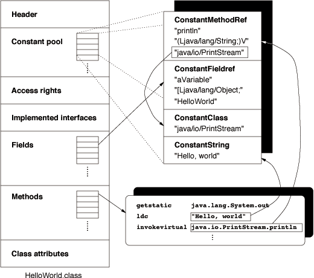
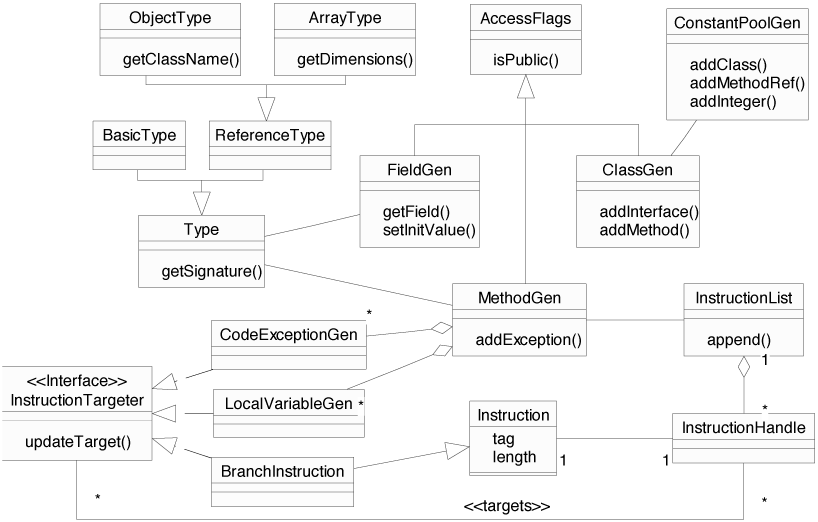
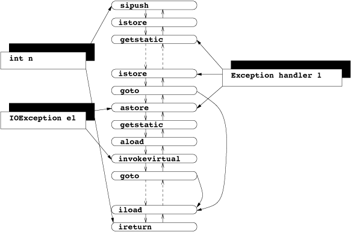
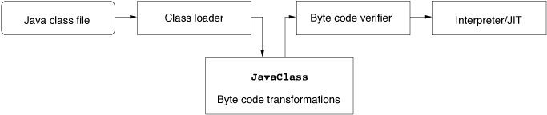
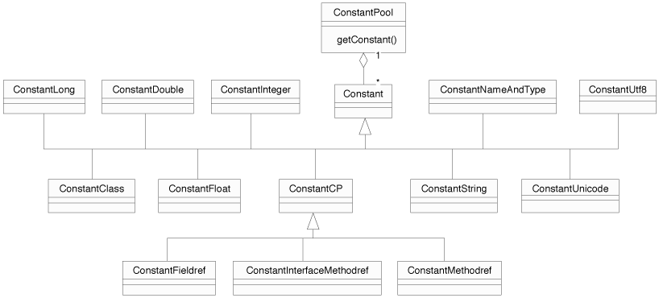

# Project Information

## Navigation

- [Commons BCEL](#index)
  - [About](#index)
  - [Sources](#scm)
  - [Security](#security)
  - [Javadoc](#index)
  - [Manual](#manual-manual)
    - [Introduction](#manual-introduction)
    - [The JVM](#manual-jvm)
    - [The BCEL API](#manual-bcel-api)
    - [Application areas](#manual-application-areas)
    - [Appendix](#manual-appendix)
  - [FAQ](#faq)
  - [Used by](#projects)
- Project Documentation
  - [Project Information](#project-info)
    - [About](#index)
    - [Summary](#summary)
    - [Team](#team)
    - [Source Code Management](#scm)
    - [CI Management](#ci-management)

## Content

<a id="index"></a>

<!-- source_url: https://commons.apache.org/proper/commons-bcel/index.html -->

<!-- page_index: 1 -->

<a id="index--commons-bcel"></a>

# Commons BCEL

The Byte Code Engineering Library (Apache Commons BCEL™) is intended to give users a
convenient way to analyze, create, and manipulate (binary)
Java class files (those ending with .class). Classes are
represented by objects which contain all the symbolic information
of the given class: methods, fields and byte code instructions, in
particular.

Such objects can be read from an existing file, be transformed
by a program (e.g. a class loader at run-time) and written to a file again.
An even more interesting application is the creation of classes from scratch
at run-time. The Byte Code Engineering Library (BCEL) may be also useful
if you want to learn about the Java Virtual Machine (JVM) and the format of
Java .class files.

BCEL contains a byte code verifier named JustIce, which usually
gives you much better information about what's wrong with your
code than the standard JVM message.

BCEL is already being used successfully in several projects such
as compilers, optimizers, obsfuscators, code generators
and analysis tools. Unfortunately there hasn't been much development
going on over the past few years. Feel free to help out or you
might want to have a look into the ASM project at objectweb.

<a id="index--documentation"></a>

# Documentation

The package descriptions in the [Javadoc](https://commons.apache.org/proper/commons-bcel/apidocs/index.html) give an overview of the available features
and various [project reports](https://commons.apache.org/proper/commons-bcel/project-reports.html) are provided.

The [source repository](#scm) can be
[browsed](https://gitbox.apache.org/repos/asf?p=commons-bcel.git), or you can browse/contribute via [GitHub](https://github.com/apache/commons-bcel).

<a id="index--release-information"></a>

# Release Information

The latest stable release of BCEL is here, you may:

- [Download](https://commons.apache.org/proper/commons-bcel/download_bcel.cgi)
- Read the [release notes](https://www.apache.org/dist/commons/bcel/RELEASE-NOTES.txt)
- Inspect the [extended Clirr report](https://commons.apache.org/proper/commons-bcel/bcel5-bcel6-clirr-report.html) comparing 5.2 with 6.x

Alternatively, you can pull it from the central Maven repositories through a [dependency](https://commons.apache.org/proper/commons-bcel/dependency-info.html).

<a id="index--getting-involved"></a>

# Getting Involved

The [commons developer mailing list](https://commons.apache.org/proper/commons-bcel/mail-lists.html) is the main channel of communication for contributors. Please remember that the lists are shared between all commons components, so prefix your email by [bcel].

You can also peruse [JIRA](https://commons.apache.org/proper/commons-bcel/issue-tracking.html).

Alternatively you can go through the *Needs Work* tags in the [TagList report](https://commons.apache.org/proper/commons-bcel/taglist.html).

If you'd like to offer up pull requests via GitHub rather than applying patches to JIRA, we have a [GitHub mirror](https://github.com/apache/commons-bcel/).

---

<a id="scm"></a>

<!-- source_url: https://commons.apache.org/proper/commons-bcel/scm.html -->

<!-- page_index: 2 -->

<a id="scm--overview"></a>

# Overview

This project uses [Git](https://git-scm.com/) to manage its source code. Instructions on Git use can be found at <https://git-scm.com/doc>.

<a id="scm--web-browser-access"></a>

# Web Browser Access

The following is a link to a browsable version of the source repository:

```
https://gitbox.apache.org/repos/asf?p=commons-bcel.git
```

<a id="scm--anonymous-access"></a>

# Anonymous Access

The source can be checked out anonymously from Git with this command (See <https://git-scm.com/docs/git-clone>):

```
$ git clone https://gitbox.apache.org/repos/asf/commons-bcel.git
```

<a id="scm--developer-access"></a>

# Developer Access

Only project developers can access the Git tree via this method (See <https://git-scm.com/docs/git-clone>).

```
$ git clone https://gitbox.apache.org/repos/asf/commons-bcel.git
```

<a id="scm--access-from-behind-a-firewall"></a>

# Access from Behind a Firewall

Refer to the documentation of the SCM used for more information about access behind a firewall.

---

<a id="security"></a>

<!-- source_url: https://commons.apache.org/proper/commons-bcel/security.html -->

<!-- page_index: 3 -->

<a id="security--about-security"></a>

# About Security

For information about reporting or asking questions about security, please see
[Apache Commons Security](https://commons.apache.org/security.html)
.

This page lists all security vulnerabilities fixed in released versions of this component.

Please note that binary patches are never provided. If you need to apply a source code patch, use the building instructions for the component version
that you are using.

If you need help on building this component or other help on following the instructions to mitigate the known vulnerabilities listed here, please send
your questions to the public
[user mailing list](https://commons.apache.org/proper/commons-bcel/mail-lists.html)
.

If you have encountered an unlisted security vulnerability or other unexpected behavior that has security impact, or if the descriptions here are
incomplete, please report them privately to the Apache Security Team. Thank you.

<a id="security--security-vulnerabilities"></a>

# Security Vulnerabilities

<a id="security--cve-2022-42920"></a>

## CVE-2022-42920

- CVE-2022-42920: Apache Commons BCEL prior to 6.6.0 allows producing arbitrary bytecode via out-of-bounds writing.
- Severity: Critical
- CWE-ID: CWE-787
- Vendor: The Apache Software Foundation
- Versions Affected: Apache Commons BCEL before 6.6.0.
- Description: Apache Commons BCEL has a number of APIs that would normally only allow changing specific class characteristics. However, due to an
  out-of-bounds writing issue, these APIs can be used to produce arbitrary bytecode. This could be abused in applications that pass
  attacker-controllable data to those APIs, giving the attacker more control over the resulting bytecode than otherwise expected. Update to Apache
  Commons BCEL 6.6.0.
- Mitigation: Users are recommended to upgrade to version 6.6.0 or later, which fixes the issue.
- Credit: Reported by Felix Wilhelm (Google)
- Credit: GitHub pull request to Apache Commons BCEL #147 by Richard Atkins (https://github.com/rjatkins)
- Credit: PR
  derived from OpenJDK (https://github.com/openjdk/jdk11u/) commit 13bf52c8d876528a43be7cb77a1f452d29a21492 by Aleksei Voitylov and
  RealCLanger (Christoph Langer https://github.com/RealCLanger)

---

<a id="manual-manual"></a>

<!-- source_url: https://commons.apache.org/proper/commons-bcel/manual/manual.html -->

<!-- page_index: 4 -->

<a id="manual-manual--abstract"></a>

# Abstract

Extensions and improvements of the programming language Java and
its related execution environment (Java Virtual Machine, JVM) are
the subject of a large number of research projects and
proposals. There are projects, for instance, to add parameterized
types to Java, to implement [Aspect-Oriented Programming](https://www.eclipse.org/aspectj/), to
perform sophisticated static analysis, and to improve the run-time
performance.

Since Java classes are compiled into portable binary class files
(called *byte code*), it is the most convenient and
platform-independent way to implement these improvements not by
writing a new compiler or changing the JVM, but by transforming
the byte code. These transformations can either be performed
after compile-time, or at load-time. Many programmers are doing
this by implementing their own specialized byte code manipulation
tools, which are, however, restricted in the range of their
re-usability.

To deal with the necessary class file transformations, we
introduce an API that helps developers to conveniently implement
their transformations.

<a id="manual-manual--table-of-contents"></a>

# Table of Contents

- [Introduction](#manual-introduction)
- [The Java Virtual Machine](#manual-jvm)
- [The BCEL API](#manual-bcel-api)
- [Application Areas](#manual-application-areas)
- [Appendix](#manual-appendix)

---

<a id="manual-introduction"></a>

<!-- source_url: https://commons.apache.org/proper/commons-bcel/manual/introduction.html -->

<!-- page_index: 5 -->

<a id="manual-introduction--introduction"></a>

# Introduction

The [Java](https://java.sun.com/) language has become
very popular and many research projects deal with further
improvements of the language or its run-time behavior. The
possibility to extend a language with new concepts is surely a
desirable feature, but the implementation issues should be hidden
from the user. Fortunately, the concepts of the Java Virtual
Machine permit the user-transparent implementation of such
extensions with relatively little effort.

Because the target language of Java is an interpreted language
with a small and easy-to-understand set of instructions (the
*byte code*), developers can implement and test their
concepts in a very elegant way. One can write a plug-in
replacement for the system's *class loader* which is
responsible for dynamically loading class files at run-time and
passing the byte code to the Virtual Machine (see [section 2](#manual-jvm)).
Class loaders may thus be used to intercept the loading process
and transform classes before they get actually executed by the
JVM. While the original class files always remain unaltered, the
behavior of the class loader may be reconfigured for every
execution or instrumented dynamically.

The BCEL API (Byte Code
Engineering Library), formerly known as JavaClass, is a toolkit
for the static analysis and dynamic creation or transformation of
Java class files. It enables developers to implement the desired
features on a high level of abstraction without handling all the
internal details of the Java class file format and thus
re-inventing the wheel every time. BCEL
is written entirely in Java and freely available under the
terms of the [Apache Software License](https://commons.apache.org/proper/commons-bcel/manual/license.html).

This manual is structured as follows: We give a brief description
of the Java Virtual Machine and the class file format in [section 2](#manual-jvm). [Section 3](#manual-bcel-api)
introduces the BCEL API.
[Section 4](#manual-application-areas) describes some typical
application areas and example projects. The appendix contains code examples
that are to long to be presented in the main part of this paper. All examples
are included in the down-loadable distribution.

---

<a id="manual-jvm"></a>

<!-- source_url: https://commons.apache.org/proper/commons-bcel/manual/jvm.html -->

<!-- page_index: 6 -->

<a id="manual-jvm--the-java-virtual-machine"></a>

# The Java Virtual Machine

Readers already familiar with the Java Virtual Machine and the
Java class file format may want to skip this section and proceed
with [section 3](#manual-bcel-api).

Programs written in the Java language are compiled into a portable
binary format called *byte code*. Every class is
represented by a single class file containing class related data
and byte code instructions. These files are loaded dynamically
into an interpreter ([Java
Virtual Machine](https://docs.oracle.com/javase/specs/), aka. JVM) and executed.

[Figure 1](#manual-jvm--figure_1) illustrates the procedure of
compiling and executing a Java class: The source file
(`HelloWorld.java`) is compiled into a Java class file
(`HelloWorld.class`), loaded by the byte code interpreter
and executed. In order to implement additional features, researchers may want to transform class files (drawn with bold
lines) before they get actually executed. This application area
is one of the main issues of this article.


Figure 1: Compilation and execution of Java classes

Note that the use of the general term "Java" implies in fact two
meanings: on the one hand, Java as a programming language, on the
other hand, the Java Virtual Machine, which is not necessarily
targeted by the Java language exclusively, but may be used by [other
languages](https://vmlanguages.is-research.de/) as well. We assume the reader to be familiar with
the Java language and to have a general understanding of the
Virtual Machine.

<a id="manual-jvm--java-class-file-format"></a>

## Java class file format

Giving a full overview of the design issues of the Java class file
format and the associated byte code instructions is beyond the
scope of this paper. We will just give a brief introduction
covering the details that are necessary for understanding the rest
of this paper. The format of class files and the byte code
instruction set are described in more detail in the [Java
Virtual Machine Specification](https://docs.oracle.com/javase/specs/). Especially, we will not deal
with the security constraints that the Java Virtual Machine has to
check at run-time, i.e. the byte code verifier.

[Figure 2](#manual-jvm--figure_2) shows a simplified example of the
contents of a Java class file: It starts with a header containing
a "magic number" (`0xCAFEBABE`) and the version number, followed by the *constant pool*, which can be roughly
thought of as the text segment of an executable, the *access
rights* of the class encoded by a bit mask, a list of
interfaces implemented by the class, lists containing the fields
and methods of the class, and finally the *class
attributes*, e.g., the `SourceFile` attribute telling
the name of the source file. Attributes are a way of putting
additional, user-defined information into class file data
structures. For example, a custom class loader may evaluate such
attribute data in order to perform its transformations. The JVM
specification declares that unknown, i.e., user-defined attributes
must be ignored by any Virtual Machine implementation.


Figure 2: Java class file format

Because all of the information needed to dynamically resolve the
symbolic references to classes, fields and methods at run-time is
coded with string constants, the constant pool contains in fact
the largest portion of an average class file, approximately
60%. In fact, this makes the constant pool an easy target for code
manipulation issues. The byte code instructions themselves just
make up 12%.

The right upper box shows a "zoomed" excerpt of the constant pool, while the rounded box below depicts some instructions that are
contained within a method of the example class. These
instructions represent the straightforward translation of the
well-known statement:

```
System.out.println("Hello, world");
```

The first instruction loads the contents of the field `out`
of class `java.lang.System` onto the operand stack. This is
an instance of the class `java.io.PrintStream`. The
`ldc` ("Load constant") pushes a reference to the string
"Hello world" on the stack. The next instruction invokes the
instance method `println` which takes both values as
parameters (instance methods always implicitly take an instance
reference as their first argument).

Instructions, other data structures within the class file and
constants themselves may refer to constants in the constant pool.
Such references are implemented via fixed indexes encoded directly
into the instructions. This is illustrated for some items of the
figure emphasized with a surrounding box.

For example, the `invokevirtual` instruction refers to a
`MethodRef` constant that contains information about the
name of the called method, the signature (i.e., the encoded
argument and return types), and to which class the method belongs.
In fact, as emphasized by the boxed value, the `MethodRef`
constant itself just refers to other entries holding the real
data, e.g., it refers to a `ConstantClass` entry containing
a symbolic reference to the class `java.io.PrintStream`.
To keep the class file compact, such constants are typically
shared by different instructions and other constant pool
entries. Similarly, a field is represented by a `Fieldref`
constant that includes information about the name, the type and
the containing class of the field.

The constant pool basically holds the following types of
constants: References to methods, fields and classes, strings, integers, floats, longs, and doubles.

<a id="manual-jvm--byte-code-instruction-set"></a>

## Byte code instruction set

The JVM is a stack-oriented interpreter that creates a local stack
frame of fixed size for every method invocation. The size of the
local stack has to be computed by the compiler. Values may also be
stored intermediately in a frame area containing *local
variables* which can be used like a set of registers. These
local variables are numbered from 0 to 65535, i.e., you have a
maximum of 65536 of local variables per method. The stack frames
of caller and callee method are overlapping, i.e., the caller
pushes arguments onto the operand stack and the called method
receives them in local variables.

The byte code instruction set currently consists of 212
instructions, 44 opcodes are marked as reserved and may be used
for future extensions or intermediate optimizations within the
Virtual Machine. The instruction set can be roughly grouped as
follows:

**Stack operations:** Constants can be pushed onto the stack
either by loading them from the constant pool with the
`ldc` instruction or with special "short-cut"
instructions where the operand is encoded into the instructions, e.g., `iconst_0` or `bipush` (push byte value).

**Arithmetic operations:** The instruction set of the Java
Virtual Machine distinguishes its operand types using different
instructions to operate on values of specific type. Arithmetic
operations starting with `i`, for example, denote an
integer operation. E.g., `iadd` that adds two integers
and pushes the result back on the stack. The Java types
`boolean`, `byte`, `short`, and
`char` are handled as integers by the JVM.

**Control flow:** There are branch instructions like
`goto`, and `if_icmpeq`, which compares two integers
for equality. There is also a `jsr` (jump to sub-routine)
and `ret` pair of instructions that is used to implement
the `finally` clause of `try-catch` blocks.
Exceptions may be thrown with the `athrow` instruction.
Branch targets are coded as offsets from the current byte code
position, i.e., with an integer number.

**Load and store operations** for local variables like
`iload` and `istore`. There are also array
operations like `iastore` which stores an integer value
into an array.

**Field access:** The value of an instance field may be
retrieved with `getfield` and written with
`putfield`. For static fields, there are
`getstatic` and `putstatic` counterparts.

**Method invocation:** Static Methods may either be called via
`invokestatic` or be bound virtually with the
`invokevirtual` instruction. Super class methods and
private methods are invoked with `invokespecial`. A
special case are interface methods which are invoked with
`invokeinterface`.

**Object allocation:** Class instances are allocated with the
`new` instruction, arrays of basic type like
`int[]` with `newarray`, arrays of references like
`String[][]` with `anewarray` or
`multianewarray`.

**Conversion and type checking:** For stack operands of basic
type there exist casting operations like `f2i` which
converts a float value into an integer. The validity of a type
cast may be checked with `checkcast` and the
`instanceof` operator can be directly mapped to the
equally named instruction.

Most instructions have a fixed length, but there are also some
variable-length instructions: In particular, the
`lookupswitch` and `tableswitch` instructions, which
are used to implement `switch()` statements. Since the
number of `case` clauses may vary, these instructions
contain a variable number of statements.

We will not list all byte code instructions here, since these are
explained in detail in the [JVM
specification](https://docs.oracle.com/javase/specs/). The opcode names are mostly self-explaining, so understanding the following code examples should be fairly
intuitive.

<a id="manual-jvm--method-code"></a>

## Method code

Non-abstract (and non-native) methods contain an attribute
"`Code`" that holds the following data: The maximum size of
the method's stack frame, the number of local variables and an
array of byte code instructions. Optionally, it may also contain
information about the names of local variables and source file
line numbers that can be used by a debugger.

Whenever an exception is raised during execution, the JVM performs
exception handling by looking into a table of exception
handlers. The table marks handlers, i.e., code chunks, to be
responsible for exceptions of certain types that are raised within
a given area of the byte code. When there is no appropriate
handler the exception is propagated back to the caller of the
method. The handler information is itself stored in an attribute
contained within the `Code` attribute.

<a id="manual-jvm--byte-code-offsets"></a>

## Byte code offsets

Targets of branch instructions like `goto` are encoded as
relative offsets in the array of byte codes. Exception handlers
and local variables refer to absolute addresses within the byte
code. The former contains references to the start and the end of
the `try` block, and to the instruction handler code. The
latter marks the range in which a local variable is valid, i.e., its scope. This makes it difficult to insert or delete code areas
on this level of abstraction, since one has to recompute the
offsets every time and update the referring objects. We will see
in [section 3.3](#manual-bcel-api--classgen) how BCEL remedies this restriction.

<a id="manual-jvm--type-information"></a>

## Type information

Java is a type-safe language and the information about the types
of fields, local variables, and methods is stored in so called
*signatures*. These are strings stored in the constant pool
and encoded in a special format. For example the argument and
return types of the `main` method

```
public static void main(String[] argv)
```

are represented by the signature

```
([java/lang/String;)V
```

Classes are internally represented by strings like
`"java/lang/String"`, basic types like `float` by an
integer number. Within signatures they are represented by single
characters, e.g., `I`, for integer. Arrays are denoted with
a `[` at the start of the signature.

<a id="manual-jvm--code-example"></a>

## Code example

The following example program prompts for a number and prints the
factorial of it. The `readLine()` method reading from the
standard input may raise an `IOException` and if a
misspelled number is passed to `parseInt()` it throws a
`NumberFormatException`. Thus, the critical area of code
must be encapsulated in a `try-catch` block.

```
import java.io.*;
public class Factorial {private static BufferedReader in = new BufferedReader(new InputStreamReader(System.in));
public static int fac(int n) {return (n == 0) ? 1 : n * fac(n - 1);}
public static int readInt() {int n = 4711; try {System.out.print("Please enter a number> "); n = Integer.parseInt(in.readLine()); } catch (IOException e1) {System.err.println(e1); } catch (NumberFormatException e2) {System.err.println(e2);} return n;}
public static void main(String[] argv) {int n = readInt(); System.out.println("Factorial of " + n + " is " + fac(n));}}
```

This code example typically compiles to the following chunks of
byte code:

```

        0:  iload_0
        1:  ifne            #8
        4:  iconst_1
        5:  goto            #16
        8:  iload_0
        9:  iload_0
        10: iconst_1
        11: isub
        12: invokestatic    Factorial.fac (I)I (12)
        15: imul
        16: ireturn

        LocalVariable(start_pc = 0, length = 16, index = 0:int n)
      
```

**fac():**
The method `fac` has only one local variable, the argument
`n`, stored at index 0. This variable's scope ranges from
the start of the byte code sequence to the very end. If the value
of `n` (the value fetched with `iload_0`) is not
equal to 0, the `ifne` instruction branches to the byte
code at offset 8, otherwise a 1 is pushed onto the operand stack
and the control flow branches to the final return. For ease of
reading, the offsets of the branch instructions, which are
actually relative, are displayed as absolute addresses in these
examples.

If recursion has to continue, the arguments for the multiplication
(`n` and `fac(n - 1)`) are evaluated and the results
pushed onto the operand stack. After the multiplication operation
has been performed the function returns the computed value from
the top of the stack.

```

        0:  sipush        4711
        3:  istore_0
        4:  getstatic     java.lang.System.out Ljava/io/PrintStream;
        7:  ldc           "Please enter a number> "
        9:  invokevirtual java.io.PrintStream.print (Ljava/lang/String;)V
        12: getstatic     Factorial.in Ljava/io/BufferedReader;
        15: invokevirtual java.io.BufferedReader.readLine ()Ljava/lang/String;
        18: invokestatic  java.lang.Integer.parseInt (Ljava/lang/String;)I
        21: istore_0
        22: goto          #44
        25: astore_1
        26: getstatic     java.lang.System.err Ljava/io/PrintStream;
        29: aload_1
        30: invokevirtual java.io.PrintStream.println (Ljava/lang/Object;)V
        33: goto          #44
        36: astore_1
        37: getstatic     java.lang.System.err Ljava/io/PrintStream;
        40: aload_1
        41: invokevirtual java.io.PrintStream.println (Ljava/lang/Object;)V
        44: iload_0
        45: ireturn

        Exception handler(s) =
        From    To      Handler Type
        4       22      25      java.io.IOException(6)
        4       22      36      NumberFormatException(10)
      
```

**readInt():** First the local variable `n` (at index 0)
is initialized to the value 4711. The next instruction, `getstatic`, loads the references held by the static
`System.out` field onto the stack. Then a string is loaded
and printed, a number read from the standard input and assigned to
`n`.

If one of the called methods (`readLine()` and
`parseInt()`) throws an exception, the Java Virtual Machine
calls one of the declared exception handlers, depending on the
type of the exception. The `try`-clause itself does not
produce any code, it merely defines the range in which the
subsequent handlers are active. In the example, the specified
source code area maps to a byte code area ranging from offset 4
(inclusive) to 22 (exclusive). If no exception has occurred
("normal" execution flow) the `goto` instructions branch
behind the handler code. There the value of `n` is loaded
and returned.

The handler for `java.io.IOException` starts at
offset 25. It simply prints the error and branches back to the
normal execution flow, i.e., as if no exception had occurred.

---

<a id="manual-bcel-api"></a>

<!-- source_url: https://commons.apache.org/proper/commons-bcel/manual/bcel-api.html -->

<!-- page_index: 7 -->

<a id="manual-bcel-api--the-bcel-api"></a>

# The BCEL API

The BCEL API abstracts from
the concrete circumstances of the Java Virtual Machine and how to
read and write binary Java class files. The API mainly consists
of three parts:

1. A package that contains classes that describe "static"
   constraints of class files, i.e., reflects the class file format and
   is not intended for byte code modifications. The classes may be
   used to read and write class files from or to a file. This is
   useful especially for analyzing Java classes without having the
   source files at hand. The main data structure is called
   `JavaClass` which contains methods, fields, etc..
2. A package to dynamically generate or modify
   `JavaClass` or `Method` objects. It may be used to
   insert analysis code, to strip unnecessary information from class
   files, or to implement the code generator back-end of a Java
   compiler.
3. Various code examples and utilities like a class file viewer,
   a tool to convert class files into HTML, and a converter from
   class files to the [Jasmin](https://jasmin.sourceforge.net) assembly
   language.

<a id="manual-bcel-api--javaclass"></a>

## JavaClass

The "static" component of the BCEL API resides in the package
`org.apache.bcel.classfile` and closely represents class
files. All of the binary components and data structures declared
in the [JVM
specification](https://docs.oracle.com/javase/specs/) and described in section [2](#manual-bcel-api--a2_the_java_virtual_machine) are mapped to classes.
[Figure 3](#manual-bcel-api--figure_3) shows an UML diagram of the
hierarchy of classes of the BCEL
API. [Figure 8](#manual-bcel-api--figure-8) in the appendix also
shows a detailed diagram of the `ConstantPool` components.


Figure 3: UML diagram for the JavaClass API

The top-level data structure is `JavaClass`, which in most
cases is created by a `ClassParser` object that is capable
of parsing binary class files. A `JavaClass` object
basically consists of fields, methods, symbolic references to the
super class and to the implemented interfaces.

The constant pool serves as some kind of central repository and is
thus of outstanding importance for all components.
`ConstantPool` objects contain an array of fixed size of
`Constant` entries, which may be retrieved via the
`getConstant()` method taking an integer index as argument.
Indexes to the constant pool may be contained in instructions as
well as in other components of a class file and in constant pool
entries themselves.

Methods and fields contain a signature, symbolically defining
their types. Access flags like `public static final` occur
in several places and are encoded by an integer bit mask, e.g., `public static final` matches to the Java expression

```
int access_flags = ACC_PUBLIC | ACC_STATIC | ACC_FINAL;
```

As mentioned in [section
2.1](#manual-jvm--java_class_file_format) already, several components may contain *attribute*
objects: classes, fields, methods, and `Code` objects
(introduced in [section 2.3](#manual-jvm--method_code)). The
latter is an attribute itself that contains the actual byte code
array, the maximum stack size, the number of local variables, a
table of handled exceptions, and some optional debugging
information coded as `LineNumberTable` and
`LocalVariableTable` attributes. Attributes are in general
specific to some data structure, i.e., no two components share the
same kind of attribute, though this is not explicitly
forbidden. In the figure the `Attribute` classes are stereotyped
with the component they belong to.

<a id="manual-bcel-api--class-repository"></a>

## Class repository

Using the provided `Repository` class, reading class files into
a `JavaClass` object is quite simple:

```
JavaClass clazz = Repository.lookupClass("java.lang.String");
```

The repository also contains methods providing the dynamic equivalent
of the `instanceof` operator, and other useful routines:

```

if (Repository.instanceOf(clazz, super_class)) {
    ...
}
      
```

<a id="manual-bcel-api--accessing-class-file-data"></a>

#### Accessing class file data

Information within the class file components may be accessed like
Java Beans via intuitive set/get methods. All of them also define
a `toString()` method so that implementing a simple class
viewer is very easy. In fact all of the examples used here have
been produced this way:

```
System.out.println(clazz); printCode(clazz.getMethods()); ...public static void printCode(Method[] methods) {for (int i = 0; i < methods.length; i++) {System.out.println(methods[i]);
Code code = methods[i].getCode(); if (code != null) // Non-abstract method System.out.println(code);}}
```

<a id="manual-bcel-api--analyzing-class-data"></a>

#### Analyzing class data

Last but not least, BCEL
supports the *Visitor* design pattern, so one can write
visitor objects to traverse and analyze the contents of a class
file. Included in the distribution is a class
`JasminVisitor` that converts class files into the [Jasmin](https://jasmin.sourceforge.net)
assembler language.

<a id="manual-bcel-api--classgen"></a>

## ClassGen

This part of the API (package `org.apache.bcel.generic`)
supplies an abstraction level for creating or transforming class
files dynamically. It makes the static constraints of Java class
files like the hard-coded byte code addresses "generic". The
generic constant pool, for example, is implemented by the class
`ConstantPoolGen` which offers methods for adding different
types of constants. Accordingly, `ClassGen` offers an
interface to add methods, fields, and attributes.
[Figure 4](#manual-bcel-api--figure_4) gives an overview of this part of the API.


Figure 4: UML diagram of the ClassGen API

<a id="manual-bcel-api--types"></a>

#### Types

We abstract from the concrete details of the type signature syntax
(see [2.5](#manual-jvm--type_information)) by introducing the
`Type` class, which is used, for example, by methods to
define their return and argument types. Concrete sub-classes are
`BasicType`, `ObjectType`, and `ArrayType`
which consists of the element type and the number of
dimensions. For commonly used types the class offers some
predefined constants. For example, the method signature of the
`main` method as shown in
[section 2.5](#manual-jvm--type_information) is represented by:

```

Type return_type = Type.VOID;
Type[] arg_types = new Type[] { new ArrayType(Type.STRING, 1) };
      
```

`Type` also contains methods to convert types into textual
signatures and vice versa. The sub-classes contain implementations
of the routines and constraints specified by the Java Language
Specification.

<a id="manual-bcel-api--generic-fields-and-methods"></a>

#### Generic fields and methods

Fields are represented by `FieldGen` objects, which may be
freely modified by the user. If they have the access rights
`static final`, i.e., are constants and of basic type, they
may optionally have an initializing value.

Generic methods contain methods to add exceptions the method may
throw, local variables, and exception handlers. The latter two are
represented by user-configurable objects as well. Because
exception handlers and local variables contain references to byte
code addresses, they also take the role of an *instruction
targeter* in our terminology. Instruction targeters contain a
method `updateTarget()` to redirect a reference. This is
somewhat related to the Observer design pattern. Generic
(non-abstract) methods refer to *instruction lists* that
consist of instruction objects. References to byte code addresses
are implemented by handles to instruction objects. If the list is
updated the instruction targeters will be informed about it. This
is explained in more detail in the following sections.

The maximum stack size needed by the method and the maximum number
of local variables used may be set manually or computed via the
`setMaxStack()` and `setMaxLocals()` methods
automatically.

<a id="manual-bcel-api--instructions"></a>

#### Instructions

Modeling instructions as objects may look somewhat odd at first
sight, but in fact enables programmers to obtain a high-level view
upon control flow without handling details like concrete byte code
offsets. Instructions consist of an opcode (sometimes called
tag), their length in bytes and an offset (or index) within the
byte code. Since many instructions are immutable (stack operators, e.g.), the `InstructionConstants` interface offers
shareable predefined "fly-weight" constants to use.

Instructions are grouped via sub-classing, the type hierarchy of
instruction classes is illustrated by (incomplete) figure in the
appendix. The most important family of instructions are the
*branch instructions*, e.g., `goto`, that branch to
targets somewhere within the byte code. Obviously, this makes them
candidates for playing an `InstructionTargeter` role, too. Instructions are further grouped by the interfaces they
implement, there are, e.g., `TypedInstruction`s that are
associated with a specific type like `ldc`, or
`ExceptionThrower` instructions that may raise exceptions
when executed.

All instructions can be traversed via `accept(Visitor v)`
methods, i.e., the Visitor design pattern. There is however some
special trick in these methods that allows to merge the handling
of certain instruction groups. The `accept()` do not only
call the corresponding `visit()` method, but call
`visit()` methods of their respective super classes and
implemented interfaces first, i.e., the most specific
`visit()` call is last. Thus one can group the handling of, say, all `BranchInstruction`s into one single method.

For debugging purposes it may even make sense to "invent" your own
instructions. In a sophisticated code generator like the one used
as a backend of the [Barat
framework](https://barat.sourceforge.net) for static analysis one often has to insert
temporary `nop` (No operation) instructions. When examining
the produced code it may be very difficult to track back where the
`nop` was actually inserted. One could think of a derived
`nop2` instruction that contains additional debugging
information. When the instruction list is dumped to byte code, the
extra data is simply dropped.

One could also think of new byte code instructions operating on
complex numbers that are replaced by normal byte code upon
load-time or are recognized by a new JVM.

<a id="manual-bcel-api--instruction-lists"></a>

#### Instruction lists

An *instruction list* is implemented by a list of
*instruction handles* encapsulating instruction objects.
References to instructions in the list are thus not implemented by
direct pointers to instructions but by pointers to instruction
*handles*. This makes appending, inserting and deleting
areas of code very simple and also allows us to reuse immutable
instruction objects (fly-weight objects). Since we use symbolic
references, computation of concrete byte code offsets does not
need to occur until finalization, i.e., until the user has
finished the process of generating or transforming code. We will
use the term instruction handle and instruction synonymously
throughout the rest of the paper. Instruction handles may contain
additional user-defined data using the `addAttribute()`
method.

**Appending:** One can append instructions or other instruction
lists anywhere to an existing list. The instructions are appended
after the given instruction handle. All append methods return a
new instruction handle which may then be used as the target of a
branch instruction, e.g.:

```
InstructionList il = new InstructionList(); ...GOTO g = new GOTO(null); il.append(g); ...// Use immutable fly-weight object InstructionHandle ih = il.append(InstructionConstants.ACONST_NULL); g.setTarget(ih);
```

**Inserting:** Instructions may be inserted anywhere into an
existing list. They are inserted before the given instruction
handle. All insert methods return a new instruction handle which
may then be used as the start address of an exception handler, for
example.

```

InstructionHandle start = il.insert(insertion_point, InstructionConstants.NOP);
...
mg.addExceptionHandler(start, end, handler, "java.io.IOException");
      
```

**Deleting:** Deletion of instructions is also very
straightforward; all instruction handles and the contained
instructions within a given range are removed from the instruction
list and disposed. The `delete()` method may however throw
a `TargetLostException` when there are instruction
targeters still referencing one of the deleted instructions. The
user is forced to handle such exceptions in a `try-catch`
clause and redirect these references elsewhere. The *peep
hole* optimizer described in the appendix gives a detailed
example for this.

```
try {il.delete(first, last); } catch (TargetLostException e) {for (InstructionHandle target : e.getTargets()) {for (InstructionTargeter targeter : target.getTargeters()) {targeter.updateTarget(target, new_target);}}}
```

**Finalizing:** When the instruction list is ready to be dumped
to pure byte code, all symbolic references must be mapped to real
byte code offsets. This is done by the `getByteCode()`
method which is called by default by
`MethodGen.getMethod()`. Afterwards you should call
`dispose()` so that the instruction handles can be reused
internally. This helps to improve memory usage.

```

InstructionList il = new InstructionList();

ClassGen  cg = new ClassGen("HelloWorld", "java.lang.Object",
        "<generated>", ACC_PUBLIC | ACC_SUPER, null);
MethodGen mg = new MethodGen(ACC_STATIC | ACC_PUBLIC,
        Type.VOID, new Type[] { new ArrayType(Type.STRING, 1) },
        new String[] { "argv" }, "main", "HelloWorld", il, cp);
...
cg.addMethod(mg.getMethod());
il.dispose(); // Reuse instruction handles of list
      
```

<a id="manual-bcel-api--code-example-revisited"></a>

#### Code example revisited

Using instruction lists gives us a generic view upon the code: In
[Figure 5](#manual-bcel-api--figure_5) we again present the code chunk
of the `readInt()` method of the factorial example in section
[2.6](#manual-jvm--code_example): The local variables
`n` and `e1` both hold two references to
instructions, defining their scope. There are two `goto`s
branching to the `iload` at the end of the method. One of
the exception handlers is displayed, too: it references the start
and the end of the `try` block and also the exception
handler code.


Figure 5: Instruction list for `readInt()` method

<a id="manual-bcel-api--instruction-factories"></a>

#### Instruction factories

To simplify the creation of certain instructions the user can use
the supplied `InstructionFactory` class which offers a lot
of useful methods to create instructions from
scratch. Alternatively, they can also use *compound
instructions*: When producing byte code, some patterns
typically occur very frequently, for instance the compilation of
arithmetic or comparison expressions. You certainly do not want
to rewrite the code that translates such expressions into byte
code in every place they may appear. In order to support this, the
BCEL API includes a *compound
instruction* (an interface with a single
`getInstructionList()` method). Instances of this class
may be used in any place where normal instructions would occur, particularly in append operations.

**Example: Pushing constants** Pushing constants onto the
operand stack may be coded in different ways. As explained in [section 2.2](#manual-jvm--byte_code_instruction_set) there are
some "short-cut" instructions that can be used to make the
produced byte code more compact. The smallest instruction to push
a single `1` onto the stack is `iconst_1`, other
possibilities are `bipush` (can be used to push values
between -128 and 127), `sipush` (between -32768 and 32767), or `ldc` (load constant from constant pool).

Instead of repeatedly selecting the most compact instruction in, say, a switch, one can use the compound `PUSH` instruction
whenever pushing a constant number or string. It will produce the
appropriate byte code instruction and insert entries into to
constant pool if necessary.

```
InstructionFactory f  = new InstructionFactory(class_gen); InstructionList    il = new InstructionList(); ...il.append(new PUSH(cp, "Hello, world")); il.append(new PUSH(cp, 4711)); ...il.append(f.createPrintln("Hello World")); ...il.append(f.createReturn(type));
```

<a id="manual-bcel-api--code-patterns-using-regular-expressions"></a>

#### Code patterns using regular expressions

When transforming code, for instance during optimization or when
inserting analysis method calls, one typically searches for
certain patterns of code to perform the transformation at. To
simplify handling such situations BCEL introduces a special feature:
One can search for given code patterns within an instruction list
using *regular expressions*. In such expressions, instructions are represented by their opcode names, e.g., `LDC`, one may also use their respective super classes, e.g.,
"`IfInstruction`". Meta characters like `+`, `*`, and `(..|..)` have their usual meanings. Thus, the expression

```
"NOP+(ILOAD|ALOAD)*"
```

represents a piece of code consisting of at least one `NOP`
followed by a possibly empty sequence of `ILOAD` and
`ALOAD` instructions.

The `search()` method of class
`org.apache.bcel.util.InstructionFinder` gets a regular
expression and a starting point as arguments and returns an
iterator describing the area of matched instructions. Additional
constraints to the matching area of instructions, which can not be
implemented via regular expressions, may be expressed via *code
constraint* objects.

<a id="manual-bcel-api--example:-optimizing-boolean-expressions"></a>

#### Example: Optimizing boolean expressions

In Java, boolean values are mapped to 1 and to 0, respectively. Thus, the simplest way to evaluate boolean
expressions is to push a 1 or a 0 onto the operand stack depending
on the truth value of the expression. But this way, the
subsequent combination of boolean expressions (with
`&&`, e.g) yields long chunks of code that push
lots of 1s and 0s onto the stack.

When the code has been finalized these chunks can be optimized
with a *peep hole* algorithm: An `IfInstruction`
(e.g. the comparison of two integers: `if_icmpeq`) that
either produces a 1 or a 0 on the stack and is followed by an
`ifne` instruction (branch if stack value 0) may be
replaced by the `IfInstruction` with its branch target
replaced by the target of the `ifne` instruction:

```
CodeConstraint constraint = new CodeConstraint() {public boolean checkCode(InstructionHandle[] match) {IfInstruction if1 = (IfInstruction) match[0].getInstruction(); GOTO g = (GOTO) match[2].getInstruction(); return (if1.getTarget() == match[3]) && (g.getTarget() == match[4]);} };
InstructionFinder f = new InstructionFinder(il); String pat = "IfInstruction ICONST_0 GOTO ICONST_1 NOP(IFEQ|IFNE)";
for (Iterator e = f.search(pat, constraint); e.hasNext(); ) {InstructionHandle[] match = (InstructionHandle[]) e.next();; ...match[0].setTarget(match[5].getTarget()); // Update target ...try {il.delete(match[1], match[5]); } catch (TargetLostException ex) {...}}
```

The applied code constraint object ensures that the matched code
really corresponds to the targeted expression pattern. Subsequent
application of this algorithm removes all unnecessary stack
operations and branch instructions from the byte code. If any of
the deleted instructions is still referenced by an
`InstructionTargeter` object, the reference has to be
updated in the `catch`-clause.

**Example application:**
The expression:

```

        if ((a == null) || (i < 2))
        System.out.println("Ooops");
      
```

can be mapped to both of the chunks of byte code shown in [figure 6](#manual-bcel-api--figure-6). The left column represents the
unoptimized code while the right column displays the same code
after the peep hole algorithm has been applied:

```

              5:  aload_0
              6:  ifnull        #13
              9:  iconst_0
              10: goto          #14
              13: iconst_1
              14: nop
              15: ifne          #36
              18: iload_1
              19: iconst_2
              20: if_icmplt     #27
              23: iconst_0
              24: goto          #28
              27: iconst_1
              28: nop
              29: ifne          #36
              32: iconst_0
              33: goto          #37
              36: iconst_1
              37: nop
              38: ifeq          #52
              41: getstatic     System.out
              44: ldc           "Ooops"
              46: invokevirtual println
              52: return
            
```

```

              10: aload_0
              11: ifnull        #19
              14: iload_1
              15: iconst_2
              16: if_icmpge     #27
              19: getstatic     System.out
              22: ldc           "Ooops"
              24: invokevirtual println
              27: return
            
```

---

<a id="manual-application-areas"></a>

<!-- source_url: https://commons.apache.org/proper/commons-bcel/manual/application-areas.html -->

<!-- page_index: 8 -->

<a id="manual-application-areas--application-areas"></a>

# Application areas

There are many possible application areas for BCEL ranging from class
browsers, profilers, byte code optimizers, and compilers to
sophisticated run-time analysis tools and extensions to the Java
language.

Compilers like the [Barat](https://barat.sourceforge.net) compiler use BCEL to implement a byte code
generating back end. Other possible application areas are the
static analysis of byte code or examining the run-time behavior of
classes by inserting calls to profiling methods into the
code. Further examples are extending Java with Eiffel-like
assertions, automated delegation, or with the concepts of [Aspect-Oriented Programming](https://www.eclipse.org/aspectj/). A
list of projects using BCEL can
be found [here](#projects).

<a id="manual-application-areas--class-loaders"></a>

## Class loaders

Class loaders are responsible for loading class files from the
file system or other resources and passing the byte code to the
Virtual Machine. A custom `ClassLoader` object may be used
to intercept the standard procedure of loading a class, i.e.m the
system class loader, and perform some transformations before
actually passing the byte code to the JVM.

A possible scenario is described in [figure
7](#manual-application-areas--figure-7):
During run-time the Virtual Machine requests a custom class loader
to load a given class. But before the JVM actually sees the byte
code, the class loader makes a "side-step" and performs some
transformation to the class. To make sure that the modified byte
code is still valid and does not violate any of the JVM's rules it
is checked by the verifier before the JVM finally executes it.


Figure 7: Class loaders

Using class loaders is an elegant way of extending the Java
Virtual Machine with new features without actually modifying it.
This concept enables developers to use *load-time
reflection* to implement their ideas as opposed to the static
reflection supported by the [Java
Reflection API](https://docs.oracle.com/javase/8/docs/technotes/guides/reflection/index.html). Load-time transformations supply the user with
a new level of abstraction. They are not strictly tied to the static
constraints of the original authors of the classes but may
customize the applications with third-party code in order to
benefit from new features. Such transformations may be executed on
demand and neither interfere with other users, nor alter the
original byte code. In fact, class loaders may even create classes
*ad hoc* without loading a file at all. BCEL has already builtin support for
dynamically creating classes, an example is the ProxyCreator class.

<a id="manual-application-areas--example:-poor-man-s-genericity"></a>

## Example: Poor Man's Genericity

The former "Poor Man's Genericity" project that extended Java with
parameterized classes, for example, used BCEL in two places to generate
instances of parameterized classes: During compile-time (with the
standard `javac` with some slightly changed classes) and at
run-time using a custom class loader. The compiler puts some
additional type information into class files (attributes) which is
evaluated at load-time by the class loader. The class loader
performs some transformations on the loaded class and passes them
to the VM. The following algorithm illustrates how the load method
of the class loader fulfills the request for a parameterized
class, e.g., `Stack<String>`

1. Search for class `Stack`, load it, and check for a
   certain class attribute containing additional type
   information. I.e. the attribute defines the "real" name of the
   class, i.e., `Stack<A>`.
2. Replace all occurrences and references to the formal type
   `A` with references to the actual type `String`. For
   example the method

```

            void push(A obj) { ... }
          
```

   becomes


```

            void push(String obj) { ... }
          
```

3. Return the resulting class to the Virtual Machine.

---

<a id="manual-appendix"></a>

<!-- source_url: https://commons.apache.org/proper/commons-bcel/manual/appendix.html -->

<!-- page_index: 9 -->

<a id="manual-appendix--appendix"></a>

# Appendix

<a id="manual-appendix--helloworldbuilder"></a>

## HelloWorldBuilder

The following program reads a name from the standard input and
prints a friendly "Hello". Since the `readLine()` method may
throw an `IOException` it is enclosed by a `try-catch`
clause.

```
import java.io.*;
public class HelloWorld {public static void main(String[] argv) {BufferedReader in = new BufferedReader(new InputStreamReader(System.in)); String name = null;
try {System.out.print("Please enter your name> "); name = in.readLine(); } catch (IOException e) {return;}
System.out.println("Hello, " + name);}}
```

We will sketch here how the above Java class can be created from the
scratch using the BCEL API. For
ease of reading we will use textual signatures and not create them
dynamically. For example, the signature

```
"(Ljava/lang/String;)Ljava/lang/StringBuffer;"
```

actually be created with

```
Type.getMethodSignature(Type.STRINGBUFFER, new Type[] { Type.STRING });
```

**Initialization:**
First we create an empty class and an instruction list:

```

ClassGen cg = new ClassGen("HelloWorld", "java.lang.Object",
                            "<generated>", ACC_PUBLIC | ACC_SUPER, null);
ConstantPoolGen cp = cg.getConstantPool(); // cg creates constant pool
InstructionList il = new InstructionList();
      
```

We then create the main method, supplying the method's name and the
symbolic type signature encoded with `Type` objects.

```

MethodGen  mg = new MethodGen(ACC_STATIC | ACC_PUBLIC, // access flags
                              Type.VOID,               // return type
                              new Type[] {             // argument types
                              new ArrayType(Type.STRING, 1) },
                              new String[] { "argv" }, // arg names
                              "main", "HelloWorld",    // method, class
                              il, cp);
InstructionFactory factory = new InstructionFactory(cg);
      
```

We now define some often used types:

```

ObjectType i_stream = new ObjectType("java.io.InputStream");
ObjectType p_stream = new ObjectType("java.io.PrintStream");
      
```

**Create variables `in` and `name`:** We call
the constructors, i.e., execute
`BufferedReader(InputStreamReader(System.in))`. The reference
to the `BufferedReader` object stays on top of the stack and
is stored in the newly allocated `in` variable.

```

il.append(factory.createNew("java.io.BufferedReader"));
il.append(InstructionConstants.DUP); // Use predefined constant
il.append(factory.createNew("java.io.InputStreamReader"));
il.append(InstructionConstants.DUP);
il.append(factory.createFieldAccess("java.lang.System", "in", i_stream, Constants.GETSTATIC));
il.append(factory.createInvoke("java.io.InputStreamReader", "<init>",
                                Type.VOID, new Type[] { i_stream },
                                Constants.INVOKESPECIAL));
il.append(factory.createInvoke("java.io.BufferedReader", "<init>", Type.VOID,
                                new Type[] {new ObjectType("java.io.Reader")},
                                Constants.INVOKESPECIAL));

LocalVariableGen lg = mg.addLocalVariable("in",
                        new ObjectType("java.io.BufferedReader"), null, null);
int in = lg.getIndex();
lg.setStart(il.append(new ASTORE(in))); // "i" valid from here
      
```

Create local variable `name` and initialize it to `null`.

```

lg = mg.addLocalVariable("name", Type.STRING, null, null);
int name = lg.getIndex();
il.append(InstructionConstants.ACONST_NULL);
lg.setStart(il.append(new ASTORE(name))); // "name" valid from here
      
```

**Create try-catch block:** We remember the start of the
block, read a line from the standard input and store it into the
variable `name`.

```

InstructionHandle try_start =
  il.append(factory.createFieldAccess("java.lang.System", "out", p_stream, Constants.GETSTATIC));

il.append(new PUSH(cp, "Please enter your name> "));
il.append(factory.createInvoke("java.io.PrintStream", "print", Type.VOID,
                                new Type[] { Type.STRING },
                                Constants.INVOKEVIRTUAL));
il.append(new ALOAD(in));
il.append(factory.createInvoke("java.io.BufferedReader", "readLine",
                                Type.STRING, Type.NO_ARGS,
                                Constants.INVOKEVIRTUAL));
il.append(new ASTORE(name));
      
```

Upon normal execution we jump behind exception handler, the target
address is not known yet.

```

GOTO g = new GOTO(null);
InstructionHandle try_end = il.append(g);
      
```

We add the exception handler which simply returns from the method.

```

InstructionHandle handler = il.append(InstructionConstants.RETURN);
mg.addExceptionHandler(try_start, try_end, handler, "java.io.IOException");
      
```

"Normal" code continues, now we can set the branch target of the `GOTO`.

```

InstructionHandle ih =
  il.append(factory.createFieldAccess("java.lang.System", "out", p_stream, Constants.GETSTATIC));
g.setTarget(ih);
      
```

**Printing "Hello":**
String concatenation compiles to `StringBuffer` operations.

```

il.append(factory.createNew(Type.STRINGBUFFER));
il.append(InstructionConstants.DUP);
il.append(new PUSH(cp, "Hello, "));
il.append(factory.createInvoke("java.lang.StringBuffer", "<init>",
                                Type.VOID, new Type[] { Type.STRING },
                                Constants.INVOKESPECIAL));
il.append(new ALOAD(name));
il.append(factory.createInvoke("java.lang.StringBuffer", "append",
                                Type.STRINGBUFFER, new Type[] { Type.STRING },
                                Constants.INVOKEVIRTUAL));
il.append(factory.createInvoke("java.lang.StringBuffer", "toString",
                                Type.STRING, Type.NO_ARGS,
                                Constants.INVOKEVIRTUAL));

il.append(factory.createInvoke("java.io.PrintStream", "println",
                                Type.VOID, new Type[] { Type.STRING },
                                Constants.INVOKEVIRTUAL));
il.append(InstructionConstants.RETURN);
      
```

**Finalization:** Finally, we have to set the stack size, which normally would have to be computed on the fly and add a
default constructor method to the class, which is empty in this
case.

```

mg.setMaxStack();
cg.addMethod(mg.getMethod());
il.dispose(); // Allow instruction handles to be reused
cg.addEmptyConstructor(ACC_PUBLIC);
      
```

Last but not least we dump the `JavaClass` object to a file.

```

try {
    cg.getJavaClass().dump("HelloWorld.class");
} catch (IOException e) {
    System.err.println(e);
}
      
```

<a id="manual-appendix--peephole-optimizer"></a>

## Peephole optimizer

This class implements a simple peephole optimizer that removes any NOP
instructions from the given class.

```
import java.io.*;
import java.util.Iterator; import org.apache.bcel.classfile.*; import org.apache.bcel.generic.*; import org.apache.bcel.Repository; import org.apache.bcel.util.InstructionFinder;
public class Peephole {
public static void main(String[] argv) {try {// Load the class from CLASSPATH.JavaClass clazz  = Repository.lookupClass(argv[0]); Method[] methods = clazz.getMethods(); ConstantPoolGen cp = new ConstantPoolGen(clazz.getConstantPool());
for (int i = 0; i < methods.length; i++) {if (!(methods[i].isAbstract() || methods[i].isNative())) {MethodGen mg = new MethodGen(methods[i], clazz.getClassName(), cp); Method stripped = removeNOPs(mg);
if (stripped != null)      // Any NOPs stripped? methods[i] = stripped; // Overwrite with stripped method}}
// Dump the class to "class name"_.class clazz.setConstantPool(cp.getFinalConstantPool()); clazz.dump(clazz.getClassName() + "_.class"); } catch (Exception e) {e.printStackTrace();}}
private static Method removeNOPs(MethodGen mg) {InstructionList il = mg.getInstructionList(); InstructionFinder f = new InstructionFinder(il); String pat = "NOP+"; // Find at least one NOP InstructionHandle next = null; int count = 0;
for (Iterator iter = f.search(pat); iter.hasNext();) {InstructionHandle[] match = (InstructionHandle[]) iter.next(); InstructionHandle first = match[0]; InstructionHandle last  = match[match.length - 1];
// Some nasty Java compilers may add NOP at end of method.if ((next = last.getNext()) == null) {break;}
count += match.length;
/** * Delete NOPs and redirect any references to them to the following (non-nop) instruction.*/ try {il.delete(first, last); } catch (TargetLostException e) {for (InstructionHandle target : e.getTargets()) {for (InstructionTargeter targeter = target.getTargeters()) {targeter.updateTarget(target, next);}}}}
Method m = null;
if (count > 0) {System.out.println("Removed " + count + " NOP instructions from method " + mg.getName()); m = mg.getMethod();}
il.dispose(); // Reuse instruction handles return m;}}
```

<a id="manual-appendix--bcelifier"></a>

## BCELifier

If you want to learn how certain things are generated using BCEL you
can do the following: Write your program with the needed features in
Java and compile it as usual. Then use `BCELifier` to create
a class that creates that very input class using BCEL.
(Think about this sentence for a while, or just try it ...)

<a id="manual-appendix--constant-pool-uml-diagram"></a>

## Constant pool UML diagram


Figure 8: UML diagram for constant pool classes

<a id="manual-appendix--verifier"></a>

## Verifier

<a id="manual-appendix--running-a-console-based-verifier"></a>

#### Running a console based verifier

```

java org.apache.bcel.verifier.Verifier fully.qualified.class.Name
      
```

lets JustIce work standalone.
If you get a "java.lang.OutOfMemoryError", you should increase the
maximum Java heap space. A command like

```

java -Xmx1887436800 org.apache.bcel.verifier.Verifier f.q.c.Name
      
```

will usually resolve the problem. The value above is suitable for
big server machines; if your machine starts swapping to disk, try
to lower the value.

<a id="manual-appendix--running-a-graphics-based-verifier"></a>

#### Running a graphics based verifier

If you prefer a graphical application, you should use a command like

```

java org.apache.bcel.verifier.GraphicalVerifier
      
```

to launch one. Again, you may have to resolve a memory issue depending
on the classes to verify.

---

<a id="faq"></a>

<!-- source_url: https://commons.apache.org/proper/commons-bcel/faq.html -->

<!-- page_index: 10 -->

<a id="faq--faq"></a>

# FAQ

**Q:** How can I ... with BCEL?
**A:** Take a look at
`org.apache.bcel.util.BCELifier`, it takes a given class
and converts it to a BCEL program (in Java, of course). It will
show you how certain code is generated using BCEL.

**Q:**  Is the BCEL thread-safe?
**A:** BCEL was (deliberately) not designed for thread
safety. See "Concurrent Programming in Java", by Doug Lea, for an excellent reference on how to build thread-safe wrappers and
[more](https://docs.oracle.com/javase/tutorial/essential/concurrency/further.html).

**Q:**  Can I use BCEL in a commercial product?
**A:**  Yes, this is covered by the [Apache License](https://www.apache.org/licenses/), if you add a note about the original
author and where to find the sources, i.e.,
<https://commons.apache.org/bcel/>

**Q:**  (Typically for users of Xalan (XSLTC)) I'm getting

```
ClassGenException: Branch target offset too large for short
```

when compiling large files.

**A:**  The answer lies in internal limitations of the JVM, branch instruction like goto can not address offsets larger than
a short integer, i.e. offsets >= 32767.
The solution is to split the branch into in intermediate hops, which the XSLTC obviously doesn't take care off.
(In fact you could replace gotos with the goto\_w instruction, but this wouldn't help in the other cases).

**Q:** Can I create or modify classes dynamically with BCEL?
**A:** BCEL contains useful classes in the
`util` package, namely `ClassLoader` and
`JavaWrapper`. Take a look at the  `ProxyCreator` example.

**Q:** I get a verification error, what can I do?
**A:** Use the JustIce verifier that comes together with BCEL
to get more detailed information:

```
java org.apache.bcel.verifier.Verifier <your class>
```

---

<a id="projects"></a>

<!-- source_url: https://commons.apache.org/proper/commons-bcel/projects.html -->

<!-- page_index: 11 -->

<a id="projects--bcel-projects"></a>

# BCEL Projects

- [Dependents](https://github.com/apache/commons-bcel/network/dependents)
  as reported by GitHub
- [Xalan](https://xml.apache.org/xalan-j/)
  XSLT Compiler
- [ObjectScript](https://objectscript.sourceforge.net/)
- [JBoss](https://www.jboss.org/)
- [BeanShell](https://beanshell.github.io/)
- XMLC (was https://xmlc.enhydra.org)
- Cougaar Memory Profiler (was https://profiler.cougaar.org)
- JDO-Implementation (was https://jcredo.com/)
- LIDO JDO-Implementation (was https://www.libelis.com/)
- JRelay JDO-Implementation (was
  https://www.objectindustries.com/)
- [Just4Log](https://just4log.sourceforge.net/)
- Venus Application Publisher (connection is not private
  https://www.geocities.com/vamp201/)
- [jContractor -
  Design by contract](https://jcontractor.sourceforge.net/)
- Byte code optimization (was
  https://www-i2.informatik.rwth-aachen.de/~markusj/jopt/index.html)
- [Gretel](https://www.cs.uoregon.edu/research/perpetual/dasada/Software/Gretel/)
  - Residual Test Coverage Tool
- Mobile Code Security Through Java Byte-Code Modification (was
  https://Theory.Stanford.EDU/~vganesh/project.html)
- Portable Resource Accounting for Java (was
  https://www.jraf2.org/)
- [Funnel](https://lampwww.epfl.ch/funnel/)
- Static analysis of class libraries (connection not secure
  https://www.uni-paderborn.de/fachbereich/AG/agkastens/wir/mthies/index.htm)
- Kava: Reflective Java (connection not secure
  https://www.cs.ncl.ac.uk/research/dependability/reflection/)
- one.world - Programming for pervasive computing environments
  (was https://one.cs.washington.edu/)
- Sally: Simple Aspect Language (was
  https://www.cs.uni-essen.de/dawis/research/aop/sally/)
- [AspectJ: Aspect-oriented
  Java](https://eclipse.org/aspectj/)
- [AOP ClassLoader
  Suite](https://aopclsuite.sourceforge.net/)
- Brakes: Thread serialization (connection not private
  https://www.cs.kuleuven.ac.be/~tim/MOS/brakes.html)
- [Transformations
  for Model Checking Distributed Java
  Programs](https://www.cs.sunysb.edu/~stoller/SPIN2001.html)
- Ozone Data base (was https://ozone-db.org/)
- Method tracing tool (was https://www.jmonde.org/Trace)
- JMangler (was https://javalab.cs.uni-bonn.de/research/jmangler/)
- [Barat compiler
  framework](https://barat.sourceforge.net/)
- [Java code coverage
  tool for JUnit](https://quilt.sourceforge.net/)
- [Heap Usage Profiling](https://hup.sourceforge.net/)
- [Import Scrubber](https://importscrubber.sourceforge.net/)
- [jBackBrowse](https://jbackbrowse.sourceforge.net/)
- [FindBugs](https://findbugs.sourceforge.net/)
  static analysis tool

<a id="projects--related-projects"></a>

## Related Projects

- [ASM](https://asm.ow2.io/)
- CFParse (connection is not private
  https://www.alphaworks.ibm.com/tech/cfparse)
- JikesBT (connection is not private
  https://www.alphaworks.ibm.com/tech/jikesbt)

---

<a id="project-info"></a>

<!-- source_url: https://commons.apache.org/proper/commons-bcel/project-info.html -->

<!-- page_index: 12 -->

<a id="project-info--project-information"></a>

# Project Information

This document provides an overview of the various documents and links that are part of this project's general information. All of this content is automatically generated by [Maven](https://maven.apache.org) on behalf of the project.

<a id="project-info--overview"></a>

## Overview

| Document | Description |
| --- | --- |
| [About](#index) | The Commons Byte Code Engineering Library (BCEL) is designed to provide users with a convenient way to analyze, create, and manipulate compiled .class files. |
| [Summary](#summary) | This document lists other related information of this project |
| [Team](#team) | This document provides information on the members of this project. These are the individuals who have contributed to the project in one form or another. |
| [Source Code Management](#scm) | This document lists ways to access the online source repository. |
| [Issue Management](https://commons.apache.org/proper/commons-bcel/issue-management.html) | This document provides information on the issue management system used in this project. |
| [Mailing Lists](https://commons.apache.org/proper/commons-bcel/mailing-lists.html) | This document provides subscription and archive information for this project's mailing lists. |
| [Maven Coordinates](https://commons.apache.org/proper/commons-bcel/dependency-info.html) | This document describes how to include this project as a dependency using various dependency management tools. |
| [Dependency Management](https://commons.apache.org/proper/commons-bcel/dependency-management.html) | This document lists the dependencies that are defined through dependencyManagement. |
| [Dependencies](https://commons.apache.org/proper/commons-bcel/dependencies.html) | This document lists the project's dependencies and provides information on each dependency. |
| [Dependency Convergence](https://commons.apache.org/proper/commons-bcel/dependency-convergence.html) | This document presents the convergence of dependency versions across the entire project, and its sub modules. |
| [CI Management](#ci-management) | This document lists the continuous integration management system of this project for building and testing code on a frequent, regular basis. |
| [Distribution Management](https://commons.apache.org/proper/commons-bcel/distribution-management.html) | This document provides informations on the distribution management of this project. |

---

<a id="summary"></a>

<!-- source_url: https://commons.apache.org/proper/commons-bcel/summary.html -->

<!-- page_index: 13 -->

<a id="summary--project-summary"></a>

# Project Summary

<a id="summary--project-information"></a>

## Project Information

| Field | Value |
| --- | --- |
| Name | Apache Commons BCEL |
| Description | The Commons Byte Code Engineering Library (BCEL) is designed to provide users with a convenient way to analyze, create, and manipulate compiled .class files. |
| Homepage | [https://commons.apache.org/proper/commons-bcel](#index) |

<a id="summary--project-organization"></a>

## Project Organization

| Field | Value |
| --- | --- |
| Name | The Apache Software Foundation |
| URL | <https://www.apache.org/> |

<a id="summary--build-information"></a>

## Build Information

| Field | Value |
| --- | --- |
| GroupId | org.apache.bcel |
| ArtifactId | bcel |
| Version | 6.12.0 |
| Type | jar |
| Java Version | 1.8 |

---

<a id="team"></a>

<!-- source_url: https://commons.apache.org/proper/commons-bcel/team.html -->

<!-- page_index: 14 -->

<a id="team--project-team"></a>

# Project Team

A successful project requires many people to play many roles. Some members write code or documentation, while others are valuable as testers, submitting patches and suggestions.

The project team is comprised of Members and Contributors. Members have direct access to the source of a project and actively evolve the code-base. Contributors improve the project through submission of patches and suggestions to the Members. The number of Contributors to the project is unbounded. Get involved today. All contributions to the project are greatly appreciated.

<a id="team--members"></a>

## Members

The following is a list of developers with commit privileges that have directly contributed to the project in one way or another.

| Image | Id | Name | Email | URL | Organization | Organization URL | Roles | Time Zone |
| --- | --- | --- | --- | --- | --- | --- | --- | --- |
|  | dbrosius | Dave Brosius | [dbrosius at mebigfatguy.com](mailto:dbrosius at mebigfatguy.com) | - | - | - | - | - |
|  | tcurdt | Torsten Curdt | [tcurdt at apache.org](mailto:tcurdt at apache.org) | - | ASF | <https://www.apache.org/> | - | +1 |
|  | mdahm | Markus Dahm | [m.dahm at gmx.de](mailto:m.dahm at gmx.de) | - | it-frameworksolutions | - | - | - |
|  | - | Jason van Zyl | [jason at zenplex.com](mailto:jason at zenplex.com) | - | - | - | - | - |
|  | ggregory | Gary Gregory | [ggregory at apache.org](mailto:ggregory at apache.org) | <https://www.garygregory.com> | The Apache Software Foundation | <https://www.apache.org/> | PMC Member | America/New\_York |

<a id="team--contributors"></a>

## Contributors

The following additional people have contributed to this project through the way of suggestions, patches or documentation.

| Image | Name | Email |
| --- | --- | --- |
|  | Enver Haase | [enver at convergence.de](mailto:enver at convergence.de) |
|  | David Dixon-Peugh | [dixonpeugh at yahoo.com](mailto:dixonpeugh at yahoo.com) |
|  | Patrick Beard | [beard at netscape.com](mailto:beard at netscape.com) |
|  | Conor MacNeill | [conor at cortexbusiness.com.au](mailto:conor at cortexbusiness.com.au) |
|  | Costin Manolache | [cmanolache at yahoo.com](mailto:cmanolache at yahoo.com) |
|  | Bill Pugh | [bill.pugh at gmail.com](mailto:bill.pugh at gmail.com) |
|  | First Hop Ltd / Torsten Rueger | - |
|  | Jérôme Leroux | - |
|  | Mark Roberts | - |
|  | Sam Yoon | - |
|  | Arturo Bernal | - |

---

<a id="ci-management"></a>

<!-- source_url: https://commons.apache.org/proper/commons-bcel/ci-management.html -->

<!-- page_index: 15 -->

<a id="ci-management--overview"></a>

# Overview

This project uses [GitHub Actions](https://github.com/features/actions/).

<a id="ci-management--access"></a>

# Access

The following is a link to the continuous integration system used by the project:

```
https://github.com/apache/commons-bcel/actions
```

<a id="ci-management--notifiers"></a>

# Notifiers

No notifiers are defined. Please check back at a later date.

---
