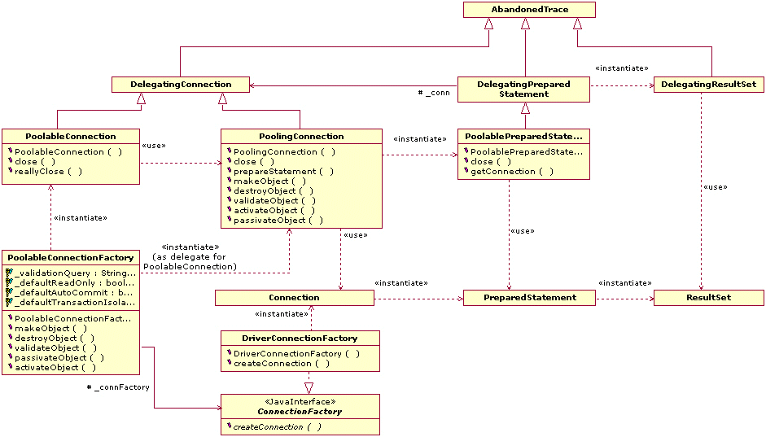
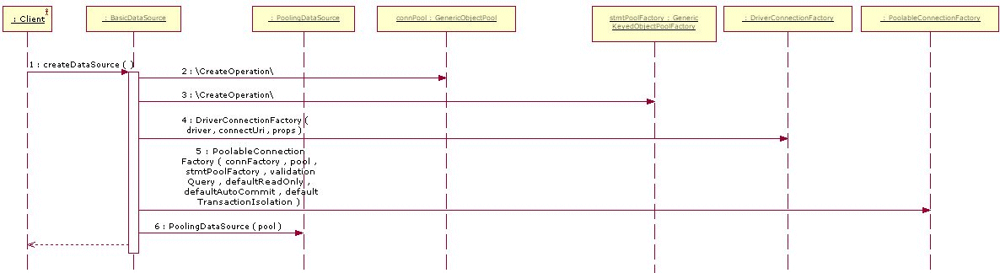
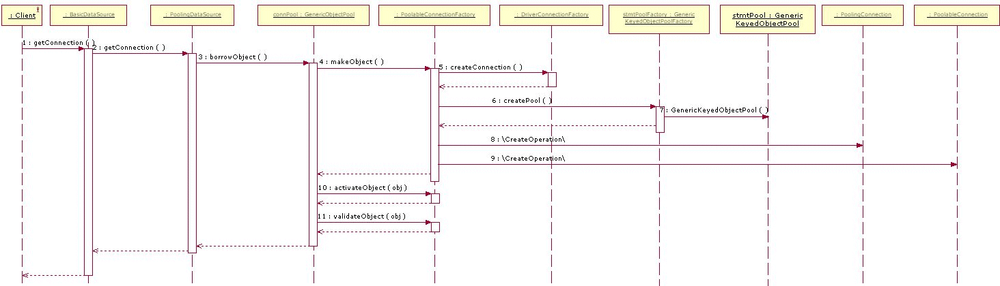

# Project Information

## Navigation

- Commons DBCP
  - [About](#index)
  - [Sources](#scm)
  - [Security](#security)
  - [Javadoc](#index)
  - [Configuration](#configuration)
  - [Developers Guide](#guide)
    - [JNDI Howto](#guide-jndi-howto)
    - [Class Diagrams](#guide-classdiagrams)
    - [Sequence Diagrams](#guide-sequencediagrams)
    - [Building](#building)
- Project Documentation
  - [Project Information](#project-info)
    - [About](#index)
    - [Summary](#summary)
    - [Team](#team)
    - [Source Code Management](#scm)
    - [CI Management](#ci-management)

## Content

<a id="index"></a>

<!-- source_url: https://commons.apache.org/proper/commons-dbcp/index.html -->

<!-- page_index: 1 -->

<a id="index--the-dbcp-component"></a>

# The DBCP Component

Many Apache projects support interaction with a relational database.
Creating a new connection for each user can be time consuming (often
requiring multiple seconds of clock time), in order to perform a database
transaction that might take milliseconds. Opening a connection per user
can be unfeasible in a publicly-hosted Internet application where the
number of simultaneous users can be very large. Accordingly, developers
often wish to share a "pool" of open connections between all of the
application's current users. The number of users actually performing
a request at any given time is usually a very small percentage of the
total number of active users, and during request processing is the only
time that a database connection is required. The application itself logs
into the DBMS, and handles any user account issues internally.

There are several Database Connection Pools already available, both
within Apache products and elsewhere. This Commons package provides an
opportunity to coordinate the efforts required to create and maintain an
efficient, feature-rich package under the ASF license.

The `commons-dbcp2` artifact relies on code in the
`commons-pool2` artifact to provide the underlying object pool
mechanisms.

DBCP now comes in four different versions to support different versions of
JDBC. Here is how it works:

Developing

- DBCP 2.5.0 and up compiles and runs under Java 8
  ([JDBC 4.2](https://docs.oracle.com/javase/8/docs/technotes/guides/jdbc/jdbc_42.html)) and up.
- DBCP 2.4.0 compiles and runs under Java 7
  ([JDBC 4.1](https://docs.oracle.com/javase/7/docs/technotes/guides/jdbc/jdbc_41.html)) and above.

Running

- DBCP 2.5.0 and up binaries should be used by applications running on Java 8 and up.
- DBCP 2.4.0 binaries should be used by applications running under Java 7.

DBCP 2 is based on
[Apache Commons Pool](https://commons.apache.org/proper/commons-pool/)
and provides increased performance, JMX
support as well as numerous other new features compared to DBCP 1.x. Users
upgrading to 2.x should be aware that the Java package name has changed, as well
as the Maven co-ordinates, since DBCP 2.x is not binary compatible with DBCP
1.x. Users should also be aware that some configuration options (e.g. maxActive
to maxTotal) have been renamed to align them with the new names used by Commons
Pool.

<a id="index--releases"></a>

# Releases

See the [downloads](https://commons.apache.org/proper/commons-dbcp/download_dbcp.cgi) page for information on
obtaining releases.

<a id="index--documentation"></a>

# Documentation

The
[Javadoc API documents](https://commons.apache.org/proper/commons-dbcp/apidocs/index.html)
are available online. In particular, you should
read the package overview of the
`org.apache.commons.dbcp2`
package for an overview of how to use DBCP.

There are
[several examples](https://gitbox.apache.org/repos/asf?p=commons-dbcp.git;a=tree;f=doc;hb=refs/heads/master)
of using DBCP available.

---

<a id="scm"></a>

<!-- source_url: https://commons.apache.org/proper/commons-dbcp/scm.html -->

<!-- page_index: 2 -->

<a id="scm--overview"></a>

# Overview

This project uses [Git](https://git-scm.com/) to manage its source code. Instructions on Git use can be found at <https://git-scm.com/doc>.

<a id="scm--web-browser-access"></a>

# Web Browser Access

The following is a link to a browsable version of the source repository:

```
https://gitbox.apache.org/repos/asf?p=commons-dbcp.git
```

<a id="scm--anonymous-access"></a>

# Anonymous Access

The source can be checked out anonymously from Git with this command (See <https://git-scm.com/docs/git-clone>):

```
$ git clone --branch rel/commons-dbcp-2.14.0 https://gitbox.apache.org/repos/asf/commons-dbcp.git
```

<a id="scm--developer-access"></a>

# Developer Access

Only project developers can access the Git tree via this method (See <https://git-scm.com/docs/git-clone>).

```
$ git clone --branch rel/commons-dbcp-2.14.0 https://gitbox.apache.org/repos/asf/commons-dbcp.git
```

<a id="scm--access-from-behind-a-firewall"></a>

# Access from Behind a Firewall

Refer to the documentation of the SCM used for more information about access behind a firewall.

---

<a id="security"></a>

<!-- source_url: https://commons.apache.org/proper/commons-dbcp/security.html -->

<!-- page_index: 3 -->

<a id="security--about-security"></a>

# About Security

For information about reporting or asking questions about security, please see
[Apache Commons Security](https://commons.apache.org/security.html).

This page lists all security vulnerabilities fixed in released versions of this component.

Please note that binary patches are never provided. If you need to apply a source code patch, use the building instructions for the component version
that you are using.

If you need help on building this component or other help on following the instructions to mitigate the known vulnerabilities listed here, please send
your questions to the public
[user mailing list](https://commons.apache.org/proper/commons-dbcp/mail-lists.html).

If you have encountered an unlisted security vulnerability or other unexpected behavior that has security impact, or if the descriptions here are
incomplete, please report them privately to the Apache Security Team. Thank you.

<a id="security--security-vulnerabilities"></a>

# Security Vulnerabilities

None.

---

<a id="configuration"></a>

<!-- source_url: https://commons.apache.org/proper/commons-dbcp/configuration.html -->

<!-- page_index: 4 -->

<a id="configuration--basicdatasource-configuration-parameters"></a>

# BasicDataSource Configuration Parameters

| Parameter | Description |
| --- | --- |
| username | The connection user name to be passed to our JDBC driver to establish a connection. |
| password | The connection password to be passed to our JDBC driver to establish a connection. |
| url | The connection URL to be passed to our JDBC driver to establish a connection. |
| driverClassName | The fully qualified Java class name of the JDBC driver to be used. |
| connectionProperties | The connection properties that will be sent to our JDBC driver when establishing new connections. Format of the string must be [propertyName=property;]\* **NOTE** - The "user" and "password" properties will be passed explicitly, so they do not need to be included here. |

<table class="bodyTable">
<tr>
<th>Parameter</th>
<th>Default</th>
<th>Description</th></tr>
<tr>
<td>defaultAutoCommit</td>
<td>driver default</td>
<td>The default auto-commit state of connections created by this pool.
       If not set then the setAutoCommit method will not be called.
   </td>
</tr>
<tr>
<td>defaultReadOnly</td>
<td>driver default</td>
<td>The default read-only state of connections created by this pool.
       If not set then the setReadOnly method will not be called.
       (Some drivers don't support read only mode, ex: Informix)
   </td>
</tr>
<tr>
<td>defaultTransactionIsolation</td>
<td>driver default</td>
<td>The default TransactionIsolation state of connections created by this pool.
       One of the following: (see
       <a href="https://java.sun.com/j2se/1.4.2/docs/api/java/sql/Connection.html#field_summary">javadoc</a>)

<ul>
<li>NONE</li>
<li>READ_COMMITTED</li>
<li>READ_UNCOMMITTED</li>
<li>REPEATABLE_READ</li>
<li>SERIALIZABLE</li>
</ul>
</td>
</tr>
<tr>
<td>defaultCatalog</td>
<td></td>
<td>The default catalog of connections created by this pool.</td>
</tr>
<tr>
<td>cacheState</td>
<td>true</td>
<td>If true, the pooled connection will cache the current readOnly and
      autoCommit settings when first read or written and on all subsequent
      writes. This removes the need for additional database queries for any
      further calls to the getter. If the underlying connection is accessed
      directly and the readOnly and/or autoCommit settings changed the cached
      values will not reflect the current state. In this case, caching should be
      disabled by setting this attribute to false.</td>
</tr>
<tr>
<td>defaultQueryTimeout</td>
<td>null</td>
<td>If non-null, the value of this <code>Integer</code> property determines
      the query timeout that will be used for Statements created from
      connections managed by the pool. <code>null</code> means that the driver
      default will be used.</td>
</tr>
<tr>
<td>enableAutoCommitOnReturn</td>
<td>true</td>
<td>If true, connections being returned to the pool will be checked and configured with
      <code>Connection.setAutoCommit(true)</code> if the auto commit setting is
      <code>false</code> when the connection is returned.</td>
</tr>
<tr>
<td>rollbackOnReturn</td>
<td>true</td>
<td>True means a connection will be rolled back when returned to the pool if
      auto commit is not enabled and the connection is not read-only.</td>
</tr>
</table>

| Parameter | Default | Description |
| --- | --- | --- |
| initialSize | 0 | The initial number of connections that are created when the pool is started. Since: 1.2 |
| maxTotal | 8 | The maximum number of active connections that can be allocated from this pool at the same time, or negative for no limit. |
| maxIdle | 8 | The maximum number of connections that can remain idle in the pool, without extra ones being released, or negative for no limit. |
| minIdle | 0 | The minimum number of connections that can remain idle in the pool, without extra ones being created, or zero to create none. |
| maxWaitMillis | indefinitely | The maximum number of milliseconds that the pool will wait (when there are no available connections) for a connection to be returned before throwing an exception, or -1 to wait indefinitely. |

> [!NOTE]
> 
> : If maxIdle is set too low on heavily loaded systems it is
> possible you will see connections being closed and almost immediately new
> connections being opened. This is a result of the active threads momentarily
> closing connections faster than they are opening them, causing the number of
> idle connections to rise above maxIdle. The best value for maxIdle for heavily
> loaded system will vary but the default is a good starting point.

| Parameter | Default | Description |
| --- | --- | --- |
| validationQuery |  | The SQL query that will be used to validate connections from this pool before returning them to the caller. If specified, this query **MUST** be an SQL SELECT statement that returns at least one row. If not specified, connections will be validation by calling the isValid() method. |
| validationQueryTimeout | no timeout | The timeout in seconds before connection validation queries fail. If set to a positive value, this value is passed to the driver via the `setQueryTimeout` method of the `Statement` used to execute the validation query. |
| testOnCreate | false | The indication of whether objects will be validated after creation. If the object fails to validate, the borrow attempt that triggered the object creation will fail. |
| testOnBorrow | true | The indication of whether objects will be validated before being borrowed from the pool. If the object fails to validate, it will be dropped from the pool, and we will attempt to borrow another. |
| testOnReturn | false | The indication of whether objects will be validated before being returned to the pool. |
| testWhileIdle | false | The indication of whether objects will be validated by the idle object evictor (if any). If an object fails to validate, it will be dropped from the pool. |
| timeBetweenEvictionRunsMillis | -1 | The number of milliseconds to sleep between runs of the idle object evictor thread. When non-positive, no idle object evictor thread will be run. |
| numTestsPerEvictionRun | 3 | The number of objects to examine during each run of the idle object evictor thread (if any). |
| minEvictableIdleTimeMillis | 1000 \* 60 \* 30 | The minimum amount of time an object may sit idle in the pool before it is eligible for eviction by the idle object evictor (if any). |
| softMinEvictableIdleTimeMillis | -1 | The minimum amount of time a connection may sit idle in the pool before it is eligible for eviction by the idle connection evictor, with the extra condition that at least "minIdle" connections remain in the pool. When minEvictableIdleTimeMillis is set to a positive value, minEvictableIdleTimeMillis is examined first by the idle connection evictor - i.e. when idle connections are visited by the evictor, idle time is first compared against minEvictableIdleTimeMillis (without considering the number of idle connections in the pool) and then against softMinEvictableIdleTimeMillis, including the minIdle constraint. |
| maxConnLifetimeMillis | -1 | The maximum lifetime in milliseconds of a connection. After this time is exceeded the connection will fail the next activation, passivation or validation test. A value of zero or less means the connection has an infinite lifetime. |
| logExpiredConnections | true | Flag to log a message indicating that a connection is being closed by the pool due to maxConnLifetimeMillis exceeded. Set this property to false to suppress expired connection logging that is turned on by default. |
| connectionInitSqls | null | A Collection of SQL statements that will be used to initialize physical connections when they are first created. These statements are executed only once - when the configured connection factory creates the connection. |
| lifo | true | True means that borrowObject returns the most recently used ("last in") connection in the pool (if there are idle connections available). False means that the pool behaves as a FIFO queue - connections are taken from the idle instance pool in the order that they are returned to the pool. |

| Parameter | Default | Description |
| --- | --- | --- |
| poolPreparedStatements | false | Enable prepared statement pooling for this pool. |
| maxOpenPreparedStatements | unlimited | The maximum number of open statements that can be allocated from the statement pool at the same time, or negative for no limit. |


This component has also the ability to pool PreparedStatements.
When enabled a statement pool will be created for each Connection
and PreparedStatements created by one of the following methods will be pooled:

- public PreparedStatement prepareStatement(String sql)
- public PreparedStatement prepareStatement(String sql, int resultSetType, int resultSetConcurrency)

> [!NOTE]
> 
> - Make sure your connection has some resources left for the other statements.
> Pooling PreparedStatements may keep their cursors open in the database, causing a connection to run out of cursors, especially if maxOpenPreparedStatements is left at the default (unlimited) and an application opens a large number
> of different PreparedStatements per connection. To avoid this problem, maxOpenPreparedStatements should be set to a
> value less than the maximum number of cursors that can be open on a Connection.

| Parameter | Default | Description |
| --- | --- | --- |
| accessToUnderlyingConnectionAllowed | false | Controls if the PoolGuard allows access to the underlying connection. |

When allowed you can access the underlying connection using the following construct:

```

    Connection conn = ds.getConnection();
    Connection dconn = ((DelegatingConnection) conn).getInnermostDelegate();
    ...
    conn.close()
```


Default is false, it is a potential dangerous operation and misbehaving programs can do harmful things. (closing the underlying or continue using it when the guarded connection is already closed)
Be careful and only use when you need direct access to driver specific extensions.


**NOTE:** Do not close the underlying connection, only the original one.

<table class="bodyTable">
<tr>
<th>Parameter</th>
<th>Default</th>
<th>Description</th></tr>
<tr>
<td>removeAbandonedOnMaintenance
       removeAbandonedOnBorrow
   </td>
<td>false</td>
<td>
      Flags to remove abandoned connections if they exceed the
      removeAbandonedTimout.

      A connection is considered abandoned and eligible
      for removal if it has not been used for longer than removeAbandonedTimeout.

      Creating a Statement, PreparedStatement or CallableStatement or using
      one of these to execute a query (using one of the execute methods)
      resets the lastUsed property of the parent connection.

      Setting one or both of these to true can recover db connections from poorly written
      applications which fail to close connections.

      Setting removeAbandonedOnMaintenance to true removes abandoned connections on the
      maintenance cycle (when eviction ends). This property has no effect unless maintenance
      is enabled by setting timeBetweenEvictionRunsMillis to a positive value.

      If removeAbandonedOnBorrow is true, abandoned connections are removed each time
      a connection is borrowed from the pool, with the additional requirements that

<ul>
<li>getNumActive() &gt; getMaxTotal() - 3; and</li>
<li>getNumIdle() &lt; 2 </li></ul>
</td>
</tr>
<tr>
<td>removeAbandonedTimeout</td>
<td>300</td>
<td>Timeout in seconds before an abandoned connection can be removed.</td>
</tr>
<tr>
<td>logAbandoned</td>
<td>false</td>
<td>
      Flag to log stack traces for application code which abandoned
      a Statement or Connection.
      Logging of abandoned Statements and Connections adds overhead
      for every Connection open or new Statement because a stack
      trace has to be generated.
   </td>
</tr>
<tr>
<td>abandonedUsageTracking</td>
<td>false</td>
<td>
      If true, the connection pool records a stack trace every time a method is called on a
      pooled connection and retains the most recent stack trace to aid debugging
      of abandoned connections. There is significant overhead added by setting this
      to true.
   </td>
</tr>
</table>


If you have enabled removeAbandonedOnMaintenance or removeAbandonedOnBorrow then it is possible that
a connection is reclaimed by the pool because it is considered to be abandoned. This mechanism is triggered
when (getNumIdle() < 2) and (getNumActive() > getMaxTotal() - 3) and removeAbandonedOnBorrow is true;
or after eviction finishes and removeAbandonedOnMaintenance is true. For example, maxTotal=20 and 18 active
connections and 1 idle connection would trigger removeAbandonedOnBorrow, but only the active connections
that aren't used for more then "removeAbandonedTimeout" seconds are removed (default 300 sec). Traversing
a resultset doesn't count as being used. Creating a Statement, PreparedStatement or CallableStatement or
using one of these to execute a query (using one of the execute methods) resets the lastUsed property of
the parent connection.

<table class="bodyTable">
<tr>
<th>Parameter</th>
<th>Default</th>
<th>Description</th></tr>
<tr>
<td>fastFailValidation</td>
<td>false</td>
<td>
      When this property is true, validation fails fast for connections that have
      thrown "fatal" SQLExceptions. Requests to validate disconnected connections
      fail immediately, with no call to the driver's isValid method or attempt to
      execute a validation query.

      The SQL_STATE codes considered to signal fatal errors are by default the following:

<ul>
<li>57P01 (ADMIN SHUTDOWN)</li>
<li>57P02 (CRASH SHUTDOWN)</li>
<li>57P03 (CANNOT CONNECT NOW)</li>
<li>01002 (SQL92 disconnect error)</li>
<li>JZ0C0 (Sybase disconnect error)</li>
<li>JZ0C1 (Sybase disconnect error)</li>
<li>Any SQL_STATE code that starts with "08"</li>
</ul>
      To override this default set of disconnection codes, set the
      <code>disconnectionSqlCodes</code> property.
   </td>
</tr>
<tr>
<td>disconnectionSqlCodes</td>
<td>null</td>
<td>Comma-delimited list of SQL_STATE codes considered to signal fatal disconnection
       errors. Setting this property has no effect unless
      <code>fastFailValidation</code> is set to <code>true.</code>
</td>
</tr>
<tr>
<td>disconnectionIgnoreSqlCodes</td>
<td>null</td>
<td>Comma-delimited list of SQL State codes that should be ignored when determining fatal disconnection errors.
       These codes will not trigger a fatal disconnection status, even if they match the usual criteria.
       Setting this property has no effect unless <code>fastFailValidation</code> is set to <code>true.</code>
</td>
</tr>
<tr>
<td>jmxName</td>
<td></td>
<td>
       Registers the DataSource as JMX MBean under specified name. The name has to conform to the JMX Object Name Syntax (see
       <a href="https://docs.oracle.com/javase/1.5.0/docs/api/javax/management/ObjectName.html">javadoc</a>).
    </td>
</tr>
<tr>
<td>registerConnectionMBean</td>
<td>true</td>
<td>
        Registers Connection JMX MBeans. See <a href="https://issues.apache.org/jira/browse/DBCP-585">DBCP-585</a>).
    </td>
</tr>
</table>

---

<a id="guide"></a>

<!-- source_url: https://commons.apache.org/proper/commons-dbcp/guide/index.html -->

<!-- page_index: 5 -->

<a id="guide--basicdatasource"></a>

# BasicDataSource


<a id="guide--connectionfactory"></a>

# ConnectionFactory


---

<a id="guide-jndi-howto"></a>

<!-- source_url: https://commons.apache.org/proper/commons-dbcp/guide/jndi-howto.html -->

<!-- page_index: 6 -->

<a id="guide-jndi-howto--jndi-howto"></a>

# JNDI Howto

The [Java Naming and Directory Interface](https://java.sun.com/products/jndi/)
(JNDI) is part of the Java platform, providing applications based on Java technology with a unified interface to
multiple naming and directory services. You can build powerful and portable
directory-enabled applications using this industry standard.

When you deploy your application inside an application server, the container will setup
the JNDI tree for you. But if you are writing a framework or just a standalone application, then the following examples will show you how to construct and bind references to DBCP
datasources.

The following examples are using the sun filesystem JNDI service provider.
You can download it from the
[JNDI software download](https://java.sun.com/products/jndi/downloads/index.html) page.

<a id="guide-jndi-howto--basicdatasource"></a>

# BasicDataSource

```

  System.setProperty(Context.INITIAL_CONTEXT_FACTORY,
    "com.sun.jndi.fscontext.RefFSContextFactory");
  System.setProperty(Context.PROVIDER_URL, "file:///tmp");
  InitialContext ic = new InitialContext();

  // Construct BasicDataSource
  BasicDataSource bds = new BasicDataSource();
  bds.setDriverClassName("org.apache.commons.dbcp2.TesterDriver");
  bds.setUrl("jdbc:apache:commons:testdriver");
  bds.setUsername("userName");
  bds.setPassword("password");

  ic.rebind("jdbc/basic", bds);
   
  // Use
  InitialContext ic2 = new InitialContext();
  DataSource ds = (DataSource) ic2.lookup("jdbc/basic");
  assertNotNull(ds);
  Connection conn = ds.getConnection();
  assertNotNull(conn);
  conn.close();
```

<a id="guide-jndi-howto--peruserpooldatasource"></a>

# PerUserPoolDataSource

```

  System.setProperty(Context.INITIAL_CONTEXT_FACTORY,
    "com.sun.jndi.fscontext.RefFSContextFactory");
  System.setProperty(Context.PROVIDER_URL, "file:///tmp");
  InitialContext ic = new InitialContext();

  // Construct DriverAdapterCPDS reference
  Reference cpdsRef = new Reference("org.apache.commons.dbcp2.cpdsadapter.DriverAdapterCPDS",
    "org.apache.commons.dbcp2.cpdsadapter.DriverAdapterCPDS", null);
  cpdsRef.add(new StringRefAddr("driver", "org.apache.commons.dbcp2.TesterDriver"));
  cpdsRef.add(new StringRefAddr("url", "jdbc:apache:commons:testdriver"));
  cpdsRef.add(new StringRefAddr("user", "foo"));
  cpdsRef.add(new StringRefAddr("password", "bar"));
  ic.rebind("jdbc/cpds", cpdsRef);
     
  // Construct PerUserPoolDataSource reference
  Reference ref = new Reference("org.apache.commons.dbcp2.datasources.PerUserPoolDataSource",
    "org.apache.commons.dbcp2.datasources.PerUserPoolDataSourceFactory", null);
  ref.add(new StringRefAddr("dataSourceName", "jdbc/cpds"));
  ref.add(new StringRefAddr("defaultMaxTotal", "100"));
  ref.add(new StringRefAddr("defaultMaxIdle", "30"));
  ref.add(new StringRefAddr("defaultMaxWaitMillis", "10000"));
  ic.rebind("jdbc/peruser", ref);
     
  // Use
  InitialContext ic2 = new InitialContext();
  DataSource ds = (DataSource) ic2.lookup("jdbc/peruser");
  assertNotNull(ds);
  Connection conn = ds.getConnection("foo","bar");
  assertNotNull(conn);
  conn.close();
```

---

<a id="guide-classdiagrams"></a>

<!-- source_url: https://commons.apache.org/proper/commons-dbcp/guide/classdiagrams.html -->

<!-- page_index: 7 -->

<a id="guide-classdiagrams--poolingdatasource"></a>

# PoolingDataSource


<a id="guide-classdiagrams--poolingconnection"></a>

# PoolingConnection


<a id="guide-classdiagrams--delegating"></a>

# Delegating



<a id="guide-classdiagrams--abandonedobjectpool"></a>

# AbandonedObjectPool


---

<a id="guide-sequencediagrams"></a>

<!-- source_url: https://commons.apache.org/proper/commons-dbcp/guide/sequencediagrams.html -->

<!-- page_index: 8 -->

<a id="guide-sequencediagrams--createdatasource"></a>

# createDataSource



<a id="guide-sequencediagrams--getconnection"></a>

# getConnection



<a id="guide-sequencediagrams--preparestatement"></a>

# prepareStatement


---

<a id="building"></a>

<!-- source_url: https://commons.apache.org/proper/commons-dbcp/building.html -->

<!-- page_index: 9 -->

<a id="building--overview"></a>

# Overview

Commons DBCP uses
[Maven](https://maven.apache.org)
or
[Ant](https://ant.apache.org)
as a build system.
The maven build requires maven 3 and JDK 8.

<a id="building--maven-goals"></a>

# Maven Goals

To build a jar file, change into DBCP's root directory and run
**`mvn clean package`**
.
The result will be in the "target" subdirectory.

To build the Javadocs, run
**`mvn clean javadoc:javadoc`**
.
The result will be in "target/site/apidocs/".

To build the full website, run
**`mvn clean verify site`**
.
The result will be in "target/site".

---

<a id="project-info"></a>

<!-- source_url: https://commons.apache.org/proper/commons-dbcp/project-info.html -->

<!-- page_index: 10 -->

<a id="project-info--project-information"></a>

# Project Information

This document provides an overview of the various documents and links that are part of this project's general information. All of this content is automatically generated by [Maven](https://maven.apache.org) on behalf of the project.

<a id="project-info--overview"></a>

## Overview

| Document | Description |
| --- | --- |
| [About](#index) | Apache Commons DBCP software implements Database Connection Pooling |
| [Summary](#summary) | This document lists other related information of this project |
| [Team](#team) | This document provides information on the members of this project. These are the individuals who have contributed to the project in one form or another. |
| [Source Code Management](#scm) | This document lists ways to access the online source repository. |
| [Issue Management](https://commons.apache.org/proper/commons-dbcp/issue-management.html) | This document provides information on the issue management system used in this project. |
| [Mailing Lists](https://commons.apache.org/proper/commons-dbcp/mailing-lists.html) | This document provides subscription and archive information for this project's mailing lists. |
| [Maven Coordinates](https://commons.apache.org/proper/commons-dbcp/dependency-info.html) | This document describes how to include this project as a dependency using various dependency management tools. |
| [Dependency Management](https://commons.apache.org/proper/commons-dbcp/dependency-management.html) | This document lists the dependencies that are defined through dependencyManagement. |
| [Dependencies](https://commons.apache.org/proper/commons-dbcp/dependencies.html) | This document lists the project's dependencies and provides information on each dependency. |
| [Dependency Convergence](https://commons.apache.org/proper/commons-dbcp/dependency-convergence.html) | This document presents the convergence of dependency versions across the entire project, and its sub modules. |
| [CI Management](#ci-management) | This document lists the continuous integration management system of this project for building and testing code on a frequent, regular basis. |
| [Distribution Management](https://commons.apache.org/proper/commons-dbcp/distribution-management.html) | This document provides informations on the distribution management of this project. |

---

<a id="summary"></a>

<!-- source_url: https://commons.apache.org/proper/commons-dbcp/summary.html -->

<!-- page_index: 11 -->

<a id="summary--project-summary"></a>

# Project Summary

<a id="summary--project-information"></a>

## Project Information

| Field | Value |
| --- | --- |
| Name | Apache Commons DBCP |
| Description | Apache Commons DBCP software implements Database Connection Pooling |
| Homepage | [https://commons.apache.org/proper/commons-dbcp/](#index) |

<a id="summary--project-organization"></a>

## Project Organization

| Field | Value |
| --- | --- |
| Name | The Apache Software Foundation |
| URL | <https://www.apache.org/> |

<a id="summary--build-information"></a>

## Build Information

| Field | Value |
| --- | --- |
| GroupId | org.apache.commons |
| ArtifactId | commons-dbcp2 |
| Version | 2.14.0 |
| Type | jar |
| Java Version | 1.8 |

---

<a id="team"></a>

<!-- source_url: https://commons.apache.org/proper/commons-dbcp/team.html -->

<!-- page_index: 12 -->

<a id="team--project-team"></a>

# Project Team

A successful project requires many people to play many roles. Some members write code or documentation, while others are valuable as testers, submitting patches and suggestions.

The project team is comprised of Members and Contributors. Members have direct access to the source of a project and actively evolve the code-base. Contributors improve the project through submission of patches and suggestions to the Members. The number of Contributors to the project is unbounded. Get involved today. All contributions to the project are greatly appreciated.

<a id="team--members"></a>

## Members

The following is a list of developers with commit privileges that have directly contributed to the project in one way or another.

| Image | Id | Name | Email | URL | Organization | Organization URL | Roles | Time Zone |
| --- | --- | --- | --- | --- | --- | --- | --- | --- |
|  | morgand | Morgan Delagrange | [-](mailto:) | - | - | - | - | - |
|  | geirm | Geir Magnusson | [-](mailto:) | - | - | - | - | - |
|  | craigmcc | Craig McClanahan | [-](mailto:) | - | - | - | - | - |
|  | jmcnally | John McNally | [-](mailto:) | - | - | - | - | - |
|  | mpoeschl | Martin Poeschl | [mpoeschl@marmot.at](mailto:mpoeschl@marmot.at) | - | tucana.at | - | - | - |
|  | rwaldhoff | Rodney Waldhoff | [-](mailto:) | - | - | - | - | - |
|  | dweinr1 | David Weinrich | [-](mailto:) | - | - | - | - | - |
|  | dirkv | Dirk Verbeeck | [-](mailto:) | - | - | - | - | - |
|  | yoavs | Yoav Shapira | [yoavs@apache.org](mailto:yoavs@apache.org) | - | The Apache Software Foundation | - | - | - |
|  | joehni | Jörg Schaible | [joerg.schaible@gmx.de](mailto:joerg.schaible@gmx.de) | - | - | - | - | +1 |
|  | markt | Mark Thomas | [markt@apache.org](mailto:markt@apache.org) | - | The Apache Software Foundation | - | - | - |
|  | ggregory | Gary Gregory | [ggregory at apache.org](mailto:ggregory at apache.org) | <https://www.garygregory.com> | The Apache Software Foundation | <https://www.apache.org/> | PMC Member | America/New\_York |
|  | nacho | Ignacio J. Ortega | - | - | - | - | - | - |
|  | sullis | Sean C. Sullivan | - | - | - | - | - | - |

<a id="team--contributors"></a>

## Contributors

The following additional people have contributed to this project through the way of suggestions, patches or documentation.

| Image | Name | Email |
| --- | --- | --- |
|  | Todd Carmichael | [toddc@concur.com](mailto:toddc@concur.com) |
|  | Wayne Woodfield | - |
|  | Dain Sundstrom | [dain@apache.org](mailto:dain@apache.org) |
|  | Philippe Mouawad | - |
|  | Glenn L. Nielsen | - |
|  | James House | - |
|  | James Ring | - |
|  | Peter Wicks | [pwicks@apache.org](mailto:pwicks@apache.org) |

---

<a id="ci-management"></a>

<!-- source_url: https://commons.apache.org/proper/commons-dbcp/ci-management.html -->

<!-- page_index: 13 -->

<a id="ci-management--overview"></a>

# Overview

This project uses [GitHub Actions](https://github.com/features/actions/).

<a id="ci-management--access"></a>

# Access

The following is a link to the continuous integration system used by the project:

```
https://github.com/apache/commons-dbcp/actions
```

<a id="ci-management--notifiers"></a>

# Notifiers

No notifiers are defined. Please check back at a later date.

---
