# Geometry – Project Information

## Navigation

- Geometry
  - [Overview](#index)
  - [Issue Tracking](#issue-tracking)
  - [Developers Guide](#developers)
  - [Release History](#release-history)
- User Guide
  - [Contents](#userguide--toc)
  - [Overview](#userguide--overview)
  - [Example Modules](#userguide--example-modules)
  - [Concepts](#userguide--concepts)
  - [Core Interfaces](#userguide--interfaces)
  - [Euclidean Space](#userguide--euclidean)
  - [Spherical Space](#userguide--spherical)
- Tutorials
  - [BSP Trees](#tutorials-bsp-tree)
  - [Solid Geometry](#tutorials-teapot)
- Project Documentation
  - [Project Information](#project-info)
    - [About](#index)
    - [Summary](#summary)
    - [Project Modules](#modules)
    - [Team](#team)
    - [Source Code Management](#scm)
    - [CI Management](#ci-management)
- Other pages
  - [Geometry – CI Management](#commons-geometry-core-ci-management)
  - [Geometry – About](#commons-geometry-core)
  - [Geometry – Source Code Management](#commons-geometry-core-scm)
  - [Geometry – Project Summary](#commons-geometry-core-summary)
  - [Geometry – Project Team](#commons-geometry-core-team)
  - [Geometry – CI Management](#commons-geometry-euclidean-ci-management)
  - [Geometry – About](#commons-geometry-euclidean)
  - [Geometry – Source Code Management](#commons-geometry-euclidean-scm)
  - [Geometry – Project Summary](#commons-geometry-euclidean-summary)
  - [Geometry – Project Team](#commons-geometry-euclidean-team)
  - [Apache Commons Geometry Examples – CI Management](#commons-geometry-examples-ci-management)
  - [Apache Commons Geometry Examples – About](#commons-geometry-examples)
  - [Apache Commons Geometry Examples – Project Modules](#commons-geometry-examples-modules)
  - [Apache Commons Geometry Examples – Source Code Management](#commons-geometry-examples-scm)
  - [Apache Commons Geometry Examples – Project Summary](#commons-geometry-examples-summary)
  - [Apache Commons Geometry Examples – Project Team](#commons-geometry-examples-team)
  - [Geometry – CI Management](#commons-geometry-io-core-ci-management)
  - [Geometry – About](#commons-geometry-io-core)
  - [Geometry – Source Code Management](#commons-geometry-io-core-scm)
  - [Geometry – Project Summary](#commons-geometry-io-core-summary)
  - [Geometry – Project Team](#commons-geometry-io-core-team)
  - [Geometry – CI Management](#commons-geometry-io-euclidean-ci-management)
  - [Geometry – About](#commons-geometry-io-euclidean)
  - [Geometry – Source Code Management](#commons-geometry-io-euclidean-scm)
  - [Geometry – Project Summary](#commons-geometry-io-euclidean-summary)
  - [Geometry – Project Team](#commons-geometry-io-euclidean-team)
  - [Geometry – CI Management](#commons-geometry-spherical-ci-management)
  - [Geometry – About](#commons-geometry-spherical)
  - [Geometry – Source Code Management](#commons-geometry-spherical-scm)
  - [Geometry – Project Summary](#commons-geometry-spherical-summary)
  - [Geometry – Project Team](#commons-geometry-spherical-team)

## Content

<a id="index"></a>

<!-- source_url: https://commons.apache.org/proper/commons-geometry/index.html -->

<!-- page_index: 1 -->

<a id="index--apache-commons-geometry"></a>

## Apache Commons Geometry

Commons Geometry is a general-purpose Java library for geometric processing. The primary goal of the project
is to provide a set of geometric types and utilities that are

- mathematically correct,
- numerically accurate,
- easy to use, and
- performant.

Key features of the library include

- Support for Euclidean space in 1, 2, and 3 dimensions
- Support for spherical space in 1 and 2 dimensions
- Support for geometric elements of infinite size
- Support for boolean operations on regions (union, intersection, difference, xor)
- Support for reading and writing common geometric data formats, such as STL and OBJ
- Single external dependency ([commons-numbers](https://commons.apache.org/proper/commons-numbers/))

The code below gives a small sample of the API by computing the difference of a cube and an approximation
of a sphere and writing the result to a file using the
[OBJ](https://en.wikipedia.org/wiki/Wavefront_.obj_file) data format. See the
[user guide](#userguide) for more details.

```

// construct a precision instance to handle floating-point comparisons
Precision.DoubleEquivalence precision = Precision.doubleEquivalenceOfEpsilon(1e-6);

// create a BSP tree representing the unit cube
RegionBSPTree3D tree = Parallelepiped.unitCube(precision).toTree();

// create a sphere centered on the origin
Sphere sphere = Sphere.from(Vector3D.ZERO, 0.65, precision);

// subtract a BSP tree approximation of the sphere containing 512 facets
// from the cube, modifying the cube tree in place
tree.difference(sphere.toTree(3));

// compute some properties of the resulting region
double size = tree.getSize(); // 0.11509505362599505
Vector3D centroid = tree.getCentroid(); // (0, 0, 0)

// convert to a triangle mesh
TriangleMesh mesh = tree.toTriangleMesh(precision);

// save as an OBJ file
IO3D.write(mesh, Paths.get("target/cube-minus-sphere.obj"));
```

Below is an image of the triangle mesh rendered with [Blender](https://www.blender.org/).

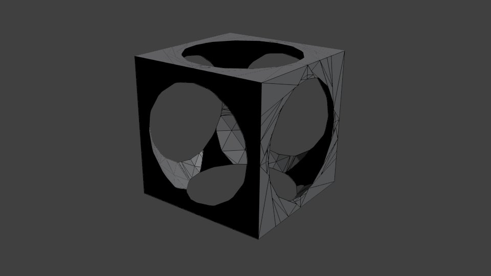

<a id="index--download-apache-commons-geometry"></a>

## Download Apache Commons Geometry

<a id="index--releases"></a>

### Releases

Download the
[latest release](https://commons.apache.org/geometry/download_geometry.cgi) of Apache Commons Geometry.

---

<a id="issue-tracking"></a>

<!-- source_url: https://commons.apache.org/proper/commons-geometry/issue-tracking.html -->

<!-- page_index: 2 -->

<a id="issue-tracking--apache-commons-geometry-issue-tracking"></a>

## Apache Commons Geometry Issue tracking

Apache Commons Geometry uses [ASF JIRA](https://issues.apache.org/jira/) for tracking issues.
See the [Apache Commons Geometry JIRA project page](https://issues.apache.org/jira/browse/GEOMETRY).

To use JIRA you may need to [create an account](https://issues.apache.org/jira/secure/Signup!default.jspa)
(if you have previously created/updated Commons issues using Bugzilla an account will have been automatically
created and you can use the [Forgot Password](https://issues.apache.org/jira/secure/ForgotPassword!default.jspa)
page to get a new password).

If you would like to report a bug, or raise an enhancement request with
Apache Commons Geometry please do the following:

1. [Search existing open bugs](https://issues.apache.org/jira/secure/IssueNavigator.jspa?reset=true&pid=12321920&sorter/field=issuekey&sorter/order=DESC&status=1&status=3&status=4).
   If you find your issue listed then please add a comment with your details.
2. [Search the mailing list archive(s)](https://commons.apache.org/proper/commons-geometry/mail-lists.html).
   You may find your issue or idea has already been discussed.
3. Decide if your issue is a bug or an enhancement.
4. Submit either a [bug report](https://issues.apache.org/jira/secure/CreateIssueDetails!init.jspa?pid=12321920&issuetype=1&priority=4&assignee=-1)
   or [enhancement request](https://issues.apache.org/jira/secure/CreateIssueDetails!init.jspa?pid=12321920&issuetype=4&priority=4&assignee=-1).

Please also remember these points:

- the more information you provide, the better we can help you
- test cases are vital, particularly for any proposed enhancements
- the developers of Apache Commons Geometry are all unpaid volunteers

For more information on subversion and creating patches see the
[Apache Contributors Guide](http://www.apache.org/dev/contributors.html).

You may also find these links useful:

- [All Open Apache Commons Geometry bugs](https://issues.apache.org/jira/secure/IssueNavigator.jspa?reset=true&pid=12321920&sorter/field=issuekey&sorter/order=DESC&status=1&status=3&status=4)
- [All Resolved Apache Commons Geometry bugs](https://issues.apache.org/jira/secure/IssueNavigator.jspa?reset=true&pid=12321920&sorter/field=issuekey&sorter/order=DESC&status=5&status=6)
- [All Apache Commons Geometry bugs](https://issues.apache.org/jira/secure/IssueNavigator.jspa?reset=true&pid=12321920&sorter/field=issuekey&sorter/order=DESC)

---

<a id="developers"></a>

<!-- source_url: https://commons.apache.org/proper/commons-geometry/developers.html -->

<!-- page_index: 3 -->

<a id="developers--aims"></a>

## Aims

Maintenance of a library by decentralized team requires communication.
It is important that developers follow guidelines laid down by the community
to ensure that the code they create can be successfully maintained by others.

<a id="developers--guidelines"></a>

## Guidelines

Developers are asked to comply with the following development guidelines.
Code that does not comply with the guidelines including the word *must*
will not be committed. Our aim will be to fix all of the exceptions to the
"*should*" guidelines prior to a release.

<a id="developers--contributing"></a>

### Contributing

**Getting Started**

1. Download the Commons Geometry source code. Follow the instructions
   under the heading "Repository Checkout" on the
   [Git at the ASF page](https://gitbox.apache.org/).
   The git url for the current development sources of Commons Geometry
   is


```
http://gitbox.apache.org/repos/asf/commons-geometry.git
```

   for anonymous read-only access and


```
https://apacheid@gitbox.apache.org/repos/asf/commons-geometry.git
```

   (where apacheid should be replaced by each committer Apache ID) for committers
   read-write access.
2. Like most commons components, Commons Geometry uses Apache Maven as our
   build tool. The sources can also be built using Ant (a working
   Ant build.xml is included in the top level project directory).
   To build Commons Geometry using Maven, you can follow the instructions for
   [Building a
   project with Maven](http://maven.apache.org/run-maven/index.html).
   Launch Maven from the top-level directory
   in the checkout of Commons Geometry trunk. No special setup is required,
   except that currently to build the site (i.e. to execute Maven's
   "site" goal), you may need to increase the default memory allocation
   (e.g. `export MAVEN_OPTS=-Xmx512m`) before launching
   Maven.
3. Be sure to join the commons-dev and commons-user
   [email lists](https://commons.apache.org/proper/commons-geometry/mail-lists.html) and use them appropriately (make sure the string
   "[Geometry]" starts the Subject line of all your postings).
   Make any proposals here where the group can comment on them.
4. [Setup an account on JIRA](https://issues.apache.org/jira/secure/Signup!default.jspa)
   and use it to submit patches and
   identify bugs. Read the
   [directions](https://issues.apache.org/bugwritinghelp.html)
   for submitting bugs and search the database to
   determine if an issue exists or has already been dealt with.

   See the [Commons Geometry Issue Tracking Page](https://commons.apache.org/geometry/issue-tracking.html)
   for more information on how to
   search for or submit bugs or enhancement requests.

   - Generating patches: The requested format for generating patches is
     the Unified Diff format, which can be easily generated using the git
     client or various IDEs.


```
git diff -p > patch 
```

     Run this command from the top-level project directory (where pom.xml
     resides).

**Contributing ideas and code**

Follow the steps below when making suggestions for additions or
enhancements to Commons Geometry. This will make it easier for the community
to comment on your ideas and for the committers to keep track of them.
Thanks in advance!

1. Start with a post to the commons-dev mailing list, with [Geometry] at
   the beginning of the subject line, followed by a short title
   describing the new feature or enhancement; for example, "[Geometry]
   New cryptographically secure generator".
   The body of the post should include each of the following items
   (but be **as brief as possible**):
   - A concise description of the new feature / enhancement
   - References to definitions and algorithms. Using standard
     definitions and algorithms makes communication much easier and will
     greatly increase the chances that we will accept the code / idea
   - Some indication of why the addition / enhancement is practically
     useful
2. Assuming a generally favorable response to the idea on commons-dev,
   the next step is to file a report on the issue-tracking system (JIRA):
   Create a JIRA ticket using the the feature title as the short
   description. Incorporate feedback from the initial posting in the
   description. Add a reference to the discussion thread.
3. Submit code as attachments to the JIRA ticket. Please use one
   ticket for each feature, adding multiple patches to the ticket
   as necessary. Use the git diff command to generate your patches as
   diffs. Please do not submit modified copies of existing java files. Be
   patient (but not **too** patient) with committers reviewing
   patches. Post a \*nudge\* message to commons-dev with a reference to the
   ticket if a patch goes more than a few days with no comment or commit.

<a id="developers--coding-style"></a>

### Coding Style

Commons Geometry follows [Code
Conventions for the Java Programming Language](http://java.sun.com/docs/codeconv/). As part of the maven
build process, style checking is performed using the Checkstyle plugin, using the properties specified in `checkstyle.xml`.
Committed code *should* generate no Checkstyle errors. One thing
that Checkstyle will complain about is tabs included in the source code.
Please make sure to set your IDE or editor to use spaces instead of tabs.

Committers should configure the

```
user.name
```

,

```
user.email
```

and

```
core.autocrlf
```

git repository or global settings with

```
git config
```

.
The first two settings define the identity and mail of the committer.
The third setting deals with line endings to achieve consistency
in line endings. Windows users should configure this setting to

```
true
```

(thus forcing git to convert CR/LF line endings
in the workspace while maintaining LF only line endings in the repository)
while OS X and Linux users should configure it to

```
input
```

(thus forcing git to only strip accidental CR/LF when committing into
the repository, but never when cheking out files from the repository). See [Customizing
Git - Git Configuration](http://www.git-scm.com/book/en/Customizing-Git-Git-Configuration) in the git book for explanation about how to
configure these settings and more.

<a id="developers--documentation"></a>

### Documentation

- Committed code *must* include full javadoc.
- All component contracts *must* be fully specified in the javadoc class,
  interface or method comments, including specification of acceptable ranges
  of values, exceptions or special return values.
- External references or full statements of definitions for all the
  terms used in component documentation *must* be provided.
- Commons Geometry javadoc generation supports embedded LaTeX formulas via the
  [MathJax](http://www.mathjax.org) javascript display engine.
  To embed mathematical expressions formatted in LaTeX in javadoc, simply surround
  the expression to be formatted with either `\(` and `\)`
  for inline formulas (or `\[` and `\]` to have the formula
  appear on a separate line).
  For example,
  `\(``a^2 + b^2 = c^2``\)`
  will render an in-line formula
  saying that (a, b, c) is a Pythagorean triplet: \( a^2 + b^2 = c^2 \).
  See the MathJax and LaTex documentation for details on how to represent formulas
  and escape special characters.
- Implementations *should* use standard algorithms and
  references or full descriptions of all algorithms *should* be
  provided.
- Additions and enhancements *should* include updates to the User
  Guide.

<a id="developers--exceptions"></a>

### Exceptions

- Exceptions generated by Commons Geometry are all unchecked.
- All public methods advertise all exceptions that they can generate.
  Exceptions *must* be documented in Javadoc and the documentation
  *must* include full description of the conditions under which
  exceptions are thrown.

<a id="developers--unit-tests"></a>

### Unit Tests

- Committed code *must* include unit tests.
- Unit tests *should* provide full path coverage.
- Unit tests *should* verify all boundary conditions specified in
  interface contracts, including verification that exceptions are thrown or
  special values (e.g. Double.NaN, Double.Infinity) are returned as
  expected.

<a id="developers--licensing-and-copyright"></a>

### Licensing and copyright

- All new source file submissions *must* include the Apache Software
  License in a comment that begins the file.
- All contributions must comply with the terms of the Apache
  [Contributor License
  Agreement (CLA)](http://www.apache.org/licenses/cla.pdf).
- Patches *must* be accompanied by a clear reference to a "source"
  - if code has been "ported" from another language, clearly state the
  source of the original implementation. If the "expression" of a given
  algorithm is derivative, please note the original source (textbook,
  paper, etc.).
- References to source materials covered by restrictive proprietary
  licenses should be avoided. In particular, contributions should not
  implement or include references to algorithms in
  [Numerical Recipes (NR)](http://www.nr.com/).
  Any questions about copyright or patent issues should be raised on
  the commons-dev mailing list before contributing or committing code.

---

<a id="release-history"></a>

<!-- source_url: https://commons.apache.org/proper/commons-geometry/release-history.html -->

<!-- page_index: 4 -->

<a id="release-history--commons-geometry-release-history"></a>

## Commons Geometry Release History

*Note.* For older javadocs see the individal artifact sub-sites.

| Version | Release date (YYYY-MM-DD) | Required Java Version | Release notes |
| --- | --- | --- | --- |
| 1.0 | 2021-08-21 | 8+ | [release notes for 1.0](assets/files/release-notes-1-0_676b172c5c990456.txt) |
| 1.0-beta1 | 2020-07-20 | 8+ | [release notes for 1.0-beta1](assets/files/release-notes-1-0-beta1_d0cb5b26c2207e1d.txt) |

---

<a id="userguide"></a>

<!-- source_url: https://commons.apache.org/proper/commons-geometry/userguide/index.html -->

<!-- page_index: 5 -->

<a id="userguide--commons-geometry-user-guide"></a>

# Commons Geometry User Guide

<a id="userguide--overview"></a>

## Overview

*Commons Geometry* provides types and utilities for geometric processing. The code originated in the
org.apache.commons.math3.geometry package of the
[commons-math](https://commons.apache.org/proper/commons-math/) project
but was pulled out into a separate project for better maintainability. It has since undergone numerous
improvements, including a major refactor of the core interfaces and classes.

*Commons Geometry* is divided into a number of submodules.

- [commons-geometry-core](#commons-geometry-core) - Provides core interfaces
  and classes.
- [commons-geometry-euclidean](#commons-geometry-euclidean) - Provides
  classes for Euclidean space in 1D, 2D, and 3D.
- [commons-geometry-spherical](#commons-geometry-spherical) - Provides
  classes for Spherical space in 1D and 2D.
- [commons-geometry-io-core](#commons-geometry-io-core) - Provides
  core classes and interfaces for IO functionality.
- [commons-geometry-io-euclidean](#commons-geometry-io-euclidean) - Provides
  classes for IO operations on Euclidean data formats, such STL and OBJ.

<a id="userguide--example-modules"></a>

## Example Modules

In addition to the modules above, the *Commons Geometry*
[source distribution](https://commons.apache.org/geometry/download_geometry.cgi) contains example
code demonstrating library functionality and/or providing useful development utilities. These modules are not
part of the public API of the library and no guarantees are made concerning backwards compatibility. The
[example module parent page](#commons-geometry-examples-modules) contains a listing of the
available modules.

<a id="userguide--concepts"></a>

## Concepts

<a id="userguide--floating-point-math"></a>

### Floating Point Math

All floating point numbers in *Commons Geometry* are represented using
doubles.

The concept of a *precision context* is used in order to avoid issues with floating point errors
in computations. A precision context is an object that encapsulates floating point comparisons, allowing numbers that may not be exactly equal to be considered equal for the
purposes of a computation. This idea is represented in code with the
org.apache.commons.numbers.core.Precision.DoubleEquivalence class from
the [Commons Numbers](https://commons.apache.org/proper/commons-numbers/) library.
The example below uses an epsilon (tolerance) value to compare numbers for equality.

```

// create a precision instance with an epsilon (aka, tolerance) value of 1e-3
Precision.DoubleEquivalence precision = Precision.doubleEquivalenceOfEpsilon(1e-3);

// test for equality using the eq() method
precision.eq(1.0009, 1.0); // true; difference is less than epsilon
precision.eq(1.002, 1.0); // false; difference is greater than epsilon

// compare
precision.compare(1.0009, 1.0); // 0
precision.compare(1.002, 1.0); // 1
        
```

<a id="userguide--equals-vs-eq"></a>

#### equals() vs eq()

Many objects in *Commons Geometry* provide both a standard Java equals()
method as well as an eq() method. The equals() method
always tests for *strict* equality between objects. In general, any floating point values in the two
objects must be exactly equal in order for the equals() method to return true (see
the documentation on individual classes for details). This strictness is enforced so that
equals() can behave as expected by the JDK, fulfilling properties such as
transitivity and the relationship to hashCode().

In contrast, the eq() method is used to test for *approximate* equality
between objects, with floating point values being evaluated by a provided
Precision.DoubleEquivalence instance. Because of this approximate nature, this
method cannot be guaranteed to be transitive or have any meaningful relationship to hashCode.
The eq() should be used to test for object equality in cases where floating-point
errors in a computation may have introduced small discrepancies in values. The example below demonstrates
the differences between equals() and eq().

```

Precision.DoubleEquivalence precision = Precision.doubleEquivalenceOfEpsilon(1e-6);

Vector2D v1 = Vector2D.of(1, 1); // (1.0, 1.0)
Vector2D v2 = Vector2D.parse("(1, 1)"); // (1.0, 1.0)

Vector2D v3 = Vector2D.of(Math.sqrt(2), 0).transform(
    AffineTransformMatrix2D.createRotation(0.25 * Math.PI)); // (1.0000000000000002, 1.0)

v1.equals(v2); // true - exactly equal
v1.equals(v3); // false - not exactly equal

v1.eq(v3, precision); // true - approximately equal according to the given precision context
        
```

<a id="userguide--transforms"></a>

### Transforms

A geometric transform is simply a function that maps points from one set to another. Transforms
in *Commons Geometry* are represented with the
[Transform](https://commons.apache.org/proper/commons-geometry/commons-geometry-core/apidocs/org/apache/commons/geometry/core/Transform.html)
interface. Useful implementations of this interface exist for each supported space
and dimension, so users should not need to implement their own. However, it is important to know that
all implementations of this interface *must* meet the requirements listed below. Transforms that do
not meet these requirements cannot be expected to produce correct results in algorithms that use this
interface.

1. Transforms must represent functions that are *one-to-one* and *onto*
   (i.e. [bijections](https://en.wikipedia.org/wiki/Bijection)). This means that every point
   in the space must be mapped to exactly one other point in the space. This also implies that the function
   is invertible.
2. Transforms must preserve [collinearity](https://en.wikipedia.org/wiki/Collinearity). This
   means that if a set of points lie on a common hyperplane before the transform, then they must also lie
   on a common hyperplane after the transform. For example, if the Euclidean 2D points a,
   b, and c lie on line L, then the transformed points a',
   b', and c' must lie on line L', where L' is the transformed
   form of the line.
3. Transforms must preserve the concept of
   [parallelism](https://en.wikipedia.org/wiki/Parallel_(geometry)) defined for the space.
   This means that hyperplanes that are parallel before the transformation must remain parallel afterwards,
   and hyperplanes that intersect must also intersect afterwards. For example, a transform that causes
   parallel lines to converge to a single point in Euclidean space (such as the projective transforms used to
   create perspective viewpoints in 3D graphics) would not meet this requirement. However, a transform that
   turns a square into a rhombus with no right angles would fulfill the requirement, since the two pairs of
   parallel lines forming the square remain parallel after the transformation.

Transforms that meet the above requirements in Euclidean space (and other affine spaces) are known as
[affine transforms](https://en.wikipedia.org/wiki/Affine_transformation) and include such common
operations as translation, rotation, reflection, scaling, and any combinations thereof.

<a id="userguide--hyperplanes"></a>

### Hyperplanes

A *hyperplane* is a subspace of dimension one less than its surrounding space. For example, the hyperplanes in Euclidean 3D space are 2 dimensional planes. Similarly, the hyperplanes in Euclidean
2D space are 1 dimensional lines. Hyperplanes have the property that they partition their surrounding
space into 3 distinct sets:

- points on one side of the hyperplane,
- points on the opposite side of the hyperplane, and
- points lying directly on the hyperplane.

To differentiate between the two sides of a hyperplane, one side is labeled as the *plus* side
and the other as the *minus* side. The *offset* of a point relative to a hyperplane is the
distance from the point to the closest point on the hyperplane, with the sign of the distance being positive
if the point lies on the plus side of the hyperplane and minus otherwise. Points lying directly on the
hyperplane have an offset of zero.

Hyperplanes play a key role in *Commons Geometry* not only because of their importance geometrically but also
because they form the basis for the region classes and algorithms, such as [BSP trees](#userguide--bsp_trees).
Hyperplanes are represented in code with the
[Hyperplane](https://commons.apache.org/proper/commons-geometry/commons-geometry-core/apidocs/org/apache/commons/geometry/core/partitioning/Hyperplane.html)
interface, with each space and dimension containing its own custom implementation. Users are not intended to
implement this interface.

<a id="userguide--bsp-trees"></a>

### BSP Trees

Binary Space Partitioning (BSP) trees are an efficient way to represent spatial partitionings. They provide a very
flexible and powerful geometric data structure that can represent everything from an entire, infinite space
to simple, convex regions. Numerous algorithms also exist to perform operations on BSP trees, such as
classifying points, computing the size of a represented region, and performing boolean operations on
polytopes (union, intersection, difference, xor, complement).

The main principle in BSP trees is the recursive subdivision of space using
[hyperplanes](#userguide--hyperplanes). The easiest way to understand the data structure is to follow
the steps for creating a tree. When initially created, BSP trees contain a single node: the root node.
This node is a leaf node and represents the entire space. If one "inserts" a
hyperplane into the tree at that node, then the hyperplane partitions the node's space into a plus side
and a minus side. The root node is now "cut", and two new leaf nodes are created for it as children: a plus
node and a minus node. The plus node represents the half-space on the plus side of the cutting hyperplane
and the minus side represents the half-space on the minus side of the cutting hyperplane. These new child
nodes can themselves be cut by other hyperplanes, generating new child leaf nodes, and so on. In this way, BSP trees can be created to represent any hyperplane-based spatial partitioning.

In their most basic form, BSP trees do not represents polytopes. In order to represent polytopes, additional information must be stored with each leaf node, namely whether or not that leaf node lies on the
inside or outside of the shape. By convention, when a BSP tree node is cut, the child node that lies on the
minus side of the cutting hyperplane is considered to be inside of the shape, while the child node on the plus
side is considered to be on the outside. For example, in Euclidean 3D space, plane normals are considered to
point toward the plus side of the plane. Thus, when splitting a BSP tree node with a plane, the plane normal points outward from
the shape, as one might expect. (In *Commons Geometry*, this default convention can be changed by passing a
[RegionCutRule](https://commons.apache.org/proper/commons-geometry/commons-geometry-core/apidocs/org/apache/commons/geometry/core/partitioning/bsp/RegionCutRule.html)
value when inserting into a tree. This gives fine-grain control over the structure of the tree and can
be used to create structural splits in the tree, meaning splits that do not encode region information but are
only used to help keep the tree balanced.)

One of the main sources for the development of the BSP tree code in this project and the original
commons-math project was Bruce
Naylor, John Amanatides and William Thibault's paper [Merging
BSP Trees Yields Polyhedral Set Operations](http://www.cs.yorku.ca/~amana/research/bsptSetOp.pdf) Proc. Siggraph '90, Computer Graphics 24(4), August 1990, pp 115-124, published by the
Association for Computing Machinery (ACM).

BSP tree data structures in *Commons Geometry* are represented with the
[BSPTree](https://commons.apache.org/proper/commons-geometry/commons-geometry-core/apidocs/org/apache/commons/geometry/core/partitioning/bsp/BSPTree.html)
interface. Implementations of this interface representing regions/polytopes exist for each supported space and dimension.

<a id="userguide--examples"></a>

#### Examples

<a id="userguide--manual-bsp-tree-region-creation"></a>

##### Manual BSP Tree Region Creation

The example below creates a BSP tree representing the unit square by directly inserting hyperplane cuts
into nodes. A diagonal "structural" cut is used at the root node in order to keep the tree balanced.

```

Precision.DoubleEquivalence precision = Precision.doubleEquivalenceOfEpsilon(1e-6);

// create a tree representing an empty space (nothing "inside")
RegionBSPTree2D tree = RegionBSPTree2D.empty();

// insert a "structural" cut, meaning a cut whose children have the same inside/outside
// status as the parent; this will help keep our tree balanced and limit its overall height
tree.getRoot().insertCut(Lines.fromPointAndDirection(Vector2D.ZERO, Vector2D.of(1, 1), precision),
        RegionCutRule.INHERIT);

RegionBSPTree2D.RegionNode2D currentNode;

// insert on the plus side of the structural diagonal cut
currentNode = tree.getRoot().getPlus();

currentNode.insertCut(Lines.fromPointAndDirection(Vector2D.ZERO, Vector2D.Unit.PLUS_X, precision));
currentNode = currentNode.getMinus();

currentNode.insertCut(Lines.fromPointAndDirection(Vector2D.of(1, 0), Vector2D.Unit.PLUS_Y, precision));

// insert on the plus side of the structural diagonal cut
currentNode = tree.getRoot().getMinus();

currentNode.insertCut(Lines.fromPointAndDirection(Vector2D.of(1, 1), Vector2D.Unit.MINUS_X, precision));
currentNode = currentNode.getMinus();

currentNode.insertCut(Lines.fromPointAndDirection(Vector2D.of(0, 1), Vector2D.Unit.MINUS_Y, precision));

// compute some tree properties
int count = tree.count(); // number of nodes in the tree = 11
int height = tree.height(); // height of the tree = 3
double size = tree.getSize(); // size of the region = 1
Vector2D centroid = tree.getCentroid(); // region centroid = (0.5, 0.5)
        
```

<a id="userguide--standard-bsp-tree-region-creation"></a>

##### Standard BSP Tree Region Creation

The example below uses the standard approach to building BSP tree regions by inserting hyperplane subsets
into the tree. The shape is the same as the example above.

```

Precision.DoubleEquivalence precision = Precision.doubleEquivalenceOfEpsilon(1e-6);

// create a tree representing an empty space (nothing "inside")
RegionBSPTree2D tree = RegionBSPTree2D.empty();

// insert the hyperplane subsets
tree.insert(Arrays.asList(
            Lines.segmentFromPoints(Vector2D.ZERO, Vector2D.of(1, 0), precision),
            Lines.segmentFromPoints(Vector2D.of(1, 0), Vector2D.of(1, 1), precision),
            Lines.segmentFromPoints(Vector2D.of(1, 1), Vector2D.of(0, 1), precision),
            Lines.segmentFromPoints(Vector2D.of(0, 1), Vector2D.ZERO, precision)
        ));

// compute some tree properties
int count = tree.count(); // number of nodes in the tree = 9
int height = tree.height(); // height of the tree = 4
double size = tree.getSize(); // size of the region = 1
Vector2D centroid = tree.getCentroid(); // region centroid = (0.5, 0.5)
        
```

<a id="userguide--core-interfaces"></a>

## Core Interfaces

*Commons Geometry* contains a number of core interfaces that appear throughout the library, generally
following the same implementation patterns. For each space and dimension, there are interfaces that are always
implemented with a single class, some that may have more than one implementation, and some that are optional.
Additionally, each space and dimension has a primary factory class containing static factory methods for
producing hyperplanes and common hyperplane subsets. See the summary below for details.

<a id="userguide--each-supported-space-and-dimension-contains..."></a>

##### Each supported space and dimension contains...

- **One implementation of...**
  - [Point](https://commons.apache.org/proper/commons-geometry/commons-geometry-core/apidocs/org/apache/commons/geometry/core/Point.html) -
    Represents locations in the space and serves to define the space in the API.
  - [Hyperplane](https://commons.apache.org/proper/commons-geometry/commons-geometry-core/apidocs/org/apache/commons/geometry/core/partitioning/Hyperplane.html) -
    Geometric primitive; serves to partition the space.
- **One implementation (if applicable) of...**
  - [Vector](https://commons.apache.org/proper/commons-geometry/commons-geometry-core/apidocs/org/apache/commons/geometry/core/Vector.html) -
    General vector interface.
- **One or more implementations of...**
  - [HyperplaneSubset](https://commons.apache.org/proper/commons-geometry/commons-geometry-core/apidocs/org/apache/commons/geometry/core/partitioning/HyperplaneSubset.html) -
    Represents an arbitrary subset of points in a hyperplane, such as a set of 1D intervals on a line or a
    polygonal area on a 3D plane. This is a base interface of
    [HyperplaneConvexSubset](https://commons.apache.org/proper/commons-geometry/commons-geometry-core/apidocs/org/apache/commons/geometry/core/partitioning/HyperplaneConvexSubset.html),
    but does not require that the represented subset be convex. Thus, non-convex and disjoint regions
    can be represented. Instances may have finite or infinite size.
  - [HyperplaneConvexSubset](https://commons.apache.org/proper/commons-geometry/commons-geometry-core/apidocs/org/apache/commons/geometry/core/partitioning/HyperplaneConvexSubset.html) -
    Represents convex subsets of points in hyperplanes. This interface is frequently used to define the boundaries
    of regions, such as line segments in Euclidean 2D space and polyhedron facets in Euclidean 3D space. Instances
    of this type may be finite (such as line segments) or infinite (such as rays).
  - [Region](https://commons.apache.org/proper/commons-geometry/commons-geometry-core/apidocs/org/apache/commons/geometry/core/Region.html) -
    Represents a region in the space. Regions partition their surrounding space into sets of points lying
    on the inside, outside, and boundary of the region. Examples include circles, spheres, polygons, and
    polyhedrons. Each dimension and space has at least one region type implemented using
    [BSP trees](#userguide--bsp_trees). Instances may have finite or infinite size.
  - [Transform](https://commons.apache.org/proper/commons-geometry/commons-geometry-core/apidocs/org/apache/commons/geometry/core/Transform.html) -
    Represents an inversible mapping between points that preserves parallelism. Instances are used to transform
    points and other geometric primitives.

<a id="userguide--euclidean-space"></a>

## Euclidean Space

Euclidean space is the space commonly thought of when people think of geometry. It corresponds with the
common notion of "flat" space or the space that we usually experience in the physical world.
Distances between points in this space are given by the formula \( \sqrt{(A - B)^2} \), which is also known as the *Euclidean norm*.

<a id="userguide--points-and-vectors"></a>

#### Points and Vectors

Mathematically, points and vectors are separate, distinct entities. Points represent specific
locations in space while vectors represent displacements between points. However, since the use of these
types is so closely related and the data structures are so similar, they have been merged into a single set
of Euclidean *"VectorXD"* classes that implement both interfaces using Cartesian coordinates:
[Vector1D](https://commons.apache.org/proper/commons-geometry/commons-geometry-euclidean/apidocs/org/apache/commons/geometry/euclidean/oned/Vector1D.html), [Vector2D](https://commons.apache.org/proper/commons-geometry/commons-geometry-euclidean/apidocs/org/apache/commons/geometry/euclidean/twod/Vector2D.html), and
[Vector3D](https://commons.apache.org/proper/commons-geometry/commons-geometry-euclidean/apidocs/org/apache/commons/geometry/euclidean/threed/Vector3D.html).
It is up to users to determine when instances of these classes are representing points and when they are
representing vectors.

<a id="userguide--euclidean-1d"></a>

### Euclidean 1D

<a id="userguide--primary-classes"></a>

#### Primary Classes

- Point/Vector -
  [Vector1D](https://commons.apache.org/proper/commons-geometry/commons-geometry-euclidean/apidocs/org/apache/commons/geometry/euclidean/oned/Vector1D.html)
- Hyperplane -
  [OrientedPoint](https://commons.apache.org/proper/commons-geometry/commons-geometry-euclidean/apidocs/org/apache/commons/geometry/euclidean/oned/OrientedPoint.html)
- Hyperplane Factory Class -
  [OrientedPoints](https://commons.apache.org/proper/commons-geometry/commons-geometry-euclidean/apidocs/org/apache/commons/geometry/euclidean/oned/OrientedPoints.html)
- Region
  - [RegionBSPTree1D](https://commons.apache.org/proper/commons-geometry/commons-geometry-euclidean/apidocs/org/apache/commons/geometry/euclidean/oned/RegionBSPTree1D.html) -
    Represents arbitrary 1D regions using BSP trees.
  - [Interval](https://commons.apache.org/proper/commons-geometry/commons-geometry-euclidean/apidocs/org/apache/commons/geometry/euclidean/oned/Interval.html) -
    Represents a single (possibly infinite), convex interval.
- Transform
  - [AffineTransformMatrix1D](https://commons.apache.org/proper/commons-geometry/commons-geometry-euclidean/apidocs/org/apache/commons/geometry/euclidean/oned/AffineTransformMatrix1D.html) -
    Represents affine transforms using a 2x2 matrix.

<a id="userguide--examples-2"></a>

#### Examples

<a id="userguide--interval-creation"></a>

##### Interval creation

```

Precision.DoubleEquivalence precision = Precision.doubleEquivalenceOfEpsilon(1e-6);

// create a closed interval and a half-open interval with a min but no max
Interval closed = Interval.of(1, 2, precision);
Interval halfOpen = Interval.min(1, precision);

// classify some points against the intervals
closed.contains(0.0); // false
halfOpen.contains(Vector1D.ZERO); // false

RegionLocation closedOneLoc = closed.classify(Vector1D.of(1)); // RegionLocation.BOUNDARY
RegionLocation halfOpenOneLoc = halfOpen.classify(Vector1D.of(1)); // RegionLocation.BOUNDARY

RegionLocation closedThreeLoc = closed.classify(3.0); // RegionLocation.OUTSIDE
RegionLocation halfOpenThreeLoc = halfOpen.classify(3.0); // RegionLocation.INSIDE
        
```

<a id="userguide--bsp-tree-from-intervals"></a>

##### BSP tree from intervals

```

Precision.DoubleEquivalence precision = Precision.doubleEquivalenceOfEpsilon(1e-6);

// build a bsp tree from the union of several intervals
RegionBSPTree1D tree = RegionBSPTree1D.empty();

tree.add(Interval.of(1, 2, precision));
tree.add(Interval.of(1.5, 3, precision));
tree.add(Interval.of(-1, -2, precision));

// compute the size;
double size = tree.getSize(); // 3

// convert back to intervals
List<Interval> intervals = tree.toIntervals(); // size = 2
        
```

<a id="userguide--euclidean-2d"></a>

### Euclidean 2D

<a id="userguide--primary-classes-2"></a>

#### Primary Classes

- Point/Vector -
  [Vector2D](https://commons.apache.org/proper/commons-geometry/commons-geometry-euclidean/apidocs/org/apache/commons/geometry/euclidean/twod/Vector2D.html)
- Hyperplane -
  [Line](https://commons.apache.org/proper/commons-geometry/commons-geometry-euclidean/apidocs/org/apache/commons/geometry/euclidean/twod/Line.html)
- HyperplaneSubset -
  [LineSubset](https://commons.apache.org/proper/commons-geometry/commons-geometry-euclidean/apidocs/org/apache/commons/geometry/euclidean/twod/LineSubset.html)
- HyperplaneConvexSubset -
  [LineConvexSubset](https://commons.apache.org/proper/commons-geometry/commons-geometry-euclidean/apidocs/org/apache/commons/geometry/euclidean/twod/LineConvexSubset.html)
  (subclasses include
  [Segment](https://commons.apache.org/proper/commons-geometry/commons-geometry-euclidean/apidocs/org/apache/commons/geometry/euclidean/twod/Segment.html),
  [Ray](https://commons.apache.org/proper/commons-geometry/commons-geometry-euclidean/apidocs/org/apache/commons/geometry/euclidean/twod/Ray.html), and
  [ReverseRay](https://commons.apache.org/proper/commons-geometry/commons-geometry-euclidean/apidocs/org/apache/commons/geometry/euclidean/twod/ReverseRay.html))
- Hyperplane / HyperplaneSubset Factory Class -
  [Lines](https://commons.apache.org/proper/commons-geometry/commons-geometry-euclidean/apidocs/org/apache/commons/geometry/euclidean/twod/Lines.html)
- Region
  - [RegionBSPTree2D](https://commons.apache.org/proper/commons-geometry/commons-geometry-euclidean/apidocs/org/apache/commons/geometry/euclidean/twod/RegionBSPTree2D.html) -
    Represents arbitrary areas using BSP trees.
  - [ConvexArea](https://commons.apache.org/proper/commons-geometry/commons-geometry-euclidean/apidocs/org/apache/commons/geometry/euclidean/twod/ConvexArea.html) -
    Represents a single (possibly infinite), convex area.
  - [Circle](https://commons.apache.org/proper/commons-geometry/commons-geometry-euclidean/apidocs/org/apache/commons/geometry/euclidean/twod/shape/Circle.html) -
    Represents a circle.
- Transform
  - [AffineTransformMatrix2D](https://commons.apache.org/proper/commons-geometry/commons-geometry-euclidean/apidocs/org/apache/commons/geometry/euclidean/twod/AffineTransformMatrix2D.html) -
    Represents affine transforms using a 3x3 matrix.
- Additional
  - [LinePath](https://commons.apache.org/proper/commons-geometry/commons-geometry-euclidean/apidocs/org/apache/commons/geometry/euclidean/twod/path/LinePath.html) -
    Represents a connected sequence of line subsets.

<a id="userguide--examples-3"></a>

#### Examples

<a id="userguide--line-intersection"></a>

##### Line intersection

```

Precision.DoubleEquivalence precision = Precision.doubleEquivalenceOfEpsilon(1e-6);

// create some lines
Line a = Lines.fromPoints(Vector2D.ZERO, Vector2D.of(2, 2), precision);
Line b = Lines.fromPointAndDirection(Vector2D.of(1, -1), Vector2D.Unit.PLUS_Y, precision);

// compute the intersection and angles
Vector2D intersection = a.intersection(b); // (1, 1)
double angleAtoB = a.angle(b); // pi/4
double angleBtoA = b.angle(a); // -pi/4
        
```

<a id="userguide--line-segment-intersection"></a>

##### Line segment intersection

```

Precision.DoubleEquivalence precision = Precision.doubleEquivalenceOfEpsilon(1e-6);

// create some line segments
Segment segmentA = Lines.segmentFromPoints(Vector2D.of(3, -1), Vector2D.of(3, 1), precision);
Segment segmentB = Lines.segmentFromPoints(Vector2D.of(-3, -1), Vector2D.of(-3, 1), precision);

// create a ray to intersect against the segments
Ray ray = Lines.rayFromPointAndDirection(Vector2D.of(2, 0), Vector2D.Unit.PLUS_X, precision);

// compute some intersections
Vector2D aIntersection = segmentA.intersection(ray); // (3, 0)
Vector2D bIntersection = segmentB.intersection(ray); // null - no intersection
        
```

<a id="userguide--bsp-tree-union"></a>

##### BSP tree union

```

Precision.DoubleEquivalence precision = Precision.doubleEquivalenceOfEpsilon(1e-6);

// create a connected sequence of line segments forming the unit square
LinePath path = LinePath.builder(precision)
        .append(Vector2D.ZERO)
        .append(Vector2D.Unit.PLUS_X)
        .append(Vector2D.of(1, 1))
        .append(Vector2D.Unit.PLUS_Y)
        .build(true); // build the path, ending it with the starting point

// convert to a tree
RegionBSPTree2D tree = path.toTree();

// copy the tree
RegionBSPTree2D copy = tree.copy();

// translate the copy
copy.transform(AffineTransformMatrix2D.createTranslation(Vector2D.of(0.5, 0.5)));

// compute the union of the regions, storing the result back into the
// first tree
tree.union(copy);

// compute some properties
double size = tree.getSize(); // 1.75
Vector2D centroid = tree.getCentroid(); // (0.75, 0.75)

// get a line path representing the boundary; a list is returned since trees
// can represent disjoint regions
List<LinePath> boundaries = tree.getBoundaryPaths(); // size = 1
        
```

<a id="userguide--linecast"></a>

##### Linecast

```

Precision.DoubleEquivalence precision = Precision.doubleEquivalenceOfEpsilon(1e-6);

Parallelogram box = Parallelogram.axisAligned(Vector2D.ZERO, Vector2D.of(2, 1), precision);

LinecastPoint2D pt = box.linecastFirst(
    Lines.segmentFromPoints(Vector2D.of(1, 0.5), Vector2D.of(4, 0.5), precision));

Vector2D intersection = pt.getPoint(); // (2.0, 0.5)
Vector2D normal = pt.getNormal(); // (1.0, 0.0)
        
```

<a id="userguide--euclidean-3d"></a>

### Euclidean 3D

<a id="userguide--primary-classes-3"></a>

#### Primary Classes

- Point/Vector -
  [Vector3D](https://commons.apache.org/proper/commons-geometry/commons-geometry-euclidean/apidocs/org/apache/commons/geometry/euclidean/threed/Vector3D.html)
- Hyperplane -
  [Plane](https://commons.apache.org/proper/commons-geometry/commons-geometry-euclidean/apidocs/org/apache/commons/geometry/euclidean/threed/Plane.html)
  (the subclass
  [EmbeddingPlane](https://commons.apache.org/proper/commons-geometry/commons-geometry-euclidean/apidocs/org/apache/commons/geometry/euclidean/threed/EmbeddingPlane.html)
  contains additional in-plane vectors to define embedded 2D subspaces)
- HyperplaneSubset -
  [PlaneSubset](https://commons.apache.org/proper/commons-geometry/commons-geometry-euclidean/apidocs/org/apache/commons/geometry/euclidean/threed/PlaneSubset.html)
- HyperplaneConvexSubset -
  [PlaneConvexSubset](https://commons.apache.org/proper/commons-geometry/commons-geometry-euclidean/apidocs/org/apache/commons/geometry/euclidean/threed/PlaneConvexSubset.html)
  (subinterfaces include
  [ConvexPolygon3D](https://commons.apache.org/proper/commons-geometry/commons-geometry-euclidean/apidocs/org/apache/commons/geometry/euclidean/threed/ConvexPolygon3D.html) and
  [Triangle3D](https://commons.apache.org/proper/commons-geometry/commons-geometry-euclidean/apidocs/org/apache/commons/geometry/euclidean/threed/Triangle3D.html))
- Hyperplane / HyperplaneSubset Factory Class -
  [Planes](https://commons.apache.org/proper/commons-geometry/commons-geometry-euclidean/apidocs/org/apache/commons/geometry/euclidean/threed/Planes.html)
- Region
  - [RegionBSPTree3D](https://commons.apache.org/proper/commons-geometry/commons-geometry-euclidean/apidocs/org/apache/commons/geometry/euclidean/threed/RegionBSPTree3D.html) -
    Represents arbitrary volumes using BSP trees.
  - [ConvexVolume](https://commons.apache.org/proper/commons-geometry/commons-geometry-euclidean/apidocs/org/apache/commons/geometry/euclidean/threed/ConvexVolume.html) -
    Represents a single (possibly infinite), convex volume.
  - [Sphere](https://commons.apache.org/proper/commons-geometry/commons-geometry-euclidean/apidocs/org/apache/commons/geometry/euclidean/threed/shape/Sphere.html) -
    Represents a sphere.
- Transform
  - [AffineTransformMatrix3D](https://commons.apache.org/proper/commons-geometry/commons-geometry-euclidean/apidocs/org/apache/commons/geometry/euclidean/threed/AffineTransformMatrix3D.html) -
    Represents affine transforms using a 4x4 matrix.
  - [QuaternionRotation](https://commons.apache.org/proper/commons-geometry/commons-geometry-euclidean/apidocs/org/apache/commons/geometry/euclidean/threed/rotation/QuaternionRotation.html) -
    Represents 3D rotations using quaternions. Instances can be converted back and forth between
    [AxisAngleSequence](https://commons.apache.org/proper/commons-geometry/commons-geometry-euclidean/apidocs/org/apache/commons/geometry/euclidean/threed/rotation/AxisAngleSequence.html)s,
    which are used to represent rotations as Euler and/or Tait-Bryan angles.
- Additional
  - [Line3D](https://commons.apache.org/proper/commons-geometry/commons-geometry-euclidean/apidocs/org/apache/commons/geometry/euclidean/threed/line/Line3D.html) -
    Represents a line in 3D space.
  - [LineConvexSubset3D](https://commons.apache.org/proper/commons-geometry/commons-geometry-euclidean/apidocs/org/apache/commons/geometry/euclidean/threed/line/LineConvexSubset3D.html) -
    Represents a finite or infinite line convex subset. Subclasses include
    [Segment3D](https://commons.apache.org/proper/commons-geometry/commons-geometry-euclidean/apidocs/org/apache/commons/geometry/euclidean/threed/line/Segment3D.html),
    [Ray3D](https://commons.apache.org/proper/commons-geometry/commons-geometry-euclidean/apidocs/org/apache/commons/geometry/euclidean/threed/line/Ray3D.html), and
    [ReverseRay3D](https://commons.apache.org/proper/commons-geometry/commons-geometry-euclidean/apidocs/org/apache/commons/geometry/euclidean/threed/line/ReverseRay3D.html).
  - [Lines3D](https://commons.apache.org/proper/commons-geometry/commons-geometry-euclidean/apidocs/org/apache/commons/geometry/euclidean/threed/line/Lines3D.html) -
    Factory class for 3D lines and line subsets.

<a id="userguide--examples-4"></a>

#### Examples

<a id="userguide--plane-intersection"></a>

##### Plane intersection

```

Precision.DoubleEquivalence precision = Precision.doubleEquivalenceOfEpsilon(1e-6);

// create two planes
Plane a = Planes.fromPointAndNormal(Vector3D.of(1, 1, 1), Vector3D.Unit.PLUS_Z, precision);
Plane b = Planes.fromPointAndPlaneVectors(Vector3D.of(1, 1, 1),
    Vector3D.Unit.PLUS_Z, Vector3D.Unit.MINUS_Y, precision);

// compute the intersection
Line3D line = a.intersection(b);

Vector3D dir = line.getDirection(); // (0, 1, 0)
        
```

<a id="userguide--transforms-2"></a>

##### Transforms

```

List<Vector3D> inputPts = Arrays.asList(
        Vector3D.ZERO,
        Vector3D.Unit.PLUS_X,
        Vector3D.Unit.PLUS_Y,
        Vector3D.Unit.PLUS_Z);

// create a 4x4 transform matrix and quaternion rotation
AffineTransformMatrix3D mat = AffineTransformMatrix3D.createScale(2)
        .translate(Vector3D.of(1, 2, 3));

QuaternionRotation rot = QuaternionRotation.fromAxisAngle(Vector3D.Unit.PLUS_Z,
        Angle.PI_OVER_TWO);

// transform the input points
List<Vector3D> matOutput = inputPts.stream()
        .map(mat)
        .collect(Collectors.toList()); // [(1, 2, 3), (3, 2, 3), (1, 4, 3), (1, 2, 5)]

List<Vector3D> rotOutput = inputPts.stream()
        .map(rot)
        .collect(Collectors.toList()); // [(0, 0, 0), (0, 1, 0), (-1, 0, 0), (0, 0, 1)]
        
```

<a id="userguide--bsp-tree-from-boundaries"></a>

##### BSP tree from boundaries

```

Precision.DoubleEquivalence precision = Precision.doubleEquivalenceOfEpsilon(1e-6);

// create the faces of a pyramid with a square base and its apex pointing along the
// positive z axis
Vector3D[] vertices = {
    Vector3D.Unit.PLUS_Z,
    Vector3D.of(0.5, 0.5, 0.0),
    Vector3D.of(0.5, -0.5, 0.0),
    Vector3D.of(-0.5, -0.5, 0.0),
    Vector3D.of(-0.5, 0.5, 0.0)
};

int[][] faceIndices = {
    {1, 0, 2},
    {2, 0, 3},
    {3, 0, 4},
    {4, 0, 1},
    {1, 2, 3, 4}
};

// convert the vertices and faces to convex polygons and use to construct a BSP tree
List<ConvexPolygon3D> faces = Planes.indexedConvexPolygons(vertices, faceIndices, precision);
RegionBSPTree3D tree = RegionBSPTree3D.from(faces);

// split the region through its centroid along a diagonal of the base
Plane cutter = Planes.fromPointAndNormal(tree.getCentroid(), Vector3D.Unit.from(1, 1, 0), precision);
Split<RegionBSPTree3D> split = tree.split(cutter);

// compute some properties for the minus side of the split and convert back to hyperplane subsets
// (ie, boundary facets)
RegionBSPTree3D minus = split.getMinus();

double minusSize = minus.getSize(); // 1/6
List<PlaneConvexSubset> minusBoundaries = minus.getBoundaries(); // size = 4
        
```

<a id="userguide--linecast-2"></a>

##### Linecast

```

Precision.DoubleEquivalence precision = Precision.doubleEquivalenceOfEpsilon(1e-6);

// create a BSP tree representing an axis-aligned cube with corners at (0, 0, 0) and (1, 1, 1)
RegionBSPTree3D tree = Parallelepiped.axisAligned(Vector3D.ZERO, Vector3D.of(1, 1, 1), precision)
        .toTree();

// create a ray starting on one side of the cube and pointing through its center
Ray3D ray = Lines3D.rayFromPointAndDirection(Vector3D.of(0.5, 0.5, -1), Vector3D.Unit.PLUS_Z, precision);

// perform the linecast
List<LinecastPoint3D> pts = tree.linecast(ray);

// check the results
int intersectionCount = pts.size(); // intersectionCount = 2
Vector3D intersection = pts.get(0).getPoint(); // (0.5, 0.5, 0.0)
Vector3D normal = pts.get(0).getNormal(); // (0.0, 0.0, -1.0)
        
```

<a id="userguide--spherical-space"></a>

## Spherical Space

Spherical space is the space present on the surface of a circle (1D) or sphere (2D). This space is an example
of a non-Euclidean geometry.

One of the key features of spherical space is that it wraps around on itself: if a line is drawn from
a point and continues in a single direction, it will eventually return to its starting point. This feature has
several consequences, one of which is that points are not unique in terms of their coordinates. For example, in 1D space, the point \(0\) is equivalent to the point \(2\pi\) and any other point of the form
\(2n\pi\). The point classes in this space address this issue by providing two representations of the location
of points: one representation containing the coordinates given by the user and another, "normalized" representation
that uniquely identifies the location of the point. In 1D, the normalized form is the azimuth angle in the
range \([0, 2\pi)\) (see
[Point1S.getNormalizedAzimuth()](https://commons.apache.org/proper/commons-geometry/commons-geometry-spherical/apidocs/org/apache/commons/geometry/spherical/oned/Point1S.html#getNormalizedAzimuth--)
). In 2D, the normalized form is a 3D Euclidean vector indicating the point's location on the unit sphere (see
[Point2S.getVector()](https://commons.apache.org/proper/commons-geometry/commons-geometry-spherical/apidocs/org/apache/commons/geometry/spherical/twod/Point2S.html#getVector--)
).

Another consequence of the wrap-around feature of spherical space is that the concept of "convexity" must be
defined more carefully than in Euclidean space. In Euclidean space, when a region is convex, it simply means
that a line drawn between any two points in the region also lies in the region. In spherical space, we must be
more careful because there are always at least two lines that can be drawn between any two points: one going "the
short way" around the space and the other going "the long way". We therefore define a convex region to be one
where the *shortest* path between any two points lies entirely within the region. (In cases where
the distances are equal, we also define the region to be convex.) In the 1D case, this means that convex intervals
must either be completely full or have a size less than or equal to \(\pi\) (see
[AngularInterval.Convex](https://commons.apache.org/proper/commons-geometry/commons-geometry-spherical/apidocs/org/apache/commons/geometry/spherical/oned/AngularInterval.Convex.html)
), which implies the same for
[GreatArc](https://commons.apache.org/proper/commons-geometry/commons-geometry-spherical/apidocs/org/apache/commons/geometry/spherical/twod/GreatArc.html)
instances in 2D.

<a id="userguide--spherical-1d"></a>

### Spherical 1D

<a id="userguide--primary-classes-4"></a>

#### Primary Classes

- Point -
  [Point1S](https://commons.apache.org/proper/commons-geometry/commons-geometry-spherical/apidocs/org/apache/commons/geometry/spherical/oned/Point1S.html)
- Hyperplane -
  [CutAngle](https://commons.apache.org/proper/commons-geometry/commons-geometry-spherical/apidocs/org/apache/commons/geometry/spherical/oned/CutAngle.html)
- Hyperplane Factory Class -
  [CutAngles](https://commons.apache.org/proper/commons-geometry/commons-geometry-spherical/apidocs/org/apache/commons/geometry/spherical/oned/CutAngles.html)
- Region
  - [RegionBSPTree1S](https://commons.apache.org/proper/commons-geometry/commons-geometry-spherical/apidocs/org/apache/commons/geometry/spherical/oned/RegionBSPTree1S.html) -
    Represents arbitrary 1D regions using BSP trees.
  - [AngularInterval](https://commons.apache.org/proper/commons-geometry/commons-geometry-spherical/apidocs/org/apache/commons/geometry/spherical/oned/AngularInterval.html) -
    Represents a single interval, possibly non-convex.
  - [AngularInterval.Convex](https://commons.apache.org/proper/commons-geometry/commons-geometry-spherical/apidocs/org/apache/commons/geometry/spherical/oned/AngularInterval.Convex.html) -
    Represents a single, convex interval.
- Transform
  - [Transform1S](https://commons.apache.org/proper/commons-geometry/commons-geometry-spherical/apidocs/org/apache/commons/geometry/spherical/oned/Transform1S.html) -
    Transform supporting rotation and reflection.

<a id="userguide--examples-5"></a>

#### Examples

<a id="userguide--angularinterval-creation"></a>

##### AngularInterval creation

```

Precision.DoubleEquivalence precision = Precision.doubleEquivalenceOfEpsilon(1e-6);

// create angular intervals of different sizes, one of size pi/2 and one of size 3pi/2
AngularInterval a = AngularInterval.of(0, Angle.PI_OVER_TWO, precision);
AngularInterval b = AngularInterval.of(Point1S.PI, Point1S.of(Angle.PI_OVER_TWO), precision);

// test some points
a.contains(Point1S.of(0.25 * Math.PI)); // true
b.contains(Point1S.of(0.25 * Math.PI)); // true

RegionLocation aLocZero = a.classify(Point1S.ZERO); // RegionLocation.BOUNDARY
RegionLocation bLocZero = b.classify(Point1S.ZERO); // RegionLocation.INSIDE
        
```

<a id="userguide--bsp-tree-from-intervals-2"></a>

##### BSP tree from intervals

```

Precision.DoubleEquivalence precision = Precision.doubleEquivalenceOfEpsilon(1e-6);

// create a region from the union of multiple angular intervals
RegionBSPTree1S tree = RegionBSPTree1S.empty();
tree.add(AngularInterval.of(0, 0.25 * Math.PI, precision));
tree.add(AngularInterval.of(0.5 * Math.PI, Math.PI, precision));
tree.add(AngularInterval.of(0.75 * Math.PI, 1.5 * Math.PI, precision));

// compute the region size in radians
double size = tree.getSize(); // 1.25pi

// convert back to intervals
List<AngularInterval> intervals = tree.toIntervals(); //size = 2
        
```

<a id="userguide--spherical-2d"></a>

### Spherical 2D

<a id="userguide--primary-classes-5"></a>

#### Primary Classes

- Point -
  [Point2S](https://commons.apache.org/proper/commons-geometry/commons-geometry-spherical/apidocs/org/apache/commons/geometry/spherical/twod/Point2S.html)
- Hyperplane -
  [GreatCircle](https://commons.apache.org/proper/commons-geometry/commons-geometry-spherical/apidocs/org/apache/commons/geometry/spherical/twod/GreatCircle.html)
- HyperplaneSubset -
  [GreatCircleSubset](https://commons.apache.org/proper/commons-geometry/commons-geometry-spherical/apidocs/org/apache/commons/geometry/spherical/twod/GreatCircleSubset.html)
- HyperplaneConvexSubset -
  [GreatArc](https://commons.apache.org/proper/commons-geometry/commons-geometry-spherical/apidocs/org/apache/commons/geometry/spherical/twod/GreatArc.html)
- Hyperplane / HyperplaneSubset Factory Class -
  [GreatCircles](https://commons.apache.org/proper/commons-geometry/commons-geometry-spherical/apidocs/org/apache/commons/geometry/spherical/twod/GreatCircles.html)
- Region
  - [RegionBSPTree2S](https://commons.apache.org/proper/commons-geometry/commons-geometry-spherical/apidocs/org/apache/commons/geometry/spherical/twod/RegionBSPTree2S.html) -
    Represents arbitrary areas using BSP trees.
  - [ConvexArea2S](https://commons.apache.org/proper/commons-geometry/commons-geometry-spherical/apidocs/org/apache/commons/geometry/spherical/twod/ConvexArea2S.html) -
    Represents a single, convex area.
- Transform
  - [Transform2S](https://commons.apache.org/proper/commons-geometry/commons-geometry-spherical/apidocs/org/apache/commons/geometry/spherical/twod/Transform2S.html) -
    Transform supporting rotation and reflection.
- Additional
  - [GreatArcPath](https://commons.apache.org/proper/commons-geometry/commons-geometry-spherical/apidocs/org/apache/commons/geometry/spherical/twod/GreatArcPath.html) -
    Represents a connected sequences of great arcs; useful for defining the boundaries of regions.

<a id="userguide--examples-6"></a>

#### Examples

<a id="userguide--greatcircle-intersection"></a>

##### GreatCircle intersection

```

Precision.DoubleEquivalence precision = Precision.doubleEquivalenceOfEpsilon(1e-6);

// create two great circles
GreatCircle a = GreatCircles.fromPoints(Point2S.PLUS_I, Point2S.PLUS_K, precision);
GreatCircle b = GreatCircles.fromPole(Vector3D.Unit.PLUS_Z, precision);

// find the two intersection points of the great circles
Point2S ptA = a.intersection(b); // (pi, pi/2)
Point2S ptB = ptA.antipodal(); // (0, pi/2)
        
```

<a id="userguide--bsp-tree-from-boundaries-2"></a>

##### BSP tree from boundaries

```

Precision.DoubleEquivalence precision = Precision.doubleEquivalenceOfEpsilon(1e-6);

// create a path outlining a quadrant triangle
GreatArcPath path = GreatArcPath.builder(precision)
        .append(Point2S.PLUS_I)
        .append(Point2S.PLUS_J)
        .append(Point2S.PLUS_K)
        .build(true); // close the path with the starting path

// convert to a region
RegionBSPTree2S tree = path.toTree();

// split in two through the centroid
GreatCircle splitter = GreatCircles.fromPoints(tree.getCentroid(), Point2S.PLUS_K, precision);
Split<RegionBSPTree2S> split = tree.split(splitter);

// compute some properties for the minus side
RegionBSPTree2S minus = split.getMinus();

double minusSize = minus.getSize(); // pi/4
List<GreatArcPath> minusPaths = minus.getBoundaryPaths(); // size = 1
        
```

---

<a id="tutorials-bsp-tree"></a>

<!-- source_url: https://commons.apache.org/proper/commons-geometry/tutorials/bsp-tree.html -->

<!-- page_index: 6 -->

<a id="tutorials-bsp-tree--binary-space-partitioning-tree-tutorial"></a>

# Binary Space Partitioning Tree Tutorial

<a id="tutorials-bsp-tree--overview"></a>

## Overview

This tutorial gives a brief introduction to the
[BSP tree](https://en.wikipedia.org/wiki/Binary_space_partitioning) data structure and its use in
*Commons Geometry.* All code in this tutorial can be found in the
[org.apache.commons.geometry.examples.tutorials.bsp](https://commons.apache.org/proper/commons-geometry/commons-geometry-examples/commons-geometry-examples-tutorials/xref/org/apache/commons/geometry/examples/tutorials/bsp/package-summary.html) package, which is included in the library
[source distribution](https://commons.apache.org/geometry/download_geometry.cgi).

<a id="tutorials-bsp-tree--introduction"></a>

## Introduction

Binary space partitioning (BSP) trees are a geometric data structure used throughout *Commons Geometry*.
They can be used for many purposes but are primarily used in this library to represent regions of space, such
as polygons in 2D and polyhedrons in 3D. The data structure is very flexible and, unlike some other geometric
data structures, can be used to represent infinite as well as finite regions in Euclidean and other spaces.

The main function of BSP trees is the recursive partitioning of space. The partitioning is performed by
[hyperplanes](https://en.wikipedia.org/wiki/Hyperplane), which can be pictured as
generalizations of the idea of planes in Euclidean 3D space. For example, lines in Euclidean 2D space and great
circles in spherical 2D space are both hyperplanes. Hyperplanes split the space around them into 3 parts:
(1) points that lie on the "plus" side of the hyperplane, (2) points that lie on the "minus" side, and
(3) points that lie on the hyperplane itself. Each node in a BSP tree can be associated with a hyperplane that
splits the space of the node into two smaller spaces, each of which is assigned to a child node. This splitting
hyperplane is called the node's "cut" hyperplane. If a node does not have a cut, it is a leaf node. In the case
of BSP trees representing regions, each node is also assigned a location attribute indicating whether or not that
node lies inside or outside of the region being represented. The full region then consists of the union of all
of the spaces represented by the "inside" leaf nodes.

The best way to get a feel for BSP trees is to see how they are constructed. The next two sections construct the
same 2D region using two separate approaches: direct cutting of tree nodes (bottom-up) and insertion of region
boundaries (top-down). We will use Euclidean 2D space since it is the easiest to visualize, however, the techniques
demonstrated apply to all spaces and dimensions in *Commons Geometry*.

<a id="tutorials-bsp-tree--bottom-up-construction"></a>

## Bottom-Up Construction

In this section, we will construct a BSP tree representing a 2D shape that I refer to as a "skewed bow tie".
This will give us a good idea of how BSP trees work and how their internal structure is used to represent
regions of space.

We will start our BSP tree building adventure by constructing a simple but essential object:
a Precision.DoubleEquivalence instance from the
[Commons Numbers](https://commons.apache.org/proper/commons-numbers/) library.
Nearly all code that uses *Commons Geometry* begins with this step.
This class is used to perform floating point comparisons and smooth over floating point errors that accumulate
during computations. This allows points and other values that are close but not exact to be considered equal
for the purposes of the geometric operation. Without this fuzzy comparison, values that should be equal
analytically, such as \(\pi \over 4\) and \(\arcsin{1 \over \sqrt{2}}\), may not be evaluated as equal.

```

Precision.DoubleEquivalence precision = Precision.doubleEquivalenceOfEpsilon(1e-6)
```

Our next step is to create an actual BSP tree instance. We will use the
[RegionBSPTree2D](https://commons.apache.org/proper/commons-geometry/commons-geometry-euclidean/apidocs/org/apache/commons/geometry/euclidean/twod/RegionBSPTree2D.html)
class since we want to represent a region in Euclidean 2D space. Our tree will start out empty, meaning that
it contains only a single node (the root node) with a region location of "outside".

```

RegionBSPTree2D tree = RegionBSPTree2D.empty();
```

The image below shows a visualization of our tree. The portion on the left shows the region represented by the
tree with the "inside" parts of the region shaded in gray. The portion on the right shows the internal structure
of the tree. As you can see, our tree has only one node, which we've labeled a, and the
represented region is completely empty.


Now, let's add an inside to our region. We will use the
[Lines](https://commons.apache.org/proper/commons-geometry/commons-geometry-euclidean/apidocs/org/apache/commons/geometry/euclidean/twod/Lines.html)
factory class to create a 2D hyperplane (a
[Line](https://commons.apache.org/proper/commons-geometry/commons-geometry-euclidean/apidocs/org/apache/commons/geometry/euclidean/twod/Line.html))
and use it to cut the root node of our tree.

```

Line rootCut = Lines.fromPointAndDirection(Vector2D.ZERO, Vector2D.Unit.PLUS_X, precision);
RegionNode2D a = tree.getRoot();
a.cut(rootCut);
```

Our tree now looks like this:


We now have something moderately interesting to look at. Our root node a is now cut with a line
along the x axis and we have two new child nodes, b and c, with region locations of
inside and outside respectively. There are two very important things to note at this point:

- The cut of a is **infinite**. Even though the image shows a line segment, the cutting line
  subset extends to infinity in both directions. This is a very important point: **when a node is cut, the
  cut partitions the node's *entire* space.** Since the root node represents the entire
  2D space, which is infinite, the root node cut is also infinite.
- The inside of the region lies on the left side of the line when looking in the line direction. This is a convention
  and not a geometric property. When a cut is inserted into a tree, the convention is to mark the node on the
  minus side of the hyperplane as being inside and the node on the plus side of the hyperplane as being outside.
  It just so happens that the left side of a line is considered to be the minus side (see
  [Line](https://commons.apache.org/proper/commons-geometry/commons-geometry-euclidean/apidocs/org/apache/commons/geometry/euclidean/twod/Line.html)),
  so b is marked as inside. This behavior can be changed by explicitly passing a
  [RegionCutRule](https://commons.apache.org/proper/commons-geometry/commons-geometry-core/apidocs/org/apache/commons/geometry/core/partitioning/bsp/RegionCutRule.html)
  when cutting the node.

Continuing with tree construction, we can cut the b node to add the upper left boundary
of our "skewed bow tie".

```

b.insertCut(Lines.fromPoints(Vector2D.of(1, 0), Vector2D.of(-1, 1), precision));
```

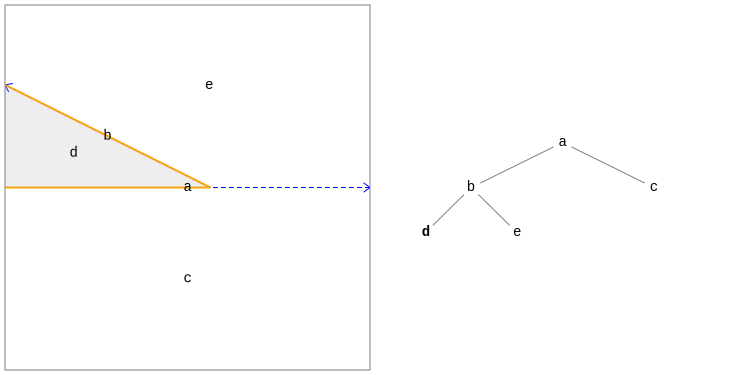

Our inside region is now restricted to only the d node, and once again the region is infinite. We can
also see that the region boundary (indicated with a orange line) no longer travels the full length of a's
cut. Rather, only a portion of the cut forms a boundary between an inside part of the region and an outside part.

Adding another line, we finally obtain a finite region.

```

d.insertCut(Lines.fromPointAndDirection(Vector2D.of(-5, 1), Vector2D.Unit.MINUS_Y, precision));
```

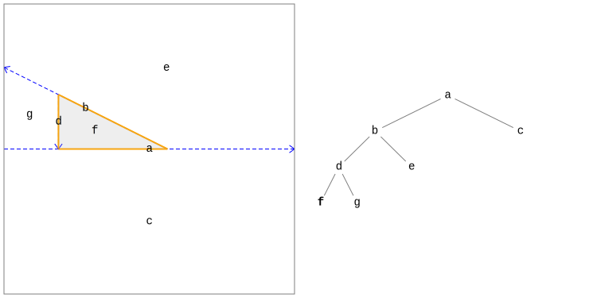

The next two cuts produce similar results on the plus side of the root node.

```

c.insertCut(Lines.fromPoints(Vector2D.of(-1, 0), Vector2D.of(1, -1), precision));
```

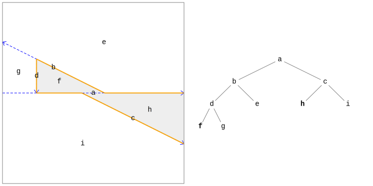

```

h.insertCut(Lines.fromPointAndDirection(Vector2D.of(5, -1), Vector2D.Unit.PLUS_Y, precision));
```

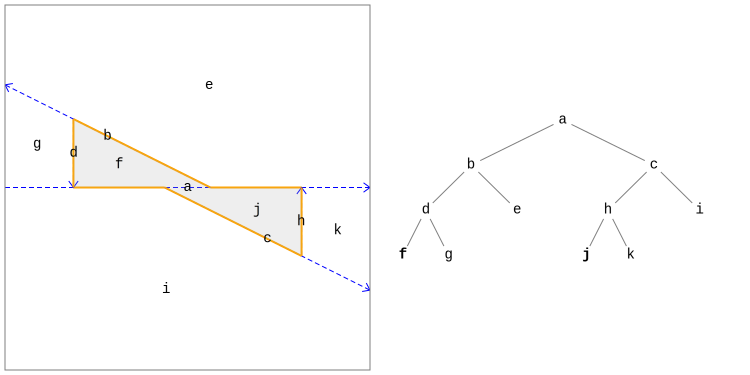

We now have a nicely balanced tree representing our non-convex "skewed bow tie" region.

Before moving on to top-down tree construction, let's take another look at the orange lines representing the
region boundaries. Note that the region boundaries always lie directly on the cut hyperplane of an internal
node. However, as mentioned before, they do not necessarily extend the entire length of the cut. In fact, the root node a has two disjoint portions serving as region boundaries: one with the outside of
the region on the plus side of the node cut (an "outside facing" boundary) and one with the inside of the
region on the plus side of the node cut (an "inside facing" boundary). Both types of boundaries
can be directly accessed on nodes with the
[getCutBoundary()](https://commons.apache.org/proper/commons-geometry/commons-geometry-core/apidocs/org/apache/commons/geometry/core/partitioning/bsp/AbstractRegionBSPTree.AbstractRegionNode.html#getCutBoundary)
method.

<a id="tutorials-bsp-tree--top-down-construction"></a>

## Top-Down Construction

In the previous section, we constructed a BSP tree using the bottom-up approach of cutting leaf nodes with
hyperplanes. In this section, we will construct the same region using the top-down approach of inserting hyperplane
convex subsets into the top of the tree. This is the most typical construction technique.

The first question you may ask here is "What is a hyperplane convex subset?" That is a very good question.
The name is quite long only because it is intended to be very generic and apply equally well to all spaces and
dimensions. Taking the name exactly at face value it means a subset of a hyperplane that is convex, i.e. the
shortest path between any two points in the subset also lies in the subset. Since our 2D hyperplanes are
[Line](https://commons.apache.org/proper/commons-geometry/commons-geometry-euclidean/apidocs/org/apache/commons/geometry/euclidean/twod/Line.html)s, our
hyperplane convex subsets include
[Segment](https://commons.apache.org/proper/commons-geometry/commons-geometry-euclidean/apidocs/org/apache/commons/geometry/euclidean/twod/Segment.html)s
and
[Ray](https://commons.apache.org/proper/commons-geometry/commons-geometry-euclidean/apidocs/org/apache/commons/geometry/euclidean/twod/Ray.html)s
along with the less frequently used
[ReverseRay](https://commons.apache.org/proper/commons-geometry/commons-geometry-euclidean/apidocs/org/apache/commons/geometry/euclidean/twod/ReverseRay.html)s
and subsets containing an entire line, created with
[Line.span()](https://commons.apache.org/proper/commons-geometry/commons-geometry-euclidean/apidocs/org/apache/commons/geometry/euclidean/twod/Line.html#span).

In order to construct our wonderful "skewed bow tie" this time, we will insert hyperplane convex subsets representing
the region boundaries into the top of the tree. These will propagate down through the tree, being split as needed
at each internal node, until they hit a leaf node. That leaf node (or nodes) will then be cut as demonstrated in the
bottom-up construction section using the hyperplane of the hyperplane convex subset. Let's start by constructing
our floating point precision object and empty tree and inserting our first boundary, which will be the
line segment `[(-5, 0), (-1, 0)]`.

```

Precision.DoubleEquivalence precision = Precision.doubleEquivalenceOfEpsilon(1e-6);

RegionBSPTree2D tree = RegionBSPTree2D.empty();

Segment firstBoundary = Lines.segmentFromPoints(Vector2D.of(-5, 0), Vector2D.of(-1, 0), precision);
tree.insert(firstBoundary);
```

This first boundary insertion gives us the following BSP tree:

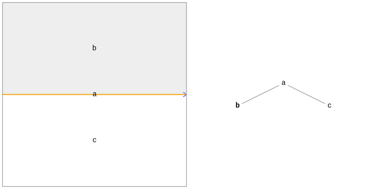

"Wait a minute!" you may be saying. "I specifically requested that a line segment be inserted into the tree and
now I have an entire line span!" This is true. However, if we go back to one of the important notes from the previous
section, we will be reminded that node cuts always fill the *entire* space of the node being cut. That
is a crucial part of a tree's geometric consistency. Since we ended up cutting the root node when we inserted
our segment, we ended up with an entire line span for a cut. Another way to look at this is that ***inserted
hyperplane subsets always expand to fill the node they land in.*** Our little segment landed in the
eternal expanse of the root node and so became infinite.

Let's continue inserting boundaries for the left side of the shape and we will begin to feel our sanity returning.

```

tree.insert(Lines.segmentFromPoints(Vector2D.of(1, 0), Vector2D.of(-5, 3), precision));
tree.insert(Lines.segmentFromPoints(Vector2D.of(-5, 3), Vector2D.of(-5, 0), precision));
```


The tree now looks exactly as it did halfway through our bottom-up construction exercise. Let's insert the
remainder of the tree boundaries, this time using a
[LinePath](https://commons.apache.org/proper/commons-geometry/commons-geometry-euclidean/apidocs/org/apache/commons/geometry/euclidean/twod/path/LinePath.html)
to simplify construction of the line segments.

```

LinePath path = LinePath.fromVertices(Arrays.asList(
        Vector2D.of(-1, 0),
        Vector2D.of(5, -3),
        Vector2D.of(5, 0),
        Vector2D.of(1, 0)), precision);
tree.insert(path);
```


We have now completed our "skewed bow tie" shape. The represented region and the internal BSP tree structure
are identical to that constructed in the previous section but required far less code. Unless a very specific
internal tree structure is required, this top-down construction approach will generally be the preferred one.

<a id="tutorials-bsp-tree--convex-regions-and-tree-performance"></a>

## Convex Regions and Tree Performance

Astute observers may notice something interesting in our examples after the first triangle portion of the
shape is inserted: the tree is completely unbalanced. All of the internal nodes lie
on the minus side of their parent, effectively converting the tree into a linked list. This property is not
unique to this example but in fact occurs any time region boundaries are used to construct a BSP tree for a convex
region. For example, take the hexagon below. No matter what order the region boundaries are inserted, the resulting
tree will always degenerate into a simple linked list.

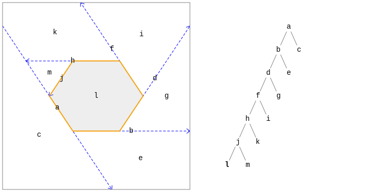

This unbalanced hexagon example will not cause any performance issues because it only contains a small number of nodes.
However, if we were to construct a convex polygon with a much larger number of sides (1000, for example)
then we will most definitely run into issues. This is due to the fact that most BSP tree operations
require some sort of traversal from a node to the root or vice versa. When the tree becomes very tall, performance
suffers, with the amount of degradation directly related to the height of the tree.

So, how do we improve performance here? The main thing we want to do is decrease the height of
the tree while keeping the represented region intact. We can do this by inserting cuts into the tree that do not affect
the region but only serve to partition the space so the tree is more balanced. We can call such cuts
"structural cuts". We will first insert these cuts directly and then take a look at a helper class designed
for just this issue.

If you recall earlier, we discussed how the
[RegionCutRule](https://commons.apache.org/proper/commons-geometry/commons-geometry-core/apidocs/org/apache/commons/geometry/core/partitioning/bsp/RegionCutRule.html)
enum can be used to specify which side of a cut node is marked as inside and which side is marked as outside.
The default value for cut operations is
[MINUS\_INSIDE](https://commons.apache.org/proper/commons-geometry/commons-geometry-core/apidocs/org/apache/commons/geometry/core/partitioning/bsp/RegionCutRule.html#MINUS_INSIDE)
which marks the minus side of the cut as inside. There is also the special value
[INHERIT](https://commons.apache.org/proper/commons-geometry/commons-geometry-core/apidocs/org/apache/commons/geometry/core/partitioning/bsp/RegionCutRule.html#INHERIT), which is specifically designed for our use case here. When cutting nodes with this rule, both the plus and
minus sides of the cut are assigned the same region location as the parent node. This means that the cut does
not affect the region represented by the tree. In order to construct a more balanced version of our hexagon above, we will
start by inserting a cut using this rule that will split our hexagon in two.

```

Precision.DoubleEquivalence precision = Precision.doubleEquivalenceOfEpsilon(1e-6);

RegionBSPTree2D tree = RegionBSPTree2D.empty();

tree.insert(Lines.fromPointAndDirection(Vector2D.ZERO, Vector2D.Unit.PLUS_X, precision).span(),
        RegionCutRule.INHERIT);
```

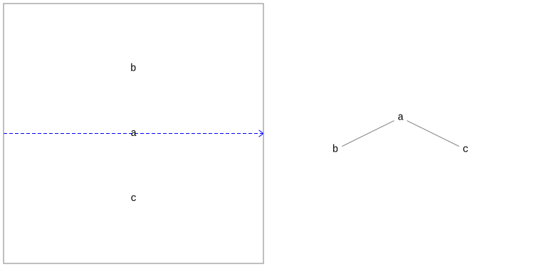

As you can see, we now have a cut in our tree but the represented region is still completely
empty. If we insert the hexagon boundaries now, we end up with a more balanced, and therefore more performant, tree than before.

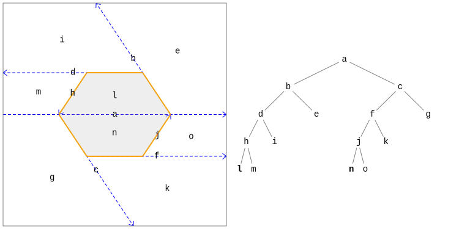

One issue with directly inserting structural cuts is that if a region boundary lies directly
on a structural cut, the child nodes for that boundary will not be set correctly. Therefore, direct insertion
of structural cuts as demonstrated above is only practical when we have knowledge of the boundaries to be inserted and can
guarantee that no boundaries lie on a structural cut. In other situations, we can use the
[PartitionedRegionBuilder2D](https://commons.apache.org/proper/commons-geometry/commons-geometry-euclidean/apidocs/org/apache/commons/geometry/euclidean/twod/RegionBSPTree2D.PartitionedRegionBuilder2D.html)
class. This builder class allows arbitrary structural cuts to be inserted before region boundaries and handles
edge cases like the one just described that may affect the region output. The example below uses this
builder class to insert a grid of structural cuts centered on the shape centroid before inserting the region boundaries.

```

Precision.DoubleEquivalence precision = Precision.doubleEquivalenceOfEpsilon(1e-6);

LinePath path = LinePath.fromVertexLoop(Arrays.asList(
        Vector2D.of(-4, 0),
        Vector2D.of(-2, -3),
        Vector2D.of(2, -3),
        Vector2D.of(4, 0),
        Vector2D.of(2, 3),
        Vector2D.of(-2, 3)
    ), precision);

RegionBSPTree2D tree = RegionBSPTree2D.partitionedRegionBuilder()
        .insertAxisAlignedGrid(path.getBounds(), 1, precision)
        .insertBoundaries(path)
        .build();
```

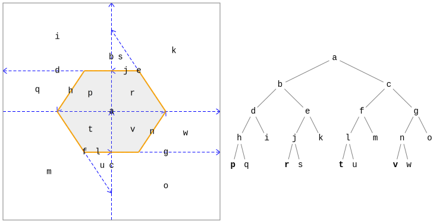

<a id="tutorials-bsp-tree--boolean-operations"></a>

## Boolean Operations

A highly useful feature of the region BSP trees in *Commons Geometry* is their support for
boolean operations, e.g. complement, union, intersection, difference, and xor. The implementation of this
feature is based on the paper by Bruce Naylor, John Amanatides and William Thibault
[Merging BSP Trees Yields Polyhedral Set Operations](http://www.cs.yorku.ca/~amana/research/bsptSetOp.pdf), Proc. Siggraph '90, Computer Graphics 24(4), August 1990, pp 115-124, published by the
Association for Computing Machinery (ACM). This paper provides a wealth of information about the boolean
algorithms as well as BSP trees in general and is highly recommended.

The example below computes the union of two triangles to form a non-convex region, which we might call a
"standard bow tie". A convenience method is used to directly convert the
[LinePath](https://commons.apache.org/proper/commons-geometry/commons-geometry-euclidean/apidocs/org/apache/commons/geometry/euclidean/twod/path/LinePath.html)
instances to BSP trees. The result of the operation is written to
result, leaving the two input trees a and b unmodified.

```

Precision.DoubleEquivalence precision = Precision.doubleEquivalenceOfEpsilon(1e-6);

RegionBSPTree2D a = LinePath.fromVertexLoop(Arrays.asList(
        Vector2D.of(2, 0),
        Vector2D.of(-4, 3),
        Vector2D.of(-4, -3)
    ), precision).toTree();

RegionBSPTree2D b = LinePath.fromVertexLoop(Arrays.asList(
        Vector2D.of(-2, 0),
        Vector2D.of(4, -3),
        Vector2D.of(4, 3)
    ), precision).toTree();

RegionBSPTree2D result = RegionBSPTree2D.empty();

result.union(a, b);
      
```

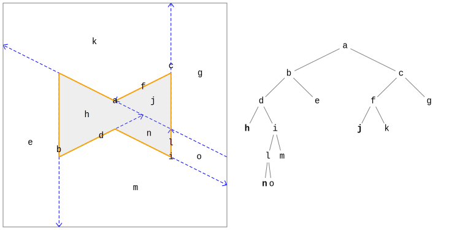

In the above example, the input trees were left unmodified. If we no longer need one of the input trees
in its original form, we can save some memory by writing the result of the operation back into one of the inputs.
The next example uses this approach to perform an xor operation.

```

Precision.DoubleEquivalence precision = Precision.doubleEquivalenceOfEpsilon(1e-6);

RegionBSPTree2D result = LinePath.fromVertexLoop(Arrays.asList(
        Vector2D.of(2, 0),
        Vector2D.of(-4, 3),
        Vector2D.of(-4, -3)
    ), precision).toTree();

RegionBSPTree2D other = LinePath.fromVertexLoop(Arrays.asList(
        Vector2D.of(-2, 0),
        Vector2D.of(4, -3),
        Vector2D.of(4, 3)
    ), precision).toTree();

result.xor(other);
      
```

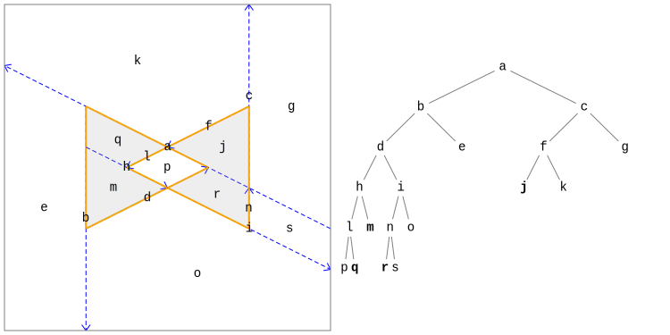

---

<a id="tutorials-teapot"></a>

<!-- source_url: https://commons.apache.org/proper/commons-geometry/tutorials/teapot.html -->

<!-- page_index: 7 -->

<a id="tutorials-teapot--solid-geometry-tutorial"></a>

# Solid Geometry Tutorial

<a id="tutorials-teapot--teapot-construction-101"></a>

### Teapot Construction 101

<a id="tutorials-teapot--introduction"></a>

## Introduction

*Commons Geometry* contains a number of methods for manipulating solid, 3D dimensional figures.
These geometric figures can be combined in various ways to produce new figures. In this tutorial, we will explore these features by constructing a 3D model of a teapot from scratch. The image
below shows the result of our efforts. The final code for this tutorial can be found in the
[TeapotBuilder](https://commons.apache.org/proper/commons-geometry/commons-geometry-examples/commons-geometry-examples-tutorials/xref/org/apache/commons/geometry/examples/tutorials/teapot/TeapotBuilder.html) class, which is included in the library
[source distribution](https://commons.apache.org/geometry/download_geometry.cgi).

**NOTE:** All images used in this tutorial have been rendered
using [Blender](https://www.blender.org/).

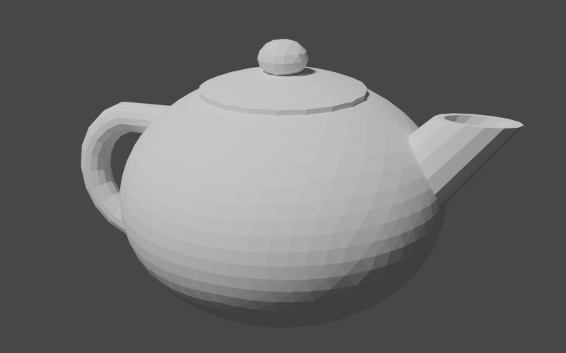

<a id="tutorials-teapot--getting-started"></a>

## Getting Started

The first step we will take on our journey is the creation of a class encapsulating our teapot construction
logic, aptly named
[TeapotBuilder](https://commons.apache.org/proper/commons-geometry/commons-geometry-examples/commons-geometry-examples-tutorials/apidocs/org/apache/commons/geometry/examples/tutorials/teapot/TeapotBuilder.html).
The constructor will accept only a single argument: an instance of
Precision.DoubleEquivalence from the
[Commons Numbers](https://commons.apache.org/proper/commons-numbers/) library.
This is a ubiquitous type in *Commons Geometry* and is used to provide a method of comparing
floating point numbers without being susceptible to small floating point errors introduced during computations.
Typically, users of *Commons Geometry* will construct a single instance of this type for use by multiple
objects throughout an entire operation, or even application. Since we don't want our class to assume such a
heavy responsibility, we will simply accept an instance in the constructor.

```
public class TeapotBuilder {
private final Precision.DoubleEquivalence precision;
public TeapotBuilder(final Precision.DoubleEquivalence precision) {this.precision = precision;}}
```

Next, we will create a stub method for our teapot-building code. We will fill in this method as we work through
the tutorial.

```

public RegionBSPTree3D buildTeapot() {
    // TODO: actually build a teapot here

    return RegionBSPTree3D.empty();
}
```

We have chosen the
[RegionBSPTree3D](https://commons.apache.org/proper/commons-geometry/commons-geometry-euclidean/apidocs/org/apache/commons/geometry/euclidean/threed/RegionBSPTree3D.html)
type for both the construction of the teapot geometry as well as the return value. This is the primary type
in *Commons Geometry* for manipulating solid geometries. (There are similar such types for each space and
dimension supported by the library, such as
[RegionBSPTree2D](https://commons.apache.org/proper/commons-geometry/commons-geometry-euclidean/apidocs/org/apache/commons/geometry/euclidean/twod/RegionBSPTree2D.html)
for 2D Euclidean space and
[RegionBSPTree2S](https://commons.apache.org/proper/commons-geometry/commons-geometry-spherical/apidocs/org/apache/commons/geometry/spherical/twod/RegionBSPTree2S.html)
for 2D spherical space.) This type uses a [binary space partitioning (BSP) tree](#tutorials-bsp-tree)
to represent arbitrary regions of space, including regions of infinite size. This is accomplished by recursively
dividing a space in two by partitioning planes (or "hyperplanes", to use the more general term). The spaces on either side of
the planes are then given the labels "inside" or "outside". A region is composed of all of the "inside" portions
of the BSP tree.

A major benefit of using BSP trees to represent regions is that it allows us to perform boolean operations such
as union, intersection, difference, and xor on arbitrary regions. We will use these operations to combine simple
shapes to construct our teapot.

Before constructing our first geometry, we need to handle one more bit of housekeeping, namely, how to view our
work. The easiest way to do this is to export our geometries using a common 3D file format, such as
[STL](https://en.wikipedia.org/wiki/STL_%28file_format%29), and view the
model in a 3D modeling program. I enjoy working with [Blender](https://www.blender.org/)
so that is the modeling program I have chosen to use for this tutorial. However any program able to load and display
3D models should work. To create our geometry files, we will use the 3D file writing capabilities of *Commons Geometry*
accessible through the
[IO3D](https://commons.apache.org/proper/commons-geometry/commons-geometry-io-euclidean/apidocs/org/apache/commons/geometry/io/euclidean/threed/IO3D.html)
convenience class. See the
[GeometryFormat3D](https://commons.apache.org/proper/commons-geometry/commons-geometry-io-euclidean/apidocs/org/apache/commons/geometry/io/euclidean/threed/GeometryFormat3D.html)
enum for a list of supported file formats.

```

TeapotBuilder builder = new TeapotBuilder(precision);

RegionBSPTree3D teapot = builder.buildTeapot();

IO3D.write(teapot, Paths.get("teapot.stl"));
```

With this bit of code place, we are ready to start creating geometry!

<a id="tutorials-teapot--building-the-parts"></a>

## Building the Parts

Our teapot will contain four main parts: the body, the lid, the handle, and the spout. We will create
private methods for each of theses parts in our TeapotBuilder class. Later, we will
combine the outputs of these methods to form the final geometry.

<a id="tutorials-teapot--the-body"></a>

### The Body

The first part we will construct is the teapot body. We will start by creating a private method named
buildBody in our builder class and referencing it in our main build method.
We'll return the body directly for the time being so we can view the output.

```

public RegionBSPTree3D buildTeapot() {
    // build parts
    RegionBSPTree3D body = buildBody();

    // TODO: combine into the final region

    return body; // return for debugging
}

private RegionBSPTree3D buildBody() {
    // TODO
    return RegionBSPTree3D.empty();
}
```

Unlike some fancier types you might see, our teapot is going to have a simple, rounded body. So, we will start
by creating a sphere and go from there. Luckily, *Commons Geometry* provides a
[Sphere](https://commons.apache.org/proper/commons-geometry/commons-geometry-euclidean/apidocs/org/apache/commons/geometry/euclidean/threed/shape/Sphere.html)
class to help us.

```

Sphere sphere = Sphere.from(Vector3D.ZERO, 1, precision);
```

We now have a Sphere instance centered on the origin with a radius of 1. However, our
instance represents an analytic sphere, meaning it is does not contain any flat surfaces. This is great for
many use cases, but we need flat surfaces in order to construct a BSP tree. To convert
from our mathematically perfect sphere abstraction to a BSP tree sphere approximation, we will use the
[Sphere.toTree()](https://commons.apache.org/proper/commons-geometry/commons-geometry-euclidean/apidocs/org/apache/commons/geometry/euclidean/threed/shape/Sphere.html#toTree-int-)
method. This method accepts a single argument that determines the number of facets that will be used in the approximation.
The documentation explains the details of the conversion. For our purposes, we will use the argument 4, which
will give us a BSP tree with 2048 facets.

```

Sphere sphere = Sphere.from(Vector3D.ZERO, 1, precision);
RegionBSPTree3D body = sphere.toTree(4);
```

This finally gives us something we can look at in our 3D modeling program.

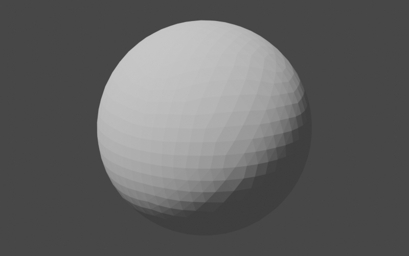

Our next step is to tweak the sphere to make it more teapot-like. First, we will squash it vertically a little
to make it less of a perfect sphere. Our tool of choice for this squashing exercise is the
[AffineTransformMatrix3D](https://commons.apache.org/proper/commons-geometry/commons-geometry-euclidean/apidocs/org/apache/commons/geometry/euclidean/threed/AffineTransformMatrix3D.html)
class, which we will be using quite frequently in the remainder of this tutorial.
This class represents a 4x4 transform matrix that can be used to perform
[affine transformations](https://en.wikipedia.org/wiki/Affine_transformation) in 3D space. In short, it lets us perform operations like translate, scale, and rotate on geometries. Here, we will use it to scale
down our sphere approximation along the z-axis, while keeping the x and y axes the same.

```

AffineTransformMatrix3D t = AffineTransformMatrix3D.createScale(1, 1, 0.75);
body.transform(t);
```

Our sphere now looks flattened a bit.

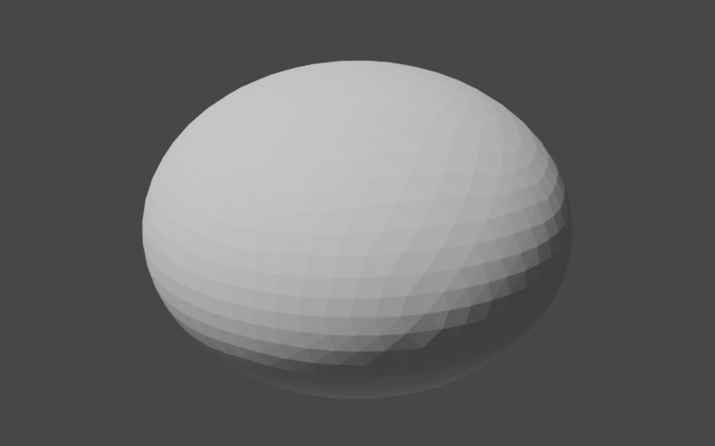

Note that our choice to scale along the z-axis (as opposed to the x or y axes) was completely arbitrary; our
sphere was entirely symmetrical and we had no definition of what was "up" and what was "down" as it relates
to our teapot. Now that we have performed our first non-symmetrical operation, we should officially declare the
orientation of our teapot: henceforth the positive z-axis will be "up" and the the positive x-axis will be
"forward" (the direction that the spout is pointing) in "teapot-space". Keeping this orientation in mind
will help us when working through later transformations.

Our teapot is now pleasantly flattened but it is still very likely to roll off tables and create all manner
of messes. To address this shortcoming, we will chop off part of the bottom to make a flat base for the teapot
to sit on. In code, we will define this plane, construct a region of infinite size with that plane as the "top", and compute the difference between our flattened sphere and the infinite region.

```

Plane bottomPlane = Planes.fromPointAndNormal(
        Vector3D.of(0, 0, -0.6),
        Vector3D.Unit.PLUS_Z,
        precision);
PlaneConvexSubset bottom = bottomPlane.span();
body.difference(RegionBSPTree3D.from(Arrays.asList(bottom)));
```

There's a lot going on in just a few lines here so let's go through it step by step.

```

Plane bottomPlane = Planes.fromPointAndNormal(
        Vector3D.of(0, 0, -0.6),
        Vector3D.Unit.PLUS_Z,
        precision);
```

Here we construct a plane from an arbitrary point lying in the plane, the plane normal, and our good friend
Precision.DoubleEquivalence. We choose a point that is directly "below" the origin
(per our previous definition of teapot-space) and that will cause the plane to intersect the bottom of the
teapot body. The plane normal points "up", along the positive z axis.

```

PlaneConvexSubset bottom = bottomPlane.span();
```

This may well be the most confusing line in this section. This line constructs a
[PlaneConvexSubset](https://commons.apache.org/proper/commons-geometry/commons-geometry-euclidean/apidocs/org/apache/commons/geometry/euclidean/threed/PlaneConvexSubset.html)
that represents all of the points in the plane we just created. These seem like equivalent concepts —
a plane and another object that represents the exact same set of points —
but they're slightly different. The plane *defines* what points are available, while
the convex subset *selects* (in an abstract sense) a convex group of those points. Examples of plane
convex subsets include triangles, convex polygons, plane half-spaces, and, as in this case, every single last point in the entire plane (i.e., the "span"). These concepts are generalized to all geometric
spaces and dimensions with the
[Hyperplane](https://commons.apache.org/proper/commons-geometry/commons-geometry-core/apidocs/org/apache/commons/geometry/core/partitioning/Hyperplane.html)
and
[HyperplaneConvexSubset](https://commons.apache.org/proper/commons-geometry/commons-geometry-core/apidocs/org/apache/commons/geometry/core/partitioning/HyperplaneConvexSubset.html)
interfaces. The reason we needed to convert from a
[Plane](https://commons.apache.org/proper/commons-geometry/commons-geometry-euclidean/apidocs/org/apache/commons/geometry/euclidean/threed/Plane.html)
to a
[PlaneConvexSubset](https://commons.apache.org/proper/commons-geometry/commons-geometry-euclidean/apidocs/org/apache/commons/geometry/euclidean/threed/PlaneConvexSubset.html)
in the first place is that BSP trees are constructed from plane convex subsets and not planes. This brings
us to the next line.

```

body.difference(RegionBSPTree3D.from(Arrays.asList(bottom)));
```

This line constructs a BSP tree from our bottom plane convex subset and then computes the difference between
body and the new BSP tree, storing the result back into body. When BSP trees are constructed
from plane convex subsets, the inside of the region is by default the part opposite the direction of the plane normal.
Since we constructed our plane with the normal along the positive z-axis (i.e. "up"), the inside of our BSP tree
is everything from our plane "down" along the negative z-axis. When we subtract this from the body, we end up with
a rounded top and a flat bottom.

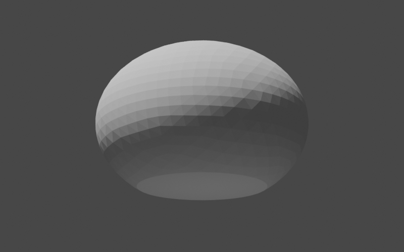

<a id="tutorials-teapot--the-lid"></a>

### The Lid

Next, we will make the lid of our teapot. As before, we will begin by creating a helper method and referencing
it in the main build method.

```

public RegionBSPTree3D buildTeapot() {
    // build parts
    RegionBSPTree3D body = buildBody();
    RegionBSPTree3D lid = buildLid(body);

    // TODO: combine into the final region

    return lid; // return for debugging
}

private RegionBSPTree3D buildLid(RegionBSPTree3D body) {
    // TODO
    return RegionBSPTree3D.empty();
}
```

You may be wondering why we passed the body BSP tree to our new method. The reason is
that we want the top of the lid to match the curve of the body exactly and the best way to do that is to have
access to the body itself. Our overall plan of attack here will be to

1. translate a copy of the body "up" a small amount, 2. trim this translated portion to the correct size, and
3. add a small, flattened sphere on top as a handle.

Sounds simple enough. Let's get started.

```

RegionBSPTree3D lid = body.copy();

AffineTransformMatrix3D t = AffineTransformMatrix3D.createTranslation(0, 0, 0.03);
lid.transform(t);
```

Our lid is now slightly raised above the body and matches its curve exactly. Unfortunately, the lid is also the
same *size* as the body which makes its job as lid somewhat difficult. We need to trim it to have a radius
less than the radius of the body, but how do we do that? One option is to intersect it with a cylinder of the
appropriate radius. If the cylinder is oriented along the positive z-axis ("up"), then it will trim off the
parts of the body that we don't want while retaining the curved top. Perfect. Now all we need is a way to
construct a cylinder with the correct dimensions. It sounds like we need another helper method.

There are many ways we could go about creating our cylinder helper method. We could, for example, have it return
a BSP tree like all of our other methods so far. This would work in the case of the lid. However, for other
parts of the teapot, we are going to want fine-grain control over the position of the cylinder vertices.
Therefore, we will design our helper method to return a
[TriangleMesh](https://commons.apache.org/proper/commons-geometry/commons-geometry-euclidean/apidocs/org/apache/commons/geometry/euclidean/threed/mesh/TriangleMesh.html), which will give us the precise vertex placement that we need. The method will accept 3 arguments:

1. the number of vertical segments in the cylinder, 2. the number of vertices forming the cylinder circle, and
3. a function that callers can use to place each vertex into its final location.

The cylinder will be constructed pointing along the positive z-axis with vertex z values going from 0
to 1. However, the final orientation of the mesh will be determined by the supplied transform function.

```

private TriangleMesh buildUnitCylinderMesh(int segments, int circleVertexCount,
        UnaryOperator<Vector3D> vertexTransform) {
    // TODO
    return null;
}
```

We will use the
[SimpleTriangleMesh](https://commons.apache.org/proper/commons-geometry/commons-geometry-euclidean/apidocs/org/apache/commons/geometry/euclidean/threed/mesh/SimpleTriangleMesh.html)
class to build our mesh. This class has a builder type that allows us to easily define vertices and faces.

```

SimpleTriangleMesh.Builder builder = SimpleTriangleMesh.builder(precision);
```

Next, we will define the vertices. As mentioned above, the cylinder will initially be constructed along the
positive z-axis with z values in the range 0 to 1. The cylinder vertices will then be
transformed to their final locations using the function supplied by the caller. The final vertex locations do
not affect the face definitions, however, so after this step we can continue on with the rest of cylinder
construction as if the vertices were in their original locations.

```

double zDelta = 1.0 / segments;
double zValue;

double azDelta = Angle.TWO_PI / circleVertexCount;
double az;

Vector3D vertex;
for (int i = 0; i <= segments; ++i) {
    zValue = (i * zDelta);

    for (int v = 0; v < circleVertexCount; ++v) {
        az = v * azDelta;

        vertex = Vector3D.of(
                Math.cos(az),
                Math.sin(az),
                zValue);
        builder.addVertex(vertexTransform.apply(vertex));
    }
}
```

Now come the face definitions. We need to define the faces on the bottom, sides, and top of the cylinder, making
sure at each step that the triangle normals point outward.

```

// add the bottom faces using a triangle fan, making sure
// that the triangles are oriented so that the face normal
// points down
for (int i = 1; i < circleVertexCount - 1; ++i) {
    builder.addFace(0, i + 1, i);
}

// add the side faces
int circleStart;
int v1;
int v2;
int v3;
int v4;
for (int s = 0; s < segments; ++s) {
    circleStart = s * circleVertexCount;

    for (int i = 0; i < circleVertexCount; ++i) {
        v1 = i + circleStart;
        v2 = ((i + 1) % circleVertexCount) + circleStart;
        v3 = v2 + circleVertexCount;
        v4 = v1 + circleVertexCount;

        builder
            .addFace(v1, v2, v3)
            .addFace(v1, v3, v4);
    }
}

// add the top faces using a triangle fan
int lastCircleStart = circleVertexCount * segments;
for (int i = 1 + lastCircleStart; i < builder.getVertexCount() - 1; ++i) {
    builder.addFace(lastCircleStart, i, i + 1);
}

return builder.build();
```

That should do it! Now we can use this in our lid construction, making sure to pass a transform that will
give us the radius that we want with enough height to make sure we don't miss any part of the top. We'll
use the toTree() method of the mesh to directly convert the mesh geometry into a BSP tree.

```

TriangleMesh cylinder = buildUnitCylinderMesh(1, 20, AffineTransformMatrix3D.createScale(0.5, 0.5, 10));
lid.intersection(cylinder.toTree());
```

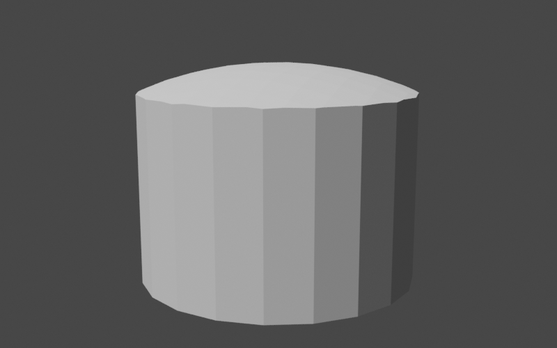

The fact that the lid is extremely thick does not matter for our purposes. We will be merging it with the teapot
body soon and the lower portion will simply become part of the body.

All that's left now is the small rounded handle on top of the lid. We've already done something similar
for the body so this should be simple. The only difference from before is that we will be using the
axis-aligned bounding box of the lid to help place the handle in the correct location.

```

Sphere sphere = Sphere.from(Vector3D.of(0, 0, 0), 0.15, precision);
RegionBSPTree3D sphereTree = sphere.toTree(2);

Bounds3D lidBounds = lid.getBounds();
double sphereZ = lidBounds.getMax().getZ() + 0.075;
sphereTree.transform(AffineTransformMatrix3D.createScale(1, 1, 0.75)
        .translate(0, 0, sphereZ));

lid.union(sphereTree);
```

This completes our teapot lid.

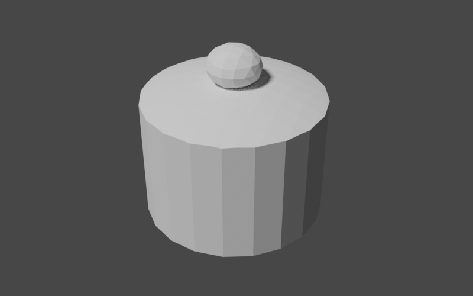

<a id="tutorials-teapot--the-handle"></a>

### The Handle

Constructing the handle of our teapot is going to be something of an adventure; not only will we need to apply
scaling and translations to our starting geometry, we will need to interpolate between a range of 3D rotations.
In this case, perhaps it would be best to see the end product first before we jump into the details. That will
give us a frame of reference for what we're working toward. Below is our goal for the handle.

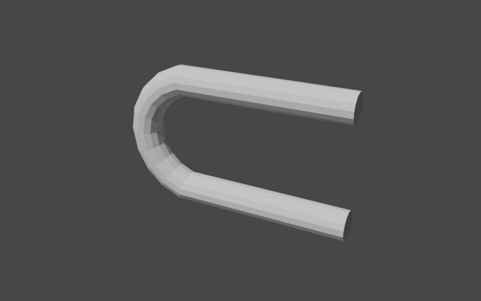

As you can see, the handle is a long, straight cylinder that we've curved back on itself, leaving straight
sections at the beginning and end. This means that we can use our new cylinder mesh helper method to construct
the shape. Let's start by adding the private builder method to our class, leaving a placeholder for the portion
where we manipulate the position of the cylinder.

```

public RegionBSPTree3D buildTeapot() {
    // build parts
    RegionBSPTree3D body = buildBody();
    RegionBSPTree3D lid = buildLid(body);
    RegionBSPTree3D handle = buildHandle();

    // TODO: combine into the final region

    return handle; // return for debugging
}

private RegionBSPTree3D buildHandle() {
    UnaryOperator<Vector3D> vertexTransform = v -> {
        // TODO
        return v;
    };

    return buildUnitCylinderMesh(10, 14, vertexTransform).toTree();
}
```

We now have the start of our handle in place. Note that we've used a larger number of cylinder segments
(14) so we have enough to smoothly curve the shape. Since we're not modifying the shape of
the cylinder yet, our handle looks like this.

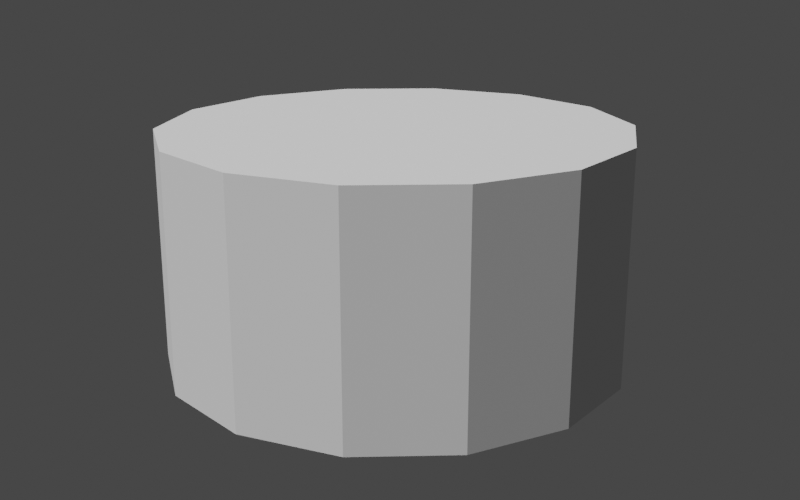

The handle is a cylinder with a radius of 1 and a height (along the positive z-axis) of 1
with its base at the origin. We will need to apply scaling, rotation, and translation to get this cylinder
into the correct shape and location. The scaling is no problem since we've already done that several times.
We want our handle to have a radius of 0.1 so we scale by that factor in the x and y axes. For the
z-axis (height), we'll leave the value at 1 for now.

```

double handleRadius = 0.1;
double height = 1;

AffineTransformMatrix3D scale = AffineTransformMatrix3D.createScale(handleRadius, handleRadius, height);

UnaryOperator<Vector3D> vertexTransform = v -> {
    return scale.apply(v);
};

return buildUnitCylinderMesh(10, 14, vertexTransform).toTree();
```

This gives our handle the thickness that we want.

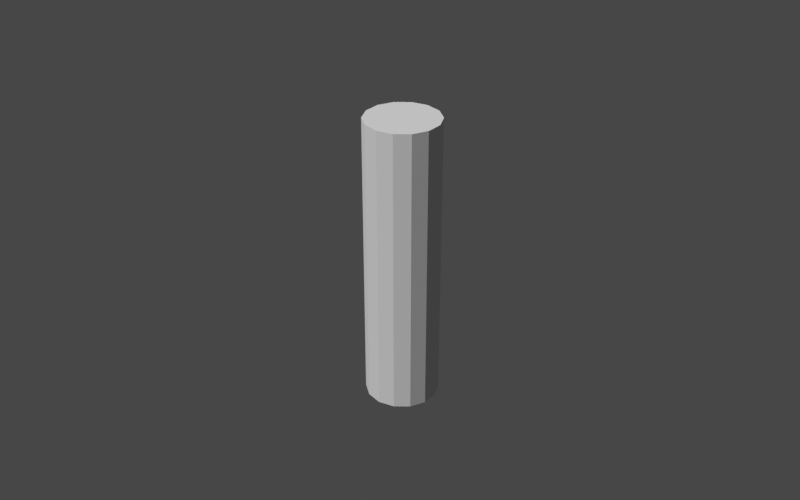

Now on to the tricky bit: the rotation. The
[QuaternionRotation](https://commons.apache.org/proper/commons-geometry/commons-geometry-euclidean/apidocs/org/apache/commons/geometry/euclidean/threed/rotation/QuaternionRotation.html)
class is the go-to class in *Commons Geometry* for rotations in 3D. Instances of this class can be pictured
as representing a rotation of a certain angle around some axis in 3D space. If we applied the same rotation
to all vertices in our cylinder, the entire thing would rotate but retain the same shape. This is not what we want.
We want a curve in the middle of the handle, which means we need to apply different rotations to different vertices.
Our tool for this is the
[Slerp (spherical linear interpolation)](https://en.wikipedia.org/wiki/Slerp) algorithm. This algorithm
smoothly interpolates between a start and stop quaternion rotation, giving us the series of rotations that we need
for our curve. Let's create our slerp function in code.

```

QuaternionRotation startRotation = QuaternionRotation.fromAxisAngle(Vector3D.Unit.PLUS_Y, -Angle.PI_OVER_TWO);
QuaternionRotation endRotation = QuaternionRotation.fromAxisAngle(Vector3D.Unit.PLUS_Y, Angle.PI_OVER_TWO);
DoubleFunction<QuaternionRotation> slerp = startRotation.slerp(endRotation);
```

We've defined our rotation sequence as starting at -π/2 around the y-axis and ending at
+π/2 around the y-axis. This gives the full rotation an angle of π, or 180 degrees.
The expression `startRotation.slerp(endRotation)` returns a `DoubleFunction` that accepts a
double value and returns a
[QuaternionRotation](https://commons.apache.org/proper/commons-geometry/commons-geometry-euclidean/apidocs/org/apache/commons/geometry/euclidean/threed/rotation/QuaternionRotation.html)
instance. If we pass 0, we get a rotation
equal to startRotation. If we pass 1, we get a rotation equal to endRotation.
If we pass any other number between 0 and 1, we get a rotation interpolated between the two.

Let's apply our new slerp function to the cylinder. Since the cylinder z-values range from 0 to
1, they make the perfect argument to pass to slerp to determine the rotation for each
vertex. When we apply the rotation, we need to keep the following in mind:

1. We want to make sure to rotate around a point *outside* of the cylinder
   instead of around the origin, which is where rotations occur by default.
   [AffineTransformMatrix3D](https://commons.apache.org/proper/commons-geometry/commons-geometry-euclidean/apidocs/org/apache/commons/geometry/euclidean/threed/AffineTransformMatrix3D.html)
   has a method to create this type of transformation.
2. In order to keep the curve smooth, we will start rotating each point from its position projected on the
   xy plane (with z = 0). This prevents the rotation from being affected by the changing distance of the vertex from
   the curve center. You can picture this as taking a hula hoop lying in the xy plane and swinging it back and
   forth to define a tube in 3D space.

Below is our updated vertex transform code.

```

double t = v.getZ();

Vector3D scaled = scale.apply(v);

QuaternionRotation rot = slerp.apply(t);
AffineTransformMatrix3D mat = AffineTransformMatrix3D.createRotation(curveCenter, rot);

return mat.apply(Vector3D.of(scaled.getX(), scaled.getY(), 0));
```

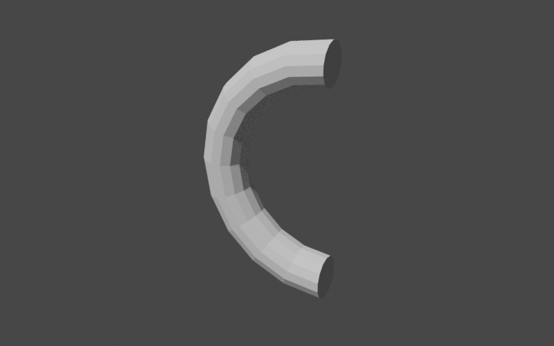

Looks good! We only need a few more tweaks:

1. We want the beginning and end segments of the curve to extend straight out along the x-axis. We'll add
   an additional x-axis offset when t is at 0 (the start) or 1 (the end).
2. The handle is a bit taller than our goal of one unit since we're placing the handle *center* on the
   curve with radius of 0.5. We'll adjust by removing twice the handle thickness from the curve radius.
3. The handle needs to be translated back along the x-axis to be in the correct position relative to the
   rest of the body.

Adding these updates in, we arrive at our final handle code.

```

double handleRadius = 0.1;
double height = 1 - (2 * handleRadius);

AffineTransformMatrix3D scale = AffineTransformMatrix3D.createScale(handleRadius, handleRadius, height);

QuaternionRotation startRotation = QuaternionRotation.fromAxisAngle(Vector3D.Unit.PLUS_Y, -Angle.PI_OVER_TWO);
QuaternionRotation endRotation = QuaternionRotation.fromAxisAngle(Vector3D.Unit.PLUS_Y, Angle.PI_OVER_TWO);
DoubleFunction<QuaternionRotation> slerp = startRotation.slerp(endRotation);

Vector3D curveCenter = Vector3D.of(0.5 * height, 0, 0);

AffineTransformMatrix3D translation = AffineTransformMatrix3D.createTranslation(Vector3D.of(-1.38, 0, 0));

UnaryOperator<Vector3D> vertexTransform = v -> {
    double t = v.getZ();

    Vector3D scaled = scale.apply(v);

    QuaternionRotation rot = slerp.apply(t);
    AffineTransformMatrix3D mat = AffineTransformMatrix3D.createRotation(curveCenter, rot);

    Vector3D rotated = mat.apply(Vector3D.of(scaled.getX(), scaled.getY(), 0));

    Vector3D result = (t > 0 && t < 1) ?
            rotated :
            rotated.add(Vector3D.Unit.PLUS_X);

    return translation.apply(result);
};

return buildUnitCylinderMesh(10, 14, vertexTransform).toTree();
```

Voilà.


<a id="tutorials-teapot--the-spout"></a>

### The Spout

Now that we have the handle under our belt, the spout will be a piece of cake. Our general approach will be
the same as the handle, where we begin with a cylinder and transform the mesh vertices into their final
positions. Instead of a curve, however, we will be creating a taper and a shear. Let's create our method stub
to start.

```

public RegionBSPTree3D buildTeapot() {
    // build parts
    RegionBSPTree3D body = buildBody();
    RegionBSPTree3D lid = buildLid(body);
    RegionBSPTree3D handle = buildHandle();
    RegionBSPTree3D spout = buildSpout();

    // TODO: combine into the final region

    return spout; // return for debugging
}

private RegionBSPTree3D buildSpout() {
    UnaryOperator<Vector3D> vertexTransform = v -> {
        // TODO
        return v;
    };

    return buildUnitCylinderMesh(10, 14, vertexTransform).toTree();
}
```

We'll start with the taper. We want the spout to be an oval that is wider at the base and narrower
near the top. We can represent this as a two different scalings in the horizontal plane and store the scale
factors in 2D vectors. We'll define the factors for the base and then simply compute the factors for the top
as a multiple of that. The scaling for each vertex is then a linear interpolation between the two, with the
vertex z value as the interpolation parameter. We'll use the vector
[lerp](https://commons.apache.org/proper/commons-geometry/commons-geometry-euclidean/apidocs/org/apache/commons/geometry/euclidean/twod/Vector2D.html#lerp-org.apache.commons.geometry.euclidean.twod.Vector2D-double-)
method to perform the interpolation.

```

Vector2D baseScale = Vector2D.of(0.4, 0.2);
Vector2D topScale = baseScale.multiply(0.6);

UnaryOperator<Vector3D> vertexTransform = v -> {
    Vector2D scale = baseScale.lerp(topScale, v.getZ());

    Vector3D tv = Vector3D.of(
                v.getX() * scale.getX(),
                v.getY() * scale.getY(),
                v.getZ()
            );

    return tv;
};

return buildUnitCylinderMesh(1, 14, vertexTransform).toTree();
```

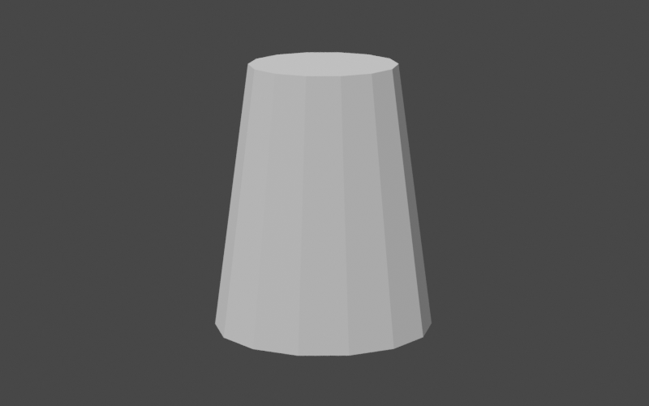

Now for the shear, or slant, in the positive x direction. This is simply a multiple of the vertex z value that
we add to the x value. While we're at it, we'll also translate the spout to its final position in the teapot.

```

Vector2D baseScale = Vector2D.of(0.4, 0.2);
Vector2D topScale = baseScale.multiply(0.6);
double shearZ = 0.9;

AffineTransformMatrix3D translation = AffineTransformMatrix3D.createTranslation(Vector3D.of(0.25, 0, -0.4));

UnaryOperator<Vector3D> vertexTransform = v -< {
    Vector2D scale = baseScale.lerp(topScale, v.getZ());

    Vector3D tv = Vector3D.of(
                (v.getX() * scale.getX()) + (v.getZ() * shearZ),
                v.getY() * scale.getY(),
                v.getZ()
            );

    return translation.apply(tv);
};

return buildUnitCylinderMesh(1, 14, vertexTransform).toTree();
```

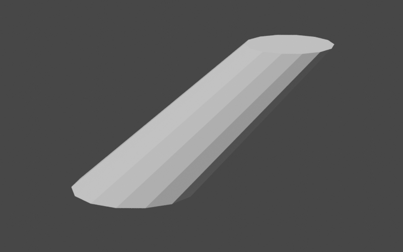

<a id="tutorials-teapot--putting-it-all-together"></a>

## Putting it all together

Now that we have all of the parts of our teapot in place we can begin combining them to construct the full teapot.
We simply need to compute the union of all of the parts using the BSP tree
[union](https://commons.apache.org/proper/commons-geometry/commons-geometry-core/apidocs/org/apache/commons/geometry/core/partitioning/bsp/AbstractRegionBSPTree.html#union-org.apache.commons.geometry.core.partitioning.bsp.AbstractRegionBSPTree-) method.

```

public RegionBSPTree3D buildTeapot(Map<String, RegionBSPTree3D> debugOutputs) {
    // build the parts
    RegionBSPTree3D body = buildBody(1);
    RegionBSPTree3D lid = buildLid(body);
    RegionBSPTree3D handle = buildHandle();
    RegionBSPTree3D spout = buildSpout(1);

    // combine into the final region
    RegionBSPTree3D teapot = RegionBSPTree3D.empty();
    teapot.union(body, lid);
    teapot.union(handle);
    teapot.union(spout);

    return teapot;
}
```

Note that we've used two different forms of the union method: a two argument version and a one
argument version. In both cases, the result is stored in the caller and the arguments are unchanged. The
two argument version is designed for use when the caller is not involved in the computation and can be
completely overwritten. For example, the call `teapot.union(body, lid);` above is equivalent
to `teapot.union(body); teapot.union(lid);`. However, since teapot is completely empty
at first, the `teapot.union(body);` call effectively just makes a copy of body and stores
it in teapot. We can avoid this unnecessary copy by using the two argument version of union.

Now that all of the parts are combined, we can finally view our teapot.

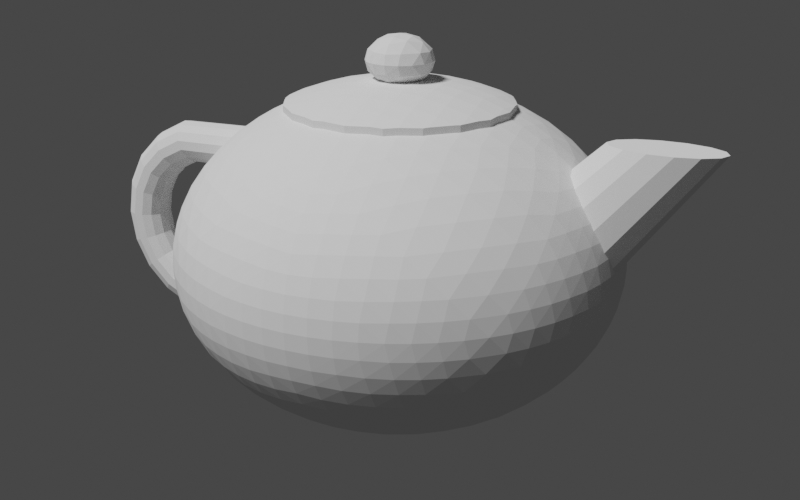

It looks pretty good! One thing is off, though: our teapot is completely solid. In order to make it hollow like
a real teapot, we'd need to hollow out the body and the interior of the spout. Luckily, we can do this with just
a few small tweaks to our code: we can add parameters to our body and spout construction methods that control
the overall size of the produced region. We can then subtract these smaller regions from the teapot to hollow it
out.

```

public RegionBSPTree3D buildTeapot() {
    // build the parts
    RegionBSPTree3D body = buildBody(1);
    RegionBSPTree3D lid = buildLid(body);
    RegionBSPTree3D handle = buildHandle();
    RegionBSPTree3D spout = buildSpout(1);

    // combine into the final region
    RegionBSPTree3D teapot = RegionBSPTree3D.empty();
    teapot.union(body, lid);
    teapot.union(handle);
    teapot.union(spout);

    // subtract scaled-down versions of the body and spout to
    // create the hollow interior
    teapot.difference(buildBody(0.9));
    teapot.difference(buildSpout(0.8));

    return teapot;
}

private RegionBSPTree3D buildBody(double initialRadius) {
    Sphere sphere = Sphere.from(Vector3D.ZERO, initialRadius, precision);

    // ...

    Plane bottomPlane = Planes.fromPointAndNormal(
            Vector3D.of(0, 0, -0.6 * initialRadius),
            Vector3D.Unit.PLUS_Z,
            precision);

    // ...
}

private RegionBSPTree3D buildSpout(double initialRadius) {
    Vector2D baseScale = Vector2D.of(0.4, 0.2).multiply(initialRadius);

    // ...
}
```

This gives us our final result.


<a id="tutorials-teapot--extra-credit"></a>

## Extra Credit

Let's say that we want to take this even further. We're not satisfied with our single-piece teapot and want
the lid as a separate piece that we can remove. Well, today is our lucky day because we can use what
we've learned about BSP trees and boolean operations to accomplish this easily. Our approach will be
to create an "extractor" region consisting of an outer cylinder with a smaller inner cylinder poking out of
the bottom. We will scale and position this extractor so that it just fits over the teapot lid. Our removable
teapot lid then becomes the intersection of the teapot and the extractor while the body becomes the
difference. Let's put this into code. Our method will simply return a map containing the name of the part and
the associated region.

```

public Map<String, RegionBSPTree3D> buildSeparatedTeapot() {
    // construct the single-piece teapot
    RegionBSPTree3D teapot = buildTeapot();

    // create a region to extract the lid
    AffineTransformMatrix3D innerCylinderTransform = AffineTransformMatrix3D.createScale(0.4, 0.4, 1)
            .translate(0, 0, 0.5);
    RegionBSPTree3D innerCylinder = buildUnitCylinderMesh(1, 20, innerCylinderTransform).toTree();

    AffineTransformMatrix3D outerCylinderTransform = AffineTransformMatrix3D.createScale(0.5, 0.5, 10);
    RegionBSPTree3D outerCylinder = buildUnitCylinderMesh(1, 20, outerCylinderTransform).toTree();

    Plane step = Planes.fromPointAndNormal(Vector3D.of(0, 0, 0.645), Vector3D.Unit.MINUS_Z, precision);

    RegionBSPTree3D extractor = RegionBSPTree3D.from(Arrays.asList(step.span()));
    extractor.union(innerCylinder);
    extractor.intersection(outerCylinder);

    // extract the lid
    RegionBSPTree3D lid = RegionBSPTree3D.empty();
    lid.intersection(teapot, extractor);

    // remove the lid from the body
    RegionBSPTree3D body = RegionBSPTree3D.empty();
    body.difference(teapot, extractor);

    // build the output
    Map<String, RegionBSPTree3D> result = new LinkedHashMap<>();
    result.put("lid", lid);
    result.put("body", body);

    return result;
}
```

While we can easily write these parts out into separate geometry files, it would be very convenient to keep them
together. The
[OBJ](https://en.wikipedia.org/wiki/Wavefront_.obj_file)
file format supports multiple named geometries in a single file so let's use that to create
our output file. We will use the low-level
[ObjWriter](https://commons.apache.org/proper/commons-geometry/commons-geometry-io-euclidean/apidocs/org/apache/commons/geometry/io/euclidean/threed/obj/ObjWriter.html)
class instead of the
[IO3D](https://commons.apache.org/proper/commons-geometry/commons-geometry-io-euclidean/apidocs/org/apache/commons/geometry/io/euclidean/threed/IO3D.html)
convenience class in order to gain access to OBJ-specific features.

```
Map<String, RegionBSPTree3D> partMap = builder.buildSeparatedTeapot(); try (ObjWriter writer = new ObjWriter(Files.newBufferedWriter(Paths.get("separated-teapot.obj")))) {
for (Map.Entry<String, RegionBSPTree3D> entry : partMap.entrySet()) {writer.writeObjectName(entry.getKey()); writer.writeBoundaries(entry.getValue());}}
```

Loading this into our 3D modeling program gives us two separate geometries that we can manipulate independently.
The image below shows the teapot with the lid lifted up to reveal the interior.

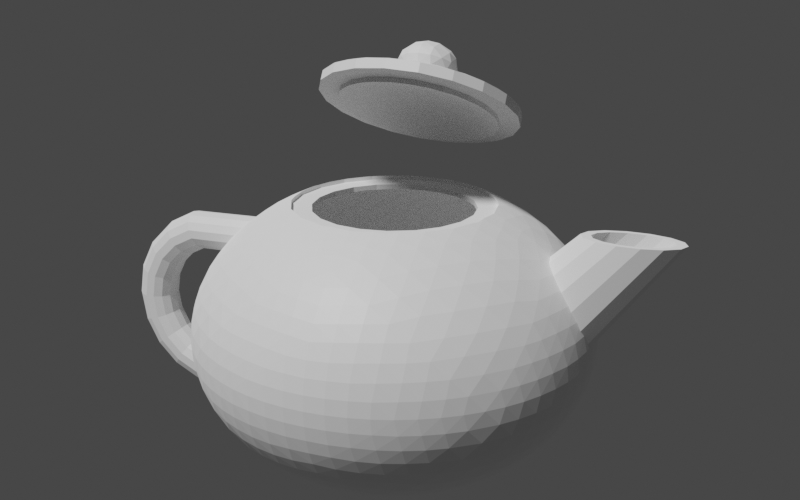

<a id="tutorials-teapot--conclusion"></a>

## Conclusion

In this tutorial, we've explored creating and combining solid geometries with *Commons Geometry*.
These are powerful features of the library and can be used in a wide range of applications. However, this
is just the beginning. Once we have our geometries in place, we can perform other useful tasks, such as computing
[volume](https://commons.apache.org/proper/commons-geometry/commons-geometry-core/apidocs/org/apache/commons/geometry/core/partitioning/bsp/AbstractRegionBSPTree.html#getSize--), [surface area](https://commons.apache.org/proper/commons-geometry/commons-geometry-core/apidocs/org/apache/commons/geometry/core/partitioning/bsp/AbstractRegionBSPTree.html#getBoundarySize--), and
[center of mass](https://commons.apache.org/proper/commons-geometry/commons-geometry-core/apidocs/org/apache/commons/geometry/core/partitioning/bsp/AbstractRegionBSPTree.html#getCentroid--)
or performing visibility checks using
[raycasting or linecasting](https://commons.apache.org/proper/commons-geometry/commons-geometry-euclidean/apidocs/org/apache/commons/geometry/euclidean/threed/line/Linecastable3D.html).
Hopefully what you've learned in this tutorial will give you a solid base to build on as you explore these and
other features of the library.

---

<a id="project-info"></a>

<!-- source_url: https://commons.apache.org/proper/commons-geometry/project-info.html -->

<!-- page_index: 8 -->

<a id="project-info--project-information"></a>

## Project Information

This document provides an overview of the various documents and links that are part of this project's general information. All of this content is automatically generated by [Maven](http://maven.apache.org) on behalf of the project.

<a id="project-info--overview"></a>

### Overview

| Document | Description |
| --- | --- |
| [About](#index) | The Apache Commons Geometry project provides geometric types and utilities. |
| [Summary](#summary) | This document lists other related information of this project |
| [Project Modules](#modules) | This document lists the modules (sub-projects) of this project. |
| [Team](#team) | This document provides information on the members of this project. These are the individuals who have contributed to the project in one form or another. |
| [Source Code Management](#scm) | This document lists ways to access the online source repository. |
| [Issue Management](https://commons.apache.org/proper/commons-geometry/issue-management.html) | This document provides information on the issue management system used in this project. |
| [Mailing Lists](https://commons.apache.org/proper/commons-geometry/mailing-lists.html) | This document provides subscription and archive information for this project's mailing lists. |
| [Dependency Information](https://commons.apache.org/proper/commons-geometry/dependency-info.html) | This document describes how to include this project as a dependency using various dependency management tools. |
| [Dependency Management](https://commons.apache.org/proper/commons-geometry/dependency-management.html) | This document lists the dependencies that are defined through dependencyManagement. |
| [Dependency Convergence](https://commons.apache.org/proper/commons-geometry/dependency-convergence.html) | This document presents the convergence of dependency versions across the entire project, and its sub modules. |
| [CI Management](#ci-management) | This document lists the continuous integration management system of this project for building and testing code on a frequent, regular basis. |
| [Distribution Management](https://commons.apache.org/proper/commons-geometry/distribution-management.html) | This document provides informations on the distribution management of this project. |

---

<a id="summary"></a>

<!-- source_url: https://commons.apache.org/proper/commons-geometry/summary.html -->

<!-- page_index: 9 -->

<a id="summary--project-summary"></a>

## Project Summary

<a id="summary--project-information"></a>

### Project Information

| Field | Value |
| --- | --- |
| Name | Apache Commons Geometry |
| Description | The Apache Commons Geometry project provides geometric types and utilities. |
| Homepage | [https://commons.apache.org/proper/commons-geometry/](#index) |

<a id="summary--project-organization"></a>

### Project Organization

| Field | Value |
| --- | --- |
| Name | The Apache Software Foundation |
| URL | <https://www.apache.org/> |

<a id="summary--build-information"></a>

### Build Information

| Field | Value |
| --- | --- |
| GroupId | org.apache.commons |
| ArtifactId | commons-geometry-parent |
| Version | 1.0 |
| Type | pom |

---

<a id="modules"></a>

<!-- source_url: https://commons.apache.org/proper/commons-geometry/modules.html -->

<!-- page_index: 10 -->

<a id="modules--project-modules"></a>

## Project Modules

This project has declared the following modules:

| Name | Description |
| --- | --- |
| [Apache Commons Geometry Core](#commons-geometry-core) | Core interfaces and classes for Apache Commons Geometry. |
| [Apache Commons Geometry Euclidean](#commons-geometry-euclidean) | Geometric primitives for euclidean space. |
| [Apache Commons Geometry Spherical](#commons-geometry-spherical) | Geometric primitives for spherical space. |
| [Apache Commons Geometry IO Core](#commons-geometry-io-core) | Core IO interfaces and classes. |
| [Apache Commons Geometry IO Euclidean](#commons-geometry-io-euclidean) | IO interfaces and classes for Euclidean space. |
| [Apache Commons Geometry Examples](#commons-geometry-examples) | Examples of use of the "Commons Geometry" library. Codes in this module and its sub-modules are not part of the library. They provide code examples, checking, and benchmarking tools to enhance the documentation and to help ensure correctness of the implementations. |

---

<a id="team"></a>

<!-- source_url: https://commons.apache.org/proper/commons-geometry/team.html -->

<!-- page_index: 11 -->

<a id="team--project-team"></a>

## Project Team

A successful project requires many people to play many roles. Some members write code or documentation, while others are valuable as testers, submitting patches and suggestions.

The project team is comprised of Members and Contributors. Members have direct access to the source of a project and actively evolve the code-base. Contributors improve the project through submission of patches and suggestions to the Members. The number of Contributors to the project is unbounded. Get involved today. All contributions to the project are greatly appreciated.

<a id="team--members"></a>

### Members

The following is a list of developers with commit privileges that have directly contributed to the project in one way or another.

| Image | Id | Name | Email |
| --- | --- | --- | --- |
|  | erans | Gilles Sadowski | [erans at apache dot org](mailto:erans at apache dot org) |
|  | mattjuntunen | Matt Juntunen | [mattjuntunen at apache dot org](mailto:mattjuntunen at apache dot org) |

<a id="team--contributors"></a>

### Contributors

There are no contributors listed for this project. Please check back again later.

---

<a id="scm"></a>

<!-- source_url: https://commons.apache.org/proper/commons-geometry/scm.html -->

<!-- page_index: 12 -->

<a id="scm--overview"></a>

## Overview

This project uses [Git](https://git-scm.com/) to manage its source code. Instructions on Git use can be found at <https://git-scm.com/documentation>.

<a id="scm--web-browser-access"></a>

## Web Browser Access

The following is a link to a browsable version of the source repository:

```
https://gitbox.apache.org/repos/asf/commons-geometry.git
```

<a id="scm--anonymous-access"></a>

## Anonymous Access

The source can be checked out anonymously from Git with this command (See <https://git-scm.com/docs/git-clone>):

```
$ git clone http://gitbox.apache.org/repos/asf/commons-geometry.git
```

<a id="scm--developer-access"></a>

## Developer Access

Only project developers can access the Git tree via this method (See <https://git-scm.com/docs/git-clone>).

```
$ git clone https://gitbox.apache.org/repos/asf/commons-geometry.git
```

<a id="scm--access-from-behind-a-firewall"></a>

## Access from Behind a Firewall

Refer to the documentation of the SCM used for more information about access behind a firewall.

---

<a id="ci-management"></a>

<!-- source_url: https://commons.apache.org/proper/commons-geometry/ci-management.html -->

<!-- page_index: 13 -->

<a id="ci-management--overview"></a>

## Overview

This project uses [Jenkins](http://jenkins-ci.org/).

<a id="ci-management--access"></a>

## Access

The following is a link to the continuous integration system used by the project:

```
https://builds.apache.org/
```

<a id="ci-management--notifiers"></a>

## Notifiers

No notifiers are defined. Please check back at a later date.

---

<a id="commons-geometry-core-ci-management"></a>

<!-- source_url: https://commons.apache.org/proper/commons-geometry/commons-geometry-core/ci-management.html -->

<!-- page_index: 14 -->

<a id="commons-geometry-core-ci-management--overview"></a>

## Overview

This project uses [Jenkins](http://jenkins-ci.org/).

<a id="commons-geometry-core-ci-management--access"></a>

## Access

The following is a link to the continuous integration system used by the project:

```
https://builds.apache.org/
```

<a id="commons-geometry-core-ci-management--notifiers"></a>

## Notifiers

No notifiers are defined. Please check back at a later date.

---

<a id="commons-geometry-core"></a>

<!-- source_url: https://commons.apache.org/proper/commons-geometry/commons-geometry-core/index.html -->

<!-- page_index: 15 -->

<a id="commons-geometry-core--about-apache-commons-geometry-core"></a>

## About Apache Commons Geometry Core

Core interfaces and classes for Apache Commons Geometry.

---

<a id="commons-geometry-core-scm"></a>

<!-- source_url: https://commons.apache.org/proper/commons-geometry/commons-geometry-core/scm.html -->

<!-- page_index: 16 -->

<a id="commons-geometry-core-scm--overview"></a>

## Overview

This project uses [Git](https://git-scm.com/) to manage its source code. Instructions on Git use can be found at <https://git-scm.com/documentation>.

<a id="commons-geometry-core-scm--web-browser-access"></a>

## Web Browser Access

The following is a link to a browsable version of the source repository:

```
https://gitbox.apache.org/repos/asf/commons-geometry.git/commons-geometry-core
```

<a id="commons-geometry-core-scm--anonymous-access"></a>

## Anonymous Access

The source can be checked out anonymously from Git with this command (See <https://git-scm.com/docs/git-clone>):

```
$ git clone http://gitbox.apache.org/repos/asf/commons-geometry.git
```

<a id="commons-geometry-core-scm--developer-access"></a>

## Developer Access

Only project developers can access the Git tree via this method (See <https://git-scm.com/docs/git-clone>).

```
$ git clone https://gitbox.apache.org/repos/asf/commons-geometry.git
```

<a id="commons-geometry-core-scm--access-from-behind-a-firewall"></a>

## Access from Behind a Firewall

Refer to the documentation of the SCM used for more information about access behind a firewall.

---

<a id="commons-geometry-core-summary"></a>

<!-- source_url: https://commons.apache.org/proper/commons-geometry/commons-geometry-core/summary.html -->

<!-- page_index: 17 -->

<a id="commons-geometry-core-summary--project-summary"></a>

## Project Summary

<a id="commons-geometry-core-summary--project-information"></a>

### Project Information

| Field | Value |
| --- | --- |
| Name | Apache Commons Geometry Core |
| Description | Core interfaces and classes for Apache Commons Geometry. |
| Homepage | [https://commons.apache.org/proper/commons-geometry/commons-geometry-core/](#commons-geometry-core) |

<a id="commons-geometry-core-summary--project-organization"></a>

### Project Organization

| Field | Value |
| --- | --- |
| Name | The Apache Software Foundation |
| URL | <https://www.apache.org/> |

<a id="commons-geometry-core-summary--build-information"></a>

### Build Information

| Field | Value |
| --- | --- |
| GroupId | org.apache.commons |
| ArtifactId | commons-geometry-core |
| Version | 1.0 |
| Type | jar |
| Java Version | 1.8 |

---

<a id="commons-geometry-core-team"></a>

<!-- source_url: https://commons.apache.org/proper/commons-geometry/commons-geometry-core/team.html -->

<!-- page_index: 18 -->

<a id="commons-geometry-core-team--project-team"></a>

## Project Team

A successful project requires many people to play many roles. Some members write code or documentation, while others are valuable as testers, submitting patches and suggestions.

The project team is comprised of Members and Contributors. Members have direct access to the source of a project and actively evolve the code-base. Contributors improve the project through submission of patches and suggestions to the Members. The number of Contributors to the project is unbounded. Get involved today. All contributions to the project are greatly appreciated.

<a id="commons-geometry-core-team--members"></a>

### Members

The following is a list of developers with commit privileges that have directly contributed to the project in one way or another.

| Image | Id | Name | Email |
| --- | --- | --- | --- |
|  | erans | Gilles Sadowski | [erans at apache dot org](mailto:erans at apache dot org) |
|  | mattjuntunen | Matt Juntunen | [mattjuntunen at apache dot org](mailto:mattjuntunen at apache dot org) |

<a id="commons-geometry-core-team--contributors"></a>

### Contributors

There are no contributors listed for this project. Please check back again later.

---

<a id="commons-geometry-euclidean-ci-management"></a>

<!-- source_url: https://commons.apache.org/proper/commons-geometry/commons-geometry-euclidean/ci-management.html -->

<!-- page_index: 19 -->

<a id="commons-geometry-euclidean-ci-management--overview"></a>

## Overview

This project uses [Jenkins](http://jenkins-ci.org/).

<a id="commons-geometry-euclidean-ci-management--access"></a>

## Access

The following is a link to the continuous integration system used by the project:

```
https://builds.apache.org/
```

<a id="commons-geometry-euclidean-ci-management--notifiers"></a>

## Notifiers

No notifiers are defined. Please check back at a later date.

---

<a id="commons-geometry-euclidean"></a>

<!-- source_url: https://commons.apache.org/proper/commons-geometry/commons-geometry-euclidean/index.html -->

<!-- page_index: 20 -->

<a id="commons-geometry-euclidean--about-apache-commons-geometry-euclidean"></a>

## About Apache Commons Geometry Euclidean

Geometric primitives for euclidean space.

---

<a id="commons-geometry-euclidean-scm"></a>

<!-- source_url: https://commons.apache.org/proper/commons-geometry/commons-geometry-euclidean/scm.html -->

<!-- page_index: 21 -->

<a id="commons-geometry-euclidean-scm--overview"></a>

## Overview

This project uses [Git](https://git-scm.com/) to manage its source code. Instructions on Git use can be found at <https://git-scm.com/documentation>.

<a id="commons-geometry-euclidean-scm--web-browser-access"></a>

## Web Browser Access

The following is a link to a browsable version of the source repository:

```
https://gitbox.apache.org/repos/asf/commons-geometry.git/commons-geometry-euclidean
```

<a id="commons-geometry-euclidean-scm--anonymous-access"></a>

## Anonymous Access

The source can be checked out anonymously from Git with this command (See <https://git-scm.com/docs/git-clone>):

```
$ git clone http://gitbox.apache.org/repos/asf/commons-geometry.git
```

<a id="commons-geometry-euclidean-scm--developer-access"></a>

## Developer Access

Only project developers can access the Git tree via this method (See <https://git-scm.com/docs/git-clone>).

```
$ git clone https://gitbox.apache.org/repos/asf/commons-geometry.git
```

<a id="commons-geometry-euclidean-scm--access-from-behind-a-firewall"></a>

## Access from Behind a Firewall

Refer to the documentation of the SCM used for more information about access behind a firewall.

---

<a id="commons-geometry-euclidean-summary"></a>

<!-- source_url: https://commons.apache.org/proper/commons-geometry/commons-geometry-euclidean/summary.html -->

<!-- page_index: 22 -->

<a id="commons-geometry-euclidean-summary--project-summary"></a>

## Project Summary

<a id="commons-geometry-euclidean-summary--project-information"></a>

### Project Information

| Field | Value |
| --- | --- |
| Name | Apache Commons Geometry Euclidean |
| Description | Geometric primitives for euclidean space. |
| Homepage | [https://commons.apache.org/proper/commons-geometry/commons-geometry-euclidean/](#commons-geometry-euclidean) |

<a id="commons-geometry-euclidean-summary--project-organization"></a>

### Project Organization

| Field | Value |
| --- | --- |
| Name | The Apache Software Foundation |
| URL | <https://www.apache.org/> |

<a id="commons-geometry-euclidean-summary--build-information"></a>

### Build Information

| Field | Value |
| --- | --- |
| GroupId | org.apache.commons |
| ArtifactId | commons-geometry-euclidean |
| Version | 1.0 |
| Type | jar |
| Java Version | 1.8 |

---

<a id="commons-geometry-euclidean-team"></a>

<!-- source_url: https://commons.apache.org/proper/commons-geometry/commons-geometry-euclidean/team.html -->

<!-- page_index: 23 -->

<a id="commons-geometry-euclidean-team--project-team"></a>

## Project Team

A successful project requires many people to play many roles. Some members write code or documentation, while others are valuable as testers, submitting patches and suggestions.

The project team is comprised of Members and Contributors. Members have direct access to the source of a project and actively evolve the code-base. Contributors improve the project through submission of patches and suggestions to the Members. The number of Contributors to the project is unbounded. Get involved today. All contributions to the project are greatly appreciated.

<a id="commons-geometry-euclidean-team--members"></a>

### Members

The following is a list of developers with commit privileges that have directly contributed to the project in one way or another.

| Image | Id | Name | Email |
| --- | --- | --- | --- |
|  | erans | Gilles Sadowski | [erans at apache dot org](mailto:erans at apache dot org) |
|  | mattjuntunen | Matt Juntunen | [mattjuntunen at apache dot org](mailto:mattjuntunen at apache dot org) |

<a id="commons-geometry-euclidean-team--contributors"></a>

### Contributors

There are no contributors listed for this project. Please check back again later.

---

<a id="commons-geometry-examples-ci-management"></a>

<!-- source_url: https://commons.apache.org/proper/commons-geometry/commons-geometry-examples/ci-management.html -->

<!-- page_index: 24 -->

<a id="commons-geometry-examples-ci-management--overview"></a>

## Overview

This project uses [Jenkins](http://jenkins-ci.org/).

<a id="commons-geometry-examples-ci-management--access"></a>

## Access

The following is a link to the continuous integration system used by the project:

```
https://builds.apache.org/
```

<a id="commons-geometry-examples-ci-management--notifiers"></a>

## Notifiers

No notifiers are defined. Please check back at a later date.

---

<a id="commons-geometry-examples"></a>

<!-- source_url: https://commons.apache.org/proper/commons-geometry/commons-geometry-examples/index.html -->

<!-- page_index: 25 -->

<a id="commons-geometry-examples--about-apache-commons-geometry-examples"></a>

## About Apache Commons Geometry Examples

Examples of use of the "Commons Geometry" library.
Codes in this module and its sub-modules are not part of the library.
They provide code examples, checking, and benchmarking tools to enhance
the documentation and to help ensure correctness of the implementations.

<a id="commons-geometry-examples--project-modules"></a>

### Project Modules

This project has declared the following modules:

| Name | Description |
| --- | --- |
| [Apache Commons Geometry JMH Benchmark](https://commons.apache.org/proper/commons-geometry/commons-geometry-examples/commons-geometry-examples-jmh/index.html) | Code for running JMH benchmarks that assess performance. Code in this module is not part of the public API. |
| [Apache Commons Geometry Tutorials](https://commons.apache.org/proper/commons-geometry/commons-geometry-examples/commons-geometry-examples-tutorials/index.html) | Contains code used in project tutorials. Code in this module is not part of the public API. |

---

<a id="commons-geometry-examples-modules"></a>

<!-- source_url: https://commons.apache.org/proper/commons-geometry/commons-geometry-examples/modules.html -->

<!-- page_index: 26 -->

<a id="commons-geometry-examples-modules--project-modules"></a>

## Project Modules

This project has declared the following modules:

| Name | Description |
| --- | --- |
| [Apache Commons Geometry JMH Benchmark](https://commons.apache.org/proper/commons-geometry/commons-geometry-examples/commons-geometry-examples-jmh/index.html) | Code for running JMH benchmarks that assess performance. Code in this module is not part of the public API. |
| [Apache Commons Geometry Tutorials](https://commons.apache.org/proper/commons-geometry/commons-geometry-examples/commons-geometry-examples-tutorials/index.html) | Contains code used in project tutorials. Code in this module is not part of the public API. |

---

<a id="commons-geometry-examples-scm"></a>

<!-- source_url: https://commons.apache.org/proper/commons-geometry/commons-geometry-examples/scm.html -->

<!-- page_index: 27 -->

<a id="commons-geometry-examples-scm--overview"></a>

## Overview

This project uses [Git](https://git-scm.com/) to manage its source code. Instructions on Git use can be found at <https://git-scm.com/documentation>.

<a id="commons-geometry-examples-scm--web-browser-access"></a>

## Web Browser Access

The following is a link to a browsable version of the source repository:

```
https://gitbox.apache.org/repos/asf/commons-geometry.git/commons-geometry-examples
```

<a id="commons-geometry-examples-scm--anonymous-access"></a>

## Anonymous Access

The source can be checked out anonymously from Git with this command (See <https://git-scm.com/docs/git-clone>):

```
$ git clone http://gitbox.apache.org/repos/asf/commons-geometry.git
```

<a id="commons-geometry-examples-scm--developer-access"></a>

## Developer Access

Only project developers can access the Git tree via this method (See <https://git-scm.com/docs/git-clone>).

```
$ git clone https://gitbox.apache.org/repos/asf/commons-geometry.git
```

<a id="commons-geometry-examples-scm--access-from-behind-a-firewall"></a>

## Access from Behind a Firewall

Refer to the documentation of the SCM used for more information about access behind a firewall.

---

<a id="commons-geometry-examples-summary"></a>

<!-- source_url: https://commons.apache.org/proper/commons-geometry/commons-geometry-examples/summary.html -->

<!-- page_index: 28 -->

<a id="commons-geometry-examples-summary--project-summary"></a>

## Project Summary

<a id="commons-geometry-examples-summary--project-information"></a>

### Project Information

| Field | Value |
| --- | --- |
| Name | Apache Commons Geometry Examples |
| Description | Examples of use of the "Commons Geometry" library. Codes in this module and its sub-modules are not part of the library. They provide code examples, checking, and benchmarking tools to enhance the documentation and to help ensure correctness of the implementations. |
| Homepage | [https://commons.apache.org/proper/commons-geometry/commons-geometry-examples/](#commons-geometry-examples) |

<a id="commons-geometry-examples-summary--project-organization"></a>

### Project Organization

| Field | Value |
| --- | --- |
| Name | The Apache Software Foundation |
| URL | <https://www.apache.org/> |

<a id="commons-geometry-examples-summary--build-information"></a>

### Build Information

| Field | Value |
| --- | --- |
| GroupId | org.apache.commons |
| ArtifactId | commons-geometry-examples |
| Version | 1.0 |
| Type | pom |

---

<a id="commons-geometry-examples-team"></a>

<!-- source_url: https://commons.apache.org/proper/commons-geometry/commons-geometry-examples/team.html -->

<!-- page_index: 29 -->

<a id="commons-geometry-examples-team--project-team"></a>

## Project Team

A successful project requires many people to play many roles. Some members write code or documentation, while others are valuable as testers, submitting patches and suggestions.

The project team is comprised of Members and Contributors. Members have direct access to the source of a project and actively evolve the code-base. Contributors improve the project through submission of patches and suggestions to the Members. The number of Contributors to the project is unbounded. Get involved today. All contributions to the project are greatly appreciated.

<a id="commons-geometry-examples-team--members"></a>

### Members

The following is a list of developers with commit privileges that have directly contributed to the project in one way or another.

| Image | Id | Name | Email |
| --- | --- | --- | --- |
|  | erans | Gilles Sadowski | [erans at apache dot org](mailto:erans at apache dot org) |
|  | mattjuntunen | Matt Juntunen | [mattjuntunen at apache dot org](mailto:mattjuntunen at apache dot org) |

<a id="commons-geometry-examples-team--contributors"></a>

### Contributors

There are no contributors listed for this project. Please check back again later.

---

<a id="commons-geometry-io-core-ci-management"></a>

<!-- source_url: https://commons.apache.org/proper/commons-geometry/commons-geometry-io-core/ci-management.html -->

<!-- page_index: 30 -->

<a id="commons-geometry-io-core-ci-management--overview"></a>

## Overview

This project uses [Jenkins](http://jenkins-ci.org/).

<a id="commons-geometry-io-core-ci-management--access"></a>

## Access

The following is a link to the continuous integration system used by the project:

```
https://builds.apache.org/
```

<a id="commons-geometry-io-core-ci-management--notifiers"></a>

## Notifiers

No notifiers are defined. Please check back at a later date.

---

<a id="commons-geometry-io-core"></a>

<!-- source_url: https://commons.apache.org/proper/commons-geometry/commons-geometry-io-core/index.html -->

<!-- page_index: 31 -->

<a id="commons-geometry-io-core--about-apache-commons-geometry-io-core"></a>

## About Apache Commons Geometry IO Core

Core IO interfaces and classes.

---

<a id="commons-geometry-io-core-scm"></a>

<!-- source_url: https://commons.apache.org/proper/commons-geometry/commons-geometry-io-core/scm.html -->

<!-- page_index: 32 -->

<a id="commons-geometry-io-core-scm--overview"></a>

## Overview

This project uses [Git](https://git-scm.com/) to manage its source code. Instructions on Git use can be found at <https://git-scm.com/documentation>.

<a id="commons-geometry-io-core-scm--web-browser-access"></a>

## Web Browser Access

The following is a link to a browsable version of the source repository:

```
https://gitbox.apache.org/repos/asf/commons-geometry.git/commons-geometry-io-core
```

<a id="commons-geometry-io-core-scm--anonymous-access"></a>

## Anonymous Access

The source can be checked out anonymously from Git with this command (See <https://git-scm.com/docs/git-clone>):

```
$ git clone http://gitbox.apache.org/repos/asf/commons-geometry.git
```

<a id="commons-geometry-io-core-scm--developer-access"></a>

## Developer Access

Only project developers can access the Git tree via this method (See <https://git-scm.com/docs/git-clone>).

```
$ git clone https://gitbox.apache.org/repos/asf/commons-geometry.git
```

<a id="commons-geometry-io-core-scm--access-from-behind-a-firewall"></a>

## Access from Behind a Firewall

Refer to the documentation of the SCM used for more information about access behind a firewall.

---

<a id="commons-geometry-io-core-summary"></a>

<!-- source_url: https://commons.apache.org/proper/commons-geometry/commons-geometry-io-core/summary.html -->

<!-- page_index: 33 -->

<a id="commons-geometry-io-core-summary--project-summary"></a>

## Project Summary

<a id="commons-geometry-io-core-summary--project-information"></a>

### Project Information

| Field | Value |
| --- | --- |
| Name | Apache Commons Geometry IO Core |
| Description | Core IO interfaces and classes. |
| Homepage | [https://commons.apache.org/proper/commons-geometry/commons-geometry-io-core/](#commons-geometry-io-core) |

<a id="commons-geometry-io-core-summary--project-organization"></a>

### Project Organization

| Field | Value |
| --- | --- |
| Name | The Apache Software Foundation |
| URL | <https://www.apache.org/> |

<a id="commons-geometry-io-core-summary--build-information"></a>

### Build Information

| Field | Value |
| --- | --- |
| GroupId | org.apache.commons |
| ArtifactId | commons-geometry-io-core |
| Version | 1.0 |
| Type | jar |
| Java Version | 1.8 |

---

<a id="commons-geometry-io-core-team"></a>

<!-- source_url: https://commons.apache.org/proper/commons-geometry/commons-geometry-io-core/team.html -->

<!-- page_index: 34 -->

<a id="commons-geometry-io-core-team--project-team"></a>

## Project Team

A successful project requires many people to play many roles. Some members write code or documentation, while others are valuable as testers, submitting patches and suggestions.

The project team is comprised of Members and Contributors. Members have direct access to the source of a project and actively evolve the code-base. Contributors improve the project through submission of patches and suggestions to the Members. The number of Contributors to the project is unbounded. Get involved today. All contributions to the project are greatly appreciated.

<a id="commons-geometry-io-core-team--members"></a>

### Members

The following is a list of developers with commit privileges that have directly contributed to the project in one way or another.

| Image | Id | Name | Email |
| --- | --- | --- | --- |
|  | erans | Gilles Sadowski | [erans at apache dot org](mailto:erans at apache dot org) |
|  | mattjuntunen | Matt Juntunen | [mattjuntunen at apache dot org](mailto:mattjuntunen at apache dot org) |

<a id="commons-geometry-io-core-team--contributors"></a>

### Contributors

There are no contributors listed for this project. Please check back again later.

---

<a id="commons-geometry-io-euclidean-ci-management"></a>

<!-- source_url: https://commons.apache.org/proper/commons-geometry/commons-geometry-io-euclidean/ci-management.html -->

<!-- page_index: 35 -->

<a id="commons-geometry-io-euclidean-ci-management--overview"></a>

## Overview

This project uses [Jenkins](http://jenkins-ci.org/).

<a id="commons-geometry-io-euclidean-ci-management--access"></a>

## Access

The following is a link to the continuous integration system used by the project:

```
https://builds.apache.org/
```

<a id="commons-geometry-io-euclidean-ci-management--notifiers"></a>

## Notifiers

No notifiers are defined. Please check back at a later date.

---

<a id="commons-geometry-io-euclidean"></a>

<!-- source_url: https://commons.apache.org/proper/commons-geometry/commons-geometry-io-euclidean/index.html -->

<!-- page_index: 36 -->

<a id="commons-geometry-io-euclidean--about-apache-commons-geometry-io-euclidean"></a>

## About Apache Commons Geometry IO Euclidean

IO interfaces and classes for Euclidean space.

---

<a id="commons-geometry-io-euclidean-scm"></a>

<!-- source_url: https://commons.apache.org/proper/commons-geometry/commons-geometry-io-euclidean/scm.html -->

<!-- page_index: 37 -->

<a id="commons-geometry-io-euclidean-scm--overview"></a>

## Overview

This project uses [Git](https://git-scm.com/) to manage its source code. Instructions on Git use can be found at <https://git-scm.com/documentation>.

<a id="commons-geometry-io-euclidean-scm--web-browser-access"></a>

## Web Browser Access

The following is a link to a browsable version of the source repository:

```
https://gitbox.apache.org/repos/asf/commons-geometry.git/commons-geometry-io-euclidean
```

<a id="commons-geometry-io-euclidean-scm--anonymous-access"></a>

## Anonymous Access

The source can be checked out anonymously from Git with this command (See <https://git-scm.com/docs/git-clone>):

```
$ git clone http://gitbox.apache.org/repos/asf/commons-geometry.git
```

<a id="commons-geometry-io-euclidean-scm--developer-access"></a>

## Developer Access

Only project developers can access the Git tree via this method (See <https://git-scm.com/docs/git-clone>).

```
$ git clone https://gitbox.apache.org/repos/asf/commons-geometry.git
```

<a id="commons-geometry-io-euclidean-scm--access-from-behind-a-firewall"></a>

## Access from Behind a Firewall

Refer to the documentation of the SCM used for more information about access behind a firewall.

---

<a id="commons-geometry-io-euclidean-summary"></a>

<!-- source_url: https://commons.apache.org/proper/commons-geometry/commons-geometry-io-euclidean/summary.html -->

<!-- page_index: 38 -->

<a id="commons-geometry-io-euclidean-summary--project-summary"></a>

## Project Summary

<a id="commons-geometry-io-euclidean-summary--project-information"></a>

### Project Information

| Field | Value |
| --- | --- |
| Name | Apache Commons Geometry IO Euclidean |
| Description | IO interfaces and classes for Euclidean space. |
| Homepage | [https://commons.apache.org/proper/commons-geometry/commons-geometry-io-euclidean/](#commons-geometry-io-euclidean) |

<a id="commons-geometry-io-euclidean-summary--project-organization"></a>

### Project Organization

| Field | Value |
| --- | --- |
| Name | The Apache Software Foundation |
| URL | <https://www.apache.org/> |

<a id="commons-geometry-io-euclidean-summary--build-information"></a>

### Build Information

| Field | Value |
| --- | --- |
| GroupId | org.apache.commons |
| ArtifactId | commons-geometry-io-euclidean |
| Version | 1.0 |
| Type | jar |
| Java Version | 1.8 |

---

<a id="commons-geometry-io-euclidean-team"></a>

<!-- source_url: https://commons.apache.org/proper/commons-geometry/commons-geometry-io-euclidean/team.html -->

<!-- page_index: 39 -->

<a id="commons-geometry-io-euclidean-team--project-team"></a>

## Project Team

A successful project requires many people to play many roles. Some members write code or documentation, while others are valuable as testers, submitting patches and suggestions.

The project team is comprised of Members and Contributors. Members have direct access to the source of a project and actively evolve the code-base. Contributors improve the project through submission of patches and suggestions to the Members. The number of Contributors to the project is unbounded. Get involved today. All contributions to the project are greatly appreciated.

<a id="commons-geometry-io-euclidean-team--members"></a>

### Members

The following is a list of developers with commit privileges that have directly contributed to the project in one way or another.

| Image | Id | Name | Email |
| --- | --- | --- | --- |
|  | erans | Gilles Sadowski | [erans at apache dot org](mailto:erans at apache dot org) |
|  | mattjuntunen | Matt Juntunen | [mattjuntunen at apache dot org](mailto:mattjuntunen at apache dot org) |

<a id="commons-geometry-io-euclidean-team--contributors"></a>

### Contributors

There are no contributors listed for this project. Please check back again later.

---

<a id="commons-geometry-spherical-ci-management"></a>

<!-- source_url: https://commons.apache.org/proper/commons-geometry/commons-geometry-spherical/ci-management.html -->

<!-- page_index: 40 -->

<a id="commons-geometry-spherical-ci-management--overview"></a>

## Overview

This project uses [Jenkins](http://jenkins-ci.org/).

<a id="commons-geometry-spherical-ci-management--access"></a>

## Access

The following is a link to the continuous integration system used by the project:

```
https://builds.apache.org/
```

<a id="commons-geometry-spherical-ci-management--notifiers"></a>

## Notifiers

No notifiers are defined. Please check back at a later date.

---

<a id="commons-geometry-spherical"></a>

<!-- source_url: https://commons.apache.org/proper/commons-geometry/commons-geometry-spherical/index.html -->

<!-- page_index: 41 -->

<a id="commons-geometry-spherical--about-apache-commons-geometry-spherical"></a>

## About Apache Commons Geometry Spherical

Geometric primitives for spherical space.

---

<a id="commons-geometry-spherical-scm"></a>

<!-- source_url: https://commons.apache.org/proper/commons-geometry/commons-geometry-spherical/scm.html -->

<!-- page_index: 42 -->

<a id="commons-geometry-spherical-scm--overview"></a>

## Overview

This project uses [Git](https://git-scm.com/) to manage its source code. Instructions on Git use can be found at <https://git-scm.com/documentation>.

<a id="commons-geometry-spherical-scm--web-browser-access"></a>

## Web Browser Access

The following is a link to a browsable version of the source repository:

```
https://gitbox.apache.org/repos/asf/commons-geometry.git/commons-geometry-spherical
```

<a id="commons-geometry-spherical-scm--anonymous-access"></a>

## Anonymous Access

The source can be checked out anonymously from Git with this command (See <https://git-scm.com/docs/git-clone>):

```
$ git clone http://gitbox.apache.org/repos/asf/commons-geometry.git
```

<a id="commons-geometry-spherical-scm--developer-access"></a>

## Developer Access

Only project developers can access the Git tree via this method (See <https://git-scm.com/docs/git-clone>).

```
$ git clone https://gitbox.apache.org/repos/asf/commons-geometry.git
```

<a id="commons-geometry-spherical-scm--access-from-behind-a-firewall"></a>

## Access from Behind a Firewall

Refer to the documentation of the SCM used for more information about access behind a firewall.

---

<a id="commons-geometry-spherical-summary"></a>

<!-- source_url: https://commons.apache.org/proper/commons-geometry/commons-geometry-spherical/summary.html -->

<!-- page_index: 43 -->

<a id="commons-geometry-spherical-summary--project-summary"></a>

## Project Summary

<a id="commons-geometry-spherical-summary--project-information"></a>

### Project Information

| Field | Value |
| --- | --- |
| Name | Apache Commons Geometry Spherical |
| Description | Geometric primitives for spherical space. |
| Homepage | [https://commons.apache.org/proper/commons-geometry/commons-geometry-spherical/](#commons-geometry-spherical) |

<a id="commons-geometry-spherical-summary--project-organization"></a>

### Project Organization

| Field | Value |
| --- | --- |
| Name | The Apache Software Foundation |
| URL | <https://www.apache.org/> |

<a id="commons-geometry-spherical-summary--build-information"></a>

### Build Information

| Field | Value |
| --- | --- |
| GroupId | org.apache.commons |
| ArtifactId | commons-geometry-spherical |
| Version | 1.0 |
| Type | jar |
| Java Version | 1.8 |

---

<a id="commons-geometry-spherical-team"></a>

<!-- source_url: https://commons.apache.org/proper/commons-geometry/commons-geometry-spherical/team.html -->

<!-- page_index: 44 -->

<a id="commons-geometry-spherical-team--project-team"></a>

## Project Team

A successful project requires many people to play many roles. Some members write code or documentation, while others are valuable as testers, submitting patches and suggestions.

The project team is comprised of Members and Contributors. Members have direct access to the source of a project and actively evolve the code-base. Contributors improve the project through submission of patches and suggestions to the Members. The number of Contributors to the project is unbounded. Get involved today. All contributions to the project are greatly appreciated.

<a id="commons-geometry-spherical-team--members"></a>

### Members

The following is a list of developers with commit privileges that have directly contributed to the project in one way or another.

| Image | Id | Name | Email |
| --- | --- | --- | --- |
|  | erans | Gilles Sadowski | [erans at apache dot org](mailto:erans at apache dot org) |
|  | mattjuntunen | Matt Juntunen | [mattjuntunen at apache dot org](mailto:mattjuntunen at apache dot org) |

<a id="commons-geometry-spherical-team--contributors"></a>

### Contributors

There are no contributors listed for this project. Please check back again later.

---
