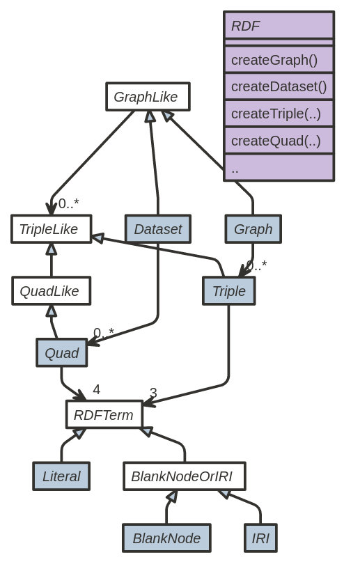
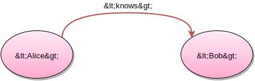
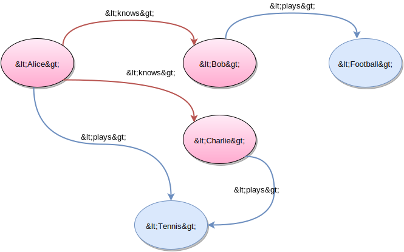

# Apache Commons RDF – Project Information

## Navigation

- Project
  - [Home](#index)
  - [Introduction](#introduction)
  - [Implementations](#implementations)
  - [User Guide](#userguide)
  - [Download](#download)
  - [Contributing](#contributing)
- Project Documentation
  - [Project Information](#project-info)
    - [About](#index)
    - [Summary](#project-summary)
    - [Project Modules](#modules)
    - [Issue Management](#issue-tracking)
    - [CI Management](#integration)

## Content

<a id="index"></a>

<!-- source_url: https://commons.apache.org/proper/commons-rdf/index.html -->

<!-- page_index: 1 -->

<a id="index--apache-commons-rdf"></a>

# Apache Commons RDF

> [!NOTE]
> **2017-12-23: Commons RDF 0.5.0 released.**
>

Commons RDF aims to provide a common library for [RDF 1.1](http://www.w3.org/TR/rdf11-concepts/) that could be implemented by systems on the Java Virtual Machine.

[](assets/images/class-diagram_28d8a32394a380cb.png)

The main motivation behind this simple library is revise an historical incompatibility issue. This library does not pretend to be a generic api wrapping those libraries, but a set of interfaces for the RDF 1.1 concepts that can be used to expose common RDF-1.1 concepts using common Java interfaces. In the initial phase commons-rdf is focused on a subset of the core concepts defined by RDF-1.1 (URI/IRI, Blank Node, Literal, Triple, and Graph). In particular, commons RDF aims to provide a type-safe, non-general API that covers RDF 1.1. In a future phase we may define interfaces for Datasets and Quads.

<a id="index--api"></a>

## API

The [class diagram](assets/images/class-diagram_28d8a32394a380cb.png) on the right depicts the main [interfaces](https://commons.apache.org/proper/commons-rdf/apidocs/index.html?org%2Fapache%2Fcommons%2Frdf%2Fapi%2Fpackage-summary.html=) which may be included in Commons RDF, specifically:

- [Graph](https://commons.apache.org/proper/commons-rdf/apidocs/index.html?org%2Fapache%2Fcommons%2Frdf%2Fapi%2FGraph.html=): a graph, a set of RDF triples.
- [Triple](https://commons.apache.org/proper/commons-rdf/apidocs/index.html?org%2Fapache%2Fcommons%2Frdf%2Fapi%2FTriple.html=): a RDF triple with getSubject(), getPredicate(), getObject().
- [Dataset](https://commons.apache.org/proper/commons-rdf/apidocs/index.html?org%2Fapache%2Fcommons%2Frdf%2Fapi%2FDataset.html=): a dataset, of RDF quads (or if you like, a set of named graphs).
- [Quad](https://commons.apache.org/proper/commons-rdf/apidocs/index.html?org%2Fapache%2Fcommons%2Frdf%2Fapi%2FQuad.html=): a RDF quad with with getGraphName(), getSubject(), getPredicate(), getObject().
- [RDFTerm](https://commons.apache.org/proper/commons-rdf/apidocs/index.html?org%2Fapache%2Fcommons%2Frdf%2Fapi%2FRDFTerm.html=): any RDF 1.1 Term which can be part of a Triple or Quad. IRIs, literals and blank nodes are collectively known as RDF terms.
- [IRI](https://commons.apache.org/proper/commons-rdf/apidocs/index.html?org%2Fapache%2Fcommons%2Frdf%2Fapi%2FIRI.html=): an Internationalized Resource Identifier (e.g. representing <http://example.com/>)
- [BlankNode](https://commons.apache.org/proper/commons-rdf/apidocs/index.html?org%2Fapache%2Fcommons%2Frdf%2Fapi%2FBlankNode.html=): a RDF-1.1 Blank Node, e.g. representing \_:b1. Disjoint from IRIs and literals.
- [BlankNodeOrIRI](https://commons.apache.org/proper/commons-rdf/apidocs/index.html?org%2Fapache%2Fcommons%2Frdf%2Fapi%2FBlankNodeOrIRI.html=): this interface represents the RDF Terms that may be used in the subject position of an RDF 1.1 Triple, including BlankNode and IRI.
- [Literal](https://commons.apache.org/proper/commons-rdf/apidocs/index.html?org%2Fapache%2Fcommons%2Frdf%2Fapi%2FLiteral.html=): a RDF-1.1 literal, e.g. representing "Hello there"@en.

The design of the [API](https://commons.apache.org/proper/commons-rdf/apidocs/index.html?org%2Fapache%2Fcommons%2Frdf%2Fapi%2Fpackage-summary.html=) follows the terminology as defined by [RDF 1.1 Concepts and Abstract Syntax](http://www.w3.org/TR/rdf11-concepts/), a W3C Recommendation published on 25 February 2014. The idea is that Commons RDF provide a common library for RDF 1.1 with multiple implementions for the Java Virtual Machine, allowing the portability across different Commons RDF implementations.

Commons RDF is designed for compatibility between different [implementations](#implementations), e.g. by defining strong equality and hash code semantics (e.g. for [triple](https://commons.apache.org/proper/commons-rdf/apidocs/org/apache/commons/rdf/api/Triple.html#equals-java.lang.Object-) and [literals](https://commons.apache.org/proper/commons-rdf/fapidocs/org/apache/commons/rdf/api/Literal.html#equals-java.lang.Object-) ); this allows users of Commons RDF to “mix and match”, for instance querying a FooGraphImpl and directly adding its FooTripleImpls to a BarGraphImpl without any explicit convertion.

To create such instances without hard-coding an implementation, one can use:

- [RDF](https://commons.apache.org/proper/commons-rdf/apidocs/index.html?org%2Fapache%2Fcommons%2Frdf%2Fapi%2FRDF.html=): interface for creating instances of the above types (e.g. LiteralImpl and GraphImpl) as well as converting from/to the underlying framework’s API.

The API also includes a couple of “upper” interfaces which do not have the above equality semantics and bridge the graph/quad duality:

- [TripleLike](https://commons.apache.org/proper/commons-rdf/apidocs/index.html?org%2Fapache%2Fcommons%2Frdf%2Fapi%2FTripleLike.html=): common super-interface of Triple and Quad (also a generalised triple).
- [QuadLike](https://commons.apache.org/proper/commons-rdf/apidocs/index.html?org%2Fapache%2Fcommons%2Frdf%2Fapi%2FQuadLike.html=): a TripleLike that also has getGraphName() (a generalized quad)
- [GraphLike](https://commons.apache.org/proper/commons-rdf/apidocs/index.html?org%2Fapache%2Fcommons%2Frdf%2Fapi%2FGraphLike.html=): common super-interface of Graph and Dataset.

See the the [user guide](#userguide) for examples of how to interact with these interfaces.

<a id="index--modules"></a>

## Modules

The project is composed by two modules:

- [API](https://commons.apache.org/proper/commons-rdf/apidocs/index.html?org%2Fapache%2Fcommons%2Frdf%2Fapi%2Fpackage-summary.html=) defines a common library of RDF 1.1 concepts.
- [Simple](https://commons.apache.org/proper/commons-rdf/apidocs/index.html?org%2Fapache%2Fcommons%2Frdf%2Fsimple%2Fpackage-summary.html=) provides a simple implementation, mainly for internal validation and very simple scenarios.
- [jena](https://commons.apache.org/proper/commons-rdf/apidocs/index.html?org%2Fapache%2Fcommons%2Frdf%2Fjena%2Fpackage-summary.html=) provides an Apache Jena-backed implementation
- [rdf4j](https://commons.apache.org/proper/commons-rdf/apidocs/index.html?org%2Fapache%2Fcommons%2Frdf%2Frdf4j%2Fpackage-summary.html=) provides an Eclipse RDF4J-backed implementation
- [jsonld-java](https://commons.apache.org/proper/commons-rdf/apidocs/index.html?org%2Fapache%2Fcommons%2Frdf%2Fjsonldjava%2Fpackage-summary.html=) provides an JSONLD-Java-backed implementation

These modules follow the [semantic versioning](http://semver.org/) principles, where version x.y.z of Simple implements version x.y of the API; i.e., the version z are backwards-compatible patches of the implementation.

For more details, read about the [implementations of the Commons RDF API](#implementations).

<a id="index--contributing"></a>

## Contributing

Everybody is welcomed to [join the project](https://commons.apache.org/proper/commons-rdf/mail-lists.html) and [contribute](#contributing)!

---

<a id="introduction"></a>

<!-- source_url: https://commons.apache.org/proper/commons-rdf/introduction.html -->

<!-- page_index: 2 -->

<a id="introduction--introduction-to-rdf-using-commons-rdf"></a>

# Introduction to RDF using Commons RDF

This page is a tutorial to introduce programming with the [Resource Description Framework (RDF)](https://www.w3.org/TR/rdf11-concepts/) using Java and [Apache Commons RDF](https://commons.apache.org/proper/commons-rdf/index.md). If you already know RDF, you may instead jump ahead to the [Commons RDF user guide](#userguide).

This is not meant as an extensive RDF tutorial, for that please consult the [W3C RDF 1.1 Primer](https://www.w3.org/TR/rdf11-primer/). You may also like the [Apache Jena introduction to RDF](https://jena.apache.org/tutorials/rdf_api.html) which uses the [Apache Jena](https://jena.apache.org/) implementation directly.

This tutorial attempts to show the basic concepts of RDF and how you can work with RDF programmatically using the [Apache Commons RDF API](https://commons.apache.org/proper/commons-rdf/index.md) in a simple Java program.

<a id="introduction--getting-started-with-commons-rdf"></a>

## Getting started with Commons RDF

This tutorial will assume you already know a bit of [Java programming](http://docs.oracle.com/javase/tutorial/) and that you use an *IDE* like [Eclipse](http://www.eclipse.org/) or [Netbeans](https://netbeans.org/). Note that Commons RDF requires Open JDK 8, [Java 8](https://www.java.com/) or equivalent.

The Commons RDF JARs are [available from Maven Central](#download--maven). While there are multiple [Commons RDF implementations](#implementations), this tutorial will use the built-in *simple* implementation as it requires no additional dependencies.

First, create a new Java project for this tutorial, say rdftutorial.

**Tip**: Check that your IDE project is using the **Java 8** syntax and compiler.

We’ll create the package name org.example, but you can use whatever you prefer. Then create RdfTutorial.java with a static main() method we can run:

```
package org.example;
import org.apache.commons.rdf.api.*; import org.apache.commons.rdf.simple.SimpleRDF;
public class RdfTutorial {public static void main(String[] args) {// ...}}
```

<a id="introduction--adding-commons-rdf-to-the-class-path"></a>

### Adding Commons RDF to the class path

Above we added the import for the Commons RDF API, but the library is not yet on your class path.

**Note**: If you are already familiar with *Maven*, then see instead [how to use Commons RDF from Maven](#userguide--using_commons_rdf_from_maven) and add the commons-rdf-simple dependency to your project. This will make it easier later to share your project or to use newer versions of Commons RDF.

This tutorial assumes a classic Java project with local .jar files (say in your project’s lib/ folder), so download and add to your project’s class path:

- [commons-rdf-api-0.5.0.jar](https://repo.maven.apache.org/maven2/org/apache/commons/commons-rdf-api/0.5.0/commons-rdf-api-0.5.0.jar) ([signature](https://repo.maven.apache.org/maven2/org/apache/commons/commons-rdf-api/0.5.0/commons-rdf-api-0.5.0.jar.asc))
- [commons-rdf-simple-0.5.0.jar](https://repo.maven.apache.org/maven2/org/apache/commons/commons-rdf-simple/0.5.0/commons-rdf-simple-0.5.0.jar) ([signature](https://repo.maven.apache.org/maven2/org/apache/commons/commons-rdf-simple/0.5.0/commons-rdf-simple-0.5.0.jar.asc))

*Tip: If you prefer you can [verify the signatures](https://www.apache.org/info/verification.html) using the Apache Commons [KEYS](https://www.apache.org/dist/commons/KEYS).*

As there are [multiple Commons RDF implementations](#implementations), we have to say which one we want to use. Add to your RdfTutorial class:

```
RDF rdf = new SimpleRDF();
```

If you have the classpath set up correctly, you should now be able to compile RdfTutorial without warnings.

<a id="introduction--rdf-resources"></a>

## RDF resources

“The clue is in the name”; the *Resource Description Framework* (RDF) is for describing **resources**. But what is a resource?

Anything can be a resource, it is just a concept we want to describe, like computer *files* (text document, image, database), *physical things* (person, place, cat), *locations* (city, point on a map), or more *abstract concepts* (organization, disease, theatre play).

To know which concept we mean, in RDF the resource needs to either:

- have a global *identifier*; we call this an **IRI**
- be used *indirectly* in a statement; we call this a **blank node**
- be a *value*, we call this a **literal**

In this tutorial we’ll use the *IRI* syntax <identifier> to indicate an identified resource, the *blank node* syntax \_:it to indicate an indirectly referenced resource, and the *literal* syntax "Hello" to indicate a value.

Don’t worry about this syntax, RDF is a **model** with several ways to represent it when saved to a file; the [Commons RDF API](https://commons.apache.org/proper/commons-rdf/apidocs/index.html?org%2Fapache%2Fcommons%2Frdf%2Fapi%2Fpackage-summary.html=) directly reflects the RDF model in a syntax-neutral way.

Let’s create our first identified resource, an IRI instance:

```
IRI alice = rdf.createIRI("Alice");
System.out.println(alice.ntriplesString());
```

This should print out:

> <Alice>

**Note**: For simplicity this tutorial use *relative IRI references* which are not really global identifiers. While this is supported by SimpleRDF, some implementations will require *absolute IRIs* like <http://example.com/Alice>.

<a id="introduction--triples"></a>

### Triples

To describe a resource in RDF we provide one or more statements, which are called *triples* of 3 resources (*subject*, *predicate*, *object*):

```
<Alice> <knows> <Bob> .
```



This RDF statement is a relationship between the **subject** <Alice> and the **object** <Bob>, not dissimilar from the subject and direct object of the similar English sentence *“Alice knows Bob”*.

What kind of relationship? Well, that is identified with the **predicate** <knows>. The relationship is *directional*, from the subject to the object; although *Alice knows Bob*, we don’t know if Bob really knows Alice! In RDF the predicate is also called a *property* as it is describing the subject.

You may have noticed that properties are also resources - to understand the kind of relationship we also need a description of it’s concept. More about this later!

Let’s try to create the above statement in Commons RDF; first we’ll create the remaining resources <knows> and <Bob>:

```
IRI knows = rdf.createIRI("knows");        
IRI bob = rdf.createIRI("Bob");
```

Note that the Java variable names alice, knows and bob are not important to Commons RDF, we could as well have called these a, k, b, but to not confuse yourself it’s good to keep the variable names somewhat related to the captured identifiers.

Next we’ll create a Triple:

```
Triple aliceKnowsBob = rdf.createTriple(alice, knows, bob);
```

We can access .getSubject(), .getPredicate() and .getObject() from a Triple:

```
System.out.println(aliceKnowsBob.getSubject().ntriplesString());
System.out.println(aliceKnowsBob.getPredicate().ntriplesString());
System.out.println(aliceKnowsBob.getObject().ntriplesString());
```

> <Alice> <knows> <Bob>

***Tip**: Instances from SimpleRDF can be printed directly, as System.out would use their .toString(), but for consistent behaviour across implementations we use .ntriplesString() above.*

With SimpleRDF we can also print the Triple for debugging:

```
System.out.println(aliceKnowsBob);
```

> <Alice> <knows> <Bob> .

<a id="introduction--graph"></a>

### Graph

By using the same identified resources in multiple triples, you can create a *graph*. For instance, this graph shows multiple relations of <knows> and <plays>:

```
<Alice> <knows> <Bob> .
<Alice> <knows> <Charlie> .
<Alice> <plays> <Tennis> .
<Bob> <knows> <Charlie> .
<Bob> <plays> <Football> .
<Charlie> <plays> <Tennis> .
```

The power of a graph as a data structure is that you don’t have to decide a hierarchy. The statements of an RDF graph can be listed in any order, and so we should not consider the <Alice> resource as anything more special than <Bob> or <Tennis>.



It is therefore possible to *query* the graph, such as *"Who plays Tennis?* or *“Who does Alice know?”*, but also more complex, like *“Does Alice know anyone that plays Football?”*.

Let’s try that now using Commons RDF. To keep the triples we’ll need a Graph:

```
Graph graph = rdf.createGraph();
```

We already have the first triple, so we’ll .add() it to the graph:

```
graph.add(aliceKnowsBob);
```

Before adding the remaining statements we need a few more resources:

```
IRI charlie = rdf.createIRI("Charlie");

IRI plays = rdf.createIRI("plays");

IRI football = rdf.createIRI("Football");        
IRI tennis = rdf.createIRI("Tennis");
```

Now we use the graph.add(subj,pred,obj) shorthand which creates the Triple instances and add them to the graph.

```
graph.add(alice, knows, charlie);
graph.add(alice, plays, tennis);
graph.add(bob, knows, charlie);
graph.add(bob, plays, football);
graph.add(charlie, plays, tennis);
```

Next we’ll ask the graph those questions using .iterate(s,p,o) and null as the wildcard.

```
System.out.println("Who plays Tennis?");
for (Triple triple : graph.iterate(null, plays, tennis)) {
    System.out.println(triple.getSubject());
}
```

> Who plays Tennis? <Alice> <Charlie>

Notice how we only print out the .getSubject() (our wildcard), if you check .getPredicate() or .getObject() you will find they are equal to plays and tennis:

```
System.out.println("Who plays Tennis?");
for (Triple triple : graph.iterate(null, plays, tennis)) {
    System.out.println(triple.getSubject());
    System.out.println(plays.equals(triple.getPredicate()));
    System.out.println(tennis.equals(triple.getObject()));
}
```

We can query with wildcards in any positions, for instance for the *object*:

```
System.out.println("Who does Alice know?");
for (Triple triple : graph.iterate(alice, knows, null)) {
    System.out.println(triple.getObject());
}
```

> Who does Alice know? <Bob> <Charlie>

Let’s try to look up which of those friends play football:

```
System.out.println("Does Alice know anyone that plays Football?");
for (Triple triple : graph.iterate(alice, knows, null)) {
    RDFTerm aliceFriend = triple.getObject();
    if (graph.contains(aliceFriend, plays, football)) {
        System.out.println("Yes, " + aliceFriend);
    }
}
```

You will get a compiler error:

> RDFTerm cannot be converted to BlankNodeOrIRI

This is because in an RDF triple, not all kind of resources can be used in all positions, and the kind of resource in Commons RDF is indicated by the interfaces:

- [IRI](https://commons.apache.org/proper/commons-rdf/apidocs/org/apache/commons/rdf/api/IRI.html) (identified)
- [BlankNode](https://commons.apache.org/proper/commons-rdf/apidocs/org/apache/commons/rdf/api/BlankNode.html) (indirect)
- [Literal](https://commons.apache.org/proper/commons-rdf/apidocs/org/apache/commons/rdf/api/Literal.html) (value)

Look at the method signature of [graph.contains(s,p,o)](https://commons.apache.org/proper/commons-rdf/apidocs/org/apache/commons/rdf/api/Graph.html#contains-org.apache.commons.rdf.api.BlankNodeOrIRI-org.apache.commons.rdf.api.IRI-org.apache.commons.rdf.api.RDFTerm-):

```
boolean contains(BlankNodeOrIRI subject,
                 IRI predicate,
                 RDFTerm object)
```

In short, for any RDF triple:

- The **subject** must be a [BlankNodeOrIRI](https://commons.apache.org/proper/commons-rdf/apidocs/org/apache/commons/rdf/api/BlankNodeOrIRI.html), that is either a BlankNode or IRI
- The **predicate** must be a [IRI](https://commons.apache.org/proper/commons-rdf/apidocs/org/apache/commons/rdf/api/IRI.html) (so we can look up what it means)
- The **object** must be a [RDFTerm](https://commons.apache.org/proper/commons-rdf/apidocs/org/apache/commons/rdf/api/RDFTerm.html), that is either a BlankNode, IRI or Literal

As we are retrieving triples from the graph, the triple.getObject() is only known to be an RDFTerm if we use it as a Java variable - there could in theory be triples in the graph with Literal and BlankNode objects:

```
<Alice> <knows> "Santa Claus".
<Alice> <knows> _:someone.
```

In this case we could have done a naive casting like (IRI)aliceFriend; we inserted her IRI-represented friends right before, but this is a toy example - there’s no need to use RDF if you already know the answer!

So unless you know for sure in your graph that <knows> is never used with a literal value as object, this would not be safe. So we’ll do an instanceof check (skipping any literals) and cast to BlankNodeOrIRI:

```
System.out.println("Does Alice know anyone that plays Football?"); for (Triple triple : graph.iterate(alice, knows, null)) {RDFTerm aliceFriend = triple.getObject(); if (! (aliceFriend instanceof BlankNodeOrIRI)) {continue;} if (graph.contains( (BlankNodeOrIRI)aliceFriend, plays, football)) {System.out.println("Yes, " + aliceFriend);}}
```

> Does Alice know anyone that plays Football? Yes, <Bob>

<a id="introduction--literal-values"></a>

## Literal values

We talked briefly about literals above as a way to represent *values* in RDF. What is a literal value? In a way you could think of a value as when you no longer want to stay in graph-land of related resources, and just want to use primitive types like float, int or String to represent values like a player rating, the number of matches played, or the full name of a person (including spaces and punctuation which don’t work well in an identifier).

Such values are in Commons RDF represented as instances of Literal, which we can create using rdf.createLiteral(..). Strings are easy:

```
Literal aliceName = rdf.createLiteral("Alice W. Land");
```

We can then add a triple that relates the resource <Alice> to this value, let’s use a new predicate <name>:

```
IRI name = rdf.createIRI("name");
graph.add(alice, name, aliceName);
```

When you look up literal properties in a graph, take care that in RDF a property is not necessarily *functional*, that is, it would be perfectly valid RDF-wise for a person to have multiple names; Alice might also be called *“Alice Land”*.

Instead of using graph.iterate() and break in a for-loop, it might be easier to use the Java 8 Stream returned from .stream() together with .findAny() - which return an Optional in case there is no <name>:

```
System.out.println(graph.stream(alice, name, null).findAny());
```

> Optional[<Alice> <name> "Alice W. Land" .]

**Note:** Using .findFirst() will not returned the “first” recorded triple, as triples in a graph are not necessarily kept in order.

You can use optional.isPresent() and optional.get() to check if a Triple matched the graph stream pattern:

```
import java.util.Optional;
// ...
Optional<? extends Triple> nameTriple = graph.stream(alice, name, null).findAny();
if (nameTriple.isPresent()) {
    System.out.println(nameTriple.get());
}
```

If you feel adventerous, you can try the [Java 8 functional programming](http://www.oracle.com/webfolder/technetwork/tutorials/obe/java/Lambda-QuickStart/index.html) style to work with of Stream and Optional and get the literal value unquoted:

```
graph.stream(alice, name, null)
        .findAny().map(Triple::getObject)
        .filter(obj -> obj instanceof Literal)
        .map(literalName -> ((Literal)literalName).getLexicalForm())
        .ifPresent(System.out::println);
```

> Alice W. Land

Notice how we here used a .filter to skip any non-Literal names (which would not have the .getLexicalForm() method).

<a id="introduction--typed-literals"></a>

### Typed literals

Non-String value types are represented in RDF as *typed literals*; which is similar to (but not the same as) Java native types. A typed literal is a combination of a *string representation* (e.g. “13.37”) and a data type IRI, e.g. <http://www.w3.org/2001/XMLSchema#float>. RDF reuse the XSD datatypes.

A collection of the standardized datatype IRIs are provided in Simple’s [Types](https://commons.apache.org/proper/commons-rdf/apidocs/org/apache/commons/rdf/simple/Types.html) class, which we can use with createLiteral by adding the corresponding import:

```
import org.apache.commons.rdf.simple.Types;
// ...
IRI playerRating = rdf.createIRI("playerRating");
Literal aliceRating = rdf.createLiteral("13.37", Types.XSD_FLOAT);
graph.add(alice, playerRating, aliceRating);
```

Note that Commons RDF does not currently provide converters from/to native Java data types and the RDF string representations.

<a id="introduction--language-specific-literals"></a>

### Language-specific literals

We live in a globalized world, with many spoken and written languages. While we can often agree about a concept like <Football>, different languages might call it differently. The distinction in RDF between identified resources and literal values, mean we can represent names or labels for the same thing.

Rather than introducing language-specific predicates like <name\_in\_english> and <name\_in\_norwegian> it is usually better in RDF to use *language-typed literals*:

```
Literal footballInEnglish = rdf.createLiteral("football", "en");
Literal footballInNorwegian = rdf.createLiteral("fotball", "no");

graph.add(football, name, footballInEnglish);
graph.add(football, name, footballInNorwegian);
```

The language tags like "en" and "no" are identified by [BCP47](https://tools.ietf.org/html/bcp47) - you can’t just make up your own but must use one that matches the language. It is possible to use localized languages as well, e.g.

```
Literal footballInAmericanEnglish = rdf.createLiteral("soccer", "en-US");
graph.add(football, name, footballInAmericanEnglish);
```

Note that Commons RDF does not currently provide constants for the standardized languages or methods to look up localized languages.

<a id="introduction--blank-nodes-when-you-don-t-know-the-identity"></a>

## Blank nodes - when you don’t know the identity

Sometimes you don’t know the identity of a resource. This can be the case where you know the *existence* of a resource, similar to “someone” or “some” in English. For instance,

```
<Charlie> <knows> _:someone .
_:someone <plays> <Football> .
```

We don’t know who this \_:someone is, it could be <Bob> (which we know plays football), it could be someone else, even <Alice> (we don’t know that she doesn’t play football).

In RDF we represent \_:someone as a *blank node* - it’s a resource without a global identity. Different RDF files can all talk about \_:blanknode, but they would all be different resources. Crucially, a blank node can be used in multiple triples within the same graph, so that we can relate a subject to a blank node resource, and then describe the blank node further.

Let’s add some blank node statements to our graph:

```
BlankNode someone = rdf.createBlankNode();
graph.add(charlie, knows, someone);
graph.add(someone, plays, football);
BlankNode someoneElse = rdf.createBlankNode();
graph.add(charlie, knows, someoneElse);
```

Every call to rdf.createBlankNode() creates a new, unrelated blank node with an internal identifier. Let’s have a look:

```
for (Triple heKnows : graph.iterate(charlie, knows, null)) {if (! (heKnows.getObject() instanceof BlankNodeOrIRI)) {continue;} BlankNodeOrIRI who = (BlankNodeOrIRI)heKnows.getObject(); System.out.println("Charlie knows "+ who); for (Triple whoPlays : graph.iterate(who, plays, null)) {System.out.println("  who plays " + whoPlays.getObject());}}
```

> Charlie knows \_:ae4115fb-86bf-3330-bc3b-713810e5a1ea who plays <Football> Charlie knows \_:884d5c05-93a9-3709-b655-4152c2e51258

As we see above, given a BlankNode instance it is perfectly valid to ask the same Graph about further triples relating to the BlankNode. (Asking any other graph will probably not give any results).

<a id="introduction--blank-node-labels"></a>

### Blank node labels

In Commons RDF it is also possible to create a blank node from a *name* or *label* - which can be useful if you don’t want to keep or retrieve the BlankNode instance to later add statements about the same node.

Let’s first delete the old BlankNode statements:

```
graph.remove(null,null,someone);
graph.remove(someone,null,null);
```

And now we’ll try an alternate approach:

```
// no Java variable for the new BlankNode instance
graph.add(charlie, knows, rdf.createBlankNode("someone"));        
// at any point later (with the same RDF instance)
graph.add(rdf.createBlankNode("someone"), plays, football);
```

Running the "Charlie knows" query again (try making it into a function) should still work, but now return a different label for the football player:

> Charlie knows \_:5e2a75b2-33b4-3bb8-b2dc-019d42c2215a who plays <Football> Charlie knows \_:884d5c05-93a9-3709-b655-4152c2e51258

You may notice that with SimpleRDF the string "someone" does **not** survive into the string representation of the BlankNode label as \_:someone, that is because unlike IRIs the label of a blank node carries no meaning and does not need to be preserved.

Note that it needs to be the same RDF instance to recreate the same *“someone”* BlankNode. This is a Commons RDF-specific behaviour to improve cross-graph compatibility, other RDF frameworks may save the blank node using the provided label as-is with a \_: prefix, which in some cases could cause collisions (but perhaps more readable output).

<a id="introduction--open-world-assumption"></a>

### Open world assumption

How to interpret a blank node depends on the assumptions you build into your RDF application - it could be thought of as a logical “there exists a resource that..” or a more pragmatic “I don’t know/care about the resource’s IRI”. Blank nodes can be useful if your RDF model describes intermediate resources like “a person’s membership of an organization” or “a participant’s result in a race” which it often is not worth maintaining identifiers for.

It is common on the semantic web to use the [open world assumption](http://wiki.opensemanticframework.org/index.php/Overview_of_the_Open_World_Assumption) - if it is not stated as a *triple* in your graph, then you don’t know if something is is true or false, for instance if <Alice> <plays> <Football> .

Note that the open world assumption applies both to IRIs and BlankNodes, that is, you can’t necessarily assume that the resources <Alice> and <Charlie> describe two different people just because they have two different identifiers - in fact it is very common that different systems use different identifiers to describe the same (or pretty much the same) thing in the real world.

It is however common for applications to “close the world”; saying “given this information I have gathered as RDF, I’ll assume these resources are all separate things in the world, then do I then know if <Alice> <plays> <Football> is false?”.

Using logical *inference rules* and *ontologies* is one method to get stronger assumptions and conclusions. Note that building good rules or ontologies requires a fair bit more knowledge than what can be conveyed in this short tutorial.

It is out of scope for Commons RDF to support the many ways to deal with logical assumptions and conclusions, however you may find interest in using [Jena implementation](#implementations--apache_jena) combined with Jena’s [ontology API](https://jena.apache.org/documentation/ontology/).

---

<a id="implementations"></a>

<!-- source_url: https://commons.apache.org/proper/commons-rdf/implementations.html -->

<!-- page_index: 3 -->

<a id="implementations--implementations"></a>

# Implementations

The Commons RDF API must be used with one or more implementations.

The Apache Commons RDF distribution includes bindings for the implementations:

- [Commons RDF Simple](#implementations--commons_rdf_simple)
- [Apache Jena](#implementations--apache_jena)
- [Eclipse RDF4J](#implementations--eclipse_rdf4j) (formerly Sesame)
- [JSONLD-Java](#implementations--jsonld-java)

In addition there can be [External implementations](#implementations--external-implementations) which are released separately by their respective projects.

One goal of the Commons RDF API is to enable runtime cross-compatibility of its implementations, therefore it is perfectly valid to combine them and for instance do:

- Copy triples from a Jena Model to an RDF4J Repository (e.g. copying between two Common RDF Graphs)
- Create an RDF4J-backed Quad that use a Jena-backed BlankNode
- Read an RDF file with Jena’s parsers into an RDF4J-backed Dataset

<a id="implementations--commons-rdf-simple"></a>

### Commons RDF Simple

[org.apache.commons.rdf.simple](https://commons.apache.org/proper/commons-rdf/apidocs/org/apache/commons/rdf/simple/package-summary.html) is part of Commons RDF, and its main purpose is to verify and clarify the [test harness](https://commons.apache.org/proper/commons-rdf/testapidocs/org/apache/commons/rdf/api/package-summary.html). It is backed by simple (if not naive) in-memory POJO objects and have no external dependencies.

Note that although this module fully implements the commons-rdf API, it should **not** be considered as a reference implementation. It is **not thread-safe** and probably **not scalable**, however it may be useful for testing and simple usage (e.g. prototyping and creating graph fragments).

**Usage:**

```
<dependency>
    <groupId>org.apache.commons</groupId>
    <artifactId>commons-rdf-simple</artifactId>
    <version>0.5.0</version>
</dependency>
```

```
import org.apache.commons.rdf.api.Graph;
import org.apache.commons.rdf.api.RDF;
import org.apache.commons.rdf.simple.SimpleRDF;

RDF rdf = new SimpleRDF();
Graph graph = rdf.createGraph();
```

<a id="implementations--apache-jena"></a>

### Apache Jena

[org.apache.commons.rdf.jena](https://commons.apache.org/proper/commons-rdf/apidocs/org/apache/commons/rdf/jena/package-summary.html) is an implementation of the Commons RDF API backed by [Apache Jena](http://jena.apache.org/), including converters from/to Jena and Commons RDF.

**Usage:**

```
<dependency>
    <groupId>org.apache.commons</groupId>
    <artifactId>commons-rdf-jena</artifactId>
    <version>0.5.0</version>
</dependency>
```

```
import org.apache.commons.rdf.api.Graph;
import org.apache.commons.rdf.api.RDFTermFactory;
import org.apache.commons.rdf.jena.JenaRDF;

RDF rdf = new JenaRDF();
Graph graph = rdf.createGraph();
```

Objects created with [JenaRDF](https://commons.apache.org/proper/commons-rdf/apidocs/org/apache/commons/rdf/jena/JenaRDF.html) implement interfaces like [JenaQuad](https://commons.apache.org/proper/commons-rdf/apidocs/org/apache/commons/rdf/jena/JenaQuad.html) and [JenaLiteral](https://commons.apache.org/proper/commons-rdf/apidocs/org/apache/commons/rdf/jena/JenaLiteral.html) which give access to the underlying Jena objects through methods like [asJenaNode()](https://commons.apache.org/proper/commons-rdf/apidocs/org/apache/commons/rdf/jena/JenaRDFTerm.html#asJenaNode--) and [asJenaGraph()](https://commons.apache.org/proper/commons-rdf/apidocs/org/apache/commons/rdf/jena/JenaGraph.html#asJenaGraph--).

JenaRDF includes additional methods for converting from/to Apache Jena and Commons RDF, like [asRDFTerm(Node)](https://commons.apache.org/proper/commons-rdf/apidocs/org/apache/commons/rdf/jena/JenaRDF.html#asRDFTerm-org.apache.jena.graph.Node-) and [asJenaNode(RDFTerm)](https://commons.apache.org/proper/commons-rdf/apidocs/org/apache/commons/rdf/jena/JenaRDF.html#asJenaNode-org.apache.commons.rdf.api.RDFTerm-).

<a id="implementations--generalized-rdf"></a>

#### Generalized RDF

Apache Jena can support [generalized RDF](https://www.w3.org/TR/rdf11-concepts/#section-generalized-rdf), e.g.:

> A generalized RDF triple is a triple having a subject, a predicate, and object, where each can be an IRI, a blank node or a literal.

Within Commons RDF it is possible to create [generalized triples](https://commons.apache.org/proper/commons-rdf/apidocs/org/apache/commons/rdf/jena/JenaRDF.html#createGeneralizedTriple-org.apache.commons.rdf.api.RDFTerm-org.apache.commons.rdf.api.RDFTerm-org.apache.commons.rdf.api.RDFTerm-) and [quads](https://commons.apache.org/proper/commons-rdf/apidocs/org/apache/commons/rdf/jena/JenaRDF.html#createGeneralizedQuad-org.apache.commons.rdf.api.RDFTerm-org.apache.commons.rdf.api.RDFTerm-org.apache.commons.rdf.api.RDFTerm-org.apache.commons.rdf.api.RDFTerm-) using JenaRDF - however note that the returned [JenaGeneralizedTripleLike](https://commons.apache.org/proper/commons-rdf/apidocs/org/apache/commons/rdf/jena/JenaGeneralizedTripleLike.html) and [JenaGeneralizedQuadLike](https://commons.apache.org/proper/commons-rdf/apidocs/org/apache/commons/rdf/jena/JenaGeneralizedQuadLike.html) do not have the [equality semantics of Triple](https://commons.apache.org/proper/commons-rdf/apidocs/org/apache/commons/rdf/api/Triple.html#equals-java.lang.Object-) or [Quad](https://commons.apache.org/proper/commons-rdf/apidocs/org/apache/commons/rdf/api/Quad.html#equals-java.lang.Object-) and thus can’t be used with the regular [Graph](https://commons.apache.org/proper/commons-rdf/apidocs/org/apache/commons/rdf/api/Graph.html) or [Dataset](https://commons.apache.org/proper/commons-rdf/apidocs/org/apache/commons/rdf/api/Dataset.html) methods.

The generalized triples/quads can be accessed as [org.apache.jena.graph.Triple](https://jena.apache.org/documentation/javadoc/jena/org/apache/jena/graph/Triple.html) and [org.apache.jena.sparql.core.Quad](https://jena.apache.org/documentation/javadoc/arq/org/apache/jena/sparql/core/Quad.html) - but can’t currently be used with an equivalent *generalized graph* or *generalized dataset* within Commons RDF (see [COMMONSRDF-42](https://issues.apache.org/jira/browse/COMMONSRDF-42)).

<a id="implementations--eclipse-rdf4j"></a>

### Eclipse RDF4J

[org.apache.commons.rdf.rdf4j](https://commons.apache.org/proper/commons-rdf/apidocs/org/apache/commons/rdf/rdf4j/package-summary.html) is an implementation of the Commons RDF API backed by Eclispe [RDF4J 2.0](http://rdf4j.org/) (formerly Sesame), including converters from/to RDF4J and Commons RDF.

**Usage:**

```
<dependency>
    <groupId>org.apache.commons</groupId>
    <artifactId>commons-rdf-rdf4j</artifactId>
    <version>0.5.0</version>
</dependency>
```

```
import org.apache.commons.rdf.api.Graph;
import org.apache.commons.rdf.api.RDF;
import org.apache.commons.rdf.rdf4j.RDF4J;

RDF rdf = new RDF4J();
Graph graph = rdf.createGraph();
```

Objects created with [RDF4J](https://commons.apache.org/proper/commons-rdf/apidocs/org/apache/commons/rdf/rdf4j/RDF4J.html) implement interfaces like [RDF4JTerm](https://commons.apache.org/proper/commons-rdf/apidocs/org/apache/commons/rdf/rdf4j/RDF4JTerm.html) and [RDF4JGraph](https://commons.apache.org/proper/commons-rdf/apidocs/org/apache/commons/rdf/rdf4j/RDF4JGraph.html) which give access to the underlying Jena objects through methods like [asValue()](https://commons.apache.org/proper/commons-rdf/apidocs/org/apache/commons/rdf/rdf4j/RDF4JTerm.html#asValue--) and [asRepository()](https://commons.apache.org/proper/commons-rdf/apidocs/org/apache/commons/rdf/rdf4j/RDF4JGraphLike.html#asRepository--).

RDF4J includes additional methods for converting from/to RDF4J and Commons RDF, like [asTriple(Statement)](https://commons.apache.org/proper/commons-rdf/apidocs/org/apache/commons/rdf/rdf4j/RDF4J.html#asTriple-org.eclipse.rdf4j.model.Statement-) and [asRDFTerm(Value)](https://commons.apache.org/proper/commons-rdf/apidocs/org/apache/commons/rdf/rdf4j/RDF4J.html#asRDFTerm-org.eclipse.rdf4j.model.Value-).

<a id="implementations--closing-rdf4j-resources"></a>

#### Closing RDF4J resources

When using RDF4J with an RDF4J Repository, e.g. from [asRDFTermGraph(Repository)](https://commons.apache.org/proper/commons-rdf/apidocs/org/apache/commons/rdf/rdf4j/RDF4J.html#asGraph-org.eclipse.rdf4j.repository.Repository-org.apache.commons.rdf.rdf4j.RDF4J.Option...-), care must be taken to close underlying resources when using the methods [stream()](https://commons.apache.org/proper/commons-rdf/apidocs/org/apache/commons/rdf/rdf4j/RDF4JGraph.html#stream--) and [iterate()](https://commons.apache.org/proper/commons-rdf/apidocs/org/apache/commons/rdf/rdf4j/RDF4JGraph.html#iterate--) for both Graphs and Datasets.

This can generally achieved using a [try-with-resources](https://docs.oracle.com/javase/tutorial/essential/exceptions/tryResourceClose.html) block, e.g.:

```
int subjects;
try (Stream<RDF4JTriple> s : graph.stream(s,p,o)) {
  subjects = s.map(RDF4JTriple::getSubject).distinct().count()
}
```

This will ensure that the underlying RDF4J [RepositoryConnection](http://rdf4j.org/javadoc/latest/org/eclipse/rdf4j/repository/RepositoryConnection.html) and [RepositoryResult](http://rdf4j.org/javadoc/latest/org/eclipse/rdf4j/repository/RepositoryResult.html) are closed after use.

Methods that return directly, like [Graph.add()](https://commons.apache.org/proper/commons-rdf/apidocs/org/apache/commons/rdf/api/Graph.html#add-org.apache.commons.rdf.api.Triple-) and [Dataset.size()](https://commons.apache.org/proper/commons-rdf/apidocs/org/apache/commons/rdf/api/Dataset.html#size--) will use and close separate transactions per method calls and therefore do not need any special handling; however this will come with a performance hit when doing multiple graph/dataset modifications. (See [COMMONSRDF-45](https://issues.apache.org/jira/browse/COMMONSRDF-45))

Java’s [java.util.Iteratable](http://docs.oracle.com/javase/8/docs/api/java/lang/Iterable.html) and [java.util.Iterator](http://docs.oracle.com/javase/8/docs/api/java/util/Iterator.html) does not extend [AutoClosable](http://docs.oracle.com/javase/8/docs/api/java/lang/AutoCloseable.html), and as there are many ways that a for-each loop may not run to exhaustion, Commons RDF introduces [ClosableIterable](https://commons.apache.org/proper/commons-rdf/apidocs/org/apache/commons/rdf/rdf4j/ClosableIterable.html), which can be used with RDF4J as:

```
RDF4JGraph graph; // ...
try (ClosableIterable<Triple> s : graph.iterate()) {
 for (Triple t : triples) {
     return t; // OK to terminate for-loop early
 }
}
```

<a id="implementations--jsonld-java"></a>

### JSONLD-Java

[org.apache.commons.rdf.jsonld](https://commons.apache.org/proper/commons-rdf/apidocs/org/apache/commons/rdf/jsonld/package-summary.html) is an implementation of the Commons RDF API backed by [JSON-LD-Java](https://github.com/jsonld-java/jsonld-java).

This is primarily intended to support [JSON-LD](http://json-ld.org/) parsing and writing.

**Usage:**

```
<dependency>
    <groupId>org.apache.commons</groupId>
    <artifactId>commons-rdf-jsonld</artifactId>
    <version>0.5.0</version>
</dependency>
```

```
import org.apache.commons.rdf.api.Graph;
import org.apache.commons.rdf.api.RDFTermFactory;
import org.apache.commons.rdf.jsonld.JsonLdFactory;

RDF rdf = new JsonLdRDF();
Graph graph = rdfTermFactory.createGraph();
```

<a id="implementations--external-implementations"></a>

## External implementations

<a id="implementations--owl-api"></a>

### OWL API

[OWL API](http://owlapi.sourceforge.net/) 5 extends Commons RDF directly for its family of [RDFNode](https://github.com/owlcs/owlapi/blob/version5/api/src/main/java/org/semanticweb/owlapi/io/RDFNode.java#L25) implementations. It is a partial compatibility implementation without its own RDFTermFactory, Graph or Dataset.

<a id="implementations--related-implementations"></a>

## Related implementations

<a id="implementations--apache-clerezza"></a>

### Apache Clerezza

[Apache Clerezza](https://clerezza.apache.org/) is aligning its [RDF core](https://github.com/apache/clerezza-rdf-core) module with Commons RDF.

---

<a id="userguide"></a>

<!-- source_url: https://commons.apache.org/proper/commons-rdf/userguide.html -->

<!-- page_index: 4 -->

<a id="userguide--user-guide"></a>

# User Guide

This page shows some examples of a client using the Commons RDF API. It was last updated for version 0.5.0 of the Commons RDF [API](https://commons.apache.org/proper/commons-rdf/apidocs/).

- [Introduction](#userguide--introduction)
  - [RDF concepts](#userguide--rdf_concepts)
- [Using Commons RDF from Maven](#userguide--using_commons_rdf_from_maven)
- [Creating Commons RDF instances](#userguide--creating_commons_rdf_instances)
- [Finding an RDF implementation](#userguide--finding_an_rdf_implementation)
- [Using an RDF implementation](#userguide--using_an_rdf_implementation)
- [RDF terms](#userguide--rdf_terms)
  - [N-Triples string](#userguide--n-triples_string)
  - [IRI](#userguide--iri)
  - [Blank node](#userguide--blank_node)
    - [Blank node reference](#userguide--blank_node_reference)
  - [Literal](#userguide--literal)
    - [Datatype](#userguide--datatype)
      - [Types](#userguide--types)
    - [Language](#userguide--language)
- [Triple](#userguide--triple)
- [Quad](#userguide--quad)
- [Graph](#userguide--graph)
  - [Adding triples](#userguide--adding_triples)
  - [Finding triples](#userguide--finding_triples)
  - [Size](#userguide--size)
  - [Iterating over triples](#userguide--iterating_over_triples)
  - [Stream of triples](#userguide--stream_of_triples)
  - [Removing triples](#userguide--removing_triples)
- [Dataset](#userguide--dataset)
  - [Dataset operations](#userguide--dataset_operations)
- [Mutability and thread safety](#userguide--mutability_and_thread_safety)
- [Implementations](#userguide--implementations)
  - [Cross-compatibility](#userguide--cross-compatibility)
- [Complete example](#userguide--complete_example)

<a id="userguide--introduction"></a>

## Introduction

[Commons RDF](#index) is an API that intends to directly describe [RDF 1.1 concepts](http://www.w3.org/TR/rdf11-concepts/) as a set of corresponding interfaces and methods.

<a id="userguide--rdf-concepts"></a>

### RDF concepts

RDF is a [graph-based data model](http://www.w3.org/TR/rdf11-concepts/#data-model), where a *graph* contains a series of *triples*, each containing the node-arc-node link *subject* -> *predicate* -> *object*. Nodes in the graph are represented either as *IRIs*, *literals* and *blank nodes*. : This user guide does not intend to give a detailed description of RDF as a data model. To fully understand this user guide, you should have a brief understanding of the core RDF concepts mentioned above.

For more information on RDF, see the [RDF primer](http://www.w3.org/TR/rdf11-primer/) and the [RDF concepts](http://www.w3.org/TR/rdf11-concepts/#data-model) specification from W3C.

<a id="userguide--using-commons-rdf-from-maven"></a>

## Using Commons RDF from Maven

To use Commons RDF API from an [Apache Maven](http://maven.apache.org/) project, add the following dependency to your pom.xml:

```
<dependencies>
    <dependency>
        <groupId>org.apache.commons</groupId>
        <artifactId>commons-rdf-api</artifactId>
        <version>0.5.0</version>
    </dependency>
</dependencies>
```

*The <version> above might not be up to date, see the [download page](#download) for the latest version.*

If you are testing a SNAPSHOT version, then you will have to either build Commons RDF from [source](https://github.com/apache/commons-rdf), or add this [snapshot repository](https://github.com/apache/commons-rdf#snapshot-repository):

```
<repositories>
  <repository>
    <id>apache.snapshots</id>
    <name>Apache Snapshot Repository</name>
    <url>http://repository.apache.org/snapshots</url>
    <releases>
      <enabled>false</enabled>
    </releases>
  </repository>
</repositories>
```

As Commons RDF requires Java 8 or later, you will also need:

```
<properties>
  <maven.compiler.source>1.8</maven.compiler.source>
  <maven.compiler.target>1.8</maven.compiler.target>
</properties>
```

In the examples below we will use the [*simple* implementation](https://commons.apache.org/proper/commons-rdf/apidocs/org/apache/commons/rdf/simple/package-summary.html), but the examples should be equally applicable to other [implementations](#implementations). To add a dependency for the *simple* implementation, add to your <dependencies>:

```
    <dependency>
        <groupId>org.apache.commons</groupId>
        <artifactId>commons-rdf-simple</artifactId>
        <version>0.5.0</version>
    </dependency>
```

*The <version> above might not be up to date, see the [download page](#download) for the latest version.*

<a id="userguide--creating-commons-rdf-instances"></a>

## Creating Commons RDF instances

To create instances of Commons RDF interfaces like [Graph](https://commons.apache.org/proper/commons-rdf/apidocs/org/apache/commons/rdf/api/Graph.html) and [IRI](https://commons.apache.org/proper/commons-rdf/apidocs/org/apache/commons/rdf/api/IRI.html) you will need a [RDF](https://commons.apache.org/proper/commons-rdf/apidocs/org/apache/commons/rdf/api/RDF.html) implementation.

<a id="userguide--finding-an-rdf-implementation"></a>

### Finding an RDF implementation

The [implementations](#implementations) of RDF can usually be created using a normal Java constructor, for instance the *simple* implementation from [SimpleRDF](https://commons.apache.org/proper/commons-rdf/apidocs/org/apache/commons/rdf/simple/SimpleRDF.html):

```
import org.apache.commons.rdf.api.*;
import org.apache.commons.rdf.simple.SimpleRDF;
// ...
RDF rdf = new SimpleRDF();
```

If you don’t want to depend on instantiating a concrete RDF implementation, you can alternatively use the [ServiceLoader](http://docs.oracle.com/javase/8/docs/api/java/util/ServiceLoader.html) to lookup any RDF implementations found on the classpath:

```
import java.util.Iterator;
import java.util.ServiceLoader;

import org.apache.commons.rdf.api.*;
// ...
ServiceLoader<RDF> loader = ServiceLoader.load(RDF.class);
Iterator<RDF> iterator = loader.iterator();
RDF rdf = iterator.next();
```

Note that the ServiceLoader approach above might not work well within split classloader systems like OSGi.

When using the factory method [createBlankNode(String)](https://commons.apache.org/proper/commons-rdf/apidocs/org/apache/commons/rdf/api/RDF.html#createBlankNode-java.lang.String-) from different sources, care should be taken to create correspondingly different RDF instances.

<a id="userguide--using-an-rdf-implementation"></a>

### Using an RDF implementation

Using the RDF implementation you can construct any [RDFTerm](https://commons.apache.org/proper/commons-rdf/apidocs/org/apache/commons/rdf/api/RDFTerm.html), e.g. to create a [BlankNode](https://commons.apache.org/proper/commons-rdf/apidocs/org/apache/commons/rdf/api/BlankNode.html), [IRI](https://commons.apache.org/proper/commons-rdf/apidocs/org/apache/commons/rdf/api/IRI.html) and [Literal](https://commons.apache.org/proper/commons-rdf/apidocs/org/apache/commons/rdf/api/Literal.html):

```
BlankNode aliceBlankNode = rdf.createBlankNode();
IRI nameIri = rdf.createIRI("http://example.com/name");
Literal aliceLiteral = rdf.createLiteral("Alice");
```

You can also create a stand-alone [Triple](https://commons.apache.org/proper/commons-rdf/apidocs/org/apache/commons/rdf/api/Triple.html):

```
Triple triple = rdf.createTriple(aliceBlankNode, nameIri, aliceLiteral);
```

The [RDF](https://commons.apache.org/proper/commons-rdf/apidocs/org/apache/commons/rdf/api/RDF.html) interface also contains more specific variants of some of the methods above, e.g. to create a typed literal.

In addition, the [implementations](#implementations) of RDF may add specific converter methods and implementation-specific subtypes for interoperability with their underlying RDF framework’s API.

<a id="userguide--rdf-terms"></a>

## RDF terms

[RDFTerm](https://commons.apache.org/proper/commons-rdf/apidocs/org/apache/commons/rdf/api/RDFTerm.html) is the super-interface for instances that can be used as subject, predicate and object of a [Triple](https://commons.apache.org/proper/commons-rdf/apidocs/org/apache/commons/rdf/api/Triple.html).

The RDF term interfaces are arranged in this type hierarchy:

- [RDFTerm](https://commons.apache.org/proper/commons-rdf/apidocs/org/apache/commons/rdf/api/RDFTerm.html)
  - [BlankNodeOrIRI](https://commons.apache.org/proper/commons-rdf/apidocs/org/apache/commons/rdf/api/BlankNodeOrIRI.html)
    - [BlankNode](https://commons.apache.org/proper/commons-rdf/apidocs/org/apache/commons/rdf/api/BlankNode.html)
    - [IRI](https://commons.apache.org/proper/commons-rdf/apidocs/org/apache/commons/rdf/api/IRI.html)
  - [Literal](https://commons.apache.org/proper/commons-rdf/apidocs/org/apache/commons/rdf/api/Literal.html)

<a id="userguide--n-triples-string"></a>

### N-Triples string

All of the [RDFTerm](https://commons.apache.org/proper/commons-rdf/apidocs/org/apache/commons/rdf/api/RDFTerm.html) types support the ntriplesString() method:

```
System.out.println(aliceBlankNode.ntriplesString());
System.out.println(nameIri.ntriplesString());
System.out.println(aliceLiteral.ntriplesString());
```

> \_:ef136d20-f1ee-3830-a54b-cd5e489d50fb
>
> <http://example.com/name>
>
> "Alice"

This returns the [N-Triples](http://www.w3.org/TR/n-triples) canonical form of the term, which can be useful for debugging or simple serialization.

*Note: The .toString() of the simple implementation used in some of these examples use ntriplesString() internally, but Commons RDF places no such formal requirement on the .toString() method. Clients that rely on a canonical N-Triples-compatible string should instead use ntriplesString().*

<a id="userguide--iri"></a>

### IRI

An [IRI](https://commons.apache.org/proper/commons-rdf/apidocs/org/apache/commons/rdf/api/IRI.html) is a representation of an [Internationalized Resource Identifier](http://www.w3.org/TR/rdf11-concepts/#dfn-iri), e.g. http://example.com/alice or http://ns.example.org/vocab#term.

> IRIs in the RDF abstract syntax MUST be absolute, and MAY contain a fragment identifier.

An IRI identifies a resource that can be used as a *subject*, *predicate* or *object* of a [Triple](https://commons.apache.org/proper/commons-rdf/apidocs/org/apache/commons/rdf/api/Triple.html) or [Quad](https://commons.apache.org/proper/commons-rdf/apidocs/org/apache/commons/rdf/api/Quad.html), where it can also be used a *graph name*.

To create an IRI instance from an RDF implementation, use [createIRI](https://commons.apache.org/proper/commons-rdf/apidocs/org/apache/commons/rdf/api/RDF.html#createIRI-java.lang.String-):

```
IRI iri = rdf.createIRI("http://example.com/alice");
```

You can retrieve the IRI string using [getIRIString](https://commons.apache.org/proper/commons-rdf/apidocs/org/apache/commons/rdf/api/IRI.html#getIRIString--):

```
System.out.println(iri.getIRIString());
```

> http://example.com/alice

*Note: The **IRI** string might contain non-ASCII characters which must be %-encoded for applications that expect an **URI**. It is currently out of scope for Commons RDF to perform such a conversion, however implementations might provide separate methods for that purpose.*

Two IRI instances can be compared using the [equals](https://commons.apache.org/proper/commons-rdf/apidocs/org/apache/commons/rdf/api/IRI.html#equals-java.lang.Object-) method, which uses [simple string comparison](http://tools.ietf.org/html/rfc3987#section-5.3.1):

```
IRI iri2 = rdf.createIRI("http://example.com/alice");
System.out.println(iri.equals(iri2));
```

> true

```
IRI iri3 = rdf.createIRI("http://example.com/alice/./");
System.out.println(iri.equals(iri3));
```

> false

Note that IRIs are never equal to objects which are not themselves instances of [IRI](https://commons.apache.org/proper/commons-rdf/apidocs/org/apache/commons/rdf/api/IRI.html):

```
System.out.println(iri.equals("http://example.com/alice"));
System.out.println(iri.equals(rdf.createLiteral("http://example.com/alice")));
```

> false
>
> false

<a id="userguide--blank-node"></a>

### Blank node

A [blank node](http://www.w3.org/TR/rdf11-concepts/#section-blank-nodes) is a resource which, unlike an IRI, is not directly identified. Blank nodes can be used as *subject* or *object* of a [Triple](https://commons.apache.org/proper/commons-rdf/apidocs/org/apache/commons/rdf/api/Triple.html) or [Quad](https://commons.apache.org/proper/commons-rdf/apidocs/org/apache/commons/rdf/api/Quad.html), where it can also be used a *graph name*.

To create a new [BlankNode](https://commons.apache.org/proper/commons-rdf/apidocs/org/apache/commons/rdf/api/BlankNode.html) instance from a RDF implementation, use [createBlankNode](https://commons.apache.org/proper/commons-rdf/apidocs/org/apache/commons/rdf/api/RDF.html#createBlankNode--):

```
BlankNode bnode = rdf.createBlankNode();
```

Every call to createBlankNode() returns a brand new blank node which can be used in multiple triples in multiple graphs. Thus every such blank node can only be [equal](https://commons.apache.org/proper/commons-rdf/apidocs/org/apache/commons/rdf/api/BlankNode.html#equals-java.lang.Object-) to itself:

```
System.out.println(bnode.equals(bnode));
System.out.println(bnode.equals(rdf.createBlankNode()));
```

> true
>
> false

Sometimes it can be beneficial to create a blank node based on a localized *name*, without needing to keep object references to earlier BlankNode instances. For that purpose, the RDF interface provides the [expanded createBlankNode](https://commons.apache.org/proper/commons-rdf/apidocs/org/apache/commons/rdf/api/RDF.html#createBlankNode-java.lang.String-) method:

```
BlankNode b1 = rdf.createBlankNode("b1");
```

Note that there is no requirement for the [ntriplesString()](https://commons.apache.org/proper/commons-rdf/apidocs/org/apache/commons/rdf/api/RDFTerm.html#ntriplesString--) of the BlankNode to reflect the provided name:

```
System.out.println(b1.ntriplesString());
```

> \_:6c0f628f-02cb-3634-99db-0e1e99d2e66d

Any later createBlankNode("b1") **on the same RDF instance** returns a BlankNode which are [equal](https://commons.apache.org/proper/commons-rdf/apidocs/org/apache/commons/rdf/api/BlankNode.html#equals-java.lang.Object-) to the previous b1:

```
System.out.println(b1.equals(rdf.createBlankNode("b1")));
```

> true

That means that care should be taken to create a new RDF instance if making “different” blank nodes (e.g. parsed from a different RDF file) which accidfentally might have the same name:

```
System.out.println(b1.equals(new SimpleRDF().createBlankNode("b1")));
```

> false

<a id="userguide--blank-node-reference"></a>

#### Blank node reference

While blank nodes are distinct from IRIs, and don’t have inherent universal identifiers, it can nevertheless be useful for debugging and testing to have a unique reference string for a particular blank node. For that purpose, BlankNode exposes the [uniqueReference](https://commons.apache.org/proper/commons-rdf/apidocs/org/apache/commons/rdf/api/BlankNode.html#uniqueReference--) method:

```
System.out.println(bnode.uniqueReference());
```

> 735d5e63-96a4-488b-8613-7037b82c74a5

While this reference string might for the *simple* implementation also be seen within the BlankNode.ntriplesString() result, there is no such guarantee from the Commons RDF API. Clients who need a globally unique reference for a blank node should therefore use the uniqueReference() method.

*Note: While it is recommended for this string to be (or contain) a [UUID string](http://docs.oracle.com/javase/8/docs/api/java/util/UUID.html), implementations are free to use any scheme to ensure their blank node references are globally unique. Therefore no assumptions should be made about this string except that it is unique per blank node.*

<a id="userguide--literal"></a>

### Literal

A [literal](http://www.w3.org/TR/rdf11-concepts/#section-Graph-Literal) in RDF is a value such as a string, number or a date. A Literal can only be used as an *object* of a [Triple](https://commons.apache.org/proper/commons-rdf/apidocs/org/apache/commons/rdf/api/Triple.html#getObject--) or [Quad](https://commons.apache.org/proper/commons-rdf/apidocs/org/apache/commons/rdf/api/Quad.html#getObject--)

To create a [Literal](https://commons.apache.org/proper/commons-rdf/apidocs/org/apache/commons/rdf/api/Literal.html) instance from an RDF implementation, use [createLiteral](https://commons.apache.org/proper/commons-rdf/apidocs/org/apache/commons/rdf/api/RDF.html#createLiteral-java.lang.String-):

```
Literal literal = rdf.createLiteral("Hello world!");
System.out.println(literal.ntriplesString());
```

> "Hello world!"

The *lexical value* (what is inside the quotes) can be retrieved using [getLexicalForm()](https://commons.apache.org/proper/commons-rdf/apidocs/org/apache/commons/rdf/api/Literal.html#getLexicalForm--):

```
String lexical = literal.getLexicalForm();
System.out.println(lexical);
```

> Hello world!

<a id="userguide--datatype"></a>

#### Datatype

All literals in RDF 1.1 have a [datatype](http://www.w3.org/TR/rdf11-concepts/#dfn-datatype-iri) IRI, which can be retrieved using [Literal.getDatatype()](https://commons.apache.org/proper/commons-rdf/apidocs/org/apache/commons/rdf/api/Literal.html#getDatatype--):

```
IRI datatype = literal.getDatatype();
System.out.println(datatype.ntriplesString());
```

> <http://www.w3.org/2001/XMLSchema#string>

In RDF 1.1, a [simple literal](http://www.w3.org/TR/rdf11-concepts/#dfn-simple-literal) (as created above) always have the type http://www.w3.org/2001/XMLSchema#string (or [xsd:string](https://commons.apache.org/proper/commons-rdf/apidocs/org/apache/commons/rdf/simple/Types.html#XSD_STRING) for short).

> [!NOTE]
> **Note:**
> RDF 1.0 had the datatype
> http://www.w3.org/1999/02/22-rdf-syntax-ns#PlainLiteral to
> indicate *plain literals* (untyped), which were distinct from
> http://www.w3.org/2001/XMLSchema#string (typed). Commons
> RDF assumes RDF 1.1, which merges the two concepts as the second type, however
> particular implementations might have explicit options for RDF 1.0 support, in
> which case you might find Literal instances with the deprecated
> [plain
> literal](https://commons.apache.org/proper/commons-rdf/apidocs/org/apache/commons/rdf/simple/Types.html#RDF_PLAINLITERAL) data type.

To create a literal with any other [datatype](http://www.w3.org/TR/rdf11-concepts/#dfn-datatype-iri) (e.g. xsd:double), then create the datatype IRI and pass it to the expanded [createLiteral](https://commons.apache.org/proper/commons-rdf/apidocs/org/apache/commons/rdf/api/RDF.html#createLiteral-java.lang.String-org.apache.commons.rdf.api.IRI-):

```
IRI xsdDouble = rdf.createIRI("http://www.w3.org/2001/XMLSchema#double");
Literal literalDouble = rdf.createLiteral("13.37", xsdDouble);
System.out.println(literalDouble.ntriplesString());
```

> "13.37"^^<http://www.w3.org/2001/XMLSchema#double>

<a id="userguide--types"></a>

##### Types

The class [Types](https://commons.apache.org/proper/commons-rdf/apidocs/org/apache/commons/rdf/simple/Types.html), which is part of the *simple* implementation, provides IRI constants for the standard XML Schema datatypes like xsd:dateTime and xsd:float. Using Types, the above example can be simplified to:

```
Literal literalDouble2 = rdf.createLiteral("13.37", Types.XSD_DOUBLE);
```

As the constants in Types are all instances of IRI, so they can also be used for comparisons:

```
System.out.println(Types.XSD_STRING.equals(literal.getDatatype()));
```

> true

<a id="userguide--language"></a>

#### Language

Literals may be created with an associated [language tag](http://www.w3.org/TR/rdf11-concepts/#dfn-language-tagged-string) using the expanded [createLiteral](https://commons.apache.org/proper/commons-rdf/apidocs/org/apache/commons/rdf/api/RDF.html#createLiteral-java.lang.String-java.lang.String-):

```
Literal inSpanish = rdf.createLiteral("¡Hola, Mundo!", "es");
System.out.println(inSpanish.ntriplesString());
System.out.println(inSpanish.getLexicalForm());
```

> "¡Hola, Mundo!"@es
>
> ¡Hola, Mundo!

A literal with a language tag always have the implied type http://www.w3.org/1999/02/22-rdf-syntax-ns#langString:

```
System.out.println(inSpanish.getDatatype().ntriplesString());
```

> <http://www.w3.org/1999/02/22-rdf-syntax-ns#langString>

The language tag can be retrieved using [getLanguageTag()](https://commons.apache.org/proper/commons-rdf/apidocs/org/apache/commons/rdf/api/Literal.html#getLanguageTag--):

```
Optional<String> tag = inSpanish.getLanguageTag();
if (tag.isPresent()) {
    System.out.println(tag.get());
}
```

> es

The language tag is behind an [Optional](http://docs.oracle.com/javase/8/docs/api/java/util/Optional.html) as it won’t be present for any other datatypes than http://www.w3.org/1999/02/22-rdf-syntax-ns#langString:

```
System.out.println(literal.getLanguageTag().isPresent());
System.out.println(literalDouble.getLanguageTag().isPresent());
```

> false
>
> false

<a id="userguide--triple"></a>

## Triple

A [triple](http://www.w3.org/TR/rdf11-concepts/#section-triples) in RDF 1.1 consists of:

- The [subject](https://commons.apache.org/proper/commons-rdf/apidocs/org/apache/commons/rdf/api/Triple.html#getSubject--), which is an [IRI](https://commons.apache.org/proper/commons-rdf/apidocs/org/apache/commons/rdf/api/IRI.html) or a [BlankNode](https://commons.apache.org/proper/commons-rdf/apidocs/org/apache/commons/rdf/api/BlankNode.html)
- The [predicate](https://commons.apache.org/proper/commons-rdf/apidocs/org/apache/commons/rdf/api/Triple.html#getPredicate--), which is an [IRI](https://commons.apache.org/proper/commons-rdf/apidocs/org/apache/commons/rdf/api/IRI.html)
- The [object](https://commons.apache.org/proper/commons-rdf/apidocs/org/apache/commons/rdf/api/Triple.html#getObject--), which is an [IRI](https://commons.apache.org/proper/commons-rdf/apidocs/org/apache/commons/rdf/api/IRI.html), a [BlankNode](https://commons.apache.org/proper/commons-rdf/apidocs/org/apache/commons/rdf/api/BlankNode.html) or a [Literal](https://commons.apache.org/proper/commons-rdf/apidocs/org/apache/commons/rdf/api/Literal.html)

To construct a [Triple](https://commons.apache.org/proper/commons-rdf/apidocs/org/apache/commons/rdf/api/Triple.html) from an RDF implementation, use [createTriple](https://commons.apache.org/proper/commons-rdf/apidocs/org/apache/commons/rdf/api/RDF.html#createTriple-org.apache.commons.rdf.api.BlankNodeOrIRI-org.apache.commons.rdf.api.IRI-org.apache.commons.rdf.api.RDFTerm-):

```
BlankNodeOrIRI subject = rdf.createBlankNode();
IRI predicate = rdf.createIRI("http://example.com/says");
RDFTerm object = rdf.createLiteral("Hello");
Triple triple = rdf.createTriple(subject, predicate, object);
```

The subject of the triple can be retrieved using [getSubject](https://commons.apache.org/proper/commons-rdf/apidocs/org/apache/commons/rdf/api/Triple.html#getSubject--):

```
BlankNodeOrIRI subj = triple.getSubject();
System.out.println(subj.ntriplesString());
```

> \_:7b914fbe-aa2a-4551-b71c-8ac0e2b52b26

Likewise the predicate using [getPredicate](https://commons.apache.org/proper/commons-rdf/apidocs/org/apache/commons/rdf/api/Triple.html#getPredicate--):

```
IRI pred = triple.getPredicate();
System.out.println(pred.getIRIString());
```

> http://example.com/says

Finally, the object of the triple is returned with [getObject](https://commons.apache.org/proper/commons-rdf/apidocs/org/apache/commons/rdf/api/Triple.html#getObject--):

```
RDFTerm obj = triple.getObject();
System.out.println(obj.ntriplesString());
```

> "Hello"

For the subject and object you might find it useful to do Java type checking and casting from the types [BlankNodeOrIRI](https://commons.apache.org/proper/commons-rdf/apidocs/org/apache/commons/rdf/api/BlankNodeOrIRI.html) and [RDFTerm](https://commons.apache.org/proper/commons-rdf/apidocs/org/apache/commons/rdf/api/RDFTerm.html):

```
if (subj instanceof IRI) {String s = ((IRI) subj).getIRIString(); System.out.println(s);} // ..if (obj instanceof Literal) {IRI type = ((Literal) obj).getDatatype(); System.out.println(type);}
```

In Commons RDF, BlankNodeOrIRI instances are always one of BlankNode or IRI, and RDFTerm instances one of BlankNode, IRI or Literal.

A Triple is considered [equal](https://commons.apache.org/proper/commons-rdf/apidocs/org/apache/commons/rdf/api/Triple.html#equals-java.lang.Object-) to another Triple if each of their subject, predicate and object are equal:

```
System.out.println(triple.equals(rdf.createTriple(subj, pred, obj)));
```

> true

This equality is true even across implementations, as Commons RDF has specified *equality semantics* for [Triples](https://commons.apache.org/proper/commons-rdf/apidocs/org/apache/commons/rdf/api/Triple.html#equals-java.lang.Object-), [Quads](https://commons.apache.org/proper/commons-rdf/apidocs/org/apache/commons/rdf/api/Quad.html#equals-java.lang.Object-), [IRIs](https://commons.apache.org/proper/commons-rdf/apidocs/org/apache/commons/rdf/api/IRI.html#equals-java.lang.Object-), [Literals](https://commons.apache.org/proper/commons-rdf/apidocs/org/apache/commons/rdf/api/Literal.html#equals-java.lang.Object-) and even [BlankNodes](https://commons.apache.org/proper/commons-rdf/apidocs/org/apache/commons/rdf/api/BlankNode.html#equals-java.lang.Object-).

<a id="userguide--quad"></a>

## Quad

A *quad* is a triple with an associated *graph name*, and can be a statement in a [dataset](http://www.w3.org/TR/rdf11-concepts/#section-dataset).

Commons RDF represents such statements using the class [Quad](https://commons.apache.org/proper/commons-rdf/apidocs/org/apache/commons/rdf/api/Quad.html), which consists of:

- The [subject](https://commons.apache.org/proper/commons-rdf/apidocs/org/apache/commons/rdf/api/Quad.html#getSubject--), which is an [IRI](https://commons.apache.org/proper/commons-rdf/apidocs/org/apache/commons/rdf/api/IRI.html) or a [BlankNode](https://commons.apache.org/proper/commons-rdf/apidocs/org/apache/commons/rdf/api/BlankNode.html)
- The [predicate](https://commons.apache.org/proper/commons-rdf/apidocs/org/apache/commons/rdf/api/Quad.html#getPredicate--), which is an [IRI](https://commons.apache.org/proper/commons-rdf/apidocs/org/apache/commons/rdf/api/IRI.html)
- The [object](https://commons.apache.org/proper/commons-rdf/apidocs/org/apache/commons/rdf/api/Quad.html#getObject--), which is an [IRI](https://commons.apache.org/proper/commons-rdf/apidocs/org/apache/commons/rdf/api/IRI.html), a [BlankNode](https://commons.apache.org/proper/commons-rdf/apidocs/org/apache/commons/rdf/api/BlankNode.html) or a [Literal](https://commons.apache.org/proper/commons-rdf/apidocs/org/apache/commons/rdf/api/Literal.html)
- The [graph name](https://commons.apache.org/proper/commons-rdf/apidocs/org/apache/commons/rdf/api/Quad.html#getGraphName--), which is an [IRI](https://commons.apache.org/proper/commons-rdf/apidocs/org/apache/commons/rdf/api/IRI.html) or a [BlankNode](https://commons.apache.org/proper/commons-rdf/apidocs/org/apache/commons/rdf/api/BlankNode.html); wrapped as an java.util.Optional

To create a Quad, use [createQuad](https://commons.apache.org/proper/commons-rdf/apidocs/org/apache/commons/rdf/api/RDF.html#createQuad-org.apache.commons.rdf.api.BlankNodeOrIRI-org.apache.commons.rdf.api.BlankNodeOrIRI-org.apache.commons.rdf.api.IRI-org.apache.commons.rdf.api.RDFTerm-):

```
BlankNodeOrIRI graph = rdf.createIRI("http://example.com/graph");
BlankNodeOrIRI subject = rdf.createBlankNode();
IRI predicate = rdf.createIRI("http://example.com/says");
RDFTerm object = rdf.createLiteral("Hello");
Quad quad = rdf.createQuad(graph, subject, predicate, object);
```

The subject, predicate and object are accessible just like in a Triple:

```
IRI pred = quad.getPredicate();
System.out.println(pred.ntriplesString());
```

> <http://example.com/says>

<a id="userguide--graph-name"></a>

### Graph name

The quad’s *graph name* is accessible using [getGraphName()](https://commons.apache.org/proper/commons-rdf/apidocs/org/apache/commons/rdf/api/Quad.html#getGraphName--):

```
Optional<BlankNodeOrIRI> g = quad.getGraphName();
```

The graph name is represented as an [Optional](https://docs.oracle.com/javase/8/docs/api/java/util/Optional.html), where Optional.empty() indicates that the quad is in the [default graph](https://www.w3.org/TR/rdf11-concepts/#dfn-default-graph), while if the [Optional.isPresent()](https://docs.oracle.com/javase/8/docs/api/java/util/Optional.html#isPresent--) then the graph name BlankNodeOrIRI is accessible with g.get():

```
if (g.isPresent()) {
  BlankNodeOrIRI graphName = g.get();
  System.out.println(graphName.ntriplesString());
}
```

> <http://example.com/graph>

To create a quad in the *default graph*, supply null as the graph name to the factory method:

```
Quad otherQuad = rdf.createQuad(null, subject, predicate, object);
System.out.println(otherQuad.getGraphName().isPresent());
```

> false

Note that a Quad will never return null on any of its getters, which is why the graph name is wrapped as an Optional. This also allows the use of Java 8 functional programming patterns like:

```
String str = quad.map(BlankNodeOrIRI::ntriplesString).orElse("");
```

As the createQuad method does not expect an Optional, you might use this orElse pattern to represent the default graph as null:

```
BlankNodeOrIRI g = quad.getGraphName().orElse(null);
if (g == null) {
  System.out.println("In default graph");
}
rdf.createQuad(g,s,p,o);
```

Care should be taken with regards when accessing graph named with BlankNodes, as the graph name will be compared using [BlankNode’s equality semantics](https://commons.apache.org/proper/commons-rdf/apidocs/org/apache/commons/rdf/api/BlankNode.html#equals-java.lang.Object-).

<a id="userguide--quad-equality"></a>

### Quad equality

A Quad is considered [equal](https://commons.apache.org/proper/commons-rdf/apidocs/org/apache/commons/rdf/api/Quad.html#equals-java.lang.Object-) to another Quad if each of the graph name, subject, predicate and object are equal:

```
System.out.println(quad.equals(otherQuad));
```

> false

<a id="userguide--converting-quads-to-triples"></a>

### Converting quads to triples

All quads can be viewed as triples - in a way “stripping” the graph name:

```
Triple quadAsTriple = quad.asTriple();
```

This can be utilized to compare quads at triple-level (considering just s/p/o):

```
System.out.println(quadAsTriple.equals(otherQuad.asTriple());
```

> true

To create a triple from a quad, you will need to use [RDF.createQuad](https://commons.apache.org/proper/commons-rdf/apidocs/org/apache/commons/rdf/api/RDF.html#createQuad-org.apache.commons.rdf.api.BlankNodeOrIRI-org.apache.commons.rdf.api.BlankNodeOrIRI-org.apache.commons.rdf.api.IRI-org.apache.commons.rdf.api.RDFTerm-) providing the desired graph name:

```
Triple t; // ..
BlankNodeOrIRI g; // ..
Quad q = rdf.createQuad(g, t.getSubject(), t.getPredicate(), t.getObject());
```

<a id="userguide--triplelike"></a>

### TripleLike

Note that the class [Quad](https://commons.apache.org/proper/commons-rdf/apidocs/org/apache/commons/rdf/api/Quad.html) does **not** extend the class [Triple](https://commons.apache.org/proper/commons-rdf/apidocs/org/apache/commons/rdf/api/Triple.html), as they have different equality semantics.

Both Triple and Quad do however share a common “duck-typing” interface [TripleLike](https://commons.apache.org/proper/commons-rdf/apidocs/org/apache/commons/rdf/api/TripleLike.html):

```
TripleLike a = quad;
TripleLike b = quad.asTriple();
```

Unlike Triple and Quad, TripleLike does not mandate any specific .equals(), it just provides common access to [getSubject()](https://commons.apache.org/proper/commons-rdf/apidocs/org/apache/commons/rdf/api/TripleLike.html#getSubject--) [getPredicate()](https://commons.apache.org/proper/commons-rdf/apidocs/org/apache/commons/rdf/api/TripleLike.html#getPredicate--) and [getObject()](https://commons.apache.org/proper/commons-rdf/apidocs/org/apache/commons/rdf/api/TripleLike.html#getObject--).

```
RDFTerm s = a.getSubject();
RDFTerm p = a.getPredicate();
RDFTerm o = a.getObject();
```

TripleLike can also be used for [generalized RDF](https://www.w3.org/TR/rdf11-concepts/#section-generalized-rdf) therefore all of its parts are returned as [RDFTerm](https://commons.apache.org/proper/commons-rdf/apidocs/org/apache/commons/rdf/api/RDFTerm.html).

For generalized quads the [QuadLike](https://commons.apache.org/proper/commons-rdf/apidocs/org/apache/commons/rdf/api/QuadLike.html) interface extends TripleLike to add [getGraphName()](https://commons.apache.org/proper/commons-rdf/apidocs/org/apache/commons/rdf/api/QuadLike.html#getGraphName--) as an Optional<T extends RDFTerm>.

<a id="userguide--graph"></a>

## Graph

A [graph](http://www.w3.org/TR/rdf11-concepts/#section-rdf-graph) is a collection of triples.

To create a [Graph](https://commons.apache.org/proper/commons-rdf/apidocs/org/apache/commons/rdf/api/Graph.html) instance from a RDF implementation, use [createGraph()](https://commons.apache.org/proper/commons-rdf/apidocs/org/apache/commons/rdf/api/RDF.html#createGraph--):

```
Graph graph = rdf.createGraph();
```

Implementations will typically also have other ways of retrieving a Graph, e.g. by parsing a Turtle file or connecting to a storage backend.

<a id="userguide--adding-triples"></a>

### Adding triples

Any [Triple](https://commons.apache.org/proper/commons-rdf/apidocs/org/apache/commons/rdf/api/Triple.html) can be added to the graph using the [add](https://commons.apache.org/proper/commons-rdf/apidocs/org/apache/commons/rdf/api/Graph.html#add-org.apache.commons.rdf.api.Triple-) method:

```
graph.add(triple);
```

As an alternative to creating the Triple first, you can use the expanded *subject/predicate/object* form of [Graph.add](https://commons.apache.org/proper/commons-rdf/apidocs/org/apache/commons/rdf/api/Graph.html#add-org.apache.commons.rdf.api.BlankNodeOrIRI-org.apache.commons.rdf.api.IRI-org.apache.commons.rdf.api.RDFTerm-):

```
IRI bob = rdf.createIRI("http://example.com/bob");
IRI nameIri = rdf.createIRI("http://example.com/name");
Literal bobName = rdf.createLiteral("Bob");
graph.add(bob, nameIRI, bobName);
```

It is not necessary to check if a triple already exist in the graph, as the underlying implementation will ignore duplicate triples.

<a id="userguide--finding-triples"></a>

### Finding triples

You can check if the graph [contains](https://commons.apache.org/proper/commons-rdf/apidocs/org/apache/commons/rdf/api/Graph.html#contains-org.apache.commons.rdf.api.Triple-) a triple:

```
System.out.println(graph.contains(triple));
```

> true

The expanded *subject/predicate/object* call for [Graph.contains()](https://commons.apache.org/proper/commons-rdf/apidocs/org/apache/commons/rdf/api/Graph.html#contains-org.apache.commons.rdf.api.BlankNodeOrIRI-org.apache.commons.rdf.api.IRI-org.apache.commons.rdf.api.RDFTerm-) can be used without needing to create a Triple first, and also allow null as a wildcard parameter:

```
System.out.println(graph.contains(null, nameIri, bobName));
```

> true

<a id="userguide--size"></a>

### Size

The [size](https://commons.apache.org/proper/commons-rdf/apidocs/org/apache/commons/rdf/api/Graph.html#size--) of a graph is the count of unique triples:

```
System.out.println(graph.size());
```

> 2

<a id="userguide--iterating-over-triples"></a>

### Iterating over triples

The [iterate](https://commons.apache.org/proper/commons-rdf/apidocs/org/apache/commons/rdf/api/Graph.html#iterate--) method can be used to sequentially iterate over all the triples of the graph:

```
for (Triple t : graph.iterate()) {
  System.out.println(t.getObject());
}
```

> "Alice"
>
> "Bob"

The expanded [iterate](https://commons.apache.org/proper/commons-rdf/apidocs/org/apache/commons/rdf/api/Graph.html#iterate-org.apache.commons.rdf.api.BlankNodeOrIRI-org.apache.commons.rdf.api.IRI-org.apache.commons.rdf.api.RDFTerm-) method takes a *subject/predicate/object* filter which permits the null wildcard:

```
for (Triple t : graph.iterate(null, null, bobName)) {
  System.out.println(t.getPredicate());
}
```

> <http://example.com/name>

<a id="userguide--stream-of-triples"></a>

### Stream of triples

For processing of larger graphs, and to access more detailed filtering and processing, the [stream](https://commons.apache.org/proper/commons-rdf/apidocs/org/apache/commons/rdf/api/Graph.html#stream--) method return a Java 8 [Stream](http://docs.oracle.com/javase/8/docs/api/java/util/stream/Stream.html).

Some of the implementations (e.g. [RDF4J](#implementations--closing_rdf4j_resources)) might require resources to be closed after the stream has been processed, so .stream() should be used within a [try-with-resources](https://docs.oracle.com/javase/tutorial/essential/exceptions/tryResourceClose.html) block.

```
try (Stream<? extends Triple> triples = graph.stream()) {
  Stream<RDFTerm> subjects = triples.map(t -> t.getObject());
  String s = subjects.map(RDFTerm::ntriplesString).collect(Collectors.joining(" "));
  System.out.println(s);
}
```

> "Alice" "Bob"

For details about what can be done with a stream, see the [java.util.stream documentation](http://docs.oracle.com/javase/8/docs/api/java/util/stream/package-summary.html).

Note that by default the stream will be parallel, use [.sequential()](http://docs.oracle.com/javase/8/docs/api/java/util/stream/BaseStream.html#sequential--) if your stream operations need to interact with objects that are not thread-safe.

Streams allow advanced [filter predicates](http://docs.oracle.com/javase/8/docs/api/java/util/stream/Stream.html#filter-java.util.function.Predicate-), but you may find that simple *subject/predicate/object* patterns are handled more efficiently by the implementation when using the expanded [stream](http://commonsrdf.incubator.apache.org/apidocs/org/apache/commons/rdf/api/Graph.html#stream-org.apache.commons.rdf.api.BlankNodeOrIRI-org.apache.commons.rdf.api.IRI-org.apache.commons.rdf.api.RDFTerm-) method. These can of course be combined:

```
try (Stream<? extends Triple> named = graph.stream(null, nameIri, null)) {
   Stream<? extends Triple> namedB = named.filter(
       t -> t.getObject().ntriplesString().contains("B"));
   System.out.println(namedB.map(t -> t.getSubject()).findAny().get());
 }
```

> <http://example.com/bob>

<a id="userguide--removing-triples"></a>

### Removing triples

Triples can be [removed](https://commons.apache.org/proper/commons-rdf/apidocs/org/apache/commons/rdf/api/Graph.html#remove-org.apache.commons.rdf.api.Triple-) from a graph:

```
graph.remove(triple);
System.out.println(graph.contains(triple));
```

> false

The expanded *subject/predicate/object* form of [remove()](https://commons.apache.org/proper/commons-rdf/apidocs/org/apache/commons/rdf/api/Graph.html#remove-org.apache.commons.rdf.api.BlankNodeOrIRI-org.apache.commons.rdf.api.IRI-org.apache.commons.rdf.api.RDFTerm-) can be used without needing to construct a Triple first. It also allow null as a wildcard pattern:

```
graph.remove(null, nameIri, null);
```

To remove all triples, use [clear](https://commons.apache.org/proper/commons-rdf/apidocs/org/apache/commons/rdf/api/Graph.html#clear--):

```
graph.clear();
System.out.println(graph.contains(null, null, null));
```

> false

<a id="userguide--dataset"></a>

## Dataset

A [dataset](https://www.w3.org/TR/rdf11-concepts/#section-dataset) is a collection of quads, or if you like, a collection of Graphs.

To create a [Dataset](https://commons.apache.org/proper/commons-rdf/apidocs/org/apache/commons/rdf/api/Dataset.html) instance from a RDF implementation, use [createDataset()](https://commons.apache.org/proper/commons-rdf/apidocs/org/apache/commons/rdf/api/RDF.html#createDataset--):

```
Dataset dataset = rdf.createDataset();
```

Implementations will typically also have other ways of retrieving a Dataset, e.g. by parsing a JSON-LD file or connecting to a storage backend.

<a id="userguide--dataset-operations"></a>

### Dataset operations

Dataset operations match their equivalent operations on Graph, except that methods like [add(q)](https://commons.apache.org/proper/commons-rdf/apidocs/org/apache/commons/rdf/api/Dataset.html#add-org.apache.commons.rdf.api.Quad-) and [remove(q)](https://commons.apache.org/proper/commons-rdf/apidocs/org/apache/commons/rdf/api/Dataset.html#remove-org.apache.commons.rdf.api.Quad-) use [Quad](https://commons.apache.org/proper/commons-rdf/apidocs/org/apache/commons/rdf/api/Quad.html) instead of Triple.

```
dataset.add(quad);
System.out.println(dataset.contains(quad));
dataset.remove(quad);
```

> true

The convenience method [add(g,s,p,o)](https://commons.apache.org/proper/commons-rdf/apidocs/org/apache/commons/rdf/api/Dataset.html#add-org.apache.commons.rdf.api.BlankNodeOrIRI-org.apache.commons.rdf.api.BlankNodeOrIRI-org.apache.commons.rdf.api.IRI-org.apache.commons.rdf.api.RDFTerm-) take an additional BlankNodeOrIRI parameter for the graph name - matching RDF.createQuad(g,s,p,o).

Note that the expanded pattern methods like [contains(g,s,p,o)](https://commons.apache.org/proper/commons-rdf/apidocs/org/apache/commons/rdf/api/Dataset.html#contains-java.util.Optional-org.apache.commons.rdf.api.BlankNodeOrIRI-org.apache.commons.rdf.api.IRI-org.apache.commons.rdf.api.RDFTerm-) and [stream(g,s,p,o)](https://commons.apache.org/proper/commons-rdf/apidocs/org/apache/commons/rdf/api/Dataset.html#stream-java.util.Optional-org.apache.commons.rdf.api.BlankNodeOrIRI-org.apache.commons.rdf.api.IRI-org.apache.commons.rdf.api.RDFTerm-) uses null as a wildcard pattern, and therefore an explicit *graph name* parameter must be supplied as [Optional.empty()](https://docs.oracle.com/javase/8/docs/api/java/util/Optional.html#empty--) (default graph) or wrapped using [Optional.of(g)](https://docs.oracle.com/javase/8/docs/api/java/util/Optional.html#of-T-):

```
Literal foo = rdf.createLiteral("Foo"); // Match Foo in any graph, any subject, any predicate if (dataset.contains(null, null, null, foo)) {System.out.println("Foo literal found");}
// Match Foo in default graph, any subject, any predicate if (dataset.contains(Optional.empty(), null, null, foo)) {System.out.println("Foo literal found in default graph");}
BlankNodeOrIRI g1 = rdf.createIRI("http://example.com/graph1"); // Match Foo in named graph, any subject, any predicate if (dataset.contains(Optional.of(g1), null, null, foo)) {System.out.println("Foo literal found in default graph");}
```

<a id="userguide--graphs-in-the-dataset"></a>

### Graphs in the dataset

An [RDF Dataset](https://www.w3.org/TR/rdf11-concepts/#section-dataset) is defined as:

> An RDF dataset is a collection of RDF graphs, and comprises:
>
> - Exactly one default graph, being an RDF graph. The default graph does not have a name and may be empty.
> - Zero or more named graphs. Each named graph is a pair consisting of an IRI or a blank node (the graph name), and an RDF graph. Graph names are unique within an RDF dataset.

It is possible to retrieve these graphs from a Dataset using:

- [getGraph()](https://commons.apache.org/proper/commons-rdf/apidocs/org/apache/commons/rdf/api/Dataset.html#getGraph--) for the *default graph*
- [getGraph(blankNodeOrIRI)](https://commons.apache.org/proper/commons-rdf/apidocs/org/apache/commons/rdf/api/Dataset.html#getGraph-org.apache.commons.rdf.api.BlankNodeOrIRI-) for a named graph

```
Graph defaultGraph = dataset.getGraph();
BlankNodeOrIRI graphName = rdf.createIRI("http://example.com/graph");
Optional<Graph> otherGraph = dataset.getGraph(graphName);
```

These provide a Graph **view** of the corresponding Triples in the Dataset:

```
System.out.println(defaultGraph.contains(otherQuad.asTriple()));
System.out.println(defaultGraph.size());
```

> true 1

It is unspecified if modifications to the returned Graph are reflected in the Dataset.

Note that it is unspecified if requesting an unknown graph name will return Optional.empty() or create a new (empty) Graph.

Some implementations may also support a *union graph*, a Graph that contains all triples regardless of their graph names. *simple* provides [DatasetGraphView](https://commons.apache.org/proper/commons-rdf/apidocs/org/apache/commons/rdf/simple/DatasetGraphView.html) which can be used with any Dataset for this purpose.

<a id="userguide--mutability-and-thread-safety"></a>

## Mutability and thread safety

*Note: This section is subject to change - see discussion on [COMMONSRDF-7](https://issues.apache.org/jira/browse/COMMONSRDF-7)*

In Commons RDF, all instances of Triple and RDFTerm (e.g. IRI, BlankNode, Literal) are considered *immutable*. That is, their content does not change, and so calling a method like [IRI.getIRIString](https://commons.apache.org/proper/commons-rdf/apidocs/org/apache/commons/rdf/api/IRI.html#getIRIString--) or [Literal.getDatatype](https://commons.apache.org/proper/commons-rdf/apidocs/org/apache/commons/rdf/api/Literal.html#getDatatype--) will have a return value which .equals() any earlier return values. Being immutable, the Triple and RDFTerm types should be considered thread-safe. Similarly their hashCode() should be considered stable, so any RDFTerm or Triple can be used in hashing collections like [HashMap](https://docs.oracle.com/javase/8/docs/api/java/util/HashMap.html).

A Graph may be *mutable*, particular if it supports methods like [Graph.add](https://commons.apache.org/proper/commons-rdf/apidocs/org/apache/commons/rdf/api/Graph.html#add-org.apache.commons.rdf.api.BlankNodeOrIRI-org.apache.commons.rdf.api.IRI-org.apache.commons.rdf.api.RDFTerm-) and [Graph.remove](https://commons.apache.org/proper/commons-rdf/apidocs/org/apache/commons/rdf/api/Graph.html#remove-org.apache.commons.rdf.api.Triple-). That means that responses to methods like [size](https://commons.apache.org/proper/commons-rdf/apidocs/org/apache/commons/rdf/api/Graph.html#size--) and [contains](https://commons.apache.org/proper/commons-rdf/apidocs/org/apache/commons/rdf/api/Graph.html#contains-org.apache.commons.rdf.api.Triple-) might change during its lifetime. A mutable Graph might also be modified by operations outside Commons RDF, e.g. because it is backed by a shared datastore with multiple clients.

Implementations of Commons RDF may specify the (im)mutability of Graph in further details in their documentation. If a graph is immutable, the methods add and remove may throw a UnsupportedOperationException.

Commons RDF does not specify if methods on a Graph are thread-safe. Iterator methods like [iterate](https://commons.apache.org/proper/commons-rdf/apidocs/org/apache/commons/rdf/api/Graph.html#iterate--) and [stream](https://commons.apache.org/proper/commons-rdf/apidocs/org/apache/commons/rdf/api/Graph.html#stream-org.apache.commons.rdf.api.BlankNodeOrIRI-org.apache.commons.rdf.api.IRI-org.apache.commons.rdf.api.RDFTerm-) might throw a [ConcurrentModificationException](http://docs.oracle.com/javase/8/docs/api/java/util/ConcurrentModificationException.html) if it detects a thread concurrency modification, although this behaviour is not guaranteed. Implementations of Commons RDF may specify more specific thread-safety considerations.

If an implementation does not specify any thread-safety support, then all potentially concurrent access to a Graph must be synchronized, e.g.:

```
Graph graph; // ...synchronized(graph) {graph.add(triple);} // ...synchronized(graph) {for (Triple t : graph) {// ...}}
```

<a id="userguide--implementations"></a>

## Implementations

The [Commons RDF API](https://commons.apache.org/proper/commons-rdf/apidocs/org/apache/commons/rdf/api/package-summary.html) is a set of Java interfaces, which can be implemented by several Java RDF frameworks. See the [implementations](#implementations) page for an updated list of providers.

Commons RDF defines a RDF interface as a factory for using a particular implementations’ RDFTerm, Triple, Quad, Graph and Dataset. The RDF implementations also add adapter/converter methods to facilitate interoperability with their underlying framework’s API.

Note that some RDF frameworks have several possibilities for creating a backend for a Graph or Dataset, which configuration is implementation-specific.

<a id="userguide--cross-compatibility"></a>

### Cross-compatibility

While different frameworks have their own classes implementing the Commons RDF interfaces, Commons RDF objects are cross-compatible. Thus a client is able to mix and match objects from multiple implementations:

```
import org.apache.commons.rdf.rdf4j.RDF4J;
import org.apache.commons.rdf.jena.JenaRDF;

RDF rdf4j = new RDF4J();
JenaRDF jena = new JenaRDF();

JenaGraph jenaGraph = jena.createGraph();
// Jena-specific load method
jenaGraph.asJenaModel().read("dataset.ttl");


// Another Graph, from a different implementation
Graph rdf4jGraph = rdf4j.createGraph();  

// Any RDF implementation can make RDFTerms
IRI rdfIRI = rdf4j.createIRI("http://example.com/property1");
// and used added to a different implementation's
jenaGraph.add(rdfIRI,rdfIRI,rdfIRI);

// Both Triple and RDFTerm instances can be used
// with interoperability
for (Triple t1: g1.stream(null, iri1, null)) {
    if (g2.contains(t1.getSubject(), null, t1.getObject())) {
      g2.remove(t1);
    }
}
```

It is however generally recommended to use the matching RDF implementation for operations on a Graph or Dataset as it avoids unnecessary conversion round-trips.

*Note: The Graph implementation is not required to keep the JVM object reference, e.g. after g2.add(subj1, pred, obj) it is not required to later return the same subj1 implementation in g2.stream(). Special care should be taken if returned values needs to be casted to implementation specific types, e.g. using the appropriate adapter method from the desired RDF implementation.*

The .equals() methods of RDFTerm, Triple and Quad are explicitly defined, so their instances can be compared across implementations, and thus can safely be used for instance as keys in a java.util.Map or java.util.Set.

*Note: Special care might need to be taken for cross-interoperability of BlankNode instances. While multiple triples/quads with the same “foreign” BlankNode can be added without breaking their connections, the Graph/Quad is not required to **return** blank node instances that .equals() those previously inserted - specifically implementations are **not** expected to persist the blank node [uniqueReference](https://commons.apache.org/proper/commons-rdf/apidocs/org/apache/commons/rdf/api/BlankNode.html#uniqueReference--).*

<a id="userguide--complete-example"></a>

## Complete example

The complete source code for the examples used in this user guide can be browsed in [UserGuideTest.java](https://github.com/apache/commons-rdf/blob/master/examples/src/example/UserGuideTest.java) within the [examples](https://github.com/apache/commons-rdf/tree/master/examples) folder of the Commons RDF [source code repository](https://commons.apache.org/proper/commons-rdf/source-repository.html).

---

<a id="download"></a>

<!-- source_url: https://commons.apache.org/proper/commons-rdf/download.html -->

<!-- page_index: 5 -->

<a id="download--download-commons-rdf"></a>

# Download Commons RDF

<a id="download--maven"></a>

## Maven

Apache Commons RDF is available from [Maven Central](https://repo.maven.apache.org/maven2/org/apache/commons/commons-rdf-api/), mirrored from [ASF’s Maven repository](https://repository.apache.org/content/repositories/releases/org/apache/commons/commons-rdf-api/). For convenience of IDE users, the Maven artifacts include -javadoc.jar and -sources.jar, however you might prefer the online [API javadoc](https://commons.apache.org/proper/commons-rdf/apidocs/) and the [source code releases](#download--source_code) (see below).

To use Commons RDF with [Maven](https://maven.apache.org/), add to your pom.xml:

```
<dependencies>
  <dependency>
      <groupId>org.apache.commons</groupId>
      <artifactId>commons-rdf-api</artifactId>
      <version>0.5.0</version>
  </dependency>

  <!-- and at least one of the implementations: -->

  <dependency>
      <groupId>org.apache.commons</groupId>
      <artifactId>commons-rdf-simple</artifactId>
      <version>0.5.0</version>
  </dependency>
  <dependency>
      <groupId>org.apache.commons</groupId>
      <artifactId>commons-rdf-jsonld-java</artifactId>
      <version>0.5.0</version>
  </dependency>
  <dependency>
      <groupId>org.apache.commons</groupId>
      <artifactId>commons-rdf-jena</artifactId>
      <version>0.5.0</version>
  </dependency>
  <dependency>
      <groupId>org.apache.commons</groupId>
      <artifactId>commons-rdf-rdf4j</artifactId>
      <version>0.5.0</version>
  </dependency>

</dependencies>
```

The <version> above might not be up to date, see the [source code releases](#download--source_code) below to find the latest version.

See the [user guide](#userguide) for documentation of the Apache Commons RDF API, and the [implementations](#implementations) for details on each of the bindings.

<a id="download--source-code"></a>

## Source code

Here you can find all source releases published of Apache Commons RDF.

For the latest developments you may also be interested in the [source code repository](https://commons.apache.org/proper/commons-rdf/source-repository.html), which is also [mirrored to GitHub](http://github.com/apache/commons-rdf).

<a id="download--0.5.0"></a>

### 0.5.0

**Apache Commons RDF 0.5.0** was published on 2017-12-23, and is available for download from official mirrors of the ASF Distribution Directory [incubator/commonsrdf](https://www.apache.org/dyn/closer.lua/incubator/commonsrdf/0.5.0/):

- [apache-commons-rdf-0.5.0-src.zip](https://www.apache.org/dyn/closer.lua/commons/rdf/source/apache-commons-rdf-0.5.0-source-release.zip) ([asc](https://www.apache.org/dist/commons/rdf/source/apache-commons-rdf-0.5.0-source-release.zip.asc), [sha256](https://www.apache.org/dist/commons/rdf/source/apache-commons-rdf-0.5.0-source-release.zip.sha256))

After downloading the files, [check the signatures](https://www.apache.org/info/verification.html) using the following [KEYS](https://www.apache.org/dist/commons/KEYS) file. The [changelog](http://apache.forsale.plus/commons/rdf/RELEASE-NOTES.txt) is available from the [Apache Commons RDF Jira](https://issues.apache.org/jira/browse/COMMONSRDF).

<a id="download--previous-releases"></a>

### Previous Releases

Previous release are available from [archive.apache.org](https://archive.apache.org/dist/commons/rdf/).

Note that earlier [incubator releases](https://archive.apache.org/dist/incubator/commonsrdf/) (0.3.0-incubating and earlier) are archived separately.

---

<a id="contributing"></a>

<!-- source_url: https://commons.apache.org/proper/commons-rdf/contributing.html -->

<!-- page_index: 6 -->

<a id="contributing--contribute"></a>

# Contribute

Contributions to this project will be gratefully received.

Feel free to subscribe to the [dev@commons](https://commons.apache.org/proper/commons-rdf/mail-lists.html) mailing list to follow the ongoing development of Commons RDF, ask questions about its usage, or help shape Commons RDF by contributing your ideas, code and use cases. Please use the Subject tag [RDF] in your posts.

You can contribute to Apache Commons RDF in many ways:

- Participate in the design discussions on [dev@commons](https://commons.apache.org/proper/commons-rdf/mail-lists.html)
- Implement the Commons RDF API in your own [implementation](#implementations)
- Raise an [issue](https://issues.apache.org/jira/browse/COMMONSRDF)
- Raise a [pull request](https://github.com/apache/commons-rdf/pulls) to:
  - Contribute new [tests](https://github.com/apache/commons-rdf/tree/master/api/src/test/java/org/apache/commons/rdf/api)
  - Suggest changes to the [API](https://github.com/apache/commons-rdf/tree/master/api/)
  - Improve the [Javadocs](https://commons.apache.org/proper/commons-rdf/apidocs/)
  - Fix bugs in the [simple](https://github.com/apache/commons-rdf/tree/master/simple/src/main/java/org/apache/commons/rdf/simple) implementation
  - .. and more
- Improve the [website](#index) by:
  - Raising a pull request for changes to [src/site](https://github.com/apache/commons-rdf/tree/master/src/site)
  - Contribute example use cases

All ASF committers have write access to Apache Commons repositories and are welcome to contribute directly. (No need to ask!) Please make sure you have subscribed to the [dev@commons](https://commons.apache.org/proper/commons-rdf/mail-lists.html) list first for any feedback. We do ask that you raise a corresponding [issue](https://issues.apache.org/jira/browse/COMMONSRDF) referenced in your commits (e.g. COMMONSRDF-999: Avoid NullPointerException in GraphImpl.iterate()). Larger changes or any changes to the [api](https://commons.apache.org/proper/commons-rdf/api/) should be raised as a [pull request](https://github.com/apache/commons-rdf/pulls) for code review and discussion.

All contributions are assumed to be under the [Apache License, version 2.0](http://www.apache.org/licenses/LICENSE-2.0), however we may ask you to also sign a [software grant](https://www.apache.org/licenses/software-grant.txt) for any larger contributions.

---

<a id="project-info"></a>

<!-- source_url: https://commons.apache.org/proper/commons-rdf/project-info.html -->

<!-- page_index: 7 -->

<a id="project-info--project-information"></a>

## Project Information

This document provides an overview of the various documents and links that are part of this project's general information. All of this content is automatically generated by [Maven](http://maven.apache.org) on behalf of the project.

<a id="project-info--overview"></a>

### Overview

| Document | Description |
| --- | --- |
| [About](#index) | Commons Java API for RDF 1.1 |
| [Summary](#project-summary) | This document lists other related information of this project |
| [Project Modules](#modules) | This document lists the modules (sub-projects) of this project. |
| [Team](https://commons.apache.org/proper/commons-rdf/team-list.html) | This document provides information on the members of this project. These are the individuals who have contributed to the project in one form or another. |
| [Source Code Management](https://commons.apache.org/proper/commons-rdf/source-repository.html) | This document lists ways to access the online source repository. |
| [Issue Management](#issue-tracking) | This document provides information on the issue management system used in this project. |
| [Mailing Lists](https://commons.apache.org/proper/commons-rdf/mail-lists.html) | This document provides subscription and archive information for this project's mailing lists. |
| [Dependency Information](https://commons.apache.org/proper/commons-rdf/dependency-info.html) | This document describes how to to include this project as a dependency using various dependency management tools. |
| [Dependency Management](https://commons.apache.org/proper/commons-rdf/dependency-management.html) | This document lists the dependencies that are defined through dependencyManagement. |
| [Dependencies](https://commons.apache.org/proper/commons-rdf/dependencies.html) | This document lists the project's dependencies and provides information on each dependency. |
| [Dependency Convergence](https://commons.apache.org/proper/commons-rdf/dependency-convergence.html) | This document presents the convergence of dependency versions across the entire project, and its sub modules. |
| [CI Management](#integration) | This is a link to the definitions of all continuous integration processes that builds and tests code on a frequent, regular basis. |
| [Distribution Management](https://commons.apache.org/proper/commons-rdf/distribution-management.html) | This document provides informations on the distribution management of this project. |

---

<a id="project-summary"></a>

<!-- source_url: https://commons.apache.org/proper/commons-rdf/project-summary.html -->

<!-- page_index: 8 -->

<a id="project-summary--project-summary"></a>

## Project Summary

<a id="project-summary--project-information"></a>

### Project Information

| Field | Value |
| --- | --- |
| Name | Commons RDF |
| Description | Commons Java API for RDF 1.1 |
| Homepage | [https://commons.apache.org/proper/commons-rdf/](#index) |

<a id="project-summary--project-organization"></a>

### Project Organization

| Field | Value |
| --- | --- |
| Name | The Apache Software Foundation |
| URL | <https://www.apache.org/> |

<a id="project-summary--build-information"></a>

### Build Information

| Field | Value |
| --- | --- |
| GroupId | org.apache.commons |
| ArtifactId | commons-rdf-parent |
| Version | 0.6.0-SNAPSHOT |
| Type | pom |

<a id="project-summary--download"></a>

### Download

[https://commons.apache.org/proper/commons-rdf/download.html](#download)

---

<a id="modules"></a>

<!-- source_url: https://commons.apache.org/proper/commons-rdf/modules.html -->

<!-- page_index: 9 -->

<a id="modules--project-modules"></a>

## Project Modules

This project has declared the following modules:

| Name | Description |
| --- | --- |
| [Commons RDF API](https://commons.apache.org/proper/commons-rdf/api/index.html) | Commons Java API for RDF 1.1 |
| [Commons RDF impl: Simple](https://commons.apache.org/proper/commons-rdf/simple/index.html) | Simple (if not naive) implementation of Commons RDF API |
| [Commons RDF impl: RDF4j](https://commons.apache.org/proper/commons-rdf/rdf4j/index.html) | Eclipse RDF4j implementation of Commons RDF API |
| [Commons RDF impl: Jena](https://commons.apache.org/proper/commons-rdf/jena/index.html) | Apache Jena implementation of Commons RDF API |
| [Commons RDF impl: JSON-LD Java](https://commons.apache.org/proper/commons-rdf/jsonld-java/index.html) | Parser integration of JSON-LD Java |
| [Commons RDF Integration tests](https://commons.apache.org/proper/commons-rdf/commons-rdf-integration-tests/index.html) | Commons Java API for RDF 1.1 |

---

<a id="issue-tracking"></a>

<!-- source_url: https://commons.apache.org/proper/commons-rdf/issue-tracking.html -->

<!-- page_index: 10 -->

<a id="issue-tracking--overview"></a>

## Overview

This project uses [JIRA](http://www.atlassian.com/software/jira).

<a id="issue-tracking--issue-management"></a>

## Issue Management

Issues, bugs, and feature requests should be submitted to the following issue management system for this project.

```
https://issues.apache.org/jira/browse/COMMONSRDF
```

---

<a id="integration"></a>

<!-- source_url: https://commons.apache.org/proper/commons-rdf/integration.html -->

<!-- page_index: 11 -->

<a id="integration--overview"></a>

## Overview

This project uses [Jenkins](http://jenkins-ci.org/).

<a id="integration--access"></a>

## Access

The following is a link to the continuous integration system used by the project:

```
https://builds.apache.org/
```

<a id="integration--notifiers"></a>

## Notifiers

No notifiers are defined. Please check back at a later date.

---
