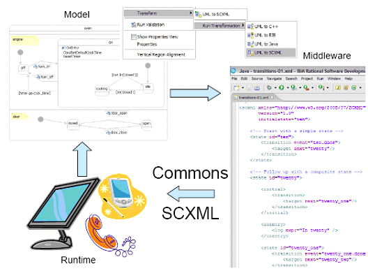
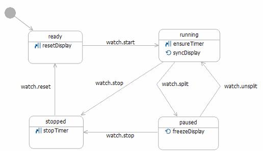
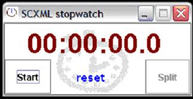
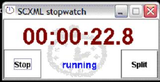
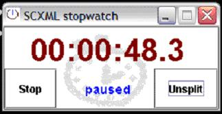
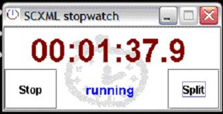
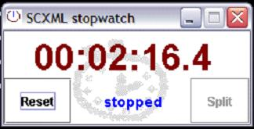
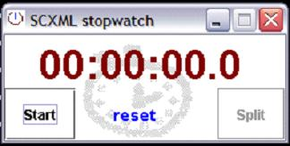

# SCXML - Project Information

## Navigation

- Commons SCXML Resources
  - [Overview](#index)
  - [Roadmap](#roadmap)
  - [User Guide](#guide)
    - [SCXML documents](#guide-scxml-documents)
    - [Using Commons SCXML](#guide-using-commons-scxml)
    - [Standalone Testing](#guide-testing-standalone)
    - [SCXML Reader](#guide-core-reader)
    - [SCXML datamodel](#guide-datamodel)
    - [Contexts and Evaluators](#guide-contexts-evaluators)
    - [SCXML Engine](#guide-core-engine)
    - [Triggering Events](#guide-core-events)
    - [Custom Actions](#guide-custom-actions)
    - [Custom Semantics](#guide-custom-semantics)
  - [FAQ](#faq)
  - [Usecases](#usecases)
    - [SCXML Stopwatch](#usecases-scxml-stopwatch)
  - [Building](#building)
  - [Issue Tracking](#issue-tracking)
- Project Documentation
  - [Project Information](#project-info)
    - [About](#index)
    - [Project Summary](#project-summary)
    - [Issue Tracking](#issue-tracking)
    - [Continuous Integration](#integration)

## Content

<a id="index"></a>

<!-- source_url: https://commons.apache.org/proper/commons-scxml/index.html -->

<!-- page_index: 1 -->

<a id="index--commons-scxml"></a>

## Commons SCXML

[State Chart XML (SCXML)](http://www.w3.org/TR/scxml/) is currently a
Working Draft specification published by the World Wide Web Consortium (W3C).
SCXML provides a generic state-machine based execution environment based on Harel
State Tables. SCXML is a candidate for the control language within
multiple markup languages coming out of the W3C (see the latest Working Draft for details).
*Commons SCXML* is an implementation aimed at creating
and maintaining a Java SCXML engine capable of executing a state machine defined
using a SCXML document, while abstracting out the environment interfaces.



The use cases for an SCXML engine are multiple and varied. Anything that can be
represented as a UML state chart -- business process flows, view navigation bits, interaction or dialog management, and many more -- can leverage an SCXML engine
library.

<a id="index--commons-scxml-2.0-roadmap"></a>

## Commons SCXML 2.0 Roadmap

The current development for Commons SCXML is targeted towards a 2.0 release which will be aligned and compliant
with the SCXML specification.

A high-level overview of the technical and functional changes needed towards this goal are available on the
[Commons SCXML 2.0 Roadmap](#roadmap).

<a id="index--documentation"></a>

## Documentation

Latest documentation is available:

- The latest [Javadoc](https://commons.apache.org/proper/commons-scxml/apidocs/index.html).
- The latest [source](https://commons.apache.org/proper/commons-scxml/xref/index.html).
- The [wiki](http://wiki.apache.org/commons/SCXML).
- Commons SCXML [usecases](#usecases) (case studies).
- A [user guide](#guide) containing assorted API notes and tutorials.

Documentation for the most recent release is also available via the left side
menu bar.

<a id="index--releases"></a>

## Releases

The latest release is v0.9. Read
[v0.9
release notes](http://svn.apache.org/viewvc/commons/proper/scxml/tags/SCXML_0_9/RELEASE-NOTES.txt?view=markup) before upgrading.
[Download v0.9!](http://commons.apache.org/scxml/download_scxml.cgi)

The first release was v0.5. The initial release version number was chosen
to be 0.5 (rather than a 1.0) to better convey the fact that the
underlying W3C specification is still a Working Draft, and subsequent changes
to the Draft may warrant changes to portions of the library API. The core
Commons SCXML APIs (SCXMLParser, SCXMLExecutor etc.) are stable.
Portions such as processing of <datamodel> and <invoke> SCXML
elements, on the other hand, are subject to change as further changes are
expected in these sections of the W3C Working Draft. See Working Draft for
details.

<a id="index--support"></a>

## Support

The [commons mailing lists](https://commons.apache.org/proper/commons-scxml/mail-lists.html) act as the main support forum.
The user list is suitable for most library usage queries.
The dev list is intended for the development discussion.
Please remember that the lists are shared between all commons components, so prefix your email by [SCXML].

Issues may be reported via [ASF JIRA](#issue-tracking).

<a id="index--who-is-using-it"></a>

## Who is using it?

Projects that use Commons SCXML:

<a id="index--related-projects"></a>

## Related Projects

Related projects providing some SCXML-related functionality (based on Commons SCXML 0.9):

- [Commons SCXML - Eclipse](http://commons.apache.org/sandbox/gsoc/2010/scxml-eclipse/) -
  This project aims to provide an Eclipse and GMF based visual editor and debugger for SCXML, which can
  also be used to generate SCXML documents and code from a state chart.
- [SCION](https://github.com/jbeard4/SCION) - SCION provides an implementation of SCXML in portable
  JavaScript.

  In the browser, SCION can be used to facilitate the development of rich, web-based user interfaces with complex
  behavioural requirements; on the server, SCION can be used to manage asynchronous control flow.
- [SCION-Java](https://github.com/jbeard4/SCION-Java) -
  SCION-Java provides lightweight bindings to the SCION library for Java.
- [scxmlgui](http://code.google.com/p/scxmlgui/) -
  This project aims to provide a simple GUI to edit SCXML state charts.

---

<a id="roadmap"></a>

<!-- source_url: https://commons.apache.org/proper/commons-scxml/roadmap.html -->

<!-- page_index: 2 -->

<a id="roadmap--commons-scxml-2.0-roadmap"></a>

## Commons SCXML 2.0 Roadmap

The last SCXML release 0.9 has been quite some time ago (2008) and since then the
[W3C SCXML specification](http://www.w3.org/TR/scxml/) has progressed and changed
quite a lot, and almost ready to move to Candidate Recommendation status.

The goal for Commons SCXML 2.0 is to get alignment (back) and be compliant with the W3C SCXML specification, but for this a lot of major changes are needed, both to the public API and, even more so, to the internal
model and processing logic.

To be able to make such major changes in an effective way, we already cleaned out a lot of the old but no
longer relevant, working or otherwise incompatible features from the previous SCXML (0.9) version, see
[Milestone 0](#roadmap--milestone_0:_cleanup_done) below.

The work needed towards Commons SCXML 2.0 has been divided in a set of high-level targets and corresponding
milestones:

<a id="roadmap--milestone-0:-cleanup-completed:-2014-03-11"></a>

### Milestone 0: Cleanup (completed: 2014-03-11)

The first and already completed target was to cleanup and clean out no longer relevant or even no longer
working features, or features which would make it very hard or complicated to keep working and supported
for the major changes ahead.

The support for the following features and integrations has been dropped: Shale/JSF, Rhino/E4X, Servlet/JSP.

Note: some of the dropped features *might* be restored or re-implemented again once we reached a
reasonable level of stability for the new APIs and internal logic, but that also will depend on the level of
interest and support from the community.

Technically, this milestone 0 still is largely compatible with the 0.9 release, just without those above mentioned features, and also now requires Java 6+. In addition this milestone also
contains several fixes and enhancements (like Groovy language support).

<a id="roadmap--milestone-1:-redesign-semantics-and-processing-components-completed:-2014-04-03"></a>

### Milestone 1: Redesign semantics and processing components (completed: 2014-04-03)

The target for milestone 1 is a redesign and better separation of concerns of the main SCXML processing
components: SCXMLSemantics, SCXMLExecutor and SCInstance.

The high-level plan is to:

- Redefine SCXMLSemantics to align with the
  [SCXML Algorithm for SCXML Interpretation](http://www.w3.org/TR/scxml/#AlgorithmforSCXMLInterpretation)

  The current SCXMLSemantics interface and its implementation is so much different from
  the algorithm in the specification that 'molding' it into what the algorithm now expects is too
  cumbersome.

  Also, developers wishing to extend or customize the SCXMLSemantics will have a hard time to match that
  against the algorithm as well.

  The intend therefore is to start with a new SCXMLSemantics interface from scratch which (largely)
  follows the algorithm in the specification.
- Better separation of concern between SCXMLExecutor and SCInstance.

  The purpose of SCInstance is to be used as backing store for internal SCXML state. However
  over time some processing and transient state based features have ended up in SCInstance which are more
  appropriated to be managed by the SCXMLExecutor instead.

  Conversely, SCXMLExecutor maintains the current Status for the SCXML state as well as the internal
  events list going with it. Having the Status, without the processing related events list, to be
  managed by SCInstance instead would be better fitting.

  And finally, SCXMLExecutor currently doesn't yet provide a good abstraction or implementation of the
  [SCXML Event I/O Processor](http://www.w3.org/TR/scxml/#SCXMLEventProcessor) functionally.
  The internal and external event I/O management is a critical requirement and many features of the
  specification rely on it fulfilling this contract.
  The goal for this milestone is to provide a least a basic level of support for the SCXML Event I/O
  Processor and Event queue handling features.

  Overall, the intend is to let SCXMLExecutor be responsible as SCXML Processor and SCXML I/O Processor
  and to maintain all transient processing state including the system variables, while delegating to
  SCXMLSemantics for dealing with the processing algorithm.

This milestone has now been completed and the most prominent changes and new features can be reviewed
through JIRA issues [SCXML-196](https://issues.apache.org/jira/browse/SCXML-196), [SCXML-197](https://issues.apache.org/jira/browse/SCXML-197) as well as
[SCXML-200](https://issues.apache.org/jira/browse/SCXML-200).

<a id="roadmap--milestone-2:-datamodel-and-expression-language-aligment"></a>

### Milestone 2: Datamodel and expression language aligment

The main target for milestone 2 is to get better alignment with the SCXML datamodel specification.

The Commons SCXML datamodel and context features are very flexible and can be defined and redefined in a
hierarchical way (per state element). However this also makes it much more complex to manage, especially for
XPath (XML) datamodel definitions.

The SCXML specification however is very explicit in its requirements that, while datamodel elements may be
defined in multiple locations within an SCXML document, together they must be accessible (and thus managed) as
a single datamodel definition.

The current Commons SCXML datamodel (and the backing Context handling) is to some extend actually more
flexible and generic than what is possible *AND* allowed by the specification.

To be able to be compliant with the specification, the *default* datamodel management in
Commons SCXML will have to be more restricted and simplified.
That will actually make things much easier to implement. For an XPath (XML) datamodel then only a single
(aggregated) XML datamodel document can be used and the custom Commons SCXML Data() function no longer will be
needed to access the data elements.

It is the intend to also retain the current flexible Commons SCXML datamodel and context features, but
provide this as custom extension, no longer as default.

The additional target is to be able to now *run* a substantial number of the
[SCXML IPR tests](http://www.w3.org/Voice/2013/scxml-irp/). Currently almost
all still fail because of (simple) expression language issues, so fixing and improving the language support
is an important goal as well.

<a id="roadmap--milestone-3:-external-communications-support"></a>

### Milestone 3: External communications support

The target for milestone 3 is to complete the remaining SCXML Processor and SCXML I/O Processor required
features for external communications (send and invoke elements).

<a id="roadmap--commons-scxml-2.0-release"></a>

### Commons SCXML 2.0 release

If and when all of the above milestone targets are met Commons SCXML should be very close to being in
compliance with the SCXML specification, and/or in any case at a good enough level for all practical purposes, to be released as Commons SCXML 2.0.

As part of validation the implementation, the
[SCXML 1.0 Implementation Report Plan](http://www.w3.org/Voice/2013/scxml-irp/)
will be used to test against.

Even though the IRP is not intended to be used for conformance testing of implementations, it is very much
used as a functional benchmark, also by other SCXML implementations.

<a id="roadmap--commons-scxml-2.0-:-optional-scxml-features"></a>

### Commons SCXML 2.0+: Optional SCXML features

There are still plenty of optional features in the SCXML specification which might be very useful to support, like ECMAScript+JSON datamodel or HTTP Event I/O Processor support.

Also, adding extensions outside the specification, or bringing back some of the features dropped for
milestone 0, like integration with other frameworks or expression languages (Servlet, EL, etc.), will be
considered again.

<a id="roadmap--milestone-tags"></a>

### Milestone tags

For the above milestones specific VCS milestone tags will be set, like **commons-scxml2-2.0-M0**.

These milestones tags however do ***not*** represent a formal release and are
only intended to be used for testing purposes by Commons SCXML developers.

Developers willing to test and validate these milestones can do so by checking out these tags
and building and deploying a milestone version into their local Maven repository.

Such locally installed milestone builds then can be used in your Maven project using a dependency
configuration like below (using milestone 0 as example):

```

        <dependency>
          <groupId>org.apache.commons</groupId>
          <artifactId>commons-scxml2</artifactId>
          <version>2.0-M0</version>
        </dependency>
          
```

---

<a id="guide"></a>

<!-- source_url: https://commons.apache.org/proper/commons-scxml/guide.html -->

<!-- page_index: 3 -->

<a id="guide--commons-scxml-guide"></a>

## Commons SCXML Guide

This is a collection of notes about all things Commons SCXML, a scratch pad of
sorts, aimed at noting down usages for the frequently needed bits of Commons
SCXML and some related and interesting (to some of us) tidbits.

<a id="guide--introduction"></a>

### Introduction

State Chart XML (SCXML) is a general-purpose event-based state machine
language that can be used in many ways.

- [SCXML documents](#guide-scxml-documents) - A five
  minute introduction to SCXML documents.
- [Commons SCXML](#guide-using-commons-scxml) - Using
  the Commons SCXML engine.

<a id="guide--trying-out-commons-scxml"></a>

### Trying out Commons SCXML

Contains notes about trying Commons SCXML and testing SCXML documents.

- [Standalone](#guide-testing-standalone) - Rev'ing the
  engine.

<a id="guide--core-api"></a>

### Core API

Contains notes about the core Commons SCXML APIs.

The first set of notes walks through the most common usage pattern, end-to-end.

- [SCXML Reader](#guide-core-reader) - Reading SCXML
  into the Commons SCXML Java object model.
- [Datamodel](#guide-datamodel) - Defining a
  datamodel and temporary variables.
- [Contexts and Evaluators](#guide-contexts-evaluators) -
  Plugging in the expression language for the document.
- [Executor](#guide-core-engine) - Instantiating
  an SCXML executor (engine).
- [Triggering events](#guide-core-events) - Executing
  the event driven state machine.

<a id="guide--advanced-api"></a>

### Advanced API

Contains notes about Commons SCXML APIs for extending or
altering document semantics.

- [Custom actions](#guide-custom-actions) - Adding
  custom actions to the Commons SCXML object model.
- [Custom semantics](#guide-custom-semantics) - Changing
  the default semantics of the Commons SCXML engine for specialized
  uses.

<a id="guide--side-effects"></a>

### Side-effects

Contains notes about non-primary uses for Commons SCXML.

---

<a id="guide-scxml-documents"></a>

<!-- source_url: https://commons.apache.org/proper/commons-scxml/guide/scxml-documents.html -->

<!-- page_index: 4 -->

<a id="guide-scxml-documents--what-is-scxml"></a>

## What is SCXML?

State Chart XML (SCXML) is a general-purpose event-based state
machine language that can be used in many ways.

The definitive guide to authoring SCXML documents is the
[W3C Working Draft
of the SCXML specification](http://www.w3.org/TR/scxml/).

<a id="guide-scxml-documents--contents"></a>

## Contents

This document contains the following sections:

- [Hello World](#guide-scxml-documents--hello)
- [Transitions](#guide-scxml-documents--transitions)
- [Composite states](#guide-scxml-documents--composite)
- [Parallel](#guide-scxml-documents--parallel)
- [Hello World with a custom action](#guide-scxml-documents--custom)

<a id="guide-scxml-documents--hello-world"></a>

## Hello World

Here is the canonical
[hello world example](http://svn.apache.org/repos/asf/commons/proper/scxml/trunk/src/test/java/org/apache/commons/scxml2/hello-world.xml)
for SCXML. The interesting bits are:

```

    <scxml xmlns="http://www.w3.org/2005/07/scxml"
              version="1.0"
              initial="hello">

     <final id="hello">
      <onentry>
       <log expr="'hello world'" />
      </onentry>
     </final>

    </scxml>
   
```

- The document declares an initial state of "hello", which is the entry
  point into the state machine.
- Once the state "hello" is entered the "executable content" contained
  in the <onentry> is immediately executed.
- Similarly, there is also the symmetric <onexit>, which holds
  executable content to be executed when a state is being exited.
- The final attribute on state "hello" indicates that the state
  machine has "run to completion".
- Executable content is made of a series of "actions".
- The "standard actions" defined by the SCXML specification are:
  <var>, <assign>, <log>, <send>,
  <cancel>, <if>, <elseif>, <else>.

<a id="guide-scxml-documents--transitions"></a>

## Transitions

Transitions allow the state machine to change state. A transition is
"followed" if its "trigger event" is received, and the
"guard condition", if one is available is valid.

Here are some transition variants:

```
<!-- ... begin scxml, some states ...-->
<state id="foo1"> <!-- ... some content ...--> <transition target="bar" /> </state>
<state id="foo2"> <!-- ... some content ...--> <transition event="foo.bar" target="bar" /> </state>
<state id="foo3"> <!-- ... some content ...--> <transition event="foo.bar" cond="some-boolean-expression" target next="bar" /> </state>
<state id="bar"> <!-- ... some content ...--> </state>
<!-- ... remaining states, end scxml ...-->
```

- The first transition in document order is an "immediate"
  transition. "foo1" is the source, and "bar" is the
  destination (transition target).
- The second transition waits for the trigger event "foo.bar".
- The third waits for "foo.bar" and the guard condition
  specified by its "cond" attribute to evaluate to true
  the instant the event is received.

<a id="guide-scxml-documents--composite-states"></a>

## Composite states

States can contain states, so we can think of an
SCXML document as a recursive transition network. Here is
a snippet (here is the entire version of this
[microwave example](http://svn.apache.org/repos/asf/commons/proper/scxml/trunk/src/test/java/org/apache/commons/scxml2/env/jexl/microwave-01.xml)
):

```
<!-- ... begin snippet ...-->
<state id="on"> <initial> <transition target="idle"/> </initial>
<state id="idle"> <!-- content for state "idle" --> </state>
<state id="cooking"> <!-- content for state "cooking" --> </state>
<!-- other content for state "on" -->
<!-- ... end snippet ...-->
```

- The state "on" is an example of a composite state.
- It contains two states, "idle" and "cooking". Since
  there are no other sibling states, this means that when the
  microwave is turned on, it must be in either idle or cooking
  state.
- Since there are multiple states in the state "on", an
  <initial> element is required. This becomes the "active"
  child state when a transition is made to the composite state.
  (in this case, a transition to state "on", causes the "idle"
  state to be active).
- States can be recursively nested to any depth.

<a id="guide-scxml-documents--parallel"></a>

## Parallel

This is a wrapper element that encapsulates multiple
<state>s -- or state machines, since in the section on
composite states we took a look at the "recursion" or
"nesting" for the <state> element, whereby each state
can become a state machine in its own right -- that are "active"
at the same time. Here is
a relevant snippet (the entire version of this
[parallel microwave example](http://svn.apache.org/repos/asf/commons/proper/scxml/trunk/src/test/java/org/apache/commons/scxml2/env/jexl/microwave-02.xml)
):

```
<!-- ... begin snippet ...-->
<state id="microwave"> <parallel id="parts"> <state id="oven">
<!-- state machine for "oven" (idle/cooking) -->
</state>
<state id="door">
<!-- state machine for "door" (open/closed) -->
</state> </parallel> </state>
<!-- ... end snippet ...-->
```

- The state "microwave" is an example of a "orthogonal"
  state (one that owns a parallel).
- It contains two state machines, "oven" and "door". These
  state machines are "active" at the same time. These are
  known as "regions".
- Transition may occur within a region or from a region to
  outside the <parallel> (see below), but never from
  one region to another ("across" regions).
- There is no need for an <initial> element within
  a <parallel>
- The state machine must enter all regions at the same time,
  and an outbound transition out of the <parallel>
  from any region causes the state machine to exit all
  regions.
- When all regions reach a "final" state, an "done.state.id" event
  is fired, where "id" is the id of the parent <parallel>

<a id="guide-scxml-documents--hello-world-with-a-custom-action"></a>

## Hello World with a custom action

The Commons SCXML implementation allows you to register custom actions.
Here is the Commons SCXML
[hello world example using a custom action](http://svn.apache.org/repos/asf/commons/proper/scxml/trunk/src/test/java/org/apache/commons/scxml2/custom-hello-world-02.xml).
The interesting bits are:

```

    <scxml xmlns="http://www.w3.org/2005/07/scxml"
              xmlns:my="http://my.custom-actions.domain/CUSTOM"
              version="1.0"
              initial="custom">

     <final id="custom">
      <onentry>
       <my:hello name="world" />
      </onentry>
     </final>

    </scxml>
   
```

- <my:hello> is an example of a custom action whose local
  name is "hello" and is bound to the fictitious namespace
  "http://my.custom-actions.domain/CUSTOM"
- The custom action hello merely logs a hello to the value of
  the name attribute, and thus the above example produces results
  identical to the initial hello world example above.
- For details, see the section on
  [custom actions](#guide-custom-actions) in this guide.

---

<a id="guide-using-commons-scxml"></a>

<!-- source_url: https://commons.apache.org/proper/commons-scxml/guide/using-commons-scxml.html -->

<!-- page_index: 5 -->

<a id="guide-using-commons-scxml--using-commons-scxml"></a>

## Using Commons SCXML

Commons SCXML provides a generic event-driven state machine based
execution environment, borrowing the semantics defined by
[SCXML](http://www.w3.org/TR/scxml). Most things that can be
represented as a UML state chart -- business process flows, view
navigation bits, interaction or dialog management, and too many more
to list here -- can leverage the Commons SCXML library. The library can
also be used by frameworks needing a process control language. This
document is a bird's eye view about using Commons SCXML for individual
(or framework) needs.

<a id="guide-using-commons-scxml--contents"></a>

## Contents

This document is divided into the following sections:

- [The interacting pieces](#guide-using-commons-scxml--pieces)
- [The interaction patterns](#guide-using-commons-scxml--patterns)
- [Usecases](#guide-using-commons-scxml--usecases)

<a id="guide-using-commons-scxml--the-interacting-pieces"></a>

## The interacting pieces

As with most library code, we have a fairly generic (and thereby
reusable) asset, a specific domain and the "glue":

1. The ***engine*** - Commons SCXML, a generic event-driven state
   machine based execution environment.
2. The ***domain*** - The realization in software of the domain
   whose behavior we've defined via SCXML document(s).
3. The ***bridge*** - The two way communication link, events
   flying from domain to state machine engine and activities being triggered
   in domain based on current states for the state machine.

The layer that is therefore needed is the bridge or glue to tie a
specific usecase to the Commons SCXML engine. While the API aspects are
dealt with in the core and advanced API sections of this user guide, the
subsequent section provides a brief narrative introduction.

<a id="guide-using-commons-scxml--the-interaction-patterns"></a>

## The interaction patterns

Here are some of the commons usage patterns for bridging (not a
comprehensive list, plus none of these are mutually exclusive in any
combination):

<a id="guide-using-commons-scxml--mapping-states-to-activities"></a>

### Mapping states to activities

This approach consists of maintaining some sort of lookup table that
records what is to be done (i.e. the activity to be performed) when
a particular state is reached. Event are fired on the engine, the
executor is actively queried for current states, and those activities
indicated by the lookup yield the next set of events (by causing some
user interaction, or a change in application data model etc.) moving us
forward.

This pattern is often useful when the activities are homogeneous
(always activate a component of a specific type, always render a page
and wait for submission etc.)

<a id="guide-using-commons-scxml--listening-to-state-machine-progress"></a>

### Listening to state machine progress

Commons SCXML allows processes to register listeners for
notifications for state machine execution events (entry, exit, transition). Listeners implement the
[SCXMLListener](https://commons.apache.org/proper/commons-scxml/apidocs/org/apache/commons/scxml2/SCXMLListener.html)
interface. This approach is useful for:

- Activities that have high likelihood of succeeding -
  such as UI updates
- Managing side-effects, which are generally "passive"
  in nature with respect to the state machine execution

<a id="guide-using-commons-scxml--using-the-send-action-and-eventdispatcher"></a>

### Using the send action and EventDispatcher

SCXML includes the <send> action to "dispatch" an event of choice
(including whatever payload) to a specified target (of a specified
type). The payload is delivered in the form of a namelist, which can be
considered as params for the event target.

The callbacks are received on the
[EventDispatcher](https://commons.apache.org/proper/commons-scxml/apidocs/org/apache/commons/scxml2/EventDispatcher.html)
associated with the SCXMLExecutor. The EventDispatcher implementation
activates the necessary target, which then performs the activity needed to
make progress.

<a id="guide-using-commons-scxml--using-custom-actions"></a>

### Using custom actions

Commons SCXML allows users to register
[custom actions](#guide-custom-actions) with the Commons
SCXML engine. Using custom actions in conjunction with derived events
can lead to quite elegant authoring. The downsides are that this makes
the solution non-portable (that is, it will not work on other SCXML
engines -- if that is any cause for concern) and that the custom actions
need to be authored by the user.

From a state machine theory point of view, actions are supposed to
take negligible amount of time, so if lengthy activities need to be
performed, using the <invoke> is more appropriate.

<a id="guide-using-commons-scxml--using-invoke-to-kickstart-external-processes"></a>

### Using invoke to kickstart external processes

The <invoke> element is defined by the latest version of
the W3C SCXML Working Draft. It allows the engine to invoke processes from
simple states (those that don't have <parallel> or <state>
children). The process may return a payload with the "done" event, that becomes available for decision making in the state machine
context. Some related details are currently **TBD** in the Working
Draft and therefore, susceptible to change.

<a id="guide-using-commons-scxml--usecases"></a>

## Usecases

The Commons SCXML [usecases](#usecases) provide some
examples.

- The StopWatch usecases registers a SCXMLListener at the
  document root to manage the UI updates.

---

<a id="guide-testing-standalone"></a>

<!-- source_url: https://commons.apache.org/proper/commons-scxml/guide/testing-standalone.html -->

<!-- page_index: 6 -->

<a id="guide-testing-standalone--commons-scxml-standalone-testing-trying-out-samples"></a>

## Commons SCXML - Standalone testing, trying out samples

The SCXML distribution provides utility classes that offer a mock
command line environments allowing users to try out samples. The core
dependencies for Commons SCXML are Commons Digester (which introduces a
transitive dependency on Commons BeanUtils, at the least) and Commons
Logging.

View the [dependencies](https://commons.apache.org/proper/commons-scxml/dependencies.html) page for the
recommended version numbers. *It may be possible to use lower version
numbers for the Commons dependencies.*

An environment specific expression language is used in SCXML
documents. Commons SCXML currently supports the use of JEXL, Javascript, XPath or Groovy
in SCXML documents.

<a id="guide-testing-standalone--using-jexl-in-scxml-documents"></a>

### Using JEXL in SCXML documents

The JEXL Standalone class anticipates expressions in JEXL and hence
requires commons-jexl.jar.

So that amounts to (use the correct local paths and filenames to the
jar files and the SCXML document, without the line breaks):

```

    java -classpath

    commons-logging-1.1.1.jar;commons-scxml2-2.0-SNAPSHOT.jar;commons-jexl-2.1.1.jar

    org.apache.commons.scxml2.test.StandaloneJexlExpressions

    microwave01.xml
    
```

You could set up something more elegant (a script, an ant task etc.), but that is what it boils down to.
If the document is a well-formed SCXML document, you will be able to
type ? or help at the console and you can follow the directions thereafter
(to simulate events, set variable values, reset the state machine or quit).

A few examples are available as part of the
[Commons SCXML test suite](http://svn.apache.org/repos/asf/commons/proper/scxml/trunk/src/test/java/org/apache/commons/scxml2/) (look in env.\* child packages as well).

---

<a id="guide-core-reader"></a>

<!-- source_url: https://commons.apache.org/proper/commons-scxml/guide/core-reader.html -->

<!-- page_index: 7 -->

<a id="guide-core-reader--commons-scxml-reading-scxml-documents-for-commons-scxml"></a>

## Commons SCXML - Reading SCXML documents for Commons SCXML

Commons SCXML provides its own implementation of the
[Java object model for SCXML](http://commons.apache.org/scxml/apidocs/org/apache/commons/scxml2/model/package-summary.html)
and a dedicated [SCXMLReader](http://commons.apache.org/scxml/apidocs/org/apache/commons/scxml2/io/SCXMLReader) that can read SCXML documents into that object model.

<a id="guide-core-reader--usage"></a>

### Usage

The primary convenience method exposed by the SCXMLReader
is:

```

        //import java.io.IOException;
        //import java.net.URL;
        //import org.apache.commons.scxml2.io.SCXMLReader;
        //import org.apache.commons.scxml2.model.ModelException;
        //import org.apache.commons.scxml2.model.SCXML;
        //import org.xml.sax.ErrorHandler;
        //import org.xml.sax.SAXException;

        //import java.io.IOException;
        //import java.net.URL;
        //import java.util.List;

        //import javax.xml.stream.XMLReporter;
        //import javax.xml.stream.XMLStreamException;

        //import org.apache.commons.scxml2.PathResolver;
        //import org.apache.commons.scxml2.io.SCXMLReader;
        //import org.apache.commons.scxml2.io.SCXMLReader.Configuration;
        //import org.apache.commons.scxml2.model.CustomAction;
        //import org.apache.commons.scxml2.model.ModelException;
        //import org.apache.commons.scxml2.model.SCXML;

        SCXML scxml = null;

        try {
          // Through a Configuration object the reading of a SCXML document can be configured and customized.
          Configuration configuration = new Configuration(<XMLReporter>, <PATHResolver>, <List<CustomAction>>);
          // scxml = SCXMLReader.read(<URL>);
          // scxml = SCXMLReader.read(<URL> new Configuration());
          scxml = SCXMLReader.read(<URL>, configuration);
        } catch (IOException e) {
          // IOException while reading
        } catch (ModelException e) {
          // ModelException while reading
        } catch (XMLStreamException e) {
          // XMLStreamException while reading
        }

        if (scxml == null) {
          // Reading failed
        }
     
```

It returns an SCXML object, which is the state machine /
chart represented in the Commons SCXML Java object model. This method
uses the URL of the initial SCXML document to resolve any
relative URLs referenced by the document, such as src
attributes of State SCXML elements.

Commons SCXML provides convenience implementations of most of the
interfaces such as XMLReporter.

The SCXMLReader exposes other convenience methods which can handle
a SCXML document specified using its "real path" on the local
system, in which case an additional
org.apache.commons.scxml2.PathResolverparameter needs to be
supplied through an SCXMLReader.Configuration instance for resolving relative
document references or as an
InputSource, in which case there is no path resolution, so the document must be a standalone document.

The SCXMLReader Javadoc is available
[here](https://commons.apache.org/proper/commons-scxml/apidocs/org/apache/commons/scxml2/io/SCXMLReader.html).

<a id="guide-core-reader--api-notes-set"></a>

### API notes set

The next note in this set describes the
[SCXML engine](#guide-core-engine).

---

<a id="guide-datamodel"></a>

<!-- source_url: https://commons.apache.org/proper/commons-scxml/guide/datamodel.html -->

<!-- page_index: 8 -->

<a id="guide-datamodel--data-in-scxml-documents"></a>

## Data in SCXML documents

SCXML documents contain numerous expressions, such as when describing
the guard conditions for <transition> elements, the expressions
that are logged via the <log> element, assignments etc. The data
portions in these expressions can come from a couple of sources.

<a id="guide-datamodel--the-datamodel-element"></a>

### The datamodel element

SCXML gives authors the ability to define a first-class data model as
part of the SCXML document. A data model consists of a <datamodel>
element containing one or more <data> element, each of which may
contain an XML data tree (i.e. it is recommended that each <data>
element contain **only one child element**).

Also, SCXML documents are **namespace-aware**. Therefore, the root
of the data tree should define one or more namespaces as needed, and must
**not** itself be in the SCXML namespace.

For example, the document level data model for a SCXML document
defining the states in a travel reservation system may look like this:

```

     <scxml xmlns="http://www.w3.org/2005/07/scxml"
               version="1.0"
               initial="init-travel-plan">

      <datamodel>
        <data id="airlineticket">
          <!-- Note namespace declaration in line below -->
          <flight xmlns="">
            <origin/>
            <destination/>
            <!-- default values for trip and class -->
            <trip>round</trip>
            <class>economy</class>
            <meal/>
          </flight>
        </data>
        <data id="hotelbooking">
          <hotel xmlns="">
            <stay>
              <startdate/>
              <enddate/>
            </stay>
            <adults>1</adults>
            <children>0</children>
            <rooms>1</rooms>
            <rate/>
          </hotel>
        </data>
      </datamodel>

      <state id="init-travel-plan">
        <!-- content for the init-travel-plan state -->
      </state>

      <!-- and so on ... -->

     </scxml>
    
```

A <data> element may also contain a string literal or number, which can be considered as a degenerate XML data tree with a single
leaf node:

```

     <data id="foo" expr='bar'" />
    
```

<a id="guide-datamodel--scratch-space-variables"></a>

### Scratch space variables

SCXML also allows document authors to define scratch space variables.
These may be defined only where executable content is permissible, that is within an <onentry>, <onexit> or <transition>
element. A <var> element is used for such definition, like so:

```

     <onentry>
      <var name="foo" expr="'bar'" />
     </onentry>
    
```

The difference between the use of a var element as shown above and
the degenerate use of a data element (where it contains a single string
literal or number, rather than an XML tree) is that the data element
is part of the first class datamodel for the document (or state) but
the var isn't. This subtlety manifests as different behavior when
the SCXML engine is reset, whereby the scratch space variables (var)
are lost or deleted, whereas the first class data model elements
are restored to their initial value.

<a id="guide-datamodel--distributing-the-data-model"></a>

### Distributing the data model

The <datamodel> element can be "distributed" through the SCXML
document. It can be placed as a child element of either the <scxml>
element (document root) or any <state> element. This is meant
to be an authoring convenience in order to allow parts of the data model
to be placed closer to the location in the document where they will be
accessed (via expressions, for example).

For example, the above travel reservation datamodel may be
authored as follows:

```

     <scxml xmlns="http://www.w3.org/2005/07/scxml"
               version="1.0"
               initial="airline-ticket">

      <state id="airline-ticket">
        <datamodel>
          <data id="airlineticket">
            <flight xmlns="">
              <origin/>
              <destination/>
              <!-- default values for trip and class -->
              <trip>round</trip>
              <class>economy</class>
              <meal/>
            </flight>
          </data>
        </datamodel>

        <!-- other content for the airline-ticket state -->

        <!-- event names on transitions arbitrarily chosen
                for illustration-->

        <transition event="done.flight.reservation" target="hotel-booking" />
      </state>

      <state id="hotel-booking">
        <datamodel>
          <data id="hotelbooking">
            <hotel xmlns="">
              <stay>
                <startdate/>
                <enddate/>
              </stay>
              <adults>1</adults>
              <children>0</children>
              <rooms>1</rooms>
              <rate/>
            </hotel>
          </data>
        </datamodel>

        <!-- other content for the hotel-booking state -->

        <transition event="done.hotel.booking" target="hotel-booking" />
      </state>

      <!-- other states ... -->

     </scxml>
    
```

Commons SCXML creates a new
[Context](https://commons.apache.org/proper/commons-scxml/apidocs/org/apache/commons/scxml2/Context.html)
for each state that needs one, and each data element may be thought of
as a org.w3c.dom.Node object placed in the corresponding
Context. The datamodel element at the document root populates the
root context. See [contexts and evaluators](#guide-contexts-evaluators)
section of this user guide for more on contexts, evaluators and root
contexts.

<a id="guide-datamodel--references-to-data-in-expressions"></a>

## References to data in expressions

Since the data elements contain XML data trees, the straightforward
way to refer to bits inside these in expressions is to use XPath or an
equivalent language. Commons SCXML currently supports expression languages
such as Commons JEXL which do not have any inherent
understanding of XPath. Therefore, Commons SCXML defines a **Data()**
function for use in JEXL or other expression languages, for example:

```

    <var name="arrival" expr="Data(hotelbooking, 'hotel/stay/arrival')" />
   
```

The above expression extracts the arrival date from the hotelbooking
data in the documents datamodel and stores it in a scratch space variable
named "arrival". The first argument is value of the name attribute of the
<data> element and the second is the String value of the XPath
expression. If more than one matching nodes are found, the first one
is returned.

<a id="guide-datamodel--assignments"></a>

## Assignments

Assignments are done via the SCXML <assign> action, which can
only be placed in an <onentry>, <onexit> or <transition>
element. Based on the left hand side value (lvalue) and right hand side
value (rvalue) in the assignment, Commons SCXML supports three kinds
of assignments:

1. **Assigning to a scratch space variable** - Here, the lvalue is
   a variable defined via a <var> element.


```

      <assign name="foo" expr="some-expression" />
    
```

   The expression may return a value of any type, which becomes the new
   value for the variable named "foo".
2. **Assigning a literal to a data subtree** - In this case, the
   lvalue is a node in a data tree and the rvalue is a String literal
   or a number.


```

      <assign location="Data(hotelbooking, 'hotel/rooms')" expr="2" />
    
```

   Or more usefully, the rvalue is some expression that evaluates to the
   numeric constant (2). In such cases, the literal (String or number)
   is added as a child text node to the node the lvalue points to.
3. **Assigning a XML tree to a data subtree** - Here, the lvalue is
   a node in a data tree and the rvalue is also a node (in a data tree or
   otherwise). As an illustration, consider we also had data related to car
   rentals in the above example, and in certain situations (probably
   common) the car rental reservation dates coincide with the hotel booking
   dates, such a data "copy" is performed as:


```

      <assign location="Data(carrental, 'car/dates')"
                 expr="Data(hotelbooking, 'hotel/stay')" />

      <!-- deletes all children of <dates> and then copies
              over all children of <stay>, the <startdate>
              and <enddate> in this case -->
    
```

   In these cases, the children of the node pointed by the expression are
   first cloned, and then added as children to the node the lvalue points
   to.

---

<a id="guide-contexts-evaluators"></a>

<!-- source_url: https://commons.apache.org/proper/commons-scxml/guide/contexts-evaluators.html -->

<!-- page_index: 9 -->

<a id="guide-contexts-evaluators--commons-scxml-pluggable-expression-languages"></a>

## Commons SCXML - Pluggable expression languages

The SCXML specification allows implementations to support
multiple expression languages to enable using SCXML documents
in varying environments. These expressions become part of
attribute values for executable content, such as:

```

     <var name="foo" expr="1 + 2 + bar" />
    
```

or are used to evaluate the boolean guard conditions that
decide whether or not a particular transition is followed
once its associated trigger event is received, such as:

```

     <transition event="day.close" cond="day eq 'Friday'"
                 target="weekend" />
    
```

To that end, the Context
and Evaluator interfaces serve as adapters to the
particular expression language APIs for a given usecase.

Variable resolution bubbles up from the current state up to the
document root, similar to variable shadowing via blocks in a
procedural language.

<a id="guide-contexts-evaluators--what-is-a-context"></a>

### What is a Context?

The Context is a collection of variables that defines
a variable "scope". Each <state> element within an SCXML
document gets its own Context or variable scope.

<a id="guide-contexts-evaluators--what-is-a-root-context"></a>

### What is a root context?

The root context is the context that may be supplied to the
Commons SCXML engine as representing the variables in the
"host environment". See
SCXMLExecutor#setRootContext(Context) from the
[Javadoc](https://commons.apache.org/proper/commons-scxml/apidocs/index.html).

<a id="guide-contexts-evaluators--what-is-an-evaluator"></a>

### What is an Evaluator?

The Evaluator is a component with the capability
of parsing and evaluating expressions. It is the "expression
language engine".

<a id="guide-contexts-evaluators--available-expression-languages"></a>

## Available expression languages

Commons SCXML currently supports using Commons JEXL, Javascript, XPath and
Groovy as the expression language.
The expressions throughout the document must be homogeneous.
This also applies to any external documents that may be referred
by this document, for example via "src" attributes, like so:

```

     <state id="foo" src="foo.xml">
      <!-- Something, possibly very interesting, here -->
     </state>
    
```

Here, foo.xml must use the same expression language as
the document above that hosts the state foo.
Check out the [engine API docs](#guide-core-engine)
on how to plug in the suitable root context and evaluator
tuple.

<a id="guide-contexts-evaluators--commons-jexl"></a>

### Commons JEXL

See
[org.apache.commons.scxml2.env.jexl package summary](https://commons.apache.org/proper/commons-scxml/apidocs/org/apache/commons/scxml2/env/jexl/package-summary.html) for the
relevant root context and evaluator tuple to use.

<a id="guide-contexts-evaluators--javascript"></a>

### Javascript

See
[org.apache.commons.scxml2.env.javascript package summary](https://commons.apache.org/proper/commons-scxml/apidocs/org/apache/commons/scxml2/env/javascript/package-summary.html) for the
relevant root context and evaluator tuple to use.

<a id="guide-contexts-evaluators--xpath"></a>

### XPath

See
[org.apache.commons.scxml2.env.xpath package summary](https://commons.apache.org/proper/commons-scxml/apidocs/org/apache/commons/scxml2/env/xpath/package-summary.html) for the
relevant root context and evaluator tuple to use.

<a id="guide-contexts-evaluators--groovy"></a>

### Groovy

See
[org.apache.commons.scxml2.env.groovy package summary](https://commons.apache.org/proper/commons-scxml/apidocs/org/apache/commons/scxml2/env/groovy/package-summary.html) for the
relevant root context and evaluator tuple to use.

<a id="guide-contexts-evaluators--method-invocation-in-expressions"></a>

## Method invocation in expressions

Commons SCXML uses the mechanisms provided by the expression language
chosen for the document to support method invocation. Commons JEXL
allow for method invocations as follows:

<a id="guide-contexts-evaluators--commons-jexl-2"></a>

### Commons JEXL

See Commons JEXL reference for
[builtin JEXL functions](http://commons.apache.org/jexl/reference/syntax.html#Functions) and the calling methods section of the
[examples page](http://commons.apache.org/jexl/reference/examples.html). As a summary, if the context contains an object
under name foo which has an accessible method
bar(), then the JEXL expression for calling the method is
foo.bar()

---

<a id="guide-core-engine"></a>

<!-- source_url: https://commons.apache.org/proper/commons-scxml/guide/core-engine.html -->

<!-- page_index: 10 -->

<a id="guide-core-engine--commons-scxml-creating-and-configuring-the-scxml-engine"></a>

## Commons SCXML - Creating and configuring the SCXML engine

The Commons SCXML executor is the engine that runs the state machine.

<a id="guide-core-engine--usage"></a>

### Usage

The SCXMLExecutor is usually initialized as follows:

```

        //import org.apache.commons.scxml2.Context;
        //import org.apache.commons.scxml2.ErrorReporter;
        //import org.apache.commons.scxml2.Evaluator;
        //import org.apache.commons.scxml2.EventDispatcher;
        //import org.apache.commons.scxml2.SCXMLExecutor;
        //import org.apache.commons.scxml2.SCXMLListener;
        //import org.apache.commons.scxml2.model.SCXML;
        //import org.apache.commons.scxml2.model.ModelException;

        SCXMLExecutor exec = null;
        try {
            exec = new SCXMLExecutor(<Evaluator>,
                       <EventDispatcher>, <ErrorReporter>);
            exec.setStateMachine(<SCXML>);
            exec.addListener(<SCXML>, <SCXMLListener>);
            exec.setRootContext(<Context>);
            exec.go();
        } catch (ModelException me) {
            // Executor initialization failed, because the
            // state machine specified has inconsistencies
        }
     
```

<a id="guide-core-engine--explanation"></a>

### Explanation

The SCXML specification allows implementations to support multiple
expression languages so SCXML documents can be used in varying
environments. The Context and Evaluator
interfaces serve as adapters to the particular expression language
APIs. Commons SCXML currently supports JEXL, Javascript, Groovy and XPath
expressions. See the section on
[contexts and evaluators](#guide-contexts-evaluators)
for further details about contexts, evaluators and root contexts.

Commons SCXML provides an
[EventDispatcher](https://commons.apache.org/proper/commons-scxml/apidocs/org/apache/commons/scxml2/EventDispatcher.html)
interface for wiring the behavior of SCXML <send> and
<cancel> actions. This allows users to define custom target "types"
as long as they handle the callbacks on the EventDispatcher
implementation provided to the executor. The introductory section on
using Commons SCXML has a brief discussion on
[interaction patterns](#guide-using-commons-scxml), including
<send> usage.

The
[ErrorReporter](https://commons.apache.org/proper/commons-scxml/apidocs/org/apache/commons/scxml2/ErrorReporter.html)
interface is used by Commons SCXML for reporting SCXML errors to the host
environment, and contains the definition of commonly occuring errors
while executing SCXML documents. It is primarily used for passive usages
such as logging.

Commons SCXML also allows listeners
([SCXMLListener](https://commons.apache.org/proper/commons-scxml/apidocs/org/apache/commons/scxml2/SCXMLListener.html))
to be registered with the SCXMLExecutor, which are informed
about the progress of the state machine via onEntry and
onExit notifications for States, as
well as onTransition notifications when transitions are
followed.

Commons SCXML provides basic implementations of the
EventDispatcher, ErrorReporter, and
SCXMLListener interfaces in the
[env package](https://commons.apache.org/proper/commons-scxml/apidocs/org/apache/commons/scxml2/env/package-summary.html), which simply log all the events received. Commons SCXML uses
Commons Logging.

The executor is "set into motion" using the marker method
SCXMLExecutor#go(). The SCXMLExecutor instances
are **not** thread-safe, and need external synchronization if the
usecase demands.

The SCXMLExecutor Javadoc is available
[here](https://commons.apache.org/proper/commons-scxml/apidocs/org/apache/commons/scxml2/SCXMLExecutor.html).

<a id="guide-core-engine--api-notes-set"></a>

### API notes set

The previous note in this set describes the
[SCXML Reader](#guide-core-reader).
The next note in this set describes
[triggering events](#guide-core-events).

---

<a id="guide-core-events"></a>

<!-- source_url: https://commons.apache.org/proper/commons-scxml/guide/core-events.html -->

<!-- page_index: 11 -->

<a id="guide-core-events--commons-scxml-firing-events-on-the-scxml-engine"></a>

## Commons SCXML - Firing events on the SCXML engine

Once the SCXML engine has been initialized, the state machine
progresses based on the events that are fired on it. When an event
is fired, if the current set of states have transitions waiting
for that event, and the guard condition on one of those transitions
is satisfied, the state machine is said to "follow" that
transition, which may possibly yield a new set of current states.
Most state machines will ultimately reach a "final" state, wherein the state machine has said to have executed to completion.

<a id="guide-core-events--basic-usage"></a>

### Basic Usage

An event "foo.bar" may be fired on the engine as
follows:

```

        //import org.apache.commons.scxml2.SCXMLExecutor;
        //import org.apache.commons.scxml2.TriggerEvent;
        //import org.apache.commons.scxml2.model.ModelException;

        // where "exec" is the SCXMLExecutor instance
        TriggerEvent te = new TriggerEvent("foo.bar",
                              TriggerEvent.SIGNAL_EVENT);
        try {
            exec.triggerEvent(te);
        } catch (ModelException me) {
            // The events left the engine in inconsistent state
        }
     
```

If the resulting events leave the state machine in an inconsistent
state, a ModelException may be thrown.

<a id="guide-core-events--event-payloads"></a>

### Event Payloads

Furthermore, events can carry within them a payload
property that consists of some information that is useful for the guard
conditions or executable content while the engine is processing the
event. The payload can be any user-defined type.

```

       //import org.apache.commons.scxml2.SCXMLExecutor;
       //import org.apache.commons.scxml2.TriggerEvent;
       //import org.apache.commons.scxml2.model.ModelException;

       // where "exec" is the SCXMLExecutor instance
       // and "foo" is an object (payload) with an accessible property "bar"
       TriggerEvent te = new TriggerEvent("event.with.payload",
       TriggerEvent.SIGNAL_EVENT, foo);
       try {
       exec.triggerEvent(te);
       } catch (ModelException me) {
       // The events left the engine in inconsistent state
       }
     
```

The payload in the above example can now be used in expressions, as the special variable "\_eventdata". For example, assuming a JEXL
expressions based document, transitions may look like (similarly
"\_eventdata" may be used in executable content in corresponding
<onexit>, <transition> and <onentry> bodies).

```

         <transition event="event.with.payload"
                        cond="_eventdata.bar eq 'bar1'" next="state1" />
         <transition event="event.with.payload"
                        cond="_eventdata.bar eq 'bar2'" next="state2" />
     
```

<a id="guide-core-events--multiple-events"></a>

### Multiple Events

More than one events may be triggered on the state machine at a
time (using triggerEvents() method -- plural). After the engine
processes a set of trigger events, it is customary to check whether the
state machine has reached a <final> state. All events will operate
over the same states ancestor closure.

<a id="guide-core-events--running-to-completion"></a>

### Running to completion

The following snippet illustrates how the SCXMLExecutor
Status is queried for state machine run to completion.

```

        //import org.apache.commons.scxml2.SCXMLExecutor;
        //import org.apache.commons.scxml2.Status;

        // where "exec" is the SCXMLExecutor instance
        Status status = exec.getCurrentStatus();
        if (status.isFinal()) {
            // run to completion, release cached objects
        }
     
```

The TriggerEvent Javadoc is available
[here](https://commons.apache.org/proper/commons-scxml/apidocs/org/apache/commons/scxml2/TriggerEvent.html).
The Status Javadoc is available
[here](https://commons.apache.org/proper/commons-scxml/apidocs/org/apache/commons/scxml2/Status.html)

<a id="guide-core-events--api-notes-set"></a>

### API notes set

The previous note in this set describes the
[SCXML engine](#guide-core-engine).

---

<a id="guide-custom-actions"></a>

<!-- source_url: https://commons.apache.org/proper/commons-scxml/guide/custom-actions.html -->

<!-- page_index: 12 -->

<a id="guide-custom-actions--what-is-a-custom-action"></a>

## What is a 'custom action'?

Actions are SCXML elements that "do" something. Actions can be
used where "executable content" is permissible, for example, within <onentry>, <onexit> and <transition>
elements.

The [SCXML specification](http://www.w3.org/TR/scxml/)
(currently a Working Draft) defines a set of "standard actions".
These include <var>, <assign>, <log>, <send>,
<cancel>, <if>, <elseif> and <else>.

The specification also allows implementations to define "custom actions"
in addition to the standard actions. What such actions "do" is
upto the author of these actions, and these are therefore
called "custom" since they are tied to a specific implementation
of the SCXML specification.

<a id="guide-custom-actions--custom-actions-with-commons-scxml"></a>

## Custom actions with Commons SCXML

Commons SCXML makes authoring custom actions fairly straightforward.

<a id="guide-custom-actions--what-can-be-done-via-a-custom-action"></a>

### What can be done via a custom action

A custom action in the Commons SCXML implementation has access to:

- The current
  [Context](https://commons.apache.org/proper/commons-scxml/apidocs/org/apache/commons/scxml2/Context.html)
  (and hence, the values of variables in the current Context).
- Any other Context within the document, provided the id of the
  parent <state> is known.
- The expression
  [Evaluator](https://commons.apache.org/proper/commons-scxml/apidocs/org/apache/commons/scxml2/Evaluator.html)
  for this document, and hence the ability to evaluate a given
  expression against the current or a identifiable Context.
- The list of other actions in this
  [Executable](https://commons.apache.org/proper/commons-scxml/apidocs/org/apache/commons/scxml2/model/Executable.html)
  .
- The "root" Context, to examine any variable values in the
  "document environment".
- The
  [EventDispatcher](https://commons.apache.org/proper/commons-scxml/apidocs/org/apache/commons/scxml2/EventDispatcher.html),
  to send or cancel events.
- The
  [ErrorReporter](https://commons.apache.org/proper/commons-scxml/apidocs/org/apache/commons/scxml2/ErrorReporter.html),
  to report any errors (that the ErrorReporter knows how to handle).
- The histories, for any identifiable <history>.
- The
  [NotificationRegistry](https://commons.apache.org/proper/commons-scxml/apidocs/org/apache/commons/scxml2/NotificationRegistry.html),
  to obtain the list of listeners attached to identifiable
  "observers".
- The engine log, to log any information it needs to.

<a id="guide-custom-actions--walkthrough-adding-a-hello-world-custom-action"></a>

## Walkthrough - Adding a 'hello world' custom action

Lets walk through the development of a simple, custom "hello world"
action.

<a id="guide-custom-actions--idea"></a>

### Idea

We need a <hello> action in our (fictitious) namespace
"http://my.custom-actions.domain/CUSTOM". The action "tag" will
have one attribute "name". The action simply logs a hello to the
value of the name attribute when it executes.

A simple example is
[here](http://svn.apache.org/repos/asf/commons/proper/scxml/trunk/src/test/java/org/apache/commons/scxml2/custom-hello-world-01.xml)
.

<a id="guide-custom-actions--custom-action-implementation"></a>

### Custom action implementation

A custom action must extend the Commons SCXML
[Action](https://commons.apache.org/proper/commons-scxml/apidocs/org/apache/commons/scxml2/model/Action.html)
abstract base class.

Here is the Java source for our custom
[Hello](https://commons.apache.org/proper/commons-scxml/xref-test/org/apache/commons/scxml2/model/Hello.html)
action. The execute() method contains the logging statement.

<a id="guide-custom-actions--using-a-custom-scxml-reader"></a>

### Using a custom SCXML reader

With the custom action(s) implemented, the document may be
parsed using a SCXMLReader that is made aware of these actions through a custom Configuration
like so:

```

      // (1) Create a list of custom actions, add as many as are needed
      List<CustomAction> customActions = new ArrayList<CustomAction>();
      CustomAction ca =
            new CustomAction("http://my.custom-actions.domain/CUSTOM",
                             "hello", Hello.class);
      customActions.add(ca);

      // (2) Read the SCXML document containing the custom action(s)
      SCXML scxml = null;
      try {
          scxml = SCXMLReader.read(url, new SCXMLReader.Configuration(null, null, customActions));
          // Also see other methods in SCXMLReader API
      } catch (Exception e) {
          // bad document, take necessary action
      }
    
```

This approach can only be used if the custom
rule has no body content (child "tags") or if the custom action
implements the
[ExternalContent](https://commons.apache.org/proper/commons-scxml/apidocs/org/apache/commons/scxml2/model/ExternalContent.html)
interface, in which case, any body content gets read into a list
of DOM nodes.
.

<a id="guide-custom-actions--read-in-the-custom-scxml-document"></a>

### Read in the 'custom' SCXML document

For documents with or without custom actions, several utility methods of the
[SCXMLReader](https://commons.apache.org/proper/commons-scxml/apidocs/org/apache/commons/scxml2/io/SCXMLReader.html)
can be used. More information is [here](#guide-core-reader).

<a id="guide-custom-actions--launching-the-engine"></a>

### Launching the engine

Having obtained the SCXML object beyond step (2) above, proceed as usual, see the section on the
[Commons SCXML engine](#guide-core-engine)
for details.

---

<a id="guide-custom-semantics"></a>

<!-- source_url: https://commons.apache.org/proper/commons-scxml/guide/custom-semantics.html -->

<!-- page_index: 13 -->

<a id="guide-custom-semantics--scxml-semantics"></a>

## SCXML Semantics

**This section is for advanced users only, and will probably not
be needed by most users of the Commons SCXML library.**

<a id="guide-custom-semantics--pluggable-semantics"></a>

### Pluggable semantics

The Commons SCXML state machine engine is really a tuple, the
[SCXMLExecutor](https://commons.apache.org/proper/commons-scxml/apidocs/org/apache/commons/scxml2/SCXMLExecutor.html)
(an API that new users can code to, and is almost always sufficient)
accompanied by a
[SCXMLSemantics](https://commons.apache.org/proper/commons-scxml/apidocs/org/apache/commons/scxml2/SCXMLSemantics.html)
implementation (an API that advanced users can code to, to change the
engine behavior to suit their needs).

The basic modus operandi for an engine is simple - when an event is
triggered, figure out which (if any) transition(s) to follow, and
transit to the new set of states executing any specified actions along
the way. The default semantics available in the Commons SCXML distribution, which is based upon the SCXML specification rules for the Algorithm for SCXML processing, can be replaced with custom semantics provided by the user using the
SCXMLExecutor constructor that takes the
SCXMLSemantics parameter i.e. the engine semantics are
"pluggable".

<a id="guide-custom-semantics--example-scenario"></a>

### Example scenario

Consider dispute resolution for example -- when more than one
outbound transitions from a single state hold true. The default
SCXMLSemantics implementation available in the distribution
does none, it will follow all filtered transitions, possibly leading to a
ModelException immediately or down the road. However, a user
may want:

- The transition defined closest to the document root to be
  followed
- The transition defined farthest from the document root to be
  followed
- The transition whose origin and target have the lowest common
  ancestor to be followed
- The transition whose origin and target have the highest common
  ancestor to be followed

Even after one of above dispute resolution algorithms is applied, if
there are more than one candidate transitions, the user may want:

- A ModelException to be thrown
- The transition that appears first in document order to be
  followed
- The transition that appears last in document order to be
  followed

To implement any of the above choices, the user may extend the
default SCXMLSemantics implementation, override one or more
of the existing implemention methods, or even write a new implementation
from scratch, and plug in the new semantics while instantiating the
SCXMLExecutor. The pluggability allows differing semantics
to be developed for the Commons SCXML engine, independent of the Commons
SCXML codebase.

---

<a id="faq"></a>

<!-- source_url: https://commons.apache.org/proper/commons-scxml/faq.html -->

<!-- page_index: 14 -->

<a id="faq--commons-scxml-faq"></a>

## Commons SCXML FAQ

**General**

1. [What is SCXML?](#faq--what-is)
2. [What is Commons SCXML?](#faq--commons-scxml)
3. [Do you have a simple example where Commons SCXML is used?](#faq--simple-example)
4. [What are the core requirements of SCXML?](#faq--dependencies)

**Expression languages**

1. [Which expression languages does the Commons SCXML implementation support?](#faq--which-ones)
2. [Can I use more than one expression language in the same SCXML document?](#faq--more-than-one)

**The SCXMLExecutor**

1. [Once I set up an SCXMLExecutor (call the constructor, set the
   state machine) is there anything I have to do to "activate" it?](#faq--activate)
2. [Can I have multiple instances of SCXMLExecutor all working off of
   a single instance of the SCXML class?](#faq--one-state-machine)
3. [Can multiple threads safely interact with an instance of SCXMLExecutor?](#faq--many-threads)
4. [Are SCXMLExecutor instances serializable?](#faq--serializability)

<a id="faq--general"></a>

## General

What is SCXML?
:   State Chart XML (SCXML) is a general-purpose event-based state
    machine language that can be used in many ways. It is currently
    a W3C Working Draft, available
    [here](http://www.w3.org/TR/scxml/).

    [[top]](#faq--top)

    ---

What is Commons SCXML?
:   Commons SCXML is aimed at creating and maintaining an
    open-source Java SCXML engine capable of executing
    a state machine defined using a SCXML document, while abstracting
    out the environment interfaces.

    [[top]](#faq--top)

    ---

Do you have a simple example where Commons SCXML is used?
:   Sure, take a look at the [stopwatch usecase](#usecases-scxml-stopwatch).

    [[top]](#faq--top)

    ---

What are the core requirements of SCXML?
:   The "core" requirements for Commons SCXML are Commons Logging.
    You will need to choose an expression language for your SCXML documents
    (details in next section of this
    FAQ). See the [dependencies page](https://commons.apache.org/proper/commons-scxml/dependencies.html)
    for details about the dependency versions.

    [[top]](#faq--top)

<a id="faq--expression-languages"></a>

## Expression languages

Which expression languages does the Commons SCXML implementation support?
:   Commons SCXML currently supports
    [Commons JEXL](http://commons.apache.org/jexl/), Javascript, XPath and
    [Groovy](http://groovy.codehaus.org/). For details,
    see the [trying out](#guide-testing-standalone) and
    [contexts and evaluators](#guide-contexts-evaluators)
    pages of the user guide.

    [[top]](#faq--top)

    ---

Can I use more than one expression language in the same SCXML document?
:   No, the expressions throughout the document must be homogeneous. This
    also applies to any external documents that may be referred by this
    document, for example via "src" attributes.

    [[top]](#faq--top)

<a id="faq--the-scxmlexecutor"></a>

## The SCXMLExecutor

Once I set up an SCXMLExecutor (call the constructor, set the state machine) is there anything I have to do to "activate" it?
:   Yes, you must call the marker method, SCXMLExecutor#go().
    This serves as an indication that you have finished configuring the
    SCXMLExecutor instance and are now ready to begin executing the state
    machine described by your SCXML document. For example, you may
    attach zero, one or many SCXMLListeners to interesting "nodes" within
    the SCXML document, such as the document root i.e. the SCXML object,
    and/or particular State and Transition objects as well. See the
    [SCXMLExecutor section of the
    user guide](#guide-core-engine) for more.

    [[top]](#faq--top)

    ---

Can I have multiple instances of SCXMLExecutor all working off of a single instance of the SCXML class?
:   Yes. The Commons SCXML object model does not store any information
    related to a particular execution of the state machine. It is
    therefore possible to use a single SCXML instance as the state
    machine for multiple SCXMLExecutor instances. This also means that
    a SCXML document needs to be parsed only once, irrespective of the
    number of "instances" of the state machine that may execute.

    [[top]](#faq--top)

    ---

Can multiple threads safely interact with an instance of SCXMLExecutor?
:   To a certain extent. The execution of an SCXML state machine through an SCXMLExecutor instance may only be done,
    as per the specification, sequentially.

    Multiple threads may 'send' or 'register' new events on a state machine through its #addEvent methods, which
    then will be processed sequentially by the SCXMLExecutor.

    If such events are registered while the state machine is executing, these will processed automatically
    before the state machine 'returns' in a stable state.

    If such events are registered or added while the state machine is in a stable state, the SCXMLExecutor its
    #triggerEvents method will have to be invoked for the state machine to proceed with processing these events.

    The SCXMLExecutor methods themselves are not thread save, and thus it is the responsibility of the 'manager' of the
    SCXMLExecutor, typically the thread creating and initializing the state machine to also execute the state machine
    and check upon its state.

    Other threads collaborating with the state machine however should refrain to only use the #addEvent methods, or
    otherwise be (externally) coordinated such that only one thread at a time is triggering the execution of the state
    machine.

    [[top]](#faq--top)

    ---

Are SCXMLExecutor instances serializable?
:   No, but the SCInstance of an SCXMLExecutor, which contains all the 'state' of the state machine including the SCXML
    document itself, is serializable after detaching through its #detachInstance method as long as all associated
    user-defined content is too.

    A detached SCInstance can be re-attached to the SCXMLExecutor using its #attachInstance method.

    [[top]](#faq--top)

---

<a id="usecases"></a>

<!-- source_url: https://commons.apache.org/proper/commons-scxml/usecases.html -->

<!-- page_index: 15 -->

<a id="usecases--commons-scxml-usecases"></a>

## Commons SCXML Usecases

*Q: Whats a library without usecases?*
*A:*

<a id="usecases--introduction"></a>

### Introduction

There are numerous use cases for an engine like Commons SCXML. Any process
that can be represented as a UML state chart, for example, business process
flows, view navigation bits, interaction or dialog management etc. (this is, by no means, a comprehensive list), can leverage the Commons SCXML engine
library. We illustrate just a few sample usecases as illustrations.

<a id="usecases--samples"></a>

### Samples

Simple usecases, and beyond:

<a id="usecases--simple"></a>

### Simple

These are "standalone" usecases, which do not require any knowledge
beyond beginner Java and beginner XML.

- [Usecase 1](#usecases-scxml-stopwatch) -
  Using Commons SCXML to model and implement behavior of stateful
  objects (SCXML stopwatch example).

If you know of another usecase we should list or if you are interesting
in seeing if SCXML fits a usecase you have in mind, contact us via the
[mailing lists](https://commons.apache.org/proper/commons-scxml/mail-lists.html).

---

<a id="usecases-scxml-stopwatch"></a>

<!-- source_url: https://commons.apache.org/proper/commons-scxml/usecases/scxml-stopwatch.html -->

<!-- page_index: 16 -->

<a id="usecases-scxml-stopwatch--using-scxml-documents-to-define-behavior"></a>

## Using SCXML documents to define behavior

SCXML documents (more generically, UML state chart diagrams) can be used
to define stateful behavior of objects, and Commons SCXML enables
developers to take this model directly into the corresponding code
artifacts. The resulting artifacts tend to be much simpler, embody a
useful separation of concerns and are easier to understand and maintain.

<a id="usecases-scxml-stopwatch--motivation"></a>

### Motivation

- Demonstrate a "standalone" usecase of Commons SCXML
- Demonstrate the useful separation of concerns, the
  simplicity of the resulting artifacts, and the direct association
  between the model and the code when using Commons SCXML to
  incorporate behavior.

<a id="usecases-scxml-stopwatch--sample-walkthrough-from-model-to-working-code"></a>

## Sample walkthrough - From model to working code

Here is a short exercise in modeling and implementing an object with
stateful behavior. A stopwatch -- for anyone who may need an introduction
-- is used to measure duration, with one button for starting and stopping
the watch and another one for pausing the display (also known as "split", where the watch continues to keep time while the display is frozen, to
measure, for example, "lap times" in races). Once the watch has been
stopped, the start/stop button may be used to reset the display.

<a id="usecases-scxml-stopwatch--the-model-uml-diagram"></a>

### The Model - UML Diagram

Here is the state chart diagram that describes the behavior
of this particular stopwatch:
[](assets/images/stopwatch_4adc6839710afc0f.jpg)
([Zoom out](assets/images/stopwatch-model_313a0735effe00b5.jpg))

<a id="usecases-scxml-stopwatch--the-scxml-document"></a>

### The SCXML document

The SCXML document is then, a simple serialization of
the "model" above:
[stopwatch.xml](http://svn.apache.org/repos/asf/commons/proper/scxml/trunk/src/test/java/org/apache/commons/scxml2/env/stopwatch.xml).

<a id="usecases-scxml-stopwatch--the-stopwatch-class"></a>

### The Stopwatch class

Here is the class that implements the stopwatch behavior, [StopWatch.java](https://commons.apache.org/proper/commons-scxml/xref-test/org/apache/commons/scxml2/env/StopWatch.html).
The class extends
[AbstractStateMachine.java](https://commons.apache.org/proper/commons-scxml/xref/org/apache/commons/scxml2/env/AbstractStateMachine.html), which provides one approach for providing the base functionality
needed by classes representing stateful entities. Points to note
in the StopWatch class are:

- The "lifecycle" is defined by the SCXML document, which is
  an artifact easily derived from the modeling layer.
- The code is much simpler, since the lifecycle management
  task has been assigned to Commons SCXML.

<a id="usecases-scxml-stopwatch--the-stopwatch-ui"></a>

### The Stopwatch UI

Here is the UI for our demonstration, [StopWatchDisplay.java](https://commons.apache.org/proper/commons-scxml/xref-test/org/apache/commons/scxml2/env/StopWatchDisplay.html).
Points to note here are:

- The UI is "backed" by a StopWatch instance.
- It merely relays the user initiated events (in this case,
  button clicks) to the Commons SCXML driven StopWatch
  instance by serving as an intermediary / proxy.
- The UI and application behavior separation is thus, and
  usefully, pronounced.

<a id="usecases-scxml-stopwatch--the-result"></a>

### The result


(Figure 1: Begin in state "reset")

(Figure 2: Start puts the stopwatch in "running" state)

(Figure 3: Split causes the stopwatch to be "paused")

(Figure 4: Unsplit puts the stopwatch back in "running")

(Figure 5: "stopped")

(Figure 6: Rinse and repeat - "reset")

---

<a id="building"></a>

<!-- source_url: https://commons.apache.org/proper/commons-scxml/building.html -->

<!-- page_index: 17 -->

<a id="building--overview"></a>

## Overview

Commons SCXML uses [Maven 2 or higher](http://maven.apache.org) as
a build system.

<a id="building--maven-2-goals"></a>

## Maven 2 Goals

To build a jar file, change into SCXML's root directory and run "mvn package".
The result will be in the "target" subdirectory.

To build the Javadocs, run "mvn javadoc:javadoc".
The result will be in "target/docs/apidocs".

To build the full website, including Javadocs, run "mvn site".

Maven 2.0.8 and above is recommended.

---

<a id="issue-tracking"></a>

<!-- source_url: https://commons.apache.org/proper/commons-scxml/issue-tracking.html -->

<!-- page_index: 18 -->

<a id="issue-tracking--commons-scxml-issue-tracking"></a>

## Commons SCXML Issue tracking

Commons SCXML uses [ASF JIRA](http://issues.apache.org/jira/) for tracking issues.
See the [Commons SCXML JIRA project page](http://issues.apache.org/jira/browse/SCXML).

To use JIRA you may need to [create an account](http://issues.apache.org/jira/secure/Signup!default.jspa)
(if you have previously created/updated Commons issues using Bugzilla an account will have been automatically
created and you can use the [Forgot Password](http://issues.apache.org/jira/secure/ForgotPassword!default.jspa)
page to get a new password).

If you would like to report a bug, or raise an enhancement request with
Commons SCXML please do the following:

1. [Search existing open bugs](http://issues.apache.org/jira/secure/IssueNavigator.jspa?reset=true&pid=12310492&sorter/field=issuekey&sorter/order=DESC&status=1&status=3&status=4).
   If you find your issue listed then please add a comment with your details.
2. [Search the mailing list archive(s)](https://commons.apache.org/proper/commons-scxml/mail-lists.html).
   You may find your issue or idea has already been discussed.
3. Decide if your issue is a bug or an enhancement.
4. Submit either a [bug report](http://issues.apache.org/jira/secure/CreateIssueDetails!init.jspa?pid=12310492&issuetype=1&priority=4&assignee=-1)
   or [enhancement request](http://issues.apache.org/jira/secure/CreateIssueDetails!init.jspa?pid=12310492&issuetype=4&priority=4&assignee=-1).

Please also remember these points:

- the more information you provide, the better we can help you
- test cases are vital, particularly for any proposed enhancements
- the developers of Commons SCXML are all unpaid volunteers

For more information on subversion and creating patches see the
[Apache Contributors Guide](http://www.apache.org/dev/contributors.html).

You may also find these links useful:

- [All Open Commons SCXML bugs](http://issues.apache.org/jira/secure/IssueNavigator.jspa?reset=true&pid=12310492&sorter/field=issuekey&sorter/order=DESC&status=1&status=3&status=4)
- [All Resolved Commons SCXML bugs](http://issues.apache.org/jira/secure/IssueNavigator.jspa?reset=true&pid=12310492&sorter/field=issuekey&sorter/order=DESC&status=5&status=6)
- [All Commons SCXML bugs](http://issues.apache.org/jira/secure/IssueNavigator.jspa?reset=true&pid=12310492&sorter/field=issuekey&sorter/order=DESC)

---

<a id="project-info"></a>

<!-- source_url: https://commons.apache.org/proper/commons-scxml/project-info.html -->

<!-- page_index: 19 -->

<a id="project-info--project-information"></a>

## Project Information

This document provides an overview of the various documents and links that are part of this project's general information. All of this content is automatically generated by [Maven](http://maven.apache.org) on behalf of the project.

<a id="project-info--overview"></a>

### Overview

| Document | Description |
| --- | --- |
| [About](#index) | A Java Implementation of a State Chart XML Engine |
| [Project Summary](#project-summary) | This document lists other related information of this project |
| [Project Team](https://commons.apache.org/proper/commons-scxml/team-list.html) | This document provides information on the members of this project. These are the individuals who have contributed to the project in one form or another. |
| [Source Repository](https://commons.apache.org/proper/commons-scxml/source-repository.html) | This is a link to the online source repository that can be viewed via a web browser. |
| [Issue Tracking](#issue-tracking) | This is a link to the issue management system for this project. Issues (bugs, features, change requests) can be created and queried using this link. |
| [Mailing Lists](https://commons.apache.org/proper/commons-scxml/mail-lists.html) | This document provides subscription and archive information for this project's mailing lists. |
| [Dependencies](https://commons.apache.org/proper/commons-scxml/dependencies.html) | This document lists the project's dependencies and provides information on each dependency. |
| [Continuous Integration](#integration) | This is a link to the definitions of all continuous integration processes that builds and tests code on a frequent, regular basis. |
| [Distribution Management](https://commons.apache.org/proper/commons-scxml/distribution-management.html) | This document provides informations on the distribution management of this project. |

---

<a id="project-summary"></a>

<!-- source_url: https://commons.apache.org/proper/commons-scxml/project-summary.html -->

<!-- page_index: 20 -->

<a id="project-summary--project-summary"></a>

## Project Summary

<a id="project-summary--project-information"></a>

### Project Information

| Field | Value |
| --- | --- |
| Name | Apache Commons SCXML |
| Description | A Java Implementation of a State Chart XML Engine |
| Homepage | <http://commons.apache.org/proper/commons-scxml/> |

<a id="project-summary--project-organization"></a>

### Project Organization

| Field | Value |
| --- | --- |
| Name | The Apache Software Foundation |
| URL | <http://www.apache.org/> |

<a id="project-summary--build-information"></a>

### Build Information

| Field | Value |
| --- | --- |
| GroupId | org.apache.commons |
| ArtifactId | commons-scxml2 |
| Version | 2.0-SNAPSHOT |
| Type | jar |
| JDK Rev | 1.6 |

---

<a id="integration"></a>

<!-- source_url: https://commons.apache.org/proper/commons-scxml/integration.html -->

<!-- page_index: 21 -->

<a id="integration--overview"></a>

## Overview

This project uses [Continuum](http://continuum.apache.org/).

<a id="integration--access"></a>

## Access

The following is a link to the continuous integration system used by the project.

```
http://vmbuild.apache.org/continuum/
```

<a id="integration--notifiers"></a>

## Notifiers

No notifiers are defined. Please check back at a later date.

---
