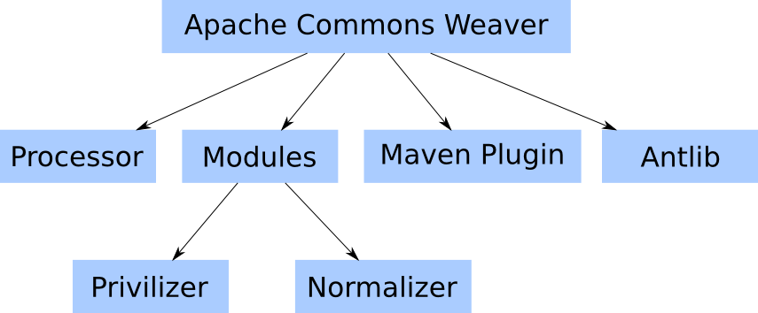

# Commons Weaver – Project Information

## Navigation

- [Commons Weaver](#building)
  - [Overview](#index)
  - [Issue Tracking](#issue-tracking)
- Project Structure
  - [Core Framework](#commons-weaver-parent-commons-weaver-processor)
  - [Weaver Modules](#commons-weaver-parent-commons-weaver-modules-parent)
    - [Privilizer](#commons-weaver-parent-commons-weaver-modules-parent-commons-weaver-privilizer-parent)
    - [Normalizer](#commons-weaver-parent-commons-weaver-modules-parent-commons-weaver-normalizer)
  - [Maven Plugin](#commons-weaver-parent-commons-weaver-maven-plugin-plugin-info)
  - [Antlib](#commons-weaver-parent-commons-weaver-antlib)
- Development
  - [SVN](#scm)
  - [Building](#building)
- Project Documentation
  - [Project Information](#project-info)
    - [About](#index)
    - [Summary](#summary)
    - [Project Modules](#modules)
    - [Team](#team)
    - [Source Code Management](#scm)
    - [CI Management](#ci-management)
  - Project Reports
    - [JIRA Report](#commons-weaver-parent-commons-weaver-maven-plugin-jira-report)
    - [JDepend](#commons-weaver-parent-commons-weaver-maven-plugin-jdepend-report)
    - [Plugin Documentation](#commons-weaver-parent-commons-weaver-maven-plugin-plugin-info)
- Other pages
  - [Apache Commons Weaver Build Tools – CI Management](#commons-weaver-build-tools-ci-management)
  - [Apache Commons Weaver Build Tools – About](#commons-weaver-build-tools)
  - [Apache Commons Weaver Build Tools – Source Code Management](#commons-weaver-build-tools-scm)
  - [Apache Commons Weaver Build Tools – Project Summary](#commons-weaver-build-tools-summary)
  - [Apache Commons Weaver Build Tools – Project Team](#commons-weaver-build-tools-team)
  - [Apache Commons Weaver Parent – CI Management](#commons-weaver-parent-ci-management)
  - [Apache Commons Weaver Antlib – CI Management](#commons-weaver-parent-commons-weaver-antlib-ci-management)
  - [Apache Commons Weaver Antlib – Source Code Management](#commons-weaver-parent-commons-weaver-antlib-scm)
  - [Apache Commons Weaver Antlib – Project Summary](#commons-weaver-parent-commons-weaver-antlib-summary)
  - [Apache Commons Weaver Antlib – Project Team](#commons-weaver-parent-commons-weaver-antlib-team)
  - [Apache Commons Weaver Maven Plugin – CI Management](#commons-weaver-parent-commons-weaver-maven-plugin-ci-management)
  - [Apache Commons Weaver Maven Plugin – About](#commons-weaver-parent-commons-weaver-maven-plugin)
  - [Apache Commons Weaver Maven Plugin – Source Code Management](#commons-weaver-parent-commons-weaver-maven-plugin-scm)
  - [Apache Commons Weaver Maven Plugin – Project Summary](#commons-weaver-parent-commons-weaver-maven-plugin-summary)
  - [Apache Commons Weaver Maven Plugin – Project Team](#commons-weaver-parent-commons-weaver-maven-plugin-team)
  - [Apache Commons Weaver Modules aggregator project – CI Management](#commons-weaver-parent-commons-weaver-modules-parent-ci-management)
  - [Apache Commons Weaver Normalizer – CI Management](#commons-weaver-parent-commons-weaver-modules-parent-commons-weaver-normalizer-ci-management)
  - [Apache Commons Weaver Normalizer – Source Code Management](#commons-weaver-parent-commons-weaver-modules-parent-commons-weaver-normalizer-scm)
  - [Apache Commons Weaver Normalizer – Project Summary](#commons-weaver-parent-commons-weaver-modules-parent-commons-weaver-normalizer-summary)
  - [Apache Commons Weaver Normalizer – Project Team](#commons-weaver-parent-commons-weaver-modules-parent-commons-weaver-normalizer-team)
  - [Apache Commons Weaver Privilizer Parent POM – CI Management](#commons-weaver-parent-commons-weaver-modules-parent-commons-weaver-privilizer-parent-ci-management)
  - [Apache Commons Weaver Privilizer Parent POM – Project Modules](#commons-weaver-parent-commons-weaver-modules-parent-commons-weaver-privilizer-parent-modules)
  - [Apache Commons Weaver Privilizer Parent POM – Source Code Management](#commons-weaver-parent-commons-weaver-modules-parent-commons-weaver-privilizer-parent-scm)
  - [Apache Commons Weaver Privilizer Parent POM – Project Summary](#commons-weaver-parent-commons-weaver-modules-parent-commons-weaver-privilizer-parent-summary)
  - [Apache Commons Weaver Privilizer Parent POM – Project Team](#commons-weaver-parent-commons-weaver-modules-parent-commons-weaver-privilizer-parent-team)
  - [Apache Commons Weaver Modules aggregator project – Project Modules](#commons-weaver-parent-commons-weaver-modules-parent-modules)
  - [Apache Commons Weaver Modules aggregator project – Source Code Management](#commons-weaver-parent-commons-weaver-modules-parent-scm)
  - [Apache Commons Weaver Modules aggregator project – Project Summary](#commons-weaver-parent-commons-weaver-modules-parent-summary)
  - [Apache Commons Weaver Modules aggregator project – Project Team](#commons-weaver-parent-commons-weaver-modules-parent-team)
  - [Apache Commons Weaver Processor – CI Management](#commons-weaver-parent-commons-weaver-processor-ci-management)
  - [Apache Commons Weaver Processor – Source Code Management](#commons-weaver-parent-commons-weaver-processor-scm)
  - [Apache Commons Weaver Processor – Project Summary](#commons-weaver-parent-commons-weaver-processor-summary)
  - [Apache Commons Weaver Processor – Project Team](#commons-weaver-parent-commons-weaver-processor-team)
  - [Apache Commons Weaver Distribution – CI Management](#commons-weaver-parent-commons-weaver-ci-management)
  - [Apache Commons Weaver Distribution – About](#commons-weaver-parent-commons-weaver)
  - [Apache Commons Weaver Distribution – Source Code Management](#commons-weaver-parent-commons-weaver-scm)
  - [Apache Commons Weaver Distribution – Project Summary](#commons-weaver-parent-commons-weaver-summary)
  - [Apache Commons Weaver Distribution – Project Team](#commons-weaver-parent-commons-weaver-team)
  - [Apache Commons Weaver Parent – About](#commons-weaver-parent)
  - [Apache Commons Weaver Parent – Source Code Management](#commons-weaver-parent-scm)
  - [Apache Commons Weaver Parent – Project Summary](#commons-weaver-parent-summary)
  - [Apache Commons Weaver Parent – Project Team](#commons-weaver-parent-team)

## Content

<a id="building"></a>

<!-- source_url: https://commons.apache.org/proper/commons-weaver/building.html -->

<!-- page_index: 1 -->

# Commons Weaver –

Apache Maven 3 is required to build Apache Commons Weaver, using Java 8.

<a id="building--site-building-issues"></a>

### Site building issues

Apache Commons Weaver uses the japicmp report for API compatibility reporting. This requires that the package goal be invoked in the same Maven run as the site goal.

---

<a id="index"></a>

<!-- source_url: https://commons.apache.org/proper/commons-weaver/index.html -->

<!-- page_index: 2 -->

<a id="index--apache-commons-weaver"></a>

# Apache Commons Weaver

Occasionally, as Java developers, we encounter a problem whose solution simply cannot be expressed in the Java language. Often, the Java annotation processing tools can be used to great effect, and they should not be dismissed as your first line of defense when you need to generate additional classes. Occasionally, however, our only recourse is to manipulate existing class files. It is these situations which Apache Commons Weaver was designed to address.

Apache Commons Weaver consists of:

- [Core Framework](#index--core)
- [Weaver Modules](#index--weavers)
- [Maven Plugin](#index--maven)
- [Antlib](#index--antlib)

The Maven Plugin and Antlib are used for invoking Weaving facilities. Below you will find a graph with a high level overview of Apache Commons Weaver project.



Latest API documentation is [here](https://commons.apache.org/proper/commons-weaver/apidocs/index.html).

<a id="index--core-framework"></a>

### Core Framework

The [Commons Weaver Processor](#commons-weaver-parent-commons-weaver-processor) defines a “weaver module” service provider interface (SPI) as well as the facilities that use the Java ServiceLoader to discover and invoke defined weaver modules for simple filesystem-based bytecode weaving.

<a id="index--weaver-modules"></a>

### Weaver Modules

A number of [Weaver Modules](#commons-weaver-parent-commons-weaver-modules-parent) are provided by the Commons Weaver project. Typically a weaver module may respect a set of configuration properties which should be documented along with that module.

<a id="index--maven-plugin"></a>

### Maven Plugin

The [Commons Weaver plugin for Apache Maven](#commons-weaver-parent-commons-weaver-maven-plugin-plugin-info) aims to integrate Weaver as smoothly as possible for Maven users. Here is an example of configuring the privilizer module:

```
  <plugin>
    <groupId>org.apache.commons</groupId>
    <artifactId>commons-weaver-maven-plugin</artifactId>
    <version>${commons.weaver.version}</version>
    <configuration>
      <weaverConfig>
        <privilizer.accessLevel>${privilizer.accessLevel}</privilizer.accessLevel>
        <privilizer.policy>${privilizer.policy}</privilizer.policy>
        <privilizer.verify>${privilizer.verify}</privilizer.verify>
      </weaverConfig>
    </configuration>
    <executions>
      <execution>
        <goals>
          <goal>prepare</goal>
          <goal>weave</goal>
        </goals>
      </execution>
    </executions>
    <dependencies>
      <dependency>
        <groupId>org.apache.commons</groupId>
        <artifactId>commons-weaver-privilizer-api</artifactId>
        <version>${commons.weaver.version}</version>
      </dependency>
      <dependency>
        <groupId>org.apache.commons</groupId>
        <artifactId>commons-weaver-privilizer</artifactId>
        <version>${commons.weaver.version}</version>
      </dependency>
    </dependencies>
  </plugin>
```

<a id="index--antlib"></a>

### Antlib

The [Commons Weaver Antlib](#commons-weaver-parent-commons-weaver-antlib) provides tasks and types to facilitate the integration of Commons Weaver into your Apache Ant-based build process. Here the user will make the commons-weaver-antlib jar (which includes the Apache Commons Weaver processor and its dependencies), along with the jar files of the desired modules, available to the Ant build using one of the various mechanisms supported. More information on this is available [here](http://ant.apache.org/manual/using.html#external-tasks). Having done this the basic approach will be to parameterize one of the provided tasks (clean|weave) with a settings element. If both weave and clean tasks are used, defining a [reference](http://ant.apache.org/manual/using.html#references) to the settings object and referencing it using the settingsref attribute is recommended, as seen here:

```
  <settings id="weavesettings"
            target="target/classes"
            classpathref="maincp">
    <properties>
      <privilizer.accessLevel>${privilizer.accessLevel}</privilizer.accessLevel>
      <privilizer.policy>${privilizer.policy}</privilizer.policy>
      <privilizer.verify>${privilizer.verify}</privilizer.verify>
    </properties>
  </settings>

  <clean settingsref="weavesettings" />
  <weave settingsref="weavesettings" />
```

Multiple weaving targets (e.g. main vs. test) are of course woven using different settings.

<a id="index--custom-weaver-modules"></a>

## Custom Weaver Modules

As discussed, some modules are provided for common cases, and the developers welcome suggestions for useful modules, but there is no reason not to get started writing your own weaver module (assuming you are sure this is the right solution, or just want to do this for fun) now! When the processor framework invokes your custom Weaver, it will pass in a Scanner that can be used to find the classes you are interested in. Request the original bytecode from the WeaveEnvironment and make your changes (for this task you will save time and frustration using one of the available open source Java bytecode manipulation libraries). Save your changes back to the WeaveEnvironment. Rinse, repeat. Hint: if your Weaver uses configuration parameters to dictate its behavior, it can leave a scannable “footprint” in your woven classes. Then implement the Cleaner SPI to find and delete these in the case that the current configuration is incompatible with the results of an earlier “weaving.”

<a id="index--examples"></a>

## Examples

The canonical example is the [privilizer module](#commons-weaver-parent-commons-weaver-modules-parent-commons-weaver-privilizer-parent).

A simple example could be exposing annotated methods for a REST API. Suppose you want to expose only classes annotated with @WebExposed to your Web REST API.

```
package example;
import java.lang.annotation.ElementType; import java.lang.annotation.Retention; import java.lang.annotation.RetentionPolicy; import java.lang.annotation.Target;
/** * Marks methods that interest our weaver module.*/ @Target(ElementType.METHOD) @Retention(RetentionPolicy.CLASS) public @interface WebExposed {
}
```

And your POJO object annotated.

```
package example;
/** * Represents a user in our system.*/ public class User {
private String name; private String surname; private Integer age;
public User() {super();}
public User(String name, String surname, Integer age) {super(); this.name = name; this.surname = surname; this.age = age;}
@WebExposed public String getName() {return name;}
public void setName(String name) {this.name = name;}
@WebExposed public String getSurname() {return surname;}
public void setSurname(String surname) {this.surname = surname;}
}
```

Now in order to scan your classpath and find the annotated methods normally you would use Java Reflection API or something similar, but the good news is that Apache Commons Weaver abstracts this for you.

```
  package example;

  import java.io.File;
  import java.lang.annotation.ElementType;
  import java.util.Arrays;
  import java.util.Properties;

  import org.apache.commons.weaver.WeaveProcessor;
  import org.apache.commons.weaver.model.AnnotatedElements;
  import org.apache.commons.weaver.model.ScanRequest;
  import org.apache.commons.weaver.model.ScanResult;
  import org.apache.commons.weaver.model.Scanner;
  import org.apache.commons.weaver.model.WeavableMethod;
  import org.apache.commons.weaver.model.WeaveEnvironment;
  import org.apache.commons.weaver.model.WeaveInterest;
  import org.apache.commons.weaver.spi.Weaver;

  public class MyWeaver implements Weaver {

      @Override
      public boolean process(WeaveEnvironment environment, Scanner scanner) {
          // We want to find methods annotated with @WebExposed.
          WeaveInterest findAnnotation = WeaveInterest.of(WebExposed.class, ElementType.METHOD);
          ScanResult scanResult = scanner.scan(new ScanRequest().add(findAnnotation));
          AnnotatedElements<WeavableMethod<?>> annotatedMethods = scanResult.getMethods();
          for (WeavableMethod<?> method : annotatedMethods) {
              // The API code is out of the scope of this guide, but you can do other things here, 
              // like modifying your class
              System.out.println("Expose method " + method.getTarget().getName() + " in our REST API");
          }
          return true;
      }
      
  }
```

Before running the example above you need to tell the ServiceProvider about your custom Weaver. This is done by adding a file to your *META-INF* directory. If you are using Maven, then creating src/main/resources/META-INF/services/org.apache.commons.weaver.spi.Weaver with

```
example.MyWeaver
```

will instruct ServiceLoader to load your Weaver class.

<a id="index--faq"></a>

## FAQ

- *Q*: Why not just use [AspectJ](http://eclipse.org/aspectj/)?

  *A*: The original motivation to develop the codebase that evolved into Commons Weaver instead of simply using AspectJ was to avoid the runtime dependency, however small, introduced by the use of AspectJ. Additionally, later versions of AspectJ are licensed under the [EPL](http://eclipse.org/legal/epl-v10.html) which can be considered less permissive than the Apache license. Choice is A Good Thing.
- *Q*: What is the relationship between Commons Weaver and Commons BCEL/ASM/Javassist/CGLIB?

  *A*: Rather than being an *alternative* to these technologies, Commons Weaver can be thought of as providing a structured environment in which these technologies can be put to use. I.e., the bytecode modifications made by a given Weaver implementation would typically be implemented using one of these (or comparable) libraries.

---

<a id="issue-tracking"></a>

<!-- source_url: https://commons.apache.org/proper/commons-weaver/issue-tracking.html -->

<!-- page_index: 3 -->

<a id="issue-tracking--apache-commons-weaver-issue-tracking"></a>

## Apache Commons Weaver Issue tracking

Apache Commons Weaver uses [ASF JIRA](https://issues.apache.org/jira/) for tracking issues.
See the [Apache Commons Weaver JIRA project page](https://issues.apache.org/jira/browse/WEAVER).

To use JIRA you may need to [create an account](https://issues.apache.org/jira/secure/Signup!default.jspa)
(if you have previously created/updated Commons issues using Bugzilla an account will have been automatically
created and you can use the [Forgot Password](https://issues.apache.org/jira/secure/ForgotPassword!default.jspa)
page to get a new password).

If you would like to report a bug, or raise an enhancement request with
Apache Commons Weaver please do the following:

1. [Search existing open bugs](https://issues.apache.org/jira/secure/IssueNavigator.jspa?reset=true&pid=12315320&sorter/field=issuekey&sorter/order=DESC&status=1&status=3&status=4).
   If you find your issue listed then please add a comment with your details.
2. [Search the mailing list archive(s)](https://commons.apache.org/proper/commons-weaver/mail-lists.html).
   You may find your issue or idea has already been discussed.
3. Decide if your issue is a bug or an enhancement.
4. Submit either a [bug report](https://issues.apache.org/jira/secure/CreateIssueDetails!init.jspa?pid=12315320&issuetype=1&priority=4&assignee=-1)
   or [enhancement request](https://issues.apache.org/jira/secure/CreateIssueDetails!init.jspa?pid=12315320&issuetype=4&priority=4&assignee=-1).

Please also remember these points:

- the more information you provide, the better we can help you
- test cases are vital, particularly for any proposed enhancements
- the developers of Apache Commons Weaver are all unpaid volunteers

For more information on subversion and creating patches see the
[Apache Contributors Guide](http://www.apache.org/dev/contributors.html).

You may also find these links useful:

- [All Open Apache Commons Weaver bugs](https://issues.apache.org/jira/secure/IssueNavigator.jspa?reset=true&pid=12315320&sorter/field=issuekey&sorter/order=DESC&status=1&status=3&status=4)
- [All Resolved Apache Commons Weaver bugs](https://issues.apache.org/jira/secure/IssueNavigator.jspa?reset=true&pid=12315320&sorter/field=issuekey&sorter/order=DESC&status=5&status=6)
- [All Apache Commons Weaver bugs](https://issues.apache.org/jira/secure/IssueNavigator.jspa?reset=true&pid=12315320&sorter/field=issuekey&sorter/order=DESC)

---

<a id="commons-weaver-parent-commons-weaver-processor"></a>

<!-- source_url: https://commons.apache.org/proper/commons-weaver/commons-weaver-parent/commons-weaver-processor/index.html -->

<!-- page_index: 4 -->

<a id="commons-weaver-parent-commons-weaver-processor--apache-commons-weaver-processor"></a>

## Apache Commons Weaver Processor

This module provides the org.apache.commons:commons-weaver artifact. It defines the Apache Commons Weaver SPI as well as the basic build-time (filesystem-based) processors that detect, configure, and invoke available modules.

<a id="commons-weaver-parent-commons-weaver-processor--weaveprocessor"></a>

### WeaveProcessor

The [WeaveProcessor](https://commons.apache.org/proper/commons-weaver/commons-weaver-parent/commons-weaver-processor/apidocs/org/apache/commons/weaver/WeaveProcessor.html) invokes available implementations of the [Weaver](https://commons.apache.org/proper/commons-weaver/commons-weaver-parent/commons-weaver-processor/apidocs/org/apache/commons/weaver/spi/Weaver.html) SPI.

<a id="commons-weaver-parent-commons-weaver-processor--cleanprocessor"></a>

### CleanProcessor

The [CleanProcessor](https://commons.apache.org/proper/commons-weaver/commons-weaver-parent/commons-weaver-processor/apidocs/org/apache/commons/weaver/CleanProcessor.html) invokes available implementations of the [Cleaner](https://commons.apache.org/proper/commons-weaver/commons-weaver-parent/commons-weaver-processor/apidocs/org/apache/commons/weaver/spi/Cleaner.html) SPI.

---

<a id="commons-weaver-parent-commons-weaver-modules-parent"></a>

<!-- source_url: https://commons.apache.org/proper/commons-weaver/commons-weaver-parent/commons-weaver-modules-parent/index.html -->

<!-- page_index: 5 -->

<a id="commons-weaver-parent-commons-weaver-modules-parent--apache-commons-weaver-modules"></a>

## Apache Commons Weaver Modules

This is the parent Apache Maven module for the weaver modules provided with Apache Commons Weaver. See [Modules](#commons-weaver-parent-commons-weaver-modules-parent-modules).

---

<a id="commons-weaver-parent-commons-weaver-modules-parent-commons-weaver-privilizer-parent"></a>

<!-- source_url: https://commons.apache.org/proper/commons-weaver/commons-weaver-parent/commons-weaver-modules-parent/commons-weaver-privilizer-parent/index.html -->

<!-- page_index: 6 -->

<a id="commons-weaver-parent-commons-weaver-modules-parent-commons-weaver-privilizer-parent--apache-commons-weaver-privilizer"></a>

## Apache Commons Weaver Privilizer

Provides machinery to automate the handling of Java Security access controls in code. This involves wrapping calls that may trigger java.lang.SecurityExceptions in PrivilegedAction objects. Unfortunately this is quite an expensive operation and slows code down considerably; when executed in an environment that has no SecurityManager activated it is an utter waste. The typical pattern to cope with this is:

```
if (System.getSecurityManager() != null) {AccessController.doPrivileged(new PrivilegedAction<Void>() {public Void run() {doSomethingThatRequiresPermissions(); return null;} }); } else {doSomethingThatRequiresPermissions();}
```

This becomes tedious in short order. The immediate response of a typical developer: relegate the repetitive code to a set of utility methods. In the case of Java security, however, this approach is considered risky. The purpose of the Privilizer, then, is to instrument compiled methods originally annotated with our @Privileged annotation. This annotation is retained in the classfiles, but not available at runtime, and there are no runtime dependencies.

<a id="commons-weaver-parent-commons-weaver-modules-parent-commons-weaver-privilizer-parent--basic-privilization"></a>

### Basic Privilization

```
@Privileged
private void doSomethingThatRequiresPermissions() {
  ...
}
```

Annotating a method with the [@Privileged](https://commons.apache.org/proper/commons-weaver/commons-weaver-parent/apidocs/org/apache/commons/weaver/privilizer/Privileged.html) annotation will cause the [PrivilizerWeaver](https://commons.apache.org/proper/commons-weaver/commons-weaver-parent/apidocs/org/apache/commons/weaver/privilizer/PrivilizerWeaver.html) to generate these checks automatically, leaving you to simply implement the code!

<a id="commons-weaver-parent-commons-weaver-modules-parent-commons-weaver-privilizer-parent--blueprint-privilization"></a>

### Blueprint Privilization

The so-called “blueprint” feature returns to the concept of static utility methods. Why are these considered a liability? Because your trusted code presumptuously extends your trust via public methods to any class in the JVM, almost certainly contrary to the wishes of the owner of that JVM. Our blueprint technique allows you to define (or reuse) static utility methods in a secure way: simply define these utility methods in a SecurityManager-agnostic manner and let the consuming class request that calls to them be treated as blueprints for @Privileged methods:

```
public class Utils {public static void doSomethingThatRequiresPrivileges() {...}}
@Privilizing(CallTo(Utils.class)) public class UtilsClient {public void foo() {Utils.doSomethingThatRequiresPrivileges();}}
```

The static methods of the Utils class will be called as though they had been locally declared and annotated with @Privileged. See the documentation of the [@Privilizing](https://commons.apache.org/proper/commons-weaver/commons-weaver-parent/apidocs/org/apache/commons/weaver/privilizer/Privilizing.html) annotation for more information on how to specify multiple classes, restrict to only certain methods, etc.

*Q:* What if my utility methods access static variables of their declaring class?

*A:* The imported methods reference those fields via reflection; i.e. the original fields are used.

*Q:* Does this modify the accessibility of those fields?

*A:* Yes, but only for the duration of the method implementation. The fields’ accessibility is checked before execution, and if a given field is not accessible on the way in, it will be restored to its original state in a finally block.

<a id="commons-weaver-parent-commons-weaver-modules-parent-commons-weaver-privilizer-parent--configuration"></a>

### Configuration

The PrivilizerWeaver supports the following options:

- privilizer.accessLevel : name of the highest [AccessLevel](https://commons.apache.org/proper/commons-weaver/commons-weaver-parent/apidocs/org/apache/commons/weaver/privilizer/AccessLevel.html) to privilize (default PRIVATE)
- privilizer.policy : name of the [Policy](https://commons.apache.org/proper/commons-weaver/commons-weaver-parent/apidocs/org/apache/commons/weaver/privilizer/Policy.html) (determines when to check for a SecurityManager)

---

<a id="commons-weaver-parent-commons-weaver-modules-parent-commons-weaver-normalizer"></a>

<!-- source_url: https://commons.apache.org/proper/commons-weaver/commons-weaver-parent/commons-weaver-modules-parent/commons-weaver-normalizer/index.html -->

<!-- page_index: 7 -->

<a id="commons-weaver-parent-commons-weaver-modules-parent-commons-weaver-normalizer--apache-commons-weaver-normalizer"></a>

## Apache Commons Weaver Normalizer

The Normalizer module merges identical anonymous class definitions into a single type, thereby “normalizing” them and reducing their collective footprint on your archive and more importantly on your JVM.

Considers only the simplest case in which:

- no methods are implemented
- the constructor only calls the super constructor

An anonymous class which violates these restrictions will be considered too complex and skipped in the interest of correctness.

<a id="commons-weaver-parent-commons-weaver-modules-parent-commons-weaver-normalizer--configuration"></a>

### Configuration

The [NormalizerWeaver](https://commons.apache.org/proper/commons-weaver/apidocs/org/apache/commons/weaver/normalizer/NormalizerWeaver.html) supports the following options:

- normalizer.superTypes : comma-delimited list of types whose subclasses/implementations should be normalized, e.g. javax.enterprise.util.TypeLiteral.
- normalizer.targetPackage : package to which merged types should be added.

---

<a id="commons-weaver-parent-commons-weaver-maven-plugin-plugin-info"></a>

<!-- source_url: https://commons.apache.org/proper/commons-weaver/commons-weaver-parent/commons-weaver-maven-plugin/plugin-info.html -->

<!-- page_index: 8 -->

<a id="commons-weaver-parent-commons-weaver-maven-plugin-plugin-info--plugin-documentation"></a>

## Plugin Documentation

Goals available for this plugin:

| Goal | Description |
| --- | --- |
| [commons-weaver:help](https://commons.apache.org/proper/commons-weaver/commons-weaver-parent/commons-weaver-maven-plugin/help-mojo.html) | Display help information on commons-weaver-maven-plugin. Call `mvn commons-weaver:help -Ddetail=true -Dgoal=<goal-name>` to display parameter details. |
| [commons-weaver:prepare](https://commons.apache.org/proper/commons-weaver/commons-weaver-parent/commons-weaver-maven-plugin/prepare-mojo.html) | Goal to clean woven classes. |
| [commons-weaver:test-prepare](https://commons.apache.org/proper/commons-weaver/commons-weaver-parent/commons-weaver-maven-plugin/test-prepare-mojo.html) | Goal to clean woven test classes. |
| [commons-weaver:test-weave](https://commons.apache.org/proper/commons-weaver/commons-weaver-parent/commons-weaver-maven-plugin/test-weave-mojo.html) | Goal to weave test classes. |
| [commons-weaver:weave](https://commons.apache.org/proper/commons-weaver/commons-weaver-parent/commons-weaver-maven-plugin/weave-mojo.html) | Goal to weave classes. |

<a id="commons-weaver-parent-commons-weaver-maven-plugin-plugin-info--system-requirements"></a>

### System Requirements

The following specifies the minimum requirements to run this Maven plugin:

| Maven | 2.0 |
| --- | --- |
| JDK | 1.8 |
| Memory | No minimum requirement. |
| Disk Space | No minimum requirement. |

<a id="commons-weaver-parent-commons-weaver-maven-plugin-plugin-info--usage"></a>

### Usage

You should specify the version in your project's plugin configuration:

```
<project>
  ...
  <build>
    <!-- To define the plugin version in your parent POM -->
    <pluginManagement>
      <plugins>
        <plugin>
          <groupId>org.apache.commons</groupId>
          <artifactId>commons-weaver-maven-plugin</artifactId>
          <version>2.0</version>
        </plugin>
        ...
      </plugins>
    </pluginManagement>
    <!-- To use the plugin goals in your POM or parent POM -->
    <plugins>
      <plugin>
        <groupId>org.apache.commons</groupId>
        <artifactId>commons-weaver-maven-plugin</artifactId>
        <version>2.0</version>
      </plugin>
      ...
    </plugins>
  </build>
  ...
</project>
```

For more information, see ["Guide to Configuring Plug-ins"](http://maven.apache.org/guides/mini/guide-configuring-plugins.html)

---

<a id="commons-weaver-parent-commons-weaver-antlib"></a>

<!-- source_url: https://commons.apache.org/proper/commons-weaver/commons-weaver-parent/commons-weaver-antlib/index.html -->

<!-- page_index: 9 -->

<a id="commons-weaver-parent-commons-weaver-antlib--apache-commons-weaver-antlib"></a>

## Apache Commons Weaver Antlib

Provides an Antlib in the antlib:org.apache.commons.weaver.ant namespace, consisting of the following tasks:

<a id="commons-weaver-parent-commons-weaver-antlib--clean"></a>

### clean

Invokes available [Cleaner](https://commons.apache.org/proper/commons-weaver/apidocs/org/apache/commons/weaver/spi/Cleaner.html) implementations.

<a id="commons-weaver-parent-commons-weaver-antlib--weave"></a>

### weave

Invokes available [Weaver](https://commons.apache.org/proper/commons-weaver/apidocs/org/apache/commons/weaver/spi/Weaver.html) implementations.

Both the **weave** and **clean** tasks are parameterized either by nesting or by reference (via the settingsref attribute) with a custom type:

<a id="commons-weaver-parent-commons-weaver-antlib--settings"></a>

### settings

- target attribute - specifies the location of the classfiles to weave
- classpath attribute - path string (incompatible with classpathref)
- classpathref attribute - refid of an Ant **path** (incompatible with classpath)
- includesystemclasspath - specifies whether to include the system classpath
- nested propertyset - Ant **PropertySet**
- nested properties - specifies properties using the names and text values of nested elements (looks like Maven POM properties)

---

<a id="scm"></a>

<!-- source_url: https://commons.apache.org/proper/commons-weaver/scm.html -->

<!-- page_index: 10 -->

<a id="scm--overview"></a>

## Overview

This project uses [Git](https://git-scm.com/) to manage its source code. Instructions on Git use can be found at <https://git-scm.com/documentation>.

<a id="scm--web-browser-access"></a>

## Web Browser Access

The following is a link to a browsable version of the source repository:

```
http://gitbox.apache.org/repos/asf/commons-weaver.git
```

<a id="scm--anonymous-access"></a>

## Anonymous Access

The source can be checked out anonymously from Git with this command (See <https://git-scm.com/docs/git-clone>):

```
$ git clone --branch 2.0_RC1 http://gitbox.apache.org/repos/asf/commons-weaver.git
```

<a id="scm--developer-access"></a>

## Developer Access

Only project developers can access the Git tree via this method (See <https://git-scm.com/docs/git-clone>).

```
$ git clone --branch 2.0_RC1 https://gitbox.apache.org/repos/asf/commons-weaver.git
```

<a id="scm--access-from-behind-a-firewall"></a>

## Access from Behind a Firewall

Refer to the documentation of the SCM used for more information about access behind a firewall.

---

<a id="project-info"></a>

<!-- source_url: https://commons.apache.org/proper/commons-weaver/project-info.html -->

<!-- page_index: 11 -->

<a id="project-info--project-information"></a>

## Project Information

This document provides an overview of the various documents and links that are part of this project's general information. All of this content is automatically generated by [Maven](http://maven.apache.org) on behalf of the project.

<a id="project-info--overview"></a>

### Overview

| Document | Description |
| --- | --- |
| [About](#index) | Apache Commons Weaver provides an easy way to enhance compiled Java classes by generating ("weaving") bytecode into those classes. |
| [Summary](#summary) | This document lists other related information of this project |
| [Project Modules](#modules) | This document lists the modules (sub-projects) of this project. |
| [Team](#team) | This document provides information on the members of this project. These are the individuals who have contributed to the project in one form or another. |
| [Source Code Management](#scm) | This document lists ways to access the online source repository. |
| [Issue Management](https://commons.apache.org/proper/commons-weaver/issue-management.html) | This document provides information on the issue management system used in this project. |
| [Mailing Lists](https://commons.apache.org/proper/commons-weaver/mailing-lists.html) | This document provides subscription and archive information for this project's mailing lists. |
| [Dependency Information](https://commons.apache.org/proper/commons-weaver/dependency-info.html) | This document describes how to to include this project as a dependency using various dependency management tools. |
| [Dependency Convergence](https://commons.apache.org/proper/commons-weaver/dependency-convergence.html) | This document presents the convergence of dependency versions across the entire project, and its sub modules. |
| [CI Management](#ci-management) | This is a link to the definitions of all continuous integration processes that builds and tests code on a frequent, regular basis. |
| [Distribution Management](https://commons.apache.org/proper/commons-weaver/distribution-management.html) | This document provides informations on the distribution management of this project. |

---

<a id="summary"></a>

<!-- source_url: https://commons.apache.org/proper/commons-weaver/summary.html -->

<!-- page_index: 12 -->

<a id="summary--project-summary"></a>

## Project Summary

<a id="summary--project-information"></a>

### Project Information

| Field | Value |
| --- | --- |
| Name | Apache Commons Weaver |
| Description | Apache Commons Weaver provides an easy way to enhance compiled Java classes by generating ("weaving") bytecode into those classes. |
| Homepage | <http://commons.apache.org/proper/commons-weaver> |

<a id="summary--project-organization"></a>

### Project Organization

| Field | Value |
| --- | --- |
| Name | The Apache Software Foundation |
| URL | <https://www.apache.org/> |

<a id="summary--build-information"></a>

### Build Information

| Field | Value |
| --- | --- |
| GroupId | org.apache.commons |
| ArtifactId | commons-weaver-base |
| Version | 2.0 |
| Type | pom |

---

<a id="modules"></a>

<!-- source_url: https://commons.apache.org/proper/commons-weaver/modules.html -->

<!-- page_index: 13 -->

<a id="modules--project-modules"></a>

## Project Modules

This project has declared the following modules:

| Name | Description |
| --- | --- |
| [Apache Commons Weaver Build Tools](#commons-weaver-build-tools) | Provide common setup, from http://maven.apache.org/plugins/maven-checkstyle-plugin/examples/multi-module-config.html |
| [Apache Commons Weaver Parent](#commons-weaver-parent) | Apache Commons Weaver Parent |
| [Apache Commons Weaver Processor](#commons-weaver-parent-commons-weaver-processor) | Defines the Apache Commons Weaver SPI as well as the basic build-time (filesystem-based) processors that detect, configure, and invoke available modules. |
| [Apache Commons Weaver Maven Plugin](#commons-weaver-parent-commons-weaver-maven-plugin) | Weaving Maven goals |
| [Apache Commons Weaver Antlib](#commons-weaver-parent-commons-weaver-antlib) | Apache Commons Weaver Ant task library |
| [Apache Commons Weaver Modules aggregator project](#commons-weaver-parent-commons-weaver-modules-parent) | Hosts weaver modules. |
| [Apache Commons Weaver Distribution](#commons-weaver-parent-commons-weaver) | Creates the Apache Commons Weaver multimodule distribution. |

---

<a id="team"></a>

<!-- source_url: https://commons.apache.org/proper/commons-weaver/team.html -->

<!-- page_index: 14 -->

<a id="team--project-team"></a>

## Project Team

A successful project requires many people to play many roles. Some members write code or documentation, while others are valuable as testers, submitting patches and suggestions.

The project team is comprised of Members and Contributors. Members have direct access to the source of a project and actively evolve the code-base. Contributors improve the project through submission of patches and suggestions to the Members. The number of Contributors to the project is unbounded. Get involved today. All contributions to the project are greatly appreciated.

<a id="team--members"></a>

### Members

The following is a list of developers with commit privileges that have directly contributed to the project in one way or another.

| Image | Id | Name | Email | Organization |
| --- | --- | --- | --- | --- |
|  | kinow | Bruno P. Kinoshita | [kinow AT apache DOT org](https://commons.apache.org/proper/commons-weaver/kinow AT apache DOT org) | Apache |
|  | mbenson | Matt Benson | [mbenson AT apache DOT org](https://commons.apache.org/proper/commons-weaver/mbenson AT apache DOT org) | Apache |
|  | struberg | Mark Struberg | [struberg AT apache DOT org](https://commons.apache.org/proper/commons-weaver/struberg AT apache DOT org) | Apache |

<a id="team--contributors"></a>

### Contributors

There are no contributors listed for this project. Please check back again later.

---

<a id="ci-management"></a>

<!-- source_url: https://commons.apache.org/proper/commons-weaver/ci-management.html -->

<!-- page_index: 15 -->

<a id="ci-management--overview"></a>

## Overview

This project uses [Jenkins](http://jenkins-ci.org/).

<a id="ci-management--access"></a>

## Access

The following is a link to the continuous integration system used by the project:

```
https://builds.apache.org/
```

<a id="ci-management--notifiers"></a>

## Notifiers

No notifiers are defined. Please check back at a later date.

---

<a id="commons-weaver-parent-commons-weaver-maven-plugin-jira-report"></a>

<!-- source_url: https://commons.apache.org/proper/commons-weaver/commons-weaver-parent/commons-weaver-maven-plugin/jira-report.html -->

<!-- page_index: 16 -->

<a id="commons-weaver-parent-commons-weaver-maven-plugin-jira-report--jira-report"></a>

## JIRA Report

| Fix Version | Key | Component | Summary | Type | Resolution | Status |
| --- | --- | --- | --- | --- | --- | --- |
| 2.0 | [WEAVER-23](https://issues.apache.org/jira/browse/WEAVER-23) | privilizer | Privilizer Weaver computes Object for all variable types in catch context | Bug | Fixed | Resolved |
| 2.0 | [WEAVER-17](https://issues.apache.org/jira/browse/WEAVER-17) | maven-plugin | Missing HelpMojo when trying to run mvn clean org.apache.commons:commons-weaver-maven-plugin:help | Bug | Fixed | Resolved |
| 2.0 | [WEAVER-16](https://issues.apache.org/jira/browse/WEAVER-16) | core | NullPointerException when weaving class with no package | Bug | Fixed | Resolved |
| 2.0 | [WEAVER-26](https://issues.apache.org/jira/browse/WEAVER-26) |  | Upgrade to commons-parent v47 | Improvement | Fixed | Resolved |
| 2.0 | [WEAVER-25](https://issues.apache.org/jira/browse/WEAVER-25) | privilizer | Reject blueprint methods that access entities that would be inaccessible | Improvement | Fixed | Resolved |
| 2.0 | [WEAVER-24](https://issues.apache.org/jira/browse/WEAVER-24) | privilizer | Blueprint method references | Improvement | Fixed | Resolved |
| 2.0 | [WEAVER-22](https://issues.apache.org/jira/browse/WEAVER-22) | normalizer, privilizer | Upgrade modules to ASM 6.2.1 | Task | Fixed | Resolved |
| 2.0 | [WEAVER-21](https://issues.apache.org/jira/browse/WEAVER-21) | core | Upgrade xbean-finder to v4.9 | Task | Fixed | Resolved |
| 2.0 | [WEAVER-20](https://issues.apache.org/jira/browse/WEAVER-20) | core, normalizer, privilizer | Remove commons-io, commons-collections dependencies | Task | Fixed | Resolved |
| 2.0 | [WEAVER-19](https://issues.apache.org/jira/browse/WEAVER-19) | antlib, core, maven-plugin, normalizer, privilizer | Upgrade to Java 8 | Task | Fixed | Resolved |
| 1.3 | [WEAVER-15](https://issues.apache.org/jira/browse/WEAVER-15) | core, maven-plugin | m2e build encounters missing class | Bug | Fixed | Closed |
| 1.3 | [WEAVER-11](https://issues.apache.org/jira/browse/WEAVER-11) | modules, normalizer, privilizer | bytecode generated with java 7 or 8 is different and can break on earlier versions | Bug | Fixed | Closed |
| 1.3 | [WEAVER-12](https://issues.apache.org/jira/browse/WEAVER-12) | core | Provide a mechanism for working with all classfiles found in the weave environment | New Feature | Fixed | Closed |
| 1.3 | [WEAVER-14](https://issues.apache.org/jira/browse/WEAVER-14) | modules, normalizer, privilizer | upgrade modules to asm 5.1 | Task | Fixed | Closed |
| 1.3 | [WEAVER-13](https://issues.apache.org/jira/browse/WEAVER-13) | antlib | Make Ant tasks' system classpath inclusion optional | Task | Fixed | Closed |
| 1.2 | [WEAVER-5](https://issues.apache.org/jira/browse/WEAVER-5) | core | Incomplete sorting code causes infinite loop | Bug | Fixed | Closed |
| 1.2 | [WEAVER-7](https://issues.apache.org/jira/browse/WEAVER-7) | core | Support Weaver classloader in addition to context ClassLoader | Improvement | Fixed | Closed |
| 1.2 | [WEAVER-8](https://issues.apache.org/jira/browse/WEAVER-8) | core | Add a dependency mechanism for ordering Weavers, Cleaners amongst themselves | New Feature | Fixed | Closed |
| 1.2 | [WEAVER-6](https://issues.apache.org/jira/browse/WEAVER-6) | normalizer, privilizer | Convert example modules into proper integration tests | Task | Fixed | Closed |
| 1.1 | [WEAVER-4](https://issues.apache.org/jira/browse/WEAVER-4) | privilizer | org.apache.commons.weaver.privilizer.example.UsingBlueprintsTest#testMoreGetTopStackElementClassName() fails on IBM JDKs | Improvement | Fixed | Closed |
| 1.1 | [WEAVER-1](https://issues.apache.org/jira/browse/WEAVER-1) | site | Enhance [weaver] documentation | Improvement | Fixed | Closed |
| 1.1 | [WEAVER-3](https://issues.apache.org/jira/browse/WEAVER-3) | core | Upgrade to latest xbean-finder (3.18) | Task | Fixed | Closed |
| 1.1 | [WEAVER-2](https://issues.apache.org/jira/browse/WEAVER-2) | normalizer, privilizer | Upgrade to ASM 5 | Task | Fixed | Closed |

---

<a id="commons-weaver-parent-commons-weaver-maven-plugin-jdepend-report"></a>

<!-- source_url: https://commons.apache.org/proper/commons-weaver/commons-weaver-parent/commons-weaver-maven-plugin/jdepend-report.html -->

<!-- page_index: 17 -->

<a id="commons-weaver-parent-commons-weaver-maven-plugin-jdepend-report--metric-results"></a>

## Metric Results

[ [summary](#commons-weaver-parent-commons-weaver-maven-plugin-jdepend-report--summary) ] [ [packages](#commons-weaver-parent-commons-weaver-maven-plugin-jdepend-report--packages) ] [ [cycles](#commons-weaver-parent-commons-weaver-maven-plugin-jdepend-report--cycles) ] [ [explanations](#commons-weaver-parent-commons-weaver-maven-plugin-jdepend-report--explanations) ]
The following document contains the results of a JDepend metric analysis. The various metrics are defined at the bottom of this document.
<a id="commons-weaver-parent-commons-weaver-maven-plugin-jdepend-report--summary"></a>

## Summary

[ [summary](#commons-weaver-parent-commons-weaver-maven-plugin-jdepend-report--summary) ] [ [packages](#commons-weaver-parent-commons-weaver-maven-plugin-jdepend-report--packages) ] [ [cycles](#commons-weaver-parent-commons-weaver-maven-plugin-jdepend-report--cycles) ] [ [explanations](#commons-weaver-parent-commons-weaver-maven-plugin-jdepend-report--explanations) ]

| Package | TC | CC | AC | Ca | Ce | A | I | D | V |
| --- | --- | --- | --- | --- | --- | --- | --- | --- | --- |
| [org.apache.commons.weaver.maven](#commons-weaver-parent-commons-weaver-maven-plugin-jdepend-report--org.apache.commons.weaver.maven) | 10 | 7 | 3 | 0 | 13 | 30.000002% | 100.0% | 30.000002% | 1 |

<a id="commons-weaver-parent-commons-weaver-maven-plugin-jdepend-report--packages"></a>

## Packages

[ [summary](#commons-weaver-parent-commons-weaver-maven-plugin-jdepend-report--summary) ] [ [packages](#commons-weaver-parent-commons-weaver-maven-plugin-jdepend-report--packages) ] [ [cycles](#commons-weaver-parent-commons-weaver-maven-plugin-jdepend-report--cycles) ] [ [explanations](#commons-weaver-parent-commons-weaver-maven-plugin-jdepend-report--explanations) ]
<a id="commons-weaver-parent-commons-weaver-maven-plugin-jdepend-report--org.apache.commons.weaver.maven"></a>

### org.apache.commons.weaver.maven

| Afferent Couplings | Efferent Couplings | Abstractness | Instability | Distance |
| --- | --- | --- | --- | --- |
| 0 | 13 | 30.000002% | 100.0% | 30.000002% |

| Abstract Classes | Concrete Classes | Used by Packages | Uses Packages |
| --- | --- | --- | --- |
| org.apache.commons.weaver.maven.AbstractCWMojo$TestScope org.apache.commons.weaver.maven.AbstractPrepareMojo org.apache.commons.weaver.maven.AbstractWeaveMojo | org.apache.commons.weaver.maven.HelpMojo org.apache.commons.weaver.maven.JavaLoggingToMojoLoggingRedirector$1 org.apache.commons.weaver.maven.JavaLoggingToMojoLoggingRedirector$JDKLogHandler org.apache.commons.weaver.maven.PrepareMojo org.apache.commons.weaver.maven.TestPrepareMojo org.apache.commons.weaver.maven.TestWeaveMojo org.apache.commons.weaver.maven.WeaveMojo | *None* | java.io java.lang java.lang.annotation java.text java.util java.util.logging javax.xml.parsers org.apache.commons.lang3 org.apache.commons.weaver org.apache.maven.plugin org.apache.maven.plugin.logging org.w3c.dom org.xml.sax |

<a id="commons-weaver-parent-commons-weaver-maven-plugin-jdepend-report--cycles"></a>

## Cycles

[ [summary](#commons-weaver-parent-commons-weaver-maven-plugin-jdepend-report--summary) ] [ [packages](#commons-weaver-parent-commons-weaver-maven-plugin-jdepend-report--packages) ] [ [cycles](#commons-weaver-parent-commons-weaver-maven-plugin-jdepend-report--cycles) ] [ [explanations](#commons-weaver-parent-commons-weaver-maven-plugin-jdepend-report--explanations) ]
There are no cyclic dependencies.
<a id="commons-weaver-parent-commons-weaver-maven-plugin-jdepend-report--explanation"></a>

## Explanation

[ [summary](#commons-weaver-parent-commons-weaver-maven-plugin-jdepend-report--summary) ] [ [packages](#commons-weaver-parent-commons-weaver-maven-plugin-jdepend-report--packages) ] [ [cycles](#commons-weaver-parent-commons-weaver-maven-plugin-jdepend-report--cycles) ] [ [explanations](#commons-weaver-parent-commons-weaver-maven-plugin-jdepend-report--explanations) ]
The following explanations are for quick reference and are lifted directly from the original JDepend documentation.

| Term | Description |
| --- | --- |
| Number of Classes | The number of concrete and abstract classes (and interfaces) in the package is an indicator of the extensibility of the package. |
| Afferent Couplings | The number of other packages that depend upon classes within the package is an indicator of the package's responsibility. |
| Efferent Couplings | The number of other packages that the classes in the package depend upon is an indicator of the package's independence. |
| Abstractness | The ratio of the number of abstract classes (and interfaces) in the analyzed package to the total number of classes in the analyzed package. The range for this metric is 0 to 1, with A=0 indicating a completely concrete package and A=1 indicating a completely abstract package. |
| Instability | The ratio of efferent coupling (Ce) to total coupling (Ce / (Ce + Ca)). This metric is an indicator of the package's resilience to change. The range for this metric is 0 to 1, with I=0 indicating a completely stable package and I=1 indicating a completely instable package. |
| Distance | The perpendicular distance of a package from the idealized line A + I = 1. This metric is an indicator of the package's balance between abstractness and stability. A package squarely on the main sequence is optimally balanced with respect to its abstractness and stability. Ideal packages are either completely abstract and stable (x=0, y=1) or completely concrete and instable (x=1, y=0). The range for this metric is 0 to 1, with D=0 indicating a package that is coincident with the main sequence and D=1 indicating a package that is as far from the main sequence as possible. |
| Cycles | Packages participating in a package dependency cycle are in a deadly embrace with respect to reusability and their release cycle. Package dependency cycles can be easily identified by reviewing the textual reports of dependency cycles. Once these dependency cycles have been identified with JDepend, they can be broken by employing various object-oriented techniques. |

---

<a id="commons-weaver-build-tools-ci-management"></a>

<!-- source_url: https://commons.apache.org/proper/commons-weaver/commons-weaver-build-tools/ci-management.html -->

<!-- page_index: 18 -->

<a id="commons-weaver-build-tools-ci-management--overview"></a>

## Overview

This project uses [Jenkins](http://jenkins-ci.org/).

<a id="commons-weaver-build-tools-ci-management--access"></a>

## Access

The following is a link to the continuous integration system used by the project:

```
https://builds.apache.org/
```

<a id="commons-weaver-build-tools-ci-management--notifiers"></a>

## Notifiers

No notifiers are defined. Please check back at a later date.

---

<a id="commons-weaver-build-tools"></a>

<!-- source_url: https://commons.apache.org/proper/commons-weaver/commons-weaver-build-tools/index.html -->

<!-- page_index: 19 -->

<a id="commons-weaver-build-tools--about-apache-commons-weaver-build-tools"></a>

## About Apache Commons Weaver Build Tools

Provide common setup, from http://maven.apache.org/plugins/maven-checkstyle-plugin/examples/multi-module-config.html

---

<a id="commons-weaver-build-tools-scm"></a>

<!-- source_url: https://commons.apache.org/proper/commons-weaver/commons-weaver-build-tools/scm.html -->

<!-- page_index: 20 -->

<a id="commons-weaver-build-tools-scm--overview"></a>

## Overview

This project uses [Git](https://git-scm.com/) to manage its source code. Instructions on Git use can be found at <https://git-scm.com/documentation>.

<a id="commons-weaver-build-tools-scm--web-browser-access"></a>

## Web Browser Access

The following is a link to a browsable version of the source repository:

```
http://gitbox.apache.org/repos/asf/commons-weaver.git/commons-weaver-build-tools
```

<a id="commons-weaver-build-tools-scm--anonymous-access"></a>

## Anonymous Access

The source can be checked out anonymously from Git with this command (See <https://git-scm.com/docs/git-clone>):

```
$ git clone --branch 2.0_RC1 http://gitbox.apache.org/repos/asf/commons-weaver.git
```

<a id="commons-weaver-build-tools-scm--developer-access"></a>

## Developer Access

Only project developers can access the Git tree via this method (See <https://git-scm.com/docs/git-clone>).

```
$ git clone --branch 2.0_RC1 https://gitbox.apache.org/repos/asf/commons-weaver.git
```

<a id="commons-weaver-build-tools-scm--access-from-behind-a-firewall"></a>

## Access from Behind a Firewall

Refer to the documentation of the SCM used for more information about access behind a firewall.

---

<a id="commons-weaver-build-tools-summary"></a>

<!-- source_url: https://commons.apache.org/proper/commons-weaver/commons-weaver-build-tools/summary.html -->

<!-- page_index: 21 -->

<a id="commons-weaver-build-tools-summary--project-summary"></a>

## Project Summary

<a id="commons-weaver-build-tools-summary--project-information"></a>

### Project Information

| Field | Value |
| --- | --- |
| Name | Apache Commons Weaver Build Tools |
| Description | Provide common setup, from http://maven.apache.org/plugins/maven-checkstyle-plugin/examples/multi-module-config.html |
| Homepage | <http://commons.apache.org/proper/commons-weaver/commons-weaver-build-tools> |

<a id="commons-weaver-build-tools-summary--project-organization"></a>

### Project Organization

| Field | Value |
| --- | --- |
| Name | The Apache Software Foundation |
| URL | <https://www.apache.org/> |

<a id="commons-weaver-build-tools-summary--build-information"></a>

### Build Information

| Field | Value |
| --- | --- |
| GroupId | org.apache.commons |
| ArtifactId | commons-weaver-build-tools |
| Version | 2.0 |
| Type | jar |
| Java Version | 1.8 |

---

<a id="commons-weaver-build-tools-team"></a>

<!-- source_url: https://commons.apache.org/proper/commons-weaver/commons-weaver-build-tools/team.html -->

<!-- page_index: 22 -->

<a id="commons-weaver-build-tools-team--project-team"></a>

## Project Team

A successful project requires many people to play many roles. Some members write code or documentation, while others are valuable as testers, submitting patches and suggestions.

The project team is comprised of Members and Contributors. Members have direct access to the source of a project and actively evolve the code-base. Contributors improve the project through submission of patches and suggestions to the Members. The number of Contributors to the project is unbounded. Get involved today. All contributions to the project are greatly appreciated.

<a id="commons-weaver-build-tools-team--members"></a>

### Members

The following is a list of developers with commit privileges that have directly contributed to the project in one way or another.

| Image | Id | Name | Email | Organization |
| --- | --- | --- | --- | --- |
|  | kinow | Bruno P. Kinoshita | [kinow AT apache DOT org](https://commons.apache.org/proper/commons-weaver/commons-weaver-build-tools/kinow AT apache DOT org) | Apache |
|  | mbenson | Matt Benson | [mbenson AT apache DOT org](https://commons.apache.org/proper/commons-weaver/commons-weaver-build-tools/mbenson AT apache DOT org) | Apache |
|  | struberg | Mark Struberg | [struberg AT apache DOT org](https://commons.apache.org/proper/commons-weaver/commons-weaver-build-tools/struberg AT apache DOT org) | Apache |

<a id="commons-weaver-build-tools-team--contributors"></a>

### Contributors

There are no contributors listed for this project. Please check back again later.

---

<a id="commons-weaver-parent-ci-management"></a>

<!-- source_url: https://commons.apache.org/proper/commons-weaver/commons-weaver-parent/ci-management.html -->

<!-- page_index: 23 -->

<a id="commons-weaver-parent-ci-management--overview"></a>

## Overview

This project uses [Jenkins](http://jenkins-ci.org/).

<a id="commons-weaver-parent-ci-management--access"></a>

## Access

The following is a link to the continuous integration system used by the project:

```
https://builds.apache.org/
```

<a id="commons-weaver-parent-ci-management--notifiers"></a>

## Notifiers

No notifiers are defined. Please check back at a later date.

---

<a id="commons-weaver-parent-commons-weaver-antlib-ci-management"></a>

<!-- source_url: https://commons.apache.org/proper/commons-weaver/commons-weaver-parent/commons-weaver-antlib/ci-management.html -->

<!-- page_index: 24 -->

<a id="commons-weaver-parent-commons-weaver-antlib-ci-management--overview"></a>

## Overview

This project uses [Jenkins](http://jenkins-ci.org/).

<a id="commons-weaver-parent-commons-weaver-antlib-ci-management--access"></a>

## Access

The following is a link to the continuous integration system used by the project:

```
https://builds.apache.org/
```

<a id="commons-weaver-parent-commons-weaver-antlib-ci-management--notifiers"></a>

## Notifiers

No notifiers are defined. Please check back at a later date.

---

<a id="commons-weaver-parent-commons-weaver-antlib-scm"></a>

<!-- source_url: https://commons.apache.org/proper/commons-weaver/commons-weaver-parent/commons-weaver-antlib/scm.html -->

<!-- page_index: 25 -->

<a id="commons-weaver-parent-commons-weaver-antlib-scm--overview"></a>

## Overview

This project uses [Git](https://git-scm.com/) to manage its source code. Instructions on Git use can be found at <https://git-scm.com/documentation>.

<a id="commons-weaver-parent-commons-weaver-antlib-scm--web-browser-access"></a>

## Web Browser Access

The following is a link to a browsable version of the source repository:

```
http://gitbox.apache.org/repos/asf/commons-weaver.git/commons-weaver-parent/commons-weaver-antlib
```

<a id="commons-weaver-parent-commons-weaver-antlib-scm--anonymous-access"></a>

## Anonymous Access

The source can be checked out anonymously from Git with this command (See <https://git-scm.com/docs/git-clone>):

```
$ git clone --branch 2.0_RC1 http://gitbox.apache.org/repos/asf/commons-weaver.git
```

<a id="commons-weaver-parent-commons-weaver-antlib-scm--developer-access"></a>

## Developer Access

Only project developers can access the Git tree via this method (See <https://git-scm.com/docs/git-clone>).

```
$ git clone --branch 2.0_RC1 https://gitbox.apache.org/repos/asf/commons-weaver.git
```

<a id="commons-weaver-parent-commons-weaver-antlib-scm--access-from-behind-a-firewall"></a>

## Access from Behind a Firewall

Refer to the documentation of the SCM used for more information about access behind a firewall.

---

<a id="commons-weaver-parent-commons-weaver-antlib-summary"></a>

<!-- source_url: https://commons.apache.org/proper/commons-weaver/commons-weaver-parent/commons-weaver-antlib/summary.html -->

<!-- page_index: 26 -->

<a id="commons-weaver-parent-commons-weaver-antlib-summary--project-summary"></a>

## Project Summary

<a id="commons-weaver-parent-commons-weaver-antlib-summary--project-information"></a>

### Project Information

| Field | Value |
| --- | --- |
| Name | Apache Commons Weaver Antlib |
| Description | Apache Commons Weaver Ant task library |
| Homepage | <http://commons.apache.org/proper/commons-weaver/commons-weaver-parent/commons-weaver-antlib> |

<a id="commons-weaver-parent-commons-weaver-antlib-summary--project-organization"></a>

### Project Organization

| Field | Value |
| --- | --- |
| Name | The Apache Software Foundation |
| URL | <https://www.apache.org/> |

<a id="commons-weaver-parent-commons-weaver-antlib-summary--build-information"></a>

### Build Information

| Field | Value |
| --- | --- |
| GroupId | org.apache.commons |
| ArtifactId | commons-weaver-antlib |
| Version | 2.0 |
| Type | jar |
| Java Version | 1.8 |

---

<a id="commons-weaver-parent-commons-weaver-antlib-team"></a>

<!-- source_url: https://commons.apache.org/proper/commons-weaver/commons-weaver-parent/commons-weaver-antlib/team.html -->

<!-- page_index: 27 -->

<a id="commons-weaver-parent-commons-weaver-antlib-team--project-team"></a>

## Project Team

A successful project requires many people to play many roles. Some members write code or documentation, while others are valuable as testers, submitting patches and suggestions.

The project team is comprised of Members and Contributors. Members have direct access to the source of a project and actively evolve the code-base. Contributors improve the project through submission of patches and suggestions to the Members. The number of Contributors to the project is unbounded. Get involved today. All contributions to the project are greatly appreciated.

<a id="commons-weaver-parent-commons-weaver-antlib-team--members"></a>

### Members

The following is a list of developers with commit privileges that have directly contributed to the project in one way or another.

| Image | Id | Name | Email | Organization |
| --- | --- | --- | --- | --- |
|  | kinow | Bruno P. Kinoshita | [kinow AT apache DOT org](https://commons.apache.org/proper/commons-weaver/commons-weaver-parent/commons-weaver-antlib/kinow AT apache DOT org) | Apache |
|  | mbenson | Matt Benson | [mbenson AT apache DOT org](https://commons.apache.org/proper/commons-weaver/commons-weaver-parent/commons-weaver-antlib/mbenson AT apache DOT org) | Apache |
|  | struberg | Mark Struberg | [struberg AT apache DOT org](https://commons.apache.org/proper/commons-weaver/commons-weaver-parent/commons-weaver-antlib/struberg AT apache DOT org) | Apache |

<a id="commons-weaver-parent-commons-weaver-antlib-team--contributors"></a>

### Contributors

There are no contributors listed for this project. Please check back again later.

---

<a id="commons-weaver-parent-commons-weaver-maven-plugin-ci-management"></a>

<!-- source_url: https://commons.apache.org/proper/commons-weaver/commons-weaver-parent/commons-weaver-maven-plugin/ci-management.html -->

<!-- page_index: 28 -->

<a id="commons-weaver-parent-commons-weaver-maven-plugin-ci-management--overview"></a>

## Overview

This project uses [Jenkins](http://jenkins-ci.org/).

<a id="commons-weaver-parent-commons-weaver-maven-plugin-ci-management--access"></a>

## Access

The following is a link to the continuous integration system used by the project:

```
https://builds.apache.org/
```

<a id="commons-weaver-parent-commons-weaver-maven-plugin-ci-management--notifiers"></a>

## Notifiers

No notifiers are defined. Please check back at a later date.

---

<a id="commons-weaver-parent-commons-weaver-maven-plugin"></a>

<!-- source_url: https://commons.apache.org/proper/commons-weaver/commons-weaver-parent/commons-weaver-maven-plugin/index.html -->

<!-- page_index: 29 -->

<a id="commons-weaver-parent-commons-weaver-maven-plugin--about-apache-commons-weaver-maven-plugin"></a>

## About Apache Commons Weaver Maven Plugin

Weaving Maven goals

---

<a id="commons-weaver-parent-commons-weaver-maven-plugin-scm"></a>

<!-- source_url: https://commons.apache.org/proper/commons-weaver/commons-weaver-parent/commons-weaver-maven-plugin/scm.html -->

<!-- page_index: 30 -->

<a id="commons-weaver-parent-commons-weaver-maven-plugin-scm--overview"></a>

## Overview

This project uses [Git](https://git-scm.com/) to manage its source code. Instructions on Git use can be found at <https://git-scm.com/documentation>.

<a id="commons-weaver-parent-commons-weaver-maven-plugin-scm--web-browser-access"></a>

## Web Browser Access

The following is a link to a browsable version of the source repository:

```
http://gitbox.apache.org/repos/asf/commons-weaver.git/commons-weaver-parent/commons-weaver-maven-plugin
```

<a id="commons-weaver-parent-commons-weaver-maven-plugin-scm--anonymous-access"></a>

## Anonymous Access

The source can be checked out anonymously from Git with this command (See <https://git-scm.com/docs/git-clone>):

```
$ git clone --branch 2.0_RC1 http://gitbox.apache.org/repos/asf/commons-weaver.git
```

<a id="commons-weaver-parent-commons-weaver-maven-plugin-scm--developer-access"></a>

## Developer Access

Only project developers can access the Git tree via this method (See <https://git-scm.com/docs/git-clone>).

```
$ git clone --branch 2.0_RC1 https://gitbox.apache.org/repos/asf/commons-weaver.git
```

<a id="commons-weaver-parent-commons-weaver-maven-plugin-scm--access-from-behind-a-firewall"></a>

## Access from Behind a Firewall

Refer to the documentation of the SCM used for more information about access behind a firewall.

---

<a id="commons-weaver-parent-commons-weaver-maven-plugin-summary"></a>

<!-- source_url: https://commons.apache.org/proper/commons-weaver/commons-weaver-parent/commons-weaver-maven-plugin/summary.html -->

<!-- page_index: 31 -->

<a id="commons-weaver-parent-commons-weaver-maven-plugin-summary--project-summary"></a>

## Project Summary

<a id="commons-weaver-parent-commons-weaver-maven-plugin-summary--project-information"></a>

### Project Information

| Field | Value |
| --- | --- |
| Name | Apache Commons Weaver Maven Plugin |
| Description | Weaving Maven goals |
| Homepage | <http://commons.apache.org/proper/commons-weaver/commons-weaver-parent/commons-weaver-maven-plugin> |

<a id="commons-weaver-parent-commons-weaver-maven-plugin-summary--project-organization"></a>

### Project Organization

| Field | Value |
| --- | --- |
| Name | The Apache Software Foundation |
| URL | <https://www.apache.org/> |

<a id="commons-weaver-parent-commons-weaver-maven-plugin-summary--build-information"></a>

### Build Information

| Field | Value |
| --- | --- |
| GroupId | org.apache.commons |
| ArtifactId | commons-weaver-maven-plugin |
| Version | 2.0 |
| Type | maven-plugin |
| Java Version | 1.8 |

---

<a id="commons-weaver-parent-commons-weaver-maven-plugin-team"></a>

<!-- source_url: https://commons.apache.org/proper/commons-weaver/commons-weaver-parent/commons-weaver-maven-plugin/team.html -->

<!-- page_index: 32 -->

<a id="commons-weaver-parent-commons-weaver-maven-plugin-team--project-team"></a>

## Project Team

A successful project requires many people to play many roles. Some members write code or documentation, while others are valuable as testers, submitting patches and suggestions.

The project team is comprised of Members and Contributors. Members have direct access to the source of a project and actively evolve the code-base. Contributors improve the project through submission of patches and suggestions to the Members. The number of Contributors to the project is unbounded. Get involved today. All contributions to the project are greatly appreciated.

<a id="commons-weaver-parent-commons-weaver-maven-plugin-team--members"></a>

### Members

The following is a list of developers with commit privileges that have directly contributed to the project in one way or another.

| Image | Id | Name | Email | Organization |
| --- | --- | --- | --- | --- |
|  | kinow | Bruno P. Kinoshita | [kinow AT apache DOT org](https://commons.apache.org/proper/commons-weaver/commons-weaver-parent/commons-weaver-maven-plugin/kinow AT apache DOT org) | Apache |
|  | mbenson | Matt Benson | [mbenson AT apache DOT org](https://commons.apache.org/proper/commons-weaver/commons-weaver-parent/commons-weaver-maven-plugin/mbenson AT apache DOT org) | Apache |
|  | struberg | Mark Struberg | [struberg AT apache DOT org](https://commons.apache.org/proper/commons-weaver/commons-weaver-parent/commons-weaver-maven-plugin/struberg AT apache DOT org) | Apache |

<a id="commons-weaver-parent-commons-weaver-maven-plugin-team--contributors"></a>

### Contributors

There are no contributors listed for this project. Please check back again later.

---

<a id="commons-weaver-parent-commons-weaver-modules-parent-ci-management"></a>

<!-- source_url: https://commons.apache.org/proper/commons-weaver/commons-weaver-parent/commons-weaver-modules-parent/ci-management.html -->

<!-- page_index: 33 -->

<a id="commons-weaver-parent-commons-weaver-modules-parent-ci-management--overview"></a>

## Overview

This project uses [Jenkins](http://jenkins-ci.org/).

<a id="commons-weaver-parent-commons-weaver-modules-parent-ci-management--access"></a>

## Access

The following is a link to the continuous integration system used by the project:

```
https://builds.apache.org/
```

<a id="commons-weaver-parent-commons-weaver-modules-parent-ci-management--notifiers"></a>

## Notifiers

No notifiers are defined. Please check back at a later date.

---

<a id="commons-weaver-parent-commons-weaver-modules-parent-commons-weaver-normalizer-ci-management"></a>

<!-- source_url: https://commons.apache.org/proper/commons-weaver/commons-weaver-parent/commons-weaver-modules-parent/commons-weaver-normalizer/ci-management.html -->

<!-- page_index: 34 -->

<a id="commons-weaver-parent-commons-weaver-modules-parent-commons-weaver-normalizer-ci-management--overview"></a>

## Overview

This project uses [Jenkins](http://jenkins-ci.org/).

<a id="commons-weaver-parent-commons-weaver-modules-parent-commons-weaver-normalizer-ci-management--access"></a>

## Access

The following is a link to the continuous integration system used by the project:

```
https://builds.apache.org/
```

<a id="commons-weaver-parent-commons-weaver-modules-parent-commons-weaver-normalizer-ci-management--notifiers"></a>

## Notifiers

No notifiers are defined. Please check back at a later date.

---

<a id="commons-weaver-parent-commons-weaver-modules-parent-commons-weaver-normalizer-scm"></a>

<!-- source_url: https://commons.apache.org/proper/commons-weaver/commons-weaver-parent/commons-weaver-modules-parent/commons-weaver-normalizer/scm.html -->

<!-- page_index: 35 -->

<a id="commons-weaver-parent-commons-weaver-modules-parent-commons-weaver-normalizer-scm--overview"></a>

## Overview

This project uses [Git](https://git-scm.com/) to manage its source code. Instructions on Git use can be found at <https://git-scm.com/documentation>.

<a id="commons-weaver-parent-commons-weaver-modules-parent-commons-weaver-normalizer-scm--web-browser-access"></a>

## Web Browser Access

The following is a link to a browsable version of the source repository:

```
http://gitbox.apache.org/repos/asf/commons-weaver.git/commons-weaver-parent/commons-weaver-modules-parent/commons-weaver-normalizer
```

<a id="commons-weaver-parent-commons-weaver-modules-parent-commons-weaver-normalizer-scm--anonymous-access"></a>

## Anonymous Access

The source can be checked out anonymously from Git with this command (See <https://git-scm.com/docs/git-clone>):

```
$ git clone --branch 2.0_RC1 http://gitbox.apache.org/repos/asf/commons-weaver.git
```

<a id="commons-weaver-parent-commons-weaver-modules-parent-commons-weaver-normalizer-scm--developer-access"></a>

## Developer Access

Only project developers can access the Git tree via this method (See <https://git-scm.com/docs/git-clone>).

```
$ git clone --branch 2.0_RC1 https://gitbox.apache.org/repos/asf/commons-weaver.git
```

<a id="commons-weaver-parent-commons-weaver-modules-parent-commons-weaver-normalizer-scm--access-from-behind-a-firewall"></a>

## Access from Behind a Firewall

Refer to the documentation of the SCM used for more information about access behind a firewall.

---

<a id="commons-weaver-parent-commons-weaver-modules-parent-commons-weaver-normalizer-summary"></a>

<!-- source_url: https://commons.apache.org/proper/commons-weaver/commons-weaver-parent/commons-weaver-modules-parent/commons-weaver-normalizer/summary.html -->

<!-- page_index: 36 -->

<a id="commons-weaver-parent-commons-weaver-modules-parent-commons-weaver-normalizer-summary--project-summary"></a>

## Project Summary

<a id="commons-weaver-parent-commons-weaver-modules-parent-commons-weaver-normalizer-summary--project-information"></a>

### Project Information

| Field | Value |
| --- | --- |
| Name | Apache Commons Weaver Normalizer |
| Description | The Normalizer module merges identical anonymous class definitions into a single type, thereby "normalizing" them and reducing their collective footprint on your archive and more importantly on your JVM. |
| Homepage | <http://commons.apache.org/proper/commons-weaver/commons-weaver-parent/commons-weaver-modules-parent/commons-weaver-normalizer> |

<a id="commons-weaver-parent-commons-weaver-modules-parent-commons-weaver-normalizer-summary--project-organization"></a>

### Project Organization

| Field | Value |
| --- | --- |
| Name | The Apache Software Foundation |
| URL | <https://www.apache.org/> |

<a id="commons-weaver-parent-commons-weaver-modules-parent-commons-weaver-normalizer-summary--build-information"></a>

### Build Information

| Field | Value |
| --- | --- |
| GroupId | org.apache.commons |
| ArtifactId | commons-weaver-normalizer |
| Version | 2.0 |
| Type | jar |
| Java Version | 1.8 |

---

<a id="commons-weaver-parent-commons-weaver-modules-parent-commons-weaver-normalizer-team"></a>

<!-- source_url: https://commons.apache.org/proper/commons-weaver/commons-weaver-parent/commons-weaver-modules-parent/commons-weaver-normalizer/team.html -->

<!-- page_index: 37 -->

<a id="commons-weaver-parent-commons-weaver-modules-parent-commons-weaver-normalizer-team--project-team"></a>

## Project Team

A successful project requires many people to play many roles. Some members write code or documentation, while others are valuable as testers, submitting patches and suggestions.

The project team is comprised of Members and Contributors. Members have direct access to the source of a project and actively evolve the code-base. Contributors improve the project through submission of patches and suggestions to the Members. The number of Contributors to the project is unbounded. Get involved today. All contributions to the project are greatly appreciated.

<a id="commons-weaver-parent-commons-weaver-modules-parent-commons-weaver-normalizer-team--members"></a>

### Members

The following is a list of developers with commit privileges that have directly contributed to the project in one way or another.

| Image | Id | Name | Email | Organization |
| --- | --- | --- | --- | --- |
|  | kinow | Bruno P. Kinoshita | [kinow AT apache DOT org](https://commons.apache.org/proper/commons-weaver/commons-weaver-parent/commons-weaver-modules-parent/commons-weaver-normalizer/kinow AT apache DOT org) | Apache |
|  | mbenson | Matt Benson | [mbenson AT apache DOT org](https://commons.apache.org/proper/commons-weaver/commons-weaver-parent/commons-weaver-modules-parent/commons-weaver-normalizer/mbenson AT apache DOT org) | Apache |
|  | struberg | Mark Struberg | [struberg AT apache DOT org](https://commons.apache.org/proper/commons-weaver/commons-weaver-parent/commons-weaver-modules-parent/commons-weaver-normalizer/struberg AT apache DOT org) | Apache |

<a id="commons-weaver-parent-commons-weaver-modules-parent-commons-weaver-normalizer-team--contributors"></a>

### Contributors

There are no contributors listed for this project. Please check back again later.

---

<a id="commons-weaver-parent-commons-weaver-modules-parent-commons-weaver-privilizer-parent-ci-management"></a>

<!-- source_url: https://commons.apache.org/proper/commons-weaver/commons-weaver-parent/commons-weaver-modules-parent/commons-weaver-privilizer-parent/ci-management.html -->

<!-- page_index: 38 -->

<a id="commons-weaver-parent-commons-weaver-modules-parent-commons-weaver-privilizer-parent-ci-management--overview"></a>

## Overview

This project uses [Jenkins](http://jenkins-ci.org/).

<a id="commons-weaver-parent-commons-weaver-modules-parent-commons-weaver-privilizer-parent-ci-management--access"></a>

## Access

The following is a link to the continuous integration system used by the project:

```
https://builds.apache.org/
```

<a id="commons-weaver-parent-commons-weaver-modules-parent-commons-weaver-privilizer-parent-ci-management--notifiers"></a>

## Notifiers

No notifiers are defined. Please check back at a later date.

---

<a id="commons-weaver-parent-commons-weaver-modules-parent-commons-weaver-privilizer-parent-modules"></a>

<!-- source_url: https://commons.apache.org/proper/commons-weaver/commons-weaver-parent/commons-weaver-modules-parent/commons-weaver-privilizer-parent/modules.html -->

<!-- page_index: 39 -->

<a id="commons-weaver-parent-commons-weaver-modules-parent-commons-weaver-privilizer-parent-modules--project-modules"></a>

## Project Modules

This project has declared the following modules:

| Name | Description |
| --- | --- |
| [Apache Commons Weaver Privilizer API](https://commons.apache.org/proper/commons-weaver/commons-weaver-parent/commons-weaver-modules-parent/commons-weaver-privilizer-parent/commons-weaver-privilizer-api/index.html) | Privilizer provides machinery to automate the handling of Java Security access controls in code. |
| [Apache Commons Weaver Privilizer Weaver](https://commons.apache.org/proper/commons-weaver/commons-weaver-parent/commons-weaver-modules-parent/commons-weaver-privilizer-parent/commons-weaver-privilizer/index.html) | Implements the Apache Commons Weaver SPI for the Privilizer module. |

---

<a id="commons-weaver-parent-commons-weaver-modules-parent-commons-weaver-privilizer-parent-scm"></a>

<!-- source_url: https://commons.apache.org/proper/commons-weaver/commons-weaver-parent/commons-weaver-modules-parent/commons-weaver-privilizer-parent/scm.html -->

<!-- page_index: 40 -->

<a id="commons-weaver-parent-commons-weaver-modules-parent-commons-weaver-privilizer-parent-scm--overview"></a>

## Overview

This project uses [Git](https://git-scm.com/) to manage its source code. Instructions on Git use can be found at <https://git-scm.com/documentation>.

<a id="commons-weaver-parent-commons-weaver-modules-parent-commons-weaver-privilizer-parent-scm--web-browser-access"></a>

## Web Browser Access

The following is a link to a browsable version of the source repository:

```
http://gitbox.apache.org/repos/asf/commons-weaver.git/commons-weaver-parent/commons-weaver-modules-parent/commons-weaver-privilizer-parent
```

<a id="commons-weaver-parent-commons-weaver-modules-parent-commons-weaver-privilizer-parent-scm--anonymous-access"></a>

## Anonymous Access

The source can be checked out anonymously from Git with this command (See <https://git-scm.com/docs/git-clone>):

```
$ git clone --branch 2.0_RC1 http://gitbox.apache.org/repos/asf/commons-weaver.git
```

<a id="commons-weaver-parent-commons-weaver-modules-parent-commons-weaver-privilizer-parent-scm--developer-access"></a>

## Developer Access

Only project developers can access the Git tree via this method (See <https://git-scm.com/docs/git-clone>).

```
$ git clone --branch 2.0_RC1 https://gitbox.apache.org/repos/asf/commons-weaver.git
```

<a id="commons-weaver-parent-commons-weaver-modules-parent-commons-weaver-privilizer-parent-scm--access-from-behind-a-firewall"></a>

## Access from Behind a Firewall

Refer to the documentation of the SCM used for more information about access behind a firewall.

---

<a id="commons-weaver-parent-commons-weaver-modules-parent-commons-weaver-privilizer-parent-summary"></a>

<!-- source_url: https://commons.apache.org/proper/commons-weaver/commons-weaver-parent/commons-weaver-modules-parent/commons-weaver-privilizer-parent/summary.html -->

<!-- page_index: 41 -->

<a id="commons-weaver-parent-commons-weaver-modules-parent-commons-weaver-privilizer-parent-summary--project-summary"></a>

## Project Summary

<a id="commons-weaver-parent-commons-weaver-modules-parent-commons-weaver-privilizer-parent-summary--project-information"></a>

### Project Information

| Field | Value |
| --- | --- |
| Name | Apache Commons Weaver Privilizer Parent POM |
| Description | Privilizer provides machinery to automate the handling of Java Security access controls in code. |
| Homepage | <http://commons.apache.org/proper/commons-weaver/commons-weaver-parent/commons-weaver-modules-parent/commons-weaver-privilizer-parent> |

<a id="commons-weaver-parent-commons-weaver-modules-parent-commons-weaver-privilizer-parent-summary--project-organization"></a>

### Project Organization

| Field | Value |
| --- | --- |
| Name | The Apache Software Foundation |
| URL | <https://www.apache.org/> |

<a id="commons-weaver-parent-commons-weaver-modules-parent-commons-weaver-privilizer-parent-summary--build-information"></a>

### Build Information

| Field | Value |
| --- | --- |
| GroupId | org.apache.commons |
| ArtifactId | commons-weaver-privilizer-parent |
| Version | 2.0 |
| Type | pom |

---

<a id="commons-weaver-parent-commons-weaver-modules-parent-commons-weaver-privilizer-parent-team"></a>

<!-- source_url: https://commons.apache.org/proper/commons-weaver/commons-weaver-parent/commons-weaver-modules-parent/commons-weaver-privilizer-parent/team.html -->

<!-- page_index: 42 -->

<a id="commons-weaver-parent-commons-weaver-modules-parent-commons-weaver-privilizer-parent-team--project-team"></a>

## Project Team

A successful project requires many people to play many roles. Some members write code or documentation, while others are valuable as testers, submitting patches and suggestions.

The project team is comprised of Members and Contributors. Members have direct access to the source of a project and actively evolve the code-base. Contributors improve the project through submission of patches and suggestions to the Members. The number of Contributors to the project is unbounded. Get involved today. All contributions to the project are greatly appreciated.

<a id="commons-weaver-parent-commons-weaver-modules-parent-commons-weaver-privilizer-parent-team--members"></a>

### Members

The following is a list of developers with commit privileges that have directly contributed to the project in one way or another.

| Image | Id | Name | Email | Organization |
| --- | --- | --- | --- | --- |
|  | kinow | Bruno P. Kinoshita | [kinow AT apache DOT org](https://commons.apache.org/proper/commons-weaver/commons-weaver-parent/commons-weaver-modules-parent/commons-weaver-privilizer-parent/kinow AT apache DOT org) | Apache |
|  | mbenson | Matt Benson | [mbenson AT apache DOT org](https://commons.apache.org/proper/commons-weaver/commons-weaver-parent/commons-weaver-modules-parent/commons-weaver-privilizer-parent/mbenson AT apache DOT org) | Apache |
|  | struberg | Mark Struberg | [struberg AT apache DOT org](https://commons.apache.org/proper/commons-weaver/commons-weaver-parent/commons-weaver-modules-parent/commons-weaver-privilizer-parent/struberg AT apache DOT org) | Apache |

<a id="commons-weaver-parent-commons-weaver-modules-parent-commons-weaver-privilizer-parent-team--contributors"></a>

### Contributors

There are no contributors listed for this project. Please check back again later.

---

<a id="commons-weaver-parent-commons-weaver-modules-parent-modules"></a>

<!-- source_url: https://commons.apache.org/proper/commons-weaver/commons-weaver-parent/commons-weaver-modules-parent/modules.html -->

<!-- page_index: 43 -->

<a id="commons-weaver-parent-commons-weaver-modules-parent-modules--project-modules"></a>

## Project Modules

This project has declared the following modules:

| Name | Description |
| --- | --- |
| [Apache Commons Weaver Privilizer Parent POM](#commons-weaver-parent-commons-weaver-modules-parent-commons-weaver-privilizer-parent) | Privilizer provides machinery to automate the handling of Java Security access controls in code. |
| [Apache Commons Weaver Normalizer](#commons-weaver-parent-commons-weaver-modules-parent-commons-weaver-normalizer) | The Normalizer module merges identical anonymous class definitions into a single type, thereby "normalizing" them and reducing their collective footprint on your archive and more importantly on your JVM. |

---

<a id="commons-weaver-parent-commons-weaver-modules-parent-scm"></a>

<!-- source_url: https://commons.apache.org/proper/commons-weaver/commons-weaver-parent/commons-weaver-modules-parent/scm.html -->

<!-- page_index: 44 -->

<a id="commons-weaver-parent-commons-weaver-modules-parent-scm--overview"></a>

## Overview

This project uses [Git](https://git-scm.com/) to manage its source code. Instructions on Git use can be found at <https://git-scm.com/documentation>.

<a id="commons-weaver-parent-commons-weaver-modules-parent-scm--web-browser-access"></a>

## Web Browser Access

The following is a link to a browsable version of the source repository:

```
http://gitbox.apache.org/repos/asf/commons-weaver.git/commons-weaver-parent/commons-weaver-modules-parent
```

<a id="commons-weaver-parent-commons-weaver-modules-parent-scm--anonymous-access"></a>

## Anonymous Access

The source can be checked out anonymously from Git with this command (See <https://git-scm.com/docs/git-clone>):

```
$ git clone --branch 2.0_RC1 http://gitbox.apache.org/repos/asf/commons-weaver.git
```

<a id="commons-weaver-parent-commons-weaver-modules-parent-scm--developer-access"></a>

## Developer Access

Only project developers can access the Git tree via this method (See <https://git-scm.com/docs/git-clone>).

```
$ git clone --branch 2.0_RC1 https://gitbox.apache.org/repos/asf/commons-weaver.git
```

<a id="commons-weaver-parent-commons-weaver-modules-parent-scm--access-from-behind-a-firewall"></a>

## Access from Behind a Firewall

Refer to the documentation of the SCM used for more information about access behind a firewall.

---

<a id="commons-weaver-parent-commons-weaver-modules-parent-summary"></a>

<!-- source_url: https://commons.apache.org/proper/commons-weaver/commons-weaver-parent/commons-weaver-modules-parent/summary.html -->

<!-- page_index: 45 -->

<a id="commons-weaver-parent-commons-weaver-modules-parent-summary--project-summary"></a>

## Project Summary

<a id="commons-weaver-parent-commons-weaver-modules-parent-summary--project-information"></a>

### Project Information

| Field | Value |
| --- | --- |
| Name | Apache Commons Weaver Modules aggregator project |
| Description | Hosts weaver modules. |
| Homepage | <http://commons.apache.org/proper/commons-weaver/commons-weaver-parent/commons-weaver-modules-parent> |

<a id="commons-weaver-parent-commons-weaver-modules-parent-summary--project-organization"></a>

### Project Organization

| Field | Value |
| --- | --- |
| Name | The Apache Software Foundation |
| URL | <https://www.apache.org/> |

<a id="commons-weaver-parent-commons-weaver-modules-parent-summary--build-information"></a>

### Build Information

| Field | Value |
| --- | --- |
| GroupId | org.apache.commons |
| ArtifactId | commons-weaver-modules-parent |
| Version | 2.0 |
| Type | pom |

---

<a id="commons-weaver-parent-commons-weaver-modules-parent-team"></a>

<!-- source_url: https://commons.apache.org/proper/commons-weaver/commons-weaver-parent/commons-weaver-modules-parent/team.html -->

<!-- page_index: 46 -->

<a id="commons-weaver-parent-commons-weaver-modules-parent-team--project-team"></a>

## Project Team

A successful project requires many people to play many roles. Some members write code or documentation, while others are valuable as testers, submitting patches and suggestions.

The project team is comprised of Members and Contributors. Members have direct access to the source of a project and actively evolve the code-base. Contributors improve the project through submission of patches and suggestions to the Members. The number of Contributors to the project is unbounded. Get involved today. All contributions to the project are greatly appreciated.

<a id="commons-weaver-parent-commons-weaver-modules-parent-team--members"></a>

### Members

The following is a list of developers with commit privileges that have directly contributed to the project in one way or another.

| Image | Id | Name | Email | Organization |
| --- | --- | --- | --- | --- |
|  | kinow | Bruno P. Kinoshita | [kinow AT apache DOT org](https://commons.apache.org/proper/commons-weaver/commons-weaver-parent/commons-weaver-modules-parent/kinow AT apache DOT org) | Apache |
|  | mbenson | Matt Benson | [mbenson AT apache DOT org](https://commons.apache.org/proper/commons-weaver/commons-weaver-parent/commons-weaver-modules-parent/mbenson AT apache DOT org) | Apache |
|  | struberg | Mark Struberg | [struberg AT apache DOT org](https://commons.apache.org/proper/commons-weaver/commons-weaver-parent/commons-weaver-modules-parent/struberg AT apache DOT org) | Apache |

<a id="commons-weaver-parent-commons-weaver-modules-parent-team--contributors"></a>

### Contributors

There are no contributors listed for this project. Please check back again later.

---

<a id="commons-weaver-parent-commons-weaver-processor-ci-management"></a>

<!-- source_url: https://commons.apache.org/proper/commons-weaver/commons-weaver-parent/commons-weaver-processor/ci-management.html -->

<!-- page_index: 47 -->

<a id="commons-weaver-parent-commons-weaver-processor-ci-management--overview"></a>

## Overview

This project uses [Jenkins](http://jenkins-ci.org/).

<a id="commons-weaver-parent-commons-weaver-processor-ci-management--access"></a>

## Access

The following is a link to the continuous integration system used by the project:

```
https://builds.apache.org/
```

<a id="commons-weaver-parent-commons-weaver-processor-ci-management--notifiers"></a>

## Notifiers

No notifiers are defined. Please check back at a later date.

---

<a id="commons-weaver-parent-commons-weaver-processor-scm"></a>

<!-- source_url: https://commons.apache.org/proper/commons-weaver/commons-weaver-parent/commons-weaver-processor/scm.html -->

<!-- page_index: 48 -->

<a id="commons-weaver-parent-commons-weaver-processor-scm--overview"></a>

## Overview

This project uses [Git](https://git-scm.com/) to manage its source code. Instructions on Git use can be found at <https://git-scm.com/documentation>.

<a id="commons-weaver-parent-commons-weaver-processor-scm--web-browser-access"></a>

## Web Browser Access

The following is a link to a browsable version of the source repository:

```
http://gitbox.apache.org/repos/asf/commons-weaver.git/commons-weaver-parent/commons-weaver-processor
```

<a id="commons-weaver-parent-commons-weaver-processor-scm--anonymous-access"></a>

## Anonymous Access

The source can be checked out anonymously from Git with this command (See <https://git-scm.com/docs/git-clone>):

```
$ git clone --branch 2.0_RC1 http://gitbox.apache.org/repos/asf/commons-weaver.git
```

<a id="commons-weaver-parent-commons-weaver-processor-scm--developer-access"></a>

## Developer Access

Only project developers can access the Git tree via this method (See <https://git-scm.com/docs/git-clone>).

```
$ git clone --branch 2.0_RC1 https://gitbox.apache.org/repos/asf/commons-weaver.git
```

<a id="commons-weaver-parent-commons-weaver-processor-scm--access-from-behind-a-firewall"></a>

## Access from Behind a Firewall

Refer to the documentation of the SCM used for more information about access behind a firewall.

---

<a id="commons-weaver-parent-commons-weaver-processor-summary"></a>

<!-- source_url: https://commons.apache.org/proper/commons-weaver/commons-weaver-parent/commons-weaver-processor/summary.html -->

<!-- page_index: 49 -->

<a id="commons-weaver-parent-commons-weaver-processor-summary--project-summary"></a>

## Project Summary

<a id="commons-weaver-parent-commons-weaver-processor-summary--project-information"></a>

### Project Information

| Field | Value |
| --- | --- |
| Name | Apache Commons Weaver Processor |
| Description | Defines the Apache Commons Weaver SPI as well as the basic build-time (filesystem-based) processors that detect, configure, and invoke available modules. |
| Homepage | <http://commons.apache.org/proper/commons-weaver/commons-weaver-parent/commons-weaver-processor> |

<a id="commons-weaver-parent-commons-weaver-processor-summary--project-organization"></a>

### Project Organization

| Field | Value |
| --- | --- |
| Name | The Apache Software Foundation |
| URL | <https://www.apache.org/> |

<a id="commons-weaver-parent-commons-weaver-processor-summary--build-information"></a>

### Build Information

| Field | Value |
| --- | --- |
| GroupId | org.apache.commons |
| ArtifactId | commons-weaver-processor |
| Version | 2.0 |
| Type | jar |
| Java Version | 1.8 |

---

<a id="commons-weaver-parent-commons-weaver-processor-team"></a>

<!-- source_url: https://commons.apache.org/proper/commons-weaver/commons-weaver-parent/commons-weaver-processor/team.html -->

<!-- page_index: 50 -->

<a id="commons-weaver-parent-commons-weaver-processor-team--project-team"></a>

## Project Team

A successful project requires many people to play many roles. Some members write code or documentation, while others are valuable as testers, submitting patches and suggestions.

The project team is comprised of Members and Contributors. Members have direct access to the source of a project and actively evolve the code-base. Contributors improve the project through submission of patches and suggestions to the Members. The number of Contributors to the project is unbounded. Get involved today. All contributions to the project are greatly appreciated.

<a id="commons-weaver-parent-commons-weaver-processor-team--members"></a>

### Members

The following is a list of developers with commit privileges that have directly contributed to the project in one way or another.

| Image | Id | Name | Email | Organization |
| --- | --- | --- | --- | --- |
|  | kinow | Bruno P. Kinoshita | [kinow AT apache DOT org](https://commons.apache.org/proper/commons-weaver/commons-weaver-parent/commons-weaver-processor/kinow AT apache DOT org) | Apache |
|  | mbenson | Matt Benson | [mbenson AT apache DOT org](https://commons.apache.org/proper/commons-weaver/commons-weaver-parent/commons-weaver-processor/mbenson AT apache DOT org) | Apache |
|  | struberg | Mark Struberg | [struberg AT apache DOT org](https://commons.apache.org/proper/commons-weaver/commons-weaver-parent/commons-weaver-processor/struberg AT apache DOT org) | Apache |

<a id="commons-weaver-parent-commons-weaver-processor-team--contributors"></a>

### Contributors

There are no contributors listed for this project. Please check back again later.

---

<a id="commons-weaver-parent-commons-weaver-ci-management"></a>

<!-- source_url: https://commons.apache.org/proper/commons-weaver/commons-weaver-parent/commons-weaver/ci-management.html -->

<!-- page_index: 51 -->

<a id="commons-weaver-parent-commons-weaver-ci-management--overview"></a>

## Overview

This project uses [Jenkins](http://jenkins-ci.org/).

<a id="commons-weaver-parent-commons-weaver-ci-management--access"></a>

## Access

The following is a link to the continuous integration system used by the project:

```
https://builds.apache.org/
```

<a id="commons-weaver-parent-commons-weaver-ci-management--notifiers"></a>

## Notifiers

No notifiers are defined. Please check back at a later date.

---

<a id="commons-weaver-parent-commons-weaver"></a>

<!-- source_url: https://commons.apache.org/proper/commons-weaver/commons-weaver-parent/commons-weaver/index.html -->

<!-- page_index: 52 -->

<a id="commons-weaver-parent-commons-weaver--about-apache-commons-weaver-distribution"></a>

## About Apache Commons Weaver Distribution

Creates the Apache Commons Weaver multimodule distribution.

---

<a id="commons-weaver-parent-commons-weaver-scm"></a>

<!-- source_url: https://commons.apache.org/proper/commons-weaver/commons-weaver-parent/commons-weaver/scm.html -->

<!-- page_index: 53 -->

<a id="commons-weaver-parent-commons-weaver-scm--overview"></a>

## Overview

This project uses [Git](https://git-scm.com/) to manage its source code. Instructions on Git use can be found at <https://git-scm.com/documentation>.

<a id="commons-weaver-parent-commons-weaver-scm--web-browser-access"></a>

## Web Browser Access

The following is a link to a browsable version of the source repository:

```
http://gitbox.apache.org/repos/asf/commons-weaver.git/commons-weaver-parent/commons-weaver
```

<a id="commons-weaver-parent-commons-weaver-scm--anonymous-access"></a>

## Anonymous Access

The source can be checked out anonymously from Git with this command (See <https://git-scm.com/docs/git-clone>):

```
$ git clone --branch 2.0_RC1 http://gitbox.apache.org/repos/asf/commons-weaver.git
```

<a id="commons-weaver-parent-commons-weaver-scm--developer-access"></a>

## Developer Access

Only project developers can access the Git tree via this method (See <https://git-scm.com/docs/git-clone>).

```
$ git clone --branch 2.0_RC1 https://gitbox.apache.org/repos/asf/commons-weaver.git
```

<a id="commons-weaver-parent-commons-weaver-scm--access-from-behind-a-firewall"></a>

## Access from Behind a Firewall

Refer to the documentation of the SCM used for more information about access behind a firewall.

---

<a id="commons-weaver-parent-commons-weaver-summary"></a>

<!-- source_url: https://commons.apache.org/proper/commons-weaver/commons-weaver-parent/commons-weaver/summary.html -->

<!-- page_index: 54 -->

<a id="commons-weaver-parent-commons-weaver-summary--project-summary"></a>

## Project Summary

<a id="commons-weaver-parent-commons-weaver-summary--project-information"></a>

### Project Information

| Field | Value |
| --- | --- |
| Name | Apache Commons Weaver Distribution |
| Description | Creates the Apache Commons Weaver multimodule distribution. |
| Homepage | <http://commons.apache.org/proper/commons-weaver/commons-weaver-parent/commons-weaver> |

<a id="commons-weaver-parent-commons-weaver-summary--project-organization"></a>

### Project Organization

| Field | Value |
| --- | --- |
| Name | The Apache Software Foundation |
| URL | <https://www.apache.org/> |

<a id="commons-weaver-parent-commons-weaver-summary--build-information"></a>

### Build Information

| Field | Value |
| --- | --- |
| GroupId | org.apache.commons |
| ArtifactId | commons-weaver |
| Version | 2.0 |
| Type | pom |

---

<a id="commons-weaver-parent-commons-weaver-team"></a>

<!-- source_url: https://commons.apache.org/proper/commons-weaver/commons-weaver-parent/commons-weaver/team.html -->

<!-- page_index: 55 -->

<a id="commons-weaver-parent-commons-weaver-team--project-team"></a>

## Project Team

A successful project requires many people to play many roles. Some members write code or documentation, while others are valuable as testers, submitting patches and suggestions.

The project team is comprised of Members and Contributors. Members have direct access to the source of a project and actively evolve the code-base. Contributors improve the project through submission of patches and suggestions to the Members. The number of Contributors to the project is unbounded. Get involved today. All contributions to the project are greatly appreciated.

<a id="commons-weaver-parent-commons-weaver-team--members"></a>

### Members

The following is a list of developers with commit privileges that have directly contributed to the project in one way or another.

| Image | Id | Name | Email | Organization |
| --- | --- | --- | --- | --- |
|  | kinow | Bruno P. Kinoshita | [kinow AT apache DOT org](https://commons.apache.org/proper/commons-weaver/commons-weaver-parent/commons-weaver/kinow AT apache DOT org) | Apache |
|  | mbenson | Matt Benson | [mbenson AT apache DOT org](https://commons.apache.org/proper/commons-weaver/commons-weaver-parent/commons-weaver/mbenson AT apache DOT org) | Apache |
|  | struberg | Mark Struberg | [struberg AT apache DOT org](https://commons.apache.org/proper/commons-weaver/commons-weaver-parent/commons-weaver/struberg AT apache DOT org) | Apache |

<a id="commons-weaver-parent-commons-weaver-team--contributors"></a>

### Contributors

There are no contributors listed for this project. Please check back again later.

---

<a id="commons-weaver-parent"></a>

<!-- source_url: https://commons.apache.org/proper/commons-weaver/commons-weaver-parent/index.html -->

<!-- page_index: 56 -->

<a id="commons-weaver-parent--about-apache-commons-weaver-parent"></a>

## About Apache Commons Weaver Parent

Apache Commons Weaver Parent

---

<a id="commons-weaver-parent-scm"></a>

<!-- source_url: https://commons.apache.org/proper/commons-weaver/commons-weaver-parent/scm.html -->

<!-- page_index: 57 -->

<a id="commons-weaver-parent-scm--overview"></a>

## Overview

This project uses [Git](https://git-scm.com/) to manage its source code. Instructions on Git use can be found at <https://git-scm.com/documentation>.

<a id="commons-weaver-parent-scm--web-browser-access"></a>

## Web Browser Access

The following is a link to a browsable version of the source repository:

```
http://gitbox.apache.org/repos/asf/commons-weaver.git/commons-weaver-parent
```

<a id="commons-weaver-parent-scm--anonymous-access"></a>

## Anonymous Access

The source can be checked out anonymously from Git with this command (See <https://git-scm.com/docs/git-clone>):

```
$ git clone --branch 2.0_RC1 http://gitbox.apache.org/repos/asf/commons-weaver.git
```

<a id="commons-weaver-parent-scm--developer-access"></a>

## Developer Access

Only project developers can access the Git tree via this method (See <https://git-scm.com/docs/git-clone>).

```
$ git clone --branch 2.0_RC1 https://gitbox.apache.org/repos/asf/commons-weaver.git
```

<a id="commons-weaver-parent-scm--access-from-behind-a-firewall"></a>

## Access from Behind a Firewall

Refer to the documentation of the SCM used for more information about access behind a firewall.

---

<a id="commons-weaver-parent-summary"></a>

<!-- source_url: https://commons.apache.org/proper/commons-weaver/commons-weaver-parent/summary.html -->

<!-- page_index: 58 -->

<a id="commons-weaver-parent-summary--project-summary"></a>

## Project Summary

<a id="commons-weaver-parent-summary--project-information"></a>

### Project Information

| Field | Value |
| --- | --- |
| Name | Apache Commons Weaver Parent |
| Description | Apache Commons Weaver Parent |
| Homepage | <http://commons.apache.org/proper/commons-weaver/commons-weaver-parent> |

<a id="commons-weaver-parent-summary--project-organization"></a>

### Project Organization

| Field | Value |
| --- | --- |
| Name | The Apache Software Foundation |
| URL | <https://www.apache.org/> |

<a id="commons-weaver-parent-summary--build-information"></a>

### Build Information

| Field | Value |
| --- | --- |
| GroupId | org.apache.commons |
| ArtifactId | commons-weaver-parent |
| Version | 2.0 |
| Type | pom |

---

<a id="commons-weaver-parent-team"></a>

<!-- source_url: https://commons.apache.org/proper/commons-weaver/commons-weaver-parent/team.html -->

<!-- page_index: 59 -->

<a id="commons-weaver-parent-team--project-team"></a>

## Project Team

A successful project requires many people to play many roles. Some members write code or documentation, while others are valuable as testers, submitting patches and suggestions.

The project team is comprised of Members and Contributors. Members have direct access to the source of a project and actively evolve the code-base. Contributors improve the project through submission of patches and suggestions to the Members. The number of Contributors to the project is unbounded. Get involved today. All contributions to the project are greatly appreciated.

<a id="commons-weaver-parent-team--members"></a>

### Members

The following is a list of developers with commit privileges that have directly contributed to the project in one way or another.

| Image | Id | Name | Email | Organization |
| --- | --- | --- | --- | --- |
|  | kinow | Bruno P. Kinoshita | [kinow AT apache DOT org](https://commons.apache.org/proper/commons-weaver/commons-weaver-parent/kinow AT apache DOT org) | Apache |
|  | mbenson | Matt Benson | [mbenson AT apache DOT org](https://commons.apache.org/proper/commons-weaver/commons-weaver-parent/mbenson AT apache DOT org) | Apache |
|  | struberg | Mark Struberg | [struberg AT apache DOT org](https://commons.apache.org/proper/commons-weaver/commons-weaver-parent/struberg AT apache DOT org) | Apache |

<a id="commons-weaver-parent-team--contributors"></a>

### Contributors

There are no contributors listed for this project. Please check back again later.

---
