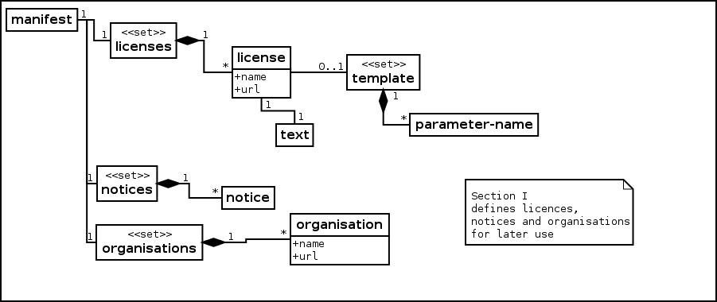
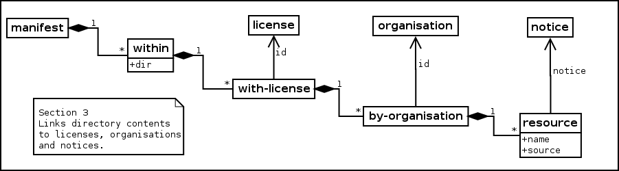

# Project Information

## Navigation

- Apache Whisker™
  - [Introducing Whisker](#index)
  - [Meta Data](#meta-data)
  - [Maven Plugin](#apache-whisker-maven-plugin)
  - [Command Line](#apache-whisker-cli)
  - [FAQ](#faq)
- Examples
  - [In 5 Minutes](#examples-in-5-mins)
  - [3rd Party (Individual)](#examples-3rd-party-individual)
  - [3rd Party (Corporate)](#examples-3rd-party-corporate)
  - [3rd Party (Group)](#examples-3rd-party-group)
  - [License Family](#examples-license-family)
  - [Copyright Notices](#examples-copyright-notices)
- Modules
  - [Apache Whisker::Model](#apache-whisker-model)
  - [Apache Whisker::Scan](#apache-whisker-scan)
  - [Apache Whisker::XML](#apache-whisker-xml)
  - [Apache Whisker::App](#apache-whisker-app)
  - [Apache Whisker::Output(velocity)](#apache-whisker-velocity)
  - [Apache Whisker::Command Line Interface](#apache-whisker-cli)
  - [Apache Whisker::Maven Plugin](#apache-whisker-maven-plugin)
- Project Documentation
  - [Project Information](#project-info)
    - [CI Management](#ci-management)
    - [About](#index)
    - [Mailing Lists](#mailing-lists)
    - [Project Modules](#modules)
    - [Source Code Management](#scm)
    - [Summary](#summary)
    - [Team](#team)
  - Project Reports
    - [Surefire](#apache-whisker-maven-plugin-surefire)
    - [JDepend](#apache-whisker-maven-plugin-jdepend-report)
    - [Plugin Details](#apache-whisker-maven-plugin-plugin-info)
- [Overview](#apache-whisker-maven-plugin-scm)
  - [Introduction](#apache-whisker-maven-plugin)
  - [Goals](#apache-whisker-maven-plugin-plugin-info)
  - [Usage](#apache-whisker-maven-plugin-usage)
  - [FAQ](#apache-whisker-maven-plugin-faq)
- Parent Project
  - [Apache Whisker](#index)
- Other pages
  - [Overview](#apache-whisker-app-ci-management)
  - [Project Mailing Lists](#apache-whisker-app-mailing-lists)
  - [Overview](#apache-whisker-app-scm)
  - [Project Summary](#apache-whisker-app-summary)
  - [Project Team](#apache-whisker-app-team)
  - [Overview](#apache-whisker-cli-ci-management)
  - [Project Mailing Lists](#apache-whisker-cli-mailing-lists)
  - [Overview](#apache-whisker-cli-scm)
  - [Project Summary](#apache-whisker-cli-summary)
  - [Project Team](#apache-whisker-cli-team)
  - [Overview](#apache-whisker-maven-plugin-ci-management)
  - [Generation In 5 Minutes](#apache-whisker-maven-plugin-examples-generation-in-5-mins)
  - [Project Mailing Lists](#apache-whisker-maven-plugin-mailing-lists)
  - [Project Summary](#apache-whisker-maven-plugin-summary)
  - [Project Team](#apache-whisker-maven-plugin-team)
  - [Overview](#apache-whisker-model-ci-management)
  - [Project Mailing Lists](#apache-whisker-model-mailing-lists)
  - [Overview](#apache-whisker-model-scm)
  - [Project Summary](#apache-whisker-model-summary)
  - [Project Team](#apache-whisker-model-team)
  - [Overview](#apache-whisker-scan-ci-management)
  - [Project Mailing Lists](#apache-whisker-scan-mailing-lists)
  - [Overview](#apache-whisker-scan-scm)
  - [Project Summary](#apache-whisker-scan-summary)
  - [Project Team](#apache-whisker-scan-team)
  - [Overview](#apache-whisker-velocity-ci-management)
  - [Project Mailing Lists](#apache-whisker-velocity-mailing-lists)
  - [Overview](#apache-whisker-velocity-scm)
  - [Project Summary](#apache-whisker-velocity-summary)
  - [Project Team](#apache-whisker-velocity-team)
  - [Overview](#apache-whisker-xml-ci-management)
  - [Project Mailing Lists](#apache-whisker-xml-mailing-lists)
  - [Overview](#apache-whisker-xml-scm)
  - [Project Summary](#apache-whisker-xml-summary)
  - [Project Team](#apache-whisker-xml-team)

## Content

<a id="index"></a>

<!-- source_url: https://creadur.apache.org/whisker/index.html -->

<!-- page_index: 1 -->

<a id="index--what-is-apache-whisker"></a>

# What Is Apache Whisker™?

Apache Whisker assists assembled applications maintain correct legal documentation.

Apache Whisker is part of the [Apache Creadur](https://creadur.apache.org/) language- and build-agnostic suite of tools for auditing and comprehending software distributions. Our community develops  [open source software](https://www.opensource.org/) the  [Apache Way](https://www.apache.org/foundation/how-it-works.html).

Whisker just helps to maintain information more efficiently, and is [no substitute](#faq--what-whisker-is-not) for solid legal work. No part of our documentation is [legal advice](#faq--what-this-documentation-is-not), and readers are assumed to have a practical understanding of the relevant laws.

Learn about copyright and software licensing [here](https://www.apache.org/foundation/license-faq.html).

<a id="index--how-can-whisker-help"></a>

## How Can Whisker Help?

Whisker can

- verify - checking meta-data quality against a distribution
- generate - legal documents from meta-data

Particular useful for complex assembled applications.

<a id="index--what-s-an-assembled-application"></a>

### What's An Assembled Application?

An assembled application is composed from libraries and frameworks.

Read more [here](#faq--complex-software-applications).

<a id="index--what-legal-documentation"></a>

### What Legal Documentation?

NOTICE and LICENSE are supported examples.

<a id="index--how-does-whisker-work"></a>

### How Does Whisker Work?

Licensing  [meta-data](#meta-data) describes the legal qualities of the components assembled.

<a id="index--how-can-i-use-whisker"></a>

## How Can I Use Whisker?

- From the  [command line](#apache-whisker-cli)
- As a  [plugin for Maven](#apache-whisker-maven-plugin)

<a id="index--getting-started"></a>

## Getting Started

Browse the [source](https://creadur.apache.org/whisker/xref/index.html), read the [javadocs](https://creadur.apache.org/whisker/apidocs/index.html), take a look

- [Whisker In 5 Minutes](#examples-in-5-mins)

dive into sample meta-data

- [Apache James](assets/files/james_601611709a924234.xml)
- [Public Domain](assets/files/public-domain_7531eebc65b7014d.xml)
- [Template License](assets/files/template-license_5811c1f53d3f34cf.xml)
- [License Family](assets/files/license-family-sample_b9d4839ada0104c5.xml)
- Whisker In 5 Minutes featuring the [MIT License](assets/files/in-5-mins-sample_e331c633d90b5a05.xml)
- distributing work licensed from
  - an  [individual maintainer](assets/files/3rd-party-individual-sample_10796735b464b284.xml)
  - a for- or non-profit [corporation](assets/files/3rd-party-corporate-sample_ad1b530a30fe823d.xml)
  - an informal [group](assets/files/3rd-party-group-sample_8cf5749e2741d498.xml)
- [copyright notices](assets/files/copyright-notices-sample_a37223cfca6c5885.xml)

or browse the [FAQ](#faq).

A warm welcome is guaranteed on our [mail lists](#mailing-lists).

<a id="index--more-examples"></a>

### More Examples

- Including a 3rd Party work licensed by
  - an [individual](#examples-3rd-party-individual)
  - a for- or non-profit [corporation](#examples-3rd-party-corporate)
  - an [informal group](#examples-3rd-party-group)
- [Parameterising a template](#examples-license-family) for a [license family](#faq--what-is-license-family), featuring the [BSD (2 Clause) license](https://opensource.org/licenses/BSD-2-Clause)
- All about [copyright notices](#examples-copyright-notices)

---

<a id="meta-data"></a>

<!-- source_url: https://creadur.apache.org/whisker/meta-data.html -->

<!-- page_index: 2 -->

<a id="meta-data--apache-whisker-meta-data-model"></a>

# Apache Whisker Meta-Data Model

Jump into

- [Breakdown](#meta-data--breakdown)
- [Some Objects Modeled](#meta-data--some_objects_modeled)
  - [Section I - Licenses, Notices and Organisations](#meta-data--section_i_-_licenses.2c_notices_and_organisations)
  - [Section II - Primary Details](#meta-data--section_ii_-_primary_details)
  - [Section III - Contents](#meta-data--section_iii_-_contents)
- [Described By DTD](#meta-data--described_by_dtd)
- [Some More Advanced Features Explained](#meta-data--some_more_advanced_features_explained)
  - [Public Domain](#meta-data--public_domain)
  - [Variable Copyright Notices](#meta-data--variable_copyright_notices)
  - [Templates For License Families](#meta-data--templates_for_license_families)
  - [Source Links](#meta-data--source_links)
- [A Sample](#meta-data--a_sample)

or read on.

<a id="meta-data--breakdown"></a>

## Breakdown

The meta data relates licensing information about the contents of an assembled release efficiently. It break down into three sections:

1. Licenses, notices and organisations each described here once (then reused);
2. Primary license, notice and organisation for the application released; and
3. Contents of each directory, grouped by organisation and license.

<a id="meta-data--some-objects-modeled"></a>

## Some Objects Modeled

<a id="meta-data--section-i-licenses-notices-and-organisations"></a>

### Section I - Licenses, Notices and Organisations



Section I

License, notice and organisations are define independently. Each can then be efficiently referenced in many places by simple `id`. Each `id` must be a unique `ID` (in xml terms). Adopting a regular naming convention is recommended. Some typical conventions:

- use the domain name as the `id` for an organisation;
- use the  [Open Source Initiative](https://www.opensource.org) code as the `id` for an open source license

Note that `organisation` includes any entity attributed as creator. Including (for example)

- the name of an author;
- a pseudonym;
- a corporation;
- a development community;
- the Apache Software Foundation.

<a id="meta-data--section-ii-primary-details"></a>

### Section II - Primary Details

The primary license, notice and organisation associated with the work reference data in [Section I](#meta-data--section_i) by `id`. This is the collective copyright for the act of composition. The components aggregated in the distribution are detailed in [Section III](#meta-data--section_iii).

<a id="meta-data--section-iii-contents"></a>

### Section III - Contents

This final section groups resources contained in each directory by organisation and license.



Section III

The deep nesting groups the resources contained in each directory by license and organisation to reduce duplication. Licenses, notices and organisations are linked by `id` to the definitions in  [Section I](#meta-data--section_i).

Directories are modeled using a flat structure without nesting. Paths are relative to the root directory of the distribution (indicated by '.') and separated by `//`.

```

    <within dir='.'>
        <with-license ...
    </within>
    <within dir='WEB-INF'>
        <with-license ...
    </within>
    <within dir='WEB-INF/conf'>
        <with-license ...
    </within>
    <within dir='WEB-INF/lib'>
        <with-license ...
    </within>
```

<a id="meta-data--described-by-dtd"></a>

## Described By DTD

Useful for visual editors.

```
<!DOCTYPE manifest [

<!ELEMENT manifest (licenses, notices, organisations,
    primary-license, primary-notice?, primary-organisation?, within*)>
<!-- Collects license descriptions -->
<!ELEMENT licenses (license*)>
<!-- Describes a copyright license -->
<!ELEMENT license (template?, text)>
<!ATTLIST license name CDATA #REQUIRED>
<!ATTLIST license url CDATA #IMPLIED>
<!ATTLIST license id ID #REQUIRED>
<!-- Some licenses require a link to source code -->
<!ATTLIST license requires-source (yes|no) "no">
<!-- The words expressing the license -->
<!ELEMENT text (#PCDATA)>
<!-- Template license families have parameterised license wording -->
<!ELEMENT template (parameter-name+)>
<!-- The name of a parameter to be substituted -->
<!ELEMENT parameter-name (#PCDATA)>

<!-- Collects notice descriptions -->
<!ELEMENT notices (notice*)>
<!-- Describes notice text to be preserved -->
<!ELEMENT notice (#PCDATA)>
<!ATTLIST notice id ID #REQUIRED>

<!-- Collections organisation descriptions -->
<!ELEMENT organisations (organisation*)>
<!-- Describes an upstream organisation -->
<!ELEMENT organisation EMPTY>
<!ATTLIST organisation id ID #REQUIRED>
<!ATTLIST organisation name CDATA #REQUIRED>
<!ATTLIST organisation url CDATA #IMPLIED>

<!-- The primary license for the application -->
<!ELEMENT primary-license (copyright-notice?)>
<!-- References the license by id attribute -->
<!ATTLIST primary-license id IDREF #REQUIRED>

<!-- The text of the application's primary notice -->
<!ELEMENT primary-notice (#PCDATA)>

<!-- The organisation responsible for the application -->
<!ELEMENT primary-organisation EMPTY>
<!-- References the organisation by id attribute -->
<!ATTLIST primary-organisation id IDREF #REQUIRED>

<!-- Collects the resources within a directory-->
<!ELEMENT within (public-domain?, with-license*)>
<!ATTLIST within dir CDATA #REQUIRED>

<!-- Collects resources sharing licensing qualities -->
<!ELEMENT with-license (copyright-notice?, license-parameters?, by-organisation*)>
<!-- Refers to a license defined above by ID -->
<!ATTLIST with-license id IDREF #REQUIRED>
<!-- A copyright claim -->
<!ELEMENT copyright-notice (#PCDATA)>
<!-- Values substituted into the text of template licenses -->
<!ELEMENT license-parameters (parameter*)>
<!ELEMENT parameter (name, value)>
<!ELEMENT name (#PCDATA)>
<!ELEMENT value (#PCDATA)>

<!-- Collects resources in the public domain -->
<!ELEMENT public-domain (by-organisation*)>

<!-- Collects resources issued by an upstream organisation -->
<!ELEMENT by-organisation (resource*)>
<!ATTLIST by-organisation id IDREF #REQUIRED>

<!-- Contained in the application release -->
<!ELEMENT resource EMPTY>
<!ATTLIST resource name CDATA #REQUIRED>
<!ATTLIST resource sha1 CDATA #IMPLIED>
<!ATTLIST resource notice IDREF #IMPLIED>
<!ATTLIST resource source CDATA #IMPLIED>
]>
```

<a id="meta-data--some-more-advanced-features-explained"></a>

## Some More Advanced Features Explained

<a id="meta-data--public-domain"></a>

### Public Domain

Some contemporary laws make it surprisingly difficult for an author to place a work in the public domain. See  `creativecommons.org` for  [more](https://creativecommons.org/about/cc0)  [explanation](https://creativecommons.org/weblog/entry/23830).

Whisker supports works in the public domain through `public-domain` blocks `within` a directory. A `resource` in the public domain should be grouped `by-organisation` within the `public-domain` block.

```

    <within dir='.'>
        <public-domain>
            <by-organisation id='An Author'>
                <resource name='A Work In The Public Domain'/>
            </by-organisation>
        </public-domain>
    </within>
```

<a id="meta-data--a-public-domain-example"></a>

#### A Public Domain Example

This simple example illustrates how *Guide to the Lakes* by William Wordsworth (now in the public domain) may be indicated. Source is [here](assets/files/public-domain_7531eebc65b7014d.xml).

```
<manifest>
    <licenses>
        <license id='LICENSE' name='A License'>
            <text>The words of the license</text>
        </license>
    </licenses>
    <notices/>
    <organisations>
        <organisation id="ORG" name='An Organisation'/>
        <!--
        The original author must still be credited
        even for works in the public domain.
        Copyrights to the works of William Wordsworth
        (1770-1850)
        have now expired.
                                              -->
        <organisation id="WilliamWordsworth" name='William Wordsworth'/>
    </organisations>
    <primary-license id='LICENSE'/>
    <primary-organisation id='ORG'/>

    <within dir='.'>
        <!--
            The public domain block should be included
            when the directory contains a resources
            in the public domain.
                     -->
        <public-domain>
            <by-organisation id='WilliamWordsworth'>
            <!--
                Copyrights to 'Guide to the Lakes'
                by William Wordsworth have now expired.
                It is in the public domain.
                         -->
                <resource name='Guide to the Lakes'/>
            </by-organisation>
        </public-domain>
    </within>
</manifest>
```

> [!NOTE]
>

<a id="meta-data--variable-copyright-notices"></a>

### Variable Copyright Notices

A copyright notice is a simple claim of ownership, typically by an author of the work. For example

```
        Copyright (c) YEAR A.N.AUTHOR
```

**Do not** confuse a *copyright notice* with the `NOTICE` that some licenses require to be distributed. A typical `NOTICE` contains attribution information (for example *This products contains software developed by the Apache Software Foundation*) as well as a copyright notice.

Many license definitions (for example, The  [MIT License](https://www.opensource.org/licenses/mit-license.php)) conventionally include a copyright notice. The contents of these copyright notices vary widely.

Whisker separates `copyright-notice` from `license` to reduce duplication. (Optionally) a `copyright-notice` begins a `with-license` block, before `resource` grouped `by-organisation` sharing this `copyright-notice` and `license`.

```
    <with-license id='MIT'>
        <copyright-notice>
Copyright (c) YEAR A.N.AUTHOR
All rights reserved.
        </copyright-notice>
        <by-organisation id='example.org'>
                <resource name='document.txt'/>
                ...
```

> [!NOTE]
>

<a id="meta-data--an-example-separation-into-license-and-notice"></a>

#### An Example Separation Into License and Notice

Here is an example instance of the  [MIT License](https://www.opensource.org/licenses/mit-license.php)

```
Copyright (c) YEAR-YEAR A.N.AUTHOR
All rights reserved.

Permission is hereby granted, free  of charge, to any person obtaining
a  copy  of this  software  and  associated  documentation files  (the
"Software"), to  deal in  the Software without  restriction, including
without limitation  the rights to  use, copy, modify,  merge, publish,
distribute,  sublicense, and/or sell  copies of  the Software,  and to
permit persons to whom the Software  is furnished to do so, subject to
the following conditions:

The  above  copyright  notice  and  this permission  notice  shall  be
included in all copies or substantial portions of the Software.

THE  SOFTWARE IS  PROVIDED  "AS  IS", WITHOUT  WARRANTY  OF ANY  KIND,
EXPRESS OR  IMPLIED, INCLUDING  BUT NOT LIMITED  TO THE  WARRANTIES OF
MERCHANTABILITY,    FITNESS    FOR    A   PARTICULAR    PURPOSE    AND
NONINFRINGEMENT. IN NO EVENT SHALL THE AUTHORS OR COPYRIGHT HOLDERS BE
LIABLE FOR ANY CLAIM, DAMAGES OR OTHER LIABILITY, WHETHER IN AN ACTION
OF CONTRACT, TORT OR OTHERWISE,  ARISING FROM, OUT OF OR IN CONNECTION
WITH THE SOFTWARE OR THE USE OR OTHER DEALINGS IN THE SOFTWARE.
```

To allow the `license` to be reused, add the `text` excluding the copyright notice.

```
        <license
            name='MIT License'
            id='MIT'
            url='https://www.opensource.org/licenses/mit-license.php'>
            <text>
Permission is hereby granted, free  of charge, to any person obtaining
a  copy  of this  software  and  associated  documentation files  (the
"Software"), to  deal in  the Software without  restriction, including
without limitation  the rights to  use, copy, modify,  merge, publish,
distribute,  sublicense, and/or sell  copies of  the Software,  and to
permit persons to whom the Software  is furnished to do so, subject to
the following conditions:

The  above  copyright  notice  and  this permission  notice  shall  be
included in all copies or substantial portions of the Software.

THE  SOFTWARE IS  PROVIDED  "AS  IS", WITHOUT  WARRANTY  OF ANY  KIND,
EXPRESS OR  IMPLIED, INCLUDING  BUT NOT LIMITED  TO THE  WARRANTIES OF
MERCHANTABILITY,    FITNESS    FOR    A   PARTICULAR    PURPOSE    AND
NONINFRINGEMENT. IN NO EVENT SHALL THE AUTHORS OR COPYRIGHT HOLDERS BE
LIABLE FOR ANY CLAIM, DAMAGES OR OTHER LIABILITY, WHETHER IN AN ACTION
OF CONTRACT, TORT OR OTHERWISE,  ARISING FROM, OUT OF OR IN CONNECTION
WITH THE SOFTWARE OR THE USE OR OTHER DEALINGS IN THE SOFTWARE.
            </text>
        </license>
```

Add the appropriate `copyright-notice` applying to the `resource`.

```

        <with-license id='MIT'>
        <copyright-notice>
Copyright (c) YEAR-YEAR A.N.AUTHOR
All rights reserved.
        </copyright-notice>
            <by-organisation id='example.org'>
                <resource name='mit-licensed-document-by-A-N-Author.txt'/>
                ...
```

<a id="meta-data--templates-for-license-families"></a>

### Templates For License Families

Some familiar open source licenses (for example, the [BSD 3-Clause License](https://www.opensource.org/licenses/BSD-3-Clause)) are better understood as families of licenses. Each family is based on a parameterised template. When the license is used, an appropriate value is substituted for each parameter.

Whisker supports template licenses with parameter substitution. Parameter names are defined by `parameter-name` elements within a `template` block.

```
        <license ...
            <template>
                <parameter-name>foo</parameter-name>
                ...
            </template>
            ...
```

Each `${parameter name}` within the license `text` will be substituted by the `value` with matching `name` within a `parameter` in a `license-parameters` block. When referring to a template license, this block is required. All parameter names defined must have exactly one value specified.

```
    <license-parameters>
      <parameter>
        <name>foo</name>
        <value>bar</value>
      </parameter>
      ...
```

<a id="meta-data--a-template-example"></a>

#### A Template Example

This simple template example features a `Hello, World` license. Source is [here](assets/files/template-license_5811c1f53d3f34cf.xml).

```
<manifest>
    <licenses>
        <!-- A template license -->
        <license id='TL1' name='A Template License'>
            <!--
                Parameter names in this section.
                Values must be set for all parameters.
                                                -->
            <template>
                <!-- ${FOO} will be substituted wherever it occurs -->
                <parameter-name>FOO</parameter-name>
                <!-- ${BAR} will be substituted wherever it occurs -->
                <parameter-name>BAR</parameter-name>
            </template>
            <!-- Wherever ${FOO} and ${BAR} are found will be substituted.-->
            <text>
                ${BAR}, ${FOO}.
            </text>
        </license>
    </licenses>
    ...
    <within dir='.'>
        <with-license id='TL1'>
            <!--
                When a template license is referenced,
                a license-parameter block must exist
                and contain one value for each defined
                parameter
                                                        -->
            <license-parameters>
                <parameter>
                    <!-- Replace ${FOO} with 'world' -->
                    <name>FOO</name>
                    <value>world</value>
                </parameter>
                <parameter>
                    <!-- Replace ${BAR} with 'Hello' -->
                    <name>BAR</name>
                    <value>hello</value>
                </parameter>
            </license-parameters>
            <!--
                After substituting values for parameters,
                the license reads: Hello, world.
                                                        -->
        </with-license>
    </within>
</manifest>
```

<a id="meta-data--source-links"></a>

### Source Links

<a id="meta-data--background"></a>

#### Background

Some [weak copyleft](#faq--what-weak-copyleft) licenses contain a [source clause](#faq--what-source-clause) (for example, the  [CDDL 1.0](https://www.opensource.org/licenses/CDDL-1.0)). A good way to satisfy a source clause is to include the source within the distribution. An alternative approach (which is advantageous when size is important) is to include a URL linking to the source within the `NOTICE` or `LICENSE`.

<a id="meta-data--support-for-source-urls"></a>

#### Support For Source URLs

Whisker supports source links for a `resource` through the optional `source` attribute. The primary motivation for this is to support weak copyleft licenses, though many people like the idea of crediting creators by including a link.

Including a source URL generates an appropriate entry in the NOTICE.

<a id="meta-data--learn-more"></a>

#### Learn More

Learn more about source clauses [here](#faq--what-source-clause).

Learn about copyright and software licensing [here](#faq--more-resources.27).

Read more about licenses [here](#faq--what-is-a-license).

Read more about weak copyleft licenses [here](#faq--what-weak-copyleft.27).

<a id="meta-data--a-sample"></a>

## A Sample

Describes components assembled into the [Apache James](https://james.apache.org) [mail server](https://james.apache.org/server). Find the source [here](assets/files/james_601611709a924234.xml).

```
<?xml version="1.0" encoding="UTF-8"?>
<manifest>
    <licenses>
        <license
            name='Day Specification License with Addendum'
            id='DaySpecLicensePlusAddendum'
            url='http://www.day.com/content/dam/day/downloads/jsr283/LICENSE.txt'>
            <text>
Day Management AG ("Licensor") is willing to license this specification to you ONLY UPON
THE CONDITION THAT YOU ACCEPT ALL OF THE TERMS CONTAINED IN THIS LICENSE AGREEMENT
("Agreement"). Please read the terms and conditions of this Agreement carefully.

Content Repository for JavaTM Technology API Specification ("Specification")
Version: 2.0
Status: FCS
Release: 10 August 2009

Copyright 2009 Day Management AG
Barfüsserplatz 6, 4001 Basel, Switzerland.
All rights reserved.

NOTICE; LIMITED LICENSE GRANTS

1. License for Purposes of Evaluation and Developing Applications. Licensor hereby grants
   you a fully-paid, non-exclusive, non-transferable, worldwide, limited license (without the
   right to sublicense), under Licensor's applicable intellectual property rights to view,
   download, use and reproduce the Specification only for the purpose of internal evaluation.
   This includes developing applications intended to run on an implementation of the
   Specification provided that such applications do not themselves implement any portion(s)
   of the Specification.

2. License for the Distribution of Compliant Implementations. Licensor also grants you a
   perpetual, non-exclusive, non-transferable, worldwide, fully paid-up, royalty free, limited
   license (without the right to sublicense) under any applicable copyrights or, subject to
   the provisions of subsection 4 below, patent rights it may have covering the Specification
   to create and/or distribute an Independent Implementation of the Specification that:

      (a) fully implements the Specification including all its required interfaces and
          functionality;
      (b) does not modify, subset, superset or otherwise extend the Licensor Name Space,
          or include any public or protected packages, classes, Java interfaces, fields
          or methods within the Licensor Name Space other than those required/authorized
          by the Specification or Specifications being implemented; and
      (c) passes the Technology Compatibility Kit (including satisfying the requirements
          of the applicable TCK Users Guide) for such Specification ("Compliant Implementation").
          In addition, the foregoing license is expressly conditioned on your not acting
          outside its scope. No license is granted hereunder for any other purpose (including,
          for example, modifying the Specification, other than to the extent of your fair use
          rights, or distributing the Specification to third parties).

3. Pass-through Conditions. You need not include limitations (a)-(c) from the previous paragraph
   or any other particular "pass through" requirements in any license You grant concerning the
   use of your Independent Implementation or products derived from it. However, except with
   respect to Independent Implementations (and products derived from them) that satisfy
   limitations (a)-(c) from the previous paragraph, You may neither:

       (a) grant or otherwise pass through to your licensees any licenses under Licensor's
           applicable intellectual property rights; nor
       (b) authorize your licensees to make any claims concerning their implementation's
           compliance with the Specification.

4. Reciprocity Concerning Patent Licenses. With respect to any patent claims covered by the
   license granted under subparagraph 2 above that would be infringed by all technically
   feasible implementations of the Specification, such license is conditioned upon your
   offering on fair, reasonable and non-discriminatory terms, to any party seeking it from
   You, a perpetual, non-exclusive, non-transferable, worldwide license under Your patent
   rights that are or would be infringed by all technically feasible implementations of the
   Specification to develop, distribute and use a Compliant Implementation.

5. Definitions. For the purposes of this Agreement: "Independent Implementation" shall mean an
   implementation of the Specification that neither derives from any of Licensor's source code
   or binary code materials nor, except with an appropriate and separate license from Licensor,
   includes any of Licensor's source code or binary code materials; "Licensor Name Space" shall
   mean the public class or interface declarations whose names begin with "java", "javax",
   "javax.jcr" or their equivalents in any subsequent naming convention adopted by Licensor
   through the Java Community Process, or any recognized successors or replacements thereof;
   and "Technology Compatibility Kit" or "TCK" shall mean the test suite and accompanying TCK
   User's Guide provided by Licensor which corresponds to the particular version of the
   Specification being tested.

6. Termination. This Agreement will terminate immediately without notice from Licensor if
   you fail to comply with any material provision of or act outside the scope of the licenses
   granted above.

7. Trademarks. No right, title, or interest in or to any trademarks, service marks, or trade
   names of Licensor is granted hereunder. Java is a registered trademark of Sun Microsystems,
   Inc. in the United States and other countries.

8. Disclaimer of Warranties. The Specification is provided "AS IS". LICENSOR MAKES NO
   REPRESENTATIONS OR WARRANTIES, EITHER EXPRESS OR IMPLIED, INCLUDING BUT NOT LIMITED TO,
   WARRANTIES OF MERCHANTABILITY, FITNESS FOR A PARTICULAR PURPOSE, NON-INFRINGEMENT
   (INCLUDING AS A CONSEQUENCE OF ANY PRACTICE OR IMPLEMENTATION OF THE SPECIFICATION),
   OR THAT THE CONTENTS OF THE SPECIFICATION ARE SUITABLE FOR ANY PURPOSE. This document
   does not represent any commitment to release or implement any portion of the Specification
   in any product.

   The Specification could include technical inaccuracies or typographical errors. Changes are
   periodically added to the information therein; these changes will be incorporated into new
   versions of the Specification, if any. Licensor may make improvements and/or changes to the
   product(s) and/or the program(s) described in the Specification at any time. Any use of such
   changes in the Specification will be governed by the then-current license for the applicable
   version of the Specification.

9. Limitation of Liability. TO THE EXTENT NOT PROHIBITED BY LAW, IN NO EVENT WILL LICENSOR
   BE LIABLE FOR ANY DAMAGES, INCLUDING WITHOUT LIMITATION, LOST REVENUE, PROFITS OR DATA, OR
   FOR SPECIAL, INDIRECT, CONSEQUENTIAL, INCIDENTAL OR PUNITIVE DAMAGES, HOWEVER CAUSED AND
   REGARDLESS OF THE THEORY OF LIABILITY, ARISING OUT OF OR RELATED TO ANY FURNISHING,
   PRACTICING, MODIFYING OR ANY USE OF THE SPECIFICATION, EVEN IF LICENSOR HAS BEEN ADVISED
   OF THE POSSIBILITY OF SUCH DAMAGES.

10. Report. If you provide Licensor with any comments or suggestions in connection with your
    use of the Specification ("Feedback"), you hereby: (i) agree that such Feedback is provided
    on a non-proprietary and non-confidential basis, and (ii) grant Licensor a perpetual,
    non-exclusive, worldwide, fully paid-up, irrevocable license, with the right to sublicense
    through multiple levels of sublicensees, to incorporate, disclose, and use without
    limitation the Feedback for any purpose related to the Specification and future versions,
    implementations, and test suites thereof.

Day Specification License Addendum

In addition to the permissions granted under the Specification
License, Day Management AG hereby grants to You a perpetual,
worldwide, non-exclusive, no-charge, royalty-free, irrevocable
license to reproduce, publicly display, publicly perform,
sublicense, and distribute unmodified copies of the Content
Repository for Java Technology API (JCR 2.0) Java Archive (JAR)
file ("jcr-2.0.jar") and to make, have made, use, offer to sell,
sell, import, and otherwise transfer said file on its own or
as part of a larger work that makes use of the JCR API.

With respect to any patent claims covered by this license
that would be infringed by all technically feasible implementations
of the Specification, such license is conditioned upon your
offering on fair, reasonable and non-discriminatory terms,
to any party seeking it from You, a perpetual, non-exclusive,
non-transferable, worldwide license under Your patent rights
that are or would be infringed by all technically feasible
implementations of the Specification to develop, distribute
and use a Compliant Implementation.

            </text>
</license>
        <license name='COMMON DEVELOPMENT AND DISTRIBUTION LICENSE (CDDL) Version 1.0' id='CDDL'
        url='https://www.opensource.org/licenses/CDDL-1.0' requires-source='yes'>
        <text>
COMMON DEVELOPMENT AND DISTRIBUTION LICENSE (CDDL) Version 1.0

1. Definitions.

1.1. "Contributor" means each individual or entity that
creates or contributes to the creation of Modifications.

1.2. "Contributor Version" means the combination of the
Original Software, prior Modifications used by a
Contributor (if any), and the Modifications made by that
particular Contributor.

1.3. "Covered Software" means (a) the Original Software, or
(b) Modifications, or (c) the combination of files
containing Original Software with files containing
Modifications, in each case including portions thereof.

1.4. "Executable" means the Covered Software in any form
other than Source Code.

1.5. "Initial Developer" means the individual or entity
that first makes Original Software available under this
License.

1.6. "Larger Work" means a work which combines Covered
Software or portions thereof with code not governed by the
terms of this License.

1.7. "License" means this document.

1.8. "Licensable" means having the right to grant, to the
maximum extent possible, whether at the time of the initial
grant or subsequently acquired, any and all of the rights
conveyed herein.

1.9. "Modifications" means the Source Code and Executable
form of any of the following:

A. Any file that results from an addition to,
deletion from or modification of the contents of a
file containing Original Software or previous
Modifications;

B. Any new file that contains any part of the
Original Software or previous Modification; or

C. Any new file that is contributed or otherwise made
available under the terms of this License.

1.10. "Original Software" means the Source Code and
Executable form of computer software code that is
originally released under this License.

1.11. "Patent Claims" means any patent claim(s), now owned
or hereafter acquired, including without limitation,
method, process, and apparatus claims, in any patent
Licensable by grantor.

1.12. "Source Code" means (a) the common form of computer
software code in which modifications are made and (b)
associated documentation included in or with such code.

1.13. "You" (or "Your") means an individual or a legal
entity exercising rights under, and complying with all of
the terms of, this License. For legal entities, "You"
includes any entity which controls, is controlled by, or is
under common control with You. For purposes of this
definition, "control" means (a) the power, direct or
indirect, to cause the direction or management of such
entity, whether by contract or otherwise, or (b) ownership
of more than fifty percent (50%) of the outstanding shares
or beneficial ownership of such entity.

2. License Grants.

2.1. The Initial Developer Grant.

Conditioned upon Your compliance with Section 3.1 below and
subject to third party intellectual property claims, the
Initial Developer hereby grants You a world-wide,
royalty-free, non-exclusive license:

(a) under intellectual property rights (other than
patent or trademark) Licensable by Initial Developer,
to use, reproduce, modify, display, perform,
sublicense and distribute the Original Software (or
portions thereof), with or without Modifications,
and/or as part of a Larger Work; and

(b) under Patent Claims infringed by the making,
using or selling of Original Software, to make, have
made, use, practice, sell, and offer for sale, and/or
otherwise dispose of the Original Software (or
portions thereof).

(c) The licenses granted in Sections 2.1(a) and (b)
are effective on the date Initial Developer first
distributes or otherwise makes the Original Software
available to a third party under the terms of this
License.

(d) Notwithstanding Section 2.1(b) above, no patent
license is granted: (1) for code that You delete from
the Original Software, or (2) for infringements
caused by: (i) the modification of the Original
Software, or (ii) the combination of the Original
Software with other software or devices.

2.2. Contributor Grant.

Conditioned upon Your compliance with Section 3.1 below and
subject to third party intellectual property claims, each
Contributor hereby grants You a world-wide, royalty-free,
non-exclusive license:

(a) under intellectual property rights (other than
patent or trademark) Licensable by Contributor to
use, reproduce, modify, display, perform, sublicense
and distribute the Modifications created by such
Contributor (or portions thereof), either on an
unmodified basis, with other Modifications, as
Covered Software and/or as part of a Larger Work; and

(b) under Patent Claims infringed by the making,
using, or selling of Modifications made by that
Contributor either alone and/or in combination with
its Contributor Version (or portions of such
combination), to make, use, sell, offer for sale,
have made, and/or otherwise dispose of: (1)
Modifications made by that Contributor (or portions
thereof); and (2) the combination of Modifications
made by that Contributor with its Contributor Version
(or portions of such combination).

(c) The licenses granted in Sections 2.2(a) and
2.2(b) are effective on the date Contributor first
distributes or otherwise makes the Modifications
available to a third party.

(d) Notwithstanding Section 2.2(b) above, no patent
license is granted: (1) for any code that Contributor
has deleted from the Contributor Version; (2) for
infringements caused by: (i) third party
modifications of Contributor Version, or (ii) the
combination of Modifications made by that Contributor
with other software (except as part of the
Contributor Version) or other devices; or (3) under
Patent Claims infringed by Covered Software in the
absence of Modifications made by that Contributor.

3. Distribution Obligations.

3.1. Availability of Source Code.

Any Covered Software that You distribute or otherwise make
available in Executable form must also be made available in
Source Code form and that Source Code form must be
distributed only under the terms of this License. You must
include a copy of this License with every copy of the
Source Code form of the Covered Software You distribute or
otherwise make available. You must inform recipients of any
such Covered Software in Executable form as to how they can
obtain such Covered Software in Source Code form in a
reasonable manner on or through a medium customarily used
for software exchange.

3.2. Modifications.

The Modifications that You create or to which You
contribute are governed by the terms of this License. You
represent that You believe Your Modifications are Your
original creation(s) and/or You have sufficient rights to
grant the rights conveyed by this License.

3.3. Required Notices.

You must include a notice in each of Your Modifications
that identifies You as the Contributor of the Modification.
You may not remove or alter any copyright, patent or
trademark notices contained within the Covered Software, or
any notices of licensing or any descriptive text giving
attribution to any Contributor or the Initial Developer.

3.4. Application of Additional Terms.

You may not offer or impose any terms on any Covered
Software in Source Code form that alters or restricts the
applicable version of this License or the recipients'
rights hereunder. You may choose to offer, and to charge a
fee for, warranty, support, indemnity or liability
obligations to one or more recipients of Covered Software.
However, you may do so only on Your own behalf, and not on
behalf of the Initial Developer or any Contributor. You
must make it absolutely clear that any such warranty,
support, indemnity or liability obligation is offered by
You alone, and You hereby agree to indemnify the Initial
Developer and every Contributor for any liability incurred
by the Initial Developer or such Contributor as a result of
warranty, support, indemnity or liability terms You offer.

3.5. Distribution of Executable Versions.

You may distribute the Executable form of the Covered
Software under the terms of this License or under the terms
of a license of Your choice, which may contain terms
different from this License, provided that You are in
compliance with the terms of this License and that the
license for the Executable form does not attempt to limit
or alter the recipient's rights in the Source Code form
from the rights set forth in this License. If You
distribute the Covered Software in Executable form under a
different license, You must make it absolutely clear that
any terms which differ from this License are offered by You
alone, not by the Initial Developer or Contributor. You
hereby agree to indemnify the Initial Developer and every
Contributor for any liability incurred by the Initial
Developer or such Contributor as a result of any such terms
You offer.

3.6. Larger Works.

You may create a Larger Work by combining Covered Software
with other code not governed by the terms of this License
and distribute the Larger Work as a single product. In such
a case, You must make sure the requirements of this License
are fulfilled for the Covered Software.

4. Versions of the License.

4.1. New Versions.

Sun Microsystems, Inc. is the initial license steward and
may publish revised and/or new versions of this License
from time to time. Each version will be given a
distinguishing version number. Except as provided in
Section 4.3, no one other than the license steward has the
right to modify this License.

4.2. Effect of New Versions.

You may always continue to use, distribute or otherwise
make the Covered Software available under the terms of the
version of the License under which You originally received
the Covered Software. If the Initial Developer includes a
notice in the Original Software prohibiting it from being
distributed or otherwise made available under any
subsequent version of the License, You must distribute and
make the Covered Software available under the terms of the
version of the License under which You originally received
the Covered Software. Otherwise, You may also choose to
use, distribute or otherwise make the Covered Software
available under the terms of any subsequent version of the
License published by the license steward.

4.3. Modified Versions.

When You are an Initial Developer and You want to create a
new license for Your Original Software, You may create and
use a modified version of this License if You: (a) rename
the license and remove any references to the name of the
license steward (except to note that the license differs
from this License); and (b) otherwise make it clear that
the license contains terms which differ from this License.

5. DISCLAIMER OF WARRANTY.

COVERED SOFTWARE IS PROVIDED UNDER THIS LICENSE ON AN "AS IS"
BASIS, WITHOUT WARRANTY OF ANY KIND, EITHER EXPRESSED OR IMPLIED,
INCLUDING, WITHOUT LIMITATION, WARRANTIES THAT THE COVERED
SOFTWARE IS FREE OF DEFECTS, MERCHANTABLE, FIT FOR A PARTICULAR
PURPOSE OR NON-INFRINGING. THE ENTIRE RISK AS TO THE QUALITY AND
PERFORMANCE OF THE COVERED SOFTWARE IS WITH YOU. SHOULD ANY
COVERED SOFTWARE PROVE DEFECTIVE IN ANY RESPECT, YOU (NOT THE
INITIAL DEVELOPER OR ANY OTHER CONTRIBUTOR) ASSUME THE COST OF
ANY NECESSARY SERVICING, REPAIR OR CORRECTION. THIS DISCLAIMER OF
WARRANTY CONSTITUTES AN ESSENTIAL PART OF THIS LICENSE. NO USE OF
ANY COVERED SOFTWARE IS AUTHORIZED HEREUNDER EXCEPT UNDER THIS
DISCLAIMER.

6. TERMINATION.

6.1. This License and the rights granted hereunder will
terminate automatically if You fail to comply with terms
herein and fail to cure such breach within 30 days of
becoming aware of the breach. Provisions which, by their
nature, must remain in effect beyond the termination of
this License shall survive.

6.2. If You assert a patent infringement claim (excluding
declaratory judgment actions) against Initial Developer or
a Contributor (the Initial Developer or Contributor against
whom You assert such claim is referred to as "Participant")
alleging that the Participant Software (meaning the
Contributor Version where the Participant is a Contributor
or the Original Software where the Participant is the
Initial Developer) directly or indirectly infringes any
patent, then any and all rights granted directly or
indirectly to You by such Participant, the Initial
Developer (if the Initial Developer is not the Participant)
and all Contributors under Sections 2.1 and/or 2.2 of this
License shall, upon 60 days notice from Participant
terminate prospectively and automatically at the expiration
of such 60 day notice period, unless if within such 60 day
period You withdraw Your claim with respect to the
Participant Software against such Participant either
unilaterally or pursuant to a written agreement with
Participant.

6.3. In the event of termination under Sections 6.1 or 6.2
above, all end user licenses that have been validly granted
by You or any distributor hereunder prior to termination
(excluding licenses granted to You by any distributor)
shall survive termination.

7. LIMITATION OF LIABILITY.

UNDER NO CIRCUMSTANCES AND UNDER NO LEGAL THEORY, WHETHER TORT
(INCLUDING NEGLIGENCE), CONTRACT, OR OTHERWISE, SHALL YOU, THE
INITIAL DEVELOPER, ANY OTHER CONTRIBUTOR, OR ANY DISTRIBUTOR OF
COVERED SOFTWARE, OR ANY SUPPLIER OF ANY OF SUCH PARTIES, BE
LIABLE TO ANY PERSON FOR ANY INDIRECT, SPECIAL, INCIDENTAL, OR
CONSEQUENTIAL DAMAGES OF ANY CHARACTER INCLUDING, WITHOUT
LIMITATION, DAMAGES FOR LOST PROFITS, LOSS OF GOODWILL, WORK
STOPPAGE, COMPUTER FAILURE OR MALFUNCTION, OR ANY AND ALL OTHER
COMMERCIAL DAMAGES OR LOSSES, EVEN IF SUCH PARTY SHALL HAVE BEEN
INFORMED OF THE POSSIBILITY OF SUCH DAMAGES. THIS LIMITATION OF
LIABILITY SHALL NOT APPLY TO LIABILITY FOR DEATH OR PERSONAL
INJURY RESULTING FROM SUCH PARTY'S NEGLIGENCE TO THE EXTENT
APPLICABLE LAW PROHIBITS SUCH LIMITATION. SOME JURISDICTIONS DO
NOT ALLOW THE EXCLUSION OR LIMITATION OF INCIDENTAL OR
CONSEQUENTIAL DAMAGES, SO THIS EXCLUSION AND LIMITATION MAY NOT
APPLY TO YOU.

8. U.S. GOVERNMENT END USERS.

The Covered Software is a "commercial item," as that term is
defined in 48 C.F.R. 2.101 (Oct. 1995), consisting of "commercial
computer software" (as that term is defined at 48 C.F.R. ¤
252.227-7014(a)(1)) and "commercial computer software
documentation" as such terms are used in 48 C.F.R. 12.212 (Sept.
1995). Consistent with 48 C.F.R. 12.212 and 48 C.F.R. 227.7202-1
through 227.7202-4 (June 1995), all U.S. Government End Users
acquire Covered Software with only those rights set forth herein.
This U.S. Government Rights clause is in lieu of, and supersedes,
any other FAR, DFAR, or other clause or provision that addresses
Government rights in computer software under this License.

9. MISCELLANEOUS.

This License represents the complete agreement concerning subject
matter hereof. If any provision of this License is held to be
unenforceable, such provision shall be reformed only to the
extent necessary to make it enforceable. This License shall be
governed by the law of the jurisdiction specified in a notice
contained within the Original Software (except to the extent
applicable law, if any, provides otherwise), excluding such
jurisdiction's conflict-of-law provisions. Any litigation
relating to this License shall be subject to the jurisdiction of
the courts located in the jurisdiction and venue specified in a
notice contained within the Original Software, with the losing
party responsible for costs, including, without limitation, court
costs and reasonable attorneys' fees and expenses. The
application of the United Nations Convention on Contracts for the
International Sale of Goods is expressly excluded. Any law or
regulation which provides that the language of a contract shall
be construed against the drafter shall not apply to this License.
You agree that You alone are responsible for compliance with the
United States export administration regulations (and the export
control laws and regulation of any other countries) when You use,
distribute or otherwise make available any Covered Software.

10. RESPONSIBILITY FOR CLAIMS.

As between Initial Developer and the Contributors, each party is
responsible for claims and damages arising, directly or
indirectly, out of its utilization of rights under this License
and You agree to work with Initial Developer and Contributors to
distribute such responsibility on an equitable basis. Nothing
herein is intended or shall be deemed to constitute any admission
of liability.
        </text>
        </license>
        <license name='MIT License' id='MIT'
            url='https://www.opensource.org/licenses/mit-license.php'>
            <text>
Permission is hereby granted, free  of charge, to any person obtaining
a  copy  of this  software  and  associated  documentation files  (the
"Software"), to  deal in  the Software without  restriction, including
without limitation  the rights to  use, copy, modify,  merge, publish,
distribute,  sublicense, and/or sell  copies of  the Software,  and to
permit persons to whom the Software  is furnished to do so, subject to
the following conditions:

The  above  copyright  notice  and  this permission  notice  shall  be
included in all copies or substantial portions of the Software.

THE  SOFTWARE IS  PROVIDED  "AS  IS", WITHOUT  WARRANTY  OF ANY  KIND,
EXPRESS OR  IMPLIED, INCLUDING  BUT NOT LIMITED  TO THE  WARRANTIES OF
MERCHANTABILITY,    FITNESS    FOR    A   PARTICULAR    PURPOSE    AND
NONINFRINGEMENT. IN NO EVENT SHALL THE AUTHORS OR COPYRIGHT HOLDERS BE
LIABLE FOR ANY CLAIM, DAMAGES OR OTHER LIABILITY, WHETHER IN AN ACTION
OF CONTRACT, TORT OR OTHERWISE,  ARISING FROM, OUT OF OR IN CONNECTION
WITH THE SOFTWARE OR THE USE OR OTHER DEALINGS IN THE SOFTWARE.
            </text>
        </license>
        <license name='Tanuki Software License' id='TanukiSoftwareLicense'>
        <text>
  Copyright (c) 1999, 2006 Tanuki Software, Inc.

  Permission is hereby granted, free of charge, to any person
  obtaining a copy of the Java Service Wrapper and associated
  documentation files (the "Software"), to deal in the Software
  without  restriction, including without limitation the rights
  to use, copy, modify, merge, publish, distribute, sub-license,
  and/or sell copies of the Software, and to permit persons to
  whom the Software is furnished to do so, subject to the
  following conditions:

  The above copyright notice and this permission notice shall be
  included in all copies or substantial portions of the Software.

  THE SOFTWARE IS PROVIDED "AS IS", WITHOUT WARRANTY OF ANY KIND,
  EXPRESS OR IMPLIED, INCLUDING BUT NOT LIMITED TO THE WARRANTIES
  OF MERCHANTABILITY, FITNESS FOR A PARTICULAR PURPOSE AND
  NON-INFRINGEMENT. IN NO EVENT SHALL THE AUTHORS OR COPYRIGHT
  HOLDERS BE LIABLE FOR ANY CLAIM, DAMAGES OR OTHER LIABILITY,
  WHETHER IN AN ACTION OF CONTRACT, TORT OR OTHERWISE, ARISING
  FROM, OUT OF OR IN CONNECTION WITH THE SOFTWARE OR THE USE OR
  OTHER DEALINGS IN THE SOFTWARE.


  Portions of the Software have been derived from source code
  developed by Silver Egg Technology under the following license:

    Copyright (c) 2001 Silver Egg Technology

    Permission is hereby granted, free of charge, to any person
    obtaining a copy of this software and associated documentation
    files (the "Software"), to deal in the Software without
    restriction, including without limitation the rights to use,
    copy, modify, merge, publish, distribute, sub-license, and/or
    sell copies of the Software, and to permit persons to whom the
    Software is furnished to do so, subject to the following
    conditions:

    The above copyright notice and this permission notice shall be
    included in all copies or substantial portions of the Software.

    THE SOFTWARE IS PROVIDED "AS IS", WITHOUT WARRANTY OF ANY KIND,
    EXPRESS OR IMPLIED, INCLUDING BUT NOT LIMITED TO THE WARRANTIES
    OF MERCHANTABILITY, FITNESS FOR A PARTICULAR PURPOSE AND
    NON-INFRINGEMENT. IN NO EVENT SHALL THE AUTHORS OR COPYRIGHT
    HOLDERS BE LIABLE FOR ANY CLAIM, DAMAGES OR OTHER LIABILITY,
    WHETHER IN AN ACTION OF CONTRACT, TORT OR OTHERWISE, ARISING
    FROM, OUT OF OR IN CONNECTION WITH THE SOFTWARE OR THE USE OR
    OTHER DEALINGS IN THE SOFTWARE.
        </text>
        </license>
        <license name='BSD (3-clause)' id='BSD3ClauseGeneric'
            url='https://www.opensource.org/licenses/BSD-3-Clause'>
            <text>
  Redistribution and use in source and binary forms, with or without
  modification, are permitted provided that the following conditions
  are met:
  1. Redistributions of source code must retain the above copyright
     notice, this list of conditions and the following disclaimer.
  2. Redistributions in binary form must reproduce the above copyright
     notice, this list of conditions and the following disclaimer in the
     documentation and/or other materials provided with the distribution.
  3. Neither the name of the copyright holders nor the names of its
     contributors may be used to endorse or promote products derived from
     this software without specific prior written permission.

  THIS SOFTWARE IS PROVIDED BY THE COPYRIGHT HOLDERS AND CONTRIBUTORS "AS IS"
  AND ANY EXPRESS OR IMPLIED WARRANTIES, INCLUDING, BUT NOT LIMITED TO, THE
  IMPLIED WARRANTIES OF MERCHANTABILITY AND FITNESS FOR A PARTICULAR PURPOSE
  ARE DISCLAIMED. IN NO EVENT SHALL THE COPYRIGHT OWNER OR CONTRIBUTORS BE
  LIABLE FOR ANY DIRECT, INDIRECT, INCIDENTAL, SPECIAL, EXEMPLARY, OR
  CONSEQUENTIAL DAMAGES (INCLUDING, BUT NOT LIMITED TO, PROCUREMENT OF
  SUBSTITUTE GOODS OR SERVICES; LOSS OF USE, DATA, OR PROFITS; OR BUSINESS
  INTERRUPTION) HOWEVER CAUSED AND ON ANY THEORY OF LIABILITY, WHETHER IN
  CONTRACT, STRICT LIABILITY, OR TORT (INCLUDING NEGLIGENCE OR OTHERWISE)
  ARISING IN ANY WAY OUT OF THE USE OF THIS SOFTWARE, EVEN IF ADVISED OF
  THE POSSIBILITY OF SUCH DAMAGE.
            </text>
        </license>

        <license name='BSD (3-clause)' id ='BSD3Clause'
            url='https://www.opensource.org/licenses/BSD-3-Clause'>
                <template>
                    <parameter-name>organisation</parameter-name>
                </template>
                <text>
Redistribution and use in source and binary forms, with or without
modification, are permitted provided that the following conditions are met:

   * Redistributions of source code must retain the above copyright notice,
     this list of conditions and the following disclaimer.
   * Redistributions in binary form must reproduce the above copyright notice,
     this list of conditions and the following disclaimer in the documentation
     and/or other materials provided with the distribution.
   * Neither the name of ${organisation} nor the names of its contributors
     may be used to endorse or promote products derived from this software
     without specific prior written permission.

THIS SOFTWARE IS PROVIDED BY THE COPYRIGHT HOLDERS AND CONTRIBUTORS "AS IS" AND
ANY EXPRESS OR IMPLIED WARRANTIES, INCLUDING, BUT NOT LIMITED TO, THE IMPLIED
WARRANTIES OF MERCHANTABILITY AND FITNESS FOR A PARTICULAR PURPOSE ARE
DISCLAIMED. IN NO EVENT SHALL THE COPYRIGHT OWNER OR CONTRIBUTORS BE LIABLE FOR
ANY DIRECT, INDIRECT, INCIDENTAL, SPECIAL, EXEMPLARY, OR CONSEQUENTIAL DAMAGES
(INCLUDING, BUT NOT LIMITED TO, PROCUREMENT OF SUBSTITUTE GOODS OR SERVICES;
LOSS OF USE, DATA, OR PROFITS; OR BUSINESS INTERRUPTION) HOWEVER CAUSED AND ON
ANY THEORY OF LIABILITY, WHETHER IN CONTRACT, STRICT LIABILITY, OR TORT
(INCLUDING NEGLIGENCE OR OTHERWISE) ARISING IN ANY WAY OUT OF THE USE OF THIS
SOFTWARE, EVEN IF ADVISED OF THE POSSIBILITY OF SUCH DAMAGE.
            </text>
        </license>
        <license name='Bouncy Castle Licence' id='BouncyCastleLicense' url='https://www.bouncycastle.org/licence.html'>
            <text>
Permission is hereby granted, free of charge, to any person obtaining a copy of this software
and associated documentation files (the "Software"), to deal in the Software without restriction,
including without limitation the rights to use, copy, modify, merge, publish, distribute, sublicense,
and/or sell copies of the Software, and to permit persons to whom the Software is furnished to
do so, subject to the following conditions:

The above copyright notice and this permission notice shall be included in all copies or substantial
portions of the Software.

THE SOFTWARE IS PROVIDED "AS IS", WITHOUT WARRANTY OF ANY KIND, EXPRESS OR
IMPLIED, INCLUDING BUT NOT LIMITED TO THE WARRANTIES OF MERCHANTABILITY, FITNESS
FOR A PARTICULAR PURPOSE AND NONINFRINGEMENT. IN NO EVENT SHALL THE AUTHORS
OR COPYRIGHT HOLDERS BE LIABLE FOR ANY CLAIM, DAMAGES OR OTHER LIABILITY, WHETHER
IN AN ACTION OF CONTRACT, TORT OR OTHERWISE, ARISING FROM, OUT OF OR IN CONNECTION
WITH THE SOFTWARE OR THE USE OR OTHER DEALINGS IN THE SOFTWARE.
            </text>
        </license>
        <license name='Apache License, Version 2' id='ApacheLicenseVersion2' url='http://www.apache.org/licenses/LICENSE-2.0.txt'>
<text>
                                 Apache License
                           Version 2.0, January 2004
                        http://www.apache.org/licenses/

   TERMS AND CONDITIONS FOR USE, REPRODUCTION, AND DISTRIBUTION

   1. Definitions.

      "License" shall mean the terms and conditions for use, reproduction,
      and distribution as defined by Sections 1 through 9 of this document.

      "Licensor" shall mean the copyright owner or entity authorized by
      the copyright owner that is granting the License.

      "Legal Entity" shall mean the union of the acting entity and all
      other entities that control, are controlled by, or are under common
      control with that entity. For the purposes of this definition,
      "control" means (i) the power, direct or indirect, to cause the
      direction or management of such entity, whether by contract or
      otherwise, or (ii) ownership of fifty percent (50%) or more of the
      outstanding shares, or (iii) beneficial ownership of such entity.

      "You" (or "Your") shall mean an individual or Legal Entity
      exercising permissions granted by this License.

      "Source" form shall mean the preferred form for making modifications,
      including but not limited to software source code, documentation
      source, and configuration files.

      "Object" form shall mean any form resulting from mechanical
      transformation or translation of a Source form, including but
      not limited to compiled object code, generated documentation,
      and conversions to other media types.

      "Work" shall mean the work of authorship, whether in Source or
      Object form, made available under the License, as indicated by a
      copyright notice that is included in or attached to the work
      (an example is provided in the Appendix below).

      "Derivative Works" shall mean any work, whether in Source or Object
      form, that is based on (or derived from) the Work and for which the
      editorial revisions, annotations, elaborations, or other modifications
      represent, as a whole, an original work of authorship. For the purposes
      of this License, Derivative Works shall not include works that remain
      separable from, or merely link (or bind by name) to the interfaces of,
      the Work and Derivative Works thereof.

      "Contribution" shall mean any work of authorship, including
      the original version of the Work and any modifications or additions
      to that Work or Derivative Works thereof, that is intentionally
      submitted to Licensor for inclusion in the Work by the copyright owner
      or by an individual or Legal Entity authorized to submit on behalf of
      the copyright owner. For the purposes of this definition, "submitted"
      means any form of electronic, verbal, or written communication sent
      to the Licensor or its representatives, including but not limited to
      communication on electronic mailing lists, source code control systems,
      and issue tracking systems that are managed by, or on behalf of, the
      Licensor for the purpose of discussing and improving the Work, but
      excluding communication that is conspicuously marked or otherwise
      designated in writing by the copyright owner as "Not a Contribution."

      "Contributor" shall mean Licensor and any individual or Legal Entity
      on behalf of whom a Contribution has been received by Licensor and
      subsequently incorporated within the Work.

   2. Grant of Copyright License. Subject to the terms and conditions of
      this License, each Contributor hereby grants to You a perpetual,
      worldwide, non-exclusive, no-charge, royalty-free, irrevocable
      copyright license to reproduce, prepare Derivative Works of,
      publicly display, publicly perform, sublicense, and distribute the
      Work and such Derivative Works in Source or Object form.

   3. Grant of Patent License. Subject to the terms and conditions of
      this License, each Contributor hereby grants to You a perpetual,
      worldwide, non-exclusive, no-charge, royalty-free, irrevocable
      (except as stated in this section) patent license to make, have made,
      use, offer to sell, sell, import, and otherwise transfer the Work,
      where such license applies only to those patent claims licensable
      by such Contributor that are necessarily infringed by their
      Contribution(s) alone or by combination of their Contribution(s)
      with the Work to which such Contribution(s) was submitted. If You
      institute patent litigation against any entity (including a
      cross-claim or counterclaim in a lawsuit) alleging that the Work
      or a Contribution incorporated within the Work constitutes direct
      or contributory patent infringement, then any patent licenses
      granted to You under this License for that Work shall terminate
      as of the date such litigation is filed.

   4. Redistribution. You may reproduce and distribute copies of the
      Work or Derivative Works thereof in any medium, with or without
      modifications, and in Source or Object form, provided that You
      meet the following conditions:

      (a) You must give any other recipients of the Work or
          Derivative Works a copy of this License; and

      (b) You must cause any modified files to carry prominent notices
          stating that You changed the files; and

      (c) You must retain, in the Source form of any Derivative Works
          that You distribute, all copyright, patent, trademark, and
          attribution notices from the Source form of the Work,
          excluding those notices that do not pertain to any part of
          the Derivative Works; and

      (d) If the Work includes a "NOTICE" text file as part of its
          distribution, then any Derivative Works that You distribute must
          include a readable copy of the attribution notices contained
          within such NOTICE file, excluding those notices that do not
          pertain to any part of the Derivative Works, in at least one
          of the following places: within a NOTICE text file distributed
          as part of the Derivative Works; within the Source form or
          documentation, if provided along with the Derivative Works; or,
          within a display generated by the Derivative Works, if and
          wherever such third-party notices normally appear. The contents
          of the NOTICE file are for informational purposes only and
          do not modify the License. You may add Your own attribution
          notices within Derivative Works that You distribute, alongside
          or as an addendum to the NOTICE text from the Work, provided
          that such additional attribution notices cannot be construed
          as modifying the License.

      You may add Your own copyright statement to Your modifications and
      may provide additional or different license terms and conditions
      for use, reproduction, or distribution of Your modifications, or
      for any such Derivative Works as a whole, provided Your use,
      reproduction, and distribution of the Work otherwise complies with
      the conditions stated in this License.

   5. Submission of Contributions. Unless You explicitly state otherwise,
      any Contribution intentionally submitted for inclusion in the Work
      by You to the Licensor shall be under the terms and conditions of
      this License, without any additional terms or conditions.
      Notwithstanding the above, nothing herein shall supersede or modify
      the terms of any separate license agreement you may have executed
      with Licensor regarding such Contributions.

   6. Trademarks. This License does not grant permission to use the trade
      names, trademarks, service marks, or product names of the Licensor,
      except as required for reasonable and customary use in describing the
      origin of the Work and reproducing the content of the NOTICE file.

   7. Disclaimer of Warranty. Unless required by applicable law or
      agreed to in writing, Licensor provides the Work (and each
      Contributor provides its Contributions) on an "AS IS" BASIS,
      WITHOUT WARRANTIES OR CONDITIONS OF ANY KIND, either express or
      implied, including, without limitation, any warranties or conditions
      of TITLE, NON-INFRINGEMENT, MERCHANTABILITY, or FITNESS FOR A
      PARTICULAR PURPOSE. You are solely responsible for determining the
      appropriateness of using or redistributing the Work and assume any
      risks associated with Your exercise of permissions under this License.

   8. Limitation of Liability. In no event and under no legal theory,
      whether in tort (including negligence), contract, or otherwise,
      unless required by applicable law (such as deliberate and grossly
      negligent acts) or agreed to in writing, shall any Contributor be
      liable to You for damages, including any direct, indirect, special,
      incidental, or consequential damages of any character arising as a
      result of this License or out of the use or inability to use the
      Work (including but not limited to damages for loss of goodwill,
      work stoppage, computer failure or malfunction, or any and all
      other commercial damages or losses), even if such Contributor
      has been advised of the possibility of such damages.

   9. Accepting Warranty or Additional Liability. While redistributing
      the Work or Derivative Works thereof, You may choose to offer,
      and charge a fee for, acceptance of support, warranty, indemnity,
      or other liability obligations and/or rights consistent with this
      License. However, in accepting such obligations, You may act only
      on Your own behalf and on Your sole responsibility, not on behalf
      of any other Contributor, and only if You agree to indemnify,
      defend, and hold each Contributor harmless for any liability
      incurred by, or claims asserted against, such Contributor by reason
      of your accepting any such warranty or additional liability.

   END OF TERMS AND CONDITIONS
</text>
        </license>
    </licenses>
    <notices>
        <notice id='spring-framework-3.0.5.RELEASE'>
== NOTICE file corresponding to section 4 d of the Apache License,  ==
== Version 2.0, for the Spring Framework distribution.              ==
======================================================================

This product includes software developed by
the Apache Software Foundation (https://www.apache.org).

The end-user documentation included with a redistribution, if any,
must include the following acknowledgement:

 "This product includes software developed by the Spring Framework
  Project (https://www.springframework.org)."

Alternately, this acknowledgement may appear in the software itself,
if and wherever such third-party acknowledgements normally appear.

The names "Spring", "Spring Framework", and "Spring Web Flow" must
not be used to endorse or promote products derived from this
software without prior written permission. For written permission,
please contact enquiries@springsource.com.
        </notice>
        <notice id='org.jasypt:jasypt:jar:1.6'>
This distribution includes cryptographic software.  The country in
which you currently reside may have restrictions on the import,
possession, use, and/or re-export to another country, of
encryption software.  BEFORE using any encryption software, please
check your country's laws, regulations and policies concerning the
import, possession, or use, and re-export of encryption software, to
see if this is permitted.  See https://www.wassenaar.org/ for more
information.

The U.S. Government Department of Commerce, Bureau of Industry and
Security (BIS), has classified this software as Export Commodity
Control Number (ECCN) 5D002.C.1, which includes information security
software using or performing cryptographic functions with asymmetric
algorithms.  The form and manner of this distribution makes it
eligible for export under the License Exception ENC Technology
Software Unrestricted (TSU) exception (see the BIS Export
Administration Regulations, Section 740.13) for both object code and
source code.

The following provides more details on the cryptographic software
used (note that this software is not included in the distribution):

  * The PBE Encryption facilities require the Java Cryptography
    extensions: https://java.sun.com/javase/technologies/security/.

 ---------------------------------

Distributions of this software may include software developed by
The Apache Software Foundation (https://www.apache.org/).

 ---------------------------------


ICU License - ICU 1.8.1 and later

COPYRIGHT AND PERMISSION NOTICE

Copyright (c) 1995-2006 International Business Machines
Corporation and others

All rights reserved.

Permission is hereby granted, free of charge, to any
person obtaining a copy of this software and associated
documentation files (the "Software"), to deal in the
Software without restriction, including without limitation
the rights to use, copy, modify, merge, publish,
distribute, and/or sell copies of the Software, and to
permit persons to whom the Software is furnished to do so,
provided that the above copyright notice(s) and this
permission notice appear in all copies of the Software and
that both the above copyright notice(s) and this
permission notice appear in supporting documentation.

THE SOFTWARE IS PROVIDED "AS IS", WITHOUT WARRANTY OF ANY
KIND, EXPRESS OR IMPLIED, INCLUDING BUT NOT LIMITED TO THE
WARRANTIES OF MERCHANTABILITY, FITNESS FOR A PARTICULAR
PURPOSE AND NONINFRINGEMENT OF THIRD PARTY RIGHTS. IN NO
EVENT SHALL THE COPYRIGHT HOLDER OR HOLDERS INCLUDED IN
THIS NOTICE BE LIABLE FOR ANY CLAIM, OR ANY SPECIAL
INDIRECT OR CONSEQUENTIAL DAMAGES, OR ANY DAMAGES
WHATSOEVER RESULTING FROM LOSS OF USE, DATA OR PROFITS,
WHETHER IN AN ACTION OF CONTRACT, NEGLIGENCE OR OTHER
TORTIOUS ACTION, ARISING OUT OF OR IN CONNECTION WITH THE
USE OR PERFORMANCE OF THIS SOFTWARE.

Except as contained in this notice, the name of a copyright
holder shall not be used in advertising or otherwise to
promote the sale, use or other dealings in this Software
without prior written authorization of the copyright holder.
        </notice>
    </notices>
    <organisations>
        <organisation
            id='SpringFramework'
            name='The Spring Framework Project'
            url='https://www.springframework.org'/>
        <organisation
            id='Boilerpipe'
            name='Boilerpipe'
            url='https://github.com/kohlschutter/boilerpipe'/>
        <organisation
            id='person:John.Cowan'
            name='John Cowan'
            url='http://home.ccil.org/~cowan/XML/tagsoup/'
        />
        <organisation
            id='TheLegionoftheBouncyCastle'
            url='https://www.bouncycastle.org/'
            name='The Legion of the Bouncy Castle'
            />
        <organisation
            id='person:Brian.Wellington'
            name='Brian Wellington'/>
        <organisation
            id='serp.sourceforge.net'
            name = "The Serp Project"
            url='https://serp.sourceforge.net/'/>
        <organisation
            id='person:Drew.Noakes'
            name='Drew Noakes'/>
        <organisation
            id='person:Doug.Lea'
            name='Doug Lea'/>
        <organisation
            id='TheAOPAlliance'
            name='The AOP Alliance'
            url='https://aopalliance.sourceforge.net/'/>
        <organisation
            id='apache.org'
            name='The Apache Software Foundation'
            url='https://www.apache.org/'/>
        <organisation
            id='TanukiSoftware'
            name='Tanuki Software'
            url='https://www.tanukisoftware.com/'/>
        <organisation
            id='OW2'
            name='OW2'
            url='https://www.ow2.org/'/>
        <organisation
            id='qos.ch'
            name='QOS.ch'
            url='https://www.qos.ch'/>
        <organisation
            id='jboss.org'
            name='JBoss, a division of Red Hat, Inc.'
            url='https://www.jboss.org'
            />
        <organisation
            id='oracle.com'
            name='Oracle'
            url='https://www.oracle.com'
            />
        <organisation
            id='fusesource.org'
            name='FuseSource'
            url='http://www.fusesource.org'/>
        <organisation
            id='day.com'
            name='Day Software'
            url='http://www.day.com'/>
        <organisation
            id='jasypt.org'
            name='The JASYPT team'
            url='http://www.jasypt.org'/>

    </organisations>
    <primary-license id='ApacheLicenseVersion2'/>
    <primary-notice>
=========================================================================
==      NOTICE file for use with the Apache License, Version 2.0,      ==
=========================================================================

Apache JAMES Server
Copyright 1999-${year} The Apache Software Foundation

This product includes software developed at
The Apache Software Foundation (https://www.apache.org/).
    </primary-notice>
    <primary-organisation id='apache.org'/>

    <within dir='.'>
        <with-license id='ApacheLicenseVersion2'>
            <by-organisation id='apache.org'>
                <resource name='LICENSE'/>
                <resource name='NOTICE'/>
                <resource name='README.crypto'/>
                <resource name='README.txt'/>
            </by-organisation>
        </with-license>
    </within>
    <within dir='bin'>
        <with-license id='TanukiSoftwareLicense'>
            <by-organisation id='TanukiSoftware'>
                <resource name='james'/>
                <resource name='james.bat'/>
                <resource name='wrapper'/>
                <resource name='wrapper-linux-ppc-64'/>
                <resource name='wrapper-linux-x86-32'/>
                <resource name='wrapper-linux-x86-64'/>
                <resource name='wrapper-macosx-ppc-32'/>
                <resource name='wrapper-macosx-universal-32'/>
                <resource name='wrapper-solaris-sparc-32'/>
                <resource name='wrapper-solaris-sparc-64'/>
                <resource name='wrapper-solaris-x86-32'/>
                <resource name='wrapper-windows-x86-32.exe'/>
            </by-organisation>
        </with-license>
        <with-license id='ApacheLicenseVersion2'>
            <by-organisation id='apache.org'>
                <resource name='james-cli.bat'/>
                <resource name='james-cli.sh'/>
                <resource name='run.bat'/>
                <resource name='run.sh'/>
                <resource name='setenv.bat'/>
                <resource name='setenv.sh'/>
            </by-organisation>
        </with-license>
    </within>
    <within dir='conf'>
        <with-license id='TanukiSoftwareLicense'>
            <by-organisation id='TanukiSoftware'>
                <resource name='wrapper.conf'/>
            </by-organisation>
        </with-license>
        <with-license id='ApacheLicenseVersion2'>
            <by-organisation id='apache.org'>
                <resource name='database.properties'/>
                <resource name='dnsservice.xml'/>
                <resource name='domainlist.xml'/>
                <resource name='fetchmail.xml'/>
                <resource name='imapserver.xml'/>
                <resource name='jcr-repository.xml'/>
                <resource name='jmx.properties'/>
                <resource name='lmtpserver.xml'/>
                <resource name='log4j.properties'/>
                <resource name='mailbox.xml'/>
                <resource name='mailetcontainer.xml'/>
                <resource name='mailrepositorystore.xml'/>
                <resource name='pop3server.xml'/>
                <resource name='recipientrewritetable.xml'/>
                <resource name='smtpserver.xml'/>
                <resource name='sqlResources.xml'/>
                <resource name='usersrepository.xml'/>
                <resource name='usersrepository23.xml'/>
            </by-organisation>
        </with-license>
    </within>
    <within dir='conf/META-INF'>
        <with-license id='ApacheLicenseVersion2'>
            <by-organisation id='apache.org'>
                <resource name='persistence.xml'/>
            </by-organisation>
        </with-license>
    </within>
    <within dir='conf/context'>
        <with-license id='ApacheLicenseVersion2'>
            <by-organisation id='apache.org'>
                <resource name='james-mailbox-jcr-context.xml'/>
                <resource name='james-mailbox-jpa-context.xml'/>
                <resource name='james-mailbox-maildir-context.xml'/>
                <resource name='james-mailbox-memory-context.xml'/>
                <resource name='james-server-context.xml'/>
            </by-organisation>
        </with-license>
    </within>
    <within dir='conf/lib'>
        <with-license id='ApacheLicenseVersion2'>
            <by-organisation id='apache.org'>
                <resource name='README.txt'/>
            </by-organisation>
        </with-license>
    </within>
    <within dir='log'>
    <with-license id='ApacheLicenseVersion2'>
            <by-organisation id='apache.org'>
                <resource name='.dummy'/>
            </by-organisation>
        </with-license>
    </within>
    <within dir='var'>
        <with-license id='ApacheLicenseVersion2'>
            <by-organisation id='apache.org'>
                <resource name='README.txt'/>
            </by-organisation>
        </with-license>
    </within>
    <within dir='var/mail'>
        <with-license id='ApacheLicenseVersion2'>
            <by-organisation id='apache.org'>
                <resource name='README.txt'/>
            </by-organisation>
        </with-license>
    </within>
    <within dir='var/store'>
        <with-license id='ApacheLicenseVersion2'>
            <by-organisation id='apache.org'>
                <resource name='README.txt'/>
            </by-organisation>
        </with-license>
    </within>
    <within dir='lib'>
        <public-domain>
            <by-organisation id='TheAOPAlliance'>
                <resource name='aopalliance-1.0.jar'/>
            </by-organisation>
            <by-organisation id='person:Doug.Lea'>
                <resource name='concurrent-1.3.4.jar'/>
            </by-organisation>
            <by-organisation id='person:Drew.Noakes'>
                <resource name='metadata-extractor-2.4.0-beta-1.jar'/>
            </by-organisation>
        </public-domain>
        <with-license id='TanukiSoftwareLicense'>
            <by-organisation id='TanukiSoftware'>
                <resource name='libwrapper-linux-ppc-64.so'/>
                <resource name='libwrapper-linux-x86-32.so'/>
                <resource name='libwrapper-linux-x86-64.so'/>
                <resource name='libwrapper-macosx-ppc-32.jnilib'/>
                <resource name='libwrapper-macosx-universal-32.jnilib'/>
                <resource name='libwrapper-solaris-sparc-32.so'/>
                <resource name='libwrapper-solaris-sparc-64.so'/>
                <resource name='libwrapper-solaris-x86-32.so'/>
                <resource name='wrapper-windows-x86-32.dll'/>
                <resource name='wrapper.jar'/>
            </by-organisation>
        </with-license>
        <with-license id='DaySpecLicensePlusAddendum'>
            <by-organisation id='day.com'>
                <resource name='jcr-2.0.jar'/>
            </by-organisation>
        </with-license>
        <with-license id='CDDL'>
            <by-organisation id='oracle.com'>
                <resource name='mail-1.4.4.jar' source='http://kenai.com/projects/javamail/downloads'/>
            </by-organisation>
        </with-license>
        <with-license id='MIT'>
        <copyright-notice>
Copyright (c) 2004-2008 QOS.ch
All rights reserved.
        </copyright-notice>
            <by-organisation id='qos.ch'>
                <resource name='jcl-over-slf4j-1.6.1.jar'/>
                <resource name='slf4j-api-1.6.1.jar'/>
                <resource name='slf4j-log4j12-1.6.1.jar'/>
            </by-organisation>
        </with-license>
        <with-license id='ApacheLicenseVersion2'>
             <by-organisation id='oracle.com'>
                <resource name='rome-0.9.jar'/>
            </by-organisation>
            <by-organisation id='jasypt.org'>
                <resource name='jasypt-1.6.jar' notice='org.jasypt:jasypt:jar:1.6'/>
            </by-organisation>
            <by-organisation id='fusesource.org'>
                <resource name='commons-management-1.0.jar'/>
            </by-organisation>
            <by-organisation id='jboss.org'>
                <resource name='netty-3.2.4.Final.jar'/>
            </by-organisation>
            <by-organisation id='apache.org'>
                <resource name='activeio-core-3.1.2.jar'/>
                <resource name='activemq-core-5.4.2.jar'/>
                <resource name='activemq-protobuf-1.1.jar'/>
                <resource name='apache-james-imap-api-0.2.1.jar'/>
                <resource name='apache-james-imap-message-0.2.1.jar'/>
                <resource name='apache-james-imap-processor-0.2.1.jar'/>
                <resource name='apache-james-mailbox-api-0.3.jar'/>
                <resource name='apache-james-mailbox-jcr-0.3.jar'/>
                <resource name='apache-james-mailbox-jpa-0.3.jar'/>
                <resource name='apache-james-mailbox-maildir-0.3.jar'/>
                <resource name='apache-james-mailbox-memory-0.3.jar'/>
                <resource name='apache-james-mailbox-store-0.3.jar'/>
                <resource name='apache-james-mailbox-tool-0.3.jar'/>
                <resource name='apache-jsieve-0.4.jar'/>
                <resource name='apache-jsieve-mailet-0.4.jar'/>
                <resource name='apache-jspf-resolver-0.9.9.jar'/>
                <resource name='apache-mailet-2.4.jar'/>
                <resource name='apache-mailet-base-1.1.jar'/>
                <resource name='apache-mime4j-0.6.1.jar'/>
                <resource name='apache-standard-mailets-1.1.jar'/>
                <resource name='camel-core-2.5.0.jar'/>
                <resource name='camel-spring-2.5.0.jar'/>
                <resource name='commons-cli-1.2.jar'/>
                <resource name='commons-codec-1.5.jar'/>
                <resource name='commons-collections-3.2.1.jar'/>
                <resource name='commons-compress-1.1.jar'/>
                <resource name='commons-configuration-1.6.jar'/>
                <resource name='commons-daemon-1.0.5.jar'/>
                <resource name='commons-dbcp-1.4.jar'/>
                <resource name='commons-httpclient-3.0.1.jar'/>
                <resource name='commons-io-2.0.1.jar'/>
                <resource name='commons-lang-2.6.jar'/>
                <resource name='commons-logging-1.0.3.jar'/>
                <resource name='commons-logging-api-1.1.jar'/>
                <resource name='commons-pool-1.5.5.jar'/>
                <resource name='derby-10.7.1.1.jar'/>
                <resource name='geronimo-annotation_1.0_spec-1.1.1.jar'/>
                <resource name='geronimo-annotation_1.1_spec-1.0.1.jar'/>
                <resource name='geronimo-j2ee-management_1.1_spec-1.0.1.jar'/>
                <resource name='geronimo-jms_1.1_spec-1.0.jar'/>
                <resource name='geronimo-jpa_2.0_spec-1.0.jar'/>
                <resource name='geronimo-jta_1.1_spec-1.1.1.jar'/>
                <resource name='geronimo-stax-api_1.0_spec-1.0.1.jar'/>
                <resource name='jackrabbit-api-2.2.5.jar'/>
                <resource name='jackrabbit-core-2.2.5.jar'/>
                <resource name='jackrabbit-jcr-commons-2.2.5.jar'/>
                <resource name='jackrabbit-spi-2.2.5.jar'/>
                <resource name='jackrabbit-spi-commons-2.2.5.jar'/>
                <resource name='james-server-cli-3.0-beta3.jar'/>
                <resource name='james-server-container-spring-3.0-beta3.jar'/>
                <resource name='james-server-core-3.0-beta3.jar'/>
                <resource name='james-server-data-api-3.0-beta3.jar'/>
                <resource name='james-server-data-library-3.0-beta3.jar'/>
                <resource name='james-server-dnsservice-api-3.0-beta3.jar'/>
                <resource name='james-server-dnsservice-dnsjava-3.0-beta3.jar'/>
                <resource name='james-server-dnsservice-library-3.0-beta3.jar'/>
                <resource name='james-server-fetchmail-3.0-beta3.jar'/>
                <resource name='james-server-file-3.0-beta3.jar'/>
                <resource name='james-server-filesystem-api-3.0-beta3.jar'/>
                <resource name='james-server-imapserver-3.0-beta3.jar'/>
                <resource name='james-server-jcr-3.0-beta3.jar'/>
                <resource name='james-server-jdbc-3.0-beta3.jar'/>
                <resource name='james-server-jpa-3.0-beta3.jar'/>
                <resource name='james-server-ldap-3.0-beta3.jar'/>
                <resource name='james-server-lifecycle-api-3.0-beta3.jar'/>
                <resource name='james-server-lifecycle-spring-3.0-beta3.jar'/>
                <resource name='james-server-lmtpserver-3.0-beta3.jar'/>
                <resource name='james-server-mailbox-adapter-3.0-beta3.jar'/>
                <resource name='james-server-mailetcontainer-api-3.0-beta3.jar'/>
                <resource name='james-server-mailetcontainer-camel-3.0-beta3.jar'/>
                <resource name='james-server-mailets-3.0-beta3.jar'/>
                <resource name='james-server-pop3server-3.0-beta3.jar'/>
                <resource name='james-server-protocols-library-3.0-beta3.jar'/>
                <resource name='james-server-queue-activemq-3.0-beta3.jar'/>
                <resource name='james-server-queue-api-3.0-beta3.jar'/>
                <resource name='james-server-queue-jms-3.0-beta3.jar'/>
                <resource name='james-server-smtpserver-3.0-beta3.jar'/>
                <resource name='james-server-util-3.0-beta3.jar'/>
                <resource name='kahadb-5.4.2.jar'/>
                <resource name='log4j-1.2.16.jar'/>
                <resource name='lucene-core-2.4.1.jar'/>
                <resource name='openjpa-2.1.0.jar'/>
                <resource name='poi-3.7.jar'/>
                <resource name='protocols-api-1.5.jar'/>
                <resource name='protocols-impl-1.5.jar'/>
                <resource name='protocols-smtp-1.5.jar'/>
                <resource name='xbean-spring-3.6.jar'/>
                <resource name='tika-core-0.8.jar'/>
                <resource name='tika-parsers-0.8.jar'/>
            </by-organisation>
            <by-organisation id='SpringFramework'>
                <resource name='spring-aop-3.0.5.RELEASE.jar' notice='spring-framework-3.0.5.RELEASE'/>
                <resource name='spring-asm-3.0.5.RELEASE.jar' notice='spring-framework-3.0.5.RELEASE'/>
                <resource name='spring-beans-3.0.5.RELEASE.jar' notice='spring-framework-3.0.5.RELEASE'/>
                <resource name='spring-context-3.0.5.RELEASE.jar' notice='spring-framework-3.0.5.RELEASE'/>
                <resource name='spring-core-3.0.5.RELEASE.jar' notice='spring-framework-3.0.5.RELEASE'/>
                <resource name='spring-expression-3.0.5.RELEASE.jar' notice='spring-framework-3.0.5.RELEASE'/>
                <resource name='spring-jdbc-3.0.5.RELEASE.jar' notice='spring-framework-3.0.5.RELEASE'/>
                <resource name='spring-jms-3.0.5.RELEASE.jar' notice='spring-framework-3.0.5.RELEASE'/>
                <resource name='spring-orm-3.0.5.RELEASE.jar' notice='spring-framework-3.0.5.RELEASE'/>
                <resource name='spring-tx-3.0.5.RELEASE.jar' notice='spring-framework-3.0.5.RELEASE'/>
                <resource name='spring-web-3.0.5.RELEASE.jar' notice='spring-framework-3.0.5.RELEASE'/>
            </by-organisation>
            <by-organisation id='Boilerpipe'>
                <resource name='boilerpipe-1.1.0.jar'/>
            </by-organisation>
            <by-organisation id='person:John.Cowan'>
                <resource name='tagsoup-1.2.jar'/>
            </by-organisation>
        </with-license>
        <with-license
            id='BSD3ClauseGeneric'>
            <copyright-notice>
ASM: a very small and fast Java bytecode manipulation framework
Copyright (c) 2000-2007 INRIA, France Telecom
All rights reserved.
            </copyright-notice>
            <by-organisation id='OW2'>
                <resource name='asm-3.1.jar'/>
            </by-organisation>
        </with-license>
        <with-license
            id='BouncyCastleLicense'>
            <copyright-notice>
            Copyright (c) 2000 - 2011 The Legion Of The Bouncy Castle (http://www.bouncycastle.org)
            </copyright-notice>
            <by-organisation id='TheLegionoftheBouncyCastle'>
                <resource name='bcmail-jdk15-1.45.jar'/>
                <resource name='bcprov-jdk15-1.45.jar'/>
            </by-organisation>
        </with-license>
        <with-license id='BSD3Clause'>
            <copyright-notice>
dnsjava is placed under the BSD license.  Several files are also under
additional licenses; see the individual files for details.

Copyright (c) 1999-2005, Brian Wellington
All rights reserved.
            </copyright-notice>
            <license-parameters>
                <parameter>
                    <name>organisation</name>
                    <value>the dnsjava project</value>
                </parameter>
            </license-parameters>
            <by-organisation id='person:Brian.Wellington'>
                <resource name='dnsjava-2.1.1.jar'/>
            </by-organisation>
        </with-license>
        <with-license id='BSD3Clause'>
            <copyright-notice>
Copyright (c) 2002-2007, A. Abram White
All rights reserved.
            </copyright-notice>
            <license-parameters>
                <parameter>
                    <name>organisation</name>
                    <value>'serp'</value>
                </parameter>
            </license-parameters>
            <by-organisation id='serp.sourceforge.net'>
                <resource name='serp-1.13.1.jar'/>
            </by-organisation>
        </with-license>
    </within>
</manifest>
```

---

<a id="apache-whisker-maven-plugin"></a>

<!-- source_url: https://creadur.apache.org/whisker/apache-whisker-maven-plugin/index.html -->

<!-- page_index: 3 -->

<a id="apache-whisker-maven-plugin--what-is-apache-whisker"></a>

# What Is Apache Whisker?

Apache Whisker assists assembled applications maintain correct legal documentation. Read more about how Whisker can help  [here](#index).

<a id="apache-whisker-maven-plugin--how-can-apache-whisker-maven-plugin-help"></a>

# How Can Apache Whisker Maven Plugin Help?

[Apache Maven](https://maven.apache.org) is a declarative build management tool, useful not only for building components but also for assembling them into applications.

- Whisker  [generates](https://creadur.apache.org/whisker/apache-whisker-maven-plugin/generate-mojo.html) licensing materials for assembled applications.

<a id="apache-whisker-maven-plugin--goals-overview"></a>

## Goals Overview

The  [Apache Whisker](#index) plugin for Maven supports the follow goal:

- [apache-whisker:generate](https://creadur.apache.org/whisker/apache-whisker-maven-plugin/generate-mojo.html) generates licensing related materials such as `LICENSE` and `NOTICE` documents for assembled applications.

<a id="apache-whisker-maven-plugin--usage"></a>

## Usage

General instructions on how to use the Apache Whisker Maven Plugin can be found on the [usage page](#apache-whisker-maven-plugin-usage). Some more specific use cases are described in the examples given below.

In case you still have questions regarding the plugin's usage, please have a look at the [FAQ](#apache-whisker-maven-plugin-faq) and feel free to contact the [mailing list](#apache-whisker-maven-plugin-mailing-lists). The posts to the mailing list are archived and could already contain the answer to your question as part of an older thread. Hence, it is also worth browsing/searching the [mail archive](#apache-whisker-maven-plugin-mailing-lists).

If you feel like the plugin is missing a feature or has a defect, you can fill a feature request or bug report in our [issue tracker](https://creadur.apache.org/whisker/apache-whisker-maven-plugin/issue-management.html). When creating a new issue, please provide a comprehensive description of your concern. Especially for fixing bugs it is crucial that the developers can reproduce your problem. For this reason, entire debug logs, POMs or most preferably little demo projects attached to the issue are very much appreciated.

Of course, patches are very welcome, too. Contributors can check out the project from our [source repository](#apache-whisker-maven-plugin-scm). Apache Whisker is developed collaboratively by the [Apache Creadur](https://creadur.apache.org/) [community](https://community.apache.org/). We create and maintain a range of [open source](https://www.opensource.org) software tools which assist in the audit, review and comprehension of software distributions. Please [drop in and say hello](#apache-whisker-maven-plugin-mailing-lists).

<a id="apache-whisker-maven-plugin--examples"></a>

## Examples

To provide you with better understanding of some usages of the Plugin Name, you can take a look into the following examples:

- [Generation In 5 Minutes](#apache-whisker-maven-plugin-examples-generation-in-5-mins)

---

<a id="apache-whisker-cli"></a>

<!-- source_url: https://creadur.apache.org/whisker/apache-whisker-cli/index.html -->

<!-- page_index: 4 -->

<a id="apache-whisker-cli--what-is-apache-whisker"></a>

# What Is Apache Whisker?

[Apache Whisker](#index) assists assembled applications maintain correct legal documentation. Whisker is part of the Apache Creadur suite of tools for auditing and comprehending software distributions.

<a id="apache-whisker-cli--how-can-i-use-whisker"></a>

## How Can I Use Whisker?

Apache Whisker plugs into the build cycle, or runs from the command line.

This module invokes Whisker from the command line, shipping a runnable jar containing everything that's needed. As simple as

```

java -jar apache-whisker-cli.jar 
```

and

```

java -jar apache-whisker-cli.jar --help
```

---

<a id="faq"></a>

<!-- source_url: https://creadur.apache.org/whisker/faq.html -->

<!-- page_index: 5 -->

<a id="faq--frequently-asked-questions"></a>

# Frequently Asked Questions

**Meta Data**

1. [Why Reference Licenses, Notices and Organisations by ID?](#faq--why-ids)
2. [Am I Free to Pick Any ID?](#faq--id-freedom)
3. [Am I Free to Pick Any Name?](#faq--name-freedom)
4. [Am I Free to Pick Any URL?](#faq--url-freedom)
5. [Am I Free to Pick Any Name for a Parameter?](#faq--parameter-name-freedom)
6. [Is a reference available?](#faq--where-is-reference)
7. [What do you mean by 'primary'?](#faq--what-is-primary)
8. [What is the relationship between the Primary License and the Primary Organsation?](#faq--primary-license-organisation-relationship)
9. [What do you mean by an 'organisation'?](#faq--what-is-org)
10. [Does an organisation have to be a formal corporation or company?](#faq--where-is-dtd)
11. [What about third party software licensed from an individual?](#faq--third-party-individual)
12. [What about third party software licensed from a corporation?](#faq--third-party-corporation)
13. [What about third party software licensed by an informal group?](#faq--third-party-ad-hoc)
14. [Why organisation, not organization?](#faq--organisation-verses-organization)
15. [Is a DTD available?](#faq--where-is-dtd)
16. [Why only a DTD?](#faq--why-dtd)
17. [I prefer to use an IDE. Can it help me write the meta-data?](#faq--ide)
18. [What represents the root directory?](#faq--how-root-dir)
19. [How are directories modeled?](#faq--how-dir-model)
20. [Why are directories modeled as a flat list?](#faq--why-dir-model)
21. [How are the contents of a distribution represented?](#faq--how-contents)
22. [Are license families supported?](#faq--how-license-family)
23. [Why use templates for license families?](#faq--why-license-family)
24. [What do you mean by a primary copyright notice?](#faq--what-primary-copyright-notice)
25. [How do I add a primary copyright notice?](#faq--how-primary-copyright-notice)
26. [When do I need to add a primary copyright notice?](#faq--when-primary-copyright-notice)
27. [When do I need to add a copyright notice for a license?](#faq--when-copyright-notice)
28. [Should I use a copyright-notice or a notice?](#faq--when-copyright-notice-vs-notice)
29. [Are any samples available?](#faq--sample-meta-data)

**Generating Licensing Documents**

1. [When will a NOTICE be generated?](#faq--when-notice)
2. [Can Whisker Generate Source Links?](#faq--when-source-links)

**Licensing**

1. [Will Whisker Automagically Solve my Licensing Problems?](#faq--what-whisker-is-not)
2. [Can I rely on this documentation as legal advice?](#faq--what-this-documentation-is-not)
3. [What is a license?](#faq--what-is-a-license)
4. [What do you mean by `LICENSE`?](#faq--what-license)
5. [What do you mean by `NOTICE`?](#faq--what-notice)
6. [What is a copyright notice?](#faq--what-copyright-notice)
7. [What is the difference between a `NOTICE` and a copyright notice?](#faq--notice-vs-copyright-notice)
8. [What is the difference between a `NOTICE` and a `LICENSE`?](#faq--notice-vs-license)
9. [When is a `NOTICE` needed?](#faq--when-notice-needed)
10. [Do I need to add a `NOTICE` for my Apache Licensed Project?](#faq--notice-needed-for-al2)
11. [When is Whisker needed?](#faq--complex-software-applications)
12. [What do you mean by licensor?](#faq--licensor)
13. [What is a downstream consumer?](#faq--what-is-downstream)
14. [What is an Open Source License?](#faq--what-is-an-open-source-license)
15. [What Do You Mean By Copyleft?](#faq--what-copyleft)
16. [What Do You Mean By Weak Copyleft?](#faq--what-weak-copyleft)
17. [What Do You Mean By Source Clause?](#faq--what-source-clause)
18. [What do you mean by a license family?](#faq--what-is-license-family)

**Is there an Example...**

1. [Using the MIT License?](#faq--mit-example)
2. [Of a Project without a NOTICE?](#faq--no-notice-example)
3. [Of Adding an Organisation?](#faq--add-org-example)
4. [Of a Third Party Dependency licensed from an Individual?](#faq--a3rd-party-individual-example)
5. [Of a Third Party Dependency licensed from a for- or non-profit organisation?](#faq--a3rd-party-corporate-example)
6. [Of a Third Party Dependency licensed from an Informal Group?](#faq--a3rd-party-individual-example)

**Learning**

1. [I'm interested in learning more about software licensing. Where should I start?](#faq--more-resources)

<a id="faq--meta-data"></a>

# Meta Data

Why Reference Licenses, Notices and Organisations by ID?
:   [DRY](http://dbpedia.org/resource/Don't_repeat_yourself) rules.

    Each license, notice and organisation should be described once, and then
    referenced by `id`. For complex projects, this reduces duplication
    and eases maintenance.

    [[top]](#faq--top)

    ---

Am I Free to Pick Any ID?
:   IDs need to be unique (within the document)
    but otherwise you are free.

    [[top]](#faq--top)

    ---

Am I Free to Pick Any Name?
:   Yes, but...

    Whisker adopts the convention that `name` attributes
    (for example, on `license` elements) are used
    for presentation, so it is strong recommended that a suitably
    human-readable title is chosen.

    Where possibly, pick the standard name for this license: either the
    title within the text, or the name adopted by a standards organisation
    for example [The Open Source Initiative](http://www.opensource.org).

    [[top]](#faq--top)

    ---

Am I Free to Pick Any URL?
:   Whisker adopts the convention that `url` attributes
    (for example, on `license` elements) are used to present
    a reference location for a reader. It is recommended that a
    standard URL is given, where possible, for example from the
    [The Open Source Initiative](http://www.opensource.org).

    [[top]](#faq--top)

    ---

Am I Free to Pick Any Name for a Parameter?
:   Yes

    Where possible, we recommend reusing the name adopted by a standards organisation,
    for example [The Open Source Initiative](http://www.opensource.org).

    [[top]](#faq--top)

    ---

Is a reference available?
:   [Yes](#meta-data)

    [[top]](#faq--top)

    ---

What do you mean by 'primary'?
:   Whisker documentation often talks about a *primary license*,
    a *primary organisation* and so on.
    The meta-data contains elements like `primary-license` and
    `primary-notice`. Though the intended meaning might accord
    with intuition, a more precise description may help to deepen
    understanding of software licensing.

    By *primary*, we mean the
    main license, notice or organisation associated with the project.
    Take, for example, a project here at [Apache](http://www.apache.org).
    In this case, the primary license would be
    [The Apache License, Version 2](http://www.apache.org/licenses/LICENSE-2.0.html)
    (`AL2`)
    and the primary organisation
    [The Apache Software Foundation](http://www.apache.org/foundation/).

    The *primary license* should cover most of the original content contributed
    by the project to the software distributed. Apache, for example,
    [insists](http://www.apache.org/legal/src-headers.html) that
    original source is
    `AL2` licensed.
    The *primary organisation* should be the legal entity
    issuing the primary license. Apache, for example, uses
    [contributor license agreements](http://www.apache.org/licenses/index.html#clas),
    [grants](http://www.apache.org/licenses/index.html#grants) and
    `AL2 Section 5`
    to allow the foundation to issue open source licenses.

    [[top]](#faq--top)

    ---

What is the relationship between the Primary License and the Primary Organsation?
:   The *primary license* covers most of the original content contributed
    by the project to the software distributed. Apache, for example,
    [insists](http://www.apache.org/legal/src-headers.html) that
    original source is
    `AL2` licensed.

    The *primary organisation* should be the legal entity
    issuing the *primary license*. Apache, for example, uses
    [contributor license agreements](http://www.apache.org/licenses/index.html#clas),
    [grants](http://www.apache.org/licenses/index.html#grants) and
    `AL2 Section 5`
    to allow the foundation to issue open source licenses. Alternatively
    (as practiced by
    [GNU](http://www.gnu.org/prep/maintain/html_node/Copyright-Papers.html#Copyright-Papers),
    for example)
    copyright may be assigned to the organisation by its contributions.

    [[top]](#faq--top)

    ---

What do you mean by an 'organisation'?
:   Whisker uses *organisation* to identify and describe groups or individuals
    who license the third party works distributed. This includes a wide variety of
    entities, for example

    - non-profit corporations such as
      [The Apache Software Foundation](http://www.apache.org/foundation),
      [The Free Software Foundation](http://www.fsf.org/about/) and
      [The GNOME Foundation](http://www.gnome.org/foundation/);
    - for-profit corporations such as
      VMWare Inc., Google Inc. and IBM Corporation;
    - academic institutions such as the
      [University of California, Berkeley](http://berkeley.edu/),
      the
      [Massachusetts Institute of Technology](http://web.mit.edu/) and
      [Oregon State University](http://osuosl.org/);
    - groups and collectives such as
      [The Legion of the Bouncy Castle](http://www.bouncycastle.org) and
      [Joda](http://www.joda.org)
    - and individual maintainers.

    To reduce duplication and increase comprehension, Whisker often
    groups results by organisation.

    See [here](#faq--add-org-example) for examples.

    [[top]](#faq--top)

    ---

Does an organisation have to be a formal corporation or company?
:   No

    As far as Whisker is concerned,
    a wide variety of entities are organisations,
    as well as some individual maintainers.

    Read more [here](#faq--what-is-org) and see comments
    on [informal groups](#faq--third-party-ad-hoc).

    [[top]](#faq--top)

    ---

What about third party software licensed from an individual?
:   As far as Whisker is concerned, each individual maintainer is an
    organisation.

    See this
    [example](#examples-3rd-party-individual).

    Read more [here](#faq--what-is-org).

    [[top]](#faq--top)

    ---

What about third party software licensed from a corporation?
:   As far as Whisker is concerned, each corporation (whether non-profit or for-profit) is an
    organisation.

    See this
    [example](#examples-3rd-party-corporate).

    Read more [here](#faq--what-is-org).

    [[top]](#faq--top)

    ---

What about third party software licensed by an informal group?
:   As far as Whisker is concerned, each group or collective is an organisation.
    You might want to check that the [licensor](#faq--licensor)
    has the rights required to issue the license,
    though, before adding it to your distribution.

    See this
    [example](#examples-3rd-party-group).

    Read more [here](#faq--what-is-org).

    [[top]](#faq--top)

    ---

Why organisation, not organization?
:   No particular reason

    Apologies to those tripped up by this choice

    [[top]](#faq--top)

    ---

Is a DTD available?
:   Yes, in the
    [meta data reference](#meta-data--described_by_dtd)

    [[top]](#faq--top)

    ---

Why only a DTD?
:   The [DTD](http://www.xml.com/axml/target.html#dt-doctype) is
    aimed at IDE users and developers,
    and is not prescriptive but descriptive.

    For the present, schema validation is not enforced.
    If it were, probably a language like
    [Relax NG](http://relaxng.org/) would be chosen.

    [[top]](#faq--top)

    ---

I prefer to use an IDE. Can it help me write the meta-data?
:   A DTD is available in the
    [meta data reference](#meta-data--described_by_dtd),
    which should be of some use.

    There are currently no known plugins. If you know of a plugin please
    [let us know](#mailing-lists) or
    [contribute a patch](#scm) for this documentation.

    [[top]](#faq--top)

    ---

What represents the root directory?
:   `.`

    As in <within dir='.'>

    Read how directories are modeled [here](#faq--how-dir-model)

    [[top]](#faq--top)

    ---

How are directories modeled?
:   Directories are modeled by a flat list of `within`
    elements.

    Read why [here](#faq--why-dir-model)

    See how the root directory is modelled [here](#faq--how-root-dir)

    [[top]](#faq--top)

    ---

Why are directories modeled as a flat list?
:   Simplicity

    Within a file system, the containment relationship between
    directories typically forms a natural tree. Modern file systems
    typically allow cyclic links only with special links (for example,
    `symbolic links` in
    [\*nix](http://dbpedia.org/resource/Unix-like)).
    Including these links would allow directory containment
    to become a graph. XML element containment forms a natural
    tree structure, but representing a graph in XML requires
    links to break this structure.
    This would introduce more complexity
    and more ways to make mistakes but little gain.

    Read how directories are modeled [here](#faq--how-dir-model)

    See how the root directory is modelled [here](#faq--how-root-dir)

    [[top]](#faq--top)

    ---

How are the contents of a distribution represented?
:   Resources are grouped

    - `by-organisation`
    - `with-license`
    - `within` a directory.

    The directory structure is not represented by
    nesting `within` elements. These elements are simply listed.

    See the [samples](#faq--sample-meta-data) for examples.

    [[top]](#faq--top)

    ---

Are license families supported?
:   Yes

    Add a template `license` and parameterise.

    Read how [here](#meta-data--templates_for_license_families).

    Read the rational for templates [here](#faq--why-license-family).

    See this [example](#examples-license-family).

    Read more about license families [here](#faq--what-is-license-family).

    [[top]](#faq--top)

    ---

Why use templates for license families?
:   Templates are not strictly necessary.

    Just pasting every complete license into the `text` would work,
    though the meta-data would be less concise than using templates.
    There is some additional work involved with drawing up each template,
    so you might think that this is not a worthwhile tradeoff.

    But there are reasons why using templates today may benefit a project
    tomorrow.

    License families share important legal qualities. In the future, it should
    be possible to
    automate some licensing policy checks but only if licenses are
    categorised in a form which enables automated reasoning.
    Using a template for all members of a family is likely to help.

    Read more about license families [here](#faq--what-is-license-family).

    [[top]](#faq--top)

    ---

> [!NOTE]
>

What do you mean by a primary copyright notice?
:   An (optional) [copyright notice](#faq--what-copyright-notice),
    included in a `LICENSE` document but positioned above the license text
    (rather than being part of it). For example, conventionally a copyright notice
    is positioned above the
    [MIT License](http://opensource.org/licenses/mit-license.php/) text.

    Learn about copyright notices [here](#faq--what-copyright-notice).

    Read about the different between a `NOTICE`
    and a copyright notice [here](#faq--notice-vs-copyright-notice).

    Read about when you need to add a primary copyright notice
    [here](#faq--when-primary-copyright-notice).

    Read about how you need add a primary copyright notice
    [here](#faq--how-primary-copyright-notice).

    [[top]](#faq--top)

    ---

> [!NOTE]
>

How do I add a primary copyright notice?
:   Add a `copyright-notice` child to the `primary-license`.
    See the example [here](#examples-in-5-mins).

    Learn about copyright notices [here](#faq--what-copyright-notice).

    Read about the different between a `NOTICE`
    and a copyright notice [here](#faq--notice-vs-copyright-notice).

    Read about when you need to add a primary copyright notice
    [here](#faq--when-primary-copyright-notice).

    [[top]](#faq--top)

    ---

> [!NOTE]
>

When do I need to add a primary copyright notice?
:   [Template licenses](#faq--what-is-license-family)
    (for example the
    [BSD License 2 Clause](http://opensource.org/licenses/BSD-2-Clause))
    typically includes a
    parameterised copyright notice. Licenses
    [with](#faq--when-notice-needed) a `NOTICE`
    (for example the
    [Apache License, Version 2](http://www.apache.org/licenses/LICENSE-2.0.html))
    usually include the copyright notice in the `NOTICE`.

    Some other licenses (for example the
    [MIT License](http://opensource.org/licenses/mit-license.php/))
    conventionally include a copyright notice above the text:
    to use these licenses with Whisker, add a primary copyright notice
    and use the plain license text.

    Learn about copyright notices [here](#faq--what-copyright-notice).

    Read about the different between a `NOTICE`
    and a copyright notice [here](#faq--notice-vs-copyright-notice).

    Read about how you need add a primary copyright notice
    [here](#faq--how-primary-copyright-notice).

    [[top]](#faq--top)

    ---

> [!NOTE]
>

When do I need to add a copyright notice for a license?
:   [Template licenses](#faq--what-is-license-family)
    (for example the
    [BSD License 2 Clause](http://opensource.org/licenses/BSD-2-Clause))
    typically includes a
    parameterised copyright notice. Licenses
    [with](#faq--when-notice-needed) a `NOTICE`
    (for example the
    [Apache License, Version 2](http://www.apache.org/licenses/LICENSE-2.0.html))
    usually include the copyright notice in the `NOTICE`. When using these
    licenses with Whisker, to set a copyright claim use the parameter or
    `notice` rather than
    the `copyright-notice` element.

    Some other licenses (for example the
    [MIT License](http://opensource.org/licenses/mit-license.php/))
    conventionally include a copyright notice above the text:
    to use these licenses with Whisker, add a copyright notice
    and use the plain license text.

    Learn about copyright notices [here](#faq--what-copyright-notice).

    Read about the different between a `NOTICE`
    and a copyright notice [here](#faq--notice-vs-copyright-notice).

    [[top]](#faq--top)

    ---

> [!NOTE]
>

Should I use a copyright-notice or a notice?
:   If the copyright claim belongs in the `LICENSE` document then
    use a `copyright-notice`.

    If the copyright claim belongs in the `NOTICE`
    document then include it within a `notice`.

    Learn about copyright notices [here](#faq--what-copyright-notice).

    Read about the different between a `NOTICE`
    and a copyright notice [here](#faq--notice-vs-copyright-notice).

    [[top]](#faq--top)

    ---

Are any samples available?
:   Yes

    See

    - [Apache James](assets/files/james_601611709a924234.xml), sample meta-data
      for a complex open source application;
    - [Template License](assets/files/template-license_5811c1f53d3f34cf.xml), an
      annotated outline useful for new meta-data; or
    - simple annotated educational samples for
      - [public domain](assets/files/public-domain_7531eebc65b7014d.xml)
      - [license family](assets/files/license-family-sample_b9d4839ada0104c5.xml) using a template
      - Whisker In 5 Minutes featuring the
        [MIT License](assets/files/in-5-mins-sample_e331c633d90b5a05.xml)
      - distributing work licensed from
        - an [individual maintainer](assets/files/3rd-party-individual-sample_10796735b464b284.xml)
        - a for- or non-profit [corporation](assets/files/3rd-party-corporate-sample_ad1b530a30fe823d.xml)
        - an informal [group](assets/files/3rd-party-group-sample_8cf5749e2741d498.xml)

    [[top]](#faq--top)

<a id="faq--generating-licensing-documents"></a>

# Generating Licensing Documents

> [!NOTE]
>

When will a NOTICE be generated?
:   Whisker should generate a `NOTICE` document only when
    [needed](#faq--when-notice-needed).
    Examples include:

    - when the primary notice is not empty; and
    - when at least one distributed artifact requires an attribution.

    If you have a use case where an unnecessary `NOTICE` is generated,
    or when a `NOTICE` isn't generated when it is needed please open an
    [issue](https://creadur.apache.org/whisker/issue-management.html) or let us know
    [on list](#mailing-lists).

    [[top]](#faq--top)

    ---

Can Whisker Generate Source Links?
:   Yes - use the `source` element.

    Learn about the `source` element
    [here](#meta-data--source_links).

    Learn about source clauses [here](#faq--what-source-clause).

    [[top]](#faq--top)

<a id="faq--licensing"></a>

# Licensing

Will Whisker Automagically Solve my Licensing Problems?
:   No

    Whisker is just an efficient way to maintain licensing documentation for
    [complex applications](#faq--complex-software-applications). It is no
    substitute for accurate legal legwork.

    Learn about copyright and software licensing [here](#faq--more-resources).

    [[top]](#faq--top)

    ---

Can I rely on this documentation as legal advice?
:   Most definitely **no**

    This documentation guides users assumed to have a practical understanding of the relevant
    laws in appropriate jurisdictions. In order to explain how Whisker can help,
    we need to agree some terms with the reader.

    Learn about copyright and software licensing [here](#faq--more-resources).

    Intellectual property laws are complex, and vary from country to country.
    Anyone looking for legal advice should consult the best lawyer they can.
    We cannot help.

    [[top]](#faq--top)

    ---

What is a license?
:   In some general sense, a license is a permission. We're
    thinking in particular about copyright or patent permissions.

    Whisker focuses on tracking explicit licenses, and so almost always
    when we talk about a license, we're thinking about a
    written document conditionally granting some copyright
    and patents permissions for a work.

    Learn about copyright and software licensing [here](#faq--more-resources).

    We adopt the convention `LICENSE` for the principle licensing
    document. Read more about this convention [here](#faq--what-license).

    [[top]](#faq--top)

    ---

What do you mean by `LICENSE`?
:   We adopt the convention that `LICENSE` means the principle licensing
    document for the project.

    Learn about copyright and software licensing [here](#faq--more-resources).

    [[top]](#faq--top)

    ---

> [!NOTE]
>

What do you mean by `NOTICE`?
:   A `NOTICE` is informational documentation, whose retention
    is required by a license condition.

    Some licenses (for example the
    [Apache License, Version 2](http://www.apache.org/licenses/LICENSE-2.0.html))
    may require the retention of a document named `NOTICE` (or at least its contents).
    By `NOTICE` we mean information that `MUST` be preserved
    to satisfy some condition of a license. Take care not to confuse `NOTICE` with
    [copyright notice](#faq--notice-vs-copyright-notice) or
    [`LICENSE`](#faq--notice-vs-license).

    [[top]](#faq--top)

    ---

> [!NOTE]
>

What is a copyright notice?
:   A phrase or symbol informing a reader about a underlying claim of copyright ownership.

    For example *"Copyright (c) 2525 Apache Software Foundation"*

    Though copyright laws differ from country to country, copyright notices
    are may well be considered important, and may be governed by statue.

    Take care not to confuse copyright notice with
    [`NOTICE`](#faq--notice-vs-copyright-notice).

    Learn about copyright and software licensing [here](#faq--more-resources).

    [[top]](#faq--top)

    ---

> [!NOTE]
>

What is the difference between a `NOTICE` and a copyright notice?
:   A `NOTICE` is informational documentation, whereas a copyright notice
    informs a reader about a legal claim of ownership. A license may be conditional
    on the redistribution of the contents of a `NOTICE` but typically
    a copyright notice is governed directly by statue.

    A `NOTICE` document often contains
    copyright notices, but is not limited to just this sort of content.

    Read more on `NOTICE` documents [here](#faq--what-notice).

    Read more on copyright notices [here](#faq--what-copyright-notice).

    Learn about copyright and software licensing [here](#faq--more-resources).

    [[top]](#faq--top)

    ---

> [!NOTE]
>

What is the difference between a `NOTICE` and a `LICENSE`?
:   A `NOTICE` is informational documentation, whereas a `LICENSE`
    is legal documentation.
    A `NOTICE` may be subject to a [retention clause](#faq--when-notice-needed).

    Read more on `NOTICE` documents [here](#faq--what-notice).

    Learn about copyright and software licensing [here](#faq--more-resources).

    [[top]](#faq--top)

    ---

> [!NOTE]
>

When is a `NOTICE` needed?
:   It depends :-)

    Some licenses require `NOTICE` documents to be retained.
    For example, clause 4.4 in the
    [Apache License, Version 2](http://www.apache.org/licenses/LICENSE-2.0.html)
    is a retention clause covering any `NOTICE` distributed with the original.
    When creating or distributing a modified version of a project licensed with a retention clause,
    you need to ensure that the `NOTICE` is distributed.

    Read more on `NOTICE` documents [here](#faq--what-notice).

    Learn about copyright and software licensing [here](#faq--more-resources).

    [[top]](#faq--top)

    ---

> [!NOTE]
>

Do I need to add a `NOTICE` for my Apache Licensed Project?
:   Not necessarily, though Apache Software Foundation projects
    MUST include a `NOTICE`
    of [standard form](http://www.apache.org/legal/src-headers.html#notice).

    The [Apache License, Version 2](http://www.apache.org/licenses/LICENSE-2.0.html)
    requires that a `NOTICE` is retained but if your project contains only
    original files then you could opt not to have a `NOTICE`. Please read
    [this](#faq--when-notice-needed).

    It is polite to include a minimal `NOTICE`. Otherwise,
    [downstream consumers](#faq--what-is-downstream) may need to manually verify that no
    `NOTICE` exists
    for the release.

    Read more on `NOTICE` documents [here](#faq--what-notice).

    [[top]](#faq--top)

    ---

When is Whisker needed?
:   For projects distributing applications containing only a few third party dependencies,
    manually maintaining and verifying the `LICENSE` and `NOTICE` documents
    shipped is not a major burden. When releasing complex applications containing scores of
    third party dependencies from dozens of sources, producing accurate licensing documentation
    without automation takes a lot of time. This is where Whisker has the biggest value.

    [[top]](#faq--top)

    ---

What do you mean by licensor?
:   The entity issuing the license.

    [[top]](#faq--top)

    ---

What is a downstream consumer?
:   Software flows downstream from the source to the end user.
    Dependencies are *upstream* of a project, and software
    that relies on a project are *downstream consumers*.

    [[top]](#faq--top)

    ---

What is an Open Source License?
:   An open-source license complies with the
    [Open Source Definition](http://opensource.org/docs/osd).
    Open Source Licenses are those on this
    [list](http://opensource.org/licenses/index.html).
    Both are maintained by the
    [Open Source Initiative](http://www.opensource.org).

    Learn more about Open Source [here](http://opensource.org/history).

    [[top]](#faq--top)

    ---

What Do You Mean By Copyleft?
:   A reciprocal
    [open source](#faq--what-is-an-open-source-license)
    copyright
    [license](#faq--what-is-a-license)
    limiting some rights of [downstream consumers](#faq--what-is-downstream)
    to distribute under more restrictive licenses
    (following [Open Source Licensing](http://www.rosenlaw.com/oslbook.htm),
    Lawrence Rosen).

    Read more about copyleft [here](http://www.gnu.org/copyleft/).

    Read more about open source licenses [here](#faq--more-resources).

    Learn more about Free Software [here](http://www.fsf.org/).

    Learn more about weak copyleft [here](#faq--what-weak-copyleft).

    [[top]](#faq--top)

    ---

What Do You Mean By Weak Copyleft?
:   A [copyleft](#faq--what-copyleft) license that allows some forms
    of derivative work to be distributed under more restrictive licenses
    by [downstream consumers](#faq--what-is-downstream).

    Read more about copyleft [here](#faq--what-copyleft).

    Read more about open source licenses [here](#faq--more-resources).

    [[top]](#faq--top)

    ---

What Do You Mean By Source Clause?
:   Some (typically [weak copyleft](#faq--what-weak-copyleft))
    [open source](#faq--what-is-an-open-source-license)
    licenses ask that distributors of binaries built from their sources
    facilitate [downstream consumers](#faq--what-is-downstream)
    in obtaining the source for the distributed binary.
    The part of the license explaining exactly
    what this means we refer to as a *source clause*.

    For example, the
    [CDDL 1.0](http://www.opensource.org/licenses/CDDL-1.0)
    contains:

    > 3.1. Availability of Source Code.
    >
    > Any Covered Software that You distribute or otherwise make available in Executable form must
    > also be made available in Source Code form and that Source Code form must be distributed
    > only under the terms of this License. You must include a copy of this License with every
    > copy of the Source Code form of the Covered Software You distribute or otherwise make
    > available. You must inform recipients of any such Covered Software in Executable form as to
    > how they can obtain such Covered Software in Source Code form in a reasonable manner on or
    > through a medium customarily used for software exchange.

    A distributor of CDDL licensed materials should consider including
    (within the distribution) either the source, or information about how the source
    could be obtain - perhaps in the form of an URL linking to the source.

    Source clauses differ. Read,
    understand and comply with each. The term *source clause*
    is a useful
    [aide memoire](http://en.wiktionary.org/wiki/aide-m%C3%A9moire#English):
    when a license has a source clause distributors need to remember to act to
    satisfy it.

    Learn how Whisker can help [here](#faq--when-source-links).

    Learn about copyright and software licensing
    [here](#faq--more-resources).

    Read more about licenses [here](#faq--what-is-a-license).

    Read more about weak copyleft licenses
    [here](#faq--what-weak-copyleft).

    [[top]](#faq--top)

    ---

What do you mean by a license family?
:   [Open source licenses](#faq--what-is-an-open-source-license)
    are designed to be re-usable:
    both you and I can use the same basic text to license our works.
    Many license texts can be reused without modification (for example,
    the [Apache License, Version 2](http://www.apache.org/licenses/LICENSE-2.0.html)).
    Others require that a small number of details are changed.

    For example, to use the
    [BSD License (2 Clause)](http://opensource.org/licenses/BSD-2-Clause)
    your name, organisation and the year of publication must be inserted. We call
    licenses of this sort a *license family* to emphasis that the text is
    a template from which instances of the licenses are created by parameterisation.

    Each family shares the share legal qualities, typically differing only in details
    related
    to the act of publication. Knowing that a license belongs to a family allows
    knowledge about that family to be applied without extensive analysis of the text.
    So, for example, even though BSD License (2 Clause) texts differ we can confidently
    state that each is an
    [Open Source License](#faq--what-is-an-open-source-license).

    Learn how Whisker supports license families [here](#faq--how-license-family).

    Read more about licenses [here](#faq--what-is-a-license).

    Learn about copyright and software licensing [here](#faq--more-resources).

    [[top]](#faq--top)

<a id="faq--is-there-an-example..."></a>

# Is there an Example...

Using the MIT License?
:   [Yes](#examples-in-5-mins)

    [[top]](#faq--top)

    ---

> [!NOTE]
>

Of a Project without a NOTICE?
:   [Yes](#examples-in-5-mins)

    [[top]](#faq--top)

    ---

Of Adding an Organisation?
:   Yes

    Including examples focussing on

    - [an individual maintainer](#examples-3rd-party-individual)
    - [a corporation](#examples-3rd-party-corporate)
    - [an informal group](#examples-3rd-party-group)

    Read more about organisations [here](#faq--what-is-org).

    [[top]](#faq--top)

    ---

Of a Third Party Dependency licensed from an Individual?
:   [Yes](#examples-3rd-party-individual)

    [[top]](#faq--top)

    ---

Of a Third Party Dependency licensed from a for- or non-profit organisation?
:   [Yes](#examples-3rd-party-corporate)

    [[top]](#faq--top)

    ---

Of a Third Party Dependency licensed from an Informal Group?
:   [Yes](#examples-3rd-party-group)

    [[top]](#faq--top)

<a id="faq--learning"></a>

# Learning

I'm interested in learning more about software licensing. Where should I start?
:   Some recommended resources

    - [Open Source Licensing](http://www.rosenlaw.com/oslbook.htm) by Lawrence Rosen
    - [Software Freedom Law Center](http://www.softwarefreedom.org/)
      [publications](http://www.softwarefreedom.org/resources/)
    - [International Free and Open Source Software Law Review](http://www.ifosslr.org/)
    - [The International Free and Open Source Software Law Book](http://ifosslawbook.org)

    [[top]](#faq--top)

---

<a id="examples-in-5-mins"></a>

<!-- source_url: https://creadur.apache.org/whisker/examples/in-5-mins.html -->

<!-- page_index: 6 -->

<a id="examples-in-5-mins--whisker-in-5-minutes"></a>

# Whisker In 5 Minutes

[Apache Whisker](#index) is based around [meta-data](#meta-data) describing the licensing qualities of documents included within [complex software distributions](#faq--complex-software-applications). Whisker just helps to maintain information more efficiently, and is [no substitute](#faq--what-whisker-is-not) for solid legal work. Learn about copyright and software licensing [here](#faq--more-resources.27).

For this example, we'll create meta-data for a simple [MIT licensed](http://opensource.org/licenses/mit-license.php/) project. This illustrates any project where a NOTICE is not (necessarily) [required](#faq--when-notice-needed).

If this isn't quite what you're looking for, take a look at other examples which

- add third party resources licensed by
  - an [individual](#examples-3rd-party-individual)
  - a for- or non-profit [corporation](#examples-3rd-party-corporate)
  - an [informal group](#examples-3rd-party-group)
- [parameterising a template](#examples-license-family) for a [license family](#faq--what-is-license-family), featuring the [BSD (2 Clause) license](http://opensource.org/licenses/BSD-2-Clause)
- All about [copyright notices](#examples-copyright-notices)

or dive into sample meta-data:

- [Apache James](assets/files/james_601611709a924234.xml)
- [Public Domain](assets/files/public-domain_7531eebc65b7014d.xml)
- [Template License](assets/files/template-license_5811c1f53d3f34cf.xml)
- [License Family](assets/files/license-family-sample_b9d4839ada0104c5.xml)
- distributing work licensed from
  - an  [individual maintainer](assets/files/3rd-party-individual-sample_10796735b464b284.xml)
  - a for- or non-profit [corporation](assets/files/3rd-party-corporate-sample_ad1b530a30fe823d.xml)
  - an informal [group](assets/files/3rd-party-group-sample_8cf5749e2741d498.xml)
- [copyright notices](assets/files/copyright-notices-sample_a37223cfca6c5885.xml)

If you're using an IDE then see the [meta data reference](#meta-data) for a [DTD](#faq--why-dtd).

If you have any questions, please try the [FAQ](#faq) before asking on the [mail lists](#mailing-lists).

<a id="examples-in-5-mins--basic-structure"></a>

## Basic Structure

Each license, notice and organisation is described once above, and then [referenced by id](#faq--why-ids) below. Start with the outline.

```
<manifest>
    <!-- Definitions -->
    <licenses/>
    <notices/>
    <organisations/>
    <primary-license/>
    <primary-notice/>
    <primary-organisation/>

    <!-- Contents -->
    <within dir='.'/>
</manifest>
```

<a id="examples-in-5-mins--primary-definitions"></a>

## Primary Definitions

<a id="examples-in-5-mins--add-the-primary-license"></a>

### Add The Primary License

[Licenses](#faq--what-is-a-license) should be entered once into the `licenses` section (at the top), and then [referenced by id](#faq--why-ids).

This project is MIT licensed, so a description of this license needs to be added into `licenses`. Choose a `name` suitable for [display](#faq--name-freedom), [pick an id](#faq--id-freedom) and give an [url](#faq--url-freedom). Note the `id` chosen since this will be used a little later. The MIT license isn't a [family](#faq--what-is-license-family), so the `text` contains just the plain license text (without [parameters](#meta-data--templates_for_license_families)). We end up with something like

```
<manifest>
    <licenses>
        <license
            name='MIT License'
            id='osi:mit'
            url='https://www.opensource.org/licenses/mit-license.php'>
            <text>
Permission is hereby granted, free  of charge, to any person obtaining
a  copy  of this  software  and  associated  documentation files  (the
"Software"), to  deal in  the Software without  restriction, including
without limitation  the rights to  use, copy, modify,  merge, publish,
distribute,  sublicense, and/or sell  copies of  the Software,  and to
permit persons to whom the Software  is furnished to do so, subject to
the following conditions:

The  above  copyright  notice  and  this permission  notice  shall  be
included in all copies or substantial portions of the Software.

THE  SOFTWARE IS  PROVIDED  "AS  IS", WITHOUT  WARRANTY  OF ANY  KIND,
EXPRESS OR  IMPLIED, INCLUDING  BUT NOT LIMITED  TO THE  WARRANTIES OF
MERCHANTABILITY,    FITNESS    FOR    A   PARTICULAR    PURPOSE    AND
NONINFRINGEMENT. IN NO EVENT SHALL THE AUTHORS OR COPYRIGHT HOLDERS BE
LIABLE FOR ANY CLAIM, DAMAGES OR OTHER LIABILITY, WHETHER IN AN ACTION
OF CONTRACT, TORT OR OTHERWISE,  ARISING FROM, OUT OF OR IN CONNECTION
WITH THE SOFTWARE OR THE USE OR OTHER DEALINGS IN THE SOFTWARE.
            </text>
        </license>
    </licenses>
    ...
```

By primary license we [mean](#faq--what-is-primary) the main license for the project, covering most of the original resources contributed to the distribution by the project. Reference this [by id](#faq--why-ids) in `primary-license`. For our example, we set the `id` attribute to the id - `osi:mit` - we picked earlier. Conventionally, a [copyright notice](#faq--what-copyright-notice) is positioned above the MIT license text. So we need to add a [primary copyright notice](#faq--what-primary-copyright-notice) (*Copyright (c) 3535 Someone*, let's say).

```
<manifest>
    ...
    <primary-license id='osi:mit'>
        <copyright-notice>Copyright (c) 3535 Someone</copyright-notice>
    </primary-license>
    ...
</manifest>
```

Unlike the [Apache License, Version 2](https://opensource.org/licenses/apache-2.0) (for example), the MIT License does not have a `NOTICE` [retention clause](#faq--when-notice-needed). So, there is no need for a `primary-notice` to be defined.

```
<manifest>
    ...
    <notices/>
    ...
    <primary-notice/>
    ...
</manifest>
```

<a id="examples-in-5-mins--add-the-primary-organisation"></a>

### Add The Primary Organisation

[Individual maintainers](#faq--third-party-individual), [informal groups](#faq--third-party-ad-hoc), for- and non-profit [corporations](#faq--third-party-corporation) are all modeled by Whisker as `organisations`. Read more [here](#faq--what-is-org). Let's assume that our example project is maintained by - and licensed from - the (hypothetical) *Hypothetical Example Foundation*, whose domain is `example.org`.

This `organisation` needs to be added into `organisations`. We fill in [`name`](#faq--name-freedom) and [`url`](#faq--url-freedom), and [pick an id](#faq--id-freedom) (which we'll need to [refer to](#faq--why-ids) just a little later).

```
...<organisations> <organisation id='example.org' name='The Hypothetical Example Foundation' url='https://www.example.org'/> </organisations> ...
```

Find the `primary-organisation` lower in the document, and set the `id` attribute.

```
    ...
    <primary-organisation id='example.org'/>
    ...
```

<a id="examples-in-5-mins--contents"></a>

## Contents

Meta-data links the contents of a software distribution with its licensing definitions. This allows Whisker to, for example, generate licensing document and check that every document included is expected.

Contents are [described by directory](#faq--how-contents). The resources `within` each directory are grouped `with-license` then `by-organisation`. Directories are modeled by a [flat list](#faq--how-dir-model) of `within` elements.

Work through the distribution, one directory at a time. Let's say our distribution is laid out like this:

```
--|- one.txt |- two.html |- three.py | |-alpha-|- five.js |       |- six.rb |       |- seven.coffee | |-beta--|- eight.java
```

The root directory of the distribution is [denoted by '.'](#faq--how-root-dir), and let's say that its contents (`one.txt`, `two.html` and `three.py`) are all licensed from the primary organisation (`example.org`) using the primary license (MIT). Whisker makes no assumptions about license or organisation, whether primary or not. Every resource is added `by-organisation` and `with-license`, referred to [by id](#faq--why-ids).

```
    ...
    <within dir='.'>
        <with-license id='osi:mit'>
            <by-organisation id='example.org'>
                <resource name='one.text'/>
                <resource name='two.html'/>
                <resource name='three.py'/>
            </by-organisation>
        </with-license>
    </within>
</manifest>
```

In directory `alpha`, let's say that `five.js` and `six.rb` are similar (MIT licensed by `example.org`) to those above. We add these immediately.

```
...<within dir='alpha'> <with-license id='osi:mit'> <by-organisation id='example.org'> <resource name='five.js'/> <resource name='six.rb'/> </by-organisation> ...
```

Let's say that `seven.coffee` is a third party resource included within the software distribution. To illustrate how to add a third party resource sharing the primary license, let's say that `seven.coffee` is licensed under the primary (MIT) license from the Apache Software Foundation. After checking that details haven't already been added for `apache.org`, we add an `organisation` and [refer to it](#faq--why-ids) `by-organisation` containing the `resource`.

```
    ...
    <organisations>
        ...
        <organisation
            id='apache.org'
            name='Apache Software Foundation'
            url='https://www.apache.org'/>
    </organisations>
    ...
    <within dir='alpha'>
        <with-license id='osi:mit'>
            <by-organisation id='example.org'>
                <resource name='five.js '/>
                <resource name='six.rb'/>
            </by-organisation>
            <by-organisation id='apache.org'>
                <resource name='seven.coffee'/>
            </by-organisation>
        </with-license>
    </within>
</manifest>
```

Finally, let's say that directory `beta` contains only `eight.java`, again from `apache.org` but licensed this time under the [Apache License, Version 2](https://opensource.org/licenses/apache-2.0), which is the standard license for Apache software.

After checking that this license isn't already in `licenses`, we add the license details and note the id [we chose](#faq--id-freedom) - in this case `osi:AL2`.

```
    ...
    <licenses>
        ...
        <license
            name='Apache License, Version 2'
            id='osi:AL2'
            url='http://www.apache.org/licenses/LICENSE-2.0.txt'>
<text>
                                 Apache License
                           Version 2.0, January 2004
                        http://www.apache.org/licenses/

   TERMS AND CONDITIONS FOR USE, REPRODUCTION, AND DISTRIBUTION

   1. Definitions.

      "License" shall mean the terms and conditions for use, reproduction,
      and distribution as defined by Sections 1 through 9 of this document.

      "Licensor" shall mean the copyright owner or entity authorized by
      the copyright owner that is granting the License.

      "Legal Entity" shall mean the union of the acting entity and all
      other entities that control, are controlled by, or are under common
      control with that entity. For the purposes of this definition,
      "control" means (i) the power, direct or indirect, to cause the
      direction or management of such entity, whether by contract or
      otherwise, or (ii) ownership of fifty percent (50%) or more of the
      outstanding shares, or (iii) beneficial ownership of such entity.

      "You" (or "Your") shall mean an individual or Legal Entity
      exercising permissions granted by this License.

      "Source" form shall mean the preferred form for making modifications,
      including but not limited to software source code, documentation
      source, and configuration files.

      "Object" form shall mean any form resulting from mechanical
      transformation or translation of a Source form, including but
      not limited to compiled object code, generated documentation,
      and conversions to other media types.

      "Work" shall mean the work of authorship, whether in Source or
      Object form, made available under the License, as indicated by a
      copyright notice that is included in or attached to the work
      (an example is provided in the Appendix below).

      "Derivative Works" shall mean any work, whether in Source or Object
      form, that is based on (or derived from) the Work and for which the
      editorial revisions, annotations, elaborations, or other modifications
      represent, as a whole, an original work of authorship. For the purposes
      of this License, Derivative Works shall not include works that remain
      separable from, or merely link (or bind by name) to the interfaces of,
      the Work and Derivative Works thereof.

      "Contribution" shall mean any work of authorship, including
      the original version of the Work and any modifications or additions
      to that Work or Derivative Works thereof, that is intentionally
      submitted to Licensor for inclusion in the Work by the copyright owner
      or by an individual or Legal Entity authorized to submit on behalf of
      the copyright owner. For the purposes of this definition, "submitted"
      means any form of electronic, verbal, or written communication sent
      to the Licensor or its representatives, including but not limited to
      communication on electronic mailing lists, source code control systems,
      and issue tracking systems that are managed by, or on behalf of, the
      Licensor for the purpose of discussing and improving the Work, but
      excluding communication that is conspicuously marked or otherwise
      designated in writing by the copyright owner as "Not a Contribution."

      "Contributor" shall mean Licensor and any individual or Legal Entity
      on behalf of whom a Contribution has been received by Licensor and
      subsequently incorporated within the Work.

   2. Grant of Copyright License. Subject to the terms and conditions of
      this License, each Contributor hereby grants to You a perpetual,
      worldwide, non-exclusive, no-charge, royalty-free, irrevocable
      copyright license to reproduce, prepare Derivative Works of,
      publicly display, publicly perform, sublicense, and distribute the
      Work and such Derivative Works in Source or Object form.

   3. Grant of Patent License. Subject to the terms and conditions of
      this License, each Contributor hereby grants to You a perpetual,
      worldwide, non-exclusive, no-charge, royalty-free, irrevocable
      (except as stated in this section) patent license to make, have made,
      use, offer to sell, sell, import, and otherwise transfer the Work,
      where such license applies only to those patent claims licensable
      by such Contributor that are necessarily infringed by their
      Contribution(s) alone or by combination of their Contribution(s)
      with the Work to which such Contribution(s) was submitted. If You
      institute patent litigation against any entity (including a
      cross-claim or counterclaim in a lawsuit) alleging that the Work
      or a Contribution incorporated within the Work constitutes direct
      or contributory patent infringement, then any patent licenses
      granted to You under this License for that Work shall terminate
      as of the date such litigation is filed.

   4. Redistribution. You may reproduce and distribute copies of the
      Work or Derivative Works thereof in any medium, with or without
      modifications, and in Source or Object form, provided that You
      meet the following conditions:

      (a) You must give any other recipients of the Work or
          Derivative Works a copy of this License; and

      (b) You must cause any modified files to carry prominent notices
          stating that You changed the files; and

      (c) You must retain, in the Source form of any Derivative Works
          that You distribute, all copyright, patent, trademark, and
          attribution notices from the Source form of the Work,
          excluding those notices that do not pertain to any part of
          the Derivative Works; and

      (d) If the Work includes a "NOTICE" text file as part of its
          distribution, then any Derivative Works that You distribute must
          include a readable copy of the attribution notices contained
          within such NOTICE file, excluding those notices that do not
          pertain to any part of the Derivative Works, in at least one
          of the following places: within a NOTICE text file distributed
          as part of the Derivative Works; within the Source form or
          documentation, if provided along with the Derivative Works; or,
          within a display generated by the Derivative Works, if and
          wherever such third-party notices normally appear. The contents
          of the NOTICE file are for informational purposes only and
          do not modify the License. You may add Your own attribution
          notices within Derivative Works that You distribute, alongside
          or as an addendum to the NOTICE text from the Work, provided
          that such additional attribution notices cannot be construed
          as modifying the License.

      You may add Your own copyright statement to Your modifications and
      may provide additional or different license terms and conditions
      for use, reproduction, or distribution of Your modifications, or
      for any such Derivative Works as a whole, provided Your use,
      reproduction, and distribution of the Work otherwise complies with
      the conditions stated in this License.

   5. Submission of Contributions. Unless You explicitly state otherwise,
      any Contribution intentionally submitted for inclusion in the Work
      by You to the Licensor shall be under the terms and conditions of
      this License, without any additional terms or conditions.
      Notwithstanding the above, nothing herein shall supersede or modify
      the terms of any separate license agreement you may have executed
      with Licensor regarding such Contributions.

   6. Trademarks. This License does not grant permission to use the trade
      names, trademarks, service marks, or product names of the Licensor,
      except as required for reasonable and customary use in describing the
      origin of the Work and reproducing the content of the NOTICE file.

   7. Disclaimer of Warranty. Unless required by applicable law or
      agreed to in writing, Licensor provides the Work (and each
      Contributor provides its Contributions) on an "AS IS" BASIS,
      WITHOUT WARRANTIES OR CONDITIONS OF ANY KIND, either express or
      implied, including, without limitation, any warranties or conditions
      of TITLE, NON-INFRINGEMENT, MERCHANTABILITY, or FITNESS FOR A
      PARTICULAR PURPOSE. You are solely responsible for determining the
      appropriateness of using or redistributing the Work and assume any
      risks associated with Your exercise of permissions under this License.

   8. Limitation of Liability. In no event and under no legal theory,
      whether in tort (including negligence), contract, or otherwise,
      unless required by applicable law (such as deliberate and grossly
      negligent acts) or agreed to in writing, shall any Contributor be
      liable to You for damages, including any direct, indirect, special,
      incidental, or consequential damages of any character arising as a
      result of this License or out of the use or inability to use the
      Work (including but not limited to damages for loss of goodwill,
      work stoppage, computer failure or malfunction, or any and all
      other commercial damages or losses), even if such Contributor
      has been advised of the possibility of such damages.

   9. Accepting Warranty or Additional Liability. While redistributing
      the Work or Derivative Works thereof, You may choose to offer,
      and charge a fee for, acceptance of support, warranty, indemnity,
      or other liability obligations and/or rights consistent with this
      License. However, in accepting such obligations, You may act only
      on Your own behalf and on Your sole responsibility, not on behalf
      of any other Contributor, and only if You agree to indemnify,
      defend, and hold each Contributor harmless for any liability
      incurred by, or claims asserted against, such Contributor by reason
      of your accepting any such warranty or additional liability.

   END OF TERMS AND CONDITIONS
</text>
        </license>
        ...
```

The `beta` directory in our distribution contains only the resource `eight.java` by `apache.org` licensed under the Apache License, Version 2. For this example, we will assume that no NOTICE is [required](#faq--when-notice-needed). So we're ready now to complete the meta-data.

```
    ...
    <within dir='beta'>
        <with-license id='osi:AL2'>
            <by-organisation id='apache.org'>
                <resource name='eight.java'/>
            </by-organisation>
        </with-license>
    </within>
</manifest>
```

<a id="examples-in-5-mins--and-finally"></a>

## And Finally

We end up with this meta-data ([open](assets/files/in-5-mins-sample_e331c633d90b5a05.xml) as an annotated sample):

```
<manifest>
    <licenses>
        <license name='MIT License' id='osi:mit'
            url='https://www.opensource.org/licenses/mit-license.php'>
            <text>
Permission is hereby granted, free  of charge, to any person obtaining
a  copy  of this  software  and  associated  documentation files  (the
"Software"), to  deal in  the Software without  restriction, including
without limitation  the rights to  use, copy, modify,  merge, publish,
distribute,  sublicense, and/or sell  copies of  the Software,  and to
permit persons to whom the Software  is furnished to do so, subject to
the following conditions:

The  above  copyright  notice  and  this permission  notice  shall  be
included in all copies or substantial portions of the Software.

THE  SOFTWARE IS  PROVIDED  "AS  IS", WITHOUT  WARRANTY  OF ANY  KIND,
EXPRESS OR  IMPLIED, INCLUDING  BUT NOT LIMITED  TO THE  WARRANTIES OF
MERCHANTABILITY,    FITNESS    FOR    A   PARTICULAR    PURPOSE    AND
NONINFRINGEMENT. IN NO EVENT SHALL THE AUTHORS OR COPYRIGHT HOLDERS BE
LIABLE FOR ANY CLAIM, DAMAGES OR OTHER LIABILITY, WHETHER IN AN ACTION
OF CONTRACT, TORT OR OTHERWISE,  ARISING FROM, OUT OF OR IN CONNECTION
WITH THE SOFTWARE OR THE USE OR OTHER DEALINGS IN THE SOFTWARE.
            </text>
        </license>
         <license
            name='Apache License, Version 2'
            id='osi:AL2'
            url='https://www.apache.org/licenses/LICENSE-2.0.txt'>
<text>
                                 Apache License
                           Version 2.0, January 2004
                        http://www.apache.org/licenses/

   TERMS AND CONDITIONS FOR USE, REPRODUCTION, AND DISTRIBUTION

   1. Definitions.

      "License" shall mean the terms and conditions for use, reproduction,
      and distribution as defined by Sections 1 through 9 of this document.

      "Licensor" shall mean the copyright owner or entity authorized by
      the copyright owner that is granting the License.

      "Legal Entity" shall mean the union of the acting entity and all
      other entities that control, are controlled by, or are under common
      control with that entity. For the purposes of this definition,
      "control" means (i) the power, direct or indirect, to cause the
      direction or management of such entity, whether by contract or
      otherwise, or (ii) ownership of fifty percent (50%) or more of the
      outstanding shares, or (iii) beneficial ownership of such entity.

      "You" (or "Your") shall mean an individual or Legal Entity
      exercising permissions granted by this License.

      "Source" form shall mean the preferred form for making modifications,
      including but not limited to software source code, documentation
      source, and configuration files.

      "Object" form shall mean any form resulting from mechanical
      transformation or translation of a Source form, including but
      not limited to compiled object code, generated documentation,
      and conversions to other media types.

      "Work" shall mean the work of authorship, whether in Source or
      Object form, made available under the License, as indicated by a
      copyright notice that is included in or attached to the work
      (an example is provided in the Appendix below).

      "Derivative Works" shall mean any work, whether in Source or Object
      form, that is based on (or derived from) the Work and for which the
      editorial revisions, annotations, elaborations, or other modifications
      represent, as a whole, an original work of authorship. For the purposes
      of this License, Derivative Works shall not include works that remain
      separable from, or merely link (or bind by name) to the interfaces of,
      the Work and Derivative Works thereof.

      "Contribution" shall mean any work of authorship, including
      the original version of the Work and any modifications or additions
      to that Work or Derivative Works thereof, that is intentionally
      submitted to Licensor for inclusion in the Work by the copyright owner
      or by an individual or Legal Entity authorized to submit on behalf of
      the copyright owner. For the purposes of this definition, "submitted"
      means any form of electronic, verbal, or written communication sent
      to the Licensor or its representatives, including but not limited to
      communication on electronic mailing lists, source code control systems,
      and issue tracking systems that are managed by, or on behalf of, the
      Licensor for the purpose of discussing and improving the Work, but
      excluding communication that is conspicuously marked or otherwise
      designated in writing by the copyright owner as "Not a Contribution."

      "Contributor" shall mean Licensor and any individual or Legal Entity
      on behalf of whom a Contribution has been received by Licensor and
      subsequently incorporated within the Work.

   2. Grant of Copyright License. Subject to the terms and conditions of
      this License, each Contributor hereby grants to You a perpetual,
      worldwide, non-exclusive, no-charge, royalty-free, irrevocable
      copyright license to reproduce, prepare Derivative Works of,
      publicly display, publicly perform, sublicense, and distribute the
      Work and such Derivative Works in Source or Object form.

   3. Grant of Patent License. Subject to the terms and conditions of
      this License, each Contributor hereby grants to You a perpetual,
      worldwide, non-exclusive, no-charge, royalty-free, irrevocable
      (except as stated in this section) patent license to make, have made,
      use, offer to sell, sell, import, and otherwise transfer the Work,
      where such license applies only to those patent claims licensable
      by such Contributor that are necessarily infringed by their
      Contribution(s) alone or by combination of their Contribution(s)
      with the Work to which such Contribution(s) was submitted. If You
      institute patent litigation against any entity (including a
      cross-claim or counterclaim in a lawsuit) alleging that the Work
      or a Contribution incorporated within the Work constitutes direct
      or contributory patent infringement, then any patent licenses
      granted to You under this License for that Work shall terminate
      as of the date such litigation is filed.

   4. Redistribution. You may reproduce and distribute copies of the
      Work or Derivative Works thereof in any medium, with or without
      modifications, and in Source or Object form, provided that You
      meet the following conditions:

      (a) You must give any other recipients of the Work or
          Derivative Works a copy of this License; and

      (b) You must cause any modified files to carry prominent notices
          stating that You changed the files; and

      (c) You must retain, in the Source form of any Derivative Works
          that You distribute, all copyright, patent, trademark, and
          attribution notices from the Source form of the Work,
          excluding those notices that do not pertain to any part of
          the Derivative Works; and

      (d) If the Work includes a "NOTICE" text file as part of its
          distribution, then any Derivative Works that You distribute must
          include a readable copy of the attribution notices contained
          within such NOTICE file, excluding those notices that do not
          pertain to any part of the Derivative Works, in at least one
          of the following places: within a NOTICE text file distributed
          as part of the Derivative Works; within the Source form or
          documentation, if provided along with the Derivative Works; or,
          within a display generated by the Derivative Works, if and
          wherever such third-party notices normally appear. The contents
          of the NOTICE file are for informational purposes only and
          do not modify the License. You may add Your own attribution
          notices within Derivative Works that You distribute, alongside
          or as an addendum to the NOTICE text from the Work, provided
          that such additional attribution notices cannot be construed
          as modifying the License.

      You may add Your own copyright statement to Your modifications and
      may provide additional or different license terms and conditions
      for use, reproduction, or distribution of Your modifications, or
      for any such Derivative Works as a whole, provided Your use,
      reproduction, and distribution of the Work otherwise complies with
      the conditions stated in this License.

   5. Submission of Contributions. Unless You explicitly state otherwise,
      any Contribution intentionally submitted for inclusion in the Work
      by You to the Licensor shall be under the terms and conditions of
      this License, without any additional terms or conditions.
      Notwithstanding the above, nothing herein shall supersede or modify
      the terms of any separate license agreement you may have executed
      with Licensor regarding such Contributions.

   6. Trademarks. This License does not grant permission to use the trade
      names, trademarks, service marks, or product names of the Licensor,
      except as required for reasonable and customary use in describing the
      origin of the Work and reproducing the content of the NOTICE file.

   7. Disclaimer of Warranty. Unless required by applicable law or
      agreed to in writing, Licensor provides the Work (and each
      Contributor provides its Contributions) on an "AS IS" BASIS,
      WITHOUT WARRANTIES OR CONDITIONS OF ANY KIND, either express or
      implied, including, without limitation, any warranties or conditions
      of TITLE, NON-INFRINGEMENT, MERCHANTABILITY, or FITNESS FOR A
      PARTICULAR PURPOSE. You are solely responsible for determining the
      appropriateness of using or redistributing the Work and assume any
      risks associated with Your exercise of permissions under this License.

   8. Limitation of Liability. In no event and under no legal theory,
      whether in tort (including negligence), contract, or otherwise,
      unless required by applicable law (such as deliberate and grossly
      negligent acts) or agreed to in writing, shall any Contributor be
      liable to You for damages, including any direct, indirect, special,
      incidental, or consequential damages of any character arising as a
      result of this License or out of the use or inability to use the
      Work (including but not limited to damages for loss of goodwill,
      work stoppage, computer failure or malfunction, or any and all
      other commercial damages or losses), even if such Contributor
      has been advised of the possibility of such damages.

   9. Accepting Warranty or Additional Liability. While redistributing
      the Work or Derivative Works thereof, You may choose to offer,
      and charge a fee for, acceptance of support, warranty, indemnity,
      or other liability obligations and/or rights consistent with this
      License. However, in accepting such obligations, You may act only
      on Your own behalf and on Your sole responsibility, not on behalf
      of any other Contributor, and only if You agree to indemnify,
      defend, and hold each Contributor harmless for any liability
      incurred by, or claims asserted against, such Contributor by reason
      of your accepting any such warranty or additional liability.

   END OF TERMS AND CONDITIONS
</text>
        </license>
    </licenses>
    <notices/>
    <organisations>
        <organisation
            id='example.org'
            name='The Hypothetical Example Foundation'
            url='https://www.example.org'/>
        <organisation
            id='apache.org'
            name='Apache Software Foundation'
            url='https://www.apache.org'/>
    </organisations>
    <primary-license id='osi:mit'>
        <copyright-notice>Copyright (c) 3535 Someone</copyright-notice>
    </primary-license>
    <primary-notice/>
    <primary-organisation id='example.org'/>
    <within dir='.'>
        <with-license id='osi:mit'>
            <by-organisation id='example.org'>
                <resource name='one.text'/>
                <resource name='two.html'/>
                <resource name='three.py'/>
            </by-organisation>
        </with-license>
    </within>
    <within dir='alpha'>
        <with-license id='osi:mit'>
            <by-organisation id='example.org'>
                <resource name='five.js '/>
                <resource name='six.rb'/>
            </by-organisation>
            <by-organisation id='apache.org'>
                <resource name='seven.coffee'/>
            </by-organisation>
        </with-license>
    </within>
    <within dir='beta'>
        <with-license id='osi:AL2'>
            <by-organisation id='apache.org'>
                <resource name='eight.java'/>
            </by-organisation>
        </with-license>
    </within>
</manifest>
```

From this meta-data, Whisker (either from the [command line](#apache-whisker-cli) or integrated into a [Maven build](#apache-whisker-maven-plugin)) generates a `LICENSE` similar to:

```

Copyright (c) 3535 Someone


Permission is hereby granted, free  of charge, to any person obtaining
a  copy  of this  software  and  associated  documentation files  (the
"Software"), to  deal in  the Software without  restriction, including
without limitation  the rights to  use, copy, modify,  merge, publish,
distribute,  sublicense, and/or sell  copies of  the Software,  and to
permit persons to whom the Software  is furnished to do so, subject to
the following conditions:

The  above  copyright  notice  and  this permission  notice  shall  be
included in all copies or substantial portions of the Software.

THE  SOFTWARE IS  PROVIDED  "AS  IS", WITHOUT  WARRANTY  OF ANY  KIND,
EXPRESS OR  IMPLIED, INCLUDING  BUT NOT LIMITED  TO THE  WARRANTIES OF
MERCHANTABILITY,    FITNESS    FOR    A   PARTICULAR    PURPOSE    AND
NONINFRINGEMENT. IN NO EVENT SHALL THE AUTHORS OR COPYRIGHT HOLDERS BE
LIABLE FOR ANY CLAIM, DAMAGES OR OTHER LIABILITY, WHETHER IN AN ACTION
OF CONTRACT, TORT OR OTHERWISE,  ARISING FROM, OUT OF OR IN CONNECTION
WITH THE SOFTWARE OR THE USE OR OTHER DEALINGS IN THE SOFTWARE.


This distribution contains third party resources.
Within the alpha directory
    licensed under the MIT License https://www.opensource.org/licenses/mit-license.php  (as above)
        from Apache Software Foundation  https://www.apache.org
            seven.coffee

Within the beta directory
    licensed under the Apache License, Version 2 https://www.apache.org/licenses/LICENSE-2.0.txt  (as follows)


                                             Apache License
                                       Version 2.0, January 2004
                                    http://www.apache.org/licenses/

               TERMS AND CONDITIONS FOR USE, REPRODUCTION, AND DISTRIBUTION

               1. Definitions.

                  "License" shall mean the terms and conditions for use, reproduction,
                  and distribution as defined by Sections 1 through 9 of this document.

                  "Licensor" shall mean the copyright owner or entity authorized by
                  the copyright owner that is granting the License.

                  "Legal Entity" shall mean the union of the acting entity and all
                  other entities that control, are controlled by, or are under common
                  control with that entity. For the purposes of this definition,
                  "control" means (i) the power, direct or indirect, to cause the
                  direction or management of such entity, whether by contract or
                  otherwise, or (ii) ownership of fifty percent (50%) or more of the
                  outstanding shares, or (iii) beneficial ownership of such entity.

                  "You" (or "Your") shall mean an individual or Legal Entity
                  exercising permissions granted by this License.

                  "Source" form shall mean the preferred form for making modifications,
                  including but not limited to software source code, documentation
                  source, and configuration files.

                  "Object" form shall mean any form resulting from mechanical
                  transformation or translation of a Source form, including but
                  not limited to compiled object code, generated documentation,
                  and conversions to other media types.

                  "Work" shall mean the work of authorship, whether in Source or
                  Object form, made available under the License, as indicated by a
                  copyright notice that is included in or attached to the work
                  (an example is provided in the Appendix below).

                  "Derivative Works" shall mean any work, whether in Source or Object
                  form, that is based on (or derived from) the Work and for which the
                  editorial revisions, annotations, elaborations, or other modifications
                  represent, as a whole, an original work of authorship. For the purposes
                  of this License, Derivative Works shall not include works that remain
                  separable from, or merely link (or bind by name) to the interfaces of,
                  the Work and Derivative Works thereof.

                  "Contribution" shall mean any work of authorship, including
                  the original version of the Work and any modifications or additions
                  to that Work or Derivative Works thereof, that is intentionally
                  submitted to Licensor for inclusion in the Work by the copyright owner
                  or by an individual or Legal Entity authorized to submit on behalf of
                  the copyright owner. For the purposes of this definition, "submitted"
                  means any form of electronic, verbal, or written communication sent
                  to the Licensor or its representatives, including but not limited to
                  communication on electronic mailing lists, source code control systems,
                  and issue tracking systems that are managed by, or on behalf of, the
                  Licensor for the purpose of discussing and improving the Work, but
                  excluding communication that is conspicuously marked or otherwise
                  designated in writing by the copyright owner as "Not a Contribution."

                  "Contributor" shall mean Licensor and any individual or Legal Entity
                  on behalf of whom a Contribution has been received by Licensor and
                  subsequently incorporated within the Work.

               2. Grant of Copyright License. Subject to the terms and conditions of
                  this License, each Contributor hereby grants to You a perpetual,
                  worldwide, non-exclusive, no-charge, royalty-free, irrevocable
                  copyright license to reproduce, prepare Derivative Works of,
                  publicly display, publicly perform, sublicense, and distribute the
                  Work and such Derivative Works in Source or Object form.

               3. Grant of Patent License. Subject to the terms and conditions of
                  this License, each Contributor hereby grants to You a perpetual,
                  worldwide, non-exclusive, no-charge, royalty-free, irrevocable
                  (except as stated in this section) patent license to make, have made,
                  use, offer to sell, sell, import, and otherwise transfer the Work,
                  where such license applies only to those patent claims licensable
                  by such Contributor that are necessarily infringed by their
                  Contribution(s) alone or by combination of their Contribution(s)
                  with the Work to which such Contribution(s) was submitted. If You
                  institute patent litigation against any entity (including a
                  cross-claim or counterclaim in a lawsuit) alleging that the Work
                  or a Contribution incorporated within the Work constitutes direct
                  or contributory patent infringement, then any patent licenses
                  granted to You under this License for that Work shall terminate
                  as of the date such litigation is filed.

               4. Redistribution. You may reproduce and distribute copies of the
                  Work or Derivative Works thereof in any medium, with or without
                  modifications, and in Source or Object form, provided that You
                  meet the following conditions:

                  (a) You must give any other recipients of the Work or
                      Derivative Works a copy of this License; and

                  (b) You must cause any modified files to carry prominent notices
                      stating that You changed the files; and

                  (c) You must retain, in the Source form of any Derivative Works
                      that You distribute, all copyright, patent, trademark, and
                      attribution notices from the Source form of the Work,
                      excluding those notices that do not pertain to any part of
                      the Derivative Works; and

                  (d) If the Work includes a "NOTICE" text file as part of its
                      distribution, then any Derivative Works that You distribute must
                      include a readable copy of the attribution notices contained
                      within such NOTICE file, excluding those notices that do not
                      pertain to any part of the Derivative Works, in at least one
                      of the following places: within a NOTICE text file distributed
                      as part of the Derivative Works; within the Source form or
                      documentation, if provided along with the Derivative Works; or,
                      within a display generated by the Derivative Works, if and
                      wherever such third-party notices normally appear. The contents
                      of the NOTICE file are for informational purposes only and
                      do not modify the License. You may add Your own attribution
                      notices within Derivative Works that You distribute, alongside
                      or as an addendum to the NOTICE text from the Work, provided
                      that such additional attribution notices cannot be construed
                      as modifying the License.

                  You may add Your own copyright statement to Your modifications and
                  may provide additional or different license terms and conditions
                  for use, reproduction, or distribution of Your modifications, or
                  for any such Derivative Works as a whole, provided Your use,
                  reproduction, and distribution of the Work otherwise complies with
                  the conditions stated in this License.

               5. Submission of Contributions. Unless You explicitly state otherwise,
                  any Contribution intentionally submitted for inclusion in the Work
                  by You to the Licensor shall be under the terms and conditions of
                  this License, without any additional terms or conditions.
                  Notwithstanding the above, nothing herein shall supersede or modify
                  the terms of any separate license agreement you may have executed
                  with Licensor regarding such Contributions.

               6. Trademarks. This License does not grant permission to use the trade
                  names, trademarks, service marks, or product names of the Licensor,
                  except as required for reasonable and customary use in describing the
                  origin of the Work and reproducing the content of the NOTICE file.

               7. Disclaimer of Warranty. Unless required by applicable law or
                  agreed to in writing, Licensor provides the Work (and each
                  Contributor provides its Contributions) on an "AS IS" BASIS,
                  WITHOUT WARRANTIES OR CONDITIONS OF ANY KIND, either express or
                  implied, including, without limitation, any warranties or conditions
                  of TITLE, NON-INFRINGEMENT, MERCHANTABILITY, or FITNESS FOR A
                  PARTICULAR PURPOSE. You are solely responsible for determining the
                  appropriateness of using or redistributing the Work and assume any
                  risks associated with Your exercise of permissions under this License.

               8. Limitation of Liability. In no event and under no legal theory,
                  whether in tort (including negligence), contract, or otherwise,
                  unless required by applicable law (such as deliberate and grossly
                  negligent acts) or agreed to in writing, shall any Contributor be
                  liable to You for damages, including any direct, indirect, special,
                  incidental, or consequential damages of any character arising as a
                  result of this License or out of the use or inability to use the
                  Work (including but not limited to damages for loss of goodwill,
                  work stoppage, computer failure or malfunction, or any and all
                  other commercial damages or losses), even if such Contributor
                  has been advised of the possibility of such damages.

               9. Accepting Warranty or Additional Liability. While redistributing
                  the Work or Derivative Works thereof, You may choose to offer,
                  and charge a fee for, acceptance of support, warranty, indemnity,
                  or other liability obligations and/or rights consistent with this
                  License. However, in accepting such obligations, You may act only
                  on Your own behalf and on Your sole responsibility, not on behalf
                  of any other Contributor, and only if You agree to indemnify,
                  defend, and hold each Contributor harmless for any liability
                  incurred by, or claims asserted against, such Contributor by reason
                  of your accepting any such warranty or additional liability.

               END OF TERMS AND CONDITIONS
        from Apache Software Foundation  https://www.apache.org
            eight.java
```

---

<a id="examples-3rd-party-individual"></a>

<!-- source_url: https://creadur.apache.org/whisker/examples/3rd-party-individual.html -->

<!-- page_index: 7 -->

<a id="examples-3rd-party-individual--with-an-individual-third-party-work"></a>

# With An Individual Third Party Work

[Apache Whisker](#index) is based around [meta-data](#meta-data) describing the licensing qualities of documents included within [complex software distributions](#faq--complex-software-applications). Whisker just helps to maintain information more efficiently, and is [no substitute](#faq--what-whisker-is-not) for solid legal work. Learn about copyright and software licensing [here](#faq--more-resources.27).

For this example, we'll add the meta-data for a third party work licensed from an individual.

If this isn't quite what you're looking for, take a look at:

- [Whisker in 5 minutes](#examples-in-5-mins), an MIT licensed project
- including a 3rd Party work licensed by
  - a for- or non-profit [corporation](#examples-3rd-party-corporate)
  - an [informal group](#examples-3rd-party-group)
- [Parameterising a template](#examples-license-family) for a [license family](#faq--what-is-license-family), featuring the [BSD (2 Clause) license](http://opensource.org/licenses/BSD-2-Clause)
- All about [copyright notices](#examples-copyright-notices)

or dive into sample meta-data:

- [Apache James](assets/files/james_601611709a924234.xml)
- [Public Domain](assets/files/public-domain_7531eebc65b7014d.xml)
- [Template License](assets/files/template-license_5811c1f53d3f34cf.xml)
- [License Family](assets/files/license-family-sample_b9d4839ada0104c5.xml)
- Whisker In 5 Minutes featuring the [MIT License](assets/files/in-5-mins-sample_e331c633d90b5a05.xml)
- distributing work licensed from
  - an  [individual maintainer](assets/files/3rd-party-individual-sample_10796735b464b284.xml)
  - a for- or non-profit [corporation](assets/files/3rd-party-corporate-sample_ad1b530a30fe823d.xml)
  - an informal [group](assets/files/3rd-party-group-sample_8cf5749e2741d498.xml)
- [copyright notices](assets/files/copyright-notices-sample_a37223cfca6c5885.xml)

Whisker treats individual maintainers, groups, for- and non-profit corporations as [organisations](#faq--what-is-org), so these examples are almost identical.

If you're using an IDE then see the [meta data reference](#meta-data) for a [DTD](#faq--why-dtd).

If you have any questions, please try the [FAQ](#faq) before asking on the [mail lists](#mailing-lists).

<a id="examples-3rd-party-individual--the-story-so-far"></a>

## The Story So Far

Let's assume `foo` is a simple project, with a single original source file: `HelloWorld.py`. The source for `foo` looks something like:

```
  foo--|
       | HelloWorld.py
       | LICENSE
```

<a id="examples-3rd-party-individual--starting-definitions"></a>

### Starting Definitions

Whisker describes each [license](#faq--what-is-a-license), [notice](#faq--what-notice) and [organisation](#faq--what-is-org) once above, and then [references by id](#faq--why-ids) below. So, the meta-data for project `foo` is structured along these lines:

```
<manifest>
    <!-- Definitions -->
    <licenses>...</licenses>
    <notices>...</notices>
    <organisations>...</organisations>
    <primary-license>...</primary-license>
    <primary-notice>...</primary-notice>
    <primary-organisation>...</primary-organisation>
    ...
```

Let's say that the [Apache License, Version 2](https://www.apache.org/licenses/LICENSE-2.0.html) is the [primary license](#faq--what-is-primary) for the project, but `foo` opts not to [include a primary notice](#faq--notice-needed-for-al2). The text for this license is included in `licenses` above, and this data is referenced by `id` as `primary-license` below:

```
<manifest>
    <!-- Definitions -->
    <licenses>
        <license
            name='Apache License, Version 2'
            id='osi:AL2'
            url='https://www.apache.org/licenses/LICENSE-2.0.txt'>
<text>
                                 Apache License
                           Version 2.0, January 2004
                        http://www.apache.org/licenses/

   TERMS AND CONDITIONS FOR USE, REPRODUCTION, AND DISTRIBUTION

   1. Definitions.

      "License" shall mean the terms and conditions for use, reproduction,
      and distribution as defined by Sections 1 through 9 of this document.

      "Licensor" shall mean the copyright owner or entity authorized by
      the copyright owner that is granting the License.

      "Legal Entity" shall mean the union of the acting entity and all
      other entities that control, are controlled by, or are under common
      control with that entity. For the purposes of this definition,
      "control" means (i) the power, direct or indirect, to cause the
      direction or management of such entity, whether by contract or
      otherwise, or (ii) ownership of fifty percent (50%) or more of the
      outstanding shares, or (iii) beneficial ownership of such entity.

      "You" (or "Your") shall mean an individual or Legal Entity
      exercising permissions granted by this License.

      "Source" form shall mean the preferred form for making modifications,
      including but not limited to software source code, documentation
      source, and configuration files.

      "Object" form shall mean any form resulting from mechanical
      transformation or translation of a Source form, including but
      not limited to compiled object code, generated documentation,
      and conversions to other media types.

      "Work" shall mean the work of authorship, whether in Source or
      Object form, made available under the License, as indicated by a
      copyright notice that is included in or attached to the work
      (an example is provided in the Appendix below).

      "Derivative Works" shall mean any work, whether in Source or Object
      form, that is based on (or derived from) the Work and for which the
      editorial revisions, annotations, elaborations, or other modifications
      represent, as a whole, an original work of authorship. For the purposes
      of this License, Derivative Works shall not include works that remain
      separable from, or merely link (or bind by name) to the interfaces of,
      the Work and Derivative Works thereof.

      "Contribution" shall mean any work of authorship, including
      the original version of the Work and any modifications or additions
      to that Work or Derivative Works thereof, that is intentionally
      submitted to Licensor for inclusion in the Work by the copyright owner
      or by an individual or Legal Entity authorized to submit on behalf of
      the copyright owner. For the purposes of this definition, "submitted"
      means any form of electronic, verbal, or written communication sent
      to the Licensor or its representatives, including but not limited to
      communication on electronic mailing lists, source code control systems,
      and issue tracking systems that are managed by, or on behalf of, the
      Licensor for the purpose of discussing and improving the Work, but
      excluding communication that is conspicuously marked or otherwise
      designated in writing by the copyright owner as "Not a Contribution."

      "Contributor" shall mean Licensor and any individual or Legal Entity
      on behalf of whom a Contribution has been received by Licensor and
      subsequently incorporated within the Work.

   2. Grant of Copyright License. Subject to the terms and conditions of
      this License, each Contributor hereby grants to You a perpetual,
      worldwide, non-exclusive, no-charge, royalty-free, irrevocable
      copyright license to reproduce, prepare Derivative Works of,
      publicly display, publicly perform, sublicense, and distribute the
      Work and such Derivative Works in Source or Object form.

   3. Grant of Patent License. Subject to the terms and conditions of
      this License, each Contributor hereby grants to You a perpetual,
      worldwide, non-exclusive, no-charge, royalty-free, irrevocable
      (except as stated in this section) patent license to make, have made,
      use, offer to sell, sell, import, and otherwise transfer the Work,
      where such license applies only to those patent claims licensable
      by such Contributor that are necessarily infringed by their
      Contribution(s) alone or by combination of their Contribution(s)
      with the Work to which such Contribution(s) was submitted. If You
      institute patent litigation against any entity (including a
      cross-claim or counterclaim in a lawsuit) alleging that the Work
      or a Contribution incorporated within the Work constitutes direct
      or contributory patent infringement, then any patent licenses
      granted to You under this License for that Work shall terminate
      as of the date such litigation is filed.

   4. Redistribution. You may reproduce and distribute copies of the
      Work or Derivative Works thereof in any medium, with or without
      modifications, and in Source or Object form, provided that You
      meet the following conditions:

      (a) You must give any other recipients of the Work or
          Derivative Works a copy of this License; and

      (b) You must cause any modified files to carry prominent notices
          stating that You changed the files; and

      (c) You must retain, in the Source form of any Derivative Works
          that You distribute, all copyright, patent, trademark, and
          attribution notices from the Source form of the Work,
          excluding those notices that do not pertain to any part of
          the Derivative Works; and

      (d) If the Work includes a "NOTICE" text file as part of its
          distribution, then any Derivative Works that You distribute must
          include a readable copy of the attribution notices contained
          within such NOTICE file, excluding those notices that do not
          pertain to any part of the Derivative Works, in at least one
          of the following places: within a NOTICE text file distributed
          as part of the Derivative Works; within the Source form or
          documentation, if provided along with the Derivative Works; or,
          within a display generated by the Derivative Works, if and
          wherever such third-party notices normally appear. The contents
          of the NOTICE file are for informational purposes only and
          do not modify the License. You may add Your own attribution
          notices within Derivative Works that You distribute, alongside
          or as an addendum to the NOTICE text from the Work, provided
          that such additional attribution notices cannot be construed
          as modifying the License.

      You may add Your own copyright statement to Your modifications and
      may provide additional or different license terms and conditions
      for use, reproduction, or distribution of Your modifications, or
      for any such Derivative Works as a whole, provided Your use,
      reproduction, and distribution of the Work otherwise complies with
      the conditions stated in this License.

   5. Submission of Contributions. Unless You explicitly state otherwise,
      any Contribution intentionally submitted for inclusion in the Work
      by You to the Licensor shall be under the terms and conditions of
      this License, without any additional terms or conditions.
      Notwithstanding the above, nothing herein shall supersede or modify
      the terms of any separate license agreement you may have executed
      with Licensor regarding such Contributions.

   6. Trademarks. This License does not grant permission to use the trade
      names, trademarks, service marks, or product names of the Licensor,
      except as required for reasonable and customary use in describing the
      origin of the Work and reproducing the content of the NOTICE file.

   7. Disclaimer of Warranty. Unless required by applicable law or
      agreed to in writing, Licensor provides the Work (and each
      Contributor provides its Contributions) on an "AS IS" BASIS,
      WITHOUT WARRANTIES OR CONDITIONS OF ANY KIND, either express or
      implied, including, without limitation, any warranties or conditions
      of TITLE, NON-INFRINGEMENT, MERCHANTABILITY, or FITNESS FOR A
      PARTICULAR PURPOSE. You are solely responsible for determining the
      appropriateness of using or redistributing the Work and assume any
      risks associated with Your exercise of permissions under this License.

   8. Limitation of Liability. In no event and under no legal theory,
      whether in tort (including negligence), contract, or otherwise,
      unless required by applicable law (such as deliberate and grossly
      negligent acts) or agreed to in writing, shall any Contributor be
      liable to You for damages, including any direct, indirect, special,
      incidental, or consequential damages of any character arising as a
      result of this License or out of the use or inability to use the
      Work (including but not limited to damages for loss of goodwill,
      work stoppage, computer failure or malfunction, or any and all
      other commercial damages or losses), even if such Contributor
      has been advised of the possibility of such damages.

   9. Accepting Warranty or Additional Liability. While redistributing
      the Work or Derivative Works thereof, You may choose to offer,
      and charge a fee for, acceptance of support, warranty, indemnity,
      or other liability obligations and/or rights consistent with this
      License. However, in accepting such obligations, You may act only
      on Your own behalf and on Your sole responsibility, not on behalf
      of any other Contributor, and only if You agree to indemnify,
      defend, and hold each Contributor harmless for any liability
      incurred by, or claims asserted against, such Contributor by reason
      of your accepting any such warranty or additional liability.

   END OF TERMS AND CONDITIONS
</text>
        </license>
    </licenses>
    <notices/>
    <organisations>...</organisations>
    <primary-license id='osi:AL2'/>
    <primary-notice/>
    <primary-organisation>...</primary-organisation>
    ...
```

Let's assume that our project `foo` is here at Apache. So the [primary organisation](#faq--what-is-primary) is the [Apache Software Foundation](https://www.apache.org/foundation). This organisation is described once in `organisations` (above) then referenced by id as the `primary-organisation` (below).

```
<manifest> ...<organisations> <organisation id='apache.org' name='The Apache Software Foundation' url='https://www.apache.org/'/> </organisations> ...<primary-organisation id='apache.org'/> ...
```

<a id="examples-3rd-party-individual--starting-contents"></a>

### Starting Contents

Let's assume that the distribution for `foo` just contains the single source file `HelloWorld.py` (plus legal documentation generated by Whisker), like this:

```
  foo--|
       | HelloWorld.py
```

The contents section of the meta-data should look quite a lot like:

```
    ...
    <!-- Contents -->
    <within dir='.'>
        <with-license id='osi:AL2'>
            <by-organisation id='apache.org'>
                <resource name='HelloWorld.py'/>
            </by-organisation>
        </with-license>
    </within>
</manifest>
```

It is essential that the `id` attributes in the `with-license` and `by-organisation` elements match the ids assigned above. This allows the details entered above to be re-used consistently.

<a id="examples-3rd-party-individual--adding-a-third-party-to-the-distribution"></a>

## Adding A Third Party to the Distribution

Let's add `boo.png` to the distribution, licensed under the same Apache License by (let's say) *Sam Smith* (of `example.org`) an individual maintainer. If *Sam* had chosen a different license, then this license might have to be added but otherwise the process would be analogous.

<a id="examples-3rd-party-individual--add-organisation"></a>

### Add Organisation

As far as Whisker is concerned, data about an individual maintainer (like *Sam Smith*) is entered as an [organisation](#faq--what-is-org). By checking that *Sam Smith* isn't already described in the `organisations`, we discover that an `organisation` needs to be added. Pay particular attention to the `id` - we'll need to refer to this later when the contents are updated. For this example, we'll [pick](#faq--id-freedom) `person:Sam.Smith` as `id`.

```
<manifest>
    <!-- Definitions -->
    <licenses>...</licenses>
    <notices>...</notices>
    <organisations>
    ...
        <organisation
           id='person:Sam.Smith'
           name='Sam Smith'
           url='https://example.org/~samsmith'
        />
    </organisations>
    <primary-license>...</primary-license>
    <primary-notice>...</primary-notice>
    <primary-organisation>...</primary-organisation>
    ...
```

<a id="examples-3rd-party-individual--add-contents"></a>

### Add Contents

Excluding the legal documentation to be generated by Whisker, suppose that the contents of the new distribution are:

```
  foo--|
       | HelloWorld.py
       | boo.png         <- Newly added
```

We need to add `boo.png` to the [contents](#faq--how-contents), into a new group of resources within the [root directory](#faq--how-root-dir). Resources are grouped by organisation, so the `by-organisation` containing the new resource named `boo.png` needs to refer (by `id`) to the `organisation` we added earlier. After checking that *Sam Smith* doesn't distribute a `NOTICE` for `boo.png`, we can complete the resource entry.

```
    ...
    <!-- Contents -->
    <within dir='.'>
        <with-license id='osi:AL2'>
            ...
            <by-organisation id='person:Sam.Smith'>
                <resource name='boo.png'/>
            </by-organisation>
        </with-license>
    </within>
</manifest>
```

That's about all there is to the addition of this new resource licensed from a new individual.

If *Sam Smith* had distributed a `NOTICE` for this resource, then (after finding that the `NOTICE` is not already included) a `notice` description would need to be added to `notices` above and referenced by id from the resource. Something like:

```
    ...
    <!-- Contents -->
    <within dir='.'>
        <with-license id='osi:AL2'>
            ...
            <by-organisation id='person:Sam.Smith'>
                <resource name='boo.png' notice='person:sam.smith/boo'/>
            </by-organisation>
        </with-license>
    </within>
</manifest>
```

<a id="examples-3rd-party-individual--and-finally"></a>

## And Finally

We end up with this meta-data ([open](assets/files/3rd-party-individual-sample_10796735b464b284.xml) as an annotated sample):

```
<?xml version="1.0" encoding="UTF-8"?>
<manifest>
    <!-- Definitions -->
    <licenses>
        <license
            name='Apache License, Version 2'
            id='osi:AL2'
            url='https://www.apache.org/licenses/LICENSE-2.0.txt'>
<text>
                                 Apache License
                           Version 2.0, January 2004
                        http://www.apache.org/licenses/

   TERMS AND CONDITIONS FOR USE, REPRODUCTION, AND DISTRIBUTION

   1. Definitions.

      "License" shall mean the terms and conditions for use, reproduction,
      and distribution as defined by Sections 1 through 9 of this document.

      "Licensor" shall mean the copyright owner or entity authorized by
      the copyright owner that is granting the License.

      "Legal Entity" shall mean the union of the acting entity and all
      other entities that control, are controlled by, or are under common
      control with that entity. For the purposes of this definition,
      "control" means (i) the power, direct or indirect, to cause the
      direction or management of such entity, whether by contract or
      otherwise, or (ii) ownership of fifty percent (50%) or more of the
      outstanding shares, or (iii) beneficial ownership of such entity.

      "You" (or "Your") shall mean an individual or Legal Entity
      exercising permissions granted by this License.

      "Source" form shall mean the preferred form for making modifications,
      including but not limited to software source code, documentation
      source, and configuration files.

      "Object" form shall mean any form resulting from mechanical
      transformation or translation of a Source form, including but
      not limited to compiled object code, generated documentation,
      and conversions to other media types.

      "Work" shall mean the work of authorship, whether in Source or
      Object form, made available under the License, as indicated by a
      copyright notice that is included in or attached to the work
      (an example is provided in the Appendix below).

      "Derivative Works" shall mean any work, whether in Source or Object
      form, that is based on (or derived from) the Work and for which the
      editorial revisions, annotations, elaborations, or other modifications
      represent, as a whole, an original work of authorship. For the purposes
      of this License, Derivative Works shall not include works that remain
      separable from, or merely link (or bind by name) to the interfaces of,
      the Work and Derivative Works thereof.

      "Contribution" shall mean any work of authorship, including
      the original version of the Work and any modifications or additions
      to that Work or Derivative Works thereof, that is intentionally
      submitted to Licensor for inclusion in the Work by the copyright owner
      or by an individual or Legal Entity authorized to submit on behalf of
      the copyright owner. For the purposes of this definition, "submitted"
      means any form of electronic, verbal, or written communication sent
      to the Licensor or its representatives, including but not limited to
      communication on electronic mailing lists, source code control systems,
      and issue tracking systems that are managed by, or on behalf of, the
      Licensor for the purpose of discussing and improving the Work, but
      excluding communication that is conspicuously marked or otherwise
      designated in writing by the copyright owner as "Not a Contribution."

      "Contributor" shall mean Licensor and any individual or Legal Entity
      on behalf of whom a Contribution has been received by Licensor and
      subsequently incorporated within the Work.

   2. Grant of Copyright License. Subject to the terms and conditions of
      this License, each Contributor hereby grants to You a perpetual,
      worldwide, non-exclusive, no-charge, royalty-free, irrevocable
      copyright license to reproduce, prepare Derivative Works of,
      publicly display, publicly perform, sublicense, and distribute the
      Work and such Derivative Works in Source or Object form.

   3. Grant of Patent License. Subject to the terms and conditions of
      this License, each Contributor hereby grants to You a perpetual,
      worldwide, non-exclusive, no-charge, royalty-free, irrevocable
      (except as stated in this section) patent license to make, have made,
      use, offer to sell, sell, import, and otherwise transfer the Work,
      where such license applies only to those patent claims licensable
      by such Contributor that are necessarily infringed by their
      Contribution(s) alone or by combination of their Contribution(s)
      with the Work to which such Contribution(s) was submitted. If You
      institute patent litigation against any entity (including a
      cross-claim or counterclaim in a lawsuit) alleging that the Work
      or a Contribution incorporated within the Work constitutes direct
      or contributory patent infringement, then any patent licenses
      granted to You under this License for that Work shall terminate
      as of the date such litigation is filed.

   4. Redistribution. You may reproduce and distribute copies of the
      Work or Derivative Works thereof in any medium, with or without
      modifications, and in Source or Object form, provided that You
      meet the following conditions:

      (a) You must give any other recipients of the Work or
          Derivative Works a copy of this License; and

      (b) You must cause any modified files to carry prominent notices
          stating that You changed the files; and

      (c) You must retain, in the Source form of any Derivative Works
          that You distribute, all copyright, patent, trademark, and
          attribution notices from the Source form of the Work,
          excluding those notices that do not pertain to any part of
          the Derivative Works; and

      (d) If the Work includes a "NOTICE" text file as part of its
          distribution, then any Derivative Works that You distribute must
          include a readable copy of the attribution notices contained
          within such NOTICE file, excluding those notices that do not
          pertain to any part of the Derivative Works, in at least one
          of the following places: within a NOTICE text file distributed
          as part of the Derivative Works; within the Source form or
          documentation, if provided along with the Derivative Works; or,
          within a display generated by the Derivative Works, if and
          wherever such third-party notices normally appear. The contents
          of the NOTICE file are for informational purposes only and
          do not modify the License. You may add Your own attribution
          notices within Derivative Works that You distribute, alongside
          or as an addendum to the NOTICE text from the Work, provided
          that such additional attribution notices cannot be construed
          as modifying the License.

      You may add Your own copyright statement to Your modifications and
      may provide additional or different license terms and conditions
      for use, reproduction, or distribution of Your modifications, or
      for any such Derivative Works as a whole, provided Your use,
      reproduction, and distribution of the Work otherwise complies with
      the conditions stated in this License.

   5. Submission of Contributions. Unless You explicitly state otherwise,
      any Contribution intentionally submitted for inclusion in the Work
      by You to the Licensor shall be under the terms and conditions of
      this License, without any additional terms or conditions.
      Notwithstanding the above, nothing herein shall supersede or modify
      the terms of any separate license agreement you may have executed
      with Licensor regarding such Contributions.

   6. Trademarks. This License does not grant permission to use the trade
      names, trademarks, service marks, or product names of the Licensor,
      except as required for reasonable and customary use in describing the
      origin of the Work and reproducing the content of the NOTICE file.

   7. Disclaimer of Warranty. Unless required by applicable law or
      agreed to in writing, Licensor provides the Work (and each
      Contributor provides its Contributions) on an "AS IS" BASIS,
      WITHOUT WARRANTIES OR CONDITIONS OF ANY KIND, either express or
      implied, including, without limitation, any warranties or conditions
      of TITLE, NON-INFRINGEMENT, MERCHANTABILITY, or FITNESS FOR A
      PARTICULAR PURPOSE. You are solely responsible for determining the
      appropriateness of using or redistributing the Work and assume any
      risks associated with Your exercise of permissions under this License.

   8. Limitation of Liability. In no event and under no legal theory,
      whether in tort (including negligence), contract, or otherwise,
      unless required by applicable law (such as deliberate and grossly
      negligent acts) or agreed to in writing, shall any Contributor be
      liable to You for damages, including any direct, indirect, special,
      incidental, or consequential damages of any character arising as a
      result of this License or out of the use or inability to use the
      Work (including but not limited to damages for loss of goodwill,
      work stoppage, computer failure or malfunction, or any and all
      other commercial damages or losses), even if such Contributor
      has been advised of the possibility of such damages.

   9. Accepting Warranty or Additional Liability. While redistributing
      the Work or Derivative Works thereof, You may choose to offer,
      and charge a fee for, acceptance of support, warranty, indemnity,
      or other liability obligations and/or rights consistent with this
      License. However, in accepting such obligations, You may act only
      on Your own behalf and on Your sole responsibility, not on behalf
      of any other Contributor, and only if You agree to indemnify,
      defend, and hold each Contributor harmless for any liability
      incurred by, or claims asserted against, such Contributor by reason
      of your accepting any such warranty or additional liability.

   END OF TERMS AND CONDITIONS
</text>
        </license>
    </licenses>
    <notices/>
    <organisations>
        <organisation
            id='apache.org'
            name='The Apache Software Foundation'
            url='https://www.apache.org/'/>
        <organisation
           id='person:Sam.Smith'
           name='Sam Smith'
           url='https://example.org/~samsmith'
        />
    </organisations>
    <primary-license id='osi:AL2'/>
    <primary-notice/>
    <primary-organisation id='apache.org'/>

    <!-- Contents -->
    <within dir='.'>
        <with-license id='osi:AL2'>
            <by-organisation id='apache.org'>
                <resource name='HelloWorld.py'/>
            </by-organisation>
            <by-organisation id='person:Sam.Smith'>
                <resource name='boo.png'/>
            </by-organisation>
        </with-license>
    </within>
</manifest>
```

From this meta-data, Whisker (either from the [command line](#apache-whisker-cli) or integrated into a [Maven build](#apache-whisker-maven-plugin)) generates a `LICENSE` similar to:

```

                                 Apache License
                           Version 2.0, January 2004
                        http://www.apache.org/licenses/

   TERMS AND CONDITIONS FOR USE, REPRODUCTION, AND DISTRIBUTION

   1. Definitions.

      "License" shall mean the terms and conditions for use, reproduction,
      and distribution as defined by Sections 1 through 9 of this document.

      "Licensor" shall mean the copyright owner or entity authorized by
      the copyright owner that is granting the License.

      "Legal Entity" shall mean the union of the acting entity and all
      other entities that control, are controlled by, or are under common
      control with that entity. For the purposes of this definition,
      "control" means (i) the power, direct or indirect, to cause the
      direction or management of such entity, whether by contract or
      otherwise, or (ii) ownership of fifty percent (50%) or more of the
      outstanding shares, or (iii) beneficial ownership of such entity.

      "You" (or "Your") shall mean an individual or Legal Entity
      exercising permissions granted by this License.

      "Source" form shall mean the preferred form for making modifications,
      including but not limited to software source code, documentation
      source, and configuration files.

      "Object" form shall mean any form resulting from mechanical
      transformation or translation of a Source form, including but
      not limited to compiled object code, generated documentation,
      and conversions to other media types.

      "Work" shall mean the work of authorship, whether in Source or
      Object form, made available under the License, as indicated by a
      copyright notice that is included in or attached to the work
      (an example is provided in the Appendix below).

      "Derivative Works" shall mean any work, whether in Source or Object
      form, that is based on (or derived from) the Work and for which the
      editorial revisions, annotations, elaborations, or other modifications
      represent, as a whole, an original work of authorship. For the purposes
      of this License, Derivative Works shall not include works that remain
      separable from, or merely link (or bind by name) to the interfaces of,
      the Work and Derivative Works thereof.

      "Contribution" shall mean any work of authorship, including
      the original version of the Work and any modifications or additions
      to that Work or Derivative Works thereof, that is intentionally
      submitted to Licensor for inclusion in the Work by the copyright owner
      or by an individual or Legal Entity authorized to submit on behalf of
      the copyright owner. For the purposes of this definition, "submitted"
      means any form of electronic, verbal, or written communication sent
      to the Licensor or its representatives, including but not limited to
      communication on electronic mailing lists, source code control systems,
      and issue tracking systems that are managed by, or on behalf of, the
      Licensor for the purpose of discussing and improving the Work, but
      excluding communication that is conspicuously marked or otherwise
      designated in writing by the copyright owner as "Not a Contribution."

      "Contributor" shall mean Licensor and any individual or Legal Entity
      on behalf of whom a Contribution has been received by Licensor and
      subsequently incorporated within the Work.

   2. Grant of Copyright License. Subject to the terms and conditions of
      this License, each Contributor hereby grants to You a perpetual,
      worldwide, non-exclusive, no-charge, royalty-free, irrevocable
      copyright license to reproduce, prepare Derivative Works of,
      publicly display, publicly perform, sublicense, and distribute the
      Work and such Derivative Works in Source or Object form.

   3. Grant of Patent License. Subject to the terms and conditions of
      this License, each Contributor hereby grants to You a perpetual,
      worldwide, non-exclusive, no-charge, royalty-free, irrevocable
      (except as stated in this section) patent license to make, have made,
      use, offer to sell, sell, import, and otherwise transfer the Work,
      where such license applies only to those patent claims licensable
      by such Contributor that are necessarily infringed by their
      Contribution(s) alone or by combination of their Contribution(s)
      with the Work to which such Contribution(s) was submitted. If You
      institute patent litigation against any entity (including a
      cross-claim or counterclaim in a lawsuit) alleging that the Work
      or a Contribution incorporated within the Work constitutes direct
      or contributory patent infringement, then any patent licenses
      granted to You under this License for that Work shall terminate
      as of the date such litigation is filed.

   4. Redistribution. You may reproduce and distribute copies of the
      Work or Derivative Works thereof in any medium, with or without
      modifications, and in Source or Object form, provided that You
      meet the following conditions:

      (a) You must give any other recipients of the Work or
          Derivative Works a copy of this License; and

      (b) You must cause any modified files to carry prominent notices
          stating that You changed the files; and

      (c) You must retain, in the Source form of any Derivative Works
          that You distribute, all copyright, patent, trademark, and
          attribution notices from the Source form of the Work,
          excluding those notices that do not pertain to any part of
          the Derivative Works; and

      (d) If the Work includes a "NOTICE" text file as part of its
          distribution, then any Derivative Works that You distribute must
          include a readable copy of the attribution notices contained
          within such NOTICE file, excluding those notices that do not
          pertain to any part of the Derivative Works, in at least one
          of the following places: within a NOTICE text file distributed
          as part of the Derivative Works; within the Source form or
          documentation, if provided along with the Derivative Works; or,
          within a display generated by the Derivative Works, if and
          wherever such third-party notices normally appear. The contents
          of the NOTICE file are for informational purposes only and
          do not modify the License. You may add Your own attribution
          notices within Derivative Works that You distribute, alongside
          or as an addendum to the NOTICE text from the Work, provided
          that such additional attribution notices cannot be construed
          as modifying the License.

      You may add Your own copyright statement to Your modifications and
      may provide additional or different license terms and conditions
      for use, reproduction, or distribution of Your modifications, or
      for any such Derivative Works as a whole, provided Your use,
      reproduction, and distribution of the Work otherwise complies with
      the conditions stated in this License.

   5. Submission of Contributions. Unless You explicitly state otherwise,
      any Contribution intentionally submitted for inclusion in the Work
      by You to the Licensor shall be under the terms and conditions of
      this License, without any additional terms or conditions.
      Notwithstanding the above, nothing herein shall supersede or modify
      the terms of any separate license agreement you may have executed
      with Licensor regarding such Contributions.

   6. Trademarks. This License does not grant permission to use the trade
      names, trademarks, service marks, or product names of the Licensor,
      except as required for reasonable and customary use in describing the
      origin of the Work and reproducing the content of the NOTICE file.

   7. Disclaimer of Warranty. Unless required by applicable law or
      agreed to in writing, Licensor provides the Work (and each
      Contributor provides its Contributions) on an "AS IS" BASIS,
      WITHOUT WARRANTIES OR CONDITIONS OF ANY KIND, either express or
      implied, including, without limitation, any warranties or conditions
      of TITLE, NON-INFRINGEMENT, MERCHANTABILITY, or FITNESS FOR A
      PARTICULAR PURPOSE. You are solely responsible for determining the
      appropriateness of using or redistributing the Work and assume any
      risks associated with Your exercise of permissions under this License.

   8. Limitation of Liability. In no event and under no legal theory,
      whether in tort (including negligence), contract, or otherwise,
      unless required by applicable law (such as deliberate and grossly
      negligent acts) or agreed to in writing, shall any Contributor be
      liable to You for damages, including any direct, indirect, special,
      incidental, or consequential damages of any character arising as a
      result of this License or out of the use or inability to use the
      Work (including but not limited to damages for loss of goodwill,
      work stoppage, computer failure or malfunction, or any and all
      other commercial damages or losses), even if such Contributor
      has been advised of the possibility of such damages.

   9. Accepting Warranty or Additional Liability. While redistributing
      the Work or Derivative Works thereof, You may choose to offer,
      and charge a fee for, acceptance of support, warranty, indemnity,
      or other liability obligations and/or rights consistent with this
      License. However, in accepting such obligations, You may act only
      on Your own behalf and on Your sole responsibility, not on behalf
      of any other Contributor, and only if You agree to indemnify,
      defend, and hold each Contributor harmless for any liability
      incurred by, or claims asserted against, such Contributor by reason
      of your accepting any such warranty or additional liability.

   END OF TERMS AND CONDITIONS


This distribution contains third party resources.
Within the . directory
    licensed under the Apache License, Version 2 https://www.apache.org/licenses/LICENSE-2.0.txt  (as above)
        from Sam Smith  https://example.org/~samsmith
            boo.png
```

---

<a id="examples-3rd-party-corporate"></a>

<!-- source_url: https://creadur.apache.org/whisker/examples/3rd-party-corporate.html -->

<!-- page_index: 8 -->

<a id="examples-3rd-party-corporate--with-a-corporate-third-party-work"></a>

# With A Corporate Third Party Work

[Apache Whisker](#index) is based around [meta-data](#meta-data) describing the licensing qualities of documents included within [complex software distributions](#faq--complex-software-applications). Whisker just helps to maintain information more efficiently, and is [no substitute](#faq--what-whisker-is-not) for solid legal work. Learn about copyright and software licensing [here](#faq--more-resources.27).

For this example, we'll add the meta-data for a third party work licensed from a for- or non-profit corporation.

If this isn't quite what you're looking for, take a look at:

- [Whisker in 5 minutes](#examples-in-5-mins), an MIT licensed project
- including a 3rd Party work licensed by
  - an [individual](#examples-3rd-party-individual)
  - an [informal group](#examples-3rd-party-group)
- [Parameterising a template](#examples-license-family) for a [license family](#faq--what-is-license-family), featuring the [BSD (2 Clause) license](https://opensource.org/licenses/BSD-2-Clause)
- All about [copyright notices](#examples-copyright-notices)

or dive into sample meta-data:

- [Apache James](assets/files/james_601611709a924234.xml)
- [Public Domain](assets/files/public-domain_7531eebc65b7014d.xml)
- [Template License](assets/files/template-license_5811c1f53d3f34cf.xml)
- [License Family](assets/files/license-family-sample_b9d4839ada0104c5.xml)
- Whisker In 5 Minutes featuring the [MIT License](assets/files/in-5-mins-sample_e331c633d90b5a05.xml)
- distributing work licensed from
  - an  [individual maintainer](assets/files/3rd-party-individual-sample_10796735b464b284.xml)
  - a for- or non-profit [corporation](assets/files/3rd-party-corporate-sample_ad1b530a30fe823d.xml)
  - an informal [group](assets/files/3rd-party-group-sample_8cf5749e2741d498.xml)
- [copyright notices](assets/files/copyright-notices-sample_a37223cfca6c5885.xml)

Whisker treats individual maintainers, groups, for- and non-profit corporations as [organisations](#faq--what-is-org), so these examples are almost identical.

If you're using an IDE then see the [meta data reference](#meta-data) for a [DTD](#faq--why-dtd).

If you have any questions, please try the [FAQ](#faq) before asking on the [mail lists](#mailing-lists).

<a id="examples-3rd-party-corporate--the-story-so-far"></a>

## The Story So Far

Let's assume `foo` is a simple project, with a single original source file: `HelloWorld.py`. The source for `foo` looks something like:

```
  foo--|
       | HelloWorld.py
       | LICENSE
```

<a id="examples-3rd-party-corporate--starting-definitions"></a>

### Starting Definitions

Whisker describes each [license](#faq--what-is-a-license), [notice](#faq--what-notice) and [organisation](#faq--what-is-org) once above, and then [references by id](#faq--why-ids) below. So, the meta-data for project `foo` is structured along these lines:

```
<manifest>
    <!-- Definitions -->
    <licenses>...</licenses>
    <notices>...</notices>
    <organisations>...</organisations>
    <primary-license>...</primary-license>
    <primary-notice>...</primary-notice>
    <primary-organisation>...</primary-organisation>
    ...
```

Let's say that the [Apache License, Version 2](https://www.apache.org/licenses/LICENSE-2.0.html) is the [primary license](#faq--what-is-primary) for the project, but `foo` opts not to [include a primary notice](#faq--notice-needed-for-al2). The text for this license is included in `licenses` above, and this data is referenced by `id` as `primary-license` below:

```
<manifest>
    <!-- Definitions -->
    <licenses>
        <license
            name='Apache License, Version 2'
            id='osi:AL2'
            url='https://www.apache.org/licenses/LICENSE-2.0.txt'>
<text>
                                 Apache License
                           Version 2.0, January 2004
                        http://www.apache.org/licenses/

   TERMS AND CONDITIONS FOR USE, REPRODUCTION, AND DISTRIBUTION

   1. Definitions.

      "License" shall mean the terms and conditions for use, reproduction,
      and distribution as defined by Sections 1 through 9 of this document.

      "Licensor" shall mean the copyright owner or entity authorized by
      the copyright owner that is granting the License.

      "Legal Entity" shall mean the union of the acting entity and all
      other entities that control, are controlled by, or are under common
      control with that entity. For the purposes of this definition,
      "control" means (i) the power, direct or indirect, to cause the
      direction or management of such entity, whether by contract or
      otherwise, or (ii) ownership of fifty percent (50%) or more of the
      outstanding shares, or (iii) beneficial ownership of such entity.

      "You" (or "Your") shall mean an individual or Legal Entity
      exercising permissions granted by this License.

      "Source" form shall mean the preferred form for making modifications,
      including but not limited to software source code, documentation
      source, and configuration files.

      "Object" form shall mean any form resulting from mechanical
      transformation or translation of a Source form, including but
      not limited to compiled object code, generated documentation,
      and conversions to other media types.

      "Work" shall mean the work of authorship, whether in Source or
      Object form, made available under the License, as indicated by a
      copyright notice that is included in or attached to the work
      (an example is provided in the Appendix below).

      "Derivative Works" shall mean any work, whether in Source or Object
      form, that is based on (or derived from) the Work and for which the
      editorial revisions, annotations, elaborations, or other modifications
      represent, as a whole, an original work of authorship. For the purposes
      of this License, Derivative Works shall not include works that remain
      separable from, or merely link (or bind by name) to the interfaces of,
      the Work and Derivative Works thereof.

      "Contribution" shall mean any work of authorship, including
      the original version of the Work and any modifications or additions
      to that Work or Derivative Works thereof, that is intentionally
      submitted to Licensor for inclusion in the Work by the copyright owner
      or by an individual or Legal Entity authorized to submit on behalf of
      the copyright owner. For the purposes of this definition, "submitted"
      means any form of electronic, verbal, or written communication sent
      to the Licensor or its representatives, including but not limited to
      communication on electronic mailing lists, source code control systems,
      and issue tracking systems that are managed by, or on behalf of, the
      Licensor for the purpose of discussing and improving the Work, but
      excluding communication that is conspicuously marked or otherwise
      designated in writing by the copyright owner as "Not a Contribution."

      "Contributor" shall mean Licensor and any individual or Legal Entity
      on behalf of whom a Contribution has been received by Licensor and
      subsequently incorporated within the Work.

   2. Grant of Copyright License. Subject to the terms and conditions of
      this License, each Contributor hereby grants to You a perpetual,
      worldwide, non-exclusive, no-charge, royalty-free, irrevocable
      copyright license to reproduce, prepare Derivative Works of,
      publicly display, publicly perform, sublicense, and distribute the
      Work and such Derivative Works in Source or Object form.

   3. Grant of Patent License. Subject to the terms and conditions of
      this License, each Contributor hereby grants to You a perpetual,
      worldwide, non-exclusive, no-charge, royalty-free, irrevocable
      (except as stated in this section) patent license to make, have made,
      use, offer to sell, sell, import, and otherwise transfer the Work,
      where such license applies only to those patent claims licensable
      by such Contributor that are necessarily infringed by their
      Contribution(s) alone or by combination of their Contribution(s)
      with the Work to which such Contribution(s) was submitted. If You
      institute patent litigation against any entity (including a
      cross-claim or counterclaim in a lawsuit) alleging that the Work
      or a Contribution incorporated within the Work constitutes direct
      or contributory patent infringement, then any patent licenses
      granted to You under this License for that Work shall terminate
      as of the date such litigation is filed.

   4. Redistribution. You may reproduce and distribute copies of the
      Work or Derivative Works thereof in any medium, with or without
      modifications, and in Source or Object form, provided that You
      meet the following conditions:

      (a) You must give any other recipients of the Work or
          Derivative Works a copy of this License; and

      (b) You must cause any modified files to carry prominent notices
          stating that You changed the files; and

      (c) You must retain, in the Source form of any Derivative Works
          that You distribute, all copyright, patent, trademark, and
          attribution notices from the Source form of the Work,
          excluding those notices that do not pertain to any part of
          the Derivative Works; and

      (d) If the Work includes a "NOTICE" text file as part of its
          distribution, then any Derivative Works that You distribute must
          include a readable copy of the attribution notices contained
          within such NOTICE file, excluding those notices that do not
          pertain to any part of the Derivative Works, in at least one
          of the following places: within a NOTICE text file distributed
          as part of the Derivative Works; within the Source form or
          documentation, if provided along with the Derivative Works; or,
          within a display generated by the Derivative Works, if and
          wherever such third-party notices normally appear. The contents
          of the NOTICE file are for informational purposes only and
          do not modify the License. You may add Your own attribution
          notices within Derivative Works that You distribute, alongside
          or as an addendum to the NOTICE text from the Work, provided
          that such additional attribution notices cannot be construed
          as modifying the License.

      You may add Your own copyright statement to Your modifications and
      may provide additional or different license terms and conditions
      for use, reproduction, or distribution of Your modifications, or
      for any such Derivative Works as a whole, provided Your use,
      reproduction, and distribution of the Work otherwise complies with
      the conditions stated in this License.

   5. Submission of Contributions. Unless You explicitly state otherwise,
      any Contribution intentionally submitted for inclusion in the Work
      by You to the Licensor shall be under the terms and conditions of
      this License, without any additional terms or conditions.
      Notwithstanding the above, nothing herein shall supersede or modify
      the terms of any separate license agreement you may have executed
      with Licensor regarding such Contributions.

   6. Trademarks. This License does not grant permission to use the trade
      names, trademarks, service marks, or product names of the Licensor,
      except as required for reasonable and customary use in describing the
      origin of the Work and reproducing the content of the NOTICE file.

   7. Disclaimer of Warranty. Unless required by applicable law or
      agreed to in writing, Licensor provides the Work (and each
      Contributor provides its Contributions) on an "AS IS" BASIS,
      WITHOUT WARRANTIES OR CONDITIONS OF ANY KIND, either express or
      implied, including, without limitation, any warranties or conditions
      of TITLE, NON-INFRINGEMENT, MERCHANTABILITY, or FITNESS FOR A
      PARTICULAR PURPOSE. You are solely responsible for determining the
      appropriateness of using or redistributing the Work and assume any
      risks associated with Your exercise of permissions under this License.

   8. Limitation of Liability. In no event and under no legal theory,
      whether in tort (including negligence), contract, or otherwise,
      unless required by applicable law (such as deliberate and grossly
      negligent acts) or agreed to in writing, shall any Contributor be
      liable to You for damages, including any direct, indirect, special,
      incidental, or consequential damages of any character arising as a
      result of this License or out of the use or inability to use the
      Work (including but not limited to damages for loss of goodwill,
      work stoppage, computer failure or malfunction, or any and all
      other commercial damages or losses), even if such Contributor
      has been advised of the possibility of such damages.

   9. Accepting Warranty or Additional Liability. While redistributing
      the Work or Derivative Works thereof, You may choose to offer,
      and charge a fee for, acceptance of support, warranty, indemnity,
      or other liability obligations and/or rights consistent with this
      License. However, in accepting such obligations, You may act only
      on Your own behalf and on Your sole responsibility, not on behalf
      of any other Contributor, and only if You agree to indemnify,
      defend, and hold each Contributor harmless for any liability
      incurred by, or claims asserted against, such Contributor by reason
      of your accepting any such warranty or additional liability.

   END OF TERMS AND CONDITIONS
</text>
        </license>
    </licenses>
    <notices/>
    <organisations>...</organisations>
    <primary-license id='osi:AL2'/>
    <primary-notice/>
    <primary-organisation>...</primary-organisation>
    ...
```

Let's assume that our project `foo` is here at Apache. So the [primary organisation](#faq--what-is-primary) is the [Apache Software Foundation](https://www.apache.org/foundation). This organisation is described once in `organisations` (above) then referenced by id as the `primary-organisation` (below).

```
<manifest> ...<organisations> <organisation id='apache.org' name='The Apache Software Foundation' url='https://www.apache.org/'/> </organisations> ...<primary-organisation id='apache.org'/> ...
```

<a id="examples-3rd-party-corporate--starting-contents"></a>

### Starting Contents

Let's assume that the distribution for `foo` just contains the single source file `HelloWorld.py` (plus legal documentation generated by Whisker), like this:

```
  foo--|
       | HelloWorld.py
```

The contents section of the meta-data should look quite a lot like:

```
    ...
    <!-- Contents -->
    <within dir='.'>
        <with-license id='osi:AL2'>
            <by-organisation id='apache.org'>
                <resource name='HelloWorld.py'/>
            </by-organisation>
        </with-license>
    </within>
</manifest>
```

It is essential that the `id` attributes in the `with-license` and `by-organisation` elements match the ids assigned above. This allows the details entered above to be re-used consistently.

<a id="examples-3rd-party-corporate--adding-a-third-party-to-the-distribution"></a>

## Adding A Third Party to the Distribution

Let's add `boo.png` to the distribution, licensed under the same Apache License by (let's say) *The Example Foundation* (of `example.org`) a hypothetical non-profit corporation. If `example.org` had chosen a different license, then this license might have to be added but otherwise the process would be analogous.

<a id="examples-3rd-party-corporate--add-organisation"></a>

### Add Organisation

As far as Whisker is concerned, data about a for- or non-profit corporation (like *The Example Foundation*) is entered entered as an [organisation](#faq--what-is-org). By checking that *The Example Foundation* isn't already described in the `organisations`, we discover that an `organisation` needs to be added. Pay particular attention to the `id` - we'll need to refer to this later when the contents are updated. For this example, we'll [pick](#faq--id-freedom) `example.org` as `id`.

```
<manifest>
    <!-- Definitions -->
    <licenses>...</licenses>
    <notices>...</notices>
    <organisations>
    ...
        <organisation
           id='example.org'
           name='The Example Foundation'
           url='https://example.org/'
        />
    </organisations>
    <primary-license>...</primary-license>
    <primary-notice>...</primary-notice>
    <primary-organisation>...</primary-organisation>
    ...
```

<a id="examples-3rd-party-corporate--add-contents"></a>

### Add Contents

Excluding the legal documentation to be generated by Whisker, suppose that the contents of the new distribution are:

```
  foo--|
       | HelloWorld.py
       | boo.png         <- Newly added
```

We need to add `boo.png` to the [contents](#faq--how-contents), into a new group of resources within the [root directory](#faq--how-root-dir). Resources are grouped by organisation, so the `by-organisation` containing the new resource named `boo.png` needs to refer (by `id`) to the `organisation` we added earlier. After checking that *The Example Foundation* doesn't distribute a `NOTICE` for `boo.png`, we can complete the resource entry.

```
    ...
    <!-- Contents -->
    <within dir='.'>
        <with-license id='osi:AL2'>
            ...
            <by-organisation id='example.org'>
                <resource name='boo.png'/>
            </by-organisation>
        </with-license>
    </within>
</manifest>
```

That's about all there is to the addition of this new resource licensed from a for- or non-profit organisation.

If *The Example Foundation* had distributed a `NOTICE` for this resource, then (after finding that the `NOTICE` is not already included) a `notice` description would need to be added to `notices` above and referenced by id from the resource. Something like:

```
    ...
    <!-- Contents -->
    <within dir='.'>
        <with-license id='osi:AL2'>
            ...
            <by-organisation id='example.org'>
                <resource name='boo.png' notice='example.org/boo'/>
            </by-organisation>
        </with-license>
    </within>
</manifest>
```

<a id="examples-3rd-party-corporate--and-finally"></a>

## And Finally

We end up with this meta-data ([open](assets/files/3rd-party-corporate-sample_ad1b530a30fe823d.xml) as an annotated sample):

```
<?xml version="1.0" encoding="UTF-8"?>
<manifest>
    <!-- Definitions -->
    <licenses>
        <license
            name='Apache License, Version 2'
            id='osi:AL2'
            url='https://www.apache.org/licenses/LICENSE-2.0.txt'>
<text>
                                 Apache License
                           Version 2.0, January 2004
                        http://www.apache.org/licenses/

   TERMS AND CONDITIONS FOR USE, REPRODUCTION, AND DISTRIBUTION

   1. Definitions.

      "License" shall mean the terms and conditions for use, reproduction,
      and distribution as defined by Sections 1 through 9 of this document.

      "Licensor" shall mean the copyright owner or entity authorized by
      the copyright owner that is granting the License.

      "Legal Entity" shall mean the union of the acting entity and all
      other entities that control, are controlled by, or are under common
      control with that entity. For the purposes of this definition,
      "control" means (i) the power, direct or indirect, to cause the
      direction or management of such entity, whether by contract or
      otherwise, or (ii) ownership of fifty percent (50%) or more of the
      outstanding shares, or (iii) beneficial ownership of such entity.

      "You" (or "Your") shall mean an individual or Legal Entity
      exercising permissions granted by this License.

      "Source" form shall mean the preferred form for making modifications,
      including but not limited to software source code, documentation
      source, and configuration files.

      "Object" form shall mean any form resulting from mechanical
      transformation or translation of a Source form, including but
      not limited to compiled object code, generated documentation,
      and conversions to other media types.

      "Work" shall mean the work of authorship, whether in Source or
      Object form, made available under the License, as indicated by a
      copyright notice that is included in or attached to the work
      (an example is provided in the Appendix below).

      "Derivative Works" shall mean any work, whether in Source or Object
      form, that is based on (or derived from) the Work and for which the
      editorial revisions, annotations, elaborations, or other modifications
      represent, as a whole, an original work of authorship. For the purposes
      of this License, Derivative Works shall not include works that remain
      separable from, or merely link (or bind by name) to the interfaces of,
      the Work and Derivative Works thereof.

      "Contribution" shall mean any work of authorship, including
      the original version of the Work and any modifications or additions
      to that Work or Derivative Works thereof, that is intentionally
      submitted to Licensor for inclusion in the Work by the copyright owner
      or by an individual or Legal Entity authorized to submit on behalf of
      the copyright owner. For the purposes of this definition, "submitted"
      means any form of electronic, verbal, or written communication sent
      to the Licensor or its representatives, including but not limited to
      communication on electronic mailing lists, source code control systems,
      and issue tracking systems that are managed by, or on behalf of, the
      Licensor for the purpose of discussing and improving the Work, but
      excluding communication that is conspicuously marked or otherwise
      designated in writing by the copyright owner as "Not a Contribution."

      "Contributor" shall mean Licensor and any individual or Legal Entity
      on behalf of whom a Contribution has been received by Licensor and
      subsequently incorporated within the Work.

   2. Grant of Copyright License. Subject to the terms and conditions of
      this License, each Contributor hereby grants to You a perpetual,
      worldwide, non-exclusive, no-charge, royalty-free, irrevocable
      copyright license to reproduce, prepare Derivative Works of,
      publicly display, publicly perform, sublicense, and distribute the
      Work and such Derivative Works in Source or Object form.

   3. Grant of Patent License. Subject to the terms and conditions of
      this License, each Contributor hereby grants to You a perpetual,
      worldwide, non-exclusive, no-charge, royalty-free, irrevocable
      (except as stated in this section) patent license to make, have made,
      use, offer to sell, sell, import, and otherwise transfer the Work,
      where such license applies only to those patent claims licensable
      by such Contributor that are necessarily infringed by their
      Contribution(s) alone or by combination of their Contribution(s)
      with the Work to which such Contribution(s) was submitted. If You
      institute patent litigation against any entity (including a
      cross-claim or counterclaim in a lawsuit) alleging that the Work
      or a Contribution incorporated within the Work constitutes direct
      or contributory patent infringement, then any patent licenses
      granted to You under this License for that Work shall terminate
      as of the date such litigation is filed.

   4. Redistribution. You may reproduce and distribute copies of the
      Work or Derivative Works thereof in any medium, with or without
      modifications, and in Source or Object form, provided that You
      meet the following conditions:

      (a) You must give any other recipients of the Work or
          Derivative Works a copy of this License; and

      (b) You must cause any modified files to carry prominent notices
          stating that You changed the files; and

      (c) You must retain, in the Source form of any Derivative Works
          that You distribute, all copyright, patent, trademark, and
          attribution notices from the Source form of the Work,
          excluding those notices that do not pertain to any part of
          the Derivative Works; and

      (d) If the Work includes a "NOTICE" text file as part of its
          distribution, then any Derivative Works that You distribute must
          include a readable copy of the attribution notices contained
          within such NOTICE file, excluding those notices that do not
          pertain to any part of the Derivative Works, in at least one
          of the following places: within a NOTICE text file distributed
          as part of the Derivative Works; within the Source form or
          documentation, if provided along with the Derivative Works; or,
          within a display generated by the Derivative Works, if and
          wherever such third-party notices normally appear. The contents
          of the NOTICE file are for informational purposes only and
          do not modify the License. You may add Your own attribution
          notices within Derivative Works that You distribute, alongside
          or as an addendum to the NOTICE text from the Work, provided
          that such additional attribution notices cannot be construed
          as modifying the License.

      You may add Your own copyright statement to Your modifications and
      may provide additional or different license terms and conditions
      for use, reproduction, or distribution of Your modifications, or
      for any such Derivative Works as a whole, provided Your use,
      reproduction, and distribution of the Work otherwise complies with
      the conditions stated in this License.

   5. Submission of Contributions. Unless You explicitly state otherwise,
      any Contribution intentionally submitted for inclusion in the Work
      by You to the Licensor shall be under the terms and conditions of
      this License, without any additional terms or conditions.
      Notwithstanding the above, nothing herein shall supersede or modify
      the terms of any separate license agreement you may have executed
      with Licensor regarding such Contributions.

   6. Trademarks. This License does not grant permission to use the trade
      names, trademarks, service marks, or product names of the Licensor,
      except as required for reasonable and customary use in describing the
      origin of the Work and reproducing the content of the NOTICE file.

   7. Disclaimer of Warranty. Unless required by applicable law or
      agreed to in writing, Licensor provides the Work (and each
      Contributor provides its Contributions) on an "AS IS" BASIS,
      WITHOUT WARRANTIES OR CONDITIONS OF ANY KIND, either express or
      implied, including, without limitation, any warranties or conditions
      of TITLE, NON-INFRINGEMENT, MERCHANTABILITY, or FITNESS FOR A
      PARTICULAR PURPOSE. You are solely responsible for determining the
      appropriateness of using or redistributing the Work and assume any
      risks associated with Your exercise of permissions under this License.

   8. Limitation of Liability. In no event and under no legal theory,
      whether in tort (including negligence), contract, or otherwise,
      unless required by applicable law (such as deliberate and grossly
      negligent acts) or agreed to in writing, shall any Contributor be
      liable to You for damages, including any direct, indirect, special,
      incidental, or consequential damages of any character arising as a
      result of this License or out of the use or inability to use the
      Work (including but not limited to damages for loss of goodwill,
      work stoppage, computer failure or malfunction, or any and all
      other commercial damages or losses), even if such Contributor
      has been advised of the possibility of such damages.

   9. Accepting Warranty or Additional Liability. While redistributing
      the Work or Derivative Works thereof, You may choose to offer,
      and charge a fee for, acceptance of support, warranty, indemnity,
      or other liability obligations and/or rights consistent with this
      License. However, in accepting such obligations, You may act only
      on Your own behalf and on Your sole responsibility, not on behalf
      of any other Contributor, and only if You agree to indemnify,
      defend, and hold each Contributor harmless for any liability
      incurred by, or claims asserted against, such Contributor by reason
      of your accepting any such warranty or additional liability.

   END OF TERMS AND CONDITIONS
</text>
        </license>
    </licenses>
    <notices/>
    <organisations>
        <organisation
            id='apache.org'
            name='The Apache Software Foundation'
            url='https://www.apache.org/'/>
        <organisation
           id='example.org'
           name='The Example Foundation'
           url='https://example.org/'
        />
    </organisations>
    <primary-license id='osi:AL2'/>
    <primary-notice/>
    <primary-organisation id='apache.org'/>

    <!-- Contents -->
    <within dir='.'>
        <with-license id='osi:AL2'>
            <by-organisation id='apache.org'>
                <resource name='HelloWorld.py'/>
            </by-organisation>
            <by-organisation id='example.org'>
                <resource name='boo.png'/>
            </by-organisation>
        </with-license>
    </within>
</manifest>
```

From this meta-data, Whisker (either from the [command line](#apache-whisker-cli) or integrated into a [Maven build](#apache-whisker-maven-plugin)) generates a `LICENSE` similar to:

```

                                 Apache License
                           Version 2.0, January 2004
                        http://www.apache.org/licenses/

   TERMS AND CONDITIONS FOR USE, REPRODUCTION, AND DISTRIBUTION

   1. Definitions.

      "License" shall mean the terms and conditions for use, reproduction,
      and distribution as defined by Sections 1 through 9 of this document.

      "Licensor" shall mean the copyright owner or entity authorized by
      the copyright owner that is granting the License.

      "Legal Entity" shall mean the union of the acting entity and all
      other entities that control, are controlled by, or are under common
      control with that entity. For the purposes of this definition,
      "control" means (i) the power, direct or indirect, to cause the
      direction or management of such entity, whether by contract or
      otherwise, or (ii) ownership of fifty percent (50%) or more of the
      outstanding shares, or (iii) beneficial ownership of such entity.

      "You" (or "Your") shall mean an individual or Legal Entity
      exercising permissions granted by this License.

      "Source" form shall mean the preferred form for making modifications,
      including but not limited to software source code, documentation
      source, and configuration files.

      "Object" form shall mean any form resulting from mechanical
      transformation or translation of a Source form, including but
      not limited to compiled object code, generated documentation,
      and conversions to other media types.

      "Work" shall mean the work of authorship, whether in Source or
      Object form, made available under the License, as indicated by a
      copyright notice that is included in or attached to the work
      (an example is provided in the Appendix below).

      "Derivative Works" shall mean any work, whether in Source or Object
      form, that is based on (or derived from) the Work and for which the
      editorial revisions, annotations, elaborations, or other modifications
      represent, as a whole, an original work of authorship. For the purposes
      of this License, Derivative Works shall not include works that remain
      separable from, or merely link (or bind by name) to the interfaces of,
      the Work and Derivative Works thereof.

      "Contribution" shall mean any work of authorship, including
      the original version of the Work and any modifications or additions
      to that Work or Derivative Works thereof, that is intentionally
      submitted to Licensor for inclusion in the Work by the copyright owner
      or by an individual or Legal Entity authorized to submit on behalf of
      the copyright owner. For the purposes of this definition, "submitted"
      means any form of electronic, verbal, or written communication sent
      to the Licensor or its representatives, including but not limited to
      communication on electronic mailing lists, source code control systems,
      and issue tracking systems that are managed by, or on behalf of, the
      Licensor for the purpose of discussing and improving the Work, but
      excluding communication that is conspicuously marked or otherwise
      designated in writing by the copyright owner as "Not a Contribution."

      "Contributor" shall mean Licensor and any individual or Legal Entity
      on behalf of whom a Contribution has been received by Licensor and
      subsequently incorporated within the Work.

   2. Grant of Copyright License. Subject to the terms and conditions of
      this License, each Contributor hereby grants to You a perpetual,
      worldwide, non-exclusive, no-charge, royalty-free, irrevocable
      copyright license to reproduce, prepare Derivative Works of,
      publicly display, publicly perform, sublicense, and distribute the
      Work and such Derivative Works in Source or Object form.

   3. Grant of Patent License. Subject to the terms and conditions of
      this License, each Contributor hereby grants to You a perpetual,
      worldwide, non-exclusive, no-charge, royalty-free, irrevocable
      (except as stated in this section) patent license to make, have made,
      use, offer to sell, sell, import, and otherwise transfer the Work,
      where such license applies only to those patent claims licensable
      by such Contributor that are necessarily infringed by their
      Contribution(s) alone or by combination of their Contribution(s)
      with the Work to which such Contribution(s) was submitted. If You
      institute patent litigation against any entity (including a
      cross-claim or counterclaim in a lawsuit) alleging that the Work
      or a Contribution incorporated within the Work constitutes direct
      or contributory patent infringement, then any patent licenses
      granted to You under this License for that Work shall terminate
      as of the date such litigation is filed.

   4. Redistribution. You may reproduce and distribute copies of the
      Work or Derivative Works thereof in any medium, with or without
      modifications, and in Source or Object form, provided that You
      meet the following conditions:

      (a) You must give any other recipients of the Work or
          Derivative Works a copy of this License; and

      (b) You must cause any modified files to carry prominent notices
          stating that You changed the files; and

      (c) You must retain, in the Source form of any Derivative Works
          that You distribute, all copyright, patent, trademark, and
          attribution notices from the Source form of the Work,
          excluding those notices that do not pertain to any part of
          the Derivative Works; and

      (d) If the Work includes a "NOTICE" text file as part of its
          distribution, then any Derivative Works that You distribute must
          include a readable copy of the attribution notices contained
          within such NOTICE file, excluding those notices that do not
          pertain to any part of the Derivative Works, in at least one
          of the following places: within a NOTICE text file distributed
          as part of the Derivative Works; within the Source form or
          documentation, if provided along with the Derivative Works; or,
          within a display generated by the Derivative Works, if and
          wherever such third-party notices normally appear. The contents
          of the NOTICE file are for informational purposes only and
          do not modify the License. You may add Your own attribution
          notices within Derivative Works that You distribute, alongside
          or as an addendum to the NOTICE text from the Work, provided
          that such additional attribution notices cannot be construed
          as modifying the License.

      You may add Your own copyright statement to Your modifications and
      may provide additional or different license terms and conditions
      for use, reproduction, or distribution of Your modifications, or
      for any such Derivative Works as a whole, provided Your use,
      reproduction, and distribution of the Work otherwise complies with
      the conditions stated in this License.

   5. Submission of Contributions. Unless You explicitly state otherwise,
      any Contribution intentionally submitted for inclusion in the Work
      by You to the Licensor shall be under the terms and conditions of
      this License, without any additional terms or conditions.
      Notwithstanding the above, nothing herein shall supersede or modify
      the terms of any separate license agreement you may have executed
      with Licensor regarding such Contributions.

   6. Trademarks. This License does not grant permission to use the trade
      names, trademarks, service marks, or product names of the Licensor,
      except as required for reasonable and customary use in describing the
      origin of the Work and reproducing the content of the NOTICE file.

   7. Disclaimer of Warranty. Unless required by applicable law or
      agreed to in writing, Licensor provides the Work (and each
      Contributor provides its Contributions) on an "AS IS" BASIS,
      WITHOUT WARRANTIES OR CONDITIONS OF ANY KIND, either express or
      implied, including, without limitation, any warranties or conditions
      of TITLE, NON-INFRINGEMENT, MERCHANTABILITY, or FITNESS FOR A
      PARTICULAR PURPOSE. You are solely responsible for determining the
      appropriateness of using or redistributing the Work and assume any
      risks associated with Your exercise of permissions under this License.

   8. Limitation of Liability. In no event and under no legal theory,
      whether in tort (including negligence), contract, or otherwise,
      unless required by applicable law (such as deliberate and grossly
      negligent acts) or agreed to in writing, shall any Contributor be
      liable to You for damages, including any direct, indirect, special,
      incidental, or consequential damages of any character arising as a
      result of this License or out of the use or inability to use the
      Work (including but not limited to damages for loss of goodwill,
      work stoppage, computer failure or malfunction, or any and all
      other commercial damages or losses), even if such Contributor
      has been advised of the possibility of such damages.

   9. Accepting Warranty or Additional Liability. While redistributing
      the Work or Derivative Works thereof, You may choose to offer,
      and charge a fee for, acceptance of support, warranty, indemnity,
      or other liability obligations and/or rights consistent with this
      License. However, in accepting such obligations, You may act only
      on Your own behalf and on Your sole responsibility, not on behalf
      of any other Contributor, and only if You agree to indemnify,
      defend, and hold each Contributor harmless for any liability
      incurred by, or claims asserted against, such Contributor by reason
      of your accepting any such warranty or additional liability.

   END OF TERMS AND CONDITIONS


This distribution contains third party resources.
Within the . directory
    licensed under the Apache License, Version 2 https://www.apache.org/licenses/LICENSE-2.0.txt  (as above)
        from The Example Foundation  https://example.org/
            boo.png
```

---

<a id="examples-3rd-party-group"></a>

<!-- source_url: https://creadur.apache.org/whisker/examples/3rd-party-group.html -->

<!-- page_index: 9 -->

<a id="examples-3rd-party-group--with-a-third-party-work-by-an-informal-group"></a>

# With A Third Party Work by an Informal Group

[Apache Whisker](#index) is based around [meta-data](#meta-data) describing the licensing qualities of documents included within [complex software distributions](#faq--complex-software-applications). Whisker just helps to maintain information more efficiently, and is [no substitute](#faq--what-whisker-is-not) for solid legal work. Learn about copyright and software licensing [here](#faq--more-resources.27).

For this example, we'll add the meta-data for a third party work licensed from an [informal group](#faq--third-party-ad-hoc).

If this isn't quite what you're looking for, take a look at:

- [Whisker in 5 minutes](#examples-in-5-mins), an MIT licensed project
- including a 3rd Party work licensed by
  - an [individual](#examples-3rd-party-individual)
  - a for- or non-profit [corporation](#examples-3rd-party-corporate)
- [Parameterising a template](#examples-license-family) for a [license family](#faq--what-is-license-family), featuring the [BSD (2 Clause) license](https://opensource.org/licenses/BSD-2-Clause)
- All about [copyright notices](#examples-copyright-notices)

or dive into sample meta-data:

- [Apache James](assets/files/james_601611709a924234.xml)
- [Public Domain](assets/files/public-domain_7531eebc65b7014d.xml)
- [Template License](assets/files/template-license_5811c1f53d3f34cf.xml)
- [License Family](assets/files/license-family-sample_b9d4839ada0104c5.xml)
- Whisker In 5 Minutes featuring the [MIT License](assets/files/in-5-mins-sample_e331c633d90b5a05.xml)
- distributing work licensed from
  - an  [individual maintainer](assets/files/3rd-party-individual-sample_10796735b464b284.xml)
  - a for- or non-profit [corporation](assets/files/3rd-party-corporate-sample_ad1b530a30fe823d.xml)
  - an informal [group](assets/files/3rd-party-group-sample_8cf5749e2741d498.xml)
- [copyright notices](assets/files/copyright-notices-sample_a37223cfca6c5885.xml)

Whisker treats individual maintainers, groups, for- and non-profit corporations as [organisations](#faq--what-is-org), so these examples are almost identical.

If you're using an IDE then see the [meta data reference](#meta-data) for a [DTD](#faq--why-dtd).

If you have any questions, please try the [FAQ](#faq) before asking on the [mail lists](#mailing-lists).

<a id="examples-3rd-party-group--the-story-so-far"></a>

## The Story So Far

Let's assume `foo` is a simple project, with a single original source file: `HelloWorld.py`. The source for `foo` looks something like:

```
  foo--|
       | HelloWorld.py
       | LICENSE
```

<a id="examples-3rd-party-group--starting-definitions"></a>

### Starting Definitions

Whisker describes each [license](#faq--what-is-a-license), [notice](#faq--what-notice) and [organisation](#faq--what-is-org) once above, and then [references by id](#faq--why-ids) below. So, the meta-data for project `foo` is structured along these lines:

```
<manifest>
    <!-- Definitions -->
    <licenses>...</licenses>
    <notices>...</notices>
    <organisations>...</organisations>
    <primary-license>...</primary-license>
    <primary-notice>...</primary-notice>
    <primary-organisation>...</primary-organisation>
    ...
```

Let's say that the [Apache License, Version 2](https://www.apache.org/licenses/LICENSE-2.0.html) is the [primary license](#faq--what-is-primary) for the project, but `foo` opts not to [include a primary notice](#faq--notice-needed-for-al2). The text for this license is included in `licenses` above, and this data is referenced by `id` as `primary-license` below:

```
<manifest>
    <!-- Definitions -->
    <licenses>
        <license
            name='Apache License, Version 2'
            id='osi:AL2'
            url='https://www.apache.org/licenses/LICENSE-2.0.txt'>
<text>
                                 Apache License
                           Version 2.0, January 2004
                        http://www.apache.org/licenses/

   TERMS AND CONDITIONS FOR USE, REPRODUCTION, AND DISTRIBUTION

   1. Definitions.

      "License" shall mean the terms and conditions for use, reproduction,
      and distribution as defined by Sections 1 through 9 of this document.

      "Licensor" shall mean the copyright owner or entity authorized by
      the copyright owner that is granting the License.

      "Legal Entity" shall mean the union of the acting entity and all
      other entities that control, are controlled by, or are under common
      control with that entity. For the purposes of this definition,
      "control" means (i) the power, direct or indirect, to cause the
      direction or management of such entity, whether by contract or
      otherwise, or (ii) ownership of fifty percent (50%) or more of the
      outstanding shares, or (iii) beneficial ownership of such entity.

      "You" (or "Your") shall mean an individual or Legal Entity
      exercising permissions granted by this License.

      "Source" form shall mean the preferred form for making modifications,
      including but not limited to software source code, documentation
      source, and configuration files.

      "Object" form shall mean any form resulting from mechanical
      transformation or translation of a Source form, including but
      not limited to compiled object code, generated documentation,
      and conversions to other media types.

      "Work" shall mean the work of authorship, whether in Source or
      Object form, made available under the License, as indicated by a
      copyright notice that is included in or attached to the work
      (an example is provided in the Appendix below).

      "Derivative Works" shall mean any work, whether in Source or Object
      form, that is based on (or derived from) the Work and for which the
      editorial revisions, annotations, elaborations, or other modifications
      represent, as a whole, an original work of authorship. For the purposes
      of this License, Derivative Works shall not include works that remain
      separable from, or merely link (or bind by name) to the interfaces of,
      the Work and Derivative Works thereof.

      "Contribution" shall mean any work of authorship, including
      the original version of the Work and any modifications or additions
      to that Work or Derivative Works thereof, that is intentionally
      submitted to Licensor for inclusion in the Work by the copyright owner
      or by an individual or Legal Entity authorized to submit on behalf of
      the copyright owner. For the purposes of this definition, "submitted"
      means any form of electronic, verbal, or written communication sent
      to the Licensor or its representatives, including but not limited to
      communication on electronic mailing lists, source code control systems,
      and issue tracking systems that are managed by, or on behalf of, the
      Licensor for the purpose of discussing and improving the Work, but
      excluding communication that is conspicuously marked or otherwise
      designated in writing by the copyright owner as "Not a Contribution."

      "Contributor" shall mean Licensor and any individual or Legal Entity
      on behalf of whom a Contribution has been received by Licensor and
      subsequently incorporated within the Work.

   2. Grant of Copyright License. Subject to the terms and conditions of
      this License, each Contributor hereby grants to You a perpetual,
      worldwide, non-exclusive, no-charge, royalty-free, irrevocable
      copyright license to reproduce, prepare Derivative Works of,
      publicly display, publicly perform, sublicense, and distribute the
      Work and such Derivative Works in Source or Object form.

   3. Grant of Patent License. Subject to the terms and conditions of
      this License, each Contributor hereby grants to You a perpetual,
      worldwide, non-exclusive, no-charge, royalty-free, irrevocable
      (except as stated in this section) patent license to make, have made,
      use, offer to sell, sell, import, and otherwise transfer the Work,
      where such license applies only to those patent claims licensable
      by such Contributor that are necessarily infringed by their
      Contribution(s) alone or by combination of their Contribution(s)
      with the Work to which such Contribution(s) was submitted. If You
      institute patent litigation against any entity (including a
      cross-claim or counterclaim in a lawsuit) alleging that the Work
      or a Contribution incorporated within the Work constitutes direct
      or contributory patent infringement, then any patent licenses
      granted to You under this License for that Work shall terminate
      as of the date such litigation is filed.

   4. Redistribution. You may reproduce and distribute copies of the
      Work or Derivative Works thereof in any medium, with or without
      modifications, and in Source or Object form, provided that You
      meet the following conditions:

      (a) You must give any other recipients of the Work or
          Derivative Works a copy of this License; and

      (b) You must cause any modified files to carry prominent notices
          stating that You changed the files; and

      (c) You must retain, in the Source form of any Derivative Works
          that You distribute, all copyright, patent, trademark, and
          attribution notices from the Source form of the Work,
          excluding those notices that do not pertain to any part of
          the Derivative Works; and

      (d) If the Work includes a "NOTICE" text file as part of its
          distribution, then any Derivative Works that You distribute must
          include a readable copy of the attribution notices contained
          within such NOTICE file, excluding those notices that do not
          pertain to any part of the Derivative Works, in at least one
          of the following places: within a NOTICE text file distributed
          as part of the Derivative Works; within the Source form or
          documentation, if provided along with the Derivative Works; or,
          within a display generated by the Derivative Works, if and
          wherever such third-party notices normally appear. The contents
          of the NOTICE file are for informational purposes only and
          do not modify the License. You may add Your own attribution
          notices within Derivative Works that You distribute, alongside
          or as an addendum to the NOTICE text from the Work, provided
          that such additional attribution notices cannot be construed
          as modifying the License.

      You may add Your own copyright statement to Your modifications and
      may provide additional or different license terms and conditions
      for use, reproduction, or distribution of Your modifications, or
      for any such Derivative Works as a whole, provided Your use,
      reproduction, and distribution of the Work otherwise complies with
      the conditions stated in this License.

   5. Submission of Contributions. Unless You explicitly state otherwise,
      any Contribution intentionally submitted for inclusion in the Work
      by You to the Licensor shall be under the terms and conditions of
      this License, without any additional terms or conditions.
      Notwithstanding the above, nothing herein shall supersede or modify
      the terms of any separate license agreement you may have executed
      with Licensor regarding such Contributions.

   6. Trademarks. This License does not grant permission to use the trade
      names, trademarks, service marks, or product names of the Licensor,
      except as required for reasonable and customary use in describing the
      origin of the Work and reproducing the content of the NOTICE file.

   7. Disclaimer of Warranty. Unless required by applicable law or
      agreed to in writing, Licensor provides the Work (and each
      Contributor provides its Contributions) on an "AS IS" BASIS,
      WITHOUT WARRANTIES OR CONDITIONS OF ANY KIND, either express or
      implied, including, without limitation, any warranties or conditions
      of TITLE, NON-INFRINGEMENT, MERCHANTABILITY, or FITNESS FOR A
      PARTICULAR PURPOSE. You are solely responsible for determining the
      appropriateness of using or redistributing the Work and assume any
      risks associated with Your exercise of permissions under this License.

   8. Limitation of Liability. In no event and under no legal theory,
      whether in tort (including negligence), contract, or otherwise,
      unless required by applicable law (such as deliberate and grossly
      negligent acts) or agreed to in writing, shall any Contributor be
      liable to You for damages, including any direct, indirect, special,
      incidental, or consequential damages of any character arising as a
      result of this License or out of the use or inability to use the
      Work (including but not limited to damages for loss of goodwill,
      work stoppage, computer failure or malfunction, or any and all
      other commercial damages or losses), even if such Contributor
      has been advised of the possibility of such damages.

   9. Accepting Warranty or Additional Liability. While redistributing
      the Work or Derivative Works thereof, You may choose to offer,
      and charge a fee for, acceptance of support, warranty, indemnity,
      or other liability obligations and/or rights consistent with this
      License. However, in accepting such obligations, You may act only
      on Your own behalf and on Your sole responsibility, not on behalf
      of any other Contributor, and only if You agree to indemnify,
      defend, and hold each Contributor harmless for any liability
      incurred by, or claims asserted against, such Contributor by reason
      of your accepting any such warranty or additional liability.

   END OF TERMS AND CONDITIONS
</text>
        </license>
    </licenses>
    <notices/>
    <organisations>...</organisations>
    <primary-license id='osi:AL2'/>
    <primary-notice/>
    <primary-organisation>...</primary-organisation>
    ...
```

Let's assume that our project `foo` is here at Apache. So the [primary organisation](#faq--what-is-primary) is the [Apache Software Foundation](http://www.apache.org/foundation). This organisation is described once in `organisations` (above) then referenced by id as the `primary-organisation` (below).

```
<manifest> ...<organisations> <organisation id='apache.org' name='The Apache Software Foundation' url='https://www.apache.org/'/> </organisations> ...<primary-organisation id='apache.org'/> ...
```

<a id="examples-3rd-party-group--starting-contents"></a>

### Starting Contents

Let's assume that the distribution for `foo` just contains the single source file `HelloWorld.py` (plus legal documentation generated by Whisker), like this:

```
  foo--|
       | HelloWorld.py
```

The contents section of the meta-data should look quite a lot like:

```
    ...
    <!-- Contents -->
    <within dir='.'>
        <with-license id='osi:AL2'>
            <by-organisation id='apache.org'>
                <resource name='HelloWorld.py'/>
            </by-organisation>
        </with-license>
    </within>
</manifest>
```

It is essential that the `id` attributes in the `with-license` and `by-organisation` elements match the ids assigned above. This allows the details entered above to be re-used consistently.

<a id="examples-3rd-party-group--adding-a-third-party-to-the-distribution"></a>

## Adding A Third Party to the Distribution

Let's add `boo.png` to the distribution, licensed under the same Apache License by (let's say) *The Legion of the Bouncy Example* (of `example.org`) a hypothetical informal group. If `example.org` had chosen a different license, then this license might have to be added but otherwise the process would be analogous.

<a id="examples-3rd-party-group--add-organisation"></a>

### Add Organisation

As far as Whisker is concerned, data about an informal group corporation (like *The Legion of the Bouncy Example*) is entered entered as an [organisation](#faq--what-is-org). By checking that *The Legion of the Bouncy Example* isn't already described in the `organisations`, we discover that an `organisation` needs to be added. Pay particular attention to the `id` - we'll need to refer to this later when the contents are updated. For this example, we'll [pick](#faq--id-freedom) `example.org` as `id`.

```
<manifest>
    <!-- Definitions -->
    <licenses>...</licenses>
    <notices>...</notices>
    <organisations>
    ...
        <organisation
           id='example.org'
           name='The Legion of the Bouncy Example'
           url='https://example.org/'
        />
    </organisations>
    <primary-license>...</primary-license>
    <primary-notice>...</primary-notice>
    <primary-organisation>...</primary-organisation>
    ...
```

<a id="examples-3rd-party-group--add-contents"></a>

### Add Contents

Excluding the legal documentation to be generated by Whisker, suppose that the contents of the new distribution are:

```
  foo--|
       | HelloWorld.py
       | boo.png         <- Newly added
```

We need to add `boo.png` to the [contents](#faq--how-contents), into a new group of resources within the [root directory](#faq--how-root-dir). Resources are grouped by organisation, so the `by-organisation` containing the new resource named `boo.png` needs to refer (by `id`) to the `organisation` we added earlier. After checking that *The Legion of the Bouncy Example* doesn't distribute a `NOTICE` for `boo.png`, we can complete the resource entry.

```
    ...
    <!-- Contents -->
    <within dir='.'>
        <with-license id='osi:AL2'>
            ...
            <by-organisation id='example.org'>
                <resource name='boo.png'/>
            </by-organisation>
        </with-license>
    </within>
</manifest>
```

That's about all there is to the addition of this new resource licensed from an informal group.

If *The Legion of the Bouncy Example* had distributed a `NOTICE` for this resource, then (after finding that the `NOTICE` is not already included) a `notice` description would need to be added to `notices` above and referenced by id from the resource. Something like:

```
    ...
    <!-- Contents -->
    <within dir='.'>
        <with-license id='osi:AL2'>
            ...
            <by-organisation id='example.org'>
                <resource name='boo.png' notice='example.org/boo'/>
            </by-organisation>
        </with-license>
    </within>
</manifest>
```

<a id="examples-3rd-party-group--and-finally"></a>

## And Finally

We end up with this meta-data ([open](assets/files/3rd-party-group-sample_8cf5749e2741d498.xml) as an annotated sample):

```
<?xml version="1.0" encoding="UTF-8"?>
<manifest>
    <!-- Definitions -->
    <licenses>
        <license
            name='Apache License, Version 2'
            id='osi:AL2'
            url='https://www.apache.org/licenses/LICENSE-2.0.txt'>
<text>
                                 Apache License
                           Version 2.0, January 2004
                        http://www.apache.org/licenses/

   TERMS AND CONDITIONS FOR USE, REPRODUCTION, AND DISTRIBUTION

   1. Definitions.

      "License" shall mean the terms and conditions for use, reproduction,
      and distribution as defined by Sections 1 through 9 of this document.

      "Licensor" shall mean the copyright owner or entity authorized by
      the copyright owner that is granting the License.

      "Legal Entity" shall mean the union of the acting entity and all
      other entities that control, are controlled by, or are under common
      control with that entity. For the purposes of this definition,
      "control" means (i) the power, direct or indirect, to cause the
      direction or management of such entity, whether by contract or
      otherwise, or (ii) ownership of fifty percent (50%) or more of the
      outstanding shares, or (iii) beneficial ownership of such entity.

      "You" (or "Your") shall mean an individual or Legal Entity
      exercising permissions granted by this License.

      "Source" form shall mean the preferred form for making modifications,
      including but not limited to software source code, documentation
      source, and configuration files.

      "Object" form shall mean any form resulting from mechanical
      transformation or translation of a Source form, including but
      not limited to compiled object code, generated documentation,
      and conversions to other media types.

      "Work" shall mean the work of authorship, whether in Source or
      Object form, made available under the License, as indicated by a
      copyright notice that is included in or attached to the work
      (an example is provided in the Appendix below).

      "Derivative Works" shall mean any work, whether in Source or Object
      form, that is based on (or derived from) the Work and for which the
      editorial revisions, annotations, elaborations, or other modifications
      represent, as a whole, an original work of authorship. For the purposes
      of this License, Derivative Works shall not include works that remain
      separable from, or merely link (or bind by name) to the interfaces of,
      the Work and Derivative Works thereof.

      "Contribution" shall mean any work of authorship, including
      the original version of the Work and any modifications or additions
      to that Work or Derivative Works thereof, that is intentionally
      submitted to Licensor for inclusion in the Work by the copyright owner
      or by an individual or Legal Entity authorized to submit on behalf of
      the copyright owner. For the purposes of this definition, "submitted"
      means any form of electronic, verbal, or written communication sent
      to the Licensor or its representatives, including but not limited to
      communication on electronic mailing lists, source code control systems,
      and issue tracking systems that are managed by, or on behalf of, the
      Licensor for the purpose of discussing and improving the Work, but
      excluding communication that is conspicuously marked or otherwise
      designated in writing by the copyright owner as "Not a Contribution."

      "Contributor" shall mean Licensor and any individual or Legal Entity
      on behalf of whom a Contribution has been received by Licensor and
      subsequently incorporated within the Work.

   2. Grant of Copyright License. Subject to the terms and conditions of
      this License, each Contributor hereby grants to You a perpetual,
      worldwide, non-exclusive, no-charge, royalty-free, irrevocable
      copyright license to reproduce, prepare Derivative Works of,
      publicly display, publicly perform, sublicense, and distribute the
      Work and such Derivative Works in Source or Object form.

   3. Grant of Patent License. Subject to the terms and conditions of
      this License, each Contributor hereby grants to You a perpetual,
      worldwide, non-exclusive, no-charge, royalty-free, irrevocable
      (except as stated in this section) patent license to make, have made,
      use, offer to sell, sell, import, and otherwise transfer the Work,
      where such license applies only to those patent claims licensable
      by such Contributor that are necessarily infringed by their
      Contribution(s) alone or by combination of their Contribution(s)
      with the Work to which such Contribution(s) was submitted. If You
      institute patent litigation against any entity (including a
      cross-claim or counterclaim in a lawsuit) alleging that the Work
      or a Contribution incorporated within the Work constitutes direct
      or contributory patent infringement, then any patent licenses
      granted to You under this License for that Work shall terminate
      as of the date such litigation is filed.

   4. Redistribution. You may reproduce and distribute copies of the
      Work or Derivative Works thereof in any medium, with or without
      modifications, and in Source or Object form, provided that You
      meet the following conditions:

      (a) You must give any other recipients of the Work or
          Derivative Works a copy of this License; and

      (b) You must cause any modified files to carry prominent notices
          stating that You changed the files; and

      (c) You must retain, in the Source form of any Derivative Works
          that You distribute, all copyright, patent, trademark, and
          attribution notices from the Source form of the Work,
          excluding those notices that do not pertain to any part of
          the Derivative Works; and

      (d) If the Work includes a "NOTICE" text file as part of its
          distribution, then any Derivative Works that You distribute must
          include a readable copy of the attribution notices contained
          within such NOTICE file, excluding those notices that do not
          pertain to any part of the Derivative Works, in at least one
          of the following places: within a NOTICE text file distributed
          as part of the Derivative Works; within the Source form or
          documentation, if provided along with the Derivative Works; or,
          within a display generated by the Derivative Works, if and
          wherever such third-party notices normally appear. The contents
          of the NOTICE file are for informational purposes only and
          do not modify the License. You may add Your own attribution
          notices within Derivative Works that You distribute, alongside
          or as an addendum to the NOTICE text from the Work, provided
          that such additional attribution notices cannot be construed
          as modifying the License.

      You may add Your own copyright statement to Your modifications and
      may provide additional or different license terms and conditions
      for use, reproduction, or distribution of Your modifications, or
      for any such Derivative Works as a whole, provided Your use,
      reproduction, and distribution of the Work otherwise complies with
      the conditions stated in this License.

   5. Submission of Contributions. Unless You explicitly state otherwise,
      any Contribution intentionally submitted for inclusion in the Work
      by You to the Licensor shall be under the terms and conditions of
      this License, without any additional terms or conditions.
      Notwithstanding the above, nothing herein shall supersede or modify
      the terms of any separate license agreement you may have executed
      with Licensor regarding such Contributions.

   6. Trademarks. This License does not grant permission to use the trade
      names, trademarks, service marks, or product names of the Licensor,
      except as required for reasonable and customary use in describing the
      origin of the Work and reproducing the content of the NOTICE file.

   7. Disclaimer of Warranty. Unless required by applicable law or
      agreed to in writing, Licensor provides the Work (and each
      Contributor provides its Contributions) on an "AS IS" BASIS,
      WITHOUT WARRANTIES OR CONDITIONS OF ANY KIND, either express or
      implied, including, without limitation, any warranties or conditions
      of TITLE, NON-INFRINGEMENT, MERCHANTABILITY, or FITNESS FOR A
      PARTICULAR PURPOSE. You are solely responsible for determining the
      appropriateness of using or redistributing the Work and assume any
      risks associated with Your exercise of permissions under this License.

   8. Limitation of Liability. In no event and under no legal theory,
      whether in tort (including negligence), contract, or otherwise,
      unless required by applicable law (such as deliberate and grossly
      negligent acts) or agreed to in writing, shall any Contributor be
      liable to You for damages, including any direct, indirect, special,
      incidental, or consequential damages of any character arising as a
      result of this License or out of the use or inability to use the
      Work (including but not limited to damages for loss of goodwill,
      work stoppage, computer failure or malfunction, or any and all
      other commercial damages or losses), even if such Contributor
      has been advised of the possibility of such damages.

   9. Accepting Warranty or Additional Liability. While redistributing
      the Work or Derivative Works thereof, You may choose to offer,
      and charge a fee for, acceptance of support, warranty, indemnity,
      or other liability obligations and/or rights consistent with this
      License. However, in accepting such obligations, You may act only
      on Your own behalf and on Your sole responsibility, not on behalf
      of any other Contributor, and only if You agree to indemnify,
      defend, and hold each Contributor harmless for any liability
      incurred by, or claims asserted against, such Contributor by reason
      of your accepting any such warranty or additional liability.

   END OF TERMS AND CONDITIONS
</text>
        </license>
    </licenses>
    <notices/>
    <organisations>
        <organisation
            id='apache.org'
            name='The Apache Software Foundation'
            url='https://www.apache.org/'/>
        <organisation
           id='example.org'
           name='The Legion of the Bouncy Example'
           url='https://example.org/'
        />
    </organisations>
    <primary-license id='osi:AL2'/>
    <primary-notice/>
    <primary-organisation id='apache.org'/>

    <!-- Contents -->
    <within dir='.'>
        <with-license id='osi:AL2'>
            <by-organisation id='apache.org'>
                <resource name='HelloWorld.py'/>
            </by-organisation>
            <by-organisation id='example.org'>
                <resource name='boo.png'/>
            </by-organisation>
        </with-license>
    </within>
</manifest>
```

From this meta-data, Whisker (either from the [command line](#apache-whisker-cli) or integrated into a [Maven build](#apache-whisker-maven-plugin)) generates a `LICENSE` similar to:

```


                                 Apache License
                           Version 2.0, January 2004
                        http://www.apache.org/licenses/

   TERMS AND CONDITIONS FOR USE, REPRODUCTION, AND DISTRIBUTION

   1. Definitions.

      "License" shall mean the terms and conditions for use, reproduction,
      and distribution as defined by Sections 1 through 9 of this document.

      "Licensor" shall mean the copyright owner or entity authorized by
      the copyright owner that is granting the License.

      "Legal Entity" shall mean the union of the acting entity and all
      other entities that control, are controlled by, or are under common
      control with that entity. For the purposes of this definition,
      "control" means (i) the power, direct or indirect, to cause the
      direction or management of such entity, whether by contract or
      otherwise, or (ii) ownership of fifty percent (50%) or more of the
      outstanding shares, or (iii) beneficial ownership of such entity.

      "You" (or "Your") shall mean an individual or Legal Entity
      exercising permissions granted by this License.

      "Source" form shall mean the preferred form for making modifications,
      including but not limited to software source code, documentation
      source, and configuration files.

      "Object" form shall mean any form resulting from mechanical
      transformation or translation of a Source form, including but
      not limited to compiled object code, generated documentation,
      and conversions to other media types.

      "Work" shall mean the work of authorship, whether in Source or
      Object form, made available under the License, as indicated by a
      copyright notice that is included in or attached to the work
      (an example is provided in the Appendix below).

      "Derivative Works" shall mean any work, whether in Source or Object
      form, that is based on (or derived from) the Work and for which the
      editorial revisions, annotations, elaborations, or other modifications
      represent, as a whole, an original work of authorship. For the purposes
      of this License, Derivative Works shall not include works that remain
      separable from, or merely link (or bind by name) to the interfaces of,
      the Work and Derivative Works thereof.

      "Contribution" shall mean any work of authorship, including
      the original version of the Work and any modifications or additions
      to that Work or Derivative Works thereof, that is intentionally
      submitted to Licensor for inclusion in the Work by the copyright owner
      or by an individual or Legal Entity authorized to submit on behalf of
      the copyright owner. For the purposes of this definition, "submitted"
      means any form of electronic, verbal, or written communication sent
      to the Licensor or its representatives, including but not limited to
      communication on electronic mailing lists, source code control systems,
      and issue tracking systems that are managed by, or on behalf of, the
      Licensor for the purpose of discussing and improving the Work, but
      excluding communication that is conspicuously marked or otherwise
      designated in writing by the copyright owner as "Not a Contribution."

      "Contributor" shall mean Licensor and any individual or Legal Entity
      on behalf of whom a Contribution has been received by Licensor and
      subsequently incorporated within the Work.

   2. Grant of Copyright License. Subject to the terms and conditions of
      this License, each Contributor hereby grants to You a perpetual,
      worldwide, non-exclusive, no-charge, royalty-free, irrevocable
      copyright license to reproduce, prepare Derivative Works of,
      publicly display, publicly perform, sublicense, and distribute the
      Work and such Derivative Works in Source or Object form.

   3. Grant of Patent License. Subject to the terms and conditions of
      this License, each Contributor hereby grants to You a perpetual,
      worldwide, non-exclusive, no-charge, royalty-free, irrevocable
      (except as stated in this section) patent license to make, have made,
      use, offer to sell, sell, import, and otherwise transfer the Work,
      where such license applies only to those patent claims licensable
      by such Contributor that are necessarily infringed by their
      Contribution(s) alone or by combination of their Contribution(s)
      with the Work to which such Contribution(s) was submitted. If You
      institute patent litigation against any entity (including a
      cross-claim or counterclaim in a lawsuit) alleging that the Work
      or a Contribution incorporated within the Work constitutes direct
      or contributory patent infringement, then any patent licenses
      granted to You under this License for that Work shall terminate
      as of the date such litigation is filed.

   4. Redistribution. You may reproduce and distribute copies of the
      Work or Derivative Works thereof in any medium, with or without
      modifications, and in Source or Object form, provided that You
      meet the following conditions:

      (a) You must give any other recipients of the Work or
          Derivative Works a copy of this License; and

      (b) You must cause any modified files to carry prominent notices
          stating that You changed the files; and

      (c) You must retain, in the Source form of any Derivative Works
          that You distribute, all copyright, patent, trademark, and
          attribution notices from the Source form of the Work,
          excluding those notices that do not pertain to any part of
          the Derivative Works; and

      (d) If the Work includes a "NOTICE" text file as part of its
          distribution, then any Derivative Works that You distribute must
          include a readable copy of the attribution notices contained
          within such NOTICE file, excluding those notices that do not
          pertain to any part of the Derivative Works, in at least one
          of the following places: within a NOTICE text file distributed
          as part of the Derivative Works; within the Source form or
          documentation, if provided along with the Derivative Works; or,
          within a display generated by the Derivative Works, if and
          wherever such third-party notices normally appear. The contents
          of the NOTICE file are for informational purposes only and
          do not modify the License. You may add Your own attribution
          notices within Derivative Works that You distribute, alongside
          or as an addendum to the NOTICE text from the Work, provided
          that such additional attribution notices cannot be construed
          as modifying the License.

      You may add Your own copyright statement to Your modifications and
      may provide additional or different license terms and conditions
      for use, reproduction, or distribution of Your modifications, or
      for any such Derivative Works as a whole, provided Your use,
      reproduction, and distribution of the Work otherwise complies with
      the conditions stated in this License.

   5. Submission of Contributions. Unless You explicitly state otherwise,
      any Contribution intentionally submitted for inclusion in the Work
      by You to the Licensor shall be under the terms and conditions of
      this License, without any additional terms or conditions.
      Notwithstanding the above, nothing herein shall supersede or modify
      the terms of any separate license agreement you may have executed
      with Licensor regarding such Contributions.

   6. Trademarks. This License does not grant permission to use the trade
      names, trademarks, service marks, or product names of the Licensor,
      except as required for reasonable and customary use in describing the
      origin of the Work and reproducing the content of the NOTICE file.

   7. Disclaimer of Warranty. Unless required by applicable law or
      agreed to in writing, Licensor provides the Work (and each
      Contributor provides its Contributions) on an "AS IS" BASIS,
      WITHOUT WARRANTIES OR CONDITIONS OF ANY KIND, either express or
      implied, including, without limitation, any warranties or conditions
      of TITLE, NON-INFRINGEMENT, MERCHANTABILITY, or FITNESS FOR A
      PARTICULAR PURPOSE. You are solely responsible for determining the
      appropriateness of using or redistributing the Work and assume any
      risks associated with Your exercise of permissions under this License.

   8. Limitation of Liability. In no event and under no legal theory,
      whether in tort (including negligence), contract, or otherwise,
      unless required by applicable law (such as deliberate and grossly
      negligent acts) or agreed to in writing, shall any Contributor be
      liable to You for damages, including any direct, indirect, special,
      incidental, or consequential damages of any character arising as a
      result of this License or out of the use or inability to use the
      Work (including but not limited to damages for loss of goodwill,
      work stoppage, computer failure or malfunction, or any and all
      other commercial damages or losses), even if such Contributor
      has been advised of the possibility of such damages.

   9. Accepting Warranty or Additional Liability. While redistributing
      the Work or Derivative Works thereof, You may choose to offer,
      and charge a fee for, acceptance of support, warranty, indemnity,
      or other liability obligations and/or rights consistent with this
      License. However, in accepting such obligations, You may act only
      on Your own behalf and on Your sole responsibility, not on behalf
      of any other Contributor, and only if You agree to indemnify,
      defend, and hold each Contributor harmless for any liability
      incurred by, or claims asserted against, such Contributor by reason
      of your accepting any such warranty or additional liability.

   END OF TERMS AND CONDITIONS


This distribution contains third party resources.
Within the . directory
    licensed under the Apache License, Version 2 https://www.apache.org/licenses/LICENSE-2.0.txt  (as above)
        from The Legion of the Bouncy Example  https://example.org/
            boo.png
```

---

<a id="examples-license-family"></a>

<!-- source_url: https://creadur.apache.org/whisker/examples/license-family.html -->

<!-- page_index: 10 -->

<a id="examples-license-family--parameterising-a-template-for-a-license-family"></a>

# Parameterising a Template for a License Family

[Apache Whisker](#index) is based around [meta-data](#meta-data) describing the licensing qualities of documents included within [complex software distributions](#faq--complex-software-applications). Whisker just helps to maintain information more efficiently, and is [no substitute](#faq--what-whisker-is-not) for solid legal work. Learn about copyright and software licensing [here](#faq--more-resources.27).

For this example, we'll add the meta-data for a third party work whose license is parameterised using a [license family](#faq--what-is-license-family) template, featuring the [BSD (2 Clause) license](http://opensource.org/licenses/BSD-2-Clause)

If this isn't quite what you're looking for, take a look at:

- [Whisker in 5 minutes](#examples-in-5-mins), an MIT licensed project
- including a 3rd Party work licensed by
  - an [individual](#examples-3rd-party-individual)
  - a for- or non-profit [corporation](#examples-3rd-party-corporate)
  - an [informal group](#examples-3rd-party-group)
- All about [copyright notices](#examples-copyright-notices)

or dive into sample meta-data:

- [Apache James](assets/files/james_601611709a924234.xml)
- [Public Domain](assets/files/public-domain_7531eebc65b7014d.xml)
- [Template License](assets/files/template-license_5811c1f53d3f34cf.xml)
- [License Family](assets/files/license-family-sample_b9d4839ada0104c5.xml)
- Whisker In 5 Minutes featuring the [MIT License](assets/files/in-5-mins-sample_e331c633d90b5a05.xml)
- distributing work licensed from
  - an  [individual maintainer](assets/files/3rd-party-individual-sample_10796735b464b284.xml)
  - a for- or non-profit [corporation](assets/files/3rd-party-corporate-sample_ad1b530a30fe823d.xml)
  - an informal [group](assets/files/3rd-party-group-sample_8cf5749e2741d498.xml)
- [copyright notices](assets/files/copyright-notices-sample_a37223cfca6c5885.xml)

If you're using an IDE then see the [meta data reference](#meta-data) for a [DTD](#faq--why-dtd).

If you have any questions, please try the [FAQ](#faq) before asking on the [mail lists](#mailing-lists).

<a id="examples-license-family--the-story-so-far"></a>

## The Story So Far

Let's assume `foo` is a simple project, with a single original source file: `HelloWorld.py`. The source for `foo` looks something like:

```
  foo--|
       | HelloWorld.py
       | LICENSE
```

<a id="examples-license-family--starting-definitions"></a>

### Starting Definitions

Whisker describes each [license](#faq--what-is-a-license), [notice](#faq--what-notice) and [organisation](#faq--what-is-org) once above, and then [references by id](#faq--why-ids) below. So, the meta-data for project `foo` is structured along these lines:

```
<manifest>
    <!-- Definitions -->
    <licenses>...</licenses>
    <notices>...</notices>
    <organisations>...</organisations>
    <primary-license>...</primary-license>
    <primary-notice>...</primary-notice>
    <primary-organisation>...</primary-organisation>
    ...
```

Let's say that the [Apache License, Version 2](http://www.apache.org/licenses/LICENSE-2.0.html) is the [primary license](#faq--what-is-primary) for the project, but `foo` opts not to [include a primary notice](#faq--notice-needed-for-al2). The text for this license is included in `licenses` above, and this data is referenced by `id` as `primary-license` below:

```
<manifest>
    <!-- Definitions -->
    <licenses>
        <license
            name='Apache License, Version 2'
            id='osi:AL2'
            url='https://www.apache.org/licenses/LICENSE-2.0.txt'>
<text>
                                 Apache License
                           Version 2.0, January 2004
                        http://www.apache.org/licenses/

   TERMS AND CONDITIONS FOR USE, REPRODUCTION, AND DISTRIBUTION

   1. Definitions.

      "License" shall mean the terms and conditions for use, reproduction,
      and distribution as defined by Sections 1 through 9 of this document.

      "Licensor" shall mean the copyright owner or entity authorized by
      the copyright owner that is granting the License.

      "Legal Entity" shall mean the union of the acting entity and all
      other entities that control, are controlled by, or are under common
      control with that entity. For the purposes of this definition,
      "control" means (i) the power, direct or indirect, to cause the
      direction or management of such entity, whether by contract or
      otherwise, or (ii) ownership of fifty percent (50%) or more of the
      outstanding shares, or (iii) beneficial ownership of such entity.

      "You" (or "Your") shall mean an individual or Legal Entity
      exercising permissions granted by this License.

      "Source" form shall mean the preferred form for making modifications,
      including but not limited to software source code, documentation
      source, and configuration files.

      "Object" form shall mean any form resulting from mechanical
      transformation or translation of a Source form, including but
      not limited to compiled object code, generated documentation,
      and conversions to other media types.

      "Work" shall mean the work of authorship, whether in Source or
      Object form, made available under the License, as indicated by a
      copyright notice that is included in or attached to the work
      (an example is provided in the Appendix below).

      "Derivative Works" shall mean any work, whether in Source or Object
      form, that is based on (or derived from) the Work and for which the
      editorial revisions, annotations, elaborations, or other modifications
      represent, as a whole, an original work of authorship. For the purposes
      of this License, Derivative Works shall not include works that remain
      separable from, or merely link (or bind by name) to the interfaces of,
      the Work and Derivative Works thereof.

      "Contribution" shall mean any work of authorship, including
      the original version of the Work and any modifications or additions
      to that Work or Derivative Works thereof, that is intentionally
      submitted to Licensor for inclusion in the Work by the copyright owner
      or by an individual or Legal Entity authorized to submit on behalf of
      the copyright owner. For the purposes of this definition, "submitted"
      means any form of electronic, verbal, or written communication sent
      to the Licensor or its representatives, including but not limited to
      communication on electronic mailing lists, source code control systems,
      and issue tracking systems that are managed by, or on behalf of, the
      Licensor for the purpose of discussing and improving the Work, but
      excluding communication that is conspicuously marked or otherwise
      designated in writing by the copyright owner as "Not a Contribution."

      "Contributor" shall mean Licensor and any individual or Legal Entity
      on behalf of whom a Contribution has been received by Licensor and
      subsequently incorporated within the Work.

   2. Grant of Copyright License. Subject to the terms and conditions of
      this License, each Contributor hereby grants to You a perpetual,
      worldwide, non-exclusive, no-charge, royalty-free, irrevocable
      copyright license to reproduce, prepare Derivative Works of,
      publicly display, publicly perform, sublicense, and distribute the
      Work and such Derivative Works in Source or Object form.

   3. Grant of Patent License. Subject to the terms and conditions of
      this License, each Contributor hereby grants to You a perpetual,
      worldwide, non-exclusive, no-charge, royalty-free, irrevocable
      (except as stated in this section) patent license to make, have made,
      use, offer to sell, sell, import, and otherwise transfer the Work,
      where such license applies only to those patent claims licensable
      by such Contributor that are necessarily infringed by their
      Contribution(s) alone or by combination of their Contribution(s)
      with the Work to which such Contribution(s) was submitted. If You
      institute patent litigation against any entity (including a
      cross-claim or counterclaim in a lawsuit) alleging that the Work
      or a Contribution incorporated within the Work constitutes direct
      or contributory patent infringement, then any patent licenses
      granted to You under this License for that Work shall terminate
      as of the date such litigation is filed.

   4. Redistribution. You may reproduce and distribute copies of the
      Work or Derivative Works thereof in any medium, with or without
      modifications, and in Source or Object form, provided that You
      meet the following conditions:

      (a) You must give any other recipients of the Work or
          Derivative Works a copy of this License; and

      (b) You must cause any modified files to carry prominent notices
          stating that You changed the files; and

      (c) You must retain, in the Source form of any Derivative Works
          that You distribute, all copyright, patent, trademark, and
          attribution notices from the Source form of the Work,
          excluding those notices that do not pertain to any part of
          the Derivative Works; and

      (d) If the Work includes a "NOTICE" text file as part of its
          distribution, then any Derivative Works that You distribute must
          include a readable copy of the attribution notices contained
          within such NOTICE file, excluding those notices that do not
          pertain to any part of the Derivative Works, in at least one
          of the following places: within a NOTICE text file distributed
          as part of the Derivative Works; within the Source form or
          documentation, if provided along with the Derivative Works; or,
          within a display generated by the Derivative Works, if and
          wherever such third-party notices normally appear. The contents
          of the NOTICE file are for informational purposes only and
          do not modify the License. You may add Your own attribution
          notices within Derivative Works that You distribute, alongside
          or as an addendum to the NOTICE text from the Work, provided
          that such additional attribution notices cannot be construed
          as modifying the License.

      You may add Your own copyright statement to Your modifications and
      may provide additional or different license terms and conditions
      for use, reproduction, or distribution of Your modifications, or
      for any such Derivative Works as a whole, provided Your use,
      reproduction, and distribution of the Work otherwise complies with
      the conditions stated in this License.

   5. Submission of Contributions. Unless You explicitly state otherwise,
      any Contribution intentionally submitted for inclusion in the Work
      by You to the Licensor shall be under the terms and conditions of
      this License, without any additional terms or conditions.
      Notwithstanding the above, nothing herein shall supersede or modify
      the terms of any separate license agreement you may have executed
      with Licensor regarding such Contributions.

   6. Trademarks. This License does not grant permission to use the trade
      names, trademarks, service marks, or product names of the Licensor,
      except as required for reasonable and customary use in describing the
      origin of the Work and reproducing the content of the NOTICE file.

   7. Disclaimer of Warranty. Unless required by applicable law or
      agreed to in writing, Licensor provides the Work (and each
      Contributor provides its Contributions) on an "AS IS" BASIS,
      WITHOUT WARRANTIES OR CONDITIONS OF ANY KIND, either express or
      implied, including, without limitation, any warranties or conditions
      of TITLE, NON-INFRINGEMENT, MERCHANTABILITY, or FITNESS FOR A
      PARTICULAR PURPOSE. You are solely responsible for determining the
      appropriateness of using or redistributing the Work and assume any
      risks associated with Your exercise of permissions under this License.

   8. Limitation of Liability. In no event and under no legal theory,
      whether in tort (including negligence), contract, or otherwise,
      unless required by applicable law (such as deliberate and grossly
      negligent acts) or agreed to in writing, shall any Contributor be
      liable to You for damages, including any direct, indirect, special,
      incidental, or consequential damages of any character arising as a
      result of this License or out of the use or inability to use the
      Work (including but not limited to damages for loss of goodwill,
      work stoppage, computer failure or malfunction, or any and all
      other commercial damages or losses), even if such Contributor
      has been advised of the possibility of such damages.

   9. Accepting Warranty or Additional Liability. While redistributing
      the Work or Derivative Works thereof, You may choose to offer,
      and charge a fee for, acceptance of support, warranty, indemnity,
      or other liability obligations and/or rights consistent with this
      License. However, in accepting such obligations, You may act only
      on Your own behalf and on Your sole responsibility, not on behalf
      of any other Contributor, and only if You agree to indemnify,
      defend, and hold each Contributor harmless for any liability
      incurred by, or claims asserted against, such Contributor by reason
      of your accepting any such warranty or additional liability.

   END OF TERMS AND CONDITIONS
</text>
        </license>
    </licenses>
    <notices/>
    <organisations>...</organisations>
    <primary-license id='osi:AL2'/>
    <primary-notice/>
    <primary-organisation>...</primary-organisation>
    ...
```

Let's assume that our project `foo` is here at Apache. So the [primary organisation](#faq--what-is-primary) is the [Apache Software Foundation](https://www.apache.org/foundation). This organisation is described once in `organisations` (above) then referenced by id as the `primary-organisation` (below).

```
<manifest> ...<organisations> <organisation id='apache.org' name='The Apache Software Foundation' url='https://www.apache.org/'/> </organisations> ...<primary-organisation id='apache.org'/> ...
```

<a id="examples-license-family--starting-contents"></a>

### Starting Contents

Let's assume that the distribution for `foo` just contains the single source file `HelloWorld.py` (plus legal documentation generated by Whisker), like this:

```
  foo--|
       | HelloWorld.py
```

The contents section of the meta-data should look quite a lot like:

```
    ...
    <!-- Contents -->
    <within dir='.'>
        <with-license id='osi:AL2'>
            <by-organisation id='apache.org'>
                <resource name='HelloWorld.py'/>
            </by-organisation>
        </with-license>
    </within>
</manifest>
```

It is essential that the `id` attributes in the `with-license` and `by-organisation` elements match the ids assigned above. This allows the details entered above to be re-used consistently.

<a id="examples-license-family--adding-a-third-party-work-to-the-distribution"></a>

## Adding A Third Party Work to the Distribution

Let's add `boo.png` to the distribution, licensed with the [BSD (2 Clause) license](https://opensource.org/licenses/BSD-2-Clause) from the (hypothetical) *Example Project*. The license shipped is

```
  Copyright (c) 2000-2010 The Example Project. All rights reserved.

Redistribution and use in source and binary forms, with or without modification,
are permitted provided that the following conditions are met:

    1. Redistributions of source code must retain the above copyright notice,
       this list of conditions and the following disclaimer.

    2. Redistributions in binary form must reproduce the above copyright notice,
       this list of conditions and the following disclaimer in the documentation
       and/or other materials provided with the distribution.

THIS SOFTWARE IS PROVIDED BY THE COPYRIGHT HOLDERS AND CONTRIBUTORS "AS IS" AND
ANY EXPRESS OR IMPLIED WARRANTIES, INCLUDING, BUT NOT LIMITED TO, THE IMPLIED
WARRANTIES OF MERCHANTABILITY AND FITNESS FOR A PARTICULAR PURPOSE ARE DISCLAIMED.
IN NO EVENT SHALL THE COPYRIGHT HOLDER OR CONTRIBUTORS BE LIABLE FOR ANY DIRECT,
INDIRECT, INCIDENTAL, SPECIAL, EXEMPLARY, OR CONSEQUENTIAL DAMAGES (INCLUDING,
BUT NOT LIMITED TO, PROCUREMENT OF SUBSTITUTE GOODS OR SERVICES; LOSS OF USE,
DATA, OR PROFITS; OR BUSINESS INTERRUPTION) HOWEVER CAUSED AND ON ANY THEORY
OF LIABILITY, WHETHER IN CONTRACT, STRICT LIABILITY, OR TORT (INCLUDING
NEGLIGENCE OR OTHERWISE) ARISING IN ANY WAY OUT OF THE USE OF THIS SOFTWARE,
EVEN IF ADVISED OF THE POSSIBILITY OF SUCH DAMAGE.
```

Consulting the [open source initiative](https://opensource.org/licenses/index.html), we find this corresponds to the [BSD (2 Clause) license](https://opensource.org/licenses/BSD-2-Clause) template

```
Copyright (c) <YEAR>, <OWNER>
All rights reserved.

Redistribution and use in source and binary forms, with or without modification,
are permitted provided that the following conditions are met:

    * Redistributions of source code must retain the above copyright notice,
      this list of conditions and the following disclaimer.

    * Redistributions in binary form must reproduce the above copyright notice,
      this list of conditions and the following disclaimer in the documentation
      and/or other materials provided with the distribution.

THIS SOFTWARE IS PROVIDED BY THE COPYRIGHT HOLDERS AND CONTRIBUTORS "AS IS" AND
ANY EXPRESS OR IMPLIED WARRANTIES, INCLUDING, BUT NOT LIMITED TO, THE IMPLIED
WARRANTIES OF MERCHANTABILITY AND FITNESS FOR A PARTICULAR PURPOSE ARE DISCLAIMED.
IN NO EVENT SHALL THE COPYRIGHT HOLDER OR CONTRIBUTORS BE LIABLE FOR ANY DIRECT,
INDIRECT, INCIDENTAL, SPECIAL, EXEMPLARY, OR CONSEQUENTIAL DAMAGES (INCLUDING,
BUT NOT LIMITED TO, PROCUREMENT OF SUBSTITUTE GOODS OR SERVICES; LOSS OF USE,
DATA, OR PROFITS; OR BUSINESS INTERRUPTION) HOWEVER CAUSED AND ON ANY THEORY
OF LIABILITY, WHETHER IN CONTRACT, STRICT LIABILITY, OR TORT (INCLUDING
NEGLIGENCE OR OTHERWISE) ARISING IN ANY WAY OUT OF THE USE OF THIS SOFTWARE,
EVEN IF ADVISED OF THE POSSIBILITY OF SUCH DAMAGE.
```

Yes, the license is indeed part of the BSD (2 Clause) license family. Checking `licenses` verifies that we need to add this as a new template `license` with two parameters. We have a [free choice](#faq--parameter-name-freedom) of `parameter-name` but it's conventional to reuse (where possible) standard names - in this case `YEAR` and `OWNER`. Define them within in a `template` element and then values will be substituted for `${YEAR}` and `${OWNER}` within the text.

```
<manifest>
        ...
        <license
            id='osi:BSD2'
            name='BSD (2 Clause)'
            url='https://opensource.org/licenses/BSD-2-Clause'
> <template> <parameter-name>YEAR</parameter-name> <parameter-name>OWNER</parameter-name> </template> <text> Copyright (c) ${YEAR}, ${OWNER} All rights reserved.

Redistribution and use in source and binary forms, with or without modification,
are permitted provided that the following conditions are met:

    * Redistributions of source code must retain the above copyright notice,
      this list of conditions and the following disclaimer.

    * Redistributions in binary form must reproduce the above copyright notice,
      this list of conditions and the following disclaimer in the documentation
      and/or other materials provided with the distribution.

THIS SOFTWARE IS PROVIDED BY THE COPYRIGHT HOLDERS AND CONTRIBUTORS "AS IS" AND
ANY EXPRESS OR IMPLIED WARRANTIES, INCLUDING, BUT NOT LIMITED TO, THE IMPLIED
WARRANTIES OF MERCHANTABILITY AND FITNESS FOR A PARTICULAR PURPOSE ARE DISCLAIMED.
IN NO EVENT SHALL THE COPYRIGHT HOLDER OR CONTRIBUTORS BE LIABLE FOR ANY DIRECT,
INDIRECT, INCIDENTAL, SPECIAL, EXEMPLARY, OR CONSEQUENTIAL DAMAGES (INCLUDING,
BUT NOT LIMITED TO, PROCUREMENT OF SUBSTITUTE GOODS OR SERVICES; LOSS OF USE,
DATA, OR PROFITS; OR BUSINESS INTERRUPTION) HOWEVER CAUSED AND ON ANY THEORY
OF LIABILITY, WHETHER IN CONTRACT, STRICT LIABILITY, OR TORT (INCLUDING
NEGLIGENCE OR OTHERWISE) ARISING IN ANY WAY OUT OF THE USE OF THIS SOFTWARE,
EVEN IF ADVISED OF THE POSSIBILITY OF SUCH DAMAGE.
            </text>
        </license>
        ...
```

Comparing the text of the license instance with the template (we just created), we find that `YEAR` should be *2000-2010* and `OWNER` should be *The Example Project*. We'll need to add these later as `license-parameters`. We note the [id chosen](#faq--id-freedom) - `osi:BSD2` - for [later](#faq--why-ids).

<a id="examples-license-family--add-organisation"></a>

### Add Organisation

After verifying that *The Example Project* isn't already described in the `organisations`, we add this new `organisation`, noting the [id chosen](#faq--id-freedom) for [later](#faq--why-ids). (Read more about adding organisations [here](#faq--add-org-example).)

```
<manifest> <organisations> ...<organisation id='example.org' name='The Example Project' url='https://example.org/' /> </organisations> ...
```

<a id="examples-license-family--add-contents"></a>

### Add Contents

Excluding the legal documentation to be generated by Whisker, suppose that the contents of the new distribution are:

```
  foo--|
       | HelloWorld.py
       | boo.png         <- Newly added
```

We need to add `boo.png` to the [contents](#faq--how-contents), into a new group of resources within the [root directory](#faq--how-root-dir). Within each `dir`, resources contained within the directory are grouped `with-license`. The new resource - `boo.png` - is the first with the *BSD (2 Clause) License*, so we need to add a new `with-license` with `id` attribute `osi:BSD2`, the `id` we chose when we added the license earlier.

```
    ...
    <within dir='.'>
        ...
        <with-license id='osi:BSD2'>
        </with-license>
        ...
```

The `license` we added earlier is a template, so we need to include the parameter values as `license-parameters`. These will be substituted into the template when rendering the license instance text. We enter the values we noted above

```
    ...
    <within dir='.'>
        ...
        <with-license id='osi:BSD2'>
            <license-parameters>
                <parameter>
                    <name>YEAR</name>
                    <value>2000-2010</value>
                </parameter>
                <parameter>
                    <name>OWNER</name>
                    <value>The Example Project</value>
                </parameter>
            </license-parameters>
        </with-license>
        ...
```

Within each license, resources are grouped by organisation. So the `by-organisation` containing the new resource named `boo.png` needs to [refer](#faq--why-ids) (by `id`) to the `organisation` we added earlier - `example.org`.

```
    ...
    <within dir='.'>
        ...
        <with-license id='osi:BSD2'>
            <license-parameters>
                <parameter>
                    <name>YEAR</name>
                    <value>2000-2010</value>
                </parameter>
                <parameter>
                    <name>OWNER</name>
                    <value>The Example Project</value>
                </parameter>
            </license-parameters>
            <by-organisation id='example.org'>
                <resource name='boo.png'/>
            </by-organisation>
        </with-license>
    ...
```

That's about all there is to adding `boo.png`, a new BSD (2 Clause) licensed resource.

<a id="examples-license-family--and-finally"></a>

## And Finally

We end up with this meta-data ([open](assets/files/license-family-sample_b9d4839ada0104c5.xml) as an annotated sample):

```
<?xml version="1.0" encoding="UTF-8"?>
<manifest>
    <!-- Definitions -->
    <licenses>
        <license
            name='Apache License, Version 2'
            id='osi:AL2'
            url='https://www.apache.org/licenses/LICENSE-2.0.txt'>
<text>
                                 Apache License
                           Version 2.0, January 2004
                        http://www.apache.org/licenses/

   TERMS AND CONDITIONS FOR USE, REPRODUCTION, AND DISTRIBUTION

   1. Definitions.

      "License" shall mean the terms and conditions for use, reproduction,
      and distribution as defined by Sections 1 through 9 of this document.

      "Licensor" shall mean the copyright owner or entity authorized by
      the copyright owner that is granting the License.

      "Legal Entity" shall mean the union of the acting entity and all
      other entities that control, are controlled by, or are under common
      control with that entity. For the purposes of this definition,
      "control" means (i) the power, direct or indirect, to cause the
      direction or management of such entity, whether by contract or
      otherwise, or (ii) ownership of fifty percent (50%) or more of the
      outstanding shares, or (iii) beneficial ownership of such entity.

      "You" (or "Your") shall mean an individual or Legal Entity
      exercising permissions granted by this License.

      "Source" form shall mean the preferred form for making modifications,
      including but not limited to software source code, documentation
      source, and configuration files.

      "Object" form shall mean any form resulting from mechanical
      transformation or translation of a Source form, including but
      not limited to compiled object code, generated documentation,
      and conversions to other media types.

      "Work" shall mean the work of authorship, whether in Source or
      Object form, made available under the License, as indicated by a
      copyright notice that is included in or attached to the work
      (an example is provided in the Appendix below).

      "Derivative Works" shall mean any work, whether in Source or Object
      form, that is based on (or derived from) the Work and for which the
      editorial revisions, annotations, elaborations, or other modifications
      represent, as a whole, an original work of authorship. For the purposes
      of this License, Derivative Works shall not include works that remain
      separable from, or merely link (or bind by name) to the interfaces of,
      the Work and Derivative Works thereof.

      "Contribution" shall mean any work of authorship, including
      the original version of the Work and any modifications or additions
      to that Work or Derivative Works thereof, that is intentionally
      submitted to Licensor for inclusion in the Work by the copyright owner
      or by an individual or Legal Entity authorized to submit on behalf of
      the copyright owner. For the purposes of this definition, "submitted"
      means any form of electronic, verbal, or written communication sent
      to the Licensor or its representatives, including but not limited to
      communication on electronic mailing lists, source code control systems,
      and issue tracking systems that are managed by, or on behalf of, the
      Licensor for the purpose of discussing and improving the Work, but
      excluding communication that is conspicuously marked or otherwise
      designated in writing by the copyright owner as "Not a Contribution."

      "Contributor" shall mean Licensor and any individual or Legal Entity
      on behalf of whom a Contribution has been received by Licensor and
      subsequently incorporated within the Work.

   2. Grant of Copyright License. Subject to the terms and conditions of
      this License, each Contributor hereby grants to You a perpetual,
      worldwide, non-exclusive, no-charge, royalty-free, irrevocable
      copyright license to reproduce, prepare Derivative Works of,
      publicly display, publicly perform, sublicense, and distribute the
      Work and such Derivative Works in Source or Object form.

   3. Grant of Patent License. Subject to the terms and conditions of
      this License, each Contributor hereby grants to You a perpetual,
      worldwide, non-exclusive, no-charge, royalty-free, irrevocable
      (except as stated in this section) patent license to make, have made,
      use, offer to sell, sell, import, and otherwise transfer the Work,
      where such license applies only to those patent claims licensable
      by such Contributor that are necessarily infringed by their
      Contribution(s) alone or by combination of their Contribution(s)
      with the Work to which such Contribution(s) was submitted. If You
      institute patent litigation against any entity (including a
      cross-claim or counterclaim in a lawsuit) alleging that the Work
      or a Contribution incorporated within the Work constitutes direct
      or contributory patent infringement, then any patent licenses
      granted to You under this License for that Work shall terminate
      as of the date such litigation is filed.

   4. Redistribution. You may reproduce and distribute copies of the
      Work or Derivative Works thereof in any medium, with or without
      modifications, and in Source or Object form, provided that You
      meet the following conditions:

      (a) You must give any other recipients of the Work or
          Derivative Works a copy of this License; and

      (b) You must cause any modified files to carry prominent notices
          stating that You changed the files; and

      (c) You must retain, in the Source form of any Derivative Works
          that You distribute, all copyright, patent, trademark, and
          attribution notices from the Source form of the Work,
          excluding those notices that do not pertain to any part of
          the Derivative Works; and

      (d) If the Work includes a "NOTICE" text file as part of its
          distribution, then any Derivative Works that You distribute must
          include a readable copy of the attribution notices contained
          within such NOTICE file, excluding those notices that do not
          pertain to any part of the Derivative Works, in at least one
          of the following places: within a NOTICE text file distributed
          as part of the Derivative Works; within the Source form or
          documentation, if provided along with the Derivative Works; or,
          within a display generated by the Derivative Works, if and
          wherever such third-party notices normally appear. The contents
          of the NOTICE file are for informational purposes only and
          do not modify the License. You may add Your own attribution
          notices within Derivative Works that You distribute, alongside
          or as an addendum to the NOTICE text from the Work, provided
          that such additional attribution notices cannot be construed
          as modifying the License.

      You may add Your own copyright statement to Your modifications and
      may provide additional or different license terms and conditions
      for use, reproduction, or distribution of Your modifications, or
      for any such Derivative Works as a whole, provided Your use,
      reproduction, and distribution of the Work otherwise complies with
      the conditions stated in this License.

   5. Submission of Contributions. Unless You explicitly state otherwise,
      any Contribution intentionally submitted for inclusion in the Work
      by You to the Licensor shall be under the terms and conditions of
      this License, without any additional terms or conditions.
      Notwithstanding the above, nothing herein shall supersede or modify
      the terms of any separate license agreement you may have executed
      with Licensor regarding such Contributions.

   6. Trademarks. This License does not grant permission to use the trade
      names, trademarks, service marks, or product names of the Licensor,
      except as required for reasonable and customary use in describing the
      origin of the Work and reproducing the content of the NOTICE file.

   7. Disclaimer of Warranty. Unless required by applicable law or
      agreed to in writing, Licensor provides the Work (and each
      Contributor provides its Contributions) on an "AS IS" BASIS,
      WITHOUT WARRANTIES OR CONDITIONS OF ANY KIND, either express or
      implied, including, without limitation, any warranties or conditions
      of TITLE, NON-INFRINGEMENT, MERCHANTABILITY, or FITNESS FOR A
      PARTICULAR PURPOSE. You are solely responsible for determining the
      appropriateness of using or redistributing the Work and assume any
      risks associated with Your exercise of permissions under this License.

   8. Limitation of Liability. In no event and under no legal theory,
      whether in tort (including negligence), contract, or otherwise,
      unless required by applicable law (such as deliberate and grossly
      negligent acts) or agreed to in writing, shall any Contributor be
      liable to You for damages, including any direct, indirect, special,
      incidental, or consequential damages of any character arising as a
      result of this License or out of the use or inability to use the
      Work (including but not limited to damages for loss of goodwill,
      work stoppage, computer failure or malfunction, or any and all
      other commercial damages or losses), even if such Contributor
      has been advised of the possibility of such damages.

   9. Accepting Warranty or Additional Liability. While redistributing
      the Work or Derivative Works thereof, You may choose to offer,
      and charge a fee for, acceptance of support, warranty, indemnity,
      or other liability obligations and/or rights consistent with this
      License. However, in accepting such obligations, You may act only
      on Your own behalf and on Your sole responsibility, not on behalf
      of any other Contributor, and only if You agree to indemnify,
      defend, and hold each Contributor harmless for any liability
      incurred by, or claims asserted against, such Contributor by reason
      of your accepting any such warranty or additional liability.

   END OF TERMS AND CONDITIONS
</text>
        </license>
        <license
            id='osi:BSD2'
            name='BSD (2 Clause)'
            url='https://opensource.org/licenses/BSD-2-Clause'
> <template> <parameter-name>YEAR</parameter-name> <parameter-name>OWNER</parameter-name> </template> <text> Copyright (c) ${YEAR}, ${OWNER} All rights reserved.

Redistribution and use in source and binary forms, with or without modification,
are permitted provided that the following conditions are met:

    * Redistributions of source code must retain the above copyright notice,
      this list of conditions and the following disclaimer.

    * Redistributions in binary form must reproduce the above copyright notice,
      this list of conditions and the following disclaimer in the documentation
      and/or other materials provided with the distribution.

THIS SOFTWARE IS PROVIDED BY THE COPYRIGHT HOLDERS AND CONTRIBUTORS "AS IS" AND
ANY EXPRESS OR IMPLIED WARRANTIES, INCLUDING, BUT NOT LIMITED TO, THE IMPLIED
WARRANTIES OF MERCHANTABILITY AND FITNESS FOR A PARTICULAR PURPOSE ARE DISCLAIMED.
IN NO EVENT SHALL THE COPYRIGHT HOLDER OR CONTRIBUTORS BE LIABLE FOR ANY DIRECT,
INDIRECT, INCIDENTAL, SPECIAL, EXEMPLARY, OR CONSEQUENTIAL DAMAGES (INCLUDING,
BUT NOT LIMITED TO, PROCUREMENT OF SUBSTITUTE GOODS OR SERVICES; LOSS OF USE,
DATA, OR PROFITS; OR BUSINESS INTERRUPTION) HOWEVER CAUSED AND ON ANY THEORY
OF LIABILITY, WHETHER IN CONTRACT, STRICT LIABILITY, OR TORT (INCLUDING
NEGLIGENCE OR OTHERWISE) ARISING IN ANY WAY OUT OF THE USE OF THIS SOFTWARE,
EVEN IF ADVISED OF THE POSSIBILITY OF SUCH DAMAGE.
            </text>
        </license>
    </licenses>
    <notices/>
    <organisations>
        <organisation
            id='apache.org'
            name='The Apache Software Foundation'
            url='https://www.apache.org/'/>
        <organisation
           id='example.org'
           name='The Example Project'
           url='https://example.org/'
        />
    </organisations>
    <primary-license id='osi:AL2'/>
    <primary-notice/>
    <primary-organisation id='apache.org'/>

    <!-- Contents -->
    <within dir='.'>
        <with-license id='osi:AL2'>
            <by-organisation id='apache.org'>
                <resource name='HelloWorld.py'/>
            </by-organisation>
        </with-license>
        <with-license id='osi:BSD2'>
            <license-parameters>
                <parameter>
                    <name>YEAR</name>
                    <value>2000-2010</value>
                </parameter>
                <parameter>
                    <name>OWNER</name>
                    <value>The Example Project</value>
                </parameter>
            </license-parameters>
            <by-organisation id='example.org'>
                <resource name='boo.png'/>
            </by-organisation>
        </with-license>
    </within>
</manifest>
```

From this meta-data, Whisker (either from the [command line](#apache-whisker-cli) or integrated into a [Maven build](#apache-whisker-maven-plugin)) generates a `LICENSE` similar to:

```


                                 Apache License
                           Version 2.0, January 2004
                        http://www.apache.org/licenses/

   TERMS AND CONDITIONS FOR USE, REPRODUCTION, AND DISTRIBUTION

   1. Definitions.

      "License" shall mean the terms and conditions for use, reproduction,
      and distribution as defined by Sections 1 through 9 of this document.

      "Licensor" shall mean the copyright owner or entity authorized by
      the copyright owner that is granting the License.

      "Legal Entity" shall mean the union of the acting entity and all
      other entities that control, are controlled by, or are under common
      control with that entity. For the purposes of this definition,
      "control" means (i) the power, direct or indirect, to cause the
      direction or management of such entity, whether by contract or
      otherwise, or (ii) ownership of fifty percent (50%) or more of the
      outstanding shares, or (iii) beneficial ownership of such entity.

      "You" (or "Your") shall mean an individual or Legal Entity
      exercising permissions granted by this License.

      "Source" form shall mean the preferred form for making modifications,
      including but not limited to software source code, documentation
      source, and configuration files.

      "Object" form shall mean any form resulting from mechanical
      transformation or translation of a Source form, including but
      not limited to compiled object code, generated documentation,
      and conversions to other media types.

      "Work" shall mean the work of authorship, whether in Source or
      Object form, made available under the License, as indicated by a
      copyright notice that is included in or attached to the work
      (an example is provided in the Appendix below).

      "Derivative Works" shall mean any work, whether in Source or Object
      form, that is based on (or derived from) the Work and for which the
      editorial revisions, annotations, elaborations, or other modifications
      represent, as a whole, an original work of authorship. For the purposes
      of this License, Derivative Works shall not include works that remain
      separable from, or merely link (or bind by name) to the interfaces of,
      the Work and Derivative Works thereof.

      "Contribution" shall mean any work of authorship, including
      the original version of the Work and any modifications or additions
      to that Work or Derivative Works thereof, that is intentionally
      submitted to Licensor for inclusion in the Work by the copyright owner
      or by an individual or Legal Entity authorized to submit on behalf of
      the copyright owner. For the purposes of this definition, "submitted"
      means any form of electronic, verbal, or written communication sent
      to the Licensor or its representatives, including but not limited to
      communication on electronic mailing lists, source code control systems,
      and issue tracking systems that are managed by, or on behalf of, the
      Licensor for the purpose of discussing and improving the Work, but
      excluding communication that is conspicuously marked or otherwise
      designated in writing by the copyright owner as "Not a Contribution."

      "Contributor" shall mean Licensor and any individual or Legal Entity
      on behalf of whom a Contribution has been received by Licensor and
      subsequently incorporated within the Work.

   2. Grant of Copyright License. Subject to the terms and conditions of
      this License, each Contributor hereby grants to You a perpetual,
      worldwide, non-exclusive, no-charge, royalty-free, irrevocable
      copyright license to reproduce, prepare Derivative Works of,
      publicly display, publicly perform, sublicense, and distribute the
      Work and such Derivative Works in Source or Object form.

   3. Grant of Patent License. Subject to the terms and conditions of
      this License, each Contributor hereby grants to You a perpetual,
      worldwide, non-exclusive, no-charge, royalty-free, irrevocable
      (except as stated in this section) patent license to make, have made,
      use, offer to sell, sell, import, and otherwise transfer the Work,
      where such license applies only to those patent claims licensable
      by such Contributor that are necessarily infringed by their
      Contribution(s) alone or by combination of their Contribution(s)
      with the Work to which such Contribution(s) was submitted. If You
      institute patent litigation against any entity (including a
      cross-claim or counterclaim in a lawsuit) alleging that the Work
      or a Contribution incorporated within the Work constitutes direct
      or contributory patent infringement, then any patent licenses
      granted to You under this License for that Work shall terminate
      as of the date such litigation is filed.

   4. Redistribution. You may reproduce and distribute copies of the
      Work or Derivative Works thereof in any medium, with or without
      modifications, and in Source or Object form, provided that You
      meet the following conditions:

      (a) You must give any other recipients of the Work or
          Derivative Works a copy of this License; and

      (b) You must cause any modified files to carry prominent notices
          stating that You changed the files; and

      (c) You must retain, in the Source form of any Derivative Works
          that You distribute, all copyright, patent, trademark, and
          attribution notices from the Source form of the Work,
          excluding those notices that do not pertain to any part of
          the Derivative Works; and

      (d) If the Work includes a "NOTICE" text file as part of its
          distribution, then any Derivative Works that You distribute must
          include a readable copy of the attribution notices contained
          within such NOTICE file, excluding those notices that do not
          pertain to any part of the Derivative Works, in at least one
          of the following places: within a NOTICE text file distributed
          as part of the Derivative Works; within the Source form or
          documentation, if provided along with the Derivative Works; or,
          within a display generated by the Derivative Works, if and
          wherever such third-party notices normally appear. The contents
          of the NOTICE file are for informational purposes only and
          do not modify the License. You may add Your own attribution
          notices within Derivative Works that You distribute, alongside
          or as an addendum to the NOTICE text from the Work, provided
          that such additional attribution notices cannot be construed
          as modifying the License.

      You may add Your own copyright statement to Your modifications and
      may provide additional or different license terms and conditions
      for use, reproduction, or distribution of Your modifications, or
      for any such Derivative Works as a whole, provided Your use,
      reproduction, and distribution of the Work otherwise complies with
      the conditions stated in this License.

   5. Submission of Contributions. Unless You explicitly state otherwise,
      any Contribution intentionally submitted for inclusion in the Work
      by You to the Licensor shall be under the terms and conditions of
      this License, without any additional terms or conditions.
      Notwithstanding the above, nothing herein shall supersede or modify
      the terms of any separate license agreement you may have executed
      with Licensor regarding such Contributions.

   6. Trademarks. This License does not grant permission to use the trade
      names, trademarks, service marks, or product names of the Licensor,
      except as required for reasonable and customary use in describing the
      origin of the Work and reproducing the content of the NOTICE file.

   7. Disclaimer of Warranty. Unless required by applicable law or
      agreed to in writing, Licensor provides the Work (and each
      Contributor provides its Contributions) on an "AS IS" BASIS,
      WITHOUT WARRANTIES OR CONDITIONS OF ANY KIND, either express or
      implied, including, without limitation, any warranties or conditions
      of TITLE, NON-INFRINGEMENT, MERCHANTABILITY, or FITNESS FOR A
      PARTICULAR PURPOSE. You are solely responsible for determining the
      appropriateness of using or redistributing the Work and assume any
      risks associated with Your exercise of permissions under this License.

   8. Limitation of Liability. In no event and under no legal theory,
      whether in tort (including negligence), contract, or otherwise,
      unless required by applicable law (such as deliberate and grossly
      negligent acts) or agreed to in writing, shall any Contributor be
      liable to You for damages, including any direct, indirect, special,
      incidental, or consequential damages of any character arising as a
      result of this License or out of the use or inability to use the
      Work (including but not limited to damages for loss of goodwill,
      work stoppage, computer failure or malfunction, or any and all
      other commercial damages or losses), even if such Contributor
      has been advised of the possibility of such damages.

   9. Accepting Warranty or Additional Liability. While redistributing
      the Work or Derivative Works thereof, You may choose to offer,
      and charge a fee for, acceptance of support, warranty, indemnity,
      or other liability obligations and/or rights consistent with this
      License. However, in accepting such obligations, You may act only
      on Your own behalf and on Your sole responsibility, not on behalf
      of any other Contributor, and only if You agree to indemnify,
      defend, and hold each Contributor harmless for any liability
      incurred by, or claims asserted against, such Contributor by reason
      of your accepting any such warranty or additional liability.

   END OF TERMS AND CONDITIONS


This distribution contains third party resources.
Within the . directory
    licensed under the BSD (2 Clause) https://opensource.org/licenses/BSD-2-Clause  (as follows)


            Copyright (c) 2000-2010, The Example Project
            All rights reserved.

            Redistribution and use in source and binary forms, with or without modification,
            are permitted provided that the following conditions are met:

                * Redistributions of source code must retain the above copyright notice,
                  this list of conditions and the following disclaimer.

                * Redistributions in binary form must reproduce the above copyright notice,
                  this list of conditions and the following disclaimer in the documentation
                  and/or other materials provided with the distribution.

            THIS SOFTWARE IS PROVIDED BY THE COPYRIGHT HOLDERS AND CONTRIBUTORS "AS IS" AND
            ANY EXPRESS OR IMPLIED WARRANTIES, INCLUDING, BUT NOT LIMITED TO, THE IMPLIED
            WARRANTIES OF MERCHANTABILITY AND FITNESS FOR A PARTICULAR PURPOSE ARE DISCLAIMED.
            IN NO EVENT SHALL THE COPYRIGHT HOLDER OR CONTRIBUTORS BE LIABLE FOR ANY DIRECT,
            INDIRECT, INCIDENTAL, SPECIAL, EXEMPLARY, OR CONSEQUENTIAL DAMAGES (INCLUDING,
            BUT NOT LIMITED TO, PROCUREMENT OF SUBSTITUTE GOODS OR SERVICES; LOSS OF USE,
            DATA, OR PROFITS; OR BUSINESS INTERRUPTION) HOWEVER CAUSED AND ON ANY THEORY
            OF LIABILITY, WHETHER IN CONTRACT, STRICT LIABILITY, OR TORT (INCLUDING
            NEGLIGENCE OR OTHERWISE) ARISING IN ANY WAY OUT OF THE USE OF THIS SOFTWARE,
            EVEN IF ADVISED OF THE POSSIBILITY OF SUCH DAMAGE.

        from The Example Project  https://example.org/
            boo.png
```

---

<a id="examples-copyright-notices"></a>

<!-- source_url: https://creadur.apache.org/whisker/examples/copyright-notices.html -->

<!-- page_index: 11 -->

# All About Copyright Notices

> [!NOTE]
>

<a id="examples-copyright-notices--all-about-copyright-notices"></a>

# All About Copyright Notices

[Apache Whisker](#index) is based around [meta-data](#meta-data) describing the licensing qualities of documents included within [complex software distributions](#faq--complex-software-applications). Whisker just helps to maintain information more efficiently, and is [no substitute](#faq--what-whisker-is-not) for solid legal work. Learn about copyright and software licensing [here](#faq--more-resources.27).

This example has been carefully chosen to illuminate the tricky topic of [copyright notices](#faq--what-copyright-notice). Whisker means by this the copyright claims included at the start of some licenses (for example, the [MIT Licence](http://opensource.org/licenses/MIT)), corresponding to `copyright-notice` [meta data](#meta-data--variable_copyright_notices). Copyright claims which are included in [`NOTICE`](#faq--notice-vs-copyright-notice)s should be included within the `notice` meta data, and not added as `copyright-notice` elements. If the copyright claim belongs in the `LICENSE` document then use a `copyright-notice`. If the copyright claim belongs in the `NOTICE` document then include it within a `notice`.

If this isn't quite what you're looking for, take a look at:

- [Whisker in 5 minutes](#examples-in-5-mins), an MIT licensed project
- including a 3rd Party work licensed by
  - an [individual](#examples-3rd-party-individual)
  - a for- or non-profit [corporation](#examples-3rd-party-corporate)
  - an [informal group](#examples-3rd-party-group)

or dive into sample meta-data:

- [Apache James](assets/files/james_601611709a924234.xml)
- [Public Domain](assets/files/public-domain_7531eebc65b7014d.xml)
- [Template License](assets/files/template-license_5811c1f53d3f34cf.xml)
- [License Family](assets/files/license-family-sample_b9d4839ada0104c5.xml)
- Whisker In 5 Minutes featuring the [MIT License](assets/files/in-5-mins-sample_e331c633d90b5a05.xml)
- distributing work licensed from
  - an  [individual maintainer](assets/files/3rd-party-individual-sample_10796735b464b284.xml)
  - a for- or non-profit [corporation](assets/files/3rd-party-corporate-sample_ad1b530a30fe823d.xml)
  - an informal [group](assets/files/3rd-party-group-sample_8cf5749e2741d498.xml)

If you're using an IDE then see the [meta data reference](#meta-data) for a [DTD](#faq--why-dtd).

If you have any questions, please try the [FAQ](#faq) before asking on the [mail lists](#mailing-lists).

> [!NOTE]
>

<a id="examples-copyright-notices--licenses-claims-and-copyright-notices"></a>

## Licenses, Claims and Copyright Notices

> [!NOTE]
>

<a id="examples-copyright-notices--what-whisker-means-by-a-copyright-notice"></a>

### What Whisker Means By a Copyright Notice

A copyright notice is a simple claim of ownership, typically by an author of the work. For example

```
        Copyright (c) YEAR A.N.AUTHOR
```

**Do not** confuse a *copyright notice* with the `NOTICE` that some licenses require to be distributed. A typical `NOTICE` contains attribution information (for example *This products contains software developed by the Apache Software Foundation*) as well as a copyright notice.

Many license definitions (for example, The  [MIT License](https://www.opensource.org/licenses/mit-license.php)) conventionally include a copyright notice. The contents of these copyright notices vary widely.

Whisker separates `copyright-notice` from `license` to reduce duplication. (Optionally) a `copyright-notice` begins a `with-license` block, before `resource` grouped `by-organisation` sharing this `copyright-notice` and `license`.

> [!NOTE]
>

<a id="examples-copyright-notices--when-a-copyright-notice-is-needed"></a>

### When a Copyright Notice is Needed

Only a few licenses use `copyright-notice` elements to contain claims. When a `copyright-notice` is used, the claim will be printed immediately before the associated license in the `LICENSE` document. This will only be correct if the original license includes this copyright at this location.

When copyright claims are included in `NOTICE` documents, then include these claims instead in appropriate `notice` meta-data.

When copyright claims are included within the body of a license text, then create a [template](#examples-license-family) and pass the claim as a parameter.

> [!NOTE]
>

<a id="examples-copyright-notices--primary-copyright-notice"></a>

### Primary Copyright Notice

When the [primary license](#faq--what-is-primary) uses copyright notices, you should add a [primary copyright notice](#faq--what-is-primary). For an example, see [Whisker In 5 Minutes](#examples-in-5-mins).

<a id="examples-copyright-notices--and-now-on-with-the-example"></a>

## And Now - On With the Example

To illustrate how and when to use copyright notices, we'll create meta data for a project that uses a license ([CDDL 1.0](https://opensource.org/licenses/CDDL-1.0)) which requires neither `notice` nor `copyright-notice`. We'll create meta-data for a project which distributes a release containing one work which requires a `copyright-notice` (MIT License) and another one which requires a `notice` ([Apache License, Version 2](https://www.apache.org/licenses/LICENSE-2.0.html)), as well as works under the primary (CDDL1.0) license.

<a id="examples-copyright-notices--definitions"></a>

### Definitions

<a id="examples-copyright-notices--define-licenses"></a>

#### Define Licenses

Begin by adding definitions for the licenses for the works contained in the distribution:

- CDDL 1.0 (primary, `copyright-notice` **not** required, `notice` **not** required)
- MIT License (`copyright-notice` **required**)
- Apache License, Version 2 (`notice` **required**)

```
<manifest>
    <!-- Definitions -->
    <licenses>
        <license
            name='COMMON DEVELOPMENT AND DISTRIBUTION LICENSE Version 1.0'
            id='osi:CDDL-1.0'
            url='opensource.org/licenses/CDDL-1.0'>
        <text>
    COMMON DEVELOPMENT AND DISTRIBUTION LICENSE Version 1.0 (CDDL-1.0)
    1. Definitions.

        1.1. Contributor means each individual or entity that creates or
             contributes to the creation of Modifications.

        1.2. Contributor Version means the combination of the Original
             Software, prior Modifications used by a Contributor (if any),
             and the Modifications made by that particular Contributor.

        1.3. Covered Software means (a) the Original Software, or (b)
             Modifications, or (c) the combination of files containing
             Original Software with files containing Modifications, in
             each case including portions thereof.

        1.4. Executable means the Covered Software in any form other
             than Source Code.

        1.5. Initial Developer means the individual or entity that first
             makes Original Software available under this License.

        1.6. Larger Work means a work which combines Covered Software or
             portions thereof with code not governed by the terms of this
             License.

        1.7. License means this document.

        1.8. Licensable means having the right to grant, to the maximum
             extent possible, whether at the time of the initial grant or
             subsequently acquired, any and all of the rights conveyed herein.

        1.9. Modifications means the Source Code and Executable form of any
             of the following:

            A. Any file that results from an addition to, deletion from or
               modification of the contents of a file containing Original
               Software or previous Modifications;

            B. Any new file that contains any part of the Original Software
               or previous Modification; or

            C. Any new file that is contributed or otherwise made available
               under the terms of this License.

        1.10. Original Software means the Source Code and Executable form of
              computer software code that is originally released under this
              License.

        1.11. Patent Claims means any patent claim(s), now owned or hereafter
              acquired, including without limitation, method, process, and
              apparatus claims, in any patent Licensable by grantor.

        1.12. Source Code means (a) the common form of computer software code
              in which modifications are made and (b) associated documentation
              included in or with such code.

        1.13. You (or Your) means an individual or a legal entity exercising
              rights under, and complying with all of the terms of, this
              License. For legal entities, You includes any entity which
              controls, is controlled by, or is under common control with You.
              For purposes of this definition, control means (a) the power,
              direct or indirect, to cause the direction or management of
              such entity, whether by contract or otherwise, or (b) ownership
              of more than fifty percent (50%) of the outstanding shares or
              beneficial ownership of such entity.

    2. License Grants.

        2.1. The Initial Developer Grant.

        Conditioned upon Your compliance with Section 3.1 below and subject
        to third party intellectual property claims, the Initial Developer
        hereby grants You a world-wide, royalty-free, non-exclusive license:

            (a) under intellectual property rights (other than patent or
                trademark) Licensable by Initial Developer, to use, reproduce,
                modify, display, perform, sublicense and distribute the
                Original Software (or portions thereof), with or without
                Modifications, and/or as part of a Larger Work; and

            (b) under Patent Claims infringed by the making, using or selling
                of Original Software, to make, have made, use, practice, sell,
                and offer for sale, and/or otherwise dispose of the Original
                Software (or portions thereof).

            (c) The licenses granted in Sections 2.1(a) and (b) are effective
                on the date Initial Developer first distributes or otherwise
                makes the Original Software available to a third party under
                the terms of this License.

            (d) Notwithstanding Section 2.1(b) above, no patent license is
                granted: (1) for code that You delete from the Original
                Software, or (2) for infringements caused by: (i) the
                modification of the Original Software, or (ii) the
                combination of the Original Software with other software
                or devices.

        2.2. Contributor Grant.

        Conditioned upon Your compliance with Section 3.1 below and subject to
        third party intellectual property claims, each Contributor hereby grants
        You a world-wide, royalty-free, non-exclusive license:

            (a) under intellectual property rights (other than patent or
                trademark) Licensable by Contributor to use, reproduce, modify,
                display, perform, sublicense and distribute the Modifications
                created by such Contributor (or portions thereof), either on
                an unmodified basis, with other Modifications, as Covered
                Software and/or as part of a Larger Work; and

            (b) under Patent Claims infringed by the making, using, or
                selling of Modifications made by that Contributor either alone
                and/or in combination with its Contributor Version (or portions
                of such combination), to make, use, sell, offer for sale, have
                made, and/or otherwise dispose of: (1) Modifications made by
                that Contributor (or portions thereof); and (2) the combination
                of Modifications made by that Contributor with its Contributor
                Version (or portions of such combination).

            (c) The licenses granted in Sections 2.2(a) and 2.2(b) are
                effective on the date Contributor first distributes or otherwise
                makes the Modifications available to a third party.

            (d) Notwithstanding Section 2.2(b) above, no patent license is
                granted: (1) for any code that Contributor has deleted from
                the Contributor Version; (2) for infringements caused by: (i)
                third party modifications of Contributor Version, or (ii) the
                combination of Modifications made by that Contributor with
                other software (except as part of the Contributor Version)
                or other devices; or (3) under Patent Claims infringed by
                Covered Software in the absence of Modifications made by that
                Contributor.

    3. Distribution Obligations.

        3.1. Availability of Source Code.

        Any Covered Software that You distribute or otherwise make available
        in Executable form must also be made available in Source Code form
        and that Source Code form must be distributed only under the terms
        of this License. You must include a copy of this License with every
        copy of the Source Code form of the Covered Software You distribute
        or otherwise make available. You must inform recipients of any such
        Covered Software in Executable form as to how they can obtain such
        Covered Software in Source Code form in a reasonable manner on or
        through a medium customarily used for software exchange.

        3.2. Modifications.

        The Modifications that You create or to which You contribute are
        governed by the terms of this License. You represent that You believe
        Your Modifications are Your original creation(s) and/or You have
        sufficient rights to grant the rights conveyed by this License.

        3.3. Required Notices.

        You must include a notice in each of Your Modifications that
        identifies You as the Contributor of the Modification. You may not
        remove or alter any copyright, patent or trademark notices contained
        within the Covered Software, or any notices of licensing or any
        descriptive text giving attribution to any Contributor or the
        Initial Developer.

        3.4. Application of Additional Terms.

        You may not offer or impose any terms on any Covered Software
        in Source Code form that alters or restricts the applicable version
        of this License or the recipients rights hereunder. You may choose
        to offer, and to charge a fee for, warranty, support, indemnity
        or liability obligations to one or more recipients of Covered
        Software. However, you may do so only on Your own behalf, and not
        on behalf of the Initial Developer or any Contributor. You must
        make it absolutely clear that any such warranty, support,
        indemnity or liability obligation is offered by You alone, and
        You hereby agree to indemnify the Initial Developer and every
        Contributor for any liability incurred by the Initial Developer
        or such Contributor as a result of warranty, support, indemnity
        or liability terms You offer.

        3.5. Distribution of Executable Versions.

        You may distribute the Executable form of the Covered Software
        under the terms of this License or under the terms of a license
        of Your choice, which may contain terms different from this License,
        provided that You are in compliance with the terms of this License
        and that the license for the Executable form does not attempt to
        limit or alter the recipients rights in the Source Code form from
        the rights set forth in this License. If You distribute the Covered
        Software in Executable form under a different license, You must
        make it absolutely clear that any terms which differ from this
         License are offered by You alone, not by the Initial Developer
         or Contributor. You hereby agree to indemnify the Initial
         Developer and every Contributor for any liability incurred
         by the Initial Developer or such Contributor as a result of
         any such terms You offer.

        3.6. Larger Works.

        You may create a Larger Work by combining Covered Software
        with other code not governed by the terms of this License and
        distribute the Larger Work as a single product. In such a case,
        You must make sure the requirements of this License are fulfilled
        for the Covered Software.

    4. Versions of the License.

        4.1. New Versions.

        Sun Microsystems, Inc. is the initial license steward and may publish
        revised and/or new versions of this License from time to time.
        Each version will be given a distinguishing version number.
        Except as provided in Section 4.3, no one other than the license
        steward has the right to modify this License.

        4.2. Effect of New Versions.

        You may always continue to use, distribute or otherwise make the Covered
        Software available under the terms of the version of the License under
        which You originally received the Covered Software. If the
        Initial Developer includes a notice in the Original Software
        prohibiting it from being distributed or otherwise made available
        under any subsequent version of the License, You must distribute
        and make the Covered Software available under the terms of the
        version of the License under which You originally received the
        Covered Software. Otherwise, You may also choose to use,
        distribute or otherwise make the Covered Software available
        under the terms of any subsequent version of the License
        published by the license steward.

        4.3. Modified Versions.

        When You are an Initial Developer and You want to create a new license
        for Your Original Software, You may create and use a modified version
        of this License if You: (a) rename the license and remove any
        references to the name of the license steward (except to note that the
        license differs from this License); and (b) otherwise make it
        clear that the license contains terms which differ from this License.

    5. DISCLAIMER OF WARRANTY.

    COVERED SOFTWARE IS PROVIDED UNDER THIS LICENSE ON AN AS IS BASIS,
    WITHOUT WARRANTY OF ANY KIND, EITHER EXPRESSED OR IMPLIED, INCLUDING,
    WITHOUT LIMITATION, WARRANTIES THAT THE COVERED SOFTWARE IS FREE OF
    DEFECTS, MERCHANTABLE, FIT FOR A PARTICULAR PURPOSE OR NON-INFRINGING.
    THE ENTIRE RISK AS TO THE QUALITY AND PERFORMANCE OF THE COVERED
    SOFTWARE IS WITH YOU. SHOULD ANY COVERED SOFTWARE PROVE DEFECTIVE
    IN ANY RESPECT, YOU (NOT THE INITIAL DEVELOPER OR ANY OTHER
    CONTRIBUTOR) ASSUME THE COST OF ANY NECESSARY SERVICING, REPAIR OR
    CORRECTION. THIS DISCLAIMER OF WARRANTY CONSTITUTES AN ESSENTIAL
    PART OF THIS LICENSE. NO USE OF ANY COVERED SOFTWARE IS AUTHORIZED
    HEREUNDER EXCEPT UNDER THIS DISCLAIMER.

    6. TERMINATION.

        6.1. This License and the rights granted hereunder will terminate
         automatically if You fail to comply with terms herein and fail
         to cure such breach within 30 days of becoming aware of the
         breach. Provisions which, by their nature, must remain in effect
         beyond the termination of this License shall survive.

        6.2. If You assert a patent infringement claim (excluding
        declaratory judgment actions) against Initial Developer or a
        Contributor (the Initial Developer or Contributor against whom
        You assert such claim is referred to as Participant) alleging
        that the Participant Software (meaning the Contributor Version
        where the Participant is a Contributor or the Original Software
        where the Participant is the Initial Developer) directly or
        indirectly infringes any patent, then any and all rights
        granted directly or indirectly to You by such Participant,
        the Initial Developer (if the Initial Developer is not the
        Participant) and all Contributors under Sections 2.1 and/or
        2.2 of this License shall, upon 60 days notice from Participant
        terminate prospectively and automatically at the expiration
        of such 60 day notice period, unless if within such 60 day
        period You withdraw Your claim with respect to the Participant
        Software against such Participant either unilaterally or
        pursuant to a written agreement with Participant.

        6.3. In the event of termination under Sections 6.1 or 6.2 above,
        all end user licenses that have been validly granted by You or
        any distributor hereunder prior to termination (excluding
        licenses granted to You by any distributor) shall survive
        termination.

    7. LIMITATION OF LIABILITY.

    UNDER NO CIRCUMSTANCES AND UNDER NO LEGAL THEORY, WHETHER TORT
    (INCLUDING NEGLIGENCE), CONTRACT, OR OTHERWISE, SHALL YOU, THE
    INITIAL DEVELOPER, ANY OTHER CONTRIBUTOR, OR ANY DISTRIBUTOR OF
    COVERED SOFTWARE, OR ANY SUPPLIER OF ANY OF SUCH PARTIES, BE
    LIABLE TO ANY PERSON FOR ANY INDIRECT, SPECIAL, INCIDENTAL,
    OR CONSEQUENTIAL DAMAGES OF ANY CHARACTER INCLUDING, WITHOUT
    LIMITATION, DAMAGES FOR LOST PROFITS, LOSS OF GOODWILL, WORK
    STOPPAGE, COMPUTER FAILURE OR MALFUNCTION, OR ANY AND ALL OTHER
    COMMERCIAL DAMAGES OR LOSSES, EVEN IF SUCH PARTY SHALL HAVE BEEN
    INFORMED OF THE POSSIBILITY OF SUCH DAMAGES. THIS LIMITATION OF
    LIABILITY SHALL NOT APPLY TO LIABILITY FOR DEATH OR PERSONAL
    INJURY RESULTING FROM SUCH PARTYS NEGLIGENCE TO THE EXTENT
    APPLICABLE LAW PROHIBITS SUCH LIMITATION. SOME JURISDICTIONS DO
    NOT ALLOW THE EXCLUSION OR LIMITATION OF INCIDENTAL OR
    CONSEQUENTIAL DAMAGES, SO THIS EXCLUSION AND LIMITATION MAY NOT
    APPLY TO YOU.

    8. U.S. GOVERNMENT END USERS.

    The Covered Software is a commercial item, as that term is defined
    in 48 C.F.R. 2.101 (Oct. 1995), consisting of commercial computer
    software (as that term is defined at 48 C.F.R.  252.227-7014(a)(1))
    and commercial computer software documentation as such terms are
    used in 48 C.F.R. 12.212 (Sept. 1995). Consistent with 48 C.F.R.
    12.212 and 48 C.F.R. 227.7202-1 through 227.7202-4 (June 1995),
    all U.S. Government End Users acquire Covered Software with only
    those rights set forth herein. This U.S. Government Rights clause
    is in lieu of, and supersedes, any other FAR, DFAR, or other clause
    or provision that addresses Government rights in computer software
    under this License.

    9. MISCELLANEOUS.

    This License represents the complete agreement concerning subject
    matter hereof. If any provision of this License is held to be
    unenforceable, such provision shall be reformed only to the
    extent necessary to make it enforceable. This License shall be
    governed by the law of the jurisdiction specified in a notice
    contained within the Original Software (except to the extent
    applicable law, if any, provides otherwise), excluding such
    jurisdictions conflict-of-law provisions. Any litigation relating
    to this License shall be subject to the jurisdiction of the
    courts located in the jurisdiction and venue specified in a
    notice contained within the Original Software, with the losing
    party responsible for costs, including, without limitation,
    court costs and reasonable attorneys fees and expenses. The
    application of the United Nations Convention on Contracts for
    the International Sale of Goods is expressly excluded. Any law
    or regulation which provides that the language of a contract
    shall be construed against the drafter shall not apply to this
    License. You agree that You alone are responsible for compliance
    with the United States export administration regulations (and the
    export control laws and regulation of any other countries) when
    You use, distribute or otherwise make available any Covered
    Software.

    10. RESPONSIBILITY FOR CLAIMS.

    As between Initial Developer and the Contributors, each party is
    responsible for claims and damages arising, directly or indirectly,
    out of its utilization of rights under this License and You agree to
    work with Initial Developer and Contributors to distribute such
    responsibility on an equitable basis. Nothing herein is intended
    or shall be deemed to constitute any admission of liability.
        </text>
    </license>
    <license
            name='MIT License'
            id='osi:mit'
            url='https://www.opensource.org/licenses/mit-license.php'>
        <text>
Permission is hereby granted, free  of charge, to any person obtaining
a  copy  of this  software  and  associated  documentation files  (the
"Software"), to  deal in  the Software without  restriction, including
without limitation  the rights to  use, copy, modify,  merge, publish,
distribute,  sublicense, and/or sell  copies of  the Software,  and to
permit persons to whom the Software  is furnished to do so, subject to
the following conditions:

The  above  copyright  notice  and  this permission  notice  shall  be
included in all copies or substantial portions of the Software.

THE  SOFTWARE IS  PROVIDED  "AS  IS", WITHOUT  WARRANTY  OF ANY  KIND,
EXPRESS OR  IMPLIED, INCLUDING  BUT NOT LIMITED  TO THE  WARRANTIES OF
MERCHANTABILITY,    FITNESS    FOR    A   PARTICULAR    PURPOSE    AND
NONINFRINGEMENT. IN NO EVENT SHALL THE AUTHORS OR COPYRIGHT HOLDERS BE
LIABLE FOR ANY CLAIM, DAMAGES OR OTHER LIABILITY, WHETHER IN AN ACTION
OF CONTRACT, TORT OR OTHERWISE,  ARISING FROM, OUT OF OR IN CONNECTION
WITH THE SOFTWARE OR THE USE OR OTHER DEALINGS IN THE SOFTWARE.
        </text>
    </license>
    <license
            name='Apache License, Version 2'
            id='osi:AL2'
            url='https://www.apache.org/licenses/LICENSE-2.0.txt'>
        <text>
                                 Apache License
                           Version 2.0, January 2004
                        http://www.apache.org/licenses/

   TERMS AND CONDITIONS FOR USE, REPRODUCTION, AND DISTRIBUTION

   1. Definitions.

      "License" shall mean the terms and conditions for use, reproduction,
      and distribution as defined by Sections 1 through 9 of this document.

      "Licensor" shall mean the copyright owner or entity authorized by
      the copyright owner that is granting the License.

      "Legal Entity" shall mean the union of the acting entity and all
      other entities that control, are controlled by, or are under common
      control with that entity. For the purposes of this definition,
      "control" means (i) the power, direct or indirect, to cause the
      direction or management of such entity, whether by contract or
      otherwise, or (ii) ownership of fifty percent (50%) or more of the
      outstanding shares, or (iii) beneficial ownership of such entity.

      "You" (or "Your") shall mean an individual or Legal Entity
      exercising permissions granted by this License.

      "Source" form shall mean the preferred form for making modifications,
      including but not limited to software source code, documentation
      source, and configuration files.

      "Object" form shall mean any form resulting from mechanical
      transformation or translation of a Source form, including but
      not limited to compiled object code, generated documentation,
      and conversions to other media types.

      "Work" shall mean the work of authorship, whether in Source or
      Object form, made available under the License, as indicated by a
      copyright notice that is included in or attached to the work
      (an example is provided in the Appendix below).

      "Derivative Works" shall mean any work, whether in Source or Object
      form, that is based on (or derived from) the Work and for which the
      editorial revisions, annotations, elaborations, or other modifications
      represent, as a whole, an original work of authorship. For the purposes
      of this License, Derivative Works shall not include works that remain
      separable from, or merely link (or bind by name) to the interfaces of,
      the Work and Derivative Works thereof.

      "Contribution" shall mean any work of authorship, including
      the original version of the Work and any modifications or additions
      to that Work or Derivative Works thereof, that is intentionally
      submitted to Licensor for inclusion in the Work by the copyright owner
      or by an individual or Legal Entity authorized to submit on behalf of
      the copyright owner. For the purposes of this definition, "submitted"
      means any form of electronic, verbal, or written communication sent
      to the Licensor or its representatives, including but not limited to
      communication on electronic mailing lists, source code control systems,
      and issue tracking systems that are managed by, or on behalf of, the
      Licensor for the purpose of discussing and improving the Work, but
      excluding communication that is conspicuously marked or otherwise
      designated in writing by the copyright owner as "Not a Contribution."

      "Contributor" shall mean Licensor and any individual or Legal Entity
      on behalf of whom a Contribution has been received by Licensor and
      subsequently incorporated within the Work.

   2. Grant of Copyright License. Subject to the terms and conditions of
      this License, each Contributor hereby grants to You a perpetual,
      worldwide, non-exclusive, no-charge, royalty-free, irrevocable
      copyright license to reproduce, prepare Derivative Works of,
      publicly display, publicly perform, sublicense, and distribute the
      Work and such Derivative Works in Source or Object form.

   3. Grant of Patent License. Subject to the terms and conditions of
      this License, each Contributor hereby grants to You a perpetual,
      worldwide, non-exclusive, no-charge, royalty-free, irrevocable
      (except as stated in this section) patent license to make, have made,
      use, offer to sell, sell, import, and otherwise transfer the Work,
      where such license applies only to those patent claims licensable
      by such Contributor that are necessarily infringed by their
      Contribution(s) alone or by combination of their Contribution(s)
      with the Work to which such Contribution(s) was submitted. If You
      institute patent litigation against any entity (including a
      cross-claim or counterclaim in a lawsuit) alleging that the Work
      or a Contribution incorporated within the Work constitutes direct
      or contributory patent infringement, then any patent licenses
      granted to You under this License for that Work shall terminate
      as of the date such litigation is filed.

   4. Redistribution. You may reproduce and distribute copies of the
      Work or Derivative Works thereof in any medium, with or without
      modifications, and in Source or Object form, provided that You
      meet the following conditions:

      (a) You must give any other recipients of the Work or
          Derivative Works a copy of this License; and

      (b) You must cause any modified files to carry prominent notices
          stating that You changed the files; and

      (c) You must retain, in the Source form of any Derivative Works
          that You distribute, all copyright, patent, trademark, and
          attribution notices from the Source form of the Work,
          excluding those notices that do not pertain to any part of
          the Derivative Works; and

      (d) If the Work includes a "NOTICE" text file as part of its
          distribution, then any Derivative Works that You distribute must
          include a readable copy of the attribution notices contained
          within such NOTICE file, excluding those notices that do not
          pertain to any part of the Derivative Works, in at least one
          of the following places: within a NOTICE text file distributed
          as part of the Derivative Works; within the Source form or
          documentation, if provided along with the Derivative Works; or,
          within a display generated by the Derivative Works, if and
          wherever such third-party notices normally appear. The contents
          of the NOTICE file are for informational purposes only and
          do not modify the License. You may add Your own attribution
          notices within Derivative Works that You distribute, alongside
          or as an addendum to the NOTICE text from the Work, provided
          that such additional attribution notices cannot be construed
          as modifying the License.

      You may add Your own copyright statement to Your modifications and
      may provide additional or different license terms and conditions
      for use, reproduction, or distribution of Your modifications, or
      for any such Derivative Works as a whole, provided Your use,
      reproduction, and distribution of the Work otherwise complies with
      the conditions stated in this License.

   5. Submission of Contributions. Unless You explicitly state otherwise,
      any Contribution intentionally submitted for inclusion in the Work
      by You to the Licensor shall be under the terms and conditions of
      this License, without any additional terms or conditions.
      Notwithstanding the above, nothing herein shall supersede or modify
      the terms of any separate license agreement you may have executed
      with Licensor regarding such Contributions.

   6. Trademarks. This License does not grant permission to use the trade
      names, trademarks, service marks, or product names of the Licensor,
      except as required for reasonable and customary use in describing the
      origin of the Work and reproducing the content of the NOTICE file.

   7. Disclaimer of Warranty. Unless required by applicable law or
      agreed to in writing, Licensor provides the Work (and each
      Contributor provides its Contributions) on an "AS IS" BASIS,
      WITHOUT WARRANTIES OR CONDITIONS OF ANY KIND, either express or
      implied, including, without limitation, any warranties or conditions
      of TITLE, NON-INFRINGEMENT, MERCHANTABILITY, or FITNESS FOR A
      PARTICULAR PURPOSE. You are solely responsible for determining the
      appropriateness of using or redistributing the Work and assume any
      risks associated with Your exercise of permissions under this License.

   8. Limitation of Liability. In no event and under no legal theory,
      whether in tort (including negligence), contract, or otherwise,
      unless required by applicable law (such as deliberate and grossly
      negligent acts) or agreed to in writing, shall any Contributor be
      liable to You for damages, including any direct, indirect, special,
      incidental, or consequential damages of any character arising as a
      result of this License or out of the use or inability to use the
      Work (including but not limited to damages for loss of goodwill,
      work stoppage, computer failure or malfunction, or any and all
      other commercial damages or losses), even if such Contributor
      has been advised of the possibility of such damages.

   9. Accepting Warranty or Additional Liability. While redistributing
      the Work or Derivative Works thereof, You may choose to offer,
      and charge a fee for, acceptance of support, warranty, indemnity,
      or other liability obligations and/or rights consistent with this
      License. However, in accepting such obligations, You may act only
      on Your own behalf and on Your sole responsibility, not on behalf
      of any other Contributor, and only if You agree to indemnify,
      defend, and hold each Contributor harmless for any liability
      incurred by, or claims asserted against, such Contributor by reason
      of your accepting any such warranty or additional liability.

   END OF TERMS AND CONDITIONS
</text>
        </license>
    </licenses>
    ...
```

<a id="examples-copyright-notices--define-organisations"></a>

#### Define Organisations

For clarity, let's assume (for clarity) that *The Example Project* has licensed each of the works distributed. So, define only one [organisation](#faq--what-is-org):

```
...</licenses> <organisations> <organisation id='example.org' name='The Example Project' url='https://example.org/' /> </organisations> ...
```

> [!NOTE]
>

<a id="examples-copyright-notices--define-primary-license-organisation-notice-and-copyright-notice"></a>

#### Define Primary License, Organisation, Notice and Copyright Notice

Add [references](#faq--why-ids) to the main license (CDDL 1.0) and organisation (*The Example Project*).

The CDDL 1.0 has no [retention clause](#faq--when-notice-needed) (and so no `primary-notice` needs to be added), and includes no copyright claim (and so no `<copyright-notice` is needed either).

```
    ...
    </organisations>
    <primary-license id='osi:CDDL-1.0'/>
    <primary-notice/>
    <primary-organisation id='example.org'/>
    ...
```

<a id="examples-copyright-notices--contents"></a>

### Contents

Let's assume (for clarity) that the distribution contains only three works:

- `cddl.txt`
- `mit.txt`
- `apache.txt`

all in the root directory and all licensed from *The Example Org* with the licenses that their names suggest.

As noted above, the primary license (CDDL 1.0) needs neither `notice` nor `copyright-notice`.

```
...<within dir='.'> <with-license id='osi:CDDL-1.0'> <by-organisation id='example.org'> <resource name='cddl.txt'/> </by-organisation> </with-license> ...
```

The MIT License usually requires a `copyright-notice`. Consulting the license text, we find the copyright claim is *Copyright (c) 2525 The Example Project*. This should be entered as a `copyright-notice` child of the `with-license`, so that this appears before the plain MIT text in the generated `LICENSE`.

```
...<with-license id='osi:mit'> <copyright-notice>Copyright (c) 2525 The Example Project</copyright-notice> <by-organisation id='example.org'> <resource name='mit.txt'/> </by-organisation> </with-license> ...
```

In contrast, the Apache License, Version 2 has a retention clause and typically has a `NOTICE` which must be redistributed. Consulting the release containing `apache.txt`, we find that the appropriate `NOTICE` is as follows:

```
Copyright (c) 2525 The Example Project https://example.org
```

So, within `notices` we add a `notice` then reference the `notice` by id in the `resource`.

```
<notices> <notice id='example.org'> Copyright (c) 2525 The Example Project https://example.org </notice> </notices> ...<within dir='.'> ...<with-license id='osi:AL2'> <by-organisation id='example.org'> <resource name='apache.txt' notice='example.org'/> </by-organisation> </with-license> ...
```

Now all the contents have been described, the meta-data is complete.

<a id="examples-copyright-notices--and-finally"></a>

## And Finally

<a id="examples-copyright-notices--the-complete-descriptor"></a>

### The Complete Descriptor

We end up with this meta-data ([open](assets/files/copyright-notices-sample_a37223cfca6c5885.xml) as an annotated sample):

```

<manifest>
  <!-- Definitions -->
  <licenses>
    <!-- The CDDL 1.0 requires neither notice nor copyright-notice. -->
    <license name='COMMON DEVELOPMENT AND DISTRIBUTION LICENSE Version 1.0'
      id='osi:CDDL-1.0' url='opensource.org/licenses/CDDL-1.0'>
      <text>
        COMMON DEVELOPMENT AND DISTRIBUTION LICENSE Version 1.0 (CDDL-1.0)
        1. Definitions.

        1.1. Contributor means each individual or entity that
        creates or
        contributes to the creation of Modifications.

        1.2. Contributor Version means the
        combination of the Original
        Software, prior Modifications used by a Contributor (if any),
        and the Modifications made by that particular Contributor.

        1.3. Covered
        Software means (a) the Original Software, or (b)
        Modifications, or (c) the combination of files containing
        Original Software with files containing Modifications, in
        each case including portions thereof.

        1.4. Executable means the Covered
        Software in any form other
        than Source Code.

        1.5. Initial Developer means the individual or entity
        that first
        makes Original Software available under this License.

        1.6. Larger Work
        means a work which combines Covered Software or
        portions thereof with code not governed by the terms of this
        License.

        1.7. License means this document.

        1.8. Licensable means having the
        right to grant, to the maximum
        extent possible, whether at the time of the initial grant or
        subsequently acquired, any and all of the rights conveyed herein.

        1.9.
        Modifications means the Source Code and Executable form of any
        of the following:

        A. Any file that results from an addition to, deletion from or
        modification of the contents of a file containing Original
        Software or previous Modifications;

        B. Any new file that contains any part of the Original Software
        or previous Modification; or

        C. Any new file that is contributed or otherwise made available
        under the terms of this License.

        1.10. Original Software means the Source
        Code and Executable form of
        computer software code that is originally released under this
        License.

        1.11. Patent Claims means any patent claim(s), now owned or
        hereafter
        acquired, including without limitation, method, process, and
        apparatus claims, in any patent Licensable by grantor.

        1.12. Source Code means
        (a) the common form of computer software code
        in which modifications are made and (b) associated documentation
        included in or with such code.

        1.13. You (or Your) means an
        individual or a legal entity exercising
        rights under, and complying with all of the terms of, this
        License. For legal entities, You includes any entity which
        controls, is controlled by, or is under common control with You.
        For purposes of this definition, control means (a) the power,
        direct or indirect, to cause the direction or management of
        such entity, whether by contract or otherwise, or (b) ownership
        of more than fifty percent (50%) of the outstanding shares or
        beneficial ownership of such entity.

        2. License Grants.

        2.1. The Initial Developer Grant.

        Conditioned upon
        Your compliance with Section 3.1 below and subject
        to third party
        intellectual property claims, the Initial Developer
        hereby grants
        You a world-wide, royalty-free, non-exclusive license:

        (a) under intellectual property rights (other than patent or
        trademark) Licensable by Initial Developer, to use, reproduce,
        modify, display, perform, sublicense and distribute the
        Original Software (or portions thereof), with or without
        Modifications, and/or as part of a Larger Work; and

        (b) under Patent Claims infringed by the making, using or selling
        of Original Software, to make, have made, use, practice, sell,
        and offer for sale, and/or otherwise dispose of the Original
        Software (or portions thereof).

        (c) The licenses granted in Sections 2.1(a) and (b) are effective
        on the date Initial Developer first distributes or otherwise
        makes the Original Software available to a third party under
        the terms of this License.

        (d) Notwithstanding Section 2.1(b) above, no patent license is
        granted: (1) for code that You delete from the Original
        Software, or (2) for infringements caused by: (i) the
        modification of the Original Software, or (ii) the
        combination of the Original Software with other software
        or devices.

        2.2. Contributor Grant.

        Conditioned upon Your compliance
        with Section 3.1 below and subject to
        third party intellectual
        property claims, each Contributor hereby grants
        You a world-wide,
        royalty-free, non-exclusive license:

        (a) under intellectual property rights (other than patent or
        trademark) Licensable by Contributor to use, reproduce, modify,
        display, perform, sublicense and distribute the Modifications
        created by such Contributor (or portions thereof), either on
        an unmodified basis, with other Modifications, as Covered
        Software and/or as part of a Larger Work; and

        (b) under Patent Claims infringed by the making, using, or
        selling of Modifications made by that Contributor either alone
        and/or in combination with its Contributor Version (or portions
        of such combination), to make, use, sell, offer for sale, have
        made, and/or otherwise dispose of: (1) Modifications made by
        that Contributor (or portions thereof); and (2) the combination
        of Modifications made by that Contributor with its Contributor
        Version (or portions of such combination).

        (c) The licenses granted in Sections 2.2(a) and 2.2(b) are
        effective on the date Contributor first distributes or otherwise
        makes the Modifications available to a third party.

        (d) Notwithstanding Section 2.2(b) above, no patent license is
        granted: (1) for any code that Contributor has deleted from
        the Contributor Version; (2) for infringements caused by: (i)
        third party modifications of Contributor Version, or (ii) the
        combination of Modifications made by that Contributor with
        other software (except as part of the Contributor Version)
        or other devices; or (3) under Patent Claims infringed by
        Covered Software in the absence of Modifications made by that
        Contributor.

        3. Distribution Obligations.

        3.1. Availability of Source Code.

        Any
        Covered Software that You distribute or otherwise make available
        in Executable form must also be made available in Source Code
        form
        and that Source Code form must be distributed only under the
        terms
        of this License. You must include a copy of this License
        with every
        copy of the Source Code form of the Covered Software
        You distribute
        or otherwise make available. You must inform
        recipients of any such
        Covered Software in Executable form as to
        how they can obtain such
        Covered Software in Source Code form in
        a reasonable manner on or
        through a medium customarily used for
        software exchange.

        3.2. Modifications.

        The Modifications that You
        create or to which You contribute are
        governed by the terms of
        this License. You represent that You believe
        Your Modifications
        are Your original creation(s) and/or You have
        sufficient rights
        to grant the rights conveyed by this License.

        3.3. Required
        Notices.

        You must include a notice in each of Your Modifications
        that
        identifies You as the Contributor of the Modification. You
        may not
        remove or alter any copyright, patent or trademark
        notices contained
        within the Covered Software, or any notices of
        licensing or any
        descriptive text giving attribution to any
        Contributor or the
        Initial Developer.

        3.4. Application of
        Additional Terms.

        You may not offer or impose any terms on any
        Covered Software
        in Source Code form that alters or restricts the
        applicable version
        of this License or the recipients rights
        hereunder. You may choose
        to offer, and to charge a fee for,
        warranty, support, indemnity
        or liability obligations to one or
        more recipients of Covered
        Software. However, you may do so only
        on Your own behalf, and not
        on behalf of the Initial Developer or
        any Contributor. You must
        make it absolutely clear that any such
        warranty, support,
        indemnity or liability obligation is offered
        by You alone, and
        You hereby agree to indemnify the Initial
        Developer and every
        Contributor for any liability incurred by the
        Initial Developer
        or such Contributor as a result of warranty,
        support, indemnity
        or liability terms You offer.

        3.5. Distribution
        of Executable Versions.

        You may distribute the Executable form of
        the Covered Software
        under the terms of this License or under the
        terms of a license
        of Your choice, which may contain terms
        different from this License,
        provided that You are in compliance
        with the terms of this License
        and that the license for the
        Executable form does not attempt to
        limit or alter the recipients
        rights in the Source Code form from
        the rights set forth in this
        License. If You distribute the Covered
        Software in Executable
        form under a different license, You must
        make it absolutely clear
        that any terms which differ from this
        License are offered by You alone, not by the Initial Developer
        or Contributor. You hereby agree to indemnify the Initial
        Developer and every Contributor for any liability incurred
        by the Initial Developer or such Contributor as a result of
        any such terms You offer.

        3.6. Larger Works.

        You may create a Larger Work
        by combining Covered Software
        with other code not governed by the
        terms of this License and
        distribute the Larger Work as a single
        product. In such a case,
        You must make sure the requirements of
        this License are fulfilled
        for the Covered Software.

        4. Versions of the License.

        4.1. New Versions.

        Sun Microsystems, Inc. is
        the initial license steward and may publish
        revised and/or new
        versions of this License from time to time.
        Each version will be
        given a distinguishing version number.
        Except as provided in
        Section 4.3, no one other than the license
        steward has the right
        to modify this License.

        4.2. Effect of New Versions.

        You may
        always continue to use, distribute or otherwise make the Covered
        Software available under the terms of the version of the License
        under
        which You originally received the Covered Software. If the
        Initial Developer includes a notice in the Original Software
        prohibiting it from being distributed or otherwise made
        available
        under any subsequent version of the License, You must
        distribute
        and make the Covered Software available under the
        terms of the
        version of the License under which You originally
        received the
        Covered Software. Otherwise, You may also choose to
        use,
        distribute or otherwise make the Covered Software available
        under the terms of any subsequent version of the License
        published by the license steward.

        4.3. Modified Versions.

        When You
        are an Initial Developer and You want to create a new license
        for Your Original Software, You may create and use a modified
        version
        of this License if You: (a) rename the license and remove
        any
        references to the name of the license steward (except to note
        that the
        license differs from this License); and (b) otherwise
        make it
        clear that the license contains terms which differ from
        this License.

        5. DISCLAIMER OF WARRANTY.

        COVERED SOFTWARE IS PROVIDED UNDER THIS LICENSE ON AN AS IS BASIS,
        WITHOUT WARRANTY OF ANY KIND, EITHER EXPRESSED OR IMPLIED, INCLUDING,
        WITHOUT LIMITATION, WARRANTIES THAT THE COVERED SOFTWARE IS FREE
        OF
        DEFECTS, MERCHANTABLE, FIT FOR A PARTICULAR PURPOSE OR NON-INFRINGING.
        THE ENTIRE RISK AS TO THE QUALITY AND PERFORMANCE OF THE COVERED
        SOFTWARE IS WITH YOU. SHOULD ANY COVERED SOFTWARE PROVE
        DEFECTIVE
        IN ANY RESPECT, YOU (NOT THE INITIAL DEVELOPER OR ANY OTHER
        CONTRIBUTOR) ASSUME THE COST OF ANY NECESSARY SERVICING, REPAIR
        OR
        CORRECTION. THIS DISCLAIMER OF WARRANTY CONSTITUTES AN ESSENTIAL
        PART OF THIS LICENSE. NO USE OF ANY COVERED SOFTWARE IS AUTHORIZED
        HEREUNDER EXCEPT UNDER THIS DISCLAIMER.

        6. TERMINATION.

        6.1. This License and the rights granted hereunder will
        terminate
        automatically if You fail to comply with terms herein and fail
        to cure such breach within 30 days of becoming aware of the
        breach. Provisions which, by their nature, must remain in effect
        beyond the termination of this License shall survive.

        6.2. If You assert a
        patent infringement claim (excluding
        declaratory judgment
        actions) against Initial Developer or a
        Contributor (the Initial
        Developer or Contributor against whom
        You assert such claim is
        referred to as Participant) alleging
        that the Participant
        Software (meaning the Contributor Version
        where the Participant
        is a Contributor or the Original Software
        where the Participant
        is the Initial Developer) directly or
        indirectly infringes any
        patent, then any and all rights
        granted directly or indirectly to
        You by such Participant,
        the Initial Developer (if the Initial
        Developer is not the
        Participant) and all Contributors under
        Sections 2.1 and/or
        2.2 of this License shall, upon 60 days
        notice from Participant
        terminate prospectively and automatically
        at the expiration
        of such 60 day notice period, unless if within
        such 60 day
        period You withdraw Your claim with respect to the
        Participant
        Software against such Participant either unilaterally
        or
        pursuant to a written agreement with Participant.

        6.3. In the
        event of termination under Sections 6.1 or 6.2 above,
        all end
        user licenses that have been validly granted by You or
        any
        distributor hereunder prior to termination (excluding
        licenses
        granted to You by any distributor) shall survive
        termination.

        7. LIMITATION OF LIABILITY.

        UNDER NO CIRCUMSTANCES AND UNDER NO LEGAL THEORY, WHETHER TORT
        (INCLUDING NEGLIGENCE), CONTRACT, OR OTHERWISE, SHALL YOU, THE
        INITIAL DEVELOPER, ANY OTHER CONTRIBUTOR, OR ANY DISTRIBUTOR OF
        COVERED SOFTWARE, OR ANY SUPPLIER OF ANY OF SUCH PARTIES, BE
        LIABLE TO ANY PERSON FOR ANY INDIRECT, SPECIAL, INCIDENTAL,
        OR CONSEQUENTIAL DAMAGES OF ANY CHARACTER INCLUDING, WITHOUT
        LIMITATION, DAMAGES FOR LOST PROFITS, LOSS OF GOODWILL, WORK
        STOPPAGE, COMPUTER FAILURE OR MALFUNCTION, OR ANY AND ALL OTHER
        COMMERCIAL DAMAGES OR LOSSES, EVEN IF SUCH PARTY SHALL HAVE BEEN
        INFORMED OF THE POSSIBILITY OF SUCH DAMAGES. THIS LIMITATION OF
        LIABILITY SHALL NOT APPLY TO LIABILITY FOR DEATH OR PERSONAL
        INJURY RESULTING FROM SUCH PARTYS NEGLIGENCE TO THE EXTENT
        APPLICABLE LAW PROHIBITS SUCH LIMITATION. SOME JURISDICTIONS DO
        NOT ALLOW THE EXCLUSION OR LIMITATION OF INCIDENTAL OR
        CONSEQUENTIAL DAMAGES, SO THIS EXCLUSION AND LIMITATION MAY NOT
        APPLY TO YOU.

        8. U.S. GOVERNMENT END USERS.

        The Covered Software is a commercial item, as that term is defined
        in 48 C.F.R. 2.101 (Oct. 1995), consisting of commercial computer
        software (as that term is defined at 48 C.F.R.
        252.227-7014(a)(1))
        and commercial computer software documentation as such terms are
        used in 48 C.F.R. 12.212 (Sept. 1995). Consistent with 48 C.F.R.
        12.212 and 48 C.F.R. 227.7202-1 through 227.7202-4 (June 1995),
        all U.S. Government End Users acquire Covered Software with only
        those rights set forth herein. This U.S. Government Rights clause
        is in lieu of, and supersedes, any other FAR, DFAR, or other clause
        or provision that addresses Government rights in computer software
        under this License.

        9. MISCELLANEOUS.

        This License represents the complete agreement concerning subject
        matter hereof. If any provision of this License is held to be
        unenforceable, such provision shall be reformed only to the
        extent necessary to make it enforceable. This License shall be
        governed by the law of the jurisdiction specified in a notice
        contained within the Original Software (except to the extent
        applicable law, if any, provides otherwise), excluding such
        jurisdictions conflict-of-law provisions. Any litigation
        relating
        to this License shall be subject to the jurisdiction of the
        courts located in the jurisdiction and venue specified in a
        notice contained within the Original Software, with the losing
        party responsible for costs, including, without limitation,
        court costs and reasonable attorneys fees and expenses. The
        application of the United Nations Convention on Contracts for
        the International Sale of Goods is expressly excluded. Any law
        or regulation which provides that the language of a contract
        shall be construed against the drafter shall not apply to this
        License. You agree that You alone are responsible for compliance
        with the United States export administration regulations (and the
        export control laws and regulation of any other countries) when
        You use, distribute or otherwise make available any Covered
        Software.

        10. RESPONSIBILITY FOR CLAIMS.

        As between Initial Developer and the Contributors, each party is
        responsible for claims and damages arising, directly or
        indirectly,
        out of its utilization of rights under this License and You agree to
        work with Initial Developer and Contributors to distribute such
        responsibility on an equitable basis. Nothing herein is intended
        or shall be deemed to constitute any admission of liability.
      </text>
    </license>
    <!-- The MIT License often requires a copyright-notice (but not a notice). -->
    <license name='MIT License' id='osi:mit'
      url='https://www.opensource.org/licenses/mit-license.php'>
      <text>
        Permission is hereby granted, free of charge, to any person obtaining
        a copy of this software and associated documentation files (the
        "Software"), to deal in the Software without restriction,
        including
        without limitation the rights to use, copy, modify, merge, publish,
        distribute, sublicense, and/or sell copies of the Software, and
        to
        permit persons to whom the Software is furnished to do so, subject to
        the following conditions:

        The above copyright notice and this permission notice shall be
        included in all copies or substantial portions of the Software.

        THE SOFTWARE IS PROVIDED "AS IS", WITHOUT WARRANTY OF ANY KIND,
        EXPRESS OR IMPLIED, INCLUDING BUT NOT LIMITED TO THE WARRANTIES OF
        MERCHANTABILITY, FITNESS FOR A PARTICULAR PURPOSE AND
        NONINFRINGEMENT. IN NO EVENT SHALL THE AUTHORS OR COPYRIGHT
        HOLDERS BE
        LIABLE FOR ANY CLAIM, DAMAGES OR OTHER LIABILITY, WHETHER IN AN ACTION
        OF CONTRACT, TORT OR OTHERWISE, ARISING FROM, OUT OF OR IN CONNECTION
        WITH THE SOFTWARE OR THE USE OR OTHER DEALINGS IN THE SOFTWARE.
      </text>
    </license>
    <!-- The Apache License, Version 2 typically requires a notice (but not
      a copyright-notice). -->
    <license name='Apache License, Version 2' id='osi:AL2'
      url='https://www.apache.org/licenses/LICENSE-2.0.txt'>
      <text>
        Apache License
        Version 2.0, January 2004
        http://www.apache.org/licenses/

        TERMS AND CONDITIONS FOR USE, REPRODUCTION, AND DISTRIBUTION

        1. Definitions.

        "License" shall mean the terms and conditions for use, reproduction,
        and distribution as defined by Sections 1 through 9 of this document.

        "Licensor" shall mean the copyright owner or entity authorized
        by
        the copyright owner that is granting the License.

        "Legal Entity" shall mean the union of the acting entity and all
        other entities that control, are controlled by, or are under common
        control with that entity. For the purposes of this definition,
        "control" means (i) the power, direct or indirect, to cause the
        direction or management of such entity, whether by contract or
        otherwise, or (ii) ownership of fifty percent (50%) or more of
        the
        outstanding shares, or (iii) beneficial ownership of such entity.

        "You" (or "Your") shall mean an individual or Legal Entity
        exercising permissions granted by this License.

        "Source" form shall mean the preferred form for making modifications,
        including but not limited to software source code, documentation
        source, and configuration files.

        "Object" form shall mean any form resulting from mechanical
        transformation or translation of a Source form, including but
        not limited to compiled object code, generated documentation,
        and conversions to other media types.

        "Work" shall mean the work of authorship, whether in Source or
        Object form, made available under the License, as indicated by a
        copyright notice that is included in or attached to the work
        (an example is provided in the Appendix below).

        "Derivative Works" shall mean any work, whether in Source or Object
        form, that is based on (or derived from) the Work and for which the
        editorial revisions, annotations, elaborations, or other
        modifications
        represent, as a whole, an original work of authorship. For the purposes
        of this License, Derivative Works shall not include works that remain
        separable from, or merely link (or bind by name) to the
        interfaces of,
        the Work and Derivative Works thereof.

        "Contribution" shall mean any work of authorship, including
        the original version of the Work and any modifications or additions
        to that Work or Derivative Works thereof, that is intentionally
        submitted to Licensor for inclusion in the Work by the copyright
        owner
        or by an individual or Legal Entity authorized to submit on behalf of
        the copyright owner. For the purposes of this definition,
        "submitted"
        means any form of electronic, verbal, or written communication sent
        to the Licensor or its representatives, including but not limited to
        communication on electronic mailing lists, source code control
        systems,
        and issue tracking systems that are managed by, or on behalf of, the
        Licensor for the purpose of discussing and improving the Work,
        but
        excluding communication that is conspicuously marked or otherwise
        designated in writing by the copyright owner as "Not a Contribution."

        "Contributor" shall mean Licensor and any individual or Legal
        Entity
        on behalf of whom a Contribution has been received by Licensor and
        subsequently incorporated within the Work.

        2. Grant of Copyright License. Subject to the terms and conditions of
        this License, each Contributor hereby grants to You a perpetual,
        worldwide, non-exclusive, no-charge, royalty-free, irrevocable
        copyright license to reproduce, prepare Derivative Works of,
        publicly display, publicly perform, sublicense, and distribute
        the
        Work and such Derivative Works in Source or Object form.

        3. Grant of Patent License. Subject to the terms and conditions of
        this License, each Contributor hereby grants to You a perpetual,
        worldwide, non-exclusive, no-charge, royalty-free, irrevocable
        (except as stated in this section) patent license to make, have
        made,
        use, offer to sell, sell, import, and otherwise transfer the Work,
        where such license applies only to those patent claims licensable
        by such Contributor that are necessarily infringed by their
        Contribution(s) alone or by combination of their Contribution(s)
        with the Work to which such Contribution(s) was submitted. If
        You
        institute patent litigation against any entity (including a
        cross-claim or counterclaim in a lawsuit) alleging that the Work
        or a Contribution incorporated within the Work constitutes direct
        or contributory patent infringement, then any patent licenses
        granted to You under this License for that Work shall terminate
        as of the date such litigation is filed.

        4. Redistribution. You may reproduce and distribute copies of the
        Work or Derivative Works thereof in any medium, with or without
        modifications, and in Source or Object form, provided that You
        meet the following conditions:

        (a) You must give any other recipients of the Work or
        Derivative Works a copy of this License; and

        (b) You must cause any modified files to carry prominent notices
        stating that You changed the files; and

        (c) You must retain, in the Source form of any Derivative Works
        that You distribute, all copyright, patent, trademark, and
        attribution notices from the Source form of the Work,
        excluding those notices that do not pertain to any part of
        the Derivative Works; and

        (d) If the Work includes a "NOTICE" text file as part of its
        distribution, then any Derivative Works that You distribute must
        include a readable copy of the attribution notices contained
        within such NOTICE file, excluding those notices that do not
        pertain to any part of the Derivative Works, in at least one
        of the following places: within a NOTICE text file distributed
        as part of the Derivative Works; within the Source form or
        documentation, if provided along with the Derivative Works; or,
        within a display generated by the Derivative Works, if and
        wherever such third-party notices normally appear. The contents
        of the NOTICE file are for informational purposes only and
        do not modify the License. You may add Your own attribution
        notices within Derivative Works that You distribute, alongside
        or as an addendum to the NOTICE text from the Work, provided
        that such additional attribution notices cannot be construed
        as modifying the License.

        You may add Your own copyright statement to Your modifications and
        may provide additional or different license terms and conditions
        for use, reproduction, or distribution of Your modifications, or
        for any such Derivative Works as a whole, provided Your use,
        reproduction, and distribution of the Work otherwise complies
        with
        the conditions stated in this License.

        5. Submission of Contributions. Unless You explicitly state otherwise,
        any Contribution intentionally submitted for inclusion in the
        Work
        by You to the Licensor shall be under the terms and conditions of
        this License, without any additional terms or conditions.
        Notwithstanding the above, nothing herein shall supersede or
        modify
        the terms of any separate license agreement you may have executed
        with Licensor regarding such Contributions.

        6. Trademarks. This License does not grant permission to use the trade
        names, trademarks, service marks, or product names of the
        Licensor,
        except as required for reasonable and customary use in describing the
        origin of the Work and reproducing the content of the NOTICE
        file.

        7. Disclaimer of Warranty. Unless required by applicable law or
        agreed to in writing, Licensor provides the Work (and each
        Contributor provides its Contributions) on an "AS IS" BASIS,
        WITHOUT WARRANTIES OR CONDITIONS OF ANY KIND, either express or
        implied, including, without limitation, any warranties or conditions
        of TITLE, NON-INFRINGEMENT, MERCHANTABILITY, or FITNESS FOR A
        PARTICULAR PURPOSE. You are solely responsible for determining
        the
        appropriateness of using or redistributing the Work and assume any
        risks associated with Your exercise of permissions under this License.

        8. Limitation of Liability. In no event and under no legal theory,
        whether in tort (including negligence), contract, or otherwise,
        unless required by applicable law (such as deliberate and
        grossly
        negligent acts) or agreed to in writing, shall any Contributor be
        liable to You for damages, including any direct, indirect, special,
        incidental, or consequential damages of any character arising as
        a
        result of this License or out of the use or inability to use the
        Work (including but not limited to damages for loss of goodwill,
        work stoppage, computer failure or malfunction, or any and all
        other commercial damages or losses), even if such Contributor
        has been advised of the possibility of such damages.

        9. Accepting Warranty or Additional Liability. While redistributing
        the Work or Derivative Works thereof, You may choose to offer,
        and charge a fee for, acceptance of support, warranty,
        indemnity,
        or other liability obligations and/or rights consistent with this
        License. However, in accepting such obligations, You may act
        only
        on Your own behalf and on Your sole responsibility, not on behalf
        of any other Contributor, and only if You agree to indemnify,
        defend, and hold each Contributor harmless for any liability
        incurred by, or claims asserted against, such Contributor by reason
        of your accepting any such warranty or additional liability.

        END OF TERMS AND CONDITIONS
      </text>
    </license>
  </licenses>
  <notices>
    <!-- Consulting the release of the Apache licensed work, we discover
      (and add) the NOTICE -->
    <notice id='example.org'>
      Copyright (c) 9595 The Example Project

      This product includes software developed at
      The Example Foundation (https://example.org/).
    </notice>
  </notices>
  <!-- To keep this example simple, assume all works are licensed by the
    same organisations but the case where works are licensed from different organisations
    are very similar. -->
  <organisations>
    <organisation id='example.org' name='The Example Project'
      url='https://example.org/' />
  </organisations>
  <!-- For this illustrative example, the primary license requires neither
    notice nor copyright-notice. -->
  <primary-license id='osi:CDDL-1.0' />
  <primary-notice />
  <primary-organisation id='example.org' />
  <!-- For clarity, assume just three works one with each license. -->
  <within dir='.'>
    <!-- The primary license (CDDL1.0) needs neither notice nor copyright-notice. -->
    <with-license id='osi:CDDL-1.0'>
      <by-organisation id='example.org'>
        <resource name='cddl.txt' />
      </by-organisation>
    </with-license>
    <!-- Typically, MIT Licenses are headed by a copyright claim. This should
      be entered as the copyright-notice. -->
    <with-license id='osi:mit'>
      <copyright-notice>Copyright (c) 2525 The Example Project
      </copyright-notice>
      <by-organisation id='example.org'>
        <resource name='mit.txt' />
      </by-organisation>
    </with-license>
    <!-- Typically, a NOTICE accompanies works under the Apache License,
      Version 2 -->
    <with-license id='osi:AL2'>
      <by-organisation id='example.org'>
        <resource name='apache.txt' notice='example.org' />
      </by-organisation>
    </with-license>
  </within>
</manifest>
```

<a id="examples-copyright-notices--the-generated-documents"></a>

### The Generated Documents

<a id="examples-copyright-notices--license"></a>

#### LICENSE

From this meta-data, Whisker (either from the [command line](#apache-whisker-cli) or integrated into a [Maven build](#apache-whisker-maven-plugin)) generates a `LICENSE` similar to:

```
        COMMON DEVELOPMENT AND DISTRIBUTION LICENSE Version 1.0 (CDDL-1.0)
        1. Definitions.

        1.1. Contributor means each individual or entity that
        creates or
        contributes to the creation of Modifications.

        1.2. Contributor Version means the
        combination of the Original
        Software, prior Modifications used by a Contributor (if any),
        and the Modifications made by that particular Contributor.

        1.3. Covered
        Software means (a) the Original Software, or (b)
        Modifications, or (c) the combination of files containing
        Original Software with files containing Modifications, in
        each case including portions thereof.

        1.4. Executable means the Covered
        Software in any form other
        than Source Code.

        1.5. Initial Developer means the individual or entity
        that first
        makes Original Software available under this License.

        1.6. Larger Work
        means a work which combines Covered Software or
        portions thereof with code not governed by the terms of this
        License.

        1.7. License means this document.

        1.8. Licensable means having the
        right to grant, to the maximum
        extent possible, whether at the time of the initial grant or
        subsequently acquired, any and all of the rights conveyed herein.

        1.9.
        Modifications means the Source Code and Executable form of any
        of the following:

        A. Any file that results from an addition to, deletion from or
        modification of the contents of a file containing Original
        Software or previous Modifications;

        B. Any new file that contains any part of the Original Software
        or previous Modification; or

        C. Any new file that is contributed or otherwise made available
        under the terms of this License.

        1.10. Original Software means the Source
        Code and Executable form of
        computer software code that is originally released under this
        License.

        1.11. Patent Claims means any patent claim(s), now owned or
        hereafter
        acquired, including without limitation, method, process, and
        apparatus claims, in any patent Licensable by grantor.

        1.12. Source Code means
        (a) the common form of computer software code
        in which modifications are made and (b) associated documentation
        included in or with such code.

        1.13. You (or Your) means an
        individual or a legal entity exercising
        rights under, and complying with all of the terms of, this
        License. For legal entities, You includes any entity which
        controls, is controlled by, or is under common control with You.
        For purposes of this definition, control means (a) the power,
        direct or indirect, to cause the direction or management of
        such entity, whether by contract or otherwise, or (b) ownership
        of more than fifty percent (50%) of the outstanding shares or
        beneficial ownership of such entity.

        2. License Grants.

        2.1. The Initial Developer Grant.

        Conditioned upon
        Your compliance with Section 3.1 below and subject
        to third party
        intellectual property claims, the Initial Developer
        hereby grants
        You a world-wide, royalty-free, non-exclusive license:

        (a) under intellectual property rights (other than patent or
        trademark) Licensable by Initial Developer, to use, reproduce,
        modify, display, perform, sublicense and distribute the
        Original Software (or portions thereof), with or without
        Modifications, and/or as part of a Larger Work; and

        (b) under Patent Claims infringed by the making, using or selling
        of Original Software, to make, have made, use, practice, sell,
        and offer for sale, and/or otherwise dispose of the Original
        Software (or portions thereof).

        (c) The licenses granted in Sections 2.1(a) and (b) are effective
        on the date Initial Developer first distributes or otherwise
        makes the Original Software available to a third party under
        the terms of this License.

        (d) Notwithstanding Section 2.1(b) above, no patent license is
        granted: (1) for code that You delete from the Original
        Software, or (2) for infringements caused by: (i) the
        modification of the Original Software, or (ii) the
        combination of the Original Software with other software
        or devices.

        2.2. Contributor Grant.

        Conditioned upon Your compliance
        with Section 3.1 below and subject to
        third party intellectual
        property claims, each Contributor hereby grants
        You a world-wide,
        royalty-free, non-exclusive license:

        (a) under intellectual property rights (other than patent or
        trademark) Licensable by Contributor to use, reproduce, modify,
        display, perform, sublicense and distribute the Modifications
        created by such Contributor (or portions thereof), either on
        an unmodified basis, with other Modifications, as Covered
        Software and/or as part of a Larger Work; and

        (b) under Patent Claims infringed by the making, using, or
        selling of Modifications made by that Contributor either alone
        and/or in combination with its Contributor Version (or portions
        of such combination), to make, use, sell, offer for sale, have
        made, and/or otherwise dispose of: (1) Modifications made by
        that Contributor (or portions thereof); and (2) the combination
        of Modifications made by that Contributor with its Contributor
        Version (or portions of such combination).

        (c) The licenses granted in Sections 2.2(a) and 2.2(b) are
        effective on the date Contributor first distributes or otherwise
        makes the Modifications available to a third party.

        (d) Notwithstanding Section 2.2(b) above, no patent license is
        granted: (1) for any code that Contributor has deleted from
        the Contributor Version; (2) for infringements caused by: (i)
        third party modifications of Contributor Version, or (ii) the
        combination of Modifications made by that Contributor with
        other software (except as part of the Contributor Version)
        or other devices; or (3) under Patent Claims infringed by
        Covered Software in the absence of Modifications made by that
        Contributor.

        3. Distribution Obligations.

        3.1. Availability of Source Code.

        Any
        Covered Software that You distribute or otherwise make available
        in Executable form must also be made available in Source Code
        form
        and that Source Code form must be distributed only under the
        terms
        of this License. You must include a copy of this License
        with every
        copy of the Source Code form of the Covered Software
        You distribute
        or otherwise make available. You must inform
        recipients of any such
        Covered Software in Executable form as to
        how they can obtain such
        Covered Software in Source Code form in
        a reasonable manner on or
        through a medium customarily used for
        software exchange.

        3.2. Modifications.

        The Modifications that You
        create or to which You contribute are
        governed by the terms of
        this License. You represent that You believe
        Your Modifications
        are Your original creation(s) and/or You have
        sufficient rights
        to grant the rights conveyed by this License.

        3.3. Required
        Notices.

        You must include a notice in each of Your Modifications
        that
        identifies You as the Contributor of the Modification. You
        may not
        remove or alter any copyright, patent or trademark
        notices contained
        within the Covered Software, or any notices of
        licensing or any
        descriptive text giving attribution to any
        Contributor or the
        Initial Developer.

        3.4. Application of
        Additional Terms.

        You may not offer or impose any terms on any
        Covered Software
        in Source Code form that alters or restricts the
        applicable version
        of this License or the recipients rights
        hereunder. You may choose
        to offer, and to charge a fee for,
        warranty, support, indemnity
        or liability obligations to one or
        more recipients of Covered
        Software. However, you may do so only
        on Your own behalf, and not
        on behalf of the Initial Developer or
        any Contributor. You must
        make it absolutely clear that any such
        warranty, support,
        indemnity or liability obligation is offered
        by You alone, and
        You hereby agree to indemnify the Initial
        Developer and every
        Contributor for any liability incurred by the
        Initial Developer
        or such Contributor as a result of warranty,
        support, indemnity
        or liability terms You offer.

        3.5. Distribution
        of Executable Versions.

        You may distribute the Executable form of
        the Covered Software
        under the terms of this License or under the
        terms of a license
        of Your choice, which may contain terms
        different from this License,
        provided that You are in compliance
        with the terms of this License
        and that the license for the
        Executable form does not attempt to
        limit or alter the recipients
        rights in the Source Code form from
        the rights set forth in this
        License. If You distribute the Covered
        Software in Executable
        form under a different license, You must
        make it absolutely clear
        that any terms which differ from this
        License are offered by You alone, not by the Initial Developer
        or Contributor. You hereby agree to indemnify the Initial
        Developer and every Contributor for any liability incurred
        by the Initial Developer or such Contributor as a result of
        any such terms You offer.

        3.6. Larger Works.

        You may create a Larger Work
        by combining Covered Software
        with other code not governed by the
        terms of this License and
        distribute the Larger Work as a single
        product. In such a case,
        You must make sure the requirements of
        this License are fulfilled
        for the Covered Software.

        4. Versions of the License.

        4.1. New Versions.

        Sun Microsystems, Inc. is
        the initial license steward and may publish
        revised and/or new
        versions of this License from time to time.
        Each version will be
        given a distinguishing version number.
        Except as provided in
        Section 4.3, no one other than the license
        steward has the right
        to modify this License.

        4.2. Effect of New Versions.

        You may
        always continue to use, distribute or otherwise make the Covered
        Software available under the terms of the version of the License
        under
        which You originally received the Covered Software. If the
        Initial Developer includes a notice in the Original Software
        prohibiting it from being distributed or otherwise made
        available
        under any subsequent version of the License, You must
        distribute
        and make the Covered Software available under the
        terms of the
        version of the License under which You originally
        received the
        Covered Software. Otherwise, You may also choose to
        use,
        distribute or otherwise make the Covered Software available
        under the terms of any subsequent version of the License
        published by the license steward.

        4.3. Modified Versions.

        When You
        are an Initial Developer and You want to create a new license
        for Your Original Software, You may create and use a modified
        version
        of this License if You: (a) rename the license and remove
        any
        references to the name of the license steward (except to note
        that the
        license differs from this License); and (b) otherwise
        make it
        clear that the license contains terms which differ from
        this License.

        5. DISCLAIMER OF WARRANTY.

        COVERED SOFTWARE IS PROVIDED UNDER THIS LICENSE ON AN AS IS BASIS,
        WITHOUT WARRANTY OF ANY KIND, EITHER EXPRESSED OR IMPLIED, INCLUDING,
        WITHOUT LIMITATION, WARRANTIES THAT THE COVERED SOFTWARE IS FREE
        OF
        DEFECTS, MERCHANTABLE, FIT FOR A PARTICULAR PURPOSE OR NON-INFRINGING.
        THE ENTIRE RISK AS TO THE QUALITY AND PERFORMANCE OF THE COVERED
        SOFTWARE IS WITH YOU. SHOULD ANY COVERED SOFTWARE PROVE
        DEFECTIVE
        IN ANY RESPECT, YOU (NOT THE INITIAL DEVELOPER OR ANY OTHER
        CONTRIBUTOR) ASSUME THE COST OF ANY NECESSARY SERVICING, REPAIR
        OR
        CORRECTION. THIS DISCLAIMER OF WARRANTY CONSTITUTES AN ESSENTIAL
        PART OF THIS LICENSE. NO USE OF ANY COVERED SOFTWARE IS AUTHORIZED
        HEREUNDER EXCEPT UNDER THIS DISCLAIMER.

        6. TERMINATION.

        6.1. This License and the rights granted hereunder will
        terminate
        automatically if You fail to comply with terms herein and fail
        to cure such breach within 30 days of becoming aware of the
        breach. Provisions which, by their nature, must remain in effect
        beyond the termination of this License shall survive.

        6.2. If You assert a
        patent infringement claim (excluding
        declaratory judgment
        actions) against Initial Developer or a
        Contributor (the Initial
        Developer or Contributor against whom
        You assert such claim is
        referred to as Participant) alleging
        that the Participant
        Software (meaning the Contributor Version
        where the Participant
        is a Contributor or the Original Software
        where the Participant
        is the Initial Developer) directly or
        indirectly infringes any
        patent, then any and all rights
        granted directly or indirectly to
        You by such Participant,
        the Initial Developer (if the Initial
        Developer is not the
        Participant) and all Contributors under
        Sections 2.1 and/or
        2.2 of this License shall, upon 60 days
        notice from Participant
        terminate prospectively and automatically
        at the expiration
        of such 60 day notice period, unless if within
        such 60 day
        period You withdraw Your claim with respect to the
        Participant
        Software against such Participant either unilaterally
        or
        pursuant to a written agreement with Participant.

        6.3. In the
        event of termination under Sections 6.1 or 6.2 above,
        all end
        user licenses that have been validly granted by You or
        any
        distributor hereunder prior to termination (excluding
        licenses
        granted to You by any distributor) shall survive
        termination.

        7. LIMITATION OF LIABILITY.

        UNDER NO CIRCUMSTANCES AND UNDER NO LEGAL THEORY, WHETHER TORT
        (INCLUDING NEGLIGENCE), CONTRACT, OR OTHERWISE, SHALL YOU, THE
        INITIAL DEVELOPER, ANY OTHER CONTRIBUTOR, OR ANY DISTRIBUTOR OF
        COVERED SOFTWARE, OR ANY SUPPLIER OF ANY OF SUCH PARTIES, BE
        LIABLE TO ANY PERSON FOR ANY INDIRECT, SPECIAL, INCIDENTAL,
        OR CONSEQUENTIAL DAMAGES OF ANY CHARACTER INCLUDING, WITHOUT
        LIMITATION, DAMAGES FOR LOST PROFITS, LOSS OF GOODWILL, WORK
        STOPPAGE, COMPUTER FAILURE OR MALFUNCTION, OR ANY AND ALL OTHER
        COMMERCIAL DAMAGES OR LOSSES, EVEN IF SUCH PARTY SHALL HAVE BEEN
        INFORMED OF THE POSSIBILITY OF SUCH DAMAGES. THIS LIMITATION OF
        LIABILITY SHALL NOT APPLY TO LIABILITY FOR DEATH OR PERSONAL
        INJURY RESULTING FROM SUCH PARTYS NEGLIGENCE TO THE EXTENT
        APPLICABLE LAW PROHIBITS SUCH LIMITATION. SOME JURISDICTIONS DO
        NOT ALLOW THE EXCLUSION OR LIMITATION OF INCIDENTAL OR
        CONSEQUENTIAL DAMAGES, SO THIS EXCLUSION AND LIMITATION MAY NOT
        APPLY TO YOU.

        8. U.S. GOVERNMENT END USERS.

        The Covered Software is a commercial item, as that term is defined
        in 48 C.F.R. 2.101 (Oct. 1995), consisting of commercial computer
        software (as that term is defined at 48 C.F.R.
        252.227-7014(a)(1))
        and commercial computer software documentation as such terms are
        used in 48 C.F.R. 12.212 (Sept. 1995). Consistent with 48 C.F.R.
        12.212 and 48 C.F.R. 227.7202-1 through 227.7202-4 (June 1995),
        all U.S. Government End Users acquire Covered Software with only
        those rights set forth herein. This U.S. Government Rights clause
        is in lieu of, and supersedes, any other FAR, DFAR, or other clause
        or provision that addresses Government rights in computer software
        under this License.

        9. MISCELLANEOUS.

        This License represents the complete agreement concerning subject
        matter hereof. If any provision of this License is held to be
        unenforceable, such provision shall be reformed only to the
        extent necessary to make it enforceable. This License shall be
        governed by the law of the jurisdiction specified in a notice
        contained within the Original Software (except to the extent
        applicable law, if any, provides otherwise), excluding such
        jurisdictions conflict-of-law provisions. Any litigation
        relating
        to this License shall be subject to the jurisdiction of the
        courts located in the jurisdiction and venue specified in a
        notice contained within the Original Software, with the losing
        party responsible for costs, including, without limitation,
        court costs and reasonable attorneys fees and expenses. The
        application of the United Nations Convention on Contracts for
        the International Sale of Goods is expressly excluded. Any law
        or regulation which provides that the language of a contract
        shall be construed against the drafter shall not apply to this
        License. You agree that You alone are responsible for compliance
        with the United States export administration regulations (and the
        export control laws and regulation of any other countries) when
        You use, distribute or otherwise make available any Covered
        Software.

        10. RESPONSIBILITY FOR CLAIMS.

        As between Initial Developer and the Contributors, each party is
        responsible for claims and damages arising, directly or
        indirectly,
        out of its utilization of rights under this License and You agree to
        work with Initial Developer and Contributors to distribute such
        responsibility on an equitable basis. Nothing herein is intended
        or shall be deemed to constitute any admission of liability.


Within the . directory
    licensed under the Apache License, Version 2 https://www.apache.org/licenses/LICENSE-2.0.txt  (as follows)


                    Apache License
                    Version 2.0, January 2004
                    http://www.apache.org/licenses/

                    TERMS AND CONDITIONS FOR USE, REPRODUCTION, AND DISTRIBUTION

                    1. Definitions.

                    "License" shall mean the terms and conditions for use, reproduction,
                    and distribution as defined by Sections 1 through 9 of this document.

                    "Licensor" shall mean the copyright owner or entity authorized
                    by
                    the copyright owner that is granting the License.

                    "Legal Entity" shall mean the union of the acting entity and all
                    other entities that control, are controlled by, or are under common
                    control with that entity. For the purposes of this definition,
                    "control" means (i) the power, direct or indirect, to cause the
                    direction or management of such entity, whether by contract or
                    otherwise, or (ii) ownership of fifty percent (50%) or more of
                    the
                    outstanding shares, or (iii) beneficial ownership of such entity.

                    "You" (or "Your") shall mean an individual or Legal Entity
                    exercising permissions granted by this License.

                    "Source" form shall mean the preferred form for making modifications,
                    including but not limited to software source code, documentation
                    source, and configuration files.

                    "Object" form shall mean any form resulting from mechanical
                    transformation or translation of a Source form, including but
                    not limited to compiled object code, generated documentation,
                    and conversions to other media types.

                    "Work" shall mean the work of authorship, whether in Source or
                    Object form, made available under the License, as indicated by a
                    copyright notice that is included in or attached to the work
                    (an example is provided in the Appendix below).

                    "Derivative Works" shall mean any work, whether in Source or Object
                    form, that is based on (or derived from) the Work and for which the
                    editorial revisions, annotations, elaborations, or other
                    modifications
                    represent, as a whole, an original work of authorship. For the purposes
                    of this License, Derivative Works shall not include works that remain
                    separable from, or merely link (or bind by name) to the
                    interfaces of,
                    the Work and Derivative Works thereof.

                    "Contribution" shall mean any work of authorship, including
                    the original version of the Work and any modifications or additions
                    to that Work or Derivative Works thereof, that is intentionally
                    submitted to Licensor for inclusion in the Work by the copyright
                    owner
                    or by an individual or Legal Entity authorized to submit on behalf of
                    the copyright owner. For the purposes of this definition,
                    "submitted"
                    means any form of electronic, verbal, or written communication sent
                    to the Licensor or its representatives, including but not limited to
                    communication on electronic mailing lists, source code control
                    systems,
                    and issue tracking systems that are managed by, or on behalf of, the
                    Licensor for the purpose of discussing and improving the Work,
                    but
                    excluding communication that is conspicuously marked or otherwise
                    designated in writing by the copyright owner as "Not a Contribution."

                    "Contributor" shall mean Licensor and any individual or Legal
                    Entity
                    on behalf of whom a Contribution has been received by Licensor and
                    subsequently incorporated within the Work.

                    2. Grant of Copyright License. Subject to the terms and conditions of
                    this License, each Contributor hereby grants to You a perpetual,
                    worldwide, non-exclusive, no-charge, royalty-free, irrevocable
                    copyright license to reproduce, prepare Derivative Works of,
                    publicly display, publicly perform, sublicense, and distribute
                    the
                    Work and such Derivative Works in Source or Object form.

                    3. Grant of Patent License. Subject to the terms and conditions of
                    this License, each Contributor hereby grants to You a perpetual,
                    worldwide, non-exclusive, no-charge, royalty-free, irrevocable
                    (except as stated in this section) patent license to make, have
                    made,
                    use, offer to sell, sell, import, and otherwise transfer the Work,
                    where such license applies only to those patent claims licensable
                    by such Contributor that are necessarily infringed by their
                    Contribution(s) alone or by combination of their Contribution(s)
                    with the Work to which such Contribution(s) was submitted. If
                    You
                    institute patent litigation against any entity (including a
                    cross-claim or counterclaim in a lawsuit) alleging that the Work
                    or a Contribution incorporated within the Work constitutes direct
                    or contributory patent infringement, then any patent licenses
                    granted to You under this License for that Work shall terminate
                    as of the date such litigation is filed.

                    4. Redistribution. You may reproduce and distribute copies of the
                    Work or Derivative Works thereof in any medium, with or without
                    modifications, and in Source or Object form, provided that You
                    meet the following conditions:

                    (a) You must give any other recipients of the Work or
                    Derivative Works a copy of this License; and

                    (b) You must cause any modified files to carry prominent notices
                    stating that You changed the files; and

                    (c) You must retain, in the Source form of any Derivative Works
                    that You distribute, all copyright, patent, trademark, and
                    attribution notices from the Source form of the Work,
                    excluding those notices that do not pertain to any part of
                    the Derivative Works; and

                    (d) If the Work includes a "NOTICE" text file as part of its
                    distribution, then any Derivative Works that You distribute must
                    include a readable copy of the attribution notices contained
                    within such NOTICE file, excluding those notices that do not
                    pertain to any part of the Derivative Works, in at least one
                    of the following places: within a NOTICE text file distributed
                    as part of the Derivative Works; within the Source form or
                    documentation, if provided along with the Derivative Works; or,
                    within a display generated by the Derivative Works, if and
                    wherever such third-party notices normally appear. The contents
                    of the NOTICE file are for informational purposes only and
                    do not modify the License. You may add Your own attribution
                    notices within Derivative Works that You distribute, alongside
                    or as an addendum to the NOTICE text from the Work, provided
                    that such additional attribution notices cannot be construed
                    as modifying the License.

                    You may add Your own copyright statement to Your modifications and
                    may provide additional or different license terms and conditions
                    for use, reproduction, or distribution of Your modifications, or
                    for any such Derivative Works as a whole, provided Your use,
                    reproduction, and distribution of the Work otherwise complies
                    with
                    the conditions stated in this License.

                    5. Submission of Contributions. Unless You explicitly state otherwise,
                    any Contribution intentionally submitted for inclusion in the
                    Work
                    by You to the Licensor shall be under the terms and conditions of
                    this License, without any additional terms or conditions.
                    Notwithstanding the above, nothing herein shall supersede or
                    modify
                    the terms of any separate license agreement you may have executed
                    with Licensor regarding such Contributions.

                    6. Trademarks. This License does not grant permission to use the trade
                    names, trademarks, service marks, or product names of the
                    Licensor,
                    except as required for reasonable and customary use in describing the
                    origin of the Work and reproducing the content of the NOTICE
                    file.

                    7. Disclaimer of Warranty. Unless required by applicable law or
                    agreed to in writing, Licensor provides the Work (and each
                    Contributor provides its Contributions) on an "AS IS" BASIS,
                    WITHOUT WARRANTIES OR CONDITIONS OF ANY KIND, either express or
                    implied, including, without limitation, any warranties or conditions
                    of TITLE, NON-INFRINGEMENT, MERCHANTABILITY, or FITNESS FOR A
                    PARTICULAR PURPOSE. You are solely responsible for determining
                    the
                    appropriateness of using or redistributing the Work and assume any
                    risks associated with Your exercise of permissions under this License.

                    8. Limitation of Liability. In no event and under no legal theory,
                    whether in tort (including negligence), contract, or otherwise,
                    unless required by applicable law (such as deliberate and
                    grossly
                    negligent acts) or agreed to in writing, shall any Contributor be
                    liable to You for damages, including any direct, indirect, special,
                    incidental, or consequential damages of any character arising as
                    a
                    result of this License or out of the use or inability to use the
                    Work (including but not limited to damages for loss of goodwill,
                    work stoppage, computer failure or malfunction, or any and all
                    other commercial damages or losses), even if such Contributor
                    has been advised of the possibility of such damages.

                    9. Accepting Warranty or Additional Liability. While redistributing
                    the Work or Derivative Works thereof, You may choose to offer,
                    and charge a fee for, acceptance of support, warranty,
                    indemnity,
                    or other liability obligations and/or rights consistent with this
                    License. However, in accepting such obligations, You may act
                    only
                    on Your own behalf and on Your sole responsibility, not on behalf
                    of any other Contributor, and only if You agree to indemnify,
                    defend, and hold each Contributor harmless for any liability
                    incurred by, or claims asserted against, such Contributor by reason
                    of your accepting any such warranty or additional liability.

                    END OF TERMS AND CONDITIONS

        from The Example Project  https://example.org/
            apache.txt

    licensed under the MIT License https://www.opensource.org/licenses/mit-license.php  (as follows)

            Copyright (c) 2525 The Example Project

                    Permission is hereby granted, free of charge, to any person obtaining
                    a copy of this software and associated documentation files (the
                    "Software"), to deal in the Software without restriction,
                    including
                    without limitation the rights to use, copy, modify, merge, publish,
                    distribute, sublicense, and/or sell copies of the Software, and
                    to
                    permit persons to whom the Software is furnished to do so, subject to
                    the following conditions:

                    The above copyright notice and this permission notice shall be
                    included in all copies or substantial portions of the Software.

                    THE SOFTWARE IS PROVIDED "AS IS", WITHOUT WARRANTY OF ANY KIND,
                    EXPRESS OR IMPLIED, INCLUDING BUT NOT LIMITED TO THE WARRANTIES OF
                    MERCHANTABILITY, FITNESS FOR A PARTICULAR PURPOSE AND
                    NONINFRINGEMENT. IN NO EVENT SHALL THE AUTHORS OR COPYRIGHT
                    HOLDERS BE
                    LIABLE FOR ANY CLAIM, DAMAGES OR OTHER LIABILITY, WHETHER IN AN ACTION
                    OF CONTRACT, TORT OR OTHERWISE, ARISING FROM, OUT OF OR IN CONNECTION
                    WITH THE SOFTWARE OR THE USE OR OTHER DEALINGS IN THE SOFTWARE.

        from The Example Project  https://example.org/
            mit.txt
```

> [!NOTE]
>

<a id="examples-copyright-notices--notice"></a>

#### NOTICE

And a `NOTICE` similar to

```


  This distribution contains third party resources requiring the following notices:


  For
    apache.txt


        Copyright (c) 9595 The Example Project

              This product includes software developed at
              The Example Foundation (https://example.org/).
```

---

<a id="apache-whisker-model"></a>

<!-- source_url: https://creadur.apache.org/whisker/apache-whisker-model/index.html -->

<!-- page_index: 12 -->

<a id="apache-whisker-model--about-apache-whisker::model"></a>

# About Apache Whisker::Model

Models licensing meta-data.

---

<a id="apache-whisker-scan"></a>

<!-- source_url: https://creadur.apache.org/whisker/apache-whisker-scan/index.html -->

<!-- page_index: 13 -->

<a id="apache-whisker-scan--about-apache-whisker::scan"></a>

# About Apache Whisker::Scan

Scans directories for resources

---

<a id="apache-whisker-xml"></a>

<!-- source_url: https://creadur.apache.org/whisker/apache-whisker-xml/index.html -->

<!-- page_index: 14 -->

<a id="apache-whisker-xml--about-apache-whisker::xml"></a>

# About Apache Whisker::XML

Reads model from xml.

---

<a id="apache-whisker-app"></a>

<!-- source_url: https://creadur.apache.org/whisker/apache-whisker-app/index.html -->

<!-- page_index: 15 -->

<a id="apache-whisker-app--about-apache-whisker::app"></a>

# About Apache Whisker::App

Whisker core application.

---

<a id="apache-whisker-velocity"></a>

<!-- source_url: https://creadur.apache.org/whisker/apache-whisker-velocity/index.html -->

<!-- page_index: 16 -->

<a id="apache-whisker-velocity--about-apache-whisker::output-velocity"></a>

# About Apache Whisker::Output(velocity)

Outputs results using velocity.

---

<a id="project-info"></a>

<!-- source_url: https://creadur.apache.org/whisker/project-info.html -->

<!-- page_index: 17 -->

<a id="project-info--project-information"></a>

# Project Information

This document provides an overview of the various documents and links that are part of this project's general information. All of this content is automatically generated by [Maven](https://maven.apache.org) on behalf of the project.

<a id="project-info--overview"></a>

## Overview

| Document | Description |
| --- | --- |
| [CI Management](#ci-management) | This document lists the continuous integration management system of this project for building and testing code on a frequent, regular basis. |
| [Dependencies](https://creadur.apache.org/whisker/dependencies.html) | This document lists the project's dependencies and provides information on each dependency. |
| [Dependency Convergence](https://creadur.apache.org/whisker/dependency-convergence.html) | This document presents the convergence of dependency versions across the entire project, and its sub modules. |
| [Maven Coordinates](https://creadur.apache.org/whisker/dependency-info.html) | This document describes how to include this project as a dependency using various dependency management tools. |
| [Dependency Management](https://creadur.apache.org/whisker/dependency-management.html) | This document lists the dependencies that are defined through dependencyManagement. |
| [Distribution Management](https://creadur.apache.org/whisker/distribution-management.html) | This document provides informations on the distribution management of this project. |
| [About](#index) | Apache Whisker wrangles legal documentation for composed applications. |
| [Issue Management](https://creadur.apache.org/whisker/issue-management.html) | This document provides information on the issue management system used in this project. |
| [Licenses](https://creadur.apache.org/whisker/licenses.html) | This document lists the project license(s). |
| [Mailing Lists](#mailing-lists) | This document provides subscription and archive information for this project's mailing lists. |
| [Project Modules](#modules) | This document lists the modules (sub-projects) of this project. |
| [Plugin Management](https://creadur.apache.org/whisker/plugin-management.html) | This document lists the plugins that are defined through pluginManagement. |
| [Plugins](https://creadur.apache.org/whisker/plugins.html) | This document lists the build plugins and the report plugins used by this project. |
| [Source Code Management](#scm) | This document lists ways to access the online source repository. |
| [Summary](#summary) | This document lists other related information of this project |
| [Team](#team) | This document provides information on the members of this project. These are the individuals who have contributed to the project in one form or another. |

---

<a id="ci-management"></a>

<!-- source_url: https://creadur.apache.org/whisker/ci-management.html -->

<!-- page_index: 18 -->

<a id="ci-management--overview"></a>

# Overview

This project uses Continuous Integration System.

<a id="ci-management--access"></a>

# Access

The following is a link to the continuous integration system used by the project:

```
https://ci-builds.apache.org/job/Creadur/job/Creadur-Whisker/
```

<a id="ci-management--notifiers"></a>

# Notifiers

No notifiers are defined. Please check back at a later date.

---

<a id="mailing-lists"></a>

<!-- source_url: https://creadur.apache.org/whisker/mailing-lists.html -->

<!-- page_index: 19 -->

<a id="mailing-lists--project-mailing-lists"></a>

# Project Mailing Lists

These are the mailing lists that have been established for this project. For each list, there is a subscribe, unsubscribe, and an archive link.

| Name | Subscribe | Unsubscribe | Post | Archive |
| --- | --- | --- | --- | --- |
| Whisker development at Apache Creadur project | [Subscribe](mailto:dev-subscribe@creadur.apache.org) | [Unsubscribe](mailto:dev-unsubscribe@creadur.apache.org) | [Post](mailto:dev@creadur.apache.org) | [lists.apache.org](https://lists.apache.org/list.html?dev@creadur.apache.org) |
| Whisker commits at Apache Creadur project | [Subscribe](mailto:commits-subscribe@creadur.apache.org) | [Unsubscribe](mailto:commits-unsubscribe@creadur.apache.org) | - | [lists.apache.org](https://lists.apache.org/list.html?commits@creadur.apache.org) |

---

<a id="modules"></a>

<!-- source_url: https://creadur.apache.org/whisker/modules.html -->

<!-- page_index: 20 -->

<a id="modules--project-modules"></a>

# Project Modules

This project has declared the following modules:

| Name | Description |
| --- | --- |
| [Apache Whisker::Model](#apache-whisker-model) | Models licensing meta-data. |
| [Apache Whisker::Scan](#apache-whisker-scan) | Scans directories for resources |
| [Apache Whisker::XML](#apache-whisker-xml) | Reads model from xml. |
| [Apache Whisker::App](#apache-whisker-app) | Whisker core application. |
| [Apache Whisker::Output(velocity)](#apache-whisker-velocity) | Outputs results using velocity. |
| [Apache Whisker::Command Line Interface](#apache-whisker-cli) | Command line interface for Apache Whisker. |
| [Apache Whisker::Maven Plugin](#apache-whisker-maven-plugin) | Apache Whisker Maven Plugin. |

---

<a id="scm"></a>

<!-- source_url: https://creadur.apache.org/whisker/scm.html -->

<!-- page_index: 21 -->

<a id="scm--overview"></a>

# Overview

This project uses [Git](https://git-scm.com/) to manage its source code. Instructions on Git use can be found at <https://git-scm.com/doc>.

<a id="scm--web-browser-access"></a>

# Web Browser Access

The following is a link to a browsable version of the source repository:

```
https://gitbox.apache.org/repos/asf?p=creadur-whisker.git
```

<a id="scm--anonymous-access"></a>

# Anonymous Access

The source can be checked out anonymously from Git with this command (See <https://git-scm.com/docs/git-clone>):

```
$ git clone https://gitbox.apache.org/repos/asf/creadur-whisker.git
```

<a id="scm--developer-access"></a>

# Developer Access

Only project developers can access the Git tree via this method (See <https://git-scm.com/docs/git-clone>).

```
$ git clone https://gitbox.apache.org/repos/asf/creadur-whisker.git
```

<a id="scm--access-from-behind-a-firewall"></a>

# Access from Behind a Firewall

Refer to the documentation of the SCM used for more information about access behind a firewall.

---

<a id="summary"></a>

<!-- source_url: https://creadur.apache.org/whisker/summary.html -->

<!-- page_index: 22 -->

<a id="summary--project-summary"></a>

# Project Summary

<a id="summary--project-information"></a>

## Project Information

| Field | Value |
| --- | --- |
| Name | Apache Whisker |
| Description | Apache Whisker wrangles legal documentation for composed applications. |
| Homepage | [https://creadur.apache.org/whisker/](#index) |

<a id="summary--project-organization"></a>

## Project Organization

| Field | Value |
| --- | --- |
| Name | Apache Software Foundation |
| URL | <https://www.apache.org> |

<a id="summary--build-information"></a>

## Build Information

| Field | Value |
| --- | --- |
| GroupId | org.apache.creadur.whisker |
| ArtifactId | apache-whisker |
| Version | 0.2-SNAPSHOT |
| Type | pom |

---

<a id="team"></a>

<!-- source_url: https://creadur.apache.org/whisker/team.html -->

<!-- page_index: 23 -->

<a id="team--project-team"></a>

# Project Team

A successful project requires many people to play many roles. Some members write code or documentation, while others are valuable as testers, submitting patches and suggestions.

The project team is comprised of Members and Contributors. Members have direct access to the source of a project and actively evolve the code-base. Contributors improve the project through submission of patches and suggestions to the Members. The number of Contributors to the project is unbounded. Get involved today. All contributions to the project are greatly appreciated.

<a id="team--members"></a>

## Members

The following is a list of developers with commit privileges that have directly contributed to the project in one way or another.

| Image | Id | Name | Email |
| --- | --- | --- | --- |
|  | rdonkin | Robert Burrell Donkin | [rdonkin@apache.org](mailto:rdonkin@apache.org) |
|  | dennisl | Dennis Lundberg | [dennisl@apache.org](mailto:dennisl@apache.org) |
|  | pottlinger | Philipp Ottlinger | [pottlinger@apache.org](mailto:pottlinger@apache.org) |

<a id="team--contributors"></a>

## Contributors

The following additional people have contributed to this project through the way of suggestions, patches or documentation.

| Image | Name | Email |
| --- | --- | --- |
|  | sebbASF | [sebb@apache.org](mailto:sebb@apache.org) |

---

<a id="apache-whisker-maven-plugin-surefire"></a>

<!-- source_url: https://creadur.apache.org/whisker/apache-whisker-maven-plugin/surefire.html -->

<!-- page_index: 24 -->

<a id="apache-whisker-maven-plugin-surefire--surefire-report"></a>

# Surefire Report

<a id="apache-whisker-maven-plugin-surefire--summary"></a>

## Summary

[[Summary](#apache-whisker-maven-plugin-surefire--summary)] [[Package List](#apache-whisker-maven-plugin-surefire--package_list)] [[Test Cases](#apache-whisker-maven-plugin-surefire--test_cases)]

| Tests | Errors | Failures | Skipped | Success Rate | Time |
| --- | --- | --- | --- | --- | --- |
| 16 | 0 | 0 | 0 | 100% | 0.034 s |

Note: failures are anticipated and checked for with assertions while errors are unanticipated.

<a id="apache-whisker-maven-plugin-surefire--package-list"></a>

## Package List

[[Summary](#apache-whisker-maven-plugin-surefire--summary)] [[Package List](#apache-whisker-maven-plugin-surefire--package_list)] [[Test Cases](#apache-whisker-maven-plugin-surefire--test_cases)]

| Package | Tests | Errors | Failures | Skipped | Success Rate | Time |
| --- | --- | --- | --- | --- | --- | --- |
| [org.apache.creadur.whisker.it](#apache-whisker-maven-plugin-surefire--org.apache.creadur.whisker.it) | 16 | 0 | 0 | 0 | 100% | 0.034 s |

Note: package statistics are not computed recursively, they only sum up all of its testsuites numbers.

<a id="apache-whisker-maven-plugin-surefire--org.apache.creadur.whisker.it"></a>

### org.apache.creadur.whisker.it

| - | Class | Tests | Errors | Failures | Skipped | Success Rate | Time |
| --- | --- | --- | --- | --- | --- | --- | --- |
| [](#apache-whisker-maven-plugin-surefire--org.apache.creadur.whisker.it.testanycheck) | [TestAnyCheck](#apache-whisker-maven-plugin-surefire--org.apache.creadur.whisker.it.testanycheck) | 6 | 0 | 0 | 0 | 100% | 0.005 s |
| [](#apache-whisker-maven-plugin-surefire--org.apache.creadur.whisker.it.testnolinecontainscheck) | [TestNoLineContainsCheck](#apache-whisker-maven-plugin-surefire--org.apache.creadur.whisker.it.testnolinecontainscheck) | 4 | 0 | 0 | 0 | 100% | 0.003 s |
| [](#apache-whisker-maven-plugin-surefire--org.apache.creadur.whisker.it.testallcheck) | [TestAllCheck](#apache-whisker-maven-plugin-surefire--org.apache.creadur.whisker.it.testallcheck) | 6 | 0 | 0 | 0 | 100% | 0.026 s |

<a id="apache-whisker-maven-plugin-surefire--test-cases"></a>

## Test Cases

[[Summary](#apache-whisker-maven-plugin-surefire--summary)] [[Package List](#apache-whisker-maven-plugin-surefire--package_list)] [[Test Cases](#apache-whisker-maven-plugin-surefire--test_cases)]

<a id="apache-whisker-maven-plugin-surefire--testanycheck"></a>

### TestAnyCheck

|  | testTwoChecksFail | 0.001 s |
| --- | --- | --- |
|  | testTwoChecksPass | 0 s |
|  | testTwoChecksPassWhenOneMatchFails | 0.001 s |
|  | testNoChecksPass | 0 s |
|  | testOneCheckFail | 0.001 s |
|  | testOneCheckPass | 0 s |

<a id="apache-whisker-maven-plugin-surefire--testnolinecontainscheck"></a>

### TestNoLineContainsCheck

|  | testSameLine | 0 s |
| --- | --- | --- |
|  | testNullLine | 0.001 s |
|  | testLineContainingText | 0 s |
|  | testDifferentLine | 0.001 s |

<a id="apache-whisker-maven-plugin-surefire--testallcheck"></a>

### TestAllCheck

|  | testTwoChecksFail | 0.007 s |
| --- | --- | --- |
|  | testTwoChecksPass | 0 s |
|  | testTwoChecksWhenOneMatchFailsAllFail | 0.001 s |
|  | testNoChecksPass | 0 s |
|  | testOneCheckFail | 0.001 s |
|  | testOneCheckPass | 0 s |

---

<a id="apache-whisker-maven-plugin-jdepend-report"></a>

<!-- source_url: https://creadur.apache.org/whisker/apache-whisker-maven-plugin/jdepend-report.html -->

<!-- page_index: 25 -->

<a id="apache-whisker-maven-plugin-jdepend-report--metric-results"></a>

# Metric Results

[ [summary](#apache-whisker-maven-plugin-jdepend-report--summary) ] [ [packages](#apache-whisker-maven-plugin-jdepend-report--packages) ] [ [cycles](#apache-whisker-maven-plugin-jdepend-report--cycles) ] [ [explanations](#apache-whisker-maven-plugin-jdepend-report--explanations) ]
The following document contains the results of a JDepend metric analysis. The various metrics are defined at the bottom of this document.
<a id="apache-whisker-maven-plugin-jdepend-report--summary"></a>

# Summary

[ [summary](#apache-whisker-maven-plugin-jdepend-report--summary) ] [ [packages](#apache-whisker-maven-plugin-jdepend-report--packages) ] [ [cycles](#apache-whisker-maven-plugin-jdepend-report--cycles) ] [ [explanations](#apache-whisker-maven-plugin-jdepend-report--explanations) ]|Summary

 Package | TC | CC | AC | Ca | Ce | A | I | D | V |
| [org.apache.creadur.whisker.apache\_whisker\_maven\_plugin](#apache-whisker-maven-plugin-jdepend-report--org.apache.creadur.whisker.apache_whisker_maven_plugin) | 1 | 1 | 0 | 0 | 8 | 0.0% | 100.0% | 0.0% | 1 |
| [org.apache.creadur.whisker.plugin.maven](#apache-whisker-maven-plugin-jdepend-report--org.apache.creadur.whisker.plugin.maven) | 1 | 1 | 0 | 0 | 8 | 0.0% | 100.0% | 0.0% | 1 |
<a id="apache-whisker-maven-plugin-jdepend-report--packages"></a>

# Packages

[ [summary](#apache-whisker-maven-plugin-jdepend-report--summary) ] [ [packages](#apache-whisker-maven-plugin-jdepend-report--packages) ] [ [cycles](#apache-whisker-maven-plugin-jdepend-report--cycles) ] [ [explanations](#apache-whisker-maven-plugin-jdepend-report--explanations) ]
<a id="apache-whisker-maven-plugin-jdepend-report--org.apache.creadur.whisker.apache_whisker_maven_plugin"></a>

## org.apache.creadur.whisker.apache\_whisker\_maven\_plugin

|Packages

 Afferent Couplings | Efferent Couplings | Abstractness | Instability | Distance |
| 0 | 8 | 0.0% | 100.0% | 0.0% |
|Packages

 Abstract Classes | Concrete Classes | Used by Packages | Uses Packages |
| *None* | org.apache.creadur.whisker.apache\_whisker\_maven\_plugin.HelpMojo | *None* | java.io java.lang java.util javax.xml.parsers org.apache.maven.plugin org.apache.maven.plugin.logging org.w3c.dom org.xml.sax |
<a id="apache-whisker-maven-plugin-jdepend-report--org.apache.creadur.whisker.plugin.maven"></a>

## org.apache.creadur.whisker.plugin.maven

|Packages

 Afferent Couplings | Efferent Couplings | Abstractness | Instability | Distance |
| 0 | 8 | 0.0% | 100.0% | 0.0% |
|Packages

 Abstract Classes | Concrete Classes | Used by Packages | Uses Packages |
| *None* | org.apache.creadur.whisker.plugin.maven.GenerateMojo | *None* | java.io java.lang org.apache.creadur.whisker.app org.apache.creadur.whisker.app.load org.apache.creadur.whisker.app.out org.apache.creadur.whisker.out.velocity org.apache.maven.plugin org.apache.maven.plugin.logging |
<a id="apache-whisker-maven-plugin-jdepend-report--cycles"></a>

# Cycles

[ [summary](#apache-whisker-maven-plugin-jdepend-report--summary) ] [ [packages](#apache-whisker-maven-plugin-jdepend-report--packages) ] [ [cycles](#apache-whisker-maven-plugin-jdepend-report--cycles) ] [ [explanations](#apache-whisker-maven-plugin-jdepend-report--explanations) ]
There are no cyclic dependencies.
<a id="apache-whisker-maven-plugin-jdepend-report--explanation"></a>

# Explanation

[ [summary](#apache-whisker-maven-plugin-jdepend-report--summary) ] [ [packages](#apache-whisker-maven-plugin-jdepend-report--packages) ] [ [cycles](#apache-whisker-maven-plugin-jdepend-report--cycles) ] [ [explanations](#apache-whisker-maven-plugin-jdepend-report--explanations) ]
The following explanations are for quick reference and are lifted directly from the original JDepend documentation.|Explanation

 Term | Description |
| Number of Classes | The number of concrete and abstract classes (and interfaces) in the package is an indicator of the extensibility of the package. |
| Afferent Couplings | The number of other packages that depend upon classes within the package is an indicator of the package's responsibility. |
| Efferent Couplings | The number of other packages that the classes in the package depend upon is an indicator of the package's independence. |
| Abstractness | The ratio of the number of abstract classes (and interfaces) in the analyzed package to the total number of classes in the analyzed package. The range for this metric is 0 to 1, with A=0 indicating a completely concrete package and A=1 indicating a completely abstract package. |
| Instability | The ratio of efferent coupling (Ce) to total coupling (Ce / (Ce + Ca)). This metric is an indicator of the package's resilience to change. The range for this metric is 0 to 1, with I=0 indicating a completely stable package and I=1 indicating a completely instable package. |
| Distance | The perpendicular distance of a package from the idealized line A + I = 1. This metric is an indicator of the package's balance between abstractness and stability. A package squarely on the main sequence is optimally balanced with respect to its abstractness and stability. Ideal packages are either completely abstract and stable (x=0, y=1) or completely concrete and instable (x=1, y=0). The range for this metric is 0 to 1, with D=0 indicating a package that is coincident with the main sequence and D=1 indicating a package that is as far from the main sequence as possible. |
| Cycles | Packages participating in a package dependency cycle are in a deadly embrace with respect to reusability and their release cycle. Package dependency cycles can be easily identified by reviewing the textual reports of dependency cycles. Once these dependency cycles have been identified with JDepend, they can be broken by employing various object-oriented techniques. |

---

<a id="apache-whisker-maven-plugin-plugin-info"></a>

<!-- source_url: https://creadur.apache.org/whisker/apache-whisker-maven-plugin/plugin-info.html -->

<!-- page_index: 26 -->

<a id="apache-whisker-maven-plugin-plugin-info--plugin-details"></a>

# Plugin Details

This report describes goals, parameters details, requirements and sample usage of this plugin.

<a id="apache-whisker-maven-plugin-plugin-info--goals"></a>

## Goals

Goals available for this plugin:

| Goal | Description |
| --- | --- |
| [apache-whisker:generate](https://creadur.apache.org/whisker/apache-whisker-maven-plugin/generate-mojo.html) | Generates licensing related materials such as LICENSE and NOTICE documents for assembled applications. The plugin is not bound to a specific lifecycle phase. |
| [apache-whisker:help](https://creadur.apache.org/whisker/apache-whisker-maven-plugin/help-mojo.html) | Display help information on apache-whisker-maven-plugin. Call `mvn apache-whisker:help -Ddetail=true -Dgoal=<goal-name>` to display parameter details. |

<a id="apache-whisker-maven-plugin-plugin-info--system-requirements"></a>

## System Requirements

The following specifies the minimum requirements to run this Maven plugin:

Maven

3.9.14

JDK

1.8

<a id="apache-whisker-maven-plugin-plugin-info--usage"></a>

## Usage

You should specify the version in your project's plugin configuration:

```
<project>
  ...
  <build>
    <!-- To define the plugin version in your parent POM -->
    <pluginManagement>
      <plugins>
        <plugin>
          <groupId>org.apache.creadur.whisker</groupId>
          <artifactId>apache-whisker-maven-plugin</artifactId>
          <version>0.2-SNAPSHOT</version>
        </plugin>
        ...
      </plugins>
    </pluginManagement>
    <!-- To use the plugin goals in your POM or parent POM -->
    <plugins>
      <plugin>
        <groupId>org.apache.creadur.whisker</groupId>
        <artifactId>apache-whisker-maven-plugin</artifactId>
      </plugin>
      ...
    </plugins>
  </build>
  ...
</project>
```

For more information, see ["Guide to Configuring Plug-ins"](https://maven.apache.org/guides/mini/guide-configuring-plugins.html)

---

<a id="apache-whisker-maven-plugin-scm"></a>

<!-- source_url: https://creadur.apache.org/whisker/apache-whisker-maven-plugin/scm.html -->

<!-- page_index: 27 -->

<a id="apache-whisker-maven-plugin-scm--overview"></a>

# Overview

This project uses [Git](https://git-scm.com/) to manage its source code. Instructions on Git use can be found at <https://git-scm.com/doc>.

<a id="apache-whisker-maven-plugin-scm--web-browser-access"></a>

# Web Browser Access

The following is a link to a browsable version of the source repository:

```
https://gitbox.apache.org/repos/asf?p=creadur-whisker.git/apache-whisker-maven-plugin
```

<a id="apache-whisker-maven-plugin-scm--anonymous-access"></a>

# Anonymous Access

The source can be checked out anonymously from Git with this command (See <https://git-scm.com/docs/git-clone>):

```
$ git clone https://gitbox.apache.org/repos/asf/creadur-whisker.git
```

<a id="apache-whisker-maven-plugin-scm--developer-access"></a>

# Developer Access

Only project developers can access the Git tree via this method (See <https://git-scm.com/docs/git-clone>).

```
$ git clone https://gitbox.apache.org/repos/asf/creadur-whisker.git
```

<a id="apache-whisker-maven-plugin-scm--access-from-behind-a-firewall"></a>

# Access from Behind a Firewall

Refer to the documentation of the SCM used for more information about access behind a firewall.

---

<a id="apache-whisker-maven-plugin-usage"></a>

<!-- source_url: https://creadur.apache.org/whisker/apache-whisker-maven-plugin/usage.html -->

<!-- page_index: 28 -->

<a id="apache-whisker-maven-plugin-usage--usage"></a>

# Usage

The Apache Whisker Maven Plugin allows  [Whisker](#index) features to be integrated into a Maven built project. The following examples illustrate the basic usage of this plugin.

<a id="apache-whisker-maven-plugin-usage--generate-licensing-documents-from-meta-data"></a>

## Generate Licensing Documents From Meta-Data

[Apache Whisker](#index) generates licensing documentation (for example, `LICENSE` and `NOTICE` documents) from a meta-data document. Read more about this format  [here](#meta-data) (in the Whisker documentation).

Configure the path (to the meta-data describing the licensing) using the `descriptor` element, and generate during package.

Let's say, for example, that the meta-data path in your project is `descriptor.xml`. Then `LICENSE` and `NOTICE` documents could be generated each build by adding (to the project `pom.xml`) a plugin definition something like:

```
  ...
  <build>
    <plugins>
        ...
        <plugin>
          <groupId>org.apache.creadur.whisker</groupId>
            <artifactId>apache-whisker-maven-plugin</artifactId>
            <version>0.2-SNAPSHOT</version>
            <executions>
                <execution>
                    <id>generate-licensing-docs</id>
                    <phase>package</phase>
                    <goals>
                        <goal>generate</goal>
                    </goals>
                </execution>
            </executions>
            <configuration>
                <descriptor>descriptor.xml</descriptor>
            </configuration>
        </plugin>
        ...
    </plugins>
  </build>
  ...
 
```

In short:

- Execution whisker in `generate` phase
- Configure descriptor path in `descriptor` element

---

<a id="apache-whisker-maven-plugin-faq"></a>

<!-- source_url: https://creadur.apache.org/whisker/apache-whisker-maven-plugin/faq.html -->

<!-- page_index: 29 -->

<a id="apache-whisker-maven-plugin-faq--frequently-asked-questions"></a>

# Frequently Asked Questions

**General**

1. [Why is validation missing?](#apache-whisker-maven-plugin-faq--when-will-validation-arrive)

**Generating Licensing Documents**

1. [When will a NOTICE be generated?](#apache-whisker-maven-plugin-faq--when-notice)

<a id="apache-whisker-maven-plugin-faq--general"></a>

# General

Why is validation missing?
:   Not all features available on the
    [command line](#apache-whisker-cli)
    are available in the Maven plugin yet. If you can
    spare a few cycles to
    [help development](https://www.apache.org/foundation/getinvolved.html), that'd be
    greatly appreciated. Take a look at the
    [source](#apache-whisker-maven-plugin-scm)
    then please join us on our
    [mail lists](#apache-whisker-maven-plugin-mailing-lists)
    or open a [issue](https://creadur.apache.org/whisker/apache-whisker-maven-plugin/issue-management.html).

    [[top]](#apache-whisker-maven-plugin-faq--top)

<a id="apache-whisker-maven-plugin-faq--generating-licensing-documents"></a>

# Generating Licensing Documents

> [!NOTE]
>

When will a NOTICE be generated?
:   Only when needed. For more details, see the
    [Whisker documentation](#faq--when-notice).

    [[top]](#apache-whisker-maven-plugin-faq--top)

---

<a id="apache-whisker-app-ci-management"></a>

<!-- source_url: https://creadur.apache.org/whisker/apache-whisker-app/ci-management.html -->

<!-- page_index: 30 -->

<a id="apache-whisker-app-ci-management--overview"></a>

# Overview

This project uses Continuous Integration System.

<a id="apache-whisker-app-ci-management--access"></a>

# Access

The following is a link to the continuous integration system used by the project:

```
https://ci-builds.apache.org/job/Creadur/job/Creadur-Whisker/
```

<a id="apache-whisker-app-ci-management--notifiers"></a>

# Notifiers

No notifiers are defined. Please check back at a later date.

---

<a id="apache-whisker-app-mailing-lists"></a>

<!-- source_url: https://creadur.apache.org/whisker/apache-whisker-app/mailing-lists.html -->

<!-- page_index: 31 -->

<a id="apache-whisker-app-mailing-lists--project-mailing-lists"></a>

# Project Mailing Lists

These are the mailing lists that have been established for this project. For each list, there is a subscribe, unsubscribe, and an archive link.

| Name | Subscribe | Unsubscribe | Post | Archive |
| --- | --- | --- | --- | --- |
| Whisker development at Apache Creadur project | [Subscribe](mailto:dev-subscribe@creadur.apache.org) | [Unsubscribe](mailto:dev-unsubscribe@creadur.apache.org) | [Post](mailto:dev@creadur.apache.org) | [lists.apache.org](https://lists.apache.org/list.html?dev@creadur.apache.org) |
| Whisker commits at Apache Creadur project | [Subscribe](mailto:commits-subscribe@creadur.apache.org) | [Unsubscribe](mailto:commits-unsubscribe@creadur.apache.org) | - | [lists.apache.org](https://lists.apache.org/list.html?commits@creadur.apache.org) |

---

<a id="apache-whisker-app-scm"></a>

<!-- source_url: https://creadur.apache.org/whisker/apache-whisker-app/scm.html -->

<!-- page_index: 32 -->

<a id="apache-whisker-app-scm--overview"></a>

# Overview

This project uses [Git](https://git-scm.com/) to manage its source code. Instructions on Git use can be found at <https://git-scm.com/doc>.

<a id="apache-whisker-app-scm--web-browser-access"></a>

# Web Browser Access

The following is a link to a browsable version of the source repository:

```
https://gitbox.apache.org/repos/asf?p=creadur-whisker.git/apache-whisker-app
```

<a id="apache-whisker-app-scm--anonymous-access"></a>

# Anonymous Access

The source can be checked out anonymously from Git with this command (See <https://git-scm.com/docs/git-clone>):

```
$ git clone https://gitbox.apache.org/repos/asf/creadur-whisker.git
```

<a id="apache-whisker-app-scm--developer-access"></a>

# Developer Access

Only project developers can access the Git tree via this method (See <https://git-scm.com/docs/git-clone>).

```
$ git clone https://gitbox.apache.org/repos/asf/creadur-whisker.git
```

<a id="apache-whisker-app-scm--access-from-behind-a-firewall"></a>

# Access from Behind a Firewall

Refer to the documentation of the SCM used for more information about access behind a firewall.

---

<a id="apache-whisker-app-summary"></a>

<!-- source_url: https://creadur.apache.org/whisker/apache-whisker-app/summary.html -->

<!-- page_index: 33 -->

<a id="apache-whisker-app-summary--project-summary"></a>

# Project Summary

<a id="apache-whisker-app-summary--project-information"></a>

## Project Information

| Field | Value |
| --- | --- |
| Name | Apache Whisker::App |
| Description | Whisker core application. |
| Homepage | [https://creadur.apache.org/whisker/apache-whisker-app](#apache-whisker-app) |

<a id="apache-whisker-app-summary--project-organization"></a>

## Project Organization

| Field | Value |
| --- | --- |
| Name | Apache Software Foundation |
| URL | <https://www.apache.org> |

<a id="apache-whisker-app-summary--build-information"></a>

## Build Information

| Field | Value |
| --- | --- |
| GroupId | org.apache.creadur.whisker |
| ArtifactId | apache-whisker-app |
| Version | 0.2-SNAPSHOT |
| Type | jar |
| Java Version | 1.8 |

---

<a id="apache-whisker-app-team"></a>

<!-- source_url: https://creadur.apache.org/whisker/apache-whisker-app/team.html -->

<!-- page_index: 34 -->

<a id="apache-whisker-app-team--project-team"></a>

# Project Team

A successful project requires many people to play many roles. Some members write code or documentation, while others are valuable as testers, submitting patches and suggestions.

The project team is comprised of Members and Contributors. Members have direct access to the source of a project and actively evolve the code-base. Contributors improve the project through submission of patches and suggestions to the Members. The number of Contributors to the project is unbounded. Get involved today. All contributions to the project are greatly appreciated.

<a id="apache-whisker-app-team--members"></a>

## Members

The following is a list of developers with commit privileges that have directly contributed to the project in one way or another.

| Image | Id | Name | Email |
| --- | --- | --- | --- |
|  | rdonkin | Robert Burrell Donkin | [rdonkin@apache.org](mailto:rdonkin@apache.org) |
|  | dennisl | Dennis Lundberg | [dennisl@apache.org](mailto:dennisl@apache.org) |
|  | pottlinger | Philipp Ottlinger | [pottlinger@apache.org](mailto:pottlinger@apache.org) |

<a id="apache-whisker-app-team--contributors"></a>

## Contributors

The following additional people have contributed to this project through the way of suggestions, patches or documentation.

| Image | Name | Email |
| --- | --- | --- |
|  | sebbASF | [sebb@apache.org](mailto:sebb@apache.org) |

---

<a id="apache-whisker-cli-ci-management"></a>

<!-- source_url: https://creadur.apache.org/whisker/apache-whisker-cli/ci-management.html -->

<!-- page_index: 35 -->

<a id="apache-whisker-cli-ci-management--overview"></a>

# Overview

This project uses Continuous Integration System.

<a id="apache-whisker-cli-ci-management--access"></a>

# Access

The following is a link to the continuous integration system used by the project:

```
https://ci-builds.apache.org/job/Creadur/job/Creadur-Whisker/
```

<a id="apache-whisker-cli-ci-management--notifiers"></a>

# Notifiers

No notifiers are defined. Please check back at a later date.

---

<a id="apache-whisker-cli-mailing-lists"></a>

<!-- source_url: https://creadur.apache.org/whisker/apache-whisker-cli/mailing-lists.html -->

<!-- page_index: 36 -->

<a id="apache-whisker-cli-mailing-lists--project-mailing-lists"></a>

# Project Mailing Lists

These are the mailing lists that have been established for this project. For each list, there is a subscribe, unsubscribe, and an archive link.

| Name | Subscribe | Unsubscribe | Post | Archive |
| --- | --- | --- | --- | --- |
| Whisker development at Apache Creadur project | [Subscribe](mailto:dev-subscribe@creadur.apache.org) | [Unsubscribe](mailto:dev-unsubscribe@creadur.apache.org) | [Post](mailto:dev@creadur.apache.org) | [lists.apache.org](https://lists.apache.org/list.html?dev@creadur.apache.org) |
| Whisker commits at Apache Creadur project | [Subscribe](mailto:commits-subscribe@creadur.apache.org) | [Unsubscribe](mailto:commits-unsubscribe@creadur.apache.org) | - | [lists.apache.org](https://lists.apache.org/list.html?commits@creadur.apache.org) |

---

<a id="apache-whisker-cli-scm"></a>

<!-- source_url: https://creadur.apache.org/whisker/apache-whisker-cli/scm.html -->

<!-- page_index: 37 -->

<a id="apache-whisker-cli-scm--overview"></a>

# Overview

This project uses [Git](https://git-scm.com/) to manage its source code. Instructions on Git use can be found at <https://git-scm.com/doc>.

<a id="apache-whisker-cli-scm--web-browser-access"></a>

# Web Browser Access

The following is a link to a browsable version of the source repository:

```
https://gitbox.apache.org/repos/asf?p=creadur-whisker.git/apache-whisker-cli
```

<a id="apache-whisker-cli-scm--anonymous-access"></a>

# Anonymous Access

The source can be checked out anonymously from Git with this command (See <https://git-scm.com/docs/git-clone>):

```
$ git clone https://gitbox.apache.org/repos/asf/creadur-whisker.git
```

<a id="apache-whisker-cli-scm--developer-access"></a>

# Developer Access

Only project developers can access the Git tree via this method (See <https://git-scm.com/docs/git-clone>).

```
$ git clone https://gitbox.apache.org/repos/asf/creadur-whisker.git
```

<a id="apache-whisker-cli-scm--access-from-behind-a-firewall"></a>

# Access from Behind a Firewall

Refer to the documentation of the SCM used for more information about access behind a firewall.

---

<a id="apache-whisker-cli-summary"></a>

<!-- source_url: https://creadur.apache.org/whisker/apache-whisker-cli/summary.html -->

<!-- page_index: 38 -->

<a id="apache-whisker-cli-summary--project-summary"></a>

# Project Summary

<a id="apache-whisker-cli-summary--project-information"></a>

## Project Information

| Field | Value |
| --- | --- |
| Name | Apache Whisker::Command Line Interface |
| Description | Command line interface for Apache Whisker. |
| Homepage | [https://creadur.apache.org/whisker/apache-whisker-cli](#apache-whisker-cli) |

<a id="apache-whisker-cli-summary--project-organization"></a>

## Project Organization

| Field | Value |
| --- | --- |
| Name | Apache Software Foundation |
| URL | <https://www.apache.org> |

<a id="apache-whisker-cli-summary--build-information"></a>

## Build Information

| Field | Value |
| --- | --- |
| GroupId | org.apache.creadur.whisker |
| ArtifactId | apache-whisker-cli |
| Version | 0.2-SNAPSHOT |
| Type | jar |
| Java Version | 1.8 |

---

<a id="apache-whisker-cli-team"></a>

<!-- source_url: https://creadur.apache.org/whisker/apache-whisker-cli/team.html -->

<!-- page_index: 39 -->

<a id="apache-whisker-cli-team--project-team"></a>

# Project Team

A successful project requires many people to play many roles. Some members write code or documentation, while others are valuable as testers, submitting patches and suggestions.

The project team is comprised of Members and Contributors. Members have direct access to the source of a project and actively evolve the code-base. Contributors improve the project through submission of patches and suggestions to the Members. The number of Contributors to the project is unbounded. Get involved today. All contributions to the project are greatly appreciated.

<a id="apache-whisker-cli-team--members"></a>

## Members

The following is a list of developers with commit privileges that have directly contributed to the project in one way or another.

| Image | Id | Name | Email |
| --- | --- | --- | --- |
|  | rdonkin | Robert Burrell Donkin | [rdonkin@apache.org](mailto:rdonkin@apache.org) |
|  | dennisl | Dennis Lundberg | [dennisl@apache.org](mailto:dennisl@apache.org) |
|  | pottlinger | Philipp Ottlinger | [pottlinger@apache.org](mailto:pottlinger@apache.org) |

<a id="apache-whisker-cli-team--contributors"></a>

## Contributors

The following additional people have contributed to this project through the way of suggestions, patches or documentation.

| Image | Name | Email |
| --- | --- | --- |
|  | sebbASF | [sebb@apache.org](mailto:sebb@apache.org) |

---

<a id="apache-whisker-maven-plugin-ci-management"></a>

<!-- source_url: https://creadur.apache.org/whisker/apache-whisker-maven-plugin/ci-management.html -->

<!-- page_index: 40 -->

<a id="apache-whisker-maven-plugin-ci-management--overview"></a>

# Overview

This project uses Continuous Integration System.

<a id="apache-whisker-maven-plugin-ci-management--access"></a>

# Access

The following is a link to the continuous integration system used by the project:

```
https://ci-builds.apache.org/job/Creadur/job/Creadur-Whisker/
```

<a id="apache-whisker-maven-plugin-ci-management--notifiers"></a>

# Notifiers

No notifiers are defined. Please check back at a later date.

---

<a id="apache-whisker-maven-plugin-examples-generation-in-5-mins"></a>

<!-- source_url: https://creadur.apache.org/whisker/apache-whisker-maven-plugin/examples/generation-in-5-mins.html -->

<!-- page_index: 41 -->

<a id="apache-whisker-maven-plugin-examples-generation-in-5-mins--generation-in-5-minutes"></a>

# Generation In 5 Minutes

[Apache Whisker](#index) generates licensing documentation (for example, `LICENSE` and `NOTICE` documents) from meta-data.

<a id="apache-whisker-maven-plugin-examples-generation-in-5-mins--describe-your-project"></a>

## Describe Your Project

Describe your project in a meta-data document, and save as `descriptor.xml` in the project directory.

```
TODO 
```

<a id="apache-whisker-maven-plugin-examples-generation-in-5-mins--configure-apache-whisker-maven-plugin"></a>

## Configure Apache Whisker Maven Plugin

```
  ...
  <build>
    <plugins>
        ...
        <plugin>
          <groupId>org.apache.creadur.whisker</groupId>
            <artifactId>apache-whisker-maven-plugin</artifactId>
            <version>0.2-SNAPSHOT</version>
            <executions>
                <execution>
                    <id>generate-licensing-docs</id>
                    <phase>package</phase>
                    <goals>
                        <goal>generate</goal>
                    </goals>
                </execution>
            </executions>
            <configuration>
                <descriptor>descriptor.xml</descriptor>
            </configuration>
        </plugin>
        ...
    </plugins>
  </build>
  ...
 
```

---

<a id="apache-whisker-maven-plugin-mailing-lists"></a>

<!-- source_url: https://creadur.apache.org/whisker/apache-whisker-maven-plugin/mailing-lists.html -->

<!-- page_index: 42 -->

<a id="apache-whisker-maven-plugin-mailing-lists--project-mailing-lists"></a>

# Project Mailing Lists

These are the mailing lists that have been established for this project. For each list, there is a subscribe, unsubscribe, and an archive link.

| Name | Subscribe | Unsubscribe | Post | Archive |
| --- | --- | --- | --- | --- |
| Whisker development at Apache Creadur project | [Subscribe](mailto:dev-subscribe@creadur.apache.org) | [Unsubscribe](mailto:dev-unsubscribe@creadur.apache.org) | [Post](mailto:dev@creadur.apache.org) | [lists.apache.org](https://lists.apache.org/list.html?dev@creadur.apache.org) |
| Whisker commits at Apache Creadur project | [Subscribe](mailto:commits-subscribe@creadur.apache.org) | [Unsubscribe](mailto:commits-unsubscribe@creadur.apache.org) | - | [lists.apache.org](https://lists.apache.org/list.html?commits@creadur.apache.org) |

---

<a id="apache-whisker-maven-plugin-summary"></a>

<!-- source_url: https://creadur.apache.org/whisker/apache-whisker-maven-plugin/summary.html -->

<!-- page_index: 43 -->

<a id="apache-whisker-maven-plugin-summary--project-summary"></a>

# Project Summary

<a id="apache-whisker-maven-plugin-summary--project-information"></a>

## Project Information

| Field | Value |
| --- | --- |
| Name | Apache Whisker::Maven Plugin |
| Description | Apache Whisker Maven Plugin. |
| Homepage | [https://creadur.apache.org/whisker/apache-whisker-maven-plugin](#apache-whisker-maven-plugin) |

<a id="apache-whisker-maven-plugin-summary--project-organization"></a>

## Project Organization

| Field | Value |
| --- | --- |
| Name | Apache Software Foundation |
| URL | <https://www.apache.org> |

<a id="apache-whisker-maven-plugin-summary--build-information"></a>

## Build Information

| Field | Value |
| --- | --- |
| GroupId | org.apache.creadur.whisker |
| ArtifactId | apache-whisker-maven-plugin |
| Version | 0.2-SNAPSHOT |
| Type | maven-plugin |
| Java Version | 1.8 |

---

<a id="apache-whisker-maven-plugin-team"></a>

<!-- source_url: https://creadur.apache.org/whisker/apache-whisker-maven-plugin/team.html -->

<!-- page_index: 44 -->

<a id="apache-whisker-maven-plugin-team--project-team"></a>

# Project Team

A successful project requires many people to play many roles. Some members write code or documentation, while others are valuable as testers, submitting patches and suggestions.

The project team is comprised of Members and Contributors. Members have direct access to the source of a project and actively evolve the code-base. Contributors improve the project through submission of patches and suggestions to the Members. The number of Contributors to the project is unbounded. Get involved today. All contributions to the project are greatly appreciated.

<a id="apache-whisker-maven-plugin-team--members"></a>

## Members

The following is a list of developers with commit privileges that have directly contributed to the project in one way or another.

| Image | Id | Name | Email |
| --- | --- | --- | --- |
|  | rdonkin | Robert Burrell Donkin | [rdonkin@apache.org](mailto:rdonkin@apache.org) |
|  | dennisl | Dennis Lundberg | [dennisl@apache.org](mailto:dennisl@apache.org) |
|  | pottlinger | Philipp Ottlinger | [pottlinger@apache.org](mailto:pottlinger@apache.org) |

<a id="apache-whisker-maven-plugin-team--contributors"></a>

## Contributors

The following additional people have contributed to this project through the way of suggestions, patches or documentation.

| Image | Name | Email |
| --- | --- | --- |
|  | sebbASF | [sebb@apache.org](mailto:sebb@apache.org) |

---

<a id="apache-whisker-model-ci-management"></a>

<!-- source_url: https://creadur.apache.org/whisker/apache-whisker-model/ci-management.html -->

<!-- page_index: 45 -->

<a id="apache-whisker-model-ci-management--overview"></a>

# Overview

This project uses Continuous Integration System.

<a id="apache-whisker-model-ci-management--access"></a>

# Access

The following is a link to the continuous integration system used by the project:

```
https://ci-builds.apache.org/job/Creadur/job/Creadur-Whisker/
```

<a id="apache-whisker-model-ci-management--notifiers"></a>

# Notifiers

No notifiers are defined. Please check back at a later date.

---

<a id="apache-whisker-model-mailing-lists"></a>

<!-- source_url: https://creadur.apache.org/whisker/apache-whisker-model/mailing-lists.html -->

<!-- page_index: 46 -->

<a id="apache-whisker-model-mailing-lists--project-mailing-lists"></a>

# Project Mailing Lists

These are the mailing lists that have been established for this project. For each list, there is a subscribe, unsubscribe, and an archive link.

| Name | Subscribe | Unsubscribe | Post | Archive |
| --- | --- | --- | --- | --- |
| Whisker development at Apache Creadur project | [Subscribe](mailto:dev-subscribe@creadur.apache.org) | [Unsubscribe](mailto:dev-unsubscribe@creadur.apache.org) | [Post](mailto:dev@creadur.apache.org) | [lists.apache.org](https://lists.apache.org/list.html?dev@creadur.apache.org) |
| Whisker commits at Apache Creadur project | [Subscribe](mailto:commits-subscribe@creadur.apache.org) | [Unsubscribe](mailto:commits-unsubscribe@creadur.apache.org) | - | [lists.apache.org](https://lists.apache.org/list.html?commits@creadur.apache.org) |

---

<a id="apache-whisker-model-scm"></a>

<!-- source_url: https://creadur.apache.org/whisker/apache-whisker-model/scm.html -->

<!-- page_index: 47 -->

<a id="apache-whisker-model-scm--overview"></a>

# Overview

This project uses [Git](https://git-scm.com/) to manage its source code. Instructions on Git use can be found at <https://git-scm.com/doc>.

<a id="apache-whisker-model-scm--web-browser-access"></a>

# Web Browser Access

The following is a link to a browsable version of the source repository:

```
https://gitbox.apache.org/repos/asf?p=creadur-whisker.git/apache-whisker-model
```

<a id="apache-whisker-model-scm--anonymous-access"></a>

# Anonymous Access

The source can be checked out anonymously from Git with this command (See <https://git-scm.com/docs/git-clone>):

```
$ git clone https://gitbox.apache.org/repos/asf/creadur-whisker.git
```

<a id="apache-whisker-model-scm--developer-access"></a>

# Developer Access

Only project developers can access the Git tree via this method (See <https://git-scm.com/docs/git-clone>).

```
$ git clone https://gitbox.apache.org/repos/asf/creadur-whisker.git
```

<a id="apache-whisker-model-scm--access-from-behind-a-firewall"></a>

# Access from Behind a Firewall

Refer to the documentation of the SCM used for more information about access behind a firewall.

---

<a id="apache-whisker-model-summary"></a>

<!-- source_url: https://creadur.apache.org/whisker/apache-whisker-model/summary.html -->

<!-- page_index: 48 -->

<a id="apache-whisker-model-summary--project-summary"></a>

# Project Summary

<a id="apache-whisker-model-summary--project-information"></a>

## Project Information

| Field | Value |
| --- | --- |
| Name | Apache Whisker::Model |
| Description | Models licensing meta-data. |
| Homepage | [https://creadur.apache.org/whisker/apache-whisker-model](#apache-whisker-model) |

<a id="apache-whisker-model-summary--project-organization"></a>

## Project Organization

| Field | Value |
| --- | --- |
| Name | Apache Software Foundation |
| URL | <https://www.apache.org> |

<a id="apache-whisker-model-summary--build-information"></a>

## Build Information

| Field | Value |
| --- | --- |
| GroupId | org.apache.creadur.whisker |
| ArtifactId | apache-whisker-model |
| Version | 0.2-SNAPSHOT |
| Type | jar |
| Java Version | 1.8 |

---

<a id="apache-whisker-model-team"></a>

<!-- source_url: https://creadur.apache.org/whisker/apache-whisker-model/team.html -->

<!-- page_index: 49 -->

<a id="apache-whisker-model-team--project-team"></a>

# Project Team

A successful project requires many people to play many roles. Some members write code or documentation, while others are valuable as testers, submitting patches and suggestions.

The project team is comprised of Members and Contributors. Members have direct access to the source of a project and actively evolve the code-base. Contributors improve the project through submission of patches and suggestions to the Members. The number of Contributors to the project is unbounded. Get involved today. All contributions to the project are greatly appreciated.

<a id="apache-whisker-model-team--members"></a>

## Members

The following is a list of developers with commit privileges that have directly contributed to the project in one way or another.

| Image | Id | Name | Email |
| --- | --- | --- | --- |
|  | rdonkin | Robert Burrell Donkin | [rdonkin@apache.org](mailto:rdonkin@apache.org) |
|  | dennisl | Dennis Lundberg | [dennisl@apache.org](mailto:dennisl@apache.org) |
|  | pottlinger | Philipp Ottlinger | [pottlinger@apache.org](mailto:pottlinger@apache.org) |

<a id="apache-whisker-model-team--contributors"></a>

## Contributors

The following additional people have contributed to this project through the way of suggestions, patches or documentation.

| Image | Name | Email |
| --- | --- | --- |
|  | sebbASF | [sebb@apache.org](mailto:sebb@apache.org) |

---

<a id="apache-whisker-scan-ci-management"></a>

<!-- source_url: https://creadur.apache.org/whisker/apache-whisker-scan/ci-management.html -->

<!-- page_index: 50 -->

<a id="apache-whisker-scan-ci-management--overview"></a>

# Overview

This project uses Continuous Integration System.

<a id="apache-whisker-scan-ci-management--access"></a>

# Access

The following is a link to the continuous integration system used by the project:

```
https://ci-builds.apache.org/job/Creadur/job/Creadur-Whisker/
```

<a id="apache-whisker-scan-ci-management--notifiers"></a>

# Notifiers

No notifiers are defined. Please check back at a later date.

---

<a id="apache-whisker-scan-mailing-lists"></a>

<!-- source_url: https://creadur.apache.org/whisker/apache-whisker-scan/mailing-lists.html -->

<!-- page_index: 51 -->

<a id="apache-whisker-scan-mailing-lists--project-mailing-lists"></a>

# Project Mailing Lists

These are the mailing lists that have been established for this project. For each list, there is a subscribe, unsubscribe, and an archive link.

| Name | Subscribe | Unsubscribe | Post | Archive |
| --- | --- | --- | --- | --- |
| Whisker development at Apache Creadur project | [Subscribe](mailto:dev-subscribe@creadur.apache.org) | [Unsubscribe](mailto:dev-unsubscribe@creadur.apache.org) | [Post](mailto:dev@creadur.apache.org) | [lists.apache.org](https://lists.apache.org/list.html?dev@creadur.apache.org) |
| Whisker commits at Apache Creadur project | [Subscribe](mailto:commits-subscribe@creadur.apache.org) | [Unsubscribe](mailto:commits-unsubscribe@creadur.apache.org) | - | [lists.apache.org](https://lists.apache.org/list.html?commits@creadur.apache.org) |

---

<a id="apache-whisker-scan-scm"></a>

<!-- source_url: https://creadur.apache.org/whisker/apache-whisker-scan/scm.html -->

<!-- page_index: 52 -->

<a id="apache-whisker-scan-scm--overview"></a>

# Overview

This project uses [Git](https://git-scm.com/) to manage its source code. Instructions on Git use can be found at <https://git-scm.com/doc>.

<a id="apache-whisker-scan-scm--web-browser-access"></a>

# Web Browser Access

The following is a link to a browsable version of the source repository:

```
https://gitbox.apache.org/repos/asf?p=creadur-whisker.git/apache-whisker-scan
```

<a id="apache-whisker-scan-scm--anonymous-access"></a>

# Anonymous Access

The source can be checked out anonymously from Git with this command (See <https://git-scm.com/docs/git-clone>):

```
$ git clone https://gitbox.apache.org/repos/asf/creadur-whisker.git
```

<a id="apache-whisker-scan-scm--developer-access"></a>

# Developer Access

Only project developers can access the Git tree via this method (See <https://git-scm.com/docs/git-clone>).

```
$ git clone https://gitbox.apache.org/repos/asf/creadur-whisker.git
```

<a id="apache-whisker-scan-scm--access-from-behind-a-firewall"></a>

# Access from Behind a Firewall

Refer to the documentation of the SCM used for more information about access behind a firewall.

---

<a id="apache-whisker-scan-summary"></a>

<!-- source_url: https://creadur.apache.org/whisker/apache-whisker-scan/summary.html -->

<!-- page_index: 53 -->

<a id="apache-whisker-scan-summary--project-summary"></a>

# Project Summary

<a id="apache-whisker-scan-summary--project-information"></a>

## Project Information

| Field | Value |
| --- | --- |
| Name | Apache Whisker::Scan |
| Description | Scans directories for resources |
| Homepage | [https://creadur.apache.org/whisker/apache-whisker-scan](#apache-whisker-scan) |

<a id="apache-whisker-scan-summary--project-organization"></a>

## Project Organization

| Field | Value |
| --- | --- |
| Name | Apache Software Foundation |
| URL | <https://www.apache.org> |

<a id="apache-whisker-scan-summary--build-information"></a>

## Build Information

| Field | Value |
| --- | --- |
| GroupId | org.apache.creadur.whisker |
| ArtifactId | apache-whisker-scan |
| Version | 0.2-SNAPSHOT |
| Type | jar |
| Java Version | 1.8 |

---

<a id="apache-whisker-scan-team"></a>

<!-- source_url: https://creadur.apache.org/whisker/apache-whisker-scan/team.html -->

<!-- page_index: 54 -->

<a id="apache-whisker-scan-team--project-team"></a>

# Project Team

A successful project requires many people to play many roles. Some members write code or documentation, while others are valuable as testers, submitting patches and suggestions.

The project team is comprised of Members and Contributors. Members have direct access to the source of a project and actively evolve the code-base. Contributors improve the project through submission of patches and suggestions to the Members. The number of Contributors to the project is unbounded. Get involved today. All contributions to the project are greatly appreciated.

<a id="apache-whisker-scan-team--members"></a>

## Members

The following is a list of developers with commit privileges that have directly contributed to the project in one way or another.

| Image | Id | Name | Email |
| --- | --- | --- | --- |
|  | rdonkin | Robert Burrell Donkin | [rdonkin@apache.org](mailto:rdonkin@apache.org) |
|  | dennisl | Dennis Lundberg | [dennisl@apache.org](mailto:dennisl@apache.org) |
|  | pottlinger | Philipp Ottlinger | [pottlinger@apache.org](mailto:pottlinger@apache.org) |

<a id="apache-whisker-scan-team--contributors"></a>

## Contributors

The following additional people have contributed to this project through the way of suggestions, patches or documentation.

| Image | Name | Email |
| --- | --- | --- |
|  | sebbASF | [sebb@apache.org](mailto:sebb@apache.org) |

---

<a id="apache-whisker-velocity-ci-management"></a>

<!-- source_url: https://creadur.apache.org/whisker/apache-whisker-velocity/ci-management.html -->

<!-- page_index: 55 -->

<a id="apache-whisker-velocity-ci-management--overview"></a>

# Overview

This project uses Continuous Integration System.

<a id="apache-whisker-velocity-ci-management--access"></a>

# Access

The following is a link to the continuous integration system used by the project:

```
https://ci-builds.apache.org/job/Creadur/job/Creadur-Whisker/
```

<a id="apache-whisker-velocity-ci-management--notifiers"></a>

# Notifiers

No notifiers are defined. Please check back at a later date.

---

<a id="apache-whisker-velocity-mailing-lists"></a>

<!-- source_url: https://creadur.apache.org/whisker/apache-whisker-velocity/mailing-lists.html -->

<!-- page_index: 56 -->

<a id="apache-whisker-velocity-mailing-lists--project-mailing-lists"></a>

# Project Mailing Lists

These are the mailing lists that have been established for this project. For each list, there is a subscribe, unsubscribe, and an archive link.

| Name | Subscribe | Unsubscribe | Post | Archive |
| --- | --- | --- | --- | --- |
| Whisker development at Apache Creadur project | [Subscribe](mailto:dev-subscribe@creadur.apache.org) | [Unsubscribe](mailto:dev-unsubscribe@creadur.apache.org) | [Post](mailto:dev@creadur.apache.org) | [lists.apache.org](https://lists.apache.org/list.html?dev@creadur.apache.org) |
| Whisker commits at Apache Creadur project | [Subscribe](mailto:commits-subscribe@creadur.apache.org) | [Unsubscribe](mailto:commits-unsubscribe@creadur.apache.org) | - | [lists.apache.org](https://lists.apache.org/list.html?commits@creadur.apache.org) |

---

<a id="apache-whisker-velocity-scm"></a>

<!-- source_url: https://creadur.apache.org/whisker/apache-whisker-velocity/scm.html -->

<!-- page_index: 57 -->

<a id="apache-whisker-velocity-scm--overview"></a>

# Overview

This project uses [Git](https://git-scm.com/) to manage its source code. Instructions on Git use can be found at <https://git-scm.com/doc>.

<a id="apache-whisker-velocity-scm--web-browser-access"></a>

# Web Browser Access

The following is a link to a browsable version of the source repository:

```
https://gitbox.apache.org/repos/asf?p=creadur-whisker.git/apache-whisker-velocity
```

<a id="apache-whisker-velocity-scm--anonymous-access"></a>

# Anonymous Access

The source can be checked out anonymously from Git with this command (See <https://git-scm.com/docs/git-clone>):

```
$ git clone https://gitbox.apache.org/repos/asf/creadur-whisker.git
```

<a id="apache-whisker-velocity-scm--developer-access"></a>

# Developer Access

Only project developers can access the Git tree via this method (See <https://git-scm.com/docs/git-clone>).

```
$ git clone https://gitbox.apache.org/repos/asf/creadur-whisker.git
```

<a id="apache-whisker-velocity-scm--access-from-behind-a-firewall"></a>

# Access from Behind a Firewall

Refer to the documentation of the SCM used for more information about access behind a firewall.

---

<a id="apache-whisker-velocity-summary"></a>

<!-- source_url: https://creadur.apache.org/whisker/apache-whisker-velocity/summary.html -->

<!-- page_index: 58 -->

<a id="apache-whisker-velocity-summary--project-summary"></a>

# Project Summary

<a id="apache-whisker-velocity-summary--project-information"></a>

## Project Information

| Field | Value |
| --- | --- |
| Name | Apache Whisker::Output(velocity) |
| Description | Outputs results using velocity. |
| Homepage | [https://creadur.apache.org/whisker/apache-whisker-velocity](#apache-whisker-velocity) |

<a id="apache-whisker-velocity-summary--project-organization"></a>

## Project Organization

| Field | Value |
| --- | --- |
| Name | Apache Software Foundation |
| URL | <https://www.apache.org> |

<a id="apache-whisker-velocity-summary--build-information"></a>

## Build Information

| Field | Value |
| --- | --- |
| GroupId | org.apache.creadur.whisker |
| ArtifactId | apache-whisker-velocity |
| Version | 0.2-SNAPSHOT |
| Type | jar |
| Java Version | 1.8 |

---

<a id="apache-whisker-velocity-team"></a>

<!-- source_url: https://creadur.apache.org/whisker/apache-whisker-velocity/team.html -->

<!-- page_index: 59 -->

<a id="apache-whisker-velocity-team--project-team"></a>

# Project Team

A successful project requires many people to play many roles. Some members write code or documentation, while others are valuable as testers, submitting patches and suggestions.

The project team is comprised of Members and Contributors. Members have direct access to the source of a project and actively evolve the code-base. Contributors improve the project through submission of patches and suggestions to the Members. The number of Contributors to the project is unbounded. Get involved today. All contributions to the project are greatly appreciated.

<a id="apache-whisker-velocity-team--members"></a>

## Members

The following is a list of developers with commit privileges that have directly contributed to the project in one way or another.

| Image | Id | Name | Email |
| --- | --- | --- | --- |
|  | rdonkin | Robert Burrell Donkin | [rdonkin@apache.org](mailto:rdonkin@apache.org) |
|  | dennisl | Dennis Lundberg | [dennisl@apache.org](mailto:dennisl@apache.org) |
|  | pottlinger | Philipp Ottlinger | [pottlinger@apache.org](mailto:pottlinger@apache.org) |

<a id="apache-whisker-velocity-team--contributors"></a>

## Contributors

The following additional people have contributed to this project through the way of suggestions, patches or documentation.

| Image | Name | Email |
| --- | --- | --- |
|  | sebbASF | [sebb@apache.org](mailto:sebb@apache.org) |

---

<a id="apache-whisker-xml-ci-management"></a>

<!-- source_url: https://creadur.apache.org/whisker/apache-whisker-xml/ci-management.html -->

<!-- page_index: 60 -->

<a id="apache-whisker-xml-ci-management--overview"></a>

# Overview

This project uses Continuous Integration System.

<a id="apache-whisker-xml-ci-management--access"></a>

# Access

The following is a link to the continuous integration system used by the project:

```
https://ci-builds.apache.org/job/Creadur/job/Creadur-Whisker/
```

<a id="apache-whisker-xml-ci-management--notifiers"></a>

# Notifiers

No notifiers are defined. Please check back at a later date.

---

<a id="apache-whisker-xml-mailing-lists"></a>

<!-- source_url: https://creadur.apache.org/whisker/apache-whisker-xml/mailing-lists.html -->

<!-- page_index: 61 -->

<a id="apache-whisker-xml-mailing-lists--project-mailing-lists"></a>

# Project Mailing Lists

These are the mailing lists that have been established for this project. For each list, there is a subscribe, unsubscribe, and an archive link.

| Name | Subscribe | Unsubscribe | Post | Archive |
| --- | --- | --- | --- | --- |
| Whisker development at Apache Creadur project | [Subscribe](mailto:dev-subscribe@creadur.apache.org) | [Unsubscribe](mailto:dev-unsubscribe@creadur.apache.org) | [Post](mailto:dev@creadur.apache.org) | [lists.apache.org](https://lists.apache.org/list.html?dev@creadur.apache.org) |
| Whisker commits at Apache Creadur project | [Subscribe](mailto:commits-subscribe@creadur.apache.org) | [Unsubscribe](mailto:commits-unsubscribe@creadur.apache.org) | - | [lists.apache.org](https://lists.apache.org/list.html?commits@creadur.apache.org) |

---

<a id="apache-whisker-xml-scm"></a>

<!-- source_url: https://creadur.apache.org/whisker/apache-whisker-xml/scm.html -->

<!-- page_index: 62 -->

<a id="apache-whisker-xml-scm--overview"></a>

# Overview

This project uses [Git](https://git-scm.com/) to manage its source code. Instructions on Git use can be found at <https://git-scm.com/doc>.

<a id="apache-whisker-xml-scm--web-browser-access"></a>

# Web Browser Access

The following is a link to a browsable version of the source repository:

```
https://gitbox.apache.org/repos/asf?p=creadur-whisker.git/apache-whisker-xml
```

<a id="apache-whisker-xml-scm--anonymous-access"></a>

# Anonymous Access

The source can be checked out anonymously from Git with this command (See <https://git-scm.com/docs/git-clone>):

```
$ git clone https://gitbox.apache.org/repos/asf/creadur-whisker.git
```

<a id="apache-whisker-xml-scm--developer-access"></a>

# Developer Access

Only project developers can access the Git tree via this method (See <https://git-scm.com/docs/git-clone>).

```
$ git clone https://gitbox.apache.org/repos/asf/creadur-whisker.git
```

<a id="apache-whisker-xml-scm--access-from-behind-a-firewall"></a>

# Access from Behind a Firewall

Refer to the documentation of the SCM used for more information about access behind a firewall.

---

<a id="apache-whisker-xml-summary"></a>

<!-- source_url: https://creadur.apache.org/whisker/apache-whisker-xml/summary.html -->

<!-- page_index: 63 -->

<a id="apache-whisker-xml-summary--project-summary"></a>

# Project Summary

<a id="apache-whisker-xml-summary--project-information"></a>

## Project Information

| Field | Value |
| --- | --- |
| Name | Apache Whisker::XML |
| Description | Reads model from xml. |
| Homepage | [https://creadur.apache.org/whisker/apache-whisker-xml](#apache-whisker-xml) |

<a id="apache-whisker-xml-summary--project-organization"></a>

## Project Organization

| Field | Value |
| --- | --- |
| Name | Apache Software Foundation |
| URL | <https://www.apache.org> |

<a id="apache-whisker-xml-summary--build-information"></a>

## Build Information

| Field | Value |
| --- | --- |
| GroupId | org.apache.creadur.whisker |
| ArtifactId | apache-whisker-xml |
| Version | 0.2-SNAPSHOT |
| Type | jar |
| Java Version | 1.8 |

---

<a id="apache-whisker-xml-team"></a>

<!-- source_url: https://creadur.apache.org/whisker/apache-whisker-xml/team.html -->

<!-- page_index: 64 -->

<a id="apache-whisker-xml-team--project-team"></a>

# Project Team

A successful project requires many people to play many roles. Some members write code or documentation, while others are valuable as testers, submitting patches and suggestions.

The project team is comprised of Members and Contributors. Members have direct access to the source of a project and actively evolve the code-base. Contributors improve the project through submission of patches and suggestions to the Members. The number of Contributors to the project is unbounded. Get involved today. All contributions to the project are greatly appreciated.

<a id="apache-whisker-xml-team--members"></a>

## Members

The following is a list of developers with commit privileges that have directly contributed to the project in one way or another.

| Image | Id | Name | Email |
| --- | --- | --- | --- |
|  | rdonkin | Robert Burrell Donkin | [rdonkin@apache.org](mailto:rdonkin@apache.org) |
|  | dennisl | Dennis Lundberg | [dennisl@apache.org](mailto:dennisl@apache.org) |
|  | pottlinger | Philipp Ottlinger | [pottlinger@apache.org](mailto:pottlinger@apache.org) |

<a id="apache-whisker-xml-team--contributors"></a>

## Contributors

The following additional people have contributed to this project through the way of suggestions, patches or documentation.

| Image | Name | Email |
| --- | --- | --- |
|  | sebbASF | [sebb@apache.org](mailto:sebb@apache.org) |

---
